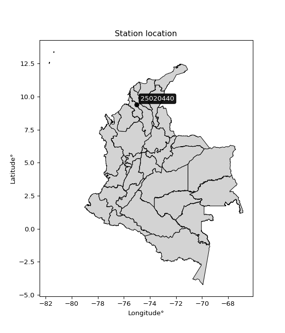

<div align="center">


</div>

# PMax24h Station (Rain): 25020440

Maximum Precipitation in 24 hours (PMax24h) is the greatest amount of rainfall for a specific duration that is meteorologically possible for a given location, acting as a "worst-case" scenario for extreme storms, crucial for designing safety-critical infrastructure like bridges, river deviations, dams, spillways, and nuclear plants to prevent catastrophic failure. The PMax24h is related with the Probable Maximum Precipitation (PMP) and it is calculated by hydrologists using meteorological data to determine the upper limit of extreme rainfall, often leading to the Probable Maximum Flood (PMF) for flood control design, and is increasingly being studied for climate change impacts. Probable Maximum Precipitation (PMP) is the theoretical upper limit of rainfall, a deterministic estimate for extreme events, while probability distributions (like GEV, Gumbel) describe the likelihood and frequency of various precipitation amounts, including rare ones, showing how often events occur, with PMP representing the extreme end of these distributions, used for critical infrastructure design to ensure safety against the worst conceivable weather, unlike standard statistical forecasts which cover typical probabilities.

The most common probability distributions in hydrology, used for analyzing floods, rainfall, and streamflow, include the Normal, Log-Normal, Gumbel, Gamma (including Log-Pearson Type III), and Generalized Extreme Value (GEV) distributions, often chosen based on the data´s skewness and whether modeling extremes or general conditions, with Gumbel and GEV popular for extreme events like floods, while the Normal distribution serves as a baseline, though often requiring transformations for skewed hydrological data. These distributions help in designing water infrastructure, managing water resources, and forecasting hydrologic events.

> Hydrological data often isn´t perfectly normal (it´s skewed), so different distributions are needed for different applications, such as: **Flood Frequency Analysis**: Using Gumbel, GEV, or Log-Pearson Type III for predicting extreme flood magnitudes and their return periods, **Rainfall Analysis**: Normal for annual totals, but Log-Normal, Weibull, or GEV for intensity or extreme daily rainfall, **Streamflow Modeling**: Gamma and Log-Normal for maximum flows, GEV for minimum flows, and Kappa for daily flows.

<div align="center">

</img>

</div>


## A. General information


### 1. General running parameters

• app_version: _v20260225_. • runtime: _2026-02-28 16:54:07.457399_. • Python version: _3.14.0_. • SciPy version: _1.16.3_. • Pandas version: _2.3.3_. • NumPy version: _2.3.5_. • Stations dataset (station_dataset_file): _dataset/pmax24h_in/automatic_colombia_2003_2025.csv_. • Stations catalog (station_catalog_file): _dataset/CNE.xls_. • Minimum year to eval til year_max (date_min): _1900_. • Maximum year to eval since year_min (date_max): _2025_. • Creates, save and include plots into reports (create_plot): _False_. • Plot only fit distributions with Δo > Δ (plot_only_fit): _True_. • Plot only simple graphs avoiding multiple CDFs and multiple Extreme values plots (plot_only_simple): _False_. • Eval low extreme values, if False, evaluates high extreme values (low_extreme): _False_. • Eval every SciPy distribution as logarithmic (pdist_logarithmic_on): _True_. • Standard deviation normalized (ddof): _1.0_. • Return periods to eval in years (Tr): _[2, 2.33, 5, 10, 15, 20, 25, 50, 75, 100, 200, 250, 500, 750, 1000]_. • Minimum data sample per station, 0 means any (minimum_sample): _5_. • Z-Score maximum threshold to adjust a value, 0 means disable (zscore_max): _3.5_. • Z-Score minimum threshold to adjust a value, 0 means disable (zscore_min): _-2.5_. • Avoid zeros, e.g. rain = 0 (avoid_zeros): _True_. • Avoid null values (avoid_nans): _True_. 

:file_folder:Table: [dataset.csv](../../dataset/pmax24h_in/automatic_colombia_2003_2025.csv)

> Delta Degrees of Freedom (DDOF): is a parameter used in the formulas for calculating variance and standard deviation. When ddof=0, the divisor is $N$ (the total number of observations) and this is used when your data set is the entire population. When ddof=1, the divisor is $N-1$ and this is used when your data set is a sample drawn from a larger population. Using $N-1$ provides an unbiased estimate of the population variance (known as Bessel´s correction).


### 2. Station info and location

|   id |   CODIGO | NOMBRE                     | CATEGORIA     | TECNOLOGIA                | ESTADO   | FECHA_INSTALACION   |   FECHA_SUSPENSION |   ALTITUD |   LATITUD |   LONGITUD | DEPARTAMENTO   | MUNICIPIO   | AREA_OPERATIVA                              | ENTIDAD                                                     | AREA_HIDROGRAFICA   | ZONA_HIDROGRAFICA                | SUBZONA_HIDROGRAFICA       |   CORRIENTE | Catalogo   |   Version |
|-----:|---------:|:---------------------------|:--------------|:--------------------------|:---------|:--------------------|-------------------:|----------:|----------:|-----------:|:---------------|:------------|:--------------------------------------------|:------------------------------------------------------------|:--------------------|:---------------------------------|:---------------------------|------------:|:-----------|----------:|
|    0 | 25020440 | SAN PEDRO - AUT [25020440] | Pluviográfica | Automática con Telemetría | Activa   | 10/03/2014          |                nan |       114 |    9.4016 |   -75.0164 | Sucre          | San Pedro   | Area Operativa 02 - Atlántico-Bolivar-Sucre | INSTITUTO DE HIDROLOGIA METEOROLOGIA Y ESTUDIOS AMBIENTALES | Magdalena Cauca     | Bajo Magdalena- Cauca -San Jorge | Bajo San Jorge - La Mojana |         nan | CNE_IDEAM  |  20251226 |

<div align="center">

Dynamic map: [:earth_americas:Google](http://maps.google.com/maps?q=9.401597,-75.016434) [:earth_americas:OSM](https://www.openstreetmap.org/#map=18/9.401597/-75.016434&layers=P) [:earth_americas:Bing](https://www.bing.com/maps?cp=9.401597~-75.016434&lvl=18) [:earth_americas:Apple](https://maps.apple.com/frame?center=9.401597%2C-75.016434&span=0.003%2C0.006)

</div>


<div align="center">

```geojson
{
  "type": "Feature",
  "geometry": {
    "type": "Point", 
    "coordinates": [-75.016434, 9.401597]
  }, 
  "properties": {
    "Name": "25020440"
  }
}
```

</div>


### 3. Discrete values table and plot

<div align="center">

|               |          0 |          1 |          2 |           3 |            4 |          5 |            6 |
|:--------------|-----------:|-----------:|-----------:|------------:|-------------:|-----------:|-------------:|
| Date          | 2019       | 2020       | 2021       | 2022        | 2023         | 2024       | 2025         |
| Value         |   12.6     |   34.7     |   13.3     |   21.9      |   23.6       |   34.8     |   22.9       |
| Value_initial |   12.6     |   34.7     |   13.3     |   21.9      |   23.6       |   34.8     |   22.9       |
| count         |    7       |    7       |    7       |    7        |    7         |    7       |    7         |
| mean          |   23.4     |   23.4     |   23.4     |   23.4      |   23.4       |   23.4     |   23.4       |
| std           |    8.93346 |    8.93346 |    8.93346 |    8.93346  |    8.93346   |    8.93346 |    8.93346   |
| zscore        |   -1.20894 |    1.26491 |   -1.13058 |   -0.167908 |    0.0223877 |    1.2761  |   -0.0559694 |


</div>


> The initial value (value_initial) correspond to the initial obtained or null completed value, and value (value) is adjusted only when the initial value is outside the valid range (outlier) definite through the Z-Score value. If Z-Score is active, values out of range or outliers are replaced with the station mean value. A Z-Score (or standard score) measures how many standard deviations a data point is from the mean of a dataset, indicating its relative position; positive scores mean above the mean, negative mean below, and a score of zero is exactly at the mean, allowing for comparison of values from different distributions. It´s calculated using the formula $z=(x–μ)/σ$, where $x$ is the data point, $μ$ is the mean, and $σ$ is the standard deviation, helping identify outliers and understand probability.
>
> <sub>**Note**: In this study, "completing" (filling gaps in) and "extending" (forecasting or lengthening the historical record) rainfall data series are avoided for certain critical analyses because they introduce artificial bias and uncertainty, which can distort the statistics of rare events (extremes), alter day-to-day variability, and compromise the integrity and homogeneity of the original data. Some reasons against Completing/Extending rainfall data are: **Distortion of Extremes and Variability**: The primary issue is that most gap-filling or extension methods rely on averaging or regression with nearby stations, which inherently smooths the data. Rainfall is highly variable in space and time, with a large percentage of zero values and occasional large storms. Infilling methods often underestimate the highest values and overestimate the lowest (zero) values, which severely distorts analyses focused on flood frequency, drought severity, and intensity-duration-frequency (IDF) curves, **Loss of Data Homogeneity**: Infilled or extended data are synthetic estimates, not actual measurements. Combining these estimates with observed data can violate the assumption of data homogeneity, which requires that the data properties do not change over time. Inhomogeneity can lead to incorrect conclusions about long-term trends or changes in climate patterns, **Propagation of Errors**: Errors and biases from the original data (e.g., wind-induced undercatch, instrument errors, site changes) or the data used for imputation can propagate through the analysis, leading to unreliable hydrological models and inaccurate predictions, **Compromised Statistical Integrity**: For statistical analyses, especially those involving the frequency of events, using artificial data can introduce time bias or autocorrelation that doesn´t exist in reality, making it difficult to assess the true probability of events, **Difficulty in Validation**: It is difficult to accurately validate the quality of filled or extended data, especially for past periods where ground-truth measurements are unavailable. The reliability of imputation techniques heavily depends on the density of the surrounding station network and the complexity of the local topography.</sub>


### 4. Active continuous probability distributions from SciPy (80 of 104 available)

A Probability Density Function (PDF) describes the relative likelihood of a continuous random variable falling within a specific range, where the total area under its curve equals 1, and the area over any interval gives the actual probability for that range. Unlike discrete probabilities (like rolling a die), a PDF shows density, not direct probability for a single point (which is zero), with higher points indicating higher likelihood, often visualized as a bell curve for normal distributions.

A log of a probability density function (log-PDF) is simply the logarithm of the PDF´s value, denoted as $log(f(x))$, useful for converting multiplication of probabilities into addition, improving numerical stability with tiny numbers, and connecting to information theory concepts like entropy. Instead of dealing with very small probabilities (e.g., 0.000001), log-PDFs use negative numbers (e.g., $log(0.00001) ≈ -11.51$ that are easier for computers to handle, preventing underflow errors and simplifying complex calculations. In this study, each active probability distribution from SciPy is also evaluated in the $log$ form.

[scipy.stats](https://docs.scipy.org/doc/scipy/reference/stats.html) is a Python´s powerful submodule within the SciPy library for comprehensive statistical analysis, offering over 130 probability distributions (like Normal, Poisson, etc.), functions for descriptive stats (mean, variance), hypothesis testing (t-tests, chi-square), random variable generation, and statistical tests, making it essential for data science, modeling, and research. It provides tools to explore, model, and draw conclusions from data efficiently, working seamlessly with [NumPy](https://numpy.org/).

<div align="center">

|   id | p_dist           |   n_parameter | fit_method   | label                                                                       | active   | ref                                                                                                      |
|-----:|:-----------------|--------------:|:-------------|:----------------------------------------------------------------------------|:---------|:---------------------------------------------------------------------------------------------------------|
|    0 | alpha            |             3 | MLE          | Alpha                                                                       | True     | [:mortar_board:](https://docs.scipy.org/doc/scipy/reference/generated/scipy.stats.alpha.html)            |
|    1 | anglit           |             2 | MM           | Anglit                                                                      | True     | [:mortar_board:](https://docs.scipy.org/doc/scipy/reference/generated/scipy.stats.anglit.html)           |
|    2 | arcsine          |             2 | MM           | Arcsine                                                                     | True     | [:mortar_board:](https://docs.scipy.org/doc/scipy/reference/generated/scipy.stats.arcsine.html)          |
|    3 | argus            |             3 | MLE          | Argus                                                                       | True     | [:mortar_board:](https://docs.scipy.org/doc/scipy/reference/generated/scipy.stats.argus.html)            |
|    4 | beta             |             4 | MLE          | Beta                                                                        | True     | [:mortar_board:](https://docs.scipy.org/doc/scipy/reference/generated/scipy.stats.beta.html)             |
|    5 | betaprime        |             4 | MLE          | Beta prime                                                                  | True     | [:mortar_board:](https://docs.scipy.org/doc/scipy/reference/generated/scipy.stats.betaprime.html)        |
|    6 | bradford         |             3 | MLE          | Bradford                                                                    | True     | [:mortar_board:](https://docs.scipy.org/doc/scipy/reference/generated/scipy.stats.bradford.html)         |
|    7 | burr             |             4 | MLE          | Burr (Type III)                                                             | True     | [:mortar_board:](https://docs.scipy.org/doc/scipy/reference/generated/scipy.stats.burr.html)             |
|    8 | burr12           |             4 | MLE          | Burr (Type III) 12                                                          | True     | [:mortar_board:](https://docs.scipy.org/doc/scipy/reference/generated/scipy.stats.burr12.html)           |
|    9 | cosine           |             2 | MLE          | Cosine                                                                      | True     | [:mortar_board:](https://docs.scipy.org/doc/scipy/reference/generated/scipy.stats.cosine.html)           |
|   10 | crystalball      |             4 | MLE          | Crystalball                                                                 | True     | [:mortar_board:](https://docs.scipy.org/doc/scipy/reference/generated/scipy.stats.crystalball.html)      |
|   11 | dgamma           |             3 | MLE          | Double gamma                                                                | True     | [:mortar_board:](https://docs.scipy.org/doc/scipy/reference/generated/scipy.stats.dgamma.html)           |
|   12 | dweibull         |             3 | MLE          | Double Weibull                                                              | True     | [:mortar_board:](https://docs.scipy.org/doc/scipy/reference/generated/scipy.stats.dweibull.html)         |
|   13 | erlang           |             3 | MLE          | Erlang                                                                      | True     | [:mortar_board:](https://docs.scipy.org/doc/scipy/reference/generated/scipy.stats.erlang.html)           |
|   14 | exponnorm        |             3 | MLE          | Exponentially modified Normal                                               | True     | [:mortar_board:](https://docs.scipy.org/doc/scipy/reference/generated/scipy.stats.exponnorm.html)        |
|   15 | exponpow         |             3 | MLE          | Exponential power                                                           | True     | [:mortar_board:](https://docs.scipy.org/doc/scipy/reference/generated/scipy.stats.exponpow.html)         |
|   16 | exponweib        |             4 | MLE          | Exponentiated Weibull                                                       | True     | [:mortar_board:](https://docs.scipy.org/doc/scipy/reference/generated/scipy.stats.exponweib.html)        |
|   17 | f                |             4 | MLE          | F                                                                           | True     | [:mortar_board:](https://docs.scipy.org/doc/scipy/reference/generated/scipy.stats.f.html)                |
|   18 | fatiguelife      |             3 | MLE          | Fatigue-life (Birnbaum-Saunders)                                            | True     | [:mortar_board:](https://docs.scipy.org/doc/scipy/reference/generated/scipy.stats.fatiguelife.html)      |
|   19 | foldnorm         |             3 | MM           | Fold Normal                                                                 | True     | [:mortar_board:](https://docs.scipy.org/doc/scipy/reference/generated/scipy.stats.foldnorm.html)         |
|   20 | gamma            |             3 | MLE          | Gamma                                                                       | True     | [:mortar_board:](https://docs.scipy.org/doc/scipy/reference/generated/scipy.stats.gamma.html)            |
|   21 | gausshyper       |             6 | MLE          | Gauss hypergeometric                                                        | True     | [:mortar_board:](https://docs.scipy.org/doc/scipy/reference/generated/scipy.stats.gausshyper.html)       |
|   22 | genexpon         |             5 | MLE          | Generalized exponential                                                     | True     | [:mortar_board:](https://docs.scipy.org/doc/scipy/reference/generated/scipy.stats.genexpon.html)         |
|   23 | genextreme       |             3 | MLE          | Generalized exponential                                                     | True     | [:mortar_board:](https://docs.scipy.org/doc/scipy/reference/generated/scipy.stats.genextreme.html)       |
|   24 | gengamma         |             4 | MLE          | Generalized gamma                                                           | True     | [:mortar_board:](https://docs.scipy.org/doc/scipy/reference/generated/scipy.stats.gengamma.html)         |
|   25 | genhalflogistic  |             3 | MLE          | Generalized half-logistic                                                   | True     | [:mortar_board:](https://docs.scipy.org/doc/scipy/reference/generated/scipy.stats.genhalflogistic.html)  |
|   26 | genlogistic      |             3 | MLE          | Generalized logistic                                                        | True     | [:mortar_board:](https://docs.scipy.org/doc/scipy/reference/generated/scipy.stats.genlogistic.html)      |
|   27 | gennorm          |             3 | MLE          | Generalized Normal                                                          | True     | [:mortar_board:](https://docs.scipy.org/doc/scipy/reference/generated/scipy.stats.gennorm.html)          |
|   28 | genpareto        |             3 | MLE          | Generalized Pareto                                                          | True     | [:mortar_board:](https://docs.scipy.org/doc/scipy/reference/generated/scipy.stats.genpareto.html)        |
|   29 | gompertz         |             3 | MLE          | Gompertz (or truncated Gumbel)                                              | True     | [:mortar_board:](https://docs.scipy.org/doc/scipy/reference/generated/scipy.stats.gompertz.html)         |
|   30 | gumbel_l         |             2 | MM           | Gumbel Left Skew                                                            | True     | [:mortar_board:](https://docs.scipy.org/doc/scipy/reference/generated/scipy.stats.gumbel_l.html)         |
|   31 | gumbel_r         |             2 | MM           | Gumbel Right Skew                                                           | True     | [:mortar_board:](https://docs.scipy.org/doc/scipy/reference/generated/scipy.stats.gumbel_r.html)         |
|   32 | halfgennorm      |             3 | MLE          | Upper half of a generalized normal                                          | True     | [:mortar_board:](https://docs.scipy.org/doc/scipy/reference/generated/scipy.stats.halfgennorm.html)      |
|   33 | halflogistic     |             2 | MM           | Half-logistic                                                               | True     | [:mortar_board:](https://docs.scipy.org/doc/scipy/reference/generated/scipy.stats.halflogistic.html)     |
|   34 | halfnorm         |             2 | MM           | Half Normal                                                                 | True     | [:mortar_board:](https://docs.scipy.org/doc/scipy/reference/generated/scipy.stats.halfnorm.html)         |
|   35 | hypsecant        |             2 | MM           | hyperbolic secant                                                           | True     | [:mortar_board:](https://docs.scipy.org/doc/scipy/reference/generated/scipy.stats.hypsecant.html)        |
|   36 | invgamma         |             3 | MLE          | Inverted gamma                                                              | True     | [:mortar_board:](https://docs.scipy.org/doc/scipy/reference/generated/scipy.stats.invgamma.html)         |
|   37 | invgauss         |             3 | MLE          | Inverse Gaussian                                                            | True     | [:mortar_board:](https://docs.scipy.org/doc/scipy/reference/generated/scipy.stats.invgauss.html)         |
|   38 | invweibull       |             3 | MLE          | Inverted Weibull                                                            | True     | [:mortar_board:](https://docs.scipy.org/doc/scipy/reference/generated/scipy.stats.invweibull.html)       |
|   39 | johnsonsb        |             4 | MLE          | Johnson SB                                                                  | True     | [:mortar_board:](https://docs.scipy.org/doc/scipy/reference/generated/scipy.stats.johnsonsb.html)        |
|   40 | johnsonsu        |             4 | MLE          | Johnson Su                                                                  | True     | [:mortar_board:](https://docs.scipy.org/doc/scipy/reference/generated/scipy.stats.johnsonsu.html)        |
|   41 | kappa3           |             3 | MLE          | Kappa 3                                                                     | True     | [:mortar_board:](https://docs.scipy.org/doc/scipy/reference/generated/scipy.stats.kappa3.html)           |
|   42 | kappa4           |             4 | MLE          | Kappa 4                                                                     | True     | [:mortar_board:](https://docs.scipy.org/doc/scipy/reference/generated/scipy.stats.kappa4.html)           |
|   43 | ksone            |             3 | MLE          | Kolmogorov-Smirnov one-sided test statistic distribution                    | True     | [:mortar_board:](https://docs.scipy.org/doc/scipy/reference/generated/scipy.stats.ksone.html)            |
|   44 | kstwobign        |             2 | MLE          | Limiting distribution of scaled Kolmogorov-Smirnov two-sided test statistic | True     | [:mortar_board:](https://docs.scipy.org/doc/scipy/reference/generated/scipy.stats.kstwobign.html)        |
|   45 | laplace          |             2 | MM           | Laplace                                                                     | True     | [:mortar_board:](https://docs.scipy.org/doc/scipy/reference/generated/scipy.stats.laplace.html)          |
|   46 | levy_l           |             2 | MLE          | Left-skewed Levy                                                            | True     | [:mortar_board:](https://docs.scipy.org/doc/scipy/reference/generated/scipy.stats.levy_l.html)           |
|   47 | loggamma         |             3 | MLE          | Log gamma                                                                   | True     | [:mortar_board:](https://docs.scipy.org/doc/scipy/reference/generated/scipy.stats.loggamma.html)         |
|   48 | logistic         |             2 | MM           | Logistic (or Sech-squared)                                                  | True     | [:mortar_board:](https://docs.scipy.org/doc/scipy/reference/generated/scipy.stats.logistic.html)         |
|   49 | loglaplace       |             3 | MLE          | Log-Laplace                                                                 | True     | [:mortar_board:](https://docs.scipy.org/doc/scipy/reference/generated/scipy.stats.loglaplace.html)       |
|   50 | lomax            |             3 | MLE          | Lomax (Pareto of the second kind)                                           | True     | [:mortar_board:](https://docs.scipy.org/doc/scipy/reference/generated/scipy.stats.lomax.html)            |
|   51 | maxwell          |             2 | MM           | Maxwell                                                                     | True     | [:mortar_board:](https://docs.scipy.org/doc/scipy/reference/generated/scipy.stats.maxwell.html)          |
|   52 | mielke           |             4 | MLE          | Mielke Beta-Kappa / Dagum                                                   | True     | [:mortar_board:](https://docs.scipy.org/doc/scipy/reference/generated/scipy.stats.mielke.html)           |
|   53 | moyal            |             2 | MM           | Moyal                                                                       | True     | [:mortar_board:](https://docs.scipy.org/doc/scipy/reference/generated/scipy.stats.moyal.html)            |
|   54 | nakagami         |             3 | MLE          | Nakagami                                                                    | True     | [:mortar_board:](https://docs.scipy.org/doc/scipy/reference/generated/scipy.stats.nakagami.html)         |
|   55 | ncf              |             5 | MLE          | Non-central F distribution                                                  | True     | [:mortar_board:](https://docs.scipy.org/doc/scipy/reference/generated/scipy.stats.ncf.html)              |
|   56 | nct              |             4 | MLE          | Non-central Student’s t                                                     | True     | [:mortar_board:](https://docs.scipy.org/doc/scipy/reference/generated/scipy.stats.nct.html)              |
|   57 | norm             |             2 | MM           | Normal                                                                      | True     | [:mortar_board:](https://docs.scipy.org/doc/scipy/reference/generated/scipy.stats.norm.html)             |
|   58 | pearson3         |             3 | MM           | Pearson type III                                                            | True     | [:mortar_board:](https://docs.scipy.org/doc/scipy/reference/generated/scipy.stats.pearson3.html)         |
|   59 | powerlaw         |             3 | MLE          | Power-function                                                              | True     | [:mortar_board:](https://docs.scipy.org/doc/scipy/reference/generated/scipy.stats.powerlaw.html)         |
|   60 | rayleigh         |             2 | MM           | Rayleigh                                                                    | True     | [:mortar_board:](https://docs.scipy.org/doc/scipy/reference/generated/scipy.stats.rayleigh.html)         |
|   61 | rdist            |             3 | MLE          | R-distributed (symmetric beta)                                              | True     | [:mortar_board:](https://docs.scipy.org/doc/scipy/reference/generated/scipy.stats.rdist.html)            |
|   62 | rice             |             3 | MLE          | Rice                                                                        | True     | [:mortar_board:](https://docs.scipy.org/doc/scipy/reference/generated/scipy.stats.rice.html)             |
|   63 | semicircular     |             2 | MM           | Semicircular                                                                | True     | [:mortar_board:](https://docs.scipy.org/doc/scipy/reference/generated/scipy.stats.semicircular.html)     |
|   64 | skewnorm         |             3 | MLE          | Skew normal                                                                 | True     | [:mortar_board:](https://docs.scipy.org/doc/scipy/reference/generated/scipy.stats.skewnorm.html)         |
|   65 | t                |             3 | MLE          | Student’s t                                                                 | True     | [:mortar_board:](https://docs.scipy.org/doc/scipy/reference/generated/scipy.stats.t.html)                |
|   66 | trapezoid        |             4 | MLE          | Trapezoid                                                                   | True     | [:mortar_board:](https://docs.scipy.org/doc/scipy/reference/generated/scipy.stats.trapezoid.html)        |
|   67 | triang           |             3 | MLE          | Triangular                                                                  | True     | [:mortar_board:](https://docs.scipy.org/doc/scipy/reference/generated/scipy.stats.triang.html)           |
|   68 | truncexpon       |             3 | MLE          | Truncated exponential                                                       | True     | [:mortar_board:](https://docs.scipy.org/doc/scipy/reference/generated/scipy.stats.truncexpon.html)       |
|   69 | truncnorm        |             4 | MLE          | Truncated normal                                                            | True     | [:mortar_board:](https://docs.scipy.org/doc/scipy/reference/generated/scipy.stats.truncnorm.html)        |
|   70 | truncpareto      |             4 | MLE          | Upper truncated Pareto                                                      | True     | [:mortar_board:](https://docs.scipy.org/doc/scipy/reference/generated/scipy.stats.truncpareto.html)      |
|   71 | truncweibull_min |             5 | MLE          | Doubly truncated Weibull minimum                                            | True     | [:mortar_board:](https://docs.scipy.org/doc/scipy/reference/generated/scipy.stats.truncweibull_min.html) |
|   72 | tukeylambda      |             3 | MLE          | Tukey-Lamdba                                                                | True     | [:mortar_board:](https://docs.scipy.org/doc/scipy/reference/generated/scipy.stats.tukeylambda.html)      |
|   73 | uniform          |             2 | MLE          | Uniform                                                                     | True     | [:mortar_board:](https://docs.scipy.org/doc/scipy/reference/generated/scipy.stats.uniform.html)          |
|   74 | vonmises         |             3 | MLE          | Von Mises                                                                   | True     | [:mortar_board:](https://docs.scipy.org/doc/scipy/reference/generated/scipy.stats.vonmises.html)         |
|   75 | vonmises_line    |             3 | MLE          | Von Mises line                                                              | True     | [:mortar_board:](https://docs.scipy.org/doc/scipy/reference/generated/scipy.stats.vonmises_line.html)    |
|   76 | wald             |             2 | MM           | Wald                                                                        | True     | [:mortar_board:](https://docs.scipy.org/doc/scipy/reference/generated/scipy.stats.wald.html)             |
|   77 | weibull_max      |             3 | MLE          | Weibull maximum                                                             | True     | [:mortar_board:](https://docs.scipy.org/doc/scipy/reference/generated/scipy.stats.weibull_max.html)      |
|   78 | weibull_min      |             3 | MLE          | Weibull minimum                                                             | True     | [:mortar_board:](https://docs.scipy.org/doc/scipy/reference/generated/scipy.stats.weibull_min.html)      |
|   79 | wrapcauchy       |             3 | MLE          | Wrapped  Cauchy                                                             | True     | [:mortar_board:](https://docs.scipy.org/doc/scipy/reference/generated/scipy.stats.wrapcauchy.html)       |

</div>

> **n_parameter:** # arguments & localization & scale.
>
> **Fit methods:** (MLE) maximum likelihood, (MM) L-moments.
>
>**Inactive** (With the only purpose of prevent loops, zero divisions, infinite values, over high estimated values or horizontal trending for recurrence intervals estimations, the follow distributions were disabled.)**:** lognorm, norminvgauss, powernorm, powerlognorm, cauchy, halfcauchy, foldcauchy, skewcauchy, chi2, expon, fisk, genhyperbolic, geninvgauss, gibrat, kstwo, laplace_asymmetric, levy, levy_stable, ncx2, pareto, rel_breitwigner, recipinvgauss, studentized_range, loguniform, 


## B. Probability (PDF) vs. Empirical (EDF) distributions functions

A continuous probability distribution (CPD) describes probabilities for variables that can take any value within a range (like rain any time), unlike discrete variables with specific outcomes (like temperature). It uses a Probability Density Function (PDF), a curve where the total area under it equals 1, and the probability of the variable falling within an interval (a to b) is found by calculating the area under the curve between those points. A key feature is that the probability of hitting any single exact value is zero, so probabilities are always expressed for ranges, e.g., $P(a ≤ X ≤ b)$.

<div align="center">

Distributions parameters from station values
|     |   station | p_dist              |   n |             loc |          scale | shape                  | shape1                 | shape2                | shape3             |
|----:|----------:|:--------------------|----:|----------------:|---------------:|:-----------------------|:-----------------------|:----------------------|:-------------------|
|   0 |  25020440 | alpha               |   7 |   -74.5006      | 1161.96        | 11.959451589648776     |                        |                       |                    |
|   1 |  25020440 | anglit              |   7 |    23.4         |   24.1953      |                        |                        |                       |                    |
|   2 |  25020440 | arcsine             |   7 |    11.7034      |   23.3933      |                        |                        |                       |                    |
|   3 |  25020440 | argus               |   7 |     5.79588     |   31.1672      | 2.6985718300201288e-05 |                        |                       |                    |
|   4 |  25020440 | beta                |   7 |    12.6         |   22.2023      | 0.7931417334778682     | 0.9459212528820327     |                       |                    |
|   5 |  25020440 | betaprime           |   7 |    -3.35158     |  407.005       | 10.856677961682543     | 166.43228415221319     |                       |                    |
|   6 |  25020440 | bradford            |   7 |    12.6         |   22.2         | 1.0585044662305554     |                        |                       |                    |
|   7 |  25020440 | burr                |   7 |    12.5774      |   22.1034      | 8.30571901084183       | 0.06806702273377263    |                       |                    |
|   8 |  25020440 | burr12              |   7 |    -1.96174     |   14.486       | 762.1601706473612      | 0.002605964296364497   |                       |                    |
|   9 |  25020440 | cosine              |   7 |    23.5727      |    6.67929     |                        |                        |                       |                    |
|  10 |  25020440 | crystalball         |   7 |    23.4         |    8.27078     | 675.3121090459967      | 763.3795700597015      |                       |                    |
|  11 |  25020440 | dgamma              |   7 |    22.9         |    7.5905      | 0.7807430123880033     |                        |                       |                    |
|  12 |  25020440 | dweibull            |   7 |    22.9         |    6.11826     | 0.7959837360750212     |                        |                       |                    |
|  13 |  25020440 | erlang              |   7 |   -13.1369      |    1.88056     | 19.360765569730365     |                        |                       |                    |
|  14 |  25020440 | exponnorm           |   7 |    22.3445      |    8.2032      | 0.1286669957350334     |                        |                       |                    |
|  15 |  25020440 | exponpow            |   7 |    12.6         |   15.7927      | 0.5481778314576529     |                        |                       |                    |
|  16 |  25020440 | exponweib           |   7 |    12.6         |    1.22211     | 1.1932006094542231     | 0.3381278418529905     |                       |                    |
|  17 |  25020440 | f                   |   7 |    12.6         |    9.90616     | 1.3592684708454992     | 84.40383458415135      |                       |                    |
|  18 |  25020440 | fatiguelife         |   7 |    12.6         |    5.49565e-06 | 1744.389766694675      |                        |                       |                    |
|  19 |  25020440 | foldnorm            |   7 |     5.5346      |    8.51454     | 2.0847311664305717     |                        |                       |                    |
|  20 |  25020440 | gamma               |   7 |   -21.6273      |    1.49829     | 30.027043754596242     |                        |                       |                    |
|  21 |  25020440 | gausshyper          |   7 |    12.4634      |   22.3366      | 0.8129482249013419     | 0.4038941425725058     | 1.3084355789465212    | 1.4904787572696336 |
|  22 |  25020440 | genexpon            |   7 |    12.5999      |    1.62495     | 0.149889687322114      | 1.3226586377508268e-06 | 1.7479719803556528    |                    |
|  23 |  25020440 | genextreme          |   7 |    22.947       |   15.9248      | 1.3435281927428668     |                        |                       |                    |
|  24 |  25020440 | gengamma            |   7 |    12.6         |    1.09418     | 1.273971350129322      | 0.33742481933432944    |                       |                    |
|  25 |  25020440 | genhalflogistic     |   7 |    12.0159      |   24.5889      | 1.0792141898068692     |                        |                       |                    |
|  26 |  25020440 | genlogistic         |   7 |   -25.6493      |    7.14394     | 544.9315498884348      |                        |                       |                    |
|  27 |  25020440 | gennorm             |   7 |    22.9         |    0.348207    | 0.3865299277276315     |                        |                       |                    |
|  28 |  25020440 | genpareto           |   7 |    -0.219687    |   81.2718      | -2.320746612562523     |                        |                       |                    |
|  29 |  25020440 | gompertz            |   7 |    12.6         |   18.1539      | 0.9898004057113221     |                        |                       |                    |
|  30 |  25020440 | gumbel_l            |   7 |    27.1223      |    6.4487      |                        |                        |                       |                    |
|  31 |  25020440 | gumbel_r            |   7 |    19.6777      |    6.4487      |                        |                        |                       |                    |
|  32 |  25020440 | halfgennorm         |   7 |    12.6         |    1.24057     | 0.44334314574401135    |                        |                       |                    |
|  33 |  25020440 | halflogistic        |   7 |    13.5971      |    7.07125     |                        |                        |                       |                    |
|  34 |  25020440 | halfnorm            |   7 |    12.4527      |   13.7204      |                        |                        |                       |                    |
|  35 |  25020440 | hypsecant           |   7 |    23.4         |    5.26534     |                        |                        |                       |                    |
|  36 |  25020440 | invgamma            |   7 |   -36.151       | 3031.91        | 51.91376914539498      |                        |                       |                    |
|  37 |  25020440 | invgauss            |   7 |    -4.39609     |  280.048       | 0.09924980588530648    |                        |                       |                    |
|  38 |  25020440 | invweibull          |   7 |    -2.84667e+08 |    2.84667e+08 | 39980520.304822326     |                        |                       |                    |
|  39 |  25020440 | johnsonsb           |   7 |    12.5271      |   22.2729      | -1.5868810134983184    | 0.11267309067293305    |                       |                    |
|  40 |  25020440 | johnsonsu           |   7 |     2.2141e+08  |    9.2842e+07  | 46306472.75165582      | 28877012.892931998     |                       |                    |
|  41 |  25020440 | kappa3              |   7 |     8.68628     |   26.0044      | 251.2392799974645      |                        |                       |                    |
|  42 |  25020440 | kappa4              |   7 |     8.89049     |   27.1172      | 1.0897524593106178     | 1.0466119865016852     |                       |                    |
|  43 |  25020440 | ksone               |   7 |     9.0746      |   28.6508      | 1.0                    |                        |                       |                    |
|  44 |  25020440 | kstwobign           |   7 |    -5.26212     |   32.7369      |                        |                        |                       |                    |
|  45 |  25020440 | laplace             |   7 |    23.4         |    5.84832     |                        |                        |                       |                    |
|  46 |  25020440 | levy_l              |   7 |    35.2788      |    1.68804     |                        |                        |                       |                    |
|  47 |  25020440 | loggamma            |   7 | -2041.57        |  290.691       | 1216.8881789891434     |                        |                       |                    |
|  48 |  25020440 | logistic            |   7 |    23.4         |    4.55992     |                        |                        |                       |                    |
|  49 |  25020440 | loglaplace          |   7 |    -0.0714059   |   22.9714      | 3.427148923597969      |                        |                       |                    |
|  50 |  25020440 | lomax               |   7 |    12.6         |   61.2725      | 6.0011959058050515     |                        |                       |                    |
|  51 |  25020440 | maxwell             |   7 |     3.80174     |   12.2814      |                        |                        |                       |                    |
|  52 |  25020440 | mielke              |   7 |    12.5999      |   27.37        | 0.48919468660927046    | 13.661268144327401     |                       |                    |
|  53 |  25020440 | moyal               |   7 |    18.6702      |    3.72316     |                        |                        |                       |                    |
|  54 |  25020440 | nakagami            |   7 |    12.6         |    9.2278      | 0.34095770464330194    |                        |                       |                    |
|  55 |  25020440 | ncf                 |   7 |    -0.196325    |   22.9375      | 19.463711431817025     | 66.0967347513074       | 4.001405816147159e-09 |                    |
|  56 |  25020440 | nct                 |   7 |  -252.202       |    8.23217     | 59551.47600039601      | 33.47809053276721      |                       |                    |
|  57 |  25020440 | norm                |   7 |    23.4         |    8.27077     |                        |                        |                       |                    |
|  58 |  25020440 | pearson3            |   7 |    23.4         |    8.27076     | 0.15931114272155256    |                        |                       |                    |
|  59 |  25020440 | powerlaw            |   7 |    12.6         |   22.2         | 0.16330031105170922    |                        |                       |                    |
|  60 |  25020440 | rayleigh            |   7 |     7.57753     |   12.6245      |                        |                        |                       |                    |
|  61 |  25020440 | rdist               |   7 |    23.6942      |   11.1058      | 0.9907943487569055     |                        |                       |                    |
|  62 |  25020440 | rice                |   7 |     8.09434     |   10.5334      | 0.8531889216025257     |                        |                       |                    |
|  63 |  25020440 | semicircular        |   7 |    23.4         |   16.5415      |                        |                        |                       |                    |
|  64 |  25020440 | skewnorm            |   7 |    12.6         |   13.6028      | 9765165.221236661      |                        |                       |                    |
|  65 |  25020440 | t                   |   7 |    23.4002      |    8.2699      | 2469687.1818445157     |                        |                       |                    |
|  66 |  25020440 | trapezoid           |   7 |     0.00671647  |   35.0899      | 1.0                    | 1.0                    |                       |                    |
|  67 |  25020440 | triang              |   7 |     0.00629124  |   34.7938      | 0.9999988779829583     |                        |                       |                    |
|  68 |  25020440 | truncexpon          |   7 |    12.5991      |   23.6706      | 0.9379083770947632     |                        |                       |                    |
|  69 |  25020440 | truncnorm           |   7 |   131.469       |   36.6426      | -913.2569435145929     | -2.6381436467081745    |                       |                    |
|  70 |  25020440 | truncpareto         |   7 |   -24.8756      |   37.4756      | 7.911974321574275e-08  | 1.592385955864193      |                       |                    |
|  71 |  25020440 | truncweibull_min    |   7 |    12.6         |   23.9925      | 0.5338212819984149     | 5.794024767467813e-17  | 0.9404742390851013    |                    |
|  72 |  25020440 | tukeylambda         |   7 |    23.7061      |   12.5788      | 1.1326050154810243     |                        |                       |                    |
|  73 |  25020440 | uniform             |   7 |    12.6         |   22.2         |                        |                        |                       |                    |
|  74 |  25020440 | vonmises            |   7 |    -2.48647     |    1           | 0.6820878936407985     |                        |                       |                    |
|  75 |  25020440 | vonmises_line       |   7 |    23.7006      |    3.53355     | 1.316338785180022e-05  |                        |                       |                    |
|  76 |  25020440 | wald                |   7 |    15.1293      |    8.27074     |                        |                        |                       |                    |
|  77 |  25020440 | weibull_max         |   7 |    34.8         |    1.38491     | 0.2949523489602661     |                        |                       |                    |
|  78 |  25020440 | weibull_min         |   7 |    12.6         |   13.5584      | 0.8193401411923642     |                        |                       |                    |
|  79 |  25020440 | wrapcauchy          |   7 |    12.6         |    3.53347     | 0.8137631333103064     |                        |                       |                    |
|  80 |  25020440 | logalpha            |   7 |    -5.80614     |  208.934       | 23.552507337927096     |                        |                       |                    |
|  81 |  25020440 | loganglit           |   7 |     3.08524     |    1.09915     |                        |                        |                       |                    |
|  82 |  25020440 | logarcsine          |   7 |     2.55386     |    1.06277     |                        |                        |                       |                    |
|  83 |  25020440 | logargus            |   7 |     2.20598     |    1.42176     | 1.218970921580587      |                        |                       |                    |
|  84 |  25020440 | logbeta             |   7 |     2.48952     |    1.0601      | 0.957863145858517      | 0.7141302782411937     |                       |                    |
|  85 |  25020440 | logbetaprime        |   7 |    -8.2476      |   30.3871      | 1232.8785345317424     | 3306.046485346662      |                       |                    |
|  86 |  25020440 | logbradford         |   7 |     2.53345     |    1.01663     | 6.0258560079366015e-05 |                        |                       |                    |
|  87 |  25020440 | logburr             |   7 |  -163.228       |  166.79        | 41752.57978805089      | 0.008317365289000414   |                       |                    |
|  88 |  25020440 | logburr12           |   7 |     0.450915    |    5.6362      | 8.397930831789587      | 365.5375485279253      |                       |                    |
|  89 |  25020440 | logcosine           |   7 |     3.07274     |    0.303623    |                        |                        |                       |                    |
|  90 |  25020440 | logcrystalball      |   7 |     3.08524     |    0.375727    | 47.66112936709144      | 4381.466365119021      |                       |                    |
|  91 |  25020440 | logdgamma           |   7 |     3.13114     |    0.289426    | 0.8872054216688865     |                        |                       |                    |
|  92 |  25020440 | logdweibull         |   7 |     3.16125     |    0.282379    | 0.8897788842956531     |                        |                       |                    |
|  93 |  25020440 | logerlang           |   7 |    -3.01223     |    0.0236279   | 258.050488459568       |                        |                       |                    |
|  94 |  25020440 | logexponnorm        |   7 |     3.08514     |    0.375726    | 0.00023195843747482545 |                        |                       |                    |
|  95 |  25020440 | logexponpow         |   7 |     2.5337      |    0.757572    | 0.5317094648575302     |                        |                       |                    |
|  96 |  25020440 | logexponweib        |   7 |     2.5337      |    0.654766    | 0.4480956226219157     | 1.482513836730491      |                       |                    |
|  97 |  25020440 | logf                |   7 |  -230.043       |  233.128       | 2645906.1410512067     | 1081042.0782925664     |                       |                    |
|  98 |  25020440 | logfatiguelife      |   7 |   -39.8447      |   42.9275      | 0.00873115146986788    |                        |                       |                    |
|  99 |  25020440 | logfoldnorm         |   7 |     2.04753     |    0.374642    | 2.768727313945962      |                        |                       |                    |
| 100 |  25020440 | loggamma            |   7 |    -3.76255     |    0.0210148   | 325.7753040194523      |                        |                       |                    |
| 101 |  25020440 | loggausshyper       |   7 |     2.53104     |    1.01858     | 1.2197743089819175     | 0.5266055308418052     | 1.5138032442186238    | 0.9479778699860988 |
| 102 |  25020440 | loggenexpon         |   7 |     2.5337      |    0.82334     | 1.1026203823051577     | 1.101790135111881      | 0.9389122792506119    |                    |
| 103 |  25020440 | loggenextreme       |   7 |     3.15305     |    0.474243    | 1.1958841615362372     |                        |                       |                    |
| 104 |  25020440 | loggengamma         |   7 |     2.5337      |    0.820188    | 0.5222319733915877     | 1.3747603850453882     |                       |                    |
| 105 |  25020440 | loggenhalflogistic  |   7 |     2.49447     |    1.20268     | 1.1398219937762302     |                        |                       |                    |
| 106 |  25020440 | loggenlogistic      |   7 |     3.35123     |    0.15348     | 0.4421689355784374     |                        |                       |                    |
| 107 |  25020440 | loggennorm          |   7 |     3.13112     |    0.277928    | 0.9667665669780008     |                        |                       |                    |
| 108 |  25020440 | loggenpareto        |   7 |    -0.00158993  |    9.47881     | -2.6691782165251436    |                        |                       |                    |
| 109 |  25020440 | loggompertz         |   7 |     2.5337      |    0.523023    | 0.3815568898145138     |                        |                       |                    |
| 110 |  25020440 | loggumbel_l         |   7 |     3.25434     |    0.292953    |                        |                        |                       |                    |
| 111 |  25020440 | loggumbel_r         |   7 |     2.91614     |    0.292953    |                        |                        |                       |                    |
| 112 |  25020440 | loghalfgennorm      |   7 |     2.53363     |    1.01608     | 110421.95956687472     |                        |                       |                    |
| 113 |  25020440 | loghalflogistic     |   7 |     2.63994     |    0.321217    |                        |                        |                       |                    |
| 114 |  25020440 | loghalfnorm         |   7 |     2.58795     |    0.623259    |                        |                        |                       |                    |
| 115 |  25020440 | loghypsecant        |   7 |     3.08524     |    0.239195    |                        |                        |                       |                    |
| 116 |  25020440 | loginvgamma         |   7 |    -4.69361     | 3244.55        | 418.1093359618094      |                        |                       |                    |
| 117 |  25020440 | loginvgauss         |   7 |     0.448437    |  116.14        | 0.022685667969738116   |                        |                       |                    |
| 118 |  25020440 | loginvweibull       |   7 |    -2.36671e+07 |    2.36671e+07 | 66588941.07000533      |                        |                       |                    |
| 119 |  25020440 | logjohnsonsb        |   7 |     2.5337      |    1.02198     | -0.15564219092301435   | 0.09049991201581511    |                       |                    |
| 120 |  25020440 | logjohnsonsu        |   7 |     4.11662     |    0.0167627   | 12.415521516870799     | 2.6180190697861914     |                       |                    |
| 121 |  25020440 | logkappa3           |   7 |     2.5337      |    1.0109      | 232.06271861842322     |                        |                       |                    |
| 122 |  25020440 | logkappa4           |   7 |     2.40271     |    1.20103     | 1.1227461006307498     | 1.043160912907651      |                       |                    |
| 123 |  25020440 | logksone            |   7 |     2.43446     |    1.30156     | 1.0                    |                        |                       |                    |
| 124 |  25020440 | logkstwobign        |   7 |     1.67552     |    1.60592     |                        |                        |                       |                    |
| 125 |  25020440 | loglaplace          |   7 |     3.08524     |    0.265679    |                        |                        |                       |                    |
| 126 |  25020440 | loglevy_l           |   7 |     3.56753     |    0.0620602   |                        |                        |                       |                    |
| 127 |  25020440 | logloggamma         |   7 |     3.02849     |    0.424133    | 1.609082369683518      |                        |                       |                    |
| 128 |  25020440 | loglogistic         |   7 |     3.08524     |    0.207149    |                        |                        |                       |                    |
| 129 |  25020440 | logloglaplace       |   7 |    -0.0506835   |    3.18182     | 10.526472972308554     |                        |                       |                    |
| 130 |  25020440 | loglomax            |   7 |     2.5337      |    6.82152     | 12.775700981180123     |                        |                       |                    |
| 131 |  25020440 | logmaxwell          |   7 |     2.19493     |    0.557922    |                        |                        |                       |                    |
| 132 |  25020440 | logmielke           |   7 |    -2.73594e+07 |    2.73594e+07 | 56749602.41838314      | 4397003742.848878      |                       |                    |
| 133 |  25020440 | logmoyal            |   7 |     2.87038     |    0.169137    |                        |                        |                       |                    |
| 134 |  25020440 | lognakagami         |   7 |     2.5337      |    0.8146      | 0.17099379747617888    |                        |                       |                    |
| 135 |  25020440 | logncf              |   7 |  -104.946       |  101.888       | 380195.08876483864     | 289871.53007258254     | 22921.927025412566    |                    |
| 136 |  25020440 | lognct              |   7 |    -0.0141289   |    0.220369    | 50.81478021489204      | 13.848115159201413     |                       |                    |
| 137 |  25020440 | lognorm             |   7 |     3.08524     |    0.375727    |                        |                        |                       |                    |
| 138 |  25020440 | logpearson3         |   7 |     3.08524     |    0.375727    | -0.24761942191004616   |                        |                       |                    |
| 139 |  25020440 | logpowerlaw         |   7 |     2.5337      |    1.01592     | 0.17533464100360013    |                        |                       |                    |
| 140 |  25020440 | lograyleigh         |   7 |     2.36645     |    0.57351     |                        |                        |                       |                    |
| 141 |  25020440 | logrdist            |   7 |     3.31805     |    0.231568    | 1.3652337242747905     |                        |                       |                    |
| 142 |  25020440 | logrice             |   7 |     2.31322     |    0.436033    | 1.3701869542956464     |                        |                       |                    |
| 143 |  25020440 | logsemicircular     |   7 |     3.08524     |    0.751454    |                        |                        |                       |                    |
| 144 |  25020440 | logskewnorm         |   7 |     3.54962     |    0.597291    | -10792028.1804917      |                        |                       |                    |
| 145 |  25020440 | logt                |   7 |     3.08524     |    0.375728    | 7948532749.447397      |                        |                       |                    |
| 146 |  25020440 | logtrapezoid        |   7 |     2.02252     |    1.59407     | 1.0                    | 1.0                    |                       |                    |
| 147 |  25020440 | logtriang           |   7 |     2.20534     |    1.34428     | 0.999999979928623      |                        |                       |                    |
| 148 |  25020440 | logtruncexpon       |   7 |     2.53369     |    1.22591     | 0.8287122970429757     |                        |                       |                    |
| 149 |  25020440 | logtruncnorm        |   7 |    -0.101562    |    1.1418      | 2.791921791359771      | 3.1977504759284763     |                       |                    |
| 150 |  25020440 | logtruncpareto      |   7 |     2.53322     |    0.000479106 | 7.136416425648453e-05  | 2121.607890337027      |                       |                    |
| 151 |  25020440 | logtruncweibull_min |   7 |     2.50971     |    1.12444     | 1.1267588526955623     | 4.0461057351620584e-07 | 0.9248198195510694    |                    |
| 152 |  25020440 | logtukeylambda      |   7 |     3.04171     |    0.638354    | 1.25658163360414       |                        |                       |                    |
| 153 |  25020440 | loguniform          |   7 |     2.5337      |    1.01592     |                        |                        |                       |                    |
| 154 |  25020440 | logvonmises         |   7 |     3.08754     |    1           | 7.514771025959628      |                        |                       |                    |
| 155 |  25020440 | logvonmises_line    |   7 |     3.04411     |    0.16247     | 0.0006367277078710327  |                        |                       |                    |
| 156 |  25020440 | logwald             |   7 |     2.70951     |    0.375737    |                        |                        |                       |                    |
| 157 |  25020440 | logweibull_max      |   7 |     3.54962     |    0.612395    | 0.7695667298795859     |                        |                       |                    |
| 158 |  25020440 | logweibull_min      |   7 |     1.5508      |    1.68031     | 4.852713246139687      |                        |                       |                    |
| 159 |  25020440 | logwrapcauchy       |   7 |     2.5337      |    0.161689    | 0.7134529831188432     |                        |                       |                    |

</div>

> **loc** (Location parameter): This shifts the distribution along the x-axis. For many common distributions, like the normal (Gaussian) distribution, loc represents the mean $μ$. For others, like the uniform distribution, it might represent the minimum value, or for the beta distribution, the left end of the support interval.
>
> **scale** (Scale parameter): This determines the width or spread of the distribution. For the normal distribution, scale represents the standard deviation $σ$. For a uniform distribution, it defines the length of the interval (from $loc$ to $loc + scale$).
>
> **shape** (Shape parameters): Refers to parameters that define the specific form of a probability distribution, distinct from its location (loc) and scale (scale). These parameters are required arguments for most distribution functions. For example, a normal (Gaussian) distribution is fully defined by its location (mean) and scale (standard deviation), so it has no specific shape parameters beyond loc and scale. However, other distributions have intrinsic properties that need specification, as Gamma distribution that takes a shape parameter, often named $a$ or $alpha$.


### 0. Cumulative distribution values - CDF (160 evaluated)

Cumulative Distribution Function (CDF), denoted as $F$<sub>$X$</sub>$(x)$, is a function that gives the probability that a random variable $X$ will take a value less than or equal to a specific value, $x$ (i.e., $(P(X≥x)$. It essentially "accumulates" probabilities from a given point up to the far right (positive infinity), providing a complete picture of the distribution´s probabilities for both discrete (like rain) and continuous (like temperature) variables, helping to find probabilities over ranges or above certain values. Each station is evaluated separately ordering the $x$ values ascending, calculating the CDF and PDF values for the activated distributions and their logarithmic forms.

<div align="center">

CDF ordered by x ascending and calculating $log(f(x))$ separately
|   id |   Station |   date |    x |   count |   mean |     std |     zscore |   Value_initial |   station |   m |     alpha |   alpha_pdf |   anglit |   anglit_pdf |   arcsine |   arcsine_pdf |     argus |   argus_pdf |        beta |   beta_pdf |   betaprime |   betaprime_pdf |    bradford |   bradford_pdf |      burr |   burr_pdf |    burr12 |   burr12_pdf |    cosine |   cosine_pdf |   crystalball |   crystalball_pdf |    dgamma |   dgamma_pdf |   dweibull |   dweibull_pdf |    erlang |   erlang_pdf |   exponnorm |   exponnorm_pdf |    exponpow |    exponpow_pdf |   exponweib |   exponweib_pdf |           f |        f_pdf |   fatiguelife |   fatiguelife_pdf |   foldnorm |   foldnorm_pdf |     gamma |   gamma_pdf |   gausshyper |   gausshyper_pdf |    genexpon |   genexpon_pdf |   genextreme |   genextreme_pdf |    gengamma |   gengamma_pdf |   genhalflogistic |   genhalflogistic_pdf |   genlogistic |   genlogistic_pdf |   gennorm |   gennorm_pdf |   genpareto |   genpareto_pdf |    gompertz |   gompertz_pdf |   gumbel_l |   gumbel_l_pdf |   gumbel_r |   gumbel_r_pdf |   halfgennorm |   halfgennorm_pdf |   halflogistic |   halflogistic_pdf |   halfnorm |   halfnorm_pdf |   hypsecant |   hypsecant_pdf |   invgamma |   invgamma_pdf |   invgauss |   invgauss_pdf |   invweibull |   invweibull_pdf |   johnsonsb |   johnsonsb_pdf |   johnsonsu |   johnsonsu_pdf |   kappa3 |   kappa3_pdf |   kappa4 |   kappa4_pdf |    ksone |   ksone_pdf |   kstwobign |   kstwobign_pdf |   laplace |   laplace_pdf |   levy_l |   levy_l_pdf |   loggamma |   loggamma_pdf |   logistic |   logistic_pdf |   loglaplace |   loglaplace_pdf |      lomax |   lomax_pdf |   maxwell |   maxwell_pdf |     mielke |   mielke_pdf |     moyal |   moyal_pdf |   nakagami |   nakagami_pdf |       ncf |   ncf_pdf |       nct |   nct_pdf |      norm |   norm_pdf |   pearson3 |   pearson3_pdf |   powerlaw |   powerlaw_pdf |   rayleigh |   rayleigh_pdf |     rdist |   rdist_pdf |      rice |   rice_pdf |   semicircular |   semicircular_pdf |   skewnorm |   skewnorm_pdf |         t |     t_pdf |   trapezoid |   trapezoid_pdf |   triang |   triang_pdf |   truncexpon |   truncexpon_pdf |   truncnorm |   truncnorm_pdf |   truncpareto |   truncpareto_pdf |   truncweibull_min |   truncweibull_min_pdf |   tukeylambda |   tukeylambda_pdf |   uniform |   uniform_pdf |   vonmises |   vonmises_pdf |   vonmises_line |   vonmises_line_pdf |     wald |   wald_pdf |   weibull_max |   weibull_max_pdf |   weibull_min |   weibull_min_pdf |   wrapcauchy |   wrapcauchy_pdf |   logalpha |   logalpha_pdf |   loganglit |   loganglit_pdf |   logarcsine |   logarcsine_pdf |   logargus |   logargus_pdf |   logbeta |   logbeta_pdf |   logbetaprime |   logbetaprime_pdf |   logbradford |   logbradford_pdf |   logburr |   logburr_pdf |   logburr12 |   logburr12_pdf |   logcosine |   logcosine_pdf |   logcrystalball |   logcrystalball_pdf |   logdgamma |   logdgamma_pdf |   logdweibull |   logdweibull_pdf |   logerlang |   logerlang_pdf |   logexponnorm |   logexponnorm_pdf |   logexponpow |   logexponpow_pdf |   logexponweib |   logexponweib_pdf |      logf |   logf_pdf |   logfatiguelife |   logfatiguelife_pdf |   logfoldnorm |   logfoldnorm_pdf |   loggausshyper |   loggausshyper_pdf |   loggenexpon |   loggenexpon_pdf |   loggenextreme |   loggenextreme_pdf |   loggengamma |   loggengamma_pdf |   loggenhalflogistic |   loggenhalflogistic_pdf |   loggenlogistic |   loggenlogistic_pdf |   loggennorm |   loggennorm_pdf |   loggenpareto |   loggenpareto_pdf |   loggompertz |   loggompertz_pdf |   loggumbel_l |   loggumbel_l_pdf |   loggumbel_r |   loggumbel_r_pdf |   loghalfgennorm |   loghalfgennorm_pdf |   loghalflogistic |   loghalflogistic_pdf |   loghalfnorm |   loghalfnorm_pdf |   loghypsecant |   loghypsecant_pdf |   loginvgamma |   loginvgamma_pdf |   loginvgauss |   loginvgauss_pdf |   loginvweibull |   loginvweibull_pdf |   logjohnsonsb |   logjohnsonsb_pdf |   logjohnsonsu |   logjohnsonsu_pdf |   logkappa3 |   logkappa3_pdf |   logkappa4 |   logkappa4_pdf |   logksone |   logksone_pdf |   logkstwobign |   logkstwobign_pdf |   loglevy_l |   loglevy_l_pdf |   logloggamma |   logloggamma_pdf |   loglogistic |   loglogistic_pdf |   logloglaplace |   logloglaplace_pdf |    loglomax |   loglomax_pdf |   logmaxwell |   logmaxwell_pdf |   logmielke |   logmielke_pdf |   logmoyal |   logmoyal_pdf |   lognakagami |   lognakagami_pdf |    logncf |   logncf_pdf |    lognct |   lognct_pdf |   lognorm |   lognorm_pdf |   logpearson3 |   logpearson3_pdf |   logpowerlaw |   logpowerlaw_pdf |   lograyleigh |   lograyleigh_pdf |    logrdist |   logrdist_pdf |   logrice |   logrice_pdf |   logsemicircular |   logsemicircular_pdf |   logskewnorm |   logskewnorm_pdf |      logt |   logt_pdf |   logtrapezoid |   logtrapezoid_pdf |   logtriang |   logtriang_pdf |   logtruncexpon |   logtruncexpon_pdf |   logtruncnorm |   logtruncnorm_pdf |   logtruncpareto |   logtruncpareto_pdf |   logtruncweibull_min |   logtruncweibull_min_pdf |   logtukeylambda |   logtukeylambda_pdf |   loguniform |   loguniform_pdf |   logvonmises |   logvonmises_pdf |   logvonmises_line |   logvonmises_line_pdf |   logwald |   logwald_pdf |   logweibull_max |   logweibull_max_pdf |   logweibull_min |   logweibull_min_pdf |   logwrapcauchy |   logwrapcauchy_pdf |
|-----:|----------:|-------:|-----:|--------:|-------:|--------:|-----------:|----------------:|----------:|----:|----------:|------------:|---------:|-------------:|----------:|--------------:|----------:|------------:|------------:|-----------:|------------:|----------------:|------------:|---------------:|----------:|-----------:|----------:|-------------:|----------:|-------------:|--------------:|------------------:|----------:|-------------:|-----------:|---------------:|----------:|-------------:|------------:|----------------:|------------:|----------------:|------------:|----------------:|------------:|-------------:|--------------:|------------------:|-----------:|---------------:|----------:|------------:|-------------:|-----------------:|------------:|---------------:|-------------:|-----------------:|------------:|---------------:|------------------:|----------------------:|--------------:|------------------:|----------:|--------------:|------------:|----------------:|------------:|---------------:|-----------:|---------------:|-----------:|---------------:|--------------:|------------------:|---------------:|-------------------:|-----------:|---------------:|------------:|----------------:|-----------:|---------------:|-----------:|---------------:|-------------:|-----------------:|------------:|----------------:|------------:|----------------:|---------:|-------------:|---------:|-------------:|---------:|------------:|------------:|----------------:|----------:|--------------:|---------:|-------------:|-----------:|---------------:|-----------:|---------------:|-------------:|-----------------:|-----------:|------------:|----------:|--------------:|-----------:|-------------:|----------:|------------:|-----------:|---------------:|----------:|----------:|----------:|----------:|----------:|-----------:|-----------:|---------------:|-----------:|---------------:|-----------:|---------------:|----------:|------------:|----------:|-----------:|---------------:|-------------------:|-----------:|---------------:|----------:|----------:|------------:|----------------:|---------:|-------------:|-------------:|-----------------:|------------:|----------------:|--------------:|------------------:|-------------------:|-----------------------:|--------------:|------------------:|----------:|--------------:|-----------:|---------------:|----------------:|--------------------:|---------:|-----------:|--------------:|------------------:|--------------:|------------------:|-------------:|-----------------:|-----------:|---------------:|------------:|----------------:|-------------:|-----------------:|-----------:|---------------:|----------:|--------------:|---------------:|-------------------:|--------------:|------------------:|----------:|--------------:|------------:|----------------:|------------:|----------------:|-----------------:|---------------------:|------------:|----------------:|--------------:|------------------:|------------:|----------------:|---------------:|-------------------:|--------------:|------------------:|---------------:|-------------------:|----------:|-----------:|-----------------:|---------------------:|--------------:|------------------:|----------------:|--------------------:|--------------:|------------------:|----------------:|--------------------:|--------------:|------------------:|---------------------:|-------------------------:|-----------------:|---------------------:|-------------:|-----------------:|---------------:|-------------------:|--------------:|------------------:|--------------:|------------------:|--------------:|------------------:|-----------------:|---------------------:|------------------:|----------------------:|--------------:|------------------:|---------------:|-------------------:|--------------:|------------------:|--------------:|------------------:|----------------:|--------------------:|---------------:|-------------------:|---------------:|-------------------:|------------:|----------------:|------------:|----------------:|-----------:|---------------:|---------------:|-------------------:|------------:|----------------:|--------------:|------------------:|--------------:|------------------:|----------------:|--------------------:|------------:|---------------:|-------------:|-----------------:|------------:|----------------:|-----------:|---------------:|--------------:|------------------:|----------:|-------------:|----------:|-------------:|----------:|--------------:|--------------:|------------------:|--------------:|------------------:|--------------:|------------------:|------------:|---------------:|----------:|--------------:|------------------:|----------------------:|--------------:|------------------:|----------:|-----------:|---------------:|-------------------:|------------:|----------------:|----------------:|--------------------:|---------------:|-------------------:|-----------------:|---------------------:|----------------------:|--------------------------:|-----------------:|---------------------:|-------------:|-----------------:|--------------:|------------------:|-------------------:|-----------------------:|----------:|--------------:|-----------------:|---------------------:|-----------------:|---------------------:|----------------:|--------------------:|
|    0 |  25020440 |   2019 | 12.6 |       7 |   23.4 | 8.93346 | -1.20894   |            12.6 |  25020440 |   1 | 0.0836473 |   0.023548  | 0.110605 |    0.0259259 |  0.125446 |     0.0708732 | 0.0706303 |   0.0205066 | 1.62995e-13 | 72.7772    |   0.0784976 |       0.0252525 | 3.77776e-07 |      0.0660411 | 0.0203933 |  0.509999  | 0.0103572 |   0.132499   | 0.0797993 |    0.0221142 |     0.0958099 |         0.0205637 | 0.0915564 |    0.0133665 |   0.11004  |      0.0128729 | 0.0861105 |    0.0239775 |   0.0957135 |       0.0205822 | 1.80781e-09 | 557884          | 1.03207e-06 |     2.34408e+08 | 1.20177e-08 | 291.233      |     0.0366547 |       1.27615e+11 |   0.102972 |      0.0219897 | 0.0852345 |   0.0228166 |    0.0155453 |      0.0920683   | 9.35228e-06 |      0.0922418 |     0.202847 |        0.0108496 | 3.82082e-07 |    9.24615e+07 |         0.0120307 |             0.0208664 |     0.0764759 |         0.0274554 |  0.103622 |    0.00965979 |    0.178325 |     0.0159485   | 8.16102e-12 |      0.0545227 |  0.0998479 |      0.0146833 |  0.0499472 |      0.0232111 |   1.31247e-13 |        0.314406   |       0        |          0         | 0.00856375 |      0.05815   |   0.0814142 |       0.0152943 |  0.0826494 |      0.0239251 |  0.0745929 |      0.0274749 |    0.0759216 |        0.0274896 |   0.0128315 |     0.0513453   |   0.0969747 |       0.020639  | 0.147228 |    0.0376184 | 0.075439 |    0.0468255 | 0.123047 |    0.034903 |   0.0728587 |       0.0297273 | 0.0788797 |     0.0134876 | 0.215011 |   0.00462389 |  0.0705366 |       0.376554 |  0.0856093 |      0.0171671 |    0.0627168 |         0.236062 | 1.4644e-12 |   0.0979428 | 0.0840212 |     0.0257958 | 0.00205308 |   11.4427    | 0.0238443 |   0.0188494 | 1.4913e-11 |  5724.86       | 0.075426  | 0.0269572 | 0.0958134 | 0.0205787 | 0.0958098 |  0.0205637 |  0.0922129 |      0.0215134 | 0.00235171 |    2.16193e+11 |  0.0760862 |      0.0291152 | 0.0150255 | 0.640591    | 0.0617547 |  0.0266174 |       0.116136 |          0.029151  |  0         |      0.058656  | 0.0957826 | 0.0205616 |    0.128799 |       0.0204552 | 0.13101  |    0.0208056 |  5.99592e-05 |        0.0694185 |    0.141391 |       0.0135469 |      0        |         0.0573563 |        4.84701e-10 |             1.1874e+06 |   7.10543e-15 |         0.0784552 | 0         |      0.045045 |    2.95334 |      0.0816335 |     1.77423e-05 |           0.0450405 | 0        | 0          |      0.103652 |       0.00312158  |   9.69807e-14 |        44.7321    |   1.2182e-06 |       0.438665   |  0.0668012 |       0.389039 |   0.0782995 |        0.488818 |     0        |         0        |  0.0584398 |       0.358775 | 0.0345253 |      0.753261 |      0.0692239 |           0.367151 |    0.00024697 |          0.983668 |  0.116661 |      0.244404 |   0.0819705 |        0.316542 |   0.0616062 |        0.417703 |        0.0710604 |             0.361509 |   0.0520992 |        0.187222 |     0.0653327 |          0.188518 |   0.0697384 |        0.375788 |      0.0710634 |           0.361522 |   7.96207e-09 |       9.53301e+06 |    8.38239e-11 |      125391        | 0.0710605 |   0.361898 |        0.0701698 |             0.363559 |     0.0706138 |          0.361171 |     0.000703525 |         0.322046    |   3.07462e-10 |          1.3392   |        0.111249 |            0.201084 |   1.23468e-11 |      19960.7      |            0.0166179 |                 0.431671 |        0.0946631 |             0.271401 |    0.0650639 |         0.218003 |       0.37429  |           0.230747 |   1.70667e-09 |          0.729523 |     0.0818934 |          0.267772 |     0.0249847 |          0.31466  |         0        |             0.984183 |          0        |              0        |      0        |          0        |      0.0632466 |           0.262678 |     0.0683848 |          0.382083 |     0.0686486 |          0.425271 |       0.0637282 |            0.493645 |    0.000394211 |        2.90542e+11 |       0.095836 |           0.281335 | 4.63438e-14 |        0.966268 |  6.1613e-15 |       46.4387   |  0.0762425 |       0.768311 |      0.0623716 |           0.555304 |    0.19355  |       0.0917503 |     0.0880148 |          0.295393 |     0.0652199 |          0.294311 |       0.056005  |            0.228115 | 1.01926e-10 |       1.87285  |    0.0533689 |         0.438501 |    0.11717  |        0.243038 | 0.00682005 |       0.164231 |   4.80981e-06 |       3.70397e+09 | 0.0711469 |     0.363084 | 0.0627051 |     0.400736 | 0.0710604 |      0.361509 |     0.076634  |          0.342755 |    0.00202753 |       8.00506e+11 |     0.0416281 |          0.487306 | 0           |        0       | 0.0497509 |      0.448508 |         0.0789883 |              0.575392 |     0.0889651 |          0.314447 | 0.0710611 |   0.361511 |       0.102829 |           0.402328 |   0.0596656 |        0.363414 |     8.46871e-06 |            1.44787  |    0           |            0       |      4.43794e-06 |           272.551    |             0.0216956 |                  1.01254  |      2.13163e-14 |             1.56604  |    0         |         0.984329 |     0.0706284 |          0.349293 |        3.35621e-06 |               0.978971 |  0        |      0        |         0.228483 |             0.255513 |        0.0714329 |             0.339768 |      6.2769e-06 |            5.88594  |
|    1 |  25020440 |   2021 | 13.3 |       7 |   23.4 | 8.93346 | -1.13058   |            13.3 |  25020440 |   2 | 0.101227  |   0.026689  | 0.129395 |    0.0277439 |  0.16827  |     0.0539575 | 0.0856824 |   0.0224935 | 0.0614978   |  0.0697483 |   0.0974041 |       0.0287624 | 0.0454744   |      0.0639081 | 0.144593  |  0.113125  | 0.0984287 |   0.11733    | 0.0961524 |    0.0246098 |     0.111011  |         0.0228846 | 0.101434  |    0.0148857 |   0.1195   |      0.0141817 | 0.103967  |    0.0270476 |   0.11093   |       0.0229082 | 0.180151    |      0.139432   | 0.504062    |     0.18663     | 0.137283    |   0.129461   |     0.581055  |       0.0570942   |   0.119091 |      0.0240824 | 0.102225  |   0.0257375 |    0.0665925 |      0.0630219   | 0.0625383   |      0.0864744 |     0.210618 |        0.0113579 | 0.456354    |    0.186662    |         0.0268687 |             0.0215333 |     0.0971653 |         0.031641  |  0.110729 |    0.0106692  |    0.189591 |     0.016242    | 0.0381639   |      0.0545035 |  0.11064   |      0.0161707 |  0.0679812 |      0.028342  |   0.130586    |        0.144715   |       0        |          0         | 0.0492399  |      0.0580425 |   0.0928368 |       0.0173828 |  0.100519  |      0.0271372 |  0.0952616 |      0.0315555 |    0.09665   |        0.0317182 |   0.0249047 |     0.00879846  |   0.112223  |       0.0229428 | 0.173561 |    0.0376184 | 0.107689 |    0.0454181 | 0.147479 |    0.034903 |   0.0952722 |       0.0342585 | 0.0889093 |     0.0152025 | 0.218322 |   0.0048408  |  0.0931681 |       0.461857 |  0.0984158 |      0.0194587 |    0.0768715 |         0.289339 | 0.0658995  |   0.090455  | 0.103139  |     0.028814  | 0.166396   |    0.116271  | 0.0396969 |   0.0265769 | 0.133749   |     0.130103   | 0.0956781 | 0.030888  | 0.111026  | 0.0229018 | 0.111011  |  0.0228846 |  0.108155  |      0.0240489 | 0.568649   |    0.132658    |  0.0976319 |      0.0323995 | 0.115986  | 0.0816379   | 0.0816379 |  0.0301529 |       0.137015 |          0.0304791 |  0.0410415 |      0.0585784 | 0.110983  | 0.0228828 |    0.143516 |       0.0215922 | 0.145979 |    0.0219621 |  0.0479414   |        0.0673957 |    0.151173 |       0.0144103 |      0.039779 |         0.0563046 |        0.226808    |             0.160188   |   0.0355615   |         0.0485435 | 0.0315315 |      0.045045 |    3.00565 |      0.0720094 |     0.0315461   |           0.0450406 | 0        | 0          |      0.105886 |       0.0032617   |   0.0844132   |         0.0945117 |   0.244799   |       0.228735   |  0.0903379 |       0.482894 |   0.106725  |        0.561821 |     0.114328 |         1.70418  |  0.07948   |       0.419631 | 0.0747944 |      0.739791 |      0.0913002 |           0.450768 |    0.0534311  |          0.983665 |  0.13065  |      0.273623 |   0.10063   |        0.374825 |   0.0866849 |        0.510302 |        0.0927451 |             0.441938 |   0.0632897 |        0.228105 |     0.076422  |          0.222717 |   0.0923409 |        0.461554 |      0.0927488 |           0.441952 |   0.243091    |       2.33824     |    0.189691    |           2.30191  | 0.0927678 |   0.442376 |        0.0920073 |             0.445558 |     0.0922844 |          0.441783 |     0.0285929   |         0.601127    |   0.0718783   |          1.31721  |        0.122724 |            0.22382  |   0.158706    |          2.07467  |            0.0405871 |                 0.455311 |        0.110519  |             0.316215 |    0.0780017 |         0.261947 |       0.38698  |           0.238775 |   0.0407025   |          0.776045 |     0.0976563 |          0.316517 |     0.0465278 |          0.487223 |         0        |             0.984183 |          0        |              0        |      0        |          0        |      0.0791391 |           0.327458 |     0.0914206 |          0.471278 |     0.0943505 |          0.526284 |       0.0939853 |            0.625283 |    0.338439    |        0.646428    |       0.112246 |           0.326668 | 0.0522434   |        0.966268 |  0.0704291  |        1.16153  |  0.117783  |       0.768311 |      0.0964422 |           0.702679 |    0.19871  |       0.0992843 |     0.105367  |          0.347612 |     0.0830553 |          0.367644 |       0.0696436 |            0.277853 | 0.0959411   |       1.67985  |    0.0801802 |         0.553339 |    0.131076 |        0.271881 | 0.0211182  |       0.381006 |   0.315598    |       1.99494     | 0.0929263 |     0.443856 | 0.0871303 |     0.504048 | 0.0927451 |      0.441938 |     0.0970312 |          0.413008 |    0.597911   |       1.93897     |     0.0717506 |          0.624576 | 0           |        0       | 0.0768571 |      0.553546 |         0.111762  |              0.634953 |     0.107319  |          0.365287 | 0.092746  |   0.44194  |       0.125732 |           0.444882 |   0.080932  |        0.423253 |     0.0765897   |            1.3854   |    0           |            0       |      0.618201    |             2.39321  |             0.0805208 |                  1.13386  |      0.0613379   |             1.06386  |    0.0532199 |         0.984329 |     0.0916139 |          0.428448 |        0.0529342   |               0.979005 |  0        |      0        |         0.242816 |             0.274986 |        0.0916313 |             0.408535 |      0.251459   |            2.99905  |
|    2 |  25020440 |   2022 | 21.9 |       7 |   23.4 | 8.93346 | -0.167908  |            21.9 |  25020440 |   3 | 0.462567  |   0.0496619 | 0.438163 |    0.041013  |  0.459067 |     0.0274404 | 0.372413  |   0.0425814 | 0.483779    |  0.0419902 |   0.473507  |       0.0494221 | 0.508353    |      0.045753  | 0.613785  |  0.0371928 | 0.628901  |   0.0308889  | 0.420702  |    0.046913  |     0.428042  |         0.0474484 | 0.395252  |    0.0758914 |   0.394687 |      0.0743044 | 0.463401  |    0.0491871 |   0.428285  |       0.0474733 | 0.671391    |      0.0306145  | 0.838525    |     0.0114911   | 0.636986    |   0.0311868  |     0.772088  |       0.0121122   |   0.435356 |      0.0462537 | 0.452642  |   0.049279  |    0.409994  |      0.0307788   | 0.575937    |      0.0391171 |     0.344717 |        0.0211831 | 0.809429    |    0.0128829   |         0.257604  |             0.0335314 |     0.496308  |         0.0486384 |  0.360198 |    0.0871626  |    0.349704 |     0.0217217   | 0.484325    |      0.0469285 |  0.359136  |      0.0442174 |  0.492384  |      0.0540966 |   0.634447    |        0.0273312  |       0.527796 |          0.0510116 | 0.508899   |      0.0458799 |   0.410522  |       0.058081  |  0.464211  |      0.0493892 |  0.490588  |      0.0487491 |    0.497434  |        0.0487847 |   0.0523086 |     0.00221892  |   0.428417  |       0.0472091 | 0.497079 |    0.0376184 | 0.471085 |    0.040699  | 0.447645 |    0.034903 |   0.503354  |       0.0478886 | 0.386884  |     0.066153  | 0.277566 |   0.00994435 |  0.510447  |       1.05103  |  0.418495  |      0.0533687 |    0.502338  |         1.87317  | 0.57174    |   0.0364174 | 0.462435  |     0.0476338 | 0.589755   |    0.0310217 | 0.516933  |   0.0562891 | 0.718384   |     0.0404954  | 0.486098  | 0.048799  | 0.428226  | 0.0474568 | 0.428042  |  0.0474484 |  0.438152  |      0.0481108 | 0.867548   |    0.0152334   |  0.474572  |      0.0472174 | 0.448678  | 0.0288608   | 0.456941  |  0.0490073 |       0.44235  |          0.0383275 |  0.505826  |      0.0464315 | 0.428026  | 0.0474531 |    0.389275 |       0.0355612 | 0.395946 |    0.0361698 |  0.533926    |        0.0468645 |    0.334449 |       0.0298827 |      0.476474 |         0.0459526 |        0.730249    |             0.0305419  |   0.421259    |         0.043639  | 0.418919  |      0.045045 |    4.30243 |      0.234532  |     0.418899    |           0.0450417 | 0.58471  | 0.0638269  |      0.144954 |       0.00640105  |   0.520143    |         0.0310418 |   0.491489   |       0.00493516 |  0.522842  |       1.05232  |   0.501133  |        0.90979  |     0.500746 |         0.59902  |  0.432594  |       0.99419  | 0.460269  |      0.84494  |      0.504389  |           1.05468  |    0.544      |          0.983636 |  0.370717 |      0.774073 |   0.460459  |        1.0599   |   0.514412  |        1.04783  |        0.501322  |             1.06178  |   0.407392  |        1.69395  |     0.368004  |          1.34251  |   0.509868  |        1.05046  |      0.501333  |           1.06178  |   0.735433    |       0.501384    |    0.759164    |           0.602974 | 0.50116   |   1.06005  |        0.50391   |             1.06425  |     0.501777  |          1.06485  |     0.394639    |         0.806968    |   0.605962    |          0.77427  |        0.320282 |            0.658405 |   0.705802    |          0.61665  |            0.346278  |                 0.833599 |        0.433776  |             1.0607   |    0.42738   |         1.49433  |       0.533813 |           0.377119 |   0.511475    |          1.0255   |     0.430987  |          1.09519  |     0.571736  |          1.09111  |         0        |             0.984183 |          0.601239 |              0.993895 |      0.57622  |          0.929692 |      0.501657  |           1.33074  |     0.514533  |          1.04684  |     0.533219  |          1.00337  |       0.559198  |            0.914505 |    0.444013    |        0.140859    |       0.428149 |           0.997264 | 0.534143    |        0.966268 |  0.564968   |        0.926996 |  0.500957  |       0.768311 |      0.577057  |           0.898298 |    0.280542 |       0.279274  |     0.446241  |          1.04354  |     0.501503  |          1.20685  |       0.430886  |            1.4458   | 0.630455    |       0.640222 |    0.534319  |         1.01862  |    0.368795 |        0.764964 | 0.597574   |       1.08319  |   0.691105    |       0.399681    | 0.502006  |     1.05971  | 0.531993  |     1.03993  | 0.501322  |      1.06178  |     0.484855  |          1.06086  |    0.898792   |       0.28508     |     0.545302  |          0.995391 | 0.000309425 |       40.6717  | 0.521571  |      1.02966  |         0.501055  |              0.847183 |     0.438111  |          0.989009 | 0.501323  |   1.06178  |       0.445487 |           0.837411 |   0.429655  |        0.975213 |     0.644248    |            0.922354 |    0.000893557 |            3.677   |      0.920613    |             0.235906 |             0.626619  |                  0.958228 |      0.541913    |             0.936352 |    0.544127  |         0.984329 |     0.498865  |          1.07417  |        0.541539    |               0.980197 |  0.669419 |      1.05651  |         0.446397 |             0.598265 |        0.475932  |             1.07002  |      0.507426   |            0.167726 |
|    3 |  25020440 |   2025 | 22.9 |       7 |   23.4 | 8.93346 | -0.0559694 |            22.9 |  25020440 |   4 | 0.51188   |   0.048841  | 0.479341 |    0.041295  |  0.486389 |     0.0272387 | 0.4158    |   0.0441584 | 0.52541     |  0.0412922 |   0.522328  |       0.048112  | 0.553366    |      0.04429   | 0.650136  |  0.0355427 | 0.657959  |   0.027325   | 0.46797   |    0.0475355 |     0.475897  |         0.0481471 | 0.5       |  127.511     |   0.5      |     83.4934    | 0.512279  |    0.0484521 |   0.47616   |       0.0481615 | 0.700574    |      0.0278103  | 0.849262    |     0.0100367   | 0.666636    |   0.0281813  |     0.783718  |       0.0111702   |   0.481943 |      0.0468158 | 0.501783  |   0.0488813 |    0.440398  |      0.0300715   | 0.613304    |      0.0356702 |     0.366796 |        0.0230096 | 0.821496    |    0.0113078   |         0.292158  |             0.0356096 |     0.54384   |         0.0463425 |  0.5      |    0.391835   |    0.371926 |     0.0227424   | 0.530382    |      0.0451573 |  0.405225  |      0.0479211 |  0.545134  |      0.0512888 |   0.660274    |        0.0244074  |       0.576893 |          0.0471765 | 0.553607   |      0.0435185 |   0.469818  |       0.0601823 |  0.513188  |      0.048446  |  0.538373  |      0.0467367 |    0.545095  |        0.0464542 |   0.0545385 |     0.0022466   |   0.476027  |       0.047897  | 0.534698 |    0.0376184 | 0.511703 |    0.0405435 | 0.482548 |    0.034903 |   0.550127  |       0.0455967 | 0.459029  |     0.078489  | 0.288078 |   0.0111166  |  0.557095  |       1.03611  |  0.472615  |      0.0546611 |    0.579326  |         1.58339  | 0.606418   |   0.033001  | 0.509745  |     0.0468899 | 0.619968   |    0.0294448 | 0.57096   |   0.051711  | 0.756728   |     0.0362422  | 0.534003  | 0.0469217 | 0.476087  | 0.0481497 | 0.475897  |  0.0481471 |  0.486444  |      0.0483543 | 0.882138   |    0.0139858   |  0.521234  |      0.0460281 | 0.477363  | 0.028552    | 0.505545  |  0.0481077 |       0.48076  |          0.0384685 |  0.551069  |      0.0440363 | 0.475886  | 0.0481521 |    0.425649 |       0.0371855 | 0.432942 |    0.0378219 |  0.579815    |        0.0449259 |    0.365581 |       0.0324115 |      0.521943 |         0.0449907 |        0.759565    |             0.0281544  |   0.46487     |         0.0435884 | 0.463964  |      0.045045 |    4.57082 |      0.275072  |     0.463941    |           0.0450417 | 0.642849 | 0.0528621  |      0.15169  |       0.00709063  |   0.549931    |         0.0285826 |   0.496281   |       0.00468416 |  0.56933   |       1.02774  |   0.541707  |        0.906622 |     0.527526 |         0.601265 |  0.478032  |       1.04063  | 0.498479  |      0.867146 |      0.551264  |           1.04254  |    0.587919   |          0.983633 |  0.406937 |      0.849473 |   0.508571  |        1.09286  |   0.561037  |        1.03871  |        0.548611  |             1.0539   |   0.5       |       75.0393   |     0.436218  |          1.75914  |   0.556483  |        1.03519  |      0.548621  |           1.0539   |   0.756889    |       0.460394    |    0.784807    |           0.54647  | 0.548367  |   1.05203  |        0.551265  |             1.05441  |     0.549198  |          1.05675  |     0.431093    |         0.826631    |   0.639347    |          0.721425 |        0.351336 |            0.734336 |   0.732167    |          0.565029 |            0.384799  |                 0.893021 |        0.482578  |             1.1227   |    0.50003   |         1.77225  |       0.551188 |           0.401802 |   0.557011    |          1.01279  |     0.481433  |          1.16242  |     0.618757  |          1.01391  |         0        |             0.984183 |          0.643771 |              0.91147  |      0.61653  |          0.875666 |      0.560705  |           1.30663  |     0.560892  |          1.02744  |     0.577348  |          0.971463 |       0.598917  |            0.863831 |    0.450371    |        0.144347    |       0.474048 |           1.05743  | 0.577287    |        0.966268 |  0.606262   |        0.922829 |  0.535262  |       0.768311 |      0.616052  |           0.847897 |    0.293909 |       0.321088  |     0.493883  |          1.08843  |     0.555164  |          1.19217  |       0.5       |            1.65416  | 0.657884    |       0.589136 |    0.579092  |         0.985203 |    0.404582 |        0.839195 | 0.64364    |       0.980439 |   0.708385    |       0.374773    | 0.549187  |     1.0512   | 0.577721  |     1.00633  | 0.548611  |      1.0539   |     0.532452  |          1.06863  |    0.911116   |       0.267391    |     0.588891  |          0.955777 | 0.152002    |        2.36888 | 0.567056  |      1.00587  |         0.538858  |              0.845602 |     0.483533  |          1.04511  | 0.548611  |   1.05389  |       0.483662 |           0.872554 |   0.474302  |        1.02463  |     0.68469     |            0.889365 |    0.156388    |            3.29414 |      0.930743    |             0.218288 |             0.668733  |                  0.928183 |      0.583759    |             0.938263 |    0.588078  |         0.984329 |     0.546716  |          1.06654  |        0.585304    |               0.980131 |  0.712679 |      0.887294 |         0.474253 |             0.650621 |        0.5241    |             1.08511  |      0.515106   |            0.177489 |
|    4 |  25020440 |   2023 | 23.6 |       7 |   23.4 | 8.93346 |  0.0223877 |            23.6 |  25020440 |   5 | 0.545741  |   0.0478509 | 0.508266 |    0.0413247 |  0.505443 |     0.0272178 | 0.447058  |   0.0451307 | 0.554163    |  0.0408681 |   0.555576  |       0.0468387 | 0.584027    |      0.0433203 | 0.674645  |  0.0344956 | 0.676312  |   0.0251508  | 0.501303  |    0.0476561 |     0.509646  |         0.0482211 | 0.580643  |    0.085373  |   0.581552 |      0.0847237 | 0.545895  |    0.0475402 |   0.509916  |       0.0482275 | 0.719414    |      0.0260429  | 0.855983    |     0.00918697  | 0.685695    |   0.0263015  |     0.791329  |       0.0105851   |   0.514737 |      0.046829  | 0.535775  |   0.0481813 |    0.46132   |      0.0297263   | 0.637484    |      0.0334397 |     0.383391 |        0.0244264 | 0.82908     |    0.0103833   |         0.317632  |             0.0371926 |     0.575637  |         0.0444783 |  0.611052 |    0.105784   |    0.38812  |     0.0235407   | 0.561528    |      0.0438198 |  0.439623  |      0.0503264 |  0.58024   |      0.0489762 |   0.676726    |        0.0226302  |       0.608975 |          0.0444864 | 0.583473   |      0.0418058 |   0.512088  |       0.0604102 |  0.546748  |      0.0473894 |  0.570512  |      0.0450574 |    0.576963  |        0.044566  |   0.0561243 |     0.0022873   |   0.5096    |       0.0479698 | 0.561031 |    0.0376184 | 0.540052 |    0.0404568 | 0.506981 |    0.034903 |   0.581425  |       0.0438042 | 0.51681   |     0.0826203 | 0.29619  |   0.0120814  |  0.588039  |       1.01829  |  0.510963  |      0.0547992 |    0.624399  |         1.41374  | 0.628748   |   0.0308272 | 0.542286  |     0.0460413 | 0.640233   |    0.0284723 | 0.605996  |   0.0483846 | 0.781107   |     0.0334351  | 0.566299  | 0.0453174 | 0.509836  | 0.0482194 | 0.509646  |  0.0482211 |  0.520224  |      0.0481031 | 0.891661   |    0.0132371   |  0.553081  |      0.0449292 | 0.497318  | 0.0284793   | 0.538904  |  0.0471613 |       0.507697 |          0.0384833 |  0.581289  |      0.0422974 | 0.509638  | 0.0482262 |    0.452076 |       0.0383225 | 0.459822 |    0.0389783 |  0.610802    |        0.0436168 |    0.388922 |       0.0342927 |      0.553208 |         0.0443411 |        0.778752    |             0.0266904  |   0.495376    |         0.0435763 | 0.495495  |      0.045045 |    4.74381 |      0.210918  |     0.49547     |           0.0450417 | 0.677577 | 0.046524   |      0.156846 |       0.00765179  |   0.569386    |         0.0270241 |   0.499534   |       0.00462584 |  0.59993   |       1.00385  |   0.568929  |        0.901106 |     0.545685 |         0.605241 |  0.509814  |       1.07011  | 0.52484   |      0.884144 |      0.582427  |           1.02641  |    0.617536   |          0.983631 |  0.433333 |      0.904411 |   0.541704  |        1.10678  |   0.592137  |        1.02626  |        0.580155  |             1.04028  |   0.566811  |        1.86217  |     0.5       |         62.5004   |   0.587396  |        1.01718  |      0.580165  |           1.04028  |   0.770365    |       0.435013    |    0.800722    |           0.511049 | 0.579854  |   1.03837  |        0.582804  |             1.03949  |     0.580825  |          1.04293  |     0.456217    |         0.842597    |   0.660545    |          0.686779 |        0.3743   |            0.791962 |   0.748687    |          0.532601 |            0.412347  |                 0.937452 |        0.516883  |             1.15435  |    0.550349  |         1.57717  |       0.563569 |           0.421009 |   0.587314    |          0.999418 |     0.517015  |          1.19986  |     0.648461  |          0.958799 |         0        |             0.984183 |          0.670392 |              0.857013 |      0.642338 |          0.838583 |      0.599484  |           1.26629  |     0.591533  |          1.00692  |     0.6062    |          0.944292 |       0.624382  |            0.827411 |    0.454771    |        0.148107    |       0.506434 |           1.09291  | 0.606381    |        0.966268 |  0.634013   |        0.920582 |  0.558396  |       0.768311 |      0.641051  |           0.812467 |    0.304081 |       0.355557  |     0.527012  |          1.11098  |     0.590713  |          1.16714  |       0.547194  |            1.48398  | 0.675136    |       0.557165 |    0.608347  |         0.957324 |    0.430656 |        0.893278 | 0.672136   |       0.91273  |   0.719435    |       0.35941     | 0.580645  |     1.03724  | 0.607595  |     0.977221 | 0.580155  |      1.04028  |     0.564596  |          1.06527  |    0.919005   |       0.256766    |     0.617214  |          0.924974 | 0.21809     |        2.05967 | 0.597021  |      0.983749 |         0.564281  |              0.842839 |     0.515549  |          1.0813   | 0.580155  |   1.04028  |       0.510291 |           0.896252 |   0.505655  |        1.05795  |     0.711143    |            0.867787 |    0.251951    |            3.05609 |      0.937155    |             0.207822 |             0.696376  |                  0.907918 |      0.612039    |             0.940319 |    0.617716  |         0.984329 |     0.578636  |          1.05249  |        0.614815    |               0.980063 |  0.737924 |      0.791825 |         0.494428 |             0.690071 |        0.556815  |             1.08674  |      0.520607   |            0.188557 |
|    5 |  25020440 |   2020 | 34.7 |       7 |   23.4 | 8.93346 |  1.26491   |            34.7 |  25020440 |   6 | 0.906395  |   0.0162905 | 0.902022 |    0.0245738 |  0.916868 |     0.105395  | 0.947645  |   0.0333943 | 0.99507     |  0.0456033 |   0.903128  |       0.0159348 | 0.996787    |      0.0321566 | 0.954149  |  0.0121478 | 0.841857  |   0.00856743 | 0.923579  |    0.0215643 |     0.914071  |         0.0189681 | 0.926371  |    0.0106475 |   0.907442 |      0.0105315 | 0.908637  |    0.0165535 |   0.913996  |       0.0189424 | 0.902474    |      0.00967798 | 0.917233    |     0.00334647  | 0.869424    |   0.00990026 |     0.874844  |       0.00535869  |   0.90998  |      0.0190753 | 0.909748  |   0.0170703 |    0.932441  |      0.273713    | 0.869788    |      0.0120112 |     0.971801 |        0.206901  | 0.899428    |    0.00391227  |         0.98701   |             0.119586  |     0.88974   |         0.0145485 |  0.909493 |    0.00791023 |    0.919894 |     0.345175    | 0.905014    |      0.0174958 |  0.960773  |      0.0196989 |  0.907244  |      0.0136949 |   0.833748    |        0.00871838 |       0.903721 |          0.0129601 | 0.895085   |      0.015619  |   0.925891  |       0.013948  |  0.903495  |      0.0163119 |  0.895242  |      0.0151067 |    0.890751  |        0.0144733 |   0.163967  |     0.279812    |   0.912949  |       0.019053  | 0.978578 |    0.0374546 | 0.995055 |    0.0472535 | 0.894404 |    0.034903 |   0.898452  |       0.0151402 | 0.927584  |     0.0123824 | 0.912311 |   0.273848   |  0.887437  |       0.482476 |  0.922593  |      0.0156614 |    0.911981  |         0.331299 | 0.842494   |   0.0113374 | 0.903368  |     0.0173628 | 0.898975   |    0.0188825 | 0.907519  |   0.012364  | 0.972261   |     0.00615056 | 0.894517  | 0.0152519 | 0.91406   | 0.0189548 | 0.914071  |  0.0189681 |  0.91084   |      0.0182024 | 0.999263   |    0.00738371  |  0.900521  |      0.016929  | 0.956331  | 0.216667    | 0.906361  |  0.0174602 |       0.898182 |          0.0281063 |  0.895767  |      0.0156726 | 0.91409   | 0.0189669 |    0.977521 |       0.0563522 | 0.994257 |    0.0573163 |  0.997277    |        0.0272896 |    0.99198  |       0.0799021 |      0.996395 |         0.0360795 |        0.993419    |             0.0143171  |   0.993844    |         0.0527063 | 0.995495  |      0.045045 |    6.36001 |      0.257544  |     0.995427    |           0.0450405 | 0.918606 | 0.00893245 |      0.630898 |       0.857128    |   0.775142    |         0.0124403 |   0.95577    |       0.430339   |  0.887527  |       0.456321 |   0.872233  |        0.607432 |     0.834903 |         1.20837  |  0.946285  |       0.934092 | 0.985796  |      3.5252   |      0.886357  |           0.491939 |    0.996715   |          0.983609 |  0.967752 |      1.97598  |   0.907305  |        0.596119 |   0.907613  |        0.529239 |        0.890329  |             0.499382 |   0.899495  |        0.365586 |     0.866314  |          0.407037 |   0.886436  |        0.482778 |      0.890335  |           0.499365 |   0.890587    |       0.215318    |    0.930694    |           0.20264  | 0.889619  |   0.499759 |        0.890865  |             0.493525 |     0.891206  |          0.497948 |     0.961743    |         7.00761     |   0.851693    |          0.334566 |        0.983871 |            4.64886  |   0.891843    |          0.244186 |            0.988809  |                 3.39285  |        0.896667  |             0.564708 |    0.880062  |         0.405261 |       0.930523 |           9.04521  |   0.89621     |          0.525266 |     0.933674  |          0.614278 |     0.890308  |          0.353104 |         0.997089 |             0.984183 |          0.887814 |              0.329664 |      0.876035 |          0.392097 |      0.90818   |           0.378567 |     0.884819  |          0.472648 |     0.875988  |          0.441284 |       0.852816  |            0.382021 |    0.607355    |        3.92539     |       0.914411 |           0.718261 | 0.978841    |        0.959482 |  0.99217    |        1.0275   |  0.854574  |       0.768311 |      0.867679  |           0.383697 |    0.915988 |       7.45298   |     0.908011  |          0.632298 |     0.902723  |          0.423917 |       0.862677  |            0.401822 | 0.82949     |       0.278049 |    0.881924  |         0.44592  |    0.95762  |        1.917    | 0.892289   |       0.316473 |   0.828886    |       0.222823    | 0.889693  |     0.498265 | 0.882407  |     0.435993 | 0.890329  |      0.499382 |     0.895241  |          0.539499 |    0.999503   |       0.172991    |     0.879691  |          0.431721 | 0.976894    |        5.48752 | 0.884712  |      0.471467 |         0.864775  |              0.668595 |     0.996155  |          1.33582  | 0.890329  |   0.499381 |       0.914271 |           1.19966  |   0.995723  |        1.4846   |     0.998177    |            0.633647 |    0.996847    |            1.10005 |      0.99962     |             0.128773 |             0.998092  |                  0.663763 |      0.99609     |             1.26323  |    0.997167  |         0.984329 |     0.889699  |          0.493167 |        0.992379    |               0.978971 |  0.90763  |      0.227545 |         0.983969 |             4.25247  |        0.900298  |             0.55888  |      0.983077   |            5.86979  |
|    6 |  25020440 |   2024 | 34.8 |       7 |   23.4 | 8.93346 |  1.2761    |            34.8 |  25020440 |   7 | 0.908012  |   0.0160525 | 0.904465 |    0.0242983 |  0.928159 |     0.121607  | 0.950954  |   0.0327883 | 0.999864    |  0.0559379 |   0.904711  |       0.0157139 | 0.999999    |      0.0320821 | 0.95535   |  0.0118808 | 0.842711  |   0.00849802 | 0.925717  |    0.0212094 |     0.915952  |         0.018656  | 0.927428  |    0.0104887 |   0.908489 |      0.0103946 | 0.910281  |    0.0163098 |   0.915875  |       0.018631  | 0.903437    |      0.00959138 | 0.917567    |     0.00332314  | 0.87041     |   0.00981966 |     0.875378  |       0.00533064  |   0.911873 |      0.018776  | 0.911442  |   0.0168119 |    1         |      3.51372e+07 | 0.870983    |      0.0119009 |     1        |      754         | 0.899818    |    0.00388585  |         1         |             1.20602   |     0.891186  |         0.0143696 |  0.910279 |    0.00781    |    1        |     1.47871e+07 | 0.906752    |      0.0172705 |  0.962709  |      0.0190194 |  0.908604  |      0.0135044 |   0.834617    |        0.00865598 |       0.905009 |          0.0127954 | 0.896638   |      0.0154351 |   0.927273  |       0.0136925 |  0.905114  |      0.01608   |  0.896743  |      0.0149143 |    0.892189  |        0.0142944 |   0.99465   |     6.99714e+11 |   0.914839  |       0.0187427 | 0.982312 |    0.0371919 | 1        |    0.189369  | 0.897895 |    0.034903 |   0.899957  |       0.0149535 | 0.928812  |     0.0121725 | 0.939563 |   0.268418   |  0.888819  |       0.478107 |  0.924145  |      0.0153733 |    0.912929  |         0.32773  | 0.843623   |   0.0112426 | 0.905092  |     0.0171205 | 0.900858   |    0.0187758 | 0.908747  |   0.0122012 | 0.97287    |     0.00603375 | 0.896032  | 0.015056  | 0.91594   | 0.018643  | 0.915952  |  0.018656  |  0.912646  |      0.0179167 | 1          |    0.00735587  |  0.902203  |      0.0167042 | 1         | 1.12084e+06 | 0.908094  |  0.0172102 |       0.900982 |          0.0278869 |  0.897325  |      0.0154861 | 0.915971  | 0.0186548 |    0.983164 |       0.0565146 | 0.999997 |    0.0574815 |  1           |        0.0271746 |    0.999999 |       0.0804798 |      1        |         0.0360191 |        0.994848    |             0.0142541  |   0.999275    |         0.057469  | 1         |      0.045045 |    6.38618 |      0.265502  |     0.999931    |           0.0450405 | 0.919493 | 0.00882047 |      0.999939 |       2.53114e+09 |   0.776382    |         0.0123617 |   0.999353   |       0.438663   |  0.888835  |       0.452243 |   0.873976  |        0.603877 |     0.838414 |         1.23226  |  0.948957  |       0.922412 | 1         |  19426.1      |      0.887767  |           0.487476 |    0.999545   |          0.983609 |  0.973404 |      1.94756  |   0.90901   |        0.589157 |   0.909129  |        0.524271 |        0.89176   |             0.494692 |   0.900542  |        0.361688 |     0.86748   |          0.403157 |   0.887819  |        0.478434 |      0.891765  |           0.494675 |   0.891205    |       0.214194    |    0.931274    |           0.201136 | 0.89105   |   0.495091 |        0.892278  |             0.488885 |     0.892632  |          0.49324  |     1           |         1.11837e+07 |   0.852653    |          0.332604 |        1        |          865.643    |   0.892543    |          0.24272  |            1         |               150.671    |        0.898282  |             0.55748  |    0.881223  |         0.401279 |       0.999999 |           6.49e+08 |   0.897715    |          0.520507 |     0.935426  |          0.603948 |     0.89132   |          0.35005  |         0.999922 |             0.984087 |          0.888758 |              0.327051 |      0.877159 |          0.389318 |      0.909264  |           0.374224 |     0.886173  |          0.468468 |     0.877253  |          0.437735 |       0.853911  |            0.379427 |    0.620897    |        5.71309     |       0.916464 |           0.708872 | 0.981594    |        0.953246 |  0.995155   |        1.04862  |  0.856785  |       0.768311 |      0.868779  |           0.381099 |    0.937329 |       7.33212   |     0.909819  |          0.624639 |     0.903936  |          0.419193 |       0.863828  |            0.398135 | 0.830288    |       0.276646 |    0.883202  |         0.442253 |    0.9631   |        1.8892   | 0.893196   |       0.313841 |   0.829526    |       0.222073    | 0.89112   |     0.493614 | 0.883656  |     0.432268 | 0.89176   |      0.494692 |     0.896786  |          0.534122 |    1          |       0.172587    |     0.880929  |          0.428322 | 1           |   126438       | 0.886063  |      0.467431 |         0.866695  |              0.666057 |     1         |          1.33584  | 0.89176   |   0.494691 |       0.917727 |           1.20193  |   1         |        1.48778  |     0.999999    |            0.632161 |    1           |            1.09122 |      0.99999     |             0.128408 |             1         |                  0.662104 |      0.999861    |             1.42106  |    1         |         0.984329 |     0.891111  |          0.488449 |        0.995196    |               0.978971 |  0.908283 |      0.225685 |         1        |          3871.45     |        0.901898  |             0.552973 |      1          |            5.88594  |


</div>

An Empirical Distribution Function (EDF) is a step-function estimate of a true cumulative distribution function (CDF) based on observed sample data, representing the proportion of data points less than or equal to a given value. It is calculated by ordering your data and jumping up by $1/n$ (where $n$ is sample size) at each unique data point, allowing analysis without assuming an underlying population distribution, and it gets closer to the true CDF as the sample size grows. For the empirical probability calculations, the parameter $m$ correspond to the order number which means the position of the $x$ values in an ascending order list.

The Kolmogorov-Smirnov (K-S) test is a non-parametric statistical test used to determine if a sample data set comes from a specific theoretical distribution (one-sample) or if two different samples come from the same underlying distribution (two-sample), by comparing their cumulative distribution functions (CDFs). It calculates the maximum vertical difference (D statistic) between these functions, with a small p-value indicating a significant difference and rejection of the null hypothesis (that the data/samples match).


### 1. EDF California (1923)

California´s estimates the true probability distribution of water-related data (like rainfall, streamflow) using observed samples, crucial for risk assessment.

<div align="center">


$P=m/n$


</div>


**1.1. Empirical values**

<div align="center">

|                | 0                   | 1                  | 2                   | 3                  | 4                  | 5                  | 6              |
|:---------------|:--------------------|:-------------------|:--------------------|:-------------------|:-------------------|:-------------------|:---------------|
| date           | 2019                | 2021               | 2022                | 2025               | 2023               | 2020               | 2024           |
| x              | 12.6                | 13.3               | 21.9                | 22.9               | 23.6               | 34.7               | 34.8           |
| m              | 1                   | 2                  | 3                   | 4                  | 5                  | 6                  | 7              |
| empirical_dist | edf_california      | edf_california     | edf_california      | edf_california     | edf_california     | edf_california     | edf_california |
| empirical      | 0.14285714285714285 | 0.2857142857142857 | 0.42857142857142855 | 0.5714285714285714 | 0.7142857142857143 | 0.8571428571428571 | 1.0            |
| empirical_tr   | 1.1666666666666665  | 1.4                | 1.75                | 2.333333333333333  | 3.5                | 6.999999999999997  | inf            |

</div>


**1.2. Kolmogorov-Smirnov fit test (sorted by Δ)**


<div align="center">

|                | 0                   | 1                   | 2                   | 3                   | 4                   | 5                   | 6                   | 7                   | 8                   | 9                   | 10                  | 11                  | 12                  | 13                  | 14                  | 15                  | 16                  | 17                  | 18                  | 19                  | 20                  | 21                  | 22                  | 23                  | 24                  | 25                  | 26                  | 27                  | 28                  | 29                  | 30                  | 31                  | 32                  | 33                  | 34                  | 35                  | 36                  | 37                  | 38                  | 39                  | 40                  | 41                  | 42                  | 43                  | 44                  | 45                  | 46                  | 47                  | 48                  | 49                  | 50                  | 51                  | 52                  | 53                  | 54                  | 55                  | 56                  | 57                  | 58                  | 59                  | 60                  | 61                  | 62                  | 63                  | 64                  | 65                  | 66                  | 67                  | 68                  | 69                  | 70                  | 71                  | 72                  | 73                  | 74                  | 75                  | 76                  | 77                  | 78                  | 79                  | 80                  | 81                  | 82                  | 83                  | 84                  | 85                  | 86                  | 87                  | 88                  | 89                  | 90                  | 91                  | 92                  | 93                  | 94                  | 95                  | 96                  | 97                  | 98                  | 99                  | 100                 | 101                 | 102                 | 103                 | 104                 | 105                 | 106                 | 107                 | 108                 | 109                 | 110                 | 111                 | 112                 | 113                 | 114                 | 115                 | 116                 | 117                 | 118                 | 119                 | 120                 | 121                 | 122                 | 123                 | 124                 | 125                 | 126                 | 127                 | 128                 | 129                 | 130                 | 131                 | 132                 | 133                 | 134                 | 135                 | 136                 | 137                 | 138                 | 139                 | 140                 | 141                 | 142                 | 143                 | 144                 | 145                 | 146                 | 147                 | 148                 | 149                 | 150                 | 151                 | 152                 | 153                 | 154                 | 155                 | 156                 | 157                 | 158                 | 159                 |
|:---------------|:--------------------|:--------------------|:--------------------|:--------------------|:--------------------|:--------------------|:--------------------|:--------------------|:--------------------|:--------------------|:--------------------|:--------------------|:--------------------|:--------------------|:--------------------|:--------------------|:--------------------|:--------------------|:--------------------|:--------------------|:--------------------|:--------------------|:--------------------|:--------------------|:--------------------|:--------------------|:--------------------|:--------------------|:--------------------|:--------------------|:--------------------|:--------------------|:--------------------|:--------------------|:--------------------|:--------------------|:--------------------|:--------------------|:--------------------|:--------------------|:--------------------|:--------------------|:--------------------|:--------------------|:--------------------|:--------------------|:--------------------|:--------------------|:--------------------|:--------------------|:--------------------|:--------------------|:--------------------|:--------------------|:--------------------|:--------------------|:--------------------|:--------------------|:--------------------|:--------------------|:--------------------|:--------------------|:--------------------|:--------------------|:--------------------|:--------------------|:--------------------|:--------------------|:--------------------|:--------------------|:--------------------|:--------------------|:--------------------|:--------------------|:--------------------|:--------------------|:--------------------|:--------------------|:--------------------|:--------------------|:--------------------|:--------------------|:--------------------|:--------------------|:--------------------|:--------------------|:--------------------|:--------------------|:--------------------|:--------------------|:--------------------|:--------------------|:--------------------|:--------------------|:--------------------|:--------------------|:--------------------|:--------------------|:--------------------|:--------------------|:--------------------|:--------------------|:--------------------|:--------------------|:--------------------|:--------------------|:--------------------|:--------------------|:--------------------|:--------------------|:--------------------|:--------------------|:--------------------|:--------------------|:--------------------|:--------------------|:--------------------|:--------------------|:--------------------|:--------------------|:--------------------|:--------------------|:--------------------|:--------------------|:--------------------|:--------------------|:--------------------|:--------------------|:--------------------|:--------------------|:--------------------|:--------------------|:--------------------|:--------------------|:--------------------|:--------------------|:--------------------|:--------------------|:--------------------|:--------------------|:--------------------|:--------------------|:--------------------|:--------------------|:--------------------|:--------------------|:--------------------|:--------------------|:--------------------|:--------------------|:--------------------|:--------------------|:--------------------|:--------------------|:--------------------|:--------------------|:--------------------|:--------------------|:--------------------|:--------------------|
| station        | 25020440            | 25020440            | 25020440            | 25020440            | 25020440            | 25020440            | 25020440            | 25020440            | 25020440            | 25020440            | 25020440            | 25020440            | 25020440            | 25020440            | 25020440            | 25020440            | 25020440            | 25020440            | 25020440            | 25020440            | 25020440            | 25020440            | 25020440            | 25020440            | 25020440            | 25020440            | 25020440            | 25020440            | 25020440            | 25020440            | 25020440            | 25020440            | 25020440            | 25020440            | 25020440            | 25020440            | 25020440            | 25020440            | 25020440            | 25020440            | 25020440            | 25020440            | 25020440            | 25020440            | 25020440            | 25020440            | 25020440            | 25020440            | 25020440            | 25020440            | 25020440            | 25020440            | 25020440            | 25020440            | 25020440            | 25020440            | 25020440            | 25020440            | 25020440            | 25020440            | 25020440            | 25020440            | 25020440            | 25020440            | 25020440            | 25020440            | 25020440            | 25020440            | 25020440            | 25020440            | 25020440            | 25020440            | 25020440            | 25020440            | 25020440            | 25020440            | 25020440            | 25020440            | 25020440            | 25020440            | 25020440            | 25020440            | 25020440            | 25020440            | 25020440            | 25020440            | 25020440            | 25020440            | 25020440            | 25020440            | 25020440            | 25020440            | 25020440            | 25020440            | 25020440            | 25020440            | 25020440            | 25020440            | 25020440            | 25020440            | 25020440            | 25020440            | 25020440            | 25020440            | 25020440            | 25020440            | 25020440            | 25020440            | 25020440            | 25020440            | 25020440            | 25020440            | 25020440            | 25020440            | 25020440            | 25020440            | 25020440            | 25020440            | 25020440            | 25020440            | 25020440            | 25020440            | 25020440            | 25020440            | 25020440            | 25020440            | 25020440            | 25020440            | 25020440            | 25020440            | 25020440            | 25020440            | 25020440            | 25020440            | 25020440            | 25020440            | 25020440            | 25020440            | 25020440            | 25020440            | 25020440            | 25020440            | 25020440            | 25020440            | 25020440            | 25020440            | 25020440            | 25020440            | 25020440            | 25020440            | 25020440            | 25020440            | 25020440            | 25020440            | 25020440            | 25020440            | 25020440            | 25020440            | 25020440            | 25020440            |
| empirical_dist | edf_california      | edf_california      | edf_california      | edf_california      | edf_california      | edf_california      | edf_california      | edf_california      | edf_california      | edf_california      | edf_california      | edf_california      | edf_california      | edf_california      | edf_california      | edf_california      | edf_california      | edf_california      | edf_california      | edf_california      | edf_california      | edf_california      | edf_california      | edf_california      | edf_california      | edf_california      | edf_california      | edf_california      | edf_california      | edf_california      | edf_california      | edf_california      | edf_california      | edf_california      | edf_california      | edf_california      | edf_california      | edf_california      | edf_california      | edf_california      | edf_california      | edf_california      | edf_california      | edf_california      | edf_california      | edf_california      | edf_california      | edf_california      | edf_california      | edf_california      | edf_california      | edf_california      | edf_california      | edf_california      | edf_california      | edf_california      | edf_california      | edf_california      | edf_california      | edf_california      | edf_california      | edf_california      | edf_california      | edf_california      | edf_california      | edf_california      | edf_california      | edf_california      | edf_california      | edf_california      | edf_california      | edf_california      | edf_california      | edf_california      | edf_california      | edf_california      | edf_california      | edf_california      | edf_california      | edf_california      | edf_california      | edf_california      | edf_california      | edf_california      | edf_california      | edf_california      | edf_california      | edf_california      | edf_california      | edf_california      | edf_california      | edf_california      | edf_california      | edf_california      | edf_california      | edf_california      | edf_california      | edf_california      | edf_california      | edf_california      | edf_california      | edf_california      | edf_california      | edf_california      | edf_california      | edf_california      | edf_california      | edf_california      | edf_california      | edf_california      | edf_california      | edf_california      | edf_california      | edf_california      | edf_california      | edf_california      | edf_california      | edf_california      | edf_california      | edf_california      | edf_california      | edf_california      | edf_california      | edf_california      | edf_california      | edf_california      | edf_california      | edf_california      | edf_california      | edf_california      | edf_california      | edf_california      | edf_california      | edf_california      | edf_california      | edf_california      | edf_california      | edf_california      | edf_california      | edf_california      | edf_california      | edf_california      | edf_california      | edf_california      | edf_california      | edf_california      | edf_california      | edf_california      | edf_california      | edf_california      | edf_california      | edf_california      | edf_california      | edf_california      | edf_california      | edf_california      | edf_california      | edf_california      | edf_california      | edf_california      |
| p_dist         | kappa3              | mielke              | dweibull            | logksone            | logarcsine          | logsemicircular     | gennorm             | kappa4              | loganglit           | erlang              | maxwell             | gamma               | dgamma              | alpha               | logburr12           | invgamma            | burr                | logloggamma         | rayleigh            | betaprime           | genlogistic         | logpearson3         | invweibull          | logkstwobign        | ncf                 | kstwobign           | invgauss            | loginvgauss         | loginvweibull       | loggamma            | loggamma            | logncf              | logf                | logexponnorm        | logt                | lognorm             | logcrystalball      | logerlang           | logfoldnorm         | logwrapcauchy       | logfatiguelife      | pearson3            | logweibull_min      | logvonmises         | loginvgamma         | logbetaprime        | logalpha            | loggumbel_l         | loggenlogistic      | laplace             | lognct              | logskewnorm         | logcosine           | foldnorm            | burr12              | loglomax            | hypsecant           | loglogistic         | logistic            | logtrapezoid        | rice                | exponnorm           | nct                 | crystalball         | norm                | t                   | johnsonsu           | logtruncweibull_min | logmaxwell          | halfgennorm         | anglit              | logargus            | loghypsecant        | semicircular        | ksone               | loggennorm          | logjohnsonsu        | f                   | logtriang           | arcsine             | loglaplace          | loglaplace          | logrice             | logbeta             | cosine              | loggenexpon         | lograyleigh         | logdweibull         | wrapcauchy          | logkappa4           | logtruncexpon       | logloglaplace       | rdist               | gumbel_r            | lomax               | logweibull_max      | logdgamma           | genexpon            | weibull_min         | beta                | logtukeylambda      | loggenpareto        | logbradford         | loguniform          | logvonmises_line    | logkappa3           | halfnorm            | truncexpon          | loggumbel_r         | bradford            | exponpow            | skewnorm            | loggompertz         | truncpareto         | moyal               | gompertz            | tukeylambda         | gausshyper          | vonmises_line       | uniform             | triang              | loggausshyper       | trapezoid           | lognakagami         | logmoyal            | argus               | gumbel_l            | loggengamma         | logburr             | logmielke           | loghalfnorm         | logwald             | loghalflogistic     | halflogistic        | wald                | nakagami            | truncweibull_min    | loggenhalflogistic  | logexponpow         | truncnorm           | genpareto           | logexponweib        | genextreme          | loggenextreme       | fatiguelife         | logjohnsonsb        | gengamma            | genhalflogistic     | exponweib           | loglevy_l           | levy_l              | powerlaw            | logtruncnorm        | logpowerlaw         | logtruncpareto      | logrdist            | weibull_max         | johnsonsb           | loghalfgennorm      | vonmises            |
| delta          | 0.15325517461930305 | 0.16118321587978562 | 0.16621458139330866 | 0.16793133330046692 | 0.17138624493090548 | 0.17395195112738093 | 0.17498504998767123 | 0.1780257695991875  | 0.17898926514091135 | 0.1817469017391895  | 0.18257532300117424 | 0.1834895508998266  | 0.1842800300134148  | 0.18448726092370415 | 0.18508433603540464 | 0.1851953440063     | 0.18521383897034277 | 0.18727323628439063 | 0.18808240049673464 | 0.1883101998304037  | 0.18854894169987052 | 0.18868306902755952 | 0.18906427391200883 | 0.18927209277326928 | 0.1900361888530433  | 0.1904420507943548  | 0.19045266844852554 | 0.1913637574748929  | 0.19172901155175454 | 0.19254617919746142 | 0.19254617919746142 | 0.19278796400210158 | 0.1929464877234877  | 0.1929655061288551  | 0.19296833000453315 | 0.19296918823475    | 0.1929692060480797  | 0.19337336283367274 | 0.19342991372870544 | 0.19367907168486787 | 0.19370702623967095 | 0.1940614472381833  | 0.19408295368778855 | 0.1941003609462036  | 0.19429366581168955 | 0.19441404634277645 | 0.19537633868643833 | 0.1972703487896531  | 0.19740273882493453 | 0.19747585800041745 | 0.19858394644969327 | 0.19873638300938412 | 0.1990293566828582  | 0.19954847702021428 | 0.20032951677648064 | 0.20188347009937319 | 0.2021978548706257  | 0.20265898750042544 | 0.20332236012017368 | 0.2039945038176071  | 0.20407638721877588 | 0.20436941781518625 | 0.2044496879152118  | 0.20463957990987092 | 0.20463961902051175 | 0.2046472498443903  | 0.20468594815942964 | 0.2051934650440474  | 0.20553412956920392 | 0.2058751348625843  | 0.2060200285155679  | 0.20623425673050977 | 0.20657513614960354 | 0.2065886812561606  | 0.20730510739568575 | 0.20771254947389234 | 0.20785205313030453 | 0.20841462661781224 | 0.20863052167180618 | 0.2088426921685833  | 0.20884282979017693 | 0.20884282979017693 | 0.2088572128327703  | 0.21091992121132347 | 0.21298292261628116 | 0.21383598859496689 | 0.21396365899781705 | 0.2142857142857767  | 0.21475164073429326 | 0.21528523401115118 | 0.2156763527754471  | 0.21607065160265038 | 0.21696808636136528 | 0.21773307334798686 | 0.21981477456260062 | 0.21985778811156426 | 0.22242457554653278 | 0.2231759846119677  | 0.2236181786152408  | 0.22421646709443321 | 0.2243763723425768  | 0.23143273575263812 | 0.2322832130939821  | 0.23249435620735928 | 0.23278008682512838 | 0.23347086705286146 | 0.23647434611869808 | 0.23777283638483157 | 0.23918650185867885 | 0.2402398797167664  | 0.2428200660983893  | 0.24467276364847063 | 0.24501174427028308 | 0.24593527156420564 | 0.24601734608016432 | 0.2475503684079523  | 0.2501527669643774  | 0.2529656081490377  | 0.2541681568051948  | 0.2541827541827541  | 0.25446392322584854 | 0.25806848863269305 | 0.26220926171488945 | 0.2625334975948113  | 0.26459609964218617 | 0.26722755196901105 | 0.2746627535277232  | 0.27723083592386394 | 0.280952770276239   | 0.28362987349908    | 0.2857142857142857  | 0.2857142857142857  | 0.2857142857142857  | 0.2857142857142857  | 0.2857142857142857  | 0.28981216683303784 | 0.3016777662351075  | 0.30193899109486977 | 0.3068616710563506  | 0.32536338905811263 | 0.3261653054637656  | 0.33059218342645197 | 0.33089455359087894 | 0.3399854808543011  | 0.34351672360854696 | 0.37910283760247476 | 0.38085714191198866 | 0.3966536397426206  | 0.40995316431660384 | 0.41020473664238544 | 0.41809595719814585 | 0.4389769595806637  | 0.46233466681885155 | 0.47022037681397294 | 0.49204165603798916 | 0.4961955591684112  | 0.5574398502600626  | 0.6931755251871361  | 0.7142857142857143  | 5.502869980582928   |
| deltao         | 0.48442053926100004 | 0.48442053926100004 | 0.48442053926100004 | 0.48442053926100004 | 0.48442053926100004 | 0.48442053926100004 | 0.48442053926100004 | 0.48442053926100004 | 0.48442053926100004 | 0.48442053926100004 | 0.48442053926100004 | 0.48442053926100004 | 0.48442053926100004 | 0.48442053926100004 | 0.48442053926100004 | 0.48442053926100004 | 0.48442053926100004 | 0.48442053926100004 | 0.48442053926100004 | 0.48442053926100004 | 0.48442053926100004 | 0.48442053926100004 | 0.48442053926100004 | 0.48442053926100004 | 0.48442053926100004 | 0.48442053926100004 | 0.48442053926100004 | 0.48442053926100004 | 0.48442053926100004 | 0.48442053926100004 | 0.48442053926100004 | 0.48442053926100004 | 0.48442053926100004 | 0.48442053926100004 | 0.48442053926100004 | 0.48442053926100004 | 0.48442053926100004 | 0.48442053926100004 | 0.48442053926100004 | 0.48442053926100004 | 0.48442053926100004 | 0.48442053926100004 | 0.48442053926100004 | 0.48442053926100004 | 0.48442053926100004 | 0.48442053926100004 | 0.48442053926100004 | 0.48442053926100004 | 0.48442053926100004 | 0.48442053926100004 | 0.48442053926100004 | 0.48442053926100004 | 0.48442053926100004 | 0.48442053926100004 | 0.48442053926100004 | 0.48442053926100004 | 0.48442053926100004 | 0.48442053926100004 | 0.48442053926100004 | 0.48442053926100004 | 0.48442053926100004 | 0.48442053926100004 | 0.48442053926100004 | 0.48442053926100004 | 0.48442053926100004 | 0.48442053926100004 | 0.48442053926100004 | 0.48442053926100004 | 0.48442053926100004 | 0.48442053926100004 | 0.48442053926100004 | 0.48442053926100004 | 0.48442053926100004 | 0.48442053926100004 | 0.48442053926100004 | 0.48442053926100004 | 0.48442053926100004 | 0.48442053926100004 | 0.48442053926100004 | 0.48442053926100004 | 0.48442053926100004 | 0.48442053926100004 | 0.48442053926100004 | 0.48442053926100004 | 0.48442053926100004 | 0.48442053926100004 | 0.48442053926100004 | 0.48442053926100004 | 0.48442053926100004 | 0.48442053926100004 | 0.48442053926100004 | 0.48442053926100004 | 0.48442053926100004 | 0.48442053926100004 | 0.48442053926100004 | 0.48442053926100004 | 0.48442053926100004 | 0.48442053926100004 | 0.48442053926100004 | 0.48442053926100004 | 0.48442053926100004 | 0.48442053926100004 | 0.48442053926100004 | 0.48442053926100004 | 0.48442053926100004 | 0.48442053926100004 | 0.48442053926100004 | 0.48442053926100004 | 0.48442053926100004 | 0.48442053926100004 | 0.48442053926100004 | 0.48442053926100004 | 0.48442053926100004 | 0.48442053926100004 | 0.48442053926100004 | 0.48442053926100004 | 0.48442053926100004 | 0.48442053926100004 | 0.48442053926100004 | 0.48442053926100004 | 0.48442053926100004 | 0.48442053926100004 | 0.48442053926100004 | 0.48442053926100004 | 0.48442053926100004 | 0.48442053926100004 | 0.48442053926100004 | 0.48442053926100004 | 0.48442053926100004 | 0.48442053926100004 | 0.48442053926100004 | 0.48442053926100004 | 0.48442053926100004 | 0.48442053926100004 | 0.48442053926100004 | 0.48442053926100004 | 0.48442053926100004 | 0.48442053926100004 | 0.48442053926100004 | 0.48442053926100004 | 0.48442053926100004 | 0.48442053926100004 | 0.48442053926100004 | 0.48442053926100004 | 0.48442053926100004 | 0.48442053926100004 | 0.48442053926100004 | 0.48442053926100004 | 0.48442053926100004 | 0.48442053926100004 | 0.48442053926100004 | 0.48442053926100004 | 0.48442053926100004 | 0.48442053926100004 | 0.48442053926100004 | 0.48442053926100004 | 0.48442053926100004 | 0.48442053926100004 | 0.48442053926100004 | 0.48442053926100004 |
| eval           | Δo > Δ              | Δo > Δ              | Δo > Δ              | Δo > Δ              | Δo > Δ              | Δo > Δ              | Δo > Δ              | Δo > Δ              | Δo > Δ              | Δo > Δ              | Δo > Δ              | Δo > Δ              | Δo > Δ              | Δo > Δ              | Δo > Δ              | Δo > Δ              | Δo > Δ              | Δo > Δ              | Δo > Δ              | Δo > Δ              | Δo > Δ              | Δo > Δ              | Δo > Δ              | Δo > Δ              | Δo > Δ              | Δo > Δ              | Δo > Δ              | Δo > Δ              | Δo > Δ              | Δo > Δ              | Δo > Δ              | Δo > Δ              | Δo > Δ              | Δo > Δ              | Δo > Δ              | Δo > Δ              | Δo > Δ              | Δo > Δ              | Δo > Δ              | Δo > Δ              | Δo > Δ              | Δo > Δ              | Δo > Δ              | Δo > Δ              | Δo > Δ              | Δo > Δ              | Δo > Δ              | Δo > Δ              | Δo > Δ              | Δo > Δ              | Δo > Δ              | Δo > Δ              | Δo > Δ              | Δo > Δ              | Δo > Δ              | Δo > Δ              | Δo > Δ              | Δo > Δ              | Δo > Δ              | Δo > Δ              | Δo > Δ              | Δo > Δ              | Δo > Δ              | Δo > Δ              | Δo > Δ              | Δo > Δ              | Δo > Δ              | Δo > Δ              | Δo > Δ              | Δo > Δ              | Δo > Δ              | Δo > Δ              | Δo > Δ              | Δo > Δ              | Δo > Δ              | Δo > Δ              | Δo > Δ              | Δo > Δ              | Δo > Δ              | Δo > Δ              | Δo > Δ              | Δo > Δ              | Δo > Δ              | Δo > Δ              | Δo > Δ              | Δo > Δ              | Δo > Δ              | Δo > Δ              | Δo > Δ              | Δo > Δ              | Δo > Δ              | Δo > Δ              | Δo > Δ              | Δo > Δ              | Δo > Δ              | Δo > Δ              | Δo > Δ              | Δo > Δ              | Δo > Δ              | Δo > Δ              | Δo > Δ              | Δo > Δ              | Δo > Δ              | Δo > Δ              | Δo > Δ              | Δo > Δ              | Δo > Δ              | Δo > Δ              | Δo > Δ              | Δo > Δ              | Δo > Δ              | Δo > Δ              | Δo > Δ              | Δo > Δ              | Δo > Δ              | Δo > Δ              | Δo > Δ              | Δo > Δ              | Δo > Δ              | Δo > Δ              | Δo > Δ              | Δo > Δ              | Δo > Δ              | Δo > Δ              | Δo > Δ              | Δo > Δ              | Δo > Δ              | Δo > Δ              | Δo > Δ              | Δo > Δ              | Δo > Δ              | Δo > Δ              | Δo > Δ              | Δo > Δ              | Δo > Δ              | Δo > Δ              | Δo > Δ              | Δo > Δ              | Δo > Δ              | Δo > Δ              | Δo > Δ              | Δo > Δ              | Δo > Δ              | Δo > Δ              | Δo > Δ              | Δo > Δ              | Δo > Δ              | Δo > Δ              | Δo > Δ              | Δo > Δ              | Δo > Δ              | Δo > Δ              | Δo > Δ              | Δo > Δ              | Δo <= Δ             | Δo <= Δ             | Δo <= Δ             | Δo <= Δ             | Δo <= Δ             | Δo <= Δ             |
| fit            | 1                   | 1                   | 1                   | 1                   | 1                   | 1                   | 1                   | 1                   | 1                   | 1                   | 1                   | 1                   | 1                   | 1                   | 1                   | 1                   | 1                   | 1                   | 1                   | 1                   | 1                   | 1                   | 1                   | 1                   | 1                   | 1                   | 1                   | 1                   | 1                   | 1                   | 1                   | 1                   | 1                   | 1                   | 1                   | 1                   | 1                   | 1                   | 1                   | 1                   | 1                   | 1                   | 1                   | 1                   | 1                   | 1                   | 1                   | 1                   | 1                   | 1                   | 1                   | 1                   | 1                   | 1                   | 1                   | 1                   | 1                   | 1                   | 1                   | 1                   | 1                   | 1                   | 1                   | 1                   | 1                   | 1                   | 1                   | 1                   | 1                   | 1                   | 1                   | 1                   | 1                   | 1                   | 1                   | 1                   | 1                   | 1                   | 1                   | 1                   | 1                   | 1                   | 1                   | 1                   | 1                   | 1                   | 1                   | 1                   | 1                   | 1                   | 1                   | 1                   | 1                   | 1                   | 1                   | 1                   | 1                   | 1                   | 1                   | 1                   | 1                   | 1                   | 1                   | 1                   | 1                   | 1                   | 1                   | 1                   | 1                   | 1                   | 1                   | 1                   | 1                   | 1                   | 1                   | 1                   | 1                   | 1                   | 1                   | 1                   | 1                   | 1                   | 1                   | 1                   | 1                   | 1                   | 1                   | 1                   | 1                   | 1                   | 1                   | 1                   | 1                   | 1                   | 1                   | 1                   | 1                   | 1                   | 1                   | 1                   | 1                   | 1                   | 1                   | 1                   | 1                   | 1                   | 1                   | 1                   | 1                   | 1                   | 1                   | 1                   | 1                   | 1                   | 0                   | 0                   | 0                   | 0                   | 0                   | 0                   |
| n              | 7                   | 7                   | 7                   | 7                   | 7                   | 7                   | 7                   | 7                   | 7                   | 7                   | 7                   | 7                   | 7                   | 7                   | 7                   | 7                   | 7                   | 7                   | 7                   | 7                   | 7                   | 7                   | 7                   | 7                   | 7                   | 7                   | 7                   | 7                   | 7                   | 7                   | 7                   | 7                   | 7                   | 7                   | 7                   | 7                   | 7                   | 7                   | 7                   | 7                   | 7                   | 7                   | 7                   | 7                   | 7                   | 7                   | 7                   | 7                   | 7                   | 7                   | 7                   | 7                   | 7                   | 7                   | 7                   | 7                   | 7                   | 7                   | 7                   | 7                   | 7                   | 7                   | 7                   | 7                   | 7                   | 7                   | 7                   | 7                   | 7                   | 7                   | 7                   | 7                   | 7                   | 7                   | 7                   | 7                   | 7                   | 7                   | 7                   | 7                   | 7                   | 7                   | 7                   | 7                   | 7                   | 7                   | 7                   | 7                   | 7                   | 7                   | 7                   | 7                   | 7                   | 7                   | 7                   | 7                   | 7                   | 7                   | 7                   | 7                   | 7                   | 7                   | 7                   | 7                   | 7                   | 7                   | 7                   | 7                   | 7                   | 7                   | 7                   | 7                   | 7                   | 7                   | 7                   | 7                   | 7                   | 7                   | 7                   | 7                   | 7                   | 7                   | 7                   | 7                   | 7                   | 7                   | 7                   | 7                   | 7                   | 7                   | 7                   | 7                   | 7                   | 7                   | 7                   | 7                   | 7                   | 7                   | 7                   | 7                   | 7                   | 7                   | 7                   | 7                   | 7                   | 7                   | 7                   | 7                   | 7                   | 7                   | 7                   | 7                   | 7                   | 7                   | 7                   | 7                   | 7                   | 7                   | 7                   | 7                   |
| best_fit       | 1                   | 0                   | 0                   | 0                   | 0                   | 0                   | 0                   | 0                   | 0                   | 0                   | 0                   | 0                   | 0                   | 0                   | 0                   | 0                   | 0                   | 0                   | 0                   | 0                   | 0                   | 0                   | 0                   | 0                   | 0                   | 0                   | 0                   | 0                   | 0                   | 0                   | 0                   | 0                   | 0                   | 0                   | 0                   | 0                   | 0                   | 0                   | 0                   | 0                   | 0                   | 0                   | 0                   | 0                   | 0                   | 0                   | 0                   | 0                   | 0                   | 0                   | 0                   | 0                   | 0                   | 0                   | 0                   | 0                   | 0                   | 0                   | 0                   | 0                   | 0                   | 0                   | 0                   | 0                   | 0                   | 0                   | 0                   | 0                   | 0                   | 0                   | 0                   | 0                   | 0                   | 0                   | 0                   | 0                   | 0                   | 0                   | 0                   | 0                   | 0                   | 0                   | 0                   | 0                   | 0                   | 0                   | 0                   | 0                   | 0                   | 0                   | 0                   | 0                   | 0                   | 0                   | 0                   | 0                   | 0                   | 0                   | 0                   | 0                   | 0                   | 0                   | 0                   | 0                   | 0                   | 0                   | 0                   | 0                   | 0                   | 0                   | 0                   | 0                   | 0                   | 0                   | 0                   | 0                   | 0                   | 0                   | 0                   | 0                   | 0                   | 0                   | 0                   | 0                   | 0                   | 0                   | 0                   | 0                   | 0                   | 0                   | 0                   | 0                   | 0                   | 0                   | 0                   | 0                   | 0                   | 0                   | 0                   | 0                   | 0                   | 0                   | 0                   | 0                   | 0                   | 0                   | 0                   | 0                   | 0                   | 0                   | 0                   | 0                   | 0                   | 0                   | 0                   | 0                   | 0                   | 0                   | 0                   | 0                   |
| best_fit_sort  | 1                   | 2                   | 3                   | 4                   | 5                   | 6                   | 7                   | 8                   | 9                   | 10                  | 11                  | 12                  | 13                  | 14                  | 15                  | 16                  | 17                  | 18                  | 19                  | 20                  | 21                  | 22                  | 23                  | 24                  | 25                  | 26                  | 27                  | 28                  | 29                  | 30                  | 31                  | 32                  | 33                  | 34                  | 35                  | 36                  | 37                  | 38                  | 39                  | 40                  | 41                  | 42                  | 43                  | 44                  | 45                  | 46                  | 47                  | 48                  | 49                  | 50                  | 51                  | 52                  | 53                  | 54                  | 55                  | 56                  | 57                  | 58                  | 59                  | 60                  | 61                  | 62                  | 63                  | 64                  | 65                  | 66                  | 67                  | 68                  | 69                  | 70                  | 71                  | 72                  | 73                  | 74                  | 75                  | 76                  | 77                  | 78                  | 79                  | 80                  | 81                  | 82                  | 83                  | 84                  | 85                  | 86                  | 87                  | 88                  | 89                  | 90                  | 91                  | 92                  | 93                  | 94                  | 95                  | 96                  | 97                  | 98                  | 99                  | 100                 | 101                 | 102                 | 103                 | 104                 | 105                 | 106                 | 107                 | 108                 | 109                 | 110                 | 111                 | 112                 | 113                 | 114                 | 115                 | 116                 | 117                 | 118                 | 119                 | 120                 | 121                 | 122                 | 123                 | 124                 | 125                 | 126                 | 127                 | 128                 | 129                 | 130                 | 131                 | 132                 | 133                 | 134                 | 135                 | 136                 | 137                 | 138                 | 139                 | 140                 | 141                 | 142                 | 143                 | 144                 | 145                 | 146                 | 147                 | 148                 | 149                 | 150                 | 151                 | 152                 | 153                 | 154                 | 155                 | 156                 | 157                 | 158                 | 159                 | 160                 |

</div>


**1.3. Best fit**

<div align="center">

|   id |   station | empirical_dist   | p_dist   |    delta |   deltao | eval   |   fit |   n |   best_fit |   best_fit_sort |
|-----:|----------:|:-----------------|:---------|---------:|---------:|:-------|------:|----:|-----------:|----------------:|
|    0 |  25020440 | edf_california   | kappa3   | 0.153255 | 0.484421 | Δo > Δ |     1 |   7 |          1 |               1 |

</div>


### 2. EDF Hazen (1930)

Hazen method for plotting positions is a formula used to estimate the empirical cumulative probability distribution of flood events or other hydrological data. This formula often results in biased estimations, particularly when extrapolating to extreme events (high return periods).

<div align="center">


$P=(m-0.5)/n$


</div>


**2.1. Empirical values**

<div align="center">

|                | 0                   | 1                   | 2                   | 3         | 4                  | 5                  | 6                  |
|:---------------|:--------------------|:--------------------|:--------------------|:----------|:-------------------|:-------------------|:-------------------|
| date           | 2019                | 2021                | 2022                | 2025      | 2023               | 2020               | 2024               |
| x              | 12.6                | 13.3                | 21.9                | 22.9      | 23.6               | 34.7               | 34.8               |
| m              | 1                   | 2                   | 3                   | 4         | 5                  | 6                  | 7                  |
| empirical_dist | edf_hazen           | edf_hazen           | edf_hazen           | edf_hazen | edf_hazen          | edf_hazen          | edf_hazen          |
| empirical      | 0.07142857142857142 | 0.21428571428571427 | 0.35714285714285715 | 0.5       | 0.6428571428571429 | 0.7857142857142857 | 0.9285714285714286 |
| empirical_tr   | 1.0769230769230769  | 1.2727272727272727  | 1.5555555555555558  | 2.0       | 2.8000000000000003 | 4.666666666666666  | 14.000000000000007 |

</div>


**2.2. Kolmogorov-Smirnov fit test (sorted by Δ)**


<div align="center">

|                | 0                   | 1                   | 2                   | 3                   | 4                   | 5                   | 6                   | 7                   | 8                   | 9                   | 10                  | 11                  | 12                  | 13                  | 14                  | 15                  | 16                  | 17                  | 18                  | 19                  | 20                  | 21                  | 22                  | 23                  | 24                  | 25                  | 26                  | 27                  | 28                  | 29                  | 30                  | 31                  | 32                  | 33                  | 34                  | 35                  | 36                  | 37                  | 38                  | 39                  | 40                  | 41                  | 42                  | 43                  | 44                  | 45                  | 46                  | 47                  | 48                  | 49                  | 50                  | 51                  | 52                  | 53                  | 54                  | 55                  | 56                  | 57                  | 58                  | 59                  | 60                  | 61                  | 62                  | 63                  | 64                  | 65                  | 66                  | 67                  | 68                  | 69                  | 70                  | 71                  | 72                  | 73                  | 74                  | 75                  | 76                  | 77                  | 78                  | 79                  | 80                  | 81                  | 82                  | 83                  | 84                  | 85                  | 86                  | 87                  | 88                  | 89                  | 90                  | 91                  | 92                  | 93                  | 94                  | 95                  | 96                  | 97                  | 98                  | 99                  | 100                 | 101                 | 102                 | 103                 | 104                 | 105                 | 106                 | 107                 | 108                 | 109                 | 110                 | 111                 | 112                 | 113                 | 114                 | 115                 | 116                 | 117                 | 118                 | 119                 | 120                 | 121                 | 122                 | 123                 | 124                 | 125                 | 126                 | 127                 | 128                 | 129                 | 130                 | 131                 | 132                 | 133                 | 134                 | 135                 | 136                 | 137                 | 138                 | 139                 | 140                 | 141                 | 142                 | 143                 | 144                 | 145                 | 146                 | 147                 | 148                 | 149                 | 150                 | 151                 | 152                 | 153                 | 154                 | 155                 | 156                 | 157                 | 158                 | 159                 |
|:---------------|:--------------------|:--------------------|:--------------------|:--------------------|:--------------------|:--------------------|:--------------------|:--------------------|:--------------------|:--------------------|:--------------------|:--------------------|:--------------------|:--------------------|:--------------------|:--------------------|:--------------------|:--------------------|:--------------------|:--------------------|:--------------------|:--------------------|:--------------------|:--------------------|:--------------------|:--------------------|:--------------------|:--------------------|:--------------------|:--------------------|:--------------------|:--------------------|:--------------------|:--------------------|:--------------------|:--------------------|:--------------------|:--------------------|:--------------------|:--------------------|:--------------------|:--------------------|:--------------------|:--------------------|:--------------------|:--------------------|:--------------------|:--------------------|:--------------------|:--------------------|:--------------------|:--------------------|:--------------------|:--------------------|:--------------------|:--------------------|:--------------------|:--------------------|:--------------------|:--------------------|:--------------------|:--------------------|:--------------------|:--------------------|:--------------------|:--------------------|:--------------------|:--------------------|:--------------------|:--------------------|:--------------------|:--------------------|:--------------------|:--------------------|:--------------------|:--------------------|:--------------------|:--------------------|:--------------------|:--------------------|:--------------------|:--------------------|:--------------------|:--------------------|:--------------------|:--------------------|:--------------------|:--------------------|:--------------------|:--------------------|:--------------------|:--------------------|:--------------------|:--------------------|:--------------------|:--------------------|:--------------------|:--------------------|:--------------------|:--------------------|:--------------------|:--------------------|:--------------------|:--------------------|:--------------------|:--------------------|:--------------------|:--------------------|:--------------------|:--------------------|:--------------------|:--------------------|:--------------------|:--------------------|:--------------------|:--------------------|:--------------------|:--------------------|:--------------------|:--------------------|:--------------------|:--------------------|:--------------------|:--------------------|:--------------------|:--------------------|:--------------------|:--------------------|:--------------------|:--------------------|:--------------------|:--------------------|:--------------------|:--------------------|:--------------------|:--------------------|:--------------------|:--------------------|:--------------------|:--------------------|:--------------------|:--------------------|:--------------------|:--------------------|:--------------------|:--------------------|:--------------------|:--------------------|:--------------------|:--------------------|:--------------------|:--------------------|:--------------------|:--------------------|:--------------------|:--------------------|:--------------------|:--------------------|:--------------------|:--------------------|
| station        | 25020440            | 25020440            | 25020440            | 25020440            | 25020440            | 25020440            | 25020440            | 25020440            | 25020440            | 25020440            | 25020440            | 25020440            | 25020440            | 25020440            | 25020440            | 25020440            | 25020440            | 25020440            | 25020440            | 25020440            | 25020440            | 25020440            | 25020440            | 25020440            | 25020440            | 25020440            | 25020440            | 25020440            | 25020440            | 25020440            | 25020440            | 25020440            | 25020440            | 25020440            | 25020440            | 25020440            | 25020440            | 25020440            | 25020440            | 25020440            | 25020440            | 25020440            | 25020440            | 25020440            | 25020440            | 25020440            | 25020440            | 25020440            | 25020440            | 25020440            | 25020440            | 25020440            | 25020440            | 25020440            | 25020440            | 25020440            | 25020440            | 25020440            | 25020440            | 25020440            | 25020440            | 25020440            | 25020440            | 25020440            | 25020440            | 25020440            | 25020440            | 25020440            | 25020440            | 25020440            | 25020440            | 25020440            | 25020440            | 25020440            | 25020440            | 25020440            | 25020440            | 25020440            | 25020440            | 25020440            | 25020440            | 25020440            | 25020440            | 25020440            | 25020440            | 25020440            | 25020440            | 25020440            | 25020440            | 25020440            | 25020440            | 25020440            | 25020440            | 25020440            | 25020440            | 25020440            | 25020440            | 25020440            | 25020440            | 25020440            | 25020440            | 25020440            | 25020440            | 25020440            | 25020440            | 25020440            | 25020440            | 25020440            | 25020440            | 25020440            | 25020440            | 25020440            | 25020440            | 25020440            | 25020440            | 25020440            | 25020440            | 25020440            | 25020440            | 25020440            | 25020440            | 25020440            | 25020440            | 25020440            | 25020440            | 25020440            | 25020440            | 25020440            | 25020440            | 25020440            | 25020440            | 25020440            | 25020440            | 25020440            | 25020440            | 25020440            | 25020440            | 25020440            | 25020440            | 25020440            | 25020440            | 25020440            | 25020440            | 25020440            | 25020440            | 25020440            | 25020440            | 25020440            | 25020440            | 25020440            | 25020440            | 25020440            | 25020440            | 25020440            | 25020440            | 25020440            | 25020440            | 25020440            | 25020440            | 25020440            |
| empirical_dist | edf_hazen           | edf_hazen           | edf_hazen           | edf_hazen           | edf_hazen           | edf_hazen           | edf_hazen           | edf_hazen           | edf_hazen           | edf_hazen           | edf_hazen           | edf_hazen           | edf_hazen           | edf_hazen           | edf_hazen           | edf_hazen           | edf_hazen           | edf_hazen           | edf_hazen           | edf_hazen           | edf_hazen           | edf_hazen           | edf_hazen           | edf_hazen           | edf_hazen           | edf_hazen           | edf_hazen           | edf_hazen           | edf_hazen           | edf_hazen           | edf_hazen           | edf_hazen           | edf_hazen           | edf_hazen           | edf_hazen           | edf_hazen           | edf_hazen           | edf_hazen           | edf_hazen           | edf_hazen           | edf_hazen           | edf_hazen           | edf_hazen           | edf_hazen           | edf_hazen           | edf_hazen           | edf_hazen           | edf_hazen           | edf_hazen           | edf_hazen           | edf_hazen           | edf_hazen           | edf_hazen           | edf_hazen           | edf_hazen           | edf_hazen           | edf_hazen           | edf_hazen           | edf_hazen           | edf_hazen           | edf_hazen           | edf_hazen           | edf_hazen           | edf_hazen           | edf_hazen           | edf_hazen           | edf_hazen           | edf_hazen           | edf_hazen           | edf_hazen           | edf_hazen           | edf_hazen           | edf_hazen           | edf_hazen           | edf_hazen           | edf_hazen           | edf_hazen           | edf_hazen           | edf_hazen           | edf_hazen           | edf_hazen           | edf_hazen           | edf_hazen           | edf_hazen           | edf_hazen           | edf_hazen           | edf_hazen           | edf_hazen           | edf_hazen           | edf_hazen           | edf_hazen           | edf_hazen           | edf_hazen           | edf_hazen           | edf_hazen           | edf_hazen           | edf_hazen           | edf_hazen           | edf_hazen           | edf_hazen           | edf_hazen           | edf_hazen           | edf_hazen           | edf_hazen           | edf_hazen           | edf_hazen           | edf_hazen           | edf_hazen           | edf_hazen           | edf_hazen           | edf_hazen           | edf_hazen           | edf_hazen           | edf_hazen           | edf_hazen           | edf_hazen           | edf_hazen           | edf_hazen           | edf_hazen           | edf_hazen           | edf_hazen           | edf_hazen           | edf_hazen           | edf_hazen           | edf_hazen           | edf_hazen           | edf_hazen           | edf_hazen           | edf_hazen           | edf_hazen           | edf_hazen           | edf_hazen           | edf_hazen           | edf_hazen           | edf_hazen           | edf_hazen           | edf_hazen           | edf_hazen           | edf_hazen           | edf_hazen           | edf_hazen           | edf_hazen           | edf_hazen           | edf_hazen           | edf_hazen           | edf_hazen           | edf_hazen           | edf_hazen           | edf_hazen           | edf_hazen           | edf_hazen           | edf_hazen           | edf_hazen           | edf_hazen           | edf_hazen           | edf_hazen           | edf_hazen           | edf_hazen           | edf_hazen           | edf_hazen           |
| p_dist         | betaprime           | rayleigh            | maxwell             | invgamma            | alpha               | logburr12           | dweibull            | logloggamma         | logweibull_min      | erlang              | gennorm             | gamma               | pearson3            | loggenlogistic      | logpearson3         | foldnorm            | ncf                 | logtrapezoid        | rice                | exponnorm           | nct                 | crystalball         | norm                | t                   | johnsonsu           | invgauss            | anglit              | semicircular        | ksone               | loggennorm          | logjohnsonsu        | logistic            | arcsine             | genlogistic         | hypsecant           | invweibull          | dgamma              | cosine              | logvonmises         | laplace             | logdweibull         | logarcsine          | logksone            | logsemicircular     | loganglit           | logf                | logcrystalball      | lognorm             | logt                | logexponnorm        | loglogistic         | loghypsecant        | logfoldnorm         | logloglaplace       | logncf              | loglaplace          | loglaplace          | kstwobign           | gumbel_r            | logfatiguelife      | logbetaprime        | loggumbel_l         | logdgamma           | logerlang           | loggamma            | loggamma            | logcosine           | loginvgamma         | logargus            | weibull_min         | logrice             | halfnorm            | logalpha            | wrapcauchy          | rdist               | skewnorm            | loggompertz         | moyal               | lognct              | loginvgauss         | gompertz            | logmaxwell          | gausshyper          | loggausshyper       | lograyleigh         | trapezoid           | kappa3              | logkappa3           | argus               | logwrapcauchy       | logweibull_max      | logbeta             | loginvweibull       | gumbel_l            | logvonmises_line    | logkappa4           | tukeylambda         | triang              | kappa4              | beta                | logburr             | vonmises_line       | uniform             | logtriang           | logtukeylambda      | logskewnorm         | truncpareto         | logbradford         | bradford            | loguniform          | truncexpon          | logmielke           | halflogistic        | loggumbel_r         | lomax               | genexpon            | loghalfnorm         | logkstwobign        | wald                | loggenhalflogistic  | mielke              | logmoyal            | loghalflogistic     | loggenexpon         | truncnorm           | genpareto           | burr                | genextreme          | loggenextreme       | logtruncweibull_min | burr12              | loglomax            | halfgennorm         | f                   | logtruncexpon       | loggenpareto        | logjohnsonsb        | logwald             | exponpow            | genhalflogistic     | lognakagami         | loglevy_l           | levy_l              | loggengamma         | nakagami            | truncweibull_min    | logexponpow         | logtruncnorm        | logexponweib        | fatiguelife         | logrdist            | gengamma            | exponweib           | weibull_max         | powerlaw            | logpowerlaw         | logtruncpareto      | johnsonsb           | loghalfgennorm      | vonmises            |
| delta          | 0.11741383587637821 | 0.11742931386023453 | 0.11765333401257827 | 0.11778027060238605 | 0.12068106663775968 | 0.1215905981607972  | 0.12172810504433451 | 0.12229624947929052 | 0.12265438225921713 | 0.12292315350296434 | 0.1237788500359992  | 0.12403349399780816 | 0.12512551512652004 | 0.12597416739636313 | 0.127712442918126   | 0.12811990559164288 | 0.12895500010077077 | 0.1325659323890357  | 0.13264781579020446 | 0.13294084638661485 | 0.1330211164866404  | 0.13321100848129952 | 0.13321104759194036 | 0.13321867841581891 | 0.13325737673085825 | 0.13344472237293076 | 0.1345914570869965  | 0.1351601098275892  | 0.13587653596711435 | 0.13628397804532094 | 0.13642348170173313 | 0.13687901904759647 | 0.1374141207400119  | 0.13916504984089761 | 0.14017719907883464 | 0.1402913659968122  | 0.14065648774848205 | 0.14155435118770976 | 0.1417222678983211  | 0.14186954724088685 | 0.1428571428572053  | 0.14360298930052412 | 0.1438140492919891  | 0.14391228270955408 | 0.14399025944130822 | 0.14401682127390797 | 0.1441795444941269  | 0.14417956273466553 | 0.14418043815788856 | 0.14418996941086765 | 0.14436024344209814 | 0.14451454593117868 | 0.14463425207562858 | 0.14464208017407898 | 0.1448627319142985  | 0.14519558990957354 | 0.14519558990957354 | 0.14621094022335562 | 0.14630450191941544 | 0.1467667521990414  | 0.1472464842308619  | 0.14795926164182327 | 0.15099600411796138 | 0.1527253284066416  | 0.1533043491142832  | 0.1533043491142832  | 0.1572696073204392  | 0.15738980691453802 | 0.16057107353024735 | 0.1630002032039502  | 0.1644277740270776  | 0.16504577469012666 | 0.16569941391710236 | 0.17005601699303174 | 0.1706163200971379  | 0.1732441922198992  | 0.17358317284171165 | 0.1745887746515929  | 0.17484991816467438 | 0.17607659620181532 | 0.17612179697938085 | 0.17717648886835963 | 0.18153703672046628 | 0.18663991720412165 | 0.18815935967798386 | 0.19180632594294633 | 0.19286381048834023 | 0.19312689206067546 | 0.19579898054043965 | 0.1973631346752468  | 0.19825493519418091 | 0.20008133033882003 | 0.20205466092922325 | 0.20323418209915178 | 0.20666495702614474 | 0.20782525633368404 | 0.2081299282131387  | 0.20854253105584142 | 0.20934120342854    | 0.2093561433501262  | 0.2095241988476676  | 0.20971274020410702 | 0.20978120978121007 | 0.21000886286720333 | 0.21037571399207777 | 0.21044118368926545 | 0.2106807876149316  | 0.21100049098680373 | 0.2110731935426018  | 0.21145311112302922 | 0.21156250827446466 | 0.21220130207050858 | 0.21428571428571427 | 0.21459336243760901 | 0.21459753326527437 | 0.2187939546738223  | 0.21907665462195286 | 0.21991387689221126 | 0.2275667048832169  | 0.23051041966629837 | 0.23261178730835702 | 0.24043133110705733 | 0.24409612406863773 | 0.24881878388260076 | 0.25393481762954123 | 0.2547367340351942  | 0.25664241039891417 | 0.25946598216230754 | 0.2685569094257297  | 0.26947592563332584 | 0.27175808820505204 | 0.2733120415279446  | 0.2773037062911557  | 0.27984319804638363 | 0.2871049242040185  | 0.3028613071812095  | 0.30767426617390337 | 0.3122756816926125  | 0.3142486375269607  | 0.3252250683140492  | 0.3339620690233827  | 0.33877616521381404 | 0.34666738576957445 | 0.34865940735243534 | 0.36124073826160924 | 0.3731063376636789  | 0.378290242484922   | 0.39090609539028015 | 0.40202075485502337 | 0.41494529503711836 | 0.4247669877398398  | 0.45228571334056006 | 0.48138173574517523 | 0.48601127883149114 | 0.510405531009235   | 0.5416489482425444  | 0.5634702274665606  | 0.6217469537585647  | 0.6428571428571429  | 5.574298552011499   |
| deltao         | 0.48442053926100004 | 0.48442053926100004 | 0.48442053926100004 | 0.48442053926100004 | 0.48442053926100004 | 0.48442053926100004 | 0.48442053926100004 | 0.48442053926100004 | 0.48442053926100004 | 0.48442053926100004 | 0.48442053926100004 | 0.48442053926100004 | 0.48442053926100004 | 0.48442053926100004 | 0.48442053926100004 | 0.48442053926100004 | 0.48442053926100004 | 0.48442053926100004 | 0.48442053926100004 | 0.48442053926100004 | 0.48442053926100004 | 0.48442053926100004 | 0.48442053926100004 | 0.48442053926100004 | 0.48442053926100004 | 0.48442053926100004 | 0.48442053926100004 | 0.48442053926100004 | 0.48442053926100004 | 0.48442053926100004 | 0.48442053926100004 | 0.48442053926100004 | 0.48442053926100004 | 0.48442053926100004 | 0.48442053926100004 | 0.48442053926100004 | 0.48442053926100004 | 0.48442053926100004 | 0.48442053926100004 | 0.48442053926100004 | 0.48442053926100004 | 0.48442053926100004 | 0.48442053926100004 | 0.48442053926100004 | 0.48442053926100004 | 0.48442053926100004 | 0.48442053926100004 | 0.48442053926100004 | 0.48442053926100004 | 0.48442053926100004 | 0.48442053926100004 | 0.48442053926100004 | 0.48442053926100004 | 0.48442053926100004 | 0.48442053926100004 | 0.48442053926100004 | 0.48442053926100004 | 0.48442053926100004 | 0.48442053926100004 | 0.48442053926100004 | 0.48442053926100004 | 0.48442053926100004 | 0.48442053926100004 | 0.48442053926100004 | 0.48442053926100004 | 0.48442053926100004 | 0.48442053926100004 | 0.48442053926100004 | 0.48442053926100004 | 0.48442053926100004 | 0.48442053926100004 | 0.48442053926100004 | 0.48442053926100004 | 0.48442053926100004 | 0.48442053926100004 | 0.48442053926100004 | 0.48442053926100004 | 0.48442053926100004 | 0.48442053926100004 | 0.48442053926100004 | 0.48442053926100004 | 0.48442053926100004 | 0.48442053926100004 | 0.48442053926100004 | 0.48442053926100004 | 0.48442053926100004 | 0.48442053926100004 | 0.48442053926100004 | 0.48442053926100004 | 0.48442053926100004 | 0.48442053926100004 | 0.48442053926100004 | 0.48442053926100004 | 0.48442053926100004 | 0.48442053926100004 | 0.48442053926100004 | 0.48442053926100004 | 0.48442053926100004 | 0.48442053926100004 | 0.48442053926100004 | 0.48442053926100004 | 0.48442053926100004 | 0.48442053926100004 | 0.48442053926100004 | 0.48442053926100004 | 0.48442053926100004 | 0.48442053926100004 | 0.48442053926100004 | 0.48442053926100004 | 0.48442053926100004 | 0.48442053926100004 | 0.48442053926100004 | 0.48442053926100004 | 0.48442053926100004 | 0.48442053926100004 | 0.48442053926100004 | 0.48442053926100004 | 0.48442053926100004 | 0.48442053926100004 | 0.48442053926100004 | 0.48442053926100004 | 0.48442053926100004 | 0.48442053926100004 | 0.48442053926100004 | 0.48442053926100004 | 0.48442053926100004 | 0.48442053926100004 | 0.48442053926100004 | 0.48442053926100004 | 0.48442053926100004 | 0.48442053926100004 | 0.48442053926100004 | 0.48442053926100004 | 0.48442053926100004 | 0.48442053926100004 | 0.48442053926100004 | 0.48442053926100004 | 0.48442053926100004 | 0.48442053926100004 | 0.48442053926100004 | 0.48442053926100004 | 0.48442053926100004 | 0.48442053926100004 | 0.48442053926100004 | 0.48442053926100004 | 0.48442053926100004 | 0.48442053926100004 | 0.48442053926100004 | 0.48442053926100004 | 0.48442053926100004 | 0.48442053926100004 | 0.48442053926100004 | 0.48442053926100004 | 0.48442053926100004 | 0.48442053926100004 | 0.48442053926100004 | 0.48442053926100004 | 0.48442053926100004 | 0.48442053926100004 | 0.48442053926100004 |
| eval           | Δo > Δ              | Δo > Δ              | Δo > Δ              | Δo > Δ              | Δo > Δ              | Δo > Δ              | Δo > Δ              | Δo > Δ              | Δo > Δ              | Δo > Δ              | Δo > Δ              | Δo > Δ              | Δo > Δ              | Δo > Δ              | Δo > Δ              | Δo > Δ              | Δo > Δ              | Δo > Δ              | Δo > Δ              | Δo > Δ              | Δo > Δ              | Δo > Δ              | Δo > Δ              | Δo > Δ              | Δo > Δ              | Δo > Δ              | Δo > Δ              | Δo > Δ              | Δo > Δ              | Δo > Δ              | Δo > Δ              | Δo > Δ              | Δo > Δ              | Δo > Δ              | Δo > Δ              | Δo > Δ              | Δo > Δ              | Δo > Δ              | Δo > Δ              | Δo > Δ              | Δo > Δ              | Δo > Δ              | Δo > Δ              | Δo > Δ              | Δo > Δ              | Δo > Δ              | Δo > Δ              | Δo > Δ              | Δo > Δ              | Δo > Δ              | Δo > Δ              | Δo > Δ              | Δo > Δ              | Δo > Δ              | Δo > Δ              | Δo > Δ              | Δo > Δ              | Δo > Δ              | Δo > Δ              | Δo > Δ              | Δo > Δ              | Δo > Δ              | Δo > Δ              | Δo > Δ              | Δo > Δ              | Δo > Δ              | Δo > Δ              | Δo > Δ              | Δo > Δ              | Δo > Δ              | Δo > Δ              | Δo > Δ              | Δo > Δ              | Δo > Δ              | Δo > Δ              | Δo > Δ              | Δo > Δ              | Δo > Δ              | Δo > Δ              | Δo > Δ              | Δo > Δ              | Δo > Δ              | Δo > Δ              | Δo > Δ              | Δo > Δ              | Δo > Δ              | Δo > Δ              | Δo > Δ              | Δo > Δ              | Δo > Δ              | Δo > Δ              | Δo > Δ              | Δo > Δ              | Δo > Δ              | Δo > Δ              | Δo > Δ              | Δo > Δ              | Δo > Δ              | Δo > Δ              | Δo > Δ              | Δo > Δ              | Δo > Δ              | Δo > Δ              | Δo > Δ              | Δo > Δ              | Δo > Δ              | Δo > Δ              | Δo > Δ              | Δo > Δ              | Δo > Δ              | Δo > Δ              | Δo > Δ              | Δo > Δ              | Δo > Δ              | Δo > Δ              | Δo > Δ              | Δo > Δ              | Δo > Δ              | Δo > Δ              | Δo > Δ              | Δo > Δ              | Δo > Δ              | Δo > Δ              | Δo > Δ              | Δo > Δ              | Δo > Δ              | Δo > Δ              | Δo > Δ              | Δo > Δ              | Δo > Δ              | Δo > Δ              | Δo > Δ              | Δo > Δ              | Δo > Δ              | Δo > Δ              | Δo > Δ              | Δo > Δ              | Δo > Δ              | Δo > Δ              | Δo > Δ              | Δo > Δ              | Δo > Δ              | Δo > Δ              | Δo > Δ              | Δo > Δ              | Δo > Δ              | Δo > Δ              | Δo > Δ              | Δo > Δ              | Δo > Δ              | Δo > Δ              | Δo > Δ              | Δo > Δ              | Δo <= Δ             | Δo <= Δ             | Δo <= Δ             | Δo <= Δ             | Δo <= Δ             | Δo <= Δ             | Δo <= Δ             |
| fit            | 1                   | 1                   | 1                   | 1                   | 1                   | 1                   | 1                   | 1                   | 1                   | 1                   | 1                   | 1                   | 1                   | 1                   | 1                   | 1                   | 1                   | 1                   | 1                   | 1                   | 1                   | 1                   | 1                   | 1                   | 1                   | 1                   | 1                   | 1                   | 1                   | 1                   | 1                   | 1                   | 1                   | 1                   | 1                   | 1                   | 1                   | 1                   | 1                   | 1                   | 1                   | 1                   | 1                   | 1                   | 1                   | 1                   | 1                   | 1                   | 1                   | 1                   | 1                   | 1                   | 1                   | 1                   | 1                   | 1                   | 1                   | 1                   | 1                   | 1                   | 1                   | 1                   | 1                   | 1                   | 1                   | 1                   | 1                   | 1                   | 1                   | 1                   | 1                   | 1                   | 1                   | 1                   | 1                   | 1                   | 1                   | 1                   | 1                   | 1                   | 1                   | 1                   | 1                   | 1                   | 1                   | 1                   | 1                   | 1                   | 1                   | 1                   | 1                   | 1                   | 1                   | 1                   | 1                   | 1                   | 1                   | 1                   | 1                   | 1                   | 1                   | 1                   | 1                   | 1                   | 1                   | 1                   | 1                   | 1                   | 1                   | 1                   | 1                   | 1                   | 1                   | 1                   | 1                   | 1                   | 1                   | 1                   | 1                   | 1                   | 1                   | 1                   | 1                   | 1                   | 1                   | 1                   | 1                   | 1                   | 1                   | 1                   | 1                   | 1                   | 1                   | 1                   | 1                   | 1                   | 1                   | 1                   | 1                   | 1                   | 1                   | 1                   | 1                   | 1                   | 1                   | 1                   | 1                   | 1                   | 1                   | 1                   | 1                   | 1                   | 1                   | 0                   | 0                   | 0                   | 0                   | 0                   | 0                   | 0                   |
| n              | 7                   | 7                   | 7                   | 7                   | 7                   | 7                   | 7                   | 7                   | 7                   | 7                   | 7                   | 7                   | 7                   | 7                   | 7                   | 7                   | 7                   | 7                   | 7                   | 7                   | 7                   | 7                   | 7                   | 7                   | 7                   | 7                   | 7                   | 7                   | 7                   | 7                   | 7                   | 7                   | 7                   | 7                   | 7                   | 7                   | 7                   | 7                   | 7                   | 7                   | 7                   | 7                   | 7                   | 7                   | 7                   | 7                   | 7                   | 7                   | 7                   | 7                   | 7                   | 7                   | 7                   | 7                   | 7                   | 7                   | 7                   | 7                   | 7                   | 7                   | 7                   | 7                   | 7                   | 7                   | 7                   | 7                   | 7                   | 7                   | 7                   | 7                   | 7                   | 7                   | 7                   | 7                   | 7                   | 7                   | 7                   | 7                   | 7                   | 7                   | 7                   | 7                   | 7                   | 7                   | 7                   | 7                   | 7                   | 7                   | 7                   | 7                   | 7                   | 7                   | 7                   | 7                   | 7                   | 7                   | 7                   | 7                   | 7                   | 7                   | 7                   | 7                   | 7                   | 7                   | 7                   | 7                   | 7                   | 7                   | 7                   | 7                   | 7                   | 7                   | 7                   | 7                   | 7                   | 7                   | 7                   | 7                   | 7                   | 7                   | 7                   | 7                   | 7                   | 7                   | 7                   | 7                   | 7                   | 7                   | 7                   | 7                   | 7                   | 7                   | 7                   | 7                   | 7                   | 7                   | 7                   | 7                   | 7                   | 7                   | 7                   | 7                   | 7                   | 7                   | 7                   | 7                   | 7                   | 7                   | 7                   | 7                   | 7                   | 7                   | 7                   | 7                   | 7                   | 7                   | 7                   | 7                   | 7                   | 7                   |
| best_fit       | 1                   | 0                   | 0                   | 0                   | 0                   | 0                   | 0                   | 0                   | 0                   | 0                   | 0                   | 0                   | 0                   | 0                   | 0                   | 0                   | 0                   | 0                   | 0                   | 0                   | 0                   | 0                   | 0                   | 0                   | 0                   | 0                   | 0                   | 0                   | 0                   | 0                   | 0                   | 0                   | 0                   | 0                   | 0                   | 0                   | 0                   | 0                   | 0                   | 0                   | 0                   | 0                   | 0                   | 0                   | 0                   | 0                   | 0                   | 0                   | 0                   | 0                   | 0                   | 0                   | 0                   | 0                   | 0                   | 0                   | 0                   | 0                   | 0                   | 0                   | 0                   | 0                   | 0                   | 0                   | 0                   | 0                   | 0                   | 0                   | 0                   | 0                   | 0                   | 0                   | 0                   | 0                   | 0                   | 0                   | 0                   | 0                   | 0                   | 0                   | 0                   | 0                   | 0                   | 0                   | 0                   | 0                   | 0                   | 0                   | 0                   | 0                   | 0                   | 0                   | 0                   | 0                   | 0                   | 0                   | 0                   | 0                   | 0                   | 0                   | 0                   | 0                   | 0                   | 0                   | 0                   | 0                   | 0                   | 0                   | 0                   | 0                   | 0                   | 0                   | 0                   | 0                   | 0                   | 0                   | 0                   | 0                   | 0                   | 0                   | 0                   | 0                   | 0                   | 0                   | 0                   | 0                   | 0                   | 0                   | 0                   | 0                   | 0                   | 0                   | 0                   | 0                   | 0                   | 0                   | 0                   | 0                   | 0                   | 0                   | 0                   | 0                   | 0                   | 0                   | 0                   | 0                   | 0                   | 0                   | 0                   | 0                   | 0                   | 0                   | 0                   | 0                   | 0                   | 0                   | 0                   | 0                   | 0                   | 0                   |
| best_fit_sort  | 1                   | 2                   | 3                   | 4                   | 5                   | 6                   | 7                   | 8                   | 9                   | 10                  | 11                  | 12                  | 13                  | 14                  | 15                  | 16                  | 17                  | 18                  | 19                  | 20                  | 21                  | 22                  | 23                  | 24                  | 25                  | 26                  | 27                  | 28                  | 29                  | 30                  | 31                  | 32                  | 33                  | 34                  | 35                  | 36                  | 37                  | 38                  | 39                  | 40                  | 41                  | 42                  | 43                  | 44                  | 45                  | 46                  | 47                  | 48                  | 49                  | 50                  | 51                  | 52                  | 53                  | 54                  | 55                  | 56                  | 57                  | 58                  | 59                  | 60                  | 61                  | 62                  | 63                  | 64                  | 65                  | 66                  | 67                  | 68                  | 69                  | 70                  | 71                  | 72                  | 73                  | 74                  | 75                  | 76                  | 77                  | 78                  | 79                  | 80                  | 81                  | 82                  | 83                  | 84                  | 85                  | 86                  | 87                  | 88                  | 89                  | 90                  | 91                  | 92                  | 93                  | 94                  | 95                  | 96                  | 97                  | 98                  | 99                  | 100                 | 101                 | 102                 | 103                 | 104                 | 105                 | 106                 | 107                 | 108                 | 109                 | 110                 | 111                 | 112                 | 113                 | 114                 | 115                 | 116                 | 117                 | 118                 | 119                 | 120                 | 121                 | 122                 | 123                 | 124                 | 125                 | 126                 | 127                 | 128                 | 129                 | 130                 | 131                 | 132                 | 133                 | 134                 | 135                 | 136                 | 137                 | 138                 | 139                 | 140                 | 141                 | 142                 | 143                 | 144                 | 145                 | 146                 | 147                 | 148                 | 149                 | 150                 | 151                 | 152                 | 153                 | 154                 | 155                 | 156                 | 157                 | 158                 | 159                 | 160                 |

</div>


**2.3. Best fit**

<div align="center">

|   id |   station | empirical_dist   | p_dist    |    delta |   deltao | eval   |   fit |   n |   best_fit |   best_fit_sort |
|-----:|----------:|:-----------------|:----------|---------:|---------:|:-------|------:|----:|-----------:|----------------:|
|    0 |  25020440 | edf_hazen        | betaprime | 0.117414 | 0.484421 | Δo > Δ |     1 |   7 |          1 |               1 |

</div>


### 3. EDF Weibull (1939)

Weibull plotting position formula is an empirical method used to estimate the non-exceedance probability or plotting position for a set of observed data, is often recommended or widely used in practice, particularly in flood frequency analysis.

<div align="center">


$P=m/(n+1)$


</div>


**3.1. Empirical values**

<div align="center">

|                | 0                  | 1                  | 2           | 3           | 4                  | 5           | 6           |
|:---------------|:-------------------|:-------------------|:------------|:------------|:-------------------|:------------|:------------|
| date           | 2019               | 2021               | 2022        | 2025        | 2023               | 2020        | 2024        |
| x              | 12.6               | 13.3               | 21.9        | 22.9        | 23.6               | 34.7        | 34.8        |
| m              | 1                  | 2                  | 3           | 4           | 5                  | 6           | 7           |
| empirical_dist | edf_weibull        | edf_weibull        | edf_weibull | edf_weibull | edf_weibull        | edf_weibull | edf_weibull |
| empirical      | 0.125              | 0.25               | 0.375       | 0.5         | 0.625              | 0.75        | 0.875       |
| empirical_tr   | 1.1428571428571428 | 1.3333333333333333 | 1.6         | 2.0         | 2.6666666666666665 | 4.0         | 8.0         |

</div>


**3.2. Kolmogorov-Smirnov fit test (sorted by Δ)**


<div align="center">

|                | 0                   | 1                   | 2                   | 3                   | 4                   | 5                   | 6                   | 7                   | 8                   | 9                   | 10                  | 11                  | 12                  | 13                  | 14                  | 15                  | 16                  | 17                  | 18                  | 19                  | 20                  | 21                  | 22                  | 23                  | 24                  | 25                  | 26                  | 27                  | 28                  | 29                  | 30                  | 31                  | 32                  | 33                  | 34                  | 35                  | 36                  | 37                  | 38                  | 39                  | 40                  | 41                  | 42                  | 43                  | 44                  | 45                  | 46                  | 47                  | 48                  | 49                  | 50                  | 51                  | 52                  | 53                  | 54                  | 55                  | 56                  | 57                  | 58                  | 59                  | 60                  | 61                  | 62                  | 63                  | 64                  | 65                  | 66                  | 67                  | 68                  | 69                  | 70                  | 71                  | 72                  | 73                  | 74                  | 75                  | 76                  | 77                  | 78                  | 79                  | 80                  | 81                  | 82                  | 83                  | 84                  | 85                  | 86                  | 87                  | 88                  | 89                  | 90                  | 91                  | 92                  | 93                  | 94                  | 95                  | 96                  | 97                  | 98                  | 99                  | 100                 | 101                 | 102                 | 103                 | 104                 | 105                 | 106                 | 107                 | 108                 | 109                 | 110                 | 111                 | 112                 | 113                 | 114                 | 115                 | 116                 | 117                 | 118                 | 119                 | 120                 | 121                 | 122                 | 123                 | 124                 | 125                 | 126                 | 127                 | 128                 | 129                 | 130                 | 131                 | 132                 | 133                 | 134                 | 135                 | 136                 | 137                 | 138                 | 139                 | 140                 | 141                 | 142                 | 143                 | 144                 | 145                 | 146                 | 147                 | 148                 | 149                 | 150                 | 151                 | 152                 | 153                 | 154                 | 155                 | 156                 | 157                 | 158                 | 159                 |
|:---------------|:--------------------|:--------------------|:--------------------|:--------------------|:--------------------|:--------------------|:--------------------|:--------------------|:--------------------|:--------------------|:--------------------|:--------------------|:--------------------|:--------------------|:--------------------|:--------------------|:--------------------|:--------------------|:--------------------|:--------------------|:--------------------|:--------------------|:--------------------|:--------------------|:--------------------|:--------------------|:--------------------|:--------------------|:--------------------|:--------------------|:--------------------|:--------------------|:--------------------|:--------------------|:--------------------|:--------------------|:--------------------|:--------------------|:--------------------|:--------------------|:--------------------|:--------------------|:--------------------|:--------------------|:--------------------|:--------------------|:--------------------|:--------------------|:--------------------|:--------------------|:--------------------|:--------------------|:--------------------|:--------------------|:--------------------|:--------------------|:--------------------|:--------------------|:--------------------|:--------------------|:--------------------|:--------------------|:--------------------|:--------------------|:--------------------|:--------------------|:--------------------|:--------------------|:--------------------|:--------------------|:--------------------|:--------------------|:--------------------|:--------------------|:--------------------|:--------------------|:--------------------|:--------------------|:--------------------|:--------------------|:--------------------|:--------------------|:--------------------|:--------------------|:--------------------|:--------------------|:--------------------|:--------------------|:--------------------|:--------------------|:--------------------|:--------------------|:--------------------|:--------------------|:--------------------|:--------------------|:--------------------|:--------------------|:--------------------|:--------------------|:--------------------|:--------------------|:--------------------|:--------------------|:--------------------|:--------------------|:--------------------|:--------------------|:--------------------|:--------------------|:--------------------|:--------------------|:--------------------|:--------------------|:--------------------|:--------------------|:--------------------|:--------------------|:--------------------|:--------------------|:--------------------|:--------------------|:--------------------|:--------------------|:--------------------|:--------------------|:--------------------|:--------------------|:--------------------|:--------------------|:--------------------|:--------------------|:--------------------|:--------------------|:--------------------|:--------------------|:--------------------|:--------------------|:--------------------|:--------------------|:--------------------|:--------------------|:--------------------|:--------------------|:--------------------|:--------------------|:--------------------|:--------------------|:--------------------|:--------------------|:--------------------|:--------------------|:--------------------|:--------------------|:--------------------|:--------------------|:--------------------|:--------------------|:--------------------|:--------------------|
| station        | 25020440            | 25020440            | 25020440            | 25020440            | 25020440            | 25020440            | 25020440            | 25020440            | 25020440            | 25020440            | 25020440            | 25020440            | 25020440            | 25020440            | 25020440            | 25020440            | 25020440            | 25020440            | 25020440            | 25020440            | 25020440            | 25020440            | 25020440            | 25020440            | 25020440            | 25020440            | 25020440            | 25020440            | 25020440            | 25020440            | 25020440            | 25020440            | 25020440            | 25020440            | 25020440            | 25020440            | 25020440            | 25020440            | 25020440            | 25020440            | 25020440            | 25020440            | 25020440            | 25020440            | 25020440            | 25020440            | 25020440            | 25020440            | 25020440            | 25020440            | 25020440            | 25020440            | 25020440            | 25020440            | 25020440            | 25020440            | 25020440            | 25020440            | 25020440            | 25020440            | 25020440            | 25020440            | 25020440            | 25020440            | 25020440            | 25020440            | 25020440            | 25020440            | 25020440            | 25020440            | 25020440            | 25020440            | 25020440            | 25020440            | 25020440            | 25020440            | 25020440            | 25020440            | 25020440            | 25020440            | 25020440            | 25020440            | 25020440            | 25020440            | 25020440            | 25020440            | 25020440            | 25020440            | 25020440            | 25020440            | 25020440            | 25020440            | 25020440            | 25020440            | 25020440            | 25020440            | 25020440            | 25020440            | 25020440            | 25020440            | 25020440            | 25020440            | 25020440            | 25020440            | 25020440            | 25020440            | 25020440            | 25020440            | 25020440            | 25020440            | 25020440            | 25020440            | 25020440            | 25020440            | 25020440            | 25020440            | 25020440            | 25020440            | 25020440            | 25020440            | 25020440            | 25020440            | 25020440            | 25020440            | 25020440            | 25020440            | 25020440            | 25020440            | 25020440            | 25020440            | 25020440            | 25020440            | 25020440            | 25020440            | 25020440            | 25020440            | 25020440            | 25020440            | 25020440            | 25020440            | 25020440            | 25020440            | 25020440            | 25020440            | 25020440            | 25020440            | 25020440            | 25020440            | 25020440            | 25020440            | 25020440            | 25020440            | 25020440            | 25020440            | 25020440            | 25020440            | 25020440            | 25020440            | 25020440            | 25020440            |
| empirical_dist | edf_weibull         | edf_weibull         | edf_weibull         | edf_weibull         | edf_weibull         | edf_weibull         | edf_weibull         | edf_weibull         | edf_weibull         | edf_weibull         | edf_weibull         | edf_weibull         | edf_weibull         | edf_weibull         | edf_weibull         | edf_weibull         | edf_weibull         | edf_weibull         | edf_weibull         | edf_weibull         | edf_weibull         | edf_weibull         | edf_weibull         | edf_weibull         | edf_weibull         | edf_weibull         | edf_weibull         | edf_weibull         | edf_weibull         | edf_weibull         | edf_weibull         | edf_weibull         | edf_weibull         | edf_weibull         | edf_weibull         | edf_weibull         | edf_weibull         | edf_weibull         | edf_weibull         | edf_weibull         | edf_weibull         | edf_weibull         | edf_weibull         | edf_weibull         | edf_weibull         | edf_weibull         | edf_weibull         | edf_weibull         | edf_weibull         | edf_weibull         | edf_weibull         | edf_weibull         | edf_weibull         | edf_weibull         | edf_weibull         | edf_weibull         | edf_weibull         | edf_weibull         | edf_weibull         | edf_weibull         | edf_weibull         | edf_weibull         | edf_weibull         | edf_weibull         | edf_weibull         | edf_weibull         | edf_weibull         | edf_weibull         | edf_weibull         | edf_weibull         | edf_weibull         | edf_weibull         | edf_weibull         | edf_weibull         | edf_weibull         | edf_weibull         | edf_weibull         | edf_weibull         | edf_weibull         | edf_weibull         | edf_weibull         | edf_weibull         | edf_weibull         | edf_weibull         | edf_weibull         | edf_weibull         | edf_weibull         | edf_weibull         | edf_weibull         | edf_weibull         | edf_weibull         | edf_weibull         | edf_weibull         | edf_weibull         | edf_weibull         | edf_weibull         | edf_weibull         | edf_weibull         | edf_weibull         | edf_weibull         | edf_weibull         | edf_weibull         | edf_weibull         | edf_weibull         | edf_weibull         | edf_weibull         | edf_weibull         | edf_weibull         | edf_weibull         | edf_weibull         | edf_weibull         | edf_weibull         | edf_weibull         | edf_weibull         | edf_weibull         | edf_weibull         | edf_weibull         | edf_weibull         | edf_weibull         | edf_weibull         | edf_weibull         | edf_weibull         | edf_weibull         | edf_weibull         | edf_weibull         | edf_weibull         | edf_weibull         | edf_weibull         | edf_weibull         | edf_weibull         | edf_weibull         | edf_weibull         | edf_weibull         | edf_weibull         | edf_weibull         | edf_weibull         | edf_weibull         | edf_weibull         | edf_weibull         | edf_weibull         | edf_weibull         | edf_weibull         | edf_weibull         | edf_weibull         | edf_weibull         | edf_weibull         | edf_weibull         | edf_weibull         | edf_weibull         | edf_weibull         | edf_weibull         | edf_weibull         | edf_weibull         | edf_weibull         | edf_weibull         | edf_weibull         | edf_weibull         | edf_weibull         | edf_weibull         | edf_weibull         |
| p_dist         | logksone            | logarcsine          | logsemicircular     | loganglit           | ksone               | loggenlogistic      | semicircular        | anglit              | rayleigh            | genlogistic         | logpearson3         | betaprime           | invweibull          | maxwell             | invgamma            | ncf                 | kstwobign           | invgauss            | alpha               | loggamma            | loggamma            | logncf              | logf                | logexponnorm        | logt                | lognorm             | logcrystalball      | logburr12           | dweibull            | logerlang           | logfoldnorm         | logfatiguelife      | logloggamma         | loginvgauss         | logweibull_min      | logvonmises         | loginvgamma         | erlang              | logbetaprime        | gennorm             | logalpha            | gamma               | foldnorm            | pearson3            | lognct              | johnsonsu           | logcosine           | exponnorm           | nct                 | norm                | crystalball         | t                   | logtrapezoid        | logjohnsonsu        | weibull_min         | arcsine             | loglogistic         | rice                | logmaxwell          | loghypsecant        | loggennorm          | logistic            | loglaplace          | loglaplace          | logrice             | logdweibull         | cosine              | hypsecant           | dgamma              | laplace             | lograyleigh         | logloglaplace       | gumbel_r            | gausshyper          | loggumbel_l         | loginvweibull       | logdgamma           | logargus            | lomax               | argus               | halfnorm            | genexpon            | logkstwobign        | loggumbel_r         | wrapcauchy          | rdist               | logmielke           | skewnorm            | loggompertz         | moyal               | gumbel_l            | gompertz            | mielke              | logburr             | loggausshyper       | trapezoid           | kappa3              | logkappa3           | logmoyal            | loggenexpon         | logwrapcauchy       | logweibull_max      | logbeta             | genpareto           | burr                | loggenhalflogistic  | genextreme          | truncnorm           | logkappa4           | logvonmises_line    | tukeylambda         | triang              | kappa4              | beta                | vonmises_line       | uniform             | logtriang           | logtukeylambda      | logskewnorm         | truncpareto         | logbradford         | bradford            | loguniform          | truncexpon          | loggenpareto        | halflogistic        | wald                | loghalfnorm         | loghalflogistic     | loggenextreme       | logtruncweibull_min | burr12              | logjohnsonsb        | loglomax            | halfgennorm         | f                   | logtruncexpon       | logwald             | exponpow            | genhalflogistic     | lognakagami         | loglevy_l           | levy_l              | loggengamma         | nakagami            | truncweibull_min    | logexponpow         | logtruncnorm        | logexponweib        | fatiguelife         | logrdist            | gengamma            | exponweib           | weibull_max         | powerlaw            | logpowerlaw         | logtruncpareto      | johnsonsb           | loghalfgennorm      | vonmises            |
| delta          | 0.13221704758618122 | 0.1356719592166198  | 0.13823766541309523 | 0.14327497942662565 | 0.14440428928661475 | 0.14666717927857398 | 0.14818183769262083 | 0.15202176497654574 | 0.15236811478244894 | 0.15283465598558482 | 0.15296878331327382 | 0.1531281215906639  | 0.15334998819772314 | 0.15336761972686397 | 0.15349455631667175 | 0.1543219031387576  | 0.1547277650800691  | 0.15473838273423984 | 0.15639535235204538 | 0.15683189348317572 | 0.15683189348317572 | 0.15707367828781588 | 0.157232202009202   | 0.1572512204145694  | 0.15725404429024745 | 0.1572549025204643  | 0.157254920333794   | 0.1573048838750829  | 0.1574423907586202  | 0.15765907711938704 | 0.15771562801441974 | 0.15799274052538526 | 0.15801053519357622 | 0.15821945334467247 | 0.15836866797350285 | 0.1583860752319179  | 0.15857938009740385 | 0.15863743921725004 | 0.15869976062849075 | 0.1594931357502849  | 0.15966205297215263 | 0.15974777971209386 | 0.15998039693751953 | 0.16083980084080574 | 0.16286966073540757 | 0.1629492476741632  | 0.1633150709685725  | 0.16399599565710754 | 0.16406020238805674 | 0.16407077093889066 | 0.16407077774811418 | 0.1640900907576236  | 0.1642713218042522  | 0.16441056081900496 | 0.16558681074944792 | 0.16686790521899375 | 0.16694470178613974 | 0.16836210150449019 | 0.16981984385491822 | 0.17086085043531785 | 0.17199826375960664 | 0.17259330476188217 | 0.17312854407589123 | 0.17312854407589123 | 0.1731429271184846  | 0.17357804571439778 | 0.17357861616445913 | 0.17589148479312033 | 0.17637077346276775 | 0.17758383295517255 | 0.17824937328353135 | 0.18035636588836468 | 0.18201878763370116 | 0.18340749356995129 | 0.18367354735610897 | 0.1841975180720804  | 0.18671028983224708 | 0.19628535924453305 | 0.19674039040813152 | 0.19764471396901218 | 0.20076006040441238 | 0.20093681181667944 | 0.2020567340350684  | 0.20347221614439315 | 0.20577030270731744 | 0.2063306058114236  | 0.20761957052599767 | 0.20895847793418493 | 0.20929745855599738 | 0.21030306036587862 | 0.21077301675657023 | 0.2118360826936666  | 0.21475464445121417 | 0.21775249534635366 | 0.22140707370793966 | 0.22752061165723203 | 0.22857809620262592 | 0.22884117777496116 | 0.2288818139279005  | 0.2309616410254579  | 0.2330774203895325  | 0.2339692209084666  | 0.23579561605310573 | 0.2368795911780513  | 0.23878526754177132 | 0.23880861864551595 | 0.24160883930516464 | 0.24197969302049527 | 0.24217033962772028 | 0.24237924274043043 | 0.2438442139274244  | 0.24425681677012712 | 0.2450554891428257  | 0.2450704290644119  | 0.24542702591839272 | 0.24549549549549576 | 0.24572314858148903 | 0.24608999970636347 | 0.24615546940355115 | 0.24639507332921728 | 0.24671477670108943 | 0.2467874792568875  | 0.24716739683731492 | 0.24727679398875035 | 0.24928987860978097 | 0.25                | 0.25                | 0.25                | 0.25                | 0.2506997665685868  | 0.251618782776183   | 0.2539009453479092  | 0.25410283760247476 | 0.25545489867080173 | 0.25944656343401284 | 0.2619860551892408  | 0.26924778134687566 | 0.29441853883546965 | 0.29639149466981785 | 0.3073679254569063  | 0.31610492616623986 | 0.32091902235667114 | 0.32881024291243155 | 0.3308022644952925  | 0.3433835954044664  | 0.35524919480653605 | 0.36043309962777914 | 0.3741064433750464  | 0.3841636119978805  | 0.3970881521799755  | 0.4069098448826969  | 0.4344285704834172  | 0.4635245928880324  | 0.46815413597434824 | 0.49254838815209223 | 0.5237918053854015  | 0.5456130846094177  | 0.5860326680442789  | 0.625               | 5.610012837725785   |
| deltao         | 0.48442053926100004 | 0.48442053926100004 | 0.48442053926100004 | 0.48442053926100004 | 0.48442053926100004 | 0.48442053926100004 | 0.48442053926100004 | 0.48442053926100004 | 0.48442053926100004 | 0.48442053926100004 | 0.48442053926100004 | 0.48442053926100004 | 0.48442053926100004 | 0.48442053926100004 | 0.48442053926100004 | 0.48442053926100004 | 0.48442053926100004 | 0.48442053926100004 | 0.48442053926100004 | 0.48442053926100004 | 0.48442053926100004 | 0.48442053926100004 | 0.48442053926100004 | 0.48442053926100004 | 0.48442053926100004 | 0.48442053926100004 | 0.48442053926100004 | 0.48442053926100004 | 0.48442053926100004 | 0.48442053926100004 | 0.48442053926100004 | 0.48442053926100004 | 0.48442053926100004 | 0.48442053926100004 | 0.48442053926100004 | 0.48442053926100004 | 0.48442053926100004 | 0.48442053926100004 | 0.48442053926100004 | 0.48442053926100004 | 0.48442053926100004 | 0.48442053926100004 | 0.48442053926100004 | 0.48442053926100004 | 0.48442053926100004 | 0.48442053926100004 | 0.48442053926100004 | 0.48442053926100004 | 0.48442053926100004 | 0.48442053926100004 | 0.48442053926100004 | 0.48442053926100004 | 0.48442053926100004 | 0.48442053926100004 | 0.48442053926100004 | 0.48442053926100004 | 0.48442053926100004 | 0.48442053926100004 | 0.48442053926100004 | 0.48442053926100004 | 0.48442053926100004 | 0.48442053926100004 | 0.48442053926100004 | 0.48442053926100004 | 0.48442053926100004 | 0.48442053926100004 | 0.48442053926100004 | 0.48442053926100004 | 0.48442053926100004 | 0.48442053926100004 | 0.48442053926100004 | 0.48442053926100004 | 0.48442053926100004 | 0.48442053926100004 | 0.48442053926100004 | 0.48442053926100004 | 0.48442053926100004 | 0.48442053926100004 | 0.48442053926100004 | 0.48442053926100004 | 0.48442053926100004 | 0.48442053926100004 | 0.48442053926100004 | 0.48442053926100004 | 0.48442053926100004 | 0.48442053926100004 | 0.48442053926100004 | 0.48442053926100004 | 0.48442053926100004 | 0.48442053926100004 | 0.48442053926100004 | 0.48442053926100004 | 0.48442053926100004 | 0.48442053926100004 | 0.48442053926100004 | 0.48442053926100004 | 0.48442053926100004 | 0.48442053926100004 | 0.48442053926100004 | 0.48442053926100004 | 0.48442053926100004 | 0.48442053926100004 | 0.48442053926100004 | 0.48442053926100004 | 0.48442053926100004 | 0.48442053926100004 | 0.48442053926100004 | 0.48442053926100004 | 0.48442053926100004 | 0.48442053926100004 | 0.48442053926100004 | 0.48442053926100004 | 0.48442053926100004 | 0.48442053926100004 | 0.48442053926100004 | 0.48442053926100004 | 0.48442053926100004 | 0.48442053926100004 | 0.48442053926100004 | 0.48442053926100004 | 0.48442053926100004 | 0.48442053926100004 | 0.48442053926100004 | 0.48442053926100004 | 0.48442053926100004 | 0.48442053926100004 | 0.48442053926100004 | 0.48442053926100004 | 0.48442053926100004 | 0.48442053926100004 | 0.48442053926100004 | 0.48442053926100004 | 0.48442053926100004 | 0.48442053926100004 | 0.48442053926100004 | 0.48442053926100004 | 0.48442053926100004 | 0.48442053926100004 | 0.48442053926100004 | 0.48442053926100004 | 0.48442053926100004 | 0.48442053926100004 | 0.48442053926100004 | 0.48442053926100004 | 0.48442053926100004 | 0.48442053926100004 | 0.48442053926100004 | 0.48442053926100004 | 0.48442053926100004 | 0.48442053926100004 | 0.48442053926100004 | 0.48442053926100004 | 0.48442053926100004 | 0.48442053926100004 | 0.48442053926100004 | 0.48442053926100004 | 0.48442053926100004 | 0.48442053926100004 | 0.48442053926100004 | 0.48442053926100004 |
| eval           | Δo > Δ              | Δo > Δ              | Δo > Δ              | Δo > Δ              | Δo > Δ              | Δo > Δ              | Δo > Δ              | Δo > Δ              | Δo > Δ              | Δo > Δ              | Δo > Δ              | Δo > Δ              | Δo > Δ              | Δo > Δ              | Δo > Δ              | Δo > Δ              | Δo > Δ              | Δo > Δ              | Δo > Δ              | Δo > Δ              | Δo > Δ              | Δo > Δ              | Δo > Δ              | Δo > Δ              | Δo > Δ              | Δo > Δ              | Δo > Δ              | Δo > Δ              | Δo > Δ              | Δo > Δ              | Δo > Δ              | Δo > Δ              | Δo > Δ              | Δo > Δ              | Δo > Δ              | Δo > Δ              | Δo > Δ              | Δo > Δ              | Δo > Δ              | Δo > Δ              | Δo > Δ              | Δo > Δ              | Δo > Δ              | Δo > Δ              | Δo > Δ              | Δo > Δ              | Δo > Δ              | Δo > Δ              | Δo > Δ              | Δo > Δ              | Δo > Δ              | Δo > Δ              | Δo > Δ              | Δo > Δ              | Δo > Δ              | Δo > Δ              | Δo > Δ              | Δo > Δ              | Δo > Δ              | Δo > Δ              | Δo > Δ              | Δo > Δ              | Δo > Δ              | Δo > Δ              | Δo > Δ              | Δo > Δ              | Δo > Δ              | Δo > Δ              | Δo > Δ              | Δo > Δ              | Δo > Δ              | Δo > Δ              | Δo > Δ              | Δo > Δ              | Δo > Δ              | Δo > Δ              | Δo > Δ              | Δo > Δ              | Δo > Δ              | Δo > Δ              | Δo > Δ              | Δo > Δ              | Δo > Δ              | Δo > Δ              | Δo > Δ              | Δo > Δ              | Δo > Δ              | Δo > Δ              | Δo > Δ              | Δo > Δ              | Δo > Δ              | Δo > Δ              | Δo > Δ              | Δo > Δ              | Δo > Δ              | Δo > Δ              | Δo > Δ              | Δo > Δ              | Δo > Δ              | Δo > Δ              | Δo > Δ              | Δo > Δ              | Δo > Δ              | Δo > Δ              | Δo > Δ              | Δo > Δ              | Δo > Δ              | Δo > Δ              | Δo > Δ              | Δo > Δ              | Δo > Δ              | Δo > Δ              | Δo > Δ              | Δo > Δ              | Δo > Δ              | Δo > Δ              | Δo > Δ              | Δo > Δ              | Δo > Δ              | Δo > Δ              | Δo > Δ              | Δo > Δ              | Δo > Δ              | Δo > Δ              | Δo > Δ              | Δo > Δ              | Δo > Δ              | Δo > Δ              | Δo > Δ              | Δo > Δ              | Δo > Δ              | Δo > Δ              | Δo > Δ              | Δo > Δ              | Δo > Δ              | Δo > Δ              | Δo > Δ              | Δo > Δ              | Δo > Δ              | Δo > Δ              | Δo > Δ              | Δo > Δ              | Δo > Δ              | Δo > Δ              | Δo > Δ              | Δo > Δ              | Δo > Δ              | Δo > Δ              | Δo > Δ              | Δo > Δ              | Δo > Δ              | Δo > Δ              | Δo > Δ              | Δo > Δ              | Δo <= Δ             | Δo <= Δ             | Δo <= Δ             | Δo <= Δ             | Δo <= Δ             | Δo <= Δ             |
| fit            | 1                   | 1                   | 1                   | 1                   | 1                   | 1                   | 1                   | 1                   | 1                   | 1                   | 1                   | 1                   | 1                   | 1                   | 1                   | 1                   | 1                   | 1                   | 1                   | 1                   | 1                   | 1                   | 1                   | 1                   | 1                   | 1                   | 1                   | 1                   | 1                   | 1                   | 1                   | 1                   | 1                   | 1                   | 1                   | 1                   | 1                   | 1                   | 1                   | 1                   | 1                   | 1                   | 1                   | 1                   | 1                   | 1                   | 1                   | 1                   | 1                   | 1                   | 1                   | 1                   | 1                   | 1                   | 1                   | 1                   | 1                   | 1                   | 1                   | 1                   | 1                   | 1                   | 1                   | 1                   | 1                   | 1                   | 1                   | 1                   | 1                   | 1                   | 1                   | 1                   | 1                   | 1                   | 1                   | 1                   | 1                   | 1                   | 1                   | 1                   | 1                   | 1                   | 1                   | 1                   | 1                   | 1                   | 1                   | 1                   | 1                   | 1                   | 1                   | 1                   | 1                   | 1                   | 1                   | 1                   | 1                   | 1                   | 1                   | 1                   | 1                   | 1                   | 1                   | 1                   | 1                   | 1                   | 1                   | 1                   | 1                   | 1                   | 1                   | 1                   | 1                   | 1                   | 1                   | 1                   | 1                   | 1                   | 1                   | 1                   | 1                   | 1                   | 1                   | 1                   | 1                   | 1                   | 1                   | 1                   | 1                   | 1                   | 1                   | 1                   | 1                   | 1                   | 1                   | 1                   | 1                   | 1                   | 1                   | 1                   | 1                   | 1                   | 1                   | 1                   | 1                   | 1                   | 1                   | 1                   | 1                   | 1                   | 1                   | 1                   | 1                   | 1                   | 0                   | 0                   | 0                   | 0                   | 0                   | 0                   |
| n              | 7                   | 7                   | 7                   | 7                   | 7                   | 7                   | 7                   | 7                   | 7                   | 7                   | 7                   | 7                   | 7                   | 7                   | 7                   | 7                   | 7                   | 7                   | 7                   | 7                   | 7                   | 7                   | 7                   | 7                   | 7                   | 7                   | 7                   | 7                   | 7                   | 7                   | 7                   | 7                   | 7                   | 7                   | 7                   | 7                   | 7                   | 7                   | 7                   | 7                   | 7                   | 7                   | 7                   | 7                   | 7                   | 7                   | 7                   | 7                   | 7                   | 7                   | 7                   | 7                   | 7                   | 7                   | 7                   | 7                   | 7                   | 7                   | 7                   | 7                   | 7                   | 7                   | 7                   | 7                   | 7                   | 7                   | 7                   | 7                   | 7                   | 7                   | 7                   | 7                   | 7                   | 7                   | 7                   | 7                   | 7                   | 7                   | 7                   | 7                   | 7                   | 7                   | 7                   | 7                   | 7                   | 7                   | 7                   | 7                   | 7                   | 7                   | 7                   | 7                   | 7                   | 7                   | 7                   | 7                   | 7                   | 7                   | 7                   | 7                   | 7                   | 7                   | 7                   | 7                   | 7                   | 7                   | 7                   | 7                   | 7                   | 7                   | 7                   | 7                   | 7                   | 7                   | 7                   | 7                   | 7                   | 7                   | 7                   | 7                   | 7                   | 7                   | 7                   | 7                   | 7                   | 7                   | 7                   | 7                   | 7                   | 7                   | 7                   | 7                   | 7                   | 7                   | 7                   | 7                   | 7                   | 7                   | 7                   | 7                   | 7                   | 7                   | 7                   | 7                   | 7                   | 7                   | 7                   | 7                   | 7                   | 7                   | 7                   | 7                   | 7                   | 7                   | 7                   | 7                   | 7                   | 7                   | 7                   | 7                   |
| best_fit       | 1                   | 0                   | 0                   | 0                   | 0                   | 0                   | 0                   | 0                   | 0                   | 0                   | 0                   | 0                   | 0                   | 0                   | 0                   | 0                   | 0                   | 0                   | 0                   | 0                   | 0                   | 0                   | 0                   | 0                   | 0                   | 0                   | 0                   | 0                   | 0                   | 0                   | 0                   | 0                   | 0                   | 0                   | 0                   | 0                   | 0                   | 0                   | 0                   | 0                   | 0                   | 0                   | 0                   | 0                   | 0                   | 0                   | 0                   | 0                   | 0                   | 0                   | 0                   | 0                   | 0                   | 0                   | 0                   | 0                   | 0                   | 0                   | 0                   | 0                   | 0                   | 0                   | 0                   | 0                   | 0                   | 0                   | 0                   | 0                   | 0                   | 0                   | 0                   | 0                   | 0                   | 0                   | 0                   | 0                   | 0                   | 0                   | 0                   | 0                   | 0                   | 0                   | 0                   | 0                   | 0                   | 0                   | 0                   | 0                   | 0                   | 0                   | 0                   | 0                   | 0                   | 0                   | 0                   | 0                   | 0                   | 0                   | 0                   | 0                   | 0                   | 0                   | 0                   | 0                   | 0                   | 0                   | 0                   | 0                   | 0                   | 0                   | 0                   | 0                   | 0                   | 0                   | 0                   | 0                   | 0                   | 0                   | 0                   | 0                   | 0                   | 0                   | 0                   | 0                   | 0                   | 0                   | 0                   | 0                   | 0                   | 0                   | 0                   | 0                   | 0                   | 0                   | 0                   | 0                   | 0                   | 0                   | 0                   | 0                   | 0                   | 0                   | 0                   | 0                   | 0                   | 0                   | 0                   | 0                   | 0                   | 0                   | 0                   | 0                   | 0                   | 0                   | 0                   | 0                   | 0                   | 0                   | 0                   | 0                   |
| best_fit_sort  | 1                   | 2                   | 3                   | 4                   | 5                   | 6                   | 7                   | 8                   | 9                   | 10                  | 11                  | 12                  | 13                  | 14                  | 15                  | 16                  | 17                  | 18                  | 19                  | 20                  | 21                  | 22                  | 23                  | 24                  | 25                  | 26                  | 27                  | 28                  | 29                  | 30                  | 31                  | 32                  | 33                  | 34                  | 35                  | 36                  | 37                  | 38                  | 39                  | 40                  | 41                  | 42                  | 43                  | 44                  | 45                  | 46                  | 47                  | 48                  | 49                  | 50                  | 51                  | 52                  | 53                  | 54                  | 55                  | 56                  | 57                  | 58                  | 59                  | 60                  | 61                  | 62                  | 63                  | 64                  | 65                  | 66                  | 67                  | 68                  | 69                  | 70                  | 71                  | 72                  | 73                  | 74                  | 75                  | 76                  | 77                  | 78                  | 79                  | 80                  | 81                  | 82                  | 83                  | 84                  | 85                  | 86                  | 87                  | 88                  | 89                  | 90                  | 91                  | 92                  | 93                  | 94                  | 95                  | 96                  | 97                  | 98                  | 99                  | 100                 | 101                 | 102                 | 103                 | 104                 | 105                 | 106                 | 107                 | 108                 | 109                 | 110                 | 111                 | 112                 | 113                 | 114                 | 115                 | 116                 | 117                 | 118                 | 119                 | 120                 | 121                 | 122                 | 123                 | 124                 | 125                 | 126                 | 127                 | 128                 | 129                 | 130                 | 131                 | 132                 | 133                 | 134                 | 135                 | 136                 | 137                 | 138                 | 139                 | 140                 | 141                 | 142                 | 143                 | 144                 | 145                 | 146                 | 147                 | 148                 | 149                 | 150                 | 151                 | 152                 | 153                 | 154                 | 155                 | 156                 | 157                 | 158                 | 159                 | 160                 |

</div>


**3.3. Best fit**

<div align="center">

|   id |   station | empirical_dist   | p_dist   |    delta |   deltao | eval   |   fit |   n |   best_fit |   best_fit_sort |
|-----:|----------:|:-----------------|:---------|---------:|---------:|:-------|------:|----:|-----------:|----------------:|
|    0 |  25020440 | edf_weibull      | logksone | 0.132217 | 0.484421 | Δo > Δ |     1 |   7 |          1 |               1 |

</div>


### 4. EDF Beard (1943)

The Beard formula (or Beard´s plotting position formula) in hydrology is used to estimate the empirical non-exceedance probability _(P)_ of a flood event (or other extreme hydrological data point) within a given dataset.

<div align="center">


$P=(m-0.31)/(n+0.38)$


</div>


**4.1. Empirical values**

<div align="center">

|                | 0                   | 1                   | 2                   | 3         | 4                  | 5                  | 6                  |
|:---------------|:--------------------|:--------------------|:--------------------|:----------|:-------------------|:-------------------|:-------------------|
| date           | 2019                | 2021                | 2022                | 2025      | 2023               | 2020               | 2024               |
| x              | 12.6                | 13.3                | 21.9                | 22.9      | 23.6               | 34.7               | 34.8               |
| m              | 1                   | 2                   | 3                   | 4         | 5                  | 6                  | 7                  |
| empirical_dist | edf_beard           | edf_beard           | edf_beard           | edf_beard | edf_beard          | edf_beard          | edf_beard          |
| empirical      | 0.09349593495934959 | 0.22899728997289973 | 0.36449864498644985 | 0.5       | 0.6355013550135502 | 0.7710027100271003 | 0.9065040650406505 |
| empirical_tr   | 1.1031390134529149  | 1.29701230228471    | 1.5735607675906182  | 2.0       | 2.743494423791822  | 4.366863905325444  | 10.695652173913055 |

</div>


**4.2. Kolmogorov-Smirnov fit test (sorted by Δ)**


<div align="center">

|                | 0                   | 1                   | 2                   | 3                   | 4                   | 5                   | 6                   | 7                   | 8                   | 9                   | 10                  | 11                  | 12                  | 13                  | 14                  | 15                  | 16                  | 17                  | 18                  | 19                  | 20                  | 21                  | 22                  | 23                  | 24                  | 25                  | 26                  | 27                  | 28                  | 29                  | 30                  | 31                  | 32                  | 33                  | 34                  | 35                  | 36                  | 37                  | 38                  | 39                  | 40                  | 41                  | 42                  | 43                  | 44                  | 45                  | 46                  | 47                  | 48                  | 49                  | 50                  | 51                  | 52                  | 53                  | 54                  | 55                  | 56                  | 57                  | 58                  | 59                  | 60                  | 61                  | 62                  | 63                  | 64                  | 65                  | 66                  | 67                  | 68                  | 69                  | 70                  | 71                  | 72                  | 73                  | 74                  | 75                  | 76                  | 77                  | 78                  | 79                  | 80                  | 81                  | 82                  | 83                  | 84                  | 85                  | 86                  | 87                  | 88                  | 89                  | 90                  | 91                  | 92                  | 93                  | 94                  | 95                  | 96                  | 97                  | 98                  | 99                  | 100                 | 101                 | 102                 | 103                 | 104                 | 105                 | 106                 | 107                 | 108                 | 109                 | 110                 | 111                 | 112                 | 113                 | 114                 | 115                 | 116                 | 117                 | 118                 | 119                 | 120                 | 121                 | 122                 | 123                 | 124                 | 125                 | 126                 | 127                 | 128                 | 129                 | 130                 | 131                 | 132                 | 133                 | 134                 | 135                 | 136                 | 137                 | 138                 | 139                 | 140                 | 141                 | 142                 | 143                 | 144                 | 145                 | 146                 | 147                 | 148                 | 149                 | 150                 | 151                 | 152                 | 153                 | 154                 | 155                 | 156                 | 157                 | 158                 | 159                 |
|:---------------|:--------------------|:--------------------|:--------------------|:--------------------|:--------------------|:--------------------|:--------------------|:--------------------|:--------------------|:--------------------|:--------------------|:--------------------|:--------------------|:--------------------|:--------------------|:--------------------|:--------------------|:--------------------|:--------------------|:--------------------|:--------------------|:--------------------|:--------------------|:--------------------|:--------------------|:--------------------|:--------------------|:--------------------|:--------------------|:--------------------|:--------------------|:--------------------|:--------------------|:--------------------|:--------------------|:--------------------|:--------------------|:--------------------|:--------------------|:--------------------|:--------------------|:--------------------|:--------------------|:--------------------|:--------------------|:--------------------|:--------------------|:--------------------|:--------------------|:--------------------|:--------------------|:--------------------|:--------------------|:--------------------|:--------------------|:--------------------|:--------------------|:--------------------|:--------------------|:--------------------|:--------------------|:--------------------|:--------------------|:--------------------|:--------------------|:--------------------|:--------------------|:--------------------|:--------------------|:--------------------|:--------------------|:--------------------|:--------------------|:--------------------|:--------------------|:--------------------|:--------------------|:--------------------|:--------------------|:--------------------|:--------------------|:--------------------|:--------------------|:--------------------|:--------------------|:--------------------|:--------------------|:--------------------|:--------------------|:--------------------|:--------------------|:--------------------|:--------------------|:--------------------|:--------------------|:--------------------|:--------------------|:--------------------|:--------------------|:--------------------|:--------------------|:--------------------|:--------------------|:--------------------|:--------------------|:--------------------|:--------------------|:--------------------|:--------------------|:--------------------|:--------------------|:--------------------|:--------------------|:--------------------|:--------------------|:--------------------|:--------------------|:--------------------|:--------------------|:--------------------|:--------------------|:--------------------|:--------------------|:--------------------|:--------------------|:--------------------|:--------------------|:--------------------|:--------------------|:--------------------|:--------------------|:--------------------|:--------------------|:--------------------|:--------------------|:--------------------|:--------------------|:--------------------|:--------------------|:--------------------|:--------------------|:--------------------|:--------------------|:--------------------|:--------------------|:--------------------|:--------------------|:--------------------|:--------------------|:--------------------|:--------------------|:--------------------|:--------------------|:--------------------|:--------------------|:--------------------|:--------------------|:--------------------|:--------------------|:--------------------|
| station        | 25020440            | 25020440            | 25020440            | 25020440            | 25020440            | 25020440            | 25020440            | 25020440            | 25020440            | 25020440            | 25020440            | 25020440            | 25020440            | 25020440            | 25020440            | 25020440            | 25020440            | 25020440            | 25020440            | 25020440            | 25020440            | 25020440            | 25020440            | 25020440            | 25020440            | 25020440            | 25020440            | 25020440            | 25020440            | 25020440            | 25020440            | 25020440            | 25020440            | 25020440            | 25020440            | 25020440            | 25020440            | 25020440            | 25020440            | 25020440            | 25020440            | 25020440            | 25020440            | 25020440            | 25020440            | 25020440            | 25020440            | 25020440            | 25020440            | 25020440            | 25020440            | 25020440            | 25020440            | 25020440            | 25020440            | 25020440            | 25020440            | 25020440            | 25020440            | 25020440            | 25020440            | 25020440            | 25020440            | 25020440            | 25020440            | 25020440            | 25020440            | 25020440            | 25020440            | 25020440            | 25020440            | 25020440            | 25020440            | 25020440            | 25020440            | 25020440            | 25020440            | 25020440            | 25020440            | 25020440            | 25020440            | 25020440            | 25020440            | 25020440            | 25020440            | 25020440            | 25020440            | 25020440            | 25020440            | 25020440            | 25020440            | 25020440            | 25020440            | 25020440            | 25020440            | 25020440            | 25020440            | 25020440            | 25020440            | 25020440            | 25020440            | 25020440            | 25020440            | 25020440            | 25020440            | 25020440            | 25020440            | 25020440            | 25020440            | 25020440            | 25020440            | 25020440            | 25020440            | 25020440            | 25020440            | 25020440            | 25020440            | 25020440            | 25020440            | 25020440            | 25020440            | 25020440            | 25020440            | 25020440            | 25020440            | 25020440            | 25020440            | 25020440            | 25020440            | 25020440            | 25020440            | 25020440            | 25020440            | 25020440            | 25020440            | 25020440            | 25020440            | 25020440            | 25020440            | 25020440            | 25020440            | 25020440            | 25020440            | 25020440            | 25020440            | 25020440            | 25020440            | 25020440            | 25020440            | 25020440            | 25020440            | 25020440            | 25020440            | 25020440            | 25020440            | 25020440            | 25020440            | 25020440            | 25020440            | 25020440            |
| empirical_dist | edf_beard           | edf_beard           | edf_beard           | edf_beard           | edf_beard           | edf_beard           | edf_beard           | edf_beard           | edf_beard           | edf_beard           | edf_beard           | edf_beard           | edf_beard           | edf_beard           | edf_beard           | edf_beard           | edf_beard           | edf_beard           | edf_beard           | edf_beard           | edf_beard           | edf_beard           | edf_beard           | edf_beard           | edf_beard           | edf_beard           | edf_beard           | edf_beard           | edf_beard           | edf_beard           | edf_beard           | edf_beard           | edf_beard           | edf_beard           | edf_beard           | edf_beard           | edf_beard           | edf_beard           | edf_beard           | edf_beard           | edf_beard           | edf_beard           | edf_beard           | edf_beard           | edf_beard           | edf_beard           | edf_beard           | edf_beard           | edf_beard           | edf_beard           | edf_beard           | edf_beard           | edf_beard           | edf_beard           | edf_beard           | edf_beard           | edf_beard           | edf_beard           | edf_beard           | edf_beard           | edf_beard           | edf_beard           | edf_beard           | edf_beard           | edf_beard           | edf_beard           | edf_beard           | edf_beard           | edf_beard           | edf_beard           | edf_beard           | edf_beard           | edf_beard           | edf_beard           | edf_beard           | edf_beard           | edf_beard           | edf_beard           | edf_beard           | edf_beard           | edf_beard           | edf_beard           | edf_beard           | edf_beard           | edf_beard           | edf_beard           | edf_beard           | edf_beard           | edf_beard           | edf_beard           | edf_beard           | edf_beard           | edf_beard           | edf_beard           | edf_beard           | edf_beard           | edf_beard           | edf_beard           | edf_beard           | edf_beard           | edf_beard           | edf_beard           | edf_beard           | edf_beard           | edf_beard           | edf_beard           | edf_beard           | edf_beard           | edf_beard           | edf_beard           | edf_beard           | edf_beard           | edf_beard           | edf_beard           | edf_beard           | edf_beard           | edf_beard           | edf_beard           | edf_beard           | edf_beard           | edf_beard           | edf_beard           | edf_beard           | edf_beard           | edf_beard           | edf_beard           | edf_beard           | edf_beard           | edf_beard           | edf_beard           | edf_beard           | edf_beard           | edf_beard           | edf_beard           | edf_beard           | edf_beard           | edf_beard           | edf_beard           | edf_beard           | edf_beard           | edf_beard           | edf_beard           | edf_beard           | edf_beard           | edf_beard           | edf_beard           | edf_beard           | edf_beard           | edf_beard           | edf_beard           | edf_beard           | edf_beard           | edf_beard           | edf_beard           | edf_beard           | edf_beard           | edf_beard           | edf_beard           | edf_beard           | edf_beard           |
| p_dist         | loggenlogistic      | semicircular        | ksone               | anglit              | rayleigh            | genlogistic         | logpearson3         | betaprime           | maxwell             | invgamma            | invweibull          | ncf                 | invgauss            | alpha               | logarcsine          | logburr12           | dweibull            | logksone            | logsemicircular     | loganglit           | logf                | logcrystalball      | lognorm             | logt                | logexponnorm        | logloggamma         | logfoldnorm         | logweibull_min      | logvonmises         | logncf              | erlang              | gennorm             | gamma               | kstwobign           | foldnorm            | logfatiguelife      | pearson3            | logbetaprime        | johnsonsu           | exponnorm           | nct                 | norm                | crystalball         | t                   | logtrapezoid        | logjohnsonsu        | logerlang           | arcsine             | loglogistic         | loggamma            | loggamma            | rice                | loghypsecant        | logcosine           | loginvgamma         | loggennorm          | logistic            | loglaplace          | loglaplace          | logdweibull         | cosine              | hypsecant           | dgamma              | weibull_min         | laplace             | logrice             | logalpha            | logloglaplace       | gumbel_r            | loggumbel_l         | logdgamma           | lognct              | loginvgauss         | logmaxwell          | gausshyper          | logargus            | halfnorm            | lograyleigh         | wrapcauchy          | rdist               | skewnorm            | loggompertz         | argus               | moyal               | gompertz            | loginvweibull       | gumbel_l            | loggausshyper       | logburr             | logmielke           | trapezoid           | loggumbel_r         | lomax               | kappa3              | logkappa3           | genexpon            | logwrapcauchy       | logkstwobign        | logweibull_max      | logbeta             | logkappa4           | logvonmises_line    | tukeylambda         | loggenhalflogistic  | triang              | kappa4              | beta                | vonmises_line       | uniform             | logtriang           | logtukeylambda      | logskewnorm         | mielke              | truncpareto         | logbradford         | bradford            | loguniform          | truncexpon          | loghalfnorm         | wald                | halflogistic        | logmoyal            | loghalflogistic     | loggenexpon         | truncnorm           | genpareto           | burr                | genextreme          | loggenextreme       | logtruncweibull_min | burr12              | loglomax            | halfgennorm         | f                   | logtruncexpon       | loggenpareto        | logjohnsonsb        | logwald             | exponpow            | genhalflogistic     | lognakagami         | loglevy_l           | levy_l              | loggengamma         | nakagami            | truncweibull_min    | logexponpow         | logtruncnorm        | logexponweib        | fatiguelife         | logrdist            | gengamma            | exponweib           | weibull_max         | powerlaw            | logpowerlaw         | logtruncpareto      | johnsonsb           | loghalfgennorm      | vonmises            |
| delta          | 0.12566446925147368 | 0.1278043219839965  | 0.12852074812352166 | 0.13101905494944543 | 0.13136540475534866 | 0.13183194595848458 | 0.13196607328617355 | 0.1321254115635636  | 0.13236490969976367 | 0.13249184628957145 | 0.1329355781532195  | 0.13331919311165732 | 0.13373567270713954 | 0.13539264232494508 | 0.13624720145693142 | 0.1363021738479826  | 0.1364396807315199  | 0.1364582614483964  | 0.1365564948659614  | 0.13663447159771552 | 0.13666103343031527 | 0.1368237566505342  | 0.13682377489107284 | 0.13682465031429586 | 0.13683418156727495 | 0.13700782516647592 | 0.13727846423203588 | 0.13736595794640258 | 0.13738336520481761 | 0.1375069440707058  | 0.13763472919014974 | 0.1384904257231846  | 0.13874506968499356 | 0.13885515237976293 | 0.13897768691041923 | 0.1394109643554487  | 0.13983709081370543 | 0.1398906963872692  | 0.1419465376470629  | 0.14299328563000724 | 0.14305749236095644 | 0.14306806091179036 | 0.14306806772101388 | 0.1430873807305233  | 0.1432686117771519  | 0.14340785079190466 | 0.1453695405630489  | 0.14586519519189345 | 0.14594199175903946 | 0.1459485612706905  | 0.1459485612706905  | 0.1473593914773899  | 0.1498581404082176  | 0.1499138194768465  | 0.15003401907094532 | 0.1509955537325064  | 0.15159059473478187 | 0.152125834048791   | 0.152125834048791   | 0.15257533568729753 | 0.15257590613735883 | 0.15488877476602003 | 0.15536806343566745 | 0.1556444153603575  | 0.15658112292807225 | 0.1570719861834849  | 0.15834362607350966 | 0.15935365586126443 | 0.1610160776066009  | 0.16267083732900867 | 0.16570757980514683 | 0.16749413032108168 | 0.16872080835822262 | 0.16982070102476693 | 0.17418124887687358 | 0.17528264921743275 | 0.1797573503773121  | 0.18080357183439116 | 0.18476759268021714 | 0.1853278957843233  | 0.18795576790708465 | 0.1882947485288971  | 0.18844319269684695 | 0.18930035033877834 | 0.1908333726665663  | 0.19469887308563055 | 0.19587839425555909 | 0.2004043636808394  | 0.2021684110040749  | 0.20484551422691588 | 0.20651790163013173 | 0.20723757459401632 | 0.20724174542168167 | 0.20757538617552562 | 0.20783846774786086 | 0.2114381668302296  | 0.2120747103624322  | 0.21255808904861856 | 0.2129665108813663  | 0.21479290602600543 | 0.22116762960061997 | 0.22137653271333013 | 0.2228415039003241  | 0.22315463182270567 | 0.22325410674302681 | 0.2240527791157254  | 0.2240677190373116  | 0.22442431589129241 | 0.22449278546839546 | 0.22472043855438872 | 0.22508728967926317 | 0.22515275937645085 | 0.22525599946476432 | 0.22539236330211698 | 0.22571206667398913 | 0.22578476922978719 | 0.22616468681021462 | 0.22627408396165005 | 0.22899728997289973 | 0.22899728997289973 | 0.22899728997289973 | 0.23307554326346464 | 0.23674033622504503 | 0.24146299603900806 | 0.24657902978594853 | 0.2473809461916015  | 0.24928662255532147 | 0.25211019431871484 | 0.261201121582137   | 0.26212013778973314 | 0.26440230036145934 | 0.2659562536843519  | 0.269947918447563   | 0.27248741020279094 | 0.2797491363604258  | 0.28079394365043137 | 0.28560690264312527 | 0.3049198938490198  | 0.306892849683368   | 0.3178692804704565  | 0.32660628117979    | 0.33142037737022134 | 0.33931159792598176 | 0.34130361950884264 | 0.35388495041801654 | 0.3657505498200862  | 0.3709344546413293  | 0.38355030754668745 | 0.39466496701143067 | 0.40758950719352566 | 0.4174111998962471  | 0.44492992549696736 | 0.47402594790158253 | 0.47865549098789845 | 0.5030497431656424  | 0.5342931603989516  | 0.5561144396229678  | 0.6070353780713793  | 0.6355013550135502  | 5.5890101276986845  |
| deltao         | 0.48442053926100004 | 0.48442053926100004 | 0.48442053926100004 | 0.48442053926100004 | 0.48442053926100004 | 0.48442053926100004 | 0.48442053926100004 | 0.48442053926100004 | 0.48442053926100004 | 0.48442053926100004 | 0.48442053926100004 | 0.48442053926100004 | 0.48442053926100004 | 0.48442053926100004 | 0.48442053926100004 | 0.48442053926100004 | 0.48442053926100004 | 0.48442053926100004 | 0.48442053926100004 | 0.48442053926100004 | 0.48442053926100004 | 0.48442053926100004 | 0.48442053926100004 | 0.48442053926100004 | 0.48442053926100004 | 0.48442053926100004 | 0.48442053926100004 | 0.48442053926100004 | 0.48442053926100004 | 0.48442053926100004 | 0.48442053926100004 | 0.48442053926100004 | 0.48442053926100004 | 0.48442053926100004 | 0.48442053926100004 | 0.48442053926100004 | 0.48442053926100004 | 0.48442053926100004 | 0.48442053926100004 | 0.48442053926100004 | 0.48442053926100004 | 0.48442053926100004 | 0.48442053926100004 | 0.48442053926100004 | 0.48442053926100004 | 0.48442053926100004 | 0.48442053926100004 | 0.48442053926100004 | 0.48442053926100004 | 0.48442053926100004 | 0.48442053926100004 | 0.48442053926100004 | 0.48442053926100004 | 0.48442053926100004 | 0.48442053926100004 | 0.48442053926100004 | 0.48442053926100004 | 0.48442053926100004 | 0.48442053926100004 | 0.48442053926100004 | 0.48442053926100004 | 0.48442053926100004 | 0.48442053926100004 | 0.48442053926100004 | 0.48442053926100004 | 0.48442053926100004 | 0.48442053926100004 | 0.48442053926100004 | 0.48442053926100004 | 0.48442053926100004 | 0.48442053926100004 | 0.48442053926100004 | 0.48442053926100004 | 0.48442053926100004 | 0.48442053926100004 | 0.48442053926100004 | 0.48442053926100004 | 0.48442053926100004 | 0.48442053926100004 | 0.48442053926100004 | 0.48442053926100004 | 0.48442053926100004 | 0.48442053926100004 | 0.48442053926100004 | 0.48442053926100004 | 0.48442053926100004 | 0.48442053926100004 | 0.48442053926100004 | 0.48442053926100004 | 0.48442053926100004 | 0.48442053926100004 | 0.48442053926100004 | 0.48442053926100004 | 0.48442053926100004 | 0.48442053926100004 | 0.48442053926100004 | 0.48442053926100004 | 0.48442053926100004 | 0.48442053926100004 | 0.48442053926100004 | 0.48442053926100004 | 0.48442053926100004 | 0.48442053926100004 | 0.48442053926100004 | 0.48442053926100004 | 0.48442053926100004 | 0.48442053926100004 | 0.48442053926100004 | 0.48442053926100004 | 0.48442053926100004 | 0.48442053926100004 | 0.48442053926100004 | 0.48442053926100004 | 0.48442053926100004 | 0.48442053926100004 | 0.48442053926100004 | 0.48442053926100004 | 0.48442053926100004 | 0.48442053926100004 | 0.48442053926100004 | 0.48442053926100004 | 0.48442053926100004 | 0.48442053926100004 | 0.48442053926100004 | 0.48442053926100004 | 0.48442053926100004 | 0.48442053926100004 | 0.48442053926100004 | 0.48442053926100004 | 0.48442053926100004 | 0.48442053926100004 | 0.48442053926100004 | 0.48442053926100004 | 0.48442053926100004 | 0.48442053926100004 | 0.48442053926100004 | 0.48442053926100004 | 0.48442053926100004 | 0.48442053926100004 | 0.48442053926100004 | 0.48442053926100004 | 0.48442053926100004 | 0.48442053926100004 | 0.48442053926100004 | 0.48442053926100004 | 0.48442053926100004 | 0.48442053926100004 | 0.48442053926100004 | 0.48442053926100004 | 0.48442053926100004 | 0.48442053926100004 | 0.48442053926100004 | 0.48442053926100004 | 0.48442053926100004 | 0.48442053926100004 | 0.48442053926100004 | 0.48442053926100004 | 0.48442053926100004 | 0.48442053926100004 | 0.48442053926100004 |
| eval           | Δo > Δ              | Δo > Δ              | Δo > Δ              | Δo > Δ              | Δo > Δ              | Δo > Δ              | Δo > Δ              | Δo > Δ              | Δo > Δ              | Δo > Δ              | Δo > Δ              | Δo > Δ              | Δo > Δ              | Δo > Δ              | Δo > Δ              | Δo > Δ              | Δo > Δ              | Δo > Δ              | Δo > Δ              | Δo > Δ              | Δo > Δ              | Δo > Δ              | Δo > Δ              | Δo > Δ              | Δo > Δ              | Δo > Δ              | Δo > Δ              | Δo > Δ              | Δo > Δ              | Δo > Δ              | Δo > Δ              | Δo > Δ              | Δo > Δ              | Δo > Δ              | Δo > Δ              | Δo > Δ              | Δo > Δ              | Δo > Δ              | Δo > Δ              | Δo > Δ              | Δo > Δ              | Δo > Δ              | Δo > Δ              | Δo > Δ              | Δo > Δ              | Δo > Δ              | Δo > Δ              | Δo > Δ              | Δo > Δ              | Δo > Δ              | Δo > Δ              | Δo > Δ              | Δo > Δ              | Δo > Δ              | Δo > Δ              | Δo > Δ              | Δo > Δ              | Δo > Δ              | Δo > Δ              | Δo > Δ              | Δo > Δ              | Δo > Δ              | Δo > Δ              | Δo > Δ              | Δo > Δ              | Δo > Δ              | Δo > Δ              | Δo > Δ              | Δo > Δ              | Δo > Δ              | Δo > Δ              | Δo > Δ              | Δo > Δ              | Δo > Δ              | Δo > Δ              | Δo > Δ              | Δo > Δ              | Δo > Δ              | Δo > Δ              | Δo > Δ              | Δo > Δ              | Δo > Δ              | Δo > Δ              | Δo > Δ              | Δo > Δ              | Δo > Δ              | Δo > Δ              | Δo > Δ              | Δo > Δ              | Δo > Δ              | Δo > Δ              | Δo > Δ              | Δo > Δ              | Δo > Δ              | Δo > Δ              | Δo > Δ              | Δo > Δ              | Δo > Δ              | Δo > Δ              | Δo > Δ              | Δo > Δ              | Δo > Δ              | Δo > Δ              | Δo > Δ              | Δo > Δ              | Δo > Δ              | Δo > Δ              | Δo > Δ              | Δo > Δ              | Δo > Δ              | Δo > Δ              | Δo > Δ              | Δo > Δ              | Δo > Δ              | Δo > Δ              | Δo > Δ              | Δo > Δ              | Δo > Δ              | Δo > Δ              | Δo > Δ              | Δo > Δ              | Δo > Δ              | Δo > Δ              | Δo > Δ              | Δo > Δ              | Δo > Δ              | Δo > Δ              | Δo > Δ              | Δo > Δ              | Δo > Δ              | Δo > Δ              | Δo > Δ              | Δo > Δ              | Δo > Δ              | Δo > Δ              | Δo > Δ              | Δo > Δ              | Δo > Δ              | Δo > Δ              | Δo > Δ              | Δo > Δ              | Δo > Δ              | Δo > Δ              | Δo > Δ              | Δo > Δ              | Δo > Δ              | Δo > Δ              | Δo > Δ              | Δo > Δ              | Δo > Δ              | Δo > Δ              | Δo > Δ              | Δo > Δ              | Δo > Δ              | Δo <= Δ             | Δo <= Δ             | Δo <= Δ             | Δo <= Δ             | Δo <= Δ             | Δo <= Δ             |
| fit            | 1                   | 1                   | 1                   | 1                   | 1                   | 1                   | 1                   | 1                   | 1                   | 1                   | 1                   | 1                   | 1                   | 1                   | 1                   | 1                   | 1                   | 1                   | 1                   | 1                   | 1                   | 1                   | 1                   | 1                   | 1                   | 1                   | 1                   | 1                   | 1                   | 1                   | 1                   | 1                   | 1                   | 1                   | 1                   | 1                   | 1                   | 1                   | 1                   | 1                   | 1                   | 1                   | 1                   | 1                   | 1                   | 1                   | 1                   | 1                   | 1                   | 1                   | 1                   | 1                   | 1                   | 1                   | 1                   | 1                   | 1                   | 1                   | 1                   | 1                   | 1                   | 1                   | 1                   | 1                   | 1                   | 1                   | 1                   | 1                   | 1                   | 1                   | 1                   | 1                   | 1                   | 1                   | 1                   | 1                   | 1                   | 1                   | 1                   | 1                   | 1                   | 1                   | 1                   | 1                   | 1                   | 1                   | 1                   | 1                   | 1                   | 1                   | 1                   | 1                   | 1                   | 1                   | 1                   | 1                   | 1                   | 1                   | 1                   | 1                   | 1                   | 1                   | 1                   | 1                   | 1                   | 1                   | 1                   | 1                   | 1                   | 1                   | 1                   | 1                   | 1                   | 1                   | 1                   | 1                   | 1                   | 1                   | 1                   | 1                   | 1                   | 1                   | 1                   | 1                   | 1                   | 1                   | 1                   | 1                   | 1                   | 1                   | 1                   | 1                   | 1                   | 1                   | 1                   | 1                   | 1                   | 1                   | 1                   | 1                   | 1                   | 1                   | 1                   | 1                   | 1                   | 1                   | 1                   | 1                   | 1                   | 1                   | 1                   | 1                   | 1                   | 1                   | 0                   | 0                   | 0                   | 0                   | 0                   | 0                   |
| n              | 7                   | 7                   | 7                   | 7                   | 7                   | 7                   | 7                   | 7                   | 7                   | 7                   | 7                   | 7                   | 7                   | 7                   | 7                   | 7                   | 7                   | 7                   | 7                   | 7                   | 7                   | 7                   | 7                   | 7                   | 7                   | 7                   | 7                   | 7                   | 7                   | 7                   | 7                   | 7                   | 7                   | 7                   | 7                   | 7                   | 7                   | 7                   | 7                   | 7                   | 7                   | 7                   | 7                   | 7                   | 7                   | 7                   | 7                   | 7                   | 7                   | 7                   | 7                   | 7                   | 7                   | 7                   | 7                   | 7                   | 7                   | 7                   | 7                   | 7                   | 7                   | 7                   | 7                   | 7                   | 7                   | 7                   | 7                   | 7                   | 7                   | 7                   | 7                   | 7                   | 7                   | 7                   | 7                   | 7                   | 7                   | 7                   | 7                   | 7                   | 7                   | 7                   | 7                   | 7                   | 7                   | 7                   | 7                   | 7                   | 7                   | 7                   | 7                   | 7                   | 7                   | 7                   | 7                   | 7                   | 7                   | 7                   | 7                   | 7                   | 7                   | 7                   | 7                   | 7                   | 7                   | 7                   | 7                   | 7                   | 7                   | 7                   | 7                   | 7                   | 7                   | 7                   | 7                   | 7                   | 7                   | 7                   | 7                   | 7                   | 7                   | 7                   | 7                   | 7                   | 7                   | 7                   | 7                   | 7                   | 7                   | 7                   | 7                   | 7                   | 7                   | 7                   | 7                   | 7                   | 7                   | 7                   | 7                   | 7                   | 7                   | 7                   | 7                   | 7                   | 7                   | 7                   | 7                   | 7                   | 7                   | 7                   | 7                   | 7                   | 7                   | 7                   | 7                   | 7                   | 7                   | 7                   | 7                   | 7                   |
| best_fit       | 1                   | 0                   | 0                   | 0                   | 0                   | 0                   | 0                   | 0                   | 0                   | 0                   | 0                   | 0                   | 0                   | 0                   | 0                   | 0                   | 0                   | 0                   | 0                   | 0                   | 0                   | 0                   | 0                   | 0                   | 0                   | 0                   | 0                   | 0                   | 0                   | 0                   | 0                   | 0                   | 0                   | 0                   | 0                   | 0                   | 0                   | 0                   | 0                   | 0                   | 0                   | 0                   | 0                   | 0                   | 0                   | 0                   | 0                   | 0                   | 0                   | 0                   | 0                   | 0                   | 0                   | 0                   | 0                   | 0                   | 0                   | 0                   | 0                   | 0                   | 0                   | 0                   | 0                   | 0                   | 0                   | 0                   | 0                   | 0                   | 0                   | 0                   | 0                   | 0                   | 0                   | 0                   | 0                   | 0                   | 0                   | 0                   | 0                   | 0                   | 0                   | 0                   | 0                   | 0                   | 0                   | 0                   | 0                   | 0                   | 0                   | 0                   | 0                   | 0                   | 0                   | 0                   | 0                   | 0                   | 0                   | 0                   | 0                   | 0                   | 0                   | 0                   | 0                   | 0                   | 0                   | 0                   | 0                   | 0                   | 0                   | 0                   | 0                   | 0                   | 0                   | 0                   | 0                   | 0                   | 0                   | 0                   | 0                   | 0                   | 0                   | 0                   | 0                   | 0                   | 0                   | 0                   | 0                   | 0                   | 0                   | 0                   | 0                   | 0                   | 0                   | 0                   | 0                   | 0                   | 0                   | 0                   | 0                   | 0                   | 0                   | 0                   | 0                   | 0                   | 0                   | 0                   | 0                   | 0                   | 0                   | 0                   | 0                   | 0                   | 0                   | 0                   | 0                   | 0                   | 0                   | 0                   | 0                   | 0                   |
| best_fit_sort  | 1                   | 2                   | 3                   | 4                   | 5                   | 6                   | 7                   | 8                   | 9                   | 10                  | 11                  | 12                  | 13                  | 14                  | 15                  | 16                  | 17                  | 18                  | 19                  | 20                  | 21                  | 22                  | 23                  | 24                  | 25                  | 26                  | 27                  | 28                  | 29                  | 30                  | 31                  | 32                  | 33                  | 34                  | 35                  | 36                  | 37                  | 38                  | 39                  | 40                  | 41                  | 42                  | 43                  | 44                  | 45                  | 46                  | 47                  | 48                  | 49                  | 50                  | 51                  | 52                  | 53                  | 54                  | 55                  | 56                  | 57                  | 58                  | 59                  | 60                  | 61                  | 62                  | 63                  | 64                  | 65                  | 66                  | 67                  | 68                  | 69                  | 70                  | 71                  | 72                  | 73                  | 74                  | 75                  | 76                  | 77                  | 78                  | 79                  | 80                  | 81                  | 82                  | 83                  | 84                  | 85                  | 86                  | 87                  | 88                  | 89                  | 90                  | 91                  | 92                  | 93                  | 94                  | 95                  | 96                  | 97                  | 98                  | 99                  | 100                 | 101                 | 102                 | 103                 | 104                 | 105                 | 106                 | 107                 | 108                 | 109                 | 110                 | 111                 | 112                 | 113                 | 114                 | 115                 | 116                 | 117                 | 118                 | 119                 | 120                 | 121                 | 122                 | 123                 | 124                 | 125                 | 126                 | 127                 | 128                 | 129                 | 130                 | 131                 | 132                 | 133                 | 134                 | 135                 | 136                 | 137                 | 138                 | 139                 | 140                 | 141                 | 142                 | 143                 | 144                 | 145                 | 146                 | 147                 | 148                 | 149                 | 150                 | 151                 | 152                 | 153                 | 154                 | 155                 | 156                 | 157                 | 158                 | 159                 | 160                 |

</div>


**4.3. Best fit**

<div align="center">

|   id |   station | empirical_dist   | p_dist         |    delta |   deltao | eval   |   fit |   n |   best_fit |   best_fit_sort |
|-----:|----------:|:-----------------|:---------------|---------:|---------:|:-------|------:|----:|-----------:|----------------:|
|    0 |  25020440 | edf_beard        | loggenlogistic | 0.125664 | 0.484421 | Δo > Δ |     1 |   7 |          1 |               1 |

</div>


### 5. EDF Chegodayev (1955)

The Chegodayev formula is an empirical plotting position formula used in hydrological frequency analysis to estimate the exceedance probability or return period of a specific event from a set of observed data. It is primarily used for plotting observed data points on probability paper to fit a theoretical distribution, particularly for analyzing extreme events like maximum flood flows or rainfall intensities. The constant _b_ value in the generalized plotting position formula is 0.3.

<div align="center">


$P=(m-b)/(n+1-2b)$


</div>


**5.1. Empirical values**

<div align="center">

|                | 0                   | 1                   | 2                   | 3              | 4                  | 5                  | 6                  |
|:---------------|:--------------------|:--------------------|:--------------------|:---------------|:-------------------|:-------------------|:-------------------|
| date           | 2019                | 2021                | 2022                | 2025           | 2023               | 2020               | 2024               |
| x              | 12.6                | 13.3                | 21.9                | 22.9           | 23.6               | 34.7               | 34.8               |
| m              | 1                   | 2                   | 3                   | 4              | 5                  | 6                  | 7                  |
| empirical_dist | edf_chegodayev      | edf_chegodayev      | edf_chegodayev      | edf_chegodayev | edf_chegodayev     | edf_chegodayev     | edf_chegodayev     |
| empirical      | 0.09459459459459459 | 0.22972972972972971 | 0.36486486486486486 | 0.5            | 0.6351351351351351 | 0.7702702702702703 | 0.9054054054054054 |
| empirical_tr   | 1.1044776119402986  | 1.2982456140350878  | 1.574468085106383   | 2.0            | 2.7407407407407405 | 4.352941176470589  | 10.571428571428568 |

</div>


**5.2. Kolmogorov-Smirnov fit test (sorted by Δ)**


<div align="center">

|                | 0                   | 1                   | 2                   | 3                   | 4                   | 5                   | 6                   | 7                   | 8                   | 9                   | 10                  | 11                  | 12                  | 13                  | 14                  | 15                  | 16                  | 17                  | 18                  | 19                  | 20                  | 21                  | 22                  | 23                  | 24                  | 25                  | 26                  | 27                  | 28                  | 29                  | 30                  | 31                  | 32                  | 33                  | 34                  | 35                  | 36                  | 37                  | 38                  | 39                  | 40                  | 41                  | 42                  | 43                  | 44                  | 45                  | 46                  | 47                  | 48                  | 49                  | 50                  | 51                  | 52                  | 53                  | 54                  | 55                  | 56                  | 57                  | 58                  | 59                  | 60                  | 61                  | 62                  | 63                  | 64                  | 65                  | 66                  | 67                  | 68                  | 69                  | 70                  | 71                  | 72                  | 73                  | 74                  | 75                  | 76                  | 77                  | 78                  | 79                  | 80                  | 81                  | 82                  | 83                  | 84                  | 85                  | 86                  | 87                  | 88                  | 89                  | 90                  | 91                  | 92                  | 93                  | 94                  | 95                  | 96                  | 97                  | 98                  | 99                  | 100                 | 101                 | 102                 | 103                 | 104                 | 105                 | 106                 | 107                 | 108                 | 109                 | 110                 | 111                 | 112                 | 113                 | 114                 | 115                 | 116                 | 117                 | 118                 | 119                 | 120                 | 121                 | 122                 | 123                 | 124                 | 125                 | 126                 | 127                 | 128                 | 129                 | 130                 | 131                 | 132                 | 133                 | 134                 | 135                 | 136                 | 137                 | 138                 | 139                 | 140                 | 141                 | 142                 | 143                 | 144                 | 145                 | 146                 | 147                 | 148                 | 149                 | 150                 | 151                 | 152                 | 153                 | 154                 | 155                 | 156                 | 157                 | 158                 | 159                 |
|:---------------|:--------------------|:--------------------|:--------------------|:--------------------|:--------------------|:--------------------|:--------------------|:--------------------|:--------------------|:--------------------|:--------------------|:--------------------|:--------------------|:--------------------|:--------------------|:--------------------|:--------------------|:--------------------|:--------------------|:--------------------|:--------------------|:--------------------|:--------------------|:--------------------|:--------------------|:--------------------|:--------------------|:--------------------|:--------------------|:--------------------|:--------------------|:--------------------|:--------------------|:--------------------|:--------------------|:--------------------|:--------------------|:--------------------|:--------------------|:--------------------|:--------------------|:--------------------|:--------------------|:--------------------|:--------------------|:--------------------|:--------------------|:--------------------|:--------------------|:--------------------|:--------------------|:--------------------|:--------------------|:--------------------|:--------------------|:--------------------|:--------------------|:--------------------|:--------------------|:--------------------|:--------------------|:--------------------|:--------------------|:--------------------|:--------------------|:--------------------|:--------------------|:--------------------|:--------------------|:--------------------|:--------------------|:--------------------|:--------------------|:--------------------|:--------------------|:--------------------|:--------------------|:--------------------|:--------------------|:--------------------|:--------------------|:--------------------|:--------------------|:--------------------|:--------------------|:--------------------|:--------------------|:--------------------|:--------------------|:--------------------|:--------------------|:--------------------|:--------------------|:--------------------|:--------------------|:--------------------|:--------------------|:--------------------|:--------------------|:--------------------|:--------------------|:--------------------|:--------------------|:--------------------|:--------------------|:--------------------|:--------------------|:--------------------|:--------------------|:--------------------|:--------------------|:--------------------|:--------------------|:--------------------|:--------------------|:--------------------|:--------------------|:--------------------|:--------------------|:--------------------|:--------------------|:--------------------|:--------------------|:--------------------|:--------------------|:--------------------|:--------------------|:--------------------|:--------------------|:--------------------|:--------------------|:--------------------|:--------------------|:--------------------|:--------------------|:--------------------|:--------------------|:--------------------|:--------------------|:--------------------|:--------------------|:--------------------|:--------------------|:--------------------|:--------------------|:--------------------|:--------------------|:--------------------|:--------------------|:--------------------|:--------------------|:--------------------|:--------------------|:--------------------|:--------------------|:--------------------|:--------------------|:--------------------|:--------------------|:--------------------|
| station        | 25020440            | 25020440            | 25020440            | 25020440            | 25020440            | 25020440            | 25020440            | 25020440            | 25020440            | 25020440            | 25020440            | 25020440            | 25020440            | 25020440            | 25020440            | 25020440            | 25020440            | 25020440            | 25020440            | 25020440            | 25020440            | 25020440            | 25020440            | 25020440            | 25020440            | 25020440            | 25020440            | 25020440            | 25020440            | 25020440            | 25020440            | 25020440            | 25020440            | 25020440            | 25020440            | 25020440            | 25020440            | 25020440            | 25020440            | 25020440            | 25020440            | 25020440            | 25020440            | 25020440            | 25020440            | 25020440            | 25020440            | 25020440            | 25020440            | 25020440            | 25020440            | 25020440            | 25020440            | 25020440            | 25020440            | 25020440            | 25020440            | 25020440            | 25020440            | 25020440            | 25020440            | 25020440            | 25020440            | 25020440            | 25020440            | 25020440            | 25020440            | 25020440            | 25020440            | 25020440            | 25020440            | 25020440            | 25020440            | 25020440            | 25020440            | 25020440            | 25020440            | 25020440            | 25020440            | 25020440            | 25020440            | 25020440            | 25020440            | 25020440            | 25020440            | 25020440            | 25020440            | 25020440            | 25020440            | 25020440            | 25020440            | 25020440            | 25020440            | 25020440            | 25020440            | 25020440            | 25020440            | 25020440            | 25020440            | 25020440            | 25020440            | 25020440            | 25020440            | 25020440            | 25020440            | 25020440            | 25020440            | 25020440            | 25020440            | 25020440            | 25020440            | 25020440            | 25020440            | 25020440            | 25020440            | 25020440            | 25020440            | 25020440            | 25020440            | 25020440            | 25020440            | 25020440            | 25020440            | 25020440            | 25020440            | 25020440            | 25020440            | 25020440            | 25020440            | 25020440            | 25020440            | 25020440            | 25020440            | 25020440            | 25020440            | 25020440            | 25020440            | 25020440            | 25020440            | 25020440            | 25020440            | 25020440            | 25020440            | 25020440            | 25020440            | 25020440            | 25020440            | 25020440            | 25020440            | 25020440            | 25020440            | 25020440            | 25020440            | 25020440            | 25020440            | 25020440            | 25020440            | 25020440            | 25020440            | 25020440            |
| empirical_dist | edf_chegodayev      | edf_chegodayev      | edf_chegodayev      | edf_chegodayev      | edf_chegodayev      | edf_chegodayev      | edf_chegodayev      | edf_chegodayev      | edf_chegodayev      | edf_chegodayev      | edf_chegodayev      | edf_chegodayev      | edf_chegodayev      | edf_chegodayev      | edf_chegodayev      | edf_chegodayev      | edf_chegodayev      | edf_chegodayev      | edf_chegodayev      | edf_chegodayev      | edf_chegodayev      | edf_chegodayev      | edf_chegodayev      | edf_chegodayev      | edf_chegodayev      | edf_chegodayev      | edf_chegodayev      | edf_chegodayev      | edf_chegodayev      | edf_chegodayev      | edf_chegodayev      | edf_chegodayev      | edf_chegodayev      | edf_chegodayev      | edf_chegodayev      | edf_chegodayev      | edf_chegodayev      | edf_chegodayev      | edf_chegodayev      | edf_chegodayev      | edf_chegodayev      | edf_chegodayev      | edf_chegodayev      | edf_chegodayev      | edf_chegodayev      | edf_chegodayev      | edf_chegodayev      | edf_chegodayev      | edf_chegodayev      | edf_chegodayev      | edf_chegodayev      | edf_chegodayev      | edf_chegodayev      | edf_chegodayev      | edf_chegodayev      | edf_chegodayev      | edf_chegodayev      | edf_chegodayev      | edf_chegodayev      | edf_chegodayev      | edf_chegodayev      | edf_chegodayev      | edf_chegodayev      | edf_chegodayev      | edf_chegodayev      | edf_chegodayev      | edf_chegodayev      | edf_chegodayev      | edf_chegodayev      | edf_chegodayev      | edf_chegodayev      | edf_chegodayev      | edf_chegodayev      | edf_chegodayev      | edf_chegodayev      | edf_chegodayev      | edf_chegodayev      | edf_chegodayev      | edf_chegodayev      | edf_chegodayev      | edf_chegodayev      | edf_chegodayev      | edf_chegodayev      | edf_chegodayev      | edf_chegodayev      | edf_chegodayev      | edf_chegodayev      | edf_chegodayev      | edf_chegodayev      | edf_chegodayev      | edf_chegodayev      | edf_chegodayev      | edf_chegodayev      | edf_chegodayev      | edf_chegodayev      | edf_chegodayev      | edf_chegodayev      | edf_chegodayev      | edf_chegodayev      | edf_chegodayev      | edf_chegodayev      | edf_chegodayev      | edf_chegodayev      | edf_chegodayev      | edf_chegodayev      | edf_chegodayev      | edf_chegodayev      | edf_chegodayev      | edf_chegodayev      | edf_chegodayev      | edf_chegodayev      | edf_chegodayev      | edf_chegodayev      | edf_chegodayev      | edf_chegodayev      | edf_chegodayev      | edf_chegodayev      | edf_chegodayev      | edf_chegodayev      | edf_chegodayev      | edf_chegodayev      | edf_chegodayev      | edf_chegodayev      | edf_chegodayev      | edf_chegodayev      | edf_chegodayev      | edf_chegodayev      | edf_chegodayev      | edf_chegodayev      | edf_chegodayev      | edf_chegodayev      | edf_chegodayev      | edf_chegodayev      | edf_chegodayev      | edf_chegodayev      | edf_chegodayev      | edf_chegodayev      | edf_chegodayev      | edf_chegodayev      | edf_chegodayev      | edf_chegodayev      | edf_chegodayev      | edf_chegodayev      | edf_chegodayev      | edf_chegodayev      | edf_chegodayev      | edf_chegodayev      | edf_chegodayev      | edf_chegodayev      | edf_chegodayev      | edf_chegodayev      | edf_chegodayev      | edf_chegodayev      | edf_chegodayev      | edf_chegodayev      | edf_chegodayev      | edf_chegodayev      | edf_chegodayev      | edf_chegodayev      | edf_chegodayev      |
| p_dist         | loggenlogistic      | semicircular        | ksone               | anglit              | rayleigh            | genlogistic         | logpearson3         | betaprime           | invweibull          | maxwell             | invgamma            | ncf                 | invgauss            | logarcsine          | logksone            | alpha               | logsemicircular     | loganglit           | logf                | logexponnorm        | logt                | lognorm             | logcrystalball      | logburr12           | logncf              | dweibull            | logfoldnorm         | logloggamma         | logweibull_min      | logvonmises         | erlang              | kstwobign           | logfatiguelife      | gennorm             | gamma               | logbetaprime        | foldnorm            | pearson3            | johnsonsu           | exponnorm           | nct                 | norm                | crystalball         | t                   | logtrapezoid        | logjohnsonsu        | logerlang           | loggamma            | loggamma            | arcsine             | loglogistic         | rice                | logcosine           | loginvgamma         | loghypsecant        | loggennorm          | logistic            | loglaplace          | loglaplace          | logdweibull         | cosine              | weibull_min         | hypsecant           | dgamma              | logrice             | laplace             | logalpha            | logloglaplace       | gumbel_r            | loggumbel_l         | logdgamma           | lognct              | loginvgauss         | logmaxwell          | gausshyper          | logargus            | lograyleigh         | halfnorm            | wrapcauchy          | rdist               | argus               | skewnorm            | loggompertz         | moyal               | gompertz            | loginvweibull       | gumbel_l            | loggausshyper       | logburr             | logmielke           | loggumbel_r         | lomax               | trapezoid           | kappa3              | logkappa3           | genexpon            | logkstwobign        | logwrapcauchy       | logweibull_max      | logbeta             | logkappa4           | logvonmises_line    | loggenhalflogistic  | tukeylambda         | triang              | kappa4              | beta                | mielke              | vonmises_line       | uniform             | logtriang           | logtukeylambda      | logskewnorm         | truncpareto         | logbradford         | bradford            | loguniform          | truncexpon          | loghalfnorm         | wald                | halflogistic        | logmoyal            | loghalflogistic     | loggenexpon         | truncnorm           | genpareto           | burr                | genextreme          | loggenextreme       | logtruncweibull_min | burr12              | loglomax            | halfgennorm         | f                   | logtruncexpon       | loggenpareto        | logjohnsonsb        | logwald             | exponpow            | genhalflogistic     | lognakagami         | loglevy_l           | levy_l              | loggengamma         | nakagami            | truncweibull_min    | logexponpow         | logtruncnorm        | logexponweib        | fatiguelife         | logrdist            | gengamma            | exponweib           | weibull_max         | powerlaw            | logpowerlaw         | logtruncpareto      | johnsonsb           | loghalfgennorm      | vonmises            |
| delta          | 0.1263969090083037  | 0.12791156742235055 | 0.12815452824510654 | 0.13175149470627545 | 0.13209784451217865 | 0.13256438571531454 | 0.13269851304300354 | 0.13285785132039363 | 0.13307971792745285 | 0.13309734945659368 | 0.13322428604640146 | 0.1340516328684873  | 0.13446811246396956 | 0.1358809815785164  | 0.1360920415699814  | 0.1361250820817751  | 0.13619027498754638 | 0.13626825171930051 | 0.1369619317389317  | 0.13698095014429912 | 0.13698377401997716 | 0.13698463225019403 | 0.13698465006352373 | 0.13703461360481262 | 0.13714072419229079 | 0.13717212048834992 | 0.13744535774414945 | 0.13774026492330593 | 0.13809839770323257 | 0.1381158049616476  | 0.13836716894697976 | 0.13848893250134792 | 0.1390447444770337  | 0.1392228654800146  | 0.13947750944182358 | 0.1395244765088542  | 0.13971012666724925 | 0.14056953057053545 | 0.1426789774038929  | 0.14372572538683726 | 0.14378993211778646 | 0.14380050066862038 | 0.1438005074778439  | 0.1438198204873533  | 0.1440010515339819  | 0.14414029054873467 | 0.1450033206846339  | 0.1455823413922755  | 0.1455823413922755  | 0.14659763494872347 | 0.14667443151586945 | 0.1480918312342199  | 0.1495475995984315  | 0.14966779919253032 | 0.15059058016504756 | 0.15172799348933635 | 0.1523230344916119  | 0.15285827380562095 | 0.15285827380562095 | 0.1533077754441275  | 0.15330834589418885 | 0.1552781954819425  | 0.15562121452285005 | 0.15610050319249746 | 0.15670576630506988 | 0.15731356268490226 | 0.15797740619509465 | 0.1600860956180944  | 0.16174851736343088 | 0.16340327708583868 | 0.1664400195619768  | 0.16712791044266667 | 0.1683545884798076  | 0.16945448114635192 | 0.17381502899845847 | 0.17601508897426277 | 0.18043735195597616 | 0.1804897901341421  | 0.18550003243704716 | 0.1860603355411533  | 0.18807697281843183 | 0.18868820766391464 | 0.1890271882857271  | 0.19003279009560833 | 0.19156581242339632 | 0.19433265320721554 | 0.19551217437714397 | 0.20113680343766938 | 0.20180219112565978 | 0.20447929434850076 | 0.2068713547156013  | 0.20687552554326666 | 0.20725034138696175 | 0.20830782593235564 | 0.20857090750469087 | 0.21107194695181458 | 0.21219186917020355 | 0.2128071501192622  | 0.21369895063819633 | 0.21552534578283544 | 0.22190006935745    | 0.22210897247016015 | 0.22278841194429055 | 0.2235739436571541  | 0.22398654649985683 | 0.22478521887255543 | 0.2248001587941416  | 0.22488977958634931 | 0.22515675564812243 | 0.22522522522522548 | 0.22545287831121874 | 0.2258197294360932  | 0.22588519913328087 | 0.226124803058947   | 0.22644450643081915 | 0.2265172089866172  | 0.22689712656704464 | 0.22700652371848007 | 0.22972972972972971 | 0.22972972972972971 | 0.22972972972972971 | 0.23270932338504963 | 0.23637411634663003 | 0.24109677616059305 | 0.24621280990753341 | 0.24701472631318638 | 0.24892040267690646 | 0.2517439744402997  | 0.26083490170372187 | 0.26175391791131813 | 0.26403608048304433 | 0.2655900338059369  | 0.269581698569148   | 0.27212119032437593 | 0.2793829164820108  | 0.2796952840151864  | 0.28450824300788013 | 0.3045536739706048  | 0.306526629804953   | 0.31750306059204136 | 0.326240061301375   | 0.3310541574918062  | 0.33894537804756664 | 0.34093739963042763 | 0.35351873053960153 | 0.3653843299416712  | 0.3705682347629143  | 0.38318408766827233 | 0.39429874713301566 | 0.40722328731511065 | 0.41704498001783197 | 0.44456370561855235 | 0.4736597280231675  | 0.4782892711094833  | 0.5026835232872273  | 0.5339269405205367  | 0.5557482197445529  | 0.6063029383145493  | 0.6351351351351351  | 5.589742567455515   |
| deltao         | 0.48442053926100004 | 0.48442053926100004 | 0.48442053926100004 | 0.48442053926100004 | 0.48442053926100004 | 0.48442053926100004 | 0.48442053926100004 | 0.48442053926100004 | 0.48442053926100004 | 0.48442053926100004 | 0.48442053926100004 | 0.48442053926100004 | 0.48442053926100004 | 0.48442053926100004 | 0.48442053926100004 | 0.48442053926100004 | 0.48442053926100004 | 0.48442053926100004 | 0.48442053926100004 | 0.48442053926100004 | 0.48442053926100004 | 0.48442053926100004 | 0.48442053926100004 | 0.48442053926100004 | 0.48442053926100004 | 0.48442053926100004 | 0.48442053926100004 | 0.48442053926100004 | 0.48442053926100004 | 0.48442053926100004 | 0.48442053926100004 | 0.48442053926100004 | 0.48442053926100004 | 0.48442053926100004 | 0.48442053926100004 | 0.48442053926100004 | 0.48442053926100004 | 0.48442053926100004 | 0.48442053926100004 | 0.48442053926100004 | 0.48442053926100004 | 0.48442053926100004 | 0.48442053926100004 | 0.48442053926100004 | 0.48442053926100004 | 0.48442053926100004 | 0.48442053926100004 | 0.48442053926100004 | 0.48442053926100004 | 0.48442053926100004 | 0.48442053926100004 | 0.48442053926100004 | 0.48442053926100004 | 0.48442053926100004 | 0.48442053926100004 | 0.48442053926100004 | 0.48442053926100004 | 0.48442053926100004 | 0.48442053926100004 | 0.48442053926100004 | 0.48442053926100004 | 0.48442053926100004 | 0.48442053926100004 | 0.48442053926100004 | 0.48442053926100004 | 0.48442053926100004 | 0.48442053926100004 | 0.48442053926100004 | 0.48442053926100004 | 0.48442053926100004 | 0.48442053926100004 | 0.48442053926100004 | 0.48442053926100004 | 0.48442053926100004 | 0.48442053926100004 | 0.48442053926100004 | 0.48442053926100004 | 0.48442053926100004 | 0.48442053926100004 | 0.48442053926100004 | 0.48442053926100004 | 0.48442053926100004 | 0.48442053926100004 | 0.48442053926100004 | 0.48442053926100004 | 0.48442053926100004 | 0.48442053926100004 | 0.48442053926100004 | 0.48442053926100004 | 0.48442053926100004 | 0.48442053926100004 | 0.48442053926100004 | 0.48442053926100004 | 0.48442053926100004 | 0.48442053926100004 | 0.48442053926100004 | 0.48442053926100004 | 0.48442053926100004 | 0.48442053926100004 | 0.48442053926100004 | 0.48442053926100004 | 0.48442053926100004 | 0.48442053926100004 | 0.48442053926100004 | 0.48442053926100004 | 0.48442053926100004 | 0.48442053926100004 | 0.48442053926100004 | 0.48442053926100004 | 0.48442053926100004 | 0.48442053926100004 | 0.48442053926100004 | 0.48442053926100004 | 0.48442053926100004 | 0.48442053926100004 | 0.48442053926100004 | 0.48442053926100004 | 0.48442053926100004 | 0.48442053926100004 | 0.48442053926100004 | 0.48442053926100004 | 0.48442053926100004 | 0.48442053926100004 | 0.48442053926100004 | 0.48442053926100004 | 0.48442053926100004 | 0.48442053926100004 | 0.48442053926100004 | 0.48442053926100004 | 0.48442053926100004 | 0.48442053926100004 | 0.48442053926100004 | 0.48442053926100004 | 0.48442053926100004 | 0.48442053926100004 | 0.48442053926100004 | 0.48442053926100004 | 0.48442053926100004 | 0.48442053926100004 | 0.48442053926100004 | 0.48442053926100004 | 0.48442053926100004 | 0.48442053926100004 | 0.48442053926100004 | 0.48442053926100004 | 0.48442053926100004 | 0.48442053926100004 | 0.48442053926100004 | 0.48442053926100004 | 0.48442053926100004 | 0.48442053926100004 | 0.48442053926100004 | 0.48442053926100004 | 0.48442053926100004 | 0.48442053926100004 | 0.48442053926100004 | 0.48442053926100004 | 0.48442053926100004 | 0.48442053926100004 | 0.48442053926100004 |
| eval           | Δo > Δ              | Δo > Δ              | Δo > Δ              | Δo > Δ              | Δo > Δ              | Δo > Δ              | Δo > Δ              | Δo > Δ              | Δo > Δ              | Δo > Δ              | Δo > Δ              | Δo > Δ              | Δo > Δ              | Δo > Δ              | Δo > Δ              | Δo > Δ              | Δo > Δ              | Δo > Δ              | Δo > Δ              | Δo > Δ              | Δo > Δ              | Δo > Δ              | Δo > Δ              | Δo > Δ              | Δo > Δ              | Δo > Δ              | Δo > Δ              | Δo > Δ              | Δo > Δ              | Δo > Δ              | Δo > Δ              | Δo > Δ              | Δo > Δ              | Δo > Δ              | Δo > Δ              | Δo > Δ              | Δo > Δ              | Δo > Δ              | Δo > Δ              | Δo > Δ              | Δo > Δ              | Δo > Δ              | Δo > Δ              | Δo > Δ              | Δo > Δ              | Δo > Δ              | Δo > Δ              | Δo > Δ              | Δo > Δ              | Δo > Δ              | Δo > Δ              | Δo > Δ              | Δo > Δ              | Δo > Δ              | Δo > Δ              | Δo > Δ              | Δo > Δ              | Δo > Δ              | Δo > Δ              | Δo > Δ              | Δo > Δ              | Δo > Δ              | Δo > Δ              | Δo > Δ              | Δo > Δ              | Δo > Δ              | Δo > Δ              | Δo > Δ              | Δo > Δ              | Δo > Δ              | Δo > Δ              | Δo > Δ              | Δo > Δ              | Δo > Δ              | Δo > Δ              | Δo > Δ              | Δo > Δ              | Δo > Δ              | Δo > Δ              | Δo > Δ              | Δo > Δ              | Δo > Δ              | Δo > Δ              | Δo > Δ              | Δo > Δ              | Δo > Δ              | Δo > Δ              | Δo > Δ              | Δo > Δ              | Δo > Δ              | Δo > Δ              | Δo > Δ              | Δo > Δ              | Δo > Δ              | Δo > Δ              | Δo > Δ              | Δo > Δ              | Δo > Δ              | Δo > Δ              | Δo > Δ              | Δo > Δ              | Δo > Δ              | Δo > Δ              | Δo > Δ              | Δo > Δ              | Δo > Δ              | Δo > Δ              | Δo > Δ              | Δo > Δ              | Δo > Δ              | Δo > Δ              | Δo > Δ              | Δo > Δ              | Δo > Δ              | Δo > Δ              | Δo > Δ              | Δo > Δ              | Δo > Δ              | Δo > Δ              | Δo > Δ              | Δo > Δ              | Δo > Δ              | Δo > Δ              | Δo > Δ              | Δo > Δ              | Δo > Δ              | Δo > Δ              | Δo > Δ              | Δo > Δ              | Δo > Δ              | Δo > Δ              | Δo > Δ              | Δo > Δ              | Δo > Δ              | Δo > Δ              | Δo > Δ              | Δo > Δ              | Δo > Δ              | Δo > Δ              | Δo > Δ              | Δo > Δ              | Δo > Δ              | Δo > Δ              | Δo > Δ              | Δo > Δ              | Δo > Δ              | Δo > Δ              | Δo > Δ              | Δo > Δ              | Δo > Δ              | Δo > Δ              | Δo > Δ              | Δo > Δ              | Δo > Δ              | Δo <= Δ             | Δo <= Δ             | Δo <= Δ             | Δo <= Δ             | Δo <= Δ             | Δo <= Δ             |
| fit            | 1                   | 1                   | 1                   | 1                   | 1                   | 1                   | 1                   | 1                   | 1                   | 1                   | 1                   | 1                   | 1                   | 1                   | 1                   | 1                   | 1                   | 1                   | 1                   | 1                   | 1                   | 1                   | 1                   | 1                   | 1                   | 1                   | 1                   | 1                   | 1                   | 1                   | 1                   | 1                   | 1                   | 1                   | 1                   | 1                   | 1                   | 1                   | 1                   | 1                   | 1                   | 1                   | 1                   | 1                   | 1                   | 1                   | 1                   | 1                   | 1                   | 1                   | 1                   | 1                   | 1                   | 1                   | 1                   | 1                   | 1                   | 1                   | 1                   | 1                   | 1                   | 1                   | 1                   | 1                   | 1                   | 1                   | 1                   | 1                   | 1                   | 1                   | 1                   | 1                   | 1                   | 1                   | 1                   | 1                   | 1                   | 1                   | 1                   | 1                   | 1                   | 1                   | 1                   | 1                   | 1                   | 1                   | 1                   | 1                   | 1                   | 1                   | 1                   | 1                   | 1                   | 1                   | 1                   | 1                   | 1                   | 1                   | 1                   | 1                   | 1                   | 1                   | 1                   | 1                   | 1                   | 1                   | 1                   | 1                   | 1                   | 1                   | 1                   | 1                   | 1                   | 1                   | 1                   | 1                   | 1                   | 1                   | 1                   | 1                   | 1                   | 1                   | 1                   | 1                   | 1                   | 1                   | 1                   | 1                   | 1                   | 1                   | 1                   | 1                   | 1                   | 1                   | 1                   | 1                   | 1                   | 1                   | 1                   | 1                   | 1                   | 1                   | 1                   | 1                   | 1                   | 1                   | 1                   | 1                   | 1                   | 1                   | 1                   | 1                   | 1                   | 1                   | 0                   | 0                   | 0                   | 0                   | 0                   | 0                   |
| n              | 7                   | 7                   | 7                   | 7                   | 7                   | 7                   | 7                   | 7                   | 7                   | 7                   | 7                   | 7                   | 7                   | 7                   | 7                   | 7                   | 7                   | 7                   | 7                   | 7                   | 7                   | 7                   | 7                   | 7                   | 7                   | 7                   | 7                   | 7                   | 7                   | 7                   | 7                   | 7                   | 7                   | 7                   | 7                   | 7                   | 7                   | 7                   | 7                   | 7                   | 7                   | 7                   | 7                   | 7                   | 7                   | 7                   | 7                   | 7                   | 7                   | 7                   | 7                   | 7                   | 7                   | 7                   | 7                   | 7                   | 7                   | 7                   | 7                   | 7                   | 7                   | 7                   | 7                   | 7                   | 7                   | 7                   | 7                   | 7                   | 7                   | 7                   | 7                   | 7                   | 7                   | 7                   | 7                   | 7                   | 7                   | 7                   | 7                   | 7                   | 7                   | 7                   | 7                   | 7                   | 7                   | 7                   | 7                   | 7                   | 7                   | 7                   | 7                   | 7                   | 7                   | 7                   | 7                   | 7                   | 7                   | 7                   | 7                   | 7                   | 7                   | 7                   | 7                   | 7                   | 7                   | 7                   | 7                   | 7                   | 7                   | 7                   | 7                   | 7                   | 7                   | 7                   | 7                   | 7                   | 7                   | 7                   | 7                   | 7                   | 7                   | 7                   | 7                   | 7                   | 7                   | 7                   | 7                   | 7                   | 7                   | 7                   | 7                   | 7                   | 7                   | 7                   | 7                   | 7                   | 7                   | 7                   | 7                   | 7                   | 7                   | 7                   | 7                   | 7                   | 7                   | 7                   | 7                   | 7                   | 7                   | 7                   | 7                   | 7                   | 7                   | 7                   | 7                   | 7                   | 7                   | 7                   | 7                   | 7                   |
| best_fit       | 1                   | 0                   | 0                   | 0                   | 0                   | 0                   | 0                   | 0                   | 0                   | 0                   | 0                   | 0                   | 0                   | 0                   | 0                   | 0                   | 0                   | 0                   | 0                   | 0                   | 0                   | 0                   | 0                   | 0                   | 0                   | 0                   | 0                   | 0                   | 0                   | 0                   | 0                   | 0                   | 0                   | 0                   | 0                   | 0                   | 0                   | 0                   | 0                   | 0                   | 0                   | 0                   | 0                   | 0                   | 0                   | 0                   | 0                   | 0                   | 0                   | 0                   | 0                   | 0                   | 0                   | 0                   | 0                   | 0                   | 0                   | 0                   | 0                   | 0                   | 0                   | 0                   | 0                   | 0                   | 0                   | 0                   | 0                   | 0                   | 0                   | 0                   | 0                   | 0                   | 0                   | 0                   | 0                   | 0                   | 0                   | 0                   | 0                   | 0                   | 0                   | 0                   | 0                   | 0                   | 0                   | 0                   | 0                   | 0                   | 0                   | 0                   | 0                   | 0                   | 0                   | 0                   | 0                   | 0                   | 0                   | 0                   | 0                   | 0                   | 0                   | 0                   | 0                   | 0                   | 0                   | 0                   | 0                   | 0                   | 0                   | 0                   | 0                   | 0                   | 0                   | 0                   | 0                   | 0                   | 0                   | 0                   | 0                   | 0                   | 0                   | 0                   | 0                   | 0                   | 0                   | 0                   | 0                   | 0                   | 0                   | 0                   | 0                   | 0                   | 0                   | 0                   | 0                   | 0                   | 0                   | 0                   | 0                   | 0                   | 0                   | 0                   | 0                   | 0                   | 0                   | 0                   | 0                   | 0                   | 0                   | 0                   | 0                   | 0                   | 0                   | 0                   | 0                   | 0                   | 0                   | 0                   | 0                   | 0                   |
| best_fit_sort  | 1                   | 2                   | 3                   | 4                   | 5                   | 6                   | 7                   | 8                   | 9                   | 10                  | 11                  | 12                  | 13                  | 14                  | 15                  | 16                  | 17                  | 18                  | 19                  | 20                  | 21                  | 22                  | 23                  | 24                  | 25                  | 26                  | 27                  | 28                  | 29                  | 30                  | 31                  | 32                  | 33                  | 34                  | 35                  | 36                  | 37                  | 38                  | 39                  | 40                  | 41                  | 42                  | 43                  | 44                  | 45                  | 46                  | 47                  | 48                  | 49                  | 50                  | 51                  | 52                  | 53                  | 54                  | 55                  | 56                  | 57                  | 58                  | 59                  | 60                  | 61                  | 62                  | 63                  | 64                  | 65                  | 66                  | 67                  | 68                  | 69                  | 70                  | 71                  | 72                  | 73                  | 74                  | 75                  | 76                  | 77                  | 78                  | 79                  | 80                  | 81                  | 82                  | 83                  | 84                  | 85                  | 86                  | 87                  | 88                  | 89                  | 90                  | 91                  | 92                  | 93                  | 94                  | 95                  | 96                  | 97                  | 98                  | 99                  | 100                 | 101                 | 102                 | 103                 | 104                 | 105                 | 106                 | 107                 | 108                 | 109                 | 110                 | 111                 | 112                 | 113                 | 114                 | 115                 | 116                 | 117                 | 118                 | 119                 | 120                 | 121                 | 122                 | 123                 | 124                 | 125                 | 126                 | 127                 | 128                 | 129                 | 130                 | 131                 | 132                 | 133                 | 134                 | 135                 | 136                 | 137                 | 138                 | 139                 | 140                 | 141                 | 142                 | 143                 | 144                 | 145                 | 146                 | 147                 | 148                 | 149                 | 150                 | 151                 | 152                 | 153                 | 154                 | 155                 | 156                 | 157                 | 158                 | 159                 | 160                 |

</div>


**5.3. Best fit**

<div align="center">

|   id |   station | empirical_dist   | p_dist         |    delta |   deltao | eval   |   fit |   n |   best_fit |   best_fit_sort |
|-----:|----------:|:-----------------|:---------------|---------:|---------:|:-------|------:|----:|-----------:|----------------:|
|    0 |  25020440 | edf_chegodayev   | loggenlogistic | 0.126397 | 0.484421 | Δo > Δ |     1 |   7 |          1 |               1 |

</div>


### 6. EDF Blom (1958)

The Blom formula is a specific "plotting position" formula used in hydrology and statistical analysis to estimate the empirical cumulative probability (or non-exceedance probability) of a data series. It is particularly recommended for data that are approximately normally distributed. The constant _a_ is set to 0.375 (or 3/8).

<div align="center">


$P=(m-a)/(n+1-2a)$


</div>


**6.1. Empirical values**

<div align="center">

|                | 0                   | 1                   | 2                  | 3        | 4                  | 5                  | 6                  |
|:---------------|:--------------------|:--------------------|:-------------------|:---------|:-------------------|:-------------------|:-------------------|
| date           | 2019                | 2021                | 2022               | 2025     | 2023               | 2020               | 2024               |
| x              | 12.6                | 13.3                | 21.9               | 22.9     | 23.6               | 34.7               | 34.8               |
| m              | 1                   | 2                   | 3                  | 4        | 5                  | 6                  | 7                  |
| empirical_dist | edf_blom            | edf_blom            | edf_blom           | edf_blom | edf_blom           | edf_blom           | edf_blom           |
| empirical      | 0.08620689655172414 | 0.22413793103448276 | 0.3620689655172414 | 0.5      | 0.6379310344827587 | 0.7758620689655172 | 0.9137931034482759 |
| empirical_tr   | 1.0943396226415094  | 1.288888888888889   | 1.5675675675675675 | 2.0      | 2.7619047619047623 | 4.461538461538462  | 11.600000000000007 |

</div>


**6.2. Kolmogorov-Smirnov fit test (sorted by Δ)**


<div align="center">

|                | 0                   | 1                   | 2                   | 3                   | 4                   | 5                   | 6                   | 7                   | 8                   | 9                   | 10                  | 11                  | 12                  | 13                  | 14                  | 15                  | 16                  | 17                  | 18                  | 19                  | 20                  | 21                  | 22                  | 23                  | 24                  | 25                  | 26                  | 27                  | 28                  | 29                  | 30                  | 31                  | 32                  | 33                  | 34                  | 35                  | 36                  | 37                  | 38                  | 39                  | 40                  | 41                  | 42                  | 43                  | 44                  | 45                  | 46                  | 47                  | 48                  | 49                  | 50                  | 51                  | 52                  | 53                  | 54                  | 55                  | 56                  | 57                  | 58                  | 59                  | 60                  | 61                  | 62                  | 63                  | 64                  | 65                  | 66                  | 67                  | 68                  | 69                  | 70                  | 71                  | 72                  | 73                  | 74                  | 75                  | 76                  | 77                  | 78                  | 79                  | 80                  | 81                  | 82                  | 83                  | 84                  | 85                  | 86                  | 87                  | 88                  | 89                  | 90                  | 91                  | 92                  | 93                  | 94                  | 95                  | 96                  | 97                  | 98                  | 99                  | 100                 | 101                 | 102                 | 103                 | 104                 | 105                 | 106                 | 107                 | 108                 | 109                 | 110                 | 111                 | 112                 | 113                 | 114                 | 115                 | 116                 | 117                 | 118                 | 119                 | 120                 | 121                 | 122                 | 123                 | 124                 | 125                 | 126                 | 127                 | 128                 | 129                 | 130                 | 131                 | 132                 | 133                 | 134                 | 135                 | 136                 | 137                 | 138                 | 139                 | 140                 | 141                 | 142                 | 143                 | 144                 | 145                 | 146                 | 147                 | 148                 | 149                 | 150                 | 151                 | 152                 | 153                 | 154                 | 155                 | 156                 | 157                 | 158                 | 159                 |
|:---------------|:--------------------|:--------------------|:--------------------|:--------------------|:--------------------|:--------------------|:--------------------|:--------------------|:--------------------|:--------------------|:--------------------|:--------------------|:--------------------|:--------------------|:--------------------|:--------------------|:--------------------|:--------------------|:--------------------|:--------------------|:--------------------|:--------------------|:--------------------|:--------------------|:--------------------|:--------------------|:--------------------|:--------------------|:--------------------|:--------------------|:--------------------|:--------------------|:--------------------|:--------------------|:--------------------|:--------------------|:--------------------|:--------------------|:--------------------|:--------------------|:--------------------|:--------------------|:--------------------|:--------------------|:--------------------|:--------------------|:--------------------|:--------------------|:--------------------|:--------------------|:--------------------|:--------------------|:--------------------|:--------------------|:--------------------|:--------------------|:--------------------|:--------------------|:--------------------|:--------------------|:--------------------|:--------------------|:--------------------|:--------------------|:--------------------|:--------------------|:--------------------|:--------------------|:--------------------|:--------------------|:--------------------|:--------------------|:--------------------|:--------------------|:--------------------|:--------------------|:--------------------|:--------------------|:--------------------|:--------------------|:--------------------|:--------------------|:--------------------|:--------------------|:--------------------|:--------------------|:--------------------|:--------------------|:--------------------|:--------------------|:--------------------|:--------------------|:--------------------|:--------------------|:--------------------|:--------------------|:--------------------|:--------------------|:--------------------|:--------------------|:--------------------|:--------------------|:--------------------|:--------------------|:--------------------|:--------------------|:--------------------|:--------------------|:--------------------|:--------------------|:--------------------|:--------------------|:--------------------|:--------------------|:--------------------|:--------------------|:--------------------|:--------------------|:--------------------|:--------------------|:--------------------|:--------------------|:--------------------|:--------------------|:--------------------|:--------------------|:--------------------|:--------------------|:--------------------|:--------------------|:--------------------|:--------------------|:--------------------|:--------------------|:--------------------|:--------------------|:--------------------|:--------------------|:--------------------|:--------------------|:--------------------|:--------------------|:--------------------|:--------------------|:--------------------|:--------------------|:--------------------|:--------------------|:--------------------|:--------------------|:--------------------|:--------------------|:--------------------|:--------------------|:--------------------|:--------------------|:--------------------|:--------------------|:--------------------|:--------------------|
| station        | 25020440            | 25020440            | 25020440            | 25020440            | 25020440            | 25020440            | 25020440            | 25020440            | 25020440            | 25020440            | 25020440            | 25020440            | 25020440            | 25020440            | 25020440            | 25020440            | 25020440            | 25020440            | 25020440            | 25020440            | 25020440            | 25020440            | 25020440            | 25020440            | 25020440            | 25020440            | 25020440            | 25020440            | 25020440            | 25020440            | 25020440            | 25020440            | 25020440            | 25020440            | 25020440            | 25020440            | 25020440            | 25020440            | 25020440            | 25020440            | 25020440            | 25020440            | 25020440            | 25020440            | 25020440            | 25020440            | 25020440            | 25020440            | 25020440            | 25020440            | 25020440            | 25020440            | 25020440            | 25020440            | 25020440            | 25020440            | 25020440            | 25020440            | 25020440            | 25020440            | 25020440            | 25020440            | 25020440            | 25020440            | 25020440            | 25020440            | 25020440            | 25020440            | 25020440            | 25020440            | 25020440            | 25020440            | 25020440            | 25020440            | 25020440            | 25020440            | 25020440            | 25020440            | 25020440            | 25020440            | 25020440            | 25020440            | 25020440            | 25020440            | 25020440            | 25020440            | 25020440            | 25020440            | 25020440            | 25020440            | 25020440            | 25020440            | 25020440            | 25020440            | 25020440            | 25020440            | 25020440            | 25020440            | 25020440            | 25020440            | 25020440            | 25020440            | 25020440            | 25020440            | 25020440            | 25020440            | 25020440            | 25020440            | 25020440            | 25020440            | 25020440            | 25020440            | 25020440            | 25020440            | 25020440            | 25020440            | 25020440            | 25020440            | 25020440            | 25020440            | 25020440            | 25020440            | 25020440            | 25020440            | 25020440            | 25020440            | 25020440            | 25020440            | 25020440            | 25020440            | 25020440            | 25020440            | 25020440            | 25020440            | 25020440            | 25020440            | 25020440            | 25020440            | 25020440            | 25020440            | 25020440            | 25020440            | 25020440            | 25020440            | 25020440            | 25020440            | 25020440            | 25020440            | 25020440            | 25020440            | 25020440            | 25020440            | 25020440            | 25020440            | 25020440            | 25020440            | 25020440            | 25020440            | 25020440            | 25020440            |
| empirical_dist | edf_blom            | edf_blom            | edf_blom            | edf_blom            | edf_blom            | edf_blom            | edf_blom            | edf_blom            | edf_blom            | edf_blom            | edf_blom            | edf_blom            | edf_blom            | edf_blom            | edf_blom            | edf_blom            | edf_blom            | edf_blom            | edf_blom            | edf_blom            | edf_blom            | edf_blom            | edf_blom            | edf_blom            | edf_blom            | edf_blom            | edf_blom            | edf_blom            | edf_blom            | edf_blom            | edf_blom            | edf_blom            | edf_blom            | edf_blom            | edf_blom            | edf_blom            | edf_blom            | edf_blom            | edf_blom            | edf_blom            | edf_blom            | edf_blom            | edf_blom            | edf_blom            | edf_blom            | edf_blom            | edf_blom            | edf_blom            | edf_blom            | edf_blom            | edf_blom            | edf_blom            | edf_blom            | edf_blom            | edf_blom            | edf_blom            | edf_blom            | edf_blom            | edf_blom            | edf_blom            | edf_blom            | edf_blom            | edf_blom            | edf_blom            | edf_blom            | edf_blom            | edf_blom            | edf_blom            | edf_blom            | edf_blom            | edf_blom            | edf_blom            | edf_blom            | edf_blom            | edf_blom            | edf_blom            | edf_blom            | edf_blom            | edf_blom            | edf_blom            | edf_blom            | edf_blom            | edf_blom            | edf_blom            | edf_blom            | edf_blom            | edf_blom            | edf_blom            | edf_blom            | edf_blom            | edf_blom            | edf_blom            | edf_blom            | edf_blom            | edf_blom            | edf_blom            | edf_blom            | edf_blom            | edf_blom            | edf_blom            | edf_blom            | edf_blom            | edf_blom            | edf_blom            | edf_blom            | edf_blom            | edf_blom            | edf_blom            | edf_blom            | edf_blom            | edf_blom            | edf_blom            | edf_blom            | edf_blom            | edf_blom            | edf_blom            | edf_blom            | edf_blom            | edf_blom            | edf_blom            | edf_blom            | edf_blom            | edf_blom            | edf_blom            | edf_blom            | edf_blom            | edf_blom            | edf_blom            | edf_blom            | edf_blom            | edf_blom            | edf_blom            | edf_blom            | edf_blom            | edf_blom            | edf_blom            | edf_blom            | edf_blom            | edf_blom            | edf_blom            | edf_blom            | edf_blom            | edf_blom            | edf_blom            | edf_blom            | edf_blom            | edf_blom            | edf_blom            | edf_blom            | edf_blom            | edf_blom            | edf_blom            | edf_blom            | edf_blom            | edf_blom            | edf_blom            | edf_blom            | edf_blom            | edf_blom            | edf_blom            |
| p_dist         | loggenlogistic      | rayleigh            | logpearson3         | betaprime           | maxwell             | invgamma            | ncf                 | invgauss            | anglit              | semicircular        | alpha               | ksone               | logburr12           | dweibull            | logloggamma         | logweibull_min      | erlang              | gennorm             | gamma               | foldnorm            | genlogistic         | pearson3            | invweibull          | logvonmises         | johnsonsu           | exponnorm           | nct                 | norm                | crystalball         | t                   | logtrapezoid        | logjohnsonsu        | logarcsine          | logksone            | logsemicircular     | loganglit           | logf                | logcrystalball      | lognorm             | logt                | logexponnorm        | logfoldnorm         | logncf              | arcsine             | loglogistic         | kstwobign           | logfatiguelife      | logbetaprime        | rice                | loghypsecant        | loggennorm          | logistic            | loglaplace          | loglaplace          | logdweibull         | cosine              | logerlang           | loggamma            | loggamma            | hypsecant           | dgamma              | laplace             | logcosine           | loginvgamma         | logloglaplace       | gumbel_r            | loggumbel_l         | weibull_min         | logrice             | logalpha            | logdgamma           | lognct              | logargus            | loginvgauss         | logmaxwell          | halfnorm            | gausshyper          | wrapcauchy          | rdist               | skewnorm            | lograyleigh         | loggompertz         | moyal               | gompertz            | argus               | loggausshyper       | loginvweibull       | gumbel_l            | trapezoid           | kappa3              | logkappa3           | logburr             | logwrapcauchy       | logmielke           | logweibull_max      | loggumbel_r         | lomax               | logbeta             | genexpon            | logkstwobign        | logkappa4           | logvonmises_line    | tukeylambda         | triang              | kappa4              | beta                | vonmises_line       | uniform             | logtriang           | logtukeylambda      | logskewnorm         | truncpareto         | logbradford         | bradford            | loguniform          | truncexpon          | loghalfnorm         | wald                | halflogistic        | loggenhalflogistic  | mielke              | logmoyal            | loghalflogistic     | loggenexpon         | truncnorm           | genpareto           | burr                | genextreme          | loggenextreme       | logtruncweibull_min | burr12              | loglomax            | halfgennorm         | f                   | logtruncexpon       | loggenpareto        | logjohnsonsb        | logwald             | exponpow            | genhalflogistic     | lognakagami         | loglevy_l           | levy_l              | loggengamma         | nakagami            | truncweibull_min    | logexponpow         | logtruncnorm        | logexponweib        | fatiguelife         | logrdist            | gengamma            | exponweib           | weibull_max         | powerlaw            | logpowerlaw         | logtruncpareto      | johnsonsb           | loghalfgennorm      | vonmises            |
| delta          | 0.1210480590219789  | 0.1265060458169317  | 0.12710671434775658 | 0.12726605262514668 | 0.12750555076134673 | 0.1276324873511545  | 0.12845983417324036 | 0.1288763137687226  | 0.12966534871261226 | 0.13023400145320496 | 0.13053328338652814 | 0.13095042759273012 | 0.13144281490956566 | 0.13158032179310297 | 0.13214846622805898 | 0.13250659900798561 | 0.1327753702517328  | 0.13363106678476766 | 0.13388571074657662 | 0.1341183279720023  | 0.13423894146651338 | 0.1349777318752885  | 0.13536525762242796 | 0.13679615952393687 | 0.13708717870864595 | 0.1381339266915903  | 0.1381981334225395  | 0.13820870197337343 | 0.13820870878259695 | 0.13822802179210636 | 0.13840925283873495 | 0.13854849185348772 | 0.1386768809261399  | 0.13888794091760487 | 0.13898617433516985 | 0.139064151066924   | 0.13909071289952374 | 0.13925343611974267 | 0.1392534543602813  | 0.13925432978350433 | 0.13926386103648342 | 0.13970814370124435 | 0.13993662353991426 | 0.1410058362534765  | 0.1410826328206225  | 0.1412848318489714  | 0.14184064382465716 | 0.14232037585647767 | 0.14250003253897295 | 0.1449987814698006  | 0.1461361947940894  | 0.14673123579636493 | 0.147266475110374   | 0.147266475110374   | 0.14771597674888054 | 0.1477165471989419  | 0.14779922003225737 | 0.14837824073989897 | 0.14837824073989897 | 0.1500294158276031  | 0.1505087044972505  | 0.1517217639896553  | 0.15234349894605498 | 0.1524636985401538  | 0.15449429692284744 | 0.15615671866818392 | 0.15781147839059173 | 0.15807409482956597 | 0.15950166565269336 | 0.16077330554271813 | 0.16084822086672984 | 0.16992380979029015 | 0.17042329027901582 | 0.17115048782743109 | 0.1722503804939754  | 0.17489799143889515 | 0.17661092834608205 | 0.1799082337418002  | 0.18046853684590636 | 0.1830964089686677  | 0.18323325130359963 | 0.18343538959048014 | 0.18444099140036138 | 0.18597401372814937 | 0.19087287216605542 | 0.19554500474242242 | 0.19712855255483902 | 0.19830807372476755 | 0.2016585426917148  | 0.2027160272371087  | 0.20297910880944392 | 0.20459809047328337 | 0.20721535142401526 | 0.20727519369612435 | 0.20810715194294938 | 0.20966725406322478 | 0.20967142489089013 | 0.2099335470875885  | 0.21386784629943806 | 0.21498776851782703 | 0.21630827066220304 | 0.2165171737749132  | 0.21798214496190715 | 0.21839474780460988 | 0.21919342017730847 | 0.21920836009889466 | 0.21956495695287548 | 0.21963342652997853 | 0.2198610796159718  | 0.22022793074084623 | 0.22029340043803392 | 0.22053300436370005 | 0.2208527077355722  | 0.22092541029137025 | 0.22130532787179769 | 0.22141472502323312 | 0.22413793103448276 | 0.22413793103448276 | 0.22413793103448276 | 0.22558431129191414 | 0.2276856789339728  | 0.2355052227326731  | 0.2391700156942535  | 0.24389267550821653 | 0.249008709255157   | 0.24981062566080997 | 0.25171630202452994 | 0.2545398737879233  | 0.26363080105134545 | 0.2645498172589416  | 0.2668319798306678  | 0.26838593315356035 | 0.27237759791677146 | 0.2749170896719994  | 0.2821788158296343  | 0.2880829820580568  | 0.2928959410507507  | 0.30734957331822826 | 0.30932252915257646 | 0.32029895993966495 | 0.3290359606489985  | 0.3338500568394298  | 0.3417412773951902  | 0.3437332989780511  | 0.356314629887225   | 0.36818022928929467 | 0.37336413411053776 | 0.3859799870158959  | 0.39709464648063914 | 0.4100191866627341  | 0.41984087936545555 | 0.44735960496617583 | 0.476455627370791   | 0.4810851704571069  | 0.5054794226348509  | 0.53672283986816    | 0.5585441190921763  | 0.6118947370097962  | 0.6379310344827587  | 5.584150768760268   |
| deltao         | 0.48442053926100004 | 0.48442053926100004 | 0.48442053926100004 | 0.48442053926100004 | 0.48442053926100004 | 0.48442053926100004 | 0.48442053926100004 | 0.48442053926100004 | 0.48442053926100004 | 0.48442053926100004 | 0.48442053926100004 | 0.48442053926100004 | 0.48442053926100004 | 0.48442053926100004 | 0.48442053926100004 | 0.48442053926100004 | 0.48442053926100004 | 0.48442053926100004 | 0.48442053926100004 | 0.48442053926100004 | 0.48442053926100004 | 0.48442053926100004 | 0.48442053926100004 | 0.48442053926100004 | 0.48442053926100004 | 0.48442053926100004 | 0.48442053926100004 | 0.48442053926100004 | 0.48442053926100004 | 0.48442053926100004 | 0.48442053926100004 | 0.48442053926100004 | 0.48442053926100004 | 0.48442053926100004 | 0.48442053926100004 | 0.48442053926100004 | 0.48442053926100004 | 0.48442053926100004 | 0.48442053926100004 | 0.48442053926100004 | 0.48442053926100004 | 0.48442053926100004 | 0.48442053926100004 | 0.48442053926100004 | 0.48442053926100004 | 0.48442053926100004 | 0.48442053926100004 | 0.48442053926100004 | 0.48442053926100004 | 0.48442053926100004 | 0.48442053926100004 | 0.48442053926100004 | 0.48442053926100004 | 0.48442053926100004 | 0.48442053926100004 | 0.48442053926100004 | 0.48442053926100004 | 0.48442053926100004 | 0.48442053926100004 | 0.48442053926100004 | 0.48442053926100004 | 0.48442053926100004 | 0.48442053926100004 | 0.48442053926100004 | 0.48442053926100004 | 0.48442053926100004 | 0.48442053926100004 | 0.48442053926100004 | 0.48442053926100004 | 0.48442053926100004 | 0.48442053926100004 | 0.48442053926100004 | 0.48442053926100004 | 0.48442053926100004 | 0.48442053926100004 | 0.48442053926100004 | 0.48442053926100004 | 0.48442053926100004 | 0.48442053926100004 | 0.48442053926100004 | 0.48442053926100004 | 0.48442053926100004 | 0.48442053926100004 | 0.48442053926100004 | 0.48442053926100004 | 0.48442053926100004 | 0.48442053926100004 | 0.48442053926100004 | 0.48442053926100004 | 0.48442053926100004 | 0.48442053926100004 | 0.48442053926100004 | 0.48442053926100004 | 0.48442053926100004 | 0.48442053926100004 | 0.48442053926100004 | 0.48442053926100004 | 0.48442053926100004 | 0.48442053926100004 | 0.48442053926100004 | 0.48442053926100004 | 0.48442053926100004 | 0.48442053926100004 | 0.48442053926100004 | 0.48442053926100004 | 0.48442053926100004 | 0.48442053926100004 | 0.48442053926100004 | 0.48442053926100004 | 0.48442053926100004 | 0.48442053926100004 | 0.48442053926100004 | 0.48442053926100004 | 0.48442053926100004 | 0.48442053926100004 | 0.48442053926100004 | 0.48442053926100004 | 0.48442053926100004 | 0.48442053926100004 | 0.48442053926100004 | 0.48442053926100004 | 0.48442053926100004 | 0.48442053926100004 | 0.48442053926100004 | 0.48442053926100004 | 0.48442053926100004 | 0.48442053926100004 | 0.48442053926100004 | 0.48442053926100004 | 0.48442053926100004 | 0.48442053926100004 | 0.48442053926100004 | 0.48442053926100004 | 0.48442053926100004 | 0.48442053926100004 | 0.48442053926100004 | 0.48442053926100004 | 0.48442053926100004 | 0.48442053926100004 | 0.48442053926100004 | 0.48442053926100004 | 0.48442053926100004 | 0.48442053926100004 | 0.48442053926100004 | 0.48442053926100004 | 0.48442053926100004 | 0.48442053926100004 | 0.48442053926100004 | 0.48442053926100004 | 0.48442053926100004 | 0.48442053926100004 | 0.48442053926100004 | 0.48442053926100004 | 0.48442053926100004 | 0.48442053926100004 | 0.48442053926100004 | 0.48442053926100004 | 0.48442053926100004 | 0.48442053926100004 | 0.48442053926100004 |
| eval           | Δo > Δ              | Δo > Δ              | Δo > Δ              | Δo > Δ              | Δo > Δ              | Δo > Δ              | Δo > Δ              | Δo > Δ              | Δo > Δ              | Δo > Δ              | Δo > Δ              | Δo > Δ              | Δo > Δ              | Δo > Δ              | Δo > Δ              | Δo > Δ              | Δo > Δ              | Δo > Δ              | Δo > Δ              | Δo > Δ              | Δo > Δ              | Δo > Δ              | Δo > Δ              | Δo > Δ              | Δo > Δ              | Δo > Δ              | Δo > Δ              | Δo > Δ              | Δo > Δ              | Δo > Δ              | Δo > Δ              | Δo > Δ              | Δo > Δ              | Δo > Δ              | Δo > Δ              | Δo > Δ              | Δo > Δ              | Δo > Δ              | Δo > Δ              | Δo > Δ              | Δo > Δ              | Δo > Δ              | Δo > Δ              | Δo > Δ              | Δo > Δ              | Δo > Δ              | Δo > Δ              | Δo > Δ              | Δo > Δ              | Δo > Δ              | Δo > Δ              | Δo > Δ              | Δo > Δ              | Δo > Δ              | Δo > Δ              | Δo > Δ              | Δo > Δ              | Δo > Δ              | Δo > Δ              | Δo > Δ              | Δo > Δ              | Δo > Δ              | Δo > Δ              | Δo > Δ              | Δo > Δ              | Δo > Δ              | Δo > Δ              | Δo > Δ              | Δo > Δ              | Δo > Δ              | Δo > Δ              | Δo > Δ              | Δo > Δ              | Δo > Δ              | Δo > Δ              | Δo > Δ              | Δo > Δ              | Δo > Δ              | Δo > Δ              | Δo > Δ              | Δo > Δ              | Δo > Δ              | Δo > Δ              | Δo > Δ              | Δo > Δ              | Δo > Δ              | Δo > Δ              | Δo > Δ              | Δo > Δ              | Δo > Δ              | Δo > Δ              | Δo > Δ              | Δo > Δ              | Δo > Δ              | Δo > Δ              | Δo > Δ              | Δo > Δ              | Δo > Δ              | Δo > Δ              | Δo > Δ              | Δo > Δ              | Δo > Δ              | Δo > Δ              | Δo > Δ              | Δo > Δ              | Δo > Δ              | Δo > Δ              | Δo > Δ              | Δo > Δ              | Δo > Δ              | Δo > Δ              | Δo > Δ              | Δo > Δ              | Δo > Δ              | Δo > Δ              | Δo > Δ              | Δo > Δ              | Δo > Δ              | Δo > Δ              | Δo > Δ              | Δo > Δ              | Δo > Δ              | Δo > Δ              | Δo > Δ              | Δo > Δ              | Δo > Δ              | Δo > Δ              | Δo > Δ              | Δo > Δ              | Δo > Δ              | Δo > Δ              | Δo > Δ              | Δo > Δ              | Δo > Δ              | Δo > Δ              | Δo > Δ              | Δo > Δ              | Δo > Δ              | Δo > Δ              | Δo > Δ              | Δo > Δ              | Δo > Δ              | Δo > Δ              | Δo > Δ              | Δo > Δ              | Δo > Δ              | Δo > Δ              | Δo > Δ              | Δo > Δ              | Δo > Δ              | Δo > Δ              | Δo > Δ              | Δo > Δ              | Δo > Δ              | Δo <= Δ             | Δo <= Δ             | Δo <= Δ             | Δo <= Δ             | Δo <= Δ             | Δo <= Δ             |
| fit            | 1                   | 1                   | 1                   | 1                   | 1                   | 1                   | 1                   | 1                   | 1                   | 1                   | 1                   | 1                   | 1                   | 1                   | 1                   | 1                   | 1                   | 1                   | 1                   | 1                   | 1                   | 1                   | 1                   | 1                   | 1                   | 1                   | 1                   | 1                   | 1                   | 1                   | 1                   | 1                   | 1                   | 1                   | 1                   | 1                   | 1                   | 1                   | 1                   | 1                   | 1                   | 1                   | 1                   | 1                   | 1                   | 1                   | 1                   | 1                   | 1                   | 1                   | 1                   | 1                   | 1                   | 1                   | 1                   | 1                   | 1                   | 1                   | 1                   | 1                   | 1                   | 1                   | 1                   | 1                   | 1                   | 1                   | 1                   | 1                   | 1                   | 1                   | 1                   | 1                   | 1                   | 1                   | 1                   | 1                   | 1                   | 1                   | 1                   | 1                   | 1                   | 1                   | 1                   | 1                   | 1                   | 1                   | 1                   | 1                   | 1                   | 1                   | 1                   | 1                   | 1                   | 1                   | 1                   | 1                   | 1                   | 1                   | 1                   | 1                   | 1                   | 1                   | 1                   | 1                   | 1                   | 1                   | 1                   | 1                   | 1                   | 1                   | 1                   | 1                   | 1                   | 1                   | 1                   | 1                   | 1                   | 1                   | 1                   | 1                   | 1                   | 1                   | 1                   | 1                   | 1                   | 1                   | 1                   | 1                   | 1                   | 1                   | 1                   | 1                   | 1                   | 1                   | 1                   | 1                   | 1                   | 1                   | 1                   | 1                   | 1                   | 1                   | 1                   | 1                   | 1                   | 1                   | 1                   | 1                   | 1                   | 1                   | 1                   | 1                   | 1                   | 1                   | 0                   | 0                   | 0                   | 0                   | 0                   | 0                   |
| n              | 7                   | 7                   | 7                   | 7                   | 7                   | 7                   | 7                   | 7                   | 7                   | 7                   | 7                   | 7                   | 7                   | 7                   | 7                   | 7                   | 7                   | 7                   | 7                   | 7                   | 7                   | 7                   | 7                   | 7                   | 7                   | 7                   | 7                   | 7                   | 7                   | 7                   | 7                   | 7                   | 7                   | 7                   | 7                   | 7                   | 7                   | 7                   | 7                   | 7                   | 7                   | 7                   | 7                   | 7                   | 7                   | 7                   | 7                   | 7                   | 7                   | 7                   | 7                   | 7                   | 7                   | 7                   | 7                   | 7                   | 7                   | 7                   | 7                   | 7                   | 7                   | 7                   | 7                   | 7                   | 7                   | 7                   | 7                   | 7                   | 7                   | 7                   | 7                   | 7                   | 7                   | 7                   | 7                   | 7                   | 7                   | 7                   | 7                   | 7                   | 7                   | 7                   | 7                   | 7                   | 7                   | 7                   | 7                   | 7                   | 7                   | 7                   | 7                   | 7                   | 7                   | 7                   | 7                   | 7                   | 7                   | 7                   | 7                   | 7                   | 7                   | 7                   | 7                   | 7                   | 7                   | 7                   | 7                   | 7                   | 7                   | 7                   | 7                   | 7                   | 7                   | 7                   | 7                   | 7                   | 7                   | 7                   | 7                   | 7                   | 7                   | 7                   | 7                   | 7                   | 7                   | 7                   | 7                   | 7                   | 7                   | 7                   | 7                   | 7                   | 7                   | 7                   | 7                   | 7                   | 7                   | 7                   | 7                   | 7                   | 7                   | 7                   | 7                   | 7                   | 7                   | 7                   | 7                   | 7                   | 7                   | 7                   | 7                   | 7                   | 7                   | 7                   | 7                   | 7                   | 7                   | 7                   | 7                   | 7                   |
| best_fit       | 1                   | 0                   | 0                   | 0                   | 0                   | 0                   | 0                   | 0                   | 0                   | 0                   | 0                   | 0                   | 0                   | 0                   | 0                   | 0                   | 0                   | 0                   | 0                   | 0                   | 0                   | 0                   | 0                   | 0                   | 0                   | 0                   | 0                   | 0                   | 0                   | 0                   | 0                   | 0                   | 0                   | 0                   | 0                   | 0                   | 0                   | 0                   | 0                   | 0                   | 0                   | 0                   | 0                   | 0                   | 0                   | 0                   | 0                   | 0                   | 0                   | 0                   | 0                   | 0                   | 0                   | 0                   | 0                   | 0                   | 0                   | 0                   | 0                   | 0                   | 0                   | 0                   | 0                   | 0                   | 0                   | 0                   | 0                   | 0                   | 0                   | 0                   | 0                   | 0                   | 0                   | 0                   | 0                   | 0                   | 0                   | 0                   | 0                   | 0                   | 0                   | 0                   | 0                   | 0                   | 0                   | 0                   | 0                   | 0                   | 0                   | 0                   | 0                   | 0                   | 0                   | 0                   | 0                   | 0                   | 0                   | 0                   | 0                   | 0                   | 0                   | 0                   | 0                   | 0                   | 0                   | 0                   | 0                   | 0                   | 0                   | 0                   | 0                   | 0                   | 0                   | 0                   | 0                   | 0                   | 0                   | 0                   | 0                   | 0                   | 0                   | 0                   | 0                   | 0                   | 0                   | 0                   | 0                   | 0                   | 0                   | 0                   | 0                   | 0                   | 0                   | 0                   | 0                   | 0                   | 0                   | 0                   | 0                   | 0                   | 0                   | 0                   | 0                   | 0                   | 0                   | 0                   | 0                   | 0                   | 0                   | 0                   | 0                   | 0                   | 0                   | 0                   | 0                   | 0                   | 0                   | 0                   | 0                   | 0                   |
| best_fit_sort  | 1                   | 2                   | 3                   | 4                   | 5                   | 6                   | 7                   | 8                   | 9                   | 10                  | 11                  | 12                  | 13                  | 14                  | 15                  | 16                  | 17                  | 18                  | 19                  | 20                  | 21                  | 22                  | 23                  | 24                  | 25                  | 26                  | 27                  | 28                  | 29                  | 30                  | 31                  | 32                  | 33                  | 34                  | 35                  | 36                  | 37                  | 38                  | 39                  | 40                  | 41                  | 42                  | 43                  | 44                  | 45                  | 46                  | 47                  | 48                  | 49                  | 50                  | 51                  | 52                  | 53                  | 54                  | 55                  | 56                  | 57                  | 58                  | 59                  | 60                  | 61                  | 62                  | 63                  | 64                  | 65                  | 66                  | 67                  | 68                  | 69                  | 70                  | 71                  | 72                  | 73                  | 74                  | 75                  | 76                  | 77                  | 78                  | 79                  | 80                  | 81                  | 82                  | 83                  | 84                  | 85                  | 86                  | 87                  | 88                  | 89                  | 90                  | 91                  | 92                  | 93                  | 94                  | 95                  | 96                  | 97                  | 98                  | 99                  | 100                 | 101                 | 102                 | 103                 | 104                 | 105                 | 106                 | 107                 | 108                 | 109                 | 110                 | 111                 | 112                 | 113                 | 114                 | 115                 | 116                 | 117                 | 118                 | 119                 | 120                 | 121                 | 122                 | 123                 | 124                 | 125                 | 126                 | 127                 | 128                 | 129                 | 130                 | 131                 | 132                 | 133                 | 134                 | 135                 | 136                 | 137                 | 138                 | 139                 | 140                 | 141                 | 142                 | 143                 | 144                 | 145                 | 146                 | 147                 | 148                 | 149                 | 150                 | 151                 | 152                 | 153                 | 154                 | 155                 | 156                 | 157                 | 158                 | 159                 | 160                 |

</div>


**6.3. Best fit**

<div align="center">

|   id |   station | empirical_dist   | p_dist         |    delta |   deltao | eval   |   fit |   n |   best_fit |   best_fit_sort |
|-----:|----------:|:-----------------|:---------------|---------:|---------:|:-------|------:|----:|-----------:|----------------:|
|    0 |  25020440 | edf_blom         | loggenlogistic | 0.121048 | 0.484421 | Δo > Δ |     1 |   7 |          1 |               1 |

</div>


### 7. EDF Tukey (1962)

In hydrology, the Tukey formula is used as a plotting position formula to estimate the empirical probability or frequency of a flood event (or other hydrological data). The formula parameter is given as _c=0.333_ (or 1/3).

<div align="center">


$P=(m-c)/(n+1-2c)$


</div>


**7.1. Empirical values**

<div align="center">

|                | 0                   | 1                   | 2                   | 3         | 4                  | 5                  | 6                  |
|:---------------|:--------------------|:--------------------|:--------------------|:----------|:-------------------|:-------------------|:-------------------|
| date           | 2019                | 2021                | 2022                | 2025      | 2023               | 2020               | 2024               |
| x              | 12.6                | 13.3                | 21.9                | 22.9      | 23.6               | 34.7               | 34.8               |
| m              | 1                   | 2                   | 3                   | 4         | 5                  | 6                  | 7                  |
| empirical_dist | edf_tukey           | edf_tukey           | edf_tukey           | edf_tukey | edf_tukey          | edf_tukey          | edf_tukey          |
| empirical      | 0.09090909090909091 | 0.22727272727272727 | 0.36363636363636365 | 0.5       | 0.6363636363636364 | 0.7727272727272727 | 0.9090909090909091 |
| empirical_tr   | 1.1                 | 1.2941176470588236  | 1.5714285714285714  | 2.0       | 2.75               | 4.3999999999999995 | 10.999999999999996 |

</div>


**7.2. Kolmogorov-Smirnov fit test (sorted by Δ)**


<div align="center">

|                | 0                   | 1                   | 2                   | 3                   | 4                   | 5                   | 6                   | 7                   | 8                   | 9                   | 10                  | 11                  | 12                  | 13                  | 14                  | 15                  | 16                  | 17                  | 18                  | 19                  | 20                  | 21                  | 22                  | 23                  | 24                  | 25                  | 26                  | 27                  | 28                  | 29                  | 30                  | 31                  | 32                  | 33                  | 34                  | 35                  | 36                  | 37                  | 38                  | 39                  | 40                  | 41                  | 42                  | 43                  | 44                  | 45                  | 46                  | 47                  | 48                  | 49                  | 50                  | 51                  | 52                  | 53                  | 54                  | 55                  | 56                  | 57                  | 58                  | 59                  | 60                  | 61                  | 62                  | 63                  | 64                  | 65                  | 66                  | 67                  | 68                  | 69                  | 70                  | 71                  | 72                  | 73                  | 74                  | 75                  | 76                  | 77                  | 78                  | 79                  | 80                  | 81                  | 82                  | 83                  | 84                  | 85                  | 86                  | 87                  | 88                  | 89                  | 90                  | 91                  | 92                  | 93                  | 94                  | 95                  | 96                  | 97                  | 98                  | 99                  | 100                 | 101                 | 102                 | 103                 | 104                 | 105                 | 106                 | 107                 | 108                 | 109                 | 110                 | 111                 | 112                 | 113                 | 114                 | 115                 | 116                 | 117                 | 118                 | 119                 | 120                 | 121                 | 122                 | 123                 | 124                 | 125                 | 126                 | 127                 | 128                 | 129                 | 130                 | 131                 | 132                 | 133                 | 134                 | 135                 | 136                 | 137                 | 138                 | 139                 | 140                 | 141                 | 142                 | 143                 | 144                 | 145                 | 146                 | 147                 | 148                 | 149                 | 150                 | 151                 | 152                 | 153                 | 154                 | 155                 | 156                 | 157                 | 158                 | 159                 |
|:---------------|:--------------------|:--------------------|:--------------------|:--------------------|:--------------------|:--------------------|:--------------------|:--------------------|:--------------------|:--------------------|:--------------------|:--------------------|:--------------------|:--------------------|:--------------------|:--------------------|:--------------------|:--------------------|:--------------------|:--------------------|:--------------------|:--------------------|:--------------------|:--------------------|:--------------------|:--------------------|:--------------------|:--------------------|:--------------------|:--------------------|:--------------------|:--------------------|:--------------------|:--------------------|:--------------------|:--------------------|:--------------------|:--------------------|:--------------------|:--------------------|:--------------------|:--------------------|:--------------------|:--------------------|:--------------------|:--------------------|:--------------------|:--------------------|:--------------------|:--------------------|:--------------------|:--------------------|:--------------------|:--------------------|:--------------------|:--------------------|:--------------------|:--------------------|:--------------------|:--------------------|:--------------------|:--------------------|:--------------------|:--------------------|:--------------------|:--------------------|:--------------------|:--------------------|:--------------------|:--------------------|:--------------------|:--------------------|:--------------------|:--------------------|:--------------------|:--------------------|:--------------------|:--------------------|:--------------------|:--------------------|:--------------------|:--------------------|:--------------------|:--------------------|:--------------------|:--------------------|:--------------------|:--------------------|:--------------------|:--------------------|:--------------------|:--------------------|:--------------------|:--------------------|:--------------------|:--------------------|:--------------------|:--------------------|:--------------------|:--------------------|:--------------------|:--------------------|:--------------------|:--------------------|:--------------------|:--------------------|:--------------------|:--------------------|:--------------------|:--------------------|:--------------------|:--------------------|:--------------------|:--------------------|:--------------------|:--------------------|:--------------------|:--------------------|:--------------------|:--------------------|:--------------------|:--------------------|:--------------------|:--------------------|:--------------------|:--------------------|:--------------------|:--------------------|:--------------------|:--------------------|:--------------------|:--------------------|:--------------------|:--------------------|:--------------------|:--------------------|:--------------------|:--------------------|:--------------------|:--------------------|:--------------------|:--------------------|:--------------------|:--------------------|:--------------------|:--------------------|:--------------------|:--------------------|:--------------------|:--------------------|:--------------------|:--------------------|:--------------------|:--------------------|:--------------------|:--------------------|:--------------------|:--------------------|:--------------------|:--------------------|
| station        | 25020440            | 25020440            | 25020440            | 25020440            | 25020440            | 25020440            | 25020440            | 25020440            | 25020440            | 25020440            | 25020440            | 25020440            | 25020440            | 25020440            | 25020440            | 25020440            | 25020440            | 25020440            | 25020440            | 25020440            | 25020440            | 25020440            | 25020440            | 25020440            | 25020440            | 25020440            | 25020440            | 25020440            | 25020440            | 25020440            | 25020440            | 25020440            | 25020440            | 25020440            | 25020440            | 25020440            | 25020440            | 25020440            | 25020440            | 25020440            | 25020440            | 25020440            | 25020440            | 25020440            | 25020440            | 25020440            | 25020440            | 25020440            | 25020440            | 25020440            | 25020440            | 25020440            | 25020440            | 25020440            | 25020440            | 25020440            | 25020440            | 25020440            | 25020440            | 25020440            | 25020440            | 25020440            | 25020440            | 25020440            | 25020440            | 25020440            | 25020440            | 25020440            | 25020440            | 25020440            | 25020440            | 25020440            | 25020440            | 25020440            | 25020440            | 25020440            | 25020440            | 25020440            | 25020440            | 25020440            | 25020440            | 25020440            | 25020440            | 25020440            | 25020440            | 25020440            | 25020440            | 25020440            | 25020440            | 25020440            | 25020440            | 25020440            | 25020440            | 25020440            | 25020440            | 25020440            | 25020440            | 25020440            | 25020440            | 25020440            | 25020440            | 25020440            | 25020440            | 25020440            | 25020440            | 25020440            | 25020440            | 25020440            | 25020440            | 25020440            | 25020440            | 25020440            | 25020440            | 25020440            | 25020440            | 25020440            | 25020440            | 25020440            | 25020440            | 25020440            | 25020440            | 25020440            | 25020440            | 25020440            | 25020440            | 25020440            | 25020440            | 25020440            | 25020440            | 25020440            | 25020440            | 25020440            | 25020440            | 25020440            | 25020440            | 25020440            | 25020440            | 25020440            | 25020440            | 25020440            | 25020440            | 25020440            | 25020440            | 25020440            | 25020440            | 25020440            | 25020440            | 25020440            | 25020440            | 25020440            | 25020440            | 25020440            | 25020440            | 25020440            | 25020440            | 25020440            | 25020440            | 25020440            | 25020440            | 25020440            |
| empirical_dist | edf_tukey           | edf_tukey           | edf_tukey           | edf_tukey           | edf_tukey           | edf_tukey           | edf_tukey           | edf_tukey           | edf_tukey           | edf_tukey           | edf_tukey           | edf_tukey           | edf_tukey           | edf_tukey           | edf_tukey           | edf_tukey           | edf_tukey           | edf_tukey           | edf_tukey           | edf_tukey           | edf_tukey           | edf_tukey           | edf_tukey           | edf_tukey           | edf_tukey           | edf_tukey           | edf_tukey           | edf_tukey           | edf_tukey           | edf_tukey           | edf_tukey           | edf_tukey           | edf_tukey           | edf_tukey           | edf_tukey           | edf_tukey           | edf_tukey           | edf_tukey           | edf_tukey           | edf_tukey           | edf_tukey           | edf_tukey           | edf_tukey           | edf_tukey           | edf_tukey           | edf_tukey           | edf_tukey           | edf_tukey           | edf_tukey           | edf_tukey           | edf_tukey           | edf_tukey           | edf_tukey           | edf_tukey           | edf_tukey           | edf_tukey           | edf_tukey           | edf_tukey           | edf_tukey           | edf_tukey           | edf_tukey           | edf_tukey           | edf_tukey           | edf_tukey           | edf_tukey           | edf_tukey           | edf_tukey           | edf_tukey           | edf_tukey           | edf_tukey           | edf_tukey           | edf_tukey           | edf_tukey           | edf_tukey           | edf_tukey           | edf_tukey           | edf_tukey           | edf_tukey           | edf_tukey           | edf_tukey           | edf_tukey           | edf_tukey           | edf_tukey           | edf_tukey           | edf_tukey           | edf_tukey           | edf_tukey           | edf_tukey           | edf_tukey           | edf_tukey           | edf_tukey           | edf_tukey           | edf_tukey           | edf_tukey           | edf_tukey           | edf_tukey           | edf_tukey           | edf_tukey           | edf_tukey           | edf_tukey           | edf_tukey           | edf_tukey           | edf_tukey           | edf_tukey           | edf_tukey           | edf_tukey           | edf_tukey           | edf_tukey           | edf_tukey           | edf_tukey           | edf_tukey           | edf_tukey           | edf_tukey           | edf_tukey           | edf_tukey           | edf_tukey           | edf_tukey           | edf_tukey           | edf_tukey           | edf_tukey           | edf_tukey           | edf_tukey           | edf_tukey           | edf_tukey           | edf_tukey           | edf_tukey           | edf_tukey           | edf_tukey           | edf_tukey           | edf_tukey           | edf_tukey           | edf_tukey           | edf_tukey           | edf_tukey           | edf_tukey           | edf_tukey           | edf_tukey           | edf_tukey           | edf_tukey           | edf_tukey           | edf_tukey           | edf_tukey           | edf_tukey           | edf_tukey           | edf_tukey           | edf_tukey           | edf_tukey           | edf_tukey           | edf_tukey           | edf_tukey           | edf_tukey           | edf_tukey           | edf_tukey           | edf_tukey           | edf_tukey           | edf_tukey           | edf_tukey           | edf_tukey           | edf_tukey           | edf_tukey           |
| p_dist         | loggenlogistic      | semicircular        | anglit              | ksone               | rayleigh            | logpearson3         | betaprime           | maxwell             | invgamma            | ncf                 | invgauss            | genlogistic         | alpha               | invweibull          | logburr12           | dweibull            | logloggamma         | logweibull_min      | logvonmises         | erlang              | gennorm             | gamma               | logarcsine          | foldnorm            | logksone            | logsemicircular     | loganglit           | logf                | logcrystalball      | lognorm             | logt                | logexponnorm        | pearson3            | logfoldnorm         | logncf              | kstwobign           | johnsonsu           | logfatiguelife      | logbetaprime        | exponnorm           | nct                 | norm                | crystalball         | t                   | logtrapezoid        | logjohnsonsu        | arcsine             | loglogistic         | rice                | logerlang           | loggamma            | loggamma            | loghypsecant        | loggennorm          | logistic            | loglaplace          | loglaplace          | logcosine           | logdweibull         | cosine              | loginvgamma         | hypsecant           | dgamma              | laplace             | weibull_min         | logloglaplace       | logrice             | logalpha            | gumbel_r            | loggumbel_l         | logdgamma           | lognct              | loginvgauss         | logmaxwell          | logargus            | gausshyper          | halfnorm            | lograyleigh         | wrapcauchy          | rdist               | skewnorm            | loggompertz         | moyal               | gompertz            | argus               | loginvweibull       | gumbel_l            | loggausshyper       | logburr             | trapezoid           | logmielke           | kappa3              | logkappa3           | loggumbel_r         | lomax               | logwrapcauchy       | logweibull_max      | genexpon            | logbeta             | logkstwobign        | logkappa4           | logvonmises_line    | tukeylambda         | triang              | kappa4              | beta                | vonmises_line       | uniform             | logtriang           | logtukeylambda      | logskewnorm         | truncpareto         | logbradford         | loggenhalflogistic  | bradford            | loguniform          | truncexpon          | mielke              | loghalfnorm         | wald                | halflogistic        | logmoyal            | loghalflogistic     | loggenexpon         | truncnorm           | genpareto           | burr                | genextreme          | loggenextreme       | logtruncweibull_min | burr12              | loglomax            | halfgennorm         | f                   | logtruncexpon       | loggenpareto        | logjohnsonsb        | logwald             | exponpow            | genhalflogistic     | lognakagami         | loglevy_l           | levy_l              | loggengamma         | nakagami            | truncweibull_min    | logexponpow         | logtruncnorm        | logexponweib        | fatiguelife         | logrdist            | gengamma            | exponweib           | weibull_max         | powerlaw            | logpowerlaw         | logtruncpareto      | johnsonsb           | loghalfgennorm      | vonmises            |
| delta          | 0.12393990655130127 | 0.12866660333408264 | 0.12929449224927303 | 0.1293830294736078  | 0.1296408420551762  | 0.13024151058600109 | 0.1304008488633912  | 0.13064034699959126 | 0.13076728358939904 | 0.13159463041148486 | 0.13201111000696708 | 0.13267154334739112 | 0.13366807962477267 | 0.1337978595033057  | 0.1345776111478102  | 0.1347151180313475  | 0.1352832624663035  | 0.13564139524623012 | 0.13565880250464515 | 0.13591016648997734 | 0.1367658630230122  | 0.13702050698482116 | 0.13710948280701762 | 0.13725312421024682 | 0.1373205427984826  | 0.1374187762160476  | 0.13749675294780173 | 0.13752331478040147 | 0.1376860380006204  | 0.13768605624115904 | 0.13768693166438206 | 0.13769646291736115 | 0.13811252811353303 | 0.13814074558212208 | 0.138369225420792   | 0.13971743372984913 | 0.14022197494689048 | 0.1402732457055349  | 0.1407529777373554  | 0.14126872292983483 | 0.14133292966078403 | 0.14134349821161796 | 0.14134350502084148 | 0.1413628180303509  | 0.14154404907697948 | 0.14168328809173225 | 0.14414063249172104 | 0.144217429058867   | 0.14563482877721745 | 0.1462318219131351  | 0.1468108426207767  | 0.1468108426207767  | 0.14813357770804514 | 0.14927099103233393 | 0.14986603203460946 | 0.15040127134861853 | 0.15040127134861853 | 0.1507761008269327  | 0.15085077298712507 | 0.15085134343718642 | 0.15089630042103153 | 0.15316421206584763 | 0.15364350073549504 | 0.15485656022789984 | 0.1565066967104437  | 0.15762909316109197 | 0.1579342675335711  | 0.15920590742359586 | 0.15929151490642843 | 0.16094627462883626 | 0.16398301710497437 | 0.16835641167116788 | 0.16958308970830882 | 0.17068298237485313 | 0.17355808651726035 | 0.17504353022695973 | 0.17803278767713965 | 0.18166585318447737 | 0.18304302998004474 | 0.1836033330841509  | 0.1862312052069122  | 0.18657018582872464 | 0.18757578763860588 | 0.18910880996639384 | 0.1893054740469331  | 0.19556115443571676 | 0.19674067560564523 | 0.19867980098066693 | 0.20303069235416105 | 0.20479333892995932 | 0.20570779557700203 | 0.20585082347535322 | 0.20611390504768845 | 0.20809985594410252 | 0.20810402677176787 | 0.2103501476622598  | 0.2112419481811939  | 0.2123004481803158  | 0.21306834332583302 | 0.21342037039870476 | 0.21944306690044757 | 0.21965197001315773 | 0.22111694120015168 | 0.2215295440428544  | 0.222328216415553   | 0.2223431563371392  | 0.22269975319112    | 0.22276822276822306 | 0.22299587585421632 | 0.22336272697909076 | 0.22342819667627845 | 0.22366780060194458 | 0.22398750397381673 | 0.22401691317279182 | 0.22406020652961478 | 0.22444012411004222 | 0.22454952126147765 | 0.22611828081485053 | 0.22727272727272727 | 0.22727272727272727 | 0.22727272727272727 | 0.23393782461355084 | 0.23760261757513124 | 0.24232527738909426 | 0.24744131113603468 | 0.24824322754168765 | 0.25014890390540767 | 0.252972475668801   | 0.26206340293222313 | 0.26298241913981935 | 0.26526458171154554 | 0.2668185350344381  | 0.2708101997976492  | 0.27334969155287714 | 0.280611417710512   | 0.2833807877006901  | 0.2881937466933838  | 0.305782175199106   | 0.3077551310334542  | 0.31873156182054263 | 0.3274685625298762  | 0.3322826587203075  | 0.3401738792760679  | 0.34216590085892884 | 0.35474723176810274 | 0.3666128311701724  | 0.3717967359914155  | 0.3844125888967736  | 0.39552724836151687 | 0.40845178854361186 | 0.41827348124633323 | 0.44579220684705356 | 0.47488822925166874 | 0.4795177723379846  | 0.5039120245157286  | 0.5351554417490378  | 0.5569767209730541  | 0.6087599407715516  | 0.6363636363636364  | 5.5872855649985125  |
| deltao         | 0.48442053926100004 | 0.48442053926100004 | 0.48442053926100004 | 0.48442053926100004 | 0.48442053926100004 | 0.48442053926100004 | 0.48442053926100004 | 0.48442053926100004 | 0.48442053926100004 | 0.48442053926100004 | 0.48442053926100004 | 0.48442053926100004 | 0.48442053926100004 | 0.48442053926100004 | 0.48442053926100004 | 0.48442053926100004 | 0.48442053926100004 | 0.48442053926100004 | 0.48442053926100004 | 0.48442053926100004 | 0.48442053926100004 | 0.48442053926100004 | 0.48442053926100004 | 0.48442053926100004 | 0.48442053926100004 | 0.48442053926100004 | 0.48442053926100004 | 0.48442053926100004 | 0.48442053926100004 | 0.48442053926100004 | 0.48442053926100004 | 0.48442053926100004 | 0.48442053926100004 | 0.48442053926100004 | 0.48442053926100004 | 0.48442053926100004 | 0.48442053926100004 | 0.48442053926100004 | 0.48442053926100004 | 0.48442053926100004 | 0.48442053926100004 | 0.48442053926100004 | 0.48442053926100004 | 0.48442053926100004 | 0.48442053926100004 | 0.48442053926100004 | 0.48442053926100004 | 0.48442053926100004 | 0.48442053926100004 | 0.48442053926100004 | 0.48442053926100004 | 0.48442053926100004 | 0.48442053926100004 | 0.48442053926100004 | 0.48442053926100004 | 0.48442053926100004 | 0.48442053926100004 | 0.48442053926100004 | 0.48442053926100004 | 0.48442053926100004 | 0.48442053926100004 | 0.48442053926100004 | 0.48442053926100004 | 0.48442053926100004 | 0.48442053926100004 | 0.48442053926100004 | 0.48442053926100004 | 0.48442053926100004 | 0.48442053926100004 | 0.48442053926100004 | 0.48442053926100004 | 0.48442053926100004 | 0.48442053926100004 | 0.48442053926100004 | 0.48442053926100004 | 0.48442053926100004 | 0.48442053926100004 | 0.48442053926100004 | 0.48442053926100004 | 0.48442053926100004 | 0.48442053926100004 | 0.48442053926100004 | 0.48442053926100004 | 0.48442053926100004 | 0.48442053926100004 | 0.48442053926100004 | 0.48442053926100004 | 0.48442053926100004 | 0.48442053926100004 | 0.48442053926100004 | 0.48442053926100004 | 0.48442053926100004 | 0.48442053926100004 | 0.48442053926100004 | 0.48442053926100004 | 0.48442053926100004 | 0.48442053926100004 | 0.48442053926100004 | 0.48442053926100004 | 0.48442053926100004 | 0.48442053926100004 | 0.48442053926100004 | 0.48442053926100004 | 0.48442053926100004 | 0.48442053926100004 | 0.48442053926100004 | 0.48442053926100004 | 0.48442053926100004 | 0.48442053926100004 | 0.48442053926100004 | 0.48442053926100004 | 0.48442053926100004 | 0.48442053926100004 | 0.48442053926100004 | 0.48442053926100004 | 0.48442053926100004 | 0.48442053926100004 | 0.48442053926100004 | 0.48442053926100004 | 0.48442053926100004 | 0.48442053926100004 | 0.48442053926100004 | 0.48442053926100004 | 0.48442053926100004 | 0.48442053926100004 | 0.48442053926100004 | 0.48442053926100004 | 0.48442053926100004 | 0.48442053926100004 | 0.48442053926100004 | 0.48442053926100004 | 0.48442053926100004 | 0.48442053926100004 | 0.48442053926100004 | 0.48442053926100004 | 0.48442053926100004 | 0.48442053926100004 | 0.48442053926100004 | 0.48442053926100004 | 0.48442053926100004 | 0.48442053926100004 | 0.48442053926100004 | 0.48442053926100004 | 0.48442053926100004 | 0.48442053926100004 | 0.48442053926100004 | 0.48442053926100004 | 0.48442053926100004 | 0.48442053926100004 | 0.48442053926100004 | 0.48442053926100004 | 0.48442053926100004 | 0.48442053926100004 | 0.48442053926100004 | 0.48442053926100004 | 0.48442053926100004 | 0.48442053926100004 | 0.48442053926100004 | 0.48442053926100004 | 0.48442053926100004 |
| eval           | Δo > Δ              | Δo > Δ              | Δo > Δ              | Δo > Δ              | Δo > Δ              | Δo > Δ              | Δo > Δ              | Δo > Δ              | Δo > Δ              | Δo > Δ              | Δo > Δ              | Δo > Δ              | Δo > Δ              | Δo > Δ              | Δo > Δ              | Δo > Δ              | Δo > Δ              | Δo > Δ              | Δo > Δ              | Δo > Δ              | Δo > Δ              | Δo > Δ              | Δo > Δ              | Δo > Δ              | Δo > Δ              | Δo > Δ              | Δo > Δ              | Δo > Δ              | Δo > Δ              | Δo > Δ              | Δo > Δ              | Δo > Δ              | Δo > Δ              | Δo > Δ              | Δo > Δ              | Δo > Δ              | Δo > Δ              | Δo > Δ              | Δo > Δ              | Δo > Δ              | Δo > Δ              | Δo > Δ              | Δo > Δ              | Δo > Δ              | Δo > Δ              | Δo > Δ              | Δo > Δ              | Δo > Δ              | Δo > Δ              | Δo > Δ              | Δo > Δ              | Δo > Δ              | Δo > Δ              | Δo > Δ              | Δo > Δ              | Δo > Δ              | Δo > Δ              | Δo > Δ              | Δo > Δ              | Δo > Δ              | Δo > Δ              | Δo > Δ              | Δo > Δ              | Δo > Δ              | Δo > Δ              | Δo > Δ              | Δo > Δ              | Δo > Δ              | Δo > Δ              | Δo > Δ              | Δo > Δ              | Δo > Δ              | Δo > Δ              | Δo > Δ              | Δo > Δ              | Δo > Δ              | Δo > Δ              | Δo > Δ              | Δo > Δ              | Δo > Δ              | Δo > Δ              | Δo > Δ              | Δo > Δ              | Δo > Δ              | Δo > Δ              | Δo > Δ              | Δo > Δ              | Δo > Δ              | Δo > Δ              | Δo > Δ              | Δo > Δ              | Δo > Δ              | Δo > Δ              | Δo > Δ              | Δo > Δ              | Δo > Δ              | Δo > Δ              | Δo > Δ              | Δo > Δ              | Δo > Δ              | Δo > Δ              | Δo > Δ              | Δo > Δ              | Δo > Δ              | Δo > Δ              | Δo > Δ              | Δo > Δ              | Δo > Δ              | Δo > Δ              | Δo > Δ              | Δo > Δ              | Δo > Δ              | Δo > Δ              | Δo > Δ              | Δo > Δ              | Δo > Δ              | Δo > Δ              | Δo > Δ              | Δo > Δ              | Δo > Δ              | Δo > Δ              | Δo > Δ              | Δo > Δ              | Δo > Δ              | Δo > Δ              | Δo > Δ              | Δo > Δ              | Δo > Δ              | Δo > Δ              | Δo > Δ              | Δo > Δ              | Δo > Δ              | Δo > Δ              | Δo > Δ              | Δo > Δ              | Δo > Δ              | Δo > Δ              | Δo > Δ              | Δo > Δ              | Δo > Δ              | Δo > Δ              | Δo > Δ              | Δo > Δ              | Δo > Δ              | Δo > Δ              | Δo > Δ              | Δo > Δ              | Δo > Δ              | Δo > Δ              | Δo > Δ              | Δo > Δ              | Δo > Δ              | Δo > Δ              | Δo > Δ              | Δo <= Δ             | Δo <= Δ             | Δo <= Δ             | Δo <= Δ             | Δo <= Δ             | Δo <= Δ             |
| fit            | 1                   | 1                   | 1                   | 1                   | 1                   | 1                   | 1                   | 1                   | 1                   | 1                   | 1                   | 1                   | 1                   | 1                   | 1                   | 1                   | 1                   | 1                   | 1                   | 1                   | 1                   | 1                   | 1                   | 1                   | 1                   | 1                   | 1                   | 1                   | 1                   | 1                   | 1                   | 1                   | 1                   | 1                   | 1                   | 1                   | 1                   | 1                   | 1                   | 1                   | 1                   | 1                   | 1                   | 1                   | 1                   | 1                   | 1                   | 1                   | 1                   | 1                   | 1                   | 1                   | 1                   | 1                   | 1                   | 1                   | 1                   | 1                   | 1                   | 1                   | 1                   | 1                   | 1                   | 1                   | 1                   | 1                   | 1                   | 1                   | 1                   | 1                   | 1                   | 1                   | 1                   | 1                   | 1                   | 1                   | 1                   | 1                   | 1                   | 1                   | 1                   | 1                   | 1                   | 1                   | 1                   | 1                   | 1                   | 1                   | 1                   | 1                   | 1                   | 1                   | 1                   | 1                   | 1                   | 1                   | 1                   | 1                   | 1                   | 1                   | 1                   | 1                   | 1                   | 1                   | 1                   | 1                   | 1                   | 1                   | 1                   | 1                   | 1                   | 1                   | 1                   | 1                   | 1                   | 1                   | 1                   | 1                   | 1                   | 1                   | 1                   | 1                   | 1                   | 1                   | 1                   | 1                   | 1                   | 1                   | 1                   | 1                   | 1                   | 1                   | 1                   | 1                   | 1                   | 1                   | 1                   | 1                   | 1                   | 1                   | 1                   | 1                   | 1                   | 1                   | 1                   | 1                   | 1                   | 1                   | 1                   | 1                   | 1                   | 1                   | 1                   | 1                   | 0                   | 0                   | 0                   | 0                   | 0                   | 0                   |
| n              | 7                   | 7                   | 7                   | 7                   | 7                   | 7                   | 7                   | 7                   | 7                   | 7                   | 7                   | 7                   | 7                   | 7                   | 7                   | 7                   | 7                   | 7                   | 7                   | 7                   | 7                   | 7                   | 7                   | 7                   | 7                   | 7                   | 7                   | 7                   | 7                   | 7                   | 7                   | 7                   | 7                   | 7                   | 7                   | 7                   | 7                   | 7                   | 7                   | 7                   | 7                   | 7                   | 7                   | 7                   | 7                   | 7                   | 7                   | 7                   | 7                   | 7                   | 7                   | 7                   | 7                   | 7                   | 7                   | 7                   | 7                   | 7                   | 7                   | 7                   | 7                   | 7                   | 7                   | 7                   | 7                   | 7                   | 7                   | 7                   | 7                   | 7                   | 7                   | 7                   | 7                   | 7                   | 7                   | 7                   | 7                   | 7                   | 7                   | 7                   | 7                   | 7                   | 7                   | 7                   | 7                   | 7                   | 7                   | 7                   | 7                   | 7                   | 7                   | 7                   | 7                   | 7                   | 7                   | 7                   | 7                   | 7                   | 7                   | 7                   | 7                   | 7                   | 7                   | 7                   | 7                   | 7                   | 7                   | 7                   | 7                   | 7                   | 7                   | 7                   | 7                   | 7                   | 7                   | 7                   | 7                   | 7                   | 7                   | 7                   | 7                   | 7                   | 7                   | 7                   | 7                   | 7                   | 7                   | 7                   | 7                   | 7                   | 7                   | 7                   | 7                   | 7                   | 7                   | 7                   | 7                   | 7                   | 7                   | 7                   | 7                   | 7                   | 7                   | 7                   | 7                   | 7                   | 7                   | 7                   | 7                   | 7                   | 7                   | 7                   | 7                   | 7                   | 7                   | 7                   | 7                   | 7                   | 7                   | 7                   |
| best_fit       | 1                   | 0                   | 0                   | 0                   | 0                   | 0                   | 0                   | 0                   | 0                   | 0                   | 0                   | 0                   | 0                   | 0                   | 0                   | 0                   | 0                   | 0                   | 0                   | 0                   | 0                   | 0                   | 0                   | 0                   | 0                   | 0                   | 0                   | 0                   | 0                   | 0                   | 0                   | 0                   | 0                   | 0                   | 0                   | 0                   | 0                   | 0                   | 0                   | 0                   | 0                   | 0                   | 0                   | 0                   | 0                   | 0                   | 0                   | 0                   | 0                   | 0                   | 0                   | 0                   | 0                   | 0                   | 0                   | 0                   | 0                   | 0                   | 0                   | 0                   | 0                   | 0                   | 0                   | 0                   | 0                   | 0                   | 0                   | 0                   | 0                   | 0                   | 0                   | 0                   | 0                   | 0                   | 0                   | 0                   | 0                   | 0                   | 0                   | 0                   | 0                   | 0                   | 0                   | 0                   | 0                   | 0                   | 0                   | 0                   | 0                   | 0                   | 0                   | 0                   | 0                   | 0                   | 0                   | 0                   | 0                   | 0                   | 0                   | 0                   | 0                   | 0                   | 0                   | 0                   | 0                   | 0                   | 0                   | 0                   | 0                   | 0                   | 0                   | 0                   | 0                   | 0                   | 0                   | 0                   | 0                   | 0                   | 0                   | 0                   | 0                   | 0                   | 0                   | 0                   | 0                   | 0                   | 0                   | 0                   | 0                   | 0                   | 0                   | 0                   | 0                   | 0                   | 0                   | 0                   | 0                   | 0                   | 0                   | 0                   | 0                   | 0                   | 0                   | 0                   | 0                   | 0                   | 0                   | 0                   | 0                   | 0                   | 0                   | 0                   | 0                   | 0                   | 0                   | 0                   | 0                   | 0                   | 0                   | 0                   |
| best_fit_sort  | 1                   | 2                   | 3                   | 4                   | 5                   | 6                   | 7                   | 8                   | 9                   | 10                  | 11                  | 12                  | 13                  | 14                  | 15                  | 16                  | 17                  | 18                  | 19                  | 20                  | 21                  | 22                  | 23                  | 24                  | 25                  | 26                  | 27                  | 28                  | 29                  | 30                  | 31                  | 32                  | 33                  | 34                  | 35                  | 36                  | 37                  | 38                  | 39                  | 40                  | 41                  | 42                  | 43                  | 44                  | 45                  | 46                  | 47                  | 48                  | 49                  | 50                  | 51                  | 52                  | 53                  | 54                  | 55                  | 56                  | 57                  | 58                  | 59                  | 60                  | 61                  | 62                  | 63                  | 64                  | 65                  | 66                  | 67                  | 68                  | 69                  | 70                  | 71                  | 72                  | 73                  | 74                  | 75                  | 76                  | 77                  | 78                  | 79                  | 80                  | 81                  | 82                  | 83                  | 84                  | 85                  | 86                  | 87                  | 88                  | 89                  | 90                  | 91                  | 92                  | 93                  | 94                  | 95                  | 96                  | 97                  | 98                  | 99                  | 100                 | 101                 | 102                 | 103                 | 104                 | 105                 | 106                 | 107                 | 108                 | 109                 | 110                 | 111                 | 112                 | 113                 | 114                 | 115                 | 116                 | 117                 | 118                 | 119                 | 120                 | 121                 | 122                 | 123                 | 124                 | 125                 | 126                 | 127                 | 128                 | 129                 | 130                 | 131                 | 132                 | 133                 | 134                 | 135                 | 136                 | 137                 | 138                 | 139                 | 140                 | 141                 | 142                 | 143                 | 144                 | 145                 | 146                 | 147                 | 148                 | 149                 | 150                 | 151                 | 152                 | 153                 | 154                 | 155                 | 156                 | 157                 | 158                 | 159                 | 160                 |

</div>


**7.3. Best fit**

<div align="center">

|   id |   station | empirical_dist   | p_dist         |   delta |   deltao | eval   |   fit |   n |   best_fit |   best_fit_sort |
|-----:|----------:|:-----------------|:---------------|--------:|---------:|:-------|------:|----:|-----------:|----------------:|
|    0 |  25020440 | edf_tukey        | loggenlogistic | 0.12394 | 0.484421 | Δo > Δ |     1 |   7 |          1 |               1 |

</div>


### 8. EDF Gringorten (1963)

Gringorten plotting position formula is essential for estimating the probability and return periods of extreme events like floods and heavy rainfall. The constant _a=0.44_.

<div align="center">


$P=(m-a)/(n+1-2a)$


</div>


**8.1. Empirical values**

<div align="center">

|                | 0                   | 1                   | 2                  | 3              | 4                  | 5                  | 6                  |
|:---------------|:--------------------|:--------------------|:-------------------|:---------------|:-------------------|:-------------------|:-------------------|
| date           | 2019                | 2021                | 2022               | 2025           | 2023               | 2020               | 2024               |
| x              | 12.6                | 13.3                | 21.9               | 22.9           | 23.6               | 34.7               | 34.8               |
| m              | 1                   | 2                   | 3                  | 4              | 5                  | 6                  | 7                  |
| empirical_dist | edf_gringorten      | edf_gringorten      | edf_gringorten     | edf_gringorten | edf_gringorten     | edf_gringorten     | edf_gringorten     |
| empirical      | 0.07865168539325844 | 0.21910112359550563 | 0.3595505617977528 | 0.5            | 0.6404494382022471 | 0.7808988764044943 | 0.9213483146067415 |
| empirical_tr   | 1.0853658536585364  | 1.2805755395683454  | 1.5614035087719298 | 2.0            | 2.781249999999999  | 4.564102564102562  | 12.714285714285701 |

</div>


**8.2. Kolmogorov-Smirnov fit test (sorted by Δ)**


<div align="center">

|                | 0                   | 1                   | 2                   | 3                   | 4                   | 5                   | 6                   | 7                   | 8                   | 9                   | 10                  | 11                  | 12                  | 13                  | 14                  | 15                  | 16                  | 17                  | 18                  | 19                  | 20                  | 21                  | 22                  | 23                  | 24                  | 25                  | 26                  | 27                  | 28                  | 29                  | 30                  | 31                  | 32                  | 33                  | 34                  | 35                  | 36                  | 37                  | 38                  | 39                  | 40                  | 41                  | 42                  | 43                  | 44                  | 45                  | 46                  | 47                  | 48                  | 49                  | 50                  | 51                  | 52                  | 53                  | 54                  | 55                  | 56                  | 57                  | 58                  | 59                  | 60                  | 61                  | 62                  | 63                  | 64                  | 65                  | 66                  | 67                  | 68                  | 69                  | 70                  | 71                  | 72                  | 73                  | 74                  | 75                  | 76                  | 77                  | 78                  | 79                  | 80                  | 81                  | 82                  | 83                  | 84                  | 85                  | 86                  | 87                  | 88                  | 89                  | 90                  | 91                  | 92                  | 93                  | 94                  | 95                  | 96                  | 97                  | 98                  | 99                  | 100                 | 101                 | 102                 | 103                 | 104                 | 105                 | 106                 | 107                 | 108                 | 109                 | 110                 | 111                 | 112                 | 113                 | 114                 | 115                 | 116                 | 117                 | 118                 | 119                 | 120                 | 121                 | 122                 | 123                 | 124                 | 125                 | 126                 | 127                 | 128                 | 129                 | 130                 | 131                 | 132                 | 133                 | 134                 | 135                 | 136                 | 137                 | 138                 | 139                 | 140                 | 141                 | 142                 | 143                 | 144                 | 145                 | 146                 | 147                 | 148                 | 149                 | 150                 | 151                 | 152                 | 153                 | 154                 | 155                 | 156                 | 157                 | 158                 | 159                 |
|:---------------|:--------------------|:--------------------|:--------------------|:--------------------|:--------------------|:--------------------|:--------------------|:--------------------|:--------------------|:--------------------|:--------------------|:--------------------|:--------------------|:--------------------|:--------------------|:--------------------|:--------------------|:--------------------|:--------------------|:--------------------|:--------------------|:--------------------|:--------------------|:--------------------|:--------------------|:--------------------|:--------------------|:--------------------|:--------------------|:--------------------|:--------------------|:--------------------|:--------------------|:--------------------|:--------------------|:--------------------|:--------------------|:--------------------|:--------------------|:--------------------|:--------------------|:--------------------|:--------------------|:--------------------|:--------------------|:--------------------|:--------------------|:--------------------|:--------------------|:--------------------|:--------------------|:--------------------|:--------------------|:--------------------|:--------------------|:--------------------|:--------------------|:--------------------|:--------------------|:--------------------|:--------------------|:--------------------|:--------------------|:--------------------|:--------------------|:--------------------|:--------------------|:--------------------|:--------------------|:--------------------|:--------------------|:--------------------|:--------------------|:--------------------|:--------------------|:--------------------|:--------------------|:--------------------|:--------------------|:--------------------|:--------------------|:--------------------|:--------------------|:--------------------|:--------------------|:--------------------|:--------------------|:--------------------|:--------------------|:--------------------|:--------------------|:--------------------|:--------------------|:--------------------|:--------------------|:--------------------|:--------------------|:--------------------|:--------------------|:--------------------|:--------------------|:--------------------|:--------------------|:--------------------|:--------------------|:--------------------|:--------------------|:--------------------|:--------------------|:--------------------|:--------------------|:--------------------|:--------------------|:--------------------|:--------------------|:--------------------|:--------------------|:--------------------|:--------------------|:--------------------|:--------------------|:--------------------|:--------------------|:--------------------|:--------------------|:--------------------|:--------------------|:--------------------|:--------------------|:--------------------|:--------------------|:--------------------|:--------------------|:--------------------|:--------------------|:--------------------|:--------------------|:--------------------|:--------------------|:--------------------|:--------------------|:--------------------|:--------------------|:--------------------|:--------------------|:--------------------|:--------------------|:--------------------|:--------------------|:--------------------|:--------------------|:--------------------|:--------------------|:--------------------|:--------------------|:--------------------|:--------------------|:--------------------|:--------------------|:--------------------|
| station        | 25020440            | 25020440            | 25020440            | 25020440            | 25020440            | 25020440            | 25020440            | 25020440            | 25020440            | 25020440            | 25020440            | 25020440            | 25020440            | 25020440            | 25020440            | 25020440            | 25020440            | 25020440            | 25020440            | 25020440            | 25020440            | 25020440            | 25020440            | 25020440            | 25020440            | 25020440            | 25020440            | 25020440            | 25020440            | 25020440            | 25020440            | 25020440            | 25020440            | 25020440            | 25020440            | 25020440            | 25020440            | 25020440            | 25020440            | 25020440            | 25020440            | 25020440            | 25020440            | 25020440            | 25020440            | 25020440            | 25020440            | 25020440            | 25020440            | 25020440            | 25020440            | 25020440            | 25020440            | 25020440            | 25020440            | 25020440            | 25020440            | 25020440            | 25020440            | 25020440            | 25020440            | 25020440            | 25020440            | 25020440            | 25020440            | 25020440            | 25020440            | 25020440            | 25020440            | 25020440            | 25020440            | 25020440            | 25020440            | 25020440            | 25020440            | 25020440            | 25020440            | 25020440            | 25020440            | 25020440            | 25020440            | 25020440            | 25020440            | 25020440            | 25020440            | 25020440            | 25020440            | 25020440            | 25020440            | 25020440            | 25020440            | 25020440            | 25020440            | 25020440            | 25020440            | 25020440            | 25020440            | 25020440            | 25020440            | 25020440            | 25020440            | 25020440            | 25020440            | 25020440            | 25020440            | 25020440            | 25020440            | 25020440            | 25020440            | 25020440            | 25020440            | 25020440            | 25020440            | 25020440            | 25020440            | 25020440            | 25020440            | 25020440            | 25020440            | 25020440            | 25020440            | 25020440            | 25020440            | 25020440            | 25020440            | 25020440            | 25020440            | 25020440            | 25020440            | 25020440            | 25020440            | 25020440            | 25020440            | 25020440            | 25020440            | 25020440            | 25020440            | 25020440            | 25020440            | 25020440            | 25020440            | 25020440            | 25020440            | 25020440            | 25020440            | 25020440            | 25020440            | 25020440            | 25020440            | 25020440            | 25020440            | 25020440            | 25020440            | 25020440            | 25020440            | 25020440            | 25020440            | 25020440            | 25020440            | 25020440            |
| empirical_dist | edf_gringorten      | edf_gringorten      | edf_gringorten      | edf_gringorten      | edf_gringorten      | edf_gringorten      | edf_gringorten      | edf_gringorten      | edf_gringorten      | edf_gringorten      | edf_gringorten      | edf_gringorten      | edf_gringorten      | edf_gringorten      | edf_gringorten      | edf_gringorten      | edf_gringorten      | edf_gringorten      | edf_gringorten      | edf_gringorten      | edf_gringorten      | edf_gringorten      | edf_gringorten      | edf_gringorten      | edf_gringorten      | edf_gringorten      | edf_gringorten      | edf_gringorten      | edf_gringorten      | edf_gringorten      | edf_gringorten      | edf_gringorten      | edf_gringorten      | edf_gringorten      | edf_gringorten      | edf_gringorten      | edf_gringorten      | edf_gringorten      | edf_gringorten      | edf_gringorten      | edf_gringorten      | edf_gringorten      | edf_gringorten      | edf_gringorten      | edf_gringorten      | edf_gringorten      | edf_gringorten      | edf_gringorten      | edf_gringorten      | edf_gringorten      | edf_gringorten      | edf_gringorten      | edf_gringorten      | edf_gringorten      | edf_gringorten      | edf_gringorten      | edf_gringorten      | edf_gringorten      | edf_gringorten      | edf_gringorten      | edf_gringorten      | edf_gringorten      | edf_gringorten      | edf_gringorten      | edf_gringorten      | edf_gringorten      | edf_gringorten      | edf_gringorten      | edf_gringorten      | edf_gringorten      | edf_gringorten      | edf_gringorten      | edf_gringorten      | edf_gringorten      | edf_gringorten      | edf_gringorten      | edf_gringorten      | edf_gringorten      | edf_gringorten      | edf_gringorten      | edf_gringorten      | edf_gringorten      | edf_gringorten      | edf_gringorten      | edf_gringorten      | edf_gringorten      | edf_gringorten      | edf_gringorten      | edf_gringorten      | edf_gringorten      | edf_gringorten      | edf_gringorten      | edf_gringorten      | edf_gringorten      | edf_gringorten      | edf_gringorten      | edf_gringorten      | edf_gringorten      | edf_gringorten      | edf_gringorten      | edf_gringorten      | edf_gringorten      | edf_gringorten      | edf_gringorten      | edf_gringorten      | edf_gringorten      | edf_gringorten      | edf_gringorten      | edf_gringorten      | edf_gringorten      | edf_gringorten      | edf_gringorten      | edf_gringorten      | edf_gringorten      | edf_gringorten      | edf_gringorten      | edf_gringorten      | edf_gringorten      | edf_gringorten      | edf_gringorten      | edf_gringorten      | edf_gringorten      | edf_gringorten      | edf_gringorten      | edf_gringorten      | edf_gringorten      | edf_gringorten      | edf_gringorten      | edf_gringorten      | edf_gringorten      | edf_gringorten      | edf_gringorten      | edf_gringorten      | edf_gringorten      | edf_gringorten      | edf_gringorten      | edf_gringorten      | edf_gringorten      | edf_gringorten      | edf_gringorten      | edf_gringorten      | edf_gringorten      | edf_gringorten      | edf_gringorten      | edf_gringorten      | edf_gringorten      | edf_gringorten      | edf_gringorten      | edf_gringorten      | edf_gringorten      | edf_gringorten      | edf_gringorten      | edf_gringorten      | edf_gringorten      | edf_gringorten      | edf_gringorten      | edf_gringorten      | edf_gringorten      | edf_gringorten      | edf_gringorten      |
| p_dist         | rayleigh            | betaprime           | maxwell             | invgamma            | loggenlogistic      | logpearson3         | alpha               | logburr12           | dweibull            | ncf                 | logloggamma         | logweibull_min      | erlang              | gennorm             | gamma               | foldnorm            | pearson3            | invgauss            | johnsonsu           | anglit              | semicircular        | exponnorm           | nct                 | norm                | crystalball         | t                   | logtrapezoid        | ksone               | logjohnsonsu        | arcsine             | genlogistic         | rice                | invweibull          | logvonmises         | loggennorm          | logarcsine          | logksone            | logsemicircular     | loganglit           | logf                | logistic            | logcrystalball      | lognorm             | logt                | logexponnorm        | loglogistic         | loghypsecant        | logfoldnorm         | logncf              | logdweibull         | cosine              | loglaplace          | loglaplace          | kstwobign           | logfatiguelife      | logbetaprime        | hypsecant           | dgamma              | laplace             | logloglaplace       | logerlang           | loggamma            | loggamma            | gumbel_r            | loggumbel_l         | logcosine           | loginvgamma         | logdgamma           | weibull_min         | logrice             | logalpha            | logargus            | halfnorm            | lognct              | loginvgauss         | logmaxwell          | wrapcauchy          | rdist               | skewnorm            | loggompertz         | gausshyper          | moyal               | gompertz            | lograyleigh         | loggausshyper       | argus               | trapezoid           | kappa3              | logkappa3           | loginvweibull       | gumbel_l            | logwrapcauchy       | logweibull_max      | logbeta             | logburr             | logmielke           | logkappa4           | logvonmises_line    | loggumbel_r         | lomax               | tukeylambda         | triang              | kappa4              | beta                | vonmises_line       | uniform             | logtriang           | logtukeylambda      | logskewnorm         | truncpareto         | logbradford         | bradford            | loguniform          | truncexpon          | genexpon            | logkstwobign        | halflogistic        | loghalfnorm         | wald                | loggenhalflogistic  | mielke              | logmoyal            | loghalflogistic     | loggenexpon         | truncnorm           | genpareto           | burr                | genextreme          | loggenextreme       | logtruncweibull_min | burr12              | loglomax            | halfgennorm         | f                   | logtruncexpon       | loggenpareto        | logjohnsonsb        | logwald             | exponpow            | genhalflogistic     | lognakagami         | loglevy_l           | levy_l              | loggengamma         | nakagami            | truncweibull_min    | logexponpow         | logtruncnorm        | logexponweib        | fatiguelife         | logrdist            | gengamma            | exponweib           | weibull_max         | powerlaw            | logpowerlaw         | logtruncpareto      | johnsonsb           | loghalfgennorm      | vonmises            |
| delta          | 0.12146923837795456 | 0.12222924518616962 | 0.12246874332236968 | 0.12259567991217746 | 0.12356646274146732 | 0.12530473826323035 | 0.1254964759475511  | 0.1264060074705886  | 0.12654351435412592 | 0.12654729544587512 | 0.12711165878908193 | 0.12746979156900848 | 0.12773856281275575 | 0.1285942593457906  | 0.12884890330759957 | 0.12908152053302524 | 0.12994092443631144 | 0.1310370177180351  | 0.1320503712696689  | 0.13218375243210068 | 0.13275240517269338 | 0.13309711925261325 | 0.13316132598356245 | 0.13317189453439637 | 0.1331719013436199  | 0.1331912143531293  | 0.1333724453997579  | 0.13346883131221854 | 0.13401577704683731 | 0.13596902881449946 | 0.13675734518600197 | 0.1374632250999958  | 0.13788366134191654 | 0.13931456324342545 | 0.1410993873551123  | 0.14119528464562847 | 0.14140634463709345 | 0.14150457805465844 | 0.14158255478641257 | 0.14160911661901232 | 0.14169442835738788 | 0.14177183983923125 | 0.14177185807976989 | 0.1417727335029929  | 0.141782264755972   | 0.1419525387872025  | 0.14210684127628304 | 0.14222654742073293 | 0.14245502725940284 | 0.14267916930990343 | 0.14267973975996484 | 0.1427878852546779  | 0.1427878852546779  | 0.14380323556845998 | 0.14435904754414575 | 0.14483877957596625 | 0.14499260838862604 | 0.14547189705827346 | 0.14668495655067826 | 0.14945748948387033 | 0.15031762375174595 | 0.15089664445938755 | 0.15089664445938755 | 0.1511199112292068  | 0.15277467095161468 | 0.15486190266554356 | 0.15498210225964237 | 0.15581141342775273 | 0.16059249854905455 | 0.16202006937218194 | 0.1632917092622067  | 0.16538648284003876 | 0.169861183999918   | 0.17244221350977873 | 0.17366889154691967 | 0.17476878421346398 | 0.17487142630282315 | 0.1754317294069293  | 0.17805960152969055 | 0.178398582151503   | 0.17912933206557047 | 0.17940418396138424 | 0.1809372062891722  | 0.1857516550230882  | 0.1905081973034453  | 0.19339127588554383 | 0.19662173525273774 | 0.19767921979813163 | 0.19794230137046687 | 0.1996469562743276  | 0.20082647744425597 | 0.2021785439850382  | 0.20307034450397232 | 0.20489673964861144 | 0.20711649419277178 | 0.20979359741561276 | 0.21127146322322599 | 0.21148036633593614 | 0.21218565778271337 | 0.21218982861037872 | 0.2129453375229301  | 0.21335794036563283 | 0.21415661273833142 | 0.2141715526599176  | 0.21452814951389843 | 0.21459661909100147 | 0.21482427217699473 | 0.21519112330186918 | 0.21525659299905686 | 0.215496196924723   | 0.21581590029659514 | 0.2158886028523932  | 0.21626852043282063 | 0.21637791758425606 | 0.21638625001892664 | 0.2175061722373156  | 0.21910112359550563 | 0.21910112359550563 | 0.22515900022832125 | 0.22810271501140256 | 0.23020408265346137 | 0.23802362645216169 | 0.24168841941374208 | 0.2464110792277051  | 0.2515271129746454  | 0.2523290293802984  | 0.2542347057440185  | 0.2570582775074117  | 0.26614920477083387 | 0.2670682209784302  | 0.2693503835501564  | 0.27090433687304893 | 0.27489600163626005 | 0.277435493391488   | 0.28469721954912286 | 0.2956381932165225  | 0.30045115220921625 | 0.30986797703771685 | 0.31184093287206505 | 0.32281736365915337 | 0.33155436436848706 | 0.3363684605589182  | 0.34425968111467864 | 0.3462517026975397  | 0.3588330336067136  | 0.37069863300878325 | 0.37588253783002634 | 0.38849839073538434 | 0.3996130502001277  | 0.4125375903822227  | 0.42235928308494397 | 0.4498780086856644  | 0.4789740310902796  | 0.48360357417659533 | 0.5079978263543394  | 0.5392412435876487  | 0.5610625228116649  | 0.6169315444487733  | 0.6404494382022471  | 5.579113961321291   |
| deltao         | 0.48442053926100004 | 0.48442053926100004 | 0.48442053926100004 | 0.48442053926100004 | 0.48442053926100004 | 0.48442053926100004 | 0.48442053926100004 | 0.48442053926100004 | 0.48442053926100004 | 0.48442053926100004 | 0.48442053926100004 | 0.48442053926100004 | 0.48442053926100004 | 0.48442053926100004 | 0.48442053926100004 | 0.48442053926100004 | 0.48442053926100004 | 0.48442053926100004 | 0.48442053926100004 | 0.48442053926100004 | 0.48442053926100004 | 0.48442053926100004 | 0.48442053926100004 | 0.48442053926100004 | 0.48442053926100004 | 0.48442053926100004 | 0.48442053926100004 | 0.48442053926100004 | 0.48442053926100004 | 0.48442053926100004 | 0.48442053926100004 | 0.48442053926100004 | 0.48442053926100004 | 0.48442053926100004 | 0.48442053926100004 | 0.48442053926100004 | 0.48442053926100004 | 0.48442053926100004 | 0.48442053926100004 | 0.48442053926100004 | 0.48442053926100004 | 0.48442053926100004 | 0.48442053926100004 | 0.48442053926100004 | 0.48442053926100004 | 0.48442053926100004 | 0.48442053926100004 | 0.48442053926100004 | 0.48442053926100004 | 0.48442053926100004 | 0.48442053926100004 | 0.48442053926100004 | 0.48442053926100004 | 0.48442053926100004 | 0.48442053926100004 | 0.48442053926100004 | 0.48442053926100004 | 0.48442053926100004 | 0.48442053926100004 | 0.48442053926100004 | 0.48442053926100004 | 0.48442053926100004 | 0.48442053926100004 | 0.48442053926100004 | 0.48442053926100004 | 0.48442053926100004 | 0.48442053926100004 | 0.48442053926100004 | 0.48442053926100004 | 0.48442053926100004 | 0.48442053926100004 | 0.48442053926100004 | 0.48442053926100004 | 0.48442053926100004 | 0.48442053926100004 | 0.48442053926100004 | 0.48442053926100004 | 0.48442053926100004 | 0.48442053926100004 | 0.48442053926100004 | 0.48442053926100004 | 0.48442053926100004 | 0.48442053926100004 | 0.48442053926100004 | 0.48442053926100004 | 0.48442053926100004 | 0.48442053926100004 | 0.48442053926100004 | 0.48442053926100004 | 0.48442053926100004 | 0.48442053926100004 | 0.48442053926100004 | 0.48442053926100004 | 0.48442053926100004 | 0.48442053926100004 | 0.48442053926100004 | 0.48442053926100004 | 0.48442053926100004 | 0.48442053926100004 | 0.48442053926100004 | 0.48442053926100004 | 0.48442053926100004 | 0.48442053926100004 | 0.48442053926100004 | 0.48442053926100004 | 0.48442053926100004 | 0.48442053926100004 | 0.48442053926100004 | 0.48442053926100004 | 0.48442053926100004 | 0.48442053926100004 | 0.48442053926100004 | 0.48442053926100004 | 0.48442053926100004 | 0.48442053926100004 | 0.48442053926100004 | 0.48442053926100004 | 0.48442053926100004 | 0.48442053926100004 | 0.48442053926100004 | 0.48442053926100004 | 0.48442053926100004 | 0.48442053926100004 | 0.48442053926100004 | 0.48442053926100004 | 0.48442053926100004 | 0.48442053926100004 | 0.48442053926100004 | 0.48442053926100004 | 0.48442053926100004 | 0.48442053926100004 | 0.48442053926100004 | 0.48442053926100004 | 0.48442053926100004 | 0.48442053926100004 | 0.48442053926100004 | 0.48442053926100004 | 0.48442053926100004 | 0.48442053926100004 | 0.48442053926100004 | 0.48442053926100004 | 0.48442053926100004 | 0.48442053926100004 | 0.48442053926100004 | 0.48442053926100004 | 0.48442053926100004 | 0.48442053926100004 | 0.48442053926100004 | 0.48442053926100004 | 0.48442053926100004 | 0.48442053926100004 | 0.48442053926100004 | 0.48442053926100004 | 0.48442053926100004 | 0.48442053926100004 | 0.48442053926100004 | 0.48442053926100004 | 0.48442053926100004 | 0.48442053926100004 | 0.48442053926100004 |
| eval           | Δo > Δ              | Δo > Δ              | Δo > Δ              | Δo > Δ              | Δo > Δ              | Δo > Δ              | Δo > Δ              | Δo > Δ              | Δo > Δ              | Δo > Δ              | Δo > Δ              | Δo > Δ              | Δo > Δ              | Δo > Δ              | Δo > Δ              | Δo > Δ              | Δo > Δ              | Δo > Δ              | Δo > Δ              | Δo > Δ              | Δo > Δ              | Δo > Δ              | Δo > Δ              | Δo > Δ              | Δo > Δ              | Δo > Δ              | Δo > Δ              | Δo > Δ              | Δo > Δ              | Δo > Δ              | Δo > Δ              | Δo > Δ              | Δo > Δ              | Δo > Δ              | Δo > Δ              | Δo > Δ              | Δo > Δ              | Δo > Δ              | Δo > Δ              | Δo > Δ              | Δo > Δ              | Δo > Δ              | Δo > Δ              | Δo > Δ              | Δo > Δ              | Δo > Δ              | Δo > Δ              | Δo > Δ              | Δo > Δ              | Δo > Δ              | Δo > Δ              | Δo > Δ              | Δo > Δ              | Δo > Δ              | Δo > Δ              | Δo > Δ              | Δo > Δ              | Δo > Δ              | Δo > Δ              | Δo > Δ              | Δo > Δ              | Δo > Δ              | Δo > Δ              | Δo > Δ              | Δo > Δ              | Δo > Δ              | Δo > Δ              | Δo > Δ              | Δo > Δ              | Δo > Δ              | Δo > Δ              | Δo > Δ              | Δo > Δ              | Δo > Δ              | Δo > Δ              | Δo > Δ              | Δo > Δ              | Δo > Δ              | Δo > Δ              | Δo > Δ              | Δo > Δ              | Δo > Δ              | Δo > Δ              | Δo > Δ              | Δo > Δ              | Δo > Δ              | Δo > Δ              | Δo > Δ              | Δo > Δ              | Δo > Δ              | Δo > Δ              | Δo > Δ              | Δo > Δ              | Δo > Δ              | Δo > Δ              | Δo > Δ              | Δo > Δ              | Δo > Δ              | Δo > Δ              | Δo > Δ              | Δo > Δ              | Δo > Δ              | Δo > Δ              | Δo > Δ              | Δo > Δ              | Δo > Δ              | Δo > Δ              | Δo > Δ              | Δo > Δ              | Δo > Δ              | Δo > Δ              | Δo > Δ              | Δo > Δ              | Δo > Δ              | Δo > Δ              | Δo > Δ              | Δo > Δ              | Δo > Δ              | Δo > Δ              | Δo > Δ              | Δo > Δ              | Δo > Δ              | Δo > Δ              | Δo > Δ              | Δo > Δ              | Δo > Δ              | Δo > Δ              | Δo > Δ              | Δo > Δ              | Δo > Δ              | Δo > Δ              | Δo > Δ              | Δo > Δ              | Δo > Δ              | Δo > Δ              | Δo > Δ              | Δo > Δ              | Δo > Δ              | Δo > Δ              | Δo > Δ              | Δo > Δ              | Δo > Δ              | Δo > Δ              | Δo > Δ              | Δo > Δ              | Δo > Δ              | Δo > Δ              | Δo > Δ              | Δo > Δ              | Δo > Δ              | Δo > Δ              | Δo > Δ              | Δo > Δ              | Δo > Δ              | Δo <= Δ             | Δo <= Δ             | Δo <= Δ             | Δo <= Δ             | Δo <= Δ             | Δo <= Δ             |
| fit            | 1                   | 1                   | 1                   | 1                   | 1                   | 1                   | 1                   | 1                   | 1                   | 1                   | 1                   | 1                   | 1                   | 1                   | 1                   | 1                   | 1                   | 1                   | 1                   | 1                   | 1                   | 1                   | 1                   | 1                   | 1                   | 1                   | 1                   | 1                   | 1                   | 1                   | 1                   | 1                   | 1                   | 1                   | 1                   | 1                   | 1                   | 1                   | 1                   | 1                   | 1                   | 1                   | 1                   | 1                   | 1                   | 1                   | 1                   | 1                   | 1                   | 1                   | 1                   | 1                   | 1                   | 1                   | 1                   | 1                   | 1                   | 1                   | 1                   | 1                   | 1                   | 1                   | 1                   | 1                   | 1                   | 1                   | 1                   | 1                   | 1                   | 1                   | 1                   | 1                   | 1                   | 1                   | 1                   | 1                   | 1                   | 1                   | 1                   | 1                   | 1                   | 1                   | 1                   | 1                   | 1                   | 1                   | 1                   | 1                   | 1                   | 1                   | 1                   | 1                   | 1                   | 1                   | 1                   | 1                   | 1                   | 1                   | 1                   | 1                   | 1                   | 1                   | 1                   | 1                   | 1                   | 1                   | 1                   | 1                   | 1                   | 1                   | 1                   | 1                   | 1                   | 1                   | 1                   | 1                   | 1                   | 1                   | 1                   | 1                   | 1                   | 1                   | 1                   | 1                   | 1                   | 1                   | 1                   | 1                   | 1                   | 1                   | 1                   | 1                   | 1                   | 1                   | 1                   | 1                   | 1                   | 1                   | 1                   | 1                   | 1                   | 1                   | 1                   | 1                   | 1                   | 1                   | 1                   | 1                   | 1                   | 1                   | 1                   | 1                   | 1                   | 1                   | 0                   | 0                   | 0                   | 0                   | 0                   | 0                   |
| n              | 7                   | 7                   | 7                   | 7                   | 7                   | 7                   | 7                   | 7                   | 7                   | 7                   | 7                   | 7                   | 7                   | 7                   | 7                   | 7                   | 7                   | 7                   | 7                   | 7                   | 7                   | 7                   | 7                   | 7                   | 7                   | 7                   | 7                   | 7                   | 7                   | 7                   | 7                   | 7                   | 7                   | 7                   | 7                   | 7                   | 7                   | 7                   | 7                   | 7                   | 7                   | 7                   | 7                   | 7                   | 7                   | 7                   | 7                   | 7                   | 7                   | 7                   | 7                   | 7                   | 7                   | 7                   | 7                   | 7                   | 7                   | 7                   | 7                   | 7                   | 7                   | 7                   | 7                   | 7                   | 7                   | 7                   | 7                   | 7                   | 7                   | 7                   | 7                   | 7                   | 7                   | 7                   | 7                   | 7                   | 7                   | 7                   | 7                   | 7                   | 7                   | 7                   | 7                   | 7                   | 7                   | 7                   | 7                   | 7                   | 7                   | 7                   | 7                   | 7                   | 7                   | 7                   | 7                   | 7                   | 7                   | 7                   | 7                   | 7                   | 7                   | 7                   | 7                   | 7                   | 7                   | 7                   | 7                   | 7                   | 7                   | 7                   | 7                   | 7                   | 7                   | 7                   | 7                   | 7                   | 7                   | 7                   | 7                   | 7                   | 7                   | 7                   | 7                   | 7                   | 7                   | 7                   | 7                   | 7                   | 7                   | 7                   | 7                   | 7                   | 7                   | 7                   | 7                   | 7                   | 7                   | 7                   | 7                   | 7                   | 7                   | 7                   | 7                   | 7                   | 7                   | 7                   | 7                   | 7                   | 7                   | 7                   | 7                   | 7                   | 7                   | 7                   | 7                   | 7                   | 7                   | 7                   | 7                   | 7                   |
| best_fit       | 1                   | 0                   | 0                   | 0                   | 0                   | 0                   | 0                   | 0                   | 0                   | 0                   | 0                   | 0                   | 0                   | 0                   | 0                   | 0                   | 0                   | 0                   | 0                   | 0                   | 0                   | 0                   | 0                   | 0                   | 0                   | 0                   | 0                   | 0                   | 0                   | 0                   | 0                   | 0                   | 0                   | 0                   | 0                   | 0                   | 0                   | 0                   | 0                   | 0                   | 0                   | 0                   | 0                   | 0                   | 0                   | 0                   | 0                   | 0                   | 0                   | 0                   | 0                   | 0                   | 0                   | 0                   | 0                   | 0                   | 0                   | 0                   | 0                   | 0                   | 0                   | 0                   | 0                   | 0                   | 0                   | 0                   | 0                   | 0                   | 0                   | 0                   | 0                   | 0                   | 0                   | 0                   | 0                   | 0                   | 0                   | 0                   | 0                   | 0                   | 0                   | 0                   | 0                   | 0                   | 0                   | 0                   | 0                   | 0                   | 0                   | 0                   | 0                   | 0                   | 0                   | 0                   | 0                   | 0                   | 0                   | 0                   | 0                   | 0                   | 0                   | 0                   | 0                   | 0                   | 0                   | 0                   | 0                   | 0                   | 0                   | 0                   | 0                   | 0                   | 0                   | 0                   | 0                   | 0                   | 0                   | 0                   | 0                   | 0                   | 0                   | 0                   | 0                   | 0                   | 0                   | 0                   | 0                   | 0                   | 0                   | 0                   | 0                   | 0                   | 0                   | 0                   | 0                   | 0                   | 0                   | 0                   | 0                   | 0                   | 0                   | 0                   | 0                   | 0                   | 0                   | 0                   | 0                   | 0                   | 0                   | 0                   | 0                   | 0                   | 0                   | 0                   | 0                   | 0                   | 0                   | 0                   | 0                   | 0                   |
| best_fit_sort  | 1                   | 2                   | 3                   | 4                   | 5                   | 6                   | 7                   | 8                   | 9                   | 10                  | 11                  | 12                  | 13                  | 14                  | 15                  | 16                  | 17                  | 18                  | 19                  | 20                  | 21                  | 22                  | 23                  | 24                  | 25                  | 26                  | 27                  | 28                  | 29                  | 30                  | 31                  | 32                  | 33                  | 34                  | 35                  | 36                  | 37                  | 38                  | 39                  | 40                  | 41                  | 42                  | 43                  | 44                  | 45                  | 46                  | 47                  | 48                  | 49                  | 50                  | 51                  | 52                  | 53                  | 54                  | 55                  | 56                  | 57                  | 58                  | 59                  | 60                  | 61                  | 62                  | 63                  | 64                  | 65                  | 66                  | 67                  | 68                  | 69                  | 70                  | 71                  | 72                  | 73                  | 74                  | 75                  | 76                  | 77                  | 78                  | 79                  | 80                  | 81                  | 82                  | 83                  | 84                  | 85                  | 86                  | 87                  | 88                  | 89                  | 90                  | 91                  | 92                  | 93                  | 94                  | 95                  | 96                  | 97                  | 98                  | 99                  | 100                 | 101                 | 102                 | 103                 | 104                 | 105                 | 106                 | 107                 | 108                 | 109                 | 110                 | 111                 | 112                 | 113                 | 114                 | 115                 | 116                 | 117                 | 118                 | 119                 | 120                 | 121                 | 122                 | 123                 | 124                 | 125                 | 126                 | 127                 | 128                 | 129                 | 130                 | 131                 | 132                 | 133                 | 134                 | 135                 | 136                 | 137                 | 138                 | 139                 | 140                 | 141                 | 142                 | 143                 | 144                 | 145                 | 146                 | 147                 | 148                 | 149                 | 150                 | 151                 | 152                 | 153                 | 154                 | 155                 | 156                 | 157                 | 158                 | 159                 | 160                 |

</div>


**8.3. Best fit**

<div align="center">

|   id |   station | empirical_dist   | p_dist   |    delta |   deltao | eval   |   fit |   n |   best_fit |   best_fit_sort |
|-----:|----------:|:-----------------|:---------|---------:|---------:|:-------|------:|----:|-----------:|----------------:|
|    0 |  25020440 | edf_gringorten   | rayleigh | 0.121469 | 0.484421 | Δo > Δ |     1 |   7 |          1 |               1 |

</div>


### 9. EDF Filliben (1975)

The specific values of the constants (0.3175) (often denoted as $alpha$) and (0.365) are derived from a method proposed by James J. Filliben in a 1975 paper. This particular formula is the mean value of the $i$-th order statistic of the normal distribution and is considered a robust and effective plotting position formula for the normal probability plot correlation coefficient test for normality.

<div align="center">


$P=(m-0.3175)/(n+0.365)$


</div>


**9.1. Empirical values**

<div align="center">

|                | 0                   | 1                   | 2                   | 3            | 4                  | 5                  | 6                  |
|:---------------|:--------------------|:--------------------|:--------------------|:-------------|:-------------------|:-------------------|:-------------------|
| date           | 2019                | 2021                | 2022                | 2025         | 2023               | 2020               | 2024               |
| x              | 12.6                | 13.3                | 21.9                | 22.9         | 23.6               | 34.7               | 34.8               |
| m              | 1                   | 2                   | 3                   | 4            | 5                  | 6                  | 7                  |
| empirical_dist | edf_filliben        | edf_filliben        | edf_filliben        | edf_filliben | edf_filliben       | edf_filliben       | edf_filliben       |
| empirical      | 0.09266802443991853 | 0.22844534962661237 | 0.36422267481330617 | 0.5          | 0.6357773251866938 | 0.7715546503733877 | 0.9073319755600815 |
| empirical_tr   | 1.1021324354657687  | 1.2960844698636163  | 1.5728777362520021  | 2.0          | 2.7455731593662627 | 4.377414561664191  | 10.791208791208794 |

</div>


**9.2. Kolmogorov-Smirnov fit test (sorted by Δ)**


<div align="center">

|                | 0                   | 1                   | 2                   | 3                   | 4                   | 5                   | 6                   | 7                   | 8                   | 9                   | 10                  | 11                  | 12                  | 13                  | 14                  | 15                  | 16                  | 17                  | 18                  | 19                  | 20                  | 21                  | 22                  | 23                  | 24                  | 25                  | 26                  | 27                  | 28                  | 29                  | 30                  | 31                  | 32                  | 33                  | 34                  | 35                  | 36                  | 37                  | 38                  | 39                  | 40                  | 41                  | 42                  | 43                  | 44                  | 45                  | 46                  | 47                  | 48                  | 49                  | 50                  | 51                  | 52                  | 53                  | 54                  | 55                  | 56                  | 57                  | 58                  | 59                  | 60                  | 61                  | 62                  | 63                  | 64                  | 65                  | 66                  | 67                  | 68                  | 69                  | 70                  | 71                  | 72                  | 73                  | 74                  | 75                  | 76                  | 77                  | 78                  | 79                  | 80                  | 81                  | 82                  | 83                  | 84                  | 85                  | 86                  | 87                  | 88                  | 89                  | 90                  | 91                  | 92                  | 93                  | 94                  | 95                  | 96                  | 97                  | 98                  | 99                  | 100                 | 101                 | 102                 | 103                 | 104                 | 105                 | 106                 | 107                 | 108                 | 109                 | 110                 | 111                 | 112                 | 113                 | 114                 | 115                 | 116                 | 117                 | 118                 | 119                 | 120                 | 121                 | 122                 | 123                 | 124                 | 125                 | 126                 | 127                 | 128                 | 129                 | 130                 | 131                 | 132                 | 133                 | 134                 | 135                 | 136                 | 137                 | 138                 | 139                 | 140                 | 141                 | 142                 | 143                 | 144                 | 145                 | 146                 | 147                 | 148                 | 149                 | 150                 | 151                 | 152                 | 153                 | 154                 | 155                 | 156                 | 157                 | 158                 | 159                 |
|:---------------|:--------------------|:--------------------|:--------------------|:--------------------|:--------------------|:--------------------|:--------------------|:--------------------|:--------------------|:--------------------|:--------------------|:--------------------|:--------------------|:--------------------|:--------------------|:--------------------|:--------------------|:--------------------|:--------------------|:--------------------|:--------------------|:--------------------|:--------------------|:--------------------|:--------------------|:--------------------|:--------------------|:--------------------|:--------------------|:--------------------|:--------------------|:--------------------|:--------------------|:--------------------|:--------------------|:--------------------|:--------------------|:--------------------|:--------------------|:--------------------|:--------------------|:--------------------|:--------------------|:--------------------|:--------------------|:--------------------|:--------------------|:--------------------|:--------------------|:--------------------|:--------------------|:--------------------|:--------------------|:--------------------|:--------------------|:--------------------|:--------------------|:--------------------|:--------------------|:--------------------|:--------------------|:--------------------|:--------------------|:--------------------|:--------------------|:--------------------|:--------------------|:--------------------|:--------------------|:--------------------|:--------------------|:--------------------|:--------------------|:--------------------|:--------------------|:--------------------|:--------------------|:--------------------|:--------------------|:--------------------|:--------------------|:--------------------|:--------------------|:--------------------|:--------------------|:--------------------|:--------------------|:--------------------|:--------------------|:--------------------|:--------------------|:--------------------|:--------------------|:--------------------|:--------------------|:--------------------|:--------------------|:--------------------|:--------------------|:--------------------|:--------------------|:--------------------|:--------------------|:--------------------|:--------------------|:--------------------|:--------------------|:--------------------|:--------------------|:--------------------|:--------------------|:--------------------|:--------------------|:--------------------|:--------------------|:--------------------|:--------------------|:--------------------|:--------------------|:--------------------|:--------------------|:--------------------|:--------------------|:--------------------|:--------------------|:--------------------|:--------------------|:--------------------|:--------------------|:--------------------|:--------------------|:--------------------|:--------------------|:--------------------|:--------------------|:--------------------|:--------------------|:--------------------|:--------------------|:--------------------|:--------------------|:--------------------|:--------------------|:--------------------|:--------------------|:--------------------|:--------------------|:--------------------|:--------------------|:--------------------|:--------------------|:--------------------|:--------------------|:--------------------|:--------------------|:--------------------|:--------------------|:--------------------|:--------------------|:--------------------|
| station        | 25020440            | 25020440            | 25020440            | 25020440            | 25020440            | 25020440            | 25020440            | 25020440            | 25020440            | 25020440            | 25020440            | 25020440            | 25020440            | 25020440            | 25020440            | 25020440            | 25020440            | 25020440            | 25020440            | 25020440            | 25020440            | 25020440            | 25020440            | 25020440            | 25020440            | 25020440            | 25020440            | 25020440            | 25020440            | 25020440            | 25020440            | 25020440            | 25020440            | 25020440            | 25020440            | 25020440            | 25020440            | 25020440            | 25020440            | 25020440            | 25020440            | 25020440            | 25020440            | 25020440            | 25020440            | 25020440            | 25020440            | 25020440            | 25020440            | 25020440            | 25020440            | 25020440            | 25020440            | 25020440            | 25020440            | 25020440            | 25020440            | 25020440            | 25020440            | 25020440            | 25020440            | 25020440            | 25020440            | 25020440            | 25020440            | 25020440            | 25020440            | 25020440            | 25020440            | 25020440            | 25020440            | 25020440            | 25020440            | 25020440            | 25020440            | 25020440            | 25020440            | 25020440            | 25020440            | 25020440            | 25020440            | 25020440            | 25020440            | 25020440            | 25020440            | 25020440            | 25020440            | 25020440            | 25020440            | 25020440            | 25020440            | 25020440            | 25020440            | 25020440            | 25020440            | 25020440            | 25020440            | 25020440            | 25020440            | 25020440            | 25020440            | 25020440            | 25020440            | 25020440            | 25020440            | 25020440            | 25020440            | 25020440            | 25020440            | 25020440            | 25020440            | 25020440            | 25020440            | 25020440            | 25020440            | 25020440            | 25020440            | 25020440            | 25020440            | 25020440            | 25020440            | 25020440            | 25020440            | 25020440            | 25020440            | 25020440            | 25020440            | 25020440            | 25020440            | 25020440            | 25020440            | 25020440            | 25020440            | 25020440            | 25020440            | 25020440            | 25020440            | 25020440            | 25020440            | 25020440            | 25020440            | 25020440            | 25020440            | 25020440            | 25020440            | 25020440            | 25020440            | 25020440            | 25020440            | 25020440            | 25020440            | 25020440            | 25020440            | 25020440            | 25020440            | 25020440            | 25020440            | 25020440            | 25020440            | 25020440            |
| empirical_dist | edf_filliben        | edf_filliben        | edf_filliben        | edf_filliben        | edf_filliben        | edf_filliben        | edf_filliben        | edf_filliben        | edf_filliben        | edf_filliben        | edf_filliben        | edf_filliben        | edf_filliben        | edf_filliben        | edf_filliben        | edf_filliben        | edf_filliben        | edf_filliben        | edf_filliben        | edf_filliben        | edf_filliben        | edf_filliben        | edf_filliben        | edf_filliben        | edf_filliben        | edf_filliben        | edf_filliben        | edf_filliben        | edf_filliben        | edf_filliben        | edf_filliben        | edf_filliben        | edf_filliben        | edf_filliben        | edf_filliben        | edf_filliben        | edf_filliben        | edf_filliben        | edf_filliben        | edf_filliben        | edf_filliben        | edf_filliben        | edf_filliben        | edf_filliben        | edf_filliben        | edf_filliben        | edf_filliben        | edf_filliben        | edf_filliben        | edf_filliben        | edf_filliben        | edf_filliben        | edf_filliben        | edf_filliben        | edf_filliben        | edf_filliben        | edf_filliben        | edf_filliben        | edf_filliben        | edf_filliben        | edf_filliben        | edf_filliben        | edf_filliben        | edf_filliben        | edf_filliben        | edf_filliben        | edf_filliben        | edf_filliben        | edf_filliben        | edf_filliben        | edf_filliben        | edf_filliben        | edf_filliben        | edf_filliben        | edf_filliben        | edf_filliben        | edf_filliben        | edf_filliben        | edf_filliben        | edf_filliben        | edf_filliben        | edf_filliben        | edf_filliben        | edf_filliben        | edf_filliben        | edf_filliben        | edf_filliben        | edf_filliben        | edf_filliben        | edf_filliben        | edf_filliben        | edf_filliben        | edf_filliben        | edf_filliben        | edf_filliben        | edf_filliben        | edf_filliben        | edf_filliben        | edf_filliben        | edf_filliben        | edf_filliben        | edf_filliben        | edf_filliben        | edf_filliben        | edf_filliben        | edf_filliben        | edf_filliben        | edf_filliben        | edf_filliben        | edf_filliben        | edf_filliben        | edf_filliben        | edf_filliben        | edf_filliben        | edf_filliben        | edf_filliben        | edf_filliben        | edf_filliben        | edf_filliben        | edf_filliben        | edf_filliben        | edf_filliben        | edf_filliben        | edf_filliben        | edf_filliben        | edf_filliben        | edf_filliben        | edf_filliben        | edf_filliben        | edf_filliben        | edf_filliben        | edf_filliben        | edf_filliben        | edf_filliben        | edf_filliben        | edf_filliben        | edf_filliben        | edf_filliben        | edf_filliben        | edf_filliben        | edf_filliben        | edf_filliben        | edf_filliben        | edf_filliben        | edf_filliben        | edf_filliben        | edf_filliben        | edf_filliben        | edf_filliben        | edf_filliben        | edf_filliben        | edf_filliben        | edf_filliben        | edf_filliben        | edf_filliben        | edf_filliben        | edf_filliben        | edf_filliben        | edf_filliben        | edf_filliben        |
| p_dist         | loggenlogistic      | semicircular        | ksone               | anglit              | rayleigh            | logpearson3         | betaprime           | maxwell             | invgamma            | genlogistic         | ncf                 | invgauss            | invweibull          | alpha               | logburr12           | dweibull            | logloggamma         | logarcsine          | logksone            | logweibull_min      | logvonmises         | logsemicircular     | loganglit           | logf                | erlang              | logcrystalball      | lognorm             | logt                | logexponnorm        | logfoldnorm         | logncf              | gennorm             | gamma               | foldnorm            | kstwobign           | pearson3            | logfatiguelife      | logbetaprime        | johnsonsu           | exponnorm           | nct                 | norm                | crystalball         | t                   | logtrapezoid        | logjohnsonsu        | arcsine             | loglogistic         | logerlang           | loggamma            | loggamma            | rice                | loghypsecant        | logcosine           | loginvgamma         | loggennorm          | logistic            | loglaplace          | loglaplace          | logdweibull         | cosine              | hypsecant           | dgamma              | weibull_min         | laplace             | logrice             | logalpha            | logloglaplace       | gumbel_r            | loggumbel_l         | logdgamma           | lognct              | loginvgauss         | logmaxwell          | gausshyper          | logargus            | halfnorm            | lograyleigh         | wrapcauchy          | rdist               | skewnorm            | loggompertz         | argus               | moyal               | gompertz            | loginvweibull       | gumbel_l            | loggausshyper       | logburr             | logmielke           | trapezoid           | kappa3              | logkappa3           | loggumbel_r         | lomax               | logwrapcauchy       | genexpon            | logweibull_max      | logkstwobign        | logbeta             | logkappa4           | logvonmises_line    | tukeylambda         | triang              | loggenhalflogistic  | kappa4              | beta                | vonmises_line       | uniform             | logtriang           | logtukeylambda      | logskewnorm         | truncpareto         | logbradford         | bradford            | mielke              | loguniform          | truncexpon          | loghalfnorm         | wald                | halflogistic        | logmoyal            | loghalflogistic     | loggenexpon         | truncnorm           | genpareto           | burr                | genextreme          | loggenextreme       | logtruncweibull_min | burr12              | loglomax            | halfgennorm         | f                   | logtruncexpon       | loggenpareto        | logjohnsonsb        | logwald             | exponpow            | genhalflogistic     | lognakagami         | loglevy_l           | levy_l              | loggengamma         | nakagami            | truncweibull_min    | logexponpow         | logtruncnorm        | logexponweib        | fatiguelife         | logrdist            | gengamma            | exponweib           | weibull_max         | powerlaw            | logpowerlaw         | logtruncpareto      | johnsonsb           | loghalfgennorm      | vonmises            |
| delta          | 0.12511252890518632 | 0.12808029215714012 | 0.12879671829666528 | 0.13046711460315807 | 0.1308134644090613  | 0.13141413293988619 | 0.13157347121727625 | 0.1318129693534763  | 0.13193990594328409 | 0.1320852321704486  | 0.13276725276536996 | 0.13318373236085218 | 0.13321154832636317 | 0.13484070197865772 | 0.13575023350169524 | 0.13588774038523255 | 0.13645588482018856 | 0.1365231716300751  | 0.13673423162154008 | 0.13681401760011522 | 0.13683142485853025 | 0.13683246503910507 | 0.1369104417708592  | 0.13693700360345895 | 0.13708278884386238 | 0.13709972682367788 | 0.13709974506421652 | 0.13710062048743954 | 0.13711015174041863 | 0.13755443440517956 | 0.13778291424384947 | 0.13793848537689724 | 0.1381931293387062  | 0.13842574656413187 | 0.1391311225529066  | 0.13928515046741807 | 0.13968693452859238 | 0.14016666656041288 | 0.14139459730077553 | 0.14244134528371988 | 0.14250555201466908 | 0.142516120565503   | 0.14251612737472652 | 0.14253544038423593 | 0.14271667143086453 | 0.1428559104456173  | 0.1453132548456061  | 0.1453900514127521  | 0.14564551073619258 | 0.14622453144383418 | 0.14622453144383418 | 0.14680745113110255 | 0.14930620006193024 | 0.1501897896499902  | 0.150309989244089   | 0.15044361338621903 | 0.1510386543884945  | 0.15157389370250363 | 0.15157389370250363 | 0.15202339534101017 | 0.15202396579107147 | 0.15433683441973267 | 0.1548161230893801  | 0.15592038553350118 | 0.1560291825817849  | 0.15734795635662857 | 0.15861959624665334 | 0.15880171551497707 | 0.16046413726031353 | 0.1621188969827213  | 0.16515563945885947 | 0.16777010049422536 | 0.1689967785313663  | 0.1700966711979106  | 0.1744572190500172  | 0.1747307088711454  | 0.17920541003102475 | 0.18107954200753484 | 0.18421565233392978 | 0.18477595543803593 | 0.1874038275607973  | 0.18774280818260974 | 0.18871916286999058 | 0.18874840999249098 | 0.19028143232027894 | 0.19497484325877423 | 0.1961543644287027  | 0.19985242333455203 | 0.20244438117721852 | 0.2051214844000595  | 0.20596596128384437 | 0.20702344582923826 | 0.2072865274015735  | 0.20751354476716    | 0.20751771559482535 | 0.21152277001614483 | 0.21171413700337327 | 0.21241457053507895 | 0.21283405922176224 | 0.21424096567971807 | 0.22061568925433261 | 0.22082459236704277 | 0.22228956355403673 | 0.22270216639673945 | 0.2234306019958493  | 0.22350083876943805 | 0.22351577869102424 | 0.22387237554500505 | 0.2239408451221081  | 0.22416849820810136 | 0.2245353493329758  | 0.2246008190301635  | 0.22484042295582962 | 0.22516012632770177 | 0.22523282888349982 | 0.225531969637908   | 0.22561274646392726 | 0.2257221436153627  | 0.22844534962661237 | 0.22844534962661237 | 0.22844534962661237 | 0.23335151343660832 | 0.23701630639818871 | 0.24173896621215174 | 0.24685499995909216 | 0.24765691636474513 | 0.24956259272846515 | 0.25238616449185847 | 0.2614770917552806  | 0.2623961079628768  | 0.264678270534603   | 0.26623222385749556 | 0.2702238886207067  | 0.2727633803759346  | 0.2800251065335695  | 0.2816218541698624  | 0.28643481316255626 | 0.3051958640221635  | 0.3071688198565117  | 0.3181452506436001  | 0.3268822513529337  | 0.33169634754336497 | 0.3395875680991254  | 0.3415795896819863  | 0.3541609205911602  | 0.3660265199932299  | 0.371210424814473   | 0.3838262777198311  | 0.39494093718457435 | 0.40786547736666934 | 0.4176871700693907  | 0.44520589567011104 | 0.4743019180747262  | 0.47893146116104207 | 0.5033257133387861  | 0.5345691305720953  | 0.5563904097961115  | 0.6075873184176666  | 0.6357773251866938  | 5.588458187352398   |
| deltao         | 0.48442053926100004 | 0.48442053926100004 | 0.48442053926100004 | 0.48442053926100004 | 0.48442053926100004 | 0.48442053926100004 | 0.48442053926100004 | 0.48442053926100004 | 0.48442053926100004 | 0.48442053926100004 | 0.48442053926100004 | 0.48442053926100004 | 0.48442053926100004 | 0.48442053926100004 | 0.48442053926100004 | 0.48442053926100004 | 0.48442053926100004 | 0.48442053926100004 | 0.48442053926100004 | 0.48442053926100004 | 0.48442053926100004 | 0.48442053926100004 | 0.48442053926100004 | 0.48442053926100004 | 0.48442053926100004 | 0.48442053926100004 | 0.48442053926100004 | 0.48442053926100004 | 0.48442053926100004 | 0.48442053926100004 | 0.48442053926100004 | 0.48442053926100004 | 0.48442053926100004 | 0.48442053926100004 | 0.48442053926100004 | 0.48442053926100004 | 0.48442053926100004 | 0.48442053926100004 | 0.48442053926100004 | 0.48442053926100004 | 0.48442053926100004 | 0.48442053926100004 | 0.48442053926100004 | 0.48442053926100004 | 0.48442053926100004 | 0.48442053926100004 | 0.48442053926100004 | 0.48442053926100004 | 0.48442053926100004 | 0.48442053926100004 | 0.48442053926100004 | 0.48442053926100004 | 0.48442053926100004 | 0.48442053926100004 | 0.48442053926100004 | 0.48442053926100004 | 0.48442053926100004 | 0.48442053926100004 | 0.48442053926100004 | 0.48442053926100004 | 0.48442053926100004 | 0.48442053926100004 | 0.48442053926100004 | 0.48442053926100004 | 0.48442053926100004 | 0.48442053926100004 | 0.48442053926100004 | 0.48442053926100004 | 0.48442053926100004 | 0.48442053926100004 | 0.48442053926100004 | 0.48442053926100004 | 0.48442053926100004 | 0.48442053926100004 | 0.48442053926100004 | 0.48442053926100004 | 0.48442053926100004 | 0.48442053926100004 | 0.48442053926100004 | 0.48442053926100004 | 0.48442053926100004 | 0.48442053926100004 | 0.48442053926100004 | 0.48442053926100004 | 0.48442053926100004 | 0.48442053926100004 | 0.48442053926100004 | 0.48442053926100004 | 0.48442053926100004 | 0.48442053926100004 | 0.48442053926100004 | 0.48442053926100004 | 0.48442053926100004 | 0.48442053926100004 | 0.48442053926100004 | 0.48442053926100004 | 0.48442053926100004 | 0.48442053926100004 | 0.48442053926100004 | 0.48442053926100004 | 0.48442053926100004 | 0.48442053926100004 | 0.48442053926100004 | 0.48442053926100004 | 0.48442053926100004 | 0.48442053926100004 | 0.48442053926100004 | 0.48442053926100004 | 0.48442053926100004 | 0.48442053926100004 | 0.48442053926100004 | 0.48442053926100004 | 0.48442053926100004 | 0.48442053926100004 | 0.48442053926100004 | 0.48442053926100004 | 0.48442053926100004 | 0.48442053926100004 | 0.48442053926100004 | 0.48442053926100004 | 0.48442053926100004 | 0.48442053926100004 | 0.48442053926100004 | 0.48442053926100004 | 0.48442053926100004 | 0.48442053926100004 | 0.48442053926100004 | 0.48442053926100004 | 0.48442053926100004 | 0.48442053926100004 | 0.48442053926100004 | 0.48442053926100004 | 0.48442053926100004 | 0.48442053926100004 | 0.48442053926100004 | 0.48442053926100004 | 0.48442053926100004 | 0.48442053926100004 | 0.48442053926100004 | 0.48442053926100004 | 0.48442053926100004 | 0.48442053926100004 | 0.48442053926100004 | 0.48442053926100004 | 0.48442053926100004 | 0.48442053926100004 | 0.48442053926100004 | 0.48442053926100004 | 0.48442053926100004 | 0.48442053926100004 | 0.48442053926100004 | 0.48442053926100004 | 0.48442053926100004 | 0.48442053926100004 | 0.48442053926100004 | 0.48442053926100004 | 0.48442053926100004 | 0.48442053926100004 | 0.48442053926100004 | 0.48442053926100004 |
| eval           | Δo > Δ              | Δo > Δ              | Δo > Δ              | Δo > Δ              | Δo > Δ              | Δo > Δ              | Δo > Δ              | Δo > Δ              | Δo > Δ              | Δo > Δ              | Δo > Δ              | Δo > Δ              | Δo > Δ              | Δo > Δ              | Δo > Δ              | Δo > Δ              | Δo > Δ              | Δo > Δ              | Δo > Δ              | Δo > Δ              | Δo > Δ              | Δo > Δ              | Δo > Δ              | Δo > Δ              | Δo > Δ              | Δo > Δ              | Δo > Δ              | Δo > Δ              | Δo > Δ              | Δo > Δ              | Δo > Δ              | Δo > Δ              | Δo > Δ              | Δo > Δ              | Δo > Δ              | Δo > Δ              | Δo > Δ              | Δo > Δ              | Δo > Δ              | Δo > Δ              | Δo > Δ              | Δo > Δ              | Δo > Δ              | Δo > Δ              | Δo > Δ              | Δo > Δ              | Δo > Δ              | Δo > Δ              | Δo > Δ              | Δo > Δ              | Δo > Δ              | Δo > Δ              | Δo > Δ              | Δo > Δ              | Δo > Δ              | Δo > Δ              | Δo > Δ              | Δo > Δ              | Δo > Δ              | Δo > Δ              | Δo > Δ              | Δo > Δ              | Δo > Δ              | Δo > Δ              | Δo > Δ              | Δo > Δ              | Δo > Δ              | Δo > Δ              | Δo > Δ              | Δo > Δ              | Δo > Δ              | Δo > Δ              | Δo > Δ              | Δo > Δ              | Δo > Δ              | Δo > Δ              | Δo > Δ              | Δo > Δ              | Δo > Δ              | Δo > Δ              | Δo > Δ              | Δo > Δ              | Δo > Δ              | Δo > Δ              | Δo > Δ              | Δo > Δ              | Δo > Δ              | Δo > Δ              | Δo > Δ              | Δo > Δ              | Δo > Δ              | Δo > Δ              | Δo > Δ              | Δo > Δ              | Δo > Δ              | Δo > Δ              | Δo > Δ              | Δo > Δ              | Δo > Δ              | Δo > Δ              | Δo > Δ              | Δo > Δ              | Δo > Δ              | Δo > Δ              | Δo > Δ              | Δo > Δ              | Δo > Δ              | Δo > Δ              | Δo > Δ              | Δo > Δ              | Δo > Δ              | Δo > Δ              | Δo > Δ              | Δo > Δ              | Δo > Δ              | Δo > Δ              | Δo > Δ              | Δo > Δ              | Δo > Δ              | Δo > Δ              | Δo > Δ              | Δo > Δ              | Δo > Δ              | Δo > Δ              | Δo > Δ              | Δo > Δ              | Δo > Δ              | Δo > Δ              | Δo > Δ              | Δo > Δ              | Δo > Δ              | Δo > Δ              | Δo > Δ              | Δo > Δ              | Δo > Δ              | Δo > Δ              | Δo > Δ              | Δo > Δ              | Δo > Δ              | Δo > Δ              | Δo > Δ              | Δo > Δ              | Δo > Δ              | Δo > Δ              | Δo > Δ              | Δo > Δ              | Δo > Δ              | Δo > Δ              | Δo > Δ              | Δo > Δ              | Δo > Δ              | Δo > Δ              | Δo > Δ              | Δo > Δ              | Δo <= Δ             | Δo <= Δ             | Δo <= Δ             | Δo <= Δ             | Δo <= Δ             | Δo <= Δ             |
| fit            | 1                   | 1                   | 1                   | 1                   | 1                   | 1                   | 1                   | 1                   | 1                   | 1                   | 1                   | 1                   | 1                   | 1                   | 1                   | 1                   | 1                   | 1                   | 1                   | 1                   | 1                   | 1                   | 1                   | 1                   | 1                   | 1                   | 1                   | 1                   | 1                   | 1                   | 1                   | 1                   | 1                   | 1                   | 1                   | 1                   | 1                   | 1                   | 1                   | 1                   | 1                   | 1                   | 1                   | 1                   | 1                   | 1                   | 1                   | 1                   | 1                   | 1                   | 1                   | 1                   | 1                   | 1                   | 1                   | 1                   | 1                   | 1                   | 1                   | 1                   | 1                   | 1                   | 1                   | 1                   | 1                   | 1                   | 1                   | 1                   | 1                   | 1                   | 1                   | 1                   | 1                   | 1                   | 1                   | 1                   | 1                   | 1                   | 1                   | 1                   | 1                   | 1                   | 1                   | 1                   | 1                   | 1                   | 1                   | 1                   | 1                   | 1                   | 1                   | 1                   | 1                   | 1                   | 1                   | 1                   | 1                   | 1                   | 1                   | 1                   | 1                   | 1                   | 1                   | 1                   | 1                   | 1                   | 1                   | 1                   | 1                   | 1                   | 1                   | 1                   | 1                   | 1                   | 1                   | 1                   | 1                   | 1                   | 1                   | 1                   | 1                   | 1                   | 1                   | 1                   | 1                   | 1                   | 1                   | 1                   | 1                   | 1                   | 1                   | 1                   | 1                   | 1                   | 1                   | 1                   | 1                   | 1                   | 1                   | 1                   | 1                   | 1                   | 1                   | 1                   | 1                   | 1                   | 1                   | 1                   | 1                   | 1                   | 1                   | 1                   | 1                   | 1                   | 0                   | 0                   | 0                   | 0                   | 0                   | 0                   |
| n              | 7                   | 7                   | 7                   | 7                   | 7                   | 7                   | 7                   | 7                   | 7                   | 7                   | 7                   | 7                   | 7                   | 7                   | 7                   | 7                   | 7                   | 7                   | 7                   | 7                   | 7                   | 7                   | 7                   | 7                   | 7                   | 7                   | 7                   | 7                   | 7                   | 7                   | 7                   | 7                   | 7                   | 7                   | 7                   | 7                   | 7                   | 7                   | 7                   | 7                   | 7                   | 7                   | 7                   | 7                   | 7                   | 7                   | 7                   | 7                   | 7                   | 7                   | 7                   | 7                   | 7                   | 7                   | 7                   | 7                   | 7                   | 7                   | 7                   | 7                   | 7                   | 7                   | 7                   | 7                   | 7                   | 7                   | 7                   | 7                   | 7                   | 7                   | 7                   | 7                   | 7                   | 7                   | 7                   | 7                   | 7                   | 7                   | 7                   | 7                   | 7                   | 7                   | 7                   | 7                   | 7                   | 7                   | 7                   | 7                   | 7                   | 7                   | 7                   | 7                   | 7                   | 7                   | 7                   | 7                   | 7                   | 7                   | 7                   | 7                   | 7                   | 7                   | 7                   | 7                   | 7                   | 7                   | 7                   | 7                   | 7                   | 7                   | 7                   | 7                   | 7                   | 7                   | 7                   | 7                   | 7                   | 7                   | 7                   | 7                   | 7                   | 7                   | 7                   | 7                   | 7                   | 7                   | 7                   | 7                   | 7                   | 7                   | 7                   | 7                   | 7                   | 7                   | 7                   | 7                   | 7                   | 7                   | 7                   | 7                   | 7                   | 7                   | 7                   | 7                   | 7                   | 7                   | 7                   | 7                   | 7                   | 7                   | 7                   | 7                   | 7                   | 7                   | 7                   | 7                   | 7                   | 7                   | 7                   | 7                   |
| best_fit       | 1                   | 0                   | 0                   | 0                   | 0                   | 0                   | 0                   | 0                   | 0                   | 0                   | 0                   | 0                   | 0                   | 0                   | 0                   | 0                   | 0                   | 0                   | 0                   | 0                   | 0                   | 0                   | 0                   | 0                   | 0                   | 0                   | 0                   | 0                   | 0                   | 0                   | 0                   | 0                   | 0                   | 0                   | 0                   | 0                   | 0                   | 0                   | 0                   | 0                   | 0                   | 0                   | 0                   | 0                   | 0                   | 0                   | 0                   | 0                   | 0                   | 0                   | 0                   | 0                   | 0                   | 0                   | 0                   | 0                   | 0                   | 0                   | 0                   | 0                   | 0                   | 0                   | 0                   | 0                   | 0                   | 0                   | 0                   | 0                   | 0                   | 0                   | 0                   | 0                   | 0                   | 0                   | 0                   | 0                   | 0                   | 0                   | 0                   | 0                   | 0                   | 0                   | 0                   | 0                   | 0                   | 0                   | 0                   | 0                   | 0                   | 0                   | 0                   | 0                   | 0                   | 0                   | 0                   | 0                   | 0                   | 0                   | 0                   | 0                   | 0                   | 0                   | 0                   | 0                   | 0                   | 0                   | 0                   | 0                   | 0                   | 0                   | 0                   | 0                   | 0                   | 0                   | 0                   | 0                   | 0                   | 0                   | 0                   | 0                   | 0                   | 0                   | 0                   | 0                   | 0                   | 0                   | 0                   | 0                   | 0                   | 0                   | 0                   | 0                   | 0                   | 0                   | 0                   | 0                   | 0                   | 0                   | 0                   | 0                   | 0                   | 0                   | 0                   | 0                   | 0                   | 0                   | 0                   | 0                   | 0                   | 0                   | 0                   | 0                   | 0                   | 0                   | 0                   | 0                   | 0                   | 0                   | 0                   | 0                   |
| best_fit_sort  | 1                   | 2                   | 3                   | 4                   | 5                   | 6                   | 7                   | 8                   | 9                   | 10                  | 11                  | 12                  | 13                  | 14                  | 15                  | 16                  | 17                  | 18                  | 19                  | 20                  | 21                  | 22                  | 23                  | 24                  | 25                  | 26                  | 27                  | 28                  | 29                  | 30                  | 31                  | 32                  | 33                  | 34                  | 35                  | 36                  | 37                  | 38                  | 39                  | 40                  | 41                  | 42                  | 43                  | 44                  | 45                  | 46                  | 47                  | 48                  | 49                  | 50                  | 51                  | 52                  | 53                  | 54                  | 55                  | 56                  | 57                  | 58                  | 59                  | 60                  | 61                  | 62                  | 63                  | 64                  | 65                  | 66                  | 67                  | 68                  | 69                  | 70                  | 71                  | 72                  | 73                  | 74                  | 75                  | 76                  | 77                  | 78                  | 79                  | 80                  | 81                  | 82                  | 83                  | 84                  | 85                  | 86                  | 87                  | 88                  | 89                  | 90                  | 91                  | 92                  | 93                  | 94                  | 95                  | 96                  | 97                  | 98                  | 99                  | 100                 | 101                 | 102                 | 103                 | 104                 | 105                 | 106                 | 107                 | 108                 | 109                 | 110                 | 111                 | 112                 | 113                 | 114                 | 115                 | 116                 | 117                 | 118                 | 119                 | 120                 | 121                 | 122                 | 123                 | 124                 | 125                 | 126                 | 127                 | 128                 | 129                 | 130                 | 131                 | 132                 | 133                 | 134                 | 135                 | 136                 | 137                 | 138                 | 139                 | 140                 | 141                 | 142                 | 143                 | 144                 | 145                 | 146                 | 147                 | 148                 | 149                 | 150                 | 151                 | 152                 | 153                 | 154                 | 155                 | 156                 | 157                 | 158                 | 159                 | 160                 |

</div>


**9.3. Best fit**

<div align="center">

|   id |   station | empirical_dist   | p_dist         |    delta |   deltao | eval   |   fit |   n |   best_fit |   best_fit_sort |
|-----:|----------:|:-----------------|:---------------|---------:|---------:|:-------|------:|----:|-----------:|----------------:|
|    0 |  25020440 | edf_filliben     | loggenlogistic | 0.125113 | 0.484421 | Δo > Δ |     1 |   7 |          1 |               1 |

</div>


### 10. EDF Jenkinson (1977)

The Jenkinson formula in hydrology is an empirical plotting position formula used to estimate the non-exceedance probability _(P)_ or return period _(T)_ of a given ordered observation within a sample. It is a widely used method in the frequency analysis of extreme events such as floods and rainfall, as it provides a distribution-free way to plot data. _a≈0.31_ and _b≈0.38_ are constants derived to approximate the median of the probability distribution for the given rank.

<div align="center">


$P=(m-a)/(n+b)$


</div>


**10.1. Empirical values**

<div align="center">

|                | 0                   | 1                   | 2                   | 3             | 4                  | 5                  | 6                  |
|:---------------|:--------------------|:--------------------|:--------------------|:--------------|:-------------------|:-------------------|:-------------------|
| date           | 2019                | 2021                | 2022                | 2025          | 2023               | 2020               | 2024               |
| x              | 12.6                | 13.3                | 21.9                | 22.9          | 23.6               | 34.7               | 34.8               |
| m              | 1                   | 2                   | 3                   | 4             | 5                  | 6                  | 7                  |
| empirical_dist | edf_jenkinson       | edf_jenkinson       | edf_jenkinson       | edf_jenkinson | edf_jenkinson      | edf_jenkinson      | edf_jenkinson      |
| empirical      | 0.09349593495934959 | 0.22899728997289973 | 0.36449864498644985 | 0.5           | 0.6355013550135502 | 0.7710027100271003 | 0.9065040650406505 |
| empirical_tr   | 1.1031390134529149  | 1.29701230228471    | 1.5735607675906182  | 2.0           | 2.743494423791822  | 4.366863905325444  | 10.695652173913055 |

</div>


**10.2. Kolmogorov-Smirnov fit test (sorted by Δ)**


<div align="center">

|                | 0                   | 1                   | 2                   | 3                   | 4                   | 5                   | 6                   | 7                   | 8                   | 9                   | 10                  | 11                  | 12                  | 13                  | 14                  | 15                  | 16                  | 17                  | 18                  | 19                  | 20                  | 21                  | 22                  | 23                  | 24                  | 25                  | 26                  | 27                  | 28                  | 29                  | 30                  | 31                  | 32                  | 33                  | 34                  | 35                  | 36                  | 37                  | 38                  | 39                  | 40                  | 41                  | 42                  | 43                  | 44                  | 45                  | 46                  | 47                  | 48                  | 49                  | 50                  | 51                  | 52                  | 53                  | 54                  | 55                  | 56                  | 57                  | 58                  | 59                  | 60                  | 61                  | 62                  | 63                  | 64                  | 65                  | 66                  | 67                  | 68                  | 69                  | 70                  | 71                  | 72                  | 73                  | 74                  | 75                  | 76                  | 77                  | 78                  | 79                  | 80                  | 81                  | 82                  | 83                  | 84                  | 85                  | 86                  | 87                  | 88                  | 89                  | 90                  | 91                  | 92                  | 93                  | 94                  | 95                  | 96                  | 97                  | 98                  | 99                  | 100                 | 101                 | 102                 | 103                 | 104                 | 105                 | 106                 | 107                 | 108                 | 109                 | 110                 | 111                 | 112                 | 113                 | 114                 | 115                 | 116                 | 117                 | 118                 | 119                 | 120                 | 121                 | 122                 | 123                 | 124                 | 125                 | 126                 | 127                 | 128                 | 129                 | 130                 | 131                 | 132                 | 133                 | 134                 | 135                 | 136                 | 137                 | 138                 | 139                 | 140                 | 141                 | 142                 | 143                 | 144                 | 145                 | 146                 | 147                 | 148                 | 149                 | 150                 | 151                 | 152                 | 153                 | 154                 | 155                 | 156                 | 157                 | 158                 | 159                 |
|:---------------|:--------------------|:--------------------|:--------------------|:--------------------|:--------------------|:--------------------|:--------------------|:--------------------|:--------------------|:--------------------|:--------------------|:--------------------|:--------------------|:--------------------|:--------------------|:--------------------|:--------------------|:--------------------|:--------------------|:--------------------|:--------------------|:--------------------|:--------------------|:--------------------|:--------------------|:--------------------|:--------------------|:--------------------|:--------------------|:--------------------|:--------------------|:--------------------|:--------------------|:--------------------|:--------------------|:--------------------|:--------------------|:--------------------|:--------------------|:--------------------|:--------------------|:--------------------|:--------------------|:--------------------|:--------------------|:--------------------|:--------------------|:--------------------|:--------------------|:--------------------|:--------------------|:--------------------|:--------------------|:--------------------|:--------------------|:--------------------|:--------------------|:--------------------|:--------------------|:--------------------|:--------------------|:--------------------|:--------------------|:--------------------|:--------------------|:--------------------|:--------------------|:--------------------|:--------------------|:--------------------|:--------------------|:--------------------|:--------------------|:--------------------|:--------------------|:--------------------|:--------------------|:--------------------|:--------------------|:--------------------|:--------------------|:--------------------|:--------------------|:--------------------|:--------------------|:--------------------|:--------------------|:--------------------|:--------------------|:--------------------|:--------------------|:--------------------|:--------------------|:--------------------|:--------------------|:--------------------|:--------------------|:--------------------|:--------------------|:--------------------|:--------------------|:--------------------|:--------------------|:--------------------|:--------------------|:--------------------|:--------------------|:--------------------|:--------------------|:--------------------|:--------------------|:--------------------|:--------------------|:--------------------|:--------------------|:--------------------|:--------------------|:--------------------|:--------------------|:--------------------|:--------------------|:--------------------|:--------------------|:--------------------|:--------------------|:--------------------|:--------------------|:--------------------|:--------------------|:--------------------|:--------------------|:--------------------|:--------------------|:--------------------|:--------------------|:--------------------|:--------------------|:--------------------|:--------------------|:--------------------|:--------------------|:--------------------|:--------------------|:--------------------|:--------------------|:--------------------|:--------------------|:--------------------|:--------------------|:--------------------|:--------------------|:--------------------|:--------------------|:--------------------|:--------------------|:--------------------|:--------------------|:--------------------|:--------------------|:--------------------|
| station        | 25020440            | 25020440            | 25020440            | 25020440            | 25020440            | 25020440            | 25020440            | 25020440            | 25020440            | 25020440            | 25020440            | 25020440            | 25020440            | 25020440            | 25020440            | 25020440            | 25020440            | 25020440            | 25020440            | 25020440            | 25020440            | 25020440            | 25020440            | 25020440            | 25020440            | 25020440            | 25020440            | 25020440            | 25020440            | 25020440            | 25020440            | 25020440            | 25020440            | 25020440            | 25020440            | 25020440            | 25020440            | 25020440            | 25020440            | 25020440            | 25020440            | 25020440            | 25020440            | 25020440            | 25020440            | 25020440            | 25020440            | 25020440            | 25020440            | 25020440            | 25020440            | 25020440            | 25020440            | 25020440            | 25020440            | 25020440            | 25020440            | 25020440            | 25020440            | 25020440            | 25020440            | 25020440            | 25020440            | 25020440            | 25020440            | 25020440            | 25020440            | 25020440            | 25020440            | 25020440            | 25020440            | 25020440            | 25020440            | 25020440            | 25020440            | 25020440            | 25020440            | 25020440            | 25020440            | 25020440            | 25020440            | 25020440            | 25020440            | 25020440            | 25020440            | 25020440            | 25020440            | 25020440            | 25020440            | 25020440            | 25020440            | 25020440            | 25020440            | 25020440            | 25020440            | 25020440            | 25020440            | 25020440            | 25020440            | 25020440            | 25020440            | 25020440            | 25020440            | 25020440            | 25020440            | 25020440            | 25020440            | 25020440            | 25020440            | 25020440            | 25020440            | 25020440            | 25020440            | 25020440            | 25020440            | 25020440            | 25020440            | 25020440            | 25020440            | 25020440            | 25020440            | 25020440            | 25020440            | 25020440            | 25020440            | 25020440            | 25020440            | 25020440            | 25020440            | 25020440            | 25020440            | 25020440            | 25020440            | 25020440            | 25020440            | 25020440            | 25020440            | 25020440            | 25020440            | 25020440            | 25020440            | 25020440            | 25020440            | 25020440            | 25020440            | 25020440            | 25020440            | 25020440            | 25020440            | 25020440            | 25020440            | 25020440            | 25020440            | 25020440            | 25020440            | 25020440            | 25020440            | 25020440            | 25020440            | 25020440            |
| empirical_dist | edf_jenkinson       | edf_jenkinson       | edf_jenkinson       | edf_jenkinson       | edf_jenkinson       | edf_jenkinson       | edf_jenkinson       | edf_jenkinson       | edf_jenkinson       | edf_jenkinson       | edf_jenkinson       | edf_jenkinson       | edf_jenkinson       | edf_jenkinson       | edf_jenkinson       | edf_jenkinson       | edf_jenkinson       | edf_jenkinson       | edf_jenkinson       | edf_jenkinson       | edf_jenkinson       | edf_jenkinson       | edf_jenkinson       | edf_jenkinson       | edf_jenkinson       | edf_jenkinson       | edf_jenkinson       | edf_jenkinson       | edf_jenkinson       | edf_jenkinson       | edf_jenkinson       | edf_jenkinson       | edf_jenkinson       | edf_jenkinson       | edf_jenkinson       | edf_jenkinson       | edf_jenkinson       | edf_jenkinson       | edf_jenkinson       | edf_jenkinson       | edf_jenkinson       | edf_jenkinson       | edf_jenkinson       | edf_jenkinson       | edf_jenkinson       | edf_jenkinson       | edf_jenkinson       | edf_jenkinson       | edf_jenkinson       | edf_jenkinson       | edf_jenkinson       | edf_jenkinson       | edf_jenkinson       | edf_jenkinson       | edf_jenkinson       | edf_jenkinson       | edf_jenkinson       | edf_jenkinson       | edf_jenkinson       | edf_jenkinson       | edf_jenkinson       | edf_jenkinson       | edf_jenkinson       | edf_jenkinson       | edf_jenkinson       | edf_jenkinson       | edf_jenkinson       | edf_jenkinson       | edf_jenkinson       | edf_jenkinson       | edf_jenkinson       | edf_jenkinson       | edf_jenkinson       | edf_jenkinson       | edf_jenkinson       | edf_jenkinson       | edf_jenkinson       | edf_jenkinson       | edf_jenkinson       | edf_jenkinson       | edf_jenkinson       | edf_jenkinson       | edf_jenkinson       | edf_jenkinson       | edf_jenkinson       | edf_jenkinson       | edf_jenkinson       | edf_jenkinson       | edf_jenkinson       | edf_jenkinson       | edf_jenkinson       | edf_jenkinson       | edf_jenkinson       | edf_jenkinson       | edf_jenkinson       | edf_jenkinson       | edf_jenkinson       | edf_jenkinson       | edf_jenkinson       | edf_jenkinson       | edf_jenkinson       | edf_jenkinson       | edf_jenkinson       | edf_jenkinson       | edf_jenkinson       | edf_jenkinson       | edf_jenkinson       | edf_jenkinson       | edf_jenkinson       | edf_jenkinson       | edf_jenkinson       | edf_jenkinson       | edf_jenkinson       | edf_jenkinson       | edf_jenkinson       | edf_jenkinson       | edf_jenkinson       | edf_jenkinson       | edf_jenkinson       | edf_jenkinson       | edf_jenkinson       | edf_jenkinson       | edf_jenkinson       | edf_jenkinson       | edf_jenkinson       | edf_jenkinson       | edf_jenkinson       | edf_jenkinson       | edf_jenkinson       | edf_jenkinson       | edf_jenkinson       | edf_jenkinson       | edf_jenkinson       | edf_jenkinson       | edf_jenkinson       | edf_jenkinson       | edf_jenkinson       | edf_jenkinson       | edf_jenkinson       | edf_jenkinson       | edf_jenkinson       | edf_jenkinson       | edf_jenkinson       | edf_jenkinson       | edf_jenkinson       | edf_jenkinson       | edf_jenkinson       | edf_jenkinson       | edf_jenkinson       | edf_jenkinson       | edf_jenkinson       | edf_jenkinson       | edf_jenkinson       | edf_jenkinson       | edf_jenkinson       | edf_jenkinson       | edf_jenkinson       | edf_jenkinson       | edf_jenkinson       | edf_jenkinson       |
| p_dist         | loggenlogistic      | semicircular        | ksone               | anglit              | rayleigh            | genlogistic         | logpearson3         | betaprime           | maxwell             | invgamma            | invweibull          | ncf                 | invgauss            | alpha               | logarcsine          | logburr12           | dweibull            | logksone            | logsemicircular     | loganglit           | logf                | logcrystalball      | lognorm             | logt                | logexponnorm        | logloggamma         | logfoldnorm         | logweibull_min      | logvonmises         | logncf              | erlang              | gennorm             | gamma               | kstwobign           | foldnorm            | logfatiguelife      | pearson3            | logbetaprime        | johnsonsu           | exponnorm           | nct                 | norm                | crystalball         | t                   | logtrapezoid        | logjohnsonsu        | logerlang           | arcsine             | loglogistic         | loggamma            | loggamma            | rice                | loghypsecant        | logcosine           | loginvgamma         | loggennorm          | logistic            | loglaplace          | loglaplace          | logdweibull         | cosine              | hypsecant           | dgamma              | weibull_min         | laplace             | logrice             | logalpha            | logloglaplace       | gumbel_r            | loggumbel_l         | logdgamma           | lognct              | loginvgauss         | logmaxwell          | gausshyper          | logargus            | halfnorm            | lograyleigh         | wrapcauchy          | rdist               | skewnorm            | loggompertz         | argus               | moyal               | gompertz            | loginvweibull       | gumbel_l            | loggausshyper       | logburr             | logmielke           | trapezoid           | loggumbel_r         | lomax               | kappa3              | logkappa3           | genexpon            | logwrapcauchy       | logkstwobign        | logweibull_max      | logbeta             | logkappa4           | logvonmises_line    | tukeylambda         | loggenhalflogistic  | triang              | kappa4              | beta                | vonmises_line       | uniform             | logtriang           | logtukeylambda      | logskewnorm         | mielke              | truncpareto         | logbradford         | bradford            | loguniform          | truncexpon          | loghalfnorm         | wald                | halflogistic        | logmoyal            | loghalflogistic     | loggenexpon         | truncnorm           | genpareto           | burr                | genextreme          | loggenextreme       | logtruncweibull_min | burr12              | loglomax            | halfgennorm         | f                   | logtruncexpon       | loggenpareto        | logjohnsonsb        | logwald             | exponpow            | genhalflogistic     | lognakagami         | loglevy_l           | levy_l              | loggengamma         | nakagami            | truncweibull_min    | logexponpow         | logtruncnorm        | logexponweib        | fatiguelife         | logrdist            | gengamma            | exponweib           | weibull_max         | powerlaw            | logpowerlaw         | logtruncpareto      | johnsonsb           | loghalfgennorm      | vonmises            |
| delta          | 0.12566446925147368 | 0.1278043219839965  | 0.12852074812352166 | 0.13101905494944543 | 0.13136540475534866 | 0.13183194595848458 | 0.13196607328617355 | 0.1321254115635636  | 0.13236490969976367 | 0.13249184628957145 | 0.1329355781532195  | 0.13331919311165732 | 0.13373567270713954 | 0.13539264232494508 | 0.13624720145693142 | 0.1363021738479826  | 0.1364396807315199  | 0.1364582614483964  | 0.1365564948659614  | 0.13663447159771552 | 0.13666103343031527 | 0.1368237566505342  | 0.13682377489107284 | 0.13682465031429586 | 0.13683418156727495 | 0.13700782516647592 | 0.13727846423203588 | 0.13736595794640258 | 0.13738336520481761 | 0.1375069440707058  | 0.13763472919014974 | 0.1384904257231846  | 0.13874506968499356 | 0.13885515237976293 | 0.13897768691041923 | 0.1394109643554487  | 0.13983709081370543 | 0.1398906963872692  | 0.1419465376470629  | 0.14299328563000724 | 0.14305749236095644 | 0.14306806091179036 | 0.14306806772101388 | 0.1430873807305233  | 0.1432686117771519  | 0.14340785079190466 | 0.1453695405630489  | 0.14586519519189345 | 0.14594199175903946 | 0.1459485612706905  | 0.1459485612706905  | 0.1473593914773899  | 0.1498581404082176  | 0.1499138194768465  | 0.15003401907094532 | 0.1509955537325064  | 0.15159059473478187 | 0.152125834048791   | 0.152125834048791   | 0.15257533568729753 | 0.15257590613735883 | 0.15488877476602003 | 0.15536806343566745 | 0.1556444153603575  | 0.15658112292807225 | 0.1570719861834849  | 0.15834362607350966 | 0.15935365586126443 | 0.1610160776066009  | 0.16267083732900867 | 0.16570757980514683 | 0.16749413032108168 | 0.16872080835822262 | 0.16982070102476693 | 0.17418124887687358 | 0.17528264921743275 | 0.1797573503773121  | 0.18080357183439116 | 0.18476759268021714 | 0.1853278957843233  | 0.18795576790708465 | 0.1882947485288971  | 0.18844319269684695 | 0.18930035033877834 | 0.1908333726665663  | 0.19469887308563055 | 0.19587839425555909 | 0.2004043636808394  | 0.2021684110040749  | 0.20484551422691588 | 0.20651790163013173 | 0.20723757459401632 | 0.20724174542168167 | 0.20757538617552562 | 0.20783846774786086 | 0.2114381668302296  | 0.2120747103624322  | 0.21255808904861856 | 0.2129665108813663  | 0.21479290602600543 | 0.22116762960061997 | 0.22137653271333013 | 0.2228415039003241  | 0.22315463182270567 | 0.22325410674302681 | 0.2240527791157254  | 0.2240677190373116  | 0.22442431589129241 | 0.22449278546839546 | 0.22472043855438872 | 0.22508728967926317 | 0.22515275937645085 | 0.22525599946476432 | 0.22539236330211698 | 0.22571206667398913 | 0.22578476922978719 | 0.22616468681021462 | 0.22627408396165005 | 0.22899728997289973 | 0.22899728997289973 | 0.22899728997289973 | 0.23307554326346464 | 0.23674033622504503 | 0.24146299603900806 | 0.24657902978594853 | 0.2473809461916015  | 0.24928662255532147 | 0.25211019431871484 | 0.261201121582137   | 0.26212013778973314 | 0.26440230036145934 | 0.2659562536843519  | 0.269947918447563   | 0.27248741020279094 | 0.2797491363604258  | 0.28079394365043137 | 0.28560690264312527 | 0.3049198938490198  | 0.306892849683368   | 0.3178692804704565  | 0.32660628117979    | 0.33142037737022134 | 0.33931159792598176 | 0.34130361950884264 | 0.35388495041801654 | 0.3657505498200862  | 0.3709344546413293  | 0.38355030754668745 | 0.39466496701143067 | 0.40758950719352566 | 0.4174111998962471  | 0.44492992549696736 | 0.47402594790158253 | 0.47865549098789845 | 0.5030497431656424  | 0.5342931603989516  | 0.5561144396229678  | 0.6070353780713793  | 0.6355013550135502  | 5.5890101276986845  |
| deltao         | 0.48442053926100004 | 0.48442053926100004 | 0.48442053926100004 | 0.48442053926100004 | 0.48442053926100004 | 0.48442053926100004 | 0.48442053926100004 | 0.48442053926100004 | 0.48442053926100004 | 0.48442053926100004 | 0.48442053926100004 | 0.48442053926100004 | 0.48442053926100004 | 0.48442053926100004 | 0.48442053926100004 | 0.48442053926100004 | 0.48442053926100004 | 0.48442053926100004 | 0.48442053926100004 | 0.48442053926100004 | 0.48442053926100004 | 0.48442053926100004 | 0.48442053926100004 | 0.48442053926100004 | 0.48442053926100004 | 0.48442053926100004 | 0.48442053926100004 | 0.48442053926100004 | 0.48442053926100004 | 0.48442053926100004 | 0.48442053926100004 | 0.48442053926100004 | 0.48442053926100004 | 0.48442053926100004 | 0.48442053926100004 | 0.48442053926100004 | 0.48442053926100004 | 0.48442053926100004 | 0.48442053926100004 | 0.48442053926100004 | 0.48442053926100004 | 0.48442053926100004 | 0.48442053926100004 | 0.48442053926100004 | 0.48442053926100004 | 0.48442053926100004 | 0.48442053926100004 | 0.48442053926100004 | 0.48442053926100004 | 0.48442053926100004 | 0.48442053926100004 | 0.48442053926100004 | 0.48442053926100004 | 0.48442053926100004 | 0.48442053926100004 | 0.48442053926100004 | 0.48442053926100004 | 0.48442053926100004 | 0.48442053926100004 | 0.48442053926100004 | 0.48442053926100004 | 0.48442053926100004 | 0.48442053926100004 | 0.48442053926100004 | 0.48442053926100004 | 0.48442053926100004 | 0.48442053926100004 | 0.48442053926100004 | 0.48442053926100004 | 0.48442053926100004 | 0.48442053926100004 | 0.48442053926100004 | 0.48442053926100004 | 0.48442053926100004 | 0.48442053926100004 | 0.48442053926100004 | 0.48442053926100004 | 0.48442053926100004 | 0.48442053926100004 | 0.48442053926100004 | 0.48442053926100004 | 0.48442053926100004 | 0.48442053926100004 | 0.48442053926100004 | 0.48442053926100004 | 0.48442053926100004 | 0.48442053926100004 | 0.48442053926100004 | 0.48442053926100004 | 0.48442053926100004 | 0.48442053926100004 | 0.48442053926100004 | 0.48442053926100004 | 0.48442053926100004 | 0.48442053926100004 | 0.48442053926100004 | 0.48442053926100004 | 0.48442053926100004 | 0.48442053926100004 | 0.48442053926100004 | 0.48442053926100004 | 0.48442053926100004 | 0.48442053926100004 | 0.48442053926100004 | 0.48442053926100004 | 0.48442053926100004 | 0.48442053926100004 | 0.48442053926100004 | 0.48442053926100004 | 0.48442053926100004 | 0.48442053926100004 | 0.48442053926100004 | 0.48442053926100004 | 0.48442053926100004 | 0.48442053926100004 | 0.48442053926100004 | 0.48442053926100004 | 0.48442053926100004 | 0.48442053926100004 | 0.48442053926100004 | 0.48442053926100004 | 0.48442053926100004 | 0.48442053926100004 | 0.48442053926100004 | 0.48442053926100004 | 0.48442053926100004 | 0.48442053926100004 | 0.48442053926100004 | 0.48442053926100004 | 0.48442053926100004 | 0.48442053926100004 | 0.48442053926100004 | 0.48442053926100004 | 0.48442053926100004 | 0.48442053926100004 | 0.48442053926100004 | 0.48442053926100004 | 0.48442053926100004 | 0.48442053926100004 | 0.48442053926100004 | 0.48442053926100004 | 0.48442053926100004 | 0.48442053926100004 | 0.48442053926100004 | 0.48442053926100004 | 0.48442053926100004 | 0.48442053926100004 | 0.48442053926100004 | 0.48442053926100004 | 0.48442053926100004 | 0.48442053926100004 | 0.48442053926100004 | 0.48442053926100004 | 0.48442053926100004 | 0.48442053926100004 | 0.48442053926100004 | 0.48442053926100004 | 0.48442053926100004 | 0.48442053926100004 | 0.48442053926100004 |
| eval           | Δo > Δ              | Δo > Δ              | Δo > Δ              | Δo > Δ              | Δo > Δ              | Δo > Δ              | Δo > Δ              | Δo > Δ              | Δo > Δ              | Δo > Δ              | Δo > Δ              | Δo > Δ              | Δo > Δ              | Δo > Δ              | Δo > Δ              | Δo > Δ              | Δo > Δ              | Δo > Δ              | Δo > Δ              | Δo > Δ              | Δo > Δ              | Δo > Δ              | Δo > Δ              | Δo > Δ              | Δo > Δ              | Δo > Δ              | Δo > Δ              | Δo > Δ              | Δo > Δ              | Δo > Δ              | Δo > Δ              | Δo > Δ              | Δo > Δ              | Δo > Δ              | Δo > Δ              | Δo > Δ              | Δo > Δ              | Δo > Δ              | Δo > Δ              | Δo > Δ              | Δo > Δ              | Δo > Δ              | Δo > Δ              | Δo > Δ              | Δo > Δ              | Δo > Δ              | Δo > Δ              | Δo > Δ              | Δo > Δ              | Δo > Δ              | Δo > Δ              | Δo > Δ              | Δo > Δ              | Δo > Δ              | Δo > Δ              | Δo > Δ              | Δo > Δ              | Δo > Δ              | Δo > Δ              | Δo > Δ              | Δo > Δ              | Δo > Δ              | Δo > Δ              | Δo > Δ              | Δo > Δ              | Δo > Δ              | Δo > Δ              | Δo > Δ              | Δo > Δ              | Δo > Δ              | Δo > Δ              | Δo > Δ              | Δo > Δ              | Δo > Δ              | Δo > Δ              | Δo > Δ              | Δo > Δ              | Δo > Δ              | Δo > Δ              | Δo > Δ              | Δo > Δ              | Δo > Δ              | Δo > Δ              | Δo > Δ              | Δo > Δ              | Δo > Δ              | Δo > Δ              | Δo > Δ              | Δo > Δ              | Δo > Δ              | Δo > Δ              | Δo > Δ              | Δo > Δ              | Δo > Δ              | Δo > Δ              | Δo > Δ              | Δo > Δ              | Δo > Δ              | Δo > Δ              | Δo > Δ              | Δo > Δ              | Δo > Δ              | Δo > Δ              | Δo > Δ              | Δo > Δ              | Δo > Δ              | Δo > Δ              | Δo > Δ              | Δo > Δ              | Δo > Δ              | Δo > Δ              | Δo > Δ              | Δo > Δ              | Δo > Δ              | Δo > Δ              | Δo > Δ              | Δo > Δ              | Δo > Δ              | Δo > Δ              | Δo > Δ              | Δo > Δ              | Δo > Δ              | Δo > Δ              | Δo > Δ              | Δo > Δ              | Δo > Δ              | Δo > Δ              | Δo > Δ              | Δo > Δ              | Δo > Δ              | Δo > Δ              | Δo > Δ              | Δo > Δ              | Δo > Δ              | Δo > Δ              | Δo > Δ              | Δo > Δ              | Δo > Δ              | Δo > Δ              | Δo > Δ              | Δo > Δ              | Δo > Δ              | Δo > Δ              | Δo > Δ              | Δo > Δ              | Δo > Δ              | Δo > Δ              | Δo > Δ              | Δo > Δ              | Δo > Δ              | Δo > Δ              | Δo > Δ              | Δo > Δ              | Δo > Δ              | Δo <= Δ             | Δo <= Δ             | Δo <= Δ             | Δo <= Δ             | Δo <= Δ             | Δo <= Δ             |
| fit            | 1                   | 1                   | 1                   | 1                   | 1                   | 1                   | 1                   | 1                   | 1                   | 1                   | 1                   | 1                   | 1                   | 1                   | 1                   | 1                   | 1                   | 1                   | 1                   | 1                   | 1                   | 1                   | 1                   | 1                   | 1                   | 1                   | 1                   | 1                   | 1                   | 1                   | 1                   | 1                   | 1                   | 1                   | 1                   | 1                   | 1                   | 1                   | 1                   | 1                   | 1                   | 1                   | 1                   | 1                   | 1                   | 1                   | 1                   | 1                   | 1                   | 1                   | 1                   | 1                   | 1                   | 1                   | 1                   | 1                   | 1                   | 1                   | 1                   | 1                   | 1                   | 1                   | 1                   | 1                   | 1                   | 1                   | 1                   | 1                   | 1                   | 1                   | 1                   | 1                   | 1                   | 1                   | 1                   | 1                   | 1                   | 1                   | 1                   | 1                   | 1                   | 1                   | 1                   | 1                   | 1                   | 1                   | 1                   | 1                   | 1                   | 1                   | 1                   | 1                   | 1                   | 1                   | 1                   | 1                   | 1                   | 1                   | 1                   | 1                   | 1                   | 1                   | 1                   | 1                   | 1                   | 1                   | 1                   | 1                   | 1                   | 1                   | 1                   | 1                   | 1                   | 1                   | 1                   | 1                   | 1                   | 1                   | 1                   | 1                   | 1                   | 1                   | 1                   | 1                   | 1                   | 1                   | 1                   | 1                   | 1                   | 1                   | 1                   | 1                   | 1                   | 1                   | 1                   | 1                   | 1                   | 1                   | 1                   | 1                   | 1                   | 1                   | 1                   | 1                   | 1                   | 1                   | 1                   | 1                   | 1                   | 1                   | 1                   | 1                   | 1                   | 1                   | 0                   | 0                   | 0                   | 0                   | 0                   | 0                   |
| n              | 7                   | 7                   | 7                   | 7                   | 7                   | 7                   | 7                   | 7                   | 7                   | 7                   | 7                   | 7                   | 7                   | 7                   | 7                   | 7                   | 7                   | 7                   | 7                   | 7                   | 7                   | 7                   | 7                   | 7                   | 7                   | 7                   | 7                   | 7                   | 7                   | 7                   | 7                   | 7                   | 7                   | 7                   | 7                   | 7                   | 7                   | 7                   | 7                   | 7                   | 7                   | 7                   | 7                   | 7                   | 7                   | 7                   | 7                   | 7                   | 7                   | 7                   | 7                   | 7                   | 7                   | 7                   | 7                   | 7                   | 7                   | 7                   | 7                   | 7                   | 7                   | 7                   | 7                   | 7                   | 7                   | 7                   | 7                   | 7                   | 7                   | 7                   | 7                   | 7                   | 7                   | 7                   | 7                   | 7                   | 7                   | 7                   | 7                   | 7                   | 7                   | 7                   | 7                   | 7                   | 7                   | 7                   | 7                   | 7                   | 7                   | 7                   | 7                   | 7                   | 7                   | 7                   | 7                   | 7                   | 7                   | 7                   | 7                   | 7                   | 7                   | 7                   | 7                   | 7                   | 7                   | 7                   | 7                   | 7                   | 7                   | 7                   | 7                   | 7                   | 7                   | 7                   | 7                   | 7                   | 7                   | 7                   | 7                   | 7                   | 7                   | 7                   | 7                   | 7                   | 7                   | 7                   | 7                   | 7                   | 7                   | 7                   | 7                   | 7                   | 7                   | 7                   | 7                   | 7                   | 7                   | 7                   | 7                   | 7                   | 7                   | 7                   | 7                   | 7                   | 7                   | 7                   | 7                   | 7                   | 7                   | 7                   | 7                   | 7                   | 7                   | 7                   | 7                   | 7                   | 7                   | 7                   | 7                   | 7                   |
| best_fit       | 1                   | 0                   | 0                   | 0                   | 0                   | 0                   | 0                   | 0                   | 0                   | 0                   | 0                   | 0                   | 0                   | 0                   | 0                   | 0                   | 0                   | 0                   | 0                   | 0                   | 0                   | 0                   | 0                   | 0                   | 0                   | 0                   | 0                   | 0                   | 0                   | 0                   | 0                   | 0                   | 0                   | 0                   | 0                   | 0                   | 0                   | 0                   | 0                   | 0                   | 0                   | 0                   | 0                   | 0                   | 0                   | 0                   | 0                   | 0                   | 0                   | 0                   | 0                   | 0                   | 0                   | 0                   | 0                   | 0                   | 0                   | 0                   | 0                   | 0                   | 0                   | 0                   | 0                   | 0                   | 0                   | 0                   | 0                   | 0                   | 0                   | 0                   | 0                   | 0                   | 0                   | 0                   | 0                   | 0                   | 0                   | 0                   | 0                   | 0                   | 0                   | 0                   | 0                   | 0                   | 0                   | 0                   | 0                   | 0                   | 0                   | 0                   | 0                   | 0                   | 0                   | 0                   | 0                   | 0                   | 0                   | 0                   | 0                   | 0                   | 0                   | 0                   | 0                   | 0                   | 0                   | 0                   | 0                   | 0                   | 0                   | 0                   | 0                   | 0                   | 0                   | 0                   | 0                   | 0                   | 0                   | 0                   | 0                   | 0                   | 0                   | 0                   | 0                   | 0                   | 0                   | 0                   | 0                   | 0                   | 0                   | 0                   | 0                   | 0                   | 0                   | 0                   | 0                   | 0                   | 0                   | 0                   | 0                   | 0                   | 0                   | 0                   | 0                   | 0                   | 0                   | 0                   | 0                   | 0                   | 0                   | 0                   | 0                   | 0                   | 0                   | 0                   | 0                   | 0                   | 0                   | 0                   | 0                   | 0                   |
| best_fit_sort  | 1                   | 2                   | 3                   | 4                   | 5                   | 6                   | 7                   | 8                   | 9                   | 10                  | 11                  | 12                  | 13                  | 14                  | 15                  | 16                  | 17                  | 18                  | 19                  | 20                  | 21                  | 22                  | 23                  | 24                  | 25                  | 26                  | 27                  | 28                  | 29                  | 30                  | 31                  | 32                  | 33                  | 34                  | 35                  | 36                  | 37                  | 38                  | 39                  | 40                  | 41                  | 42                  | 43                  | 44                  | 45                  | 46                  | 47                  | 48                  | 49                  | 50                  | 51                  | 52                  | 53                  | 54                  | 55                  | 56                  | 57                  | 58                  | 59                  | 60                  | 61                  | 62                  | 63                  | 64                  | 65                  | 66                  | 67                  | 68                  | 69                  | 70                  | 71                  | 72                  | 73                  | 74                  | 75                  | 76                  | 77                  | 78                  | 79                  | 80                  | 81                  | 82                  | 83                  | 84                  | 85                  | 86                  | 87                  | 88                  | 89                  | 90                  | 91                  | 92                  | 93                  | 94                  | 95                  | 96                  | 97                  | 98                  | 99                  | 100                 | 101                 | 102                 | 103                 | 104                 | 105                 | 106                 | 107                 | 108                 | 109                 | 110                 | 111                 | 112                 | 113                 | 114                 | 115                 | 116                 | 117                 | 118                 | 119                 | 120                 | 121                 | 122                 | 123                 | 124                 | 125                 | 126                 | 127                 | 128                 | 129                 | 130                 | 131                 | 132                 | 133                 | 134                 | 135                 | 136                 | 137                 | 138                 | 139                 | 140                 | 141                 | 142                 | 143                 | 144                 | 145                 | 146                 | 147                 | 148                 | 149                 | 150                 | 151                 | 152                 | 153                 | 154                 | 155                 | 156                 | 157                 | 158                 | 159                 | 160                 |

</div>


**10.3. Best fit**

<div align="center">

|   id |   station | empirical_dist   | p_dist         |    delta |   deltao | eval   |   fit |   n |   best_fit |   best_fit_sort |
|-----:|----------:|:-----------------|:---------------|---------:|---------:|:-------|------:|----:|-----------:|----------------:|
|    0 |  25020440 | edf_jenkinson    | loggenlogistic | 0.125664 | 0.484421 | Δo > Δ |     1 |   7 |          1 |               1 |

</div>


### 11. EDF Cunnane (1978)

Cunnane´s work in statistical hydrology has focused on the performance and evaluation of different probability distributions (such as GEV, Gumbel, Lognormal) for flood frequency estimation. _b_ is a constant, typically set to 0.4.

<div align="center">


$P=(m-b)/(n+1-2b)$


</div>


**11.1. Empirical values**

<div align="center">

|                | 0                   | 1                   | 2                  | 3           | 4                  | 5                  | 6                  |
|:---------------|:--------------------|:--------------------|:-------------------|:------------|:-------------------|:-------------------|:-------------------|
| date           | 2019                | 2021                | 2022               | 2025        | 2023               | 2020               | 2024               |
| x              | 12.6                | 13.3                | 21.9               | 22.9        | 23.6               | 34.7               | 34.8               |
| m              | 1                   | 2                   | 3                  | 4           | 5                  | 6                  | 7                  |
| empirical_dist | edf_cunnane         | edf_cunnane         | edf_cunnane        | edf_cunnane | edf_cunnane        | edf_cunnane        | edf_cunnane        |
| empirical      | 0.08333333333333333 | 0.22222222222222224 | 0.3611111111111111 | 0.5         | 0.6388888888888888 | 0.7777777777777777 | 0.9166666666666666 |
| empirical_tr   | 1.090909090909091   | 1.2857142857142856  | 1.565217391304348  | 2.0         | 2.7692307692307687 | 4.499999999999998  | 11.999999999999995 |

</div>


**11.2. Kolmogorov-Smirnov fit test (sorted by Δ)**


<div align="center">

|                | 0                   | 1                   | 2                   | 3                   | 4                   | 5                   | 6                   | 7                   | 8                   | 9                   | 10                  | 11                  | 12                  | 13                  | 14                  | 15                  | 16                  | 17                  | 18                  | 19                  | 20                  | 21                  | 22                  | 23                  | 24                  | 25                  | 26                  | 27                  | 28                  | 29                  | 30                  | 31                  | 32                  | 33                  | 34                  | 35                  | 36                  | 37                  | 38                  | 39                  | 40                  | 41                  | 42                  | 43                  | 44                  | 45                  | 46                  | 47                  | 48                  | 49                  | 50                  | 51                  | 52                  | 53                  | 54                  | 55                  | 56                  | 57                  | 58                  | 59                  | 60                  | 61                  | 62                  | 63                  | 64                  | 65                  | 66                  | 67                  | 68                  | 69                  | 70                  | 71                  | 72                  | 73                  | 74                  | 75                  | 76                  | 77                  | 78                  | 79                  | 80                  | 81                  | 82                  | 83                  | 84                  | 85                  | 86                  | 87                  | 88                  | 89                  | 90                  | 91                  | 92                  | 93                  | 94                  | 95                  | 96                  | 97                  | 98                  | 99                  | 100                 | 101                 | 102                 | 103                 | 104                 | 105                 | 106                 | 107                 | 108                 | 109                 | 110                 | 111                 | 112                 | 113                 | 114                 | 115                 | 116                 | 117                 | 118                 | 119                 | 120                 | 121                 | 122                 | 123                 | 124                 | 125                 | 126                 | 127                 | 128                 | 129                 | 130                 | 131                 | 132                 | 133                 | 134                 | 135                 | 136                 | 137                 | 138                 | 139                 | 140                 | 141                 | 142                 | 143                 | 144                 | 145                 | 146                 | 147                 | 148                 | 149                 | 150                 | 151                 | 152                 | 153                 | 154                 | 155                 | 156                 | 157                 | 158                 | 159                 |
|:---------------|:--------------------|:--------------------|:--------------------|:--------------------|:--------------------|:--------------------|:--------------------|:--------------------|:--------------------|:--------------------|:--------------------|:--------------------|:--------------------|:--------------------|:--------------------|:--------------------|:--------------------|:--------------------|:--------------------|:--------------------|:--------------------|:--------------------|:--------------------|:--------------------|:--------------------|:--------------------|:--------------------|:--------------------|:--------------------|:--------------------|:--------------------|:--------------------|:--------------------|:--------------------|:--------------------|:--------------------|:--------------------|:--------------------|:--------------------|:--------------------|:--------------------|:--------------------|:--------------------|:--------------------|:--------------------|:--------------------|:--------------------|:--------------------|:--------------------|:--------------------|:--------------------|:--------------------|:--------------------|:--------------------|:--------------------|:--------------------|:--------------------|:--------------------|:--------------------|:--------------------|:--------------------|:--------------------|:--------------------|:--------------------|:--------------------|:--------------------|:--------------------|:--------------------|:--------------------|:--------------------|:--------------------|:--------------------|:--------------------|:--------------------|:--------------------|:--------------------|:--------------------|:--------------------|:--------------------|:--------------------|:--------------------|:--------------------|:--------------------|:--------------------|:--------------------|:--------------------|:--------------------|:--------------------|:--------------------|:--------------------|:--------------------|:--------------------|:--------------------|:--------------------|:--------------------|:--------------------|:--------------------|:--------------------|:--------------------|:--------------------|:--------------------|:--------------------|:--------------------|:--------------------|:--------------------|:--------------------|:--------------------|:--------------------|:--------------------|:--------------------|:--------------------|:--------------------|:--------------------|:--------------------|:--------------------|:--------------------|:--------------------|:--------------------|:--------------------|:--------------------|:--------------------|:--------------------|:--------------------|:--------------------|:--------------------|:--------------------|:--------------------|:--------------------|:--------------------|:--------------------|:--------------------|:--------------------|:--------------------|:--------------------|:--------------------|:--------------------|:--------------------|:--------------------|:--------------------|:--------------------|:--------------------|:--------------------|:--------------------|:--------------------|:--------------------|:--------------------|:--------------------|:--------------------|:--------------------|:--------------------|:--------------------|:--------------------|:--------------------|:--------------------|:--------------------|:--------------------|:--------------------|:--------------------|:--------------------|:--------------------|
| station        | 25020440            | 25020440            | 25020440            | 25020440            | 25020440            | 25020440            | 25020440            | 25020440            | 25020440            | 25020440            | 25020440            | 25020440            | 25020440            | 25020440            | 25020440            | 25020440            | 25020440            | 25020440            | 25020440            | 25020440            | 25020440            | 25020440            | 25020440            | 25020440            | 25020440            | 25020440            | 25020440            | 25020440            | 25020440            | 25020440            | 25020440            | 25020440            | 25020440            | 25020440            | 25020440            | 25020440            | 25020440            | 25020440            | 25020440            | 25020440            | 25020440            | 25020440            | 25020440            | 25020440            | 25020440            | 25020440            | 25020440            | 25020440            | 25020440            | 25020440            | 25020440            | 25020440            | 25020440            | 25020440            | 25020440            | 25020440            | 25020440            | 25020440            | 25020440            | 25020440            | 25020440            | 25020440            | 25020440            | 25020440            | 25020440            | 25020440            | 25020440            | 25020440            | 25020440            | 25020440            | 25020440            | 25020440            | 25020440            | 25020440            | 25020440            | 25020440            | 25020440            | 25020440            | 25020440            | 25020440            | 25020440            | 25020440            | 25020440            | 25020440            | 25020440            | 25020440            | 25020440            | 25020440            | 25020440            | 25020440            | 25020440            | 25020440            | 25020440            | 25020440            | 25020440            | 25020440            | 25020440            | 25020440            | 25020440            | 25020440            | 25020440            | 25020440            | 25020440            | 25020440            | 25020440            | 25020440            | 25020440            | 25020440            | 25020440            | 25020440            | 25020440            | 25020440            | 25020440            | 25020440            | 25020440            | 25020440            | 25020440            | 25020440            | 25020440            | 25020440            | 25020440            | 25020440            | 25020440            | 25020440            | 25020440            | 25020440            | 25020440            | 25020440            | 25020440            | 25020440            | 25020440            | 25020440            | 25020440            | 25020440            | 25020440            | 25020440            | 25020440            | 25020440            | 25020440            | 25020440            | 25020440            | 25020440            | 25020440            | 25020440            | 25020440            | 25020440            | 25020440            | 25020440            | 25020440            | 25020440            | 25020440            | 25020440            | 25020440            | 25020440            | 25020440            | 25020440            | 25020440            | 25020440            | 25020440            | 25020440            |
| empirical_dist | edf_cunnane         | edf_cunnane         | edf_cunnane         | edf_cunnane         | edf_cunnane         | edf_cunnane         | edf_cunnane         | edf_cunnane         | edf_cunnane         | edf_cunnane         | edf_cunnane         | edf_cunnane         | edf_cunnane         | edf_cunnane         | edf_cunnane         | edf_cunnane         | edf_cunnane         | edf_cunnane         | edf_cunnane         | edf_cunnane         | edf_cunnane         | edf_cunnane         | edf_cunnane         | edf_cunnane         | edf_cunnane         | edf_cunnane         | edf_cunnane         | edf_cunnane         | edf_cunnane         | edf_cunnane         | edf_cunnane         | edf_cunnane         | edf_cunnane         | edf_cunnane         | edf_cunnane         | edf_cunnane         | edf_cunnane         | edf_cunnane         | edf_cunnane         | edf_cunnane         | edf_cunnane         | edf_cunnane         | edf_cunnane         | edf_cunnane         | edf_cunnane         | edf_cunnane         | edf_cunnane         | edf_cunnane         | edf_cunnane         | edf_cunnane         | edf_cunnane         | edf_cunnane         | edf_cunnane         | edf_cunnane         | edf_cunnane         | edf_cunnane         | edf_cunnane         | edf_cunnane         | edf_cunnane         | edf_cunnane         | edf_cunnane         | edf_cunnane         | edf_cunnane         | edf_cunnane         | edf_cunnane         | edf_cunnane         | edf_cunnane         | edf_cunnane         | edf_cunnane         | edf_cunnane         | edf_cunnane         | edf_cunnane         | edf_cunnane         | edf_cunnane         | edf_cunnane         | edf_cunnane         | edf_cunnane         | edf_cunnane         | edf_cunnane         | edf_cunnane         | edf_cunnane         | edf_cunnane         | edf_cunnane         | edf_cunnane         | edf_cunnane         | edf_cunnane         | edf_cunnane         | edf_cunnane         | edf_cunnane         | edf_cunnane         | edf_cunnane         | edf_cunnane         | edf_cunnane         | edf_cunnane         | edf_cunnane         | edf_cunnane         | edf_cunnane         | edf_cunnane         | edf_cunnane         | edf_cunnane         | edf_cunnane         | edf_cunnane         | edf_cunnane         | edf_cunnane         | edf_cunnane         | edf_cunnane         | edf_cunnane         | edf_cunnane         | edf_cunnane         | edf_cunnane         | edf_cunnane         | edf_cunnane         | edf_cunnane         | edf_cunnane         | edf_cunnane         | edf_cunnane         | edf_cunnane         | edf_cunnane         | edf_cunnane         | edf_cunnane         | edf_cunnane         | edf_cunnane         | edf_cunnane         | edf_cunnane         | edf_cunnane         | edf_cunnane         | edf_cunnane         | edf_cunnane         | edf_cunnane         | edf_cunnane         | edf_cunnane         | edf_cunnane         | edf_cunnane         | edf_cunnane         | edf_cunnane         | edf_cunnane         | edf_cunnane         | edf_cunnane         | edf_cunnane         | edf_cunnane         | edf_cunnane         | edf_cunnane         | edf_cunnane         | edf_cunnane         | edf_cunnane         | edf_cunnane         | edf_cunnane         | edf_cunnane         | edf_cunnane         | edf_cunnane         | edf_cunnane         | edf_cunnane         | edf_cunnane         | edf_cunnane         | edf_cunnane         | edf_cunnane         | edf_cunnane         | edf_cunnane         | edf_cunnane         | edf_cunnane         |
| p_dist         | loggenlogistic      | rayleigh            | logpearson3         | betaprime           | maxwell             | invgamma            | ncf                 | alpha               | invgauss            | logburr12           | dweibull            | logloggamma         | logweibull_min      | anglit              | erlang              | semicircular        | gennorm             | ksone               | gamma               | foldnorm            | pearson3            | johnsonsu           | genlogistic         | exponnorm           | nct                 | norm                | crystalball         | t                   | invweibull          | logtrapezoid        | logjohnsonsu        | logvonmises         | arcsine             | logarcsine          | logksone            | logsemicircular     | loganglit           | logf                | logcrystalball      | lognorm             | logt                | logexponnorm        | loglogistic         | rice                | logfoldnorm         | logncf              | kstwobign           | logfatiguelife      | loghypsecant        | logbetaprime        | loggennorm          | logistic            | loglaplace          | loglaplace          | logdweibull         | cosine              | hypsecant           | dgamma              | logerlang           | loggamma            | loggamma            | laplace             | logloglaplace       | logcosine           | loginvgamma         | gumbel_r            | loggumbel_l         | logdgamma           | weibull_min         | logrice             | logalpha            | logargus            | lognct              | loginvgauss         | halfnorm            | logmaxwell          | gausshyper          | wrapcauchy          | rdist               | skewnorm            | loggompertz         | moyal               | gompertz            | lograyleigh         | argus               | loggausshyper       | loginvweibull       | gumbel_l            | trapezoid           | kappa3              | logkappa3           | logwrapcauchy       | logburr             | logweibull_max      | logbeta             | logmielke           | loggumbel_r         | lomax               | logkappa4           | logvonmises_line    | genexpon            | logkstwobign        | tukeylambda         | triang              | kappa4              | beta                | vonmises_line       | uniform             | logtriang           | logtukeylambda      | logskewnorm         | truncpareto         | logbradford         | bradford            | loguniform          | truncexpon          | halflogistic        | loghalfnorm         | wald                | loggenhalflogistic  | mielke              | logmoyal            | loghalflogistic     | loggenexpon         | truncnorm           | genpareto           | burr                | genextreme          | loggenextreme       | logtruncweibull_min | burr12              | loglomax            | halfgennorm         | f                   | logtruncexpon       | loggenpareto        | logjohnsonsb        | logwald             | exponpow            | genhalflogistic     | lognakagami         | loglevy_l           | levy_l              | loggengamma         | nakagami            | truncweibull_min    | logexponpow         | logtruncnorm        | logexponweib        | fatiguelife         | logrdist            | gengamma            | exponweib           | weibull_max         | powerlaw            | logpowerlaw         | logtruncpareto      | johnsonsb           | loghalfgennorm      | vonmises            |
| delta          | 0.12200591342810907 | 0.12459033700467118 | 0.12519100553549606 | 0.12535034381288623 | 0.1255898419490863  | 0.12571677853889407 | 0.12654412536097984 | 0.1286175745742677  | 0.1294764684046768  | 0.12952710609730522 | 0.12966461298084253 | 0.13023275741579854 | 0.1305908901957251  | 0.13062320311874243 | 0.13085966143947236 | 0.13119185585933513 | 0.13171535797250722 | 0.1319082819988603  | 0.13197000193431618 | 0.13220261915974185 | 0.13306202306302806 | 0.1351714698963855  | 0.13519679587264366 | 0.13621821787932986 | 0.13628242461027906 | 0.13629299316111299 | 0.1362929999703365  | 0.13631231297984592 | 0.13632311202855824 | 0.1364935440264745  | 0.13663278304122728 | 0.13775401393006714 | 0.13909012744121607 | 0.13963473533227017 | 0.13984579532373514 | 0.13994402874130013 | 0.14002200547305427 | 0.14004856730565401 | 0.14021129052587294 | 0.14021130876641158 | 0.1402121841896346  | 0.1402217154426137  | 0.14039198947384418 | 0.14058432372671242 | 0.14066599810737462 | 0.14089447794604454 | 0.14224268625510167 | 0.14279849823078744 | 0.1430830726575401  | 0.14327823026260794 | 0.1442204859818289  | 0.1448155269841045  | 0.1453507662981135  | 0.1453507662981135  | 0.14580026793662004 | 0.14580083838668145 | 0.14811370701534265 | 0.14859299568499007 | 0.14875707443838765 | 0.14933609514602925 | 0.14933609514602925 | 0.14980605517739487 | 0.15257858811058694 | 0.15330135335218525 | 0.15342155294628407 | 0.1542410098559234  | 0.1558957695783313  | 0.15893251205446934 | 0.15903194923569625 | 0.16045952005882363 | 0.1617311599488484  | 0.16850758146675537 | 0.17088166419642042 | 0.17210834223356136 | 0.17298228262663462 | 0.17320823490010567 | 0.17756878275221222 | 0.17799252492953976 | 0.17855282803364592 | 0.18118070015640717 | 0.18151968077821962 | 0.18252528258810086 | 0.18405830491588882 | 0.1841911057097299  | 0.19183072657218558 | 0.1936292959301619  | 0.1980864069609693  | 0.19926592813089772 | 0.19974283387945435 | 0.20080031842484825 | 0.20106339999718348 | 0.20529964261175482 | 0.20555594487941353 | 0.20619144313068893 | 0.20801783827532805 | 0.20823304810225451 | 0.21062510846935506 | 0.2106292792970204  | 0.2143925618499426  | 0.21460146496265275 | 0.21482570070556833 | 0.2159456229239573  | 0.2160664361496467  | 0.21647903899234944 | 0.21727771136504803 | 0.21729265128663422 | 0.21764924814061504 | 0.21771771771771808 | 0.21794537080371135 | 0.2183122219285858  | 0.21837769162577347 | 0.2186172955514396  | 0.21893699892331175 | 0.2190097014791098  | 0.21938961905953724 | 0.21949901621097268 | 0.22222222222222224 | 0.22222222222222224 | 0.22359845091496294 | 0.2265421656980443  | 0.22864353334010307 | 0.23646307713880338 | 0.24012787010038378 | 0.2448505299143468  | 0.24996656366128717 | 0.25076848006694014 | 0.2526741564306602  | 0.2554977281940535  | 0.2645886554574756  | 0.2655076716650719  | 0.2677898342367981  | 0.26934378755969063 | 0.27333545232290174 | 0.2758749440781297  | 0.28313667023576455 | 0.29095654527644765 | 0.2957695042691414  | 0.30830742772435854 | 0.31028038355870674 | 0.3212568143457951  | 0.32999381505512876 | 0.33480791124556    | 0.3426991318013204  | 0.3446911533841814  | 0.3572724842933553  | 0.36913808369542495 | 0.37432198851666804 | 0.3869378414220261  | 0.3980525008867694  | 0.4109770410688644  | 0.4207987337715857  | 0.4483174593723061  | 0.4774134817769213  | 0.4820430248632371  | 0.5064372770409811  | 0.5376806942742904  | 0.5595019734983067  | 0.6138104458220566  | 0.6388888888888888  | 5.582235059948007   |
| deltao         | 0.48442053926100004 | 0.48442053926100004 | 0.48442053926100004 | 0.48442053926100004 | 0.48442053926100004 | 0.48442053926100004 | 0.48442053926100004 | 0.48442053926100004 | 0.48442053926100004 | 0.48442053926100004 | 0.48442053926100004 | 0.48442053926100004 | 0.48442053926100004 | 0.48442053926100004 | 0.48442053926100004 | 0.48442053926100004 | 0.48442053926100004 | 0.48442053926100004 | 0.48442053926100004 | 0.48442053926100004 | 0.48442053926100004 | 0.48442053926100004 | 0.48442053926100004 | 0.48442053926100004 | 0.48442053926100004 | 0.48442053926100004 | 0.48442053926100004 | 0.48442053926100004 | 0.48442053926100004 | 0.48442053926100004 | 0.48442053926100004 | 0.48442053926100004 | 0.48442053926100004 | 0.48442053926100004 | 0.48442053926100004 | 0.48442053926100004 | 0.48442053926100004 | 0.48442053926100004 | 0.48442053926100004 | 0.48442053926100004 | 0.48442053926100004 | 0.48442053926100004 | 0.48442053926100004 | 0.48442053926100004 | 0.48442053926100004 | 0.48442053926100004 | 0.48442053926100004 | 0.48442053926100004 | 0.48442053926100004 | 0.48442053926100004 | 0.48442053926100004 | 0.48442053926100004 | 0.48442053926100004 | 0.48442053926100004 | 0.48442053926100004 | 0.48442053926100004 | 0.48442053926100004 | 0.48442053926100004 | 0.48442053926100004 | 0.48442053926100004 | 0.48442053926100004 | 0.48442053926100004 | 0.48442053926100004 | 0.48442053926100004 | 0.48442053926100004 | 0.48442053926100004 | 0.48442053926100004 | 0.48442053926100004 | 0.48442053926100004 | 0.48442053926100004 | 0.48442053926100004 | 0.48442053926100004 | 0.48442053926100004 | 0.48442053926100004 | 0.48442053926100004 | 0.48442053926100004 | 0.48442053926100004 | 0.48442053926100004 | 0.48442053926100004 | 0.48442053926100004 | 0.48442053926100004 | 0.48442053926100004 | 0.48442053926100004 | 0.48442053926100004 | 0.48442053926100004 | 0.48442053926100004 | 0.48442053926100004 | 0.48442053926100004 | 0.48442053926100004 | 0.48442053926100004 | 0.48442053926100004 | 0.48442053926100004 | 0.48442053926100004 | 0.48442053926100004 | 0.48442053926100004 | 0.48442053926100004 | 0.48442053926100004 | 0.48442053926100004 | 0.48442053926100004 | 0.48442053926100004 | 0.48442053926100004 | 0.48442053926100004 | 0.48442053926100004 | 0.48442053926100004 | 0.48442053926100004 | 0.48442053926100004 | 0.48442053926100004 | 0.48442053926100004 | 0.48442053926100004 | 0.48442053926100004 | 0.48442053926100004 | 0.48442053926100004 | 0.48442053926100004 | 0.48442053926100004 | 0.48442053926100004 | 0.48442053926100004 | 0.48442053926100004 | 0.48442053926100004 | 0.48442053926100004 | 0.48442053926100004 | 0.48442053926100004 | 0.48442053926100004 | 0.48442053926100004 | 0.48442053926100004 | 0.48442053926100004 | 0.48442053926100004 | 0.48442053926100004 | 0.48442053926100004 | 0.48442053926100004 | 0.48442053926100004 | 0.48442053926100004 | 0.48442053926100004 | 0.48442053926100004 | 0.48442053926100004 | 0.48442053926100004 | 0.48442053926100004 | 0.48442053926100004 | 0.48442053926100004 | 0.48442053926100004 | 0.48442053926100004 | 0.48442053926100004 | 0.48442053926100004 | 0.48442053926100004 | 0.48442053926100004 | 0.48442053926100004 | 0.48442053926100004 | 0.48442053926100004 | 0.48442053926100004 | 0.48442053926100004 | 0.48442053926100004 | 0.48442053926100004 | 0.48442053926100004 | 0.48442053926100004 | 0.48442053926100004 | 0.48442053926100004 | 0.48442053926100004 | 0.48442053926100004 | 0.48442053926100004 | 0.48442053926100004 | 0.48442053926100004 |
| eval           | Δo > Δ              | Δo > Δ              | Δo > Δ              | Δo > Δ              | Δo > Δ              | Δo > Δ              | Δo > Δ              | Δo > Δ              | Δo > Δ              | Δo > Δ              | Δo > Δ              | Δo > Δ              | Δo > Δ              | Δo > Δ              | Δo > Δ              | Δo > Δ              | Δo > Δ              | Δo > Δ              | Δo > Δ              | Δo > Δ              | Δo > Δ              | Δo > Δ              | Δo > Δ              | Δo > Δ              | Δo > Δ              | Δo > Δ              | Δo > Δ              | Δo > Δ              | Δo > Δ              | Δo > Δ              | Δo > Δ              | Δo > Δ              | Δo > Δ              | Δo > Δ              | Δo > Δ              | Δo > Δ              | Δo > Δ              | Δo > Δ              | Δo > Δ              | Δo > Δ              | Δo > Δ              | Δo > Δ              | Δo > Δ              | Δo > Δ              | Δo > Δ              | Δo > Δ              | Δo > Δ              | Δo > Δ              | Δo > Δ              | Δo > Δ              | Δo > Δ              | Δo > Δ              | Δo > Δ              | Δo > Δ              | Δo > Δ              | Δo > Δ              | Δo > Δ              | Δo > Δ              | Δo > Δ              | Δo > Δ              | Δo > Δ              | Δo > Δ              | Δo > Δ              | Δo > Δ              | Δo > Δ              | Δo > Δ              | Δo > Δ              | Δo > Δ              | Δo > Δ              | Δo > Δ              | Δo > Δ              | Δo > Δ              | Δo > Δ              | Δo > Δ              | Δo > Δ              | Δo > Δ              | Δo > Δ              | Δo > Δ              | Δo > Δ              | Δo > Δ              | Δo > Δ              | Δo > Δ              | Δo > Δ              | Δo > Δ              | Δo > Δ              | Δo > Δ              | Δo > Δ              | Δo > Δ              | Δo > Δ              | Δo > Δ              | Δo > Δ              | Δo > Δ              | Δo > Δ              | Δo > Δ              | Δo > Δ              | Δo > Δ              | Δo > Δ              | Δo > Δ              | Δo > Δ              | Δo > Δ              | Δo > Δ              | Δo > Δ              | Δo > Δ              | Δo > Δ              | Δo > Δ              | Δo > Δ              | Δo > Δ              | Δo > Δ              | Δo > Δ              | Δo > Δ              | Δo > Δ              | Δo > Δ              | Δo > Δ              | Δo > Δ              | Δo > Δ              | Δo > Δ              | Δo > Δ              | Δo > Δ              | Δo > Δ              | Δo > Δ              | Δo > Δ              | Δo > Δ              | Δo > Δ              | Δo > Δ              | Δo > Δ              | Δo > Δ              | Δo > Δ              | Δo > Δ              | Δo > Δ              | Δo > Δ              | Δo > Δ              | Δo > Δ              | Δo > Δ              | Δo > Δ              | Δo > Δ              | Δo > Δ              | Δo > Δ              | Δo > Δ              | Δo > Δ              | Δo > Δ              | Δo > Δ              | Δo > Δ              | Δo > Δ              | Δo > Δ              | Δo > Δ              | Δo > Δ              | Δo > Δ              | Δo > Δ              | Δo > Δ              | Δo > Δ              | Δo > Δ              | Δo > Δ              | Δo > Δ              | Δo > Δ              | Δo <= Δ             | Δo <= Δ             | Δo <= Δ             | Δo <= Δ             | Δo <= Δ             | Δo <= Δ             |
| fit            | 1                   | 1                   | 1                   | 1                   | 1                   | 1                   | 1                   | 1                   | 1                   | 1                   | 1                   | 1                   | 1                   | 1                   | 1                   | 1                   | 1                   | 1                   | 1                   | 1                   | 1                   | 1                   | 1                   | 1                   | 1                   | 1                   | 1                   | 1                   | 1                   | 1                   | 1                   | 1                   | 1                   | 1                   | 1                   | 1                   | 1                   | 1                   | 1                   | 1                   | 1                   | 1                   | 1                   | 1                   | 1                   | 1                   | 1                   | 1                   | 1                   | 1                   | 1                   | 1                   | 1                   | 1                   | 1                   | 1                   | 1                   | 1                   | 1                   | 1                   | 1                   | 1                   | 1                   | 1                   | 1                   | 1                   | 1                   | 1                   | 1                   | 1                   | 1                   | 1                   | 1                   | 1                   | 1                   | 1                   | 1                   | 1                   | 1                   | 1                   | 1                   | 1                   | 1                   | 1                   | 1                   | 1                   | 1                   | 1                   | 1                   | 1                   | 1                   | 1                   | 1                   | 1                   | 1                   | 1                   | 1                   | 1                   | 1                   | 1                   | 1                   | 1                   | 1                   | 1                   | 1                   | 1                   | 1                   | 1                   | 1                   | 1                   | 1                   | 1                   | 1                   | 1                   | 1                   | 1                   | 1                   | 1                   | 1                   | 1                   | 1                   | 1                   | 1                   | 1                   | 1                   | 1                   | 1                   | 1                   | 1                   | 1                   | 1                   | 1                   | 1                   | 1                   | 1                   | 1                   | 1                   | 1                   | 1                   | 1                   | 1                   | 1                   | 1                   | 1                   | 1                   | 1                   | 1                   | 1                   | 1                   | 1                   | 1                   | 1                   | 1                   | 1                   | 0                   | 0                   | 0                   | 0                   | 0                   | 0                   |
| n              | 7                   | 7                   | 7                   | 7                   | 7                   | 7                   | 7                   | 7                   | 7                   | 7                   | 7                   | 7                   | 7                   | 7                   | 7                   | 7                   | 7                   | 7                   | 7                   | 7                   | 7                   | 7                   | 7                   | 7                   | 7                   | 7                   | 7                   | 7                   | 7                   | 7                   | 7                   | 7                   | 7                   | 7                   | 7                   | 7                   | 7                   | 7                   | 7                   | 7                   | 7                   | 7                   | 7                   | 7                   | 7                   | 7                   | 7                   | 7                   | 7                   | 7                   | 7                   | 7                   | 7                   | 7                   | 7                   | 7                   | 7                   | 7                   | 7                   | 7                   | 7                   | 7                   | 7                   | 7                   | 7                   | 7                   | 7                   | 7                   | 7                   | 7                   | 7                   | 7                   | 7                   | 7                   | 7                   | 7                   | 7                   | 7                   | 7                   | 7                   | 7                   | 7                   | 7                   | 7                   | 7                   | 7                   | 7                   | 7                   | 7                   | 7                   | 7                   | 7                   | 7                   | 7                   | 7                   | 7                   | 7                   | 7                   | 7                   | 7                   | 7                   | 7                   | 7                   | 7                   | 7                   | 7                   | 7                   | 7                   | 7                   | 7                   | 7                   | 7                   | 7                   | 7                   | 7                   | 7                   | 7                   | 7                   | 7                   | 7                   | 7                   | 7                   | 7                   | 7                   | 7                   | 7                   | 7                   | 7                   | 7                   | 7                   | 7                   | 7                   | 7                   | 7                   | 7                   | 7                   | 7                   | 7                   | 7                   | 7                   | 7                   | 7                   | 7                   | 7                   | 7                   | 7                   | 7                   | 7                   | 7                   | 7                   | 7                   | 7                   | 7                   | 7                   | 7                   | 7                   | 7                   | 7                   | 7                   | 7                   |
| best_fit       | 1                   | 0                   | 0                   | 0                   | 0                   | 0                   | 0                   | 0                   | 0                   | 0                   | 0                   | 0                   | 0                   | 0                   | 0                   | 0                   | 0                   | 0                   | 0                   | 0                   | 0                   | 0                   | 0                   | 0                   | 0                   | 0                   | 0                   | 0                   | 0                   | 0                   | 0                   | 0                   | 0                   | 0                   | 0                   | 0                   | 0                   | 0                   | 0                   | 0                   | 0                   | 0                   | 0                   | 0                   | 0                   | 0                   | 0                   | 0                   | 0                   | 0                   | 0                   | 0                   | 0                   | 0                   | 0                   | 0                   | 0                   | 0                   | 0                   | 0                   | 0                   | 0                   | 0                   | 0                   | 0                   | 0                   | 0                   | 0                   | 0                   | 0                   | 0                   | 0                   | 0                   | 0                   | 0                   | 0                   | 0                   | 0                   | 0                   | 0                   | 0                   | 0                   | 0                   | 0                   | 0                   | 0                   | 0                   | 0                   | 0                   | 0                   | 0                   | 0                   | 0                   | 0                   | 0                   | 0                   | 0                   | 0                   | 0                   | 0                   | 0                   | 0                   | 0                   | 0                   | 0                   | 0                   | 0                   | 0                   | 0                   | 0                   | 0                   | 0                   | 0                   | 0                   | 0                   | 0                   | 0                   | 0                   | 0                   | 0                   | 0                   | 0                   | 0                   | 0                   | 0                   | 0                   | 0                   | 0                   | 0                   | 0                   | 0                   | 0                   | 0                   | 0                   | 0                   | 0                   | 0                   | 0                   | 0                   | 0                   | 0                   | 0                   | 0                   | 0                   | 0                   | 0                   | 0                   | 0                   | 0                   | 0                   | 0                   | 0                   | 0                   | 0                   | 0                   | 0                   | 0                   | 0                   | 0                   | 0                   |
| best_fit_sort  | 1                   | 2                   | 3                   | 4                   | 5                   | 6                   | 7                   | 8                   | 9                   | 10                  | 11                  | 12                  | 13                  | 14                  | 15                  | 16                  | 17                  | 18                  | 19                  | 20                  | 21                  | 22                  | 23                  | 24                  | 25                  | 26                  | 27                  | 28                  | 29                  | 30                  | 31                  | 32                  | 33                  | 34                  | 35                  | 36                  | 37                  | 38                  | 39                  | 40                  | 41                  | 42                  | 43                  | 44                  | 45                  | 46                  | 47                  | 48                  | 49                  | 50                  | 51                  | 52                  | 53                  | 54                  | 55                  | 56                  | 57                  | 58                  | 59                  | 60                  | 61                  | 62                  | 63                  | 64                  | 65                  | 66                  | 67                  | 68                  | 69                  | 70                  | 71                  | 72                  | 73                  | 74                  | 75                  | 76                  | 77                  | 78                  | 79                  | 80                  | 81                  | 82                  | 83                  | 84                  | 85                  | 86                  | 87                  | 88                  | 89                  | 90                  | 91                  | 92                  | 93                  | 94                  | 95                  | 96                  | 97                  | 98                  | 99                  | 100                 | 101                 | 102                 | 103                 | 104                 | 105                 | 106                 | 107                 | 108                 | 109                 | 110                 | 111                 | 112                 | 113                 | 114                 | 115                 | 116                 | 117                 | 118                 | 119                 | 120                 | 121                 | 122                 | 123                 | 124                 | 125                 | 126                 | 127                 | 128                 | 129                 | 130                 | 131                 | 132                 | 133                 | 134                 | 135                 | 136                 | 137                 | 138                 | 139                 | 140                 | 141                 | 142                 | 143                 | 144                 | 145                 | 146                 | 147                 | 148                 | 149                 | 150                 | 151                 | 152                 | 153                 | 154                 | 155                 | 156                 | 157                 | 158                 | 159                 | 160                 |

</div>


**11.3. Best fit**

<div align="center">

|   id |   station | empirical_dist   | p_dist         |    delta |   deltao | eval   |   fit |   n |   best_fit |   best_fit_sort |
|-----:|----------:|:-----------------|:---------------|---------:|---------:|:-------|------:|----:|-----------:|----------------:|
|    0 |  25020440 | edf_cunnane      | loggenlogistic | 0.122006 | 0.484421 | Δo > Δ |     1 |   7 |          1 |               1 |

</div>


### 12. EDF Adamowski (1981)

The Adamowski formula in hydrology refers to a specific plotting position formula used for estimating the non-parametric empirical distribution of hydrological events (like flood peaks) to calculate their return periods. This formula provides an alternative to traditional parametric methods (like the Gumbel or Log Pearson Type III distributions). 

<div align="center">


$P=(m-0.25)/(n+0.5)$


</div>


**12.1. Empirical values**

<div align="center">

|                | 0                  | 1                   | 2                   | 3             | 4                  | 5                  | 6                  |
|:---------------|:-------------------|:--------------------|:--------------------|:--------------|:-------------------|:-------------------|:-------------------|
| date           | 2019               | 2021                | 2022                | 2025          | 2023               | 2020               | 2024               |
| x              | 12.6               | 13.3                | 21.9                | 22.9          | 23.6               | 34.7               | 34.8               |
| m              | 1                  | 2                   | 3                   | 4             | 5                  | 6                  | 7                  |
| empirical_dist | edf_adamowski      | edf_adamowski       | edf_adamowski       | edf_adamowski | edf_adamowski      | edf_adamowski      | edf_adamowski      |
| empirical      | 0.1                | 0.23333333333333334 | 0.36666666666666664 | 0.5           | 0.6333333333333333 | 0.7666666666666667 | 0.9                |
| empirical_tr   | 1.1111111111111112 | 1.3043478260869565  | 1.5789473684210527  | 2.0           | 2.727272727272727  | 4.2857142857142865 | 10.000000000000002 |

</div>


**12.2. Kolmogorov-Smirnov fit test (sorted by Δ)**


<div align="center">

|                | 0                   | 1                   | 2                   | 3                   | 4                   | 5                   | 6                   | 7                   | 8                   | 9                   | 10                  | 11                  | 12                  | 13                  | 14                  | 15                  | 16                  | 17                  | 18                  | 19                  | 20                  | 21                  | 22                  | 23                  | 24                  | 25                  | 26                  | 27                  | 28                  | 29                  | 30                  | 31                  | 32                  | 33                  | 34                  | 35                  | 36                  | 37                  | 38                  | 39                  | 40                  | 41                  | 42                  | 43                  | 44                  | 45                  | 46                  | 47                  | 48                  | 49                  | 50                  | 51                  | 52                  | 53                  | 54                  | 55                  | 56                  | 57                  | 58                  | 59                  | 60                  | 61                  | 62                  | 63                  | 64                  | 65                  | 66                  | 67                  | 68                  | 69                  | 70                  | 71                  | 72                  | 73                  | 74                  | 75                  | 76                  | 77                  | 78                  | 79                  | 80                  | 81                  | 82                  | 83                  | 84                  | 85                  | 86                  | 87                  | 88                  | 89                  | 90                  | 91                  | 92                  | 93                  | 94                  | 95                  | 96                  | 97                  | 98                  | 99                  | 100                 | 101                 | 102                 | 103                 | 104                 | 105                 | 106                 | 107                 | 108                 | 109                 | 110                 | 111                 | 112                 | 113                 | 114                 | 115                 | 116                 | 117                 | 118                 | 119                 | 120                 | 121                 | 122                 | 123                 | 124                 | 125                 | 126                 | 127                 | 128                 | 129                 | 130                 | 131                 | 132                 | 133                 | 134                 | 135                 | 136                 | 137                 | 138                 | 139                 | 140                 | 141                 | 142                 | 143                 | 144                 | 145                 | 146                 | 147                 | 148                 | 149                 | 150                 | 151                 | 152                 | 153                 | 154                 | 155                 | 156                 | 157                 | 158                 | 159                 |
|:---------------|:--------------------|:--------------------|:--------------------|:--------------------|:--------------------|:--------------------|:--------------------|:--------------------|:--------------------|:--------------------|:--------------------|:--------------------|:--------------------|:--------------------|:--------------------|:--------------------|:--------------------|:--------------------|:--------------------|:--------------------|:--------------------|:--------------------|:--------------------|:--------------------|:--------------------|:--------------------|:--------------------|:--------------------|:--------------------|:--------------------|:--------------------|:--------------------|:--------------------|:--------------------|:--------------------|:--------------------|:--------------------|:--------------------|:--------------------|:--------------------|:--------------------|:--------------------|:--------------------|:--------------------|:--------------------|:--------------------|:--------------------|:--------------------|:--------------------|:--------------------|:--------------------|:--------------------|:--------------------|:--------------------|:--------------------|:--------------------|:--------------------|:--------------------|:--------------------|:--------------------|:--------------------|:--------------------|:--------------------|:--------------------|:--------------------|:--------------------|:--------------------|:--------------------|:--------------------|:--------------------|:--------------------|:--------------------|:--------------------|:--------------------|:--------------------|:--------------------|:--------------------|:--------------------|:--------------------|:--------------------|:--------------------|:--------------------|:--------------------|:--------------------|:--------------------|:--------------------|:--------------------|:--------------------|:--------------------|:--------------------|:--------------------|:--------------------|:--------------------|:--------------------|:--------------------|:--------------------|:--------------------|:--------------------|:--------------------|:--------------------|:--------------------|:--------------------|:--------------------|:--------------------|:--------------------|:--------------------|:--------------------|:--------------------|:--------------------|:--------------------|:--------------------|:--------------------|:--------------------|:--------------------|:--------------------|:--------------------|:--------------------|:--------------------|:--------------------|:--------------------|:--------------------|:--------------------|:--------------------|:--------------------|:--------------------|:--------------------|:--------------------|:--------------------|:--------------------|:--------------------|:--------------------|:--------------------|:--------------------|:--------------------|:--------------------|:--------------------|:--------------------|:--------------------|:--------------------|:--------------------|:--------------------|:--------------------|:--------------------|:--------------------|:--------------------|:--------------------|:--------------------|:--------------------|:--------------------|:--------------------|:--------------------|:--------------------|:--------------------|:--------------------|:--------------------|:--------------------|:--------------------|:--------------------|:--------------------|:--------------------|
| station        | 25020440            | 25020440            | 25020440            | 25020440            | 25020440            | 25020440            | 25020440            | 25020440            | 25020440            | 25020440            | 25020440            | 25020440            | 25020440            | 25020440            | 25020440            | 25020440            | 25020440            | 25020440            | 25020440            | 25020440            | 25020440            | 25020440            | 25020440            | 25020440            | 25020440            | 25020440            | 25020440            | 25020440            | 25020440            | 25020440            | 25020440            | 25020440            | 25020440            | 25020440            | 25020440            | 25020440            | 25020440            | 25020440            | 25020440            | 25020440            | 25020440            | 25020440            | 25020440            | 25020440            | 25020440            | 25020440            | 25020440            | 25020440            | 25020440            | 25020440            | 25020440            | 25020440            | 25020440            | 25020440            | 25020440            | 25020440            | 25020440            | 25020440            | 25020440            | 25020440            | 25020440            | 25020440            | 25020440            | 25020440            | 25020440            | 25020440            | 25020440            | 25020440            | 25020440            | 25020440            | 25020440            | 25020440            | 25020440            | 25020440            | 25020440            | 25020440            | 25020440            | 25020440            | 25020440            | 25020440            | 25020440            | 25020440            | 25020440            | 25020440            | 25020440            | 25020440            | 25020440            | 25020440            | 25020440            | 25020440            | 25020440            | 25020440            | 25020440            | 25020440            | 25020440            | 25020440            | 25020440            | 25020440            | 25020440            | 25020440            | 25020440            | 25020440            | 25020440            | 25020440            | 25020440            | 25020440            | 25020440            | 25020440            | 25020440            | 25020440            | 25020440            | 25020440            | 25020440            | 25020440            | 25020440            | 25020440            | 25020440            | 25020440            | 25020440            | 25020440            | 25020440            | 25020440            | 25020440            | 25020440            | 25020440            | 25020440            | 25020440            | 25020440            | 25020440            | 25020440            | 25020440            | 25020440            | 25020440            | 25020440            | 25020440            | 25020440            | 25020440            | 25020440            | 25020440            | 25020440            | 25020440            | 25020440            | 25020440            | 25020440            | 25020440            | 25020440            | 25020440            | 25020440            | 25020440            | 25020440            | 25020440            | 25020440            | 25020440            | 25020440            | 25020440            | 25020440            | 25020440            | 25020440            | 25020440            | 25020440            |
| empirical_dist | edf_adamowski       | edf_adamowski       | edf_adamowski       | edf_adamowski       | edf_adamowski       | edf_adamowski       | edf_adamowski       | edf_adamowski       | edf_adamowski       | edf_adamowski       | edf_adamowski       | edf_adamowski       | edf_adamowski       | edf_adamowski       | edf_adamowski       | edf_adamowski       | edf_adamowski       | edf_adamowski       | edf_adamowski       | edf_adamowski       | edf_adamowski       | edf_adamowski       | edf_adamowski       | edf_adamowski       | edf_adamowski       | edf_adamowski       | edf_adamowski       | edf_adamowski       | edf_adamowski       | edf_adamowski       | edf_adamowski       | edf_adamowski       | edf_adamowski       | edf_adamowski       | edf_adamowski       | edf_adamowski       | edf_adamowski       | edf_adamowski       | edf_adamowski       | edf_adamowski       | edf_adamowski       | edf_adamowski       | edf_adamowski       | edf_adamowski       | edf_adamowski       | edf_adamowski       | edf_adamowski       | edf_adamowski       | edf_adamowski       | edf_adamowski       | edf_adamowski       | edf_adamowski       | edf_adamowski       | edf_adamowski       | edf_adamowski       | edf_adamowski       | edf_adamowski       | edf_adamowski       | edf_adamowski       | edf_adamowski       | edf_adamowski       | edf_adamowski       | edf_adamowski       | edf_adamowski       | edf_adamowski       | edf_adamowski       | edf_adamowski       | edf_adamowski       | edf_adamowski       | edf_adamowski       | edf_adamowski       | edf_adamowski       | edf_adamowski       | edf_adamowski       | edf_adamowski       | edf_adamowski       | edf_adamowski       | edf_adamowski       | edf_adamowski       | edf_adamowski       | edf_adamowski       | edf_adamowski       | edf_adamowski       | edf_adamowski       | edf_adamowski       | edf_adamowski       | edf_adamowski       | edf_adamowski       | edf_adamowski       | edf_adamowski       | edf_adamowski       | edf_adamowski       | edf_adamowski       | edf_adamowski       | edf_adamowski       | edf_adamowski       | edf_adamowski       | edf_adamowski       | edf_adamowski       | edf_adamowski       | edf_adamowski       | edf_adamowski       | edf_adamowski       | edf_adamowski       | edf_adamowski       | edf_adamowski       | edf_adamowski       | edf_adamowski       | edf_adamowski       | edf_adamowski       | edf_adamowski       | edf_adamowski       | edf_adamowski       | edf_adamowski       | edf_adamowski       | edf_adamowski       | edf_adamowski       | edf_adamowski       | edf_adamowski       | edf_adamowski       | edf_adamowski       | edf_adamowski       | edf_adamowski       | edf_adamowski       | edf_adamowski       | edf_adamowski       | edf_adamowski       | edf_adamowski       | edf_adamowski       | edf_adamowski       | edf_adamowski       | edf_adamowski       | edf_adamowski       | edf_adamowski       | edf_adamowski       | edf_adamowski       | edf_adamowski       | edf_adamowski       | edf_adamowski       | edf_adamowski       | edf_adamowski       | edf_adamowski       | edf_adamowski       | edf_adamowski       | edf_adamowski       | edf_adamowski       | edf_adamowski       | edf_adamowski       | edf_adamowski       | edf_adamowski       | edf_adamowski       | edf_adamowski       | edf_adamowski       | edf_adamowski       | edf_adamowski       | edf_adamowski       | edf_adamowski       | edf_adamowski       | edf_adamowski       | edf_adamowski       |
| p_dist         | ksone               | loggenlogistic      | semicircular        | logarcsine          | logksone            | logsemicircular     | loganglit           | anglit              | rayleigh            | genlogistic         | logpearson3         | betaprime           | invweibull          | maxwell             | invgamma            | ncf                 | kstwobign           | invgauss            | alpha               | logncf              | logf                | logexponnorm        | logt                | lognorm             | logcrystalball      | logburr12           | dweibull            | logfoldnorm         | logfatiguelife      | logloggamma         | logweibull_min      | logvonmises         | erlang              | logbetaprime        | gennorm             | gamma               | logerlang           | foldnorm            | loggamma            | loggamma            | pearson3            | johnsonsu           | exponnorm           | nct                 | norm                | crystalball         | t                   | logtrapezoid        | logjohnsonsu        | logcosine           | loginvgamma         | arcsine             | loglogistic         | rice                | weibull_min         | loghypsecant        | loggennorm          | logistic            | logalpha            | loglaplace          | loglaplace          | logrice             | logdweibull         | cosine              | hypsecant           | dgamma              | laplace             | logloglaplace       | lognct              | gumbel_r            | loginvgauss         | loggumbel_l         | logmaxwell          | logdgamma           | gausshyper          | lograyleigh         | logargus            | halfnorm            | argus               | wrapcauchy          | rdist               | skewnorm            | loginvweibull       | loggompertz         | moyal               | gumbel_l            | gompertz            | logburr             | logmielke           | loggausshyper       | loggumbel_r         | lomax               | genexpon            | logkstwobign        | trapezoid           | kappa3              | logkappa3           | logwrapcauchy       | logweibull_max      | logbeta             | loggenhalflogistic  | mielke              | logkappa4           | logvonmises_line    | tukeylambda         | triang              | kappa4              | beta                | vonmises_line       | uniform             | logtriang           | logtukeylambda      | logskewnorm         | truncpareto         | logbradford         | bradford            | loguniform          | truncexpon          | logmoyal            | loghalfnorm         | halflogistic        | wald                | loghalflogistic     | loggenexpon         | truncnorm           | genpareto           | burr                | genextreme          | loggenextreme       | logtruncweibull_min | burr12              | loglomax            | halfgennorm         | f                   | loggenpareto        | logtruncexpon       | logjohnsonsb        | logwald             | exponpow            | genhalflogistic     | lognakagami         | loglevy_l           | levy_l              | loggengamma         | nakagami            | truncweibull_min    | logexponpow         | logtruncnorm        | logexponweib        | fatiguelife         | logrdist            | gengamma            | exponweib           | weibull_max         | powerlaw            | logpowerlaw         | logtruncpareto      | johnsonsb           | loghalfgennorm      | vonmises            |
| delta          | 0.12773762261994803 | 0.13000051261190726 | 0.13151517102595411 | 0.13407917977671463 | 0.1342902397681796  | 0.1343884731857446  | 0.13446644991749873 | 0.13535509830987902 | 0.13570144811578227 | 0.13616798931891816 | 0.13630211664660716 | 0.1364614549239972  | 0.13668332153105647 | 0.13670095306019725 | 0.13682788965000503 | 0.13765523647209094 | 0.13806109841340244 | 0.13807171606757318 | 0.13972868568537866 | 0.1404070116211492  | 0.14056553534253532 | 0.14058455374790274 | 0.14058737762358078 | 0.14058823585379765 | 0.14058825366712735 | 0.14063821720841618 | 0.1407757240919535  | 0.14104896134775308 | 0.1413260738587186  | 0.1413438685269095  | 0.1417020013068362  | 0.14171940856525123 | 0.14197077255058332 | 0.1420330939618241  | 0.14282646908361818 | 0.14308111304542714 | 0.1432015188828321  | 0.1433137302708528  | 0.1437805395904737  | 0.1437805395904737  | 0.14417313417413902 | 0.14628258100749647 | 0.14732932899044082 | 0.14739353572139002 | 0.14740410427222395 | 0.14740411108144746 | 0.14742342409095688 | 0.14760465513758547 | 0.14774389415233824 | 0.14774579779662972 | 0.14786599739072853 | 0.15020123855232703 | 0.15027803511947307 | 0.15169543483782352 | 0.1534763936801407  | 0.15419418376865118 | 0.15533159709293998 | 0.15592663809521545 | 0.15617560439329287 | 0.15646187740922457 | 0.15646187740922457 | 0.15647626045181795 | 0.15691137904773111 | 0.1569119494977924  | 0.15922481812645362 | 0.15970410679610103 | 0.16091716628850583 | 0.16368969922169802 | 0.1653261086408649  | 0.1653521209670345  | 0.16655278667800583 | 0.16700688068944225 | 0.16765267934455014 | 0.17004362316558042 | 0.17201322719665668 | 0.17863555015417437 | 0.17961869257786633 | 0.18409339373774572 | 0.18627517101663005 | 0.18910363604065072 | 0.18966393914475688 | 0.19229181126751826 | 0.19253085140541376 | 0.19263079188933072 | 0.19363639369921196 | 0.1941063500899035  | 0.19516941602699994 | 0.20108582867968694 | 0.20267749254669898 | 0.204740407041273   | 0.20506955291379952 | 0.20507372374146488 | 0.2092701451500128  | 0.21039006736840177 | 0.2108539449905653  | 0.2119114295359592  | 0.21217451110829444 | 0.21641075372286578 | 0.2173025542417999  | 0.219128949386439   | 0.22214195197884923 | 0.22308797778454753 | 0.22550367296105356 | 0.22571257607376372 | 0.22717754726075767 | 0.2275901501034604  | 0.228388822476159   | 0.22840376239774518 | 0.228760359251726   | 0.22882882882882905 | 0.2290564819148223  | 0.22942333303969675 | 0.22948880273688443 | 0.22972840666255057 | 0.23004811003442271 | 0.23012081259022077 | 0.2305007301706482  | 0.23061012732208364 | 0.23090752158324784 | 0.23333333333333334 | 0.23333333333333334 | 0.23333333333333334 | 0.23457231454482824 | 0.23929497435879127 | 0.24441100810573163 | 0.2452129245113846  | 0.24711860087510468 | 0.24994217263849794 | 0.2590330999019201  | 0.25995211610951635 | 0.26223427868124255 | 0.2637882320041351  | 0.2677798967673462  | 0.27031938852257414 | 0.27428987860978093 | 0.277581114680209   | 0.2791028376024748  | 0.302751872168803   | 0.3047248280031512  | 0.3157012587902396  | 0.3244382594995732  | 0.32925235569000444 | 0.33714357624576485 | 0.33913559782862585 | 0.35171692873779975 | 0.3635825281398694  | 0.3687664329611125  | 0.38138228586647055 | 0.3924969453312139  | 0.40542148551330887 | 0.4152431782160302  | 0.44276190381675057 | 0.47185792622136574 | 0.47648746930768154 | 0.5008817214854255  | 0.5321251387187349  | 0.5539464179427511  | 0.6026993347109457  | 0.6333333333333333  | 5.593346171059118   |
| deltao         | 0.48442053926100004 | 0.48442053926100004 | 0.48442053926100004 | 0.48442053926100004 | 0.48442053926100004 | 0.48442053926100004 | 0.48442053926100004 | 0.48442053926100004 | 0.48442053926100004 | 0.48442053926100004 | 0.48442053926100004 | 0.48442053926100004 | 0.48442053926100004 | 0.48442053926100004 | 0.48442053926100004 | 0.48442053926100004 | 0.48442053926100004 | 0.48442053926100004 | 0.48442053926100004 | 0.48442053926100004 | 0.48442053926100004 | 0.48442053926100004 | 0.48442053926100004 | 0.48442053926100004 | 0.48442053926100004 | 0.48442053926100004 | 0.48442053926100004 | 0.48442053926100004 | 0.48442053926100004 | 0.48442053926100004 | 0.48442053926100004 | 0.48442053926100004 | 0.48442053926100004 | 0.48442053926100004 | 0.48442053926100004 | 0.48442053926100004 | 0.48442053926100004 | 0.48442053926100004 | 0.48442053926100004 | 0.48442053926100004 | 0.48442053926100004 | 0.48442053926100004 | 0.48442053926100004 | 0.48442053926100004 | 0.48442053926100004 | 0.48442053926100004 | 0.48442053926100004 | 0.48442053926100004 | 0.48442053926100004 | 0.48442053926100004 | 0.48442053926100004 | 0.48442053926100004 | 0.48442053926100004 | 0.48442053926100004 | 0.48442053926100004 | 0.48442053926100004 | 0.48442053926100004 | 0.48442053926100004 | 0.48442053926100004 | 0.48442053926100004 | 0.48442053926100004 | 0.48442053926100004 | 0.48442053926100004 | 0.48442053926100004 | 0.48442053926100004 | 0.48442053926100004 | 0.48442053926100004 | 0.48442053926100004 | 0.48442053926100004 | 0.48442053926100004 | 0.48442053926100004 | 0.48442053926100004 | 0.48442053926100004 | 0.48442053926100004 | 0.48442053926100004 | 0.48442053926100004 | 0.48442053926100004 | 0.48442053926100004 | 0.48442053926100004 | 0.48442053926100004 | 0.48442053926100004 | 0.48442053926100004 | 0.48442053926100004 | 0.48442053926100004 | 0.48442053926100004 | 0.48442053926100004 | 0.48442053926100004 | 0.48442053926100004 | 0.48442053926100004 | 0.48442053926100004 | 0.48442053926100004 | 0.48442053926100004 | 0.48442053926100004 | 0.48442053926100004 | 0.48442053926100004 | 0.48442053926100004 | 0.48442053926100004 | 0.48442053926100004 | 0.48442053926100004 | 0.48442053926100004 | 0.48442053926100004 | 0.48442053926100004 | 0.48442053926100004 | 0.48442053926100004 | 0.48442053926100004 | 0.48442053926100004 | 0.48442053926100004 | 0.48442053926100004 | 0.48442053926100004 | 0.48442053926100004 | 0.48442053926100004 | 0.48442053926100004 | 0.48442053926100004 | 0.48442053926100004 | 0.48442053926100004 | 0.48442053926100004 | 0.48442053926100004 | 0.48442053926100004 | 0.48442053926100004 | 0.48442053926100004 | 0.48442053926100004 | 0.48442053926100004 | 0.48442053926100004 | 0.48442053926100004 | 0.48442053926100004 | 0.48442053926100004 | 0.48442053926100004 | 0.48442053926100004 | 0.48442053926100004 | 0.48442053926100004 | 0.48442053926100004 | 0.48442053926100004 | 0.48442053926100004 | 0.48442053926100004 | 0.48442053926100004 | 0.48442053926100004 | 0.48442053926100004 | 0.48442053926100004 | 0.48442053926100004 | 0.48442053926100004 | 0.48442053926100004 | 0.48442053926100004 | 0.48442053926100004 | 0.48442053926100004 | 0.48442053926100004 | 0.48442053926100004 | 0.48442053926100004 | 0.48442053926100004 | 0.48442053926100004 | 0.48442053926100004 | 0.48442053926100004 | 0.48442053926100004 | 0.48442053926100004 | 0.48442053926100004 | 0.48442053926100004 | 0.48442053926100004 | 0.48442053926100004 | 0.48442053926100004 | 0.48442053926100004 | 0.48442053926100004 |
| eval           | Δo > Δ              | Δo > Δ              | Δo > Δ              | Δo > Δ              | Δo > Δ              | Δo > Δ              | Δo > Δ              | Δo > Δ              | Δo > Δ              | Δo > Δ              | Δo > Δ              | Δo > Δ              | Δo > Δ              | Δo > Δ              | Δo > Δ              | Δo > Δ              | Δo > Δ              | Δo > Δ              | Δo > Δ              | Δo > Δ              | Δo > Δ              | Δo > Δ              | Δo > Δ              | Δo > Δ              | Δo > Δ              | Δo > Δ              | Δo > Δ              | Δo > Δ              | Δo > Δ              | Δo > Δ              | Δo > Δ              | Δo > Δ              | Δo > Δ              | Δo > Δ              | Δo > Δ              | Δo > Δ              | Δo > Δ              | Δo > Δ              | Δo > Δ              | Δo > Δ              | Δo > Δ              | Δo > Δ              | Δo > Δ              | Δo > Δ              | Δo > Δ              | Δo > Δ              | Δo > Δ              | Δo > Δ              | Δo > Δ              | Δo > Δ              | Δo > Δ              | Δo > Δ              | Δo > Δ              | Δo > Δ              | Δo > Δ              | Δo > Δ              | Δo > Δ              | Δo > Δ              | Δo > Δ              | Δo > Δ              | Δo > Δ              | Δo > Δ              | Δo > Δ              | Δo > Δ              | Δo > Δ              | Δo > Δ              | Δo > Δ              | Δo > Δ              | Δo > Δ              | Δo > Δ              | Δo > Δ              | Δo > Δ              | Δo > Δ              | Δo > Δ              | Δo > Δ              | Δo > Δ              | Δo > Δ              | Δo > Δ              | Δo > Δ              | Δo > Δ              | Δo > Δ              | Δo > Δ              | Δo > Δ              | Δo > Δ              | Δo > Δ              | Δo > Δ              | Δo > Δ              | Δo > Δ              | Δo > Δ              | Δo > Δ              | Δo > Δ              | Δo > Δ              | Δo > Δ              | Δo > Δ              | Δo > Δ              | Δo > Δ              | Δo > Δ              | Δo > Δ              | Δo > Δ              | Δo > Δ              | Δo > Δ              | Δo > Δ              | Δo > Δ              | Δo > Δ              | Δo > Δ              | Δo > Δ              | Δo > Δ              | Δo > Δ              | Δo > Δ              | Δo > Δ              | Δo > Δ              | Δo > Δ              | Δo > Δ              | Δo > Δ              | Δo > Δ              | Δo > Δ              | Δo > Δ              | Δo > Δ              | Δo > Δ              | Δo > Δ              | Δo > Δ              | Δo > Δ              | Δo > Δ              | Δo > Δ              | Δo > Δ              | Δo > Δ              | Δo > Δ              | Δo > Δ              | Δo > Δ              | Δo > Δ              | Δo > Δ              | Δo > Δ              | Δo > Δ              | Δo > Δ              | Δo > Δ              | Δo > Δ              | Δo > Δ              | Δo > Δ              | Δo > Δ              | Δo > Δ              | Δo > Δ              | Δo > Δ              | Δo > Δ              | Δo > Δ              | Δo > Δ              | Δo > Δ              | Δo > Δ              | Δo > Δ              | Δo > Δ              | Δo > Δ              | Δo > Δ              | Δo > Δ              | Δo > Δ              | Δo > Δ              | Δo <= Δ             | Δo <= Δ             | Δo <= Δ             | Δo <= Δ             | Δo <= Δ             | Δo <= Δ             |
| fit            | 1                   | 1                   | 1                   | 1                   | 1                   | 1                   | 1                   | 1                   | 1                   | 1                   | 1                   | 1                   | 1                   | 1                   | 1                   | 1                   | 1                   | 1                   | 1                   | 1                   | 1                   | 1                   | 1                   | 1                   | 1                   | 1                   | 1                   | 1                   | 1                   | 1                   | 1                   | 1                   | 1                   | 1                   | 1                   | 1                   | 1                   | 1                   | 1                   | 1                   | 1                   | 1                   | 1                   | 1                   | 1                   | 1                   | 1                   | 1                   | 1                   | 1                   | 1                   | 1                   | 1                   | 1                   | 1                   | 1                   | 1                   | 1                   | 1                   | 1                   | 1                   | 1                   | 1                   | 1                   | 1                   | 1                   | 1                   | 1                   | 1                   | 1                   | 1                   | 1                   | 1                   | 1                   | 1                   | 1                   | 1                   | 1                   | 1                   | 1                   | 1                   | 1                   | 1                   | 1                   | 1                   | 1                   | 1                   | 1                   | 1                   | 1                   | 1                   | 1                   | 1                   | 1                   | 1                   | 1                   | 1                   | 1                   | 1                   | 1                   | 1                   | 1                   | 1                   | 1                   | 1                   | 1                   | 1                   | 1                   | 1                   | 1                   | 1                   | 1                   | 1                   | 1                   | 1                   | 1                   | 1                   | 1                   | 1                   | 1                   | 1                   | 1                   | 1                   | 1                   | 1                   | 1                   | 1                   | 1                   | 1                   | 1                   | 1                   | 1                   | 1                   | 1                   | 1                   | 1                   | 1                   | 1                   | 1                   | 1                   | 1                   | 1                   | 1                   | 1                   | 1                   | 1                   | 1                   | 1                   | 1                   | 1                   | 1                   | 1                   | 1                   | 1                   | 0                   | 0                   | 0                   | 0                   | 0                   | 0                   |
| n              | 7                   | 7                   | 7                   | 7                   | 7                   | 7                   | 7                   | 7                   | 7                   | 7                   | 7                   | 7                   | 7                   | 7                   | 7                   | 7                   | 7                   | 7                   | 7                   | 7                   | 7                   | 7                   | 7                   | 7                   | 7                   | 7                   | 7                   | 7                   | 7                   | 7                   | 7                   | 7                   | 7                   | 7                   | 7                   | 7                   | 7                   | 7                   | 7                   | 7                   | 7                   | 7                   | 7                   | 7                   | 7                   | 7                   | 7                   | 7                   | 7                   | 7                   | 7                   | 7                   | 7                   | 7                   | 7                   | 7                   | 7                   | 7                   | 7                   | 7                   | 7                   | 7                   | 7                   | 7                   | 7                   | 7                   | 7                   | 7                   | 7                   | 7                   | 7                   | 7                   | 7                   | 7                   | 7                   | 7                   | 7                   | 7                   | 7                   | 7                   | 7                   | 7                   | 7                   | 7                   | 7                   | 7                   | 7                   | 7                   | 7                   | 7                   | 7                   | 7                   | 7                   | 7                   | 7                   | 7                   | 7                   | 7                   | 7                   | 7                   | 7                   | 7                   | 7                   | 7                   | 7                   | 7                   | 7                   | 7                   | 7                   | 7                   | 7                   | 7                   | 7                   | 7                   | 7                   | 7                   | 7                   | 7                   | 7                   | 7                   | 7                   | 7                   | 7                   | 7                   | 7                   | 7                   | 7                   | 7                   | 7                   | 7                   | 7                   | 7                   | 7                   | 7                   | 7                   | 7                   | 7                   | 7                   | 7                   | 7                   | 7                   | 7                   | 7                   | 7                   | 7                   | 7                   | 7                   | 7                   | 7                   | 7                   | 7                   | 7                   | 7                   | 7                   | 7                   | 7                   | 7                   | 7                   | 7                   | 7                   |
| best_fit       | 1                   | 0                   | 0                   | 0                   | 0                   | 0                   | 0                   | 0                   | 0                   | 0                   | 0                   | 0                   | 0                   | 0                   | 0                   | 0                   | 0                   | 0                   | 0                   | 0                   | 0                   | 0                   | 0                   | 0                   | 0                   | 0                   | 0                   | 0                   | 0                   | 0                   | 0                   | 0                   | 0                   | 0                   | 0                   | 0                   | 0                   | 0                   | 0                   | 0                   | 0                   | 0                   | 0                   | 0                   | 0                   | 0                   | 0                   | 0                   | 0                   | 0                   | 0                   | 0                   | 0                   | 0                   | 0                   | 0                   | 0                   | 0                   | 0                   | 0                   | 0                   | 0                   | 0                   | 0                   | 0                   | 0                   | 0                   | 0                   | 0                   | 0                   | 0                   | 0                   | 0                   | 0                   | 0                   | 0                   | 0                   | 0                   | 0                   | 0                   | 0                   | 0                   | 0                   | 0                   | 0                   | 0                   | 0                   | 0                   | 0                   | 0                   | 0                   | 0                   | 0                   | 0                   | 0                   | 0                   | 0                   | 0                   | 0                   | 0                   | 0                   | 0                   | 0                   | 0                   | 0                   | 0                   | 0                   | 0                   | 0                   | 0                   | 0                   | 0                   | 0                   | 0                   | 0                   | 0                   | 0                   | 0                   | 0                   | 0                   | 0                   | 0                   | 0                   | 0                   | 0                   | 0                   | 0                   | 0                   | 0                   | 0                   | 0                   | 0                   | 0                   | 0                   | 0                   | 0                   | 0                   | 0                   | 0                   | 0                   | 0                   | 0                   | 0                   | 0                   | 0                   | 0                   | 0                   | 0                   | 0                   | 0                   | 0                   | 0                   | 0                   | 0                   | 0                   | 0                   | 0                   | 0                   | 0                   | 0                   |
| best_fit_sort  | 1                   | 2                   | 3                   | 4                   | 5                   | 6                   | 7                   | 8                   | 9                   | 10                  | 11                  | 12                  | 13                  | 14                  | 15                  | 16                  | 17                  | 18                  | 19                  | 20                  | 21                  | 22                  | 23                  | 24                  | 25                  | 26                  | 27                  | 28                  | 29                  | 30                  | 31                  | 32                  | 33                  | 34                  | 35                  | 36                  | 37                  | 38                  | 39                  | 40                  | 41                  | 42                  | 43                  | 44                  | 45                  | 46                  | 47                  | 48                  | 49                  | 50                  | 51                  | 52                  | 53                  | 54                  | 55                  | 56                  | 57                  | 58                  | 59                  | 60                  | 61                  | 62                  | 63                  | 64                  | 65                  | 66                  | 67                  | 68                  | 69                  | 70                  | 71                  | 72                  | 73                  | 74                  | 75                  | 76                  | 77                  | 78                  | 79                  | 80                  | 81                  | 82                  | 83                  | 84                  | 85                  | 86                  | 87                  | 88                  | 89                  | 90                  | 91                  | 92                  | 93                  | 94                  | 95                  | 96                  | 97                  | 98                  | 99                  | 100                 | 101                 | 102                 | 103                 | 104                 | 105                 | 106                 | 107                 | 108                 | 109                 | 110                 | 111                 | 112                 | 113                 | 114                 | 115                 | 116                 | 117                 | 118                 | 119                 | 120                 | 121                 | 122                 | 123                 | 124                 | 125                 | 126                 | 127                 | 128                 | 129                 | 130                 | 131                 | 132                 | 133                 | 134                 | 135                 | 136                 | 137                 | 138                 | 139                 | 140                 | 141                 | 142                 | 143                 | 144                 | 145                 | 146                 | 147                 | 148                 | 149                 | 150                 | 151                 | 152                 | 153                 | 154                 | 155                 | 156                 | 157                 | 158                 | 159                 | 160                 |

</div>


**12.3. Best fit**

<div align="center">

|   id |   station | empirical_dist   | p_dist   |    delta |   deltao | eval   |   fit |   n |   best_fit |   best_fit_sort |
|-----:|----------:|:-----------------|:---------|---------:|---------:|:-------|------:|----:|-----------:|----------------:|
|    0 |  25020440 | edf_adamowski    | ksone    | 0.127738 | 0.484421 | Δo > Δ |     1 |   7 |          1 |               1 |

</div>


## C. Best fit & Estimate extreme values for specific return periods - Tr

Best fit in probability distribution analysis means finding the theoretical distribution (like Normal, Poisson, Exponential, etc.) that most accurately mirrors your real-world data´s patterns (shape, center, spread) for better predictions, using methods like visual checks (Q-Q plots), goodness-of-fit tests (Kolmogorov-Smirnov, Chi-Squared), and information criteria (AIC) to score and select the simplest, most representative model.


### 1. Best fit (ordered by delta Δ)

:file_folder:Table: [bestfit_25020440.csv](table/bestfit_25020440.csv)

<div align="center">

|   id |   station | empirical_dist   | p_dist         |    delta |   deltao | eval   |   fit |   n |   best_fit |   best_fit_sort |
|-----:|----------:|:-----------------|:---------------|---------:|---------:|:-------|------:|----:|-----------:|----------------:|
|    0 |  25020440 | edf_hazen        | betaprime      | 0.117414 | 0.484421 | Δo > Δ |     1 |   7 |          1 |               1 |
|    1 |  25020440 | edf_blom         | loggenlogistic | 0.121048 | 0.484421 | Δo > Δ |     1 |   7 |          1 |               2 |
|    2 |  25020440 | edf_gringorten   | rayleigh       | 0.121469 | 0.484421 | Δo > Δ |     1 |   7 |          1 |               3 |
|    3 |  25020440 | edf_cunnane      | loggenlogistic | 0.122006 | 0.484421 | Δo > Δ |     1 |   7 |          1 |               4 |
|    4 |  25020440 | edf_tukey        | loggenlogistic | 0.12394  | 0.484421 | Δo > Δ |     1 |   7 |          1 |               5 |
|    5 |  25020440 | edf_filliben     | loggenlogistic | 0.125113 | 0.484421 | Δo > Δ |     1 |   7 |          1 |               6 |
|    6 |  25020440 | edf_beard        | loggenlogistic | 0.125664 | 0.484421 | Δo > Δ |     1 |   7 |          1 |               7 |
|    7 |  25020440 | edf_jenkinson    | loggenlogistic | 0.125664 | 0.484421 | Δo > Δ |     1 |   7 |          1 |               8 |
|    8 |  25020440 | edf_chegodayev   | loggenlogistic | 0.126397 | 0.484421 | Δo > Δ |     1 |   7 |          1 |               9 |
|    9 |  25020440 | edf_adamowski    | ksone          | 0.127738 | 0.484421 | Δo > Δ |     1 |   7 |          1 |              10 |
|   10 |  25020440 | edf_weibull      | logksone       | 0.132217 | 0.484421 | Δo > Δ |     1 |   7 |          1 |              11 |
|   11 |  25020440 | edf_california   | kappa3         | 0.153255 | 0.484421 | Δo > Δ |     1 |   7 |          1 |              12 |

</div>


### 2. Extreme values and % difference analysis

In hydrology, a return period (or recurrence interval $Tr$) is the statistical average time between extreme events like floods or droughts of a specific magnitude, indicating how rare an event is, with a 100-year flood, for example, having a 1% chance of occurring in any given year, not that it happens exactly every century. It is a key tool for infrastructure design (like bridges or dams) and risk assessment, calculated from historical data to determine the probability of future events, although it is important to remember it is statistical average, and events can cluster or be missed.

The extreme value porcentage difference is evaluated as $pdiff = 1 - (ETrBf / ETr) * 100$, where _ETrBf_ correspond to the bestfit extreme value for a specific recurrence interval and _ETr_ correspond to the extreme value for one of the most used PDFsused in hydrology.

> risk_rate: assuming the return period as the project useful life.

:file_folder:Table: [extreme_25020440.csv](table/extreme_25020440.csv), all PDFs.  
:file_folder:Table: [extremepdiff_25020440.csv](table/extremepdiff_25020440.csv), % difference between bestfit and most used PDFs in Hydrology.

<div align="center">

Extreme values table for only best fit PDFs
|   id |      tr |   prob_l |     prob_g |   alpha |   anglit |   arcsine |   argus |    beta |   betaprime |   bradford |    burr |   burr12 |   cosine |   crystalball |   dgamma |   dweibull |   erlang |   exponnorm |   exponpow |   exponweib |        f |   fatiguelife |   foldnorm |   gamma |   gausshyper |   genexpon |   genextreme |   gengamma |   genhalflogistic |   genlogistic |   gennorm |   genpareto |   gompertz |   gumbel_l |   gumbel_r |   halfgennorm |   halflogistic |   halfnorm |   hypsecant |   invgamma |   invgauss |   invweibull |   johnsonsb |   johnsonsu |   kappa3 |   kappa4 |   ksone |   kstwobign |   laplace |   levy_l |   loggamma |   logistic |   loglaplace |    lomax |   maxwell |   mielke |   moyal |   nakagami |     ncf |     nct |    norm |   pearson3 |   powerlaw |   rayleigh |   rdist |    rice |   semicircular |   skewnorm |       t |   trapezoid |   triang |   truncexpon |   truncnorm |   truncpareto |   truncweibull_min |   tukeylambda |   uniform |    vonmises |   vonmises_line |    wald |   weibull_max |   weibull_min |   wrapcauchy |   logalpha |   loganglit |   logarcsine |   logargus |   logbeta |   logbetaprime |   logbradford |   logburr |   logburr12 |   logcosine |   logcrystalball |   logdgamma |   logdweibull |   logerlang |   logexponnorm |   logexponpow |   logexponweib |    logf |   logfatiguelife |   logfoldnorm |   loggausshyper |   loggenexpon |   loggenextreme |   loggengamma |   loggenhalflogistic |   loggenlogistic |   loggennorm |   loggenpareto |   loggompertz |   loggumbel_l |   loggumbel_r |   loghalfgennorm |   loghalflogistic |   loghalfnorm |   loghypsecant |   loginvgamma |   loginvgauss |   loginvweibull |   logjohnsonsb |   logjohnsonsu |   logkappa3 |   logkappa4 |   logksone |   logkstwobign |   loglevy_l |   logloggamma |   loglogistic |   logloglaplace |   loglomax |   logmaxwell |   logmielke |   logmoyal |   lognakagami |   logncf |   lognct |   lognorm |   logpearson3 |   logpowerlaw |   lograyleigh |   logrdist |   logrice |   logsemicircular |   logskewnorm |    logt |   logtrapezoid |   logtriang |   logtruncexpon |   logtruncnorm |   logtruncpareto |   logtruncweibull_min |   logtukeylambda |   loguniform |   logvonmises |   logvonmises_line |   logwald |   logweibull_max |   logweibull_min |   logwrapcauchy |   station |   n |   risk_rate |
|-----:|--------:|---------:|-----------:|--------:|---------:|----------:|--------:|--------:|------------:|-----------:|--------:|---------:|---------:|--------------:|---------:|-----------:|---------:|------------:|-----------:|------------:|---------:|--------------:|-----------:|--------:|-------------:|-----------:|-------------:|-----------:|------------------:|--------------:|----------:|------------:|-----------:|-----------:|-----------:|--------------:|---------------:|-----------:|------------:|-----------:|-----------:|-------------:|------------:|------------:|---------:|---------:|--------:|------------:|----------:|---------:|-----------:|-----------:|-------------:|---------:|----------:|---------:|--------:|-----------:|--------:|--------:|--------:|-----------:|-----------:|-----------:|--------:|--------:|---------------:|-----------:|--------:|------------:|---------:|-------------:|------------:|--------------:|-------------------:|--------------:|----------:|------------:|----------------:|--------:|--------------:|--------------:|-------------:|-----------:|------------:|-------------:|-----------:|----------:|---------------:|--------------:|----------:|------------:|------------:|-----------------:|------------:|--------------:|------------:|---------------:|--------------:|---------------:|--------:|-----------------:|--------------:|----------------:|--------------:|----------------:|--------------:|---------------------:|-----------------:|-------------:|---------------:|--------------:|--------------:|--------------:|-----------------:|------------------:|--------------:|---------------:|--------------:|--------------:|----------------:|---------------:|---------------:|------------:|------------:|-----------:|---------------:|------------:|--------------:|--------------:|----------------:|-----------:|-------------:|------------:|-----------:|--------------:|---------:|---------:|----------:|--------------:|--------------:|--------------:|-----------:|----------:|------------------:|--------------:|--------:|---------------:|------------:|----------------:|---------------:|-----------------:|----------------------:|-----------------:|-------------:|--------------:|-------------------:|----------:|-----------------:|-----------------:|----------------:|----------:|----:|------------:|
|    0 |    2    | 0.5      | 0.5        | 22.6574 |  23.4    |   23.4    | 24.7552 | 22.2876 |     22.4393 |    21.718  | 19.0636 |  18.574  |  23.5727 |       23.4    |  22.9    |    22.9    |  22.6472 |     23.3944 |    17.5018 |     13.2785 |  18.311  |       12.6    |    23.2854 | 22.8635 |      24.9098 |    20.1142 |      27.5561 |    13.5708 |           27.8383 |       21.976  |   22.9    |     27.7903 |    22.2361 |    24.7588 |    22.0412 |       18.0823 |        21.3657 |    21.707  |     23.4    |    22.6287 |    22.0938 |      21.9527 |        34.8 |     23.3999 |  21.9776 |  22.6115 | 23.4    |     21.8301 |   23.4    |  31.5683 |    21.6835 |    23.4    |      21.8727 |  20.102  |   22.6926 |  19.2361 | 21.6026 |    17.6196 | 22.1863 | 23.3961 | 23.4    |    23.1805 |    12.9184 |    22.4417 | 23.6942 | 22.7849 |        23.4    |    21.7749 | 23.4002 |     24.819  |  24.6092 |      21.1869 |     26.4818 |       22.4148 |            16.3466 |       23.7061 |   23.7    | -2.48647    |         23.7006 | 20.719  |       34.4003 |       21.2683 |      23.7007 |    21.4314 |     21.8727 |      21.8727 |    23.3837 |   22.9402 |        21.8091 |       20.942  |   25.2752 |     22.7207 |     21.6009 |          21.8727 |     22.9    |       23.6    |     21.6954 |        21.8725 |       15.8072 |        16.1728 | 21.8761 |          21.8197 |       21.8635 |         24.8346 |       19.335  |         26.9446 |       16.9457 |              25.7384 |          23.2553 |      22.8996 |        19.9118 |       21.6566 |       23.2654 |       20.5634 |          12.5991 |           19.9421 |       20.2537 |        21.8727 |       21.5986 |       21.1928 |         20.5716 |        29.9774 |        23.4611 |     21.1397 |     20.424  |    21.8727 |        20.1769 |     30.911  |       23.0288 |       21.8727 |         22.9    |    18.4308 |      21.181  |     25.3613 |    20.1577 |       15.5218 |  21.8586 |  21.2417 |   21.8727 |       22.2142 |       12.8481 |       20.941  |    27.6064 |   21.4476 |           21.8727 |       23.2604 | 21.8727 |        23.3292 |     23.4738 |         18.9025 |        25.844  |          12.8748 |               19.2961 |          20.9409 |      20.9399 |       21.9231 |            20.9913 |   19.3646 |          23.7898 |          22.3958 |         20.9399 |  25020440 |   7 |    0.75     |
|    1 |    2.33 | 0.570815 | 0.429185   | 24.1291 |  25.1192 |   25.9808 | 26.2578 | 24.0086 |     23.9277 |    23.2965 | 20.7763 |  20.2154 |  25.0648 |       24.8759 |  23.4879 |    23.4772 |  24.129  |     24.8703 |    19.0665 |     13.7547 |  19.986  |       13.1325 |    24.8047 | 24.3351 |      27.3023 |    21.7699 |      29.3521 |    14.2155 |           29.1829 |       23.492  |   23.2686 |     29.8822 |    23.813  |    26.0428 |    23.4089 |       19.8503 |        22.7718 |    23.2999 |     24.5812 |    24.1129 |    23.6067 |      23.4627 |        34.8 |     24.8836 |  23.8601 |  24.3611 | 25.4289 |     23.3595 |   24.2932 |  32.5781 |    23.2063 |    24.7004 |      22.7785 |  21.8746 |   24.226  |  21.2997 | 22.8972 |    18.8141 | 23.6999 | 24.8721 | 24.8759 |    24.6616 |    13.3165 |    23.9978 | 26.1599 | 24.2848 |        25.2439 |    23.3542 | 24.8759 |     26.518  |  26.2938 |      22.7005 |     28.0282 |       23.9987 |            17.6858 |       25.3306 |   25.2721 | -2.23275    |         25.2728 | 21.6867 |       34.6052 |       23.653  |      31.7903 |    22.9331 |     23.6495 |      24.5936 |    24.9516 |   24.8364 |        23.3354 |       22.5052 |   26.9324 |     24.227  |     23.117  |          23.3896 |     23.6512 |       24.4203 |     23.2204 |        23.3893 |       17.0378 |        17.2554 | 23.3959 |          23.3302 |       23.3751 |         26.8427 |       20.9597 |         28.5339 |       18.2534 |              27.362  |          24.713  |      23.916  |        24.004  |       23.2151 |       24.6629 |       21.8815 |          12.5991 |           21.2574 |       21.7735 |        23.0785 |       23.1229 |       22.747  |         22.1822 |        34.152  |        24.9954 |     22.7471 |     22.0386 |    23.9846 |        21.749  |     32.0801 |       24.5402 |       23.2038 |         23.99   |    20.0982 |      22.7091 |     27.0337 |    21.3788 |       17.161  |  23.378  |  22.7439 |   23.3896 |       23.7383 |       13.1339 |       22.4749 |    28.7799 |   22.9859 |           23.7838 |       24.8049 | 23.3895 |        25.201  |     25.0525 |         20.2742 |        26.64   |          13.081  |               20.6846 |          22.5861 |      22.5019 |       23.4256 |            22.564  |   20.2349 |          26.0723 |          23.9062 |         28.3254 |  25020440 |   7 |    0.729209 |
|    2 |    5    | 0.8      | 0.2        | 30.0123 |  31.1849 |   32.8628 | 31.0779 | 29.8027 |     29.9934 |    28.9952 | 27.5415 |  30.612  |  30.442  |       30.3609 |  27.9823 |    28.3819 |  29.9916 |     30.3582 |    27.2353 |     19.1991 |  29.1792 |       24.4451 |    30.4511 | 30.0865 |      33.3907 |    30.0476 |      33.2201 |    21.203  |           32.6728 |       30.0762 |   27.2766 |     33.9641 |    30.1271 |    30.1911 |    29.3504 |       31.297  |        29.1343 |    30.0361 |     29.3192 |    30.0865 |    30.0173 |      30.0228 |        34.8 |     30.3973 |  29.9525 |  30.0408 | 31.9952 |     29.8564 |   28.7588 |  34.251  |    29.9813 |    29.7214 |      27.9015 |  31.4468 |   30.2613 |  29.9474 | 28.894  |    24.1848 | 30.0867 | 30.3586 | 30.3609 |    30.2891 |    18.2612 |    30.2274 | 32.709  | 30.2034 |        31.5362 |    30.0327 | 30.3603 |     31.3921 |  31.1268 |      28.3916 |     32.0592 |       29.4979 |            24.4202 |       30.5376 |   30.36   | -1.2429     |         30.3611 | 27.1044 |       34.7914 |       36.8355 |      34.2752 |    29.7729 |     31.1525 |      33.6207 |    30.3537 |   30.9736 |        30.0955 |       28.4102 |   31.6667 |     30.1351 |     29.518  |          30.0079 |     28.7789 |       30.484  |     30.0212 |        30.0076 |       25.3834 |        23.5667 | 30.0353 |          29.9467 |       29.9678 |         32.6046 |       30.3305 |         32.5786 |       26.2615 |              31.925  |          30.4426 |      29.8468 |        33.1563 |       29.8982 |       29.7774 |       28.6615 |          12.5991 |           28.3812 |       29.568  |        28.621  |       30.005  |       30.1002 |         30.7767 |        35.0111 |        30.5592 |     28.836  |     28.2802 |    32.3207 |        29.9124 |     34.1151 |       30.3271 |       29.1487 |         30.5852 |    31.4854 |      29.8725 |     31.8112 |    28.0734 |       30.7564 |  30.0214 |  29.8041 |   30.0079 |       30.1181 |       16.7473 |       29.8266 |    32.5735 |   29.9722 |           31.6536 |       29.9131 | 30.0079 |        31.4472 |     30.1956 |         26.2633 |        30.0035 |          15.6867 |               26.5924 |          28.7394 |      28.4013 |       30.0085 |            28.5101 |   25.8816 |          31.8937 |          30.0915 |         33.4656 |  25020440 |   7 |    0.67232  |
|    3 |   10    | 0.9      | 0.1        | 34.3183 |  34.6181 |   34.5242 | 33.4023 | 32.3659 |     34.5063 |    31.7929 | 31.4585 | inf      |  33.6907 |       33.9994 |  32.5971 |    34.0243 |  34.1972 |     34.002  |    34.4473 |     30.3391 |  38.2541 |       40.0649 |    34.1969 | 34.1522 |      34.5373 |    37.5619 |      34.2235 |    34.8469 |           33.8503 |       35.438  |   33.5851 |     34.6327 |    34.4186 |    32.5007 |    34.1896 |       45.305  |        34.418  |    35.0207 |     33.1026 |    34.489  |    35.0215 |      35.366  |        34.8 |     34.0549 |  32.6107 |  32.484  | 34.8603 |     34.8029 |   32.8125 |  34.6549 |    35.6564 |    33.4192 |      33.5432 |  41.2563 |   34.5086 |  34.7544 | 34.1151 |    28.312  | 35.0682 | 33.9994 | 33.9994 |    34.1305 |    24.2452 |    34.6693 | 34.271  | 34.3449 |        34.7649 |    34.9746 | 33.9985 |     33.2959 |  33.0146 |      31.3796 |     33.4981 |       32.0873 |            29.0147 |       32.7445 |   32.58   | -0.532979   |         32.5813 | 32.8537 |       34.7993 |       50.1223 |      34.5658 |    35.7062 |     36.4106 |      36.2565 |    33.1447 |   33.2951 |        35.7228 |       31.4505 |   33.5088 |     34.2873 |     34.2154 |          35.4015 |     34.7481 |       38.2183 |     35.7366 |        35.4011 |       36.3173 |        30.5266 | 35.4548 |          35.3692 |       35.3374 |         34.1876 |       41.2025 |         33.8768 |       35.9229 |              33.5429 |          34.9082 |      36.6209 |        34.5363 |       34.9542 |       33.0715 |       35.7088 |          12.5991 |           36.0802 |       37.0817 |        33.9882 |       35.8949 |       36.8151 |         40.1842 |        35.0116 |        34.0389 |     31.9802 |     31.516  |    36.8135 |        38.127  |     34.6254 |       34.2741 |       34.4805 |         38.7364 |    48.4683 |      36.23   |     33.6699 |    35.5881 |       51.7344 |  35.4515 |  36.2261 |   35.4015 |       35.0123 |       21.9933 |       36.4954 |    33.9614 |   35.9051 |           36.6542 |       32.2837 | 35.4015 |        34.288  |     32.4803 |         29.9892 |        32.0719 |          20.1995 |               30.1927 |          31.7718 |      31.4383 |       35.4598 |            31.5755 |   33.6066 |          33.674  |          34.6815 |         34.1944 |  25020440 |   7 |    0.651322 |
|    4 |   15    | 0.933333 | 0.0666667  | 36.6025 |  36.0842 |   34.841  | 34.2859 | 33.2084 |     36.9121 |    32.7712 | 33.2328 | inf      |  35.1705 |       35.8151 |  35.3882 |    37.6525 |  36.3924 |     35.8215 |    38.4637 |     40.4852 |  43.7782 |       50.2806 |    36.0662 | 36.2571 |      34.7032 |    41.9575 |      34.4736 |    46.9637 |           34.1983 |       38.4629 |   38.4467 |     34.7347 |    36.5269 |    33.5467 |    36.9199 |       55.0647 |        37.4081 |    37.6147 |     35.2618 |    36.8312 |    37.7631 |      38.3805 |        34.8 |     35.8801 |  33.4968 |  33.2824 | 35.8153 |     37.4289 |   35.1838 |  34.7769 |    38.9185 |    35.4339 |      37.3584 |  47.5423 |   36.6879 |  36.6451 | 37.1452 |    30.4789 | 37.8049 | 35.8166 | 35.8151 |    36.0799 |    27.1502 |    36.9579 | 34.5656 | 36.456  |        36.0239 |    37.5463 | 35.814  |     33.9068 |  33.6203 |      32.4657 |     33.9458 |       32.9775 |            30.8645 |       33.4604 |   33.32   | -0.199159   |         33.3214 | 36.5457 |       34.7998 |       58.3364 |      34.6473 |    39.2018 |     38.9182 |      36.7823 |    34.2347 |   33.9385 |        38.9441 |       32.5345 |   34.0991 |     36.4202 |     36.5963 |          38.4454 |     38.865  |       43.8948 |     39.0288 |        38.445  |       44.4106 |        35.1629 | 38.5166 |          38.4412 |       38.3666 |         34.5142 |       48.9163 |         34.2406 |       42.8372 |              34.0182 |          37.4955 |      41.3173 |        34.7104 |       37.6231 |       34.6808 |       40.4242 |          12.5991 |           41.3293 |       41.7191 |        37.491  |       39.331  |       40.9051 |         46.7098 |        35.0116 |        35.6914 |     33.1026 |     32.6569 |    38.4458 |        43.3689 |     34.7811 |       36.2662 |       37.7853 |         44.8073 |    63.0748 |      40.0003 |     34.2664 |    40.8401 |       68.6011 |  38.522  |  40.1403 |   38.4454 |       37.6631 |       25.0065 |       40.494  |    34.3324 |   39.3265 |           38.8118 |       33.104  | 38.4454 |        35.2529 |     33.2493 |         31.4517 |        32.891  |          23.1761 |               31.597  |          32.8063 |      32.5211 |       38.5901 |            32.669  |   39.7436 |          34.146  |          37.1152 |         34.4024 |  25020440 |   7 |    0.644736 |
|    5 |   20    | 0.95     | 0.05       | 38.1511 |  36.9466 |   34.9526 | 34.771  | 33.6239 |     38.5448 |    33.2693 | 34.3706 | inf      |  36.0806 |       37.0042 |  37.3948 |    40.3454 |  37.8652 |     37.0134 |    41.2168 |     49.6055 |  47.777  |       57.844  |    37.2903 | 37.6632 |      34.7525 |    45.0763 |      34.5808 |    57.7079 |           34.3629 |       40.5808 |   42.4311 |     34.7665 |    37.887  |    34.1977 |    38.8316 |       62.6871 |        39.5031 |    39.3441 |     36.785  |    38.4208 |    39.6508 |      40.4913 |        34.8 |     37.0754 |  33.9399 |  33.676  | 36.2929 |     39.1978 |   36.8663 |  34.8394 |    41.2302 |    36.8264 |      40.3257 |  52.2669 |   38.1342 |  37.7425 | 39.2912 |    31.9272 | 39.6947 | 37.0068 | 37.0042 |    37.3683 |    28.8158 |    38.4791 | 34.6686 | 37.8513 |        36.7223 |    39.2609 | 37.003  |     34.2081 |  33.9191 |      33.0281 |     34.1644 |       33.4279 |            31.8598 |       33.8121 |   33.69   | -0.00695928 |         33.6914 | 39.297  |       34.7999 |       64.334  |      34.6866 |    41.7167 |     40.4732 |      36.9692 |    34.8395 |   34.2217 |        41.2215 |       33.0905 |   34.3904 |     37.8375 |     38.142  |          40.5793 |     42.099  |       48.5317 |     41.3649 |        40.5788 |       51.0064 |        38.7209 | 40.6644 |          40.5996 |       40.4898 |         34.634  |       55.1155 |         34.4066 |       48.3944 |              34.2404 |          39.3643 |      45.027  |        34.7584 |       39.4165 |       35.7219 |       44.0917 |          12.5991 |           45.4557 |       45.1287 |        40.1771 |       41.7879 |       43.9057 |         51.8999 |        35.0116 |        36.7401 |     33.6785 |     33.2358 |    39.2889 |        47.3004 |     34.8611 |       37.5772 |       40.2528 |         49.8553 |    76.428  |      42.7166 |     34.5631 |    45.022  |       82.974  |  40.677  |  43.0163 |   40.5793 |       39.4764 |       26.895  |       43.3913 |    34.4919 |   41.7526 |           40.0629 |       33.5207 | 40.5793 |        35.7388 |     33.6354 |         32.2324 |        33.3313 |          25.1837 |               32.3451 |          33.3223 |      33.0764 |       40.8126 |            33.2299 |   45.0349 |          34.3537 |          38.7605 |         34.5033 |  25020440 |   7 |    0.641514 |
|    6 |   25    | 0.96     | 0.04       | 39.3189 |  37.531  |   35.0044 | 35.0838 | 33.8704 |     39.7762 |    33.571  | 35.2099 | inf      |  36.7188 |       37.8795 |  38.9631 |    42.4952 |  38.9673 |     37.8911 |    43.2978 |     57.89   |  50.9198 |       63.8534 |    38.1914 | 38.7124 |      34.7726 |    47.4953 |      34.6387 |    67.3792 |           34.4584 |       42.2121 |   45.8326 |     34.78   |    38.876  |    34.661  |    40.3041 |       68.9983 |        41.1172 |    40.6309 |     37.9638 |    39.6204 |    41.0885 |      42.1171 |        34.8 |     37.9553 |  34.2057 |  33.9097 | 36.5794 |     40.5228 |   38.1713 |  34.8786 |    43.0273 |    37.8917 |      42.7887 |  56.0908 |   39.2079 |  38.4991 | 40.9546 |    33.0058 | 41.1375 | 37.883  | 37.8795 |    38.3228 |    29.8897 |    39.6093 | 34.7162 | 38.8842 |        37.1753 |    40.5367 | 37.8782 |     34.3877 |  34.0971 |      33.372  |     34.2939 |       33.6997 |            32.4812 |       34.0205 |   33.912  |  0.116501   |         33.9134 | 41.5007 |       34.8    |       69.0751 |      34.7098 |    43.6934 |     41.5622 |      37.0563 |    35.2319 |   34.3759 |        42.9889 |       33.4286 |   34.5645 |     38.8909 |     39.2647 |          42.2254 |     44.8016 |       52.5204 |     43.1826 |        42.2249 |       56.6501 |        41.6412 | 42.3219 |          42.2674 |       42.1274 |         34.6912 |       60.3908 |         34.5002 |       53.1143 |              34.3678 |          40.8438 |      48.1414 |        34.7771 |       40.7578 |       36.4817 |       47.142  |          12.5991 |           48.9138 |       47.8452 |        42.3873 |       43.7104 |       46.2969 |         56.2876 |        35.0116 |        37.4945 |     34.0289 |     33.5848 |    39.8036 |        50.4771 |     34.9114 |       38.545  |       42.2486 |         54.2695 |    88.9705 |      44.8519 |     34.7432 |    48.5559 |       95.6496 |  42.3408 |  45.3122 |   42.2254 |       40.851  |       28.1798 |       45.6774 |    34.5773 |   43.6388 |           40.896  |       33.773  | 42.2254 |        36.0315 |     33.8676 |         32.7179 |        33.6064 |          26.6124 |               32.8099 |          33.6299 |      33.4142 |       42.5447 |            33.5711 |   49.7769 |          34.4677 |          39.9977 |         34.5631 |  25020440 |   7 |    0.639603 |
|    7 |   50    | 0.98     | 0.02       | 42.8012 |  38.9697 |   35.0736 | 35.7929 | 34.3534 |     43.4437 |    34.1811 | 37.6975 | inf      |  38.39   |       40.3861 |  43.8853 |    49.4742 |  42.2082 |     40.4056 |    49.4714 |     91.1828 |  60.8896 |       83.1344 |    40.7718 | 41.7835 |      34.7951 |    55.0097 |      34.7373 |   105.669  |           34.6401 |       47.2373 |   58.1705 |     34.796  |    41.6437 |    35.9187 |    44.8401 |       90.828  |        46.0904 |    44.3711 |     41.6187 |    43.1992 |    45.4368 |      47.1254 |        34.8 |     40.475  |  34.738  |  34.3686 | 37.1524 |     44.4137 |   42.225  |  34.9669 |    48.662  |    41.1464 |      51.4407 |  68.9176 |   42.3219 |  40.5307 | 46.1183 |    36.1434 | 45.5248 | 40.3923 | 40.3861 |    41.0841 |    32.2166 |    42.8902 | 34.7793 | 41.8654 |        38.2103 |    44.2448 | 40.3845 |     34.744  |  34.4504 |      34.0752 |     34.5493 |       34.2473 |            33.7818 |       34.4287 |   34.356  |  0.379195   |         34.3575 | 48.6958 |       34.8    |       84.2522 |      34.7558 |    50.0134 |     44.3692 |      37.1729 |    36.1283 |   34.6387 |        48.5145 |       34.1153 |   34.9203 |     41.9528 |     42.3637 |          47.318  |     54.4054 |       67.4796 |     48.891  |        47.3174 |       77.4377 |        51.6667 | 47.4539 |          47.4418 |       47.1927 |         34.7708 |       79.8155 |         34.6704 |       70.3633 |              34.6055 |          45.665  |      59.313  |        34.7964 |       44.6893 |       38.6267 |       57.9296 |          12.5991 |           61.3117 |       56.7055 |        50.043  |       49.8076 |       54.1276 |         72.275  |        35.0116 |        39.5694 |     34.742  |     34.2821 |    40.8533 |        61.0924 |     35.0249 |       41.3274 |       48.9808 |         71.4687 |   145.127  |      51.6675 |     35.1321 |    61.3929 |      144.794  |  47.4954 |  52.86   |   47.318  |       44.9766 |       31.1574 |       53.0188 |    34.719  |   49.5481 |           42.8647 |       34.2828 | 47.318  |        36.6194 |     34.333  |         33.7299 |        34.1835 |          30.1226 |               33.7777 |          34.2352 |      34.1001 |       48.0119 |            34.264  |   69.0218 |          34.6664 |          43.6628 |         34.6818 |  25020440 |   7 |    0.63583  |
|    8 |   75    | 0.986667 | 0.0133333  | 44.759  |  39.6029 |   35.0864 | 36.0742 | 34.5097 |     45.4998 |    34.3864 | 39.1302 | inf      |  39.188  |       41.731  |  46.7922 |    53.7455 |  43.9994 |     41.7556 |    52.8917 |    116.586  |  66.855  |       94.7463 |    42.1564 | 43.4723 |      34.7982 |    59.4053 |      34.7638 |   134.458  |           34.6971 |       50.1581 |   66.6622 |     34.7984 |    43.0865 |    36.5546 |    47.4767 |      105.163  |        48.9813 |    46.4071 |     43.7545 |    45.2114 |    47.9156 |      50.0364 |        34.8 |     41.827  |  34.9182 |  34.5177 | 37.3434 |     46.5545 |   44.5963 |  35.0032 |    52.0121 |    43.0262 |      57.2915 |  77.137  |   44.0149 |  41.595  | 49.1379 |    37.8516 | 48.0442 | 41.739  | 41.731  |    42.583  |    33.0482 |    44.6751 | 34.7909 | 43.4774 |        38.6238 |    46.2633 | 41.7293 |     34.8619 |  34.5673 |      34.3144 |     34.6333 |       34.431  |            34.2333 |       34.5611 |   34.504  |  0.470291   |         34.5055 | 53.1233 |       34.8    |       93.4171 |      34.7711 |    53.8585 |     45.664  |      37.1945 |    36.4864 |   34.7085 |        51.7887 |       34.3473 |   35.0524 |     43.6226 |     43.9288 |          50.2992 |     60.9826 |       78.3883 |     52.2911 |        50.2986 |       92.1459 |        58.2509 | 50.4609 |          50.481  |       50.1572 |         34.7865 |       93.6984 |         34.7205 |       82.5333 |              34.6778 |          48.6799 |      67.0531 |        34.7988 |       46.8491 |       39.7589 |       65.3006 |          12.5991 |           69.9159 |       62.2002 |        55.142  |       53.4815 |       59.0232 |         83.5789 |        35.0116 |        40.6293 |     34.9881 |     34.5124 |    41.2094 |        67.857  |     35.0717 |       42.8259 |       53.3474 |         84.682  |   195.661  |      55.7982 |     35.2914 |    70.4196 |      181.482  |  50.5179 |  57.6062 |   50.2992 |       47.3075 |       32.2896 |       57.4969 |    34.7552 |   53.0556 |           43.6774 |       34.4544 | 50.2992 |        36.8162 |     34.4885 |         34.0799 |        34.3844 |          31.5312 |               34.1122 |          34.4318 |      34.3318 |       51.2977 |            34.4981 |   84.3996 |          34.7214 |          45.7042 |         34.7212 |  25020440 |   7 |    0.634587 |
|    9 |  100    | 0.99     | 0.01       | 46.1206 |  39.9794 |   35.0909 | 36.2312 | 34.5863 |     46.9262 |    34.4894 | 40.1561 | inf      |  39.6882 |       42.6407 |  48.8644 |    56.852  |  45.2317 |     42.6689 |    55.2393 |    137.557  |  71.1432 |      103.101  |    43.0929 | 44.6309 |      34.7991 |    62.524  |      34.7755 |   158.028  |           34.7247 |       52.2253 |   73.2728 |     34.7992 |    44.0448 |    36.9706 |    49.3427 |      116.038  |        51.0274 |    47.794  |     45.2696 |    46.6106 |    49.6513 |      52.0968 |        34.8 |     42.7415 |  35.0119 |  34.5911 | 37.4389 |     48.0212 |   46.2788 |  35.0244 |    54.4195 |    44.3534 |      61.8421 |  83.3149 |   45.1681 |  42.3235 | 51.2803 |    39.015  | 49.8175 | 42.6499 | 42.6407 |    43.6036 |    33.4749 |    45.8911 | 34.7949 | 44.572  |        38.8553 |    47.6384 | 42.6388 |     34.9208 |  34.6257 |      34.4348 |     34.6752 |       34.523  |            34.4625 |       34.6262 |   34.578  |  0.516265   |         34.5795 | 56.3514 |       34.8    |      100.037  |      34.7787 |    56.6619 |     46.4517 |      37.2021 |    36.687  |   34.7388 |        54.1369 |       34.4639 |   35.1278 |     44.7624 |     44.9391 |          52.4213 |     66.1378 |       87.2936 |     54.7371 |        52.4206 |      103.855  |        63.2706 | 52.6025 |          52.6488 |       52.2671 |         34.7922 |      104.889  |         34.7437 |       92.2389 |              34.7121 |          50.9205 |      73.1669 |        34.7994 |       48.3279 |       40.5174 |       71.0776 |          12.5991 |           76.7259 |       66.2452 |        59.071  |       56.1437 |       62.652  |         92.6323 |        35.0116 |        41.3246 |     35.1178 |     34.6264 |    41.3885 |        72.9194 |     35.099  |       43.8412 |       56.6627 |         95.8988 |   243.275  |      58.7992 |     35.388  |    77.6176 |      211.636  |  52.6716 |  61.1398 |   52.4213 |       48.9311 |       32.8852 |       60.7624 |    34.7706 |   55.5725 |           44.1393 |       34.5405 | 52.4214 |        36.9147 |     34.5663 |         34.2574 |        34.4865 |          32.2887 |               34.2817 |          34.5283 |      34.4482 |       53.6793 |            34.6158 |   97.7305 |          34.746  |          47.1147 |         34.7409 |  25020440 |   7 |    0.633968 |
|   10 |  200    | 0.995    | 0.005      | 49.3276 |  40.6907 |   35.0952 | 36.504  | 34.6985 |     50.2707 |    34.6444 | 42.7019 | inf      |  40.7053 |       44.7041 |  53.884  |    64.5743 |  48.0899 |     44.7418 |    60.6468 |    199.13   |  81.6551 |      123.553  |    45.2171 | 47.308  |      34.7998 |    70.0383 |      34.7904 |   226.487  |           34.7645 |       57.1952 |   91.2488 |     34.7998 |    46.165  |    37.8748 |    53.8288 |      144.651  |        55.9466 |    50.9663 |     48.9196 |    49.9036 |    53.7694 |      57.05   |        34.8 |     44.8157 |  35.1713 |  34.6988 | 37.5821 |     51.3995 |   50.3325 |  35.0646 |    60.3405 |    47.537  |      74.3467 |  99.4749 |   47.8064 |  44.0435 | 56.4418 |    41.6742 | 54.0583 | 44.7163 | 44.7041 |    45.9393 |    34.1289 |    48.6734 | 34.7987 | 47.066  |        39.259  |    50.7835 | 44.702  |     35.0088 |  34.713  |      34.6167 |     34.7377 |       34.6613 |            34.8107 |       34.7218 |   34.689  |  0.585579   |         34.6905 | 64.3922 |       34.8    |      116.356  |      34.7901 |    63.699  |     47.9772 |      37.2094 |    37.0366 |   34.7768 |        59.896  |       34.6396 |   35.2746 |     47.3782 |     47.0655 |          57.5728 |     80.4611 |      113.576  |     60.7626 |        57.5721 |      136.908  |        76.6499 | 57.8051 |          57.9261 |       57.3879 |         34.7979 |      137.294  |         34.7755 |      119.826  |              34.7602 |          56.7079 |      90.3513 |        34.7999 |       51.7322 |       42.2163 |       87.1446 |          34.6264 |           95.9374 |       76.5132 |        69.7245 |       62.7684 |       71.9725 |        118.616  |        35.0116 |        42.8373 |     35.3428 |     34.7949 |    41.6588 |        86.0628 |     35.1509 |       46.1483 |       65.48   |        131.281  |   419.716  |      66.2863 |     35.5889 |    98.1281 |      300.572  |  57.9069 |  70.2807 |   57.5728 |       52.756  |       33.8177 |       68.9491 |    34.7894 |   61.748  |           44.9561 |       34.67   | 57.5729 |        37.0626 |     34.6831 |         34.5268 |        34.6419 |          33.4981 |               34.539  |          34.6699 |      34.6237 |       59.6236 |            34.793  |  140.823  |          34.7781 |          50.4035 |         34.7704 |  25020440 |   7 |    0.633042 |
|   11 |  250    | 0.996    | 0.004      | 50.3419 |  40.8717 |   35.0957 | 36.5679 | 34.7203 |     51.3235 |    34.6755 | 43.5519 | inf      |  40.9841 |       45.3347 |  55.5067 |    67.1267 |  48.9808 |     45.3755 |    62.318  |    222.533  |  85.0914 |      130.219  |    45.8663 | 48.1397 |      34.7999 |    72.4574 |      34.7929 |   252.283  |           34.7721 |       58.7929 |   97.6651 |     34.7999 |    46.7981 |    38.1408 |    55.271  |      154.592  |        57.5281 |    51.9422 |     50.0946 |    50.9441 |    55.0789 |      58.6424 |        34.8 |     45.4496 |  35.2106 |  34.7199 | 37.6108 |     52.445  |   51.6375 |  35.0751 |    62.2865 |    48.5591 |      78.8875 | 105.087  |   48.6186 |  44.596  | 58.1034 |    42.4917 | 55.4175 | 45.3478 | 45.3347 |    46.6588 |    34.2618 |    49.5299 | 34.7992 | 47.8309 |        39.3537 |    51.751  | 45.3325 |     35.0264 |  34.7304 |      34.6533 |     34.7502 |       34.6891 |            34.881  |       34.7405 |   34.7112 |  0.599477   |         34.7127 | 67.0524 |       34.8    |      121.714  |      34.7924 |    66.056  |     48.3734 |      37.2103 |    37.1186 |   34.783  |        61.7841 |       34.6748 |   35.3154 |     48.1859 |     47.6659 |          59.2458 |     85.7135 |      123.753  |     62.7458 |        59.2451 |      149.142  |        81.3708 | 59.496  |          59.6445 |       59.0507 |         34.7986 |      149.629  |         34.7812 |      130.132  |              34.7691 |          58.6984 |      96.72   |        34.8    |       52.7854 |       42.7295 |       93.0453 |          34.6616 |          103.083  |       79.9814 |        73.5473 |       64.9693 |       75.1589 |        128.429  |        35.0116 |        43.2818 |     35.3995 |     34.8279 |    41.713  |        90.5919 |     35.1644 |       46.8543 |       68.5921 |        145.9    |   503.48   |      68.7775 |     35.6476 |   105.822  |      334.741  |  59.6094 |  73.4284 |   59.2458 |       53.9644 |       34.0101 |       71.6847 |    34.7923 |   63.7725 |           45.1499 |       34.696  | 59.2459 |        37.0923 |     34.7065 |         34.5811 |        34.6733 |          33.7511 |               34.5909 |          34.6975 |      34.6589 |       61.608  |            34.8286 |  158.913  |          34.7836 |          51.4334 |         34.7764 |  25020440 |   7 |    0.632858 |
|   12 |  500    | 0.998    | 0.002      | 53.45   |  41.3205 |   35.0964 | 36.7147 | 34.7629 |     54.5318 |    34.7377 | 46.3121 | inf      |  41.7261 |       47.2046 |  60.5648 |    75.245  |  51.6712 |     47.2558 |    67.3118 |    307.427  |  95.9219 |      151.128  |    47.7913 | 50.6441 |      34.8    |    79.9717 |      34.7972 |   345.103  |           34.7868 |       63.7518 |  119.606  |     34.8    |    48.6345 |    38.9034 |    59.7474 |      187.748  |        62.4366 |    54.8518 |     53.7443 |    54.1284 |    59.1059 |      63.5848 |        34.8 |     47.3293 |  35.314  |  34.7612 | 37.6681 |     55.5781 |   55.6913 |  35.1021 |    68.4684 |    51.729  |      94.8388 | 123.913  |   51.042  |  46.3338 | 63.2648 |    44.9276 | 59.6322 | 47.2209 | 47.2046 |    48.8083 |    34.5295 |    52.0853 | 34.7998 | 50.1063 |        39.5717 |    54.6357 | 47.2023 |     35.0615 |  34.7652 |      34.7265 |     34.7751 |       34.7445 |            35.0222 |       34.7773 |   34.7556 |  0.627293   |         34.7571 | 75.5107 |       34.8    |      138.656  |      34.7969 |    73.6869 |     49.3699 |      37.2115 |    37.3074 |   34.7936 |        67.7671 |       34.7454 |   35.4316 |     50.6034 |     49.3009 |          64.4987 |    104.351  |      162.053  |     69.0543 |        64.4978 |      192.71   |        97.4442 | 64.808  |          65.0533 |       64.2704 |         34.7996 |      195.168  |         34.7918 |      167.335  |              34.786  |          65.3201 |     119.578  |        34.8    |       55.9413 |       44.2358 |      114.028  |          34.7321 |          128.832  |       91.2834 |        86.8106 |       72.0361 |       85.6864 |        164.366  |        35.0116 |        44.5509 |     35.5504 |     34.893  |    41.8217 |       105.643  |     35.1994 |       48.9498 |       79.2159 |        205.517  |   904.59   |      76.7821 |     35.8199 |   133.785  |      461.074  |  64.961  |  83.9145 |   64.4987 |       57.6578 |       34.4009 |       80.5088 |    34.7972 |   70.1856 |           45.5993 |       34.7479 | 64.4988 |        37.1515 |     34.7532 |         34.6903 |        34.7364 |          34.2688 |               34.6952 |          34.7518 |      34.7294 |       68.0298 |            34.8998 |  233.368  |          34.7934 |          54.5564 |         34.7882 |  25020440 |   7 |    0.632489 |
|   13 |  750    | 0.998667 | 0.00133333 | 55.2444 |  41.5193 |   35.0965 | 36.7737 | 34.7766 |     56.3708 |    34.7585 | 48.0222 | inf      |  42.0856 |       48.2434 |  63.534  |    80.1188 |  53.1972 |     48.3009 |    70.1049 |    366.258  | 102.365  |      163.482  |    48.8607 | 52.0599 |      34.8    |    84.3673 |      34.7984 |   408.884  |           34.7915 |       66.6509 |  133.882  |     34.8    |    49.6285 |    39.311  |    62.3643 |      208.751  |        65.3061 |    56.4774 |     55.8792 |    55.9633 |    61.4372 |      66.4742 |        34.8 |     48.3736 |  35.3666 |  34.7746 | 37.6872 |     57.3382 |   58.0626 |  35.1149 |    72.187  |    53.5809 |     105.626  | 135.976  |   52.3975 |  47.3748 | 66.2841 |    46.2871 | 62.0979 | 48.2615 | 48.2434 |    50.0126 |    34.6194 |    53.5143 | 34.7999 | 51.3743 |        39.6594 |    56.2473 | 48.241  |     35.0732 |  34.7769 |      34.751  |     34.7834 |       34.763  |            35.0695 |       34.7893 |   34.7704 |  0.636568   |         34.7719 | 80.5821 |       34.8    |      148.765  |      34.7984 |    78.382  |     49.8176 |      37.2117 |    37.3834 |   34.7964 |        71.3558 |       34.7689 |   35.4949 |     51.9607 |     50.1134 |          67.6153 |    117.103  |      190.117  |     72.8554 |        67.6144 |      222.483  |       107.911  | 67.9623 |          68.2721 |       67.3669 |         34.7998 |      227.787  |         34.795  |      193.24   |              34.7912 |          69.5258 |     135.428  |        34.8    |       57.7142 |       45.0625 |      128.422  |          34.7557 |          146.768  |       98.2789 |        95.6518 |       76.3414 |       92.317  |        189.867  |        35.0116 |        45.2246 |     35.6282 |     34.9142 |    41.858  |       115.169  |     35.2159 |       50.1149 |       86.1687 |        253.828  |  1293.7    |      81.6586 |     35.9163 |   153.452  |      551.082  |  68.141  |  90.5892 |   67.6153 |       59.7807 |       34.533  |       85.9086 |    34.7985 |   74.0293 |           45.7815 |       34.7653 | 67.6154 |        37.1713 |     34.7688 |         34.7268 |        34.7576 |          34.4449 |               34.7301 |          34.7694 |      34.7529 |       71.9898 |            34.9236 |  293.832  |          34.7961 |          56.3359 |         34.7921 |  25020440 |   7 |    0.632366 |
|   14 | 1000    | 0.999    | 0.001      | 56.5094 |  41.6377 |   35.0966 | 36.8069 | 34.7834 |     57.6609 |    34.7689 | 49.283  | inf      |  42.3124 |       48.9586 |  65.6447 |    83.6294 |  54.261  |     49.0207 |    72.0335 |    412.393  | 106.983  |      172.294  |    49.597  | 53.0449 |      34.8    |    87.486  |      34.7989 |   458.657  |           34.7938 |       68.7072 |  144.671  |     34.8    |    50.3022 |    39.5853 |    64.2205 |      224.377  |        67.3415 |    57.6    |     57.3939 |    57.2551 |    63.0819 |      68.5237 |        34.8 |     49.0925 |  35.4019 |  34.7812 | 37.6968 |     58.5576 |   59.745  |  35.1229 |    74.874  |    54.8942 |     114.015  | 145.044  |   53.3343 |  48.1275 | 68.4262 |    47.2255 | 63.8496 | 48.978  | 48.9586 |    50.846  |    34.6644 |    54.5018 | 34.8    | 52.2489 |        39.7087 |    57.3603 | 48.9561 |     35.0791 |  34.7827 |      34.7632 |     34.7876 |       34.7722 |            35.0932 |       34.7952 |   34.7778 |  0.641207   |         34.7793 | 84.2302 |       34.8    |      156.021  |      34.7992 |    81.8234 |     50.0864 |      37.2118 |    37.4261 |   34.7976 |        73.9444 |       34.7807 |   35.5387 |     52.9012 |     50.6327 |          69.8482 |    127.094  |      213.107  |     75.6047 |        69.8473 |      245.716  |       115.853  | 70.2233 |          70.5826 |       69.5851 |         34.7999 |      254.107  |         34.7964 |      213.739  |              34.7937 |          72.6704 |     147.955  |        34.8    |       58.9426 |       45.6276 |      139.721  |          34.7674 |          160.986  |      103.421  |       102.466  |       79.4772 |       97.2481 |        210.321  |        35.0116 |        45.6757 |     35.6806 |     34.9247 |    41.8762 |       122.269  |     35.2264 |       50.9173 |       91.4662 |        296.326  |  1679.23   |      85.2089 |     35.9837 |   169.136  |      623.157  |  70.4213 |  95.5889 |   69.8482 |       61.2719 |       34.5994 |       89.8502 |    34.799  |   76.8    |           45.8841 |       34.774  | 69.8484 |        37.1812 |     34.7766 |         34.7451 |        34.7682 |          34.5336 |               34.7475 |          34.7781 |      34.7647 |       74.9023 |            34.9355 |  346.796  |          34.7973 |          57.5798 |         34.7941 |  25020440 |   7 |    0.632305 |


</div>


<sub>**APP DISCLAIMER**: NO WARRANTY - This software is provided by [github.com/rcfdtools](https://github.com/rcfdtools) "as is", without any express or implied warranty, including warranties of merchantability, fitness for a particular purpose, or non-infringement. There is no guarantee that the software will be error-free or operate without interruption. LIMITATION OF LIABILITY - Neither the authors nor copyright holders will be liable for claims or damages arising from the software or its use. You are responsible for determining if the software is appropriate for your use and assume all associated risks, including errors, legal compliance, and data loss. NO PROFESSIONAL ADVICE - The software provides general information and does not offer professional advice. It should not replace consultation with professional advisors.</sub>