<div align="center">


</div>

# Station (rain, Pmax24h): 25020440

Probable Maximum Precipitation (PMP) is the greatest amount of rainfall for a specific duration that is meteorologically possible for a given location, acting as a "worst-case" scenario for extreme storms, crucial for designing safety-critical infrastructure like bridges, river deviations, dams, spillways, and nuclear plants to prevent catastrophic failure. PMP is calculated by hydrologists using meteorological data to determine the upper limit of extreme rainfall, often leading to the Probable Maximum Flood (PMF) for flood control design, and is increasingly being studied for climate change impacts.

<div align="center">

</img>

</div>


## A. General information


### 1. General running parameters

• app_version: _v20251225_. • runtime: _2025-12-26 14:29:50.888910_. • Python version: _3.14.0_. • SciPy version: _1.16.3_. • Pandas version: _2.3.3_. • NumPy version: _2.3.5_. • Stations dataset (station_dataset_file): _dataset/pmax24h_in/automatic_colombia.csv_. • Stations catalog (station_catalog_file): _dataset/CNE_IDEAM.xls_. • Plot only fit distributions with Δo > Δ (plot_only_fit): _True_. • Eval low extreme values, if False, evaluates high extreme values (low_extreme): _False_. • Eval every SciPy distribution as logarithmic (pdist_logarithmic_on): _True_. • Standard deviation normalized (ddof): _1.0_. • Return periods to eval in years (Tr): _[2, 2.33, 5, 10, 15, 20, 25, 50, 75, 100, 200, 250, 500, 750, 1000]_. • Minimum data sample per station, 0 means any (minimum_sample): _5_. • Z-Score threshold to adjust a value, 0 means disable (zscore): _3.5_. • Avoid zeros, e.g. rain = 0 (avoid_zeros): _True_. • Avoid null values (avoid_nans): _True_. [:file_folder:Dataset file.](../../dataset/pmax24h_in/automatic_colombia.csv)


### 2. Station info and location

|   id |   CODIGO | NOMBRE                     | CATEGORIA     | TECNOLOGIA                | ESTADO   | FECHA_INSTALACION   |   FECHA_SUSPENSION |   ALTITUD |   LATITUD |   LONGITUD | DEPARTAMENTO   | MUNICIPIO   | AREA_OPERATIVA                              | ENTIDAD                                                     | AREA_HIDROGRAFICA   | ZONA_HIDROGRAFICA                | SUBZONA_HIDROGRAFICA       |   CORRIENTE | OBSERVACION                                                                                                                                                                                                                                                                                                                                                                                    |   SUBRED | Catalogo   |
|-----:|---------:|:---------------------------|:--------------|:--------------------------|:---------|:--------------------|-------------------:|----------:|----------:|-----------:|:---------------|:------------|:--------------------------------------------|:------------------------------------------------------------|:--------------------|:---------------------------------|:---------------------------|------------:|:-----------------------------------------------------------------------------------------------------------------------------------------------------------------------------------------------------------------------------------------------------------------------------------------------------------------------------------------------------------------------------------------------|---------:|:-----------|
|    0 | 25020440 | SAN PEDRO - AUT [25020440] | Pluviográfica | Automática con Telemetría | Activa   | 10/03/2014          |                nan |       114 |    9.4016 |   -75.0164 | Sucre          | San Pedro   | Area Operativa 02 - Atlántico-Bolivar-Sucre | INSTITUTO DE HIDROLOGIA METEOROLOGIA Y ESTUDIOS AMBIENTALES | Magdalena Cauca     | Bajo Magdalena- Cauca -San Jorge | Bajo San Jorge - La Mojana |         nan | Estación no homologada. El proceso de homologacion esta detenido temporalmente. Estación no recodificada. (30012023)|18/09/2025$mvelez$Se realiza el cambio coordenado en su latitud y su longitud bajo el memorando 20253090155483|23/12/2025$pgonzalez$Solicitud de actualización por parte del coordinador del AO-02 mediante memorando 20253090218443 realizado el 23 de diciembre de 2025 |      nan | CNE_IDEAM  |

<div align="center">

Map location in: [:earth_americas:Google](http://maps.google.com/maps?q=9.401597,-75.016434) [:earth_americas:OSM](https://www.openstreetmap.org/#map=18/9.401597/-75.016434&layers=P) [:earth_americas:Bing](https://www.bing.com/maps?cp=9.401597~-75.016434&lvl=18) [:earth_americas:Apple](https://maps.apple.com/frame?center=9.401597%2C-75.016434&span=0.003%2C0.006)

</div>


<div align="center">

```geojson
{
  "type": "Feature",
  "geometry": {
    "type": "Point", 
    "coordinates": [-75.016434, 9.401597]
  }, 
  "properties": {
    "Name": "25020440"
  }
}
```

</div>


### 3. Discrete values table and plot

|               |           0 |          1 |           2 |            3 |           4 |          5 |           6 |
|:--------------|------------:|-----------:|------------:|-------------:|------------:|-----------:|------------:|
| Date          | 2019        | 2020       | 2021        | 2022         | 2023        | 2024       | 2025        |
| Value         |   12.6      |   34.7     |   13.3      |   21.9       |   23.6      |   34.8     |   14        |
| Value_initial |   12.6      |   34.7     |   13.3      |   21.9       |   23.6      |   34.8     |   14        |
| count         |    7        |    7       |    7        |    7         |    7        |    7       |    7        |
| mean          |   22.1286   |   22.1286  |   22.1286   |   22.1286    |   22.1286   |   22.1286  |   22.1286   |
| std           |    9.62319  |    9.62319 |    9.62319  |    9.62319   |    9.62319  |    9.62319 |    9.62319  |
| zscore        |   -0.990168 |    1.30637 |   -0.917427 |   -0.0237522 |    0.152905 |    1.31676 |   -0.844686 |

<div align="center">

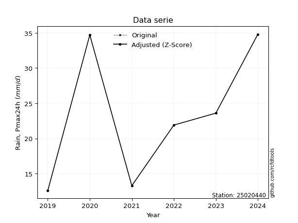</img>

</div>

> If Z-Score is active, values out of range or outliers are replaced with the station mean value.


### 4. Active continuous probability distributions from SciPy (45 of 104 available)

[scipy.stats](https://docs.scipy.org/doc/scipy/reference/stats.html) is a Python´s powerful submodule within the SciPy library for comprehensive statistical analysis, offering over 130 probability distributions (like Normal, Poisson), functions for descriptive stats (mean, variance), hypothesis testing (t-tests, chi-square), random variable generation, and statistical tests, making it essential for data science, modeling, and research. It provides tools to explore, model, and draw conclusions from data efficiently, working seamlessly with NumPy.

<div align="center">

|   id | p_dist             |   n_parameter | fit_method   | label                                                                       | active   | ref                                                                                                        |
|-----:|:-------------------|--------------:|:-------------|:----------------------------------------------------------------------------|:---------|:-----------------------------------------------------------------------------------------------------------|
|    0 | alpha              |             3 | MLE          | Alpha                                                                       | True     | [:mortar_board:](https://docs.scipy.org/doc/scipy/reference/generated/scipy.stats.alpha.html)              |
|    1 | betaprime          |             4 | MLE          | Beta prime                                                                  | True     | [:mortar_board:](https://docs.scipy.org/doc/scipy/reference/generated/scipy.stats.betaprime.html)          |
|    2 | chi2               |             3 | MLE          | Chi²                                                                        | True     | [:mortar_board:](https://docs.scipy.org/doc/scipy/reference/generated/scipy.stats.chi2.html)               |
|    3 | crystalball        |             4 | MLE          | Crystalball                                                                 | True     | [:mortar_board:](https://docs.scipy.org/doc/scipy/reference/generated/scipy.stats.crystalball.html)        |
|    4 | erlang             |             3 | MLE          | Erlang                                                                      | True     | [:mortar_board:](https://docs.scipy.org/doc/scipy/reference/generated/scipy.stats.erlang.html)             |
|    5 | expon              |             2 | MLE          | Exponential                                                                 | True     | [:mortar_board:](https://docs.scipy.org/doc/scipy/reference/generated/scipy.stats.expon.html)              |
|    6 | exponnorm          |             3 | MLE          | Exponentially modified Normal                                               | True     | [:mortar_board:](https://docs.scipy.org/doc/scipy/reference/generated/scipy.stats.exponnorm.html)          |
|    7 | f                  |             4 | MLE          | F                                                                           | True     | [:mortar_board:](https://docs.scipy.org/doc/scipy/reference/generated/scipy.stats.f.html)                  |
|    8 | fatiguelife        |             3 | MLE          | Fatigue-life (Birnbaum-Saunders)                                            | True     | [:mortar_board:](https://docs.scipy.org/doc/scipy/reference/generated/scipy.stats.fatiguelife.html)        |
|    9 | fisk               |             3 | MLE          | Fisk                                                                        | True     | [:mortar_board:](https://docs.scipy.org/doc/scipy/reference/generated/scipy.stats.fisk.html)               |
|   10 | gamma              |             3 | MLE          | Gamma                                                                       | True     | [:mortar_board:](https://docs.scipy.org/doc/scipy/reference/generated/scipy.stats.gamma.html)              |
|   11 | genexpon           |             5 | MLE          | Generalized exponential                                                     | True     | [:mortar_board:](https://docs.scipy.org/doc/scipy/reference/generated/scipy.stats.genexpon.html)           |
|   12 | genlogistic        |             3 | MLE          | Generalized logistic                                                        | True     | [:mortar_board:](https://docs.scipy.org/doc/scipy/reference/generated/scipy.stats.genlogistic.html)        |
|   13 | gibrat             |             2 | MM           | Gibrat                                                                      | True     | [:mortar_board:](https://docs.scipy.org/doc/scipy/reference/generated/scipy.stats.gibrat.html)             |
|   14 | gompertz           |             3 | MLE          | Gompertz (or truncated Gumbel)                                              | True     | [:mortar_board:](https://docs.scipy.org/doc/scipy/reference/generated/scipy.stats.gompertz.html)           |
|   15 | gumbel_l           |             2 | MM           | Gumbel Left Skew                                                            | True     | [:mortar_board:](https://docs.scipy.org/doc/scipy/reference/generated/scipy.stats.gumbel_l.html)           |
|   16 | gumbel_r           |             2 | MM           | Gumbel Right Skew                                                           | True     | [:mortar_board:](https://docs.scipy.org/doc/scipy/reference/generated/scipy.stats.gumbel_r.html)           |
|   17 | halflogistic       |             2 | MM           | Half-logistic                                                               | True     | [:mortar_board:](https://docs.scipy.org/doc/scipy/reference/generated/scipy.stats.halflogistic.html)       |
|   18 | halfnorm           |             2 | MM           | Half Normal                                                                 | True     | [:mortar_board:](https://docs.scipy.org/doc/scipy/reference/generated/scipy.stats.halfnorm.html)           |
|   19 | hypsecant          |             2 | MM           | hyperbolic secant                                                           | True     | [:mortar_board:](https://docs.scipy.org/doc/scipy/reference/generated/scipy.stats.hypsecant.html)          |
|   20 | invgamma           |             3 | MLE          | Inverted gamma                                                              | True     | [:mortar_board:](https://docs.scipy.org/doc/scipy/reference/generated/scipy.stats.invgamma.html)           |
|   21 | invgauss           |             3 | MLE          | Inverse Gaussian                                                            | True     | [:mortar_board:](https://docs.scipy.org/doc/scipy/reference/generated/scipy.stats.invgauss.html)           |
|   22 | invweibull         |             3 | MLE          | Inverted Weibull                                                            | True     | [:mortar_board:](https://docs.scipy.org/doc/scipy/reference/generated/scipy.stats.invweibull.html)         |
|   23 | johnsonsu          |             4 | MLE          | Johnson Su                                                                  | True     | [:mortar_board:](https://docs.scipy.org/doc/scipy/reference/generated/scipy.stats.johnsonsu.html)          |
|   24 | kstwobign          |             2 | MLE          | Limiting distribution of scaled Kolmogorov-Smirnov two-sided test statistic | True     | [:mortar_board:](https://docs.scipy.org/doc/scipy/reference/generated/scipy.stats.kstwobign.html)          |
|   25 | laplace            |             2 | MM           | Laplace                                                                     | True     | [:mortar_board:](https://docs.scipy.org/doc/scipy/reference/generated/scipy.stats.laplace.html)            |
|   26 | laplace_asymmetric |             3 | MLE          | Asymmetric Laplace                                                          | True     | [:mortar_board:](https://docs.scipy.org/doc/scipy/reference/generated/scipy.stats.laplace_asymmetric.html) |
|   27 | loggamma           |             3 | MLE          | Log gamma                                                                   | True     | [:mortar_board:](https://docs.scipy.org/doc/scipy/reference/generated/scipy.stats.loggamma.html)           |
|   28 | logistic           |             2 | MM           | Logistic (or Sech-squared)                                                  | True     | [:mortar_board:](https://docs.scipy.org/doc/scipy/reference/generated/scipy.stats.logistic.html)           |
|   29 | lognorm            |             3 | MLE          | Log Normal                                                                  | True     | [:mortar_board:](https://docs.scipy.org/doc/scipy/reference/generated/scipy.stats.lognorm.html)            |
|   30 | maxwell            |             2 | MM           | Maxwell                                                                     | True     | [:mortar_board:](https://docs.scipy.org/doc/scipy/reference/generated/scipy.stats.maxwell.html)            |
|   31 | mielke             |             4 | MLE          | Mielke Beta-Kappa / Dagum                                                   | True     | [:mortar_board:](https://docs.scipy.org/doc/scipy/reference/generated/scipy.stats.mielke.html)             |
|   32 | moyal              |             2 | MM           | Moyal                                                                       | True     | [:mortar_board:](https://docs.scipy.org/doc/scipy/reference/generated/scipy.stats.moyal.html)              |
|   33 | nakagami           |             3 | MLE          | Nakagami                                                                    | True     | [:mortar_board:](https://docs.scipy.org/doc/scipy/reference/generated/scipy.stats.nakagami.html)           |
|   34 | ncf                |             5 | MLE          | Non-central F distribution                                                  | True     | [:mortar_board:](https://docs.scipy.org/doc/scipy/reference/generated/scipy.stats.ncf.html)                |
|   35 | nct                |             4 | MLE          | Non-central Student’s t                                                     | True     | [:mortar_board:](https://docs.scipy.org/doc/scipy/reference/generated/scipy.stats.nct.html)                |
|   36 | norm               |             2 | MM           | Normal                                                                      | True     | [:mortar_board:](https://docs.scipy.org/doc/scipy/reference/generated/scipy.stats.norm.html)               |
|   37 | pareto             |             3 | MLE          | Pareto                                                                      | True     | [:mortar_board:](https://docs.scipy.org/doc/scipy/reference/generated/scipy.stats.pareto.html)             |
|   38 | pearson3           |             3 | MM           | Pearson type III                                                            | True     | [:mortar_board:](https://docs.scipy.org/doc/scipy/reference/generated/scipy.stats.pearson3.html)           |
|   39 | rayleigh           |             2 | MM           | Rayleigh                                                                    | True     | [:mortar_board:](https://docs.scipy.org/doc/scipy/reference/generated/scipy.stats.rayleigh.html)           |
|   40 | rice               |             3 | MLE          | Rice                                                                        | True     | [:mortar_board:](https://docs.scipy.org/doc/scipy/reference/generated/scipy.stats.rice.html)               |
|   41 | t                  |             3 | MLE          | Student’s t                                                                 | True     | [:mortar_board:](https://docs.scipy.org/doc/scipy/reference/generated/scipy.stats.t.html)                  |
|   42 | truncnorm          |             4 | MLE          | Truncated normal                                                            | True     | [:mortar_board:](https://docs.scipy.org/doc/scipy/reference/generated/scipy.stats.truncnorm.html)          |
|   43 | wald               |             2 | MM           | Wald                                                                        | True     | [:mortar_board:](https://docs.scipy.org/doc/scipy/reference/generated/scipy.stats.wald.html)               |
|   44 | weibull_min        |             3 | MLE          | Weibull minimum                                                             | True     | [:mortar_board:](https://docs.scipy.org/doc/scipy/reference/generated/scipy.stats.weibull_min.html)        |

</div>

> **n_parameter:** # arguments & localization & scale.
>
> **Fit methods:** (MLE) maximum likelihood, (MM) L-moments.
>
>**Inactive:** foldnorm, gennorm, norminvgauss, powernorm, powerlognorm, skewnorm, genextreme, anglit, arcsine, argus, beta, bradford, burr, burr12, cauchy, cosine, halfcauchy, foldcauchy, skewcauchy, wrapcauchy, dgamma, gengamma, exponweib, exponpow, truncexpon, gausshyper, genhalflogistic, genhyperbolic, geninvgauss, halfgennorm, johnsonsb, kappa4, kappa3, ksone, kstwo, loglaplace, levy, levy_l, levy_stable, ncx2, genpareto, truncpareto, lomax, powerlaw, rdist, rel_breitwigner, recipinvgauss, semicircular, studentized_range, trapezoid, triang, truncweibull_min, tukeylambda, uniform, loguniform, vonmises, vonmises_line, weibull_max, dweibull, 


## B. Probability distributions vs. Empirical distributions

A continuous probability distribution (CPD) describes probabilities for variables that can take any value within a range (like rain any time), unlike discrete variables with specific outcomes (like temperature). It uses a Probability Density Function (PDF), a curve where the total area under it equals 1, and the probability of the variable falling within an interval (a to b) is found by calculating the area under the curve between those points. A key feature is that the probability of hitting any single exact value is zero, so probabilities are always expressed for ranges, e.g., $P(a ≤ X ≤ b)$.

<div align="center">

Distributions parameters
|    |   station | p_dist                |   n |             loc |            scale | shape                | shape1             | shape2                | shape3   |
|---:|----------:|:----------------------|----:|----------------:|-----------------:|:---------------------|:-------------------|:----------------------|:---------|
|  0 |  25020440 | alpha                 |   7 |    10.4349      |      4.02258     | 0.001933913205684765 |                    |                       |          |
|  1 |  25020440 | betaprime             |   7 |     0.197727    |      0.535283    | 238.29808378606847   | 6.851278966998285  |                       |          |
|  2 |  25020440 | chi2                  |   7 |    12.6         |      6.44134     | 1.3708391109374718   |                    |                       |          |
|  3 |  25020440 | crystalball           |   7 |    22.1286      |      8.90934     | 1015.1288896433141   | 5694.345432951151  |                       |          |
|  4 |  25020440 | erlang                |   7 |    12.6         |      5.77042     | 0.46667590542812754  |                    |                       |          |
|  5 |  25020440 | expon                 |   7 |    12.6         |      9.52857     |                      |                    |                       |          |
|  6 |  25020440 | exponnorm             |   7 |    12.5892      |      0.00349283  | 2711.246901488379    |                    |                       |          |
|  7 |  25020440 | f                     |   7 |    11.8546      |      2.54813     | 221.3484527282422    | 1.556006779075903  |                       |          |
|  8 |  25020440 | fatiguelife           |   7 |    12.6         |      2.18221e-06 | 1731.8859449468941   |                    |                       |          |
|  9 |  25020440 | fisk                  |   7 |    12.6         |      5.99044     | 0.8309492007383432   |                    |                       |          |
| 10 |  25020440 | gamma                 |   7 |    12.6         |      7.54347     | 0.4612339751119585   |                    |                       |          |
| 11 |  25020440 | genexpon              |   7 |    12.5995      |      0.966802    | 0.09458606523501345  | 1.0829524356385205 | 0.0007159784304209861 |          |
| 12 |  25020440 | genlogistic           |   7 |   -32.6773      |      6.97618     | 1406.1282097511175   |                    |                       |          |
| 13 |  25020440 | gibrat                |   7 |    15.3318      |      4.12243     |                      |                    |                       |          |
| 14 |  25020440 | gompertz              |   7 |    12.6         |     67.2631      | 6.149100776912256    |                    |                       |          |
| 15 |  25020440 | gumbel_l              |   7 |    26.1382      |      6.94658     |                      |                    |                       |          |
| 16 |  25020440 | gumbel_r              |   7 |    18.1189      |      6.94658     |                      |                    |                       |          |
| 17 |  25020440 | halflogistic          |   7 |    11.5689      |      7.61717     |                      |                    |                       |          |
| 18 |  25020440 | halfnorm              |   7 |    10.3361      |     14.7797      |                      |                    |                       |          |
| 19 |  25020440 | hypsecant             |   7 |    22.1286      |      5.67186     |                      |                    |                       |          |
| 20 |  25020440 | invgamma              |   7 |    11.8443      |      1.98697     | 0.7794581595727723   |                    |                       |          |
| 21 |  25020440 | invgauss              |   7 |    11.9057      |      3.1482      | 3.2471998928249817   |                    |                       |          |
| 22 |  25020440 | invweibull            |   7 |    12.2791      |      1.96798     | 0.6576605615550726   |                    |                       |          |
| 23 |  25020440 | johnsonsu             |   7 |     6.61995e+08 |      3.52826e+08 | 116014830.99218914   | 83651107.23905048  |                       |          |
| 24 |  25020440 | kstwobign             |   7 |    -5.96743     |     32.1116      |                      |                    |                       |          |
| 25 |  25020440 | laplace               |   7 |    22.1286      |      6.29985     |                      |                    |                       |          |
| 26 |  25020440 | laplace_asymmetric    |   7 |    21.9         |      7.59742     | 0.9850713716419617   |                    |                       |          |
| 27 |  25020440 | loggamma              |   7 | -1991.42        |    290.202       | 1031.5918803952854   |                    |                       |          |
| 28 |  25020440 | logistic              |   7 |    22.1286      |      4.91198     |                      |                    |                       |          |
| 29 |  25020440 | lognorm               |   7 |    12.6         |      0.036564    | 12.576009566387519   |                    |                       |          |
| 30 |  25020440 | maxwell               |   7 |     1.01718     |     13.2296      |                      |                    |                       |          |
| 31 |  25020440 | mielke                |   7 |     5.46224     |      1.49178     | 145.3315909941519    | 2.1487529959917477 |                       |          |
| 32 |  25020440 | moyal                 |   7 |    17.0336      |      4.01061     |                      |                    |                       |          |
| 33 |  25020440 | nakagami              |   7 |    12.6         |     17.6174      | 0.23542410759962568  |                    |                       |          |
| 34 |  25020440 | ncf                   |   7 |     0.946171    |      0.000976429 | 0.014659779480675435 | 12.784025471860257 | 270.1655120809646     |          |
| 35 |  25020440 | nct                   |   7 |     0.173509    |      0.290956    | 3.653394483337114    | 59.73366684563014  |                       |          |
| 36 |  25020440 | norm                  |   7 |    22.1286      |      8.90934     |                      |                    |                       |          |
| 37 |  25020440 | pareto                |   7 |    12.5938      |      0.00624804  | 0.1696088043076667   |                    |                       |          |
| 38 |  25020440 | pearson3              |   7 |    22.1286      |      8.90936     | 0.3907204479157995   |                    |                       |          |
| 39 |  25020440 | rayleigh              |   7 |     5.08449     |     13.5992      |                      |                    |                       |          |
| 40 |  25020440 | rice                  |   7 |     7.11063     |     12.2585      | 0.17056865831526635  |                    |                       |          |
| 41 |  25020440 | t                     |   7 |    22.1287      |      8.90932     | 167550420.0555343    |                    |                       |          |
| 42 |  25020440 | truncnorm             |   7 |    25.0223      |     11.9672      | -134.55144094055856  | 0.8170425232798018 |                       |          |
| 43 |  25020440 | wald                  |   7 |    13.2193      |      8.90933     |                      |                    |                       |          |
| 44 |  25020440 | weibull_min           |   7 |    12.6         |      8.41152     | 0.6008780544296106   |                    |                       |          |
| 45 |  25020440 | logalpha              |   7 |    -0.330561    |     27.427       | 8.319025671070367    |                    |                       |          |
| 46 |  25020440 | logbetaprime          |   7 |    -3.00223     |      2.08953     | 782.1414781613635    | 272.4552376314342  |                       |          |
| 47 |  25020440 | logchi2               |   7 |     2.5337      |      0.963757    | 1.0628279817674011   |                    |                       |          |
| 48 |  25020440 | logcrystalball        |   7 |     3.01494     |      0.405424    | 1165.3315194715967   | 3055.511637085553  |                       |          |
| 49 |  25020440 | logerlang             |   7 |     0.362243    |      0.0601123   | 44.03737057339967    |                    |                       |          |
| 50 |  25020440 | logexpon              |   7 |     2.5337      |      0.481247    |                      |                    |                       |          |
| 51 |  25020440 | logexponnorm          |   7 |     2.97893     |      0.403821    | 0.08918962304729221  |                    |                       |          |
| 52 |  25020440 | logf                  |   7 |     2.35095     |      0.40502     | 237.0638688513986    | 4.161064642387901  |                       |          |
| 53 |  25020440 | logfatiguelife        |   7 |     2.5337      |      3.23679e-06 | 352.09055418672506   |                    |                       |          |
| 54 |  25020440 | logfisk               |   7 |     2.5337      |      0.460459    | 0.8636425445219595   |                    |                       |          |
| 55 |  25020440 | loggamma              |   7 |     0.0134256   |      0.0530405   | 56.5362532669359     |                    |                       |          |
| 56 |  25020440 | loggenexpon           |   7 |     2.53353     |      0.0419725   | 0.0710302639756307   | 5.48875623984242   | 0.0002973854148409934 |          |
| 57 |  25020440 | loggenlogistic        |   7 |     0.392551    |      0.338901    | 1276.136984161807    |                    |                       |          |
| 58 |  25020440 | loggibrat             |   7 |     2.70563     |      0.187606    |                      |                    |                       |          |
| 59 |  25020440 | loggompertz           |   7 |     2.5337      |      0.87874     | 1.067009824470961    |                    |                       |          |
| 60 |  25020440 | loggumbel_l           |   7 |     3.19741     |      0.316107    |                      |                    |                       |          |
| 61 |  25020440 | loggumbel_r           |   7 |     2.83248     |      0.316107    |                      |                    |                       |          |
| 62 |  25020440 | loghalflogistic       |   7 |     2.5344      |      0.346635    |                      |                    |                       |          |
| 63 |  25020440 | loghalfnorm           |   7 |     2.47832     |      0.672556    |                      |                    |                       |          |
| 64 |  25020440 | loghypsecant          |   7 |     3.01494     |      0.258101    |                      |                    |                       |          |
| 65 |  25020440 | loginvgamma           |   7 |     1.83314     |      8.61541     | 8.277475025346256    |                    |                       |          |
| 66 |  25020440 | loginvgauss           |   7 |     2.46504     |      0.339416    | 1.620153961609717    |                    |                       |          |
| 67 |  25020440 | loginvweibull         |   7 |     2.44622     |      0.236709    | 1.0991562072689611   |                    |                       |          |
| 68 |  25020440 | logjohnsonsu          |   7 |     7.20013e+06 | 209256           | 75321391.74959825    | 17799507.285050374 |                       |          |
| 69 |  25020440 | logkstwobign          |   7 |     1.66888     |      1.53398     |                      |                    |                       |          |
| 70 |  25020440 | loglaplace            |   7 |     3.01494     |      0.286678    |                      |                    |                       |          |
| 71 |  25020440 | loglaplace_asymmetric |   7 |     3.16125     |      0.344533    | 1.2346168582897659   |                    |                       |          |
| 72 |  25020440 | logloggamma           |   7 |   -65.8061      |     10.5746      | 671.0670395000263    |                    |                       |          |
| 73 |  25020440 | loglogistic           |   7 |     3.01494     |      0.223522    |                      |                    |                       |          |
| 74 |  25020440 | loglognorm            |   7 |     2.5337      |      0.00264395  | 12.054601279519154   |                    |                       |          |
| 75 |  25020440 | logmaxwell            |   7 |     2.05426     |      0.602019    |                      |                    |                       |          |
| 76 |  25020440 | logmielke             |   7 |     0.116553    |      1.2927      | 3819.7602867470805   | 8.39826739335987   |                       |          |
| 77 |  25020440 | logmoyal              |   7 |     2.7831      |      0.182505    |                      |                    |                       |          |
| 78 |  25020440 | lognakagami           |   7 |     2.5337      |      0.765201    | 0.3940494120636678   |                    |                       |          |
| 79 |  25020440 | logncf                |   7 |    -3.17337     |      6.18142     | 299.381753142336     | 1327.5814262923639 | 5.282106153989968e-05 |          |
| 80 |  25020440 | lognct                |   7 |     0.0728858   |      0.0471997   | 27.392480459406453   | 60.59273899941791  |                       |          |
| 81 |  25020440 | lognorm               |   7 |     3.01494     |      0.405423    |                      |                    |                       |          |
| 82 |  25020440 | logpareto             |   7 |     2.53334     |      0.000357971 | 0.16898243925316012  |                    |                       |          |
| 83 |  25020440 | logpearson3           |   7 |     3.01494     |      0.405423    | 0.13770881770052762  |                    |                       |          |
| 84 |  25020440 | lograyleigh           |   7 |     2.23935     |      0.618838    |                      |                    |                       |          |
| 85 |  25020440 | logrice               |   7 |     2.2976      |      0.519208    | 0.7201315651077427   |                    |                       |          |
| 86 |  25020440 | logt                  |   7 |     3.01494     |      0.405424    | 48049481435.859406   |                    |                       |          |
| 87 |  25020440 | logtruncnorm          |   7 |    -1.877       |      1.72691     | 2.554097610859711    | 3.142391417741108  |                       |          |
| 88 |  25020440 | logwald               |   7 |     2.60953     |      0.405412    |                      |                    |                       |          |
| 89 |  25020440 | logweibull_min        |   7 |     2.5337      |      0.430859    | 0.6244120687669756   |                    |                       |          |

</div>

> **loc** (Location parameter): This shifts the distribution along the x-axis. For many common distributions, like the normal (Gaussian) distribution, loc represents the mean $μ$. For others, like the uniform distribution, it might represent the minimum value, or for the beta distribution, the left end of the support interval.
>
> **scale** (Scale parameter): This determines the width or spread of the distribution. For the normal distribution, scale represents the standard deviation $σ$. For a uniform distribution, it defines the length of the interval (from $loc$ to $loc + scale$).
>
> **shape** (Shape parameters): Refers to parameters that define the specific form of a probability distribution, distinct from its location (loc) and scale (scale). These parameters are required arguments for most distribution functions. For example, a normal (Gaussian) distribution is fully defined by its location (mean) and scale (standard deviation), so it has no specific shape parameters beyond loc and scale. However, other distributions have intrinsic properties that need specification, as Gamma distribution that takes a shape parameter, often named $a$ or $alpha$.


### 0. Cumulative distribution values - CDF (90 evaluated)

> Ordered by x ascending and calculating $log(f(x))$ separately. 

|   id |   Station |   date |    x |   count |    mean |     std |     zscore |   Value_initial |   station |   m |     alpha |   alpha_pdf |   betaprime |   betaprime_pdf |        chi2 |      chi2_pdf |   crystalball |   crystalball_pdf |      erlang |   erlang_pdf |     expon |   expon_pdf |   exponnorm |   exponnorm_pdf |         f |      f_pdf |   fatiguelife |   fatiguelife_pdf |        fisk |    fisk_pdf |       gamma |   gamma_pdf |    genexpon |   genexpon_pdf |   genlogistic |   genlogistic_pdf |   gibrat |   gibrat_pdf |    gompertz |   gompertz_pdf |   gumbel_l |   gumbel_l_pdf |   gumbel_r |   gumbel_r_pdf |   halflogistic |   halflogistic_pdf |   halfnorm |   halfnorm_pdf |   hypsecant |   hypsecant_pdf |   invgamma |   invgamma_pdf |   invgauss |   invgauss_pdf |   invweibull |   invweibull_pdf |   johnsonsu |   johnsonsu_pdf |   kstwobign |   kstwobign_pdf |   laplace |   laplace_pdf |   laplace_asymmetric |   laplace_asymmetric_pdf |   loggamma |   loggamma_pdf |   logistic |   logistic_pdf |   lognorm |   lognorm_pdf |   maxwell |   maxwell_pdf |   mielke |   mielke_pdf |     moyal |   moyal_pdf |    nakagami |   nakagami_pdf |      ncf |   ncf_pdf |      nct |    nct_pdf |     norm |   norm_pdf |   pareto |   pareto_pdf |   pearson3 |   pearson3_pdf |   rayleigh |   rayleigh_pdf |      rice |   rice_pdf |        t |     t_pdf |   truncnorm |   truncnorm_pdf |        wald |    wald_pdf |   weibull_min |   weibull_min_pdf |   logalpha |   logalpha_pdf |   logbetaprime |   logbetaprime_pdf |    logchi2 |   logchi2_pdf |   logcrystalball |   logcrystalball_pdf |   logerlang |   logerlang_pdf |   logexpon |   logexpon_pdf |   logexponnorm |   logexponnorm_pdf |      logf |   logf_pdf |   logfatiguelife |   logfatiguelife_pdf |     logfisk |   logfisk_pdf |   loggenexpon |   loggenexpon_pdf |   loggenlogistic |   loggenlogistic_pdf |   loggibrat |   loggibrat_pdf |   loggompertz |   loggompertz_pdf |   loggumbel_l |   loggumbel_l_pdf |   loggumbel_r |   loggumbel_r_pdf |   loghalflogistic |   loghalflogistic_pdf |   loghalfnorm |   loghalfnorm_pdf |   loghypsecant |   loghypsecant_pdf |   loginvgamma |   loginvgamma_pdf |   loginvgauss |   loginvgauss_pdf |   loginvweibull |   loginvweibull_pdf |   logjohnsonsu |   logjohnsonsu_pdf |   logkstwobign |   logkstwobign_pdf |   loglaplace |   loglaplace_pdf |   loglaplace_asymmetric |   loglaplace_asymmetric_pdf |   logloggamma |   logloggamma_pdf |   loglogistic |   loglogistic_pdf |   loglognorm |   loglognorm_pdf |   logmaxwell |   logmaxwell_pdf |   logmielke |   logmielke_pdf |   logmoyal |   logmoyal_pdf |   lognakagami |   lognakagami_pdf |   logncf |   logncf_pdf |   lognct |   lognct_pdf |   logpareto |   logpareto_pdf |   logpearson3 |   logpearson3_pdf |   lograyleigh |   lograyleigh_pdf |   logrice |   logrice_pdf |     logt |   logt_pdf |   logtruncnorm |   logtruncnorm_pdf |     logwald |   logwald_pdf |   logweibull_min |   logweibull_min_pdf |
|-----:|----------:|-------:|-----:|--------:|--------:|--------:|-----------:|----------------:|----------:|----:|----------:|------------:|------------:|----------------:|------------:|--------------:|--------------:|------------------:|------------:|-------------:|----------:|------------:|------------:|----------------:|----------:|-----------:|--------------:|------------------:|------------:|------------:|------------:|------------:|------------:|---------------:|--------------:|------------------:|---------:|-------------:|------------:|---------------:|-----------:|---------------:|-----------:|---------------:|---------------:|-------------------:|-----------:|---------------:|------------:|----------------:|-----------:|---------------:|-----------:|---------------:|-------------:|-----------------:|------------:|----------------:|------------:|----------------:|----------:|--------------:|---------------------:|-------------------------:|-----------:|---------------:|-----------:|---------------:|----------:|--------------:|----------:|--------------:|---------:|-------------:|----------:|------------:|------------:|---------------:|---------:|----------:|---------:|-----------:|---------:|-----------:|---------:|-------------:|-----------:|---------------:|-----------:|---------------:|----------:|-----------:|---------:|----------:|------------:|----------------:|------------:|------------:|--------------:|------------------:|-----------:|---------------:|---------------:|-------------------:|-----------:|--------------:|-----------------:|---------------------:|------------:|----------------:|-----------:|---------------:|---------------:|-------------------:|----------:|-----------:|-----------------:|---------------------:|------------:|--------------:|--------------:|------------------:|-----------------:|---------------------:|------------:|----------------:|--------------:|------------------:|--------------:|------------------:|--------------:|------------------:|------------------:|----------------------:|--------------:|------------------:|---------------:|-------------------:|--------------:|------------------:|--------------:|------------------:|----------------:|--------------------:|---------------:|-------------------:|---------------:|-------------------:|-------------:|-----------------:|------------------------:|----------------------------:|--------------:|------------------:|--------------:|------------------:|-------------:|-----------------:|-------------:|-----------------:|------------:|----------------:|-----------:|---------------:|--------------:|------------------:|---------:|-------------:|---------:|-------------:|------------:|----------------:|--------------:|------------------:|--------------:|------------------:|----------:|--------------:|---------:|-----------:|---------------:|-------------------:|------------:|--------------:|-----------------:|---------------------:|
|    0 |  25020440 |   2019 | 12.6 |       7 | 22.1286 | 9.62319 | -0.990168  |            12.6 |  25020440 |   1 | 0.0633615 |  0.122131   |    0.108133 |       0.0438282 | 1.48529e-11 | 5731.1        |      0.142421 |         0.0252745 | 6.51372e-08 |  1.71125e+07 | 0         |   0.104948  |   0.0011367 |       0.10537   | 0.0460977 | 0.170955   |     0.0452875 |       3.17375e+11 | 1.25049e-13 | 58.4958     | 6.99161e-08 | 1.81538e+07 | 4.66571e-05 |      0.0978297 |      0.118471 |         0.0361971 | 0        |   0          | 2.31788e-07 |      0.0914186 |   0.132751 |      0.0177817 |   0.109341 |      0.0348377 |      0.0675772 |          0.0653414 |   0.121741 |      0.0533556 |    0.117307 |       0.0202172 |  0.0460548 |     0.170661   |  0.0448345 |     0.170679   |    0.0370249 |       0.250114   |    0.143992 |       0.025297  |    0.108254 |       0.0371976 |  0.110178 |     0.017489  |             0.142139 |                0.0189923 |   0.110254 |       0.530477 |   0.125663 |      0.0223681 |  0.117609 |      0.486447 |  0.142548 |     0.031512  | 0.100157 |   0.0682119  | 0.0822097 |   0.0381787 | 2.29837e-08 |    6.09215e+06 | 0.110895 | 0.043812  | 0.105122 | 0.0492786  | 0.142421 |  0.0252745 | 0        |  27.1459     |   0.138243 |      0.0289718 |   0.141619 |      0.0348828 | 0.0940897 |  0.032615  | 0.142417 | 0.0252741 |    0.188677 |       0.0245269 | 0           | 0           |   3.81092e-10 |   128910          |   0.10445  |       0.605596 |       0.123235 |           0.529873 | 5.5177e-09 |   6.60269e+06 |         0.117609 |             0.486447 |    0.110939 |        0.54147  |   0        |       2.07793  |       0.117583 |           0.486629 | 0.0653267 |   1.28393  |         0.049481 |          8.79714e+09 | 1.07593e-13 |    209.242    |   0.000286094 |          1.69198  |         0.100288 |             0.67992  |    0        |        0        |   1.41818e-08 |          1.21425  |      0.115295 |          0.34285  |      0.076281 |          0.62098  |         0         |              0        |     0.0656193 |          1.18233  |      0.0978737 |           0.37326  |     0.0915073 |          0.771182 |     0.0471081 |          1.9456   |       0.0504476 |            1.89336  |       0.117188 |           0.486101 |      0.0916801 |           0.71695  |    0.0933078 |         0.32548  |                0.138103 |                    0.32467  |      0.119876 |          0.482208 |      0.104049 |          0.417064 |    0.0073406 |      3.79595e+12 |     0.111445 |         0.612141 |         nan |             nan |  0.0476649 |       0.609224 |    7.6682e-13 |       1360.83     | 0.196114 |     0.526542 | 0.106119 |     0.602852 |    0        |     472.057     |      0.115481 |          0.50831  |      0.106959 |          0.68641  | 0.0767899 |      0.625836 | 0.117609 |   0.486447 |    6.56458e-06 |           1.97381  | 0           |      0        |      4.38551e-10 |        616625        |
|    1 |  25020440 |   2021 | 13.3 |       7 | 22.1286 | 9.62319 | -0.917427  |            13.3 |  25020440 |   2 | 0.160654  |  0.146095   |    0.140681 |       0.0489935 | 0.146676    |    0.139046   |      0.160859 |         0.0274054 | 0.406204    |  0.249151    | 0.0708297 |   0.0975141 |   0.0723081 |       0.097962  | 0.18126   | 0.188261   |     0.628175  |       0.0883369   | 0.14382     |  0.146171   | 0.36643     | 0.226502    | 0.0664249   |      0.0918776 |      0.145209 |         0.0401367 | 0        |   0          | 0.0623021   |      0.0866198 |   0.145749 |      0.0193722 |   0.135184 |      0.0389427 |      0.113143  |          0.0648009 |   0.158941 |      0.0529106 |    0.1323   |       0.0226599 |  0.18108   |     0.18819    |  0.178384  |     0.185241   |    0.214428  |       0.212696   |    0.162436 |       0.0274011 |    0.135738 |       0.0412377 |  0.123127 |     0.0195444 |             0.156075 |                0.0208545 |   0.141413 |       0.622184 |   0.142173 |      0.0248291 |  0.146018 |      0.564836 |  0.165411 |     0.0337845 | 0.151409 |   0.0772768  | 0.111213  |   0.0445627 | 0.171272    |    0.11517     | 0.143319 | 0.0486553 | 0.141829 | 0.0553055  | 0.160859 |  0.0274054 | 0.551506 |   0.107708   |   0.159396 |      0.0314519 |   0.166798 |      0.0370133 | 0.118053  |  0.0358014 | 0.160855 | 0.027405  |    0.206367 |       0.0260177 | 2.24026e-25 | 1.54405e-22 |   0.201072    |        0.153951   |   0.140252 |       0.717665 |       0.154056 |           0.610112 | 0.167016   |   1.61171     |         0.146018 |             0.564836 |    0.14274  |        0.634806 |   0.106267 |       1.85712  |       0.146004 |           0.56507  | 0.145783  |   1.62762  |         0.643211 |          1.26611     | 0.135882    |      1.87558  |   0.0889404   |          1.58756  |         0.140739 |             0.813676 |    0        |        0        |   0.0654712   |          1.20676  |      0.135283 |          0.397615 |      0.114318 |          0.784321 |         0.0768189 |              1.43393  |     0.129265  |          1.17074  |      0.120193  |           0.454696 |     0.137766  |          0.933857 |     0.170242  |          2.34676  |       0.172068  |            2.35157  |       0.145586 |           0.564741 |      0.134424  |           0.859648 |    0.112674  |         0.393035 |                0.156822 |                    0.368675 |      0.147995 |          0.558363 |      0.128853 |          0.502189 |    0.598844  |      0.593216    |     0.147028 |         0.702831 |         nan |             nan |  0.0876929 |       0.868553 |    0.0966473  |          1.40677  | 0.225706 |     0.56758  | 0.14169  |     0.711949 |    0.572153 |       1.3284    |      0.145213 |          0.591734 |      0.146574 |          0.776449 | 0.11377   |      0.739503 | 0.146019 |   0.564837 |    0.102553    |           1.82123  | 0           |      0        |      0.239382    |             2.40358  |
|    2 |  25020440 |   2025 | 14   |       7 | 22.1286 | 9.62319 | -0.844686  |            14   |  25020440 |   3 | 0.259605  |  0.133698   |    0.176468 |       0.0530661 | 0.230817    |    0.105892   |      0.180788 |         0.0295331 | 0.541117    |  0.152487    | 0.136643  |   0.0906072 |   0.138408  |       0.090982  | 0.298225  | 0.145715   |     0.678132  |       0.0592111   | 0.230065    |  0.105136   | 0.490457    | 0.142098    | 0.128751    |      0.0862493 |      0.174562 |         0.0436492 | 0        |   0          | 0.121314    |      0.0820177 |   0.159898 |      0.0210711 |   0.163769 |      0.0426551 |      0.158237  |          0.0639976 |   0.195789 |      0.0523517 |    0.149085 |       0.0253345 |  0.298047  |     0.145768   |  0.294038  |     0.145216   |    0.335463  |       0.140027   |    0.182352 |       0.0294998 |    0.165851 |       0.0446986 |  0.137597 |     0.0218413 |             0.171378 |                0.0228992 |   0.175532 |       0.707579 |   0.160455 |      0.0274246 |  0.176925 |      0.640238 |  0.189806 |     0.0358853 | 0.207122 |   0.0811245  | 0.144384  |   0.0500376 | 0.23732     |    0.0797193   | 0.178759 | 0.0524186 | 0.182132 | 0.0595495  | 0.180788 |  0.0295331 | 0.600951 |   0.0481296  |   0.182253 |      0.0338339 |   0.193377 |      0.0388856 | 0.144138  |  0.0386719 | 0.180784 | 0.0295327 |    0.225101 |       0.0275048 | 0.00190987  | 0.0149419   |   0.288558    |        0.10396    |   0.179609 |       0.814983 |       0.187264 |           0.684146 | 0.23592    |   1.14805     |         0.176925 |             0.640238 |    0.177531 |        0.721033 |   0.196624 |       1.66936  |       0.176924 |           0.640511 | 0.231137  |   1.66634  |         0.695817 |          0.850803    | 0.218619    |      1.40025  |   0.167853    |          1.48958  |         0.185329 |             0.921179 |    0        |        0        |   0.127087    |          1.19495  |      0.157145 |          0.45584  |      0.158196 |          0.922789 |         0.149822  |              1.41006  |     0.188888  |          1.15295  |      0.145783  |           0.54529  |     0.188805  |          1.04928  |     0.283246  |          2.03     |       0.285721  |            2.04023  |       0.176495 |           0.640421 |      0.181385  |           0.966291 |    0.134751  |         0.470042 |                0.17692  |                    0.415924 |      0.178519 |          0.63179  |      0.156876 |          0.591737 |    0.620084  |      0.299769    |     0.185105 |         0.780222 |         nan |             nan |  0.137857  |       1.07875  |    0.163253   |          1.21461  | 0.255751 |     0.603334 | 0.180691 |     0.806901 |    0.617561 |       0.611298  |      0.177596 |          0.670616 |      0.188279 |          0.847227 | 0.154142  |      0.832041 | 0.176926 |   0.640239 |    0.19246     |           1.68586  | 0.000555207 |      0.136913 |      0.339676    |             1.62414  |
|    3 |  25020440 |   2022 | 21.9 |       7 | 22.1286 | 9.62319 | -0.0237522 |            21.9 |  25020440 |   4 | 0.726029  |  0.0229393  |    0.603371 |       0.0434966 | 0.673392    |    0.0316116  |      0.489766 |         0.0447633 | 0.934095    |  0.014128    | 0.623189  |   0.0395454 |   0.625886  |       0.0395055 | 0.719536  | 0.0193931  |     0.883368  |       0.0125643   | 0.590369    |  0.0216077  | 0.895294    | 0.0179766   | 0.611591    |      0.0409859 |      0.569659 |         0.045941  | 0.679318 |   0.0544944  | 0.598189    |      0.0421797 |   0.419163 |      0.0454267 |   0.559763 |      0.0467565 |      0.590311  |          0.0427674 |   0.566032 |      0.0397504 |    0.487176 |       0.0560753 |  0.719719  |     0.0194089  |  0.742168  |     0.0224017  |    0.703165  |       0.0169273  |    0.489833 |       0.0444727 |    0.561358 |       0.0458523 |  0.482184 |     0.0765389 |             0.49248  |                0.0658043 |   0.590628 |       0.95816  |   0.488369 |      0.0508685 |  0.570035 |      0.968812 |  0.523196 |     0.043234  | 0.67793  |   0.0343485  | 0.585647  |   0.0467395 | 0.571867    |    0.0274516   | 0.596001 | 0.0425586 | 0.61977  | 0.0404947  | 0.489766 |  0.0447633 | 0.710382 |   0.00527837 |   0.515758 |      0.0448457 |   0.534421 |      0.0423327 | 0.511924  |  0.0473451 | 0.48976  | 0.0447633 |    0.500707 |       0.0406289 | 0.657667    | 0.0465425   |   0.654303    |        0.0237248  |   0.615045 |       0.897862 |       0.579522 |           0.910376 | 0.527049   |   0.418622    |         0.570035 |             0.968812 |    0.595401 |        0.952367 |   0.682939 |       0.658832 |       0.570122 |           0.968738 | 0.705654  |   0.550584 |         0.879747 |          0.212688    | 0.539377    |      0.388161 |   0.659466    |          0.750414 |         0.637373 |             0.846921 |    0.760554 |        0.81521  |   0.607241    |          0.894615 |      0.505427 |          1.10155  |      0.63907  |          0.905193 |         0.661989  |              0.810318 |     0.634142  |          0.788232 |      0.587123  |           1.18737  |     0.655652  |          0.792573 |     0.736647  |          0.472244 |       0.715359  |            0.41137  |       0.570175 |           0.970522 |      0.639725  |           0.852603 |    0.610427  |         1.35892  |                0.506521 |                    1.19079  |      0.567308 |          0.965262 |      0.579341 |          1.0903   |    0.671193  |      0.0542678   |     0.599012 |         0.895927 |         nan |             nan |  0.663175  |       0.865899 |    0.570999   |          0.701174 | 0.562988 |     0.697116 | 0.613338 |     0.900371 |    0.710855 |       0.0883317 |      0.578745 |          0.956925 |      0.608188 |          0.86672  | 0.595448  |      0.941456 | 0.570036 |   0.968811 |    0.735275    |           0.827916 | 0.730105    |      0.761016 |      0.689124    |             0.410276 |
|    4 |  25020440 |   2023 | 23.6 |       7 | 22.1286 | 9.62319 |  0.152905  |            23.6 |  25020440 |   5 | 0.760249  |  0.0176566  |    0.671711 |       0.0369517 | 0.722423    |    0.0262785  |      0.565589 |         0.0441714 | 0.954013    |  0.00962166  | 0.684761  |   0.0330836 |   0.687362  |       0.0330138 | 0.748633  | 0.0151144  |     0.902576  |       0.0101458   | 0.623632    |  0.0177306  | 0.921466    | 0.0131085   | 0.675761    |      0.0346683 |      0.643367 |         0.0406678 | 0.756777 |   0.0378721  | 0.664624    |      0.0361068 |   0.500387 |      0.0499083 |   0.634903 |      0.0415205 |      0.658258  |          0.0371986 |   0.630517 |      0.0360898 |    0.581667 |       0.0542839 |  0.748838  |     0.0151252  |  0.775969  |     0.0176511  |    0.72875   |       0.0133958  |    0.565167 |       0.0438923 |    0.635304 |       0.0410499 |  0.604147 |     0.0628352 |             0.592877 |                0.0527871 |   0.659839 |       0.889283 |   0.574335 |      0.0497711 |  0.640899 |      0.921985 |  0.594896 |     0.0409381 | 0.72994  |   0.0271584  | 0.659185  |   0.039805  | 0.615913    |    0.0244691   | 0.663015 | 0.0363274 | 0.682616 | 0.0335918  | 0.565589 |  0.0441714 | 0.718507 |   0.00433787 |   0.59034  |      0.042667  |   0.604205 |      0.0396258 | 0.590029  |  0.0443408 | 0.565583 | 0.0441716 |    0.570834 |       0.0417397 | 0.726586    | 0.0351889   |   0.691161    |        0.0198216  |   0.678799 |       0.805691 |       0.645616 |           0.854099 | 0.556839   |   0.379458    |         0.640899 |             0.921985 |    0.664056 |        0.880434 |   0.728558 |       0.564038 |       0.640976 |           0.921801 | 0.743086  |   0.454571 |         0.894456 |          0.181862    | 0.56645     |      0.337976 |   0.711934    |          0.654665 |         0.696803 |             0.742654 |    0.812545 |        0.590665 |   0.671197    |          0.815442 |      0.590128 |          1.15647  |      0.702268 |          0.785207 |         0.718329  |              0.698145 |     0.690093  |          0.708463 |      0.67148   |           1.0586   |     0.710722  |          0.681784 |     0.768875  |          0.39326  |       0.743281  |            0.338986 |       0.641159 |           0.923439 |      0.699782  |           0.753781 |    0.699854  |         1.04698  |                0.603847 |                    1.4196   |      0.638047 |          0.922178 |      0.658032 |          1.00673  |    0.674989  |      0.0475778   |     0.663493 |         0.826394 |         nan |             nan |  0.722686  |       0.728385 |    0.621238   |          0.643224 | 0.614176 |     0.670501 | 0.677389 |     0.810976 |    0.716983 |       0.0761655 |      0.648333 |          0.90023  |      0.670324 |          0.793628 | 0.662993  |      0.862832 | 0.6409   |   0.921984 |    0.793456    |           0.730366 | 0.780309    |      0.590889 |      0.717665    |             0.355273 |
|    5 |  25020440 |   2020 | 34.7 |       7 | 22.1286 | 9.62319 |  1.30637   |            34.7 |  25020440 |   6 | 0.868515  |  0.00537008 |    0.906832 |       0.0102966 | 0.898455    |    0.00891427 |      0.920884 |         0.0165469 | 0.99499     |  0.00096882  | 0.901662  |   0.0103204 |   0.903174  |       0.0102245 | 0.844834  | 0.00502918 |     0.966932  |       0.00306574  | 0.747388    |  0.00709875 | 0.98641     | 0.0020666   | 0.905925    |      0.0109144 |      0.914069 |         0.0117723 | 0.939091 |   0.00622323 | 0.908535    |      0.011614  |   0.967608 |      0.0159935 |   0.912187 |      0.0120691 |      0.90841   |          0.0114735 |   0.900744 |      0.0138735 |    0.930885 |       0.0120901 |  0.845082  |     0.00502965 |  0.889101  |     0.00585934 |    0.817192  |       0.00483914 |    0.919524 |       0.0166527 |    0.91911  |       0.0127582 |  0.932028 |     0.0107895 |             0.903465 |                0.0125166 |   0.905226 |       0.379324 |   0.928199 |      0.013568  |  0.90519  |      0.416279 |  0.909633 |     0.015294  | 0.893144 |   0.00741152 | 0.911988  |   0.0109278 | 0.814626    |    0.0128013   | 0.898395 | 0.0106429 | 0.89336  | 0.00951418 | 0.920883 |  0.0165469 | 0.74991  |   0.0019188  |   0.913515 |      0.0150514 |   0.906638 |      0.0149507 | 0.91762   |  0.0149102 | 0.920882 | 0.0165472 |    0.996979 |       0.0303116 | 0.921838    | 0.00791477  |   0.832507    |        0.00813711 |   0.893485 |       0.335194 |       0.890199 |           0.401656 | 0.674977   |   0.248228    |         0.90519  |             0.416279 |    0.905702 |        0.372664 |   0.878159 |       0.253178 |       0.905165 |           0.416095 | 0.858652  |   0.192322 |         0.94396  |          0.0885389   | 0.663956    |      0.190214 |   0.887985    |          0.294345 |         0.890619 |             0.304405 |    0.933242 |        0.153895 |   0.900975    |          0.380823 |      0.951177 |          0.466371 |      0.900866 |          0.297522 |         0.897698  |              0.280033 |     0.887848  |          0.335902 |      0.919329  |           0.309222 |     0.885718  |          0.275819 |     0.871812  |          0.178401 |       0.831362  |            0.153355 |       0.9056   |           0.415711 |      0.900162  |           0.318582 |    0.921776  |         0.272864 |                0.900476 |                    0.356641 |      0.90448  |          0.422653 |      0.915225 |          0.347118 |    0.689155  |      0.0289237   |     0.895283 |         0.376989 |         nan |             nan |  0.90177   |       0.267752 |    0.816399   |          0.379707 | 0.829013 |     0.424887 | 0.894711 |     0.340298 |    0.738974 |       0.0435255 |      0.902678 |          0.400622 |      0.89265  |          0.366482 | 0.900933  |      0.376698 | 0.90519  |   0.416279 |    0.998932    |           0.371432 | 0.914461    |      0.192965 |      0.81831     |             0.190992 |
|    6 |  25020440 |   2024 | 34.8 |       7 | 22.1286 | 9.62319 |  1.31676   |            34.8 |  25020440 |   7 | 0.86905   |  0.00532668 |    0.907856 |       0.0101749 | 0.899343    |    0.00883279 |      0.922525 |         0.0162859 | 0.995086    |  0.000949885 | 0.902688  |   0.0102126 |   0.904192  |       0.0101171 | 0.845335  | 0.00499218 |     0.967237  |       0.00303555  | 0.748096    |  0.00705365 | 0.986615    | 0.00203443  | 0.90701     |      0.0107961 |      0.915239 |         0.0116196 | 0.939709 |   0.00614205 | 0.90969     |      0.0114844 |   0.969179 |      0.0154382 |   0.913386 |      0.0119123 |      0.90955   |          0.0113374 |   0.902124 |      0.0137193 |    0.932083 |       0.0118837 |  0.845583  |     0.00499261 |  0.889684  |     0.00581399 |    0.817675  |       0.00480641 |    0.921176 |       0.0163934 |    0.920378 |       0.0125893 |  0.933098 |     0.0106196 |             0.904709 |                0.0123554 |   0.906313 |       0.37591  |   0.929544 |      0.0133332 |  0.906382 |      0.412411 |  0.911153 |     0.0150913 | 0.893882 |   0.00733841 | 0.913074  |   0.0107941 | 0.815902    |    0.0127279   | 0.899454 | 0.0105225 | 0.894306 | 0.00941213 | 0.922525 |  0.0162859 | 0.750101 |   0.0019087  |   0.91501  |      0.0148396 |   0.908124 |      0.0147625 | 0.9191    |  0.0146954 | 0.922523 | 0.0162862 |    1        |       0.0301064 | 0.922625    | 0.00782335  |   0.833318    |        0.00808313 |   0.894446 |       0.332513 |       0.89135  |           0.398421 | 0.675691   |   0.247529    |         0.906382 |             0.412411 |    0.906769 |        0.369326 |   0.878885 |       0.251669 |       0.906357 |           0.412229 | 0.859204  |   0.19123  |         0.944215 |          0.0880969   | 0.664502    |      0.189522 |   0.888829    |          0.292421 |         0.891492 |             0.302127 |    0.933683 |        0.152586 |   0.902066    |          0.377861 |      0.952507 |          0.457818 |      0.901719 |          0.295105 |         0.898501  |              0.277953 |     0.888811  |          0.333624 |      0.920214  |           0.305901 |     0.886509  |          0.273857 |     0.872324  |          0.177478 |       0.831802  |            0.152597 |       0.906791 |           0.411834 |      0.901075  |           0.316155 |    0.922557  |         0.270139 |                0.901497 |                    0.352982 |      0.905691 |          0.418738 |      0.916218 |          0.343422 |    0.689239  |      0.0288384   |     0.896364 |         0.373981 |         nan |             nan |  0.902538  |       0.265681 |    0.817489   |          0.377991 | 0.830232 |     0.422799 | 0.895686 |     0.337562 |    0.739099 |       0.0433815 |      0.903825 |          0.397029 |      0.893701 |          0.363694 | 0.902012  |      0.373526 | 0.906382 |   0.412411 |    0.999998    |           0.369493 | 0.915014    |      0.191526 |      0.818858    |             0.190212 |

An Empirical Distribution Function (EDF) is a step-function estimate of a true cumulative distribution function (CDF) based on observed sample data, representing the proportion of data points less than or equal to a given value. It is calculated by ordering your data and jumping up by $1/n$ (where $n$ is sample size) at each unique data point, allowing analysis without assuming an underlying population distribution, and it gets closer to the true CDF as the sample size grows.


### 1. Empirical - EDF California (1923)

California´s estimates the true probability distribution of water-related data (like rainfall, streamflow) using observed samples, crucial for risk assessment.

<div align="center">


$P=m/n$


</div>


**1.1. Empirical values**

<div align="center">

|                | 0                   | 1                  | 2                   | 3                  | 4                  | 5                  | 6              |
|:---------------|:--------------------|:-------------------|:--------------------|:-------------------|:-------------------|:-------------------|:---------------|
| date           | 2019                | 2021               | 2025                | 2022               | 2023               | 2020               | 2024           |
| x              | 12.6                | 13.3               | 14.0                | 21.9               | 23.6               | 34.7               | 34.8           |
| m              | 1                   | 2                  | 3                   | 4                  | 5                  | 6                  | 7              |
| empirical_dist | edf_california      | edf_california     | edf_california      | edf_california     | edf_california     | edf_california     | edf_california |
| empirical      | 0.14285714285714285 | 0.2857142857142857 | 0.42857142857142855 | 0.5714285714285714 | 0.7142857142857143 | 0.8571428571428571 | 1.0            |
| empirical_tr   | 1.1666666666666665  | 1.4                | 1.75                | 2.333333333333333  | 3.5                | 6.999999999999997  | inf            |

</div>


**1.2. Kolmogorov-Smirnov fit test (sorted by Δ)**


<div align="center">

|                | 0                   | 1                   | 2                   | 3                   | 4                   | 5                   | 6                   | 7                   | 8                   | 9                   | 10                  | 11                  | 12                  | 13                  | 14                  | 15                  | 16                  | 17                  | 18                  | 19                  | 20                  | 21                  | 22                  | 23                  | 24                  | 25                  | 26                  | 27                  | 28                  | 29                  | 30                  | 31                  | 32                  | 33                  | 34                  | 35                  | 36                  | 37                  | 38                  | 39                  | 40                  | 41                  | 42                  | 43                  | 44                    | 45                  | 46                  | 47                  | 48                  | 49                  | 50                  | 51                  | 52                  | 53                  | 54                  | 55                  | 56                  | 57                  | 58                  | 59                  | 60                  | 61                  | 62                  | 63                  | 64                  | 65                  | 66                  | 67                  | 68                  | 69                  | 70                  | 71                  | 72                  | 73                  | 74                  | 75                  | 76                  | 77                  | 78                  | 79                  | 80                  | 81                  | 82                  | 83                  | 84                  | 85                  | 86                  | 87                  | 88                  | 89                  |
|:---------------|:--------------------|:--------------------|:--------------------|:--------------------|:--------------------|:--------------------|:--------------------|:--------------------|:--------------------|:--------------------|:--------------------|:--------------------|:--------------------|:--------------------|:--------------------|:--------------------|:--------------------|:--------------------|:--------------------|:--------------------|:--------------------|:--------------------|:--------------------|:--------------------|:--------------------|:--------------------|:--------------------|:--------------------|:--------------------|:--------------------|:--------------------|:--------------------|:--------------------|:--------------------|:--------------------|:--------------------|:--------------------|:--------------------|:--------------------|:--------------------|:--------------------|:--------------------|:--------------------|:--------------------|:----------------------|:--------------------|:--------------------|:--------------------|:--------------------|:--------------------|:--------------------|:--------------------|:--------------------|:--------------------|:--------------------|:--------------------|:--------------------|:--------------------|:--------------------|:--------------------|:--------------------|:--------------------|:--------------------|:--------------------|:--------------------|:--------------------|:--------------------|:--------------------|:--------------------|:--------------------|:--------------------|:--------------------|:--------------------|:--------------------|:--------------------|:--------------------|:--------------------|:--------------------|:--------------------|:--------------------|:--------------------|:--------------------|:--------------------|:--------------------|:--------------------|:--------------------|:--------------------|:--------------------|:--------------------|:--------------------|
| station        | 25020440            | 25020440            | 25020440            | 25020440            | 25020440            | 25020440            | 25020440            | 25020440            | 25020440            | 25020440            | 25020440            | 25020440            | 25020440            | 25020440            | 25020440            | 25020440            | 25020440            | 25020440            | 25020440            | 25020440            | 25020440            | 25020440            | 25020440            | 25020440            | 25020440            | 25020440            | 25020440            | 25020440            | 25020440            | 25020440            | 25020440            | 25020440            | 25020440            | 25020440            | 25020440            | 25020440            | 25020440            | 25020440            | 25020440            | 25020440            | 25020440            | 25020440            | 25020440            | 25020440            | 25020440              | 25020440            | 25020440            | 25020440            | 25020440            | 25020440            | 25020440            | 25020440            | 25020440            | 25020440            | 25020440            | 25020440            | 25020440            | 25020440            | 25020440            | 25020440            | 25020440            | 25020440            | 25020440            | 25020440            | 25020440            | 25020440            | 25020440            | 25020440            | 25020440            | 25020440            | 25020440            | 25020440            | 25020440            | 25020440            | 25020440            | 25020440            | 25020440            | 25020440            | 25020440            | 25020440            | 25020440            | 25020440            | 25020440            | 25020440            | 25020440            | 25020440            | 25020440            | 25020440            | 25020440            | 25020440            |
| empirical_dist | edf_california      | edf_california      | edf_california      | edf_california      | edf_california      | edf_california      | edf_california      | edf_california      | edf_california      | edf_california      | edf_california      | edf_california      | edf_california      | edf_california      | edf_california      | edf_california      | edf_california      | edf_california      | edf_california      | edf_california      | edf_california      | edf_california      | edf_california      | edf_california      | edf_california      | edf_california      | edf_california      | edf_california      | edf_california      | edf_california      | edf_california      | edf_california      | edf_california      | edf_california      | edf_california      | edf_california      | edf_california      | edf_california      | edf_california      | edf_california      | edf_california      | edf_california      | edf_california      | edf_california      | edf_california        | edf_california      | edf_california      | edf_california      | edf_california      | edf_california      | edf_california      | edf_california      | edf_california      | edf_california      | edf_california      | edf_california      | edf_california      | edf_california      | edf_california      | edf_california      | edf_california      | edf_california      | edf_california      | edf_california      | edf_california      | edf_california      | edf_california      | edf_california      | edf_california      | edf_california      | edf_california      | edf_california      | edf_california      | edf_california      | edf_california      | edf_california      | edf_california      | edf_california      | edf_california      | edf_california      | edf_california      | edf_california      | edf_california      | edf_california      | edf_california      | edf_california      | edf_california      | edf_california      | edf_california      | edf_california      |
| p_dist         | invgamma            | f                   | loginvgauss         | weibull_min         | loginvweibull       | alpha               | invgauss            | logncf              | logweibull_min      | invweibull          | nakagami            | logf                | chi2                | truncnorm           | mielke              | logexpon            | halfnorm            | rayleigh            | logtruncnorm        | maxwell             | loghalfnorm         | loginvgamma         | lograyleigh         | logbetaprime        | loggenlogistic      | logmaxwell          | johnsonsu           | pearson3            | nct                 | logkstwobign        | crystalball         | norm                | t                   | lognct              | logalpha            | ncf                 | logloggamma         | logpearson3         | logerlang           | logt                | lognorm             | lognorm             | logcrystalball      | logexponnorm        | loglaplace_asymmetric | fisk                | logjohnsonsu        | betaprime           | loggamma            | loggamma            | genlogistic         | laplace_asymmetric  | loggenexpon         | kstwobign           | gumbel_r            | lognakagami         | pareto              | logistic            | gumbel_l            | halflogistic        | loggumbel_r         | loggumbel_l         | loglogistic         | logrice             | loghalflogistic     | hypsecant           | loghypsecant        | moyal               | rice                | logpareto           | exponnorm           | logmoyal            | laplace             | expon               | loglaplace          | genexpon            | loggompertz         | gompertz            | loglognorm          | gamma               | logchi2             | logfisk             | fatiguelife         | logfatiguelife      | erlang              | wald                | logwald             | gibrat              | loggibrat           | logmielke           |
| delta          | 0.1544166716803389  | 0.1546647136570236  | 0.16521843527973656 | 0.16668209735730466 | 0.16819810352416553 | 0.16896673403557755 | 0.17073970431199625 | 0.17282054010888848 | 0.1811418692076454  | 0.18232530596411334 | 0.19125190400498598 | 0.197434086548958   | 0.19775458269571797 | 0.20347073935711943 | 0.22144964656667065 | 0.2319476276985966  | 0.23278210756009557 | 0.235193978325544   | 0.23611122657453643 | 0.23876548278211768 | 0.2396836406536398  | 0.23976643120508426 | 0.2402929219078154  | 0.2413070814110074  | 0.24324229317206647 | 0.24346608314815263 | 0.2462194601308006  | 0.24631861219369508 | 0.24643910591664514 | 0.24718675463868853 | 0.24778317833503088 | 0.24778318645991543 | 0.24778770101006303 | 0.2478806133331831  | 0.24896242143796316 | 0.24981206277419526 | 0.2500528987880707  | 0.25097591956458787 | 0.25104075890746624 | 0.2516457041844542  | 0.25164605006616436 | 0.25164605006616436 | 0.2516460682323639  | 0.2516475447451598  | 0.2516515760711286    | 0.25190395647520103 | 0.25207683712683493 | 0.25210347604938166 | 0.25303959795677977 | 0.25303959795677977 | 0.254009018849396   | 0.25719382952783354 | 0.2607184006077798  | 0.2627203392555878  | 0.2648021549692603  | 0.265318203175242   | 0.2657913975210924  | 0.2681165543157402  | 0.2686736937361025  | 0.27033426584093867 | 0.2703757817210831  | 0.27142684360266656 | 0.27169521607807456 | 0.274429264654843   | 0.2787498789950539  | 0.27948671870455766 | 0.28278854392582004 | 0.28418709707613543 | 0.28443350624625385 | 0.2864388865533346  | 0.2901630388618342  | 0.2907143446893481  | 0.2909744716533543  | 0.29192882871448134 | 0.29382082220730427 | 0.2998205351480862  | 0.30148434615263964 | 0.30725754164757396 | 0.31313002681282553 | 0.3238654555205631  | 0.3243092904436635  | 0.33549782962527863 | 0.3424609478012691  | 0.3574962219980249  | 0.3626665385607192  | 0.4266615567989315  | 0.4280162219414975  | 0.42857142857142855 | 0.42857142857142855 | nan                 |
| deltao         | 0.48442053926100004 | 0.48442053926100004 | 0.48442053926100004 | 0.48442053926100004 | 0.48442053926100004 | 0.48442053926100004 | 0.48442053926100004 | 0.48442053926100004 | 0.48442053926100004 | 0.48442053926100004 | 0.48442053926100004 | 0.48442053926100004 | 0.48442053926100004 | 0.48442053926100004 | 0.48442053926100004 | 0.48442053926100004 | 0.48442053926100004 | 0.48442053926100004 | 0.48442053926100004 | 0.48442053926100004 | 0.48442053926100004 | 0.48442053926100004 | 0.48442053926100004 | 0.48442053926100004 | 0.48442053926100004 | 0.48442053926100004 | 0.48442053926100004 | 0.48442053926100004 | 0.48442053926100004 | 0.48442053926100004 | 0.48442053926100004 | 0.48442053926100004 | 0.48442053926100004 | 0.48442053926100004 | 0.48442053926100004 | 0.48442053926100004 | 0.48442053926100004 | 0.48442053926100004 | 0.48442053926100004 | 0.48442053926100004 | 0.48442053926100004 | 0.48442053926100004 | 0.48442053926100004 | 0.48442053926100004 | 0.48442053926100004   | 0.48442053926100004 | 0.48442053926100004 | 0.48442053926100004 | 0.48442053926100004 | 0.48442053926100004 | 0.48442053926100004 | 0.48442053926100004 | 0.48442053926100004 | 0.48442053926100004 | 0.48442053926100004 | 0.48442053926100004 | 0.48442053926100004 | 0.48442053926100004 | 0.48442053926100004 | 0.48442053926100004 | 0.48442053926100004 | 0.48442053926100004 | 0.48442053926100004 | 0.48442053926100004 | 0.48442053926100004 | 0.48442053926100004 | 0.48442053926100004 | 0.48442053926100004 | 0.48442053926100004 | 0.48442053926100004 | 0.48442053926100004 | 0.48442053926100004 | 0.48442053926100004 | 0.48442053926100004 | 0.48442053926100004 | 0.48442053926100004 | 0.48442053926100004 | 0.48442053926100004 | 0.48442053926100004 | 0.48442053926100004 | 0.48442053926100004 | 0.48442053926100004 | 0.48442053926100004 | 0.48442053926100004 | 0.48442053926100004 | 0.48442053926100004 | 0.48442053926100004 | 0.48442053926100004 | 0.48442053926100004 | 0.48442053926100004 |
| eval           | Δo > Δ              | Δo > Δ              | Δo > Δ              | Δo > Δ              | Δo > Δ              | Δo > Δ              | Δo > Δ              | Δo > Δ              | Δo > Δ              | Δo > Δ              | Δo > Δ              | Δo > Δ              | Δo > Δ              | Δo > Δ              | Δo > Δ              | Δo > Δ              | Δo > Δ              | Δo > Δ              | Δo > Δ              | Δo > Δ              | Δo > Δ              | Δo > Δ              | Δo > Δ              | Δo > Δ              | Δo > Δ              | Δo > Δ              | Δo > Δ              | Δo > Δ              | Δo > Δ              | Δo > Δ              | Δo > Δ              | Δo > Δ              | Δo > Δ              | Δo > Δ              | Δo > Δ              | Δo > Δ              | Δo > Δ              | Δo > Δ              | Δo > Δ              | Δo > Δ              | Δo > Δ              | Δo > Δ              | Δo > Δ              | Δo > Δ              | Δo > Δ                | Δo > Δ              | Δo > Δ              | Δo > Δ              | Δo > Δ              | Δo > Δ              | Δo > Δ              | Δo > Δ              | Δo > Δ              | Δo > Δ              | Δo > Δ              | Δo > Δ              | Δo > Δ              | Δo > Δ              | Δo > Δ              | Δo > Δ              | Δo > Δ              | Δo > Δ              | Δo > Δ              | Δo > Δ              | Δo > Δ              | Δo > Δ              | Δo > Δ              | Δo > Δ              | Δo > Δ              | Δo > Δ              | Δo > Δ              | Δo > Δ              | Δo > Δ              | Δo > Δ              | Δo > Δ              | Δo > Δ              | Δo > Δ              | Δo > Δ              | Δo > Δ              | Δo > Δ              | Δo > Δ              | Δo > Δ              | Δo > Δ              | Δo > Δ              | Δo > Δ              | Δo > Δ              | Δo > Δ              | Δo > Δ              | Δo > Δ              | Δo <= Δ             |
| fit            | 1                   | 1                   | 1                   | 1                   | 1                   | 1                   | 1                   | 1                   | 1                   | 1                   | 1                   | 1                   | 1                   | 1                   | 1                   | 1                   | 1                   | 1                   | 1                   | 1                   | 1                   | 1                   | 1                   | 1                   | 1                   | 1                   | 1                   | 1                   | 1                   | 1                   | 1                   | 1                   | 1                   | 1                   | 1                   | 1                   | 1                   | 1                   | 1                   | 1                   | 1                   | 1                   | 1                   | 1                   | 1                     | 1                   | 1                   | 1                   | 1                   | 1                   | 1                   | 1                   | 1                   | 1                   | 1                   | 1                   | 1                   | 1                   | 1                   | 1                   | 1                   | 1                   | 1                   | 1                   | 1                   | 1                   | 1                   | 1                   | 1                   | 1                   | 1                   | 1                   | 1                   | 1                   | 1                   | 1                   | 1                   | 1                   | 1                   | 1                   | 1                   | 1                   | 1                   | 1                   | 1                   | 1                   | 1                   | 1                   | 1                   | 0                   |
| n              | 7                   | 7                   | 7                   | 7                   | 7                   | 7                   | 7                   | 7                   | 7                   | 7                   | 7                   | 7                   | 7                   | 7                   | 7                   | 7                   | 7                   | 7                   | 7                   | 7                   | 7                   | 7                   | 7                   | 7                   | 7                   | 7                   | 7                   | 7                   | 7                   | 7                   | 7                   | 7                   | 7                   | 7                   | 7                   | 7                   | 7                   | 7                   | 7                   | 7                   | 7                   | 7                   | 7                   | 7                   | 7                     | 7                   | 7                   | 7                   | 7                   | 7                   | 7                   | 7                   | 7                   | 7                   | 7                   | 7                   | 7                   | 7                   | 7                   | 7                   | 7                   | 7                   | 7                   | 7                   | 7                   | 7                   | 7                   | 7                   | 7                   | 7                   | 7                   | 7                   | 7                   | 7                   | 7                   | 7                   | 7                   | 7                   | 7                   | 7                   | 7                   | 7                   | 7                   | 7                   | 7                   | 7                   | 7                   | 7                   | 7                   | 7                   |
| best_fit       | 1                   | 0                   | 0                   | 0                   | 0                   | 0                   | 0                   | 0                   | 0                   | 0                   | 0                   | 0                   | 0                   | 0                   | 0                   | 0                   | 0                   | 0                   | 0                   | 0                   | 0                   | 0                   | 0                   | 0                   | 0                   | 0                   | 0                   | 0                   | 0                   | 0                   | 0                   | 0                   | 0                   | 0                   | 0                   | 0                   | 0                   | 0                   | 0                   | 0                   | 0                   | 0                   | 0                   | 0                   | 0                     | 0                   | 0                   | 0                   | 0                   | 0                   | 0                   | 0                   | 0                   | 0                   | 0                   | 0                   | 0                   | 0                   | 0                   | 0                   | 0                   | 0                   | 0                   | 0                   | 0                   | 0                   | 0                   | 0                   | 0                   | 0                   | 0                   | 0                   | 0                   | 0                   | 0                   | 0                   | 0                   | 0                   | 0                   | 0                   | 0                   | 0                   | 0                   | 0                   | 0                   | 0                   | 0                   | 0                   | 0                   | 0                   |
| best_fit_sort  | 1                   | 2                   | 3                   | 4                   | 5                   | 6                   | 7                   | 8                   | 9                   | 10                  | 11                  | 12                  | 13                  | 14                  | 15                  | 16                  | 17                  | 18                  | 19                  | 20                  | 21                  | 22                  | 23                  | 24                  | 25                  | 26                  | 27                  | 28                  | 29                  | 30                  | 31                  | 32                  | 33                  | 34                  | 35                  | 36                  | 37                  | 38                  | 39                  | 40                  | 41                  | 42                  | 43                  | 44                  | 45                    | 46                  | 47                  | 48                  | 49                  | 50                  | 51                  | 52                  | 53                  | 54                  | 55                  | 56                  | 57                  | 58                  | 59                  | 60                  | 61                  | 62                  | 63                  | 64                  | 65                  | 66                  | 67                  | 68                  | 69                  | 70                  | 71                  | 72                  | 73                  | 74                  | 75                  | 76                  | 77                  | 78                  | 79                  | 80                  | 81                  | 82                  | 83                  | 84                  | 85                  | 86                  | 87                  | 88                  | 89                  | 90                  |

</div>


<div align="center">

</img>

</div>


**1.3. Best fit**

<div align="center">

|   id |   station | empirical_dist   | p_dist   |    delta |   deltao | eval   |   fit |   n |   best_fit |   best_fit_sort |
|-----:|----------:|:-----------------|:---------|---------:|---------:|:-------|------:|----:|-----------:|----------------:|
|    0 |  25020440 | edf_california   | invgamma | 0.154417 | 0.484421 | Δo > Δ |     1 |   7 |          1 |               1 |

</div>


<div align="center">

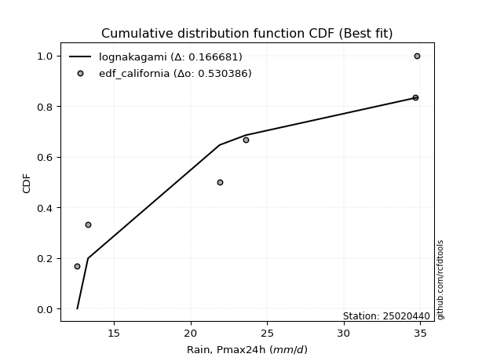</img>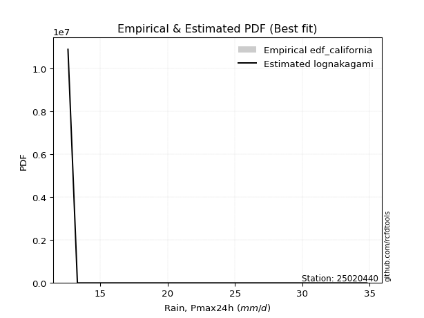</img>

</div>


### 2. Empirical - EDF Hazen (1930)

Hazen method for plotting positions is a formula used to estimate the empirical cumulative probability distribution of flood events or other hydrological data. This formula often results in biased estimations, particularly when extrapolating to extreme events (high return periods).

<div align="center">


$P=(m-0.5)/n$


</div>


**2.1. Empirical values**

<div align="center">

|                | 0                   | 1                   | 2                   | 3         | 4                  | 5                  | 6                  |
|:---------------|:--------------------|:--------------------|:--------------------|:----------|:-------------------|:-------------------|:-------------------|
| date           | 2019                | 2021                | 2025                | 2022      | 2023               | 2020               | 2024               |
| x              | 12.6                | 13.3                | 14.0                | 21.9      | 23.6               | 34.7               | 34.8               |
| m              | 1                   | 2                   | 3                   | 4         | 5                  | 6                  | 7                  |
| empirical_dist | edf_hazen           | edf_hazen           | edf_hazen           | edf_hazen | edf_hazen          | edf_hazen          | edf_hazen          |
| empirical      | 0.07142857142857142 | 0.21428571428571427 | 0.35714285714285715 | 0.5       | 0.6428571428571429 | 0.7857142857142857 | 0.9285714285714286 |
| empirical_tr   | 1.0769230769230769  | 1.2727272727272727  | 1.5555555555555558  | 2.0       | 2.8000000000000003 | 4.666666666666666  | 14.000000000000007 |

</div>


**2.2. Kolmogorov-Smirnov fit test (sorted by Δ)**


<div align="center">

|                | 0                   | 1                   | 2                   | 3                   | 4                   | 5                   | 6                   | 7                   | 8                   | 9                   | 10                  | 11                  | 12                  | 13                  | 14                  | 15                  | 16                  | 17                  | 18                  | 19                  | 20                  | 21                  | 22                  | 23                  | 24                  | 25                  | 26                  | 27                  | 28                  | 29                  | 30                  | 31                  | 32                    | 33                  | 34                  | 35                  | 36                  | 37                  | 38                  | 39                  | 40                  | 41                  | 42                  | 43                  | 44                  | 45                  | 46                  | 47                  | 48                  | 49                  | 50                  | 51                  | 52                  | 53                  | 54                  | 55                  | 56                  | 57                  | 58                  | 59                  | 60                  | 61                  | 62                  | 63                  | 64                  | 65                  | 66                  | 67                  | 68                  | 69                  | 70                  | 71                  | 72                  | 73                  | 74                  | 75                  | 76                  | 77                  | 78                  | 79                  | 80                  | 81                  | 82                  | 83                  | 84                  | 85                  | 86                  | 87                  | 88                  | 89                  |
|:---------------|:--------------------|:--------------------|:--------------------|:--------------------|:--------------------|:--------------------|:--------------------|:--------------------|:--------------------|:--------------------|:--------------------|:--------------------|:--------------------|:--------------------|:--------------------|:--------------------|:--------------------|:--------------------|:--------------------|:--------------------|:--------------------|:--------------------|:--------------------|:--------------------|:--------------------|:--------------------|:--------------------|:--------------------|:--------------------|:--------------------|:--------------------|:--------------------|:----------------------|:--------------------|:--------------------|:--------------------|:--------------------|:--------------------|:--------------------|:--------------------|:--------------------|:--------------------|:--------------------|:--------------------|:--------------------|:--------------------|:--------------------|:--------------------|:--------------------|:--------------------|:--------------------|:--------------------|:--------------------|:--------------------|:--------------------|:--------------------|:--------------------|:--------------------|:--------------------|:--------------------|:--------------------|:--------------------|:--------------------|:--------------------|:--------------------|:--------------------|:--------------------|:--------------------|:--------------------|:--------------------|:--------------------|:--------------------|:--------------------|:--------------------|:--------------------|:--------------------|:--------------------|:--------------------|:--------------------|:--------------------|:--------------------|:--------------------|:--------------------|:--------------------|:--------------------|:--------------------|:--------------------|:--------------------|:--------------------|:--------------------|
| station        | 25020440            | 25020440            | 25020440            | 25020440            | 25020440            | 25020440            | 25020440            | 25020440            | 25020440            | 25020440            | 25020440            | 25020440            | 25020440            | 25020440            | 25020440            | 25020440            | 25020440            | 25020440            | 25020440            | 25020440            | 25020440            | 25020440            | 25020440            | 25020440            | 25020440            | 25020440            | 25020440            | 25020440            | 25020440            | 25020440            | 25020440            | 25020440            | 25020440              | 25020440            | 25020440            | 25020440            | 25020440            | 25020440            | 25020440            | 25020440            | 25020440            | 25020440            | 25020440            | 25020440            | 25020440            | 25020440            | 25020440            | 25020440            | 25020440            | 25020440            | 25020440            | 25020440            | 25020440            | 25020440            | 25020440            | 25020440            | 25020440            | 25020440            | 25020440            | 25020440            | 25020440            | 25020440            | 25020440            | 25020440            | 25020440            | 25020440            | 25020440            | 25020440            | 25020440            | 25020440            | 25020440            | 25020440            | 25020440            | 25020440            | 25020440            | 25020440            | 25020440            | 25020440            | 25020440            | 25020440            | 25020440            | 25020440            | 25020440            | 25020440            | 25020440            | 25020440            | 25020440            | 25020440            | 25020440            | 25020440            |
| empirical_dist | edf_hazen           | edf_hazen           | edf_hazen           | edf_hazen           | edf_hazen           | edf_hazen           | edf_hazen           | edf_hazen           | edf_hazen           | edf_hazen           | edf_hazen           | edf_hazen           | edf_hazen           | edf_hazen           | edf_hazen           | edf_hazen           | edf_hazen           | edf_hazen           | edf_hazen           | edf_hazen           | edf_hazen           | edf_hazen           | edf_hazen           | edf_hazen           | edf_hazen           | edf_hazen           | edf_hazen           | edf_hazen           | edf_hazen           | edf_hazen           | edf_hazen           | edf_hazen           | edf_hazen             | edf_hazen           | edf_hazen           | edf_hazen           | edf_hazen           | edf_hazen           | edf_hazen           | edf_hazen           | edf_hazen           | edf_hazen           | edf_hazen           | edf_hazen           | edf_hazen           | edf_hazen           | edf_hazen           | edf_hazen           | edf_hazen           | edf_hazen           | edf_hazen           | edf_hazen           | edf_hazen           | edf_hazen           | edf_hazen           | edf_hazen           | edf_hazen           | edf_hazen           | edf_hazen           | edf_hazen           | edf_hazen           | edf_hazen           | edf_hazen           | edf_hazen           | edf_hazen           | edf_hazen           | edf_hazen           | edf_hazen           | edf_hazen           | edf_hazen           | edf_hazen           | edf_hazen           | edf_hazen           | edf_hazen           | edf_hazen           | edf_hazen           | edf_hazen           | edf_hazen           | edf_hazen           | edf_hazen           | edf_hazen           | edf_hazen           | edf_hazen           | edf_hazen           | edf_hazen           | edf_hazen           | edf_hazen           | edf_hazen           | edf_hazen           | edf_hazen           |
| p_dist         | nakagami            | logncf              | weibull_min         | halfnorm            | rayleigh            | maxwell             | loghalfnorm         | loginvgamma         | lograyleigh         | logbetaprime        | loggenlogistic      | logmaxwell          | chi2                | johnsonsu           | pearson3            | nct                 | logkstwobign        | crystalball         | norm                | t                   | lognct              | logalpha            | mielke              | ncf                 | logloggamma         | logpearson3         | logerlang           | logt                | lognorm             | lognorm             | logcrystalball      | logexponnorm        | loglaplace_asymmetric | fisk                | logjohnsonsu        | betaprime           | loggamma            | loggamma            | genlogistic         | logexpon            | laplace_asymmetric  | logweibull_min      | loggenexpon         | kstwobign           | gumbel_r            | lognakagami         | logistic            | gumbel_l            | halflogistic        | loggumbel_r         | loggumbel_l         | loglogistic         | logrice             | invweibull          | logf                | loghalflogistic     | hypsecant           | truncnorm           | loghypsecant        | moyal               | rice                | loginvweibull       | exponnorm           | logmoyal            | f                   | laplace             | invgamma            | expon               | loglaplace          | alpha               | genexpon            | loggompertz         | logtruncnorm        | gompertz            | loginvgauss         | invgauss            | logchi2             | logfisk             | pareto              | wald                | logwald             | loggibrat           | gibrat              | logpareto           | loglognorm          | gamma               | fatiguelife         | logfatiguelife      | erlang              | logmielke           |
| delta          | 0.11982333257641459 | 0.12468578327312882 | 0.15430315746029044 | 0.16135353613152417 | 0.1637654068969726  | 0.16733691135354628 | 0.16825506922506842 | 0.16833785977651286 | 0.168864350479244   | 0.169878509982436   | 0.17181372174349507 | 0.17203751171958123 | 0.17339233561103518 | 0.1747908887022292  | 0.17489004076512368 | 0.17501053448807374 | 0.17575818321011713 | 0.1763546069064595  | 0.17635461503134403 | 0.17635912958149164 | 0.1764520419046117  | 0.17753385000939176 | 0.17793013051541495 | 0.17838349134562387 | 0.17862432735949932 | 0.17954734813601647 | 0.17961218747889482 | 0.1802171327558828  | 0.18021747863759296 | 0.18021747863759296 | 0.1802174968037925  | 0.1802189733165884  | 0.1802230046425572    | 0.18047538504662963 | 0.18064826569826353 | 0.18067490462081026 | 0.18161102652820835 | 0.18161102652820835 | 0.1825804474208246  | 0.18293887132373232 | 0.18576525809926211 | 0.18912359856944483 | 0.1892898291792084  | 0.1912917678270164  | 0.19337358354068893 | 0.1938896317466706  | 0.1966879828871688  | 0.1972451223075311  | 0.19890569441236725 | 0.1989472102925117  | 0.19999827217409513 | 0.20026664464950317 | 0.20300069322627162 | 0.20316541645883368 | 0.20565423916520587 | 0.2073213075664825  | 0.2080581472759863  | 0.21126435537639    | 0.21135997249724864 | 0.21275852564756403 | 0.21300493481768246 | 0.21535871730893075 | 0.2187344674332628  | 0.2192857732607767  | 0.21953594870470683 | 0.21954590022478296 | 0.21971921782864168 | 0.22050025728590997 | 0.22239225077873287 | 0.22602943219423444 | 0.2283919637195148  | 0.23005577472406824 | 0.2352749168800794  | 0.23582897021900256 | 0.23664700670830796 | 0.24216827574056765 | 0.2528807190150921  | 0.26406925819670723 | 0.3372199689496638  | 0.3552329853703601  | 0.3565876505129261  | 0.35714285714285715 | 0.35714285714285715 | 0.357867457981906   | 0.38455859824139693 | 0.3952940269491345  | 0.4138895192298405  | 0.4289247934265963  | 0.4340951099892906  | nan                 |
| deltao         | 0.48442053926100004 | 0.48442053926100004 | 0.48442053926100004 | 0.48442053926100004 | 0.48442053926100004 | 0.48442053926100004 | 0.48442053926100004 | 0.48442053926100004 | 0.48442053926100004 | 0.48442053926100004 | 0.48442053926100004 | 0.48442053926100004 | 0.48442053926100004 | 0.48442053926100004 | 0.48442053926100004 | 0.48442053926100004 | 0.48442053926100004 | 0.48442053926100004 | 0.48442053926100004 | 0.48442053926100004 | 0.48442053926100004 | 0.48442053926100004 | 0.48442053926100004 | 0.48442053926100004 | 0.48442053926100004 | 0.48442053926100004 | 0.48442053926100004 | 0.48442053926100004 | 0.48442053926100004 | 0.48442053926100004 | 0.48442053926100004 | 0.48442053926100004 | 0.48442053926100004   | 0.48442053926100004 | 0.48442053926100004 | 0.48442053926100004 | 0.48442053926100004 | 0.48442053926100004 | 0.48442053926100004 | 0.48442053926100004 | 0.48442053926100004 | 0.48442053926100004 | 0.48442053926100004 | 0.48442053926100004 | 0.48442053926100004 | 0.48442053926100004 | 0.48442053926100004 | 0.48442053926100004 | 0.48442053926100004 | 0.48442053926100004 | 0.48442053926100004 | 0.48442053926100004 | 0.48442053926100004 | 0.48442053926100004 | 0.48442053926100004 | 0.48442053926100004 | 0.48442053926100004 | 0.48442053926100004 | 0.48442053926100004 | 0.48442053926100004 | 0.48442053926100004 | 0.48442053926100004 | 0.48442053926100004 | 0.48442053926100004 | 0.48442053926100004 | 0.48442053926100004 | 0.48442053926100004 | 0.48442053926100004 | 0.48442053926100004 | 0.48442053926100004 | 0.48442053926100004 | 0.48442053926100004 | 0.48442053926100004 | 0.48442053926100004 | 0.48442053926100004 | 0.48442053926100004 | 0.48442053926100004 | 0.48442053926100004 | 0.48442053926100004 | 0.48442053926100004 | 0.48442053926100004 | 0.48442053926100004 | 0.48442053926100004 | 0.48442053926100004 | 0.48442053926100004 | 0.48442053926100004 | 0.48442053926100004 | 0.48442053926100004 | 0.48442053926100004 | 0.48442053926100004 |
| eval           | Δo > Δ              | Δo > Δ              | Δo > Δ              | Δo > Δ              | Δo > Δ              | Δo > Δ              | Δo > Δ              | Δo > Δ              | Δo > Δ              | Δo > Δ              | Δo > Δ              | Δo > Δ              | Δo > Δ              | Δo > Δ              | Δo > Δ              | Δo > Δ              | Δo > Δ              | Δo > Δ              | Δo > Δ              | Δo > Δ              | Δo > Δ              | Δo > Δ              | Δo > Δ              | Δo > Δ              | Δo > Δ              | Δo > Δ              | Δo > Δ              | Δo > Δ              | Δo > Δ              | Δo > Δ              | Δo > Δ              | Δo > Δ              | Δo > Δ                | Δo > Δ              | Δo > Δ              | Δo > Δ              | Δo > Δ              | Δo > Δ              | Δo > Δ              | Δo > Δ              | Δo > Δ              | Δo > Δ              | Δo > Δ              | Δo > Δ              | Δo > Δ              | Δo > Δ              | Δo > Δ              | Δo > Δ              | Δo > Δ              | Δo > Δ              | Δo > Δ              | Δo > Δ              | Δo > Δ              | Δo > Δ              | Δo > Δ              | Δo > Δ              | Δo > Δ              | Δo > Δ              | Δo > Δ              | Δo > Δ              | Δo > Δ              | Δo > Δ              | Δo > Δ              | Δo > Δ              | Δo > Δ              | Δo > Δ              | Δo > Δ              | Δo > Δ              | Δo > Δ              | Δo > Δ              | Δo > Δ              | Δo > Δ              | Δo > Δ              | Δo > Δ              | Δo > Δ              | Δo > Δ              | Δo > Δ              | Δo > Δ              | Δo > Δ              | Δo > Δ              | Δo > Δ              | Δo > Δ              | Δo > Δ              | Δo > Δ              | Δo > Δ              | Δo > Δ              | Δo > Δ              | Δo > Δ              | Δo > Δ              | Δo <= Δ             |
| fit            | 1                   | 1                   | 1                   | 1                   | 1                   | 1                   | 1                   | 1                   | 1                   | 1                   | 1                   | 1                   | 1                   | 1                   | 1                   | 1                   | 1                   | 1                   | 1                   | 1                   | 1                   | 1                   | 1                   | 1                   | 1                   | 1                   | 1                   | 1                   | 1                   | 1                   | 1                   | 1                   | 1                     | 1                   | 1                   | 1                   | 1                   | 1                   | 1                   | 1                   | 1                   | 1                   | 1                   | 1                   | 1                   | 1                   | 1                   | 1                   | 1                   | 1                   | 1                   | 1                   | 1                   | 1                   | 1                   | 1                   | 1                   | 1                   | 1                   | 1                   | 1                   | 1                   | 1                   | 1                   | 1                   | 1                   | 1                   | 1                   | 1                   | 1                   | 1                   | 1                   | 1                   | 1                   | 1                   | 1                   | 1                   | 1                   | 1                   | 1                   | 1                   | 1                   | 1                   | 1                   | 1                   | 1                   | 1                   | 1                   | 1                   | 0                   |
| n              | 7                   | 7                   | 7                   | 7                   | 7                   | 7                   | 7                   | 7                   | 7                   | 7                   | 7                   | 7                   | 7                   | 7                   | 7                   | 7                   | 7                   | 7                   | 7                   | 7                   | 7                   | 7                   | 7                   | 7                   | 7                   | 7                   | 7                   | 7                   | 7                   | 7                   | 7                   | 7                   | 7                     | 7                   | 7                   | 7                   | 7                   | 7                   | 7                   | 7                   | 7                   | 7                   | 7                   | 7                   | 7                   | 7                   | 7                   | 7                   | 7                   | 7                   | 7                   | 7                   | 7                   | 7                   | 7                   | 7                   | 7                   | 7                   | 7                   | 7                   | 7                   | 7                   | 7                   | 7                   | 7                   | 7                   | 7                   | 7                   | 7                   | 7                   | 7                   | 7                   | 7                   | 7                   | 7                   | 7                   | 7                   | 7                   | 7                   | 7                   | 7                   | 7                   | 7                   | 7                   | 7                   | 7                   | 7                   | 7                   | 7                   | 7                   |
| best_fit       | 1                   | 0                   | 0                   | 0                   | 0                   | 0                   | 0                   | 0                   | 0                   | 0                   | 0                   | 0                   | 0                   | 0                   | 0                   | 0                   | 0                   | 0                   | 0                   | 0                   | 0                   | 0                   | 0                   | 0                   | 0                   | 0                   | 0                   | 0                   | 0                   | 0                   | 0                   | 0                   | 0                     | 0                   | 0                   | 0                   | 0                   | 0                   | 0                   | 0                   | 0                   | 0                   | 0                   | 0                   | 0                   | 0                   | 0                   | 0                   | 0                   | 0                   | 0                   | 0                   | 0                   | 0                   | 0                   | 0                   | 0                   | 0                   | 0                   | 0                   | 0                   | 0                   | 0                   | 0                   | 0                   | 0                   | 0                   | 0                   | 0                   | 0                   | 0                   | 0                   | 0                   | 0                   | 0                   | 0                   | 0                   | 0                   | 0                   | 0                   | 0                   | 0                   | 0                   | 0                   | 0                   | 0                   | 0                   | 0                   | 0                   | 0                   |
| best_fit_sort  | 1                   | 2                   | 3                   | 4                   | 5                   | 6                   | 7                   | 8                   | 9                   | 10                  | 11                  | 12                  | 13                  | 14                  | 15                  | 16                  | 17                  | 18                  | 19                  | 20                  | 21                  | 22                  | 23                  | 24                  | 25                  | 26                  | 27                  | 28                  | 29                  | 30                  | 31                  | 32                  | 33                    | 34                  | 35                  | 36                  | 37                  | 38                  | 39                  | 40                  | 41                  | 42                  | 43                  | 44                  | 45                  | 46                  | 47                  | 48                  | 49                  | 50                  | 51                  | 52                  | 53                  | 54                  | 55                  | 56                  | 57                  | 58                  | 59                  | 60                  | 61                  | 62                  | 63                  | 64                  | 65                  | 66                  | 67                  | 68                  | 69                  | 70                  | 71                  | 72                  | 73                  | 74                  | 75                  | 76                  | 77                  | 78                  | 79                  | 80                  | 81                  | 82                  | 83                  | 84                  | 85                  | 86                  | 87                  | 88                  | 89                  | 90                  |

</div>


<div align="center">

</img>

</div>


**2.3. Best fit**

<div align="center">

|   id |   station | empirical_dist   | p_dist   |    delta |   deltao | eval   |   fit |   n |   best_fit |   best_fit_sort |
|-----:|----------:|:-----------------|:---------|---------:|---------:|:-------|------:|----:|-----------:|----------------:|
|    0 |  25020440 | edf_hazen        | nakagami | 0.119823 | 0.484421 | Δo > Δ |     1 |   7 |          1 |               1 |

</div>


<div align="center">

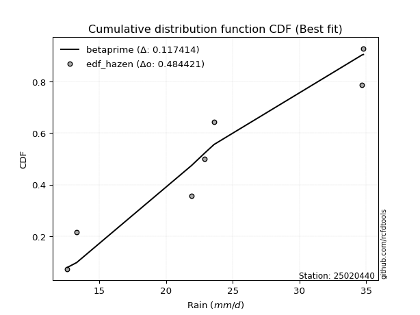</img>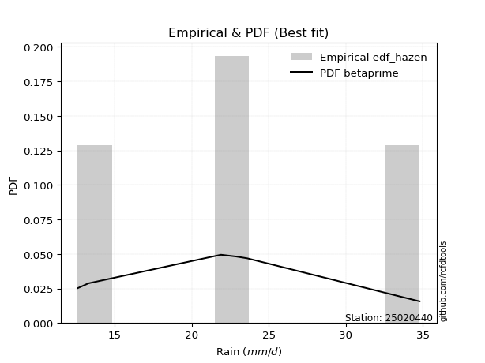</img>

</div>


### 3. Empirical - EDF Weibull (1939)

Weibull plotting position formula is an empirical method used to estimate the non-exceedance probability or plotting position for a set of observed data, is often recommended or widely used in practice, particularly in flood frequency analysis.

<div align="center">


$P=m/(n+1)$


</div>


**3.1. Empirical values**

<div align="center">

|                | 0                  | 1                  | 2           | 3           | 4                  | 5           | 6           |
|:---------------|:-------------------|:-------------------|:------------|:------------|:-------------------|:------------|:------------|
| date           | 2019               | 2021               | 2025        | 2022        | 2023               | 2020        | 2024        |
| x              | 12.6               | 13.3               | 14.0        | 21.9        | 23.6               | 34.7        | 34.8        |
| m              | 1                  | 2                  | 3           | 4           | 5                  | 6           | 7           |
| empirical_dist | edf_weibull        | edf_weibull        | edf_weibull | edf_weibull | edf_weibull        | edf_weibull | edf_weibull |
| empirical      | 0.125              | 0.25               | 0.375       | 0.5         | 0.625              | 0.75        | 0.875       |
| empirical_tr   | 1.1428571428571428 | 1.3333333333333333 | 1.6         | 2.0         | 2.6666666666666665 | 4.0         | 8.0         |

</div>


**3.2. Kolmogorov-Smirnov fit test (sorted by Δ)**


<div align="center">

|                | 0                   | 1                   | 2                   | 3                   | 4                   | 5                   | 6                   | 7                   | 8                   | 9                   | 10                  | 11                  | 12                  | 13                  | 14                  | 15                  | 16                  | 17                  | 18                  | 19                  | 20                  | 21                  | 22                  | 23                  | 24                  | 25                  | 26                  | 27                  | 28                  | 29                  | 30                  | 31                  | 32                  | 33                  | 34                  | 35                    | 36                  | 37                  | 38                  | 39                  | 40                  | 41                  | 42                  | 43                  | 44                  | 45                  | 46                  | 47                  | 48                  | 49                  | 50                  | 51                  | 52                  | 53                  | 54                  | 55                  | 56                  | 57                  | 58                  | 59                  | 60                  | 61                  | 62                  | 63                  | 64                  | 65                  | 66                  | 67                  | 68                  | 69                  | 70                  | 71                  | 72                  | 73                  | 74                  | 75                  | 76                  | 77                  | 78                  | 79                  | 80                  | 81                  | 82                  | 83                  | 84                  | 85                  | 86                  | 87                  | 88                  | 89                  |
|:---------------|:--------------------|:--------------------|:--------------------|:--------------------|:--------------------|:--------------------|:--------------------|:--------------------|:--------------------|:--------------------|:--------------------|:--------------------|:--------------------|:--------------------|:--------------------|:--------------------|:--------------------|:--------------------|:--------------------|:--------------------|:--------------------|:--------------------|:--------------------|:--------------------|:--------------------|:--------------------|:--------------------|:--------------------|:--------------------|:--------------------|:--------------------|:--------------------|:--------------------|:--------------------|:--------------------|:----------------------|:--------------------|:--------------------|:--------------------|:--------------------|:--------------------|:--------------------|:--------------------|:--------------------|:--------------------|:--------------------|:--------------------|:--------------------|:--------------------|:--------------------|:--------------------|:--------------------|:--------------------|:--------------------|:--------------------|:--------------------|:--------------------|:--------------------|:--------------------|:--------------------|:--------------------|:--------------------|:--------------------|:--------------------|:--------------------|:--------------------|:--------------------|:--------------------|:--------------------|:--------------------|:--------------------|:--------------------|:--------------------|:--------------------|:--------------------|:--------------------|:--------------------|:--------------------|:--------------------|:--------------------|:--------------------|:--------------------|:--------------------|:--------------------|:--------------------|:--------------------|:--------------------|:--------------------|:--------------------|:--------------------|
| station        | 25020440            | 25020440            | 25020440            | 25020440            | 25020440            | 25020440            | 25020440            | 25020440            | 25020440            | 25020440            | 25020440            | 25020440            | 25020440            | 25020440            | 25020440            | 25020440            | 25020440            | 25020440            | 25020440            | 25020440            | 25020440            | 25020440            | 25020440            | 25020440            | 25020440            | 25020440            | 25020440            | 25020440            | 25020440            | 25020440            | 25020440            | 25020440            | 25020440            | 25020440            | 25020440            | 25020440              | 25020440            | 25020440            | 25020440            | 25020440            | 25020440            | 25020440            | 25020440            | 25020440            | 25020440            | 25020440            | 25020440            | 25020440            | 25020440            | 25020440            | 25020440            | 25020440            | 25020440            | 25020440            | 25020440            | 25020440            | 25020440            | 25020440            | 25020440            | 25020440            | 25020440            | 25020440            | 25020440            | 25020440            | 25020440            | 25020440            | 25020440            | 25020440            | 25020440            | 25020440            | 25020440            | 25020440            | 25020440            | 25020440            | 25020440            | 25020440            | 25020440            | 25020440            | 25020440            | 25020440            | 25020440            | 25020440            | 25020440            | 25020440            | 25020440            | 25020440            | 25020440            | 25020440            | 25020440            | 25020440            |
| empirical_dist | edf_weibull         | edf_weibull         | edf_weibull         | edf_weibull         | edf_weibull         | edf_weibull         | edf_weibull         | edf_weibull         | edf_weibull         | edf_weibull         | edf_weibull         | edf_weibull         | edf_weibull         | edf_weibull         | edf_weibull         | edf_weibull         | edf_weibull         | edf_weibull         | edf_weibull         | edf_weibull         | edf_weibull         | edf_weibull         | edf_weibull         | edf_weibull         | edf_weibull         | edf_weibull         | edf_weibull         | edf_weibull         | edf_weibull         | edf_weibull         | edf_weibull         | edf_weibull         | edf_weibull         | edf_weibull         | edf_weibull         | edf_weibull           | edf_weibull         | edf_weibull         | edf_weibull         | edf_weibull         | edf_weibull         | edf_weibull         | edf_weibull         | edf_weibull         | edf_weibull         | edf_weibull         | edf_weibull         | edf_weibull         | edf_weibull         | edf_weibull         | edf_weibull         | edf_weibull         | edf_weibull         | edf_weibull         | edf_weibull         | edf_weibull         | edf_weibull         | edf_weibull         | edf_weibull         | edf_weibull         | edf_weibull         | edf_weibull         | edf_weibull         | edf_weibull         | edf_weibull         | edf_weibull         | edf_weibull         | edf_weibull         | edf_weibull         | edf_weibull         | edf_weibull         | edf_weibull         | edf_weibull         | edf_weibull         | edf_weibull         | edf_weibull         | edf_weibull         | edf_weibull         | edf_weibull         | edf_weibull         | edf_weibull         | edf_weibull         | edf_weibull         | edf_weibull         | edf_weibull         | edf_weibull         | edf_weibull         | edf_weibull         | edf_weibull         | edf_weibull         |
| p_dist         | logncf              | nakagami            | fisk                | weibull_min         | chi2                | mielke              | halfnorm            | rayleigh            | logexpon            | maxwell             | loghalfnorm         | loginvgamma         | lograyleigh         | logbetaprime        | logweibull_min      | loggenlogistic      | logmaxwell          | johnsonsu           | pearson3            | nct                 | logkstwobign        | crystalball         | norm                | t                   | lognct              | logalpha            | ncf                 | logloggamma         | logpearson3         | logerlang           | logt                | lognorm             | lognorm             | logcrystalball      | logexponnorm        | loglaplace_asymmetric | logjohnsonsu        | betaprime           | logchi2             | loggamma            | loggamma            | genlogistic         | invweibull          | laplace_asymmetric  | logf                | loggenexpon         | kstwobign           | logfisk             | gumbel_r            | lognakagami         | logistic            | loginvweibull       | halflogistic        | loggumbel_r         | gumbel_l            | loggumbel_l         | loglogistic         | f                   | invgamma            | logrice             | loghalflogistic     | hypsecant           | alpha               | loghypsecant        | moyal               | rice                | exponnorm           | loginvgauss         | logmoyal            | laplace             | expon               | loglaplace          | invgauss            | genexpon            | truncnorm           | loggompertz         | logtruncnorm        | gompertz            | pareto              | logpareto           | loglognorm          | wald                | logwald             | loggibrat           | gibrat              | fatiguelife         | logfatiguelife      | gamma               | erlang              | logmielke           |
| delta          | 0.11924911153745993 | 0.13768047543355744 | 0.14493503102700991 | 0.15430315746029044 | 0.17339233561103518 | 0.17793013051541495 | 0.17921067898866702 | 0.18162254975411546 | 0.18293887132373232 | 0.18519405421068913 | 0.18611221208221126 | 0.1861950026336557  | 0.18672149333638685 | 0.18773565283957885 | 0.18912359856944483 | 0.18967086460063792 | 0.18989465457672408 | 0.19264803155937205 | 0.19274718362226653 | 0.1928676773452166  | 0.19361532606725998 | 0.19421174976360234 | 0.19421175788848688 | 0.19421627243863449 | 0.19430918476175454 | 0.1953909928665346  | 0.19624063420276672 | 0.19648147021664217 | 0.19740449099315932 | 0.19746933033603767 | 0.19807427561302565 | 0.19807462149473581 | 0.19807462149473581 | 0.19807463966093536 | 0.19807611617373125 | 0.19808014749970004   | 0.19850540855540638 | 0.1985320474779531  | 0.19930929044366352 | 0.1994681693853512  | 0.1994681693853512  | 0.20043759027796745 | 0.20316541645883368 | 0.20362240095640496 | 0.20565423916520587 | 0.20714697203635124 | 0.20914891068415925 | 0.21049782962527863 | 0.21123072639783178 | 0.21174677460381344 | 0.21454512574431164 | 0.21535871730893075 | 0.2167628372695101  | 0.21680435314965454 | 0.21760776998394404 | 0.21785541503123798 | 0.21812378750664602 | 0.21953594870470683 | 0.21971921782864168 | 0.22085783608341447 | 0.22517845042362536 | 0.22591529013312914 | 0.22602943219423444 | 0.2292171153543915  | 0.23061566850470688 | 0.2308620776748253  | 0.23659161029040565 | 0.23664700670830796 | 0.23714291611791954 | 0.2374030430819258  | 0.23835740014305282 | 0.24024939363587572 | 0.24216827574056765 | 0.24624910657665766 | 0.2469786410906757  | 0.2479129175812111  | 0.24893183804986352 | 0.2536861130761454  | 0.3015056832353781  | 0.3221531722676203  | 0.34884431252711123 | 0.3730901282275029  | 0.374444793370069   | 0.375               | 0.375               | 0.3833679935464642  | 0.3932105077123106  | 0.3952940269491345  | 0.4340951099892906  | nan                 |
| deltao         | 0.48442053926100004 | 0.48442053926100004 | 0.48442053926100004 | 0.48442053926100004 | 0.48442053926100004 | 0.48442053926100004 | 0.48442053926100004 | 0.48442053926100004 | 0.48442053926100004 | 0.48442053926100004 | 0.48442053926100004 | 0.48442053926100004 | 0.48442053926100004 | 0.48442053926100004 | 0.48442053926100004 | 0.48442053926100004 | 0.48442053926100004 | 0.48442053926100004 | 0.48442053926100004 | 0.48442053926100004 | 0.48442053926100004 | 0.48442053926100004 | 0.48442053926100004 | 0.48442053926100004 | 0.48442053926100004 | 0.48442053926100004 | 0.48442053926100004 | 0.48442053926100004 | 0.48442053926100004 | 0.48442053926100004 | 0.48442053926100004 | 0.48442053926100004 | 0.48442053926100004 | 0.48442053926100004 | 0.48442053926100004 | 0.48442053926100004   | 0.48442053926100004 | 0.48442053926100004 | 0.48442053926100004 | 0.48442053926100004 | 0.48442053926100004 | 0.48442053926100004 | 0.48442053926100004 | 0.48442053926100004 | 0.48442053926100004 | 0.48442053926100004 | 0.48442053926100004 | 0.48442053926100004 | 0.48442053926100004 | 0.48442053926100004 | 0.48442053926100004 | 0.48442053926100004 | 0.48442053926100004 | 0.48442053926100004 | 0.48442053926100004 | 0.48442053926100004 | 0.48442053926100004 | 0.48442053926100004 | 0.48442053926100004 | 0.48442053926100004 | 0.48442053926100004 | 0.48442053926100004 | 0.48442053926100004 | 0.48442053926100004 | 0.48442053926100004 | 0.48442053926100004 | 0.48442053926100004 | 0.48442053926100004 | 0.48442053926100004 | 0.48442053926100004 | 0.48442053926100004 | 0.48442053926100004 | 0.48442053926100004 | 0.48442053926100004 | 0.48442053926100004 | 0.48442053926100004 | 0.48442053926100004 | 0.48442053926100004 | 0.48442053926100004 | 0.48442053926100004 | 0.48442053926100004 | 0.48442053926100004 | 0.48442053926100004 | 0.48442053926100004 | 0.48442053926100004 | 0.48442053926100004 | 0.48442053926100004 | 0.48442053926100004 | 0.48442053926100004 | 0.48442053926100004 |
| eval           | Δo > Δ              | Δo > Δ              | Δo > Δ              | Δo > Δ              | Δo > Δ              | Δo > Δ              | Δo > Δ              | Δo > Δ              | Δo > Δ              | Δo > Δ              | Δo > Δ              | Δo > Δ              | Δo > Δ              | Δo > Δ              | Δo > Δ              | Δo > Δ              | Δo > Δ              | Δo > Δ              | Δo > Δ              | Δo > Δ              | Δo > Δ              | Δo > Δ              | Δo > Δ              | Δo > Δ              | Δo > Δ              | Δo > Δ              | Δo > Δ              | Δo > Δ              | Δo > Δ              | Δo > Δ              | Δo > Δ              | Δo > Δ              | Δo > Δ              | Δo > Δ              | Δo > Δ              | Δo > Δ                | Δo > Δ              | Δo > Δ              | Δo > Δ              | Δo > Δ              | Δo > Δ              | Δo > Δ              | Δo > Δ              | Δo > Δ              | Δo > Δ              | Δo > Δ              | Δo > Δ              | Δo > Δ              | Δo > Δ              | Δo > Δ              | Δo > Δ              | Δo > Δ              | Δo > Δ              | Δo > Δ              | Δo > Δ              | Δo > Δ              | Δo > Δ              | Δo > Δ              | Δo > Δ              | Δo > Δ              | Δo > Δ              | Δo > Δ              | Δo > Δ              | Δo > Δ              | Δo > Δ              | Δo > Δ              | Δo > Δ              | Δo > Δ              | Δo > Δ              | Δo > Δ              | Δo > Δ              | Δo > Δ              | Δo > Δ              | Δo > Δ              | Δo > Δ              | Δo > Δ              | Δo > Δ              | Δo > Δ              | Δo > Δ              | Δo > Δ              | Δo > Δ              | Δo > Δ              | Δo > Δ              | Δo > Δ              | Δo > Δ              | Δo > Δ              | Δo > Δ              | Δo > Δ              | Δo > Δ              | Δo <= Δ             |
| fit            | 1                   | 1                   | 1                   | 1                   | 1                   | 1                   | 1                   | 1                   | 1                   | 1                   | 1                   | 1                   | 1                   | 1                   | 1                   | 1                   | 1                   | 1                   | 1                   | 1                   | 1                   | 1                   | 1                   | 1                   | 1                   | 1                   | 1                   | 1                   | 1                   | 1                   | 1                   | 1                   | 1                   | 1                   | 1                   | 1                     | 1                   | 1                   | 1                   | 1                   | 1                   | 1                   | 1                   | 1                   | 1                   | 1                   | 1                   | 1                   | 1                   | 1                   | 1                   | 1                   | 1                   | 1                   | 1                   | 1                   | 1                   | 1                   | 1                   | 1                   | 1                   | 1                   | 1                   | 1                   | 1                   | 1                   | 1                   | 1                   | 1                   | 1                   | 1                   | 1                   | 1                   | 1                   | 1                   | 1                   | 1                   | 1                   | 1                   | 1                   | 1                   | 1                   | 1                   | 1                   | 1                   | 1                   | 1                   | 1                   | 1                   | 0                   |
| n              | 7                   | 7                   | 7                   | 7                   | 7                   | 7                   | 7                   | 7                   | 7                   | 7                   | 7                   | 7                   | 7                   | 7                   | 7                   | 7                   | 7                   | 7                   | 7                   | 7                   | 7                   | 7                   | 7                   | 7                   | 7                   | 7                   | 7                   | 7                   | 7                   | 7                   | 7                   | 7                   | 7                   | 7                   | 7                   | 7                     | 7                   | 7                   | 7                   | 7                   | 7                   | 7                   | 7                   | 7                   | 7                   | 7                   | 7                   | 7                   | 7                   | 7                   | 7                   | 7                   | 7                   | 7                   | 7                   | 7                   | 7                   | 7                   | 7                   | 7                   | 7                   | 7                   | 7                   | 7                   | 7                   | 7                   | 7                   | 7                   | 7                   | 7                   | 7                   | 7                   | 7                   | 7                   | 7                   | 7                   | 7                   | 7                   | 7                   | 7                   | 7                   | 7                   | 7                   | 7                   | 7                   | 7                   | 7                   | 7                   | 7                   | 7                   |
| best_fit       | 1                   | 0                   | 0                   | 0                   | 0                   | 0                   | 0                   | 0                   | 0                   | 0                   | 0                   | 0                   | 0                   | 0                   | 0                   | 0                   | 0                   | 0                   | 0                   | 0                   | 0                   | 0                   | 0                   | 0                   | 0                   | 0                   | 0                   | 0                   | 0                   | 0                   | 0                   | 0                   | 0                   | 0                   | 0                   | 0                     | 0                   | 0                   | 0                   | 0                   | 0                   | 0                   | 0                   | 0                   | 0                   | 0                   | 0                   | 0                   | 0                   | 0                   | 0                   | 0                   | 0                   | 0                   | 0                   | 0                   | 0                   | 0                   | 0                   | 0                   | 0                   | 0                   | 0                   | 0                   | 0                   | 0                   | 0                   | 0                   | 0                   | 0                   | 0                   | 0                   | 0                   | 0                   | 0                   | 0                   | 0                   | 0                   | 0                   | 0                   | 0                   | 0                   | 0                   | 0                   | 0                   | 0                   | 0                   | 0                   | 0                   | 0                   |
| best_fit_sort  | 1                   | 2                   | 3                   | 4                   | 5                   | 6                   | 7                   | 8                   | 9                   | 10                  | 11                  | 12                  | 13                  | 14                  | 15                  | 16                  | 17                  | 18                  | 19                  | 20                  | 21                  | 22                  | 23                  | 24                  | 25                  | 26                  | 27                  | 28                  | 29                  | 30                  | 31                  | 32                  | 33                  | 34                  | 35                  | 36                    | 37                  | 38                  | 39                  | 40                  | 41                  | 42                  | 43                  | 44                  | 45                  | 46                  | 47                  | 48                  | 49                  | 50                  | 51                  | 52                  | 53                  | 54                  | 55                  | 56                  | 57                  | 58                  | 59                  | 60                  | 61                  | 62                  | 63                  | 64                  | 65                  | 66                  | 67                  | 68                  | 69                  | 70                  | 71                  | 72                  | 73                  | 74                  | 75                  | 76                  | 77                  | 78                  | 79                  | 80                  | 81                  | 82                  | 83                  | 84                  | 85                  | 86                  | 87                  | 88                  | 89                  | 90                  |

</div>


<div align="center">

</img>

</div>


**3.3. Best fit**

<div align="center">

|   id |   station | empirical_dist   | p_dist   |    delta |   deltao | eval   |   fit |   n |   best_fit |   best_fit_sort |
|-----:|----------:|:-----------------|:---------|---------:|---------:|:-------|------:|----:|-----------:|----------------:|
|    0 |  25020440 | edf_weibull      | logncf   | 0.119249 | 0.484421 | Δo > Δ |     1 |   7 |          1 |               1 |

</div>


<div align="center">

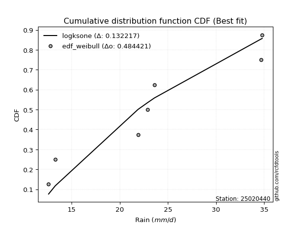</img>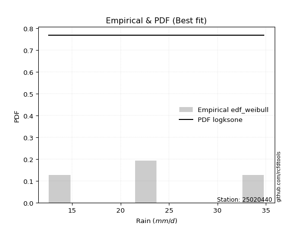</img>

</div>


### 4. Empirical - EDF Beard (1943)

The Beard formula (or Beard´s plotting position formula) in hydrology is used to estimate the empirical non-exceedance probability _(P)_ of a flood event (or other extreme hydrological data point) within a given dataset.

<div align="center">


$P=(m-0.31)/(n+0.38)$


</div>


**4.1. Empirical values**

<div align="center">

|                | 0                   | 1                   | 2                   | 3         | 4                  | 5                  | 6                  |
|:---------------|:--------------------|:--------------------|:--------------------|:----------|:-------------------|:-------------------|:-------------------|
| date           | 2019                | 2021                | 2025                | 2022      | 2023               | 2020               | 2024               |
| x              | 12.6                | 13.3                | 14.0                | 21.9      | 23.6               | 34.7               | 34.8               |
| m              | 1                   | 2                   | 3                   | 4         | 5                  | 6                  | 7                  |
| empirical_dist | edf_beard           | edf_beard           | edf_beard           | edf_beard | edf_beard          | edf_beard          | edf_beard          |
| empirical      | 0.09349593495934959 | 0.22899728997289973 | 0.36449864498644985 | 0.5       | 0.6355013550135502 | 0.7710027100271003 | 0.9065040650406505 |
| empirical_tr   | 1.1031390134529149  | 1.29701230228471    | 1.5735607675906182  | 2.0       | 2.743494423791822  | 4.366863905325444  | 10.695652173913055 |

</div>


**4.2. Kolmogorov-Smirnov fit test (sorted by Δ)**


<div align="center">

|                | 0                   | 1                   | 2                   | 3                   | 4                   | 5                   | 6                   | 7                   | 8                   | 9                   | 10                  | 11                  | 12                  | 13                  | 14                  | 15                  | 16                  | 17                  | 18                  | 19                  | 20                  | 21                  | 22                  | 23                  | 24                  | 25                  | 26                  | 27                  | 28                  | 29                  | 30                  | 31                  | 32                  | 33                  | 34                    | 35                  | 36                  | 37                  | 38                  | 39                  | 40                  | 41                  | 42                  | 43                  | 44                  | 45                  | 46                  | 47                  | 48                  | 49                  | 50                  | 51                  | 52                  | 53                  | 54                  | 55                  | 56                  | 57                  | 58                  | 59                  | 60                  | 61                  | 62                  | 63                  | 64                  | 65                  | 66                  | 67                  | 68                  | 69                  | 70                  | 71                  | 72                  | 73                  | 74                  | 75                  | 76                  | 77                  | 78                  | 79                  | 80                  | 81                  | 82                  | 83                  | 84                  | 85                  | 86                  | 87                  | 88                  | 89                  |
|:---------------|:--------------------|:--------------------|:--------------------|:--------------------|:--------------------|:--------------------|:--------------------|:--------------------|:--------------------|:--------------------|:--------------------|:--------------------|:--------------------|:--------------------|:--------------------|:--------------------|:--------------------|:--------------------|:--------------------|:--------------------|:--------------------|:--------------------|:--------------------|:--------------------|:--------------------|:--------------------|:--------------------|:--------------------|:--------------------|:--------------------|:--------------------|:--------------------|:--------------------|:--------------------|:----------------------|:--------------------|:--------------------|:--------------------|:--------------------|:--------------------|:--------------------|:--------------------|:--------------------|:--------------------|:--------------------|:--------------------|:--------------------|:--------------------|:--------------------|:--------------------|:--------------------|:--------------------|:--------------------|:--------------------|:--------------------|:--------------------|:--------------------|:--------------------|:--------------------|:--------------------|:--------------------|:--------------------|:--------------------|:--------------------|:--------------------|:--------------------|:--------------------|:--------------------|:--------------------|:--------------------|:--------------------|:--------------------|:--------------------|:--------------------|:--------------------|:--------------------|:--------------------|:--------------------|:--------------------|:--------------------|:--------------------|:--------------------|:--------------------|:--------------------|:--------------------|:--------------------|:--------------------|:--------------------|:--------------------|:--------------------|
| station        | 25020440            | 25020440            | 25020440            | 25020440            | 25020440            | 25020440            | 25020440            | 25020440            | 25020440            | 25020440            | 25020440            | 25020440            | 25020440            | 25020440            | 25020440            | 25020440            | 25020440            | 25020440            | 25020440            | 25020440            | 25020440            | 25020440            | 25020440            | 25020440            | 25020440            | 25020440            | 25020440            | 25020440            | 25020440            | 25020440            | 25020440            | 25020440            | 25020440            | 25020440            | 25020440              | 25020440            | 25020440            | 25020440            | 25020440            | 25020440            | 25020440            | 25020440            | 25020440            | 25020440            | 25020440            | 25020440            | 25020440            | 25020440            | 25020440            | 25020440            | 25020440            | 25020440            | 25020440            | 25020440            | 25020440            | 25020440            | 25020440            | 25020440            | 25020440            | 25020440            | 25020440            | 25020440            | 25020440            | 25020440            | 25020440            | 25020440            | 25020440            | 25020440            | 25020440            | 25020440            | 25020440            | 25020440            | 25020440            | 25020440            | 25020440            | 25020440            | 25020440            | 25020440            | 25020440            | 25020440            | 25020440            | 25020440            | 25020440            | 25020440            | 25020440            | 25020440            | 25020440            | 25020440            | 25020440            | 25020440            |
| empirical_dist | edf_beard           | edf_beard           | edf_beard           | edf_beard           | edf_beard           | edf_beard           | edf_beard           | edf_beard           | edf_beard           | edf_beard           | edf_beard           | edf_beard           | edf_beard           | edf_beard           | edf_beard           | edf_beard           | edf_beard           | edf_beard           | edf_beard           | edf_beard           | edf_beard           | edf_beard           | edf_beard           | edf_beard           | edf_beard           | edf_beard           | edf_beard           | edf_beard           | edf_beard           | edf_beard           | edf_beard           | edf_beard           | edf_beard           | edf_beard           | edf_beard             | edf_beard           | edf_beard           | edf_beard           | edf_beard           | edf_beard           | edf_beard           | edf_beard           | edf_beard           | edf_beard           | edf_beard           | edf_beard           | edf_beard           | edf_beard           | edf_beard           | edf_beard           | edf_beard           | edf_beard           | edf_beard           | edf_beard           | edf_beard           | edf_beard           | edf_beard           | edf_beard           | edf_beard           | edf_beard           | edf_beard           | edf_beard           | edf_beard           | edf_beard           | edf_beard           | edf_beard           | edf_beard           | edf_beard           | edf_beard           | edf_beard           | edf_beard           | edf_beard           | edf_beard           | edf_beard           | edf_beard           | edf_beard           | edf_beard           | edf_beard           | edf_beard           | edf_beard           | edf_beard           | edf_beard           | edf_beard           | edf_beard           | edf_beard           | edf_beard           | edf_beard           | edf_beard           | edf_beard           | edf_beard           |
| p_dist         | logncf              | nakagami            | weibull_min         | fisk                | halfnorm            | rayleigh            | chi2                | maxwell             | loghalfnorm         | loginvgamma         | lograyleigh         | logbetaprime        | mielke              | loggenlogistic      | logmaxwell          | johnsonsu           | pearson3            | nct                 | logexpon            | logkstwobign        | crystalball         | norm                | t                   | lognct              | logalpha            | ncf                 | logloggamma         | logpearson3         | logerlang           | logt                | lognorm             | lognorm             | logcrystalball      | logexponnorm        | loglaplace_asymmetric | logjohnsonsu        | betaprime           | loggamma            | loggamma            | logweibull_min      | genlogistic         | laplace_asymmetric  | loggenexpon         | kstwobign           | gumbel_r            | lognakagami         | invweibull          | logistic            | gumbel_l            | logf                | halflogistic        | loggumbel_r         | loggumbel_l         | loglogistic         | logrice             | loghalflogistic     | loginvweibull       | hypsecant           | loghypsecant        | f                   | invgamma            | moyal               | rice                | truncnorm           | alpha               | exponnorm           | logmoyal            | laplace             | expon               | loglaplace          | logchi2             | logtruncnorm        | genexpon            | loginvgauss         | loggompertz         | logfisk             | invgauss            | gompertz            | pareto              | logpareto           | wald                | logwald             | gibrat              | loggibrat           | loglognorm          | gamma               | fatiguelife         | logfatiguelife      | erlang              | logmielke           |
| delta          | 0.10874775652390978 | 0.12717912042000729 | 0.15430315746029044 | 0.15840802151585154 | 0.16870932397511687 | 0.1711211947405653  | 0.17339233561103518 | 0.17469269919713898 | 0.1756108570686611  | 0.17569364762010556 | 0.1762201383228367  | 0.1772342978260287  | 0.17793013051541495 | 0.17916950958708777 | 0.17939329956317393 | 0.1821466765458219  | 0.18224582860871638 | 0.18236632233166644 | 0.18293887132373232 | 0.18311397105370983 | 0.18371039475005219 | 0.18371040287493673 | 0.18371491742508433 | 0.1838078297482044  | 0.18488963785298446 | 0.18573927918921657 | 0.18598011520309202 | 0.18690313597960917 | 0.18696797532248752 | 0.1875729205994755  | 0.18757326648118566 | 0.18757326648118566 | 0.1875732846473852  | 0.1875747611601811  | 0.1875787924861499    | 0.18800405354185623 | 0.18803069246440296 | 0.18896681437180105 | 0.18896681437180105 | 0.18912359856944483 | 0.1899362352644173  | 0.1931210459428548  | 0.1966456170228011  | 0.1986475556706091  | 0.20072937138428162 | 0.2012454195902633  | 0.20316541645883368 | 0.2040437707307615  | 0.2046009101511238  | 0.20565423916520587 | 0.20626148225595994 | 0.2063029981361044  | 0.20735406001768783 | 0.20762243249309587 | 0.21035648106986432 | 0.2146770954100752  | 0.21535871730893075 | 0.215413935119579   | 0.21871576034084134 | 0.21953594870470683 | 0.21971921782864168 | 0.22011431349115673 | 0.22036072266127515 | 0.22597593106357539 | 0.22602943219423444 | 0.2260902552768555  | 0.2266415611043694  | 0.22690168806837566 | 0.22785604512950267 | 0.22974803862232557 | 0.23081335548431403 | 0.2352749168800794  | 0.2357477515631075  | 0.23664700670830796 | 0.23741156256766094 | 0.24200189466592914 | 0.24216827574056765 | 0.24318475806259526 | 0.3225083932624784  | 0.3431558822947206  | 0.3625887732139528  | 0.3639434383565188  | 0.36449864498644985 | 0.36449864498644985 | 0.36984702255421154 | 0.3952940269491345  | 0.3991779435426551  | 0.4142132177394109  | 0.4340951099892906  | nan                 |
| deltao         | 0.48442053926100004 | 0.48442053926100004 | 0.48442053926100004 | 0.48442053926100004 | 0.48442053926100004 | 0.48442053926100004 | 0.48442053926100004 | 0.48442053926100004 | 0.48442053926100004 | 0.48442053926100004 | 0.48442053926100004 | 0.48442053926100004 | 0.48442053926100004 | 0.48442053926100004 | 0.48442053926100004 | 0.48442053926100004 | 0.48442053926100004 | 0.48442053926100004 | 0.48442053926100004 | 0.48442053926100004 | 0.48442053926100004 | 0.48442053926100004 | 0.48442053926100004 | 0.48442053926100004 | 0.48442053926100004 | 0.48442053926100004 | 0.48442053926100004 | 0.48442053926100004 | 0.48442053926100004 | 0.48442053926100004 | 0.48442053926100004 | 0.48442053926100004 | 0.48442053926100004 | 0.48442053926100004 | 0.48442053926100004   | 0.48442053926100004 | 0.48442053926100004 | 0.48442053926100004 | 0.48442053926100004 | 0.48442053926100004 | 0.48442053926100004 | 0.48442053926100004 | 0.48442053926100004 | 0.48442053926100004 | 0.48442053926100004 | 0.48442053926100004 | 0.48442053926100004 | 0.48442053926100004 | 0.48442053926100004 | 0.48442053926100004 | 0.48442053926100004 | 0.48442053926100004 | 0.48442053926100004 | 0.48442053926100004 | 0.48442053926100004 | 0.48442053926100004 | 0.48442053926100004 | 0.48442053926100004 | 0.48442053926100004 | 0.48442053926100004 | 0.48442053926100004 | 0.48442053926100004 | 0.48442053926100004 | 0.48442053926100004 | 0.48442053926100004 | 0.48442053926100004 | 0.48442053926100004 | 0.48442053926100004 | 0.48442053926100004 | 0.48442053926100004 | 0.48442053926100004 | 0.48442053926100004 | 0.48442053926100004 | 0.48442053926100004 | 0.48442053926100004 | 0.48442053926100004 | 0.48442053926100004 | 0.48442053926100004 | 0.48442053926100004 | 0.48442053926100004 | 0.48442053926100004 | 0.48442053926100004 | 0.48442053926100004 | 0.48442053926100004 | 0.48442053926100004 | 0.48442053926100004 | 0.48442053926100004 | 0.48442053926100004 | 0.48442053926100004 | 0.48442053926100004 |
| eval           | Δo > Δ              | Δo > Δ              | Δo > Δ              | Δo > Δ              | Δo > Δ              | Δo > Δ              | Δo > Δ              | Δo > Δ              | Δo > Δ              | Δo > Δ              | Δo > Δ              | Δo > Δ              | Δo > Δ              | Δo > Δ              | Δo > Δ              | Δo > Δ              | Δo > Δ              | Δo > Δ              | Δo > Δ              | Δo > Δ              | Δo > Δ              | Δo > Δ              | Δo > Δ              | Δo > Δ              | Δo > Δ              | Δo > Δ              | Δo > Δ              | Δo > Δ              | Δo > Δ              | Δo > Δ              | Δo > Δ              | Δo > Δ              | Δo > Δ              | Δo > Δ              | Δo > Δ                | Δo > Δ              | Δo > Δ              | Δo > Δ              | Δo > Δ              | Δo > Δ              | Δo > Δ              | Δo > Δ              | Δo > Δ              | Δo > Δ              | Δo > Δ              | Δo > Δ              | Δo > Δ              | Δo > Δ              | Δo > Δ              | Δo > Δ              | Δo > Δ              | Δo > Δ              | Δo > Δ              | Δo > Δ              | Δo > Δ              | Δo > Δ              | Δo > Δ              | Δo > Δ              | Δo > Δ              | Δo > Δ              | Δo > Δ              | Δo > Δ              | Δo > Δ              | Δo > Δ              | Δo > Δ              | Δo > Δ              | Δo > Δ              | Δo > Δ              | Δo > Δ              | Δo > Δ              | Δo > Δ              | Δo > Δ              | Δo > Δ              | Δo > Δ              | Δo > Δ              | Δo > Δ              | Δo > Δ              | Δo > Δ              | Δo > Δ              | Δo > Δ              | Δo > Δ              | Δo > Δ              | Δo > Δ              | Δo > Δ              | Δo > Δ              | Δo > Δ              | Δo > Δ              | Δo > Δ              | Δo > Δ              | Δo <= Δ             |
| fit            | 1                   | 1                   | 1                   | 1                   | 1                   | 1                   | 1                   | 1                   | 1                   | 1                   | 1                   | 1                   | 1                   | 1                   | 1                   | 1                   | 1                   | 1                   | 1                   | 1                   | 1                   | 1                   | 1                   | 1                   | 1                   | 1                   | 1                   | 1                   | 1                   | 1                   | 1                   | 1                   | 1                   | 1                   | 1                     | 1                   | 1                   | 1                   | 1                   | 1                   | 1                   | 1                   | 1                   | 1                   | 1                   | 1                   | 1                   | 1                   | 1                   | 1                   | 1                   | 1                   | 1                   | 1                   | 1                   | 1                   | 1                   | 1                   | 1                   | 1                   | 1                   | 1                   | 1                   | 1                   | 1                   | 1                   | 1                   | 1                   | 1                   | 1                   | 1                   | 1                   | 1                   | 1                   | 1                   | 1                   | 1                   | 1                   | 1                   | 1                   | 1                   | 1                   | 1                   | 1                   | 1                   | 1                   | 1                   | 1                   | 1                   | 0                   |
| n              | 7                   | 7                   | 7                   | 7                   | 7                   | 7                   | 7                   | 7                   | 7                   | 7                   | 7                   | 7                   | 7                   | 7                   | 7                   | 7                   | 7                   | 7                   | 7                   | 7                   | 7                   | 7                   | 7                   | 7                   | 7                   | 7                   | 7                   | 7                   | 7                   | 7                   | 7                   | 7                   | 7                   | 7                   | 7                     | 7                   | 7                   | 7                   | 7                   | 7                   | 7                   | 7                   | 7                   | 7                   | 7                   | 7                   | 7                   | 7                   | 7                   | 7                   | 7                   | 7                   | 7                   | 7                   | 7                   | 7                   | 7                   | 7                   | 7                   | 7                   | 7                   | 7                   | 7                   | 7                   | 7                   | 7                   | 7                   | 7                   | 7                   | 7                   | 7                   | 7                   | 7                   | 7                   | 7                   | 7                   | 7                   | 7                   | 7                   | 7                   | 7                   | 7                   | 7                   | 7                   | 7                   | 7                   | 7                   | 7                   | 7                   | 7                   |
| best_fit       | 1                   | 0                   | 0                   | 0                   | 0                   | 0                   | 0                   | 0                   | 0                   | 0                   | 0                   | 0                   | 0                   | 0                   | 0                   | 0                   | 0                   | 0                   | 0                   | 0                   | 0                   | 0                   | 0                   | 0                   | 0                   | 0                   | 0                   | 0                   | 0                   | 0                   | 0                   | 0                   | 0                   | 0                   | 0                     | 0                   | 0                   | 0                   | 0                   | 0                   | 0                   | 0                   | 0                   | 0                   | 0                   | 0                   | 0                   | 0                   | 0                   | 0                   | 0                   | 0                   | 0                   | 0                   | 0                   | 0                   | 0                   | 0                   | 0                   | 0                   | 0                   | 0                   | 0                   | 0                   | 0                   | 0                   | 0                   | 0                   | 0                   | 0                   | 0                   | 0                   | 0                   | 0                   | 0                   | 0                   | 0                   | 0                   | 0                   | 0                   | 0                   | 0                   | 0                   | 0                   | 0                   | 0                   | 0                   | 0                   | 0                   | 0                   |
| best_fit_sort  | 1                   | 2                   | 3                   | 4                   | 5                   | 6                   | 7                   | 8                   | 9                   | 10                  | 11                  | 12                  | 13                  | 14                  | 15                  | 16                  | 17                  | 18                  | 19                  | 20                  | 21                  | 22                  | 23                  | 24                  | 25                  | 26                  | 27                  | 28                  | 29                  | 30                  | 31                  | 32                  | 33                  | 34                  | 35                    | 36                  | 37                  | 38                  | 39                  | 40                  | 41                  | 42                  | 43                  | 44                  | 45                  | 46                  | 47                  | 48                  | 49                  | 50                  | 51                  | 52                  | 53                  | 54                  | 55                  | 56                  | 57                  | 58                  | 59                  | 60                  | 61                  | 62                  | 63                  | 64                  | 65                  | 66                  | 67                  | 68                  | 69                  | 70                  | 71                  | 72                  | 73                  | 74                  | 75                  | 76                  | 77                  | 78                  | 79                  | 80                  | 81                  | 82                  | 83                  | 84                  | 85                  | 86                  | 87                  | 88                  | 89                  | 90                  |

</div>


<div align="center">

</img>

</div>


**4.3. Best fit**

<div align="center">

|   id |   station | empirical_dist   | p_dist   |    delta |   deltao | eval   |   fit |   n |   best_fit |   best_fit_sort |
|-----:|----------:|:-----------------|:---------|---------:|---------:|:-------|------:|----:|-----------:|----------------:|
|    0 |  25020440 | edf_beard        | logncf   | 0.108748 | 0.484421 | Δo > Δ |     1 |   7 |          1 |               1 |

</div>


<div align="center">

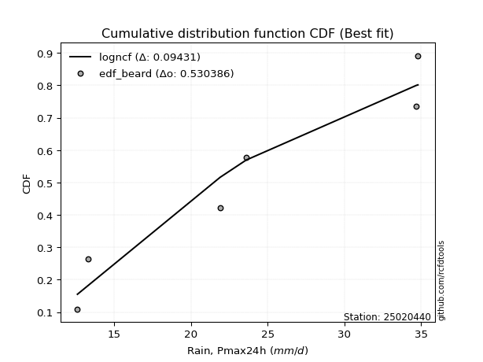</img>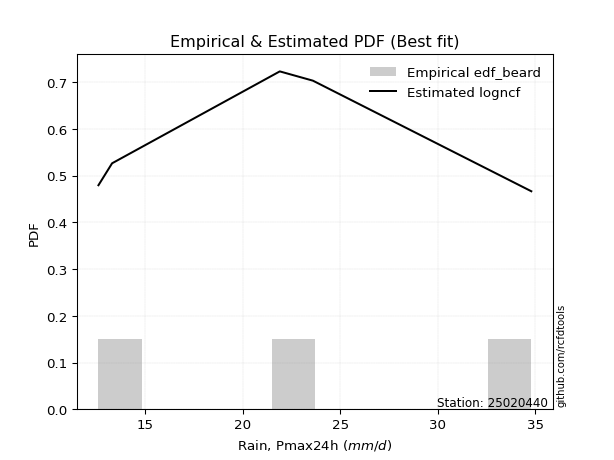</img>

</div>


### 5. Empirical - EDF Chegodayev (1955)

The Chegodayev formula is an empirical plotting position formula used in hydrological frequency analysis to estimate the exceedance probability or return period of a specific event from a set of observed data. It is primarily used for plotting observed data points on probability paper to fit a theoretical distribution, particularly for analyzing extreme events like maximum flood flows or rainfall intensities. The constant _b_ value in the generalized plotting position formula is 0.3.

<div align="center">


$P=(m-b)/(n+1-2b)$


</div>


**5.1. Empirical values**

<div align="center">

|                | 0                   | 1                   | 2                   | 3              | 4                  | 5                  | 6                  |
|:---------------|:--------------------|:--------------------|:--------------------|:---------------|:-------------------|:-------------------|:-------------------|
| date           | 2019                | 2021                | 2025                | 2022           | 2023               | 2020               | 2024               |
| x              | 12.6                | 13.3                | 14.0                | 21.9           | 23.6               | 34.7               | 34.8               |
| m              | 1                   | 2                   | 3                   | 4              | 5                  | 6                  | 7                  |
| empirical_dist | edf_chegodayev      | edf_chegodayev      | edf_chegodayev      | edf_chegodayev | edf_chegodayev     | edf_chegodayev     | edf_chegodayev     |
| empirical      | 0.09459459459459459 | 0.22972972972972971 | 0.36486486486486486 | 0.5            | 0.6351351351351351 | 0.7702702702702703 | 0.9054054054054054 |
| empirical_tr   | 1.1044776119402986  | 1.2982456140350878  | 1.574468085106383   | 2.0            | 2.7407407407407405 | 4.352941176470589  | 10.571428571428568 |

</div>


**5.2. Kolmogorov-Smirnov fit test (sorted by Δ)**


<div align="center">

|                | 0                   | 1                   | 2                   | 3                   | 4                   | 5                   | 6                   | 7                   | 8                   | 9                   | 10                  | 11                  | 12                  | 13                  | 14                  | 15                  | 16                  | 17                  | 18                  | 19                  | 20                  | 21                  | 22                  | 23                  | 24                  | 25                  | 26                  | 27                  | 28                  | 29                  | 30                  | 31                  | 32                  | 33                  | 34                    | 35                  | 36                  | 37                  | 38                  | 39                  | 40                  | 41                  | 42                  | 43                  | 44                  | 45                  | 46                  | 47                  | 48                  | 49                  | 50                  | 51                  | 52                  | 53                  | 54                  | 55                  | 56                  | 57                  | 58                  | 59                  | 60                  | 61                  | 62                  | 63                  | 64                  | 65                  | 66                  | 67                  | 68                  | 69                  | 70                  | 71                  | 72                  | 73                  | 74                  | 75                  | 76                  | 77                  | 78                  | 79                  | 80                  | 81                  | 82                  | 83                  | 84                  | 85                  | 86                  | 87                  | 88                  | 89                  |
|:---------------|:--------------------|:--------------------|:--------------------|:--------------------|:--------------------|:--------------------|:--------------------|:--------------------|:--------------------|:--------------------|:--------------------|:--------------------|:--------------------|:--------------------|:--------------------|:--------------------|:--------------------|:--------------------|:--------------------|:--------------------|:--------------------|:--------------------|:--------------------|:--------------------|:--------------------|:--------------------|:--------------------|:--------------------|:--------------------|:--------------------|:--------------------|:--------------------|:--------------------|:--------------------|:----------------------|:--------------------|:--------------------|:--------------------|:--------------------|:--------------------|:--------------------|:--------------------|:--------------------|:--------------------|:--------------------|:--------------------|:--------------------|:--------------------|:--------------------|:--------------------|:--------------------|:--------------------|:--------------------|:--------------------|:--------------------|:--------------------|:--------------------|:--------------------|:--------------------|:--------------------|:--------------------|:--------------------|:--------------------|:--------------------|:--------------------|:--------------------|:--------------------|:--------------------|:--------------------|:--------------------|:--------------------|:--------------------|:--------------------|:--------------------|:--------------------|:--------------------|:--------------------|:--------------------|:--------------------|:--------------------|:--------------------|:--------------------|:--------------------|:--------------------|:--------------------|:--------------------|:--------------------|:--------------------|:--------------------|:--------------------|
| station        | 25020440            | 25020440            | 25020440            | 25020440            | 25020440            | 25020440            | 25020440            | 25020440            | 25020440            | 25020440            | 25020440            | 25020440            | 25020440            | 25020440            | 25020440            | 25020440            | 25020440            | 25020440            | 25020440            | 25020440            | 25020440            | 25020440            | 25020440            | 25020440            | 25020440            | 25020440            | 25020440            | 25020440            | 25020440            | 25020440            | 25020440            | 25020440            | 25020440            | 25020440            | 25020440              | 25020440            | 25020440            | 25020440            | 25020440            | 25020440            | 25020440            | 25020440            | 25020440            | 25020440            | 25020440            | 25020440            | 25020440            | 25020440            | 25020440            | 25020440            | 25020440            | 25020440            | 25020440            | 25020440            | 25020440            | 25020440            | 25020440            | 25020440            | 25020440            | 25020440            | 25020440            | 25020440            | 25020440            | 25020440            | 25020440            | 25020440            | 25020440            | 25020440            | 25020440            | 25020440            | 25020440            | 25020440            | 25020440            | 25020440            | 25020440            | 25020440            | 25020440            | 25020440            | 25020440            | 25020440            | 25020440            | 25020440            | 25020440            | 25020440            | 25020440            | 25020440            | 25020440            | 25020440            | 25020440            | 25020440            |
| empirical_dist | edf_chegodayev      | edf_chegodayev      | edf_chegodayev      | edf_chegodayev      | edf_chegodayev      | edf_chegodayev      | edf_chegodayev      | edf_chegodayev      | edf_chegodayev      | edf_chegodayev      | edf_chegodayev      | edf_chegodayev      | edf_chegodayev      | edf_chegodayev      | edf_chegodayev      | edf_chegodayev      | edf_chegodayev      | edf_chegodayev      | edf_chegodayev      | edf_chegodayev      | edf_chegodayev      | edf_chegodayev      | edf_chegodayev      | edf_chegodayev      | edf_chegodayev      | edf_chegodayev      | edf_chegodayev      | edf_chegodayev      | edf_chegodayev      | edf_chegodayev      | edf_chegodayev      | edf_chegodayev      | edf_chegodayev      | edf_chegodayev      | edf_chegodayev        | edf_chegodayev      | edf_chegodayev      | edf_chegodayev      | edf_chegodayev      | edf_chegodayev      | edf_chegodayev      | edf_chegodayev      | edf_chegodayev      | edf_chegodayev      | edf_chegodayev      | edf_chegodayev      | edf_chegodayev      | edf_chegodayev      | edf_chegodayev      | edf_chegodayev      | edf_chegodayev      | edf_chegodayev      | edf_chegodayev      | edf_chegodayev      | edf_chegodayev      | edf_chegodayev      | edf_chegodayev      | edf_chegodayev      | edf_chegodayev      | edf_chegodayev      | edf_chegodayev      | edf_chegodayev      | edf_chegodayev      | edf_chegodayev      | edf_chegodayev      | edf_chegodayev      | edf_chegodayev      | edf_chegodayev      | edf_chegodayev      | edf_chegodayev      | edf_chegodayev      | edf_chegodayev      | edf_chegodayev      | edf_chegodayev      | edf_chegodayev      | edf_chegodayev      | edf_chegodayev      | edf_chegodayev      | edf_chegodayev      | edf_chegodayev      | edf_chegodayev      | edf_chegodayev      | edf_chegodayev      | edf_chegodayev      | edf_chegodayev      | edf_chegodayev      | edf_chegodayev      | edf_chegodayev      | edf_chegodayev      | edf_chegodayev      |
| p_dist         | logncf              | nakagami            | weibull_min         | fisk                | halfnorm            | rayleigh            | chi2                | maxwell             | loghalfnorm         | loginvgamma         | lograyleigh         | logbetaprime        | mielke              | loggenlogistic      | logmaxwell          | johnsonsu           | pearson3            | nct                 | logexpon            | logkstwobign        | crystalball         | norm                | t                   | lognct              | logalpha            | ncf                 | logloggamma         | logpearson3         | logerlang           | logt                | lognorm             | lognorm             | logcrystalball      | logexponnorm        | loglaplace_asymmetric | logjohnsonsu        | betaprime           | logweibull_min      | loggamma            | loggamma            | genlogistic         | laplace_asymmetric  | loggenexpon         | kstwobign           | gumbel_r            | lognakagami         | invweibull          | logistic            | gumbel_l            | logf                | halflogistic        | loggumbel_r         | loggumbel_l         | loglogistic         | logrice             | loghalflogistic     | loginvweibull       | hypsecant           | loghypsecant        | f                   | invgamma            | moyal               | rice                | alpha               | exponnorm           | truncnorm           | logmoyal            | laplace             | expon               | logchi2             | loglaplace          | logtruncnorm        | genexpon            | loginvgauss         | loggompertz         | logfisk             | invgauss            | gompertz            | pareto              | logpareto           | wald                | logwald             | gibrat              | loggibrat           | loglognorm          | gamma               | fatiguelife         | logfatiguelife      | erlang              | logmielke           |
| delta          | 0.10911397640232479 | 0.1275453402984223  | 0.15430315746029044 | 0.1573093618806064  | 0.16907554385353188 | 0.17148741461898032 | 0.17339233561103518 | 0.175058919075554   | 0.17597707694707612 | 0.17605986749852057 | 0.1765863582012517  | 0.1776005177044437  | 0.17793013051541495 | 0.17953572946550278 | 0.17975951944158894 | 0.1825128964242369  | 0.1826120484871314  | 0.18273254221008145 | 0.18293887132373232 | 0.18348019093212484 | 0.1840766146284672  | 0.18407662275335174 | 0.18408113730349934 | 0.1841740496266194  | 0.18525585773139946 | 0.18610549906763157 | 0.18634633508150703 | 0.18726935585802418 | 0.18733419520090253 | 0.1879391404778905  | 0.18793948635960067 | 0.18793948635960067 | 0.18793950452580022 | 0.1879409810385961  | 0.1879450123645649    | 0.18837027342027124 | 0.18839691234281797 | 0.18912359856944483 | 0.18933303425021605 | 0.18933303425021605 | 0.1903024551428323  | 0.19348726582126982 | 0.1970118369012161  | 0.1990137755490241  | 0.20109559126269663 | 0.2016116394686783  | 0.20316541645883368 | 0.2044099906091765  | 0.2049671300295388  | 0.20565423916520587 | 0.20662770213437495 | 0.2066692180145194  | 0.20772027989610284 | 0.20798865237151087 | 0.21072270094827933 | 0.21504331528849022 | 0.21535871730893075 | 0.215780154997994   | 0.21908198021925634 | 0.21953594870470683 | 0.21971921782864168 | 0.22048053336957174 | 0.22072694253969016 | 0.22602943219423444 | 0.2264564751552705  | 0.2267083708204054  | 0.2270077809827844  | 0.22726790794679066 | 0.22822226500791767 | 0.2297146958490689  | 0.23011425850074058 | 0.2352749168800794  | 0.23611397144152252 | 0.23664700670830796 | 0.23777778244607595 | 0.240903235030684   | 0.24216827574056765 | 0.24355097794101027 | 0.32177595350564836 | 0.3424234425378906  | 0.3629549930923678  | 0.36430965823493383 | 0.36486486486486486 | 0.36486486486486486 | 0.3691145827973815  | 0.3952940269491345  | 0.3984455037858251  | 0.41348077798258087 | 0.4340951099892906  | nan                 |
| deltao         | 0.48442053926100004 | 0.48442053926100004 | 0.48442053926100004 | 0.48442053926100004 | 0.48442053926100004 | 0.48442053926100004 | 0.48442053926100004 | 0.48442053926100004 | 0.48442053926100004 | 0.48442053926100004 | 0.48442053926100004 | 0.48442053926100004 | 0.48442053926100004 | 0.48442053926100004 | 0.48442053926100004 | 0.48442053926100004 | 0.48442053926100004 | 0.48442053926100004 | 0.48442053926100004 | 0.48442053926100004 | 0.48442053926100004 | 0.48442053926100004 | 0.48442053926100004 | 0.48442053926100004 | 0.48442053926100004 | 0.48442053926100004 | 0.48442053926100004 | 0.48442053926100004 | 0.48442053926100004 | 0.48442053926100004 | 0.48442053926100004 | 0.48442053926100004 | 0.48442053926100004 | 0.48442053926100004 | 0.48442053926100004   | 0.48442053926100004 | 0.48442053926100004 | 0.48442053926100004 | 0.48442053926100004 | 0.48442053926100004 | 0.48442053926100004 | 0.48442053926100004 | 0.48442053926100004 | 0.48442053926100004 | 0.48442053926100004 | 0.48442053926100004 | 0.48442053926100004 | 0.48442053926100004 | 0.48442053926100004 | 0.48442053926100004 | 0.48442053926100004 | 0.48442053926100004 | 0.48442053926100004 | 0.48442053926100004 | 0.48442053926100004 | 0.48442053926100004 | 0.48442053926100004 | 0.48442053926100004 | 0.48442053926100004 | 0.48442053926100004 | 0.48442053926100004 | 0.48442053926100004 | 0.48442053926100004 | 0.48442053926100004 | 0.48442053926100004 | 0.48442053926100004 | 0.48442053926100004 | 0.48442053926100004 | 0.48442053926100004 | 0.48442053926100004 | 0.48442053926100004 | 0.48442053926100004 | 0.48442053926100004 | 0.48442053926100004 | 0.48442053926100004 | 0.48442053926100004 | 0.48442053926100004 | 0.48442053926100004 | 0.48442053926100004 | 0.48442053926100004 | 0.48442053926100004 | 0.48442053926100004 | 0.48442053926100004 | 0.48442053926100004 | 0.48442053926100004 | 0.48442053926100004 | 0.48442053926100004 | 0.48442053926100004 | 0.48442053926100004 | 0.48442053926100004 |
| eval           | Δo > Δ              | Δo > Δ              | Δo > Δ              | Δo > Δ              | Δo > Δ              | Δo > Δ              | Δo > Δ              | Δo > Δ              | Δo > Δ              | Δo > Δ              | Δo > Δ              | Δo > Δ              | Δo > Δ              | Δo > Δ              | Δo > Δ              | Δo > Δ              | Δo > Δ              | Δo > Δ              | Δo > Δ              | Δo > Δ              | Δo > Δ              | Δo > Δ              | Δo > Δ              | Δo > Δ              | Δo > Δ              | Δo > Δ              | Δo > Δ              | Δo > Δ              | Δo > Δ              | Δo > Δ              | Δo > Δ              | Δo > Δ              | Δo > Δ              | Δo > Δ              | Δo > Δ                | Δo > Δ              | Δo > Δ              | Δo > Δ              | Δo > Δ              | Δo > Δ              | Δo > Δ              | Δo > Δ              | Δo > Δ              | Δo > Δ              | Δo > Δ              | Δo > Δ              | Δo > Δ              | Δo > Δ              | Δo > Δ              | Δo > Δ              | Δo > Δ              | Δo > Δ              | Δo > Δ              | Δo > Δ              | Δo > Δ              | Δo > Δ              | Δo > Δ              | Δo > Δ              | Δo > Δ              | Δo > Δ              | Δo > Δ              | Δo > Δ              | Δo > Δ              | Δo > Δ              | Δo > Δ              | Δo > Δ              | Δo > Δ              | Δo > Δ              | Δo > Δ              | Δo > Δ              | Δo > Δ              | Δo > Δ              | Δo > Δ              | Δo > Δ              | Δo > Δ              | Δo > Δ              | Δo > Δ              | Δo > Δ              | Δo > Δ              | Δo > Δ              | Δo > Δ              | Δo > Δ              | Δo > Δ              | Δo > Δ              | Δo > Δ              | Δo > Δ              | Δo > Δ              | Δo > Δ              | Δo > Δ              | Δo <= Δ             |
| fit            | 1                   | 1                   | 1                   | 1                   | 1                   | 1                   | 1                   | 1                   | 1                   | 1                   | 1                   | 1                   | 1                   | 1                   | 1                   | 1                   | 1                   | 1                   | 1                   | 1                   | 1                   | 1                   | 1                   | 1                   | 1                   | 1                   | 1                   | 1                   | 1                   | 1                   | 1                   | 1                   | 1                   | 1                   | 1                     | 1                   | 1                   | 1                   | 1                   | 1                   | 1                   | 1                   | 1                   | 1                   | 1                   | 1                   | 1                   | 1                   | 1                   | 1                   | 1                   | 1                   | 1                   | 1                   | 1                   | 1                   | 1                   | 1                   | 1                   | 1                   | 1                   | 1                   | 1                   | 1                   | 1                   | 1                   | 1                   | 1                   | 1                   | 1                   | 1                   | 1                   | 1                   | 1                   | 1                   | 1                   | 1                   | 1                   | 1                   | 1                   | 1                   | 1                   | 1                   | 1                   | 1                   | 1                   | 1                   | 1                   | 1                   | 0                   |
| n              | 7                   | 7                   | 7                   | 7                   | 7                   | 7                   | 7                   | 7                   | 7                   | 7                   | 7                   | 7                   | 7                   | 7                   | 7                   | 7                   | 7                   | 7                   | 7                   | 7                   | 7                   | 7                   | 7                   | 7                   | 7                   | 7                   | 7                   | 7                   | 7                   | 7                   | 7                   | 7                   | 7                   | 7                   | 7                     | 7                   | 7                   | 7                   | 7                   | 7                   | 7                   | 7                   | 7                   | 7                   | 7                   | 7                   | 7                   | 7                   | 7                   | 7                   | 7                   | 7                   | 7                   | 7                   | 7                   | 7                   | 7                   | 7                   | 7                   | 7                   | 7                   | 7                   | 7                   | 7                   | 7                   | 7                   | 7                   | 7                   | 7                   | 7                   | 7                   | 7                   | 7                   | 7                   | 7                   | 7                   | 7                   | 7                   | 7                   | 7                   | 7                   | 7                   | 7                   | 7                   | 7                   | 7                   | 7                   | 7                   | 7                   | 7                   |
| best_fit       | 1                   | 0                   | 0                   | 0                   | 0                   | 0                   | 0                   | 0                   | 0                   | 0                   | 0                   | 0                   | 0                   | 0                   | 0                   | 0                   | 0                   | 0                   | 0                   | 0                   | 0                   | 0                   | 0                   | 0                   | 0                   | 0                   | 0                   | 0                   | 0                   | 0                   | 0                   | 0                   | 0                   | 0                   | 0                     | 0                   | 0                   | 0                   | 0                   | 0                   | 0                   | 0                   | 0                   | 0                   | 0                   | 0                   | 0                   | 0                   | 0                   | 0                   | 0                   | 0                   | 0                   | 0                   | 0                   | 0                   | 0                   | 0                   | 0                   | 0                   | 0                   | 0                   | 0                   | 0                   | 0                   | 0                   | 0                   | 0                   | 0                   | 0                   | 0                   | 0                   | 0                   | 0                   | 0                   | 0                   | 0                   | 0                   | 0                   | 0                   | 0                   | 0                   | 0                   | 0                   | 0                   | 0                   | 0                   | 0                   | 0                   | 0                   |
| best_fit_sort  | 1                   | 2                   | 3                   | 4                   | 5                   | 6                   | 7                   | 8                   | 9                   | 10                  | 11                  | 12                  | 13                  | 14                  | 15                  | 16                  | 17                  | 18                  | 19                  | 20                  | 21                  | 22                  | 23                  | 24                  | 25                  | 26                  | 27                  | 28                  | 29                  | 30                  | 31                  | 32                  | 33                  | 34                  | 35                    | 36                  | 37                  | 38                  | 39                  | 40                  | 41                  | 42                  | 43                  | 44                  | 45                  | 46                  | 47                  | 48                  | 49                  | 50                  | 51                  | 52                  | 53                  | 54                  | 55                  | 56                  | 57                  | 58                  | 59                  | 60                  | 61                  | 62                  | 63                  | 64                  | 65                  | 66                  | 67                  | 68                  | 69                  | 70                  | 71                  | 72                  | 73                  | 74                  | 75                  | 76                  | 77                  | 78                  | 79                  | 80                  | 81                  | 82                  | 83                  | 84                  | 85                  | 86                  | 87                  | 88                  | 89                  | 90                  |

</div>


<div align="center">

</img>

</div>


**5.3. Best fit**

<div align="center">

|   id |   station | empirical_dist   | p_dist   |    delta |   deltao | eval   |   fit |   n |   best_fit |   best_fit_sort |
|-----:|----------:|:-----------------|:---------|---------:|---------:|:-------|------:|----:|-----------:|----------------:|
|    0 |  25020440 | edf_chegodayev   | logncf   | 0.109114 | 0.484421 | Δo > Δ |     1 |   7 |          1 |               1 |

</div>


<div align="center">

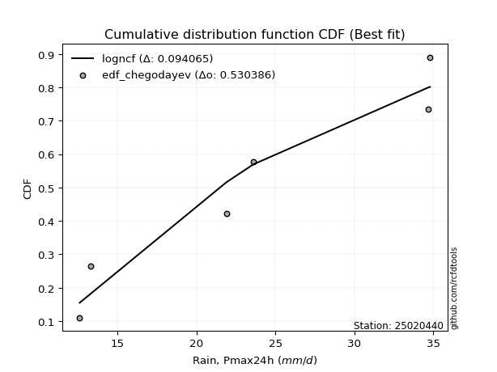</img>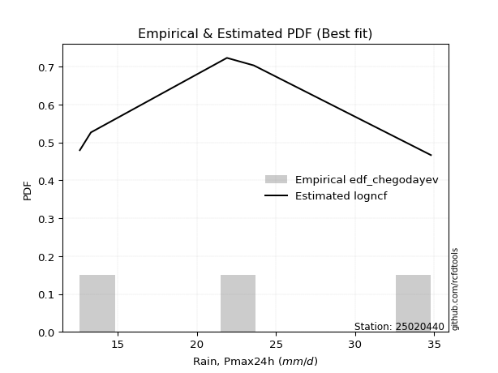</img>

</div>


### 6. Empirical - EDF Blom (1958)

The Blom formula is a specific "plotting position" formula used in hydrology and statistical analysis to estimate the empirical cumulative probability (or non-exceedance probability) of a data series. It is particularly recommended for data that are approximately normally distributed. The constant _a_ is set to 0.375 (or 3/8).

<div align="center">


$P=(m-a)/(n+1-2a)$


</div>


**6.1. Empirical values**

<div align="center">

|                | 0                   | 1                   | 2                  | 3        | 4                  | 5                  | 6                  |
|:---------------|:--------------------|:--------------------|:-------------------|:---------|:-------------------|:-------------------|:-------------------|
| date           | 2019                | 2021                | 2025               | 2022     | 2023               | 2020               | 2024               |
| x              | 12.6                | 13.3                | 14.0               | 21.9     | 23.6               | 34.7               | 34.8               |
| m              | 1                   | 2                   | 3                  | 4        | 5                  | 6                  | 7                  |
| empirical_dist | edf_blom            | edf_blom            | edf_blom           | edf_blom | edf_blom           | edf_blom           | edf_blom           |
| empirical      | 0.08620689655172414 | 0.22413793103448276 | 0.3620689655172414 | 0.5      | 0.6379310344827587 | 0.7758620689655172 | 0.9137931034482759 |
| empirical_tr   | 1.0943396226415094  | 1.288888888888889   | 1.5675675675675675 | 2.0      | 2.7619047619047623 | 4.461538461538462  | 11.600000000000007 |

</div>


**6.2. Kolmogorov-Smirnov fit test (sorted by Δ)**


<div align="center">

|                | 0                   | 1                   | 2                   | 3                   | 4                   | 5                   | 6                   | 7                   | 8                   | 9                   | 10                  | 11                  | 12                  | 13                  | 14                  | 15                  | 16                  | 17                  | 18                  | 19                  | 20                  | 21                  | 22                  | 23                  | 24                  | 25                  | 26                  | 27                  | 28                  | 29                  | 30                  | 31                  | 32                  | 33                  | 34                    | 35                  | 36                  | 37                  | 38                  | 39                  | 40                  | 41                  | 42                  | 43                  | 44                  | 45                  | 46                  | 47                  | 48                  | 49                  | 50                  | 51                  | 52                  | 53                  | 54                  | 55                  | 56                  | 57                  | 58                  | 59                  | 60                  | 61                  | 62                  | 63                  | 64                  | 65                  | 66                  | 67                  | 68                  | 69                  | 70                  | 71                  | 72                  | 73                  | 74                  | 75                  | 76                  | 77                  | 78                  | 79                  | 80                  | 81                  | 82                  | 83                  | 84                  | 85                  | 86                  | 87                  | 88                  | 89                  |
|:---------------|:--------------------|:--------------------|:--------------------|:--------------------|:--------------------|:--------------------|:--------------------|:--------------------|:--------------------|:--------------------|:--------------------|:--------------------|:--------------------|:--------------------|:--------------------|:--------------------|:--------------------|:--------------------|:--------------------|:--------------------|:--------------------|:--------------------|:--------------------|:--------------------|:--------------------|:--------------------|:--------------------|:--------------------|:--------------------|:--------------------|:--------------------|:--------------------|:--------------------|:--------------------|:----------------------|:--------------------|:--------------------|:--------------------|:--------------------|:--------------------|:--------------------|:--------------------|:--------------------|:--------------------|:--------------------|:--------------------|:--------------------|:--------------------|:--------------------|:--------------------|:--------------------|:--------------------|:--------------------|:--------------------|:--------------------|:--------------------|:--------------------|:--------------------|:--------------------|:--------------------|:--------------------|:--------------------|:--------------------|:--------------------|:--------------------|:--------------------|:--------------------|:--------------------|:--------------------|:--------------------|:--------------------|:--------------------|:--------------------|:--------------------|:--------------------|:--------------------|:--------------------|:--------------------|:--------------------|:--------------------|:--------------------|:--------------------|:--------------------|:--------------------|:--------------------|:--------------------|:--------------------|:--------------------|:--------------------|:--------------------|
| station        | 25020440            | 25020440            | 25020440            | 25020440            | 25020440            | 25020440            | 25020440            | 25020440            | 25020440            | 25020440            | 25020440            | 25020440            | 25020440            | 25020440            | 25020440            | 25020440            | 25020440            | 25020440            | 25020440            | 25020440            | 25020440            | 25020440            | 25020440            | 25020440            | 25020440            | 25020440            | 25020440            | 25020440            | 25020440            | 25020440            | 25020440            | 25020440            | 25020440            | 25020440            | 25020440              | 25020440            | 25020440            | 25020440            | 25020440            | 25020440            | 25020440            | 25020440            | 25020440            | 25020440            | 25020440            | 25020440            | 25020440            | 25020440            | 25020440            | 25020440            | 25020440            | 25020440            | 25020440            | 25020440            | 25020440            | 25020440            | 25020440            | 25020440            | 25020440            | 25020440            | 25020440            | 25020440            | 25020440            | 25020440            | 25020440            | 25020440            | 25020440            | 25020440            | 25020440            | 25020440            | 25020440            | 25020440            | 25020440            | 25020440            | 25020440            | 25020440            | 25020440            | 25020440            | 25020440            | 25020440            | 25020440            | 25020440            | 25020440            | 25020440            | 25020440            | 25020440            | 25020440            | 25020440            | 25020440            | 25020440            |
| empirical_dist | edf_blom            | edf_blom            | edf_blom            | edf_blom            | edf_blom            | edf_blom            | edf_blom            | edf_blom            | edf_blom            | edf_blom            | edf_blom            | edf_blom            | edf_blom            | edf_blom            | edf_blom            | edf_blom            | edf_blom            | edf_blom            | edf_blom            | edf_blom            | edf_blom            | edf_blom            | edf_blom            | edf_blom            | edf_blom            | edf_blom            | edf_blom            | edf_blom            | edf_blom            | edf_blom            | edf_blom            | edf_blom            | edf_blom            | edf_blom            | edf_blom              | edf_blom            | edf_blom            | edf_blom            | edf_blom            | edf_blom            | edf_blom            | edf_blom            | edf_blom            | edf_blom            | edf_blom            | edf_blom            | edf_blom            | edf_blom            | edf_blom            | edf_blom            | edf_blom            | edf_blom            | edf_blom            | edf_blom            | edf_blom            | edf_blom            | edf_blom            | edf_blom            | edf_blom            | edf_blom            | edf_blom            | edf_blom            | edf_blom            | edf_blom            | edf_blom            | edf_blom            | edf_blom            | edf_blom            | edf_blom            | edf_blom            | edf_blom            | edf_blom            | edf_blom            | edf_blom            | edf_blom            | edf_blom            | edf_blom            | edf_blom            | edf_blom            | edf_blom            | edf_blom            | edf_blom            | edf_blom            | edf_blom            | edf_blom            | edf_blom            | edf_blom            | edf_blom            | edf_blom            | edf_blom            |
| p_dist         | logncf              | nakagami            | weibull_min         | fisk                | halfnorm            | rayleigh            | maxwell             | loghalfnorm         | loginvgamma         | chi2                | lograyleigh         | logbetaprime        | loggenlogistic      | logmaxwell          | mielke              | johnsonsu           | pearson3            | nct                 | logkstwobign        | crystalball         | norm                | t                   | lognct              | logalpha            | logexpon            | ncf                 | logloggamma         | logpearson3         | logerlang           | logt                | lognorm             | lognorm             | logcrystalball      | logexponnorm        | loglaplace_asymmetric | logjohnsonsu        | betaprime           | loggamma            | loggamma            | genlogistic         | logweibull_min      | laplace_asymmetric  | loggenexpon         | kstwobign           | gumbel_r            | lognakagami         | logistic            | gumbel_l            | invweibull          | halflogistic        | loggumbel_r         | loggumbel_l         | loglogistic         | logf                | logrice             | loghalflogistic     | hypsecant           | loginvweibull       | loghypsecant        | moyal               | rice                | f                   | invgamma            | truncnorm           | exponnorm           | logmoyal            | laplace             | expon               | alpha               | loglaplace          | genexpon            | loggompertz         | logtruncnorm        | loginvgauss         | logchi2             | gompertz            | invgauss            | logfisk             | pareto              | logpareto           | wald                | logwald             | gibrat              | loggibrat           | loglognorm          | gamma               | fatiguelife         | logfatiguelife      | erlang              | logmielke           |
| delta          | 0.1099074581499761  | 0.12474944095079882 | 0.15430315746029044 | 0.16569705992347694 | 0.1662796445059084  | 0.16869151527135684 | 0.1722630197279305  | 0.17318117759945265 | 0.1732639681508971  | 0.17339233561103518 | 0.17379045885362823 | 0.17480461835682023 | 0.1767398301178793  | 0.17696362009396546 | 0.17793013051541495 | 0.17971699707661343 | 0.1798161491395079  | 0.17993664286245797 | 0.18068429158450136 | 0.18128071528084372 | 0.18128072340572826 | 0.18128523795587587 | 0.18137815027899593 | 0.182459958383776   | 0.18293887132373232 | 0.1833095997200081  | 0.18355043573388355 | 0.1844734565104007  | 0.18453829585327905 | 0.18514324113026703 | 0.1851435870119772  | 0.1851435870119772  | 0.18514360517817674 | 0.18514508169097263 | 0.18514911301694142   | 0.18557437407264776 | 0.1856010129951945  | 0.18653713490259258 | 0.18653713490259258 | 0.18750655579520883 | 0.18912359856944483 | 0.19069136647364635 | 0.19421593755359262 | 0.19621787620140063 | 0.19829969191507316 | 0.19881574012105482 | 0.20161409126155302 | 0.20217123068191534 | 0.20316541645883368 | 0.20383180278675148 | 0.20387331866689593 | 0.20492438054847936 | 0.2051927530238874  | 0.20565423916520587 | 0.20792680160065585 | 0.21224741594086674 | 0.21298425565037052 | 0.21535871730893075 | 0.21628608087163287 | 0.21768463402194826 | 0.2179310431920667  | 0.21953594870470683 | 0.21971921782864168 | 0.22111657212515845 | 0.22366057580764703 | 0.22421188163516093 | 0.2244720085991672  | 0.2254263656602942  | 0.22602943219423444 | 0.2273183591531171  | 0.23331807209389904 | 0.23498188309845247 | 0.2352749168800794  | 0.23664700670830796 | 0.23810239389193943 | 0.2407550785933868  | 0.24216827574056765 | 0.24929093307355454 | 0.3273677522008953  | 0.34801524123313754 | 0.3601590937447443  | 0.36151375888731035 | 0.3620689655172414  | 0.3620689655172414  | 0.37470638149262847 | 0.3952940269491345  | 0.40403730248107206 | 0.4190725766778278  | 0.4340951099892906  | nan                 |
| deltao         | 0.48442053926100004 | 0.48442053926100004 | 0.48442053926100004 | 0.48442053926100004 | 0.48442053926100004 | 0.48442053926100004 | 0.48442053926100004 | 0.48442053926100004 | 0.48442053926100004 | 0.48442053926100004 | 0.48442053926100004 | 0.48442053926100004 | 0.48442053926100004 | 0.48442053926100004 | 0.48442053926100004 | 0.48442053926100004 | 0.48442053926100004 | 0.48442053926100004 | 0.48442053926100004 | 0.48442053926100004 | 0.48442053926100004 | 0.48442053926100004 | 0.48442053926100004 | 0.48442053926100004 | 0.48442053926100004 | 0.48442053926100004 | 0.48442053926100004 | 0.48442053926100004 | 0.48442053926100004 | 0.48442053926100004 | 0.48442053926100004 | 0.48442053926100004 | 0.48442053926100004 | 0.48442053926100004 | 0.48442053926100004   | 0.48442053926100004 | 0.48442053926100004 | 0.48442053926100004 | 0.48442053926100004 | 0.48442053926100004 | 0.48442053926100004 | 0.48442053926100004 | 0.48442053926100004 | 0.48442053926100004 | 0.48442053926100004 | 0.48442053926100004 | 0.48442053926100004 | 0.48442053926100004 | 0.48442053926100004 | 0.48442053926100004 | 0.48442053926100004 | 0.48442053926100004 | 0.48442053926100004 | 0.48442053926100004 | 0.48442053926100004 | 0.48442053926100004 | 0.48442053926100004 | 0.48442053926100004 | 0.48442053926100004 | 0.48442053926100004 | 0.48442053926100004 | 0.48442053926100004 | 0.48442053926100004 | 0.48442053926100004 | 0.48442053926100004 | 0.48442053926100004 | 0.48442053926100004 | 0.48442053926100004 | 0.48442053926100004 | 0.48442053926100004 | 0.48442053926100004 | 0.48442053926100004 | 0.48442053926100004 | 0.48442053926100004 | 0.48442053926100004 | 0.48442053926100004 | 0.48442053926100004 | 0.48442053926100004 | 0.48442053926100004 | 0.48442053926100004 | 0.48442053926100004 | 0.48442053926100004 | 0.48442053926100004 | 0.48442053926100004 | 0.48442053926100004 | 0.48442053926100004 | 0.48442053926100004 | 0.48442053926100004 | 0.48442053926100004 | 0.48442053926100004 |
| eval           | Δo > Δ              | Δo > Δ              | Δo > Δ              | Δo > Δ              | Δo > Δ              | Δo > Δ              | Δo > Δ              | Δo > Δ              | Δo > Δ              | Δo > Δ              | Δo > Δ              | Δo > Δ              | Δo > Δ              | Δo > Δ              | Δo > Δ              | Δo > Δ              | Δo > Δ              | Δo > Δ              | Δo > Δ              | Δo > Δ              | Δo > Δ              | Δo > Δ              | Δo > Δ              | Δo > Δ              | Δo > Δ              | Δo > Δ              | Δo > Δ              | Δo > Δ              | Δo > Δ              | Δo > Δ              | Δo > Δ              | Δo > Δ              | Δo > Δ              | Δo > Δ              | Δo > Δ                | Δo > Δ              | Δo > Δ              | Δo > Δ              | Δo > Δ              | Δo > Δ              | Δo > Δ              | Δo > Δ              | Δo > Δ              | Δo > Δ              | Δo > Δ              | Δo > Δ              | Δo > Δ              | Δo > Δ              | Δo > Δ              | Δo > Δ              | Δo > Δ              | Δo > Δ              | Δo > Δ              | Δo > Δ              | Δo > Δ              | Δo > Δ              | Δo > Δ              | Δo > Δ              | Δo > Δ              | Δo > Δ              | Δo > Δ              | Δo > Δ              | Δo > Δ              | Δo > Δ              | Δo > Δ              | Δo > Δ              | Δo > Δ              | Δo > Δ              | Δo > Δ              | Δo > Δ              | Δo > Δ              | Δo > Δ              | Δo > Δ              | Δo > Δ              | Δo > Δ              | Δo > Δ              | Δo > Δ              | Δo > Δ              | Δo > Δ              | Δo > Δ              | Δo > Δ              | Δo > Δ              | Δo > Δ              | Δo > Δ              | Δo > Δ              | Δo > Δ              | Δo > Δ              | Δo > Δ              | Δo > Δ              | Δo <= Δ             |
| fit            | 1                   | 1                   | 1                   | 1                   | 1                   | 1                   | 1                   | 1                   | 1                   | 1                   | 1                   | 1                   | 1                   | 1                   | 1                   | 1                   | 1                   | 1                   | 1                   | 1                   | 1                   | 1                   | 1                   | 1                   | 1                   | 1                   | 1                   | 1                   | 1                   | 1                   | 1                   | 1                   | 1                   | 1                   | 1                     | 1                   | 1                   | 1                   | 1                   | 1                   | 1                   | 1                   | 1                   | 1                   | 1                   | 1                   | 1                   | 1                   | 1                   | 1                   | 1                   | 1                   | 1                   | 1                   | 1                   | 1                   | 1                   | 1                   | 1                   | 1                   | 1                   | 1                   | 1                   | 1                   | 1                   | 1                   | 1                   | 1                   | 1                   | 1                   | 1                   | 1                   | 1                   | 1                   | 1                   | 1                   | 1                   | 1                   | 1                   | 1                   | 1                   | 1                   | 1                   | 1                   | 1                   | 1                   | 1                   | 1                   | 1                   | 0                   |
| n              | 7                   | 7                   | 7                   | 7                   | 7                   | 7                   | 7                   | 7                   | 7                   | 7                   | 7                   | 7                   | 7                   | 7                   | 7                   | 7                   | 7                   | 7                   | 7                   | 7                   | 7                   | 7                   | 7                   | 7                   | 7                   | 7                   | 7                   | 7                   | 7                   | 7                   | 7                   | 7                   | 7                   | 7                   | 7                     | 7                   | 7                   | 7                   | 7                   | 7                   | 7                   | 7                   | 7                   | 7                   | 7                   | 7                   | 7                   | 7                   | 7                   | 7                   | 7                   | 7                   | 7                   | 7                   | 7                   | 7                   | 7                   | 7                   | 7                   | 7                   | 7                   | 7                   | 7                   | 7                   | 7                   | 7                   | 7                   | 7                   | 7                   | 7                   | 7                   | 7                   | 7                   | 7                   | 7                   | 7                   | 7                   | 7                   | 7                   | 7                   | 7                   | 7                   | 7                   | 7                   | 7                   | 7                   | 7                   | 7                   | 7                   | 7                   |
| best_fit       | 1                   | 0                   | 0                   | 0                   | 0                   | 0                   | 0                   | 0                   | 0                   | 0                   | 0                   | 0                   | 0                   | 0                   | 0                   | 0                   | 0                   | 0                   | 0                   | 0                   | 0                   | 0                   | 0                   | 0                   | 0                   | 0                   | 0                   | 0                   | 0                   | 0                   | 0                   | 0                   | 0                   | 0                   | 0                     | 0                   | 0                   | 0                   | 0                   | 0                   | 0                   | 0                   | 0                   | 0                   | 0                   | 0                   | 0                   | 0                   | 0                   | 0                   | 0                   | 0                   | 0                   | 0                   | 0                   | 0                   | 0                   | 0                   | 0                   | 0                   | 0                   | 0                   | 0                   | 0                   | 0                   | 0                   | 0                   | 0                   | 0                   | 0                   | 0                   | 0                   | 0                   | 0                   | 0                   | 0                   | 0                   | 0                   | 0                   | 0                   | 0                   | 0                   | 0                   | 0                   | 0                   | 0                   | 0                   | 0                   | 0                   | 0                   |
| best_fit_sort  | 1                   | 2                   | 3                   | 4                   | 5                   | 6                   | 7                   | 8                   | 9                   | 10                  | 11                  | 12                  | 13                  | 14                  | 15                  | 16                  | 17                  | 18                  | 19                  | 20                  | 21                  | 22                  | 23                  | 24                  | 25                  | 26                  | 27                  | 28                  | 29                  | 30                  | 31                  | 32                  | 33                  | 34                  | 35                    | 36                  | 37                  | 38                  | 39                  | 40                  | 41                  | 42                  | 43                  | 44                  | 45                  | 46                  | 47                  | 48                  | 49                  | 50                  | 51                  | 52                  | 53                  | 54                  | 55                  | 56                  | 57                  | 58                  | 59                  | 60                  | 61                  | 62                  | 63                  | 64                  | 65                  | 66                  | 67                  | 68                  | 69                  | 70                  | 71                  | 72                  | 73                  | 74                  | 75                  | 76                  | 77                  | 78                  | 79                  | 80                  | 81                  | 82                  | 83                  | 84                  | 85                  | 86                  | 87                  | 88                  | 89                  | 90                  |

</div>


<div align="center">

</img>

</div>


**6.3. Best fit**

<div align="center">

|   id |   station | empirical_dist   | p_dist   |    delta |   deltao | eval   |   fit |   n |   best_fit |   best_fit_sort |
|-----:|----------:|:-----------------|:---------|---------:|---------:|:-------|------:|----:|-----------:|----------------:|
|    0 |  25020440 | edf_blom         | logncf   | 0.109907 | 0.484421 | Δo > Δ |     1 |   7 |          1 |               1 |

</div>


<div align="center">

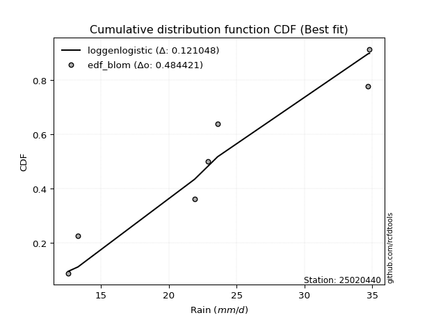</img>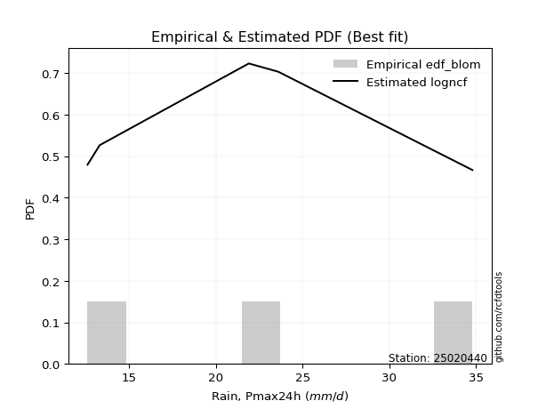</img>

</div>


### 7. Empirical - EDF Tukey (1962)

In hydrology, the Tukey formula is used as a plotting position formula to estimate the empirical probability or frequency of a flood event (or other hydrological data). The formula parameter is given as _c=0.333_ (or 1/3).

<div align="center">


$P=(m-c)/(n+1-2c)$


</div>


**7.1. Empirical values**

<div align="center">

|                | 0                   | 1                   | 2                   | 3         | 4                  | 5                  | 6                  |
|:---------------|:--------------------|:--------------------|:--------------------|:----------|:-------------------|:-------------------|:-------------------|
| date           | 2019                | 2021                | 2025                | 2022      | 2023               | 2020               | 2024               |
| x              | 12.6                | 13.3                | 14.0                | 21.9      | 23.6               | 34.7               | 34.8               |
| m              | 1                   | 2                   | 3                   | 4         | 5                  | 6                  | 7                  |
| empirical_dist | edf_tukey           | edf_tukey           | edf_tukey           | edf_tukey | edf_tukey          | edf_tukey          | edf_tukey          |
| empirical      | 0.09090909090909091 | 0.22727272727272727 | 0.36363636363636365 | 0.5       | 0.6363636363636364 | 0.7727272727272727 | 0.9090909090909091 |
| empirical_tr   | 1.1                 | 1.2941176470588236  | 1.5714285714285714  | 2.0       | 2.75               | 4.3999999999999995 | 10.999999999999996 |

</div>


**7.2. Kolmogorov-Smirnov fit test (sorted by Δ)**


<div align="center">

|                | 0                   | 1                   | 2                   | 3                   | 4                   | 5                   | 6                   | 7                   | 8                   | 9                   | 10                  | 11                  | 12                  | 13                  | 14                  | 15                  | 16                  | 17                  | 18                  | 19                  | 20                  | 21                  | 22                  | 23                  | 24                  | 25                  | 26                  | 27                  | 28                  | 29                  | 30                  | 31                  | 32                  | 33                  | 34                    | 35                  | 36                  | 37                  | 38                  | 39                  | 40                  | 41                  | 42                  | 43                  | 44                  | 45                  | 46                  | 47                  | 48                  | 49                  | 50                  | 51                  | 52                  | 53                  | 54                  | 55                  | 56                  | 57                  | 58                  | 59                  | 60                  | 61                  | 62                  | 63                  | 64                  | 65                  | 66                  | 67                  | 68                  | 69                  | 70                  | 71                  | 72                  | 73                  | 74                  | 75                  | 76                  | 77                  | 78                  | 79                  | 80                  | 81                  | 82                  | 83                  | 84                  | 85                  | 86                  | 87                  | 88                  | 89                  |
|:---------------|:--------------------|:--------------------|:--------------------|:--------------------|:--------------------|:--------------------|:--------------------|:--------------------|:--------------------|:--------------------|:--------------------|:--------------------|:--------------------|:--------------------|:--------------------|:--------------------|:--------------------|:--------------------|:--------------------|:--------------------|:--------------------|:--------------------|:--------------------|:--------------------|:--------------------|:--------------------|:--------------------|:--------------------|:--------------------|:--------------------|:--------------------|:--------------------|:--------------------|:--------------------|:----------------------|:--------------------|:--------------------|:--------------------|:--------------------|:--------------------|:--------------------|:--------------------|:--------------------|:--------------------|:--------------------|:--------------------|:--------------------|:--------------------|:--------------------|:--------------------|:--------------------|:--------------------|:--------------------|:--------------------|:--------------------|:--------------------|:--------------------|:--------------------|:--------------------|:--------------------|:--------------------|:--------------------|:--------------------|:--------------------|:--------------------|:--------------------|:--------------------|:--------------------|:--------------------|:--------------------|:--------------------|:--------------------|:--------------------|:--------------------|:--------------------|:--------------------|:--------------------|:--------------------|:--------------------|:--------------------|:--------------------|:--------------------|:--------------------|:--------------------|:--------------------|:--------------------|:--------------------|:--------------------|:--------------------|:--------------------|
| station        | 25020440            | 25020440            | 25020440            | 25020440            | 25020440            | 25020440            | 25020440            | 25020440            | 25020440            | 25020440            | 25020440            | 25020440            | 25020440            | 25020440            | 25020440            | 25020440            | 25020440            | 25020440            | 25020440            | 25020440            | 25020440            | 25020440            | 25020440            | 25020440            | 25020440            | 25020440            | 25020440            | 25020440            | 25020440            | 25020440            | 25020440            | 25020440            | 25020440            | 25020440            | 25020440              | 25020440            | 25020440            | 25020440            | 25020440            | 25020440            | 25020440            | 25020440            | 25020440            | 25020440            | 25020440            | 25020440            | 25020440            | 25020440            | 25020440            | 25020440            | 25020440            | 25020440            | 25020440            | 25020440            | 25020440            | 25020440            | 25020440            | 25020440            | 25020440            | 25020440            | 25020440            | 25020440            | 25020440            | 25020440            | 25020440            | 25020440            | 25020440            | 25020440            | 25020440            | 25020440            | 25020440            | 25020440            | 25020440            | 25020440            | 25020440            | 25020440            | 25020440            | 25020440            | 25020440            | 25020440            | 25020440            | 25020440            | 25020440            | 25020440            | 25020440            | 25020440            | 25020440            | 25020440            | 25020440            | 25020440            |
| empirical_dist | edf_tukey           | edf_tukey           | edf_tukey           | edf_tukey           | edf_tukey           | edf_tukey           | edf_tukey           | edf_tukey           | edf_tukey           | edf_tukey           | edf_tukey           | edf_tukey           | edf_tukey           | edf_tukey           | edf_tukey           | edf_tukey           | edf_tukey           | edf_tukey           | edf_tukey           | edf_tukey           | edf_tukey           | edf_tukey           | edf_tukey           | edf_tukey           | edf_tukey           | edf_tukey           | edf_tukey           | edf_tukey           | edf_tukey           | edf_tukey           | edf_tukey           | edf_tukey           | edf_tukey           | edf_tukey           | edf_tukey             | edf_tukey           | edf_tukey           | edf_tukey           | edf_tukey           | edf_tukey           | edf_tukey           | edf_tukey           | edf_tukey           | edf_tukey           | edf_tukey           | edf_tukey           | edf_tukey           | edf_tukey           | edf_tukey           | edf_tukey           | edf_tukey           | edf_tukey           | edf_tukey           | edf_tukey           | edf_tukey           | edf_tukey           | edf_tukey           | edf_tukey           | edf_tukey           | edf_tukey           | edf_tukey           | edf_tukey           | edf_tukey           | edf_tukey           | edf_tukey           | edf_tukey           | edf_tukey           | edf_tukey           | edf_tukey           | edf_tukey           | edf_tukey           | edf_tukey           | edf_tukey           | edf_tukey           | edf_tukey           | edf_tukey           | edf_tukey           | edf_tukey           | edf_tukey           | edf_tukey           | edf_tukey           | edf_tukey           | edf_tukey           | edf_tukey           | edf_tukey           | edf_tukey           | edf_tukey           | edf_tukey           | edf_tukey           | edf_tukey           |
| p_dist         | logncf              | nakagami            | weibull_min         | fisk                | halfnorm            | rayleigh            | chi2                | maxwell             | loghalfnorm         | loginvgamma         | lograyleigh         | logbetaprime        | mielke              | loggenlogistic      | logmaxwell          | johnsonsu           | pearson3            | nct                 | logkstwobign        | crystalball         | norm                | t                   | logexpon            | lognct              | logalpha            | ncf                 | logloggamma         | logpearson3         | logerlang           | logt                | lognorm             | lognorm             | logcrystalball      | logexponnorm        | loglaplace_asymmetric | logjohnsonsu        | betaprime           | loggamma            | loggamma            | genlogistic         | logweibull_min      | laplace_asymmetric  | loggenexpon         | kstwobign           | gumbel_r            | lognakagami         | invweibull          | logistic            | gumbel_l            | halflogistic        | loggumbel_r         | logf                | loggumbel_l         | loglogistic         | logrice             | loghalflogistic     | hypsecant           | loginvweibull       | loghypsecant        | moyal               | rice                | f                   | invgamma            | truncnorm           | exponnorm           | logmoyal            | alpha               | laplace             | expon               | loglaplace          | logchi2             | genexpon            | logtruncnorm        | loggompertz         | loginvgauss         | invgauss            | gompertz            | logfisk             | pareto              | logpareto           | wald                | logwald             | gibrat              | loggibrat           | loglognorm          | gamma               | fatiguelife         | logfatiguelife      | erlang              | logmielke           |
| delta          | 0.10788547517382358 | 0.12631683906992108 | 0.15430315746029044 | 0.1609948655661101  | 0.16784704262503067 | 0.1702589133904791  | 0.17339233561103518 | 0.17383041784705278 | 0.1747485757185749  | 0.17483136627001936 | 0.1753578569727505  | 0.1763720164759425  | 0.17793013051541495 | 0.17830722823700157 | 0.17853101821308773 | 0.1812843951957357  | 0.18138354725863018 | 0.18150404098158024 | 0.18225168970362363 | 0.18284811339996598 | 0.18284812152485053 | 0.18285263607499813 | 0.18293887132373232 | 0.1829455483981182  | 0.18402735650289825 | 0.18487699783913036 | 0.18511783385300581 | 0.18604085462952297 | 0.18610569397240131 | 0.1867106392493893  | 0.18671098513109946 | 0.18671098513109946 | 0.186711003297299   | 0.1867124798100949  | 0.1867165111360637    | 0.18714177219177003 | 0.18716841111431676 | 0.18810453302171484 | 0.18810453302171484 | 0.1890739539143311  | 0.18912359856944483 | 0.1922587645927686  | 0.1957833356727149  | 0.1977852743205229  | 0.19986709003419542 | 0.2003831382401771  | 0.20316541645883368 | 0.2031814893806753  | 0.2037386288010376  | 0.20539920090587374 | 0.2054407167860182  | 0.20565423916520587 | 0.20649177866760163 | 0.20676015114300966 | 0.20949419971977812 | 0.213814814059989   | 0.21455165376949278 | 0.21535871730893075 | 0.21785347899075513 | 0.21925203214107053 | 0.21949844131118895 | 0.21953594870470683 | 0.21971921782864168 | 0.22425136836340298 | 0.2252279739267693  | 0.2257792797542832  | 0.22602943219423444 | 0.22603940671828945 | 0.22699376377941646 | 0.22888575727223937 | 0.23340019953457258 | 0.2348854702130213  | 0.2352749168800794  | 0.23654928121757474 | 0.23664700670830796 | 0.24216827574056765 | 0.24232247671250906 | 0.2445887387161877  | 0.3242329559626508  | 0.344880444994893   | 0.3617264918638666  | 0.3630811570064326  | 0.36363636363636365 | 0.36363636363636365 | 0.37157158525438394 | 0.3952940269491345  | 0.4009025062428275  | 0.4159377804395833  | 0.4340951099892906  | nan                 |
| deltao         | 0.48442053926100004 | 0.48442053926100004 | 0.48442053926100004 | 0.48442053926100004 | 0.48442053926100004 | 0.48442053926100004 | 0.48442053926100004 | 0.48442053926100004 | 0.48442053926100004 | 0.48442053926100004 | 0.48442053926100004 | 0.48442053926100004 | 0.48442053926100004 | 0.48442053926100004 | 0.48442053926100004 | 0.48442053926100004 | 0.48442053926100004 | 0.48442053926100004 | 0.48442053926100004 | 0.48442053926100004 | 0.48442053926100004 | 0.48442053926100004 | 0.48442053926100004 | 0.48442053926100004 | 0.48442053926100004 | 0.48442053926100004 | 0.48442053926100004 | 0.48442053926100004 | 0.48442053926100004 | 0.48442053926100004 | 0.48442053926100004 | 0.48442053926100004 | 0.48442053926100004 | 0.48442053926100004 | 0.48442053926100004   | 0.48442053926100004 | 0.48442053926100004 | 0.48442053926100004 | 0.48442053926100004 | 0.48442053926100004 | 0.48442053926100004 | 0.48442053926100004 | 0.48442053926100004 | 0.48442053926100004 | 0.48442053926100004 | 0.48442053926100004 | 0.48442053926100004 | 0.48442053926100004 | 0.48442053926100004 | 0.48442053926100004 | 0.48442053926100004 | 0.48442053926100004 | 0.48442053926100004 | 0.48442053926100004 | 0.48442053926100004 | 0.48442053926100004 | 0.48442053926100004 | 0.48442053926100004 | 0.48442053926100004 | 0.48442053926100004 | 0.48442053926100004 | 0.48442053926100004 | 0.48442053926100004 | 0.48442053926100004 | 0.48442053926100004 | 0.48442053926100004 | 0.48442053926100004 | 0.48442053926100004 | 0.48442053926100004 | 0.48442053926100004 | 0.48442053926100004 | 0.48442053926100004 | 0.48442053926100004 | 0.48442053926100004 | 0.48442053926100004 | 0.48442053926100004 | 0.48442053926100004 | 0.48442053926100004 | 0.48442053926100004 | 0.48442053926100004 | 0.48442053926100004 | 0.48442053926100004 | 0.48442053926100004 | 0.48442053926100004 | 0.48442053926100004 | 0.48442053926100004 | 0.48442053926100004 | 0.48442053926100004 | 0.48442053926100004 | 0.48442053926100004 |
| eval           | Δo > Δ              | Δo > Δ              | Δo > Δ              | Δo > Δ              | Δo > Δ              | Δo > Δ              | Δo > Δ              | Δo > Δ              | Δo > Δ              | Δo > Δ              | Δo > Δ              | Δo > Δ              | Δo > Δ              | Δo > Δ              | Δo > Δ              | Δo > Δ              | Δo > Δ              | Δo > Δ              | Δo > Δ              | Δo > Δ              | Δo > Δ              | Δo > Δ              | Δo > Δ              | Δo > Δ              | Δo > Δ              | Δo > Δ              | Δo > Δ              | Δo > Δ              | Δo > Δ              | Δo > Δ              | Δo > Δ              | Δo > Δ              | Δo > Δ              | Δo > Δ              | Δo > Δ                | Δo > Δ              | Δo > Δ              | Δo > Δ              | Δo > Δ              | Δo > Δ              | Δo > Δ              | Δo > Δ              | Δo > Δ              | Δo > Δ              | Δo > Δ              | Δo > Δ              | Δo > Δ              | Δo > Δ              | Δo > Δ              | Δo > Δ              | Δo > Δ              | Δo > Δ              | Δo > Δ              | Δo > Δ              | Δo > Δ              | Δo > Δ              | Δo > Δ              | Δo > Δ              | Δo > Δ              | Δo > Δ              | Δo > Δ              | Δo > Δ              | Δo > Δ              | Δo > Δ              | Δo > Δ              | Δo > Δ              | Δo > Δ              | Δo > Δ              | Δo > Δ              | Δo > Δ              | Δo > Δ              | Δo > Δ              | Δo > Δ              | Δo > Δ              | Δo > Δ              | Δo > Δ              | Δo > Δ              | Δo > Δ              | Δo > Δ              | Δo > Δ              | Δo > Δ              | Δo > Δ              | Δo > Δ              | Δo > Δ              | Δo > Δ              | Δo > Δ              | Δo > Δ              | Δo > Δ              | Δo > Δ              | Δo <= Δ             |
| fit            | 1                   | 1                   | 1                   | 1                   | 1                   | 1                   | 1                   | 1                   | 1                   | 1                   | 1                   | 1                   | 1                   | 1                   | 1                   | 1                   | 1                   | 1                   | 1                   | 1                   | 1                   | 1                   | 1                   | 1                   | 1                   | 1                   | 1                   | 1                   | 1                   | 1                   | 1                   | 1                   | 1                   | 1                   | 1                     | 1                   | 1                   | 1                   | 1                   | 1                   | 1                   | 1                   | 1                   | 1                   | 1                   | 1                   | 1                   | 1                   | 1                   | 1                   | 1                   | 1                   | 1                   | 1                   | 1                   | 1                   | 1                   | 1                   | 1                   | 1                   | 1                   | 1                   | 1                   | 1                   | 1                   | 1                   | 1                   | 1                   | 1                   | 1                   | 1                   | 1                   | 1                   | 1                   | 1                   | 1                   | 1                   | 1                   | 1                   | 1                   | 1                   | 1                   | 1                   | 1                   | 1                   | 1                   | 1                   | 1                   | 1                   | 0                   |
| n              | 7                   | 7                   | 7                   | 7                   | 7                   | 7                   | 7                   | 7                   | 7                   | 7                   | 7                   | 7                   | 7                   | 7                   | 7                   | 7                   | 7                   | 7                   | 7                   | 7                   | 7                   | 7                   | 7                   | 7                   | 7                   | 7                   | 7                   | 7                   | 7                   | 7                   | 7                   | 7                   | 7                   | 7                   | 7                     | 7                   | 7                   | 7                   | 7                   | 7                   | 7                   | 7                   | 7                   | 7                   | 7                   | 7                   | 7                   | 7                   | 7                   | 7                   | 7                   | 7                   | 7                   | 7                   | 7                   | 7                   | 7                   | 7                   | 7                   | 7                   | 7                   | 7                   | 7                   | 7                   | 7                   | 7                   | 7                   | 7                   | 7                   | 7                   | 7                   | 7                   | 7                   | 7                   | 7                   | 7                   | 7                   | 7                   | 7                   | 7                   | 7                   | 7                   | 7                   | 7                   | 7                   | 7                   | 7                   | 7                   | 7                   | 7                   |
| best_fit       | 1                   | 0                   | 0                   | 0                   | 0                   | 0                   | 0                   | 0                   | 0                   | 0                   | 0                   | 0                   | 0                   | 0                   | 0                   | 0                   | 0                   | 0                   | 0                   | 0                   | 0                   | 0                   | 0                   | 0                   | 0                   | 0                   | 0                   | 0                   | 0                   | 0                   | 0                   | 0                   | 0                   | 0                   | 0                     | 0                   | 0                   | 0                   | 0                   | 0                   | 0                   | 0                   | 0                   | 0                   | 0                   | 0                   | 0                   | 0                   | 0                   | 0                   | 0                   | 0                   | 0                   | 0                   | 0                   | 0                   | 0                   | 0                   | 0                   | 0                   | 0                   | 0                   | 0                   | 0                   | 0                   | 0                   | 0                   | 0                   | 0                   | 0                   | 0                   | 0                   | 0                   | 0                   | 0                   | 0                   | 0                   | 0                   | 0                   | 0                   | 0                   | 0                   | 0                   | 0                   | 0                   | 0                   | 0                   | 0                   | 0                   | 0                   |
| best_fit_sort  | 1                   | 2                   | 3                   | 4                   | 5                   | 6                   | 7                   | 8                   | 9                   | 10                  | 11                  | 12                  | 13                  | 14                  | 15                  | 16                  | 17                  | 18                  | 19                  | 20                  | 21                  | 22                  | 23                  | 24                  | 25                  | 26                  | 27                  | 28                  | 29                  | 30                  | 31                  | 32                  | 33                  | 34                  | 35                    | 36                  | 37                  | 38                  | 39                  | 40                  | 41                  | 42                  | 43                  | 44                  | 45                  | 46                  | 47                  | 48                  | 49                  | 50                  | 51                  | 52                  | 53                  | 54                  | 55                  | 56                  | 57                  | 58                  | 59                  | 60                  | 61                  | 62                  | 63                  | 64                  | 65                  | 66                  | 67                  | 68                  | 69                  | 70                  | 71                  | 72                  | 73                  | 74                  | 75                  | 76                  | 77                  | 78                  | 79                  | 80                  | 81                  | 82                  | 83                  | 84                  | 85                  | 86                  | 87                  | 88                  | 89                  | 90                  |

</div>


<div align="center">

</img>

</div>


**7.3. Best fit**

<div align="center">

|   id |   station | empirical_dist   | p_dist   |    delta |   deltao | eval   |   fit |   n |   best_fit |   best_fit_sort |
|-----:|----------:|:-----------------|:---------|---------:|---------:|:-------|------:|----:|-----------:|----------------:|
|    0 |  25020440 | edf_tukey        | logncf   | 0.107885 | 0.484421 | Δo > Δ |     1 |   7 |          1 |               1 |

</div>


<div align="center">

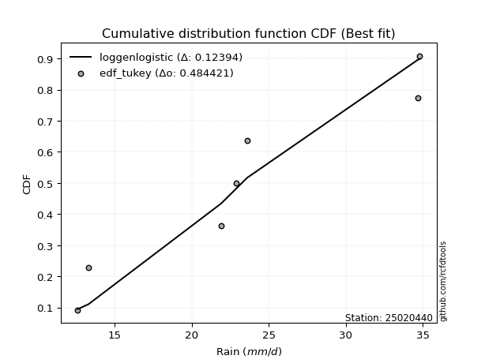</img></img>

</div>


### 8. Empirical - EDF Gringorten (1963)

Gringorten plotting position formula is essential for estimating the probability and return periods of extreme events like floods and heavy rainfall. The constant _a=0.44_.

<div align="center">


$P=(m-a)/(n+1-2a)$


</div>


**8.1. Empirical values**

<div align="center">

|                | 0                   | 1                   | 2                  | 3              | 4                  | 5                  | 6                  |
|:---------------|:--------------------|:--------------------|:-------------------|:---------------|:-------------------|:-------------------|:-------------------|
| date           | 2019                | 2021                | 2025               | 2022           | 2023               | 2020               | 2024               |
| x              | 12.6                | 13.3                | 14.0               | 21.9           | 23.6               | 34.7               | 34.8               |
| m              | 1                   | 2                   | 3                  | 4              | 5                  | 6                  | 7                  |
| empirical_dist | edf_gringorten      | edf_gringorten      | edf_gringorten     | edf_gringorten | edf_gringorten     | edf_gringorten     | edf_gringorten     |
| empirical      | 0.07865168539325844 | 0.21910112359550563 | 0.3595505617977528 | 0.5            | 0.6404494382022471 | 0.7808988764044943 | 0.9213483146067415 |
| empirical_tr   | 1.0853658536585364  | 1.2805755395683454  | 1.5614035087719298 | 2.0            | 2.781249999999999  | 4.564102564102562  | 12.714285714285701 |

</div>


**8.2. Kolmogorov-Smirnov fit test (sorted by Δ)**


<div align="center">

|                | 0                   | 1                   | 2                   | 3                   | 4                   | 5                   | 6                   | 7                   | 8                   | 9                   | 10                  | 11                  | 12                  | 13                  | 14                  | 15                  | 16                  | 17                  | 18                  | 19                  | 20                  | 21                  | 22                  | 23                  | 24                  | 25                  | 26                  | 27                  | 28                  | 29                  | 30                  | 31                  | 32                  | 33                    | 34                  | 35                  | 36                  | 37                  | 38                  | 39                  | 40                  | 41                  | 42                  | 43                  | 44                  | 45                  | 46                  | 47                  | 48                  | 49                  | 50                  | 51                  | 52                  | 53                  | 54                  | 55                  | 56                  | 57                  | 58                  | 59                  | 60                  | 61                  | 62                  | 63                  | 64                  | 65                  | 66                  | 67                  | 68                  | 69                  | 70                  | 71                  | 72                  | 73                  | 74                  | 75                  | 76                  | 77                  | 78                  | 79                  | 80                  | 81                  | 82                  | 83                  | 84                  | 85                  | 86                  | 87                  | 88                  | 89                  |
|:---------------|:--------------------|:--------------------|:--------------------|:--------------------|:--------------------|:--------------------|:--------------------|:--------------------|:--------------------|:--------------------|:--------------------|:--------------------|:--------------------|:--------------------|:--------------------|:--------------------|:--------------------|:--------------------|:--------------------|:--------------------|:--------------------|:--------------------|:--------------------|:--------------------|:--------------------|:--------------------|:--------------------|:--------------------|:--------------------|:--------------------|:--------------------|:--------------------|:--------------------|:----------------------|:--------------------|:--------------------|:--------------------|:--------------------|:--------------------|:--------------------|:--------------------|:--------------------|:--------------------|:--------------------|:--------------------|:--------------------|:--------------------|:--------------------|:--------------------|:--------------------|:--------------------|:--------------------|:--------------------|:--------------------|:--------------------|:--------------------|:--------------------|:--------------------|:--------------------|:--------------------|:--------------------|:--------------------|:--------------------|:--------------------|:--------------------|:--------------------|:--------------------|:--------------------|:--------------------|:--------------------|:--------------------|:--------------------|:--------------------|:--------------------|:--------------------|:--------------------|:--------------------|:--------------------|:--------------------|:--------------------|:--------------------|:--------------------|:--------------------|:--------------------|:--------------------|:--------------------|:--------------------|:--------------------|:--------------------|:--------------------|
| station        | 25020440            | 25020440            | 25020440            | 25020440            | 25020440            | 25020440            | 25020440            | 25020440            | 25020440            | 25020440            | 25020440            | 25020440            | 25020440            | 25020440            | 25020440            | 25020440            | 25020440            | 25020440            | 25020440            | 25020440            | 25020440            | 25020440            | 25020440            | 25020440            | 25020440            | 25020440            | 25020440            | 25020440            | 25020440            | 25020440            | 25020440            | 25020440            | 25020440            | 25020440              | 25020440            | 25020440            | 25020440            | 25020440            | 25020440            | 25020440            | 25020440            | 25020440            | 25020440            | 25020440            | 25020440            | 25020440            | 25020440            | 25020440            | 25020440            | 25020440            | 25020440            | 25020440            | 25020440            | 25020440            | 25020440            | 25020440            | 25020440            | 25020440            | 25020440            | 25020440            | 25020440            | 25020440            | 25020440            | 25020440            | 25020440            | 25020440            | 25020440            | 25020440            | 25020440            | 25020440            | 25020440            | 25020440            | 25020440            | 25020440            | 25020440            | 25020440            | 25020440            | 25020440            | 25020440            | 25020440            | 25020440            | 25020440            | 25020440            | 25020440            | 25020440            | 25020440            | 25020440            | 25020440            | 25020440            | 25020440            |
| empirical_dist | edf_gringorten      | edf_gringorten      | edf_gringorten      | edf_gringorten      | edf_gringorten      | edf_gringorten      | edf_gringorten      | edf_gringorten      | edf_gringorten      | edf_gringorten      | edf_gringorten      | edf_gringorten      | edf_gringorten      | edf_gringorten      | edf_gringorten      | edf_gringorten      | edf_gringorten      | edf_gringorten      | edf_gringorten      | edf_gringorten      | edf_gringorten      | edf_gringorten      | edf_gringorten      | edf_gringorten      | edf_gringorten      | edf_gringorten      | edf_gringorten      | edf_gringorten      | edf_gringorten      | edf_gringorten      | edf_gringorten      | edf_gringorten      | edf_gringorten      | edf_gringorten        | edf_gringorten      | edf_gringorten      | edf_gringorten      | edf_gringorten      | edf_gringorten      | edf_gringorten      | edf_gringorten      | edf_gringorten      | edf_gringorten      | edf_gringorten      | edf_gringorten      | edf_gringorten      | edf_gringorten      | edf_gringorten      | edf_gringorten      | edf_gringorten      | edf_gringorten      | edf_gringorten      | edf_gringorten      | edf_gringorten      | edf_gringorten      | edf_gringorten      | edf_gringorten      | edf_gringorten      | edf_gringorten      | edf_gringorten      | edf_gringorten      | edf_gringorten      | edf_gringorten      | edf_gringorten      | edf_gringorten      | edf_gringorten      | edf_gringorten      | edf_gringorten      | edf_gringorten      | edf_gringorten      | edf_gringorten      | edf_gringorten      | edf_gringorten      | edf_gringorten      | edf_gringorten      | edf_gringorten      | edf_gringorten      | edf_gringorten      | edf_gringorten      | edf_gringorten      | edf_gringorten      | edf_gringorten      | edf_gringorten      | edf_gringorten      | edf_gringorten      | edf_gringorten      | edf_gringorten      | edf_gringorten      | edf_gringorten      | edf_gringorten      |
| p_dist         | logncf              | nakagami            | weibull_min         | halfnorm            | rayleigh            | maxwell             | loghalfnorm         | loginvgamma         | lograyleigh         | logbetaprime        | fisk                | chi2                | loggenlogistic      | logmaxwell          | johnsonsu           | pearson3            | nct                 | mielke              | logkstwobign        | crystalball         | norm                | t                   | lognct              | logalpha            | ncf                 | logloggamma         | logpearson3         | logerlang           | logt                | lognorm             | lognorm             | logcrystalball      | logexponnorm        | loglaplace_asymmetric | logexpon            | logjohnsonsu        | betaprime           | loggamma            | loggamma            | genlogistic         | laplace_asymmetric  | logweibull_min      | loggenexpon         | kstwobign           | gumbel_r            | lognakagami         | logistic            | gumbel_l            | halflogistic        | loggumbel_r         | loggumbel_l         | loglogistic         | invweibull          | logrice             | logf                | loghalflogistic     | hypsecant           | loghypsecant        | moyal               | loginvweibull       | rice                | truncnorm           | f                   | invgamma            | exponnorm           | logmoyal            | laplace             | expon               | loglaplace          | alpha               | genexpon            | loggompertz         | logtruncnorm        | loginvgauss         | gompertz            | invgauss            | logchi2             | logfisk             | pareto              | logpareto           | wald                | logwald             | gibrat              | loggibrat           | loglognorm          | gamma               | fatiguelife         | logfatiguelife      | erlang              | logmielke           |
| delta          | 0.1174626693084418  | 0.12223103723131024 | 0.15430315746029044 | 0.16376124078641982 | 0.16617311155186826 | 0.16974461600844193 | 0.17066277387996406 | 0.1707455644314085  | 0.17127205513413965 | 0.17228621463733165 | 0.17325227108194252 | 0.17339233561103518 | 0.17422142639839072 | 0.17444521637447688 | 0.17719859335712485 | 0.17729774542001933 | 0.1774182391429694  | 0.17793013051541495 | 0.17816588786501278 | 0.17876231156135514 | 0.17876231968623968 | 0.17876683423638728 | 0.17885974655950734 | 0.1799415546642874  | 0.18079119600051952 | 0.18103203201439497 | 0.18195505279091212 | 0.18201989213379047 | 0.18262483741077845 | 0.1826251832924886  | 0.1826251832924886  | 0.18262520145868816 | 0.18262667797148405 | 0.18263070929745284   | 0.18293887132373232 | 0.18305597035315918 | 0.1830826092757059  | 0.184018731183104   | 0.184018731183104   | 0.18498815207572025 | 0.18817296275415776 | 0.18912359856944483 | 0.19169753383410404 | 0.19369947248191205 | 0.19578128819558457 | 0.19629733640156624 | 0.19909568754206444 | 0.19965282696242675 | 0.2013133990672629  | 0.20135491494740734 | 0.20240597682899078 | 0.20267434930439882 | 0.20316541645883368 | 0.20540839788116727 | 0.20565423916520587 | 0.20972901222137816 | 0.21046585193088194 | 0.2137676771521443  | 0.21516623030245968 | 0.21535871730893075 | 0.2154126394725781  | 0.2160797646861814  | 0.21953594870470683 | 0.21971921782864168 | 0.22114217208815845 | 0.22169347791567234 | 0.2219536048796786  | 0.22290796194080562 | 0.22479995543362852 | 0.22602943219423444 | 0.23079966837441046 | 0.2324634793789639  | 0.2352749168800794  | 0.23664700670830796 | 0.2382366748738982  | 0.24216827574056765 | 0.24565760505040501 | 0.2568461442320201  | 0.3324045596398725  | 0.3530520486721147  | 0.3576406900252557  | 0.3589953551678218  | 0.3595505617977528  | 0.3595505617977528  | 0.37974318893160564 | 0.3952940269491345  | 0.4090741099200492  | 0.424109384116805   | 0.4340951099892906  | nan                 |
| deltao         | 0.48442053926100004 | 0.48442053926100004 | 0.48442053926100004 | 0.48442053926100004 | 0.48442053926100004 | 0.48442053926100004 | 0.48442053926100004 | 0.48442053926100004 | 0.48442053926100004 | 0.48442053926100004 | 0.48442053926100004 | 0.48442053926100004 | 0.48442053926100004 | 0.48442053926100004 | 0.48442053926100004 | 0.48442053926100004 | 0.48442053926100004 | 0.48442053926100004 | 0.48442053926100004 | 0.48442053926100004 | 0.48442053926100004 | 0.48442053926100004 | 0.48442053926100004 | 0.48442053926100004 | 0.48442053926100004 | 0.48442053926100004 | 0.48442053926100004 | 0.48442053926100004 | 0.48442053926100004 | 0.48442053926100004 | 0.48442053926100004 | 0.48442053926100004 | 0.48442053926100004 | 0.48442053926100004   | 0.48442053926100004 | 0.48442053926100004 | 0.48442053926100004 | 0.48442053926100004 | 0.48442053926100004 | 0.48442053926100004 | 0.48442053926100004 | 0.48442053926100004 | 0.48442053926100004 | 0.48442053926100004 | 0.48442053926100004 | 0.48442053926100004 | 0.48442053926100004 | 0.48442053926100004 | 0.48442053926100004 | 0.48442053926100004 | 0.48442053926100004 | 0.48442053926100004 | 0.48442053926100004 | 0.48442053926100004 | 0.48442053926100004 | 0.48442053926100004 | 0.48442053926100004 | 0.48442053926100004 | 0.48442053926100004 | 0.48442053926100004 | 0.48442053926100004 | 0.48442053926100004 | 0.48442053926100004 | 0.48442053926100004 | 0.48442053926100004 | 0.48442053926100004 | 0.48442053926100004 | 0.48442053926100004 | 0.48442053926100004 | 0.48442053926100004 | 0.48442053926100004 | 0.48442053926100004 | 0.48442053926100004 | 0.48442053926100004 | 0.48442053926100004 | 0.48442053926100004 | 0.48442053926100004 | 0.48442053926100004 | 0.48442053926100004 | 0.48442053926100004 | 0.48442053926100004 | 0.48442053926100004 | 0.48442053926100004 | 0.48442053926100004 | 0.48442053926100004 | 0.48442053926100004 | 0.48442053926100004 | 0.48442053926100004 | 0.48442053926100004 | 0.48442053926100004 |
| eval           | Δo > Δ              | Δo > Δ              | Δo > Δ              | Δo > Δ              | Δo > Δ              | Δo > Δ              | Δo > Δ              | Δo > Δ              | Δo > Δ              | Δo > Δ              | Δo > Δ              | Δo > Δ              | Δo > Δ              | Δo > Δ              | Δo > Δ              | Δo > Δ              | Δo > Δ              | Δo > Δ              | Δo > Δ              | Δo > Δ              | Δo > Δ              | Δo > Δ              | Δo > Δ              | Δo > Δ              | Δo > Δ              | Δo > Δ              | Δo > Δ              | Δo > Δ              | Δo > Δ              | Δo > Δ              | Δo > Δ              | Δo > Δ              | Δo > Δ              | Δo > Δ                | Δo > Δ              | Δo > Δ              | Δo > Δ              | Δo > Δ              | Δo > Δ              | Δo > Δ              | Δo > Δ              | Δo > Δ              | Δo > Δ              | Δo > Δ              | Δo > Δ              | Δo > Δ              | Δo > Δ              | Δo > Δ              | Δo > Δ              | Δo > Δ              | Δo > Δ              | Δo > Δ              | Δo > Δ              | Δo > Δ              | Δo > Δ              | Δo > Δ              | Δo > Δ              | Δo > Δ              | Δo > Δ              | Δo > Δ              | Δo > Δ              | Δo > Δ              | Δo > Δ              | Δo > Δ              | Δo > Δ              | Δo > Δ              | Δo > Δ              | Δo > Δ              | Δo > Δ              | Δo > Δ              | Δo > Δ              | Δo > Δ              | Δo > Δ              | Δo > Δ              | Δo > Δ              | Δo > Δ              | Δo > Δ              | Δo > Δ              | Δo > Δ              | Δo > Δ              | Δo > Δ              | Δo > Δ              | Δo > Δ              | Δo > Δ              | Δo > Δ              | Δo > Δ              | Δo > Δ              | Δo > Δ              | Δo > Δ              | Δo <= Δ             |
| fit            | 1                   | 1                   | 1                   | 1                   | 1                   | 1                   | 1                   | 1                   | 1                   | 1                   | 1                   | 1                   | 1                   | 1                   | 1                   | 1                   | 1                   | 1                   | 1                   | 1                   | 1                   | 1                   | 1                   | 1                   | 1                   | 1                   | 1                   | 1                   | 1                   | 1                   | 1                   | 1                   | 1                   | 1                     | 1                   | 1                   | 1                   | 1                   | 1                   | 1                   | 1                   | 1                   | 1                   | 1                   | 1                   | 1                   | 1                   | 1                   | 1                   | 1                   | 1                   | 1                   | 1                   | 1                   | 1                   | 1                   | 1                   | 1                   | 1                   | 1                   | 1                   | 1                   | 1                   | 1                   | 1                   | 1                   | 1                   | 1                   | 1                   | 1                   | 1                   | 1                   | 1                   | 1                   | 1                   | 1                   | 1                   | 1                   | 1                   | 1                   | 1                   | 1                   | 1                   | 1                   | 1                   | 1                   | 1                   | 1                   | 1                   | 0                   |
| n              | 7                   | 7                   | 7                   | 7                   | 7                   | 7                   | 7                   | 7                   | 7                   | 7                   | 7                   | 7                   | 7                   | 7                   | 7                   | 7                   | 7                   | 7                   | 7                   | 7                   | 7                   | 7                   | 7                   | 7                   | 7                   | 7                   | 7                   | 7                   | 7                   | 7                   | 7                   | 7                   | 7                   | 7                     | 7                   | 7                   | 7                   | 7                   | 7                   | 7                   | 7                   | 7                   | 7                   | 7                   | 7                   | 7                   | 7                   | 7                   | 7                   | 7                   | 7                   | 7                   | 7                   | 7                   | 7                   | 7                   | 7                   | 7                   | 7                   | 7                   | 7                   | 7                   | 7                   | 7                   | 7                   | 7                   | 7                   | 7                   | 7                   | 7                   | 7                   | 7                   | 7                   | 7                   | 7                   | 7                   | 7                   | 7                   | 7                   | 7                   | 7                   | 7                   | 7                   | 7                   | 7                   | 7                   | 7                   | 7                   | 7                   | 7                   |
| best_fit       | 1                   | 0                   | 0                   | 0                   | 0                   | 0                   | 0                   | 0                   | 0                   | 0                   | 0                   | 0                   | 0                   | 0                   | 0                   | 0                   | 0                   | 0                   | 0                   | 0                   | 0                   | 0                   | 0                   | 0                   | 0                   | 0                   | 0                   | 0                   | 0                   | 0                   | 0                   | 0                   | 0                   | 0                     | 0                   | 0                   | 0                   | 0                   | 0                   | 0                   | 0                   | 0                   | 0                   | 0                   | 0                   | 0                   | 0                   | 0                   | 0                   | 0                   | 0                   | 0                   | 0                   | 0                   | 0                   | 0                   | 0                   | 0                   | 0                   | 0                   | 0                   | 0                   | 0                   | 0                   | 0                   | 0                   | 0                   | 0                   | 0                   | 0                   | 0                   | 0                   | 0                   | 0                   | 0                   | 0                   | 0                   | 0                   | 0                   | 0                   | 0                   | 0                   | 0                   | 0                   | 0                   | 0                   | 0                   | 0                   | 0                   | 0                   |
| best_fit_sort  | 1                   | 2                   | 3                   | 4                   | 5                   | 6                   | 7                   | 8                   | 9                   | 10                  | 11                  | 12                  | 13                  | 14                  | 15                  | 16                  | 17                  | 18                  | 19                  | 20                  | 21                  | 22                  | 23                  | 24                  | 25                  | 26                  | 27                  | 28                  | 29                  | 30                  | 31                  | 32                  | 33                  | 34                    | 35                  | 36                  | 37                  | 38                  | 39                  | 40                  | 41                  | 42                  | 43                  | 44                  | 45                  | 46                  | 47                  | 48                  | 49                  | 50                  | 51                  | 52                  | 53                  | 54                  | 55                  | 56                  | 57                  | 58                  | 59                  | 60                  | 61                  | 62                  | 63                  | 64                  | 65                  | 66                  | 67                  | 68                  | 69                  | 70                  | 71                  | 72                  | 73                  | 74                  | 75                  | 76                  | 77                  | 78                  | 79                  | 80                  | 81                  | 82                  | 83                  | 84                  | 85                  | 86                  | 87                  | 88                  | 89                  | 90                  |

</div>


<div align="center">

</img>

</div>


**8.3. Best fit**

<div align="center">

|   id |   station | empirical_dist   | p_dist   |    delta |   deltao | eval   |   fit |   n |   best_fit |   best_fit_sort |
|-----:|----------:|:-----------------|:---------|---------:|---------:|:-------|------:|----:|-----------:|----------------:|
|    0 |  25020440 | edf_gringorten   | logncf   | 0.117463 | 0.484421 | Δo > Δ |     1 |   7 |          1 |               1 |

</div>


<div align="center">

</img>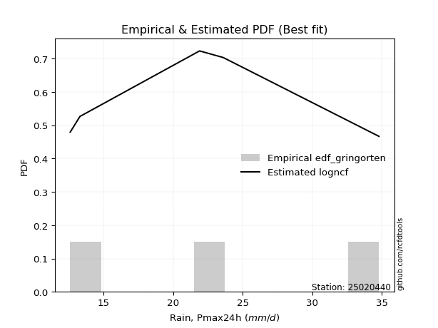</img>

</div>


### 9. Empirical - EDF Filliben (1975)

The specific values of the constants (0.3175) (often denoted as $alpha$) and (0.365) are derived from a method proposed by James J. Filliben in a 1975 paper. This particular formula is the mean value of the $i$-th order statistic of the normal distribution and is considered a robust and effective plotting position formula for the normal probability plot correlation coefficient test for normality.

<div align="center">


$P=(m-0.3175)/(n+0.365)$


</div>


**9.1. Empirical values**

<div align="center">

|                | 0                   | 1                   | 2                   | 3            | 4                  | 5                  | 6                  |
|:---------------|:--------------------|:--------------------|:--------------------|:-------------|:-------------------|:-------------------|:-------------------|
| date           | 2019                | 2021                | 2025                | 2022         | 2023               | 2020               | 2024               |
| x              | 12.6                | 13.3                | 14.0                | 21.9         | 23.6               | 34.7               | 34.8               |
| m              | 1                   | 2                   | 3                   | 4            | 5                  | 6                  | 7                  |
| empirical_dist | edf_filliben        | edf_filliben        | edf_filliben        | edf_filliben | edf_filliben       | edf_filliben       | edf_filliben       |
| empirical      | 0.09266802443991853 | 0.22844534962661237 | 0.36422267481330617 | 0.5          | 0.6357773251866938 | 0.7715546503733877 | 0.9073319755600815 |
| empirical_tr   | 1.1021324354657687  | 1.2960844698636163  | 1.5728777362520021  | 2.0          | 2.7455731593662627 | 4.377414561664191  | 10.791208791208794 |

</div>


**9.2. Kolmogorov-Smirnov fit test (sorted by Δ)**


<div align="center">

|                | 0                   | 1                   | 2                   | 3                   | 4                   | 5                   | 6                   | 7                   | 8                   | 9                   | 10                  | 11                  | 12                  | 13                  | 14                  | 15                  | 16                  | 17                  | 18                  | 19                  | 20                  | 21                  | 22                  | 23                  | 24                  | 25                  | 26                  | 27                  | 28                  | 29                  | 30                  | 31                  | 32                  | 33                  | 34                    | 35                  | 36                  | 37                  | 38                  | 39                  | 40                  | 41                  | 42                  | 43                  | 44                  | 45                  | 46                  | 47                  | 48                  | 49                  | 50                  | 51                  | 52                  | 53                  | 54                  | 55                  | 56                  | 57                  | 58                  | 59                  | 60                  | 61                  | 62                  | 63                  | 64                  | 65                  | 66                  | 67                  | 68                  | 69                  | 70                  | 71                  | 72                  | 73                  | 74                  | 75                  | 76                  | 77                  | 78                  | 79                  | 80                  | 81                  | 82                  | 83                  | 84                  | 85                  | 86                  | 87                  | 88                  | 89                  |
|:---------------|:--------------------|:--------------------|:--------------------|:--------------------|:--------------------|:--------------------|:--------------------|:--------------------|:--------------------|:--------------------|:--------------------|:--------------------|:--------------------|:--------------------|:--------------------|:--------------------|:--------------------|:--------------------|:--------------------|:--------------------|:--------------------|:--------------------|:--------------------|:--------------------|:--------------------|:--------------------|:--------------------|:--------------------|:--------------------|:--------------------|:--------------------|:--------------------|:--------------------|:--------------------|:----------------------|:--------------------|:--------------------|:--------------------|:--------------------|:--------------------|:--------------------|:--------------------|:--------------------|:--------------------|:--------------------|:--------------------|:--------------------|:--------------------|:--------------------|:--------------------|:--------------------|:--------------------|:--------------------|:--------------------|:--------------------|:--------------------|:--------------------|:--------------------|:--------------------|:--------------------|:--------------------|:--------------------|:--------------------|:--------------------|:--------------------|:--------------------|:--------------------|:--------------------|:--------------------|:--------------------|:--------------------|:--------------------|:--------------------|:--------------------|:--------------------|:--------------------|:--------------------|:--------------------|:--------------------|:--------------------|:--------------------|:--------------------|:--------------------|:--------------------|:--------------------|:--------------------|:--------------------|:--------------------|:--------------------|:--------------------|
| station        | 25020440            | 25020440            | 25020440            | 25020440            | 25020440            | 25020440            | 25020440            | 25020440            | 25020440            | 25020440            | 25020440            | 25020440            | 25020440            | 25020440            | 25020440            | 25020440            | 25020440            | 25020440            | 25020440            | 25020440            | 25020440            | 25020440            | 25020440            | 25020440            | 25020440            | 25020440            | 25020440            | 25020440            | 25020440            | 25020440            | 25020440            | 25020440            | 25020440            | 25020440            | 25020440              | 25020440            | 25020440            | 25020440            | 25020440            | 25020440            | 25020440            | 25020440            | 25020440            | 25020440            | 25020440            | 25020440            | 25020440            | 25020440            | 25020440            | 25020440            | 25020440            | 25020440            | 25020440            | 25020440            | 25020440            | 25020440            | 25020440            | 25020440            | 25020440            | 25020440            | 25020440            | 25020440            | 25020440            | 25020440            | 25020440            | 25020440            | 25020440            | 25020440            | 25020440            | 25020440            | 25020440            | 25020440            | 25020440            | 25020440            | 25020440            | 25020440            | 25020440            | 25020440            | 25020440            | 25020440            | 25020440            | 25020440            | 25020440            | 25020440            | 25020440            | 25020440            | 25020440            | 25020440            | 25020440            | 25020440            |
| empirical_dist | edf_filliben        | edf_filliben        | edf_filliben        | edf_filliben        | edf_filliben        | edf_filliben        | edf_filliben        | edf_filliben        | edf_filliben        | edf_filliben        | edf_filliben        | edf_filliben        | edf_filliben        | edf_filliben        | edf_filliben        | edf_filliben        | edf_filliben        | edf_filliben        | edf_filliben        | edf_filliben        | edf_filliben        | edf_filliben        | edf_filliben        | edf_filliben        | edf_filliben        | edf_filliben        | edf_filliben        | edf_filliben        | edf_filliben        | edf_filliben        | edf_filliben        | edf_filliben        | edf_filliben        | edf_filliben        | edf_filliben          | edf_filliben        | edf_filliben        | edf_filliben        | edf_filliben        | edf_filliben        | edf_filliben        | edf_filliben        | edf_filliben        | edf_filliben        | edf_filliben        | edf_filliben        | edf_filliben        | edf_filliben        | edf_filliben        | edf_filliben        | edf_filliben        | edf_filliben        | edf_filliben        | edf_filliben        | edf_filliben        | edf_filliben        | edf_filliben        | edf_filliben        | edf_filliben        | edf_filliben        | edf_filliben        | edf_filliben        | edf_filliben        | edf_filliben        | edf_filliben        | edf_filliben        | edf_filliben        | edf_filliben        | edf_filliben        | edf_filliben        | edf_filliben        | edf_filliben        | edf_filliben        | edf_filliben        | edf_filliben        | edf_filliben        | edf_filliben        | edf_filliben        | edf_filliben        | edf_filliben        | edf_filliben        | edf_filliben        | edf_filliben        | edf_filliben        | edf_filliben        | edf_filliben        | edf_filliben        | edf_filliben        | edf_filliben        | edf_filliben        |
| p_dist         | logncf              | nakagami            | weibull_min         | fisk                | halfnorm            | rayleigh            | chi2                | maxwell             | loghalfnorm         | loginvgamma         | lograyleigh         | logbetaprime        | mielke              | loggenlogistic      | logmaxwell          | johnsonsu           | pearson3            | nct                 | logkstwobign        | logexpon            | crystalball         | norm                | t                   | lognct              | logalpha            | ncf                 | logloggamma         | logpearson3         | logerlang           | logt                | lognorm             | lognorm             | logcrystalball      | logexponnorm        | loglaplace_asymmetric | logjohnsonsu        | betaprime           | loggamma            | loggamma            | logweibull_min      | genlogistic         | laplace_asymmetric  | loggenexpon         | kstwobign           | gumbel_r            | lognakagami         | invweibull          | logistic            | gumbel_l            | logf                | halflogistic        | loggumbel_r         | loggumbel_l         | loglogistic         | logrice             | loghalflogistic     | hypsecant           | loginvweibull       | loghypsecant        | f                   | invgamma            | moyal               | rice                | truncnorm           | exponnorm           | alpha               | logmoyal            | laplace             | expon               | loglaplace          | logchi2             | logtruncnorm        | genexpon            | loginvgauss         | loggompertz         | invgauss            | logfisk             | gompertz            | pareto              | logpareto           | wald                | logwald             | gibrat              | loggibrat           | loglognorm          | gamma               | fatiguelife         | logfatiguelife      | erlang              | logmielke           |
| delta          | 0.1084717863507661  | 0.1269031502468636  | 0.15430315746029044 | 0.15923593203528252 | 0.1684333538019732  | 0.17084522456742163 | 0.17339233561103518 | 0.1744167290239953  | 0.17533488689551743 | 0.17541767744696188 | 0.17594416814969302 | 0.17695832765288502 | 0.17793013051541495 | 0.1788935394139441  | 0.17911732939003025 | 0.18187070637267821 | 0.1819698584355727  | 0.18209035215852276 | 0.18283800088056615 | 0.18293887132373232 | 0.1834344245769085  | 0.18343443270179305 | 0.18343894725194065 | 0.1835318595750607  | 0.18461366767984078 | 0.18546330901607289 | 0.18570414502994834 | 0.1866271658064655  | 0.18669200514934384 | 0.18729695042633182 | 0.18729729630804198 | 0.18729729630804198 | 0.18729731447424153 | 0.18729879098703742 | 0.1873028223130062    | 0.18772808336871255 | 0.18775472229125928 | 0.18869084419865736 | 0.18869084419865736 | 0.18912359856944483 | 0.18966026509127362 | 0.19284507576971113 | 0.1963696468496574  | 0.19837158549746542 | 0.20045340121113794 | 0.2009694494171196  | 0.20316541645883368 | 0.2037678005576178  | 0.20432493997798012 | 0.20565423916520587 | 0.20598551208281626 | 0.2060270279629607  | 0.20707808984454415 | 0.20734646231995219 | 0.21008051089672064 | 0.21440112523693153 | 0.2151379649464353  | 0.21535871730893075 | 0.21843979016769766 | 0.21953594870470683 | 0.21971921782864168 | 0.21983834331801305 | 0.22008475248813147 | 0.22542399071728803 | 0.22581428510371182 | 0.22602943219423444 | 0.2263655909312257  | 0.22662571789523198 | 0.22758007495635899 | 0.2294720684491819  | 0.23164126600374502 | 0.2352749168800794  | 0.23547178138996383 | 0.23664700670830796 | 0.23713559239451726 | 0.24216827574056765 | 0.24282980518536013 | 0.24290878788945158 | 0.32306033360876574 | 0.34370782264100797 | 0.3623128030408091  | 0.36366746818337514 | 0.36422267481330617 | 0.36422267481330617 | 0.3703989629004989  | 0.3952940269491345  | 0.3997298838889425  | 0.41476515808569825 | 0.4340951099892906  | nan                 |
| deltao         | 0.48442053926100004 | 0.48442053926100004 | 0.48442053926100004 | 0.48442053926100004 | 0.48442053926100004 | 0.48442053926100004 | 0.48442053926100004 | 0.48442053926100004 | 0.48442053926100004 | 0.48442053926100004 | 0.48442053926100004 | 0.48442053926100004 | 0.48442053926100004 | 0.48442053926100004 | 0.48442053926100004 | 0.48442053926100004 | 0.48442053926100004 | 0.48442053926100004 | 0.48442053926100004 | 0.48442053926100004 | 0.48442053926100004 | 0.48442053926100004 | 0.48442053926100004 | 0.48442053926100004 | 0.48442053926100004 | 0.48442053926100004 | 0.48442053926100004 | 0.48442053926100004 | 0.48442053926100004 | 0.48442053926100004 | 0.48442053926100004 | 0.48442053926100004 | 0.48442053926100004 | 0.48442053926100004 | 0.48442053926100004   | 0.48442053926100004 | 0.48442053926100004 | 0.48442053926100004 | 0.48442053926100004 | 0.48442053926100004 | 0.48442053926100004 | 0.48442053926100004 | 0.48442053926100004 | 0.48442053926100004 | 0.48442053926100004 | 0.48442053926100004 | 0.48442053926100004 | 0.48442053926100004 | 0.48442053926100004 | 0.48442053926100004 | 0.48442053926100004 | 0.48442053926100004 | 0.48442053926100004 | 0.48442053926100004 | 0.48442053926100004 | 0.48442053926100004 | 0.48442053926100004 | 0.48442053926100004 | 0.48442053926100004 | 0.48442053926100004 | 0.48442053926100004 | 0.48442053926100004 | 0.48442053926100004 | 0.48442053926100004 | 0.48442053926100004 | 0.48442053926100004 | 0.48442053926100004 | 0.48442053926100004 | 0.48442053926100004 | 0.48442053926100004 | 0.48442053926100004 | 0.48442053926100004 | 0.48442053926100004 | 0.48442053926100004 | 0.48442053926100004 | 0.48442053926100004 | 0.48442053926100004 | 0.48442053926100004 | 0.48442053926100004 | 0.48442053926100004 | 0.48442053926100004 | 0.48442053926100004 | 0.48442053926100004 | 0.48442053926100004 | 0.48442053926100004 | 0.48442053926100004 | 0.48442053926100004 | 0.48442053926100004 | 0.48442053926100004 | 0.48442053926100004 |
| eval           | Δo > Δ              | Δo > Δ              | Δo > Δ              | Δo > Δ              | Δo > Δ              | Δo > Δ              | Δo > Δ              | Δo > Δ              | Δo > Δ              | Δo > Δ              | Δo > Δ              | Δo > Δ              | Δo > Δ              | Δo > Δ              | Δo > Δ              | Δo > Δ              | Δo > Δ              | Δo > Δ              | Δo > Δ              | Δo > Δ              | Δo > Δ              | Δo > Δ              | Δo > Δ              | Δo > Δ              | Δo > Δ              | Δo > Δ              | Δo > Δ              | Δo > Δ              | Δo > Δ              | Δo > Δ              | Δo > Δ              | Δo > Δ              | Δo > Δ              | Δo > Δ              | Δo > Δ                | Δo > Δ              | Δo > Δ              | Δo > Δ              | Δo > Δ              | Δo > Δ              | Δo > Δ              | Δo > Δ              | Δo > Δ              | Δo > Δ              | Δo > Δ              | Δo > Δ              | Δo > Δ              | Δo > Δ              | Δo > Δ              | Δo > Δ              | Δo > Δ              | Δo > Δ              | Δo > Δ              | Δo > Δ              | Δo > Δ              | Δo > Δ              | Δo > Δ              | Δo > Δ              | Δo > Δ              | Δo > Δ              | Δo > Δ              | Δo > Δ              | Δo > Δ              | Δo > Δ              | Δo > Δ              | Δo > Δ              | Δo > Δ              | Δo > Δ              | Δo > Δ              | Δo > Δ              | Δo > Δ              | Δo > Δ              | Δo > Δ              | Δo > Δ              | Δo > Δ              | Δo > Δ              | Δo > Δ              | Δo > Δ              | Δo > Δ              | Δo > Δ              | Δo > Δ              | Δo > Δ              | Δo > Δ              | Δo > Δ              | Δo > Δ              | Δo > Δ              | Δo > Δ              | Δo > Δ              | Δo > Δ              | Δo <= Δ             |
| fit            | 1                   | 1                   | 1                   | 1                   | 1                   | 1                   | 1                   | 1                   | 1                   | 1                   | 1                   | 1                   | 1                   | 1                   | 1                   | 1                   | 1                   | 1                   | 1                   | 1                   | 1                   | 1                   | 1                   | 1                   | 1                   | 1                   | 1                   | 1                   | 1                   | 1                   | 1                   | 1                   | 1                   | 1                   | 1                     | 1                   | 1                   | 1                   | 1                   | 1                   | 1                   | 1                   | 1                   | 1                   | 1                   | 1                   | 1                   | 1                   | 1                   | 1                   | 1                   | 1                   | 1                   | 1                   | 1                   | 1                   | 1                   | 1                   | 1                   | 1                   | 1                   | 1                   | 1                   | 1                   | 1                   | 1                   | 1                   | 1                   | 1                   | 1                   | 1                   | 1                   | 1                   | 1                   | 1                   | 1                   | 1                   | 1                   | 1                   | 1                   | 1                   | 1                   | 1                   | 1                   | 1                   | 1                   | 1                   | 1                   | 1                   | 0                   |
| n              | 7                   | 7                   | 7                   | 7                   | 7                   | 7                   | 7                   | 7                   | 7                   | 7                   | 7                   | 7                   | 7                   | 7                   | 7                   | 7                   | 7                   | 7                   | 7                   | 7                   | 7                   | 7                   | 7                   | 7                   | 7                   | 7                   | 7                   | 7                   | 7                   | 7                   | 7                   | 7                   | 7                   | 7                   | 7                     | 7                   | 7                   | 7                   | 7                   | 7                   | 7                   | 7                   | 7                   | 7                   | 7                   | 7                   | 7                   | 7                   | 7                   | 7                   | 7                   | 7                   | 7                   | 7                   | 7                   | 7                   | 7                   | 7                   | 7                   | 7                   | 7                   | 7                   | 7                   | 7                   | 7                   | 7                   | 7                   | 7                   | 7                   | 7                   | 7                   | 7                   | 7                   | 7                   | 7                   | 7                   | 7                   | 7                   | 7                   | 7                   | 7                   | 7                   | 7                   | 7                   | 7                   | 7                   | 7                   | 7                   | 7                   | 7                   |
| best_fit       | 1                   | 0                   | 0                   | 0                   | 0                   | 0                   | 0                   | 0                   | 0                   | 0                   | 0                   | 0                   | 0                   | 0                   | 0                   | 0                   | 0                   | 0                   | 0                   | 0                   | 0                   | 0                   | 0                   | 0                   | 0                   | 0                   | 0                   | 0                   | 0                   | 0                   | 0                   | 0                   | 0                   | 0                   | 0                     | 0                   | 0                   | 0                   | 0                   | 0                   | 0                   | 0                   | 0                   | 0                   | 0                   | 0                   | 0                   | 0                   | 0                   | 0                   | 0                   | 0                   | 0                   | 0                   | 0                   | 0                   | 0                   | 0                   | 0                   | 0                   | 0                   | 0                   | 0                   | 0                   | 0                   | 0                   | 0                   | 0                   | 0                   | 0                   | 0                   | 0                   | 0                   | 0                   | 0                   | 0                   | 0                   | 0                   | 0                   | 0                   | 0                   | 0                   | 0                   | 0                   | 0                   | 0                   | 0                   | 0                   | 0                   | 0                   |
| best_fit_sort  | 1                   | 2                   | 3                   | 4                   | 5                   | 6                   | 7                   | 8                   | 9                   | 10                  | 11                  | 12                  | 13                  | 14                  | 15                  | 16                  | 17                  | 18                  | 19                  | 20                  | 21                  | 22                  | 23                  | 24                  | 25                  | 26                  | 27                  | 28                  | 29                  | 30                  | 31                  | 32                  | 33                  | 34                  | 35                    | 36                  | 37                  | 38                  | 39                  | 40                  | 41                  | 42                  | 43                  | 44                  | 45                  | 46                  | 47                  | 48                  | 49                  | 50                  | 51                  | 52                  | 53                  | 54                  | 55                  | 56                  | 57                  | 58                  | 59                  | 60                  | 61                  | 62                  | 63                  | 64                  | 65                  | 66                  | 67                  | 68                  | 69                  | 70                  | 71                  | 72                  | 73                  | 74                  | 75                  | 76                  | 77                  | 78                  | 79                  | 80                  | 81                  | 82                  | 83                  | 84                  | 85                  | 86                  | 87                  | 88                  | 89                  | 90                  |

</div>


<div align="center">

</img>

</div>


**9.3. Best fit**

<div align="center">

|   id |   station | empirical_dist   | p_dist   |    delta |   deltao | eval   |   fit |   n |   best_fit |   best_fit_sort |
|-----:|----------:|:-----------------|:---------|---------:|---------:|:-------|------:|----:|-----------:|----------------:|
|    0 |  25020440 | edf_filliben     | logncf   | 0.108472 | 0.484421 | Δo > Δ |     1 |   7 |          1 |               1 |

</div>


<div align="center">

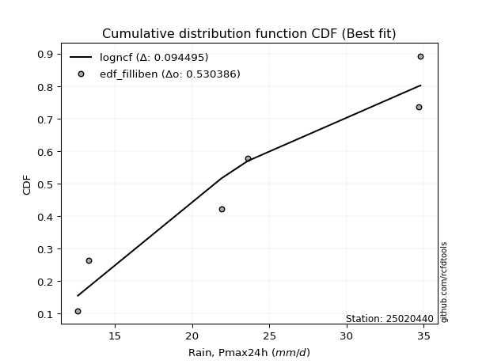</img>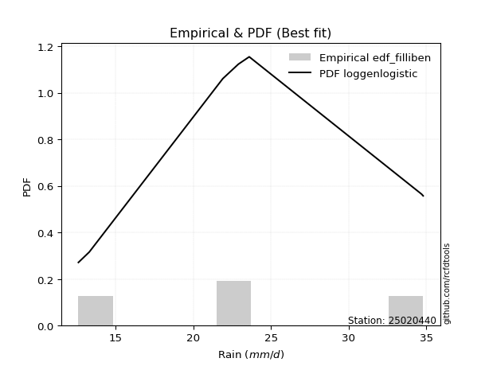</img>

</div>


### 10. Empirical - EDF Jenkinson (1977)

The Jenkinson formula in hydrology is an empirical plotting position formula used to estimate the non-exceedance probability _(P)_ or return period _(T)_ of a given ordered observation within a sample. It is a widely used method in the frequency analysis of extreme events such as floods and rainfall, as it provides a distribution-free way to plot data. _a≈0.31_ and _b≈0.38_ are constants derived to approximate the median of the probability distribution for the given rank.

<div align="center">


$P=(m-a)/(n+b)$


</div>


**10.1. Empirical values**

<div align="center">

|                | 0                   | 1                   | 2                   | 3             | 4                  | 5                  | 6                  |
|:---------------|:--------------------|:--------------------|:--------------------|:--------------|:-------------------|:-------------------|:-------------------|
| date           | 2019                | 2021                | 2025                | 2022          | 2023               | 2020               | 2024               |
| x              | 12.6                | 13.3                | 14.0                | 21.9          | 23.6               | 34.7               | 34.8               |
| m              | 1                   | 2                   | 3                   | 4             | 5                  | 6                  | 7                  |
| empirical_dist | edf_jenkinson       | edf_jenkinson       | edf_jenkinson       | edf_jenkinson | edf_jenkinson      | edf_jenkinson      | edf_jenkinson      |
| empirical      | 0.09349593495934959 | 0.22899728997289973 | 0.36449864498644985 | 0.5           | 0.6355013550135502 | 0.7710027100271003 | 0.9065040650406505 |
| empirical_tr   | 1.1031390134529149  | 1.29701230228471    | 1.5735607675906182  | 2.0           | 2.743494423791822  | 4.366863905325444  | 10.695652173913055 |

</div>


**10.2. Kolmogorov-Smirnov fit test (sorted by Δ)**


<div align="center">

|                | 0                   | 1                   | 2                   | 3                   | 4                   | 5                   | 6                   | 7                   | 8                   | 9                   | 10                  | 11                  | 12                  | 13                  | 14                  | 15                  | 16                  | 17                  | 18                  | 19                  | 20                  | 21                  | 22                  | 23                  | 24                  | 25                  | 26                  | 27                  | 28                  | 29                  | 30                  | 31                  | 32                  | 33                  | 34                    | 35                  | 36                  | 37                  | 38                  | 39                  | 40                  | 41                  | 42                  | 43                  | 44                  | 45                  | 46                  | 47                  | 48                  | 49                  | 50                  | 51                  | 52                  | 53                  | 54                  | 55                  | 56                  | 57                  | 58                  | 59                  | 60                  | 61                  | 62                  | 63                  | 64                  | 65                  | 66                  | 67                  | 68                  | 69                  | 70                  | 71                  | 72                  | 73                  | 74                  | 75                  | 76                  | 77                  | 78                  | 79                  | 80                  | 81                  | 82                  | 83                  | 84                  | 85                  | 86                  | 87                  | 88                  | 89                  |
|:---------------|:--------------------|:--------------------|:--------------------|:--------------------|:--------------------|:--------------------|:--------------------|:--------------------|:--------------------|:--------------------|:--------------------|:--------------------|:--------------------|:--------------------|:--------------------|:--------------------|:--------------------|:--------------------|:--------------------|:--------------------|:--------------------|:--------------------|:--------------------|:--------------------|:--------------------|:--------------------|:--------------------|:--------------------|:--------------------|:--------------------|:--------------------|:--------------------|:--------------------|:--------------------|:----------------------|:--------------------|:--------------------|:--------------------|:--------------------|:--------------------|:--------------------|:--------------------|:--------------------|:--------------------|:--------------------|:--------------------|:--------------------|:--------------------|:--------------------|:--------------------|:--------------------|:--------------------|:--------------------|:--------------------|:--------------------|:--------------------|:--------------------|:--------------------|:--------------------|:--------------------|:--------------------|:--------------------|:--------------------|:--------------------|:--------------------|:--------------------|:--------------------|:--------------------|:--------------------|:--------------------|:--------------------|:--------------------|:--------------------|:--------------------|:--------------------|:--------------------|:--------------------|:--------------------|:--------------------|:--------------------|:--------------------|:--------------------|:--------------------|:--------------------|:--------------------|:--------------------|:--------------------|:--------------------|:--------------------|:--------------------|
| station        | 25020440            | 25020440            | 25020440            | 25020440            | 25020440            | 25020440            | 25020440            | 25020440            | 25020440            | 25020440            | 25020440            | 25020440            | 25020440            | 25020440            | 25020440            | 25020440            | 25020440            | 25020440            | 25020440            | 25020440            | 25020440            | 25020440            | 25020440            | 25020440            | 25020440            | 25020440            | 25020440            | 25020440            | 25020440            | 25020440            | 25020440            | 25020440            | 25020440            | 25020440            | 25020440              | 25020440            | 25020440            | 25020440            | 25020440            | 25020440            | 25020440            | 25020440            | 25020440            | 25020440            | 25020440            | 25020440            | 25020440            | 25020440            | 25020440            | 25020440            | 25020440            | 25020440            | 25020440            | 25020440            | 25020440            | 25020440            | 25020440            | 25020440            | 25020440            | 25020440            | 25020440            | 25020440            | 25020440            | 25020440            | 25020440            | 25020440            | 25020440            | 25020440            | 25020440            | 25020440            | 25020440            | 25020440            | 25020440            | 25020440            | 25020440            | 25020440            | 25020440            | 25020440            | 25020440            | 25020440            | 25020440            | 25020440            | 25020440            | 25020440            | 25020440            | 25020440            | 25020440            | 25020440            | 25020440            | 25020440            |
| empirical_dist | edf_jenkinson       | edf_jenkinson       | edf_jenkinson       | edf_jenkinson       | edf_jenkinson       | edf_jenkinson       | edf_jenkinson       | edf_jenkinson       | edf_jenkinson       | edf_jenkinson       | edf_jenkinson       | edf_jenkinson       | edf_jenkinson       | edf_jenkinson       | edf_jenkinson       | edf_jenkinson       | edf_jenkinson       | edf_jenkinson       | edf_jenkinson       | edf_jenkinson       | edf_jenkinson       | edf_jenkinson       | edf_jenkinson       | edf_jenkinson       | edf_jenkinson       | edf_jenkinson       | edf_jenkinson       | edf_jenkinson       | edf_jenkinson       | edf_jenkinson       | edf_jenkinson       | edf_jenkinson       | edf_jenkinson       | edf_jenkinson       | edf_jenkinson         | edf_jenkinson       | edf_jenkinson       | edf_jenkinson       | edf_jenkinson       | edf_jenkinson       | edf_jenkinson       | edf_jenkinson       | edf_jenkinson       | edf_jenkinson       | edf_jenkinson       | edf_jenkinson       | edf_jenkinson       | edf_jenkinson       | edf_jenkinson       | edf_jenkinson       | edf_jenkinson       | edf_jenkinson       | edf_jenkinson       | edf_jenkinson       | edf_jenkinson       | edf_jenkinson       | edf_jenkinson       | edf_jenkinson       | edf_jenkinson       | edf_jenkinson       | edf_jenkinson       | edf_jenkinson       | edf_jenkinson       | edf_jenkinson       | edf_jenkinson       | edf_jenkinson       | edf_jenkinson       | edf_jenkinson       | edf_jenkinson       | edf_jenkinson       | edf_jenkinson       | edf_jenkinson       | edf_jenkinson       | edf_jenkinson       | edf_jenkinson       | edf_jenkinson       | edf_jenkinson       | edf_jenkinson       | edf_jenkinson       | edf_jenkinson       | edf_jenkinson       | edf_jenkinson       | edf_jenkinson       | edf_jenkinson       | edf_jenkinson       | edf_jenkinson       | edf_jenkinson       | edf_jenkinson       | edf_jenkinson       | edf_jenkinson       |
| p_dist         | logncf              | nakagami            | weibull_min         | fisk                | halfnorm            | rayleigh            | chi2                | maxwell             | loghalfnorm         | loginvgamma         | lograyleigh         | logbetaprime        | mielke              | loggenlogistic      | logmaxwell          | johnsonsu           | pearson3            | nct                 | logexpon            | logkstwobign        | crystalball         | norm                | t                   | lognct              | logalpha            | ncf                 | logloggamma         | logpearson3         | logerlang           | logt                | lognorm             | lognorm             | logcrystalball      | logexponnorm        | loglaplace_asymmetric | logjohnsonsu        | betaprime           | loggamma            | loggamma            | logweibull_min      | genlogistic         | laplace_asymmetric  | loggenexpon         | kstwobign           | gumbel_r            | lognakagami         | invweibull          | logistic            | gumbel_l            | logf                | halflogistic        | loggumbel_r         | loggumbel_l         | loglogistic         | logrice             | loghalflogistic     | loginvweibull       | hypsecant           | loghypsecant        | f                   | invgamma            | moyal               | rice                | truncnorm           | alpha               | exponnorm           | logmoyal            | laplace             | expon               | loglaplace          | logchi2             | logtruncnorm        | genexpon            | loginvgauss         | loggompertz         | logfisk             | invgauss            | gompertz            | pareto              | logpareto           | wald                | logwald             | gibrat              | loggibrat           | loglognorm          | gamma               | fatiguelife         | logfatiguelife      | erlang              | logmielke           |
| delta          | 0.10874775652390978 | 0.12717912042000729 | 0.15430315746029044 | 0.15840802151585154 | 0.16870932397511687 | 0.1711211947405653  | 0.17339233561103518 | 0.17469269919713898 | 0.1756108570686611  | 0.17569364762010556 | 0.1762201383228367  | 0.1772342978260287  | 0.17793013051541495 | 0.17916950958708777 | 0.17939329956317393 | 0.1821466765458219  | 0.18224582860871638 | 0.18236632233166644 | 0.18293887132373232 | 0.18311397105370983 | 0.18371039475005219 | 0.18371040287493673 | 0.18371491742508433 | 0.1838078297482044  | 0.18488963785298446 | 0.18573927918921657 | 0.18598011520309202 | 0.18690313597960917 | 0.18696797532248752 | 0.1875729205994755  | 0.18757326648118566 | 0.18757326648118566 | 0.1875732846473852  | 0.1875747611601811  | 0.1875787924861499    | 0.18800405354185623 | 0.18803069246440296 | 0.18896681437180105 | 0.18896681437180105 | 0.18912359856944483 | 0.1899362352644173  | 0.1931210459428548  | 0.1966456170228011  | 0.1986475556706091  | 0.20072937138428162 | 0.2012454195902633  | 0.20316541645883368 | 0.2040437707307615  | 0.2046009101511238  | 0.20565423916520587 | 0.20626148225595994 | 0.2063029981361044  | 0.20735406001768783 | 0.20762243249309587 | 0.21035648106986432 | 0.2146770954100752  | 0.21535871730893075 | 0.215413935119579   | 0.21871576034084134 | 0.21953594870470683 | 0.21971921782864168 | 0.22011431349115673 | 0.22036072266127515 | 0.22597593106357539 | 0.22602943219423444 | 0.2260902552768555  | 0.2266415611043694  | 0.22690168806837566 | 0.22785604512950267 | 0.22974803862232557 | 0.23081335548431403 | 0.2352749168800794  | 0.2357477515631075  | 0.23664700670830796 | 0.23741156256766094 | 0.24200189466592914 | 0.24216827574056765 | 0.24318475806259526 | 0.3225083932624784  | 0.3431558822947206  | 0.3625887732139528  | 0.3639434383565188  | 0.36449864498644985 | 0.36449864498644985 | 0.36984702255421154 | 0.3952940269491345  | 0.3991779435426551  | 0.4142132177394109  | 0.4340951099892906  | nan                 |
| deltao         | 0.48442053926100004 | 0.48442053926100004 | 0.48442053926100004 | 0.48442053926100004 | 0.48442053926100004 | 0.48442053926100004 | 0.48442053926100004 | 0.48442053926100004 | 0.48442053926100004 | 0.48442053926100004 | 0.48442053926100004 | 0.48442053926100004 | 0.48442053926100004 | 0.48442053926100004 | 0.48442053926100004 | 0.48442053926100004 | 0.48442053926100004 | 0.48442053926100004 | 0.48442053926100004 | 0.48442053926100004 | 0.48442053926100004 | 0.48442053926100004 | 0.48442053926100004 | 0.48442053926100004 | 0.48442053926100004 | 0.48442053926100004 | 0.48442053926100004 | 0.48442053926100004 | 0.48442053926100004 | 0.48442053926100004 | 0.48442053926100004 | 0.48442053926100004 | 0.48442053926100004 | 0.48442053926100004 | 0.48442053926100004   | 0.48442053926100004 | 0.48442053926100004 | 0.48442053926100004 | 0.48442053926100004 | 0.48442053926100004 | 0.48442053926100004 | 0.48442053926100004 | 0.48442053926100004 | 0.48442053926100004 | 0.48442053926100004 | 0.48442053926100004 | 0.48442053926100004 | 0.48442053926100004 | 0.48442053926100004 | 0.48442053926100004 | 0.48442053926100004 | 0.48442053926100004 | 0.48442053926100004 | 0.48442053926100004 | 0.48442053926100004 | 0.48442053926100004 | 0.48442053926100004 | 0.48442053926100004 | 0.48442053926100004 | 0.48442053926100004 | 0.48442053926100004 | 0.48442053926100004 | 0.48442053926100004 | 0.48442053926100004 | 0.48442053926100004 | 0.48442053926100004 | 0.48442053926100004 | 0.48442053926100004 | 0.48442053926100004 | 0.48442053926100004 | 0.48442053926100004 | 0.48442053926100004 | 0.48442053926100004 | 0.48442053926100004 | 0.48442053926100004 | 0.48442053926100004 | 0.48442053926100004 | 0.48442053926100004 | 0.48442053926100004 | 0.48442053926100004 | 0.48442053926100004 | 0.48442053926100004 | 0.48442053926100004 | 0.48442053926100004 | 0.48442053926100004 | 0.48442053926100004 | 0.48442053926100004 | 0.48442053926100004 | 0.48442053926100004 | 0.48442053926100004 |
| eval           | Δo > Δ              | Δo > Δ              | Δo > Δ              | Δo > Δ              | Δo > Δ              | Δo > Δ              | Δo > Δ              | Δo > Δ              | Δo > Δ              | Δo > Δ              | Δo > Δ              | Δo > Δ              | Δo > Δ              | Δo > Δ              | Δo > Δ              | Δo > Δ              | Δo > Δ              | Δo > Δ              | Δo > Δ              | Δo > Δ              | Δo > Δ              | Δo > Δ              | Δo > Δ              | Δo > Δ              | Δo > Δ              | Δo > Δ              | Δo > Δ              | Δo > Δ              | Δo > Δ              | Δo > Δ              | Δo > Δ              | Δo > Δ              | Δo > Δ              | Δo > Δ              | Δo > Δ                | Δo > Δ              | Δo > Δ              | Δo > Δ              | Δo > Δ              | Δo > Δ              | Δo > Δ              | Δo > Δ              | Δo > Δ              | Δo > Δ              | Δo > Δ              | Δo > Δ              | Δo > Δ              | Δo > Δ              | Δo > Δ              | Δo > Δ              | Δo > Δ              | Δo > Δ              | Δo > Δ              | Δo > Δ              | Δo > Δ              | Δo > Δ              | Δo > Δ              | Δo > Δ              | Δo > Δ              | Δo > Δ              | Δo > Δ              | Δo > Δ              | Δo > Δ              | Δo > Δ              | Δo > Δ              | Δo > Δ              | Δo > Δ              | Δo > Δ              | Δo > Δ              | Δo > Δ              | Δo > Δ              | Δo > Δ              | Δo > Δ              | Δo > Δ              | Δo > Δ              | Δo > Δ              | Δo > Δ              | Δo > Δ              | Δo > Δ              | Δo > Δ              | Δo > Δ              | Δo > Δ              | Δo > Δ              | Δo > Δ              | Δo > Δ              | Δo > Δ              | Δo > Δ              | Δo > Δ              | Δo > Δ              | Δo <= Δ             |
| fit            | 1                   | 1                   | 1                   | 1                   | 1                   | 1                   | 1                   | 1                   | 1                   | 1                   | 1                   | 1                   | 1                   | 1                   | 1                   | 1                   | 1                   | 1                   | 1                   | 1                   | 1                   | 1                   | 1                   | 1                   | 1                   | 1                   | 1                   | 1                   | 1                   | 1                   | 1                   | 1                   | 1                   | 1                   | 1                     | 1                   | 1                   | 1                   | 1                   | 1                   | 1                   | 1                   | 1                   | 1                   | 1                   | 1                   | 1                   | 1                   | 1                   | 1                   | 1                   | 1                   | 1                   | 1                   | 1                   | 1                   | 1                   | 1                   | 1                   | 1                   | 1                   | 1                   | 1                   | 1                   | 1                   | 1                   | 1                   | 1                   | 1                   | 1                   | 1                   | 1                   | 1                   | 1                   | 1                   | 1                   | 1                   | 1                   | 1                   | 1                   | 1                   | 1                   | 1                   | 1                   | 1                   | 1                   | 1                   | 1                   | 1                   | 0                   |
| n              | 7                   | 7                   | 7                   | 7                   | 7                   | 7                   | 7                   | 7                   | 7                   | 7                   | 7                   | 7                   | 7                   | 7                   | 7                   | 7                   | 7                   | 7                   | 7                   | 7                   | 7                   | 7                   | 7                   | 7                   | 7                   | 7                   | 7                   | 7                   | 7                   | 7                   | 7                   | 7                   | 7                   | 7                   | 7                     | 7                   | 7                   | 7                   | 7                   | 7                   | 7                   | 7                   | 7                   | 7                   | 7                   | 7                   | 7                   | 7                   | 7                   | 7                   | 7                   | 7                   | 7                   | 7                   | 7                   | 7                   | 7                   | 7                   | 7                   | 7                   | 7                   | 7                   | 7                   | 7                   | 7                   | 7                   | 7                   | 7                   | 7                   | 7                   | 7                   | 7                   | 7                   | 7                   | 7                   | 7                   | 7                   | 7                   | 7                   | 7                   | 7                   | 7                   | 7                   | 7                   | 7                   | 7                   | 7                   | 7                   | 7                   | 7                   |
| best_fit       | 1                   | 0                   | 0                   | 0                   | 0                   | 0                   | 0                   | 0                   | 0                   | 0                   | 0                   | 0                   | 0                   | 0                   | 0                   | 0                   | 0                   | 0                   | 0                   | 0                   | 0                   | 0                   | 0                   | 0                   | 0                   | 0                   | 0                   | 0                   | 0                   | 0                   | 0                   | 0                   | 0                   | 0                   | 0                     | 0                   | 0                   | 0                   | 0                   | 0                   | 0                   | 0                   | 0                   | 0                   | 0                   | 0                   | 0                   | 0                   | 0                   | 0                   | 0                   | 0                   | 0                   | 0                   | 0                   | 0                   | 0                   | 0                   | 0                   | 0                   | 0                   | 0                   | 0                   | 0                   | 0                   | 0                   | 0                   | 0                   | 0                   | 0                   | 0                   | 0                   | 0                   | 0                   | 0                   | 0                   | 0                   | 0                   | 0                   | 0                   | 0                   | 0                   | 0                   | 0                   | 0                   | 0                   | 0                   | 0                   | 0                   | 0                   |
| best_fit_sort  | 1                   | 2                   | 3                   | 4                   | 5                   | 6                   | 7                   | 8                   | 9                   | 10                  | 11                  | 12                  | 13                  | 14                  | 15                  | 16                  | 17                  | 18                  | 19                  | 20                  | 21                  | 22                  | 23                  | 24                  | 25                  | 26                  | 27                  | 28                  | 29                  | 30                  | 31                  | 32                  | 33                  | 34                  | 35                    | 36                  | 37                  | 38                  | 39                  | 40                  | 41                  | 42                  | 43                  | 44                  | 45                  | 46                  | 47                  | 48                  | 49                  | 50                  | 51                  | 52                  | 53                  | 54                  | 55                  | 56                  | 57                  | 58                  | 59                  | 60                  | 61                  | 62                  | 63                  | 64                  | 65                  | 66                  | 67                  | 68                  | 69                  | 70                  | 71                  | 72                  | 73                  | 74                  | 75                  | 76                  | 77                  | 78                  | 79                  | 80                  | 81                  | 82                  | 83                  | 84                  | 85                  | 86                  | 87                  | 88                  | 89                  | 90                  |

</div>


<div align="center">

</img>

</div>


**10.3. Best fit**

<div align="center">

|   id |   station | empirical_dist   | p_dist   |    delta |   deltao | eval   |   fit |   n |   best_fit |   best_fit_sort |
|-----:|----------:|:-----------------|:---------|---------:|---------:|:-------|------:|----:|-----------:|----------------:|
|    0 |  25020440 | edf_jenkinson    | logncf   | 0.108748 | 0.484421 | Δo > Δ |     1 |   7 |          1 |               1 |

</div>


<div align="center">

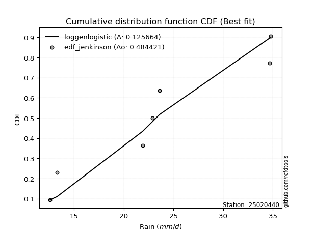</img>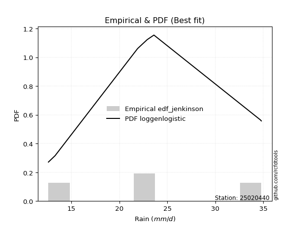</img>

</div>


### 11. Empirical - EDF Cunnane (1978)

Cunnane´s work in statistical hydrology has focused on the performance and evaluation of different probability distributions (such as GEV, Gumbel, Lognormal) for flood frequency estimation. _b_ is a constant, typically set to 0.4.

<div align="center">


$P=(m-b)/(n+1-2b)$


</div>


**11.1. Empirical values**

<div align="center">

|                | 0                   | 1                   | 2                  | 3           | 4                  | 5                  | 6                  |
|:---------------|:--------------------|:--------------------|:-------------------|:------------|:-------------------|:-------------------|:-------------------|
| date           | 2019                | 2021                | 2025               | 2022        | 2023               | 2020               | 2024               |
| x              | 12.6                | 13.3                | 14.0               | 21.9        | 23.6               | 34.7               | 34.8               |
| m              | 1                   | 2                   | 3                  | 4           | 5                  | 6                  | 7                  |
| empirical_dist | edf_cunnane         | edf_cunnane         | edf_cunnane        | edf_cunnane | edf_cunnane        | edf_cunnane        | edf_cunnane        |
| empirical      | 0.08333333333333333 | 0.22222222222222224 | 0.3611111111111111 | 0.5         | 0.6388888888888888 | 0.7777777777777777 | 0.9166666666666666 |
| empirical_tr   | 1.090909090909091   | 1.2857142857142856  | 1.565217391304348  | 2.0         | 2.7692307692307687 | 4.499999999999998  | 11.999999999999995 |

</div>


**11.2. Kolmogorov-Smirnov fit test (sorted by Δ)**


<div align="center">

|                | 0                   | 1                   | 2                   | 3                   | 4                   | 5                   | 6                   | 7                   | 8                   | 9                   | 10                  | 11                  | 12                  | 13                  | 14                  | 15                  | 16                  | 17                  | 18                  | 19                  | 20                  | 21                  | 22                  | 23                  | 24                  | 25                  | 26                  | 27                  | 28                  | 29                  | 30                  | 31                  | 32                  | 33                  | 34                    | 35                  | 36                  | 37                  | 38                  | 39                  | 40                  | 41                  | 42                  | 43                  | 44                  | 45                  | 46                  | 47                  | 48                  | 49                  | 50                  | 51                  | 52                  | 53                  | 54                  | 55                  | 56                  | 57                  | 58                  | 59                  | 60                  | 61                  | 62                  | 63                  | 64                  | 65                  | 66                  | 67                  | 68                  | 69                  | 70                  | 71                  | 72                  | 73                  | 74                  | 75                  | 76                  | 77                  | 78                  | 79                  | 80                  | 81                  | 82                  | 83                  | 84                  | 85                  | 86                  | 87                  | 88                  | 89                  |
|:---------------|:--------------------|:--------------------|:--------------------|:--------------------|:--------------------|:--------------------|:--------------------|:--------------------|:--------------------|:--------------------|:--------------------|:--------------------|:--------------------|:--------------------|:--------------------|:--------------------|:--------------------|:--------------------|:--------------------|:--------------------|:--------------------|:--------------------|:--------------------|:--------------------|:--------------------|:--------------------|:--------------------|:--------------------|:--------------------|:--------------------|:--------------------|:--------------------|:--------------------|:--------------------|:----------------------|:--------------------|:--------------------|:--------------------|:--------------------|:--------------------|:--------------------|:--------------------|:--------------------|:--------------------|:--------------------|:--------------------|:--------------------|:--------------------|:--------------------|:--------------------|:--------------------|:--------------------|:--------------------|:--------------------|:--------------------|:--------------------|:--------------------|:--------------------|:--------------------|:--------------------|:--------------------|:--------------------|:--------------------|:--------------------|:--------------------|:--------------------|:--------------------|:--------------------|:--------------------|:--------------------|:--------------------|:--------------------|:--------------------|:--------------------|:--------------------|:--------------------|:--------------------|:--------------------|:--------------------|:--------------------|:--------------------|:--------------------|:--------------------|:--------------------|:--------------------|:--------------------|:--------------------|:--------------------|:--------------------|:--------------------|
| station        | 25020440            | 25020440            | 25020440            | 25020440            | 25020440            | 25020440            | 25020440            | 25020440            | 25020440            | 25020440            | 25020440            | 25020440            | 25020440            | 25020440            | 25020440            | 25020440            | 25020440            | 25020440            | 25020440            | 25020440            | 25020440            | 25020440            | 25020440            | 25020440            | 25020440            | 25020440            | 25020440            | 25020440            | 25020440            | 25020440            | 25020440            | 25020440            | 25020440            | 25020440            | 25020440              | 25020440            | 25020440            | 25020440            | 25020440            | 25020440            | 25020440            | 25020440            | 25020440            | 25020440            | 25020440            | 25020440            | 25020440            | 25020440            | 25020440            | 25020440            | 25020440            | 25020440            | 25020440            | 25020440            | 25020440            | 25020440            | 25020440            | 25020440            | 25020440            | 25020440            | 25020440            | 25020440            | 25020440            | 25020440            | 25020440            | 25020440            | 25020440            | 25020440            | 25020440            | 25020440            | 25020440            | 25020440            | 25020440            | 25020440            | 25020440            | 25020440            | 25020440            | 25020440            | 25020440            | 25020440            | 25020440            | 25020440            | 25020440            | 25020440            | 25020440            | 25020440            | 25020440            | 25020440            | 25020440            | 25020440            |
| empirical_dist | edf_cunnane         | edf_cunnane         | edf_cunnane         | edf_cunnane         | edf_cunnane         | edf_cunnane         | edf_cunnane         | edf_cunnane         | edf_cunnane         | edf_cunnane         | edf_cunnane         | edf_cunnane         | edf_cunnane         | edf_cunnane         | edf_cunnane         | edf_cunnane         | edf_cunnane         | edf_cunnane         | edf_cunnane         | edf_cunnane         | edf_cunnane         | edf_cunnane         | edf_cunnane         | edf_cunnane         | edf_cunnane         | edf_cunnane         | edf_cunnane         | edf_cunnane         | edf_cunnane         | edf_cunnane         | edf_cunnane         | edf_cunnane         | edf_cunnane         | edf_cunnane         | edf_cunnane           | edf_cunnane         | edf_cunnane         | edf_cunnane         | edf_cunnane         | edf_cunnane         | edf_cunnane         | edf_cunnane         | edf_cunnane         | edf_cunnane         | edf_cunnane         | edf_cunnane         | edf_cunnane         | edf_cunnane         | edf_cunnane         | edf_cunnane         | edf_cunnane         | edf_cunnane         | edf_cunnane         | edf_cunnane         | edf_cunnane         | edf_cunnane         | edf_cunnane         | edf_cunnane         | edf_cunnane         | edf_cunnane         | edf_cunnane         | edf_cunnane         | edf_cunnane         | edf_cunnane         | edf_cunnane         | edf_cunnane         | edf_cunnane         | edf_cunnane         | edf_cunnane         | edf_cunnane         | edf_cunnane         | edf_cunnane         | edf_cunnane         | edf_cunnane         | edf_cunnane         | edf_cunnane         | edf_cunnane         | edf_cunnane         | edf_cunnane         | edf_cunnane         | edf_cunnane         | edf_cunnane         | edf_cunnane         | edf_cunnane         | edf_cunnane         | edf_cunnane         | edf_cunnane         | edf_cunnane         | edf_cunnane         | edf_cunnane         |
| p_dist         | logncf              | nakagami            | weibull_min         | halfnorm            | rayleigh            | fisk                | maxwell             | loghalfnorm         | loginvgamma         | lograyleigh         | chi2                | logbetaprime        | loggenlogistic      | logmaxwell          | mielke              | johnsonsu           | pearson3            | nct                 | logkstwobign        | crystalball         | norm                | t                   | lognct              | logalpha            | ncf                 | logloggamma         | logexpon            | logpearson3         | logerlang           | logt                | lognorm             | lognorm             | logcrystalball      | logexponnorm        | loglaplace_asymmetric | logjohnsonsu        | betaprime           | loggamma            | loggamma            | genlogistic         | logweibull_min      | laplace_asymmetric  | loggenexpon         | kstwobign           | gumbel_r            | lognakagami         | logistic            | gumbel_l            | halflogistic        | loggumbel_r         | invweibull          | loggumbel_l         | loglogistic         | logf                | logrice             | loghalflogistic     | hypsecant           | loghypsecant        | loginvweibull       | moyal               | rice                | truncnorm           | f                   | invgamma            | exponnorm           | logmoyal            | laplace             | expon               | alpha               | loglaplace          | genexpon            | loggompertz         | logtruncnorm        | loginvgauss         | gompertz            | logchi2             | invgauss            | logfisk             | pareto              | logpareto           | wald                | logwald             | gibrat              | loggibrat           | loglognorm          | gamma               | fatiguelife         | logfatiguelife      | erlang              | logmielke           |
| delta          | 0.11278102136836692 | 0.12379158654466854 | 0.15430315746029044 | 0.16532179009977813 | 0.16773366086522656 | 0.16857062314186766 | 0.17130516532180023 | 0.17222332319332237 | 0.17230611374476681 | 0.17283260444749796 | 0.17339233561103518 | 0.17384676395068996 | 0.17578197571174903 | 0.1760057656878352  | 0.17793013051541495 | 0.17875914267048315 | 0.17885829473337764 | 0.1789787884563277  | 0.17972643717837108 | 0.18032286087471344 | 0.18032286899959798 | 0.1803273835497456  | 0.18042029587286565 | 0.1815021039776457  | 0.18235174531387782 | 0.18259258132775327 | 0.18293887132373232 | 0.18351560210427043 | 0.18358044144714877 | 0.18418538672413676 | 0.18418573260584692 | 0.18418573260584692 | 0.18418575077204646 | 0.18418722728484235 | 0.18419125861081115   | 0.1846165196665175  | 0.18464315858906422 | 0.1855792804964623  | 0.1855792804964623  | 0.18654870138907856 | 0.18912359856944483 | 0.18973351206751607 | 0.19325808314746235 | 0.19526002179527036 | 0.19734183750894288 | 0.19785788571492455 | 0.20065623685542275 | 0.20121337627578506 | 0.2028739483806212  | 0.20291546426076565 | 0.20316541645883368 | 0.20396652614234909 | 0.20423489861775712 | 0.20565423916520587 | 0.20696894719452558 | 0.21128956153473646 | 0.21202640124424024 | 0.2153282264655026  | 0.21535871730893075 | 0.216726779615818   | 0.2169731887859364  | 0.219200863312898   | 0.21953594870470683 | 0.21971921782864168 | 0.22270272140151676 | 0.22325402722903065 | 0.2235141541930369  | 0.22446851125416392 | 0.22602943219423444 | 0.22636050474698682 | 0.23236021768776877 | 0.2340240286923222  | 0.2352749168800794  | 0.23664700670830796 | 0.23979722418725652 | 0.24097595711033015 | 0.24216827574056765 | 0.25216449629194526 | 0.32928346101315586 | 0.3499309500453981  | 0.35920123933861403 | 0.3605559044811801  | 0.3611111111111111  | 0.3611111111111111  | 0.376622090304889   | 0.3952940269491345  | 0.4059530112933326  | 0.4209882854900884  | 0.4340951099892906  | nan                 |
| deltao         | 0.48442053926100004 | 0.48442053926100004 | 0.48442053926100004 | 0.48442053926100004 | 0.48442053926100004 | 0.48442053926100004 | 0.48442053926100004 | 0.48442053926100004 | 0.48442053926100004 | 0.48442053926100004 | 0.48442053926100004 | 0.48442053926100004 | 0.48442053926100004 | 0.48442053926100004 | 0.48442053926100004 | 0.48442053926100004 | 0.48442053926100004 | 0.48442053926100004 | 0.48442053926100004 | 0.48442053926100004 | 0.48442053926100004 | 0.48442053926100004 | 0.48442053926100004 | 0.48442053926100004 | 0.48442053926100004 | 0.48442053926100004 | 0.48442053926100004 | 0.48442053926100004 | 0.48442053926100004 | 0.48442053926100004 | 0.48442053926100004 | 0.48442053926100004 | 0.48442053926100004 | 0.48442053926100004 | 0.48442053926100004   | 0.48442053926100004 | 0.48442053926100004 | 0.48442053926100004 | 0.48442053926100004 | 0.48442053926100004 | 0.48442053926100004 | 0.48442053926100004 | 0.48442053926100004 | 0.48442053926100004 | 0.48442053926100004 | 0.48442053926100004 | 0.48442053926100004 | 0.48442053926100004 | 0.48442053926100004 | 0.48442053926100004 | 0.48442053926100004 | 0.48442053926100004 | 0.48442053926100004 | 0.48442053926100004 | 0.48442053926100004 | 0.48442053926100004 | 0.48442053926100004 | 0.48442053926100004 | 0.48442053926100004 | 0.48442053926100004 | 0.48442053926100004 | 0.48442053926100004 | 0.48442053926100004 | 0.48442053926100004 | 0.48442053926100004 | 0.48442053926100004 | 0.48442053926100004 | 0.48442053926100004 | 0.48442053926100004 | 0.48442053926100004 | 0.48442053926100004 | 0.48442053926100004 | 0.48442053926100004 | 0.48442053926100004 | 0.48442053926100004 | 0.48442053926100004 | 0.48442053926100004 | 0.48442053926100004 | 0.48442053926100004 | 0.48442053926100004 | 0.48442053926100004 | 0.48442053926100004 | 0.48442053926100004 | 0.48442053926100004 | 0.48442053926100004 | 0.48442053926100004 | 0.48442053926100004 | 0.48442053926100004 | 0.48442053926100004 | 0.48442053926100004 |
| eval           | Δo > Δ              | Δo > Δ              | Δo > Δ              | Δo > Δ              | Δo > Δ              | Δo > Δ              | Δo > Δ              | Δo > Δ              | Δo > Δ              | Δo > Δ              | Δo > Δ              | Δo > Δ              | Δo > Δ              | Δo > Δ              | Δo > Δ              | Δo > Δ              | Δo > Δ              | Δo > Δ              | Δo > Δ              | Δo > Δ              | Δo > Δ              | Δo > Δ              | Δo > Δ              | Δo > Δ              | Δo > Δ              | Δo > Δ              | Δo > Δ              | Δo > Δ              | Δo > Δ              | Δo > Δ              | Δo > Δ              | Δo > Δ              | Δo > Δ              | Δo > Δ              | Δo > Δ                | Δo > Δ              | Δo > Δ              | Δo > Δ              | Δo > Δ              | Δo > Δ              | Δo > Δ              | Δo > Δ              | Δo > Δ              | Δo > Δ              | Δo > Δ              | Δo > Δ              | Δo > Δ              | Δo > Δ              | Δo > Δ              | Δo > Δ              | Δo > Δ              | Δo > Δ              | Δo > Δ              | Δo > Δ              | Δo > Δ              | Δo > Δ              | Δo > Δ              | Δo > Δ              | Δo > Δ              | Δo > Δ              | Δo > Δ              | Δo > Δ              | Δo > Δ              | Δo > Δ              | Δo > Δ              | Δo > Δ              | Δo > Δ              | Δo > Δ              | Δo > Δ              | Δo > Δ              | Δo > Δ              | Δo > Δ              | Δo > Δ              | Δo > Δ              | Δo > Δ              | Δo > Δ              | Δo > Δ              | Δo > Δ              | Δo > Δ              | Δo > Δ              | Δo > Δ              | Δo > Δ              | Δo > Δ              | Δo > Δ              | Δo > Δ              | Δo > Δ              | Δo > Δ              | Δo > Δ              | Δo > Δ              | Δo <= Δ             |
| fit            | 1                   | 1                   | 1                   | 1                   | 1                   | 1                   | 1                   | 1                   | 1                   | 1                   | 1                   | 1                   | 1                   | 1                   | 1                   | 1                   | 1                   | 1                   | 1                   | 1                   | 1                   | 1                   | 1                   | 1                   | 1                   | 1                   | 1                   | 1                   | 1                   | 1                   | 1                   | 1                   | 1                   | 1                   | 1                     | 1                   | 1                   | 1                   | 1                   | 1                   | 1                   | 1                   | 1                   | 1                   | 1                   | 1                   | 1                   | 1                   | 1                   | 1                   | 1                   | 1                   | 1                   | 1                   | 1                   | 1                   | 1                   | 1                   | 1                   | 1                   | 1                   | 1                   | 1                   | 1                   | 1                   | 1                   | 1                   | 1                   | 1                   | 1                   | 1                   | 1                   | 1                   | 1                   | 1                   | 1                   | 1                   | 1                   | 1                   | 1                   | 1                   | 1                   | 1                   | 1                   | 1                   | 1                   | 1                   | 1                   | 1                   | 0                   |
| n              | 7                   | 7                   | 7                   | 7                   | 7                   | 7                   | 7                   | 7                   | 7                   | 7                   | 7                   | 7                   | 7                   | 7                   | 7                   | 7                   | 7                   | 7                   | 7                   | 7                   | 7                   | 7                   | 7                   | 7                   | 7                   | 7                   | 7                   | 7                   | 7                   | 7                   | 7                   | 7                   | 7                   | 7                   | 7                     | 7                   | 7                   | 7                   | 7                   | 7                   | 7                   | 7                   | 7                   | 7                   | 7                   | 7                   | 7                   | 7                   | 7                   | 7                   | 7                   | 7                   | 7                   | 7                   | 7                   | 7                   | 7                   | 7                   | 7                   | 7                   | 7                   | 7                   | 7                   | 7                   | 7                   | 7                   | 7                   | 7                   | 7                   | 7                   | 7                   | 7                   | 7                   | 7                   | 7                   | 7                   | 7                   | 7                   | 7                   | 7                   | 7                   | 7                   | 7                   | 7                   | 7                   | 7                   | 7                   | 7                   | 7                   | 7                   |
| best_fit       | 1                   | 0                   | 0                   | 0                   | 0                   | 0                   | 0                   | 0                   | 0                   | 0                   | 0                   | 0                   | 0                   | 0                   | 0                   | 0                   | 0                   | 0                   | 0                   | 0                   | 0                   | 0                   | 0                   | 0                   | 0                   | 0                   | 0                   | 0                   | 0                   | 0                   | 0                   | 0                   | 0                   | 0                   | 0                     | 0                   | 0                   | 0                   | 0                   | 0                   | 0                   | 0                   | 0                   | 0                   | 0                   | 0                   | 0                   | 0                   | 0                   | 0                   | 0                   | 0                   | 0                   | 0                   | 0                   | 0                   | 0                   | 0                   | 0                   | 0                   | 0                   | 0                   | 0                   | 0                   | 0                   | 0                   | 0                   | 0                   | 0                   | 0                   | 0                   | 0                   | 0                   | 0                   | 0                   | 0                   | 0                   | 0                   | 0                   | 0                   | 0                   | 0                   | 0                   | 0                   | 0                   | 0                   | 0                   | 0                   | 0                   | 0                   |
| best_fit_sort  | 1                   | 2                   | 3                   | 4                   | 5                   | 6                   | 7                   | 8                   | 9                   | 10                  | 11                  | 12                  | 13                  | 14                  | 15                  | 16                  | 17                  | 18                  | 19                  | 20                  | 21                  | 22                  | 23                  | 24                  | 25                  | 26                  | 27                  | 28                  | 29                  | 30                  | 31                  | 32                  | 33                  | 34                  | 35                    | 36                  | 37                  | 38                  | 39                  | 40                  | 41                  | 42                  | 43                  | 44                  | 45                  | 46                  | 47                  | 48                  | 49                  | 50                  | 51                  | 52                  | 53                  | 54                  | 55                  | 56                  | 57                  | 58                  | 59                  | 60                  | 61                  | 62                  | 63                  | 64                  | 65                  | 66                  | 67                  | 68                  | 69                  | 70                  | 71                  | 72                  | 73                  | 74                  | 75                  | 76                  | 77                  | 78                  | 79                  | 80                  | 81                  | 82                  | 83                  | 84                  | 85                  | 86                  | 87                  | 88                  | 89                  | 90                  |

</div>


<div align="center">

</img>

</div>


**11.3. Best fit**

<div align="center">

|   id |   station | empirical_dist   | p_dist   |    delta |   deltao | eval   |   fit |   n |   best_fit |   best_fit_sort |
|-----:|----------:|:-----------------|:---------|---------:|---------:|:-------|------:|----:|-----------:|----------------:|
|    0 |  25020440 | edf_cunnane      | logncf   | 0.112781 | 0.484421 | Δo > Δ |     1 |   7 |          1 |               1 |

</div>


<div align="center">

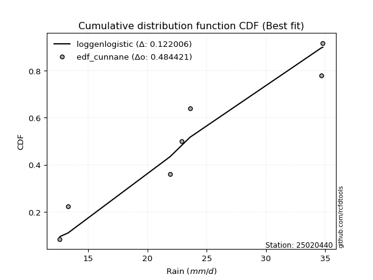</img>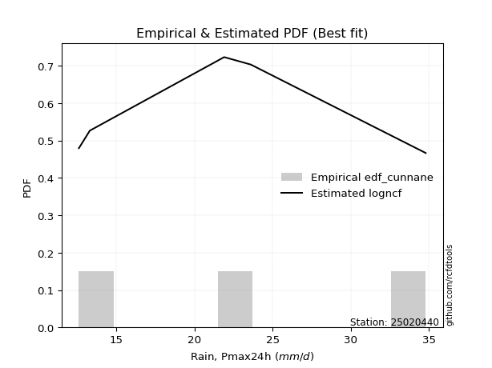</img>

</div>


### 12. Empirical - EDF Adamowski (1981)

The Adamowski formula in hydrology refers to a specific plotting position formula used for estimating the non-parametric empirical distribution of hydrological events (like flood peaks) to calculate their return periods. This formula provides an alternative to traditional parametric methods (like the Gumbel or Log Pearson Type III distributions). 

<div align="center">


$P=(m-0.25)/(n+0.5)$


</div>


**12.1. Empirical values**

<div align="center">

|                | 0                  | 1                   | 2                   | 3             | 4                  | 5                  | 6                  |
|:---------------|:-------------------|:--------------------|:--------------------|:--------------|:-------------------|:-------------------|:-------------------|
| date           | 2019               | 2021                | 2025                | 2022          | 2023               | 2020               | 2024               |
| x              | 12.6               | 13.3                | 14.0                | 21.9          | 23.6               | 34.7               | 34.8               |
| m              | 1                  | 2                   | 3                   | 4             | 5                  | 6                  | 7                  |
| empirical_dist | edf_adamowski      | edf_adamowski       | edf_adamowski       | edf_adamowski | edf_adamowski      | edf_adamowski      | edf_adamowski      |
| empirical      | 0.1                | 0.23333333333333334 | 0.36666666666666664 | 0.5           | 0.6333333333333333 | 0.7666666666666667 | 0.9                |
| empirical_tr   | 1.1111111111111112 | 1.3043478260869565  | 1.5789473684210527  | 2.0           | 2.727272727272727  | 4.2857142857142865 | 10.000000000000002 |

</div>


**12.2. Kolmogorov-Smirnov fit test (sorted by Δ)**


<div align="center">

|                | 0                   | 1                   | 2                   | 3                   | 4                   | 5                   | 6                   | 7                   | 8                   | 9                   | 10                  | 11                  | 12                  | 13                  | 14                  | 15                  | 16                  | 17                  | 18                  | 19                  | 20                  | 21                  | 22                  | 23                  | 24                  | 25                  | 26                  | 27                  | 28                  | 29                  | 30                  | 31                  | 32                  | 33                  | 34                  | 35                    | 36                  | 37                  | 38                  | 39                  | 40                  | 41                  | 42                  | 43                  | 44                  | 45                  | 46                  | 47                  | 48                  | 49                  | 50                  | 51                  | 52                  | 53                  | 54                  | 55                  | 56                  | 57                  | 58                  | 59                  | 60                  | 61                  | 62                  | 63                  | 64                  | 65                  | 66                  | 67                  | 68                  | 69                  | 70                  | 71                  | 72                  | 73                  | 74                  | 75                  | 76                  | 77                  | 78                  | 79                  | 80                  | 81                  | 82                  | 83                  | 84                  | 85                  | 86                  | 87                  | 88                  | 89                  |
|:---------------|:--------------------|:--------------------|:--------------------|:--------------------|:--------------------|:--------------------|:--------------------|:--------------------|:--------------------|:--------------------|:--------------------|:--------------------|:--------------------|:--------------------|:--------------------|:--------------------|:--------------------|:--------------------|:--------------------|:--------------------|:--------------------|:--------------------|:--------------------|:--------------------|:--------------------|:--------------------|:--------------------|:--------------------|:--------------------|:--------------------|:--------------------|:--------------------|:--------------------|:--------------------|:--------------------|:----------------------|:--------------------|:--------------------|:--------------------|:--------------------|:--------------------|:--------------------|:--------------------|:--------------------|:--------------------|:--------------------|:--------------------|:--------------------|:--------------------|:--------------------|:--------------------|:--------------------|:--------------------|:--------------------|:--------------------|:--------------------|:--------------------|:--------------------|:--------------------|:--------------------|:--------------------|:--------------------|:--------------------|:--------------------|:--------------------|:--------------------|:--------------------|:--------------------|:--------------------|:--------------------|:--------------------|:--------------------|:--------------------|:--------------------|:--------------------|:--------------------|:--------------------|:--------------------|:--------------------|:--------------------|:--------------------|:--------------------|:--------------------|:--------------------|:--------------------|:--------------------|:--------------------|:--------------------|:--------------------|:--------------------|
| station        | 25020440            | 25020440            | 25020440            | 25020440            | 25020440            | 25020440            | 25020440            | 25020440            | 25020440            | 25020440            | 25020440            | 25020440            | 25020440            | 25020440            | 25020440            | 25020440            | 25020440            | 25020440            | 25020440            | 25020440            | 25020440            | 25020440            | 25020440            | 25020440            | 25020440            | 25020440            | 25020440            | 25020440            | 25020440            | 25020440            | 25020440            | 25020440            | 25020440            | 25020440            | 25020440            | 25020440              | 25020440            | 25020440            | 25020440            | 25020440            | 25020440            | 25020440            | 25020440            | 25020440            | 25020440            | 25020440            | 25020440            | 25020440            | 25020440            | 25020440            | 25020440            | 25020440            | 25020440            | 25020440            | 25020440            | 25020440            | 25020440            | 25020440            | 25020440            | 25020440            | 25020440            | 25020440            | 25020440            | 25020440            | 25020440            | 25020440            | 25020440            | 25020440            | 25020440            | 25020440            | 25020440            | 25020440            | 25020440            | 25020440            | 25020440            | 25020440            | 25020440            | 25020440            | 25020440            | 25020440            | 25020440            | 25020440            | 25020440            | 25020440            | 25020440            | 25020440            | 25020440            | 25020440            | 25020440            | 25020440            |
| empirical_dist | edf_adamowski       | edf_adamowski       | edf_adamowski       | edf_adamowski       | edf_adamowski       | edf_adamowski       | edf_adamowski       | edf_adamowski       | edf_adamowski       | edf_adamowski       | edf_adamowski       | edf_adamowski       | edf_adamowski       | edf_adamowski       | edf_adamowski       | edf_adamowski       | edf_adamowski       | edf_adamowski       | edf_adamowski       | edf_adamowski       | edf_adamowski       | edf_adamowski       | edf_adamowski       | edf_adamowski       | edf_adamowski       | edf_adamowski       | edf_adamowski       | edf_adamowski       | edf_adamowski       | edf_adamowski       | edf_adamowski       | edf_adamowski       | edf_adamowski       | edf_adamowski       | edf_adamowski       | edf_adamowski         | edf_adamowski       | edf_adamowski       | edf_adamowski       | edf_adamowski       | edf_adamowski       | edf_adamowski       | edf_adamowski       | edf_adamowski       | edf_adamowski       | edf_adamowski       | edf_adamowski       | edf_adamowski       | edf_adamowski       | edf_adamowski       | edf_adamowski       | edf_adamowski       | edf_adamowski       | edf_adamowski       | edf_adamowski       | edf_adamowski       | edf_adamowski       | edf_adamowski       | edf_adamowski       | edf_adamowski       | edf_adamowski       | edf_adamowski       | edf_adamowski       | edf_adamowski       | edf_adamowski       | edf_adamowski       | edf_adamowski       | edf_adamowski       | edf_adamowski       | edf_adamowski       | edf_adamowski       | edf_adamowski       | edf_adamowski       | edf_adamowski       | edf_adamowski       | edf_adamowski       | edf_adamowski       | edf_adamowski       | edf_adamowski       | edf_adamowski       | edf_adamowski       | edf_adamowski       | edf_adamowski       | edf_adamowski       | edf_adamowski       | edf_adamowski       | edf_adamowski       | edf_adamowski       | edf_adamowski       | edf_adamowski       |
| p_dist         | logncf              | nakagami            | fisk                | weibull_min         | halfnorm            | rayleigh            | chi2                | maxwell             | loghalfnorm         | loginvgamma         | mielke              | lograyleigh         | logbetaprime        | loggenlogistic      | logmaxwell          | logexpon            | johnsonsu           | pearson3            | nct                 | logkstwobign        | crystalball         | norm                | t                   | lognct              | logalpha            | ncf                 | logloggamma         | logpearson3         | logweibull_min      | logerlang           | logt                | lognorm             | lognorm             | logcrystalball      | logexponnorm        | loglaplace_asymmetric | logjohnsonsu        | betaprime           | loggamma            | loggamma            | genlogistic         | laplace_asymmetric  | loggenexpon         | kstwobign           | gumbel_r            | invweibull          | lognakagami         | logf                | logistic            | gumbel_l            | halflogistic        | loggumbel_r         | loggumbel_l         | loglogistic         | logrice             | loginvweibull       | loghalflogistic     | hypsecant           | f                   | invgamma            | loghypsecant        | moyal               | rice                | logchi2             | alpha               | exponnorm           | logmoyal            | laplace             | expon               | truncnorm           | loglaplace          | logtruncnorm        | logfisk             | loginvgauss         | genexpon            | loggompertz         | invgauss            | gompertz            | pareto              | logpareto           | wald                | loglognorm          | logwald             | loggibrat           | gibrat              | fatiguelife         | gamma               | logfatiguelife      | erlang              | logmielke           |
| delta          | 0.11091577820412657 | 0.12934714210022408 | 0.15190395647520105 | 0.15430315746029044 | 0.17087734565533366 | 0.1732892164207821  | 0.17339233561103518 | 0.17686072087735577 | 0.1777788787488779  | 0.17786166930032235 | 0.17793013051541495 | 0.1783881600030535  | 0.1794023195062455  | 0.18133753126730456 | 0.18156132124339072 | 0.18293887132373232 | 0.1843146982260387  | 0.18441385028893317 | 0.18453434401188323 | 0.18528199273392662 | 0.18587841643026898 | 0.18587842455515352 | 0.18588293910530113 | 0.18597585142842118 | 0.18705765953320125 | 0.18790730086943336 | 0.1881481368833088  | 0.18907115765982596 | 0.18912359856944483 | 0.1891359970027043  | 0.1897409422796923  | 0.18974128816140245 | 0.18974128816140245 | 0.189741306327602   | 0.1897427828403979  | 0.18974681416636668   | 0.19017207522207302 | 0.19019871414461975 | 0.19113483605201784 | 0.19113483605201784 | 0.1921042569446341  | 0.1952890676230716  | 0.19881363870301788 | 0.2008155773508259  | 0.20289739306449842 | 0.20316541645883368 | 0.20341344127048008 | 0.20565423916520587 | 0.20621179241097828 | 0.2067689318313406  | 0.20842950393617674 | 0.20847101981632118 | 0.20952208169790462 | 0.20979045417331266 | 0.2125245027500811  | 0.21535871730893075 | 0.216845117090292   | 0.21758195679979578 | 0.21953594870470683 | 0.21971921782864168 | 0.22088378202105813 | 0.22228233517137352 | 0.22252874434149195 | 0.22430929044366354 | 0.22602943219423444 | 0.2282582769570723  | 0.22880958278458619 | 0.22906970974859245 | 0.23002406680971946 | 0.23031197442400897 | 0.23191606030254236 | 0.2352749168800794  | 0.23549782962527865 | 0.23664700670830796 | 0.2379157732433243  | 0.23957958424787773 | 0.24216827574056765 | 0.24535277974281205 | 0.31817234990204474 | 0.33881983893428697 | 0.36475679489416957 | 0.3655109791937779  | 0.3661114600367356  | 0.36666666666666664 | 0.36666666666666664 | 0.3948419001822215  | 0.3952940269491345  | 0.40987717437897725 | 0.4340951099892906  | nan                 |
| deltao         | 0.48442053926100004 | 0.48442053926100004 | 0.48442053926100004 | 0.48442053926100004 | 0.48442053926100004 | 0.48442053926100004 | 0.48442053926100004 | 0.48442053926100004 | 0.48442053926100004 | 0.48442053926100004 | 0.48442053926100004 | 0.48442053926100004 | 0.48442053926100004 | 0.48442053926100004 | 0.48442053926100004 | 0.48442053926100004 | 0.48442053926100004 | 0.48442053926100004 | 0.48442053926100004 | 0.48442053926100004 | 0.48442053926100004 | 0.48442053926100004 | 0.48442053926100004 | 0.48442053926100004 | 0.48442053926100004 | 0.48442053926100004 | 0.48442053926100004 | 0.48442053926100004 | 0.48442053926100004 | 0.48442053926100004 | 0.48442053926100004 | 0.48442053926100004 | 0.48442053926100004 | 0.48442053926100004 | 0.48442053926100004 | 0.48442053926100004   | 0.48442053926100004 | 0.48442053926100004 | 0.48442053926100004 | 0.48442053926100004 | 0.48442053926100004 | 0.48442053926100004 | 0.48442053926100004 | 0.48442053926100004 | 0.48442053926100004 | 0.48442053926100004 | 0.48442053926100004 | 0.48442053926100004 | 0.48442053926100004 | 0.48442053926100004 | 0.48442053926100004 | 0.48442053926100004 | 0.48442053926100004 | 0.48442053926100004 | 0.48442053926100004 | 0.48442053926100004 | 0.48442053926100004 | 0.48442053926100004 | 0.48442053926100004 | 0.48442053926100004 | 0.48442053926100004 | 0.48442053926100004 | 0.48442053926100004 | 0.48442053926100004 | 0.48442053926100004 | 0.48442053926100004 | 0.48442053926100004 | 0.48442053926100004 | 0.48442053926100004 | 0.48442053926100004 | 0.48442053926100004 | 0.48442053926100004 | 0.48442053926100004 | 0.48442053926100004 | 0.48442053926100004 | 0.48442053926100004 | 0.48442053926100004 | 0.48442053926100004 | 0.48442053926100004 | 0.48442053926100004 | 0.48442053926100004 | 0.48442053926100004 | 0.48442053926100004 | 0.48442053926100004 | 0.48442053926100004 | 0.48442053926100004 | 0.48442053926100004 | 0.48442053926100004 | 0.48442053926100004 | 0.48442053926100004 |
| eval           | Δo > Δ              | Δo > Δ              | Δo > Δ              | Δo > Δ              | Δo > Δ              | Δo > Δ              | Δo > Δ              | Δo > Δ              | Δo > Δ              | Δo > Δ              | Δo > Δ              | Δo > Δ              | Δo > Δ              | Δo > Δ              | Δo > Δ              | Δo > Δ              | Δo > Δ              | Δo > Δ              | Δo > Δ              | Δo > Δ              | Δo > Δ              | Δo > Δ              | Δo > Δ              | Δo > Δ              | Δo > Δ              | Δo > Δ              | Δo > Δ              | Δo > Δ              | Δo > Δ              | Δo > Δ              | Δo > Δ              | Δo > Δ              | Δo > Δ              | Δo > Δ              | Δo > Δ              | Δo > Δ                | Δo > Δ              | Δo > Δ              | Δo > Δ              | Δo > Δ              | Δo > Δ              | Δo > Δ              | Δo > Δ              | Δo > Δ              | Δo > Δ              | Δo > Δ              | Δo > Δ              | Δo > Δ              | Δo > Δ              | Δo > Δ              | Δo > Δ              | Δo > Δ              | Δo > Δ              | Δo > Δ              | Δo > Δ              | Δo > Δ              | Δo > Δ              | Δo > Δ              | Δo > Δ              | Δo > Δ              | Δo > Δ              | Δo > Δ              | Δo > Δ              | Δo > Δ              | Δo > Δ              | Δo > Δ              | Δo > Δ              | Δo > Δ              | Δo > Δ              | Δo > Δ              | Δo > Δ              | Δo > Δ              | Δo > Δ              | Δo > Δ              | Δo > Δ              | Δo > Δ              | Δo > Δ              | Δo > Δ              | Δo > Δ              | Δo > Δ              | Δo > Δ              | Δo > Δ              | Δo > Δ              | Δo > Δ              | Δo > Δ              | Δo > Δ              | Δo > Δ              | Δo > Δ              | Δo > Δ              | Δo <= Δ             |
| fit            | 1                   | 1                   | 1                   | 1                   | 1                   | 1                   | 1                   | 1                   | 1                   | 1                   | 1                   | 1                   | 1                   | 1                   | 1                   | 1                   | 1                   | 1                   | 1                   | 1                   | 1                   | 1                   | 1                   | 1                   | 1                   | 1                   | 1                   | 1                   | 1                   | 1                   | 1                   | 1                   | 1                   | 1                   | 1                   | 1                     | 1                   | 1                   | 1                   | 1                   | 1                   | 1                   | 1                   | 1                   | 1                   | 1                   | 1                   | 1                   | 1                   | 1                   | 1                   | 1                   | 1                   | 1                   | 1                   | 1                   | 1                   | 1                   | 1                   | 1                   | 1                   | 1                   | 1                   | 1                   | 1                   | 1                   | 1                   | 1                   | 1                   | 1                   | 1                   | 1                   | 1                   | 1                   | 1                   | 1                   | 1                   | 1                   | 1                   | 1                   | 1                   | 1                   | 1                   | 1                   | 1                   | 1                   | 1                   | 1                   | 1                   | 0                   |
| n              | 7                   | 7                   | 7                   | 7                   | 7                   | 7                   | 7                   | 7                   | 7                   | 7                   | 7                   | 7                   | 7                   | 7                   | 7                   | 7                   | 7                   | 7                   | 7                   | 7                   | 7                   | 7                   | 7                   | 7                   | 7                   | 7                   | 7                   | 7                   | 7                   | 7                   | 7                   | 7                   | 7                   | 7                   | 7                   | 7                     | 7                   | 7                   | 7                   | 7                   | 7                   | 7                   | 7                   | 7                   | 7                   | 7                   | 7                   | 7                   | 7                   | 7                   | 7                   | 7                   | 7                   | 7                   | 7                   | 7                   | 7                   | 7                   | 7                   | 7                   | 7                   | 7                   | 7                   | 7                   | 7                   | 7                   | 7                   | 7                   | 7                   | 7                   | 7                   | 7                   | 7                   | 7                   | 7                   | 7                   | 7                   | 7                   | 7                   | 7                   | 7                   | 7                   | 7                   | 7                   | 7                   | 7                   | 7                   | 7                   | 7                   | 7                   |
| best_fit       | 1                   | 0                   | 0                   | 0                   | 0                   | 0                   | 0                   | 0                   | 0                   | 0                   | 0                   | 0                   | 0                   | 0                   | 0                   | 0                   | 0                   | 0                   | 0                   | 0                   | 0                   | 0                   | 0                   | 0                   | 0                   | 0                   | 0                   | 0                   | 0                   | 0                   | 0                   | 0                   | 0                   | 0                   | 0                   | 0                     | 0                   | 0                   | 0                   | 0                   | 0                   | 0                   | 0                   | 0                   | 0                   | 0                   | 0                   | 0                   | 0                   | 0                   | 0                   | 0                   | 0                   | 0                   | 0                   | 0                   | 0                   | 0                   | 0                   | 0                   | 0                   | 0                   | 0                   | 0                   | 0                   | 0                   | 0                   | 0                   | 0                   | 0                   | 0                   | 0                   | 0                   | 0                   | 0                   | 0                   | 0                   | 0                   | 0                   | 0                   | 0                   | 0                   | 0                   | 0                   | 0                   | 0                   | 0                   | 0                   | 0                   | 0                   |
| best_fit_sort  | 1                   | 2                   | 3                   | 4                   | 5                   | 6                   | 7                   | 8                   | 9                   | 10                  | 11                  | 12                  | 13                  | 14                  | 15                  | 16                  | 17                  | 18                  | 19                  | 20                  | 21                  | 22                  | 23                  | 24                  | 25                  | 26                  | 27                  | 28                  | 29                  | 30                  | 31                  | 32                  | 33                  | 34                  | 35                  | 36                    | 37                  | 38                  | 39                  | 40                  | 41                  | 42                  | 43                  | 44                  | 45                  | 46                  | 47                  | 48                  | 49                  | 50                  | 51                  | 52                  | 53                  | 54                  | 55                  | 56                  | 57                  | 58                  | 59                  | 60                  | 61                  | 62                  | 63                  | 64                  | 65                  | 66                  | 67                  | 68                  | 69                  | 70                  | 71                  | 72                  | 73                  | 74                  | 75                  | 76                  | 77                  | 78                  | 79                  | 80                  | 81                  | 82                  | 83                  | 84                  | 85                  | 86                  | 87                  | 88                  | 89                  | 90                  |

</div>


<div align="center">

</img>

</div>


**12.3. Best fit**

<div align="center">

|   id |   station | empirical_dist   | p_dist   |    delta |   deltao | eval   |   fit |   n |   best_fit |   best_fit_sort |
|-----:|----------:|:-----------------|:---------|---------:|---------:|:-------|------:|----:|-----------:|----------------:|
|    0 |  25020440 | edf_adamowski    | logncf   | 0.110916 | 0.484421 | Δo > Δ |     1 |   7 |          1 |               1 |

</div>


<div align="center">

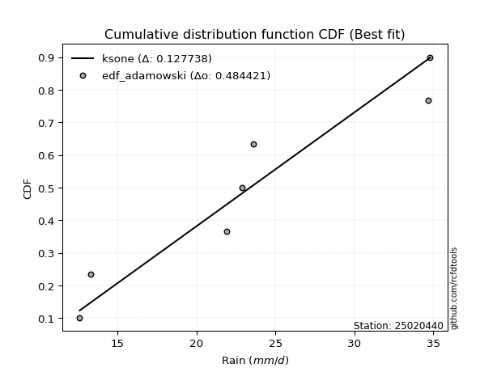</img>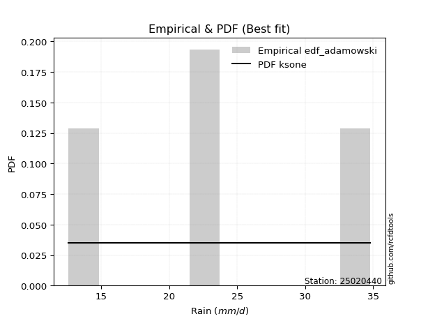</img>

</div>


## C. Best fit & Estimate extreme values for specific return periods - Tr


### 1. Best fit (ordered by delta Δ)

<div align="center">

|   id |   station | empirical_dist   | p_dist   |    delta |   deltao | eval   |   fit |   n |   best_fit |   best_fit_sort |
|-----:|----------:|:-----------------|:---------|---------:|---------:|:-------|------:|----:|-----------:|----------------:|
|    0 |  25020440 | edf_tukey        | logncf   | 0.107885 | 0.484421 | Δo > Δ |     1 |   7 |          1 |               1 |
|    1 |  25020440 | edf_filliben     | logncf   | 0.108472 | 0.484421 | Δo > Δ |     1 |   7 |          1 |               2 |
|    2 |  25020440 | edf_jenkinson    | logncf   | 0.108748 | 0.484421 | Δo > Δ |     1 |   7 |          1 |               3 |
|    3 |  25020440 | edf_beard        | logncf   | 0.108748 | 0.484421 | Δo > Δ |     1 |   7 |          1 |               4 |
|    4 |  25020440 | edf_chegodayev   | logncf   | 0.109114 | 0.484421 | Δo > Δ |     1 |   7 |          1 |               5 |
|    5 |  25020440 | edf_blom         | logncf   | 0.109907 | 0.484421 | Δo > Δ |     1 |   7 |          1 |               6 |
|    6 |  25020440 | edf_adamowski    | logncf   | 0.110916 | 0.484421 | Δo > Δ |     1 |   7 |          1 |               7 |
|    7 |  25020440 | edf_cunnane      | logncf   | 0.112781 | 0.484421 | Δo > Δ |     1 |   7 |          1 |               8 |
|    8 |  25020440 | edf_gringorten   | logncf   | 0.117463 | 0.484421 | Δo > Δ |     1 |   7 |          1 |               9 |
|    9 |  25020440 | edf_weibull      | logncf   | 0.119249 | 0.484421 | Δo > Δ |     1 |   7 |          1 |              10 |
|   10 |  25020440 | edf_hazen        | nakagami | 0.119823 | 0.484421 | Δo > Δ |     1 |   7 |          1 |              11 |
|   11 |  25020440 | edf_california   | invgamma | 0.154417 | 0.484421 | Δo > Δ |     1 |   7 |          1 |              12 |

</div>

:file_folder:Tables: [bestfit_25020440.csv](table/bestfit_25020440.csv) | [extreme_25020440.csv](table/extreme_25020440.csv)


### 2. Extreme values

In hydrology, a return period (or recurrence interval $Tr$) is the statistical average time between extreme events like floods or droughts of a specific magnitude, indicating how rare an event is, with a 100-year flood, for example, having a 1% chance of occurring in any given year, not that it happens exactly every century. It is a key tool for infrastructure design (like bridges or dams) and risk assessment, calculated from historical data to determine the probability of future events, although it is important to remember it is statistical average, and events can cluster or be missed.

> risk_rate: assuming the return period as the project useful life.

|   id |      tr |   prob_l |     prob_g |     alpha |   betaprime |    chi2 |   crystalball |   erlang |   expon |   exponnorm |          f |   fatiguelife |       fisk |   gamma |   genexpon |   genlogistic |   gibrat |   gompertz |   gumbel_l |   gumbel_r |   halflogistic |   halfnorm |   hypsecant |   invgamma |   invgauss |   invweibull |   johnsonsu |   kstwobign |   laplace |   laplace_asymmetric |   loggamma |   logistic |   lognorm |   maxwell |   mielke |   moyal |   nakagami |     ncf |      nct |    norm |           pareto |   pearson3 |   rayleigh |    rice |       t |   truncnorm |    wald |   weibull_min |   logalpha |   logbetaprime |     logchi2 |   logcrystalball |   logerlang |   logexpon |   logexponnorm |             logf |   logfatiguelife |           logfisk |   loggenexpon |   loggenlogistic |   loggibrat |   loggompertz |   loggumbel_l |   loggumbel_r |   loghalflogistic |   loghalfnorm |   loghypsecant |   loginvgamma |   loginvgauss |   loginvweibull |   logjohnsonsu |   logkstwobign |   loglaplace |   loglaplace_asymmetric |   logloggamma |   loglogistic |    loglognorm |   logmaxwell |   logmielke |   logmoyal |   lognakagami |   logncf |   lognct |       logpareto |   logpearson3 |   lograyleigh |   logrice |    logt |   logtruncnorm |   logwald |   logweibull_min |   station |   n |   risk_rate |
|-----:|--------:|---------:|-----------:|----------:|------------:|--------:|--------------:|---------:|--------:|------------:|-----------:|--------------:|-----------:|--------:|-----------:|--------------:|---------:|-----------:|-----------:|-----------:|---------------:|-----------:|------------:|-----------:|-----------:|-------------:|------------:|------------:|----------:|---------------------:|-----------:|-----------:|----------:|----------:|---------:|--------:|-----------:|--------:|---------:|--------:|-----------------:|-----------:|-----------:|--------:|--------:|------------:|--------:|--------------:|-----------:|---------------:|------------:|-----------------:|------------:|-----------:|---------------:|-----------------:|-----------------:|------------------:|--------------:|-----------------:|------------:|--------------:|--------------:|--------------:|------------------:|--------------:|---------------:|--------------:|--------------:|----------------:|---------------:|---------------:|-------------:|------------------------:|--------------:|--------------:|--------------:|-------------:|------------:|-----------:|--------------:|---------:|---------:|----------------:|--------------:|--------------:|----------:|--------:|---------------:|----------:|-----------------:|----------:|----:|------------:|
|    0 |    2    | 0.5      | 0.5        |   16.3924 |     19.7312 | 17.6744 |       22.1286 |  13.7495 | 19.2047 |     19.1533 |    15.9669 |       12.6    |    18.5904 | 14.0683 |    19.4839 |       20.4454 |  19.4543 |    19.7844 |    23.5922 |    20.6649 |        19.9372 |    20.3048 |     22.1286 |    15.9674 |    15.9644 |      15.7151 |     22.1286 |     20.6073 |   22.1286 |              22.0151 |    19.9749 |    22.1286 |   20.388  |   21.3666 |  18.0076 | 20.1924 |    19.511  | 19.8293 |  19.3115 | 22.1286 |     12.9658      |    21.5497 |    21.0963 | 21.649  | 22.1287 |     21.8826 | 19.2405 |       17.1706 |    19.4208 |        20.1058 |     20.5864 |          20.388  |     19.8742 |    17.589  |        20.3861 |     16.9254      |          12.6    |     19.9685       |       18.2709 |          18.9225 |     18.0516 |       19.5611 |       21.7921 |       19.0743 |           18.4529 |       18.7643 |        20.388  |       18.4913 |       16.0537 |    16.0646      |        20.3877 |        18.8848 |      20.388  |                 21.7796 |       20.437  |       20.388  |  12.6334      |      19.6931 |     18.4453 |    18.6685 |       19.896  |  20.0332 |  19.4531 |   12.871        |       20.1992 |       19.4524 |   19.8695 | 20.3879 |        17.3423 |   17.8772 |          16.0107 |  25020440 |   7 |    0.75     |
|    1 |    2.33 | 0.570815 | 0.429185   |   17.5233 |     21.1751 | 19.1442 |       23.7184 |  14.2057 | 20.6599 |     20.5995 |    17.144  |       12.8084 |    21.0432 | 14.6572 |    20.9504 |       21.9252 |  20.2596 |    21.2692 |    24.9754 |    22.1381 |        21.4519 |    22.0207 |     23.4009 |    17.1433 |    17.0542 |      17.0226 |     23.7288 |     22.1075 |   23.0907 |              23.193  |    21.4552 |    23.5294 |   21.9176 |   23.0184 |  19.3153 | 21.587  |    21.8617 | 21.3228 |  20.7615 | 23.7184 |     13.5092      |    23.1463 |    22.7725 | 23.1709 | 23.7186 |     23.5996 | 20.283  |       18.9663 |    20.8763 |        21.6922 |     24.5069 |          21.9176 |     21.3474 |    18.9304 |        21.9157 |     18.1475      |          12.7621 |     23.9104       |       19.6696 |          20.333  |     18.7255 |       21.0449 |       23.2079 |       20.3968 |           19.7697 |       20.2881 |        21.6033 |       19.8591 |       17.1424 |    17.2348      |        21.9145 |        20.2879 |      21.3004 |                 23.042  |       21.9798 |       21.7299 |  12.8896      |      21.2304 |     19.8146 |    19.8916 |       21.8943 |  22.1479 |  20.9155 |   13.2868       |       21.7197 |       20.9942 |   21.3413 | 21.9176 |        18.4415 |   18.7457 |          17.5182 |  25020440 |   7 |    0.729209 |
|    2 |    5    | 0.8      | 0.2        |   26.2915 |     27.9426 | 27.124  |       29.6269 |  17.0065 | 27.9356 |     27.8305 |    28.0158 |       17.2363 |    44.369  | 18.2888 |    28.043  |       28.3535 |  24.8964 |    28.2379 |    29.444  |    28.5384 |        28.3056 |    29.277  |     28.5047 |    27.9897 |    25.0955 |      31.5333 |     29.6759 |     28.4802 |   27.9011 |              29.0821 |    28.2645 |    28.938  |   28.6788 |   29.5196 |  26.7568 | 28.0467 |    33.5933 | 28.3865 |  28.0671 | 29.6269 |     95.1624      |    29.4084 |    29.4831 | 29.2636 | 29.627  |     29.1346 | 26.119  |       31.1707 |    28.1467 |        29.0538 |     68.0067 |          28.6788 |     28.1627 |    27.3368 |        28.6777 |     27.4012      |          16.7421 |    124.735        |       27.5743 |          27.7861 |     23.1246 |       28.2703 |       28.4411 |       27.2928 |           27.0054 |       28.2258 |        27.2511 |       27.5383 |       25.7554 |    29.1591      |        28.6605 |        27.5073 |      26.5127 |                 28.5592 |       28.764  |       27.7937 |   2.24318e+30 |      28.5392 |     27.6418 |    26.689  |       33.2795 |  32.526  |  28.1554 | 1691.41         |       28.593  |       28.4918 |   28.3417 | 28.6788 |        23.814  |   24.4474 |          31.7204 |  25020440 |   7 |    0.67232  |
|    3 |   10    | 0.9      | 0.1        |   42.4004 |     34.0614 | 34.8747 |       33.5463 |  19.9887 | 34.5403 |     34.3945 |    52.9101 |       23.35   |    96.9014 | 22.1685 |    34.1726 |       33.589  |  30.1817 |    33.9937 |    31.9319 |    33.7513 |        33.9972 |    34.6465 |     32.5803 |    52.7823 |    36.7059 |      72.5461 |     33.621  |     33.3322 |   32.2678 |              34.428  |    34.235  |    32.9213 |   34.2784 |   34.0949 |  35.6699 | 33.671  |    43.1787 | 34.8521 |  35.4255 | 33.5463 |   4929.19        |    33.8539 |    34.2679 | 33.6075 | 33.5465 |     31.776  | 32.3122 |       46.3043 |    35.4004 |        35.5886 |    194.353  |          34.2784 |     34.1851 |    38.1608 |        34.2802 |     45.7131      |          24.3545 |   4430.96         |       36.2195 |          35.8331 |     29.4127 |       34.6116 |       31.8504 |       34.5995 |           34.9896 |       36.0381 |        32.8041 |       36.6776 |       41.7466 |    72.2483      |        34.2454 |        34.6824 |      32.3409 |                 34.6539 |       34.3401 |       33.3171 | inf           |      35.1448 |     37.2906 |    34.4733 |       45.6695 |  42.3983 |  35.2559 |    5.61279e+129 |       34.4712 |       35.4226 |   34.6145 | 34.2784 |        27.9109 |   32.406  |          64.8529 |  25020440 |   7 |    0.651322 |
|    4 |   15    | 0.933333 | 0.0666667  |   58.4516 |     37.7706 | 39.536  |       35.5023 |  21.8464 | 38.4038 |     38.2342 |    81.7698 |       27.3485 |   156.069  | 24.5883 |    37.6381 |       36.5427 |  33.8273 |    37.1456 |    33.0586 |    36.6923 |        37.2182 |    37.4408 |     34.9062 |    81.4888 |    45.4792 |     127.006  |     35.5897 |     35.9081 |   34.8222 |              37.5552 |    37.7709 |    35.0916 |   37.4692 |   36.4424 |  42.2534 | 36.935  |    48.281  | 38.8033 |  40.2435 | 35.5023 |  53701.5         |    36.1609 |    36.7333 | 35.8455 | 35.5024 |     32.7279 | 36.2893 |       56.7484 |    40.1336 |        39.4914 |    370.72   |          37.4692 |     37.7703 |    46.3833 |        37.4735 |     67.1652      |          31.1197 | 222418            |       42.0069 |          41.3619 |     34.7206 |       38.2458 |       33.526  |       39.5543 |           40.5132 |       40.9246 |        36.4665 |       43.4852 |       57.9734 |   171.031       |        37.4271 |        39.2237 |      36.3274 |                 38.8054 |       37.5009 |       36.7755 | inf           |      39.1069 |     44.6941 |    39.9936 |       53.8913 |  48.5448 |  39.8192 |  inf            |       37.8942 |       39.6281 |   38.3426 | 37.4692 |        29.7669 |   38.8348 |         105.436  |  25020440 |   7 |    0.644736 |
|    5 |   20    | 0.95     | 0.05       |   74.4887 |     40.4858 | 42.8843 |       36.7831 |  23.2012 | 41.145  |     40.9586 |   113.557  |       30.3088 |   219.788  | 26.3538 |    40.0476 |       38.6107 |  36.6871 |    39.2956 |    33.76   |    38.7516 |        39.4749 |    39.3037 |     36.547  |   113.081  |    52.5593 |     192.343  |     36.8789 |     37.6432 |   36.6345 |              39.774  |    40.3211 |    36.5916 |   39.7181 |   38.0003 |  47.6985 | 39.2467 |    51.7033 | 41.7095 |  43.9432 | 36.7831 | 292774           |    37.7041 |    38.3719 | 37.3331 | 36.7832 |     33.2224 | 39.253  |       64.8258 |    43.7665 |        42.3205 |    592.186  |          39.7181 |     40.3639 |    53.2706 |        39.7244 |     92.5981      |          37.3123 |      1.40794e+07  |       46.4689 |          45.7334 |     39.5464 |       40.7955 |       34.6132 |       43.4401 |           44.8948 |       44.5453 |        39.2935 |       49.1843 |       74.5549 |   393.992       |        39.6692 |        42.6135 |      39.4504 |                 42.0492 |       39.7216 |       39.3734 | inf           |      41.9801 |     51.0184 |    44.4299 |       60.189  |  53.1055 |  43.2843 |  inf            |       40.338  |       42.696  |   41.0294 | 39.7181 |        30.8321 |   44.4416 |         153.075  |  25020440 |   7 |    0.641514 |
|    6 |   25    | 0.96     | 0.04       |   90.5202 |     42.6469 | 45.501  |       37.726  |  24.2694 | 43.2713 |     43.0717 |   147.715  |       32.661  |   287.051  | 27.7464 |    41.8899 |       40.2037 |  39.0711 |    40.9172 |    34.259  |    40.3378 |        41.2136 |    40.6898 |     37.8168 |   147.01   |    58.5175 |     267.087  |     37.828  |     38.9429 |   38.0403 |              41.495  |    42.3285 |    37.7391 |   41.4593 |   39.1569 |  52.4356 | 41.0385 |    54.2559 | 44.0305 |  46.9925 | 37.726  |      1.09117e+06 |    38.8565 |    39.5894 | 38.4383 | 37.7261 |     33.5259 | 41.6268 |       71.4588 |    46.7625 |        44.5556 |    855.73   |          41.4593 |     42.41   |    59.3096 |        41.4675 |    122.645       |          43.0998 |      1.06481e+09  |       50.1448 |          49.413  |     44.0782 |       42.758  |       35.4083 |       46.6915 |           48.5914 |       47.4456 |        41.631  |       54.2046 |       91.5155 |   890.168       |        41.4051 |        45.3431 |      42.0565 |                 44.7508 |       41.4371 |       41.484  | inf           |      44.2488 |     56.6764 |    48.2043 |       65.3508 |  56.7674 |  46.1178 |  inf            |       42.2478 |       45.1282 |   43.1413 | 41.4593 |        31.5242 |   49.5111 |         207.563  |  25020440 |   7 |    0.639603 |
|    7 |   50    | 0.98     | 0.02       |  170.652  |     49.7118 | 53.7175 |       40.4261 |  27.6659 | 49.876  |     49.6357 |   344.621  |       40.2077 |   660.508  | 32.1758 |    47.4738 |       45.1108 |  47.4747 |    45.7185 |    35.6138 |    45.224  |        46.5707 |    44.7188 |     41.7538 |   342.356  |    79.4245 |     754.812  |     40.5457 |     42.7595 |   42.407  |              46.8409 |    48.7598 |    41.2451 |   46.8796 |   42.5114 |  70.6327 | 46.6009 |    61.689  | 51.6638 |  57.6109 | 40.4261 |      6.49734e+07 |    42.2341 |    43.1235 | 41.6464 | 40.4262 |     34.15   | 49.3775 |       94.0268 |    57.2293 |        51.7635 |   2744.26   |          46.8796 |     48.9905 |    82.7933 |        46.8947 |    364.852       |          68.4539 |      1.6408e+19   |       62.8487 |          62.715  |     64.6124 |       48.7784 |       37.6598 |       58.3182 |           62.0062 |       56.9926 |        49.7993 |       74.1301 |      181.766  | 43755.4         |        46.8078 |        54.4115 |      51.3017 |                 54.3008 |       46.7559 |       48.6597 | inf           |      51.5459 |     79.8303 |    62.0889 |       83.0163 |  68.9006 |  55.8514 |  inf            |       48.2892 |       53.0019 |   49.878  | 46.8796 |        33.0489 |   70.4486 |         579.731  |  25020440 |   7 |    0.63583  |
|    8 |   75    | 0.986667 | 0.0133333  |  250.773  |     54.1229 | 58.5738 |       41.8749 |  29.697  | 53.7395 |     53.4755 |   572.996  |       44.7527 |  1076.68   | 34.8256 |    50.6496 |       47.963  |  53.1506 |    48.3761 |    36.2988 |    48.0641 |        49.6848 |    46.9119 |     44.0546 |   568.642  |    93.1734 |    1394.9    |     42.004  |     44.8594 |   44.9614 |              49.9681 |    52.6793 |    43.27   |   50.0744 |   44.3351 |  84.2927 | 49.8537 |    65.7363 | 56.4626 |  64.7455 | 41.8749 |      7.09506e+08 |    44.0943 |    45.0462 | 43.3916 | 41.875  |     34.3636 | 54.1469 |      108.55   |    64.3099 |        56.1901 |   5493.19   |          50.0744 |     53.0187 |   100.633  |        50.0944 |    833.965       |          90.4489 |      1.98183e+30  |       71.2535 |          72.0356 |     83.6555 |       52.2522 |       38.8523 |       66.3639 |           71.4464 |       62.974  |        55.2959 |       89.837  |      280.063  |     1.79266e+06 |        49.9916 |        60.1527 |      57.6253 |                 60.806  |       49.8764 |       53.3565 | inf           |      56.0062 |     98.75   |    71.9944 |       94.5656 |  76.5774 |  62.2963 |  inf            |       51.9172 |       57.8482 |   53.9559 | 50.0744 |        33.6048 |   87.5238 |        1116.18   |  25020440 |   7 |    0.634587 |
|    9 |  100    | 0.99     | 0.01       |  330.891  |     57.3913 | 62.0376 |       42.8548 |  31.1541 | 56.4807 |     56.1998 |   824.554  |       48.023  |  1523      | 36.7269 |    52.8651 |       49.9817 |  57.5475 |    50.1999 |    36.7469 |    50.0742 |        51.8889 |    48.406  |     45.6867 |   817.696  |   103.532  |    2159.06   |     42.9903 |     46.2981 |   46.7737 |              52.1869 |    55.5388 |    44.6997 |   52.3578 |   45.5773 |  95.6576 | 52.1614 |    68.4917 | 60.0333 |  70.282  | 42.8548 |      3.86887e+09 |    45.3715 |    46.3561 | 44.5806 | 42.8549 |     34.4715 | 57.6242 |      119.424  |    69.8394 |        59.4349 |   9028.49   |          52.3578 |     55.9654 |   115.575  |        52.3817 |   1665.92        |         110.528  |      9.94637e+41  |       77.688  |          79.4579 |    102.187  |       54.6976 |       39.6527 |       72.7205 |           78.9844 |       67.4044 |        59.5589 |      103.432  |      385.258  |     6.55976e+07 |        52.267  |        64.4323 |      62.5793 |                 65.8889 |       52.1002 |       56.9431 | inf           |      59.2633 |    115.527  |    79.966  |      103.339  |  82.3049 |  67.2551 |  inf            |       54.5401 |       61.4012 |   56.9157 | 52.3578 |        33.8928 |  102.529  |        1818.31   |  25020440 |   7 |    0.633968 |
|   10 |  200    | 0.995    | 0.005      |  651.355  |     65.7853 | 70.4353 |       45.0775 |  34.7103 | 63.0854 |     62.7638 |  1994.34   |       56.028  |  3512.03   | 41.3683 |    58.083  |       54.8348 |  69.5097 |    54.4012 |    37.7209 |    54.9067 |        57.1879 |    51.8231 |     49.6185 |  1974.36   |   130.314  |    6194.97   |     45.2275 |     49.6119 |   51.1405 |              57.5328 |    62.7203 |    48.1292 |   57.9306 |   48.4193 | 130.142  | 57.7215 |    74.7854 | 69.2582 |  85.4732 | 45.0775 |      2.30374e+11 |    48.3259 |    49.3533 | 47.301  | 45.0776 |     34.6349 | 66.2859 |      147.499  |    85.2007 |        67.6396 |  30273.4    |          57.9306 |     63.3942 |   161.337  |        57.9653 |  13842.2         |         180.549  |      7.73545e+92  |       94.9272 |         100.584  |    176.124  |       60.5296 |       41.4497 |       90.6066 |          100.523  |       78.7445 |        71.2279 |      147.759  |      861.776  |     6.04821e+13 |        57.8195 |        75.4834 |      76.3359 |                 79.9498 |       57.5062 |       66.5606 | inf           |      67.4453 |    172.365  |   102.988  |      126.579  |  97.1353 |  80.7124 |  inf            |       61.0444 |       70.3735 |   64.2884 | 57.9306 |        34.3381 |  152.062  |        6357.42   |  25020440 |   7 |    0.633042 |
|   11 |  250    | 0.996    | 0.004      |  811.586  |     68.6559 | 73.1522 |       45.7568 |  35.8669 | 65.2116 |     64.877  |  2653.25   |       58.6368 |  4595.58   | 42.8781 |    59.7286 |       56.395  |  73.8018 |    55.6998 |    38.0075 |    56.4603 |        58.8914 |    52.8744 |     50.8841 |  2625.24   |   139.426  |    8699.18   |     45.9112 |     50.6374 |   52.5462 |              59.2538 |    65.1257 |    49.2302 |   59.7492 |   49.2942 | 143.819  | 59.5114 |    76.7186 | 72.4298 |  90.9883 | 45.7568 |      8.58632e+11 |    49.2447 |    50.2759 | 48.1384 | 45.7568 |     34.6677 | 69.1514 |      157.085  |    90.8544 |        70.4049 |  44838      |          59.7492 |     65.8909 |   179.627  |        59.7878 |  32249.7         |         211.862  |      1.22505e+120 |      101.035  |         108.503  |    214.115  |       62.3903 |       41.9937 |       97.244  |          108.626  |       82.603  |        75.4507 |      166.661  |     1127.88   |     4.48442e+16 |        59.6312 |        79.2734 |      81.3787 |                 85.0866 |       59.2639 |       69.9803 | inf           |      70.1845 |    197.443  |   111.728  |      134.727  | 102.239  |  85.5548 |  inf            |       63.1979 |       73.3909 |   66.7378 | 59.7492 |        34.4291 |  173.24   |        9724.91   |  25020440 |   7 |    0.632858 |
|   12 |  500    | 0.998    | 0.002      | 1612.74   |     78.147  | 81.6265 |       47.7711 |  39.49   | 71.8163 |     71.441  |  6451.61   |       66.8208 | 10592.2    | 47.6081 |    64.742  |       61.2375 |  88.6351 |    59.5806 |    38.829  |    61.2822 |        64.1788 |    56.0087 |     54.8156 |  6372.75   |   169.053  |   24972.9    |     47.9387 |     53.7107 |   56.913  |              64.5997 |    72.9103 |    52.6447 |   65.4848 |   51.9048 | 196.579  | 65.0713 |    82.4734 | 82.9725 | 110.378  | 47.7711 |      5.11277e+13 |    52.0137 |    53.0286 | 50.6368 | 47.7712 |     34.7337 | 78.2628 |      188.513  |   111.094  |        79.4107 | 153187      |          65.4848 |     73.9989 |   250.751  |        65.5372 | 863443           |         349.899  |      1.64276e+267 |      121.896  |         137.281  |    420.547  |       68.1228 |       43.5933 |      121.104  |          138.176  |       95.2663 |        90.232  |      246.853  |     2672.67   |     2.38709e+30 |        65.3446 |        91.8093 |      99.2681 |                103.244  |       64.7875 |       81.7443 | inf           |      79.0376 |    308.226  |   143.893  |      162.255  | 119.195  | 102.447  |  inf            |       70.088  |       83.1849 |   74.5944 | 65.4848 |        34.6133 |  262.247  |       38903      |  25020440 |   7 |    0.632489 |
|   13 |  750    | 0.998667 | 0.00133333 | 2413.89   |     84.1327 | 86.605  |       48.8901 |  41.6278 | 75.6798 |     75.2807 | 10857.1    |       71.6562 | 17260.4    | 50.3994 |    67.6094 |       64.0684 |  98.4449 |    61.751  |    39.268  |    64.1012 |        67.2699 |    57.7597 |     57.1154 | 10713.8    |   187.206  |   46274.8    |     49.065  |     55.4372 |   59.4673 |              67.7269 |    77.6957 |    54.6397 |   68.9057 |   53.3649 | 236.306  | 68.3236 |    85.682  | 89.6631 | 123.513  | 48.8901 |      5.58311e+14 |    53.5805 |    54.568  | 52.0338 | 48.8902 |     34.7558 | 83.7258 |      208.025  |   125.147  |        84.9885 | 315934      |          68.9057 |     79.003  |   304.78   |        68.9671 |      1.04784e+07 |         470.631  |    inf            |      135.521  |         157.521  |    657.199  |       71.4451 |       44.473  |      137.679  |          159.046  |      103.168  |       100.187  |      315.066  |     4502.34   |     2.94524e+43 |        68.7517 |        99.7023 |     111.504  |                115.613  |       68.0679 |       89.5123 | inf           |      84.4675 |    406.983  |   166.846  |      180.004  | 129.936  | 113.804  |  inf            |       74.2669 |       89.2207 |   79.371  | 68.9057 |        34.6753 |  336.258  |       91559.1    |  25020440 |   7 |    0.632366 |
|   14 | 1000    | 0.999    | 0.001      | 3215.04   |     88.5888 | 90.1456 |       49.6605 |  43.1518 | 78.421  |     78.0051 | 15709.7    |       75.1054 | 24405.6    | 52.3894 |    69.6162 |       66.0765 | 105.952  |    63.2496 |    39.5635 |    66.1007 |        69.4625 |    58.969  |     58.7471 | 15491.7    |   200.412  |   71678.5    |     49.8405 |     56.6332 |   61.2797 |              69.9457 |    81.2006 |    56.0544 |   71.3642 |   54.3741 | 269.398  | 70.6312 |    87.8951 | 94.6634 | 133.743  | 49.6605 |      3.04442e+15 |    54.6713 |    55.6317 | 52.9992 | 49.6606 |     34.7668 | 87.6555 |      222.361  |   136.296  |        89.093  | 529086      |          71.3642 |     82.6771 |   350.036  |        71.4326 |      8.47427e+07 |         581.449  |    inf            |      145.872  |         173.662  |    924.838  |       73.7894 |       45.0751 |      150.794  |          175.734  |      109.004  |       107.909  |      377.17   |     6562.36   |     1.46065e+56 |        71.2003 |       105.565  |     121.09   |                125.277  |       70.4193 |       95.4644 | inf           |      88.4369 |    499.81   |   185.319  |      193.378  | 137.95   | 122.617  |  inf            |       77.3019 |       93.6458 |   82.8438 | 71.3643 |        34.7064 |  402.098  |      171366      |  25020440 |   7 |    0.632305 |

<div align="center">

</img>

</div>


<div align="center">

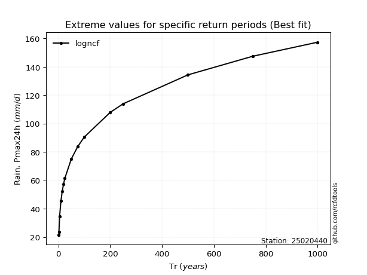</img>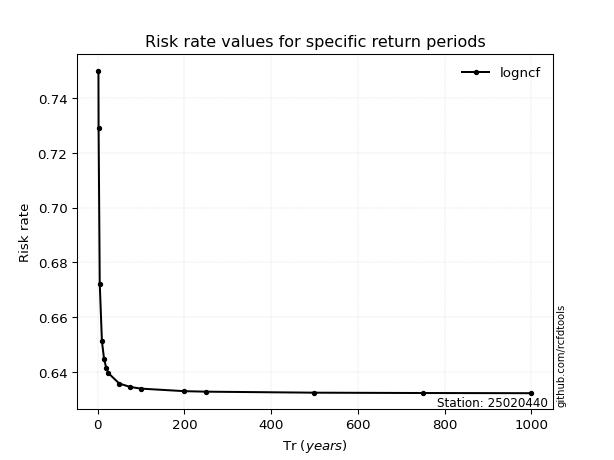</img>

</div>


<sub>**APP DISCLAIMER**: NO WARRANTY - This software is provided by [github.com/rcfdtools](https://github.com/rcfdtools) "as is", without any express or implied warranty, including warranties of merchantability, fitness for a particular purpose, or non-infringement. There is no guarantee that the software will be error-free or operate without interruption. LIMITATION OF LIABILITY - Neither the authors nor copyright holders will be liable for claims or damages arising from the software or its use. You are responsible for determining if the software is appropriate for your use and assume all associated risks, including errors, legal compliance, and data loss. NO PROFESSIONAL ADVICE - The software provides general information and does not offer professional advice. It should not replace consultation with professional advisors.</sub>