<div align="center">


</div>

# Station (rain, Pmax24h): 25020470

Probable Maximum Precipitation (PMP) is the greatest amount of rainfall for a specific duration that is meteorologically possible for a given location, acting as a "worst-case" scenario for extreme storms, crucial for designing safety-critical infrastructure like bridges, river deviations, dams, spillways, and nuclear plants to prevent catastrophic failure. PMP is calculated by hydrologists using meteorological data to determine the upper limit of extreme rainfall, often leading to the Probable Maximum Flood (PMF) for flood control design, and is increasingly being studied for climate change impacts.

<div align="center">

</img>

</div>


## A. General information


### 1. General running parameters

• app_version: _v20251225_. • runtime: _2025-12-26 14:29:50.888910_. • Python version: _3.14.0_. • SciPy version: _1.16.3_. • Pandas version: _2.3.3_. • NumPy version: _2.3.5_. • Stations dataset (station_dataset_file): _dataset/pmax24h_in/automatic_colombia.csv_. • Stations catalog (station_catalog_file): _dataset/CNE_IDEAM.xls_. • Plot only fit distributions with Δo > Δ (plot_only_fit): _True_. • Eval low extreme values, if False, evaluates high extreme values (low_extreme): _False_. • Eval every SciPy distribution as logarithmic (pdist_logarithmic_on): _True_. • Standard deviation normalized (ddof): _1.0_. • Return periods to eval in years (Tr): _[2, 2.33, 5, 10, 15, 20, 25, 50, 75, 100, 200, 250, 500, 750, 1000]_. • Minimum data sample per station, 0 means any (minimum_sample): _5_. • Z-Score threshold to adjust a value, 0 means disable (zscore): _3.5_. • Avoid zeros, e.g. rain = 0 (avoid_zeros): _True_. • Avoid null values (avoid_nans): _True_. [:file_folder:Dataset file.](../../dataset/pmax24h_in/automatic_colombia.csv)


### 2. Station info and location

|   id |   CODIGO | NOMBRE                 | CATEGORIA     | TECNOLOGIA                              | ESTADO   | FECHA_INSTALACION   |   FECHA_SUSPENSION |   ALTITUD |   LATITUD |   LONGITUD | DEPARTAMENTO   | MUNICIPIO   | AREA_OPERATIVA                              | ENTIDAD                                                     | AREA_HIDROGRAFICA   | ZONA_HIDROGRAFICA                | SUBZONA_HIDROGRAFICA       |   CORRIENTE |   OBSERVACION | SUBRED                                                                                        | Catalogo   |
|-----:|---------:|:-----------------------|:--------------|:----------------------------------------|:---------|:--------------------|-------------------:|----------:|----------:|-----------:|:---------------|:------------|:--------------------------------------------|:------------------------------------------------------------|:--------------------|:---------------------------------|:---------------------------|------------:|--------------:|:----------------------------------------------------------------------------------------------|:-----------|
|    0 | 25020470 | CHINU - AUT [25020470] | Pluviométrica | Automática con Telemetría, Convencional | Activa   | 11/12/2014          |                nan |       125 |   9.11778 |   -75.3933 | Cordoba        | Chinú       | Area Operativa 02 - Atlántico-Bolivar-Sucre | INSTITUTO DE HIDROLOGIA METEOROLOGIA Y ESTUDIOS AMBIENTALES | Magdalena Cauca     | Bajo Magdalena- Cauca -San Jorge | Bajo San Jorge - La Mojana |         nan |           nan | RED ALERTAS - AREA OPERATIVA 02,Córdoba, Sucre, Sur de Bolívar, Urabá y Bajo Cauca Antioqueño | CNE_IDEAM  |

<div align="center">

Map location in: [:earth_americas:Google](http://maps.google.com/maps?q=9.117777778,-75.39333333) [:earth_americas:OSM](https://www.openstreetmap.org/#map=18/9.117777778/-75.39333333&layers=P) [:earth_americas:Bing](https://www.bing.com/maps?cp=9.117777778~-75.39333333&lvl=18) [:earth_americas:Apple](https://maps.apple.com/frame?center=9.117777778%2C-75.39333333&span=0.003%2C0.006)

</div>


<div align="center">

```geojson
{
  "type": "Feature",
  "geometry": {
    "type": "Point", 
    "coordinates": [-75.39333333, 9.117777778]
  }, 
  "properties": {
    "Name": "25020470"
  }
}
```

</div>


### 3. Discrete values table and plot

|               |           0 |            1 |            2 |           3 |          4 |          5 |          6 |          7 |           8 |
|:--------------|------------:|-------------:|-------------:|------------:|-----------:|-----------:|-----------:|-----------:|------------:|
| Date          | 2017        | 2018         | 2019         | 2020        | 2021       | 2022       | 2023       | 2024       | 2025        |
| Value         |   51.29     |   67.87      |   67.2       |   87.6      |  124       |   65.2     |   18.1     |  102       |   43.6      |
| Value_initial |   51.29     |   67.87      |   67.2       |   87.6      |  124       |   65.2     |   18.1     |  102       |   43.6      |
| count         |    9        |    9         |    9         |    9        |    9       |    9       |    9       |    9       |    9        |
| mean          |   69.6511   |   69.6511    |   69.6511    |   69.6511   |   69.6511  |   69.6511  |   69.6511  |   69.6511  |   69.6511   |
| std           |   31.6716   |   31.6716    |   31.6716    |   31.6716   |   31.6716  |   31.6716  |   31.6716  |   31.6716  |   31.6716   |
| zscore        |   -0.579734 |   -0.0562369 |   -0.0773915 |    0.566719 |    1.71601 |   -0.14054 |   -1.62768 |    1.02139 |   -0.822539 |

<div align="center">

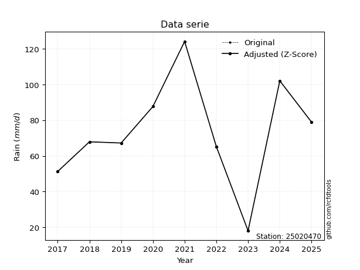</img>

</div>

> If Z-Score is active, values out of range or outliers are replaced with the station mean value.


### 4. Active continuous probability distributions from SciPy (45 of 104 available)

[scipy.stats](https://docs.scipy.org/doc/scipy/reference/stats.html) is a Python´s powerful submodule within the SciPy library for comprehensive statistical analysis, offering over 130 probability distributions (like Normal, Poisson), functions for descriptive stats (mean, variance), hypothesis testing (t-tests, chi-square), random variable generation, and statistical tests, making it essential for data science, modeling, and research. It provides tools to explore, model, and draw conclusions from data efficiently, working seamlessly with NumPy.

<div align="center">

|   id | p_dist             |   n_parameter | fit_method   | label                                                                       | active   | ref                                                                                                        |
|-----:|:-------------------|--------------:|:-------------|:----------------------------------------------------------------------------|:---------|:-----------------------------------------------------------------------------------------------------------|
|    0 | alpha              |             3 | MLE          | Alpha                                                                       | True     | [:mortar_board:](https://docs.scipy.org/doc/scipy/reference/generated/scipy.stats.alpha.html)              |
|    1 | betaprime          |             4 | MLE          | Beta prime                                                                  | True     | [:mortar_board:](https://docs.scipy.org/doc/scipy/reference/generated/scipy.stats.betaprime.html)          |
|    2 | chi2               |             3 | MLE          | Chi²                                                                        | True     | [:mortar_board:](https://docs.scipy.org/doc/scipy/reference/generated/scipy.stats.chi2.html)               |
|    3 | crystalball        |             4 | MLE          | Crystalball                                                                 | True     | [:mortar_board:](https://docs.scipy.org/doc/scipy/reference/generated/scipy.stats.crystalball.html)        |
|    4 | erlang             |             3 | MLE          | Erlang                                                                      | True     | [:mortar_board:](https://docs.scipy.org/doc/scipy/reference/generated/scipy.stats.erlang.html)             |
|    5 | expon              |             2 | MLE          | Exponential                                                                 | True     | [:mortar_board:](https://docs.scipy.org/doc/scipy/reference/generated/scipy.stats.expon.html)              |
|    6 | exponnorm          |             3 | MLE          | Exponentially modified Normal                                               | True     | [:mortar_board:](https://docs.scipy.org/doc/scipy/reference/generated/scipy.stats.exponnorm.html)          |
|    7 | f                  |             4 | MLE          | F                                                                           | True     | [:mortar_board:](https://docs.scipy.org/doc/scipy/reference/generated/scipy.stats.f.html)                  |
|    8 | fatiguelife        |             3 | MLE          | Fatigue-life (Birnbaum-Saunders)                                            | True     | [:mortar_board:](https://docs.scipy.org/doc/scipy/reference/generated/scipy.stats.fatiguelife.html)        |
|    9 | fisk               |             3 | MLE          | Fisk                                                                        | True     | [:mortar_board:](https://docs.scipy.org/doc/scipy/reference/generated/scipy.stats.fisk.html)               |
|   10 | gamma              |             3 | MLE          | Gamma                                                                       | True     | [:mortar_board:](https://docs.scipy.org/doc/scipy/reference/generated/scipy.stats.gamma.html)              |
|   11 | genexpon           |             5 | MLE          | Generalized exponential                                                     | True     | [:mortar_board:](https://docs.scipy.org/doc/scipy/reference/generated/scipy.stats.genexpon.html)           |
|   12 | genlogistic        |             3 | MLE          | Generalized logistic                                                        | True     | [:mortar_board:](https://docs.scipy.org/doc/scipy/reference/generated/scipy.stats.genlogistic.html)        |
|   13 | gibrat             |             2 | MM           | Gibrat                                                                      | True     | [:mortar_board:](https://docs.scipy.org/doc/scipy/reference/generated/scipy.stats.gibrat.html)             |
|   14 | gompertz           |             3 | MLE          | Gompertz (or truncated Gumbel)                                              | True     | [:mortar_board:](https://docs.scipy.org/doc/scipy/reference/generated/scipy.stats.gompertz.html)           |
|   15 | gumbel_l           |             2 | MM           | Gumbel Left Skew                                                            | True     | [:mortar_board:](https://docs.scipy.org/doc/scipy/reference/generated/scipy.stats.gumbel_l.html)           |
|   16 | gumbel_r           |             2 | MM           | Gumbel Right Skew                                                           | True     | [:mortar_board:](https://docs.scipy.org/doc/scipy/reference/generated/scipy.stats.gumbel_r.html)           |
|   17 | halflogistic       |             2 | MM           | Half-logistic                                                               | True     | [:mortar_board:](https://docs.scipy.org/doc/scipy/reference/generated/scipy.stats.halflogistic.html)       |
|   18 | halfnorm           |             2 | MM           | Half Normal                                                                 | True     | [:mortar_board:](https://docs.scipy.org/doc/scipy/reference/generated/scipy.stats.halfnorm.html)           |
|   19 | hypsecant          |             2 | MM           | hyperbolic secant                                                           | True     | [:mortar_board:](https://docs.scipy.org/doc/scipy/reference/generated/scipy.stats.hypsecant.html)          |
|   20 | invgamma           |             3 | MLE          | Inverted gamma                                                              | True     | [:mortar_board:](https://docs.scipy.org/doc/scipy/reference/generated/scipy.stats.invgamma.html)           |
|   21 | invgauss           |             3 | MLE          | Inverse Gaussian                                                            | True     | [:mortar_board:](https://docs.scipy.org/doc/scipy/reference/generated/scipy.stats.invgauss.html)           |
|   22 | invweibull         |             3 | MLE          | Inverted Weibull                                                            | True     | [:mortar_board:](https://docs.scipy.org/doc/scipy/reference/generated/scipy.stats.invweibull.html)         |
|   23 | johnsonsu          |             4 | MLE          | Johnson Su                                                                  | True     | [:mortar_board:](https://docs.scipy.org/doc/scipy/reference/generated/scipy.stats.johnsonsu.html)          |
|   24 | kstwobign          |             2 | MLE          | Limiting distribution of scaled Kolmogorov-Smirnov two-sided test statistic | True     | [:mortar_board:](https://docs.scipy.org/doc/scipy/reference/generated/scipy.stats.kstwobign.html)          |
|   25 | laplace            |             2 | MM           | Laplace                                                                     | True     | [:mortar_board:](https://docs.scipy.org/doc/scipy/reference/generated/scipy.stats.laplace.html)            |
|   26 | laplace_asymmetric |             3 | MLE          | Asymmetric Laplace                                                          | True     | [:mortar_board:](https://docs.scipy.org/doc/scipy/reference/generated/scipy.stats.laplace_asymmetric.html) |
|   27 | loggamma           |             3 | MLE          | Log gamma                                                                   | True     | [:mortar_board:](https://docs.scipy.org/doc/scipy/reference/generated/scipy.stats.loggamma.html)           |
|   28 | logistic           |             2 | MM           | Logistic (or Sech-squared)                                                  | True     | [:mortar_board:](https://docs.scipy.org/doc/scipy/reference/generated/scipy.stats.logistic.html)           |
|   29 | lognorm            |             3 | MLE          | Log Normal                                                                  | True     | [:mortar_board:](https://docs.scipy.org/doc/scipy/reference/generated/scipy.stats.lognorm.html)            |
|   30 | maxwell            |             2 | MM           | Maxwell                                                                     | True     | [:mortar_board:](https://docs.scipy.org/doc/scipy/reference/generated/scipy.stats.maxwell.html)            |
|   31 | mielke             |             4 | MLE          | Mielke Beta-Kappa / Dagum                                                   | True     | [:mortar_board:](https://docs.scipy.org/doc/scipy/reference/generated/scipy.stats.mielke.html)             |
|   32 | moyal              |             2 | MM           | Moyal                                                                       | True     | [:mortar_board:](https://docs.scipy.org/doc/scipy/reference/generated/scipy.stats.moyal.html)              |
|   33 | nakagami           |             3 | MLE          | Nakagami                                                                    | True     | [:mortar_board:](https://docs.scipy.org/doc/scipy/reference/generated/scipy.stats.nakagami.html)           |
|   34 | ncf                |             5 | MLE          | Non-central F distribution                                                  | True     | [:mortar_board:](https://docs.scipy.org/doc/scipy/reference/generated/scipy.stats.ncf.html)                |
|   35 | nct                |             4 | MLE          | Non-central Student’s t                                                     | True     | [:mortar_board:](https://docs.scipy.org/doc/scipy/reference/generated/scipy.stats.nct.html)                |
|   36 | norm               |             2 | MM           | Normal                                                                      | True     | [:mortar_board:](https://docs.scipy.org/doc/scipy/reference/generated/scipy.stats.norm.html)               |
|   37 | pareto             |             3 | MLE          | Pareto                                                                      | True     | [:mortar_board:](https://docs.scipy.org/doc/scipy/reference/generated/scipy.stats.pareto.html)             |
|   38 | pearson3           |             3 | MM           | Pearson type III                                                            | True     | [:mortar_board:](https://docs.scipy.org/doc/scipy/reference/generated/scipy.stats.pearson3.html)           |
|   39 | rayleigh           |             2 | MM           | Rayleigh                                                                    | True     | [:mortar_board:](https://docs.scipy.org/doc/scipy/reference/generated/scipy.stats.rayleigh.html)           |
|   40 | rice               |             3 | MLE          | Rice                                                                        | True     | [:mortar_board:](https://docs.scipy.org/doc/scipy/reference/generated/scipy.stats.rice.html)               |
|   41 | t                  |             3 | MLE          | Student’s t                                                                 | True     | [:mortar_board:](https://docs.scipy.org/doc/scipy/reference/generated/scipy.stats.t.html)                  |
|   42 | truncnorm          |             4 | MLE          | Truncated normal                                                            | True     | [:mortar_board:](https://docs.scipy.org/doc/scipy/reference/generated/scipy.stats.truncnorm.html)          |
|   43 | wald               |             2 | MM           | Wald                                                                        | True     | [:mortar_board:](https://docs.scipy.org/doc/scipy/reference/generated/scipy.stats.wald.html)               |
|   44 | weibull_min        |             3 | MLE          | Weibull minimum                                                             | True     | [:mortar_board:](https://docs.scipy.org/doc/scipy/reference/generated/scipy.stats.weibull_min.html)        |

</div>

> **n_parameter:** # arguments & localization & scale.
>
> **Fit methods:** (MLE) maximum likelihood, (MM) L-moments.
>
>**Inactive:** foldnorm, gennorm, norminvgauss, powernorm, powerlognorm, skewnorm, genextreme, anglit, arcsine, argus, beta, bradford, burr, burr12, cauchy, cosine, halfcauchy, foldcauchy, skewcauchy, wrapcauchy, dgamma, gengamma, exponweib, exponpow, truncexpon, gausshyper, genhalflogistic, genhyperbolic, geninvgauss, halfgennorm, johnsonsb, kappa4, kappa3, ksone, kstwo, loglaplace, levy, levy_l, levy_stable, ncx2, genpareto, truncpareto, lomax, powerlaw, rdist, rel_breitwigner, recipinvgauss, semicircular, studentized_range, trapezoid, triang, truncweibull_min, tukeylambda, uniform, loguniform, vonmises, vonmises_line, weibull_max, dweibull, 


## B. Probability distributions vs. Empirical distributions

A continuous probability distribution (CPD) describes probabilities for variables that can take any value within a range (like rain any time), unlike discrete variables with specific outcomes (like temperature). It uses a Probability Density Function (PDF), a curve where the total area under it equals 1, and the probability of the variable falling within an interval (a to b) is found by calculating the area under the curve between those points. A key feature is that the probability of hitting any single exact value is zero, so probabilities are always expressed for ranges, e.g., $P(a ≤ X ≤ b)$.

<div align="center">

Distributions parameters
|    |   station | p_dist                |   n |              loc |           scale | shape                 | shape1                | shape2                | shape3   |
|---:|----------:|:----------------------|----:|-----------------:|----------------:|:----------------------|:----------------------|:----------------------|:---------|
|  0 |  25020470 | alpha                 |   9 |   -342.33        |  5617.44        | 13.719734045904914    |                       |                       |          |
|  1 |  25020470 | betaprime             |   9 |   -138.636       | 17683           | 48.94125600639617     | 4157.799706942729     |                       |          |
|  2 |  25020470 | chi2                  |   9 |   -132.387       |     2.22519     | 90.81391751934439     |                       |                       |          |
|  3 |  25020470 | crystalball           |   9 |     69.6511      |    29.8603      | 3215.768309298741     | 12183.770569282602    |                       |          |
|  4 |  25020470 | erlang                |   9 |   -158.942       |     3.91588     | 58.367946815402775    |                       |                       |          |
|  5 |  25020470 | expon                 |   9 |     18.1         |    51.5511      |                       |                       |                       |          |
|  6 |  25020470 | exponnorm             |   9 |     62.0106      |    28.8713      | 0.26464098004183956   |                       |                       |          |
|  7 |  25020470 | f                     |   9 |   -434.729       |   502.629       | 116507.49438545728    | 575.8391900671879     |                       |          |
|  8 |  25020470 | fatiguelife           |   9 |     18.1         |     0.00011263  | 541.4605038993936     |                       |                       |          |
|  9 |  25020470 | fisk                  |   9 |   -195.587       |   263.612       | 15.377732850360582    |                       |                       |          |
| 10 |  25020470 | gamma                 |   9 |   -159.325       |     3.90831     | 58.58572944564699     |                       |                       |          |
| 11 |  25020470 | genexpon              |   9 |     18.0999      |     2.11461     | 0.04100474924314325   | 2.617750690945855e-07 | 0.5975648136016141    |          |
| 12 |  25020470 | genlogistic           |   9 |     52.3248      |    20.2336      | 1.8068641186070062    |                       |                       |          |
| 13 |  25020470 | gibrat                |   9 |     46.8715      |    13.8165      |                       |                       |                       |          |
| 14 |  25020470 | gompertz              |   9 |      8.62588     |     4.00768     | 2.824106715067622e-12 |                       |                       |          |
| 15 |  25020470 | gumbel_l              |   9 |     83.0898      |    23.2819      |                       |                       |                       |          |
| 16 |  25020470 | gumbel_r              |   9 |     56.2124      |    23.2819      |                       |                       |                       |          |
| 17 |  25020470 | halflogistic          |   9 |     34.2598      |    25.5294      |                       |                       |                       |          |
| 18 |  25020470 | halfnorm              |   9 |     30.1279      |    49.5351      |                       |                       |                       |          |
| 19 |  25020470 | hypsecant             |   9 |     69.6511      |    19.0096      |                       |                       |                       |          |
| 20 |  25020470 | invgamma              |   9 |   -216.704       | 25521.3         | 90.20588895249062     |                       |                       |          |
| 21 |  25020470 | invgauss              |   9 |   -101.557       |  5287.42        | 0.03229683543580725   |                       |                       |          |
| 22 |  25020470 | invweibull            |   9 |     18.1         |     2.49261     | 0.0666183483452562    |                       |                       |          |
| 23 |  25020470 | johnsonsu             |   9 |   -248.761       |   141.243       | -18.074191187415458   | 11.671805232829847    |                       |          |
| 24 |  25020470 | kstwobign             |   9 |    -43.4807      |   129.747       |                       |                       |                       |          |
| 25 |  25020470 | laplace               |   9 |     69.6511      |    21.1144      |                       |                       |                       |          |
| 26 |  25020470 | laplace_asymmetric    |   9 |     67.2         |    22.4866      | 0.9469840407065346    |                       |                       |          |
| 27 |  25020470 | loggamma              |   9 |  -7254.54        |  1033.84        | 1193.6736581566033    |                       |                       |          |
| 28 |  25020470 | logistic              |   9 |     69.6511      |    16.4628      |                       |                       |                       |          |
| 29 |  25020470 | lognorm               |   9 |     18.1         |     0.842433    | 11.709792927665315    |                       |                       |          |
| 30 |  25020470 | maxwell               |   9 |     -1.10516     |    44.3399      |                       |                       |                       |          |
| 31 |  25020470 | mielke                |   9 |     18.1         |   102.758       | 0.6806499014136849    | 13.57455955050661     |                       |          |
| 32 |  25020470 | moyal                 |   9 |     52.5751      |    13.4418      |                       |                       |                       |          |
| 33 |  25020470 | nakagami              |   9 |     43.6         |    43.5778      | 0.08580116583367062   |                       |                       |          |
| 34 |  25020470 | ncf                   |   9 |    -80.7781      |     1.25322     | 0.8348862539276194    | 71354.95508278467     | 99.3613067566661      |          |
| 35 |  25020470 | nct                   |   9 |      0.580311    |    28.9536      | 77.33460836625116     | 2.361723145774482     |                       |          |
| 36 |  25020470 | norm                  |   9 |     69.6511      |    29.8603      |                       |                       |                       |          |
| 37 |  25020470 | pareto                |   9 |     18.0934      |     0.00658629  | 0.125154472662325     |                       |                       |          |
| 38 |  25020470 | pearson3              |   9 |     69.6511      |    29.8603      | 0.1635627009986632    |                       |                       |          |
| 39 |  25020470 | rayleigh              |   9 |     12.5267      |    45.5787      |                       |                       |                       |          |
| 40 |  25020470 | rice                  |   9 |      4.43634     |    34.2052      | 1.5482626962812298    |                       |                       |          |
| 41 |  25020470 | t                     |   9 |     69.65        |    29.8599      | 23658448.874671802    |                       |                       |          |
| 42 |  25020470 | truncnorm             |   9 |     76.0739      |    17.769       | -3.2626361643719832   | 3.187851495714673     |                       |          |
| 43 |  25020470 | wald                  |   9 |     39.7908      |    29.8603      |                       |                       |                       |          |
| 44 |  25020470 | weibull_min           |   9 |     -2.08815     |    80.7798      | 2.5972189845457705    |                       |                       |          |
| 45 |  25020470 | logalpha              |   9 |    -12.5816      |   494.208       | 29.627883705636897    |                       |                       |          |
| 46 |  25020470 | logbetaprime          |   9 |    -10.2121      |    23.3684      | 1073.2338780966543    | 1750.4161141214736    |                       |          |
| 47 |  25020470 | logchi2               |   9 |      2.89591     |     0.992311    | 1.0478505013478605    |                       |                       |          |
| 48 |  25020470 | logcrystalball        |   9 |      4.12547     |     0.531327    | 4.998507324202814     | 715.5552712943027     |                       |          |
| 49 |  25020470 | logerlang             |   9 |     -4.3969      |     0.0368273   | 231.2434249035017     |                       |                       |          |
| 50 |  25020470 | logexpon              |   9 |      2.89591     |     1.22956     |                       |                       |                       |          |
| 51 |  25020470 | logexponnorm          |   9 |      4.12509     |     0.531328    | 0.0007078950661784563 |                       |                       |          |
| 52 |  25020470 | logf                  |   9 |   -512.761       |   516.886       | 2044031.4709119517    | 26662895.606184       |                       |          |
| 53 |  25020470 | logfatiguelife        |   9 |   -279.493       |   283.618       | 0.0018719867264829714 |                       |                       |          |
| 54 |  25020470 | logfisk               |   9 |   -283.318       |   287.498       | 1008.5995472290106    |                       |                       |          |
| 55 |  25020470 | loggamma              |   9 |     -5.5315      |     0.0324418   | 297.60946633404353    |                       |                       |          |
| 56 |  25020470 | loggenexpon           |   9 |      2.82118     |     0.00912514  | 0.001026044667592508  | 2.9810693123583767    | 2.395476206838988e-05 |          |
| 57 |  25020470 | loggenlogistic        |   9 |      4.55128     |     0.152827    | 0.31313981181173317   |                       |                       |          |
| 58 |  25020470 | loggibrat             |   9 |      3.72016     |     0.245831    |                       |                       |                       |          |
| 59 |  25020470 | loggompertz           |   9 |      2.88554     |     0.436048    | 0.03620507017108546   |                       |                       |          |
| 60 |  25020470 | loggumbel_l           |   9 |      4.3646      |     0.414274    |                       |                       |                       |          |
| 61 |  25020470 | loggumbel_r           |   9 |      3.88634     |     0.414274    |                       |                       |                       |          |
| 62 |  25020470 | loghalflogistic       |   9 |      3.49574     |     0.454255    |                       |                       |                       |          |
| 63 |  25020470 | loghalfnorm           |   9 |      3.42216     |     0.881472    |                       |                       |                       |          |
| 64 |  25020470 | loghypsecant          |   9 |      4.12547     |     0.338253    |                       |                       |                       |          |
| 65 |  25020470 | loginvgamma           |   9 |     -9.6873      |  8938.75        | 647.9271021370914     |                       |                       |          |
| 66 |  25020470 | loginvgauss           |   9 |     -1.91109     |   642.219       | 0.009392364573245281  |                       |                       |          |
| 67 |  25020470 | loginvweibull         |   9 | -50782.2         | 50786           | 81594.88975852629     |                       |                       |          |
| 68 |  25020470 | logjohnsonsu          |   9 |      5.2634      |     0.0500982   | 8.0852301475037       | 2.1779900256312086    |                       |          |
| 69 |  25020470 | logkstwobign          |   9 |      1.56652     |     2.93443     |                       |                       |                       |          |
| 70 |  25020470 | loglaplace            |   9 |      4.12547     |     0.375705    |                       |                       |                       |          |
| 71 |  25020470 | loglaplace_asymmetric |   9 |      4.21759     |     0.364617    | 1.1342690858773672    |                       |                       |          |
| 72 |  25020470 | logloggamma           |   9 |      4.56589     |     0.285973    | 0.6001580422913941    |                       |                       |          |
| 73 |  25020470 | loglogistic           |   9 |      4.12547     |     0.292936    |                       |                       |                       |          |
| 74 |  25020470 | loglognorm            |   9 |      2.89591     |     0.025611    | 11.204923500052159    |                       |                       |          |
| 75 |  25020470 | logmaxwell            |   9 |      2.86645     |     0.788975    |                       |                       |                       |          |
| 76 |  25020470 | logmielke             |   9 |      2.42088     |     2.41047     | 2.417303787839151     | 694.8582771255096     |                       |          |
| 77 |  25020470 | logmoyal              |   9 |      3.82162     |     0.239181    |                       |                       |                       |          |
| 78 |  25020470 | lognakagami           |   9 |      3.77506     |     0.523621    | 0.3319039523621852    |                       |                       |          |
| 79 |  25020470 | logncf                |   9 |    -10.5589      |    14.6794      | 1824.114744521601     | 6630.882315899013     | 0.06571765508361643   |          |
| 80 |  25020470 | lognct                |   9 |    -26.789       |     0.460838    | 6210.435063640078     | 67.07793410518147     |                       |          |
| 81 |  25020470 | lognorm               |   9 |      4.12547     |     0.531327    |                       |                       |                       |          |
| 82 |  25020470 | logpareto             |   9 |      2.89574     |     0.000167674 | 0.1251445143557837    |                       |                       |          |
| 83 |  25020470 | logpearson3           |   9 |      4.12547     |     0.531327    | -1.0408315843970173   |                       |                       |          |
| 84 |  25020470 | lograyleigh           |   9 |      3.10896     |     0.811054    |                       |                       |                       |          |
| 85 |  25020470 | logrice               |   9 |    -76.1369      |     0.531337    | 151.0540018525328     |                       |                       |          |
| 86 |  25020470 | logt                  |   9 |      4.2166      |     0.362268    | 3.06520797310403      |                       |                       |          |
| 87 |  25020470 | logtruncnorm          |   9 |     -0.159203    |     1.49286     | 2.635390796439678     | 6.4113021939397115    |                       |          |
| 88 |  25020470 | logwald               |   9 |      3.59411     |     0.53136     |                       |                       |                       |          |
| 89 |  25020470 | logweibull_min        |   9 |     -2.38208e+07 |     2.38208e+07 | 59831545.40901525     |                       |                       |          |

</div>

> **loc** (Location parameter): This shifts the distribution along the x-axis. For many common distributions, like the normal (Gaussian) distribution, loc represents the mean $μ$. For others, like the uniform distribution, it might represent the minimum value, or for the beta distribution, the left end of the support interval.
>
> **scale** (Scale parameter): This determines the width or spread of the distribution. For the normal distribution, scale represents the standard deviation $σ$. For a uniform distribution, it defines the length of the interval (from $loc$ to $loc + scale$).
>
> **shape** (Shape parameters): Refers to parameters that define the specific form of a probability distribution, distinct from its location (loc) and scale (scale). These parameters are required arguments for most distribution functions. For example, a normal (Gaussian) distribution is fully defined by its location (mean) and scale (standard deviation), so it has no specific shape parameters beyond loc and scale. However, other distributions have intrinsic properties that need specification, as Gamma distribution that takes a shape parameter, often named $a$ or $alpha$.


### 0. Cumulative distribution values - CDF (90 evaluated)

> Ordered by x ascending and calculating $log(f(x))$ separately. 

|   id |   Station |   date |      x |   count |    mean |     std |     zscore |   Value_initial |   station |   m |     alpha |   alpha_pdf |   betaprime |   betaprime_pdf |      chi2 |   chi2_pdf |   crystalball |   crystalball_pdf |    erlang |   erlang_pdf |    expon |   expon_pdf |   exponnorm |   exponnorm_pdf |         f |      f_pdf |   fatiguelife |   fatiguelife_pdf |      fisk |   fisk_pdf |     gamma |   gamma_pdf |   genexpon |   genexpon_pdf |   genlogistic |   genlogistic_pdf |   gibrat |   gibrat_pdf |    gompertz |   gompertz_pdf |   gumbel_l |   gumbel_l_pdf |   gumbel_r |   gumbel_r_pdf |   halflogistic |   halflogistic_pdf |   halfnorm |   halfnorm_pdf |   hypsecant |   hypsecant_pdf |   invgamma |   invgamma_pdf |   invgauss |   invgauss_pdf |   invweibull |   invweibull_pdf |   johnsonsu |   johnsonsu_pdf |   kstwobign |   kstwobign_pdf |   laplace |   laplace_pdf |   laplace_asymmetric |   laplace_asymmetric_pdf |   loggamma |   loggamma_pdf |   logistic |   logistic_pdf |   lognorm |   lognorm_pdf |   maxwell |   maxwell_pdf |      mielke |   mielke_pdf |     moyal |   moyal_pdf |   nakagami |   nakagami_pdf |       ncf |    ncf_pdf |      nct |    nct_pdf |      norm |   norm_pdf |   pareto |   pareto_pdf |   pearson3 |   pearson3_pdf |   rayleigh |   rayleigh_pdf |      rice |   rice_pdf |         t |      t_pdf |   truncnorm |   truncnorm_pdf |      wald |   wald_pdf |   weibull_min |   weibull_min_pdf |   logalpha |   logalpha_pdf |   logbetaprime |   logbetaprime_pdf |     logchi2 |   logchi2_pdf |   logcrystalball |   logcrystalball_pdf |   logerlang |   logerlang_pdf |   logexpon |   logexpon_pdf |   logexponnorm |   logexponnorm_pdf |      logf |   logf_pdf |   logfatiguelife |   logfatiguelife_pdf |   logfisk |   logfisk_pdf |   loggenexpon |   loggenexpon_pdf |   loggenlogistic |   loggenlogistic_pdf |   loggibrat |   loggibrat_pdf |   loggompertz |   loggompertz_pdf |   loggumbel_l |   loggumbel_l_pdf |   loggumbel_r |   loggumbel_r_pdf |   loghalflogistic |   loghalflogistic_pdf |   loghalfnorm |   loghalfnorm_pdf |   loghypsecant |   loghypsecant_pdf |   loginvgamma |   loginvgamma_pdf |   loginvgauss |   loginvgauss_pdf |   loginvweibull |   loginvweibull_pdf |   logjohnsonsu |   logjohnsonsu_pdf |   logkstwobign |   logkstwobign_pdf |   loglaplace |   loglaplace_pdf |   loglaplace_asymmetric |   loglaplace_asymmetric_pdf |   logloggamma |   logloggamma_pdf |   loglogistic |   loglogistic_pdf |   loglognorm |   loglognorm_pdf |   logmaxwell |   logmaxwell_pdf |   logmielke |   logmielke_pdf |    logmoyal |   logmoyal_pdf |   lognakagami |   lognakagami_pdf |    logncf |   logncf_pdf |    lognct |   lognct_pdf |   logpareto |   logpareto_pdf |   logpearson3 |   logpearson3_pdf |   lograyleigh |   lograyleigh_pdf |   logrice |   logrice_pdf |     logt |   logt_pdf |   logtruncnorm |   logtruncnorm_pdf |   logwald |   logwald_pdf |   logweibull_min |   logweibull_min_pdf |
|-----:|----------:|-------:|-------:|--------:|--------:|--------:|-----------:|----------------:|----------:|----:|----------:|------------:|------------:|----------------:|----------:|-----------:|--------------:|------------------:|----------:|-------------:|---------:|------------:|------------:|----------------:|----------:|-----------:|--------------:|------------------:|----------:|-----------:|----------:|------------:|-----------:|---------------:|--------------:|------------------:|---------:|-------------:|------------:|---------------:|-----------:|---------------:|-----------:|---------------:|---------------:|-------------------:|-----------:|---------------:|------------:|----------------:|-----------:|---------------:|-----------:|---------------:|-------------:|-----------------:|------------:|----------------:|------------:|----------------:|----------:|--------------:|---------------------:|-------------------------:|-----------:|---------------:|-----------:|---------------:|----------:|--------------:|----------:|--------------:|------------:|-------------:|----------:|------------:|-----------:|---------------:|----------:|-----------:|---------:|-----------:|----------:|-----------:|---------:|-------------:|-----------:|---------------:|-----------:|---------------:|----------:|-----------:|----------:|-----------:|------------:|----------------:|----------:|-----------:|--------------:|------------------:|-----------:|---------------:|---------------:|-------------------:|------------:|--------------:|-----------------:|---------------------:|------------:|----------------:|-----------:|---------------:|---------------:|-------------------:|----------:|-----------:|-----------------:|---------------------:|----------:|--------------:|--------------:|------------------:|-----------------:|---------------------:|------------:|----------------:|--------------:|------------------:|--------------:|------------------:|--------------:|------------------:|------------------:|----------------------:|--------------:|------------------:|---------------:|-------------------:|--------------:|------------------:|--------------:|------------------:|----------------:|--------------------:|---------------:|-------------------:|---------------:|-------------------:|-------------:|-----------------:|------------------------:|----------------------------:|--------------:|------------------:|--------------:|------------------:|-------------:|-----------------:|-------------:|-----------------:|------------:|----------------:|------------:|---------------:|--------------:|------------------:|----------:|-------------:|----------:|-------------:|------------:|----------------:|--------------:|------------------:|--------------:|------------------:|----------:|--------------:|---------:|-----------:|---------------:|-------------------:|----------:|--------------:|-----------------:|---------------------:|
|    0 |  25020470 |   2023 |  18.1  |       9 | 69.6511 | 31.6716 | -1.62768   |           18.1  |  25020470 |   1 | 0.0310467 |  0.00302698 |    0.033044 |      0.00298591 | 0.0326842 | 0.00296986 |     0.0421366 |        0.0030103  | 0.0338369 |   0.00298245 | 0        |  0.0193982  |   0.0412284 |      0.00299893 | 0.0346608 | 0.00296623 |     0.0263883 |       5.78181e+08 | 0.0380971 | 0.00263717 | 0.0337619 |  0.0029765  |  1.046e-06 |     0.0193911  |     0.0346716 |        0.00261448 | 0        |   0          | 2.72054e-11 |    7.493e-12   |  0.0594907 |    0.00247767  | 0.00585947 |     0.00129353 |       0        |         0          |   0        |     0          |   0.0422187 |      0.00221441 |  0.0313096 |     0.00303617 |  0.0281581 |     0.0030625  |  5.82716e-05 |      1.0654e+10  |   0.0347691 |      0.00297082 |   0.0220932 |      0.00357094 | 0.0435144 |    0.00206089 |             0.047129 |               0.0022132  |   0.011471 |      0.0587838 |  0.0418319 |     0.00243469 | 0.0103304 |     0.0516042 | 0.0204351 |    0.00307364 | 1.51611e-08 |  30.8878     | 0.0003119 | 0.000161065 |   0        |    0           | 0.0327175 | 0.00299809 | 0.039501 | 0.00295325 | 0.0421367 | 0.0030103  | 0        | 19.0023      |  0.0369292 |     0.00299415 | 0.00744817 |     0.00266282 | 0.0242391 | 0.00357095 | 0.0421382 | 0.00301042 | 5.09844e-12 |     0.000109726 | 0         | 0          |      0.026917 |        0.00341586 |  0.0106418 |      0.0580491 |      0.0112011 |          0.0574513 | 7.11904e-09 |   8.39887e+06 |        0.0103304 |            0.0516041 |   0.0114101 |       0.0592317 |   0        |       0.813301 |      0.0103308 |           0.051606 | 0.0101907 |   0.051159 |        0.0101841 |            0.0512264 | 0.0108351 |     0.0377684 |     0.0107395 |          0.174629 |        0.0336472 |            0.0689414 |   0         |        0        |   0.000871386 |         0.0849551 |     0.0284503 |         0.0676889 |    1.8059e-05 |       0.000476105 |          0        |              0        |      0        |          0        |      0.0167923 |          0.0496211 |     0.0083894 |         0.0476805 |     0.0106745 |         0.0610257 |       0.0105551 |           0.0771808 |      0.0342172 |          0.0697612 |      0.0135646 |           0.112464 |    0.0189526 |        0.0504453 |               0.0230329 |                   0.0556924 |     0.0336003 |         0.0703873 |     0.0148125 |         0.0498166 |   0.00234313 |      1.47085e+12 |  1.38459e-05 |       0.00140939 |   0.0197191 |        0.100345 | 4.35361e-12 |    4.45228e-10 |   0           |          0        | 0.0106103 |    0.0548555 | 0.0105268 |    0.0528617 |    0        |     746.358     |     0.0280709 |         0.0722431 |      0        |          0        | 0.0103308 |     0.0516056 | 0.017176 |  0.0337981 |    0           |           0        |  0        |      0        |        0.0247922 |            0.0614932 |
|    1 |  25020470 |   2025 |  43.6  |       9 | 69.6511 | 31.6716 | -0.822539  |           43.6  |  25020470 |   2 | 0.201623  |  0.0106103  |    0.195556 |      0.0100923  | 0.19475   | 0.0100727  |     0.191486  |        0.00913139 | 0.194613  |   0.00997638 | 0.390219 |  0.0118287  |   0.191439  |      0.00921446 | 0.193493  | 0.00987019 |     0.810237  |       0.00467229  | 0.183144  | 0.00961816 | 0.194317  |  0.00996725 |  0.390111  |     0.0118265  |     0.185693  |        0.0100516  | 0        |   0          | 1.741e-08   |    4.34486e-09 |  0.167554  |    0.006557    | 0.179251   |     0.0132346  |       0.180917 |         0.0189442  |   0.214356 |     0.0155226  |   0.158353  |      0.00799079 |  0.20119   |     0.0105389  |  0.206231  |     0.0110122  |  0.424649    |      0.000950183 |   0.193675  |      0.00986995 |   0.241445  |      0.0124149  | 0.145591  |    0.00689533 |             0.156082 |               0.00732971 |   0.270655 |      0.606146  |  0.170453  |     0.00858897 | 0.254786  |     0.604089  | 0.202751  |    0.0110035  | 0.387276    |   0.0103372  | 0.162614  | 0.0156336   |   0.001653 |    3.99215e+10 | 0.195897  | 0.01011    | 0.190921 | 0.00938114 | 0.191486  | 0.00913139 | 0.644414 |  0.00174477  |  0.193064  |     0.00964127 | 0.207365   |     0.011856   | 0.202495  | 0.0102434  | 0.191493  | 0.00913171 | 0.0332984   |     0.00423188  | 0.0131788 | 0.0148449  |      0.203565 |        0.010305   |  0.278709  |      0.620429  |      0.268588  |          0.606898  | 0.637169    |   0.281525    |        0.254786  |            0.604089  |   0.273942  |       0.611223  |   0.510812 |       0.397857 |      0.25479   |           0.604092 | 0.254525  |   0.60497  |        0.254944  |            0.605485  | 0.194541  |     0.55049   |     0.3917    |          0.565392 |        0.203436  |            0.414258  |   0.0669077 |        2.36212  |   0.215118    |         0.501165  |     0.214139  |         0.45712   |    0.270313   |       0.853582    |          0.298113 |              1.00288  |      0.311105 |          0.835461 |      0.217103  |          0.593218  |     0.261529  |         0.620181  |     0.287185  |         0.619323  |       0.330095  |           0.58782   |      0.208523  |          0.419758  |      0.37726   |           0.573247 |    0.196749  |        0.523679  |               0.192992  |                   0.466645  |     0.207933  |         0.419471  |     0.23215   |         0.608517  |   0.623835   |      0.0385315   |  0.277092    |       0.691053   |   0.24811   |        0.442894 | 0.270358    |    1.00147     |   7.68222e-11 |     114831        | 0.264597  |    0.607862  | 0.257379  |    0.603313  |    0.657625 |       0.0487271 |     0.221727  |         0.457524  |      0.286265 |          0.722726 | 0.254786  |     0.604085  | 0.154166 |  0.455172  |    2.96136e-10 |           1.97371  |  0.20906  |      1.99508  |        0.20422   |            0.456589  |
|    2 |  25020470 |   2017 |  51.29 |       9 | 69.6511 | 31.6716 | -0.579734  |           51.29 |  25020470 |   3 | 0.290655  |  0.0124238  |    0.280777 |      0.011976   | 0.279812  | 0.0119546  |     0.26931   |        0.0110589  | 0.278967  |   0.0118722  | 0.474722 |  0.0101895  |   0.269966  |      0.0111553  | 0.277119  | 0.0117938  |     0.841962  |       0.00364524  | 0.26726   | 0.0121982  | 0.27861   |  0.0118654  |  0.474601  |     0.0101882  |     0.272746  |        0.0124895  | 0.127129 |   0.0471409  | 1.18629e-07 |    2.9601e-08  |  0.225209  |    0.00849143  | 0.290707   |     0.0154262  |       0.321698 |         0.0175584  |   0.330778 |     0.0147026  |   0.231546  |      0.0111343  |  0.289619  |     0.012342   |  0.297899  |     0.0126889  |  0.431027    |      0.000728096 |   0.27729   |      0.0117915  |   0.339833  |      0.0129977  | 0.209559  |    0.00992495 |             0.223969 |               0.0105177  |   0.376333 |      0.68709   |  0.246883  |     0.011294   | 0.361751  |     0.705293  | 0.293608  |    0.0125004  | 0.463375    |   0.00950274 | 0.294195  | 0.0179589   |   0.628216 |    0.0139842   | 0.281164  | 0.0119694  | 0.270936 | 0.0113679  | 0.26931   | 0.0110589  | 0.65595  |  0.0012971   |  0.274873  |     0.0115616  | 0.303474   |     0.0129967  | 0.287316  | 0.0117371  | 0.26932   | 0.0110592  | 0.0810918   |     0.00849876  | 0.255508  | 0.034218   |      0.288888 |        0.0117962  |  0.386073  |      0.692854  |      0.374587  |          0.690245  | 0.679328    |   0.239285    |        0.361751  |            0.705294  |   0.380271  |       0.689815  |   0.571353 |       0.348619 |      0.361755  |           0.705294 | 0.361662  |   0.706483 |        0.362131  |            0.706541  | 0.299378  |     0.736467  |     0.482814  |          0.552558 |        0.282742  |            0.569079  |   0.450969  |        1.82174  |   0.307815    |         0.641481  |     0.299993  |         0.602664  |    0.413191   |       0.881535    |          0.45123  |              0.87659  |      0.441208 |          0.762975 |      0.331568  |          0.812343  |     0.370147  |         0.708396  |     0.393362  |         0.679422  |       0.425804  |           0.584079  |      0.287736  |          0.559816  |      0.468796  |           0.549566 |    0.303167  |        0.806929  |               0.285836  |                   0.691136  |     0.287274  |         0.562142  |     0.344865  |         0.771271  |   0.629565   |      0.0323638   |  0.394346    |       0.741647   |   0.326269  |        0.520033 | 0.432526    |    0.962089    |   0.354183    |          1.41302  | 0.371108  |    0.69555   | 0.363872  |    0.700205  |    0.664811 |       0.0402659 |     0.306376  |         0.586317  |      0.406539 |          0.747485 | 0.361751  |     0.705287  | 0.248027 |  0.709186  |    0.278225    |           1.47291  |  0.479859 |      1.31182  |        0.29073   |            0.61198   |
|    3 |  25020470 |   2022 |  65.2  |       9 | 69.6511 | 31.6716 | -0.14054   |           65.2  |  25020470 |   4 | 0.474341  |  0.0134657  |    0.460922 |      0.0134468  | 0.459657  | 0.0134268  |     0.440751  |        0.0132127  | 0.458204  |   0.0134293  | 0.598945 |  0.00777976 |   0.442581  |      0.0132714  | 0.455911  | 0.0134472  |     0.883821  |       0.00247882  | 0.458679  | 0.014641   | 0.4578    |  0.0134296  |  0.598814  |     0.00777951 |     0.464176  |        0.0143452  | 0.611255 |   0.0209143  | 3.8156e-06  |    9.52069e-07 |  0.371082  |    0.0125275   | 0.506745   |     0.0147951  |       0.541285 |         0.013847   |   0.521071 |     0.0125363  |   0.42614   |      0.0162959  |  0.472347  |     0.0134205  |  0.482651  |     0.013354   |  0.43947     |      0.00051106  |   0.456033  |      0.0134432  |   0.515707  |      0.011942   | 0.404964  |    0.0191795  |             0.430407 |               0.0202122  |   0.546005 |      0.705386  |  0.432815  |     0.0149116  | 0.538974  |     0.747256  | 0.475141  |    0.0131544  | 0.588031    |   0.00849751 | 0.53181   | 0.015262    |   0.748944 |    0.00583558  | 0.460911  | 0.0134003  | 0.446301 | 0.0134204  | 0.440751  | 0.0132127  | 0.670694 |  0.000874912 |  0.451298  |     0.0133671  | 0.487149   |     0.0130034  | 0.461403  | 0.0129248  | 0.440765  | 0.0132129  | 0.270073    |     0.0186413   | 0.601331  | 0.0167997  |      0.463195 |        0.0128902  |  0.555197  |      0.695247  |      0.545324  |          0.710674  | 0.730792    |   0.192105    |        0.538974  |            0.747256  |   0.550042  |       0.703468  |   0.647351 |       0.286809 |      0.538978  |           0.747253 | 0.539183  |   0.748295 |        0.539553  |            0.747569  | 0.497984  |     0.877042  |     0.609505  |          0.497302 |        0.452955  |            0.854101  |   0.732597  |        0.71954  |   0.485436    |         0.826799  |     0.470876  |         0.813     |    0.609424   |       0.728532    |          0.635371 |              0.656353 |      0.608481 |          0.627043 |      0.548733  |          0.930033  |     0.545176  |         0.726483  |     0.557579  |         0.66983   |       0.559538  |           0.521981  |      0.450041  |          0.793006  |      0.59298   |           0.480747 |    0.564616  |        1.15885   |               0.510626  |                   1.23467   |     0.451089  |         0.803795  |     0.544254  |         0.846744  |   0.636532   |      0.0261389   |  0.570061    |       0.702089   |   0.465351  |        0.640389 | 0.634592    |    0.708071    |   0.62177     |          0.883974 | 0.543706  |    0.720158  | 0.539223  |    0.737437  |    0.673395 |       0.0318892 |     0.469863  |         0.76969   |      0.580124 |          0.682017 | 0.538972  |     0.74725   | 0.460319 |  1.00848   |    0.562924    |           0.935395 |  0.704436 |      0.64985  |        0.466151  |            0.841598  |
|    4 |  25020470 |   2019 |  67.2  |       9 | 69.6511 | 31.6716 | -0.0773915 |           67.2  |  25020470 |   5 | 0.501179  |  0.0133621  |    0.487795 |      0.0134166  | 0.486492  | 0.0133977  |     0.467289  |        0.0133154  | 0.485058  |   0.0134142  | 0.614206 |  0.00748371 |   0.469225  |      0.0133627  | 0.482814  | 0.0134458  |     0.888654  |       0.00235539  | 0.487958  | 0.014621   | 0.484655  |  0.0134156  |  0.614075  |     0.00748358 |     0.492796  |        0.0142609  | 0.65031  |   0.0182148  | 6.28482e-06 |    1.56819e-06 |  0.396708  |    0.013095    | 0.535908   |     0.0143586  |       0.56839  |         0.0132579  |   0.545782 |     0.0121731  |   0.45907   |      0.0166064  |  0.499104  |     0.0133266  |  0.509218  |     0.0132038  |  0.44047     |      0.00049     |   0.482929  |      0.0134418  |   0.539302  |      0.0116491  | 0.445199  |    0.0210851  |             0.47279  |               0.0222025  |   0.567219 |      0.698561  |  0.462847  |     0.0151019  | 0.561476  |     0.741909  | 0.50134   |    0.0130361  | 0.604912    |   0.00838524 | 0.561633  | 0.0145559   |   0.760169 |    0.00540071  | 0.487688  | 0.0133673  | 0.473219 | 0.013487   | 0.467289  | 0.0133154  | 0.672403 |  0.000834922 |  0.478073  |     0.0133977  | 0.512977   |     0.0128174  | 0.487243  | 0.0129074  | 0.467304  | 0.0133156  | 0.308587    |     0.0198445   | 0.633233  | 0.0151363  |      0.488952 |        0.0128595  |  0.576079  |      0.686695  |      0.566699  |          0.703914  | 0.736521    |   0.187115    |        0.561477  |            0.741909  |   0.57119   |       0.696101  |   0.655911 |       0.279847 |      0.56148   |           0.741906 | 0.561702  |   0.74288  |        0.562063  |            0.742076  | 0.524462  |     0.874865  |     0.624392  |          0.488041 |        0.479282  |            0.888263  |   0.753223  |        0.647342 |   0.510663    |         0.842676  |     0.495754  |         0.833392  |    0.631027   |       0.701297    |          0.654785 |              0.628784 |      0.627148 |          0.608537 |      0.576606  |          0.913919  |     0.567014  |         0.718747  |     0.577684  |         0.660748  |       0.575146  |           0.511119  |      0.474418  |          0.820414  |      0.60735   |           0.470468 |    0.598258  |        1.0693    |               0.549327  |                   1.32824   |     0.475808  |         0.832224  |     0.569698  |         0.836846  |   0.637312   |      0.0255182   |  0.59108     |       0.689015   |   0.484936  |        0.656057 | 0.655465    |    0.673701    |   0.64776     |          0.836768 | 0.565371  |    0.713575  | 0.561425  |    0.731856  |    0.674346 |       0.0310641 |     0.493405  |         0.788371  |      0.60051  |          0.667252 | 0.561475  |     0.741903  | 0.490924 |  1.01589   |    0.59037     |           0.881805 |  0.723287 |      0.598839 |        0.491925  |            0.864116  |
|    5 |  25020470 |   2018 |  67.87 |       9 | 69.6511 | 31.6716 | -0.0562369 |           67.87 |  25020470 |   6 | 0.510116  |  0.0133143  |    0.496777 |      0.013393   | 0.495461  | 0.0133746  |     0.476218  |        0.0133366  | 0.49404   |   0.0133957  | 0.619188 |  0.00738708 |   0.478184  |      0.0133798  | 0.491818  | 0.0134316  |     0.890219  |       0.00231587  | 0.497745  | 0.014592   | 0.493638  |  0.0133974  |  0.619056  |     0.00738698 |     0.502335  |        0.0142135  | 0.66224  |   0.017405   | 7.42844e-06 |    1.85354e-06 |  0.405544  |    0.0132799   | 0.545475   |     0.0142003  |       0.577207 |         0.0130601  |   0.553897 |     0.0120494  |   0.470219  |      0.0166714  |  0.508018  |     0.0132822  |  0.518044  |     0.0131414  |  0.440796    |      0.000483325 |   0.49193   |      0.0134276  |   0.547072  |      0.011546   | 0.459552  |    0.0217649  |             0.487458 |               0.0215848  |   0.574137 |      0.695901  |  0.472979  |     0.0151414  | 0.568826  |     0.73964   | 0.510057  |    0.0129858  | 0.610518    |   0.00834895 | 0.571304  | 0.0143144   |   0.763743 |    0.00526927  | 0.496637  | 0.013343   | 0.482258 | 0.0134952  | 0.476218  | 0.0133366  | 0.672958 |  0.000822288 |  0.487049  |     0.0133944  | 0.521541   |     0.0127464  | 0.495886  | 0.0128907  | 0.476233  | 0.0133368  | 0.322005    |     0.0202073   | 0.643201  | 0.0146238  |      0.497561 |        0.0128387  |  0.582876  |      0.683497  |      0.57367   |          0.701264  | 0.738369    |   0.185515    |        0.568826  |            0.73964   |   0.578082  |       0.693269  |   0.658677 |       0.277599 |      0.568829  |           0.739637 | 0.56906   |   0.740587 |        0.569414  |            0.739759  | 0.533133  |     0.873083  |     0.629218  |          0.484913 |        0.488148  |            0.898936  |   0.759537  |        0.625614 |   0.519046    |         0.847299  |     0.504053  |         0.839543  |    0.637939   |       0.692203    |          0.660978 |              0.619814 |      0.633155 |          0.602426 |      0.58564   |          0.907186  |     0.57413   |         0.715753  |     0.584223  |         0.65743   |       0.580199  |           0.507455  |      0.482601  |          0.829097  |      0.612001  |           0.467046 |    0.608728  |        1.04144   |               0.562663  |                   1.36049   |     0.484109  |         0.841204  |     0.57798   |         0.832671  |   0.637564   |      0.0253207   |  0.597893    |       0.684403   |   0.49147   |        0.661225 | 0.662093    |    0.662547    |   0.655986    |          0.821732 | 0.572437  |    0.710964  | 0.568675  |    0.729532  |    0.674653 |       0.0308019 |     0.501255  |         0.794128  |      0.607105 |          0.662163 | 0.568824  |     0.739634  | 0.501006 |  1.0163    |    0.599033    |           0.86481  |  0.72915  |      0.583176 |        0.500532  |            0.870911  |
|    6 |  25020470 |   2020 |  87.6  |       9 | 69.6511 | 31.6716 |  0.566719  |           87.6  |  25020470 |   7 | 0.743383  |  0.00979104 |    0.736981 |      0.0103023  | 0.735504  | 0.0103068  |     0.726112  |        0.0111521  | 0.735431  |   0.0103975  | 0.740287 |  0.00503798 |   0.727663  |      0.0110746  | 0.734695  | 0.0104859  |     0.926578  |       0.00145365  | 0.750544  | 0.0101669  | 0.735141  |  0.0104057  |  0.740161  |     0.00503861 |     0.747311  |        0.00993562 | 0.860165 |   0.0054605  | 0.0010203   |    0.000254457 |  0.702921  |    0.0154876   | 0.771268   |     0.00860381 |       0.779729 |         0.00767784 |   0.754045 |     0.00821708 |   0.763827  |      0.0113149  |  0.741613  |     0.00984762 |  0.745646  |     0.0094822  |  0.448812    |      0.000344658 |   0.73475   |      0.0104844  |   0.740856  |      0.0080182  | 0.786309  |    0.0101206  |             0.776706 |               0.00940362 |   0.737615 |      0.568629  |  0.748432  |     0.0114368  | 0.743337  |     0.606408  | 0.738782  |    0.00973572 | 0.766123    |   0.00746608 | 0.785806  | 0.00777323  |   0.841878 |    0.00302884  | 0.735949  | 0.0102741  | 0.731142 | 0.0109146  | 0.726112  | 0.0111521  | 0.686343 |  0.000564775 |  0.731935  |     0.0106845  | 0.742437   |     0.00930775 | 0.730632  | 0.0103003  | 0.726127  | 0.011152   | 0.74211     |     0.0182151   | 0.829727  | 0.00589097 |      0.730771 |        0.0102304  |  0.741977  |      0.548985  |      0.7384    |          0.572596  | 0.780963    |   0.149981    |        0.743337  |            0.606409  |   0.740455  |       0.563152  |   0.722648 |       0.22557  |      0.74334   |           0.606404 | 0.743715  |   0.606568 |        0.743814  |            0.605531  | 0.736423  |     0.680263  |     0.741715  |          0.394087 |        0.735148  |            0.942428  |   0.868411  |        0.283448 |   0.738939    |         0.825727  |     0.727036  |         0.855522  |    0.78444    |       0.459721    |          0.7915   |              0.411144 |      0.766699 |          0.444884 |      0.781051  |          0.597445  |     0.741245  |         0.576598  |     0.737027  |         0.528166  |       0.696781  |           0.404444  |      0.713855  |          0.935167  |      0.71957   |           0.375428 |    0.80162   |        0.52802   |               0.802279  |                   0.615079  |     0.718184  |         0.938343  |     0.765957  |         0.611966  |   0.643456   |      0.021103    |  0.753793    |       0.527599   |   0.677519  |        0.798171 | 0.797683    |    0.413753    |   0.821805    |          0.495766 | 0.739497  |    0.580242  | 0.740761  |    0.598661  |    0.681761 |       0.0252536 |     0.714796  |         0.841594  |      0.75678  |          0.504263 | 0.743334  |     0.606407  | 0.73527  |  0.747517  |    0.77187     |           0.516325 |  0.838675 |      0.310284 |        0.732284  |            0.886151  |
|    7 |  25020470 |   2024 | 102    |       9 | 69.6511 | 31.6716 |  1.02139   |          102    |  25020470 |   8 | 0.859317  |  0.00635392 |    0.859788 |      0.00675025 | 0.858508  | 0.00677174 |     0.860672  |        0.00742961 | 0.859539  |   0.00682615 | 0.803582 |  0.00381016 |   0.860911  |      0.00733933 | 0.859829  | 0.0068746  |     0.944531  |       0.00106384  | 0.86579   | 0.00600447 | 0.859368  |  0.00683377 |  0.803467  |     0.00381101 |     0.861717  |        0.00608434 | 0.91679  |   0.00277791 | 0.0364235   |    0.00892086  |  0.894908  |    0.0101694   | 0.869424   |     0.00522522 |       0.868442 |         0.00481421 |   0.853202 |     0.00562194 |   0.885161  |      0.0059109  |  0.858503  |     0.00642161 |  0.858064  |     0.00618792 |  0.453317    |      0.000284774 |   0.859874  |      0.00687451 |   0.838273  |      0.00558163 | 0.891957  |    0.00511704 |             0.878239 |               0.00512774 |   0.816001 |      0.459549  |  0.877069  |     0.00654922 | 0.826418  |     0.482652  | 0.855703  |    0.00651571 | 0.868402    |   0.00662259 | 0.873621  | 0.00466143  |   0.879389 |    0.00224121  | 0.858617  | 0.00675779 | 0.861631 | 0.00714882 | 0.860672  | 0.00742961 | 0.693647 |  0.000456953 |  0.859923  |     0.00704653 | 0.854384   |     0.00627159 | 0.855518  | 0.00699019 | 0.860683  | 0.00742929 | 0.928351    |     0.00775396  | 0.894217  | 0.00335234 |      0.855105 |        0.0069841  |  0.81747   |      0.441858  |      0.817257  |          0.461725  | 0.802459    |   0.132948    |        0.826418  |            0.482652  |   0.817988  |       0.454011  |   0.754939 |       0.199309 |      0.82642   |           0.482647 | 0.826787  |   0.482395 |        0.826743  |            0.481588  | 0.826453  |     0.502398  |     0.797252  |          0.335692 |        0.860222  |            0.672824  |   0.903726  |        0.18864  |   0.853257    |         0.658008  |     0.846618  |         0.69414   |    0.845234   |       0.343056    |          0.846295 |              0.312362 |      0.827607 |          0.35678  |      0.857056  |          0.408533  |     0.820291  |         0.460528  |     0.809956  |         0.429295  |       0.753583  |           0.342532  |      0.848306  |          0.798936  |      0.772583  |           0.321667 |    0.867696  |        0.352147  |               0.876849  |                   0.383104  |     0.85132   |         0.777525  |     0.846208  |         0.444262  |   0.646517   |      0.0191868   |  0.825835    |       0.419071   |   0.805444  |        0.883357 | 0.85206     |    0.305694    |   0.885651    |          0.348849 | 0.81929   |    0.466256  | 0.822947  |    0.478803  |    0.685409 |       0.022767  |     0.836144  |         0.732345  |      0.825691 |          0.401718 | 0.826415  |     0.482653  | 0.829961 |  0.502195  |    0.839128    |           0.374362 |  0.878662 |      0.221253 |        0.855056  |            0.70315   |
|    8 |  25020470 |   2021 | 124    |       9 | 69.6511 | 31.6716 |  1.71601   |          124    |  25020470 |   9 | 0.952904  |  0.0025397  |    0.957877 |      0.00256857 | 0.957165  | 0.00259427 |     0.965629  |        0.00254949 | 0.958507  |   0.00257584 | 0.871814 |  0.00248658 |   0.964706  |      0.00253925 | 0.959124  | 0.00256625 |     0.96334   |       0.000678631 | 0.950782  | 0.00225169 | 0.958458  |  0.00257924 |  0.871719  |     0.00248752 |     0.949751  |        0.00238578 | 0.957248 |   0.00117918 | 0.999875    |    0.000281188 |  0.99696   |    0.000756743 | 0.947064   |     0.00221243 |       0.942232 |         0.00219743 |   0.941916 |     0.00267419 |   0.963546  |      0.00191349 |  0.953171  |     0.0025661  |  0.95038   |     0.0025624  |  0.458871    |      0.000224863 |   0.959166  |      0.00256582 |   0.928593  |      0.00284128 | 0.961886  |    0.00180513 |             0.95179  |               0.00203028 |   0.891674 |      0.317225  |  0.964474  |     0.0020813  | 0.904511  |     0.319311  | 0.953173  |    0.00267562 | 0.974779    |   0.00250091 | 0.944057  | 0.00207751  |   0.919836 |    0.00149812  | 0.957172  | 0.00259498 | 0.962995 | 0.00251761 | 0.965629  | 0.00254949 | 0.702447 |  0.000351632 |  0.961122  |     0.00257163 | 0.949753   |     0.00269623 | 0.958343  | 0.00270102 | 0.965633  | 0.00254924 | 0.997217    |     0.00059172  | 0.945453  | 0.00156796 |      0.958354 |        0.0027267  |  0.8903    |      0.306272  |      0.893129  |          0.31716   | 0.826568    |   0.114503    |        0.904511  |            0.319311  |   0.892684  |       0.312923  |   0.790931 |       0.170036 |      0.904512  |           0.319308 | 0.904797  |   0.318781 |        0.904642  |            0.318447  | 0.904182  |     0.303263  |     0.85564   |          0.263078 |        0.951513  |            0.286139  |   0.933002  |        0.117991 |   0.951387    |         0.341152  |     0.950415  |         0.359563  |    0.900381   |       0.22807     |          0.89725  |              0.214575 |      0.887289 |          0.257296 |      0.918824  |          0.237392  |     0.895536  |         0.312586  |     0.881444  |         0.304829  |       0.813247  |           0.270095  |      0.965693  |          0.371242  |      0.829063  |           0.25788  |    0.921331  |        0.209391  |               0.932923  |                   0.208665  |     0.963372  |         0.351218  |     0.914659  |         0.266469  |   0.650061   |      0.0171769   |  0.894669    |       0.288959   |   0.988799  |        0.957079 | 0.901334    |    0.205204    |   0.939183    |          0.207895 | 0.895632  |    0.31758   | 0.900809  |    0.320621  |    0.689594 |       0.0201844 |     0.951294  |         0.419543  |      0.892045 |          0.28085  | 0.904509  |     0.319314  | 0.903855 |  0.273957  |    0.898699    |           0.244056 |  0.914137 |      0.147869 |        0.957338  |            0.338016  |

An Empirical Distribution Function (EDF) is a step-function estimate of a true cumulative distribution function (CDF) based on observed sample data, representing the proportion of data points less than or equal to a given value. It is calculated by ordering your data and jumping up by $1/n$ (where $n$ is sample size) at each unique data point, allowing analysis without assuming an underlying population distribution, and it gets closer to the true CDF as the sample size grows.


### 1. Empirical - EDF California (1923)

California´s estimates the true probability distribution of water-related data (like rainfall, streamflow) using observed samples, crucial for risk assessment.

<div align="center">


$P=m/n$


</div>


**1.1. Empirical values**

<div align="center">

|                | 0                  | 1                  | 2                  | 3                  | 4                  | 5                  | 6                  | 7                  | 8              |
|:---------------|:-------------------|:-------------------|:-------------------|:-------------------|:-------------------|:-------------------|:-------------------|:-------------------|:---------------|
| date           | 2023               | 2025               | 2017               | 2022               | 2019               | 2018               | 2020               | 2024               | 2021           |
| x              | 18.1               | 43.6               | 51.29              | 65.2               | 67.2               | 67.87              | 87.6               | 102.0              | 124.0          |
| m              | 1                  | 2                  | 3                  | 4                  | 5                  | 6                  | 7                  | 8                  | 9              |
| empirical_dist | edf_california     | edf_california     | edf_california     | edf_california     | edf_california     | edf_california     | edf_california     | edf_california     | edf_california |
| empirical      | 0.1111111111111111 | 0.2222222222222222 | 0.3333333333333333 | 0.4444444444444444 | 0.5555555555555556 | 0.6666666666666666 | 0.7777777777777778 | 0.8888888888888888 | 1.0            |
| empirical_tr   | 1.125              | 1.2857142857142856 | 1.4999999999999998 | 1.7999999999999998 | 2.25               | 2.9999999999999996 | 4.5                | 8.999999999999996  | inf            |

</div>


**1.2. Kolmogorov-Smirnov fit test (sorted by Δ)**


<div align="center">

|                | 0                   | 1                   | 2                   | 3                   | 4                   | 5                   | 6                   | 7                   | 8                   | 9                     | 10                  | 11                  | 12                  | 13                  | 14                  | 15                  | 16                  | 17                  | 18                  | 19                  | 20                  | 21                  | 22                  | 23                  | 24                  | 25                  | 26                  | 27                  | 28                  | 29                  | 30                  | 31                  | 32                  | 33                  | 34                  | 35                  | 36                  | 37                  | 38                  | 39                  | 40                  | 41                  | 42                  | 43                  | 44                  | 45                  | 46                  | 47                  | 48                  | 49                  | 50                  | 51                  | 52                  | 53                  | 54                  | 55                  | 56                  | 57                  | 58                  | 59                  | 60                  | 61                  | 62                  | 63                  | 64                  | 65                  | 66                  | 67                  | 68                  | 69                  | 70                  | 71                  | 72                  | 73                  | 74                  | 75                  | 76                  | 77                  | 78                  | 79                  | 80                  | 81                  | 82                  | 83                  | 84                  | 85                  | 86                  | 87                  | 88                  | 89                  |
|:---------------|:--------------------|:--------------------|:--------------------|:--------------------|:--------------------|:--------------------|:--------------------|:--------------------|:--------------------|:----------------------|:--------------------|:--------------------|:--------------------|:--------------------|:--------------------|:--------------------|:--------------------|:--------------------|:--------------------|:--------------------|:--------------------|:--------------------|:--------------------|:--------------------|:--------------------|:--------------------|:--------------------|:--------------------|:--------------------|:--------------------|:--------------------|:--------------------|:--------------------|:--------------------|:--------------------|:--------------------|:--------------------|:--------------------|:--------------------|:--------------------|:--------------------|:--------------------|:--------------------|:--------------------|:--------------------|:--------------------|:--------------------|:--------------------|:--------------------|:--------------------|:--------------------|:--------------------|:--------------------|:--------------------|:--------------------|:--------------------|:--------------------|:--------------------|:--------------------|:--------------------|:--------------------|:--------------------|:--------------------|:--------------------|:--------------------|:--------------------|:--------------------|:--------------------|:--------------------|:--------------------|:--------------------|:--------------------|:--------------------|:--------------------|:--------------------|:--------------------|:--------------------|:--------------------|:--------------------|:--------------------|:--------------------|:--------------------|:--------------------|:--------------------|:--------------------|:--------------------|:--------------------|:--------------------|:--------------------|:--------------------|
| station        | 25020470            | 25020470            | 25020470            | 25020470            | 25020470            | 25020470            | 25020470            | 25020470            | 25020470            | 25020470              | 25020470            | 25020470            | 25020470            | 25020470            | 25020470            | 25020470            | 25020470            | 25020470            | 25020470            | 25020470            | 25020470            | 25020470            | 25020470            | 25020470            | 25020470            | 25020470            | 25020470            | 25020470            | 25020470            | 25020470            | 25020470            | 25020470            | 25020470            | 25020470            | 25020470            | 25020470            | 25020470            | 25020470            | 25020470            | 25020470            | 25020470            | 25020470            | 25020470            | 25020470            | 25020470            | 25020470            | 25020470            | 25020470            | 25020470            | 25020470            | 25020470            | 25020470            | 25020470            | 25020470            | 25020470            | 25020470            | 25020470            | 25020470            | 25020470            | 25020470            | 25020470            | 25020470            | 25020470            | 25020470            | 25020470            | 25020470            | 25020470            | 25020470            | 25020470            | 25020470            | 25020470            | 25020470            | 25020470            | 25020470            | 25020470            | 25020470            | 25020470            | 25020470            | 25020470            | 25020470            | 25020470            | 25020470            | 25020470            | 25020470            | 25020470            | 25020470            | 25020470            | 25020470            | 25020470            | 25020470            |
| empirical_dist | edf_california      | edf_california      | edf_california      | edf_california      | edf_california      | edf_california      | edf_california      | edf_california      | edf_california      | edf_california        | edf_california      | edf_california      | edf_california      | edf_california      | edf_california      | edf_california      | edf_california      | edf_california      | edf_california      | edf_california      | edf_california      | edf_california      | edf_california      | edf_california      | edf_california      | edf_california      | edf_california      | edf_california      | edf_california      | edf_california      | edf_california      | edf_california      | edf_california      | edf_california      | edf_california      | edf_california      | edf_california      | edf_california      | edf_california      | edf_california      | edf_california      | edf_california      | edf_california      | edf_california      | edf_california      | edf_california      | edf_california      | edf_california      | edf_california      | edf_california      | edf_california      | edf_california      | edf_california      | edf_california      | edf_california      | edf_california      | edf_california      | edf_california      | edf_california      | edf_california      | edf_california      | edf_california      | edf_california      | edf_california      | edf_california      | edf_california      | edf_california      | edf_california      | edf_california      | edf_california      | edf_california      | edf_california      | edf_california      | edf_california      | edf_california      | edf_california      | edf_california      | edf_california      | edf_california      | edf_california      | edf_california      | edf_california      | edf_california      | edf_california      | edf_california      | edf_california      | edf_california      | edf_california      | edf_california      | edf_california      |
| p_dist         | loglogistic         | lognct              | logexponnorm        | logrice             | lognorm             | lognorm             | logcrystalball      | logf                | logfatiguelife      | loglaplace_asymmetric | loghypsecant        | logncf              | loginvgamma         | logbetaprime        | logerlang           | loggamma            | loggamma            | logalpha            | moyal               | halflogistic        | halfnorm            | loginvgauss         | kstwobign           | loglaplace          | gumbel_r            | logmaxwell          | logfisk             | lograyleigh         | rayleigh            | loggompertz         | invgauss            | alpha               | maxwell             | invgamma            | loggumbel_l         | loghalfnorm         | genlogistic         | loggumbel_r         | mielke              | logpearson3         | logt                | logweibull_min      | genexpon            | expon               | fisk                | weibull_min         | loggenexpon         | betaprime           | ncf                 | rice                | logkstwobign        | chi2                | erlang              | gamma               | johnsonsu           | f                   | logmielke           | loggenlogistic      | laplace_asymmetric  | pearson3            | logloggamma         | logjohnsonsu        | nct                 | loginvweibull       | exponnorm           | logmoyal            | t                   | norm                | crystalball         | loghalflogistic     | logistic            | hypsecant           | laplace             | wald                | logtruncnorm        | lognakagami         | gibrat              | logwald             | gumbel_l            | loggibrat           | logexpon            | nakagami            | truncnorm           | loglognorm          | logchi2             | pareto              | logpareto           | invweibull          | fatiguelife         | gompertz            |
| delta          | 0.09980905561849707 | 0.10058431796264797 | 0.10078028508032826 | 0.10078029849525115 | 0.10078071997041965 | 0.10078071997041965 | 0.1007807473647037  | 0.10092043731509598 | 0.10092704938094382 | 0.10400338412484966   | 0.10428853838441576 | 0.10436769285658354 | 0.10446437798248498 | 0.10687144860308251 | 0.10731608363219458 | 0.10832551113233979 | 0.10832551113233979 | 0.11075280757235761 | 0.11079921152088708 | 0.1111111111111111  | 0.11276972870721558 | 0.11855588230221448 | 0.11959436355334019 | 0.12017139906787022 | 0.12119141204995132 | 0.12561672406990132 | 0.1335335798913937  | 0.13567954827341078 | 0.14512552863658645 | 0.14762026581947074 | 0.14862306561113003 | 0.15655081737070586 | 0.1566094610271419  | 0.15864833773904263 | 0.16261395199313333 | 0.16403701187462205 | 0.16433117984437318 | 0.16497989900401966 | 0.1650536639122433  | 0.16541158631124053 | 0.16566111326556887 | 0.16613474841759468 | 0.1678884114002382  | 0.16799635638422378 | 0.16892157502189675 | 0.16910516822301147 | 0.16947760547773805 | 0.16988967371656216 | 0.17002992132289085 | 0.17078062698018365 | 0.17093653426130628 | 0.17120555117998476 | 0.17262688837508045 | 0.1730287172623286  | 0.17473650202913155 | 0.1748485283602782  | 0.1751962185986829  | 0.1785190254204338  | 0.17920850321076376 | 0.1796179122349882  | 0.1825577315305572  | 0.18406606720355068 | 0.18440842319891282 | 0.1867528654415168  | 0.18848256648007938 | 0.19014741405438862 | 0.19043414966404187 | 0.19044875799702132 | 0.19044876745531647 | 0.1909266040409019  | 0.19368778807531928 | 0.19644723268852238 | 0.20711435275651602 | 0.20904342244422264 | 0.22222222192608665 | 0.22222222214540005 | 0.2222222222222222  | 0.2599918650781591  | 0.2611226002823567  | 0.28815296992597283 | 0.2885902130292277  | 0.3044991837966363  | 0.3446612228761031  | 0.401613021871588   | 0.4149469786433969  | 0.4221920309003734  | 0.4354023213008421  | 0.5411285656968338  | 0.588014389797462   | 0.8524653943184856  |
| deltao         | 0.41761268023100007 | 0.41761268023100007 | 0.41761268023100007 | 0.41761268023100007 | 0.41761268023100007 | 0.41761268023100007 | 0.41761268023100007 | 0.41761268023100007 | 0.41761268023100007 | 0.41761268023100007   | 0.41761268023100007 | 0.41761268023100007 | 0.41761268023100007 | 0.41761268023100007 | 0.41761268023100007 | 0.41761268023100007 | 0.41761268023100007 | 0.41761268023100007 | 0.41761268023100007 | 0.41761268023100007 | 0.41761268023100007 | 0.41761268023100007 | 0.41761268023100007 | 0.41761268023100007 | 0.41761268023100007 | 0.41761268023100007 | 0.41761268023100007 | 0.41761268023100007 | 0.41761268023100007 | 0.41761268023100007 | 0.41761268023100007 | 0.41761268023100007 | 0.41761268023100007 | 0.41761268023100007 | 0.41761268023100007 | 0.41761268023100007 | 0.41761268023100007 | 0.41761268023100007 | 0.41761268023100007 | 0.41761268023100007 | 0.41761268023100007 | 0.41761268023100007 | 0.41761268023100007 | 0.41761268023100007 | 0.41761268023100007 | 0.41761268023100007 | 0.41761268023100007 | 0.41761268023100007 | 0.41761268023100007 | 0.41761268023100007 | 0.41761268023100007 | 0.41761268023100007 | 0.41761268023100007 | 0.41761268023100007 | 0.41761268023100007 | 0.41761268023100007 | 0.41761268023100007 | 0.41761268023100007 | 0.41761268023100007 | 0.41761268023100007 | 0.41761268023100007 | 0.41761268023100007 | 0.41761268023100007 | 0.41761268023100007 | 0.41761268023100007 | 0.41761268023100007 | 0.41761268023100007 | 0.41761268023100007 | 0.41761268023100007 | 0.41761268023100007 | 0.41761268023100007 | 0.41761268023100007 | 0.41761268023100007 | 0.41761268023100007 | 0.41761268023100007 | 0.41761268023100007 | 0.41761268023100007 | 0.41761268023100007 | 0.41761268023100007 | 0.41761268023100007 | 0.41761268023100007 | 0.41761268023100007 | 0.41761268023100007 | 0.41761268023100007 | 0.41761268023100007 | 0.41761268023100007 | 0.41761268023100007 | 0.41761268023100007 | 0.41761268023100007 | 0.41761268023100007 |
| eval           | Δo > Δ              | Δo > Δ              | Δo > Δ              | Δo > Δ              | Δo > Δ              | Δo > Δ              | Δo > Δ              | Δo > Δ              | Δo > Δ              | Δo > Δ                | Δo > Δ              | Δo > Δ              | Δo > Δ              | Δo > Δ              | Δo > Δ              | Δo > Δ              | Δo > Δ              | Δo > Δ              | Δo > Δ              | Δo > Δ              | Δo > Δ              | Δo > Δ              | Δo > Δ              | Δo > Δ              | Δo > Δ              | Δo > Δ              | Δo > Δ              | Δo > Δ              | Δo > Δ              | Δo > Δ              | Δo > Δ              | Δo > Δ              | Δo > Δ              | Δo > Δ              | Δo > Δ              | Δo > Δ              | Δo > Δ              | Δo > Δ              | Δo > Δ              | Δo > Δ              | Δo > Δ              | Δo > Δ              | Δo > Δ              | Δo > Δ              | Δo > Δ              | Δo > Δ              | Δo > Δ              | Δo > Δ              | Δo > Δ              | Δo > Δ              | Δo > Δ              | Δo > Δ              | Δo > Δ              | Δo > Δ              | Δo > Δ              | Δo > Δ              | Δo > Δ              | Δo > Δ              | Δo > Δ              | Δo > Δ              | Δo > Δ              | Δo > Δ              | Δo > Δ              | Δo > Δ              | Δo > Δ              | Δo > Δ              | Δo > Δ              | Δo > Δ              | Δo > Δ              | Δo > Δ              | Δo > Δ              | Δo > Δ              | Δo > Δ              | Δo > Δ              | Δo > Δ              | Δo > Δ              | Δo > Δ              | Δo > Δ              | Δo > Δ              | Δo > Δ              | Δo > Δ              | Δo > Δ              | Δo > Δ              | Δo > Δ              | Δo > Δ              | Δo <= Δ             | Δo <= Δ             | Δo <= Δ             | Δo <= Δ             | Δo <= Δ             |
| fit            | 1                   | 1                   | 1                   | 1                   | 1                   | 1                   | 1                   | 1                   | 1                   | 1                     | 1                   | 1                   | 1                   | 1                   | 1                   | 1                   | 1                   | 1                   | 1                   | 1                   | 1                   | 1                   | 1                   | 1                   | 1                   | 1                   | 1                   | 1                   | 1                   | 1                   | 1                   | 1                   | 1                   | 1                   | 1                   | 1                   | 1                   | 1                   | 1                   | 1                   | 1                   | 1                   | 1                   | 1                   | 1                   | 1                   | 1                   | 1                   | 1                   | 1                   | 1                   | 1                   | 1                   | 1                   | 1                   | 1                   | 1                   | 1                   | 1                   | 1                   | 1                   | 1                   | 1                   | 1                   | 1                   | 1                   | 1                   | 1                   | 1                   | 1                   | 1                   | 1                   | 1                   | 1                   | 1                   | 1                   | 1                   | 1                   | 1                   | 1                   | 1                   | 1                   | 1                   | 1                   | 1                   | 0                   | 0                   | 0                   | 0                   | 0                   |
| n              | 9                   | 9                   | 9                   | 9                   | 9                   | 9                   | 9                   | 9                   | 9                   | 9                     | 9                   | 9                   | 9                   | 9                   | 9                   | 9                   | 9                   | 9                   | 9                   | 9                   | 9                   | 9                   | 9                   | 9                   | 9                   | 9                   | 9                   | 9                   | 9                   | 9                   | 9                   | 9                   | 9                   | 9                   | 9                   | 9                   | 9                   | 9                   | 9                   | 9                   | 9                   | 9                   | 9                   | 9                   | 9                   | 9                   | 9                   | 9                   | 9                   | 9                   | 9                   | 9                   | 9                   | 9                   | 9                   | 9                   | 9                   | 9                   | 9                   | 9                   | 9                   | 9                   | 9                   | 9                   | 9                   | 9                   | 9                   | 9                   | 9                   | 9                   | 9                   | 9                   | 9                   | 9                   | 9                   | 9                   | 9                   | 9                   | 9                   | 9                   | 9                   | 9                   | 9                   | 9                   | 9                   | 9                   | 9                   | 9                   | 9                   | 9                   |
| best_fit       | 1                   | 0                   | 0                   | 0                   | 0                   | 0                   | 0                   | 0                   | 0                   | 0                     | 0                   | 0                   | 0                   | 0                   | 0                   | 0                   | 0                   | 0                   | 0                   | 0                   | 0                   | 0                   | 0                   | 0                   | 0                   | 0                   | 0                   | 0                   | 0                   | 0                   | 0                   | 0                   | 0                   | 0                   | 0                   | 0                   | 0                   | 0                   | 0                   | 0                   | 0                   | 0                   | 0                   | 0                   | 0                   | 0                   | 0                   | 0                   | 0                   | 0                   | 0                   | 0                   | 0                   | 0                   | 0                   | 0                   | 0                   | 0                   | 0                   | 0                   | 0                   | 0                   | 0                   | 0                   | 0                   | 0                   | 0                   | 0                   | 0                   | 0                   | 0                   | 0                   | 0                   | 0                   | 0                   | 0                   | 0                   | 0                   | 0                   | 0                   | 0                   | 0                   | 0                   | 0                   | 0                   | 0                   | 0                   | 0                   | 0                   | 0                   |
| best_fit_sort  | 1                   | 2                   | 3                   | 4                   | 5                   | 6                   | 7                   | 8                   | 9                   | 10                    | 11                  | 12                  | 13                  | 14                  | 15                  | 16                  | 17                  | 18                  | 19                  | 20                  | 21                  | 22                  | 23                  | 24                  | 25                  | 26                  | 27                  | 28                  | 29                  | 30                  | 31                  | 32                  | 33                  | 34                  | 35                  | 36                  | 37                  | 38                  | 39                  | 40                  | 41                  | 42                  | 43                  | 44                  | 45                  | 46                  | 47                  | 48                  | 49                  | 50                  | 51                  | 52                  | 53                  | 54                  | 55                  | 56                  | 57                  | 58                  | 59                  | 60                  | 61                  | 62                  | 63                  | 64                  | 65                  | 66                  | 67                  | 68                  | 69                  | 70                  | 71                  | 72                  | 73                  | 74                  | 75                  | 76                  | 77                  | 78                  | 79                  | 80                  | 81                  | 82                  | 83                  | 84                  | 85                  | 86                  | 87                  | 88                  | 89                  | 90                  |

</div>


<div align="center">

</img>

</div>


**1.3. Best fit**

<div align="center">

|   id |   station | empirical_dist   | p_dist      |     delta |   deltao | eval   |   fit |   n |   best_fit |   best_fit_sort |
|-----:|----------:|:-----------------|:------------|----------:|---------:|:-------|------:|----:|-----------:|----------------:|
|    0 |  25020470 | edf_california   | loglogistic | 0.0998091 | 0.417613 | Δo > Δ |     1 |   9 |          1 |               1 |

</div>


<div align="center">

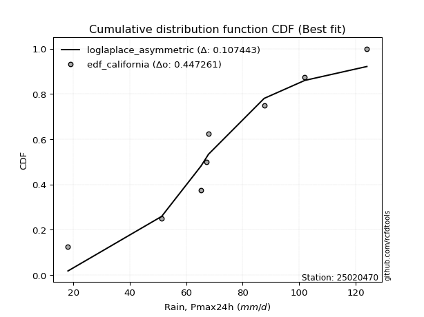</img>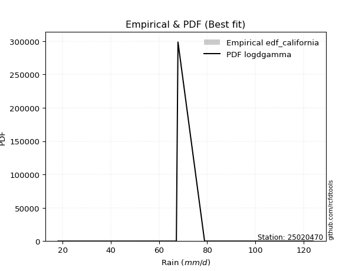</img>

</div>


### 2. Empirical - EDF Hazen (1930)

Hazen method for plotting positions is a formula used to estimate the empirical cumulative probability distribution of flood events or other hydrological data. This formula often results in biased estimations, particularly when extrapolating to extreme events (high return periods).

<div align="center">


$P=(m-0.5)/n$


</div>


**2.1. Empirical values**

<div align="center">

|                | 0                   | 1                   | 2                  | 3                  | 4         | 5                  | 6                  | 7                  | 8                  |
|:---------------|:--------------------|:--------------------|:-------------------|:-------------------|:----------|:-------------------|:-------------------|:-------------------|:-------------------|
| date           | 2023                | 2025                | 2017               | 2022               | 2019      | 2018               | 2020               | 2024               | 2021               |
| x              | 18.1                | 43.6                | 51.29              | 65.2               | 67.2      | 67.87              | 87.6               | 102.0              | 124.0              |
| m              | 1                   | 2                   | 3                  | 4                  | 5         | 6                  | 7                  | 8                  | 9                  |
| empirical_dist | edf_hazen           | edf_hazen           | edf_hazen          | edf_hazen          | edf_hazen | edf_hazen          | edf_hazen          | edf_hazen          | edf_hazen          |
| empirical      | 0.05555555555555555 | 0.16666666666666666 | 0.2777777777777778 | 0.3888888888888889 | 0.5       | 0.6111111111111112 | 0.7222222222222222 | 0.8333333333333334 | 0.9444444444444444 |
| empirical_tr   | 1.0588235294117647  | 1.2                 | 1.3846153846153846 | 1.6363636363636362 | 2.0       | 2.5714285714285716 | 3.5999999999999996 | 6.000000000000002  | 17.999999999999993 |

</div>


**2.2. Kolmogorov-Smirnov fit test (sorted by Δ)**


<div align="center">

|                | 0                   | 1                   | 2                   | 3                   | 4                   | 5                   | 6                   | 7                   | 8                   | 9                   | 10                  | 11                  | 12                  | 13                  | 14                  | 15                  | 16                  | 17                  | 18                  | 19                  | 20                  | 21                  | 22                  | 23                  | 24                    | 25                  | 26                  | 27                  | 28                  | 29                  | 30                  | 31                  | 32                  | 33                  | 34                  | 35                  | 36                  | 37                  | 38                  | 39                  | 40                  | 41                  | 42                  | 43                  | 44                  | 45                  | 46                  | 47                  | 48                  | 49                  | 50                  | 51                  | 52                  | 53                  | 54                  | 55                  | 56                  | 57                  | 58                  | 59                  | 60                  | 61                  | 62                  | 63                  | 64                  | 65                  | 66                  | 67                  | 68                  | 69                  | 70                  | 71                  | 72                  | 73                  | 74                  | 75                  | 76                  | 77                  | 78                  | 79                  | 80                  | 81                  | 82                  | 83                  | 84                  | 85                  | 86                  | 87                  | 88                  | 89                  |
|:---------------|:--------------------|:--------------------|:--------------------|:--------------------|:--------------------|:--------------------|:--------------------|:--------------------|:--------------------|:--------------------|:--------------------|:--------------------|:--------------------|:--------------------|:--------------------|:--------------------|:--------------------|:--------------------|:--------------------|:--------------------|:--------------------|:--------------------|:--------------------|:--------------------|:----------------------|:--------------------|:--------------------|:--------------------|:--------------------|:--------------------|:--------------------|:--------------------|:--------------------|:--------------------|:--------------------|:--------------------|:--------------------|:--------------------|:--------------------|:--------------------|:--------------------|:--------------------|:--------------------|:--------------------|:--------------------|:--------------------|:--------------------|:--------------------|:--------------------|:--------------------|:--------------------|:--------------------|:--------------------|:--------------------|:--------------------|:--------------------|:--------------------|:--------------------|:--------------------|:--------------------|:--------------------|:--------------------|:--------------------|:--------------------|:--------------------|:--------------------|:--------------------|:--------------------|:--------------------|:--------------------|:--------------------|:--------------------|:--------------------|:--------------------|:--------------------|:--------------------|:--------------------|:--------------------|:--------------------|:--------------------|:--------------------|:--------------------|:--------------------|:--------------------|:--------------------|:--------------------|:--------------------|:--------------------|:--------------------|:--------------------|
| station        | 25020470            | 25020470            | 25020470            | 25020470            | 25020470            | 25020470            | 25020470            | 25020470            | 25020470            | 25020470            | 25020470            | 25020470            | 25020470            | 25020470            | 25020470            | 25020470            | 25020470            | 25020470            | 25020470            | 25020470            | 25020470            | 25020470            | 25020470            | 25020470            | 25020470              | 25020470            | 25020470            | 25020470            | 25020470            | 25020470            | 25020470            | 25020470            | 25020470            | 25020470            | 25020470            | 25020470            | 25020470            | 25020470            | 25020470            | 25020470            | 25020470            | 25020470            | 25020470            | 25020470            | 25020470            | 25020470            | 25020470            | 25020470            | 25020470            | 25020470            | 25020470            | 25020470            | 25020470            | 25020470            | 25020470            | 25020470            | 25020470            | 25020470            | 25020470            | 25020470            | 25020470            | 25020470            | 25020470            | 25020470            | 25020470            | 25020470            | 25020470            | 25020470            | 25020470            | 25020470            | 25020470            | 25020470            | 25020470            | 25020470            | 25020470            | 25020470            | 25020470            | 25020470            | 25020470            | 25020470            | 25020470            | 25020470            | 25020470            | 25020470            | 25020470            | 25020470            | 25020470            | 25020470            | 25020470            | 25020470            |
| empirical_dist | edf_hazen           | edf_hazen           | edf_hazen           | edf_hazen           | edf_hazen           | edf_hazen           | edf_hazen           | edf_hazen           | edf_hazen           | edf_hazen           | edf_hazen           | edf_hazen           | edf_hazen           | edf_hazen           | edf_hazen           | edf_hazen           | edf_hazen           | edf_hazen           | edf_hazen           | edf_hazen           | edf_hazen           | edf_hazen           | edf_hazen           | edf_hazen           | edf_hazen             | edf_hazen           | edf_hazen           | edf_hazen           | edf_hazen           | edf_hazen           | edf_hazen           | edf_hazen           | edf_hazen           | edf_hazen           | edf_hazen           | edf_hazen           | edf_hazen           | edf_hazen           | edf_hazen           | edf_hazen           | edf_hazen           | edf_hazen           | edf_hazen           | edf_hazen           | edf_hazen           | edf_hazen           | edf_hazen           | edf_hazen           | edf_hazen           | edf_hazen           | edf_hazen           | edf_hazen           | edf_hazen           | edf_hazen           | edf_hazen           | edf_hazen           | edf_hazen           | edf_hazen           | edf_hazen           | edf_hazen           | edf_hazen           | edf_hazen           | edf_hazen           | edf_hazen           | edf_hazen           | edf_hazen           | edf_hazen           | edf_hazen           | edf_hazen           | edf_hazen           | edf_hazen           | edf_hazen           | edf_hazen           | edf_hazen           | edf_hazen           | edf_hazen           | edf_hazen           | edf_hazen           | edf_hazen           | edf_hazen           | edf_hazen           | edf_hazen           | edf_hazen           | edf_hazen           | edf_hazen           | edf_hazen           | edf_hazen           | edf_hazen           | edf_hazen           | edf_hazen           |
| p_dist         | invgauss            | loggompertz         | rayleigh            | alpha               | maxwell             | invgamma            | loggumbel_l         | genlogistic         | logfisk             | logpearson3         | logt                | logweibull_min      | fisk                | weibull_min         | betaprime           | ncf                 | rice                | chi2                | erlang              | gamma               | gumbel_r            | johnsonsu           | f                   | logmielke           | loglaplace_asymmetric | loggenlogistic      | laplace_asymmetric  | pearson3            | kstwobign           | logloggamma         | logjohnsonsu        | nct                 | halfnorm            | exponnorm           | t                   | norm                | crystalball         | logistic            | hypsecant           | moyal               | logrice             | lognorm             | lognorm             | logcrystalball      | logexponnorm        | logf                | lognct              | logfatiguelife      | laplace             | halflogistic        | logncf              | loglogistic         | loginvgamma         | logbetaprime        | loggamma            | loggamma            | loghypsecant        | logerlang           | logalpha            | loginvgauss         | loginvweibull       | logtruncnorm        | loglaplace          | logmaxwell          | lograyleigh         | gumbel_l            | logkstwobign        | wald                | loghalfnorm         | loggumbel_r         | mielke              | gibrat              | genexpon            | expon               | loggenexpon         | lognakagami         | logmoyal            | loghalflogistic     | truncnorm           | logwald             | loggibrat           | logexpon            | nakagami            | loglognorm          | logchi2             | pareto              | invweibull          | logpareto           | fatiguelife         | gompertz            |
| delta          | 0.09376183542885563 | 0.09654712227820533 | 0.09826059954045546 | 0.1009952618151504  | 0.10105390547158644 | 0.10309278218348716 | 0.10705839643757786 | 0.10877562428881771 | 0.1090949546388098  | 0.10985603075568506 | 0.1101055577100134  | 0.11057919286203921 | 0.11336601946634128 | 0.113549612667456   | 0.11433411816100669 | 0.11447436576733538 | 0.11522507142462818 | 0.11564999562442929 | 0.11707133281952498 | 0.11747316170677313 | 0.11785564787535935 | 0.11918094647357608 | 0.11929297280472273 | 0.11964066304312743 | 0.12173739543602385   | 0.12296346986487833 | 0.12365294765520829 | 0.12406235667943272 | 0.12681780071656118 | 0.12700217597500174 | 0.1285105116479952  | 0.12885286764335735 | 0.13218239736299736 | 0.13292701092452391 | 0.1348785941084864  | 0.13489320244146585 | 0.134893211899761   | 0.1381322325197638  | 0.1408916771329669  | 0.14292156378751225 | 0.15008320912041812 | 0.15008499987768992 | 0.15008499987768992 | 0.15008503816654134 | 0.15008863691925906 | 0.1502942567408982  | 0.15033418189209974 | 0.1506640300549375  | 0.15155879720096055 | 0.1523958720038005  | 0.1548174578556814  | 0.1553646111740526  | 0.15628736144076988 | 0.15643517591396944 | 0.15711634114563172 | 0.15711634114563172 | 0.1598440939399713  | 0.16115342174604602 | 0.16630836312791314 | 0.16869036164594114 | 0.17064937871555147 | 0.17403554870753518 | 0.17572695462342575 | 0.18117227962545684 | 0.1912351038289663  | 0.2055670447268012  | 0.21059368999167496 | 0.21244252616322318 | 0.21959256743017758 | 0.22053545455957518 | 0.22060921946779885 | 0.22236587791981627 | 0.22344396695579374 | 0.22355191193977933 | 0.2250331610332936  | 0.23288121955982993 | 0.24570296960994414 | 0.24648215959645742 | 0.28910566732054765 | 0.3155474206337146  | 0.34370852548152836 | 0.3441457685847833  | 0.36005473935219184 | 0.45716857742714356 | 0.4705025341989525  | 0.47774758645592896 | 0.4855730101412782  | 0.4909578768563977  | 0.6435699453530176  | 0.7969098387629301  |
| deltao         | 0.41761268023100007 | 0.41761268023100007 | 0.41761268023100007 | 0.41761268023100007 | 0.41761268023100007 | 0.41761268023100007 | 0.41761268023100007 | 0.41761268023100007 | 0.41761268023100007 | 0.41761268023100007 | 0.41761268023100007 | 0.41761268023100007 | 0.41761268023100007 | 0.41761268023100007 | 0.41761268023100007 | 0.41761268023100007 | 0.41761268023100007 | 0.41761268023100007 | 0.41761268023100007 | 0.41761268023100007 | 0.41761268023100007 | 0.41761268023100007 | 0.41761268023100007 | 0.41761268023100007 | 0.41761268023100007   | 0.41761268023100007 | 0.41761268023100007 | 0.41761268023100007 | 0.41761268023100007 | 0.41761268023100007 | 0.41761268023100007 | 0.41761268023100007 | 0.41761268023100007 | 0.41761268023100007 | 0.41761268023100007 | 0.41761268023100007 | 0.41761268023100007 | 0.41761268023100007 | 0.41761268023100007 | 0.41761268023100007 | 0.41761268023100007 | 0.41761268023100007 | 0.41761268023100007 | 0.41761268023100007 | 0.41761268023100007 | 0.41761268023100007 | 0.41761268023100007 | 0.41761268023100007 | 0.41761268023100007 | 0.41761268023100007 | 0.41761268023100007 | 0.41761268023100007 | 0.41761268023100007 | 0.41761268023100007 | 0.41761268023100007 | 0.41761268023100007 | 0.41761268023100007 | 0.41761268023100007 | 0.41761268023100007 | 0.41761268023100007 | 0.41761268023100007 | 0.41761268023100007 | 0.41761268023100007 | 0.41761268023100007 | 0.41761268023100007 | 0.41761268023100007 | 0.41761268023100007 | 0.41761268023100007 | 0.41761268023100007 | 0.41761268023100007 | 0.41761268023100007 | 0.41761268023100007 | 0.41761268023100007 | 0.41761268023100007 | 0.41761268023100007 | 0.41761268023100007 | 0.41761268023100007 | 0.41761268023100007 | 0.41761268023100007 | 0.41761268023100007 | 0.41761268023100007 | 0.41761268023100007 | 0.41761268023100007 | 0.41761268023100007 | 0.41761268023100007 | 0.41761268023100007 | 0.41761268023100007 | 0.41761268023100007 | 0.41761268023100007 | 0.41761268023100007 |
| eval           | Δo > Δ              | Δo > Δ              | Δo > Δ              | Δo > Δ              | Δo > Δ              | Δo > Δ              | Δo > Δ              | Δo > Δ              | Δo > Δ              | Δo > Δ              | Δo > Δ              | Δo > Δ              | Δo > Δ              | Δo > Δ              | Δo > Δ              | Δo > Δ              | Δo > Δ              | Δo > Δ              | Δo > Δ              | Δo > Δ              | Δo > Δ              | Δo > Δ              | Δo > Δ              | Δo > Δ              | Δo > Δ                | Δo > Δ              | Δo > Δ              | Δo > Δ              | Δo > Δ              | Δo > Δ              | Δo > Δ              | Δo > Δ              | Δo > Δ              | Δo > Δ              | Δo > Δ              | Δo > Δ              | Δo > Δ              | Δo > Δ              | Δo > Δ              | Δo > Δ              | Δo > Δ              | Δo > Δ              | Δo > Δ              | Δo > Δ              | Δo > Δ              | Δo > Δ              | Δo > Δ              | Δo > Δ              | Δo > Δ              | Δo > Δ              | Δo > Δ              | Δo > Δ              | Δo > Δ              | Δo > Δ              | Δo > Δ              | Δo > Δ              | Δo > Δ              | Δo > Δ              | Δo > Δ              | Δo > Δ              | Δo > Δ              | Δo > Δ              | Δo > Δ              | Δo > Δ              | Δo > Δ              | Δo > Δ              | Δo > Δ              | Δo > Δ              | Δo > Δ              | Δo > Δ              | Δo > Δ              | Δo > Δ              | Δo > Δ              | Δo > Δ              | Δo > Δ              | Δo > Δ              | Δo > Δ              | Δo > Δ              | Δo > Δ              | Δo > Δ              | Δo > Δ              | Δo > Δ              | Δo > Δ              | Δo <= Δ             | Δo <= Δ             | Δo <= Δ             | Δo <= Δ             | Δo <= Δ             | Δo <= Δ             | Δo <= Δ             |
| fit            | 1                   | 1                   | 1                   | 1                   | 1                   | 1                   | 1                   | 1                   | 1                   | 1                   | 1                   | 1                   | 1                   | 1                   | 1                   | 1                   | 1                   | 1                   | 1                   | 1                   | 1                   | 1                   | 1                   | 1                   | 1                     | 1                   | 1                   | 1                   | 1                   | 1                   | 1                   | 1                   | 1                   | 1                   | 1                   | 1                   | 1                   | 1                   | 1                   | 1                   | 1                   | 1                   | 1                   | 1                   | 1                   | 1                   | 1                   | 1                   | 1                   | 1                   | 1                   | 1                   | 1                   | 1                   | 1                   | 1                   | 1                   | 1                   | 1                   | 1                   | 1                   | 1                   | 1                   | 1                   | 1                   | 1                   | 1                   | 1                   | 1                   | 1                   | 1                   | 1                   | 1                   | 1                   | 1                   | 1                   | 1                   | 1                   | 1                   | 1                   | 1                   | 1                   | 1                   | 0                   | 0                   | 0                   | 0                   | 0                   | 0                   | 0                   |
| n              | 9                   | 9                   | 9                   | 9                   | 9                   | 9                   | 9                   | 9                   | 9                   | 9                   | 9                   | 9                   | 9                   | 9                   | 9                   | 9                   | 9                   | 9                   | 9                   | 9                   | 9                   | 9                   | 9                   | 9                   | 9                     | 9                   | 9                   | 9                   | 9                   | 9                   | 9                   | 9                   | 9                   | 9                   | 9                   | 9                   | 9                   | 9                   | 9                   | 9                   | 9                   | 9                   | 9                   | 9                   | 9                   | 9                   | 9                   | 9                   | 9                   | 9                   | 9                   | 9                   | 9                   | 9                   | 9                   | 9                   | 9                   | 9                   | 9                   | 9                   | 9                   | 9                   | 9                   | 9                   | 9                   | 9                   | 9                   | 9                   | 9                   | 9                   | 9                   | 9                   | 9                   | 9                   | 9                   | 9                   | 9                   | 9                   | 9                   | 9                   | 9                   | 9                   | 9                   | 9                   | 9                   | 9                   | 9                   | 9                   | 9                   | 9                   |
| best_fit       | 1                   | 0                   | 0                   | 0                   | 0                   | 0                   | 0                   | 0                   | 0                   | 0                   | 0                   | 0                   | 0                   | 0                   | 0                   | 0                   | 0                   | 0                   | 0                   | 0                   | 0                   | 0                   | 0                   | 0                   | 0                     | 0                   | 0                   | 0                   | 0                   | 0                   | 0                   | 0                   | 0                   | 0                   | 0                   | 0                   | 0                   | 0                   | 0                   | 0                   | 0                   | 0                   | 0                   | 0                   | 0                   | 0                   | 0                   | 0                   | 0                   | 0                   | 0                   | 0                   | 0                   | 0                   | 0                   | 0                   | 0                   | 0                   | 0                   | 0                   | 0                   | 0                   | 0                   | 0                   | 0                   | 0                   | 0                   | 0                   | 0                   | 0                   | 0                   | 0                   | 0                   | 0                   | 0                   | 0                   | 0                   | 0                   | 0                   | 0                   | 0                   | 0                   | 0                   | 0                   | 0                   | 0                   | 0                   | 0                   | 0                   | 0                   |
| best_fit_sort  | 1                   | 2                   | 3                   | 4                   | 5                   | 6                   | 7                   | 8                   | 9                   | 10                  | 11                  | 12                  | 13                  | 14                  | 15                  | 16                  | 17                  | 18                  | 19                  | 20                  | 21                  | 22                  | 23                  | 24                  | 25                    | 26                  | 27                  | 28                  | 29                  | 30                  | 31                  | 32                  | 33                  | 34                  | 35                  | 36                  | 37                  | 38                  | 39                  | 40                  | 41                  | 42                  | 43                  | 44                  | 45                  | 46                  | 47                  | 48                  | 49                  | 50                  | 51                  | 52                  | 53                  | 54                  | 55                  | 56                  | 57                  | 58                  | 59                  | 60                  | 61                  | 62                  | 63                  | 64                  | 65                  | 66                  | 67                  | 68                  | 69                  | 70                  | 71                  | 72                  | 73                  | 74                  | 75                  | 76                  | 77                  | 78                  | 79                  | 80                  | 81                  | 82                  | 83                  | 84                  | 85                  | 86                  | 87                  | 88                  | 89                  | 90                  |

</div>


<div align="center">

</img>

</div>


**2.3. Best fit**

<div align="center">

|   id |   station | empirical_dist   | p_dist   |     delta |   deltao | eval   |   fit |   n |   best_fit |   best_fit_sort |
|-----:|----------:|:-----------------|:---------|----------:|---------:|:-------|------:|----:|-----------:|----------------:|
|    0 |  25020470 | edf_hazen        | invgauss | 0.0937618 | 0.417613 | Δo > Δ |     1 |   9 |          1 |               1 |

</div>


<div align="center">

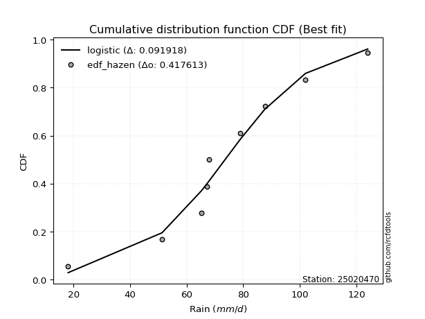</img></img>

</div>


### 3. Empirical - EDF Weibull (1939)

Weibull plotting position formula is an empirical method used to estimate the non-exceedance probability or plotting position for a set of observed data, is often recommended or widely used in practice, particularly in flood frequency analysis.

<div align="center">


$P=m/(n+1)$


</div>


**3.1. Empirical values**

<div align="center">

|                | 0                  | 1           | 2                  | 3                  | 4           | 5           | 6                 | 7                 | 8                  |
|:---------------|:-------------------|:------------|:-------------------|:-------------------|:------------|:------------|:------------------|:------------------|:-------------------|
| date           | 2023               | 2025        | 2017               | 2022               | 2019        | 2018        | 2020              | 2024              | 2021               |
| x              | 18.1               | 43.6        | 51.29              | 65.2               | 67.2        | 67.87       | 87.6              | 102.0             | 124.0              |
| m              | 1                  | 2           | 3                  | 4                  | 5           | 6           | 7                 | 8                 | 9                  |
| empirical_dist | edf_weibull        | edf_weibull | edf_weibull        | edf_weibull        | edf_weibull | edf_weibull | edf_weibull       | edf_weibull       | edf_weibull        |
| empirical      | 0.1                | 0.2         | 0.3                | 0.4                | 0.5         | 0.6         | 0.7               | 0.8               | 0.9                |
| empirical_tr   | 1.1111111111111112 | 1.25        | 1.4285714285714286 | 1.6666666666666667 | 2.0         | 2.5         | 3.333333333333333 | 5.000000000000001 | 10.000000000000002 |

</div>


**3.2. Kolmogorov-Smirnov fit test (sorted by Δ)**


<div align="center">

|                | 0                   | 1                   | 2                   | 3                   | 4                   | 5                   | 6                   | 7                   | 8                   | 9                   | 10                  | 11                  | 12                  | 13                  | 14                  | 15                  | 16                  | 17                  | 18                  | 19                  | 20                  | 21                  | 22                  | 23                  | 24                    | 25                  | 26                  | 27                  | 28                  | 29                  | 30                  | 31                  | 32                  | 33                  | 34                  | 35                  | 36                  | 37                  | 38                  | 39                  | 40                  | 41                  | 42                  | 43                  | 44                  | 45                  | 46                  | 47                  | 48                  | 49                  | 50                  | 51                  | 52                  | 53                  | 54                  | 55                  | 56                  | 57                  | 58                  | 59                  | 60                  | 61                  | 62                  | 63                  | 64                  | 65                  | 66                  | 67                  | 68                  | 69                  | 70                  | 71                  | 72                  | 73                  | 74                  | 75                  | 76                  | 77                  | 78                  | 79                  | 80                  | 81                  | 82                  | 83                  | 84                  | 85                  | 86                  | 87                  | 88                  | 89                  |
|:---------------|:--------------------|:--------------------|:--------------------|:--------------------|:--------------------|:--------------------|:--------------------|:--------------------|:--------------------|:--------------------|:--------------------|:--------------------|:--------------------|:--------------------|:--------------------|:--------------------|:--------------------|:--------------------|:--------------------|:--------------------|:--------------------|:--------------------|:--------------------|:--------------------|:----------------------|:--------------------|:--------------------|:--------------------|:--------------------|:--------------------|:--------------------|:--------------------|:--------------------|:--------------------|:--------------------|:--------------------|:--------------------|:--------------------|:--------------------|:--------------------|:--------------------|:--------------------|:--------------------|:--------------------|:--------------------|:--------------------|:--------------------|:--------------------|:--------------------|:--------------------|:--------------------|:--------------------|:--------------------|:--------------------|:--------------------|:--------------------|:--------------------|:--------------------|:--------------------|:--------------------|:--------------------|:--------------------|:--------------------|:--------------------|:--------------------|:--------------------|:--------------------|:--------------------|:--------------------|:--------------------|:--------------------|:--------------------|:--------------------|:--------------------|:--------------------|:--------------------|:--------------------|:--------------------|:--------------------|:--------------------|:--------------------|:--------------------|:--------------------|:--------------------|:--------------------|:--------------------|:--------------------|:--------------------|:--------------------|:--------------------|
| station        | 25020470            | 25020470            | 25020470            | 25020470            | 25020470            | 25020470            | 25020470            | 25020470            | 25020470            | 25020470            | 25020470            | 25020470            | 25020470            | 25020470            | 25020470            | 25020470            | 25020470            | 25020470            | 25020470            | 25020470            | 25020470            | 25020470            | 25020470            | 25020470            | 25020470              | 25020470            | 25020470            | 25020470            | 25020470            | 25020470            | 25020470            | 25020470            | 25020470            | 25020470            | 25020470            | 25020470            | 25020470            | 25020470            | 25020470            | 25020470            | 25020470            | 25020470            | 25020470            | 25020470            | 25020470            | 25020470            | 25020470            | 25020470            | 25020470            | 25020470            | 25020470            | 25020470            | 25020470            | 25020470            | 25020470            | 25020470            | 25020470            | 25020470            | 25020470            | 25020470            | 25020470            | 25020470            | 25020470            | 25020470            | 25020470            | 25020470            | 25020470            | 25020470            | 25020470            | 25020470            | 25020470            | 25020470            | 25020470            | 25020470            | 25020470            | 25020470            | 25020470            | 25020470            | 25020470            | 25020470            | 25020470            | 25020470            | 25020470            | 25020470            | 25020470            | 25020470            | 25020470            | 25020470            | 25020470            | 25020470            |
| empirical_dist | edf_weibull         | edf_weibull         | edf_weibull         | edf_weibull         | edf_weibull         | edf_weibull         | edf_weibull         | edf_weibull         | edf_weibull         | edf_weibull         | edf_weibull         | edf_weibull         | edf_weibull         | edf_weibull         | edf_weibull         | edf_weibull         | edf_weibull         | edf_weibull         | edf_weibull         | edf_weibull         | edf_weibull         | edf_weibull         | edf_weibull         | edf_weibull         | edf_weibull           | edf_weibull         | edf_weibull         | edf_weibull         | edf_weibull         | edf_weibull         | edf_weibull         | edf_weibull         | edf_weibull         | edf_weibull         | edf_weibull         | edf_weibull         | edf_weibull         | edf_weibull         | edf_weibull         | edf_weibull         | edf_weibull         | edf_weibull         | edf_weibull         | edf_weibull         | edf_weibull         | edf_weibull         | edf_weibull         | edf_weibull         | edf_weibull         | edf_weibull         | edf_weibull         | edf_weibull         | edf_weibull         | edf_weibull         | edf_weibull         | edf_weibull         | edf_weibull         | edf_weibull         | edf_weibull         | edf_weibull         | edf_weibull         | edf_weibull         | edf_weibull         | edf_weibull         | edf_weibull         | edf_weibull         | edf_weibull         | edf_weibull         | edf_weibull         | edf_weibull         | edf_weibull         | edf_weibull         | edf_weibull         | edf_weibull         | edf_weibull         | edf_weibull         | edf_weibull         | edf_weibull         | edf_weibull         | edf_weibull         | edf_weibull         | edf_weibull         | edf_weibull         | edf_weibull         | edf_weibull         | edf_weibull         | edf_weibull         | edf_weibull         | edf_weibull         | edf_weibull         |
| p_dist         | invgauss            | alpha               | maxwell             | invgamma            | rayleigh            | loggumbel_l         | genlogistic         | logfisk             | logpearson3         | logt                | loggompertz         | logweibull_min      | fisk                | weibull_min         | betaprime           | ncf                 | rice                | chi2                | erlang              | gamma               | gumbel_r            | johnsonsu           | f                   | logmielke           | loglaplace_asymmetric | loggenlogistic      | laplace_asymmetric  | pearson3            | kstwobign           | logloggamma         | logjohnsonsu        | nct                 | halfnorm            | exponnorm           | t                   | norm                | crystalball         | logistic            | hypsecant           | moyal               | logrice             | lognorm             | lognorm             | logcrystalball      | logexponnorm        | logf                | lognct              | logfatiguelife      | laplace             | halflogistic        | logncf              | loglogistic         | loginvgamma         | logbetaprime        | loggamma            | loggamma            | loghypsecant        | logerlang           | logalpha            | loginvgauss         | loginvweibull       | loglaplace          | logmaxwell          | lograyleigh         | mielke              | logkstwobign        | gumbel_l            | genexpon            | expon               | logtruncnorm        | wald                | loghalfnorm         | loggumbel_r         | loggenexpon         | gibrat              | lognakagami         | logmoyal            | loghalflogistic     | truncnorm           | logwald             | logexpon            | loggibrat           | nakagami            | loglognorm          | logchi2             | invweibull          | pareto              | logpareto           | fatiguelife         | gompertz            |
| delta          | 0.0826507243177445  | 0.08988415070403921 | 0.08994279436047525 | 0.09198167107237598 | 0.09255182505671948 | 0.09594728532646668 | 0.09766451317770652 | 0.09798384352769868 | 0.09874491964457388 | 0.09899444659890222 | 0.0991286137898115  | 0.09946808175092803 | 0.1022549083552301  | 0.10243850155634482 | 0.10322300704989551 | 0.1033632546562242  | 0.104113960313517   | 0.10453888451331811 | 0.1059602217084138  | 0.10636205059566195 | 0.10674453676424822 | 0.1080698353624649  | 0.10818186169361155 | 0.10852955193201624 | 0.11062628432491273   | 0.11185235875376714 | 0.1125418365440971  | 0.11295124556832153 | 0.11570668960545005 | 0.11589106486389056 | 0.11739940053688402 | 0.11774175653224617 | 0.12107128625188623 | 0.12181589981341273 | 0.12376748299737522 | 0.12378209133035467 | 0.12378210078864982 | 0.12702112140865263 | 0.12978056602185573 | 0.13181045267640112 | 0.138972098009307   | 0.1389738887665788  | 0.1389738887665788  | 0.1389739270554302  | 0.13897752580814793 | 0.13918314562978706 | 0.1392230707809886  | 0.13955291894382638 | 0.14044768608984937 | 0.14128476089268938 | 0.14370634674457028 | 0.14425350006294146 | 0.14517625032965875 | 0.1453240648028583  | 0.1460052300345206  | 0.1460052300345206  | 0.14873298282886016 | 0.1500423106349349  | 0.155197252016802   | 0.15757925053483002 | 0.15953826760444034 | 0.16461584351231462 | 0.17006116851434572 | 0.18012399271785517 | 0.18803068394759936 | 0.192979944431386   | 0.19445593361569002 | 0.19881350791369923 | 0.1989448579109231  | 0.19999999970386445 | 0.20133141505211205 | 0.20848145631906645 | 0.20942434344846406 | 0.20950542154297191 | 0.21125476680870514 | 0.2217701084487188  | 0.23459185849883302 | 0.2353710484853463  | 0.27799455620943647 | 0.3044363095226035  | 0.3108124352514499  | 0.33259741437041723 | 0.3489436282410807  | 0.4238352440938102  | 0.4371692008656191  | 0.4411285656968338  | 0.4444142531225956  | 0.4576245435230643  | 0.6102366120196843  | 0.7635765054295968  |
| deltao         | 0.41761268023100007 | 0.41761268023100007 | 0.41761268023100007 | 0.41761268023100007 | 0.41761268023100007 | 0.41761268023100007 | 0.41761268023100007 | 0.41761268023100007 | 0.41761268023100007 | 0.41761268023100007 | 0.41761268023100007 | 0.41761268023100007 | 0.41761268023100007 | 0.41761268023100007 | 0.41761268023100007 | 0.41761268023100007 | 0.41761268023100007 | 0.41761268023100007 | 0.41761268023100007 | 0.41761268023100007 | 0.41761268023100007 | 0.41761268023100007 | 0.41761268023100007 | 0.41761268023100007 | 0.41761268023100007   | 0.41761268023100007 | 0.41761268023100007 | 0.41761268023100007 | 0.41761268023100007 | 0.41761268023100007 | 0.41761268023100007 | 0.41761268023100007 | 0.41761268023100007 | 0.41761268023100007 | 0.41761268023100007 | 0.41761268023100007 | 0.41761268023100007 | 0.41761268023100007 | 0.41761268023100007 | 0.41761268023100007 | 0.41761268023100007 | 0.41761268023100007 | 0.41761268023100007 | 0.41761268023100007 | 0.41761268023100007 | 0.41761268023100007 | 0.41761268023100007 | 0.41761268023100007 | 0.41761268023100007 | 0.41761268023100007 | 0.41761268023100007 | 0.41761268023100007 | 0.41761268023100007 | 0.41761268023100007 | 0.41761268023100007 | 0.41761268023100007 | 0.41761268023100007 | 0.41761268023100007 | 0.41761268023100007 | 0.41761268023100007 | 0.41761268023100007 | 0.41761268023100007 | 0.41761268023100007 | 0.41761268023100007 | 0.41761268023100007 | 0.41761268023100007 | 0.41761268023100007 | 0.41761268023100007 | 0.41761268023100007 | 0.41761268023100007 | 0.41761268023100007 | 0.41761268023100007 | 0.41761268023100007 | 0.41761268023100007 | 0.41761268023100007 | 0.41761268023100007 | 0.41761268023100007 | 0.41761268023100007 | 0.41761268023100007 | 0.41761268023100007 | 0.41761268023100007 | 0.41761268023100007 | 0.41761268023100007 | 0.41761268023100007 | 0.41761268023100007 | 0.41761268023100007 | 0.41761268023100007 | 0.41761268023100007 | 0.41761268023100007 | 0.41761268023100007 |
| eval           | Δo > Δ              | Δo > Δ              | Δo > Δ              | Δo > Δ              | Δo > Δ              | Δo > Δ              | Δo > Δ              | Δo > Δ              | Δo > Δ              | Δo > Δ              | Δo > Δ              | Δo > Δ              | Δo > Δ              | Δo > Δ              | Δo > Δ              | Δo > Δ              | Δo > Δ              | Δo > Δ              | Δo > Δ              | Δo > Δ              | Δo > Δ              | Δo > Δ              | Δo > Δ              | Δo > Δ              | Δo > Δ                | Δo > Δ              | Δo > Δ              | Δo > Δ              | Δo > Δ              | Δo > Δ              | Δo > Δ              | Δo > Δ              | Δo > Δ              | Δo > Δ              | Δo > Δ              | Δo > Δ              | Δo > Δ              | Δo > Δ              | Δo > Δ              | Δo > Δ              | Δo > Δ              | Δo > Δ              | Δo > Δ              | Δo > Δ              | Δo > Δ              | Δo > Δ              | Δo > Δ              | Δo > Δ              | Δo > Δ              | Δo > Δ              | Δo > Δ              | Δo > Δ              | Δo > Δ              | Δo > Δ              | Δo > Δ              | Δo > Δ              | Δo > Δ              | Δo > Δ              | Δo > Δ              | Δo > Δ              | Δo > Δ              | Δo > Δ              | Δo > Δ              | Δo > Δ              | Δo > Δ              | Δo > Δ              | Δo > Δ              | Δo > Δ              | Δo > Δ              | Δo > Δ              | Δo > Δ              | Δo > Δ              | Δo > Δ              | Δo > Δ              | Δo > Δ              | Δo > Δ              | Δo > Δ              | Δo > Δ              | Δo > Δ              | Δo > Δ              | Δo > Δ              | Δo > Δ              | Δo > Δ              | Δo <= Δ             | Δo <= Δ             | Δo <= Δ             | Δo <= Δ             | Δo <= Δ             | Δo <= Δ             | Δo <= Δ             |
| fit            | 1                   | 1                   | 1                   | 1                   | 1                   | 1                   | 1                   | 1                   | 1                   | 1                   | 1                   | 1                   | 1                   | 1                   | 1                   | 1                   | 1                   | 1                   | 1                   | 1                   | 1                   | 1                   | 1                   | 1                   | 1                     | 1                   | 1                   | 1                   | 1                   | 1                   | 1                   | 1                   | 1                   | 1                   | 1                   | 1                   | 1                   | 1                   | 1                   | 1                   | 1                   | 1                   | 1                   | 1                   | 1                   | 1                   | 1                   | 1                   | 1                   | 1                   | 1                   | 1                   | 1                   | 1                   | 1                   | 1                   | 1                   | 1                   | 1                   | 1                   | 1                   | 1                   | 1                   | 1                   | 1                   | 1                   | 1                   | 1                   | 1                   | 1                   | 1                   | 1                   | 1                   | 1                   | 1                   | 1                   | 1                   | 1                   | 1                   | 1                   | 1                   | 1                   | 1                   | 0                   | 0                   | 0                   | 0                   | 0                   | 0                   | 0                   |
| n              | 9                   | 9                   | 9                   | 9                   | 9                   | 9                   | 9                   | 9                   | 9                   | 9                   | 9                   | 9                   | 9                   | 9                   | 9                   | 9                   | 9                   | 9                   | 9                   | 9                   | 9                   | 9                   | 9                   | 9                   | 9                     | 9                   | 9                   | 9                   | 9                   | 9                   | 9                   | 9                   | 9                   | 9                   | 9                   | 9                   | 9                   | 9                   | 9                   | 9                   | 9                   | 9                   | 9                   | 9                   | 9                   | 9                   | 9                   | 9                   | 9                   | 9                   | 9                   | 9                   | 9                   | 9                   | 9                   | 9                   | 9                   | 9                   | 9                   | 9                   | 9                   | 9                   | 9                   | 9                   | 9                   | 9                   | 9                   | 9                   | 9                   | 9                   | 9                   | 9                   | 9                   | 9                   | 9                   | 9                   | 9                   | 9                   | 9                   | 9                   | 9                   | 9                   | 9                   | 9                   | 9                   | 9                   | 9                   | 9                   | 9                   | 9                   |
| best_fit       | 1                   | 0                   | 0                   | 0                   | 0                   | 0                   | 0                   | 0                   | 0                   | 0                   | 0                   | 0                   | 0                   | 0                   | 0                   | 0                   | 0                   | 0                   | 0                   | 0                   | 0                   | 0                   | 0                   | 0                   | 0                     | 0                   | 0                   | 0                   | 0                   | 0                   | 0                   | 0                   | 0                   | 0                   | 0                   | 0                   | 0                   | 0                   | 0                   | 0                   | 0                   | 0                   | 0                   | 0                   | 0                   | 0                   | 0                   | 0                   | 0                   | 0                   | 0                   | 0                   | 0                   | 0                   | 0                   | 0                   | 0                   | 0                   | 0                   | 0                   | 0                   | 0                   | 0                   | 0                   | 0                   | 0                   | 0                   | 0                   | 0                   | 0                   | 0                   | 0                   | 0                   | 0                   | 0                   | 0                   | 0                   | 0                   | 0                   | 0                   | 0                   | 0                   | 0                   | 0                   | 0                   | 0                   | 0                   | 0                   | 0                   | 0                   |
| best_fit_sort  | 1                   | 2                   | 3                   | 4                   | 5                   | 6                   | 7                   | 8                   | 9                   | 10                  | 11                  | 12                  | 13                  | 14                  | 15                  | 16                  | 17                  | 18                  | 19                  | 20                  | 21                  | 22                  | 23                  | 24                  | 25                    | 26                  | 27                  | 28                  | 29                  | 30                  | 31                  | 32                  | 33                  | 34                  | 35                  | 36                  | 37                  | 38                  | 39                  | 40                  | 41                  | 42                  | 43                  | 44                  | 45                  | 46                  | 47                  | 48                  | 49                  | 50                  | 51                  | 52                  | 53                  | 54                  | 55                  | 56                  | 57                  | 58                  | 59                  | 60                  | 61                  | 62                  | 63                  | 64                  | 65                  | 66                  | 67                  | 68                  | 69                  | 70                  | 71                  | 72                  | 73                  | 74                  | 75                  | 76                  | 77                  | 78                  | 79                  | 80                  | 81                  | 82                  | 83                  | 84                  | 85                  | 86                  | 87                  | 88                  | 89                  | 90                  |

</div>


<div align="center">

</img>

</div>


**3.3. Best fit**

<div align="center">

|   id |   station | empirical_dist   | p_dist   |     delta |   deltao | eval   |   fit |   n |   best_fit |   best_fit_sort |
|-----:|----------:|:-----------------|:---------|----------:|---------:|:-------|------:|----:|-----------:|----------------:|
|    0 |  25020470 | edf_weibull      | invgauss | 0.0826507 | 0.417613 | Δo > Δ |     1 |   9 |          1 |               1 |

</div>


<div align="center">

</img></img>

</div>


### 4. Empirical - EDF Beard (1943)

The Beard formula (or Beard´s plotting position formula) in hydrology is used to estimate the empirical non-exceedance probability _(P)_ of a flood event (or other extreme hydrological data point) within a given dataset.

<div align="center">


$P=(m-0.31)/(n+0.38)$


</div>


**4.1. Empirical values**

<div align="center">

|                | 0                   | 1                   | 2                  | 3                   | 4         | 5                  | 6                  | 7                  | 8                  |
|:---------------|:--------------------|:--------------------|:-------------------|:--------------------|:----------|:-------------------|:-------------------|:-------------------|:-------------------|
| date           | 2023                | 2025                | 2017               | 2022                | 2019      | 2018               | 2020               | 2024               | 2021               |
| x              | 18.1                | 43.6                | 51.29              | 65.2                | 67.2      | 67.87              | 87.6               | 102.0              | 124.0              |
| m              | 1                   | 2                   | 3                  | 4                   | 5         | 6                  | 7                  | 8                  | 9                  |
| empirical_dist | edf_beard           | edf_beard           | edf_beard          | edf_beard           | edf_beard | edf_beard          | edf_beard          | edf_beard          | edf_beard          |
| empirical      | 0.07356076759061833 | 0.18017057569296374 | 0.2867803837953091 | 0.39339019189765456 | 0.5       | 0.6066098081023454 | 0.7132196162046908 | 0.8198294243070362 | 0.9264392324093815 |
| empirical_tr   | 1.0794016110471807  | 1.2197659297789336  | 1.4020926756352765 | 1.6485061511423549  | 2.0       | 2.542005420054201  | 3.486988847583642  | 5.550295857988164  | 13.5942028985507   |

</div>


**4.2. Kolmogorov-Smirnov fit test (sorted by Δ)**


<div align="center">

|                | 0                   | 1                   | 2                   | 3                   | 4                   | 5                   | 6                   | 7                   | 8                   | 9                   | 10                  | 11                  | 12                  | 13                  | 14                  | 15                  | 16                  | 17                  | 18                  | 19                  | 20                  | 21                  | 22                  | 23                  | 24                    | 25                  | 26                  | 27                  | 28                  | 29                  | 30                  | 31                  | 32                  | 33                  | 34                  | 35                  | 36                  | 37                  | 38                  | 39                  | 40                  | 41                  | 42                  | 43                  | 44                  | 45                  | 46                  | 47                  | 48                  | 49                  | 50                  | 51                  | 52                  | 53                  | 54                  | 55                  | 56                  | 57                  | 58                  | 59                  | 60                  | 61                  | 62                  | 63                  | 64                  | 65                  | 66                  | 67                  | 68                  | 69                  | 70                  | 71                  | 72                  | 73                  | 74                  | 75                  | 76                  | 77                  | 78                  | 79                  | 80                  | 81                  | 82                  | 83                  | 84                  | 85                  | 86                  | 87                  | 88                  | 89                  |
|:---------------|:--------------------|:--------------------|:--------------------|:--------------------|:--------------------|:--------------------|:--------------------|:--------------------|:--------------------|:--------------------|:--------------------|:--------------------|:--------------------|:--------------------|:--------------------|:--------------------|:--------------------|:--------------------|:--------------------|:--------------------|:--------------------|:--------------------|:--------------------|:--------------------|:----------------------|:--------------------|:--------------------|:--------------------|:--------------------|:--------------------|:--------------------|:--------------------|:--------------------|:--------------------|:--------------------|:--------------------|:--------------------|:--------------------|:--------------------|:--------------------|:--------------------|:--------------------|:--------------------|:--------------------|:--------------------|:--------------------|:--------------------|:--------------------|:--------------------|:--------------------|:--------------------|:--------------------|:--------------------|:--------------------|:--------------------|:--------------------|:--------------------|:--------------------|:--------------------|:--------------------|:--------------------|:--------------------|:--------------------|:--------------------|:--------------------|:--------------------|:--------------------|:--------------------|:--------------------|:--------------------|:--------------------|:--------------------|:--------------------|:--------------------|:--------------------|:--------------------|:--------------------|:--------------------|:--------------------|:--------------------|:--------------------|:--------------------|:--------------------|:--------------------|:--------------------|:--------------------|:--------------------|:--------------------|:--------------------|:--------------------|
| station        | 25020470            | 25020470            | 25020470            | 25020470            | 25020470            | 25020470            | 25020470            | 25020470            | 25020470            | 25020470            | 25020470            | 25020470            | 25020470            | 25020470            | 25020470            | 25020470            | 25020470            | 25020470            | 25020470            | 25020470            | 25020470            | 25020470            | 25020470            | 25020470            | 25020470              | 25020470            | 25020470            | 25020470            | 25020470            | 25020470            | 25020470            | 25020470            | 25020470            | 25020470            | 25020470            | 25020470            | 25020470            | 25020470            | 25020470            | 25020470            | 25020470            | 25020470            | 25020470            | 25020470            | 25020470            | 25020470            | 25020470            | 25020470            | 25020470            | 25020470            | 25020470            | 25020470            | 25020470            | 25020470            | 25020470            | 25020470            | 25020470            | 25020470            | 25020470            | 25020470            | 25020470            | 25020470            | 25020470            | 25020470            | 25020470            | 25020470            | 25020470            | 25020470            | 25020470            | 25020470            | 25020470            | 25020470            | 25020470            | 25020470            | 25020470            | 25020470            | 25020470            | 25020470            | 25020470            | 25020470            | 25020470            | 25020470            | 25020470            | 25020470            | 25020470            | 25020470            | 25020470            | 25020470            | 25020470            | 25020470            |
| empirical_dist | edf_beard           | edf_beard           | edf_beard           | edf_beard           | edf_beard           | edf_beard           | edf_beard           | edf_beard           | edf_beard           | edf_beard           | edf_beard           | edf_beard           | edf_beard           | edf_beard           | edf_beard           | edf_beard           | edf_beard           | edf_beard           | edf_beard           | edf_beard           | edf_beard           | edf_beard           | edf_beard           | edf_beard           | edf_beard             | edf_beard           | edf_beard           | edf_beard           | edf_beard           | edf_beard           | edf_beard           | edf_beard           | edf_beard           | edf_beard           | edf_beard           | edf_beard           | edf_beard           | edf_beard           | edf_beard           | edf_beard           | edf_beard           | edf_beard           | edf_beard           | edf_beard           | edf_beard           | edf_beard           | edf_beard           | edf_beard           | edf_beard           | edf_beard           | edf_beard           | edf_beard           | edf_beard           | edf_beard           | edf_beard           | edf_beard           | edf_beard           | edf_beard           | edf_beard           | edf_beard           | edf_beard           | edf_beard           | edf_beard           | edf_beard           | edf_beard           | edf_beard           | edf_beard           | edf_beard           | edf_beard           | edf_beard           | edf_beard           | edf_beard           | edf_beard           | edf_beard           | edf_beard           | edf_beard           | edf_beard           | edf_beard           | edf_beard           | edf_beard           | edf_beard           | edf_beard           | edf_beard           | edf_beard           | edf_beard           | edf_beard           | edf_beard           | edf_beard           | edf_beard           | edf_beard           |
| p_dist         | invgauss            | loggompertz         | rayleigh            | alpha               | maxwell             | invgamma            | loggumbel_l         | genlogistic         | logfisk             | logpearson3         | logt                | logweibull_min      | fisk                | weibull_min         | betaprime           | ncf                 | rice                | chi2                | erlang              | gamma               | gumbel_r            | johnsonsu           | f                   | logmielke           | loglaplace_asymmetric | loggenlogistic      | laplace_asymmetric  | pearson3            | kstwobign           | logloggamma         | logjohnsonsu        | nct                 | halfnorm            | exponnorm           | t                   | norm                | crystalball         | logistic            | hypsecant           | moyal               | logrice             | lognorm             | lognorm             | logcrystalball      | logexponnorm        | logf                | lognct              | logfatiguelife      | laplace             | halflogistic        | logncf              | loglogistic         | loginvgamma         | logbetaprime        | loggamma            | loggamma            | loghypsecant        | logerlang           | logalpha            | loginvgauss         | loginvweibull       | loglaplace          | logmaxwell          | logtruncnorm        | lograyleigh         | logkstwobign        | gumbel_l            | mielke              | wald                | genexpon            | expon               | loghalfnorm         | loggumbel_r         | loggenexpon         | gibrat              | lognakagami         | logmoyal            | loghalflogistic     | truncnorm           | logwald             | logexpon            | loggibrat           | nakagami            | loglognorm          | logchi2             | pareto              | invweibull          | logpareto           | fatiguelife         | gompertz            |
| delta          | 0.08926053242008997 | 0.09204581926943967 | 0.0937592965316898  | 0.09649395880638467 | 0.09655260246282071 | 0.09859147917472144 | 0.10255709342881214 | 0.10427432128005198 | 0.10459365163004414 | 0.10535472774691934 | 0.10560425470124768 | 0.10607788985327349 | 0.10886471645757556 | 0.10904830965869028 | 0.10983281515224097 | 0.10997306275856966 | 0.11072376841586246 | 0.11114869261566357 | 0.11257002981075925 | 0.11297185869800741 | 0.11335434486659368 | 0.11467964346481035 | 0.11479166979595701 | 0.1151393600343617  | 0.11723609242725819   | 0.1184621668561126  | 0.11915164464644257 | 0.119561053670667   | 0.12231649770779551 | 0.12250087296623602 | 0.12400920863922948 | 0.12435156463459163 | 0.1276810943542317  | 0.1284257079157582  | 0.13037729109972068 | 0.13039189943270013 | 0.13039190889099528 | 0.1336309295109981  | 0.13639037412420119 | 0.13842026077874658 | 0.14558190611165245 | 0.14558369686892425 | 0.14558369686892425 | 0.14558373515777567 | 0.1455873339104934  | 0.14579295373213252 | 0.14583287888333407 | 0.14616272704617184 | 0.14705749419219483 | 0.14789456899503484 | 0.15031615484691574 | 0.15086330816528692 | 0.1517860584320042  | 0.15193387290520377 | 0.15261503813686605 | 0.15261503813686605 | 0.15534279093120562 | 0.15665211873728035 | 0.16180706011914747 | 0.16418905863717548 | 0.1661480757067858  | 0.17122565161466008 | 0.17667097661669118 | 0.18017057539682818 | 0.18673380082020063 | 0.19958975253373146 | 0.20106574171803548 | 0.20710531044150177 | 0.2079412231544575  | 0.20994005792949666 | 0.21004800291348225 | 0.2150912644214119  | 0.21603415155080952 | 0.21611522964531737 | 0.2178645749110506  | 0.22837991655106427 | 0.24120166660117848 | 0.24198085658769175 | 0.28460436431178193 | 0.31104611762494894 | 0.3306418595584862  | 0.3392072224727627  | 0.3555534363434262  | 0.44366466840084645 | 0.4569986251726554  | 0.46424367742963185 | 0.4675677981062153  | 0.4774539678301006  | 0.6300660363267205  | 0.7834059297366329  |
| deltao         | 0.41761268023100007 | 0.41761268023100007 | 0.41761268023100007 | 0.41761268023100007 | 0.41761268023100007 | 0.41761268023100007 | 0.41761268023100007 | 0.41761268023100007 | 0.41761268023100007 | 0.41761268023100007 | 0.41761268023100007 | 0.41761268023100007 | 0.41761268023100007 | 0.41761268023100007 | 0.41761268023100007 | 0.41761268023100007 | 0.41761268023100007 | 0.41761268023100007 | 0.41761268023100007 | 0.41761268023100007 | 0.41761268023100007 | 0.41761268023100007 | 0.41761268023100007 | 0.41761268023100007 | 0.41761268023100007   | 0.41761268023100007 | 0.41761268023100007 | 0.41761268023100007 | 0.41761268023100007 | 0.41761268023100007 | 0.41761268023100007 | 0.41761268023100007 | 0.41761268023100007 | 0.41761268023100007 | 0.41761268023100007 | 0.41761268023100007 | 0.41761268023100007 | 0.41761268023100007 | 0.41761268023100007 | 0.41761268023100007 | 0.41761268023100007 | 0.41761268023100007 | 0.41761268023100007 | 0.41761268023100007 | 0.41761268023100007 | 0.41761268023100007 | 0.41761268023100007 | 0.41761268023100007 | 0.41761268023100007 | 0.41761268023100007 | 0.41761268023100007 | 0.41761268023100007 | 0.41761268023100007 | 0.41761268023100007 | 0.41761268023100007 | 0.41761268023100007 | 0.41761268023100007 | 0.41761268023100007 | 0.41761268023100007 | 0.41761268023100007 | 0.41761268023100007 | 0.41761268023100007 | 0.41761268023100007 | 0.41761268023100007 | 0.41761268023100007 | 0.41761268023100007 | 0.41761268023100007 | 0.41761268023100007 | 0.41761268023100007 | 0.41761268023100007 | 0.41761268023100007 | 0.41761268023100007 | 0.41761268023100007 | 0.41761268023100007 | 0.41761268023100007 | 0.41761268023100007 | 0.41761268023100007 | 0.41761268023100007 | 0.41761268023100007 | 0.41761268023100007 | 0.41761268023100007 | 0.41761268023100007 | 0.41761268023100007 | 0.41761268023100007 | 0.41761268023100007 | 0.41761268023100007 | 0.41761268023100007 | 0.41761268023100007 | 0.41761268023100007 | 0.41761268023100007 |
| eval           | Δo > Δ              | Δo > Δ              | Δo > Δ              | Δo > Δ              | Δo > Δ              | Δo > Δ              | Δo > Δ              | Δo > Δ              | Δo > Δ              | Δo > Δ              | Δo > Δ              | Δo > Δ              | Δo > Δ              | Δo > Δ              | Δo > Δ              | Δo > Δ              | Δo > Δ              | Δo > Δ              | Δo > Δ              | Δo > Δ              | Δo > Δ              | Δo > Δ              | Δo > Δ              | Δo > Δ              | Δo > Δ                | Δo > Δ              | Δo > Δ              | Δo > Δ              | Δo > Δ              | Δo > Δ              | Δo > Δ              | Δo > Δ              | Δo > Δ              | Δo > Δ              | Δo > Δ              | Δo > Δ              | Δo > Δ              | Δo > Δ              | Δo > Δ              | Δo > Δ              | Δo > Δ              | Δo > Δ              | Δo > Δ              | Δo > Δ              | Δo > Δ              | Δo > Δ              | Δo > Δ              | Δo > Δ              | Δo > Δ              | Δo > Δ              | Δo > Δ              | Δo > Δ              | Δo > Δ              | Δo > Δ              | Δo > Δ              | Δo > Δ              | Δo > Δ              | Δo > Δ              | Δo > Δ              | Δo > Δ              | Δo > Δ              | Δo > Δ              | Δo > Δ              | Δo > Δ              | Δo > Δ              | Δo > Δ              | Δo > Δ              | Δo > Δ              | Δo > Δ              | Δo > Δ              | Δo > Δ              | Δo > Δ              | Δo > Δ              | Δo > Δ              | Δo > Δ              | Δo > Δ              | Δo > Δ              | Δo > Δ              | Δo > Δ              | Δo > Δ              | Δo > Δ              | Δo > Δ              | Δo > Δ              | Δo <= Δ             | Δo <= Δ             | Δo <= Δ             | Δo <= Δ             | Δo <= Δ             | Δo <= Δ             | Δo <= Δ             |
| fit            | 1                   | 1                   | 1                   | 1                   | 1                   | 1                   | 1                   | 1                   | 1                   | 1                   | 1                   | 1                   | 1                   | 1                   | 1                   | 1                   | 1                   | 1                   | 1                   | 1                   | 1                   | 1                   | 1                   | 1                   | 1                     | 1                   | 1                   | 1                   | 1                   | 1                   | 1                   | 1                   | 1                   | 1                   | 1                   | 1                   | 1                   | 1                   | 1                   | 1                   | 1                   | 1                   | 1                   | 1                   | 1                   | 1                   | 1                   | 1                   | 1                   | 1                   | 1                   | 1                   | 1                   | 1                   | 1                   | 1                   | 1                   | 1                   | 1                   | 1                   | 1                   | 1                   | 1                   | 1                   | 1                   | 1                   | 1                   | 1                   | 1                   | 1                   | 1                   | 1                   | 1                   | 1                   | 1                   | 1                   | 1                   | 1                   | 1                   | 1                   | 1                   | 1                   | 1                   | 0                   | 0                   | 0                   | 0                   | 0                   | 0                   | 0                   |
| n              | 9                   | 9                   | 9                   | 9                   | 9                   | 9                   | 9                   | 9                   | 9                   | 9                   | 9                   | 9                   | 9                   | 9                   | 9                   | 9                   | 9                   | 9                   | 9                   | 9                   | 9                   | 9                   | 9                   | 9                   | 9                     | 9                   | 9                   | 9                   | 9                   | 9                   | 9                   | 9                   | 9                   | 9                   | 9                   | 9                   | 9                   | 9                   | 9                   | 9                   | 9                   | 9                   | 9                   | 9                   | 9                   | 9                   | 9                   | 9                   | 9                   | 9                   | 9                   | 9                   | 9                   | 9                   | 9                   | 9                   | 9                   | 9                   | 9                   | 9                   | 9                   | 9                   | 9                   | 9                   | 9                   | 9                   | 9                   | 9                   | 9                   | 9                   | 9                   | 9                   | 9                   | 9                   | 9                   | 9                   | 9                   | 9                   | 9                   | 9                   | 9                   | 9                   | 9                   | 9                   | 9                   | 9                   | 9                   | 9                   | 9                   | 9                   |
| best_fit       | 1                   | 0                   | 0                   | 0                   | 0                   | 0                   | 0                   | 0                   | 0                   | 0                   | 0                   | 0                   | 0                   | 0                   | 0                   | 0                   | 0                   | 0                   | 0                   | 0                   | 0                   | 0                   | 0                   | 0                   | 0                     | 0                   | 0                   | 0                   | 0                   | 0                   | 0                   | 0                   | 0                   | 0                   | 0                   | 0                   | 0                   | 0                   | 0                   | 0                   | 0                   | 0                   | 0                   | 0                   | 0                   | 0                   | 0                   | 0                   | 0                   | 0                   | 0                   | 0                   | 0                   | 0                   | 0                   | 0                   | 0                   | 0                   | 0                   | 0                   | 0                   | 0                   | 0                   | 0                   | 0                   | 0                   | 0                   | 0                   | 0                   | 0                   | 0                   | 0                   | 0                   | 0                   | 0                   | 0                   | 0                   | 0                   | 0                   | 0                   | 0                   | 0                   | 0                   | 0                   | 0                   | 0                   | 0                   | 0                   | 0                   | 0                   |
| best_fit_sort  | 1                   | 2                   | 3                   | 4                   | 5                   | 6                   | 7                   | 8                   | 9                   | 10                  | 11                  | 12                  | 13                  | 14                  | 15                  | 16                  | 17                  | 18                  | 19                  | 20                  | 21                  | 22                  | 23                  | 24                  | 25                    | 26                  | 27                  | 28                  | 29                  | 30                  | 31                  | 32                  | 33                  | 34                  | 35                  | 36                  | 37                  | 38                  | 39                  | 40                  | 41                  | 42                  | 43                  | 44                  | 45                  | 46                  | 47                  | 48                  | 49                  | 50                  | 51                  | 52                  | 53                  | 54                  | 55                  | 56                  | 57                  | 58                  | 59                  | 60                  | 61                  | 62                  | 63                  | 64                  | 65                  | 66                  | 67                  | 68                  | 69                  | 70                  | 71                  | 72                  | 73                  | 74                  | 75                  | 76                  | 77                  | 78                  | 79                  | 80                  | 81                  | 82                  | 83                  | 84                  | 85                  | 86                  | 87                  | 88                  | 89                  | 90                  |

</div>


<div align="center">

</img>

</div>


**4.3. Best fit**

<div align="center">

|   id |   station | empirical_dist   | p_dist   |     delta |   deltao | eval   |   fit |   n |   best_fit |   best_fit_sort |
|-----:|----------:|:-----------------|:---------|----------:|---------:|:-------|------:|----:|-----------:|----------------:|
|    0 |  25020470 | edf_beard        | invgauss | 0.0892605 | 0.417613 | Δo > Δ |     1 |   9 |          1 |               1 |

</div>


<div align="center">

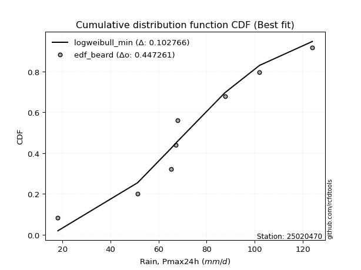</img></img>

</div>


### 5. Empirical - EDF Chegodayev (1955)

The Chegodayev formula is an empirical plotting position formula used in hydrological frequency analysis to estimate the exceedance probability or return period of a specific event from a set of observed data. It is primarily used for plotting observed data points on probability paper to fit a theoretical distribution, particularly for analyzing extreme events like maximum flood flows or rainfall intensities. The constant _b_ value in the generalized plotting position formula is 0.3.

<div align="center">


$P=(m-b)/(n+1-2b)$


</div>


**5.1. Empirical values**

<div align="center">

|                | 0                   | 1                   | 2                  | 3                   | 4              | 5                  | 6                  | 7                  | 8                  |
|:---------------|:--------------------|:--------------------|:-------------------|:--------------------|:---------------|:-------------------|:-------------------|:-------------------|:-------------------|
| date           | 2023                | 2025                | 2017               | 2022                | 2019           | 2018               | 2020               | 2024               | 2021               |
| x              | 18.1                | 43.6                | 51.29              | 65.2                | 67.2           | 67.87              | 87.6               | 102.0              | 124.0              |
| m              | 1                   | 2                   | 3                  | 4                   | 5              | 6                  | 7                  | 8                  | 9                  |
| empirical_dist | edf_chegodayev      | edf_chegodayev      | edf_chegodayev     | edf_chegodayev      | edf_chegodayev | edf_chegodayev     | edf_chegodayev     | edf_chegodayev     | edf_chegodayev     |
| empirical      | 0.07446808510638298 | 0.18085106382978722 | 0.2872340425531915 | 0.39361702127659576 | 0.5            | 0.6063829787234043 | 0.7127659574468085 | 0.8191489361702128 | 0.9255319148936169 |
| empirical_tr   | 1.0804597701149425  | 1.2207792207792207  | 1.4029850746268657 | 1.6491228070175437  | 2.0            | 2.540540540540541  | 3.481481481481481  | 5.529411764705883  | 13.428571428571399 |

</div>


**5.2. Kolmogorov-Smirnov fit test (sorted by Δ)**


<div align="center">

|                | 0                   | 1                   | 2                   | 3                   | 4                   | 5                   | 6                   | 7                   | 8                   | 9                   | 10                  | 11                  | 12                  | 13                  | 14                  | 15                  | 16                  | 17                  | 18                  | 19                  | 20                  | 21                  | 22                  | 23                  | 24                    | 25                  | 26                  | 27                  | 28                  | 29                  | 30                  | 31                  | 32                  | 33                  | 34                  | 35                  | 36                  | 37                  | 38                  | 39                  | 40                  | 41                  | 42                  | 43                  | 44                  | 45                  | 46                  | 47                  | 48                  | 49                  | 50                  | 51                  | 52                  | 53                  | 54                  | 55                  | 56                  | 57                  | 58                  | 59                  | 60                  | 61                  | 62                  | 63                  | 64                  | 65                  | 66                  | 67                  | 68                  | 69                  | 70                  | 71                  | 72                  | 73                  | 74                  | 75                  | 76                  | 77                  | 78                  | 79                  | 80                  | 81                  | 82                  | 83                  | 84                  | 85                  | 86                  | 87                  | 88                  | 89                  |
|:---------------|:--------------------|:--------------------|:--------------------|:--------------------|:--------------------|:--------------------|:--------------------|:--------------------|:--------------------|:--------------------|:--------------------|:--------------------|:--------------------|:--------------------|:--------------------|:--------------------|:--------------------|:--------------------|:--------------------|:--------------------|:--------------------|:--------------------|:--------------------|:--------------------|:----------------------|:--------------------|:--------------------|:--------------------|:--------------------|:--------------------|:--------------------|:--------------------|:--------------------|:--------------------|:--------------------|:--------------------|:--------------------|:--------------------|:--------------------|:--------------------|:--------------------|:--------------------|:--------------------|:--------------------|:--------------------|:--------------------|:--------------------|:--------------------|:--------------------|:--------------------|:--------------------|:--------------------|:--------------------|:--------------------|:--------------------|:--------------------|:--------------------|:--------------------|:--------------------|:--------------------|:--------------------|:--------------------|:--------------------|:--------------------|:--------------------|:--------------------|:--------------------|:--------------------|:--------------------|:--------------------|:--------------------|:--------------------|:--------------------|:--------------------|:--------------------|:--------------------|:--------------------|:--------------------|:--------------------|:--------------------|:--------------------|:--------------------|:--------------------|:--------------------|:--------------------|:--------------------|:--------------------|:--------------------|:--------------------|:--------------------|
| station        | 25020470            | 25020470            | 25020470            | 25020470            | 25020470            | 25020470            | 25020470            | 25020470            | 25020470            | 25020470            | 25020470            | 25020470            | 25020470            | 25020470            | 25020470            | 25020470            | 25020470            | 25020470            | 25020470            | 25020470            | 25020470            | 25020470            | 25020470            | 25020470            | 25020470              | 25020470            | 25020470            | 25020470            | 25020470            | 25020470            | 25020470            | 25020470            | 25020470            | 25020470            | 25020470            | 25020470            | 25020470            | 25020470            | 25020470            | 25020470            | 25020470            | 25020470            | 25020470            | 25020470            | 25020470            | 25020470            | 25020470            | 25020470            | 25020470            | 25020470            | 25020470            | 25020470            | 25020470            | 25020470            | 25020470            | 25020470            | 25020470            | 25020470            | 25020470            | 25020470            | 25020470            | 25020470            | 25020470            | 25020470            | 25020470            | 25020470            | 25020470            | 25020470            | 25020470            | 25020470            | 25020470            | 25020470            | 25020470            | 25020470            | 25020470            | 25020470            | 25020470            | 25020470            | 25020470            | 25020470            | 25020470            | 25020470            | 25020470            | 25020470            | 25020470            | 25020470            | 25020470            | 25020470            | 25020470            | 25020470            |
| empirical_dist | edf_chegodayev      | edf_chegodayev      | edf_chegodayev      | edf_chegodayev      | edf_chegodayev      | edf_chegodayev      | edf_chegodayev      | edf_chegodayev      | edf_chegodayev      | edf_chegodayev      | edf_chegodayev      | edf_chegodayev      | edf_chegodayev      | edf_chegodayev      | edf_chegodayev      | edf_chegodayev      | edf_chegodayev      | edf_chegodayev      | edf_chegodayev      | edf_chegodayev      | edf_chegodayev      | edf_chegodayev      | edf_chegodayev      | edf_chegodayev      | edf_chegodayev        | edf_chegodayev      | edf_chegodayev      | edf_chegodayev      | edf_chegodayev      | edf_chegodayev      | edf_chegodayev      | edf_chegodayev      | edf_chegodayev      | edf_chegodayev      | edf_chegodayev      | edf_chegodayev      | edf_chegodayev      | edf_chegodayev      | edf_chegodayev      | edf_chegodayev      | edf_chegodayev      | edf_chegodayev      | edf_chegodayev      | edf_chegodayev      | edf_chegodayev      | edf_chegodayev      | edf_chegodayev      | edf_chegodayev      | edf_chegodayev      | edf_chegodayev      | edf_chegodayev      | edf_chegodayev      | edf_chegodayev      | edf_chegodayev      | edf_chegodayev      | edf_chegodayev      | edf_chegodayev      | edf_chegodayev      | edf_chegodayev      | edf_chegodayev      | edf_chegodayev      | edf_chegodayev      | edf_chegodayev      | edf_chegodayev      | edf_chegodayev      | edf_chegodayev      | edf_chegodayev      | edf_chegodayev      | edf_chegodayev      | edf_chegodayev      | edf_chegodayev      | edf_chegodayev      | edf_chegodayev      | edf_chegodayev      | edf_chegodayev      | edf_chegodayev      | edf_chegodayev      | edf_chegodayev      | edf_chegodayev      | edf_chegodayev      | edf_chegodayev      | edf_chegodayev      | edf_chegodayev      | edf_chegodayev      | edf_chegodayev      | edf_chegodayev      | edf_chegodayev      | edf_chegodayev      | edf_chegodayev      | edf_chegodayev      |
| p_dist         | invgauss            | loggompertz         | rayleigh            | alpha               | maxwell             | invgamma            | loggumbel_l         | genlogistic         | logfisk             | logpearson3         | logt                | logweibull_min      | fisk                | weibull_min         | betaprime           | ncf                 | rice                | chi2                | erlang              | gamma               | gumbel_r            | johnsonsu           | f                   | logmielke           | loglaplace_asymmetric | loggenlogistic      | laplace_asymmetric  | pearson3            | kstwobign           | logloggamma         | logjohnsonsu        | nct                 | halfnorm            | exponnorm           | t                   | norm                | crystalball         | logistic            | hypsecant           | moyal               | logrice             | lognorm             | lognorm             | logcrystalball      | logexponnorm        | logf                | lognct              | logfatiguelife      | laplace             | halflogistic        | logncf              | loglogistic         | loginvgamma         | logbetaprime        | loggamma            | loggamma            | loghypsecant        | logerlang           | logalpha            | loginvgauss         | loginvweibull       | loglaplace          | logmaxwell          | logtruncnorm        | lograyleigh         | logkstwobign        | gumbel_l            | mielke              | wald                | genexpon            | expon               | loghalfnorm         | loggumbel_r         | loggenexpon         | gibrat              | lognakagami         | logmoyal            | loghalflogistic     | truncnorm           | logwald             | logexpon            | loggibrat           | nakagami            | loglognorm          | logchi2             | pareto              | invweibull          | logpareto           | fatiguelife         | gompertz            |
| delta          | 0.08903370304114877 | 0.09181898989049847 | 0.0935324671527486  | 0.09626712942744353 | 0.09632577308387957 | 0.0983646497957803  | 0.102330264049871   | 0.10404749190111084 | 0.10436682225110294 | 0.1051278983679782  | 0.10537742532230654 | 0.10585106047433235 | 0.10863788707863442 | 0.10882148027974914 | 0.10960598577329983 | 0.10974623337962852 | 0.11049693903692132 | 0.11092186323672243 | 0.11234320043181811 | 0.11274502931906627 | 0.11312751548765249 | 0.11445281408586921 | 0.11456484041701587 | 0.11491253065542056 | 0.11700926304831699   | 0.11823533747717146 | 0.11892481526750143 | 0.11933422429172585 | 0.12208966832885432 | 0.12227404358729488 | 0.12378237926028834 | 0.12412473525565049 | 0.1274542649752905  | 0.12819887853681705 | 0.13015046172077954 | 0.130165070053759   | 0.13016507951205414 | 0.13340410013205695 | 0.13616354474526005 | 0.1381934313998054  | 0.14535507673271125 | 0.14535686748998305 | 0.14535686748998305 | 0.14535690577883448 | 0.1453605045315522  | 0.14556612435319133 | 0.14560604950439288 | 0.14593589766723064 | 0.1468306648132537  | 0.14766773961609364 | 0.15008932546797454 | 0.15063647878634573 | 0.15155922905306302 | 0.15170704352626257 | 0.15238820875792486 | 0.15238820875792486 | 0.15511596155226443 | 0.15642528935833916 | 0.16158023074020628 | 0.16396222925823428 | 0.1659212463278446  | 0.17099882223571888 | 0.17644414723774998 | 0.18085106353365166 | 0.18650697144125944 | 0.19936292315479026 | 0.20083891233909434 | 0.2064248223046783  | 0.20771439377551631 | 0.20925956979267318 | 0.20936751477665877 | 0.21486443504247071 | 0.21580732217186832 | 0.21588840026637618 | 0.2176377455321094  | 0.22815308717212307 | 0.24097483722223728 | 0.24175402720875055 | 0.2843775349328408  | 0.31081928824600774 | 0.3299613714216627  | 0.3389803930938215  | 0.355326606964485   | 0.442984180264023   | 0.4563181370358319  | 0.4635631892928084  | 0.4666604805904506  | 0.4767734796932771  | 0.629385548189897   | 0.7827254415998095  |
| deltao         | 0.41761268023100007 | 0.41761268023100007 | 0.41761268023100007 | 0.41761268023100007 | 0.41761268023100007 | 0.41761268023100007 | 0.41761268023100007 | 0.41761268023100007 | 0.41761268023100007 | 0.41761268023100007 | 0.41761268023100007 | 0.41761268023100007 | 0.41761268023100007 | 0.41761268023100007 | 0.41761268023100007 | 0.41761268023100007 | 0.41761268023100007 | 0.41761268023100007 | 0.41761268023100007 | 0.41761268023100007 | 0.41761268023100007 | 0.41761268023100007 | 0.41761268023100007 | 0.41761268023100007 | 0.41761268023100007   | 0.41761268023100007 | 0.41761268023100007 | 0.41761268023100007 | 0.41761268023100007 | 0.41761268023100007 | 0.41761268023100007 | 0.41761268023100007 | 0.41761268023100007 | 0.41761268023100007 | 0.41761268023100007 | 0.41761268023100007 | 0.41761268023100007 | 0.41761268023100007 | 0.41761268023100007 | 0.41761268023100007 | 0.41761268023100007 | 0.41761268023100007 | 0.41761268023100007 | 0.41761268023100007 | 0.41761268023100007 | 0.41761268023100007 | 0.41761268023100007 | 0.41761268023100007 | 0.41761268023100007 | 0.41761268023100007 | 0.41761268023100007 | 0.41761268023100007 | 0.41761268023100007 | 0.41761268023100007 | 0.41761268023100007 | 0.41761268023100007 | 0.41761268023100007 | 0.41761268023100007 | 0.41761268023100007 | 0.41761268023100007 | 0.41761268023100007 | 0.41761268023100007 | 0.41761268023100007 | 0.41761268023100007 | 0.41761268023100007 | 0.41761268023100007 | 0.41761268023100007 | 0.41761268023100007 | 0.41761268023100007 | 0.41761268023100007 | 0.41761268023100007 | 0.41761268023100007 | 0.41761268023100007 | 0.41761268023100007 | 0.41761268023100007 | 0.41761268023100007 | 0.41761268023100007 | 0.41761268023100007 | 0.41761268023100007 | 0.41761268023100007 | 0.41761268023100007 | 0.41761268023100007 | 0.41761268023100007 | 0.41761268023100007 | 0.41761268023100007 | 0.41761268023100007 | 0.41761268023100007 | 0.41761268023100007 | 0.41761268023100007 | 0.41761268023100007 |
| eval           | Δo > Δ              | Δo > Δ              | Δo > Δ              | Δo > Δ              | Δo > Δ              | Δo > Δ              | Δo > Δ              | Δo > Δ              | Δo > Δ              | Δo > Δ              | Δo > Δ              | Δo > Δ              | Δo > Δ              | Δo > Δ              | Δo > Δ              | Δo > Δ              | Δo > Δ              | Δo > Δ              | Δo > Δ              | Δo > Δ              | Δo > Δ              | Δo > Δ              | Δo > Δ              | Δo > Δ              | Δo > Δ                | Δo > Δ              | Δo > Δ              | Δo > Δ              | Δo > Δ              | Δo > Δ              | Δo > Δ              | Δo > Δ              | Δo > Δ              | Δo > Δ              | Δo > Δ              | Δo > Δ              | Δo > Δ              | Δo > Δ              | Δo > Δ              | Δo > Δ              | Δo > Δ              | Δo > Δ              | Δo > Δ              | Δo > Δ              | Δo > Δ              | Δo > Δ              | Δo > Δ              | Δo > Δ              | Δo > Δ              | Δo > Δ              | Δo > Δ              | Δo > Δ              | Δo > Δ              | Δo > Δ              | Δo > Δ              | Δo > Δ              | Δo > Δ              | Δo > Δ              | Δo > Δ              | Δo > Δ              | Δo > Δ              | Δo > Δ              | Δo > Δ              | Δo > Δ              | Δo > Δ              | Δo > Δ              | Δo > Δ              | Δo > Δ              | Δo > Δ              | Δo > Δ              | Δo > Δ              | Δo > Δ              | Δo > Δ              | Δo > Δ              | Δo > Δ              | Δo > Δ              | Δo > Δ              | Δo > Δ              | Δo > Δ              | Δo > Δ              | Δo > Δ              | Δo > Δ              | Δo > Δ              | Δo <= Δ             | Δo <= Δ             | Δo <= Δ             | Δo <= Δ             | Δo <= Δ             | Δo <= Δ             | Δo <= Δ             |
| fit            | 1                   | 1                   | 1                   | 1                   | 1                   | 1                   | 1                   | 1                   | 1                   | 1                   | 1                   | 1                   | 1                   | 1                   | 1                   | 1                   | 1                   | 1                   | 1                   | 1                   | 1                   | 1                   | 1                   | 1                   | 1                     | 1                   | 1                   | 1                   | 1                   | 1                   | 1                   | 1                   | 1                   | 1                   | 1                   | 1                   | 1                   | 1                   | 1                   | 1                   | 1                   | 1                   | 1                   | 1                   | 1                   | 1                   | 1                   | 1                   | 1                   | 1                   | 1                   | 1                   | 1                   | 1                   | 1                   | 1                   | 1                   | 1                   | 1                   | 1                   | 1                   | 1                   | 1                   | 1                   | 1                   | 1                   | 1                   | 1                   | 1                   | 1                   | 1                   | 1                   | 1                   | 1                   | 1                   | 1                   | 1                   | 1                   | 1                   | 1                   | 1                   | 1                   | 1                   | 0                   | 0                   | 0                   | 0                   | 0                   | 0                   | 0                   |
| n              | 9                   | 9                   | 9                   | 9                   | 9                   | 9                   | 9                   | 9                   | 9                   | 9                   | 9                   | 9                   | 9                   | 9                   | 9                   | 9                   | 9                   | 9                   | 9                   | 9                   | 9                   | 9                   | 9                   | 9                   | 9                     | 9                   | 9                   | 9                   | 9                   | 9                   | 9                   | 9                   | 9                   | 9                   | 9                   | 9                   | 9                   | 9                   | 9                   | 9                   | 9                   | 9                   | 9                   | 9                   | 9                   | 9                   | 9                   | 9                   | 9                   | 9                   | 9                   | 9                   | 9                   | 9                   | 9                   | 9                   | 9                   | 9                   | 9                   | 9                   | 9                   | 9                   | 9                   | 9                   | 9                   | 9                   | 9                   | 9                   | 9                   | 9                   | 9                   | 9                   | 9                   | 9                   | 9                   | 9                   | 9                   | 9                   | 9                   | 9                   | 9                   | 9                   | 9                   | 9                   | 9                   | 9                   | 9                   | 9                   | 9                   | 9                   |
| best_fit       | 1                   | 0                   | 0                   | 0                   | 0                   | 0                   | 0                   | 0                   | 0                   | 0                   | 0                   | 0                   | 0                   | 0                   | 0                   | 0                   | 0                   | 0                   | 0                   | 0                   | 0                   | 0                   | 0                   | 0                   | 0                     | 0                   | 0                   | 0                   | 0                   | 0                   | 0                   | 0                   | 0                   | 0                   | 0                   | 0                   | 0                   | 0                   | 0                   | 0                   | 0                   | 0                   | 0                   | 0                   | 0                   | 0                   | 0                   | 0                   | 0                   | 0                   | 0                   | 0                   | 0                   | 0                   | 0                   | 0                   | 0                   | 0                   | 0                   | 0                   | 0                   | 0                   | 0                   | 0                   | 0                   | 0                   | 0                   | 0                   | 0                   | 0                   | 0                   | 0                   | 0                   | 0                   | 0                   | 0                   | 0                   | 0                   | 0                   | 0                   | 0                   | 0                   | 0                   | 0                   | 0                   | 0                   | 0                   | 0                   | 0                   | 0                   |
| best_fit_sort  | 1                   | 2                   | 3                   | 4                   | 5                   | 6                   | 7                   | 8                   | 9                   | 10                  | 11                  | 12                  | 13                  | 14                  | 15                  | 16                  | 17                  | 18                  | 19                  | 20                  | 21                  | 22                  | 23                  | 24                  | 25                    | 26                  | 27                  | 28                  | 29                  | 30                  | 31                  | 32                  | 33                  | 34                  | 35                  | 36                  | 37                  | 38                  | 39                  | 40                  | 41                  | 42                  | 43                  | 44                  | 45                  | 46                  | 47                  | 48                  | 49                  | 50                  | 51                  | 52                  | 53                  | 54                  | 55                  | 56                  | 57                  | 58                  | 59                  | 60                  | 61                  | 62                  | 63                  | 64                  | 65                  | 66                  | 67                  | 68                  | 69                  | 70                  | 71                  | 72                  | 73                  | 74                  | 75                  | 76                  | 77                  | 78                  | 79                  | 80                  | 81                  | 82                  | 83                  | 84                  | 85                  | 86                  | 87                  | 88                  | 89                  | 90                  |

</div>


<div align="center">

</img>

</div>


**5.3. Best fit**

<div align="center">

|   id |   station | empirical_dist   | p_dist   |     delta |   deltao | eval   |   fit |   n |   best_fit |   best_fit_sort |
|-----:|----------:|:-----------------|:---------|----------:|---------:|:-------|------:|----:|-----------:|----------------:|
|    0 |  25020470 | edf_chegodayev   | invgauss | 0.0890337 | 0.417613 | Δo > Δ |     1 |   9 |          1 |               1 |

</div>


<div align="center">

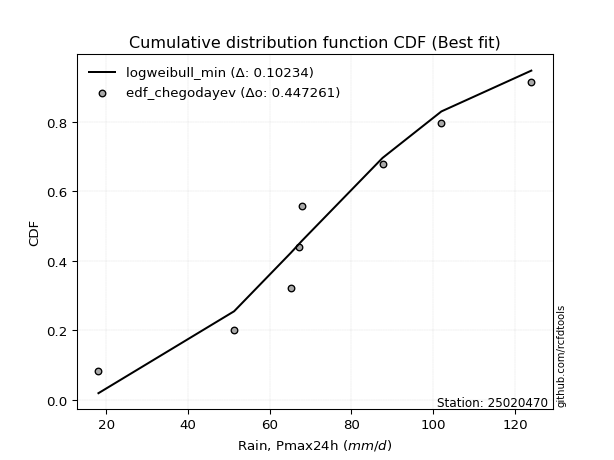</img>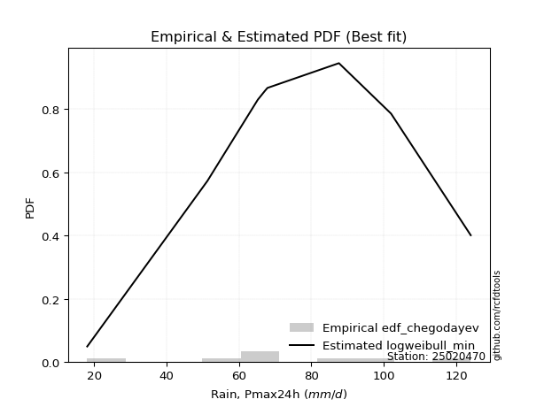</img>

</div>


### 6. Empirical - EDF Blom (1958)

The Blom formula is a specific "plotting position" formula used in hydrology and statistical analysis to estimate the empirical cumulative probability (or non-exceedance probability) of a data series. It is particularly recommended for data that are approximately normally distributed. The constant _a_ is set to 0.375 (or 3/8).

<div align="center">


$P=(m-a)/(n+1-2a)$


</div>


**6.1. Empirical values**

<div align="center">

|                | 0                   | 1                   | 2                   | 3                  | 4        | 5                  | 6                  | 7                  | 8                  |
|:---------------|:--------------------|:--------------------|:--------------------|:-------------------|:---------|:-------------------|:-------------------|:-------------------|:-------------------|
| date           | 2023                | 2025                | 2017                | 2022               | 2019     | 2018               | 2020               | 2024               | 2021               |
| x              | 18.1                | 43.6                | 51.29               | 65.2               | 67.2     | 67.87              | 87.6               | 102.0              | 124.0              |
| m              | 1                   | 2                   | 3                   | 4                  | 5        | 6                  | 7                  | 8                  | 9                  |
| empirical_dist | edf_blom            | edf_blom            | edf_blom            | edf_blom           | edf_blom | edf_blom           | edf_blom           | edf_blom           | edf_blom           |
| empirical      | 0.06756756756756757 | 0.17567567567567569 | 0.28378378378378377 | 0.3918918918918919 | 0.5      | 0.6081081081081081 | 0.7162162162162162 | 0.8243243243243243 | 0.9324324324324325 |
| empirical_tr   | 1.072463768115942   | 1.2131147540983607  | 1.3962264150943395  | 1.6444444444444444 | 2.0      | 2.5517241379310347 | 3.523809523809524  | 5.6923076923076925 | 14.800000000000006 |

</div>


**6.2. Kolmogorov-Smirnov fit test (sorted by Δ)**


<div align="center">

|                | 0                   | 1                   | 2                   | 3                   | 4                   | 5                   | 6                   | 7                   | 8                   | 9                   | 10                  | 11                  | 12                  | 13                  | 14                  | 15                  | 16                  | 17                  | 18                  | 19                  | 20                  | 21                  | 22                  | 23                  | 24                    | 25                  | 26                  | 27                  | 28                  | 29                  | 30                  | 31                  | 32                  | 33                  | 34                  | 35                  | 36                  | 37                  | 38                  | 39                  | 40                  | 41                  | 42                  | 43                  | 44                  | 45                  | 46                  | 47                  | 48                  | 49                  | 50                  | 51                  | 52                  | 53                  | 54                  | 55                  | 56                  | 57                  | 58                  | 59                  | 60                  | 61                  | 62                  | 63                  | 64                  | 65                  | 66                  | 67                  | 68                  | 69                  | 70                  | 71                  | 72                  | 73                  | 74                  | 75                  | 76                  | 77                  | 78                  | 79                  | 80                  | 81                  | 82                  | 83                  | 84                  | 85                  | 86                  | 87                  | 88                  | 89                  |
|:---------------|:--------------------|:--------------------|:--------------------|:--------------------|:--------------------|:--------------------|:--------------------|:--------------------|:--------------------|:--------------------|:--------------------|:--------------------|:--------------------|:--------------------|:--------------------|:--------------------|:--------------------|:--------------------|:--------------------|:--------------------|:--------------------|:--------------------|:--------------------|:--------------------|:----------------------|:--------------------|:--------------------|:--------------------|:--------------------|:--------------------|:--------------------|:--------------------|:--------------------|:--------------------|:--------------------|:--------------------|:--------------------|:--------------------|:--------------------|:--------------------|:--------------------|:--------------------|:--------------------|:--------------------|:--------------------|:--------------------|:--------------------|:--------------------|:--------------------|:--------------------|:--------------------|:--------------------|:--------------------|:--------------------|:--------------------|:--------------------|:--------------------|:--------------------|:--------------------|:--------------------|:--------------------|:--------------------|:--------------------|:--------------------|:--------------------|:--------------------|:--------------------|:--------------------|:--------------------|:--------------------|:--------------------|:--------------------|:--------------------|:--------------------|:--------------------|:--------------------|:--------------------|:--------------------|:--------------------|:--------------------|:--------------------|:--------------------|:--------------------|:--------------------|:--------------------|:--------------------|:--------------------|:--------------------|:--------------------|:--------------------|
| station        | 25020470            | 25020470            | 25020470            | 25020470            | 25020470            | 25020470            | 25020470            | 25020470            | 25020470            | 25020470            | 25020470            | 25020470            | 25020470            | 25020470            | 25020470            | 25020470            | 25020470            | 25020470            | 25020470            | 25020470            | 25020470            | 25020470            | 25020470            | 25020470            | 25020470              | 25020470            | 25020470            | 25020470            | 25020470            | 25020470            | 25020470            | 25020470            | 25020470            | 25020470            | 25020470            | 25020470            | 25020470            | 25020470            | 25020470            | 25020470            | 25020470            | 25020470            | 25020470            | 25020470            | 25020470            | 25020470            | 25020470            | 25020470            | 25020470            | 25020470            | 25020470            | 25020470            | 25020470            | 25020470            | 25020470            | 25020470            | 25020470            | 25020470            | 25020470            | 25020470            | 25020470            | 25020470            | 25020470            | 25020470            | 25020470            | 25020470            | 25020470            | 25020470            | 25020470            | 25020470            | 25020470            | 25020470            | 25020470            | 25020470            | 25020470            | 25020470            | 25020470            | 25020470            | 25020470            | 25020470            | 25020470            | 25020470            | 25020470            | 25020470            | 25020470            | 25020470            | 25020470            | 25020470            | 25020470            | 25020470            |
| empirical_dist | edf_blom            | edf_blom            | edf_blom            | edf_blom            | edf_blom            | edf_blom            | edf_blom            | edf_blom            | edf_blom            | edf_blom            | edf_blom            | edf_blom            | edf_blom            | edf_blom            | edf_blom            | edf_blom            | edf_blom            | edf_blom            | edf_blom            | edf_blom            | edf_blom            | edf_blom            | edf_blom            | edf_blom            | edf_blom              | edf_blom            | edf_blom            | edf_blom            | edf_blom            | edf_blom            | edf_blom            | edf_blom            | edf_blom            | edf_blom            | edf_blom            | edf_blom            | edf_blom            | edf_blom            | edf_blom            | edf_blom            | edf_blom            | edf_blom            | edf_blom            | edf_blom            | edf_blom            | edf_blom            | edf_blom            | edf_blom            | edf_blom            | edf_blom            | edf_blom            | edf_blom            | edf_blom            | edf_blom            | edf_blom            | edf_blom            | edf_blom            | edf_blom            | edf_blom            | edf_blom            | edf_blom            | edf_blom            | edf_blom            | edf_blom            | edf_blom            | edf_blom            | edf_blom            | edf_blom            | edf_blom            | edf_blom            | edf_blom            | edf_blom            | edf_blom            | edf_blom            | edf_blom            | edf_blom            | edf_blom            | edf_blom            | edf_blom            | edf_blom            | edf_blom            | edf_blom            | edf_blom            | edf_blom            | edf_blom            | edf_blom            | edf_blom            | edf_blom            | edf_blom            | edf_blom            |
| p_dist         | invgauss            | loggompertz         | rayleigh            | alpha               | maxwell             | invgamma            | loggumbel_l         | genlogistic         | logfisk             | logpearson3         | logt                | logweibull_min      | fisk                | weibull_min         | betaprime           | ncf                 | rice                | chi2                | erlang              | gamma               | gumbel_r            | johnsonsu           | f                   | logmielke           | loglaplace_asymmetric | loggenlogistic      | laplace_asymmetric  | pearson3            | kstwobign           | logloggamma         | logjohnsonsu        | nct                 | halfnorm            | exponnorm           | t                   | norm                | crystalball         | logistic            | hypsecant           | moyal               | logrice             | lognorm             | lognorm             | logcrystalball      | logexponnorm        | logf                | lognct              | logfatiguelife      | laplace             | halflogistic        | logncf              | loglogistic         | loginvgamma         | logbetaprime        | loggamma            | loggamma            | loghypsecant        | logerlang           | logalpha            | loginvgauss         | loginvweibull       | loglaplace          | logtruncnorm        | logmaxwell          | lograyleigh         | logkstwobign        | gumbel_l            | wald                | mielke              | genexpon            | expon               | loghalfnorm         | loggumbel_r         | loggenexpon         | gibrat              | lognakagami         | logmoyal            | loghalflogistic     | truncnorm           | logwald             | logexpon            | loggibrat           | nakagami            | loglognorm          | logchi2             | pareto              | invweibull          | logpareto           | fatiguelife         | gompertz            |
| delta          | 0.09075883242585264 | 0.09354411927520234 | 0.09525759653745247 | 0.09799225881214735 | 0.09805090246858339 | 0.10008977918048412 | 0.10405539343457482 | 0.10577262128581466 | 0.10609195163580681 | 0.10685302775268202 | 0.10710255470701036 | 0.10757618985903616 | 0.11036301646333824 | 0.11054660966445296 | 0.11133111515800365 | 0.11147136276433234 | 0.11222206842162513 | 0.11264699262142625 | 0.11406832981652193 | 0.11447015870377009 | 0.11485264487235636 | 0.11617794347057303 | 0.11628996980171968 | 0.11663766004012438 | 0.11873439243302086   | 0.11996046686187528 | 0.12064994465220524 | 0.12105935367642967 | 0.12381479771355819 | 0.1239991729719987  | 0.12550750864499216 | 0.1258498646403543  | 0.12917939435999437 | 0.12992400792152087 | 0.13187559110548336 | 0.1318901994384628  | 0.13189020889675795 | 0.13512922951676076 | 0.13788867412996386 | 0.13991856078450926 | 0.14708020611741512 | 0.14708199687468693 | 0.14708199687468693 | 0.14708203516353835 | 0.14708563391625606 | 0.1472912537378952  | 0.14733117888909675 | 0.1476610270519345  | 0.1485557941979575  | 0.1493928690007975  | 0.15181445485267842 | 0.1523616081710496  | 0.1532843584377669  | 0.15343217291096645 | 0.15411333814262873 | 0.15411333814262873 | 0.1568410909369683  | 0.15815041874304303 | 0.16330536012491015 | 0.16568735864293815 | 0.16764637571254848 | 0.17272395162042276 | 0.17567567537954012 | 0.17816927662245385 | 0.1882321008259633  | 0.20158468098266594 | 0.20256404172379816 | 0.2094395231602202  | 0.21160021045878982 | 0.21443495794678472 | 0.2145429029307703  | 0.21658956442717459 | 0.2175324515565722  | 0.21761352965108005 | 0.21936287491681328 | 0.22987821655682694 | 0.24269996660694115 | 0.24347915659345443 | 0.2861026643175446  | 0.3125444176307116  | 0.33513675957577427 | 0.34070552247852537 | 0.35705173634918885 | 0.44815956841813454 | 0.46149352518994347 | 0.46873857744691994 | 0.4735609981292662  | 0.48194886784738866 | 0.6345609363440086  | 0.7879008297539211  |
| deltao         | 0.41761268023100007 | 0.41761268023100007 | 0.41761268023100007 | 0.41761268023100007 | 0.41761268023100007 | 0.41761268023100007 | 0.41761268023100007 | 0.41761268023100007 | 0.41761268023100007 | 0.41761268023100007 | 0.41761268023100007 | 0.41761268023100007 | 0.41761268023100007 | 0.41761268023100007 | 0.41761268023100007 | 0.41761268023100007 | 0.41761268023100007 | 0.41761268023100007 | 0.41761268023100007 | 0.41761268023100007 | 0.41761268023100007 | 0.41761268023100007 | 0.41761268023100007 | 0.41761268023100007 | 0.41761268023100007   | 0.41761268023100007 | 0.41761268023100007 | 0.41761268023100007 | 0.41761268023100007 | 0.41761268023100007 | 0.41761268023100007 | 0.41761268023100007 | 0.41761268023100007 | 0.41761268023100007 | 0.41761268023100007 | 0.41761268023100007 | 0.41761268023100007 | 0.41761268023100007 | 0.41761268023100007 | 0.41761268023100007 | 0.41761268023100007 | 0.41761268023100007 | 0.41761268023100007 | 0.41761268023100007 | 0.41761268023100007 | 0.41761268023100007 | 0.41761268023100007 | 0.41761268023100007 | 0.41761268023100007 | 0.41761268023100007 | 0.41761268023100007 | 0.41761268023100007 | 0.41761268023100007 | 0.41761268023100007 | 0.41761268023100007 | 0.41761268023100007 | 0.41761268023100007 | 0.41761268023100007 | 0.41761268023100007 | 0.41761268023100007 | 0.41761268023100007 | 0.41761268023100007 | 0.41761268023100007 | 0.41761268023100007 | 0.41761268023100007 | 0.41761268023100007 | 0.41761268023100007 | 0.41761268023100007 | 0.41761268023100007 | 0.41761268023100007 | 0.41761268023100007 | 0.41761268023100007 | 0.41761268023100007 | 0.41761268023100007 | 0.41761268023100007 | 0.41761268023100007 | 0.41761268023100007 | 0.41761268023100007 | 0.41761268023100007 | 0.41761268023100007 | 0.41761268023100007 | 0.41761268023100007 | 0.41761268023100007 | 0.41761268023100007 | 0.41761268023100007 | 0.41761268023100007 | 0.41761268023100007 | 0.41761268023100007 | 0.41761268023100007 | 0.41761268023100007 |
| eval           | Δo > Δ              | Δo > Δ              | Δo > Δ              | Δo > Δ              | Δo > Δ              | Δo > Δ              | Δo > Δ              | Δo > Δ              | Δo > Δ              | Δo > Δ              | Δo > Δ              | Δo > Δ              | Δo > Δ              | Δo > Δ              | Δo > Δ              | Δo > Δ              | Δo > Δ              | Δo > Δ              | Δo > Δ              | Δo > Δ              | Δo > Δ              | Δo > Δ              | Δo > Δ              | Δo > Δ              | Δo > Δ                | Δo > Δ              | Δo > Δ              | Δo > Δ              | Δo > Δ              | Δo > Δ              | Δo > Δ              | Δo > Δ              | Δo > Δ              | Δo > Δ              | Δo > Δ              | Δo > Δ              | Δo > Δ              | Δo > Δ              | Δo > Δ              | Δo > Δ              | Δo > Δ              | Δo > Δ              | Δo > Δ              | Δo > Δ              | Δo > Δ              | Δo > Δ              | Δo > Δ              | Δo > Δ              | Δo > Δ              | Δo > Δ              | Δo > Δ              | Δo > Δ              | Δo > Δ              | Δo > Δ              | Δo > Δ              | Δo > Δ              | Δo > Δ              | Δo > Δ              | Δo > Δ              | Δo > Δ              | Δo > Δ              | Δo > Δ              | Δo > Δ              | Δo > Δ              | Δo > Δ              | Δo > Δ              | Δo > Δ              | Δo > Δ              | Δo > Δ              | Δo > Δ              | Δo > Δ              | Δo > Δ              | Δo > Δ              | Δo > Δ              | Δo > Δ              | Δo > Δ              | Δo > Δ              | Δo > Δ              | Δo > Δ              | Δo > Δ              | Δo > Δ              | Δo > Δ              | Δo > Δ              | Δo <= Δ             | Δo <= Δ             | Δo <= Δ             | Δo <= Δ             | Δo <= Δ             | Δo <= Δ             | Δo <= Δ             |
| fit            | 1                   | 1                   | 1                   | 1                   | 1                   | 1                   | 1                   | 1                   | 1                   | 1                   | 1                   | 1                   | 1                   | 1                   | 1                   | 1                   | 1                   | 1                   | 1                   | 1                   | 1                   | 1                   | 1                   | 1                   | 1                     | 1                   | 1                   | 1                   | 1                   | 1                   | 1                   | 1                   | 1                   | 1                   | 1                   | 1                   | 1                   | 1                   | 1                   | 1                   | 1                   | 1                   | 1                   | 1                   | 1                   | 1                   | 1                   | 1                   | 1                   | 1                   | 1                   | 1                   | 1                   | 1                   | 1                   | 1                   | 1                   | 1                   | 1                   | 1                   | 1                   | 1                   | 1                   | 1                   | 1                   | 1                   | 1                   | 1                   | 1                   | 1                   | 1                   | 1                   | 1                   | 1                   | 1                   | 1                   | 1                   | 1                   | 1                   | 1                   | 1                   | 1                   | 1                   | 0                   | 0                   | 0                   | 0                   | 0                   | 0                   | 0                   |
| n              | 9                   | 9                   | 9                   | 9                   | 9                   | 9                   | 9                   | 9                   | 9                   | 9                   | 9                   | 9                   | 9                   | 9                   | 9                   | 9                   | 9                   | 9                   | 9                   | 9                   | 9                   | 9                   | 9                   | 9                   | 9                     | 9                   | 9                   | 9                   | 9                   | 9                   | 9                   | 9                   | 9                   | 9                   | 9                   | 9                   | 9                   | 9                   | 9                   | 9                   | 9                   | 9                   | 9                   | 9                   | 9                   | 9                   | 9                   | 9                   | 9                   | 9                   | 9                   | 9                   | 9                   | 9                   | 9                   | 9                   | 9                   | 9                   | 9                   | 9                   | 9                   | 9                   | 9                   | 9                   | 9                   | 9                   | 9                   | 9                   | 9                   | 9                   | 9                   | 9                   | 9                   | 9                   | 9                   | 9                   | 9                   | 9                   | 9                   | 9                   | 9                   | 9                   | 9                   | 9                   | 9                   | 9                   | 9                   | 9                   | 9                   | 9                   |
| best_fit       | 1                   | 0                   | 0                   | 0                   | 0                   | 0                   | 0                   | 0                   | 0                   | 0                   | 0                   | 0                   | 0                   | 0                   | 0                   | 0                   | 0                   | 0                   | 0                   | 0                   | 0                   | 0                   | 0                   | 0                   | 0                     | 0                   | 0                   | 0                   | 0                   | 0                   | 0                   | 0                   | 0                   | 0                   | 0                   | 0                   | 0                   | 0                   | 0                   | 0                   | 0                   | 0                   | 0                   | 0                   | 0                   | 0                   | 0                   | 0                   | 0                   | 0                   | 0                   | 0                   | 0                   | 0                   | 0                   | 0                   | 0                   | 0                   | 0                   | 0                   | 0                   | 0                   | 0                   | 0                   | 0                   | 0                   | 0                   | 0                   | 0                   | 0                   | 0                   | 0                   | 0                   | 0                   | 0                   | 0                   | 0                   | 0                   | 0                   | 0                   | 0                   | 0                   | 0                   | 0                   | 0                   | 0                   | 0                   | 0                   | 0                   | 0                   |
| best_fit_sort  | 1                   | 2                   | 3                   | 4                   | 5                   | 6                   | 7                   | 8                   | 9                   | 10                  | 11                  | 12                  | 13                  | 14                  | 15                  | 16                  | 17                  | 18                  | 19                  | 20                  | 21                  | 22                  | 23                  | 24                  | 25                    | 26                  | 27                  | 28                  | 29                  | 30                  | 31                  | 32                  | 33                  | 34                  | 35                  | 36                  | 37                  | 38                  | 39                  | 40                  | 41                  | 42                  | 43                  | 44                  | 45                  | 46                  | 47                  | 48                  | 49                  | 50                  | 51                  | 52                  | 53                  | 54                  | 55                  | 56                  | 57                  | 58                  | 59                  | 60                  | 61                  | 62                  | 63                  | 64                  | 65                  | 66                  | 67                  | 68                  | 69                  | 70                  | 71                  | 72                  | 73                  | 74                  | 75                  | 76                  | 77                  | 78                  | 79                  | 80                  | 81                  | 82                  | 83                  | 84                  | 85                  | 86                  | 87                  | 88                  | 89                  | 90                  |

</div>


<div align="center">

</img>

</div>


**6.3. Best fit**

<div align="center">

|   id |   station | empirical_dist   | p_dist   |     delta |   deltao | eval   |   fit |   n |   best_fit |   best_fit_sort |
|-----:|----------:|:-----------------|:---------|----------:|---------:|:-------|------:|----:|-----------:|----------------:|
|    0 |  25020470 | edf_blom         | invgauss | 0.0907588 | 0.417613 | Δo > Δ |     1 |   9 |          1 |               1 |

</div>


<div align="center">

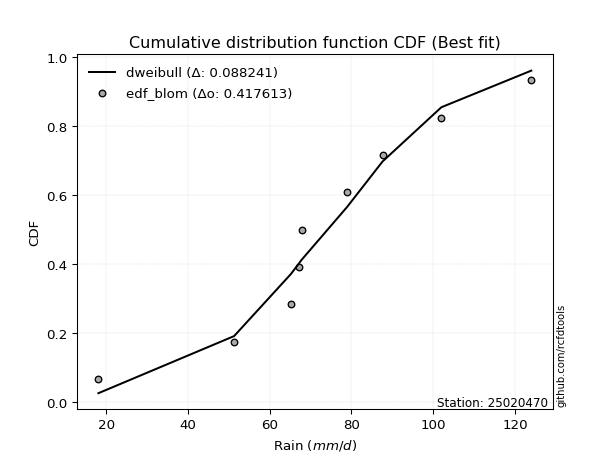</img>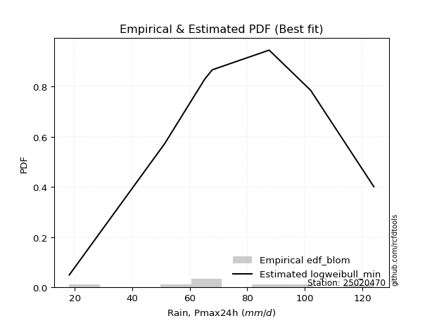</img>

</div>


### 7. Empirical - EDF Tukey (1962)

In hydrology, the Tukey formula is used as a plotting position formula to estimate the empirical probability or frequency of a flood event (or other hydrological data). The formula parameter is given as _c=0.333_ (or 1/3).

<div align="center">


$P=(m-c)/(n+1-2c)$


</div>


**7.1. Empirical values**

<div align="center">

|                | 0                   | 1                   | 2                  | 3                   | 4         | 5                  | 6                  | 7                  | 8                  |
|:---------------|:--------------------|:--------------------|:-------------------|:--------------------|:----------|:-------------------|:-------------------|:-------------------|:-------------------|
| date           | 2023                | 2025                | 2017               | 2022                | 2019      | 2018               | 2020               | 2024               | 2021               |
| x              | 18.1                | 43.6                | 51.29              | 65.2                | 67.2      | 67.87              | 87.6               | 102.0              | 124.0              |
| m              | 1                   | 2                   | 3                  | 4                   | 5         | 6                  | 7                  | 8                  | 9                  |
| empirical_dist | edf_tukey           | edf_tukey           | edf_tukey          | edf_tukey           | edf_tukey | edf_tukey          | edf_tukey          | edf_tukey          | edf_tukey          |
| empirical      | 0.07142857142857142 | 0.17857142857142858 | 0.2857142857142857 | 0.39285714285714285 | 0.5       | 0.6071428571428571 | 0.7142857142857143 | 0.8214285714285714 | 0.9285714285714286 |
| empirical_tr   | 1.0769230769230769  | 1.2173913043478262  | 1.4                | 1.6470588235294117  | 2.0       | 2.545454545454545  | 3.5                | 5.599999999999999  | 14.000000000000007 |

</div>


**7.2. Kolmogorov-Smirnov fit test (sorted by Δ)**


<div align="center">

|                | 0                   | 1                   | 2                   | 3                   | 4                   | 5                   | 6                   | 7                   | 8                   | 9                   | 10                  | 11                  | 12                  | 13                  | 14                  | 15                  | 16                  | 17                  | 18                  | 19                  | 20                  | 21                  | 22                  | 23                  | 24                    | 25                  | 26                  | 27                  | 28                  | 29                  | 30                  | 31                  | 32                  | 33                  | 34                  | 35                  | 36                  | 37                  | 38                  | 39                  | 40                  | 41                  | 42                  | 43                  | 44                  | 45                  | 46                  | 47                  | 48                  | 49                  | 50                  | 51                  | 52                  | 53                  | 54                  | 55                  | 56                  | 57                  | 58                  | 59                  | 60                  | 61                  | 62                  | 63                  | 64                  | 65                  | 66                  | 67                  | 68                  | 69                  | 70                  | 71                  | 72                  | 73                  | 74                  | 75                  | 76                  | 77                  | 78                  | 79                  | 80                  | 81                  | 82                  | 83                  | 84                  | 85                  | 86                  | 87                  | 88                  | 89                  |
|:---------------|:--------------------|:--------------------|:--------------------|:--------------------|:--------------------|:--------------------|:--------------------|:--------------------|:--------------------|:--------------------|:--------------------|:--------------------|:--------------------|:--------------------|:--------------------|:--------------------|:--------------------|:--------------------|:--------------------|:--------------------|:--------------------|:--------------------|:--------------------|:--------------------|:----------------------|:--------------------|:--------------------|:--------------------|:--------------------|:--------------------|:--------------------|:--------------------|:--------------------|:--------------------|:--------------------|:--------------------|:--------------------|:--------------------|:--------------------|:--------------------|:--------------------|:--------------------|:--------------------|:--------------------|:--------------------|:--------------------|:--------------------|:--------------------|:--------------------|:--------------------|:--------------------|:--------------------|:--------------------|:--------------------|:--------------------|:--------------------|:--------------------|:--------------------|:--------------------|:--------------------|:--------------------|:--------------------|:--------------------|:--------------------|:--------------------|:--------------------|:--------------------|:--------------------|:--------------------|:--------------------|:--------------------|:--------------------|:--------------------|:--------------------|:--------------------|:--------------------|:--------------------|:--------------------|:--------------------|:--------------------|:--------------------|:--------------------|:--------------------|:--------------------|:--------------------|:--------------------|:--------------------|:--------------------|:--------------------|:--------------------|
| station        | 25020470            | 25020470            | 25020470            | 25020470            | 25020470            | 25020470            | 25020470            | 25020470            | 25020470            | 25020470            | 25020470            | 25020470            | 25020470            | 25020470            | 25020470            | 25020470            | 25020470            | 25020470            | 25020470            | 25020470            | 25020470            | 25020470            | 25020470            | 25020470            | 25020470              | 25020470            | 25020470            | 25020470            | 25020470            | 25020470            | 25020470            | 25020470            | 25020470            | 25020470            | 25020470            | 25020470            | 25020470            | 25020470            | 25020470            | 25020470            | 25020470            | 25020470            | 25020470            | 25020470            | 25020470            | 25020470            | 25020470            | 25020470            | 25020470            | 25020470            | 25020470            | 25020470            | 25020470            | 25020470            | 25020470            | 25020470            | 25020470            | 25020470            | 25020470            | 25020470            | 25020470            | 25020470            | 25020470            | 25020470            | 25020470            | 25020470            | 25020470            | 25020470            | 25020470            | 25020470            | 25020470            | 25020470            | 25020470            | 25020470            | 25020470            | 25020470            | 25020470            | 25020470            | 25020470            | 25020470            | 25020470            | 25020470            | 25020470            | 25020470            | 25020470            | 25020470            | 25020470            | 25020470            | 25020470            | 25020470            |
| empirical_dist | edf_tukey           | edf_tukey           | edf_tukey           | edf_tukey           | edf_tukey           | edf_tukey           | edf_tukey           | edf_tukey           | edf_tukey           | edf_tukey           | edf_tukey           | edf_tukey           | edf_tukey           | edf_tukey           | edf_tukey           | edf_tukey           | edf_tukey           | edf_tukey           | edf_tukey           | edf_tukey           | edf_tukey           | edf_tukey           | edf_tukey           | edf_tukey           | edf_tukey             | edf_tukey           | edf_tukey           | edf_tukey           | edf_tukey           | edf_tukey           | edf_tukey           | edf_tukey           | edf_tukey           | edf_tukey           | edf_tukey           | edf_tukey           | edf_tukey           | edf_tukey           | edf_tukey           | edf_tukey           | edf_tukey           | edf_tukey           | edf_tukey           | edf_tukey           | edf_tukey           | edf_tukey           | edf_tukey           | edf_tukey           | edf_tukey           | edf_tukey           | edf_tukey           | edf_tukey           | edf_tukey           | edf_tukey           | edf_tukey           | edf_tukey           | edf_tukey           | edf_tukey           | edf_tukey           | edf_tukey           | edf_tukey           | edf_tukey           | edf_tukey           | edf_tukey           | edf_tukey           | edf_tukey           | edf_tukey           | edf_tukey           | edf_tukey           | edf_tukey           | edf_tukey           | edf_tukey           | edf_tukey           | edf_tukey           | edf_tukey           | edf_tukey           | edf_tukey           | edf_tukey           | edf_tukey           | edf_tukey           | edf_tukey           | edf_tukey           | edf_tukey           | edf_tukey           | edf_tukey           | edf_tukey           | edf_tukey           | edf_tukey           | edf_tukey           | edf_tukey           |
| p_dist         | invgauss            | loggompertz         | rayleigh            | alpha               | maxwell             | invgamma            | loggumbel_l         | genlogistic         | logfisk             | logpearson3         | logt                | logweibull_min      | fisk                | weibull_min         | betaprime           | ncf                 | rice                | chi2                | erlang              | gamma               | gumbel_r            | johnsonsu           | f                   | logmielke           | loglaplace_asymmetric | loggenlogistic      | laplace_asymmetric  | pearson3            | kstwobign           | logloggamma         | logjohnsonsu        | nct                 | halfnorm            | exponnorm           | t                   | norm                | crystalball         | logistic            | hypsecant           | moyal               | logrice             | lognorm             | lognorm             | logcrystalball      | logexponnorm        | logf                | lognct              | logfatiguelife      | laplace             | halflogistic        | logncf              | loglogistic         | loginvgamma         | logbetaprime        | loggamma            | loggamma            | loghypsecant        | logerlang           | logalpha            | loginvgauss         | loginvweibull       | loglaplace          | logmaxwell          | logtruncnorm        | lograyleigh         | logkstwobign        | gumbel_l            | wald                | mielke              | genexpon            | expon               | loghalfnorm         | loggumbel_r         | loggenexpon         | gibrat              | lognakagami         | logmoyal            | loghalflogistic     | truncnorm           | logwald             | logexpon            | loggibrat           | nakagami            | loglognorm          | logchi2             | pareto              | invweibull          | logpareto           | fatiguelife         | gompertz            |
| delta          | 0.08979358146060168 | 0.09257886830995138 | 0.09429234557220151 | 0.09702700784689633 | 0.09708565150333237 | 0.0991245282152331  | 0.1030901424693238  | 0.10480737032056364 | 0.10512670067055585 | 0.105887776787431   | 0.10613730374175934 | 0.10661093889378515 | 0.10939776549808722 | 0.10958135869920194 | 0.11036586419275263 | 0.11050611179908132 | 0.11125681745637411 | 0.11168174165617523 | 0.11310307885127091 | 0.11350490773851907 | 0.1138873939071054  | 0.11521269250532201 | 0.11532471883646866 | 0.11567240907487336 | 0.1177691414677699    | 0.11899521589662426 | 0.11968469368695422 | 0.12009410271117865 | 0.12284954674830723 | 0.12303392200674768 | 0.12454225767974114 | 0.12488461367510328 | 0.1282141433947434  | 0.12895875695626985 | 0.13091034014023234 | 0.1309249484732118  | 0.13092495793150694 | 0.13416397855150974 | 0.13692342316471284 | 0.1389533098192583  | 0.14611495515216416 | 0.14611674590943596 | 0.14611674590943596 | 0.14611678419828739 | 0.1461203829510051  | 0.14632600277264424 | 0.14636592792384578 | 0.14669577608668355 | 0.14759054323270648 | 0.14842761803554655 | 0.15084920388742745 | 0.15139635720579864 | 0.15231910747251592 | 0.15246692194571548 | 0.15314808717737777 | 0.15314808717737777 | 0.15587583997171733 | 0.15718516777779207 | 0.16234010915965918 | 0.1647221076776872  | 0.16668112474729752 | 0.1717587006551718  | 0.1772040256572029  | 0.17857142827529301 | 0.18726684986071235 | 0.20012280157424317 | 0.20159879075854714 | 0.20847427219496922 | 0.20870445756303693 | 0.21153920505103183 | 0.2116471500350174  | 0.21562431346192362 | 0.21656720059132123 | 0.2166482786858291  | 0.21839762395156231 | 0.22891296559157598 | 0.2417347156416902  | 0.24251390562820346 | 0.2851374133522936  | 0.31157916666546065 | 0.3322410066800213  | 0.3397402715132744  | 0.3560864853839379  | 0.4452638155223816  | 0.4585977722941905  | 0.465842824551167   | 0.46969999426826237 | 0.4790531149516357  | 0.6316651834482556  | 0.7850050768581681  |
| deltao         | 0.41761268023100007 | 0.41761268023100007 | 0.41761268023100007 | 0.41761268023100007 | 0.41761268023100007 | 0.41761268023100007 | 0.41761268023100007 | 0.41761268023100007 | 0.41761268023100007 | 0.41761268023100007 | 0.41761268023100007 | 0.41761268023100007 | 0.41761268023100007 | 0.41761268023100007 | 0.41761268023100007 | 0.41761268023100007 | 0.41761268023100007 | 0.41761268023100007 | 0.41761268023100007 | 0.41761268023100007 | 0.41761268023100007 | 0.41761268023100007 | 0.41761268023100007 | 0.41761268023100007 | 0.41761268023100007   | 0.41761268023100007 | 0.41761268023100007 | 0.41761268023100007 | 0.41761268023100007 | 0.41761268023100007 | 0.41761268023100007 | 0.41761268023100007 | 0.41761268023100007 | 0.41761268023100007 | 0.41761268023100007 | 0.41761268023100007 | 0.41761268023100007 | 0.41761268023100007 | 0.41761268023100007 | 0.41761268023100007 | 0.41761268023100007 | 0.41761268023100007 | 0.41761268023100007 | 0.41761268023100007 | 0.41761268023100007 | 0.41761268023100007 | 0.41761268023100007 | 0.41761268023100007 | 0.41761268023100007 | 0.41761268023100007 | 0.41761268023100007 | 0.41761268023100007 | 0.41761268023100007 | 0.41761268023100007 | 0.41761268023100007 | 0.41761268023100007 | 0.41761268023100007 | 0.41761268023100007 | 0.41761268023100007 | 0.41761268023100007 | 0.41761268023100007 | 0.41761268023100007 | 0.41761268023100007 | 0.41761268023100007 | 0.41761268023100007 | 0.41761268023100007 | 0.41761268023100007 | 0.41761268023100007 | 0.41761268023100007 | 0.41761268023100007 | 0.41761268023100007 | 0.41761268023100007 | 0.41761268023100007 | 0.41761268023100007 | 0.41761268023100007 | 0.41761268023100007 | 0.41761268023100007 | 0.41761268023100007 | 0.41761268023100007 | 0.41761268023100007 | 0.41761268023100007 | 0.41761268023100007 | 0.41761268023100007 | 0.41761268023100007 | 0.41761268023100007 | 0.41761268023100007 | 0.41761268023100007 | 0.41761268023100007 | 0.41761268023100007 | 0.41761268023100007 |
| eval           | Δo > Δ              | Δo > Δ              | Δo > Δ              | Δo > Δ              | Δo > Δ              | Δo > Δ              | Δo > Δ              | Δo > Δ              | Δo > Δ              | Δo > Δ              | Δo > Δ              | Δo > Δ              | Δo > Δ              | Δo > Δ              | Δo > Δ              | Δo > Δ              | Δo > Δ              | Δo > Δ              | Δo > Δ              | Δo > Δ              | Δo > Δ              | Δo > Δ              | Δo > Δ              | Δo > Δ              | Δo > Δ                | Δo > Δ              | Δo > Δ              | Δo > Δ              | Δo > Δ              | Δo > Δ              | Δo > Δ              | Δo > Δ              | Δo > Δ              | Δo > Δ              | Δo > Δ              | Δo > Δ              | Δo > Δ              | Δo > Δ              | Δo > Δ              | Δo > Δ              | Δo > Δ              | Δo > Δ              | Δo > Δ              | Δo > Δ              | Δo > Δ              | Δo > Δ              | Δo > Δ              | Δo > Δ              | Δo > Δ              | Δo > Δ              | Δo > Δ              | Δo > Δ              | Δo > Δ              | Δo > Δ              | Δo > Δ              | Δo > Δ              | Δo > Δ              | Δo > Δ              | Δo > Δ              | Δo > Δ              | Δo > Δ              | Δo > Δ              | Δo > Δ              | Δo > Δ              | Δo > Δ              | Δo > Δ              | Δo > Δ              | Δo > Δ              | Δo > Δ              | Δo > Δ              | Δo > Δ              | Δo > Δ              | Δo > Δ              | Δo > Δ              | Δo > Δ              | Δo > Δ              | Δo > Δ              | Δo > Δ              | Δo > Δ              | Δo > Δ              | Δo > Δ              | Δo > Δ              | Δo > Δ              | Δo <= Δ             | Δo <= Δ             | Δo <= Δ             | Δo <= Δ             | Δo <= Δ             | Δo <= Δ             | Δo <= Δ             |
| fit            | 1                   | 1                   | 1                   | 1                   | 1                   | 1                   | 1                   | 1                   | 1                   | 1                   | 1                   | 1                   | 1                   | 1                   | 1                   | 1                   | 1                   | 1                   | 1                   | 1                   | 1                   | 1                   | 1                   | 1                   | 1                     | 1                   | 1                   | 1                   | 1                   | 1                   | 1                   | 1                   | 1                   | 1                   | 1                   | 1                   | 1                   | 1                   | 1                   | 1                   | 1                   | 1                   | 1                   | 1                   | 1                   | 1                   | 1                   | 1                   | 1                   | 1                   | 1                   | 1                   | 1                   | 1                   | 1                   | 1                   | 1                   | 1                   | 1                   | 1                   | 1                   | 1                   | 1                   | 1                   | 1                   | 1                   | 1                   | 1                   | 1                   | 1                   | 1                   | 1                   | 1                   | 1                   | 1                   | 1                   | 1                   | 1                   | 1                   | 1                   | 1                   | 1                   | 1                   | 0                   | 0                   | 0                   | 0                   | 0                   | 0                   | 0                   |
| n              | 9                   | 9                   | 9                   | 9                   | 9                   | 9                   | 9                   | 9                   | 9                   | 9                   | 9                   | 9                   | 9                   | 9                   | 9                   | 9                   | 9                   | 9                   | 9                   | 9                   | 9                   | 9                   | 9                   | 9                   | 9                     | 9                   | 9                   | 9                   | 9                   | 9                   | 9                   | 9                   | 9                   | 9                   | 9                   | 9                   | 9                   | 9                   | 9                   | 9                   | 9                   | 9                   | 9                   | 9                   | 9                   | 9                   | 9                   | 9                   | 9                   | 9                   | 9                   | 9                   | 9                   | 9                   | 9                   | 9                   | 9                   | 9                   | 9                   | 9                   | 9                   | 9                   | 9                   | 9                   | 9                   | 9                   | 9                   | 9                   | 9                   | 9                   | 9                   | 9                   | 9                   | 9                   | 9                   | 9                   | 9                   | 9                   | 9                   | 9                   | 9                   | 9                   | 9                   | 9                   | 9                   | 9                   | 9                   | 9                   | 9                   | 9                   |
| best_fit       | 1                   | 0                   | 0                   | 0                   | 0                   | 0                   | 0                   | 0                   | 0                   | 0                   | 0                   | 0                   | 0                   | 0                   | 0                   | 0                   | 0                   | 0                   | 0                   | 0                   | 0                   | 0                   | 0                   | 0                   | 0                     | 0                   | 0                   | 0                   | 0                   | 0                   | 0                   | 0                   | 0                   | 0                   | 0                   | 0                   | 0                   | 0                   | 0                   | 0                   | 0                   | 0                   | 0                   | 0                   | 0                   | 0                   | 0                   | 0                   | 0                   | 0                   | 0                   | 0                   | 0                   | 0                   | 0                   | 0                   | 0                   | 0                   | 0                   | 0                   | 0                   | 0                   | 0                   | 0                   | 0                   | 0                   | 0                   | 0                   | 0                   | 0                   | 0                   | 0                   | 0                   | 0                   | 0                   | 0                   | 0                   | 0                   | 0                   | 0                   | 0                   | 0                   | 0                   | 0                   | 0                   | 0                   | 0                   | 0                   | 0                   | 0                   |
| best_fit_sort  | 1                   | 2                   | 3                   | 4                   | 5                   | 6                   | 7                   | 8                   | 9                   | 10                  | 11                  | 12                  | 13                  | 14                  | 15                  | 16                  | 17                  | 18                  | 19                  | 20                  | 21                  | 22                  | 23                  | 24                  | 25                    | 26                  | 27                  | 28                  | 29                  | 30                  | 31                  | 32                  | 33                  | 34                  | 35                  | 36                  | 37                  | 38                  | 39                  | 40                  | 41                  | 42                  | 43                  | 44                  | 45                  | 46                  | 47                  | 48                  | 49                  | 50                  | 51                  | 52                  | 53                  | 54                  | 55                  | 56                  | 57                  | 58                  | 59                  | 60                  | 61                  | 62                  | 63                  | 64                  | 65                  | 66                  | 67                  | 68                  | 69                  | 70                  | 71                  | 72                  | 73                  | 74                  | 75                  | 76                  | 77                  | 78                  | 79                  | 80                  | 81                  | 82                  | 83                  | 84                  | 85                  | 86                  | 87                  | 88                  | 89                  | 90                  |

</div>


<div align="center">

</img>

</div>


**7.3. Best fit**

<div align="center">

|   id |   station | empirical_dist   | p_dist   |     delta |   deltao | eval   |   fit |   n |   best_fit |   best_fit_sort |
|-----:|----------:|:-----------------|:---------|----------:|---------:|:-------|------:|----:|-----------:|----------------:|
|    0 |  25020470 | edf_tukey        | invgauss | 0.0897936 | 0.417613 | Δo > Δ |     1 |   9 |          1 |               1 |

</div>


<div align="center">

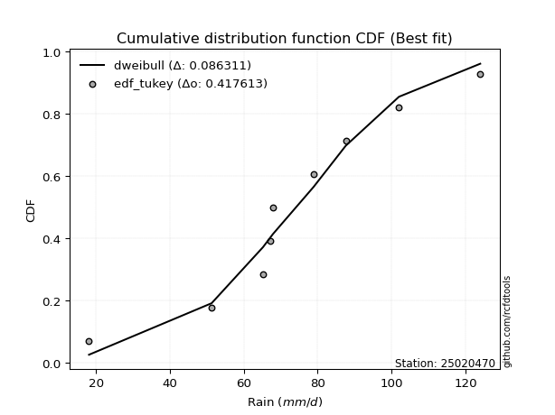</img></img>

</div>


### 8. Empirical - EDF Gringorten (1963)

Gringorten plotting position formula is essential for estimating the probability and return periods of extreme events like floods and heavy rainfall. The constant _a=0.44_.

<div align="center">


$P=(m-a)/(n+1-2a)$


</div>


**8.1. Empirical values**

<div align="center">

|                | 0                    | 1                  | 2                   | 3                  | 4              | 5                  | 6                  | 7                  | 8                  |
|:---------------|:---------------------|:-------------------|:--------------------|:-------------------|:---------------|:-------------------|:-------------------|:-------------------|:-------------------|
| date           | 2023                 | 2025               | 2017                | 2022               | 2019           | 2018               | 2020               | 2024               | 2021               |
| x              | 18.1                 | 43.6               | 51.29               | 65.2               | 67.2           | 67.87              | 87.6               | 102.0              | 124.0              |
| m              | 1                    | 2                  | 3                   | 4                  | 5              | 6                  | 7                  | 8                  | 9                  |
| empirical_dist | edf_gringorten       | edf_gringorten     | edf_gringorten      | edf_gringorten     | edf_gringorten | edf_gringorten     | edf_gringorten     | edf_gringorten     | edf_gringorten     |
| empirical      | 0.061403508771929835 | 0.1710526315789474 | 0.28070175438596495 | 0.3903508771929825 | 0.5            | 0.6096491228070176 | 0.7192982456140351 | 0.8289473684210527 | 0.9385964912280703 |
| empirical_tr   | 1.0654205607476634   | 1.2063492063492063 | 1.3902439024390243  | 1.6402877697841727 | 2.0            | 2.561797752808989  | 3.5625             | 5.846153846153847  | 16.285714285714324 |

</div>


**8.2. Kolmogorov-Smirnov fit test (sorted by Δ)**


<div align="center">

|                | 0                   | 1                   | 2                   | 3                   | 4                   | 5                   | 6                   | 7                   | 8                   | 9                   | 10                  | 11                  | 12                  | 13                  | 14                  | 15                  | 16                  | 17                  | 18                  | 19                  | 20                  | 21                  | 22                  | 23                  | 24                    | 25                  | 26                  | 27                  | 28                  | 29                  | 30                  | 31                  | 32                  | 33                  | 34                  | 35                  | 36                  | 37                  | 38                  | 39                  | 40                  | 41                  | 42                  | 43                  | 44                  | 45                  | 46                  | 47                  | 48                  | 49                  | 50                  | 51                  | 52                  | 53                  | 54                  | 55                  | 56                  | 57                  | 58                  | 59                  | 60                  | 61                  | 62                  | 63                  | 64                  | 65                  | 66                  | 67                  | 68                  | 69                  | 70                  | 71                  | 72                  | 73                  | 74                  | 75                  | 76                  | 77                  | 78                  | 79                  | 80                  | 81                  | 82                  | 83                  | 84                  | 85                  | 86                  | 87                  | 88                  | 89                  |
|:---------------|:--------------------|:--------------------|:--------------------|:--------------------|:--------------------|:--------------------|:--------------------|:--------------------|:--------------------|:--------------------|:--------------------|:--------------------|:--------------------|:--------------------|:--------------------|:--------------------|:--------------------|:--------------------|:--------------------|:--------------------|:--------------------|:--------------------|:--------------------|:--------------------|:----------------------|:--------------------|:--------------------|:--------------------|:--------------------|:--------------------|:--------------------|:--------------------|:--------------------|:--------------------|:--------------------|:--------------------|:--------------------|:--------------------|:--------------------|:--------------------|:--------------------|:--------------------|:--------------------|:--------------------|:--------------------|:--------------------|:--------------------|:--------------------|:--------------------|:--------------------|:--------------------|:--------------------|:--------------------|:--------------------|:--------------------|:--------------------|:--------------------|:--------------------|:--------------------|:--------------------|:--------------------|:--------------------|:--------------------|:--------------------|:--------------------|:--------------------|:--------------------|:--------------------|:--------------------|:--------------------|:--------------------|:--------------------|:--------------------|:--------------------|:--------------------|:--------------------|:--------------------|:--------------------|:--------------------|:--------------------|:--------------------|:--------------------|:--------------------|:--------------------|:--------------------|:--------------------|:--------------------|:--------------------|:--------------------|:--------------------|
| station        | 25020470            | 25020470            | 25020470            | 25020470            | 25020470            | 25020470            | 25020470            | 25020470            | 25020470            | 25020470            | 25020470            | 25020470            | 25020470            | 25020470            | 25020470            | 25020470            | 25020470            | 25020470            | 25020470            | 25020470            | 25020470            | 25020470            | 25020470            | 25020470            | 25020470              | 25020470            | 25020470            | 25020470            | 25020470            | 25020470            | 25020470            | 25020470            | 25020470            | 25020470            | 25020470            | 25020470            | 25020470            | 25020470            | 25020470            | 25020470            | 25020470            | 25020470            | 25020470            | 25020470            | 25020470            | 25020470            | 25020470            | 25020470            | 25020470            | 25020470            | 25020470            | 25020470            | 25020470            | 25020470            | 25020470            | 25020470            | 25020470            | 25020470            | 25020470            | 25020470            | 25020470            | 25020470            | 25020470            | 25020470            | 25020470            | 25020470            | 25020470            | 25020470            | 25020470            | 25020470            | 25020470            | 25020470            | 25020470            | 25020470            | 25020470            | 25020470            | 25020470            | 25020470            | 25020470            | 25020470            | 25020470            | 25020470            | 25020470            | 25020470            | 25020470            | 25020470            | 25020470            | 25020470            | 25020470            | 25020470            |
| empirical_dist | edf_gringorten      | edf_gringorten      | edf_gringorten      | edf_gringorten      | edf_gringorten      | edf_gringorten      | edf_gringorten      | edf_gringorten      | edf_gringorten      | edf_gringorten      | edf_gringorten      | edf_gringorten      | edf_gringorten      | edf_gringorten      | edf_gringorten      | edf_gringorten      | edf_gringorten      | edf_gringorten      | edf_gringorten      | edf_gringorten      | edf_gringorten      | edf_gringorten      | edf_gringorten      | edf_gringorten      | edf_gringorten        | edf_gringorten      | edf_gringorten      | edf_gringorten      | edf_gringorten      | edf_gringorten      | edf_gringorten      | edf_gringorten      | edf_gringorten      | edf_gringorten      | edf_gringorten      | edf_gringorten      | edf_gringorten      | edf_gringorten      | edf_gringorten      | edf_gringorten      | edf_gringorten      | edf_gringorten      | edf_gringorten      | edf_gringorten      | edf_gringorten      | edf_gringorten      | edf_gringorten      | edf_gringorten      | edf_gringorten      | edf_gringorten      | edf_gringorten      | edf_gringorten      | edf_gringorten      | edf_gringorten      | edf_gringorten      | edf_gringorten      | edf_gringorten      | edf_gringorten      | edf_gringorten      | edf_gringorten      | edf_gringorten      | edf_gringorten      | edf_gringorten      | edf_gringorten      | edf_gringorten      | edf_gringorten      | edf_gringorten      | edf_gringorten      | edf_gringorten      | edf_gringorten      | edf_gringorten      | edf_gringorten      | edf_gringorten      | edf_gringorten      | edf_gringorten      | edf_gringorten      | edf_gringorten      | edf_gringorten      | edf_gringorten      | edf_gringorten      | edf_gringorten      | edf_gringorten      | edf_gringorten      | edf_gringorten      | edf_gringorten      | edf_gringorten      | edf_gringorten      | edf_gringorten      | edf_gringorten      | edf_gringorten      |
| p_dist         | invgauss            | loggompertz         | rayleigh            | alpha               | maxwell             | invgamma            | loggumbel_l         | genlogistic         | logfisk             | logpearson3         | logt                | logweibull_min      | fisk                | weibull_min         | betaprime           | ncf                 | rice                | chi2                | erlang              | gamma               | gumbel_r            | johnsonsu           | f                   | logmielke           | loglaplace_asymmetric | loggenlogistic      | laplace_asymmetric  | pearson3            | kstwobign           | logloggamma         | logjohnsonsu        | nct                 | halfnorm            | exponnorm           | t                   | norm                | crystalball         | logistic            | hypsecant           | moyal               | logrice             | lognorm             | lognorm             | logcrystalball      | logexponnorm        | logf                | lognct              | logfatiguelife      | laplace             | halflogistic        | logncf              | loglogistic         | loginvgamma         | logbetaprime        | loggamma            | loggamma            | loghypsecant        | logerlang           | logalpha            | loginvgauss         | loginvweibull       | logtruncnorm        | loglaplace          | logmaxwell          | lograyleigh         | gumbel_l            | logkstwobign        | wald                | mielke              | loghalfnorm         | genexpon            | loggumbel_r         | expon               | loggenexpon         | gibrat              | lognakagami         | logmoyal            | loghalflogistic     | truncnorm           | logwald             | logexpon            | loggibrat           | nakagami            | loglognorm          | logchi2             | pareto              | invweibull          | logpareto           | fatiguelife         | gompertz            |
| delta          | 0.09229984712476202 | 0.09508513397411172 | 0.09679861123636185 | 0.09953327351105679 | 0.09959191716749283 | 0.10163079387939356 | 0.10559640813348425 | 0.1073136359847241  | 0.1076329663347162  | 0.10839404245159145 | 0.1086435694059198  | 0.1091172045579456  | 0.11190403116224767 | 0.11208762436336239 | 0.11287212985691308 | 0.11301237746324178 | 0.11376308312053457 | 0.11418800732033568 | 0.11560934451543137 | 0.11601117340267952 | 0.11639365957126574 | 0.11771895816948247 | 0.11783098450062912 | 0.11817867473903382 | 0.12027540713193025   | 0.12150148156078472 | 0.12219095935111468 | 0.12260036837533911 | 0.12535581241246757 | 0.12554018767090813 | 0.1270485233439016  | 0.12739087933926374 | 0.13072040905890375 | 0.1314650226204303  | 0.1334166058043928  | 0.13343121413737224 | 0.1334312235956674  | 0.1366702442156702  | 0.1394296888288733  | 0.14145957548341864 | 0.1486212208163245  | 0.1486230115735963  | 0.1486230115735963  | 0.14862304986244773 | 0.14862664861516545 | 0.14883226843680458 | 0.14887219358800613 | 0.1492020417508439  | 0.15009680889686694 | 0.1509338836997069  | 0.1533554695515878  | 0.15390262286995898 | 0.15482537313667627 | 0.15497318760987583 | 0.1556543528415381  | 0.1556543528415381  | 0.15838210563587768 | 0.1596914334419524  | 0.16484637482381953 | 0.16722837334184754 | 0.16918739041145786 | 0.17257356040344157 | 0.17426496631933214 | 0.17971029132136324 | 0.1897731155248727  | 0.2041050564227076  | 0.20620772507939422 | 0.21098053785912957 | 0.2162232545555181  | 0.21813057912608397 | 0.219058002043513   | 0.21907346625548157 | 0.2191659470274986  | 0.22064719612101286 | 0.22090388961572266 | 0.23141923125573632 | 0.24424098130585054 | 0.2450201712923638  | 0.28764367901645405 | 0.314085432329621   | 0.3397598036725025  | 0.34224653717743475 | 0.35859275104809823 | 0.4527826125148628  | 0.4661165692866717  | 0.4733616215436482  | 0.4797250569249041  | 0.4865719119441169  | 0.6391839804407369  | 0.7925238738506494  |
| deltao         | 0.41761268023100007 | 0.41761268023100007 | 0.41761268023100007 | 0.41761268023100007 | 0.41761268023100007 | 0.41761268023100007 | 0.41761268023100007 | 0.41761268023100007 | 0.41761268023100007 | 0.41761268023100007 | 0.41761268023100007 | 0.41761268023100007 | 0.41761268023100007 | 0.41761268023100007 | 0.41761268023100007 | 0.41761268023100007 | 0.41761268023100007 | 0.41761268023100007 | 0.41761268023100007 | 0.41761268023100007 | 0.41761268023100007 | 0.41761268023100007 | 0.41761268023100007 | 0.41761268023100007 | 0.41761268023100007   | 0.41761268023100007 | 0.41761268023100007 | 0.41761268023100007 | 0.41761268023100007 | 0.41761268023100007 | 0.41761268023100007 | 0.41761268023100007 | 0.41761268023100007 | 0.41761268023100007 | 0.41761268023100007 | 0.41761268023100007 | 0.41761268023100007 | 0.41761268023100007 | 0.41761268023100007 | 0.41761268023100007 | 0.41761268023100007 | 0.41761268023100007 | 0.41761268023100007 | 0.41761268023100007 | 0.41761268023100007 | 0.41761268023100007 | 0.41761268023100007 | 0.41761268023100007 | 0.41761268023100007 | 0.41761268023100007 | 0.41761268023100007 | 0.41761268023100007 | 0.41761268023100007 | 0.41761268023100007 | 0.41761268023100007 | 0.41761268023100007 | 0.41761268023100007 | 0.41761268023100007 | 0.41761268023100007 | 0.41761268023100007 | 0.41761268023100007 | 0.41761268023100007 | 0.41761268023100007 | 0.41761268023100007 | 0.41761268023100007 | 0.41761268023100007 | 0.41761268023100007 | 0.41761268023100007 | 0.41761268023100007 | 0.41761268023100007 | 0.41761268023100007 | 0.41761268023100007 | 0.41761268023100007 | 0.41761268023100007 | 0.41761268023100007 | 0.41761268023100007 | 0.41761268023100007 | 0.41761268023100007 | 0.41761268023100007 | 0.41761268023100007 | 0.41761268023100007 | 0.41761268023100007 | 0.41761268023100007 | 0.41761268023100007 | 0.41761268023100007 | 0.41761268023100007 | 0.41761268023100007 | 0.41761268023100007 | 0.41761268023100007 | 0.41761268023100007 |
| eval           | Δo > Δ              | Δo > Δ              | Δo > Δ              | Δo > Δ              | Δo > Δ              | Δo > Δ              | Δo > Δ              | Δo > Δ              | Δo > Δ              | Δo > Δ              | Δo > Δ              | Δo > Δ              | Δo > Δ              | Δo > Δ              | Δo > Δ              | Δo > Δ              | Δo > Δ              | Δo > Δ              | Δo > Δ              | Δo > Δ              | Δo > Δ              | Δo > Δ              | Δo > Δ              | Δo > Δ              | Δo > Δ                | Δo > Δ              | Δo > Δ              | Δo > Δ              | Δo > Δ              | Δo > Δ              | Δo > Δ              | Δo > Δ              | Δo > Δ              | Δo > Δ              | Δo > Δ              | Δo > Δ              | Δo > Δ              | Δo > Δ              | Δo > Δ              | Δo > Δ              | Δo > Δ              | Δo > Δ              | Δo > Δ              | Δo > Δ              | Δo > Δ              | Δo > Δ              | Δo > Δ              | Δo > Δ              | Δo > Δ              | Δo > Δ              | Δo > Δ              | Δo > Δ              | Δo > Δ              | Δo > Δ              | Δo > Δ              | Δo > Δ              | Δo > Δ              | Δo > Δ              | Δo > Δ              | Δo > Δ              | Δo > Δ              | Δo > Δ              | Δo > Δ              | Δo > Δ              | Δo > Δ              | Δo > Δ              | Δo > Δ              | Δo > Δ              | Δo > Δ              | Δo > Δ              | Δo > Δ              | Δo > Δ              | Δo > Δ              | Δo > Δ              | Δo > Δ              | Δo > Δ              | Δo > Δ              | Δo > Δ              | Δo > Δ              | Δo > Δ              | Δo > Δ              | Δo > Δ              | Δo > Δ              | Δo <= Δ             | Δo <= Δ             | Δo <= Δ             | Δo <= Δ             | Δo <= Δ             | Δo <= Δ             | Δo <= Δ             |
| fit            | 1                   | 1                   | 1                   | 1                   | 1                   | 1                   | 1                   | 1                   | 1                   | 1                   | 1                   | 1                   | 1                   | 1                   | 1                   | 1                   | 1                   | 1                   | 1                   | 1                   | 1                   | 1                   | 1                   | 1                   | 1                     | 1                   | 1                   | 1                   | 1                   | 1                   | 1                   | 1                   | 1                   | 1                   | 1                   | 1                   | 1                   | 1                   | 1                   | 1                   | 1                   | 1                   | 1                   | 1                   | 1                   | 1                   | 1                   | 1                   | 1                   | 1                   | 1                   | 1                   | 1                   | 1                   | 1                   | 1                   | 1                   | 1                   | 1                   | 1                   | 1                   | 1                   | 1                   | 1                   | 1                   | 1                   | 1                   | 1                   | 1                   | 1                   | 1                   | 1                   | 1                   | 1                   | 1                   | 1                   | 1                   | 1                   | 1                   | 1                   | 1                   | 1                   | 1                   | 0                   | 0                   | 0                   | 0                   | 0                   | 0                   | 0                   |
| n              | 9                   | 9                   | 9                   | 9                   | 9                   | 9                   | 9                   | 9                   | 9                   | 9                   | 9                   | 9                   | 9                   | 9                   | 9                   | 9                   | 9                   | 9                   | 9                   | 9                   | 9                   | 9                   | 9                   | 9                   | 9                     | 9                   | 9                   | 9                   | 9                   | 9                   | 9                   | 9                   | 9                   | 9                   | 9                   | 9                   | 9                   | 9                   | 9                   | 9                   | 9                   | 9                   | 9                   | 9                   | 9                   | 9                   | 9                   | 9                   | 9                   | 9                   | 9                   | 9                   | 9                   | 9                   | 9                   | 9                   | 9                   | 9                   | 9                   | 9                   | 9                   | 9                   | 9                   | 9                   | 9                   | 9                   | 9                   | 9                   | 9                   | 9                   | 9                   | 9                   | 9                   | 9                   | 9                   | 9                   | 9                   | 9                   | 9                   | 9                   | 9                   | 9                   | 9                   | 9                   | 9                   | 9                   | 9                   | 9                   | 9                   | 9                   |
| best_fit       | 1                   | 0                   | 0                   | 0                   | 0                   | 0                   | 0                   | 0                   | 0                   | 0                   | 0                   | 0                   | 0                   | 0                   | 0                   | 0                   | 0                   | 0                   | 0                   | 0                   | 0                   | 0                   | 0                   | 0                   | 0                     | 0                   | 0                   | 0                   | 0                   | 0                   | 0                   | 0                   | 0                   | 0                   | 0                   | 0                   | 0                   | 0                   | 0                   | 0                   | 0                   | 0                   | 0                   | 0                   | 0                   | 0                   | 0                   | 0                   | 0                   | 0                   | 0                   | 0                   | 0                   | 0                   | 0                   | 0                   | 0                   | 0                   | 0                   | 0                   | 0                   | 0                   | 0                   | 0                   | 0                   | 0                   | 0                   | 0                   | 0                   | 0                   | 0                   | 0                   | 0                   | 0                   | 0                   | 0                   | 0                   | 0                   | 0                   | 0                   | 0                   | 0                   | 0                   | 0                   | 0                   | 0                   | 0                   | 0                   | 0                   | 0                   |
| best_fit_sort  | 1                   | 2                   | 3                   | 4                   | 5                   | 6                   | 7                   | 8                   | 9                   | 10                  | 11                  | 12                  | 13                  | 14                  | 15                  | 16                  | 17                  | 18                  | 19                  | 20                  | 21                  | 22                  | 23                  | 24                  | 25                    | 26                  | 27                  | 28                  | 29                  | 30                  | 31                  | 32                  | 33                  | 34                  | 35                  | 36                  | 37                  | 38                  | 39                  | 40                  | 41                  | 42                  | 43                  | 44                  | 45                  | 46                  | 47                  | 48                  | 49                  | 50                  | 51                  | 52                  | 53                  | 54                  | 55                  | 56                  | 57                  | 58                  | 59                  | 60                  | 61                  | 62                  | 63                  | 64                  | 65                  | 66                  | 67                  | 68                  | 69                  | 70                  | 71                  | 72                  | 73                  | 74                  | 75                  | 76                  | 77                  | 78                  | 79                  | 80                  | 81                  | 82                  | 83                  | 84                  | 85                  | 86                  | 87                  | 88                  | 89                  | 90                  |

</div>


<div align="center">

</img>

</div>


**8.3. Best fit**

<div align="center">

|   id |   station | empirical_dist   | p_dist   |     delta |   deltao | eval   |   fit |   n |   best_fit |   best_fit_sort |
|-----:|----------:|:-----------------|:---------|----------:|---------:|:-------|------:|----:|-----------:|----------------:|
|    0 |  25020470 | edf_gringorten   | invgauss | 0.0922998 | 0.417613 | Δo > Δ |     1 |   9 |          1 |               1 |

</div>


<div align="center">

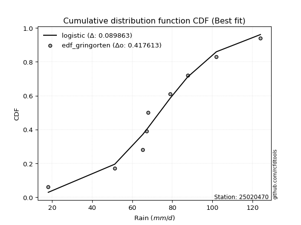</img>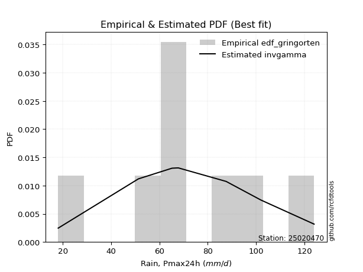</img>

</div>


### 9. Empirical - EDF Filliben (1975)

The specific values of the constants (0.3175) (often denoted as $alpha$) and (0.365) are derived from a method proposed by James J. Filliben in a 1975 paper. This particular formula is the mean value of the $i$-th order statistic of the normal distribution and is considered a robust and effective plotting position formula for the normal probability plot correlation coefficient test for normality.

<div align="center">


$P=(m-0.3175)/(n+0.365)$


</div>


**9.1. Empirical values**

<div align="center">

|                | 0                   | 1                  | 2                   | 3                   | 4            | 5                  | 6                  | 7                  | 8                  |
|:---------------|:--------------------|:-------------------|:--------------------|:--------------------|:-------------|:-------------------|:-------------------|:-------------------|:-------------------|
| date           | 2023                | 2025               | 2017                | 2022                | 2019         | 2018               | 2020               | 2024               | 2021               |
| x              | 18.1                | 43.6               | 51.29               | 65.2                | 67.2         | 67.87              | 87.6               | 102.0              | 124.0              |
| m              | 1                   | 2                  | 3                   | 4                   | 5            | 6                  | 7                  | 8                  | 9                  |
| empirical_dist | edf_filliben        | edf_filliben       | edf_filliben        | edf_filliben        | edf_filliben | edf_filliben       | edf_filliben       | edf_filliben       | edf_filliben       |
| empirical      | 0.07287773625200214 | 0.1796583021890016 | 0.28643886812600106 | 0.39321943406300053 | 0.5          | 0.6067805659369995 | 0.7135611318739989 | 0.8203416978109984 | 0.9271222637479978 |
| empirical_tr   | 1.0786063921681543  | 1.219004230393752  | 1.401421623643846   | 1.6480422349318082  | 2.0          | 2.5431093007467753 | 3.491146318732526  | 5.566121842496286  | 13.721611721611705 |

</div>


**9.2. Kolmogorov-Smirnov fit test (sorted by Δ)**


<div align="center">

|                | 0                   | 1                   | 2                   | 3                   | 4                   | 5                   | 6                   | 7                   | 8                   | 9                   | 10                  | 11                  | 12                  | 13                  | 14                  | 15                  | 16                  | 17                  | 18                  | 19                  | 20                  | 21                  | 22                  | 23                  | 24                    | 25                  | 26                  | 27                  | 28                  | 29                  | 30                  | 31                  | 32                  | 33                  | 34                  | 35                  | 36                  | 37                  | 38                  | 39                  | 40                  | 41                  | 42                  | 43                  | 44                  | 45                  | 46                  | 47                  | 48                  | 49                  | 50                  | 51                  | 52                  | 53                  | 54                  | 55                  | 56                  | 57                  | 58                  | 59                  | 60                  | 61                  | 62                  | 63                  | 64                  | 65                  | 66                  | 67                  | 68                  | 69                  | 70                  | 71                  | 72                  | 73                  | 74                  | 75                  | 76                  | 77                  | 78                  | 79                  | 80                  | 81                  | 82                  | 83                  | 84                  | 85                  | 86                  | 87                  | 88                  | 89                  |
|:---------------|:--------------------|:--------------------|:--------------------|:--------------------|:--------------------|:--------------------|:--------------------|:--------------------|:--------------------|:--------------------|:--------------------|:--------------------|:--------------------|:--------------------|:--------------------|:--------------------|:--------------------|:--------------------|:--------------------|:--------------------|:--------------------|:--------------------|:--------------------|:--------------------|:----------------------|:--------------------|:--------------------|:--------------------|:--------------------|:--------------------|:--------------------|:--------------------|:--------------------|:--------------------|:--------------------|:--------------------|:--------------------|:--------------------|:--------------------|:--------------------|:--------------------|:--------------------|:--------------------|:--------------------|:--------------------|:--------------------|:--------------------|:--------------------|:--------------------|:--------------------|:--------------------|:--------------------|:--------------------|:--------------------|:--------------------|:--------------------|:--------------------|:--------------------|:--------------------|:--------------------|:--------------------|:--------------------|:--------------------|:--------------------|:--------------------|:--------------------|:--------------------|:--------------------|:--------------------|:--------------------|:--------------------|:--------------------|:--------------------|:--------------------|:--------------------|:--------------------|:--------------------|:--------------------|:--------------------|:--------------------|:--------------------|:--------------------|:--------------------|:--------------------|:--------------------|:--------------------|:--------------------|:--------------------|:--------------------|:--------------------|
| station        | 25020470            | 25020470            | 25020470            | 25020470            | 25020470            | 25020470            | 25020470            | 25020470            | 25020470            | 25020470            | 25020470            | 25020470            | 25020470            | 25020470            | 25020470            | 25020470            | 25020470            | 25020470            | 25020470            | 25020470            | 25020470            | 25020470            | 25020470            | 25020470            | 25020470              | 25020470            | 25020470            | 25020470            | 25020470            | 25020470            | 25020470            | 25020470            | 25020470            | 25020470            | 25020470            | 25020470            | 25020470            | 25020470            | 25020470            | 25020470            | 25020470            | 25020470            | 25020470            | 25020470            | 25020470            | 25020470            | 25020470            | 25020470            | 25020470            | 25020470            | 25020470            | 25020470            | 25020470            | 25020470            | 25020470            | 25020470            | 25020470            | 25020470            | 25020470            | 25020470            | 25020470            | 25020470            | 25020470            | 25020470            | 25020470            | 25020470            | 25020470            | 25020470            | 25020470            | 25020470            | 25020470            | 25020470            | 25020470            | 25020470            | 25020470            | 25020470            | 25020470            | 25020470            | 25020470            | 25020470            | 25020470            | 25020470            | 25020470            | 25020470            | 25020470            | 25020470            | 25020470            | 25020470            | 25020470            | 25020470            |
| empirical_dist | edf_filliben        | edf_filliben        | edf_filliben        | edf_filliben        | edf_filliben        | edf_filliben        | edf_filliben        | edf_filliben        | edf_filliben        | edf_filliben        | edf_filliben        | edf_filliben        | edf_filliben        | edf_filliben        | edf_filliben        | edf_filliben        | edf_filliben        | edf_filliben        | edf_filliben        | edf_filliben        | edf_filliben        | edf_filliben        | edf_filliben        | edf_filliben        | edf_filliben          | edf_filliben        | edf_filliben        | edf_filliben        | edf_filliben        | edf_filliben        | edf_filliben        | edf_filliben        | edf_filliben        | edf_filliben        | edf_filliben        | edf_filliben        | edf_filliben        | edf_filliben        | edf_filliben        | edf_filliben        | edf_filliben        | edf_filliben        | edf_filliben        | edf_filliben        | edf_filliben        | edf_filliben        | edf_filliben        | edf_filliben        | edf_filliben        | edf_filliben        | edf_filliben        | edf_filliben        | edf_filliben        | edf_filliben        | edf_filliben        | edf_filliben        | edf_filliben        | edf_filliben        | edf_filliben        | edf_filliben        | edf_filliben        | edf_filliben        | edf_filliben        | edf_filliben        | edf_filliben        | edf_filliben        | edf_filliben        | edf_filliben        | edf_filliben        | edf_filliben        | edf_filliben        | edf_filliben        | edf_filliben        | edf_filliben        | edf_filliben        | edf_filliben        | edf_filliben        | edf_filliben        | edf_filliben        | edf_filliben        | edf_filliben        | edf_filliben        | edf_filliben        | edf_filliben        | edf_filliben        | edf_filliben        | edf_filliben        | edf_filliben        | edf_filliben        | edf_filliben        |
| p_dist         | invgauss            | loggompertz         | rayleigh            | alpha               | maxwell             | invgamma            | loggumbel_l         | genlogistic         | logfisk             | logpearson3         | logt                | logweibull_min      | fisk                | weibull_min         | betaprime           | ncf                 | rice                | chi2                | erlang              | gamma               | gumbel_r            | johnsonsu           | f                   | logmielke           | loglaplace_asymmetric | loggenlogistic      | laplace_asymmetric  | pearson3            | kstwobign           | logloggamma         | logjohnsonsu        | nct                 | halfnorm            | exponnorm           | t                   | norm                | crystalball         | logistic            | hypsecant           | moyal               | logrice             | lognorm             | lognorm             | logcrystalball      | logexponnorm        | logf                | lognct              | logfatiguelife      | laplace             | halflogistic        | logncf              | loglogistic         | loginvgamma         | logbetaprime        | loggamma            | loggamma            | loghypsecant        | logerlang           | logalpha            | loginvgauss         | loginvweibull       | loglaplace          | logmaxwell          | logtruncnorm        | lograyleigh         | logkstwobign        | gumbel_l            | mielke              | wald                | genexpon            | expon               | loghalfnorm         | loggumbel_r         | loggenexpon         | gibrat              | lognakagami         | logmoyal            | loghalflogistic     | truncnorm           | logwald             | logexpon            | loggibrat           | nakagami            | loglognorm          | logchi2             | pareto              | invweibull          | logpareto           | fatiguelife         | gompertz            |
| delta          | 0.089431290254744   | 0.0922165771040937  | 0.09393005436634383 | 0.0966647166410387  | 0.09672336029747475 | 0.09876223700937548 | 0.10272785126346617 | 0.10444507911470602 | 0.10476440946469817 | 0.10552548558157337 | 0.10577501253590171 | 0.10624864768792752 | 0.1090354742922296  | 0.10921906749334431 | 0.110003572986895   | 0.1101438205932237  | 0.11089452625051649 | 0.1113194504503176  | 0.11274078764541329 | 0.11314261653266144 | 0.11352510270124772 | 0.11485040129946439 | 0.11496242763061104 | 0.11531011786901574 | 0.11740685026191222   | 0.11863292469076664 | 0.1193224024810966  | 0.11973181150532103 | 0.12248725554244955 | 0.12267163080089005 | 0.12417996647388352 | 0.12452232246924566 | 0.12785185218888573 | 0.12859646575041223 | 0.13054804893437472 | 0.13056265726735417 | 0.1305626667256493  | 0.13380168734565212 | 0.13656113195885522 | 0.13859101861340062 | 0.14575266394630648 | 0.14575445470357828 | 0.14575445470357828 | 0.1457544929924297  | 0.14575809174514742 | 0.14596371156678656 | 0.1460036367179881  | 0.14633348488082587 | 0.14722825202684886 | 0.14806532682968887 | 0.15048691268156977 | 0.15103406599994096 | 0.15195681626665825 | 0.1521046307398578  | 0.1527857959715201  | 0.1527857959715201  | 0.15551354876585965 | 0.1568228765719344  | 0.1619778179538015  | 0.1643598164718295  | 0.16631883354143984 | 0.1713964094493141  | 0.1768417344513452  | 0.17965830189286605 | 0.18690455865485467 | 0.1997605103683855  | 0.20123649955268952 | 0.2076175839454639  | 0.20811198098911154 | 0.2104523314334588  | 0.21056027641744438 | 0.21526202225606594 | 0.21620490938546355 | 0.2162859874799714  | 0.21803533274570464 | 0.2285506743857183  | 0.2413724244358325  | 0.24215161442234578 | 0.28477512214643597 | 0.31121687545960297 | 0.33115413306244834 | 0.3393779803074167  | 0.3557241941780802  | 0.4441769419048086  | 0.45751089867661754 | 0.464755950933594   | 0.46825082944483154 | 0.47796624133406274 | 0.6305783098306826  | 0.7839182032405951  |
| deltao         | 0.41761268023100007 | 0.41761268023100007 | 0.41761268023100007 | 0.41761268023100007 | 0.41761268023100007 | 0.41761268023100007 | 0.41761268023100007 | 0.41761268023100007 | 0.41761268023100007 | 0.41761268023100007 | 0.41761268023100007 | 0.41761268023100007 | 0.41761268023100007 | 0.41761268023100007 | 0.41761268023100007 | 0.41761268023100007 | 0.41761268023100007 | 0.41761268023100007 | 0.41761268023100007 | 0.41761268023100007 | 0.41761268023100007 | 0.41761268023100007 | 0.41761268023100007 | 0.41761268023100007 | 0.41761268023100007   | 0.41761268023100007 | 0.41761268023100007 | 0.41761268023100007 | 0.41761268023100007 | 0.41761268023100007 | 0.41761268023100007 | 0.41761268023100007 | 0.41761268023100007 | 0.41761268023100007 | 0.41761268023100007 | 0.41761268023100007 | 0.41761268023100007 | 0.41761268023100007 | 0.41761268023100007 | 0.41761268023100007 | 0.41761268023100007 | 0.41761268023100007 | 0.41761268023100007 | 0.41761268023100007 | 0.41761268023100007 | 0.41761268023100007 | 0.41761268023100007 | 0.41761268023100007 | 0.41761268023100007 | 0.41761268023100007 | 0.41761268023100007 | 0.41761268023100007 | 0.41761268023100007 | 0.41761268023100007 | 0.41761268023100007 | 0.41761268023100007 | 0.41761268023100007 | 0.41761268023100007 | 0.41761268023100007 | 0.41761268023100007 | 0.41761268023100007 | 0.41761268023100007 | 0.41761268023100007 | 0.41761268023100007 | 0.41761268023100007 | 0.41761268023100007 | 0.41761268023100007 | 0.41761268023100007 | 0.41761268023100007 | 0.41761268023100007 | 0.41761268023100007 | 0.41761268023100007 | 0.41761268023100007 | 0.41761268023100007 | 0.41761268023100007 | 0.41761268023100007 | 0.41761268023100007 | 0.41761268023100007 | 0.41761268023100007 | 0.41761268023100007 | 0.41761268023100007 | 0.41761268023100007 | 0.41761268023100007 | 0.41761268023100007 | 0.41761268023100007 | 0.41761268023100007 | 0.41761268023100007 | 0.41761268023100007 | 0.41761268023100007 | 0.41761268023100007 |
| eval           | Δo > Δ              | Δo > Δ              | Δo > Δ              | Δo > Δ              | Δo > Δ              | Δo > Δ              | Δo > Δ              | Δo > Δ              | Δo > Δ              | Δo > Δ              | Δo > Δ              | Δo > Δ              | Δo > Δ              | Δo > Δ              | Δo > Δ              | Δo > Δ              | Δo > Δ              | Δo > Δ              | Δo > Δ              | Δo > Δ              | Δo > Δ              | Δo > Δ              | Δo > Δ              | Δo > Δ              | Δo > Δ                | Δo > Δ              | Δo > Δ              | Δo > Δ              | Δo > Δ              | Δo > Δ              | Δo > Δ              | Δo > Δ              | Δo > Δ              | Δo > Δ              | Δo > Δ              | Δo > Δ              | Δo > Δ              | Δo > Δ              | Δo > Δ              | Δo > Δ              | Δo > Δ              | Δo > Δ              | Δo > Δ              | Δo > Δ              | Δo > Δ              | Δo > Δ              | Δo > Δ              | Δo > Δ              | Δo > Δ              | Δo > Δ              | Δo > Δ              | Δo > Δ              | Δo > Δ              | Δo > Δ              | Δo > Δ              | Δo > Δ              | Δo > Δ              | Δo > Δ              | Δo > Δ              | Δo > Δ              | Δo > Δ              | Δo > Δ              | Δo > Δ              | Δo > Δ              | Δo > Δ              | Δo > Δ              | Δo > Δ              | Δo > Δ              | Δo > Δ              | Δo > Δ              | Δo > Δ              | Δo > Δ              | Δo > Δ              | Δo > Δ              | Δo > Δ              | Δo > Δ              | Δo > Δ              | Δo > Δ              | Δo > Δ              | Δo > Δ              | Δo > Δ              | Δo > Δ              | Δo > Δ              | Δo <= Δ             | Δo <= Δ             | Δo <= Δ             | Δo <= Δ             | Δo <= Δ             | Δo <= Δ             | Δo <= Δ             |
| fit            | 1                   | 1                   | 1                   | 1                   | 1                   | 1                   | 1                   | 1                   | 1                   | 1                   | 1                   | 1                   | 1                   | 1                   | 1                   | 1                   | 1                   | 1                   | 1                   | 1                   | 1                   | 1                   | 1                   | 1                   | 1                     | 1                   | 1                   | 1                   | 1                   | 1                   | 1                   | 1                   | 1                   | 1                   | 1                   | 1                   | 1                   | 1                   | 1                   | 1                   | 1                   | 1                   | 1                   | 1                   | 1                   | 1                   | 1                   | 1                   | 1                   | 1                   | 1                   | 1                   | 1                   | 1                   | 1                   | 1                   | 1                   | 1                   | 1                   | 1                   | 1                   | 1                   | 1                   | 1                   | 1                   | 1                   | 1                   | 1                   | 1                   | 1                   | 1                   | 1                   | 1                   | 1                   | 1                   | 1                   | 1                   | 1                   | 1                   | 1                   | 1                   | 1                   | 1                   | 0                   | 0                   | 0                   | 0                   | 0                   | 0                   | 0                   |
| n              | 9                   | 9                   | 9                   | 9                   | 9                   | 9                   | 9                   | 9                   | 9                   | 9                   | 9                   | 9                   | 9                   | 9                   | 9                   | 9                   | 9                   | 9                   | 9                   | 9                   | 9                   | 9                   | 9                   | 9                   | 9                     | 9                   | 9                   | 9                   | 9                   | 9                   | 9                   | 9                   | 9                   | 9                   | 9                   | 9                   | 9                   | 9                   | 9                   | 9                   | 9                   | 9                   | 9                   | 9                   | 9                   | 9                   | 9                   | 9                   | 9                   | 9                   | 9                   | 9                   | 9                   | 9                   | 9                   | 9                   | 9                   | 9                   | 9                   | 9                   | 9                   | 9                   | 9                   | 9                   | 9                   | 9                   | 9                   | 9                   | 9                   | 9                   | 9                   | 9                   | 9                   | 9                   | 9                   | 9                   | 9                   | 9                   | 9                   | 9                   | 9                   | 9                   | 9                   | 9                   | 9                   | 9                   | 9                   | 9                   | 9                   | 9                   |
| best_fit       | 1                   | 0                   | 0                   | 0                   | 0                   | 0                   | 0                   | 0                   | 0                   | 0                   | 0                   | 0                   | 0                   | 0                   | 0                   | 0                   | 0                   | 0                   | 0                   | 0                   | 0                   | 0                   | 0                   | 0                   | 0                     | 0                   | 0                   | 0                   | 0                   | 0                   | 0                   | 0                   | 0                   | 0                   | 0                   | 0                   | 0                   | 0                   | 0                   | 0                   | 0                   | 0                   | 0                   | 0                   | 0                   | 0                   | 0                   | 0                   | 0                   | 0                   | 0                   | 0                   | 0                   | 0                   | 0                   | 0                   | 0                   | 0                   | 0                   | 0                   | 0                   | 0                   | 0                   | 0                   | 0                   | 0                   | 0                   | 0                   | 0                   | 0                   | 0                   | 0                   | 0                   | 0                   | 0                   | 0                   | 0                   | 0                   | 0                   | 0                   | 0                   | 0                   | 0                   | 0                   | 0                   | 0                   | 0                   | 0                   | 0                   | 0                   |
| best_fit_sort  | 1                   | 2                   | 3                   | 4                   | 5                   | 6                   | 7                   | 8                   | 9                   | 10                  | 11                  | 12                  | 13                  | 14                  | 15                  | 16                  | 17                  | 18                  | 19                  | 20                  | 21                  | 22                  | 23                  | 24                  | 25                    | 26                  | 27                  | 28                  | 29                  | 30                  | 31                  | 32                  | 33                  | 34                  | 35                  | 36                  | 37                  | 38                  | 39                  | 40                  | 41                  | 42                  | 43                  | 44                  | 45                  | 46                  | 47                  | 48                  | 49                  | 50                  | 51                  | 52                  | 53                  | 54                  | 55                  | 56                  | 57                  | 58                  | 59                  | 60                  | 61                  | 62                  | 63                  | 64                  | 65                  | 66                  | 67                  | 68                  | 69                  | 70                  | 71                  | 72                  | 73                  | 74                  | 75                  | 76                  | 77                  | 78                  | 79                  | 80                  | 81                  | 82                  | 83                  | 84                  | 85                  | 86                  | 87                  | 88                  | 89                  | 90                  |

</div>


<div align="center">

</img>

</div>


**9.3. Best fit**

<div align="center">

|   id |   station | empirical_dist   | p_dist   |     delta |   deltao | eval   |   fit |   n |   best_fit |   best_fit_sort |
|-----:|----------:|:-----------------|:---------|----------:|---------:|:-------|------:|----:|-----------:|----------------:|
|    0 |  25020470 | edf_filliben     | invgauss | 0.0894313 | 0.417613 | Δo > Δ |     1 |   9 |          1 |               1 |

</div>


<div align="center">

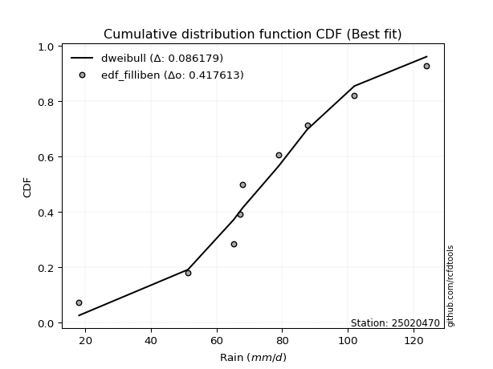</img>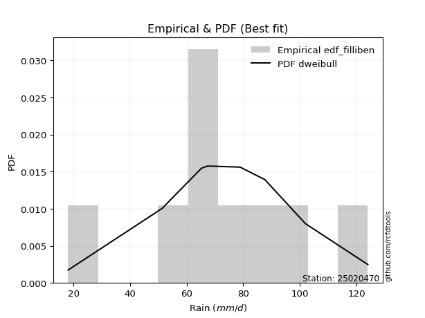</img>

</div>


### 10. Empirical - EDF Jenkinson (1977)

The Jenkinson formula in hydrology is an empirical plotting position formula used to estimate the non-exceedance probability _(P)_ or return period _(T)_ of a given ordered observation within a sample. It is a widely used method in the frequency analysis of extreme events such as floods and rainfall, as it provides a distribution-free way to plot data. _a≈0.31_ and _b≈0.38_ are constants derived to approximate the median of the probability distribution for the given rank.

<div align="center">


$P=(m-a)/(n+b)$


</div>


**10.1. Empirical values**

<div align="center">

|                | 0                   | 1                   | 2                  | 3                   | 4             | 5                  | 6                  | 7                  | 8                  |
|:---------------|:--------------------|:--------------------|:-------------------|:--------------------|:--------------|:-------------------|:-------------------|:-------------------|:-------------------|
| date           | 2023                | 2025                | 2017               | 2022                | 2019          | 2018               | 2020               | 2024               | 2021               |
| x              | 18.1                | 43.6                | 51.29              | 65.2                | 67.2          | 67.87              | 87.6               | 102.0              | 124.0              |
| m              | 1                   | 2                   | 3                  | 4                   | 5             | 6                  | 7                  | 8                  | 9                  |
| empirical_dist | edf_jenkinson       | edf_jenkinson       | edf_jenkinson      | edf_jenkinson       | edf_jenkinson | edf_jenkinson      | edf_jenkinson      | edf_jenkinson      | edf_jenkinson      |
| empirical      | 0.07356076759061833 | 0.18017057569296374 | 0.2867803837953091 | 0.39339019189765456 | 0.5           | 0.6066098081023454 | 0.7132196162046908 | 0.8198294243070362 | 0.9264392324093815 |
| empirical_tr   | 1.0794016110471807  | 1.2197659297789336  | 1.4020926756352765 | 1.6485061511423549  | 2.0           | 2.542005420054201  | 3.486988847583642  | 5.550295857988164  | 13.5942028985507   |

</div>


**10.2. Kolmogorov-Smirnov fit test (sorted by Δ)**


<div align="center">

|                | 0                   | 1                   | 2                   | 3                   | 4                   | 5                   | 6                   | 7                   | 8                   | 9                   | 10                  | 11                  | 12                  | 13                  | 14                  | 15                  | 16                  | 17                  | 18                  | 19                  | 20                  | 21                  | 22                  | 23                  | 24                    | 25                  | 26                  | 27                  | 28                  | 29                  | 30                  | 31                  | 32                  | 33                  | 34                  | 35                  | 36                  | 37                  | 38                  | 39                  | 40                  | 41                  | 42                  | 43                  | 44                  | 45                  | 46                  | 47                  | 48                  | 49                  | 50                  | 51                  | 52                  | 53                  | 54                  | 55                  | 56                  | 57                  | 58                  | 59                  | 60                  | 61                  | 62                  | 63                  | 64                  | 65                  | 66                  | 67                  | 68                  | 69                  | 70                  | 71                  | 72                  | 73                  | 74                  | 75                  | 76                  | 77                  | 78                  | 79                  | 80                  | 81                  | 82                  | 83                  | 84                  | 85                  | 86                  | 87                  | 88                  | 89                  |
|:---------------|:--------------------|:--------------------|:--------------------|:--------------------|:--------------------|:--------------------|:--------------------|:--------------------|:--------------------|:--------------------|:--------------------|:--------------------|:--------------------|:--------------------|:--------------------|:--------------------|:--------------------|:--------------------|:--------------------|:--------------------|:--------------------|:--------------------|:--------------------|:--------------------|:----------------------|:--------------------|:--------------------|:--------------------|:--------------------|:--------------------|:--------------------|:--------------------|:--------------------|:--------------------|:--------------------|:--------------------|:--------------------|:--------------------|:--------------------|:--------------------|:--------------------|:--------------------|:--------------------|:--------------------|:--------------------|:--------------------|:--------------------|:--------------------|:--------------------|:--------------------|:--------------------|:--------------------|:--------------------|:--------------------|:--------------------|:--------------------|:--------------------|:--------------------|:--------------------|:--------------------|:--------------------|:--------------------|:--------------------|:--------------------|:--------------------|:--------------------|:--------------------|:--------------------|:--------------------|:--------------------|:--------------------|:--------------------|:--------------------|:--------------------|:--------------------|:--------------------|:--------------------|:--------------------|:--------------------|:--------------------|:--------------------|:--------------------|:--------------------|:--------------------|:--------------------|:--------------------|:--------------------|:--------------------|:--------------------|:--------------------|
| station        | 25020470            | 25020470            | 25020470            | 25020470            | 25020470            | 25020470            | 25020470            | 25020470            | 25020470            | 25020470            | 25020470            | 25020470            | 25020470            | 25020470            | 25020470            | 25020470            | 25020470            | 25020470            | 25020470            | 25020470            | 25020470            | 25020470            | 25020470            | 25020470            | 25020470              | 25020470            | 25020470            | 25020470            | 25020470            | 25020470            | 25020470            | 25020470            | 25020470            | 25020470            | 25020470            | 25020470            | 25020470            | 25020470            | 25020470            | 25020470            | 25020470            | 25020470            | 25020470            | 25020470            | 25020470            | 25020470            | 25020470            | 25020470            | 25020470            | 25020470            | 25020470            | 25020470            | 25020470            | 25020470            | 25020470            | 25020470            | 25020470            | 25020470            | 25020470            | 25020470            | 25020470            | 25020470            | 25020470            | 25020470            | 25020470            | 25020470            | 25020470            | 25020470            | 25020470            | 25020470            | 25020470            | 25020470            | 25020470            | 25020470            | 25020470            | 25020470            | 25020470            | 25020470            | 25020470            | 25020470            | 25020470            | 25020470            | 25020470            | 25020470            | 25020470            | 25020470            | 25020470            | 25020470            | 25020470            | 25020470            |
| empirical_dist | edf_jenkinson       | edf_jenkinson       | edf_jenkinson       | edf_jenkinson       | edf_jenkinson       | edf_jenkinson       | edf_jenkinson       | edf_jenkinson       | edf_jenkinson       | edf_jenkinson       | edf_jenkinson       | edf_jenkinson       | edf_jenkinson       | edf_jenkinson       | edf_jenkinson       | edf_jenkinson       | edf_jenkinson       | edf_jenkinson       | edf_jenkinson       | edf_jenkinson       | edf_jenkinson       | edf_jenkinson       | edf_jenkinson       | edf_jenkinson       | edf_jenkinson         | edf_jenkinson       | edf_jenkinson       | edf_jenkinson       | edf_jenkinson       | edf_jenkinson       | edf_jenkinson       | edf_jenkinson       | edf_jenkinson       | edf_jenkinson       | edf_jenkinson       | edf_jenkinson       | edf_jenkinson       | edf_jenkinson       | edf_jenkinson       | edf_jenkinson       | edf_jenkinson       | edf_jenkinson       | edf_jenkinson       | edf_jenkinson       | edf_jenkinson       | edf_jenkinson       | edf_jenkinson       | edf_jenkinson       | edf_jenkinson       | edf_jenkinson       | edf_jenkinson       | edf_jenkinson       | edf_jenkinson       | edf_jenkinson       | edf_jenkinson       | edf_jenkinson       | edf_jenkinson       | edf_jenkinson       | edf_jenkinson       | edf_jenkinson       | edf_jenkinson       | edf_jenkinson       | edf_jenkinson       | edf_jenkinson       | edf_jenkinson       | edf_jenkinson       | edf_jenkinson       | edf_jenkinson       | edf_jenkinson       | edf_jenkinson       | edf_jenkinson       | edf_jenkinson       | edf_jenkinson       | edf_jenkinson       | edf_jenkinson       | edf_jenkinson       | edf_jenkinson       | edf_jenkinson       | edf_jenkinson       | edf_jenkinson       | edf_jenkinson       | edf_jenkinson       | edf_jenkinson       | edf_jenkinson       | edf_jenkinson       | edf_jenkinson       | edf_jenkinson       | edf_jenkinson       | edf_jenkinson       | edf_jenkinson       |
| p_dist         | invgauss            | loggompertz         | rayleigh            | alpha               | maxwell             | invgamma            | loggumbel_l         | genlogistic         | logfisk             | logpearson3         | logt                | logweibull_min      | fisk                | weibull_min         | betaprime           | ncf                 | rice                | chi2                | erlang              | gamma               | gumbel_r            | johnsonsu           | f                   | logmielke           | loglaplace_asymmetric | loggenlogistic      | laplace_asymmetric  | pearson3            | kstwobign           | logloggamma         | logjohnsonsu        | nct                 | halfnorm            | exponnorm           | t                   | norm                | crystalball         | logistic            | hypsecant           | moyal               | logrice             | lognorm             | lognorm             | logcrystalball      | logexponnorm        | logf                | lognct              | logfatiguelife      | laplace             | halflogistic        | logncf              | loglogistic         | loginvgamma         | logbetaprime        | loggamma            | loggamma            | loghypsecant        | logerlang           | logalpha            | loginvgauss         | loginvweibull       | loglaplace          | logmaxwell          | logtruncnorm        | lograyleigh         | logkstwobign        | gumbel_l            | mielke              | wald                | genexpon            | expon               | loghalfnorm         | loggumbel_r         | loggenexpon         | gibrat              | lognakagami         | logmoyal            | loghalflogistic     | truncnorm           | logwald             | logexpon            | loggibrat           | nakagami            | loglognorm          | logchi2             | pareto              | invweibull          | logpareto           | fatiguelife         | gompertz            |
| delta          | 0.08926053242008997 | 0.09204581926943967 | 0.0937592965316898  | 0.09649395880638467 | 0.09655260246282071 | 0.09859147917472144 | 0.10255709342881214 | 0.10427432128005198 | 0.10459365163004414 | 0.10535472774691934 | 0.10560425470124768 | 0.10607788985327349 | 0.10886471645757556 | 0.10904830965869028 | 0.10983281515224097 | 0.10997306275856966 | 0.11072376841586246 | 0.11114869261566357 | 0.11257002981075925 | 0.11297185869800741 | 0.11335434486659368 | 0.11467964346481035 | 0.11479166979595701 | 0.1151393600343617  | 0.11723609242725819   | 0.1184621668561126  | 0.11915164464644257 | 0.119561053670667   | 0.12231649770779551 | 0.12250087296623602 | 0.12400920863922948 | 0.12435156463459163 | 0.1276810943542317  | 0.1284257079157582  | 0.13037729109972068 | 0.13039189943270013 | 0.13039190889099528 | 0.1336309295109981  | 0.13639037412420119 | 0.13842026077874658 | 0.14558190611165245 | 0.14558369686892425 | 0.14558369686892425 | 0.14558373515777567 | 0.1455873339104934  | 0.14579295373213252 | 0.14583287888333407 | 0.14616272704617184 | 0.14705749419219483 | 0.14789456899503484 | 0.15031615484691574 | 0.15086330816528692 | 0.1517860584320042  | 0.15193387290520377 | 0.15261503813686605 | 0.15261503813686605 | 0.15534279093120562 | 0.15665211873728035 | 0.16180706011914747 | 0.16418905863717548 | 0.1661480757067858  | 0.17122565161466008 | 0.17667097661669118 | 0.18017057539682818 | 0.18673380082020063 | 0.19958975253373146 | 0.20106574171803548 | 0.20710531044150177 | 0.2079412231544575  | 0.20994005792949666 | 0.21004800291348225 | 0.2150912644214119  | 0.21603415155080952 | 0.21611522964531737 | 0.2178645749110506  | 0.22837991655106427 | 0.24120166660117848 | 0.24198085658769175 | 0.28460436431178193 | 0.31104611762494894 | 0.3306418595584862  | 0.3392072224727627  | 0.3555534363434262  | 0.44366466840084645 | 0.4569986251726554  | 0.46424367742963185 | 0.4675677981062153  | 0.4774539678301006  | 0.6300660363267205  | 0.7834059297366329  |
| deltao         | 0.41761268023100007 | 0.41761268023100007 | 0.41761268023100007 | 0.41761268023100007 | 0.41761268023100007 | 0.41761268023100007 | 0.41761268023100007 | 0.41761268023100007 | 0.41761268023100007 | 0.41761268023100007 | 0.41761268023100007 | 0.41761268023100007 | 0.41761268023100007 | 0.41761268023100007 | 0.41761268023100007 | 0.41761268023100007 | 0.41761268023100007 | 0.41761268023100007 | 0.41761268023100007 | 0.41761268023100007 | 0.41761268023100007 | 0.41761268023100007 | 0.41761268023100007 | 0.41761268023100007 | 0.41761268023100007   | 0.41761268023100007 | 0.41761268023100007 | 0.41761268023100007 | 0.41761268023100007 | 0.41761268023100007 | 0.41761268023100007 | 0.41761268023100007 | 0.41761268023100007 | 0.41761268023100007 | 0.41761268023100007 | 0.41761268023100007 | 0.41761268023100007 | 0.41761268023100007 | 0.41761268023100007 | 0.41761268023100007 | 0.41761268023100007 | 0.41761268023100007 | 0.41761268023100007 | 0.41761268023100007 | 0.41761268023100007 | 0.41761268023100007 | 0.41761268023100007 | 0.41761268023100007 | 0.41761268023100007 | 0.41761268023100007 | 0.41761268023100007 | 0.41761268023100007 | 0.41761268023100007 | 0.41761268023100007 | 0.41761268023100007 | 0.41761268023100007 | 0.41761268023100007 | 0.41761268023100007 | 0.41761268023100007 | 0.41761268023100007 | 0.41761268023100007 | 0.41761268023100007 | 0.41761268023100007 | 0.41761268023100007 | 0.41761268023100007 | 0.41761268023100007 | 0.41761268023100007 | 0.41761268023100007 | 0.41761268023100007 | 0.41761268023100007 | 0.41761268023100007 | 0.41761268023100007 | 0.41761268023100007 | 0.41761268023100007 | 0.41761268023100007 | 0.41761268023100007 | 0.41761268023100007 | 0.41761268023100007 | 0.41761268023100007 | 0.41761268023100007 | 0.41761268023100007 | 0.41761268023100007 | 0.41761268023100007 | 0.41761268023100007 | 0.41761268023100007 | 0.41761268023100007 | 0.41761268023100007 | 0.41761268023100007 | 0.41761268023100007 | 0.41761268023100007 |
| eval           | Δo > Δ              | Δo > Δ              | Δo > Δ              | Δo > Δ              | Δo > Δ              | Δo > Δ              | Δo > Δ              | Δo > Δ              | Δo > Δ              | Δo > Δ              | Δo > Δ              | Δo > Δ              | Δo > Δ              | Δo > Δ              | Δo > Δ              | Δo > Δ              | Δo > Δ              | Δo > Δ              | Δo > Δ              | Δo > Δ              | Δo > Δ              | Δo > Δ              | Δo > Δ              | Δo > Δ              | Δo > Δ                | Δo > Δ              | Δo > Δ              | Δo > Δ              | Δo > Δ              | Δo > Δ              | Δo > Δ              | Δo > Δ              | Δo > Δ              | Δo > Δ              | Δo > Δ              | Δo > Δ              | Δo > Δ              | Δo > Δ              | Δo > Δ              | Δo > Δ              | Δo > Δ              | Δo > Δ              | Δo > Δ              | Δo > Δ              | Δo > Δ              | Δo > Δ              | Δo > Δ              | Δo > Δ              | Δo > Δ              | Δo > Δ              | Δo > Δ              | Δo > Δ              | Δo > Δ              | Δo > Δ              | Δo > Δ              | Δo > Δ              | Δo > Δ              | Δo > Δ              | Δo > Δ              | Δo > Δ              | Δo > Δ              | Δo > Δ              | Δo > Δ              | Δo > Δ              | Δo > Δ              | Δo > Δ              | Δo > Δ              | Δo > Δ              | Δo > Δ              | Δo > Δ              | Δo > Δ              | Δo > Δ              | Δo > Δ              | Δo > Δ              | Δo > Δ              | Δo > Δ              | Δo > Δ              | Δo > Δ              | Δo > Δ              | Δo > Δ              | Δo > Δ              | Δo > Δ              | Δo > Δ              | Δo <= Δ             | Δo <= Δ             | Δo <= Δ             | Δo <= Δ             | Δo <= Δ             | Δo <= Δ             | Δo <= Δ             |
| fit            | 1                   | 1                   | 1                   | 1                   | 1                   | 1                   | 1                   | 1                   | 1                   | 1                   | 1                   | 1                   | 1                   | 1                   | 1                   | 1                   | 1                   | 1                   | 1                   | 1                   | 1                   | 1                   | 1                   | 1                   | 1                     | 1                   | 1                   | 1                   | 1                   | 1                   | 1                   | 1                   | 1                   | 1                   | 1                   | 1                   | 1                   | 1                   | 1                   | 1                   | 1                   | 1                   | 1                   | 1                   | 1                   | 1                   | 1                   | 1                   | 1                   | 1                   | 1                   | 1                   | 1                   | 1                   | 1                   | 1                   | 1                   | 1                   | 1                   | 1                   | 1                   | 1                   | 1                   | 1                   | 1                   | 1                   | 1                   | 1                   | 1                   | 1                   | 1                   | 1                   | 1                   | 1                   | 1                   | 1                   | 1                   | 1                   | 1                   | 1                   | 1                   | 1                   | 1                   | 0                   | 0                   | 0                   | 0                   | 0                   | 0                   | 0                   |
| n              | 9                   | 9                   | 9                   | 9                   | 9                   | 9                   | 9                   | 9                   | 9                   | 9                   | 9                   | 9                   | 9                   | 9                   | 9                   | 9                   | 9                   | 9                   | 9                   | 9                   | 9                   | 9                   | 9                   | 9                   | 9                     | 9                   | 9                   | 9                   | 9                   | 9                   | 9                   | 9                   | 9                   | 9                   | 9                   | 9                   | 9                   | 9                   | 9                   | 9                   | 9                   | 9                   | 9                   | 9                   | 9                   | 9                   | 9                   | 9                   | 9                   | 9                   | 9                   | 9                   | 9                   | 9                   | 9                   | 9                   | 9                   | 9                   | 9                   | 9                   | 9                   | 9                   | 9                   | 9                   | 9                   | 9                   | 9                   | 9                   | 9                   | 9                   | 9                   | 9                   | 9                   | 9                   | 9                   | 9                   | 9                   | 9                   | 9                   | 9                   | 9                   | 9                   | 9                   | 9                   | 9                   | 9                   | 9                   | 9                   | 9                   | 9                   |
| best_fit       | 1                   | 0                   | 0                   | 0                   | 0                   | 0                   | 0                   | 0                   | 0                   | 0                   | 0                   | 0                   | 0                   | 0                   | 0                   | 0                   | 0                   | 0                   | 0                   | 0                   | 0                   | 0                   | 0                   | 0                   | 0                     | 0                   | 0                   | 0                   | 0                   | 0                   | 0                   | 0                   | 0                   | 0                   | 0                   | 0                   | 0                   | 0                   | 0                   | 0                   | 0                   | 0                   | 0                   | 0                   | 0                   | 0                   | 0                   | 0                   | 0                   | 0                   | 0                   | 0                   | 0                   | 0                   | 0                   | 0                   | 0                   | 0                   | 0                   | 0                   | 0                   | 0                   | 0                   | 0                   | 0                   | 0                   | 0                   | 0                   | 0                   | 0                   | 0                   | 0                   | 0                   | 0                   | 0                   | 0                   | 0                   | 0                   | 0                   | 0                   | 0                   | 0                   | 0                   | 0                   | 0                   | 0                   | 0                   | 0                   | 0                   | 0                   |
| best_fit_sort  | 1                   | 2                   | 3                   | 4                   | 5                   | 6                   | 7                   | 8                   | 9                   | 10                  | 11                  | 12                  | 13                  | 14                  | 15                  | 16                  | 17                  | 18                  | 19                  | 20                  | 21                  | 22                  | 23                  | 24                  | 25                    | 26                  | 27                  | 28                  | 29                  | 30                  | 31                  | 32                  | 33                  | 34                  | 35                  | 36                  | 37                  | 38                  | 39                  | 40                  | 41                  | 42                  | 43                  | 44                  | 45                  | 46                  | 47                  | 48                  | 49                  | 50                  | 51                  | 52                  | 53                  | 54                  | 55                  | 56                  | 57                  | 58                  | 59                  | 60                  | 61                  | 62                  | 63                  | 64                  | 65                  | 66                  | 67                  | 68                  | 69                  | 70                  | 71                  | 72                  | 73                  | 74                  | 75                  | 76                  | 77                  | 78                  | 79                  | 80                  | 81                  | 82                  | 83                  | 84                  | 85                  | 86                  | 87                  | 88                  | 89                  | 90                  |

</div>


<div align="center">

</img>

</div>


**10.3. Best fit**

<div align="center">

|   id |   station | empirical_dist   | p_dist   |     delta |   deltao | eval   |   fit |   n |   best_fit |   best_fit_sort |
|-----:|----------:|:-----------------|:---------|----------:|---------:|:-------|------:|----:|-----------:|----------------:|
|    0 |  25020470 | edf_jenkinson    | invgauss | 0.0892605 | 0.417613 | Δo > Δ |     1 |   9 |          1 |               1 |

</div>


<div align="center">

</img></img>

</div>


### 11. Empirical - EDF Cunnane (1978)

Cunnane´s work in statistical hydrology has focused on the performance and evaluation of different probability distributions (such as GEV, Gumbel, Lognormal) for flood frequency estimation. _b_ is a constant, typically set to 0.4.

<div align="center">


$P=(m-b)/(n+1-2b)$


</div>


**11.1. Empirical values**

<div align="center">

|                | 0                   | 1                  | 2                   | 3                  | 4           | 5                  | 6                 | 7                  | 8                  |
|:---------------|:--------------------|:-------------------|:--------------------|:-------------------|:------------|:-------------------|:------------------|:-------------------|:-------------------|
| date           | 2023                | 2025               | 2017                | 2022               | 2019        | 2018               | 2020              | 2024               | 2021               |
| x              | 18.1                | 43.6               | 51.29               | 65.2               | 67.2        | 67.87              | 87.6              | 102.0              | 124.0              |
| m              | 1                   | 2                  | 3                   | 4                  | 5           | 6                  | 7                 | 8                  | 9                  |
| empirical_dist | edf_cunnane         | edf_cunnane        | edf_cunnane         | edf_cunnane        | edf_cunnane | edf_cunnane        | edf_cunnane       | edf_cunnane        | edf_cunnane        |
| empirical      | 0.06521739130434782 | 0.1739130434782609 | 0.28260869565217395 | 0.391304347826087  | 0.5         | 0.6086956521739131 | 0.717391304347826 | 0.8260869565217391 | 0.9347826086956522 |
| empirical_tr   | 1.069767441860465   | 1.2105263157894737 | 1.393939393939394   | 1.6428571428571428 | 2.0         | 2.555555555555556  | 3.538461538461538 | 5.75               | 15.333333333333343 |

</div>


**11.2. Kolmogorov-Smirnov fit test (sorted by Δ)**


<div align="center">

|                | 0                   | 1                   | 2                   | 3                   | 4                   | 5                   | 6                   | 7                   | 8                   | 9                   | 10                  | 11                  | 12                  | 13                  | 14                  | 15                  | 16                  | 17                  | 18                  | 19                  | 20                  | 21                  | 22                  | 23                  | 24                    | 25                  | 26                  | 27                  | 28                  | 29                  | 30                  | 31                  | 32                  | 33                  | 34                  | 35                  | 36                  | 37                  | 38                  | 39                  | 40                  | 41                  | 42                  | 43                  | 44                  | 45                  | 46                  | 47                  | 48                  | 49                  | 50                  | 51                  | 52                  | 53                  | 54                  | 55                  | 56                  | 57                  | 58                  | 59                  | 60                  | 61                  | 62                  | 63                  | 64                  | 65                  | 66                  | 67                  | 68                  | 69                  | 70                  | 71                  | 72                  | 73                  | 74                  | 75                  | 76                  | 77                  | 78                  | 79                  | 80                  | 81                  | 82                  | 83                  | 84                  | 85                  | 86                  | 87                  | 88                  | 89                  |
|:---------------|:--------------------|:--------------------|:--------------------|:--------------------|:--------------------|:--------------------|:--------------------|:--------------------|:--------------------|:--------------------|:--------------------|:--------------------|:--------------------|:--------------------|:--------------------|:--------------------|:--------------------|:--------------------|:--------------------|:--------------------|:--------------------|:--------------------|:--------------------|:--------------------|:----------------------|:--------------------|:--------------------|:--------------------|:--------------------|:--------------------|:--------------------|:--------------------|:--------------------|:--------------------|:--------------------|:--------------------|:--------------------|:--------------------|:--------------------|:--------------------|:--------------------|:--------------------|:--------------------|:--------------------|:--------------------|:--------------------|:--------------------|:--------------------|:--------------------|:--------------------|:--------------------|:--------------------|:--------------------|:--------------------|:--------------------|:--------------------|:--------------------|:--------------------|:--------------------|:--------------------|:--------------------|:--------------------|:--------------------|:--------------------|:--------------------|:--------------------|:--------------------|:--------------------|:--------------------|:--------------------|:--------------------|:--------------------|:--------------------|:--------------------|:--------------------|:--------------------|:--------------------|:--------------------|:--------------------|:--------------------|:--------------------|:--------------------|:--------------------|:--------------------|:--------------------|:--------------------|:--------------------|:--------------------|:--------------------|:--------------------|
| station        | 25020470            | 25020470            | 25020470            | 25020470            | 25020470            | 25020470            | 25020470            | 25020470            | 25020470            | 25020470            | 25020470            | 25020470            | 25020470            | 25020470            | 25020470            | 25020470            | 25020470            | 25020470            | 25020470            | 25020470            | 25020470            | 25020470            | 25020470            | 25020470            | 25020470              | 25020470            | 25020470            | 25020470            | 25020470            | 25020470            | 25020470            | 25020470            | 25020470            | 25020470            | 25020470            | 25020470            | 25020470            | 25020470            | 25020470            | 25020470            | 25020470            | 25020470            | 25020470            | 25020470            | 25020470            | 25020470            | 25020470            | 25020470            | 25020470            | 25020470            | 25020470            | 25020470            | 25020470            | 25020470            | 25020470            | 25020470            | 25020470            | 25020470            | 25020470            | 25020470            | 25020470            | 25020470            | 25020470            | 25020470            | 25020470            | 25020470            | 25020470            | 25020470            | 25020470            | 25020470            | 25020470            | 25020470            | 25020470            | 25020470            | 25020470            | 25020470            | 25020470            | 25020470            | 25020470            | 25020470            | 25020470            | 25020470            | 25020470            | 25020470            | 25020470            | 25020470            | 25020470            | 25020470            | 25020470            | 25020470            |
| empirical_dist | edf_cunnane         | edf_cunnane         | edf_cunnane         | edf_cunnane         | edf_cunnane         | edf_cunnane         | edf_cunnane         | edf_cunnane         | edf_cunnane         | edf_cunnane         | edf_cunnane         | edf_cunnane         | edf_cunnane         | edf_cunnane         | edf_cunnane         | edf_cunnane         | edf_cunnane         | edf_cunnane         | edf_cunnane         | edf_cunnane         | edf_cunnane         | edf_cunnane         | edf_cunnane         | edf_cunnane         | edf_cunnane           | edf_cunnane         | edf_cunnane         | edf_cunnane         | edf_cunnane         | edf_cunnane         | edf_cunnane         | edf_cunnane         | edf_cunnane         | edf_cunnane         | edf_cunnane         | edf_cunnane         | edf_cunnane         | edf_cunnane         | edf_cunnane         | edf_cunnane         | edf_cunnane         | edf_cunnane         | edf_cunnane         | edf_cunnane         | edf_cunnane         | edf_cunnane         | edf_cunnane         | edf_cunnane         | edf_cunnane         | edf_cunnane         | edf_cunnane         | edf_cunnane         | edf_cunnane         | edf_cunnane         | edf_cunnane         | edf_cunnane         | edf_cunnane         | edf_cunnane         | edf_cunnane         | edf_cunnane         | edf_cunnane         | edf_cunnane         | edf_cunnane         | edf_cunnane         | edf_cunnane         | edf_cunnane         | edf_cunnane         | edf_cunnane         | edf_cunnane         | edf_cunnane         | edf_cunnane         | edf_cunnane         | edf_cunnane         | edf_cunnane         | edf_cunnane         | edf_cunnane         | edf_cunnane         | edf_cunnane         | edf_cunnane         | edf_cunnane         | edf_cunnane         | edf_cunnane         | edf_cunnane         | edf_cunnane         | edf_cunnane         | edf_cunnane         | edf_cunnane         | edf_cunnane         | edf_cunnane         | edf_cunnane         |
| p_dist         | invgauss            | loggompertz         | rayleigh            | alpha               | maxwell             | invgamma            | loggumbel_l         | genlogistic         | logfisk             | logpearson3         | logt                | logweibull_min      | fisk                | weibull_min         | betaprime           | ncf                 | rice                | chi2                | erlang              | gamma               | gumbel_r            | johnsonsu           | f                   | logmielke           | loglaplace_asymmetric | loggenlogistic      | laplace_asymmetric  | pearson3            | kstwobign           | logloggamma         | logjohnsonsu        | nct                 | halfnorm            | exponnorm           | t                   | norm                | crystalball         | logistic            | hypsecant           | moyal               | logrice             | lognorm             | lognorm             | logcrystalball      | logexponnorm        | logf                | lognct              | logfatiguelife      | laplace             | halflogistic        | logncf              | loglogistic         | loginvgamma         | logbetaprime        | loggamma            | loggamma            | loghypsecant        | logerlang           | logalpha            | loginvgauss         | loginvweibull       | loglaplace          | logtruncnorm        | logmaxwell          | lograyleigh         | gumbel_l            | logkstwobign        | wald                | mielke              | genexpon            | expon               | loghalfnorm         | loggumbel_r         | loggenexpon         | gibrat              | lognakagami         | logmoyal            | loghalflogistic     | truncnorm           | logwald             | logexpon            | loggibrat           | nakagami            | loglognorm          | logchi2             | pareto              | invweibull          | logpareto           | fatiguelife         | gompertz            |
| delta          | 0.09134637649165755 | 0.09413166334100725 | 0.09584514060325738 | 0.09857980287795232 | 0.09863844653438836 | 0.10067732324628909 | 0.10464293750037978 | 0.10636016535161963 | 0.10667949570161173 | 0.10744057181848699 | 0.10769009877281532 | 0.10816373392484113 | 0.1109505605291432  | 0.11113415373025792 | 0.11191865922380861 | 0.1120589068301373  | 0.1128096124874301  | 0.11323453668723121 | 0.1146558738823269  | 0.11505770276957505 | 0.11544018893816127 | 0.116765487536378   | 0.11687751386752465 | 0.11722520410592935 | 0.11932193649882578   | 0.12054801092768025 | 0.12123748871801021 | 0.12164689774223464 | 0.1244023417793631  | 0.12458671703780366 | 0.12609505271079713 | 0.12643740870615927 | 0.12976693842579928 | 0.13051155198732584 | 0.13246313517128833 | 0.13247774350426778 | 0.13247775296256292 | 0.13571677358256573 | 0.13847621819576883 | 0.14050610485031417 | 0.14766775018322004 | 0.14766954094049184 | 0.14766954094049184 | 0.14766957922934326 | 0.14767317798206098 | 0.1478787978037001  | 0.14791872295490166 | 0.14824857111773942 | 0.14914333826376247 | 0.14998041306660242 | 0.15240199891848333 | 0.1529491522368545  | 0.1538719025035718  | 0.15401971697677136 | 0.15470088220843364 | 0.15470088220843364 | 0.1574286350027732  | 0.15873796280884794 | 0.16389290419071506 | 0.16627490270874307 | 0.1682339197783534  | 0.17331149568622767 | 0.17391304318212533 | 0.17875682068825877 | 0.18881964489176822 | 0.20315158578960313 | 0.20334731318008073 | 0.2100270672260251  | 0.21336284265620462 | 0.2161975901441995  | 0.2163055351281851  | 0.2171771084929795  | 0.2181199956223771  | 0.21820107371688496 | 0.2199504189826182  | 0.23046576062263185 | 0.24328751067274607 | 0.24406670065925934 | 0.2866902083833496  | 0.3131319616965165  | 0.33689939177318906 | 0.3412930665443303  | 0.35763928041499377 | 0.44992220061554933 | 0.46325615738735826 | 0.47050120964433473 | 0.475911174392486   | 0.48371150004480346 | 0.6363235685414234  | 0.7896634619513359  |
| deltao         | 0.41761268023100007 | 0.41761268023100007 | 0.41761268023100007 | 0.41761268023100007 | 0.41761268023100007 | 0.41761268023100007 | 0.41761268023100007 | 0.41761268023100007 | 0.41761268023100007 | 0.41761268023100007 | 0.41761268023100007 | 0.41761268023100007 | 0.41761268023100007 | 0.41761268023100007 | 0.41761268023100007 | 0.41761268023100007 | 0.41761268023100007 | 0.41761268023100007 | 0.41761268023100007 | 0.41761268023100007 | 0.41761268023100007 | 0.41761268023100007 | 0.41761268023100007 | 0.41761268023100007 | 0.41761268023100007   | 0.41761268023100007 | 0.41761268023100007 | 0.41761268023100007 | 0.41761268023100007 | 0.41761268023100007 | 0.41761268023100007 | 0.41761268023100007 | 0.41761268023100007 | 0.41761268023100007 | 0.41761268023100007 | 0.41761268023100007 | 0.41761268023100007 | 0.41761268023100007 | 0.41761268023100007 | 0.41761268023100007 | 0.41761268023100007 | 0.41761268023100007 | 0.41761268023100007 | 0.41761268023100007 | 0.41761268023100007 | 0.41761268023100007 | 0.41761268023100007 | 0.41761268023100007 | 0.41761268023100007 | 0.41761268023100007 | 0.41761268023100007 | 0.41761268023100007 | 0.41761268023100007 | 0.41761268023100007 | 0.41761268023100007 | 0.41761268023100007 | 0.41761268023100007 | 0.41761268023100007 | 0.41761268023100007 | 0.41761268023100007 | 0.41761268023100007 | 0.41761268023100007 | 0.41761268023100007 | 0.41761268023100007 | 0.41761268023100007 | 0.41761268023100007 | 0.41761268023100007 | 0.41761268023100007 | 0.41761268023100007 | 0.41761268023100007 | 0.41761268023100007 | 0.41761268023100007 | 0.41761268023100007 | 0.41761268023100007 | 0.41761268023100007 | 0.41761268023100007 | 0.41761268023100007 | 0.41761268023100007 | 0.41761268023100007 | 0.41761268023100007 | 0.41761268023100007 | 0.41761268023100007 | 0.41761268023100007 | 0.41761268023100007 | 0.41761268023100007 | 0.41761268023100007 | 0.41761268023100007 | 0.41761268023100007 | 0.41761268023100007 | 0.41761268023100007 |
| eval           | Δo > Δ              | Δo > Δ              | Δo > Δ              | Δo > Δ              | Δo > Δ              | Δo > Δ              | Δo > Δ              | Δo > Δ              | Δo > Δ              | Δo > Δ              | Δo > Δ              | Δo > Δ              | Δo > Δ              | Δo > Δ              | Δo > Δ              | Δo > Δ              | Δo > Δ              | Δo > Δ              | Δo > Δ              | Δo > Δ              | Δo > Δ              | Δo > Δ              | Δo > Δ              | Δo > Δ              | Δo > Δ                | Δo > Δ              | Δo > Δ              | Δo > Δ              | Δo > Δ              | Δo > Δ              | Δo > Δ              | Δo > Δ              | Δo > Δ              | Δo > Δ              | Δo > Δ              | Δo > Δ              | Δo > Δ              | Δo > Δ              | Δo > Δ              | Δo > Δ              | Δo > Δ              | Δo > Δ              | Δo > Δ              | Δo > Δ              | Δo > Δ              | Δo > Δ              | Δo > Δ              | Δo > Δ              | Δo > Δ              | Δo > Δ              | Δo > Δ              | Δo > Δ              | Δo > Δ              | Δo > Δ              | Δo > Δ              | Δo > Δ              | Δo > Δ              | Δo > Δ              | Δo > Δ              | Δo > Δ              | Δo > Δ              | Δo > Δ              | Δo > Δ              | Δo > Δ              | Δo > Δ              | Δo > Δ              | Δo > Δ              | Δo > Δ              | Δo > Δ              | Δo > Δ              | Δo > Δ              | Δo > Δ              | Δo > Δ              | Δo > Δ              | Δo > Δ              | Δo > Δ              | Δo > Δ              | Δo > Δ              | Δo > Δ              | Δo > Δ              | Δo > Δ              | Δo > Δ              | Δo > Δ              | Δo <= Δ             | Δo <= Δ             | Δo <= Δ             | Δo <= Δ             | Δo <= Δ             | Δo <= Δ             | Δo <= Δ             |
| fit            | 1                   | 1                   | 1                   | 1                   | 1                   | 1                   | 1                   | 1                   | 1                   | 1                   | 1                   | 1                   | 1                   | 1                   | 1                   | 1                   | 1                   | 1                   | 1                   | 1                   | 1                   | 1                   | 1                   | 1                   | 1                     | 1                   | 1                   | 1                   | 1                   | 1                   | 1                   | 1                   | 1                   | 1                   | 1                   | 1                   | 1                   | 1                   | 1                   | 1                   | 1                   | 1                   | 1                   | 1                   | 1                   | 1                   | 1                   | 1                   | 1                   | 1                   | 1                   | 1                   | 1                   | 1                   | 1                   | 1                   | 1                   | 1                   | 1                   | 1                   | 1                   | 1                   | 1                   | 1                   | 1                   | 1                   | 1                   | 1                   | 1                   | 1                   | 1                   | 1                   | 1                   | 1                   | 1                   | 1                   | 1                   | 1                   | 1                   | 1                   | 1                   | 1                   | 1                   | 0                   | 0                   | 0                   | 0                   | 0                   | 0                   | 0                   |
| n              | 9                   | 9                   | 9                   | 9                   | 9                   | 9                   | 9                   | 9                   | 9                   | 9                   | 9                   | 9                   | 9                   | 9                   | 9                   | 9                   | 9                   | 9                   | 9                   | 9                   | 9                   | 9                   | 9                   | 9                   | 9                     | 9                   | 9                   | 9                   | 9                   | 9                   | 9                   | 9                   | 9                   | 9                   | 9                   | 9                   | 9                   | 9                   | 9                   | 9                   | 9                   | 9                   | 9                   | 9                   | 9                   | 9                   | 9                   | 9                   | 9                   | 9                   | 9                   | 9                   | 9                   | 9                   | 9                   | 9                   | 9                   | 9                   | 9                   | 9                   | 9                   | 9                   | 9                   | 9                   | 9                   | 9                   | 9                   | 9                   | 9                   | 9                   | 9                   | 9                   | 9                   | 9                   | 9                   | 9                   | 9                   | 9                   | 9                   | 9                   | 9                   | 9                   | 9                   | 9                   | 9                   | 9                   | 9                   | 9                   | 9                   | 9                   |
| best_fit       | 1                   | 0                   | 0                   | 0                   | 0                   | 0                   | 0                   | 0                   | 0                   | 0                   | 0                   | 0                   | 0                   | 0                   | 0                   | 0                   | 0                   | 0                   | 0                   | 0                   | 0                   | 0                   | 0                   | 0                   | 0                     | 0                   | 0                   | 0                   | 0                   | 0                   | 0                   | 0                   | 0                   | 0                   | 0                   | 0                   | 0                   | 0                   | 0                   | 0                   | 0                   | 0                   | 0                   | 0                   | 0                   | 0                   | 0                   | 0                   | 0                   | 0                   | 0                   | 0                   | 0                   | 0                   | 0                   | 0                   | 0                   | 0                   | 0                   | 0                   | 0                   | 0                   | 0                   | 0                   | 0                   | 0                   | 0                   | 0                   | 0                   | 0                   | 0                   | 0                   | 0                   | 0                   | 0                   | 0                   | 0                   | 0                   | 0                   | 0                   | 0                   | 0                   | 0                   | 0                   | 0                   | 0                   | 0                   | 0                   | 0                   | 0                   |
| best_fit_sort  | 1                   | 2                   | 3                   | 4                   | 5                   | 6                   | 7                   | 8                   | 9                   | 10                  | 11                  | 12                  | 13                  | 14                  | 15                  | 16                  | 17                  | 18                  | 19                  | 20                  | 21                  | 22                  | 23                  | 24                  | 25                    | 26                  | 27                  | 28                  | 29                  | 30                  | 31                  | 32                  | 33                  | 34                  | 35                  | 36                  | 37                  | 38                  | 39                  | 40                  | 41                  | 42                  | 43                  | 44                  | 45                  | 46                  | 47                  | 48                  | 49                  | 50                  | 51                  | 52                  | 53                  | 54                  | 55                  | 56                  | 57                  | 58                  | 59                  | 60                  | 61                  | 62                  | 63                  | 64                  | 65                  | 66                  | 67                  | 68                  | 69                  | 70                  | 71                  | 72                  | 73                  | 74                  | 75                  | 76                  | 77                  | 78                  | 79                  | 80                  | 81                  | 82                  | 83                  | 84                  | 85                  | 86                  | 87                  | 88                  | 89                  | 90                  |

</div>


<div align="center">

</img>

</div>


**11.3. Best fit**

<div align="center">

|   id |   station | empirical_dist   | p_dist   |     delta |   deltao | eval   |   fit |   n |   best_fit |   best_fit_sort |
|-----:|----------:|:-----------------|:---------|----------:|---------:|:-------|------:|----:|-----------:|----------------:|
|    0 |  25020470 | edf_cunnane      | invgauss | 0.0913464 | 0.417613 | Δo > Δ |     1 |   9 |          1 |               1 |

</div>


<div align="center">

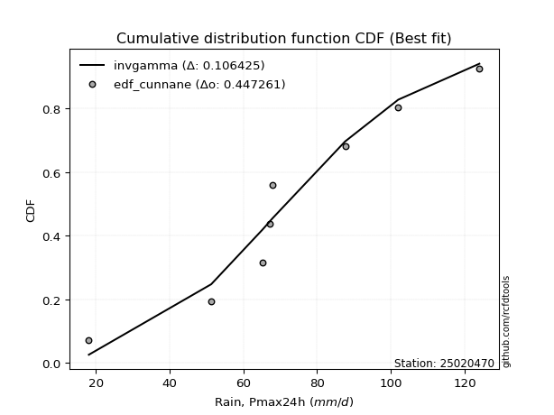</img></img>

</div>


### 12. Empirical - EDF Adamowski (1981)

The Adamowski formula in hydrology refers to a specific plotting position formula used for estimating the non-parametric empirical distribution of hydrological events (like flood peaks) to calculate their return periods. This formula provides an alternative to traditional parametric methods (like the Gumbel or Log Pearson Type III distributions). 

<div align="center">


$P=(m-0.25)/(n+0.5)$


</div>


**12.1. Empirical values**

<div align="center">

|                | 0                   | 1                   | 2                  | 3                   | 4             | 5                  | 6                  | 7                  | 8                  |
|:---------------|:--------------------|:--------------------|:-------------------|:--------------------|:--------------|:-------------------|:-------------------|:-------------------|:-------------------|
| date           | 2023                | 2025                | 2017               | 2022                | 2019          | 2018               | 2020               | 2024               | 2021               |
| x              | 18.1                | 43.6                | 51.29              | 65.2                | 67.2          | 67.87              | 87.6               | 102.0              | 124.0              |
| m              | 1                   | 2                   | 3                  | 4                   | 5             | 6                  | 7                  | 8                  | 9                  |
| empirical_dist | edf_adamowski       | edf_adamowski       | edf_adamowski      | edf_adamowski       | edf_adamowski | edf_adamowski      | edf_adamowski      | edf_adamowski      | edf_adamowski      |
| empirical      | 0.07894736842105263 | 0.18421052631578946 | 0.2894736842105263 | 0.39473684210526316 | 0.5           | 0.6052631578947368 | 0.7105263157894737 | 0.8157894736842105 | 0.9210526315789473 |
| empirical_tr   | 1.0857142857142856  | 1.2258064516129032  | 1.4074074074074074 | 1.6521739130434783  | 2.0           | 2.533333333333333  | 3.4545454545454546 | 5.428571428571428  | 12.666666666666663 |

</div>


**12.2. Kolmogorov-Smirnov fit test (sorted by Δ)**


<div align="center">

|                | 0                   | 1                   | 2                   | 3                   | 4                   | 5                   | 6                   | 7                   | 8                   | 9                   | 10                  | 11                  | 12                  | 13                  | 14                  | 15                  | 16                  | 17                  | 18                  | 19                  | 20                  | 21                  | 22                  | 23                  | 24                    | 25                  | 26                  | 27                  | 28                  | 29                  | 30                  | 31                  | 32                  | 33                  | 34                  | 35                  | 36                  | 37                  | 38                  | 39                  | 40                  | 41                  | 42                  | 43                  | 44                  | 45                  | 46                  | 47                  | 48                  | 49                  | 50                  | 51                  | 52                  | 53                  | 54                  | 55                  | 56                  | 57                  | 58                  | 59                  | 60                  | 61                  | 62                  | 63                  | 64                  | 65                  | 66                  | 67                  | 68                  | 69                  | 70                  | 71                  | 72                  | 73                  | 74                  | 75                  | 76                  | 77                  | 78                  | 79                  | 80                  | 81                  | 82                  | 83                  | 84                  | 85                  | 86                  | 87                  | 88                  | 89                  |
|:---------------|:--------------------|:--------------------|:--------------------|:--------------------|:--------------------|:--------------------|:--------------------|:--------------------|:--------------------|:--------------------|:--------------------|:--------------------|:--------------------|:--------------------|:--------------------|:--------------------|:--------------------|:--------------------|:--------------------|:--------------------|:--------------------|:--------------------|:--------------------|:--------------------|:----------------------|:--------------------|:--------------------|:--------------------|:--------------------|:--------------------|:--------------------|:--------------------|:--------------------|:--------------------|:--------------------|:--------------------|:--------------------|:--------------------|:--------------------|:--------------------|:--------------------|:--------------------|:--------------------|:--------------------|:--------------------|:--------------------|:--------------------|:--------------------|:--------------------|:--------------------|:--------------------|:--------------------|:--------------------|:--------------------|:--------------------|:--------------------|:--------------------|:--------------------|:--------------------|:--------------------|:--------------------|:--------------------|:--------------------|:--------------------|:--------------------|:--------------------|:--------------------|:--------------------|:--------------------|:--------------------|:--------------------|:--------------------|:--------------------|:--------------------|:--------------------|:--------------------|:--------------------|:--------------------|:--------------------|:--------------------|:--------------------|:--------------------|:--------------------|:--------------------|:--------------------|:--------------------|:--------------------|:--------------------|:--------------------|:--------------------|
| station        | 25020470            | 25020470            | 25020470            | 25020470            | 25020470            | 25020470            | 25020470            | 25020470            | 25020470            | 25020470            | 25020470            | 25020470            | 25020470            | 25020470            | 25020470            | 25020470            | 25020470            | 25020470            | 25020470            | 25020470            | 25020470            | 25020470            | 25020470            | 25020470            | 25020470              | 25020470            | 25020470            | 25020470            | 25020470            | 25020470            | 25020470            | 25020470            | 25020470            | 25020470            | 25020470            | 25020470            | 25020470            | 25020470            | 25020470            | 25020470            | 25020470            | 25020470            | 25020470            | 25020470            | 25020470            | 25020470            | 25020470            | 25020470            | 25020470            | 25020470            | 25020470            | 25020470            | 25020470            | 25020470            | 25020470            | 25020470            | 25020470            | 25020470            | 25020470            | 25020470            | 25020470            | 25020470            | 25020470            | 25020470            | 25020470            | 25020470            | 25020470            | 25020470            | 25020470            | 25020470            | 25020470            | 25020470            | 25020470            | 25020470            | 25020470            | 25020470            | 25020470            | 25020470            | 25020470            | 25020470            | 25020470            | 25020470            | 25020470            | 25020470            | 25020470            | 25020470            | 25020470            | 25020470            | 25020470            | 25020470            |
| empirical_dist | edf_adamowski       | edf_adamowski       | edf_adamowski       | edf_adamowski       | edf_adamowski       | edf_adamowski       | edf_adamowski       | edf_adamowski       | edf_adamowski       | edf_adamowski       | edf_adamowski       | edf_adamowski       | edf_adamowski       | edf_adamowski       | edf_adamowski       | edf_adamowski       | edf_adamowski       | edf_adamowski       | edf_adamowski       | edf_adamowski       | edf_adamowski       | edf_adamowski       | edf_adamowski       | edf_adamowski       | edf_adamowski         | edf_adamowski       | edf_adamowski       | edf_adamowski       | edf_adamowski       | edf_adamowski       | edf_adamowski       | edf_adamowski       | edf_adamowski       | edf_adamowski       | edf_adamowski       | edf_adamowski       | edf_adamowski       | edf_adamowski       | edf_adamowski       | edf_adamowski       | edf_adamowski       | edf_adamowski       | edf_adamowski       | edf_adamowski       | edf_adamowski       | edf_adamowski       | edf_adamowski       | edf_adamowski       | edf_adamowski       | edf_adamowski       | edf_adamowski       | edf_adamowski       | edf_adamowski       | edf_adamowski       | edf_adamowski       | edf_adamowski       | edf_adamowski       | edf_adamowski       | edf_adamowski       | edf_adamowski       | edf_adamowski       | edf_adamowski       | edf_adamowski       | edf_adamowski       | edf_adamowski       | edf_adamowski       | edf_adamowski       | edf_adamowski       | edf_adamowski       | edf_adamowski       | edf_adamowski       | edf_adamowski       | edf_adamowski       | edf_adamowski       | edf_adamowski       | edf_adamowski       | edf_adamowski       | edf_adamowski       | edf_adamowski       | edf_adamowski       | edf_adamowski       | edf_adamowski       | edf_adamowski       | edf_adamowski       | edf_adamowski       | edf_adamowski       | edf_adamowski       | edf_adamowski       | edf_adamowski       | edf_adamowski       |
| p_dist         | invgauss            | loggompertz         | rayleigh            | alpha               | maxwell             | invgamma            | loggumbel_l         | genlogistic         | logfisk             | logpearson3         | logt                | logweibull_min      | fisk                | weibull_min         | betaprime           | ncf                 | rice                | chi2                | erlang              | gamma               | gumbel_r            | johnsonsu           | f                   | logmielke           | loglaplace_asymmetric | loggenlogistic      | laplace_asymmetric  | pearson3            | kstwobign           | logloggamma         | logjohnsonsu        | nct                 | halfnorm            | exponnorm           | t                   | norm                | crystalball         | logistic            | hypsecant           | moyal               | logrice             | lognorm             | lognorm             | logcrystalball      | logexponnorm        | logf                | lognct              | logfatiguelife      | laplace             | halflogistic        | logncf              | loglogistic         | loginvgamma         | logbetaprime        | loggamma            | loggamma            | loghypsecant        | logerlang           | logalpha            | loginvgauss         | loginvweibull       | loglaplace          | logmaxwell          | logtruncnorm        | lograyleigh         | logkstwobign        | gumbel_l            | mielke              | genexpon            | expon               | wald                | loghalfnorm         | loggumbel_r         | loggenexpon         | gibrat              | lognakagami         | logmoyal            | loghalflogistic     | truncnorm           | logwald             | logexpon            | loggibrat           | nakagami            | loglognorm          | logchi2             | pareto              | invweibull          | logpareto           | fatiguelife         | gompertz            |
| delta          | 0.08791388221248136 | 0.09069916906183106 | 0.0924126463240812  | 0.09514730859877607 | 0.09520595225521211 | 0.09724482896711284 | 0.10121044322120354 | 0.10292767107244338 | 0.10324700142243554 | 0.10400807753931074 | 0.10425760449363908 | 0.10473123964566489 | 0.10751806624996696 | 0.10770165945108168 | 0.10848616494463237 | 0.10862641255096106 | 0.10937711820825385 | 0.10980204240805497 | 0.11122337960315065 | 0.11162520849039881 | 0.11200769465898508 | 0.11333299325720175 | 0.1134450195883484  | 0.1137927098267531  | 0.11588944221964959   | 0.117115516648504   | 0.11780499443883397 | 0.11821440346305839 | 0.12096984750018691 | 0.12115422275862742 | 0.12266255843162088 | 0.12300491442698303 | 0.1263344441466231  | 0.1270790577081496  | 0.12903064089211208 | 0.12904524922509153 | 0.12904525868338668 | 0.13228427930338948 | 0.13504372391659258 | 0.13707361057113798 | 0.14423525590404385 | 0.14423704666131565 | 0.14423704666131565 | 0.14423708495016707 | 0.1442406837028848  | 0.14444630352452392 | 0.14448622867572547 | 0.14481607683856323 | 0.14571084398458622 | 0.14654791878742623 | 0.14896950463930714 | 0.14951665795767832 | 0.1504394082243956  | 0.15058722269759517 | 0.15126838792925745 | 0.15126838792925745 | 0.15399614072359702 | 0.15530546852967175 | 0.16046040991153887 | 0.16284240842956688 | 0.1648014254991772  | 0.16987900140705148 | 0.17532432640908258 | 0.1842105260196539  | 0.18538715061259203 | 0.19824310232612286 | 0.19971909151042688 | 0.20306535981867604 | 0.20590010730667094 | 0.20600805229065652 | 0.2065945729468489  | 0.2137446142138033  | 0.21468750134320091 | 0.21476857943770877 | 0.216517924703442   | 0.22703326634345566 | 0.23985501639356988 | 0.24063420638008315 | 0.28325771410417333 | 0.30969946741734034 | 0.32660190893566043 | 0.3378605722651541  | 0.3542067861358176  | 0.4396247177780207  | 0.45295867454982963 | 0.4602037268068061  | 0.4621811972757811  | 0.47341401720727483 | 0.6260260857038947  | 0.7793659791138072  |
| deltao         | 0.41761268023100007 | 0.41761268023100007 | 0.41761268023100007 | 0.41761268023100007 | 0.41761268023100007 | 0.41761268023100007 | 0.41761268023100007 | 0.41761268023100007 | 0.41761268023100007 | 0.41761268023100007 | 0.41761268023100007 | 0.41761268023100007 | 0.41761268023100007 | 0.41761268023100007 | 0.41761268023100007 | 0.41761268023100007 | 0.41761268023100007 | 0.41761268023100007 | 0.41761268023100007 | 0.41761268023100007 | 0.41761268023100007 | 0.41761268023100007 | 0.41761268023100007 | 0.41761268023100007 | 0.41761268023100007   | 0.41761268023100007 | 0.41761268023100007 | 0.41761268023100007 | 0.41761268023100007 | 0.41761268023100007 | 0.41761268023100007 | 0.41761268023100007 | 0.41761268023100007 | 0.41761268023100007 | 0.41761268023100007 | 0.41761268023100007 | 0.41761268023100007 | 0.41761268023100007 | 0.41761268023100007 | 0.41761268023100007 | 0.41761268023100007 | 0.41761268023100007 | 0.41761268023100007 | 0.41761268023100007 | 0.41761268023100007 | 0.41761268023100007 | 0.41761268023100007 | 0.41761268023100007 | 0.41761268023100007 | 0.41761268023100007 | 0.41761268023100007 | 0.41761268023100007 | 0.41761268023100007 | 0.41761268023100007 | 0.41761268023100007 | 0.41761268023100007 | 0.41761268023100007 | 0.41761268023100007 | 0.41761268023100007 | 0.41761268023100007 | 0.41761268023100007 | 0.41761268023100007 | 0.41761268023100007 | 0.41761268023100007 | 0.41761268023100007 | 0.41761268023100007 | 0.41761268023100007 | 0.41761268023100007 | 0.41761268023100007 | 0.41761268023100007 | 0.41761268023100007 | 0.41761268023100007 | 0.41761268023100007 | 0.41761268023100007 | 0.41761268023100007 | 0.41761268023100007 | 0.41761268023100007 | 0.41761268023100007 | 0.41761268023100007 | 0.41761268023100007 | 0.41761268023100007 | 0.41761268023100007 | 0.41761268023100007 | 0.41761268023100007 | 0.41761268023100007 | 0.41761268023100007 | 0.41761268023100007 | 0.41761268023100007 | 0.41761268023100007 | 0.41761268023100007 |
| eval           | Δo > Δ              | Δo > Δ              | Δo > Δ              | Δo > Δ              | Δo > Δ              | Δo > Δ              | Δo > Δ              | Δo > Δ              | Δo > Δ              | Δo > Δ              | Δo > Δ              | Δo > Δ              | Δo > Δ              | Δo > Δ              | Δo > Δ              | Δo > Δ              | Δo > Δ              | Δo > Δ              | Δo > Δ              | Δo > Δ              | Δo > Δ              | Δo > Δ              | Δo > Δ              | Δo > Δ              | Δo > Δ                | Δo > Δ              | Δo > Δ              | Δo > Δ              | Δo > Δ              | Δo > Δ              | Δo > Δ              | Δo > Δ              | Δo > Δ              | Δo > Δ              | Δo > Δ              | Δo > Δ              | Δo > Δ              | Δo > Δ              | Δo > Δ              | Δo > Δ              | Δo > Δ              | Δo > Δ              | Δo > Δ              | Δo > Δ              | Δo > Δ              | Δo > Δ              | Δo > Δ              | Δo > Δ              | Δo > Δ              | Δo > Δ              | Δo > Δ              | Δo > Δ              | Δo > Δ              | Δo > Δ              | Δo > Δ              | Δo > Δ              | Δo > Δ              | Δo > Δ              | Δo > Δ              | Δo > Δ              | Δo > Δ              | Δo > Δ              | Δo > Δ              | Δo > Δ              | Δo > Δ              | Δo > Δ              | Δo > Δ              | Δo > Δ              | Δo > Δ              | Δo > Δ              | Δo > Δ              | Δo > Δ              | Δo > Δ              | Δo > Δ              | Δo > Δ              | Δo > Δ              | Δo > Δ              | Δo > Δ              | Δo > Δ              | Δo > Δ              | Δo > Δ              | Δo > Δ              | Δo > Δ              | Δo <= Δ             | Δo <= Δ             | Δo <= Δ             | Δo <= Δ             | Δo <= Δ             | Δo <= Δ             | Δo <= Δ             |
| fit            | 1                   | 1                   | 1                   | 1                   | 1                   | 1                   | 1                   | 1                   | 1                   | 1                   | 1                   | 1                   | 1                   | 1                   | 1                   | 1                   | 1                   | 1                   | 1                   | 1                   | 1                   | 1                   | 1                   | 1                   | 1                     | 1                   | 1                   | 1                   | 1                   | 1                   | 1                   | 1                   | 1                   | 1                   | 1                   | 1                   | 1                   | 1                   | 1                   | 1                   | 1                   | 1                   | 1                   | 1                   | 1                   | 1                   | 1                   | 1                   | 1                   | 1                   | 1                   | 1                   | 1                   | 1                   | 1                   | 1                   | 1                   | 1                   | 1                   | 1                   | 1                   | 1                   | 1                   | 1                   | 1                   | 1                   | 1                   | 1                   | 1                   | 1                   | 1                   | 1                   | 1                   | 1                   | 1                   | 1                   | 1                   | 1                   | 1                   | 1                   | 1                   | 1                   | 1                   | 0                   | 0                   | 0                   | 0                   | 0                   | 0                   | 0                   |
| n              | 9                   | 9                   | 9                   | 9                   | 9                   | 9                   | 9                   | 9                   | 9                   | 9                   | 9                   | 9                   | 9                   | 9                   | 9                   | 9                   | 9                   | 9                   | 9                   | 9                   | 9                   | 9                   | 9                   | 9                   | 9                     | 9                   | 9                   | 9                   | 9                   | 9                   | 9                   | 9                   | 9                   | 9                   | 9                   | 9                   | 9                   | 9                   | 9                   | 9                   | 9                   | 9                   | 9                   | 9                   | 9                   | 9                   | 9                   | 9                   | 9                   | 9                   | 9                   | 9                   | 9                   | 9                   | 9                   | 9                   | 9                   | 9                   | 9                   | 9                   | 9                   | 9                   | 9                   | 9                   | 9                   | 9                   | 9                   | 9                   | 9                   | 9                   | 9                   | 9                   | 9                   | 9                   | 9                   | 9                   | 9                   | 9                   | 9                   | 9                   | 9                   | 9                   | 9                   | 9                   | 9                   | 9                   | 9                   | 9                   | 9                   | 9                   |
| best_fit       | 1                   | 0                   | 0                   | 0                   | 0                   | 0                   | 0                   | 0                   | 0                   | 0                   | 0                   | 0                   | 0                   | 0                   | 0                   | 0                   | 0                   | 0                   | 0                   | 0                   | 0                   | 0                   | 0                   | 0                   | 0                     | 0                   | 0                   | 0                   | 0                   | 0                   | 0                   | 0                   | 0                   | 0                   | 0                   | 0                   | 0                   | 0                   | 0                   | 0                   | 0                   | 0                   | 0                   | 0                   | 0                   | 0                   | 0                   | 0                   | 0                   | 0                   | 0                   | 0                   | 0                   | 0                   | 0                   | 0                   | 0                   | 0                   | 0                   | 0                   | 0                   | 0                   | 0                   | 0                   | 0                   | 0                   | 0                   | 0                   | 0                   | 0                   | 0                   | 0                   | 0                   | 0                   | 0                   | 0                   | 0                   | 0                   | 0                   | 0                   | 0                   | 0                   | 0                   | 0                   | 0                   | 0                   | 0                   | 0                   | 0                   | 0                   |
| best_fit_sort  | 1                   | 2                   | 3                   | 4                   | 5                   | 6                   | 7                   | 8                   | 9                   | 10                  | 11                  | 12                  | 13                  | 14                  | 15                  | 16                  | 17                  | 18                  | 19                  | 20                  | 21                  | 22                  | 23                  | 24                  | 25                    | 26                  | 27                  | 28                  | 29                  | 30                  | 31                  | 32                  | 33                  | 34                  | 35                  | 36                  | 37                  | 38                  | 39                  | 40                  | 41                  | 42                  | 43                  | 44                  | 45                  | 46                  | 47                  | 48                  | 49                  | 50                  | 51                  | 52                  | 53                  | 54                  | 55                  | 56                  | 57                  | 58                  | 59                  | 60                  | 61                  | 62                  | 63                  | 64                  | 65                  | 66                  | 67                  | 68                  | 69                  | 70                  | 71                  | 72                  | 73                  | 74                  | 75                  | 76                  | 77                  | 78                  | 79                  | 80                  | 81                  | 82                  | 83                  | 84                  | 85                  | 86                  | 87                  | 88                  | 89                  | 90                  |

</div>


<div align="center">

</img>

</div>


**12.3. Best fit**

<div align="center">

|   id |   station | empirical_dist   | p_dist   |     delta |   deltao | eval   |   fit |   n |   best_fit |   best_fit_sort |
|-----:|----------:|:-----------------|:---------|----------:|---------:|:-------|------:|----:|-----------:|----------------:|
|    0 |  25020470 | edf_adamowski    | invgauss | 0.0879139 | 0.417613 | Δo > Δ |     1 |   9 |          1 |               1 |

</div>


<div align="center">

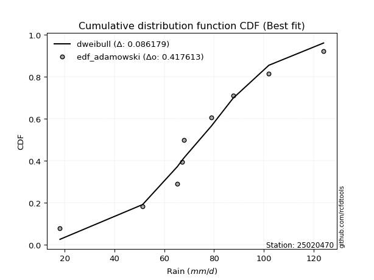</img>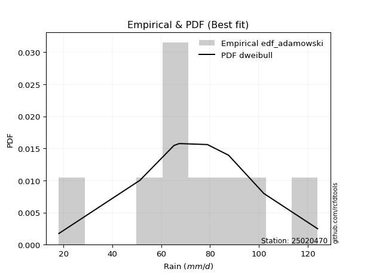</img>

</div>


## C. Best fit & Estimate extreme values for specific return periods - Tr


### 1. Best fit (ordered by delta Δ)

<div align="center">

|   id |   station | empirical_dist   | p_dist      |     delta |   deltao | eval   |   fit |   n |   best_fit |   best_fit_sort |
|-----:|----------:|:-----------------|:------------|----------:|---------:|:-------|------:|----:|-----------:|----------------:|
|    0 |  25020470 | edf_weibull      | invgauss    | 0.0826507 | 0.417613 | Δo > Δ |     1 |   9 |          1 |               1 |
|    1 |  25020470 | edf_adamowski    | invgauss    | 0.0879139 | 0.417613 | Δo > Δ |     1 |   9 |          1 |               2 |
|    2 |  25020470 | edf_chegodayev   | invgauss    | 0.0890337 | 0.417613 | Δo > Δ |     1 |   9 |          1 |               3 |
|    3 |  25020470 | edf_jenkinson    | invgauss    | 0.0892605 | 0.417613 | Δo > Δ |     1 |   9 |          1 |               4 |
|    4 |  25020470 | edf_beard        | invgauss    | 0.0892605 | 0.417613 | Δo > Δ |     1 |   9 |          1 |               5 |
|    5 |  25020470 | edf_filliben     | invgauss    | 0.0894313 | 0.417613 | Δo > Δ |     1 |   9 |          1 |               6 |
|    6 |  25020470 | edf_tukey        | invgauss    | 0.0897936 | 0.417613 | Δo > Δ |     1 |   9 |          1 |               7 |
|    7 |  25020470 | edf_blom         | invgauss    | 0.0907588 | 0.417613 | Δo > Δ |     1 |   9 |          1 |               8 |
|    8 |  25020470 | edf_cunnane      | invgauss    | 0.0913464 | 0.417613 | Δo > Δ |     1 |   9 |          1 |               9 |
|    9 |  25020470 | edf_gringorten   | invgauss    | 0.0922998 | 0.417613 | Δo > Δ |     1 |   9 |          1 |              10 |
|   10 |  25020470 | edf_hazen        | invgauss    | 0.0937618 | 0.417613 | Δo > Δ |     1 |   9 |          1 |              11 |
|   11 |  25020470 | edf_california   | loglogistic | 0.0998091 | 0.417613 | Δo > Δ |     1 |   9 |          1 |              12 |

</div>

:file_folder:Tables: [bestfit_25020470.csv](table/bestfit_25020470.csv) | [extreme_25020470.csv](table/extreme_25020470.csv)


### 2. Extreme values

In hydrology, a return period (or recurrence interval $Tr$) is the statistical average time between extreme events like floods or droughts of a specific magnitude, indicating how rare an event is, with a 100-year flood, for example, having a 1% chance of occurring in any given year, not that it happens exactly every century. It is a key tool for infrastructure design (like bridges or dams) and risk assessment, calculated from historical data to determine the probability of future events, although it is important to remember it is statistical average, and events can cluster or be missed.

> risk_rate: assuming the return period as the project useful life.

|   id |      tr |   prob_l |     prob_g |    alpha |   betaprime |     chi2 |   crystalball |   erlang |    expon |   exponnorm |        f |   fatiguelife |     fisk |    gamma |   genexpon |   genlogistic |   gibrat |   gompertz |   gumbel_l |   gumbel_r |   halflogistic |   halfnorm |   hypsecant |   invgamma |   invgauss |      invweibull |   johnsonsu |   kstwobign |   laplace |   laplace_asymmetric |   loggamma |   logistic |   lognorm |   maxwell |   mielke |    moyal |   nakagami |      ncf |      nct |     norm |           pareto |   pearson3 |   rayleigh |     rice |        t |   truncnorm |     wald |   weibull_min |   logalpha |   logbetaprime |     logchi2 |   logcrystalball |   logerlang |   logexpon |   logexponnorm |     logf |   logfatiguelife |   logfisk |   loggenexpon |   loggenlogistic |   loggibrat |   loggompertz |   loggumbel_l |   loggumbel_r |   loghalflogistic |   loghalfnorm |   loghypsecant |   loginvgamma |   loginvgauss |   loginvweibull |   logjohnsonsu |   logkstwobign |   loglaplace |   loglaplace_asymmetric |   logloggamma |   loglogistic |     loglognorm |   logmaxwell |   logmielke |   logmoyal |   lognakagami |   logncf |   lognct |     logpareto |   logpearson3 |   lograyleigh |   logrice |      logt |   logtruncnorm |   logwald |   logweibull_min |   station |   n |   risk_rate |
|-----:|--------:|---------:|-----------:|---------:|------------:|---------:|--------------:|---------:|---------:|------------:|---------:|--------------:|---------:|---------:|-----------:|--------------:|---------:|-----------:|-----------:|-----------:|---------------:|-----------:|------------:|-----------:|-----------:|----------------:|------------:|------------:|----------:|---------------------:|-----------:|-----------:|----------:|----------:|---------:|---------:|-----------:|---------:|---------:|---------:|-----------------:|-----------:|-----------:|---------:|---------:|------------:|---------:|--------------:|-----------:|---------------:|------------:|-----------------:|------------:|-----------:|---------------:|---------:|-----------------:|----------:|--------------:|-----------------:|------------:|--------------:|--------------:|--------------:|------------------:|--------------:|---------------:|--------------:|--------------:|----------------:|---------------:|---------------:|-------------:|------------------------:|--------------:|--------------:|---------------:|-------------:|------------:|-----------:|--------------:|---------:|---------:|--------------:|--------------:|--------------:|----------:|----------:|---------------:|----------:|-----------------:|----------:|----:|------------:|
|    0 |    2    | 0.5      | 0.5        |  67.1118 |     68.1107 |  68.2095 |       69.6511 |  68.3152 |  53.8325 |     69.4993 |  68.4796 |       18.1001 |  68.0246 |  68.3452 |    53.8453 |       67.7058 |  60.688  |    113.733 |    74.5567 |    64.7455 |        62.3068 |    63.5387 |     69.6511 |    67.2672 |    66.5035 |   629.047       |     68.4714 |     63.8946 |   69.6511 |              68.4583 |    61.1099 |    69.6511 |   61.8969 |   67.0973 |  55.2147 |  63.1619 |    45.631  |  68.1222 |  69.1847 |  69.6511 |     19.768       |    68.8374 |    66.1915 |  68.1893 |  69.65   |     76.0703 |  59.9716 |       68.06   |    60.2767 |        61.1963 |     29.619  |          61.8969 |     60.7576 |    42.4436 |        61.8966 |  61.8857 |          61.8511 |   65.3501 |       52.9177 |          68.7639 |     52.7727 |       66.3519 |       67.5426 |       56.7231 |           54.3144 |       55.5176 |        61.8969 |       61.2966 |       59.901  |         58.3947 |        69.294  |        54.3243 |      61.8969 |                 64.6354 |       69.1516 |       61.8969 |  18.5695       |      59.1471 |     68.7467 |    55.1469 |       57.6554 |  61.3818 |  61.8348 |  18.8855      |       67.7628 |       58.2011 |   61.897  |   67.8029 |        61.2047 |   52.1029 |          67.8286 |  25020470 |   9 |    0.75     |
|    1 |    2.33 | 0.570815 | 0.429185   |  72.5075 |     73.4766 |  73.5854 |       74.9797 |  73.6777 |  61.7054 |     74.8194 |  73.8247 |       19.1518 |  72.9588 |  73.7073 |    61.7211 |       72.7812 |  63.3873 |    114.531 |    79.1926 |    69.6831 |        67.3833 |    69.2897 |     73.9156 |    72.6787 |    71.9583 | 14760           |     73.8179 |     69.9563 |   72.8757 |              72.0847 |    67.5472 |    74.346  |   68.0529 |   72.6333 |  63.1881 |  67.8359 |    47.9961 |  73.5099 |  74.4764 |  74.9797 |     23.767       |    74.185  |    71.8094 |  73.7525 |  74.9785 |     79.237  |  63.4656 |       73.6496 |    66.6878 |        67.5946 |     35.3534 |          68.0529 |     67.1638 |    51.2111 |        68.0526 |  68.0311 |          67.9988 |   70.885  |       60.4207 |          74.1088 |     55.369  |       72.0869 |       73.3505 |       61.9321 |           59.4489 |       61.5    |        66.7765 |       67.5567 |       66.5068 |         66.6347 |        75.1206 |        62.3066 |      65.5523 |                 68.2818 |       74.8889 |       67.2898 |  21.8688       |      65.2701 |     76.1231 |    59.9295 |       61.721  |  67.7154 |  68.0696 |  20.9107      |       73.912  |       64.3202 |   68.0531 |   72.7378 |        65.757  |   55.4453 |          73.4246 |  25020470 |   9 |    0.729209 |
|    2 |    5    | 0.8      | 0.2        |  93.87   |     94.2379 |  94.4015 |       94.7821 |  94.3425 | 101.068  |     94.6832 |  94.3632 |       41.4897 |  92.8931 |  94.3691 |   101.098  |       93.3817 |  78.9276 |    117.109 |    94.1693 |    91.1339 |        90.3537 |    93.6096 |     91.0213 |    94.0353 |    93.8107 |     1.49615e+10 |     94.3577 |     95.7054 |   88.998  |              90.2161 |    98.6011 |    92.4734 |   96.7999 |   94.4227 |  92.1988 |  89.4862 |    75.69   |  94.3723 |  94.4451 |  94.7821 |   2550.3         |    94.5155 |    94.3005 |  94.9054 |  94.7807 |     90.9994 |  83.0252 |       94.9356 |    98.1632 |        98.364  |    100.144  |          96.7998 |     98.1557 |   130.949  |        96.7995 |  96.7303 |          96.7299 |   97.0463 |      102.842  |          94.1968 |     73.0046 |       94.6133 |       95.7501 |       90.7157 |           89.4642 |       94.8036 |        90.5341 |       97.7537 |       99.7016 |        118.238  |        96.2919 |       111.544  |      87.3327 |                 87.2778 |       95.8511 |       92.9038 |   7.07577e+139 |      96.1827 |    101.372  |    88.0946 |       83.9946 |  97.997  |  97.4044 |   1.91872e+29 |       97.246  |       95.9754 |   96.8004 |   96.533  |        92.8157 |   78.5281 |          94.8567 |  25020470 |   9 |    0.67232  |
|    3 |   10    | 0.9      | 0.1        | 109.298  |    108.735  | 108.95   |      107.919  | 108.7    | 136.801  |    107.962  | 108.599  |       72.3327 | 108.514  | 108.723  |   136.843  |      109.235  |  96.6417 |    118.544 |   102.508  |   108.605  |       109.43   |   111.606  |    104.681  |   109.37   |   109.758  |     1.16713e+15 |    108.59   |    115.31   |  103.633  |             106.675  |   127.398  |   105.824  |  122.29   |  109.757  | 106.971  | 108.336  |   112.109  | 108.942  | 108.018  | 107.919  | 643842           |   108.403  |   110.337  | 109.213  | 107.917  |     98.7863 | 103.782  |      109.281  |   128.134  |       126.784  |    293.437  |         122.29   |    127.012  |   307.069  |       122.289  | 122.181  |         122.237  |  122.334  |      150.362  |         108.996  |    100.053  |      110.285  |      111.065  |      123.793  |          125.62   |      130.588  |       115.443  |      125.813  |      132.317  |        188.63   |       109.404  |       173.783  |     113.312  |                109.062  |      109.203  |      117.815  | inf            |     126.356  |    113.131  |   123.202  |      106.523  | 125.745  | 123.688  | inf           |      112.195  |      127.671  |  122.291  |  122.305  |       124.667  |  113.617  |         109.394  |  25020470 |   9 |    0.651322 |
|    4 |   15    | 0.933333 | 0.0666667  | 117.413  |    116.19   | 116.434  |      114.474  | 116.06   | 157.703  |    114.627  | 115.893  |       92.5046 | 117.378  | 116.082  |   157.753  |      118.007  | 108.86   |    119.194 |   106.284  |   118.463  |       120.225  |   120.971  |    112.476  |   117.399  |   118.172  |     6.71775e+17 |    115.881  |    125.718  |  112.195  |             116.303  |   145.005  |   113.097  |  137.419  |  117.625  | 112.965  | 119.276  |   133.803  | 116.431  | 114.909  | 114.474  |      1.64346e+07 |   115.454  |   118.6    | 116.408  | 114.472  |    102.66   | 117.112  |      116.458  |   146.813  |       144.12   |    568.896  |         137.419  |    144.706  |   505.534  |       137.419  | 137.289  |         137.39   |  138.795  |      182.892  |         117.367  |    124.35   |      118.248  |      118.784  |      147.527  |          152.224  |      154.269  |       132.62   |      143.015  |      153.067  |        245.505  |       115.557  |       219.905  |     131.957  |                124.245  |      115.666  |      134.094  | inf            |     145.344  |    117.158  |   149.678  |      120.688  | 142.581  | 139.398  | inf           |      119.224  |      147.893  |  137.421  |  141.485  |       147.139  |  144.03   |         116.691  |  25020470 |   9 |    0.644736 |
|    5 |   20    | 0.95     | 0.05       | 122.886  |    121.152  | 121.416  |      118.767  | 120.952  | 172.533  |    119.008  | 120.74   |      107.439  | 123.655  | 120.972  |   172.589  |      124.105  | 118.445  |    119.599 |   108.635  |   125.364  |       127.788  |   127.215  |    117.975  |   122.799  |   123.852  |     5.75147e+19 |    120.726  |    132.729  |  118.269  |             123.134  |   157.926  |   118.125  |  148.328  |  122.846  | 116.578  | 127.024  |   148.787  | 121.414  | 119.468  | 118.767  |      1.63695e+08 |   120.116  |   124.092  | 121.136  | 118.765  |    105.189  | 127.045  |      121.157  |   160.683  |       156.823  |    919.785  |         148.328  |    157.712  |   720.062  |       148.327  | 148.183  |         148.32   |  151.455  |      208.329  |         123.355  |    147.471  |      123.502  |      123.858  |      166.804  |          174.152  |      172.399  |       146.253  |      155.662  |      168.663  |        295.254  |       119.431  |       257.69   |     147.019  |                136.282  |      119.825  |      146.643  | inf            |     159.495  |    119.193  |   171.802  |      131.193  | 154.88   | 150.772  | inf           |      123.621  |      163.076  |  148.329  |  157.876  |       165.04   |  171.877  |         121.477  |  25020470 |   9 |    0.641514 |
|    6 |   25    | 0.96     | 0.04       | 127      |    124.845  | 125.125  |      121.927  | 124.589  | 184.037  |    122.242  | 124.345  |      119.306  | 128.542  | 124.608  |   184.096  |      128.784  | 126.435  |    119.887 |   110.307  |   130.681  |       133.616  |   131.86   |    122.231  |   126.849  |   128.121  |     1.77155e+21 |    124.328  |    137.98   |  122.98   |             128.433  |   168.216  |   121.971  |  156.907  |  126.723  | 119.139  | 133.029  |   160.1    | 125.122  | 122.849  | 121.927  |      9.73549e+08 |   123.569  |   128.172  | 124.624  | 121.925  |    107.046  | 135.001  |      124.614  |   171.826  |       166.931  |   1341.96   |         156.907  |    168.084  |   947.385  |       156.907  | 156.752  |         156.921  |  161.917  |      229.496  |         128.07   |    169.999  |      127.386  |      127.599  |      183.353  |          193.179  |      187.256  |       157.759  |      165.751  |      181.301  |        340.346  |       122.2    |       290.188  |     159.876  |                146.417  |      122.85   |      157.03   | inf            |     170.885  |    120.42   |   191.177  |      139.608  | 164.645  | 159.743  | inf           |      126.741  |      175.358  |  156.909  |  172.668  |       180.142  |  198.018  |         125.002  |  25020470 |   9 |    0.639603 |
|    7 |   50    | 0.98     | 0.02       | 139.192  |    135.613  | 135.942  |      130.977  | 135.175  | 219.769  |    131.551  | 134.839  |      157.378  | 143.942  | 135.19   |   219.842  |      143.132  | 154.6    |    120.668 |   114.848  |   147.057  |       151.571  |   145.364  |    135.427  |   138.803  |   140.761  |     6.82255e+25 |    134.813  |    153.401  |  137.616  |             144.892  |   201.822  |   133.721  |  184.322  |  137.965  | 126.302  | 151.672  |   193.376  | 135.926  | 132.657  | 130.977  |      2.47529e+11 |   133.563  |   140.017  | 134.641  | 130.975  |    112.317  | 160.978  |      134.494  |   208.789  |       199.89   |   4439.1    |         184.321  |    202.029  |  2221.57   |       184.321  | 184.136  |         184.421  |  198.592  |      303.955  |         143.336  |    280.6    |      138.573  |      138.336  |      245.382  |          265.893  |      238.118  |       199.51   |      198.798  |      223.861  |        527.312  |       129.736  |       411.288  |     207.435  |                182.962  |      131.338  |      193.548  | inf            |     208.73   |    122.891  |   266.381  |      167.282  | 196.36   | 188.557  | inf           |      135.076  |      216.502  |  184.324  |  235.451  |       234.624  |  314.384  |         135.095  |  25020470 |   9 |    0.63583  |
|    8 |   75    | 0.986667 | 0.0133333  | 145.999  |    141.51   | 141.866  |      135.832  | 140.96   | 240.671  |    136.579  | 140.578  |      180.307  | 153.167  | 140.973  |   240.751  |      151.442  | 173.623  |    121.063 |   117.144  |   156.576  |       162.008  |   152.714  |    143.138  |   145.444  |   147.804  |     3.15695e+28 |    140.545  |    161.886  |  146.177  |             154.52   |   222.73   |   140.508  |  200.955  |  144.078  | 130.198  | 162.574  |   211.567  | 141.838  | 138.002  | 135.832  |      6.31854e+12 |   138.989  |   146.461  | 140.033  | 135.83   |    115.101  | 176.963  |      139.78   |   232.212  |       220.359  |   9054.18   |         200.955  |    223.201  |  3657.42   |       200.955  | 200.754  |         201.121  |  223.462  |      354.179  |         152.833  |    393.624  |      144.608  |      144.105  |      290.67   |          320.156  |      271.393  |       228.852  |      219.437  |      251.292  |        680.125  |       133.535  |       498.291  |     241.568  |                208.432  |      135.79   |      218.391  | inf            |     232.712  |    123.727  |   323.408  |      184.589  | 215.969  | 206.144  | inf           |      139.155  |      242.808  |  200.958  |  290.2    |       272.472  |  417.826  |         140.504  |  25020470 |   9 |    0.634587 |
|    9 |  100    | 0.99     | 0.01       | 150.713  |    145.545  | 145.92   |      139.116  | 144.914  | 255.502  |    139.995  | 144.503  |      196.805  | 159.831  | 144.925  |   255.587  |      157.316  | 188.359  |    121.322 |   118.646  |   163.313  |       169.395  |   157.722  |    148.608  |   150.029  |   152.673  |     2.43042e+30 |    144.465  |    167.699  |  152.251  |             161.351  |   238.165  |   145.3    |  213.049  |  148.241  | 132.909  | 170.308  |   223.948  | 145.881  | 141.651  | 139.116  |      6.29351e+13 |   142.685  |   150.851  | 143.685  | 139.115  |    116.955  | 188.617  |      143.347  |   249.705  |       235.455  |  15084.4    |         213.049  |    238.855  |  5209.48   |       213.048  | 212.837  |         213.268  |  242.881  |      393.076  |         159.875  |    511.625  |      148.699  |      148.008  |      327.689  |          365.129  |      296.687  |       252.246  |      234.713  |      271.992  |        814.352  |       136.007  |       568.305  |     269.141  |                228.627  |      138.761  |      237.827  | inf            |     250.607  |    124.157  |   371.125  |      197.391  | 230.391  | 218.976  | inf           |      141.751  |      262.537  |  213.051  |  341.689  |       302.345  |  514.12   |         144.159  |  25020470 |   9 |    0.633968 |
|   10 |  200    | 0.995    | 0.005      | 161.751  |    154.84   | 155.261  |      146.566  | 154.009  | 291.234  |    147.794  | 153.537  |      237.19   | 176.339  | 154.017  |   291.332  |      171.42   | 228.451  |    121.884 |   121.91   |   179.509  |       187.155  |   169.174  |    161.785  |   160.717  |   164.035  |     8.33309e+34 |    153.487  |    181.088  |  166.886  |             177.81   |   277.537  |   156.794  |  243.247  |  157.766  | 139.405  | 188.943  |   252.16   | 155.188  | 150.038  | 146.566  |      1.60015e+16 |   151.145  |   160.897  | 151.984  | 146.564  |    121.022  | 217.647  |      151.414  |   295.073  |       273.908  |  52292.9    |         243.247  |    278.874  | 12216      |       243.247  | 243.014  |         243.621  |  296.653  |      498.938  |         178.029  |   1044.12   |      158.004  |      156.86   |      437.143  |          500.824  |      363.754  |       318.903  |      273.828  |      326.455  |       1255.65   |       141.326  |       769.296  |     349.203  |                285.69   |      145.386  |      291.8    | inf            |     296.894  |    124.872  |   517.042  |      230.084  | 266.988  | 251.179  | inf           |      147.144  |      313.922  |  243.25   |  538.378  |       385.931  |  861.82   |         152.436  |  25020470 |   9 |    0.633042 |
|   11 |  250    | 0.996    | 0.004      | 165.224  |    157.719  | 158.155  |      148.843  | 156.823  | 302.737  |    150.193  | 156.336  |      250.351  | 181.8    | 156.83   |   302.84   |      175.951  | 242.836  |    122.049 |   122.87   |   184.716  |       192.864  |   172.698  |    166.027  |   164.065  |   167.597  |     2.39212e+36 |    156.28   |    185.232  |  171.598  |             183.109  |   290.901  |   160.484  |  253.303  |  160.699  | 141.513  | 194.942  |   260.8    | 158.07   | 152.633  | 148.843  |      9.51664e+16 |   153.751  |   163.989  | 154.525  | 148.841  |    122.208  | 227.251  |      153.872  |   310.708  |       286.945  |  78299.4    |         253.303  |    292.486  | 16072.5    |       253.303  | 253.065  |         253.735  |  316.334  |      536.951  |         184.264  |   1348.68   |      160.853  |      159.563  |      479.58   |          554.378  |      387.291  |       343.906  |      287.154  |      345.466  |       1443.2    |       142.873  |       844.877  |     379.741  |                306.936  |      147.379  |      311.603  | inf            |     312.795  |    125.045  |   575.287  |      241.184  | 279.353  | 261.952  | inf           |      148.654  |      331.679  |  253.306  |  636.646  |       416.706  | 1022.44   |         154.96   |  25020470 |   9 |    0.632858 |
|   12 |  500    | 0.998    | 0.002      | 175.808  |    166.369  | 166.849  |      155.594  | 165.266  | 338.47   |    157.355  | 164.738  |      291.638  | 199.252  | 165.269  |   338.585  |      190.007  | 292.551  |    122.523 |   125.624  |   200.877  |       210.585  |   183.203  |    179.204  |   174.226  |   178.411  |     8.01757e+40 |    164.666  |    197.649  |  186.233  |             199.568  |   334.695  |   171.928  |  285.635  |  169.448  | 148.181  | 213.576  |   286.435  | 166.718  | 160.418  | 155.594  |      2.41964e+19 |   161.539  |   173.215  | 162.068  | 155.592  |    125.48   | 257.789  |      161.138  |   362.745  |       329.618  | 276835      |         285.635  |    337.178  | 37689.3    |       285.635  | 285.384  |         286.275  |  386.104  |      668.489  |         204.986  |   3266.35   |      169.311  |      167.575  |      639.368  |          759.885  |      466.897  |       434.776  |      330.992  |      409.547  |       2223.2    |       147.246  |      1118.83   |     492.704  |                383.544  |      153.208  |      381.979  | inf            |     365.489  |    125.489  |   801.469  |      277.53   | 319.688  | 296.743  | inf           |      152.758  |      390.857  |  285.639  | 1160.83   |       526.042  | 1760.52   |         162.43   |  25020470 |   9 |    0.632489 |
|   13 |  750    | 0.998667 | 0.00133333 | 181.881  |    171.245  | 171.75   |      159.344  | 170.018  | 359.372  |    161.37   | 169.473  |      316.032  | 209.818  | 170.019  |   359.495  |      198.222  | 325.429  |    122.776 |   127.095  |   210.325  |       220.945  |   189.071  |    186.912  |   180.024  |   184.583  |     3.54408e+43 |    169.391  |    204.625  |  194.795  |             209.196  |   361.991  |   178.614  |  305.347  |  174.342  | 152.195  | 224.477  |   300.669  | 171.589  | 164.805  | 159.344  |      6.1765e+20  |   165.903  |   178.374  | 166.264  | 159.342  |    127.082  | 276.099  |      165.158  |   395.779  |       356.182  | 582666      |         305.346  |    365.099  | 62048.7    |       305.346  | 305.092  |         306.128  |  433.812  |      755.646  |         218.137  |   5862.98   |      174.016  |      172.021  |      756.416  |          913.701  |      518.293  |       498.688  |      358.445  |      450.824  |       2862.06   |       149.541  |      1310.03   |     573.779  |                436.939  |      156.394  |      430.237  | inf            |     398.741  |    125.711  |   973.021  |      300.146  | 344.696  | 318.065  | inf           |      154.801  |      428.438  |  305.351  | 1760.83   |       600.743  | 2438.6    |         166.569  |  25020470 |   9 |    0.632366 |
|   14 | 1000    | 0.999    | 0.001      | 186.146  |    174.631  | 175.155  |      161.926  | 173.316  | 374.202  |    164.15   | 172.762  |      333.433  | 217.483  | 173.315  |   374.33   |      204.048  | 350.589  |    122.947 |   128.086  |   217.027  |       228.294  |   193.124  |    192.381  |   184.083  |   188.901  |     2.66705e+45 |    172.672  |    209.458  |  200.869  |             216.027  |   382.147  |   183.356  |  319.703  |  177.724  | 155.102  | 232.211  |   310.463  | 174.971  | 167.852  | 161.926  |      6.15204e+21 |   168.923  |   181.939  | 169.155  | 161.924  |    128.071  | 289.269  |      167.92   |   420.457  |       375.781  | 990045      |         319.703  |    385.746  | 88379.6    |       319.703  | 319.447  |         320.594  |  471.19   |      822.437  |         227.966  |   9173.5    |      177.256  |      175.079  |      852.216  |         1041.34   |      557.055  |       549.655  |      378.778  |      481.939  |       3423.69   |       151.067  |      1461.34   |     639.271  |                479.273  |      158.567  |      468.111  | inf            |     423.476  |    125.859  |  1116.58   |      316.822  | 363.102  | 333.645  | inf           |      156.112  |      456.499  |  319.708  | 2448.63   |       659.12   | 3082.67   |         169.414  |  25020470 |   9 |    0.632305 |

<div align="center">

</img>

</div>


<div align="center">

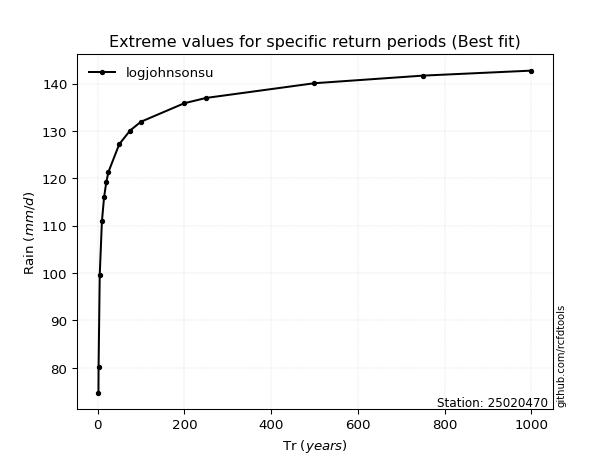</img>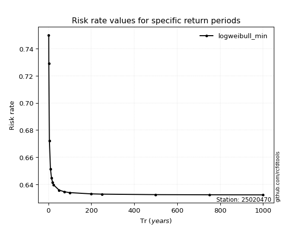</img>

</div>


<sub>**APP DISCLAIMER**: NO WARRANTY - This software is provided by [github.com/rcfdtools](https://github.com/rcfdtools) "as is", without any express or implied warranty, including warranties of merchantability, fitness for a particular purpose, or non-infringement. There is no guarantee that the software will be error-free or operate without interruption. LIMITATION OF LIABILITY - Neither the authors nor copyright holders will be liable for claims or damages arising from the software or its use. You are responsible for determining if the software is appropriate for your use and assume all associated risks, including errors, legal compliance, and data loss. NO PROFESSIONAL ADVICE - The software provides general information and does not offer professional advice. It should not replace consultation with professional advisors.</sub>