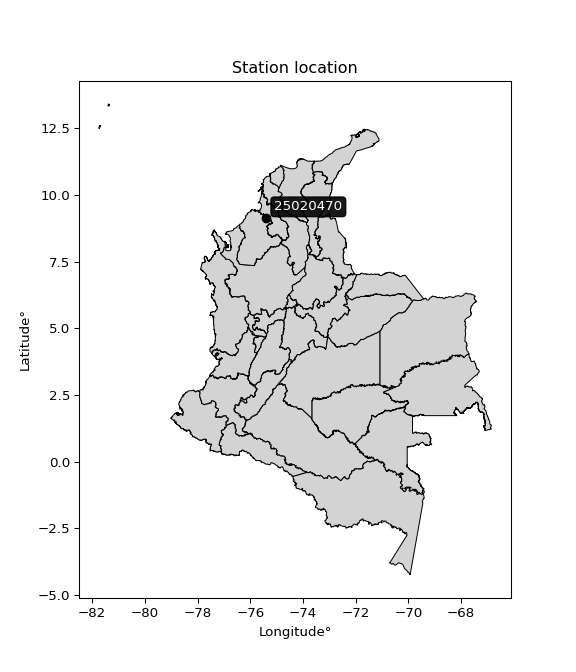

<div align="center">


</div>

# PMP Station (Rain, Pmax24h): 25020470

Probable Maximum Precipitation (PMP) is the greatest amount of rainfall for a specific duration that is meteorologically possible for a given location, acting as a "worst-case" scenario for extreme storms, crucial for designing safety-critical infrastructure like bridges, river deviations, dams, spillways, and nuclear plants to prevent catastrophic failure. PMP is calculated by hydrologists using meteorological data to determine the upper limit of extreme rainfall, often leading to the Probable Maximum Flood (PMF) for flood control design, and is increasingly being studied for climate change impacts. Probable Maximum Precipitation (PMP) is the theoretical upper limit of rainfall, a deterministic estimate for extreme events, while probability distributions (like GEV, Gumbel) describe the likelihood and frequency of various precipitation amounts, including rare ones, showing how often events occur, with PMP representing the extreme end of these distributions, used for critical infrastructure design to ensure safety against the worst conceivable weather, unlike standard statistical forecasts which cover typical probabilities.

The most common probability distributions in hydrology, used for analyzing floods, rainfall, and streamflow, include the Normal, Log-Normal, Gumbel, Gamma (including Log-Pearson Type III), and Generalized Extreme Value (GEV) distributions, often chosen based on the data´s skewness and whether modeling extremes or general conditions, with Gumbel and GEV popular for extreme events like floods, while the Normal distribution serves as a baseline, though often requiring transformations for skewed hydrological data. These distributions help in designing water infrastructure, managing water resources, and forecasting hydrologic events.

> Hydrological data often isn´t perfectly normal (it´s skewed), so different distributions are needed for different applications, such as: **Flood Frequency Analysis**: Using Gumbel, GEV, or Log-Pearson Type III for predicting extreme flood magnitudes and their return periods, **Rainfall Analysis**: Normal for annual totals, but Log-Normal, Weibull, or GEV for intensity or extreme daily rainfall, **Streamflow Modeling**: Gamma and Log-Normal for maximum flows, GEV for minimum flows, and Kappa for daily flows.

<div align="center">

</img>

</div>


## A. General information


### 1. General running parameters

• app_version: _v20260108_. • runtime: _2026-01-08 18:05:13.093906_. • Python version: _3.14.0_. • SciPy version: _1.16.3_. • Pandas version: _2.3.3_. • NumPy version: _2.3.5_. • Stations dataset (station_dataset_file): _dataset/pmax24h_in/automatic_colombia_2003_2024.csv_. • Stations catalog (station_catalog_file): _dataset/CNE.xls_. • Minimum year to eval til year_max (date_min): _1900_. • Maximum year to eval since year_min (date_max): _2024_. • Creates, save and include plots into reports (create_plot): _False_. • Plot only fit distributions with Δo > Δ (plot_only_fit): _True_. • Plot only simple graphs avoiding multiple CDFs and multiple Extreme values plots (plot_only_simple): _False_. • Eval low extreme values, if False, evaluates high extreme values (low_extreme): _False_. • Eval every SciPy distribution as logarithmic (pdist_logarithmic_on): _True_. • Standard deviation normalized (ddof): _1.0_. • Return periods to eval in years (Tr): _[2, 2.33, 5, 10, 15, 20, 25, 50, 75, 100, 200, 250, 500, 750, 1000]_. • Minimum data sample per station, 0 means any (minimum_sample): _5_. • Z-Score maximum threshold to adjust a value, 0 means disable (zscore_max): _3.5_. • Z-Score minimum threshold to adjust a value, 0 means disable (zscore_min): _-2.5_. • Avoid zeros, e.g. rain = 0 (avoid_zeros): _True_. • Avoid null values (avoid_nans): _True_. 

:file_folder:Table: [dataset.csv](../../dataset/pmax24h_in/automatic_colombia_2003_2024.csv)

> Delta Degrees of Freedom (DDOF): is a parameter used in the formulas for calculating variance and standard deviation. When ddof=0, the divisor is $N$ (the total number of observations) and this is used when your data set is the entire population. When ddof=1, the divisor is $N-1$ and this is used when your data set is a sample drawn from a larger population. Using $N-1$ provides an unbiased estimate of the population variance (known as Bessel´s correction).


### 2. Station info and location

|   id |   CODIGO | NOMBRE                 | CATEGORIA     | TECNOLOGIA                              | ESTADO   | FECHA_INSTALACION   |   FECHA_SUSPENSION |   ALTITUD |   LATITUD |   LONGITUD | DEPARTAMENTO   | MUNICIPIO   | AREA_OPERATIVA                              | ENTIDAD                                                     | AREA_HIDROGRAFICA   | ZONA_HIDROGRAFICA                | SUBZONA_HIDROGRAFICA       |   CORRIENTE | Catalogo   |   Version |
|-----:|---------:|:-----------------------|:--------------|:----------------------------------------|:---------|:--------------------|-------------------:|----------:|----------:|-----------:|:---------------|:------------|:--------------------------------------------|:------------------------------------------------------------|:--------------------|:---------------------------------|:---------------------------|------------:|:-----------|----------:|
|    0 | 25020470 | CHINU - AUT [25020470] | Pluviométrica | Automática con Telemetría, Convencional | Activa   | 11/12/2014          |                nan |       125 |   9.11778 |   -75.3933 | Cordoba        | Chinú       | Area Operativa 02 - Atlántico-Bolivar-Sucre | INSTITUTO DE HIDROLOGIA METEOROLOGIA Y ESTUDIOS AMBIENTALES | Magdalena Cauca     | Bajo Magdalena- Cauca -San Jorge | Bajo San Jorge - La Mojana |         nan | CNE_IDEAM  |  20251226 |

<div align="center">

Dynamic map: [:earth_americas:Google](http://maps.google.com/maps?q=9.117777778,-75.39333333) [:earth_americas:OSM](https://www.openstreetmap.org/#map=18/9.117777778/-75.39333333&layers=P) [:earth_americas:Bing](https://www.bing.com/maps?cp=9.117777778~-75.39333333&lvl=18) [:earth_americas:Apple](https://maps.apple.com/frame?center=9.117777778%2C-75.39333333&span=0.003%2C0.006)

</div>


<div align="center">

```geojson
{
  "type": "Feature",
  "geometry": {
    "type": "Point", 
    "coordinates": [-75.39333333, 9.117777778]
  }, 
  "properties": {
    "Name": "25020470"
  }
}
```

</div>


### 3. Discrete values table and plot

<div align="center">

|               |           0 |           1 |           2 |           3 |          4 |           5 |         6 |           7 |
|:--------------|------------:|------------:|------------:|------------:|-----------:|------------:|----------:|------------:|
| Date          | 2017        | 2018        | 2019        | 2020        | 2021       | 2022        | 2023      | 2024        |
| Value         |   51.29     |   67.87     |   67.2      |   87.6      |  124       |   65.2      |   18.1    |  102        |
| Value_initial |   51.29     |   67.87     |   67.2      |   87.6      |  124       |   65.2      |   18.1    |  102        |
| count         |    8        |    8        |    8        |    8        |    8       |    8        |    8      |    8        |
| mean          |   72.9075   |   72.9075   |   72.9075   |   72.9075   |   72.9075  |   72.9075   |   72.9075 |   72.9075   |
| std           |   32.2074   |   32.2074   |   32.2074   |   32.2074   |   32.2074  |   32.2074   |   32.2074 |   32.2074   |
| zscore        |   -0.671196 |   -0.156408 |   -0.177211 |    0.456184 |    1.58636 |   -0.239308 |   -1.7017 |    0.903286 |


</div>


> The initial value (value_initial) correspond to the initial obtained or null completed value, and value (value) is adjusted only when the initial value is outside the valid range (outlier) definite through the Z-Score value. If Z-Score is active, values out of range or outliers are replaced with the station mean value. A Z-Score (or standard score) measures how many standard deviations a data point is from the mean of a dataset, indicating its relative position; positive scores mean above the mean, negative mean below, and a score of zero is exactly at the mean, allowing for comparison of values from different distributions. It´s calculated using the formula $z=(x–μ)/σ$, where $x$ is the data point, $μ$ is the mean, and $σ$ is the standard deviation, helping identify outliers and understand probability.
>
> <sub>**Note**: In this study, "completing" (filling gaps in) and "extending" (forecasting or lengthening the historical record) rainfall data series are avoided for certain critical analyses because they introduce artificial bias and uncertainty, which can distort the statistics of rare events (extremes), alter day-to-day variability, and compromise the integrity and homogeneity of the original data. Some reasons against Completing/Extending rainfall data are: **Distortion of Extremes and Variability**: The primary issue is that most gap-filling or extension methods rely on averaging or regression with nearby stations, which inherently smooths the data. Rainfall is highly variable in space and time, with a large percentage of zero values and occasional large storms. Infilling methods often underestimate the highest values and overestimate the lowest (zero) values, which severely distorts analyses focused on flood frequency, drought severity, and intensity-duration-frequency (IDF) curves, **Loss of Data Homogeneity**: Infilled or extended data are synthetic estimates, not actual measurements. Combining these estimates with observed data can violate the assumption of data homogeneity, which requires that the data properties do not change over time. Inhomogeneity can lead to incorrect conclusions about long-term trends or changes in climate patterns, **Propagation of Errors**: Errors and biases from the original data (e.g., wind-induced undercatch, instrument errors, site changes) or the data used for imputation can propagate through the analysis, leading to unreliable hydrological models and inaccurate predictions, **Compromised Statistical Integrity**: For statistical analyses, especially those involving the frequency of events, using artificial data can introduce time bias or autocorrelation that doesn´t exist in reality, making it difficult to assess the true probability of events, **Difficulty in Validation**: It is difficult to accurately validate the quality of filled or extended data, especially for past periods where ground-truth measurements are unavailable. The reliability of imputation techniques heavily depends on the density of the surrounding station network and the complexity of the local topography.</sub>


### 4. Active continuous probability distributions from SciPy (43 of 104 available)

A Probability Density Function (PDF) describes the relative likelihood of a continuous random variable falling within a specific range, where the total area under its curve equals 1, and the area over any interval gives the actual probability for that range. Unlike discrete probabilities (like rolling a die), a PDF shows density, not direct probability for a single point (which is zero), with higher points indicating higher likelihood, often visualized as a bell curve for normal distributions.

A log of a probability density function (log-PDF) is simply the logarithm of the PDF´s value, denoted as $log(f(x))$, useful for converting multiplication of probabilities into addition, improving numerical stability with tiny numbers, and connecting to information theory concepts like entropy. Instead of dealing with very small probabilities (e.g., 0.000001), log-PDFs use negative numbers (e.g., $log(0.00001) ≈ -11.51$ that are easier for computers to handle, preventing underflow errors and simplifying complex calculations. In this study, each active probability distribution from SciPy is also evaluated in the $log$ form.

[scipy.stats](https://docs.scipy.org/doc/scipy/reference/stats.html) is a Python´s powerful submodule within the SciPy library for comprehensive statistical analysis, offering over 130 probability distributions (like Normal, Poisson), functions for descriptive stats (mean, variance), hypothesis testing (t-tests, chi-square), random variable generation, and statistical tests, making it essential for data science, modeling, and research. It provides tools to explore, model, and draw conclusions from data efficiently, working seamlessly with NumPy.

<div align="center">

|   id | p_dist             |   n_parameter | fit_method   | label                                                                       | active   | ref                                                                                                        |
|-----:|:-------------------|--------------:|:-------------|:----------------------------------------------------------------------------|:---------|:-----------------------------------------------------------------------------------------------------------|
|    0 | alpha              |             3 | MLE          | Alpha                                                                       | True     | [:mortar_board:](https://docs.scipy.org/doc/scipy/reference/generated/scipy.stats.alpha.html)              |
|    1 | betaprime          |             4 | MLE          | Beta prime                                                                  | True     | [:mortar_board:](https://docs.scipy.org/doc/scipy/reference/generated/scipy.stats.betaprime.html)          |
|    2 | chi2               |             3 | MLE          | Chi²                                                                        | True     | [:mortar_board:](https://docs.scipy.org/doc/scipy/reference/generated/scipy.stats.chi2.html)               |
|    3 | crystalball        |             4 | MLE          | Crystalball                                                                 | True     | [:mortar_board:](https://docs.scipy.org/doc/scipy/reference/generated/scipy.stats.crystalball.html)        |
|    4 | erlang             |             3 | MLE          | Erlang                                                                      | True     | [:mortar_board:](https://docs.scipy.org/doc/scipy/reference/generated/scipy.stats.erlang.html)             |
|    5 | expon              |             2 | MLE          | Exponential                                                                 | True     | [:mortar_board:](https://docs.scipy.org/doc/scipy/reference/generated/scipy.stats.expon.html)              |
|    6 | exponnorm          |             3 | MLE          | Exponentially modified Normal                                               | True     | [:mortar_board:](https://docs.scipy.org/doc/scipy/reference/generated/scipy.stats.exponnorm.html)          |
|    7 | f                  |             4 | MLE          | F                                                                           | True     | [:mortar_board:](https://docs.scipy.org/doc/scipy/reference/generated/scipy.stats.f.html)                  |
|    8 | fatiguelife        |             3 | MLE          | Fatigue-life (Birnbaum-Saunders)                                            | True     | [:mortar_board:](https://docs.scipy.org/doc/scipy/reference/generated/scipy.stats.fatiguelife.html)        |
|    9 | fisk               |             3 | MLE          | Fisk                                                                        | True     | [:mortar_board:](https://docs.scipy.org/doc/scipy/reference/generated/scipy.stats.fisk.html)               |
|   10 | gamma              |             3 | MLE          | Gamma                                                                       | True     | [:mortar_board:](https://docs.scipy.org/doc/scipy/reference/generated/scipy.stats.gamma.html)              |
|   11 | genexpon           |             5 | MLE          | Generalized exponential                                                     | True     | [:mortar_board:](https://docs.scipy.org/doc/scipy/reference/generated/scipy.stats.genexpon.html)           |
|   12 | genlogistic        |             3 | MLE          | Generalized logistic                                                        | True     | [:mortar_board:](https://docs.scipy.org/doc/scipy/reference/generated/scipy.stats.genlogistic.html)        |
|   13 | gibrat             |             2 | MM           | Gibrat                                                                      | True     | [:mortar_board:](https://docs.scipy.org/doc/scipy/reference/generated/scipy.stats.gibrat.html)             |
|   14 | gompertz           |             3 | MLE          | Gompertz (or truncated Gumbel)                                              | True     | [:mortar_board:](https://docs.scipy.org/doc/scipy/reference/generated/scipy.stats.gompertz.html)           |
|   15 | gumbel_l           |             2 | MM           | Gumbel Left Skew                                                            | True     | [:mortar_board:](https://docs.scipy.org/doc/scipy/reference/generated/scipy.stats.gumbel_l.html)           |
|   16 | gumbel_r           |             2 | MM           | Gumbel Right Skew                                                           | True     | [:mortar_board:](https://docs.scipy.org/doc/scipy/reference/generated/scipy.stats.gumbel_r.html)           |
|   17 | halflogistic       |             2 | MM           | Half-logistic                                                               | True     | [:mortar_board:](https://docs.scipy.org/doc/scipy/reference/generated/scipy.stats.halflogistic.html)       |
|   18 | halfnorm           |             2 | MM           | Half Normal                                                                 | True     | [:mortar_board:](https://docs.scipy.org/doc/scipy/reference/generated/scipy.stats.halfnorm.html)           |
|   19 | hypsecant          |             2 | MM           | hyperbolic secant                                                           | True     | [:mortar_board:](https://docs.scipy.org/doc/scipy/reference/generated/scipy.stats.hypsecant.html)          |
|   20 | invgamma           |             3 | MLE          | Inverted gamma                                                              | True     | [:mortar_board:](https://docs.scipy.org/doc/scipy/reference/generated/scipy.stats.invgamma.html)           |
|   21 | invgauss           |             3 | MLE          | Inverse Gaussian                                                            | True     | [:mortar_board:](https://docs.scipy.org/doc/scipy/reference/generated/scipy.stats.invgauss.html)           |
|   22 | invweibull         |             3 | MLE          | Inverted Weibull                                                            | True     | [:mortar_board:](https://docs.scipy.org/doc/scipy/reference/generated/scipy.stats.invweibull.html)         |
|   23 | kstwobign          |             2 | MLE          | Limiting distribution of scaled Kolmogorov-Smirnov two-sided test statistic | True     | [:mortar_board:](https://docs.scipy.org/doc/scipy/reference/generated/scipy.stats.kstwobign.html)          |
|   24 | laplace            |             2 | MM           | Laplace                                                                     | True     | [:mortar_board:](https://docs.scipy.org/doc/scipy/reference/generated/scipy.stats.laplace.html)            |
|   25 | laplace_asymmetric |             3 | MLE          | Asymmetric Laplace                                                          | True     | [:mortar_board:](https://docs.scipy.org/doc/scipy/reference/generated/scipy.stats.laplace_asymmetric.html) |
|   26 | loggamma           |             3 | MLE          | Log gamma                                                                   | True     | [:mortar_board:](https://docs.scipy.org/doc/scipy/reference/generated/scipy.stats.loggamma.html)           |
|   27 | logistic           |             2 | MM           | Logistic (or Sech-squared)                                                  | True     | [:mortar_board:](https://docs.scipy.org/doc/scipy/reference/generated/scipy.stats.logistic.html)           |
|   28 | lognorm            |             3 | MLE          | Log Normal                                                                  | True     | [:mortar_board:](https://docs.scipy.org/doc/scipy/reference/generated/scipy.stats.lognorm.html)            |
|   29 | maxwell            |             2 | MM           | Maxwell                                                                     | True     | [:mortar_board:](https://docs.scipy.org/doc/scipy/reference/generated/scipy.stats.maxwell.html)            |
|   30 | mielke             |             4 | MLE          | Mielke Beta-Kappa / Dagum                                                   | True     | [:mortar_board:](https://docs.scipy.org/doc/scipy/reference/generated/scipy.stats.mielke.html)             |
|   31 | moyal              |             2 | MM           | Moyal                                                                       | True     | [:mortar_board:](https://docs.scipy.org/doc/scipy/reference/generated/scipy.stats.moyal.html)              |
|   32 | nakagami           |             3 | MLE          | Nakagami                                                                    | True     | [:mortar_board:](https://docs.scipy.org/doc/scipy/reference/generated/scipy.stats.nakagami.html)           |
|   33 | ncf                |             5 | MLE          | Non-central F distribution                                                  | True     | [:mortar_board:](https://docs.scipy.org/doc/scipy/reference/generated/scipy.stats.ncf.html)                |
|   34 | nct                |             4 | MLE          | Non-central Student’s t                                                     | True     | [:mortar_board:](https://docs.scipy.org/doc/scipy/reference/generated/scipy.stats.nct.html)                |
|   35 | norm               |             2 | MM           | Normal                                                                      | True     | [:mortar_board:](https://docs.scipy.org/doc/scipy/reference/generated/scipy.stats.norm.html)               |
|   36 | pearson3           |             3 | MM           | Pearson type III                                                            | True     | [:mortar_board:](https://docs.scipy.org/doc/scipy/reference/generated/scipy.stats.pearson3.html)           |
|   37 | rayleigh           |             2 | MM           | Rayleigh                                                                    | True     | [:mortar_board:](https://docs.scipy.org/doc/scipy/reference/generated/scipy.stats.rayleigh.html)           |
|   38 | rice               |             3 | MLE          | Rice                                                                        | True     | [:mortar_board:](https://docs.scipy.org/doc/scipy/reference/generated/scipy.stats.rice.html)               |
|   39 | t                  |             3 | MLE          | Student’s t                                                                 | True     | [:mortar_board:](https://docs.scipy.org/doc/scipy/reference/generated/scipy.stats.t.html)                  |
|   40 | truncnorm          |             4 | MLE          | Truncated normal                                                            | True     | [:mortar_board:](https://docs.scipy.org/doc/scipy/reference/generated/scipy.stats.truncnorm.html)          |
|   41 | wald               |             2 | MM           | Wald                                                                        | True     | [:mortar_board:](https://docs.scipy.org/doc/scipy/reference/generated/scipy.stats.wald.html)               |
|   42 | weibull_min        |             3 | MLE          | Weibull minimum                                                             | True     | [:mortar_board:](https://docs.scipy.org/doc/scipy/reference/generated/scipy.stats.weibull_min.html)        |

</div>

> **n_parameter:** # arguments & localization & scale.
>
> **Fit methods:** (MLE) maximum likelihood, (MM) L-moments.
>
>**Inactive** (With the only purpose of prevent loops, zero divisions, infinite values, over high estimated values or horizontal trending for recurrence intervals estimations, the follow distributions were disabled.)**:** foldnorm, gennorm, norminvgauss, powernorm, powerlognorm, skewnorm, genextreme, anglit, arcsine, argus, beta, bradford, burr, burr12, cauchy, cosine, halfcauchy, foldcauchy, skewcauchy, wrapcauchy, dgamma, gengamma, exponweib, exponpow, truncexpon, gausshyper, genhalflogistic, genhyperbolic, geninvgauss, halfgennorm, johnsonsb, johnsonsu, kappa4, kappa3, ksone, kstwo, loglaplace, levy, levy_l, levy_stable, ncx2, pareto, genpareto, truncpareto, lomax, powerlaw, rdist, rel_breitwigner, recipinvgauss, semicircular, studentized_range, trapezoid, triang, truncweibull_min, tukeylambda, uniform, loguniform, vonmises, vonmises_line, weibull_max, dweibull, 


## B. Probability (PDF) vs. Empirical (EDF) distributions functions

A continuous probability distribution (CPD) describes probabilities for variables that can take any value within a range (like rain any time), unlike discrete variables with specific outcomes (like temperature). It uses a Probability Density Function (PDF), a curve where the total area under it equals 1, and the probability of the variable falling within an interval (a to b) is found by calculating the area under the curve between those points. A key feature is that the probability of hitting any single exact value is zero, so probabilities are always expressed for ranges, e.g., $P(a ≤ X ≤ b)$.

<div align="center">

Distributions parameters from station values
|    |   station | p_dist                |   n |             loc |           scale | shape                  | shape1              | shape2                | shape3   |
|---:|----------:|:----------------------|----:|----------------:|----------------:|:-----------------------|:--------------------|:----------------------|:---------|
|  0 |  25020470 | alpha                 |   8 |   -43.5243      |   254.277       | 2.3776301237281965     |                     |                       |          |
|  1 |  25020470 | betaprime             |   8 |  -609.978       | 66276.6         | 513.2210845708646      | 49816.90043710577   |                       |          |
|  2 |  25020470 | chi2                  |   8 |  -202.429       |     1.72911     | 159.3523659957849      |                     |                       |          |
|  3 |  25020470 | crystalball           |   8 |    72.9075      |    30.1273      | 2286.900946666449      | 9611.784300231639   |                       |          |
|  4 |  25020470 | erlang                |   8 | -1067.08        |     0.798971    | 1426.7955419672212     |                     |                       |          |
|  5 |  25020470 | expon                 |   8 |    18.1         |    54.8075      |                        |                     |                       |          |
|  6 |  25020470 | exponnorm             |   8 |    72.8813      |    30.1272      | 0.0008763631730703659  |                     |                       |          |
|  7 |  25020470 | f                     |   8 | -1534.67        |  1607.64        | 5699.396625786857      | 628244.3233279492   |                       |          |
|  8 |  25020470 | fatiguelife           |   8 |    18.1         |     0.000221092 | 415.94819855705765     |                     |                       |          |
|  9 |  25020470 | fisk                  |   8 |    -6.07178e+07 |     6.07179e+07 | 3524265.906702743      |                     |                       |          |
| 10 |  25020470 | gamma                 |   8 | -1065.88        |     0.80073     | 1422.2406268727364     |                     |                       |          |
| 11 |  25020470 | genexpon              |   8 |    14.8071      |     2.18371     | 4.403869386912799e-10  | 0.03896899189824338 | 1.0031187847531131    |          |
| 12 |  25020470 | genlogistic           |   8 |    70.4663      |    17.7507      | 1.094180474969105      |                     |                       |          |
| 13 |  25020470 | gibrat                |   8 |    49.9242      |    13.9401      |                        |                     |                       |          |
| 14 |  25020470 | gompertz              |   8 |     8.62588     |     4.00768     | 2.5093327902189113e-12 |                     |                       |          |
| 15 |  25020470 | gumbel_l              |   8 |    86.4664      |    23.4901      |                        |                     |                       |          |
| 16 |  25020470 | gumbel_r              |   8 |    59.3486      |    23.4901      |                        |                     |                       |          |
| 17 |  25020470 | halflogistic          |   8 |    37.1997      |    25.7577      |                        |                     |                       |          |
| 18 |  25020470 | halfnorm              |   8 |    33.0308      |    49.978       |                        |                     |                       |          |
| 19 |  25020470 | hypsecant             |   8 |    72.9075      |    19.1796      |                        |                     |                       |          |
| 20 |  25020470 | invgamma              |   8 |  -273.843       | 43925.2         | 127.58529033278452     |                     |                       |          |
| 21 |  25020470 | invgauss              |   8 |  -126.541       |  7867.05        | 0.025294357886268694   |                     |                       |          |
| 22 |  25020470 | invweibull            |   8 |    -6.8773e+09  |     6.8773e+09  | 225086763.38641912     |                     |                       |          |
| 23 |  25020470 | kstwobign             |   8 |   -47.6404      |   138.189       |                        |                     |                       |          |
| 24 |  25020470 | laplace               |   8 |    72.9075      |    21.3032      |                        |                     |                       |          |
| 25 |  25020470 | laplace_asymmetric    |   8 |    67.2         |    21.9063      | 0.8781759902644728     |                     |                       |          |
| 26 |  25020470 | loggamma              |   8 | -1669.48        |   353.721       | 138.30935383549877     |                     |                       |          |
| 27 |  25020470 | logistic              |   8 |    72.9075      |    16.61        |                        |                     |                       |          |
| 28 |  25020470 | lognorm               |   8 |    18.1         |     0.55006     | 12.354101414909607     |                     |                       |          |
| 29 |  25020470 | maxwell               |   8 |     1.5185      |    44.7364      |                        |                     |                       |          |
| 30 |  25020470 | mielke                |   8 |    18.0956      |   117.715       | 0.8310075553875129     | 11.756114988747267  |                       |          |
| 31 |  25020470 | moyal                 |   8 |    55.6788      |    13.562       |                        |                     |                       |          |
| 32 |  25020470 | nakagami              |   8 |    51.29        |    31.7435      | 0.3162408989809763     |                     |                       |          |
| 33 |  25020470 | ncf                   |   8 |    -2.37485     |    73.6939      | 6.724358946160825      | 584.2677843361655   | 0.45886366580972365   |          |
| 34 |  25020470 | nct                   |   8 |  1028.36        |    30.1259      | 615637.1108680028      | -31.715168700951786 |                       |          |
| 35 |  25020470 | norm                  |   8 |    72.9075      |    30.1273      |                        |                     |                       |          |
| 36 |  25020470 | pearson3              |   8 |    72.9075      |    30.1272      | -0.06554520407423867   |                     |                       |          |
| 37 |  25020470 | rayleigh              |   8 |    15.2723      |    45.9863      |                        |                     |                       |          |
| 38 |  25020470 | rice                  |   8 |     1.36745     |    33.1657      | 1.8649463670557305     |                     |                       |          |
| 39 |  25020470 | t                     |   8 |    72.9066      |    30.1272      | 38863694.50584168      |                     |                       |          |
| 40 |  25020470 | truncnorm             |   8 |    77.8363      |    21.3526      | -2.7976159479615323    | 38.48433874808079   |                       |          |
| 41 |  25020470 | wald                  |   8 |    42.7802      |    30.1273      |                        |                     |                       |          |
| 42 |  25020470 | weibull_min           |   8 |   -20.0562      |   103.469       | 3.455218938414741      |                     |                       |          |
| 43 |  25020470 | logalpha              |   8 |   -13.9058      |   565.77        | 31.358017168201705     |                     |                       |          |
| 44 |  25020470 | logbetaprime          |   8 |   -11.8447      |    38.4894      | 1104.8132167931872     | 2656.2067247233354  |                       |          |
| 45 |  25020470 | logchi2               |   8 |     2.89591     |     0.985704    | 1.0183633707800377     |                     |                       |          |
| 46 |  25020470 | logcrystalball        |   8 |     4.35378     |     0.295711    | 0.915606003204212      | 4.651366632309873   |                       |          |
| 47 |  25020470 | logerlang             |   8 |    -4.31007     |     0.0393374   | 215.38286990559442     |                     |                       |          |
| 48 |  25020470 | logexpon              |   8 |     2.89591     |     1.27336     |                        |                     |                       |          |
| 49 |  25020470 | logexponnorm          |   8 |     4.16888     |     0.548023    | 0.0007155265417334864  |                     |                       |          |
| 50 |  25020470 | logf                  |   8 |  -597.804       |   601.976       | 13228872.471140163     | 2925917.8989721853  |                       |          |
| 51 |  25020470 | logfatiguelife        |   8 |  -494.172       |   498.34        | 0.001095595514373448   |                     |                       |          |
| 52 |  25020470 | logfisk               |   8 |    -7.50231e+07 |     7.50231e+07 | 285276304.26775444     |                     |                       |          |
| 53 |  25020470 | loggamma              |   8 |    -6.4222      |     0.0316864   | 334.0406647881846      |                     |                       |          |
| 54 |  25020470 | loggenexpon           |   8 |     2.89542     |     0.00582044  | 0.001210316165192864   | 2.826854004517548   | 9.133807692035652e-06 |          |
| 55 |  25020470 | loggenlogistic        |   8 |     4.64921     |     0.121535    | 0.23458405049090575    |                     |                       |          |
| 56 |  25020470 | loggibrat             |   8 |     3.75122     |     0.253564    |                        |                     |                       |          |
| 57 |  25020470 | loggompertz           |   8 |     2.89591     |     1.3363      | 0.6079418296088451     |                     |                       |          |
| 58 |  25020470 | loggumbel_l           |   8 |     4.41591     |     0.427292    |                        |                     |                       |          |
| 59 |  25020470 | loggumbel_r           |   8 |     3.92263     |     0.427292    |                        |                     |                       |          |
| 60 |  25020470 | loghalflogistic       |   8 |     3.51976     |     0.468523    |                        |                     |                       |          |
| 61 |  25020470 | loghalfnorm           |   8 |     3.44391     |     0.909106    |                        |                     |                       |          |
| 62 |  25020470 | loghypsecant          |   8 |     4.16927     |     0.348883    |                        |                     |                       |          |
| 63 |  25020470 | loginvgamma           |   8 |    -8.82531     |  6630.69        | 511.64881169630576     |                     |                       |          |
| 64 |  25020470 | loginvgauss           |   8 |    -2.43749     |   799.295       | 0.008261689605914432   |                     |                       |          |
| 65 |  25020470 | loginvweibull         |   8 |    -1.30748e+08 |     1.30748e+08 | 195790691.3576131      |                     |                       |          |
| 66 |  25020470 | logkstwobign          |   8 |     1.46786     |     3.09547     |                        |                     |                       |          |
| 67 |  25020470 | loglaplace            |   8 |     4.16927     |     0.387511    |                        |                     |                       |          |
| 68 |  25020470 | loglaplace_asymmetric |   8 |     4.21759     |     0.362204    | 1.068955424804448      |                     |                       |          |
| 69 |  25020470 | logloggamma           |   8 |     4.70062     |     0.199664    | 0.3866823774147363     |                     |                       |          |
| 70 |  25020470 | loglogistic           |   8 |     4.16927     |     0.302141    |                        |                     |                       |          |
| 71 |  25020470 | loglognorm            |   8 |     2.89591     |     0.0164616   | 11.810414651183411     |                     |                       |          |
| 72 |  25020470 | logmaxwell            |   8 |     2.87069     |     0.813768    |                        |                     |                       |          |
| 73 |  25020470 | logmielke             |   8 |     1.60511     |     3.21643     | 3.869285090072357      | 15654.534200079099  |                       |          |
| 74 |  25020470 | logmoyal              |   8 |     3.85588     |     0.246697    |                        |                     |                       |          |
| 75 |  25020470 | lognakagami           |   8 |     3.9375      |     0.476135    | 0.08186384098873825    |                     |                       |          |
| 76 |  25020470 | logncf                |   8 |    -5.27326     |     0.00900809  | 1.3817849841141807     | 1838.3623710923157  | 1445.6493333212995    |          |
| 77 |  25020470 | lognct                |   8 |   -31.2544      |     0.453601    | 6161.441406269161      | 78.08503383724113   |                       |          |
| 78 |  25020470 | lognorm               |   8 |     4.16927     |     0.548023    |                        |                     |                       |          |
| 79 |  25020470 | logpearson3           |   8 |     4.16927     |     0.548024    | -1.2747292896476532    |                     |                       |          |
| 80 |  25020470 | lograyleigh           |   8 |     3.12087     |     0.836504    |                        |                     |                       |          |
| 81 |  25020470 | logrice               |   8 |  -325.374       |     0.547871    | 601.4974472286458      |                     |                       |          |
| 82 |  25020470 | logt                  |   8 |     4.28553     |     0.293305    | 2.047359196545196      |                     |                       |          |
| 83 |  25020470 | logtruncnorm          |   8 |    -0.201381    |     1.42376     | 2.9068865114811007     | 3.5270563627261944  |                       |          |
| 84 |  25020470 | logwald               |   8 |     3.62129     |     0.547984    |                        |                     |                       |          |
| 85 |  25020470 | logweibull_min        |   8 |    -2.339e+07   |     2.339e+07   | 61130237.953677945     |                     |                       |          |

</div>

> **loc** (Location parameter): This shifts the distribution along the x-axis. For many common distributions, like the normal (Gaussian) distribution, loc represents the mean $μ$. For others, like the uniform distribution, it might represent the minimum value, or for the beta distribution, the left end of the support interval.
>
> **scale** (Scale parameter): This determines the width or spread of the distribution. For the normal distribution, scale represents the standard deviation $σ$. For a uniform distribution, it defines the length of the interval (from $loc$ to $loc + scale$).
>
> **shape** (Shape parameters): Refers to parameters that define the specific form of a probability distribution, distinct from its location (loc) and scale (scale). These parameters are required arguments for most distribution functions. For example, a normal (Gaussian) distribution is fully defined by its location (mean) and scale (standard deviation), so it has no specific shape parameters beyond loc and scale. However, other distributions have intrinsic properties that need specification, as Gamma distribution that takes a shape parameter, often named $a$ or $alpha$.


### 0. Cumulative distribution values - CDF (86 evaluated)

Cumulative Distribution Function (CDF), denoted as $F$<sub>$X$</sub>$(x)$, is a function that gives the probability that a random variable $X$ will take a value less than or equal to a specific value, $x$ (i.e., $(P(X≥x)$. It essentially "accumulates" probabilities from a given point up to the far right (positive infinity), providing a complete picture of the distribution´s probabilities for both discrete (like rain) and continuous (like temperature) variables, helping to find probabilities over ranges or above certain values. Each station is evaluated separately ordering the $x$ values ascending, calculating the CDF and PDF values for the activated distributions and their logarithmic forms.

<div align="center">

CDF ordered by x ascending and calculating $log(f(x))$ separately
|   id |   Station |   date |      x |   count |    mean |     std |    zscore |   Value_initial |   station |   m |     alpha |   alpha_pdf |   betaprime |   betaprime_pdf |      chi2 |   chi2_pdf |   crystalball |   crystalball_pdf |    erlang |   erlang_pdf |    expon |   expon_pdf |   exponnorm |   exponnorm_pdf |         f |      f_pdf |   fatiguelife |   fatiguelife_pdf |      fisk |   fisk_pdf |     gamma |   gamma_pdf |   genexpon |   genexpon_pdf |   genlogistic |   genlogistic_pdf |    gibrat |   gibrat_pdf |    gompertz |   gompertz_pdf |   gumbel_l |   gumbel_l_pdf |   gumbel_r |   gumbel_r_pdf |   halflogistic |   halflogistic_pdf |   halfnorm |   halfnorm_pdf |   hypsecant |   hypsecant_pdf |   invgamma |   invgamma_pdf |   invgauss |   invgauss_pdf |   invweibull |   invweibull_pdf |   kstwobign |   kstwobign_pdf |   laplace |   laplace_pdf |   laplace_asymmetric |   laplace_asymmetric_pdf |   loggamma |   loggamma_pdf |   logistic |   logistic_pdf |   lognorm |   lognorm_pdf |   maxwell |   maxwell_pdf |      mielke |   mielke_pdf |       moyal |   moyal_pdf |    nakagami |   nakagami_pdf |       ncf |    ncf_pdf |       nct |    nct_pdf |      norm |   norm_pdf |   pearson3 |   pearson3_pdf |   rayleigh |   rayleigh_pdf |      rice |   rice_pdf |         t |      t_pdf |   truncnorm |   truncnorm_pdf |     wald |   wald_pdf |   weibull_min |   weibull_min_pdf |   logalpha |   logalpha_pdf |   logbetaprime |   logbetaprime_pdf |    logchi2 |   logchi2_pdf |   logcrystalball |   logcrystalball_pdf |   logerlang |   logerlang_pdf |   logexpon |   logexpon_pdf |   logexponnorm |   logexponnorm_pdf |     logf |   logf_pdf |   logfatiguelife |   logfatiguelife_pdf |    logfisk |   logfisk_pdf |   loggenexpon |   loggenexpon_pdf |   loggenlogistic |   loggenlogistic_pdf |   loggibrat |   loggibrat_pdf |   loggompertz |   loggompertz_pdf |   loggumbel_l |   loggumbel_l_pdf |   loggumbel_r |   loggumbel_r_pdf |   loghalflogistic |   loghalflogistic_pdf |   loghalfnorm |   loghalfnorm_pdf |   loghypsecant |   loghypsecant_pdf |   loginvgamma |   loginvgamma_pdf |   loginvgauss |   loginvgauss_pdf |   loginvweibull |   loginvweibull_pdf |   logkstwobign |   logkstwobign_pdf |   loglaplace |   loglaplace_pdf |   loglaplace_asymmetric |   loglaplace_asymmetric_pdf |   logloggamma |   logloggamma_pdf |   loglogistic |   loglogistic_pdf |   loglognorm |   loglognorm_pdf |   logmaxwell |   logmaxwell_pdf |   logmielke |   logmielke_pdf |    logmoyal |   logmoyal_pdf |   lognakagami |   lognakagami_pdf |    logncf |   logncf_pdf |    lognct |   lognct_pdf |   logpearson3 |   logpearson3_pdf |   lograyleigh |   lograyleigh_pdf |   logrice |   logrice_pdf |     logt |   logt_pdf |   logtruncnorm |   logtruncnorm_pdf |   logwald |   logwald_pdf |   logweibull_min |   logweibull_min_pdf |
|-----:|----------:|-------:|-------:|--------:|--------:|--------:|----------:|----------------:|----------:|----:|----------:|------------:|------------:|----------------:|----------:|-----------:|--------------:|------------------:|----------:|-------------:|---------:|------------:|------------:|----------------:|----------:|-----------:|--------------:|------------------:|----------:|-----------:|----------:|------------:|-----------:|---------------:|--------------:|------------------:|----------:|-------------:|------------:|---------------:|-----------:|---------------:|-----------:|---------------:|---------------:|-------------------:|-----------:|---------------:|------------:|----------------:|-----------:|---------------:|-----------:|---------------:|-------------:|-----------------:|------------:|----------------:|----------:|--------------:|---------------------:|-------------------------:|-----------:|---------------:|-----------:|---------------:|----------:|--------------:|----------:|--------------:|------------:|-------------:|------------:|------------:|------------:|---------------:|----------:|-----------:|----------:|-----------:|----------:|-----------:|-----------:|---------------:|-----------:|---------------:|----------:|-----------:|----------:|-----------:|------------:|----------------:|---------:|-----------:|--------------:|------------------:|-----------:|---------------:|---------------:|-------------------:|-----------:|--------------:|-----------------:|---------------------:|------------:|----------------:|-----------:|---------------:|---------------:|-------------------:|---------:|-----------:|-----------------:|---------------------:|-----------:|--------------:|--------------:|------------------:|-----------------:|---------------------:|------------:|----------------:|--------------:|------------------:|--------------:|------------------:|--------------:|------------------:|------------------:|----------------------:|--------------:|------------------:|---------------:|-------------------:|--------------:|------------------:|--------------:|------------------:|----------------:|--------------------:|---------------:|-------------------:|-------------:|-----------------:|------------------------:|----------------------------:|--------------:|------------------:|--------------:|------------------:|-------------:|-----------------:|-------------:|-----------------:|------------:|----------------:|------------:|---------------:|--------------:|------------------:|----------:|-------------:|----------:|-------------:|--------------:|------------------:|--------------:|------------------:|----------:|--------------:|---------:|-----------:|---------------:|-------------------:|----------:|--------------:|-----------------:|---------------------:|
|    0 |  25020470 |   2023 |  18.1  |       8 | 72.9075 | 32.2074 | -1.7017   |           18.1  |  25020470 |   1 | 0.0405323 |  0.00584192 |   0.0326941 |      0.0025514  | 0.0301448 | 0.00256994 |     0.0344406 |        0.00253107 | 0.0331511 |   0.00253046 | 0        |  0.0182457  |   0.0344399 |      0.00253104 | 0.0337223 | 0.00253595 |     0.0258241 |       1.73176e+08 | 0.0400729 | 0.00223276 | 0.0330748 |  0.00252432 |   0.028073 |     0.013523   |     0.0374874 |        0.00219586 | 0         |   0          | 2.41731e-11 |    6.65783e-12 |  0.0529964 |     0.00219524 | 0.00306038 |    0.000754239 |       0        |         0          |   0        |     0          |   0.0365063 |      0.00189922 |  0.0259279 |     0.00246439 |  0.0260807 |     0.00267476 |    0.0240562 |       0.00293468 |    0.022611 |      0.00340585 | 0.0381632 |    0.00179143 |            0.0339196 |               0.00176319 |  0.0118409 |      0.0580604 |  0.0355828 |     0.00206602 | 0.0100748 |     0.0489507 |  0.012998 |    0.00228756 | 0.000210213 |   0.0394995  | 6.42629e-05 | 3.99805e-05 | 0           |     0          | 0.0342406 | 0.00453538 | 0.0344905 | 0.00253293 | 0.0344406 | 0.00253107 |  0.0363168 |     0.00254366 | 0.00188878 |     0.00133463 | 0.0233543 | 0.00290361 | 0.0344424 | 0.00253119 | 3.93053e-12 |     0.000374147 | 0        | 0          |     0.0313438 |        0.00279337 |  0.0102968 |      0.0547958 |      0.0110797 |          0.0545804 | 1.2161e-08 |   1.39435e+07 |        0.0367353 |            0.0498759 |   0.0109827 |       0.0558394 |   0        |       0.785324 |      0.0100748 |          0.0489504 | 0.01009  |  0.0489659 |       0.00980336 |             0.048099 | 0.00575769 |     0.0217676 |   0.000102795 |          0.208298 |        0.0339058 |             0.065444 |    0        |        0        |   1.54701e-08 |          0.454945 |     0.0281134 |         0.0648608 |   1.58133e-05 |       0.000409113 |          0        |              0        |      0        |          0        |      0.0165457 |          0.0474034 |     0.0100397 |         0.0533805 |     0.0103957 |         0.0572581 |       0.0135709 |           0.0873809 |      0.0165058 |           0.122439 |    0.0187017 |         0.048261 |                0.017557 |                   0.0453459 |     0.0341684 |         0.0661672 |     0.0145651 |         0.0475043 |    0.0040792 |      2.29878e+12 |  7.92027e-06 |      0.000941735 |   0.0292258 |       0.0876069 | 2.59533e-12 |    2.62669e-10 |    0          |       0           | 0.0115429 |    0.0574839 | 0.0102526 |    0.0502188 |     0.0304262 |         0.0693472 |      0        |          0        | 0.0100529 |     0.0488712 | 0.019957 |  0.0275395 |    0           |           0        |  0        |      0        |        0.0191667 |            0.0496093 |
|    1 |  25020470 |   2017 |  51.29 |       8 | 72.9075 | 32.2074 | -0.671196 |           51.29 |  25020470 |   2 | 0.383828  |  0.0108686  |   0.240835  |      0.010505   | 0.24548   | 0.0107694  |     0.236521  |        0.0102364  | 0.238453  |   0.0103961  | 0.454239 |  0.00995778 |   0.236518  |      0.0102364  | 0.237732  | 0.0103167  |     0.824198  |       0.0036278   | 0.222752  | 0.0100493  | 0.237945  |  0.0103782  |   0.457844 |     0.00967495 |     0.222713  |        0.0102489  | 0.0100885 |   0.0196648  | 1.05406e-07 |    2.63017e-08 |  0.200437  |     0.00761401 | 0.244324   |    0.0146579   |       0.266893 |         0.0180289  |   0.285146 |     0.014934   |   0.199452  |      0.00973192 |  0.247631  |     0.0111941  |  0.2642    |     0.0116191  |    0.284256  |       0.0117026  |    0.315386 |      0.0121595  | 0.181246  |    0.00850792 |            0.190425  |               0.00989859 |  0.354653  |      0.651848  |  0.213917  |     0.0101238  | 0.336173  |     0.665687  |  0.256039 |    0.0118889  | 0.349252    |   0.00874337 | 0.239743    | 0.0173275   | 9.80874e-11 |  8731.14       | 0.317818  | 0.0106534  | 0.236577  | 0.0102337  | 0.236521  | 0.0102364  |  0.234872  |     0.0100401  | 0.264146   |     0.0125329  | 0.247757  | 0.0107391  | 0.236529  | 0.0102367  | 0.104585    |     0.00864865  | 0.14694  | 0.035457   |     0.241809  |        0.0101644  |  0.36328   |      0.666875  |      0.346984  |          0.652165  | 0.69025    |   0.234925    |        0.219744  |            0.48694   |   0.35549   |       0.656797  |   0.558678 |       0.346581 |      0.336172  |          0.665686  | 0.334958 |  0.662684  |       0.336085   |             0.668421 | 0.233114   |     0.679782  |   0.467562    |          0.533247 |        0.25299   |             0.486921 |    0.378894 |        2.04222  |   0.512051    |          0.484001 |     0.278481  |         0.551148  |   0.380674    |       0.860441    |          0.418441 |              0.880326 |      0.412824 |          0.757383 |      0.302567  |          0.742423  |     0.35887   |         0.665685  |     0.365965  |         0.650031  |       0.405034  |           0.548168  |      0.452312  |           0.526808 |    0.274924  |         0.709461 |                0.258691 |                   0.668143  |     0.255304  |         0.486687  |     0.317105  |         0.716716  |    0.63727   |      0.030491    |  0.367192    |      0.713551    |   0.288367  |       0.478383  | 0.396698    |    0.957025    |    0.00294016 |       1.08398e+12 | 0.352931  |    0.646163  | 0.339436  |    0.662912  |     0.274294  |         0.513818  |      0.379059 |          0.724666 | 0.336068  |     0.665791  | 0.177415 |  0.544436  |    0.000457366 |           2.53639  |  0.428807 |      1.42239  |        0.255042  |            0.573239  |
|    2 |  25020470 |   2022 |  65.2  |       8 | 72.9075 | 32.2074 | -0.239308 |           65.2  |  25020470 |   3 | 0.520046  |  0.00865038 |   0.406037  |      0.0128982  | 0.41245   | 0.0128545  |     0.399041  |        0.0128156  | 0.402689  |   0.0128815  | 0.576572 |  0.00772573 |   0.399038  |      0.0128156  | 0.400923  | 0.0128202  |     0.866423  |       0.00253905  | 0.391189  | 0.0138236  | 0.401954  |  0.0128682  |   0.57702  |     0.00754822 |     0.393477  |        0.0139131  | 0.536453  |   0.0260069  | 3.39031e-06 |    8.45952e-07 |  0.332628  |     0.0114895  | 0.458634   |    0.0152194   |       0.495657 |         0.0146427  |   0.480208 |     0.0129776  |   0.375394  |      0.0153408  |  0.41953   |     0.0130836  |  0.438396  |     0.0129692  |    0.450295  |       0.0117585  |    0.482564 |      0.0115486  | 0.348211  |    0.0163455  |            0.392416  |               0.0203984  |  0.517669  |      0.687483  |  0.386031  |     0.0142691  | 0.505961  |     0.727885  |  0.433034 |    0.0131213  | 0.467142    |   0.00824106 | 0.481454    | 0.0161631   | 0.45403     |     0.0197109  | 0.463858  | 0.0101316  | 0.399042  | 0.0128108  | 0.399041  | 0.0128156  |  0.395105  |     0.0127102  | 0.44533    |     0.0130954  | 0.413266  | 0.0127271  | 0.399051  | 0.0128157  | 0.275129    |     0.0157228   | 0.542967 | 0.0197399  |     0.40085   |        0.0124383  |  0.528323  |      0.688495  |      0.511019  |          0.695284  | 0.74068    |   0.187876    |        0.388637  |            0.953021  |   0.519362  |       0.689321  |   0.634479 |       0.287053 |      0.50596   |          0.727885  | 0.504054 |  0.725321  |       0.506557   |             0.730579 | 0.430859   |     0.93245   |   0.590379    |          0.485023 |        0.400377  |             0.757184 |    0.698254 |        0.817859 |   0.624042    |          0.446272 |     0.435786  |         0.755717  |   0.576487    |       0.743123    |          0.605563 |              0.675839 |      0.580269 |          0.633793 |      0.50747   |          0.912119  |     0.524193  |         0.691918  |     0.525675  |         0.662819  |       0.532077  |           0.502735  |      0.572342  |           0.46898  |    0.510454  |         1.26331  |                0.48078  |                   1.24175   |     0.400691  |         0.73616   |     0.506775  |         0.827276  |    0.643834  |      0.0246256   |  0.538763    |      0.696439    |   0.421216  |       0.633586  | 0.602284    |    0.735721    |    0.758293   |       0.507532    | 0.514294  |    0.679875  | 0.507779  |    0.719041  |     0.421021  |         0.710548  |      0.549642 |          0.68003  | 0.505894  |     0.72809   | 0.373576 |  1.09596   |    0.479638    |           1.53202  |  0.673994 |      0.71193  |        0.423769  |            0.830171  |
|    3 |  25020470 |   2019 |  67.2  |       8 | 72.9075 | 32.2074 | -0.177211 |           67.2  |  25020470 |   4 | 0.537015  |  0.00831957 |   0.431993  |      0.0130487  | 0.438264  | 0.0129504  |     0.424872  |        0.0130064  | 0.42863   |   0.0130501  | 0.591745 |  0.00744889 |   0.424869  |      0.0130064  | 0.426748  | 0.0129957  |     0.871384  |       0.00242263  | 0.419158  | 0.0141315  | 0.42787   |  0.0130382  |   0.59185  |     0.00728357 |     0.42159   |        0.0141858  | 0.584936  |   0.0225672  | 5.58432e-06 |    1.3934e-06  |  0.356188  |     0.012069   | 0.488761   |    0.0148954   |       0.524375 |         0.014074   |   0.505826 |     0.0126375  |   0.406645  |      0.0158876  |  0.445753  |     0.0131291  |  0.464312  |     0.0129373  |    0.473644  |       0.0115845  |    0.50544  |      0.0113231  | 0.382485  |    0.0179544  |            0.435409  |               0.0226332  |  0.538388  |      0.683671  |  0.414931  |     0.0146155  | 0.527932  |     0.726181  |  0.459249 |    0.0130847  | 0.483566    |   0.00818324 | 0.513159    | 0.0155331   | 0.492127    |     0.0184135  | 0.483958  | 0.00996552 | 0.424863  | 0.0130015  | 0.424872  | 0.0130064  |  0.42075   |     0.0129259  | 0.471413   |     0.0129796  | 0.438835  | 0.0128342  | 0.424883  | 0.0130065  | 0.307414    |     0.0165462   | 0.580415 | 0.0177485  |     0.425912  |        0.0126162  |  0.549043  |      0.68273   |      0.531984  |          0.692187  | 0.746281   |   0.182915    |        0.418274  |            1.00761   |   0.540129  |       0.685015  |   0.643049 |       0.280322 |      0.527932  |          0.726181  | 0.525945 |  0.72378   |       0.528609   |             0.728754 | 0.459226   |     0.944306  |   0.604912    |          0.476894 |        0.423854  |             0.79704  |    0.721691 |        0.735308 |   0.637434    |          0.440216 |     0.458957  |         0.77778   |   0.598577    |       0.718923    |          0.625585 |              0.649533 |      0.59916  |          0.616682 |      0.534966  |          0.906871  |     0.545023  |         0.686646  |     0.545615  |         0.65685   |       0.547137  |           0.494096  |      0.586378  |           0.46007  |    0.547174  |         1.16855  |                0.5198   |                   1.34253   |     0.423463  |         0.771295  |     0.531732  |         0.824095  |    0.644569  |      0.0240409   |  0.559656    |      0.686348    |   0.440684  |       0.655174  | 0.624017    |    0.702936    |    0.772838   |       0.457062    | 0.534783  |    0.676061  | 0.529476  |    0.716831  |     0.442858  |         0.734904  |      0.570007 |          0.667845 | 0.527872  |     0.726391  | 0.407505 |  1.14786   |    0.524445    |           1.4349   |  0.694648 |      0.656186 |        0.449286  |            0.8586    |
|    4 |  25020470 |   2018 |  67.87 |       8 | 72.9075 | 32.2074 | -0.156408 |           67.87 |  25020470 |   5 | 0.542553  |  0.00820981 |   0.440749  |      0.0130865  | 0.446947  | 0.0129701  |     0.433603  |        0.0130581  | 0.437389  |   0.013094   | 0.596705 |  0.00735839 |   0.433601  |      0.0130581  | 0.435471  | 0.0130422  |     0.872994  |       0.00238529  | 0.428655  | 0.0142154  | 0.436621  |  0.0130827  |   0.596701 |     0.007197   |     0.431119  |        0.0142574  | 0.599707  |   0.0215325  | 6.60047e-06 |    1.64695e-06 |  0.364338  |     0.0122609  | 0.4987     |    0.0147709   |       0.53374  |         0.0138817  |   0.514254 |     0.0125211  |   0.417341  |      0.0160398  |  0.454551  |     0.0131313  |  0.472972  |     0.0129145  |    0.481384  |       0.0115185  |    0.512999 |      0.0112422  | 0.394706  |    0.018528   |            0.450371  |               0.0220334  |  0.545162  |      0.682023  |  0.424756  |     0.0147103  | 0.535132  |     0.725141  |  0.468008 |    0.0130612  | 0.489042    |   0.00816447 | 0.523492    | 0.0153111   | 0.504329    |     0.018013   | 0.490615  | 0.00990613 | 0.433592  | 0.0130532  | 0.433603  | 0.0130581  |  0.429431  |     0.0129864  | 0.480093   |     0.0129311  | 0.447443  | 0.0128588  | 0.433615  | 0.0130582  | 0.318586    |     0.0167986   | 0.592099 | 0.0171338  |     0.434382  |        0.0126657  |  0.555805  |      0.680447  |      0.538844  |          0.690758  | 0.748088   |   0.181325    |        0.428352  |            1.02388   |   0.546916  |       0.683205  |   0.64582  |       0.278146 |      0.535131  |          0.725141  | 0.53312  |  0.722799  |       0.535834   |             0.72767  | 0.468608   |     0.946881  |   0.609629    |          0.474146 |        0.431827  |             0.810258 |    0.728861 |        0.710462 |   0.641791    |          0.438167 |     0.466707  |         0.784646  |   0.605669    |       0.710745    |          0.631986 |              0.640943 |      0.60525  |          0.611018 |      0.543948  |          0.903688  |     0.551825  |         0.684517  |     0.552121  |         0.654551  |       0.552025  |           0.491158  |      0.590927  |           0.457093 |    0.558619  |         1.13901  |                0.533292 |                   1.37738   |     0.431173  |         0.782873  |     0.539899  |         0.822159  |    0.644806  |      0.0238548   |  0.566448    |      0.682707    |   0.447219  |       0.662366  | 0.630938    |    0.692213    |    0.7773     |       0.442611    | 0.541482  |    0.674426  | 0.536582  |    0.715645  |     0.450188  |         0.742766  |      0.576612 |          0.66359  | 0.535074  |     0.725353  | 0.418964 |  1.16189   |    0.538527    |           1.40423  |  0.701072 |      0.639061 |        0.457848  |            0.867453  |
|    5 |  25020470 |   2020 |  87.6  |       8 | 72.9075 | 32.2074 |  0.456184 |           87.6  |  25020470 |   6 | 0.675345  |  0.00540643 |   0.691129  |      0.0114599  | 0.690992  | 0.0110265  |     0.687112  |        0.0117572  | 0.689457  |   0.011599   | 0.718627 |  0.00513384 |   0.68711   |      0.0117573  | 0.687378  | 0.0116334  |     0.911158  |       0.00155966  | 0.702212  | 0.0121374  | 0.688638  |  0.0116056  |   0.716393 |     0.00506106 |     0.70249   |        0.0119441  | 0.839949  |   0.00645938 | 0.000906631 |    0.000226121 |  0.649867  |     0.0156425  | 0.740533   |    0.00946971  |       0.752352 |         0.00842401 |   0.725107 |     0.008796   |   0.722987  |      0.0126878  |  0.696871  |     0.0107393  |  0.706077  |     0.0101516  |    0.681614  |       0.00855066 |    0.706426 |      0.00823658 | 0.749133  |    0.011776   |            0.750786  |               0.00999043 |  0.70852   |      0.581136  |  0.707765  |     0.0124523  | 0.710151  |     0.624463  |  0.70457  |    0.0103701  | 0.645337    |   0.00770004 | 0.757896    | 0.00864668  | 0.770091    |     0.00973275 | 0.665033  | 0.00766072 | 0.68702   | 0.0117548  | 0.687112  | 0.0117572  |  0.68416   |     0.0119318  | 0.709708   |     0.0099285  | 0.691673  | 0.0111634  | 0.687123  | 0.0117571  | 0.675423    |     0.0168724   | 0.808287 | 0.00673706 |     0.682388  |        0.0116915  |  0.716948  |      0.566802  |      0.704871  |          0.592269  | 0.789648   |   0.146086    |        0.709983  |            1.04988   |   0.710082  |       0.578749  |   0.710139 |       0.227635 |      0.71015   |          0.624464  | 0.70779  |  0.624218  |       0.711294   |             0.625256 | 0.699437   |     0.799383  |   0.720672    |          0.393476 |        0.677126  |             1.05898  |    0.852174 |        0.319995 |   0.746042    |          0.376012 |     0.680934  |         0.853017  |   0.758849    |       0.490078    |          0.768661 |              0.436648 |      0.742255 |          0.462591 |      0.747418  |          0.650355  |     0.714368  |         0.57312   |     0.707282  |         0.548056  |       0.666671  |           0.404777  |      0.697316  |           0.375687 |    0.771536  |         0.589568 |                0.78023  |                   0.648598  |     0.665342  |         1.01914   |     0.731948  |         0.649365  |    0.650357  |      0.0198814   |  0.724823    |      0.547228    |   0.641405  |       0.865435  | 0.774563    |    0.444552    |    0.859494   |       0.238874    | 0.703151  |    0.576209  | 0.709009  |    0.614841  |     0.661367  |         0.888136  |      0.729088 |          0.523408 | 0.710146  |     0.624643  | 0.706386 |  0.916525  |    0.812104    |           0.792254 |  0.821168 |      0.340531 |        0.696612  |            0.945738  |
|    6 |  25020470 |   2024 | 102    |       8 | 72.9075 | 32.2074 |  0.903286 |          102    |  25020470 |   7 | 0.742222  |  0.00396163 |   0.832564  |      0.00804193 | 0.826941  | 0.0077579  |     0.832891  |        0.00830737 | 0.832837  |   0.00815642 | 0.78364  |  0.00394763 |   0.83289   |      0.00830742 | 0.831507  | 0.00821769 |     0.930696  |       0.00117597  | 0.844707  | 0.00761394 | 0.832188  |  0.00817206 |   0.780662 |     0.00391417 |     0.84276   |        0.00751903 | 0.906237  |   0.00321441 | 0.0324303   |    0.00795939  |  0.855904  |     0.0118839  | 0.849828   |    0.00588695  |       0.850479 |         0.00537093 |   0.83241  |     0.00616072 |   0.862502  |      0.00694808 |  0.828117  |     0.0074382  |  0.829703  |     0.00700729 |    0.78722   |       0.00616418 |    0.808517 |      0.00598614 | 0.872391  |    0.00599012 |            0.860083  |               0.00560895 |  0.789776  |      0.483944  |  0.852142  |     0.00758553 | 0.797165  |     0.515186  |  0.831459 |    0.00722187 | 0.753762    |   0.00732855 | 0.856153    | 0.00524544  | 0.880387    |     0.00580932 | 0.762465  | 0.00589132 | 0.832787  | 0.00830811 | 0.832891  | 0.00830737 |  0.832747  |     0.0084921  | 0.831092   |     0.00692711 | 0.830157  | 0.00793769 | 0.832899  | 0.00830714 | 0.870777    |     0.00987398  | 0.881628 | 0.00379033 |     0.829628  |        0.00853555 |  0.795776  |      0.467072  |      0.787741  |          0.493744  | 0.810567   |   0.129254    |        0.84849   |            0.747605  |   0.790889  |       0.48061   |   0.742793 |       0.201991 |      0.797164  |          0.515187  | 0.794873 |  0.516322  |       0.79834    |             0.514848 | 0.80586    |     0.594902  |   0.776548    |          0.340618 |        0.829313  |             0.879905 |    0.89199  |        0.212399 |   0.799963    |          0.331903 |     0.804291  |         0.747091  |   0.824265    |       0.372813    |          0.827283 |              0.336807 |      0.806106 |          0.377424 |      0.831609  |          0.460458  |     0.794149  |         0.473092  |     0.783912  |         0.457222  |       0.724099  |           0.350046  |      0.750738  |           0.32659  |    0.84574   |         0.398078 |                0.85975  |                   0.413913  |     0.818597  |         0.949842  |     0.8188    |         0.49105   |    0.653241  |      0.0180764   |  0.800478    |      0.446162    |   0.783481  |       1.00386   | 0.833362    |    0.332783    |    0.891162   |       0.181177    | 0.783889  |    0.482174  | 0.794761  |    0.508506  |     0.796096  |         0.860646  |      0.801417 |          0.426857 | 0.797182  |     0.515303  | 0.817834 |  0.561343  |    0.913617    |           0.554594 |  0.865081 |      0.243172 |        0.83058   |            0.786105  |
|    7 |  25020470 |   2021 | 124    |       8 | 72.9075 | 32.2074 |  1.58636  |          124    |  25020470 |   8 | 0.81212   |  0.00251965 |   0.95186   |      0.00314617 | 0.944494  | 0.00324348 |     0.955046  |        0.00314359 | 0.953309  |   0.00314217 | 0.855173 |  0.00264246 |   0.955046  |      0.00314362 | 0.953076  | 0.00317307 |     0.951931  |       0.000785124 | 0.951229  | 0.00269274 | 0.953014  |  0.00315618 |   0.851881 |     0.00264324 |     0.949     |        0.00273269 | 0.952572  |   0.00133475 | 0.999659    |    0.000680051 |  0.992862  |     0.00150177 | 0.938209   |    0.00254751  |       0.933499 |         0.00249593 |   0.931269 |     0.00304605 |   0.955714  |      0.00230156 |  0.941209  |     0.00317306 |  0.937616  |     0.00311123 |    0.890075  |       0.00339233 |    0.908594 |      0.00328538 | 0.954566  |    0.00213273 |            0.942077  |               0.00232201 |  0.871076  |      0.348881  |  0.955892  |     0.00253838 | 0.882568  |     0.359485  |  0.942334 |    0.00315067 | 0.899621    |   0.00547846 | 0.935797    | 0.00236188  | 0.963425    |     0.00217032 | 0.865962  | 0.00363296 | 0.954987  | 0.00314609 | 0.955046  | 0.00314359 |  0.957046  |     0.00314827 | 0.93889    |     0.00314192 | 0.949649  | 0.00322191 | 0.95505   | 0.00314342 | 0.98465     |     0.00180969  | 0.93927  | 0.00175485 |     0.956613  |        0.00326514 |  0.873909  |      0.334149  |      0.870641  |          0.355277  | 0.83398    |   0.111072    |        0.95162   |            0.328013  |   0.871537  |       0.345761  |   0.779367 |       0.173269 |      0.882568  |          0.359486  | 0.880636 |  0.361886  |       0.883572   |             0.358175 | 0.897154   |     0.350854  |   0.836472    |          0.273545 |        0.94994   |             0.360506 |    0.924914 |        0.132527 |   0.858887    |          0.270985 |     0.923946  |         0.458561  |   0.88483     |       0.253381    |          0.882707 |              0.235665 |      0.869969 |          0.278994 |      0.902263  |          0.275763  |     0.873316  |         0.338568  |     0.861292  |         0.335984  |       0.78587   |           0.28357   |      0.808631  |           0.267111 |    0.906811  |         0.240481 |                0.921192 |                   0.232584  |     0.960911  |         0.44511   |     0.896103  |         0.308142  |    0.65658   |      0.0161832   |  0.875015    |      0.319132    |   0.998478  |       1.19909   | 0.887383    |    0.226728    |    0.921384   |       0.13158     | 0.865265  |    0.351335  | 0.879352  |    0.357885  |     0.941687  |         0.573506  |      0.873008 |          0.308419 | 0.8826    |     0.359516  | 0.896543 |  0.277985  |    0.999998    |           0.345091 |  0.904114 |      0.16293  |        0.948068  |            0.40145   |


</div>

An Empirical Distribution Function (EDF) is a step-function estimate of a true cumulative distribution function (CDF) based on observed sample data, representing the proportion of data points less than or equal to a given value. It is calculated by ordering your data and jumping up by $1/n$ (where $n$ is sample size) at each unique data point, allowing analysis without assuming an underlying population distribution, and it gets closer to the true CDF as the sample size grows. For the empirical probability calculations, the parameter $m$ correspond to the order number which means the position of the $x$ values in an ascending order list.

The Kolmogorov-Smirnov (K-S) test is a non-parametric statistical test used to determine if a sample data set comes from a specific theoretical distribution (one-sample) or if two different samples come from the same underlying distribution (two-sample), by comparing their cumulative distribution functions (CDFs). It calculates the maximum vertical difference (D statistic) between these functions, with a small p-value indicating a significant difference and rejection of the null hypothesis (that the data/samples match).


### 1. EDF California (1923)

California´s estimates the true probability distribution of water-related data (like rainfall, streamflow) using observed samples, crucial for risk assessment.

<div align="center">


$P=m/n$


</div>


**1.1. Empirical values**

<div align="center">

|                | 0                  | 1                  | 2              | 3              | 4                  | 5              | 6              | 7              |
|:---------------|:-------------------|:-------------------|:---------------|:---------------|:-------------------|:---------------|:---------------|:---------------|
| date           | 2023               | 2017               | 2022           | 2019           | 2018               | 2020           | 2024           | 2021           |
| x              | 18.1               | 51.29              | 65.2           | 67.2           | 67.87              | 87.6           | 102.0          | 124.0          |
| m              | 1                  | 2                  | 3              | 4              | 5                  | 6              | 7              | 8              |
| empirical_dist | edf_california     | edf_california     | edf_california | edf_california | edf_california     | edf_california | edf_california | edf_california |
| empirical      | 0.125              | 0.25               | 0.375          | 0.5            | 0.625              | 0.75           | 0.875          | 1.0            |
| empirical_tr   | 1.1428571428571428 | 1.3333333333333333 | 1.6            | 2.0            | 2.6666666666666665 | 4.0            | 8.0            | inf            |

</div>


**1.2. Kolmogorov-Smirnov fit test (sorted by Δ)**


<div align="center">

|                | 0                     | 1                  | 2                   | 3                  | 4                  | 5                   | 6                  | 7                  | 8                   | 9                   | 10                  | 11                 | 12                 | 13                 | 14                  | 15                  | 16                  | 17                  | 18                 | 19                  | 20                 | 21                 | 22                  | 23                 | 24                  | 25                 | 26                 | 27                  | 28                 | 29                 | 30                  | 31                 | 32                  | 33                 | 34                  | 35                  | 36                  | 37                  | 38                  | 39                  | 40                  | 41                  | 42                  | 43                  | 44                  | 45                 | 46                 | 47                  | 48                 | 49                 | 50                 | 51                  | 52                  | 53                  | 54                  | 55                  | 56                  | 57                  | 58                  | 59                  | 60                  | 61                 | 62                  | 63                  | 64                  | 65                  | 66                  | 67                  | 68                  | 69                 | 70                 | 71                 | 72                 | 73                  | 74                  | 75                  | 76                 | 77                 | 78                  | 79                  | 80                 | 81                  | 82                 | 83                 | 84                 | 85                 |
|:---------------|:----------------------|:-------------------|:--------------------|:-------------------|:-------------------|:--------------------|:-------------------|:-------------------|:--------------------|:--------------------|:--------------------|:-------------------|:-------------------|:-------------------|:--------------------|:--------------------|:--------------------|:--------------------|:-------------------|:--------------------|:-------------------|:-------------------|:--------------------|:-------------------|:--------------------|:-------------------|:-------------------|:--------------------|:-------------------|:-------------------|:--------------------|:-------------------|:--------------------|:-------------------|:--------------------|:--------------------|:--------------------|:--------------------|:--------------------|:--------------------|:--------------------|:--------------------|:--------------------|:--------------------|:--------------------|:-------------------|:-------------------|:--------------------|:-------------------|:-------------------|:-------------------|:--------------------|:--------------------|:--------------------|:--------------------|:--------------------|:--------------------|:--------------------|:--------------------|:--------------------|:--------------------|:-------------------|:--------------------|:--------------------|:--------------------|:--------------------|:--------------------|:--------------------|:--------------------|:-------------------|:-------------------|:-------------------|:-------------------|:--------------------|:--------------------|:--------------------|:-------------------|:-------------------|:--------------------|:--------------------|:-------------------|:--------------------|:-------------------|:-------------------|:-------------------|:-------------------|
| station        | 25020470              | 25020470           | 25020470            | 25020470           | 25020470           | 25020470            | 25020470           | 25020470           | 25020470            | 25020470            | 25020470            | 25020470           | 25020470           | 25020470           | 25020470            | 25020470            | 25020470            | 25020470            | 25020470           | 25020470            | 25020470           | 25020470           | 25020470            | 25020470           | 25020470            | 25020470           | 25020470           | 25020470            | 25020470           | 25020470           | 25020470            | 25020470           | 25020470            | 25020470           | 25020470            | 25020470            | 25020470            | 25020470            | 25020470            | 25020470            | 25020470            | 25020470            | 25020470            | 25020470            | 25020470            | 25020470           | 25020470           | 25020470            | 25020470           | 25020470           | 25020470           | 25020470            | 25020470            | 25020470            | 25020470            | 25020470            | 25020470            | 25020470            | 25020470            | 25020470            | 25020470            | 25020470           | 25020470            | 25020470            | 25020470            | 25020470            | 25020470            | 25020470            | 25020470            | 25020470           | 25020470           | 25020470           | 25020470           | 25020470            | 25020470            | 25020470            | 25020470           | 25020470           | 25020470            | 25020470            | 25020470           | 25020470            | 25020470           | 25020470           | 25020470           | 25020470           |
| empirical_dist | edf_california        | edf_california     | edf_california      | edf_california     | edf_california     | edf_california      | edf_california     | edf_california     | edf_california      | edf_california      | edf_california      | edf_california     | edf_california     | edf_california     | edf_california      | edf_california      | edf_california      | edf_california      | edf_california     | edf_california      | edf_california     | edf_california     | edf_california      | edf_california     | edf_california      | edf_california     | edf_california     | edf_california      | edf_california     | edf_california     | edf_california      | edf_california     | edf_california      | edf_california     | edf_california      | edf_california      | edf_california      | edf_california      | edf_california      | edf_california      | edf_california      | edf_california      | edf_california      | edf_california      | edf_california      | edf_california     | edf_california     | edf_california      | edf_california     | edf_california     | edf_california     | edf_california      | edf_california      | edf_california      | edf_california      | edf_california      | edf_california      | edf_california      | edf_california      | edf_california      | edf_california      | edf_california     | edf_california      | edf_california      | edf_california      | edf_california      | edf_california      | edf_california      | edf_california      | edf_california     | edf_california     | edf_california     | edf_california     | edf_california      | edf_california      | edf_california      | edf_california     | edf_california     | edf_california      | edf_california      | edf_california     | edf_california      | edf_california     | edf_california     | edf_california     | edf_california     |
| p_dist         | loglaplace_asymmetric | kstwobign          | moyal               | halflogistic       | halfnorm           | gumbel_r            | logf               | logrice            | logexponnorm        | lognorm             | lognorm             | logfatiguelife     | loglogistic        | loghypsecant       | lognct              | ncf                 | loglaplace          | mielke              | logbetaprime       | logncf              | loggamma           | loggamma           | invweibull          | logerlang          | rayleigh            | loginvgamma        | loginvgauss        | invgauss            | logalpha           | logfisk            | maxwell             | loggumbel_l        | logmaxwell          | logweibull_min     | wald                | invgamma            | laplace_asymmetric  | lograyleigh         | logpearson3         | rice                | logmielke           | chi2                | betaprime           | erlang              | alpha               | gamma              | f                  | weibull_min         | t                  | norm               | crystalball        | exponnorm           | nct                 | loggenlogistic      | logloggamma         | genlogistic         | pearson3            | fisk                | logcrystalball      | logistic            | loggumbel_r         | logkstwobign       | expon               | loghalfnorm         | logt                | hypsecant           | genexpon            | loginvweibull       | loggenexpon         | logmoyal           | laplace            | loghalflogistic    | gibrat             | logtruncnorm        | nakagami            | gumbel_l            | loggompertz        | logwald            | truncnorm           | logexpon            | loggibrat          | lognakagami         | loglognorm         | logchi2            | fatiguelife        | gompertz           |
| delta          | 0.10744299714142813   | 0.1120005547092997 | 0.12493573711201943 | 0.125              | 0.125              | 0.12630002305569454 | 0.1290536371687614 | 0.1308941503303902 | 0.13095956350478466 | 0.13096052651842838 | 0.13096052651842838 | 0.1315573577703376 | 0.1317747518480069 | 0.1324700043496252 | 0.13277908156248042 | 0.13438533350923232 | 0.13545431091855087 | 0.13595759728508505 | 0.1360191180132655 | 0.13929431253774927 | 0.1426691897865785 | 0.1426691897865785 | 0.14361613651742328 | 0.1443620664116192 | 0.14490688313715283 | 0.1491927828477182 | 0.1506752933369162 | 0.15202777906375398 | 0.1533231827368987 | 0.1563921406147386 | 0.15699194919514853 | 0.1582925441662293 | 0.16376298128102817 | 0.1671517927164511 | 0.16796667329685155 | 0.17044948926287268 | 0.17462877709135494 | 0.17464225008762657 | 0.17481182353055125 | 0.17755714702152575 | 0.17778092562760406 | 0.17805264096190787 | 0.18425096913167632 | 0.18761149911874053 | 0.18787962418826099 | 0.1883790766499268 | 0.1895286277717601 | 0.19061834720710624 | 0.191385287301149  | 0.1913965212646408 | 0.1913965218253123 | 0.19139912633509082 | 0.19140825962419084 | 0.19317281176271833 | 0.19382730538716808 | 0.19388094104931458 | 0.19556911163759094 | 0.19634482308497292 | 0.19664797792709598 | 0.20024425499198711 | 0.20148691649702632 | 0.2023115912350078 | 0.20423895996273522 | 0.20526910635731288 | 0.20603589511321757 | 0.20765866879180161 | 0.20784444207720465 | 0.21413007606614254 | 0.21756248116684174 | 0.2272839728522451 | 0.2302939553268114 | 0.230563311796679  | 0.2399115038729939 | 0.24954263435021953 | 0.24999999990191266 | 0.26066173781283214 | 0.262050924623328  | 0.2989939589813291 | 0.30641441918883383 | 0.30867826620399286 | 0.3232541885389639 | 0.38329299666458805 | 0.3872697300339303 | 0.4402502380774882 | 0.574198056998833  | 0.8425696612307826 |
| deltao         | 0.4472608134160001    | 0.4472608134160001 | 0.4472608134160001  | 0.4472608134160001 | 0.4472608134160001 | 0.4472608134160001  | 0.4472608134160001 | 0.4472608134160001 | 0.4472608134160001  | 0.4472608134160001  | 0.4472608134160001  | 0.4472608134160001 | 0.4472608134160001 | 0.4472608134160001 | 0.4472608134160001  | 0.4472608134160001  | 0.4472608134160001  | 0.4472608134160001  | 0.4472608134160001 | 0.4472608134160001  | 0.4472608134160001 | 0.4472608134160001 | 0.4472608134160001  | 0.4472608134160001 | 0.4472608134160001  | 0.4472608134160001 | 0.4472608134160001 | 0.4472608134160001  | 0.4472608134160001 | 0.4472608134160001 | 0.4472608134160001  | 0.4472608134160001 | 0.4472608134160001  | 0.4472608134160001 | 0.4472608134160001  | 0.4472608134160001  | 0.4472608134160001  | 0.4472608134160001  | 0.4472608134160001  | 0.4472608134160001  | 0.4472608134160001  | 0.4472608134160001  | 0.4472608134160001  | 0.4472608134160001  | 0.4472608134160001  | 0.4472608134160001 | 0.4472608134160001 | 0.4472608134160001  | 0.4472608134160001 | 0.4472608134160001 | 0.4472608134160001 | 0.4472608134160001  | 0.4472608134160001  | 0.4472608134160001  | 0.4472608134160001  | 0.4472608134160001  | 0.4472608134160001  | 0.4472608134160001  | 0.4472608134160001  | 0.4472608134160001  | 0.4472608134160001  | 0.4472608134160001 | 0.4472608134160001  | 0.4472608134160001  | 0.4472608134160001  | 0.4472608134160001  | 0.4472608134160001  | 0.4472608134160001  | 0.4472608134160001  | 0.4472608134160001 | 0.4472608134160001 | 0.4472608134160001 | 0.4472608134160001 | 0.4472608134160001  | 0.4472608134160001  | 0.4472608134160001  | 0.4472608134160001 | 0.4472608134160001 | 0.4472608134160001  | 0.4472608134160001  | 0.4472608134160001 | 0.4472608134160001  | 0.4472608134160001 | 0.4472608134160001 | 0.4472608134160001 | 0.4472608134160001 |
| eval           | Δo > Δ                | Δo > Δ             | Δo > Δ              | Δo > Δ             | Δo > Δ             | Δo > Δ              | Δo > Δ             | Δo > Δ             | Δo > Δ              | Δo > Δ              | Δo > Δ              | Δo > Δ             | Δo > Δ             | Δo > Δ             | Δo > Δ              | Δo > Δ              | Δo > Δ              | Δo > Δ              | Δo > Δ             | Δo > Δ              | Δo > Δ             | Δo > Δ             | Δo > Δ              | Δo > Δ             | Δo > Δ              | Δo > Δ             | Δo > Δ             | Δo > Δ              | Δo > Δ             | Δo > Δ             | Δo > Δ              | Δo > Δ             | Δo > Δ              | Δo > Δ             | Δo > Δ              | Δo > Δ              | Δo > Δ              | Δo > Δ              | Δo > Δ              | Δo > Δ              | Δo > Δ              | Δo > Δ              | Δo > Δ              | Δo > Δ              | Δo > Δ              | Δo > Δ             | Δo > Δ             | Δo > Δ              | Δo > Δ             | Δo > Δ             | Δo > Δ             | Δo > Δ              | Δo > Δ              | Δo > Δ              | Δo > Δ              | Δo > Δ              | Δo > Δ              | Δo > Δ              | Δo > Δ              | Δo > Δ              | Δo > Δ              | Δo > Δ             | Δo > Δ              | Δo > Δ              | Δo > Δ              | Δo > Δ              | Δo > Δ              | Δo > Δ              | Δo > Δ              | Δo > Δ             | Δo > Δ             | Δo > Δ             | Δo > Δ             | Δo > Δ              | Δo > Δ              | Δo > Δ              | Δo > Δ             | Δo > Δ             | Δo > Δ              | Δo > Δ              | Δo > Δ             | Δo > Δ              | Δo > Δ             | Δo > Δ             | Δo <= Δ            | Δo <= Δ            |
| fit            | 1                     | 1                  | 1                   | 1                  | 1                  | 1                   | 1                  | 1                  | 1                   | 1                   | 1                   | 1                  | 1                  | 1                  | 1                   | 1                   | 1                   | 1                   | 1                  | 1                   | 1                  | 1                  | 1                   | 1                  | 1                   | 1                  | 1                  | 1                   | 1                  | 1                  | 1                   | 1                  | 1                   | 1                  | 1                   | 1                   | 1                   | 1                   | 1                   | 1                   | 1                   | 1                   | 1                   | 1                   | 1                   | 1                  | 1                  | 1                   | 1                  | 1                  | 1                  | 1                   | 1                   | 1                   | 1                   | 1                   | 1                   | 1                   | 1                   | 1                   | 1                   | 1                  | 1                   | 1                   | 1                   | 1                   | 1                   | 1                   | 1                   | 1                  | 1                  | 1                  | 1                  | 1                   | 1                   | 1                   | 1                  | 1                  | 1                   | 1                   | 1                  | 1                   | 1                  | 1                  | 0                  | 0                  |
| n              | 8                     | 8                  | 8                   | 8                  | 8                  | 8                   | 8                  | 8                  | 8                   | 8                   | 8                   | 8                  | 8                  | 8                  | 8                   | 8                   | 8                   | 8                   | 8                  | 8                   | 8                  | 8                  | 8                   | 8                  | 8                   | 8                  | 8                  | 8                   | 8                  | 8                  | 8                   | 8                  | 8                   | 8                  | 8                   | 8                   | 8                   | 8                   | 8                   | 8                   | 8                   | 8                   | 8                   | 8                   | 8                   | 8                  | 8                  | 8                   | 8                  | 8                  | 8                  | 8                   | 8                   | 8                   | 8                   | 8                   | 8                   | 8                   | 8                   | 8                   | 8                   | 8                  | 8                   | 8                   | 8                   | 8                   | 8                   | 8                   | 8                   | 8                  | 8                  | 8                  | 8                  | 8                   | 8                   | 8                   | 8                  | 8                  | 8                   | 8                   | 8                  | 8                   | 8                  | 8                  | 8                  | 8                  |
| best_fit       | 1                     | 0                  | 0                   | 0                  | 0                  | 0                   | 0                  | 0                  | 0                   | 0                   | 0                   | 0                  | 0                  | 0                  | 0                   | 0                   | 0                   | 0                   | 0                  | 0                   | 0                  | 0                  | 0                   | 0                  | 0                   | 0                  | 0                  | 0                   | 0                  | 0                  | 0                   | 0                  | 0                   | 0                  | 0                   | 0                   | 0                   | 0                   | 0                   | 0                   | 0                   | 0                   | 0                   | 0                   | 0                   | 0                  | 0                  | 0                   | 0                  | 0                  | 0                  | 0                   | 0                   | 0                   | 0                   | 0                   | 0                   | 0                   | 0                   | 0                   | 0                   | 0                  | 0                   | 0                   | 0                   | 0                   | 0                   | 0                   | 0                   | 0                  | 0                  | 0                  | 0                  | 0                   | 0                   | 0                   | 0                  | 0                  | 0                   | 0                   | 0                  | 0                   | 0                  | 0                  | 0                  | 0                  |
| best_fit_sort  | 1                     | 2                  | 3                   | 4                  | 5                  | 6                   | 7                  | 8                  | 9                   | 10                  | 11                  | 12                 | 13                 | 14                 | 15                  | 16                  | 17                  | 18                  | 19                 | 20                  | 21                 | 22                 | 23                  | 24                 | 25                  | 26                 | 27                 | 28                  | 29                 | 30                 | 31                  | 32                 | 33                  | 34                 | 35                  | 36                  | 37                  | 38                  | 39                  | 40                  | 41                  | 42                  | 43                  | 44                  | 45                  | 46                 | 47                 | 48                  | 49                 | 50                 | 51                 | 52                  | 53                  | 54                  | 55                  | 56                  | 57                  | 58                  | 59                  | 60                  | 61                  | 62                 | 63                  | 64                  | 65                  | 66                  | 67                  | 68                  | 69                  | 70                 | 71                 | 72                 | 73                 | 74                  | 75                  | 76                  | 77                 | 78                 | 79                  | 80                  | 81                 | 82                  | 83                 | 84                 | 85                 | 86                 |

</div>


**1.3. Best fit**

<div align="center">

|   id |   station | empirical_dist   | p_dist                |    delta |   deltao | eval   |   fit |   n |   best_fit |   best_fit_sort |
|-----:|----------:|:-----------------|:----------------------|---------:|---------:|:-------|------:|----:|-----------:|----------------:|
|    0 |  25020470 | edf_california   | loglaplace_asymmetric | 0.107443 | 0.447261 | Δo > Δ |     1 |   8 |          1 |               1 |

</div>


### 2. EDF Hazen (1930)

Hazen method for plotting positions is a formula used to estimate the empirical cumulative probability distribution of flood events or other hydrological data. This formula often results in biased estimations, particularly when extrapolating to extreme events (high return periods).

<div align="center">


$P=(m-0.5)/n$


</div>


**2.1. Empirical values**

<div align="center">

|                | 0                  | 1                  | 2                  | 3                  | 4                  | 5         | 6                 | 7         |
|:---------------|:-------------------|:-------------------|:-------------------|:-------------------|:-------------------|:----------|:------------------|:----------|
| date           | 2023               | 2017               | 2022               | 2019               | 2018               | 2020      | 2024              | 2021      |
| x              | 18.1               | 51.29              | 65.2               | 67.2               | 67.87              | 87.6      | 102.0             | 124.0     |
| m              | 1                  | 2                  | 3                  | 4                  | 5                  | 6         | 7                 | 8         |
| empirical_dist | edf_hazen          | edf_hazen          | edf_hazen          | edf_hazen          | edf_hazen          | edf_hazen | edf_hazen         | edf_hazen |
| empirical      | 0.0625             | 0.1875             | 0.3125             | 0.4375             | 0.5625             | 0.6875    | 0.8125            | 0.9375    |
| empirical_tr   | 1.0666666666666667 | 1.2307692307692308 | 1.4545454545454546 | 1.7777777777777777 | 2.2857142857142856 | 3.2       | 5.333333333333333 | 16.0      |

</div>


**2.2. Kolmogorov-Smirnov fit test (sorted by Δ)**


<div align="center">

|                | 0                   | 1                   | 2                   | 3                   | 4                   | 5                   | 6                   | 7                   | 8                  | 9                   | 10                  | 11                  | 12                 | 13                  | 14                 | 15                  | 16                 | 17                 | 18                 | 19                  | 20                  | 21                  | 22                  | 23                  | 24                  | 25                  | 26                  | 27                  | 28                  | 29                 | 30                  | 31                  | 32                  | 33                  | 34                 | 35                  | 36                 | 37                    | 38                  | 39                  | 40                 | 41                  | 42                  | 43                 | 44                 | 45                  | 46                  | 47                  | 48                 | 49                 | 50                 | 51                  | 52                  | 53                  | 54                 | 55                  | 56                 | 57                 | 58                 | 59                  | 60                 | 61                 | 62                 | 63                  | 64                  | 65                  | 66                  | 67                  | 68                  | 69                 | 70                 | 71                 | 72                 | 73                  | 74                  | 75                 | 76                 | 77                 | 78                 | 79                  | 80                 | 81                  | 82                 | 83                 | 84                 | 85                 |
|:---------------|:--------------------|:--------------------|:--------------------|:--------------------|:--------------------|:--------------------|:--------------------|:--------------------|:-------------------|:--------------------|:--------------------|:--------------------|:-------------------|:--------------------|:-------------------|:--------------------|:-------------------|:-------------------|:-------------------|:--------------------|:--------------------|:--------------------|:--------------------|:--------------------|:--------------------|:--------------------|:--------------------|:--------------------|:--------------------|:-------------------|:--------------------|:--------------------|:--------------------|:--------------------|:-------------------|:--------------------|:-------------------|:----------------------|:--------------------|:--------------------|:-------------------|:--------------------|:--------------------|:-------------------|:-------------------|:--------------------|:--------------------|:--------------------|:-------------------|:-------------------|:-------------------|:--------------------|:--------------------|:--------------------|:-------------------|:--------------------|:-------------------|:-------------------|:-------------------|:--------------------|:-------------------|:-------------------|:-------------------|:--------------------|:--------------------|:--------------------|:--------------------|:--------------------|:--------------------|:-------------------|:-------------------|:-------------------|:-------------------|:--------------------|:--------------------|:-------------------|:-------------------|:-------------------|:-------------------|:--------------------|:-------------------|:--------------------|:-------------------|:-------------------|:-------------------|:-------------------|
| station        | 25020470            | 25020470            | 25020470            | 25020470            | 25020470            | 25020470            | 25020470            | 25020470            | 25020470           | 25020470            | 25020470            | 25020470            | 25020470           | 25020470            | 25020470           | 25020470            | 25020470           | 25020470           | 25020470           | 25020470            | 25020470            | 25020470            | 25020470            | 25020470            | 25020470            | 25020470            | 25020470            | 25020470            | 25020470            | 25020470           | 25020470            | 25020470            | 25020470            | 25020470            | 25020470           | 25020470            | 25020470           | 25020470              | 25020470            | 25020470            | 25020470           | 25020470            | 25020470            | 25020470           | 25020470           | 25020470            | 25020470            | 25020470            | 25020470           | 25020470           | 25020470           | 25020470            | 25020470            | 25020470            | 25020470           | 25020470            | 25020470           | 25020470           | 25020470           | 25020470            | 25020470           | 25020470           | 25020470           | 25020470            | 25020470            | 25020470            | 25020470            | 25020470            | 25020470            | 25020470           | 25020470           | 25020470           | 25020470           | 25020470            | 25020470            | 25020470           | 25020470           | 25020470           | 25020470           | 25020470            | 25020470           | 25020470            | 25020470           | 25020470           | 25020470           | 25020470           |
| empirical_dist | edf_hazen           | edf_hazen           | edf_hazen           | edf_hazen           | edf_hazen           | edf_hazen           | edf_hazen           | edf_hazen           | edf_hazen          | edf_hazen           | edf_hazen           | edf_hazen           | edf_hazen          | edf_hazen           | edf_hazen          | edf_hazen           | edf_hazen          | edf_hazen          | edf_hazen          | edf_hazen           | edf_hazen           | edf_hazen           | edf_hazen           | edf_hazen           | edf_hazen           | edf_hazen           | edf_hazen           | edf_hazen           | edf_hazen           | edf_hazen          | edf_hazen           | edf_hazen           | edf_hazen           | edf_hazen           | edf_hazen          | edf_hazen           | edf_hazen          | edf_hazen             | edf_hazen           | edf_hazen           | edf_hazen          | edf_hazen           | edf_hazen           | edf_hazen          | edf_hazen          | edf_hazen           | edf_hazen           | edf_hazen           | edf_hazen          | edf_hazen          | edf_hazen          | edf_hazen           | edf_hazen           | edf_hazen           | edf_hazen          | edf_hazen           | edf_hazen          | edf_hazen          | edf_hazen          | edf_hazen           | edf_hazen          | edf_hazen          | edf_hazen          | edf_hazen           | edf_hazen           | edf_hazen           | edf_hazen           | edf_hazen           | edf_hazen           | edf_hazen          | edf_hazen          | edf_hazen          | edf_hazen          | edf_hazen           | edf_hazen           | edf_hazen          | edf_hazen          | edf_hazen          | edf_hazen          | edf_hazen           | edf_hazen          | edf_hazen           | edf_hazen          | edf_hazen          | edf_hazen          | edf_hazen          |
| p_dist         | invgamma            | logweibull_min      | laplace_asymmetric  | logpearson3         | rice                | logmielke           | chi2                | logfisk             | maxwell            | betaprime           | loggumbel_l         | erlang              | gamma              | invgauss            | f                  | weibull_min         | t                  | norm               | crystalball        | exponnorm           | nct                 | loggenlogistic      | logloggamma         | genlogistic         | rayleigh            | pearson3            | fisk                | logcrystalball      | logistic            | invweibull         | logt                | hypsecant           | gumbel_r            | ncf                 | mielke             | halfnorm            | laplace            | loglaplace_asymmetric | moyal               | kstwobign           | halflogistic       | logtruncnorm        | nakagami            | logf               | logrice            | logexponnorm        | lognorm             | lognorm             | logfatiguelife     | loglogistic        | loghypsecant       | lognct              | loglaplace          | gumbel_l            | logbetaprime       | logncf              | loggamma           | loggamma           | logerlang          | alpha               | loginvgamma        | loginvgauss        | logalpha           | loginvweibull       | gibrat              | logmaxwell          | wald                | lograyleigh         | truncnorm           | loggumbel_r        | logkstwobign       | expon              | loghalfnorm        | genexpon            | loggenexpon         | logmoyal           | loghalflogistic    | loggompertz        | logwald            | logexpon            | loggibrat          | lognakagami         | loglognorm         | logchi2            | fatiguelife        | gompertz           |
| delta          | 0.10794948926287268 | 0.11126874686556265 | 0.11212877709135494 | 0.11231182353055125 | 0.11505714702152575 | 0.11528092562760406 | 0.11555264096190787 | 0.11835921877309397 | 0.1205342997824092 | 0.12175096913167632 | 0.12328648140650511 | 0.12511149911874053 | 0.1258790766499268 | 0.12589584900253808 | 0.1270286277717601 | 0.12811834720710624 | 0.128885287301149  | 0.1288965212646408 | 0.1288965218253123 | 0.12889912633509082 | 0.12890825962419084 | 0.13067281176271833 | 0.13132730538716808 | 0.13138094104931458 | 0.13283049926765111 | 0.13306911163759094 | 0.13384482308497292 | 0.13414797792709598 | 0.13774425499198711 | 0.1377951280255928 | 0.14353589511321757 | 0.14515866879180161 | 0.14613409280677836 | 0.15135752879156988 | 0.1617523599655119 | 0.16770845738067425 | 0.1677939553268114 | 0.1682798349611393    | 0.16895354861953216 | 0.17006419375102733 | 0.1831567572173089 | 0.18704263435021953 | 0.18749999990191266 | 0.1915536371687614 | 0.1933941503303902 | 0.19345956350478466 | 0.19346052651842838 | 0.19346052651842838 | 0.1940573577703376 | 0.1942747518480069 | 0.1949700043496252 | 0.19527908156248042 | 0.19795431091855087 | 0.19816173781283214 | 0.1985191180132655 | 0.20179431253774927 | 0.2051691897865785 | 0.2051691897865785 | 0.2068620664116192 | 0.20754618378467082 | 0.2116927828477182 | 0.2131752933369162 | 0.2158231827368987 | 0.21957705464171218 | 0.22395286314180896 | 0.22626298128102817 | 0.23046667329685155 | 0.23714225008762657 | 0.24391441918883383 | 0.2639869164970263 | 0.2648115912350078 | 0.2667389599627352 | 0.2677691063573129 | 0.27034444207720465 | 0.28006248116684174 | 0.2897839728522451 | 0.293063311796679  | 0.324550924623328  | 0.3614939589813291 | 0.37117826620399286 | 0.3857541885389639 | 0.44579299666458805 | 0.4497697300339303 | 0.5027502380774882 | 0.636698056998833  | 0.7800696612307826 |
| deltao         | 0.4472608134160001  | 0.4472608134160001  | 0.4472608134160001  | 0.4472608134160001  | 0.4472608134160001  | 0.4472608134160001  | 0.4472608134160001  | 0.4472608134160001  | 0.4472608134160001 | 0.4472608134160001  | 0.4472608134160001  | 0.4472608134160001  | 0.4472608134160001 | 0.4472608134160001  | 0.4472608134160001 | 0.4472608134160001  | 0.4472608134160001 | 0.4472608134160001 | 0.4472608134160001 | 0.4472608134160001  | 0.4472608134160001  | 0.4472608134160001  | 0.4472608134160001  | 0.4472608134160001  | 0.4472608134160001  | 0.4472608134160001  | 0.4472608134160001  | 0.4472608134160001  | 0.4472608134160001  | 0.4472608134160001 | 0.4472608134160001  | 0.4472608134160001  | 0.4472608134160001  | 0.4472608134160001  | 0.4472608134160001 | 0.4472608134160001  | 0.4472608134160001 | 0.4472608134160001    | 0.4472608134160001  | 0.4472608134160001  | 0.4472608134160001 | 0.4472608134160001  | 0.4472608134160001  | 0.4472608134160001 | 0.4472608134160001 | 0.4472608134160001  | 0.4472608134160001  | 0.4472608134160001  | 0.4472608134160001 | 0.4472608134160001 | 0.4472608134160001 | 0.4472608134160001  | 0.4472608134160001  | 0.4472608134160001  | 0.4472608134160001 | 0.4472608134160001  | 0.4472608134160001 | 0.4472608134160001 | 0.4472608134160001 | 0.4472608134160001  | 0.4472608134160001 | 0.4472608134160001 | 0.4472608134160001 | 0.4472608134160001  | 0.4472608134160001  | 0.4472608134160001  | 0.4472608134160001  | 0.4472608134160001  | 0.4472608134160001  | 0.4472608134160001 | 0.4472608134160001 | 0.4472608134160001 | 0.4472608134160001 | 0.4472608134160001  | 0.4472608134160001  | 0.4472608134160001 | 0.4472608134160001 | 0.4472608134160001 | 0.4472608134160001 | 0.4472608134160001  | 0.4472608134160001 | 0.4472608134160001  | 0.4472608134160001 | 0.4472608134160001 | 0.4472608134160001 | 0.4472608134160001 |
| eval           | Δo > Δ              | Δo > Δ              | Δo > Δ              | Δo > Δ              | Δo > Δ              | Δo > Δ              | Δo > Δ              | Δo > Δ              | Δo > Δ             | Δo > Δ              | Δo > Δ              | Δo > Δ              | Δo > Δ             | Δo > Δ              | Δo > Δ             | Δo > Δ              | Δo > Δ             | Δo > Δ             | Δo > Δ             | Δo > Δ              | Δo > Δ              | Δo > Δ              | Δo > Δ              | Δo > Δ              | Δo > Δ              | Δo > Δ              | Δo > Δ              | Δo > Δ              | Δo > Δ              | Δo > Δ             | Δo > Δ              | Δo > Δ              | Δo > Δ              | Δo > Δ              | Δo > Δ             | Δo > Δ              | Δo > Δ             | Δo > Δ                | Δo > Δ              | Δo > Δ              | Δo > Δ             | Δo > Δ              | Δo > Δ              | Δo > Δ             | Δo > Δ             | Δo > Δ              | Δo > Δ              | Δo > Δ              | Δo > Δ             | Δo > Δ             | Δo > Δ             | Δo > Δ              | Δo > Δ              | Δo > Δ              | Δo > Δ             | Δo > Δ              | Δo > Δ             | Δo > Δ             | Δo > Δ             | Δo > Δ              | Δo > Δ             | Δo > Δ             | Δo > Δ             | Δo > Δ              | Δo > Δ              | Δo > Δ              | Δo > Δ              | Δo > Δ              | Δo > Δ              | Δo > Δ             | Δo > Δ             | Δo > Δ             | Δo > Δ             | Δo > Δ              | Δo > Δ              | Δo > Δ             | Δo > Δ             | Δo > Δ             | Δo > Δ             | Δo > Δ              | Δo > Δ             | Δo > Δ              | Δo <= Δ            | Δo <= Δ            | Δo <= Δ            | Δo <= Δ            |
| fit            | 1                   | 1                   | 1                   | 1                   | 1                   | 1                   | 1                   | 1                   | 1                  | 1                   | 1                   | 1                   | 1                  | 1                   | 1                  | 1                   | 1                  | 1                  | 1                  | 1                   | 1                   | 1                   | 1                   | 1                   | 1                   | 1                   | 1                   | 1                   | 1                   | 1                  | 1                   | 1                   | 1                   | 1                   | 1                  | 1                   | 1                  | 1                     | 1                   | 1                   | 1                  | 1                   | 1                   | 1                  | 1                  | 1                   | 1                   | 1                   | 1                  | 1                  | 1                  | 1                   | 1                   | 1                   | 1                  | 1                   | 1                  | 1                  | 1                  | 1                   | 1                  | 1                  | 1                  | 1                   | 1                   | 1                   | 1                   | 1                   | 1                   | 1                  | 1                  | 1                  | 1                  | 1                   | 1                   | 1                  | 1                  | 1                  | 1                  | 1                   | 1                  | 1                   | 0                  | 0                  | 0                  | 0                  |
| n              | 8                   | 8                   | 8                   | 8                   | 8                   | 8                   | 8                   | 8                   | 8                  | 8                   | 8                   | 8                   | 8                  | 8                   | 8                  | 8                   | 8                  | 8                  | 8                  | 8                   | 8                   | 8                   | 8                   | 8                   | 8                   | 8                   | 8                   | 8                   | 8                   | 8                  | 8                   | 8                   | 8                   | 8                   | 8                  | 8                   | 8                  | 8                     | 8                   | 8                   | 8                  | 8                   | 8                   | 8                  | 8                  | 8                   | 8                   | 8                   | 8                  | 8                  | 8                  | 8                   | 8                   | 8                   | 8                  | 8                   | 8                  | 8                  | 8                  | 8                   | 8                  | 8                  | 8                  | 8                   | 8                   | 8                   | 8                   | 8                   | 8                   | 8                  | 8                  | 8                  | 8                  | 8                   | 8                   | 8                  | 8                  | 8                  | 8                  | 8                   | 8                  | 8                   | 8                  | 8                  | 8                  | 8                  |
| best_fit       | 1                   | 0                   | 0                   | 0                   | 0                   | 0                   | 0                   | 0                   | 0                  | 0                   | 0                   | 0                   | 0                  | 0                   | 0                  | 0                   | 0                  | 0                  | 0                  | 0                   | 0                   | 0                   | 0                   | 0                   | 0                   | 0                   | 0                   | 0                   | 0                   | 0                  | 0                   | 0                   | 0                   | 0                   | 0                  | 0                   | 0                  | 0                     | 0                   | 0                   | 0                  | 0                   | 0                   | 0                  | 0                  | 0                   | 0                   | 0                   | 0                  | 0                  | 0                  | 0                   | 0                   | 0                   | 0                  | 0                   | 0                  | 0                  | 0                  | 0                   | 0                  | 0                  | 0                  | 0                   | 0                   | 0                   | 0                   | 0                   | 0                   | 0                  | 0                  | 0                  | 0                  | 0                   | 0                   | 0                  | 0                  | 0                  | 0                  | 0                   | 0                  | 0                   | 0                  | 0                  | 0                  | 0                  |
| best_fit_sort  | 1                   | 2                   | 3                   | 4                   | 5                   | 6                   | 7                   | 8                   | 9                  | 10                  | 11                  | 12                  | 13                 | 14                  | 15                 | 16                  | 17                 | 18                 | 19                 | 20                  | 21                  | 22                  | 23                  | 24                  | 25                  | 26                  | 27                  | 28                  | 29                  | 30                 | 31                  | 32                  | 33                  | 34                  | 35                 | 36                  | 37                 | 38                    | 39                  | 40                  | 41                 | 42                  | 43                  | 44                 | 45                 | 46                  | 47                  | 48                  | 49                 | 50                 | 51                 | 52                  | 53                  | 54                  | 55                 | 56                  | 57                 | 58                 | 59                 | 60                  | 61                 | 62                 | 63                 | 64                  | 65                  | 66                  | 67                  | 68                  | 69                  | 70                 | 71                 | 72                 | 73                 | 74                  | 75                  | 76                 | 77                 | 78                 | 79                 | 80                  | 81                 | 82                  | 83                 | 84                 | 85                 | 86                 |

</div>


**2.3. Best fit**

<div align="center">

|   id |   station | empirical_dist   | p_dist   |    delta |   deltao | eval   |   fit |   n |   best_fit |   best_fit_sort |
|-----:|----------:|:-----------------|:---------|---------:|---------:|:-------|------:|----:|-----------:|----------------:|
|    0 |  25020470 | edf_hazen        | invgamma | 0.107949 | 0.447261 | Δo > Δ |     1 |   8 |          1 |               1 |

</div>


### 3. EDF Weibull (1939)

Weibull plotting position formula is an empirical method used to estimate the non-exceedance probability or plotting position for a set of observed data, is often recommended or widely used in practice, particularly in flood frequency analysis.

<div align="center">


$P=m/(n+1)$


</div>


**3.1. Empirical values**

<div align="center">

|                | 0                  | 1                  | 2                  | 3                  | 4                  | 5                  | 6                  | 7                  |
|:---------------|:-------------------|:-------------------|:-------------------|:-------------------|:-------------------|:-------------------|:-------------------|:-------------------|
| date           | 2023               | 2017               | 2022               | 2019               | 2018               | 2020               | 2024               | 2021               |
| x              | 18.1               | 51.29              | 65.2               | 67.2               | 67.87              | 87.6               | 102.0              | 124.0              |
| m              | 1                  | 2                  | 3                  | 4                  | 5                  | 6                  | 7                  | 8                  |
| empirical_dist | edf_weibull        | edf_weibull        | edf_weibull        | edf_weibull        | edf_weibull        | edf_weibull        | edf_weibull        | edf_weibull        |
| empirical      | 0.1111111111111111 | 0.2222222222222222 | 0.3333333333333333 | 0.4444444444444444 | 0.5555555555555556 | 0.6666666666666666 | 0.7777777777777778 | 0.8888888888888888 |
| empirical_tr   | 1.125              | 1.2857142857142856 | 1.4999999999999998 | 1.7999999999999998 | 2.25               | 2.9999999999999996 | 4.5                | 8.999999999999996  |

</div>


**3.2. Kolmogorov-Smirnov fit test (sorted by Δ)**


<div align="center">

|                | 0                   | 1                   | 2                   | 3                  | 4                   | 5                   | 6                   | 7                   | 8                   | 9                   | 10                 | 11                 | 12                 | 13                  | 14                  | 15                 | 16                  | 17                  | 18                  | 19                  | 20                  | 21                 | 22                  | 23                  | 24                  | 25                  | 26                  | 27                  | 28                 | 29                  | 30                  | 31                 | 32                  | 33                  | 34                 | 35                  | 36                    | 37                  | 38                 | 39                 | 40                  | 41                  | 42                 | 43                  | 44                  | 45                  | 46                 | 47                 | 48                  | 49                 | 50                  | 51                  | 52                  | 53                  | 54                  | 55                  | 56                 | 57                  | 58                  | 59                 | 60                 | 61                  | 62                  | 63                  | 64                 | 65                  | 66                  | 67                  | 68                 | 69                  | 70                 | 71                  | 72                  | 73                  | 74                  | 75                 | 76                 | 77                 | 78                  | 79                  | 80                 | 81                  | 82                  | 83                 | 84                 | 85                 |
|:---------------|:--------------------|:--------------------|:--------------------|:-------------------|:--------------------|:--------------------|:--------------------|:--------------------|:--------------------|:--------------------|:-------------------|:-------------------|:-------------------|:--------------------|:--------------------|:-------------------|:--------------------|:--------------------|:--------------------|:--------------------|:--------------------|:-------------------|:--------------------|:--------------------|:--------------------|:--------------------|:--------------------|:--------------------|:-------------------|:--------------------|:--------------------|:-------------------|:--------------------|:--------------------|:-------------------|:--------------------|:----------------------|:--------------------|:-------------------|:-------------------|:--------------------|:--------------------|:-------------------|:--------------------|:--------------------|:--------------------|:-------------------|:-------------------|:--------------------|:-------------------|:--------------------|:--------------------|:--------------------|:--------------------|:--------------------|:--------------------|:-------------------|:--------------------|:--------------------|:-------------------|:-------------------|:--------------------|:--------------------|:--------------------|:-------------------|:--------------------|:--------------------|:--------------------|:-------------------|:--------------------|:-------------------|:--------------------|:--------------------|:--------------------|:--------------------|:-------------------|:-------------------|:-------------------|:--------------------|:--------------------|:-------------------|:--------------------|:--------------------|:-------------------|:-------------------|:-------------------|
| station        | 25020470            | 25020470            | 25020470            | 25020470           | 25020470            | 25020470            | 25020470            | 25020470            | 25020470            | 25020470            | 25020470           | 25020470           | 25020470           | 25020470            | 25020470            | 25020470           | 25020470            | 25020470            | 25020470            | 25020470            | 25020470            | 25020470           | 25020470            | 25020470            | 25020470            | 25020470            | 25020470            | 25020470            | 25020470           | 25020470            | 25020470            | 25020470           | 25020470            | 25020470            | 25020470           | 25020470            | 25020470              | 25020470            | 25020470           | 25020470           | 25020470            | 25020470            | 25020470           | 25020470            | 25020470            | 25020470            | 25020470           | 25020470           | 25020470            | 25020470           | 25020470            | 25020470            | 25020470            | 25020470            | 25020470            | 25020470            | 25020470           | 25020470            | 25020470            | 25020470           | 25020470           | 25020470            | 25020470            | 25020470            | 25020470           | 25020470            | 25020470            | 25020470            | 25020470           | 25020470            | 25020470           | 25020470            | 25020470            | 25020470            | 25020470            | 25020470           | 25020470           | 25020470           | 25020470            | 25020470            | 25020470           | 25020470            | 25020470            | 25020470           | 25020470           | 25020470           |
| empirical_dist | edf_weibull         | edf_weibull         | edf_weibull         | edf_weibull        | edf_weibull         | edf_weibull         | edf_weibull         | edf_weibull         | edf_weibull         | edf_weibull         | edf_weibull        | edf_weibull        | edf_weibull        | edf_weibull         | edf_weibull         | edf_weibull        | edf_weibull         | edf_weibull         | edf_weibull         | edf_weibull         | edf_weibull         | edf_weibull        | edf_weibull         | edf_weibull         | edf_weibull         | edf_weibull         | edf_weibull         | edf_weibull         | edf_weibull        | edf_weibull         | edf_weibull         | edf_weibull        | edf_weibull         | edf_weibull         | edf_weibull        | edf_weibull         | edf_weibull           | edf_weibull         | edf_weibull        | edf_weibull        | edf_weibull         | edf_weibull         | edf_weibull        | edf_weibull         | edf_weibull         | edf_weibull         | edf_weibull        | edf_weibull        | edf_weibull         | edf_weibull        | edf_weibull         | edf_weibull         | edf_weibull         | edf_weibull         | edf_weibull         | edf_weibull         | edf_weibull        | edf_weibull         | edf_weibull         | edf_weibull        | edf_weibull        | edf_weibull         | edf_weibull         | edf_weibull         | edf_weibull        | edf_weibull         | edf_weibull         | edf_weibull         | edf_weibull        | edf_weibull         | edf_weibull        | edf_weibull         | edf_weibull         | edf_weibull         | edf_weibull         | edf_weibull        | edf_weibull        | edf_weibull        | edf_weibull         | edf_weibull         | edf_weibull        | edf_weibull         | edf_weibull         | edf_weibull        | edf_weibull        | edf_weibull        |
| p_dist         | logweibull_min      | maxwell             | invgamma            | loggumbel_l        | invgauss            | laplace_asymmetric  | logfisk             | logpearson3         | rice                | chi2                | logmielke          | rayleigh           | betaprime          | invweibull          | erlang              | gamma              | f                   | weibull_min         | t                   | norm                | crystalball         | exponnorm          | nct                 | loggenlogistic      | logloggamma         | genlogistic         | gumbel_r            | pearson3            | fisk               | logcrystalball      | ncf                 | logistic           | mielke              | logt                | hypsecant          | halfnorm            | loglaplace_asymmetric | moyal               | kstwobign          | laplace            | halflogistic        | logf                | logrice            | logexponnorm        | lognorm             | lognorm             | logfatiguelife     | loglogistic        | loghypsecant        | lognct             | loglaplace          | logbetaprime        | logncf              | loggamma            | loggamma            | logerlang           | alpha              | loginvgamma         | gumbel_l            | loginvgauss        | logalpha           | loginvweibull       | logmaxwell          | wald                | gibrat             | lograyleigh         | logtruncnorm        | nakagami            | truncnorm          | logkstwobign        | loggumbel_r        | expon               | genexpon            | loghalfnorm         | loggenexpon         | logmoyal           | loghalflogistic    | loggompertz        | logexpon            | logwald             | loggibrat          | loglognorm          | lognakagami         | logchi2            | fatiguelife        | gompertz           |
| delta          | 0.09770734827200667 | 0.09970096644907589 | 0.10100504481842826 | 0.1024531480731718 | 0.10506251566920477 | 0.10518433264691052 | 0.10535342371506588 | 0.10536737908610683 | 0.10811270257708133 | 0.10860819651746345 | 0.1095888830782662 | 0.1119971659343178 | 0.1148065246872319 | 0.11696179469225948 | 0.11816705467429611 | 0.1189346322054824 | 0.12008418332731569 | 0.12117390276266182 | 0.12194084285670459 | 0.12195207682019638 | 0.12195207738086788 | 0.1219546818906464 | 0.12196381517974642 | 0.12372836731827391 | 0.12438286094272366 | 0.12443649660487016 | 0.12530075947344504 | 0.12612466719314652 | 0.1269003786405285 | 0.12720353348265157 | 0.13052419545823657 | 0.1307998105475427 | 0.13380876565609978 | 0.13659145066877315 | 0.1382142243473572 | 0.14687512404734093 | 0.14744650162780598   | 0.14812021528619884 | 0.149230860417694  | 0.160849510882367  | 0.16232342388397558 | 0.17072030383542808 | 0.1725608169970569 | 0.17262623017145134 | 0.17262719318509506 | 0.17262719318509506 | 0.1732240244370043 | 0.1734414185146736 | 0.17413667101629188 | 0.1744457482291471 | 0.17712097758521755 | 0.17768578467993218 | 0.18096097920441595 | 0.18433585645324518 | 0.18433585645324518 | 0.18602873307828588 | 0.1867128504513375 | 0.19085944951438488 | 0.19121729336838772 | 0.1923419600035829 | 0.1949898494035654 | 0.19874372130837886 | 0.20542964794769486 | 0.20963333996351824 | 0.2121337260952161 | 0.21630891675429326 | 0.22176485657244174 | 0.22222222212413487 | 0.2369699747443894 | 0.23900873753188462 | 0.243153583163693  | 0.24323851645172762 | 0.24368693543083958 | 0.24693577302397957 | 0.25704569354510015 | 0.2689506395189118 | 0.2722299784633457 | 0.2907081864209659 | 0.33645604398177065 | 0.34066062564799576 | 0.3649208552056306 | 0.41504750781170807 | 0.42495966333125473 | 0.468028015855266  | 0.6019758347766108 | 0.7453474390085604 |
| deltao         | 0.4472608134160001  | 0.4472608134160001  | 0.4472608134160001  | 0.4472608134160001 | 0.4472608134160001  | 0.4472608134160001  | 0.4472608134160001  | 0.4472608134160001  | 0.4472608134160001  | 0.4472608134160001  | 0.4472608134160001 | 0.4472608134160001 | 0.4472608134160001 | 0.4472608134160001  | 0.4472608134160001  | 0.4472608134160001 | 0.4472608134160001  | 0.4472608134160001  | 0.4472608134160001  | 0.4472608134160001  | 0.4472608134160001  | 0.4472608134160001 | 0.4472608134160001  | 0.4472608134160001  | 0.4472608134160001  | 0.4472608134160001  | 0.4472608134160001  | 0.4472608134160001  | 0.4472608134160001 | 0.4472608134160001  | 0.4472608134160001  | 0.4472608134160001 | 0.4472608134160001  | 0.4472608134160001  | 0.4472608134160001 | 0.4472608134160001  | 0.4472608134160001    | 0.4472608134160001  | 0.4472608134160001 | 0.4472608134160001 | 0.4472608134160001  | 0.4472608134160001  | 0.4472608134160001 | 0.4472608134160001  | 0.4472608134160001  | 0.4472608134160001  | 0.4472608134160001 | 0.4472608134160001 | 0.4472608134160001  | 0.4472608134160001 | 0.4472608134160001  | 0.4472608134160001  | 0.4472608134160001  | 0.4472608134160001  | 0.4472608134160001  | 0.4472608134160001  | 0.4472608134160001 | 0.4472608134160001  | 0.4472608134160001  | 0.4472608134160001 | 0.4472608134160001 | 0.4472608134160001  | 0.4472608134160001  | 0.4472608134160001  | 0.4472608134160001 | 0.4472608134160001  | 0.4472608134160001  | 0.4472608134160001  | 0.4472608134160001 | 0.4472608134160001  | 0.4472608134160001 | 0.4472608134160001  | 0.4472608134160001  | 0.4472608134160001  | 0.4472608134160001  | 0.4472608134160001 | 0.4472608134160001 | 0.4472608134160001 | 0.4472608134160001  | 0.4472608134160001  | 0.4472608134160001 | 0.4472608134160001  | 0.4472608134160001  | 0.4472608134160001 | 0.4472608134160001 | 0.4472608134160001 |
| eval           | Δo > Δ              | Δo > Δ              | Δo > Δ              | Δo > Δ             | Δo > Δ              | Δo > Δ              | Δo > Δ              | Δo > Δ              | Δo > Δ              | Δo > Δ              | Δo > Δ             | Δo > Δ             | Δo > Δ             | Δo > Δ              | Δo > Δ              | Δo > Δ             | Δo > Δ              | Δo > Δ              | Δo > Δ              | Δo > Δ              | Δo > Δ              | Δo > Δ             | Δo > Δ              | Δo > Δ              | Δo > Δ              | Δo > Δ              | Δo > Δ              | Δo > Δ              | Δo > Δ             | Δo > Δ              | Δo > Δ              | Δo > Δ             | Δo > Δ              | Δo > Δ              | Δo > Δ             | Δo > Δ              | Δo > Δ                | Δo > Δ              | Δo > Δ             | Δo > Δ             | Δo > Δ              | Δo > Δ              | Δo > Δ             | Δo > Δ              | Δo > Δ              | Δo > Δ              | Δo > Δ             | Δo > Δ             | Δo > Δ              | Δo > Δ             | Δo > Δ              | Δo > Δ              | Δo > Δ              | Δo > Δ              | Δo > Δ              | Δo > Δ              | Δo > Δ             | Δo > Δ              | Δo > Δ              | Δo > Δ             | Δo > Δ             | Δo > Δ              | Δo > Δ              | Δo > Δ              | Δo > Δ             | Δo > Δ              | Δo > Δ              | Δo > Δ              | Δo > Δ             | Δo > Δ              | Δo > Δ             | Δo > Δ              | Δo > Δ              | Δo > Δ              | Δo > Δ              | Δo > Δ             | Δo > Δ             | Δo > Δ             | Δo > Δ              | Δo > Δ              | Δo > Δ             | Δo > Δ              | Δo > Δ              | Δo <= Δ            | Δo <= Δ            | Δo <= Δ            |
| fit            | 1                   | 1                   | 1                   | 1                  | 1                   | 1                   | 1                   | 1                   | 1                   | 1                   | 1                  | 1                  | 1                  | 1                   | 1                   | 1                  | 1                   | 1                   | 1                   | 1                   | 1                   | 1                  | 1                   | 1                   | 1                   | 1                   | 1                   | 1                   | 1                  | 1                   | 1                   | 1                  | 1                   | 1                   | 1                  | 1                   | 1                     | 1                   | 1                  | 1                  | 1                   | 1                   | 1                  | 1                   | 1                   | 1                   | 1                  | 1                  | 1                   | 1                  | 1                   | 1                   | 1                   | 1                   | 1                   | 1                   | 1                  | 1                   | 1                   | 1                  | 1                  | 1                   | 1                   | 1                   | 1                  | 1                   | 1                   | 1                   | 1                  | 1                   | 1                  | 1                   | 1                   | 1                   | 1                   | 1                  | 1                  | 1                  | 1                   | 1                   | 1                  | 1                   | 1                   | 0                  | 0                  | 0                  |
| n              | 8                   | 8                   | 8                   | 8                  | 8                   | 8                   | 8                   | 8                   | 8                   | 8                   | 8                  | 8                  | 8                  | 8                   | 8                   | 8                  | 8                   | 8                   | 8                   | 8                   | 8                   | 8                  | 8                   | 8                   | 8                   | 8                   | 8                   | 8                   | 8                  | 8                   | 8                   | 8                  | 8                   | 8                   | 8                  | 8                   | 8                     | 8                   | 8                  | 8                  | 8                   | 8                   | 8                  | 8                   | 8                   | 8                   | 8                  | 8                  | 8                   | 8                  | 8                   | 8                   | 8                   | 8                   | 8                   | 8                   | 8                  | 8                   | 8                   | 8                  | 8                  | 8                   | 8                   | 8                   | 8                  | 8                   | 8                   | 8                   | 8                  | 8                   | 8                  | 8                   | 8                   | 8                   | 8                   | 8                  | 8                  | 8                  | 8                   | 8                   | 8                  | 8                   | 8                   | 8                  | 8                  | 8                  |
| best_fit       | 1                   | 0                   | 0                   | 0                  | 0                   | 0                   | 0                   | 0                   | 0                   | 0                   | 0                  | 0                  | 0                  | 0                   | 0                   | 0                  | 0                   | 0                   | 0                   | 0                   | 0                   | 0                  | 0                   | 0                   | 0                   | 0                   | 0                   | 0                   | 0                  | 0                   | 0                   | 0                  | 0                   | 0                   | 0                  | 0                   | 0                     | 0                   | 0                  | 0                  | 0                   | 0                   | 0                  | 0                   | 0                   | 0                   | 0                  | 0                  | 0                   | 0                  | 0                   | 0                   | 0                   | 0                   | 0                   | 0                   | 0                  | 0                   | 0                   | 0                  | 0                  | 0                   | 0                   | 0                   | 0                  | 0                   | 0                   | 0                   | 0                  | 0                   | 0                  | 0                   | 0                   | 0                   | 0                   | 0                  | 0                  | 0                  | 0                   | 0                   | 0                  | 0                   | 0                   | 0                  | 0                  | 0                  |
| best_fit_sort  | 1                   | 2                   | 3                   | 4                  | 5                   | 6                   | 7                   | 8                   | 9                   | 10                  | 11                 | 12                 | 13                 | 14                  | 15                  | 16                 | 17                  | 18                  | 19                  | 20                  | 21                  | 22                 | 23                  | 24                  | 25                  | 26                  | 27                  | 28                  | 29                 | 30                  | 31                  | 32                 | 33                  | 34                  | 35                 | 36                  | 37                    | 38                  | 39                 | 40                 | 41                  | 42                  | 43                 | 44                  | 45                  | 46                  | 47                 | 48                 | 49                  | 50                 | 51                  | 52                  | 53                  | 54                  | 55                  | 56                  | 57                 | 58                  | 59                  | 60                 | 61                 | 62                  | 63                  | 64                  | 65                 | 66                  | 67                  | 68                  | 69                 | 70                  | 71                 | 72                  | 73                  | 74                  | 75                  | 76                 | 77                 | 78                 | 79                  | 80                  | 81                 | 82                  | 83                  | 84                 | 85                 | 86                 |

</div>


**3.3. Best fit**

<div align="center">

|   id |   station | empirical_dist   | p_dist         |     delta |   deltao | eval   |   fit |   n |   best_fit |   best_fit_sort |
|-----:|----------:|:-----------------|:---------------|----------:|---------:|:-------|------:|----:|-----------:|----------------:|
|    0 |  25020470 | edf_weibull      | logweibull_min | 0.0977073 | 0.447261 | Δo > Δ |     1 |   8 |          1 |               1 |

</div>


### 4. EDF Beard (1943)

The Beard formula (or Beard´s plotting position formula) in hydrology is used to estimate the empirical non-exceedance probability _(P)_ of a flood event (or other extreme hydrological data point) within a given dataset.

<div align="center">


$P=(m-0.31)/(n+0.38)$


</div>


**4.1. Empirical values**

<div align="center">

|                | 0                   | 1                   | 2                  | 3                   | 4                  | 5                  | 6                  | 7                  |
|:---------------|:--------------------|:--------------------|:-------------------|:--------------------|:-------------------|:-------------------|:-------------------|:-------------------|
| date           | 2023                | 2017                | 2022               | 2019                | 2018               | 2020               | 2024               | 2021               |
| x              | 18.1                | 51.29               | 65.2               | 67.2                | 67.87              | 87.6               | 102.0              | 124.0              |
| m              | 1                   | 2                   | 3                  | 4                   | 5                  | 6                  | 7                  | 8                  |
| empirical_dist | edf_beard           | edf_beard           | edf_beard          | edf_beard           | edf_beard          | edf_beard          | edf_beard          | edf_beard          |
| empirical      | 0.08233890214797135 | 0.20167064439140808 | 0.3210023866348448 | 0.44033412887828155 | 0.5596658711217184 | 0.6789976133651551 | 0.7983293556085919 | 0.9176610978520287 |
| empirical_tr   | 1.0897269180754225  | 1.2526158445440956  | 1.4727592267135323 | 1.7867803837953091  | 2.2710027100271004 | 3.115241635687732  | 4.958579881656804  | 12.144927536231886 |

</div>


**4.2. Kolmogorov-Smirnov fit test (sorted by Δ)**


<div align="center">

|                | 0                   | 1                   | 2                   | 3                   | 4                   | 5                   | 6                   | 7                   | 8                   | 9                  | 10                  | 11                  | 12                  | 13                  | 14                 | 15                 | 16                  | 17                 | 18                 | 19                 | 20                 | 21                  | 22                  | 23                  | 24                  | 25                  | 26                  | 27                 | 28                  | 29                 | 30                  | 31                  | 32                 | 33                  | 34                  | 35                  | 36                    | 37                  | 38                 | 39                 | 40                  | 41                  | 42                  | 43                  | 44                  | 45                  | 46                 | 47                 | 48                  | 49                 | 50                  | 51                  | 52                  | 53                  | 54                  | 55                  | 56                  | 57                 | 58                  | 59                  | 60                  | 61                 | 62                 | 63                  | 64                  | 65                  | 66                  | 67                  | 68                  | 69                 | 70                 | 71                 | 72                  | 73                  | 74                  | 75                 | 76                 | 77                  | 78                  | 79                 | 80                 | 81                 | 82                  | 83                 | 84                 | 85                 |
|:---------------|:--------------------|:--------------------|:--------------------|:--------------------|:--------------------|:--------------------|:--------------------|:--------------------|:--------------------|:-------------------|:--------------------|:--------------------|:--------------------|:--------------------|:-------------------|:-------------------|:--------------------|:-------------------|:-------------------|:-------------------|:-------------------|:--------------------|:--------------------|:--------------------|:--------------------|:--------------------|:--------------------|:-------------------|:--------------------|:-------------------|:--------------------|:--------------------|:-------------------|:--------------------|:--------------------|:--------------------|:----------------------|:--------------------|:-------------------|:-------------------|:--------------------|:--------------------|:--------------------|:--------------------|:--------------------|:--------------------|:-------------------|:-------------------|:--------------------|:-------------------|:--------------------|:--------------------|:--------------------|:--------------------|:--------------------|:--------------------|:--------------------|:-------------------|:--------------------|:--------------------|:--------------------|:-------------------|:-------------------|:--------------------|:--------------------|:--------------------|:--------------------|:--------------------|:--------------------|:-------------------|:-------------------|:-------------------|:--------------------|:--------------------|:--------------------|:-------------------|:-------------------|:--------------------|:--------------------|:-------------------|:-------------------|:-------------------|:--------------------|:-------------------|:-------------------|:-------------------|
| station        | 25020470            | 25020470            | 25020470            | 25020470            | 25020470            | 25020470            | 25020470            | 25020470            | 25020470            | 25020470           | 25020470            | 25020470            | 25020470            | 25020470            | 25020470           | 25020470           | 25020470            | 25020470           | 25020470           | 25020470           | 25020470           | 25020470            | 25020470            | 25020470            | 25020470            | 25020470            | 25020470            | 25020470           | 25020470            | 25020470           | 25020470            | 25020470            | 25020470           | 25020470            | 25020470            | 25020470            | 25020470              | 25020470            | 25020470           | 25020470           | 25020470            | 25020470            | 25020470            | 25020470            | 25020470            | 25020470            | 25020470           | 25020470           | 25020470            | 25020470           | 25020470            | 25020470            | 25020470            | 25020470            | 25020470            | 25020470            | 25020470            | 25020470           | 25020470            | 25020470            | 25020470            | 25020470           | 25020470           | 25020470            | 25020470            | 25020470            | 25020470            | 25020470            | 25020470            | 25020470           | 25020470           | 25020470           | 25020470            | 25020470            | 25020470            | 25020470           | 25020470           | 25020470            | 25020470            | 25020470           | 25020470           | 25020470           | 25020470            | 25020470           | 25020470           | 25020470           |
| empirical_dist | edf_beard           | edf_beard           | edf_beard           | edf_beard           | edf_beard           | edf_beard           | edf_beard           | edf_beard           | edf_beard           | edf_beard          | edf_beard           | edf_beard           | edf_beard           | edf_beard           | edf_beard          | edf_beard          | edf_beard           | edf_beard          | edf_beard          | edf_beard          | edf_beard          | edf_beard           | edf_beard           | edf_beard           | edf_beard           | edf_beard           | edf_beard           | edf_beard          | edf_beard           | edf_beard          | edf_beard           | edf_beard           | edf_beard          | edf_beard           | edf_beard           | edf_beard           | edf_beard             | edf_beard           | edf_beard          | edf_beard          | edf_beard           | edf_beard           | edf_beard           | edf_beard           | edf_beard           | edf_beard           | edf_beard          | edf_beard          | edf_beard           | edf_beard          | edf_beard           | edf_beard           | edf_beard           | edf_beard           | edf_beard           | edf_beard           | edf_beard           | edf_beard          | edf_beard           | edf_beard           | edf_beard           | edf_beard          | edf_beard          | edf_beard           | edf_beard           | edf_beard           | edf_beard           | edf_beard           | edf_beard           | edf_beard          | edf_beard          | edf_beard          | edf_beard           | edf_beard           | edf_beard           | edf_beard          | edf_beard          | edf_beard           | edf_beard           | edf_beard          | edf_beard          | edf_beard          | edf_beard           | edf_beard          | edf_beard          | edf_beard          |
| p_dist         | logweibull_min      | invgamma            | laplace_asymmetric  | logpearson3         | logfisk             | maxwell             | rice                | logmielke           | chi2                | loggumbel_l        | invgauss            | betaprime           | erlang              | gamma               | f                  | rayleigh           | weibull_min         | t                  | norm               | crystalball        | exponnorm          | nct                 | loggenlogistic      | logloggamma         | genlogistic         | invweibull          | pearson3            | fisk               | logcrystalball      | logistic           | gumbel_r            | logt                | hypsecant          | ncf                 | mielke              | halfnorm            | loglaplace_asymmetric | moyal               | kstwobign          | laplace            | halflogistic        | logf                | logrice             | logexponnorm        | lognorm             | lognorm             | logfatiguelife     | loglogistic        | loghypsecant        | lognct             | loglaplace          | logbetaprime        | logncf              | gumbel_l            | loggamma            | loggamma            | logerlang           | alpha              | logtruncnorm        | nakagami            | loginvgamma         | loginvgauss        | logalpha           | loginvweibull       | gibrat              | logmaxwell          | wald                | lograyleigh         | truncnorm           | logkstwobign       | loggumbel_r        | expon              | genexpon            | loghalfnorm         | loggenexpon         | logmoyal           | loghalflogistic    | loggompertz         | logwald             | logexpon           | loggibrat          | loglognorm         | lognakagami         | logchi2            | fatiguelife        | gompertz           |
| delta          | 0.10276636023071783 | 0.10511536038459107 | 0.10929464821307333 | 0.10947769465226964 | 0.10985683213824915 | 0.11203191314756439 | 0.11222301814324415 | 0.11244679674932245 | 0.11271851208362627 | 0.1147840947716603 | 0.11739346236769327 | 0.11891684025339472 | 0.12227737024045893 | 0.12304494777164521 | 0.1241944988934785 | 0.1243281126328063 | 0.12528421832882464 | 0.1260511584228674 | 0.1260623923863592 | 0.1260623929470307 | 0.1260649974568092 | 0.12607413074590923 | 0.12783868288443673 | 0.12849317650888648 | 0.12854681217103298 | 0.12929274139074798 | 0.13023498275930934 | 0.1310106942066913 | 0.13131384904881438 | 0.1349101261137055 | 0.13763170617193354 | 0.14070176623493597 | 0.14232453991352   | 0.14285514215672507 | 0.14758171557410382 | 0.15920607074582943 | 0.15977744832629448   | 0.16045116198468734 | 0.1615618071161825 | 0.1649598264485298 | 0.17465437058246408 | 0.18305125053391658 | 0.18489176369554539 | 0.18495717686993984 | 0.18495813988358356 | 0.18495813988358356 | 0.1855549711354928 | 0.1857723652131621 | 0.18646761771478038 | 0.1867766949276356 | 0.18945192428370605 | 0.19001673137842068 | 0.19329192590290445 | 0.19532760893455053 | 0.19666680315173368 | 0.19666680315173368 | 0.19835967977677438 | 0.199043797149826  | 0.20121327874162762 | 0.20167064429332074 | 0.20319039621287338 | 0.2046729067020714 | 0.2073207961020539 | 0.21107466800686736 | 0.21545047650696414 | 0.21776059464618336 | 0.22196428666200674 | 0.22863986345278176 | 0.24108029031055223 | 0.2513396842303731 | 0.2554845298621815 | 0.2555694631502161 | 0.25617379768579657 | 0.25926671972246806 | 0.26937664024358865 | 0.2812815862174003 | 0.2845609251618342 | 0.31038028023191994 | 0.35299157234648426 | 0.3570076218125848 | 0.3772518019041191 | 0.4355990856425222 | 0.43729061002974323 | 0.4885795936860801 | 0.622527412607425  | 0.7658990168393744 |
| deltao         | 0.4472608134160001  | 0.4472608134160001  | 0.4472608134160001  | 0.4472608134160001  | 0.4472608134160001  | 0.4472608134160001  | 0.4472608134160001  | 0.4472608134160001  | 0.4472608134160001  | 0.4472608134160001 | 0.4472608134160001  | 0.4472608134160001  | 0.4472608134160001  | 0.4472608134160001  | 0.4472608134160001 | 0.4472608134160001 | 0.4472608134160001  | 0.4472608134160001 | 0.4472608134160001 | 0.4472608134160001 | 0.4472608134160001 | 0.4472608134160001  | 0.4472608134160001  | 0.4472608134160001  | 0.4472608134160001  | 0.4472608134160001  | 0.4472608134160001  | 0.4472608134160001 | 0.4472608134160001  | 0.4472608134160001 | 0.4472608134160001  | 0.4472608134160001  | 0.4472608134160001 | 0.4472608134160001  | 0.4472608134160001  | 0.4472608134160001  | 0.4472608134160001    | 0.4472608134160001  | 0.4472608134160001 | 0.4472608134160001 | 0.4472608134160001  | 0.4472608134160001  | 0.4472608134160001  | 0.4472608134160001  | 0.4472608134160001  | 0.4472608134160001  | 0.4472608134160001 | 0.4472608134160001 | 0.4472608134160001  | 0.4472608134160001 | 0.4472608134160001  | 0.4472608134160001  | 0.4472608134160001  | 0.4472608134160001  | 0.4472608134160001  | 0.4472608134160001  | 0.4472608134160001  | 0.4472608134160001 | 0.4472608134160001  | 0.4472608134160001  | 0.4472608134160001  | 0.4472608134160001 | 0.4472608134160001 | 0.4472608134160001  | 0.4472608134160001  | 0.4472608134160001  | 0.4472608134160001  | 0.4472608134160001  | 0.4472608134160001  | 0.4472608134160001 | 0.4472608134160001 | 0.4472608134160001 | 0.4472608134160001  | 0.4472608134160001  | 0.4472608134160001  | 0.4472608134160001 | 0.4472608134160001 | 0.4472608134160001  | 0.4472608134160001  | 0.4472608134160001 | 0.4472608134160001 | 0.4472608134160001 | 0.4472608134160001  | 0.4472608134160001 | 0.4472608134160001 | 0.4472608134160001 |
| eval           | Δo > Δ              | Δo > Δ              | Δo > Δ              | Δo > Δ              | Δo > Δ              | Δo > Δ              | Δo > Δ              | Δo > Δ              | Δo > Δ              | Δo > Δ             | Δo > Δ              | Δo > Δ              | Δo > Δ              | Δo > Δ              | Δo > Δ             | Δo > Δ             | Δo > Δ              | Δo > Δ             | Δo > Δ             | Δo > Δ             | Δo > Δ             | Δo > Δ              | Δo > Δ              | Δo > Δ              | Δo > Δ              | Δo > Δ              | Δo > Δ              | Δo > Δ             | Δo > Δ              | Δo > Δ             | Δo > Δ              | Δo > Δ              | Δo > Δ             | Δo > Δ              | Δo > Δ              | Δo > Δ              | Δo > Δ                | Δo > Δ              | Δo > Δ             | Δo > Δ             | Δo > Δ              | Δo > Δ              | Δo > Δ              | Δo > Δ              | Δo > Δ              | Δo > Δ              | Δo > Δ             | Δo > Δ             | Δo > Δ              | Δo > Δ             | Δo > Δ              | Δo > Δ              | Δo > Δ              | Δo > Δ              | Δo > Δ              | Δo > Δ              | Δo > Δ              | Δo > Δ             | Δo > Δ              | Δo > Δ              | Δo > Δ              | Δo > Δ             | Δo > Δ             | Δo > Δ              | Δo > Δ              | Δo > Δ              | Δo > Δ              | Δo > Δ              | Δo > Δ              | Δo > Δ             | Δo > Δ             | Δo > Δ             | Δo > Δ              | Δo > Δ              | Δo > Δ              | Δo > Δ             | Δo > Δ             | Δo > Δ              | Δo > Δ              | Δo > Δ             | Δo > Δ             | Δo > Δ             | Δo > Δ              | Δo <= Δ            | Δo <= Δ            | Δo <= Δ            |
| fit            | 1                   | 1                   | 1                   | 1                   | 1                   | 1                   | 1                   | 1                   | 1                   | 1                  | 1                   | 1                   | 1                   | 1                   | 1                  | 1                  | 1                   | 1                  | 1                  | 1                  | 1                  | 1                   | 1                   | 1                   | 1                   | 1                   | 1                   | 1                  | 1                   | 1                  | 1                   | 1                   | 1                  | 1                   | 1                   | 1                   | 1                     | 1                   | 1                  | 1                  | 1                   | 1                   | 1                   | 1                   | 1                   | 1                   | 1                  | 1                  | 1                   | 1                  | 1                   | 1                   | 1                   | 1                   | 1                   | 1                   | 1                   | 1                  | 1                   | 1                   | 1                   | 1                  | 1                  | 1                   | 1                   | 1                   | 1                   | 1                   | 1                   | 1                  | 1                  | 1                  | 1                   | 1                   | 1                   | 1                  | 1                  | 1                   | 1                   | 1                  | 1                  | 1                  | 1                   | 0                  | 0                  | 0                  |
| n              | 8                   | 8                   | 8                   | 8                   | 8                   | 8                   | 8                   | 8                   | 8                   | 8                  | 8                   | 8                   | 8                   | 8                   | 8                  | 8                  | 8                   | 8                  | 8                  | 8                  | 8                  | 8                   | 8                   | 8                   | 8                   | 8                   | 8                   | 8                  | 8                   | 8                  | 8                   | 8                   | 8                  | 8                   | 8                   | 8                   | 8                     | 8                   | 8                  | 8                  | 8                   | 8                   | 8                   | 8                   | 8                   | 8                   | 8                  | 8                  | 8                   | 8                  | 8                   | 8                   | 8                   | 8                   | 8                   | 8                   | 8                   | 8                  | 8                   | 8                   | 8                   | 8                  | 8                  | 8                   | 8                   | 8                   | 8                   | 8                   | 8                   | 8                  | 8                  | 8                  | 8                   | 8                   | 8                   | 8                  | 8                  | 8                   | 8                   | 8                  | 8                  | 8                  | 8                   | 8                  | 8                  | 8                  |
| best_fit       | 1                   | 0                   | 0                   | 0                   | 0                   | 0                   | 0                   | 0                   | 0                   | 0                  | 0                   | 0                   | 0                   | 0                   | 0                  | 0                  | 0                   | 0                  | 0                  | 0                  | 0                  | 0                   | 0                   | 0                   | 0                   | 0                   | 0                   | 0                  | 0                   | 0                  | 0                   | 0                   | 0                  | 0                   | 0                   | 0                   | 0                     | 0                   | 0                  | 0                  | 0                   | 0                   | 0                   | 0                   | 0                   | 0                   | 0                  | 0                  | 0                   | 0                  | 0                   | 0                   | 0                   | 0                   | 0                   | 0                   | 0                   | 0                  | 0                   | 0                   | 0                   | 0                  | 0                  | 0                   | 0                   | 0                   | 0                   | 0                   | 0                   | 0                  | 0                  | 0                  | 0                   | 0                   | 0                   | 0                  | 0                  | 0                   | 0                   | 0                  | 0                  | 0                  | 0                   | 0                  | 0                  | 0                  |
| best_fit_sort  | 1                   | 2                   | 3                   | 4                   | 5                   | 6                   | 7                   | 8                   | 9                   | 10                 | 11                  | 12                  | 13                  | 14                  | 15                 | 16                 | 17                  | 18                 | 19                 | 20                 | 21                 | 22                  | 23                  | 24                  | 25                  | 26                  | 27                  | 28                 | 29                  | 30                 | 31                  | 32                  | 33                 | 34                  | 35                  | 36                  | 37                    | 38                  | 39                 | 40                 | 41                  | 42                  | 43                  | 44                  | 45                  | 46                  | 47                 | 48                 | 49                  | 50                 | 51                  | 52                  | 53                  | 54                  | 55                  | 56                  | 57                  | 58                 | 59                  | 60                  | 61                  | 62                 | 63                 | 64                  | 65                  | 66                  | 67                  | 68                  | 69                  | 70                 | 71                 | 72                 | 73                  | 74                  | 75                  | 76                 | 77                 | 78                  | 79                  | 80                 | 81                 | 82                 | 83                  | 84                 | 85                 | 86                 |

</div>


**4.3. Best fit**

<div align="center">

|   id |   station | empirical_dist   | p_dist         |    delta |   deltao | eval   |   fit |   n |   best_fit |   best_fit_sort |
|-----:|----------:|:-----------------|:---------------|---------:|---------:|:-------|------:|----:|-----------:|----------------:|
|    0 |  25020470 | edf_beard        | logweibull_min | 0.102766 | 0.447261 | Δo > Δ |     1 |   8 |          1 |               1 |

</div>


### 5. EDF Chegodayev (1955)

The Chegodayev formula is an empirical plotting position formula used in hydrological frequency analysis to estimate the exceedance probability or return period of a specific event from a set of observed data. It is primarily used for plotting observed data points on probability paper to fit a theoretical distribution, particularly for analyzing extreme events like maximum flood flows or rainfall intensities. The constant _b_ value in the generalized plotting position formula is 0.3.

<div align="center">


$P=(m-b)/(n+1-2b)$


</div>


**5.1. Empirical values**

<div align="center">

|                | 0                   | 1                   | 2                   | 3                   | 4                  | 5                  | 6                  | 7                  |
|:---------------|:--------------------|:--------------------|:--------------------|:--------------------|:-------------------|:-------------------|:-------------------|:-------------------|
| date           | 2023                | 2017                | 2022                | 2019                | 2018               | 2020               | 2024               | 2021               |
| x              | 18.1                | 51.29               | 65.2                | 67.2                | 67.87              | 87.6               | 102.0              | 124.0              |
| m              | 1                   | 2                   | 3                   | 4                   | 5                  | 6                  | 7                  | 8                  |
| empirical_dist | edf_chegodayev      | edf_chegodayev      | edf_chegodayev      | edf_chegodayev      | edf_chegodayev     | edf_chegodayev     | edf_chegodayev     | edf_chegodayev     |
| empirical      | 0.08333333333333333 | 0.20238095238095236 | 0.32142857142857145 | 0.44047619047619047 | 0.5595238095238095 | 0.6785714285714286 | 0.7976190476190476 | 0.9166666666666666 |
| empirical_tr   | 1.090909090909091   | 1.253731343283582   | 1.4736842105263157  | 1.7872340425531914  | 2.27027027027027   | 3.1111111111111116 | 4.941176470588234  | 11.999999999999995 |

</div>


**5.2. Kolmogorov-Smirnov fit test (sorted by Δ)**


<div align="center">

|                | 0                  | 1                   | 2                   | 3                   | 4                   | 5                   | 6                   | 7                   | 8                  | 9                   | 10                  | 11                  | 12                  | 13                  | 14                  | 15                  | 16                  | 17                  | 18                  | 19                  | 20                  | 21                  | 22                  | 23                  | 24                  | 25                  | 26                  | 27                  | 28                  | 29                  | 30                 | 31                 | 32                  | 33                  | 34                  | 35                 | 36                    | 37                 | 38                  | 39                  | 40                  | 41                  | 42                  | 43                 | 44                  | 45                  | 46                  | 47                  | 48                  | 49                  | 50                  | 51                  | 52                 | 53                  | 54                  | 55                  | 56                  | 57                  | 58                 | 59                 | 60                  | 61                  | 62                  | 63                  | 64                 | 65                  | 66                 | 67                  | 68                  | 69                 | 70                 | 71                 | 72                  | 73                  | 74                 | 75                  | 76                  | 77                 | 78                 | 79                  | 80                 | 81                  | 82                 | 83                  | 84                 | 85                 |
|:---------------|:-------------------|:--------------------|:--------------------|:--------------------|:--------------------|:--------------------|:--------------------|:--------------------|:-------------------|:--------------------|:--------------------|:--------------------|:--------------------|:--------------------|:--------------------|:--------------------|:--------------------|:--------------------|:--------------------|:--------------------|:--------------------|:--------------------|:--------------------|:--------------------|:--------------------|:--------------------|:--------------------|:--------------------|:--------------------|:--------------------|:-------------------|:-------------------|:--------------------|:--------------------|:--------------------|:-------------------|:----------------------|:-------------------|:--------------------|:--------------------|:--------------------|:--------------------|:--------------------|:-------------------|:--------------------|:--------------------|:--------------------|:--------------------|:--------------------|:--------------------|:--------------------|:--------------------|:-------------------|:--------------------|:--------------------|:--------------------|:--------------------|:--------------------|:-------------------|:-------------------|:--------------------|:--------------------|:--------------------|:--------------------|:-------------------|:--------------------|:-------------------|:--------------------|:--------------------|:-------------------|:-------------------|:-------------------|:--------------------|:--------------------|:-------------------|:--------------------|:--------------------|:-------------------|:-------------------|:--------------------|:-------------------|:--------------------|:-------------------|:--------------------|:-------------------|:-------------------|
| station        | 25020470           | 25020470            | 25020470            | 25020470            | 25020470            | 25020470            | 25020470            | 25020470            | 25020470           | 25020470            | 25020470            | 25020470            | 25020470            | 25020470            | 25020470            | 25020470            | 25020470            | 25020470            | 25020470            | 25020470            | 25020470            | 25020470            | 25020470            | 25020470            | 25020470            | 25020470            | 25020470            | 25020470            | 25020470            | 25020470            | 25020470           | 25020470           | 25020470            | 25020470            | 25020470            | 25020470           | 25020470              | 25020470           | 25020470            | 25020470            | 25020470            | 25020470            | 25020470            | 25020470           | 25020470            | 25020470            | 25020470            | 25020470            | 25020470            | 25020470            | 25020470            | 25020470            | 25020470           | 25020470            | 25020470            | 25020470            | 25020470            | 25020470            | 25020470           | 25020470           | 25020470            | 25020470            | 25020470            | 25020470            | 25020470           | 25020470            | 25020470           | 25020470            | 25020470            | 25020470           | 25020470           | 25020470           | 25020470            | 25020470            | 25020470           | 25020470            | 25020470            | 25020470           | 25020470           | 25020470            | 25020470           | 25020470            | 25020470           | 25020470            | 25020470           | 25020470           |
| empirical_dist | edf_chegodayev     | edf_chegodayev      | edf_chegodayev      | edf_chegodayev      | edf_chegodayev      | edf_chegodayev      | edf_chegodayev      | edf_chegodayev      | edf_chegodayev     | edf_chegodayev      | edf_chegodayev      | edf_chegodayev      | edf_chegodayev      | edf_chegodayev      | edf_chegodayev      | edf_chegodayev      | edf_chegodayev      | edf_chegodayev      | edf_chegodayev      | edf_chegodayev      | edf_chegodayev      | edf_chegodayev      | edf_chegodayev      | edf_chegodayev      | edf_chegodayev      | edf_chegodayev      | edf_chegodayev      | edf_chegodayev      | edf_chegodayev      | edf_chegodayev      | edf_chegodayev     | edf_chegodayev     | edf_chegodayev      | edf_chegodayev      | edf_chegodayev      | edf_chegodayev     | edf_chegodayev        | edf_chegodayev     | edf_chegodayev      | edf_chegodayev      | edf_chegodayev      | edf_chegodayev      | edf_chegodayev      | edf_chegodayev     | edf_chegodayev      | edf_chegodayev      | edf_chegodayev      | edf_chegodayev      | edf_chegodayev      | edf_chegodayev      | edf_chegodayev      | edf_chegodayev      | edf_chegodayev     | edf_chegodayev      | edf_chegodayev      | edf_chegodayev      | edf_chegodayev      | edf_chegodayev      | edf_chegodayev     | edf_chegodayev     | edf_chegodayev      | edf_chegodayev      | edf_chegodayev      | edf_chegodayev      | edf_chegodayev     | edf_chegodayev      | edf_chegodayev     | edf_chegodayev      | edf_chegodayev      | edf_chegodayev     | edf_chegodayev     | edf_chegodayev     | edf_chegodayev      | edf_chegodayev      | edf_chegodayev     | edf_chegodayev      | edf_chegodayev      | edf_chegodayev     | edf_chegodayev     | edf_chegodayev      | edf_chegodayev     | edf_chegodayev      | edf_chegodayev     | edf_chegodayev      | edf_chegodayev     | edf_chegodayev     |
| p_dist         | logweibull_min     | invgamma            | laplace_asymmetric  | logpearson3         | logfisk             | maxwell             | rice                | logmielke           | chi2               | loggumbel_l         | invgauss            | betaprime           | erlang              | gamma               | rayleigh            | f                   | weibull_min         | t                   | norm                | crystalball         | exponnorm           | nct                 | loggenlogistic      | logloggamma         | genlogistic         | invweibull          | pearson3            | fisk                | logcrystalball      | logistic            | gumbel_r           | logt               | hypsecant           | ncf                 | mielke              | halfnorm           | loglaplace_asymmetric | moyal              | kstwobign           | laplace             | halflogistic        | logf                | logrice             | logexponnorm       | lognorm             | lognorm             | logfatiguelife      | loglogistic         | loghypsecant        | lognct              | loglaplace          | logbetaprime        | logncf             | gumbel_l            | loggamma            | loggamma            | logerlang           | alpha               | logtruncnorm       | nakagami           | loginvgamma         | loginvgauss         | logalpha            | loginvweibull       | gibrat             | logmaxwell          | wald               | lograyleigh         | truncnorm           | logkstwobign       | loggumbel_r        | expon              | genexpon            | loghalfnorm         | loggenexpon        | logmoyal            | loghalflogistic     | loggompertz        | logwald            | logexpon            | loggibrat          | loglognorm          | lognakagami        | logchi2             | fatiguelife        | gompertz           |
| delta          | 0.1023401754369912 | 0.10497329878668221 | 0.10915258661516447 | 0.10933563305436078 | 0.10943064734452251 | 0.11160572835383775 | 0.11208095654533529 | 0.11230473515141359 | 0.1125764504857174 | 0.11435790997793366 | 0.11696727757396663 | 0.11877477865548586 | 0.12213530864255007 | 0.12290288617373635 | 0.12390192783907966 | 0.12405243729556964 | 0.12514215673091578 | 0.12590909682495854 | 0.12592033078845033 | 0.12592033134912184 | 0.12592293585890035 | 0.12593206914800037 | 0.12769662128652787 | 0.12835111491097762 | 0.12840475057312412 | 0.12886655659702134 | 0.13009292116140048 | 0.13086863260878245 | 0.13117178745090552 | 0.13476806451579665 | 0.1372055213782069 | 0.1405597046370271 | 0.14218247831561115 | 0.14242895736299843 | 0.14687140758455955 | 0.1587798859521028 | 0.15935126353256784   | 0.1600249771909607 | 0.16113562232245587 | 0.16481776485062094 | 0.17422818578873744 | 0.18262506574018994 | 0.18446557890181875 | 0.1845309920762132 | 0.18453195508985692 | 0.18453195508985692 | 0.18512878634176616 | 0.18534618041943546 | 0.18604143292105374 | 0.18635051013390896 | 0.18902573948997942 | 0.18959054658469404 | 0.1928657411091778 | 0.19518554733664167 | 0.19624061835800705 | 0.19624061835800705 | 0.19793349498304774 | 0.19861761235609937 | 0.2019235867311719 | 0.202380952282865  | 0.20276421141914674 | 0.20424672190834475 | 0.20689461130832726 | 0.21064848321314072 | 0.2150242917132375 | 0.21733440985245672 | 0.2215381018682801 | 0.22821367865905512 | 0.24093822871264337 | 0.2509134994366465 | 0.2550583450684549 | 0.2551432783564895 | 0.25559169733560144 | 0.25884053492874143 | 0.268950455449862  | 0.28085540142367366 | 0.28413474036810754 | 0.3096699722423757 | 0.3525653875527576 | 0.35629731382304053 | 0.3768256171103925 | 0.43488877765297795 | 0.4368644252360166 | 0.48786928569653587 | 0.6218171046178806 | 0.7651887088498301 |
| deltao         | 0.4472608134160001 | 0.4472608134160001  | 0.4472608134160001  | 0.4472608134160001  | 0.4472608134160001  | 0.4472608134160001  | 0.4472608134160001  | 0.4472608134160001  | 0.4472608134160001 | 0.4472608134160001  | 0.4472608134160001  | 0.4472608134160001  | 0.4472608134160001  | 0.4472608134160001  | 0.4472608134160001  | 0.4472608134160001  | 0.4472608134160001  | 0.4472608134160001  | 0.4472608134160001  | 0.4472608134160001  | 0.4472608134160001  | 0.4472608134160001  | 0.4472608134160001  | 0.4472608134160001  | 0.4472608134160001  | 0.4472608134160001  | 0.4472608134160001  | 0.4472608134160001  | 0.4472608134160001  | 0.4472608134160001  | 0.4472608134160001 | 0.4472608134160001 | 0.4472608134160001  | 0.4472608134160001  | 0.4472608134160001  | 0.4472608134160001 | 0.4472608134160001    | 0.4472608134160001 | 0.4472608134160001  | 0.4472608134160001  | 0.4472608134160001  | 0.4472608134160001  | 0.4472608134160001  | 0.4472608134160001 | 0.4472608134160001  | 0.4472608134160001  | 0.4472608134160001  | 0.4472608134160001  | 0.4472608134160001  | 0.4472608134160001  | 0.4472608134160001  | 0.4472608134160001  | 0.4472608134160001 | 0.4472608134160001  | 0.4472608134160001  | 0.4472608134160001  | 0.4472608134160001  | 0.4472608134160001  | 0.4472608134160001 | 0.4472608134160001 | 0.4472608134160001  | 0.4472608134160001  | 0.4472608134160001  | 0.4472608134160001  | 0.4472608134160001 | 0.4472608134160001  | 0.4472608134160001 | 0.4472608134160001  | 0.4472608134160001  | 0.4472608134160001 | 0.4472608134160001 | 0.4472608134160001 | 0.4472608134160001  | 0.4472608134160001  | 0.4472608134160001 | 0.4472608134160001  | 0.4472608134160001  | 0.4472608134160001 | 0.4472608134160001 | 0.4472608134160001  | 0.4472608134160001 | 0.4472608134160001  | 0.4472608134160001 | 0.4472608134160001  | 0.4472608134160001 | 0.4472608134160001 |
| eval           | Δo > Δ             | Δo > Δ              | Δo > Δ              | Δo > Δ              | Δo > Δ              | Δo > Δ              | Δo > Δ              | Δo > Δ              | Δo > Δ             | Δo > Δ              | Δo > Δ              | Δo > Δ              | Δo > Δ              | Δo > Δ              | Δo > Δ              | Δo > Δ              | Δo > Δ              | Δo > Δ              | Δo > Δ              | Δo > Δ              | Δo > Δ              | Δo > Δ              | Δo > Δ              | Δo > Δ              | Δo > Δ              | Δo > Δ              | Δo > Δ              | Δo > Δ              | Δo > Δ              | Δo > Δ              | Δo > Δ             | Δo > Δ             | Δo > Δ              | Δo > Δ              | Δo > Δ              | Δo > Δ             | Δo > Δ                | Δo > Δ             | Δo > Δ              | Δo > Δ              | Δo > Δ              | Δo > Δ              | Δo > Δ              | Δo > Δ             | Δo > Δ              | Δo > Δ              | Δo > Δ              | Δo > Δ              | Δo > Δ              | Δo > Δ              | Δo > Δ              | Δo > Δ              | Δo > Δ             | Δo > Δ              | Δo > Δ              | Δo > Δ              | Δo > Δ              | Δo > Δ              | Δo > Δ             | Δo > Δ             | Δo > Δ              | Δo > Δ              | Δo > Δ              | Δo > Δ              | Δo > Δ             | Δo > Δ              | Δo > Δ             | Δo > Δ              | Δo > Δ              | Δo > Δ             | Δo > Δ             | Δo > Δ             | Δo > Δ              | Δo > Δ              | Δo > Δ             | Δo > Δ              | Δo > Δ              | Δo > Δ             | Δo > Δ             | Δo > Δ              | Δo > Δ             | Δo > Δ              | Δo > Δ             | Δo <= Δ             | Δo <= Δ            | Δo <= Δ            |
| fit            | 1                  | 1                   | 1                   | 1                   | 1                   | 1                   | 1                   | 1                   | 1                  | 1                   | 1                   | 1                   | 1                   | 1                   | 1                   | 1                   | 1                   | 1                   | 1                   | 1                   | 1                   | 1                   | 1                   | 1                   | 1                   | 1                   | 1                   | 1                   | 1                   | 1                   | 1                  | 1                  | 1                   | 1                   | 1                   | 1                  | 1                     | 1                  | 1                   | 1                   | 1                   | 1                   | 1                   | 1                  | 1                   | 1                   | 1                   | 1                   | 1                   | 1                   | 1                   | 1                   | 1                  | 1                   | 1                   | 1                   | 1                   | 1                   | 1                  | 1                  | 1                   | 1                   | 1                   | 1                   | 1                  | 1                   | 1                  | 1                   | 1                   | 1                  | 1                  | 1                  | 1                   | 1                   | 1                  | 1                   | 1                   | 1                  | 1                  | 1                   | 1                  | 1                   | 1                  | 0                   | 0                  | 0                  |
| n              | 8                  | 8                   | 8                   | 8                   | 8                   | 8                   | 8                   | 8                   | 8                  | 8                   | 8                   | 8                   | 8                   | 8                   | 8                   | 8                   | 8                   | 8                   | 8                   | 8                   | 8                   | 8                   | 8                   | 8                   | 8                   | 8                   | 8                   | 8                   | 8                   | 8                   | 8                  | 8                  | 8                   | 8                   | 8                   | 8                  | 8                     | 8                  | 8                   | 8                   | 8                   | 8                   | 8                   | 8                  | 8                   | 8                   | 8                   | 8                   | 8                   | 8                   | 8                   | 8                   | 8                  | 8                   | 8                   | 8                   | 8                   | 8                   | 8                  | 8                  | 8                   | 8                   | 8                   | 8                   | 8                  | 8                   | 8                  | 8                   | 8                   | 8                  | 8                  | 8                  | 8                   | 8                   | 8                  | 8                   | 8                   | 8                  | 8                  | 8                   | 8                  | 8                   | 8                  | 8                   | 8                  | 8                  |
| best_fit       | 1                  | 0                   | 0                   | 0                   | 0                   | 0                   | 0                   | 0                   | 0                  | 0                   | 0                   | 0                   | 0                   | 0                   | 0                   | 0                   | 0                   | 0                   | 0                   | 0                   | 0                   | 0                   | 0                   | 0                   | 0                   | 0                   | 0                   | 0                   | 0                   | 0                   | 0                  | 0                  | 0                   | 0                   | 0                   | 0                  | 0                     | 0                  | 0                   | 0                   | 0                   | 0                   | 0                   | 0                  | 0                   | 0                   | 0                   | 0                   | 0                   | 0                   | 0                   | 0                   | 0                  | 0                   | 0                   | 0                   | 0                   | 0                   | 0                  | 0                  | 0                   | 0                   | 0                   | 0                   | 0                  | 0                   | 0                  | 0                   | 0                   | 0                  | 0                  | 0                  | 0                   | 0                   | 0                  | 0                   | 0                   | 0                  | 0                  | 0                   | 0                  | 0                   | 0                  | 0                   | 0                  | 0                  |
| best_fit_sort  | 1                  | 2                   | 3                   | 4                   | 5                   | 6                   | 7                   | 8                   | 9                  | 10                  | 11                  | 12                  | 13                  | 14                  | 15                  | 16                  | 17                  | 18                  | 19                  | 20                  | 21                  | 22                  | 23                  | 24                  | 25                  | 26                  | 27                  | 28                  | 29                  | 30                  | 31                 | 32                 | 33                  | 34                  | 35                  | 36                 | 37                    | 38                 | 39                  | 40                  | 41                  | 42                  | 43                  | 44                 | 45                  | 46                  | 47                  | 48                  | 49                  | 50                  | 51                  | 52                  | 53                 | 54                  | 55                  | 56                  | 57                  | 58                  | 59                 | 60                 | 61                  | 62                  | 63                  | 64                  | 65                 | 66                  | 67                 | 68                  | 69                  | 70                 | 71                 | 72                 | 73                  | 74                  | 75                 | 76                  | 77                  | 78                 | 79                 | 80                  | 81                 | 82                  | 83                 | 84                  | 85                 | 86                 |

</div>


**5.3. Best fit**

<div align="center">

|   id |   station | empirical_dist   | p_dist         |   delta |   deltao | eval   |   fit |   n |   best_fit |   best_fit_sort |
|-----:|----------:|:-----------------|:---------------|--------:|---------:|:-------|------:|----:|-----------:|----------------:|
|    0 |  25020470 | edf_chegodayev   | logweibull_min | 0.10234 | 0.447261 | Δo > Δ |     1 |   8 |          1 |               1 |

</div>


### 6. EDF Blom (1958)

The Blom formula is a specific "plotting position" formula used in hydrology and statistical analysis to estimate the empirical cumulative probability (or non-exceedance probability) of a data series. It is particularly recommended for data that are approximately normally distributed. The constant _a_ is set to 0.375 (or 3/8).

<div align="center">


$P=(m-a)/(n+1-2a)$


</div>


**6.1. Empirical values**

<div align="center">

|                | 0                   | 1                   | 2                  | 3                  | 4                  | 5                  | 6                 | 7                  |
|:---------------|:--------------------|:--------------------|:-------------------|:-------------------|:-------------------|:-------------------|:------------------|:-------------------|
| date           | 2023                | 2017                | 2022               | 2019               | 2018               | 2020               | 2024              | 2021               |
| x              | 18.1                | 51.29               | 65.2               | 67.2               | 67.87              | 87.6               | 102.0             | 124.0              |
| m              | 1                   | 2                   | 3                  | 4                  | 5                  | 6                  | 7                 | 8                  |
| empirical_dist | edf_blom            | edf_blom            | edf_blom           | edf_blom           | edf_blom           | edf_blom           | edf_blom          | edf_blom           |
| empirical      | 0.07575757575757576 | 0.19696969696969696 | 0.3181818181818182 | 0.4393939393939394 | 0.5606060606060606 | 0.6818181818181818 | 0.803030303030303 | 0.9242424242424242 |
| empirical_tr   | 1.0819672131147542  | 1.2452830188679247  | 1.4666666666666666 | 1.783783783783784  | 2.275862068965517  | 3.1428571428571423 | 5.076923076923076 | 13.199999999999992 |

</div>


**6.2. Kolmogorov-Smirnov fit test (sorted by Δ)**


<div align="center">

|                | 0                   | 1                   | 2                   | 3                  | 4                   | 5                  | 6                   | 7                   | 8                   | 9                   | 10                  | 11                  | 12                  | 13                  | 14                  | 15                 | 16                  | 17                  | 18                  | 19                  | 20                 | 21                  | 22                  | 23                  | 24                  | 25                 | 26                  | 27                  | 28                  | 29                  | 30                  | 31                  | 32                  | 33                 | 34                  | 35                  | 36                    | 37                  | 38                  | 39                  | 40                  | 41                  | 42                  | 43                  | 44                 | 45                 | 46                  | 47                  | 48                  | 49                  | 50                 | 51                  | 52                 | 53                 | 54                 | 55                  | 56                  | 57                  | 58                  | 59                  | 60                  | 61                  | 62                  | 63                 | 64                  | 65                 | 66                  | 67                 | 68                  | 69                  | 70                  | 71                  | 72                 | 73                 | 74                 | 75                  | 76                 | 77                  | 78                 | 79                 | 80                  | 81                  | 82                 | 83                  | 84                 | 85                 |
|:---------------|:--------------------|:--------------------|:--------------------|:-------------------|:--------------------|:-------------------|:--------------------|:--------------------|:--------------------|:--------------------|:--------------------|:--------------------|:--------------------|:--------------------|:--------------------|:-------------------|:--------------------|:--------------------|:--------------------|:--------------------|:-------------------|:--------------------|:--------------------|:--------------------|:--------------------|:-------------------|:--------------------|:--------------------|:--------------------|:--------------------|:--------------------|:--------------------|:--------------------|:-------------------|:--------------------|:--------------------|:----------------------|:--------------------|:--------------------|:--------------------|:--------------------|:--------------------|:--------------------|:--------------------|:-------------------|:-------------------|:--------------------|:--------------------|:--------------------|:--------------------|:-------------------|:--------------------|:-------------------|:-------------------|:-------------------|:--------------------|:--------------------|:--------------------|:--------------------|:--------------------|:--------------------|:--------------------|:--------------------|:-------------------|:--------------------|:-------------------|:--------------------|:-------------------|:--------------------|:--------------------|:--------------------|:--------------------|:-------------------|:-------------------|:-------------------|:--------------------|:-------------------|:--------------------|:-------------------|:-------------------|:--------------------|:--------------------|:-------------------|:--------------------|:-------------------|:-------------------|
| station        | 25020470            | 25020470            | 25020470            | 25020470           | 25020470            | 25020470           | 25020470            | 25020470            | 25020470            | 25020470            | 25020470            | 25020470            | 25020470            | 25020470            | 25020470            | 25020470           | 25020470            | 25020470            | 25020470            | 25020470            | 25020470           | 25020470            | 25020470            | 25020470            | 25020470            | 25020470           | 25020470            | 25020470            | 25020470            | 25020470            | 25020470            | 25020470            | 25020470            | 25020470           | 25020470            | 25020470            | 25020470              | 25020470            | 25020470            | 25020470            | 25020470            | 25020470            | 25020470            | 25020470            | 25020470           | 25020470           | 25020470            | 25020470            | 25020470            | 25020470            | 25020470           | 25020470            | 25020470           | 25020470           | 25020470           | 25020470            | 25020470            | 25020470            | 25020470            | 25020470            | 25020470            | 25020470            | 25020470            | 25020470           | 25020470            | 25020470           | 25020470            | 25020470           | 25020470            | 25020470            | 25020470            | 25020470            | 25020470           | 25020470           | 25020470           | 25020470            | 25020470           | 25020470            | 25020470           | 25020470           | 25020470            | 25020470            | 25020470           | 25020470            | 25020470           | 25020470           |
| empirical_dist | edf_blom            | edf_blom            | edf_blom            | edf_blom           | edf_blom            | edf_blom           | edf_blom            | edf_blom            | edf_blom            | edf_blom            | edf_blom            | edf_blom            | edf_blom            | edf_blom            | edf_blom            | edf_blom           | edf_blom            | edf_blom            | edf_blom            | edf_blom            | edf_blom           | edf_blom            | edf_blom            | edf_blom            | edf_blom            | edf_blom           | edf_blom            | edf_blom            | edf_blom            | edf_blom            | edf_blom            | edf_blom            | edf_blom            | edf_blom           | edf_blom            | edf_blom            | edf_blom              | edf_blom            | edf_blom            | edf_blom            | edf_blom            | edf_blom            | edf_blom            | edf_blom            | edf_blom           | edf_blom           | edf_blom            | edf_blom            | edf_blom            | edf_blom            | edf_blom           | edf_blom            | edf_blom           | edf_blom           | edf_blom           | edf_blom            | edf_blom            | edf_blom            | edf_blom            | edf_blom            | edf_blom            | edf_blom            | edf_blom            | edf_blom           | edf_blom            | edf_blom           | edf_blom            | edf_blom           | edf_blom            | edf_blom            | edf_blom            | edf_blom            | edf_blom           | edf_blom           | edf_blom           | edf_blom            | edf_blom           | edf_blom            | edf_blom           | edf_blom           | edf_blom            | edf_blom            | edf_blom           | edf_blom            | edf_blom           | edf_blom           |
| p_dist         | logweibull_min      | invgamma            | laplace_asymmetric  | logpearson3        | logfisk             | rice               | logmielke           | chi2                | maxwell             | loggumbel_l         | betaprime           | invgauss            | erlang              | gamma               | f                   | weibull_min        | t                   | norm                | crystalball         | exponnorm           | nct                | rayleigh            | loggenlogistic      | logloggamma         | genlogistic         | pearson3           | fisk                | invweibull          | logcrystalball      | logistic            | gumbel_r            | logt                | hypsecant           | ncf                | mielke              | halfnorm            | loglaplace_asymmetric | moyal               | kstwobign           | laplace             | halflogistic        | logf                | logrice             | logexponnorm        | lognorm            | lognorm            | logfatiguelife      | loglogistic         | loghypsecant        | lognct              | loglaplace         | logbetaprime        | logncf             | gumbel_l           | logtruncnorm       | nakagami            | loggamma            | loggamma            | logerlang           | alpha               | loginvgamma         | loginvgauss         | logalpha            | loginvweibull      | gibrat              | logmaxwell         | wald                | lograyleigh        | truncnorm           | logkstwobign        | loggumbel_r         | expon               | genexpon           | loghalfnorm        | loggenexpon        | logmoyal            | loghalflogistic    | loggompertz         | logwald            | logexpon           | loggibrat           | lognakagami         | loglognorm         | logchi2             | fatiguelife        | gompertz           |
| delta          | 0.10558692868374447 | 0.10605554986893323 | 0.11023483769741549 | 0.1104178841366118 | 0.11267740059127579 | 0.1131632076275863 | 0.11338698623366461 | 0.11365870156796842 | 0.11485248160059103 | 0.11760466322468693 | 0.11985702973773688 | 0.12021403082071991 | 0.12321755972480108 | 0.12398513725598737 | 0.12513468837782066 | 0.1262244078131668 | 0.12699134790720956 | 0.12700258187070135 | 0.12700258243137286 | 0.12700518694115137 | 0.1270143202302514 | 0.12714868108583294 | 0.12877887236877888 | 0.12943336599322863 | 0.12948700165537513 | 0.1311751722436515 | 0.13195088369103347 | 0.13211330984377462 | 0.13225403853315654 | 0.13585031559804767 | 0.14045227462496018 | 0.14164195571927812 | 0.14326472939786217 | 0.1456757106097517 | 0.15228266299581494 | 0.16202663919885607 | 0.16259801677932112   | 0.16327173043771398 | 0.16438237556920915 | 0.16590001593287196 | 0.17747493903549072 | 0.18587181898694322 | 0.18771233214857203 | 0.18777774532296648 | 0.1877787083366102 | 0.1877787083366102 | 0.18837553958851944 | 0.18859293366618873 | 0.18928818616780702 | 0.18959726338066224 | 0.1922724927367327 | 0.19283729983144732 | 0.1961124943559311 | 0.1962677984188927 | 0.1965123313199165 | 0.19696969687160962 | 0.19948737160476032 | 0.19948737160476032 | 0.20118024822980102 | 0.20186436560285265 | 0.20601096466590002 | 0.20749347515509803 | 0.21014136455508053 | 0.213895236459894  | 0.21827104495999078 | 0.22058116309921   | 0.22478485511503338 | 0.2314604319058084 | 0.24202047979489438 | 0.25534189426531084 | 0.25830509831520815 | 0.25839003160324275 | 0.2608747451075077 | 0.2620872881754947 | 0.2721972086966153 | 0.28410215467042693 | 0.2873814936148608 | 0.31508122765363106 | 0.3558121407995109 | 0.3617085692342959 | 0.38007237035714575 | 0.44011117848276987 | 0.4403000330642333 | 0.49328054110779124 | 0.627228360029136  | 0.7705999642610856 |
| deltao         | 0.4472608134160001  | 0.4472608134160001  | 0.4472608134160001  | 0.4472608134160001 | 0.4472608134160001  | 0.4472608134160001 | 0.4472608134160001  | 0.4472608134160001  | 0.4472608134160001  | 0.4472608134160001  | 0.4472608134160001  | 0.4472608134160001  | 0.4472608134160001  | 0.4472608134160001  | 0.4472608134160001  | 0.4472608134160001 | 0.4472608134160001  | 0.4472608134160001  | 0.4472608134160001  | 0.4472608134160001  | 0.4472608134160001 | 0.4472608134160001  | 0.4472608134160001  | 0.4472608134160001  | 0.4472608134160001  | 0.4472608134160001 | 0.4472608134160001  | 0.4472608134160001  | 0.4472608134160001  | 0.4472608134160001  | 0.4472608134160001  | 0.4472608134160001  | 0.4472608134160001  | 0.4472608134160001 | 0.4472608134160001  | 0.4472608134160001  | 0.4472608134160001    | 0.4472608134160001  | 0.4472608134160001  | 0.4472608134160001  | 0.4472608134160001  | 0.4472608134160001  | 0.4472608134160001  | 0.4472608134160001  | 0.4472608134160001 | 0.4472608134160001 | 0.4472608134160001  | 0.4472608134160001  | 0.4472608134160001  | 0.4472608134160001  | 0.4472608134160001 | 0.4472608134160001  | 0.4472608134160001 | 0.4472608134160001 | 0.4472608134160001 | 0.4472608134160001  | 0.4472608134160001  | 0.4472608134160001  | 0.4472608134160001  | 0.4472608134160001  | 0.4472608134160001  | 0.4472608134160001  | 0.4472608134160001  | 0.4472608134160001 | 0.4472608134160001  | 0.4472608134160001 | 0.4472608134160001  | 0.4472608134160001 | 0.4472608134160001  | 0.4472608134160001  | 0.4472608134160001  | 0.4472608134160001  | 0.4472608134160001 | 0.4472608134160001 | 0.4472608134160001 | 0.4472608134160001  | 0.4472608134160001 | 0.4472608134160001  | 0.4472608134160001 | 0.4472608134160001 | 0.4472608134160001  | 0.4472608134160001  | 0.4472608134160001 | 0.4472608134160001  | 0.4472608134160001 | 0.4472608134160001 |
| eval           | Δo > Δ              | Δo > Δ              | Δo > Δ              | Δo > Δ             | Δo > Δ              | Δo > Δ             | Δo > Δ              | Δo > Δ              | Δo > Δ              | Δo > Δ              | Δo > Δ              | Δo > Δ              | Δo > Δ              | Δo > Δ              | Δo > Δ              | Δo > Δ             | Δo > Δ              | Δo > Δ              | Δo > Δ              | Δo > Δ              | Δo > Δ             | Δo > Δ              | Δo > Δ              | Δo > Δ              | Δo > Δ              | Δo > Δ             | Δo > Δ              | Δo > Δ              | Δo > Δ              | Δo > Δ              | Δo > Δ              | Δo > Δ              | Δo > Δ              | Δo > Δ             | Δo > Δ              | Δo > Δ              | Δo > Δ                | Δo > Δ              | Δo > Δ              | Δo > Δ              | Δo > Δ              | Δo > Δ              | Δo > Δ              | Δo > Δ              | Δo > Δ             | Δo > Δ             | Δo > Δ              | Δo > Δ              | Δo > Δ              | Δo > Δ              | Δo > Δ             | Δo > Δ              | Δo > Δ             | Δo > Δ             | Δo > Δ             | Δo > Δ              | Δo > Δ              | Δo > Δ              | Δo > Δ              | Δo > Δ              | Δo > Δ              | Δo > Δ              | Δo > Δ              | Δo > Δ             | Δo > Δ              | Δo > Δ             | Δo > Δ              | Δo > Δ             | Δo > Δ              | Δo > Δ              | Δo > Δ              | Δo > Δ              | Δo > Δ             | Δo > Δ             | Δo > Δ             | Δo > Δ              | Δo > Δ             | Δo > Δ              | Δo > Δ             | Δo > Δ             | Δo > Δ              | Δo > Δ              | Δo > Δ             | Δo <= Δ             | Δo <= Δ            | Δo <= Δ            |
| fit            | 1                   | 1                   | 1                   | 1                  | 1                   | 1                  | 1                   | 1                   | 1                   | 1                   | 1                   | 1                   | 1                   | 1                   | 1                   | 1                  | 1                   | 1                   | 1                   | 1                   | 1                  | 1                   | 1                   | 1                   | 1                   | 1                  | 1                   | 1                   | 1                   | 1                   | 1                   | 1                   | 1                   | 1                  | 1                   | 1                   | 1                     | 1                   | 1                   | 1                   | 1                   | 1                   | 1                   | 1                   | 1                  | 1                  | 1                   | 1                   | 1                   | 1                   | 1                  | 1                   | 1                  | 1                  | 1                  | 1                   | 1                   | 1                   | 1                   | 1                   | 1                   | 1                   | 1                   | 1                  | 1                   | 1                  | 1                   | 1                  | 1                   | 1                   | 1                   | 1                   | 1                  | 1                  | 1                  | 1                   | 1                  | 1                   | 1                  | 1                  | 1                   | 1                   | 1                  | 0                   | 0                  | 0                  |
| n              | 8                   | 8                   | 8                   | 8                  | 8                   | 8                  | 8                   | 8                   | 8                   | 8                   | 8                   | 8                   | 8                   | 8                   | 8                   | 8                  | 8                   | 8                   | 8                   | 8                   | 8                  | 8                   | 8                   | 8                   | 8                   | 8                  | 8                   | 8                   | 8                   | 8                   | 8                   | 8                   | 8                   | 8                  | 8                   | 8                   | 8                     | 8                   | 8                   | 8                   | 8                   | 8                   | 8                   | 8                   | 8                  | 8                  | 8                   | 8                   | 8                   | 8                   | 8                  | 8                   | 8                  | 8                  | 8                  | 8                   | 8                   | 8                   | 8                   | 8                   | 8                   | 8                   | 8                   | 8                  | 8                   | 8                  | 8                   | 8                  | 8                   | 8                   | 8                   | 8                   | 8                  | 8                  | 8                  | 8                   | 8                  | 8                   | 8                  | 8                  | 8                   | 8                   | 8                  | 8                   | 8                  | 8                  |
| best_fit       | 1                   | 0                   | 0                   | 0                  | 0                   | 0                  | 0                   | 0                   | 0                   | 0                   | 0                   | 0                   | 0                   | 0                   | 0                   | 0                  | 0                   | 0                   | 0                   | 0                   | 0                  | 0                   | 0                   | 0                   | 0                   | 0                  | 0                   | 0                   | 0                   | 0                   | 0                   | 0                   | 0                   | 0                  | 0                   | 0                   | 0                     | 0                   | 0                   | 0                   | 0                   | 0                   | 0                   | 0                   | 0                  | 0                  | 0                   | 0                   | 0                   | 0                   | 0                  | 0                   | 0                  | 0                  | 0                  | 0                   | 0                   | 0                   | 0                   | 0                   | 0                   | 0                   | 0                   | 0                  | 0                   | 0                  | 0                   | 0                  | 0                   | 0                   | 0                   | 0                   | 0                  | 0                  | 0                  | 0                   | 0                  | 0                   | 0                  | 0                  | 0                   | 0                   | 0                  | 0                   | 0                  | 0                  |
| best_fit_sort  | 1                   | 2                   | 3                   | 4                  | 5                   | 6                  | 7                   | 8                   | 9                   | 10                  | 11                  | 12                  | 13                  | 14                  | 15                  | 16                 | 17                  | 18                  | 19                  | 20                  | 21                 | 22                  | 23                  | 24                  | 25                  | 26                 | 27                  | 28                  | 29                  | 30                  | 31                  | 32                  | 33                  | 34                 | 35                  | 36                  | 37                    | 38                  | 39                  | 40                  | 41                  | 42                  | 43                  | 44                  | 45                 | 46                 | 47                  | 48                  | 49                  | 50                  | 51                 | 52                  | 53                 | 54                 | 55                 | 56                  | 57                  | 58                  | 59                  | 60                  | 61                  | 62                  | 63                  | 64                 | 65                  | 66                 | 67                  | 68                 | 69                  | 70                  | 71                  | 72                  | 73                 | 74                 | 75                 | 76                  | 77                 | 78                  | 79                 | 80                 | 81                  | 82                  | 83                 | 84                  | 85                 | 86                 |

</div>


**6.3. Best fit**

<div align="center">

|   id |   station | empirical_dist   | p_dist         |    delta |   deltao | eval   |   fit |   n |   best_fit |   best_fit_sort |
|-----:|----------:|:-----------------|:---------------|---------:|---------:|:-------|------:|----:|-----------:|----------------:|
|    0 |  25020470 | edf_blom         | logweibull_min | 0.105587 | 0.447261 | Δo > Δ |     1 |   8 |          1 |               1 |

</div>


### 7. EDF Tukey (1962)

In hydrology, the Tukey formula is used as a plotting position formula to estimate the empirical probability or frequency of a flood event (or other hydrological data). The formula parameter is given as _c=0.333_ (or 1/3).

<div align="center">


$P=(m-c)/(n+1-2c)$


</div>


**7.1. Empirical values**

<div align="center">

|                | 0                  | 1         | 2                  | 3                  | 4                 | 5                  | 6                 | 7                  |
|:---------------|:-------------------|:----------|:-------------------|:-------------------|:------------------|:-------------------|:------------------|:-------------------|
| date           | 2023               | 2017      | 2022               | 2019               | 2018              | 2020               | 2024              | 2021               |
| x              | 18.1               | 51.29     | 65.2               | 67.2               | 67.87             | 87.6               | 102.0             | 124.0              |
| m              | 1                  | 2         | 3                  | 4                  | 5                 | 6                  | 7                 | 8                  |
| empirical_dist | edf_tukey          | edf_tukey | edf_tukey          | edf_tukey          | edf_tukey         | edf_tukey          | edf_tukey         | edf_tukey          |
| empirical      | 0.08               | 0.2       | 0.32               | 0.44               | 0.56              | 0.68               | 0.8               | 0.92               |
| empirical_tr   | 1.0869565217391304 | 1.25      | 1.4705882352941178 | 1.7857142857142856 | 2.272727272727273 | 3.1250000000000004 | 5.000000000000001 | 12.500000000000007 |

</div>


**7.2. Kolmogorov-Smirnov fit test (sorted by Δ)**


<div align="center">

|                | 0                   | 1                   | 2                   | 3                  | 4                   | 5                  | 6                   | 7                  | 8                   | 9                  | 10                  | 11                  | 12                  | 13                  | 14                  | 15                 | 16                 | 17                  | 18                  | 19                  | 20                  | 21                 | 22                  | 23                  | 24                  | 25                 | 26                 | 27                  | 28                  | 29                  | 30                  | 31                  | 32                  | 33                  | 34                 | 35                  | 36                    | 37                  | 38                  | 39                  | 40                 | 41                  | 42                 | 43                  | 44                  | 45                  | 46                 | 47                 | 48                  | 49                 | 50                  | 51                 | 52                  | 53                 | 54                 | 55                 | 56                 | 57                  | 58                  | 59                  | 60                 | 61                 | 62                 | 63                  | 64                  | 65                  | 66                  | 67                  | 68                  | 69                 | 70                 | 71                 | 72                  | 73                 | 74                  | 75                 | 76                 | 77                 | 78                  | 79                  | 80                 | 81                  | 82                  | 83                 | 84                 | 85                 |
|:---------------|:--------------------|:--------------------|:--------------------|:-------------------|:--------------------|:-------------------|:--------------------|:-------------------|:--------------------|:-------------------|:--------------------|:--------------------|:--------------------|:--------------------|:--------------------|:-------------------|:-------------------|:--------------------|:--------------------|:--------------------|:--------------------|:-------------------|:--------------------|:--------------------|:--------------------|:-------------------|:-------------------|:--------------------|:--------------------|:--------------------|:--------------------|:--------------------|:--------------------|:--------------------|:-------------------|:--------------------|:----------------------|:--------------------|:--------------------|:--------------------|:-------------------|:--------------------|:-------------------|:--------------------|:--------------------|:--------------------|:-------------------|:-------------------|:--------------------|:-------------------|:--------------------|:-------------------|:--------------------|:-------------------|:-------------------|:-------------------|:-------------------|:--------------------|:--------------------|:--------------------|:-------------------|:-------------------|:-------------------|:--------------------|:--------------------|:--------------------|:--------------------|:--------------------|:--------------------|:-------------------|:-------------------|:-------------------|:--------------------|:-------------------|:--------------------|:-------------------|:-------------------|:-------------------|:--------------------|:--------------------|:-------------------|:--------------------|:--------------------|:-------------------|:-------------------|:-------------------|
| station        | 25020470            | 25020470            | 25020470            | 25020470           | 25020470            | 25020470           | 25020470            | 25020470           | 25020470            | 25020470           | 25020470            | 25020470            | 25020470            | 25020470            | 25020470            | 25020470           | 25020470           | 25020470            | 25020470            | 25020470            | 25020470            | 25020470           | 25020470            | 25020470            | 25020470            | 25020470           | 25020470           | 25020470            | 25020470            | 25020470            | 25020470            | 25020470            | 25020470            | 25020470            | 25020470           | 25020470            | 25020470              | 25020470            | 25020470            | 25020470            | 25020470           | 25020470            | 25020470           | 25020470            | 25020470            | 25020470            | 25020470           | 25020470           | 25020470            | 25020470           | 25020470            | 25020470           | 25020470            | 25020470           | 25020470           | 25020470           | 25020470           | 25020470            | 25020470            | 25020470            | 25020470           | 25020470           | 25020470           | 25020470            | 25020470            | 25020470            | 25020470            | 25020470            | 25020470            | 25020470           | 25020470           | 25020470           | 25020470            | 25020470           | 25020470            | 25020470           | 25020470           | 25020470           | 25020470            | 25020470            | 25020470           | 25020470            | 25020470            | 25020470           | 25020470           | 25020470           |
| empirical_dist | edf_tukey           | edf_tukey           | edf_tukey           | edf_tukey          | edf_tukey           | edf_tukey          | edf_tukey           | edf_tukey          | edf_tukey           | edf_tukey          | edf_tukey           | edf_tukey           | edf_tukey           | edf_tukey           | edf_tukey           | edf_tukey          | edf_tukey          | edf_tukey           | edf_tukey           | edf_tukey           | edf_tukey           | edf_tukey          | edf_tukey           | edf_tukey           | edf_tukey           | edf_tukey          | edf_tukey          | edf_tukey           | edf_tukey           | edf_tukey           | edf_tukey           | edf_tukey           | edf_tukey           | edf_tukey           | edf_tukey          | edf_tukey           | edf_tukey             | edf_tukey           | edf_tukey           | edf_tukey           | edf_tukey          | edf_tukey           | edf_tukey          | edf_tukey           | edf_tukey           | edf_tukey           | edf_tukey          | edf_tukey          | edf_tukey           | edf_tukey          | edf_tukey           | edf_tukey          | edf_tukey           | edf_tukey          | edf_tukey          | edf_tukey          | edf_tukey          | edf_tukey           | edf_tukey           | edf_tukey           | edf_tukey          | edf_tukey          | edf_tukey          | edf_tukey           | edf_tukey           | edf_tukey           | edf_tukey           | edf_tukey           | edf_tukey           | edf_tukey          | edf_tukey          | edf_tukey          | edf_tukey           | edf_tukey          | edf_tukey           | edf_tukey          | edf_tukey          | edf_tukey          | edf_tukey           | edf_tukey           | edf_tukey          | edf_tukey           | edf_tukey           | edf_tukey          | edf_tukey          | edf_tukey          |
| p_dist         | logweibull_min      | invgamma            | laplace_asymmetric  | logpearson3        | logfisk             | rice               | logmielke           | maxwell            | chi2                | loggumbel_l        | invgauss            | betaprime           | erlang              | gamma               | f                   | rayleigh           | weibull_min        | t                   | norm                | crystalball         | exponnorm           | nct                | loggenlogistic      | logloggamma         | genlogistic         | invweibull         | pearson3           | fisk                | logcrystalball      | logistic            | gumbel_r            | logt                | hypsecant           | ncf                 | mielke             | halfnorm            | loglaplace_asymmetric | moyal               | kstwobign           | laplace             | halflogistic       | logf                | logrice            | logexponnorm        | lognorm             | lognorm             | logfatiguelife     | loglogistic        | loghypsecant        | lognct             | loglaplace          | logbetaprime       | logncf              | gumbel_l           | loggamma           | loggamma           | logerlang          | logtruncnorm        | nakagami            | alpha               | loginvgamma        | loginvgauss        | logalpha           | loginvweibull       | gibrat              | logmaxwell          | wald                | lograyleigh         | truncnorm           | logkstwobign       | loggumbel_r        | expon              | genexpon            | loghalfnorm        | loggenexpon         | logmoyal           | loghalflogistic    | loggompertz        | logwald             | logexpon            | loggibrat          | loglognorm          | lognakagami         | logchi2            | fatiguelife        | gompertz           |
| delta          | 0.10376874686556264 | 0.10544948926287273 | 0.10962877709135499 | 0.1098118235305513 | 0.11085921877309396 | 0.1125571470215258 | 0.11278092562760411 | 0.1130342997824092 | 0.11305264096190792 | 0.1157864814065051 | 0.11839584900253808 | 0.11925096913167638 | 0.12261149911874059 | 0.12337907664992687 | 0.12452862777176016 | 0.1253304992676511 | 0.1256183472071063 | 0.12638528730114906 | 0.12639652126464085 | 0.12639652182531236 | 0.12639912633509087 | 0.1264082596241909 | 0.12817281176271839 | 0.12882730538716813 | 0.12888094104931463 | 0.1302951280255928 | 0.130569111637591  | 0.13134482308497297 | 0.13164797792709604 | 0.13524425499198717 | 0.13863409280677835 | 0.14103589511321762 | 0.14265866879180167 | 0.14385752879156988 | 0.1492523599655119 | 0.16020845738067424 | 0.1607798349611393    | 0.16145354861953215 | 0.16256419375102732 | 0.16529395532681146 | 0.1756567572173089 | 0.18405363716876139 | 0.1858941503303902 | 0.18595956350478465 | 0.18596052651842837 | 0.18596052651842837 | 0.1865573577703376 | 0.1867747518480069 | 0.18747000434962519 | 0.1877790815624804 | 0.19045431091855086 | 0.1910191180132655 | 0.19429431253774926 | 0.1956617378128322 | 0.1976691897865785 | 0.1976691897865785 | 0.1993620664116192 | 0.19954263435021954 | 0.19999999990191267 | 0.20004618378467082 | 0.2041927828477182 | 0.2056752933369162 | 0.2083231827368987 | 0.21207705464171217 | 0.21645286314180895 | 0.21876298128102817 | 0.22296667329685155 | 0.22964225008762656 | 0.24141441918883388 | 0.2523420708652179 | 0.2564869164970263 | 0.2565718497850609 | 0.25784444207720464 | 0.2602691063573129 | 0.27037902687843346 | 0.2822839728522451 | 0.285563311796679  | 0.312050924623328  | 0.35399395898132907 | 0.35867826620399285 | 0.3782541885389639 | 0.43726973003393027 | 0.43829299666458804 | 0.4902502380774882 | 0.624198056998833  | 0.7675696612307826 |
| deltao         | 0.4472608134160001  | 0.4472608134160001  | 0.4472608134160001  | 0.4472608134160001 | 0.4472608134160001  | 0.4472608134160001 | 0.4472608134160001  | 0.4472608134160001 | 0.4472608134160001  | 0.4472608134160001 | 0.4472608134160001  | 0.4472608134160001  | 0.4472608134160001  | 0.4472608134160001  | 0.4472608134160001  | 0.4472608134160001 | 0.4472608134160001 | 0.4472608134160001  | 0.4472608134160001  | 0.4472608134160001  | 0.4472608134160001  | 0.4472608134160001 | 0.4472608134160001  | 0.4472608134160001  | 0.4472608134160001  | 0.4472608134160001 | 0.4472608134160001 | 0.4472608134160001  | 0.4472608134160001  | 0.4472608134160001  | 0.4472608134160001  | 0.4472608134160001  | 0.4472608134160001  | 0.4472608134160001  | 0.4472608134160001 | 0.4472608134160001  | 0.4472608134160001    | 0.4472608134160001  | 0.4472608134160001  | 0.4472608134160001  | 0.4472608134160001 | 0.4472608134160001  | 0.4472608134160001 | 0.4472608134160001  | 0.4472608134160001  | 0.4472608134160001  | 0.4472608134160001 | 0.4472608134160001 | 0.4472608134160001  | 0.4472608134160001 | 0.4472608134160001  | 0.4472608134160001 | 0.4472608134160001  | 0.4472608134160001 | 0.4472608134160001 | 0.4472608134160001 | 0.4472608134160001 | 0.4472608134160001  | 0.4472608134160001  | 0.4472608134160001  | 0.4472608134160001 | 0.4472608134160001 | 0.4472608134160001 | 0.4472608134160001  | 0.4472608134160001  | 0.4472608134160001  | 0.4472608134160001  | 0.4472608134160001  | 0.4472608134160001  | 0.4472608134160001 | 0.4472608134160001 | 0.4472608134160001 | 0.4472608134160001  | 0.4472608134160001 | 0.4472608134160001  | 0.4472608134160001 | 0.4472608134160001 | 0.4472608134160001 | 0.4472608134160001  | 0.4472608134160001  | 0.4472608134160001 | 0.4472608134160001  | 0.4472608134160001  | 0.4472608134160001 | 0.4472608134160001 | 0.4472608134160001 |
| eval           | Δo > Δ              | Δo > Δ              | Δo > Δ              | Δo > Δ             | Δo > Δ              | Δo > Δ             | Δo > Δ              | Δo > Δ             | Δo > Δ              | Δo > Δ             | Δo > Δ              | Δo > Δ              | Δo > Δ              | Δo > Δ              | Δo > Δ              | Δo > Δ             | Δo > Δ             | Δo > Δ              | Δo > Δ              | Δo > Δ              | Δo > Δ              | Δo > Δ             | Δo > Δ              | Δo > Δ              | Δo > Δ              | Δo > Δ             | Δo > Δ             | Δo > Δ              | Δo > Δ              | Δo > Δ              | Δo > Δ              | Δo > Δ              | Δo > Δ              | Δo > Δ              | Δo > Δ             | Δo > Δ              | Δo > Δ                | Δo > Δ              | Δo > Δ              | Δo > Δ              | Δo > Δ             | Δo > Δ              | Δo > Δ             | Δo > Δ              | Δo > Δ              | Δo > Δ              | Δo > Δ             | Δo > Δ             | Δo > Δ              | Δo > Δ             | Δo > Δ              | Δo > Δ             | Δo > Δ              | Δo > Δ             | Δo > Δ             | Δo > Δ             | Δo > Δ             | Δo > Δ              | Δo > Δ              | Δo > Δ              | Δo > Δ             | Δo > Δ             | Δo > Δ             | Δo > Δ              | Δo > Δ              | Δo > Δ              | Δo > Δ              | Δo > Δ              | Δo > Δ              | Δo > Δ             | Δo > Δ             | Δo > Δ             | Δo > Δ              | Δo > Δ             | Δo > Δ              | Δo > Δ             | Δo > Δ             | Δo > Δ             | Δo > Δ              | Δo > Δ              | Δo > Δ             | Δo > Δ              | Δo > Δ              | Δo <= Δ            | Δo <= Δ            | Δo <= Δ            |
| fit            | 1                   | 1                   | 1                   | 1                  | 1                   | 1                  | 1                   | 1                  | 1                   | 1                  | 1                   | 1                   | 1                   | 1                   | 1                   | 1                  | 1                  | 1                   | 1                   | 1                   | 1                   | 1                  | 1                   | 1                   | 1                   | 1                  | 1                  | 1                   | 1                   | 1                   | 1                   | 1                   | 1                   | 1                   | 1                  | 1                   | 1                     | 1                   | 1                   | 1                   | 1                  | 1                   | 1                  | 1                   | 1                   | 1                   | 1                  | 1                  | 1                   | 1                  | 1                   | 1                  | 1                   | 1                  | 1                  | 1                  | 1                  | 1                   | 1                   | 1                   | 1                  | 1                  | 1                  | 1                   | 1                   | 1                   | 1                   | 1                   | 1                   | 1                  | 1                  | 1                  | 1                   | 1                  | 1                   | 1                  | 1                  | 1                  | 1                   | 1                   | 1                  | 1                   | 1                   | 0                  | 0                  | 0                  |
| n              | 8                   | 8                   | 8                   | 8                  | 8                   | 8                  | 8                   | 8                  | 8                   | 8                  | 8                   | 8                   | 8                   | 8                   | 8                   | 8                  | 8                  | 8                   | 8                   | 8                   | 8                   | 8                  | 8                   | 8                   | 8                   | 8                  | 8                  | 8                   | 8                   | 8                   | 8                   | 8                   | 8                   | 8                   | 8                  | 8                   | 8                     | 8                   | 8                   | 8                   | 8                  | 8                   | 8                  | 8                   | 8                   | 8                   | 8                  | 8                  | 8                   | 8                  | 8                   | 8                  | 8                   | 8                  | 8                  | 8                  | 8                  | 8                   | 8                   | 8                   | 8                  | 8                  | 8                  | 8                   | 8                   | 8                   | 8                   | 8                   | 8                   | 8                  | 8                  | 8                  | 8                   | 8                  | 8                   | 8                  | 8                  | 8                  | 8                   | 8                   | 8                  | 8                   | 8                   | 8                  | 8                  | 8                  |
| best_fit       | 1                   | 0                   | 0                   | 0                  | 0                   | 0                  | 0                   | 0                  | 0                   | 0                  | 0                   | 0                   | 0                   | 0                   | 0                   | 0                  | 0                  | 0                   | 0                   | 0                   | 0                   | 0                  | 0                   | 0                   | 0                   | 0                  | 0                  | 0                   | 0                   | 0                   | 0                   | 0                   | 0                   | 0                   | 0                  | 0                   | 0                     | 0                   | 0                   | 0                   | 0                  | 0                   | 0                  | 0                   | 0                   | 0                   | 0                  | 0                  | 0                   | 0                  | 0                   | 0                  | 0                   | 0                  | 0                  | 0                  | 0                  | 0                   | 0                   | 0                   | 0                  | 0                  | 0                  | 0                   | 0                   | 0                   | 0                   | 0                   | 0                   | 0                  | 0                  | 0                  | 0                   | 0                  | 0                   | 0                  | 0                  | 0                  | 0                   | 0                   | 0                  | 0                   | 0                   | 0                  | 0                  | 0                  |
| best_fit_sort  | 1                   | 2                   | 3                   | 4                  | 5                   | 6                  | 7                   | 8                  | 9                   | 10                 | 11                  | 12                  | 13                  | 14                  | 15                  | 16                 | 17                 | 18                  | 19                  | 20                  | 21                  | 22                 | 23                  | 24                  | 25                  | 26                 | 27                 | 28                  | 29                  | 30                  | 31                  | 32                  | 33                  | 34                  | 35                 | 36                  | 37                    | 38                  | 39                  | 40                  | 41                 | 42                  | 43                 | 44                  | 45                  | 46                  | 47                 | 48                 | 49                  | 50                 | 51                  | 52                 | 53                  | 54                 | 55                 | 56                 | 57                 | 58                  | 59                  | 60                  | 61                 | 62                 | 63                 | 64                  | 65                  | 66                  | 67                  | 68                  | 69                  | 70                 | 71                 | 72                 | 73                  | 74                 | 75                  | 76                 | 77                 | 78                 | 79                  | 80                  | 81                 | 82                  | 83                  | 84                 | 85                 | 86                 |

</div>


**7.3. Best fit**

<div align="center">

|   id |   station | empirical_dist   | p_dist         |    delta |   deltao | eval   |   fit |   n |   best_fit |   best_fit_sort |
|-----:|----------:|:-----------------|:---------------|---------:|---------:|:-------|------:|----:|-----------:|----------------:|
|    0 |  25020470 | edf_tukey        | logweibull_min | 0.103769 | 0.447261 | Δo > Δ |     1 |   8 |          1 |               1 |

</div>


### 8. EDF Gringorten (1963)

Gringorten plotting position formula is essential for estimating the probability and return periods of extreme events like floods and heavy rainfall. The constant _a=0.44_.

<div align="center">


$P=(m-a)/(n+1-2a)$


</div>


**8.1. Empirical values**

<div align="center">

|                | 0                   | 1                   | 2                  | 3                  | 4                  | 5                  | 6                  | 7                  |
|:---------------|:--------------------|:--------------------|:-------------------|:-------------------|:-------------------|:-------------------|:-------------------|:-------------------|
| date           | 2023                | 2017                | 2022               | 2019               | 2018               | 2020               | 2024               | 2021               |
| x              | 18.1                | 51.29               | 65.2               | 67.2               | 67.87              | 87.6               | 102.0              | 124.0              |
| m              | 1                   | 2                   | 3                  | 4                  | 5                  | 6                  | 7                  | 8                  |
| empirical_dist | edf_gringorten      | edf_gringorten      | edf_gringorten     | edf_gringorten     | edf_gringorten     | edf_gringorten     | edf_gringorten     | edf_gringorten     |
| empirical      | 0.06896551724137932 | 0.19211822660098524 | 0.3152709359605912 | 0.4384236453201971 | 0.5615763546798029 | 0.6847290640394089 | 0.8078817733990148 | 0.9310344827586208 |
| empirical_tr   | 1.0740740740740742  | 1.2378048780487805  | 1.460431654676259  | 1.780701754385965  | 2.2808988764044944 | 3.1718750000000004 | 5.205128205128205  | 14.500000000000018 |

</div>


**8.2. Kolmogorov-Smirnov fit test (sorted by Δ)**


<div align="center">

|                | 0                   | 1                   | 2                   | 3                   | 4                   | 5                  | 6                  | 7                   | 8                   | 9                   | 10                  | 11                  | 12                  | 13                  | 14                  | 15                  | 16                  | 17                  | 18                  | 19                  | 20                  | 21                  | 22                  | 23                  | 24                  | 25                  | 26                  | 27                  | 28                 | 29                  | 30                 | 31                  | 32                  | 33                 | 34                  | 35                  | 36                    | 37                  | 38                  | 39                  | 40                 | 41                 | 42                 | 43                  | 44                  | 45                  | 46                  | 47                  | 48                  | 49                 | 50                 | 51                  | 52                  | 53                 | 54                  | 55                  | 56                 | 57                 | 58                 | 59                  | 60                 | 61                 | 62                  | 63                  | 64                  | 65                  | 66                  | 67                  | 68                  | 69                  | 70                  | 71                 | 72                 | 73                  | 74                  | 75                 | 76                 | 77                 | 78                 | 79                  | 80                  | 81                  | 82                 | 83                 | 84                 | 85                 |
|:---------------|:--------------------|:--------------------|:--------------------|:--------------------|:--------------------|:-------------------|:-------------------|:--------------------|:--------------------|:--------------------|:--------------------|:--------------------|:--------------------|:--------------------|:--------------------|:--------------------|:--------------------|:--------------------|:--------------------|:--------------------|:--------------------|:--------------------|:--------------------|:--------------------|:--------------------|:--------------------|:--------------------|:--------------------|:-------------------|:--------------------|:-------------------|:--------------------|:--------------------|:-------------------|:--------------------|:--------------------|:----------------------|:--------------------|:--------------------|:--------------------|:-------------------|:-------------------|:-------------------|:--------------------|:--------------------|:--------------------|:--------------------|:--------------------|:--------------------|:-------------------|:-------------------|:--------------------|:--------------------|:-------------------|:--------------------|:--------------------|:-------------------|:-------------------|:-------------------|:--------------------|:-------------------|:-------------------|:--------------------|:--------------------|:--------------------|:--------------------|:--------------------|:--------------------|:--------------------|:--------------------|:--------------------|:-------------------|:-------------------|:--------------------|:--------------------|:-------------------|:-------------------|:-------------------|:-------------------|:--------------------|:--------------------|:--------------------|:-------------------|:-------------------|:-------------------|:-------------------|
| station        | 25020470            | 25020470            | 25020470            | 25020470            | 25020470            | 25020470           | 25020470           | 25020470            | 25020470            | 25020470            | 25020470            | 25020470            | 25020470            | 25020470            | 25020470            | 25020470            | 25020470            | 25020470            | 25020470            | 25020470            | 25020470            | 25020470            | 25020470            | 25020470            | 25020470            | 25020470            | 25020470            | 25020470            | 25020470           | 25020470            | 25020470           | 25020470            | 25020470            | 25020470           | 25020470            | 25020470            | 25020470              | 25020470            | 25020470            | 25020470            | 25020470           | 25020470           | 25020470           | 25020470            | 25020470            | 25020470            | 25020470            | 25020470            | 25020470            | 25020470           | 25020470           | 25020470            | 25020470            | 25020470           | 25020470            | 25020470            | 25020470           | 25020470           | 25020470           | 25020470            | 25020470           | 25020470           | 25020470            | 25020470            | 25020470            | 25020470            | 25020470            | 25020470            | 25020470            | 25020470            | 25020470            | 25020470           | 25020470           | 25020470            | 25020470            | 25020470           | 25020470           | 25020470           | 25020470           | 25020470            | 25020470            | 25020470            | 25020470           | 25020470           | 25020470           | 25020470           |
| empirical_dist | edf_gringorten      | edf_gringorten      | edf_gringorten      | edf_gringorten      | edf_gringorten      | edf_gringorten     | edf_gringorten     | edf_gringorten      | edf_gringorten      | edf_gringorten      | edf_gringorten      | edf_gringorten      | edf_gringorten      | edf_gringorten      | edf_gringorten      | edf_gringorten      | edf_gringorten      | edf_gringorten      | edf_gringorten      | edf_gringorten      | edf_gringorten      | edf_gringorten      | edf_gringorten      | edf_gringorten      | edf_gringorten      | edf_gringorten      | edf_gringorten      | edf_gringorten      | edf_gringorten     | edf_gringorten      | edf_gringorten     | edf_gringorten      | edf_gringorten      | edf_gringorten     | edf_gringorten      | edf_gringorten      | edf_gringorten        | edf_gringorten      | edf_gringorten      | edf_gringorten      | edf_gringorten     | edf_gringorten     | edf_gringorten     | edf_gringorten      | edf_gringorten      | edf_gringorten      | edf_gringorten      | edf_gringorten      | edf_gringorten      | edf_gringorten     | edf_gringorten     | edf_gringorten      | edf_gringorten      | edf_gringorten     | edf_gringorten      | edf_gringorten      | edf_gringorten     | edf_gringorten     | edf_gringorten     | edf_gringorten      | edf_gringorten     | edf_gringorten     | edf_gringorten      | edf_gringorten      | edf_gringorten      | edf_gringorten      | edf_gringorten      | edf_gringorten      | edf_gringorten      | edf_gringorten      | edf_gringorten      | edf_gringorten     | edf_gringorten     | edf_gringorten      | edf_gringorten      | edf_gringorten     | edf_gringorten     | edf_gringorten     | edf_gringorten     | edf_gringorten      | edf_gringorten      | edf_gringorten      | edf_gringorten     | edf_gringorten     | edf_gringorten     | edf_gringorten     |
| p_dist         | invgamma            | logweibull_min      | laplace_asymmetric  | logpearson3         | rice                | logmielke          | chi2               | logfisk             | maxwell             | loggumbel_l         | betaprime           | invgauss            | erlang              | gamma               | f                   | weibull_min         | t                   | norm                | crystalball         | exponnorm           | nct                 | loggenlogistic      | rayleigh            | logloggamma         | genlogistic         | pearson3            | fisk                | logcrystalball      | invweibull         | logistic            | logt               | gumbel_r            | hypsecant           | ncf                | mielke              | halfnorm            | loglaplace_asymmetric | moyal               | laplace             | kstwobign           | halflogistic       | logf               | logrice            | logexponnorm        | lognorm             | lognorm             | logfatiguelife      | loglogistic         | logtruncnorm        | nakagami           | loghypsecant       | lognct              | loglaplace          | logbetaprime       | gumbel_l            | logncf              | loggamma           | loggamma           | logerlang          | alpha               | loginvgamma        | loginvgauss        | logalpha            | loginvweibull       | gibrat              | logmaxwell          | wald                | lograyleigh         | truncnorm           | logkstwobign        | loggumbel_r         | expon              | loghalfnorm        | genexpon            | loggenexpon         | logmoyal           | loghalflogistic    | loggompertz        | logwald            | logexpon            | loggibrat           | lognakagami         | loglognorm         | logchi2            | fatiguelife        | gompertz           |
| delta          | 0.10702584394267561 | 0.10849781090497146 | 0.11120513177115787 | 0.11138817821035418 | 0.11413350170132869 | 0.114357280307407  | 0.1146289956417108 | 0.11558828281250277 | 0.11776336382181801 | 0.12051554544591392 | 0.12082732381147926 | 0.12312491304194689 | 0.12418785379854347 | 0.12495543132972975 | 0.12610498245156304 | 0.12719470188690918 | 0.12796164198095195 | 0.12797287594444373 | 0.12797287650511524 | 0.12797548101489375 | 0.12798461430399377 | 0.12974916644252127 | 0.13005956330705992 | 0.13040366006697102 | 0.13045729572911752 | 0.13214546631739388 | 0.13292117776477586 | 0.13322433260689892 | 0.1350241920650016 | 0.13682060967179005 | 0.1426122497930205 | 0.14336315684618717 | 0.14423502347160455 | 0.1485865928309787 | 0.15713413336452667 | 0.16493752142008306 | 0.1655088990005481    | 0.16618261265894096 | 0.16687031000661434 | 0.16729325779043613 | 0.1803858212567177 | 0.1887827012081702 | 0.190623214369799  | 0.19068862754419347 | 0.19068959055783719 | 0.19068959055783719 | 0.19128642180974642 | 0.19150381588741572 | 0.19166086095120477 | 0.1921182265028979 | 0.192199068389034  | 0.19250814560188922 | 0.19518337495795968 | 0.1957481820526743 | 0.19723809249263508 | 0.19902337657715807 | 0.2023982538259873 | 0.2023982538259873 | 0.204091130451028  | 0.20477524782407963 | 0.208921846887127  | 0.210404357376325  | 0.21305224677630752 | 0.21680611868112099 | 0.22118192718121776 | 0.22349204532043698 | 0.22769573733626036 | 0.23437131412703538 | 0.24299077386863677 | 0.26019336463402254 | 0.26121598053643513 | 0.26212073336175   | 0.2649981703967217 | 0.26572621547621944 | 0.27544425456585653 | 0.2870130368916539 | 0.2902923758360878 | 0.3199326980223428 | 0.3587230230207379 | 0.36656003960300765 | 0.38298325257837273 | 0.44302206070399686 | 0.4451515034329451 | 0.498132011476503  | 0.6320798303978478 | 0.7754514346297974 |
| deltao         | 0.4472608134160001  | 0.4472608134160001  | 0.4472608134160001  | 0.4472608134160001  | 0.4472608134160001  | 0.4472608134160001 | 0.4472608134160001 | 0.4472608134160001  | 0.4472608134160001  | 0.4472608134160001  | 0.4472608134160001  | 0.4472608134160001  | 0.4472608134160001  | 0.4472608134160001  | 0.4472608134160001  | 0.4472608134160001  | 0.4472608134160001  | 0.4472608134160001  | 0.4472608134160001  | 0.4472608134160001  | 0.4472608134160001  | 0.4472608134160001  | 0.4472608134160001  | 0.4472608134160001  | 0.4472608134160001  | 0.4472608134160001  | 0.4472608134160001  | 0.4472608134160001  | 0.4472608134160001 | 0.4472608134160001  | 0.4472608134160001 | 0.4472608134160001  | 0.4472608134160001  | 0.4472608134160001 | 0.4472608134160001  | 0.4472608134160001  | 0.4472608134160001    | 0.4472608134160001  | 0.4472608134160001  | 0.4472608134160001  | 0.4472608134160001 | 0.4472608134160001 | 0.4472608134160001 | 0.4472608134160001  | 0.4472608134160001  | 0.4472608134160001  | 0.4472608134160001  | 0.4472608134160001  | 0.4472608134160001  | 0.4472608134160001 | 0.4472608134160001 | 0.4472608134160001  | 0.4472608134160001  | 0.4472608134160001 | 0.4472608134160001  | 0.4472608134160001  | 0.4472608134160001 | 0.4472608134160001 | 0.4472608134160001 | 0.4472608134160001  | 0.4472608134160001 | 0.4472608134160001 | 0.4472608134160001  | 0.4472608134160001  | 0.4472608134160001  | 0.4472608134160001  | 0.4472608134160001  | 0.4472608134160001  | 0.4472608134160001  | 0.4472608134160001  | 0.4472608134160001  | 0.4472608134160001 | 0.4472608134160001 | 0.4472608134160001  | 0.4472608134160001  | 0.4472608134160001 | 0.4472608134160001 | 0.4472608134160001 | 0.4472608134160001 | 0.4472608134160001  | 0.4472608134160001  | 0.4472608134160001  | 0.4472608134160001 | 0.4472608134160001 | 0.4472608134160001 | 0.4472608134160001 |
| eval           | Δo > Δ              | Δo > Δ              | Δo > Δ              | Δo > Δ              | Δo > Δ              | Δo > Δ             | Δo > Δ             | Δo > Δ              | Δo > Δ              | Δo > Δ              | Δo > Δ              | Δo > Δ              | Δo > Δ              | Δo > Δ              | Δo > Δ              | Δo > Δ              | Δo > Δ              | Δo > Δ              | Δo > Δ              | Δo > Δ              | Δo > Δ              | Δo > Δ              | Δo > Δ              | Δo > Δ              | Δo > Δ              | Δo > Δ              | Δo > Δ              | Δo > Δ              | Δo > Δ             | Δo > Δ              | Δo > Δ             | Δo > Δ              | Δo > Δ              | Δo > Δ             | Δo > Δ              | Δo > Δ              | Δo > Δ                | Δo > Δ              | Δo > Δ              | Δo > Δ              | Δo > Δ             | Δo > Δ             | Δo > Δ             | Δo > Δ              | Δo > Δ              | Δo > Δ              | Δo > Δ              | Δo > Δ              | Δo > Δ              | Δo > Δ             | Δo > Δ             | Δo > Δ              | Δo > Δ              | Δo > Δ             | Δo > Δ              | Δo > Δ              | Δo > Δ             | Δo > Δ             | Δo > Δ             | Δo > Δ              | Δo > Δ             | Δo > Δ             | Δo > Δ              | Δo > Δ              | Δo > Δ              | Δo > Δ              | Δo > Δ              | Δo > Δ              | Δo > Δ              | Δo > Δ              | Δo > Δ              | Δo > Δ             | Δo > Δ             | Δo > Δ              | Δo > Δ              | Δo > Δ             | Δo > Δ             | Δo > Δ             | Δo > Δ             | Δo > Δ              | Δo > Δ              | Δo > Δ              | Δo > Δ             | Δo <= Δ            | Δo <= Δ            | Δo <= Δ            |
| fit            | 1                   | 1                   | 1                   | 1                   | 1                   | 1                  | 1                  | 1                   | 1                   | 1                   | 1                   | 1                   | 1                   | 1                   | 1                   | 1                   | 1                   | 1                   | 1                   | 1                   | 1                   | 1                   | 1                   | 1                   | 1                   | 1                   | 1                   | 1                   | 1                  | 1                   | 1                  | 1                   | 1                   | 1                  | 1                   | 1                   | 1                     | 1                   | 1                   | 1                   | 1                  | 1                  | 1                  | 1                   | 1                   | 1                   | 1                   | 1                   | 1                   | 1                  | 1                  | 1                   | 1                   | 1                  | 1                   | 1                   | 1                  | 1                  | 1                  | 1                   | 1                  | 1                  | 1                   | 1                   | 1                   | 1                   | 1                   | 1                   | 1                   | 1                   | 1                   | 1                  | 1                  | 1                   | 1                   | 1                  | 1                  | 1                  | 1                  | 1                   | 1                   | 1                   | 1                  | 0                  | 0                  | 0                  |
| n              | 8                   | 8                   | 8                   | 8                   | 8                   | 8                  | 8                  | 8                   | 8                   | 8                   | 8                   | 8                   | 8                   | 8                   | 8                   | 8                   | 8                   | 8                   | 8                   | 8                   | 8                   | 8                   | 8                   | 8                   | 8                   | 8                   | 8                   | 8                   | 8                  | 8                   | 8                  | 8                   | 8                   | 8                  | 8                   | 8                   | 8                     | 8                   | 8                   | 8                   | 8                  | 8                  | 8                  | 8                   | 8                   | 8                   | 8                   | 8                   | 8                   | 8                  | 8                  | 8                   | 8                   | 8                  | 8                   | 8                   | 8                  | 8                  | 8                  | 8                   | 8                  | 8                  | 8                   | 8                   | 8                   | 8                   | 8                   | 8                   | 8                   | 8                   | 8                   | 8                  | 8                  | 8                   | 8                   | 8                  | 8                  | 8                  | 8                  | 8                   | 8                   | 8                   | 8                  | 8                  | 8                  | 8                  |
| best_fit       | 1                   | 0                   | 0                   | 0                   | 0                   | 0                  | 0                  | 0                   | 0                   | 0                   | 0                   | 0                   | 0                   | 0                   | 0                   | 0                   | 0                   | 0                   | 0                   | 0                   | 0                   | 0                   | 0                   | 0                   | 0                   | 0                   | 0                   | 0                   | 0                  | 0                   | 0                  | 0                   | 0                   | 0                  | 0                   | 0                   | 0                     | 0                   | 0                   | 0                   | 0                  | 0                  | 0                  | 0                   | 0                   | 0                   | 0                   | 0                   | 0                   | 0                  | 0                  | 0                   | 0                   | 0                  | 0                   | 0                   | 0                  | 0                  | 0                  | 0                   | 0                  | 0                  | 0                   | 0                   | 0                   | 0                   | 0                   | 0                   | 0                   | 0                   | 0                   | 0                  | 0                  | 0                   | 0                   | 0                  | 0                  | 0                  | 0                  | 0                   | 0                   | 0                   | 0                  | 0                  | 0                  | 0                  |
| best_fit_sort  | 1                   | 2                   | 3                   | 4                   | 5                   | 6                  | 7                  | 8                   | 9                   | 10                  | 11                  | 12                  | 13                  | 14                  | 15                  | 16                  | 17                  | 18                  | 19                  | 20                  | 21                  | 22                  | 23                  | 24                  | 25                  | 26                  | 27                  | 28                  | 29                 | 30                  | 31                 | 32                  | 33                  | 34                 | 35                  | 36                  | 37                    | 38                  | 39                  | 40                  | 41                 | 42                 | 43                 | 44                  | 45                  | 46                  | 47                  | 48                  | 49                  | 50                 | 51                 | 52                  | 53                  | 54                 | 55                  | 56                  | 57                 | 58                 | 59                 | 60                  | 61                 | 62                 | 63                  | 64                  | 65                  | 66                  | 67                  | 68                  | 69                  | 70                  | 71                  | 72                 | 73                 | 74                  | 75                  | 76                 | 77                 | 78                 | 79                 | 80                  | 81                  | 82                  | 83                 | 84                 | 85                 | 86                 |

</div>


**8.3. Best fit**

<div align="center">

|   id |   station | empirical_dist   | p_dist   |    delta |   deltao | eval   |   fit |   n |   best_fit |   best_fit_sort |
|-----:|----------:|:-----------------|:---------|---------:|---------:|:-------|------:|----:|-----------:|----------------:|
|    0 |  25020470 | edf_gringorten   | invgamma | 0.107026 | 0.447261 | Δo > Δ |     1 |   8 |          1 |               1 |

</div>


### 9. EDF Filliben (1975)

The specific values of the constants (0.3175) (often denoted as $alpha$) and (0.365) are derived from a method proposed by James J. Filliben in a 1975 paper. This particular formula is the mean value of the $i$-th order statistic of the normal distribution and is considered a robust and effective plotting position formula for the normal probability plot correlation coefficient test for normality.

<div align="center">


$P=(m-0.3175)/(n+0.365)$


</div>


**9.1. Empirical values**

<div align="center">

|                | 0                  | 1                   | 2                  | 3                   | 4                  | 5                  | 6                  | 7                  |
|:---------------|:-------------------|:--------------------|:-------------------|:--------------------|:-------------------|:-------------------|:-------------------|:-------------------|
| date           | 2023               | 2017                | 2022               | 2019                | 2018               | 2020               | 2024               | 2021               |
| x              | 18.1               | 51.29               | 65.2               | 67.2                | 67.87              | 87.6               | 102.0              | 124.0              |
| m              | 1                  | 2                   | 3                  | 4                   | 5                  | 6                  | 7                  | 8                  |
| empirical_dist | edf_filliben       | edf_filliben        | edf_filliben       | edf_filliben        | edf_filliben       | edf_filliben       | edf_filliben       | edf_filliben       |
| empirical      | 0.0815899581589958 | 0.20113568439928273 | 0.3206814106395696 | 0.44022713687985654 | 0.5597728631201434 | 0.6793185893604303 | 0.7988643156007172 | 0.9184100418410042 |
| empirical_tr   | 1.0888382687927107 | 1.2517770295548074  | 1.4720633523977125 | 1.7864388681260008  | 2.271554650373387  | 3.118359739049394  | 4.971768202080237  | 12.256410256410254 |

</div>


**9.2. Kolmogorov-Smirnov fit test (sorted by Δ)**


<div align="center">

|                | 0                   | 1                   | 2                   | 3                   | 4                   | 5                   | 6                   | 7                   | 8                   | 9                   | 10                  | 11                  | 12                  | 13                  | 14                  | 15                 | 16                  | 17                  | 18                 | 19                 | 20                  | 21                  | 22                  | 23                  | 24                  | 25                  | 26                  | 27                  | 28                 | 29                  | 30                  | 31                  | 32                  | 33                  | 34                  | 35                  | 36                    | 37                  | 38                 | 39                 | 40                  | 41                  | 42                  | 43                  | 44                  | 45                  | 46                 | 47                 | 48                  | 49                 | 50                  | 51                  | 52                  | 53                  | 54                  | 55                  | 56                  | 57                 | 58                  | 59                  | 60                  | 61                  | 62                 | 63                  | 64                  | 65                  | 66                  | 67                  | 68                  | 69                 | 70                 | 71                 | 72                 | 73                  | 74                  | 75                 | 76                 | 77                  | 78                  | 79                 | 80                 | 81                 | 82                  | 83                  | 84                 | 85                 |
|:---------------|:--------------------|:--------------------|:--------------------|:--------------------|:--------------------|:--------------------|:--------------------|:--------------------|:--------------------|:--------------------|:--------------------|:--------------------|:--------------------|:--------------------|:--------------------|:-------------------|:--------------------|:--------------------|:-------------------|:-------------------|:--------------------|:--------------------|:--------------------|:--------------------|:--------------------|:--------------------|:--------------------|:--------------------|:-------------------|:--------------------|:--------------------|:--------------------|:--------------------|:--------------------|:--------------------|:--------------------|:----------------------|:--------------------|:-------------------|:-------------------|:--------------------|:--------------------|:--------------------|:--------------------|:--------------------|:--------------------|:-------------------|:-------------------|:--------------------|:-------------------|:--------------------|:--------------------|:--------------------|:--------------------|:--------------------|:--------------------|:--------------------|:-------------------|:--------------------|:--------------------|:--------------------|:--------------------|:-------------------|:--------------------|:--------------------|:--------------------|:--------------------|:--------------------|:--------------------|:-------------------|:-------------------|:-------------------|:-------------------|:--------------------|:--------------------|:-------------------|:-------------------|:--------------------|:--------------------|:-------------------|:-------------------|:-------------------|:--------------------|:--------------------|:-------------------|:-------------------|
| station        | 25020470            | 25020470            | 25020470            | 25020470            | 25020470            | 25020470            | 25020470            | 25020470            | 25020470            | 25020470            | 25020470            | 25020470            | 25020470            | 25020470            | 25020470            | 25020470           | 25020470            | 25020470            | 25020470           | 25020470           | 25020470            | 25020470            | 25020470            | 25020470            | 25020470            | 25020470            | 25020470            | 25020470            | 25020470           | 25020470            | 25020470            | 25020470            | 25020470            | 25020470            | 25020470            | 25020470            | 25020470              | 25020470            | 25020470           | 25020470           | 25020470            | 25020470            | 25020470            | 25020470            | 25020470            | 25020470            | 25020470           | 25020470           | 25020470            | 25020470           | 25020470            | 25020470            | 25020470            | 25020470            | 25020470            | 25020470            | 25020470            | 25020470           | 25020470            | 25020470            | 25020470            | 25020470            | 25020470           | 25020470            | 25020470            | 25020470            | 25020470            | 25020470            | 25020470            | 25020470           | 25020470           | 25020470           | 25020470           | 25020470            | 25020470            | 25020470           | 25020470           | 25020470            | 25020470            | 25020470           | 25020470           | 25020470           | 25020470            | 25020470            | 25020470           | 25020470           |
| empirical_dist | edf_filliben        | edf_filliben        | edf_filliben        | edf_filliben        | edf_filliben        | edf_filliben        | edf_filliben        | edf_filliben        | edf_filliben        | edf_filliben        | edf_filliben        | edf_filliben        | edf_filliben        | edf_filliben        | edf_filliben        | edf_filliben       | edf_filliben        | edf_filliben        | edf_filliben       | edf_filliben       | edf_filliben        | edf_filliben        | edf_filliben        | edf_filliben        | edf_filliben        | edf_filliben        | edf_filliben        | edf_filliben        | edf_filliben       | edf_filliben        | edf_filliben        | edf_filliben        | edf_filliben        | edf_filliben        | edf_filliben        | edf_filliben        | edf_filliben          | edf_filliben        | edf_filliben       | edf_filliben       | edf_filliben        | edf_filliben        | edf_filliben        | edf_filliben        | edf_filliben        | edf_filliben        | edf_filliben       | edf_filliben       | edf_filliben        | edf_filliben       | edf_filliben        | edf_filliben        | edf_filliben        | edf_filliben        | edf_filliben        | edf_filliben        | edf_filliben        | edf_filliben       | edf_filliben        | edf_filliben        | edf_filliben        | edf_filliben        | edf_filliben       | edf_filliben        | edf_filliben        | edf_filliben        | edf_filliben        | edf_filliben        | edf_filliben        | edf_filliben       | edf_filliben       | edf_filliben       | edf_filliben       | edf_filliben        | edf_filliben        | edf_filliben       | edf_filliben       | edf_filliben        | edf_filliben        | edf_filliben       | edf_filliben       | edf_filliben       | edf_filliben        | edf_filliben        | edf_filliben       | edf_filliben       |
| p_dist         | logweibull_min      | invgamma            | laplace_asymmetric  | logpearson3         | logfisk             | rice                | maxwell             | logmielke           | chi2                | loggumbel_l         | invgauss            | betaprime           | erlang              | gamma               | f                   | rayleigh           | weibull_min         | t                   | norm               | crystalball        | exponnorm           | nct                 | loggenlogistic      | logloggamma         | genlogistic         | invweibull          | pearson3            | fisk                | logcrystalball     | logistic            | gumbel_r            | logt                | hypsecant           | ncf                 | mielke              | halfnorm            | loglaplace_asymmetric | moyal               | kstwobign          | laplace            | halflogistic        | logf                | logrice             | logexponnorm        | lognorm             | lognorm             | logfatiguelife     | loglogistic        | loghypsecant        | lognct             | loglaplace          | logbetaprime        | logncf              | gumbel_l            | loggamma            | loggamma            | logerlang           | alpha              | logtruncnorm        | nakagami            | loginvgamma         | loginvgauss         | logalpha           | loginvweibull       | gibrat              | logmaxwell          | wald                | lograyleigh         | truncnorm           | logkstwobign       | loggumbel_r        | expon              | genexpon           | loghalfnorm         | loggenexpon         | logmoyal           | loghalflogistic    | loggompertz         | logwald             | logexpon           | loggibrat          | loglognorm         | lognakagami         | logchi2             | fatiguelife        | gompertz           |
| delta          | 0.10308733622599303 | 0.10522235238301608 | 0.10940164021149834 | 0.10958468665069465 | 0.11017780813352435 | 0.11233001014166916 | 0.11235288914283958 | 0.11255378874774746 | 0.11282550408205128 | 0.11510507076693549 | 0.11771443836296847 | 0.11902383225181973 | 0.12238436223888394 | 0.12315193977007022 | 0.12430149089190351 | 0.1246490886280815 | 0.12539121032724965 | 0.12615815042129241 | 0.1261693843847842 | 0.1261693849454557 | 0.12617198945523422 | 0.12618112274433424 | 0.12794567488286174 | 0.12860016850731149 | 0.12865380416945799 | 0.12961371738602318 | 0.13034197475773435 | 0.13111768620511632 | 0.1314208410472394 | 0.13501711811213052 | 0.13795268216720874 | 0.14080875823336098 | 0.14243153191194502 | 0.14317611815200026 | 0.14811667556622918 | 0.15952704674110463 | 0.16009842432156968   | 0.16077213797996254 | 0.1618827831114577 | 0.1650668184469548 | 0.17497534657773928 | 0.18337222652919177 | 0.18521273969082058 | 0.18527815286521504 | 0.18527911587885876 | 0.18527911587885876 | 0.185875947130768  | 0.1860933412084373 | 0.18678859371005557 | 0.1870976709229108 | 0.18977290027898125 | 0.19033770737369587 | 0.19361290189817965 | 0.19543460093297554 | 0.19698777914700888 | 0.19698777914700888 | 0.19868065577204957 | 0.1993647731451012 | 0.20067831874950226 | 0.20113568430119538 | 0.20351137220814858 | 0.20499388269734659 | 0.2076417720973291 | 0.21139564400214256 | 0.21577145250223934 | 0.21808157064145856 | 0.22228526265728193 | 0.22896083944805695 | 0.24118728230897724 | 0.2516606602256483 | 0.2558055058574567 | 0.2558904391454913 | 0.2567087576779219 | 0.25958769571774326 | 0.26969761623886385 | 0.2816025622126755 | 0.2848819011571094 | 0.31091524022404526 | 0.35331254834175946 | 0.3575425818047101 | 0.3775727778993943 | 0.4361340456346475 | 0.43761158602501843 | 0.48911455367820544 | 0.6230623725995502 | 0.7664339768314998 |
| deltao         | 0.4472608134160001  | 0.4472608134160001  | 0.4472608134160001  | 0.4472608134160001  | 0.4472608134160001  | 0.4472608134160001  | 0.4472608134160001  | 0.4472608134160001  | 0.4472608134160001  | 0.4472608134160001  | 0.4472608134160001  | 0.4472608134160001  | 0.4472608134160001  | 0.4472608134160001  | 0.4472608134160001  | 0.4472608134160001 | 0.4472608134160001  | 0.4472608134160001  | 0.4472608134160001 | 0.4472608134160001 | 0.4472608134160001  | 0.4472608134160001  | 0.4472608134160001  | 0.4472608134160001  | 0.4472608134160001  | 0.4472608134160001  | 0.4472608134160001  | 0.4472608134160001  | 0.4472608134160001 | 0.4472608134160001  | 0.4472608134160001  | 0.4472608134160001  | 0.4472608134160001  | 0.4472608134160001  | 0.4472608134160001  | 0.4472608134160001  | 0.4472608134160001    | 0.4472608134160001  | 0.4472608134160001 | 0.4472608134160001 | 0.4472608134160001  | 0.4472608134160001  | 0.4472608134160001  | 0.4472608134160001  | 0.4472608134160001  | 0.4472608134160001  | 0.4472608134160001 | 0.4472608134160001 | 0.4472608134160001  | 0.4472608134160001 | 0.4472608134160001  | 0.4472608134160001  | 0.4472608134160001  | 0.4472608134160001  | 0.4472608134160001  | 0.4472608134160001  | 0.4472608134160001  | 0.4472608134160001 | 0.4472608134160001  | 0.4472608134160001  | 0.4472608134160001  | 0.4472608134160001  | 0.4472608134160001 | 0.4472608134160001  | 0.4472608134160001  | 0.4472608134160001  | 0.4472608134160001  | 0.4472608134160001  | 0.4472608134160001  | 0.4472608134160001 | 0.4472608134160001 | 0.4472608134160001 | 0.4472608134160001 | 0.4472608134160001  | 0.4472608134160001  | 0.4472608134160001 | 0.4472608134160001 | 0.4472608134160001  | 0.4472608134160001  | 0.4472608134160001 | 0.4472608134160001 | 0.4472608134160001 | 0.4472608134160001  | 0.4472608134160001  | 0.4472608134160001 | 0.4472608134160001 |
| eval           | Δo > Δ              | Δo > Δ              | Δo > Δ              | Δo > Δ              | Δo > Δ              | Δo > Δ              | Δo > Δ              | Δo > Δ              | Δo > Δ              | Δo > Δ              | Δo > Δ              | Δo > Δ              | Δo > Δ              | Δo > Δ              | Δo > Δ              | Δo > Δ             | Δo > Δ              | Δo > Δ              | Δo > Δ             | Δo > Δ             | Δo > Δ              | Δo > Δ              | Δo > Δ              | Δo > Δ              | Δo > Δ              | Δo > Δ              | Δo > Δ              | Δo > Δ              | Δo > Δ             | Δo > Δ              | Δo > Δ              | Δo > Δ              | Δo > Δ              | Δo > Δ              | Δo > Δ              | Δo > Δ              | Δo > Δ                | Δo > Δ              | Δo > Δ             | Δo > Δ             | Δo > Δ              | Δo > Δ              | Δo > Δ              | Δo > Δ              | Δo > Δ              | Δo > Δ              | Δo > Δ             | Δo > Δ             | Δo > Δ              | Δo > Δ             | Δo > Δ              | Δo > Δ              | Δo > Δ              | Δo > Δ              | Δo > Δ              | Δo > Δ              | Δo > Δ              | Δo > Δ             | Δo > Δ              | Δo > Δ              | Δo > Δ              | Δo > Δ              | Δo > Δ             | Δo > Δ              | Δo > Δ              | Δo > Δ              | Δo > Δ              | Δo > Δ              | Δo > Δ              | Δo > Δ             | Δo > Δ             | Δo > Δ             | Δo > Δ             | Δo > Δ              | Δo > Δ              | Δo > Δ             | Δo > Δ             | Δo > Δ              | Δo > Δ              | Δo > Δ             | Δo > Δ             | Δo > Δ             | Δo > Δ              | Δo <= Δ             | Δo <= Δ            | Δo <= Δ            |
| fit            | 1                   | 1                   | 1                   | 1                   | 1                   | 1                   | 1                   | 1                   | 1                   | 1                   | 1                   | 1                   | 1                   | 1                   | 1                   | 1                  | 1                   | 1                   | 1                  | 1                  | 1                   | 1                   | 1                   | 1                   | 1                   | 1                   | 1                   | 1                   | 1                  | 1                   | 1                   | 1                   | 1                   | 1                   | 1                   | 1                   | 1                     | 1                   | 1                  | 1                  | 1                   | 1                   | 1                   | 1                   | 1                   | 1                   | 1                  | 1                  | 1                   | 1                  | 1                   | 1                   | 1                   | 1                   | 1                   | 1                   | 1                   | 1                  | 1                   | 1                   | 1                   | 1                   | 1                  | 1                   | 1                   | 1                   | 1                   | 1                   | 1                   | 1                  | 1                  | 1                  | 1                  | 1                   | 1                   | 1                  | 1                  | 1                   | 1                   | 1                  | 1                  | 1                  | 1                   | 0                   | 0                  | 0                  |
| n              | 8                   | 8                   | 8                   | 8                   | 8                   | 8                   | 8                   | 8                   | 8                   | 8                   | 8                   | 8                   | 8                   | 8                   | 8                   | 8                  | 8                   | 8                   | 8                  | 8                  | 8                   | 8                   | 8                   | 8                   | 8                   | 8                   | 8                   | 8                   | 8                  | 8                   | 8                   | 8                   | 8                   | 8                   | 8                   | 8                   | 8                     | 8                   | 8                  | 8                  | 8                   | 8                   | 8                   | 8                   | 8                   | 8                   | 8                  | 8                  | 8                   | 8                  | 8                   | 8                   | 8                   | 8                   | 8                   | 8                   | 8                   | 8                  | 8                   | 8                   | 8                   | 8                   | 8                  | 8                   | 8                   | 8                   | 8                   | 8                   | 8                   | 8                  | 8                  | 8                  | 8                  | 8                   | 8                   | 8                  | 8                  | 8                   | 8                   | 8                  | 8                  | 8                  | 8                   | 8                   | 8                  | 8                  |
| best_fit       | 1                   | 0                   | 0                   | 0                   | 0                   | 0                   | 0                   | 0                   | 0                   | 0                   | 0                   | 0                   | 0                   | 0                   | 0                   | 0                  | 0                   | 0                   | 0                  | 0                  | 0                   | 0                   | 0                   | 0                   | 0                   | 0                   | 0                   | 0                   | 0                  | 0                   | 0                   | 0                   | 0                   | 0                   | 0                   | 0                   | 0                     | 0                   | 0                  | 0                  | 0                   | 0                   | 0                   | 0                   | 0                   | 0                   | 0                  | 0                  | 0                   | 0                  | 0                   | 0                   | 0                   | 0                   | 0                   | 0                   | 0                   | 0                  | 0                   | 0                   | 0                   | 0                   | 0                  | 0                   | 0                   | 0                   | 0                   | 0                   | 0                   | 0                  | 0                  | 0                  | 0                  | 0                   | 0                   | 0                  | 0                  | 0                   | 0                   | 0                  | 0                  | 0                  | 0                   | 0                   | 0                  | 0                  |
| best_fit_sort  | 1                   | 2                   | 3                   | 4                   | 5                   | 6                   | 7                   | 8                   | 9                   | 10                  | 11                  | 12                  | 13                  | 14                  | 15                  | 16                 | 17                  | 18                  | 19                 | 20                 | 21                  | 22                  | 23                  | 24                  | 25                  | 26                  | 27                  | 28                  | 29                 | 30                  | 31                  | 32                  | 33                  | 34                  | 35                  | 36                  | 37                    | 38                  | 39                 | 40                 | 41                  | 42                  | 43                  | 44                  | 45                  | 46                  | 47                 | 48                 | 49                  | 50                 | 51                  | 52                  | 53                  | 54                  | 55                  | 56                  | 57                  | 58                 | 59                  | 60                  | 61                  | 62                  | 63                 | 64                  | 65                  | 66                  | 67                  | 68                  | 69                  | 70                 | 71                 | 72                 | 73                 | 74                  | 75                  | 76                 | 77                 | 78                  | 79                  | 80                 | 81                 | 82                 | 83                  | 84                  | 85                 | 86                 |

</div>


**9.3. Best fit**

<div align="center">

|   id |   station | empirical_dist   | p_dist         |    delta |   deltao | eval   |   fit |   n |   best_fit |   best_fit_sort |
|-----:|----------:|:-----------------|:---------------|---------:|---------:|:-------|------:|----:|-----------:|----------------:|
|    0 |  25020470 | edf_filliben     | logweibull_min | 0.103087 | 0.447261 | Δo > Δ |     1 |   8 |          1 |               1 |

</div>


### 10. EDF Jenkinson (1977)

The Jenkinson formula in hydrology is an empirical plotting position formula used to estimate the non-exceedance probability _(P)_ or return period _(T)_ of a given ordered observation within a sample. It is a widely used method in the frequency analysis of extreme events such as floods and rainfall, as it provides a distribution-free way to plot data. _a≈0.31_ and _b≈0.38_ are constants derived to approximate the median of the probability distribution for the given rank.

<div align="center">


$P=(m-a)/(n+b)$


</div>


**10.1. Empirical values**

<div align="center">

|                | 0                   | 1                   | 2                  | 3                   | 4                  | 5                  | 6                  | 7                  |
|:---------------|:--------------------|:--------------------|:-------------------|:--------------------|:-------------------|:-------------------|:-------------------|:-------------------|
| date           | 2023                | 2017                | 2022               | 2019                | 2018               | 2020               | 2024               | 2021               |
| x              | 18.1                | 51.29               | 65.2               | 67.2                | 67.87              | 87.6               | 102.0              | 124.0              |
| m              | 1                   | 2                   | 3                  | 4                   | 5                  | 6                  | 7                  | 8                  |
| empirical_dist | edf_jenkinson       | edf_jenkinson       | edf_jenkinson      | edf_jenkinson       | edf_jenkinson      | edf_jenkinson      | edf_jenkinson      | edf_jenkinson      |
| empirical      | 0.08233890214797135 | 0.20167064439140808 | 0.3210023866348448 | 0.44033412887828155 | 0.5596658711217184 | 0.6789976133651551 | 0.7983293556085919 | 0.9176610978520287 |
| empirical_tr   | 1.0897269180754225  | 1.2526158445440956  | 1.4727592267135323 | 1.7867803837953091  | 2.2710027100271004 | 3.115241635687732  | 4.958579881656804  | 12.144927536231886 |

</div>


**10.2. Kolmogorov-Smirnov fit test (sorted by Δ)**


<div align="center">

|                | 0                   | 1                   | 2                   | 3                   | 4                   | 5                   | 6                   | 7                   | 8                   | 9                  | 10                  | 11                  | 12                  | 13                  | 14                 | 15                 | 16                  | 17                 | 18                 | 19                 | 20                 | 21                  | 22                  | 23                  | 24                  | 25                  | 26                  | 27                 | 28                  | 29                 | 30                  | 31                  | 32                 | 33                  | 34                  | 35                  | 36                    | 37                  | 38                 | 39                 | 40                  | 41                  | 42                  | 43                  | 44                  | 45                  | 46                 | 47                 | 48                  | 49                 | 50                  | 51                  | 52                  | 53                  | 54                  | 55                  | 56                  | 57                 | 58                  | 59                  | 60                  | 61                 | 62                 | 63                  | 64                  | 65                  | 66                  | 67                  | 68                  | 69                 | 70                 | 71                 | 72                  | 73                  | 74                  | 75                 | 76                 | 77                  | 78                  | 79                 | 80                 | 81                 | 82                  | 83                 | 84                 | 85                 |
|:---------------|:--------------------|:--------------------|:--------------------|:--------------------|:--------------------|:--------------------|:--------------------|:--------------------|:--------------------|:-------------------|:--------------------|:--------------------|:--------------------|:--------------------|:-------------------|:-------------------|:--------------------|:-------------------|:-------------------|:-------------------|:-------------------|:--------------------|:--------------------|:--------------------|:--------------------|:--------------------|:--------------------|:-------------------|:--------------------|:-------------------|:--------------------|:--------------------|:-------------------|:--------------------|:--------------------|:--------------------|:----------------------|:--------------------|:-------------------|:-------------------|:--------------------|:--------------------|:--------------------|:--------------------|:--------------------|:--------------------|:-------------------|:-------------------|:--------------------|:-------------------|:--------------------|:--------------------|:--------------------|:--------------------|:--------------------|:--------------------|:--------------------|:-------------------|:--------------------|:--------------------|:--------------------|:-------------------|:-------------------|:--------------------|:--------------------|:--------------------|:--------------------|:--------------------|:--------------------|:-------------------|:-------------------|:-------------------|:--------------------|:--------------------|:--------------------|:-------------------|:-------------------|:--------------------|:--------------------|:-------------------|:-------------------|:-------------------|:--------------------|:-------------------|:-------------------|:-------------------|
| station        | 25020470            | 25020470            | 25020470            | 25020470            | 25020470            | 25020470            | 25020470            | 25020470            | 25020470            | 25020470           | 25020470            | 25020470            | 25020470            | 25020470            | 25020470           | 25020470           | 25020470            | 25020470           | 25020470           | 25020470           | 25020470           | 25020470            | 25020470            | 25020470            | 25020470            | 25020470            | 25020470            | 25020470           | 25020470            | 25020470           | 25020470            | 25020470            | 25020470           | 25020470            | 25020470            | 25020470            | 25020470              | 25020470            | 25020470           | 25020470           | 25020470            | 25020470            | 25020470            | 25020470            | 25020470            | 25020470            | 25020470           | 25020470           | 25020470            | 25020470           | 25020470            | 25020470            | 25020470            | 25020470            | 25020470            | 25020470            | 25020470            | 25020470           | 25020470            | 25020470            | 25020470            | 25020470           | 25020470           | 25020470            | 25020470            | 25020470            | 25020470            | 25020470            | 25020470            | 25020470           | 25020470           | 25020470           | 25020470            | 25020470            | 25020470            | 25020470           | 25020470           | 25020470            | 25020470            | 25020470           | 25020470           | 25020470           | 25020470            | 25020470           | 25020470           | 25020470           |
| empirical_dist | edf_jenkinson       | edf_jenkinson       | edf_jenkinson       | edf_jenkinson       | edf_jenkinson       | edf_jenkinson       | edf_jenkinson       | edf_jenkinson       | edf_jenkinson       | edf_jenkinson      | edf_jenkinson       | edf_jenkinson       | edf_jenkinson       | edf_jenkinson       | edf_jenkinson      | edf_jenkinson      | edf_jenkinson       | edf_jenkinson      | edf_jenkinson      | edf_jenkinson      | edf_jenkinson      | edf_jenkinson       | edf_jenkinson       | edf_jenkinson       | edf_jenkinson       | edf_jenkinson       | edf_jenkinson       | edf_jenkinson      | edf_jenkinson       | edf_jenkinson      | edf_jenkinson       | edf_jenkinson       | edf_jenkinson      | edf_jenkinson       | edf_jenkinson       | edf_jenkinson       | edf_jenkinson         | edf_jenkinson       | edf_jenkinson      | edf_jenkinson      | edf_jenkinson       | edf_jenkinson       | edf_jenkinson       | edf_jenkinson       | edf_jenkinson       | edf_jenkinson       | edf_jenkinson      | edf_jenkinson      | edf_jenkinson       | edf_jenkinson      | edf_jenkinson       | edf_jenkinson       | edf_jenkinson       | edf_jenkinson       | edf_jenkinson       | edf_jenkinson       | edf_jenkinson       | edf_jenkinson      | edf_jenkinson       | edf_jenkinson       | edf_jenkinson       | edf_jenkinson      | edf_jenkinson      | edf_jenkinson       | edf_jenkinson       | edf_jenkinson       | edf_jenkinson       | edf_jenkinson       | edf_jenkinson       | edf_jenkinson      | edf_jenkinson      | edf_jenkinson      | edf_jenkinson       | edf_jenkinson       | edf_jenkinson       | edf_jenkinson      | edf_jenkinson      | edf_jenkinson       | edf_jenkinson       | edf_jenkinson      | edf_jenkinson      | edf_jenkinson      | edf_jenkinson       | edf_jenkinson      | edf_jenkinson      | edf_jenkinson      |
| p_dist         | logweibull_min      | invgamma            | laplace_asymmetric  | logpearson3         | logfisk             | maxwell             | rice                | logmielke           | chi2                | loggumbel_l        | invgauss            | betaprime           | erlang              | gamma               | f                  | rayleigh           | weibull_min         | t                  | norm               | crystalball        | exponnorm          | nct                 | loggenlogistic      | logloggamma         | genlogistic         | invweibull          | pearson3            | fisk               | logcrystalball      | logistic           | gumbel_r            | logt                | hypsecant          | ncf                 | mielke              | halfnorm            | loglaplace_asymmetric | moyal               | kstwobign          | laplace            | halflogistic        | logf                | logrice             | logexponnorm        | lognorm             | lognorm             | logfatiguelife     | loglogistic        | loghypsecant        | lognct             | loglaplace          | logbetaprime        | logncf              | gumbel_l            | loggamma            | loggamma            | logerlang           | alpha              | logtruncnorm        | nakagami            | loginvgamma         | loginvgauss        | logalpha           | loginvweibull       | gibrat              | logmaxwell          | wald                | lograyleigh         | truncnorm           | logkstwobign       | loggumbel_r        | expon              | genexpon            | loghalfnorm         | loggenexpon         | logmoyal           | loghalflogistic    | loggompertz         | logwald             | logexpon           | loggibrat          | loglognorm         | lognakagami         | logchi2            | fatiguelife        | gompertz           |
| delta          | 0.10276636023071783 | 0.10511536038459107 | 0.10929464821307333 | 0.10947769465226964 | 0.10985683213824915 | 0.11203191314756439 | 0.11222301814324415 | 0.11244679674932245 | 0.11271851208362627 | 0.1147840947716603 | 0.11739346236769327 | 0.11891684025339472 | 0.12227737024045893 | 0.12304494777164521 | 0.1241944988934785 | 0.1243281126328063 | 0.12528421832882464 | 0.1260511584228674 | 0.1260623923863592 | 0.1260623929470307 | 0.1260649974568092 | 0.12607413074590923 | 0.12783868288443673 | 0.12849317650888648 | 0.12854681217103298 | 0.12929274139074798 | 0.13023498275930934 | 0.1310106942066913 | 0.13131384904881438 | 0.1349101261137055 | 0.13763170617193354 | 0.14070176623493597 | 0.14232453991352   | 0.14285514215672507 | 0.14758171557410382 | 0.15920607074582943 | 0.15977744832629448   | 0.16045116198468734 | 0.1615618071161825 | 0.1649598264485298 | 0.17465437058246408 | 0.18305125053391658 | 0.18489176369554539 | 0.18495717686993984 | 0.18495813988358356 | 0.18495813988358356 | 0.1855549711354928 | 0.1857723652131621 | 0.18646761771478038 | 0.1867766949276356 | 0.18945192428370605 | 0.19001673137842068 | 0.19329192590290445 | 0.19532760893455053 | 0.19666680315173368 | 0.19666680315173368 | 0.19835967977677438 | 0.199043797149826  | 0.20121327874162762 | 0.20167064429332074 | 0.20319039621287338 | 0.2046729067020714 | 0.2073207961020539 | 0.21107466800686736 | 0.21545047650696414 | 0.21776059464618336 | 0.22196428666200674 | 0.22863986345278176 | 0.24108029031055223 | 0.2513396842303731 | 0.2554845298621815 | 0.2555694631502161 | 0.25617379768579657 | 0.25926671972246806 | 0.26937664024358865 | 0.2812815862174003 | 0.2845609251618342 | 0.31038028023191994 | 0.35299157234648426 | 0.3570076218125848 | 0.3772518019041191 | 0.4355990856425222 | 0.43729061002974323 | 0.4885795936860801 | 0.622527412607425  | 0.7658990168393744 |
| deltao         | 0.4472608134160001  | 0.4472608134160001  | 0.4472608134160001  | 0.4472608134160001  | 0.4472608134160001  | 0.4472608134160001  | 0.4472608134160001  | 0.4472608134160001  | 0.4472608134160001  | 0.4472608134160001 | 0.4472608134160001  | 0.4472608134160001  | 0.4472608134160001  | 0.4472608134160001  | 0.4472608134160001 | 0.4472608134160001 | 0.4472608134160001  | 0.4472608134160001 | 0.4472608134160001 | 0.4472608134160001 | 0.4472608134160001 | 0.4472608134160001  | 0.4472608134160001  | 0.4472608134160001  | 0.4472608134160001  | 0.4472608134160001  | 0.4472608134160001  | 0.4472608134160001 | 0.4472608134160001  | 0.4472608134160001 | 0.4472608134160001  | 0.4472608134160001  | 0.4472608134160001 | 0.4472608134160001  | 0.4472608134160001  | 0.4472608134160001  | 0.4472608134160001    | 0.4472608134160001  | 0.4472608134160001 | 0.4472608134160001 | 0.4472608134160001  | 0.4472608134160001  | 0.4472608134160001  | 0.4472608134160001  | 0.4472608134160001  | 0.4472608134160001  | 0.4472608134160001 | 0.4472608134160001 | 0.4472608134160001  | 0.4472608134160001 | 0.4472608134160001  | 0.4472608134160001  | 0.4472608134160001  | 0.4472608134160001  | 0.4472608134160001  | 0.4472608134160001  | 0.4472608134160001  | 0.4472608134160001 | 0.4472608134160001  | 0.4472608134160001  | 0.4472608134160001  | 0.4472608134160001 | 0.4472608134160001 | 0.4472608134160001  | 0.4472608134160001  | 0.4472608134160001  | 0.4472608134160001  | 0.4472608134160001  | 0.4472608134160001  | 0.4472608134160001 | 0.4472608134160001 | 0.4472608134160001 | 0.4472608134160001  | 0.4472608134160001  | 0.4472608134160001  | 0.4472608134160001 | 0.4472608134160001 | 0.4472608134160001  | 0.4472608134160001  | 0.4472608134160001 | 0.4472608134160001 | 0.4472608134160001 | 0.4472608134160001  | 0.4472608134160001 | 0.4472608134160001 | 0.4472608134160001 |
| eval           | Δo > Δ              | Δo > Δ              | Δo > Δ              | Δo > Δ              | Δo > Δ              | Δo > Δ              | Δo > Δ              | Δo > Δ              | Δo > Δ              | Δo > Δ             | Δo > Δ              | Δo > Δ              | Δo > Δ              | Δo > Δ              | Δo > Δ             | Δo > Δ             | Δo > Δ              | Δo > Δ             | Δo > Δ             | Δo > Δ             | Δo > Δ             | Δo > Δ              | Δo > Δ              | Δo > Δ              | Δo > Δ              | Δo > Δ              | Δo > Δ              | Δo > Δ             | Δo > Δ              | Δo > Δ             | Δo > Δ              | Δo > Δ              | Δo > Δ             | Δo > Δ              | Δo > Δ              | Δo > Δ              | Δo > Δ                | Δo > Δ              | Δo > Δ             | Δo > Δ             | Δo > Δ              | Δo > Δ              | Δo > Δ              | Δo > Δ              | Δo > Δ              | Δo > Δ              | Δo > Δ             | Δo > Δ             | Δo > Δ              | Δo > Δ             | Δo > Δ              | Δo > Δ              | Δo > Δ              | Δo > Δ              | Δo > Δ              | Δo > Δ              | Δo > Δ              | Δo > Δ             | Δo > Δ              | Δo > Δ              | Δo > Δ              | Δo > Δ             | Δo > Δ             | Δo > Δ              | Δo > Δ              | Δo > Δ              | Δo > Δ              | Δo > Δ              | Δo > Δ              | Δo > Δ             | Δo > Δ             | Δo > Δ             | Δo > Δ              | Δo > Δ              | Δo > Δ              | Δo > Δ             | Δo > Δ             | Δo > Δ              | Δo > Δ              | Δo > Δ             | Δo > Δ             | Δo > Δ             | Δo > Δ              | Δo <= Δ            | Δo <= Δ            | Δo <= Δ            |
| fit            | 1                   | 1                   | 1                   | 1                   | 1                   | 1                   | 1                   | 1                   | 1                   | 1                  | 1                   | 1                   | 1                   | 1                   | 1                  | 1                  | 1                   | 1                  | 1                  | 1                  | 1                  | 1                   | 1                   | 1                   | 1                   | 1                   | 1                   | 1                  | 1                   | 1                  | 1                   | 1                   | 1                  | 1                   | 1                   | 1                   | 1                     | 1                   | 1                  | 1                  | 1                   | 1                   | 1                   | 1                   | 1                   | 1                   | 1                  | 1                  | 1                   | 1                  | 1                   | 1                   | 1                   | 1                   | 1                   | 1                   | 1                   | 1                  | 1                   | 1                   | 1                   | 1                  | 1                  | 1                   | 1                   | 1                   | 1                   | 1                   | 1                   | 1                  | 1                  | 1                  | 1                   | 1                   | 1                   | 1                  | 1                  | 1                   | 1                   | 1                  | 1                  | 1                  | 1                   | 0                  | 0                  | 0                  |
| n              | 8                   | 8                   | 8                   | 8                   | 8                   | 8                   | 8                   | 8                   | 8                   | 8                  | 8                   | 8                   | 8                   | 8                   | 8                  | 8                  | 8                   | 8                  | 8                  | 8                  | 8                  | 8                   | 8                   | 8                   | 8                   | 8                   | 8                   | 8                  | 8                   | 8                  | 8                   | 8                   | 8                  | 8                   | 8                   | 8                   | 8                     | 8                   | 8                  | 8                  | 8                   | 8                   | 8                   | 8                   | 8                   | 8                   | 8                  | 8                  | 8                   | 8                  | 8                   | 8                   | 8                   | 8                   | 8                   | 8                   | 8                   | 8                  | 8                   | 8                   | 8                   | 8                  | 8                  | 8                   | 8                   | 8                   | 8                   | 8                   | 8                   | 8                  | 8                  | 8                  | 8                   | 8                   | 8                   | 8                  | 8                  | 8                   | 8                   | 8                  | 8                  | 8                  | 8                   | 8                  | 8                  | 8                  |
| best_fit       | 1                   | 0                   | 0                   | 0                   | 0                   | 0                   | 0                   | 0                   | 0                   | 0                  | 0                   | 0                   | 0                   | 0                   | 0                  | 0                  | 0                   | 0                  | 0                  | 0                  | 0                  | 0                   | 0                   | 0                   | 0                   | 0                   | 0                   | 0                  | 0                   | 0                  | 0                   | 0                   | 0                  | 0                   | 0                   | 0                   | 0                     | 0                   | 0                  | 0                  | 0                   | 0                   | 0                   | 0                   | 0                   | 0                   | 0                  | 0                  | 0                   | 0                  | 0                   | 0                   | 0                   | 0                   | 0                   | 0                   | 0                   | 0                  | 0                   | 0                   | 0                   | 0                  | 0                  | 0                   | 0                   | 0                   | 0                   | 0                   | 0                   | 0                  | 0                  | 0                  | 0                   | 0                   | 0                   | 0                  | 0                  | 0                   | 0                   | 0                  | 0                  | 0                  | 0                   | 0                  | 0                  | 0                  |
| best_fit_sort  | 1                   | 2                   | 3                   | 4                   | 5                   | 6                   | 7                   | 8                   | 9                   | 10                 | 11                  | 12                  | 13                  | 14                  | 15                 | 16                 | 17                  | 18                 | 19                 | 20                 | 21                 | 22                  | 23                  | 24                  | 25                  | 26                  | 27                  | 28                 | 29                  | 30                 | 31                  | 32                  | 33                 | 34                  | 35                  | 36                  | 37                    | 38                  | 39                 | 40                 | 41                  | 42                  | 43                  | 44                  | 45                  | 46                  | 47                 | 48                 | 49                  | 50                 | 51                  | 52                  | 53                  | 54                  | 55                  | 56                  | 57                  | 58                 | 59                  | 60                  | 61                  | 62                 | 63                 | 64                  | 65                  | 66                  | 67                  | 68                  | 69                  | 70                 | 71                 | 72                 | 73                  | 74                  | 75                  | 76                 | 77                 | 78                  | 79                  | 80                 | 81                 | 82                 | 83                  | 84                 | 85                 | 86                 |

</div>


**10.3. Best fit**

<div align="center">

|   id |   station | empirical_dist   | p_dist         |    delta |   deltao | eval   |   fit |   n |   best_fit |   best_fit_sort |
|-----:|----------:|:-----------------|:---------------|---------:|---------:|:-------|------:|----:|-----------:|----------------:|
|    0 |  25020470 | edf_jenkinson    | logweibull_min | 0.102766 | 0.447261 | Δo > Δ |     1 |   8 |          1 |               1 |

</div>


### 11. EDF Cunnane (1978)

Cunnane´s work in statistical hydrology has focused on the performance and evaluation of different probability distributions (such as GEV, Gumbel, Lognormal) for flood frequency estimation. _b_ is a constant, typically set to 0.4.

<div align="center">


$P=(m-b)/(n+1-2b)$


</div>


**11.1. Empirical values**

<div align="center">

|                | 0                   | 1                   | 2                  | 3                  | 4                  | 5                  | 6                  | 7                  |
|:---------------|:--------------------|:--------------------|:-------------------|:-------------------|:-------------------|:-------------------|:-------------------|:-------------------|
| date           | 2023                | 2017                | 2022               | 2019               | 2018               | 2020               | 2024               | 2021               |
| x              | 18.1                | 51.29               | 65.2               | 67.2               | 67.87              | 87.6               | 102.0              | 124.0              |
| m              | 1                   | 2                   | 3                  | 4                  | 5                  | 6                  | 7                  | 8                  |
| empirical_dist | edf_cunnane         | edf_cunnane         | edf_cunnane        | edf_cunnane        | edf_cunnane        | edf_cunnane        | edf_cunnane        | edf_cunnane        |
| empirical      | 0.07317073170731708 | 0.19512195121951223 | 0.3170731707317074 | 0.4390243902439025 | 0.5609756097560976 | 0.6829268292682927 | 0.8048780487804879 | 0.926829268292683  |
| empirical_tr   | 1.0789473684210527  | 1.2424242424242424  | 1.4642857142857144 | 1.782608695652174  | 2.277777777777778  | 3.153846153846154  | 5.125000000000001  | 13.666666666666675 |

</div>


**11.2. Kolmogorov-Smirnov fit test (sorted by Δ)**


<div align="center">

|                | 0                   | 1                   | 2                   | 3                   | 4                   | 5                   | 6                   | 7                   | 8                   | 9                   | 10                  | 11                  | 12                  | 13                  | 14                  | 15                  | 16                  | 17                 | 18                  | 19                  | 20                  | 21                  | 22                  | 23                 | 24                 | 25                  | 26                  | 27                 | 28                  | 29                  | 30                  | 31                  | 32                  | 33                 | 34                  | 35                  | 36                    | 37                  | 38                  | 39                  | 40                  | 41                  | 42                  | 43                  | 44                 | 45                 | 46                  | 47                  | 48                  | 49                  | 50                 | 51                  | 52                  | 53                  | 54                  | 55                 | 56                  | 57                  | 58                  | 59                  | 60                  | 61                  | 62                  | 63                 | 64                  | 65                 | 66                  | 67                 | 68                  | 69                 | 70                  | 71                  | 72                 | 73                 | 74                 | 75                  | 76                 | 77                  | 78                 | 79                 | 80                  | 81                  | 82                 | 83                  | 84                 | 85                 |
|:---------------|:--------------------|:--------------------|:--------------------|:--------------------|:--------------------|:--------------------|:--------------------|:--------------------|:--------------------|:--------------------|:--------------------|:--------------------|:--------------------|:--------------------|:--------------------|:--------------------|:--------------------|:-------------------|:--------------------|:--------------------|:--------------------|:--------------------|:--------------------|:-------------------|:-------------------|:--------------------|:--------------------|:-------------------|:--------------------|:--------------------|:--------------------|:--------------------|:--------------------|:-------------------|:--------------------|:--------------------|:----------------------|:--------------------|:--------------------|:--------------------|:--------------------|:--------------------|:--------------------|:--------------------|:-------------------|:-------------------|:--------------------|:--------------------|:--------------------|:--------------------|:-------------------|:--------------------|:--------------------|:--------------------|:--------------------|:-------------------|:--------------------|:--------------------|:--------------------|:--------------------|:--------------------|:--------------------|:--------------------|:-------------------|:--------------------|:-------------------|:--------------------|:-------------------|:--------------------|:-------------------|:--------------------|:--------------------|:-------------------|:-------------------|:-------------------|:--------------------|:-------------------|:--------------------|:-------------------|:-------------------|:--------------------|:--------------------|:-------------------|:--------------------|:-------------------|:-------------------|
| station        | 25020470            | 25020470            | 25020470            | 25020470            | 25020470            | 25020470            | 25020470            | 25020470            | 25020470            | 25020470            | 25020470            | 25020470            | 25020470            | 25020470            | 25020470            | 25020470            | 25020470            | 25020470           | 25020470            | 25020470            | 25020470            | 25020470            | 25020470            | 25020470           | 25020470           | 25020470            | 25020470            | 25020470           | 25020470            | 25020470            | 25020470            | 25020470            | 25020470            | 25020470           | 25020470            | 25020470            | 25020470              | 25020470            | 25020470            | 25020470            | 25020470            | 25020470            | 25020470            | 25020470            | 25020470           | 25020470           | 25020470            | 25020470            | 25020470            | 25020470            | 25020470           | 25020470            | 25020470            | 25020470            | 25020470            | 25020470           | 25020470            | 25020470            | 25020470            | 25020470            | 25020470            | 25020470            | 25020470            | 25020470           | 25020470            | 25020470           | 25020470            | 25020470           | 25020470            | 25020470           | 25020470            | 25020470            | 25020470           | 25020470           | 25020470           | 25020470            | 25020470           | 25020470            | 25020470           | 25020470           | 25020470            | 25020470            | 25020470           | 25020470            | 25020470           | 25020470           |
| empirical_dist | edf_cunnane         | edf_cunnane         | edf_cunnane         | edf_cunnane         | edf_cunnane         | edf_cunnane         | edf_cunnane         | edf_cunnane         | edf_cunnane         | edf_cunnane         | edf_cunnane         | edf_cunnane         | edf_cunnane         | edf_cunnane         | edf_cunnane         | edf_cunnane         | edf_cunnane         | edf_cunnane        | edf_cunnane         | edf_cunnane         | edf_cunnane         | edf_cunnane         | edf_cunnane         | edf_cunnane        | edf_cunnane        | edf_cunnane         | edf_cunnane         | edf_cunnane        | edf_cunnane         | edf_cunnane         | edf_cunnane         | edf_cunnane         | edf_cunnane         | edf_cunnane        | edf_cunnane         | edf_cunnane         | edf_cunnane           | edf_cunnane         | edf_cunnane         | edf_cunnane         | edf_cunnane         | edf_cunnane         | edf_cunnane         | edf_cunnane         | edf_cunnane        | edf_cunnane        | edf_cunnane         | edf_cunnane         | edf_cunnane         | edf_cunnane         | edf_cunnane        | edf_cunnane         | edf_cunnane         | edf_cunnane         | edf_cunnane         | edf_cunnane        | edf_cunnane         | edf_cunnane         | edf_cunnane         | edf_cunnane         | edf_cunnane         | edf_cunnane         | edf_cunnane         | edf_cunnane        | edf_cunnane         | edf_cunnane        | edf_cunnane         | edf_cunnane        | edf_cunnane         | edf_cunnane        | edf_cunnane         | edf_cunnane         | edf_cunnane        | edf_cunnane        | edf_cunnane        | edf_cunnane         | edf_cunnane        | edf_cunnane         | edf_cunnane        | edf_cunnane        | edf_cunnane         | edf_cunnane         | edf_cunnane        | edf_cunnane         | edf_cunnane        | edf_cunnane        |
| p_dist         | invgamma            | logweibull_min      | laplace_asymmetric  | logpearson3         | rice                | logmielke           | logfisk             | chi2                | maxwell             | loggumbel_l         | betaprime           | invgauss            | erlang              | gamma               | f                   | weibull_min         | t                   | norm               | crystalball         | exponnorm           | nct                 | rayleigh            | loggenlogistic      | logloggamma        | genlogistic        | pearson3            | fisk                | logcrystalball     | invweibull          | logistic            | gumbel_r            | logt                | hypsecant           | ncf                | mielke              | halfnorm            | loglaplace_asymmetric | moyal               | kstwobign           | laplace             | halflogistic        | logf                | logrice             | logexponnorm        | lognorm            | lognorm            | logfatiguelife      | loglogistic         | loghypsecant        | lognct              | loglaplace         | logbetaprime        | logtruncnorm        | nakagami            | gumbel_l            | logncf             | loggamma            | loggamma            | logerlang           | alpha               | loginvgamma         | loginvgauss         | logalpha            | loginvweibull      | gibrat              | logmaxwell         | wald                | lograyleigh        | truncnorm           | logkstwobign       | loggumbel_r         | expon               | genexpon           | loghalfnorm        | loggenexpon        | logmoyal            | loghalflogistic    | loggompertz         | logwald            | logexpon           | loggibrat           | lognakagami         | loglognorm         | logchi2             | fatiguelife        | gompertz           |
| delta          | 0.10642509901897029 | 0.10669557613385527 | 0.11060438684745255 | 0.11078743328664886 | 0.11353275677762337 | 0.11375653538370167 | 0.11378604804138659 | 0.11402825071800549 | 0.11596112905070183 | 0.11871331067479773 | 0.12022657888777394 | 0.12132267827083071 | 0.12358710887483815 | 0.12435468640602443 | 0.12550423752785772 | 0.12659395696320386 | 0.12736089705724662 | 0.1273721310207384 | 0.12737213158140992 | 0.12737473609118843 | 0.12738386938028845 | 0.12825732853594374 | 0.12914842151881595 | 0.1298029151432657 | 0.1298565508054122 | 0.13154472139368856 | 0.13232043284107053 | 0.1326235876831936 | 0.13322195729388542 | 0.13621986474808473 | 0.14156092207507098 | 0.14201150486931519 | 0.14363427854789923 | 0.1467843580598625 | 0.15413040874599968 | 0.16313528664896687 | 0.16370666422943192   | 0.16438037788782478 | 0.16549102301931995 | 0.16626956508290902 | 0.17858358648560152 | 0.18698046643705402 | 0.18882097959868283 | 0.18888639277307728 | 0.188887355786721  | 0.188887355786721  | 0.18948418703863024 | 0.18970158111629953 | 0.19039683361791782 | 0.19070591083077304 | 0.1933811401868435 | 0.19394594728155812 | 0.19466458556973176 | 0.19512195112142489 | 0.19663734756892975 | 0.1972211418060419 | 0.20059601905487112 | 0.20059601905487112 | 0.20228889567991182 | 0.20297301305296345 | 0.20711961211601082 | 0.20860212260520883 | 0.21125001200519133 | 0.2150038839100048 | 0.21937969241010158 | 0.2216898105493208 | 0.22589350256514418 | 0.2325690793559192 | 0.24239002894493145 | 0.2571896400154956 | 0.25941374576531895 | 0.25949867905335355 | 0.2627224908576924 | 0.2631959356256055 | 0.2733058561467261 | 0.28521080212053773 | 0.2884901410649716 | 0.31692897340381576 | 0.3569207882496217 | 0.3635563149844806 | 0.38118101780725655 | 0.44121982593288067 | 0.442147778814418  | 0.49512828685797594 | 0.6290761057793207 | 0.7724477100112704 |
| deltao         | 0.4472608134160001  | 0.4472608134160001  | 0.4472608134160001  | 0.4472608134160001  | 0.4472608134160001  | 0.4472608134160001  | 0.4472608134160001  | 0.4472608134160001  | 0.4472608134160001  | 0.4472608134160001  | 0.4472608134160001  | 0.4472608134160001  | 0.4472608134160001  | 0.4472608134160001  | 0.4472608134160001  | 0.4472608134160001  | 0.4472608134160001  | 0.4472608134160001 | 0.4472608134160001  | 0.4472608134160001  | 0.4472608134160001  | 0.4472608134160001  | 0.4472608134160001  | 0.4472608134160001 | 0.4472608134160001 | 0.4472608134160001  | 0.4472608134160001  | 0.4472608134160001 | 0.4472608134160001  | 0.4472608134160001  | 0.4472608134160001  | 0.4472608134160001  | 0.4472608134160001  | 0.4472608134160001 | 0.4472608134160001  | 0.4472608134160001  | 0.4472608134160001    | 0.4472608134160001  | 0.4472608134160001  | 0.4472608134160001  | 0.4472608134160001  | 0.4472608134160001  | 0.4472608134160001  | 0.4472608134160001  | 0.4472608134160001 | 0.4472608134160001 | 0.4472608134160001  | 0.4472608134160001  | 0.4472608134160001  | 0.4472608134160001  | 0.4472608134160001 | 0.4472608134160001  | 0.4472608134160001  | 0.4472608134160001  | 0.4472608134160001  | 0.4472608134160001 | 0.4472608134160001  | 0.4472608134160001  | 0.4472608134160001  | 0.4472608134160001  | 0.4472608134160001  | 0.4472608134160001  | 0.4472608134160001  | 0.4472608134160001 | 0.4472608134160001  | 0.4472608134160001 | 0.4472608134160001  | 0.4472608134160001 | 0.4472608134160001  | 0.4472608134160001 | 0.4472608134160001  | 0.4472608134160001  | 0.4472608134160001 | 0.4472608134160001 | 0.4472608134160001 | 0.4472608134160001  | 0.4472608134160001 | 0.4472608134160001  | 0.4472608134160001 | 0.4472608134160001 | 0.4472608134160001  | 0.4472608134160001  | 0.4472608134160001 | 0.4472608134160001  | 0.4472608134160001 | 0.4472608134160001 |
| eval           | Δo > Δ              | Δo > Δ              | Δo > Δ              | Δo > Δ              | Δo > Δ              | Δo > Δ              | Δo > Δ              | Δo > Δ              | Δo > Δ              | Δo > Δ              | Δo > Δ              | Δo > Δ              | Δo > Δ              | Δo > Δ              | Δo > Δ              | Δo > Δ              | Δo > Δ              | Δo > Δ             | Δo > Δ              | Δo > Δ              | Δo > Δ              | Δo > Δ              | Δo > Δ              | Δo > Δ             | Δo > Δ             | Δo > Δ              | Δo > Δ              | Δo > Δ             | Δo > Δ              | Δo > Δ              | Δo > Δ              | Δo > Δ              | Δo > Δ              | Δo > Δ             | Δo > Δ              | Δo > Δ              | Δo > Δ                | Δo > Δ              | Δo > Δ              | Δo > Δ              | Δo > Δ              | Δo > Δ              | Δo > Δ              | Δo > Δ              | Δo > Δ             | Δo > Δ             | Δo > Δ              | Δo > Δ              | Δo > Δ              | Δo > Δ              | Δo > Δ             | Δo > Δ              | Δo > Δ              | Δo > Δ              | Δo > Δ              | Δo > Δ             | Δo > Δ              | Δo > Δ              | Δo > Δ              | Δo > Δ              | Δo > Δ              | Δo > Δ              | Δo > Δ              | Δo > Δ             | Δo > Δ              | Δo > Δ             | Δo > Δ              | Δo > Δ             | Δo > Δ              | Δo > Δ             | Δo > Δ              | Δo > Δ              | Δo > Δ             | Δo > Δ             | Δo > Δ             | Δo > Δ              | Δo > Δ             | Δo > Δ              | Δo > Δ             | Δo > Δ             | Δo > Δ              | Δo > Δ              | Δo > Δ             | Δo <= Δ             | Δo <= Δ            | Δo <= Δ            |
| fit            | 1                   | 1                   | 1                   | 1                   | 1                   | 1                   | 1                   | 1                   | 1                   | 1                   | 1                   | 1                   | 1                   | 1                   | 1                   | 1                   | 1                   | 1                  | 1                   | 1                   | 1                   | 1                   | 1                   | 1                  | 1                  | 1                   | 1                   | 1                  | 1                   | 1                   | 1                   | 1                   | 1                   | 1                  | 1                   | 1                   | 1                     | 1                   | 1                   | 1                   | 1                   | 1                   | 1                   | 1                   | 1                  | 1                  | 1                   | 1                   | 1                   | 1                   | 1                  | 1                   | 1                   | 1                   | 1                   | 1                  | 1                   | 1                   | 1                   | 1                   | 1                   | 1                   | 1                   | 1                  | 1                   | 1                  | 1                   | 1                  | 1                   | 1                  | 1                   | 1                   | 1                  | 1                  | 1                  | 1                   | 1                  | 1                   | 1                  | 1                  | 1                   | 1                   | 1                  | 0                   | 0                  | 0                  |
| n              | 8                   | 8                   | 8                   | 8                   | 8                   | 8                   | 8                   | 8                   | 8                   | 8                   | 8                   | 8                   | 8                   | 8                   | 8                   | 8                   | 8                   | 8                  | 8                   | 8                   | 8                   | 8                   | 8                   | 8                  | 8                  | 8                   | 8                   | 8                  | 8                   | 8                   | 8                   | 8                   | 8                   | 8                  | 8                   | 8                   | 8                     | 8                   | 8                   | 8                   | 8                   | 8                   | 8                   | 8                   | 8                  | 8                  | 8                   | 8                   | 8                   | 8                   | 8                  | 8                   | 8                   | 8                   | 8                   | 8                  | 8                   | 8                   | 8                   | 8                   | 8                   | 8                   | 8                   | 8                  | 8                   | 8                  | 8                   | 8                  | 8                   | 8                  | 8                   | 8                   | 8                  | 8                  | 8                  | 8                   | 8                  | 8                   | 8                  | 8                  | 8                   | 8                   | 8                  | 8                   | 8                  | 8                  |
| best_fit       | 1                   | 0                   | 0                   | 0                   | 0                   | 0                   | 0                   | 0                   | 0                   | 0                   | 0                   | 0                   | 0                   | 0                   | 0                   | 0                   | 0                   | 0                  | 0                   | 0                   | 0                   | 0                   | 0                   | 0                  | 0                  | 0                   | 0                   | 0                  | 0                   | 0                   | 0                   | 0                   | 0                   | 0                  | 0                   | 0                   | 0                     | 0                   | 0                   | 0                   | 0                   | 0                   | 0                   | 0                   | 0                  | 0                  | 0                   | 0                   | 0                   | 0                   | 0                  | 0                   | 0                   | 0                   | 0                   | 0                  | 0                   | 0                   | 0                   | 0                   | 0                   | 0                   | 0                   | 0                  | 0                   | 0                  | 0                   | 0                  | 0                   | 0                  | 0                   | 0                   | 0                  | 0                  | 0                  | 0                   | 0                  | 0                   | 0                  | 0                  | 0                   | 0                   | 0                  | 0                   | 0                  | 0                  |
| best_fit_sort  | 1                   | 2                   | 3                   | 4                   | 5                   | 6                   | 7                   | 8                   | 9                   | 10                  | 11                  | 12                  | 13                  | 14                  | 15                  | 16                  | 17                  | 18                 | 19                  | 20                  | 21                  | 22                  | 23                  | 24                 | 25                 | 26                  | 27                  | 28                 | 29                  | 30                  | 31                  | 32                  | 33                  | 34                 | 35                  | 36                  | 37                    | 38                  | 39                  | 40                  | 41                  | 42                  | 43                  | 44                  | 45                 | 46                 | 47                  | 48                  | 49                  | 50                  | 51                 | 52                  | 53                  | 54                  | 55                  | 56                 | 57                  | 58                  | 59                  | 60                  | 61                  | 62                  | 63                  | 64                 | 65                  | 66                 | 67                  | 68                 | 69                  | 70                 | 71                  | 72                  | 73                 | 74                 | 75                 | 76                  | 77                 | 78                  | 79                 | 80                 | 81                  | 82                  | 83                 | 84                  | 85                 | 86                 |

</div>


**11.3. Best fit**

<div align="center">

|   id |   station | empirical_dist   | p_dist   |    delta |   deltao | eval   |   fit |   n |   best_fit |   best_fit_sort |
|-----:|----------:|:-----------------|:---------|---------:|---------:|:-------|------:|----:|-----------:|----------------:|
|    0 |  25020470 | edf_cunnane      | invgamma | 0.106425 | 0.447261 | Δo > Δ |     1 |   8 |          1 |               1 |

</div>


### 12. EDF Adamowski (1981)

The Adamowski formula in hydrology refers to a specific plotting position formula used for estimating the non-parametric empirical distribution of hydrological events (like flood peaks) to calculate their return periods. This formula provides an alternative to traditional parametric methods (like the Gumbel or Log Pearson Type III distributions). 

<div align="center">


$P=(m-0.25)/(n+0.5)$


</div>


**12.1. Empirical values**

<div align="center">

|                | 0                   | 1                   | 2                  | 3                  | 4                  | 5                  | 6                  | 7                  |
|:---------------|:--------------------|:--------------------|:-------------------|:-------------------|:-------------------|:-------------------|:-------------------|:-------------------|
| date           | 2023                | 2017                | 2022               | 2019               | 2018               | 2020               | 2024               | 2021               |
| x              | 18.1                | 51.29               | 65.2               | 67.2               | 67.87              | 87.6               | 102.0              | 124.0              |
| m              | 1                   | 2                   | 3                  | 4                  | 5                  | 6                  | 7                  | 8                  |
| empirical_dist | edf_adamowski       | edf_adamowski       | edf_adamowski      | edf_adamowski      | edf_adamowski      | edf_adamowski      | edf_adamowski      | edf_adamowski      |
| empirical      | 0.08823529411764706 | 0.20588235294117646 | 0.3235294117647059 | 0.4411764705882353 | 0.5588235294117647 | 0.6764705882352942 | 0.7941176470588235 | 0.9117647058823529 |
| empirical_tr   | 1.096774193548387   | 1.259259259259259   | 1.4782608695652173 | 1.7894736842105263 | 2.2666666666666666 | 3.0909090909090913 | 4.857142857142856  | 11.33333333333333  |

</div>


**12.2. Kolmogorov-Smirnov fit test (sorted by Δ)**


<div align="center">

|                | 0                  | 1                  | 2                   | 3                   | 4                   | 5                  | 6                   | 7                   | 8                   | 9                   | 10                  | 11                  | 12                  | 13                  | 14                  | 15                  | 16                  | 17                  | 18                  | 19                  | 20                  | 21                  | 22                 | 23                  | 24                 | 25                 | 26                  | 27                  | 28                 | 29                  | 30                  | 31                 | 32                  | 33                  | 34                 | 35                  | 36                    | 37                  | 38                  | 39                  | 40                 | 41                 | 42                 | 43                  | 44                  | 45                  | 46                  | 47                 | 48                 | 49                  | 50                  | 51                 | 52                  | 53                 | 54                 | 55                  | 56                 | 57                  | 58                 | 59                 | 60                 | 61                 | 62                  | 63                  | 64                  | 65                  | 66                  | 67                  | 68                  | 69                  | 70                 | 71                  | 72                 | 73                 | 74                  | 75                 | 76                 | 77                  | 78                 | 79                 | 80                  | 81                 | 82                  | 83                  | 84                 | 85                 |
|:---------------|:-------------------|:-------------------|:--------------------|:--------------------|:--------------------|:-------------------|:--------------------|:--------------------|:--------------------|:--------------------|:--------------------|:--------------------|:--------------------|:--------------------|:--------------------|:--------------------|:--------------------|:--------------------|:--------------------|:--------------------|:--------------------|:--------------------|:-------------------|:--------------------|:-------------------|:-------------------|:--------------------|:--------------------|:-------------------|:--------------------|:--------------------|:-------------------|:--------------------|:--------------------|:-------------------|:--------------------|:----------------------|:--------------------|:--------------------|:--------------------|:-------------------|:-------------------|:-------------------|:--------------------|:--------------------|:--------------------|:--------------------|:-------------------|:-------------------|:--------------------|:--------------------|:-------------------|:--------------------|:-------------------|:-------------------|:--------------------|:-------------------|:--------------------|:-------------------|:-------------------|:-------------------|:-------------------|:--------------------|:--------------------|:--------------------|:--------------------|:--------------------|:--------------------|:--------------------|:--------------------|:-------------------|:--------------------|:-------------------|:-------------------|:--------------------|:-------------------|:-------------------|:--------------------|:-------------------|:-------------------|:--------------------|:-------------------|:--------------------|:--------------------|:-------------------|:-------------------|
| station        | 25020470           | 25020470           | 25020470            | 25020470            | 25020470            | 25020470           | 25020470            | 25020470            | 25020470            | 25020470            | 25020470            | 25020470            | 25020470            | 25020470            | 25020470            | 25020470            | 25020470            | 25020470            | 25020470            | 25020470            | 25020470            | 25020470            | 25020470           | 25020470            | 25020470           | 25020470           | 25020470            | 25020470            | 25020470           | 25020470            | 25020470            | 25020470           | 25020470            | 25020470            | 25020470           | 25020470            | 25020470              | 25020470            | 25020470            | 25020470            | 25020470           | 25020470           | 25020470           | 25020470            | 25020470            | 25020470            | 25020470            | 25020470           | 25020470           | 25020470            | 25020470            | 25020470           | 25020470            | 25020470           | 25020470           | 25020470            | 25020470           | 25020470            | 25020470           | 25020470           | 25020470           | 25020470           | 25020470            | 25020470            | 25020470            | 25020470            | 25020470            | 25020470            | 25020470            | 25020470            | 25020470           | 25020470            | 25020470           | 25020470           | 25020470            | 25020470           | 25020470           | 25020470            | 25020470           | 25020470           | 25020470            | 25020470           | 25020470            | 25020470            | 25020470           | 25020470           |
| empirical_dist | edf_adamowski      | edf_adamowski      | edf_adamowski       | edf_adamowski       | edf_adamowski       | edf_adamowski      | edf_adamowski       | edf_adamowski       | edf_adamowski       | edf_adamowski       | edf_adamowski       | edf_adamowski       | edf_adamowski       | edf_adamowski       | edf_adamowski       | edf_adamowski       | edf_adamowski       | edf_adamowski       | edf_adamowski       | edf_adamowski       | edf_adamowski       | edf_adamowski       | edf_adamowski      | edf_adamowski       | edf_adamowski      | edf_adamowski      | edf_adamowski       | edf_adamowski       | edf_adamowski      | edf_adamowski       | edf_adamowski       | edf_adamowski      | edf_adamowski       | edf_adamowski       | edf_adamowski      | edf_adamowski       | edf_adamowski         | edf_adamowski       | edf_adamowski       | edf_adamowski       | edf_adamowski      | edf_adamowski      | edf_adamowski      | edf_adamowski       | edf_adamowski       | edf_adamowski       | edf_adamowski       | edf_adamowski      | edf_adamowski      | edf_adamowski       | edf_adamowski       | edf_adamowski      | edf_adamowski       | edf_adamowski      | edf_adamowski      | edf_adamowski       | edf_adamowski      | edf_adamowski       | edf_adamowski      | edf_adamowski      | edf_adamowski      | edf_adamowski      | edf_adamowski       | edf_adamowski       | edf_adamowski       | edf_adamowski       | edf_adamowski       | edf_adamowski       | edf_adamowski       | edf_adamowski       | edf_adamowski      | edf_adamowski       | edf_adamowski      | edf_adamowski      | edf_adamowski       | edf_adamowski      | edf_adamowski      | edf_adamowski       | edf_adamowski      | edf_adamowski      | edf_adamowski       | edf_adamowski      | edf_adamowski       | edf_adamowski       | edf_adamowski      | edf_adamowski      |
| p_dist         | logweibull_min     | invgamma           | logfisk             | laplace_asymmetric  | logpearson3         | maxwell            | rice                | logmielke           | chi2                | loggumbel_l         | invgauss            | betaprime           | erlang              | rayleigh            | gamma               | f                   | weibull_min         | t                   | norm                | crystalball         | exponnorm           | nct                 | invweibull         | loggenlogistic      | logloggamma        | genlogistic        | pearson3            | fisk                | logcrystalball     | logistic            | gumbel_r            | logt               | ncf                 | hypsecant           | mielke             | halfnorm            | loglaplace_asymmetric | moyal               | kstwobign           | laplace             | halflogistic       | logf               | logrice            | logexponnorm        | lognorm             | lognorm             | logfatiguelife      | loglogistic        | loghypsecant       | lognct              | loglaplace          | logbetaprime       | logncf              | loggamma           | loggamma           | gumbel_l            | logerlang          | alpha               | loginvgamma        | loginvgauss        | logalpha           | logtruncnorm       | nakagami            | loginvweibull       | gibrat              | logmaxwell          | wald                | lograyleigh         | truncnorm           | logkstwobign        | loggumbel_r        | expon               | genexpon           | loghalfnorm        | loggenexpon         | logmoyal           | loghalflogistic    | loggompertz         | logwald            | logexpon           | loggibrat           | loglognorm         | lognakagami         | logchi2             | fatiguelife        | gompertz           |
| delta          | 0.1009753221282158 | 0.1042730186746374 | 0.10732980700838807 | 0.10845230650311966 | 0.10863535294231597 | 0.1095048880177033 | 0.11138067643329047 | 0.11160445503936878 | 0.11187617037367259 | 0.11225706964179921 | 0.11486643723783219 | 0.11807449854344104 | 0.12143502853050525 | 0.12180108750294522 | 0.12220260606169153 | 0.12335215718352482 | 0.12444187661887096 | 0.12520881671291373 | 0.12522005067640551 | 0.12522005123707702 | 0.12522265574685554 | 0.12523178903595555 | 0.1267657162608869 | 0.12699634117448305 | 0.1276508347989328 | 0.1277044704610793 | 0.12939264104935566 | 0.13016835249673764 | 0.1304715073388607 | 0.13406778440375183 | 0.13510468104207246 | 0.1398594245249823 | 0.14032811702686399 | 0.14148219820356633 | 0.1436126872247272 | 0.15667904561596835 | 0.1572504231964334    | 0.15792413685482626 | 0.15903478198632143 | 0.16411748473857612 | 0.172127345452603  | 0.1805242254040555 | 0.1823647385656843 | 0.18243015174007876 | 0.18243111475372248 | 0.18243111475372248 | 0.18302794600563171 | 0.183245340083301  | 0.1839405925849193 | 0.18424966979777452 | 0.18692489915384497 | 0.1874897062485596 | 0.19076490077304337 | 0.1941397780218726 | 0.1941397780218726 | 0.19448526722459686 | 0.1958326546469133 | 0.19651677201996492 | 0.2006633710830123 | 0.2021458815722103 | 0.2047937709721928 | 0.205424987291396  | 0.20588235284308912 | 0.20854764287700628 | 0.21292345137710306 | 0.21523356951632228 | 0.21943726153214566 | 0.22611283832292067 | 0.24023794860059855 | 0.24881265910051203 | 0.2529575047323204 | 0.25304243802035503 | 0.253490856999467  | 0.256739694592607  | 0.26684961511372757 | 0.2787545610875392 | 0.2820339000319731 | 0.30616857168215156 | 0.3504645472166232 | 0.3527959132628164 | 0.37472477677425803 | 0.4313873770927538 | 0.43476358489988215 | 0.48436788513631174 | 0.6183157040576566 | 0.7616873082896061 |
| deltao         | 0.4472608134160001 | 0.4472608134160001 | 0.4472608134160001  | 0.4472608134160001  | 0.4472608134160001  | 0.4472608134160001 | 0.4472608134160001  | 0.4472608134160001  | 0.4472608134160001  | 0.4472608134160001  | 0.4472608134160001  | 0.4472608134160001  | 0.4472608134160001  | 0.4472608134160001  | 0.4472608134160001  | 0.4472608134160001  | 0.4472608134160001  | 0.4472608134160001  | 0.4472608134160001  | 0.4472608134160001  | 0.4472608134160001  | 0.4472608134160001  | 0.4472608134160001 | 0.4472608134160001  | 0.4472608134160001 | 0.4472608134160001 | 0.4472608134160001  | 0.4472608134160001  | 0.4472608134160001 | 0.4472608134160001  | 0.4472608134160001  | 0.4472608134160001 | 0.4472608134160001  | 0.4472608134160001  | 0.4472608134160001 | 0.4472608134160001  | 0.4472608134160001    | 0.4472608134160001  | 0.4472608134160001  | 0.4472608134160001  | 0.4472608134160001 | 0.4472608134160001 | 0.4472608134160001 | 0.4472608134160001  | 0.4472608134160001  | 0.4472608134160001  | 0.4472608134160001  | 0.4472608134160001 | 0.4472608134160001 | 0.4472608134160001  | 0.4472608134160001  | 0.4472608134160001 | 0.4472608134160001  | 0.4472608134160001 | 0.4472608134160001 | 0.4472608134160001  | 0.4472608134160001 | 0.4472608134160001  | 0.4472608134160001 | 0.4472608134160001 | 0.4472608134160001 | 0.4472608134160001 | 0.4472608134160001  | 0.4472608134160001  | 0.4472608134160001  | 0.4472608134160001  | 0.4472608134160001  | 0.4472608134160001  | 0.4472608134160001  | 0.4472608134160001  | 0.4472608134160001 | 0.4472608134160001  | 0.4472608134160001 | 0.4472608134160001 | 0.4472608134160001  | 0.4472608134160001 | 0.4472608134160001 | 0.4472608134160001  | 0.4472608134160001 | 0.4472608134160001 | 0.4472608134160001  | 0.4472608134160001 | 0.4472608134160001  | 0.4472608134160001  | 0.4472608134160001 | 0.4472608134160001 |
| eval           | Δo > Δ             | Δo > Δ             | Δo > Δ              | Δo > Δ              | Δo > Δ              | Δo > Δ             | Δo > Δ              | Δo > Δ              | Δo > Δ              | Δo > Δ              | Δo > Δ              | Δo > Δ              | Δo > Δ              | Δo > Δ              | Δo > Δ              | Δo > Δ              | Δo > Δ              | Δo > Δ              | Δo > Δ              | Δo > Δ              | Δo > Δ              | Δo > Δ              | Δo > Δ             | Δo > Δ              | Δo > Δ             | Δo > Δ             | Δo > Δ              | Δo > Δ              | Δo > Δ             | Δo > Δ              | Δo > Δ              | Δo > Δ             | Δo > Δ              | Δo > Δ              | Δo > Δ             | Δo > Δ              | Δo > Δ                | Δo > Δ              | Δo > Δ              | Δo > Δ              | Δo > Δ             | Δo > Δ             | Δo > Δ             | Δo > Δ              | Δo > Δ              | Δo > Δ              | Δo > Δ              | Δo > Δ             | Δo > Δ             | Δo > Δ              | Δo > Δ              | Δo > Δ             | Δo > Δ              | Δo > Δ             | Δo > Δ             | Δo > Δ              | Δo > Δ             | Δo > Δ              | Δo > Δ             | Δo > Δ             | Δo > Δ             | Δo > Δ             | Δo > Δ              | Δo > Δ              | Δo > Δ              | Δo > Δ              | Δo > Δ              | Δo > Δ              | Δo > Δ              | Δo > Δ              | Δo > Δ             | Δo > Δ              | Δo > Δ             | Δo > Δ             | Δo > Δ              | Δo > Δ             | Δo > Δ             | Δo > Δ              | Δo > Δ             | Δo > Δ             | Δo > Δ              | Δo > Δ             | Δo > Δ              | Δo <= Δ             | Δo <= Δ            | Δo <= Δ            |
| fit            | 1                  | 1                  | 1                   | 1                   | 1                   | 1                  | 1                   | 1                   | 1                   | 1                   | 1                   | 1                   | 1                   | 1                   | 1                   | 1                   | 1                   | 1                   | 1                   | 1                   | 1                   | 1                   | 1                  | 1                   | 1                  | 1                  | 1                   | 1                   | 1                  | 1                   | 1                   | 1                  | 1                   | 1                   | 1                  | 1                   | 1                     | 1                   | 1                   | 1                   | 1                  | 1                  | 1                  | 1                   | 1                   | 1                   | 1                   | 1                  | 1                  | 1                   | 1                   | 1                  | 1                   | 1                  | 1                  | 1                   | 1                  | 1                   | 1                  | 1                  | 1                  | 1                  | 1                   | 1                   | 1                   | 1                   | 1                   | 1                   | 1                   | 1                   | 1                  | 1                   | 1                  | 1                  | 1                   | 1                  | 1                  | 1                   | 1                  | 1                  | 1                   | 1                  | 1                   | 0                   | 0                  | 0                  |
| n              | 8                  | 8                  | 8                   | 8                   | 8                   | 8                  | 8                   | 8                   | 8                   | 8                   | 8                   | 8                   | 8                   | 8                   | 8                   | 8                   | 8                   | 8                   | 8                   | 8                   | 8                   | 8                   | 8                  | 8                   | 8                  | 8                  | 8                   | 8                   | 8                  | 8                   | 8                   | 8                  | 8                   | 8                   | 8                  | 8                   | 8                     | 8                   | 8                   | 8                   | 8                  | 8                  | 8                  | 8                   | 8                   | 8                   | 8                   | 8                  | 8                  | 8                   | 8                   | 8                  | 8                   | 8                  | 8                  | 8                   | 8                  | 8                   | 8                  | 8                  | 8                  | 8                  | 8                   | 8                   | 8                   | 8                   | 8                   | 8                   | 8                   | 8                   | 8                  | 8                   | 8                  | 8                  | 8                   | 8                  | 8                  | 8                   | 8                  | 8                  | 8                   | 8                  | 8                   | 8                   | 8                  | 8                  |
| best_fit       | 1                  | 0                  | 0                   | 0                   | 0                   | 0                  | 0                   | 0                   | 0                   | 0                   | 0                   | 0                   | 0                   | 0                   | 0                   | 0                   | 0                   | 0                   | 0                   | 0                   | 0                   | 0                   | 0                  | 0                   | 0                  | 0                  | 0                   | 0                   | 0                  | 0                   | 0                   | 0                  | 0                   | 0                   | 0                  | 0                   | 0                     | 0                   | 0                   | 0                   | 0                  | 0                  | 0                  | 0                   | 0                   | 0                   | 0                   | 0                  | 0                  | 0                   | 0                   | 0                  | 0                   | 0                  | 0                  | 0                   | 0                  | 0                   | 0                  | 0                  | 0                  | 0                  | 0                   | 0                   | 0                   | 0                   | 0                   | 0                   | 0                   | 0                   | 0                  | 0                   | 0                  | 0                  | 0                   | 0                  | 0                  | 0                   | 0                  | 0                  | 0                   | 0                  | 0                   | 0                   | 0                  | 0                  |
| best_fit_sort  | 1                  | 2                  | 3                   | 4                   | 5                   | 6                  | 7                   | 8                   | 9                   | 10                  | 11                  | 12                  | 13                  | 14                  | 15                  | 16                  | 17                  | 18                  | 19                  | 20                  | 21                  | 22                  | 23                 | 24                  | 25                 | 26                 | 27                  | 28                  | 29                 | 30                  | 31                  | 32                 | 33                  | 34                  | 35                 | 36                  | 37                    | 38                  | 39                  | 40                  | 41                 | 42                 | 43                 | 44                  | 45                  | 46                  | 47                  | 48                 | 49                 | 50                  | 51                  | 52                 | 53                  | 54                 | 55                 | 56                  | 57                 | 58                  | 59                 | 60                 | 61                 | 62                 | 63                  | 64                  | 65                  | 66                  | 67                  | 68                  | 69                  | 70                  | 71                 | 72                  | 73                 | 74                 | 75                  | 76                 | 77                 | 78                  | 79                 | 80                 | 81                  | 82                 | 83                  | 84                  | 85                 | 86                 |

</div>


**12.3. Best fit**

<div align="center">

|   id |   station | empirical_dist   | p_dist         |    delta |   deltao | eval   |   fit |   n |   best_fit |   best_fit_sort |
|-----:|----------:|:-----------------|:---------------|---------:|---------:|:-------|------:|----:|-----------:|----------------:|
|    0 |  25020470 | edf_adamowski    | logweibull_min | 0.100975 | 0.447261 | Δo > Δ |     1 |   8 |          1 |               1 |

</div>


## C. Best fit & Estimate extreme values for specific return periods - Tr

Best fit in probability distribution analysis means finding the theoretical distribution (like Normal, Poisson, Exponential) that most accurately mirrors your real-world data´s patterns (shape, center, spread) for better predictions, using methods like visual checks (Q-Q plots), goodness-of-fit tests (Kolmogorov-Smirnov, Chi-Squared), and information criteria (AIC) to score and select the simplest, most representative model.


### 1. Best fit (ordered by delta Δ)

:file_folder:Table: [bestfit_25020470.csv](table/bestfit_25020470.csv)

<div align="center">

|   id |   station | empirical_dist   | p_dist                |     delta |   deltao | eval   |   fit |   n |   best_fit |   best_fit_sort |
|-----:|----------:|:-----------------|:----------------------|----------:|---------:|:-------|------:|----:|-----------:|----------------:|
|    0 |  25020470 | edf_weibull      | logweibull_min        | 0.0977073 | 0.447261 | Δo > Δ |     1 |   8 |          1 |               1 |
|    1 |  25020470 | edf_adamowski    | logweibull_min        | 0.100975  | 0.447261 | Δo > Δ |     1 |   8 |          1 |               2 |
|    2 |  25020470 | edf_chegodayev   | logweibull_min        | 0.10234   | 0.447261 | Δo > Δ |     1 |   8 |          1 |               3 |
|    3 |  25020470 | edf_jenkinson    | logweibull_min        | 0.102766  | 0.447261 | Δo > Δ |     1 |   8 |          1 |               4 |
|    4 |  25020470 | edf_beard        | logweibull_min        | 0.102766  | 0.447261 | Δo > Δ |     1 |   8 |          1 |               5 |
|    5 |  25020470 | edf_filliben     | logweibull_min        | 0.103087  | 0.447261 | Δo > Δ |     1 |   8 |          1 |               6 |
|    6 |  25020470 | edf_tukey        | logweibull_min        | 0.103769  | 0.447261 | Δo > Δ |     1 |   8 |          1 |               7 |
|    7 |  25020470 | edf_blom         | logweibull_min        | 0.105587  | 0.447261 | Δo > Δ |     1 |   8 |          1 |               8 |
|    8 |  25020470 | edf_cunnane      | invgamma              | 0.106425  | 0.447261 | Δo > Δ |     1 |   8 |          1 |               9 |
|    9 |  25020470 | edf_gringorten   | invgamma              | 0.107026  | 0.447261 | Δo > Δ |     1 |   8 |          1 |              10 |
|   10 |  25020470 | edf_california   | loglaplace_asymmetric | 0.107443  | 0.447261 | Δo > Δ |     1 |   8 |          1 |              11 |
|   11 |  25020470 | edf_hazen        | invgamma              | 0.107949  | 0.447261 | Δo > Δ |     1 |   8 |          1 |              12 |

</div>


### 2. Extreme values and % difference analysis

In hydrology, a return period (or recurrence interval $Tr$) is the statistical average time between extreme events like floods or droughts of a specific magnitude, indicating how rare an event is, with a 100-year flood, for example, having a 1% chance of occurring in any given year, not that it happens exactly every century. It is a key tool for infrastructure design (like bridges or dams) and risk assessment, calculated from historical data to determine the probability of future events, although it is important to remember it is statistical average, and events can cluster or be missed.

> risk_rate: assuming the return period as the project useful life.

:file_folder:Table: [extreme_25020470.csv](table/extreme_25020470.csv), all PDFs.  
:file_folder:Table: [extremepdiff_25020470.csv](table/extremepdiff_25020470.csv), % difference between bestfit and most used PDFs in Hydrology.

<div align="center">

Extreme values table for only best fit PDFs
|   id |      tr |   prob_l |     prob_g |     alpha |   betaprime |     chi2 |   crystalball |   erlang |    expon |   exponnorm |        f |   fatiguelife |     fisk |    gamma |   genexpon |   genlogistic |   gibrat |   gompertz |   gumbel_l |   gumbel_r |   halflogistic |   halfnorm |   hypsecant |   invgamma |   invgauss |   invweibull |   kstwobign |   laplace |   laplace_asymmetric |   loggamma |   logistic |   lognorm |   maxwell |   mielke |    moyal |   nakagami |      ncf |      nct |     norm |   pearson3 |   rayleigh |     rice |        t |   truncnorm |     wald |   weibull_min |   logalpha |   logbetaprime |     logchi2 |   logcrystalball |   logerlang |    logexpon |   logexponnorm |     logf |   logfatiguelife |   logfisk |   loggenexpon |   loggenlogistic |   loggibrat |   loggompertz |   loggumbel_l |   loggumbel_r |   loghalflogistic |   loghalfnorm |   loghypsecant |   loginvgamma |   loginvgauss |   loginvweibull |   logkstwobign |   loglaplace |   loglaplace_asymmetric |   logloggamma |   loglogistic |     loglognorm |   logmaxwell |   logmielke |   logmoyal |   lognakagami |   logncf |   lognct |   logpearson3 |   lograyleigh |   logrice |       logt |   logtruncnorm |   logwald |   logweibull_min |   station |   n |   risk_rate |
|-----:|--------:|---------:|-----------:|----------:|------------:|---------:|--------------:|---------:|---------:|------------:|---------:|--------------:|---------:|---------:|-----------:|--------------:|---------:|-----------:|-----------:|-----------:|---------------:|-----------:|------------:|-----------:|-----------:|-------------:|------------:|----------:|---------------------:|-----------:|-----------:|----------:|----------:|---------:|---------:|-----------:|---------:|---------:|---------:|-----------:|-----------:|---------:|---------:|------------:|---------:|--------------:|-----------:|---------------:|------------:|-----------------:|------------:|------------:|---------------:|---------:|-----------------:|----------:|--------------:|-----------------:|------------:|--------------:|--------------:|--------------:|------------------:|--------------:|---------------:|--------------:|--------------:|----------------:|---------------:|-------------:|------------------------:|--------------:|--------------:|---------------:|-------------:|------------:|-----------:|--------------:|---------:|---------:|--------------:|--------------:|----------:|-----------:|---------------:|----------:|-----------------:|----------:|----:|------------:|
|    0 |    2    | 0.5      | 0.5        |   62.9322 |     72.3742 |  71.9566 |       72.9075 |  72.6188 |  56.0897 |     72.9077 |  72.7793 |       18.1002 |  72.8204 |  72.6803 |    55.8259 |       72.6516 |  63.8643 |    114.206 |    77.8569 |    67.9581 |        65.4975 |    66.7405 |     72.9075 |    71.3394 |    69.971  |      69.4984 |     66.7208 |   72.9075 |              70.2307 |    63.548  |    72.9075 |   64.6683 |   70.3308 |  69.2152 |  66.3602 |    67.6306 |  68.8216 |  72.9102 |  72.9075 |    73.2366 |    69.417  |  71.9474 |  72.9066 |     77.9052 |  63.1415 |       72.999  |    62.5824 |        64.1755 |     28.7871 |          72.5712 |     63.3975 |     43.752  |        64.6684 |  64.8364 |          64.6175 |   70.1517 |       54.5342 |          73.4497 |     54.86   |       50.0324 |       70.7606 |       59.1005 |           56.5138 |       57.8062 |        64.6683 |       62.9663 |       62.7331 |         61.2335 |        56.2377 |      64.6683 |                 66.1971 |       73.7319 |       64.6683 |  18.4004       |      61.7072 |     4.97842 |    57.4075 |       52.257  |  63.8452 |  64.4986 |       72.4198 |       60.6899 |   64.6744 |    72.6411 |        66.0852 |   54.1437 |          71.1723 |  25020470 |   8 |    0.75     |
|    1 |    2.33 | 0.570815 | 0.429185   |   71.4378 |     77.7927 |  77.4885 |       78.2837 |  78.0121 |  64.4599 |     78.2839 |  78.1835 |       19.3186 |  77.7337 |  78.0769 |    64.3839 |       77.5925 |  66.5877 |    115.004 |    82.5343 |    72.9397 |        70.6194 |    72.5428 |     77.2101 |    76.8568 |    75.6101 |      75.9781 |     73.1769 |   76.1609 |              74.0404 |    70.4862 |    77.6443 |   71.3121 |   75.9164 |  78.0502 |  71.076  |    71.7965 |  76.3248 |  78.2884 |  78.2837 |    78.6012 |    75.0851 |  77.4941 |  78.2828 |     81.7068 |  66.6667 |       78.5192 |    69.3902 |        71.1059 |     34.1493 |          77.2772 |     70.2999 |     53.1441 |        71.3122 |  71.5242 |          71.2308 |   75.6152 |       62.6489 |          79.0755 |     57.646  |       58.0312 |       77.0447 |       64.7062 |           62.0321 |       64.2409 |        69.9329 |       69.7889 |       69.8477 |         70.5497 |        64.9883 |      68.611  |                 69.8252 |       79.6405 |       70.4875 |  20.7254       |      68.3064 |     4.97842 |    62.5494 |       53.4877 |  70.9074 |  71.2148 |       78.9464 |       67.2814 |   71.3168 |    77.0699 |        69.4901 |   57.7292 |          76.8068 |  25020470 |   8 |    0.729209 |
|    2 |    5    | 0.8      | 0.2        |  119.406  |     98.1827 |  98.6954 |       98.2633 |  98.204  | 106.309  |     98.2634 |  98.3739 |       45.1952 |  96.7042 |  98.2812 |   107.172  |       96.8482 |  82.2669 |    117.582 |    97.645  |    94.5824 |        93.7952 |    97.0802 |     94.4688 |    98.4209 |    98.0077 |     104.129  |    100.601  |   92.4274 |              93.0878 |   104.212  |    95.9339 |  102.565  |   97.9006 | 108.423  |  92.92   |    90.8419 | 108.825  |  98.2746 |  98.2633 |    98.3545 |    97.7773 |  98.3985 |  98.2623 |     95.8464 |  86.4011 |       98.6911 |   102.933  |       104.612  |     94.2326 |          96.1101 |    103.98   |    140.514  |       102.565  | 103.026  |         102.33   |  101.011  |      109.556  |          98.784  |     76.6707 |      102.011  |      101.418  |       95.9228 |           94.5578 |      100.382  |        95.7248 |      103.281  |      105.747  |        130.528  |       120.124  |      92.2354 |                 90.4432 |      100.048  |       98.3102 |   3.49127e+149 |     101.891  |     4.97842 |    93.0656 |       71.7596 | 105.551  | 103.065  |      102.465  |      101.663  |  102.562  |    98.9742 |        86.2945 |   82.6579 |          98.2414 |  25020470 |   8 |    0.67232  |
|    3 |   10    | 0.9      | 0.1        |  179.616  |    111.931  | 113.335  |      111.517  | 111.729  | 144.299  |    111.517  | 111.861  |       80.9242 | 110.675  | 111.814  |   146.014  |      111.148  | 100.139  |    119.018 |   106.058  |   112.21   |       113.042  |   115.237  |    108.25   |   113.707  |   114.18   |     127.058  |    121.481  |  107.194  |             110.379  |   135.774  |   109.403  |  130.528  |  113.372  | 124.069  | 111.939  |   105.625  | 134.628  | 111.533  | 111.517  |   111.3    |   113.957  | 112.441  | 111.516  |    105.232  | 107.344  |      111.66   |   134.998  |       135.743  |    270.826  |         110.328  |    135.68   |    339.655  |       130.529  | 131.265  |         130.149  |  125.023  |      163.516  |         111.964  |    106.125  |      146.726  |      118.189  |      132.184  |          134.196  |      139.667  |       122.998  |      135.119  |      141.18   |        215.448  |       191.76   |     120.656  |                114.387  |      112.103  |      125.605  | inf            |     135.008  |   113.88    |   131.533  |      107.328  | 138.4    | 131.884  |      116.224  |      136.453  |  130.515  |   125.587  |        99.5947 |  120.982  |         112.67   |  25020470 |   8 |    0.651322 |
|    4 |   15    | 0.933333 | 0.0666667  |  227.944  |    118.858  | 120.812  |      118.131  | 118.517  | 166.521  |    118.131  | 118.619  |      104.292  | 118.287  | 118.607  |   168.735  |      118.962  | 112.467  |    119.668 |   109.868  |   122.155  |       123.934  |   124.686  |    116.115  |   121.648  |   122.662  |     139.994  |    132.566  |  115.831  |             120.493  |   155.177  |   116.742  |  147.216  |  121.31   | 130.879  | 122.976  |   113.404  | 148.836  | 118.149  | 118.131  |   117.712  |   122.294  | 119.485  | 118.13   |    109.917  | 120.793  |      117.991  |   155.023  |       154.794  |    519.774  |         118.069  |    155.249  |    569.201  |       147.216  | 148.138  |         146.749  |  140.427  |      201.066  |         119.061  |    132.801  |      174.662  |      126.671  |      158.397  |          163.599  |      165.859  |       141.916  |      154.921  |      163.777  |        285.846  |       245.807  |     141.185  |                131.233  |      117.698  |      143.544  | inf            |     155.98   |   117.296   |   160.779  |      136.768  | 158.778  | 149.212  |      122.257  |      158.797  |  147.196  |   147.908  |       105.861  |  154.509  |         119.884  |  25020470 |   8 |    0.644736 |
|    5 |   20    | 0.95     | 0.05       |  271.088  |    123.418  | 125.772  |      122.462  | 122.976  | 182.289  |    122.463  | 123.055  |      121.592  | 123.549  | 123.069  |   184.856  |      124.369  | 122.137  |    120.072 |   112.239  |   129.119  |       131.565  |   130.986  |    121.664  |   126.965  |   128.369  |     149.051  |    140.033  |  121.96   |             127.669  |   169.458  |   121.815  |  159.284  |  126.578  | 135.172  | 130.793  |   118.606  | 158.635  | 122.481  | 122.462  |   121.895  |   127.835  | 124.109  | 122.461  |    112.985  | 130.814  |      122.084  |   169.909  |       168.778  |    834.68   |         123.397  |    169.688  |    821.027  |       159.284  | 160.349  |         158.753  |  152.17   |      230.705  |         124.02   |    158.34   |      195.2    |      132.255  |      179.787  |          187.959  |      185.997  |       156.987  |      169.603  |      180.782  |        348.423  |       290.561  |     157.835  |                144.67   |      121.222  |      157.418  | inf            |     171.668  |   119.008   |   185.346  |      161.772  | 173.86   | 161.799  |      125.87   |      175.637  |  159.259  |   168.784  |       109.545  |  185.405  |         124.606  |  25020470 |   8 |    0.641514 |
|    6 |   25    | 0.96     | 0.04       |  311.264  |    126.787  | 129.454  |      125.651  | 126.266  | 194.519  |    125.651  | 126.326  |      135.338  | 127.574  | 126.361  |   197.36   |      128.508  | 130.199  |    120.36  |   113.927  |   134.483  |       137.444  |   135.673  |    125.958  |   130.939  |   132.648  |     156.028  |    145.626  |  126.714  |             133.236  |   180.855  |   125.695  |  168.796  |  130.49   | 138.304  | 136.852  |   122.482  | 166.102  | 125.67   | 125.651  |   124.965  |   131.952  | 127.518  | 125.65   |    115.243  | 138.842  |      125.07   |   181.876  |       179.917  |   1211.63   |         127.458  |    181.233  |   1090.83   |       168.796  | 169.978  |         168.215  |  161.812  |      255.533  |         127.868  |    183.347  |      211.518  |      136.378  |      198.213  |          209.174  |      202.55   |       169.741  |      181.384  |      194.573  |        405.816  |       329.343  |     172.09   |                156.032  |      123.748  |      168.931  | inf            |     184.326  |   120.036   |   206.942  |      183.663  | 185.945  | 171.751  |      128.353  |      189.295  |  168.766  |   189.077  |       111.978  |  214.552  |         128.079  |  25020470 |   8 |    0.639603 |
|    7 |   50    | 0.98     | 0.02       |  491.907  |    136.493  | 140.149  |      134.781  | 135.72   | 232.508  |    134.781  | 135.715  |      179.442  | 139.871  | 135.821  |   236.202  |      141.162  | 158.616  |    121.142 |   118.508  |   151.006  |       155.56   |   149.297  |    139.271  |   142.614  |   145.276  |     177.52   |    162.051  |  141.48   |             150.526  |   218.206  |   137.551  |  199.293  |  141.833  | 147.424  | 155.662  |   133.757  | 188.695  | 134.803  | 134.781  |   133.717  |   143.903  | 137.301  | 134.78   |    121.712  | 165.051  |      133.497  |   221.617  |       216.301  |   3948.47   |         139.782  |    219.191  |   2636.8    |       199.293  | 200.879  |         198.552  |  195.224  |      343.869  |         140.042  |    307.439  |      264.215  |      148.229  |      267.709  |          290.813  |      259.514  |       216.252  |      220.37   |      241.077  |        649.127  |       475.805  |     225.117  |                197.34   |      130.688  |      209.589  | inf            |     226.567  |   122.095   |   291.369  |      266.88   | 225.83   | 203.841  |      134.627  |      235.261  |  199.249  |   291.077  |       117.462  |  345.595  |         138.001  |  25020470 |   8 |    0.63583  |
|    8 |   75    | 0.986667 | 0.0133333  |  658.527  |    141.735  | 145.98   |      139.68   | 140.813  | 254.731  |    139.681  | 140.768  |      206.003  | 146.973  | 140.917  |   258.923  |      148.474  | 177.809  |    121.537 |   120.825  |   160.61   |       166.09   |   156.713  |    147.051  |   149.063  |   152.285  |     190.012  |    171.087  |  150.118  |             160.641  |   241.531  |   144.398  |  217.868  |  148      | 152.57   | 166.661  |   139.896  | 201.57   | 139.704  | 139.68   |   138.389  |   150.404  | 142.562  | 139.679  |    125.183  | 181.179  |      137.943  |   246.826  |       238.939  |   7987.04   |         146.846  |    242.986  |   4418.81   |       217.868  | 219.719  |         217.032  |  217.579  |      404.195  |         147.439  |    435.89   |      296.356  |      154.609  |      318.81   |          352.209  |      296.995  |       249.128  |      245      |      271.088  |        852.909  |       582.558  |     263.418  |                226.403  |      134.244  |      237.39   | inf            |     253.463  |   122.782   |   355.908  |      327.407  | 250.943  | 223.512  |      137.489  |      264.797  |  217.815  |   401.941  |       119.508  |  463.412  |         143.308  |  25020470 |   8 |    0.634587 |
|    9 |  100    | 0.99     | 0.01       |  819.55   |    145.295  | 149.96   |      142.994  | 144.266  | 270.498  |    142.994  | 144.191  |      225.115  | 151.988  | 144.373  |   275.044  |      153.638  | 192.677  |    121.796 |   122.34   |   167.407  |       173.543  |   161.766  |    152.57   |   153.499  |   157.119  |     198.853  |    177.279  |  156.246  |             167.817  |   258.789  |   149.233  |  231.404  |  152.2    | 156.209  | 174.465  |   144.076  | 210.582  | 143.018  | 142.994  |   141.539  |   154.834  | 146.124  | 142.993  |    127.53   | 192.937  |      140.921  |   265.665  |       255.651  |  13230.7    |         151.815  |    260.633  |   6373.78   |       231.404  | 233.456  |         230.498  |  234.887  |      451.265  |         152.85   |    571.254  |      319.711  |      158.93   |      360.769  |          403.347  |      325.582  |       275.436  |      263.357  |      293.751  |       1034.72   |       669.224  |     294.484  |                249.583  |      136.587  |      259.212  | inf            |     273.59   |   123.125   |   410.192  |      376.276  | 269.62   | 237.903  |      139.232  |      287.016  |  231.343  |   525.949  |       120.578  |  573.923  |         146.889  |  25020470 |   8 |    0.633968 |
|   10 |  200    | 0.995    | 0.005      | 1443.81   |    153.412  | 159.098  |      150.51   | 152.122  | 308.488  |    150.51   | 151.973  |      271.897  | 164.016  | 152.234  |   313.886  |      166.028  | 233.128  |    122.357 |   125.634  |   183.748  |       191.462  |   173.321  |    165.866  |   163.793  |   168.368  |     220.108  |    191.539  |  171.012  |             185.108  |   302.941  |   160.829  |  265.307  |  161.811  | 165.081  | 193.266  |   153.631  | 231.942  | 150.536  | 150.51   |   148.655  |   164.969  | 154.215  | 150.509  |    132.856  | 222.227  |      147.587  |   314.554  |       298.274  |  45261.5    |         163.687  |    305.935  |  15406.9    |       265.307  | 267.89   |         264.23   |  282.228  |      580.683  |         166.554  |   1192.26   |      377.751  |      168.742  |      485.651  |          558.765  |      401.74   |       350.796  |      310.818  |      353.429  |       1646.57   |       921.087  |     385.224  |                315.657  |      141.728  |      320.088  | inf            |     325.853  |   123.641   |   577.454  |      516.624  | 317.749  | 274.145  |      142.64   |      345.122  |  265.227  |  1194.82   |       122.248  |  977.743  |         154.985  |  25020470 |   8 |    0.633042 |
|   11 |  250    | 0.996    | 0.004      | 1751.29   |    155.904  | 161.921  |      152.807  | 154.53   | 320.717  |    152.807  | 154.356  |      287.143  | 167.878  | 154.644  |   326.39   |      170.006  | 247.641  |    122.523 |   126.603  |   189.001  |       197.222  |   176.876  |    170.146  |   167.004  |   171.886  |     226.941  |    195.952  |  175.766  |             190.674  |   317.967  |   164.553  |  276.626  |  164.769  | 167.996  | 199.319  |   156.568  | 238.728  | 152.834  | 152.807  |   150.822  |   168.089  | 156.69   | 152.806  |    134.483  | 231.917  |      149.601  |   331.413  |       312.74   |  67490      |         167.489  |    321.4    |  20470      |       276.627  | 279.396  |         275.494  |  299.365  |      627.566  |         171.188  |   1552.48   |      396.943  |      171.743  |      534.351  |          620.491  |      428.576  |       379.198  |      327.127  |      374.276  |       1911.79   |      1016.8    |     420.017  |                340.45   |      143.254  |      342.517  | inf            |     343.868  |   123.744   |   644.663  |      569.288  | 334.237  | 286.306  |      143.539  |      365.274  |  276.54   |  1657.98   |       122.592  | 1166.19   |         157.451  |  25020470 |   8 |    0.632858 |
|   12 |  500    | 0.998    | 0.002      | 3276.38   |    163.326  | 170.377  |      159.619  | 161.688  | 358.707  |    159.619  | 161.437  |      334.971  | 179.855  | 161.807  |   365.232  |      182.344  | 297.8    |    122.997 |   129.381  |   205.307  |       215.102  |   187.474  |    183.44   |   176.71   |   182.541  |     248.15   |    209.178  |  190.532  |             207.965  |   367.329  |   176.099  |  313.115  |  173.597  | 177.307  | 218.12   |   165.317  | 259.57   | 159.647  | 159.619  |   157.225  |   177.397  | 164.038  | 159.618  |    139.31   | 262.728  |      155.508  |   387.544  |       360.134  | 235628      |         179.275  |    372.36   |  49480.8    |       313.116  | 316.511  |         311.806  |  359.415  |      791.222  |         186.354  |   3866.02   |      458.04   |      180.645  |      718.853  |          858.972  |      519.705  |       482.938  |      381.235  |      444.584  |       3039.19   |      1367.4    |     549.439  |                430.58   |      147.662  |      422.57   | inf            |     403.767  |   123.951   |   907.528  |      759.252  | 388.763  | 325.699  |      145.846  |      432.669  |  313.007  |  5932.45   |       123.289  | 2042.46   |         164.739  |  25020470 |   8 |    0.632489 |
|   13 |  750    | 0.998667 | 0.00133333 | 4795.14   |    167.47   | 175.129  |      163.403  | 165.677  | 380.93   |    163.403  | 165.378  |      363.23   | 186.852  | 165.798  |   387.953  |      189.552  | 330.972  |    123.25  |   130.865  |   214.839  |       225.554  |   193.396  |    191.217  |   182.224  |   188.606  |     260.549  |    216.607  |  199.17   |             218.079  |   398.181  |   182.845  |  335.426  |  178.534  | 182.965  | 229.118  |   170.199  | 271.619  | 163.431  | 163.403  |   160.768  |   182.603  | 168.125  | 163.401  |    141.991  | 281.201  |      158.749  |   423.191  |       389.665  | 492384      |         186.165  |    404.328  |  82921      |       335.426  | 339.224  |         334.011  |  399.928  |      900.725  |         195.809  |   7068.23   |      494.775  |      185.59   |      854.957  |         1038.84   |      578.807  |       556.323  |      415.451  |      489.899  |       3985.17   |      1615.01   |     642.92   |                493.992  |      150.039  |      477.739  | inf            |     441.709  |   124.02    |  1108.52   |      890.858  | 423.11   | 349.923  |      146.915  |      475.638  |  335.303  | 15653.3    |       123.525  | 2858.13   |         168.771  |  25020470 |   8 |    0.632366 |
|   14 | 1000    | 0.999    | 0.001      | 6312.09   |    170.331  | 178.423  |      166.008  | 168.428  | 396.697  |    166.008  | 168.096  |      383.387  | 191.814  | 168.551  |   404.074  |      194.665  | 356.357  |    123.421 |   131.864  |   221.601  |       232.969  |   197.485  |    196.734  |   186.072  |   192.843  |     269.344  |    221.755  |  205.299  |             225.256  |   421.001  |   187.629  |  351.704  |  181.947  | 187.086  | 236.921  |   173.568  | 280.112  | 166.037  | 166.008  |   163.201  |   186.2    | 170.94   | 166.007  |    143.837  | 294.49   |      160.964  |   449.828  |       411.466  | 832445      |         191.058  |    428.027  | 119607      |       351.705  | 355.804  |         350.215  |  431.396  |      985.146  |         202.798  |  11216.1    |      521.265  |      188.994  |      966.854  |         1188.83   |      623.502  |       615.058  |      440.948  |      524.069  |       4829.8    |      1812.38   |     718.741  |                544.571  |      151.648  |      521.175  | inf            |     469.997  |   124.054   |  1277.58   |      994.411  | 448.64   | 367.661  |      147.572  |      507.801  |  351.571  | 35330.2    |       123.643  | 3639.58   |         171.541  |  25020470 |   8 |    0.632305 |


</div>


<sub>**APP DISCLAIMER**: NO WARRANTY - This software is provided by [github.com/rcfdtools](https://github.com/rcfdtools) "as is", without any express or implied warranty, including warranties of merchantability, fitness for a particular purpose, or non-infringement. There is no guarantee that the software will be error-free or operate without interruption. LIMITATION OF LIABILITY - Neither the authors nor copyright holders will be liable for claims or damages arising from the software or its use. You are responsible for determining if the software is appropriate for your use and assume all associated risks, including errors, legal compliance, and data loss. NO PROFESSIONAL ADVICE - The software provides general information and does not offer professional advice. It should not replace consultation with professional advisors.</sub>