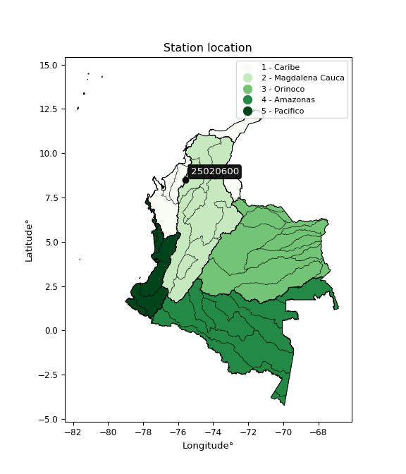

<div align="center">


</div>

# PMP Station (rain, Pmax24h): 25020600

Probable Maximum Precipitation (PMP) is the greatest amount of rainfall for a specific duration that is meteorologically possible for a given location, acting as a "worst-case" scenario for extreme storms, crucial for designing safety-critical infrastructure like bridges, river deviations, dams, spillways, and nuclear plants to prevent catastrophic failure. PMP is calculated by hydrologists using meteorological data to determine the upper limit of extreme rainfall, often leading to the Probable Maximum Flood (PMF) for flood control design, and is increasingly being studied for climate change impacts.

<div align="center">

</img>

</div>


## A. General information


### 1. General running parameters

• app_version: _v20251228_. • runtime: _2025-12-28 08:43:48.795225_. • Python version: _3.14.0_. • SciPy version: _1.16.3_. • Pandas version: _2.3.3_. • NumPy version: _2.3.5_. • Stations dataset (station_dataset_file): _dataset/pmax24h_in/automatic_colombia_2003_2024.csv_. • Stations catalog (station_catalog_file): _dataset/CNE_IDEAM.xls_. • Minimum year to eval til year_max (date_min): _1900_. • Maximum year to eval since year_min (date_max): _2024_. • Creates, save and include plots into reports (create_plot): _False_. • Plot only fit distributions with Δo > Δ (plot_only_fit): _True_. • Eval low extreme values, if False, evaluates high extreme values (low_extreme): _False_. • Eval every SciPy distribution as logarithmic (pdist_logarithmic_on): _True_. • Standard deviation normalized (ddof): _1.0_. • Return periods to eval in years (Tr): _[2, 2.33, 5, 10, 15, 20, 25, 50, 75, 100, 200, 250, 500, 750, 1000]_. • Minimum data sample per station, 0 means any (minimum_sample): _5_. • Z-Score maximum threshold to adjust a value, 0 means disable (zscore_max): _3.5_. • Z-Score minimum threshold to adjust a value, 0 means disable (zscore_min): _-2.5_. • Avoid zeros, e.g. rain = 0 (avoid_zeros): _True_. • Avoid null values (avoid_nans): _True_. [:file_folder:Dataset file.](../../dataset/pmax24h_in/automatic_colombia_2003_2024.csv)

> Delta Degrees of Freedom (DDOF): is a parameter used in the formulas for calculating variance and standard deviation. When ddof=0, the divisor is $N$ (the total number of observations) and this is used when your data set is the entire population. When ddof=1, the divisor is $N-1$ and this is used when your data set is a sample drawn from a larger population. Using $N-1$ provides an unbiased estimate of the population variance (known as Bessel´s correction).


### 2. Station info and location

|   id |   CODIGO | NOMBRE                            | CATEGORIA     | TECNOLOGIA                              | ESTADO   | FECHA_INSTALACION   |   FECHA_SUSPENSION |   ALTITUD |   LATITUD |   LONGITUD | DEPARTAMENTO   | MUNICIPIO    | AREA_OPERATIVA                              | ENTIDAD                                                     | AREA_HIDROGRAFICA   | ZONA_HIDROGRAFICA                | SUBZONA_HIDROGRAFICA       |   CORRIENTE | Catalogo   |
|-----:|---------:|:----------------------------------|:--------------|:----------------------------------------|:---------|:--------------------|-------------------:|----------:|----------:|-----------:|:---------------|:-------------|:--------------------------------------------|:------------------------------------------------------------|:--------------------|:---------------------------------|:---------------------------|------------:|:-----------|
|    0 | 25020600 | SAJONIA HACIENDA - AUT [25020600] | Pluviométrica | Automática con Telemetría, Convencional | Activa   | 10/03/2014          |                nan |       100 |   8.48972 |   -75.6014 | Cordoba        | Pueblo Nuevo | Area Operativa 02 - Atlántico-Bolivar-Sucre | INSTITUTO DE HIDROLOGIA METEOROLOGIA Y ESTUDIOS AMBIENTALES | Magdalena Cauca     | Bajo Magdalena- Cauca -San Jorge | Bajo San Jorge - La Mojana |         nan | CNE_IDEAM  |

<div align="center">

Map location in: [:earth_americas:Google](http://maps.google.com/maps?q=8.489722222,-75.60138889) [:earth_americas:OSM](https://www.openstreetmap.org/#map=18/8.489722222/-75.60138889&layers=P) [:earth_americas:Bing](https://www.bing.com/maps?cp=8.489722222~-75.60138889&lvl=18) [:earth_americas:Apple](https://maps.apple.com/frame?center=8.489722222%2C-75.60138889&span=0.003%2C0.006)

</div>


<div align="center">

```geojson
{
  "type": "Feature",
  "geometry": {
    "type": "Point", 
    "coordinates": [-75.60138889, 8.489722222]
  }, 
  "properties": {
    "Name": "25020600"
  }
}
```

</div>


### 3. Discrete values table and plot

|               |           0 |           1 |          2 |         3 |          4 |           5 |           6 |           7 |
|:--------------|------------:|------------:|-----------:|----------:|-----------:|------------:|------------:|------------:|
| Date          | 2017        | 2018        | 2019       | 2020      | 2021       | 2022        | 2023        | 2024        |
| Value         |   69.75     |   79.95     |  715.4     |   10.9    |    4.4     |    9        |   83.1      |  193.8      |
| Value_initial |   69.75     |   79.95     |  715.4     |   10.9    |    4.4     |    9        |   83.1      |  193.8      |
| count         |    8        |    8        |    8       |    8      |    8       |    8        |    8        |    8        |
| mean          |  145.787    |  145.787    |  145.787   |  145.787  |  145.787   |  145.787    |  145.787    |  145.787    |
| std           |  238.359    |  238.359    |  238.359   |  238.359  |  238.359   |  238.359    |  238.359    |  238.359    |
| zscore        |   -0.319004 |   -0.276211 |    2.38972 |   -0.5659 |   -0.59317 |   -0.573871 |   -0.262996 |    0.201429 |

> The initial value (value_initial) correspond to the initial obtained or null completed value, and value (value) is adjusted only when the initial value is outside the valid range definite through the Z-Score value. If Z-Score is active, values out of range or outliers are replaced with the station mean value


### 4. Active continuous probability distributions from SciPy (44 of 104 available)

[scipy.stats](https://docs.scipy.org/doc/scipy/reference/stats.html) is a Python´s powerful submodule within the SciPy library for comprehensive statistical analysis, offering over 130 probability distributions (like Normal, Poisson), functions for descriptive stats (mean, variance), hypothesis testing (t-tests, chi-square), random variable generation, and statistical tests, making it essential for data science, modeling, and research. It provides tools to explore, model, and draw conclusions from data efficiently, working seamlessly with NumPy.

<div align="center">

|   id | p_dist             |   n_parameter | fit_method   | label                                                                       | active   | ref                                                                                                        |
|-----:|:-------------------|--------------:|:-------------|:----------------------------------------------------------------------------|:---------|:-----------------------------------------------------------------------------------------------------------|
|    0 | alpha              |             3 | MLE          | Alpha                                                                       | True     | [:mortar_board:](https://docs.scipy.org/doc/scipy/reference/generated/scipy.stats.alpha.html)              |
|    1 | betaprime          |             4 | MLE          | Beta prime                                                                  | True     | [:mortar_board:](https://docs.scipy.org/doc/scipy/reference/generated/scipy.stats.betaprime.html)          |
|    2 | chi2               |             3 | MLE          | Chi²                                                                        | True     | [:mortar_board:](https://docs.scipy.org/doc/scipy/reference/generated/scipy.stats.chi2.html)               |
|    3 | crystalball        |             4 | MLE          | Crystalball                                                                 | True     | [:mortar_board:](https://docs.scipy.org/doc/scipy/reference/generated/scipy.stats.crystalball.html)        |
|    4 | erlang             |             3 | MLE          | Erlang                                                                      | True     | [:mortar_board:](https://docs.scipy.org/doc/scipy/reference/generated/scipy.stats.erlang.html)             |
|    5 | expon              |             2 | MLE          | Exponential                                                                 | True     | [:mortar_board:](https://docs.scipy.org/doc/scipy/reference/generated/scipy.stats.expon.html)              |
|    6 | exponnorm          |             3 | MLE          | Exponentially modified Normal                                               | True     | [:mortar_board:](https://docs.scipy.org/doc/scipy/reference/generated/scipy.stats.exponnorm.html)          |
|    7 | f                  |             4 | MLE          | F                                                                           | True     | [:mortar_board:](https://docs.scipy.org/doc/scipy/reference/generated/scipy.stats.f.html)                  |
|    8 | fatiguelife        |             3 | MLE          | Fatigue-life (Birnbaum-Saunders)                                            | True     | [:mortar_board:](https://docs.scipy.org/doc/scipy/reference/generated/scipy.stats.fatiguelife.html)        |
|    9 | fisk               |             3 | MLE          | Fisk                                                                        | True     | [:mortar_board:](https://docs.scipy.org/doc/scipy/reference/generated/scipy.stats.fisk.html)               |
|   10 | gamma              |             3 | MLE          | Gamma                                                                       | True     | [:mortar_board:](https://docs.scipy.org/doc/scipy/reference/generated/scipy.stats.gamma.html)              |
|   11 | genexpon           |             5 | MLE          | Generalized exponential                                                     | True     | [:mortar_board:](https://docs.scipy.org/doc/scipy/reference/generated/scipy.stats.genexpon.html)           |
|   12 | genlogistic        |             3 | MLE          | Generalized logistic                                                        | True     | [:mortar_board:](https://docs.scipy.org/doc/scipy/reference/generated/scipy.stats.genlogistic.html)        |
|   13 | gibrat             |             2 | MM           | Gibrat                                                                      | True     | [:mortar_board:](https://docs.scipy.org/doc/scipy/reference/generated/scipy.stats.gibrat.html)             |
|   14 | gompertz           |             3 | MLE          | Gompertz (or truncated Gumbel)                                              | True     | [:mortar_board:](https://docs.scipy.org/doc/scipy/reference/generated/scipy.stats.gompertz.html)           |
|   15 | gumbel_l           |             2 | MM           | Gumbel Left Skew                                                            | True     | [:mortar_board:](https://docs.scipy.org/doc/scipy/reference/generated/scipy.stats.gumbel_l.html)           |
|   16 | gumbel_r           |             2 | MM           | Gumbel Right Skew                                                           | True     | [:mortar_board:](https://docs.scipy.org/doc/scipy/reference/generated/scipy.stats.gumbel_r.html)           |
|   17 | halflogistic       |             2 | MM           | Half-logistic                                                               | True     | [:mortar_board:](https://docs.scipy.org/doc/scipy/reference/generated/scipy.stats.halflogistic.html)       |
|   18 | halfnorm           |             2 | MM           | Half Normal                                                                 | True     | [:mortar_board:](https://docs.scipy.org/doc/scipy/reference/generated/scipy.stats.halfnorm.html)           |
|   19 | hypsecant          |             2 | MM           | hyperbolic secant                                                           | True     | [:mortar_board:](https://docs.scipy.org/doc/scipy/reference/generated/scipy.stats.hypsecant.html)          |
|   20 | invgamma           |             3 | MLE          | Inverted gamma                                                              | True     | [:mortar_board:](https://docs.scipy.org/doc/scipy/reference/generated/scipy.stats.invgamma.html)           |
|   21 | invgauss           |             3 | MLE          | Inverse Gaussian                                                            | True     | [:mortar_board:](https://docs.scipy.org/doc/scipy/reference/generated/scipy.stats.invgauss.html)           |
|   22 | invweibull         |             3 | MLE          | Inverted Weibull                                                            | True     | [:mortar_board:](https://docs.scipy.org/doc/scipy/reference/generated/scipy.stats.invweibull.html)         |
|   23 | johnsonsu          |             4 | MLE          | Johnson Su                                                                  | True     | [:mortar_board:](https://docs.scipy.org/doc/scipy/reference/generated/scipy.stats.johnsonsu.html)          |
|   24 | kstwobign          |             2 | MLE          | Limiting distribution of scaled Kolmogorov-Smirnov two-sided test statistic | True     | [:mortar_board:](https://docs.scipy.org/doc/scipy/reference/generated/scipy.stats.kstwobign.html)          |
|   25 | laplace            |             2 | MM           | Laplace                                                                     | True     | [:mortar_board:](https://docs.scipy.org/doc/scipy/reference/generated/scipy.stats.laplace.html)            |
|   26 | laplace_asymmetric |             3 | MLE          | Asymmetric Laplace                                                          | True     | [:mortar_board:](https://docs.scipy.org/doc/scipy/reference/generated/scipy.stats.laplace_asymmetric.html) |
|   27 | loggamma           |             3 | MLE          | Log gamma                                                                   | True     | [:mortar_board:](https://docs.scipy.org/doc/scipy/reference/generated/scipy.stats.loggamma.html)           |
|   28 | logistic           |             2 | MM           | Logistic (or Sech-squared)                                                  | True     | [:mortar_board:](https://docs.scipy.org/doc/scipy/reference/generated/scipy.stats.logistic.html)           |
|   29 | lognorm            |             3 | MLE          | Log Normal                                                                  | True     | [:mortar_board:](https://docs.scipy.org/doc/scipy/reference/generated/scipy.stats.lognorm.html)            |
|   30 | maxwell            |             2 | MM           | Maxwell                                                                     | True     | [:mortar_board:](https://docs.scipy.org/doc/scipy/reference/generated/scipy.stats.maxwell.html)            |
|   31 | mielke             |             4 | MLE          | Mielke Beta-Kappa / Dagum                                                   | True     | [:mortar_board:](https://docs.scipy.org/doc/scipy/reference/generated/scipy.stats.mielke.html)             |
|   32 | moyal              |             2 | MM           | Moyal                                                                       | True     | [:mortar_board:](https://docs.scipy.org/doc/scipy/reference/generated/scipy.stats.moyal.html)              |
|   33 | nakagami           |             3 | MLE          | Nakagami                                                                    | True     | [:mortar_board:](https://docs.scipy.org/doc/scipy/reference/generated/scipy.stats.nakagami.html)           |
|   34 | ncf                |             5 | MLE          | Non-central F distribution                                                  | True     | [:mortar_board:](https://docs.scipy.org/doc/scipy/reference/generated/scipy.stats.ncf.html)                |
|   35 | nct                |             4 | MLE          | Non-central Student’s t                                                     | True     | [:mortar_board:](https://docs.scipy.org/doc/scipy/reference/generated/scipy.stats.nct.html)                |
|   36 | norm               |             2 | MM           | Normal                                                                      | True     | [:mortar_board:](https://docs.scipy.org/doc/scipy/reference/generated/scipy.stats.norm.html)               |
|   37 | pearson3           |             3 | MM           | Pearson type III                                                            | True     | [:mortar_board:](https://docs.scipy.org/doc/scipy/reference/generated/scipy.stats.pearson3.html)           |
|   38 | rayleigh           |             2 | MM           | Rayleigh                                                                    | True     | [:mortar_board:](https://docs.scipy.org/doc/scipy/reference/generated/scipy.stats.rayleigh.html)           |
|   39 | rice               |             3 | MLE          | Rice                                                                        | True     | [:mortar_board:](https://docs.scipy.org/doc/scipy/reference/generated/scipy.stats.rice.html)               |
|   40 | t                  |             3 | MLE          | Student’s t                                                                 | True     | [:mortar_board:](https://docs.scipy.org/doc/scipy/reference/generated/scipy.stats.t.html)                  |
|   41 | truncnorm          |             4 | MLE          | Truncated normal                                                            | True     | [:mortar_board:](https://docs.scipy.org/doc/scipy/reference/generated/scipy.stats.truncnorm.html)          |
|   42 | wald               |             2 | MM           | Wald                                                                        | True     | [:mortar_board:](https://docs.scipy.org/doc/scipy/reference/generated/scipy.stats.wald.html)               |
|   43 | weibull_min        |             3 | MLE          | Weibull minimum                                                             | True     | [:mortar_board:](https://docs.scipy.org/doc/scipy/reference/generated/scipy.stats.weibull_min.html)        |

</div>

> **n_parameter:** # arguments & localization & scale.
>
> **Fit methods:** (MLE) maximum likelihood, (MM) L-moments.
>
>**Inactive:** foldnorm, gennorm, norminvgauss, powernorm, powerlognorm, skewnorm, genextreme, anglit, arcsine, argus, beta, bradford, burr, burr12, cauchy, cosine, halfcauchy, foldcauchy, skewcauchy, wrapcauchy, dgamma, gengamma, exponweib, exponpow, truncexpon, gausshyper, genhalflogistic, genhyperbolic, geninvgauss, halfgennorm, johnsonsb, kappa4, kappa3, ksone, kstwo, loglaplace, levy, levy_l, levy_stable, ncx2, pareto, genpareto, truncpareto, lomax, powerlaw, rdist, rel_breitwigner, recipinvgauss, semicircular, studentized_range, trapezoid, triang, truncweibull_min, tukeylambda, uniform, loguniform, vonmises, vonmises_line, weibull_max, dweibull, 


## B. Probability distributions vs. Empirical distributions

A continuous probability distribution (CPD) describes probabilities for variables that can take any value within a range (like rain any time), unlike discrete variables with specific outcomes (like temperature). It uses a Probability Density Function (PDF), a curve where the total area under it equals 1, and the probability of the variable falling within an interval (a to b) is found by calculating the area under the curve between those points. A key feature is that the probability of hitting any single exact value is zero, so probabilities are always expressed for ranges, e.g., $P(a ≤ X ≤ b)$.

<div align="center">

Distributions parameters from station values
|    |   station | p_dist                |   n |              loc |           scale | shape                  | shape1                 | shape2                | shape3   |
|---:|----------:|:----------------------|----:|-----------------:|----------------:|:-----------------------|:-----------------------|:----------------------|:---------|
|  0 |  25020600 | alpha                 |   8 |     -0.0201379   |    10.5246      | 2.369538934138743e-10  |                        |                       |          |
|  1 |  25020600 | betaprime             |   8 |     -0.0761688   |     0.190183    | 54.301506199924916     | 0.5983740438551464     |                       |          |
|  2 |  25020600 | chi2                  |   8 |      4.4         |   219.913       | 1.3629104564951549     |                        |                       |          |
|  3 |  25020600 | crystalball           |   8 |     15.4545      |   290.28        | 1268.4145636405415     | 44.33855323907301      |                       |          |
|  4 |  25020600 | erlang                |   8 |      4.4         |   210.171       | 0.501237478064076      |                        |                       |          |
|  5 |  25020600 | expon                 |   8 |      4.4         |   141.387       |                        |                        |                       |          |
|  6 |  25020600 | exponnorm             |   8 |      4.1952      |     0.0700985   | 2017.4432079456033     |                        |                       |          |
|  7 |  25020600 | f                     |   8 |      4.4         |    21.4936      | 0.6900836566469887     | 0.8512218502391596     |                       |          |
|  8 |  25020600 | fatiguelife           |   8 |      4.4         |     0.000192609 | 801.1104016081351      |                        |                       |          |
|  9 |  25020600 | fisk                  |   8 |      4.4         |    12.5817      | 0.6514588580169532     |                        |                       |          |
| 10 |  25020600 | gamma                 |   8 |      4.4         |   202.189       | 0.41525020243446953    |                        |                       |          |
| 11 |  25020600 | genexpon              |   8 |      4.4         |   237.928       | 1.6828116261330597     | 2.1854291567410242e-12 | 2.152220954720552     |          |
| 12 |  25020600 | genlogistic           |   8 |   -760.751       |   107.677       | 2121.9239313206162     |                        |                       |          |
| 13 |  25020600 | gibrat                |   8 |    -24.3063      |   103.167       |                        |                        |                       |          |
| 14 |  25020600 | gompertz              |   8 |      4.4         |     4.94076e+09 | 27981726.01934775      |                        |                       |          |
| 15 |  25020600 | gumbel_l              |   8 |    246.133       |   173.845       |                        |                        |                       |          |
| 16 |  25020600 | gumbel_r              |   8 |     45.4416      |   173.845       |                        |                        |                       |          |
| 17 |  25020600 | halflogistic          |   8 |   -118.477       |   190.627       |                        |                        |                       |          |
| 18 |  25020600 | halfnorm              |   8 |   -149.33        |   369.875       |                        |                        |                       |          |
| 19 |  25020600 | hypsecant             |   8 |    145.787       |   141.944       |                        |                        |                       |          |
| 20 |  25020600 | invgamma              |   8 |      1.19894     |     7.2163      | 0.5319807164593728     |                        |                       |          |
| 21 |  25020600 | invgauss              |   8 |      0.526627    |    17.2698      | 8.411285333511273      |                        |                       |          |
| 22 |  25020600 | invweibull            |   8 |      4.4         |     3.2293      | 0.054123423549459995   |                        |                       |          |
| 23 |  25020600 | johnsonsu             |   8 |      4.4         |     4.43597e-12 | -2.6146643923681543    | 0.11732700066832513    |                       |          |
| 24 |  25020600 | kstwobign             |   8 |   -385.683       |   627.099       |                        |                        |                       |          |
| 25 |  25020600 | laplace               |   8 |    145.787       |   157.66        |                        |                        |                       |          |
| 26 |  25020600 | laplace_asymmetric    |   8 |      4.4         |     0.00063979  | 4.5250520113556325e-06 |                        |                       |          |
| 27 |  25020600 | loggamma              |   8 | -84420.1         | 10954.4         | 2253.073248008811      |                        |                       |          |
| 28 |  25020600 | logistic              |   8 |    145.787       |   122.927       |                        |                        |                       |          |
| 29 |  25020600 | lognorm               |   8 |      4.4         |     0.439399    | 12.881223373917662     |                        |                       |          |
| 30 |  25020600 | maxwell               |   8 |   -382.545       |   331.083       |                        |                        |                       |          |
| 31 |  25020600 | mielke                |   8 |     -0.0565195   |     0.046082    | 52.7412068356883       | 0.7011389292802257     |                       |          |
| 32 |  25020600 | moyal                 |   8 |     18.2821      |   100.369       |                        |                        |                       |          |
| 33 |  25020600 | nakagami              |   8 |      4.4         |   293.003       | 0.1680302713388747     |                        |                       |          |
| 34 |  25020600 | ncf                   |   8 |     -0.174586    |    17.7283      | 69.93820163707116      | 1.2119584991084844     | 0.0006194736909417436 |          |
| 35 |  25020600 | nct                   |   8 |     -0.234346    |     0.199876    | 0.479662503904261      | 54.73614809753632      |                       |          |
| 36 |  25020600 | norm                  |   8 |    145.787       |   222.965       |                        |                        |                       |          |
| 37 |  25020600 | pearson3              |   8 |    145.787       |   222.965       | 1.9860907036163096     |                        |                       |          |
| 38 |  25020600 | rayleigh              |   8 |   -280.757       |   340.333       |                        |                        |                       |          |
| 39 |  25020600 | rice                  |   8 |   -162.204       |   268.861       | 0.0001905994980579825  |                        |                       |          |
| 40 |  25020600 | t                     |   8 |     54.877       |    47.7029      | 1.1146800222424815     |                        |                       |          |
| 41 |  25020600 | truncnorm             |   8 |  -3530.96        |   733.848       | 4.817573507684269      | 1014.4078638503499     |                       |          |
| 42 |  25020600 | wald                  |   8 |    -77.177       |   222.965       |                        |                        |                       |          |
| 43 |  25020600 | weibull_min           |   8 |      4.4         |   199.401       | 0.49947357444346413    |                        |                       |          |
| 44 |  25020600 | logalpha              |   8 |    -19.1446      |   326.652       | 14.26966827152372      |                        |                       |          |
| 45 |  25020600 | logbetaprime          |   8 |     -6.42214     |  1014.05        | 40.68508154097162      | 4009.6026951446747     |                       |          |
| 46 |  25020600 | logchi2               |   8 |      1.4816      |     1.15331     | 1.9364344775641764     |                        |                       |          |
| 47 |  25020600 | logcrystalball        |   8 |      3.8692      |     1.60693     | 1404.9905332532821     | 487.88634156044        |                       |          |
| 48 |  25020600 | logerlang             |   8 |    -70.0242      |     0.0349459   | 2114.4933534840175     |                        |                       |          |
| 49 |  25020600 | logexpon              |   8 |      1.4816      |     2.3876      |                        |                        |                       |          |
| 50 |  25020600 | logexponnorm          |   8 |      3.80903     |     1.6058      | 0.037473483253185516   |                        |                       |          |
| 51 |  25020600 | logf                  |   8 |      1.4816      |     2.39868     | 1.9462288620389667     | 194.29540048455934     |                       |          |
| 52 |  25020600 | logfatiguelife        |   8 |    -27.6067      |    31.4348      | 0.05111082568187527    |                        |                       |          |
| 53 |  25020600 | logfisk               |   8 |     -3.37732e+07 |     3.37732e+07 | 34892358.776843        |                        |                       |          |
| 54 |  25020600 | loggamma              |   8 |    -69.7742      |     0.0350501   | 2101.082415468605      |                        |                       |          |
| 55 |  25020600 | loggenexpon           |   8 |      1.4816      |    13.5946      | 3.099082439804697      | 73.45449560096384      | 0.27904714127861713   |          |
| 56 |  25020600 | loggenlogistic        |   8 |     -4.49874     |     1.43739     | 194.19904097878248     |                        |                       |          |
| 57 |  25020600 | loggibrat             |   8 |      2.64329     |     0.743542    |                        |                        |                       |          |
| 58 |  25020600 | loggompertz           |   8 |      1.4816      |     2.58428     | 0.4895527551191541     |                        |                       |          |
| 59 |  25020600 | loggumbel_l           |   8 |      4.59241     |     1.25292     |                        |                        |                       |          |
| 60 |  25020600 | loggumbel_r           |   8 |      3.146       |     1.25292     |                        |                        |                       |          |
| 61 |  25020600 | loghalflogistic       |   8 |      1.96466     |     1.37384     |                        |                        |                       |          |
| 62 |  25020600 | loghalfnorm           |   8 |      1.74226     |     2.66573     |                        |                        |                       |          |
| 63 |  25020600 | loghypsecant          |   8 |      3.8692      |     1.023       |                        |                        |                       |          |
| 64 |  25020600 | loginvgamma           |   8 |    -12.9764      |  1803.54        | 108.11069895707351     |                        |                       |          |
| 65 |  25020600 | loginvgauss           |   8 |     -5.47019     |   298.217       | 0.03130493265399456    |                        |                       |          |
| 66 |  25020600 | loginvweibull         |   8 |     -1.85128e+08 |     1.85128e+08 | 128588563.54018864     |                        |                       |          |
| 67 |  25020600 | logjohnsonsu          |   8 |    -34.7519      |    32.0724      | -31.819718405867036    | 31.249465633578225     |                       |          |
| 68 |  25020600 | logkstwobign          |   8 |     -1.89556     |     6.57913     |                        |                        |                       |          |
| 69 |  25020600 | loglaplace            |   8 |      3.8692      |     1.13627     |                        |                        |                       |          |
| 70 |  25020600 | loglaplace_asymmetric |   8 |      4.3814      |     1.21118     | 1.2332188776259407     |                        |                       |          |
| 71 |  25020600 | logloggamma           |   8 |   -322.122       |    48.0119      | 889.3094749461804      |                        |                       |          |
| 72 |  25020600 | loglogistic           |   8 |      3.8692      |     0.885947    |                        |                        |                       |          |
| 73 |  25020600 | loglognorm            |   8 |      1.4816      |     0.0224882   | 12.205600828416408     |                        |                       |          |
| 74 |  25020600 | logmaxwell            |   8 |      0.0614537   |     2.38615     |                        |                        |                       |          |
| 75 |  25020600 | logmielke             |   8 |      1.4816      |     5.44286     | 0.7704909013856791     | 17.36286980778572      |                       |          |
| 76 |  25020600 | logmoyal              |   8 |      2.95026     |     0.723373    |                        |                        |                       |          |
| 77 |  25020600 | lognakagami           |   8 |      2.19722     |     2.33357     | 0.0763414479783315     |                        |                       |          |
| 78 |  25020600 | logncf                |   8 |     -0.624526    |     1.06087     | 6.249911252398299      | 626.7433797157885      | 20.136040282861785    |          |
| 79 |  25020600 | lognct                |   8 |    107.976       |     1.60491     | 768892.0681626201      | -64.86730708506175     |                       |          |
| 80 |  25020600 | lognorm               |   8 |      3.8692      |     1.60693     |                        |                        |                       |          |
| 81 |  25020600 | logpearson3           |   8 |      3.8692      |     1.60693     | 0.039685326169310246   |                        |                       |          |
| 82 |  25020600 | lograyleigh           |   8 |      0.795052    |     2.45282     |                        |                        |                       |          |
| 83 |  25020600 | logrice               |   8 |      0.732401    |     1.95042     | 1.1248593069226884     |                        |                       |          |
| 84 |  25020600 | logt                  |   8 |      3.8692      |     1.60693     | 12558517135.797869     |                        |                       |          |
| 85 |  25020600 | logtruncnorm          |   8 |     -0.0565165   |     3.87937     | 0.39648722047281815    | 1.708874713048745      |                       |          |
| 86 |  25020600 | logwald               |   8 |      2.26229     |     1.60692     |                        |                        |                       |          |
| 87 |  25020600 | logweibull_min        |   8 |      1.01965     |     3.19238     | 1.781200719350895      |                        |                       |          |

</div>

> **loc** (Location parameter): This shifts the distribution along the x-axis. For many common distributions, like the normal (Gaussian) distribution, loc represents the mean $μ$. For others, like the uniform distribution, it might represent the minimum value, or for the beta distribution, the left end of the support interval.
>
> **scale** (Scale parameter): This determines the width or spread of the distribution. For the normal distribution, scale represents the standard deviation $σ$. For a uniform distribution, it defines the length of the interval (from $loc$ to $loc + scale$).
>
> **shape** (Shape parameters): Refers to parameters that define the specific form of a probability distribution, distinct from its location (loc) and scale (scale). These parameters are required arguments for most distribution functions. For example, a normal (Gaussian) distribution is fully defined by its location (mean) and scale (standard deviation), so it has no specific shape parameters beyond loc and scale. However, other distributions have intrinsic properties that need specification, as Gamma distribution that takes a shape parameter, often named $a$ or $alpha$.


### 0. Cumulative distribution values - CDF (88 evaluated)

Cumulative Distribution Function (CDF), denoted as $F$<sub>$X$</sub>$(x)$, is a function that gives the probability that a random variable $X$ will take a value less than or equal to a specific value, $x$ (i.e., $(P(X≥x)$. It essentially "accumulates" probabilities from a given point up to the far right (positive infinity), providing a complete picture of the distribution´s probabilities for both discrete (like rain) and continuous (like temperature) variables, helping to find probabilities over ranges or above certain values.

<div align="center">

CDF ordered by x ascending and calculating $log(f(x))$ separately
|   id |   Station |   date |      x |   count |    mean |     std |    zscore |   Value_initial |   station |   m |     alpha |   alpha_pdf |   betaprime |   betaprime_pdf |        chi2 |      chi2_pdf |   crystalball |   crystalball_pdf |      erlang |   erlang_pdf |     expon |   expon_pdf |   exponnorm |   exponnorm_pdf |          f |           f_pdf |   fatiguelife |   fatiguelife_pdf |        fisk |        fisk_pdf |       gamma |   gamma_pdf |   genexpon |   genexpon_pdf |   genlogistic |   genlogistic_pdf |   gibrat |   gibrat_pdf |    gompertz |   gompertz_pdf |   gumbel_l |   gumbel_l_pdf |   gumbel_r |   gumbel_r_pdf |   halflogistic |   halflogistic_pdf |   halfnorm |   halfnorm_pdf |   hypsecant |   hypsecant_pdf |   invgamma |   invgamma_pdf |   invgauss |   invgauss_pdf |   invweibull |   invweibull_pdf |   johnsonsu |   johnsonsu_pdf |   kstwobign |   kstwobign_pdf |   laplace |   laplace_pdf |   laplace_asymmetric |   laplace_asymmetric_pdf |   loggamma |   loggamma_pdf |   logistic |   logistic_pdf |   lognorm |   lognorm_pdf |   maxwell |   maxwell_pdf |    mielke |   mielke_pdf |    moyal |   moyal_pdf |    nakagami |   nakagami_pdf |       ncf |     ncf_pdf |       nct |     nct_pdf |     norm |    norm_pdf |   pearson3 |   pearson3_pdf |   rayleigh |   rayleigh_pdf |     rice |    rice_pdf |        t |       t_pdf |   truncnorm |   truncnorm_pdf |     wald |    wald_pdf |   weibull_min |   weibull_min_pdf |   logalpha |   logalpha_pdf |   logbetaprime |   logbetaprime_pdf |     logchi2 |   logchi2_pdf |   logcrystalball |   logcrystalball_pdf |   logerlang |   logerlang_pdf |   logexpon |   logexpon_pdf |   logexponnorm |   logexponnorm_pdf |        logf |   logf_pdf |   logfatiguelife |   logfatiguelife_pdf |   logfisk |   logfisk_pdf |   loggenexpon |   loggenexpon_pdf |   loggenlogistic |   loggenlogistic_pdf |   loggibrat |   loggibrat_pdf |   loggompertz |   loggompertz_pdf |   loggumbel_l |   loggumbel_l_pdf |   loggumbel_r |   loggumbel_r_pdf |   loghalflogistic |   loghalflogistic_pdf |   loghalfnorm |   loghalfnorm_pdf |   loghypsecant |   loghypsecant_pdf |   loginvgamma |   loginvgamma_pdf |   loginvgauss |   loginvgauss_pdf |   loginvweibull |   loginvweibull_pdf |   logjohnsonsu |   logjohnsonsu_pdf |   logkstwobign |   logkstwobign_pdf |   loglaplace |   loglaplace_pdf |   loglaplace_asymmetric |   loglaplace_asymmetric_pdf |   logloggamma |   logloggamma_pdf |   loglogistic |   loglogistic_pdf |   loglognorm |   loglognorm_pdf |   logmaxwell |   logmaxwell_pdf |   logmielke |   logmielke_pdf |   logmoyal |   logmoyal_pdf |   lognakagami |   lognakagami_pdf |   logncf |   logncf_pdf |    lognct |   lognct_pdf |   logpearson3 |   logpearson3_pdf |   lograyleigh |   lograyleigh_pdf |   logrice |   logrice_pdf |      logt |   logt_pdf |   logtruncnorm |   logtruncnorm_pdf |     logwald |   logwald_pdf |   logweibull_min |   logweibull_min_pdf |
|-----:|----------:|-------:|-------:|--------:|--------:|--------:|----------:|----------------:|----------:|----:|----------:|------------:|------------:|----------------:|------------:|--------------:|--------------:|------------------:|------------:|-------------:|----------:|------------:|------------:|----------------:|-----------:|----------------:|--------------:|------------------:|------------:|----------------:|------------:|------------:|-----------:|---------------:|--------------:|------------------:|---------:|-------------:|------------:|---------------:|-----------:|---------------:|-----------:|---------------:|---------------:|-------------------:|-----------:|---------------:|------------:|----------------:|-----------:|---------------:|-----------:|---------------:|-------------:|-----------------:|------------:|----------------:|------------:|----------------:|----------:|--------------:|---------------------:|-------------------------:|-----------:|---------------:|-----------:|---------------:|----------:|--------------:|----------:|--------------:|----------:|-------------:|---------:|------------:|------------:|---------------:|----------:|------------:|----------:|------------:|---------:|------------:|-----------:|---------------:|-----------:|---------------:|---------:|------------:|---------:|------------:|------------:|----------------:|---------:|------------:|--------------:|------------------:|-----------:|---------------:|---------------:|-------------------:|------------:|--------------:|-----------------:|---------------------:|------------:|----------------:|-----------:|---------------:|---------------:|-------------------:|------------:|-----------:|-----------------:|---------------------:|----------:|--------------:|--------------:|------------------:|-----------------:|---------------------:|------------:|----------------:|--------------:|------------------:|--------------:|------------------:|--------------:|------------------:|------------------:|----------------------:|--------------:|------------------:|---------------:|-------------------:|--------------:|------------------:|--------------:|------------------:|----------------:|--------------------:|---------------:|-------------------:|---------------:|-------------------:|-------------:|-----------------:|------------------------:|----------------------------:|--------------:|------------------:|--------------:|------------------:|-------------:|-----------------:|-------------:|-----------------:|------------:|----------------:|-----------:|---------------:|--------------:|------------------:|---------:|-------------:|----------:|-------------:|--------------:|------------------:|--------------:|------------------:|----------:|--------------:|----------:|-----------:|---------------:|-------------------:|------------:|--------------:|-----------------:|---------------------:|
|    0 |  25020600 |   2021 |   4.4  |       8 | 145.787 | 238.359 | -0.59317  |            4.4  |  25020600 |   1 | 0.0172627 | 0.0252445   |   0.0448303 |     0.0250756   | 9.66112e-13 | 741.25        |      0.484811 |        0.00137334 | 2.20749e-09 |  1.24578e+06 | 0         | 0.00707276  |  0.00144727 |     0.0070486   | 0.00012835 | 89333.5         |     0.0502181 |       7.64368e+08 | 3.00699e-11 | 22055.6         | 6.99354e-08 | 3.26969e+07 | 1.4633e-13 |     0.00707276 |      0.175587 |       0.00283561  | 0.100408 |  0.00613176  | 3.27848e-09 |    0.00566344  |   0.220379 |    0.00111643  |   0.281879 |    0.00205319  |       0.311583 |        0.00236828  |   0.322317 |    0.00197867  |    0.225226 |     0.00145761  |  0.0371168 |    0.0302757   |   0.039063 |    0.0263144   |   0.00095544 |      4.04839e+11 |  0.00493545 |     3.62406e+08 |    0.16618  |     0.00229056  |  0.203939 |   0.00129354  |          2.60595e-11 |              0.00707271  |  0.0674449 |      0.0830151 |   0.240457 |    0.00148574  | 0.0686642 |     0.0823246 |  0.286457 |   0.00166273  | 0.0503117 |  0.0231994   | 0.283899 | 0.00239875  | 1.03607e-06 |    3.92017e+08 | 0.0452755 | 0.0245271   | 0.0398408 | 0.0320967   | 0.262999 | 0.00146338  |   0.306508 |    0.00308458  |   0.296029 |    0.00173313  | 0.174688 | 0.00190217  | 0.233654 | 0.00326409  | 4.24376e-08 |     0.00682734  | 0.23568  | 0.00466681  |   2.15536e-09 |       1.21208e+06 |  0.0585509 |      0.0897254 |      0.0603029 |          0.0881895 | 3.14925e-16 |     1.37322   |        0.0686642 |            0.0823246 |   0.0675163 |       0.0830595 |   0        |      0.418831  |      0.0686615 |          0.0823262 | 2.45922e-16 |  1.07776   |        0.0644727 |            0.08481   | 0.0769602 |     0.0733913 |   1.13972e-06 |          0.227965 |        0.0494922 |            0.102703  |    0        |       0         |   3.47615e-10 |          0.189435 |     0.0801137 |         0.0613091 |     0.0229359 |         0.069106  |         0         |             0         |      0        |         0         |      0.0615066 |          0.0597501 |      0.059859 |         0.0897163 |     0.0557749 |         0.0928216 |       0.0489755 |           0.102613  |      0.0666395 |          0.0834793 |      0.0452156 |          0.111986  |    0.0611513 |        0.0538175 |                0.086575 |                   0.0579619 |     0.0696373 |         0.0816842 |     0.0632709 |         0.0668976 |   0.00411922 |      4.48775e+12 |    0.0504715 |        0.0992194 | 1.68066e-10 |      115.482    | 0.00578444 |       0.033773 |    0          |       0           | 0.052282 |    0.0975844 | 0.0686923 |    0.0823311 |     0.0675825 |         0.0829614 |     0.0384157 |         0.109731  | 0.0386551 |     0.101762  | 0.0686647 |  0.082325  |    4.26646e-09 |          0.314638  | 0           |     0         |         0.031458 |            0.119368  |
|    1 |  25020600 |   2022 |   9    |       8 | 145.787 | 238.359 | -0.573871 |            9    |  25020600 |   2 | 0.243294  | 0.0522511   |   0.168952  |     0.0254808   | 0.0491758   |   0.00723982  |      0.49113  |        0.001374   | 0.164934    |  0.0177115   | 0.0320111 | 0.00684635  |  0.0334047  |     0.00683494  | 0.341716   |     0.0233974   |     0.576481  |       0.00821123  | 0.341753    |     0.0318589   | 0.232893    | 0.0206879   | 0.0320112  |     0.00684636 |      0.188832 |       0.00292208  | 0.129111 |  0.00632138  | 0.0257154   |    0.0055178   |   0.225566 |    0.00113873  |   0.291355 |    0.0020668   |       0.322436 |        0.00235023  |   0.331395 |    0.00196832  |    0.232014 |     0.00149361  |  0.18735   |    0.0292242   |   0.17238  |    0.0272284   |   0.374923   |      0.00432767  |  0.762011   |     0.0078927   |    0.176838 |     0.00234284  |  0.209977 |   0.00133183  |          0.0320109   |              0.00684631  |  0.14887   |      0.146622  |   0.247357 |    0.00151449  | 0.149058  |     0.144487  |  0.294133 |   0.00167492  | 0.160021  |  0.0224271   | 0.29495  | 0.00240549  | 0.197846    |    0.0144534   | 0.166867  | 0.0250963   | 0.202783  | 0.0314409   | 0.269775 | 0.00148233  |   0.320556 |    0.00302345  |   0.30402  |    0.00174109  | 0.183511 | 0.00193379  | 0.249417 | 0.00359455  | 0.0309361   |     0.00662412  | 0.256944 | 0.00457599  |   0.141172    |       0.0141918   |  0.150094  |      0.167284  |      0.149144  |          0.161415  | 0.28121     |     0.323673  |        0.149058  |            0.144487  |   0.148969  |       0.146649  |   0.258977 |      0.310363  |      0.149058  |          0.144492  | 0.263579    |  0.307905  |        0.148589  |            0.152153  | 0.148673  |     0.130763  |   0.174196    |          0.253318 |        0.159991  |            0.203024  |    0        |       0         |   0.144606    |          0.213741 |     0.137423  |         0.101775  |     0.118552  |         0.201769  |         0.0844401 |             0.361347  |      0.135517 |         0.294984  |      0.122647  |          0.116945  |      0.150744 |         0.165442  |     0.151278  |         0.174386  |       0.159623  |           0.203446  |      0.148776  |          0.148104  |      0.166241  |          0.218357  |    0.114795  |        0.101028  |                0.139787 |                   0.0935871 |     0.149097  |         0.142543  |     0.131562  |         0.128962  |   0.611599   |      0.043875    |    0.150808  |        0.179468  | 0.209453    |        0.225513 | 0.0924001  |       0.22523  |    0.00340078 |       1.16923e+12 | 0.153107 |    0.183011  | 0.149085  |    0.144476  |     0.148914  |         0.146416  |     0.150745  |         0.197929  | 0.14196   |     0.183051  | 0.149059  |  0.144488  |    0.215921    |          0.287513  | 0           |     0         |         0.155698 |            0.216141  |
|    2 |  25020600 |   2020 |  10.9  |       8 | 145.787 | 238.359 | -0.5659   |           10.9  |  25020600 |   3 | 0.335155  | 0.0442576   |   0.214894  |     0.0228628   | 0.0621324   |   0.00645685  |      0.493741 |        0.00137417 | 0.195556    |  0.0147719   | 0.0449322 | 0.00675497  |  0.0463042  |     0.00674372  | 0.380374   |     0.017823    |     0.590684  |       0.00685468  | 0.394066    |     0.0239314   | 0.268115    | 0.016743    | 0.0449322  |     0.00675497 |      0.194417 |       0.00295592  | 0.14116  |  0.00635756  | 0.036143    |    0.00545875  |   0.227738 |    0.00114802  |   0.295287 |    0.00207193  |       0.326894 |        0.00234264  |   0.335131 |    0.00196397  |    0.234866 |     0.00150854  |  0.23887   |    0.0250842   |   0.221246 |    0.0242076   |   0.381805   |      0.00306105  |  0.77438    |     0.00542195  |    0.181309 |     0.00236335  |  0.212522 |   0.00134798  |          0.0449319   |              0.00675492  |  0.178698  |      0.164796  |   0.250246 |    0.0015263   | 0.178451  |     0.162407  |  0.29732  |   0.00167974  | 0.200725  |  0.0204081   | 0.299522 | 0.00240746  | 0.222221    |    0.0114884   | 0.212217  | 0.0226182   | 0.257705  | 0.0264796   | 0.272599 | 0.00149005  |   0.326277 |    0.00299852  |   0.307331 |    0.00174417  | 0.187198 | 0.00194643  | 0.256384 | 0.00373985  | 0.0434437   |     0.00654188  | 0.265599 | 0.00453469  |   0.165459    |       0.011599    |  0.184091  |      0.187468  |      0.181939  |          0.180852  | 0.340472    |     0.295645  |        0.178451  |            0.162407  |   0.1788    |       0.164814  |   0.316102 |      0.286438  |      0.178452  |          0.162413  | 0.320122    |  0.282929  |        0.179538  |            0.170928  | 0.175496  |     0.149492  |   0.222876    |          0.254621 |        0.2009    |            0.223394  |    0        |       0         |   0.186062    |          0.219029 |     0.158231  |         0.115725  |     0.160395  |         0.234286  |         0.153136  |             0.355407  |      0.191625 |         0.290638  |      0.147084  |          0.138715  |      0.184348 |         0.185232  |     0.186639  |         0.194519  |       0.200617  |           0.223841  |      0.178905  |          0.166459  |      0.209846  |          0.236011  |    0.135872  |        0.119577  |                0.158912 |                   0.106392  |     0.178091  |         0.160202  |     0.158287  |         0.150384  |   0.619025   |      0.0344146   |    0.186963  |        0.19769   | 0.251447    |        0.213566 | 0.14043    |       0.274277 |    0.583504   |       0.464913    | 0.190075 |    0.202568  | 0.178475  |    0.162391  |     0.178699  |         0.164561  |     0.190295  |         0.214489  | 0.178701  |     0.200205  | 0.178452  |  0.162408  |    0.270187    |          0.279043  | 0.000956947 |     0.0511758 |         0.198571 |            0.2308    |
|    3 |  25020600 |   2017 |  69.75 |       8 | 145.787 | 238.359 | -0.319004 |           69.75 |  25020600 |   4 | 0.880096  | 0.00170556  |   0.663103  |     0.00262699  | 0.283946    |   0.00270784  |      0.574187 |        0.00135051 | 0.568704    |  0.00353105  | 0.370107  | 0.00445508  |  0.370952   |     0.00444809  | 0.671105   |     0.00178637  |     0.766416  |       0.00170384  | 0.745221    |     0.00189273  | 0.644654    | 0.00324573  | 0.370107   |     0.00445509 |      0.387389 |       0.00341103  | 0.463168 |  0.00422343  | 0.309339    |    0.00391152  |   0.304098 |    0.00145128  |   0.419158 |    0.00209647  |       0.457153 |        0.00207476  |   0.446356 |    0.0018101   |    0.3371   |     0.0019552   |  0.671932  |    0.00237569  |   0.689127 |    0.00278183  |   0.427508   |      0.000300879 |  0.847115   |     0.000423942 |    0.332797 |     0.00268764  |  0.308684 |   0.00195792  |          0.370105    |              0.00445507  |  0.595151  |      0.240396  |   0.350109 |    0.00185096  | 0.592433  |     0.24157   |  0.399374 |   0.00176897  | 0.6429    |  0.00284426  | 0.439027 | 0.00227995  | 0.482074    |    0.00246137  | 0.661926  | 0.00265591  | 0.679501  | 0.00218629  | 0.366541 | 0.00168818  |   0.481808 |    0.00231502  |   0.411595 |    0.00178059  | 0.31075  | 0.00221169  | 0.598315 | 0.00623289  | 0.362369    |     0.00442805  | 0.488637 | 0.00306232  |   0.436064    |       0.00246894  |  0.619415  |      0.227453  |      0.610795  |          0.230679  | 0.710496    |     0.127619  |        0.592433  |            0.24157   |   0.595203  |       0.240341  |   0.685685 |      0.131645  |      0.59244   |          0.241567  | 0.682836    |  0.129085  |        0.601681  |            0.237058  | 0.591579  |     0.249619  |   0.64848     |          0.184868 |        0.642409  |            0.197553  |    0.778563 |       0.185561  |   0.608062    |          0.216302 |     0.531301  |         0.28348   |     0.659685  |         0.219028  |         0.680413  |             0.195451  |      0.65218  |         0.192634  |      0.614362  |          0.291286  |      0.616658 |         0.228012  |     0.623225  |         0.221816  |       0.642425  |           0.197456  |      0.597062  |          0.239563  |      0.651611  |          0.194491  |    0.640774  |        0.316145  |                0.550621 |                   0.36864   |     0.589226  |         0.24214   |     0.60446   |         0.269867  |   0.653276   |      0.0109441   |    0.619614  |        0.22103   | 0.593157    |        0.165388 | 0.682791   |       0.207321 |    0.83442    |       0.0589072   | 0.627189 |    0.216031  | 0.592407  |    0.241552  |     0.594858  |         0.240466  |     0.628092  |         0.213259  | 0.613768  |     0.22492   | 0.592434  |  0.241569  |    0.702048    |          0.184068  | 0.747101    |     0.177184  |         0.638836 |            0.203133  |
|    4 |  25020600 |   2018 |  79.95 |       8 | 145.787 | 238.359 | -0.276211 |           79.95 |  25020600 |   5 | 0.895295  | 0.00130176  |   0.687351  |     0.00215312  | 0.310615    |   0.00252631  |      0.587915 |        0.00134083 | 0.602599    |  0.00312903  | 0.413948  | 0.004145    |  0.414725   |     0.00413857  | 0.687781   |     0.00149788  |     0.782828  |       0.00152061  | 0.762742    |     0.00156045  | 0.675587    | 0.00283511  | 0.413948   |     0.00414501 |      0.422049 |       0.00338049  | 0.50419  |  0.00382634  | 0.348106    |    0.00369196  |   0.319178 |    0.00150563  |   0.44045  |    0.00207743  |       0.478055 |        0.00202349  |   0.464667 |    0.0017801   |    0.357385 |     0.00202117  |  0.69386   |    0.00194725  |   0.714863 |    0.00229051  |   0.430358   |      0.000259944 |  0.851098   |     0.000360318 |    0.360228 |     0.00268862  |  0.329315 |   0.00208877  |          0.413946    |              0.00414499  |  0.627571  |      0.234417  |   0.369216 |    0.00189459  | 0.625039  |     0.235967  |  0.417439 |   0.00177259  | 0.669256  |  0.00234906  | 0.462035 | 0.00223061  | 0.505949    |    0.00222913  | 0.686443  | 0.00217695  | 0.699668  | 0.00179012  | 0.383889 | 0.00171293  |   0.504896 |    0.00221286  |   0.429736 |    0.00177591  | 0.333424 | 0.00223299  | 0.657746 | 0.0053878   | 0.406028    |     0.00413573  | 0.51874  | 0.00284305  |   0.459819    |       0.00219934  |  0.649869  |      0.218634  |      0.641753  |          0.222771  | 0.727395    |     0.120103  |        0.62504   |            0.235967  |   0.627615  |       0.234364  |   0.703149 |      0.12433   |      0.625046  |          0.235963  | 0.699965    |  0.121985  |        0.633584  |            0.230209  | 0.625158  |     0.2421    |   0.673146    |          0.176564 |        0.668656  |            0.187037  |    0.802095 |       0.160054  |   0.637234    |          0.21106  |     0.570445  |         0.289705  |     0.688625  |         0.205039  |         0.706197  |             0.182439  |      0.677838 |         0.183353  |      0.653102  |          0.275849  |      0.647212 |         0.219542  |     0.652889  |         0.212736  |       0.668658  |           0.186931  |      0.62935   |          0.233325  |      0.677487  |          0.184683  |    0.681432  |        0.280363  |                0.603305 |                   0.403912  |     0.621936  |         0.236909  |     0.640639  |         0.259858  |   0.654733   |      0.0104127   |    0.649232  |        0.21285   | 0.615604    |        0.163566 | 0.709991   |       0.191385 |    0.842211   |       0.0553233   | 0.656054 |    0.206834  | 0.625011  |    0.235953  |     0.62729   |         0.234526  |     0.65662   |         0.20469   | 0.643954  |     0.217269  | 0.62504   |  0.235967  |    0.726682    |          0.176917  | 0.769926    |     0.157742  |         0.665946 |            0.194068  |
|    5 |  25020600 |   2023 |  83.1  |       8 | 145.787 | 238.359 | -0.262996 |           83.1  |  25020600 |   6 | 0.899242  | 0.00120574  |   0.693944  |     0.00203427  | 0.318493    |   0.00247585  |      0.592133 |        0.00133752 | 0.612283    |  0.00302032  | 0.426861  | 0.00405368  |  0.427617   |     0.0040474   | 0.692382   |     0.00142457  |     0.787539  |       0.001471    | 0.767524    |     0.00147701  | 0.684343    | 0.0027254   | 0.426861   |     0.00405368 |      0.432675 |       0.00336572  | 0.516061 |  0.00371132  | 0.359632    |    0.00362668  |   0.323947 |    0.00152242  |   0.446983 |    0.00207039  |       0.484404 |        0.00200746  |   0.470259 |    0.00177066  |    0.363782 |     0.00204028  |  0.699822  |    0.00184017  |   0.721881 |    0.00216688  |   0.43116    |      0.000249452 |  0.852207   |     0.000344171 |    0.368694 |     0.00268617  |  0.335961 |   0.00213093  |          0.426858    |              0.00405367  |  0.636592  |      0.232451  |   0.375203 |    0.00190704  | 0.634122  |     0.234098  |  0.423023 |   0.00177301  | 0.676455  |  0.00222368  | 0.469036 | 0.00221431  | 0.512873    |    0.00216742  | 0.693108  | 0.00205677  | 0.705149  | 0.00169147  | 0.389296 | 0.00171992  |   0.511818 |    0.0021822   |   0.435327 |    0.00177386  | 0.340466 | 0.00223814  | 0.674267 | 0.00510129  | 0.418919    |     0.00404926  | 0.527594 | 0.0027787   |   0.466633    |       0.00212765  |  0.658266  |      0.21596   |      0.650315  |          0.220329  | 0.731997    |     0.118058  |        0.634122  |            0.234098  |   0.636634  |       0.232398  |   0.707915 |      0.122334  |      0.634129  |          0.234094  | 0.704641    |  0.120049  |        0.642438  |            0.228022  | 0.634466  |     0.239604  |   0.679923    |          0.174195 |        0.675826  |            0.184038  |    0.808155 |       0.153639  |   0.645359    |          0.209441 |     0.581666  |         0.290975  |     0.696472  |         0.201077  |         0.713177  |             0.178833  |      0.684873 |         0.180721  |      0.663667  |          0.27092   |      0.655647 |         0.216958  |     0.661057  |         0.21002   |       0.675824  |           0.183931  |      0.638328  |          0.231292  |      0.68457   |          0.181894  |    0.692084  |        0.270988  |                0.61861  |                   0.388328  |     0.631057  |         0.235138  |     0.650618  |         0.256578  |   0.655132   |      0.0102713   |    0.65741   |        0.210387  | 0.621915    |        0.163069 | 0.717302   |       0.187012 |    0.844331   |       0.0543772   | 0.663994 |    0.204114  | 0.634093  |    0.234085  |     0.636315  |         0.23257   |     0.664482  |         0.202159  | 0.652306  |     0.21494   | 0.634123  |  0.234097  |    0.73348     |          0.174903  | 0.775924    |     0.152722  |         0.673395 |            0.191442  |
|    6 |  25020600 |   2024 | 193.8  |       8 | 145.787 | 238.359 |  0.201429 |          193.8  |  25020600 |   7 | 0.956695  | 0.000223208 |   0.810645  |     0.000564994 | 0.526805    |   0.0014552   |      0.730522 |        0.00113796 | 0.820036    |  0.00115099  | 0.738045  | 0.00185275  |  0.738344   |     0.00185021  | 0.780095   |     0.000460546 |     0.892109  |       0.000605962 | 0.854023    |     0.000428807 | 0.863448    | 0.000943245 | 0.738045   |     0.00185275 |      0.741038 |       0.00206243  | 0.772961 |  0.00138211  | 0.657901    |    0.00193746  |   0.522911 |    0.00203095  |   0.653139 |    0.00160036  |       0.674569 |        0.00142938  |   0.646433 |    0.00140283  |    0.605672 |     0.00212007  |  0.80621   |    0.0005223   |   0.847595 |    0.00061401  |   0.448331   |      0.000102778 |  0.874719   |     0.00012772  |    0.639633 |     0.00208593  |  0.631266 |   0.0023388   |          0.738042    |              0.00185275  |  0.808348  |      0.167689  |   0.596422 |    0.0019581   | 0.807781  |     0.170079  |  0.613028 |   0.00160496  | 0.805584  |  0.000628986 | 0.676584 | 0.00151983  | 0.683304    |    0.00114153  | 0.811013  | 0.000569982 | 0.803291  | 0.000485974 | 0.585248 | 0.00174826  |   0.702623 |    0.00133335  |   0.621735 |    0.0015498   | 0.583825 | 0.00204964  | 0.905286 | 0.000699099 | 0.734271    |     0.00190456  | 0.741775 | 0.00131022  |   0.622667    |       0.000969831 |  0.812885  |      0.147352  |      0.809867  |          0.153615  | 0.81534     |     0.0811269 |        0.807781  |            0.170079  |   0.808354  |       0.167658  |   0.795128 |      0.0858069 |      0.807782  |          0.170073  | 0.790433    |  0.0846839 |        0.809386  |            0.161869  | 0.806319  |     0.161344  |   0.805487    |          0.122909 |        0.804537  |            0.121664  |    0.896319 |       0.0686773 |   0.803757    |          0.160832 |     0.819686  |         0.246535  |     0.831919  |         0.122187  |         0.834203  |             0.110677  |      0.813891 |         0.124887  |      0.841004  |          0.149038  |      0.81166  |         0.149306  |     0.811107  |         0.143203  |       0.80445   |           0.121585  |      0.808752  |          0.166017  |      0.813252  |          0.123302  |    0.853855  |        0.128618  |                0.838963 |                   0.163967  |     0.806221  |         0.17222   |     0.828857  |         0.160115  |   0.662743   |      0.00790609  |    0.809673  |        0.147355  | 0.755842    |        0.153573 | 0.840191   |       0.108972 |    0.883212   |       0.0388469   | 0.809696 |    0.139372  | 0.807751  |    0.170088  |     0.808232  |         0.167908  |     0.810218  |         0.14106   | 0.809037  |     0.152607  | 0.807781  |  0.170078  |    0.863437    |          0.132758  | 0.870055    |     0.0793209 |         0.810395 |            0.132222  |
|    7 |  25020600 |   2019 | 715.4  |       8 | 145.787 | 238.359 |  2.38972  |          715.4  |  25020600 |   8 | 0.988263  | 1.64051e-05 |   0.91204   |     7.28941e-05 | 0.88736     |   0.000291664 |      0.992052 |        7.5083e-05 | 0.990669    |  4.97404e-05 | 0.993453  | 4.63061e-05 |  0.993455   |     4.62816e-05 | 0.871971   |     7.51397e-05 |     0.991764  |       3.79243e-05 | 0.932659    |     5.7547e-05  | 0.994134    | 3.2985e-05  | 0.993453   |     4.6306e-05 |      0.997643 |       2.18674e-05 | 0.975575 |  7.74831e-05 | 0.982167    |    0.000100996 |   1        |    2.97993e-08 |   0.979024 |    0.000119387 |       0.975122 |        0.000128883 |   0.980607 |    0.000140284 |    0.988491 |     8.10627e-05 |  0.90258   |    7.20874e-05 |   0.955563 |    7.20356e-05 |   0.473883   |      2.69394e-05 |  0.903915   |     2.8125e-05  |    0.9958   |     4.70341e-05 |  0.986514 |   8.55415e-05 |          0.993453    |              4.63073e-05 |  0.95254   |      0.0601136 |   0.990375 |    7.75424e-05 | 0.953763  |     0.0602866 |  0.98826  |   0.000108456 | 0.917031  |  7.77932e-05 | 0.975245 | 0.000123281 | 0.956364    |    0.000189169 | 0.912991  | 7.29851e-05 | 0.894803  | 7.05065e-05 | 0.994686 | 6.84604e-05 |   0.971492 |    0.000128344 |   0.986208 |    0.000118615 | 0.995143 | 5.89653e-05 | 0.982576 | 2.92887e-05 | 0.995053    |     4.01152e-05 | 0.9703   | 0.000106604 |   0.84848     |       0.00020086  |  0.941572  |      0.0576209 |      0.94414   |          0.0593883 | 0.895877    |     0.045622  |        0.953763  |            0.0602866 |   0.95253   |       0.0601156 |   0.881444 |      0.049655  |      0.95376   |          0.0602861 | 0.876113    |  0.0496774 |        0.94932   |            0.0597288 | 0.941341  |     0.0570482 |   0.921859    |          0.059709 |        0.916039  |            0.0558754 |    0.952029 |       0.0253917 |   0.951255    |          0.066219 |     0.992235  |         0.0301079 |     0.937172  |         0.0485358 |         0.932486  |             0.0474835 |      0.93003  |         0.0579526 |      0.954775  |          0.0440592 |      0.942254 |         0.058343  |     0.937771  |         0.0581893 |       0.915909  |           0.0558811 |      0.95167   |          0.0599627 |      0.927231  |          0.0569386 |    0.953697  |        0.0407502 |                0.9574   |                   0.0433752 |     0.954172  |         0.0608664 |     0.954856  |         0.0486557 |   0.671568   |      0.00581665  |    0.94105   |        0.0601466 | 0.938416    |        0.108111 | 0.934837   |       0.044941 |    0.924119   |       0.0251018   | 0.934403 |    0.0585482 | 0.953752  |    0.0602997 |     0.952611  |         0.0601579 |     0.937611  |         0.0599158 | 0.94454   |     0.0608675 | 0.953763  |  0.0602864 |    1           |          0.0790355 | 0.938558    |     0.0333393 |         0.931486 |            0.0589115 |


</div>

An Empirical Distribution Function (EDF) is a step-function estimate of a true cumulative distribution function (CDF) based on observed sample data, representing the proportion of data points less than or equal to a given value. It is calculated by ordering your data and jumping up by $1/n$ (where $n$ is sample size) at each unique data point, allowing analysis without assuming an underlying population distribution, and it gets closer to the true CDF as the sample size grows.


### 1. Empirical - EDF California (1923)

California´s estimates the true probability distribution of water-related data (like rainfall, streamflow) using observed samples, crucial for risk assessment.

<div align="center">


$P=m/n$


</div>


**1.1. Empirical values**

<div align="center">

|                | 0                  | 1                  | 2              | 3              | 4                  | 5              | 6              | 7              |
|:---------------|:-------------------|:-------------------|:---------------|:---------------|:-------------------|:---------------|:---------------|:---------------|
| date           | 2021               | 2022               | 2020           | 2017           | 2018               | 2023           | 2024           | 2019           |
| x              | 4.4                | 9.0                | 10.9           | 69.75          | 79.95              | 83.1           | 193.8          | 715.4          |
| m              | 1                  | 2                  | 3              | 4              | 5                  | 6              | 7              | 8              |
| empirical_dist | edf_california     | edf_california     | edf_california | edf_california | edf_california     | edf_california | edf_california | edf_california |
| empirical      | 0.125              | 0.25               | 0.375          | 0.5            | 0.625              | 0.75           | 0.875          | 1.0            |
| empirical_tr   | 1.1428571428571428 | 1.3333333333333333 | 1.6            | 2.0            | 2.6666666666666665 | 4.0            | 8.0            | inf            |

</div>


**1.2. Kolmogorov-Smirnov fit test (sorted by Δ)**


<div align="center">

|                | 0                   | 1                   | 2                   | 3                  | 4                   | 5                   | 6                  | 7                   | 8                  | 9                   | 10                  | 11                  | 12                  | 13                 | 14                 | 15                  | 16                  | 17                  | 18                  | 19                 | 20                 | 21                 | 22                  | 23                  | 24                  | 25                  | 26                 | 27                  | 28                 | 29                  | 30                  | 31                 | 32                  | 33                  | 34                  | 35                  | 36                 | 37                  | 38                  | 39                  | 40                  | 41                  | 42                  | 43                  | 44                 | 45                    | 46                  | 47                 | 48                 | 49                  | 50                  | 51                 | 52                  | 53                  | 54                 | 55                 | 56                 | 57                 | 58                 | 59                  | 60                 | 61                  | 62                  | 63                 | 64                  | 65                 | 66                  | 67                 | 68                  | 69                  | 70                  | 71                 | 72                 | 73                 | 74                  | 75                  | 76                 | 77                 | 78                  | 79                  | 80                 | 81                  | 82                  | 83                 | 84                  | 85                 | 86                 | 87                 |
|:---------------|:--------------------|:--------------------|:--------------------|:-------------------|:--------------------|:--------------------|:-------------------|:--------------------|:-------------------|:--------------------|:--------------------|:--------------------|:--------------------|:-------------------|:-------------------|:--------------------|:--------------------|:--------------------|:--------------------|:-------------------|:-------------------|:-------------------|:--------------------|:--------------------|:--------------------|:--------------------|:-------------------|:--------------------|:-------------------|:--------------------|:--------------------|:-------------------|:--------------------|:--------------------|:--------------------|:--------------------|:-------------------|:--------------------|:--------------------|:--------------------|:--------------------|:--------------------|:--------------------|:--------------------|:-------------------|:----------------------|:--------------------|:-------------------|:-------------------|:--------------------|:--------------------|:-------------------|:--------------------|:--------------------|:-------------------|:-------------------|:-------------------|:-------------------|:-------------------|:--------------------|:-------------------|:--------------------|:--------------------|:-------------------|:--------------------|:-------------------|:--------------------|:-------------------|:--------------------|:--------------------|:--------------------|:-------------------|:-------------------|:-------------------|:--------------------|:--------------------|:-------------------|:-------------------|:--------------------|:--------------------|:-------------------|:--------------------|:--------------------|:-------------------|:--------------------|:-------------------|:-------------------|:-------------------|
| station        | 25020600            | 25020600            | 25020600            | 25020600           | 25020600            | 25020600            | 25020600           | 25020600            | 25020600           | 25020600            | 25020600            | 25020600            | 25020600            | 25020600           | 25020600           | 25020600            | 25020600            | 25020600            | 25020600            | 25020600           | 25020600           | 25020600           | 25020600            | 25020600            | 25020600            | 25020600            | 25020600           | 25020600            | 25020600           | 25020600            | 25020600            | 25020600           | 25020600            | 25020600            | 25020600            | 25020600            | 25020600           | 25020600            | 25020600            | 25020600            | 25020600            | 25020600            | 25020600            | 25020600            | 25020600           | 25020600              | 25020600            | 25020600           | 25020600           | 25020600            | 25020600            | 25020600           | 25020600            | 25020600            | 25020600           | 25020600           | 25020600           | 25020600           | 25020600           | 25020600            | 25020600           | 25020600            | 25020600            | 25020600           | 25020600            | 25020600           | 25020600            | 25020600           | 25020600            | 25020600            | 25020600            | 25020600           | 25020600           | 25020600           | 25020600            | 25020600            | 25020600           | 25020600           | 25020600            | 25020600            | 25020600           | 25020600            | 25020600            | 25020600           | 25020600            | 25020600           | 25020600           | 25020600           |
| empirical_dist | edf_california      | edf_california      | edf_california      | edf_california     | edf_california      | edf_california      | edf_california     | edf_california      | edf_california     | edf_california      | edf_california      | edf_california      | edf_california      | edf_california     | edf_california     | edf_california      | edf_california      | edf_california      | edf_california      | edf_california     | edf_california     | edf_california     | edf_california      | edf_california      | edf_california      | edf_california      | edf_california     | edf_california      | edf_california     | edf_california      | edf_california      | edf_california     | edf_california      | edf_california      | edf_california      | edf_california      | edf_california     | edf_california      | edf_california      | edf_california      | edf_california      | edf_california      | edf_california      | edf_california      | edf_california     | edf_california        | edf_california      | edf_california     | edf_california     | edf_california      | edf_california      | edf_california     | edf_california      | edf_california      | edf_california     | edf_california     | edf_california     | edf_california     | edf_california     | edf_california      | edf_california     | edf_california      | edf_california      | edf_california     | edf_california      | edf_california     | edf_california      | edf_california     | edf_california      | edf_california      | edf_california      | edf_california     | edf_california     | edf_california     | edf_california      | edf_california      | edf_california     | edf_california     | edf_california      | edf_california      | edf_california     | edf_california      | edf_california      | edf_california     | edf_california      | edf_california     | edf_california     | edf_california     |
| p_dist         | t                   | logmielke           | gamma               | loggenexpon        | ncf                 | betaprime           | logkstwobign       | f                   | invgamma           | loggenlogistic      | mielke              | loginvweibull       | logweibull_min      | erlang             | nct                | logf                | loghalfnorm         | lograyleigh         | logncf              | logexpon           | logmaxwell         | loginvgauss        | loggompertz         | invgauss            | loginvgamma         | logalpha            | logbetaprime       | logfatiguelife      | logjohnsonsu       | logerlang           | logrice             | logpearson3        | loggamma            | loggamma            | lognct              | logt                | logexponnorm       | logcrystalball      | lognorm             | lognorm             | logloggamma         | logfisk             | logtruncnorm        | logchi2             | loggumbel_r        | loglaplace_asymmetric | loglogistic         | loggumbel_l        | loghalflogistic    | wald                | loghypsecant        | gibrat             | logmoyal            | nakagami            | pearson3           | loglaplace         | fisk               | halflogistic       | halfnorm           | moyal               | weibull_min        | gumbel_r            | rayleigh            | genlogistic        | fatiguelife         | maxwell            | exponnorm           | genexpon           | expon               | laplace_asymmetric  | truncnorm           | lognakagami        | crystalball        | norm               | loglognorm          | logwald             | logistic           | loggibrat          | alpha               | kstwobign           | hypsecant          | gompertz            | rice                | laplace            | gumbel_l            | chi2               | johnsonsu          | invweibull         |
| delta          | 0.11861615586863122 | 0.12808480322468108 | 0.14465395310146234 | 0.1521244160504423 | 0.16278251205231412 | 0.16310262022842115 | 0.1651538920564672 | 0.17110520652615113 | 0.1719319273960348 | 0.17409998152312794 | 0.17427539490999094 | 0.17438315449361821 | 0.17642918614295341 | 0.1794438234959917 | 0.1795005337581438 | 0.18283605151013738 | 0.18337548857783786 | 0.18470480455833246 | 0.18492466753431017 | 0.1856853759879208 | 0.1880366905760582 | 0.1883610458258237 | 0.18893762389245433 | 0.18912664327876594 | 0.19065216399832727 | 0.19090945914668483 | 0.193060627005011  | 0.19546201410252628 | 0.1960949346584278 | 0.19619965783185514 | 0.19629931947825965 | 0.196301169790372  | 0.19630233797760335 | 0.19630233797760335 | 0.19652494330757564 | 0.19654821033603137 | 0.1965484020461238 | 0.19654911680000914 | 0.19654913085068176 | 0.19654913085068176 | 0.19690935632783468 | 0.19950393683583814 | 0.20204830459252376 | 0.21049553750231065 | 0.2146046535663786 | 0.21608763530863412   | 0.21671254457521016 | 0.2167688496916439 | 0.2218636483146363 | 0.22240573066360603 | 0.22791601574019194 | 0.2339393567983935 | 0.23456958054052715 | 0.23712716419042346 | 0.2381816008408838 | 0.2391278194646573 | 0.2452212796866985 | 0.2655960718724713 | 0.2797408274042802 | 0.28096390330583787 | 0.2833673937557102 | 0.30301720079987643 | 0.31467309753629036 | 0.3173253807591093 | 0.32648089202232455 | 0.3269768414438776 | 0.32869580695993317 | 0.3300677811869303 | 0.33006779958736693 | 0.33006808839089874 | 0.33155630823141735 | 0.3344203182407791 | 0.359811026479868  | 0.360704077958629  | 0.36159917556855004 | 0.37404305321797837 | 0.3747966259816229 | 0.375              | 0.38009622229494167 | 0.38130637796544514 | 0.3862184514450774 | 0.39036767271719325 | 0.40953351170996183 | 0.4140388642413199 | 0.42605281007953605 | 0.4315073356210288 | 0.5120107545782773 | 0.5261173334383825 |
| deltao         | 0.4472608134160001  | 0.4472608134160001  | 0.4472608134160001  | 0.4472608134160001 | 0.4472608134160001  | 0.4472608134160001  | 0.4472608134160001 | 0.4472608134160001  | 0.4472608134160001 | 0.4472608134160001  | 0.4472608134160001  | 0.4472608134160001  | 0.4472608134160001  | 0.4472608134160001 | 0.4472608134160001 | 0.4472608134160001  | 0.4472608134160001  | 0.4472608134160001  | 0.4472608134160001  | 0.4472608134160001 | 0.4472608134160001 | 0.4472608134160001 | 0.4472608134160001  | 0.4472608134160001  | 0.4472608134160001  | 0.4472608134160001  | 0.4472608134160001 | 0.4472608134160001  | 0.4472608134160001 | 0.4472608134160001  | 0.4472608134160001  | 0.4472608134160001 | 0.4472608134160001  | 0.4472608134160001  | 0.4472608134160001  | 0.4472608134160001  | 0.4472608134160001 | 0.4472608134160001  | 0.4472608134160001  | 0.4472608134160001  | 0.4472608134160001  | 0.4472608134160001  | 0.4472608134160001  | 0.4472608134160001  | 0.4472608134160001 | 0.4472608134160001    | 0.4472608134160001  | 0.4472608134160001 | 0.4472608134160001 | 0.4472608134160001  | 0.4472608134160001  | 0.4472608134160001 | 0.4472608134160001  | 0.4472608134160001  | 0.4472608134160001 | 0.4472608134160001 | 0.4472608134160001 | 0.4472608134160001 | 0.4472608134160001 | 0.4472608134160001  | 0.4472608134160001 | 0.4472608134160001  | 0.4472608134160001  | 0.4472608134160001 | 0.4472608134160001  | 0.4472608134160001 | 0.4472608134160001  | 0.4472608134160001 | 0.4472608134160001  | 0.4472608134160001  | 0.4472608134160001  | 0.4472608134160001 | 0.4472608134160001 | 0.4472608134160001 | 0.4472608134160001  | 0.4472608134160001  | 0.4472608134160001 | 0.4472608134160001 | 0.4472608134160001  | 0.4472608134160001  | 0.4472608134160001 | 0.4472608134160001  | 0.4472608134160001  | 0.4472608134160001 | 0.4472608134160001  | 0.4472608134160001 | 0.4472608134160001 | 0.4472608134160001 |
| eval           | Δo > Δ              | Δo > Δ              | Δo > Δ              | Δo > Δ             | Δo > Δ              | Δo > Δ              | Δo > Δ             | Δo > Δ              | Δo > Δ             | Δo > Δ              | Δo > Δ              | Δo > Δ              | Δo > Δ              | Δo > Δ             | Δo > Δ             | Δo > Δ              | Δo > Δ              | Δo > Δ              | Δo > Δ              | Δo > Δ             | Δo > Δ             | Δo > Δ             | Δo > Δ              | Δo > Δ              | Δo > Δ              | Δo > Δ              | Δo > Δ             | Δo > Δ              | Δo > Δ             | Δo > Δ              | Δo > Δ              | Δo > Δ             | Δo > Δ              | Δo > Δ              | Δo > Δ              | Δo > Δ              | Δo > Δ             | Δo > Δ              | Δo > Δ              | Δo > Δ              | Δo > Δ              | Δo > Δ              | Δo > Δ              | Δo > Δ              | Δo > Δ             | Δo > Δ                | Δo > Δ              | Δo > Δ             | Δo > Δ             | Δo > Δ              | Δo > Δ              | Δo > Δ             | Δo > Δ              | Δo > Δ              | Δo > Δ             | Δo > Δ             | Δo > Δ             | Δo > Δ             | Δo > Δ             | Δo > Δ              | Δo > Δ             | Δo > Δ              | Δo > Δ              | Δo > Δ             | Δo > Δ              | Δo > Δ             | Δo > Δ              | Δo > Δ             | Δo > Δ              | Δo > Δ              | Δo > Δ              | Δo > Δ             | Δo > Δ             | Δo > Δ             | Δo > Δ              | Δo > Δ              | Δo > Δ             | Δo > Δ             | Δo > Δ              | Δo > Δ              | Δo > Δ             | Δo > Δ              | Δo > Δ              | Δo > Δ             | Δo > Δ              | Δo > Δ             | Δo <= Δ            | Δo <= Δ            |
| fit            | 1                   | 1                   | 1                   | 1                  | 1                   | 1                   | 1                  | 1                   | 1                  | 1                   | 1                   | 1                   | 1                   | 1                  | 1                  | 1                   | 1                   | 1                   | 1                   | 1                  | 1                  | 1                  | 1                   | 1                   | 1                   | 1                   | 1                  | 1                   | 1                  | 1                   | 1                   | 1                  | 1                   | 1                   | 1                   | 1                   | 1                  | 1                   | 1                   | 1                   | 1                   | 1                   | 1                   | 1                   | 1                  | 1                     | 1                   | 1                  | 1                  | 1                   | 1                   | 1                  | 1                   | 1                   | 1                  | 1                  | 1                  | 1                  | 1                  | 1                   | 1                  | 1                   | 1                   | 1                  | 1                   | 1                  | 1                   | 1                  | 1                   | 1                   | 1                   | 1                  | 1                  | 1                  | 1                   | 1                   | 1                  | 1                  | 1                   | 1                   | 1                  | 1                   | 1                   | 1                  | 1                   | 1                  | 0                  | 0                  |
| n              | 8                   | 8                   | 8                   | 8                  | 8                   | 8                   | 8                  | 8                   | 8                  | 8                   | 8                   | 8                   | 8                   | 8                  | 8                  | 8                   | 8                   | 8                   | 8                   | 8                  | 8                  | 8                  | 8                   | 8                   | 8                   | 8                   | 8                  | 8                   | 8                  | 8                   | 8                   | 8                  | 8                   | 8                   | 8                   | 8                   | 8                  | 8                   | 8                   | 8                   | 8                   | 8                   | 8                   | 8                   | 8                  | 8                     | 8                   | 8                  | 8                  | 8                   | 8                   | 8                  | 8                   | 8                   | 8                  | 8                  | 8                  | 8                  | 8                  | 8                   | 8                  | 8                   | 8                   | 8                  | 8                   | 8                  | 8                   | 8                  | 8                   | 8                   | 8                   | 8                  | 8                  | 8                  | 8                   | 8                   | 8                  | 8                  | 8                   | 8                   | 8                  | 8                   | 8                   | 8                  | 8                   | 8                  | 8                  | 8                  |
| best_fit       | 1                   | 0                   | 0                   | 0                  | 0                   | 0                   | 0                  | 0                   | 0                  | 0                   | 0                   | 0                   | 0                   | 0                  | 0                  | 0                   | 0                   | 0                   | 0                   | 0                  | 0                  | 0                  | 0                   | 0                   | 0                   | 0                   | 0                  | 0                   | 0                  | 0                   | 0                   | 0                  | 0                   | 0                   | 0                   | 0                   | 0                  | 0                   | 0                   | 0                   | 0                   | 0                   | 0                   | 0                   | 0                  | 0                     | 0                   | 0                  | 0                  | 0                   | 0                   | 0                  | 0                   | 0                   | 0                  | 0                  | 0                  | 0                  | 0                  | 0                   | 0                  | 0                   | 0                   | 0                  | 0                   | 0                  | 0                   | 0                  | 0                   | 0                   | 0                   | 0                  | 0                  | 0                  | 0                   | 0                   | 0                  | 0                  | 0                   | 0                   | 0                  | 0                   | 0                   | 0                  | 0                   | 0                  | 0                  | 0                  |
| best_fit_sort  | 1                   | 2                   | 3                   | 4                  | 5                   | 6                   | 7                  | 8                   | 9                  | 10                  | 11                  | 12                  | 13                  | 14                 | 15                 | 16                  | 17                  | 18                  | 19                  | 20                 | 21                 | 22                 | 23                  | 24                  | 25                  | 26                  | 27                 | 28                  | 29                 | 30                  | 31                  | 32                 | 33                  | 34                  | 35                  | 36                  | 37                 | 38                  | 39                  | 40                  | 41                  | 42                  | 43                  | 44                  | 45                 | 46                    | 47                  | 48                 | 49                 | 50                  | 51                  | 52                 | 53                  | 54                  | 55                 | 56                 | 57                 | 58                 | 59                 | 60                  | 61                 | 62                  | 63                  | 64                 | 65                  | 66                 | 67                  | 68                 | 69                  | 70                  | 71                  | 72                 | 73                 | 74                 | 75                  | 76                  | 77                 | 78                 | 79                  | 80                  | 81                 | 82                  | 83                  | 84                 | 85                  | 86                 | 87                 | 88                 |

</div>


**1.3. Best fit**

<div align="center">

|   id |   station | empirical_dist   | p_dist   |    delta |   deltao | eval   |   fit |   n |   best_fit |   best_fit_sort |
|-----:|----------:|:-----------------|:---------|---------:|---------:|:-------|------:|----:|-----------:|----------------:|
|    0 |  25020600 | edf_california   | t        | 0.118616 | 0.447261 | Δo > Δ |     1 |   8 |          1 |               1 |

</div>


### 2. Empirical - EDF Hazen (1930)

Hazen method for plotting positions is a formula used to estimate the empirical cumulative probability distribution of flood events or other hydrological data. This formula often results in biased estimations, particularly when extrapolating to extreme events (high return periods).

<div align="center">


$P=(m-0.5)/n$


</div>


**2.1. Empirical values**

<div align="center">

|                | 0                  | 1                  | 2                  | 3                  | 4                  | 5         | 6                 | 7         |
|:---------------|:-------------------|:-------------------|:-------------------|:-------------------|:-------------------|:----------|:------------------|:----------|
| date           | 2021               | 2022               | 2020               | 2017               | 2018               | 2023      | 2024              | 2019      |
| x              | 4.4                | 9.0                | 10.9               | 69.75              | 79.95              | 83.1      | 193.8             | 715.4     |
| m              | 1                  | 2                  | 3                  | 4                  | 5                  | 6         | 7                 | 8         |
| empirical_dist | edf_hazen          | edf_hazen          | edf_hazen          | edf_hazen          | edf_hazen          | edf_hazen | edf_hazen         | edf_hazen |
| empirical      | 0.0625             | 0.1875             | 0.3125             | 0.4375             | 0.5625             | 0.6875    | 0.8125            | 0.9375    |
| empirical_tr   | 1.0666666666666667 | 1.2307692307692308 | 1.4545454545454546 | 1.7777777777777777 | 2.2857142857142856 | 3.2       | 5.333333333333333 | 16.0      |

</div>


**2.2. Kolmogorov-Smirnov fit test (sorted by Δ)**


<div align="center">

|                | 0                   | 1                   | 2                     | 3                   | 4                  | 5                   | 6                   | 7                   | 8                   | 9                   | 10                  | 11                 | 12                  | 13                  | 14                  | 15                 | 16                  | 17                 | 18                  | 19                  | 20                 | 21                 | 22                  | 23                  | 24                  | 25                  | 26                 | 27                 | 28                  | 29                  | 30                 | 31                  | 32                  | 33                  | 34                  | 35                  | 36                  | 37                  | 38                  | 39                  | 40                 | 41                 | 42                  | 43                  | 44                  | 45                 | 46                  | 47                  | 48                 | 49                  | 50                 | 51                  | 52                  | 53                 | 54                  | 55                 | 56                  | 57                  | 58                  | 59                 | 60                 | 61                 | 62                  | 63                  | 64                 | 65                  | 66                  | 67                  | 68                  | 69                 | 70                 | 71                  | 72                 | 73                  | 74                 | 75                  | 76                 | 77                  | 78                 | 79                  | 80                 | 81                  | 82                 | 83                 | 84                  | 85                  | 86                 | 87                 |
|:---------------|:--------------------|:--------------------|:----------------------|:--------------------|:-------------------|:--------------------|:--------------------|:--------------------|:--------------------|:--------------------|:--------------------|:-------------------|:--------------------|:--------------------|:--------------------|:-------------------|:--------------------|:-------------------|:--------------------|:--------------------|:-------------------|:-------------------|:--------------------|:--------------------|:--------------------|:--------------------|:-------------------|:-------------------|:--------------------|:--------------------|:-------------------|:--------------------|:--------------------|:--------------------|:--------------------|:--------------------|:--------------------|:--------------------|:--------------------|:--------------------|:-------------------|:-------------------|:--------------------|:--------------------|:--------------------|:-------------------|:--------------------|:--------------------|:-------------------|:--------------------|:-------------------|:--------------------|:--------------------|:-------------------|:--------------------|:-------------------|:--------------------|:--------------------|:--------------------|:-------------------|:-------------------|:-------------------|:--------------------|:--------------------|:-------------------|:--------------------|:--------------------|:--------------------|:--------------------|:-------------------|:-------------------|:--------------------|:-------------------|:--------------------|:-------------------|:--------------------|:-------------------|:--------------------|:-------------------|:--------------------|:-------------------|:--------------------|:-------------------|:-------------------|:--------------------|:--------------------|:-------------------|:-------------------|
| station        | 25020600            | 25020600            | 25020600              | 25020600            | 25020600           | 25020600            | 25020600            | 25020600            | 25020600            | 25020600            | 25020600            | 25020600           | 25020600            | 25020600            | 25020600            | 25020600           | 25020600            | 25020600           | 25020600            | 25020600            | 25020600           | 25020600           | 25020600            | 25020600            | 25020600            | 25020600            | 25020600           | 25020600           | 25020600            | 25020600            | 25020600           | 25020600            | 25020600            | 25020600            | 25020600            | 25020600            | 25020600            | 25020600            | 25020600            | 25020600            | 25020600           | 25020600           | 25020600            | 25020600            | 25020600            | 25020600           | 25020600            | 25020600            | 25020600           | 25020600            | 25020600           | 25020600            | 25020600            | 25020600           | 25020600            | 25020600           | 25020600            | 25020600            | 25020600            | 25020600           | 25020600           | 25020600           | 25020600            | 25020600            | 25020600           | 25020600            | 25020600            | 25020600            | 25020600            | 25020600           | 25020600           | 25020600            | 25020600           | 25020600            | 25020600           | 25020600            | 25020600           | 25020600            | 25020600           | 25020600            | 25020600           | 25020600            | 25020600           | 25020600           | 25020600            | 25020600            | 25020600           | 25020600           |
| empirical_dist | edf_hazen           | edf_hazen           | edf_hazen             | edf_hazen           | edf_hazen          | edf_hazen           | edf_hazen           | edf_hazen           | edf_hazen           | edf_hazen           | edf_hazen           | edf_hazen          | edf_hazen           | edf_hazen           | edf_hazen           | edf_hazen          | edf_hazen           | edf_hazen          | edf_hazen           | edf_hazen           | edf_hazen          | edf_hazen          | edf_hazen           | edf_hazen           | edf_hazen           | edf_hazen           | edf_hazen          | edf_hazen          | edf_hazen           | edf_hazen           | edf_hazen          | edf_hazen           | edf_hazen           | edf_hazen           | edf_hazen           | edf_hazen           | edf_hazen           | edf_hazen           | edf_hazen           | edf_hazen           | edf_hazen          | edf_hazen          | edf_hazen           | edf_hazen           | edf_hazen           | edf_hazen          | edf_hazen           | edf_hazen           | edf_hazen          | edf_hazen           | edf_hazen          | edf_hazen           | edf_hazen           | edf_hazen          | edf_hazen           | edf_hazen          | edf_hazen           | edf_hazen           | edf_hazen           | edf_hazen          | edf_hazen          | edf_hazen          | edf_hazen           | edf_hazen           | edf_hazen          | edf_hazen           | edf_hazen           | edf_hazen           | edf_hazen           | edf_hazen          | edf_hazen          | edf_hazen           | edf_hazen          | edf_hazen           | edf_hazen          | edf_hazen           | edf_hazen          | edf_hazen           | edf_hazen          | edf_hazen           | edf_hazen          | edf_hazen           | edf_hazen          | edf_hazen          | edf_hazen           | edf_hazen           | edf_hazen          | edf_hazen          |
| p_dist         | erlang              | logloggamma         | loglaplace_asymmetric | logfisk             | loggumbel_l        | lognct              | lognorm             | lognorm             | logcrystalball      | logt                | logexponnorm        | logmielke          | logpearson3         | loggamma            | loggamma            | logerlang          | logjohnsonsu        | logfatiguelife     | loglogistic         | loggompertz         | t                  | gibrat             | wald                | logbetaprime        | nakagami            | logrice             | loghypsecant       | loginvgamma        | logalpha            | logmaxwell          | loginvgauss        | logncf              | lograyleigh         | logweibull_min      | loglaplace          | loggenlogistic      | loginvweibull       | mielke              | gamma               | loggenexpon         | logkstwobign       | loghalfnorm        | weibull_min         | moyal               | loggumbel_r         | ncf                | betaprime           | f                   | invgamma           | gumbel_r            | nct                | loghalflogistic     | pearson3            | logmoyal           | logf                | logexpon           | halflogistic        | invgauss            | rayleigh            | genlogistic        | halfnorm           | maxwell            | logtruncnorm        | exponnorm           | genexpon           | expon               | laplace_asymmetric  | truncnorm           | logchi2             | norm               | fisk               | logwald             | logistic           | kstwobign           | hypsecant          | gompertz            | loggibrat          | rice                | laplace            | gumbel_l            | chi2               | fatiguelife         | lognakagami        | crystalball        | loglognorm          | alpha               | invweibull         | johnsonsu          |
| delta          | 0.13120370666587844 | 0.15172592416770836 | 0.15358763530863412   | 0.15407858206648428 | 0.1542688496916439 | 0.15490698411372494 | 0.15493330390832905 | 0.15493330390832905 | 0.15493332853001363 | 0.15493431107666755 | 0.15494017495616508 | 0.1556568150261749 | 0.15735780385210185 | 0.15765135674947506 | 0.15765135674947506 | 0.1577029722510913 | 0.15956233117265461 | 0.1641810760862782 | 0.16695969740044392 | 0.17056178758769214 | 0.1711537439747309 | 0.1714393567983935 | 0.17318012273745048 | 0.17329549412228928 | 0.17462716419042346 | 0.17626811060919012 | 0.1768616115263384 | 0.1791583194857843 | 0.18191508828968894 | 0.18211377716912802 | 0.1857246637746588 | 0.18968868589829613 | 0.19059178827759737 | 0.20133641514556844 | 0.20327372718259018 | 0.20490891553592328 | 0.20492481452992284 | 0.20539966197601467 | 0.20715395310146234 | 0.21097994591905034 | 0.2141106050605528 | 0.2146796653181825 | 0.22086739375571018 | 0.22139874038955654 | 0.22218496995085213 | 0.224425914842867  | 0.22560262022842115 | 0.23360520652615113 | 0.2344319273960348 | 0.24051720079987643 | 0.2420005337581438 | 0.24291344653689362 | 0.24400788366131793 | 0.2452909847889152 | 0.24533605151013738 | 0.2481853759879208 | 0.24908342067940492 | 0.25162664327876594 | 0.25217309753629036 | 0.2548253807591093 | 0.2598171745371051 | 0.2644768414438776 | 0.26454830459252376 | 0.26619580695993317 | 0.2675677811869303 | 0.26756779958736693 | 0.26756808839089874 | 0.26905630823141735 | 0.27299553750231065 | 0.298204077958629  | 0.3077212796866985 | 0.31154305321797837 | 0.3122966259816229 | 0.31880637796544514 | 0.3237184514450774 | 0.32786767271719325 | 0.3410630996235976 | 0.34703351170996183 | 0.3515388642413199 | 0.36355281007953605 | 0.3690073356210288 | 0.38898089202232455 | 0.3969203182407791 | 0.422311026479868  | 0.42409917556855004 | 0.44259622229494167 | 0.4636173334383825 | 0.5745107545782773 |
| deltao         | 0.4472608134160001  | 0.4472608134160001  | 0.4472608134160001    | 0.4472608134160001  | 0.4472608134160001 | 0.4472608134160001  | 0.4472608134160001  | 0.4472608134160001  | 0.4472608134160001  | 0.4472608134160001  | 0.4472608134160001  | 0.4472608134160001 | 0.4472608134160001  | 0.4472608134160001  | 0.4472608134160001  | 0.4472608134160001 | 0.4472608134160001  | 0.4472608134160001 | 0.4472608134160001  | 0.4472608134160001  | 0.4472608134160001 | 0.4472608134160001 | 0.4472608134160001  | 0.4472608134160001  | 0.4472608134160001  | 0.4472608134160001  | 0.4472608134160001 | 0.4472608134160001 | 0.4472608134160001  | 0.4472608134160001  | 0.4472608134160001 | 0.4472608134160001  | 0.4472608134160001  | 0.4472608134160001  | 0.4472608134160001  | 0.4472608134160001  | 0.4472608134160001  | 0.4472608134160001  | 0.4472608134160001  | 0.4472608134160001  | 0.4472608134160001 | 0.4472608134160001 | 0.4472608134160001  | 0.4472608134160001  | 0.4472608134160001  | 0.4472608134160001 | 0.4472608134160001  | 0.4472608134160001  | 0.4472608134160001 | 0.4472608134160001  | 0.4472608134160001 | 0.4472608134160001  | 0.4472608134160001  | 0.4472608134160001 | 0.4472608134160001  | 0.4472608134160001 | 0.4472608134160001  | 0.4472608134160001  | 0.4472608134160001  | 0.4472608134160001 | 0.4472608134160001 | 0.4472608134160001 | 0.4472608134160001  | 0.4472608134160001  | 0.4472608134160001 | 0.4472608134160001  | 0.4472608134160001  | 0.4472608134160001  | 0.4472608134160001  | 0.4472608134160001 | 0.4472608134160001 | 0.4472608134160001  | 0.4472608134160001 | 0.4472608134160001  | 0.4472608134160001 | 0.4472608134160001  | 0.4472608134160001 | 0.4472608134160001  | 0.4472608134160001 | 0.4472608134160001  | 0.4472608134160001 | 0.4472608134160001  | 0.4472608134160001 | 0.4472608134160001 | 0.4472608134160001  | 0.4472608134160001  | 0.4472608134160001 | 0.4472608134160001 |
| eval           | Δo > Δ              | Δo > Δ              | Δo > Δ                | Δo > Δ              | Δo > Δ             | Δo > Δ              | Δo > Δ              | Δo > Δ              | Δo > Δ              | Δo > Δ              | Δo > Δ              | Δo > Δ             | Δo > Δ              | Δo > Δ              | Δo > Δ              | Δo > Δ             | Δo > Δ              | Δo > Δ             | Δo > Δ              | Δo > Δ              | Δo > Δ             | Δo > Δ             | Δo > Δ              | Δo > Δ              | Δo > Δ              | Δo > Δ              | Δo > Δ             | Δo > Δ             | Δo > Δ              | Δo > Δ              | Δo > Δ             | Δo > Δ              | Δo > Δ              | Δo > Δ              | Δo > Δ              | Δo > Δ              | Δo > Δ              | Δo > Δ              | Δo > Δ              | Δo > Δ              | Δo > Δ             | Δo > Δ             | Δo > Δ              | Δo > Δ              | Δo > Δ              | Δo > Δ             | Δo > Δ              | Δo > Δ              | Δo > Δ             | Δo > Δ              | Δo > Δ             | Δo > Δ              | Δo > Δ              | Δo > Δ             | Δo > Δ              | Δo > Δ             | Δo > Δ              | Δo > Δ              | Δo > Δ              | Δo > Δ             | Δo > Δ             | Δo > Δ             | Δo > Δ              | Δo > Δ              | Δo > Δ             | Δo > Δ              | Δo > Δ              | Δo > Δ              | Δo > Δ              | Δo > Δ             | Δo > Δ             | Δo > Δ              | Δo > Δ             | Δo > Δ              | Δo > Δ             | Δo > Δ              | Δo > Δ             | Δo > Δ              | Δo > Δ             | Δo > Δ              | Δo > Δ             | Δo > Δ              | Δo > Δ             | Δo > Δ             | Δo > Δ              | Δo > Δ              | Δo <= Δ            | Δo <= Δ            |
| fit            | 1                   | 1                   | 1                     | 1                   | 1                  | 1                   | 1                   | 1                   | 1                   | 1                   | 1                   | 1                  | 1                   | 1                   | 1                   | 1                  | 1                   | 1                  | 1                   | 1                   | 1                  | 1                  | 1                   | 1                   | 1                   | 1                   | 1                  | 1                  | 1                   | 1                   | 1                  | 1                   | 1                   | 1                   | 1                   | 1                   | 1                   | 1                   | 1                   | 1                   | 1                  | 1                  | 1                   | 1                   | 1                   | 1                  | 1                   | 1                   | 1                  | 1                   | 1                  | 1                   | 1                   | 1                  | 1                   | 1                  | 1                   | 1                   | 1                   | 1                  | 1                  | 1                  | 1                   | 1                   | 1                  | 1                   | 1                   | 1                   | 1                   | 1                  | 1                  | 1                   | 1                  | 1                   | 1                  | 1                   | 1                  | 1                   | 1                  | 1                   | 1                  | 1                   | 1                  | 1                  | 1                   | 1                   | 0                  | 0                  |
| n              | 8                   | 8                   | 8                     | 8                   | 8                  | 8                   | 8                   | 8                   | 8                   | 8                   | 8                   | 8                  | 8                   | 8                   | 8                   | 8                  | 8                   | 8                  | 8                   | 8                   | 8                  | 8                  | 8                   | 8                   | 8                   | 8                   | 8                  | 8                  | 8                   | 8                   | 8                  | 8                   | 8                   | 8                   | 8                   | 8                   | 8                   | 8                   | 8                   | 8                   | 8                  | 8                  | 8                   | 8                   | 8                   | 8                  | 8                   | 8                   | 8                  | 8                   | 8                  | 8                   | 8                   | 8                  | 8                   | 8                  | 8                   | 8                   | 8                   | 8                  | 8                  | 8                  | 8                   | 8                   | 8                  | 8                   | 8                   | 8                   | 8                   | 8                  | 8                  | 8                   | 8                  | 8                   | 8                  | 8                   | 8                  | 8                   | 8                  | 8                   | 8                  | 8                   | 8                  | 8                  | 8                   | 8                   | 8                  | 8                  |
| best_fit       | 1                   | 0                   | 0                     | 0                   | 0                  | 0                   | 0                   | 0                   | 0                   | 0                   | 0                   | 0                  | 0                   | 0                   | 0                   | 0                  | 0                   | 0                  | 0                   | 0                   | 0                  | 0                  | 0                   | 0                   | 0                   | 0                   | 0                  | 0                  | 0                   | 0                   | 0                  | 0                   | 0                   | 0                   | 0                   | 0                   | 0                   | 0                   | 0                   | 0                   | 0                  | 0                  | 0                   | 0                   | 0                   | 0                  | 0                   | 0                   | 0                  | 0                   | 0                  | 0                   | 0                   | 0                  | 0                   | 0                  | 0                   | 0                   | 0                   | 0                  | 0                  | 0                  | 0                   | 0                   | 0                  | 0                   | 0                   | 0                   | 0                   | 0                  | 0                  | 0                   | 0                  | 0                   | 0                  | 0                   | 0                  | 0                   | 0                  | 0                   | 0                  | 0                   | 0                  | 0                  | 0                   | 0                   | 0                  | 0                  |
| best_fit_sort  | 1                   | 2                   | 3                     | 4                   | 5                  | 6                   | 7                   | 8                   | 9                   | 10                  | 11                  | 12                 | 13                  | 14                  | 15                  | 16                 | 17                  | 18                 | 19                  | 20                  | 21                 | 22                 | 23                  | 24                  | 25                  | 26                  | 27                 | 28                 | 29                  | 30                  | 31                 | 32                  | 33                  | 34                  | 35                  | 36                  | 37                  | 38                  | 39                  | 40                  | 41                 | 42                 | 43                  | 44                  | 45                  | 46                 | 47                  | 48                  | 49                 | 50                  | 51                 | 52                  | 53                  | 54                 | 55                  | 56                 | 57                  | 58                  | 59                  | 60                 | 61                 | 62                 | 63                  | 64                  | 65                 | 66                  | 67                  | 68                  | 69                  | 70                 | 71                 | 72                  | 73                 | 74                  | 75                 | 76                  | 77                 | 78                  | 79                 | 80                  | 81                 | 82                  | 83                 | 84                 | 85                  | 86                  | 87                 | 88                 |

</div>


**2.3. Best fit**

<div align="center">

|   id |   station | empirical_dist   | p_dist   |    delta |   deltao | eval   |   fit |   n |   best_fit |   best_fit_sort |
|-----:|----------:|:-----------------|:---------|---------:|---------:|:-------|------:|----:|-----------:|----------------:|
|    0 |  25020600 | edf_hazen        | erlang   | 0.131204 | 0.447261 | Δo > Δ |     1 |   8 |          1 |               1 |

</div>


### 3. Empirical - EDF Weibull (1939)

Weibull plotting position formula is an empirical method used to estimate the non-exceedance probability or plotting position for a set of observed data, is often recommended or widely used in practice, particularly in flood frequency analysis.

<div align="center">


$P=m/(n+1)$


</div>


**3.1. Empirical values**

<div align="center">

|                | 0                  | 1                  | 2                  | 3                  | 4                  | 5                  | 6                  | 7                  |
|:---------------|:-------------------|:-------------------|:-------------------|:-------------------|:-------------------|:-------------------|:-------------------|:-------------------|
| date           | 2021               | 2022               | 2020               | 2017               | 2018               | 2023               | 2024               | 2019               |
| x              | 4.4                | 9.0                | 10.9               | 69.75              | 79.95              | 83.1               | 193.8              | 715.4              |
| m              | 1                  | 2                  | 3                  | 4                  | 5                  | 6                  | 7                  | 8                  |
| empirical_dist | edf_weibull        | edf_weibull        | edf_weibull        | edf_weibull        | edf_weibull        | edf_weibull        | edf_weibull        | edf_weibull        |
| empirical      | 0.1111111111111111 | 0.2222222222222222 | 0.3333333333333333 | 0.4444444444444444 | 0.5555555555555556 | 0.6666666666666666 | 0.7777777777777778 | 0.8888888888888888 |
| empirical_tr   | 1.125              | 1.2857142857142856 | 1.4999999999999998 | 1.7999999999999998 | 2.25               | 2.9999999999999996 | 4.5                | 8.999999999999996  |

</div>


**3.2. Kolmogorov-Smirnov fit test (sorted by Δ)**


<div align="center">

|                | 0                  | 1                   | 2                   | 3                   | 4                   | 5                   | 6                   | 7                  | 8                   | 9                   | 10                  | 11                  | 12                  | 13                  | 14                  | 15                  | 16                 | 17                  | 18                  | 19                  | 20                  | 21                 | 22                 | 23                    | 24                  | 25                  | 26                 | 27                 | 28                  | 29                 | 30                  | 31                  | 32                  | 33                  | 34                  | 35                  | 36                 | 37                  | 38                  | 39                  | 40                 | 41                  | 42                  | 43                  | 44                  | 45                  | 46                  | 47                 | 48                  | 49                  | 50                  | 51                 | 52                  | 53                 | 54                  | 55                  | 56                 | 57                  | 58                  | 59                  | 60                  | 61                  | 62                  | 63                  | 64                  | 65                 | 66                 | 67                  | 68                  | 69                  | 70                 | 71                  | 72                  | 73                 | 74                 | 75                  | 76                  | 77                 | 78                 | 79                 | 80                 | 81                  | 82                 | 83                 | 84                 | 85                  | 86                  | 87                 |
|:---------------|:-------------------|:--------------------|:--------------------|:--------------------|:--------------------|:--------------------|:--------------------|:-------------------|:--------------------|:--------------------|:--------------------|:--------------------|:--------------------|:--------------------|:--------------------|:--------------------|:-------------------|:--------------------|:--------------------|:--------------------|:--------------------|:-------------------|:-------------------|:----------------------|:--------------------|:--------------------|:-------------------|:-------------------|:--------------------|:-------------------|:--------------------|:--------------------|:--------------------|:--------------------|:--------------------|:--------------------|:-------------------|:--------------------|:--------------------|:--------------------|:-------------------|:--------------------|:--------------------|:--------------------|:--------------------|:--------------------|:--------------------|:-------------------|:--------------------|:--------------------|:--------------------|:-------------------|:--------------------|:-------------------|:--------------------|:--------------------|:-------------------|:--------------------|:--------------------|:--------------------|:--------------------|:--------------------|:--------------------|:--------------------|:--------------------|:-------------------|:-------------------|:--------------------|:--------------------|:--------------------|:-------------------|:--------------------|:--------------------|:-------------------|:-------------------|:--------------------|:--------------------|:-------------------|:-------------------|:-------------------|:-------------------|:--------------------|:-------------------|:-------------------|:-------------------|:--------------------|:--------------------|:-------------------|
| station        | 25020600           | 25020600            | 25020600            | 25020600            | 25020600            | 25020600            | 25020600            | 25020600           | 25020600            | 25020600            | 25020600            | 25020600            | 25020600            | 25020600            | 25020600            | 25020600            | 25020600           | 25020600            | 25020600            | 25020600            | 25020600            | 25020600           | 25020600           | 25020600              | 25020600            | 25020600            | 25020600           | 25020600           | 25020600            | 25020600           | 25020600            | 25020600            | 25020600            | 25020600            | 25020600            | 25020600            | 25020600           | 25020600            | 25020600            | 25020600            | 25020600           | 25020600            | 25020600            | 25020600            | 25020600            | 25020600            | 25020600            | 25020600           | 25020600            | 25020600            | 25020600            | 25020600           | 25020600            | 25020600           | 25020600            | 25020600            | 25020600           | 25020600            | 25020600            | 25020600            | 25020600            | 25020600            | 25020600            | 25020600            | 25020600            | 25020600           | 25020600           | 25020600            | 25020600            | 25020600            | 25020600           | 25020600            | 25020600            | 25020600           | 25020600           | 25020600            | 25020600            | 25020600           | 25020600           | 25020600           | 25020600           | 25020600            | 25020600           | 25020600           | 25020600           | 25020600            | 25020600            | 25020600           |
| empirical_dist | edf_weibull        | edf_weibull         | edf_weibull         | edf_weibull         | edf_weibull         | edf_weibull         | edf_weibull         | edf_weibull        | edf_weibull         | edf_weibull         | edf_weibull         | edf_weibull         | edf_weibull         | edf_weibull         | edf_weibull         | edf_weibull         | edf_weibull        | edf_weibull         | edf_weibull         | edf_weibull         | edf_weibull         | edf_weibull        | edf_weibull        | edf_weibull           | edf_weibull         | edf_weibull         | edf_weibull        | edf_weibull        | edf_weibull         | edf_weibull        | edf_weibull         | edf_weibull         | edf_weibull         | edf_weibull         | edf_weibull         | edf_weibull         | edf_weibull        | edf_weibull         | edf_weibull         | edf_weibull         | edf_weibull        | edf_weibull         | edf_weibull         | edf_weibull         | edf_weibull         | edf_weibull         | edf_weibull         | edf_weibull        | edf_weibull         | edf_weibull         | edf_weibull         | edf_weibull        | edf_weibull         | edf_weibull        | edf_weibull         | edf_weibull         | edf_weibull        | edf_weibull         | edf_weibull         | edf_weibull         | edf_weibull         | edf_weibull         | edf_weibull         | edf_weibull         | edf_weibull         | edf_weibull        | edf_weibull        | edf_weibull         | edf_weibull         | edf_weibull         | edf_weibull        | edf_weibull         | edf_weibull         | edf_weibull        | edf_weibull        | edf_weibull         | edf_weibull         | edf_weibull        | edf_weibull        | edf_weibull        | edf_weibull        | edf_weibull         | edf_weibull        | edf_weibull        | edf_weibull        | edf_weibull         | edf_weibull         | edf_weibull        |
| p_dist         | erlang             | wald                | logmielke           | nakagami            | t                   | logjohnsonsu        | logerlang           | logpearson3        | loggamma            | loggamma            | lognct              | logt                | logexponnorm        | logcrystalball      | lognorm             | lognorm             | logloggamma        | logfatiguelife      | logfisk             | loggompertz         | logbetaprime        | logrice            | loginvgamma        | loglaplace_asymmetric | logalpha            | loglogistic         | loggumbel_l        | logmaxwell         | loginvgauss         | logncf             | lograyleigh         | loghypsecant        | gibrat              | logweibull_min      | pearson3            | loglaplace          | moyal              | loggenlogistic      | loginvweibull       | mielke              | weibull_min        | gamma               | halflogistic        | loggenexpon         | logkstwobign        | loghalfnorm         | halfnorm            | loggumbel_r        | ncf                 | betaprime           | gumbel_r            | f                  | invgamma            | rayleigh           | genlogistic         | nct                 | loghalflogistic    | logmoyal            | logf                | logexpon            | maxwell             | invgauss            | logtruncnorm        | logchi2             | norm                | exponnorm          | genexpon           | expon               | laplace_asymmetric  | truncnorm           | logistic           | kstwobign           | fisk                | hypsecant          | gompertz           | rice                | laplace             | logwald            | loggibrat          | gumbel_l           | chi2               | fatiguelife         | crystalball        | loglognorm         | lognakagami        | invweibull          | alpha               | johnsonsu          |
| delta          | 0.137777156829325  | 0.13907239733027266 | 0.14871237058173048 | 0.15379383085709009 | 0.15387075121050398 | 0.15442826799176113 | 0.15453299116518845 | 0.1546345031237053 | 0.15463567131093667 | 0.15463567131093667 | 0.15485827664090895 | 0.15488154366936469 | 0.15488173537945712 | 0.15488245013334245 | 0.15488246418401508 | 0.15488246418401508 | 0.155242689661168  | 0.15723663164183377 | 0.15783727016917146 | 0.16361734314324772 | 0.16635104967784486 | 0.1693236661647457 | 0.1722138750413399 | 0.17442096864196743   | 0.17497064384524452 | 0.17504587790854348 | 0.1751021830249772 | 0.1751693327246836 | 0.17878021933021437 | 0.1827442414538517 | 0.18364734383315295 | 0.18624934907352525 | 0.19217372580244685 | 0.19439197070112402 | 0.19539677255020682 | 0.19746115279799062 | 0.1976305699725045 | 0.19796447109147886 | 0.19798037008547842 | 0.19845521753157025 | 0.2000340604223768 | 0.20020950865701792 | 0.20047230956829382 | 0.20403550147460592 | 0.20716616061610837 | 0.20773522087373808 | 0.21120606342599402 | 0.2152405255064077 | 0.21748147039842258 | 0.21865817578397673 | 0.21968386746654306 | 0.2266607620817067 | 0.22748748295159038 | 0.231339764202957  | 0.23399204742577595 | 0.23505608931369937 | 0.2359690020924492 | 0.23834654034447078 | 0.23839160706569296 | 0.24124093154347637 | 0.24364350811054425 | 0.24468219883432152 | 0.25760386014807934 | 0.26605109305786623 | 0.27737074462529565 | 0.2870291402932665 | 0.2884011145202636 | 0.28840113292070024 | 0.28840142172423205 | 0.28988964156475067 | 0.2914632926482895 | 0.29797304463211177 | 0.30077683524225407 | 0.302885118111744  | 0.3070343393838599 | 0.32620017837662846 | 0.33070553090798654 | 0.3323763865513117 | 0.3341186551791532 | 0.3427194767462027 | 0.3481740022876954 | 0.35425866980010234 | 0.3736999153687569 | 0.3893769533463278 | 0.3899758737963347 | 0.41500622232727136 | 0.43565177785049725 | 0.5397885323560551 |
| deltao         | 0.4472608134160001 | 0.4472608134160001  | 0.4472608134160001  | 0.4472608134160001  | 0.4472608134160001  | 0.4472608134160001  | 0.4472608134160001  | 0.4472608134160001 | 0.4472608134160001  | 0.4472608134160001  | 0.4472608134160001  | 0.4472608134160001  | 0.4472608134160001  | 0.4472608134160001  | 0.4472608134160001  | 0.4472608134160001  | 0.4472608134160001 | 0.4472608134160001  | 0.4472608134160001  | 0.4472608134160001  | 0.4472608134160001  | 0.4472608134160001 | 0.4472608134160001 | 0.4472608134160001    | 0.4472608134160001  | 0.4472608134160001  | 0.4472608134160001 | 0.4472608134160001 | 0.4472608134160001  | 0.4472608134160001 | 0.4472608134160001  | 0.4472608134160001  | 0.4472608134160001  | 0.4472608134160001  | 0.4472608134160001  | 0.4472608134160001  | 0.4472608134160001 | 0.4472608134160001  | 0.4472608134160001  | 0.4472608134160001  | 0.4472608134160001 | 0.4472608134160001  | 0.4472608134160001  | 0.4472608134160001  | 0.4472608134160001  | 0.4472608134160001  | 0.4472608134160001  | 0.4472608134160001 | 0.4472608134160001  | 0.4472608134160001  | 0.4472608134160001  | 0.4472608134160001 | 0.4472608134160001  | 0.4472608134160001 | 0.4472608134160001  | 0.4472608134160001  | 0.4472608134160001 | 0.4472608134160001  | 0.4472608134160001  | 0.4472608134160001  | 0.4472608134160001  | 0.4472608134160001  | 0.4472608134160001  | 0.4472608134160001  | 0.4472608134160001  | 0.4472608134160001 | 0.4472608134160001 | 0.4472608134160001  | 0.4472608134160001  | 0.4472608134160001  | 0.4472608134160001 | 0.4472608134160001  | 0.4472608134160001  | 0.4472608134160001 | 0.4472608134160001 | 0.4472608134160001  | 0.4472608134160001  | 0.4472608134160001 | 0.4472608134160001 | 0.4472608134160001 | 0.4472608134160001 | 0.4472608134160001  | 0.4472608134160001 | 0.4472608134160001 | 0.4472608134160001 | 0.4472608134160001  | 0.4472608134160001  | 0.4472608134160001 |
| eval           | Δo > Δ             | Δo > Δ              | Δo > Δ              | Δo > Δ              | Δo > Δ              | Δo > Δ              | Δo > Δ              | Δo > Δ             | Δo > Δ              | Δo > Δ              | Δo > Δ              | Δo > Δ              | Δo > Δ              | Δo > Δ              | Δo > Δ              | Δo > Δ              | Δo > Δ             | Δo > Δ              | Δo > Δ              | Δo > Δ              | Δo > Δ              | Δo > Δ             | Δo > Δ             | Δo > Δ                | Δo > Δ              | Δo > Δ              | Δo > Δ             | Δo > Δ             | Δo > Δ              | Δo > Δ             | Δo > Δ              | Δo > Δ              | Δo > Δ              | Δo > Δ              | Δo > Δ              | Δo > Δ              | Δo > Δ             | Δo > Δ              | Δo > Δ              | Δo > Δ              | Δo > Δ             | Δo > Δ              | Δo > Δ              | Δo > Δ              | Δo > Δ              | Δo > Δ              | Δo > Δ              | Δo > Δ             | Δo > Δ              | Δo > Δ              | Δo > Δ              | Δo > Δ             | Δo > Δ              | Δo > Δ             | Δo > Δ              | Δo > Δ              | Δo > Δ             | Δo > Δ              | Δo > Δ              | Δo > Δ              | Δo > Δ              | Δo > Δ              | Δo > Δ              | Δo > Δ              | Δo > Δ              | Δo > Δ             | Δo > Δ             | Δo > Δ              | Δo > Δ              | Δo > Δ              | Δo > Δ             | Δo > Δ              | Δo > Δ              | Δo > Δ             | Δo > Δ             | Δo > Δ              | Δo > Δ              | Δo > Δ             | Δo > Δ             | Δo > Δ             | Δo > Δ             | Δo > Δ              | Δo > Δ             | Δo > Δ             | Δo > Δ             | Δo > Δ              | Δo > Δ              | Δo <= Δ            |
| fit            | 1                  | 1                   | 1                   | 1                   | 1                   | 1                   | 1                   | 1                  | 1                   | 1                   | 1                   | 1                   | 1                   | 1                   | 1                   | 1                   | 1                  | 1                   | 1                   | 1                   | 1                   | 1                  | 1                  | 1                     | 1                   | 1                   | 1                  | 1                  | 1                   | 1                  | 1                   | 1                   | 1                   | 1                   | 1                   | 1                   | 1                  | 1                   | 1                   | 1                   | 1                  | 1                   | 1                   | 1                   | 1                   | 1                   | 1                   | 1                  | 1                   | 1                   | 1                   | 1                  | 1                   | 1                  | 1                   | 1                   | 1                  | 1                   | 1                   | 1                   | 1                   | 1                   | 1                   | 1                   | 1                   | 1                  | 1                  | 1                   | 1                   | 1                   | 1                  | 1                   | 1                   | 1                  | 1                  | 1                   | 1                   | 1                  | 1                  | 1                  | 1                  | 1                   | 1                  | 1                  | 1                  | 1                   | 1                   | 0                  |
| n              | 8                  | 8                   | 8                   | 8                   | 8                   | 8                   | 8                   | 8                  | 8                   | 8                   | 8                   | 8                   | 8                   | 8                   | 8                   | 8                   | 8                  | 8                   | 8                   | 8                   | 8                   | 8                  | 8                  | 8                     | 8                   | 8                   | 8                  | 8                  | 8                   | 8                  | 8                   | 8                   | 8                   | 8                   | 8                   | 8                   | 8                  | 8                   | 8                   | 8                   | 8                  | 8                   | 8                   | 8                   | 8                   | 8                   | 8                   | 8                  | 8                   | 8                   | 8                   | 8                  | 8                   | 8                  | 8                   | 8                   | 8                  | 8                   | 8                   | 8                   | 8                   | 8                   | 8                   | 8                   | 8                   | 8                  | 8                  | 8                   | 8                   | 8                   | 8                  | 8                   | 8                   | 8                  | 8                  | 8                   | 8                   | 8                  | 8                  | 8                  | 8                  | 8                   | 8                  | 8                  | 8                  | 8                   | 8                   | 8                  |
| best_fit       | 1                  | 0                   | 0                   | 0                   | 0                   | 0                   | 0                   | 0                  | 0                   | 0                   | 0                   | 0                   | 0                   | 0                   | 0                   | 0                   | 0                  | 0                   | 0                   | 0                   | 0                   | 0                  | 0                  | 0                     | 0                   | 0                   | 0                  | 0                  | 0                   | 0                  | 0                   | 0                   | 0                   | 0                   | 0                   | 0                   | 0                  | 0                   | 0                   | 0                   | 0                  | 0                   | 0                   | 0                   | 0                   | 0                   | 0                   | 0                  | 0                   | 0                   | 0                   | 0                  | 0                   | 0                  | 0                   | 0                   | 0                  | 0                   | 0                   | 0                   | 0                   | 0                   | 0                   | 0                   | 0                   | 0                  | 0                  | 0                   | 0                   | 0                   | 0                  | 0                   | 0                   | 0                  | 0                  | 0                   | 0                   | 0                  | 0                  | 0                  | 0                  | 0                   | 0                  | 0                  | 0                  | 0                   | 0                   | 0                  |
| best_fit_sort  | 1                  | 2                   | 3                   | 4                   | 5                   | 6                   | 7                   | 8                  | 9                   | 10                  | 11                  | 12                  | 13                  | 14                  | 15                  | 16                  | 17                 | 18                  | 19                  | 20                  | 21                  | 22                 | 23                 | 24                    | 25                  | 26                  | 27                 | 28                 | 29                  | 30                 | 31                  | 32                  | 33                  | 34                  | 35                  | 36                  | 37                 | 38                  | 39                  | 40                  | 41                 | 42                  | 43                  | 44                  | 45                  | 46                  | 47                  | 48                 | 49                  | 50                  | 51                  | 52                 | 53                  | 54                 | 55                  | 56                  | 57                 | 58                  | 59                  | 60                  | 61                  | 62                  | 63                  | 64                  | 65                  | 66                 | 67                 | 68                  | 69                  | 70                  | 71                 | 72                  | 73                  | 74                 | 75                 | 76                  | 77                  | 78                 | 79                 | 80                 | 81                 | 82                  | 83                 | 84                 | 85                 | 86                  | 87                  | 88                 |

</div>


**3.3. Best fit**

<div align="center">

|   id |   station | empirical_dist   | p_dist   |    delta |   deltao | eval   |   fit |   n |   best_fit |   best_fit_sort |
|-----:|----------:|:-----------------|:---------|---------:|---------:|:-------|------:|----:|-----------:|----------------:|
|    0 |  25020600 | edf_weibull      | erlang   | 0.137777 | 0.447261 | Δo > Δ |     1 |   8 |          1 |               1 |

</div>


### 4. Empirical - EDF Beard (1943)

The Beard formula (or Beard´s plotting position formula) in hydrology is used to estimate the empirical non-exceedance probability _(P)_ of a flood event (or other extreme hydrological data point) within a given dataset.

<div align="center">


$P=(m-0.31)/(n+0.38)$


</div>


**4.1. Empirical values**

<div align="center">

|                | 0                   | 1                   | 2                  | 3                   | 4                  | 5                  | 6                  | 7                  |
|:---------------|:--------------------|:--------------------|:-------------------|:--------------------|:-------------------|:-------------------|:-------------------|:-------------------|
| date           | 2021                | 2022                | 2020               | 2017                | 2018               | 2023               | 2024               | 2019               |
| x              | 4.4                 | 9.0                 | 10.9               | 69.75               | 79.95              | 83.1               | 193.8              | 715.4              |
| m              | 1                   | 2                   | 3                  | 4                   | 5                  | 6                  | 7                  | 8                  |
| empirical_dist | edf_beard           | edf_beard           | edf_beard          | edf_beard           | edf_beard          | edf_beard          | edf_beard          | edf_beard          |
| empirical      | 0.08233890214797135 | 0.20167064439140808 | 0.3210023866348448 | 0.44033412887828155 | 0.5596658711217184 | 0.6789976133651551 | 0.7983293556085919 | 0.9176610978520287 |
| empirical_tr   | 1.0897269180754225  | 1.2526158445440956  | 1.4727592267135323 | 1.7867803837953091  | 2.2710027100271004 | 3.115241635687732  | 4.958579881656804  | 12.144927536231886 |

</div>


**4.2. Kolmogorov-Smirnov fit test (sorted by Δ)**


<div align="center">

|                | 0                  | 1                  | 2                   | 3                  | 4                  | 5                  | 6                   | 7                  | 8                   | 9                   | 10                  | 11                 | 12                 | 13                 | 14                  | 15                  | 16                  | 17                  | 18                    | 19                 | 20                  | 21                  | 22                 | 23                  | 24                  | 25                  | 26                  | 27                 | 28                  | 29                  | 30                  | 31                  | 32                  | 33                 | 34                  | 35                  | 36                 | 37                  | 38                 | 39                 | 40                  | 41                  | 42                  | 43                  | 44                  | 45                  | 46                 | 47                  | 48                  | 49                  | 50                  | 51                 | 52                  | 53                  | 54                  | 55                  | 56                  | 57                  | 58                  | 59                 | 60                 | 61                 | 62                 | 63                 | 64                 | 65                 | 66                  | 67                  | 68                  | 69                 | 70                  | 71                  | 72                 | 73                  | 74                 | 75                 | 76                  | 77                 | 78                 | 79                 | 80                  | 81                  | 82                  | 83                  | 84                  | 85                 | 86                  | 87                 |
|:---------------|:-------------------|:-------------------|:--------------------|:-------------------|:-------------------|:-------------------|:--------------------|:-------------------|:--------------------|:--------------------|:--------------------|:-------------------|:-------------------|:-------------------|:--------------------|:--------------------|:--------------------|:--------------------|:----------------------|:-------------------|:--------------------|:--------------------|:-------------------|:--------------------|:--------------------|:--------------------|:--------------------|:-------------------|:--------------------|:--------------------|:--------------------|:--------------------|:--------------------|:-------------------|:--------------------|:--------------------|:-------------------|:--------------------|:-------------------|:-------------------|:--------------------|:--------------------|:--------------------|:--------------------|:--------------------|:--------------------|:-------------------|:--------------------|:--------------------|:--------------------|:--------------------|:-------------------|:--------------------|:--------------------|:--------------------|:--------------------|:--------------------|:--------------------|:--------------------|:-------------------|:-------------------|:-------------------|:-------------------|:-------------------|:-------------------|:-------------------|:--------------------|:--------------------|:--------------------|:-------------------|:--------------------|:--------------------|:-------------------|:--------------------|:-------------------|:-------------------|:--------------------|:-------------------|:-------------------|:-------------------|:--------------------|:--------------------|:--------------------|:--------------------|:--------------------|:-------------------|:--------------------|:-------------------|
| station        | 25020600           | 25020600           | 25020600            | 25020600           | 25020600           | 25020600           | 25020600            | 25020600           | 25020600            | 25020600            | 25020600            | 25020600           | 25020600           | 25020600           | 25020600            | 25020600            | 25020600            | 25020600            | 25020600              | 25020600           | 25020600            | 25020600            | 25020600           | 25020600            | 25020600            | 25020600            | 25020600            | 25020600           | 25020600            | 25020600            | 25020600            | 25020600            | 25020600            | 25020600           | 25020600            | 25020600            | 25020600           | 25020600            | 25020600           | 25020600           | 25020600            | 25020600            | 25020600            | 25020600            | 25020600            | 25020600            | 25020600           | 25020600            | 25020600            | 25020600            | 25020600            | 25020600           | 25020600            | 25020600            | 25020600            | 25020600            | 25020600            | 25020600            | 25020600            | 25020600           | 25020600           | 25020600           | 25020600           | 25020600           | 25020600           | 25020600           | 25020600            | 25020600            | 25020600            | 25020600           | 25020600            | 25020600            | 25020600           | 25020600            | 25020600           | 25020600           | 25020600            | 25020600           | 25020600           | 25020600           | 25020600            | 25020600            | 25020600            | 25020600            | 25020600            | 25020600           | 25020600            | 25020600           |
| empirical_dist | edf_beard          | edf_beard          | edf_beard           | edf_beard          | edf_beard          | edf_beard          | edf_beard           | edf_beard          | edf_beard           | edf_beard           | edf_beard           | edf_beard          | edf_beard          | edf_beard          | edf_beard           | edf_beard           | edf_beard           | edf_beard           | edf_beard             | edf_beard          | edf_beard           | edf_beard           | edf_beard          | edf_beard           | edf_beard           | edf_beard           | edf_beard           | edf_beard          | edf_beard           | edf_beard           | edf_beard           | edf_beard           | edf_beard           | edf_beard          | edf_beard           | edf_beard           | edf_beard          | edf_beard           | edf_beard          | edf_beard          | edf_beard           | edf_beard           | edf_beard           | edf_beard           | edf_beard           | edf_beard           | edf_beard          | edf_beard           | edf_beard           | edf_beard           | edf_beard           | edf_beard          | edf_beard           | edf_beard           | edf_beard           | edf_beard           | edf_beard           | edf_beard           | edf_beard           | edf_beard          | edf_beard          | edf_beard          | edf_beard          | edf_beard          | edf_beard          | edf_beard          | edf_beard           | edf_beard           | edf_beard           | edf_beard          | edf_beard           | edf_beard           | edf_beard          | edf_beard           | edf_beard          | edf_beard          | edf_beard           | edf_beard          | edf_beard          | edf_beard          | edf_beard           | edf_beard           | edf_beard           | edf_beard           | edf_beard           | edf_beard          | edf_beard           | edf_beard          |
| p_dist         | erlang             | logloggamma        | logfisk             | lognct             | lognorm            | lognorm            | logcrystalball      | logt               | logexponnorm        | logmielke           | wald                | logpearson3        | loggamma           | loggamma           | logerlang           | logjohnsonsu        | t                   | logfatiguelife      | loglaplace_asymmetric | loggumbel_l        | loglogistic         | nakagami            | loggompertz        | logbetaprime        | logrice             | loghypsecant        | loginvgamma         | logalpha           | logmaxwell          | gibrat              | loginvgauss         | logncf              | lograyleigh         | logweibull_min     | loglaplace          | loggenlogistic      | loginvweibull      | mielke              | gamma              | loggenexpon        | moyal               | logkstwobign        | loghalfnorm         | weibull_min         | loggumbel_r         | ncf                 | betaprime          | pearson3            | halflogistic        | f                   | invgamma            | gumbel_r           | nct                 | halfnorm            | loghalflogistic     | logmoyal            | logf                | rayleigh            | logexpon            | genlogistic        | invgauss           | maxwell            | logtruncnorm       | logchi2            | exponnorm          | genexpon           | expon               | laplace_asymmetric  | truncnorm           | norm               | logistic            | fisk                | kstwobign          | hypsecant           | gompertz           | logwald            | loggibrat           | rice               | laplace            | gumbel_l           | chi2                | fatiguelife         | lognakagami         | crystalball         | loglognorm          | alpha              | invweibull          | johnsonsu          |
| delta          | 0.1283695777875969 | 0.1488917952894268 | 0.15124445318820273 | 0.1520728552354434 | 0.1520991750300475 | 0.1520991750300475 | 0.15209919965173208 | 0.152100182198386  | 0.15210604607788353 | 0.15282268614789335 | 0.15334122058947913 | 0.1545236749738203 | 0.1548172278711935 | 0.1548172278711935 | 0.15486884337280976 | 0.15672820229437306 | 0.15798106677666685 | 0.16134694720799664 | 0.16209002194347893   | 0.1627712363264887 | 0.16412556852216237 | 0.16612477755557853 | 0.1677276587094106 | 0.17046136524400773 | 0.17343398173090857 | 0.17402748264805684 | 0.17632419060750276 | 0.1790809594114074 | 0.17927964829084647 | 0.17984277910395835 | 0.18289053489637724 | 0.18685455702001458 | 0.18775765939931582 | 0.1985022862672869 | 0.20043959830430863 | 0.20207478665764173 | 0.2020906856516413 | 0.20256553309773312 | 0.2043198242231808 | 0.2081458170407688 | 0.20996151667099294 | 0.21127647618227124 | 0.21184553643990095 | 0.21236500712086526 | 0.21935084107257058 | 0.22159178596458545 | 0.2227684913501396 | 0.22416898151334658 | 0.22924451853143357 | 0.23077107764786958 | 0.23159779851775325 | 0.2320148141650315 | 0.23916640487986224 | 0.23997827238913377 | 0.24007931765861207 | 0.24245685591063365 | 0.24250192263185583 | 0.24367071090144543 | 0.24535124710963924 | 0.2463229941242644 | 0.2487925144004844 | 0.2559744548090327 | 0.2617141757142422 | 0.2701614086240291 | 0.274698193594778  | 0.2760701678217751 | 0.27607018622221174 | 0.27607047502574356 | 0.27755869486626217 | 0.2897016913237841 | 0.30379423934677796 | 0.30488715080841694 | 0.3103039913306002 | 0.31521606481023245 | 0.3193652860823483 | 0.3200454398528232 | 0.33822897074531605 | 0.3385311250751169 | 0.343036477606475  | 0.3550504234446911 | 0.36050494898618385 | 0.37481024763091647 | 0.39408618936249756 | 0.40247212433189666 | 0.40992853117714195 | 0.4397620934166601 | 0.44377843129041117 | 0.5603401101868692 |
| deltao         | 0.4472608134160001 | 0.4472608134160001 | 0.4472608134160001  | 0.4472608134160001 | 0.4472608134160001 | 0.4472608134160001 | 0.4472608134160001  | 0.4472608134160001 | 0.4472608134160001  | 0.4472608134160001  | 0.4472608134160001  | 0.4472608134160001 | 0.4472608134160001 | 0.4472608134160001 | 0.4472608134160001  | 0.4472608134160001  | 0.4472608134160001  | 0.4472608134160001  | 0.4472608134160001    | 0.4472608134160001 | 0.4472608134160001  | 0.4472608134160001  | 0.4472608134160001 | 0.4472608134160001  | 0.4472608134160001  | 0.4472608134160001  | 0.4472608134160001  | 0.4472608134160001 | 0.4472608134160001  | 0.4472608134160001  | 0.4472608134160001  | 0.4472608134160001  | 0.4472608134160001  | 0.4472608134160001 | 0.4472608134160001  | 0.4472608134160001  | 0.4472608134160001 | 0.4472608134160001  | 0.4472608134160001 | 0.4472608134160001 | 0.4472608134160001  | 0.4472608134160001  | 0.4472608134160001  | 0.4472608134160001  | 0.4472608134160001  | 0.4472608134160001  | 0.4472608134160001 | 0.4472608134160001  | 0.4472608134160001  | 0.4472608134160001  | 0.4472608134160001  | 0.4472608134160001 | 0.4472608134160001  | 0.4472608134160001  | 0.4472608134160001  | 0.4472608134160001  | 0.4472608134160001  | 0.4472608134160001  | 0.4472608134160001  | 0.4472608134160001 | 0.4472608134160001 | 0.4472608134160001 | 0.4472608134160001 | 0.4472608134160001 | 0.4472608134160001 | 0.4472608134160001 | 0.4472608134160001  | 0.4472608134160001  | 0.4472608134160001  | 0.4472608134160001 | 0.4472608134160001  | 0.4472608134160001  | 0.4472608134160001 | 0.4472608134160001  | 0.4472608134160001 | 0.4472608134160001 | 0.4472608134160001  | 0.4472608134160001 | 0.4472608134160001 | 0.4472608134160001 | 0.4472608134160001  | 0.4472608134160001  | 0.4472608134160001  | 0.4472608134160001  | 0.4472608134160001  | 0.4472608134160001 | 0.4472608134160001  | 0.4472608134160001 |
| eval           | Δo > Δ             | Δo > Δ             | Δo > Δ              | Δo > Δ             | Δo > Δ             | Δo > Δ             | Δo > Δ              | Δo > Δ             | Δo > Δ              | Δo > Δ              | Δo > Δ              | Δo > Δ             | Δo > Δ             | Δo > Δ             | Δo > Δ              | Δo > Δ              | Δo > Δ              | Δo > Δ              | Δo > Δ                | Δo > Δ             | Δo > Δ              | Δo > Δ              | Δo > Δ             | Δo > Δ              | Δo > Δ              | Δo > Δ              | Δo > Δ              | Δo > Δ             | Δo > Δ              | Δo > Δ              | Δo > Δ              | Δo > Δ              | Δo > Δ              | Δo > Δ             | Δo > Δ              | Δo > Δ              | Δo > Δ             | Δo > Δ              | Δo > Δ             | Δo > Δ             | Δo > Δ              | Δo > Δ              | Δo > Δ              | Δo > Δ              | Δo > Δ              | Δo > Δ              | Δo > Δ             | Δo > Δ              | Δo > Δ              | Δo > Δ              | Δo > Δ              | Δo > Δ             | Δo > Δ              | Δo > Δ              | Δo > Δ              | Δo > Δ              | Δo > Δ              | Δo > Δ              | Δo > Δ              | Δo > Δ             | Δo > Δ             | Δo > Δ             | Δo > Δ             | Δo > Δ             | Δo > Δ             | Δo > Δ             | Δo > Δ              | Δo > Δ              | Δo > Δ              | Δo > Δ             | Δo > Δ              | Δo > Δ              | Δo > Δ             | Δo > Δ              | Δo > Δ             | Δo > Δ             | Δo > Δ              | Δo > Δ             | Δo > Δ             | Δo > Δ             | Δo > Δ              | Δo > Δ              | Δo > Δ              | Δo > Δ              | Δo > Δ              | Δo > Δ             | Δo > Δ              | Δo <= Δ            |
| fit            | 1                  | 1                  | 1                   | 1                  | 1                  | 1                  | 1                   | 1                  | 1                   | 1                   | 1                   | 1                  | 1                  | 1                  | 1                   | 1                   | 1                   | 1                   | 1                     | 1                  | 1                   | 1                   | 1                  | 1                   | 1                   | 1                   | 1                   | 1                  | 1                   | 1                   | 1                   | 1                   | 1                   | 1                  | 1                   | 1                   | 1                  | 1                   | 1                  | 1                  | 1                   | 1                   | 1                   | 1                   | 1                   | 1                   | 1                  | 1                   | 1                   | 1                   | 1                   | 1                  | 1                   | 1                   | 1                   | 1                   | 1                   | 1                   | 1                   | 1                  | 1                  | 1                  | 1                  | 1                  | 1                  | 1                  | 1                   | 1                   | 1                   | 1                  | 1                   | 1                   | 1                  | 1                   | 1                  | 1                  | 1                   | 1                  | 1                  | 1                  | 1                   | 1                   | 1                   | 1                   | 1                   | 1                  | 1                   | 0                  |
| n              | 8                  | 8                  | 8                   | 8                  | 8                  | 8                  | 8                   | 8                  | 8                   | 8                   | 8                   | 8                  | 8                  | 8                  | 8                   | 8                   | 8                   | 8                   | 8                     | 8                  | 8                   | 8                   | 8                  | 8                   | 8                   | 8                   | 8                   | 8                  | 8                   | 8                   | 8                   | 8                   | 8                   | 8                  | 8                   | 8                   | 8                  | 8                   | 8                  | 8                  | 8                   | 8                   | 8                   | 8                   | 8                   | 8                   | 8                  | 8                   | 8                   | 8                   | 8                   | 8                  | 8                   | 8                   | 8                   | 8                   | 8                   | 8                   | 8                   | 8                  | 8                  | 8                  | 8                  | 8                  | 8                  | 8                  | 8                   | 8                   | 8                   | 8                  | 8                   | 8                   | 8                  | 8                   | 8                  | 8                  | 8                   | 8                  | 8                  | 8                  | 8                   | 8                   | 8                   | 8                   | 8                   | 8                  | 8                   | 8                  |
| best_fit       | 1                  | 0                  | 0                   | 0                  | 0                  | 0                  | 0                   | 0                  | 0                   | 0                   | 0                   | 0                  | 0                  | 0                  | 0                   | 0                   | 0                   | 0                   | 0                     | 0                  | 0                   | 0                   | 0                  | 0                   | 0                   | 0                   | 0                   | 0                  | 0                   | 0                   | 0                   | 0                   | 0                   | 0                  | 0                   | 0                   | 0                  | 0                   | 0                  | 0                  | 0                   | 0                   | 0                   | 0                   | 0                   | 0                   | 0                  | 0                   | 0                   | 0                   | 0                   | 0                  | 0                   | 0                   | 0                   | 0                   | 0                   | 0                   | 0                   | 0                  | 0                  | 0                  | 0                  | 0                  | 0                  | 0                  | 0                   | 0                   | 0                   | 0                  | 0                   | 0                   | 0                  | 0                   | 0                  | 0                  | 0                   | 0                  | 0                  | 0                  | 0                   | 0                   | 0                   | 0                   | 0                   | 0                  | 0                   | 0                  |
| best_fit_sort  | 1                  | 2                  | 3                   | 4                  | 5                  | 6                  | 7                   | 8                  | 9                   | 10                  | 11                  | 12                 | 13                 | 14                 | 15                  | 16                  | 17                  | 18                  | 19                    | 20                 | 21                  | 22                  | 23                 | 24                  | 25                  | 26                  | 27                  | 28                 | 29                  | 30                  | 31                  | 32                  | 33                  | 34                 | 35                  | 36                  | 37                 | 38                  | 39                 | 40                 | 41                  | 42                  | 43                  | 44                  | 45                  | 46                  | 47                 | 48                  | 49                  | 50                  | 51                  | 52                 | 53                  | 54                  | 55                  | 56                  | 57                  | 58                  | 59                  | 60                 | 61                 | 62                 | 63                 | 64                 | 65                 | 66                 | 67                  | 68                  | 69                  | 70                 | 71                  | 72                  | 73                 | 74                  | 75                 | 76                 | 77                  | 78                 | 79                 | 80                 | 81                  | 82                  | 83                  | 84                  | 85                  | 86                 | 87                  | 88                 |

</div>


**4.3. Best fit**

<div align="center">

|   id |   station | empirical_dist   | p_dist   |   delta |   deltao | eval   |   fit |   n |   best_fit |   best_fit_sort |
|-----:|----------:|:-----------------|:---------|--------:|---------:|:-------|------:|----:|-----------:|----------------:|
|    0 |  25020600 | edf_beard        | erlang   | 0.12837 | 0.447261 | Δo > Δ |     1 |   8 |          1 |               1 |

</div>


### 5. Empirical - EDF Chegodayev (1955)

The Chegodayev formula is an empirical plotting position formula used in hydrological frequency analysis to estimate the exceedance probability or return period of a specific event from a set of observed data. It is primarily used for plotting observed data points on probability paper to fit a theoretical distribution, particularly for analyzing extreme events like maximum flood flows or rainfall intensities. The constant _b_ value in the generalized plotting position formula is 0.3.

<div align="center">


$P=(m-b)/(n+1-2b)$


</div>


**5.1. Empirical values**

<div align="center">

|                | 0                   | 1                   | 2                   | 3                   | 4                  | 5                  | 6                  | 7                  |
|:---------------|:--------------------|:--------------------|:--------------------|:--------------------|:-------------------|:-------------------|:-------------------|:-------------------|
| date           | 2021                | 2022                | 2020                | 2017                | 2018               | 2023               | 2024               | 2019               |
| x              | 4.4                 | 9.0                 | 10.9                | 69.75               | 79.95              | 83.1               | 193.8              | 715.4              |
| m              | 1                   | 2                   | 3                   | 4                   | 5                  | 6                  | 7                  | 8                  |
| empirical_dist | edf_chegodayev      | edf_chegodayev      | edf_chegodayev      | edf_chegodayev      | edf_chegodayev     | edf_chegodayev     | edf_chegodayev     | edf_chegodayev     |
| empirical      | 0.08333333333333333 | 0.20238095238095236 | 0.32142857142857145 | 0.44047619047619047 | 0.5595238095238095 | 0.6785714285714286 | 0.7976190476190476 | 0.9166666666666666 |
| empirical_tr   | 1.090909090909091   | 1.253731343283582   | 1.4736842105263157  | 1.7872340425531914  | 2.27027027027027   | 3.1111111111111116 | 4.941176470588234  | 11.999999999999995 |

</div>


**5.2. Kolmogorov-Smirnov fit test (sorted by Δ)**


<div align="center">

|                | 0                   | 1                  | 2                   | 3                   | 4                   | 5                   | 6                   | 7                  | 8                  | 9                   | 10                  | 11                 | 12                 | 13                 | 14                  | 15                  | 16                  | 17                  | 18                    | 19                  | 20                  | 21                  | 22                  | 23                  | 24                  | 25                 | 26                  | 27                  | 28                  | 29                 | 30                  | 31                  | 32                 | 33                  | 34                  | 35                 | 36                  | 37                 | 38                  | 39                  | 40                  | 41                  | 42                  | 43                 | 44                  | 45                  | 46                  | 47                 | 48                 | 49                  | 50                  | 51                  | 52                 | 53                  | 54                  | 55                  | 56                 | 57                  | 58                  | 59                  | 60                  | 61                 | 62                 | 63                 | 64                 | 65                  | 66                 | 67                 | 68                 | 69                 | 70                 | 71                 | 72                  | 73                 | 74                  | 75                 | 76                  | 77                  | 78                 | 79                  | 80                 | 81                 | 82                  | 83                 | 84                 | 85                 | 86                  | 87                 |
|:---------------|:--------------------|:-------------------|:--------------------|:--------------------|:--------------------|:--------------------|:--------------------|:-------------------|:-------------------|:--------------------|:--------------------|:-------------------|:-------------------|:-------------------|:--------------------|:--------------------|:--------------------|:--------------------|:----------------------|:--------------------|:--------------------|:--------------------|:--------------------|:--------------------|:--------------------|:-------------------|:--------------------|:--------------------|:--------------------|:-------------------|:--------------------|:--------------------|:-------------------|:--------------------|:--------------------|:-------------------|:--------------------|:-------------------|:--------------------|:--------------------|:--------------------|:--------------------|:--------------------|:-------------------|:--------------------|:--------------------|:--------------------|:-------------------|:-------------------|:--------------------|:--------------------|:--------------------|:-------------------|:--------------------|:--------------------|:--------------------|:-------------------|:--------------------|:--------------------|:--------------------|:--------------------|:-------------------|:-------------------|:-------------------|:-------------------|:--------------------|:-------------------|:-------------------|:-------------------|:-------------------|:-------------------|:-------------------|:--------------------|:-------------------|:--------------------|:-------------------|:--------------------|:--------------------|:-------------------|:--------------------|:-------------------|:-------------------|:--------------------|:-------------------|:-------------------|:-------------------|:--------------------|:-------------------|
| station        | 25020600            | 25020600           | 25020600            | 25020600            | 25020600            | 25020600            | 25020600            | 25020600           | 25020600           | 25020600            | 25020600            | 25020600           | 25020600           | 25020600           | 25020600            | 25020600            | 25020600            | 25020600            | 25020600              | 25020600            | 25020600            | 25020600            | 25020600            | 25020600            | 25020600            | 25020600           | 25020600            | 25020600            | 25020600            | 25020600           | 25020600            | 25020600            | 25020600           | 25020600            | 25020600            | 25020600           | 25020600            | 25020600           | 25020600            | 25020600            | 25020600            | 25020600            | 25020600            | 25020600           | 25020600            | 25020600            | 25020600            | 25020600           | 25020600           | 25020600            | 25020600            | 25020600            | 25020600           | 25020600            | 25020600            | 25020600            | 25020600           | 25020600            | 25020600            | 25020600            | 25020600            | 25020600           | 25020600           | 25020600           | 25020600           | 25020600            | 25020600           | 25020600           | 25020600           | 25020600           | 25020600           | 25020600           | 25020600            | 25020600           | 25020600            | 25020600           | 25020600            | 25020600            | 25020600           | 25020600            | 25020600           | 25020600           | 25020600            | 25020600           | 25020600           | 25020600           | 25020600            | 25020600           |
| empirical_dist | edf_chegodayev      | edf_chegodayev     | edf_chegodayev      | edf_chegodayev      | edf_chegodayev      | edf_chegodayev      | edf_chegodayev      | edf_chegodayev     | edf_chegodayev     | edf_chegodayev      | edf_chegodayev      | edf_chegodayev     | edf_chegodayev     | edf_chegodayev     | edf_chegodayev      | edf_chegodayev      | edf_chegodayev      | edf_chegodayev      | edf_chegodayev        | edf_chegodayev      | edf_chegodayev      | edf_chegodayev      | edf_chegodayev      | edf_chegodayev      | edf_chegodayev      | edf_chegodayev     | edf_chegodayev      | edf_chegodayev      | edf_chegodayev      | edf_chegodayev     | edf_chegodayev      | edf_chegodayev      | edf_chegodayev     | edf_chegodayev      | edf_chegodayev      | edf_chegodayev     | edf_chegodayev      | edf_chegodayev     | edf_chegodayev      | edf_chegodayev      | edf_chegodayev      | edf_chegodayev      | edf_chegodayev      | edf_chegodayev     | edf_chegodayev      | edf_chegodayev      | edf_chegodayev      | edf_chegodayev     | edf_chegodayev     | edf_chegodayev      | edf_chegodayev      | edf_chegodayev      | edf_chegodayev     | edf_chegodayev      | edf_chegodayev      | edf_chegodayev      | edf_chegodayev     | edf_chegodayev      | edf_chegodayev      | edf_chegodayev      | edf_chegodayev      | edf_chegodayev     | edf_chegodayev     | edf_chegodayev     | edf_chegodayev     | edf_chegodayev      | edf_chegodayev     | edf_chegodayev     | edf_chegodayev     | edf_chegodayev     | edf_chegodayev     | edf_chegodayev     | edf_chegodayev      | edf_chegodayev     | edf_chegodayev      | edf_chegodayev     | edf_chegodayev      | edf_chegodayev      | edf_chegodayev     | edf_chegodayev      | edf_chegodayev     | edf_chegodayev     | edf_chegodayev      | edf_chegodayev     | edf_chegodayev     | edf_chegodayev     | edf_chegodayev      | edf_chegodayev     |
| p_dist         | erlang              | logloggamma        | logfisk             | lognct              | lognorm             | lognorm             | logcrystalball      | logt               | logexponnorm       | wald                | logmielke           | logpearson3        | loggamma           | loggamma           | logerlang           | logjohnsonsu        | t                   | logfatiguelife      | loglaplace_asymmetric | loggumbel_l         | loglogistic         | nakagami            | loggompertz         | logbetaprime        | logrice             | loghypsecant       | loginvgamma         | logalpha            | logmaxwell          | gibrat             | loginvgauss         | logncf              | lograyleigh        | logweibull_min      | loglaplace          | loggenlogistic     | loginvweibull       | mielke             | gamma               | loggenexpon         | moyal               | logkstwobign        | loghalfnorm         | weibull_min        | loggumbel_r         | ncf                 | betaprime           | pearson3           | halflogistic       | f                   | invgamma            | gumbel_r            | halfnorm           | nct                 | loghalflogistic     | logmoyal            | logf               | rayleigh            | logexpon            | genlogistic         | invgauss            | maxwell            | logtruncnorm       | logchi2            | exponnorm          | genexpon            | expon              | laplace_asymmetric | truncnorm          | norm               | logistic           | fisk               | kstwobign           | hypsecant          | gompertz            | logwald            | loggibrat           | rice                | laplace            | gumbel_l            | chi2               | fatiguelife        | lognakagami         | crystalball        | loglognorm         | alpha              | invweibull          | johnsonsu          |
| delta          | 0.12822751618968797 | 0.1487497336915179 | 0.15110239159029382 | 0.15193079363753448 | 0.15195711343213858 | 0.15195711343213858 | 0.15195713805382316 | 0.1519581206004771 | 0.1519639844799746 | 0.15234678940411717 | 0.15268062454998443 | 0.1543816133759114 | 0.1546751662732846 | 0.1546751662732846 | 0.15472678177490085 | 0.15658614069646415 | 0.15783900517875793 | 0.16120488561008772 | 0.16251620673720557   | 0.16319742112021535 | 0.16398350692425345 | 0.16569859276185206 | 0.16758559711150167 | 0.17031930364609882 | 0.17329192013299966 | 0.1743445871687634 | 0.17618212900959385 | 0.17893889781349848 | 0.17913758669293756 | 0.180268963897685  | 0.18274847329846833 | 0.18671249542210566 | 0.1876155978014069 | 0.19836022466937797 | 0.20029753670639971 | 0.2019327250597328 | 0.20194862405373237 | 0.2024234714998242 | 0.20417776262527187 | 0.20800375544285987 | 0.20953533187726647 | 0.21113441458436233 | 0.21170347484199203 | 0.2119388223271388 | 0.21920877947466166 | 0.22144972436667654 | 0.22262642975223068 | 0.2231745503279846 | 0.2282500873460716 | 0.23062901604996067 | 0.23145573691984433 | 0.23158862937130503 | 0.2389838412037718 | 0.23902434328195332 | 0.23993725606070315 | 0.24231479431272474 | 0.2423598610339469 | 0.24324452610771896 | 0.24520918551173032 | 0.24589680933053792 | 0.24865045280257547 | 0.2555482700153062 | 0.2615721141163333 | 0.2700193470261202 | 0.2751243783885046 | 0.27649635261550176 | 0.2764963710159384 | 0.2764966598194702 | 0.2779848796599888 | 0.2892755065300576 | 0.3033680545530515 | 0.304745089210508  | 0.30987780653687375 | 0.314789880016506  | 0.31893910128862185 | 0.3204716246465498 | 0.33808690914740713 | 0.33810494028139043 | 0.3426102928127485 | 0.35462423865096465 | 0.3600787641924574 | 0.3740999396413722 | 0.39394412776458865 | 0.4014776931465347 | 0.4092182231875977 | 0.4396200318187512 | 0.44278400010504915 | 0.5596298021973249 |
| deltao         | 0.4472608134160001  | 0.4472608134160001 | 0.4472608134160001  | 0.4472608134160001  | 0.4472608134160001  | 0.4472608134160001  | 0.4472608134160001  | 0.4472608134160001 | 0.4472608134160001 | 0.4472608134160001  | 0.4472608134160001  | 0.4472608134160001 | 0.4472608134160001 | 0.4472608134160001 | 0.4472608134160001  | 0.4472608134160001  | 0.4472608134160001  | 0.4472608134160001  | 0.4472608134160001    | 0.4472608134160001  | 0.4472608134160001  | 0.4472608134160001  | 0.4472608134160001  | 0.4472608134160001  | 0.4472608134160001  | 0.4472608134160001 | 0.4472608134160001  | 0.4472608134160001  | 0.4472608134160001  | 0.4472608134160001 | 0.4472608134160001  | 0.4472608134160001  | 0.4472608134160001 | 0.4472608134160001  | 0.4472608134160001  | 0.4472608134160001 | 0.4472608134160001  | 0.4472608134160001 | 0.4472608134160001  | 0.4472608134160001  | 0.4472608134160001  | 0.4472608134160001  | 0.4472608134160001  | 0.4472608134160001 | 0.4472608134160001  | 0.4472608134160001  | 0.4472608134160001  | 0.4472608134160001 | 0.4472608134160001 | 0.4472608134160001  | 0.4472608134160001  | 0.4472608134160001  | 0.4472608134160001 | 0.4472608134160001  | 0.4472608134160001  | 0.4472608134160001  | 0.4472608134160001 | 0.4472608134160001  | 0.4472608134160001  | 0.4472608134160001  | 0.4472608134160001  | 0.4472608134160001 | 0.4472608134160001 | 0.4472608134160001 | 0.4472608134160001 | 0.4472608134160001  | 0.4472608134160001 | 0.4472608134160001 | 0.4472608134160001 | 0.4472608134160001 | 0.4472608134160001 | 0.4472608134160001 | 0.4472608134160001  | 0.4472608134160001 | 0.4472608134160001  | 0.4472608134160001 | 0.4472608134160001  | 0.4472608134160001  | 0.4472608134160001 | 0.4472608134160001  | 0.4472608134160001 | 0.4472608134160001 | 0.4472608134160001  | 0.4472608134160001 | 0.4472608134160001 | 0.4472608134160001 | 0.4472608134160001  | 0.4472608134160001 |
| eval           | Δo > Δ              | Δo > Δ             | Δo > Δ              | Δo > Δ              | Δo > Δ              | Δo > Δ              | Δo > Δ              | Δo > Δ             | Δo > Δ             | Δo > Δ              | Δo > Δ              | Δo > Δ             | Δo > Δ             | Δo > Δ             | Δo > Δ              | Δo > Δ              | Δo > Δ              | Δo > Δ              | Δo > Δ                | Δo > Δ              | Δo > Δ              | Δo > Δ              | Δo > Δ              | Δo > Δ              | Δo > Δ              | Δo > Δ             | Δo > Δ              | Δo > Δ              | Δo > Δ              | Δo > Δ             | Δo > Δ              | Δo > Δ              | Δo > Δ             | Δo > Δ              | Δo > Δ              | Δo > Δ             | Δo > Δ              | Δo > Δ             | Δo > Δ              | Δo > Δ              | Δo > Δ              | Δo > Δ              | Δo > Δ              | Δo > Δ             | Δo > Δ              | Δo > Δ              | Δo > Δ              | Δo > Δ             | Δo > Δ             | Δo > Δ              | Δo > Δ              | Δo > Δ              | Δo > Δ             | Δo > Δ              | Δo > Δ              | Δo > Δ              | Δo > Δ             | Δo > Δ              | Δo > Δ              | Δo > Δ              | Δo > Δ              | Δo > Δ             | Δo > Δ             | Δo > Δ             | Δo > Δ             | Δo > Δ              | Δo > Δ             | Δo > Δ             | Δo > Δ             | Δo > Δ             | Δo > Δ             | Δo > Δ             | Δo > Δ              | Δo > Δ             | Δo > Δ              | Δo > Δ             | Δo > Δ              | Δo > Δ              | Δo > Δ             | Δo > Δ              | Δo > Δ             | Δo > Δ             | Δo > Δ              | Δo > Δ             | Δo > Δ             | Δo > Δ             | Δo > Δ              | Δo <= Δ            |
| fit            | 1                   | 1                  | 1                   | 1                   | 1                   | 1                   | 1                   | 1                  | 1                  | 1                   | 1                   | 1                  | 1                  | 1                  | 1                   | 1                   | 1                   | 1                   | 1                     | 1                   | 1                   | 1                   | 1                   | 1                   | 1                   | 1                  | 1                   | 1                   | 1                   | 1                  | 1                   | 1                   | 1                  | 1                   | 1                   | 1                  | 1                   | 1                  | 1                   | 1                   | 1                   | 1                   | 1                   | 1                  | 1                   | 1                   | 1                   | 1                  | 1                  | 1                   | 1                   | 1                   | 1                  | 1                   | 1                   | 1                   | 1                  | 1                   | 1                   | 1                   | 1                   | 1                  | 1                  | 1                  | 1                  | 1                   | 1                  | 1                  | 1                  | 1                  | 1                  | 1                  | 1                   | 1                  | 1                   | 1                  | 1                   | 1                   | 1                  | 1                   | 1                  | 1                  | 1                   | 1                  | 1                  | 1                  | 1                   | 0                  |
| n              | 8                   | 8                  | 8                   | 8                   | 8                   | 8                   | 8                   | 8                  | 8                  | 8                   | 8                   | 8                  | 8                  | 8                  | 8                   | 8                   | 8                   | 8                   | 8                     | 8                   | 8                   | 8                   | 8                   | 8                   | 8                   | 8                  | 8                   | 8                   | 8                   | 8                  | 8                   | 8                   | 8                  | 8                   | 8                   | 8                  | 8                   | 8                  | 8                   | 8                   | 8                   | 8                   | 8                   | 8                  | 8                   | 8                   | 8                   | 8                  | 8                  | 8                   | 8                   | 8                   | 8                  | 8                   | 8                   | 8                   | 8                  | 8                   | 8                   | 8                   | 8                   | 8                  | 8                  | 8                  | 8                  | 8                   | 8                  | 8                  | 8                  | 8                  | 8                  | 8                  | 8                   | 8                  | 8                   | 8                  | 8                   | 8                   | 8                  | 8                   | 8                  | 8                  | 8                   | 8                  | 8                  | 8                  | 8                   | 8                  |
| best_fit       | 1                   | 0                  | 0                   | 0                   | 0                   | 0                   | 0                   | 0                  | 0                  | 0                   | 0                   | 0                  | 0                  | 0                  | 0                   | 0                   | 0                   | 0                   | 0                     | 0                   | 0                   | 0                   | 0                   | 0                   | 0                   | 0                  | 0                   | 0                   | 0                   | 0                  | 0                   | 0                   | 0                  | 0                   | 0                   | 0                  | 0                   | 0                  | 0                   | 0                   | 0                   | 0                   | 0                   | 0                  | 0                   | 0                   | 0                   | 0                  | 0                  | 0                   | 0                   | 0                   | 0                  | 0                   | 0                   | 0                   | 0                  | 0                   | 0                   | 0                   | 0                   | 0                  | 0                  | 0                  | 0                  | 0                   | 0                  | 0                  | 0                  | 0                  | 0                  | 0                  | 0                   | 0                  | 0                   | 0                  | 0                   | 0                   | 0                  | 0                   | 0                  | 0                  | 0                   | 0                  | 0                  | 0                  | 0                   | 0                  |
| best_fit_sort  | 1                   | 2                  | 3                   | 4                   | 5                   | 6                   | 7                   | 8                  | 9                  | 10                  | 11                  | 12                 | 13                 | 14                 | 15                  | 16                  | 17                  | 18                  | 19                    | 20                  | 21                  | 22                  | 23                  | 24                  | 25                  | 26                 | 27                  | 28                  | 29                  | 30                 | 31                  | 32                  | 33                 | 34                  | 35                  | 36                 | 37                  | 38                 | 39                  | 40                  | 41                  | 42                  | 43                  | 44                 | 45                  | 46                  | 47                  | 48                 | 49                 | 50                  | 51                  | 52                  | 53                 | 54                  | 55                  | 56                  | 57                 | 58                  | 59                  | 60                  | 61                  | 62                 | 63                 | 64                 | 65                 | 66                  | 67                 | 68                 | 69                 | 70                 | 71                 | 72                 | 73                  | 74                 | 75                  | 76                 | 77                  | 78                  | 79                 | 80                  | 81                 | 82                 | 83                  | 84                 | 85                 | 86                 | 87                  | 88                 |

</div>


**5.3. Best fit**

<div align="center">

|   id |   station | empirical_dist   | p_dist   |    delta |   deltao | eval   |   fit |   n |   best_fit |   best_fit_sort |
|-----:|----------:|:-----------------|:---------|---------:|---------:|:-------|------:|----:|-----------:|----------------:|
|    0 |  25020600 | edf_chegodayev   | erlang   | 0.128228 | 0.447261 | Δo > Δ |     1 |   8 |          1 |               1 |

</div>


### 6. Empirical - EDF Blom (1958)

The Blom formula is a specific "plotting position" formula used in hydrology and statistical analysis to estimate the empirical cumulative probability (or non-exceedance probability) of a data series. It is particularly recommended for data that are approximately normally distributed. The constant _a_ is set to 0.375 (or 3/8).

<div align="center">


$P=(m-a)/(n+1-2a)$


</div>


**6.1. Empirical values**

<div align="center">

|                | 0                   | 1                   | 2                  | 3                  | 4                  | 5                  | 6                 | 7                  |
|:---------------|:--------------------|:--------------------|:-------------------|:-------------------|:-------------------|:-------------------|:------------------|:-------------------|
| date           | 2021                | 2022                | 2020               | 2017               | 2018               | 2023               | 2024              | 2019               |
| x              | 4.4                 | 9.0                 | 10.9               | 69.75              | 79.95              | 83.1               | 193.8             | 715.4              |
| m              | 1                   | 2                   | 3                  | 4                  | 5                  | 6                  | 7                 | 8                  |
| empirical_dist | edf_blom            | edf_blom            | edf_blom           | edf_blom           | edf_blom           | edf_blom           | edf_blom          | edf_blom           |
| empirical      | 0.07575757575757576 | 0.19696969696969696 | 0.3181818181818182 | 0.4393939393939394 | 0.5606060606060606 | 0.6818181818181818 | 0.803030303030303 | 0.9242424242424242 |
| empirical_tr   | 1.0819672131147542  | 1.2452830188679247  | 1.4666666666666666 | 1.783783783783784  | 2.275862068965517  | 3.1428571428571423 | 5.076923076923076 | 13.199999999999992 |

</div>


**6.2. Kolmogorov-Smirnov fit test (sorted by Δ)**


<div align="center">

|                | 0                   | 1                   | 2                  | 3                   | 4                   | 5                   | 6                   | 7                   | 8                   | 9                  | 10                  | 11                  | 12                  | 13                  | 14                  | 15                 | 16                    | 17                  | 18                  | 19                 | 20                  | 21                  | 22                  | 23                 | 24                  | 25                 | 26                 | 27                  | 28                  | 29                  | 30                 | 31                  | 32                  | 33                  | 34                 | 35                  | 36                  | 37                  | 38                  | 39                  | 40                 | 41                  | 42                 | 43                  | 44                  | 45                 | 46                  | 47                  | 48                  | 49                 | 50                 | 51                  | 52                 | 53                  | 54                 | 55                  | 56                 | 57                  | 58                  | 59                 | 60                  | 61                 | 62                  | 63                  | 64                  | 65                 | 66                 | 67                 | 68                  | 69                 | 70                 | 71                  | 72                 | 73                  | 74                  | 75                 | 76                 | 77                 | 78                 | 79                 | 80                  | 81                 | 82                 | 83                  | 84                 | 85                 | 86                 | 87                 |
|:---------------|:--------------------|:--------------------|:-------------------|:--------------------|:--------------------|:--------------------|:--------------------|:--------------------|:--------------------|:-------------------|:--------------------|:--------------------|:--------------------|:--------------------|:--------------------|:-------------------|:----------------------|:--------------------|:--------------------|:-------------------|:--------------------|:--------------------|:--------------------|:-------------------|:--------------------|:-------------------|:-------------------|:--------------------|:--------------------|:--------------------|:-------------------|:--------------------|:--------------------|:--------------------|:-------------------|:--------------------|:--------------------|:--------------------|:--------------------|:--------------------|:-------------------|:--------------------|:-------------------|:--------------------|:--------------------|:-------------------|:--------------------|:--------------------|:--------------------|:-------------------|:-------------------|:--------------------|:-------------------|:--------------------|:-------------------|:--------------------|:-------------------|:--------------------|:--------------------|:-------------------|:--------------------|:-------------------|:--------------------|:--------------------|:--------------------|:-------------------|:-------------------|:-------------------|:--------------------|:-------------------|:-------------------|:--------------------|:-------------------|:--------------------|:--------------------|:-------------------|:-------------------|:-------------------|:-------------------|:-------------------|:--------------------|:-------------------|:-------------------|:--------------------|:-------------------|:-------------------|:-------------------|:-------------------|
| station        | 25020600            | 25020600            | 25020600           | 25020600            | 25020600            | 25020600            | 25020600            | 25020600            | 25020600            | 25020600           | 25020600            | 25020600            | 25020600            | 25020600            | 25020600            | 25020600           | 25020600              | 25020600            | 25020600            | 25020600           | 25020600            | 25020600            | 25020600            | 25020600           | 25020600            | 25020600           | 25020600           | 25020600            | 25020600            | 25020600            | 25020600           | 25020600            | 25020600            | 25020600            | 25020600           | 25020600            | 25020600            | 25020600            | 25020600            | 25020600            | 25020600           | 25020600            | 25020600           | 25020600            | 25020600            | 25020600           | 25020600            | 25020600            | 25020600            | 25020600           | 25020600           | 25020600            | 25020600           | 25020600            | 25020600           | 25020600            | 25020600           | 25020600            | 25020600            | 25020600           | 25020600            | 25020600           | 25020600            | 25020600            | 25020600            | 25020600           | 25020600           | 25020600           | 25020600            | 25020600           | 25020600           | 25020600            | 25020600           | 25020600            | 25020600            | 25020600           | 25020600           | 25020600           | 25020600           | 25020600           | 25020600            | 25020600           | 25020600           | 25020600            | 25020600           | 25020600           | 25020600           | 25020600           |
| empirical_dist | edf_blom            | edf_blom            | edf_blom           | edf_blom            | edf_blom            | edf_blom            | edf_blom            | edf_blom            | edf_blom            | edf_blom           | edf_blom            | edf_blom            | edf_blom            | edf_blom            | edf_blom            | edf_blom           | edf_blom              | edf_blom            | edf_blom            | edf_blom           | edf_blom            | edf_blom            | edf_blom            | edf_blom           | edf_blom            | edf_blom           | edf_blom           | edf_blom            | edf_blom            | edf_blom            | edf_blom           | edf_blom            | edf_blom            | edf_blom            | edf_blom           | edf_blom            | edf_blom            | edf_blom            | edf_blom            | edf_blom            | edf_blom           | edf_blom            | edf_blom           | edf_blom            | edf_blom            | edf_blom           | edf_blom            | edf_blom            | edf_blom            | edf_blom           | edf_blom           | edf_blom            | edf_blom           | edf_blom            | edf_blom           | edf_blom            | edf_blom           | edf_blom            | edf_blom            | edf_blom           | edf_blom            | edf_blom           | edf_blom            | edf_blom            | edf_blom            | edf_blom           | edf_blom           | edf_blom           | edf_blom            | edf_blom           | edf_blom           | edf_blom            | edf_blom           | edf_blom            | edf_blom            | edf_blom           | edf_blom           | edf_blom           | edf_blom           | edf_blom           | edf_blom            | edf_blom           | edf_blom           | edf_blom            | edf_blom           | edf_blom           | edf_blom           | edf_blom           |
| p_dist         | erlang              | logloggamma         | logfisk            | lognct              | lognorm             | lognorm             | logcrystalball      | logt                | logexponnorm        | logmielke          | logpearson3         | loggamma            | loggamma            | logerlang           | logjohnsonsu        | t                  | loglaplace_asymmetric | wald                | loggumbel_l         | logfatiguelife     | loglogistic         | loggompertz         | nakagami            | logbetaprime       | logrice             | loghypsecant       | gibrat             | loginvgamma         | logalpha            | logmaxwell          | loginvgauss        | logncf              | lograyleigh         | logweibull_min      | loglaplace         | loggenlogistic      | loginvweibull       | mielke              | gamma               | loggenexpon         | logkstwobign       | moyal               | loghalfnorm        | weibull_min         | loggumbel_r         | ncf                | betaprime           | pearson3            | f                   | invgamma           | gumbel_r           | halflogistic        | nct                | loghalflogistic     | logmoyal           | logf                | logexpon           | rayleigh            | halfnorm            | genlogistic        | invgauss            | maxwell            | logtruncnorm        | logchi2             | exponnorm           | genexpon           | expon              | laplace_asymmetric | truncnorm           | norm               | fisk               | logistic            | kstwobign          | logwald             | hypsecant           | gompertz           | loggibrat          | rice               | laplace            | gumbel_l           | chi2                | fatiguelife        | lognakagami        | crystalball         | loglognorm         | alpha              | invweibull         | johnsonsu          |
| delta          | 0.12930976727193905 | 0.14983198477376897 | 0.1521846426725449 | 0.15301304471978555 | 0.15303936451438965 | 0.15303936451438965 | 0.15303938913607423 | 0.15304037168272816 | 0.15304623556222569 | 0.1537628756322355 | 0.15546386445816246 | 0.15575741735553567 | 0.15575741735553567 | 0.15580903285715192 | 0.15766839177871522 | 0.158921256261009  | 0.1592694534904523    | 0.15992254697987474 | 0.15995066787346207 | 0.1622871366923388 | 0.16506575800650453 | 0.16866784819375275 | 0.16894534600860522 | 0.1714015547283499 | 0.17437417121525073 | 0.174967672132399  | 0.1770222106509317 | 0.17726438009184492 | 0.18002114889574955 | 0.18021983777518863 | 0.1838307243807194 | 0.18779474650435674 | 0.18869784888365798 | 0.19944247575162904 | 0.2013797877886508 | 0.20301497614198388 | 0.20303087513598345 | 0.20350572258207528 | 0.20526001370752295 | 0.20908600652511095 | 0.2122166656666134 | 0.21278208512401964 | 0.2127857259242431 | 0.21518557557389195 | 0.22029103055691274 | 0.2225319754489276 | 0.22370868083448175 | 0.23075030790374218 | 0.23171126713221174 | 0.2325379880020954 | 0.2348353826180582 | 0.23582584492182918 | 0.2401065943642044 | 0.24101950714295423 | 0.2433970453949758 | 0.24344211211619798 | 0.2462914365939814 | 0.24649127935447213 | 0.24655959877952938 | 0.2491435625772911 | 0.24973270388482655 | 0.2587950232620594 | 0.26265436519858437 | 0.27110159810837126 | 0.27187762514175134 | 0.2732495993687485 | 0.2732496177691851 | 0.2732499065727169 | 0.27473812641323553 | 0.2925222597768108 | 0.3058273402927591 | 0.30661480779980466 | 0.3131245597836269 | 0.31722487139979655 | 0.31803663326325915 | 0.322185854535375  | 0.3391691602296582 | 0.3413516935281436 | 0.3458570460595017 | 0.3578709918977178 | 0.36332551743921054 | 0.3795111950526276 | 0.3950263788468397 | 0.40905345072229227 | 0.4146294785988531 | 0.4407022829010023 | 0.4503597576808067 | 0.5650410576085803 |
| deltao         | 0.4472608134160001  | 0.4472608134160001  | 0.4472608134160001 | 0.4472608134160001  | 0.4472608134160001  | 0.4472608134160001  | 0.4472608134160001  | 0.4472608134160001  | 0.4472608134160001  | 0.4472608134160001 | 0.4472608134160001  | 0.4472608134160001  | 0.4472608134160001  | 0.4472608134160001  | 0.4472608134160001  | 0.4472608134160001 | 0.4472608134160001    | 0.4472608134160001  | 0.4472608134160001  | 0.4472608134160001 | 0.4472608134160001  | 0.4472608134160001  | 0.4472608134160001  | 0.4472608134160001 | 0.4472608134160001  | 0.4472608134160001 | 0.4472608134160001 | 0.4472608134160001  | 0.4472608134160001  | 0.4472608134160001  | 0.4472608134160001 | 0.4472608134160001  | 0.4472608134160001  | 0.4472608134160001  | 0.4472608134160001 | 0.4472608134160001  | 0.4472608134160001  | 0.4472608134160001  | 0.4472608134160001  | 0.4472608134160001  | 0.4472608134160001 | 0.4472608134160001  | 0.4472608134160001 | 0.4472608134160001  | 0.4472608134160001  | 0.4472608134160001 | 0.4472608134160001  | 0.4472608134160001  | 0.4472608134160001  | 0.4472608134160001 | 0.4472608134160001 | 0.4472608134160001  | 0.4472608134160001 | 0.4472608134160001  | 0.4472608134160001 | 0.4472608134160001  | 0.4472608134160001 | 0.4472608134160001  | 0.4472608134160001  | 0.4472608134160001 | 0.4472608134160001  | 0.4472608134160001 | 0.4472608134160001  | 0.4472608134160001  | 0.4472608134160001  | 0.4472608134160001 | 0.4472608134160001 | 0.4472608134160001 | 0.4472608134160001  | 0.4472608134160001 | 0.4472608134160001 | 0.4472608134160001  | 0.4472608134160001 | 0.4472608134160001  | 0.4472608134160001  | 0.4472608134160001 | 0.4472608134160001 | 0.4472608134160001 | 0.4472608134160001 | 0.4472608134160001 | 0.4472608134160001  | 0.4472608134160001 | 0.4472608134160001 | 0.4472608134160001  | 0.4472608134160001 | 0.4472608134160001 | 0.4472608134160001 | 0.4472608134160001 |
| eval           | Δo > Δ              | Δo > Δ              | Δo > Δ             | Δo > Δ              | Δo > Δ              | Δo > Δ              | Δo > Δ              | Δo > Δ              | Δo > Δ              | Δo > Δ             | Δo > Δ              | Δo > Δ              | Δo > Δ              | Δo > Δ              | Δo > Δ              | Δo > Δ             | Δo > Δ                | Δo > Δ              | Δo > Δ              | Δo > Δ             | Δo > Δ              | Δo > Δ              | Δo > Δ              | Δo > Δ             | Δo > Δ              | Δo > Δ             | Δo > Δ             | Δo > Δ              | Δo > Δ              | Δo > Δ              | Δo > Δ             | Δo > Δ              | Δo > Δ              | Δo > Δ              | Δo > Δ             | Δo > Δ              | Δo > Δ              | Δo > Δ              | Δo > Δ              | Δo > Δ              | Δo > Δ             | Δo > Δ              | Δo > Δ             | Δo > Δ              | Δo > Δ              | Δo > Δ             | Δo > Δ              | Δo > Δ              | Δo > Δ              | Δo > Δ             | Δo > Δ             | Δo > Δ              | Δo > Δ             | Δo > Δ              | Δo > Δ             | Δo > Δ              | Δo > Δ             | Δo > Δ              | Δo > Δ              | Δo > Δ             | Δo > Δ              | Δo > Δ             | Δo > Δ              | Δo > Δ              | Δo > Δ              | Δo > Δ             | Δo > Δ             | Δo > Δ             | Δo > Δ              | Δo > Δ             | Δo > Δ             | Δo > Δ              | Δo > Δ             | Δo > Δ              | Δo > Δ              | Δo > Δ             | Δo > Δ             | Δo > Δ             | Δo > Δ             | Δo > Δ             | Δo > Δ              | Δo > Δ             | Δo > Δ             | Δo > Δ              | Δo > Δ             | Δo > Δ             | Δo <= Δ            | Δo <= Δ            |
| fit            | 1                   | 1                   | 1                  | 1                   | 1                   | 1                   | 1                   | 1                   | 1                   | 1                  | 1                   | 1                   | 1                   | 1                   | 1                   | 1                  | 1                     | 1                   | 1                   | 1                  | 1                   | 1                   | 1                   | 1                  | 1                   | 1                  | 1                  | 1                   | 1                   | 1                   | 1                  | 1                   | 1                   | 1                   | 1                  | 1                   | 1                   | 1                   | 1                   | 1                   | 1                  | 1                   | 1                  | 1                   | 1                   | 1                  | 1                   | 1                   | 1                   | 1                  | 1                  | 1                   | 1                  | 1                   | 1                  | 1                   | 1                  | 1                   | 1                   | 1                  | 1                   | 1                  | 1                   | 1                   | 1                   | 1                  | 1                  | 1                  | 1                   | 1                  | 1                  | 1                   | 1                  | 1                   | 1                   | 1                  | 1                  | 1                  | 1                  | 1                  | 1                   | 1                  | 1                  | 1                   | 1                  | 1                  | 0                  | 0                  |
| n              | 8                   | 8                   | 8                  | 8                   | 8                   | 8                   | 8                   | 8                   | 8                   | 8                  | 8                   | 8                   | 8                   | 8                   | 8                   | 8                  | 8                     | 8                   | 8                   | 8                  | 8                   | 8                   | 8                   | 8                  | 8                   | 8                  | 8                  | 8                   | 8                   | 8                   | 8                  | 8                   | 8                   | 8                   | 8                  | 8                   | 8                   | 8                   | 8                   | 8                   | 8                  | 8                   | 8                  | 8                   | 8                   | 8                  | 8                   | 8                   | 8                   | 8                  | 8                  | 8                   | 8                  | 8                   | 8                  | 8                   | 8                  | 8                   | 8                   | 8                  | 8                   | 8                  | 8                   | 8                   | 8                   | 8                  | 8                  | 8                  | 8                   | 8                  | 8                  | 8                   | 8                  | 8                   | 8                   | 8                  | 8                  | 8                  | 8                  | 8                  | 8                   | 8                  | 8                  | 8                   | 8                  | 8                  | 8                  | 8                  |
| best_fit       | 1                   | 0                   | 0                  | 0                   | 0                   | 0                   | 0                   | 0                   | 0                   | 0                  | 0                   | 0                   | 0                   | 0                   | 0                   | 0                  | 0                     | 0                   | 0                   | 0                  | 0                   | 0                   | 0                   | 0                  | 0                   | 0                  | 0                  | 0                   | 0                   | 0                   | 0                  | 0                   | 0                   | 0                   | 0                  | 0                   | 0                   | 0                   | 0                   | 0                   | 0                  | 0                   | 0                  | 0                   | 0                   | 0                  | 0                   | 0                   | 0                   | 0                  | 0                  | 0                   | 0                  | 0                   | 0                  | 0                   | 0                  | 0                   | 0                   | 0                  | 0                   | 0                  | 0                   | 0                   | 0                   | 0                  | 0                  | 0                  | 0                   | 0                  | 0                  | 0                   | 0                  | 0                   | 0                   | 0                  | 0                  | 0                  | 0                  | 0                  | 0                   | 0                  | 0                  | 0                   | 0                  | 0                  | 0                  | 0                  |
| best_fit_sort  | 1                   | 2                   | 3                  | 4                   | 5                   | 6                   | 7                   | 8                   | 9                   | 10                 | 11                  | 12                  | 13                  | 14                  | 15                  | 16                 | 17                    | 18                  | 19                  | 20                 | 21                  | 22                  | 23                  | 24                 | 25                  | 26                 | 27                 | 28                  | 29                  | 30                  | 31                 | 32                  | 33                  | 34                  | 35                 | 36                  | 37                  | 38                  | 39                  | 40                  | 41                 | 42                  | 43                 | 44                  | 45                  | 46                 | 47                  | 48                  | 49                  | 50                 | 51                 | 52                  | 53                 | 54                  | 55                 | 56                  | 57                 | 58                  | 59                  | 60                 | 61                  | 62                 | 63                  | 64                  | 65                  | 66                 | 67                 | 68                 | 69                  | 70                 | 71                 | 72                  | 73                 | 74                  | 75                  | 76                 | 77                 | 78                 | 79                 | 80                 | 81                  | 82                 | 83                 | 84                  | 85                 | 86                 | 87                 | 88                 |

</div>


**6.3. Best fit**

<div align="center">

|   id |   station | empirical_dist   | p_dist   |   delta |   deltao | eval   |   fit |   n |   best_fit |   best_fit_sort |
|-----:|----------:|:-----------------|:---------|--------:|---------:|:-------|------:|----:|-----------:|----------------:|
|    0 |  25020600 | edf_blom         | erlang   | 0.12931 | 0.447261 | Δo > Δ |     1 |   8 |          1 |               1 |

</div>


### 7. Empirical - EDF Tukey (1962)

In hydrology, the Tukey formula is used as a plotting position formula to estimate the empirical probability or frequency of a flood event (or other hydrological data). The formula parameter is given as _c=0.333_ (or 1/3).

<div align="center">


$P=(m-c)/(n+1-2c)$


</div>


**7.1. Empirical values**

<div align="center">

|                | 0                  | 1         | 2                  | 3                  | 4                 | 5                  | 6                 | 7                  |
|:---------------|:-------------------|:----------|:-------------------|:-------------------|:------------------|:-------------------|:------------------|:-------------------|
| date           | 2021               | 2022      | 2020               | 2017               | 2018              | 2023               | 2024              | 2019               |
| x              | 4.4                | 9.0       | 10.9               | 69.75              | 79.95             | 83.1               | 193.8             | 715.4              |
| m              | 1                  | 2         | 3                  | 4                  | 5                 | 6                  | 7                 | 8                  |
| empirical_dist | edf_tukey          | edf_tukey | edf_tukey          | edf_tukey          | edf_tukey         | edf_tukey          | edf_tukey         | edf_tukey          |
| empirical      | 0.08               | 0.2       | 0.32               | 0.44               | 0.56              | 0.68               | 0.8               | 0.92               |
| empirical_tr   | 1.0869565217391304 | 1.25      | 1.4705882352941178 | 1.7857142857142856 | 2.272727272727273 | 3.1250000000000004 | 5.000000000000001 | 12.500000000000007 |

</div>


**7.2. Kolmogorov-Smirnov fit test (sorted by Δ)**


<div align="center">

|                | 0                   | 1                   | 2                   | 3                   | 4                   | 5                   | 6                   | 7                   | 8                   | 9                  | 10                  | 11                  | 12                  | 13                 | 14                  | 15                 | 16                 | 17                    | 18                  | 19                 | 20                  | 21                 | 22                  | 23                  | 24                  | 25                 | 26                 | 27                  | 28                  | 29                  | 30                 | 31                  | 32                  | 33                  | 34                  | 35                  | 36                  | 37                  | 38                  | 39                  | 40                  | 41                 | 42                 | 43                  | 44                  | 45                 | 46                  | 47                 | 48                  | 49                 | 50                 | 51                  | 52                  | 53                  | 54                 | 55                 | 56                  | 57                 | 58                  | 59                  | 60                  | 61                  | 62                  | 63                  | 64                 | 65                 | 66                  | 67                  | 68                  | 69                  | 70                  | 71                 | 72                 | 73                  | 74                 | 75                 | 76                 | 77                 | 78                  | 79                 | 80                 | 81                  | 82                 | 83                 | 84                 | 85                  | 86                  | 87                 |
|:---------------|:--------------------|:--------------------|:--------------------|:--------------------|:--------------------|:--------------------|:--------------------|:--------------------|:--------------------|:-------------------|:--------------------|:--------------------|:--------------------|:-------------------|:--------------------|:-------------------|:-------------------|:----------------------|:--------------------|:-------------------|:--------------------|:-------------------|:--------------------|:--------------------|:--------------------|:-------------------|:-------------------|:--------------------|:--------------------|:--------------------|:-------------------|:--------------------|:--------------------|:--------------------|:--------------------|:--------------------|:--------------------|:--------------------|:--------------------|:--------------------|:--------------------|:-------------------|:-------------------|:--------------------|:--------------------|:-------------------|:--------------------|:-------------------|:--------------------|:-------------------|:-------------------|:--------------------|:--------------------|:--------------------|:-------------------|:-------------------|:--------------------|:-------------------|:--------------------|:--------------------|:--------------------|:--------------------|:--------------------|:--------------------|:-------------------|:-------------------|:--------------------|:--------------------|:--------------------|:--------------------|:--------------------|:-------------------|:-------------------|:--------------------|:-------------------|:-------------------|:-------------------|:-------------------|:--------------------|:-------------------|:-------------------|:--------------------|:-------------------|:-------------------|:-------------------|:--------------------|:--------------------|:-------------------|
| station        | 25020600            | 25020600            | 25020600            | 25020600            | 25020600            | 25020600            | 25020600            | 25020600            | 25020600            | 25020600           | 25020600            | 25020600            | 25020600            | 25020600           | 25020600            | 25020600           | 25020600           | 25020600              | 25020600            | 25020600           | 25020600            | 25020600           | 25020600            | 25020600            | 25020600            | 25020600           | 25020600           | 25020600            | 25020600            | 25020600            | 25020600           | 25020600            | 25020600            | 25020600            | 25020600            | 25020600            | 25020600            | 25020600            | 25020600            | 25020600            | 25020600            | 25020600           | 25020600           | 25020600            | 25020600            | 25020600           | 25020600            | 25020600           | 25020600            | 25020600           | 25020600           | 25020600            | 25020600            | 25020600            | 25020600           | 25020600           | 25020600            | 25020600           | 25020600            | 25020600            | 25020600            | 25020600            | 25020600            | 25020600            | 25020600           | 25020600           | 25020600            | 25020600            | 25020600            | 25020600            | 25020600            | 25020600           | 25020600           | 25020600            | 25020600           | 25020600           | 25020600           | 25020600           | 25020600            | 25020600           | 25020600           | 25020600            | 25020600           | 25020600           | 25020600           | 25020600            | 25020600            | 25020600           |
| empirical_dist | edf_tukey           | edf_tukey           | edf_tukey           | edf_tukey           | edf_tukey           | edf_tukey           | edf_tukey           | edf_tukey           | edf_tukey           | edf_tukey          | edf_tukey           | edf_tukey           | edf_tukey           | edf_tukey          | edf_tukey           | edf_tukey          | edf_tukey          | edf_tukey             | edf_tukey           | edf_tukey          | edf_tukey           | edf_tukey          | edf_tukey           | edf_tukey           | edf_tukey           | edf_tukey          | edf_tukey          | edf_tukey           | edf_tukey           | edf_tukey           | edf_tukey          | edf_tukey           | edf_tukey           | edf_tukey           | edf_tukey           | edf_tukey           | edf_tukey           | edf_tukey           | edf_tukey           | edf_tukey           | edf_tukey           | edf_tukey          | edf_tukey          | edf_tukey           | edf_tukey           | edf_tukey          | edf_tukey           | edf_tukey          | edf_tukey           | edf_tukey          | edf_tukey          | edf_tukey           | edf_tukey           | edf_tukey           | edf_tukey          | edf_tukey          | edf_tukey           | edf_tukey          | edf_tukey           | edf_tukey           | edf_tukey           | edf_tukey           | edf_tukey           | edf_tukey           | edf_tukey          | edf_tukey          | edf_tukey           | edf_tukey           | edf_tukey           | edf_tukey           | edf_tukey           | edf_tukey          | edf_tukey          | edf_tukey           | edf_tukey          | edf_tukey          | edf_tukey          | edf_tukey          | edf_tukey           | edf_tukey          | edf_tukey          | edf_tukey           | edf_tukey          | edf_tukey          | edf_tukey          | edf_tukey           | edf_tukey           | edf_tukey          |
| p_dist         | erlang              | logloggamma         | logfisk             | lognct              | lognorm             | lognorm             | logcrystalball      | logt                | logexponnorm        | logmielke          | logpearson3         | loggamma            | loggamma            | logerlang          | wald                | logjohnsonsu       | t                  | loglaplace_asymmetric | logfatiguelife      | loggumbel_l        | loglogistic         | nakagami           | loggompertz         | logbetaprime        | logrice             | loghypsecant       | loginvgamma        | gibrat              | logalpha            | logmaxwell          | loginvgauss        | logncf              | lograyleigh         | logweibull_min      | loglaplace          | loggenlogistic      | loginvweibull       | mielke              | gamma               | loggenexpon         | moyal               | logkstwobign       | loghalfnorm        | weibull_min         | loggumbel_r         | ncf                | betaprime           | pearson3           | f                   | halflogistic       | invgamma           | gumbel_r            | nct                 | loghalflogistic     | halfnorm           | logmoyal           | logf                | rayleigh           | logexpon            | genlogistic         | invgauss            | maxwell             | logtruncnorm        | logchi2             | exponnorm          | genexpon           | expon               | laplace_asymmetric  | truncnorm           | norm                | logistic            | fisk               | kstwobign          | hypsecant           | logwald            | gompertz           | loggibrat          | rice               | laplace             | gumbel_l           | chi2               | fatiguelife         | lognakagami        | crystalball        | loglognorm         | alpha               | invweibull          | johnsonsu          |
| delta          | 0.12870370666587844 | 0.14922592416770836 | 0.15157858206648428 | 0.15240698411372494 | 0.15243330390832904 | 0.15243330390832904 | 0.15243332853001362 | 0.15243431107666755 | 0.15244017495616508 | 0.1531568150261749 | 0.15485780385210185 | 0.15515135674947506 | 0.15515135674947506 | 0.1552029722510913 | 0.15568012273745047 | 0.1570623311726546 | 0.1583151956549484 | 0.16108763530863413   | 0.16168107608627819 | 0.1617688496916439 | 0.16445969740044392 | 0.1671271641904235 | 0.16806178758769214 | 0.17079549412228928 | 0.17376811060919012 | 0.1743616115263384 | 0.1766583194857843 | 0.17884039246911354 | 0.17941508828968894 | 0.17961377716912802 | 0.1832246637746588 | 0.18718868589829613 | 0.18809178827759737 | 0.19883641514556843 | 0.20077372718259018 | 0.20240891553592327 | 0.20242481452992284 | 0.20289966197601467 | 0.20465395310146234 | 0.20847994591905034 | 0.21096390330583792 | 0.2116106050605528 | 0.2121796653181825 | 0.21336739375571023 | 0.21968496995085213 | 0.221925914842867  | 0.22310262022842114 | 0.2265078836613179 | 0.23110520652615113 | 0.2315834206794049 | 0.2319319273960348 | 0.23301720079987648 | 0.23950053375814379 | 0.24041344653689362 | 0.2423171745371051 | 0.2427909847889152 | 0.24283605151013737 | 0.2446730975362904 | 0.24568537598792078 | 0.24732538075910937 | 0.24912664327876594 | 0.25697684144387767 | 0.26204830459252376 | 0.27049553750231065 | 0.2736958069599332 | 0.2750677811869303 | 0.27506779958736693 | 0.27506808839089875 | 0.27655630823141736 | 0.29070407795862907 | 0.30479662598162294 | 0.3052212796866985 | 0.3113063779654452 | 0.31621845144507743 | 0.3190430532179784 | 0.3203676727171933 | 0.3385630996235976 | 0.3395335117099619 | 0.34403886424131996 | 0.3560528100795361 | 0.3615073356210288 | 0.37648089202232454 | 0.3944203182407791 | 0.404811026479868  | 0.41159917556855   | 0.44009622229494166 | 0.44611733343838256 | 0.5620107545782773 |
| deltao         | 0.4472608134160001  | 0.4472608134160001  | 0.4472608134160001  | 0.4472608134160001  | 0.4472608134160001  | 0.4472608134160001  | 0.4472608134160001  | 0.4472608134160001  | 0.4472608134160001  | 0.4472608134160001 | 0.4472608134160001  | 0.4472608134160001  | 0.4472608134160001  | 0.4472608134160001 | 0.4472608134160001  | 0.4472608134160001 | 0.4472608134160001 | 0.4472608134160001    | 0.4472608134160001  | 0.4472608134160001 | 0.4472608134160001  | 0.4472608134160001 | 0.4472608134160001  | 0.4472608134160001  | 0.4472608134160001  | 0.4472608134160001 | 0.4472608134160001 | 0.4472608134160001  | 0.4472608134160001  | 0.4472608134160001  | 0.4472608134160001 | 0.4472608134160001  | 0.4472608134160001  | 0.4472608134160001  | 0.4472608134160001  | 0.4472608134160001  | 0.4472608134160001  | 0.4472608134160001  | 0.4472608134160001  | 0.4472608134160001  | 0.4472608134160001  | 0.4472608134160001 | 0.4472608134160001 | 0.4472608134160001  | 0.4472608134160001  | 0.4472608134160001 | 0.4472608134160001  | 0.4472608134160001 | 0.4472608134160001  | 0.4472608134160001 | 0.4472608134160001 | 0.4472608134160001  | 0.4472608134160001  | 0.4472608134160001  | 0.4472608134160001 | 0.4472608134160001 | 0.4472608134160001  | 0.4472608134160001 | 0.4472608134160001  | 0.4472608134160001  | 0.4472608134160001  | 0.4472608134160001  | 0.4472608134160001  | 0.4472608134160001  | 0.4472608134160001 | 0.4472608134160001 | 0.4472608134160001  | 0.4472608134160001  | 0.4472608134160001  | 0.4472608134160001  | 0.4472608134160001  | 0.4472608134160001 | 0.4472608134160001 | 0.4472608134160001  | 0.4472608134160001 | 0.4472608134160001 | 0.4472608134160001 | 0.4472608134160001 | 0.4472608134160001  | 0.4472608134160001 | 0.4472608134160001 | 0.4472608134160001  | 0.4472608134160001 | 0.4472608134160001 | 0.4472608134160001 | 0.4472608134160001  | 0.4472608134160001  | 0.4472608134160001 |
| eval           | Δo > Δ              | Δo > Δ              | Δo > Δ              | Δo > Δ              | Δo > Δ              | Δo > Δ              | Δo > Δ              | Δo > Δ              | Δo > Δ              | Δo > Δ             | Δo > Δ              | Δo > Δ              | Δo > Δ              | Δo > Δ             | Δo > Δ              | Δo > Δ             | Δo > Δ             | Δo > Δ                | Δo > Δ              | Δo > Δ             | Δo > Δ              | Δo > Δ             | Δo > Δ              | Δo > Δ              | Δo > Δ              | Δo > Δ             | Δo > Δ             | Δo > Δ              | Δo > Δ              | Δo > Δ              | Δo > Δ             | Δo > Δ              | Δo > Δ              | Δo > Δ              | Δo > Δ              | Δo > Δ              | Δo > Δ              | Δo > Δ              | Δo > Δ              | Δo > Δ              | Δo > Δ              | Δo > Δ             | Δo > Δ             | Δo > Δ              | Δo > Δ              | Δo > Δ             | Δo > Δ              | Δo > Δ             | Δo > Δ              | Δo > Δ             | Δo > Δ             | Δo > Δ              | Δo > Δ              | Δo > Δ              | Δo > Δ             | Δo > Δ             | Δo > Δ              | Δo > Δ             | Δo > Δ              | Δo > Δ              | Δo > Δ              | Δo > Δ              | Δo > Δ              | Δo > Δ              | Δo > Δ             | Δo > Δ             | Δo > Δ              | Δo > Δ              | Δo > Δ              | Δo > Δ              | Δo > Δ              | Δo > Δ             | Δo > Δ             | Δo > Δ              | Δo > Δ             | Δo > Δ             | Δo > Δ             | Δo > Δ             | Δo > Δ              | Δo > Δ             | Δo > Δ             | Δo > Δ              | Δo > Δ             | Δo > Δ             | Δo > Δ             | Δo > Δ              | Δo > Δ              | Δo <= Δ            |
| fit            | 1                   | 1                   | 1                   | 1                   | 1                   | 1                   | 1                   | 1                   | 1                   | 1                  | 1                   | 1                   | 1                   | 1                  | 1                   | 1                  | 1                  | 1                     | 1                   | 1                  | 1                   | 1                  | 1                   | 1                   | 1                   | 1                  | 1                  | 1                   | 1                   | 1                   | 1                  | 1                   | 1                   | 1                   | 1                   | 1                   | 1                   | 1                   | 1                   | 1                   | 1                   | 1                  | 1                  | 1                   | 1                   | 1                  | 1                   | 1                  | 1                   | 1                  | 1                  | 1                   | 1                   | 1                   | 1                  | 1                  | 1                   | 1                  | 1                   | 1                   | 1                   | 1                   | 1                   | 1                   | 1                  | 1                  | 1                   | 1                   | 1                   | 1                   | 1                   | 1                  | 1                  | 1                   | 1                  | 1                  | 1                  | 1                  | 1                   | 1                  | 1                  | 1                   | 1                  | 1                  | 1                  | 1                   | 1                   | 0                  |
| n              | 8                   | 8                   | 8                   | 8                   | 8                   | 8                   | 8                   | 8                   | 8                   | 8                  | 8                   | 8                   | 8                   | 8                  | 8                   | 8                  | 8                  | 8                     | 8                   | 8                  | 8                   | 8                  | 8                   | 8                   | 8                   | 8                  | 8                  | 8                   | 8                   | 8                   | 8                  | 8                   | 8                   | 8                   | 8                   | 8                   | 8                   | 8                   | 8                   | 8                   | 8                   | 8                  | 8                  | 8                   | 8                   | 8                  | 8                   | 8                  | 8                   | 8                  | 8                  | 8                   | 8                   | 8                   | 8                  | 8                  | 8                   | 8                  | 8                   | 8                   | 8                   | 8                   | 8                   | 8                   | 8                  | 8                  | 8                   | 8                   | 8                   | 8                   | 8                   | 8                  | 8                  | 8                   | 8                  | 8                  | 8                  | 8                  | 8                   | 8                  | 8                  | 8                   | 8                  | 8                  | 8                  | 8                   | 8                   | 8                  |
| best_fit       | 1                   | 0                   | 0                   | 0                   | 0                   | 0                   | 0                   | 0                   | 0                   | 0                  | 0                   | 0                   | 0                   | 0                  | 0                   | 0                  | 0                  | 0                     | 0                   | 0                  | 0                   | 0                  | 0                   | 0                   | 0                   | 0                  | 0                  | 0                   | 0                   | 0                   | 0                  | 0                   | 0                   | 0                   | 0                   | 0                   | 0                   | 0                   | 0                   | 0                   | 0                   | 0                  | 0                  | 0                   | 0                   | 0                  | 0                   | 0                  | 0                   | 0                  | 0                  | 0                   | 0                   | 0                   | 0                  | 0                  | 0                   | 0                  | 0                   | 0                   | 0                   | 0                   | 0                   | 0                   | 0                  | 0                  | 0                   | 0                   | 0                   | 0                   | 0                   | 0                  | 0                  | 0                   | 0                  | 0                  | 0                  | 0                  | 0                   | 0                  | 0                  | 0                   | 0                  | 0                  | 0                  | 0                   | 0                   | 0                  |
| best_fit_sort  | 1                   | 2                   | 3                   | 4                   | 5                   | 6                   | 7                   | 8                   | 9                   | 10                 | 11                  | 12                  | 13                  | 14                 | 15                  | 16                 | 17                 | 18                    | 19                  | 20                 | 21                  | 22                 | 23                  | 24                  | 25                  | 26                 | 27                 | 28                  | 29                  | 30                  | 31                 | 32                  | 33                  | 34                  | 35                  | 36                  | 37                  | 38                  | 39                  | 40                  | 41                  | 42                 | 43                 | 44                  | 45                  | 46                 | 47                  | 48                 | 49                  | 50                 | 51                 | 52                  | 53                  | 54                  | 55                 | 56                 | 57                  | 58                 | 59                  | 60                  | 61                  | 62                  | 63                  | 64                  | 65                 | 66                 | 67                  | 68                  | 69                  | 70                  | 71                  | 72                 | 73                 | 74                  | 75                 | 76                 | 77                 | 78                 | 79                  | 80                 | 81                 | 82                  | 83                 | 84                 | 85                 | 86                  | 87                  | 88                 |

</div>


**7.3. Best fit**

<div align="center">

|   id |   station | empirical_dist   | p_dist   |    delta |   deltao | eval   |   fit |   n |   best_fit |   best_fit_sort |
|-----:|----------:|:-----------------|:---------|---------:|---------:|:-------|------:|----:|-----------:|----------------:|
|    0 |  25020600 | edf_tukey        | erlang   | 0.128704 | 0.447261 | Δo > Δ |     1 |   8 |          1 |               1 |

</div>


### 8. Empirical - EDF Gringorten (1963)

Gringorten plotting position formula is essential for estimating the probability and return periods of extreme events like floods and heavy rainfall. The constant _a=0.44_.

<div align="center">


$P=(m-a)/(n+1-2a)$


</div>


**8.1. Empirical values**

<div align="center">

|                | 0                   | 1                   | 2                  | 3                  | 4                  | 5                  | 6                  | 7                  |
|:---------------|:--------------------|:--------------------|:-------------------|:-------------------|:-------------------|:-------------------|:-------------------|:-------------------|
| date           | 2021                | 2022                | 2020               | 2017               | 2018               | 2023               | 2024               | 2019               |
| x              | 4.4                 | 9.0                 | 10.9               | 69.75              | 79.95              | 83.1               | 193.8              | 715.4              |
| m              | 1                   | 2                   | 3                  | 4                  | 5                  | 6                  | 7                  | 8                  |
| empirical_dist | edf_gringorten      | edf_gringorten      | edf_gringorten     | edf_gringorten     | edf_gringorten     | edf_gringorten     | edf_gringorten     | edf_gringorten     |
| empirical      | 0.06896551724137932 | 0.19211822660098524 | 0.3152709359605912 | 0.4384236453201971 | 0.5615763546798029 | 0.6847290640394089 | 0.8078817733990148 | 0.9310344827586208 |
| empirical_tr   | 1.0740740740740742  | 1.2378048780487805  | 1.460431654676259  | 1.780701754385965  | 2.2808988764044944 | 3.1718750000000004 | 5.205128205128205  | 14.500000000000018 |

</div>


**8.2. Kolmogorov-Smirnov fit test (sorted by Δ)**


<div align="center">

|                | 0                   | 1                   | 2                   | 3                   | 4                   | 5                   | 6                  | 7                   | 8                   | 9                   | 10                    | 11                  | 12                  | 13                  | 14                 | 15                 | 16                 | 17                  | 18                 | 19                 | 20                  | 21                  | 22                  | 23                  | 24                  | 25                 | 26                  | 27                 | 28                  | 29                 | 30                  | 31                 | 32                  | 33                  | 34                  | 35                  | 36                  | 37                  | 38                  | 39                  | 40                  | 41                  | 42                 | 43                 | 44                 | 45                  | 46                  | 47                 | 48                  | 49                 | 50                  | 51                  | 52                 | 53                  | 54                  | 55                  | 56                  | 57                  | 58                 | 59                  | 60                 | 61                  | 62                  | 63                  | 64                 | 65                 | 66                  | 67                  | 68                  | 69                  | 70                  | 71                 | 72                  | 73                  | 74                 | 75                  | 76                 | 77                  | 78                  | 79                  | 80                 | 81                  | 82                 | 83                 | 84                 | 85                  | 86                 | 87                 |
|:---------------|:--------------------|:--------------------|:--------------------|:--------------------|:--------------------|:--------------------|:-------------------|:--------------------|:--------------------|:--------------------|:----------------------|:--------------------|:--------------------|:--------------------|:-------------------|:-------------------|:-------------------|:--------------------|:-------------------|:-------------------|:--------------------|:--------------------|:--------------------|:--------------------|:--------------------|:-------------------|:--------------------|:-------------------|:--------------------|:-------------------|:--------------------|:-------------------|:--------------------|:--------------------|:--------------------|:--------------------|:--------------------|:--------------------|:--------------------|:--------------------|:--------------------|:--------------------|:-------------------|:-------------------|:-------------------|:--------------------|:--------------------|:-------------------|:--------------------|:-------------------|:--------------------|:--------------------|:-------------------|:--------------------|:--------------------|:--------------------|:--------------------|:--------------------|:-------------------|:--------------------|:-------------------|:--------------------|:--------------------|:--------------------|:-------------------|:-------------------|:--------------------|:--------------------|:--------------------|:--------------------|:--------------------|:-------------------|:--------------------|:--------------------|:-------------------|:--------------------|:-------------------|:--------------------|:--------------------|:--------------------|:-------------------|:--------------------|:-------------------|:-------------------|:-------------------|:--------------------|:-------------------|:-------------------|
| station        | 25020600            | 25020600            | 25020600            | 25020600            | 25020600            | 25020600            | 25020600           | 25020600            | 25020600            | 25020600            | 25020600              | 25020600            | 25020600            | 25020600            | 25020600           | 25020600           | 25020600           | 25020600            | 25020600           | 25020600           | 25020600            | 25020600            | 25020600            | 25020600            | 25020600            | 25020600           | 25020600            | 25020600           | 25020600            | 25020600           | 25020600            | 25020600           | 25020600            | 25020600            | 25020600            | 25020600            | 25020600            | 25020600            | 25020600            | 25020600            | 25020600            | 25020600            | 25020600           | 25020600           | 25020600           | 25020600            | 25020600            | 25020600           | 25020600            | 25020600           | 25020600            | 25020600            | 25020600           | 25020600            | 25020600            | 25020600            | 25020600            | 25020600            | 25020600           | 25020600            | 25020600           | 25020600            | 25020600            | 25020600            | 25020600           | 25020600           | 25020600            | 25020600            | 25020600            | 25020600            | 25020600            | 25020600           | 25020600            | 25020600            | 25020600           | 25020600            | 25020600           | 25020600            | 25020600            | 25020600            | 25020600           | 25020600            | 25020600           | 25020600           | 25020600           | 25020600            | 25020600           | 25020600           |
| empirical_dist | edf_gringorten      | edf_gringorten      | edf_gringorten      | edf_gringorten      | edf_gringorten      | edf_gringorten      | edf_gringorten     | edf_gringorten      | edf_gringorten      | edf_gringorten      | edf_gringorten        | edf_gringorten      | edf_gringorten      | edf_gringorten      | edf_gringorten     | edf_gringorten     | edf_gringorten     | edf_gringorten      | edf_gringorten     | edf_gringorten     | edf_gringorten      | edf_gringorten      | edf_gringorten      | edf_gringorten      | edf_gringorten      | edf_gringorten     | edf_gringorten      | edf_gringorten     | edf_gringorten      | edf_gringorten     | edf_gringorten      | edf_gringorten     | edf_gringorten      | edf_gringorten      | edf_gringorten      | edf_gringorten      | edf_gringorten      | edf_gringorten      | edf_gringorten      | edf_gringorten      | edf_gringorten      | edf_gringorten      | edf_gringorten     | edf_gringorten     | edf_gringorten     | edf_gringorten      | edf_gringorten      | edf_gringorten     | edf_gringorten      | edf_gringorten     | edf_gringorten      | edf_gringorten      | edf_gringorten     | edf_gringorten      | edf_gringorten      | edf_gringorten      | edf_gringorten      | edf_gringorten      | edf_gringorten     | edf_gringorten      | edf_gringorten     | edf_gringorten      | edf_gringorten      | edf_gringorten      | edf_gringorten     | edf_gringorten     | edf_gringorten      | edf_gringorten      | edf_gringorten      | edf_gringorten      | edf_gringorten      | edf_gringorten     | edf_gringorten      | edf_gringorten      | edf_gringorten     | edf_gringorten      | edf_gringorten     | edf_gringorten      | edf_gringorten      | edf_gringorten      | edf_gringorten     | edf_gringorten      | edf_gringorten     | edf_gringorten     | edf_gringorten     | edf_gringorten      | edf_gringorten     | edf_gringorten     |
| p_dist         | erlang              | logloggamma         | logfisk             | lognct              | lognorm             | lognorm             | logcrystalball     | logt                | logexponnorm        | logmielke           | loglaplace_asymmetric | logpearson3         | loggamma            | loggamma            | logerlang          | loggumbel_l        | logjohnsonsu       | logfatiguelife      | t                  | loglogistic        | wald                | loggompertz         | nakagami            | logbetaprime        | gibrat              | logrice            | loghypsecant        | loginvgamma        | logalpha            | logmaxwell         | loginvgauss         | logncf             | lograyleigh         | logweibull_min      | loglaplace          | loggenlogistic      | loginvweibull       | mielke              | gamma               | loggenexpon         | logkstwobign        | loghalfnorm         | moyal              | weibull_min        | loggumbel_r        | ncf                 | betaprime           | f                  | invgamma            | pearson3           | gumbel_r            | nct                 | loghalflogistic    | halflogistic        | logmoyal            | logf                | logexpon            | rayleigh            | invgauss           | genlogistic         | halfnorm           | maxwell             | logtruncnorm        | exponnorm           | genexpon           | expon              | laplace_asymmetric  | truncnorm           | logchi2             | norm                | fisk                | logistic           | logwald             | kstwobign           | hypsecant          | gompertz            | loggibrat          | rice                | laplace             | gumbel_l            | chi2               | fatiguelife         | lognakagami        | crystalball        | loglognorm         | alpha               | invweibull         | johnsonsu          |
| delta          | 0.13028006134568132 | 0.15080227884751124 | 0.15315493674628716 | 0.15398333879352782 | 0.15400965858813193 | 0.15400965858813193 | 0.1540096832098165 | 0.15401066575647043 | 0.15401652963596796 | 0.15473316970597778 | 0.1563585712692253    | 0.15643415853190473 | 0.15672771142927794 | 0.15672771142927794 | 0.1567793269308942 | 0.1570397856522351 | 0.1586386858524575 | 0.16325743076608107 | 0.1646882267333516 | 0.1660360520802468 | 0.16671460549607114 | 0.16963814226749502 | 0.17185622822983238 | 0.17237184880209216 | 0.17411132842970473 | 0.175344465288993  | 0.17593796620614127 | 0.1782346741655872 | 0.18099144296949182 | 0.1811901318489309 | 0.18480101845446167 | 0.188765040578099  | 0.18966814295740025 | 0.20041276982537132 | 0.20235008186239306 | 0.20398527021572616 | 0.20400116920972572 | 0.20447601665581755 | 0.20623030778126522 | 0.21005630059885322 | 0.21318695974035567 | 0.21375601999798538 | 0.2156929673452468 | 0.2180964577951191 | 0.221261324630655  | 0.22350226952266988 | 0.22467897490822403 | 0.232681561205954  | 0.23350828207583768 | 0.2375423664199386 | 0.23774626483928535 | 0.24107688843794667 | 0.2419898012166965 | 0.24261790343802558 | 0.24436733946871808 | 0.24441240618994026 | 0.24726173066772367 | 0.24940216157569928 | 0.2507029979585688 | 0.25205444479851824 | 0.2533516572957258 | 0.26170590548328654 | 0.26362465927232664 | 0.26896674292052436 | 0.2703387171475215 | 0.2703387355479581 | 0.27033902435148993 | 0.27182724419200854 | 0.27207189218211353 | 0.29543314199803794 | 0.30679763436650137 | 0.3095256900210318 | 0.31431398917856956 | 0.31603544200485406 | 0.3209475154844863 | 0.32509673675660217 | 0.3401394543034005 | 0.34426257574937075 | 0.34876792828072883 | 0.36078187411894497 | 0.3662363996604377 | 0.38436266542133934 | 0.395996672920582  | 0.4158455092384887 | 0.4194809489675648 | 0.44167257697474455 | 0.4571518161970033 | 0.5698925279772921 |
| deltao         | 0.4472608134160001  | 0.4472608134160001  | 0.4472608134160001  | 0.4472608134160001  | 0.4472608134160001  | 0.4472608134160001  | 0.4472608134160001 | 0.4472608134160001  | 0.4472608134160001  | 0.4472608134160001  | 0.4472608134160001    | 0.4472608134160001  | 0.4472608134160001  | 0.4472608134160001  | 0.4472608134160001 | 0.4472608134160001 | 0.4472608134160001 | 0.4472608134160001  | 0.4472608134160001 | 0.4472608134160001 | 0.4472608134160001  | 0.4472608134160001  | 0.4472608134160001  | 0.4472608134160001  | 0.4472608134160001  | 0.4472608134160001 | 0.4472608134160001  | 0.4472608134160001 | 0.4472608134160001  | 0.4472608134160001 | 0.4472608134160001  | 0.4472608134160001 | 0.4472608134160001  | 0.4472608134160001  | 0.4472608134160001  | 0.4472608134160001  | 0.4472608134160001  | 0.4472608134160001  | 0.4472608134160001  | 0.4472608134160001  | 0.4472608134160001  | 0.4472608134160001  | 0.4472608134160001 | 0.4472608134160001 | 0.4472608134160001 | 0.4472608134160001  | 0.4472608134160001  | 0.4472608134160001 | 0.4472608134160001  | 0.4472608134160001 | 0.4472608134160001  | 0.4472608134160001  | 0.4472608134160001 | 0.4472608134160001  | 0.4472608134160001  | 0.4472608134160001  | 0.4472608134160001  | 0.4472608134160001  | 0.4472608134160001 | 0.4472608134160001  | 0.4472608134160001 | 0.4472608134160001  | 0.4472608134160001  | 0.4472608134160001  | 0.4472608134160001 | 0.4472608134160001 | 0.4472608134160001  | 0.4472608134160001  | 0.4472608134160001  | 0.4472608134160001  | 0.4472608134160001  | 0.4472608134160001 | 0.4472608134160001  | 0.4472608134160001  | 0.4472608134160001 | 0.4472608134160001  | 0.4472608134160001 | 0.4472608134160001  | 0.4472608134160001  | 0.4472608134160001  | 0.4472608134160001 | 0.4472608134160001  | 0.4472608134160001 | 0.4472608134160001 | 0.4472608134160001 | 0.4472608134160001  | 0.4472608134160001 | 0.4472608134160001 |
| eval           | Δo > Δ              | Δo > Δ              | Δo > Δ              | Δo > Δ              | Δo > Δ              | Δo > Δ              | Δo > Δ             | Δo > Δ              | Δo > Δ              | Δo > Δ              | Δo > Δ                | Δo > Δ              | Δo > Δ              | Δo > Δ              | Δo > Δ             | Δo > Δ             | Δo > Δ             | Δo > Δ              | Δo > Δ             | Δo > Δ             | Δo > Δ              | Δo > Δ              | Δo > Δ              | Δo > Δ              | Δo > Δ              | Δo > Δ             | Δo > Δ              | Δo > Δ             | Δo > Δ              | Δo > Δ             | Δo > Δ              | Δo > Δ             | Δo > Δ              | Δo > Δ              | Δo > Δ              | Δo > Δ              | Δo > Δ              | Δo > Δ              | Δo > Δ              | Δo > Δ              | Δo > Δ              | Δo > Δ              | Δo > Δ             | Δo > Δ             | Δo > Δ             | Δo > Δ              | Δo > Δ              | Δo > Δ             | Δo > Δ              | Δo > Δ             | Δo > Δ              | Δo > Δ              | Δo > Δ             | Δo > Δ              | Δo > Δ              | Δo > Δ              | Δo > Δ              | Δo > Δ              | Δo > Δ             | Δo > Δ              | Δo > Δ             | Δo > Δ              | Δo > Δ              | Δo > Δ              | Δo > Δ             | Δo > Δ             | Δo > Δ              | Δo > Δ              | Δo > Δ              | Δo > Δ              | Δo > Δ              | Δo > Δ             | Δo > Δ              | Δo > Δ              | Δo > Δ             | Δo > Δ              | Δo > Δ             | Δo > Δ              | Δo > Δ              | Δo > Δ              | Δo > Δ             | Δo > Δ              | Δo > Δ             | Δo > Δ             | Δo > Δ             | Δo > Δ              | Δo <= Δ            | Δo <= Δ            |
| fit            | 1                   | 1                   | 1                   | 1                   | 1                   | 1                   | 1                  | 1                   | 1                   | 1                   | 1                     | 1                   | 1                   | 1                   | 1                  | 1                  | 1                  | 1                   | 1                  | 1                  | 1                   | 1                   | 1                   | 1                   | 1                   | 1                  | 1                   | 1                  | 1                   | 1                  | 1                   | 1                  | 1                   | 1                   | 1                   | 1                   | 1                   | 1                   | 1                   | 1                   | 1                   | 1                   | 1                  | 1                  | 1                  | 1                   | 1                   | 1                  | 1                   | 1                  | 1                   | 1                   | 1                  | 1                   | 1                   | 1                   | 1                   | 1                   | 1                  | 1                   | 1                  | 1                   | 1                   | 1                   | 1                  | 1                  | 1                   | 1                   | 1                   | 1                   | 1                   | 1                  | 1                   | 1                   | 1                  | 1                   | 1                  | 1                   | 1                   | 1                   | 1                  | 1                   | 1                  | 1                  | 1                  | 1                   | 0                  | 0                  |
| n              | 8                   | 8                   | 8                   | 8                   | 8                   | 8                   | 8                  | 8                   | 8                   | 8                   | 8                     | 8                   | 8                   | 8                   | 8                  | 8                  | 8                  | 8                   | 8                  | 8                  | 8                   | 8                   | 8                   | 8                   | 8                   | 8                  | 8                   | 8                  | 8                   | 8                  | 8                   | 8                  | 8                   | 8                   | 8                   | 8                   | 8                   | 8                   | 8                   | 8                   | 8                   | 8                   | 8                  | 8                  | 8                  | 8                   | 8                   | 8                  | 8                   | 8                  | 8                   | 8                   | 8                  | 8                   | 8                   | 8                   | 8                   | 8                   | 8                  | 8                   | 8                  | 8                   | 8                   | 8                   | 8                  | 8                  | 8                   | 8                   | 8                   | 8                   | 8                   | 8                  | 8                   | 8                   | 8                  | 8                   | 8                  | 8                   | 8                   | 8                   | 8                  | 8                   | 8                  | 8                  | 8                  | 8                   | 8                  | 8                  |
| best_fit       | 1                   | 0                   | 0                   | 0                   | 0                   | 0                   | 0                  | 0                   | 0                   | 0                   | 0                     | 0                   | 0                   | 0                   | 0                  | 0                  | 0                  | 0                   | 0                  | 0                  | 0                   | 0                   | 0                   | 0                   | 0                   | 0                  | 0                   | 0                  | 0                   | 0                  | 0                   | 0                  | 0                   | 0                   | 0                   | 0                   | 0                   | 0                   | 0                   | 0                   | 0                   | 0                   | 0                  | 0                  | 0                  | 0                   | 0                   | 0                  | 0                   | 0                  | 0                   | 0                   | 0                  | 0                   | 0                   | 0                   | 0                   | 0                   | 0                  | 0                   | 0                  | 0                   | 0                   | 0                   | 0                  | 0                  | 0                   | 0                   | 0                   | 0                   | 0                   | 0                  | 0                   | 0                   | 0                  | 0                   | 0                  | 0                   | 0                   | 0                   | 0                  | 0                   | 0                  | 0                  | 0                  | 0                   | 0                  | 0                  |
| best_fit_sort  | 1                   | 2                   | 3                   | 4                   | 5                   | 6                   | 7                  | 8                   | 9                   | 10                  | 11                    | 12                  | 13                  | 14                  | 15                 | 16                 | 17                 | 18                  | 19                 | 20                 | 21                  | 22                  | 23                  | 24                  | 25                  | 26                 | 27                  | 28                 | 29                  | 30                 | 31                  | 32                 | 33                  | 34                  | 35                  | 36                  | 37                  | 38                  | 39                  | 40                  | 41                  | 42                  | 43                 | 44                 | 45                 | 46                  | 47                  | 48                 | 49                  | 50                 | 51                  | 52                  | 53                 | 54                  | 55                  | 56                  | 57                  | 58                  | 59                 | 60                  | 61                 | 62                  | 63                  | 64                  | 65                 | 66                 | 67                  | 68                  | 69                  | 70                  | 71                  | 72                 | 73                  | 74                  | 75                 | 76                  | 77                 | 78                  | 79                  | 80                  | 81                 | 82                  | 83                 | 84                 | 85                 | 86                  | 87                 | 88                 |

</div>


**8.3. Best fit**

<div align="center">

|   id |   station | empirical_dist   | p_dist   |   delta |   deltao | eval   |   fit |   n |   best_fit |   best_fit_sort |
|-----:|----------:|:-----------------|:---------|--------:|---------:|:-------|------:|----:|-----------:|----------------:|
|    0 |  25020600 | edf_gringorten   | erlang   | 0.13028 | 0.447261 | Δo > Δ |     1 |   8 |          1 |               1 |

</div>


### 9. Empirical - EDF Filliben (1975)

The specific values of the constants (0.3175) (often denoted as $alpha$) and (0.365) are derived from a method proposed by James J. Filliben in a 1975 paper. This particular formula is the mean value of the $i$-th order statistic of the normal distribution and is considered a robust and effective plotting position formula for the normal probability plot correlation coefficient test for normality.

<div align="center">


$P=(m-0.3175)/(n+0.365)$


</div>


**9.1. Empirical values**

<div align="center">

|                | 0                  | 1                   | 2                  | 3                   | 4                  | 5                  | 6                  | 7                  |
|:---------------|:-------------------|:--------------------|:-------------------|:--------------------|:-------------------|:-------------------|:-------------------|:-------------------|
| date           | 2021               | 2022                | 2020               | 2017                | 2018               | 2023               | 2024               | 2019               |
| x              | 4.4                | 9.0                 | 10.9               | 69.75               | 79.95              | 83.1               | 193.8              | 715.4              |
| m              | 1                  | 2                   | 3                  | 4                   | 5                  | 6                  | 7                  | 8                  |
| empirical_dist | edf_filliben       | edf_filliben        | edf_filliben       | edf_filliben        | edf_filliben       | edf_filliben       | edf_filliben       | edf_filliben       |
| empirical      | 0.0815899581589958 | 0.20113568439928273 | 0.3206814106395696 | 0.44022713687985654 | 0.5597728631201434 | 0.6793185893604303 | 0.7988643156007172 | 0.9184100418410042 |
| empirical_tr   | 1.0888382687927107 | 1.2517770295548074  | 1.4720633523977125 | 1.7864388681260008  | 2.271554650373387  | 3.118359739049394  | 4.971768202080237  | 12.256410256410254 |

</div>


**9.2. Kolmogorov-Smirnov fit test (sorted by Δ)**


<div align="center">

|                | 0                  | 1                   | 2                   | 3                  | 4                  | 5                  | 6                   | 7                  | 8                   | 9                   | 10                  | 11                 | 12                  | 13                  | 14                  | 15                  | 16                  | 17                  | 18                    | 19                  | 20                  | 21                  | 22                 | 23                  | 24                  | 25                  | 26                  | 27                 | 28                  | 29                  | 30                  | 31                 | 32                  | 33                 | 34                  | 35                  | 36                 | 37                  | 38                 | 39                 | 40                 | 41                  | 42                  | 43                 | 44                 | 45                  | 46                 | 47                  | 48                  | 49                 | 50                  | 51                  | 52                  | 53                  | 54                  | 55                  | 56                  | 57                  | 58                  | 59                  | 60                 | 61                  | 62                 | 63                 | 64                 | 65                  | 66                  | 67                  | 68                  | 69                  | 70                 | 71                  | 72                  | 73                 | 74                 | 75                 | 76                  | 77                  | 78                  | 79                 | 80                 | 81                 | 82                 | 83                  | 84                 | 85                 | 86                 | 87                 |
|:---------------|:-------------------|:--------------------|:--------------------|:-------------------|:-------------------|:-------------------|:--------------------|:-------------------|:--------------------|:--------------------|:--------------------|:-------------------|:--------------------|:--------------------|:--------------------|:--------------------|:--------------------|:--------------------|:----------------------|:--------------------|:--------------------|:--------------------|:-------------------|:--------------------|:--------------------|:--------------------|:--------------------|:-------------------|:--------------------|:--------------------|:--------------------|:-------------------|:--------------------|:-------------------|:--------------------|:--------------------|:-------------------|:--------------------|:-------------------|:-------------------|:-------------------|:--------------------|:--------------------|:-------------------|:-------------------|:--------------------|:-------------------|:--------------------|:--------------------|:-------------------|:--------------------|:--------------------|:--------------------|:--------------------|:--------------------|:--------------------|:--------------------|:--------------------|:--------------------|:--------------------|:-------------------|:--------------------|:-------------------|:-------------------|:-------------------|:--------------------|:--------------------|:--------------------|:--------------------|:--------------------|:-------------------|:--------------------|:--------------------|:-------------------|:-------------------|:-------------------|:--------------------|:--------------------|:--------------------|:-------------------|:-------------------|:-------------------|:-------------------|:--------------------|:-------------------|:-------------------|:-------------------|:-------------------|
| station        | 25020600           | 25020600            | 25020600            | 25020600           | 25020600           | 25020600           | 25020600            | 25020600           | 25020600            | 25020600            | 25020600            | 25020600           | 25020600            | 25020600            | 25020600            | 25020600            | 25020600            | 25020600            | 25020600              | 25020600            | 25020600            | 25020600            | 25020600           | 25020600            | 25020600            | 25020600            | 25020600            | 25020600           | 25020600            | 25020600            | 25020600            | 25020600           | 25020600            | 25020600           | 25020600            | 25020600            | 25020600           | 25020600            | 25020600           | 25020600           | 25020600           | 25020600            | 25020600            | 25020600           | 25020600           | 25020600            | 25020600           | 25020600            | 25020600            | 25020600           | 25020600            | 25020600            | 25020600            | 25020600            | 25020600            | 25020600            | 25020600            | 25020600            | 25020600            | 25020600            | 25020600           | 25020600            | 25020600           | 25020600           | 25020600           | 25020600            | 25020600            | 25020600            | 25020600            | 25020600            | 25020600           | 25020600            | 25020600            | 25020600           | 25020600           | 25020600           | 25020600            | 25020600            | 25020600            | 25020600           | 25020600           | 25020600           | 25020600           | 25020600            | 25020600           | 25020600           | 25020600           | 25020600           |
| empirical_dist | edf_filliben       | edf_filliben        | edf_filliben        | edf_filliben       | edf_filliben       | edf_filliben       | edf_filliben        | edf_filliben       | edf_filliben        | edf_filliben        | edf_filliben        | edf_filliben       | edf_filliben        | edf_filliben        | edf_filliben        | edf_filliben        | edf_filliben        | edf_filliben        | edf_filliben          | edf_filliben        | edf_filliben        | edf_filliben        | edf_filliben       | edf_filliben        | edf_filliben        | edf_filliben        | edf_filliben        | edf_filliben       | edf_filliben        | edf_filliben        | edf_filliben        | edf_filliben       | edf_filliben        | edf_filliben       | edf_filliben        | edf_filliben        | edf_filliben       | edf_filliben        | edf_filliben       | edf_filliben       | edf_filliben       | edf_filliben        | edf_filliben        | edf_filliben       | edf_filliben       | edf_filliben        | edf_filliben       | edf_filliben        | edf_filliben        | edf_filliben       | edf_filliben        | edf_filliben        | edf_filliben        | edf_filliben        | edf_filliben        | edf_filliben        | edf_filliben        | edf_filliben        | edf_filliben        | edf_filliben        | edf_filliben       | edf_filliben        | edf_filliben       | edf_filliben       | edf_filliben       | edf_filliben        | edf_filliben        | edf_filliben        | edf_filliben        | edf_filliben        | edf_filliben       | edf_filliben        | edf_filliben        | edf_filliben       | edf_filliben       | edf_filliben       | edf_filliben        | edf_filliben        | edf_filliben        | edf_filliben       | edf_filliben       | edf_filliben       | edf_filliben       | edf_filliben        | edf_filliben       | edf_filliben       | edf_filliben       | edf_filliben       |
| p_dist         | erlang             | logloggamma         | logfisk             | lognct             | lognorm            | lognorm            | logcrystalball      | logt               | logexponnorm        | logmielke           | wald                | logpearson3        | loggamma            | loggamma            | logerlang           | logjohnsonsu        | t                   | logfatiguelife      | loglaplace_asymmetric | loggumbel_l         | loglogistic         | nakagami            | loggompertz        | logbetaprime        | logrice             | loghypsecant        | loginvgamma         | logalpha           | logmaxwell          | gibrat              | loginvgauss         | logncf             | lograyleigh         | logweibull_min     | loglaplace          | loggenlogistic      | loginvweibull      | mielke              | gamma              | loggenexpon        | moyal              | logkstwobign        | loghalfnorm         | weibull_min        | loggumbel_r        | ncf                 | betaprime          | pearson3            | halflogistic        | f                  | invgamma            | gumbel_r            | nct                 | loghalflogistic     | halfnorm            | logmoyal            | logf                | rayleigh            | logexpon            | genlogistic         | invgauss           | maxwell             | logtruncnorm       | logchi2            | exponnorm          | genexpon            | expon               | laplace_asymmetric  | truncnorm           | norm                | logistic           | fisk                | kstwobign           | hypsecant          | gompertz           | logwald            | loggibrat           | rice                | laplace             | gumbel_l           | chi2               | fatiguelife        | lognakagami        | crystalball         | loglognorm         | alpha              | invweibull         | johnsonsu          |
| delta          | 0.1284765697860219 | 0.14899878728785182 | 0.15135144518662774 | 0.1521798472338684 | 0.1522061670284725 | 0.1522061670284725 | 0.15220619165015709 | 0.152207174196811  | 0.15221303807630854 | 0.15292967814631836 | 0.15409016457845467 | 0.1546306669722453 | 0.15492421986961852 | 0.15492421986961852 | 0.15497583537123477 | 0.15683519429279807 | 0.15808805877509186 | 0.16145393920642165 | 0.16176904594820374   | 0.16245026033121351 | 0.16423256052058738 | 0.16644575355085378 | 0.1678346507078356 | 0.17056835724243274 | 0.17354097372933358 | 0.17413447464648185 | 0.17643118260592777 | 0.1791879514098324 | 0.17938664028927148 | 0.17952180310868315 | 0.18299752689480225 | 0.1869615490184396 | 0.18786465139774083 | 0.1986092782657119 | 0.20054659030273364 | 0.20218177865606674 | 0.2021976776500663 | 0.20267252509615813 | 0.2044268162216058 | 0.2082528090391938 | 0.2102824926662682 | 0.21138346818069625 | 0.21195252843832596 | 0.2126859831161405 | 0.2194578330709956 | 0.22169877796301046 | 0.2228754833485646 | 0.22491792550232212 | 0.22999346252040911 | 0.2308780696462946 | 0.23170479051617826 | 0.23233579016030675 | 0.23927339687828725 | 0.24018630965703708 | 0.24072721637810932 | 0.24256384790905866 | 0.24260891463028084 | 0.24399168689672068 | 0.24545823910806425 | 0.24664397011953965 | 0.2488995063989094 | 0.25629543080430794 | 0.2618211677126672 | 0.2702684006224541 | 0.2743772175995028 | 0.27574919182649993 | 0.27574921022693655 | 0.27574949903046836 | 0.27723771887098697 | 0.29002266731905935 | 0.3041152153420532 | 0.30499414280684195 | 0.31062496732587547 | 0.3155370408055077 | 0.3196862620776236 | 0.319724463857548  | 0.33833596274374106 | 0.33885210107039215 | 0.34335745360175024 | 0.3553713994399664 | 0.3608259249814591 | 0.3753452076230418 | 0.3941931813609226 | 0.40322106832087223 | 0.4104634911692673 | 0.4398690854150851 | 0.4445273752793867 | 0.5608750701789945 |
| deltao         | 0.4472608134160001 | 0.4472608134160001  | 0.4472608134160001  | 0.4472608134160001 | 0.4472608134160001 | 0.4472608134160001 | 0.4472608134160001  | 0.4472608134160001 | 0.4472608134160001  | 0.4472608134160001  | 0.4472608134160001  | 0.4472608134160001 | 0.4472608134160001  | 0.4472608134160001  | 0.4472608134160001  | 0.4472608134160001  | 0.4472608134160001  | 0.4472608134160001  | 0.4472608134160001    | 0.4472608134160001  | 0.4472608134160001  | 0.4472608134160001  | 0.4472608134160001 | 0.4472608134160001  | 0.4472608134160001  | 0.4472608134160001  | 0.4472608134160001  | 0.4472608134160001 | 0.4472608134160001  | 0.4472608134160001  | 0.4472608134160001  | 0.4472608134160001 | 0.4472608134160001  | 0.4472608134160001 | 0.4472608134160001  | 0.4472608134160001  | 0.4472608134160001 | 0.4472608134160001  | 0.4472608134160001 | 0.4472608134160001 | 0.4472608134160001 | 0.4472608134160001  | 0.4472608134160001  | 0.4472608134160001 | 0.4472608134160001 | 0.4472608134160001  | 0.4472608134160001 | 0.4472608134160001  | 0.4472608134160001  | 0.4472608134160001 | 0.4472608134160001  | 0.4472608134160001  | 0.4472608134160001  | 0.4472608134160001  | 0.4472608134160001  | 0.4472608134160001  | 0.4472608134160001  | 0.4472608134160001  | 0.4472608134160001  | 0.4472608134160001  | 0.4472608134160001 | 0.4472608134160001  | 0.4472608134160001 | 0.4472608134160001 | 0.4472608134160001 | 0.4472608134160001  | 0.4472608134160001  | 0.4472608134160001  | 0.4472608134160001  | 0.4472608134160001  | 0.4472608134160001 | 0.4472608134160001  | 0.4472608134160001  | 0.4472608134160001 | 0.4472608134160001 | 0.4472608134160001 | 0.4472608134160001  | 0.4472608134160001  | 0.4472608134160001  | 0.4472608134160001 | 0.4472608134160001 | 0.4472608134160001 | 0.4472608134160001 | 0.4472608134160001  | 0.4472608134160001 | 0.4472608134160001 | 0.4472608134160001 | 0.4472608134160001 |
| eval           | Δo > Δ             | Δo > Δ              | Δo > Δ              | Δo > Δ             | Δo > Δ             | Δo > Δ             | Δo > Δ              | Δo > Δ             | Δo > Δ              | Δo > Δ              | Δo > Δ              | Δo > Δ             | Δo > Δ              | Δo > Δ              | Δo > Δ              | Δo > Δ              | Δo > Δ              | Δo > Δ              | Δo > Δ                | Δo > Δ              | Δo > Δ              | Δo > Δ              | Δo > Δ             | Δo > Δ              | Δo > Δ              | Δo > Δ              | Δo > Δ              | Δo > Δ             | Δo > Δ              | Δo > Δ              | Δo > Δ              | Δo > Δ             | Δo > Δ              | Δo > Δ             | Δo > Δ              | Δo > Δ              | Δo > Δ             | Δo > Δ              | Δo > Δ             | Δo > Δ             | Δo > Δ             | Δo > Δ              | Δo > Δ              | Δo > Δ             | Δo > Δ             | Δo > Δ              | Δo > Δ             | Δo > Δ              | Δo > Δ              | Δo > Δ             | Δo > Δ              | Δo > Δ              | Δo > Δ              | Δo > Δ              | Δo > Δ              | Δo > Δ              | Δo > Δ              | Δo > Δ              | Δo > Δ              | Δo > Δ              | Δo > Δ             | Δo > Δ              | Δo > Δ             | Δo > Δ             | Δo > Δ             | Δo > Δ              | Δo > Δ              | Δo > Δ              | Δo > Δ              | Δo > Δ              | Δo > Δ             | Δo > Δ              | Δo > Δ              | Δo > Δ             | Δo > Δ             | Δo > Δ             | Δo > Δ              | Δo > Δ              | Δo > Δ              | Δo > Δ             | Δo > Δ             | Δo > Δ             | Δo > Δ             | Δo > Δ              | Δo > Δ             | Δo > Δ             | Δo > Δ             | Δo <= Δ            |
| fit            | 1                  | 1                   | 1                   | 1                  | 1                  | 1                  | 1                   | 1                  | 1                   | 1                   | 1                   | 1                  | 1                   | 1                   | 1                   | 1                   | 1                   | 1                   | 1                     | 1                   | 1                   | 1                   | 1                  | 1                   | 1                   | 1                   | 1                   | 1                  | 1                   | 1                   | 1                   | 1                  | 1                   | 1                  | 1                   | 1                   | 1                  | 1                   | 1                  | 1                  | 1                  | 1                   | 1                   | 1                  | 1                  | 1                   | 1                  | 1                   | 1                   | 1                  | 1                   | 1                   | 1                   | 1                   | 1                   | 1                   | 1                   | 1                   | 1                   | 1                   | 1                  | 1                   | 1                  | 1                  | 1                  | 1                   | 1                   | 1                   | 1                   | 1                   | 1                  | 1                   | 1                   | 1                  | 1                  | 1                  | 1                   | 1                   | 1                   | 1                  | 1                  | 1                  | 1                  | 1                   | 1                  | 1                  | 1                  | 0                  |
| n              | 8                  | 8                   | 8                   | 8                  | 8                  | 8                  | 8                   | 8                  | 8                   | 8                   | 8                   | 8                  | 8                   | 8                   | 8                   | 8                   | 8                   | 8                   | 8                     | 8                   | 8                   | 8                   | 8                  | 8                   | 8                   | 8                   | 8                   | 8                  | 8                   | 8                   | 8                   | 8                  | 8                   | 8                  | 8                   | 8                   | 8                  | 8                   | 8                  | 8                  | 8                  | 8                   | 8                   | 8                  | 8                  | 8                   | 8                  | 8                   | 8                   | 8                  | 8                   | 8                   | 8                   | 8                   | 8                   | 8                   | 8                   | 8                   | 8                   | 8                   | 8                  | 8                   | 8                  | 8                  | 8                  | 8                   | 8                   | 8                   | 8                   | 8                   | 8                  | 8                   | 8                   | 8                  | 8                  | 8                  | 8                   | 8                   | 8                   | 8                  | 8                  | 8                  | 8                  | 8                   | 8                  | 8                  | 8                  | 8                  |
| best_fit       | 1                  | 0                   | 0                   | 0                  | 0                  | 0                  | 0                   | 0                  | 0                   | 0                   | 0                   | 0                  | 0                   | 0                   | 0                   | 0                   | 0                   | 0                   | 0                     | 0                   | 0                   | 0                   | 0                  | 0                   | 0                   | 0                   | 0                   | 0                  | 0                   | 0                   | 0                   | 0                  | 0                   | 0                  | 0                   | 0                   | 0                  | 0                   | 0                  | 0                  | 0                  | 0                   | 0                   | 0                  | 0                  | 0                   | 0                  | 0                   | 0                   | 0                  | 0                   | 0                   | 0                   | 0                   | 0                   | 0                   | 0                   | 0                   | 0                   | 0                   | 0                  | 0                   | 0                  | 0                  | 0                  | 0                   | 0                   | 0                   | 0                   | 0                   | 0                  | 0                   | 0                   | 0                  | 0                  | 0                  | 0                   | 0                   | 0                   | 0                  | 0                  | 0                  | 0                  | 0                   | 0                  | 0                  | 0                  | 0                  |
| best_fit_sort  | 1                  | 2                   | 3                   | 4                  | 5                  | 6                  | 7                   | 8                  | 9                   | 10                  | 11                  | 12                 | 13                  | 14                  | 15                  | 16                  | 17                  | 18                  | 19                    | 20                  | 21                  | 22                  | 23                 | 24                  | 25                  | 26                  | 27                  | 28                 | 29                  | 30                  | 31                  | 32                 | 33                  | 34                 | 35                  | 36                  | 37                 | 38                  | 39                 | 40                 | 41                 | 42                  | 43                  | 44                 | 45                 | 46                  | 47                 | 48                  | 49                  | 50                 | 51                  | 52                  | 53                  | 54                  | 55                  | 56                  | 57                  | 58                  | 59                  | 60                  | 61                 | 62                  | 63                 | 64                 | 65                 | 66                  | 67                  | 68                  | 69                  | 70                  | 71                 | 72                  | 73                  | 74                 | 75                 | 76                 | 77                  | 78                  | 79                  | 80                 | 81                 | 82                 | 83                 | 84                  | 85                 | 86                 | 87                 | 88                 |

</div>


**9.3. Best fit**

<div align="center">

|   id |   station | empirical_dist   | p_dist   |    delta |   deltao | eval   |   fit |   n |   best_fit |   best_fit_sort |
|-----:|----------:|:-----------------|:---------|---------:|---------:|:-------|------:|----:|-----------:|----------------:|
|    0 |  25020600 | edf_filliben     | erlang   | 0.128477 | 0.447261 | Δo > Δ |     1 |   8 |          1 |               1 |

</div>


### 10. Empirical - EDF Jenkinson (1977)

The Jenkinson formula in hydrology is an empirical plotting position formula used to estimate the non-exceedance probability _(P)_ or return period _(T)_ of a given ordered observation within a sample. It is a widely used method in the frequency analysis of extreme events such as floods and rainfall, as it provides a distribution-free way to plot data. _a≈0.31_ and _b≈0.38_ are constants derived to approximate the median of the probability distribution for the given rank.

<div align="center">


$P=(m-a)/(n+b)$


</div>


**10.1. Empirical values**

<div align="center">

|                | 0                   | 1                   | 2                  | 3                   | 4                  | 5                  | 6                  | 7                  |
|:---------------|:--------------------|:--------------------|:-------------------|:--------------------|:-------------------|:-------------------|:-------------------|:-------------------|
| date           | 2021                | 2022                | 2020               | 2017                | 2018               | 2023               | 2024               | 2019               |
| x              | 4.4                 | 9.0                 | 10.9               | 69.75               | 79.95              | 83.1               | 193.8              | 715.4              |
| m              | 1                   | 2                   | 3                  | 4                   | 5                  | 6                  | 7                  | 8                  |
| empirical_dist | edf_jenkinson       | edf_jenkinson       | edf_jenkinson      | edf_jenkinson       | edf_jenkinson      | edf_jenkinson      | edf_jenkinson      | edf_jenkinson      |
| empirical      | 0.08233890214797135 | 0.20167064439140808 | 0.3210023866348448 | 0.44033412887828155 | 0.5596658711217184 | 0.6789976133651551 | 0.7983293556085919 | 0.9176610978520287 |
| empirical_tr   | 1.0897269180754225  | 1.2526158445440956  | 1.4727592267135323 | 1.7867803837953091  | 2.2710027100271004 | 3.115241635687732  | 4.958579881656804  | 12.144927536231886 |

</div>


**10.2. Kolmogorov-Smirnov fit test (sorted by Δ)**


<div align="center">

|                | 0                  | 1                  | 2                   | 3                  | 4                  | 5                  | 6                   | 7                  | 8                   | 9                   | 10                  | 11                 | 12                 | 13                 | 14                  | 15                  | 16                  | 17                  | 18                    | 19                 | 20                  | 21                  | 22                 | 23                  | 24                  | 25                  | 26                  | 27                 | 28                  | 29                  | 30                  | 31                  | 32                  | 33                 | 34                  | 35                  | 36                 | 37                  | 38                 | 39                 | 40                  | 41                  | 42                  | 43                  | 44                  | 45                  | 46                 | 47                  | 48                  | 49                  | 50                  | 51                 | 52                  | 53                  | 54                  | 55                  | 56                  | 57                  | 58                  | 59                 | 60                 | 61                 | 62                 | 63                 | 64                 | 65                 | 66                  | 67                  | 68                  | 69                 | 70                  | 71                  | 72                 | 73                  | 74                 | 75                 | 76                  | 77                 | 78                 | 79                 | 80                  | 81                  | 82                  | 83                  | 84                  | 85                 | 86                  | 87                 |
|:---------------|:-------------------|:-------------------|:--------------------|:-------------------|:-------------------|:-------------------|:--------------------|:-------------------|:--------------------|:--------------------|:--------------------|:-------------------|:-------------------|:-------------------|:--------------------|:--------------------|:--------------------|:--------------------|:----------------------|:-------------------|:--------------------|:--------------------|:-------------------|:--------------------|:--------------------|:--------------------|:--------------------|:-------------------|:--------------------|:--------------------|:--------------------|:--------------------|:--------------------|:-------------------|:--------------------|:--------------------|:-------------------|:--------------------|:-------------------|:-------------------|:--------------------|:--------------------|:--------------------|:--------------------|:--------------------|:--------------------|:-------------------|:--------------------|:--------------------|:--------------------|:--------------------|:-------------------|:--------------------|:--------------------|:--------------------|:--------------------|:--------------------|:--------------------|:--------------------|:-------------------|:-------------------|:-------------------|:-------------------|:-------------------|:-------------------|:-------------------|:--------------------|:--------------------|:--------------------|:-------------------|:--------------------|:--------------------|:-------------------|:--------------------|:-------------------|:-------------------|:--------------------|:-------------------|:-------------------|:-------------------|:--------------------|:--------------------|:--------------------|:--------------------|:--------------------|:-------------------|:--------------------|:-------------------|
| station        | 25020600           | 25020600           | 25020600            | 25020600           | 25020600           | 25020600           | 25020600            | 25020600           | 25020600            | 25020600            | 25020600            | 25020600           | 25020600           | 25020600           | 25020600            | 25020600            | 25020600            | 25020600            | 25020600              | 25020600           | 25020600            | 25020600            | 25020600           | 25020600            | 25020600            | 25020600            | 25020600            | 25020600           | 25020600            | 25020600            | 25020600            | 25020600            | 25020600            | 25020600           | 25020600            | 25020600            | 25020600           | 25020600            | 25020600           | 25020600           | 25020600            | 25020600            | 25020600            | 25020600            | 25020600            | 25020600            | 25020600           | 25020600            | 25020600            | 25020600            | 25020600            | 25020600           | 25020600            | 25020600            | 25020600            | 25020600            | 25020600            | 25020600            | 25020600            | 25020600           | 25020600           | 25020600           | 25020600           | 25020600           | 25020600           | 25020600           | 25020600            | 25020600            | 25020600            | 25020600           | 25020600            | 25020600            | 25020600           | 25020600            | 25020600           | 25020600           | 25020600            | 25020600           | 25020600           | 25020600           | 25020600            | 25020600            | 25020600            | 25020600            | 25020600            | 25020600           | 25020600            | 25020600           |
| empirical_dist | edf_jenkinson      | edf_jenkinson      | edf_jenkinson       | edf_jenkinson      | edf_jenkinson      | edf_jenkinson      | edf_jenkinson       | edf_jenkinson      | edf_jenkinson       | edf_jenkinson       | edf_jenkinson       | edf_jenkinson      | edf_jenkinson      | edf_jenkinson      | edf_jenkinson       | edf_jenkinson       | edf_jenkinson       | edf_jenkinson       | edf_jenkinson         | edf_jenkinson      | edf_jenkinson       | edf_jenkinson       | edf_jenkinson      | edf_jenkinson       | edf_jenkinson       | edf_jenkinson       | edf_jenkinson       | edf_jenkinson      | edf_jenkinson       | edf_jenkinson       | edf_jenkinson       | edf_jenkinson       | edf_jenkinson       | edf_jenkinson      | edf_jenkinson       | edf_jenkinson       | edf_jenkinson      | edf_jenkinson       | edf_jenkinson      | edf_jenkinson      | edf_jenkinson       | edf_jenkinson       | edf_jenkinson       | edf_jenkinson       | edf_jenkinson       | edf_jenkinson       | edf_jenkinson      | edf_jenkinson       | edf_jenkinson       | edf_jenkinson       | edf_jenkinson       | edf_jenkinson      | edf_jenkinson       | edf_jenkinson       | edf_jenkinson       | edf_jenkinson       | edf_jenkinson       | edf_jenkinson       | edf_jenkinson       | edf_jenkinson      | edf_jenkinson      | edf_jenkinson      | edf_jenkinson      | edf_jenkinson      | edf_jenkinson      | edf_jenkinson      | edf_jenkinson       | edf_jenkinson       | edf_jenkinson       | edf_jenkinson      | edf_jenkinson       | edf_jenkinson       | edf_jenkinson      | edf_jenkinson       | edf_jenkinson      | edf_jenkinson      | edf_jenkinson       | edf_jenkinson      | edf_jenkinson      | edf_jenkinson      | edf_jenkinson       | edf_jenkinson       | edf_jenkinson       | edf_jenkinson       | edf_jenkinson       | edf_jenkinson      | edf_jenkinson       | edf_jenkinson      |
| p_dist         | erlang             | logloggamma        | logfisk             | lognct             | lognorm            | lognorm            | logcrystalball      | logt               | logexponnorm        | logmielke           | wald                | logpearson3        | loggamma           | loggamma           | logerlang           | logjohnsonsu        | t                   | logfatiguelife      | loglaplace_asymmetric | loggumbel_l        | loglogistic         | nakagami            | loggompertz        | logbetaprime        | logrice             | loghypsecant        | loginvgamma         | logalpha           | logmaxwell          | gibrat              | loginvgauss         | logncf              | lograyleigh         | logweibull_min     | loglaplace          | loggenlogistic      | loginvweibull      | mielke              | gamma              | loggenexpon        | moyal               | logkstwobign        | loghalfnorm         | weibull_min         | loggumbel_r         | ncf                 | betaprime          | pearson3            | halflogistic        | f                   | invgamma            | gumbel_r           | nct                 | halfnorm            | loghalflogistic     | logmoyal            | logf                | rayleigh            | logexpon            | genlogistic        | invgauss           | maxwell            | logtruncnorm       | logchi2            | exponnorm          | genexpon           | expon               | laplace_asymmetric  | truncnorm           | norm               | logistic            | fisk                | kstwobign          | hypsecant           | gompertz           | logwald            | loggibrat           | rice               | laplace            | gumbel_l           | chi2                | fatiguelife         | lognakagami         | crystalball         | loglognorm          | alpha              | invweibull          | johnsonsu          |
| delta          | 0.1283695777875969 | 0.1488917952894268 | 0.15124445318820273 | 0.1520728552354434 | 0.1520991750300475 | 0.1520991750300475 | 0.15209919965173208 | 0.152100182198386  | 0.15210604607788353 | 0.15282268614789335 | 0.15334122058947913 | 0.1545236749738203 | 0.1548172278711935 | 0.1548172278711935 | 0.15486884337280976 | 0.15672820229437306 | 0.15798106677666685 | 0.16134694720799664 | 0.16209002194347893   | 0.1627712363264887 | 0.16412556852216237 | 0.16612477755557853 | 0.1677276587094106 | 0.17046136524400773 | 0.17343398173090857 | 0.17402748264805684 | 0.17632419060750276 | 0.1790809594114074 | 0.17927964829084647 | 0.17984277910395835 | 0.18289053489637724 | 0.18685455702001458 | 0.18775765939931582 | 0.1985022862672869 | 0.20043959830430863 | 0.20207478665764173 | 0.2020906856516413 | 0.20256553309773312 | 0.2043198242231808 | 0.2081458170407688 | 0.20996151667099294 | 0.21127647618227124 | 0.21184553643990095 | 0.21236500712086526 | 0.21935084107257058 | 0.22159178596458545 | 0.2227684913501396 | 0.22416898151334658 | 0.22924451853143357 | 0.23077107764786958 | 0.23159779851775325 | 0.2320148141650315 | 0.23916640487986224 | 0.23997827238913377 | 0.24007931765861207 | 0.24245685591063365 | 0.24250192263185583 | 0.24367071090144543 | 0.24535124710963924 | 0.2463229941242644 | 0.2487925144004844 | 0.2559744548090327 | 0.2617141757142422 | 0.2701614086240291 | 0.274698193594778  | 0.2760701678217751 | 0.27607018622221174 | 0.27607047502574356 | 0.27755869486626217 | 0.2897016913237841 | 0.30379423934677796 | 0.30488715080841694 | 0.3103039913306002 | 0.31521606481023245 | 0.3193652860823483 | 0.3200454398528232 | 0.33822897074531605 | 0.3385311250751169 | 0.343036477606475  | 0.3550504234446911 | 0.36050494898618385 | 0.37481024763091647 | 0.39408618936249756 | 0.40247212433189666 | 0.40992853117714195 | 0.4397620934166601 | 0.44377843129041117 | 0.5603401101868692 |
| deltao         | 0.4472608134160001 | 0.4472608134160001 | 0.4472608134160001  | 0.4472608134160001 | 0.4472608134160001 | 0.4472608134160001 | 0.4472608134160001  | 0.4472608134160001 | 0.4472608134160001  | 0.4472608134160001  | 0.4472608134160001  | 0.4472608134160001 | 0.4472608134160001 | 0.4472608134160001 | 0.4472608134160001  | 0.4472608134160001  | 0.4472608134160001  | 0.4472608134160001  | 0.4472608134160001    | 0.4472608134160001 | 0.4472608134160001  | 0.4472608134160001  | 0.4472608134160001 | 0.4472608134160001  | 0.4472608134160001  | 0.4472608134160001  | 0.4472608134160001  | 0.4472608134160001 | 0.4472608134160001  | 0.4472608134160001  | 0.4472608134160001  | 0.4472608134160001  | 0.4472608134160001  | 0.4472608134160001 | 0.4472608134160001  | 0.4472608134160001  | 0.4472608134160001 | 0.4472608134160001  | 0.4472608134160001 | 0.4472608134160001 | 0.4472608134160001  | 0.4472608134160001  | 0.4472608134160001  | 0.4472608134160001  | 0.4472608134160001  | 0.4472608134160001  | 0.4472608134160001 | 0.4472608134160001  | 0.4472608134160001  | 0.4472608134160001  | 0.4472608134160001  | 0.4472608134160001 | 0.4472608134160001  | 0.4472608134160001  | 0.4472608134160001  | 0.4472608134160001  | 0.4472608134160001  | 0.4472608134160001  | 0.4472608134160001  | 0.4472608134160001 | 0.4472608134160001 | 0.4472608134160001 | 0.4472608134160001 | 0.4472608134160001 | 0.4472608134160001 | 0.4472608134160001 | 0.4472608134160001  | 0.4472608134160001  | 0.4472608134160001  | 0.4472608134160001 | 0.4472608134160001  | 0.4472608134160001  | 0.4472608134160001 | 0.4472608134160001  | 0.4472608134160001 | 0.4472608134160001 | 0.4472608134160001  | 0.4472608134160001 | 0.4472608134160001 | 0.4472608134160001 | 0.4472608134160001  | 0.4472608134160001  | 0.4472608134160001  | 0.4472608134160001  | 0.4472608134160001  | 0.4472608134160001 | 0.4472608134160001  | 0.4472608134160001 |
| eval           | Δo > Δ             | Δo > Δ             | Δo > Δ              | Δo > Δ             | Δo > Δ             | Δo > Δ             | Δo > Δ              | Δo > Δ             | Δo > Δ              | Δo > Δ              | Δo > Δ              | Δo > Δ             | Δo > Δ             | Δo > Δ             | Δo > Δ              | Δo > Δ              | Δo > Δ              | Δo > Δ              | Δo > Δ                | Δo > Δ             | Δo > Δ              | Δo > Δ              | Δo > Δ             | Δo > Δ              | Δo > Δ              | Δo > Δ              | Δo > Δ              | Δo > Δ             | Δo > Δ              | Δo > Δ              | Δo > Δ              | Δo > Δ              | Δo > Δ              | Δo > Δ             | Δo > Δ              | Δo > Δ              | Δo > Δ             | Δo > Δ              | Δo > Δ             | Δo > Δ             | Δo > Δ              | Δo > Δ              | Δo > Δ              | Δo > Δ              | Δo > Δ              | Δo > Δ              | Δo > Δ             | Δo > Δ              | Δo > Δ              | Δo > Δ              | Δo > Δ              | Δo > Δ             | Δo > Δ              | Δo > Δ              | Δo > Δ              | Δo > Δ              | Δo > Δ              | Δo > Δ              | Δo > Δ              | Δo > Δ             | Δo > Δ             | Δo > Δ             | Δo > Δ             | Δo > Δ             | Δo > Δ             | Δo > Δ             | Δo > Δ              | Δo > Δ              | Δo > Δ              | Δo > Δ             | Δo > Δ              | Δo > Δ              | Δo > Δ             | Δo > Δ              | Δo > Δ             | Δo > Δ             | Δo > Δ              | Δo > Δ             | Δo > Δ             | Δo > Δ             | Δo > Δ              | Δo > Δ              | Δo > Δ              | Δo > Δ              | Δo > Δ              | Δo > Δ             | Δo > Δ              | Δo <= Δ            |
| fit            | 1                  | 1                  | 1                   | 1                  | 1                  | 1                  | 1                   | 1                  | 1                   | 1                   | 1                   | 1                  | 1                  | 1                  | 1                   | 1                   | 1                   | 1                   | 1                     | 1                  | 1                   | 1                   | 1                  | 1                   | 1                   | 1                   | 1                   | 1                  | 1                   | 1                   | 1                   | 1                   | 1                   | 1                  | 1                   | 1                   | 1                  | 1                   | 1                  | 1                  | 1                   | 1                   | 1                   | 1                   | 1                   | 1                   | 1                  | 1                   | 1                   | 1                   | 1                   | 1                  | 1                   | 1                   | 1                   | 1                   | 1                   | 1                   | 1                   | 1                  | 1                  | 1                  | 1                  | 1                  | 1                  | 1                  | 1                   | 1                   | 1                   | 1                  | 1                   | 1                   | 1                  | 1                   | 1                  | 1                  | 1                   | 1                  | 1                  | 1                  | 1                   | 1                   | 1                   | 1                   | 1                   | 1                  | 1                   | 0                  |
| n              | 8                  | 8                  | 8                   | 8                  | 8                  | 8                  | 8                   | 8                  | 8                   | 8                   | 8                   | 8                  | 8                  | 8                  | 8                   | 8                   | 8                   | 8                   | 8                     | 8                  | 8                   | 8                   | 8                  | 8                   | 8                   | 8                   | 8                   | 8                  | 8                   | 8                   | 8                   | 8                   | 8                   | 8                  | 8                   | 8                   | 8                  | 8                   | 8                  | 8                  | 8                   | 8                   | 8                   | 8                   | 8                   | 8                   | 8                  | 8                   | 8                   | 8                   | 8                   | 8                  | 8                   | 8                   | 8                   | 8                   | 8                   | 8                   | 8                   | 8                  | 8                  | 8                  | 8                  | 8                  | 8                  | 8                  | 8                   | 8                   | 8                   | 8                  | 8                   | 8                   | 8                  | 8                   | 8                  | 8                  | 8                   | 8                  | 8                  | 8                  | 8                   | 8                   | 8                   | 8                   | 8                   | 8                  | 8                   | 8                  |
| best_fit       | 1                  | 0                  | 0                   | 0                  | 0                  | 0                  | 0                   | 0                  | 0                   | 0                   | 0                   | 0                  | 0                  | 0                  | 0                   | 0                   | 0                   | 0                   | 0                     | 0                  | 0                   | 0                   | 0                  | 0                   | 0                   | 0                   | 0                   | 0                  | 0                   | 0                   | 0                   | 0                   | 0                   | 0                  | 0                   | 0                   | 0                  | 0                   | 0                  | 0                  | 0                   | 0                   | 0                   | 0                   | 0                   | 0                   | 0                  | 0                   | 0                   | 0                   | 0                   | 0                  | 0                   | 0                   | 0                   | 0                   | 0                   | 0                   | 0                   | 0                  | 0                  | 0                  | 0                  | 0                  | 0                  | 0                  | 0                   | 0                   | 0                   | 0                  | 0                   | 0                   | 0                  | 0                   | 0                  | 0                  | 0                   | 0                  | 0                  | 0                  | 0                   | 0                   | 0                   | 0                   | 0                   | 0                  | 0                   | 0                  |
| best_fit_sort  | 1                  | 2                  | 3                   | 4                  | 5                  | 6                  | 7                   | 8                  | 9                   | 10                  | 11                  | 12                 | 13                 | 14                 | 15                  | 16                  | 17                  | 18                  | 19                    | 20                 | 21                  | 22                  | 23                 | 24                  | 25                  | 26                  | 27                  | 28                 | 29                  | 30                  | 31                  | 32                  | 33                  | 34                 | 35                  | 36                  | 37                 | 38                  | 39                 | 40                 | 41                  | 42                  | 43                  | 44                  | 45                  | 46                  | 47                 | 48                  | 49                  | 50                  | 51                  | 52                 | 53                  | 54                  | 55                  | 56                  | 57                  | 58                  | 59                  | 60                 | 61                 | 62                 | 63                 | 64                 | 65                 | 66                 | 67                  | 68                  | 69                  | 70                 | 71                  | 72                  | 73                 | 74                  | 75                 | 76                 | 77                  | 78                 | 79                 | 80                 | 81                  | 82                  | 83                  | 84                  | 85                  | 86                 | 87                  | 88                 |

</div>


**10.3. Best fit**

<div align="center">

|   id |   station | empirical_dist   | p_dist   |   delta |   deltao | eval   |   fit |   n |   best_fit |   best_fit_sort |
|-----:|----------:|:-----------------|:---------|--------:|---------:|:-------|------:|----:|-----------:|----------------:|
|    0 |  25020600 | edf_jenkinson    | erlang   | 0.12837 | 0.447261 | Δo > Δ |     1 |   8 |          1 |               1 |

</div>


### 11. Empirical - EDF Cunnane (1978)

Cunnane´s work in statistical hydrology has focused on the performance and evaluation of different probability distributions (such as GEV, Gumbel, Lognormal) for flood frequency estimation. _b_ is a constant, typically set to 0.4.

<div align="center">


$P=(m-b)/(n+1-2b)$


</div>


**11.1. Empirical values**

<div align="center">

|                | 0                   | 1                   | 2                  | 3                  | 4                  | 5                  | 6                  | 7                  |
|:---------------|:--------------------|:--------------------|:-------------------|:-------------------|:-------------------|:-------------------|:-------------------|:-------------------|
| date           | 2021                | 2022                | 2020               | 2017               | 2018               | 2023               | 2024               | 2019               |
| x              | 4.4                 | 9.0                 | 10.9               | 69.75              | 79.95              | 83.1               | 193.8              | 715.4              |
| m              | 1                   | 2                   | 3                  | 4                  | 5                  | 6                  | 7                  | 8                  |
| empirical_dist | edf_cunnane         | edf_cunnane         | edf_cunnane        | edf_cunnane        | edf_cunnane        | edf_cunnane        | edf_cunnane        | edf_cunnane        |
| empirical      | 0.07317073170731708 | 0.19512195121951223 | 0.3170731707317074 | 0.4390243902439025 | 0.5609756097560976 | 0.6829268292682927 | 0.8048780487804879 | 0.926829268292683  |
| empirical_tr   | 1.0789473684210527  | 1.2424242424242424  | 1.4642857142857144 | 1.782608695652174  | 2.277777777777778  | 3.153846153846154  | 5.125000000000001  | 13.666666666666675 |

</div>


**11.2. Kolmogorov-Smirnov fit test (sorted by Δ)**


<div align="center">

|                | 0                   | 1                   | 2                   | 3                   | 4                   | 5                   | 6                   | 7                   | 8                   | 9                  | 10                  | 11                  | 12                  | 13                  | 14                  | 15                    | 16                  | 17                  | 18                 | 19                 | 20                  | 21                  | 22                 | 23                 | 24                  | 25                 | 26                 | 27                  | 28                  | 29                  | 30                 | 31                  | 32                  | 33                  | 34                  | 35                  | 36                  | 37                  | 38                  | 39                  | 40                 | 41                 | 42                 | 43                  | 44                  | 45                 | 46                  | 47                  | 48                 | 49                  | 50                  | 51                  | 52                 | 53                  | 54                 | 55                  | 56                 | 57                 | 58                  | 59                  | 60                  | 61                  | 62                  | 63                  | 64                  | 65                 | 66                 | 67                 | 68                  | 69                  | 70                 | 71                 | 72                 | 73                  | 74                 | 75                 | 76                 | 77                  | 78                  | 79                 | 80                 | 81                 | 82                 | 83                  | 84                 | 85                  | 86                 | 87                 |
|:---------------|:--------------------|:--------------------|:--------------------|:--------------------|:--------------------|:--------------------|:--------------------|:--------------------|:--------------------|:-------------------|:--------------------|:--------------------|:--------------------|:--------------------|:--------------------|:----------------------|:--------------------|:--------------------|:-------------------|:-------------------|:--------------------|:--------------------|:-------------------|:-------------------|:--------------------|:-------------------|:-------------------|:--------------------|:--------------------|:--------------------|:-------------------|:--------------------|:--------------------|:--------------------|:--------------------|:--------------------|:--------------------|:--------------------|:--------------------|:--------------------|:-------------------|:-------------------|:-------------------|:--------------------|:--------------------|:-------------------|:--------------------|:--------------------|:-------------------|:--------------------|:--------------------|:--------------------|:-------------------|:--------------------|:-------------------|:--------------------|:-------------------|:-------------------|:--------------------|:--------------------|:--------------------|:--------------------|:--------------------|:--------------------|:--------------------|:-------------------|:-------------------|:-------------------|:--------------------|:--------------------|:-------------------|:-------------------|:-------------------|:--------------------|:-------------------|:-------------------|:-------------------|:--------------------|:--------------------|:-------------------|:-------------------|:-------------------|:-------------------|:--------------------|:-------------------|:--------------------|:-------------------|:-------------------|
| station        | 25020600            | 25020600            | 25020600            | 25020600            | 25020600            | 25020600            | 25020600            | 25020600            | 25020600            | 25020600           | 25020600            | 25020600            | 25020600            | 25020600            | 25020600            | 25020600              | 25020600            | 25020600            | 25020600           | 25020600           | 25020600            | 25020600            | 25020600           | 25020600           | 25020600            | 25020600           | 25020600           | 25020600            | 25020600            | 25020600            | 25020600           | 25020600            | 25020600            | 25020600            | 25020600            | 25020600            | 25020600            | 25020600            | 25020600            | 25020600            | 25020600           | 25020600           | 25020600           | 25020600            | 25020600            | 25020600           | 25020600            | 25020600            | 25020600           | 25020600            | 25020600            | 25020600            | 25020600           | 25020600            | 25020600           | 25020600            | 25020600           | 25020600           | 25020600            | 25020600            | 25020600            | 25020600            | 25020600            | 25020600            | 25020600            | 25020600           | 25020600           | 25020600           | 25020600            | 25020600            | 25020600           | 25020600           | 25020600           | 25020600            | 25020600           | 25020600           | 25020600           | 25020600            | 25020600            | 25020600           | 25020600           | 25020600           | 25020600           | 25020600            | 25020600           | 25020600            | 25020600           | 25020600           |
| empirical_dist | edf_cunnane         | edf_cunnane         | edf_cunnane         | edf_cunnane         | edf_cunnane         | edf_cunnane         | edf_cunnane         | edf_cunnane         | edf_cunnane         | edf_cunnane        | edf_cunnane         | edf_cunnane         | edf_cunnane         | edf_cunnane         | edf_cunnane         | edf_cunnane           | edf_cunnane         | edf_cunnane         | edf_cunnane        | edf_cunnane        | edf_cunnane         | edf_cunnane         | edf_cunnane        | edf_cunnane        | edf_cunnane         | edf_cunnane        | edf_cunnane        | edf_cunnane         | edf_cunnane         | edf_cunnane         | edf_cunnane        | edf_cunnane         | edf_cunnane         | edf_cunnane         | edf_cunnane         | edf_cunnane         | edf_cunnane         | edf_cunnane         | edf_cunnane         | edf_cunnane         | edf_cunnane        | edf_cunnane        | edf_cunnane        | edf_cunnane         | edf_cunnane         | edf_cunnane        | edf_cunnane         | edf_cunnane         | edf_cunnane        | edf_cunnane         | edf_cunnane         | edf_cunnane         | edf_cunnane        | edf_cunnane         | edf_cunnane        | edf_cunnane         | edf_cunnane        | edf_cunnane        | edf_cunnane         | edf_cunnane         | edf_cunnane         | edf_cunnane         | edf_cunnane         | edf_cunnane         | edf_cunnane         | edf_cunnane        | edf_cunnane        | edf_cunnane        | edf_cunnane         | edf_cunnane         | edf_cunnane        | edf_cunnane        | edf_cunnane        | edf_cunnane         | edf_cunnane        | edf_cunnane        | edf_cunnane        | edf_cunnane         | edf_cunnane         | edf_cunnane        | edf_cunnane        | edf_cunnane        | edf_cunnane        | edf_cunnane         | edf_cunnane        | edf_cunnane         | edf_cunnane        | edf_cunnane        |
| p_dist         | erlang              | logloggamma         | logfisk             | lognct              | lognorm             | lognorm             | logcrystalball      | logt                | logexponnorm        | logmielke          | logpearson3         | loggamma            | loggamma            | logerlang           | logjohnsonsu        | loglaplace_asymmetric | loggumbel_l         | t                   | wald               | logfatiguelife     | loglogistic         | loggompertz         | nakagami           | logbetaprime       | logrice             | loghypsecant       | gibrat             | loginvgamma         | logalpha            | logmaxwell          | loginvgauss        | logncf              | lograyleigh         | logweibull_min      | loglaplace          | loggenlogistic      | loginvweibull       | mielke              | gamma               | loggenexpon         | logkstwobign       | loghalfnorm        | moyal              | weibull_min         | loggumbel_r         | ncf                | betaprime           | f                   | invgamma           | pearson3            | gumbel_r            | halflogistic        | nct                | loghalflogistic     | logmoyal           | logf                | logexpon           | rayleigh           | halfnorm            | invgauss            | genlogistic         | maxwell             | logtruncnorm        | exponnorm           | logchi2             | genexpon           | expon              | laplace_asymmetric | truncnorm           | norm                | fisk               | logistic           | kstwobign          | logwald             | hypsecant          | gompertz           | loggibrat          | rice                | laplace             | gumbel_l           | chi2               | fatiguelife        | lognakagami        | crystalball         | loglognorm         | alpha               | invweibull         | johnsonsu          |
| delta          | 0.12967931642197594 | 0.15020153392380586 | 0.15255419182258179 | 0.15338259386982245 | 0.15340891366442655 | 0.15340891366442655 | 0.15340893828611113 | 0.15340992083276506 | 0.15341578471226258 | 0.1541324247822724 | 0.15583341360819936 | 0.15612696650557256 | 0.15612696650557256 | 0.15617858200718882 | 0.15803794092875212 | 0.1581608060403415    | 0.15884202042335127 | 0.16048301226741382 | 0.1625093910301334 | 0.1626566858423757 | 0.16543530715654142 | 0.16903739734378964 | 0.1700539934587162 | 0.1717711038783868 | 0.17474372036528762 | 0.1753372212824359 | 0.1759135632008209 | 0.17763392924188182 | 0.18039069804578645 | 0.18058938692522553 | 0.1842002735307563 | 0.18816429565439363 | 0.18906739803369488 | 0.19981202490166594 | 0.20174933693868768 | 0.20338452529202078 | 0.20340042428602034 | 0.20387527173211217 | 0.20562956285755984 | 0.20945555567514784 | 0.2125862148166503 | 0.21315527507428   | 0.2138907325741306 | 0.21629422302400292 | 0.22066057970694963 | 0.2229015245989645 | 0.22407822998451865 | 0.23208081628224864 | 0.2329075371521323 | 0.23333715195400084 | 0.23594403006816916 | 0.23841268897208784 | 0.2404761435142413 | 0.24138905629299112 | 0.2437665945450127 | 0.24381166126623488 | 0.2466609857440183 | 0.2475999268045831 | 0.24914644282978804 | 0.25010225303486344 | 0.25025221002740206 | 0.25990367071217035 | 0.26302391434862127 | 0.27076897769164054 | 0.27147114725840815 | 0.2721409519186377 | 0.2721409703190743 | 0.2721412591226061 | 0.27362947896312473 | 0.29363090722692176 | 0.306196889442796  | 0.3077234552499156 | 0.3142332072337379 | 0.31611622394968575 | 0.3191452807133701 | 0.323294501985486  | 0.3395387093796951 | 0.34246034097825456 | 0.34696569350961265 | 0.3589796393478288 | 0.3644341648893215 | 0.3813589408028123 | 0.3953959279968766 | 0.41164029477255093 | 0.4164772243490378 | 0.44107183205103917 | 0.4529466017310655 | 0.566888803358765  |
| deltao         | 0.4472608134160001  | 0.4472608134160001  | 0.4472608134160001  | 0.4472608134160001  | 0.4472608134160001  | 0.4472608134160001  | 0.4472608134160001  | 0.4472608134160001  | 0.4472608134160001  | 0.4472608134160001 | 0.4472608134160001  | 0.4472608134160001  | 0.4472608134160001  | 0.4472608134160001  | 0.4472608134160001  | 0.4472608134160001    | 0.4472608134160001  | 0.4472608134160001  | 0.4472608134160001 | 0.4472608134160001 | 0.4472608134160001  | 0.4472608134160001  | 0.4472608134160001 | 0.4472608134160001 | 0.4472608134160001  | 0.4472608134160001 | 0.4472608134160001 | 0.4472608134160001  | 0.4472608134160001  | 0.4472608134160001  | 0.4472608134160001 | 0.4472608134160001  | 0.4472608134160001  | 0.4472608134160001  | 0.4472608134160001  | 0.4472608134160001  | 0.4472608134160001  | 0.4472608134160001  | 0.4472608134160001  | 0.4472608134160001  | 0.4472608134160001 | 0.4472608134160001 | 0.4472608134160001 | 0.4472608134160001  | 0.4472608134160001  | 0.4472608134160001 | 0.4472608134160001  | 0.4472608134160001  | 0.4472608134160001 | 0.4472608134160001  | 0.4472608134160001  | 0.4472608134160001  | 0.4472608134160001 | 0.4472608134160001  | 0.4472608134160001 | 0.4472608134160001  | 0.4472608134160001 | 0.4472608134160001 | 0.4472608134160001  | 0.4472608134160001  | 0.4472608134160001  | 0.4472608134160001  | 0.4472608134160001  | 0.4472608134160001  | 0.4472608134160001  | 0.4472608134160001 | 0.4472608134160001 | 0.4472608134160001 | 0.4472608134160001  | 0.4472608134160001  | 0.4472608134160001 | 0.4472608134160001 | 0.4472608134160001 | 0.4472608134160001  | 0.4472608134160001 | 0.4472608134160001 | 0.4472608134160001 | 0.4472608134160001  | 0.4472608134160001  | 0.4472608134160001 | 0.4472608134160001 | 0.4472608134160001 | 0.4472608134160001 | 0.4472608134160001  | 0.4472608134160001 | 0.4472608134160001  | 0.4472608134160001 | 0.4472608134160001 |
| eval           | Δo > Δ              | Δo > Δ              | Δo > Δ              | Δo > Δ              | Δo > Δ              | Δo > Δ              | Δo > Δ              | Δo > Δ              | Δo > Δ              | Δo > Δ             | Δo > Δ              | Δo > Δ              | Δo > Δ              | Δo > Δ              | Δo > Δ              | Δo > Δ                | Δo > Δ              | Δo > Δ              | Δo > Δ             | Δo > Δ             | Δo > Δ              | Δo > Δ              | Δo > Δ             | Δo > Δ             | Δo > Δ              | Δo > Δ             | Δo > Δ             | Δo > Δ              | Δo > Δ              | Δo > Δ              | Δo > Δ             | Δo > Δ              | Δo > Δ              | Δo > Δ              | Δo > Δ              | Δo > Δ              | Δo > Δ              | Δo > Δ              | Δo > Δ              | Δo > Δ              | Δo > Δ             | Δo > Δ             | Δo > Δ             | Δo > Δ              | Δo > Δ              | Δo > Δ             | Δo > Δ              | Δo > Δ              | Δo > Δ             | Δo > Δ              | Δo > Δ              | Δo > Δ              | Δo > Δ             | Δo > Δ              | Δo > Δ             | Δo > Δ              | Δo > Δ             | Δo > Δ             | Δo > Δ              | Δo > Δ              | Δo > Δ              | Δo > Δ              | Δo > Δ              | Δo > Δ              | Δo > Δ              | Δo > Δ             | Δo > Δ             | Δo > Δ             | Δo > Δ              | Δo > Δ              | Δo > Δ             | Δo > Δ             | Δo > Δ             | Δo > Δ              | Δo > Δ             | Δo > Δ             | Δo > Δ             | Δo > Δ              | Δo > Δ              | Δo > Δ             | Δo > Δ             | Δo > Δ             | Δo > Δ             | Δo > Δ              | Δo > Δ             | Δo > Δ              | Δo <= Δ            | Δo <= Δ            |
| fit            | 1                   | 1                   | 1                   | 1                   | 1                   | 1                   | 1                   | 1                   | 1                   | 1                  | 1                   | 1                   | 1                   | 1                   | 1                   | 1                     | 1                   | 1                   | 1                  | 1                  | 1                   | 1                   | 1                  | 1                  | 1                   | 1                  | 1                  | 1                   | 1                   | 1                   | 1                  | 1                   | 1                   | 1                   | 1                   | 1                   | 1                   | 1                   | 1                   | 1                   | 1                  | 1                  | 1                  | 1                   | 1                   | 1                  | 1                   | 1                   | 1                  | 1                   | 1                   | 1                   | 1                  | 1                   | 1                  | 1                   | 1                  | 1                  | 1                   | 1                   | 1                   | 1                   | 1                   | 1                   | 1                   | 1                  | 1                  | 1                  | 1                   | 1                   | 1                  | 1                  | 1                  | 1                   | 1                  | 1                  | 1                  | 1                   | 1                   | 1                  | 1                  | 1                  | 1                  | 1                   | 1                  | 1                   | 0                  | 0                  |
| n              | 8                   | 8                   | 8                   | 8                   | 8                   | 8                   | 8                   | 8                   | 8                   | 8                  | 8                   | 8                   | 8                   | 8                   | 8                   | 8                     | 8                   | 8                   | 8                  | 8                  | 8                   | 8                   | 8                  | 8                  | 8                   | 8                  | 8                  | 8                   | 8                   | 8                   | 8                  | 8                   | 8                   | 8                   | 8                   | 8                   | 8                   | 8                   | 8                   | 8                   | 8                  | 8                  | 8                  | 8                   | 8                   | 8                  | 8                   | 8                   | 8                  | 8                   | 8                   | 8                   | 8                  | 8                   | 8                  | 8                   | 8                  | 8                  | 8                   | 8                   | 8                   | 8                   | 8                   | 8                   | 8                   | 8                  | 8                  | 8                  | 8                   | 8                   | 8                  | 8                  | 8                  | 8                   | 8                  | 8                  | 8                  | 8                   | 8                   | 8                  | 8                  | 8                  | 8                  | 8                   | 8                  | 8                   | 8                  | 8                  |
| best_fit       | 1                   | 0                   | 0                   | 0                   | 0                   | 0                   | 0                   | 0                   | 0                   | 0                  | 0                   | 0                   | 0                   | 0                   | 0                   | 0                     | 0                   | 0                   | 0                  | 0                  | 0                   | 0                   | 0                  | 0                  | 0                   | 0                  | 0                  | 0                   | 0                   | 0                   | 0                  | 0                   | 0                   | 0                   | 0                   | 0                   | 0                   | 0                   | 0                   | 0                   | 0                  | 0                  | 0                  | 0                   | 0                   | 0                  | 0                   | 0                   | 0                  | 0                   | 0                   | 0                   | 0                  | 0                   | 0                  | 0                   | 0                  | 0                  | 0                   | 0                   | 0                   | 0                   | 0                   | 0                   | 0                   | 0                  | 0                  | 0                  | 0                   | 0                   | 0                  | 0                  | 0                  | 0                   | 0                  | 0                  | 0                  | 0                   | 0                   | 0                  | 0                  | 0                  | 0                  | 0                   | 0                  | 0                   | 0                  | 0                  |
| best_fit_sort  | 1                   | 2                   | 3                   | 4                   | 5                   | 6                   | 7                   | 8                   | 9                   | 10                 | 11                  | 12                  | 13                  | 14                  | 15                  | 16                    | 17                  | 18                  | 19                 | 20                 | 21                  | 22                  | 23                 | 24                 | 25                  | 26                 | 27                 | 28                  | 29                  | 30                  | 31                 | 32                  | 33                  | 34                  | 35                  | 36                  | 37                  | 38                  | 39                  | 40                  | 41                 | 42                 | 43                 | 44                  | 45                  | 46                 | 47                  | 48                  | 49                 | 50                  | 51                  | 52                  | 53                 | 54                  | 55                 | 56                  | 57                 | 58                 | 59                  | 60                  | 61                  | 62                  | 63                  | 64                  | 65                  | 66                 | 67                 | 68                 | 69                  | 70                  | 71                 | 72                 | 73                 | 74                  | 75                 | 76                 | 77                 | 78                  | 79                  | 80                 | 81                 | 82                 | 83                 | 84                  | 85                 | 86                  | 87                 | 88                 |

</div>


**11.3. Best fit**

<div align="center">

|   id |   station | empirical_dist   | p_dist   |    delta |   deltao | eval   |   fit |   n |   best_fit |   best_fit_sort |
|-----:|----------:|:-----------------|:---------|---------:|---------:|:-------|------:|----:|-----------:|----------------:|
|    0 |  25020600 | edf_cunnane      | erlang   | 0.129679 | 0.447261 | Δo > Δ |     1 |   8 |          1 |               1 |

</div>


### 12. Empirical - EDF Adamowski (1981)

The Adamowski formula in hydrology refers to a specific plotting position formula used for estimating the non-parametric empirical distribution of hydrological events (like flood peaks) to calculate their return periods. This formula provides an alternative to traditional parametric methods (like the Gumbel or Log Pearson Type III distributions). 

<div align="center">


$P=(m-0.25)/(n+0.5)$


</div>


**12.1. Empirical values**

<div align="center">

|                | 0                   | 1                   | 2                  | 3                  | 4                  | 5                  | 6                  | 7                  |
|:---------------|:--------------------|:--------------------|:-------------------|:-------------------|:-------------------|:-------------------|:-------------------|:-------------------|
| date           | 2021                | 2022                | 2020               | 2017               | 2018               | 2023               | 2024               | 2019               |
| x              | 4.4                 | 9.0                 | 10.9               | 69.75              | 79.95              | 83.1               | 193.8              | 715.4              |
| m              | 1                   | 2                   | 3                  | 4                  | 5                  | 6                  | 7                  | 8                  |
| empirical_dist | edf_adamowski       | edf_adamowski       | edf_adamowski      | edf_adamowski      | edf_adamowski      | edf_adamowski      | edf_adamowski      | edf_adamowski      |
| empirical      | 0.08823529411764706 | 0.20588235294117646 | 0.3235294117647059 | 0.4411764705882353 | 0.5588235294117647 | 0.6764705882352942 | 0.7941176470588235 | 0.9117647058823529 |
| empirical_tr   | 1.096774193548387   | 1.259259259259259   | 1.4782608695652173 | 1.7894736842105263 | 2.2666666666666666 | 3.0909090909090913 | 4.857142857142856  | 11.33333333333333  |

</div>


**12.2. Kolmogorov-Smirnov fit test (sorted by Δ)**


<div align="center">

|                | 0                  | 1                   | 2                   | 3                  | 4                   | 5                   | 6                   | 7                   | 8                   | 9                  | 10                  | 11                  | 12                  | 13                  | 14                  | 15                  | 16                  | 17                 | 18                 | 19                    | 20                  | 21                 | 22                  | 23                 | 24                  | 25                  | 26                  | 27                  | 28                  | 29                 | 30                  | 31                  | 32                 | 33                  | 34                 | 35                 | 36                  | 37                 | 38                  | 39                  | 40                  | 41                  | 42                 | 43                  | 44                  | 45                  | 46                  | 47                  | 48                  | 49                 | 50                  | 51                  | 52                  | 53                 | 54                  | 55                  | 56                  | 57                 | 58                  | 59                 | 60                  | 61                 | 62                 | 63                  | 64                  | 65                 | 66                 | 67                  | 68                  | 69                 | 70                  | 71                 | 72                 | 73                  | 74                 | 75                  | 76                 | 77                 | 78                  | 79                 | 80                  | 81                 | 82                  | 83                  | 84                 | 85                  | 86                 | 87                 |
|:---------------|:-------------------|:--------------------|:--------------------|:-------------------|:--------------------|:--------------------|:--------------------|:--------------------|:--------------------|:-------------------|:--------------------|:--------------------|:--------------------|:--------------------|:--------------------|:--------------------|:--------------------|:-------------------|:-------------------|:----------------------|:--------------------|:-------------------|:--------------------|:-------------------|:--------------------|:--------------------|:--------------------|:--------------------|:--------------------|:-------------------|:--------------------|:--------------------|:-------------------|:--------------------|:-------------------|:-------------------|:--------------------|:-------------------|:--------------------|:--------------------|:--------------------|:--------------------|:-------------------|:--------------------|:--------------------|:--------------------|:--------------------|:--------------------|:--------------------|:-------------------|:--------------------|:--------------------|:--------------------|:-------------------|:--------------------|:--------------------|:--------------------|:-------------------|:--------------------|:-------------------|:--------------------|:-------------------|:-------------------|:--------------------|:--------------------|:-------------------|:-------------------|:--------------------|:--------------------|:-------------------|:--------------------|:-------------------|:-------------------|:--------------------|:-------------------|:--------------------|:-------------------|:-------------------|:--------------------|:-------------------|:--------------------|:-------------------|:--------------------|:--------------------|:-------------------|:--------------------|:-------------------|:-------------------|
| station        | 25020600           | 25020600            | 25020600            | 25020600           | 25020600            | 25020600            | 25020600            | 25020600            | 25020600            | 25020600           | 25020600            | 25020600            | 25020600            | 25020600            | 25020600            | 25020600            | 25020600            | 25020600           | 25020600           | 25020600              | 25020600            | 25020600           | 25020600            | 25020600           | 25020600            | 25020600            | 25020600            | 25020600            | 25020600            | 25020600           | 25020600            | 25020600            | 25020600           | 25020600            | 25020600           | 25020600           | 25020600            | 25020600           | 25020600            | 25020600            | 25020600            | 25020600            | 25020600           | 25020600            | 25020600            | 25020600            | 25020600            | 25020600            | 25020600            | 25020600           | 25020600            | 25020600            | 25020600            | 25020600           | 25020600            | 25020600            | 25020600            | 25020600           | 25020600            | 25020600           | 25020600            | 25020600           | 25020600           | 25020600            | 25020600            | 25020600           | 25020600           | 25020600            | 25020600            | 25020600           | 25020600            | 25020600           | 25020600           | 25020600            | 25020600           | 25020600            | 25020600           | 25020600           | 25020600            | 25020600           | 25020600            | 25020600           | 25020600            | 25020600            | 25020600           | 25020600            | 25020600           | 25020600           |
| empirical_dist | edf_adamowski      | edf_adamowski       | edf_adamowski       | edf_adamowski      | edf_adamowski       | edf_adamowski       | edf_adamowski       | edf_adamowski       | edf_adamowski       | edf_adamowski      | edf_adamowski       | edf_adamowski       | edf_adamowski       | edf_adamowski       | edf_adamowski       | edf_adamowski       | edf_adamowski       | edf_adamowski      | edf_adamowski      | edf_adamowski         | edf_adamowski       | edf_adamowski      | edf_adamowski       | edf_adamowski      | edf_adamowski       | edf_adamowski       | edf_adamowski       | edf_adamowski       | edf_adamowski       | edf_adamowski      | edf_adamowski       | edf_adamowski       | edf_adamowski      | edf_adamowski       | edf_adamowski      | edf_adamowski      | edf_adamowski       | edf_adamowski      | edf_adamowski       | edf_adamowski       | edf_adamowski       | edf_adamowski       | edf_adamowski      | edf_adamowski       | edf_adamowski       | edf_adamowski       | edf_adamowski       | edf_adamowski       | edf_adamowski       | edf_adamowski      | edf_adamowski       | edf_adamowski       | edf_adamowski       | edf_adamowski      | edf_adamowski       | edf_adamowski       | edf_adamowski       | edf_adamowski      | edf_adamowski       | edf_adamowski      | edf_adamowski       | edf_adamowski      | edf_adamowski      | edf_adamowski       | edf_adamowski       | edf_adamowski      | edf_adamowski      | edf_adamowski       | edf_adamowski       | edf_adamowski      | edf_adamowski       | edf_adamowski      | edf_adamowski      | edf_adamowski       | edf_adamowski      | edf_adamowski       | edf_adamowski      | edf_adamowski      | edf_adamowski       | edf_adamowski      | edf_adamowski       | edf_adamowski      | edf_adamowski       | edf_adamowski       | edf_adamowski      | edf_adamowski       | edf_adamowski      | edf_adamowski      |
| p_dist         | erlang             | logloggamma         | wald                | logfisk            | lognct              | lognorm             | lognorm             | logcrystalball      | logt                | logexponnorm       | logmielke           | logpearson3         | loggamma            | loggamma            | logerlang           | logjohnsonsu        | t                   | logfatiguelife     | nakagami           | loglaplace_asymmetric | loglogistic         | loggumbel_l        | loggompertz         | logbetaprime       | logrice             | loginvgamma         | loghypsecant        | logalpha            | logmaxwell          | loginvgauss        | gibrat              | logncf              | lograyleigh        | logweibull_min      | loglaplace         | loggenlogistic     | loginvweibull       | mielke             | gamma               | loggenexpon         | moyal               | weibull_min         | logkstwobign       | loghalfnorm         | pearson3            | loggumbel_r         | ncf                 | betaprime           | halflogistic        | gumbel_r           | f                   | invgamma            | halfnorm            | nct                | loghalflogistic     | rayleigh            | logmoyal            | logf               | genlogistic         | logexpon           | invgauss            | maxwell            | logtruncnorm       | logchi2             | exponnorm           | genexpon           | expon              | laplace_asymmetric  | truncnorm           | norm               | logistic            | fisk               | kstwobign          | hypsecant           | gompertz           | logwald             | rice               | loggibrat          | laplace             | gumbel_l           | chi2                | fatiguelife        | lognakagami         | crystalball         | loglognorm         | invweibull          | alpha              | johnsonsu          |
| delta          | 0.1279732352606976 | 0.14804945357947308 | 0.14887631889890018 | 0.150402111478249  | 0.15123051352548966 | 0.15125683332009376 | 0.15125683332009376 | 0.15125685794177834 | 0.15125784048843227 | 0.1512637043679298 | 0.15198034443793962 | 0.15368133326386657 | 0.15397488616123978 | 0.15397488616123978 | 0.15402650166285603 | 0.15588586058441933 | 0.15713872506671311 | 0.1605046054980429 | 0.1635977524257176 | 0.16461704707334002   | 0.16524195633991606 | 0.1652982614563498 | 0.16688531699945686 | 0.169619023534054  | 0.17259164002095484 | 0.17548184889754903 | 0.17644542750489783 | 0.17823861770145366 | 0.17843730658089274 | 0.1820481931864235 | 0.18236980423381943 | 0.18601221531006085 | 0.1869153176893621 | 0.19765994455733316 | 0.1995972565943549 | 0.201232444947688  | 0.20124834394168756 | 0.2017231913877794 | 0.20347748251322706 | 0.20730347533081506 | 0.20743449154113203 | 0.20983798199100434 | 0.2104341344723175 | 0.21100319472994722 | 0.21827258954367085 | 0.21850849936261685 | 0.22074944425463172 | 0.22192614964018587 | 0.22334812656175784 | 0.2294877890351706 | 0.22992873593791585 | 0.23075545680779952 | 0.23408188041945804 | 0.2383240631699085 | 0.23923697594865834 | 0.24114368577158452 | 0.24161451420067992 | 0.2416595809219021 | 0.24379596899440348 | 0.2445089053996855 | 0.24795017269053066 | 0.2534474296791718 | 0.2608718340042885 | 0.26931906691407537 | 0.27722521872463907 | 0.2785971929516362 | 0.2785972113520728 | 0.27859750015560464 | 0.28008571999612325 | 0.2871746661939232 | 0.30126721421691705 | 0.3040448090984632 | 0.3077769662007393 | 0.31268903968037154 | 0.3168382609524874 | 0.32257246498268427 | 0.336004099945256  | 0.3373866290353623 | 0.34050945247661407 | 0.3525233983148302 | 0.35797792385632293 | 0.3705985390811481 | 0.39324384765254383 | 0.39657573236222093 | 0.4057168226273736 | 0.43788203932073544 | 0.4389197517067064 | 0.5561284016371009 |
| deltao         | 0.4472608134160001 | 0.4472608134160001  | 0.4472608134160001  | 0.4472608134160001 | 0.4472608134160001  | 0.4472608134160001  | 0.4472608134160001  | 0.4472608134160001  | 0.4472608134160001  | 0.4472608134160001 | 0.4472608134160001  | 0.4472608134160001  | 0.4472608134160001  | 0.4472608134160001  | 0.4472608134160001  | 0.4472608134160001  | 0.4472608134160001  | 0.4472608134160001 | 0.4472608134160001 | 0.4472608134160001    | 0.4472608134160001  | 0.4472608134160001 | 0.4472608134160001  | 0.4472608134160001 | 0.4472608134160001  | 0.4472608134160001  | 0.4472608134160001  | 0.4472608134160001  | 0.4472608134160001  | 0.4472608134160001 | 0.4472608134160001  | 0.4472608134160001  | 0.4472608134160001 | 0.4472608134160001  | 0.4472608134160001 | 0.4472608134160001 | 0.4472608134160001  | 0.4472608134160001 | 0.4472608134160001  | 0.4472608134160001  | 0.4472608134160001  | 0.4472608134160001  | 0.4472608134160001 | 0.4472608134160001  | 0.4472608134160001  | 0.4472608134160001  | 0.4472608134160001  | 0.4472608134160001  | 0.4472608134160001  | 0.4472608134160001 | 0.4472608134160001  | 0.4472608134160001  | 0.4472608134160001  | 0.4472608134160001 | 0.4472608134160001  | 0.4472608134160001  | 0.4472608134160001  | 0.4472608134160001 | 0.4472608134160001  | 0.4472608134160001 | 0.4472608134160001  | 0.4472608134160001 | 0.4472608134160001 | 0.4472608134160001  | 0.4472608134160001  | 0.4472608134160001 | 0.4472608134160001 | 0.4472608134160001  | 0.4472608134160001  | 0.4472608134160001 | 0.4472608134160001  | 0.4472608134160001 | 0.4472608134160001 | 0.4472608134160001  | 0.4472608134160001 | 0.4472608134160001  | 0.4472608134160001 | 0.4472608134160001 | 0.4472608134160001  | 0.4472608134160001 | 0.4472608134160001  | 0.4472608134160001 | 0.4472608134160001  | 0.4472608134160001  | 0.4472608134160001 | 0.4472608134160001  | 0.4472608134160001 | 0.4472608134160001 |
| eval           | Δo > Δ             | Δo > Δ              | Δo > Δ              | Δo > Δ             | Δo > Δ              | Δo > Δ              | Δo > Δ              | Δo > Δ              | Δo > Δ              | Δo > Δ             | Δo > Δ              | Δo > Δ              | Δo > Δ              | Δo > Δ              | Δo > Δ              | Δo > Δ              | Δo > Δ              | Δo > Δ             | Δo > Δ             | Δo > Δ                | Δo > Δ              | Δo > Δ             | Δo > Δ              | Δo > Δ             | Δo > Δ              | Δo > Δ              | Δo > Δ              | Δo > Δ              | Δo > Δ              | Δo > Δ             | Δo > Δ              | Δo > Δ              | Δo > Δ             | Δo > Δ              | Δo > Δ             | Δo > Δ             | Δo > Δ              | Δo > Δ             | Δo > Δ              | Δo > Δ              | Δo > Δ              | Δo > Δ              | Δo > Δ             | Δo > Δ              | Δo > Δ              | Δo > Δ              | Δo > Δ              | Δo > Δ              | Δo > Δ              | Δo > Δ             | Δo > Δ              | Δo > Δ              | Δo > Δ              | Δo > Δ             | Δo > Δ              | Δo > Δ              | Δo > Δ              | Δo > Δ             | Δo > Δ              | Δo > Δ             | Δo > Δ              | Δo > Δ             | Δo > Δ             | Δo > Δ              | Δo > Δ              | Δo > Δ             | Δo > Δ             | Δo > Δ              | Δo > Δ              | Δo > Δ             | Δo > Δ              | Δo > Δ             | Δo > Δ             | Δo > Δ              | Δo > Δ             | Δo > Δ              | Δo > Δ             | Δo > Δ             | Δo > Δ              | Δo > Δ             | Δo > Δ              | Δo > Δ             | Δo > Δ              | Δo > Δ              | Δo > Δ             | Δo > Δ              | Δo > Δ             | Δo <= Δ            |
| fit            | 1                  | 1                   | 1                   | 1                  | 1                   | 1                   | 1                   | 1                   | 1                   | 1                  | 1                   | 1                   | 1                   | 1                   | 1                   | 1                   | 1                   | 1                  | 1                  | 1                     | 1                   | 1                  | 1                   | 1                  | 1                   | 1                   | 1                   | 1                   | 1                   | 1                  | 1                   | 1                   | 1                  | 1                   | 1                  | 1                  | 1                   | 1                  | 1                   | 1                   | 1                   | 1                   | 1                  | 1                   | 1                   | 1                   | 1                   | 1                   | 1                   | 1                  | 1                   | 1                   | 1                   | 1                  | 1                   | 1                   | 1                   | 1                  | 1                   | 1                  | 1                   | 1                  | 1                  | 1                   | 1                   | 1                  | 1                  | 1                   | 1                   | 1                  | 1                   | 1                  | 1                  | 1                   | 1                  | 1                   | 1                  | 1                  | 1                   | 1                  | 1                   | 1                  | 1                   | 1                   | 1                  | 1                   | 1                  | 0                  |
| n              | 8                  | 8                   | 8                   | 8                  | 8                   | 8                   | 8                   | 8                   | 8                   | 8                  | 8                   | 8                   | 8                   | 8                   | 8                   | 8                   | 8                   | 8                  | 8                  | 8                     | 8                   | 8                  | 8                   | 8                  | 8                   | 8                   | 8                   | 8                   | 8                   | 8                  | 8                   | 8                   | 8                  | 8                   | 8                  | 8                  | 8                   | 8                  | 8                   | 8                   | 8                   | 8                   | 8                  | 8                   | 8                   | 8                   | 8                   | 8                   | 8                   | 8                  | 8                   | 8                   | 8                   | 8                  | 8                   | 8                   | 8                   | 8                  | 8                   | 8                  | 8                   | 8                  | 8                  | 8                   | 8                   | 8                  | 8                  | 8                   | 8                   | 8                  | 8                   | 8                  | 8                  | 8                   | 8                  | 8                   | 8                  | 8                  | 8                   | 8                  | 8                   | 8                  | 8                   | 8                   | 8                  | 8                   | 8                  | 8                  |
| best_fit       | 1                  | 0                   | 0                   | 0                  | 0                   | 0                   | 0                   | 0                   | 0                   | 0                  | 0                   | 0                   | 0                   | 0                   | 0                   | 0                   | 0                   | 0                  | 0                  | 0                     | 0                   | 0                  | 0                   | 0                  | 0                   | 0                   | 0                   | 0                   | 0                   | 0                  | 0                   | 0                   | 0                  | 0                   | 0                  | 0                  | 0                   | 0                  | 0                   | 0                   | 0                   | 0                   | 0                  | 0                   | 0                   | 0                   | 0                   | 0                   | 0                   | 0                  | 0                   | 0                   | 0                   | 0                  | 0                   | 0                   | 0                   | 0                  | 0                   | 0                  | 0                   | 0                  | 0                  | 0                   | 0                   | 0                  | 0                  | 0                   | 0                   | 0                  | 0                   | 0                  | 0                  | 0                   | 0                  | 0                   | 0                  | 0                  | 0                   | 0                  | 0                   | 0                  | 0                   | 0                   | 0                  | 0                   | 0                  | 0                  |
| best_fit_sort  | 1                  | 2                   | 3                   | 4                  | 5                   | 6                   | 7                   | 8                   | 9                   | 10                 | 11                  | 12                  | 13                  | 14                  | 15                  | 16                  | 17                  | 18                 | 19                 | 20                    | 21                  | 22                 | 23                  | 24                 | 25                  | 26                  | 27                  | 28                  | 29                  | 30                 | 31                  | 32                  | 33                 | 34                  | 35                 | 36                 | 37                  | 38                 | 39                  | 40                  | 41                  | 42                  | 43                 | 44                  | 45                  | 46                  | 47                  | 48                  | 49                  | 50                 | 51                  | 52                  | 53                  | 54                 | 55                  | 56                  | 57                  | 58                 | 59                  | 60                 | 61                  | 62                 | 63                 | 64                  | 65                  | 66                 | 67                 | 68                  | 69                  | 70                 | 71                  | 72                 | 73                 | 74                  | 75                 | 76                  | 77                 | 78                 | 79                  | 80                 | 81                  | 82                 | 83                  | 84                  | 85                 | 86                  | 87                 | 88                 |

</div>


**12.3. Best fit**

<div align="center">

|   id |   station | empirical_dist   | p_dist   |    delta |   deltao | eval   |   fit |   n |   best_fit |   best_fit_sort |
|-----:|----------:|:-----------------|:---------|---------:|---------:|:-------|------:|----:|-----------:|----------------:|
|    0 |  25020600 | edf_adamowski    | erlang   | 0.127973 | 0.447261 | Δo > Δ |     1 |   8 |          1 |               1 |

</div>


## C. Best fit & Estimate extreme values for specific return periods - Tr


### 1. Best fit (ordered by delta Δ)

<div align="center">

|   id |   station | empirical_dist   | p_dist   |    delta |   deltao | eval   |   fit |   n |   best_fit |   best_fit_sort |
|-----:|----------:|:-----------------|:---------|---------:|---------:|:-------|------:|----:|-----------:|----------------:|
|    0 |  25020600 | edf_california   | t        | 0.118616 | 0.447261 | Δo > Δ |     1 |   8 |          1 |               1 |
|    1 |  25020600 | edf_adamowski    | erlang   | 0.127973 | 0.447261 | Δo > Δ |     1 |   8 |          1 |               2 |
|    2 |  25020600 | edf_chegodayev   | erlang   | 0.128228 | 0.447261 | Δo > Δ |     1 |   8 |          1 |               3 |
|    3 |  25020600 | edf_jenkinson    | erlang   | 0.12837  | 0.447261 | Δo > Δ |     1 |   8 |          1 |               4 |
|    4 |  25020600 | edf_beard        | erlang   | 0.12837  | 0.447261 | Δo > Δ |     1 |   8 |          1 |               5 |
|    5 |  25020600 | edf_filliben     | erlang   | 0.128477 | 0.447261 | Δo > Δ |     1 |   8 |          1 |               6 |
|    6 |  25020600 | edf_tukey        | erlang   | 0.128704 | 0.447261 | Δo > Δ |     1 |   8 |          1 |               7 |
|    7 |  25020600 | edf_blom         | erlang   | 0.12931  | 0.447261 | Δo > Δ |     1 |   8 |          1 |               8 |
|    8 |  25020600 | edf_cunnane      | erlang   | 0.129679 | 0.447261 | Δo > Δ |     1 |   8 |          1 |               9 |
|    9 |  25020600 | edf_gringorten   | erlang   | 0.13028  | 0.447261 | Δo > Δ |     1 |   8 |          1 |              10 |
|   10 |  25020600 | edf_hazen        | erlang   | 0.131204 | 0.447261 | Δo > Δ |     1 |   8 |          1 |              11 |
|   11 |  25020600 | edf_weibull      | erlang   | 0.137777 | 0.447261 | Δo > Δ |     1 |   8 |          1 |              12 |

</div>

:file_folder:Tables: [bestfit_25020600.csv](table/bestfit_25020600.csv) | [extreme_25020600.csv](table/extreme_25020600.csv)


### 2. Extreme values

In hydrology, a return period (or recurrence interval $Tr$) is the statistical average time between extreme events like floods or droughts of a specific magnitude, indicating how rare an event is, with a 100-year flood, for example, having a 1% chance of occurring in any given year, not that it happens exactly every century. It is a key tool for infrastructure design (like bridges or dams) and risk assessment, calculated from historical data to determine the probability of future events, although it is important to remember it is statistical average, and events can cluster or be missed.

> risk_rate: assuming the return period as the project useful life.

|   id |      tr |   prob_l |     prob_g |     alpha |        betaprime |     chi2 |   crystalball |    erlang |   expon |   exponnorm |                f |   fatiguelife |        fisk |     gamma |   genexpon |   genlogistic |    gibrat |   gompertz |   gumbel_l |   gumbel_r |   halflogistic |   halfnorm |   hypsecant |         invgamma |   invgauss |       invweibull |        johnsonsu |   kstwobign |   laplace |   laplace_asymmetric |   loggamma |   logistic |   lognorm |   maxwell |      mielke |     moyal |   nakagami |             ncf |              nct |    norm |   pearson3 |   rayleigh |    rice |         t |   truncnorm |      wald |   weibull_min |   logalpha |   logbetaprime |          logchi2 |   logcrystalball |   logerlang |         logexpon |   logexponnorm |             logf |   logfatiguelife |    logfisk |   loggenexpon |   loggenlogistic |        loggibrat |   loggompertz |   loggumbel_l |   loggumbel_r |   loghalflogistic |   loghalfnorm |   loghypsecant |   loginvgamma |   loginvgauss |   loginvweibull |   logjohnsonsu |   logkstwobign |   loglaplace |   loglaplace_asymmetric |   logloggamma |   loglogistic |     loglognorm |   logmaxwell |   logmielke |    logmoyal |      lognakagami |     logncf |    lognct |   logpearson3 |   lograyleigh |    logrice |     logt |   logtruncnorm |          logwald |   logweibull_min |   station |   n |   risk_rate |
|-----:|--------:|---------:|-----------:|----------:|-----------------:|---------:|--------------:|----------:|--------:|------------:|-----------------:|--------------:|------------:|----------:|-----------:|--------------:|----------:|-----------:|-----------:|-----------:|---------------:|-----------:|------------:|-----------------:|-----------:|-----------------:|-----------------:|------------:|----------:|---------------------:|-----------:|-----------:|----------:|----------:|------------:|----------:|-----------:|----------------:|-----------------:|--------:|-----------:|-----------:|--------:|----------:|------------:|----------:|--------------:|-----------:|---------------:|-----------------:|-----------------:|------------:|-----------------:|---------------:|-----------------:|-----------------:|-----------:|--------------:|-----------------:|-----------------:|--------------:|--------------:|--------------:|------------------:|--------------:|---------------:|--------------:|--------------:|----------------:|---------------:|---------------:|-------------:|------------------------:|--------------:|--------------:|---------------:|-------------:|------------:|------------:|-----------------:|-----------:|----------:|--------------:|--------------:|-----------:|---------:|---------------:|-----------------:|-----------------:|----------:|----:|------------:|
|    0 |    2    | 0.5      | 0.5        |   15.5837 |     32.5723      |  176.029 |       15.4545 |   52.4305 | 102.402 |     102.22  |     21.3901      |       4.40019 |     16.9817 |   36.1679 |    102.402 |       103.508 |   78.8608 |    126.79  |    182.417 |    109.158 |        90.9476 |    100.147 |     145.787 |     29.4767      |    30.3046 |   2823.19        |      4.41058     |     133.288 |   145.787 |              102.403 |    47.341  |    145.787 |   47.9042 |   126.718 |     36.5736 |   97.3327 |    77.3133 |     32.941      |     27.0979      | 145.787 |    77.7481 |    119.955 | 154.355 |   54.877  |     104.606 |   73.5116 |       100.129 |    42.3818 |        43.9925 |     20.2783      |          47.9042 |     47.3272 |     23.0246      |        47.9028 |     22.9192      |          45.9771 |    48.7305 |       33.8769 |          36.561  |     29.5721      |       42.9956 |       62.377  |       36.7894 |           32.2648 |       34.4762 |        47.9042 |       42.842  |       41.3448 |         36.5543 |        46.9483 |        34.7839 |      47.9042 |                 60.3929 |       48.5298 |       47.9042 |   4.50007      |      41.7529 |     40.2598 |     33.7839 |      9.64911     |    40.2442 |   47.9076 |       47.3978 |       39.7665 |    43.014  |   47.904 |        26.6025 |     28.4547      |          37.2748 |  25020600 |   8 |    0.75     |
|    1 |    2.33 | 0.570815 | 0.429185   |   18.5467 |     44.1764      |  225.964 |       67.2551 |   70.3503 | 123.995 |     123.818 |     33.5918      |       8.33678 |     23.8919 |   50.1735 |    123.995 |       126.347 |   99.0159 |    153.756 |    217.033 |    146.026 |       128.854  |    143.089 |     177.63  |     40.5905      |    40.3319 | 141841           |      4.4484      |     162.586 |   169.865 |              123.996 |    63.0812 |    180.844 |   63.8132 |   168.055 |     49.5738 |  132.233  |   113.126  |     44.604      |     37.6223      | 185.576 |   111.898  |    161.903 | 187.494 |   65.4366 |     126.341 |   99.6011 |       147.02  |    56.6342 |        58.8339 |     28.6108      |          63.8132 |     63.0664 |     33.1552      |        63.8114 |     33.2501      |          61.3236 |    64.2215 |       46.9811 |          49.6158 |     34.1955      |       58.8476 |       80.0522 |       47.9866 |           42.4008 |       46.9816 |        60.2616 |       57.3064 |       55.4593 |         49.6065 |        62.5688 |        47.301  |      56.982  |                 73.6053 |       64.6663 |       61.6736 |   5.36643      |      56.2435 |     60.9832 |     43.4458 |     10.6235      |    54.2131 |   63.8197 |       63.1587 |       53.8043 |    57.8454 |   63.813 |        36.3471 |     34.3411      |          50.6878 |  25020600 |   8 |    0.729209 |
|    2 |    5    | 0.8      | 0.2        |   41.5222 |    176.281       |  497.477 |      259.76   |  177.435  | 231.954 |     231.802 |    244.563       |      91.9584  |    110.06   |  140.461  |    231.954 |       225.564 |  215.054  |    288.58  |    328.864 |    306.198 |       300.372  |    324.684 |     305.357 |    182.437       |   134.788  |      3.50632e+12 |     18.1928      |     287.037 |   290.25  |              231.956 |   184.509  |    316.2   |  185.236  |   330.755 |    185.226  |  293.895  |   323.479  |    175.871      |    187.198       | 333.439 |   282.209  |    329.842 | 320.165 |  116.967  |     233.251 |  245.651  |       521.425 |   177.943  |       181.944  |    161.617       |         185.236  |    184.502  |    205.264       |       185.234  |    217.565       |         183.046  |   186.445  |      185.423  |         186.775  |     78.9174      |      189.348  |      179.227  |      152.216  |          145.955  |      173.909  |       151.296  |      179.536  |      179.626  |        186.902  |       183.984  |       174.548  |     135.688  |                156.65   |      186.988  |      163.594  |   1.40645e+283 |     181.687  |    259.154  |    139.3    |     41.8091      |   181.006  |  185.268  |      184.646  |      180.496  |   182.819  |  185.235 |       124.513  |     98.3889      |         179.422  |  25020600 |   8 |    0.67232  |
|    3 |   10    | 0.9      | 0.1        |   83.7338 |    576.063       |  761.505 |      387.463  |  289.27   | 329.957 |     329.826 |   1286.16        |     207.418   |    371.275  |  239.961  |    329.957 |       306.371 |  347.325  |    410.97  |    391.126 |    436.656 |       442.812  |    459.06  |     407.351 |    680.936       |   321.318  |      3.68462e+18 |    590.656       |     381.791 |   399.531 |              329.959 |   378.182  |    415.885 |  375.616  |   445.255 |    540.878  |  434.647  |   512.093  |    567.174      |    795.132       | 431.528 |   436.476  |    449.586 | 414.762 |  186.604  |     327.899 |  400.644  |      1063.46  |   405.626  |       401.701  |    784.504       |         375.616  |    378.209  |   1074.12        |       375.622  |   1221.45        |         385.947  |   408.731  |      514.352  |         549.495  |    204.731       |      395.841  |      280.727  |      389.758  |          407.425  |      458.058  |       315.552  |      405.305  |      422.972  |        550.578  |       380.03   |       471.678  |     298.259  |                309.444  |      376.571  |      335.569  | inf            |     414.677  |    520.931  |    384.155  |    309.764       |   439.442  |  375.686  |      378.144  |      427.825  |   403.794  |  375.615 |       259.012  |    300.657       |         454.166  |  25020600 |   8 |    0.651322 |
|    4 |   15    | 0.933333 | 0.0666667  |  125.795  |   1140.8         |  920.368 |      451.189  |  358.437  | 387.284 |     387.167 |   3350.25        |     282.931   |    727.279  |  302.73   |    387.284 |       351.96  |  438.559  |    482.563 |    419.323 |    510.259 |       523.419  |    528.989 |     465.559 |   1463.24        |   492.197  |      9.19806e+21 |   3812.51        |     432.094 |   463.457 |              387.287 |   541.972  |    470.198 |  534.506  |   504.003 |    989.736  |  516.333  |   614.58   |   1114.09       |   1851.97        | 480.476 |   526.633  |    511.284 | 463.502 |  249.101  |     382.268 |  500.173  |      1469.79  |   625.058  |       604.265  |   1980.67        |         534.506  |    542.038  |   2828.05        |       534.524  |   3376.35        |         563.501  |   626.858  |      878.243  |        1010      |    395.139       |      561.956  |      343.986  |      662.481  |          728.361  |      758.226  |       480.02   |      619.629  |      664.356  |       1012.84   |       547.438  |       799.545  |     472.803  |                460.815  |      533.349  |      496.343  | inf            |     633.275  |    683.179  |    692.125  |   1056.71        |   702.536  |  534.605  |      541.607  |      667.391  |   603.066  |  534.505 |       347.847  |    616.023       |         738.454  |  25020600 |   8 |    0.644736 |
|    5 |   20    | 0.95     | 0.05       |  167.819  |   1849.14        | 1034.51  |      492.922  |  408.724  | 427.959 |     427.851 |   6595.67        |     338.839   |   1159.58   |  348.745  |    427.959 |       383.881 |  510.125  |    533.36  |    436.874 |    561.794 |       579.896  |    575.612 |     506.621 |   2515.4         |   644.941  |      2.19989e+24 |  12972.5         |     465.979 |   508.812 |              427.962 |   686.413  |    507.738 |  673.419  |   542.993 |   1510.85   |  574.185  |   683.689  |   1795.25       |   3373.9         | 512.532 |   590.573  |    552.292 | 495.899 |  308.57   |     420.418 |  574.342  |      1798.05  |   836.453  |       793.274  |   3823.59        |         673.419  |    686.518  |   5620.69        |       673.45   |   6968.18        |         723.634  |   842.444  |     1256.98   |        1546.7    |    661.842       |      702.085  |      390.37   |      960.458  |         1094.24   |     1061.03   |       645.335  |      823.811  |      900.971  |       1552      |       696.017  |      1140.88   |     655.609  |                611.269  |      669.586  |      650.551  | inf            |     838.744  |    801.113  |   1050.17   |   2482.13        |   964.562  |  673.541  |      685.654  |      896.886  |   785.51   |  673.417 |       408.693  |   1051.35        |        1022.76   |  25020600 |   8 |    0.641514 |
|    6 |   25    | 0.96     | 0.04       |  209.828  |   2687.87        | 1123.72  |      523.643  |  448.304  | 459.509 |     459.408 |  11148.6         |     383.261   |   1657.84   |  385.139  |    459.509 |       408.468 |  569.787  |    572.76  |    449.363 |    601.49  |       623.408  |    610.301 |     538.4   |   3828.09        |   782.128  |      1.49495e+26 |  31965.6         |     491.361 |   543.993 |              459.512 |   817.06   |    536.455 |  798.259  |   571.938 |   2092.69   |  619.026  |   735.347  |   2597.58       |   5372.56        | 536.128 |   640.156  |    582.761 | 519.968 |  366.152  |     449.772 |  633.75   |      2075.52  |  1040.96   |       971.592  |   6370.57        |         798.259  |    817.204  |   9575.73        |       798.304  |  12245           |         870.926  |  1056.2    |     1642.95   |        2147.65   |   1017.41        |      824.215  |      427.139  |     1278.57   |         1497.29   |     1362.39   |       811.436  |     1019.59   |     1132.69   |       2156.06   |       831.056  |      1488.97   |     844.813  |                761.046  |      791.466  |      800.143  | inf            |    1033.31   |    895.145  |   1450.82   |   4739.2         |  1224.11   |  798.399  |      815.875  |     1117.13   |   954.912  |  798.257 |       452.574  |   1613.21        |        1304.44   |  25020600 |   8 |    0.639603 |
|    7 |   50    | 0.98     | 0.02       |  419.808  |   8574.74        | 1403.89  |      611.616  |  573.841  | 557.511 |     557.433 |  56861.9         |     525.784   |   4950      |  501.343  |    557.511 |       484.209 |  780.096  |    695.15  |    483.267 |    723.773 |       757.475  |    711.128 |     636.928 |  14097.4         |  1312.57   |      6.58946e+31 | 423094           |     565.894 |   653.275 |              557.515 |  1347.64   |    624.196 | 1299.11   |   655.886 |   5708.15   |  758.23   |   886.022  |   8168.28       |  22792           | 603.701 |   794.118  |    671.206 | 589.839 |  638.222  |     539.681 |  827.717  |      3064.8   |  1988.68   |      1756.42   |  31150.6         |        1299.11   |   1347.96   |  50108.4         |      1299.23   |  71226.1         |        1488.53   |  2107.59   |     3596.42   |        5903.34   |   4632.02        |     1283.39   |      545.365  |     3086.55   |         3934.88   |     2817.69   |      1650.62   |     1910      |     2230.21   |       5935.59   |      1384.54   |      3254.5    |    1857      |               1503.36   |     1276.24   |     1505.9    | inf            |    1892.28   |   1211.77   |   3956.61   |  31930.2         |  2479.46   | 1299.31   |     1344.18   |     2113.18   |  1675.35   | 1299.11  |       562.718  |   6528.36        |        2658.68   |  25020600 |   8 |    0.63583  |
|    8 |   75    | 0.986667 | 0.0133333  |  629.759  |  16891.5         | 1569.51  |      658.82   |  648.74   | 614.839 |     614.773 | 147437           |     611.618   |   9316.38   |  571.1    |    614.839 |       528.232 |  922.139  |    766.744 |    500.412 |    794.849 |       835.409  |    766.015 |     694.507 |  30213.9         |  1693.13   |      1.25744e+35 |      1.69184e+06 |     606.902 |   717.2   |              614.843 |  1764.29   |    674.872 | 1687.06   |   701.527 |  10227.5    |  839.634  |   968.098  |  15955.2        |  53076.3         | 639.958 |   884.147  |    719.323 | 627.852 |  895.239  |     591.416 |  947.076  |      3732.85  |  2852.58   |      2430.33   |  78888.9         |        1687.06   |   1764.76   | 131931           |      1687.25   | 200813           |        1991.19   |  3141.09   |     5527.19   |       10625.1    |  12893.5         |     1611.6    |      617.092  |     5151.58   |         6900.16   |     4184.93   |      2499.6    |     2703.96   |     3252.31   |      10692.9    |      1823.7    |      5004.13   |    2943.74   |               2238.76   |     1648.11   |     2169.77   | inf            |    2629.31   |   1423.2    |   7114.09   |  90733.5         |  3673.89   | 1687.29   |     1758.55   |     2989.13   |  2268.72   | 1687.06  |       607.936  |  15431           |        3930.22   |  25020600 |   8 |    0.634587 |
|    9 |  100    | 0.99     | 0.01       |  839.702  |  27323.1         | 1687.65  |      690.746  |  702.414  | 655.513 |     655.457 | 289849           |     673.378   |  14561.4    |  621.239  |    655.513 |       559.39  | 1032.17   |    817.54  |    511.626 |    845.153 |       890.568  |    803.405 |     735.351 |  51890.1         |  1992.37   |      2.63874e+37 |      4.31994e+06 |     634.998 |   762.556 |              655.518 |  2117.66   |    710.651 | 2013.2    |   732.614 |  15453.3    |  897.387  |  1023.96   |  25653.7        |  96688.2         | 664.481 |   948.012  |    752.104 | 653.749 | 1143.22   |     627.754 | 1034.1    |      4246.85  |  3661.2    |      3035.81   | 152568           |        2013.2    |   2118.25   | 262210           |      2013.46   | 420179           |        2427.46   |  4163.22   |     7416.95   |       16105.5    |  28496           |     1872.8    |      669.036  |     7402.77   |        10268.5    |     5479.25   |      3355.15   |     3435.8    |     4221.05   |      16218.9    |      2198.67   |      6719.65   |    4081.92   |               2969.7    |     1958.78   |     2808.02   | inf            |    3289.62   |   1589.58   |  10786.7    | 184716           |  4821.06   | 2013.45   |     2109.72   |     3785.74   |  2786.6    | 2013.2   |       632.51   |  28891.9         |        5136.21   |  25020600 |   8 |    0.633968 |
|   10 |  200    | 0.995    | 0.005      | 1679.46   |  87032.7         | 1974.1   |      763.166  |  833.243  | 753.516 |     753.482 |      1.47731e+06 |     824.556   |  42517      |  743.866  |    753.516 |       634.297 | 1331.54   |    939.93  |    536     |    966.091 |      1023.18   |    888.922 |     833.748 | 190973           |  2803.54   |      1.00809e+43 |      3.62202e+07 |     699.711 |   871.837 |              753.521 |  3207.45   |    796.476 | 3006.04   |   803.739 |  41681.6    | 1036.53   |  1151.45   |  80537.2        | 410168           | 720.106 |  1101.85   |    827.111 | 713.004 | 2082.79   |     714.097 | 1250.87   |      5621.73  |  6561.97   |      5070.97   | 748164           |        3006.04   |   3208.48   |      1.37211e+06 |      3006.54   |      2.5132e+06  |        3820      |  8183.19   |    14591.8    |       43777.5    | 246491           |     2604.09   |      797.522  |    17698.2    |        26703.7    |    10148.2    |      6818.59   |     5996.56   |     7755.06   |      44155.4    |      3366.75   |     13249.6    |    8972.55   |               5866.3    |     2895.8    |     5212.37   | inf            |    5492.45   |   2064.49   |  29404.4    | 933068           |  9087.42   | 3006.3    |     3191.53   |     6500.14   |  4448.75   | 3006.04  |       672.124  | 137801           |        9511.93   |  25020600 |   8 |    0.633042 |
|   11 |  250    | 0.996    | 0.004      | 2099.33   | 126371           | 2066.78  |      785.297  |  875.75   | 785.066 |     785.039 |      2.49557e+06 |     873.826   |  59976      |  783.815  |    785.065 |       658.378 | 1438.95   |    979.33  |    543.172 |   1004.97  |      1065.81   |    915.23  |     865.423 | 290498           |  3089.27   |      6.28152e+44 |      6.93682e+07 |     719.739 |   907.018 |              785.071 |  3642.4    |    824.03  | 3397.83   |   825.633 |  57342.7    | 1081.33   |  1190.57   | 116394          | 653130           | 737.105 |  1151.37   |    850.2   | 731.244 | 2532.4    |     741.542 | 1322.58   |      6105.38  |  7882.19   |      5945.71   |      1.24851e+06 |        3397.83   |   3643.61   |      2.3376e+06  |      3398.44   |      4.48296e+06 |        4392.62   | 10165.9    |    17989.4    |       60375.9    | 534574           |     2871.52   |      839.827  |    23421.9    |        36308.6    |    12266.9    |      8567.17   |     7136.64   |     9383.6    |      60928.2    |      3837.05   |     16347.6    |   11562      |               7303.69   |     3262.58   |     6357.39   | inf            |    6431.23   |   2245.11   |  40608.6    |      1.53205e+06 | 11083.9    | 3398.08   |     3622.87   |     7677      |  5134.28   | 3397.83  |       680.472  | 231052           |       11510.8    |  25020600 |   8 |    0.632858 |
|   12 |  500    | 0.998    | 0.002      | 4198.7    | 402480           | 2355.89  |      850.927  | 1008.8    | 883.068 |     883.064 |      1.27192e+07 |    1028.38    | 174333      |  909.118  |    883.068 |       733.122 | 1810.17   |   1101.72  |    563.731 |   1125.64  |      1198.13   |    993.67  |     963.812 |      1.06909e+06 |  4043.24   |      2.3336e+50  |      4.76493e+08 |     779.756 |  1016.3   |              883.074 |  5315.2    |    909.483 | 4886.38   |   890.965 | 154330      | 1220.47   |  1306.92   | 365355          |      2.77068e+06 | 787.516 |  1305.16   |    919.091 | 785.666 | 4669.34   |     825.746 | 1550.6    |      7735.25  | 13772.2    |      9593.79   |      6.12994e+06 |        4886.38   |   5317.12   |      1.22323e+07 |      4887.44   |      2.73022e+07 |        6667.42   | 19923.5    |    33684.4    |      163754      |      7.76108e+06 |     3807.14   |      973.956  |    55890      |        94227.1    |    21589.9    |     17409.9    |    12089.8    |    16734.8    |     165514      |      5663.12   |     30684.2    |   25414.6    |              14427.6    |     4644.03   |    11769.2    | inf            |   10298.7    |   2920.1    | 110697      |      6.66709e+06 | 20247.5    | 4886.53   |     5280.04   |    12613      |  7860.35   | 4886.38  |       697.622  |      1.19513e+06 |       20393.4    |  25020600 |   8 |    0.632489 |
|   13 |  750    | 0.998667 | 0.00133333 | 6298.06   | 792557           | 2525.74  |      887.385  | 1087.24   | 940.396 |     940.405 |      3.29761e+07 |    1119.7     | 325179      |  983.154  |    940.395 |       776.817 | 2055.66   |   1173.31  |    574.718 |   1196.19  |      1275.49   |   1037.49  |    1021.37  |      2.291e+06   |  4642.63   |      4.20937e+53 |      1.38983e+09 |     813.472 |  1080.23  |              940.402 |  6560.3    |    959.408 | 5979.15   |   927.505 | 275303      | 1301.86   |  1371.71   | 713360          |      6.45211e+06 | 815.519 |  1395.11   |    957.613 | 816.099 | 6693.91   |     874.293 | 1687.32   |      8778.11  | 18960.1    |     12567.7    |      1.55543e+07 |        5979.15   |   6562.77   |      3.22066e+07 |      5980.58   |      7.90521e+07 |        8423.82   | 29518.1    |    47918.7    |      293436      |      4.55345e+07 |     4431.02   |     1054.22   |    92927.3    |       164550      |    29608.1    |     26359.6    |    16320.6    |    23278.8    |     296867      |      7037.12   |     43705.6    |   40287.5    |              21485.1    |     5648.2    |    16866      | inf            |   13401.6    |   3414.98   | 199019      |      1.50789e+07 | 28548.4    | 5979.18   |     6512.04   |    16649.3    |  9963.62   | 5979.14  |       703.477  |      3.20138e+06 |       28129.2    |  25020600 |   8 |    0.632366 |
|   14 | 1000    | 0.999    | 0.001      | 8397.42   |      1.28182e+06 | 2646.54  |      912.486  | 1143.13   | 981.07  |     981.088 |      6.48262e+07 |    1184.84    | 505972      | 1035.97   |    981.07  |       807.812 | 2243.53   |   1224.11  |    582.114 |   1246.23  |      1330.36   |   1067.75  |    1062.2   |      3.93442e+06 |  5084.22   |      8.58935e+55 |      2.90436e+09 |     836.831 |  1125.58  |              981.077 |  7584.91   |    994.813 | 6870.48   |   952.761 | 415059      | 1359.61   |  1416.37   |      1.1468e+06 |      1.17537e+07 | 834.8   |  1458.92   |    984.235 | 837.13  | 8648.84   |     908.431 | 1785.66   |      9558.08  | 23727      |     15162.1    |      3.01184e+07 |        6870.48   |   7587.84   |      6.401e+07   |      6872.25   |      1.6855e+08  |        9903.56   | 39008.6    |    61177.4    |      443817      |      1.76349e+08 |     4909.34   |     1111.93   |   133282      |       244367      |    36824.3    |     35379.5    |    20128      |    29324.6    |     449303      |      8175.71   |     55842.6    |   55864.4    |              28500      |     6462.11   |    21768.5    | inf            |   16077.1    |   3822.41   | 301751      |      2.64326e+07 | 36301.4    | 6870.39   |     7525.08   |    20170.7    | 11732.8    | 6870.48  |       706.431  |      6.50358e+06 |       35155      |  25020600 |   8 |    0.632305 |

<sub>**APP DISCLAIMER**: NO WARRANTY - This software is provided by [github.com/rcfdtools](https://github.com/rcfdtools) "as is", without any express or implied warranty, including warranties of merchantability, fitness for a particular purpose, or non-infringement. There is no guarantee that the software will be error-free or operate without interruption. LIMITATION OF LIABILITY - Neither the authors nor copyright holders will be liable for claims or damages arising from the software or its use. You are responsible for determining if the software is appropriate for your use and assume all associated risks, including errors, legal compliance, and data loss. NO PROFESSIONAL ADVICE - The software provides general information and does not offer professional advice. It should not replace consultation with professional advisors.</sub>