<div align="center">


</div>

# Station (rain, Pmax24h): 25020600

Probable Maximum Precipitation (PMP) is the greatest amount of rainfall for a specific duration that is meteorologically possible for a given location, acting as a "worst-case" scenario for extreme storms, crucial for designing safety-critical infrastructure like bridges, river deviations, dams, spillways, and nuclear plants to prevent catastrophic failure. PMP is calculated by hydrologists using meteorological data to determine the upper limit of extreme rainfall, often leading to the Probable Maximum Flood (PMF) for flood control design, and is increasingly being studied for climate change impacts.

<div align="center">

</img>

</div>


## A. General information


### 1. General running parameters

• app_version: _v20251225_. • runtime: _2025-12-26 14:29:50.888910_. • Python version: _3.14.0_. • SciPy version: _1.16.3_. • Pandas version: _2.3.3_. • NumPy version: _2.3.5_. • Stations dataset (station_dataset_file): _dataset/pmax24h_in/automatic_colombia.csv_. • Stations catalog (station_catalog_file): _dataset/CNE_IDEAM.xls_. • Plot only fit distributions with Δo > Δ (plot_only_fit): _True_. • Eval low extreme values, if False, evaluates high extreme values (low_extreme): _False_. • Eval every SciPy distribution as logarithmic (pdist_logarithmic_on): _True_. • Standard deviation normalized (ddof): _1.0_. • Return periods to eval in years (Tr): _[2, 2.33, 5, 10, 15, 20, 25, 50, 75, 100, 200, 250, 500, 750, 1000]_. • Minimum data sample per station, 0 means any (minimum_sample): _5_. • Z-Score threshold to adjust a value, 0 means disable (zscore): _3.5_. • Avoid zeros, e.g. rain = 0 (avoid_zeros): _True_. • Avoid null values (avoid_nans): _True_. [:file_folder:Dataset file.](../../dataset/pmax24h_in/automatic_colombia.csv)


### 2. Station info and location

|   id |   CODIGO | NOMBRE                            | CATEGORIA     | TECNOLOGIA                              | ESTADO   | FECHA_INSTALACION   |   FECHA_SUSPENSION |   ALTITUD |   LATITUD |   LONGITUD | DEPARTAMENTO   | MUNICIPIO    | AREA_OPERATIVA                              | ENTIDAD                                                     | AREA_HIDROGRAFICA   | ZONA_HIDROGRAFICA                | SUBZONA_HIDROGRAFICA       |   CORRIENTE |   OBSERVACION |   SUBRED | Catalogo   |
|-----:|---------:|:----------------------------------|:--------------|:----------------------------------------|:---------|:--------------------|-------------------:|----------:|----------:|-----------:|:---------------|:-------------|:--------------------------------------------|:------------------------------------------------------------|:--------------------|:---------------------------------|:---------------------------|------------:|--------------:|---------:|:-----------|
|    0 | 25020600 | SAJONIA HACIENDA - AUT [25020600] | Pluviométrica | Automática con Telemetría, Convencional | Activa   | 10/03/2014          |                nan |       100 |   8.48972 |   -75.6014 | Cordoba        | Pueblo Nuevo | Area Operativa 02 - Atlántico-Bolivar-Sucre | INSTITUTO DE HIDROLOGIA METEOROLOGIA Y ESTUDIOS AMBIENTALES | Magdalena Cauca     | Bajo Magdalena- Cauca -San Jorge | Bajo San Jorge - La Mojana |         nan |           nan |      nan | CNE_IDEAM  |

<div align="center">

Map location in: [:earth_americas:Google](http://maps.google.com/maps?q=8.489722222,-75.60138889) [:earth_americas:OSM](https://www.openstreetmap.org/#map=18/8.489722222/-75.60138889&layers=P) [:earth_americas:Bing](https://www.bing.com/maps?cp=8.489722222~-75.60138889&lvl=18) [:earth_americas:Apple](https://maps.apple.com/frame?center=8.489722222%2C-75.60138889&span=0.003%2C0.006)

</div>


<div align="center">

```geojson
{
  "type": "Feature",
  "geometry": {
    "type": "Point", 
    "coordinates": [-75.60138889, 8.489722222]
  }, 
  "properties": {
    "Name": "25020600"
  }
}
```

</div>


### 3. Discrete values table and plot

|               |           0 |           1 |          2 |          3 |           4 |           5 |           6 |           7 |           8 |
|:--------------|------------:|------------:|-----------:|-----------:|------------:|------------:|------------:|------------:|------------:|
| Date          | 2017        | 2018        | 2019       | 2020       | 2021        | 2022        | 2023        | 2024        | 2025        |
| Value         |   69.75     |   79.95     |  715.4     |   10.9     |    4.4      |    9        |   83.1      |  193.8      |   56.3      |
| Value_initial |   69.75     |   79.95     |  715.4     |   10.9     |    4.4      |    9        |   83.1      |  193.8      |   56.3      |
| count         |    9        |    9        |    9       |    9       |    9        |    9        |    9        |    9        |    9        |
| mean          |  135.844    |  135.844    |  135.844   |  135.844   |  135.844    |  135.844    |  135.844    |  135.844    |  135.844    |
| std           |  224.951    |  224.951    |  224.951   |  224.951   |  224.951    |  224.951    |  224.951    |  224.951    |  224.951    |
| zscore        |   -0.293817 |   -0.248474 |    2.57636 |   -0.55543 |   -0.584325 |   -0.563876 |   -0.234471 |    0.257636 |   -0.353608 |

<div align="center">

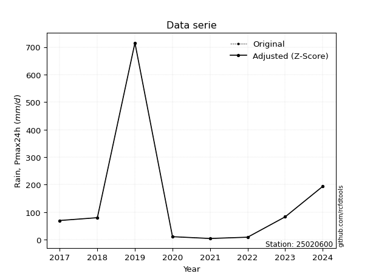</img>

</div>

> If Z-Score is active, values out of range or outliers are replaced with the station mean value.


### 4. Active continuous probability distributions from SciPy (45 of 104 available)

[scipy.stats](https://docs.scipy.org/doc/scipy/reference/stats.html) is a Python´s powerful submodule within the SciPy library for comprehensive statistical analysis, offering over 130 probability distributions (like Normal, Poisson), functions for descriptive stats (mean, variance), hypothesis testing (t-tests, chi-square), random variable generation, and statistical tests, making it essential for data science, modeling, and research. It provides tools to explore, model, and draw conclusions from data efficiently, working seamlessly with NumPy.

<div align="center">

|   id | p_dist             |   n_parameter | fit_method   | label                                                                       | active   | ref                                                                                                        |
|-----:|:-------------------|--------------:|:-------------|:----------------------------------------------------------------------------|:---------|:-----------------------------------------------------------------------------------------------------------|
|    0 | alpha              |             3 | MLE          | Alpha                                                                       | True     | [:mortar_board:](https://docs.scipy.org/doc/scipy/reference/generated/scipy.stats.alpha.html)              |
|    1 | betaprime          |             4 | MLE          | Beta prime                                                                  | True     | [:mortar_board:](https://docs.scipy.org/doc/scipy/reference/generated/scipy.stats.betaprime.html)          |
|    2 | chi2               |             3 | MLE          | Chi²                                                                        | True     | [:mortar_board:](https://docs.scipy.org/doc/scipy/reference/generated/scipy.stats.chi2.html)               |
|    3 | crystalball        |             4 | MLE          | Crystalball                                                                 | True     | [:mortar_board:](https://docs.scipy.org/doc/scipy/reference/generated/scipy.stats.crystalball.html)        |
|    4 | erlang             |             3 | MLE          | Erlang                                                                      | True     | [:mortar_board:](https://docs.scipy.org/doc/scipy/reference/generated/scipy.stats.erlang.html)             |
|    5 | expon              |             2 | MLE          | Exponential                                                                 | True     | [:mortar_board:](https://docs.scipy.org/doc/scipy/reference/generated/scipy.stats.expon.html)              |
|    6 | exponnorm          |             3 | MLE          | Exponentially modified Normal                                               | True     | [:mortar_board:](https://docs.scipy.org/doc/scipy/reference/generated/scipy.stats.exponnorm.html)          |
|    7 | f                  |             4 | MLE          | F                                                                           | True     | [:mortar_board:](https://docs.scipy.org/doc/scipy/reference/generated/scipy.stats.f.html)                  |
|    8 | fatiguelife        |             3 | MLE          | Fatigue-life (Birnbaum-Saunders)                                            | True     | [:mortar_board:](https://docs.scipy.org/doc/scipy/reference/generated/scipy.stats.fatiguelife.html)        |
|    9 | fisk               |             3 | MLE          | Fisk                                                                        | True     | [:mortar_board:](https://docs.scipy.org/doc/scipy/reference/generated/scipy.stats.fisk.html)               |
|   10 | gamma              |             3 | MLE          | Gamma                                                                       | True     | [:mortar_board:](https://docs.scipy.org/doc/scipy/reference/generated/scipy.stats.gamma.html)              |
|   11 | genexpon           |             5 | MLE          | Generalized exponential                                                     | True     | [:mortar_board:](https://docs.scipy.org/doc/scipy/reference/generated/scipy.stats.genexpon.html)           |
|   12 | genlogistic        |             3 | MLE          | Generalized logistic                                                        | True     | [:mortar_board:](https://docs.scipy.org/doc/scipy/reference/generated/scipy.stats.genlogistic.html)        |
|   13 | gibrat             |             2 | MM           | Gibrat                                                                      | True     | [:mortar_board:](https://docs.scipy.org/doc/scipy/reference/generated/scipy.stats.gibrat.html)             |
|   14 | gompertz           |             3 | MLE          | Gompertz (or truncated Gumbel)                                              | True     | [:mortar_board:](https://docs.scipy.org/doc/scipy/reference/generated/scipy.stats.gompertz.html)           |
|   15 | gumbel_l           |             2 | MM           | Gumbel Left Skew                                                            | True     | [:mortar_board:](https://docs.scipy.org/doc/scipy/reference/generated/scipy.stats.gumbel_l.html)           |
|   16 | gumbel_r           |             2 | MM           | Gumbel Right Skew                                                           | True     | [:mortar_board:](https://docs.scipy.org/doc/scipy/reference/generated/scipy.stats.gumbel_r.html)           |
|   17 | halflogistic       |             2 | MM           | Half-logistic                                                               | True     | [:mortar_board:](https://docs.scipy.org/doc/scipy/reference/generated/scipy.stats.halflogistic.html)       |
|   18 | halfnorm           |             2 | MM           | Half Normal                                                                 | True     | [:mortar_board:](https://docs.scipy.org/doc/scipy/reference/generated/scipy.stats.halfnorm.html)           |
|   19 | hypsecant          |             2 | MM           | hyperbolic secant                                                           | True     | [:mortar_board:](https://docs.scipy.org/doc/scipy/reference/generated/scipy.stats.hypsecant.html)          |
|   20 | invgamma           |             3 | MLE          | Inverted gamma                                                              | True     | [:mortar_board:](https://docs.scipy.org/doc/scipy/reference/generated/scipy.stats.invgamma.html)           |
|   21 | invgauss           |             3 | MLE          | Inverse Gaussian                                                            | True     | [:mortar_board:](https://docs.scipy.org/doc/scipy/reference/generated/scipy.stats.invgauss.html)           |
|   22 | invweibull         |             3 | MLE          | Inverted Weibull                                                            | True     | [:mortar_board:](https://docs.scipy.org/doc/scipy/reference/generated/scipy.stats.invweibull.html)         |
|   23 | johnsonsu          |             4 | MLE          | Johnson Su                                                                  | True     | [:mortar_board:](https://docs.scipy.org/doc/scipy/reference/generated/scipy.stats.johnsonsu.html)          |
|   24 | kstwobign          |             2 | MLE          | Limiting distribution of scaled Kolmogorov-Smirnov two-sided test statistic | True     | [:mortar_board:](https://docs.scipy.org/doc/scipy/reference/generated/scipy.stats.kstwobign.html)          |
|   25 | laplace            |             2 | MM           | Laplace                                                                     | True     | [:mortar_board:](https://docs.scipy.org/doc/scipy/reference/generated/scipy.stats.laplace.html)            |
|   26 | laplace_asymmetric |             3 | MLE          | Asymmetric Laplace                                                          | True     | [:mortar_board:](https://docs.scipy.org/doc/scipy/reference/generated/scipy.stats.laplace_asymmetric.html) |
|   27 | loggamma           |             3 | MLE          | Log gamma                                                                   | True     | [:mortar_board:](https://docs.scipy.org/doc/scipy/reference/generated/scipy.stats.loggamma.html)           |
|   28 | logistic           |             2 | MM           | Logistic (or Sech-squared)                                                  | True     | [:mortar_board:](https://docs.scipy.org/doc/scipy/reference/generated/scipy.stats.logistic.html)           |
|   29 | lognorm            |             3 | MLE          | Log Normal                                                                  | True     | [:mortar_board:](https://docs.scipy.org/doc/scipy/reference/generated/scipy.stats.lognorm.html)            |
|   30 | maxwell            |             2 | MM           | Maxwell                                                                     | True     | [:mortar_board:](https://docs.scipy.org/doc/scipy/reference/generated/scipy.stats.maxwell.html)            |
|   31 | mielke             |             4 | MLE          | Mielke Beta-Kappa / Dagum                                                   | True     | [:mortar_board:](https://docs.scipy.org/doc/scipy/reference/generated/scipy.stats.mielke.html)             |
|   32 | moyal              |             2 | MM           | Moyal                                                                       | True     | [:mortar_board:](https://docs.scipy.org/doc/scipy/reference/generated/scipy.stats.moyal.html)              |
|   33 | nakagami           |             3 | MLE          | Nakagami                                                                    | True     | [:mortar_board:](https://docs.scipy.org/doc/scipy/reference/generated/scipy.stats.nakagami.html)           |
|   34 | ncf                |             5 | MLE          | Non-central F distribution                                                  | True     | [:mortar_board:](https://docs.scipy.org/doc/scipy/reference/generated/scipy.stats.ncf.html)                |
|   35 | nct                |             4 | MLE          | Non-central Student’s t                                                     | True     | [:mortar_board:](https://docs.scipy.org/doc/scipy/reference/generated/scipy.stats.nct.html)                |
|   36 | norm               |             2 | MM           | Normal                                                                      | True     | [:mortar_board:](https://docs.scipy.org/doc/scipy/reference/generated/scipy.stats.norm.html)               |
|   37 | pareto             |             3 | MLE          | Pareto                                                                      | True     | [:mortar_board:](https://docs.scipy.org/doc/scipy/reference/generated/scipy.stats.pareto.html)             |
|   38 | pearson3           |             3 | MM           | Pearson type III                                                            | True     | [:mortar_board:](https://docs.scipy.org/doc/scipy/reference/generated/scipy.stats.pearson3.html)           |
|   39 | rayleigh           |             2 | MM           | Rayleigh                                                                    | True     | [:mortar_board:](https://docs.scipy.org/doc/scipy/reference/generated/scipy.stats.rayleigh.html)           |
|   40 | rice               |             3 | MLE          | Rice                                                                        | True     | [:mortar_board:](https://docs.scipy.org/doc/scipy/reference/generated/scipy.stats.rice.html)               |
|   41 | t                  |             3 | MLE          | Student’s t                                                                 | True     | [:mortar_board:](https://docs.scipy.org/doc/scipy/reference/generated/scipy.stats.t.html)                  |
|   42 | truncnorm          |             4 | MLE          | Truncated normal                                                            | True     | [:mortar_board:](https://docs.scipy.org/doc/scipy/reference/generated/scipy.stats.truncnorm.html)          |
|   43 | wald               |             2 | MM           | Wald                                                                        | True     | [:mortar_board:](https://docs.scipy.org/doc/scipy/reference/generated/scipy.stats.wald.html)               |
|   44 | weibull_min        |             3 | MLE          | Weibull minimum                                                             | True     | [:mortar_board:](https://docs.scipy.org/doc/scipy/reference/generated/scipy.stats.weibull_min.html)        |

</div>

> **n_parameter:** # arguments & localization & scale.
>
> **Fit methods:** (MLE) maximum likelihood, (MM) L-moments.
>
>**Inactive:** foldnorm, gennorm, norminvgauss, powernorm, powerlognorm, skewnorm, genextreme, anglit, arcsine, argus, beta, bradford, burr, burr12, cauchy, cosine, halfcauchy, foldcauchy, skewcauchy, wrapcauchy, dgamma, gengamma, exponweib, exponpow, truncexpon, gausshyper, genhalflogistic, genhyperbolic, geninvgauss, halfgennorm, johnsonsb, kappa4, kappa3, ksone, kstwo, loglaplace, levy, levy_l, levy_stable, ncx2, genpareto, truncpareto, lomax, powerlaw, rdist, rel_breitwigner, recipinvgauss, semicircular, studentized_range, trapezoid, triang, truncweibull_min, tukeylambda, uniform, loguniform, vonmises, vonmises_line, weibull_max, dweibull, 


## B. Probability distributions vs. Empirical distributions

A continuous probability distribution (CPD) describes probabilities for variables that can take any value within a range (like rain any time), unlike discrete variables with specific outcomes (like temperature). It uses a Probability Density Function (PDF), a curve where the total area under it equals 1, and the probability of the variable falling within an interval (a to b) is found by calculating the area under the curve between those points. A key feature is that the probability of hitting any single exact value is zero, so probabilities are always expressed for ranges, e.g., $P(a ≤ X ≤ b)$.

<div align="center">

Distributions parameters
|    |   station | p_dist                |   n |               loc |            scale | shape                  | shape1                | shape2                 | shape3   |
|---:|----------:|:----------------------|----:|------------------:|-----------------:|:-----------------------|:----------------------|:-----------------------|:---------|
|  0 |  25020600 | alpha                 |   9 |      -0.0257365   |     11.1502      | 1.5773311988771548e-10 |                       |                        |          |
|  1 |  25020600 | betaprime             |   9 |       4.4         |    208.341       | 0.3845690018738478     | 1.3875194573704       |                        |          |
|  2 |  25020600 | chi2                  |   9 |       4.4         |    271.019       | 0.680246028002965      |                       |                        |          |
|  3 |  25020600 | crystalball           |   9 |     135.717       |    212.388       | 6809.375849420921      | 12454.55829378825     |                        |          |
|  4 |  25020600 | erlang                |   9 |       4.4         |    653.349       | 0.2546072418665659     |                       |                        |          |
|  5 |  25020600 | expon                 |   9 |       4.4         |    131.444       |                        |                       |                        |          |
|  6 |  25020600 | exponnorm             |   9 |       4.22982     |      0.0560047   | 2346.9592345975525     |                       |                        |          |
|  7 |  25020600 | f                     |   9 |       4.4         |     68.0822      | 0.7867873959122857     | 2.356988458665958     |                        |          |
|  8 |  25020600 | fatiguelife           |   9 |       3.38769     |     26.3702      | 2.6501940151399808     |                       |                        |          |
|  9 |  25020600 | fisk                  |   9 |       4.4         |     33.1414      | 0.8587861684762605     |                       |                        |          |
| 10 |  25020600 | gamma                 |   9 |       4.4         |    265.07        | 0.47593871029561774    |                       |                        |          |
| 11 |  25020600 | genexpon              |   9 |       4.4         |    195.679       | 1.4886809289062528     | 4.818479130651708e-12 | 2.5424984129782926     |          |
| 12 |  25020600 | genlogistic           |   9 |    -680.334       |     97.227       | 2044.6061970466512     |                       |                        |          |
| 13 |  25020600 | gibrat                |   9 |     -25.9503      |     98.1335      |                        |                       |                        |          |
| 14 |  25020600 | gompertz              |   9 |       4.39866     | 807078           | 6155.62425931526       |                       |                        |          |
| 15 |  25020600 | gumbel_l              |   9 |     231.294       |    165.363       |                        |                       |                        |          |
| 16 |  25020600 | gumbel_r              |   9 |      40.3945      |    165.363       |                        |                       |                        |          |
| 17 |  25020600 | halflogistic          |   9 |    -115.527       |    181.326       |                        |                       |                        |          |
| 18 |  25020600 | halfnorm              |   9 |    -144.874       |    351.829       |                        |                       |                        |          |
| 19 |  25020600 | hypsecant             |   9 |     135.844       |    135.018       |                        |                       |                        |          |
| 20 |  25020600 | invgamma              |   9 |      -1.86711     |     16.4286      | 0.7147585602565156     |                       |                        |          |
| 21 |  25020600 | invgauss              |   9 |      -0.631178    |     23.3142      | 5.853757822706546      |                       |                        |          |
| 22 |  25020600 | invweibull            |   9 |       4.4         |      2.64478     | 0.06221523531993579    |                       |                        |          |
| 23 |  25020600 | johnsonsu             |   9 |       4.4         |      3.33893e-08 | -1.7710758115714555    | 0.11885893218545537   |                        |          |
| 24 |  25020600 | kstwobign             |   9 |    -358.745       |    586.011       |                        |                       |                        |          |
| 25 |  25020600 | laplace               |   9 |     135.844       |    149.967       |                        |                       |                        |          |
| 26 |  25020600 | laplace_asymmetric    |   9 |       4.4         |      0.000688178 | 5.235494605798199e-06  |                       |                        |          |
| 27 |  25020600 | loggamma              |   9 |  -77711.1         |  10150           | 2143.3843554843043     |                       |                        |          |
| 28 |  25020600 | logistic              |   9 |     135.844       |    116.929       |                        |                       |                        |          |
| 29 |  25020600 | lognorm               |   9 |       4.4         |      0.746648    | 12.236767222994137     |                       |                        |          |
| 30 |  25020600 | maxwell               |   9 |    -366.71        |    314.929       |                        |                       |                        |          |
| 31 |  25020600 | mielke                |   9 |      -0.165027    |     45.2921      | 1.1719003475028558     | 1.0888154635897944    |                        |          |
| 32 |  25020600 | moyal                 |   9 |      14.5601      |     95.4722      |                        |                       |                        |          |
| 33 |  25020600 | nakagami              |   9 |       4.4         |    271.135       | 0.14054037951791926    |                       |                        |          |
| 34 |  25020600 | ncf                   |   9 |      -0.100643    |      3.18778     | 2.788732079880608      | 1.4197202639308406    | 17.353734533928538     |          |
| 35 |  25020600 | nct                   |   9 |      -0.247769    |      0.212027    | 0.4915000943954708     | 54.73610168023845     |                        |          |
| 36 |  25020600 | norm                  |   9 |     135.844       |    212.086       |                        |                       |                        |          |
| 37 |  25020600 | pareto                |   9 |     -46.4355      |     50.8355      | 1.147465898734734      |                       |                        |          |
| 38 |  25020600 | pearson3              |   9 |     135.844       |    212.086       | 2.18365218795773       |                       |                        |          |
| 39 |  25020600 | rayleigh              |   9 |    -269.888       |    323.728       |                        |                       |                        |          |
| 40 |  25020600 | rice                  |   9 |    -152.811       |    253.281       | 0.0006680991946111979  |                       |                        |          |
| 41 |  25020600 | t                     |   9 |      57.7136      |     38.1886      | 1.04553386758006       |                       |                        |          |
| 42 |  25020600 | truncnorm             |   9 |   -5386.59        |    898.611       | 5.999239163557641      | 725.7643325325603     |                        |          |
| 43 |  25020600 | wald                  |   9 |     -76.2414      |    212.086       |                        |                       |                        |          |
| 44 |  25020600 | weibull_min           |   9 |       4.4         |    250.258       | 0.7370130288779693     |                       |                        |          |
| 45 |  25020600 | logalpha              |   9 |     -19.1771      |    345.448       | 15.061599411068642     |                       |                        |          |
| 46 |  25020600 | logbetaprime          |   9 |     -35.0737      |   1488.99        | 676.1013733313303      | 25838.843464250967    |                        |          |
| 47 |  25020600 | logchi2               |   9 |       1.4816      |      1.48288     | 0.7519523075505838     |                       |                        |          |
| 48 |  25020600 | logcrystalball        |   9 |       3.88715     |      1.51588     | 48.58826626751866      | 108.94215304407551    |                        |          |
| 49 |  25020600 | logerlang             |   9 |    -451.306       |      0.0050483   | 90167.5653327078       |                       |                        |          |
| 50 |  25020600 | logexpon              |   9 |       1.4816      |      2.40554     |                        |                       |                        |          |
| 51 |  25020600 | logexponnorm          |   9 |       3.87516     |      1.51583     | 0.00790911124824683    |                       |                        |          |
| 52 |  25020600 | logf                  |   9 |     -96.9442      |    100.824       | 14708.69535736811      | 22178.25336942036     |                        |          |
| 53 |  25020600 | logfatiguelife        |   9 |     -78.5825      |     82.4578      | 0.018386995735771273   |                       |                        |          |
| 54 |  25020600 | logfisk               |   9 | -528218           | 528222           | 590260.3140885306      |                       |                        |          |
| 55 |  25020600 | loggamma              |   9 |    -451.163       |      0.00504951  | 90117.60078826355      |                       |                        |          |
| 56 |  25020600 | loggenexpon           |   9 |       1.47525     |      0.0313867   | 0.005869636830960147   | 3.4959921283665363    | 3.8043944987838795e-05 |          |
| 57 |  25020600 | loggenlogistic        |   9 |       4.21298     |      0.818137    | 0.8033317753372677     |                       |                        |          |
| 58 |  25020600 | loggibrat             |   9 |       2.73068     |      0.701425    |                        |                       |                        |          |
| 59 |  25020600 | loggompertz           |   9 |       1.4816      |      2.25181     | 0.3804262819785392     |                       |                        |          |
| 60 |  25020600 | loggumbel_l           |   9 |       4.56937     |      1.18193     |                        |                       |                        |          |
| 61 |  25020600 | loggumbel_r           |   9 |       3.20492     |      1.18193     |                        |                       |                        |          |
| 62 |  25020600 | loghalflogistic       |   9 |       2.09047     |      1.29602     |                        |                       |                        |          |
| 63 |  25020600 | loghalfnorm           |   9 |       1.88075     |      2.51466     |                        |                       |                        |          |
| 64 |  25020600 | loghypsecant          |   9 |       3.88715     |      0.965038    |                        |                       |                        |          |
| 65 |  25020600 | loginvgamma           |   9 |     -14.3467      |   2581.51        | 142.504897903578       |                       |                        |          |
| 66 |  25020600 | loginvgauss           |   9 |      -5.64557     |    352.206       | 0.02700073760547019    |                       |                        |          |
| 67 |  25020600 | loginvweibull         |   9 |      -1.94024e+08 |      1.94024e+08 | 139254034.57441628     |                       |                        |          |
| 68 |  25020600 | logjohnsonsu          |   9 |    -151.104       |    442.511       | -106.22697884045783    | 309.2860775968402     |                        |          |
| 69 |  25020600 | logkstwobign          |   9 |      -1.71381     |      6.39731     |                        |                       |                        |          |
| 70 |  25020600 | loglaplace            |   9 |       3.88715     |      1.07189     |                        |                       |                        |          |
| 71 |  25020600 | loglaplace_asymmetric |   9 |       4.38141     |      1.10498     | 1.249198500240169      |                       |                        |          |
| 72 |  25020600 | logloggamma           |   9 |    -295.396       |     44.3572      | 852.0556731167253      |                       |                        |          |
| 73 |  25020600 | loglogistic           |   9 |       3.88715     |      0.835747    |                        |                       |                        |          |
| 74 |  25020600 | loglognorm            |   9 |       1.4816      |      0.0380386   | 11.603183347036238     |                       |                        |          |
| 75 |  25020600 | logmaxwell            |   9 |       0.295152    |      2.25095     |                        |                       |                        |          |
| 76 |  25020600 | logmielke             |   9 |       1.4816      |      6.61169     | 0.5788038300760271     | 17.128679352367016    |                        |          |
| 77 |  25020600 | logmoyal              |   9 |       3.02027     |      0.682385    |                        |                       |                        |          |
| 78 |  25020600 | lognakagami           |   9 |       2.19722     |      2.32303     | 0.08605170818378341    |                       |                        |          |
| 79 |  25020600 | logncf                |   9 |      -0.550911    |      4.92135e-06 | 4.01502260313665e-05   | 150.15159454740296    | 35.7867701035848       |          |
| 80 |  25020600 | lognct                |   9 |     -63.4821      |      1.48773     | 26594.133367890383     | 45.28161699082227     |                        |          |
| 81 |  25020600 | lognorm               |   9 |       3.88715     |      1.51588     |                        |                       |                        |          |
| 82 |  25020600 | logpareto             |   9 |       1.48132     |      0.000286016 | 0.1251769439458612     |                       |                        |          |
| 83 |  25020600 | logpearson3           |   9 |       3.88715     |      1.51587     | 0.006727653605451604   |                       |                        |          |
| 84 |  25020600 | lograyleigh           |   9 |       0.987184    |      2.31384     |                        |                       |                        |          |
| 85 |  25020600 | logrice               |   9 |       0.789284    |      1.78921     | 1.3097859531467848     |                       |                        |          |
| 86 |  25020600 | logt                  |   9 |       3.88714     |      1.51588     | 4651589912.083756      |                       |                        |          |
| 87 |  25020600 | logtruncnorm          |   9 |      -0.151502    |      3.38491     | 0.48122656457805346    | 1.9865632170016858    |                        |          |
| 88 |  25020600 | logwald               |   9 |       2.37129     |      1.51586     |                        |                       |                        |          |
| 89 |  25020600 | logweibull_min        |   9 |       0.549759    |      3.76892     | 2.3790051401057504     |                       |                        |          |

</div>

> **loc** (Location parameter): This shifts the distribution along the x-axis. For many common distributions, like the normal (Gaussian) distribution, loc represents the mean $μ$. For others, like the uniform distribution, it might represent the minimum value, or for the beta distribution, the left end of the support interval.
>
> **scale** (Scale parameter): This determines the width or spread of the distribution. For the normal distribution, scale represents the standard deviation $σ$. For a uniform distribution, it defines the length of the interval (from $loc$ to $loc + scale$).
>
> **shape** (Shape parameters): Refers to parameters that define the specific form of a probability distribution, distinct from its location (loc) and scale (scale). These parameters are required arguments for most distribution functions. For example, a normal (Gaussian) distribution is fully defined by its location (mean) and scale (standard deviation), so it has no specific shape parameters beyond loc and scale. However, other distributions have intrinsic properties that need specification, as Gamma distribution that takes a shape parameter, often named $a$ or $alpha$.


### 0. Cumulative distribution values - CDF (90 evaluated)

> Ordered by x ascending and calculating $log(f(x))$ separately. 

|   id |   Station |   date |      x |   count |    mean |     std |    zscore |   Value_initial |   station |   m |     alpha |   alpha_pdf |   betaprime |   betaprime_pdf |        chi2 |    chi2_pdf |   crystalball |   crystalball_pdf |      erlang |   erlang_pdf |     expon |   expon_pdf |   exponnorm |   exponnorm_pdf |           f |         f_pdf |   fatiguelife |   fatiguelife_pdf |        fisk |    fisk_pdf |       gamma |   gamma_pdf |    genexpon |   genexpon_pdf |   genlogistic |   genlogistic_pdf |   gibrat |   gibrat_pdf |    gompertz |   gompertz_pdf |   gumbel_l |   gumbel_l_pdf |   gumbel_r |   gumbel_r_pdf |   halflogistic |   halflogistic_pdf |   halfnorm |   halfnorm_pdf |   hypsecant |   hypsecant_pdf |   invgamma |   invgamma_pdf |   invgauss |   invgauss_pdf |   invweibull |   invweibull_pdf |   johnsonsu |    johnsonsu_pdf |   kstwobign |   kstwobign_pdf |   laplace |   laplace_pdf |   laplace_asymmetric |   laplace_asymmetric_pdf |   loggamma |   loggamma_pdf |   logistic |   logistic_pdf |   lognorm |   lognorm_pdf |   maxwell |   maxwell_pdf |    mielke |   mielke_pdf |    moyal |   moyal_pdf |    nakagami |   nakagami_pdf |       ncf |     ncf_pdf |       nct |     nct_pdf |     norm |    norm_pdf |    pareto |   pareto_pdf |   pearson3 |   pearson3_pdf |   rayleigh |   rayleigh_pdf |     rice |    rice_pdf |        t |       t_pdf |   truncnorm |   truncnorm_pdf |     wald |    wald_pdf |   weibull_min |   weibull_min_pdf |   logalpha |   logalpha_pdf |   logbetaprime |   logbetaprime_pdf |     logchi2 |   logchi2_pdf |   logcrystalball |   logcrystalball_pdf |   logerlang |   logerlang_pdf |   logexpon |   logexpon_pdf |   logexponnorm |   logexponnorm_pdf |      logf |   logf_pdf |   logfatiguelife |   logfatiguelife_pdf |   logfisk |   logfisk_pdf |   loggenexpon |   loggenexpon_pdf |   loggenlogistic |   loggenlogistic_pdf |   loggibrat |   loggibrat_pdf |   loggompertz |   loggompertz_pdf |   loggumbel_l |   loggumbel_l_pdf |   loggumbel_r |   loggumbel_r_pdf |   loghalflogistic |   loghalflogistic_pdf |   loghalfnorm |   loghalfnorm_pdf |   loghypsecant |   loghypsecant_pdf |   loginvgamma |   loginvgamma_pdf |   loginvgauss |   loginvgauss_pdf |   loginvweibull |   loginvweibull_pdf |   logjohnsonsu |   logjohnsonsu_pdf |   logkstwobign |   logkstwobign_pdf |   loglaplace |   loglaplace_pdf |   loglaplace_asymmetric |   loglaplace_asymmetric_pdf |   logloggamma |   logloggamma_pdf |   loglogistic |   loglogistic_pdf |   loglognorm |   loglognorm_pdf |   logmaxwell |   logmaxwell_pdf |   logmielke |   logmielke_pdf |   logmoyal |   logmoyal_pdf |   lognakagami |   lognakagami_pdf |    logncf |   logncf_pdf |    lognct |   lognct_pdf |   logpareto |   logpareto_pdf |   logpearson3 |   logpearson3_pdf |   lograyleigh |   lograyleigh_pdf |   logrice |   logrice_pdf |      logt |   logt_pdf |   logtruncnorm |   logtruncnorm_pdf |     logwald |   logwald_pdf |   logweibull_min |   logweibull_min_pdf |
|-----:|----------:|-------:|-------:|--------:|--------:|--------:|----------:|----------------:|----------:|----:|----------:|------------:|------------:|----------------:|------------:|------------:|--------------:|------------------:|------------:|-------------:|----------:|------------:|------------:|----------------:|------------:|--------------:|--------------:|------------------:|------------:|------------:|------------:|------------:|------------:|---------------:|--------------:|------------------:|---------:|-------------:|------------:|---------------:|-----------:|---------------:|-----------:|---------------:|---------------:|-------------------:|-----------:|---------------:|------------:|----------------:|-----------:|---------------:|-----------:|---------------:|-------------:|-----------------:|------------:|-----------------:|------------:|----------------:|----------:|--------------:|---------------------:|-------------------------:|-----------:|---------------:|-----------:|---------------:|----------:|--------------:|----------:|--------------:|----------:|-------------:|---------:|------------:|------------:|---------------:|----------:|------------:|----------:|------------:|---------:|------------:|----------:|-------------:|-----------:|---------------:|-----------:|---------------:|---------:|------------:|---------:|------------:|------------:|----------------:|---------:|------------:|--------------:|------------------:|-----------:|---------------:|---------------:|-------------------:|------------:|--------------:|-----------------:|---------------------:|------------:|----------------:|-----------:|---------------:|---------------:|-------------------:|----------:|-----------:|-----------------:|---------------------:|----------:|--------------:|--------------:|------------------:|-----------------:|---------------------:|------------:|----------------:|--------------:|------------------:|--------------:|------------------:|--------------:|------------------:|------------------:|----------------------:|--------------:|------------------:|---------------:|-------------------:|--------------:|------------------:|--------------:|------------------:|----------------:|--------------------:|---------------:|-------------------:|---------------:|-------------------:|-------------:|-----------------:|------------------------:|----------------------------:|--------------:|------------------:|--------------:|------------------:|-------------:|-----------------:|-------------:|-----------------:|------------:|----------------:|-----------:|---------------:|--------------:|------------------:|----------:|-------------:|----------:|-------------:|------------:|----------------:|--------------:|------------------:|--------------:|------------------:|----------:|--------------:|----------:|-----------:|---------------:|-------------------:|------------:|--------------:|-----------------:|---------------------:|
|    0 |  25020600 |   2021 |   4.4  |       9 | 135.844 | 224.951 | -0.584325 |            4.4  |  25020600 |   1 | 0.0117557 | 0.0190082   | 0.000124399 |  4951.97        | 1.00062e-06 | 3.83182e+08 |      0.268193 |       0.00155156  | 3.11998e-05 |  8.94379e+09 | 0         | 0.00760778  |  0.00129395 |     0.00758911  | 0.000350654 | 505.635       |     0.0320185 |       0.0709281   | 5.86552e-15 | 5.67142     | 5.44196e-09 | 2.91613e+06 | 2.72904e-13 |    0.00760777  |      0.167657 |       0.00307813  | 0.120293 |  0.0066024   | 1.02338e-05 |    0.00762698  |   0.223977 |    0.00118998  |   0.288466 |    0.00216866  |       0.319144 |        0.00247661  |   0.328639 |    0.00207262  |    0.229932 |     0.00155869  |  0.0399317 |    0.0181141   |  0.0370952 |    0.0198972   |  0.000103366 |      6.64489e+10 |   0.0419164 | 299543           |    0.162812 |     0.00243236  |  0.208121 |   0.00138778  |          3.08389e-11 |              0.00760776  |  0.0560737 |      0.0747785 |   0.245244 |    0.00158301  |  0.056268 |     0.0747165 |  0.291792 |    0.00175701 | 0.0623993 |  0.0148019   | 0.291585 | 0.00252704  | 9.86826e-06 |    3.123e+09   | 0.0383916 | 0.0184272   | 0.0313833 | 0.0279798   | 0.267705 | 0.00155235  | 0         |  0.0225721   |   0.314855 |    0.00361717  |   0.301585 |    0.00182793  | 0.175216 | 0.00202124  | 0.194161 | 0.00286551  | 1.22758e-05 |     0.00685242  | 0.250521 | 0.00484131  |   1.37786e-13 |     114.335       |   0.048451 |      0.0814087 |      0.0539967 |          0.075448  | 9.73421e-07 |   1.64824e+09 |        0.0562678 |            0.0747164 |   0.0560799 |       0.0747822 |   0        |      0.415707  |      0.0562679 |          0.0747165 | 0.0549942 |  0.0750233 |        0.0545545 |            0.0750886 | 0.0617384 |     0.0647305 |    0.00118967 |         0.187644  |        0.0665394 |            0.0630961 |    0        |       0         |   3.73076e-10 |          0.168943 |      0.070726 |         0.0576718 |     0.0136011 |         0.0494549 |          0        |             0         |      0        |         0         |      0.0525208 |          0.0541769 |     0.0468982 |         0.0773245 |     0.0459301 |         0.0834312 |       0.0381751 |           0.0894732 |      0.0561981 |          0.0747646 |      0.0357321 |          0.0994062 |    0.0530056 |        0.0494507 |                0.074573 |                   0.0540249 |     0.0578676 |         0.0748217 |     0.0532361 |         0.0603077 |   0.00236689 |       2.8668e+12 |    0.0358562 |        0.0857068 | 2.91648e-10 |  760240         |  0.0020173 |      0.0153564 |     0         |       0           | 0.0385199 |    0.0823175 | 0.0561883 |    0.0748114 |    0        |    437.657      |     0.0560739 |         0.0747799 |      0.022571 |         0.0902645 | 0.0315704 |     0.0906565 | 0.0562685 |  0.074717  |     0.00150938 |           0.359659 | 0           |   0           |        0.0353552 |            0.0886472 |
|    1 |  25020600 |   2022 |   9    |       9 | 135.844 | 224.951 | -0.563876 |            9    |  25020600 |   2 | 0.216691  | 0.0509163   | 0.267514    |     0.0217479   | 0.220859    | 0.0162272   |      0.275378 |       0.00157211  | 0.312245    |  0.0171858   | 0.0343905 | 0.00734614  |  0.0356408  |     0.00733683  | 0.241877    |   0.0201714   |     0.259839  |       0.0286571   | 0.155006    | 0.0244528   | 0.163063    | 0.0166738   | 0.0343905   |    0.00734614  |      0.182073 |       0.00318846  | 0.150942 |  0.00669903  | 0.0344861   |    0.00736407  |   0.229508 |    0.00121483  |   0.298474 |    0.00218234  |       0.33049  |        0.00245629  |   0.338146 |    0.00206098  |    0.237194 |     0.00159863  |  0.135944  |    0.0213803   |  0.141476  |    0.022653    |  0.380545    |      0.00497267  |   0.705007  |      0.00891521  |    0.174143 |     0.00249345  |  0.214604 |   0.001431    |          0.0343904   |              0.00734613  |  0.132404  |      0.141684  |   0.252599 |    0.00161459  |  0.132465 |     0.141375  |  0.299905 |    0.00176992 | 0.129186  |  0.0140514   | 0.303223 | 0.00253227  | 0.257759    |    0.0157497   | 0.136774  | 0.0218966   | 0.187287  | 0.0314962   | 0.274893 | 0.00157299  | 0.0946191 |  0.0187406   |   0.331236 |    0.00350586  |   0.310013 |    0.00183616  | 0.184596 | 0.00205673  | 0.208136 | 0.00321887  | 0.0310542   |     0.0066451   | 0.272542 | 0.00473078  |   0.0512212   |       0.00799282  |   0.135619 |      0.164686  |      0.131768  |          0.145006  | 0.618628    |   0.272091    |        0.132465  |            0.141375  |   0.132412  |       0.141685  |   0.257319 |      0.308738  |      0.132465  |          0.141375  | 0.131954  |  0.143191  |        0.131736  |            0.143745  | 0.1277    |     0.124476  |    0.156497   |         0.239927  |        0.129394  |            0.117088  |    0        |       0         |   0.132654    |          0.201349 |      0.12575  |         0.099405  |     0.095779  |         0.190088  |          0.041163 |             0.385141  |      0.100151 |         0.314791  |      0.109411  |          0.111156  |     0.129764  |         0.157139  |     0.136313  |         0.170982  |       0.141722  |           0.198742  |      0.132472  |          0.141539  |      0.151103  |          0.216418  |    0.10334   |        0.0964092 |                0.125238 |                   0.0907293 |     0.133658  |         0.140087  |     0.116907  |         0.12353   |   0.599831   |       0.046533   |    0.130103  |        0.177111  | 0.276115    |       0.223326  |  0.0675926 |      0.201095  |     0.0016678 |       6.46342e+11 | 0.131282  |    0.178047  | 0.132518  |    0.141646  |    0.624517 |      0.0656536  |     0.132405  |         0.141686  |      0.127806 |         0.197128  | 0.127775  |     0.175691  | 0.132466  |  0.141376  |     0.244433   |           0.317605 | 0           |   0           |        0.130322  |            0.175357  |
|    2 |  25020600 |   2020 |  10.9  |       9 | 135.844 | 224.951 | -0.55543  |           10.9  |  25020600 |   3 | 0.307471  | 0.0442752   | 0.304228    |     0.017305    | 0.2482      | 0.0128717   |      0.278373 |       0.00158046  | 0.340777    |  0.0132429   | 0.0482478 | 0.00724072  |  0.0494805  |     0.00723154  | 0.276007    |   0.0161235   |     0.306583  |       0.0212256   | 0.197983    | 0.0209789   | 0.191788    | 0.0138112   | 0.0482478   |    0.00724072  |      0.188172 |       0.00323155  | 0.163675 |  0.00670114  | 0.048377    |    0.00725814  |   0.231826 |    0.00122517  |   0.302626 |    0.00218741  |       0.335149 |        0.00244774  |   0.342058 |    0.00205608  |    0.240247 |     0.00161518  |  0.175634  |    0.0203108   |  0.183088  |    0.0210829   |  0.38845     |      0.00351578  |   0.719026  |      0.00616584  |    0.178903 |     0.00251735  |  0.21734  |   0.00144925  |          0.0482477   |              0.0072407   |  0.161467  |      0.161828  |   0.255679 |    0.00162754  |  0.161464 |     0.161466  |  0.303272 |    0.00177501 | 0.155406  |  0.0135404   | 0.308035 | 0.00253352  | 0.284065    |    0.012283    | 0.177359  | 0.0207345   | 0.242714  | 0.0268935   | 0.27789  | 0.00158137  | 0.128961  |  0.0174323   |   0.337855 |    0.00346168  |   0.313505 |    0.00183932  | 0.188517 | 0.00207087  | 0.214404 | 0.00337974  | 0.0436001   |     0.00656125  | 0.281484 | 0.00468173  |   0.0655898   |       0.00718759  |   0.169366 |      0.187508  |      0.161521  |          0.165672  | 0.66544     |   0.219984    |        0.161464  |            0.161466  |   0.161475  |       0.161827  |   0.314161 |      0.285108  |      0.161464  |          0.161466  | 0.161332  |  0.163596  |        0.16123   |            0.164253  | 0.153499  |     0.145198  |    0.203197   |         0.247228  |        0.15362   |            0.136192  |    0        |       0         |   0.171988    |          0.209283 |      0.146177 |         0.114162  |     0.136044  |         0.229606  |          0.114575 |             0.380731  |      0.1601   |         0.310884  |      0.132801  |          0.133654  |     0.162032  |         0.179671  |     0.17129   |         0.193969  |       0.182149  |           0.222626  |      0.161504  |          0.161653  |      0.194642  |          0.2372    |    0.123559  |        0.115272  |                0.143879 |                   0.104234  |     0.162375  |         0.159823  |     0.142722  |         0.146398  |   0.607707   |       0.0365111  |    0.166157  |        0.198968  | 0.316743    |       0.202095  |  0.112198  |      0.263014  |     0.550579  |       0.494447    | 0.167716  |    0.201978  | 0.161572  |    0.161768  |    0.635496 |      0.0502813  |     0.161469  |         0.161829  |      0.167614 |         0.21791   | 0.163319  |     0.19514   | 0.161465  |  0.161467  |     0.304056   |           0.304888 | 3.35164e-20 |   8.40979e-17 |        0.165893  |            0.195729  |
|    3 |  25020600 |   2025 |  56.3  |       9 | 135.844 | 224.951 | -0.353608 |           56.3  |  25020600 |   4 | 0.843077  | 0.00274978  | 0.616301    |     0.00343048  | 0.492724    | 0.00300527  |      0.354231 |       0.00175153  | 0.570377    |  0.00262585  | 0.326215  | 0.00512601  |  0.327094   |     0.00511946  | 0.573413    |   0.00336353  |     0.605695  |       0.00291258  | 0.595126    | 0.003987    | 0.488614    | 0.00391752  | 0.326214    |    0.00512601  |      0.350866 |       0.00377864  | 0.429927 |  0.00477533  | 0.326904    |    0.00513407  |   0.29324  |    0.00148335  |   0.403211 |    0.00221474  |       0.441269 |        0.00222054  |   0.43254  |    0.00192581  |    0.322463 |     0.00200025  |  0.603552  |    0.00411716  |  0.611036  |    0.00418298  |  0.43564     |      0.000433937 |   0.795848  |      0.000649088 |    0.302546 |     0.00285662  |  0.294181 |   0.00196164  |          0.326214    |              0.005126    |  0.538165  |      0.261921  |   0.336199 |    0.00190859  |  0.537722 |     0.261998  |  0.38597  |    0.00185453 | 0.535486  |  0.00489303  | 0.421602 | 0.00243139  | 0.509041    |    0.00274445  | 0.607236  | 0.00408563  | 0.642287  | 0.0030834   | 0.353809 | 0.00175329  | 0.553946  |  0.00498204  |   0.474644 |    0.00262349  |   0.398079 |    0.00187347  | 0.28881  | 0.00231824  | 0.488122 | 0.00839488  | 0.300427    |     0.00483772  | 0.464749 | 0.00340221  |   0.269231    |       0.00325495  |   0.570091 |      0.251914  |      0.542453  |          0.260674  | 0.86462     |   0.066367    |        0.537722  |            0.261999  |   0.538162  |       0.261912  |   0.653431 |      0.144071  |      0.537722  |          0.261998  | 0.540091  |  0.261417  |        0.540784  |            0.26126   | 0.531797  |     0.278232  |    0.600789   |         0.212175  |        0.521371  |            0.284366  |    0.731389 |       0.253683  |   0.550502    |          0.235557 |      0.469515 |         0.284543  |     0.608203  |         0.255877  |          0.634271 |             0.23059   |      0.60743  |         0.220158  |      0.547175  |          0.326226  |     0.556909  |         0.25523   |     0.574429  |         0.247357  |       0.592094  |           0.222715  |      0.537966  |          0.26194   |      0.604442  |          0.216773  |    0.56267   |        0.408     |                0.47271  |                   0.342458  |     0.53588   |         0.261694  |     0.542835  |         0.296938  |   0.64147    |       0.0126308  |    0.568885  |        0.246326  | 0.575993    |       0.130787  |  0.633404  |      0.248857  |     0.808823  |       0.0722624   | 0.576442  |    0.243581  | 0.538134  |    0.261883  |    0.679708 |      0.0157266  |     0.538164  |         0.261916  |      0.578981 |         0.239338  | 0.559025  |     0.248616  | 0.537723  |  0.261998  |     0.709182   |           0.188343 | 0.703345    |   0.22884     |        0.562948  |            0.247233  |
|    4 |  25020600 |   2017 |  69.75 |       9 | 135.844 | 224.951 | -0.293817 |           69.75 |  25020600 |   5 | 0.873038  | 0.00180413  | 0.65737     |     0.00272259  | 0.529664    | 0.00251807  |      0.378054 |       0.00178991  | 0.6024      |  0.00216637  | 0.391749  | 0.00462744  |  0.392545   |     0.00462151  | 0.613893    |   0.00269843  |     0.640848  |       0.0023558   | 0.641779    | 0.00302118  | 0.536921    | 0.0033001   | 0.391749    |    0.00462743  |      0.401692 |       0.00376736  | 0.489985 |  0.00416735  | 0.392534    |    0.00463355  |   0.313722 |    0.00156241  |   0.432859 |    0.00219186  |       0.470641 |        0.00214668  |   0.458155 |    0.00188279  |    0.350055 |     0.00210076  |  0.651104  |    0.00303896  |  0.659727  |    0.00313808  |  0.440823    |      0.000343763 |   0.803523  |      0.000503763 |    0.341148 |     0.002878    |  0.321785 |   0.0021457   |          0.391749    |              0.00462743  |  0.593704  |      0.255754  |   0.362333 |    0.00197597  |  0.59329  |     0.255947  |  0.410975 |    0.00186257 | 0.593666  |  0.00382091  | 0.453866 | 0.00236424  | 0.542903    |    0.00231845  | 0.654383  | 0.00301073  | 0.677674  | 0.00225101  | 0.377657 | 0.00179188  | 0.612674  |  0.0038253   |   0.508617 |    0.00243161  |   0.423255 |    0.00186913  | 0.320276 | 0.00235818  | 0.598079 | 0.00766089  | 0.36263     |     0.00441794  | 0.508232 | 0.00306929  |   0.310453    |       0.00289074  |   0.622764 |      0.239224  |      0.597595  |          0.253327  | 0.877996    |   0.0587101   |        0.59329   |            0.255947  |   0.593698  |       0.255746  |   0.68296  |      0.131796  |      0.59329   |          0.255947  | 0.59546   |  0.254682  |        0.596096  |            0.254318  | 0.590671  |     0.270175  |    0.644848   |         0.198997  |        0.581992  |            0.280153  |    0.779218 |       0.195938  |   0.600443    |          0.230284 |      0.532306 |         0.300713  |     0.660461  |         0.2318    |          0.681107 |             0.206822  |      0.652862 |         0.203951  |      0.615394  |          0.308404  |     0.610466  |         0.24411   |     0.626038  |         0.233933  |       0.638011  |           0.205785  |      0.593515  |          0.255831  |      0.649196  |          0.200928  |    0.641893  |        0.33409   |                0.552072 |                   0.399952  |     0.591447  |         0.256237  |     0.605416  |         0.285837  |   0.644065   |       0.011622   |    0.620397  |        0.234092  | 0.603533    |       0.126416  |  0.683525  |      0.219326  |     0.82351   |       0.0650763   | 0.627109  |    0.228998  | 0.593667  |    0.255741  |    0.682927 |      0.0143618  |     0.593701  |         0.255748  |      0.628848 |         0.225841  | 0.611276  |     0.238635  | 0.593291  |  0.255947  |     0.747967   |           0.173828 | 0.74773     |   0.187253    |        0.614829  |            0.236589  |
|    5 |  25020600 |   2018 |  79.95 |       9 | 135.844 | 224.951 | -0.248474 |           79.95 |  25020600 |   6 | 0.889119  | 0.00137748  | 0.683073    |     0.00233376  | 0.553904    | 0.00224559  |      0.396441 |       0.00181472  | 0.623158    |  0.00191426  | 0.437164  | 0.00428193  |  0.437902   |     0.00427644  | 0.639465    |   0.0023309   |     0.663303  |       0.00206062  | 0.669882    | 0.00251373  | 0.568698    | 0.0029431   | 0.437164    |    0.00428193  |      0.43988  |       0.00371482  | 0.530358 |  0.00375624  | 0.438004    |    0.00428677  |   0.329965 |    0.00162249  |   0.455093 |    0.00216659  |       0.492246 |        0.00208932  |   0.477188 |    0.00184901  |    0.371837 |     0.00216901  |  0.679149  |    0.00248877  |  0.688848  |    0.00259915  |  0.444079    |      0.000296856 |   0.808263  |      0.000429316 |    0.370496 |     0.00287378  |  0.344432 |   0.00229671  |          0.437164    |              0.00428192  |  0.62819   |      0.249295  |   0.38272  |    0.00202042  |  0.627807 |     0.249552  |  0.429984 |    0.00186404 | 0.629441  |  0.00321848  | 0.477689 | 0.00230587  | 0.565302    |    0.00208315  | 0.682156  | 0.00246364  | 0.698424  | 0.00184061  | 0.396065 | 0.00181684  | 0.648324  |  0.0031929   |   0.532731 |    0.00229829  |   0.442285 |    0.00186174  | 0.34444  | 0.00237858  | 0.669565 | 0.00630723  | 0.406174    |     0.00412344  | 0.53835  | 0.00283923  |   0.338772    |       0.00266828  |   0.654756 |      0.229386  |      0.631706  |          0.246233  | 0.885711    |   0.0544078   |        0.627807  |            0.249552  |   0.628184  |       0.249287  |   0.700447 |      0.124526  |      0.627807  |          0.249552  | 0.629779  |  0.247913  |        0.630357  |            0.247435  | 0.626973  |     0.261346  |    0.671407   |         0.190149  |        0.619782  |            0.273073  |    0.803961 |       0.167563  |   0.631566    |          0.225615 |      0.57385  |         0.307541  |     0.691026  |         0.216078  |          0.708333 |             0.192228  |      0.679986 |         0.19352   |      0.656333  |          0.290854  |     0.643182  |         0.235072  |     0.657291  |         0.22387   |       0.665335  |           0.194574  |      0.628015  |          0.249405  |      0.675913  |          0.190564  |    0.684707  |        0.294147  |                0.609449 |                   0.441519  |     0.626028  |         0.250194  |     0.643685  |         0.274431  |   0.645612   |       0.0110579  |    0.651728  |        0.224848  | 0.620612    |       0.123875  |  0.712231  |      0.201465  |     0.832117  |       0.0611256   | 0.657655  |    0.21847   | 0.628154  |    0.249296  |    0.684834 |      0.0136036  |     0.628187  |         0.249289  |      0.65902  |         0.216174  | 0.643312  |     0.230604  | 0.627809  |  0.249552  |     0.771075   |           0.164825 | 0.77177     |   0.165577    |        0.646562  |            0.228232  |
|    6 |  25020600 |   2023 |  83.1  |       9 | 135.844 | 224.951 | -0.234471 |           83.1  |  25020600 |   7 | 0.893295  | 0.00127598  | 0.690262    |     0.00223175  | 0.560863    | 0.0021732   |      0.402168 |       0.0018216   | 0.629082    |  0.00184792  | 0.450492  | 0.00418053  |  0.451212   |     0.00417517  | 0.646653    |   0.00223415  |     0.669672  |       0.00198404  | 0.677592    | 0.00238388  | 0.577815    | 0.00284674  | 0.450492    |    0.00418053  |      0.451547 |       0.00369182  | 0.542003 |  0.00363804  | 0.451347    |    0.00418502  |   0.335105 |    0.00164101  |   0.461903 |    0.00215752  |       0.498799 |        0.00207141  |   0.482995 |    0.00183839  |    0.3787   |     0.00218842  |  0.686767  |    0.00235009  |  0.696816  |    0.0024624   |  0.444995    |      0.000284838 |   0.809585  |      0.000410387 |    0.379541 |     0.00286922  |  0.351743 |   0.00234547  |          0.450491    |              0.00418053  |  0.637783  |      0.247132  |   0.389104 |    0.00203287  |  0.63741  |     0.247406  |  0.435856 |    0.0018637  | 0.639327  |  0.00306     | 0.484922 | 0.00228678  | 0.571765    |    0.00202099  | 0.689696  | 0.0023259   | 0.704059  | 0.00173849  | 0.401799 | 0.00182376  | 0.65812   |  0.00302848  |   0.539909 |    0.00225903  |   0.448145 |    0.00185877  | 0.35194  | 0.00238319  | 0.688729 | 0.00586149  | 0.419026    |     0.00403641  | 0.547187 | 0.00277202  |   0.347079    |       0.00260661  |   0.663563 |      0.226394  |      0.641177  |          0.243911  | 0.887791    |   0.0532617   |        0.63741   |            0.247406  |   0.637776  |       0.247125  |   0.705221 |      0.122542  |      0.63741   |          0.247406  | 0.639316  |  0.245673  |        0.639876  |            0.245166  | 0.637016  |     0.258383  |    0.678706   |         0.187596  |        0.630286  |            0.270489  |    0.810298 |       0.160476  |   0.640256    |          0.224107 |      0.585761 |         0.308881  |     0.69929   |         0.211628  |          0.715683 |             0.18819   |      0.687408 |         0.190563  |      0.667465  |          0.285237  |     0.652212  |         0.232276  |     0.665884  |         0.220848  |       0.672792  |           0.191372  |      0.637611  |          0.247251  |      0.68322   |          0.187614  |    0.695872  |        0.283731  |                0.626143 |                   0.42265   |     0.635657  |         0.248142  |     0.654218  |         0.270676  |   0.646036   |       0.0109078  |    0.660363  |        0.222058  | 0.625385    |       0.123186  |  0.719922  |      0.196575  |     0.834459  |       0.0600811   | 0.666037  |    0.215354  | 0.637746  |    0.247138  |    0.685356 |      0.0134025  |     0.637779  |         0.247126  |      0.667318 |         0.213314  | 0.652175  |     0.228119  | 0.637411  |  0.247406  |     0.777395   |           0.162314 | 0.77806     |   0.16001     |        0.655332  |            0.22567   |
|    7 |  25020600 |   2024 | 193.8  |       9 | 135.844 | 224.951 |  0.257636 |          193.8  |  25020600 |   8 | 0.954126  | 0.000236418 | 0.831041    |     0.000729272 | 0.720737    | 0.000992485 |      0.607757 |       0.00180942  | 0.761945    |  0.000810592 | 0.763288  | 0.00180085  |  0.763604   |     0.0017985   | 0.791752    |   0.000780079 |     0.80881   |       0.000825725 | 0.817116    | 0.000677585 | 0.780652    | 0.0011833   | 0.763288    |    0.00180085  |      0.775166 |       0.00203035  | 0.789926 |  0.00131177  | 0.764193    |    0.00179893  |   0.549379 |    0.00217221  |   0.673366 |    0.00161036  |       0.692611 |        0.00143468  |   0.664257 |    0.00142691  |    0.63262  |     0.00215586  |  0.819635  |    0.000627179 |  0.840704  |    0.000702871 |  0.464572    |      0.000116993 |   0.836642  |      0.000154773 |    0.663708 |     0.00213291  |  0.660269 |   0.00226537  |          0.763288    |              0.00180085  |  0.818688  |      0.173544  |   0.621436 |    0.00201193  |  0.818629 |     0.173927  |  0.633512 |    0.0016467  | 0.817998  |  0.000841496 | 0.695697 | 0.00151405  | 0.726836    |    0.0010156   | 0.821043  | 0.000619642 | 0.804498  | 0.000494833 | 0.607675 | 0.0018121   | 0.831706  |  0.000803843 |   0.729571 |    0.00127603  |   0.64149  |    0.00158623  | 0.607954 | 0.00211824  | 0.917238 | 0.000603031 | 0.732749    |     0.00189256  | 0.758035 | 0.00127141  |   0.557076    |       0.00140359  |   0.823644 |      0.149763  |      0.818669  |          0.169588  | 0.924097    |   0.0341813   |        0.818629  |            0.173927  |   0.818678  |       0.173544  |   0.79269  |      0.08618   |      0.818629  |          0.173927  | 0.818634  |  0.171678  |        0.818633  |            0.171013  | 0.818864  |     0.165746  |    0.813259   |         0.130296  |        0.822288  |            0.17454   |    0.900654 |       0.0688677 |   0.810384    |          0.172048 |      0.835389 |         0.251273  |     0.839686  |         0.124133  |          0.841247 |             0.112769  |      0.82187  |         0.128156  |      0.850415  |          0.149362  |     0.81809   |         0.156561  |     0.821826  |         0.146208  |       0.805876  |           0.124832  |      0.818662  |          0.173726  |      0.815297  |          0.12572   |    0.861972  |        0.128771  |                0.856466 |                   0.162267  |     0.818067  |         0.175615  |     0.839004  |         0.161624  |   0.654119   |       0.00839671 |    0.819076  |        0.150843  | 0.724103    |       0.110716  |  0.847116  |      0.11064   |     0.877387  |       0.0428203   | 0.817487  |    0.14199   | 0.818682  |    0.173596  |    0.695173 |      0.0100799  |     0.818681  |         0.173542  |      0.819222 |         0.144506  | 0.817443  |     0.158724  | 0.81863   |  0.173926  |     0.892924   |           0.112211 | 0.875087    |   0.0802554   |        0.818315  |            0.156275  |
|    8 |  25020600 |   2019 | 715.4  |       9 | 135.844 | 224.951 |  2.57636  |          715.4  |  25020600 |   9 | 0.987565  | 1.73796e-05 | 0.954726    |     7.31998e-05 | 0.936336    | 0.000158384 |      0.996827 |       4.53071e-05 | 0.93907     |  0.000136102 | 0.995524  | 3.40489e-05 |  0.995531   |     3.40006e-05 | 0.933025    |   9.27623e-05 |     0.970492  |       9.58306e-05 | 0.932952    | 7.55547e-05 | 0.981006    | 8.26859e-05 | 0.995524    |    3.40489e-05 |      0.998809 |       1.22412e-05 | 0.978419 |  6.96557e-05 | 0.995596    |    3.36194e-05 |   1        |    8.70288e-10 |   0.983267 |    0.000100336 |       0.979749 |        0.000110554 |   0.985521 |    0.000114113 |    0.991297 |     6.44508e-05 |  0.926913  |    7.18629e-05 |  0.96096   |    7.4958e-05  |  0.493579    |      3.04953e-05 |   0.872435  |      3.49034e-05 |    0.997586 |     3.02032e-05 |  0.989514 |   6.99234e-05 |          0.995524    |              3.40492e-05 |  0.961586  |      0.0547915 |   0.993011 |    5.93496e-05 |  0.961779 |     0.0547811 |  0.991923 |    8.1681e-05 | 0.949294  |  7.33774e-05 | 0.979683 | 0.000106381 | 0.96298     |    0.000159875 | 0.927129  | 7.12108e-05 | 0.897046  | 7.07041e-05 | 0.996859 | 4.49659e-05 | 0.955236  |  6.74232e-05 |   0.97504  |    0.000111981 |   0.990261 |    9.15587e-05 | 0.997191 | 3.80098e-05 | 0.983629 | 2.59631e-05 | 0.994362    |     4.34938e-05 | 0.974216 | 9.59309e-05 |   0.884542    |       0.000258376 |   0.95013  |      0.053621  |      0.959191  |          0.0551348 | 0.957135    |   0.0182898   |        0.961779  |            0.054781  |   0.961581  |       0.0547963 |   0.879543 |      0.0500748 |      0.961779  |          0.0547811 | 0.960419  |  0.0549789 |        0.960011  |            0.055032  | 0.95111   |     0.0519603 |    0.933052   |         0.0584533 |        0.957255  |            0.049749  |    0.955498 |       0.02445   |   0.961945    |          0.06167  |      0.995691 |         0.0198572 |     0.943771  |         0.046211  |          0.938971 |             0.0456528 |      0.937944 |         0.0556478 |      0.960673  |          0.0406479 |     0.950495  |         0.0556749 |     0.946928  |         0.05445   |       0.918943  |           0.0557518 |      0.961681  |          0.0547866 |      0.930239  |          0.0564941 |    0.959186  |        0.038077  |                0.96721  |                   0.037069  |     0.962508  |         0.0548846 |     0.96134   |         0.0444695 |   0.663492   |       0.00617785 |    0.949171  |        0.0564247 | 0.859302    |       0.0965918 |  0.940973  |      0.0431715 |     0.922265  |       0.0273433   | 0.94076   |    0.05547   | 0.96162   |    0.0547909 |    0.706275 |      0.00722133 |     0.961581  |         0.0547951 |      0.945729 |         0.0566213 | 0.953364  |     0.0571085 | 0.961779  |  0.0547808 |     1          |           0.056167 | 0.943134    |   0.0323745   |        0.952665  |            0.057034  |

An Empirical Distribution Function (EDF) is a step-function estimate of a true cumulative distribution function (CDF) based on observed sample data, representing the proportion of data points less than or equal to a given value. It is calculated by ordering your data and jumping up by $1/n$ (where $n$ is sample size) at each unique data point, allowing analysis without assuming an underlying population distribution, and it gets closer to the true CDF as the sample size grows.


### 1. Empirical - EDF California (1923)

California´s estimates the true probability distribution of water-related data (like rainfall, streamflow) using observed samples, crucial for risk assessment.

<div align="center">


$P=m/n$


</div>


**1.1. Empirical values**

<div align="center">

|                | 0                  | 1                  | 2                  | 3                  | 4                  | 5                  | 6                  | 7                  | 8              |
|:---------------|:-------------------|:-------------------|:-------------------|:-------------------|:-------------------|:-------------------|:-------------------|:-------------------|:---------------|
| date           | 2021               | 2022               | 2020               | 2025               | 2017               | 2018               | 2023               | 2024               | 2019           |
| x              | 4.4                | 9.0                | 10.9               | 56.3               | 69.75              | 79.95              | 83.1               | 193.8              | 715.4          |
| m              | 1                  | 2                  | 3                  | 4                  | 5                  | 6                  | 7                  | 8                  | 9              |
| empirical_dist | edf_california     | edf_california     | edf_california     | edf_california     | edf_california     | edf_california     | edf_california     | edf_california     | edf_california |
| empirical      | 0.1111111111111111 | 0.2222222222222222 | 0.3333333333333333 | 0.4444444444444444 | 0.5555555555555556 | 0.6666666666666666 | 0.7777777777777778 | 0.8888888888888888 | 1.0            |
| empirical_tr   | 1.125              | 1.2857142857142856 | 1.4999999999999998 | 1.7999999999999998 | 2.25               | 2.9999999999999996 | 4.5                | 8.999999999999996  | inf            |

</div>


**1.2. Kolmogorov-Smirnov fit test (sorted by Δ)**


<div align="center">

|                | 0                   | 1                   | 2                   | 3                   | 4                   | 5                   | 6                   | 7                   | 8                   | 9                   | 10                  | 11                  | 12                  | 13                  | 14                  | 15                  | 16                  | 17                  | 18                  | 19                  | 20                  | 21                  | 22                  | 23                  | 24                  | 25                  | 26                  | 27                  | 28                  | 29                  | 30                  | 31                  | 32                  | 33                  | 34                  | 35                  | 36                  | 37                  | 38                  | 39                  | 40                  | 41                    | 42                  | 43                  | 44                  | 45                  | 46                  | 47                  | 48                  | 49                  | 50                  | 51                  | 52                  | 53                  | 54                  | 55                  | 56                  | 57                  | 58                  | 59                  | 60                  | 61                  | 62                  | 63                  | 64                  | 65                  | 66                  | 67                  | 68                  | 69                  | 70                  | 71                  | 72                  | 73                  | 74                  | 75                  | 76                  | 77                  | 78                  | 79                  | 80                  | 81                  | 82                  | 83                  | 84                  | 85                  | 86                  | 87                  | 88                  | 89                  |
|:---------------|:--------------------|:--------------------|:--------------------|:--------------------|:--------------------|:--------------------|:--------------------|:--------------------|:--------------------|:--------------------|:--------------------|:--------------------|:--------------------|:--------------------|:--------------------|:--------------------|:--------------------|:--------------------|:--------------------|:--------------------|:--------------------|:--------------------|:--------------------|:--------------------|:--------------------|:--------------------|:--------------------|:--------------------|:--------------------|:--------------------|:--------------------|:--------------------|:--------------------|:--------------------|:--------------------|:--------------------|:--------------------|:--------------------|:--------------------|:--------------------|:--------------------|:----------------------|:--------------------|:--------------------|:--------------------|:--------------------|:--------------------|:--------------------|:--------------------|:--------------------|:--------------------|:--------------------|:--------------------|:--------------------|:--------------------|:--------------------|:--------------------|:--------------------|:--------------------|:--------------------|:--------------------|:--------------------|:--------------------|:--------------------|:--------------------|:--------------------|:--------------------|:--------------------|:--------------------|:--------------------|:--------------------|:--------------------|:--------------------|:--------------------|:--------------------|:--------------------|:--------------------|:--------------------|:--------------------|:--------------------|:--------------------|:--------------------|:--------------------|:--------------------|:--------------------|:--------------------|:--------------------|:--------------------|:--------------------|:--------------------|
| station        | 25020600            | 25020600            | 25020600            | 25020600            | 25020600            | 25020600            | 25020600            | 25020600            | 25020600            | 25020600            | 25020600            | 25020600            | 25020600            | 25020600            | 25020600            | 25020600            | 25020600            | 25020600            | 25020600            | 25020600            | 25020600            | 25020600            | 25020600            | 25020600            | 25020600            | 25020600            | 25020600            | 25020600            | 25020600            | 25020600            | 25020600            | 25020600            | 25020600            | 25020600            | 25020600            | 25020600            | 25020600            | 25020600            | 25020600            | 25020600            | 25020600            | 25020600              | 25020600            | 25020600            | 25020600            | 25020600            | 25020600            | 25020600            | 25020600            | 25020600            | 25020600            | 25020600            | 25020600            | 25020600            | 25020600            | 25020600            | 25020600            | 25020600            | 25020600            | 25020600            | 25020600            | 25020600            | 25020600            | 25020600            | 25020600            | 25020600            | 25020600            | 25020600            | 25020600            | 25020600            | 25020600            | 25020600            | 25020600            | 25020600            | 25020600            | 25020600            | 25020600            | 25020600            | 25020600            | 25020600            | 25020600            | 25020600            | 25020600            | 25020600            | 25020600            | 25020600            | 25020600            | 25020600            | 25020600            | 25020600            |
| empirical_dist | edf_california      | edf_california      | edf_california      | edf_california      | edf_california      | edf_california      | edf_california      | edf_california      | edf_california      | edf_california      | edf_california      | edf_california      | edf_california      | edf_california      | edf_california      | edf_california      | edf_california      | edf_california      | edf_california      | edf_california      | edf_california      | edf_california      | edf_california      | edf_california      | edf_california      | edf_california      | edf_california      | edf_california      | edf_california      | edf_california      | edf_california      | edf_california      | edf_california      | edf_california      | edf_california      | edf_california      | edf_california      | edf_california      | edf_california      | edf_california      | edf_california      | edf_california        | edf_california      | edf_california      | edf_california      | edf_california      | edf_california      | edf_california      | edf_california      | edf_california      | edf_california      | edf_california      | edf_california      | edf_california      | edf_california      | edf_california      | edf_california      | edf_california      | edf_california      | edf_california      | edf_california      | edf_california      | edf_california      | edf_california      | edf_california      | edf_california      | edf_california      | edf_california      | edf_california      | edf_california      | edf_california      | edf_california      | edf_california      | edf_california      | edf_california      | edf_california      | edf_california      | edf_california      | edf_california      | edf_california      | edf_california      | edf_california      | edf_california      | edf_california      | edf_california      | edf_california      | edf_california      | edf_california      | edf_california      | edf_california      |
| p_dist         | t                   | f                   | erlang              | fisk                | loginvweibull       | loggenexpon         | invgamma            | logkstwobign        | fatiguelife         | loggompertz         | loginvgauss         | ncf                 | logalpha            | logmielke           | logncf              | lograyleigh         | invgauss            | logmaxwell          | logweibull_min      | logrice             | logloggamma         | loginvgamma         | lognct              | logbetaprime        | logjohnsonsu        | betaprime           | logerlang           | logpearson3         | loggamma            | loggamma            | logt                | lognorm             | lognorm             | logexponnorm        | logcrystalball      | logf                | logfatiguelife      | loghalfnorm         | mielke              | loggenlogistic      | logfisk             | loglaplace_asymmetric | loglogistic         | loggumbel_l         | loggumbel_r         | nct                 | gamma               | loghypsecant        | pareto              | nakagami            | logexpon            | loglaplace          | chi2                | loghalflogistic     | logmoyal            | wald                | gibrat              | pearson3            | logtruncnorm        | halflogistic        | moyal               | halfnorm            | gumbel_r            | genlogistic         | gompertz            | exponnorm           | expon               | genexpon            | laplace_asymmetric  | rayleigh            | logwald             | loggibrat           | maxwell             | truncnorm           | lognakagami         | crystalball         | norm                | loglognorm          | logistic            | kstwobign           | alpha               | hypsecant           | logpareto           | logchi2             | rice                | laplace             | weibull_min         | gumbel_l            | johnsonsu           | invweibull          |
| delta          | 0.11892974717260282 | 0.1311243161676069  | 0.1486956336381754  | 0.15068124649606907 | 0.15118466098409733 | 0.15634441491857576 | 0.1591078123189269  | 0.15999775563000562 | 0.16125023960740803 | 0.16134570358419706 | 0.16204299343859108 | 0.16279146702945413 | 0.16396715064146777 | 0.1647859580233143  | 0.1656175103963016  | 0.16571888459297962 | 0.16659110126181764 | 0.16717680407742705 | 0.16744076095758528 | 0.17001448001286057 | 0.1709581416282572  | 0.17130173209910016 | 0.1717614675828601  | 0.17181271907320692 | 0.1718289963675546  | 0.17185661714475586 | 0.1718583168538322  | 0.17186438755404962 | 0.17186607009131552 | 0.17186607009131552 | 0.17186854305843785 | 0.17186946548576898 | 0.17186946548576898 | 0.17186956268787737 | 0.17186980069791413 | 0.17200150439103487 | 0.17210286176934786 | 0.17323381587294087 | 0.17792689178073848 | 0.1797128452059907  | 0.1798342441192093  | 0.1894540434251081    | 0.1906117444953676  | 0.19201650519554392 | 0.19728946295466127 | 0.1978422961748585  | 0.19996251111506624 | 0.2005325555286367  | 0.2043719693945371  | 0.2060130370966703  | 0.2089867419741933  | 0.2097747395987413  | 0.2169149842222392  | 0.21875795734213344 | 0.22113513536322343 | 0.2305909152581328  | 0.23577491235026493 | 0.23786885870966146 | 0.26473730681399543 | 0.27897873676343976 | 0.29285560939932853 | 0.2947825408658746  | 0.31587435408912845 | 0.3262311650830241  | 0.3264310374017807  | 0.32656560792690115 | 0.32728572797100364 | 0.32728586990647957 | 0.3272864600032567  | 0.32963244098195776 | 0.3333333333333333  | 0.3333333333333333  | 0.34192212070269673 | 0.35875217913561935 | 0.3643788082026782  | 0.3756093278221963  | 0.37597896508670703 | 0.37760846280072835 | 0.388673927690016   | 0.39823648210813595 | 0.3986327857774138  | 0.399077579515463   | 0.40229460887400526 | 0.42017545742771223 | 0.4258372980012667  | 0.42603438302671254 | 0.43069881635127516 | 0.44267248372303974 | 0.4827848369611013  | 0.506421089196109   |
| deltao         | 0.41761268023100007 | 0.41761268023100007 | 0.41761268023100007 | 0.41761268023100007 | 0.41761268023100007 | 0.41761268023100007 | 0.41761268023100007 | 0.41761268023100007 | 0.41761268023100007 | 0.41761268023100007 | 0.41761268023100007 | 0.41761268023100007 | 0.41761268023100007 | 0.41761268023100007 | 0.41761268023100007 | 0.41761268023100007 | 0.41761268023100007 | 0.41761268023100007 | 0.41761268023100007 | 0.41761268023100007 | 0.41761268023100007 | 0.41761268023100007 | 0.41761268023100007 | 0.41761268023100007 | 0.41761268023100007 | 0.41761268023100007 | 0.41761268023100007 | 0.41761268023100007 | 0.41761268023100007 | 0.41761268023100007 | 0.41761268023100007 | 0.41761268023100007 | 0.41761268023100007 | 0.41761268023100007 | 0.41761268023100007 | 0.41761268023100007 | 0.41761268023100007 | 0.41761268023100007 | 0.41761268023100007 | 0.41761268023100007 | 0.41761268023100007 | 0.41761268023100007   | 0.41761268023100007 | 0.41761268023100007 | 0.41761268023100007 | 0.41761268023100007 | 0.41761268023100007 | 0.41761268023100007 | 0.41761268023100007 | 0.41761268023100007 | 0.41761268023100007 | 0.41761268023100007 | 0.41761268023100007 | 0.41761268023100007 | 0.41761268023100007 | 0.41761268023100007 | 0.41761268023100007 | 0.41761268023100007 | 0.41761268023100007 | 0.41761268023100007 | 0.41761268023100007 | 0.41761268023100007 | 0.41761268023100007 | 0.41761268023100007 | 0.41761268023100007 | 0.41761268023100007 | 0.41761268023100007 | 0.41761268023100007 | 0.41761268023100007 | 0.41761268023100007 | 0.41761268023100007 | 0.41761268023100007 | 0.41761268023100007 | 0.41761268023100007 | 0.41761268023100007 | 0.41761268023100007 | 0.41761268023100007 | 0.41761268023100007 | 0.41761268023100007 | 0.41761268023100007 | 0.41761268023100007 | 0.41761268023100007 | 0.41761268023100007 | 0.41761268023100007 | 0.41761268023100007 | 0.41761268023100007 | 0.41761268023100007 | 0.41761268023100007 | 0.41761268023100007 | 0.41761268023100007 |
| eval           | Δo > Δ              | Δo > Δ              | Δo > Δ              | Δo > Δ              | Δo > Δ              | Δo > Δ              | Δo > Δ              | Δo > Δ              | Δo > Δ              | Δo > Δ              | Δo > Δ              | Δo > Δ              | Δo > Δ              | Δo > Δ              | Δo > Δ              | Δo > Δ              | Δo > Δ              | Δo > Δ              | Δo > Δ              | Δo > Δ              | Δo > Δ              | Δo > Δ              | Δo > Δ              | Δo > Δ              | Δo > Δ              | Δo > Δ              | Δo > Δ              | Δo > Δ              | Δo > Δ              | Δo > Δ              | Δo > Δ              | Δo > Δ              | Δo > Δ              | Δo > Δ              | Δo > Δ              | Δo > Δ              | Δo > Δ              | Δo > Δ              | Δo > Δ              | Δo > Δ              | Δo > Δ              | Δo > Δ                | Δo > Δ              | Δo > Δ              | Δo > Δ              | Δo > Δ              | Δo > Δ              | Δo > Δ              | Δo > Δ              | Δo > Δ              | Δo > Δ              | Δo > Δ              | Δo > Δ              | Δo > Δ              | Δo > Δ              | Δo > Δ              | Δo > Δ              | Δo > Δ              | Δo > Δ              | Δo > Δ              | Δo > Δ              | Δo > Δ              | Δo > Δ              | Δo > Δ              | Δo > Δ              | Δo > Δ              | Δo > Δ              | Δo > Δ              | Δo > Δ              | Δo > Δ              | Δo > Δ              | Δo > Δ              | Δo > Δ              | Δo > Δ              | Δo > Δ              | Δo > Δ              | Δo > Δ              | Δo > Δ              | Δo > Δ              | Δo > Δ              | Δo > Δ              | Δo > Δ              | Δo > Δ              | Δo <= Δ             | Δo <= Δ             | Δo <= Δ             | Δo <= Δ             | Δo <= Δ             | Δo <= Δ             | Δo <= Δ             |
| fit            | 1                   | 1                   | 1                   | 1                   | 1                   | 1                   | 1                   | 1                   | 1                   | 1                   | 1                   | 1                   | 1                   | 1                   | 1                   | 1                   | 1                   | 1                   | 1                   | 1                   | 1                   | 1                   | 1                   | 1                   | 1                   | 1                   | 1                   | 1                   | 1                   | 1                   | 1                   | 1                   | 1                   | 1                   | 1                   | 1                   | 1                   | 1                   | 1                   | 1                   | 1                   | 1                     | 1                   | 1                   | 1                   | 1                   | 1                   | 1                   | 1                   | 1                   | 1                   | 1                   | 1                   | 1                   | 1                   | 1                   | 1                   | 1                   | 1                   | 1                   | 1                   | 1                   | 1                   | 1                   | 1                   | 1                   | 1                   | 1                   | 1                   | 1                   | 1                   | 1                   | 1                   | 1                   | 1                   | 1                   | 1                   | 1                   | 1                   | 1                   | 1                   | 1                   | 1                   | 0                   | 0                   | 0                   | 0                   | 0                   | 0                   | 0                   |
| n              | 9                   | 9                   | 9                   | 9                   | 9                   | 9                   | 9                   | 9                   | 9                   | 9                   | 9                   | 9                   | 9                   | 9                   | 9                   | 9                   | 9                   | 9                   | 9                   | 9                   | 9                   | 9                   | 9                   | 9                   | 9                   | 9                   | 9                   | 9                   | 9                   | 9                   | 9                   | 9                   | 9                   | 9                   | 9                   | 9                   | 9                   | 9                   | 9                   | 9                   | 9                   | 9                     | 9                   | 9                   | 9                   | 9                   | 9                   | 9                   | 9                   | 9                   | 9                   | 9                   | 9                   | 9                   | 9                   | 9                   | 9                   | 9                   | 9                   | 9                   | 9                   | 9                   | 9                   | 9                   | 9                   | 9                   | 9                   | 9                   | 9                   | 9                   | 9                   | 9                   | 9                   | 9                   | 9                   | 9                   | 9                   | 9                   | 9                   | 9                   | 9                   | 9                   | 9                   | 9                   | 9                   | 9                   | 9                   | 9                   | 9                   | 9                   |
| best_fit       | 1                   | 0                   | 0                   | 0                   | 0                   | 0                   | 0                   | 0                   | 0                   | 0                   | 0                   | 0                   | 0                   | 0                   | 0                   | 0                   | 0                   | 0                   | 0                   | 0                   | 0                   | 0                   | 0                   | 0                   | 0                   | 0                   | 0                   | 0                   | 0                   | 0                   | 0                   | 0                   | 0                   | 0                   | 0                   | 0                   | 0                   | 0                   | 0                   | 0                   | 0                   | 0                     | 0                   | 0                   | 0                   | 0                   | 0                   | 0                   | 0                   | 0                   | 0                   | 0                   | 0                   | 0                   | 0                   | 0                   | 0                   | 0                   | 0                   | 0                   | 0                   | 0                   | 0                   | 0                   | 0                   | 0                   | 0                   | 0                   | 0                   | 0                   | 0                   | 0                   | 0                   | 0                   | 0                   | 0                   | 0                   | 0                   | 0                   | 0                   | 0                   | 0                   | 0                   | 0                   | 0                   | 0                   | 0                   | 0                   | 0                   | 0                   |
| best_fit_sort  | 1                   | 2                   | 3                   | 4                   | 5                   | 6                   | 7                   | 8                   | 9                   | 10                  | 11                  | 12                  | 13                  | 14                  | 15                  | 16                  | 17                  | 18                  | 19                  | 20                  | 21                  | 22                  | 23                  | 24                  | 25                  | 26                  | 27                  | 28                  | 29                  | 30                  | 31                  | 32                  | 33                  | 34                  | 35                  | 36                  | 37                  | 38                  | 39                  | 40                  | 41                  | 42                    | 43                  | 44                  | 45                  | 46                  | 47                  | 48                  | 49                  | 50                  | 51                  | 52                  | 53                  | 54                  | 55                  | 56                  | 57                  | 58                  | 59                  | 60                  | 61                  | 62                  | 63                  | 64                  | 65                  | 66                  | 67                  | 68                  | 69                  | 70                  | 71                  | 72                  | 73                  | 74                  | 75                  | 76                  | 77                  | 78                  | 79                  | 80                  | 81                  | 82                  | 83                  | 84                  | 85                  | 86                  | 87                  | 88                  | 89                  | 90                  |

</div>


<div align="center">

</img>

</div>


**1.3. Best fit**

<div align="center">

|   id |   station | empirical_dist   | p_dist   |   delta |   deltao | eval   |   fit |   n |   best_fit |   best_fit_sort |
|-----:|----------:|:-----------------|:---------|--------:|---------:|:-------|------:|----:|-----------:|----------------:|
|    0 |  25020600 | edf_california   | t        | 0.11893 | 0.417613 | Δo > Δ |     1 |   9 |          1 |               1 |

</div>


<div align="center">

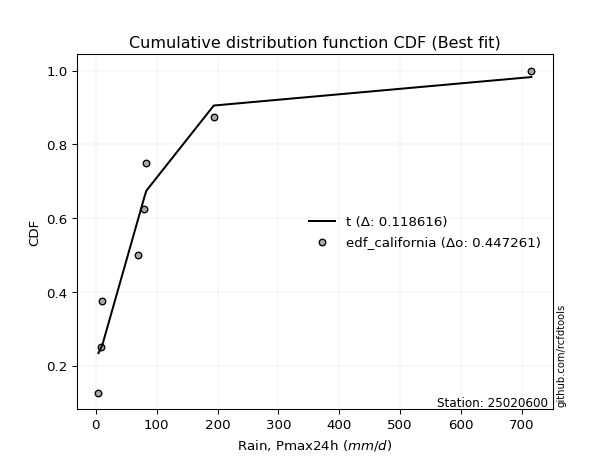</img>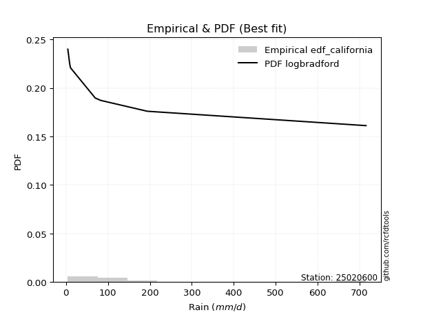</img>

</div>


### 2. Empirical - EDF Hazen (1930)

Hazen method for plotting positions is a formula used to estimate the empirical cumulative probability distribution of flood events or other hydrological data. This formula often results in biased estimations, particularly when extrapolating to extreme events (high return periods).

<div align="center">


$P=(m-0.5)/n$


</div>


**2.1. Empirical values**

<div align="center">

|                | 0                   | 1                   | 2                  | 3                  | 4         | 5                  | 6                  | 7                  | 8                  |
|:---------------|:--------------------|:--------------------|:-------------------|:-------------------|:----------|:-------------------|:-------------------|:-------------------|:-------------------|
| date           | 2021                | 2022                | 2020               | 2025               | 2017      | 2018               | 2023               | 2024               | 2019               |
| x              | 4.4                 | 9.0                 | 10.9               | 56.3               | 69.75     | 79.95              | 83.1               | 193.8              | 715.4              |
| m              | 1                   | 2                   | 3                  | 4                  | 5         | 6                  | 7                  | 8                  | 9                  |
| empirical_dist | edf_hazen           | edf_hazen           | edf_hazen          | edf_hazen          | edf_hazen | edf_hazen          | edf_hazen          | edf_hazen          | edf_hazen          |
| empirical      | 0.05555555555555555 | 0.16666666666666666 | 0.2777777777777778 | 0.3888888888888889 | 0.5       | 0.6111111111111112 | 0.7222222222222222 | 0.8333333333333334 | 0.9444444444444444 |
| empirical_tr   | 1.0588235294117647  | 1.2                 | 1.3846153846153846 | 1.6363636363636362 | 2.0       | 2.5714285714285716 | 3.5999999999999996 | 6.000000000000002  | 17.999999999999993 |

</div>


**2.2. Kolmogorov-Smirnov fit test (sorted by Δ)**


<div align="center">

|                | 0                   | 1                     | 2                   | 3                   | 4                   | 5                   | 6                   | 7                   | 8                   | 9                   | 10                  | 11                  | 12                  | 13                  | 14                  | 15                  | 16                  | 17                  | 18                  | 19                  | 20                  | 21                  | 22                  | 23                  | 24                  | 25                  | 26                  | 27                  | 28                  | 29                  | 30                  | 31                  | 32                  | 33                  | 34                  | 35                  | 36                  | 37                  | 38                  | 39                  | 40                  | 41                  | 42                  | 43                  | 44                  | 45                  | 46                  | 47                  | 48                  | 49                  | 50                  | 51                  | 52                  | 53                  | 54                  | 55                  | 56                  | 57                  | 58                  | 59                  | 60                  | 61                  | 62                  | 63                  | 64                  | 65                  | 66                  | 67                  | 68                  | 69                  | 70                  | 71                  | 72                  | 73                  | 74                  | 75                  | 76                  | 77                  | 78                  | 79                  | 80                  | 81                  | 82                  | 83                  | 84                  | 85                  | 86                  | 87                  | 88                  | 89                  |
|:---------------|:--------------------|:----------------------|:--------------------|:--------------------|:--------------------|:--------------------|:--------------------|:--------------------|:--------------------|:--------------------|:--------------------|:--------------------|:--------------------|:--------------------|:--------------------|:--------------------|:--------------------|:--------------------|:--------------------|:--------------------|:--------------------|:--------------------|:--------------------|:--------------------|:--------------------|:--------------------|:--------------------|:--------------------|:--------------------|:--------------------|:--------------------|:--------------------|:--------------------|:--------------------|:--------------------|:--------------------|:--------------------|:--------------------|:--------------------|:--------------------|:--------------------|:--------------------|:--------------------|:--------------------|:--------------------|:--------------------|:--------------------|:--------------------|:--------------------|:--------------------|:--------------------|:--------------------|:--------------------|:--------------------|:--------------------|:--------------------|:--------------------|:--------------------|:--------------------|:--------------------|:--------------------|:--------------------|:--------------------|:--------------------|:--------------------|:--------------------|:--------------------|:--------------------|:--------------------|:--------------------|:--------------------|:--------------------|:--------------------|:--------------------|:--------------------|:--------------------|:--------------------|:--------------------|:--------------------|:--------------------|:--------------------|:--------------------|:--------------------|:--------------------|:--------------------|:--------------------|:--------------------|:--------------------|:--------------------|:--------------------|
| station        | 25020600            | 25020600              | 25020600            | 25020600            | 25020600            | 25020600            | 25020600            | 25020600            | 25020600            | 25020600            | 25020600            | 25020600            | 25020600            | 25020600            | 25020600            | 25020600            | 25020600            | 25020600            | 25020600            | 25020600            | 25020600            | 25020600            | 25020600            | 25020600            | 25020600            | 25020600            | 25020600            | 25020600            | 25020600            | 25020600            | 25020600            | 25020600            | 25020600            | 25020600            | 25020600            | 25020600            | 25020600            | 25020600            | 25020600            | 25020600            | 25020600            | 25020600            | 25020600            | 25020600            | 25020600            | 25020600            | 25020600            | 25020600            | 25020600            | 25020600            | 25020600            | 25020600            | 25020600            | 25020600            | 25020600            | 25020600            | 25020600            | 25020600            | 25020600            | 25020600            | 25020600            | 25020600            | 25020600            | 25020600            | 25020600            | 25020600            | 25020600            | 25020600            | 25020600            | 25020600            | 25020600            | 25020600            | 25020600            | 25020600            | 25020600            | 25020600            | 25020600            | 25020600            | 25020600            | 25020600            | 25020600            | 25020600            | 25020600            | 25020600            | 25020600            | 25020600            | 25020600            | 25020600            | 25020600            | 25020600            |
| empirical_dist | edf_hazen           | edf_hazen             | edf_hazen           | edf_hazen           | edf_hazen           | edf_hazen           | edf_hazen           | edf_hazen           | edf_hazen           | edf_hazen           | edf_hazen           | edf_hazen           | edf_hazen           | edf_hazen           | edf_hazen           | edf_hazen           | edf_hazen           | edf_hazen           | edf_hazen           | edf_hazen           | edf_hazen           | edf_hazen           | edf_hazen           | edf_hazen           | edf_hazen           | edf_hazen           | edf_hazen           | edf_hazen           | edf_hazen           | edf_hazen           | edf_hazen           | edf_hazen           | edf_hazen           | edf_hazen           | edf_hazen           | edf_hazen           | edf_hazen           | edf_hazen           | edf_hazen           | edf_hazen           | edf_hazen           | edf_hazen           | edf_hazen           | edf_hazen           | edf_hazen           | edf_hazen           | edf_hazen           | edf_hazen           | edf_hazen           | edf_hazen           | edf_hazen           | edf_hazen           | edf_hazen           | edf_hazen           | edf_hazen           | edf_hazen           | edf_hazen           | edf_hazen           | edf_hazen           | edf_hazen           | edf_hazen           | edf_hazen           | edf_hazen           | edf_hazen           | edf_hazen           | edf_hazen           | edf_hazen           | edf_hazen           | edf_hazen           | edf_hazen           | edf_hazen           | edf_hazen           | edf_hazen           | edf_hazen           | edf_hazen           | edf_hazen           | edf_hazen           | edf_hazen           | edf_hazen           | edf_hazen           | edf_hazen           | edf_hazen           | edf_hazen           | edf_hazen           | edf_hazen           | edf_hazen           | edf_hazen           | edf_hazen           | edf_hazen           | edf_hazen           |
| p_dist         | loggenlogistic      | loglaplace_asymmetric | loggumbel_l         | t                   | logfisk             | gamma               | mielke              | logloggamma         | logcrystalball      | logexponnorm        | lognorm             | lognorm             | logt                | logjohnsonsu        | lognct              | logerlang           | logpearson3         | loggamma            | loggamma            | nakagami            | logf                | logfatiguelife      | logbetaprime        | loglogistic         | loghypsecant        | chi2                | loggompertz         | pareto              | loginvgamma         | logrice             | loglaplace          | logweibull_min      | logmaxwell          | gibrat              | logalpha            | erlang              | f                   | loginvgauss         | logmielke           | logncf              | lograyleigh         | wald                | loginvweibull       | fisk                | loggenexpon         | invgamma            | logkstwobign        | fatiguelife         | ncf                 | loghalfnorm         | loggumbel_r         | invgauss            | betaprime           | moyal               | logmoyal            | loghalflogistic     | nct                 | pearson3            | gumbel_r            | halflogistic        | logexpon            | genlogistic         | gompertz            | exponnorm           | expon               | genexpon            | laplace_asymmetric  | halfnorm            | rayleigh            | maxwell             | truncnorm           | logwald             | crystalball         | logtruncnorm        | norm                | logistic            | loggibrat           | kstwobign           | hypsecant           | rice                | laplace             | weibull_min         | gumbel_l            | lognakagami         | loglognorm          | invweibull          | alpha               | logpareto           | logchi2             | johnsonsu           |
| delta          | 0.13248196424510345 | 0.13389848786955258   | 0.13646094963998834 | 0.13860565209684186 | 0.14290764946748286 | 0.14440695555951066 | 0.146597377575807   | 0.14699103388302087 | 0.14883298902083592 | 0.14883305110555362 | 0.1488330825635223  | 0.1488330825635223  | 0.14883442164825683 | 0.1490770781412431  | 0.1492454427648146  | 0.14927269795935832 | 0.14927475178804478 | 0.14927604762906893 | 0.14927604762906893 | 0.1504574815411147  | 0.15120253373074016 | 0.15189518998848567 | 0.1535645784692054  | 0.15394587736361792 | 0.15828561534149393 | 0.16135942866668362 | 0.16161276547297593 | 0.16505679897210118 | 0.16801965488228038 | 0.17013632772773074 | 0.1737814399532876  | 0.17405930546745124 | 0.17999564159748377 | 0.18021935679470935 | 0.18120221808607034 | 0.18148854986177493 | 0.184524537939537   | 0.18553964043681875 | 0.1871040191998548  | 0.18755333633047805 | 0.19009194698917792 | 0.19496517119870585 | 0.2032048573306055  | 0.2062368020516246  | 0.21189997047413128 | 0.21466336787448242 | 0.21555331118556115 | 0.21680579516296355 | 0.21834702258500965 | 0.21854062736806507 | 0.21931384838337514 | 0.22214665681737317 | 0.2274121727003114  | 0.23730005384377295 | 0.24451527393625377 | 0.24538221282668077 | 0.253397851730414   | 0.25929974697616776 | 0.26031879853357287 | 0.26358825735961355 | 0.26454229752974884 | 0.2706756095274685  | 0.2708754818462251  | 0.27101005237134557 | 0.27173017241544806 | 0.271730314350924   | 0.2717309044477011  | 0.27308345298803993 | 0.2740768854264022  | 0.28636656514714115 | 0.3031966235800638  | 0.3144560630274616  | 0.3200537722666407  | 0.32029286236955096 | 0.32042340953115145 | 0.33311837213446044 | 0.3424997535660344  | 0.34268092655258037 | 0.34352202395990744 | 0.3702817424457111  | 0.37047882747115696 | 0.3751432607957196  | 0.38711692816748416 | 0.41993436375823373 | 0.43316401835628393 | 0.4508655336405533  | 0.4541883413329693  | 0.45785016442956084 | 0.47573101298326775 | 0.5383403925166569  |
| deltao         | 0.41761268023100007 | 0.41761268023100007   | 0.41761268023100007 | 0.41761268023100007 | 0.41761268023100007 | 0.41761268023100007 | 0.41761268023100007 | 0.41761268023100007 | 0.41761268023100007 | 0.41761268023100007 | 0.41761268023100007 | 0.41761268023100007 | 0.41761268023100007 | 0.41761268023100007 | 0.41761268023100007 | 0.41761268023100007 | 0.41761268023100007 | 0.41761268023100007 | 0.41761268023100007 | 0.41761268023100007 | 0.41761268023100007 | 0.41761268023100007 | 0.41761268023100007 | 0.41761268023100007 | 0.41761268023100007 | 0.41761268023100007 | 0.41761268023100007 | 0.41761268023100007 | 0.41761268023100007 | 0.41761268023100007 | 0.41761268023100007 | 0.41761268023100007 | 0.41761268023100007 | 0.41761268023100007 | 0.41761268023100007 | 0.41761268023100007 | 0.41761268023100007 | 0.41761268023100007 | 0.41761268023100007 | 0.41761268023100007 | 0.41761268023100007 | 0.41761268023100007 | 0.41761268023100007 | 0.41761268023100007 | 0.41761268023100007 | 0.41761268023100007 | 0.41761268023100007 | 0.41761268023100007 | 0.41761268023100007 | 0.41761268023100007 | 0.41761268023100007 | 0.41761268023100007 | 0.41761268023100007 | 0.41761268023100007 | 0.41761268023100007 | 0.41761268023100007 | 0.41761268023100007 | 0.41761268023100007 | 0.41761268023100007 | 0.41761268023100007 | 0.41761268023100007 | 0.41761268023100007 | 0.41761268023100007 | 0.41761268023100007 | 0.41761268023100007 | 0.41761268023100007 | 0.41761268023100007 | 0.41761268023100007 | 0.41761268023100007 | 0.41761268023100007 | 0.41761268023100007 | 0.41761268023100007 | 0.41761268023100007 | 0.41761268023100007 | 0.41761268023100007 | 0.41761268023100007 | 0.41761268023100007 | 0.41761268023100007 | 0.41761268023100007 | 0.41761268023100007 | 0.41761268023100007 | 0.41761268023100007 | 0.41761268023100007 | 0.41761268023100007 | 0.41761268023100007 | 0.41761268023100007 | 0.41761268023100007 | 0.41761268023100007 | 0.41761268023100007 | 0.41761268023100007 |
| eval           | Δo > Δ              | Δo > Δ                | Δo > Δ              | Δo > Δ              | Δo > Δ              | Δo > Δ              | Δo > Δ              | Δo > Δ              | Δo > Δ              | Δo > Δ              | Δo > Δ              | Δo > Δ              | Δo > Δ              | Δo > Δ              | Δo > Δ              | Δo > Δ              | Δo > Δ              | Δo > Δ              | Δo > Δ              | Δo > Δ              | Δo > Δ              | Δo > Δ              | Δo > Δ              | Δo > Δ              | Δo > Δ              | Δo > Δ              | Δo > Δ              | Δo > Δ              | Δo > Δ              | Δo > Δ              | Δo > Δ              | Δo > Δ              | Δo > Δ              | Δo > Δ              | Δo > Δ              | Δo > Δ              | Δo > Δ              | Δo > Δ              | Δo > Δ              | Δo > Δ              | Δo > Δ              | Δo > Δ              | Δo > Δ              | Δo > Δ              | Δo > Δ              | Δo > Δ              | Δo > Δ              | Δo > Δ              | Δo > Δ              | Δo > Δ              | Δo > Δ              | Δo > Δ              | Δo > Δ              | Δo > Δ              | Δo > Δ              | Δo > Δ              | Δo > Δ              | Δo > Δ              | Δo > Δ              | Δo > Δ              | Δo > Δ              | Δo > Δ              | Δo > Δ              | Δo > Δ              | Δo > Δ              | Δo > Δ              | Δo > Δ              | Δo > Δ              | Δo > Δ              | Δo > Δ              | Δo > Δ              | Δo > Δ              | Δo > Δ              | Δo > Δ              | Δo > Δ              | Δo > Δ              | Δo > Δ              | Δo > Δ              | Δo > Δ              | Δo > Δ              | Δo > Δ              | Δo > Δ              | Δo > Δ              | Δo <= Δ             | Δo <= Δ             | Δo <= Δ             | Δo <= Δ             | Δo <= Δ             | Δo <= Δ             | Δo <= Δ             |
| fit            | 1                   | 1                     | 1                   | 1                   | 1                   | 1                   | 1                   | 1                   | 1                   | 1                   | 1                   | 1                   | 1                   | 1                   | 1                   | 1                   | 1                   | 1                   | 1                   | 1                   | 1                   | 1                   | 1                   | 1                   | 1                   | 1                   | 1                   | 1                   | 1                   | 1                   | 1                   | 1                   | 1                   | 1                   | 1                   | 1                   | 1                   | 1                   | 1                   | 1                   | 1                   | 1                   | 1                   | 1                   | 1                   | 1                   | 1                   | 1                   | 1                   | 1                   | 1                   | 1                   | 1                   | 1                   | 1                   | 1                   | 1                   | 1                   | 1                   | 1                   | 1                   | 1                   | 1                   | 1                   | 1                   | 1                   | 1                   | 1                   | 1                   | 1                   | 1                   | 1                   | 1                   | 1                   | 1                   | 1                   | 1                   | 1                   | 1                   | 1                   | 1                   | 1                   | 1                   | 0                   | 0                   | 0                   | 0                   | 0                   | 0                   | 0                   |
| n              | 9                   | 9                     | 9                   | 9                   | 9                   | 9                   | 9                   | 9                   | 9                   | 9                   | 9                   | 9                   | 9                   | 9                   | 9                   | 9                   | 9                   | 9                   | 9                   | 9                   | 9                   | 9                   | 9                   | 9                   | 9                   | 9                   | 9                   | 9                   | 9                   | 9                   | 9                   | 9                   | 9                   | 9                   | 9                   | 9                   | 9                   | 9                   | 9                   | 9                   | 9                   | 9                   | 9                   | 9                   | 9                   | 9                   | 9                   | 9                   | 9                   | 9                   | 9                   | 9                   | 9                   | 9                   | 9                   | 9                   | 9                   | 9                   | 9                   | 9                   | 9                   | 9                   | 9                   | 9                   | 9                   | 9                   | 9                   | 9                   | 9                   | 9                   | 9                   | 9                   | 9                   | 9                   | 9                   | 9                   | 9                   | 9                   | 9                   | 9                   | 9                   | 9                   | 9                   | 9                   | 9                   | 9                   | 9                   | 9                   | 9                   | 9                   |
| best_fit       | 1                   | 0                     | 0                   | 0                   | 0                   | 0                   | 0                   | 0                   | 0                   | 0                   | 0                   | 0                   | 0                   | 0                   | 0                   | 0                   | 0                   | 0                   | 0                   | 0                   | 0                   | 0                   | 0                   | 0                   | 0                   | 0                   | 0                   | 0                   | 0                   | 0                   | 0                   | 0                   | 0                   | 0                   | 0                   | 0                   | 0                   | 0                   | 0                   | 0                   | 0                   | 0                   | 0                   | 0                   | 0                   | 0                   | 0                   | 0                   | 0                   | 0                   | 0                   | 0                   | 0                   | 0                   | 0                   | 0                   | 0                   | 0                   | 0                   | 0                   | 0                   | 0                   | 0                   | 0                   | 0                   | 0                   | 0                   | 0                   | 0                   | 0                   | 0                   | 0                   | 0                   | 0                   | 0                   | 0                   | 0                   | 0                   | 0                   | 0                   | 0                   | 0                   | 0                   | 0                   | 0                   | 0                   | 0                   | 0                   | 0                   | 0                   |
| best_fit_sort  | 1                   | 2                     | 3                   | 4                   | 5                   | 6                   | 7                   | 8                   | 9                   | 10                  | 11                  | 12                  | 13                  | 14                  | 15                  | 16                  | 17                  | 18                  | 19                  | 20                  | 21                  | 22                  | 23                  | 24                  | 25                  | 26                  | 27                  | 28                  | 29                  | 30                  | 31                  | 32                  | 33                  | 34                  | 35                  | 36                  | 37                  | 38                  | 39                  | 40                  | 41                  | 42                  | 43                  | 44                  | 45                  | 46                  | 47                  | 48                  | 49                  | 50                  | 51                  | 52                  | 53                  | 54                  | 55                  | 56                  | 57                  | 58                  | 59                  | 60                  | 61                  | 62                  | 63                  | 64                  | 65                  | 66                  | 67                  | 68                  | 69                  | 70                  | 71                  | 72                  | 73                  | 74                  | 75                  | 76                  | 77                  | 78                  | 79                  | 80                  | 81                  | 82                  | 83                  | 84                  | 85                  | 86                  | 87                  | 88                  | 89                  | 90                  |

</div>


<div align="center">

</img>

</div>


**2.3. Best fit**

<div align="center">

|   id |   station | empirical_dist   | p_dist         |    delta |   deltao | eval   |   fit |   n |   best_fit |   best_fit_sort |
|-----:|----------:|:-----------------|:---------------|---------:|---------:|:-------|------:|----:|-----------:|----------------:|
|    0 |  25020600 | edf_hazen        | loggenlogistic | 0.132482 | 0.417613 | Δo > Δ |     1 |   9 |          1 |               1 |

</div>


<div align="center">

</img>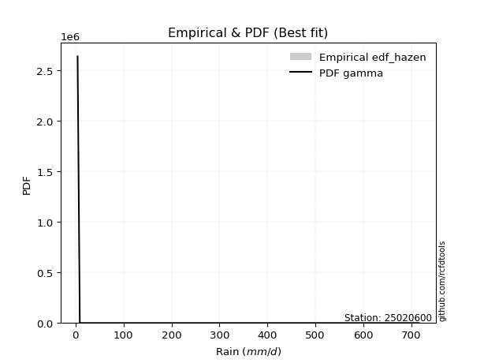</img>

</div>


### 3. Empirical - EDF Weibull (1939)

Weibull plotting position formula is an empirical method used to estimate the non-exceedance probability or plotting position for a set of observed data, is often recommended or widely used in practice, particularly in flood frequency analysis.

<div align="center">


$P=m/(n+1)$


</div>


**3.1. Empirical values**

<div align="center">

|                | 0                  | 1           | 2                  | 3                  | 4           | 5           | 6                 | 7                 | 8                  |
|:---------------|:-------------------|:------------|:-------------------|:-------------------|:------------|:------------|:------------------|:------------------|:-------------------|
| date           | 2021               | 2022        | 2020               | 2025               | 2017        | 2018        | 2023              | 2024              | 2019               |
| x              | 4.4                | 9.0         | 10.9               | 56.3               | 69.75       | 79.95       | 83.1              | 193.8             | 715.4              |
| m              | 1                  | 2           | 3                  | 4                  | 5           | 6           | 7                 | 8                 | 9                  |
| empirical_dist | edf_weibull        | edf_weibull | edf_weibull        | edf_weibull        | edf_weibull | edf_weibull | edf_weibull       | edf_weibull       | edf_weibull        |
| empirical      | 0.1                | 0.2         | 0.3                | 0.4                | 0.5         | 0.6         | 0.7               | 0.8               | 0.9                |
| empirical_tr   | 1.1111111111111112 | 1.25        | 1.4285714285714286 | 1.6666666666666667 | 2.0         | 2.5         | 3.333333333333333 | 5.000000000000001 | 10.000000000000002 |

</div>


**3.2. Kolmogorov-Smirnov fit test (sorted by Δ)**


<div align="center">

|                | 0                   | 1                   | 2                   | 3                   | 4                   | 5                   | 6                   | 7                   | 8                   | 9                   | 10                  | 11                  | 12                  | 13                  | 14                  | 15                  | 16                  | 17                  | 18                  | 19                  | 20                  | 21                  | 22                  | 23                  | 24                  | 25                    | 26                  | 27                  | 28                  | 29                  | 30                  | 31                  | 32                  | 33                  | 34                  | 35                  | 36                  | 37                  | 38                  | 39                  | 40                  | 41                  | 42                  | 43                  | 44                  | 45                  | 46                  | 47                  | 48                  | 49                  | 50                  | 51                  | 52                  | 53                  | 54                  | 55                  | 56                  | 57                  | 58                  | 59                  | 60                  | 61                  | 62                  | 63                  | 64                  | 65                  | 66                  | 67                  | 68                  | 69                  | 70                  | 71                  | 72                  | 73                  | 74                  | 75                  | 76                  | 77                  | 78                  | 79                  | 80                  | 81                  | 82                  | 83                  | 84                  | 85                  | 86                  | 87                  | 88                  | 89                  |
|:---------------|:--------------------|:--------------------|:--------------------|:--------------------|:--------------------|:--------------------|:--------------------|:--------------------|:--------------------|:--------------------|:--------------------|:--------------------|:--------------------|:--------------------|:--------------------|:--------------------|:--------------------|:--------------------|:--------------------|:--------------------|:--------------------|:--------------------|:--------------------|:--------------------|:--------------------|:----------------------|:--------------------|:--------------------|:--------------------|:--------------------|:--------------------|:--------------------|:--------------------|:--------------------|:--------------------|:--------------------|:--------------------|:--------------------|:--------------------|:--------------------|:--------------------|:--------------------|:--------------------|:--------------------|:--------------------|:--------------------|:--------------------|:--------------------|:--------------------|:--------------------|:--------------------|:--------------------|:--------------------|:--------------------|:--------------------|:--------------------|:--------------------|:--------------------|:--------------------|:--------------------|:--------------------|:--------------------|:--------------------|:--------------------|:--------------------|:--------------------|:--------------------|:--------------------|:--------------------|:--------------------|:--------------------|:--------------------|:--------------------|:--------------------|:--------------------|:--------------------|:--------------------|:--------------------|:--------------------|:--------------------|:--------------------|:--------------------|:--------------------|:--------------------|:--------------------|:--------------------|:--------------------|:--------------------|:--------------------|:--------------------|
| station        | 25020600            | 25020600            | 25020600            | 25020600            | 25020600            | 25020600            | 25020600            | 25020600            | 25020600            | 25020600            | 25020600            | 25020600            | 25020600            | 25020600            | 25020600            | 25020600            | 25020600            | 25020600            | 25020600            | 25020600            | 25020600            | 25020600            | 25020600            | 25020600            | 25020600            | 25020600              | 25020600            | 25020600            | 25020600            | 25020600            | 25020600            | 25020600            | 25020600            | 25020600            | 25020600            | 25020600            | 25020600            | 25020600            | 25020600            | 25020600            | 25020600            | 25020600            | 25020600            | 25020600            | 25020600            | 25020600            | 25020600            | 25020600            | 25020600            | 25020600            | 25020600            | 25020600            | 25020600            | 25020600            | 25020600            | 25020600            | 25020600            | 25020600            | 25020600            | 25020600            | 25020600            | 25020600            | 25020600            | 25020600            | 25020600            | 25020600            | 25020600            | 25020600            | 25020600            | 25020600            | 25020600            | 25020600            | 25020600            | 25020600            | 25020600            | 25020600            | 25020600            | 25020600            | 25020600            | 25020600            | 25020600            | 25020600            | 25020600            | 25020600            | 25020600            | 25020600            | 25020600            | 25020600            | 25020600            | 25020600            |
| empirical_dist | edf_weibull         | edf_weibull         | edf_weibull         | edf_weibull         | edf_weibull         | edf_weibull         | edf_weibull         | edf_weibull         | edf_weibull         | edf_weibull         | edf_weibull         | edf_weibull         | edf_weibull         | edf_weibull         | edf_weibull         | edf_weibull         | edf_weibull         | edf_weibull         | edf_weibull         | edf_weibull         | edf_weibull         | edf_weibull         | edf_weibull         | edf_weibull         | edf_weibull         | edf_weibull           | edf_weibull         | edf_weibull         | edf_weibull         | edf_weibull         | edf_weibull         | edf_weibull         | edf_weibull         | edf_weibull         | edf_weibull         | edf_weibull         | edf_weibull         | edf_weibull         | edf_weibull         | edf_weibull         | edf_weibull         | edf_weibull         | edf_weibull         | edf_weibull         | edf_weibull         | edf_weibull         | edf_weibull         | edf_weibull         | edf_weibull         | edf_weibull         | edf_weibull         | edf_weibull         | edf_weibull         | edf_weibull         | edf_weibull         | edf_weibull         | edf_weibull         | edf_weibull         | edf_weibull         | edf_weibull         | edf_weibull         | edf_weibull         | edf_weibull         | edf_weibull         | edf_weibull         | edf_weibull         | edf_weibull         | edf_weibull         | edf_weibull         | edf_weibull         | edf_weibull         | edf_weibull         | edf_weibull         | edf_weibull         | edf_weibull         | edf_weibull         | edf_weibull         | edf_weibull         | edf_weibull         | edf_weibull         | edf_weibull         | edf_weibull         | edf_weibull         | edf_weibull         | edf_weibull         | edf_weibull         | edf_weibull         | edf_weibull         | edf_weibull         | edf_weibull         |
| p_dist         | t                   | gamma               | nakagami            | logloggamma         | lognct              | logjohnsonsu        | logerlang           | logpearson3         | loggamma            | loggamma            | logt                | lognorm             | lognorm             | logexponnorm        | logcrystalball      | chi2                | logf                | logfatiguelife      | logbetaprime        | mielke              | loggenlogistic      | logfisk             | loggompertz         | wald                | loggumbel_l         | loglaplace_asymmetric | loginvgamma         | loglogistic         | gibrat              | logrice             | logweibull_min      | loghypsecant        | logmaxwell          | logalpha            | erlang              | pareto              | f                   | loginvgauss         | logmielke           | loglaplace          | logncf              | lograyleigh         | loginvweibull       | fisk                | loggenexpon         | invgamma            | logkstwobign        | fatiguelife         | ncf                 | loghalfnorm         | loggumbel_r         | invgauss            | pearson3            | moyal               | betaprime           | halflogistic        | halfnorm            | logmoyal            | loghalflogistic     | gumbel_r            | nct                 | genlogistic         | exponnorm           | gompertz            | expon               | genexpon            | laplace_asymmetric  | rayleigh            | logexpon            | maxwell             | truncnorm           | crystalball         | norm                | logwald             | logtruncnorm        | logistic            | kstwobign           | hypsecant           | loggibrat           | rice                | laplace             | weibull_min         | gumbel_l            | loglognorm          | invweibull          | lognakagami         | logpareto           | alpha               | logchi2             | johnsonsu           |
| delta          | 0.11723761385164289 | 0.12218473333728841 | 0.12823525931889246 | 0.13762480829492388 | 0.13842813424952677 | 0.13849566303422128 | 0.13852498352049888 | 0.1385310542207163  | 0.1385327367579822  | 0.1385327367579822  | 0.13853520972510452 | 0.13853613215243565 | 0.13853613215243565 | 0.13853622935454404 | 0.1385364673645808  | 0.13913720644446137 | 0.14009142261962904 | 0.14078407887737454 | 0.14245346735809428 | 0.14459355844740515 | 0.14637951187265738 | 0.146500910785876   | 0.1505016543618648  | 0.15281313748035497 | 0.15382330863565544 | 0.15612071009177478   | 0.15690854377116925 | 0.15727841116203428 | 0.1579971345724871  | 0.1590252166166196  | 0.16294819435634011 | 0.16719922219530337 | 0.16888453048637264 | 0.17009110697495922 | 0.1703774387506638  | 0.17103863606120379 | 0.17341342682842587 | 0.17442852932570763 | 0.17599290808874368 | 0.17644140626540797 | 0.17644222521936692 | 0.1789808358780668  | 0.19209374621949438 | 0.19512569094051346 | 0.20078885936302016 | 0.2035522567633713  | 0.20444220007445002 | 0.20569468405185243 | 0.20723591147389853 | 0.20742951625695394 | 0.20820273727226402 | 0.21103554570626204 | 0.21485530253172333 | 0.2150778316215507  | 0.21630106158920026 | 0.21914381291516913 | 0.22863900854359545 | 0.23340416282514265 | 0.23427110171556964 | 0.23809657631135062 | 0.2422867406193029  | 0.24845338730524624 | 0.2505195228447424  | 0.2516230465250993  | 0.25175222164309546 | 0.2517522419468072  | 0.2517523263334828  | 0.25185466320417993 | 0.2534311864186377  | 0.2641443429249189  | 0.2809744013578415  | 0.29783155004441847 | 0.2982011873089292  | 0.30334495191635047 | 0.30918175125843983 | 0.3108961499122382  | 0.3204587043303581  | 0.3212998017376852  | 0.3313886424549233  | 0.34805952022348885 | 0.3482566052489347  | 0.3529210385734973  | 0.3648947059452619  | 0.39983068502295055 | 0.4064210891961089  | 0.4088232526471226  | 0.42451683109622745 | 0.4430772302218582  | 0.4646199018721566  | 0.5050070591833236  |
| deltao         | 0.41761268023100007 | 0.41761268023100007 | 0.41761268023100007 | 0.41761268023100007 | 0.41761268023100007 | 0.41761268023100007 | 0.41761268023100007 | 0.41761268023100007 | 0.41761268023100007 | 0.41761268023100007 | 0.41761268023100007 | 0.41761268023100007 | 0.41761268023100007 | 0.41761268023100007 | 0.41761268023100007 | 0.41761268023100007 | 0.41761268023100007 | 0.41761268023100007 | 0.41761268023100007 | 0.41761268023100007 | 0.41761268023100007 | 0.41761268023100007 | 0.41761268023100007 | 0.41761268023100007 | 0.41761268023100007 | 0.41761268023100007   | 0.41761268023100007 | 0.41761268023100007 | 0.41761268023100007 | 0.41761268023100007 | 0.41761268023100007 | 0.41761268023100007 | 0.41761268023100007 | 0.41761268023100007 | 0.41761268023100007 | 0.41761268023100007 | 0.41761268023100007 | 0.41761268023100007 | 0.41761268023100007 | 0.41761268023100007 | 0.41761268023100007 | 0.41761268023100007 | 0.41761268023100007 | 0.41761268023100007 | 0.41761268023100007 | 0.41761268023100007 | 0.41761268023100007 | 0.41761268023100007 | 0.41761268023100007 | 0.41761268023100007 | 0.41761268023100007 | 0.41761268023100007 | 0.41761268023100007 | 0.41761268023100007 | 0.41761268023100007 | 0.41761268023100007 | 0.41761268023100007 | 0.41761268023100007 | 0.41761268023100007 | 0.41761268023100007 | 0.41761268023100007 | 0.41761268023100007 | 0.41761268023100007 | 0.41761268023100007 | 0.41761268023100007 | 0.41761268023100007 | 0.41761268023100007 | 0.41761268023100007 | 0.41761268023100007 | 0.41761268023100007 | 0.41761268023100007 | 0.41761268023100007 | 0.41761268023100007 | 0.41761268023100007 | 0.41761268023100007 | 0.41761268023100007 | 0.41761268023100007 | 0.41761268023100007 | 0.41761268023100007 | 0.41761268023100007 | 0.41761268023100007 | 0.41761268023100007 | 0.41761268023100007 | 0.41761268023100007 | 0.41761268023100007 | 0.41761268023100007 | 0.41761268023100007 | 0.41761268023100007 | 0.41761268023100007 | 0.41761268023100007 |
| eval           | Δo > Δ              | Δo > Δ              | Δo > Δ              | Δo > Δ              | Δo > Δ              | Δo > Δ              | Δo > Δ              | Δo > Δ              | Δo > Δ              | Δo > Δ              | Δo > Δ              | Δo > Δ              | Δo > Δ              | Δo > Δ              | Δo > Δ              | Δo > Δ              | Δo > Δ              | Δo > Δ              | Δo > Δ              | Δo > Δ              | Δo > Δ              | Δo > Δ              | Δo > Δ              | Δo > Δ              | Δo > Δ              | Δo > Δ                | Δo > Δ              | Δo > Δ              | Δo > Δ              | Δo > Δ              | Δo > Δ              | Δo > Δ              | Δo > Δ              | Δo > Δ              | Δo > Δ              | Δo > Δ              | Δo > Δ              | Δo > Δ              | Δo > Δ              | Δo > Δ              | Δo > Δ              | Δo > Δ              | Δo > Δ              | Δo > Δ              | Δo > Δ              | Δo > Δ              | Δo > Δ              | Δo > Δ              | Δo > Δ              | Δo > Δ              | Δo > Δ              | Δo > Δ              | Δo > Δ              | Δo > Δ              | Δo > Δ              | Δo > Δ              | Δo > Δ              | Δo > Δ              | Δo > Δ              | Δo > Δ              | Δo > Δ              | Δo > Δ              | Δo > Δ              | Δo > Δ              | Δo > Δ              | Δo > Δ              | Δo > Δ              | Δo > Δ              | Δo > Δ              | Δo > Δ              | Δo > Δ              | Δo > Δ              | Δo > Δ              | Δo > Δ              | Δo > Δ              | Δo > Δ              | Δo > Δ              | Δo > Δ              | Δo > Δ              | Δo > Δ              | Δo > Δ              | Δo > Δ              | Δo > Δ              | Δo > Δ              | Δo > Δ              | Δo > Δ              | Δo <= Δ             | Δo <= Δ             | Δo <= Δ             | Δo <= Δ             |
| fit            | 1                   | 1                   | 1                   | 1                   | 1                   | 1                   | 1                   | 1                   | 1                   | 1                   | 1                   | 1                   | 1                   | 1                   | 1                   | 1                   | 1                   | 1                   | 1                   | 1                   | 1                   | 1                   | 1                   | 1                   | 1                   | 1                     | 1                   | 1                   | 1                   | 1                   | 1                   | 1                   | 1                   | 1                   | 1                   | 1                   | 1                   | 1                   | 1                   | 1                   | 1                   | 1                   | 1                   | 1                   | 1                   | 1                   | 1                   | 1                   | 1                   | 1                   | 1                   | 1                   | 1                   | 1                   | 1                   | 1                   | 1                   | 1                   | 1                   | 1                   | 1                   | 1                   | 1                   | 1                   | 1                   | 1                   | 1                   | 1                   | 1                   | 1                   | 1                   | 1                   | 1                   | 1                   | 1                   | 1                   | 1                   | 1                   | 1                   | 1                   | 1                   | 1                   | 1                   | 1                   | 1                   | 1                   | 0                   | 0                   | 0                   | 0                   |
| n              | 9                   | 9                   | 9                   | 9                   | 9                   | 9                   | 9                   | 9                   | 9                   | 9                   | 9                   | 9                   | 9                   | 9                   | 9                   | 9                   | 9                   | 9                   | 9                   | 9                   | 9                   | 9                   | 9                   | 9                   | 9                   | 9                     | 9                   | 9                   | 9                   | 9                   | 9                   | 9                   | 9                   | 9                   | 9                   | 9                   | 9                   | 9                   | 9                   | 9                   | 9                   | 9                   | 9                   | 9                   | 9                   | 9                   | 9                   | 9                   | 9                   | 9                   | 9                   | 9                   | 9                   | 9                   | 9                   | 9                   | 9                   | 9                   | 9                   | 9                   | 9                   | 9                   | 9                   | 9                   | 9                   | 9                   | 9                   | 9                   | 9                   | 9                   | 9                   | 9                   | 9                   | 9                   | 9                   | 9                   | 9                   | 9                   | 9                   | 9                   | 9                   | 9                   | 9                   | 9                   | 9                   | 9                   | 9                   | 9                   | 9                   | 9                   |
| best_fit       | 1                   | 0                   | 0                   | 0                   | 0                   | 0                   | 0                   | 0                   | 0                   | 0                   | 0                   | 0                   | 0                   | 0                   | 0                   | 0                   | 0                   | 0                   | 0                   | 0                   | 0                   | 0                   | 0                   | 0                   | 0                   | 0                     | 0                   | 0                   | 0                   | 0                   | 0                   | 0                   | 0                   | 0                   | 0                   | 0                   | 0                   | 0                   | 0                   | 0                   | 0                   | 0                   | 0                   | 0                   | 0                   | 0                   | 0                   | 0                   | 0                   | 0                   | 0                   | 0                   | 0                   | 0                   | 0                   | 0                   | 0                   | 0                   | 0                   | 0                   | 0                   | 0                   | 0                   | 0                   | 0                   | 0                   | 0                   | 0                   | 0                   | 0                   | 0                   | 0                   | 0                   | 0                   | 0                   | 0                   | 0                   | 0                   | 0                   | 0                   | 0                   | 0                   | 0                   | 0                   | 0                   | 0                   | 0                   | 0                   | 0                   | 0                   |
| best_fit_sort  | 1                   | 2                   | 3                   | 4                   | 5                   | 6                   | 7                   | 8                   | 9                   | 10                  | 11                  | 12                  | 13                  | 14                  | 15                  | 16                  | 17                  | 18                  | 19                  | 20                  | 21                  | 22                  | 23                  | 24                  | 25                  | 26                    | 27                  | 28                  | 29                  | 30                  | 31                  | 32                  | 33                  | 34                  | 35                  | 36                  | 37                  | 38                  | 39                  | 40                  | 41                  | 42                  | 43                  | 44                  | 45                  | 46                  | 47                  | 48                  | 49                  | 50                  | 51                  | 52                  | 53                  | 54                  | 55                  | 56                  | 57                  | 58                  | 59                  | 60                  | 61                  | 62                  | 63                  | 64                  | 65                  | 66                  | 67                  | 68                  | 69                  | 70                  | 71                  | 72                  | 73                  | 74                  | 75                  | 76                  | 77                  | 78                  | 79                  | 80                  | 81                  | 82                  | 83                  | 84                  | 85                  | 86                  | 87                  | 88                  | 89                  | 90                  |

</div>


<div align="center">

</img>

</div>


**3.3. Best fit**

<div align="center">

|   id |   station | empirical_dist   | p_dist   |    delta |   deltao | eval   |   fit |   n |   best_fit |   best_fit_sort |
|-----:|----------:|:-----------------|:---------|---------:|---------:|:-------|------:|----:|-----------:|----------------:|
|    0 |  25020600 | edf_weibull      | t        | 0.117238 | 0.417613 | Δo > Δ |     1 |   9 |          1 |               1 |

</div>


<div align="center">

</img>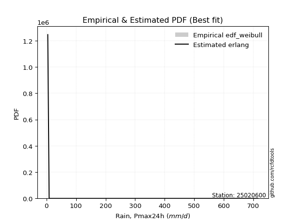</img>

</div>


### 4. Empirical - EDF Beard (1943)

The Beard formula (or Beard´s plotting position formula) in hydrology is used to estimate the empirical non-exceedance probability _(P)_ of a flood event (or other extreme hydrological data point) within a given dataset.

<div align="center">


$P=(m-0.31)/(n+0.38)$


</div>


**4.1. Empirical values**

<div align="center">

|                | 0                   | 1                   | 2                  | 3                   | 4         | 5                  | 6                  | 7                  | 8                  |
|:---------------|:--------------------|:--------------------|:-------------------|:--------------------|:----------|:-------------------|:-------------------|:-------------------|:-------------------|
| date           | 2021                | 2022                | 2020               | 2025                | 2017      | 2018               | 2023               | 2024               | 2019               |
| x              | 4.4                 | 9.0                 | 10.9               | 56.3                | 69.75     | 79.95              | 83.1               | 193.8              | 715.4              |
| m              | 1                   | 2                   | 3                  | 4                   | 5         | 6                  | 7                  | 8                  | 9                  |
| empirical_dist | edf_beard           | edf_beard           | edf_beard          | edf_beard           | edf_beard | edf_beard          | edf_beard          | edf_beard          | edf_beard          |
| empirical      | 0.07356076759061833 | 0.18017057569296374 | 0.2867803837953091 | 0.39339019189765456 | 0.5       | 0.6066098081023454 | 0.7132196162046908 | 0.8198294243070362 | 0.9264392324093815 |
| empirical_tr   | 1.0794016110471807  | 1.2197659297789336  | 1.4020926756352765 | 1.6485061511423549  | 2.0       | 2.542005420054201  | 3.486988847583642  | 5.550295857988164  | 13.5942028985507   |

</div>


**4.2. Kolmogorov-Smirnov fit test (sorted by Δ)**


<div align="center">

|                | 0                   | 1                   | 2                   | 3                   | 4                   | 5                   | 6                   | 7                   | 8                     | 9                   | 10                  | 11                  | 12                  | 13                  | 14                  | 15                  | 16                  | 17                  | 18                  | 19                  | 20                  | 21                  | 22                  | 23                  | 24                  | 25                  | 26                  | 27                  | 28                  | 29                  | 30                  | 31                  | 32                  | 33                  | 34                  | 35                  | 36                  | 37                  | 38                  | 39                  | 40                  | 41                  | 42                  | 43                  | 44                  | 45                  | 46                  | 47                  | 48                  | 49                  | 50                  | 51                  | 52                  | 53                  | 54                  | 55                  | 56                  | 57                  | 58                  | 59                  | 60                  | 61                  | 62                  | 63                  | 64                  | 65                  | 66                  | 67                  | 68                  | 69                  | 70                  | 71                  | 72                  | 73                  | 74                  | 75                  | 76                  | 77                  | 78                  | 79                  | 80                  | 81                  | 82                  | 83                  | 84                  | 85                  | 86                  | 87                  | 88                  | 89                  |
|:---------------|:--------------------|:--------------------|:--------------------|:--------------------|:--------------------|:--------------------|:--------------------|:--------------------|:----------------------|:--------------------|:--------------------|:--------------------|:--------------------|:--------------------|:--------------------|:--------------------|:--------------------|:--------------------|:--------------------|:--------------------|:--------------------|:--------------------|:--------------------|:--------------------|:--------------------|:--------------------|:--------------------|:--------------------|:--------------------|:--------------------|:--------------------|:--------------------|:--------------------|:--------------------|:--------------------|:--------------------|:--------------------|:--------------------|:--------------------|:--------------------|:--------------------|:--------------------|:--------------------|:--------------------|:--------------------|:--------------------|:--------------------|:--------------------|:--------------------|:--------------------|:--------------------|:--------------------|:--------------------|:--------------------|:--------------------|:--------------------|:--------------------|:--------------------|:--------------------|:--------------------|:--------------------|:--------------------|:--------------------|:--------------------|:--------------------|:--------------------|:--------------------|:--------------------|:--------------------|:--------------------|:--------------------|:--------------------|:--------------------|:--------------------|:--------------------|:--------------------|:--------------------|:--------------------|:--------------------|:--------------------|:--------------------|:--------------------|:--------------------|:--------------------|:--------------------|:--------------------|:--------------------|:--------------------|:--------------------|:--------------------|
| station        | 25020600            | 25020600            | 25020600            | 25020600            | 25020600            | 25020600            | 25020600            | 25020600            | 25020600              | 25020600            | 25020600            | 25020600            | 25020600            | 25020600            | 25020600            | 25020600            | 25020600            | 25020600            | 25020600            | 25020600            | 25020600            | 25020600            | 25020600            | 25020600            | 25020600            | 25020600            | 25020600            | 25020600            | 25020600            | 25020600            | 25020600            | 25020600            | 25020600            | 25020600            | 25020600            | 25020600            | 25020600            | 25020600            | 25020600            | 25020600            | 25020600            | 25020600            | 25020600            | 25020600            | 25020600            | 25020600            | 25020600            | 25020600            | 25020600            | 25020600            | 25020600            | 25020600            | 25020600            | 25020600            | 25020600            | 25020600            | 25020600            | 25020600            | 25020600            | 25020600            | 25020600            | 25020600            | 25020600            | 25020600            | 25020600            | 25020600            | 25020600            | 25020600            | 25020600            | 25020600            | 25020600            | 25020600            | 25020600            | 25020600            | 25020600            | 25020600            | 25020600            | 25020600            | 25020600            | 25020600            | 25020600            | 25020600            | 25020600            | 25020600            | 25020600            | 25020600            | 25020600            | 25020600            | 25020600            | 25020600            |
| empirical_dist | edf_beard           | edf_beard           | edf_beard           | edf_beard           | edf_beard           | edf_beard           | edf_beard           | edf_beard           | edf_beard             | edf_beard           | edf_beard           | edf_beard           | edf_beard           | edf_beard           | edf_beard           | edf_beard           | edf_beard           | edf_beard           | edf_beard           | edf_beard           | edf_beard           | edf_beard           | edf_beard           | edf_beard           | edf_beard           | edf_beard           | edf_beard           | edf_beard           | edf_beard           | edf_beard           | edf_beard           | edf_beard           | edf_beard           | edf_beard           | edf_beard           | edf_beard           | edf_beard           | edf_beard           | edf_beard           | edf_beard           | edf_beard           | edf_beard           | edf_beard           | edf_beard           | edf_beard           | edf_beard           | edf_beard           | edf_beard           | edf_beard           | edf_beard           | edf_beard           | edf_beard           | edf_beard           | edf_beard           | edf_beard           | edf_beard           | edf_beard           | edf_beard           | edf_beard           | edf_beard           | edf_beard           | edf_beard           | edf_beard           | edf_beard           | edf_beard           | edf_beard           | edf_beard           | edf_beard           | edf_beard           | edf_beard           | edf_beard           | edf_beard           | edf_beard           | edf_beard           | edf_beard           | edf_beard           | edf_beard           | edf_beard           | edf_beard           | edf_beard           | edf_beard           | edf_beard           | edf_beard           | edf_beard           | edf_beard           | edf_beard           | edf_beard           | edf_beard           | edf_beard           | edf_beard           |
| p_dist         | t                   | loggenlogistic      | gamma               | logfisk             | loggumbel_l         | nakagami            | mielke              | logloggamma         | loglaplace_asymmetric | logcrystalball      | logexponnorm        | lognorm             | lognorm             | logt                | logjohnsonsu        | lognct              | logerlang           | logpearson3         | loggamma            | loggamma            | logf                | logfatiguelife      | logbetaprime        | loglogistic         | chi2                | loghypsecant        | loggompertz         | pareto              | loginvgamma         | logrice             | loglaplace          | logweibull_min      | gibrat              | logmaxwell          | logalpha            | wald                | erlang              | f                   | loginvgauss         | logmielke           | logncf              | lograyleigh         | loginvweibull       | fisk                | loggenexpon         | invgamma            | logkstwobign        | fatiguelife         | ncf                 | loghalfnorm         | loggumbel_r         | invgauss            | betaprime           | moyal               | logmoyal            | loghalflogistic     | pearson3            | halflogistic        | nct                 | gumbel_r            | halfnorm            | logexpon            | genlogistic         | gompertz            | exponnorm           | expon               | genexpon            | laplace_asymmetric  | rayleigh            | maxwell             | truncnorm           | logwald             | crystalball         | norm                | logtruncnorm        | logistic            | kstwobign           | hypsecant           | loggibrat           | rice                | laplace             | weibull_min         | gumbel_l            | lognakagami         | loglognorm          | invweibull          | logpareto           | alpha               | logchi2             | johnsonsu           |
| delta          | 0.12060044006177909 | 0.13315989566796652 | 0.13540434954197922 | 0.1384063464587172  | 0.14060369243096457 | 0.14145487552358327 | 0.14209607456704132 | 0.1424897308742552  | 0.1429010938870839    | 0.14433168601207025 | 0.14433174809678795 | 0.14433177955475662 | 0.14433177955475662 | 0.14433311863949116 | 0.14457577513247744 | 0.14474413975604894 | 0.14477139495059266 | 0.1447734487792791  | 0.14477474462030326 | 0.14477474462030326 | 0.1467012307219745  | 0.14739388697972    | 0.14906327546043974 | 0.14944457435485226 | 0.15235682264915218 | 0.1539796059906125  | 0.15711146246421026 | 0.16055549596333551 | 0.1635183518735147  | 0.16563502471896507 | 0.16928013694452193 | 0.16955800245868557 | 0.1712167507771779  | 0.1754943385887181  | 0.17670091507730468 | 0.17695995916364307 | 0.17698724685300926 | 0.18002323493077133 | 0.1810383374280531  | 0.18260271619108914 | 0.18305203332171238 | 0.18559064398041225 | 0.19870355432183984 | 0.20173549904285892 | 0.20739866746536562 | 0.21016206486571676 | 0.21105200817679548 | 0.2123044921541979  | 0.213845719576244   | 0.2140393243592994  | 0.21481254537460948 | 0.2176453538086075  | 0.22291086969154572 | 0.2282974478262415  | 0.2400139709274881  | 0.2408809098179151  | 0.241294534941105   | 0.2455830453245508  | 0.24889654872164835 | 0.2513161925160414  | 0.25507824095297715 | 0.26004099452098317 | 0.26167300350993705 | 0.2618728758286937  | 0.2620074463538141  | 0.2627275663979166  | 0.26272770833339254 | 0.26272829843016965 | 0.26507427940887074 | 0.2773639591296097  | 0.29419401756253233 | 0.30995476001869593 | 0.3110511662491093  | 0.31142080351362    | 0.3157915593607853  | 0.324115766116929   | 0.3336783205350489  | 0.334519417942376   | 0.33799845055726874 | 0.36127913642817966 | 0.3614762214536255  | 0.36614065477818813 | 0.3781143221499527  | 0.41543306074946806 | 0.4196601093299868  | 0.43286032160549043 | 0.4443462554032637  | 0.44968703832420365 | 0.4712297099745021  | 0.5248364834903598  |
| deltao         | 0.41761268023100007 | 0.41761268023100007 | 0.41761268023100007 | 0.41761268023100007 | 0.41761268023100007 | 0.41761268023100007 | 0.41761268023100007 | 0.41761268023100007 | 0.41761268023100007   | 0.41761268023100007 | 0.41761268023100007 | 0.41761268023100007 | 0.41761268023100007 | 0.41761268023100007 | 0.41761268023100007 | 0.41761268023100007 | 0.41761268023100007 | 0.41761268023100007 | 0.41761268023100007 | 0.41761268023100007 | 0.41761268023100007 | 0.41761268023100007 | 0.41761268023100007 | 0.41761268023100007 | 0.41761268023100007 | 0.41761268023100007 | 0.41761268023100007 | 0.41761268023100007 | 0.41761268023100007 | 0.41761268023100007 | 0.41761268023100007 | 0.41761268023100007 | 0.41761268023100007 | 0.41761268023100007 | 0.41761268023100007 | 0.41761268023100007 | 0.41761268023100007 | 0.41761268023100007 | 0.41761268023100007 | 0.41761268023100007 | 0.41761268023100007 | 0.41761268023100007 | 0.41761268023100007 | 0.41761268023100007 | 0.41761268023100007 | 0.41761268023100007 | 0.41761268023100007 | 0.41761268023100007 | 0.41761268023100007 | 0.41761268023100007 | 0.41761268023100007 | 0.41761268023100007 | 0.41761268023100007 | 0.41761268023100007 | 0.41761268023100007 | 0.41761268023100007 | 0.41761268023100007 | 0.41761268023100007 | 0.41761268023100007 | 0.41761268023100007 | 0.41761268023100007 | 0.41761268023100007 | 0.41761268023100007 | 0.41761268023100007 | 0.41761268023100007 | 0.41761268023100007 | 0.41761268023100007 | 0.41761268023100007 | 0.41761268023100007 | 0.41761268023100007 | 0.41761268023100007 | 0.41761268023100007 | 0.41761268023100007 | 0.41761268023100007 | 0.41761268023100007 | 0.41761268023100007 | 0.41761268023100007 | 0.41761268023100007 | 0.41761268023100007 | 0.41761268023100007 | 0.41761268023100007 | 0.41761268023100007 | 0.41761268023100007 | 0.41761268023100007 | 0.41761268023100007 | 0.41761268023100007 | 0.41761268023100007 | 0.41761268023100007 | 0.41761268023100007 | 0.41761268023100007 |
| eval           | Δo > Δ              | Δo > Δ              | Δo > Δ              | Δo > Δ              | Δo > Δ              | Δo > Δ              | Δo > Δ              | Δo > Δ              | Δo > Δ                | Δo > Δ              | Δo > Δ              | Δo > Δ              | Δo > Δ              | Δo > Δ              | Δo > Δ              | Δo > Δ              | Δo > Δ              | Δo > Δ              | Δo > Δ              | Δo > Δ              | Δo > Δ              | Δo > Δ              | Δo > Δ              | Δo > Δ              | Δo > Δ              | Δo > Δ              | Δo > Δ              | Δo > Δ              | Δo > Δ              | Δo > Δ              | Δo > Δ              | Δo > Δ              | Δo > Δ              | Δo > Δ              | Δo > Δ              | Δo > Δ              | Δo > Δ              | Δo > Δ              | Δo > Δ              | Δo > Δ              | Δo > Δ              | Δo > Δ              | Δo > Δ              | Δo > Δ              | Δo > Δ              | Δo > Δ              | Δo > Δ              | Δo > Δ              | Δo > Δ              | Δo > Δ              | Δo > Δ              | Δo > Δ              | Δo > Δ              | Δo > Δ              | Δo > Δ              | Δo > Δ              | Δo > Δ              | Δo > Δ              | Δo > Δ              | Δo > Δ              | Δo > Δ              | Δo > Δ              | Δo > Δ              | Δo > Δ              | Δo > Δ              | Δo > Δ              | Δo > Δ              | Δo > Δ              | Δo > Δ              | Δo > Δ              | Δo > Δ              | Δo > Δ              | Δo > Δ              | Δo > Δ              | Δo > Δ              | Δo > Δ              | Δo > Δ              | Δo > Δ              | Δo > Δ              | Δo > Δ              | Δo > Δ              | Δo > Δ              | Δo > Δ              | Δo > Δ              | Δo <= Δ             | Δo <= Δ             | Δo <= Δ             | Δo <= Δ             | Δo <= Δ             | Δo <= Δ             |
| fit            | 1                   | 1                   | 1                   | 1                   | 1                   | 1                   | 1                   | 1                   | 1                     | 1                   | 1                   | 1                   | 1                   | 1                   | 1                   | 1                   | 1                   | 1                   | 1                   | 1                   | 1                   | 1                   | 1                   | 1                   | 1                   | 1                   | 1                   | 1                   | 1                   | 1                   | 1                   | 1                   | 1                   | 1                   | 1                   | 1                   | 1                   | 1                   | 1                   | 1                   | 1                   | 1                   | 1                   | 1                   | 1                   | 1                   | 1                   | 1                   | 1                   | 1                   | 1                   | 1                   | 1                   | 1                   | 1                   | 1                   | 1                   | 1                   | 1                   | 1                   | 1                   | 1                   | 1                   | 1                   | 1                   | 1                   | 1                   | 1                   | 1                   | 1                   | 1                   | 1                   | 1                   | 1                   | 1                   | 1                   | 1                   | 1                   | 1                   | 1                   | 1                   | 1                   | 1                   | 1                   | 0                   | 0                   | 0                   | 0                   | 0                   | 0                   |
| n              | 9                   | 9                   | 9                   | 9                   | 9                   | 9                   | 9                   | 9                   | 9                     | 9                   | 9                   | 9                   | 9                   | 9                   | 9                   | 9                   | 9                   | 9                   | 9                   | 9                   | 9                   | 9                   | 9                   | 9                   | 9                   | 9                   | 9                   | 9                   | 9                   | 9                   | 9                   | 9                   | 9                   | 9                   | 9                   | 9                   | 9                   | 9                   | 9                   | 9                   | 9                   | 9                   | 9                   | 9                   | 9                   | 9                   | 9                   | 9                   | 9                   | 9                   | 9                   | 9                   | 9                   | 9                   | 9                   | 9                   | 9                   | 9                   | 9                   | 9                   | 9                   | 9                   | 9                   | 9                   | 9                   | 9                   | 9                   | 9                   | 9                   | 9                   | 9                   | 9                   | 9                   | 9                   | 9                   | 9                   | 9                   | 9                   | 9                   | 9                   | 9                   | 9                   | 9                   | 9                   | 9                   | 9                   | 9                   | 9                   | 9                   | 9                   |
| best_fit       | 1                   | 0                   | 0                   | 0                   | 0                   | 0                   | 0                   | 0                   | 0                     | 0                   | 0                   | 0                   | 0                   | 0                   | 0                   | 0                   | 0                   | 0                   | 0                   | 0                   | 0                   | 0                   | 0                   | 0                   | 0                   | 0                   | 0                   | 0                   | 0                   | 0                   | 0                   | 0                   | 0                   | 0                   | 0                   | 0                   | 0                   | 0                   | 0                   | 0                   | 0                   | 0                   | 0                   | 0                   | 0                   | 0                   | 0                   | 0                   | 0                   | 0                   | 0                   | 0                   | 0                   | 0                   | 0                   | 0                   | 0                   | 0                   | 0                   | 0                   | 0                   | 0                   | 0                   | 0                   | 0                   | 0                   | 0                   | 0                   | 0                   | 0                   | 0                   | 0                   | 0                   | 0                   | 0                   | 0                   | 0                   | 0                   | 0                   | 0                   | 0                   | 0                   | 0                   | 0                   | 0                   | 0                   | 0                   | 0                   | 0                   | 0                   |
| best_fit_sort  | 1                   | 2                   | 3                   | 4                   | 5                   | 6                   | 7                   | 8                   | 9                     | 10                  | 11                  | 12                  | 13                  | 14                  | 15                  | 16                  | 17                  | 18                  | 19                  | 20                  | 21                  | 22                  | 23                  | 24                  | 25                  | 26                  | 27                  | 28                  | 29                  | 30                  | 31                  | 32                  | 33                  | 34                  | 35                  | 36                  | 37                  | 38                  | 39                  | 40                  | 41                  | 42                  | 43                  | 44                  | 45                  | 46                  | 47                  | 48                  | 49                  | 50                  | 51                  | 52                  | 53                  | 54                  | 55                  | 56                  | 57                  | 58                  | 59                  | 60                  | 61                  | 62                  | 63                  | 64                  | 65                  | 66                  | 67                  | 68                  | 69                  | 70                  | 71                  | 72                  | 73                  | 74                  | 75                  | 76                  | 77                  | 78                  | 79                  | 80                  | 81                  | 82                  | 83                  | 84                  | 85                  | 86                  | 87                  | 88                  | 89                  | 90                  |

</div>


<div align="center">

</img>

</div>


**4.3. Best fit**

<div align="center">

|   id |   station | empirical_dist   | p_dist   |   delta |   deltao | eval   |   fit |   n |   best_fit |   best_fit_sort |
|-----:|----------:|:-----------------|:---------|--------:|---------:|:-------|------:|----:|-----------:|----------------:|
|    0 |  25020600 | edf_beard        | t        |  0.1206 | 0.417613 | Δo > Δ |     1 |   9 |          1 |               1 |

</div>


<div align="center">

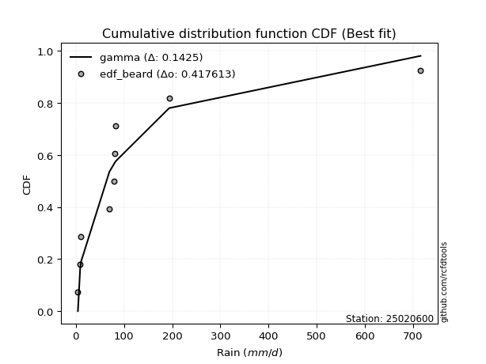</img>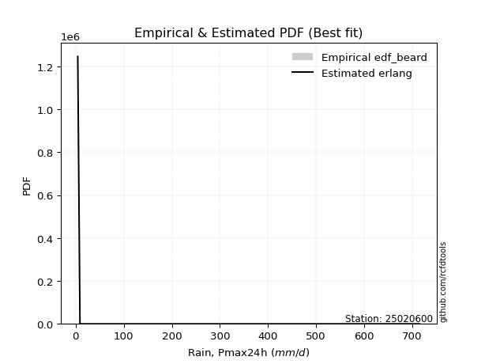</img>

</div>


### 5. Empirical - EDF Chegodayev (1955)

The Chegodayev formula is an empirical plotting position formula used in hydrological frequency analysis to estimate the exceedance probability or return period of a specific event from a set of observed data. It is primarily used for plotting observed data points on probability paper to fit a theoretical distribution, particularly for analyzing extreme events like maximum flood flows or rainfall intensities. The constant _b_ value in the generalized plotting position formula is 0.3.

<div align="center">


$P=(m-b)/(n+1-2b)$


</div>


**5.1. Empirical values**

<div align="center">

|                | 0                   | 1                   | 2                  | 3                   | 4              | 5                  | 6                  | 7                  | 8                  |
|:---------------|:--------------------|:--------------------|:-------------------|:--------------------|:---------------|:-------------------|:-------------------|:-------------------|:-------------------|
| date           | 2021                | 2022                | 2020               | 2025                | 2017           | 2018               | 2023               | 2024               | 2019               |
| x              | 4.4                 | 9.0                 | 10.9               | 56.3                | 69.75          | 79.95              | 83.1               | 193.8              | 715.4              |
| m              | 1                   | 2                   | 3                  | 4                   | 5              | 6                  | 7                  | 8                  | 9                  |
| empirical_dist | edf_chegodayev      | edf_chegodayev      | edf_chegodayev     | edf_chegodayev      | edf_chegodayev | edf_chegodayev     | edf_chegodayev     | edf_chegodayev     | edf_chegodayev     |
| empirical      | 0.07446808510638298 | 0.18085106382978722 | 0.2872340425531915 | 0.39361702127659576 | 0.5            | 0.6063829787234043 | 0.7127659574468085 | 0.8191489361702128 | 0.9255319148936169 |
| empirical_tr   | 1.0804597701149425  | 1.2207792207792207  | 1.4029850746268657 | 1.6491228070175437  | 2.0            | 2.540540540540541  | 3.481481481481481  | 5.529411764705883  | 13.428571428571399 |

</div>


**5.2. Kolmogorov-Smirnov fit test (sorted by Δ)**


<div align="center">

|                | 0                   | 1                   | 2                   | 3                   | 4                   | 5                   | 6                   | 7                   | 8                     | 9                   | 10                  | 11                  | 12                  | 13                  | 14                  | 15                  | 16                  | 17                  | 18                  | 19                  | 20                  | 21                  | 22                  | 23                  | 24                  | 25                  | 26                  | 27                  | 28                  | 29                  | 30                  | 31                  | 32                  | 33                  | 34                  | 35                  | 36                  | 37                  | 38                  | 39                  | 40                  | 41                  | 42                  | 43                  | 44                  | 45                  | 46                  | 47                  | 48                  | 49                  | 50                  | 51                  | 52                  | 53                  | 54                  | 55                  | 56                  | 57                  | 58                  | 59                  | 60                  | 61                  | 62                  | 63                  | 64                  | 65                  | 66                  | 67                  | 68                  | 69                  | 70                  | 71                  | 72                  | 73                  | 74                  | 75                  | 76                  | 77                  | 78                  | 79                  | 80                  | 81                  | 82                  | 83                  | 84                  | 85                  | 86                  | 87                  | 88                  | 89                  |
|:---------------|:--------------------|:--------------------|:--------------------|:--------------------|:--------------------|:--------------------|:--------------------|:--------------------|:----------------------|:--------------------|:--------------------|:--------------------|:--------------------|:--------------------|:--------------------|:--------------------|:--------------------|:--------------------|:--------------------|:--------------------|:--------------------|:--------------------|:--------------------|:--------------------|:--------------------|:--------------------|:--------------------|:--------------------|:--------------------|:--------------------|:--------------------|:--------------------|:--------------------|:--------------------|:--------------------|:--------------------|:--------------------|:--------------------|:--------------------|:--------------------|:--------------------|:--------------------|:--------------------|:--------------------|:--------------------|:--------------------|:--------------------|:--------------------|:--------------------|:--------------------|:--------------------|:--------------------|:--------------------|:--------------------|:--------------------|:--------------------|:--------------------|:--------------------|:--------------------|:--------------------|:--------------------|:--------------------|:--------------------|:--------------------|:--------------------|:--------------------|:--------------------|:--------------------|:--------------------|:--------------------|:--------------------|:--------------------|:--------------------|:--------------------|:--------------------|:--------------------|:--------------------|:--------------------|:--------------------|:--------------------|:--------------------|:--------------------|:--------------------|:--------------------|:--------------------|:--------------------|:--------------------|:--------------------|:--------------------|:--------------------|
| station        | 25020600            | 25020600            | 25020600            | 25020600            | 25020600            | 25020600            | 25020600            | 25020600            | 25020600              | 25020600            | 25020600            | 25020600            | 25020600            | 25020600            | 25020600            | 25020600            | 25020600            | 25020600            | 25020600            | 25020600            | 25020600            | 25020600            | 25020600            | 25020600            | 25020600            | 25020600            | 25020600            | 25020600            | 25020600            | 25020600            | 25020600            | 25020600            | 25020600            | 25020600            | 25020600            | 25020600            | 25020600            | 25020600            | 25020600            | 25020600            | 25020600            | 25020600            | 25020600            | 25020600            | 25020600            | 25020600            | 25020600            | 25020600            | 25020600            | 25020600            | 25020600            | 25020600            | 25020600            | 25020600            | 25020600            | 25020600            | 25020600            | 25020600            | 25020600            | 25020600            | 25020600            | 25020600            | 25020600            | 25020600            | 25020600            | 25020600            | 25020600            | 25020600            | 25020600            | 25020600            | 25020600            | 25020600            | 25020600            | 25020600            | 25020600            | 25020600            | 25020600            | 25020600            | 25020600            | 25020600            | 25020600            | 25020600            | 25020600            | 25020600            | 25020600            | 25020600            | 25020600            | 25020600            | 25020600            | 25020600            |
| empirical_dist | edf_chegodayev      | edf_chegodayev      | edf_chegodayev      | edf_chegodayev      | edf_chegodayev      | edf_chegodayev      | edf_chegodayev      | edf_chegodayev      | edf_chegodayev        | edf_chegodayev      | edf_chegodayev      | edf_chegodayev      | edf_chegodayev      | edf_chegodayev      | edf_chegodayev      | edf_chegodayev      | edf_chegodayev      | edf_chegodayev      | edf_chegodayev      | edf_chegodayev      | edf_chegodayev      | edf_chegodayev      | edf_chegodayev      | edf_chegodayev      | edf_chegodayev      | edf_chegodayev      | edf_chegodayev      | edf_chegodayev      | edf_chegodayev      | edf_chegodayev      | edf_chegodayev      | edf_chegodayev      | edf_chegodayev      | edf_chegodayev      | edf_chegodayev      | edf_chegodayev      | edf_chegodayev      | edf_chegodayev      | edf_chegodayev      | edf_chegodayev      | edf_chegodayev      | edf_chegodayev      | edf_chegodayev      | edf_chegodayev      | edf_chegodayev      | edf_chegodayev      | edf_chegodayev      | edf_chegodayev      | edf_chegodayev      | edf_chegodayev      | edf_chegodayev      | edf_chegodayev      | edf_chegodayev      | edf_chegodayev      | edf_chegodayev      | edf_chegodayev      | edf_chegodayev      | edf_chegodayev      | edf_chegodayev      | edf_chegodayev      | edf_chegodayev      | edf_chegodayev      | edf_chegodayev      | edf_chegodayev      | edf_chegodayev      | edf_chegodayev      | edf_chegodayev      | edf_chegodayev      | edf_chegodayev      | edf_chegodayev      | edf_chegodayev      | edf_chegodayev      | edf_chegodayev      | edf_chegodayev      | edf_chegodayev      | edf_chegodayev      | edf_chegodayev      | edf_chegodayev      | edf_chegodayev      | edf_chegodayev      | edf_chegodayev      | edf_chegodayev      | edf_chegodayev      | edf_chegodayev      | edf_chegodayev      | edf_chegodayev      | edf_chegodayev      | edf_chegodayev      | edf_chegodayev      | edf_chegodayev      |
| p_dist         | t                   | loggenlogistic      | gamma               | logfisk             | nakagami            | loggumbel_l         | mielke              | logloggamma         | loglaplace_asymmetric | logcrystalball      | logexponnorm        | lognorm             | lognorm             | logt                | logjohnsonsu        | lognct              | logerlang           | logpearson3         | loggamma            | loggamma            | logf                | logfatiguelife      | logbetaprime        | loglogistic         | chi2                | loghypsecant        | loggompertz         | pareto              | loginvgamma         | logrice             | loglaplace          | logweibull_min      | gibrat              | logmaxwell          | wald                | logalpha            | erlang              | f                   | loginvgauss         | logmielke           | logncf              | lograyleigh         | loginvweibull       | fisk                | loggenexpon         | invgamma            | logkstwobign        | fatiguelife         | ncf                 | loghalfnorm         | loggumbel_r         | invgauss            | betaprime           | moyal               | logmoyal            | pearson3            | loghalflogistic     | halflogistic        | nct                 | gumbel_r            | halfnorm            | logexpon            | genlogistic         | gompertz            | exponnorm           | expon               | genexpon            | laplace_asymmetric  | rayleigh            | maxwell             | truncnorm           | logwald             | crystalball         | norm                | logtruncnorm        | logistic            | kstwobign           | hypsecant           | loggibrat           | rice                | laplace             | weibull_min         | gumbel_l            | lognakagami         | loglognorm          | invweibull          | logpareto           | alpha               | logchi2             | johnsonsu           |
| delta          | 0.11969312254601444 | 0.1336135544258489  | 0.13495069078409694 | 0.138179517079776   | 0.141001216765701   | 0.14105735118884696 | 0.14186924518810012 | 0.142262901495314   | 0.1433547526449663    | 0.14410485663312905 | 0.14410491871784675 | 0.14410495017581543 | 0.14410495017581543 | 0.14410628926054997 | 0.14434894575353624 | 0.14451731037710774 | 0.14454456557165146 | 0.14454661940033792 | 0.14454791524136207 | 0.14454791524136207 | 0.1464744013430333  | 0.1471670576007788  | 0.14883644608149854 | 0.14921774497591106 | 0.1519031638912699  | 0.1544332647484949  | 0.15688463308526907 | 0.16032866658439432 | 0.16329152249457352 | 0.16540819534002388 | 0.16905330756558073 | 0.16933117307974438 | 0.17076309201929563 | 0.1752675092097769  | 0.17605264164787843 | 0.17647408569836348 | 0.17676041747406807 | 0.17979640555183013 | 0.1808115080491119  | 0.18237588681214795 | 0.1828252039427712  | 0.18536381460147106 | 0.19847672494289864 | 0.20150866966391773 | 0.20717183808642442 | 0.20993523548677556 | 0.21082517879785428 | 0.2120776627752567  | 0.2136188901973028  | 0.2138124949803582  | 0.21458571599566828 | 0.2174185244296663  | 0.22268404031260453 | 0.22784378906835923 | 0.2397871415485469  | 0.24038721742534036 | 0.2406540804389739  | 0.24467572780878616 | 0.24866971934270715 | 0.25086253375815915 | 0.2541709234372125  | 0.259814165142042   | 0.26121934475205477 | 0.2614192170708114  | 0.26155378759593184 | 0.26227390764003433 | 0.26227404957551026 | 0.26227463967228737 | 0.26462062065098846 | 0.2769103003717274  | 0.29374035880465005 | 0.30972793063975473 | 0.310597507491227   | 0.3109671447557377  | 0.3155647299818441  | 0.3236621073590467  | 0.33322466177716664 | 0.3340657591844937  | 0.33777162117832754 | 0.3608254776702974  | 0.36102256269574323 | 0.36568699602030585 | 0.37766066339207044 | 0.41520623137052687 | 0.41897962119316334 | 0.43195300408972576 | 0.44366576726644025 | 0.44946020894526245 | 0.4710028805955609  | 0.5241559953535363  |
| deltao         | 0.41761268023100007 | 0.41761268023100007 | 0.41761268023100007 | 0.41761268023100007 | 0.41761268023100007 | 0.41761268023100007 | 0.41761268023100007 | 0.41761268023100007 | 0.41761268023100007   | 0.41761268023100007 | 0.41761268023100007 | 0.41761268023100007 | 0.41761268023100007 | 0.41761268023100007 | 0.41761268023100007 | 0.41761268023100007 | 0.41761268023100007 | 0.41761268023100007 | 0.41761268023100007 | 0.41761268023100007 | 0.41761268023100007 | 0.41761268023100007 | 0.41761268023100007 | 0.41761268023100007 | 0.41761268023100007 | 0.41761268023100007 | 0.41761268023100007 | 0.41761268023100007 | 0.41761268023100007 | 0.41761268023100007 | 0.41761268023100007 | 0.41761268023100007 | 0.41761268023100007 | 0.41761268023100007 | 0.41761268023100007 | 0.41761268023100007 | 0.41761268023100007 | 0.41761268023100007 | 0.41761268023100007 | 0.41761268023100007 | 0.41761268023100007 | 0.41761268023100007 | 0.41761268023100007 | 0.41761268023100007 | 0.41761268023100007 | 0.41761268023100007 | 0.41761268023100007 | 0.41761268023100007 | 0.41761268023100007 | 0.41761268023100007 | 0.41761268023100007 | 0.41761268023100007 | 0.41761268023100007 | 0.41761268023100007 | 0.41761268023100007 | 0.41761268023100007 | 0.41761268023100007 | 0.41761268023100007 | 0.41761268023100007 | 0.41761268023100007 | 0.41761268023100007 | 0.41761268023100007 | 0.41761268023100007 | 0.41761268023100007 | 0.41761268023100007 | 0.41761268023100007 | 0.41761268023100007 | 0.41761268023100007 | 0.41761268023100007 | 0.41761268023100007 | 0.41761268023100007 | 0.41761268023100007 | 0.41761268023100007 | 0.41761268023100007 | 0.41761268023100007 | 0.41761268023100007 | 0.41761268023100007 | 0.41761268023100007 | 0.41761268023100007 | 0.41761268023100007 | 0.41761268023100007 | 0.41761268023100007 | 0.41761268023100007 | 0.41761268023100007 | 0.41761268023100007 | 0.41761268023100007 | 0.41761268023100007 | 0.41761268023100007 | 0.41761268023100007 | 0.41761268023100007 |
| eval           | Δo > Δ              | Δo > Δ              | Δo > Δ              | Δo > Δ              | Δo > Δ              | Δo > Δ              | Δo > Δ              | Δo > Δ              | Δo > Δ                | Δo > Δ              | Δo > Δ              | Δo > Δ              | Δo > Δ              | Δo > Δ              | Δo > Δ              | Δo > Δ              | Δo > Δ              | Δo > Δ              | Δo > Δ              | Δo > Δ              | Δo > Δ              | Δo > Δ              | Δo > Δ              | Δo > Δ              | Δo > Δ              | Δo > Δ              | Δo > Δ              | Δo > Δ              | Δo > Δ              | Δo > Δ              | Δo > Δ              | Δo > Δ              | Δo > Δ              | Δo > Δ              | Δo > Δ              | Δo > Δ              | Δo > Δ              | Δo > Δ              | Δo > Δ              | Δo > Δ              | Δo > Δ              | Δo > Δ              | Δo > Δ              | Δo > Δ              | Δo > Δ              | Δo > Δ              | Δo > Δ              | Δo > Δ              | Δo > Δ              | Δo > Δ              | Δo > Δ              | Δo > Δ              | Δo > Δ              | Δo > Δ              | Δo > Δ              | Δo > Δ              | Δo > Δ              | Δo > Δ              | Δo > Δ              | Δo > Δ              | Δo > Δ              | Δo > Δ              | Δo > Δ              | Δo > Δ              | Δo > Δ              | Δo > Δ              | Δo > Δ              | Δo > Δ              | Δo > Δ              | Δo > Δ              | Δo > Δ              | Δo > Δ              | Δo > Δ              | Δo > Δ              | Δo > Δ              | Δo > Δ              | Δo > Δ              | Δo > Δ              | Δo > Δ              | Δo > Δ              | Δo > Δ              | Δo > Δ              | Δo > Δ              | Δo > Δ              | Δo <= Δ             | Δo <= Δ             | Δo <= Δ             | Δo <= Δ             | Δo <= Δ             | Δo <= Δ             |
| fit            | 1                   | 1                   | 1                   | 1                   | 1                   | 1                   | 1                   | 1                   | 1                     | 1                   | 1                   | 1                   | 1                   | 1                   | 1                   | 1                   | 1                   | 1                   | 1                   | 1                   | 1                   | 1                   | 1                   | 1                   | 1                   | 1                   | 1                   | 1                   | 1                   | 1                   | 1                   | 1                   | 1                   | 1                   | 1                   | 1                   | 1                   | 1                   | 1                   | 1                   | 1                   | 1                   | 1                   | 1                   | 1                   | 1                   | 1                   | 1                   | 1                   | 1                   | 1                   | 1                   | 1                   | 1                   | 1                   | 1                   | 1                   | 1                   | 1                   | 1                   | 1                   | 1                   | 1                   | 1                   | 1                   | 1                   | 1                   | 1                   | 1                   | 1                   | 1                   | 1                   | 1                   | 1                   | 1                   | 1                   | 1                   | 1                   | 1                   | 1                   | 1                   | 1                   | 1                   | 1                   | 0                   | 0                   | 0                   | 0                   | 0                   | 0                   |
| n              | 9                   | 9                   | 9                   | 9                   | 9                   | 9                   | 9                   | 9                   | 9                     | 9                   | 9                   | 9                   | 9                   | 9                   | 9                   | 9                   | 9                   | 9                   | 9                   | 9                   | 9                   | 9                   | 9                   | 9                   | 9                   | 9                   | 9                   | 9                   | 9                   | 9                   | 9                   | 9                   | 9                   | 9                   | 9                   | 9                   | 9                   | 9                   | 9                   | 9                   | 9                   | 9                   | 9                   | 9                   | 9                   | 9                   | 9                   | 9                   | 9                   | 9                   | 9                   | 9                   | 9                   | 9                   | 9                   | 9                   | 9                   | 9                   | 9                   | 9                   | 9                   | 9                   | 9                   | 9                   | 9                   | 9                   | 9                   | 9                   | 9                   | 9                   | 9                   | 9                   | 9                   | 9                   | 9                   | 9                   | 9                   | 9                   | 9                   | 9                   | 9                   | 9                   | 9                   | 9                   | 9                   | 9                   | 9                   | 9                   | 9                   | 9                   |
| best_fit       | 1                   | 0                   | 0                   | 0                   | 0                   | 0                   | 0                   | 0                   | 0                     | 0                   | 0                   | 0                   | 0                   | 0                   | 0                   | 0                   | 0                   | 0                   | 0                   | 0                   | 0                   | 0                   | 0                   | 0                   | 0                   | 0                   | 0                   | 0                   | 0                   | 0                   | 0                   | 0                   | 0                   | 0                   | 0                   | 0                   | 0                   | 0                   | 0                   | 0                   | 0                   | 0                   | 0                   | 0                   | 0                   | 0                   | 0                   | 0                   | 0                   | 0                   | 0                   | 0                   | 0                   | 0                   | 0                   | 0                   | 0                   | 0                   | 0                   | 0                   | 0                   | 0                   | 0                   | 0                   | 0                   | 0                   | 0                   | 0                   | 0                   | 0                   | 0                   | 0                   | 0                   | 0                   | 0                   | 0                   | 0                   | 0                   | 0                   | 0                   | 0                   | 0                   | 0                   | 0                   | 0                   | 0                   | 0                   | 0                   | 0                   | 0                   |
| best_fit_sort  | 1                   | 2                   | 3                   | 4                   | 5                   | 6                   | 7                   | 8                   | 9                     | 10                  | 11                  | 12                  | 13                  | 14                  | 15                  | 16                  | 17                  | 18                  | 19                  | 20                  | 21                  | 22                  | 23                  | 24                  | 25                  | 26                  | 27                  | 28                  | 29                  | 30                  | 31                  | 32                  | 33                  | 34                  | 35                  | 36                  | 37                  | 38                  | 39                  | 40                  | 41                  | 42                  | 43                  | 44                  | 45                  | 46                  | 47                  | 48                  | 49                  | 50                  | 51                  | 52                  | 53                  | 54                  | 55                  | 56                  | 57                  | 58                  | 59                  | 60                  | 61                  | 62                  | 63                  | 64                  | 65                  | 66                  | 67                  | 68                  | 69                  | 70                  | 71                  | 72                  | 73                  | 74                  | 75                  | 76                  | 77                  | 78                  | 79                  | 80                  | 81                  | 82                  | 83                  | 84                  | 85                  | 86                  | 87                  | 88                  | 89                  | 90                  |

</div>


<div align="center">

</img>

</div>


**5.3. Best fit**

<div align="center">

|   id |   station | empirical_dist   | p_dist   |    delta |   deltao | eval   |   fit |   n |   best_fit |   best_fit_sort |
|-----:|----------:|:-----------------|:---------|---------:|---------:|:-------|------:|----:|-----------:|----------------:|
|    0 |  25020600 | edf_chegodayev   | t        | 0.119693 | 0.417613 | Δo > Δ |     1 |   9 |          1 |               1 |

</div>


<div align="center">

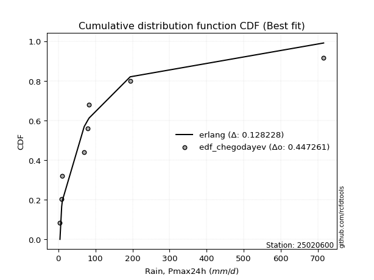</img>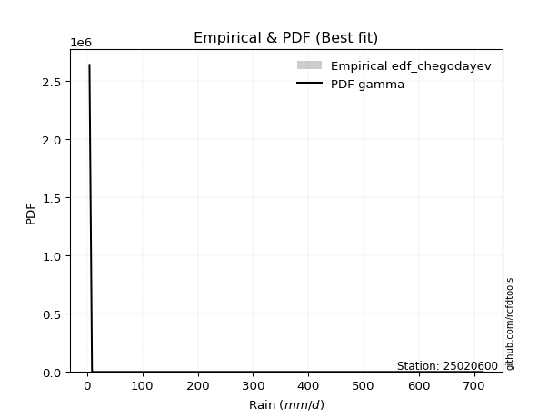</img>

</div>


### 6. Empirical - EDF Blom (1958)

The Blom formula is a specific "plotting position" formula used in hydrology and statistical analysis to estimate the empirical cumulative probability (or non-exceedance probability) of a data series. It is particularly recommended for data that are approximately normally distributed. The constant _a_ is set to 0.375 (or 3/8).

<div align="center">


$P=(m-a)/(n+1-2a)$


</div>


**6.1. Empirical values**

<div align="center">

|                | 0                   | 1                   | 2                   | 3                  | 4        | 5                  | 6                  | 7                  | 8                  |
|:---------------|:--------------------|:--------------------|:--------------------|:-------------------|:---------|:-------------------|:-------------------|:-------------------|:-------------------|
| date           | 2021                | 2022                | 2020                | 2025               | 2017     | 2018               | 2023               | 2024               | 2019               |
| x              | 4.4                 | 9.0                 | 10.9                | 56.3               | 69.75    | 79.95              | 83.1               | 193.8              | 715.4              |
| m              | 1                   | 2                   | 3                   | 4                  | 5        | 6                  | 7                  | 8                  | 9                  |
| empirical_dist | edf_blom            | edf_blom            | edf_blom            | edf_blom           | edf_blom | edf_blom           | edf_blom           | edf_blom           | edf_blom           |
| empirical      | 0.06756756756756757 | 0.17567567567567569 | 0.28378378378378377 | 0.3918918918918919 | 0.5      | 0.6081081081081081 | 0.7162162162162162 | 0.8243243243243243 | 0.9324324324324325 |
| empirical_tr   | 1.072463768115942   | 1.2131147540983607  | 1.3962264150943395  | 1.6444444444444444 | 2.0      | 2.5517241379310347 | 3.523809523809524  | 5.6923076923076925 | 14.800000000000006 |

</div>


**6.2. Kolmogorov-Smirnov fit test (sorted by Δ)**


<div align="center">

|                | 0                   | 1                   | 2                   | 3                   | 4                     | 5                   | 6                   | 7                   | 8                   | 9                   | 10                  | 11                  | 12                  | 13                  | 14                  | 15                  | 16                  | 17                  | 18                  | 19                  | 20                  | 21                  | 22                  | 23                  | 24                  | 25                  | 26                  | 27                  | 28                  | 29                  | 30                  | 31                  | 32                  | 33                  | 34                  | 35                  | 36                  | 37                  | 38                  | 39                  | 40                  | 41                  | 42                  | 43                  | 44                  | 45                  | 46                  | 47                  | 48                  | 49                  | 50                  | 51                  | 52                  | 53                  | 54                  | 55                  | 56                  | 57                  | 58                  | 59                  | 60                  | 61                  | 62                  | 63                  | 64                  | 65                  | 66                  | 67                  | 68                  | 69                  | 70                  | 71                  | 72                  | 73                  | 74                  | 75                  | 76                  | 77                  | 78                  | 79                  | 80                  | 81                  | 82                  | 83                  | 84                  | 85                  | 86                  | 87                  | 88                  | 89                  |
|:---------------|:--------------------|:--------------------|:--------------------|:--------------------|:----------------------|:--------------------|:--------------------|:--------------------|:--------------------|:--------------------|:--------------------|:--------------------|:--------------------|:--------------------|:--------------------|:--------------------|:--------------------|:--------------------|:--------------------|:--------------------|:--------------------|:--------------------|:--------------------|:--------------------|:--------------------|:--------------------|:--------------------|:--------------------|:--------------------|:--------------------|:--------------------|:--------------------|:--------------------|:--------------------|:--------------------|:--------------------|:--------------------|:--------------------|:--------------------|:--------------------|:--------------------|:--------------------|:--------------------|:--------------------|:--------------------|:--------------------|:--------------------|:--------------------|:--------------------|:--------------------|:--------------------|:--------------------|:--------------------|:--------------------|:--------------------|:--------------------|:--------------------|:--------------------|:--------------------|:--------------------|:--------------------|:--------------------|:--------------------|:--------------------|:--------------------|:--------------------|:--------------------|:--------------------|:--------------------|:--------------------|:--------------------|:--------------------|:--------------------|:--------------------|:--------------------|:--------------------|:--------------------|:--------------------|:--------------------|:--------------------|:--------------------|:--------------------|:--------------------|:--------------------|:--------------------|:--------------------|:--------------------|:--------------------|:--------------------|:--------------------|
| station        | 25020600            | 25020600            | 25020600            | 25020600            | 25020600              | 25020600            | 25020600            | 25020600            | 25020600            | 25020600            | 25020600            | 25020600            | 25020600            | 25020600            | 25020600            | 25020600            | 25020600            | 25020600            | 25020600            | 25020600            | 25020600            | 25020600            | 25020600            | 25020600            | 25020600            | 25020600            | 25020600            | 25020600            | 25020600            | 25020600            | 25020600            | 25020600            | 25020600            | 25020600            | 25020600            | 25020600            | 25020600            | 25020600            | 25020600            | 25020600            | 25020600            | 25020600            | 25020600            | 25020600            | 25020600            | 25020600            | 25020600            | 25020600            | 25020600            | 25020600            | 25020600            | 25020600            | 25020600            | 25020600            | 25020600            | 25020600            | 25020600            | 25020600            | 25020600            | 25020600            | 25020600            | 25020600            | 25020600            | 25020600            | 25020600            | 25020600            | 25020600            | 25020600            | 25020600            | 25020600            | 25020600            | 25020600            | 25020600            | 25020600            | 25020600            | 25020600            | 25020600            | 25020600            | 25020600            | 25020600            | 25020600            | 25020600            | 25020600            | 25020600            | 25020600            | 25020600            | 25020600            | 25020600            | 25020600            | 25020600            |
| empirical_dist | edf_blom            | edf_blom            | edf_blom            | edf_blom            | edf_blom              | edf_blom            | edf_blom            | edf_blom            | edf_blom            | edf_blom            | edf_blom            | edf_blom            | edf_blom            | edf_blom            | edf_blom            | edf_blom            | edf_blom            | edf_blom            | edf_blom            | edf_blom            | edf_blom            | edf_blom            | edf_blom            | edf_blom            | edf_blom            | edf_blom            | edf_blom            | edf_blom            | edf_blom            | edf_blom            | edf_blom            | edf_blom            | edf_blom            | edf_blom            | edf_blom            | edf_blom            | edf_blom            | edf_blom            | edf_blom            | edf_blom            | edf_blom            | edf_blom            | edf_blom            | edf_blom            | edf_blom            | edf_blom            | edf_blom            | edf_blom            | edf_blom            | edf_blom            | edf_blom            | edf_blom            | edf_blom            | edf_blom            | edf_blom            | edf_blom            | edf_blom            | edf_blom            | edf_blom            | edf_blom            | edf_blom            | edf_blom            | edf_blom            | edf_blom            | edf_blom            | edf_blom            | edf_blom            | edf_blom            | edf_blom            | edf_blom            | edf_blom            | edf_blom            | edf_blom            | edf_blom            | edf_blom            | edf_blom            | edf_blom            | edf_blom            | edf_blom            | edf_blom            | edf_blom            | edf_blom            | edf_blom            | edf_blom            | edf_blom            | edf_blom            | edf_blom            | edf_blom            | edf_blom            | edf_blom            |
| p_dist         | t                   | loggenlogistic      | loggumbel_l         | gamma               | loglaplace_asymmetric | logfisk             | mielke              | logloggamma         | nakagami            | logcrystalball      | logexponnorm        | lognorm             | lognorm             | logt                | logjohnsonsu        | lognct              | logerlang           | logpearson3         | loggamma            | loggamma            | logf                | logfatiguelife      | logbetaprime        | loglogistic         | loghypsecant        | chi2                | loggompertz         | pareto              | loginvgamma         | logrice             | loglaplace          | logweibull_min      | gibrat              | logmaxwell          | logalpha            | erlang              | f                   | loginvgauss         | wald                | logmielke           | logncf              | lograyleigh         | loginvweibull       | fisk                | loggenexpon         | invgamma            | logkstwobign        | fatiguelife         | ncf                 | loghalfnorm         | loggumbel_r         | invgauss            | betaprime           | moyal               | logmoyal            | loghalflogistic     | pearson3            | nct                 | halflogistic        | gumbel_r            | halfnorm            | logexpon            | genlogistic         | gompertz            | exponnorm           | expon               | genexpon            | laplace_asymmetric  | rayleigh            | maxwell             | truncnorm           | logwald             | crystalball         | norm                | logtruncnorm        | logistic            | kstwobign           | hypsecant           | loggibrat           | rice                | laplace             | weibull_min         | gumbel_l            | lognakagami         | loglognorm          | invweibull          | logpareto           | alpha               | logchi2             | johnsonsu           |
| delta          | 0.12659364008482984 | 0.13016329565644116 | 0.13760709241943922 | 0.13840094955350468 | 0.13990449387555856   | 0.13990464646447986 | 0.143594374572804   | 0.14398803088001788 | 0.14445147553510873 | 0.14582998601783292 | 0.14583004810255062 | 0.1458300795605193  | 0.1458300795605193  | 0.14583141864525384 | 0.1460740751382401  | 0.14624243976181162 | 0.14626969495635533 | 0.1462717487850418  | 0.14627304462606594 | 0.14627304462606594 | 0.14819953072773717 | 0.14889218698548268 | 0.1505615754662024  | 0.15094287436061493 | 0.15528261233849094 | 0.15535342266067764 | 0.15860976246997294 | 0.1620537959690982  | 0.1650166518792774  | 0.16713332472472775 | 0.1707784369502846  | 0.17105630246444825 | 0.17421335078870337 | 0.17699263859448078 | 0.17819921508306735 | 0.17848554685877194 | 0.181521534936534   | 0.18253663743381576 | 0.18295315918669383 | 0.18410101619685182 | 0.18455033332747506 | 0.18708894398617493 | 0.2002018543276025  | 0.2032337990486216  | 0.2088969674711283  | 0.21166036487147943 | 0.21255030818255816 | 0.21380279215996056 | 0.21534401958200666 | 0.21553762436506207 | 0.21631084538037215 | 0.21914365381437018 | 0.2244091696973084  | 0.23129404783776697 | 0.24151227093325078 | 0.24237920982367778 | 0.24728773496415576 | 0.250394848727411   | 0.2515762453476016  | 0.2543127925275669  | 0.26107144097602786 | 0.26153929452674585 | 0.2646696035214625  | 0.26486947584021914 | 0.2650040463653396  | 0.2657241664094421  | 0.265724308344918   | 0.2657248984416951  | 0.2680708794203962  | 0.28036055914113517 | 0.2971906175740578  | 0.3114530600244586  | 0.31404776626063474 | 0.31441740352514547 | 0.31728985936654797 | 0.32711236612845446 | 0.3366749205465744  | 0.33751601795390146 | 0.3394967505630314  | 0.3642757364397051  | 0.364472821465151   | 0.3691372547897136  | 0.3811109221614782  | 0.41693136075523074 | 0.4241550093472749  | 0.43885352162854135 | 0.4488411554205518  | 0.4511853383299663  | 0.47272800998026476 | 0.5293313835076479  |
| deltao         | 0.41761268023100007 | 0.41761268023100007 | 0.41761268023100007 | 0.41761268023100007 | 0.41761268023100007   | 0.41761268023100007 | 0.41761268023100007 | 0.41761268023100007 | 0.41761268023100007 | 0.41761268023100007 | 0.41761268023100007 | 0.41761268023100007 | 0.41761268023100007 | 0.41761268023100007 | 0.41761268023100007 | 0.41761268023100007 | 0.41761268023100007 | 0.41761268023100007 | 0.41761268023100007 | 0.41761268023100007 | 0.41761268023100007 | 0.41761268023100007 | 0.41761268023100007 | 0.41761268023100007 | 0.41761268023100007 | 0.41761268023100007 | 0.41761268023100007 | 0.41761268023100007 | 0.41761268023100007 | 0.41761268023100007 | 0.41761268023100007 | 0.41761268023100007 | 0.41761268023100007 | 0.41761268023100007 | 0.41761268023100007 | 0.41761268023100007 | 0.41761268023100007 | 0.41761268023100007 | 0.41761268023100007 | 0.41761268023100007 | 0.41761268023100007 | 0.41761268023100007 | 0.41761268023100007 | 0.41761268023100007 | 0.41761268023100007 | 0.41761268023100007 | 0.41761268023100007 | 0.41761268023100007 | 0.41761268023100007 | 0.41761268023100007 | 0.41761268023100007 | 0.41761268023100007 | 0.41761268023100007 | 0.41761268023100007 | 0.41761268023100007 | 0.41761268023100007 | 0.41761268023100007 | 0.41761268023100007 | 0.41761268023100007 | 0.41761268023100007 | 0.41761268023100007 | 0.41761268023100007 | 0.41761268023100007 | 0.41761268023100007 | 0.41761268023100007 | 0.41761268023100007 | 0.41761268023100007 | 0.41761268023100007 | 0.41761268023100007 | 0.41761268023100007 | 0.41761268023100007 | 0.41761268023100007 | 0.41761268023100007 | 0.41761268023100007 | 0.41761268023100007 | 0.41761268023100007 | 0.41761268023100007 | 0.41761268023100007 | 0.41761268023100007 | 0.41761268023100007 | 0.41761268023100007 | 0.41761268023100007 | 0.41761268023100007 | 0.41761268023100007 | 0.41761268023100007 | 0.41761268023100007 | 0.41761268023100007 | 0.41761268023100007 | 0.41761268023100007 | 0.41761268023100007 |
| eval           | Δo > Δ              | Δo > Δ              | Δo > Δ              | Δo > Δ              | Δo > Δ                | Δo > Δ              | Δo > Δ              | Δo > Δ              | Δo > Δ              | Δo > Δ              | Δo > Δ              | Δo > Δ              | Δo > Δ              | Δo > Δ              | Δo > Δ              | Δo > Δ              | Δo > Δ              | Δo > Δ              | Δo > Δ              | Δo > Δ              | Δo > Δ              | Δo > Δ              | Δo > Δ              | Δo > Δ              | Δo > Δ              | Δo > Δ              | Δo > Δ              | Δo > Δ              | Δo > Δ              | Δo > Δ              | Δo > Δ              | Δo > Δ              | Δo > Δ              | Δo > Δ              | Δo > Δ              | Δo > Δ              | Δo > Δ              | Δo > Δ              | Δo > Δ              | Δo > Δ              | Δo > Δ              | Δo > Δ              | Δo > Δ              | Δo > Δ              | Δo > Δ              | Δo > Δ              | Δo > Δ              | Δo > Δ              | Δo > Δ              | Δo > Δ              | Δo > Δ              | Δo > Δ              | Δo > Δ              | Δo > Δ              | Δo > Δ              | Δo > Δ              | Δo > Δ              | Δo > Δ              | Δo > Δ              | Δo > Δ              | Δo > Δ              | Δo > Δ              | Δo > Δ              | Δo > Δ              | Δo > Δ              | Δo > Δ              | Δo > Δ              | Δo > Δ              | Δo > Δ              | Δo > Δ              | Δo > Δ              | Δo > Δ              | Δo > Δ              | Δo > Δ              | Δo > Δ              | Δo > Δ              | Δo > Δ              | Δo > Δ              | Δo > Δ              | Δo > Δ              | Δo > Δ              | Δo > Δ              | Δo > Δ              | Δo > Δ              | Δo <= Δ             | Δo <= Δ             | Δo <= Δ             | Δo <= Δ             | Δo <= Δ             | Δo <= Δ             |
| fit            | 1                   | 1                   | 1                   | 1                   | 1                     | 1                   | 1                   | 1                   | 1                   | 1                   | 1                   | 1                   | 1                   | 1                   | 1                   | 1                   | 1                   | 1                   | 1                   | 1                   | 1                   | 1                   | 1                   | 1                   | 1                   | 1                   | 1                   | 1                   | 1                   | 1                   | 1                   | 1                   | 1                   | 1                   | 1                   | 1                   | 1                   | 1                   | 1                   | 1                   | 1                   | 1                   | 1                   | 1                   | 1                   | 1                   | 1                   | 1                   | 1                   | 1                   | 1                   | 1                   | 1                   | 1                   | 1                   | 1                   | 1                   | 1                   | 1                   | 1                   | 1                   | 1                   | 1                   | 1                   | 1                   | 1                   | 1                   | 1                   | 1                   | 1                   | 1                   | 1                   | 1                   | 1                   | 1                   | 1                   | 1                   | 1                   | 1                   | 1                   | 1                   | 1                   | 1                   | 1                   | 0                   | 0                   | 0                   | 0                   | 0                   | 0                   |
| n              | 9                   | 9                   | 9                   | 9                   | 9                     | 9                   | 9                   | 9                   | 9                   | 9                   | 9                   | 9                   | 9                   | 9                   | 9                   | 9                   | 9                   | 9                   | 9                   | 9                   | 9                   | 9                   | 9                   | 9                   | 9                   | 9                   | 9                   | 9                   | 9                   | 9                   | 9                   | 9                   | 9                   | 9                   | 9                   | 9                   | 9                   | 9                   | 9                   | 9                   | 9                   | 9                   | 9                   | 9                   | 9                   | 9                   | 9                   | 9                   | 9                   | 9                   | 9                   | 9                   | 9                   | 9                   | 9                   | 9                   | 9                   | 9                   | 9                   | 9                   | 9                   | 9                   | 9                   | 9                   | 9                   | 9                   | 9                   | 9                   | 9                   | 9                   | 9                   | 9                   | 9                   | 9                   | 9                   | 9                   | 9                   | 9                   | 9                   | 9                   | 9                   | 9                   | 9                   | 9                   | 9                   | 9                   | 9                   | 9                   | 9                   | 9                   |
| best_fit       | 1                   | 0                   | 0                   | 0                   | 0                     | 0                   | 0                   | 0                   | 0                   | 0                   | 0                   | 0                   | 0                   | 0                   | 0                   | 0                   | 0                   | 0                   | 0                   | 0                   | 0                   | 0                   | 0                   | 0                   | 0                   | 0                   | 0                   | 0                   | 0                   | 0                   | 0                   | 0                   | 0                   | 0                   | 0                   | 0                   | 0                   | 0                   | 0                   | 0                   | 0                   | 0                   | 0                   | 0                   | 0                   | 0                   | 0                   | 0                   | 0                   | 0                   | 0                   | 0                   | 0                   | 0                   | 0                   | 0                   | 0                   | 0                   | 0                   | 0                   | 0                   | 0                   | 0                   | 0                   | 0                   | 0                   | 0                   | 0                   | 0                   | 0                   | 0                   | 0                   | 0                   | 0                   | 0                   | 0                   | 0                   | 0                   | 0                   | 0                   | 0                   | 0                   | 0                   | 0                   | 0                   | 0                   | 0                   | 0                   | 0                   | 0                   |
| best_fit_sort  | 1                   | 2                   | 3                   | 4                   | 5                     | 6                   | 7                   | 8                   | 9                   | 10                  | 11                  | 12                  | 13                  | 14                  | 15                  | 16                  | 17                  | 18                  | 19                  | 20                  | 21                  | 22                  | 23                  | 24                  | 25                  | 26                  | 27                  | 28                  | 29                  | 30                  | 31                  | 32                  | 33                  | 34                  | 35                  | 36                  | 37                  | 38                  | 39                  | 40                  | 41                  | 42                  | 43                  | 44                  | 45                  | 46                  | 47                  | 48                  | 49                  | 50                  | 51                  | 52                  | 53                  | 54                  | 55                  | 56                  | 57                  | 58                  | 59                  | 60                  | 61                  | 62                  | 63                  | 64                  | 65                  | 66                  | 67                  | 68                  | 69                  | 70                  | 71                  | 72                  | 73                  | 74                  | 75                  | 76                  | 77                  | 78                  | 79                  | 80                  | 81                  | 82                  | 83                  | 84                  | 85                  | 86                  | 87                  | 88                  | 89                  | 90                  |

</div>


<div align="center">

</img>

</div>


**6.3. Best fit**

<div align="center">

|   id |   station | empirical_dist   | p_dist   |    delta |   deltao | eval   |   fit |   n |   best_fit |   best_fit_sort |
|-----:|----------:|:-----------------|:---------|---------:|---------:|:-------|------:|----:|-----------:|----------------:|
|    0 |  25020600 | edf_blom         | t        | 0.126594 | 0.417613 | Δo > Δ |     1 |   9 |          1 |               1 |

</div>


<div align="center">

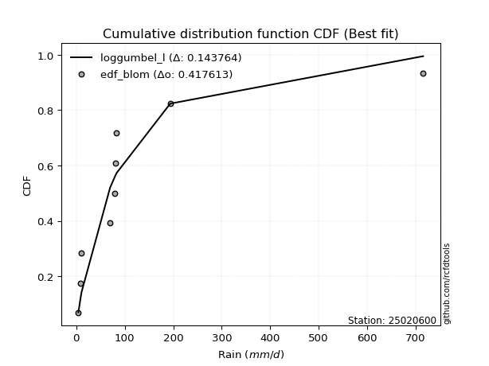</img></img>

</div>


### 7. Empirical - EDF Tukey (1962)

In hydrology, the Tukey formula is used as a plotting position formula to estimate the empirical probability or frequency of a flood event (or other hydrological data). The formula parameter is given as _c=0.333_ (or 1/3).

<div align="center">


$P=(m-c)/(n+1-2c)$


</div>


**7.1. Empirical values**

<div align="center">

|                | 0                   | 1                   | 2                  | 3                   | 4         | 5                  | 6                  | 7                  | 8                  |
|:---------------|:--------------------|:--------------------|:-------------------|:--------------------|:----------|:-------------------|:-------------------|:-------------------|:-------------------|
| date           | 2021                | 2022                | 2020               | 2025                | 2017      | 2018               | 2023               | 2024               | 2019               |
| x              | 4.4                 | 9.0                 | 10.9               | 56.3                | 69.75     | 79.95              | 83.1               | 193.8              | 715.4              |
| m              | 1                   | 2                   | 3                  | 4                   | 5         | 6                  | 7                  | 8                  | 9                  |
| empirical_dist | edf_tukey           | edf_tukey           | edf_tukey          | edf_tukey           | edf_tukey | edf_tukey          | edf_tukey          | edf_tukey          | edf_tukey          |
| empirical      | 0.07142857142857142 | 0.17857142857142858 | 0.2857142857142857 | 0.39285714285714285 | 0.5       | 0.6071428571428571 | 0.7142857142857143 | 0.8214285714285714 | 0.9285714285714286 |
| empirical_tr   | 1.0769230769230769  | 1.2173913043478262  | 1.4                | 1.6470588235294117  | 2.0       | 2.545454545454545  | 3.5                | 5.599999999999999  | 14.000000000000007 |

</div>


**7.2. Kolmogorov-Smirnov fit test (sorted by Δ)**


<div align="center">

|                | 0                   | 1                   | 2                   | 3                   | 4                   | 5                     | 6                   | 7                   | 8                   | 9                   | 10                  | 11                  | 12                  | 13                  | 14                  | 15                  | 16                  | 17                  | 18                  | 19                  | 20                  | 21                  | 22                  | 23                  | 24                  | 25                  | 26                  | 27                  | 28                  | 29                  | 30                  | 31                  | 32                  | 33                  | 34                  | 35                  | 36                  | 37                  | 38                  | 39                  | 40                  | 41                  | 42                  | 43                  | 44                  | 45                  | 46                  | 47                  | 48                  | 49                  | 50                  | 51                  | 52                  | 53                  | 54                  | 55                  | 56                  | 57                  | 58                  | 59                  | 60                  | 61                  | 62                  | 63                  | 64                  | 65                  | 66                  | 67                  | 68                  | 69                  | 70                  | 71                  | 72                  | 73                  | 74                  | 75                  | 76                  | 77                  | 78                  | 79                  | 80                  | 81                  | 82                  | 83                  | 84                  | 85                  | 86                  | 87                  | 88                  | 89                  |
|:---------------|:--------------------|:--------------------|:--------------------|:--------------------|:--------------------|:----------------------|:--------------------|:--------------------|:--------------------|:--------------------|:--------------------|:--------------------|:--------------------|:--------------------|:--------------------|:--------------------|:--------------------|:--------------------|:--------------------|:--------------------|:--------------------|:--------------------|:--------------------|:--------------------|:--------------------|:--------------------|:--------------------|:--------------------|:--------------------|:--------------------|:--------------------|:--------------------|:--------------------|:--------------------|:--------------------|:--------------------|:--------------------|:--------------------|:--------------------|:--------------------|:--------------------|:--------------------|:--------------------|:--------------------|:--------------------|:--------------------|:--------------------|:--------------------|:--------------------|:--------------------|:--------------------|:--------------------|:--------------------|:--------------------|:--------------------|:--------------------|:--------------------|:--------------------|:--------------------|:--------------------|:--------------------|:--------------------|:--------------------|:--------------------|:--------------------|:--------------------|:--------------------|:--------------------|:--------------------|:--------------------|:--------------------|:--------------------|:--------------------|:--------------------|:--------------------|:--------------------|:--------------------|:--------------------|:--------------------|:--------------------|:--------------------|:--------------------|:--------------------|:--------------------|:--------------------|:--------------------|:--------------------|:--------------------|:--------------------|:--------------------|
| station        | 25020600            | 25020600            | 25020600            | 25020600            | 25020600            | 25020600              | 25020600            | 25020600            | 25020600            | 25020600            | 25020600            | 25020600            | 25020600            | 25020600            | 25020600            | 25020600            | 25020600            | 25020600            | 25020600            | 25020600            | 25020600            | 25020600            | 25020600            | 25020600            | 25020600            | 25020600            | 25020600            | 25020600            | 25020600            | 25020600            | 25020600            | 25020600            | 25020600            | 25020600            | 25020600            | 25020600            | 25020600            | 25020600            | 25020600            | 25020600            | 25020600            | 25020600            | 25020600            | 25020600            | 25020600            | 25020600            | 25020600            | 25020600            | 25020600            | 25020600            | 25020600            | 25020600            | 25020600            | 25020600            | 25020600            | 25020600            | 25020600            | 25020600            | 25020600            | 25020600            | 25020600            | 25020600            | 25020600            | 25020600            | 25020600            | 25020600            | 25020600            | 25020600            | 25020600            | 25020600            | 25020600            | 25020600            | 25020600            | 25020600            | 25020600            | 25020600            | 25020600            | 25020600            | 25020600            | 25020600            | 25020600            | 25020600            | 25020600            | 25020600            | 25020600            | 25020600            | 25020600            | 25020600            | 25020600            | 25020600            |
| empirical_dist | edf_tukey           | edf_tukey           | edf_tukey           | edf_tukey           | edf_tukey           | edf_tukey             | edf_tukey           | edf_tukey           | edf_tukey           | edf_tukey           | edf_tukey           | edf_tukey           | edf_tukey           | edf_tukey           | edf_tukey           | edf_tukey           | edf_tukey           | edf_tukey           | edf_tukey           | edf_tukey           | edf_tukey           | edf_tukey           | edf_tukey           | edf_tukey           | edf_tukey           | edf_tukey           | edf_tukey           | edf_tukey           | edf_tukey           | edf_tukey           | edf_tukey           | edf_tukey           | edf_tukey           | edf_tukey           | edf_tukey           | edf_tukey           | edf_tukey           | edf_tukey           | edf_tukey           | edf_tukey           | edf_tukey           | edf_tukey           | edf_tukey           | edf_tukey           | edf_tukey           | edf_tukey           | edf_tukey           | edf_tukey           | edf_tukey           | edf_tukey           | edf_tukey           | edf_tukey           | edf_tukey           | edf_tukey           | edf_tukey           | edf_tukey           | edf_tukey           | edf_tukey           | edf_tukey           | edf_tukey           | edf_tukey           | edf_tukey           | edf_tukey           | edf_tukey           | edf_tukey           | edf_tukey           | edf_tukey           | edf_tukey           | edf_tukey           | edf_tukey           | edf_tukey           | edf_tukey           | edf_tukey           | edf_tukey           | edf_tukey           | edf_tukey           | edf_tukey           | edf_tukey           | edf_tukey           | edf_tukey           | edf_tukey           | edf_tukey           | edf_tukey           | edf_tukey           | edf_tukey           | edf_tukey           | edf_tukey           | edf_tukey           | edf_tukey           | edf_tukey           |
| p_dist         | t                   | loggenlogistic      | gamma               | logfisk             | loggumbel_l         | loglaplace_asymmetric | nakagami            | mielke              | logloggamma         | logcrystalball      | logexponnorm        | lognorm             | lognorm             | logt                | logjohnsonsu        | lognct              | logerlang           | logpearson3         | loggamma            | loggamma            | logf                | logfatiguelife      | logbetaprime        | loglogistic         | chi2                | loghypsecant        | loggompertz         | pareto              | loginvgamma         | logrice             | loglaplace          | logweibull_min      | gibrat              | logmaxwell          | logalpha            | erlang              | wald                | f                   | loginvgauss         | logmielke           | logncf              | lograyleigh         | loginvweibull       | fisk                | loggenexpon         | invgamma            | logkstwobign        | fatiguelife         | ncf                 | loghalfnorm         | loggumbel_r         | invgauss            | betaprime           | moyal               | logmoyal            | loghalflogistic     | pearson3            | halflogistic        | nct                 | gumbel_r            | halfnorm            | logexpon            | genlogistic         | gompertz            | exponnorm           | expon               | genexpon            | laplace_asymmetric  | rayleigh            | maxwell             | truncnorm           | logwald             | crystalball         | norm                | logtruncnorm        | logistic            | kstwobign           | hypsecant           | loggibrat           | rice                | laplace             | weibull_min         | gumbel_l            | lognakagami         | loglognorm          | invweibull          | logpareto           | alpha               | logchi2             | johnsonsu           |
| delta          | 0.12273263622382599 | 0.1320937975869431  | 0.13647044762300276 | 0.1389393954992289  | 0.13953759434994115 | 0.1418349958060605    | 0.1425209736046068  | 0.14262912360755303 | 0.14302277991476692 | 0.14486473505258196 | 0.14486479713729966 | 0.14486482859526834 | 0.14486482859526834 | 0.14486616768000288 | 0.14510882417298915 | 0.14527718879656065 | 0.14530444399110437 | 0.14530649781979083 | 0.14530779366081498 | 0.14530779366081498 | 0.1472342797624862  | 0.14792693602023171 | 0.14959632450095145 | 0.14997762339536397 | 0.15342292073017572 | 0.15431736137323998 | 0.15764451150472197 | 0.16108854500384723 | 0.16405140091402642 | 0.1661680737594768  | 0.16981318598503364 | 0.1700910514991973  | 0.17228284885820144 | 0.17602738762922981 | 0.1772339641178164  | 0.17752029589352097 | 0.17909215532568998 | 0.18055628397128304 | 0.1815713864685648  | 0.18313576523160086 | 0.1835850823622241  | 0.18612369302092396 | 0.19923660336235155 | 0.20226854808337064 | 0.20793171650587733 | 0.21069511390622847 | 0.2115850572173072  | 0.2128375411947096  | 0.2143787686167557  | 0.2145723733998111  | 0.2153455944151212  | 0.2181784028491192  | 0.22344391873205743 | 0.22936354590726504 | 0.24054701996799982 | 0.2414139588584268  | 0.2434267311031519  | 0.2477152414865977  | 0.24942959776216006 | 0.25238229059706496 | 0.257210437115024   | 0.2605740435614949  | 0.2627391015909606  | 0.2629389739097172  | 0.26307354443483766 | 0.26379366447894015 | 0.2637938064144161  | 0.2637943965111932  | 0.2661403774898943  | 0.27843005721063324 | 0.29526011564355586 | 0.31048780905920764 | 0.3121172643301328  | 0.31248690159464354 | 0.316324608401297   | 0.32518186419795253 | 0.33474441861607246 | 0.33558551602339953 | 0.33853149959778045 | 0.3623452345092032  | 0.36254231953464905 | 0.36720675285921167 | 0.37918042023097626 | 0.4159661097899798  | 0.42125925645152196 | 0.4349925177675375  | 0.44594540252479886 | 0.45022008736471536 | 0.4717627590150138  | 0.5264356306118949  |
| deltao         | 0.41761268023100007 | 0.41761268023100007 | 0.41761268023100007 | 0.41761268023100007 | 0.41761268023100007 | 0.41761268023100007   | 0.41761268023100007 | 0.41761268023100007 | 0.41761268023100007 | 0.41761268023100007 | 0.41761268023100007 | 0.41761268023100007 | 0.41761268023100007 | 0.41761268023100007 | 0.41761268023100007 | 0.41761268023100007 | 0.41761268023100007 | 0.41761268023100007 | 0.41761268023100007 | 0.41761268023100007 | 0.41761268023100007 | 0.41761268023100007 | 0.41761268023100007 | 0.41761268023100007 | 0.41761268023100007 | 0.41761268023100007 | 0.41761268023100007 | 0.41761268023100007 | 0.41761268023100007 | 0.41761268023100007 | 0.41761268023100007 | 0.41761268023100007 | 0.41761268023100007 | 0.41761268023100007 | 0.41761268023100007 | 0.41761268023100007 | 0.41761268023100007 | 0.41761268023100007 | 0.41761268023100007 | 0.41761268023100007 | 0.41761268023100007 | 0.41761268023100007 | 0.41761268023100007 | 0.41761268023100007 | 0.41761268023100007 | 0.41761268023100007 | 0.41761268023100007 | 0.41761268023100007 | 0.41761268023100007 | 0.41761268023100007 | 0.41761268023100007 | 0.41761268023100007 | 0.41761268023100007 | 0.41761268023100007 | 0.41761268023100007 | 0.41761268023100007 | 0.41761268023100007 | 0.41761268023100007 | 0.41761268023100007 | 0.41761268023100007 | 0.41761268023100007 | 0.41761268023100007 | 0.41761268023100007 | 0.41761268023100007 | 0.41761268023100007 | 0.41761268023100007 | 0.41761268023100007 | 0.41761268023100007 | 0.41761268023100007 | 0.41761268023100007 | 0.41761268023100007 | 0.41761268023100007 | 0.41761268023100007 | 0.41761268023100007 | 0.41761268023100007 | 0.41761268023100007 | 0.41761268023100007 | 0.41761268023100007 | 0.41761268023100007 | 0.41761268023100007 | 0.41761268023100007 | 0.41761268023100007 | 0.41761268023100007 | 0.41761268023100007 | 0.41761268023100007 | 0.41761268023100007 | 0.41761268023100007 | 0.41761268023100007 | 0.41761268023100007 | 0.41761268023100007 |
| eval           | Δo > Δ              | Δo > Δ              | Δo > Δ              | Δo > Δ              | Δo > Δ              | Δo > Δ                | Δo > Δ              | Δo > Δ              | Δo > Δ              | Δo > Δ              | Δo > Δ              | Δo > Δ              | Δo > Δ              | Δo > Δ              | Δo > Δ              | Δo > Δ              | Δo > Δ              | Δo > Δ              | Δo > Δ              | Δo > Δ              | Δo > Δ              | Δo > Δ              | Δo > Δ              | Δo > Δ              | Δo > Δ              | Δo > Δ              | Δo > Δ              | Δo > Δ              | Δo > Δ              | Δo > Δ              | Δo > Δ              | Δo > Δ              | Δo > Δ              | Δo > Δ              | Δo > Δ              | Δo > Δ              | Δo > Δ              | Δo > Δ              | Δo > Δ              | Δo > Δ              | Δo > Δ              | Δo > Δ              | Δo > Δ              | Δo > Δ              | Δo > Δ              | Δo > Δ              | Δo > Δ              | Δo > Δ              | Δo > Δ              | Δo > Δ              | Δo > Δ              | Δo > Δ              | Δo > Δ              | Δo > Δ              | Δo > Δ              | Δo > Δ              | Δo > Δ              | Δo > Δ              | Δo > Δ              | Δo > Δ              | Δo > Δ              | Δo > Δ              | Δo > Δ              | Δo > Δ              | Δo > Δ              | Δo > Δ              | Δo > Δ              | Δo > Δ              | Δo > Δ              | Δo > Δ              | Δo > Δ              | Δo > Δ              | Δo > Δ              | Δo > Δ              | Δo > Δ              | Δo > Δ              | Δo > Δ              | Δo > Δ              | Δo > Δ              | Δo > Δ              | Δo > Δ              | Δo > Δ              | Δo > Δ              | Δo > Δ              | Δo <= Δ             | Δo <= Δ             | Δo <= Δ             | Δo <= Δ             | Δo <= Δ             | Δo <= Δ             |
| fit            | 1                   | 1                   | 1                   | 1                   | 1                   | 1                     | 1                   | 1                   | 1                   | 1                   | 1                   | 1                   | 1                   | 1                   | 1                   | 1                   | 1                   | 1                   | 1                   | 1                   | 1                   | 1                   | 1                   | 1                   | 1                   | 1                   | 1                   | 1                   | 1                   | 1                   | 1                   | 1                   | 1                   | 1                   | 1                   | 1                   | 1                   | 1                   | 1                   | 1                   | 1                   | 1                   | 1                   | 1                   | 1                   | 1                   | 1                   | 1                   | 1                   | 1                   | 1                   | 1                   | 1                   | 1                   | 1                   | 1                   | 1                   | 1                   | 1                   | 1                   | 1                   | 1                   | 1                   | 1                   | 1                   | 1                   | 1                   | 1                   | 1                   | 1                   | 1                   | 1                   | 1                   | 1                   | 1                   | 1                   | 1                   | 1                   | 1                   | 1                   | 1                   | 1                   | 1                   | 1                   | 0                   | 0                   | 0                   | 0                   | 0                   | 0                   |
| n              | 9                   | 9                   | 9                   | 9                   | 9                   | 9                     | 9                   | 9                   | 9                   | 9                   | 9                   | 9                   | 9                   | 9                   | 9                   | 9                   | 9                   | 9                   | 9                   | 9                   | 9                   | 9                   | 9                   | 9                   | 9                   | 9                   | 9                   | 9                   | 9                   | 9                   | 9                   | 9                   | 9                   | 9                   | 9                   | 9                   | 9                   | 9                   | 9                   | 9                   | 9                   | 9                   | 9                   | 9                   | 9                   | 9                   | 9                   | 9                   | 9                   | 9                   | 9                   | 9                   | 9                   | 9                   | 9                   | 9                   | 9                   | 9                   | 9                   | 9                   | 9                   | 9                   | 9                   | 9                   | 9                   | 9                   | 9                   | 9                   | 9                   | 9                   | 9                   | 9                   | 9                   | 9                   | 9                   | 9                   | 9                   | 9                   | 9                   | 9                   | 9                   | 9                   | 9                   | 9                   | 9                   | 9                   | 9                   | 9                   | 9                   | 9                   |
| best_fit       | 1                   | 0                   | 0                   | 0                   | 0                   | 0                     | 0                   | 0                   | 0                   | 0                   | 0                   | 0                   | 0                   | 0                   | 0                   | 0                   | 0                   | 0                   | 0                   | 0                   | 0                   | 0                   | 0                   | 0                   | 0                   | 0                   | 0                   | 0                   | 0                   | 0                   | 0                   | 0                   | 0                   | 0                   | 0                   | 0                   | 0                   | 0                   | 0                   | 0                   | 0                   | 0                   | 0                   | 0                   | 0                   | 0                   | 0                   | 0                   | 0                   | 0                   | 0                   | 0                   | 0                   | 0                   | 0                   | 0                   | 0                   | 0                   | 0                   | 0                   | 0                   | 0                   | 0                   | 0                   | 0                   | 0                   | 0                   | 0                   | 0                   | 0                   | 0                   | 0                   | 0                   | 0                   | 0                   | 0                   | 0                   | 0                   | 0                   | 0                   | 0                   | 0                   | 0                   | 0                   | 0                   | 0                   | 0                   | 0                   | 0                   | 0                   |
| best_fit_sort  | 1                   | 2                   | 3                   | 4                   | 5                   | 6                     | 7                   | 8                   | 9                   | 10                  | 11                  | 12                  | 13                  | 14                  | 15                  | 16                  | 17                  | 18                  | 19                  | 20                  | 21                  | 22                  | 23                  | 24                  | 25                  | 26                  | 27                  | 28                  | 29                  | 30                  | 31                  | 32                  | 33                  | 34                  | 35                  | 36                  | 37                  | 38                  | 39                  | 40                  | 41                  | 42                  | 43                  | 44                  | 45                  | 46                  | 47                  | 48                  | 49                  | 50                  | 51                  | 52                  | 53                  | 54                  | 55                  | 56                  | 57                  | 58                  | 59                  | 60                  | 61                  | 62                  | 63                  | 64                  | 65                  | 66                  | 67                  | 68                  | 69                  | 70                  | 71                  | 72                  | 73                  | 74                  | 75                  | 76                  | 77                  | 78                  | 79                  | 80                  | 81                  | 82                  | 83                  | 84                  | 85                  | 86                  | 87                  | 88                  | 89                  | 90                  |

</div>


<div align="center">

</img>

</div>


**7.3. Best fit**

<div align="center">

|   id |   station | empirical_dist   | p_dist   |    delta |   deltao | eval   |   fit |   n |   best_fit |   best_fit_sort |
|-----:|----------:|:-----------------|:---------|---------:|---------:|:-------|------:|----:|-----------:|----------------:|
|    0 |  25020600 | edf_tukey        | t        | 0.122733 | 0.417613 | Δo > Δ |     1 |   9 |          1 |               1 |

</div>


<div align="center">

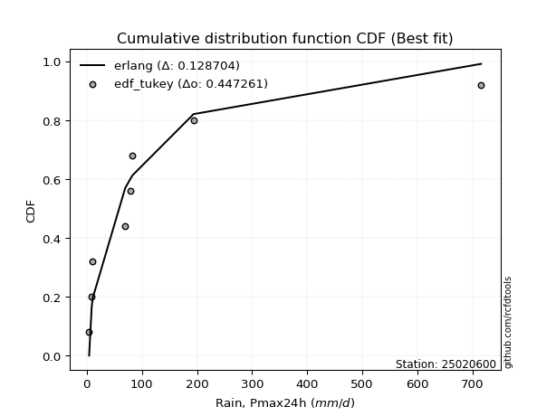</img></img>

</div>


### 8. Empirical - EDF Gringorten (1963)

Gringorten plotting position formula is essential for estimating the probability and return periods of extreme events like floods and heavy rainfall. The constant _a=0.44_.

<div align="center">


$P=(m-a)/(n+1-2a)$


</div>


**8.1. Empirical values**

<div align="center">

|                | 0                    | 1                  | 2                   | 3                  | 4              | 5                  | 6                  | 7                  | 8                  |
|:---------------|:---------------------|:-------------------|:--------------------|:-------------------|:---------------|:-------------------|:-------------------|:-------------------|:-------------------|
| date           | 2021                 | 2022               | 2020                | 2025               | 2017           | 2018               | 2023               | 2024               | 2019               |
| x              | 4.4                  | 9.0                | 10.9                | 56.3               | 69.75          | 79.95              | 83.1               | 193.8              | 715.4              |
| m              | 1                    | 2                  | 3                   | 4                  | 5              | 6                  | 7                  | 8                  | 9                  |
| empirical_dist | edf_gringorten       | edf_gringorten     | edf_gringorten      | edf_gringorten     | edf_gringorten | edf_gringorten     | edf_gringorten     | edf_gringorten     | edf_gringorten     |
| empirical      | 0.061403508771929835 | 0.1710526315789474 | 0.28070175438596495 | 0.3903508771929825 | 0.5            | 0.6096491228070176 | 0.7192982456140351 | 0.8289473684210527 | 0.9385964912280703 |
| empirical_tr   | 1.0654205607476634   | 1.2063492063492063 | 1.3902439024390243  | 1.6402877697841727 | 2.0            | 2.561797752808989  | 3.5625             | 5.846153846153847  | 16.285714285714324 |

</div>


**8.2. Kolmogorov-Smirnov fit test (sorted by Δ)**


<div align="center">

|                | 0                   | 1                   | 2                   | 3                     | 4                   | 5                   | 6                   | 7                   | 8                   | 9                   | 10                  | 11                  | 12                  | 13                  | 14                  | 15                  | 16                  | 17                  | 18                  | 19                  | 20                  | 21                  | 22                  | 23                  | 24                  | 25                  | 26                  | 27                  | 28                  | 29                  | 30                  | 31                  | 32                  | 33                  | 34                  | 35                  | 36                  | 37                  | 38                  | 39                  | 40                  | 41                  | 42                  | 43                  | 44                  | 45                  | 46                  | 47                  | 48                  | 49                  | 50                  | 51                  | 52                  | 53                  | 54                  | 55                  | 56                  | 57                  | 58                  | 59                  | 60                  | 61                  | 62                  | 63                  | 64                  | 65                  | 66                  | 67                  | 68                  | 69                  | 70                  | 71                  | 72                  | 73                  | 74                  | 75                  | 76                  | 77                  | 78                  | 79                  | 80                  | 81                  | 82                  | 83                  | 84                  | 85                  | 86                  | 87                  | 88                  | 89                  |
|:---------------|:--------------------|:--------------------|:--------------------|:----------------------|:--------------------|:--------------------|:--------------------|:--------------------|:--------------------|:--------------------|:--------------------|:--------------------|:--------------------|:--------------------|:--------------------|:--------------------|:--------------------|:--------------------|:--------------------|:--------------------|:--------------------|:--------------------|:--------------------|:--------------------|:--------------------|:--------------------|:--------------------|:--------------------|:--------------------|:--------------------|:--------------------|:--------------------|:--------------------|:--------------------|:--------------------|:--------------------|:--------------------|:--------------------|:--------------------|:--------------------|:--------------------|:--------------------|:--------------------|:--------------------|:--------------------|:--------------------|:--------------------|:--------------------|:--------------------|:--------------------|:--------------------|:--------------------|:--------------------|:--------------------|:--------------------|:--------------------|:--------------------|:--------------------|:--------------------|:--------------------|:--------------------|:--------------------|:--------------------|:--------------------|:--------------------|:--------------------|:--------------------|:--------------------|:--------------------|:--------------------|:--------------------|:--------------------|:--------------------|:--------------------|:--------------------|:--------------------|:--------------------|:--------------------|:--------------------|:--------------------|:--------------------|:--------------------|:--------------------|:--------------------|:--------------------|:--------------------|:--------------------|:--------------------|:--------------------|:--------------------|
| station        | 25020600            | 25020600            | 25020600            | 25020600              | 25020600            | 25020600            | 25020600            | 25020600            | 25020600            | 25020600            | 25020600            | 25020600            | 25020600            | 25020600            | 25020600            | 25020600            | 25020600            | 25020600            | 25020600            | 25020600            | 25020600            | 25020600            | 25020600            | 25020600            | 25020600            | 25020600            | 25020600            | 25020600            | 25020600            | 25020600            | 25020600            | 25020600            | 25020600            | 25020600            | 25020600            | 25020600            | 25020600            | 25020600            | 25020600            | 25020600            | 25020600            | 25020600            | 25020600            | 25020600            | 25020600            | 25020600            | 25020600            | 25020600            | 25020600            | 25020600            | 25020600            | 25020600            | 25020600            | 25020600            | 25020600            | 25020600            | 25020600            | 25020600            | 25020600            | 25020600            | 25020600            | 25020600            | 25020600            | 25020600            | 25020600            | 25020600            | 25020600            | 25020600            | 25020600            | 25020600            | 25020600            | 25020600            | 25020600            | 25020600            | 25020600            | 25020600            | 25020600            | 25020600            | 25020600            | 25020600            | 25020600            | 25020600            | 25020600            | 25020600            | 25020600            | 25020600            | 25020600            | 25020600            | 25020600            | 25020600            |
| empirical_dist | edf_gringorten      | edf_gringorten      | edf_gringorten      | edf_gringorten        | edf_gringorten      | edf_gringorten      | edf_gringorten      | edf_gringorten      | edf_gringorten      | edf_gringorten      | edf_gringorten      | edf_gringorten      | edf_gringorten      | edf_gringorten      | edf_gringorten      | edf_gringorten      | edf_gringorten      | edf_gringorten      | edf_gringorten      | edf_gringorten      | edf_gringorten      | edf_gringorten      | edf_gringorten      | edf_gringorten      | edf_gringorten      | edf_gringorten      | edf_gringorten      | edf_gringorten      | edf_gringorten      | edf_gringorten      | edf_gringorten      | edf_gringorten      | edf_gringorten      | edf_gringorten      | edf_gringorten      | edf_gringorten      | edf_gringorten      | edf_gringorten      | edf_gringorten      | edf_gringorten      | edf_gringorten      | edf_gringorten      | edf_gringorten      | edf_gringorten      | edf_gringorten      | edf_gringorten      | edf_gringorten      | edf_gringorten      | edf_gringorten      | edf_gringorten      | edf_gringorten      | edf_gringorten      | edf_gringorten      | edf_gringorten      | edf_gringorten      | edf_gringorten      | edf_gringorten      | edf_gringorten      | edf_gringorten      | edf_gringorten      | edf_gringorten      | edf_gringorten      | edf_gringorten      | edf_gringorten      | edf_gringorten      | edf_gringorten      | edf_gringorten      | edf_gringorten      | edf_gringorten      | edf_gringorten      | edf_gringorten      | edf_gringorten      | edf_gringorten      | edf_gringorten      | edf_gringorten      | edf_gringorten      | edf_gringorten      | edf_gringorten      | edf_gringorten      | edf_gringorten      | edf_gringorten      | edf_gringorten      | edf_gringorten      | edf_gringorten      | edf_gringorten      | edf_gringorten      | edf_gringorten      | edf_gringorten      | edf_gringorten      | edf_gringorten      |
| p_dist         | loggenlogistic      | t                   | loggumbel_l         | loglaplace_asymmetric | logfisk             | gamma               | mielke              | logloggamma         | logcrystalball      | logexponnorm        | lognorm             | lognorm             | logt                | nakagami            | logjohnsonsu        | lognct              | logerlang           | logpearson3         | loggamma            | loggamma            | logf                | logfatiguelife      | logbetaprime        | loglogistic         | loghypsecant        | chi2                | loggompertz         | pareto              | loginvgamma         | logrice             | loglaplace          | logweibull_min      | gibrat              | logmaxwell          | logalpha            | erlang              | f                   | loginvgauss         | logmielke           | logncf              | lograyleigh         | wald                | loginvweibull       | fisk                | loggenexpon         | invgamma            | logkstwobign        | fatiguelife         | ncf                 | loghalfnorm         | loggumbel_r         | invgauss            | betaprime           | moyal               | logmoyal            | loghalflogistic     | nct                 | pearson3            | gumbel_r            | halflogistic        | logexpon            | halfnorm            | genlogistic         | gompertz            | exponnorm           | expon               | genexpon            | laplace_asymmetric  | rayleigh            | maxwell             | truncnorm           | logwald             | crystalball         | norm                | logtruncnorm        | logistic            | kstwobign           | hypsecant           | loggibrat           | rice                | laplace             | weibull_min         | gumbel_l            | lognakagami         | loglognorm          | invweibull          | alpha               | logpareto           | logchi2             | johnsonsu           |
| delta          | 0.13101997594100984 | 0.13275769888046757 | 0.1345250630216204  | 0.13682246447773974   | 0.14144566116338925 | 0.14148297895132356 | 0.14513538927171338 | 0.14552904557892726 | 0.1473710007167423  | 0.14737106280146    | 0.14737109425942868 | 0.14737109425942868 | 0.14737243334416322 | 0.1475335049329276  | 0.1476150898371495  | 0.147783454460721   | 0.14781070965526472 | 0.14781276348395117 | 0.14781405932497532 | 0.14781405932497532 | 0.14974054542664655 | 0.15043320168439206 | 0.1521025901651118  | 0.1524838890595243  | 0.15682362703740033 | 0.15843545205849652 | 0.16015077716888232 | 0.16359481066800757 | 0.16655766657818677 | 0.16867433942363713 | 0.172319451649194   | 0.17259731716335763 | 0.17729538018652224 | 0.17853365329339016 | 0.17974022978197673 | 0.18002656155768132 | 0.18306254963544338 | 0.18407765213272514 | 0.1856420308957612  | 0.18609134802638444 | 0.1886299586850843  | 0.18911721798233155 | 0.2017428690265119  | 0.20477481374753098 | 0.21043798217003767 | 0.21320137957038882 | 0.21409132288146754 | 0.21534380685886995 | 0.21688503428091604 | 0.21707863906397146 | 0.21785186007928153 | 0.22068466851327956 | 0.22595018439621778 | 0.23437607723558584 | 0.24305328563216017 | 0.24392022452258716 | 0.2519358634263204  | 0.2534517937597935  | 0.25739482192538576 | 0.2577403041432393  | 0.26308030922565523 | 0.2672354997716656  | 0.2677516329192814  | 0.267951505238038   | 0.26808607576315846 | 0.26880619580726095 | 0.2688063377427369  | 0.268806927839514   | 0.2711529088182151  | 0.28344258853895404 | 0.30027264697187667 | 0.312994074723368   | 0.3171297956584536  | 0.31749943292296434 | 0.31883087406545735 | 0.33019439552627333 | 0.33975694994439326 | 0.34059804735172033 | 0.3410377652619408  | 0.367357765837524   | 0.36755485086296985 | 0.3722192841875325  | 0.38419295155929706 | 0.4184723754541401  | 0.42877805344400316 | 0.4450175804241792  | 0.4527263530288757  | 0.45346419951728006 | 0.47426902467917414 | 0.5339544276043762  |
| deltao         | 0.41761268023100007 | 0.41761268023100007 | 0.41761268023100007 | 0.41761268023100007   | 0.41761268023100007 | 0.41761268023100007 | 0.41761268023100007 | 0.41761268023100007 | 0.41761268023100007 | 0.41761268023100007 | 0.41761268023100007 | 0.41761268023100007 | 0.41761268023100007 | 0.41761268023100007 | 0.41761268023100007 | 0.41761268023100007 | 0.41761268023100007 | 0.41761268023100007 | 0.41761268023100007 | 0.41761268023100007 | 0.41761268023100007 | 0.41761268023100007 | 0.41761268023100007 | 0.41761268023100007 | 0.41761268023100007 | 0.41761268023100007 | 0.41761268023100007 | 0.41761268023100007 | 0.41761268023100007 | 0.41761268023100007 | 0.41761268023100007 | 0.41761268023100007 | 0.41761268023100007 | 0.41761268023100007 | 0.41761268023100007 | 0.41761268023100007 | 0.41761268023100007 | 0.41761268023100007 | 0.41761268023100007 | 0.41761268023100007 | 0.41761268023100007 | 0.41761268023100007 | 0.41761268023100007 | 0.41761268023100007 | 0.41761268023100007 | 0.41761268023100007 | 0.41761268023100007 | 0.41761268023100007 | 0.41761268023100007 | 0.41761268023100007 | 0.41761268023100007 | 0.41761268023100007 | 0.41761268023100007 | 0.41761268023100007 | 0.41761268023100007 | 0.41761268023100007 | 0.41761268023100007 | 0.41761268023100007 | 0.41761268023100007 | 0.41761268023100007 | 0.41761268023100007 | 0.41761268023100007 | 0.41761268023100007 | 0.41761268023100007 | 0.41761268023100007 | 0.41761268023100007 | 0.41761268023100007 | 0.41761268023100007 | 0.41761268023100007 | 0.41761268023100007 | 0.41761268023100007 | 0.41761268023100007 | 0.41761268023100007 | 0.41761268023100007 | 0.41761268023100007 | 0.41761268023100007 | 0.41761268023100007 | 0.41761268023100007 | 0.41761268023100007 | 0.41761268023100007 | 0.41761268023100007 | 0.41761268023100007 | 0.41761268023100007 | 0.41761268023100007 | 0.41761268023100007 | 0.41761268023100007 | 0.41761268023100007 | 0.41761268023100007 | 0.41761268023100007 | 0.41761268023100007 |
| eval           | Δo > Δ              | Δo > Δ              | Δo > Δ              | Δo > Δ                | Δo > Δ              | Δo > Δ              | Δo > Δ              | Δo > Δ              | Δo > Δ              | Δo > Δ              | Δo > Δ              | Δo > Δ              | Δo > Δ              | Δo > Δ              | Δo > Δ              | Δo > Δ              | Δo > Δ              | Δo > Δ              | Δo > Δ              | Δo > Δ              | Δo > Δ              | Δo > Δ              | Δo > Δ              | Δo > Δ              | Δo > Δ              | Δo > Δ              | Δo > Δ              | Δo > Δ              | Δo > Δ              | Δo > Δ              | Δo > Δ              | Δo > Δ              | Δo > Δ              | Δo > Δ              | Δo > Δ              | Δo > Δ              | Δo > Δ              | Δo > Δ              | Δo > Δ              | Δo > Δ              | Δo > Δ              | Δo > Δ              | Δo > Δ              | Δo > Δ              | Δo > Δ              | Δo > Δ              | Δo > Δ              | Δo > Δ              | Δo > Δ              | Δo > Δ              | Δo > Δ              | Δo > Δ              | Δo > Δ              | Δo > Δ              | Δo > Δ              | Δo > Δ              | Δo > Δ              | Δo > Δ              | Δo > Δ              | Δo > Δ              | Δo > Δ              | Δo > Δ              | Δo > Δ              | Δo > Δ              | Δo > Δ              | Δo > Δ              | Δo > Δ              | Δo > Δ              | Δo > Δ              | Δo > Δ              | Δo > Δ              | Δo > Δ              | Δo > Δ              | Δo > Δ              | Δo > Δ              | Δo > Δ              | Δo > Δ              | Δo > Δ              | Δo > Δ              | Δo > Δ              | Δo > Δ              | Δo > Δ              | Δo > Δ              | Δo <= Δ             | Δo <= Δ             | Δo <= Δ             | Δo <= Δ             | Δo <= Δ             | Δo <= Δ             | Δo <= Δ             |
| fit            | 1                   | 1                   | 1                   | 1                     | 1                   | 1                   | 1                   | 1                   | 1                   | 1                   | 1                   | 1                   | 1                   | 1                   | 1                   | 1                   | 1                   | 1                   | 1                   | 1                   | 1                   | 1                   | 1                   | 1                   | 1                   | 1                   | 1                   | 1                   | 1                   | 1                   | 1                   | 1                   | 1                   | 1                   | 1                   | 1                   | 1                   | 1                   | 1                   | 1                   | 1                   | 1                   | 1                   | 1                   | 1                   | 1                   | 1                   | 1                   | 1                   | 1                   | 1                   | 1                   | 1                   | 1                   | 1                   | 1                   | 1                   | 1                   | 1                   | 1                   | 1                   | 1                   | 1                   | 1                   | 1                   | 1                   | 1                   | 1                   | 1                   | 1                   | 1                   | 1                   | 1                   | 1                   | 1                   | 1                   | 1                   | 1                   | 1                   | 1                   | 1                   | 1                   | 1                   | 0                   | 0                   | 0                   | 0                   | 0                   | 0                   | 0                   |
| n              | 9                   | 9                   | 9                   | 9                     | 9                   | 9                   | 9                   | 9                   | 9                   | 9                   | 9                   | 9                   | 9                   | 9                   | 9                   | 9                   | 9                   | 9                   | 9                   | 9                   | 9                   | 9                   | 9                   | 9                   | 9                   | 9                   | 9                   | 9                   | 9                   | 9                   | 9                   | 9                   | 9                   | 9                   | 9                   | 9                   | 9                   | 9                   | 9                   | 9                   | 9                   | 9                   | 9                   | 9                   | 9                   | 9                   | 9                   | 9                   | 9                   | 9                   | 9                   | 9                   | 9                   | 9                   | 9                   | 9                   | 9                   | 9                   | 9                   | 9                   | 9                   | 9                   | 9                   | 9                   | 9                   | 9                   | 9                   | 9                   | 9                   | 9                   | 9                   | 9                   | 9                   | 9                   | 9                   | 9                   | 9                   | 9                   | 9                   | 9                   | 9                   | 9                   | 9                   | 9                   | 9                   | 9                   | 9                   | 9                   | 9                   | 9                   |
| best_fit       | 1                   | 0                   | 0                   | 0                     | 0                   | 0                   | 0                   | 0                   | 0                   | 0                   | 0                   | 0                   | 0                   | 0                   | 0                   | 0                   | 0                   | 0                   | 0                   | 0                   | 0                   | 0                   | 0                   | 0                   | 0                   | 0                   | 0                   | 0                   | 0                   | 0                   | 0                   | 0                   | 0                   | 0                   | 0                   | 0                   | 0                   | 0                   | 0                   | 0                   | 0                   | 0                   | 0                   | 0                   | 0                   | 0                   | 0                   | 0                   | 0                   | 0                   | 0                   | 0                   | 0                   | 0                   | 0                   | 0                   | 0                   | 0                   | 0                   | 0                   | 0                   | 0                   | 0                   | 0                   | 0                   | 0                   | 0                   | 0                   | 0                   | 0                   | 0                   | 0                   | 0                   | 0                   | 0                   | 0                   | 0                   | 0                   | 0                   | 0                   | 0                   | 0                   | 0                   | 0                   | 0                   | 0                   | 0                   | 0                   | 0                   | 0                   |
| best_fit_sort  | 1                   | 2                   | 3                   | 4                     | 5                   | 6                   | 7                   | 8                   | 9                   | 10                  | 11                  | 12                  | 13                  | 14                  | 15                  | 16                  | 17                  | 18                  | 19                  | 20                  | 21                  | 22                  | 23                  | 24                  | 25                  | 26                  | 27                  | 28                  | 29                  | 30                  | 31                  | 32                  | 33                  | 34                  | 35                  | 36                  | 37                  | 38                  | 39                  | 40                  | 41                  | 42                  | 43                  | 44                  | 45                  | 46                  | 47                  | 48                  | 49                  | 50                  | 51                  | 52                  | 53                  | 54                  | 55                  | 56                  | 57                  | 58                  | 59                  | 60                  | 61                  | 62                  | 63                  | 64                  | 65                  | 66                  | 67                  | 68                  | 69                  | 70                  | 71                  | 72                  | 73                  | 74                  | 75                  | 76                  | 77                  | 78                  | 79                  | 80                  | 81                  | 82                  | 83                  | 84                  | 85                  | 86                  | 87                  | 88                  | 89                  | 90                  |

</div>


<div align="center">

</img>

</div>


**8.3. Best fit**

<div align="center">

|   id |   station | empirical_dist   | p_dist         |   delta |   deltao | eval   |   fit |   n |   best_fit |   best_fit_sort |
|-----:|----------:|:-----------------|:---------------|--------:|---------:|:-------|------:|----:|-----------:|----------------:|
|    0 |  25020600 | edf_gringorten   | loggenlogistic | 0.13102 | 0.417613 | Δo > Δ |     1 |   9 |          1 |               1 |

</div>


<div align="center">

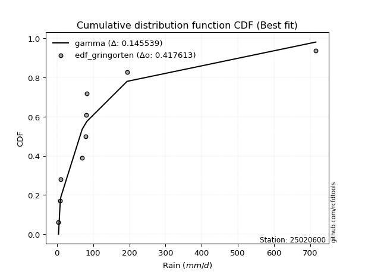</img>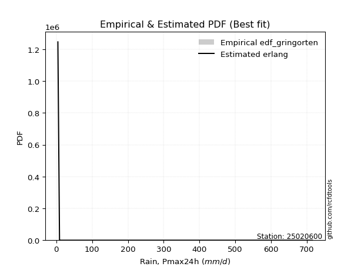</img>

</div>


### 9. Empirical - EDF Filliben (1975)

The specific values of the constants (0.3175) (often denoted as $alpha$) and (0.365) are derived from a method proposed by James J. Filliben in a 1975 paper. This particular formula is the mean value of the $i$-th order statistic of the normal distribution and is considered a robust and effective plotting position formula for the normal probability plot correlation coefficient test for normality.

<div align="center">


$P=(m-0.3175)/(n+0.365)$


</div>


**9.1. Empirical values**

<div align="center">

|                | 0                   | 1                  | 2                   | 3                   | 4            | 5                  | 6                  | 7                  | 8                  |
|:---------------|:--------------------|:-------------------|:--------------------|:--------------------|:-------------|:-------------------|:-------------------|:-------------------|:-------------------|
| date           | 2021                | 2022               | 2020                | 2025                | 2017         | 2018               | 2023               | 2024               | 2019               |
| x              | 4.4                 | 9.0                | 10.9                | 56.3                | 69.75        | 79.95              | 83.1               | 193.8              | 715.4              |
| m              | 1                   | 2                  | 3                   | 4                   | 5            | 6                  | 7                  | 8                  | 9                  |
| empirical_dist | edf_filliben        | edf_filliben       | edf_filliben        | edf_filliben        | edf_filliben | edf_filliben       | edf_filliben       | edf_filliben       | edf_filliben       |
| empirical      | 0.07287773625200214 | 0.1796583021890016 | 0.28643886812600106 | 0.39321943406300053 | 0.5          | 0.6067805659369995 | 0.7135611318739989 | 0.8203416978109984 | 0.9271222637479978 |
| empirical_tr   | 1.0786063921681543  | 1.219004230393752  | 1.401421623643846   | 1.6480422349318082  | 2.0          | 2.5431093007467753 | 3.491146318732526  | 5.566121842496286  | 13.721611721611705 |

</div>


**9.2. Kolmogorov-Smirnov fit test (sorted by Δ)**


<div align="center">

|                | 0                   | 1                   | 2                   | 3                   | 4                   | 5                   | 6                   | 7                     | 8                   | 9                   | 10                  | 11                  | 12                  | 13                  | 14                  | 15                  | 16                  | 17                  | 18                  | 19                  | 20                  | 21                  | 22                  | 23                  | 24                  | 25                  | 26                  | 27                  | 28                  | 29                  | 30                  | 31                  | 32                  | 33                  | 34                  | 35                  | 36                  | 37                  | 38                  | 39                  | 40                  | 41                  | 42                  | 43                  | 44                  | 45                  | 46                  | 47                  | 48                  | 49                  | 50                  | 51                  | 52                  | 53                  | 54                  | 55                  | 56                  | 57                  | 58                  | 59                  | 60                  | 61                  | 62                  | 63                  | 64                  | 65                  | 66                  | 67                  | 68                  | 69                  | 70                  | 71                  | 72                  | 73                  | 74                  | 75                  | 76                  | 77                  | 78                  | 79                  | 80                  | 81                  | 82                  | 83                  | 84                  | 85                  | 86                  | 87                  | 88                  | 89                  |
|:---------------|:--------------------|:--------------------|:--------------------|:--------------------|:--------------------|:--------------------|:--------------------|:----------------------|:--------------------|:--------------------|:--------------------|:--------------------|:--------------------|:--------------------|:--------------------|:--------------------|:--------------------|:--------------------|:--------------------|:--------------------|:--------------------|:--------------------|:--------------------|:--------------------|:--------------------|:--------------------|:--------------------|:--------------------|:--------------------|:--------------------|:--------------------|:--------------------|:--------------------|:--------------------|:--------------------|:--------------------|:--------------------|:--------------------|:--------------------|:--------------------|:--------------------|:--------------------|:--------------------|:--------------------|:--------------------|:--------------------|:--------------------|:--------------------|:--------------------|:--------------------|:--------------------|:--------------------|:--------------------|:--------------------|:--------------------|:--------------------|:--------------------|:--------------------|:--------------------|:--------------------|:--------------------|:--------------------|:--------------------|:--------------------|:--------------------|:--------------------|:--------------------|:--------------------|:--------------------|:--------------------|:--------------------|:--------------------|:--------------------|:--------------------|:--------------------|:--------------------|:--------------------|:--------------------|:--------------------|:--------------------|:--------------------|:--------------------|:--------------------|:--------------------|:--------------------|:--------------------|:--------------------|:--------------------|:--------------------|:--------------------|
| station        | 25020600            | 25020600            | 25020600            | 25020600            | 25020600            | 25020600            | 25020600            | 25020600              | 25020600            | 25020600            | 25020600            | 25020600            | 25020600            | 25020600            | 25020600            | 25020600            | 25020600            | 25020600            | 25020600            | 25020600            | 25020600            | 25020600            | 25020600            | 25020600            | 25020600            | 25020600            | 25020600            | 25020600            | 25020600            | 25020600            | 25020600            | 25020600            | 25020600            | 25020600            | 25020600            | 25020600            | 25020600            | 25020600            | 25020600            | 25020600            | 25020600            | 25020600            | 25020600            | 25020600            | 25020600            | 25020600            | 25020600            | 25020600            | 25020600            | 25020600            | 25020600            | 25020600            | 25020600            | 25020600            | 25020600            | 25020600            | 25020600            | 25020600            | 25020600            | 25020600            | 25020600            | 25020600            | 25020600            | 25020600            | 25020600            | 25020600            | 25020600            | 25020600            | 25020600            | 25020600            | 25020600            | 25020600            | 25020600            | 25020600            | 25020600            | 25020600            | 25020600            | 25020600            | 25020600            | 25020600            | 25020600            | 25020600            | 25020600            | 25020600            | 25020600            | 25020600            | 25020600            | 25020600            | 25020600            | 25020600            |
| empirical_dist | edf_filliben        | edf_filliben        | edf_filliben        | edf_filliben        | edf_filliben        | edf_filliben        | edf_filliben        | edf_filliben          | edf_filliben        | edf_filliben        | edf_filliben        | edf_filliben        | edf_filliben        | edf_filliben        | edf_filliben        | edf_filliben        | edf_filliben        | edf_filliben        | edf_filliben        | edf_filliben        | edf_filliben        | edf_filliben        | edf_filliben        | edf_filliben        | edf_filliben        | edf_filliben        | edf_filliben        | edf_filliben        | edf_filliben        | edf_filliben        | edf_filliben        | edf_filliben        | edf_filliben        | edf_filliben        | edf_filliben        | edf_filliben        | edf_filliben        | edf_filliben        | edf_filliben        | edf_filliben        | edf_filliben        | edf_filliben        | edf_filliben        | edf_filliben        | edf_filliben        | edf_filliben        | edf_filliben        | edf_filliben        | edf_filliben        | edf_filliben        | edf_filliben        | edf_filliben        | edf_filliben        | edf_filliben        | edf_filliben        | edf_filliben        | edf_filliben        | edf_filliben        | edf_filliben        | edf_filliben        | edf_filliben        | edf_filliben        | edf_filliben        | edf_filliben        | edf_filliben        | edf_filliben        | edf_filliben        | edf_filliben        | edf_filliben        | edf_filliben        | edf_filliben        | edf_filliben        | edf_filliben        | edf_filliben        | edf_filliben        | edf_filliben        | edf_filliben        | edf_filliben        | edf_filliben        | edf_filliben        | edf_filliben        | edf_filliben        | edf_filliben        | edf_filliben        | edf_filliben        | edf_filliben        | edf_filliben        | edf_filliben        | edf_filliben        | edf_filliben        |
| p_dist         | t                   | loggenlogistic      | gamma               | logfisk             | loggumbel_l         | nakagami            | mielke              | loglaplace_asymmetric | logloggamma         | logcrystalball      | logexponnorm        | lognorm             | lognorm             | logt                | logjohnsonsu        | lognct              | logerlang           | logpearson3         | loggamma            | loggamma            | logf                | logfatiguelife      | logbetaprime        | loglogistic         | chi2                | loghypsecant        | loggompertz         | pareto              | loginvgamma         | logrice             | loglaplace          | logweibull_min      | gibrat              | logmaxwell          | logalpha            | erlang              | wald                | f                   | loginvgauss         | logmielke           | logncf              | lograyleigh         | loginvweibull       | fisk                | loggenexpon         | invgamma            | logkstwobign        | fatiguelife         | ncf                 | loghalfnorm         | loggumbel_r         | invgauss            | betaprime           | moyal               | logmoyal            | loghalflogistic     | pearson3            | halflogistic        | nct                 | gumbel_r            | halfnorm            | logexpon            | genlogistic         | gompertz            | exponnorm           | expon               | genexpon            | laplace_asymmetric  | rayleigh            | maxwell             | truncnorm           | logwald             | crystalball         | norm                | logtruncnorm        | logistic            | kstwobign           | hypsecant           | loggibrat           | rice                | laplace             | weibull_min         | gumbel_l            | lognakagami         | loglognorm          | invweibull          | logpareto           | alpha               | logchi2             | johnsonsu           |
| delta          | 0.12128347140039528 | 0.13281837999865845 | 0.1357458652112874  | 0.13857710429337122 | 0.1402621767616565  | 0.14179639119289145 | 0.14226683240169535 | 0.14255957821777585   | 0.14266048870890924 | 0.14450244384672428 | 0.14450250593144198 | 0.14450253738941066 | 0.14450253738941066 | 0.1445038764741452  | 0.14474653296713147 | 0.14491489759070297 | 0.1449421527852467  | 0.14494420661393315 | 0.1449455024549573  | 0.1449455024549573  | 0.14687198855662853 | 0.14756464481437404 | 0.14923403329509377 | 0.1496153321895063  | 0.15269833831846036 | 0.1539550701673823  | 0.1572822202988643  | 0.16072625379798955 | 0.16368910970816875 | 0.1658057825536191  | 0.16945089477917596 | 0.1697287602933396  | 0.17155826644648609 | 0.17566509642337214 | 0.1768716729119587  | 0.1771580046876633  | 0.17764299050225926 | 0.18019399276542536 | 0.18120909526270712 | 0.18277347402574318 | 0.18322279115636642 | 0.18576140181506628 | 0.19887431215649387 | 0.20190625687751296 | 0.20756942530001965 | 0.2103328227003708  | 0.21122276601144951 | 0.21247524998885192 | 0.21401647741089802 | 0.21421008219395343 | 0.2149833032092635  | 0.21781611164326153 | 0.22308162752619975 | 0.22863896349554969 | 0.24018472876214214 | 0.24105166765256913 | 0.2419775662797212  | 0.246266076663167   | 0.24906730655630238 | 0.2516577081853496  | 0.2557612722915933  | 0.2602117523556372  | 0.26201451917924523 | 0.26221439149800185 | 0.2623489620231223  | 0.2630690820672248  | 0.2630692240027007  | 0.26306981409947783 | 0.2654157950781789  | 0.2777054747989179  | 0.2945355332318405  | 0.31012551785334996 | 0.31139268191841746 | 0.3117623191829282  | 0.3159623171954393  | 0.3244572817862372  | 0.3340198362043571  | 0.3348609336116842  | 0.33816920839192277 | 0.36162065209748784 | 0.3618177371229337  | 0.3664821704474963  | 0.3784558378192609  | 0.4156038185841221  | 0.420172382833949   | 0.4335433529441067  | 0.4448585289072259  | 0.4498577961588577  | 0.4714004678091561  | 0.5253487569943219  |
| deltao         | 0.41761268023100007 | 0.41761268023100007 | 0.41761268023100007 | 0.41761268023100007 | 0.41761268023100007 | 0.41761268023100007 | 0.41761268023100007 | 0.41761268023100007   | 0.41761268023100007 | 0.41761268023100007 | 0.41761268023100007 | 0.41761268023100007 | 0.41761268023100007 | 0.41761268023100007 | 0.41761268023100007 | 0.41761268023100007 | 0.41761268023100007 | 0.41761268023100007 | 0.41761268023100007 | 0.41761268023100007 | 0.41761268023100007 | 0.41761268023100007 | 0.41761268023100007 | 0.41761268023100007 | 0.41761268023100007 | 0.41761268023100007 | 0.41761268023100007 | 0.41761268023100007 | 0.41761268023100007 | 0.41761268023100007 | 0.41761268023100007 | 0.41761268023100007 | 0.41761268023100007 | 0.41761268023100007 | 0.41761268023100007 | 0.41761268023100007 | 0.41761268023100007 | 0.41761268023100007 | 0.41761268023100007 | 0.41761268023100007 | 0.41761268023100007 | 0.41761268023100007 | 0.41761268023100007 | 0.41761268023100007 | 0.41761268023100007 | 0.41761268023100007 | 0.41761268023100007 | 0.41761268023100007 | 0.41761268023100007 | 0.41761268023100007 | 0.41761268023100007 | 0.41761268023100007 | 0.41761268023100007 | 0.41761268023100007 | 0.41761268023100007 | 0.41761268023100007 | 0.41761268023100007 | 0.41761268023100007 | 0.41761268023100007 | 0.41761268023100007 | 0.41761268023100007 | 0.41761268023100007 | 0.41761268023100007 | 0.41761268023100007 | 0.41761268023100007 | 0.41761268023100007 | 0.41761268023100007 | 0.41761268023100007 | 0.41761268023100007 | 0.41761268023100007 | 0.41761268023100007 | 0.41761268023100007 | 0.41761268023100007 | 0.41761268023100007 | 0.41761268023100007 | 0.41761268023100007 | 0.41761268023100007 | 0.41761268023100007 | 0.41761268023100007 | 0.41761268023100007 | 0.41761268023100007 | 0.41761268023100007 | 0.41761268023100007 | 0.41761268023100007 | 0.41761268023100007 | 0.41761268023100007 | 0.41761268023100007 | 0.41761268023100007 | 0.41761268023100007 | 0.41761268023100007 |
| eval           | Δo > Δ              | Δo > Δ              | Δo > Δ              | Δo > Δ              | Δo > Δ              | Δo > Δ              | Δo > Δ              | Δo > Δ                | Δo > Δ              | Δo > Δ              | Δo > Δ              | Δo > Δ              | Δo > Δ              | Δo > Δ              | Δo > Δ              | Δo > Δ              | Δo > Δ              | Δo > Δ              | Δo > Δ              | Δo > Δ              | Δo > Δ              | Δo > Δ              | Δo > Δ              | Δo > Δ              | Δo > Δ              | Δo > Δ              | Δo > Δ              | Δo > Δ              | Δo > Δ              | Δo > Δ              | Δo > Δ              | Δo > Δ              | Δo > Δ              | Δo > Δ              | Δo > Δ              | Δo > Δ              | Δo > Δ              | Δo > Δ              | Δo > Δ              | Δo > Δ              | Δo > Δ              | Δo > Δ              | Δo > Δ              | Δo > Δ              | Δo > Δ              | Δo > Δ              | Δo > Δ              | Δo > Δ              | Δo > Δ              | Δo > Δ              | Δo > Δ              | Δo > Δ              | Δo > Δ              | Δo > Δ              | Δo > Δ              | Δo > Δ              | Δo > Δ              | Δo > Δ              | Δo > Δ              | Δo > Δ              | Δo > Δ              | Δo > Δ              | Δo > Δ              | Δo > Δ              | Δo > Δ              | Δo > Δ              | Δo > Δ              | Δo > Δ              | Δo > Δ              | Δo > Δ              | Δo > Δ              | Δo > Δ              | Δo > Δ              | Δo > Δ              | Δo > Δ              | Δo > Δ              | Δo > Δ              | Δo > Δ              | Δo > Δ              | Δo > Δ              | Δo > Δ              | Δo > Δ              | Δo > Δ              | Δo > Δ              | Δo <= Δ             | Δo <= Δ             | Δo <= Δ             | Δo <= Δ             | Δo <= Δ             | Δo <= Δ             |
| fit            | 1                   | 1                   | 1                   | 1                   | 1                   | 1                   | 1                   | 1                     | 1                   | 1                   | 1                   | 1                   | 1                   | 1                   | 1                   | 1                   | 1                   | 1                   | 1                   | 1                   | 1                   | 1                   | 1                   | 1                   | 1                   | 1                   | 1                   | 1                   | 1                   | 1                   | 1                   | 1                   | 1                   | 1                   | 1                   | 1                   | 1                   | 1                   | 1                   | 1                   | 1                   | 1                   | 1                   | 1                   | 1                   | 1                   | 1                   | 1                   | 1                   | 1                   | 1                   | 1                   | 1                   | 1                   | 1                   | 1                   | 1                   | 1                   | 1                   | 1                   | 1                   | 1                   | 1                   | 1                   | 1                   | 1                   | 1                   | 1                   | 1                   | 1                   | 1                   | 1                   | 1                   | 1                   | 1                   | 1                   | 1                   | 1                   | 1                   | 1                   | 1                   | 1                   | 1                   | 1                   | 0                   | 0                   | 0                   | 0                   | 0                   | 0                   |
| n              | 9                   | 9                   | 9                   | 9                   | 9                   | 9                   | 9                   | 9                     | 9                   | 9                   | 9                   | 9                   | 9                   | 9                   | 9                   | 9                   | 9                   | 9                   | 9                   | 9                   | 9                   | 9                   | 9                   | 9                   | 9                   | 9                   | 9                   | 9                   | 9                   | 9                   | 9                   | 9                   | 9                   | 9                   | 9                   | 9                   | 9                   | 9                   | 9                   | 9                   | 9                   | 9                   | 9                   | 9                   | 9                   | 9                   | 9                   | 9                   | 9                   | 9                   | 9                   | 9                   | 9                   | 9                   | 9                   | 9                   | 9                   | 9                   | 9                   | 9                   | 9                   | 9                   | 9                   | 9                   | 9                   | 9                   | 9                   | 9                   | 9                   | 9                   | 9                   | 9                   | 9                   | 9                   | 9                   | 9                   | 9                   | 9                   | 9                   | 9                   | 9                   | 9                   | 9                   | 9                   | 9                   | 9                   | 9                   | 9                   | 9                   | 9                   |
| best_fit       | 1                   | 0                   | 0                   | 0                   | 0                   | 0                   | 0                   | 0                     | 0                   | 0                   | 0                   | 0                   | 0                   | 0                   | 0                   | 0                   | 0                   | 0                   | 0                   | 0                   | 0                   | 0                   | 0                   | 0                   | 0                   | 0                   | 0                   | 0                   | 0                   | 0                   | 0                   | 0                   | 0                   | 0                   | 0                   | 0                   | 0                   | 0                   | 0                   | 0                   | 0                   | 0                   | 0                   | 0                   | 0                   | 0                   | 0                   | 0                   | 0                   | 0                   | 0                   | 0                   | 0                   | 0                   | 0                   | 0                   | 0                   | 0                   | 0                   | 0                   | 0                   | 0                   | 0                   | 0                   | 0                   | 0                   | 0                   | 0                   | 0                   | 0                   | 0                   | 0                   | 0                   | 0                   | 0                   | 0                   | 0                   | 0                   | 0                   | 0                   | 0                   | 0                   | 0                   | 0                   | 0                   | 0                   | 0                   | 0                   | 0                   | 0                   |
| best_fit_sort  | 1                   | 2                   | 3                   | 4                   | 5                   | 6                   | 7                   | 8                     | 9                   | 10                  | 11                  | 12                  | 13                  | 14                  | 15                  | 16                  | 17                  | 18                  | 19                  | 20                  | 21                  | 22                  | 23                  | 24                  | 25                  | 26                  | 27                  | 28                  | 29                  | 30                  | 31                  | 32                  | 33                  | 34                  | 35                  | 36                  | 37                  | 38                  | 39                  | 40                  | 41                  | 42                  | 43                  | 44                  | 45                  | 46                  | 47                  | 48                  | 49                  | 50                  | 51                  | 52                  | 53                  | 54                  | 55                  | 56                  | 57                  | 58                  | 59                  | 60                  | 61                  | 62                  | 63                  | 64                  | 65                  | 66                  | 67                  | 68                  | 69                  | 70                  | 71                  | 72                  | 73                  | 74                  | 75                  | 76                  | 77                  | 78                  | 79                  | 80                  | 81                  | 82                  | 83                  | 84                  | 85                  | 86                  | 87                  | 88                  | 89                  | 90                  |

</div>


<div align="center">

</img>

</div>


**9.3. Best fit**

<div align="center">

|   id |   station | empirical_dist   | p_dist   |    delta |   deltao | eval   |   fit |   n |   best_fit |   best_fit_sort |
|-----:|----------:|:-----------------|:---------|---------:|---------:|:-------|------:|----:|-----------:|----------------:|
|    0 |  25020600 | edf_filliben     | t        | 0.121283 | 0.417613 | Δo > Δ |     1 |   9 |          1 |               1 |

</div>


<div align="center">

</img></img>

</div>


### 10. Empirical - EDF Jenkinson (1977)

The Jenkinson formula in hydrology is an empirical plotting position formula used to estimate the non-exceedance probability _(P)_ or return period _(T)_ of a given ordered observation within a sample. It is a widely used method in the frequency analysis of extreme events such as floods and rainfall, as it provides a distribution-free way to plot data. _a≈0.31_ and _b≈0.38_ are constants derived to approximate the median of the probability distribution for the given rank.

<div align="center">


$P=(m-a)/(n+b)$


</div>


**10.1. Empirical values**

<div align="center">

|                | 0                   | 1                   | 2                  | 3                   | 4             | 5                  | 6                  | 7                  | 8                  |
|:---------------|:--------------------|:--------------------|:-------------------|:--------------------|:--------------|:-------------------|:-------------------|:-------------------|:-------------------|
| date           | 2021                | 2022                | 2020               | 2025                | 2017          | 2018               | 2023               | 2024               | 2019               |
| x              | 4.4                 | 9.0                 | 10.9               | 56.3                | 69.75         | 79.95              | 83.1               | 193.8              | 715.4              |
| m              | 1                   | 2                   | 3                  | 4                   | 5             | 6                  | 7                  | 8                  | 9                  |
| empirical_dist | edf_jenkinson       | edf_jenkinson       | edf_jenkinson      | edf_jenkinson       | edf_jenkinson | edf_jenkinson      | edf_jenkinson      | edf_jenkinson      | edf_jenkinson      |
| empirical      | 0.07356076759061833 | 0.18017057569296374 | 0.2867803837953091 | 0.39339019189765456 | 0.5           | 0.6066098081023454 | 0.7132196162046908 | 0.8198294243070362 | 0.9264392324093815 |
| empirical_tr   | 1.0794016110471807  | 1.2197659297789336  | 1.4020926756352765 | 1.6485061511423549  | 2.0           | 2.542005420054201  | 3.486988847583642  | 5.550295857988164  | 13.5942028985507   |

</div>


**10.2. Kolmogorov-Smirnov fit test (sorted by Δ)**


<div align="center">

|                | 0                   | 1                   | 2                   | 3                   | 4                   | 5                   | 6                   | 7                   | 8                     | 9                   | 10                  | 11                  | 12                  | 13                  | 14                  | 15                  | 16                  | 17                  | 18                  | 19                  | 20                  | 21                  | 22                  | 23                  | 24                  | 25                  | 26                  | 27                  | 28                  | 29                  | 30                  | 31                  | 32                  | 33                  | 34                  | 35                  | 36                  | 37                  | 38                  | 39                  | 40                  | 41                  | 42                  | 43                  | 44                  | 45                  | 46                  | 47                  | 48                  | 49                  | 50                  | 51                  | 52                  | 53                  | 54                  | 55                  | 56                  | 57                  | 58                  | 59                  | 60                  | 61                  | 62                  | 63                  | 64                  | 65                  | 66                  | 67                  | 68                  | 69                  | 70                  | 71                  | 72                  | 73                  | 74                  | 75                  | 76                  | 77                  | 78                  | 79                  | 80                  | 81                  | 82                  | 83                  | 84                  | 85                  | 86                  | 87                  | 88                  | 89                  |
|:---------------|:--------------------|:--------------------|:--------------------|:--------------------|:--------------------|:--------------------|:--------------------|:--------------------|:----------------------|:--------------------|:--------------------|:--------------------|:--------------------|:--------------------|:--------------------|:--------------------|:--------------------|:--------------------|:--------------------|:--------------------|:--------------------|:--------------------|:--------------------|:--------------------|:--------------------|:--------------------|:--------------------|:--------------------|:--------------------|:--------------------|:--------------------|:--------------------|:--------------------|:--------------------|:--------------------|:--------------------|:--------------------|:--------------------|:--------------------|:--------------------|:--------------------|:--------------------|:--------------------|:--------------------|:--------------------|:--------------------|:--------------------|:--------------------|:--------------------|:--------------------|:--------------------|:--------------------|:--------------------|:--------------------|:--------------------|:--------------------|:--------------------|:--------------------|:--------------------|:--------------------|:--------------------|:--------------------|:--------------------|:--------------------|:--------------------|:--------------------|:--------------------|:--------------------|:--------------------|:--------------------|:--------------------|:--------------------|:--------------------|:--------------------|:--------------------|:--------------------|:--------------------|:--------------------|:--------------------|:--------------------|:--------------------|:--------------------|:--------------------|:--------------------|:--------------------|:--------------------|:--------------------|:--------------------|:--------------------|:--------------------|
| station        | 25020600            | 25020600            | 25020600            | 25020600            | 25020600            | 25020600            | 25020600            | 25020600            | 25020600              | 25020600            | 25020600            | 25020600            | 25020600            | 25020600            | 25020600            | 25020600            | 25020600            | 25020600            | 25020600            | 25020600            | 25020600            | 25020600            | 25020600            | 25020600            | 25020600            | 25020600            | 25020600            | 25020600            | 25020600            | 25020600            | 25020600            | 25020600            | 25020600            | 25020600            | 25020600            | 25020600            | 25020600            | 25020600            | 25020600            | 25020600            | 25020600            | 25020600            | 25020600            | 25020600            | 25020600            | 25020600            | 25020600            | 25020600            | 25020600            | 25020600            | 25020600            | 25020600            | 25020600            | 25020600            | 25020600            | 25020600            | 25020600            | 25020600            | 25020600            | 25020600            | 25020600            | 25020600            | 25020600            | 25020600            | 25020600            | 25020600            | 25020600            | 25020600            | 25020600            | 25020600            | 25020600            | 25020600            | 25020600            | 25020600            | 25020600            | 25020600            | 25020600            | 25020600            | 25020600            | 25020600            | 25020600            | 25020600            | 25020600            | 25020600            | 25020600            | 25020600            | 25020600            | 25020600            | 25020600            | 25020600            |
| empirical_dist | edf_jenkinson       | edf_jenkinson       | edf_jenkinson       | edf_jenkinson       | edf_jenkinson       | edf_jenkinson       | edf_jenkinson       | edf_jenkinson       | edf_jenkinson         | edf_jenkinson       | edf_jenkinson       | edf_jenkinson       | edf_jenkinson       | edf_jenkinson       | edf_jenkinson       | edf_jenkinson       | edf_jenkinson       | edf_jenkinson       | edf_jenkinson       | edf_jenkinson       | edf_jenkinson       | edf_jenkinson       | edf_jenkinson       | edf_jenkinson       | edf_jenkinson       | edf_jenkinson       | edf_jenkinson       | edf_jenkinson       | edf_jenkinson       | edf_jenkinson       | edf_jenkinson       | edf_jenkinson       | edf_jenkinson       | edf_jenkinson       | edf_jenkinson       | edf_jenkinson       | edf_jenkinson       | edf_jenkinson       | edf_jenkinson       | edf_jenkinson       | edf_jenkinson       | edf_jenkinson       | edf_jenkinson       | edf_jenkinson       | edf_jenkinson       | edf_jenkinson       | edf_jenkinson       | edf_jenkinson       | edf_jenkinson       | edf_jenkinson       | edf_jenkinson       | edf_jenkinson       | edf_jenkinson       | edf_jenkinson       | edf_jenkinson       | edf_jenkinson       | edf_jenkinson       | edf_jenkinson       | edf_jenkinson       | edf_jenkinson       | edf_jenkinson       | edf_jenkinson       | edf_jenkinson       | edf_jenkinson       | edf_jenkinson       | edf_jenkinson       | edf_jenkinson       | edf_jenkinson       | edf_jenkinson       | edf_jenkinson       | edf_jenkinson       | edf_jenkinson       | edf_jenkinson       | edf_jenkinson       | edf_jenkinson       | edf_jenkinson       | edf_jenkinson       | edf_jenkinson       | edf_jenkinson       | edf_jenkinson       | edf_jenkinson       | edf_jenkinson       | edf_jenkinson       | edf_jenkinson       | edf_jenkinson       | edf_jenkinson       | edf_jenkinson       | edf_jenkinson       | edf_jenkinson       | edf_jenkinson       |
| p_dist         | t                   | loggenlogistic      | gamma               | logfisk             | loggumbel_l         | nakagami            | mielke              | logloggamma         | loglaplace_asymmetric | logcrystalball      | logexponnorm        | lognorm             | lognorm             | logt                | logjohnsonsu        | lognct              | logerlang           | logpearson3         | loggamma            | loggamma            | logf                | logfatiguelife      | logbetaprime        | loglogistic         | chi2                | loghypsecant        | loggompertz         | pareto              | loginvgamma         | logrice             | loglaplace          | logweibull_min      | gibrat              | logmaxwell          | logalpha            | wald                | erlang              | f                   | loginvgauss         | logmielke           | logncf              | lograyleigh         | loginvweibull       | fisk                | loggenexpon         | invgamma            | logkstwobign        | fatiguelife         | ncf                 | loghalfnorm         | loggumbel_r         | invgauss            | betaprime           | moyal               | logmoyal            | loghalflogistic     | pearson3            | halflogistic        | nct                 | gumbel_r            | halfnorm            | logexpon            | genlogistic         | gompertz            | exponnorm           | expon               | genexpon            | laplace_asymmetric  | rayleigh            | maxwell             | truncnorm           | logwald             | crystalball         | norm                | logtruncnorm        | logistic            | kstwobign           | hypsecant           | loggibrat           | rice                | laplace             | weibull_min         | gumbel_l            | lognakagami         | loglognorm          | invweibull          | logpareto           | alpha               | logchi2             | johnsonsu           |
| delta          | 0.12060044006177909 | 0.13315989566796652 | 0.13540434954197922 | 0.1384063464587172  | 0.14060369243096457 | 0.14145487552358327 | 0.14209607456704132 | 0.1424897308742552  | 0.1429010938870839    | 0.14433168601207025 | 0.14433174809678795 | 0.14433177955475662 | 0.14433177955475662 | 0.14433311863949116 | 0.14457577513247744 | 0.14474413975604894 | 0.14477139495059266 | 0.1447734487792791  | 0.14477474462030326 | 0.14477474462030326 | 0.1467012307219745  | 0.14739388697972    | 0.14906327546043974 | 0.14944457435485226 | 0.15235682264915218 | 0.1539796059906125  | 0.15711146246421026 | 0.16055549596333551 | 0.1635183518735147  | 0.16563502471896507 | 0.16928013694452193 | 0.16955800245868557 | 0.1712167507771779  | 0.1754943385887181  | 0.17670091507730468 | 0.17695995916364307 | 0.17698724685300926 | 0.18002323493077133 | 0.1810383374280531  | 0.18260271619108914 | 0.18305203332171238 | 0.18559064398041225 | 0.19870355432183984 | 0.20173549904285892 | 0.20739866746536562 | 0.21016206486571676 | 0.21105200817679548 | 0.2123044921541979  | 0.213845719576244   | 0.2140393243592994  | 0.21481254537460948 | 0.2176453538086075  | 0.22291086969154572 | 0.2282974478262415  | 0.2400139709274881  | 0.2408809098179151  | 0.241294534941105   | 0.2455830453245508  | 0.24889654872164835 | 0.2513161925160414  | 0.25507824095297715 | 0.26004099452098317 | 0.26167300350993705 | 0.2618728758286937  | 0.2620074463538141  | 0.2627275663979166  | 0.26272770833339254 | 0.26272829843016965 | 0.26507427940887074 | 0.2773639591296097  | 0.29419401756253233 | 0.30995476001869593 | 0.3110511662491093  | 0.31142080351362    | 0.3157915593607853  | 0.324115766116929   | 0.3336783205350489  | 0.334519417942376   | 0.33799845055726874 | 0.36127913642817966 | 0.3614762214536255  | 0.36614065477818813 | 0.3781143221499527  | 0.41543306074946806 | 0.4196601093299868  | 0.43286032160549043 | 0.4443462554032637  | 0.44968703832420365 | 0.4712297099745021  | 0.5248364834903598  |
| deltao         | 0.41761268023100007 | 0.41761268023100007 | 0.41761268023100007 | 0.41761268023100007 | 0.41761268023100007 | 0.41761268023100007 | 0.41761268023100007 | 0.41761268023100007 | 0.41761268023100007   | 0.41761268023100007 | 0.41761268023100007 | 0.41761268023100007 | 0.41761268023100007 | 0.41761268023100007 | 0.41761268023100007 | 0.41761268023100007 | 0.41761268023100007 | 0.41761268023100007 | 0.41761268023100007 | 0.41761268023100007 | 0.41761268023100007 | 0.41761268023100007 | 0.41761268023100007 | 0.41761268023100007 | 0.41761268023100007 | 0.41761268023100007 | 0.41761268023100007 | 0.41761268023100007 | 0.41761268023100007 | 0.41761268023100007 | 0.41761268023100007 | 0.41761268023100007 | 0.41761268023100007 | 0.41761268023100007 | 0.41761268023100007 | 0.41761268023100007 | 0.41761268023100007 | 0.41761268023100007 | 0.41761268023100007 | 0.41761268023100007 | 0.41761268023100007 | 0.41761268023100007 | 0.41761268023100007 | 0.41761268023100007 | 0.41761268023100007 | 0.41761268023100007 | 0.41761268023100007 | 0.41761268023100007 | 0.41761268023100007 | 0.41761268023100007 | 0.41761268023100007 | 0.41761268023100007 | 0.41761268023100007 | 0.41761268023100007 | 0.41761268023100007 | 0.41761268023100007 | 0.41761268023100007 | 0.41761268023100007 | 0.41761268023100007 | 0.41761268023100007 | 0.41761268023100007 | 0.41761268023100007 | 0.41761268023100007 | 0.41761268023100007 | 0.41761268023100007 | 0.41761268023100007 | 0.41761268023100007 | 0.41761268023100007 | 0.41761268023100007 | 0.41761268023100007 | 0.41761268023100007 | 0.41761268023100007 | 0.41761268023100007 | 0.41761268023100007 | 0.41761268023100007 | 0.41761268023100007 | 0.41761268023100007 | 0.41761268023100007 | 0.41761268023100007 | 0.41761268023100007 | 0.41761268023100007 | 0.41761268023100007 | 0.41761268023100007 | 0.41761268023100007 | 0.41761268023100007 | 0.41761268023100007 | 0.41761268023100007 | 0.41761268023100007 | 0.41761268023100007 | 0.41761268023100007 |
| eval           | Δo > Δ              | Δo > Δ              | Δo > Δ              | Δo > Δ              | Δo > Δ              | Δo > Δ              | Δo > Δ              | Δo > Δ              | Δo > Δ                | Δo > Δ              | Δo > Δ              | Δo > Δ              | Δo > Δ              | Δo > Δ              | Δo > Δ              | Δo > Δ              | Δo > Δ              | Δo > Δ              | Δo > Δ              | Δo > Δ              | Δo > Δ              | Δo > Δ              | Δo > Δ              | Δo > Δ              | Δo > Δ              | Δo > Δ              | Δo > Δ              | Δo > Δ              | Δo > Δ              | Δo > Δ              | Δo > Δ              | Δo > Δ              | Δo > Δ              | Δo > Δ              | Δo > Δ              | Δo > Δ              | Δo > Δ              | Δo > Δ              | Δo > Δ              | Δo > Δ              | Δo > Δ              | Δo > Δ              | Δo > Δ              | Δo > Δ              | Δo > Δ              | Δo > Δ              | Δo > Δ              | Δo > Δ              | Δo > Δ              | Δo > Δ              | Δo > Δ              | Δo > Δ              | Δo > Δ              | Δo > Δ              | Δo > Δ              | Δo > Δ              | Δo > Δ              | Δo > Δ              | Δo > Δ              | Δo > Δ              | Δo > Δ              | Δo > Δ              | Δo > Δ              | Δo > Δ              | Δo > Δ              | Δo > Δ              | Δo > Δ              | Δo > Δ              | Δo > Δ              | Δo > Δ              | Δo > Δ              | Δo > Δ              | Δo > Δ              | Δo > Δ              | Δo > Δ              | Δo > Δ              | Δo > Δ              | Δo > Δ              | Δo > Δ              | Δo > Δ              | Δo > Δ              | Δo > Δ              | Δo > Δ              | Δo > Δ              | Δo <= Δ             | Δo <= Δ             | Δo <= Δ             | Δo <= Δ             | Δo <= Δ             | Δo <= Δ             |
| fit            | 1                   | 1                   | 1                   | 1                   | 1                   | 1                   | 1                   | 1                   | 1                     | 1                   | 1                   | 1                   | 1                   | 1                   | 1                   | 1                   | 1                   | 1                   | 1                   | 1                   | 1                   | 1                   | 1                   | 1                   | 1                   | 1                   | 1                   | 1                   | 1                   | 1                   | 1                   | 1                   | 1                   | 1                   | 1                   | 1                   | 1                   | 1                   | 1                   | 1                   | 1                   | 1                   | 1                   | 1                   | 1                   | 1                   | 1                   | 1                   | 1                   | 1                   | 1                   | 1                   | 1                   | 1                   | 1                   | 1                   | 1                   | 1                   | 1                   | 1                   | 1                   | 1                   | 1                   | 1                   | 1                   | 1                   | 1                   | 1                   | 1                   | 1                   | 1                   | 1                   | 1                   | 1                   | 1                   | 1                   | 1                   | 1                   | 1                   | 1                   | 1                   | 1                   | 1                   | 1                   | 0                   | 0                   | 0                   | 0                   | 0                   | 0                   |
| n              | 9                   | 9                   | 9                   | 9                   | 9                   | 9                   | 9                   | 9                   | 9                     | 9                   | 9                   | 9                   | 9                   | 9                   | 9                   | 9                   | 9                   | 9                   | 9                   | 9                   | 9                   | 9                   | 9                   | 9                   | 9                   | 9                   | 9                   | 9                   | 9                   | 9                   | 9                   | 9                   | 9                   | 9                   | 9                   | 9                   | 9                   | 9                   | 9                   | 9                   | 9                   | 9                   | 9                   | 9                   | 9                   | 9                   | 9                   | 9                   | 9                   | 9                   | 9                   | 9                   | 9                   | 9                   | 9                   | 9                   | 9                   | 9                   | 9                   | 9                   | 9                   | 9                   | 9                   | 9                   | 9                   | 9                   | 9                   | 9                   | 9                   | 9                   | 9                   | 9                   | 9                   | 9                   | 9                   | 9                   | 9                   | 9                   | 9                   | 9                   | 9                   | 9                   | 9                   | 9                   | 9                   | 9                   | 9                   | 9                   | 9                   | 9                   |
| best_fit       | 1                   | 0                   | 0                   | 0                   | 0                   | 0                   | 0                   | 0                   | 0                     | 0                   | 0                   | 0                   | 0                   | 0                   | 0                   | 0                   | 0                   | 0                   | 0                   | 0                   | 0                   | 0                   | 0                   | 0                   | 0                   | 0                   | 0                   | 0                   | 0                   | 0                   | 0                   | 0                   | 0                   | 0                   | 0                   | 0                   | 0                   | 0                   | 0                   | 0                   | 0                   | 0                   | 0                   | 0                   | 0                   | 0                   | 0                   | 0                   | 0                   | 0                   | 0                   | 0                   | 0                   | 0                   | 0                   | 0                   | 0                   | 0                   | 0                   | 0                   | 0                   | 0                   | 0                   | 0                   | 0                   | 0                   | 0                   | 0                   | 0                   | 0                   | 0                   | 0                   | 0                   | 0                   | 0                   | 0                   | 0                   | 0                   | 0                   | 0                   | 0                   | 0                   | 0                   | 0                   | 0                   | 0                   | 0                   | 0                   | 0                   | 0                   |
| best_fit_sort  | 1                   | 2                   | 3                   | 4                   | 5                   | 6                   | 7                   | 8                   | 9                     | 10                  | 11                  | 12                  | 13                  | 14                  | 15                  | 16                  | 17                  | 18                  | 19                  | 20                  | 21                  | 22                  | 23                  | 24                  | 25                  | 26                  | 27                  | 28                  | 29                  | 30                  | 31                  | 32                  | 33                  | 34                  | 35                  | 36                  | 37                  | 38                  | 39                  | 40                  | 41                  | 42                  | 43                  | 44                  | 45                  | 46                  | 47                  | 48                  | 49                  | 50                  | 51                  | 52                  | 53                  | 54                  | 55                  | 56                  | 57                  | 58                  | 59                  | 60                  | 61                  | 62                  | 63                  | 64                  | 65                  | 66                  | 67                  | 68                  | 69                  | 70                  | 71                  | 72                  | 73                  | 74                  | 75                  | 76                  | 77                  | 78                  | 79                  | 80                  | 81                  | 82                  | 83                  | 84                  | 85                  | 86                  | 87                  | 88                  | 89                  | 90                  |

</div>


<div align="center">

</img>

</div>


**10.3. Best fit**

<div align="center">

|   id |   station | empirical_dist   | p_dist   |   delta |   deltao | eval   |   fit |   n |   best_fit |   best_fit_sort |
|-----:|----------:|:-----------------|:---------|--------:|---------:|:-------|------:|----:|-----------:|----------------:|
|    0 |  25020600 | edf_jenkinson    | t        |  0.1206 | 0.417613 | Δo > Δ |     1 |   9 |          1 |               1 |

</div>


<div align="center">

</img>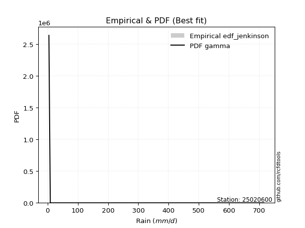</img>

</div>


### 11. Empirical - EDF Cunnane (1978)

Cunnane´s work in statistical hydrology has focused on the performance and evaluation of different probability distributions (such as GEV, Gumbel, Lognormal) for flood frequency estimation. _b_ is a constant, typically set to 0.4.

<div align="center">


$P=(m-b)/(n+1-2b)$


</div>


**11.1. Empirical values**

<div align="center">

|                | 0                   | 1                  | 2                   | 3                  | 4           | 5                  | 6                 | 7                  | 8                  |
|:---------------|:--------------------|:-------------------|:--------------------|:-------------------|:------------|:-------------------|:------------------|:-------------------|:-------------------|
| date           | 2021                | 2022               | 2020                | 2025               | 2017        | 2018               | 2023              | 2024               | 2019               |
| x              | 4.4                 | 9.0                | 10.9                | 56.3               | 69.75       | 79.95              | 83.1              | 193.8              | 715.4              |
| m              | 1                   | 2                  | 3                   | 4                  | 5           | 6                  | 7                 | 8                  | 9                  |
| empirical_dist | edf_cunnane         | edf_cunnane        | edf_cunnane         | edf_cunnane        | edf_cunnane | edf_cunnane        | edf_cunnane       | edf_cunnane        | edf_cunnane        |
| empirical      | 0.06521739130434782 | 0.1739130434782609 | 0.28260869565217395 | 0.391304347826087  | 0.5         | 0.6086956521739131 | 0.717391304347826 | 0.8260869565217391 | 0.9347826086956522 |
| empirical_tr   | 1.069767441860465   | 1.2105263157894737 | 1.393939393939394   | 1.6428571428571428 | 2.0         | 2.555555555555556  | 3.538461538461538 | 5.75               | 15.333333333333343 |

</div>


**11.2. Kolmogorov-Smirnov fit test (sorted by Δ)**


<div align="center">

|                | 0                   | 1                   | 2                   | 3                     | 4                   | 5                   | 6                   | 7                   | 8                   | 9                   | 10                  | 11                  | 12                  | 13                  | 14                  | 15                  | 16                  | 17                  | 18                  | 19                  | 20                  | 21                  | 22                  | 23                  | 24                  | 25                  | 26                  | 27                  | 28                  | 29                  | 30                  | 31                  | 32                  | 33                  | 34                  | 35                  | 36                  | 37                  | 38                  | 39                  | 40                  | 41                  | 42                  | 43                  | 44                  | 45                  | 46                  | 47                  | 48                  | 49                  | 50                  | 51                  | 52                  | 53                  | 54                  | 55                  | 56                  | 57                  | 58                  | 59                  | 60                  | 61                  | 62                  | 63                  | 64                  | 65                  | 66                  | 67                  | 68                  | 69                  | 70                  | 71                  | 72                  | 73                  | 74                  | 75                  | 76                  | 77                  | 78                  | 79                  | 80                  | 81                  | 82                  | 83                  | 84                  | 85                  | 86                  | 87                  | 88                  | 89                  |
|:---------------|:--------------------|:--------------------|:--------------------|:----------------------|:--------------------|:--------------------|:--------------------|:--------------------|:--------------------|:--------------------|:--------------------|:--------------------|:--------------------|:--------------------|:--------------------|:--------------------|:--------------------|:--------------------|:--------------------|:--------------------|:--------------------|:--------------------|:--------------------|:--------------------|:--------------------|:--------------------|:--------------------|:--------------------|:--------------------|:--------------------|:--------------------|:--------------------|:--------------------|:--------------------|:--------------------|:--------------------|:--------------------|:--------------------|:--------------------|:--------------------|:--------------------|:--------------------|:--------------------|:--------------------|:--------------------|:--------------------|:--------------------|:--------------------|:--------------------|:--------------------|:--------------------|:--------------------|:--------------------|:--------------------|:--------------------|:--------------------|:--------------------|:--------------------|:--------------------|:--------------------|:--------------------|:--------------------|:--------------------|:--------------------|:--------------------|:--------------------|:--------------------|:--------------------|:--------------------|:--------------------|:--------------------|:--------------------|:--------------------|:--------------------|:--------------------|:--------------------|:--------------------|:--------------------|:--------------------|:--------------------|:--------------------|:--------------------|:--------------------|:--------------------|:--------------------|:--------------------|:--------------------|:--------------------|:--------------------|:--------------------|
| station        | 25020600            | 25020600            | 25020600            | 25020600              | 25020600            | 25020600            | 25020600            | 25020600            | 25020600            | 25020600            | 25020600            | 25020600            | 25020600            | 25020600            | 25020600            | 25020600            | 25020600            | 25020600            | 25020600            | 25020600            | 25020600            | 25020600            | 25020600            | 25020600            | 25020600            | 25020600            | 25020600            | 25020600            | 25020600            | 25020600            | 25020600            | 25020600            | 25020600            | 25020600            | 25020600            | 25020600            | 25020600            | 25020600            | 25020600            | 25020600            | 25020600            | 25020600            | 25020600            | 25020600            | 25020600            | 25020600            | 25020600            | 25020600            | 25020600            | 25020600            | 25020600            | 25020600            | 25020600            | 25020600            | 25020600            | 25020600            | 25020600            | 25020600            | 25020600            | 25020600            | 25020600            | 25020600            | 25020600            | 25020600            | 25020600            | 25020600            | 25020600            | 25020600            | 25020600            | 25020600            | 25020600            | 25020600            | 25020600            | 25020600            | 25020600            | 25020600            | 25020600            | 25020600            | 25020600            | 25020600            | 25020600            | 25020600            | 25020600            | 25020600            | 25020600            | 25020600            | 25020600            | 25020600            | 25020600            | 25020600            |
| empirical_dist | edf_cunnane         | edf_cunnane         | edf_cunnane         | edf_cunnane           | edf_cunnane         | edf_cunnane         | edf_cunnane         | edf_cunnane         | edf_cunnane         | edf_cunnane         | edf_cunnane         | edf_cunnane         | edf_cunnane         | edf_cunnane         | edf_cunnane         | edf_cunnane         | edf_cunnane         | edf_cunnane         | edf_cunnane         | edf_cunnane         | edf_cunnane         | edf_cunnane         | edf_cunnane         | edf_cunnane         | edf_cunnane         | edf_cunnane         | edf_cunnane         | edf_cunnane         | edf_cunnane         | edf_cunnane         | edf_cunnane         | edf_cunnane         | edf_cunnane         | edf_cunnane         | edf_cunnane         | edf_cunnane         | edf_cunnane         | edf_cunnane         | edf_cunnane         | edf_cunnane         | edf_cunnane         | edf_cunnane         | edf_cunnane         | edf_cunnane         | edf_cunnane         | edf_cunnane         | edf_cunnane         | edf_cunnane         | edf_cunnane         | edf_cunnane         | edf_cunnane         | edf_cunnane         | edf_cunnane         | edf_cunnane         | edf_cunnane         | edf_cunnane         | edf_cunnane         | edf_cunnane         | edf_cunnane         | edf_cunnane         | edf_cunnane         | edf_cunnane         | edf_cunnane         | edf_cunnane         | edf_cunnane         | edf_cunnane         | edf_cunnane         | edf_cunnane         | edf_cunnane         | edf_cunnane         | edf_cunnane         | edf_cunnane         | edf_cunnane         | edf_cunnane         | edf_cunnane         | edf_cunnane         | edf_cunnane         | edf_cunnane         | edf_cunnane         | edf_cunnane         | edf_cunnane         | edf_cunnane         | edf_cunnane         | edf_cunnane         | edf_cunnane         | edf_cunnane         | edf_cunnane         | edf_cunnane         | edf_cunnane         | edf_cunnane         |
| p_dist         | t                   | loggenlogistic      | loggumbel_l         | loglaplace_asymmetric | gamma               | logfisk             | mielke              | logloggamma         | nakagami            | logcrystalball      | logexponnorm        | lognorm             | lognorm             | logt                | logjohnsonsu        | lognct              | logerlang           | logpearson3         | loggamma            | loggamma            | logf                | logfatiguelife      | logbetaprime        | loglogistic         | loghypsecant        | chi2                | loggompertz         | pareto              | loginvgamma         | logrice             | loglaplace          | logweibull_min      | gibrat              | logmaxwell          | logalpha            | erlang              | f                   | loginvgauss         | logmielke           | logncf              | wald                | lograyleigh         | loginvweibull       | fisk                | loggenexpon         | invgamma            | logkstwobign        | fatiguelife         | ncf                 | loghalfnorm         | loggumbel_r         | invgauss            | betaprime           | moyal               | logmoyal            | loghalflogistic     | pearson3            | nct                 | halflogistic        | gumbel_r            | logexpon            | halfnorm            | genlogistic         | gompertz            | exponnorm           | expon               | genexpon            | laplace_asymmetric  | rayleigh            | maxwell             | truncnorm           | logwald             | crystalball         | norm                | logtruncnorm        | logistic            | kstwobign           | hypsecant           | loggibrat           | rice                | laplace             | weibull_min         | gumbel_l            | lognakagami         | loglognorm          | invweibull          | logpareto           | alpha               | logchi2             | johnsonsu           |
| delta          | 0.12894381634804958 | 0.13006650530790537 | 0.1364320042878294  | 0.13872940574394874   | 0.1395760376851145  | 0.14049219053028478 | 0.1441819186386089  | 0.1445755749458228  | 0.14562656366671856 | 0.14641753008363784 | 0.14641759216835554 | 0.1464176236263242  | 0.1464176236263242  | 0.14641896271105875 | 0.14666161920404502 | 0.14682998382761653 | 0.14685723902216025 | 0.1468592928508467  | 0.14686058869187085 | 0.14686058869187085 | 0.14878707479354208 | 0.1494797310512876  | 0.15114911953200733 | 0.15153041842641984 | 0.15587015640429586 | 0.15652851079228747 | 0.15919730653577785 | 0.1626413400349031  | 0.1656041959450823  | 0.16772086879053266 | 0.17136598101608952 | 0.17164384653025316 | 0.1753884389203132  | 0.1775801826602857  | 0.17878675914887227 | 0.17907309092457685 | 0.1821090790023389  | 0.18312418149962068 | 0.18468856026265673 | 0.18513787739327997 | 0.18530333544991356 | 0.18767648805197984 | 0.20078939839340743 | 0.2038213431144265  | 0.2094845115369332  | 0.21224790893728435 | 0.21313785224836307 | 0.21439033622576548 | 0.21593156364781158 | 0.216125168430867   | 0.21689838944617706 | 0.2197311978801751  | 0.2249967137631133  | 0.2324691359693768  | 0.2420998149990557  | 0.2429667538894827  | 0.2496379112273755  | 0.25098239279321594 | 0.2539264216108213  | 0.2554878806591767  | 0.26212683859255076 | 0.2634216172392476  | 0.26584469165307234 | 0.26604456397182896 | 0.2661791344969494  | 0.2668992545410519  | 0.26689939647652783 | 0.26689998657330494 | 0.269245967552006   | 0.281535647272745   | 0.2983657057056676  | 0.3120406040902635  | 0.31522285439224457 | 0.3155924916567553  | 0.3178774034323529  | 0.3282874542600643  | 0.3378500086781842  | 0.3386911060855113  | 0.3400842946288363  | 0.36545082457131495 | 0.3656479095967608  | 0.3703123429213234  | 0.382286010293088   | 0.41751890482103565 | 0.4259176415446897  | 0.4412036978917611  | 0.4506037876179666  | 0.45177288239577124 | 0.4733155540460697  | 0.5310940157050626  |
| deltao         | 0.41761268023100007 | 0.41761268023100007 | 0.41761268023100007 | 0.41761268023100007   | 0.41761268023100007 | 0.41761268023100007 | 0.41761268023100007 | 0.41761268023100007 | 0.41761268023100007 | 0.41761268023100007 | 0.41761268023100007 | 0.41761268023100007 | 0.41761268023100007 | 0.41761268023100007 | 0.41761268023100007 | 0.41761268023100007 | 0.41761268023100007 | 0.41761268023100007 | 0.41761268023100007 | 0.41761268023100007 | 0.41761268023100007 | 0.41761268023100007 | 0.41761268023100007 | 0.41761268023100007 | 0.41761268023100007 | 0.41761268023100007 | 0.41761268023100007 | 0.41761268023100007 | 0.41761268023100007 | 0.41761268023100007 | 0.41761268023100007 | 0.41761268023100007 | 0.41761268023100007 | 0.41761268023100007 | 0.41761268023100007 | 0.41761268023100007 | 0.41761268023100007 | 0.41761268023100007 | 0.41761268023100007 | 0.41761268023100007 | 0.41761268023100007 | 0.41761268023100007 | 0.41761268023100007 | 0.41761268023100007 | 0.41761268023100007 | 0.41761268023100007 | 0.41761268023100007 | 0.41761268023100007 | 0.41761268023100007 | 0.41761268023100007 | 0.41761268023100007 | 0.41761268023100007 | 0.41761268023100007 | 0.41761268023100007 | 0.41761268023100007 | 0.41761268023100007 | 0.41761268023100007 | 0.41761268023100007 | 0.41761268023100007 | 0.41761268023100007 | 0.41761268023100007 | 0.41761268023100007 | 0.41761268023100007 | 0.41761268023100007 | 0.41761268023100007 | 0.41761268023100007 | 0.41761268023100007 | 0.41761268023100007 | 0.41761268023100007 | 0.41761268023100007 | 0.41761268023100007 | 0.41761268023100007 | 0.41761268023100007 | 0.41761268023100007 | 0.41761268023100007 | 0.41761268023100007 | 0.41761268023100007 | 0.41761268023100007 | 0.41761268023100007 | 0.41761268023100007 | 0.41761268023100007 | 0.41761268023100007 | 0.41761268023100007 | 0.41761268023100007 | 0.41761268023100007 | 0.41761268023100007 | 0.41761268023100007 | 0.41761268023100007 | 0.41761268023100007 | 0.41761268023100007 |
| eval           | Δo > Δ              | Δo > Δ              | Δo > Δ              | Δo > Δ                | Δo > Δ              | Δo > Δ              | Δo > Δ              | Δo > Δ              | Δo > Δ              | Δo > Δ              | Δo > Δ              | Δo > Δ              | Δo > Δ              | Δo > Δ              | Δo > Δ              | Δo > Δ              | Δo > Δ              | Δo > Δ              | Δo > Δ              | Δo > Δ              | Δo > Δ              | Δo > Δ              | Δo > Δ              | Δo > Δ              | Δo > Δ              | Δo > Δ              | Δo > Δ              | Δo > Δ              | Δo > Δ              | Δo > Δ              | Δo > Δ              | Δo > Δ              | Δo > Δ              | Δo > Δ              | Δo > Δ              | Δo > Δ              | Δo > Δ              | Δo > Δ              | Δo > Δ              | Δo > Δ              | Δo > Δ              | Δo > Δ              | Δo > Δ              | Δo > Δ              | Δo > Δ              | Δo > Δ              | Δo > Δ              | Δo > Δ              | Δo > Δ              | Δo > Δ              | Δo > Δ              | Δo > Δ              | Δo > Δ              | Δo > Δ              | Δo > Δ              | Δo > Δ              | Δo > Δ              | Δo > Δ              | Δo > Δ              | Δo > Δ              | Δo > Δ              | Δo > Δ              | Δo > Δ              | Δo > Δ              | Δo > Δ              | Δo > Δ              | Δo > Δ              | Δo > Δ              | Δo > Δ              | Δo > Δ              | Δo > Δ              | Δo > Δ              | Δo > Δ              | Δo > Δ              | Δo > Δ              | Δo > Δ              | Δo > Δ              | Δo > Δ              | Δo > Δ              | Δo > Δ              | Δo > Δ              | Δo > Δ              | Δo > Δ              | Δo > Δ              | Δo <= Δ             | Δo <= Δ             | Δo <= Δ             | Δo <= Δ             | Δo <= Δ             | Δo <= Δ             |
| fit            | 1                   | 1                   | 1                   | 1                     | 1                   | 1                   | 1                   | 1                   | 1                   | 1                   | 1                   | 1                   | 1                   | 1                   | 1                   | 1                   | 1                   | 1                   | 1                   | 1                   | 1                   | 1                   | 1                   | 1                   | 1                   | 1                   | 1                   | 1                   | 1                   | 1                   | 1                   | 1                   | 1                   | 1                   | 1                   | 1                   | 1                   | 1                   | 1                   | 1                   | 1                   | 1                   | 1                   | 1                   | 1                   | 1                   | 1                   | 1                   | 1                   | 1                   | 1                   | 1                   | 1                   | 1                   | 1                   | 1                   | 1                   | 1                   | 1                   | 1                   | 1                   | 1                   | 1                   | 1                   | 1                   | 1                   | 1                   | 1                   | 1                   | 1                   | 1                   | 1                   | 1                   | 1                   | 1                   | 1                   | 1                   | 1                   | 1                   | 1                   | 1                   | 1                   | 1                   | 1                   | 0                   | 0                   | 0                   | 0                   | 0                   | 0                   |
| n              | 9                   | 9                   | 9                   | 9                     | 9                   | 9                   | 9                   | 9                   | 9                   | 9                   | 9                   | 9                   | 9                   | 9                   | 9                   | 9                   | 9                   | 9                   | 9                   | 9                   | 9                   | 9                   | 9                   | 9                   | 9                   | 9                   | 9                   | 9                   | 9                   | 9                   | 9                   | 9                   | 9                   | 9                   | 9                   | 9                   | 9                   | 9                   | 9                   | 9                   | 9                   | 9                   | 9                   | 9                   | 9                   | 9                   | 9                   | 9                   | 9                   | 9                   | 9                   | 9                   | 9                   | 9                   | 9                   | 9                   | 9                   | 9                   | 9                   | 9                   | 9                   | 9                   | 9                   | 9                   | 9                   | 9                   | 9                   | 9                   | 9                   | 9                   | 9                   | 9                   | 9                   | 9                   | 9                   | 9                   | 9                   | 9                   | 9                   | 9                   | 9                   | 9                   | 9                   | 9                   | 9                   | 9                   | 9                   | 9                   | 9                   | 9                   |
| best_fit       | 1                   | 0                   | 0                   | 0                     | 0                   | 0                   | 0                   | 0                   | 0                   | 0                   | 0                   | 0                   | 0                   | 0                   | 0                   | 0                   | 0                   | 0                   | 0                   | 0                   | 0                   | 0                   | 0                   | 0                   | 0                   | 0                   | 0                   | 0                   | 0                   | 0                   | 0                   | 0                   | 0                   | 0                   | 0                   | 0                   | 0                   | 0                   | 0                   | 0                   | 0                   | 0                   | 0                   | 0                   | 0                   | 0                   | 0                   | 0                   | 0                   | 0                   | 0                   | 0                   | 0                   | 0                   | 0                   | 0                   | 0                   | 0                   | 0                   | 0                   | 0                   | 0                   | 0                   | 0                   | 0                   | 0                   | 0                   | 0                   | 0                   | 0                   | 0                   | 0                   | 0                   | 0                   | 0                   | 0                   | 0                   | 0                   | 0                   | 0                   | 0                   | 0                   | 0                   | 0                   | 0                   | 0                   | 0                   | 0                   | 0                   | 0                   |
| best_fit_sort  | 1                   | 2                   | 3                   | 4                     | 5                   | 6                   | 7                   | 8                   | 9                   | 10                  | 11                  | 12                  | 13                  | 14                  | 15                  | 16                  | 17                  | 18                  | 19                  | 20                  | 21                  | 22                  | 23                  | 24                  | 25                  | 26                  | 27                  | 28                  | 29                  | 30                  | 31                  | 32                  | 33                  | 34                  | 35                  | 36                  | 37                  | 38                  | 39                  | 40                  | 41                  | 42                  | 43                  | 44                  | 45                  | 46                  | 47                  | 48                  | 49                  | 50                  | 51                  | 52                  | 53                  | 54                  | 55                  | 56                  | 57                  | 58                  | 59                  | 60                  | 61                  | 62                  | 63                  | 64                  | 65                  | 66                  | 67                  | 68                  | 69                  | 70                  | 71                  | 72                  | 73                  | 74                  | 75                  | 76                  | 77                  | 78                  | 79                  | 80                  | 81                  | 82                  | 83                  | 84                  | 85                  | 86                  | 87                  | 88                  | 89                  | 90                  |

</div>


<div align="center">

</img>

</div>


**11.3. Best fit**

<div align="center">

|   id |   station | empirical_dist   | p_dist   |    delta |   deltao | eval   |   fit |   n |   best_fit |   best_fit_sort |
|-----:|----------:|:-----------------|:---------|---------:|---------:|:-------|------:|----:|-----------:|----------------:|
|    0 |  25020600 | edf_cunnane      | t        | 0.128944 | 0.417613 | Δo > Δ |     1 |   9 |          1 |               1 |

</div>


<div align="center">

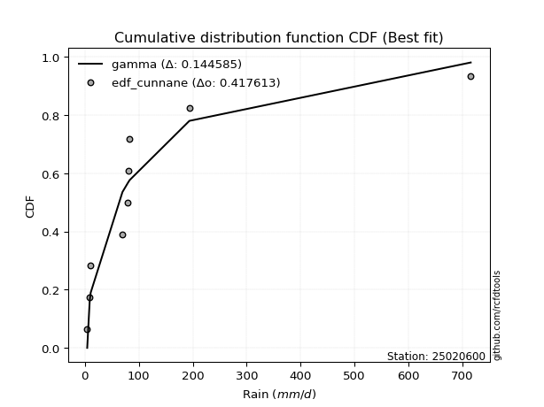</img></img>

</div>


### 12. Empirical - EDF Adamowski (1981)

The Adamowski formula in hydrology refers to a specific plotting position formula used for estimating the non-parametric empirical distribution of hydrological events (like flood peaks) to calculate their return periods. This formula provides an alternative to traditional parametric methods (like the Gumbel or Log Pearson Type III distributions). 

<div align="center">


$P=(m-0.25)/(n+0.5)$


</div>


**12.1. Empirical values**

<div align="center">

|                | 0                   | 1                   | 2                  | 3                   | 4             | 5                  | 6                  | 7                  | 8                  |
|:---------------|:--------------------|:--------------------|:-------------------|:--------------------|:--------------|:-------------------|:-------------------|:-------------------|:-------------------|
| date           | 2021                | 2022                | 2020               | 2025                | 2017          | 2018               | 2023               | 2024               | 2019               |
| x              | 4.4                 | 9.0                 | 10.9               | 56.3                | 69.75         | 79.95              | 83.1               | 193.8              | 715.4              |
| m              | 1                   | 2                   | 3                  | 4                   | 5             | 6                  | 7                  | 8                  | 9                  |
| empirical_dist | edf_adamowski       | edf_adamowski       | edf_adamowski      | edf_adamowski       | edf_adamowski | edf_adamowski      | edf_adamowski      | edf_adamowski      | edf_adamowski      |
| empirical      | 0.07894736842105263 | 0.18421052631578946 | 0.2894736842105263 | 0.39473684210526316 | 0.5           | 0.6052631578947368 | 0.7105263157894737 | 0.8157894736842105 | 0.9210526315789473 |
| empirical_tr   | 1.0857142857142856  | 1.2258064516129032  | 1.4074074074074074 | 1.6521739130434783  | 2.0           | 2.533333333333333  | 3.4545454545454546 | 5.428571428571428  | 12.666666666666663 |

</div>


**12.2. Kolmogorov-Smirnov fit test (sorted by Δ)**


<div align="center">

|                | 0                   | 1                   | 2                   | 3                   | 4                   | 5                   | 6                   | 7                   | 8                   | 9                   | 10                  | 11                  | 12                  | 13                  | 14                  | 15                  | 16                  | 17                  | 18                  | 19                  | 20                    | 21                  | 22                  | 23                  | 24                  | 25                  | 26                  | 27                  | 28                  | 29                  | 30                  | 31                  | 32                  | 33                  | 34                  | 35                  | 36                  | 37                  | 38                  | 39                  | 40                  | 41                  | 42                  | 43                  | 44                  | 45                  | 46                  | 47                  | 48                  | 49                  | 50                  | 51                  | 52                  | 53                  | 54                  | 55                  | 56                  | 57                  | 58                  | 59                  | 60                  | 61                  | 62                  | 63                  | 64                  | 65                  | 66                  | 67                  | 68                  | 69                  | 70                  | 71                  | 72                  | 73                  | 74                  | 75                  | 76                  | 77                  | 78                  | 79                  | 80                  | 81                  | 82                  | 83                  | 84                  | 85                  | 86                  | 87                  | 88                  | 89                  |
|:---------------|:--------------------|:--------------------|:--------------------|:--------------------|:--------------------|:--------------------|:--------------------|:--------------------|:--------------------|:--------------------|:--------------------|:--------------------|:--------------------|:--------------------|:--------------------|:--------------------|:--------------------|:--------------------|:--------------------|:--------------------|:----------------------|:--------------------|:--------------------|:--------------------|:--------------------|:--------------------|:--------------------|:--------------------|:--------------------|:--------------------|:--------------------|:--------------------|:--------------------|:--------------------|:--------------------|:--------------------|:--------------------|:--------------------|:--------------------|:--------------------|:--------------------|:--------------------|:--------------------|:--------------------|:--------------------|:--------------------|:--------------------|:--------------------|:--------------------|:--------------------|:--------------------|:--------------------|:--------------------|:--------------------|:--------------------|:--------------------|:--------------------|:--------------------|:--------------------|:--------------------|:--------------------|:--------------------|:--------------------|:--------------------|:--------------------|:--------------------|:--------------------|:--------------------|:--------------------|:--------------------|:--------------------|:--------------------|:--------------------|:--------------------|:--------------------|:--------------------|:--------------------|:--------------------|:--------------------|:--------------------|:--------------------|:--------------------|:--------------------|:--------------------|:--------------------|:--------------------|:--------------------|:--------------------|:--------------------|:--------------------|
| station        | 25020600            | 25020600            | 25020600            | 25020600            | 25020600            | 25020600            | 25020600            | 25020600            | 25020600            | 25020600            | 25020600            | 25020600            | 25020600            | 25020600            | 25020600            | 25020600            | 25020600            | 25020600            | 25020600            | 25020600            | 25020600              | 25020600            | 25020600            | 25020600            | 25020600            | 25020600            | 25020600            | 25020600            | 25020600            | 25020600            | 25020600            | 25020600            | 25020600            | 25020600            | 25020600            | 25020600            | 25020600            | 25020600            | 25020600            | 25020600            | 25020600            | 25020600            | 25020600            | 25020600            | 25020600            | 25020600            | 25020600            | 25020600            | 25020600            | 25020600            | 25020600            | 25020600            | 25020600            | 25020600            | 25020600            | 25020600            | 25020600            | 25020600            | 25020600            | 25020600            | 25020600            | 25020600            | 25020600            | 25020600            | 25020600            | 25020600            | 25020600            | 25020600            | 25020600            | 25020600            | 25020600            | 25020600            | 25020600            | 25020600            | 25020600            | 25020600            | 25020600            | 25020600            | 25020600            | 25020600            | 25020600            | 25020600            | 25020600            | 25020600            | 25020600            | 25020600            | 25020600            | 25020600            | 25020600            | 25020600            |
| empirical_dist | edf_adamowski       | edf_adamowski       | edf_adamowski       | edf_adamowski       | edf_adamowski       | edf_adamowski       | edf_adamowski       | edf_adamowski       | edf_adamowski       | edf_adamowski       | edf_adamowski       | edf_adamowski       | edf_adamowski       | edf_adamowski       | edf_adamowski       | edf_adamowski       | edf_adamowski       | edf_adamowski       | edf_adamowski       | edf_adamowski       | edf_adamowski         | edf_adamowski       | edf_adamowski       | edf_adamowski       | edf_adamowski       | edf_adamowski       | edf_adamowski       | edf_adamowski       | edf_adamowski       | edf_adamowski       | edf_adamowski       | edf_adamowski       | edf_adamowski       | edf_adamowski       | edf_adamowski       | edf_adamowski       | edf_adamowski       | edf_adamowski       | edf_adamowski       | edf_adamowski       | edf_adamowski       | edf_adamowski       | edf_adamowski       | edf_adamowski       | edf_adamowski       | edf_adamowski       | edf_adamowski       | edf_adamowski       | edf_adamowski       | edf_adamowski       | edf_adamowski       | edf_adamowski       | edf_adamowski       | edf_adamowski       | edf_adamowski       | edf_adamowski       | edf_adamowski       | edf_adamowski       | edf_adamowski       | edf_adamowski       | edf_adamowski       | edf_adamowski       | edf_adamowski       | edf_adamowski       | edf_adamowski       | edf_adamowski       | edf_adamowski       | edf_adamowski       | edf_adamowski       | edf_adamowski       | edf_adamowski       | edf_adamowski       | edf_adamowski       | edf_adamowski       | edf_adamowski       | edf_adamowski       | edf_adamowski       | edf_adamowski       | edf_adamowski       | edf_adamowski       | edf_adamowski       | edf_adamowski       | edf_adamowski       | edf_adamowski       | edf_adamowski       | edf_adamowski       | edf_adamowski       | edf_adamowski       | edf_adamowski       | edf_adamowski       |
| p_dist         | t                   | gamma               | loggenlogistic      | logfisk             | nakagami            | mielke              | logloggamma         | logcrystalball      | logexponnorm        | lognorm             | lognorm             | logt                | logjohnsonsu        | loggumbel_l         | lognct              | logerlang           | logpearson3         | loggamma            | loggamma            | logf                | loglaplace_asymmetric | logfatiguelife      | logbetaprime        | loglogistic         | chi2                | loggompertz         | loghypsecant        | pareto              | loginvgamma         | logrice             | loglaplace          | logweibull_min      | gibrat              | wald                | logmaxwell          | logalpha            | erlang              | f                   | loginvgauss         | logmielke           | logncf              | lograyleigh         | loginvweibull       | fisk                | loggenexpon         | invgamma            | logkstwobign        | fatiguelife         | ncf                 | loghalfnorm         | loggumbel_r         | invgauss            | betaprime           | moyal               | pearson3            | logmoyal            | loghalflogistic     | halflogistic        | nct                 | gumbel_r            | halfnorm            | logexpon            | genlogistic         | gompertz            | exponnorm           | expon               | genexpon            | laplace_asymmetric  | rayleigh            | maxwell             | truncnorm           | crystalball         | logwald             | norm                | logtruncnorm        | logistic            | kstwobign           | hypsecant           | loggibrat           | rice                | laplace             | weibull_min         | gumbel_l            | lognakagami         | loglognorm          | invweibull          | logpareto           | alpha               | logchi2             | johnsonsu           |
| delta          | 0.11521383923134479 | 0.13271104912676213 | 0.13585319608318372 | 0.1370596962511086  | 0.13876157510836618 | 0.14074942435943272 | 0.1411430806666466  | 0.14298503580446165 | 0.14298509788917935 | 0.14298512934714802 | 0.14298512934714802 | 0.14298646843188256 | 0.14322912492486883 | 0.14329699284618178 | 0.14339748954844034 | 0.14342474474298406 | 0.1434267985716705  | 0.14342809441269466 | 0.14342809441269466 | 0.1453545805143659  | 0.14559439430230112   | 0.1460472367721114  | 0.14771662525283114 | 0.14809792414724365 | 0.1496635222339351  | 0.15576481225660166 | 0.1566729064058297  | 0.16051232027173012 | 0.1621717016659061  | 0.16428837451135647 | 0.16793348673691333 | 0.16821135225107697 | 0.1685234503619608  | 0.17157335833320878 | 0.1741476883811095  | 0.17535426486969607 | 0.17564059664540066 | 0.17867658472316272 | 0.17969168722044448 | 0.18125606598348054 | 0.18170538311410378 | 0.18424399377280365 | 0.19735690411423124 | 0.20038884883525032 | 0.20605201725775701 | 0.20881541465810816 | 0.20970535796918688 | 0.2109578419465893  | 0.21249906936863538 | 0.2126926741516908  | 0.21346589516700087 | 0.2162987036009989  | 0.22156421948393712 | 0.2256041474110244  | 0.2359079341106707  | 0.2386673207198795  | 0.2395342596103065  | 0.2401964444941165  | 0.24754989851403975 | 0.24862289210082433 | 0.24969164012254283 | 0.25869434431337457 | 0.25897970309471996 | 0.2591795754134766  | 0.25931414593859703 | 0.2600342659826995  | 0.26003440791817545 | 0.26003499801495256 | 0.26238097899365365 | 0.2746706587143926  | 0.29150071714731524 | 0.3083578658338922  | 0.30860810981108733 | 0.3087275030984029  | 0.3144449091531767  | 0.3214224657017119  | 0.33098502011983183 | 0.3318261175271589  | 0.33665180034966014 | 0.35858583601296257 | 0.3587829210384084  | 0.36344735436297104 | 0.3754210217347356  | 0.41408641054185946 | 0.41562015870716107 | 0.42747372077505624 | 0.440306304780438   | 0.44834038811659505 | 0.4698830597668935  | 0.520796532867534   |
| deltao         | 0.41761268023100007 | 0.41761268023100007 | 0.41761268023100007 | 0.41761268023100007 | 0.41761268023100007 | 0.41761268023100007 | 0.41761268023100007 | 0.41761268023100007 | 0.41761268023100007 | 0.41761268023100007 | 0.41761268023100007 | 0.41761268023100007 | 0.41761268023100007 | 0.41761268023100007 | 0.41761268023100007 | 0.41761268023100007 | 0.41761268023100007 | 0.41761268023100007 | 0.41761268023100007 | 0.41761268023100007 | 0.41761268023100007   | 0.41761268023100007 | 0.41761268023100007 | 0.41761268023100007 | 0.41761268023100007 | 0.41761268023100007 | 0.41761268023100007 | 0.41761268023100007 | 0.41761268023100007 | 0.41761268023100007 | 0.41761268023100007 | 0.41761268023100007 | 0.41761268023100007 | 0.41761268023100007 | 0.41761268023100007 | 0.41761268023100007 | 0.41761268023100007 | 0.41761268023100007 | 0.41761268023100007 | 0.41761268023100007 | 0.41761268023100007 | 0.41761268023100007 | 0.41761268023100007 | 0.41761268023100007 | 0.41761268023100007 | 0.41761268023100007 | 0.41761268023100007 | 0.41761268023100007 | 0.41761268023100007 | 0.41761268023100007 | 0.41761268023100007 | 0.41761268023100007 | 0.41761268023100007 | 0.41761268023100007 | 0.41761268023100007 | 0.41761268023100007 | 0.41761268023100007 | 0.41761268023100007 | 0.41761268023100007 | 0.41761268023100007 | 0.41761268023100007 | 0.41761268023100007 | 0.41761268023100007 | 0.41761268023100007 | 0.41761268023100007 | 0.41761268023100007 | 0.41761268023100007 | 0.41761268023100007 | 0.41761268023100007 | 0.41761268023100007 | 0.41761268023100007 | 0.41761268023100007 | 0.41761268023100007 | 0.41761268023100007 | 0.41761268023100007 | 0.41761268023100007 | 0.41761268023100007 | 0.41761268023100007 | 0.41761268023100007 | 0.41761268023100007 | 0.41761268023100007 | 0.41761268023100007 | 0.41761268023100007 | 0.41761268023100007 | 0.41761268023100007 | 0.41761268023100007 | 0.41761268023100007 | 0.41761268023100007 | 0.41761268023100007 | 0.41761268023100007 |
| eval           | Δo > Δ              | Δo > Δ              | Δo > Δ              | Δo > Δ              | Δo > Δ              | Δo > Δ              | Δo > Δ              | Δo > Δ              | Δo > Δ              | Δo > Δ              | Δo > Δ              | Δo > Δ              | Δo > Δ              | Δo > Δ              | Δo > Δ              | Δo > Δ              | Δo > Δ              | Δo > Δ              | Δo > Δ              | Δo > Δ              | Δo > Δ                | Δo > Δ              | Δo > Δ              | Δo > Δ              | Δo > Δ              | Δo > Δ              | Δo > Δ              | Δo > Δ              | Δo > Δ              | Δo > Δ              | Δo > Δ              | Δo > Δ              | Δo > Δ              | Δo > Δ              | Δo > Δ              | Δo > Δ              | Δo > Δ              | Δo > Δ              | Δo > Δ              | Δo > Δ              | Δo > Δ              | Δo > Δ              | Δo > Δ              | Δo > Δ              | Δo > Δ              | Δo > Δ              | Δo > Δ              | Δo > Δ              | Δo > Δ              | Δo > Δ              | Δo > Δ              | Δo > Δ              | Δo > Δ              | Δo > Δ              | Δo > Δ              | Δo > Δ              | Δo > Δ              | Δo > Δ              | Δo > Δ              | Δo > Δ              | Δo > Δ              | Δo > Δ              | Δo > Δ              | Δo > Δ              | Δo > Δ              | Δo > Δ              | Δo > Δ              | Δo > Δ              | Δo > Δ              | Δo > Δ              | Δo > Δ              | Δo > Δ              | Δo > Δ              | Δo > Δ              | Δo > Δ              | Δo > Δ              | Δo > Δ              | Δo > Δ              | Δo > Δ              | Δo > Δ              | Δo > Δ              | Δo > Δ              | Δo > Δ              | Δo > Δ              | Δo > Δ              | Δo <= Δ             | Δo <= Δ             | Δo <= Δ             | Δo <= Δ             | Δo <= Δ             |
| fit            | 1                   | 1                   | 1                   | 1                   | 1                   | 1                   | 1                   | 1                   | 1                   | 1                   | 1                   | 1                   | 1                   | 1                   | 1                   | 1                   | 1                   | 1                   | 1                   | 1                   | 1                     | 1                   | 1                   | 1                   | 1                   | 1                   | 1                   | 1                   | 1                   | 1                   | 1                   | 1                   | 1                   | 1                   | 1                   | 1                   | 1                   | 1                   | 1                   | 1                   | 1                   | 1                   | 1                   | 1                   | 1                   | 1                   | 1                   | 1                   | 1                   | 1                   | 1                   | 1                   | 1                   | 1                   | 1                   | 1                   | 1                   | 1                   | 1                   | 1                   | 1                   | 1                   | 1                   | 1                   | 1                   | 1                   | 1                   | 1                   | 1                   | 1                   | 1                   | 1                   | 1                   | 1                   | 1                   | 1                   | 1                   | 1                   | 1                   | 1                   | 1                   | 1                   | 1                   | 1                   | 1                   | 0                   | 0                   | 0                   | 0                   | 0                   |
| n              | 9                   | 9                   | 9                   | 9                   | 9                   | 9                   | 9                   | 9                   | 9                   | 9                   | 9                   | 9                   | 9                   | 9                   | 9                   | 9                   | 9                   | 9                   | 9                   | 9                   | 9                     | 9                   | 9                   | 9                   | 9                   | 9                   | 9                   | 9                   | 9                   | 9                   | 9                   | 9                   | 9                   | 9                   | 9                   | 9                   | 9                   | 9                   | 9                   | 9                   | 9                   | 9                   | 9                   | 9                   | 9                   | 9                   | 9                   | 9                   | 9                   | 9                   | 9                   | 9                   | 9                   | 9                   | 9                   | 9                   | 9                   | 9                   | 9                   | 9                   | 9                   | 9                   | 9                   | 9                   | 9                   | 9                   | 9                   | 9                   | 9                   | 9                   | 9                   | 9                   | 9                   | 9                   | 9                   | 9                   | 9                   | 9                   | 9                   | 9                   | 9                   | 9                   | 9                   | 9                   | 9                   | 9                   | 9                   | 9                   | 9                   | 9                   |
| best_fit       | 1                   | 0                   | 0                   | 0                   | 0                   | 0                   | 0                   | 0                   | 0                   | 0                   | 0                   | 0                   | 0                   | 0                   | 0                   | 0                   | 0                   | 0                   | 0                   | 0                   | 0                     | 0                   | 0                   | 0                   | 0                   | 0                   | 0                   | 0                   | 0                   | 0                   | 0                   | 0                   | 0                   | 0                   | 0                   | 0                   | 0                   | 0                   | 0                   | 0                   | 0                   | 0                   | 0                   | 0                   | 0                   | 0                   | 0                   | 0                   | 0                   | 0                   | 0                   | 0                   | 0                   | 0                   | 0                   | 0                   | 0                   | 0                   | 0                   | 0                   | 0                   | 0                   | 0                   | 0                   | 0                   | 0                   | 0                   | 0                   | 0                   | 0                   | 0                   | 0                   | 0                   | 0                   | 0                   | 0                   | 0                   | 0                   | 0                   | 0                   | 0                   | 0                   | 0                   | 0                   | 0                   | 0                   | 0                   | 0                   | 0                   | 0                   |
| best_fit_sort  | 1                   | 2                   | 3                   | 4                   | 5                   | 6                   | 7                   | 8                   | 9                   | 10                  | 11                  | 12                  | 13                  | 14                  | 15                  | 16                  | 17                  | 18                  | 19                  | 20                  | 21                    | 22                  | 23                  | 24                  | 25                  | 26                  | 27                  | 28                  | 29                  | 30                  | 31                  | 32                  | 33                  | 34                  | 35                  | 36                  | 37                  | 38                  | 39                  | 40                  | 41                  | 42                  | 43                  | 44                  | 45                  | 46                  | 47                  | 48                  | 49                  | 50                  | 51                  | 52                  | 53                  | 54                  | 55                  | 56                  | 57                  | 58                  | 59                  | 60                  | 61                  | 62                  | 63                  | 64                  | 65                  | 66                  | 67                  | 68                  | 69                  | 70                  | 71                  | 72                  | 73                  | 74                  | 75                  | 76                  | 77                  | 78                  | 79                  | 80                  | 81                  | 82                  | 83                  | 84                  | 85                  | 86                  | 87                  | 88                  | 89                  | 90                  |

</div>


<div align="center">

</img>

</div>


**12.3. Best fit**

<div align="center">

|   id |   station | empirical_dist   | p_dist   |    delta |   deltao | eval   |   fit |   n |   best_fit |   best_fit_sort |
|-----:|----------:|:-----------------|:---------|---------:|---------:|:-------|------:|----:|-----------:|----------------:|
|    0 |  25020600 | edf_adamowski    | t        | 0.115214 | 0.417613 | Δo > Δ |     1 |   9 |          1 |               1 |

</div>


<div align="center">

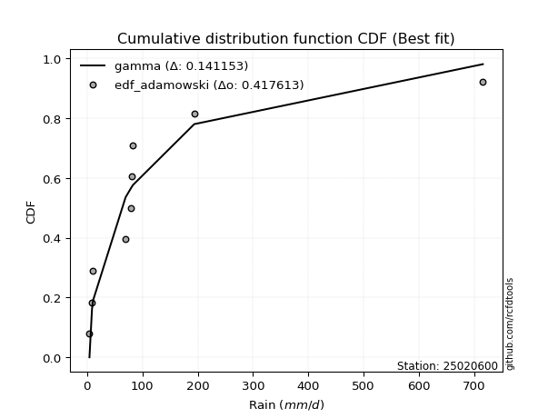</img>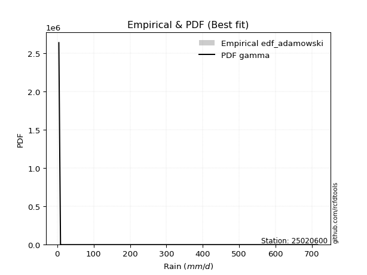</img>

</div>


## C. Best fit & Estimate extreme values for specific return periods - Tr


### 1. Best fit (ordered by delta Δ)

<div align="center">

|   id |   station | empirical_dist   | p_dist         |    delta |   deltao | eval   |   fit |   n |   best_fit |   best_fit_sort |
|-----:|----------:|:-----------------|:---------------|---------:|---------:|:-------|------:|----:|-----------:|----------------:|
|    0 |  25020600 | edf_adamowski    | t              | 0.115214 | 0.417613 | Δo > Δ |     1 |   9 |          1 |               1 |
|    1 |  25020600 | edf_weibull      | t              | 0.117238 | 0.417613 | Δo > Δ |     1 |   9 |          1 |               2 |
|    2 |  25020600 | edf_california   | t              | 0.11893  | 0.417613 | Δo > Δ |     1 |   9 |          1 |               3 |
|    3 |  25020600 | edf_chegodayev   | t              | 0.119693 | 0.417613 | Δo > Δ |     1 |   9 |          1 |               4 |
|    4 |  25020600 | edf_jenkinson    | t              | 0.1206   | 0.417613 | Δo > Δ |     1 |   9 |          1 |               5 |
|    5 |  25020600 | edf_beard        | t              | 0.1206   | 0.417613 | Δo > Δ |     1 |   9 |          1 |               6 |
|    6 |  25020600 | edf_filliben     | t              | 0.121283 | 0.417613 | Δo > Δ |     1 |   9 |          1 |               7 |
|    7 |  25020600 | edf_tukey        | t              | 0.122733 | 0.417613 | Δo > Δ |     1 |   9 |          1 |               8 |
|    8 |  25020600 | edf_blom         | t              | 0.126594 | 0.417613 | Δo > Δ |     1 |   9 |          1 |               9 |
|    9 |  25020600 | edf_cunnane      | t              | 0.128944 | 0.417613 | Δo > Δ |     1 |   9 |          1 |              10 |
|   10 |  25020600 | edf_gringorten   | loggenlogistic | 0.13102  | 0.417613 | Δo > Δ |     1 |   9 |          1 |              11 |
|   11 |  25020600 | edf_hazen        | loggenlogistic | 0.132482 | 0.417613 | Δo > Δ |     1 |   9 |          1 |              12 |

</div>

:file_folder:Tables: [bestfit_25020600.csv](table/bestfit_25020600.csv) | [extreme_25020600.csv](table/extreme_25020600.csv)


### 2. Extreme values

In hydrology, a return period (or recurrence interval $Tr$) is the statistical average time between extreme events like floods or droughts of a specific magnitude, indicating how rare an event is, with a 100-year flood, for example, having a 1% chance of occurring in any given year, not that it happens exactly every century. It is a key tool for infrastructure design (like bridges or dams) and risk assessment, calculated from historical data to determine the probability of future events, although it is important to remember it is statistical average, and events can cluster or be missed.

> risk_rate: assuming the return period as the project useful life.

|   id |      tr |   prob_l |     prob_g |     alpha |   betaprime |      chi2 |   crystalball |    erlang |    expon |   exponnorm |          f |   fatiguelife |        fisk |     gamma |   genexpon |   genlogistic |    gibrat |   gompertz |   gumbel_l |   gumbel_r |   halflogistic |   halfnorm |   hypsecant |    invgamma |   invgauss |      invweibull |        johnsonsu |   kstwobign |   laplace |   laplace_asymmetric |   loggamma |   logistic |   lognorm |   maxwell |     mielke |     moyal |   nakagami |         ncf |              nct |    norm |     pareto |   pearson3 |   rayleigh |    rice |         t |   truncnorm |      wald |   weibull_min |   logalpha |   logbetaprime |          logchi2 |   logcrystalball |   logerlang |         logexpon |   logexponnorm |      logf |   logfatiguelife |    logfisk |   loggenexpon |   loggenlogistic |        loggibrat |   loggompertz |   loggumbel_l |   loggumbel_r |   loghalflogistic |   loghalfnorm |   loghypsecant |   loginvgamma |   loginvgauss |   loginvweibull |   logjohnsonsu |   logkstwobign |   loglaplace |   loglaplace_asymmetric |   logloggamma |   loglogistic |     loglognorm |   logmaxwell |   logmielke |    logmoyal |      lognakagami |     logncf |    lognct |    logpareto |   logpearson3 |   lograyleigh |   logrice |      logt |   logtruncnorm |          logwald |   logweibull_min |   station |   n |   risk_rate |
|-----:|--------:|---------:|-----------:|----------:|------------:|----------:|--------------:|----------:|---------:|------------:|-----------:|--------------:|------------:|----------:|-----------:|--------------:|----------:|-----------:|-----------:|-----------:|---------------:|-----------:|------------:|------------:|-----------:|----------------:|-----------------:|------------:|----------:|---------------------:|-----------:|-----------:|----------:|----------:|-----------:|----------:|-----------:|------------:|-----------------:|--------:|-----------:|-----------:|-----------:|--------:|----------:|------------:|----------:|--------------:|-----------:|---------------:|-----------------:|-----------------:|------------:|-----------------:|---------------:|----------:|-----------------:|-----------:|--------------:|-----------------:|-----------------:|--------------:|--------------:|--------------:|------------------:|--------------:|---------------:|--------------:|--------------:|----------------:|---------------:|---------------:|-------------:|------------------------:|--------------:|--------------:|---------------:|-------------:|------------:|------------:|-----------------:|-----------:|----------:|-------------:|--------------:|--------------:|----------:|----------:|---------------:|-----------------:|-----------------:|----------:|----:|------------:|
|    0 |    2    | 0.5      | 0.5        |   16.5055 |     30.8847 |   58.764  |       135.717 |   34.5485 |  95.5103 |     95.3376 |    38.1463 |       29.7579 |     37.5414 |   59.2659 |    95.5104 |       96.4416 |   72.1832 |    95.2736 |    170.687 |    101.002 |        83.6802 |    92.4306 |     135.844 |     37.14   |    36.1412 |   961.239       |      4.44941     |     126.222 |   135.844 |              95.5105 |    48.6885 |    135.844 |   48.7715 |   117.706 |    49.5215 |   89.7538 |    53.0812 |     36.5465 |     28.0102      | 135.844 |    46.5704 |    66.2408 |    111.272 | 145.404 |   57.7136 |     104.664 |   67.095  |       156.601 |    42.887  |        47.8791 |      6.40481     |          48.7715 |     48.6889 |     23.3127      |        48.7715 |   48.3254 |          48.1962 |    50.2355 |       35.9306 |          52.2212 |     30.9417      |       45.502  |       62.5635 |       38.02   |           33.5923 |       35.7611 |        48.7715 |       45.1961 |       42.007  |         38.1359 |        48.7253 |        35.889  |      48.7715 |                 60.8351 |       49.1014 |       48.7715 |   4.57059      |      42.8411 |     32.3913 |     35.0829 |     10.0405      |    41.5552 |   48.693  |   4.7302     |       48.6886 |       40.9158 |   44.5588 |   48.7713 |        21.916  |     29.8376      |          43.8401 |  25020600 |   9 |    0.75     |
|    1 |    2.33 | 0.570815 | 0.429185   |   19.6447 |     44.5269 |   87.7887 |       173.618 |   56.467  | 115.585  |    115.411  |    55.5329 |       45.5221 |     50.5943 |   80.6723 |   115.585  |      117.064  |   91.3549 |   115.295  |    203.614 |    136.071 |       119.737  |   133.277  |     166.133 |     49.0601 |    47.6635 | 28926.8         |      4.62176     |     153.601 |   158.748 |             115.585  |    63.8158 |    169.19  |   63.9215 |   157.026 |    64.0656 |  122.951  |    82.6313 |     48.2758 |     38.6079      | 173.691 |    59.8105 |    97.3153 |    151.174 | 176.623 |   66.2742 |     126.522 |   91.9115 |       203.812 |    56.4622 |        62.8099 |      7.68109     |          63.9215 |     63.8169 |     33.6622      |        63.9215 |   63.3622 |          63.1986 |    64.8403 |       49.011  |          67.0293 |     35.4859      |       61.3905 |       79.1645 |       48.8507 |           43.4674 |       47.8853 |        60.56   |       59.4681 |       55.4849 |         51.2462 |        63.8637 |        48.3909 |      57.4461 |                 73.0398 |       64.3818 |       61.8978 |   5.94906      |      56.7434 |     54.1218 |     44.478  |     11.3986      |    55.018  |   63.8243 |   5.62602    |       63.8162 |       54.4191 |   59.0449 |   63.9212 |        29.2543 |     35.6284      |          58.1255 |  25020600 |   9 |    0.729209 |
|    2 |    5    | 0.8      | 0.2        |   43.9857 |    157.223  |  294.836  |       314.467 |  247.537  | 215.952  |    215.776  |   204.791  |      183.457  |    170.906  |  211.08   |   215.952  |      206.652  |  201.732  |   215.388  |    309.988 |    288.429 |       282.887  |   306.012  |     287.629 |    166.127  |   146.906  |     7.8117e+10  |     63.1515      |     269.898 |   273.258 |             215.952  |   174.583  |    297.943 |  174.678  |   311.787 |   174.245  |  276.726  |   279.467  |    164.077  |    185.017       | 314.34  |   160.25   |   258.176  |    310.919 | 301.606 |  109.04   |     234.591 |  230.835  |       481.72  |   166.673  |       174.192  |     26.2314      |         174.677  |    174.592  |    211.278       |       174.678  |  174.444  |         174.377  |   173.697  |      175.488  |         171.523  |     78.1064      |      182.598  |      169.327  |      145.146  |          139.508  |      164.583  |       144.318  |      173.309  |      167.971  |        185.002  |       174.626  |       172.241  |     130.231  |                144.515  |      175.372  |      155.359  |   2.83806e+288 |     171.519  |    394.859  |    133.499  |     50.0142      |   172.072  |  174.594  |   1.9489e+48 |      174.59   |      170.458  |  174.193  |  174.677  |        95.9063 |     96.167       |         173      |  25020600 |   9 |    0.67232  |
|    3 |   10    | 0.9      | 0.1        |   88.7062 |    343.438  |  539.072  |       407.903 |  503.034  | 307.062  |    306.883  |   470.54   |      358.357  |    432.479  |  349.182  |   307.062  |      279.617  |  327.549  |   306.239  |    369.212 |    412.521 |       418.376  |   433.832  |     384.646 |    457.266  |   320.45   |     1.35243e+16 |   2383.79        |     358.444 |   377.208 |             307.063  |   340.643  |    392.764 |  340.298  |   420.701 |   365.66   |  410.61   |   468.921  |    454.093  |    759.069       | 407.643 |   331.704  |   408.535  |    424.821 | 390.721 |  169.923  |     331.004 |  378.266  |       780.385 |   361.984  |       346.101  |    106.153       |         340.298  |    340.67   |   1119.42        |       340.298  |  343.315  |         344.238  |   358.89   |      443.983  |         337.204  |    191.976       |      357.914  |      258.562  |      352.372  |          367.43   |      410.343  |       288.718  |      368.912  |      374.575  |        526.337  |       340.471  |       452.831  |     273.769  |                266.803  |      339.511  |      305.965  | inf            |     373.586  |   1104.92   |    347.591  |    348.008       |   401.228  |  340.584  | inf          |      340.666  |      384.751  |  364.412  |  340.297  |       206.613  |    275.843       |         365.481  |  25020600 |   9 |    0.651322 |
|    4 |   15    | 0.933333 | 0.0666667  |  133.267  |    506.864  |  696.926  |       454.53  |  675.406  | 360.358  |    360.178  |   718.742  |      471.975  |    720.48   |  435.039  |   360.358  |      320.782  |  414.331  |   359.379  |    396.033 |    482.533 |       495.051  |   500.349  |     440.013 |    815.184  |   467.334  |     1.22056e+19 |  15091.8         |     405.451 |   438.014 |             360.359  |   475.632  |    444.427 |  474.665  |   476.583 |   548.084  |  488.311  |   573.522  |    812.405  |   1732.38        | 454.204 |   491.975  |   497.569  |    483.508 | 436.637 |  226.613  |     386.688 |  472.939  |       971.407 |   543.181  |       488.975  |    259.055       |         474.664  |    475.675  |   2968.86        |       474.665  |  482.062  |         484.336  |   532.941  |      718.86   |         485.863  |    356.974       |      491.375  |      313.199  |      581.2    |          635.598  |      660.118  |       428.884  |      545.727  |      570.808  |        949.416  |       475.153  |       756.483  |     422.799  |                381.903  |      471.503  |      442.629  | inf            |     556.999  |   1633.01   |    605.704  |   1104.43        |   630.067  |  475.466  | inf          |      475.671  |      585.263  |  528.802  |  474.663  |       287.881  |    542.67        |         533.144  |  25020600 |   9 |    0.644736 |
|    5 |   20    | 0.95     | 0.05       |  177.789  |    656.159  |  813.795  |       485.064 |  805.212  | 398.172  |    397.991  |   955.163  |      555.969  |   1026.27   |  497.597  |   398.173  |      349.605  |  482.406  |   397.08   |    412.728 |    531.554 |       548.772  |   544.697  |     479.073 |   1224.84   |   593.036  |     1.43181e+21 |  50577.8         |     437.116 |   481.157 |             398.173  |   591.898  |    480.135 |  590.249  |   513.67  |   725.156  |  543.34   |   644.348  |   1223.85   |   3110.78        | 484.695 |   645.389  |   561.089  |    522.516 | 467.157 |  281.778  |     425.887 |  543.49   |      1113.37  |   713.666  |       613.819  |    499.791       |         590.247  |    591.956  |   5931.1         |       590.249  |  602.4    |         606.148  |   700.432  |      991.269  |         624.895  |    580.701       |      600.496  |      352.894  |      825.071  |          933.121  |      906.317  |       567      |      709.1    |      758.037  |       1434.95   |       591.081  |      1068.88   |     575.511  |                492.57   |      584.384  |      571.322  | inf            |     726.067  |   2039.81   |    897.585  |   2451.87        |   855.963  |  591.614  | inf          |      591.954  |      773.455  |  675.591  |  590.246  |       347.847  |    898.524       |         683.449  |  25020600 |   9 |    0.641514 |
|    6 |   25    | 0.96     | 0.04       |  222.295  |    795.563  |  906.756  |       507.542 |  909.459  | 427.503  |    427.321  |  1182.98   |      622.662  |   1345.73   |  546.899  |   427.504  |      371.806  |  539.157  |   426.322  |    424.609 |    569.313 |       590.161  |   577.693  |     509.301 |   1677.86   |   702.805  |     5.62096e+22 | 123207           |     460.835 |   514.621 |             427.504  |   695.315  |    507.451 |  692.96   |   541.203 |   898.425  |  585.993  |   697.379  |   1679.96   |   4898.41        | 507.14  |   793.898  |   610.524  |    551.497 | 489.832 |  336.062  |     456.119 |  599.999  |      1226.92  |   875.792  |       726.061  |    841.655       |         692.959  |    695.387  |  10145.1         |       692.961  |  709.995  |         715.263  |   863.298  |     1259.13   |         757.315  |    871.198       |      693.585  |      384.168  |     1080.68   |         1254.34   |     1147.37   |       703.746  |      862.292  |      937.832  |       1972.45   |       694.148  |      1384.77   |     731.022  |                600.053  |      684.257  |      694.503  | inf            |     883.98   |   2373.35   |   1217.52   |   4476.82        |  1078.6    |  694.907  | inf          |      695.387  |      951.477  |  809.514  |  692.958  |       393.455  |   1345.67        |         820.913  |  25020600 |   9 |    0.639603 |
|    7 |   50    | 0.98     | 0.02       |  444.756  |   1404.97   | 1205.89   |       571.909 | 1249.24   | 518.614  |    518.429  |  2241.66   |      836.497  |   3083.99   |  703.551  |   518.614  |      440.196  |  739.204  |   517.15   |    456.858 |    685.63  |       717.688  |   673.601  |     603.022 |   4443.85   |  1109.57   |     4.57022e+27 |      1.57751e+06 |     530.484 |   618.571 |             518.615  |  1102.9    |    590.911 | 1097.05   |   621.055 |  1729.52   |  718.405  |   852.271  |   4478.46   |  20069.8         | 571.416 |  1490.99   |   764.831  |    635.627 | 555.654 |  600.465  |     549.087 |  784.502  |      1597.25  |  1603.23   |      1177.43   |   4472.8         |        1097.05   |   1103.04   |  53752.2         |      1097.05   | 1138.2    |        1151.04   |  1635.18   |     2525.98   |        1360.8    |   3640.01        |     1031.18   |      483.757  |     2481.75   |         3120.84   |     2277.24   |      1375.1    |     1530.4    |     1758.52   |       5255.8    |      1100      |      2962.05   |    1536.74   |               1107.82   |     1073.95   |     1261.08   | inf            |    1564.27   |   3537.55   |   3136.88   |  26304.3         |  2148.93   | 1101.87   | inf          |     1103.05   |     1735.98   | 1361.58   | 1097.04   |       517.502  |   5030.96        |        1389.53   |  25020600 |   9 |    0.63583  |
|    8 |   75    | 0.986667 | 0.0133333  |  667.185  |   1931.64   | 1386.72   |       606.446 | 1456.96   | 571.91   |    571.724  |  3219.97   |      965.216  |   4981.41   |  797.168  |   571.91   |      479.947  |  874.317  |   570.276  |    473.166 |    753.237 |       791.818  |   725.81   |     657.792 |   7845.28   |  1390.51   |     3.26505e+30 |      6.1964e+06  |     568.805 |   679.377 |             571.911  |  1412.86   |    639.115 | 1403.72   |   664.468 |  2525.07   |  795.838  |   936.684  |   7936.97   |  45795.2         | 605.904 |  2142.62   |   855.52   |    681.397 | 591.463 |  858.34   |     602.828 |  898.037  |      1825.31  |  2243.9    |      1528.53   |  12233.4         |        1403.72   |   1413.04   | 142558           |      1403.72   | 1467.42   |        1487.41   |  2364.76   |     3692.82   |        1907.95   |   9561.32        |     1263.58   |      543.562  |     4023.65   |         5301.3    |     3307.26   |      2033.98   |     2099.87   |     2493.57   |       9290.37   |      1408.31   |      4500.62   |    2373.29   |               1585.73   |     1366.94   |     1779.8    | inf            |    2133.4    |   4343.18   |   5455.78   |  69255.9         |  3164.69   | 1411.23   | inf          |     1413.06   |     2407.79   | 1801.77   | 1403.72   |       572.749  |  11325.9         |        1844.11   |  25020600 |   9 |    0.634587 |
|    9 |  100    | 0.99     | 0.01       |  889.607  |   2410.69   | 1517.13   |       629.806 | 1607.57   | 609.724  |    609.537  |  4149.29   |     1057.82   |   6989.25   |  864.309  |   609.724  |      508.082  |  978.983  |   607.967  |    483.833 |    801.087 |       844.287  |   761.376  |     696.643 |  11738.6    |  1607.32   |     3.41828e+32 |      1.56318e+07 |     595.061 |   722.52  |             609.725  |  1670.59   |    673.148 | 1658.4    |   694.039 |  3298.56   |  850.773  |   994.129  |  11908.5    |  82228           | 629.23  |  2766.36   |   920.02   |    712.579 | 615.86  | 1112.28   |     640.679 |  980.815  |      1991.86  |  2830.55   |      1824.75   |  25242.7         |        1658.39   |   1670.81   | 284798           |      1658.4    | 1743.11   |        1769.79   |  3068.35   |     4784.85   |        2421.75   |  20203.3         |     1444.54   |      586.624  |     5664.38   |         7713.46   |     4264.5    |      2685      |     2609.88   |     3173.19   |      13903.7    |      1664.52   |      5994.5    |    3230.51   |               2045.24   |     1608.79   |     2269.93   | inf            |    2635.5    |   4991.4    |   8079.44   | 133840           |  4140.9    | 1668.41   | inf          |     1670.85   |     3008.92   | 2178.47   | 1658.39   |       603.917  |  20465.4         |        2233.5    |  25020600 |   9 |    0.633968 |
|   10 |  200    | 0.995    | 0.005      | 1779.27   |   4068.93   | 1837.28   |       682.793 | 1979.47   | 700.834  |    700.645  |  7585      |     1284.45   |  15752.7    | 1028.12   |   700.835  |      575.719  | 1263.74   |   698.774  |    507.018 |    916.124 |       970.427  |   842.72   |     790.238 |  30977.3    |  2182.96   |     2.45411e+37 |      1.27521e+08 |     655.534 |   826.47  |             700.836  |  2443.45   |    754.786 | 2420.65   |   761.693 |  6262.5    |  983.129  |  1125.17   |  31635.6    | 336893           | 682.141 |  5099.7    |  1075.87   |    783.926 | 671.681 | 2104.82   |     730.955 | 1187      |      2408.32  |  4866.97   |      2732.19   | 148930           |        2420.64   |   2443.81   |      1.50896e+06 |      2420.65   | 2578.44   |        2628.6    |  5731.34   |     8663.66   |        4289.65   | 154655           |     1936.58   |      692.357  |    12889.6    |        19002.2    |     7627.23   |      5241.74   |     4319.53   |     5562.61   |      36650.4    |      2432.08   |     11600.1    |    6791.12   |               3775.92   |     2326.26   |     4068.43   | inf            |    4274.34   |   6906.11   |  20808      | 600613           |  7787.56   | 2439.34   | inf          |     2443.9    |     5010.5    | 3354.52   | 2420.64   |       655.936  |  89341           |        3449.85   |  25020600 |   9 |    0.633042 |
|   11 |  250    | 0.996    | 0.004      | 2224.1    |   4804.85   | 1941.88   |       698.985 | 2101.52   | 730.165  |    729.975  |  9195.78   |     1358.3    |  20449.4    | 1081.38   |   730.166  |      597.463  | 1365.91   |   728.005  |    513.84  |    953.107 |      1010.98   |   867.745  |     820.368 |  42332.1    |  2382.7    |     8.93418e+38 |      2.42189e+08 |     674.249 |   859.934 |             730.167  |  2744.64   |    780.995 | 2717.21   |   782.519 |  7693.81   | 1025.74   |  1165.36   |  43324.8    | 530474           | 698.311 |  6204.39   |  1126.16   |    805.888 | 688.864 | 2591.96   |     759.746 | 1255.22   |      2546.71  |  5768.72   |      3092.49   | 265742           |        2717.2    |   2745.06   |      2.58106e+06 |      2717.21   | 2906.95   |        2967.43   |  7004.42   |    10403.3    |        5153.58   | 321015           |     2112.16   |      726.952  |    16789.5    |        25391.2    |     9121.07   |      6501.31   |     5053.73   |     6630.67   |      50050.4    |      2730.96   |     14229.5    |    8626.17   |               4599.86   |     2603.23   |     4906.63   | inf            |    4960.37   |   7657.86   |  28215.7    | 951232           |  9504.16   | 2739.69   | inf          |     2745.17   |     5862.12   | 3828.58   | 2717.2    |       667.188  | 145476           |        3940.09   |  25020600 |   9 |    0.632858 |
|   12 |  500    | 0.998    | 0.002      | 4448.25   |   8015.09   | 2270.72   |       747.005 | 2486.55   | 821.276  |    821.083  | 16672.6    |     1589.95   |  45938.1    | 1248.18   |   821.276  |      664.953  | 1719.02   |   818.799  |    533.396 |   1067.89  |      1136.85   |   942.358  |     913.956 | 111662      |  3041.95   |     6.26005e+43 |      1.62279e+09 |     730.334 |   963.883 |             821.278  |  3874.73   |    862.279 | 3827.96   |   844.664 | 14567.7    | 1158.09   |  1284.82   | 115047      |      2.17338e+06 | 746.262 | 11389.7    |  1282.66   |    871.417 | 740.133 | 4975.78   |     848.363 | 1472.12   |      2989.2   |  9670.08   |      4471.64   |      1.63739e+06 |        3827.95   |   3875.36   |      1.36753e+07 |      3827.97   | 4151.54   |        4255.65   | 13048      |    17969      |        9103.17   |      4.00519e+06 |     2712.21   |      836.005  |    38137      |        62429.5    |    15547.1    |     12691.4    |     8118.55   |    11291.2    |     131656      |      3851.36   |     26247.8    |   18133.8    |               8492.24   |     3631.99   |     8771.96   | inf            |    7734.24   |  10570      |  72665.6    |      3.72176e+06 | 17462.6    | 3866.24   | inf          |     3875.59   |     9364.05   | 5669.74   | 3827.95   |       690.629  | 685576           |        5842.34   |  25020600 |   9 |    0.632489 |
|   13 |  750    | 0.998667 | 0.00133333 | 6672.39   |  10786.2    | 2465.47   |       773.68  | 2715.37   | 874.572  |    874.377  | 23577.7    |     1726.81   |  73712.6    | 1346.58   |   874.572  |      704.408  | 1952.54   |   871.905  |    543.847 |   1135     |      1210.43   |   984.041  |     968.702 | 196920      |  3451.74   |     4.25857e+46 |      4.6685e+09  |     761.841 |  1024.69  |             874.574  |  4693.16   |    909.767 | 4630.77   |   879.421 | 21153.3    | 1235.51   |  1351.3    | 203684      |      4.95918e+06 | 772.899 | 16236.8    |  1374.4    |    908.061 | 768.803 | 7305.77   |     899.644 | 1602.16   |      3256.46  | 12992.6    |      5493.35   |      4.80045e+06 |        4630.75   |   4693.96   |      3.62688e+07 |      4630.78   | 5062.92   |        5202.7    | 18766.8    |    24400.5    |       12691.9    |      2.12576e+07 |     3102.21   |      900.848  |    61609      |       105632      |    20942.8    |     18769.2    |    10623.7    |    15290.5    |     231736      |      4661.96   |     37022.8    |   28005.2    |              12155.8    |     4368.49   |    12317.1    | inf            |    9915.39   |  12797.8    | 126373      |      7.93833e+06 | 24771      | 4681.8    | inf          |     4694.27   |    12167.7    | 7054.42   | 4630.75   |       698.734  |      1.73672e+06 |        7270.57   |  25020600 |   9 |    0.632366 |
|   14 | 1000    | 0.999    | 0.001      | 8896.53   |  13305.8    | 2604.58   |       792.046 | 2879.1    | 912.386  |    912.191  | 30136      |     1824.44   | 103083      | 1416.72   |   912.386  |      732.395  | 2131.24   |   909.582  |    550.882 |   1182.6   |      1262.62   |  1012.83   |    1007.54  | 294508      |  3752.01   |     4.35109e+48 |      9.66363e+09 |     783.669 |  1067.83  |             912.388  |  5355.23   |    943.445 | 5279.37   |   903.445 | 27558.4    | 1290.44   |  1397.1    | 305471      |      8.90448e+06 | 791.239 | 20876.6    |  1439.55   |    933.383 | 788.615 | 9601.5    |     935.786 | 1695.71   |      3449.68  | 15979.7    |      6331.93   |      1.0345e+07  |        5279.34   |   5356.17   |      7.24567e+07 |      5279.38   | 5805.4    |        5976.2    | 24284.4    |    30149.3    |       16064.8    |      7.62499e+07 |     3396.69   |      947.298  |    86576.1    |       153396      |    25727.1    |     24775.2    |    12815.1    |    18899.5    |     346076      |      5317.27   |     46984.7    |   38120.5    |              15678.3    |     4959.91   |    15669.1    | inf            |   11772.8    |  14684.4    | 187140      |      1.33683e+07 | 31669.8    | 5341.4    | inf          |     5356.57   |    14581.8    | 8200.93   | 5279.35   |       702.843  |      3.38924e+06 |        8451.41   |  25020600 |   9 |    0.632305 |

<div align="center">

</img>

</div>


<div align="center">

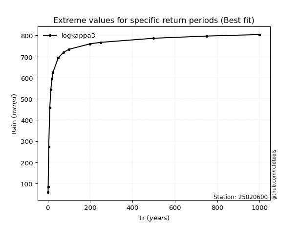</img>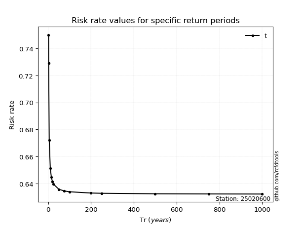</img>

</div>


<sub>**APP DISCLAIMER**: NO WARRANTY - This software is provided by [github.com/rcfdtools](https://github.com/rcfdtools) "as is", without any express or implied warranty, including warranties of merchantability, fitness for a particular purpose, or non-infringement. There is no guarantee that the software will be error-free or operate without interruption. LIMITATION OF LIABILITY - Neither the authors nor copyright holders will be liable for claims or damages arising from the software or its use. You are responsible for determining if the software is appropriate for your use and assume all associated risks, including errors, legal compliance, and data loss. NO PROFESSIONAL ADVICE - The software provides general information and does not offer professional advice. It should not replace consultation with professional advisors.</sub>