<div align="center">


</div>

# PMP Station (rain, Pmax24h): 25020690

Probable Maximum Precipitation (PMP) is the greatest amount of rainfall for a specific duration that is meteorologically possible for a given location, acting as a "worst-case" scenario for extreme storms, crucial for designing safety-critical infrastructure like bridges, river deviations, dams, spillways, and nuclear plants to prevent catastrophic failure. PMP is calculated by hydrologists using meteorological data to determine the upper limit of extreme rainfall, often leading to the Probable Maximum Flood (PMF) for flood control design, and is increasingly being studied for climate change impacts.

<div align="center">

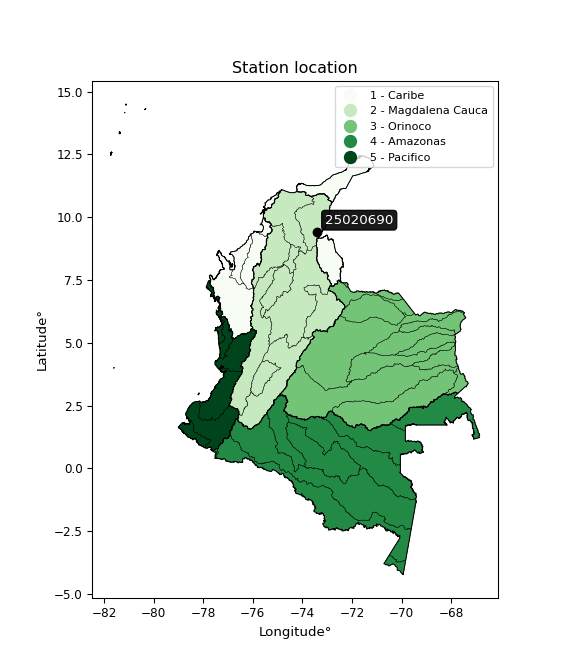</img>

</div>


## A. General information


### 1. General running parameters

• app_version: _v20251227_. • runtime: _2025-12-28 08:30:21.244080_. • Python version: _3.14.0_. • SciPy version: _1.16.3_. • Pandas version: _2.3.3_. • NumPy version: _2.3.5_. • Stations dataset (station_dataset_file): _dataset/pmax24h_in/conventional_cesarcolombia_1959_2022.csv_. • Stations catalog (station_catalog_file): _dataset/CNE_IDEAM.xls_. • Minimum year to eval til year_max (date_min): _1900_. • Maximum year to eval since year_min (date_max): _2024_. • Creates, save and include plots into reports (create_plot): _True_. • Plot only fit distributions with Δo > Δ (plot_only_fit): _True_. • Eval low extreme values, if False, evaluates high extreme values (low_extreme): _False_. • Eval every SciPy distribution as logarithmic (pdist_logarithmic_on): _True_. • Standard deviation normalized (ddof): _1.0_. • Return periods to eval in years (Tr): _[2, 2.33, 5, 10, 15, 20, 25, 50, 75, 100, 200, 250, 500, 750, 1000]_. • Minimum data sample per station, 0 means any (minimum_sample): _5_. • Z-Score maximum threshold to adjust a value, 0 means disable (zscore_max): _3.5_. • Z-Score minimum threshold to adjust a value, 0 means disable (zscore_min): _-2.5_. • Avoid zeros, e.g. rain = 0 (avoid_zeros): _True_. • Avoid null values (avoid_nans): _True_. [:file_folder:Dataset file.](../../dataset/pmax24h_in/conventional_cesarcolombia_1959_2022.csv)

> Delta Degrees of Freedom (DDOF): is a parameter used in the formulas for calculating variance and standard deviation. When ddof=0, the divisor is $N$ (the total number of observations) and this is used when your data set is the entire population. When ddof=1, the divisor is $N-1$ and this is used when your data set is a sample drawn from a larger population. Using $N-1$ provides an unbiased estimate of the population variance (known as Bessel´s correction).


### 2. Station info and location

|   id |   CODIGO | NOMBRE             | CATEGORIA     | TECNOLOGIA   | ESTADO   | FECHA_INSTALACION   |   FECHA_SUSPENSION |   ALTITUD |   LATITUD |   LONGITUD | DEPARTAMENTO   | MUNICIPIO   | AREA_OPERATIVA                                         | ENTIDAD                                                     | AREA_HIDROGRAFICA   | ZONA_HIDROGRAFICA   | SUBZONA_HIDROGRAFICA   |   CORRIENTE | Catalogo   |
|-----:|---------:|:-------------------|:--------------|:-------------|:---------|:--------------------|-------------------:|----------:|----------:|-----------:|:---------------|:------------|:-------------------------------------------------------|:------------------------------------------------------------|:--------------------|:--------------------|:-----------------------|------------:|:-----------|
|    0 | 25020690 | POPONTE [25020690] | Pluviométrica | Convencional | Activa   | 15/09/1972          |                nan |       500 |   9.42328 |   -73.4109 | Cesar          | Curumaní    | Area Operativa 05 - Magdalena-Cesar-Guajira-San Andrés | INSTITUTO DE HIDROLOGIA METEOROLOGIA Y ESTUDIOS AMBIENTALES | Magdalena Cauca     | Cesar               | Bajo Cesar             |         nan | CNE_IDEAM  |

<div align="center">

Map location in: [:earth_americas:Google](http://maps.google.com/maps?q=9.423277778,-73.41094444) [:earth_americas:OSM](https://www.openstreetmap.org/#map=18/9.423277778/-73.41094444&layers=P) [:earth_americas:Bing](https://www.bing.com/maps?cp=9.423277778~-73.41094444&lvl=18) [:earth_americas:Apple](https://maps.apple.com/frame?center=9.423277778%2C-73.41094444&span=0.003%2C0.006)

</div>


<div align="center">

```geojson
{
  "type": "Feature",
  "geometry": {
    "type": "Point", 
    "coordinates": [-73.41094444, 9.423277778]
  }, 
  "properties": {
    "Name": "25020690"
  }
}
```

</div>


### 3. Discrete values table and plot

|               |           0 |           1 |           2 |           3 |          4 |          5 |          6 |          7 |           8 |           9 |           10 |          11 |          12 |         13 |         14 |         15 |         16 |          17 |          18 |          19 |         20 |          21 |          22 |          23 |          24 |         25 |           26 |          27 |          28 |         29 |          30 |          31 |         32 |          33 |          34 |          35 |          36 |          37 |         38 |          39 |         40 |         41 |          42 |           43 |          44 |          45 |          46 |         47 |          48 |          49 |
|:--------------|------------:|------------:|------------:|------------:|-----------:|-----------:|-----------:|-----------:|------------:|------------:|-------------:|------------:|------------:|-----------:|-----------:|-----------:|-----------:|------------:|------------:|------------:|-----------:|------------:|------------:|------------:|------------:|-----------:|-------------:|------------:|------------:|-----------:|------------:|------------:|-----------:|------------:|------------:|------------:|------------:|------------:|-----------:|------------:|-----------:|-----------:|------------:|-------------:|------------:|------------:|------------:|-----------:|------------:|------------:|
| Date          | 1973        | 1974        | 1975        | 1976        | 1977       | 1978       | 1979       | 1980       | 1981        | 1982        | 1983         | 1984        | 1985        | 1986       | 1987       | 1988       | 1989       | 1990        | 1991        | 1992        | 1993       | 1994        | 1995        | 1996        | 1997        | 1998       | 1999         | 2000        | 2001        | 2002       | 2003        | 2004        | 2005       | 2006        | 2007        | 2008        | 2009        | 2010        | 2011       | 2012        | 2013       | 2014       | 2015        | 2016         | 2017        | 2018        | 2019        | 2020       | 2021        | 2022        |
| Value         |  113        |   80        |   80        |   92        |   57       |   65.0325  |   66       |  135       |  117        |   72        |   96         |  116        |   70        |   53       |   94.7006  |  125       |  145       |   80        |   80        |   90        |  125       |   80        |   90        |   90        |   80        |   60       |   95         |   90        |   98        |  135       |   90        |   98        |  133       |   90        |   99        |  100        |   90        |   90        |  145       |   80        |  130       |  150       |   80        |   96         |   85        |  100        |   90        |  111       |   90        |   98        |
| Value_initial |  113        |   80        |   80        |   92        |   57       |   65.0325  |   66       |  135       |  117        |   72        |   96         |  116        |   70        |   53       |   15       |  125       |  145       |   80        |   80        |   90        |  125       |   80        |   90        |   90        |   80        |   60       |   95         |   90        |   98        |  135       |   90        |   98        |  133       |   90        |   99        |  100        |   90        |   90        |  145       |   80        |  130       |  150       |   80        |   96         |   85        |  100        |   90        |  111       |   90        |   98        |
| count         |   50        |   50        |   50        |   50        |   50       |   50       |   50       |   50       |   50        |   50        |   50         |   50        |   50        |   50       |   50       |   50       |   50       |   50        |   50        |   50        |   50       |   50        |   50        |   50        |   50        |   50       |   50         |   50        |   50        |   50       |   50        |   50        |   50       |   50        |   50        |   50        |   50        |   50        |   50       |   50        |   50       |   50       |   50        |   50         |   50        |   50        |   50        |   50       |   50        |   50        |
| mean          |   94.7006   |   94.7006   |   94.7006   |   94.7006   |   94.7006  |   94.7006  |   94.7006  |   94.7006  |   94.7006   |   94.7006   |   94.7006    |   94.7006   |   94.7006   |   94.7006  |   94.7006  |   94.7006  |   94.7006  |   94.7006   |   94.7006   |   94.7006   |   94.7006  |   94.7006   |   94.7006   |   94.7006   |   94.7006   |   94.7006  |   94.7006    |   94.7006   |   94.7006   |   94.7006  |   94.7006   |   94.7006   |   94.7006  |   94.7006   |   94.7006   |   94.7006   |   94.7006   |   94.7006   |   94.7006  |   94.7006   |   94.7006  |   94.7006  |   94.7006   |   94.7006    |   94.7006   |   94.7006   |   94.7006   |   94.7006  |   94.7006   |   94.7006   |
| std           |   26.0198   |   26.0198   |   26.0198   |   26.0198   |   26.0198  |   26.0198  |   26.0198  |   26.0198  |   26.0198   |   26.0198   |   26.0198    |   26.0198   |   26.0198   |   26.0198  |   26.0198  |   26.0198  |   26.0198  |   26.0198   |   26.0198   |   26.0198   |   26.0198  |   26.0198   |   26.0198   |   26.0198   |   26.0198   |   26.0198  |   26.0198    |   26.0198   |   26.0198   |   26.0198  |   26.0198   |   26.0198   |   26.0198  |   26.0198   |   26.0198   |   26.0198   |   26.0198   |   26.0198   |   26.0198  |   26.0198   |   26.0198  |   26.0198  |   26.0198   |   26.0198    |   26.0198   |   26.0198   |   26.0198   |   26.0198  |   26.0198   |   26.0198   |
| zscore        |    0.703285 |   -0.564978 |   -0.564978 |   -0.103792 |   -1.44892 |   -1.14021 |   -1.10303 |    1.54879 |    0.857013 |   -0.872436 |    0.0499369 |    0.818581 |   -0.949301 |   -1.60265 |   -3.06307 |    1.16447 |    1.93312 |   -0.564978 |   -0.564978 |   -0.180656 |    1.16447 |   -0.564978 |   -0.180656 |   -0.180656 |   -0.564978 |   -1.33362 |    0.0115047 |   -0.180656 |    0.126801 |    1.54879 |   -0.180656 |    0.126801 |    1.47193 |   -0.180656 |    0.165234 |    0.203666 |   -0.180656 |   -0.180656 |    1.93312 |   -0.564978 |    1.35663 |    2.12528 |   -0.564978 |    0.0499369 |   -0.372817 |    0.203666 |   -0.180656 |    0.62642 |   -0.180656 |    0.126801 |

<div align="center">

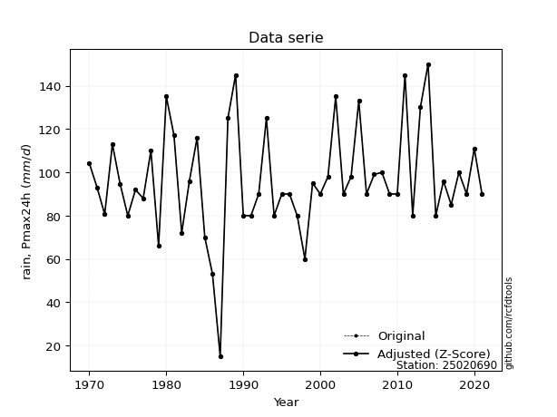</img>

</div>


> The initial value (value_initial) correspond to the initial obtained or null completed value, and value (value) is adjusted only when the initial value is outside the valid range definite through the Z-Score value. If Z-Score is active, values out of range or outliers are replaced with the station mean value


### 4. Active continuous probability distributions from SciPy (44 of 104 available)

[scipy.stats](https://docs.scipy.org/doc/scipy/reference/stats.html) is a Python´s powerful submodule within the SciPy library for comprehensive statistical analysis, offering over 130 probability distributions (like Normal, Poisson), functions for descriptive stats (mean, variance), hypothesis testing (t-tests, chi-square), random variable generation, and statistical tests, making it essential for data science, modeling, and research. It provides tools to explore, model, and draw conclusions from data efficiently, working seamlessly with NumPy.

<div align="center">

|   id | p_dist             |   n_parameter | fit_method   | label                                                                       | active   | ref                                                                                                        |
|-----:|:-------------------|--------------:|:-------------|:----------------------------------------------------------------------------|:---------|:-----------------------------------------------------------------------------------------------------------|
|    0 | alpha              |             3 | MLE          | Alpha                                                                       | True     | [:mortar_board:](https://docs.scipy.org/doc/scipy/reference/generated/scipy.stats.alpha.html)              |
|    1 | betaprime          |             4 | MLE          | Beta prime                                                                  | True     | [:mortar_board:](https://docs.scipy.org/doc/scipy/reference/generated/scipy.stats.betaprime.html)          |
|    2 | chi2               |             3 | MLE          | Chi²                                                                        | True     | [:mortar_board:](https://docs.scipy.org/doc/scipy/reference/generated/scipy.stats.chi2.html)               |
|    3 | crystalball        |             4 | MLE          | Crystalball                                                                 | True     | [:mortar_board:](https://docs.scipy.org/doc/scipy/reference/generated/scipy.stats.crystalball.html)        |
|    4 | erlang             |             3 | MLE          | Erlang                                                                      | True     | [:mortar_board:](https://docs.scipy.org/doc/scipy/reference/generated/scipy.stats.erlang.html)             |
|    5 | expon              |             2 | MLE          | Exponential                                                                 | True     | [:mortar_board:](https://docs.scipy.org/doc/scipy/reference/generated/scipy.stats.expon.html)              |
|    6 | exponnorm          |             3 | MLE          | Exponentially modified Normal                                               | True     | [:mortar_board:](https://docs.scipy.org/doc/scipy/reference/generated/scipy.stats.exponnorm.html)          |
|    7 | f                  |             4 | MLE          | F                                                                           | True     | [:mortar_board:](https://docs.scipy.org/doc/scipy/reference/generated/scipy.stats.f.html)                  |
|    8 | fatiguelife        |             3 | MLE          | Fatigue-life (Birnbaum-Saunders)                                            | True     | [:mortar_board:](https://docs.scipy.org/doc/scipy/reference/generated/scipy.stats.fatiguelife.html)        |
|    9 | fisk               |             3 | MLE          | Fisk                                                                        | True     | [:mortar_board:](https://docs.scipy.org/doc/scipy/reference/generated/scipy.stats.fisk.html)               |
|   10 | gamma              |             3 | MLE          | Gamma                                                                       | True     | [:mortar_board:](https://docs.scipy.org/doc/scipy/reference/generated/scipy.stats.gamma.html)              |
|   11 | genexpon           |             5 | MLE          | Generalized exponential                                                     | True     | [:mortar_board:](https://docs.scipy.org/doc/scipy/reference/generated/scipy.stats.genexpon.html)           |
|   12 | genlogistic        |             3 | MLE          | Generalized logistic                                                        | True     | [:mortar_board:](https://docs.scipy.org/doc/scipy/reference/generated/scipy.stats.genlogistic.html)        |
|   13 | gibrat             |             2 | MM           | Gibrat                                                                      | True     | [:mortar_board:](https://docs.scipy.org/doc/scipy/reference/generated/scipy.stats.gibrat.html)             |
|   14 | gompertz           |             3 | MLE          | Gompertz (or truncated Gumbel)                                              | True     | [:mortar_board:](https://docs.scipy.org/doc/scipy/reference/generated/scipy.stats.gompertz.html)           |
|   15 | gumbel_l           |             2 | MM           | Gumbel Left Skew                                                            | True     | [:mortar_board:](https://docs.scipy.org/doc/scipy/reference/generated/scipy.stats.gumbel_l.html)           |
|   16 | gumbel_r           |             2 | MM           | Gumbel Right Skew                                                           | True     | [:mortar_board:](https://docs.scipy.org/doc/scipy/reference/generated/scipy.stats.gumbel_r.html)           |
|   17 | halflogistic       |             2 | MM           | Half-logistic                                                               | True     | [:mortar_board:](https://docs.scipy.org/doc/scipy/reference/generated/scipy.stats.halflogistic.html)       |
|   18 | halfnorm           |             2 | MM           | Half Normal                                                                 | True     | [:mortar_board:](https://docs.scipy.org/doc/scipy/reference/generated/scipy.stats.halfnorm.html)           |
|   19 | hypsecant          |             2 | MM           | hyperbolic secant                                                           | True     | [:mortar_board:](https://docs.scipy.org/doc/scipy/reference/generated/scipy.stats.hypsecant.html)          |
|   20 | invgamma           |             3 | MLE          | Inverted gamma                                                              | True     | [:mortar_board:](https://docs.scipy.org/doc/scipy/reference/generated/scipy.stats.invgamma.html)           |
|   21 | invgauss           |             3 | MLE          | Inverse Gaussian                                                            | True     | [:mortar_board:](https://docs.scipy.org/doc/scipy/reference/generated/scipy.stats.invgauss.html)           |
|   22 | invweibull         |             3 | MLE          | Inverted Weibull                                                            | True     | [:mortar_board:](https://docs.scipy.org/doc/scipy/reference/generated/scipy.stats.invweibull.html)         |
|   23 | johnsonsu          |             4 | MLE          | Johnson Su                                                                  | True     | [:mortar_board:](https://docs.scipy.org/doc/scipy/reference/generated/scipy.stats.johnsonsu.html)          |
|   24 | kstwobign          |             2 | MLE          | Limiting distribution of scaled Kolmogorov-Smirnov two-sided test statistic | True     | [:mortar_board:](https://docs.scipy.org/doc/scipy/reference/generated/scipy.stats.kstwobign.html)          |
|   25 | laplace            |             2 | MM           | Laplace                                                                     | True     | [:mortar_board:](https://docs.scipy.org/doc/scipy/reference/generated/scipy.stats.laplace.html)            |
|   26 | laplace_asymmetric |             3 | MLE          | Asymmetric Laplace                                                          | True     | [:mortar_board:](https://docs.scipy.org/doc/scipy/reference/generated/scipy.stats.laplace_asymmetric.html) |
|   27 | loggamma           |             3 | MLE          | Log gamma                                                                   | True     | [:mortar_board:](https://docs.scipy.org/doc/scipy/reference/generated/scipy.stats.loggamma.html)           |
|   28 | logistic           |             2 | MM           | Logistic (or Sech-squared)                                                  | True     | [:mortar_board:](https://docs.scipy.org/doc/scipy/reference/generated/scipy.stats.logistic.html)           |
|   29 | lognorm            |             3 | MLE          | Log Normal                                                                  | True     | [:mortar_board:](https://docs.scipy.org/doc/scipy/reference/generated/scipy.stats.lognorm.html)            |
|   30 | maxwell            |             2 | MM           | Maxwell                                                                     | True     | [:mortar_board:](https://docs.scipy.org/doc/scipy/reference/generated/scipy.stats.maxwell.html)            |
|   31 | mielke             |             4 | MLE          | Mielke Beta-Kappa / Dagum                                                   | True     | [:mortar_board:](https://docs.scipy.org/doc/scipy/reference/generated/scipy.stats.mielke.html)             |
|   32 | moyal              |             2 | MM           | Moyal                                                                       | True     | [:mortar_board:](https://docs.scipy.org/doc/scipy/reference/generated/scipy.stats.moyal.html)              |
|   33 | nakagami           |             3 | MLE          | Nakagami                                                                    | True     | [:mortar_board:](https://docs.scipy.org/doc/scipy/reference/generated/scipy.stats.nakagami.html)           |
|   34 | ncf                |             5 | MLE          | Non-central F distribution                                                  | True     | [:mortar_board:](https://docs.scipy.org/doc/scipy/reference/generated/scipy.stats.ncf.html)                |
|   35 | nct                |             4 | MLE          | Non-central Student’s t                                                     | True     | [:mortar_board:](https://docs.scipy.org/doc/scipy/reference/generated/scipy.stats.nct.html)                |
|   36 | norm               |             2 | MM           | Normal                                                                      | True     | [:mortar_board:](https://docs.scipy.org/doc/scipy/reference/generated/scipy.stats.norm.html)               |
|   37 | pearson3           |             3 | MM           | Pearson type III                                                            | True     | [:mortar_board:](https://docs.scipy.org/doc/scipy/reference/generated/scipy.stats.pearson3.html)           |
|   38 | rayleigh           |             2 | MM           | Rayleigh                                                                    | True     | [:mortar_board:](https://docs.scipy.org/doc/scipy/reference/generated/scipy.stats.rayleigh.html)           |
|   39 | rice               |             3 | MLE          | Rice                                                                        | True     | [:mortar_board:](https://docs.scipy.org/doc/scipy/reference/generated/scipy.stats.rice.html)               |
|   40 | t                  |             3 | MLE          | Student’s t                                                                 | True     | [:mortar_board:](https://docs.scipy.org/doc/scipy/reference/generated/scipy.stats.t.html)                  |
|   41 | truncnorm          |             4 | MLE          | Truncated normal                                                            | True     | [:mortar_board:](https://docs.scipy.org/doc/scipy/reference/generated/scipy.stats.truncnorm.html)          |
|   42 | wald               |             2 | MM           | Wald                                                                        | True     | [:mortar_board:](https://docs.scipy.org/doc/scipy/reference/generated/scipy.stats.wald.html)               |
|   43 | weibull_min        |             3 | MLE          | Weibull minimum                                                             | True     | [:mortar_board:](https://docs.scipy.org/doc/scipy/reference/generated/scipy.stats.weibull_min.html)        |

</div>

> **n_parameter:** # arguments & localization & scale.
>
> **Fit methods:** (MLE) maximum likelihood, (MM) L-moments.
>
>**Inactive:** foldnorm, gennorm, norminvgauss, powernorm, powerlognorm, skewnorm, genextreme, anglit, arcsine, argus, beta, bradford, burr, burr12, cauchy, cosine, halfcauchy, foldcauchy, skewcauchy, wrapcauchy, dgamma, gengamma, exponweib, exponpow, truncexpon, gausshyper, genhalflogistic, genhyperbolic, geninvgauss, halfgennorm, johnsonsb, kappa4, kappa3, ksone, kstwo, loglaplace, levy, levy_l, levy_stable, ncx2, pareto, genpareto, truncpareto, lomax, powerlaw, rdist, rel_breitwigner, recipinvgauss, semicircular, studentized_range, trapezoid, triang, truncweibull_min, tukeylambda, uniform, loguniform, vonmises, vonmises_line, weibull_max, dweibull, 


## B. Probability distributions vs. Empirical distributions

A continuous probability distribution (CPD) describes probabilities for variables that can take any value within a range (like rain any time), unlike discrete variables with specific outcomes (like temperature). It uses a Probability Density Function (PDF), a curve where the total area under it equals 1, and the probability of the variable falling within an interval (a to b) is found by calculating the area under the curve between those points. A key feature is that the probability of hitting any single exact value is zero, so probabilities are always expressed for ranges, e.g., $P(a ≤ X ≤ b)$.

<div align="center">

Distributions parameters from station values
|    |   station | p_dist                |   n |             loc |          scale | shape                  | shape1             | shape2                | shape3   |
|---:|----------:|:----------------------|----:|----------------:|---------------:|:-----------------------|:-------------------|:----------------------|:---------|
|  0 |  25020690 | alpha                 |  50 |  -102.848       | 1750.03        | 8.902647809645767      |                    |                       |          |
|  1 |  25020690 | betaprime             |  50 |    -0.510949    |   15.3625      | 124.21724265682877     | 20.700668544127943 |                       |          |
|  2 |  25020690 | chi2                  |  50 |    26.0898      |    3.827       | 18.344611660349834     |                    |                       |          |
|  3 |  25020690 | crystalball           |  50 |    96.2947      |   23.1064      | 6143.794411787556      | 9123.074945503764  |                       |          |
|  4 |  25020690 | erlang                |  50 |    26.0898      |    7.654       | 9.17231761129171       |                    |                       |          |
|  5 |  25020690 | expon                 |  50 |    53           |   43.2947      |                        |                    |                       |          |
|  6 |  25020690 | exponnorm             |  50 |    76.2572      |   13.5252      | 1.4814931031086656     |                    |                       |          |
|  7 |  25020690 | f                     |  50 |     2.87487     |   91.3214      | 51.56847595432979      | 93.66448985645343  |                       |          |
|  8 |  25020690 | fatiguelife           |  50 |    -4.53908     |   98.2622      | 0.22878147265383297    |                    |                       |          |
|  9 |  25020690 | fisk                  |  50 |    13.1327      |   80.0239      | 6.357761222332904      |                    |                       |          |
| 10 |  25020690 | gamma                 |  50 |    26.0898      |    7.654       | 9.172310385251095      |                    |                       |          |
| 11 |  25020690 | genexpon              |  50 |    53           |    2.02058e+06 | 607472.5822276376      | 569.0306275122309  | 8933.868055263567     |          |
| 12 |  25020690 | genlogistic           |  50 |    63.2682      |   17.1024      | 4.3625858211505        |                    |                       |          |
| 13 |  25020690 | gibrat                |  50 |    78.6674      |   10.6915      |                        |                    |                       |          |
| 14 |  25020690 | gompertz              |  50 |    85           |    3.96392     | 1.6190478918674454e-06 |                    |                       |          |
| 15 |  25020690 | gumbel_l              |  50 |   106.694       |   18.016       |                        |                    |                       |          |
| 16 |  25020690 | gumbel_r              |  50 |    85.8955      |   18.016       |                        |                    |                       |          |
| 17 |  25020690 | halflogistic          |  50 |    68.9082      |   19.7552      |                        |                    |                       |          |
| 18 |  25020690 | halfnorm              |  50 |    65.7108      |   38.3311      |                        |                    |                       |          |
| 19 |  25020690 | hypsecant             |  50 |    96.2947      |   14.71        |                        |                    |                       |          |
| 20 |  25020690 | invgamma              |  50 |   -36.2674      | 4437.95        | 34.47641585307001      |                    |                       |          |
| 21 |  25020690 | invgauss              |  50 |    19.1611      |  749.489       | 0.10211524008695022    |                    |                       |          |
| 22 |  25020690 | invweibull            |  50 |    -3.47627e+09 |    3.47627e+09 | 176651800.28406772     |                    |                       |          |
| 23 |  25020690 | johnsonsu             |  50 |     2.30015     |   23.4247      | -8.769370246854493     | 4.234825992043296  |                       |          |
| 24 |  25020690 | kstwobign             |  50 |    13.7681      |   94.9716      |                        |                    |                       |          |
| 25 |  25020690 | laplace               |  50 |    96.2947      |   16.3387      |                        |                    |                       |          |
| 26 |  25020690 | laplace_asymmetric    |  50 |    90           |   16.2785      | 0.8251121290644852     |                    |                       |          |
| 27 |  25020690 | loggamma              |  50 | -6820.25        |  938.199       | 1591.453507354252      |                    |                       |          |
| 28 |  25020690 | logistic              |  50 |    96.2947      |   12.7392      |                        |                    |                       |          |
| 29 |  25020690 | lognorm               |  50 |    -4.20346     |   97.9199      | 0.22819983642539404    |                    |                       |          |
| 30 |  25020690 | maxwell               |  50 |    41.5421      |   34.3111      |                        |                    |                       |          |
| 31 |  25020690 | mielke                |  50 |    -4.23155     |   94.0234      | 8.84129955890231       | 7.308414219547359  |                       |          |
| 32 |  25020690 | moyal                 |  50 |    83.0809      |   10.4015      |                        |                    |                       |          |
| 33 |  25020690 | nakagami              |  50 |    45.891       |   55.4476      | 1.2796572417155165     |                    |                       |          |
| 34 |  25020690 | ncf                   |  50 |    -0.892968    |    0.000559328 | 0.0009495171029912134  | 67.01468979114313  | 160.08392305833974    |          |
| 35 |  25020690 | nct                   |  50 |    -0.103292    |   14.3886      | 17.09895739132999      | 6.401830522946035  |                       |          |
| 36 |  25020690 | norm                  |  50 |    96.2947      |   23.1064      |                        |                    |                       |          |
| 37 |  25020690 | pearson3              |  50 |    96.2947      |   23.1064      | 0.5550369635082899     |                    |                       |          |
| 38 |  25020690 | rayleigh              |  50 |    52.0907      |   35.2696      |                        |                    |                       |          |
| 39 |  25020690 | rice                  |  50 |    49.124       |   29.4649      | 1.0853078429358343     |                    |                       |          |
| 40 |  25020690 | t                     |  50 |    96.294       |   23.1054      | 18707.562549176524     |                    |                       |          |
| 41 |  25020690 | truncnorm             |  50 |    13.9221      |   14.2681      | -479.99732051725323    | 9.53721799837475   |                       |          |
| 42 |  25020690 | wald                  |  50 |    73.1882      |   23.1064      |                        |                    |                       |          |
| 43 |  25020690 | weibull_min           |  50 |    47.9064      |   54.5993      | 2.2017563516239607     |                    |                       |          |
| 44 |  25020690 | logalpha              |  50 |    -3.61588     |  277.274       | 34.02692000526457      |                    |                       |          |
| 45 |  25020690 | logbetaprime          |  50 |     1.88051     |   31.129       | 129.39443478721557     | 1514.7193744145725 |                       |          |
| 46 |  25020690 | logchi2               |  50 |     3.97029     |    0.327838    | 1.6519742066704586     |                    |                       |          |
| 47 |  25020690 | logcrystalball        |  50 |     4.53903     |    0.238742    | 32.488214505118115     | 27.49379759954995  |                       |          |
| 48 |  25020690 | logerlang             |  50 |    -8.40848     |    0.00440767  | 2937.488490113972      |                    |                       |          |
| 49 |  25020690 | logexpon              |  50 |     3.97029     |    0.568741    |                        |                    |                       |          |
| 50 |  25020690 | logexponnorm          |  50 |     4.53873     |    0.23875     | 0.001276592456303439   |                    |                       |          |
| 51 |  25020690 | logf                  |  50 |   -41.2607      |   45.7994      | 220377.31718978484     | 110469.06364500363 |                       |          |
| 52 |  25020690 | logfatiguelife        |  50 |   -22.373       |   26.9109      | 0.008865724971644149   |                    |                       |          |
| 53 |  25020690 | logfisk               |  50 |    -5.78397     |   10.319       | 76.64723285164433      |                    |                       |          |
| 54 |  25020690 | loggamma              |  50 |    -8.52703     |    0.00436674  | 2992.1304173070966     |                    |                       |          |
| 55 |  25020690 | loggenexpon           |  50 |     3.88966     |    0.0159343   | 1.5775379664110443e-06 | 1.786907141688598  | 0.0005936099077362912 |          |
| 56 |  25020690 | loggenlogistic        |  50 |     4.50525     |    0.141439    | 1.1631653839678209     |                    |                       |          |
| 57 |  25020690 | loggibrat             |  50 |     4.35692     |    0.110459    |                        |                    |                       |          |
| 58 |  25020690 | loggompertz           |  50 |     3.97029     |    0.816333    | 1.0182862627400526     |                    |                       |          |
| 59 |  25020690 | loggumbel_l           |  50 |     4.64648     |    0.186153    |                        |                    |                       |          |
| 60 |  25020690 | loggumbel_r           |  50 |     4.43158     |    0.186153    |                        |                    |                       |          |
| 61 |  25020690 | loghalflogistic       |  50 |     4.25608     |    0.204111    |                        |                    |                       |          |
| 62 |  25020690 | loghalfnorm           |  50 |     4.22299     |    0.396097    |                        |                    |                       |          |
| 63 |  25020690 | loghypsecant          |  50 |     4.53903     |    0.151993    |                        |                    |                       |          |
| 64 |  25020690 | loginvgamma           |  50 |     1.70285     |  375.757       | 133.45875819781384     |                    |                       |          |
| 65 |  25020690 | loginvgauss           |  50 |     2.31728     |  181.029       | 0.012269030691748815   |                    |                       |          |
| 66 |  25020690 | loginvweibull         |  50 |    -2.91864e+07 |    2.91864e+07 | 122542084.59960255     |                    |                       |          |
| 67 |  25020690 | logjohnsonsu          |  50 |     8.8537      |    7.48491     | 19.84758578506373      | 36.19664641692296  |                       |          |
| 68 |  25020690 | logkstwobign          |  50 |     3.53554     |    1.15459     |                        |                    |                       |          |
| 69 |  25020690 | loglaplace            |  50 |     4.53903     |    0.168822    |                        |                    |                       |          |
| 70 |  25020690 | loglaplace_asymmetric |  50 |     4.49981     |    0.175985    | 0.8947797547463743     |                    |                       |          |
| 71 |  25020690 | logloggamma           |  50 |   -27.6717      |    5.22084     | 478.52070650063587     |                    |                       |          |
| 72 |  25020690 | loglogistic           |  50 |     4.53903     |    0.13163     |                        |                    |                       |          |
| 73 |  25020690 | loglognorm            |  50 | -8188.03        | 8192.57        | 2.914232014447282e-05  |                    |                       |          |
| 74 |  25020690 | logmaxwell            |  50 |     3.97325     |    0.354552    |                        |                    |                       |          |
| 75 |  25020690 | logmielke             |  50 |    -0.431679    |    4.96818     | 36.57080828005891      | 37.06049058897236  |                       |          |
| 76 |  25020690 | logmoyal              |  50 |     4.4025      |    0.107475    |                        |                    |                       |          |
| 77 |  25020690 | lognakagami           |  50 |   -24.3809      |   28.9212      | 3662.5563055425373     |                    |                       |          |
| 78 |  25020690 | logncf                |  50 |   -13.1132      |   14.7579      | 17373.392865992137     | 28227.51167615826  | 3405.9924629977795    |          |
| 79 |  25020690 | lognct                |  50 |    -2.0537      |    0.201277    | 1317.8730258399496     | 32.737199785084066 |                       |          |
| 80 |  25020690 | lognorm               |  50 |     4.53903     |    0.23875     |                        |                    |                       |          |
| 81 |  25020690 | logpearson3           |  50 |     4.53903     |    0.23875     | -0.041350019301242956  |                    |                       |          |
| 82 |  25020690 | lograyleigh           |  50 |     4.08229     |    0.364425    |                        |                    |                       |          |
| 83 |  25020690 | logrice               |  50 |     3.86939     |    0.252631    | 2.432930753439983      |                    |                       |          |
| 84 |  25020690 | logt                  |  50 |     4.53903     |    0.238751    | 624695957.9578056      |                    |                       |          |
| 85 |  25020690 | logtruncnorm          |  50 |    -0.105733    |    1.66856     | 2.4428334604514172     | 5.265727483726817  |                       |          |
| 86 |  25020690 | logwald               |  50 |     4.30024     |    0.238791    |                        |                    |                       |          |
| 87 |  25020690 | logweibull_min        |  50 |     3.72942     |    0.895811    | 3.774697256671021      |                    |                       |          |

</div>

> **loc** (Location parameter): This shifts the distribution along the x-axis. For many common distributions, like the normal (Gaussian) distribution, loc represents the mean $μ$. For others, like the uniform distribution, it might represent the minimum value, or for the beta distribution, the left end of the support interval.
>
> **scale** (Scale parameter): This determines the width or spread of the distribution. For the normal distribution, scale represents the standard deviation $σ$. For a uniform distribution, it defines the length of the interval (from $loc$ to $loc + scale$).
>
> **shape** (Shape parameters): Refers to parameters that define the specific form of a probability distribution, distinct from its location (loc) and scale (scale). These parameters are required arguments for most distribution functions. For example, a normal (Gaussian) distribution is fully defined by its location (mean) and scale (standard deviation), so it has no specific shape parameters beyond loc and scale. However, other distributions have intrinsic properties that need specification, as Gamma distribution that takes a shape parameter, often named $a$ or $alpha$.


### 0. Cumulative distribution values - CDF (88 evaluated)

Cumulative Distribution Function (CDF), denoted as $F$<sub>$X$</sub>$(x)$, is a function that gives the probability that a random variable $X$ will take a value less than or equal to a specific value, $x$ (i.e., $(P(X≥x)$. It essentially "accumulates" probabilities from a given point up to the far right (positive infinity), providing a complete picture of the distribution´s probabilities for both discrete (like rain) and continuous (like temperature) variables, helping to find probabilities over ranges or above certain values.

<div align="center">

CDF ordered by x ascending and calculating $log(f(x))$ separately
|   id |   Station |   date |        x |   count |    mean |     std |     zscore |   Value_initial |   station |   m |      alpha |   alpha_pdf |   betaprime |   betaprime_pdf |       chi2 |   chi2_pdf |   crystalball |   crystalball_pdf |     erlang |   erlang_pdf |     expon |   expon_pdf |   exponnorm |   exponnorm_pdf |          f |      f_pdf |   fatiguelife |   fatiguelife_pdf |      fisk |   fisk_pdf |      gamma |   gamma_pdf |    genexpon |   genexpon_pdf |   genlogistic |   genlogistic_pdf |    gibrat |   gibrat_pdf |    gompertz |   gompertz_pdf |   gumbel_l |   gumbel_l_pdf |   gumbel_r |   gumbel_r_pdf |   halflogistic |   halflogistic_pdf |   halfnorm |   halfnorm_pdf |   hypsecant |   hypsecant_pdf |   invgamma |   invgamma_pdf |   invgauss |   invgauss_pdf |   invweibull |   invweibull_pdf |   johnsonsu |   johnsonsu_pdf |   kstwobign |   kstwobign_pdf |   laplace |   laplace_pdf |   laplace_asymmetric |   laplace_asymmetric_pdf |   loggamma |   loggamma_pdf |   logistic |   logistic_pdf |    lognorm |   lognorm_pdf |    maxwell |   maxwell_pdf |    mielke |   mielke_pdf |       moyal |   moyal_pdf |   nakagami |   nakagami_pdf |        ncf |    ncf_pdf |       nct |    nct_pdf |      norm |   norm_pdf |   pearson3 |   pearson3_pdf |    rayleigh |   rayleigh_pdf |       rice |   rice_pdf |         t |      t_pdf |   truncnorm |   truncnorm_pdf |     wald |   wald_pdf |   weibull_min |   weibull_min_pdf |   logalpha |   logalpha_pdf |   logbetaprime |   logbetaprime_pdf |     logchi2 |   logchi2_pdf |   logcrystalball |   logcrystalball_pdf |   logerlang |   logerlang_pdf |   logexpon |   logexpon_pdf |   logexponnorm |   logexponnorm_pdf |      logf |   logf_pdf |   logfatiguelife |   logfatiguelife_pdf |   logfisk |   logfisk_pdf |   loggenexpon |   loggenexpon_pdf |   loggenlogistic |   loggenlogistic_pdf |   loggibrat |   loggibrat_pdf |   loggompertz |   loggompertz_pdf |   loggumbel_l |   loggumbel_l_pdf |   loggumbel_r |   loggumbel_r_pdf |   loghalflogistic |   loghalflogistic_pdf |   loghalfnorm |   loghalfnorm_pdf |   loghypsecant |   loghypsecant_pdf |   loginvgamma |   loginvgamma_pdf |   loginvgauss |   loginvgauss_pdf |   loginvweibull |   loginvweibull_pdf |   logjohnsonsu |   logjohnsonsu_pdf |   logkstwobign |   logkstwobign_pdf |   loglaplace |   loglaplace_pdf |   loglaplace_asymmetric |   loglaplace_asymmetric_pdf |   logloggamma |   logloggamma_pdf |   loglogistic |   loglogistic_pdf |   loglognorm |   loglognorm_pdf |   logmaxwell |   logmaxwell_pdf |   logmielke |   logmielke_pdf |    logmoyal |   logmoyal_pdf |   lognakagami |   lognakagami_pdf |     logncf |   logncf_pdf |     lognct |   lognct_pdf |   logpearson3 |   logpearson3_pdf |   lograyleigh |   lograyleigh_pdf |    logrice |   logrice_pdf |       logt |   logt_pdf |   logtruncnorm |   logtruncnorm_pdf |   logwald |   logwald_pdf |   logweibull_min |   logweibull_min_pdf |
|-----:|----------:|-------:|---------:|--------:|--------:|--------:|-----------:|----------------:|----------:|----:|-----------:|------------:|------------:|----------------:|-----------:|-----------:|--------------:|------------------:|-----------:|-------------:|----------:|------------:|------------:|----------------:|-----------:|-----------:|--------------:|------------------:|----------:|-----------:|-----------:|------------:|------------:|---------------:|--------------:|------------------:|----------:|-------------:|------------:|---------------:|-----------:|---------------:|-----------:|---------------:|---------------:|-------------------:|-----------:|---------------:|------------:|----------------:|-----------:|---------------:|-----------:|---------------:|-------------:|-----------------:|------------:|----------------:|------------:|----------------:|----------:|--------------:|---------------------:|-------------------------:|-----------:|---------------:|-----------:|---------------:|-----------:|--------------:|-----------:|--------------:|----------:|-------------:|------------:|------------:|-----------:|---------------:|-----------:|-----------:|----------:|-----------:|----------:|-----------:|-----------:|---------------:|------------:|---------------:|-----------:|-----------:|----------:|-----------:|------------:|----------------:|---------:|-----------:|--------------:|------------------:|-----------:|---------------:|---------------:|-------------------:|------------:|--------------:|-----------------:|---------------------:|------------:|----------------:|-----------:|---------------:|---------------:|-------------------:|----------:|-----------:|-----------------:|---------------------:|----------:|--------------:|--------------:|------------------:|-----------------:|---------------------:|------------:|----------------:|--------------:|------------------:|--------------:|------------------:|--------------:|------------------:|------------------:|----------------------:|--------------:|------------------:|---------------:|-------------------:|--------------:|------------------:|--------------:|------------------:|----------------:|--------------------:|---------------:|-------------------:|---------------:|-------------------:|-------------:|-----------------:|------------------------:|----------------------------:|--------------:|------------------:|--------------:|------------------:|-------------:|-----------------:|-------------:|-----------------:|------------:|----------------:|------------:|---------------:|--------------:|------------------:|-----------:|-------------:|-----------:|-------------:|--------------:|------------------:|--------------:|------------------:|-----------:|--------------:|-----------:|-----------:|---------------:|-------------------:|----------:|--------------:|-----------------:|---------------------:|
|    0 |  25020690 |   1986 |  53      |      50 | 94.7006 | 26.0198 | -1.60265   |         53      |  25020690 |   1 | 0.00999716 |  0.00191986 |  0.00636559 |      0.00159049 | 0.00846606 | 0.00192776 |     0.0304854 |        0.00298416 | 0.00846606 |   0.00192776 | 0         |  0.0230975  |  0.00940192 |      0.00166467 | 0.00989149 | 0.0019845  |    0.00896018 |        0.00190554 | 0.0117754 | 0.00185574 | 0.00846604 |  0.00192776 | 4.30371e-07 |    0.300642    |     0.0108104 |        0.00178071 | 0         |  0           | 0           |    0           |  0.0495081 |    0.00267883  | 0.00201241 |    0.000693488 |      0         |         0          | 0          |     0          |   0.0335164 |      0.00227427 | 0.00954641 |     0.00190735 | 0.00616154 |     0.0017677  |   0.00559022 |       0.00147342 |   0.0092769 |      0.0018926  |  0.00439786 |      0.00150878 | 0.0353319 |    0.00216247 |            0.0257723 |               0.00191879 | 0.00798808 |      0.0944094 |  0.0323415 |     0.00245662 | 0.00860576 |     0.0978872 | 0.00957952 |    0.00245261 | 0.0120236 |   0.00180938 | 2.17594e-05 | 1.98108e-05 |  0.0061251 |     0.00218481 | 0.00914786 | 0.00187394 | 0.0100677 | 0.00187267 | 0.0304854 | 0.00298416 |  0.011921  |     0.00222146 | 0.000332264 |    0.000730713 | 0.00479269 | 0.0024686  | 0.0304893 | 0.00298415 |    0.996917 |     0.000657176 | 0        | 0          |    0.00537844 |        0.00231863 | 0.00581828 |       0.079715 |     0.00591068 |          0.0819151 | 3.14752e-13 |    585.425    |       0.00860408 |            0.0978738 |  0.00797199 |       0.0942586 |   0        |       1.75827  |     0.00860587 |          0.0978882 | 0.0082448 |  0.0955809 |       0.00810195 |            0.0949086 | 0.0132075 |      0.102411 |     0.0134825 |          0.331903 |        0.0119679 |            0.0962297 |    0        |        0        |   3.51017e-09 |          1.24739  |     0.0261045 |         0.138385  |   6.67161e-06 |       0.000427122 |         0         |              0        |     0         |          0        |      0.015091  |          0.0992504 |     0.0043577 |         0.0701191 |    0.00432728 |         0.0702924 |      0.00138518 |           0.0382793 |     0.00937383 |           0.102015 |     0.00110746 |          0.0417835 |    0.0172141 |         0.101966 |               0.015403  |                   0.0978165 |    0.00945925 |          0.102577 |     0.0131155 |         0.0983325 |    0.0086042 |        0.0978784 |   0          |        0         |   0.0118414 |       0.0972787 | 8.09464e-14 |    2.13708e-11 |    0.00847212 |          0.09712  | 0.00791048 |     0.093693 | 0.00756793 |    0.0915503 |    0.00936154 |          0.10206  |   0           |         0         | 0.00445544 |     0.0946201 | 0.00860584 |  0.0978879 |    1.83938e-08 |           1.66057  |  0        |      0        |       0.00700242 |             0.109351 |
|    1 |  25020690 |   1977 |  57      |      50 | 94.7006 | 26.0198 | -1.44892   |         57      |  25020690 |   2 | 0.0204048  |  0.00337302 |  0.0157236  |      0.0032076  | 0.0192283  | 0.00354764 |     0.0445095 |        0.00406614 | 0.0192283  |   0.00354764 | 0.0882506 |  0.0210592  |  0.0184227  |      0.00293598 | 0.020701   | 0.00351034 |    0.0194997  |        0.00345842 | 0.021415  | 0.00303725 | 0.0192283  |  0.00354764 | 0.699582    |    0.0903199   |     0.0203184 |        0.00306114 | 0         |  0           | 0           |    0           |  0.0614307 |    0.00330284  | 0.00692721 |    0.00191187  |      0         |         0          | 0          |     0          |   0.0439606 |      0.00297899 | 0.0199715  |     0.00339663 | 0.0168881  |     0.0037317  |   0.0145132  |       0.00312166 |   0.0196722 |      0.00339783 |  0.014296   |      0.00360688 | 0.0451326 |    0.00276231 |            0.0347128 |               0.00258442 | 0.0180288  |      0.190436  |  0.0437496 |     0.00328399 | 0.018882   |     0.193126  | 0.0228915  |    0.00426444 | 0.0214204 |   0.00296392 | 0.000459536 | 0.00029055  |  0.0188764 |     0.00425147 | 0.0194617  | 0.00337677 | 0.0202066 | 0.00328685 | 0.0445095 | 0.00406614 |  0.0236773 |     0.00373416 | 0.00964051  |    0.00390848  | 0.0196786  | 0.00496015 | 0.0445133 | 0.00406608 |    0.998733 |     0.000293194 | 0        | 0          |    0.0191358  |        0.0045886  | 0.0147867  |       0.176818 |     0.0151335  |          0.181764  | 0.164941    |      1.76111  |       0.0188792  |            0.193108  |  0.0179984  |       0.190188  |   0.120086 |       1.54713  |     0.0188822  |          0.193128  | 0.0183451 |  0.190714  |       0.0181669  |            0.190522  | 0.0231109 |      0.176091 |     0.047884  |          0.608482 |        0.0213979 |            0.169514  |    0        |        0        |   0.0905606   |          1.24018  |     0.0383469 |         0.201996  |   0.000315294 |       0.0136549   |         0         |              0        |     0         |          0        |      0.0243493 |          0.160044  |     0.0127897 |         0.173424  |    0.0127999  |         0.174445  |      0.00783367 |           0.159497  |     0.0199314  |           0.196399 |     0.00961606 |          0.223023  |    0.0264885 |         0.156902 |               0.0244497 |                   0.155268  |    0.0200609  |          0.197025 |     0.0225767 |         0.167644  |    0.0188798 |        0.193119  |   0.00200604 |        0.0855502 |   0.0213697 |       0.171104  | 1.01472e-07 |    1.38247e-05 |    0.0186939  |          0.192447 | 0.0178849  |     0.18932  | 0.0173893  |    0.187428  |    0.0199272  |          0.19659  |   0           |         0         | 0.0150158  |     0.203972  | 0.0188822  |  0.193127  |    0.114574    |           1.49136  |  0        |      0        |       0.018852   |             0.224744 |
|    2 |  25020690 |   1998 |  60      |      50 | 94.7006 | 26.0198 | -1.33362   |         60      |  25020690 |   3 | 0.0326082  |  0.00481062 |  0.0277593  |      0.0048776  | 0.0321485  | 0.00511066 |     0.0581191 |        0.0050282  | 0.0321485  |   0.00511066 | 0.149289  |  0.0196493  |  0.0291444  |      0.00426895 | 0.033395   | 0.00499856 |    0.0320859  |        0.0049798  | 0.0322504 | 0.00423382 | 0.0321484  |  0.00511066 | 0.878097    |    0.0366503   |     0.0314099 |        0.00438774 | 0         |  0           | 0           |    0           |  0.0721503 |    0.00385671  | 0.0148526  |    0.00347042  |      0         |         0          | 0          |     0          |   0.0538626 |      0.00364418 | 0.0322946  |     0.00486697 | 0.0309282  |     0.00568599 |   0.026405   |       0.00487641 |   0.0320219 |      0.0048837  |  0.028233   |      0.00574788 | 0.0542291 |    0.00331905 |            0.0434001 |               0.0032312  | 0.0303125  |      0.29403   |  0.0547307 |     0.00406109 | 0.0312617  |     0.294883  | 0.0379899  |    0.00582316 | 0.0320184 |   0.00415097 | 0.00242274  | 0.00117039  |  0.0341998 |     0.00598072 | 0.0317517  | 0.00486584 | 0.0321189 | 0.00470502 | 0.0581191 | 0.0050282  |  0.0369596 |     0.00515893 | 0.0248309   |    0.00620032  | 0.0372734  | 0.00675695 | 0.0581226 | 0.0050281  |    0.99938  |     0.000152006 | 0        | 0          |    0.0355486  |        0.00635556 | 0.0265004  |       0.286226 |     0.0271574  |          0.293345  | 0.247628    |      1.48419  |       0.0312578  |            0.294863  |  0.0302673  |       0.293699  |   0.195969 |       1.4137   |     0.0312619  |          0.294884  | 0.0306103 |  0.292914  |       0.0304405  |            0.293504  | 0.034058  |      0.255261 |     0.0836071 |          0.780718 |        0.0320279 |            0.24972   |    0        |        0        |   0.153901    |          1.22863  |     0.0502024 |         0.262798  |   0.0021977   |       0.0722561   |         0         |              0        |     0         |          0        |      0.034107  |          0.223969  |     0.0245956 |         0.294219  |    0.0246778  |         0.296011  |      0.0200451  |           0.329052  |     0.0324335  |           0.296172 |     0.0267244  |          0.455943  |    0.035893  |         0.212608 |               0.0338641 |                   0.215054  |    0.0325937  |          0.296725 |     0.0329799 |         0.242287  |    0.0312592 |        0.294879  |   0.0102333  |        0.247642  |   0.0320829 |       0.251291  | 2.74308e-05 |    0.00236056  |    0.031045   |          0.294481 | 0.0301039  |     0.292627 | 0.0295317  |    0.291648  |    0.0324425  |          0.296498 |   0.000546556 |         0.0906872 | 0.0281996  |     0.31538   | 0.0312619  |  0.294884  |    0.188209    |           1.38096  |  0        |      0        |       0.0331513  |             0.337166 |
|    3 |  25020690 |   1978 |  65.0325 |      50 | 94.7006 | 26.0198 | -1.14021   |         65.0325 |  25020690 |   4 | 0.0640506  |  0.00778361 |  0.060765   |      0.00834482 | 0.06547    | 0.00820442 |     0.0880332 |        0.0069133  | 0.06547    |   0.00820442 | 0.242643  |  0.0174931  |  0.0577788  |      0.00726217 | 0.0659179  | 0.00801312 |    0.0646661  |        0.00805287 | 0.059918  | 0.00690021 | 0.06547    |  0.00820442 | 0.973152    |    0.0080721   |     0.0605253 |        0.00732178 | 0         |  0           | 0           |    0           |  0.0942728 |    0.00497794  | 0.0414338  |    0.00732189  |      0         |         0          | 0          |     0          |   0.0756574 |      0.00509497 | 0.0641444  |     0.00788501 | 0.0689311  |     0.00947289 |   0.0599562  |       0.00857402 |   0.0640169 |      0.00792423 |  0.067298   |      0.0098041  | 0.0737901 |    0.00451628 |            0.0631262 |               0.00469984 | 0.0627754  |      0.52647   |  0.0791459 |     0.00572105 | 0.0636023  |     0.522178  | 0.0742913  |    0.00862254 | 0.0592969 |   0.00683655 | 0.0172584   | 0.00536286  |  0.0718401 |     0.00897598 | 0.0636951  | 0.00792411 | 0.0630264 | 0.00768667 | 0.0880332 | 0.0069133  |  0.0698231 |     0.007971   | 0.0651053   |    0.00972642  | 0.0784586  | 0.00955988 | 0.0880362 | 0.00691319 |    0.99983  |     4.57263e-05 | 0        | 0          |    0.0749117  |        0.00926071 | 0.0590103  |       0.537133 |     0.0603374  |          0.546117  | 0.355066    |      1.20318  |       0.063597   |            0.522162  |  0.0626979  |       0.526001  |   0.302137 |       1.22703  |     0.0636028  |          0.52218   | 0.0628541 |  0.521941  |       0.0628068  |            0.524531  | 0.0616507 |      0.445236 |     0.155796  |          1.00069  |        0.0593554 |            0.445068  |    0        |        0        |   0.251765    |          1.19919  |     0.0763203 |         0.393928  |   0.0188595   |       0.402282    |         0         |              0        |     0         |          0        |      0.0578359 |          0.378426  |     0.0587987 |         0.57237   |    0.0590668  |         0.575075  |      0.0615458  |           0.720431  |     0.0646718  |           0.517904 |     0.0809906  |          0.892679  |    0.0578367 |         0.34259  |               0.0564772 |                   0.358659  |    0.0648633  |          0.518068 |     0.0591649 |         0.422885  |    0.0636    |        0.522186  |   0.0444369  |        0.61917   |   0.0594943 |       0.445258  | 0.00393624  |    0.167624    |    0.0633828  |          0.52257  | 0.0624393  |     0.524749 | 0.0618913  |    0.526583  |    0.0647157  |          0.518435 |   0.0317624   |         0.675057  | 0.0627662  |     0.556315  | 0.0636027  |  0.522179  |    0.292903    |           1.22153  |  0        |      0        |       0.06907    |             0.564581 |
|    4 |  25020690 |   1979 |  66      |      50 | 94.7006 | 26.0198 | -1.10303   |         66      |  25020690 |   5 | 0.0718845  |  0.00841181 |  0.069187   |      0.00906563 | 0.0737133  | 0.00883592 |     0.0949132 |        0.00730986 | 0.0737133  |   0.00883592 | 0.25938   |  0.0171065  |  0.0651283  |      0.00793437 | 0.0739736  | 0.00864024 |    0.0727648  |        0.00868904 | 0.0668848 | 0.00750551 | 0.0737132  |  0.00883592 | 0.979929    |    0.00603466  |     0.0679225 |        0.00797264 | 0         |  0           | 0           |    0           |  0.0992074 |    0.00522397  | 0.0489385  |    0.00819587  |      0         |         0          | 0.00601886 |     0.020815   |   0.0807477 |      0.00543062 | 0.0720789  |     0.00851823 | 0.0784566  |     0.0102162  |   0.0686232  |       0.00934262 |   0.0719908 |      0.00856016 |  0.0771573  |      0.0105731  | 0.0782918 |    0.0047918  |            0.0678413 |               0.00505089 | 0.0709292  |      0.578196  |  0.0848612 |     0.00609611 | 0.0716842  |     0.572745  | 0.0828967  |    0.0091651  | 0.0662065 |   0.00745107 | 0.0230295   | 0.00658503  |  0.0807989 |     0.00954137 | 0.0716712  | 0.00856508 | 0.0707706 | 0.00832359 | 0.0949132 | 0.00730986 |  0.0778146 |     0.00854945 | 0.074817    |    0.010345    | 0.0879516  | 0.0100608  | 0.0949161 | 0.00730975 |    0.999869 |     3.57827e-05 | 0        | 0          |    0.0841309  |        0.0097944  | 0.067353   |       0.593151 |     0.0688123  |          0.60204   | 0.372529    |      1.1622   |       0.0716787  |            0.57273   |  0.0708446  |       0.577702  |   0.320025 |       1.19558  |     0.0716847  |          0.572747  | 0.0709356 |  0.572941  |       0.0709298  |            0.575971  | 0.0685577 |      0.490745 |     0.17082   |          1.03349  |        0.0662712 |            0.492147  |    0        |        0        |   0.269425    |          1.19226  |     0.0823551 |         0.423667  |   0.0255301   |       0.503037    |         0         |              0        |     0         |          0        |      0.0637    |          0.416306  |     0.0677013 |         0.633713  |    0.0680099  |         0.636492  |      0.0727772  |           0.800683  |     0.0726813  |           0.567212 |     0.0947389  |          0.968603  |    0.0631241 |         0.373909 |               0.0620303 |                   0.393924  |    0.0728744  |          0.567268 |     0.0657279 |         0.466518  |    0.071682  |        0.572755  |   0.0541459  |        0.69589   |   0.0664096 |       0.491875  | 0.00710705  |    0.266843    |    0.0714718  |          0.573312 | 0.0705674  |     0.576449 | 0.0700513  |    0.578937  |    0.0727333  |          0.56777  |   0.0424672   |         0.774073  | 0.0713666  |     0.608791  | 0.0716845  |  0.572746  |    0.310739    |           1.19406  |  0        |      0        |       0.0777581  |             0.612288 |
|    5 |  25020690 |   1985 |  70      |      50 | 94.7006 | 26.0198 | -0.949301  |         70      |  25020690 |   6 | 0.110845   |  0.0110749  |  0.111429   |      0.0120369  | 0.114285   | 0.0114364  |     0.127564  |        0.00903591 | 0.114285   |   0.0114364  | 0.32474   |  0.0155968  |  0.102768   |      0.0109318  | 0.113789   | 0.0112646  |    0.112829   |        0.011336   | 0.102307  | 0.0102677  | 0.114285   |  0.0114364  | 0.993971    |    0.00181284  |     0.105477  |        0.0108389  | 0         |  0           | 0           |    0           |  0.122303  |    0.00635542  | 0.0892375  |    0.0119693   |      0.0276272 |         0.0252905  | 0.0890952  |     0.0206857  |   0.105574  |      0.00704614 | 0.111481   |     0.0111843  | 0.125261   |     0.0131266  |   0.112328   |       0.0124799  |   0.111571  |      0.0112291  |  0.125423   |      0.0134679  | 0.100009  |    0.00612099 |            0.0913755 |               0.00680304 | 0.111524   |      0.807015  |  0.112639  |     0.00784592 | 0.111819   |     0.796892  | 0.123958   |    0.0113413  | 0.101509  |   0.0102655  | 0.0607441   | 0.0123936   |  0.12348   |     0.0117624  | 0.111319   | 0.0112583  | 0.109484  | 0.0110445  | 0.127564  | 0.00903591 |  0.116847  |     0.0109636  | 0.120957    |    0.0126557   | 0.13211    | 0.0119737  | 0.127567  | 0.00903584 |    0.999958 |     1.23656e-05 | 0        | 0          |    0.127525   |        0.0118615  | 0.109345   |       0.839376 |     0.111274   |          0.845931  | 0.436569    |      1.01941  |       0.111813   |            0.796888  |  0.111408   |       0.806441  |   0.386857 |       1.07807  |     0.11182    |          0.796894  | 0.111137  |  0.798952  |       0.111362   |            0.803764  | 0.103568  |      0.7093   |     0.234942  |          1.13934  |        0.101581  |            0.718427  |    0        |        0        |   0.338664    |          1.15993  |     0.11121   |         0.56289   |   0.0689838   |       0.990878    |         0         |              0        |     0.0513364 |          2.0102   |      0.0934509 |          0.606042  |     0.112639  |         0.897648  |    0.113112   |         0.900373  |      0.129152   |           1.10988   |     0.112339   |           0.786237 |     0.159696   |          1.22546   |    0.0894462 |         0.529826 |               0.0901333 |                   0.572392  |    0.112521   |          0.785782 |     0.0991031 |         0.678278  |    0.111818  |        0.796914  |   0.10418    |        1.0034    |   0.10164   |       0.715923  | 0.04064     |    0.934763    |    0.111661   |          0.798137 | 0.111059   |     0.80531  | 0.110769   |    0.810492  |    0.112426   |          0.78684  |   0.098772    |         1.12785   | 0.113776   |     0.837133  | 0.11182    |  0.796893  |    0.37789     |           1.08976  |  0        |      0        |       0.119688   |             0.816074 |
|    6 |  25020690 |   1982 |  72      |      50 | 94.7006 | 26.0198 | -0.872436  |         72      |  25020690 |   7 | 0.134313   |  0.0123851  |  0.136917   |      0.0134351  | 0.138407   | 0.0126733  |     0.146532  |        0.00993396 | 0.138406   |   0.0126733  | 0.355225  |  0.0148927  |  0.12619    |      0.0124907  | 0.137599   | 0.0125366  |    0.136784   |        0.0126089  | 0.124325  | 0.011758   | 0.138406   |  0.0126733  | 0.996695    |    0.000993593 |     0.128624  |        0.0123059  | 0         |  0           | 0           |    0           |  0.135644  |    0.00699366  | 0.115031   |    0.0138078   |      0.0780945 |         0.0251555  | 0.130327   |     0.0205373  |   0.120607  |      0.00800417 | 0.135159   |     0.0124846  | 0.15282    |     0.0144085  |   0.138755   |       0.0139261  |   0.135335  |      0.0125257  |  0.153595   |      0.0146733  | 0.113032  |    0.00691804 |            0.106047  |               0.00789534 | 0.13592    |      0.925636  |  0.12931   |     0.00883796 | 0.135902   |     0.913556  | 0.147667   |    0.0123573  | 0.123553  |   0.0117855  | 0.0884832   | 0.0153121   |  0.148029  |     0.0127735  | 0.135154   | 0.0125675  | 0.132928  | 0.0123931  | 0.146532  | 0.00993396 |  0.139955  |     0.0121366  | 0.147279    |    0.0136477   | 0.15692    | 0.0128239  | 0.146534  | 0.00993394 |    0.999977 |     7.05806e-06 | 0        | 0          |    0.152191   |        0.0127913  | 0.134758   |       0.965242 |     0.136842   |          0.969479  | 0.464442    |      0.960288 |       0.135896   |            0.913559  |  0.135787   |       0.925036  |   0.416487 |       1.02597  |     0.135903   |          0.913558  | 0.13529   |  0.916469  |       0.135662   |            0.922042  | 0.125288  |      0.834923 |     0.267572  |          1.17575  |        0.123617  |            0.8481    |    0        |        0        |   0.371088    |          1.14179  |     0.128166  |         0.642364  |   0.100422    |       1.23988     |         0.0503981 |              2.44342  |     0.107788  |          1.99596  |      0.112122  |          0.722515  |     0.139768  |         1.02822   |    0.140315   |         1.03076   |      0.162278   |           1.23898   |     0.13609    |           0.900719 |     0.195549   |          1.31622   |    0.105689  |         0.626041 |               0.10779   |                   0.684524  |    0.136256   |          0.9      |     0.119917  |         0.801771  |    0.135902  |        0.913582  |   0.134431   |        1.14275   |   0.12359   |       0.844586  | 0.0725384   |    1.3293      |    0.135782   |          0.915058 | 0.135409   |     0.92404  | 0.135282   |    0.930375  |    0.136194   |          0.901298 |   0.132587    |         1.26953   | 0.138991   |     0.953354  | 0.135903   |  0.913557  |    0.407922    |           1.04264  |  0        |      0        |       0.144119   |             0.91874  |
|    7 |  25020690 |   1975 |  80      |      50 | 94.7006 | 26.0198 | -0.564978  |         80      |  25020690 |   8 | 0.251964   |  0.0167027  |  0.262794   |      0.0175728  | 0.256708   | 0.0165607  |     0.240343  |        0.0134644  | 0.256708   |   0.0165607  | 0.464007  |  0.0123801  |  0.249334   |      0.0179499  | 0.255635   | 0.0166403  |    0.255228   |        0.0166573  | 0.241961  | 0.0174392  | 0.256708   |  0.0165607  | 0.999702    |    8.96578e-05 |     0.248515  |        0.0173203  | 0.0186569 |  0.0342494   | 0           |    0           |  0.203285  |    0.0100499   | 0.24979    |    0.0192325   |      0.273583  |         0.0234154  | 0.290689   |     0.0194183  |   0.203098  |      0.0128889  | 0.253269   |     0.0167076  | 0.283551   |     0.017763   |   0.268396   |       0.0179392  |   0.253635  |      0.0167092  |  0.284419   |      0.017492   | 0.184436  |    0.0112883  |            0.192384  |               0.0143233  | 0.25689    |      1.36042   |  0.217705  |     0.0133689  | 0.255392   |     1.34604   | 0.260471   |    0.0155884  | 0.241749  |   0.0175284  | 0.2462      | 0.0227052   |  0.263682  |     0.0158573  | 0.253951   | 0.0167857  | 0.251277  | 0.0168601  | 0.240343  | 0.0134644  |  0.253655  |     0.0160119  | 0.268814    |    0.0164049   | 0.270717   | 0.0153911  | 0.240346  | 0.0134647  |    0.999998 |     6.15514e-07 | 0.160149 | 0.0464059  |    0.266836   |        0.0156119  | 0.260638   |       1.40779  |     0.262485   |          1.39805   | 0.555492    |      0.776743 |       0.255388   |            1.34608   |  0.256693   |       1.35984   |   0.515162 |       0.852476 |     0.255393   |          1.34604   | 0.255199  |  1.35051   |       0.256246   |            1.35719   | 0.241448  |      1.38088  |     0.395498  |          1.23215  |        0.24173   |            1.40147   |    0.069251 |        5.30316  |   0.487236    |          1.05917  |     0.214597  |         1.01917   |   0.27117     |       1.90101     |         0.299105  |              2.23049  |     0.31195   |          1.85838  |      0.217699  |          1.32322   |     0.27192   |         1.45444   |    0.272686   |         1.45612   |      0.310871   |           1.525     |     0.253983   |           1.3303   |     0.344423   |          1.46091   |    0.197275  |         1.16854  |               0.210457  |                   1.33651   |    0.254028   |          1.32885  |     0.232761  |         1.35671   |    0.255395  |        1.34607   |   0.277806   |        1.53896   |   0.241301  |       1.3992    | 0.271362    |    2.22972     |    0.255447   |          1.34756  | 0.256252   |     1.35971  | 0.25692    |    1.36753   |    0.254132   |          1.33052  |   0.286974    |         1.60925   | 0.261954   |     1.36808   | 0.255393   |  1.34604   |    0.509085    |           0.881545 |  0.211135 |      4.43421  |       0.261031   |             1.29296  |
|    8 |  25020690 |   1991 |  80      |      50 | 94.7006 | 26.0198 | -0.564978  |         80      |  25020690 |   9 | 0.251964   |  0.0167027  |  0.262794   |      0.0175728  | 0.256708   | 0.0165607  |     0.240343  |        0.0134644  | 0.256708   |   0.0165607  | 0.464007  |  0.0123801  |  0.249334   |      0.0179499  | 0.255635   | 0.0166403  |    0.255228   |        0.0166573  | 0.241961  | 0.0174392  | 0.256708   |  0.0165607  | 0.999702    |    8.96578e-05 |     0.248515  |        0.0173203  | 0.0186569 |  0.0342494   | 0           |    0           |  0.203285  |    0.0100499   | 0.24979    |    0.0192325   |      0.273583  |         0.0234154  | 0.290689   |     0.0194183  |   0.203098  |      0.0128889  | 0.253269   |     0.0167076  | 0.283551   |     0.017763   |   0.268396   |       0.0179392  |   0.253635  |      0.0167092  |  0.284419   |      0.017492   | 0.184436  |    0.0112883  |            0.192384  |               0.0143233  | 0.25689    |      1.36042   |  0.217705  |     0.0133689  | 0.255392   |     1.34604   | 0.260471   |    0.0155884  | 0.241749  |   0.0175284  | 0.2462      | 0.0227052   |  0.263682  |     0.0158573  | 0.253951   | 0.0167857  | 0.251277  | 0.0168601  | 0.240343  | 0.0134644  |  0.253655  |     0.0160119  | 0.268814    |    0.0164049   | 0.270717   | 0.0153911  | 0.240346  | 0.0134647  |    0.999998 |     6.15514e-07 | 0.160149 | 0.0464059  |    0.266836   |        0.0156119  | 0.260638   |       1.40779  |     0.262485   |          1.39805   | 0.555492    |      0.776743 |       0.255388   |            1.34608   |  0.256693   |       1.35984   |   0.515162 |       0.852476 |     0.255393   |          1.34604   | 0.255199  |  1.35051   |       0.256246   |            1.35719   | 0.241448  |      1.38088  |     0.395498  |          1.23215  |        0.24173   |            1.40147   |    0.069251 |        5.30316  |   0.487236    |          1.05917  |     0.214597  |         1.01917   |   0.27117     |       1.90101     |         0.299105  |              2.23049  |     0.31195   |          1.85838  |      0.217699  |          1.32322   |     0.27192   |         1.45444   |    0.272686   |         1.45612   |      0.310871   |           1.525     |     0.253983   |           1.3303   |     0.344423   |          1.46091   |    0.197275  |         1.16854  |               0.210457  |                   1.33651   |    0.254028   |          1.32885  |     0.232761  |         1.35671   |    0.255395  |        1.34607   |   0.277806   |        1.53896   |   0.241301  |       1.3992    | 0.271362    |    2.22972     |    0.255447   |          1.34756  | 0.256252   |     1.35971  | 0.25692    |    1.36753   |    0.254132   |          1.33052  |   0.286974    |         1.60925   | 0.261954   |     1.36808   | 0.255393   |  1.34604   |    0.509085    |           0.881545 |  0.211135 |      4.43421  |       0.261031   |             1.29296  |
|    9 |  25020690 |   1994 |  80      |      50 | 94.7006 | 26.0198 | -0.564978  |         80      |  25020690 |  10 | 0.251964   |  0.0167027  |  0.262794   |      0.0175728  | 0.256708   | 0.0165607  |     0.240343  |        0.0134644  | 0.256708   |   0.0165607  | 0.464007  |  0.0123801  |  0.249334   |      0.0179499  | 0.255635   | 0.0166403  |    0.255228   |        0.0166573  | 0.241961  | 0.0174392  | 0.256708   |  0.0165607  | 0.999702    |    8.96578e-05 |     0.248515  |        0.0173203  | 0.0186569 |  0.0342494   | 0           |    0           |  0.203285  |    0.0100499   | 0.24979    |    0.0192325   |      0.273583  |         0.0234154  | 0.290689   |     0.0194183  |   0.203098  |      0.0128889  | 0.253269   |     0.0167076  | 0.283551   |     0.017763   |   0.268396   |       0.0179392  |   0.253635  |      0.0167092  |  0.284419   |      0.017492   | 0.184436  |    0.0112883  |            0.192384  |               0.0143233  | 0.25689    |      1.36042   |  0.217705  |     0.0133689  | 0.255392   |     1.34604   | 0.260471   |    0.0155884  | 0.241749  |   0.0175284  | 0.2462      | 0.0227052   |  0.263682  |     0.0158573  | 0.253951   | 0.0167857  | 0.251277  | 0.0168601  | 0.240343  | 0.0134644  |  0.253655  |     0.0160119  | 0.268814    |    0.0164049   | 0.270717   | 0.0153911  | 0.240346  | 0.0134647  |    0.999998 |     6.15514e-07 | 0.160149 | 0.0464059  |    0.266836   |        0.0156119  | 0.260638   |       1.40779  |     0.262485   |          1.39805   | 0.555492    |      0.776743 |       0.255388   |            1.34608   |  0.256693   |       1.35984   |   0.515162 |       0.852476 |     0.255393   |          1.34604   | 0.255199  |  1.35051   |       0.256246   |            1.35719   | 0.241448  |      1.38088  |     0.395498  |          1.23215  |        0.24173   |            1.40147   |    0.069251 |        5.30316  |   0.487236    |          1.05917  |     0.214597  |         1.01917   |   0.27117     |       1.90101     |         0.299105  |              2.23049  |     0.31195   |          1.85838  |      0.217699  |          1.32322   |     0.27192   |         1.45444   |    0.272686   |         1.45612   |      0.310871   |           1.525     |     0.253983   |           1.3303   |     0.344423   |          1.46091   |    0.197275  |         1.16854  |               0.210457  |                   1.33651   |    0.254028   |          1.32885  |     0.232761  |         1.35671   |    0.255395  |        1.34607   |   0.277806   |        1.53896   |   0.241301  |       1.3992    | 0.271362    |    2.22972     |    0.255447   |          1.34756  | 0.256252   |     1.35971  | 0.25692    |    1.36753   |    0.254132   |          1.33052  |   0.286974    |         1.60925   | 0.261954   |     1.36808   | 0.255393   |  1.34604   |    0.509085    |           0.881545 |  0.211135 |      4.43421  |       0.261031   |             1.29296  |
|   10 |  25020690 |   1990 |  80      |      50 | 94.7006 | 26.0198 | -0.564978  |         80      |  25020690 |  11 | 0.251964   |  0.0167027  |  0.262794   |      0.0175728  | 0.256708   | 0.0165607  |     0.240343  |        0.0134644  | 0.256708   |   0.0165607  | 0.464007  |  0.0123801  |  0.249334   |      0.0179499  | 0.255635   | 0.0166403  |    0.255228   |        0.0166573  | 0.241961  | 0.0174392  | 0.256708   |  0.0165607  | 0.999702    |    8.96578e-05 |     0.248515  |        0.0173203  | 0.0186569 |  0.0342494   | 0           |    0           |  0.203285  |    0.0100499   | 0.24979    |    0.0192325   |      0.273583  |         0.0234154  | 0.290689   |     0.0194183  |   0.203098  |      0.0128889  | 0.253269   |     0.0167076  | 0.283551   |     0.017763   |   0.268396   |       0.0179392  |   0.253635  |      0.0167092  |  0.284419   |      0.017492   | 0.184436  |    0.0112883  |            0.192384  |               0.0143233  | 0.25689    |      1.36042   |  0.217705  |     0.0133689  | 0.255392   |     1.34604   | 0.260471   |    0.0155884  | 0.241749  |   0.0175284  | 0.2462      | 0.0227052   |  0.263682  |     0.0158573  | 0.253951   | 0.0167857  | 0.251277  | 0.0168601  | 0.240343  | 0.0134644  |  0.253655  |     0.0160119  | 0.268814    |    0.0164049   | 0.270717   | 0.0153911  | 0.240346  | 0.0134647  |    0.999998 |     6.15514e-07 | 0.160149 | 0.0464059  |    0.266836   |        0.0156119  | 0.260638   |       1.40779  |     0.262485   |          1.39805   | 0.555492    |      0.776743 |       0.255388   |            1.34608   |  0.256693   |       1.35984   |   0.515162 |       0.852476 |     0.255393   |          1.34604   | 0.255199  |  1.35051   |       0.256246   |            1.35719   | 0.241448  |      1.38088  |     0.395498  |          1.23215  |        0.24173   |            1.40147   |    0.069251 |        5.30316  |   0.487236    |          1.05917  |     0.214597  |         1.01917   |   0.27117     |       1.90101     |         0.299105  |              2.23049  |     0.31195   |          1.85838  |      0.217699  |          1.32322   |     0.27192   |         1.45444   |    0.272686   |         1.45612   |      0.310871   |           1.525     |     0.253983   |           1.3303   |     0.344423   |          1.46091   |    0.197275  |         1.16854  |               0.210457  |                   1.33651   |    0.254028   |          1.32885  |     0.232761  |         1.35671   |    0.255395  |        1.34607   |   0.277806   |        1.53896   |   0.241301  |       1.3992    | 0.271362    |    2.22972     |    0.255447   |          1.34756  | 0.256252   |     1.35971  | 0.25692    |    1.36753   |    0.254132   |          1.33052  |   0.286974    |         1.60925   | 0.261954   |     1.36808   | 0.255393   |  1.34604   |    0.509085    |           0.881545 |  0.211135 |      4.43421  |       0.261031   |             1.29296  |
|   11 |  25020690 |   1997 |  80      |      50 | 94.7006 | 26.0198 | -0.564978  |         80      |  25020690 |  12 | 0.251964   |  0.0167027  |  0.262794   |      0.0175728  | 0.256708   | 0.0165607  |     0.240343  |        0.0134644  | 0.256708   |   0.0165607  | 0.464007  |  0.0123801  |  0.249334   |      0.0179499  | 0.255635   | 0.0166403  |    0.255228   |        0.0166573  | 0.241961  | 0.0174392  | 0.256708   |  0.0165607  | 0.999702    |    8.96578e-05 |     0.248515  |        0.0173203  | 0.0186569 |  0.0342494   | 0           |    0           |  0.203285  |    0.0100499   | 0.24979    |    0.0192325   |      0.273583  |         0.0234154  | 0.290689   |     0.0194183  |   0.203098  |      0.0128889  | 0.253269   |     0.0167076  | 0.283551   |     0.017763   |   0.268396   |       0.0179392  |   0.253635  |      0.0167092  |  0.284419   |      0.017492   | 0.184436  |    0.0112883  |            0.192384  |               0.0143233  | 0.25689    |      1.36042   |  0.217705  |     0.0133689  | 0.255392   |     1.34604   | 0.260471   |    0.0155884  | 0.241749  |   0.0175284  | 0.2462      | 0.0227052   |  0.263682  |     0.0158573  | 0.253951   | 0.0167857  | 0.251277  | 0.0168601  | 0.240343  | 0.0134644  |  0.253655  |     0.0160119  | 0.268814    |    0.0164049   | 0.270717   | 0.0153911  | 0.240346  | 0.0134647  |    0.999998 |     6.15514e-07 | 0.160149 | 0.0464059  |    0.266836   |        0.0156119  | 0.260638   |       1.40779  |     0.262485   |          1.39805   | 0.555492    |      0.776743 |       0.255388   |            1.34608   |  0.256693   |       1.35984   |   0.515162 |       0.852476 |     0.255393   |          1.34604   | 0.255199  |  1.35051   |       0.256246   |            1.35719   | 0.241448  |      1.38088  |     0.395498  |          1.23215  |        0.24173   |            1.40147   |    0.069251 |        5.30316  |   0.487236    |          1.05917  |     0.214597  |         1.01917   |   0.27117     |       1.90101     |         0.299105  |              2.23049  |     0.31195   |          1.85838  |      0.217699  |          1.32322   |     0.27192   |         1.45444   |    0.272686   |         1.45612   |      0.310871   |           1.525     |     0.253983   |           1.3303   |     0.344423   |          1.46091   |    0.197275  |         1.16854  |               0.210457  |                   1.33651   |    0.254028   |          1.32885  |     0.232761  |         1.35671   |    0.255395  |        1.34607   |   0.277806   |        1.53896   |   0.241301  |       1.3992    | 0.271362    |    2.22972     |    0.255447   |          1.34756  | 0.256252   |     1.35971  | 0.25692    |    1.36753   |    0.254132   |          1.33052  |   0.286974    |         1.60925   | 0.261954   |     1.36808   | 0.255393   |  1.34604   |    0.509085    |           0.881545 |  0.211135 |      4.43421  |       0.261031   |             1.29296  |
|   12 |  25020690 |   1974 |  80      |      50 | 94.7006 | 26.0198 | -0.564978  |         80      |  25020690 |  13 | 0.251964   |  0.0167027  |  0.262794   |      0.0175728  | 0.256708   | 0.0165607  |     0.240343  |        0.0134644  | 0.256708   |   0.0165607  | 0.464007  |  0.0123801  |  0.249334   |      0.0179499  | 0.255635   | 0.0166403  |    0.255228   |        0.0166573  | 0.241961  | 0.0174392  | 0.256708   |  0.0165607  | 0.999702    |    8.96578e-05 |     0.248515  |        0.0173203  | 0.0186569 |  0.0342494   | 0           |    0           |  0.203285  |    0.0100499   | 0.24979    |    0.0192325   |      0.273583  |         0.0234154  | 0.290689   |     0.0194183  |   0.203098  |      0.0128889  | 0.253269   |     0.0167076  | 0.283551   |     0.017763   |   0.268396   |       0.0179392  |   0.253635  |      0.0167092  |  0.284419   |      0.017492   | 0.184436  |    0.0112883  |            0.192384  |               0.0143233  | 0.25689    |      1.36042   |  0.217705  |     0.0133689  | 0.255392   |     1.34604   | 0.260471   |    0.0155884  | 0.241749  |   0.0175284  | 0.2462      | 0.0227052   |  0.263682  |     0.0158573  | 0.253951   | 0.0167857  | 0.251277  | 0.0168601  | 0.240343  | 0.0134644  |  0.253655  |     0.0160119  | 0.268814    |    0.0164049   | 0.270717   | 0.0153911  | 0.240346  | 0.0134647  |    0.999998 |     6.15514e-07 | 0.160149 | 0.0464059  |    0.266836   |        0.0156119  | 0.260638   |       1.40779  |     0.262485   |          1.39805   | 0.555492    |      0.776743 |       0.255388   |            1.34608   |  0.256693   |       1.35984   |   0.515162 |       0.852476 |     0.255393   |          1.34604   | 0.255199  |  1.35051   |       0.256246   |            1.35719   | 0.241448  |      1.38088  |     0.395498  |          1.23215  |        0.24173   |            1.40147   |    0.069251 |        5.30316  |   0.487236    |          1.05917  |     0.214597  |         1.01917   |   0.27117     |       1.90101     |         0.299105  |              2.23049  |     0.31195   |          1.85838  |      0.217699  |          1.32322   |     0.27192   |         1.45444   |    0.272686   |         1.45612   |      0.310871   |           1.525     |     0.253983   |           1.3303   |     0.344423   |          1.46091   |    0.197275  |         1.16854  |               0.210457  |                   1.33651   |    0.254028   |          1.32885  |     0.232761  |         1.35671   |    0.255395  |        1.34607   |   0.277806   |        1.53896   |   0.241301  |       1.3992    | 0.271362    |    2.22972     |    0.255447   |          1.34756  | 0.256252   |     1.35971  | 0.25692    |    1.36753   |    0.254132   |          1.33052  |   0.286974    |         1.60925   | 0.261954   |     1.36808   | 0.255393   |  1.34604   |    0.509085    |           0.881545 |  0.211135 |      4.43421  |       0.261031   |             1.29296  |
|   13 |  25020690 |   2012 |  80      |      50 | 94.7006 | 26.0198 | -0.564978  |         80      |  25020690 |  14 | 0.251964   |  0.0167027  |  0.262794   |      0.0175728  | 0.256708   | 0.0165607  |     0.240343  |        0.0134644  | 0.256708   |   0.0165607  | 0.464007  |  0.0123801  |  0.249334   |      0.0179499  | 0.255635   | 0.0166403  |    0.255228   |        0.0166573  | 0.241961  | 0.0174392  | 0.256708   |  0.0165607  | 0.999702    |    8.96578e-05 |     0.248515  |        0.0173203  | 0.0186569 |  0.0342494   | 0           |    0           |  0.203285  |    0.0100499   | 0.24979    |    0.0192325   |      0.273583  |         0.0234154  | 0.290689   |     0.0194183  |   0.203098  |      0.0128889  | 0.253269   |     0.0167076  | 0.283551   |     0.017763   |   0.268396   |       0.0179392  |   0.253635  |      0.0167092  |  0.284419   |      0.017492   | 0.184436  |    0.0112883  |            0.192384  |               0.0143233  | 0.25689    |      1.36042   |  0.217705  |     0.0133689  | 0.255392   |     1.34604   | 0.260471   |    0.0155884  | 0.241749  |   0.0175284  | 0.2462      | 0.0227052   |  0.263682  |     0.0158573  | 0.253951   | 0.0167857  | 0.251277  | 0.0168601  | 0.240343  | 0.0134644  |  0.253655  |     0.0160119  | 0.268814    |    0.0164049   | 0.270717   | 0.0153911  | 0.240346  | 0.0134647  |    0.999998 |     6.15514e-07 | 0.160149 | 0.0464059  |    0.266836   |        0.0156119  | 0.260638   |       1.40779  |     0.262485   |          1.39805   | 0.555492    |      0.776743 |       0.255388   |            1.34608   |  0.256693   |       1.35984   |   0.515162 |       0.852476 |     0.255393   |          1.34604   | 0.255199  |  1.35051   |       0.256246   |            1.35719   | 0.241448  |      1.38088  |     0.395498  |          1.23215  |        0.24173   |            1.40147   |    0.069251 |        5.30316  |   0.487236    |          1.05917  |     0.214597  |         1.01917   |   0.27117     |       1.90101     |         0.299105  |              2.23049  |     0.31195   |          1.85838  |      0.217699  |          1.32322   |     0.27192   |         1.45444   |    0.272686   |         1.45612   |      0.310871   |           1.525     |     0.253983   |           1.3303   |     0.344423   |          1.46091   |    0.197275  |         1.16854  |               0.210457  |                   1.33651   |    0.254028   |          1.32885  |     0.232761  |         1.35671   |    0.255395  |        1.34607   |   0.277806   |        1.53896   |   0.241301  |       1.3992    | 0.271362    |    2.22972     |    0.255447   |          1.34756  | 0.256252   |     1.35971  | 0.25692    |    1.36753   |    0.254132   |          1.33052  |   0.286974    |         1.60925   | 0.261954   |     1.36808   | 0.255393   |  1.34604   |    0.509085    |           0.881545 |  0.211135 |      4.43421  |       0.261031   |             1.29296  |
|   14 |  25020690 |   2015 |  80      |      50 | 94.7006 | 26.0198 | -0.564978  |         80      |  25020690 |  15 | 0.251964   |  0.0167027  |  0.262794   |      0.0175728  | 0.256708   | 0.0165607  |     0.240343  |        0.0134644  | 0.256708   |   0.0165607  | 0.464007  |  0.0123801  |  0.249334   |      0.0179499  | 0.255635   | 0.0166403  |    0.255228   |        0.0166573  | 0.241961  | 0.0174392  | 0.256708   |  0.0165607  | 0.999702    |    8.96578e-05 |     0.248515  |        0.0173203  | 0.0186569 |  0.0342494   | 0           |    0           |  0.203285  |    0.0100499   | 0.24979    |    0.0192325   |      0.273583  |         0.0234154  | 0.290689   |     0.0194183  |   0.203098  |      0.0128889  | 0.253269   |     0.0167076  | 0.283551   |     0.017763   |   0.268396   |       0.0179392  |   0.253635  |      0.0167092  |  0.284419   |      0.017492   | 0.184436  |    0.0112883  |            0.192384  |               0.0143233  | 0.25689    |      1.36042   |  0.217705  |     0.0133689  | 0.255392   |     1.34604   | 0.260471   |    0.0155884  | 0.241749  |   0.0175284  | 0.2462      | 0.0227052   |  0.263682  |     0.0158573  | 0.253951   | 0.0167857  | 0.251277  | 0.0168601  | 0.240343  | 0.0134644  |  0.253655  |     0.0160119  | 0.268814    |    0.0164049   | 0.270717   | 0.0153911  | 0.240346  | 0.0134647  |    0.999998 |     6.15514e-07 | 0.160149 | 0.0464059  |    0.266836   |        0.0156119  | 0.260638   |       1.40779  |     0.262485   |          1.39805   | 0.555492    |      0.776743 |       0.255388   |            1.34608   |  0.256693   |       1.35984   |   0.515162 |       0.852476 |     0.255393   |          1.34604   | 0.255199  |  1.35051   |       0.256246   |            1.35719   | 0.241448  |      1.38088  |     0.395498  |          1.23215  |        0.24173   |            1.40147   |    0.069251 |        5.30316  |   0.487236    |          1.05917  |     0.214597  |         1.01917   |   0.27117     |       1.90101     |         0.299105  |              2.23049  |     0.31195   |          1.85838  |      0.217699  |          1.32322   |     0.27192   |         1.45444   |    0.272686   |         1.45612   |      0.310871   |           1.525     |     0.253983   |           1.3303   |     0.344423   |          1.46091   |    0.197275  |         1.16854  |               0.210457  |                   1.33651   |    0.254028   |          1.32885  |     0.232761  |         1.35671   |    0.255395  |        1.34607   |   0.277806   |        1.53896   |   0.241301  |       1.3992    | 0.271362    |    2.22972     |    0.255447   |          1.34756  | 0.256252   |     1.35971  | 0.25692    |    1.36753   |    0.254132   |          1.33052  |   0.286974    |         1.60925   | 0.261954   |     1.36808   | 0.255393   |  1.34604   |    0.509085    |           0.881545 |  0.211135 |      4.43421  |       0.261031   |             1.29296  |
|   15 |  25020690 |   2017 |  85      |      50 | 94.7006 | 26.0198 | -0.372817  |         85      |  25020690 |  16 | 0.339595   |  0.0181636  |  0.353747   |      0.018598   | 0.343008   | 0.0177896  |     0.312488  |        0.0153212  | 0.343008   |   0.0177896  | 0.522467  |  0.0110298  |  0.344354   |      0.0197948  | 0.342647   | 0.0179862  |    0.34219    |        0.01795    | 0.335483  | 0.0197219  | 0.343008   |  0.0177896  | 0.999934    |    1.99381e-05 |     0.339894  |        0.0189999  | 0.300231  |  0.0549243   | 4.82549e-13 |    4.08446e-07 |  0.259145  |    0.0123346   | 0.3496     |    0.020394    |      0.386162  |         0.0215356  | 0.385193   |     0.01834    |   0.276582  |      0.0165241  | 0.340748   |     0.0181001  | 0.374172   |     0.0182934  |   0.360531   |       0.0186906  |   0.34105   |      0.0180739  |  0.37289    |      0.0177258  | 0.250467  |    0.0153296  |            0.27915   |               0.0207832  | 0.345497   |      1.55091   |  0.291811  |     0.0162221  | 0.34322    |     1.5402    | 0.34157    |    0.016727   | 0.335632  |   0.0197679  | 0.361833    | 0.0230774   |  0.345775  |     0.0168535  | 0.341751   | 0.0181477  | 0.339817  | 0.0183603  | 0.312488  | 0.0153212  |  0.337574  |     0.0174017  | 0.35294     |    0.0171183   | 0.350056   | 0.0162437  | 0.312493  | 0.0153217  |    1        |     1.14222e-07 | 0.374727 | 0.0373944  |    0.347487   |        0.0165352  | 0.351762   |       1.58437  |     0.352747   |          1.56596   | 0.599933    |      0.691419 |       0.343218   |            1.54025   |  0.345268   |       1.55043   |   0.564184 |       0.766282 |     0.34322    |          1.5402    | 0.343276  |  1.54375   |       0.3447     |            1.54925   | 0.334248  |      1.66781  |     0.469775  |          1.21246  |        0.335587  |            1.68035   |    0.399983 |        4.50623  |   0.549741    |          1.00176  |     0.28434   |         1.28617   |   0.389741    |       1.9728      |         0.427673  |              2.0016   |     0.420803  |          1.72726  |      0.310462  |          1.73381   |     0.364961  |         1.59901   |    0.365827   |         1.6007    |      0.404214   |           1.53728   |     0.340948   |           1.52819  |     0.432353   |          1.42864   |    0.282506  |         1.6734   |               0.30929   |                   1.96414   |    0.340905   |          1.52677  |     0.324709  |         1.66583   |    0.343224  |        1.54023   |   0.374739   |        1.64201   |   0.335189  |       1.68414   | 0.406756    |    2.18285     |    0.343345   |          1.5409   | 0.344838   |     1.55093  | 0.345929   |    1.55671   |    0.341101   |          1.52809  |   0.386699    |         1.66414   | 0.350561   |     1.54327   | 0.34322    |  1.5402    |    0.559989    |           0.798946 |  0.443659 |      3.16438  |       0.344927   |             1.46654  |
|   16 |  25020690 |   2000 |  90      |      50 | 94.7006 | 26.0198 | -0.180656  |         90      |  25020690 |  17 | 0.431709   |  0.018497   |  0.446783   |      0.0184349  | 0.43292    | 0.0180134  |     0.392649  |        0.0166365  | 0.43292    |   0.0180134  | 0.57455   |  0.00982684 |  0.444516   |      0.019997   | 0.433704   | 0.0182628  |    0.432959   |        0.0181873  | 0.436378  | 0.0203429  | 0.43292    |  0.0180134  | 0.999985    |    4.43373e-06 |     0.436144  |        0.0192704  | 0.52322   |  0.0351434   | 4.09664e-06 |    1.44193e-06 |  0.326922  |    0.0147906   | 0.45101    |    0.0199336   |      0.488304  |         0.0192749  | 0.473701   |     0.0170293  |   0.367766  |      0.0197985  | 0.432417   |     0.0183879  | 0.464756   |     0.0177894  |   0.453265   |       0.0182258  |   0.43254   |      0.0183448  |  0.460214   |      0.0170824  | 0.340137  |    0.0208178  |            0.405049  |               0.0301565  | 0.437471   |      1.6529    |  0.378924  |     0.0184737  | 0.434753   |     1.64856   | 0.426476   |    0.0171096  | 0.436575  |   0.0203154  | 0.473338    | 0.0212675   |  0.430961  |     0.0170982  | 0.433562   | 0.0183969  | 0.432888  | 0.0186741  | 0.392649  | 0.0166365  |  0.426088  |     0.0178466  | 0.43878     |    0.0171032   | 0.432143   | 0.0164912  | 0.392657  | 0.0166371  |    1        |     1.8747e-08  | 0.532968 | 0.0264367  |    0.431061   |        0.0167836  | 0.445026   |       1.66348  |     0.444783   |          1.63951   | 0.637404    |      0.621225 |       0.434755   |            1.64862   |  0.437219   |       1.65259   |   0.605854 |       0.693014 |     0.434754   |          1.64856   | 0.434959  |  1.65011   |       0.436637   |            1.65332   | 0.434914  |      1.83173  |     0.537837  |          1.16482  |        0.436567  |            1.82961   |    0.601584 |        2.70089  |   0.605312    |          0.941811 |     0.365419  |         1.55034   |   0.5         |       1.86177     |         0.534957  |              1.74861  |     0.515362  |          1.57791  |      0.418754  |          2.02639   |     0.458032  |         1.64193   |    0.459005   |         1.64409   |      0.490394   |           1.46711   |     0.431978   |           1.64335  |     0.511867   |          1.34702   |    0.39634   |         2.34768  |               0.444639  |                   2.82368   |    0.431863   |          1.64233  |     0.426051  |         1.85772   |    0.434759  |        1.64857   |   0.469164   |        1.64758   |   0.436576  |       1.83971   | 0.524838    |    1.92834     |    0.434886   |          1.64808  | 0.436832   |     1.65358  | 0.438156   |    1.65575   |    0.432116   |          1.64297  |   0.48123     |         1.63091   | 0.441725   |     1.63283   | 0.434754   |  1.64856   |    0.60358     |           0.727291 |  0.593622 |      2.15164  |       0.432142   |             1.57449  |
|   17 |  25020690 |   2003 |  90      |      50 | 94.7006 | 26.0198 | -0.180656  |         90      |  25020690 |  18 | 0.431709   |  0.018497   |  0.446783   |      0.0184349  | 0.43292    | 0.0180134  |     0.392649  |        0.0166365  | 0.43292    |   0.0180134  | 0.57455   |  0.00982684 |  0.444516   |      0.019997   | 0.433704   | 0.0182628  |    0.432959   |        0.0181873  | 0.436378  | 0.0203429  | 0.43292    |  0.0180134  | 0.999985    |    4.43373e-06 |     0.436144  |        0.0192704  | 0.52322   |  0.0351434   | 4.09664e-06 |    1.44193e-06 |  0.326922  |    0.0147906   | 0.45101    |    0.0199336   |      0.488304  |         0.0192749  | 0.473701   |     0.0170293  |   0.367766  |      0.0197985  | 0.432417   |     0.0183879  | 0.464756   |     0.0177894  |   0.453265   |       0.0182258  |   0.43254   |      0.0183448  |  0.460214   |      0.0170824  | 0.340137  |    0.0208178  |            0.405049  |               0.0301565  | 0.437471   |      1.6529    |  0.378924  |     0.0184737  | 0.434753   |     1.64856   | 0.426476   |    0.0171096  | 0.436575  |   0.0203154  | 0.473338    | 0.0212675   |  0.430961  |     0.0170982  | 0.433562   | 0.0183969  | 0.432888  | 0.0186741  | 0.392649  | 0.0166365  |  0.426088  |     0.0178466  | 0.43878     |    0.0171032   | 0.432143   | 0.0164912  | 0.392657  | 0.0166371  |    1        |     1.8747e-08  | 0.532968 | 0.0264367  |    0.431061   |        0.0167836  | 0.445026   |       1.66348  |     0.444783   |          1.63951   | 0.637404    |      0.621225 |       0.434755   |            1.64862   |  0.437219   |       1.65259   |   0.605854 |       0.693014 |     0.434754   |          1.64856   | 0.434959  |  1.65011   |       0.436637   |            1.65332   | 0.434914  |      1.83173  |     0.537837  |          1.16482  |        0.436567  |            1.82961   |    0.601584 |        2.70089  |   0.605312    |          0.941811 |     0.365419  |         1.55034   |   0.5         |       1.86177     |         0.534957  |              1.74861  |     0.515362  |          1.57791  |      0.418754  |          2.02639   |     0.458032  |         1.64193   |    0.459005   |         1.64409   |      0.490394   |           1.46711   |     0.431978   |           1.64335  |     0.511867   |          1.34702   |    0.39634   |         2.34768  |               0.444639  |                   2.82368   |    0.431863   |          1.64233  |     0.426051  |         1.85772   |    0.434759  |        1.64857   |   0.469164   |        1.64758   |   0.436576  |       1.83971   | 0.524838    |    1.92834     |    0.434886   |          1.64808  | 0.436832   |     1.65358  | 0.438156   |    1.65575   |    0.432116   |          1.64297  |   0.48123     |         1.63091   | 0.441725   |     1.63283   | 0.434754   |  1.64856   |    0.60358     |           0.727291 |  0.593622 |      2.15164  |       0.432142   |             1.57449  |
|   18 |  25020690 |   2019 |  90      |      50 | 94.7006 | 26.0198 | -0.180656  |         90      |  25020690 |  19 | 0.431709   |  0.018497   |  0.446783   |      0.0184349  | 0.43292    | 0.0180134  |     0.392649  |        0.0166365  | 0.43292    |   0.0180134  | 0.57455   |  0.00982684 |  0.444516   |      0.019997   | 0.433704   | 0.0182628  |    0.432959   |        0.0181873  | 0.436378  | 0.0203429  | 0.43292    |  0.0180134  | 0.999985    |    4.43373e-06 |     0.436144  |        0.0192704  | 0.52322   |  0.0351434   | 4.09664e-06 |    1.44193e-06 |  0.326922  |    0.0147906   | 0.45101    |    0.0199336   |      0.488304  |         0.0192749  | 0.473701   |     0.0170293  |   0.367766  |      0.0197985  | 0.432417   |     0.0183879  | 0.464756   |     0.0177894  |   0.453265   |       0.0182258  |   0.43254   |      0.0183448  |  0.460214   |      0.0170824  | 0.340137  |    0.0208178  |            0.405049  |               0.0301565  | 0.437471   |      1.6529    |  0.378924  |     0.0184737  | 0.434753   |     1.64856   | 0.426476   |    0.0171096  | 0.436575  |   0.0203154  | 0.473338    | 0.0212675   |  0.430961  |     0.0170982  | 0.433562   | 0.0183969  | 0.432888  | 0.0186741  | 0.392649  | 0.0166365  |  0.426088  |     0.0178466  | 0.43878     |    0.0171032   | 0.432143   | 0.0164912  | 0.392657  | 0.0166371  |    1        |     1.8747e-08  | 0.532968 | 0.0264367  |    0.431061   |        0.0167836  | 0.445026   |       1.66348  |     0.444783   |          1.63951   | 0.637404    |      0.621225 |       0.434755   |            1.64862   |  0.437219   |       1.65259   |   0.605854 |       0.693014 |     0.434754   |          1.64856   | 0.434959  |  1.65011   |       0.436637   |            1.65332   | 0.434914  |      1.83173  |     0.537837  |          1.16482  |        0.436567  |            1.82961   |    0.601584 |        2.70089  |   0.605312    |          0.941811 |     0.365419  |         1.55034   |   0.5         |       1.86177     |         0.534957  |              1.74861  |     0.515362  |          1.57791  |      0.418754  |          2.02639   |     0.458032  |         1.64193   |    0.459005   |         1.64409   |      0.490394   |           1.46711   |     0.431978   |           1.64335  |     0.511867   |          1.34702   |    0.39634   |         2.34768  |               0.444639  |                   2.82368   |    0.431863   |          1.64233  |     0.426051  |         1.85772   |    0.434759  |        1.64857   |   0.469164   |        1.64758   |   0.436576  |       1.83971   | 0.524838    |    1.92834     |    0.434886   |          1.64808  | 0.436832   |     1.65358  | 0.438156   |    1.65575   |    0.432116   |          1.64297  |   0.48123     |         1.63091   | 0.441725   |     1.63283   | 0.434754   |  1.64856   |    0.60358     |           0.727291 |  0.593622 |      2.15164  |       0.432142   |             1.57449  |
|   19 |  25020690 |   2009 |  90      |      50 | 94.7006 | 26.0198 | -0.180656  |         90      |  25020690 |  20 | 0.431709   |  0.018497   |  0.446783   |      0.0184349  | 0.43292    | 0.0180134  |     0.392649  |        0.0166365  | 0.43292    |   0.0180134  | 0.57455   |  0.00982684 |  0.444516   |      0.019997   | 0.433704   | 0.0182628  |    0.432959   |        0.0181873  | 0.436378  | 0.0203429  | 0.43292    |  0.0180134  | 0.999985    |    4.43373e-06 |     0.436144  |        0.0192704  | 0.52322   |  0.0351434   | 4.09664e-06 |    1.44193e-06 |  0.326922  |    0.0147906   | 0.45101    |    0.0199336   |      0.488304  |         0.0192749  | 0.473701   |     0.0170293  |   0.367766  |      0.0197985  | 0.432417   |     0.0183879  | 0.464756   |     0.0177894  |   0.453265   |       0.0182258  |   0.43254   |      0.0183448  |  0.460214   |      0.0170824  | 0.340137  |    0.0208178  |            0.405049  |               0.0301565  | 0.437471   |      1.6529    |  0.378924  |     0.0184737  | 0.434753   |     1.64856   | 0.426476   |    0.0171096  | 0.436575  |   0.0203154  | 0.473338    | 0.0212675   |  0.430961  |     0.0170982  | 0.433562   | 0.0183969  | 0.432888  | 0.0186741  | 0.392649  | 0.0166365  |  0.426088  |     0.0178466  | 0.43878     |    0.0171032   | 0.432143   | 0.0164912  | 0.392657  | 0.0166371  |    1        |     1.8747e-08  | 0.532968 | 0.0264367  |    0.431061   |        0.0167836  | 0.445026   |       1.66348  |     0.444783   |          1.63951   | 0.637404    |      0.621225 |       0.434755   |            1.64862   |  0.437219   |       1.65259   |   0.605854 |       0.693014 |     0.434754   |          1.64856   | 0.434959  |  1.65011   |       0.436637   |            1.65332   | 0.434914  |      1.83173  |     0.537837  |          1.16482  |        0.436567  |            1.82961   |    0.601584 |        2.70089  |   0.605312    |          0.941811 |     0.365419  |         1.55034   |   0.5         |       1.86177     |         0.534957  |              1.74861  |     0.515362  |          1.57791  |      0.418754  |          2.02639   |     0.458032  |         1.64193   |    0.459005   |         1.64409   |      0.490394   |           1.46711   |     0.431978   |           1.64335  |     0.511867   |          1.34702   |    0.39634   |         2.34768  |               0.444639  |                   2.82368   |    0.431863   |          1.64233  |     0.426051  |         1.85772   |    0.434759  |        1.64857   |   0.469164   |        1.64758   |   0.436576  |       1.83971   | 0.524838    |    1.92834     |    0.434886   |          1.64808  | 0.436832   |     1.65358  | 0.438156   |    1.65575   |    0.432116   |          1.64297  |   0.48123     |         1.63091   | 0.441725   |     1.63283   | 0.434754   |  1.64856   |    0.60358     |           0.727291 |  0.593622 |      2.15164  |       0.432142   |             1.57449  |
|   20 |  25020690 |   2006 |  90      |      50 | 94.7006 | 26.0198 | -0.180656  |         90      |  25020690 |  21 | 0.431709   |  0.018497   |  0.446783   |      0.0184349  | 0.43292    | 0.0180134  |     0.392649  |        0.0166365  | 0.43292    |   0.0180134  | 0.57455   |  0.00982684 |  0.444516   |      0.019997   | 0.433704   | 0.0182628  |    0.432959   |        0.0181873  | 0.436378  | 0.0203429  | 0.43292    |  0.0180134  | 0.999985    |    4.43373e-06 |     0.436144  |        0.0192704  | 0.52322   |  0.0351434   | 4.09664e-06 |    1.44193e-06 |  0.326922  |    0.0147906   | 0.45101    |    0.0199336   |      0.488304  |         0.0192749  | 0.473701   |     0.0170293  |   0.367766  |      0.0197985  | 0.432417   |     0.0183879  | 0.464756   |     0.0177894  |   0.453265   |       0.0182258  |   0.43254   |      0.0183448  |  0.460214   |      0.0170824  | 0.340137  |    0.0208178  |            0.405049  |               0.0301565  | 0.437471   |      1.6529    |  0.378924  |     0.0184737  | 0.434753   |     1.64856   | 0.426476   |    0.0171096  | 0.436575  |   0.0203154  | 0.473338    | 0.0212675   |  0.430961  |     0.0170982  | 0.433562   | 0.0183969  | 0.432888  | 0.0186741  | 0.392649  | 0.0166365  |  0.426088  |     0.0178466  | 0.43878     |    0.0171032   | 0.432143   | 0.0164912  | 0.392657  | 0.0166371  |    1        |     1.8747e-08  | 0.532968 | 0.0264367  |    0.431061   |        0.0167836  | 0.445026   |       1.66348  |     0.444783   |          1.63951   | 0.637404    |      0.621225 |       0.434755   |            1.64862   |  0.437219   |       1.65259   |   0.605854 |       0.693014 |     0.434754   |          1.64856   | 0.434959  |  1.65011   |       0.436637   |            1.65332   | 0.434914  |      1.83173  |     0.537837  |          1.16482  |        0.436567  |            1.82961   |    0.601584 |        2.70089  |   0.605312    |          0.941811 |     0.365419  |         1.55034   |   0.5         |       1.86177     |         0.534957  |              1.74861  |     0.515362  |          1.57791  |      0.418754  |          2.02639   |     0.458032  |         1.64193   |    0.459005   |         1.64409   |      0.490394   |           1.46711   |     0.431978   |           1.64335  |     0.511867   |          1.34702   |    0.39634   |         2.34768  |               0.444639  |                   2.82368   |    0.431863   |          1.64233  |     0.426051  |         1.85772   |    0.434759  |        1.64857   |   0.469164   |        1.64758   |   0.436576  |       1.83971   | 0.524838    |    1.92834     |    0.434886   |          1.64808  | 0.436832   |     1.65358  | 0.438156   |    1.65575   |    0.432116   |          1.64297  |   0.48123     |         1.63091   | 0.441725   |     1.63283   | 0.434754   |  1.64856   |    0.60358     |           0.727291 |  0.593622 |      2.15164  |       0.432142   |             1.57449  |
|   21 |  25020690 |   1992 |  90      |      50 | 94.7006 | 26.0198 | -0.180656  |         90      |  25020690 |  22 | 0.431709   |  0.018497   |  0.446783   |      0.0184349  | 0.43292    | 0.0180134  |     0.392649  |        0.0166365  | 0.43292    |   0.0180134  | 0.57455   |  0.00982684 |  0.444516   |      0.019997   | 0.433704   | 0.0182628  |    0.432959   |        0.0181873  | 0.436378  | 0.0203429  | 0.43292    |  0.0180134  | 0.999985    |    4.43373e-06 |     0.436144  |        0.0192704  | 0.52322   |  0.0351434   | 4.09664e-06 |    1.44193e-06 |  0.326922  |    0.0147906   | 0.45101    |    0.0199336   |      0.488304  |         0.0192749  | 0.473701   |     0.0170293  |   0.367766  |      0.0197985  | 0.432417   |     0.0183879  | 0.464756   |     0.0177894  |   0.453265   |       0.0182258  |   0.43254   |      0.0183448  |  0.460214   |      0.0170824  | 0.340137  |    0.0208178  |            0.405049  |               0.0301565  | 0.437471   |      1.6529    |  0.378924  |     0.0184737  | 0.434753   |     1.64856   | 0.426476   |    0.0171096  | 0.436575  |   0.0203154  | 0.473338    | 0.0212675   |  0.430961  |     0.0170982  | 0.433562   | 0.0183969  | 0.432888  | 0.0186741  | 0.392649  | 0.0166365  |  0.426088  |     0.0178466  | 0.43878     |    0.0171032   | 0.432143   | 0.0164912  | 0.392657  | 0.0166371  |    1        |     1.8747e-08  | 0.532968 | 0.0264367  |    0.431061   |        0.0167836  | 0.445026   |       1.66348  |     0.444783   |          1.63951   | 0.637404    |      0.621225 |       0.434755   |            1.64862   |  0.437219   |       1.65259   |   0.605854 |       0.693014 |     0.434754   |          1.64856   | 0.434959  |  1.65011   |       0.436637   |            1.65332   | 0.434914  |      1.83173  |     0.537837  |          1.16482  |        0.436567  |            1.82961   |    0.601584 |        2.70089  |   0.605312    |          0.941811 |     0.365419  |         1.55034   |   0.5         |       1.86177     |         0.534957  |              1.74861  |     0.515362  |          1.57791  |      0.418754  |          2.02639   |     0.458032  |         1.64193   |    0.459005   |         1.64409   |      0.490394   |           1.46711   |     0.431978   |           1.64335  |     0.511867   |          1.34702   |    0.39634   |         2.34768  |               0.444639  |                   2.82368   |    0.431863   |          1.64233  |     0.426051  |         1.85772   |    0.434759  |        1.64857   |   0.469164   |        1.64758   |   0.436576  |       1.83971   | 0.524838    |    1.92834     |    0.434886   |          1.64808  | 0.436832   |     1.65358  | 0.438156   |    1.65575   |    0.432116   |          1.64297  |   0.48123     |         1.63091   | 0.441725   |     1.63283   | 0.434754   |  1.64856   |    0.60358     |           0.727291 |  0.593622 |      2.15164  |       0.432142   |             1.57449  |
|   22 |  25020690 |   1995 |  90      |      50 | 94.7006 | 26.0198 | -0.180656  |         90      |  25020690 |  23 | 0.431709   |  0.018497   |  0.446783   |      0.0184349  | 0.43292    | 0.0180134  |     0.392649  |        0.0166365  | 0.43292    |   0.0180134  | 0.57455   |  0.00982684 |  0.444516   |      0.019997   | 0.433704   | 0.0182628  |    0.432959   |        0.0181873  | 0.436378  | 0.0203429  | 0.43292    |  0.0180134  | 0.999985    |    4.43373e-06 |     0.436144  |        0.0192704  | 0.52322   |  0.0351434   | 4.09664e-06 |    1.44193e-06 |  0.326922  |    0.0147906   | 0.45101    |    0.0199336   |      0.488304  |         0.0192749  | 0.473701   |     0.0170293  |   0.367766  |      0.0197985  | 0.432417   |     0.0183879  | 0.464756   |     0.0177894  |   0.453265   |       0.0182258  |   0.43254   |      0.0183448  |  0.460214   |      0.0170824  | 0.340137  |    0.0208178  |            0.405049  |               0.0301565  | 0.437471   |      1.6529    |  0.378924  |     0.0184737  | 0.434753   |     1.64856   | 0.426476   |    0.0171096  | 0.436575  |   0.0203154  | 0.473338    | 0.0212675   |  0.430961  |     0.0170982  | 0.433562   | 0.0183969  | 0.432888  | 0.0186741  | 0.392649  | 0.0166365  |  0.426088  |     0.0178466  | 0.43878     |    0.0171032   | 0.432143   | 0.0164912  | 0.392657  | 0.0166371  |    1        |     1.8747e-08  | 0.532968 | 0.0264367  |    0.431061   |        0.0167836  | 0.445026   |       1.66348  |     0.444783   |          1.63951   | 0.637404    |      0.621225 |       0.434755   |            1.64862   |  0.437219   |       1.65259   |   0.605854 |       0.693014 |     0.434754   |          1.64856   | 0.434959  |  1.65011   |       0.436637   |            1.65332   | 0.434914  |      1.83173  |     0.537837  |          1.16482  |        0.436567  |            1.82961   |    0.601584 |        2.70089  |   0.605312    |          0.941811 |     0.365419  |         1.55034   |   0.5         |       1.86177     |         0.534957  |              1.74861  |     0.515362  |          1.57791  |      0.418754  |          2.02639   |     0.458032  |         1.64193   |    0.459005   |         1.64409   |      0.490394   |           1.46711   |     0.431978   |           1.64335  |     0.511867   |          1.34702   |    0.39634   |         2.34768  |               0.444639  |                   2.82368   |    0.431863   |          1.64233  |     0.426051  |         1.85772   |    0.434759  |        1.64857   |   0.469164   |        1.64758   |   0.436576  |       1.83971   | 0.524838    |    1.92834     |    0.434886   |          1.64808  | 0.436832   |     1.65358  | 0.438156   |    1.65575   |    0.432116   |          1.64297  |   0.48123     |         1.63091   | 0.441725   |     1.63283   | 0.434754   |  1.64856   |    0.60358     |           0.727291 |  0.593622 |      2.15164  |       0.432142   |             1.57449  |
|   23 |  25020690 |   1996 |  90      |      50 | 94.7006 | 26.0198 | -0.180656  |         90      |  25020690 |  24 | 0.431709   |  0.018497   |  0.446783   |      0.0184349  | 0.43292    | 0.0180134  |     0.392649  |        0.0166365  | 0.43292    |   0.0180134  | 0.57455   |  0.00982684 |  0.444516   |      0.019997   | 0.433704   | 0.0182628  |    0.432959   |        0.0181873  | 0.436378  | 0.0203429  | 0.43292    |  0.0180134  | 0.999985    |    4.43373e-06 |     0.436144  |        0.0192704  | 0.52322   |  0.0351434   | 4.09664e-06 |    1.44193e-06 |  0.326922  |    0.0147906   | 0.45101    |    0.0199336   |      0.488304  |         0.0192749  | 0.473701   |     0.0170293  |   0.367766  |      0.0197985  | 0.432417   |     0.0183879  | 0.464756   |     0.0177894  |   0.453265   |       0.0182258  |   0.43254   |      0.0183448  |  0.460214   |      0.0170824  | 0.340137  |    0.0208178  |            0.405049  |               0.0301565  | 0.437471   |      1.6529    |  0.378924  |     0.0184737  | 0.434753   |     1.64856   | 0.426476   |    0.0171096  | 0.436575  |   0.0203154  | 0.473338    | 0.0212675   |  0.430961  |     0.0170982  | 0.433562   | 0.0183969  | 0.432888  | 0.0186741  | 0.392649  | 0.0166365  |  0.426088  |     0.0178466  | 0.43878     |    0.0171032   | 0.432143   | 0.0164912  | 0.392657  | 0.0166371  |    1        |     1.8747e-08  | 0.532968 | 0.0264367  |    0.431061   |        0.0167836  | 0.445026   |       1.66348  |     0.444783   |          1.63951   | 0.637404    |      0.621225 |       0.434755   |            1.64862   |  0.437219   |       1.65259   |   0.605854 |       0.693014 |     0.434754   |          1.64856   | 0.434959  |  1.65011   |       0.436637   |            1.65332   | 0.434914  |      1.83173  |     0.537837  |          1.16482  |        0.436567  |            1.82961   |    0.601584 |        2.70089  |   0.605312    |          0.941811 |     0.365419  |         1.55034   |   0.5         |       1.86177     |         0.534957  |              1.74861  |     0.515362  |          1.57791  |      0.418754  |          2.02639   |     0.458032  |         1.64193   |    0.459005   |         1.64409   |      0.490394   |           1.46711   |     0.431978   |           1.64335  |     0.511867   |          1.34702   |    0.39634   |         2.34768  |               0.444639  |                   2.82368   |    0.431863   |          1.64233  |     0.426051  |         1.85772   |    0.434759  |        1.64857   |   0.469164   |        1.64758   |   0.436576  |       1.83971   | 0.524838    |    1.92834     |    0.434886   |          1.64808  | 0.436832   |     1.65358  | 0.438156   |    1.65575   |    0.432116   |          1.64297  |   0.48123     |         1.63091   | 0.441725   |     1.63283   | 0.434754   |  1.64856   |    0.60358     |           0.727291 |  0.593622 |      2.15164  |       0.432142   |             1.57449  |
|   24 |  25020690 |   2021 |  90      |      50 | 94.7006 | 26.0198 | -0.180656  |         90      |  25020690 |  25 | 0.431709   |  0.018497   |  0.446783   |      0.0184349  | 0.43292    | 0.0180134  |     0.392649  |        0.0166365  | 0.43292    |   0.0180134  | 0.57455   |  0.00982684 |  0.444516   |      0.019997   | 0.433704   | 0.0182628  |    0.432959   |        0.0181873  | 0.436378  | 0.0203429  | 0.43292    |  0.0180134  | 0.999985    |    4.43373e-06 |     0.436144  |        0.0192704  | 0.52322   |  0.0351434   | 4.09664e-06 |    1.44193e-06 |  0.326922  |    0.0147906   | 0.45101    |    0.0199336   |      0.488304  |         0.0192749  | 0.473701   |     0.0170293  |   0.367766  |      0.0197985  | 0.432417   |     0.0183879  | 0.464756   |     0.0177894  |   0.453265   |       0.0182258  |   0.43254   |      0.0183448  |  0.460214   |      0.0170824  | 0.340137  |    0.0208178  |            0.405049  |               0.0301565  | 0.437471   |      1.6529    |  0.378924  |     0.0184737  | 0.434753   |     1.64856   | 0.426476   |    0.0171096  | 0.436575  |   0.0203154  | 0.473338    | 0.0212675   |  0.430961  |     0.0170982  | 0.433562   | 0.0183969  | 0.432888  | 0.0186741  | 0.392649  | 0.0166365  |  0.426088  |     0.0178466  | 0.43878     |    0.0171032   | 0.432143   | 0.0164912  | 0.392657  | 0.0166371  |    1        |     1.8747e-08  | 0.532968 | 0.0264367  |    0.431061   |        0.0167836  | 0.445026   |       1.66348  |     0.444783   |          1.63951   | 0.637404    |      0.621225 |       0.434755   |            1.64862   |  0.437219   |       1.65259   |   0.605854 |       0.693014 |     0.434754   |          1.64856   | 0.434959  |  1.65011   |       0.436637   |            1.65332   | 0.434914  |      1.83173  |     0.537837  |          1.16482  |        0.436567  |            1.82961   |    0.601584 |        2.70089  |   0.605312    |          0.941811 |     0.365419  |         1.55034   |   0.5         |       1.86177     |         0.534957  |              1.74861  |     0.515362  |          1.57791  |      0.418754  |          2.02639   |     0.458032  |         1.64193   |    0.459005   |         1.64409   |      0.490394   |           1.46711   |     0.431978   |           1.64335  |     0.511867   |          1.34702   |    0.39634   |         2.34768  |               0.444639  |                   2.82368   |    0.431863   |          1.64233  |     0.426051  |         1.85772   |    0.434759  |        1.64857   |   0.469164   |        1.64758   |   0.436576  |       1.83971   | 0.524838    |    1.92834     |    0.434886   |          1.64808  | 0.436832   |     1.65358  | 0.438156   |    1.65575   |    0.432116   |          1.64297  |   0.48123     |         1.63091   | 0.441725   |     1.63283   | 0.434754   |  1.64856   |    0.60358     |           0.727291 |  0.593622 |      2.15164  |       0.432142   |             1.57449  |
|   25 |  25020690 |   2010 |  90      |      50 | 94.7006 | 26.0198 | -0.180656  |         90      |  25020690 |  26 | 0.431709   |  0.018497   |  0.446783   |      0.0184349  | 0.43292    | 0.0180134  |     0.392649  |        0.0166365  | 0.43292    |   0.0180134  | 0.57455   |  0.00982684 |  0.444516   |      0.019997   | 0.433704   | 0.0182628  |    0.432959   |        0.0181873  | 0.436378  | 0.0203429  | 0.43292    |  0.0180134  | 0.999985    |    4.43373e-06 |     0.436144  |        0.0192704  | 0.52322   |  0.0351434   | 4.09664e-06 |    1.44193e-06 |  0.326922  |    0.0147906   | 0.45101    |    0.0199336   |      0.488304  |         0.0192749  | 0.473701   |     0.0170293  |   0.367766  |      0.0197985  | 0.432417   |     0.0183879  | 0.464756   |     0.0177894  |   0.453265   |       0.0182258  |   0.43254   |      0.0183448  |  0.460214   |      0.0170824  | 0.340137  |    0.0208178  |            0.405049  |               0.0301565  | 0.437471   |      1.6529    |  0.378924  |     0.0184737  | 0.434753   |     1.64856   | 0.426476   |    0.0171096  | 0.436575  |   0.0203154  | 0.473338    | 0.0212675   |  0.430961  |     0.0170982  | 0.433562   | 0.0183969  | 0.432888  | 0.0186741  | 0.392649  | 0.0166365  |  0.426088  |     0.0178466  | 0.43878     |    0.0171032   | 0.432143   | 0.0164912  | 0.392657  | 0.0166371  |    1        |     1.8747e-08  | 0.532968 | 0.0264367  |    0.431061   |        0.0167836  | 0.445026   |       1.66348  |     0.444783   |          1.63951   | 0.637404    |      0.621225 |       0.434755   |            1.64862   |  0.437219   |       1.65259   |   0.605854 |       0.693014 |     0.434754   |          1.64856   | 0.434959  |  1.65011   |       0.436637   |            1.65332   | 0.434914  |      1.83173  |     0.537837  |          1.16482  |        0.436567  |            1.82961   |    0.601584 |        2.70089  |   0.605312    |          0.941811 |     0.365419  |         1.55034   |   0.5         |       1.86177     |         0.534957  |              1.74861  |     0.515362  |          1.57791  |      0.418754  |          2.02639   |     0.458032  |         1.64193   |    0.459005   |         1.64409   |      0.490394   |           1.46711   |     0.431978   |           1.64335  |     0.511867   |          1.34702   |    0.39634   |         2.34768  |               0.444639  |                   2.82368   |    0.431863   |          1.64233  |     0.426051  |         1.85772   |    0.434759  |        1.64857   |   0.469164   |        1.64758   |   0.436576  |       1.83971   | 0.524838    |    1.92834     |    0.434886   |          1.64808  | 0.436832   |     1.65358  | 0.438156   |    1.65575   |    0.432116   |          1.64297  |   0.48123     |         1.63091   | 0.441725   |     1.63283   | 0.434754   |  1.64856   |    0.60358     |           0.727291 |  0.593622 |      2.15164  |       0.432142   |             1.57449  |
|   26 |  25020690 |   1976 |  92      |      50 | 94.7006 | 26.0198 | -0.103792  |         92      |  25020690 |  27 | 0.468564   |  0.0183322  |  0.48333    |      0.0180884  | 0.4688     | 0.0178435  |     0.426276  |        0.0169698  | 0.4688     |   0.0178435  | 0.593757  |  0.00938321 |  0.484193   |      0.0196425  | 0.470085   | 0.0180938  |    0.46918    |        0.0180096  | 0.476875  | 0.0201102  | 0.4688     |  0.0178435  | 0.999992    |    2.42996e-06 |     0.474459  |        0.0190131  | 0.587362  |  0.029202    | 7.84751e-06 |    2.38817e-06 |  0.357492  |    0.0157765   | 0.490368   |    0.0193959   |      0.525892  |         0.0183101  | 0.507188   |     0.0164531  |   0.408361  |      0.0207484  | 0.469045   |     0.0182142  | 0.499923   |     0.0173595  |   0.489285   |       0.0177729  |   0.469079  |      0.0181686  |  0.493956   |      0.0166457  | 0.384428  |    0.0235287  |            0.462405  |               0.0272492  | 0.473992   |      1.66806   |  0.416509  |     0.0190772  | 0.471211   |     1.66661   | 0.460661   |    0.0170561  | 0.47699   |   0.0200576  | 0.514833    | 0.0202066   |  0.465074  |     0.0169967  | 0.470193   | 0.0182081  | 0.470078  | 0.0184879  | 0.426276  | 0.0169698  |  0.461725  |     0.0177673  | 0.472813    |    0.0169136   | 0.465074   | 0.0164249  | 0.426284  | 0.0169703  |    1        |     8.79164e-09 | 0.582325 | 0.0230101  |    0.464562   |        0.0167014  | 0.48167    |       1.66863  |     0.480888   |          1.64359   | 0.650784    |      0.59651  |       0.471214   |            1.66667   |  0.473734   |       1.66783   |   0.620796 |       0.666744 |     0.471211   |          1.66661   | 0.47144   |  1.6672    |       0.473177   |            1.66934   | 0.475472  |      1.85486  |     0.563173  |          1.14015  |        0.477013  |            1.84685   |    0.655614 |        2.23321  |   0.625745    |          0.917424 |     0.400575  |         1.64798   |   0.540125    |       1.7872      |         0.572278  |              1.64738  |     0.549362  |          1.51556  |      0.463964  |          2.08083   |     0.494054  |         1.63375   |    0.495078   |         1.63616   |      0.522184   |           1.42451   |     0.468355   |           1.66452  |     0.541035   |          1.30652   |    0.451449  |         2.67412  |               0.503358  |                   2.52513   |    0.46822    |          1.66374  |     0.467295  |         1.89114   |    0.471216  |        1.66661   |   0.505177   |        1.6276    |   0.477262  |       1.85847   | 0.565902    |    1.80725     |    0.471327   |          1.66564  | 0.47337    |     1.66896  | 0.474725   |    1.6695    |    0.468484   |          1.66407  |   0.516745    |         1.59924   | 0.477764   |     1.6444    | 0.471211   |  1.66661   |    0.619277    |           0.701263 |  0.637664 |      1.86422  |       0.467023   |             1.59774  |
|   27 |  25020690 |   1987 |  94.7006 |      50 | 94.7006 | 26.0198 | -3.06307   |         15      |  25020690 |  28 | 0.51751    |  0.0178727  |  0.531321   |      0.0174166  | 0.516452   | 0.0174088  |     0.4725    |        0.0172244  | 0.516452   |   0.0174088  | 0.618324  |  0.00881578 |  0.536229   |      0.0188362  | 0.518396   | 0.0176437  |    0.517256   |        0.0175551  | 0.530337  | 0.0194144  | 0.516452   |  0.0174088  | 0.999996    |    1.07878e-06 |     0.525029  |        0.0183883  | 0.657341  |  0.0229209   | 1.70911e-05 |    4.72008e-06 |  0.401852  |    0.0170625   | 0.541507   |    0.018437    |      0.573554  |         0.0169838  | 0.55053    |     0.0156381  |   0.465574  |      0.0215126  | 0.517666   |     0.0177514  | 0.545845   |     0.0166214  |   0.536255   |       0.0169811  |   0.517575  |      0.0177061  |  0.537982   |      0.0159382  | 0.453524  |    0.0277576  |            0.531181  |               0.0237632  | 0.52229    |      1.66654   |  0.468759  |     0.0195478  | 0.519522   |     1.66896   | 0.506433   |    0.0168093  | 0.530275  |   0.0193384  | 0.567299    | 0.0186285   |  0.510609  |     0.0166945  | 0.518772   | 0.017727   | 0.519395  | 0.0179911  | 0.4725    | 0.0172244  |  0.509329  |     0.0174478  | 0.517983    |    0.0165109   | 0.509156   | 0.0161936  | 0.472511  | 0.017225   |    1        |     3.06521e-09 | 0.639095 | 0.0191705  |    0.509349   |        0.0164378  | 0.529793   |       1.65395  |     0.528278   |          1.62853   | 0.667593    |      0.565705 |       0.519527   |            1.66902   |  0.522026   |       1.66642   |   0.639604 |       0.633674 |     0.519523   |          1.66896   | 0.519751  |  1.66827   |       0.521527   |            1.66889   | 0.529138  |      1.84783  |     0.595636  |          1.10313  |        0.530347  |            1.83315   |    0.713011 |        1.75757  |   0.651812    |          0.884318 |     0.450003  |         1.76635   |   0.590202    |       1.67179     |         0.61801   |              1.51404  |     0.591986  |          1.43049  |      0.524453  |          2.08806   |     0.540934  |         1.60335   |    0.542033   |         1.6061    |      0.562472   |           1.3589    |     0.516667   |           1.67111  |     0.578      |          1.24785   |    0.533445  |         2.76359  |               0.571297  |                   2.1797    |    0.516515   |          1.67069  |     0.522184  |         1.89553   |    0.519528  |        1.66895   |   0.551689   |        1.58459   |   0.530946  |       1.84544   | 0.615809    |    1.6423      |    0.519602   |          1.66738  | 0.521698   |     1.6677   | 0.523036   |    1.66604   |    0.516782   |          1.67059  |   0.56225     |         1.54401   | 0.525324   |     1.63946   | 0.519523   |  1.66896   |    0.639085    |           0.668237 |  0.686936 |      1.55332  |       0.513491   |             1.61104  |
|   28 |  25020690 |   1999 |  95      |      50 | 94.7006 | 26.0198 |  0.0115047 |         95      |  25020690 |  29 | 0.52285    |  0.0178066  |  0.536522   |      0.0173296  | 0.521654   | 0.0173475  |     0.477659  |        0.0172383  | 0.521654   |   0.0173475  | 0.620954  |  0.00875504 |  0.541851   |      0.0187269  | 0.523668   | 0.0175796  |    0.522501   |        0.0174909  | 0.536134  | 0.0193134  | 0.521654   |  0.0173475  | 0.999997    |    9.8592e-07  |     0.530521  |        0.0183018  | 0.664114  |  0.022329    | 1.85588e-05 |    5.09033e-06 |  0.40698   |    0.0171997   | 0.547008   |    0.0183174   |      0.578616  |         0.0168362  | 0.555198   |     0.0155455  |   0.472021  |      0.0215555  | 0.52297    |     0.0176855  | 0.550807   |     0.0165302  |   0.541324   |       0.0168828  |   0.522866  |      0.0176405  |  0.54274    |      0.0158529  | 0.46191   |    0.0282709  |            0.538241  |               0.0234053  | 0.527547   |      1.6649    |  0.474615  |     0.0195738  | 0.524788   |     1.66773   | 0.51146    |    0.0167703  | 0.536049  |   0.0192357  | 0.572849    | 0.0184478   |  0.515599  |     0.01665    | 0.524068   | 0.0176592  | 0.524771  | 0.0179204  | 0.477659  | 0.0172383  |  0.514545  |     0.0173984  | 0.522917    |    0.0164567   | 0.513998   | 0.0161584  | 0.477669  | 0.0172389  |    1        |     2.72131e-09 | 0.644777 | 0.0187939  |    0.514264   |        0.0163983  | 0.535008   |       1.65091  |     0.533413   |          1.62552   | 0.669373    |      0.562458 |       0.524793   |            1.66779   |  0.527283   |       1.66479   |   0.641598 |       0.630168 |     0.524788   |          1.66773   | 0.525014  |  1.6669    |       0.526792   |            1.66736   | 0.534965  |      1.84449  |     0.599111  |          1.09881  |        0.536127  |            1.8292    |    0.718488 |        1.71355  |   0.654597    |          0.880642 |     0.455596  |         1.77828   |   0.595457    |       1.65832     |         0.622765  |              1.49958  |     0.596486  |          1.42104  |      0.531038  |          2.08429   |     0.545987  |         1.59876   |    0.547095   |         1.60155   |      0.566749   |           1.3512    |     0.52194    |           1.67035  |     0.581928   |          1.24115   |    0.542086  |         2.71241  |               0.578121  |                   2.145     |    0.521787   |          1.66997  |     0.528163  |         1.89324   |    0.524794  |        1.66773   |   0.556681   |        1.57884   |   0.536764  |       1.84146   | 0.620964    |    1.62427     |    0.524862   |          1.66609  | 0.526959   |     1.66608  | 0.528292   |    1.66419   |    0.522053   |          1.66982  |   0.567112    |         1.53715   | 0.530496   |     1.63754   | 0.524788   |  1.66773   |    0.641189    |           0.664718 |  0.69179  |      1.52339  |       0.518576   |             1.61126  |
|   29 |  25020690 |   1983 |  96      |      50 | 94.7006 | 26.0198 |  0.0499369 |         96      |  25020690 |  30 | 0.540539   |  0.0175657  |  0.553701   |      0.0170236  | 0.538893   | 0.017125   |     0.494913  |        0.017264   | 0.538893   |   0.017125   | 0.629608  |  0.00855514 |  0.560386   |      0.018337   | 0.541134   | 0.0173466  |    0.539878   |        0.0172586  | 0.555267  | 0.0189462  | 0.538893   |  0.017125   | 0.999998    |    7.29886e-07 |     0.54867   |        0.0179911  | 0.685503  |  0.0204813   | 2.43488e-05 |    6.55097e-06 |  0.424405  |    0.0176471   | 0.56512    |    0.0179021   |      0.595206  |         0.0163433  | 0.570587   |     0.0152335  |   0.493624  |      0.0216347  | 0.540538   |     0.0174461  | 0.56718    |     0.0162139  |   0.558038   |       0.0165418  |   0.54039   |      0.0174024  |  0.558447   |      0.0155598  | 0.491064  |    0.0300552  |            0.561063  |               0.0222485  | 0.544944   |      1.65739   |  0.494218  |     0.0196218  | 0.542222   |     1.66159   | 0.528159   |    0.0166239  | 0.555103  |   0.0188641  | 0.590993    | 0.0178401   |  0.53217   |     0.0164866  | 0.541607   | 0.0174139  | 0.542565  | 0.0176639  | 0.494913  | 0.017264   |  0.531854  |     0.0172145  | 0.539279    |    0.0162627   | 0.530092   | 0.0160272  | 0.494924  | 0.0172646  |    1        |     1.82284e-09 | 0.662966 | 0.0175996  |    0.530591   |        0.0162524  | 0.552235   |       1.63887  |     0.550375   |          1.61368   | 0.675207    |      0.551836 |       0.542227   |            1.66165   |  0.544679   |       1.65732   |   0.648136 |       0.618671 |     0.542222   |          1.66159   | 0.542437  |  1.66031   |       0.544217   |            1.66021   | 0.554208  |      1.82992  |     0.610541  |          1.0841   |        0.555199  |            1.81276   |    0.735703 |        1.57691  |   0.663754    |          0.868363 |     0.474418  |         1.81614   |   0.612584    |       1.6127      |         0.638217  |              1.45185  |     0.611202  |          1.38952  |      0.552773  |          2.06552   |     0.562642  |         1.58183   |    0.563779   |         1.58474   |      0.580762   |           1.32506   |     0.53941    |           1.66571  |     0.594807   |          1.21858   |    0.569626  |         2.54928  |               0.599995  |                   2.03379   |    0.539253   |          1.66547  |     0.547933  |         1.88181   |    0.542227  |        1.66158   |   0.573108   |        1.55836   |   0.555964  |       1.82478   | 0.63766     |    1.5647      |    0.542278   |          1.65975  | 0.544369   |     1.65865  | 0.545678   |    1.65599   |    0.539517   |          1.66517  |   0.583085    |         1.51331   | 0.547602   |     1.62925   | 0.542222   |  1.66159   |    0.648088    |           0.653157 |  0.707242 |      1.42903  |       0.535444   |             1.61021  |
|   30 |  25020690 |   2016 |  96      |      50 | 94.7006 | 26.0198 |  0.0499369 |         96      |  25020690 |  31 | 0.540539   |  0.0175657  |  0.553701   |      0.0170236  | 0.538893   | 0.017125   |     0.494913  |        0.017264   | 0.538893   |   0.017125   | 0.629608  |  0.00855514 |  0.560386   |      0.018337   | 0.541134   | 0.0173466  |    0.539878   |        0.0172586  | 0.555267  | 0.0189462  | 0.538893   |  0.017125   | 0.999998    |    7.29886e-07 |     0.54867   |        0.0179911  | 0.685503  |  0.0204813   | 2.43488e-05 |    6.55097e-06 |  0.424405  |    0.0176471   | 0.56512    |    0.0179021   |      0.595206  |         0.0163433  | 0.570587   |     0.0152335  |   0.493624  |      0.0216347  | 0.540538   |     0.0174461  | 0.56718    |     0.0162139  |   0.558038   |       0.0165418  |   0.54039   |      0.0174024  |  0.558447   |      0.0155598  | 0.491064  |    0.0300552  |            0.561063  |               0.0222485  | 0.544944   |      1.65739   |  0.494218  |     0.0196218  | 0.542222   |     1.66159   | 0.528159   |    0.0166239  | 0.555103  |   0.0188641  | 0.590993    | 0.0178401   |  0.53217   |     0.0164866  | 0.541607   | 0.0174139  | 0.542565  | 0.0176639  | 0.494913  | 0.017264   |  0.531854  |     0.0172145  | 0.539279    |    0.0162627   | 0.530092   | 0.0160272  | 0.494924  | 0.0172646  |    1        |     1.82284e-09 | 0.662966 | 0.0175996  |    0.530591   |        0.0162524  | 0.552235   |       1.63887  |     0.550375   |          1.61368   | 0.675207    |      0.551836 |       0.542227   |            1.66165   |  0.544679   |       1.65732   |   0.648136 |       0.618671 |     0.542222   |          1.66159   | 0.542437  |  1.66031   |       0.544217   |            1.66021   | 0.554208  |      1.82992  |     0.610541  |          1.0841   |        0.555199  |            1.81276   |    0.735703 |        1.57691  |   0.663754    |          0.868363 |     0.474418  |         1.81614   |   0.612584    |       1.6127      |         0.638217  |              1.45185  |     0.611202  |          1.38952  |      0.552773  |          2.06552   |     0.562642  |         1.58183   |    0.563779   |         1.58474   |      0.580762   |           1.32506   |     0.53941    |           1.66571  |     0.594807   |          1.21858   |    0.569626  |         2.54928  |               0.599995  |                   2.03379   |    0.539253   |          1.66547  |     0.547933  |         1.88181   |    0.542227  |        1.66158   |   0.573108   |        1.55836   |   0.555964  |       1.82478   | 0.63766     |    1.5647      |    0.542278   |          1.65975  | 0.544369   |     1.65865  | 0.545678   |    1.65599   |    0.539517   |          1.66517  |   0.583085    |         1.51331   | 0.547602   |     1.62925   | 0.542222   |  1.66159   |    0.648088    |           0.653157 |  0.707242 |      1.42903  |       0.535444   |             1.61021  |
|   31 |  25020690 |   2004 |  98      |      50 | 94.7006 | 26.0198 |  0.126801  |         98      |  25020690 |  32 | 0.575122   |  0.0169992  |  0.587085   |      0.0163475  | 0.572639   | 0.0166057  |     0.529417  |        0.0172185  | 0.572639   |   0.0166057  | 0.646329  |  0.00816892 |  0.596202   |      0.017459   | 0.575298   | 0.0168009  |    0.57387    |        0.0167173  | 0.592328  | 0.0180899  | 0.572639   |  0.0166057  | 0.999999    |    4.00018e-07 |     0.58396   |        0.0172801  | 0.723191  |  0.0173152   | 4.13896e-05 |    1.08498e-05 |  0.460548  |    0.0184808   | 0.600045   |    0.0170112   |      0.62691   |         0.0153626  | 0.600421   |     0.0145983  |   0.536819  |      0.0214944  | 0.574887   |     0.016886   | 0.598939   |     0.0155349  |   0.590399   |       0.0158098  |   0.574655  |      0.0168463  |  0.588954   |      0.0149406  | 0.549556  |    0.0275691  |            0.603379  |               0.0201037  | 0.578893   |      1.63355   |  0.533416  |     0.0195368  | 0.576284   |     1.64032   | 0.561059   |    0.0162609  | 0.591995  |   0.0180049  | 0.625452    | 0.0166193   |  0.564765  |     0.0160946  | 0.575881   | 0.0168435  | 0.577312  | 0.0170651  | 0.529417  | 0.0172185  |  0.565851  |     0.0167656  | 0.571372    |    0.015819    | 0.561838   | 0.0157056  | 0.529429  | 0.017219   |    1        |     8.05912e-10 | 0.695986 | 0.0154771  |    0.562755   |        0.0158985  | 0.585714   |       1.60664  |     0.583342   |          1.58231   | 0.686375    |      0.531587 |       0.576291   |            1.64037   |  0.578628   |       1.63357   |   0.660664 |       0.596644 |     0.576284   |          1.64032   | 0.576464  |  1.63818   |       0.57823    |            1.637     | 0.591521  |      1.78609  |     0.632583  |          1.0536   |        0.592128  |            1.7662    |    0.76575  |        1.34513  |   0.681407    |          0.84382  |     0.512563  |         1.88162   |   0.644884    |       1.51972     |         0.667195  |              1.35919  |     0.639207  |          1.32676  |      0.594766  |          2.00211   |     0.594856  |         1.54132   |    0.596056   |         1.54442   |      0.607533   |           1.27118   |     0.573587   |           1.64729  |     0.619464   |          1.17282   |    0.619107  |         2.25618  |               0.639807  |                   1.83137   |    0.573428   |          1.64732  |     0.586367  |         1.8426    |    0.576289  |        1.6403    |   0.604777   |        1.5122    |   0.593131  |       1.77712   | 0.668728    |    1.44937     |    0.576298   |          1.63813  | 0.578345   |     1.63495  | 0.579584   |    1.63083   |    0.573683   |          1.64673  |   0.613768    |         1.4619    | 0.58096    |     1.6045    | 0.576284   |  1.64032   |    0.661326    |           0.630905 |  0.734956 |      1.26339  |       0.568561   |             1.60016  |
|   32 |  25020690 |   2001 |  98      |      50 | 94.7006 | 26.0198 |  0.126801  |         98      |  25020690 |  33 | 0.575122   |  0.0169992  |  0.587085   |      0.0163475  | 0.572639   | 0.0166057  |     0.529417  |        0.0172185  | 0.572639   |   0.0166057  | 0.646329  |  0.00816892 |  0.596202   |      0.017459   | 0.575298   | 0.0168009  |    0.57387    |        0.0167173  | 0.592328  | 0.0180899  | 0.572639   |  0.0166057  | 0.999999    |    4.00018e-07 |     0.58396   |        0.0172801  | 0.723191  |  0.0173152   | 4.13896e-05 |    1.08498e-05 |  0.460548  |    0.0184808   | 0.600045   |    0.0170112   |      0.62691   |         0.0153626  | 0.600421   |     0.0145983  |   0.536819  |      0.0214944  | 0.574887   |     0.016886   | 0.598939   |     0.0155349  |   0.590399   |       0.0158098  |   0.574655  |      0.0168463  |  0.588954   |      0.0149406  | 0.549556  |    0.0275691  |            0.603379  |               0.0201037  | 0.578893   |      1.63355   |  0.533416  |     0.0195368  | 0.576284   |     1.64032   | 0.561059   |    0.0162609  | 0.591995  |   0.0180049  | 0.625452    | 0.0166193   |  0.564765  |     0.0160946  | 0.575881   | 0.0168435  | 0.577312  | 0.0170651  | 0.529417  | 0.0172185  |  0.565851  |     0.0167656  | 0.571372    |    0.015819    | 0.561838   | 0.0157056  | 0.529429  | 0.017219   |    1        |     8.05912e-10 | 0.695986 | 0.0154771  |    0.562755   |        0.0158985  | 0.585714   |       1.60664  |     0.583342   |          1.58231   | 0.686375    |      0.531587 |       0.576291   |            1.64037   |  0.578628   |       1.63357   |   0.660664 |       0.596644 |     0.576284   |          1.64032   | 0.576464  |  1.63818   |       0.57823    |            1.637     | 0.591521  |      1.78609  |     0.632583  |          1.0536   |        0.592128  |            1.7662    |    0.76575  |        1.34513  |   0.681407    |          0.84382  |     0.512563  |         1.88162   |   0.644884    |       1.51972     |         0.667195  |              1.35919  |     0.639207  |          1.32676  |      0.594766  |          2.00211   |     0.594856  |         1.54132   |    0.596056   |         1.54442   |      0.607533   |           1.27118   |     0.573587   |           1.64729  |     0.619464   |          1.17282   |    0.619107  |         2.25618  |               0.639807  |                   1.83137   |    0.573428   |          1.64732  |     0.586367  |         1.8426    |    0.576289  |        1.6403    |   0.604777   |        1.5122    |   0.593131  |       1.77712   | 0.668728    |    1.44937     |    0.576298   |          1.63813  | 0.578345   |     1.63495  | 0.579584   |    1.63083   |    0.573683   |          1.64673  |   0.613768    |         1.4619    | 0.58096    |     1.6045    | 0.576284   |  1.64032   |    0.661326    |           0.630905 |  0.734956 |      1.26339  |       0.568561   |             1.60016  |
|   33 |  25020690 |   2022 |  98      |      50 | 94.7006 | 26.0198 |  0.126801  |         98      |  25020690 |  34 | 0.575122   |  0.0169992  |  0.587085   |      0.0163475  | 0.572639   | 0.0166057  |     0.529417  |        0.0172185  | 0.572639   |   0.0166057  | 0.646329  |  0.00816892 |  0.596202   |      0.017459   | 0.575298   | 0.0168009  |    0.57387    |        0.0167173  | 0.592328  | 0.0180899  | 0.572639   |  0.0166057  | 0.999999    |    4.00018e-07 |     0.58396   |        0.0172801  | 0.723191  |  0.0173152   | 4.13896e-05 |    1.08498e-05 |  0.460548  |    0.0184808   | 0.600045   |    0.0170112   |      0.62691   |         0.0153626  | 0.600421   |     0.0145983  |   0.536819  |      0.0214944  | 0.574887   |     0.016886   | 0.598939   |     0.0155349  |   0.590399   |       0.0158098  |   0.574655  |      0.0168463  |  0.588954   |      0.0149406  | 0.549556  |    0.0275691  |            0.603379  |               0.0201037  | 0.578893   |      1.63355   |  0.533416  |     0.0195368  | 0.576284   |     1.64032   | 0.561059   |    0.0162609  | 0.591995  |   0.0180049  | 0.625452    | 0.0166193   |  0.564765  |     0.0160946  | 0.575881   | 0.0168435  | 0.577312  | 0.0170651  | 0.529417  | 0.0172185  |  0.565851  |     0.0167656  | 0.571372    |    0.015819    | 0.561838   | 0.0157056  | 0.529429  | 0.017219   |    1        |     8.05912e-10 | 0.695986 | 0.0154771  |    0.562755   |        0.0158985  | 0.585714   |       1.60664  |     0.583342   |          1.58231   | 0.686375    |      0.531587 |       0.576291   |            1.64037   |  0.578628   |       1.63357   |   0.660664 |       0.596644 |     0.576284   |          1.64032   | 0.576464  |  1.63818   |       0.57823    |            1.637     | 0.591521  |      1.78609  |     0.632583  |          1.0536   |        0.592128  |            1.7662    |    0.76575  |        1.34513  |   0.681407    |          0.84382  |     0.512563  |         1.88162   |   0.644884    |       1.51972     |         0.667195  |              1.35919  |     0.639207  |          1.32676  |      0.594766  |          2.00211   |     0.594856  |         1.54132   |    0.596056   |         1.54442   |      0.607533   |           1.27118   |     0.573587   |           1.64729  |     0.619464   |          1.17282   |    0.619107  |         2.25618  |               0.639807  |                   1.83137   |    0.573428   |          1.64732  |     0.586367  |         1.8426    |    0.576289  |        1.6403    |   0.604777   |        1.5122    |   0.593131  |       1.77712   | 0.668728    |    1.44937     |    0.576298   |          1.63813  | 0.578345   |     1.63495  | 0.579584   |    1.63083   |    0.573683   |          1.64673  |   0.613768    |         1.4619    | 0.58096    |     1.6045    | 0.576284   |  1.64032   |    0.661326    |           0.630905 |  0.734956 |      1.26339  |       0.568561   |             1.60016  |
|   34 |  25020690 |   2007 |  99      |      50 | 94.7006 | 26.0198 |  0.165234  |         99      |  25020690 |  35 | 0.591963   |  0.0166786  |  0.603251   |      0.0159826  | 0.5891     | 0.016313   |     0.546602  |        0.0171475  | 0.5891     |   0.016313   | 0.654405  |  0.0079824  |  0.613424   |      0.0169804  | 0.591946   | 0.0164927  |    0.590437   |        0.0164127  | 0.610181  | 0.0176116  | 0.5891     |  0.016313   | 0.999999    |    2.96136e-07 |     0.601045  |        0.0168868  | 0.739816  |  0.0159588   | 5.37307e-05 |    1.3963e-05  |  0.479221  |    0.0188594   | 0.616823   |    0.0165427   |      0.64203   |         0.0148771  | 0.614859   |     0.0142761  |   0.558214  |      0.0212781  | 0.591617   |     0.01657    | 0.614295   |     0.0151764  |   0.606017   |       0.0154239  |   0.591347  |      0.0165329  |  0.603734   |      0.0146177  | 0.576298  |    0.0259324  |            0.622982  |               0.01911    | 0.595398   |      1.61754   |  0.552892  |     0.0194048  | 0.592864   |     1.62548   | 0.577214   |    0.0160466  | 0.609764  |   0.0175278  | 0.641768    | 0.0160133   |  0.580748  |     0.0158684  | 0.592566   | 0.0165231  | 0.594211  | 0.0167281  | 0.546602  | 0.0171475  |  0.582488  |     0.0165041  | 0.587069    |    0.0155716   | 0.577451   | 0.0155167  | 0.546615  | 0.017148   |    1        |     5.31933e-10 | 0.710986 | 0.014534   |    0.578552   |        0.0156924  | 0.601927   |       1.58685  |     0.599311   |          1.56314   | 0.691723    |      0.521929 |       0.592871   |            1.62553   |  0.595133   |       1.61759   |   0.666668 |       0.586088 |     0.592865   |          1.62548   | 0.59302   |  1.62296   |       0.594772   |            1.62126   | 0.609513  |      1.75763  |     0.6432    |          1.03789  |        0.609914  |            1.73688   |    0.778898 |        1.24659  |   0.689912    |          0.831573 |     0.531806  |         1.90864   |   0.660076    |       1.47296     |         0.680766  |              1.31438  |     0.652519  |          1.29562  |      0.614881  |          1.95932   |     0.610388  |         1.51812   |    0.611619   |         1.5213    |      0.620299   |           1.24374   |     0.590244   |           1.63377  |     0.631254   |          1.14977   |    0.641337  |         2.1245   |               0.657928  |                   1.73924   |    0.590086   |          1.63394  |     0.604941  |         1.8156    |    0.59287   |        1.62547   |   0.620002   |        1.48687   |   0.611023  |       1.74697   | 0.683161    |    1.39396     |    0.592856   |          1.62314  | 0.594865   |     1.61898  | 0.596058   |    1.6142    |    0.590335   |          1.63321  |   0.628472    |         1.43465   | 0.597169   |     1.58834   | 0.592865   |  1.62548   |    0.667676    |           0.620193 |  0.747409 |      1.19056  |       0.584763   |             1.59131  |
|   35 |  25020690 |   2018 | 100      |      50 | 94.7006 | 26.0198 |  0.203666  |        100      |  25020690 |  36 | 0.608472   |  0.0163363  |  0.619045   |      0.015603   | 0.605259   | 0.0160008  |     0.563701  |        0.0170449  | 0.605259   |   0.0160008  | 0.662296  |  0.00780014 |  0.630156   |      0.0164817  | 0.608276   | 0.0161638  |    0.606689   |        0.0160882  | 0.627543  | 0.0171068  | 0.605259   |  0.0160008  | 0.999999    |    2.19232e-07 |     0.617727  |        0.0164729  | 0.755151  |  0.0147315   | 6.96128e-05 |    1.79694e-05 |  0.498257  |    0.0192071   | 0.633126   |    0.0160631   |      0.656666  |         0.014396   | 0.628973   |     0.0139516  |   0.579345  |      0.0209702  | 0.60802    |     0.0162332  | 0.629288   |     0.0148079  |   0.621244   |       0.0150281  |   0.607714  |      0.016199   |  0.618188   |      0.0142879  | 0.601453  |    0.0243928  |            0.641616  |               0.0181656  | 0.611564   |      1.59901   |  0.572207  |     0.0192151  | 0.609116   |     1.60806   | 0.593145   |    0.015812   | 0.627042  |   0.0170258  | 0.657481    | 0.0154139   |  0.596495  |     0.0156237  | 0.608921   | 0.0161824  | 0.610761  | 0.0163696  | 0.563701  | 0.0170449  |  0.598852  |     0.0162203  | 0.60251     |    0.0153089   | 0.592866   | 0.0153101  | 0.563714  | 0.0170453  |    1        |     3.49376e-10 | 0.725078 | 0.0136608  |    0.594134   |        0.0154684  | 0.617767   |       1.56484  |     0.614916   |          1.54188   | 0.696921    |      0.512565 |       0.609123   |            1.60811   |  0.6113     |       1.59911   |   0.672507 |       0.575822 |     0.609116   |          1.60806   | 0.609244  |  1.60517   |       0.610977   |            1.60299   | 0.627019  |      1.72538  |     0.653551  |          1.02195  |        0.627208  |            1.70409   |    0.790974 |        1.15775  |   0.698208    |          0.81935  |     0.551107  |         1.93148   |   0.674645    |       1.42635     |         0.693755  |              1.27064  |     0.665385  |          1.26469  |      0.634333  |          1.9105    |     0.625522  |         1.49323   |    0.626786   |         1.49647   |      0.632661   |           1.21611   |     0.606585   |           1.61758  |     0.642694   |          1.12671   |    0.662066  |         2.00172  |               0.674968  |                   1.65259   |    0.60643    |          1.61788  |     0.623035  |         1.78426   |    0.609121  |        1.60804   |   0.634813   |        1.46026   |   0.628415  |       1.71321   | 0.696899    |    1.34021     |    0.609083   |          1.60559  | 0.611046   |     1.60051  | 0.612188   |    1.5951    |    0.60667    |          1.61703  |   0.642751    |         1.40655   | 0.613042   |     1.56987   | 0.609116   |  1.60806   |    0.673857    |           0.609747 |  0.759033 |      1.1235   |       0.600702   |             1.58003  |
|   36 |  25020690 |   2008 | 100      |      50 | 94.7006 | 26.0198 |  0.203666  |        100      |  25020690 |  37 | 0.608472   |  0.0163363  |  0.619045   |      0.015603   | 0.605259   | 0.0160008  |     0.563701  |        0.0170449  | 0.605259   |   0.0160008  | 0.662296  |  0.00780014 |  0.630156   |      0.0164817  | 0.608276   | 0.0161638  |    0.606689   |        0.0160882  | 0.627543  | 0.0171068  | 0.605259   |  0.0160008  | 0.999999    |    2.19232e-07 |     0.617727  |        0.0164729  | 0.755151  |  0.0147315   | 6.96128e-05 |    1.79694e-05 |  0.498257  |    0.0192071   | 0.633126   |    0.0160631   |      0.656666  |         0.014396   | 0.628973   |     0.0139516  |   0.579345  |      0.0209702  | 0.60802    |     0.0162332  | 0.629288   |     0.0148079  |   0.621244   |       0.0150281  |   0.607714  |      0.016199   |  0.618188   |      0.0142879  | 0.601453  |    0.0243928  |            0.641616  |               0.0181656  | 0.611564   |      1.59901   |  0.572207  |     0.0192151  | 0.609116   |     1.60806   | 0.593145   |    0.015812   | 0.627042  |   0.0170258  | 0.657481    | 0.0154139   |  0.596495  |     0.0156237  | 0.608921   | 0.0161824  | 0.610761  | 0.0163696  | 0.563701  | 0.0170449  |  0.598852  |     0.0162203  | 0.60251     |    0.0153089   | 0.592866   | 0.0153101  | 0.563714  | 0.0170453  |    1        |     3.49376e-10 | 0.725078 | 0.0136608  |    0.594134   |        0.0154684  | 0.617767   |       1.56484  |     0.614916   |          1.54188   | 0.696921    |      0.512565 |       0.609123   |            1.60811   |  0.6113     |       1.59911   |   0.672507 |       0.575822 |     0.609116   |          1.60806   | 0.609244  |  1.60517   |       0.610977   |            1.60299   | 0.627019  |      1.72538  |     0.653551  |          1.02195  |        0.627208  |            1.70409   |    0.790974 |        1.15775  |   0.698208    |          0.81935  |     0.551107  |         1.93148   |   0.674645    |       1.42635     |         0.693755  |              1.27064  |     0.665385  |          1.26469  |      0.634333  |          1.9105    |     0.625522  |         1.49323   |    0.626786   |         1.49647   |      0.632661   |           1.21611   |     0.606585   |           1.61758  |     0.642694   |          1.12671   |    0.662066  |         2.00172  |               0.674968  |                   1.65259   |    0.60643    |          1.61788  |     0.623035  |         1.78426   |    0.609121  |        1.60804   |   0.634813   |        1.46026   |   0.628415  |       1.71321   | 0.696899    |    1.34021     |    0.609083   |          1.60559  | 0.611046   |     1.60051  | 0.612188   |    1.5951    |    0.60667    |          1.61703  |   0.642751    |         1.40655   | 0.613042   |     1.56987   | 0.609116   |  1.60806   |    0.673857    |           0.609747 |  0.759033 |      1.1235   |       0.600702   |             1.58003  |
|   37 |  25020690 |   2020 | 111      |      50 | 94.7006 | 26.0198 |  0.62642   |        111      |  25020690 |  38 | 0.763964   |  0.0117884  |  0.765806   |      0.0110399  | 0.759086   | 0.0118146  |     0.737748  |        0.0141002  | 0.759086   |   0.0118146  | 0.738065  |  0.00605006 |  0.779579   |      0.0107457  | 0.762788   | 0.0117798  |    0.760756   |        0.011779   | 0.782404  | 0.0110598  | 0.759086   |  0.0118146  | 1           |    8.02416e-09 |     0.771199  |        0.0113736  | 0.865773  |  0.00668875  | 0.00114027  |    0.000287905 |  0.71917   |    0.0197966   | 0.780191   |    0.0107491   |      0.787698  |         0.00960589 | 0.762605   |     0.0103574  |   0.775518  |      0.0140266  | 0.762832   |     0.0117708  | 0.768738   |     0.0105412  |   0.761709   |       0.0105358  |   0.762363  |      0.0117756  |  0.754644   |      0.0105208  | 0.796721  |    0.0124415  |            0.794788  |               0.0104017  | 0.763522   |      1.27985   |  0.760302  |     0.0143056  | 0.762425   |     1.29487   | 0.748928   |    0.0122802  | 0.781416  |   0.0110583  | 0.793857    | 0.00968577  |  0.749989  |     0.0120797  | 0.76307    | 0.0117103  | 0.765799  | 0.0116907  | 0.737748  | 0.0141002  |  0.756091  |     0.0121607  | 0.752136    |    0.011738    | 0.745144   | 0.0121491  | 0.737762  | 0.0141001  |    1        |     2.47911e-12 | 0.835807 | 0.00728769 |    0.747131   |        0.0121324  | 0.764974   |       1.22939  |     0.760345   |          1.21949   | 0.745724    |      0.425719 |       0.762435   |            1.29488   |  0.763288   |       1.28031   |   0.727408 |       0.47929  |     0.762425   |          1.29487   | 0.762128  |  1.29029   |       0.76342    |            1.2846    | 0.783391  |      1.23946  |     0.75092   |          0.840264 |        0.781638  |            1.22696   |    0.877123 |        0.576835 |   0.776927    |          0.688222 |     0.754166  |         1.85294   |   0.798778    |       0.964062    |         0.804347  |              0.86479  |     0.780677  |          0.947345 |      0.799544  |          1.23339   |     0.764725  |         1.15581   |    0.766323   |         1.15862   |      0.744238   |           0.923037  |     0.761348   |           1.31119  |     0.747578   |          0.88379   |    0.817877  |         1.07879  |               0.808801  |                   0.972133  |    0.761283   |          1.31246  |     0.785039  |         1.28202   |    0.762427  |        1.29484   |   0.770361   |        1.12342   |   0.783095  |       1.2225    | 0.810564    |    0.864549    |    0.762107   |          1.29226  | 0.76317    |     1.28143  | 0.763525   |    1.27281   |    0.761386   |          1.3109   |   0.772637    |         1.07383   | 0.762336   |     1.26028   | 0.762425   |  1.29487   |    0.732152    |           0.510047 |  0.848273 |      0.64163  |       0.754436   |             1.32801  |
|   38 |  25020690 |   1973 | 113      |      50 | 94.7006 | 26.0198 |  0.703285  |        113      |  25020690 |  39 | 0.786676   |  0.0109254  |  0.787071   |      0.0102293  | 0.781904   | 0.0110044  |     0.765152  |        0.0132946  | 0.781904   |   0.0110044  | 0.749889  |  0.00577694 |  0.800126   |      0.00981044 | 0.785507   | 0.0109408  |    0.783488   |        0.0109539  | 0.803505  | 0.0100513  | 0.781904   |  0.0110044  | 1           |    4.39756e-09 |     0.793039  |        0.0104717  | 0.878324  |  0.00588371  | 0.00188891  |    0.000476484 |  0.758072  |    0.0190566   | 0.800806   |    0.00987388  |      0.806158  |         0.00886121 | 0.782686   |     0.00972493 |   0.802136  |      0.0126014  | 0.785523   |     0.0109227  | 0.789071   |     0.00979611 |   0.782011   |       0.0097713  |   0.78507   |      0.0109335  |  0.77502    |      0.00985822 | 0.820142  |    0.0110081  |            0.814571  |               0.00939889 | 0.78575    |      1.20916   |  0.787736  |     0.0131255  | 0.784921   |     1.22409   | 0.772742   |    0.0115313  | 0.802528  |   0.0100635  | 0.812382    | 0.00885065  |  0.773414  |     0.0113434  | 0.785644   | 0.0108655  | 0.788303  | 0.0108171  | 0.765152  | 0.0132946  |  0.779593  |     0.011342   | 0.774897    |    0.0110221   | 0.768757   | 0.0114614  | 0.765166  | 0.0132943  |    1        |     9.4588e-13  | 0.849639 | 0.0065597  |    0.770688   |        0.0114226  | 0.786309   |       1.15974  |     0.781527   |          1.15256   | 0.753208    |      0.412564 |       0.784932   |            1.2241    |  0.785525   |       1.20967   |   0.735834 |       0.464475 |     0.784921   |          1.22409   | 0.784543  |  1.21964   |       0.785731   |            1.21372   | 0.804689  |      1.14602  |     0.765634  |          0.807582 |        0.802738  |            1.13635   |    0.886885 |        0.517801 |   0.789013    |          0.665332 |     0.786553  |         1.77081   |   0.815364    |       0.894063    |         0.819256  |              0.805493 |     0.797129  |          0.895398 |      0.820541  |          1.11914   |     0.784781  |         1.09029   |    0.786427   |         1.09281   |      0.760289   |           0.874831  |     0.784135   |           1.24032  |     0.762998   |          0.843317  |    0.836157  |         0.970505 |               0.825396  |                   0.887756  |    0.784093   |          1.24165  |     0.807048  |         1.18302   |    0.784922  |        1.22406   |   0.789859   |        1.06019   |   0.804098  |       1.13      | 0.825412    |    0.799134    |    0.784558   |          1.22167  | 0.785426   |     1.2107   | 0.785628   |    1.20219   |    0.784169   |          1.24009  |   0.791277    |         1.01386   | 0.784239   |     1.1923    | 0.784921   |  1.22409   |    0.741121    |           0.494506 |  0.859233 |      0.586843 |       0.777591   |             1.26458  |
|   39 |  25020690 |   1984 | 116      |      50 | 94.7006 | 26.0198 |  0.818581  |        116      |  25020690 |  40 | 0.817554   |  0.00966934 |  0.815998   |      0.00906725 | 0.81312    | 0.00981269 |     0.803117  |        0.0120019  | 0.81312    |   0.00981269 | 0.766633  |  0.00539019 |  0.827589   |      0.0085221  | 0.816477   | 0.00971395 |    0.814525   |        0.00974545 | 0.831531  | 0.00865814 | 0.81312    |  0.00981269 | 1           |    1.78413e-09 |     0.822508  |        0.00918995 | 0.894427  |  0.00488991  | 0.00402374  |    0.00101345  |  0.812924  |    0.0174059   | 0.828563   |    0.00864904  |      0.831163  |         0.007825   | 0.810468   |     0.00880283 |   0.8369    |      0.0106089  | 0.816423   |     0.009686   | 0.816842   |     0.00872826 |   0.809678   |       0.00868648 |   0.816014  |      0.00970423 |  0.803145   |      0.00889931 | 0.850312  |    0.00916158 |            0.840729  |               0.00807303 | 0.816031   |      1.10158   |  0.824454  |     0.0113609  | 0.815585   |     1.11583   | 0.805633   |    0.0103957  | 0.830617  |   0.00868689 | 0.837198    | 0.00771633  |  0.805776  |     0.0102317  | 0.816381   | 0.00963524 | 0.818841  | 0.00955242 | 0.803117  | 0.0120019  |  0.811788  |     0.0101252  | 0.806351    |    0.00994895  | 0.801563   | 0.0104057  | 0.80313   | 0.0120015  |    1        |     2.14856e-13 | 0.867874 | 0.00562594 |    0.803337   |        0.0103413  | 0.815333   |       1.05541  |     0.810415   |          1.05216   | 0.763774    |      0.394062 |       0.815596   |            1.11582   |  0.81582    |       1.10215   |   0.747729 |       0.443561 |     0.815585   |          1.11583   | 0.815096  |  1.11177   |       0.816126   |            1.10571   | 0.832951  |      1.01209  |     0.786165  |          0.759514 |        0.830801  |            1.00649   |    0.899458 |        0.444175 |   0.806006    |          0.631701 |     0.830989  |         1.61408   |   0.837512    |       0.79777     |         0.839281  |              0.724134 |     0.819613  |          0.821262 |      0.847794  |          0.963674  |     0.812083  |         0.99368   |    0.813788   |         0.995685  |      0.782309   |           0.80639   |     0.815216   |           1.13131  |     0.784331   |          0.785262  |    0.859712  |         0.830983 |               0.847175  |                   0.777026  |    0.815209   |          1.13264  |     0.83617   |         1.04072   |    0.815586  |        1.1158    |   0.816421   |        0.967377  |   0.831964  |       0.997993  | 0.845178    |    0.711157    |    0.815163   |          1.11378  | 0.815746   |     1.10304  | 0.81573    |    1.09499   |    0.815245   |          1.13116  |   0.816696    |         0.926552  | 0.814131   |     1.08884   | 0.815585   |  1.11583   |    0.753787    |           0.472459 |  0.873662 |      0.51633  |       0.80943    |             1.16435  |
|   40 |  25020690 |   1981 | 117      |      50 | 94.7006 | 26.0198 |  0.857013  |        117      |  25020690 |  41 | 0.82702    |  0.00926481 |  0.824879   |      0.00869671 | 0.822738   | 0.00942549 |     0.814897  |        0.0115562  | 0.822738   |   0.00942549 | 0.771962  |  0.00526712 |  0.835911   |      0.00812441 | 0.825992   | 0.0093173  |    0.824074   |        0.00935418 | 0.839973  | 0.00822781 | 0.822738   |  0.00942549 | 1           |    1.32078e-09 |     0.831494  |        0.00878457 | 0.899173  |  0.0046059   | 0.00517583  |    0.00130276  |  0.829992  |    0.0167206   | 0.83702    |    0.00826555  |      0.838825  |         0.00750114 | 0.819121   |     0.00850374 |   0.847199  |      0.0099932  | 0.825909   |     0.00928702 | 0.825399   |     0.0083874  |   0.818192   |       0.0083429  |   0.825519  |      0.00930726 |  0.81189    |      0.00859035 | 0.859198  |    0.00861767 |            0.848601  |               0.00767403 | 0.825333   |      1.06576   |  0.835528  |     0.0107872  | 0.825008   |     1.07965   | 0.81584    |    0.0100182  | 0.83909   |   0.00826091 | 0.844739    | 0.00736843  |  0.815823  |     0.00986306 | 0.825817   | 0.00923875 | 0.82819   | 0.00914686 | 0.814897  | 0.0115562  |  0.821714  |     0.00972706 | 0.816123    |    0.00959474  | 0.811791   | 0.0100513  | 0.814909  | 0.0115557  |    1        |     1.29813e-13 | 0.873361 | 0.00535095 |    0.813497   |        0.00998039 | 0.824245   |       1.02105  |     0.819304   |          1.01905   | 0.767131    |      0.3882   |       0.825019   |            1.07965   |  0.825127   |       1.06634   |   0.751507 |       0.436917 |     0.825008   |          1.07965   | 0.824484  |  1.07577   |       0.825463   |            1.06971   | 0.841456  |      0.969583 |     0.792617  |          0.743797 |        0.839263  |            0.965243  |    0.903178 |        0.422932 |   0.811381    |          0.62069  |     0.84459   |         1.55424   |   0.844231    |       0.767931    |         0.845388  |              0.698931 |     0.826561  |          0.797577 |      0.855861  |          0.916247  |     0.820477  |         0.962187  |    0.822199   |         0.964002  |      0.789137   |           0.784635  |     0.82477    |           1.09474  |     0.790991   |          0.766637  |    0.866666  |         0.789788 |               0.853701  |                   0.743843  |    0.824775   |          1.09607  |     0.844909  |         0.995502  |    0.825009  |        1.07962   |   0.824595   |        0.937194  |   0.840351  |       0.956219  | 0.851167    |    0.684318    |    0.824569   |          1.07775  | 0.82506    |     1.06718  | 0.824976   |    1.05936   |    0.824798   |          1.09462  |   0.824528    |         0.898306  | 0.82333    |     1.05438   | 0.825008   |  1.07965   |    0.757812    |           0.465427 |  0.878004 |      0.495482 |       0.819277   |             1.13005  |
|   41 |  25020690 |   1988 | 125      |      50 | 94.7006 | 26.0198 |  1.16447   |        125      |  25020690 |  42 | 0.889136   |  0.00637429 |  0.883571   |      0.00608375 | 0.88649    | 0.00660262 |     0.892939  |        0.0079808  | 0.88649    |   0.00660262 | 0.810435  |  0.00437849 |  0.889755   |      0.00549411 | 0.888688   | 0.0064579  |    0.887193   |        0.00652202 | 0.893763  | 0.00539634 | 0.88649    |  0.00660262 | 1           |    1.19137e-10 |     0.89003   |        0.00598257 | 0.92873   |  0.00293823  | 0.0383058   |    0.00947653  |  0.936862  |    0.00968113  | 0.892154   |    0.00565104  |      0.889531  |         0.00528304 | 0.878079   |     0.00629317 |   0.910155  |      0.00602697 | 0.888331   |     0.00642365 | 0.882448   |     0.00596873 |   0.874914   |       0.00594118 |   0.888144  |      0.00645156 |  0.871342   |      0.00634149 | 0.91371   |    0.00528134 |            0.89907   |               0.00511585 | 0.88671    |      0.792331  |  0.904935  |     0.00675297 | 0.887176   |     0.802002  | 0.884257   |    0.00714194 | 0.89323   |   0.00544561 | 0.893944    | 0.00506794  |  0.883302  |     0.00706281 | 0.88794    | 0.00639717 | 0.889402  | 0.00627239 | 0.892939  | 0.0079808  |  0.887448  |     0.006792   | 0.88195     |    0.00691903  | 0.881016   | 0.00729072 | 0.892946  | 0.00798015 |    1        |     1.93143e-15 | 0.908824 | 0.00364482 |    0.882042   |        0.00720061 | 0.883151   |       0.763382 |     0.878368   |          0.769733  | 0.791385    |      0.346086 |       0.887186   |            0.801979  |  0.886544   |       0.792969  |   0.778788 |       0.38895  |     0.887176   |          0.802001  | 0.886453  |  0.79997   |       0.887049   |            0.79464   | 0.895509  |      0.67583  |     0.837851  |          0.624878 |        0.893304  |            0.679131  |    0.926618 |        0.295329 |   0.849641    |          0.536543 |     0.929764  |         1.00208   |   0.88808     |       0.566251    |         0.885736  |              0.527828 |     0.873541  |          0.62662  |      0.905784  |          0.610856  |     0.8763    |         0.729571  |    0.878087   |         0.729695  |      0.835776   |           0.629512  |     0.887793   |           0.812335 |     0.837125   |          0.630779  |    0.909885  |         0.533785 |               0.895481  |                   0.531418  |    0.887877   |          0.813349 |     0.900041  |         0.683484  |    0.887175  |        0.80198   |   0.879096   |        0.714381  |   0.893725  |       0.668714  | 0.890293    |    0.507154    |    0.886652   |          0.80136  | 0.886521   |     0.793462 | 0.885999   |    0.788232  |    0.887818   |          0.812366 |   0.876971    |         0.691099  | 0.884284   |     0.790592  | 0.887176   |  0.802001  |    0.786875    |           0.414274 |  0.906181 |      0.364561 |       0.884964   |             0.854514 |
|   42 |  25020690 |   1993 | 125      |      50 | 94.7006 | 26.0198 |  1.16447   |        125      |  25020690 |  43 | 0.889136   |  0.00637429 |  0.883571   |      0.00608375 | 0.88649    | 0.00660262 |     0.892939  |        0.0079808  | 0.88649    |   0.00660262 | 0.810435  |  0.00437849 |  0.889755   |      0.00549411 | 0.888688   | 0.0064579  |    0.887193   |        0.00652202 | 0.893763  | 0.00539634 | 0.88649    |  0.00660262 | 1           |    1.19137e-10 |     0.89003   |        0.00598257 | 0.92873   |  0.00293823  | 0.0383058   |    0.00947653  |  0.936862  |    0.00968113  | 0.892154   |    0.00565104  |      0.889531  |         0.00528304 | 0.878079   |     0.00629317 |   0.910155  |      0.00602697 | 0.888331   |     0.00642365 | 0.882448   |     0.00596873 |   0.874914   |       0.00594118 |   0.888144  |      0.00645156 |  0.871342   |      0.00634149 | 0.91371   |    0.00528134 |            0.89907   |               0.00511585 | 0.88671    |      0.792331  |  0.904935  |     0.00675297 | 0.887176   |     0.802002  | 0.884257   |    0.00714194 | 0.89323   |   0.00544561 | 0.893944    | 0.00506794  |  0.883302  |     0.00706281 | 0.88794    | 0.00639717 | 0.889402  | 0.00627239 | 0.892939  | 0.0079808  |  0.887448  |     0.006792   | 0.88195     |    0.00691903  | 0.881016   | 0.00729072 | 0.892946  | 0.00798015 |    1        |     1.93143e-15 | 0.908824 | 0.00364482 |    0.882042   |        0.00720061 | 0.883151   |       0.763382 |     0.878368   |          0.769733  | 0.791385    |      0.346086 |       0.887186   |            0.801979  |  0.886544   |       0.792969  |   0.778788 |       0.38895  |     0.887176   |          0.802001  | 0.886453  |  0.79997   |       0.887049   |            0.79464   | 0.895509  |      0.67583  |     0.837851  |          0.624878 |        0.893304  |            0.679131  |    0.926618 |        0.295329 |   0.849641    |          0.536543 |     0.929764  |         1.00208   |   0.88808     |       0.566251    |         0.885736  |              0.527828 |     0.873541  |          0.62662  |      0.905784  |          0.610856  |     0.8763    |         0.729571  |    0.878087   |         0.729695  |      0.835776   |           0.629512  |     0.887793   |           0.812335 |     0.837125   |          0.630779  |    0.909885  |         0.533785 |               0.895481  |                   0.531418  |    0.887877   |          0.813349 |     0.900041  |         0.683484  |    0.887175  |        0.80198   |   0.879096   |        0.714381  |   0.893725  |       0.668714  | 0.890293    |    0.507154    |    0.886652   |          0.80136  | 0.886521   |     0.793462 | 0.885999   |    0.788232  |    0.887818   |          0.812366 |   0.876971    |         0.691099  | 0.884284   |     0.790592  | 0.887176   |  0.802001  |    0.786875    |           0.414274 |  0.906181 |      0.364561 |       0.884964   |             0.854514 |
|   43 |  25020690 |   2013 | 130      |      50 | 94.7006 | 26.0198 |  1.35663   |        130      |  25020690 |  44 | 0.91726    |  0.00492204 |  0.910628   |      0.00478087 | 0.915745   | 0.0051409  |     0.927676  |        0.00595841 | 0.915745   |   0.0051409  | 0.83111   |  0.00390093 |  0.914083   |      0.00428603 | 0.917227   | 0.0050022  |    0.916066   |        0.00506981 | 0.917418  | 0.0041216  | 0.915745   |  0.0051409  | 1           |    2.64878e-11 |     0.916438  |        0.00462944 | 0.941662  |  0.00227005  | 0.128808    |    0.0303065   |  0.973906  |    0.00528093  | 0.917172   |    0.00440158  |      0.91316   |         0.00420494 | 0.906498   |     0.00509976 |   0.935835  |      0.00433251 | 0.916714   |     0.00497451 | 0.909142   |     0.0047452  |   0.901544   |       0.0047484  |   0.916663  |      0.00500092 |  0.900006   |      0.00515239 | 0.936458  |    0.00388902 |            0.921666  |               0.00397056 | 0.914793   |      0.641931  |  0.933751  |     0.00485587 | 0.915577   |     0.648443  | 0.915946   |    0.00556933 | 0.917128  |   0.00416888 | 0.916509    | 0.00399873  |  0.914706  |     0.00553301 | 0.916222   | 0.00496057 | 0.917072  | 0.00484278 | 0.927676  | 0.00595841 |  0.917464  |     0.0052571  | 0.912818    |    0.00546028  | 0.913506   | 0.00573501 | 0.927681  | 0.00595781 |    1        |     1.18686e-16 | 0.925117 | 0.00290533 |    0.914102   |        0.00565488 | 0.910315   |       0.624019 |     0.905853   |          0.633884  | 0.80451     |      0.323466 |       0.915586   |            0.648414  |  0.914652   |       0.642561  |   0.793529 |       0.363032 |     0.915577   |          0.648443  | 0.914799  |  0.647689  |       0.915202   |            0.643189  | 0.919164  |      0.534669 |     0.861029  |          0.55753  |        0.917143  |            0.5405    |    0.937112 |        0.242017 |   0.869725    |          0.487758 |     0.962326  |         0.663569  |   0.908333    |       0.469137    |         0.904761  |              0.444386 |     0.896312  |          0.535991 |      0.926998  |          0.476097  |     0.902435  |         0.605247  |    0.904207   |         0.604319  |      0.858853   |           0.548676  |     0.91653    |           0.655206 |     0.860406   |          0.557353  |    0.928567  |         0.423127 |               0.914377  |                   0.435343  |    0.916648   |          0.655907 |     0.923836  |         0.534552  |    0.915575  |        0.648429  |   0.904733   |        0.594793  |   0.91717   |       0.530994  | 0.908502    |    0.423799    |    0.915043   |          0.648559 | 0.914645   |     0.642879 | 0.913955   |    0.639552  |    0.916557   |          0.655275 |   0.901868    |         0.580223  | 0.912389   |     0.644581  | 0.915577   |  0.648443  |    0.80257     |           0.38635  |  0.919299 |      0.306353 |       0.915296   |             0.693509 |
|   44 |  25020690 |   2005 | 133      |      50 | 94.7006 | 26.0198 |  1.47193   |        133      |  25020690 |  45 | 0.930893   |  0.00418272 |  0.923952   |      0.00411561 | 0.93001    | 0.00438364 |     0.943917  |        0.00488899 | 0.93001    |   0.00438363 | 0.842417  |  0.00363978 |  0.926027   |      0.00369106 | 0.931091   | 0.0042555  |    0.93013    |        0.00432131 | 0.928834  | 0.00350603 | 0.93001    |  0.00438363 | 1           |    1.07458e-11 |     0.929286  |        0.00395165 | 0.947991  |  0.0019587   | 0.254664    |    0.0552662   |  0.986521  |    0.00322203  | 0.929417   |    0.00377616  |      0.924936  |         0.00365711 | 0.920821   |     0.00445873 |   0.947614  |      0.00354523 | 0.930502   |     0.00423334 | 0.922411   |     0.00411337 |   0.914853   |       0.00413718 |   0.930528  |      0.00425734 |  0.9145     |      0.00451993 | 0.947117  |    0.00323667 |            0.932716  |               0.00341045 | 0.928508   |      0.561283  |  0.946913  |     0.00394595 | 0.929419   |     0.565962  | 0.93138    |    0.00473384 | 0.928681  |   0.00354973 | 0.927688    | 0.0034665   |  0.930064  |     0.00471895 | 0.929979   | 0.00422581 | 0.930489  | 0.00411833 | 0.943917  | 0.00488899 |  0.932017  |     0.00446041 | 0.928013    |    0.00468223  | 0.929431   | 0.00489463 | 0.94392   | 0.00488846 |    1        |     2.09851e-17 | 0.933281 | 0.0025463  |    0.929802   |        0.00482498 | 0.923693   |       0.54964  |     0.919474   |          0.560984  | 0.811747    |      0.311042 |       0.929428   |            0.565931  |  0.928381   |       0.561896  |   0.801647 |       0.348757 |     0.929419   |          0.565962  | 0.928632  |  0.56592   |       0.928938   |            0.561968  | 0.930541  |      0.464107 |     0.873317  |          0.51987  |        0.928664  |            0.470788  |    0.942336 |        0.216463 |   0.880535    |          0.459961 |     0.975431  |         0.489158  |   0.918462    |       0.419652    |         0.914402  |              0.401423 |     0.907979  |          0.487227 |      0.937102  |          0.411134  |     0.915479  |         0.538954  |    0.917222   |         0.537446  |      0.870874   |           0.505535  |     0.930503   |           0.570657 |     0.872661   |          0.51726   |    0.937597  |         0.369641 |               0.923755  |                   0.387662  |    0.930634   |          0.57116  |     0.935171  |         0.460583  |    0.929417  |        0.565952  |   0.917564   |        0.530713  |   0.928484  |       0.462166  | 0.917681    |    0.381604    |    0.928892   |          0.566475 | 0.92838    |     0.562129 | 0.927626   |    0.559899  |    0.930532   |          0.57073  |   0.91442     |         0.520712  | 0.926187   |     0.565892  | 0.929419   |  0.565962  |    0.811207    |           0.370886 |  0.925954 |      0.277538 |       0.930096   |             0.604733 |
|   45 |  25020690 |   1980 | 135      |      50 | 94.7006 | 26.0198 |  1.54879   |        135      |  25020690 |  46 | 0.938811   |  0.00374203 |  0.931779   |      0.00371731 | 0.938314   | 0.00392767 |     0.953042  |        0.004245   | 0.938314   |   0.00392767 | 0.849531  |  0.00347546 |  0.933053   |      0.00334074 | 0.939148   | 0.00380848 |    0.938316   |        0.00387186 | 0.935482  | 0.00314872 | 0.938314   |  0.00392767 | 1           |    5.8889e-12  |     0.936782  |        0.00355042 | 0.951726  |  0.00178017  | 0.385413    |    0.075477    |  0.991871  |    0.00217143  | 0.936593   |    0.00340548  |      0.931917  |         0.00332901 | 0.929339   |     0.00406294 |   0.954249  |      0.00309953 | 0.938519   |     0.00379029 | 0.930251   |     0.00373221 |   0.922755   |       0.00376965 |   0.938591  |      0.00381228 |  0.923146   |      0.00413124 | 0.95321   |    0.00286376 |            0.939202  |               0.00308166 | 0.936512   |      0.511687  |  0.954274  |     0.00342527 | 0.937485   |     0.515214  | 0.940332   |    0.00422461 | 0.935414  |   0.00318946 | 0.9343      | 0.00315102  |  0.938998  |     0.00422192 | 0.937985   | 0.00378648 | 0.938288  | 0.00368745 | 0.953042  | 0.004245   |  0.940452  |     0.00398084 | 0.936895    |    0.00420595  | 0.938698   | 0.00437761 | 0.953043  | 0.00424453 |    1        |     6.45039e-18 | 0.938159 | 0.00233562 |    0.938937   |        0.00431593 | 0.931552   |       0.503941 |     0.927509   |          0.516029  | 0.816331    |      0.303191 |       0.937492   |            0.515182  |  0.936394   |       0.512284  |   0.806785 |       0.339724 |     0.937485   |          0.515214  | 0.9367    |  0.515607  |       0.93695    |            0.512024  | 0.937152  |      0.422326 |     0.880897  |          0.495917 |        0.935378  |            0.429352  |    0.945453 |        0.20154  |   0.887266    |          0.442054 |     0.98197   |         0.388953  |   0.924501    |       0.389865    |         0.920197  |              0.375378 |     0.915024  |          0.456932 |      0.942952  |          0.373328  |     0.923216  |         0.498158  |    0.924934   |         0.496293  |      0.878218   |           0.478832  |     0.938628   |           0.518614 |     0.880193   |          0.492091  |    0.942877  |         0.338364 |               0.929327  |                   0.359332  |    0.938766   |          0.518987 |     0.941715  |         0.416985  |    0.937482  |        0.515207  |   0.925187   |        0.491142  |   0.935074  |       0.421396  | 0.923186    |    0.356252    |    0.936967   |          0.51596  | 0.936397   |     0.512468 | 0.935615   |    0.510926  |    0.938658   |          0.518683 |   0.921915    |         0.483884  | 0.934268   |     0.517332  | 0.937485   |  0.515214  |    0.816669    |           0.36107  |  0.929967 |      0.260403 |       0.938706   |             0.54938  |
|   46 |  25020690 |   2002 | 135      |      50 | 94.7006 | 26.0198 |  1.54879   |        135      |  25020690 |  47 | 0.938811   |  0.00374203 |  0.931779   |      0.00371731 | 0.938314   | 0.00392767 |     0.953042  |        0.004245   | 0.938314   |   0.00392767 | 0.849531  |  0.00347546 |  0.933053   |      0.00334074 | 0.939148   | 0.00380848 |    0.938316   |        0.00387186 | 0.935482  | 0.00314872 | 0.938314   |  0.00392767 | 1           |    5.8889e-12  |     0.936782  |        0.00355042 | 0.951726  |  0.00178017  | 0.385413    |    0.075477    |  0.991871  |    0.00217143  | 0.936593   |    0.00340548  |      0.931917  |         0.00332901 | 0.929339   |     0.00406294 |   0.954249  |      0.00309953 | 0.938519   |     0.00379029 | 0.930251   |     0.00373221 |   0.922755   |       0.00376965 |   0.938591  |      0.00381228 |  0.923146   |      0.00413124 | 0.95321   |    0.00286376 |            0.939202  |               0.00308166 | 0.936512   |      0.511687  |  0.954274  |     0.00342527 | 0.937485   |     0.515214  | 0.940332   |    0.00422461 | 0.935414  |   0.00318946 | 0.9343      | 0.00315102  |  0.938998  |     0.00422192 | 0.937985   | 0.00378648 | 0.938288  | 0.00368745 | 0.953042  | 0.004245   |  0.940452  |     0.00398084 | 0.936895    |    0.00420595  | 0.938698   | 0.00437761 | 0.953043  | 0.00424453 |    1        |     6.45039e-18 | 0.938159 | 0.00233562 |    0.938937   |        0.00431593 | 0.931552   |       0.503941 |     0.927509   |          0.516029  | 0.816331    |      0.303191 |       0.937492   |            0.515182  |  0.936394   |       0.512284  |   0.806785 |       0.339724 |     0.937485   |          0.515214  | 0.9367    |  0.515607  |       0.93695    |            0.512024  | 0.937152  |      0.422326 |     0.880897  |          0.495917 |        0.935378  |            0.429352  |    0.945453 |        0.20154  |   0.887266    |          0.442054 |     0.98197   |         0.388953  |   0.924501    |       0.389865    |         0.920197  |              0.375378 |     0.915024  |          0.456932 |      0.942952  |          0.373328  |     0.923216  |         0.498158  |    0.924934   |         0.496293  |      0.878218   |           0.478832  |     0.938628   |           0.518614 |     0.880193   |          0.492091  |    0.942877  |         0.338364 |               0.929327  |                   0.359332  |    0.938766   |          0.518987 |     0.941715  |         0.416985  |    0.937482  |        0.515207  |   0.925187   |        0.491142  |   0.935074  |       0.421396  | 0.923186    |    0.356252    |    0.936967   |          0.51596  | 0.936397   |     0.512468 | 0.935615   |    0.510926  |    0.938658   |          0.518683 |   0.921915    |         0.483884  | 0.934268   |     0.517332  | 0.937485   |  0.515214  |    0.816669    |           0.36107  |  0.929967 |      0.260403 |       0.938706   |             0.54938  |
|   47 |  25020690 |   1989 | 145      |      50 | 94.7006 | 26.0198 |  1.93312   |        145      |  25020690 |  48 | 0.967243   |  0.0020846  |  0.960734   |      0.0021937  | 0.968158   | 0.00218024 |     0.982479  |        0.00187226 | 0.968158   |   0.00218024 | 0.880564  |  0.00275868 |  0.959356   |      0.0020284  | 0.968061   | 0.00211403 |    0.967769   |        0.00215714 | 0.959902  | 0.00185573 | 0.968158   |  0.00218024 | 1           |    2.9106e-13  |     0.964146  |        0.0020498  | 0.966017  |  0.001137    | 0.997682    |    0.00354796  |  0.999771  |    0.000106405 | 0.963095   |    0.00201019  |      0.958398  |         0.00206206 | 0.96141    |     0.0024505  |   0.976787  |      0.00157661 | 0.967347   |     0.00211439 | 0.959608   |     0.00224815 |   0.952788   |       0.00234162 |   0.96758   |      0.00212464 |  0.95609    |      0.00255541 | 0.974628  |    0.00155285 |            0.963377  |               0.00185632 | 0.965569   |      0.312239  |  0.978611  |     0.00164308 | 0.966621   |     0.31127   | 0.971907   |    0.00224318 | 0.960159  |   0.00187999 | 0.959346    | 0.00195253  |  0.970761  |     0.0022767  | 0.966843   | 0.00212268 | 0.966394  | 0.00207118 | 0.982479  | 0.00187226 |  0.970369  |     0.00215202 | 0.968872    |    0.00232491  | 0.9715     | 0.00233159 | 0.982478  | 0.00187211 |    1        |     1.31814e-20 | 0.957231 | 0.00154185 |    0.971327   |        0.00230943 | 0.960632   |       0.319458 |     0.95752    |          0.332891  | 0.836727    |      0.268423 |       0.966626   |            0.311239  |  0.96549    |       0.312728  |   0.829598 |       0.299612 |     0.966621   |          0.31127   | 0.965926  |  0.31323   |       0.965982   |            0.31132   | 0.961314  |      0.264895 |     0.912451  |          0.389663 |        0.960054  |            0.271912  |    0.957716 |        0.145433 |   0.915884    |          0.36001  |     0.997246  |         0.0871956 |   0.947928    |       0.272313    |         0.943099  |              0.270845 |     0.942949  |          0.329477 |      0.964292  |          0.234441  |     0.952586  |         0.331843  |    0.954119   |         0.328621  |      0.908282   |           0.36686   |     0.967815   |           0.309676 |     0.911354   |          0.383245  |    0.96259   |         0.221593 |               0.950857  |                   0.249865  |    0.96796    |          0.309511 |     0.965285  |         0.25458   |    0.966618  |        0.311273  |   0.954206   |        0.32844   |   0.959306  |       0.26743   | 0.94487     |    0.256071    |    0.966188   |          0.312778 | 0.965499   |     0.312753 | 0.964709   |    0.313876  |    0.967849   |          0.309685 |   0.950807    |         0.331313  | 0.96384    |     0.320372  | 0.966621   |  0.31127   |    0.840873    |           0.317202 |  0.946053 |      0.193638 |       0.969454   |             0.322477 |
|   48 |  25020690 |   2011 | 145      |      50 | 94.7006 | 26.0198 |  1.93312   |        145      |  25020690 |  49 | 0.967243   |  0.0020846  |  0.960734   |      0.0021937  | 0.968158   | 0.00218024 |     0.982479  |        0.00187226 | 0.968158   |   0.00218024 | 0.880564  |  0.00275868 |  0.959356   |      0.0020284  | 0.968061   | 0.00211403 |    0.967769   |        0.00215714 | 0.959902  | 0.00185573 | 0.968158   |  0.00218024 | 1           |    2.9106e-13  |     0.964146  |        0.0020498  | 0.966017  |  0.001137    | 0.997682    |    0.00354796  |  0.999771  |    0.000106405 | 0.963095   |    0.00201019  |      0.958398  |         0.00206206 | 0.96141    |     0.0024505  |   0.976787  |      0.00157661 | 0.967347   |     0.00211439 | 0.959608   |     0.00224815 |   0.952788   |       0.00234162 |   0.96758   |      0.00212464 |  0.95609    |      0.00255541 | 0.974628  |    0.00155285 |            0.963377  |               0.00185632 | 0.965569   |      0.312239  |  0.978611  |     0.00164308 | 0.966621   |     0.31127   | 0.971907   |    0.00224318 | 0.960159  |   0.00187999 | 0.959346    | 0.00195253  |  0.970761  |     0.0022767  | 0.966843   | 0.00212268 | 0.966394  | 0.00207118 | 0.982479  | 0.00187226 |  0.970369  |     0.00215202 | 0.968872    |    0.00232491  | 0.9715     | 0.00233159 | 0.982478  | 0.00187211 |    1        |     1.31814e-20 | 0.957231 | 0.00154185 |    0.971327   |        0.00230943 | 0.960632   |       0.319458 |     0.95752    |          0.332891  | 0.836727    |      0.268423 |       0.966626   |            0.311239  |  0.96549    |       0.312728  |   0.829598 |       0.299612 |     0.966621   |          0.31127   | 0.965926  |  0.31323   |       0.965982   |            0.31132   | 0.961314  |      0.264895 |     0.912451  |          0.389663 |        0.960054  |            0.271912  |    0.957716 |        0.145433 |   0.915884    |          0.36001  |     0.997246  |         0.0871956 |   0.947928    |       0.272313    |         0.943099  |              0.270845 |     0.942949  |          0.329477 |      0.964292  |          0.234441  |     0.952586  |         0.331843  |    0.954119   |         0.328621  |      0.908282   |           0.36686   |     0.967815   |           0.309676 |     0.911354   |          0.383245  |    0.96259   |         0.221593 |               0.950857  |                   0.249865  |    0.96796    |          0.309511 |     0.965285  |         0.25458   |    0.966618  |        0.311273  |   0.954206   |        0.32844   |   0.959306  |       0.26743   | 0.94487     |    0.256071    |    0.966188   |          0.312778 | 0.965499   |     0.312753 | 0.964709   |    0.313876  |    0.967849   |          0.309685 |   0.950807    |         0.331313  | 0.96384    |     0.320372  | 0.966621   |  0.31127   |    0.840873    |           0.317202 |  0.946053 |      0.193638 |       0.969454   |             0.322477 |
|   49 |  25020690 |   2014 | 150      |      50 | 94.7006 | 26.0198 |  2.12528   |        150      |  25020690 |  50 | 0.976225   |  0.00153376 |  0.970338   |      0.00167014 | 0.977512   | 0.0015885  |     0.989944  |        0.00115906 | 0.977512   |   0.0015885  | 0.893591  |  0.0024578  |  0.968331   |      0.00158046 | 0.977147   | 0.00154671 |    0.977042   |        0.00157844 | 0.968081  | 0.00143537 | 0.977512   |  0.0015885  | 1           |    6.47058e-14 |     0.973083  |        0.00154764 | 0.971146  |  0.000923521 | 1           |    2.69657e-09 |  0.999984  |    9.61446e-06 | 0.971912   |    0.00153696  |      0.96755   |         0.00161596 | 0.97212    |     0.00185514 |   0.983473  |      0.00112303 | 0.976452   |     0.00155372 | 0.96949    |     0.0017256  |   0.963183   |       0.00183604 |   0.976723  |      0.00155867 |  0.967358   |      0.00197209 | 0.981317  |    0.00114347 |            0.971576  |               0.00144074 | 0.974888   |      0.239867  |  0.985453  |     0.00112527 | 0.975883   |     0.237521  | 0.981366   |    0.00157187 | 0.968441  |   0.00145229 | 0.968026    | 0.00153614  |  0.980403  |     0.00161051 | 0.975997   | 0.00156459 | 0.975345  | 0.0015341  | 0.989944  | 0.00115906 |  0.979529  |     0.00154087 | 0.978787    |    0.00166963  | 0.981316   | 0.0016272  | 0.989942  | 0.00115903 |    1        |     4.95623e-22 | 0.96422  | 0.00126402 |    0.98107    |        0.00161952 | 0.970277   |       0.25158  |     0.967616   |          0.264606  | 0.845571    |      0.253432 |       0.975887   |            0.237493  |  0.974825   |       0.240293  |   0.839459 |       0.282275 |     0.975883   |          0.237522  | 0.975262  |  0.239873  |       0.975264   |            0.238614  | 0.969348  |      0.210974 |     0.924887  |          0.344526 |        0.968317  |            0.217397  |    0.962301 |        0.125612 |   0.927467    |          0.323601 |     0.999152  |         0.0322251 |   0.956406    |       0.229004    |         0.951596  |              0.231408 |     0.953245  |          0.278933 |      0.97142   |          0.187783  |     0.962748  |         0.269294  |    0.964164   |         0.265672  |      0.919949   |           0.322275  |     0.976996   |           0.234451 |     0.923571   |          0.338228  |    0.969396  |         0.181277 |               0.958638  |                   0.210303  |    0.977132   |          0.23411  |     0.972954  |         0.199914  |    0.97588   |        0.237528  |   0.964264   |        0.266562  |   0.967443  |       0.21444   | 0.952903    |    0.218849    |    0.975503   |          0.239176 | 0.974834   |     0.240279 | 0.974097   |    0.242207  |    0.977029   |          0.234422 |   0.961018    |         0.272493  | 0.973437   |     0.248006  | 0.975883   |  0.237522  |    0.8513      |           0.298104 |  0.952189 |      0.169031 |       0.978935   |             0.239564 |


</div>

An Empirical Distribution Function (EDF) is a step-function estimate of a true cumulative distribution function (CDF) based on observed sample data, representing the proportion of data points less than or equal to a given value. It is calculated by ordering your data and jumping up by $1/n$ (where $n$ is sample size) at each unique data point, allowing analysis without assuming an underlying population distribution, and it gets closer to the true CDF as the sample size grows.


### 1. Empirical - EDF California (1923)

California´s estimates the true probability distribution of water-related data (like rainfall, streamflow) using observed samples, crucial for risk assessment.

<div align="center">


$P=m/n$


</div>


**1.1. Empirical values**

<div align="center">

|                | 0                  | 1                  | 2                  | 3                  | 4                  | 5                  | 6                  | 7                  | 8                  | 9              | 10                | 11                 | 12                 | 13                 | 14                 | 15                 | 16                 | 17             | 18                 | 19                 | 20                 | 21                 | 22                 | 23                | 24             | 25                 | 26                | 27                | 28                | 29             | 30                 | 31                 | 32                 | 33                 | 34                | 35                | 36                | 37                | 38                | 39                | 40                 | 41                | 42                | 43                | 44                 | 45                 | 46                 | 47                | 48                | 49             |
|:---------------|:-------------------|:-------------------|:-------------------|:-------------------|:-------------------|:-------------------|:-------------------|:-------------------|:-------------------|:---------------|:------------------|:-------------------|:-------------------|:-------------------|:-------------------|:-------------------|:-------------------|:---------------|:-------------------|:-------------------|:-------------------|:-------------------|:-------------------|:------------------|:---------------|:-------------------|:------------------|:------------------|:------------------|:---------------|:-------------------|:-------------------|:-------------------|:-------------------|:------------------|:------------------|:------------------|:------------------|:------------------|:------------------|:-------------------|:------------------|:------------------|:------------------|:-------------------|:-------------------|:-------------------|:------------------|:------------------|:---------------|
| date           | 1986               | 1977               | 1998               | 1978               | 1979               | 1985               | 1982               | 1975               | 1991               | 1994           | 1990              | 1997               | 1974               | 2012               | 2015               | 2017               | 2000               | 2003           | 2019               | 2009               | 2006               | 1992               | 1995               | 1996              | 2021           | 2010               | 1976              | 1987              | 1999              | 1983           | 2016               | 2004               | 2001               | 2022               | 2007              | 2018              | 2008              | 2020              | 1973              | 1984              | 1981               | 1988              | 1993              | 2013              | 2005               | 1980               | 2002               | 1989              | 2011              | 2014           |
| x              | 53.0               | 57.0               | 60.0               | 65.0324581         | 66.0               | 70.0               | 72.0               | 80.0               | 80.0               | 80.0           | 80.0              | 80.0               | 80.0               | 80.0               | 80.0               | 85.0               | 90.0               | 90.0           | 90.0               | 90.0               | 90.0               | 90.0               | 90.0               | 90.0              | 90.0           | 90.0               | 92.0              | 94.700649162      | 95.0              | 96.0           | 96.0               | 98.0               | 98.0               | 98.0               | 99.0              | 100.0             | 100.0             | 111.0             | 113.0             | 116.0             | 117.0              | 125.0             | 125.0             | 130.0             | 133.0              | 135.0              | 135.0              | 145.0             | 145.0             | 150.0          |
| m              | 1                  | 2                  | 3                  | 4                  | 5                  | 6                  | 7                  | 8                  | 9                  | 10             | 11                | 12                 | 13                 | 14                 | 15                 | 16                 | 17                 | 18             | 19                 | 20                 | 21                 | 22                 | 23                 | 24                | 25             | 26                 | 27                | 28                | 29                | 30             | 31                 | 32                 | 33                 | 34                 | 35                | 36                | 37                | 38                | 39                | 40                | 41                 | 42                | 43                | 44                | 45                 | 46                 | 47                 | 48                | 49                | 50             |
| empirical_dist | edf_california     | edf_california     | edf_california     | edf_california     | edf_california     | edf_california     | edf_california     | edf_california     | edf_california     | edf_california | edf_california    | edf_california     | edf_california     | edf_california     | edf_california     | edf_california     | edf_california     | edf_california | edf_california     | edf_california     | edf_california     | edf_california     | edf_california     | edf_california    | edf_california | edf_california     | edf_california    | edf_california    | edf_california    | edf_california | edf_california     | edf_california     | edf_california     | edf_california     | edf_california    | edf_california    | edf_california    | edf_california    | edf_california    | edf_california    | edf_california     | edf_california    | edf_california    | edf_california    | edf_california     | edf_california     | edf_california     | edf_california    | edf_california    | edf_california |
| empirical      | 0.02               | 0.04               | 0.06               | 0.08               | 0.1                | 0.12               | 0.14               | 0.16               | 0.18               | 0.2            | 0.22              | 0.24               | 0.26               | 0.28               | 0.3                | 0.32               | 0.34               | 0.36           | 0.38               | 0.4                | 0.42               | 0.44               | 0.46               | 0.48              | 0.5            | 0.52               | 0.54              | 0.56              | 0.58              | 0.6            | 0.62               | 0.64               | 0.66               | 0.68               | 0.7               | 0.72              | 0.74              | 0.76              | 0.78              | 0.8               | 0.82               | 0.84              | 0.86              | 0.88              | 0.9                | 0.92               | 0.94               | 0.96              | 0.98              | 1.0            |
| empirical_tr   | 1.0204081632653061 | 1.0416666666666667 | 1.0638297872340425 | 1.0869565217391304 | 1.1111111111111112 | 1.1363636363636365 | 1.1627906976744187 | 1.1904761904761905 | 1.2195121951219512 | 1.25           | 1.282051282051282 | 1.3157894736842106 | 1.3513513513513513 | 1.3888888888888888 | 1.4285714285714286 | 1.4705882352941178 | 1.5151515151515154 | 1.5625         | 1.6129032258064517 | 1.6666666666666667 | 1.7241379310344827 | 1.7857142857142856 | 1.8518518518518516 | 1.923076923076923 | 2.0            | 2.0833333333333335 | 2.173913043478261 | 2.272727272727273 | 2.380952380952381 | 2.5            | 2.6315789473684212 | 2.7777777777777777 | 2.9411764705882355 | 3.1250000000000004 | 3.333333333333333 | 3.571428571428571 | 3.846153846153846 | 4.166666666666667 | 4.545454545454546 | 5.000000000000001 | 5.5555555555555545 | 6.249999999999999 | 7.142857142857142 | 8.333333333333334 | 10.000000000000002 | 12.500000000000007 | 16.666666666666654 | 24.99999999999998 | 49.99999999999996 | inf            |

</div>


**1.2. Kolmogorov-Smirnov fit test (sorted by Δ)**


<div align="center">

|                | 0                     | 1                   | 2                   | 3                   | 4                   | 5                   | 6                   | 7                   | 8                   | 9                   | 10                  | 11                  | 12                  | 13                  | 14                  | 15                  | 16                  | 17                  | 18                  | 19                  | 20                  | 21                  | 22                  | 23                  | 24                  | 25                  | 26                  | 27                  | 28                  | 29                  | 30                  | 31                  | 32                  | 33                  | 34                  | 35                  | 36                  | 37                  | 38                  | 39                  | 40                  | 41                  | 42                  | 43                  | 44                  | 45                  | 46                  | 47                  | 48                  | 49                  | 50                  | 51                  | 52                  | 53                  | 54                  | 55                  | 56                  | 57                  | 58                  | 59                  | 60                  | 61                  | 62                  | 63                  | 64                  | 65                  | 66                  | 67                  | 68                  | 69                  | 70                  | 71                  | 72                  | 73                  | 74                  | 75                  | 76                  | 77                  | 78                  | 79                  | 80                  | 81                  | 82                  | 83                  | 84                  | 85                  | 86                  | 87                  |
|:---------------|:----------------------|:--------------------|:--------------------|:--------------------|:--------------------|:--------------------|:--------------------|:--------------------|:--------------------|:--------------------|:--------------------|:--------------------|:--------------------|:--------------------|:--------------------|:--------------------|:--------------------|:--------------------|:--------------------|:--------------------|:--------------------|:--------------------|:--------------------|:--------------------|:--------------------|:--------------------|:--------------------|:--------------------|:--------------------|:--------------------|:--------------------|:--------------------|:--------------------|:--------------------|:--------------------|:--------------------|:--------------------|:--------------------|:--------------------|:--------------------|:--------------------|:--------------------|:--------------------|:--------------------|:--------------------|:--------------------|:--------------------|:--------------------|:--------------------|:--------------------|:--------------------|:--------------------|:--------------------|:--------------------|:--------------------|:--------------------|:--------------------|:--------------------|:--------------------|:--------------------|:--------------------|:--------------------|:--------------------|:--------------------|:--------------------|:--------------------|:--------------------|:--------------------|:--------------------|:--------------------|:--------------------|:--------------------|:--------------------|:--------------------|:--------------------|:--------------------|:--------------------|:--------------------|:--------------------|:--------------------|:--------------------|:--------------------|:--------------------|:--------------------|:--------------------|:--------------------|:--------------------|:--------------------|
| station        | 25020690              | 25020690            | 25020690            | 25020690            | 25020690            | 25020690            | 25020690            | 25020690            | 25020690            | 25020690            | 25020690            | 25020690            | 25020690            | 25020690            | 25020690            | 25020690            | 25020690            | 25020690            | 25020690            | 25020690            | 25020690            | 25020690            | 25020690            | 25020690            | 25020690            | 25020690            | 25020690            | 25020690            | 25020690            | 25020690            | 25020690            | 25020690            | 25020690            | 25020690            | 25020690            | 25020690            | 25020690            | 25020690            | 25020690            | 25020690            | 25020690            | 25020690            | 25020690            | 25020690            | 25020690            | 25020690            | 25020690            | 25020690            | 25020690            | 25020690            | 25020690            | 25020690            | 25020690            | 25020690            | 25020690            | 25020690            | 25020690            | 25020690            | 25020690            | 25020690            | 25020690            | 25020690            | 25020690            | 25020690            | 25020690            | 25020690            | 25020690            | 25020690            | 25020690            | 25020690            | 25020690            | 25020690            | 25020690            | 25020690            | 25020690            | 25020690            | 25020690            | 25020690            | 25020690            | 25020690            | 25020690            | 25020690            | 25020690            | 25020690            | 25020690            | 25020690            | 25020690            | 25020690            |
| empirical_dist | edf_california        | edf_california      | edf_california      | edf_california      | edf_california      | edf_california      | edf_california      | edf_california      | edf_california      | edf_california      | edf_california      | edf_california      | edf_california      | edf_california      | edf_california      | edf_california      | edf_california      | edf_california      | edf_california      | edf_california      | edf_california      | edf_california      | edf_california      | edf_california      | edf_california      | edf_california      | edf_california      | edf_california      | edf_california      | edf_california      | edf_california      | edf_california      | edf_california      | edf_california      | edf_california      | edf_california      | edf_california      | edf_california      | edf_california      | edf_california      | edf_california      | edf_california      | edf_california      | edf_california      | edf_california      | edf_california      | edf_california      | edf_california      | edf_california      | edf_california      | edf_california      | edf_california      | edf_california      | edf_california      | edf_california      | edf_california      | edf_california      | edf_california      | edf_california      | edf_california      | edf_california      | edf_california      | edf_california      | edf_california      | edf_california      | edf_california      | edf_california      | edf_california      | edf_california      | edf_california      | edf_california      | edf_california      | edf_california      | edf_california      | edf_california      | edf_california      | edf_california      | edf_california      | edf_california      | edf_california      | edf_california      | edf_california      | edf_california      | edf_california      | edf_california      | edf_california      | edf_california      | edf_california      |
| p_dist         | loglaplace_asymmetric | loghypsecant        | exponnorm           | gumbel_r            | logmielke           | fisk                | loggenlogistic      | mielke              | logfisk             | laplace_asymmetric  | loglogistic         | loginvgamma         | invweibull          | loginvgauss         | betaprime           | logalpha            | genlogistic         | loglaplace          | kstwobign           | invgauss            | logbetaprime        | logrice             | lognct              | loggamma            | loggamma            | logerlang           | logncf              | logfatiguelife      | logmaxwell          | nct                 | logf                | logcrystalball      | loglognorm          | logexponnorm        | logt                | lognorm             | lognorm             | lognakagami         | ncf                 | alpha               | f                   | invgamma            | johnsonsu           | fatiguelife         | logpearson3         | moyal               | logjohnsonsu        | logloggamma         | halfnorm            | gamma               | erlang              | chi2                | rayleigh            | logweibull_min      | pearson3            | lograyleigh         | nakagami            | weibull_min         | maxwell             | rice                | halflogistic        | loginvweibull       | loggumbel_r         | hypsecant           | logistic            | loghalfnorm         | t                   | norm                | crystalball         | laplace             | logkstwobign        | logmoyal            | loggumbel_l         | wald                | loghalflogistic     | loggenexpon         | gumbel_l            | logwald             | loggibrat           | gibrat              | expon               | loggompertz         | logtruncnorm        | logexpon            | logchi2             | gompertz            | genexpon            | truncnorm           |
| delta          | 0.10463903289030962   | 0.10566736790301479 | 0.10984384434946337 | 0.11101020446639254 | 0.11158538139047314 | 0.11245748207947326 | 0.11279165493021459 | 0.11295775637453986 | 0.11298117787158679 | 0.1149512324895322  | 0.11696530994674659 | 0.11803158072791758 | 0.11875623365980637 | 0.11900543910627215 | 0.12095497113715004 | 0.12223345155770615 | 0.12227332477196717 | 0.123659554677163   | 0.12441898736123738 | 0.12475571320661011 | 0.1250839653774991  | 0.12695808098758188 | 0.12781213414565418 | 0.12843578768399022 | 0.12843578768399022 | 0.12869998043569353 | 0.1289544738588323  | 0.12902322177526637 | 0.1291639540785013  | 0.12923894114563217 | 0.13075573545192642 | 0.1308769271817678  | 0.13087932005826852 | 0.1308840580543298  | 0.13088411604785866 | 0.13088442087216878 | 0.13088442087216878 | 0.13091716618561422 | 0.13107939458652296 | 0.1315283331007242  | 0.13172363863039216 | 0.13197992491894883 | 0.1322857025654811  | 0.13331106205863885 | 0.1333300674463087  | 0.13333822630102538 | 0.13341496522369456 | 0.1335703330729765  | 0.13370148034036455 | 0.1347413294480595  | 0.13474133209911465 | 0.13474137669086272 | 0.13748953241624406 | 0.13929818000448146 | 0.14114809905719694 | 0.14122976946406257 | 0.14350455452569233 | 0.14586594619036752 | 0.14685495259080217 | 0.14713440086855545 | 0.14830372225080657 | 0.150871442390529   | 0.15999952114635485 | 0.16065486261094641 | 0.16779327755350826 | 0.17536190665095802 | 0.1762859378410857  | 0.17629888312658182 | 0.17629888916079695 | 0.17986337389918272 | 0.18442330584821617 | 0.18483842606072015 | 0.18889288090430645 | 0.19296762648354643 | 0.19495689215008266 | 0.23549814981200282 | 0.24174312367834683 | 0.2536216566058708  | 0.26158388944463146 | 0.281343119780177   | 0.30400661589849876 | 0.32723555014966776 | 0.34908476485609463 | 0.3551621249338929  | 0.3954917850508304  | 0.8216941647432715  | 0.893151796333258   | 0.9769170890934433  |
| deltao         | 0.19233304448274094   | 0.19233304448274094 | 0.19233304448274094 | 0.19233304448274094 | 0.19233304448274094 | 0.19233304448274094 | 0.19233304448274094 | 0.19233304448274094 | 0.19233304448274094 | 0.19233304448274094 | 0.19233304448274094 | 0.19233304448274094 | 0.19233304448274094 | 0.19233304448274094 | 0.19233304448274094 | 0.19233304448274094 | 0.19233304448274094 | 0.19233304448274094 | 0.19233304448274094 | 0.19233304448274094 | 0.19233304448274094 | 0.19233304448274094 | 0.19233304448274094 | 0.19233304448274094 | 0.19233304448274094 | 0.19233304448274094 | 0.19233304448274094 | 0.19233304448274094 | 0.19233304448274094 | 0.19233304448274094 | 0.19233304448274094 | 0.19233304448274094 | 0.19233304448274094 | 0.19233304448274094 | 0.19233304448274094 | 0.19233304448274094 | 0.19233304448274094 | 0.19233304448274094 | 0.19233304448274094 | 0.19233304448274094 | 0.19233304448274094 | 0.19233304448274094 | 0.19233304448274094 | 0.19233304448274094 | 0.19233304448274094 | 0.19233304448274094 | 0.19233304448274094 | 0.19233304448274094 | 0.19233304448274094 | 0.19233304448274094 | 0.19233304448274094 | 0.19233304448274094 | 0.19233304448274094 | 0.19233304448274094 | 0.19233304448274094 | 0.19233304448274094 | 0.19233304448274094 | 0.19233304448274094 | 0.19233304448274094 | 0.19233304448274094 | 0.19233304448274094 | 0.19233304448274094 | 0.19233304448274094 | 0.19233304448274094 | 0.19233304448274094 | 0.19233304448274094 | 0.19233304448274094 | 0.19233304448274094 | 0.19233304448274094 | 0.19233304448274094 | 0.19233304448274094 | 0.19233304448274094 | 0.19233304448274094 | 0.19233304448274094 | 0.19233304448274094 | 0.19233304448274094 | 0.19233304448274094 | 0.19233304448274094 | 0.19233304448274094 | 0.19233304448274094 | 0.19233304448274094 | 0.19233304448274094 | 0.19233304448274094 | 0.19233304448274094 | 0.19233304448274094 | 0.19233304448274094 | 0.19233304448274094 | 0.19233304448274094 |
| eval           | Δo > Δ                | Δo > Δ              | Δo > Δ              | Δo > Δ              | Δo > Δ              | Δo > Δ              | Δo > Δ              | Δo > Δ              | Δo > Δ              | Δo > Δ              | Δo > Δ              | Δo > Δ              | Δo > Δ              | Δo > Δ              | Δo > Δ              | Δo > Δ              | Δo > Δ              | Δo > Δ              | Δo > Δ              | Δo > Δ              | Δo > Δ              | Δo > Δ              | Δo > Δ              | Δo > Δ              | Δo > Δ              | Δo > Δ              | Δo > Δ              | Δo > Δ              | Δo > Δ              | Δo > Δ              | Δo > Δ              | Δo > Δ              | Δo > Δ              | Δo > Δ              | Δo > Δ              | Δo > Δ              | Δo > Δ              | Δo > Δ              | Δo > Δ              | Δo > Δ              | Δo > Δ              | Δo > Δ              | Δo > Δ              | Δo > Δ              | Δo > Δ              | Δo > Δ              | Δo > Δ              | Δo > Δ              | Δo > Δ              | Δo > Δ              | Δo > Δ              | Δo > Δ              | Δo > Δ              | Δo > Δ              | Δo > Δ              | Δo > Δ              | Δo > Δ              | Δo > Δ              | Δo > Δ              | Δo > Δ              | Δo > Δ              | Δo > Δ              | Δo > Δ              | Δo > Δ              | Δo > Δ              | Δo > Δ              | Δo > Δ              | Δo > Δ              | Δo > Δ              | Δo > Δ              | Δo > Δ              | Δo > Δ              | Δo > Δ              | Δo <= Δ             | Δo <= Δ             | Δo <= Δ             | Δo <= Δ             | Δo <= Δ             | Δo <= Δ             | Δo <= Δ             | Δo <= Δ             | Δo <= Δ             | Δo <= Δ             | Δo <= Δ             | Δo <= Δ             | Δo <= Δ             | Δo <= Δ             | Δo <= Δ             |
| fit            | 1                     | 1                   | 1                   | 1                   | 1                   | 1                   | 1                   | 1                   | 1                   | 1                   | 1                   | 1                   | 1                   | 1                   | 1                   | 1                   | 1                   | 1                   | 1                   | 1                   | 1                   | 1                   | 1                   | 1                   | 1                   | 1                   | 1                   | 1                   | 1                   | 1                   | 1                   | 1                   | 1                   | 1                   | 1                   | 1                   | 1                   | 1                   | 1                   | 1                   | 1                   | 1                   | 1                   | 1                   | 1                   | 1                   | 1                   | 1                   | 1                   | 1                   | 1                   | 1                   | 1                   | 1                   | 1                   | 1                   | 1                   | 1                   | 1                   | 1                   | 1                   | 1                   | 1                   | 1                   | 1                   | 1                   | 1                   | 1                   | 1                   | 1                   | 1                   | 1                   | 1                   | 0                   | 0                   | 0                   | 0                   | 0                   | 0                   | 0                   | 0                   | 0                   | 0                   | 0                   | 0                   | 0                   | 0                   | 0                   |
| n              | 50                    | 50                  | 50                  | 50                  | 50                  | 50                  | 50                  | 50                  | 50                  | 50                  | 50                  | 50                  | 50                  | 50                  | 50                  | 50                  | 50                  | 50                  | 50                  | 50                  | 50                  | 50                  | 50                  | 50                  | 50                  | 50                  | 50                  | 50                  | 50                  | 50                  | 50                  | 50                  | 50                  | 50                  | 50                  | 50                  | 50                  | 50                  | 50                  | 50                  | 50                  | 50                  | 50                  | 50                  | 50                  | 50                  | 50                  | 50                  | 50                  | 50                  | 50                  | 50                  | 50                  | 50                  | 50                  | 50                  | 50                  | 50                  | 50                  | 50                  | 50                  | 50                  | 50                  | 50                  | 50                  | 50                  | 50                  | 50                  | 50                  | 50                  | 50                  | 50                  | 50                  | 50                  | 50                  | 50                  | 50                  | 50                  | 50                  | 50                  | 50                  | 50                  | 50                  | 50                  | 50                  | 50                  | 50                  | 50                  |
| best_fit       | 1                     | 0                   | 0                   | 0                   | 0                   | 0                   | 0                   | 0                   | 0                   | 0                   | 0                   | 0                   | 0                   | 0                   | 0                   | 0                   | 0                   | 0                   | 0                   | 0                   | 0                   | 0                   | 0                   | 0                   | 0                   | 0                   | 0                   | 0                   | 0                   | 0                   | 0                   | 0                   | 0                   | 0                   | 0                   | 0                   | 0                   | 0                   | 0                   | 0                   | 0                   | 0                   | 0                   | 0                   | 0                   | 0                   | 0                   | 0                   | 0                   | 0                   | 0                   | 0                   | 0                   | 0                   | 0                   | 0                   | 0                   | 0                   | 0                   | 0                   | 0                   | 0                   | 0                   | 0                   | 0                   | 0                   | 0                   | 0                   | 0                   | 0                   | 0                   | 0                   | 0                   | 0                   | 0                   | 0                   | 0                   | 0                   | 0                   | 0                   | 0                   | 0                   | 0                   | 0                   | 0                   | 0                   | 0                   | 0                   |
| best_fit_sort  | 1                     | 2                   | 3                   | 4                   | 5                   | 6                   | 7                   | 8                   | 9                   | 10                  | 11                  | 12                  | 13                  | 14                  | 15                  | 16                  | 17                  | 18                  | 19                  | 20                  | 21                  | 22                  | 23                  | 24                  | 25                  | 26                  | 27                  | 28                  | 29                  | 30                  | 31                  | 32                  | 33                  | 34                  | 35                  | 36                  | 37                  | 38                  | 39                  | 40                  | 41                  | 42                  | 43                  | 44                  | 45                  | 46                  | 47                  | 48                  | 49                  | 50                  | 51                  | 52                  | 53                  | 54                  | 55                  | 56                  | 57                  | 58                  | 59                  | 60                  | 61                  | 62                  | 63                  | 64                  | 65                  | 66                  | 67                  | 68                  | 69                  | 70                  | 71                  | 72                  | 73                  | 74                  | 75                  | 76                  | 77                  | 78                  | 79                  | 80                  | 81                  | 82                  | 83                  | 84                  | 85                  | 86                  | 87                  | 88                  |

</div>


<div align="center">

</img>

</div>


**1.3. Best fit**

<div align="center">

|   id |   station | empirical_dist   | p_dist                |    delta |   deltao | eval   |   fit |   n |   best_fit |   best_fit_sort |
|-----:|----------:|:-----------------|:----------------------|---------:|---------:|:-------|------:|----:|-----------:|----------------:|
|    0 |  25020690 | edf_california   | loglaplace_asymmetric | 0.104639 | 0.192333 | Δo > Δ |     1 |  50 |          1 |               1 |

</div>


<div align="center">

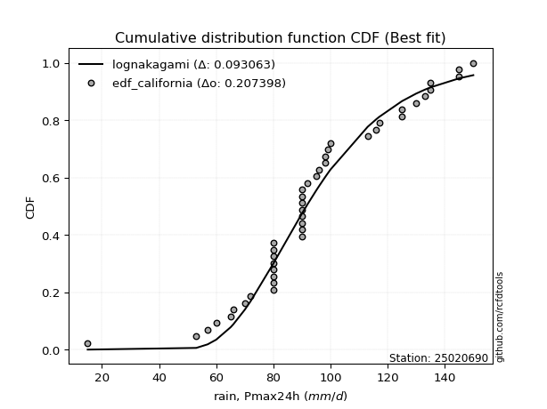</img>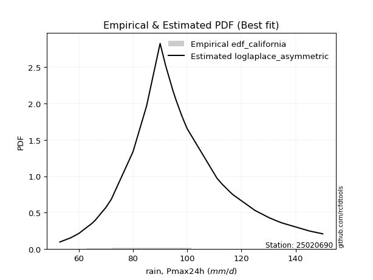</img>

</div>


### 2. Empirical - EDF Hazen (1930)

Hazen method for plotting positions is a formula used to estimate the empirical cumulative probability distribution of flood events or other hydrological data. This formula often results in biased estimations, particularly when extrapolating to extreme events (high return periods).

<div align="center">


$P=(m-0.5)/n$


</div>


**2.1. Empirical values**

<div align="center">

|                | 0                  | 1                  | 2                  | 3                  | 4                  | 5                  | 6                  | 7                  | 8                  | 9                  | 10                 | 11                 | 12                 | 13               | 14                 | 15                 | 16                | 17                 | 18                 | 19                | 20                 | 21                 | 22                 | 23                 | 24                 | 25                 | 26                | 27                 | 28                | 29                 | 30                | 31                 | 32                | 33                 | 34                 | 35                 | 36                 | 37        | 38                | 39                | 40                | 41                | 42                | 43                | 44                | 45                 | 46                 | 47                 | 48                | 49                |
|:---------------|:-------------------|:-------------------|:-------------------|:-------------------|:-------------------|:-------------------|:-------------------|:-------------------|:-------------------|:-------------------|:-------------------|:-------------------|:-------------------|:-----------------|:-------------------|:-------------------|:------------------|:-------------------|:-------------------|:------------------|:-------------------|:-------------------|:-------------------|:-------------------|:-------------------|:-------------------|:------------------|:-------------------|:------------------|:-------------------|:------------------|:-------------------|:------------------|:-------------------|:-------------------|:-------------------|:-------------------|:----------|:------------------|:------------------|:------------------|:------------------|:------------------|:------------------|:------------------|:-------------------|:-------------------|:-------------------|:------------------|:------------------|
| date           | 1986               | 1977               | 1998               | 1978               | 1979               | 1985               | 1982               | 1975               | 1991               | 1994               | 1990               | 1997               | 1974               | 2012             | 2015               | 2017               | 2000              | 2003               | 2019               | 2009              | 2006               | 1992               | 1995               | 1996               | 2021               | 2010               | 1976              | 1987               | 1999              | 1983               | 2016              | 2004               | 2001              | 2022               | 2007               | 2018               | 2008               | 2020      | 1973              | 1984              | 1981              | 1988              | 1993              | 2013              | 2005              | 1980               | 2002               | 1989               | 2011              | 2014              |
| x              | 53.0               | 57.0               | 60.0               | 65.0324581         | 66.0               | 70.0               | 72.0               | 80.0               | 80.0               | 80.0               | 80.0               | 80.0               | 80.0               | 80.0             | 80.0               | 85.0               | 90.0              | 90.0               | 90.0               | 90.0              | 90.0               | 90.0               | 90.0               | 90.0               | 90.0               | 90.0               | 92.0              | 94.700649162       | 95.0              | 96.0               | 96.0              | 98.0               | 98.0              | 98.0               | 99.0               | 100.0              | 100.0              | 111.0     | 113.0             | 116.0             | 117.0             | 125.0             | 125.0             | 130.0             | 133.0             | 135.0              | 135.0              | 145.0              | 145.0             | 150.0             |
| m              | 1                  | 2                  | 3                  | 4                  | 5                  | 6                  | 7                  | 8                  | 9                  | 10                 | 11                 | 12                 | 13                 | 14               | 15                 | 16                 | 17                | 18                 | 19                 | 20                | 21                 | 22                 | 23                 | 24                 | 25                 | 26                 | 27                | 28                 | 29                | 30                 | 31                | 32                 | 33                | 34                 | 35                 | 36                 | 37                 | 38        | 39                | 40                | 41                | 42                | 43                | 44                | 45                | 46                 | 47                 | 48                 | 49                | 50                |
| empirical_dist | edf_hazen          | edf_hazen          | edf_hazen          | edf_hazen          | edf_hazen          | edf_hazen          | edf_hazen          | edf_hazen          | edf_hazen          | edf_hazen          | edf_hazen          | edf_hazen          | edf_hazen          | edf_hazen        | edf_hazen          | edf_hazen          | edf_hazen         | edf_hazen          | edf_hazen          | edf_hazen         | edf_hazen          | edf_hazen          | edf_hazen          | edf_hazen          | edf_hazen          | edf_hazen          | edf_hazen         | edf_hazen          | edf_hazen         | edf_hazen          | edf_hazen         | edf_hazen          | edf_hazen         | edf_hazen          | edf_hazen          | edf_hazen          | edf_hazen          | edf_hazen | edf_hazen         | edf_hazen         | edf_hazen         | edf_hazen         | edf_hazen         | edf_hazen         | edf_hazen         | edf_hazen          | edf_hazen          | edf_hazen          | edf_hazen         | edf_hazen         |
| empirical      | 0.01               | 0.03               | 0.05               | 0.07               | 0.09               | 0.11               | 0.13               | 0.15               | 0.17               | 0.19               | 0.21               | 0.23               | 0.25               | 0.27             | 0.29               | 0.31               | 0.33              | 0.35               | 0.37               | 0.39              | 0.41               | 0.43               | 0.45               | 0.47               | 0.49               | 0.51               | 0.53              | 0.55               | 0.57              | 0.59               | 0.61              | 0.63               | 0.65              | 0.67               | 0.69               | 0.71               | 0.73               | 0.75      | 0.77              | 0.79              | 0.81              | 0.83              | 0.85              | 0.87              | 0.89              | 0.91               | 0.93               | 0.95               | 0.97              | 0.99              |
| empirical_tr   | 1.0101010101010102 | 1.0309278350515465 | 1.0526315789473684 | 1.0752688172043012 | 1.0989010989010988 | 1.1235955056179776 | 1.1494252873563218 | 1.1764705882352942 | 1.2048192771084338 | 1.2345679012345678 | 1.2658227848101264 | 1.2987012987012987 | 1.3333333333333333 | 1.36986301369863 | 1.4084507042253522 | 1.4492753623188408 | 1.492537313432836 | 1.5384615384615383 | 1.5873015873015872 | 1.639344262295082 | 1.6949152542372878 | 1.7543859649122806 | 1.8181818181818181 | 1.8867924528301885 | 1.9607843137254901 | 2.0408163265306123 | 2.127659574468085 | 2.2222222222222223 | 2.325581395348837 | 2.4390243902439024 | 2.564102564102564 | 2.7027027027027026 | 2.857142857142857 | 3.0303030303030307 | 3.2258064516129026 | 3.4482758620689653 | 3.7037037037037033 | 4.0       | 4.347826086956522 | 4.761904761904763 | 5.263157894736843 | 5.882352941176469 | 6.666666666666666 | 7.692307692307692 | 9.090909090909092 | 11.111111111111114 | 14.285714285714295 | 19.999999999999982 | 33.33333333333331 | 99.99999999999991 |

</div>


**2.2. Kolmogorov-Smirnov fit test (sorted by Δ)**


<div align="center">

|                | 0                   | 1                   | 2                   | 3                   | 4                   | 5                   | 6                   | 7                   | 8                   | 9                   | 10                  | 11                    | 12                  | 13                  | 14                  | 15                  | 16                  | 17                  | 18                  | 19                  | 20                  | 21                  | 22                  | 23                  | 24                  | 25                  | 26                  | 27                  | 28                  | 29                  | 30                  | 31                  | 32                  | 33                  | 34                  | 35                  | 36                  | 37                  | 38                  | 39                  | 40                  | 41                  | 42                  | 43                  | 44                  | 45                  | 46                  | 47                  | 48                  | 49                  | 50                  | 51                  | 52                  | 53                  | 54                  | 55                  | 56                  | 57                  | 58                  | 59                  | 60                  | 61                  | 62                  | 63                  | 64                  | 65                  | 66                  | 67                  | 68                  | 69                  | 70                  | 71                  | 72                  | 73                  | 74                  | 75                  | 76                  | 77                  | 78                  | 79                  | 80                  | 81                  | 82                  | 83                  | 84                  | 85                  | 86                  | 87                  |
|:---------------|:--------------------|:--------------------|:--------------------|:--------------------|:--------------------|:--------------------|:--------------------|:--------------------|:--------------------|:--------------------|:--------------------|:----------------------|:--------------------|:--------------------|:--------------------|:--------------------|:--------------------|:--------------------|:--------------------|:--------------------|:--------------------|:--------------------|:--------------------|:--------------------|:--------------------|:--------------------|:--------------------|:--------------------|:--------------------|:--------------------|:--------------------|:--------------------|:--------------------|:--------------------|:--------------------|:--------------------|:--------------------|:--------------------|:--------------------|:--------------------|:--------------------|:--------------------|:--------------------|:--------------------|:--------------------|:--------------------|:--------------------|:--------------------|:--------------------|:--------------------|:--------------------|:--------------------|:--------------------|:--------------------|:--------------------|:--------------------|:--------------------|:--------------------|:--------------------|:--------------------|:--------------------|:--------------------|:--------------------|:--------------------|:--------------------|:--------------------|:--------------------|:--------------------|:--------------------|:--------------------|:--------------------|:--------------------|:--------------------|:--------------------|:--------------------|:--------------------|:--------------------|:--------------------|:--------------------|:--------------------|:--------------------|:--------------------|:--------------------|:--------------------|:--------------------|:--------------------|:--------------------|:--------------------|
| station        | 25020690            | 25020690            | 25020690            | 25020690            | 25020690            | 25020690            | 25020690            | 25020690            | 25020690            | 25020690            | 25020690            | 25020690              | 25020690            | 25020690            | 25020690            | 25020690            | 25020690            | 25020690            | 25020690            | 25020690            | 25020690            | 25020690            | 25020690            | 25020690            | 25020690            | 25020690            | 25020690            | 25020690            | 25020690            | 25020690            | 25020690            | 25020690            | 25020690            | 25020690            | 25020690            | 25020690            | 25020690            | 25020690            | 25020690            | 25020690            | 25020690            | 25020690            | 25020690            | 25020690            | 25020690            | 25020690            | 25020690            | 25020690            | 25020690            | 25020690            | 25020690            | 25020690            | 25020690            | 25020690            | 25020690            | 25020690            | 25020690            | 25020690            | 25020690            | 25020690            | 25020690            | 25020690            | 25020690            | 25020690            | 25020690            | 25020690            | 25020690            | 25020690            | 25020690            | 25020690            | 25020690            | 25020690            | 25020690            | 25020690            | 25020690            | 25020690            | 25020690            | 25020690            | 25020690            | 25020690            | 25020690            | 25020690            | 25020690            | 25020690            | 25020690            | 25020690            | 25020690            | 25020690            |
| empirical_dist | edf_hazen           | edf_hazen           | edf_hazen           | edf_hazen           | edf_hazen           | edf_hazen           | edf_hazen           | edf_hazen           | edf_hazen           | edf_hazen           | edf_hazen           | edf_hazen             | edf_hazen           | edf_hazen           | edf_hazen           | edf_hazen           | edf_hazen           | edf_hazen           | edf_hazen           | edf_hazen           | edf_hazen           | edf_hazen           | edf_hazen           | edf_hazen           | edf_hazen           | edf_hazen           | edf_hazen           | edf_hazen           | edf_hazen           | edf_hazen           | edf_hazen           | edf_hazen           | edf_hazen           | edf_hazen           | edf_hazen           | edf_hazen           | edf_hazen           | edf_hazen           | edf_hazen           | edf_hazen           | edf_hazen           | edf_hazen           | edf_hazen           | edf_hazen           | edf_hazen           | edf_hazen           | edf_hazen           | edf_hazen           | edf_hazen           | edf_hazen           | edf_hazen           | edf_hazen           | edf_hazen           | edf_hazen           | edf_hazen           | edf_hazen           | edf_hazen           | edf_hazen           | edf_hazen           | edf_hazen           | edf_hazen           | edf_hazen           | edf_hazen           | edf_hazen           | edf_hazen           | edf_hazen           | edf_hazen           | edf_hazen           | edf_hazen           | edf_hazen           | edf_hazen           | edf_hazen           | edf_hazen           | edf_hazen           | edf_hazen           | edf_hazen           | edf_hazen           | edf_hazen           | edf_hazen           | edf_hazen           | edf_hazen           | edf_hazen           | edf_hazen           | edf_hazen           | edf_hazen           | edf_hazen           | edf_hazen           | edf_hazen           |
| p_dist         | loghypsecant        | logfisk             | laplace_asymmetric  | fisk                | loggenlogistic      | mielke              | logmielke           | loglogistic         | genlogistic         | loglaplace          | exponnorm           | loglaplace_asymmetric | logalpha            | logbetaprime        | betaprime           | logrice             | lognct              | loggamma            | loggamma            | logerlang           | logncf              | logfatiguelife      | nct                 | logf                | logcrystalball      | loglognorm          | logexponnorm        | logt                | lognorm             | lognorm             | lognakagami         | gumbel_r            | ncf                 | alpha               | f                   | invgamma            | johnsonsu           | invweibull          | fatiguelife         | logpearson3         | logjohnsonsu        | logloggamma         | gamma               | erlang              | chi2                | rayleigh            | loginvgamma         | loginvgauss         | logweibull_min      | pearson3            | nakagami            | kstwobign           | invgauss            | weibull_min         | maxwell             | rice                | logmaxwell          | moyal               | halfnorm            | hypsecant           | lograyleigh         | logistic            | halflogistic        | loginvweibull       | t                   | norm                | crystalball         | laplace             | loggumbel_r         | loggumbel_l         | loghalfnorm         | logkstwobign        | logmoyal            | wald                | loghalflogistic     | gumbel_l            | loggenexpon         | logwald             | gibrat              | loggibrat           | expon               | loggompertz         | logtruncnorm        | logexpon            | logchi2             | gompertz            | genexpon            | truncnorm           |
| delta          | 0.09566736790301478 | 0.10491373222740757 | 0.1049512324895322  | 0.1063784738525525  | 0.10656707484404748 | 0.10657483017648278 | 0.10657578208222329 | 0.10696530994674658 | 0.11227332477196716 | 0.11365955467716299 | 0.11451625569734886 | 0.11463903289030963   | 0.1150260362667942  | 0.1150839653774991  | 0.11678309836451312 | 0.11695808098758187 | 0.11781213414565417 | 0.11843578768399021 | 0.11843578768399021 | 0.11869998043569352 | 0.11895447385883229 | 0.11902322177526636 | 0.11923894114563216 | 0.12075573545192642 | 0.12087692718176779 | 0.12087932005826851 | 0.12088405805432978 | 0.12088411604785865 | 0.12088442087216877 | 0.12088442087216877 | 0.12091716618561421 | 0.12101020446639255 | 0.12107939458652295 | 0.1215283331007242  | 0.12172363863039215 | 0.12197992491894882 | 0.1222857025654811  | 0.12326508878625603 | 0.12331106205863884 | 0.1233300674463087  | 0.12341496522369455 | 0.12357033307297649 | 0.12474132944805949 | 0.12474133209911464 | 0.12474137669086272 | 0.12748953241624406 | 0.1280315807279176  | 0.12900543910627216 | 0.12929818000448146 | 0.13114809905719693 | 0.13350455452569232 | 0.1344189873612374  | 0.13475571320661012 | 0.13586594619036751 | 0.13685495259080216 | 0.13713440086855544 | 0.1391639540785013  | 0.14333822630102538 | 0.14370148034036456 | 0.1506548626109464  | 0.15122976946406258 | 0.15779327755350825 | 0.15830372225080658 | 0.160871442390529   | 0.1662859378410857  | 0.1662988831265818  | 0.16629888916079694 | 0.1698633738991827  | 0.16999952114635486 | 0.17889288090430644 | 0.18536190665095803 | 0.19442330584821618 | 0.19483842606072016 | 0.20296762648354644 | 0.20495689215008267 | 0.23174312367834682 | 0.24549814981200282 | 0.26362165660587084 | 0.271343119780177   | 0.27158388944463147 | 0.31400661589849876 | 0.3372355501496678  | 0.35908476485609464 | 0.3651621249338929  | 0.4054917850508304  | 0.8116941647432715  | 0.903151796333258   | 0.9869170890934433  |
| deltao         | 0.19233304448274094 | 0.19233304448274094 | 0.19233304448274094 | 0.19233304448274094 | 0.19233304448274094 | 0.19233304448274094 | 0.19233304448274094 | 0.19233304448274094 | 0.19233304448274094 | 0.19233304448274094 | 0.19233304448274094 | 0.19233304448274094   | 0.19233304448274094 | 0.19233304448274094 | 0.19233304448274094 | 0.19233304448274094 | 0.19233304448274094 | 0.19233304448274094 | 0.19233304448274094 | 0.19233304448274094 | 0.19233304448274094 | 0.19233304448274094 | 0.19233304448274094 | 0.19233304448274094 | 0.19233304448274094 | 0.19233304448274094 | 0.19233304448274094 | 0.19233304448274094 | 0.19233304448274094 | 0.19233304448274094 | 0.19233304448274094 | 0.19233304448274094 | 0.19233304448274094 | 0.19233304448274094 | 0.19233304448274094 | 0.19233304448274094 | 0.19233304448274094 | 0.19233304448274094 | 0.19233304448274094 | 0.19233304448274094 | 0.19233304448274094 | 0.19233304448274094 | 0.19233304448274094 | 0.19233304448274094 | 0.19233304448274094 | 0.19233304448274094 | 0.19233304448274094 | 0.19233304448274094 | 0.19233304448274094 | 0.19233304448274094 | 0.19233304448274094 | 0.19233304448274094 | 0.19233304448274094 | 0.19233304448274094 | 0.19233304448274094 | 0.19233304448274094 | 0.19233304448274094 | 0.19233304448274094 | 0.19233304448274094 | 0.19233304448274094 | 0.19233304448274094 | 0.19233304448274094 | 0.19233304448274094 | 0.19233304448274094 | 0.19233304448274094 | 0.19233304448274094 | 0.19233304448274094 | 0.19233304448274094 | 0.19233304448274094 | 0.19233304448274094 | 0.19233304448274094 | 0.19233304448274094 | 0.19233304448274094 | 0.19233304448274094 | 0.19233304448274094 | 0.19233304448274094 | 0.19233304448274094 | 0.19233304448274094 | 0.19233304448274094 | 0.19233304448274094 | 0.19233304448274094 | 0.19233304448274094 | 0.19233304448274094 | 0.19233304448274094 | 0.19233304448274094 | 0.19233304448274094 | 0.19233304448274094 | 0.19233304448274094 |
| eval           | Δo > Δ              | Δo > Δ              | Δo > Δ              | Δo > Δ              | Δo > Δ              | Δo > Δ              | Δo > Δ              | Δo > Δ              | Δo > Δ              | Δo > Δ              | Δo > Δ              | Δo > Δ                | Δo > Δ              | Δo > Δ              | Δo > Δ              | Δo > Δ              | Δo > Δ              | Δo > Δ              | Δo > Δ              | Δo > Δ              | Δo > Δ              | Δo > Δ              | Δo > Δ              | Δo > Δ              | Δo > Δ              | Δo > Δ              | Δo > Δ              | Δo > Δ              | Δo > Δ              | Δo > Δ              | Δo > Δ              | Δo > Δ              | Δo > Δ              | Δo > Δ              | Δo > Δ              | Δo > Δ              | Δo > Δ              | Δo > Δ              | Δo > Δ              | Δo > Δ              | Δo > Δ              | Δo > Δ              | Δo > Δ              | Δo > Δ              | Δo > Δ              | Δo > Δ              | Δo > Δ              | Δo > Δ              | Δo > Δ              | Δo > Δ              | Δo > Δ              | Δo > Δ              | Δo > Δ              | Δo > Δ              | Δo > Δ              | Δo > Δ              | Δo > Δ              | Δo > Δ              | Δo > Δ              | Δo > Δ              | Δo > Δ              | Δo > Δ              | Δo > Δ              | Δo > Δ              | Δo > Δ              | Δo > Δ              | Δo > Δ              | Δo > Δ              | Δo > Δ              | Δo > Δ              | Δo > Δ              | Δo <= Δ             | Δo <= Δ             | Δo <= Δ             | Δo <= Δ             | Δo <= Δ             | Δo <= Δ             | Δo <= Δ             | Δo <= Δ             | Δo <= Δ             | Δo <= Δ             | Δo <= Δ             | Δo <= Δ             | Δo <= Δ             | Δo <= Δ             | Δo <= Δ             | Δo <= Δ             | Δo <= Δ             |
| fit            | 1                   | 1                   | 1                   | 1                   | 1                   | 1                   | 1                   | 1                   | 1                   | 1                   | 1                   | 1                     | 1                   | 1                   | 1                   | 1                   | 1                   | 1                   | 1                   | 1                   | 1                   | 1                   | 1                   | 1                   | 1                   | 1                   | 1                   | 1                   | 1                   | 1                   | 1                   | 1                   | 1                   | 1                   | 1                   | 1                   | 1                   | 1                   | 1                   | 1                   | 1                   | 1                   | 1                   | 1                   | 1                   | 1                   | 1                   | 1                   | 1                   | 1                   | 1                   | 1                   | 1                   | 1                   | 1                   | 1                   | 1                   | 1                   | 1                   | 1                   | 1                   | 1                   | 1                   | 1                   | 1                   | 1                   | 1                   | 1                   | 1                   | 1                   | 1                   | 0                   | 0                   | 0                   | 0                   | 0                   | 0                   | 0                   | 0                   | 0                   | 0                   | 0                   | 0                   | 0                   | 0                   | 0                   | 0                   | 0                   |
| n              | 50                  | 50                  | 50                  | 50                  | 50                  | 50                  | 50                  | 50                  | 50                  | 50                  | 50                  | 50                    | 50                  | 50                  | 50                  | 50                  | 50                  | 50                  | 50                  | 50                  | 50                  | 50                  | 50                  | 50                  | 50                  | 50                  | 50                  | 50                  | 50                  | 50                  | 50                  | 50                  | 50                  | 50                  | 50                  | 50                  | 50                  | 50                  | 50                  | 50                  | 50                  | 50                  | 50                  | 50                  | 50                  | 50                  | 50                  | 50                  | 50                  | 50                  | 50                  | 50                  | 50                  | 50                  | 50                  | 50                  | 50                  | 50                  | 50                  | 50                  | 50                  | 50                  | 50                  | 50                  | 50                  | 50                  | 50                  | 50                  | 50                  | 50                  | 50                  | 50                  | 50                  | 50                  | 50                  | 50                  | 50                  | 50                  | 50                  | 50                  | 50                  | 50                  | 50                  | 50                  | 50                  | 50                  | 50                  | 50                  |
| best_fit       | 1                   | 0                   | 0                   | 0                   | 0                   | 0                   | 0                   | 0                   | 0                   | 0                   | 0                   | 0                     | 0                   | 0                   | 0                   | 0                   | 0                   | 0                   | 0                   | 0                   | 0                   | 0                   | 0                   | 0                   | 0                   | 0                   | 0                   | 0                   | 0                   | 0                   | 0                   | 0                   | 0                   | 0                   | 0                   | 0                   | 0                   | 0                   | 0                   | 0                   | 0                   | 0                   | 0                   | 0                   | 0                   | 0                   | 0                   | 0                   | 0                   | 0                   | 0                   | 0                   | 0                   | 0                   | 0                   | 0                   | 0                   | 0                   | 0                   | 0                   | 0                   | 0                   | 0                   | 0                   | 0                   | 0                   | 0                   | 0                   | 0                   | 0                   | 0                   | 0                   | 0                   | 0                   | 0                   | 0                   | 0                   | 0                   | 0                   | 0                   | 0                   | 0                   | 0                   | 0                   | 0                   | 0                   | 0                   | 0                   |
| best_fit_sort  | 1                   | 2                   | 3                   | 4                   | 5                   | 6                   | 7                   | 8                   | 9                   | 10                  | 11                  | 12                    | 13                  | 14                  | 15                  | 16                  | 17                  | 18                  | 19                  | 20                  | 21                  | 22                  | 23                  | 24                  | 25                  | 26                  | 27                  | 28                  | 29                  | 30                  | 31                  | 32                  | 33                  | 34                  | 35                  | 36                  | 37                  | 38                  | 39                  | 40                  | 41                  | 42                  | 43                  | 44                  | 45                  | 46                  | 47                  | 48                  | 49                  | 50                  | 51                  | 52                  | 53                  | 54                  | 55                  | 56                  | 57                  | 58                  | 59                  | 60                  | 61                  | 62                  | 63                  | 64                  | 65                  | 66                  | 67                  | 68                  | 69                  | 70                  | 71                  | 72                  | 73                  | 74                  | 75                  | 76                  | 77                  | 78                  | 79                  | 80                  | 81                  | 82                  | 83                  | 84                  | 85                  | 86                  | 87                  | 88                  |

</div>


<div align="center">

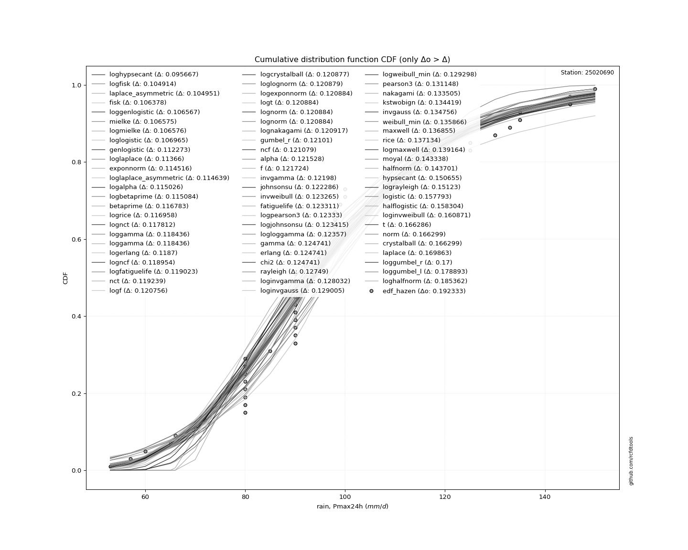</img>

</div>


**2.3. Best fit**

<div align="center">

|   id |   station | empirical_dist   | p_dist       |     delta |   deltao | eval   |   fit |   n |   best_fit |   best_fit_sort |
|-----:|----------:|:-----------------|:-------------|----------:|---------:|:-------|------:|----:|-----------:|----------------:|
|    0 |  25020690 | edf_hazen        | loghypsecant | 0.0956674 | 0.192333 | Δo > Δ |     1 |  50 |          1 |               1 |

</div>


<div align="center">

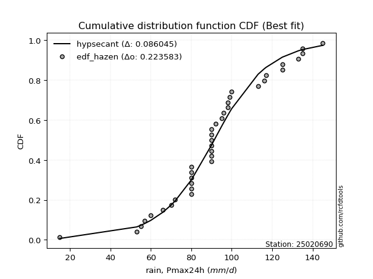</img></img>

</div>


### 3. Empirical - EDF Weibull (1939)

Weibull plotting position formula is an empirical method used to estimate the non-exceedance probability or plotting position for a set of observed data, is often recommended or widely used in practice, particularly in flood frequency analysis.

<div align="center">


$P=m/(n+1)$


</div>


**3.1. Empirical values**

<div align="center">

|                | 0                  | 1                  | 2                    | 3                  | 4                   | 5                   | 6                   | 7                  | 8                   | 9                   | 10                  | 11                  | 12                 | 13                  | 14                  | 15                 | 16                 | 17                  | 18                  | 19                  | 20                 | 21                  | 22                  | 23                  | 24                  | 25                 | 26                 | 27                 | 28                 | 29                 | 30                 | 31                 | 32                 | 33                 | 34                 | 35                 | 36                 | 37                 | 38                 | 39                 | 40                 | 41                 | 42                 | 43                 | 44                 | 45                 | 46                 | 47                 | 48                 | 49                 |
|:---------------|:-------------------|:-------------------|:---------------------|:-------------------|:--------------------|:--------------------|:--------------------|:-------------------|:--------------------|:--------------------|:--------------------|:--------------------|:-------------------|:--------------------|:--------------------|:-------------------|:-------------------|:--------------------|:--------------------|:--------------------|:-------------------|:--------------------|:--------------------|:--------------------|:--------------------|:-------------------|:-------------------|:-------------------|:-------------------|:-------------------|:-------------------|:-------------------|:-------------------|:-------------------|:-------------------|:-------------------|:-------------------|:-------------------|:-------------------|:-------------------|:-------------------|:-------------------|:-------------------|:-------------------|:-------------------|:-------------------|:-------------------|:-------------------|:-------------------|:-------------------|
| date           | 1986               | 1977               | 1998                 | 1978               | 1979                | 1985                | 1982                | 1975               | 1991                | 1994                | 1990                | 1997                | 1974               | 2012                | 2015                | 2017               | 2000               | 2003                | 2019                | 2009                | 2006               | 1992                | 1995                | 1996                | 2021                | 2010               | 1976               | 1987               | 1999               | 1983               | 2016               | 2004               | 2001               | 2022               | 2007               | 2018               | 2008               | 2020               | 1973               | 1984               | 1981               | 1988               | 1993               | 2013               | 2005               | 1980               | 2002               | 1989               | 2011               | 2014               |
| x              | 53.0               | 57.0               | 60.0                 | 65.0324581         | 66.0                | 70.0                | 72.0                | 80.0               | 80.0                | 80.0                | 80.0                | 80.0                | 80.0               | 80.0                | 80.0                | 85.0               | 90.0               | 90.0                | 90.0                | 90.0                | 90.0               | 90.0                | 90.0                | 90.0                | 90.0                | 90.0               | 92.0               | 94.700649162       | 95.0               | 96.0               | 96.0               | 98.0               | 98.0               | 98.0               | 99.0               | 100.0              | 100.0              | 111.0              | 113.0              | 116.0              | 117.0              | 125.0              | 125.0              | 130.0              | 133.0              | 135.0              | 135.0              | 145.0              | 145.0              | 150.0              |
| m              | 1                  | 2                  | 3                    | 4                  | 5                   | 6                   | 7                   | 8                  | 9                   | 10                  | 11                  | 12                  | 13                 | 14                  | 15                  | 16                 | 17                 | 18                  | 19                  | 20                  | 21                 | 22                  | 23                  | 24                  | 25                  | 26                 | 27                 | 28                 | 29                 | 30                 | 31                 | 32                 | 33                 | 34                 | 35                 | 36                 | 37                 | 38                 | 39                 | 40                 | 41                 | 42                 | 43                 | 44                 | 45                 | 46                 | 47                 | 48                 | 49                 | 50                 |
| empirical_dist | edf_weibull        | edf_weibull        | edf_weibull          | edf_weibull        | edf_weibull         | edf_weibull         | edf_weibull         | edf_weibull        | edf_weibull         | edf_weibull         | edf_weibull         | edf_weibull         | edf_weibull        | edf_weibull         | edf_weibull         | edf_weibull        | edf_weibull        | edf_weibull         | edf_weibull         | edf_weibull         | edf_weibull        | edf_weibull         | edf_weibull         | edf_weibull         | edf_weibull         | edf_weibull        | edf_weibull        | edf_weibull        | edf_weibull        | edf_weibull        | edf_weibull        | edf_weibull        | edf_weibull        | edf_weibull        | edf_weibull        | edf_weibull        | edf_weibull        | edf_weibull        | edf_weibull        | edf_weibull        | edf_weibull        | edf_weibull        | edf_weibull        | edf_weibull        | edf_weibull        | edf_weibull        | edf_weibull        | edf_weibull        | edf_weibull        | edf_weibull        |
| empirical      | 0.0196078431372549 | 0.0392156862745098 | 0.058823529411764705 | 0.0784313725490196 | 0.09803921568627451 | 0.11764705882352941 | 0.13725490196078433 | 0.1568627450980392 | 0.17647058823529413 | 0.19607843137254902 | 0.21568627450980393 | 0.23529411764705882 | 0.2549019607843137 | 0.27450980392156865 | 0.29411764705882354 | 0.3137254901960784 | 0.3333333333333333 | 0.35294117647058826 | 0.37254901960784315 | 0.39215686274509803 | 0.4117647058823529 | 0.43137254901960786 | 0.45098039215686275 | 0.47058823529411764 | 0.49019607843137253 | 0.5098039215686274 | 0.5294117647058824 | 0.5490196078431373 | 0.5686274509803921 | 0.5882352941176471 | 0.6078431372549019 | 0.6274509803921569 | 0.6470588235294118 | 0.6666666666666666 | 0.6862745098039216 | 0.7058823529411765 | 0.7254901960784313 | 0.7450980392156863 | 0.7647058823529411 | 0.7843137254901961 | 0.803921568627451  | 0.8235294117647058 | 0.8431372549019608 | 0.8627450980392157 | 0.8823529411764706 | 0.9019607843137255 | 0.9215686274509803 | 0.9411764705882353 | 0.9607843137254902 | 0.9803921568627451 |
| empirical_tr   | 1.02               | 1.0408163265306123 | 1.0625               | 1.0851063829787233 | 1.108695652173913   | 1.1333333333333333  | 1.159090909090909   | 1.1860465116279069 | 1.2142857142857144  | 1.2439024390243902  | 1.275               | 1.3076923076923077  | 1.3421052631578947 | 1.3783783783783785  | 1.4166666666666667  | 1.457142857142857  | 1.4999999999999998 | 1.5454545454545456  | 1.59375             | 1.6451612903225805  | 1.7                | 1.7586206896551724  | 1.8214285714285712  | 1.8888888888888888  | 1.9615384615384617  | 2.04               | 2.125              | 2.217391304347826  | 2.318181818181818  | 2.428571428571429  | 2.55               | 2.6842105263157894 | 2.8333333333333335 | 2.9999999999999996 | 3.1875             | 3.4000000000000004 | 3.6428571428571423 | 3.9230769230769234 | 4.249999999999999  | 4.636363636363636  | 5.1000000000000005 | 5.666666666666665  | 6.375              | 7.285714285714288  | 8.499999999999998  | 10.200000000000001 | 12.749999999999991 | 16.999999999999996 | 25.500000000000018 | 50.99999999999989  |

</div>


**3.2. Kolmogorov-Smirnov fit test (sorted by Δ)**


<div align="center">

|                | 0                   | 1                   | 2                   | 3                   | 4                   | 5                   | 6                   | 7                   | 8                   | 9                   | 10                    | 11                  | 12                  | 13                  | 14                  | 15                  | 16                  | 17                  | 18                  | 19                  | 20                  | 21                  | 22                  | 23                  | 24                  | 25                  | 26                  | 27                  | 28                  | 29                  | 30                  | 31                  | 32                  | 33                  | 34                  | 35                  | 36                  | 37                  | 38                  | 39                  | 40                  | 41                  | 42                  | 43                  | 44                  | 45                  | 46                  | 47                  | 48                  | 49                  | 50                  | 51                  | 52                  | 53                  | 54                  | 55                  | 56                  | 57                  | 58                  | 59                  | 60                  | 61                  | 62                  | 63                  | 64                  | 65                  | 66                  | 67                  | 68                  | 69                  | 70                  | 71                  | 72                  | 73                  | 74                  | 75                  | 76                  | 77                  | 78                  | 79                  | 80                  | 81                  | 82                  | 83                  | 84                  | 85                  | 86                  | 87                  |
|:---------------|:--------------------|:--------------------|:--------------------|:--------------------|:--------------------|:--------------------|:--------------------|:--------------------|:--------------------|:--------------------|:----------------------|:--------------------|:--------------------|:--------------------|:--------------------|:--------------------|:--------------------|:--------------------|:--------------------|:--------------------|:--------------------|:--------------------|:--------------------|:--------------------|:--------------------|:--------------------|:--------------------|:--------------------|:--------------------|:--------------------|:--------------------|:--------------------|:--------------------|:--------------------|:--------------------|:--------------------|:--------------------|:--------------------|:--------------------|:--------------------|:--------------------|:--------------------|:--------------------|:--------------------|:--------------------|:--------------------|:--------------------|:--------------------|:--------------------|:--------------------|:--------------------|:--------------------|:--------------------|:--------------------|:--------------------|:--------------------|:--------------------|:--------------------|:--------------------|:--------------------|:--------------------|:--------------------|:--------------------|:--------------------|:--------------------|:--------------------|:--------------------|:--------------------|:--------------------|:--------------------|:--------------------|:--------------------|:--------------------|:--------------------|:--------------------|:--------------------|:--------------------|:--------------------|:--------------------|:--------------------|:--------------------|:--------------------|:--------------------|:--------------------|:--------------------|:--------------------|:--------------------|:--------------------|
| station        | 25020690            | 25020690            | 25020690            | 25020690            | 25020690            | 25020690            | 25020690            | 25020690            | 25020690            | 25020690            | 25020690              | 25020690            | 25020690            | 25020690            | 25020690            | 25020690            | 25020690            | 25020690            | 25020690            | 25020690            | 25020690            | 25020690            | 25020690            | 25020690            | 25020690            | 25020690            | 25020690            | 25020690            | 25020690            | 25020690            | 25020690            | 25020690            | 25020690            | 25020690            | 25020690            | 25020690            | 25020690            | 25020690            | 25020690            | 25020690            | 25020690            | 25020690            | 25020690            | 25020690            | 25020690            | 25020690            | 25020690            | 25020690            | 25020690            | 25020690            | 25020690            | 25020690            | 25020690            | 25020690            | 25020690            | 25020690            | 25020690            | 25020690            | 25020690            | 25020690            | 25020690            | 25020690            | 25020690            | 25020690            | 25020690            | 25020690            | 25020690            | 25020690            | 25020690            | 25020690            | 25020690            | 25020690            | 25020690            | 25020690            | 25020690            | 25020690            | 25020690            | 25020690            | 25020690            | 25020690            | 25020690            | 25020690            | 25020690            | 25020690            | 25020690            | 25020690            | 25020690            | 25020690            |
| empirical_dist | edf_weibull         | edf_weibull         | edf_weibull         | edf_weibull         | edf_weibull         | edf_weibull         | edf_weibull         | edf_weibull         | edf_weibull         | edf_weibull         | edf_weibull           | edf_weibull         | edf_weibull         | edf_weibull         | edf_weibull         | edf_weibull         | edf_weibull         | edf_weibull         | edf_weibull         | edf_weibull         | edf_weibull         | edf_weibull         | edf_weibull         | edf_weibull         | edf_weibull         | edf_weibull         | edf_weibull         | edf_weibull         | edf_weibull         | edf_weibull         | edf_weibull         | edf_weibull         | edf_weibull         | edf_weibull         | edf_weibull         | edf_weibull         | edf_weibull         | edf_weibull         | edf_weibull         | edf_weibull         | edf_weibull         | edf_weibull         | edf_weibull         | edf_weibull         | edf_weibull         | edf_weibull         | edf_weibull         | edf_weibull         | edf_weibull         | edf_weibull         | edf_weibull         | edf_weibull         | edf_weibull         | edf_weibull         | edf_weibull         | edf_weibull         | edf_weibull         | edf_weibull         | edf_weibull         | edf_weibull         | edf_weibull         | edf_weibull         | edf_weibull         | edf_weibull         | edf_weibull         | edf_weibull         | edf_weibull         | edf_weibull         | edf_weibull         | edf_weibull         | edf_weibull         | edf_weibull         | edf_weibull         | edf_weibull         | edf_weibull         | edf_weibull         | edf_weibull         | edf_weibull         | edf_weibull         | edf_weibull         | edf_weibull         | edf_weibull         | edf_weibull         | edf_weibull         | edf_weibull         | edf_weibull         | edf_weibull         | edf_weibull         |
| p_dist         | loghypsecant        | logfisk             | loglogistic         | fisk                | loggenlogistic      | mielke              | logmielke           | laplace_asymmetric  | genlogistic         | exponnorm           | loglaplace_asymmetric | logbetaprime        | logalpha            | logrice             | lognct              | betaprime           | loglaplace          | loggamma            | loggamma            | logerlang           | logncf              | logfatiguelife      | nct                 | logf                | logcrystalball      | loglognorm          | logexponnorm        | logt                | lognorm             | lognorm             | lognakagami         | ncf                 | alpha               | f                   | invgamma            | gumbel_r            | johnsonsu           | fatiguelife         | logpearson3         | logjohnsonsu        | logloggamma         | invweibull          | gamma               | erlang              | chi2                | rayleigh            | loginvgamma         | logweibull_min      | loginvgauss         | pearson3            | kstwobign           | nakagami            | weibull_min         | invgauss            | maxwell             | rice                | logmaxwell          | moyal               | halfnorm            | hypsecant           | lograyleigh         | logistic            | halflogistic        | loginvweibull       | t                   | norm                | crystalball         | loggumbel_r         | laplace             | loggumbel_l         | loghalfnorm         | logkstwobign        | logmoyal            | wald                | loghalflogistic     | gumbel_l            | loggenexpon         | logwald             | loggibrat           | gibrat              | expon               | loggompertz         | logtruncnorm        | logexpon            | logchi2             | gompertz            | genexpon            | truncnorm           |
| delta          | 0.09115756398144614 | 0.10158039889407428 | 0.10245550602517794 | 0.1030451405192192  | 0.10323374151071418 | 0.10324149684314948 | 0.10324244874888999 | 0.1047551540581596  | 0.10776352085039853 | 0.11118292236401556 | 0.11130569955697633   | 0.11145012286039058 | 0.1116927029334609  | 0.11244827706601324 | 0.11330233022408553 | 0.11344976503117982 | 0.1134634762457904  | 0.11392598376242158 | 0.11392598376242158 | 0.11419017651412489 | 0.11444466993726365 | 0.11451341785369773 | 0.11472913722406353 | 0.11624593153035778 | 0.11636712326019916 | 0.11636951613669988 | 0.11637425413276115 | 0.11637431212629001 | 0.11637461695060014 | 0.11637461695060014 | 0.11640736226404558 | 0.11656959066495431 | 0.11701852917915556 | 0.11721383470882352 | 0.11747012099738019 | 0.11767687113305925 | 0.11777589864391247 | 0.11880125813707021 | 0.11882026352474007 | 0.11890516130212592 | 0.11906052915140786 | 0.11993175545292273 | 0.12023152552649086 | 0.12023152817754601 | 0.12023157276929408 | 0.12297972849467542 | 0.1246982473945843  | 0.12478837608291282 | 0.12567210577293886 | 0.1266382951356283  | 0.12755624226319817 | 0.1289947506041237  | 0.13135614226879888 | 0.13142237987327682 | 0.13234514866923353 | 0.1326245969469868  | 0.135830620745168   | 0.14000489296769209 | 0.14036814700703126 | 0.14614505868937777 | 0.14789643613072928 | 0.15328347363193962 | 0.15497038891747328 | 0.15706051585278935 | 0.16177613391951706 | 0.16178907920501318 | 0.1617890852392283  | 0.16666618781302156 | 0.16966729546781012 | 0.1743830769827378  | 0.18202857331762473 | 0.18756056075017696 | 0.19150509272738686 | 0.19963429315021314 | 0.20162355881674937 | 0.22723331975677818 | 0.2386354047139636  | 0.26028832327253754 | 0.26825055611129817 | 0.27546076683900056 | 0.3071438708004596  | 0.3303728050516286  | 0.35222201975805545 | 0.3582993798358537  | 0.3986290399527912  | 0.8048314196452323  | 0.8947204237842383  | 0.9773092459561884  |
| deltao         | 0.19233304448274094 | 0.19233304448274094 | 0.19233304448274094 | 0.19233304448274094 | 0.19233304448274094 | 0.19233304448274094 | 0.19233304448274094 | 0.19233304448274094 | 0.19233304448274094 | 0.19233304448274094 | 0.19233304448274094   | 0.19233304448274094 | 0.19233304448274094 | 0.19233304448274094 | 0.19233304448274094 | 0.19233304448274094 | 0.19233304448274094 | 0.19233304448274094 | 0.19233304448274094 | 0.19233304448274094 | 0.19233304448274094 | 0.19233304448274094 | 0.19233304448274094 | 0.19233304448274094 | 0.19233304448274094 | 0.19233304448274094 | 0.19233304448274094 | 0.19233304448274094 | 0.19233304448274094 | 0.19233304448274094 | 0.19233304448274094 | 0.19233304448274094 | 0.19233304448274094 | 0.19233304448274094 | 0.19233304448274094 | 0.19233304448274094 | 0.19233304448274094 | 0.19233304448274094 | 0.19233304448274094 | 0.19233304448274094 | 0.19233304448274094 | 0.19233304448274094 | 0.19233304448274094 | 0.19233304448274094 | 0.19233304448274094 | 0.19233304448274094 | 0.19233304448274094 | 0.19233304448274094 | 0.19233304448274094 | 0.19233304448274094 | 0.19233304448274094 | 0.19233304448274094 | 0.19233304448274094 | 0.19233304448274094 | 0.19233304448274094 | 0.19233304448274094 | 0.19233304448274094 | 0.19233304448274094 | 0.19233304448274094 | 0.19233304448274094 | 0.19233304448274094 | 0.19233304448274094 | 0.19233304448274094 | 0.19233304448274094 | 0.19233304448274094 | 0.19233304448274094 | 0.19233304448274094 | 0.19233304448274094 | 0.19233304448274094 | 0.19233304448274094 | 0.19233304448274094 | 0.19233304448274094 | 0.19233304448274094 | 0.19233304448274094 | 0.19233304448274094 | 0.19233304448274094 | 0.19233304448274094 | 0.19233304448274094 | 0.19233304448274094 | 0.19233304448274094 | 0.19233304448274094 | 0.19233304448274094 | 0.19233304448274094 | 0.19233304448274094 | 0.19233304448274094 | 0.19233304448274094 | 0.19233304448274094 | 0.19233304448274094 |
| eval           | Δo > Δ              | Δo > Δ              | Δo > Δ              | Δo > Δ              | Δo > Δ              | Δo > Δ              | Δo > Δ              | Δo > Δ              | Δo > Δ              | Δo > Δ              | Δo > Δ                | Δo > Δ              | Δo > Δ              | Δo > Δ              | Δo > Δ              | Δo > Δ              | Δo > Δ              | Δo > Δ              | Δo > Δ              | Δo > Δ              | Δo > Δ              | Δo > Δ              | Δo > Δ              | Δo > Δ              | Δo > Δ              | Δo > Δ              | Δo > Δ              | Δo > Δ              | Δo > Δ              | Δo > Δ              | Δo > Δ              | Δo > Δ              | Δo > Δ              | Δo > Δ              | Δo > Δ              | Δo > Δ              | Δo > Δ              | Δo > Δ              | Δo > Δ              | Δo > Δ              | Δo > Δ              | Δo > Δ              | Δo > Δ              | Δo > Δ              | Δo > Δ              | Δo > Δ              | Δo > Δ              | Δo > Δ              | Δo > Δ              | Δo > Δ              | Δo > Δ              | Δo > Δ              | Δo > Δ              | Δo > Δ              | Δo > Δ              | Δo > Δ              | Δo > Δ              | Δo > Δ              | Δo > Δ              | Δo > Δ              | Δo > Δ              | Δo > Δ              | Δo > Δ              | Δo > Δ              | Δo > Δ              | Δo > Δ              | Δo > Δ              | Δo > Δ              | Δo > Δ              | Δo > Δ              | Δo > Δ              | Δo > Δ              | Δo > Δ              | Δo <= Δ             | Δo <= Δ             | Δo <= Δ             | Δo <= Δ             | Δo <= Δ             | Δo <= Δ             | Δo <= Δ             | Δo <= Δ             | Δo <= Δ             | Δo <= Δ             | Δo <= Δ             | Δo <= Δ             | Δo <= Δ             | Δo <= Δ             | Δo <= Δ             |
| fit            | 1                   | 1                   | 1                   | 1                   | 1                   | 1                   | 1                   | 1                   | 1                   | 1                   | 1                     | 1                   | 1                   | 1                   | 1                   | 1                   | 1                   | 1                   | 1                   | 1                   | 1                   | 1                   | 1                   | 1                   | 1                   | 1                   | 1                   | 1                   | 1                   | 1                   | 1                   | 1                   | 1                   | 1                   | 1                   | 1                   | 1                   | 1                   | 1                   | 1                   | 1                   | 1                   | 1                   | 1                   | 1                   | 1                   | 1                   | 1                   | 1                   | 1                   | 1                   | 1                   | 1                   | 1                   | 1                   | 1                   | 1                   | 1                   | 1                   | 1                   | 1                   | 1                   | 1                   | 1                   | 1                   | 1                   | 1                   | 1                   | 1                   | 1                   | 1                   | 1                   | 1                   | 0                   | 0                   | 0                   | 0                   | 0                   | 0                   | 0                   | 0                   | 0                   | 0                   | 0                   | 0                   | 0                   | 0                   | 0                   |
| n              | 50                  | 50                  | 50                  | 50                  | 50                  | 50                  | 50                  | 50                  | 50                  | 50                  | 50                    | 50                  | 50                  | 50                  | 50                  | 50                  | 50                  | 50                  | 50                  | 50                  | 50                  | 50                  | 50                  | 50                  | 50                  | 50                  | 50                  | 50                  | 50                  | 50                  | 50                  | 50                  | 50                  | 50                  | 50                  | 50                  | 50                  | 50                  | 50                  | 50                  | 50                  | 50                  | 50                  | 50                  | 50                  | 50                  | 50                  | 50                  | 50                  | 50                  | 50                  | 50                  | 50                  | 50                  | 50                  | 50                  | 50                  | 50                  | 50                  | 50                  | 50                  | 50                  | 50                  | 50                  | 50                  | 50                  | 50                  | 50                  | 50                  | 50                  | 50                  | 50                  | 50                  | 50                  | 50                  | 50                  | 50                  | 50                  | 50                  | 50                  | 50                  | 50                  | 50                  | 50                  | 50                  | 50                  | 50                  | 50                  |
| best_fit       | 1                   | 0                   | 0                   | 0                   | 0                   | 0                   | 0                   | 0                   | 0                   | 0                   | 0                     | 0                   | 0                   | 0                   | 0                   | 0                   | 0                   | 0                   | 0                   | 0                   | 0                   | 0                   | 0                   | 0                   | 0                   | 0                   | 0                   | 0                   | 0                   | 0                   | 0                   | 0                   | 0                   | 0                   | 0                   | 0                   | 0                   | 0                   | 0                   | 0                   | 0                   | 0                   | 0                   | 0                   | 0                   | 0                   | 0                   | 0                   | 0                   | 0                   | 0                   | 0                   | 0                   | 0                   | 0                   | 0                   | 0                   | 0                   | 0                   | 0                   | 0                   | 0                   | 0                   | 0                   | 0                   | 0                   | 0                   | 0                   | 0                   | 0                   | 0                   | 0                   | 0                   | 0                   | 0                   | 0                   | 0                   | 0                   | 0                   | 0                   | 0                   | 0                   | 0                   | 0                   | 0                   | 0                   | 0                   | 0                   |
| best_fit_sort  | 1                   | 2                   | 3                   | 4                   | 5                   | 6                   | 7                   | 8                   | 9                   | 10                  | 11                    | 12                  | 13                  | 14                  | 15                  | 16                  | 17                  | 18                  | 19                  | 20                  | 21                  | 22                  | 23                  | 24                  | 25                  | 26                  | 27                  | 28                  | 29                  | 30                  | 31                  | 32                  | 33                  | 34                  | 35                  | 36                  | 37                  | 38                  | 39                  | 40                  | 41                  | 42                  | 43                  | 44                  | 45                  | 46                  | 47                  | 48                  | 49                  | 50                  | 51                  | 52                  | 53                  | 54                  | 55                  | 56                  | 57                  | 58                  | 59                  | 60                  | 61                  | 62                  | 63                  | 64                  | 65                  | 66                  | 67                  | 68                  | 69                  | 70                  | 71                  | 72                  | 73                  | 74                  | 75                  | 76                  | 77                  | 78                  | 79                  | 80                  | 81                  | 82                  | 83                  | 84                  | 85                  | 86                  | 87                  | 88                  |

</div>


<div align="center">

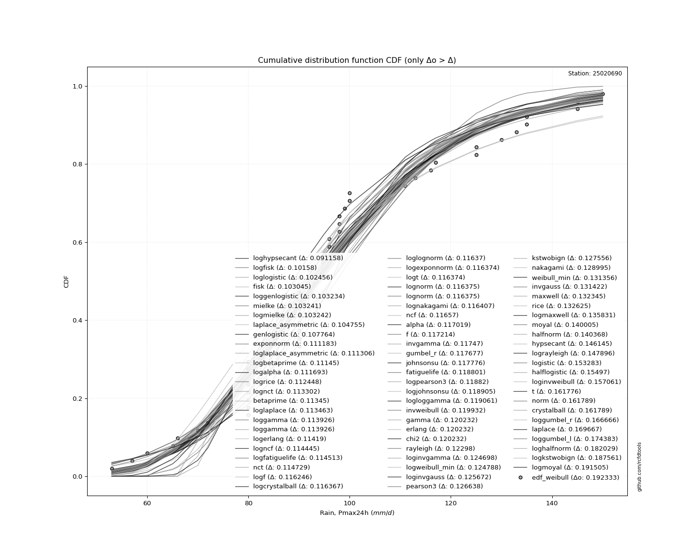</img>

</div>


**3.3. Best fit**

<div align="center">

|   id |   station | empirical_dist   | p_dist       |     delta |   deltao | eval   |   fit |   n |   best_fit |   best_fit_sort |
|-----:|----------:|:-----------------|:-------------|----------:|---------:|:-------|------:|----:|-----------:|----------------:|
|    0 |  25020690 | edf_weibull      | loghypsecant | 0.0911576 | 0.192333 | Δo > Δ |     1 |  50 |          1 |               1 |

</div>


<div align="center">

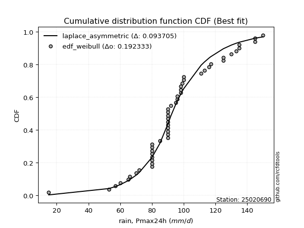</img></img>

</div>


### 4. Empirical - EDF Beard (1943)

The Beard formula (or Beard´s plotting position formula) in hydrology is used to estimate the empirical non-exceedance probability _(P)_ of a flood event (or other extreme hydrological data point) within a given dataset.

<div align="center">


$P=(m-0.31)/(n+0.38)$


</div>


**4.1. Empirical values**

<div align="center">

|                | 0                    | 1                   | 2                   | 3                   | 4                   | 5                  | 6                   | 7                   | 8                  | 9                   | 10                  | 11                 | 12                 | 13                  | 14                 | 15                 | 16                 | 17                  | 18                 | 19                  | 20                 | 21                  | 22                  | 23                 | 24                  | 25                 | 26                 | 27                 | 28                 | 29                 | 30                 | 31                 | 32                 | 33                | 34                 | 35                 | 36                 | 37                 | 38                 | 39                 | 40                 | 41                 | 42                 | 43                 | 44                 | 45                 | 46                | 47                | 48                 | 49                 |
|:---------------|:---------------------|:--------------------|:--------------------|:--------------------|:--------------------|:-------------------|:--------------------|:--------------------|:-------------------|:--------------------|:--------------------|:-------------------|:-------------------|:--------------------|:-------------------|:-------------------|:-------------------|:--------------------|:-------------------|:--------------------|:-------------------|:--------------------|:--------------------|:-------------------|:--------------------|:-------------------|:-------------------|:-------------------|:-------------------|:-------------------|:-------------------|:-------------------|:-------------------|:------------------|:-------------------|:-------------------|:-------------------|:-------------------|:-------------------|:-------------------|:-------------------|:-------------------|:-------------------|:-------------------|:-------------------|:-------------------|:------------------|:------------------|:-------------------|:-------------------|
| date           | 1986                 | 1977                | 1998                | 1978                | 1979                | 1985               | 1982                | 1975                | 1991               | 1994                | 1990                | 1997               | 1974               | 2012                | 2015               | 2017               | 2000               | 2003                | 2019               | 2009                | 2006               | 1992                | 1995                | 1996               | 2021                | 2010               | 1976               | 1987               | 1999               | 1983               | 2016               | 2004               | 2001               | 2022              | 2007               | 2018               | 2008               | 2020               | 1973               | 1984               | 1981               | 1988               | 1993               | 2013               | 2005               | 1980               | 2002              | 1989              | 2011               | 2014               |
| x              | 53.0                 | 57.0                | 60.0                | 65.0324581          | 66.0                | 70.0               | 72.0                | 80.0                | 80.0               | 80.0                | 80.0                | 80.0               | 80.0               | 80.0                | 80.0               | 85.0               | 90.0               | 90.0                | 90.0               | 90.0                | 90.0               | 90.0                | 90.0                | 90.0               | 90.0                | 90.0               | 92.0               | 94.700649162       | 95.0               | 96.0               | 96.0               | 98.0               | 98.0               | 98.0              | 99.0               | 100.0              | 100.0              | 111.0              | 113.0              | 116.0              | 117.0              | 125.0              | 125.0              | 130.0              | 133.0              | 135.0              | 135.0             | 145.0             | 145.0              | 150.0              |
| m              | 1                    | 2                   | 3                   | 4                   | 5                   | 6                  | 7                   | 8                   | 9                  | 10                  | 11                  | 12                 | 13                 | 14                  | 15                 | 16                 | 17                 | 18                  | 19                 | 20                  | 21                 | 22                  | 23                  | 24                 | 25                  | 26                 | 27                 | 28                 | 29                 | 30                 | 31                 | 32                 | 33                 | 34                | 35                 | 36                 | 37                 | 38                 | 39                 | 40                 | 41                 | 42                 | 43                 | 44                 | 45                 | 46                 | 47                | 48                | 49                 | 50                 |
| empirical_dist | edf_beard            | edf_beard           | edf_beard           | edf_beard           | edf_beard           | edf_beard          | edf_beard           | edf_beard           | edf_beard          | edf_beard           | edf_beard           | edf_beard          | edf_beard          | edf_beard           | edf_beard          | edf_beard          | edf_beard          | edf_beard           | edf_beard          | edf_beard           | edf_beard          | edf_beard           | edf_beard           | edf_beard          | edf_beard           | edf_beard          | edf_beard          | edf_beard          | edf_beard          | edf_beard          | edf_beard          | edf_beard          | edf_beard          | edf_beard         | edf_beard          | edf_beard          | edf_beard          | edf_beard          | edf_beard          | edf_beard          | edf_beard          | edf_beard          | edf_beard          | edf_beard          | edf_beard          | edf_beard          | edf_beard         | edf_beard         | edf_beard          | edf_beard          |
| empirical      | 0.013695911075823738 | 0.03354505756252481 | 0.05339420404922588 | 0.07324335053592695 | 0.09309249702262803 | 0.1129416435093291 | 0.13279078999603017 | 0.15263993648273125 | 0.1724890829694323 | 0.19233822945613335 | 0.21218737594283443 | 0.2320365224295355 | 0.2518856689162366 | 0.27173481540293765 | 0.2915839618896387 | 0.3114331083763398 | 0.3312822548630409 | 0.35113140134974197 | 0.370980547836443  | 0.39082969432314413 | 0.4106788408098452 | 0.43052798729654623 | 0.45037713378324734 | 0.4702262802699484 | 0.49007542675664945 | 0.5099245732433505 | 0.5297737197300516 | 0.5496228662167527 | 0.5694720127034537 | 0.5893211591901548 | 0.6091703056768559 | 0.6290194521635569 | 0.6488685986502579 | 0.668717745136959 | 0.6885668916236601 | 0.7084160381103611 | 0.7282651845970622 | 0.7481143310837634 | 0.7679634775704643 | 0.7878126240571655 | 0.8076617705438666 | 0.8275109170305676 | 0.8473600635172687 | 0.8672092100039698 | 0.8870583564906708 | 0.9069075029773719 | 0.926756649464073 | 0.946605795950774 | 0.9664549424374751 | 0.9863040889241762 |
| empirical_tr   | 1.013886093781445    | 1.0347093859108647  | 1.056405955126861   | 1.0790319126151209  | 1.1026482818997592  | 1.1273215484448422 | 1.1531242847333485  | 1.1801358631998127  | 1.20844327176781   | 1.238142049643647   | 1.2693373645754598  | 1.302145257172396  | 1.336694083311223  | 1.3731261924230036  | 1.411599887923788  | 1.4522917267223983 | 1.4953992282576434 | 1.5411440807586418  | 1.5897759545597978 | 1.6415770609318998  | 1.6968676321993938 | 1.7560125479261064  | 1.819429396894186   | 1.8875983514424879 | 1.9610743479953285  | 2.040502227622519  | 2.1266357112705783 | 2.220361392684002  | 2.3227293683725216 | 2.4349927501208315 | 2.558659217877095  | 2.6955591225254145 | 2.847936687394007  | 3.018573996405032 | 3.210962396430847  | 3.4295439074200122 | 3.6800584368151923 | 3.9700551615445225 | 4.309666381522667  | 4.7128157156220745 | 5.199174406604746  | 5.797468354430376  | 6.551365409622883  | 7.530642750373689  | 8.854130052724067  | 10.742004264392314 | 13.6531165311653  | 18.72862453531594 | 29.810650887573882 | 73.01449275362289  |

</div>


**4.2. Kolmogorov-Smirnov fit test (sorted by Δ)**


<div align="center">

|                | 0                   | 1                   | 2                   | 3                   | 4                   | 5                   | 6                   | 7                   | 8                   | 9                   | 10                    | 11                  | 12                  | 13                  | 14                  | 15                  | 16                  | 17                  | 18                  | 19                  | 20                  | 21                  | 22                  | 23                  | 24                  | 25                  | 26                  | 27                  | 28                  | 29                  | 30                  | 31                  | 32                  | 33                  | 34                  | 35                  | 36                  | 37                  | 38                  | 39                  | 40                  | 41                  | 42                  | 43                  | 44                  | 45                  | 46                  | 47                  | 48                  | 49                  | 50                  | 51                  | 52                  | 53                  | 54                  | 55                  | 56                  | 57                  | 58                  | 59                  | 60                  | 61                  | 62                  | 63                  | 64                  | 65                  | 66                  | 67                  | 68                  | 69                  | 70                  | 71                  | 72                  | 73                  | 74                  | 75                  | 76                  | 77                  | 78                  | 79                  | 80                  | 81                  | 82                  | 83                  | 84                  | 85                  | 86                  | 87                  |
|:---------------|:--------------------|:--------------------|:--------------------|:--------------------|:--------------------|:--------------------|:--------------------|:--------------------|:--------------------|:--------------------|:----------------------|:--------------------|:--------------------|:--------------------|:--------------------|:--------------------|:--------------------|:--------------------|:--------------------|:--------------------|:--------------------|:--------------------|:--------------------|:--------------------|:--------------------|:--------------------|:--------------------|:--------------------|:--------------------|:--------------------|:--------------------|:--------------------|:--------------------|:--------------------|:--------------------|:--------------------|:--------------------|:--------------------|:--------------------|:--------------------|:--------------------|:--------------------|:--------------------|:--------------------|:--------------------|:--------------------|:--------------------|:--------------------|:--------------------|:--------------------|:--------------------|:--------------------|:--------------------|:--------------------|:--------------------|:--------------------|:--------------------|:--------------------|:--------------------|:--------------------|:--------------------|:--------------------|:--------------------|:--------------------|:--------------------|:--------------------|:--------------------|:--------------------|:--------------------|:--------------------|:--------------------|:--------------------|:--------------------|:--------------------|:--------------------|:--------------------|:--------------------|:--------------------|:--------------------|:--------------------|:--------------------|:--------------------|:--------------------|:--------------------|:--------------------|:--------------------|:--------------------|:--------------------|
| station        | 25020690            | 25020690            | 25020690            | 25020690            | 25020690            | 25020690            | 25020690            | 25020690            | 25020690            | 25020690            | 25020690              | 25020690            | 25020690            | 25020690            | 25020690            | 25020690            | 25020690            | 25020690            | 25020690            | 25020690            | 25020690            | 25020690            | 25020690            | 25020690            | 25020690            | 25020690            | 25020690            | 25020690            | 25020690            | 25020690            | 25020690            | 25020690            | 25020690            | 25020690            | 25020690            | 25020690            | 25020690            | 25020690            | 25020690            | 25020690            | 25020690            | 25020690            | 25020690            | 25020690            | 25020690            | 25020690            | 25020690            | 25020690            | 25020690            | 25020690            | 25020690            | 25020690            | 25020690            | 25020690            | 25020690            | 25020690            | 25020690            | 25020690            | 25020690            | 25020690            | 25020690            | 25020690            | 25020690            | 25020690            | 25020690            | 25020690            | 25020690            | 25020690            | 25020690            | 25020690            | 25020690            | 25020690            | 25020690            | 25020690            | 25020690            | 25020690            | 25020690            | 25020690            | 25020690            | 25020690            | 25020690            | 25020690            | 25020690            | 25020690            | 25020690            | 25020690            | 25020690            | 25020690            |
| empirical_dist | edf_beard           | edf_beard           | edf_beard           | edf_beard           | edf_beard           | edf_beard           | edf_beard           | edf_beard           | edf_beard           | edf_beard           | edf_beard             | edf_beard           | edf_beard           | edf_beard           | edf_beard           | edf_beard           | edf_beard           | edf_beard           | edf_beard           | edf_beard           | edf_beard           | edf_beard           | edf_beard           | edf_beard           | edf_beard           | edf_beard           | edf_beard           | edf_beard           | edf_beard           | edf_beard           | edf_beard           | edf_beard           | edf_beard           | edf_beard           | edf_beard           | edf_beard           | edf_beard           | edf_beard           | edf_beard           | edf_beard           | edf_beard           | edf_beard           | edf_beard           | edf_beard           | edf_beard           | edf_beard           | edf_beard           | edf_beard           | edf_beard           | edf_beard           | edf_beard           | edf_beard           | edf_beard           | edf_beard           | edf_beard           | edf_beard           | edf_beard           | edf_beard           | edf_beard           | edf_beard           | edf_beard           | edf_beard           | edf_beard           | edf_beard           | edf_beard           | edf_beard           | edf_beard           | edf_beard           | edf_beard           | edf_beard           | edf_beard           | edf_beard           | edf_beard           | edf_beard           | edf_beard           | edf_beard           | edf_beard           | edf_beard           | edf_beard           | edf_beard           | edf_beard           | edf_beard           | edf_beard           | edf_beard           | edf_beard           | edf_beard           | edf_beard           | edf_beard           |
| p_dist         | loghypsecant        | logfisk             | laplace_asymmetric  | fisk                | loglogistic         | loggenlogistic      | mielke              | logmielke           | genlogistic         | exponnorm           | loglaplace_asymmetric | logbetaprime        | loglaplace          | logalpha            | logrice             | betaprime           | lognct              | loggamma            | loggamma            | logerlang           | logncf              | logfatiguelife      | nct                 | logf                | logcrystalball      | loglognorm          | logexponnorm        | logt                | lognorm             | lognorm             | lognakagami         | ncf                 | gumbel_r            | alpha               | f                   | invgamma            | johnsonsu           | fatiguelife         | logpearson3         | logjohnsonsu        | logloggamma         | invweibull          | gamma               | erlang              | chi2                | rayleigh            | loginvgamma         | logweibull_min      | loginvgauss         | pearson3            | nakagami            | kstwobign           | invgauss            | weibull_min         | maxwell             | rice                | logmaxwell          | moyal               | halfnorm            | hypsecant           | lograyleigh         | logistic            | halflogistic        | loginvweibull       | t                   | norm                | crystalball         | loggumbel_r         | laplace             | loggumbel_l         | loghalfnorm         | logkstwobign        | logmoyal            | wald                | loghalflogistic     | gumbel_l            | loggenexpon         | logwald             | loggibrat           | gibrat              | expon               | loggompertz         | logtruncnorm        | logexpon            | logchi2             | gompertz            | genexpon            | truncnorm           |
| delta          | 0.09393255250007704 | 0.10363147736436668 | 0.10487580573288269 | 0.1050962189895116  | 0.10523049454380884 | 0.10528481998100658 | 0.10529257531344188 | 0.10529352721918239 | 0.11053850936902943 | 0.11323400083430796 | 0.11335677802726873   | 0.11350120133068298 | 0.11358412792051348 | 0.1137437814037533  | 0.11522326558464413 | 0.11550084350147222 | 0.11607731874271643 | 0.11670097228105247 | 0.11670097228105247 | 0.11696516503275578 | 0.11721965845589455 | 0.11728840637232862 | 0.11750412574269442 | 0.11902092004898868 | 0.11914211177883005 | 0.11914450465533077 | 0.11914924265139204 | 0.11914930064492091 | 0.11914960546923103 | 0.11914960546923103 | 0.11918235078267647 | 0.11934457918358521 | 0.11972794960335165 | 0.11979351769778646 | 0.11998882322745441 | 0.12024510951601108 | 0.12055088716254336 | 0.1215762466557011  | 0.12159525204337096 | 0.12168014982075681 | 0.12183551767003875 | 0.12198283392321513 | 0.12300651404512175 | 0.1230065166961769  | 0.12300656128792498 | 0.12575471701330632 | 0.1267493258648767  | 0.12756336460154372 | 0.12772318424323126 | 0.1294132836542592  | 0.13176973912275458 | 0.13177905087850614 | 0.13347345834356922 | 0.13413113078742978 | 0.13512013718786442 | 0.1353995854656177  | 0.1378816992154604  | 0.14205597143798449 | 0.14241922547732366 | 0.14892004720800867 | 0.14994751460102168 | 0.1560584621505705  | 0.15702146738776568 | 0.15911159432308175 | 0.16455112243814796 | 0.16456406772364407 | 0.1645640737578592  | 0.16871726628331396 | 0.1697879471425332  | 0.1771580655013687  | 0.18407965178791713 | 0.19178336936548493 | 0.19355617119767926 | 0.20168537162050554 | 0.20367463728704177 | 0.23000830827540908 | 0.24285821332927157 | 0.26233940174282994 | 0.27030163458159057 | 0.2729270816698157  | 0.31136667941576757 | 0.3345956136669366  | 0.35644482837336344 | 0.3625221884511617  | 0.4028518485680992  | 0.8090542282605402  | 0.899908445797331   | 0.9832211780176197  |
| deltao         | 0.19233304448274094 | 0.19233304448274094 | 0.19233304448274094 | 0.19233304448274094 | 0.19233304448274094 | 0.19233304448274094 | 0.19233304448274094 | 0.19233304448274094 | 0.19233304448274094 | 0.19233304448274094 | 0.19233304448274094   | 0.19233304448274094 | 0.19233304448274094 | 0.19233304448274094 | 0.19233304448274094 | 0.19233304448274094 | 0.19233304448274094 | 0.19233304448274094 | 0.19233304448274094 | 0.19233304448274094 | 0.19233304448274094 | 0.19233304448274094 | 0.19233304448274094 | 0.19233304448274094 | 0.19233304448274094 | 0.19233304448274094 | 0.19233304448274094 | 0.19233304448274094 | 0.19233304448274094 | 0.19233304448274094 | 0.19233304448274094 | 0.19233304448274094 | 0.19233304448274094 | 0.19233304448274094 | 0.19233304448274094 | 0.19233304448274094 | 0.19233304448274094 | 0.19233304448274094 | 0.19233304448274094 | 0.19233304448274094 | 0.19233304448274094 | 0.19233304448274094 | 0.19233304448274094 | 0.19233304448274094 | 0.19233304448274094 | 0.19233304448274094 | 0.19233304448274094 | 0.19233304448274094 | 0.19233304448274094 | 0.19233304448274094 | 0.19233304448274094 | 0.19233304448274094 | 0.19233304448274094 | 0.19233304448274094 | 0.19233304448274094 | 0.19233304448274094 | 0.19233304448274094 | 0.19233304448274094 | 0.19233304448274094 | 0.19233304448274094 | 0.19233304448274094 | 0.19233304448274094 | 0.19233304448274094 | 0.19233304448274094 | 0.19233304448274094 | 0.19233304448274094 | 0.19233304448274094 | 0.19233304448274094 | 0.19233304448274094 | 0.19233304448274094 | 0.19233304448274094 | 0.19233304448274094 | 0.19233304448274094 | 0.19233304448274094 | 0.19233304448274094 | 0.19233304448274094 | 0.19233304448274094 | 0.19233304448274094 | 0.19233304448274094 | 0.19233304448274094 | 0.19233304448274094 | 0.19233304448274094 | 0.19233304448274094 | 0.19233304448274094 | 0.19233304448274094 | 0.19233304448274094 | 0.19233304448274094 | 0.19233304448274094 |
| eval           | Δo > Δ              | Δo > Δ              | Δo > Δ              | Δo > Δ              | Δo > Δ              | Δo > Δ              | Δo > Δ              | Δo > Δ              | Δo > Δ              | Δo > Δ              | Δo > Δ                | Δo > Δ              | Δo > Δ              | Δo > Δ              | Δo > Δ              | Δo > Δ              | Δo > Δ              | Δo > Δ              | Δo > Δ              | Δo > Δ              | Δo > Δ              | Δo > Δ              | Δo > Δ              | Δo > Δ              | Δo > Δ              | Δo > Δ              | Δo > Δ              | Δo > Δ              | Δo > Δ              | Δo > Δ              | Δo > Δ              | Δo > Δ              | Δo > Δ              | Δo > Δ              | Δo > Δ              | Δo > Δ              | Δo > Δ              | Δo > Δ              | Δo > Δ              | Δo > Δ              | Δo > Δ              | Δo > Δ              | Δo > Δ              | Δo > Δ              | Δo > Δ              | Δo > Δ              | Δo > Δ              | Δo > Δ              | Δo > Δ              | Δo > Δ              | Δo > Δ              | Δo > Δ              | Δo > Δ              | Δo > Δ              | Δo > Δ              | Δo > Δ              | Δo > Δ              | Δo > Δ              | Δo > Δ              | Δo > Δ              | Δo > Δ              | Δo > Δ              | Δo > Δ              | Δo > Δ              | Δo > Δ              | Δo > Δ              | Δo > Δ              | Δo > Δ              | Δo > Δ              | Δo > Δ              | Δo > Δ              | Δo > Δ              | Δo <= Δ             | Δo <= Δ             | Δo <= Δ             | Δo <= Δ             | Δo <= Δ             | Δo <= Δ             | Δo <= Δ             | Δo <= Δ             | Δo <= Δ             | Δo <= Δ             | Δo <= Δ             | Δo <= Δ             | Δo <= Δ             | Δo <= Δ             | Δo <= Δ             | Δo <= Δ             |
| fit            | 1                   | 1                   | 1                   | 1                   | 1                   | 1                   | 1                   | 1                   | 1                   | 1                   | 1                     | 1                   | 1                   | 1                   | 1                   | 1                   | 1                   | 1                   | 1                   | 1                   | 1                   | 1                   | 1                   | 1                   | 1                   | 1                   | 1                   | 1                   | 1                   | 1                   | 1                   | 1                   | 1                   | 1                   | 1                   | 1                   | 1                   | 1                   | 1                   | 1                   | 1                   | 1                   | 1                   | 1                   | 1                   | 1                   | 1                   | 1                   | 1                   | 1                   | 1                   | 1                   | 1                   | 1                   | 1                   | 1                   | 1                   | 1                   | 1                   | 1                   | 1                   | 1                   | 1                   | 1                   | 1                   | 1                   | 1                   | 1                   | 1                   | 1                   | 1                   | 1                   | 0                   | 0                   | 0                   | 0                   | 0                   | 0                   | 0                   | 0                   | 0                   | 0                   | 0                   | 0                   | 0                   | 0                   | 0                   | 0                   |
| n              | 50                  | 50                  | 50                  | 50                  | 50                  | 50                  | 50                  | 50                  | 50                  | 50                  | 50                    | 50                  | 50                  | 50                  | 50                  | 50                  | 50                  | 50                  | 50                  | 50                  | 50                  | 50                  | 50                  | 50                  | 50                  | 50                  | 50                  | 50                  | 50                  | 50                  | 50                  | 50                  | 50                  | 50                  | 50                  | 50                  | 50                  | 50                  | 50                  | 50                  | 50                  | 50                  | 50                  | 50                  | 50                  | 50                  | 50                  | 50                  | 50                  | 50                  | 50                  | 50                  | 50                  | 50                  | 50                  | 50                  | 50                  | 50                  | 50                  | 50                  | 50                  | 50                  | 50                  | 50                  | 50                  | 50                  | 50                  | 50                  | 50                  | 50                  | 50                  | 50                  | 50                  | 50                  | 50                  | 50                  | 50                  | 50                  | 50                  | 50                  | 50                  | 50                  | 50                  | 50                  | 50                  | 50                  | 50                  | 50                  |
| best_fit       | 1                   | 0                   | 0                   | 0                   | 0                   | 0                   | 0                   | 0                   | 0                   | 0                   | 0                     | 0                   | 0                   | 0                   | 0                   | 0                   | 0                   | 0                   | 0                   | 0                   | 0                   | 0                   | 0                   | 0                   | 0                   | 0                   | 0                   | 0                   | 0                   | 0                   | 0                   | 0                   | 0                   | 0                   | 0                   | 0                   | 0                   | 0                   | 0                   | 0                   | 0                   | 0                   | 0                   | 0                   | 0                   | 0                   | 0                   | 0                   | 0                   | 0                   | 0                   | 0                   | 0                   | 0                   | 0                   | 0                   | 0                   | 0                   | 0                   | 0                   | 0                   | 0                   | 0                   | 0                   | 0                   | 0                   | 0                   | 0                   | 0                   | 0                   | 0                   | 0                   | 0                   | 0                   | 0                   | 0                   | 0                   | 0                   | 0                   | 0                   | 0                   | 0                   | 0                   | 0                   | 0                   | 0                   | 0                   | 0                   |
| best_fit_sort  | 1                   | 2                   | 3                   | 4                   | 5                   | 6                   | 7                   | 8                   | 9                   | 10                  | 11                    | 12                  | 13                  | 14                  | 15                  | 16                  | 17                  | 18                  | 19                  | 20                  | 21                  | 22                  | 23                  | 24                  | 25                  | 26                  | 27                  | 28                  | 29                  | 30                  | 31                  | 32                  | 33                  | 34                  | 35                  | 36                  | 37                  | 38                  | 39                  | 40                  | 41                  | 42                  | 43                  | 44                  | 45                  | 46                  | 47                  | 48                  | 49                  | 50                  | 51                  | 52                  | 53                  | 54                  | 55                  | 56                  | 57                  | 58                  | 59                  | 60                  | 61                  | 62                  | 63                  | 64                  | 65                  | 66                  | 67                  | 68                  | 69                  | 70                  | 71                  | 72                  | 73                  | 74                  | 75                  | 76                  | 77                  | 78                  | 79                  | 80                  | 81                  | 82                  | 83                  | 84                  | 85                  | 86                  | 87                  | 88                  |

</div>


<div align="center">

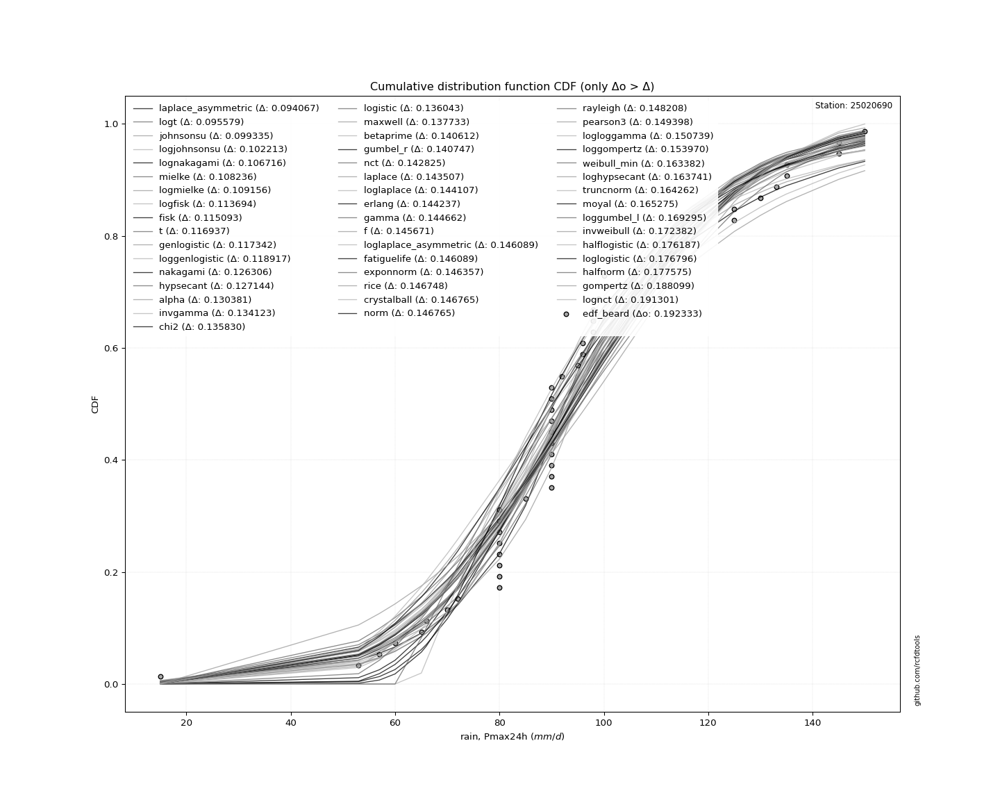</img>

</div>


**4.3. Best fit**

<div align="center">

|   id |   station | empirical_dist   | p_dist       |     delta |   deltao | eval   |   fit |   n |   best_fit |   best_fit_sort |
|-----:|----------:|:-----------------|:-------------|----------:|---------:|:-------|------:|----:|-----------:|----------------:|
|    0 |  25020690 | edf_beard        | loghypsecant | 0.0939326 | 0.192333 | Δo > Δ |     1 |  50 |          1 |               1 |

</div>


<div align="center">

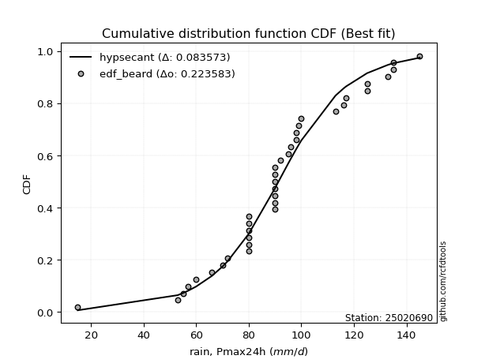</img>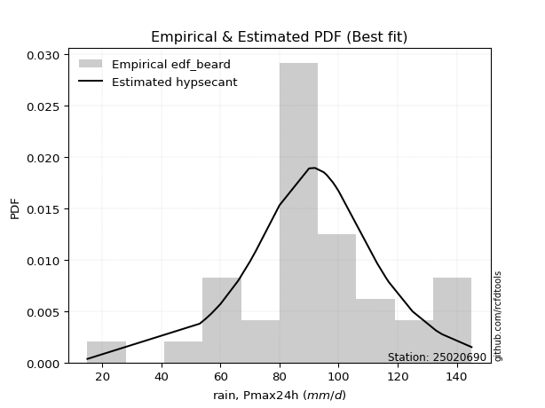</img>

</div>


### 5. Empirical - EDF Chegodayev (1955)

The Chegodayev formula is an empirical plotting position formula used in hydrological frequency analysis to estimate the exceedance probability or return period of a specific event from a set of observed data. It is primarily used for plotting observed data points on probability paper to fit a theoretical distribution, particularly for analyzing extreme events like maximum flood flows or rainfall intensities. The constant _b_ value in the generalized plotting position formula is 0.3.

<div align="center">


$P=(m-b)/(n+1-2b)$


</div>


**5.1. Empirical values**

<div align="center">

|                | 0                    | 1                   | 2                    | 3                   | 4                   | 5                  | 6                   | 7                  | 8                   | 9                   | 10                 | 11                  | 12                | 13                 | 14                 | 15                 | 16                  | 17                  | 18                  | 19                  | 20                 | 21                 | 22                 | 23                  | 24                  | 25                 | 26                 | 27                 | 28                 | 29                 | 30                 | 31                | 32                 | 33                 | 34                 | 35                 | 36                 | 37                 | 38                 | 39                 | 40                 | 41                 | 42                 | 43                 | 44                | 45                 | 46                 | 47                 | 48                 | 49                 |
|:---------------|:---------------------|:--------------------|:---------------------|:--------------------|:--------------------|:-------------------|:--------------------|:-------------------|:--------------------|:--------------------|:-------------------|:--------------------|:------------------|:-------------------|:-------------------|:-------------------|:--------------------|:--------------------|:--------------------|:--------------------|:-------------------|:-------------------|:-------------------|:--------------------|:--------------------|:-------------------|:-------------------|:-------------------|:-------------------|:-------------------|:-------------------|:------------------|:-------------------|:-------------------|:-------------------|:-------------------|:-------------------|:-------------------|:-------------------|:-------------------|:-------------------|:-------------------|:-------------------|:-------------------|:------------------|:-------------------|:-------------------|:-------------------|:-------------------|:-------------------|
| date           | 1986                 | 1977                | 1998                 | 1978                | 1979                | 1985               | 1982                | 1975               | 1991                | 1994                | 1990               | 1997                | 1974              | 2012               | 2015               | 2017               | 2000                | 2003                | 2019                | 2009                | 2006               | 1992               | 1995               | 1996                | 2021                | 2010               | 1976               | 1987               | 1999               | 1983               | 2016               | 2004              | 2001               | 2022               | 2007               | 2018               | 2008               | 2020               | 1973               | 1984               | 1981               | 1988               | 1993               | 2013               | 2005              | 1980               | 2002               | 1989               | 2011               | 2014               |
| x              | 53.0                 | 57.0                | 60.0                 | 65.0324581          | 66.0                | 70.0               | 72.0                | 80.0               | 80.0                | 80.0                | 80.0               | 80.0                | 80.0              | 80.0               | 80.0               | 85.0               | 90.0                | 90.0                | 90.0                | 90.0                | 90.0               | 90.0               | 90.0               | 90.0                | 90.0                | 90.0               | 92.0               | 94.700649162       | 95.0               | 96.0               | 96.0               | 98.0              | 98.0               | 98.0               | 99.0               | 100.0              | 100.0              | 111.0              | 113.0              | 116.0              | 117.0              | 125.0              | 125.0              | 130.0              | 133.0             | 135.0              | 135.0              | 145.0              | 145.0              | 150.0              |
| m              | 1                    | 2                   | 3                    | 4                   | 5                   | 6                  | 7                   | 8                  | 9                   | 10                  | 11                 | 12                  | 13                | 14                 | 15                 | 16                 | 17                  | 18                  | 19                  | 20                  | 21                 | 22                 | 23                 | 24                  | 25                  | 26                 | 27                 | 28                 | 29                 | 30                 | 31                 | 32                | 33                 | 34                 | 35                 | 36                 | 37                 | 38                 | 39                 | 40                 | 41                 | 42                 | 43                 | 44                 | 45                | 46                 | 47                 | 48                 | 49                 | 50                 |
| empirical_dist | edf_chegodayev       | edf_chegodayev      | edf_chegodayev       | edf_chegodayev      | edf_chegodayev      | edf_chegodayev     | edf_chegodayev      | edf_chegodayev     | edf_chegodayev      | edf_chegodayev      | edf_chegodayev     | edf_chegodayev      | edf_chegodayev    | edf_chegodayev     | edf_chegodayev     | edf_chegodayev     | edf_chegodayev      | edf_chegodayev      | edf_chegodayev      | edf_chegodayev      | edf_chegodayev     | edf_chegodayev     | edf_chegodayev     | edf_chegodayev      | edf_chegodayev      | edf_chegodayev     | edf_chegodayev     | edf_chegodayev     | edf_chegodayev     | edf_chegodayev     | edf_chegodayev     | edf_chegodayev    | edf_chegodayev     | edf_chegodayev     | edf_chegodayev     | edf_chegodayev     | edf_chegodayev     | edf_chegodayev     | edf_chegodayev     | edf_chegodayev     | edf_chegodayev     | edf_chegodayev     | edf_chegodayev     | edf_chegodayev     | edf_chegodayev    | edf_chegodayev     | edf_chegodayev     | edf_chegodayev     | edf_chegodayev     | edf_chegodayev     |
| empirical      | 0.013888888888888888 | 0.03373015873015873 | 0.053571428571428575 | 0.07341269841269842 | 0.09325396825396826 | 0.1130952380952381 | 0.13293650793650794 | 0.1527777777777778 | 0.17261904761904762 | 0.19246031746031744 | 0.2123015873015873 | 0.23214285714285712 | 0.251984126984127 | 0.2718253968253968 | 0.2916666666666667 | 0.3115079365079365 | 0.33134920634920634 | 0.35119047619047616 | 0.37103174603174605 | 0.39087301587301587 | 0.4107142857142857 | 0.4305555555555556 | 0.4503968253968254 | 0.47023809523809523 | 0.49007936507936506 | 0.5099206349206349 | 0.5297619047619048 | 0.5496031746031746 | 0.5694444444444444 | 0.5892857142857143 | 0.6091269841269842 | 0.628968253968254 | 0.6488095238095238 | 0.6686507936507937 | 0.6884920634920636 | 0.7083333333333334 | 0.7281746031746033 | 0.7480158730158731 | 0.7678571428571429 | 0.7876984126984128 | 0.8075396825396827 | 0.8273809523809524 | 0.8472222222222223 | 0.8670634920634921 | 0.886904761904762 | 0.9067460317460319 | 0.9265873015873016 | 0.9464285714285715 | 0.9662698412698414 | 0.9861111111111112 |
| empirical_tr   | 1.0140845070422535   | 1.0349075975359343  | 1.0566037735849056   | 1.0792291220556745  | 1.1028446389496718  | 1.12751677852349   | 1.1533180778032037  | 1.180327868852459  | 1.20863309352518    | 1.2383292383292384  | 1.269521410579345  | 1.3023255813953487  | 1.336870026525199 | 1.3732970027247955 | 1.411764705882353  | 1.4524495677233429 | 1.4955489614243322  | 1.5412844036697246  | 1.5899053627760253  | 1.6416938110749184  | 1.696969696969697  | 1.7560975609756098 | 1.819494584837545  | 1.8876404494382022  | 1.9610894941634243  | 2.040485829959514  | 2.126582278481013  | 2.220264317180617  | 2.32258064516129   | 2.4347826086956523 | 2.558375634517767  | 2.695187165775401 | 2.8474576271186445 | 3.017964071856288  | 3.210191082802549  | 3.428571428571429  | 3.678832116788322  | 3.968503937007876  | 4.307692307692308  | 4.710280373831778  | 5.195876288659798  | 5.793103448275864  | 6.545454545454549  | 7.522388059701494  | 8.842105263157901 | 10.723404255319162 | 13.621621621621628 | 18.666666666666693 | 29.647058823529516 | 72.00000000000026  |

</div>


**5.2. Kolmogorov-Smirnov fit test (sorted by Δ)**


<div align="center">

|                | 0                   | 1                   | 2                   | 3                   | 4                   | 5                   | 6                   | 7                   | 8                   | 9                   | 10                    | 11                  | 12                  | 13                  | 14                  | 15                  | 16                  | 17                  | 18                  | 19                  | 20                  | 21                  | 22                  | 23                  | 24                  | 25                  | 26                  | 27                  | 28                  | 29                  | 30                  | 31                  | 32                  | 33                  | 34                  | 35                  | 36                  | 37                  | 38                  | 39                  | 40                  | 41                  | 42                  | 43                  | 44                  | 45                  | 46                  | 47                  | 48                  | 49                  | 50                  | 51                  | 52                  | 53                  | 54                  | 55                  | 56                  | 57                  | 58                  | 59                  | 60                  | 61                  | 62                  | 63                  | 64                  | 65                  | 66                  | 67                  | 68                  | 69                  | 70                  | 71                  | 72                  | 73                  | 74                  | 75                  | 76                  | 77                  | 78                  | 79                  | 80                  | 81                  | 82                  | 83                  | 84                  | 85                  | 86                  | 87                  |
|:---------------|:--------------------|:--------------------|:--------------------|:--------------------|:--------------------|:--------------------|:--------------------|:--------------------|:--------------------|:--------------------|:----------------------|:--------------------|:--------------------|:--------------------|:--------------------|:--------------------|:--------------------|:--------------------|:--------------------|:--------------------|:--------------------|:--------------------|:--------------------|:--------------------|:--------------------|:--------------------|:--------------------|:--------------------|:--------------------|:--------------------|:--------------------|:--------------------|:--------------------|:--------------------|:--------------------|:--------------------|:--------------------|:--------------------|:--------------------|:--------------------|:--------------------|:--------------------|:--------------------|:--------------------|:--------------------|:--------------------|:--------------------|:--------------------|:--------------------|:--------------------|:--------------------|:--------------------|:--------------------|:--------------------|:--------------------|:--------------------|:--------------------|:--------------------|:--------------------|:--------------------|:--------------------|:--------------------|:--------------------|:--------------------|:--------------------|:--------------------|:--------------------|:--------------------|:--------------------|:--------------------|:--------------------|:--------------------|:--------------------|:--------------------|:--------------------|:--------------------|:--------------------|:--------------------|:--------------------|:--------------------|:--------------------|:--------------------|:--------------------|:--------------------|:--------------------|:--------------------|:--------------------|:--------------------|
| station        | 25020690            | 25020690            | 25020690            | 25020690            | 25020690            | 25020690            | 25020690            | 25020690            | 25020690            | 25020690            | 25020690              | 25020690            | 25020690            | 25020690            | 25020690            | 25020690            | 25020690            | 25020690            | 25020690            | 25020690            | 25020690            | 25020690            | 25020690            | 25020690            | 25020690            | 25020690            | 25020690            | 25020690            | 25020690            | 25020690            | 25020690            | 25020690            | 25020690            | 25020690            | 25020690            | 25020690            | 25020690            | 25020690            | 25020690            | 25020690            | 25020690            | 25020690            | 25020690            | 25020690            | 25020690            | 25020690            | 25020690            | 25020690            | 25020690            | 25020690            | 25020690            | 25020690            | 25020690            | 25020690            | 25020690            | 25020690            | 25020690            | 25020690            | 25020690            | 25020690            | 25020690            | 25020690            | 25020690            | 25020690            | 25020690            | 25020690            | 25020690            | 25020690            | 25020690            | 25020690            | 25020690            | 25020690            | 25020690            | 25020690            | 25020690            | 25020690            | 25020690            | 25020690            | 25020690            | 25020690            | 25020690            | 25020690            | 25020690            | 25020690            | 25020690            | 25020690            | 25020690            | 25020690            |
| empirical_dist | edf_chegodayev      | edf_chegodayev      | edf_chegodayev      | edf_chegodayev      | edf_chegodayev      | edf_chegodayev      | edf_chegodayev      | edf_chegodayev      | edf_chegodayev      | edf_chegodayev      | edf_chegodayev        | edf_chegodayev      | edf_chegodayev      | edf_chegodayev      | edf_chegodayev      | edf_chegodayev      | edf_chegodayev      | edf_chegodayev      | edf_chegodayev      | edf_chegodayev      | edf_chegodayev      | edf_chegodayev      | edf_chegodayev      | edf_chegodayev      | edf_chegodayev      | edf_chegodayev      | edf_chegodayev      | edf_chegodayev      | edf_chegodayev      | edf_chegodayev      | edf_chegodayev      | edf_chegodayev      | edf_chegodayev      | edf_chegodayev      | edf_chegodayev      | edf_chegodayev      | edf_chegodayev      | edf_chegodayev      | edf_chegodayev      | edf_chegodayev      | edf_chegodayev      | edf_chegodayev      | edf_chegodayev      | edf_chegodayev      | edf_chegodayev      | edf_chegodayev      | edf_chegodayev      | edf_chegodayev      | edf_chegodayev      | edf_chegodayev      | edf_chegodayev      | edf_chegodayev      | edf_chegodayev      | edf_chegodayev      | edf_chegodayev      | edf_chegodayev      | edf_chegodayev      | edf_chegodayev      | edf_chegodayev      | edf_chegodayev      | edf_chegodayev      | edf_chegodayev      | edf_chegodayev      | edf_chegodayev      | edf_chegodayev      | edf_chegodayev      | edf_chegodayev      | edf_chegodayev      | edf_chegodayev      | edf_chegodayev      | edf_chegodayev      | edf_chegodayev      | edf_chegodayev      | edf_chegodayev      | edf_chegodayev      | edf_chegodayev      | edf_chegodayev      | edf_chegodayev      | edf_chegodayev      | edf_chegodayev      | edf_chegodayev      | edf_chegodayev      | edf_chegodayev      | edf_chegodayev      | edf_chegodayev      | edf_chegodayev      | edf_chegodayev      | edf_chegodayev      |
| p_dist         | loghypsecant        | logfisk             | laplace_asymmetric  | fisk                | loglogistic         | loggenlogistic      | mielke              | logmielke           | genlogistic         | exponnorm           | loglaplace_asymmetric | logbetaprime        | loglaplace          | logalpha            | logrice             | betaprime           | lognct              | loggamma            | loggamma            | logerlang           | logncf              | logfatiguelife      | nct                 | logf                | logcrystalball      | loglognorm          | logexponnorm        | logt                | lognorm             | lognorm             | lognakagami         | ncf                 | gumbel_r            | alpha               | f                   | invgamma            | johnsonsu           | fatiguelife         | logpearson3         | logjohnsonsu        | logloggamma         | invweibull          | gamma               | erlang              | chi2                | rayleigh            | loginvgamma         | logweibull_min      | loginvgauss         | pearson3            | kstwobign           | nakagami            | invgauss            | weibull_min         | maxwell             | rice                | logmaxwell          | moyal               | halfnorm            | hypsecant           | lograyleigh         | logistic            | halflogistic        | loginvweibull       | t                   | norm                | crystalball         | loggumbel_r         | laplace             | loggumbel_l         | loghalfnorm         | logkstwobign        | logmoyal            | wald                | loghalflogistic     | gumbel_l            | loggenexpon         | logwald             | loggibrat           | gibrat              | expon               | loggompertz         | logtruncnorm        | logexpon            | logchi2             | gompertz            | genexpon            | truncnorm           |
| delta          | 0.09384197107761805 | 0.10356452587820125 | 0.10487186741016707 | 0.10502926750334618 | 0.10513991312134985 | 0.10521786849484116 | 0.10522562382727646 | 0.10522657573301697 | 0.11044792794657043 | 0.11316704934814253 | 0.11328982654110331   | 0.11343424984451755 | 0.11358018959779786 | 0.11367682991758787 | 0.11513268416218514 | 0.1154338920153068  | 0.11598673732025744 | 0.11661039085859348 | 0.11661039085859348 | 0.11687458361029679 | 0.11712907703343556 | 0.11719782494986963 | 0.11741354432023543 | 0.11893033862652969 | 0.11905153035637106 | 0.11905392323287178 | 0.11905866122893305 | 0.11905871922246192 | 0.11905902404677204 | 0.11905902404677204 | 0.11909176936021748 | 0.11925399776112622 | 0.11966099811718622 | 0.11970293627532747 | 0.11989824180499542 | 0.1201545280935521  | 0.12046030574008437 | 0.12148566523324211 | 0.12150467062091197 | 0.12158956839829782 | 0.12174493624757976 | 0.1219158824370497  | 0.12291593262266276 | 0.12291593527371791 | 0.12291597986546599 | 0.12566413559084733 | 0.12668237437871127 | 0.12747278317908473 | 0.12765623275706584 | 0.1293227022318002  | 0.1316412095834596  | 0.1316791577002956  | 0.1334065068574038  | 0.13404054936497078 | 0.13502955576540543 | 0.1353090040431587  | 0.13781474772929497 | 0.14198901995181906 | 0.14235227399115824 | 0.14882946578554967 | 0.14988056311485626 | 0.15596788072811152 | 0.15695451590160026 | 0.15904464283691633 | 0.16446054101568897 | 0.16447348630118508 | 0.1644734923354002  | 0.16865031479714854 | 0.1697840088198176  | 0.1770674840789097  | 0.1840127003017517  | 0.1916455280704384  | 0.19348921971151384 | 0.20161842013434012 | 0.20360768580087635 | 0.2299177268529501  | 0.24272037203422503 | 0.2622724502566645  | 0.27023468309542514 | 0.2730097864468437  | 0.311228838120721   | 0.33445777237189    | 0.3563069870783169  | 0.3623843471561151  | 0.4027140072730526  | 0.8089163869654938  | 0.8997390979205596  | 0.9830282002045545  |
| deltao         | 0.19233304448274094 | 0.19233304448274094 | 0.19233304448274094 | 0.19233304448274094 | 0.19233304448274094 | 0.19233304448274094 | 0.19233304448274094 | 0.19233304448274094 | 0.19233304448274094 | 0.19233304448274094 | 0.19233304448274094   | 0.19233304448274094 | 0.19233304448274094 | 0.19233304448274094 | 0.19233304448274094 | 0.19233304448274094 | 0.19233304448274094 | 0.19233304448274094 | 0.19233304448274094 | 0.19233304448274094 | 0.19233304448274094 | 0.19233304448274094 | 0.19233304448274094 | 0.19233304448274094 | 0.19233304448274094 | 0.19233304448274094 | 0.19233304448274094 | 0.19233304448274094 | 0.19233304448274094 | 0.19233304448274094 | 0.19233304448274094 | 0.19233304448274094 | 0.19233304448274094 | 0.19233304448274094 | 0.19233304448274094 | 0.19233304448274094 | 0.19233304448274094 | 0.19233304448274094 | 0.19233304448274094 | 0.19233304448274094 | 0.19233304448274094 | 0.19233304448274094 | 0.19233304448274094 | 0.19233304448274094 | 0.19233304448274094 | 0.19233304448274094 | 0.19233304448274094 | 0.19233304448274094 | 0.19233304448274094 | 0.19233304448274094 | 0.19233304448274094 | 0.19233304448274094 | 0.19233304448274094 | 0.19233304448274094 | 0.19233304448274094 | 0.19233304448274094 | 0.19233304448274094 | 0.19233304448274094 | 0.19233304448274094 | 0.19233304448274094 | 0.19233304448274094 | 0.19233304448274094 | 0.19233304448274094 | 0.19233304448274094 | 0.19233304448274094 | 0.19233304448274094 | 0.19233304448274094 | 0.19233304448274094 | 0.19233304448274094 | 0.19233304448274094 | 0.19233304448274094 | 0.19233304448274094 | 0.19233304448274094 | 0.19233304448274094 | 0.19233304448274094 | 0.19233304448274094 | 0.19233304448274094 | 0.19233304448274094 | 0.19233304448274094 | 0.19233304448274094 | 0.19233304448274094 | 0.19233304448274094 | 0.19233304448274094 | 0.19233304448274094 | 0.19233304448274094 | 0.19233304448274094 | 0.19233304448274094 | 0.19233304448274094 |
| eval           | Δo > Δ              | Δo > Δ              | Δo > Δ              | Δo > Δ              | Δo > Δ              | Δo > Δ              | Δo > Δ              | Δo > Δ              | Δo > Δ              | Δo > Δ              | Δo > Δ                | Δo > Δ              | Δo > Δ              | Δo > Δ              | Δo > Δ              | Δo > Δ              | Δo > Δ              | Δo > Δ              | Δo > Δ              | Δo > Δ              | Δo > Δ              | Δo > Δ              | Δo > Δ              | Δo > Δ              | Δo > Δ              | Δo > Δ              | Δo > Δ              | Δo > Δ              | Δo > Δ              | Δo > Δ              | Δo > Δ              | Δo > Δ              | Δo > Δ              | Δo > Δ              | Δo > Δ              | Δo > Δ              | Δo > Δ              | Δo > Δ              | Δo > Δ              | Δo > Δ              | Δo > Δ              | Δo > Δ              | Δo > Δ              | Δo > Δ              | Δo > Δ              | Δo > Δ              | Δo > Δ              | Δo > Δ              | Δo > Δ              | Δo > Δ              | Δo > Δ              | Δo > Δ              | Δo > Δ              | Δo > Δ              | Δo > Δ              | Δo > Δ              | Δo > Δ              | Δo > Δ              | Δo > Δ              | Δo > Δ              | Δo > Δ              | Δo > Δ              | Δo > Δ              | Δo > Δ              | Δo > Δ              | Δo > Δ              | Δo > Δ              | Δo > Δ              | Δo > Δ              | Δo > Δ              | Δo > Δ              | Δo > Δ              | Δo <= Δ             | Δo <= Δ             | Δo <= Δ             | Δo <= Δ             | Δo <= Δ             | Δo <= Δ             | Δo <= Δ             | Δo <= Δ             | Δo <= Δ             | Δo <= Δ             | Δo <= Δ             | Δo <= Δ             | Δo <= Δ             | Δo <= Δ             | Δo <= Δ             | Δo <= Δ             |
| fit            | 1                   | 1                   | 1                   | 1                   | 1                   | 1                   | 1                   | 1                   | 1                   | 1                   | 1                     | 1                   | 1                   | 1                   | 1                   | 1                   | 1                   | 1                   | 1                   | 1                   | 1                   | 1                   | 1                   | 1                   | 1                   | 1                   | 1                   | 1                   | 1                   | 1                   | 1                   | 1                   | 1                   | 1                   | 1                   | 1                   | 1                   | 1                   | 1                   | 1                   | 1                   | 1                   | 1                   | 1                   | 1                   | 1                   | 1                   | 1                   | 1                   | 1                   | 1                   | 1                   | 1                   | 1                   | 1                   | 1                   | 1                   | 1                   | 1                   | 1                   | 1                   | 1                   | 1                   | 1                   | 1                   | 1                   | 1                   | 1                   | 1                   | 1                   | 1                   | 1                   | 0                   | 0                   | 0                   | 0                   | 0                   | 0                   | 0                   | 0                   | 0                   | 0                   | 0                   | 0                   | 0                   | 0                   | 0                   | 0                   |
| n              | 50                  | 50                  | 50                  | 50                  | 50                  | 50                  | 50                  | 50                  | 50                  | 50                  | 50                    | 50                  | 50                  | 50                  | 50                  | 50                  | 50                  | 50                  | 50                  | 50                  | 50                  | 50                  | 50                  | 50                  | 50                  | 50                  | 50                  | 50                  | 50                  | 50                  | 50                  | 50                  | 50                  | 50                  | 50                  | 50                  | 50                  | 50                  | 50                  | 50                  | 50                  | 50                  | 50                  | 50                  | 50                  | 50                  | 50                  | 50                  | 50                  | 50                  | 50                  | 50                  | 50                  | 50                  | 50                  | 50                  | 50                  | 50                  | 50                  | 50                  | 50                  | 50                  | 50                  | 50                  | 50                  | 50                  | 50                  | 50                  | 50                  | 50                  | 50                  | 50                  | 50                  | 50                  | 50                  | 50                  | 50                  | 50                  | 50                  | 50                  | 50                  | 50                  | 50                  | 50                  | 50                  | 50                  | 50                  | 50                  |
| best_fit       | 1                   | 0                   | 0                   | 0                   | 0                   | 0                   | 0                   | 0                   | 0                   | 0                   | 0                     | 0                   | 0                   | 0                   | 0                   | 0                   | 0                   | 0                   | 0                   | 0                   | 0                   | 0                   | 0                   | 0                   | 0                   | 0                   | 0                   | 0                   | 0                   | 0                   | 0                   | 0                   | 0                   | 0                   | 0                   | 0                   | 0                   | 0                   | 0                   | 0                   | 0                   | 0                   | 0                   | 0                   | 0                   | 0                   | 0                   | 0                   | 0                   | 0                   | 0                   | 0                   | 0                   | 0                   | 0                   | 0                   | 0                   | 0                   | 0                   | 0                   | 0                   | 0                   | 0                   | 0                   | 0                   | 0                   | 0                   | 0                   | 0                   | 0                   | 0                   | 0                   | 0                   | 0                   | 0                   | 0                   | 0                   | 0                   | 0                   | 0                   | 0                   | 0                   | 0                   | 0                   | 0                   | 0                   | 0                   | 0                   |
| best_fit_sort  | 1                   | 2                   | 3                   | 4                   | 5                   | 6                   | 7                   | 8                   | 9                   | 10                  | 11                    | 12                  | 13                  | 14                  | 15                  | 16                  | 17                  | 18                  | 19                  | 20                  | 21                  | 22                  | 23                  | 24                  | 25                  | 26                  | 27                  | 28                  | 29                  | 30                  | 31                  | 32                  | 33                  | 34                  | 35                  | 36                  | 37                  | 38                  | 39                  | 40                  | 41                  | 42                  | 43                  | 44                  | 45                  | 46                  | 47                  | 48                  | 49                  | 50                  | 51                  | 52                  | 53                  | 54                  | 55                  | 56                  | 57                  | 58                  | 59                  | 60                  | 61                  | 62                  | 63                  | 64                  | 65                  | 66                  | 67                  | 68                  | 69                  | 70                  | 71                  | 72                  | 73                  | 74                  | 75                  | 76                  | 77                  | 78                  | 79                  | 80                  | 81                  | 82                  | 83                  | 84                  | 85                  | 86                  | 87                  | 88                  |

</div>


<div align="center">

</img>

</div>


**5.3. Best fit**

<div align="center">

|   id |   station | empirical_dist   | p_dist       |    delta |   deltao | eval   |   fit |   n |   best_fit |   best_fit_sort |
|-----:|----------:|:-----------------|:-------------|---------:|---------:|:-------|------:|----:|-----------:|----------------:|
|    0 |  25020690 | edf_chegodayev   | loghypsecant | 0.093842 | 0.192333 | Δo > Δ |     1 |  50 |          1 |               1 |

</div>


<div align="center">

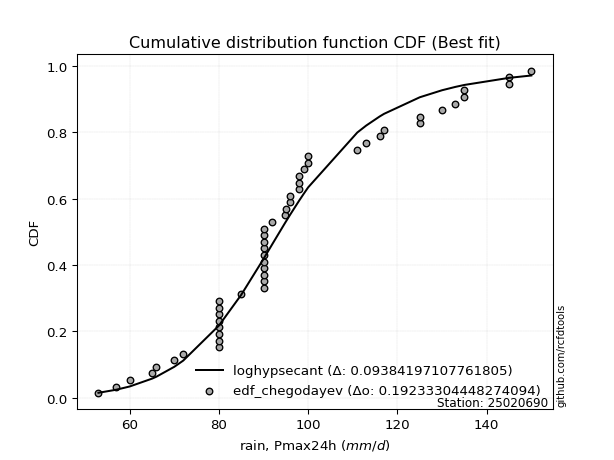</img>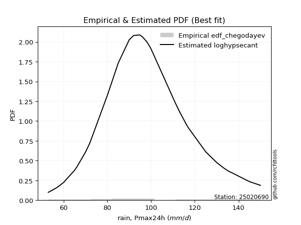</img>

</div>


### 6. Empirical - EDF Blom (1958)

The Blom formula is a specific "plotting position" formula used in hydrology and statistical analysis to estimate the empirical cumulative probability (or non-exceedance probability) of a data series. It is particularly recommended for data that are approximately normally distributed. The constant _a_ is set to 0.375 (or 3/8).

<div align="center">


$P=(m-a)/(n+1-2a)$


</div>


**6.1. Empirical values**

<div align="center">

|                | 0                    | 1                   | 2                   | 3                   | 4                   | 5                   | 6                  | 7                  | 8                   | 9                   | 10                  | 11                  | 12                 | 13                  | 14                 | 15                  | 16                 | 17                  | 18                 | 19                  | 20                  | 21                  | 22                 | 23                 | 24                 | 25                 | 26                 | 27                 | 28                 | 29                 | 30                 | 31                 | 32                 | 33                 | 34                 | 35                 | 36                 | 37                 | 38                 | 39                 | 40                 | 41                 | 42                 | 43                 | 44                 | 45                 | 46                | 47                 | 48                 | 49                 |
|:---------------|:---------------------|:--------------------|:--------------------|:--------------------|:--------------------|:--------------------|:-------------------|:-------------------|:--------------------|:--------------------|:--------------------|:--------------------|:-------------------|:--------------------|:-------------------|:--------------------|:-------------------|:--------------------|:-------------------|:--------------------|:--------------------|:--------------------|:-------------------|:-------------------|:-------------------|:-------------------|:-------------------|:-------------------|:-------------------|:-------------------|:-------------------|:-------------------|:-------------------|:-------------------|:-------------------|:-------------------|:-------------------|:-------------------|:-------------------|:-------------------|:-------------------|:-------------------|:-------------------|:-------------------|:-------------------|:-------------------|:------------------|:-------------------|:-------------------|:-------------------|
| date           | 1986                 | 1977                | 1998                | 1978                | 1979                | 1985                | 1982               | 1975               | 1991                | 1994                | 1990                | 1997                | 1974               | 2012                | 2015               | 2017                | 2000               | 2003                | 2019               | 2009                | 2006                | 1992                | 1995               | 1996               | 2021               | 2010               | 1976               | 1987               | 1999               | 1983               | 2016               | 2004               | 2001               | 2022               | 2007               | 2018               | 2008               | 2020               | 1973               | 1984               | 1981               | 1988               | 1993               | 2013               | 2005               | 1980               | 2002              | 1989               | 2011               | 2014               |
| x              | 53.0                 | 57.0                | 60.0                | 65.0324581          | 66.0                | 70.0                | 72.0               | 80.0               | 80.0                | 80.0                | 80.0                | 80.0                | 80.0               | 80.0                | 80.0               | 85.0                | 90.0               | 90.0                | 90.0               | 90.0                | 90.0                | 90.0                | 90.0               | 90.0               | 90.0               | 90.0               | 92.0               | 94.700649162       | 95.0               | 96.0               | 96.0               | 98.0               | 98.0               | 98.0               | 99.0               | 100.0              | 100.0              | 111.0              | 113.0              | 116.0              | 117.0              | 125.0              | 125.0              | 130.0              | 133.0              | 135.0              | 135.0             | 145.0              | 145.0              | 150.0              |
| m              | 1                    | 2                   | 3                   | 4                   | 5                   | 6                   | 7                  | 8                  | 9                   | 10                  | 11                  | 12                  | 13                 | 14                  | 15                 | 16                  | 17                 | 18                  | 19                 | 20                  | 21                  | 22                  | 23                 | 24                 | 25                 | 26                 | 27                 | 28                 | 29                 | 30                 | 31                 | 32                 | 33                 | 34                 | 35                 | 36                 | 37                 | 38                 | 39                 | 40                 | 41                 | 42                 | 43                 | 44                 | 45                 | 46                 | 47                | 48                 | 49                 | 50                 |
| empirical_dist | edf_blom             | edf_blom            | edf_blom            | edf_blom            | edf_blom            | edf_blom            | edf_blom           | edf_blom           | edf_blom            | edf_blom            | edf_blom            | edf_blom            | edf_blom           | edf_blom            | edf_blom           | edf_blom            | edf_blom           | edf_blom            | edf_blom           | edf_blom            | edf_blom            | edf_blom            | edf_blom           | edf_blom           | edf_blom           | edf_blom           | edf_blom           | edf_blom           | edf_blom           | edf_blom           | edf_blom           | edf_blom           | edf_blom           | edf_blom           | edf_blom           | edf_blom           | edf_blom           | edf_blom           | edf_blom           | edf_blom           | edf_blom           | edf_blom           | edf_blom           | edf_blom           | edf_blom           | edf_blom           | edf_blom          | edf_blom           | edf_blom           | edf_blom           |
| empirical      | 0.012437810945273632 | 0.03233830845771144 | 0.05223880597014925 | 0.07213930348258707 | 0.09203980099502487 | 0.11194029850746269 | 0.1318407960199005 | 0.1517412935323383 | 0.17164179104477612 | 0.19154228855721392 | 0.21144278606965175 | 0.23134328358208955 | 0.2512437810945274 | 0.27114427860696516 | 0.291044776119403  | 0.31094527363184077 | 0.3308457711442786 | 0.35074626865671643 | 0.3706467661691542 | 0.39054726368159204 | 0.41044776119402987 | 0.43034825870646765 | 0.4502487562189055 | 0.4701492537313433 | 0.4900497512437811 | 0.5099502487562189 | 0.5298507462686567 | 0.5497512437810945 | 0.5696517412935324 | 0.5895522388059702 | 0.6094527363184079 | 0.6293532338308457 | 0.6492537313432836 | 0.6691542288557214 | 0.6890547263681592 | 0.7089552238805971 | 0.7288557213930348 | 0.7487562189054726 | 0.7686567164179104 | 0.7885572139303483 | 0.8084577114427861 | 0.8283582089552238 | 0.8482587064676617 | 0.8681592039800995 | 0.8880597014925373 | 0.9079601990049752 | 0.927860696517413 | 0.9477611940298507 | 0.9676616915422885 | 0.9875621890547264 |
| empirical_tr   | 1.012594458438287    | 1.0334190231362468  | 1.0551181102362206  | 1.0777479892761395  | 1.1013698630136985  | 1.1260504201680672  | 1.151862464183381  | 1.1788856304985338 | 1.207207207207207   | 1.2369230769230768  | 1.2681388012618295  | 1.3009708737864079  | 1.3355481727574752 | 1.3720136518771329  | 1.4105263157894739 | 1.4512635379061372  | 1.4944237918215613 | 1.5402298850574714  | 1.5889328063241104 | 1.6408163265306124  | 1.6962025316455696  | 1.7554585152838427  | 1.8190045248868778 | 1.887323943661972  | 1.9609756097560977 | 2.0406091370558372 | 2.126984126984127  | 2.2209944751381214 | 2.323699421965318  | 2.4363636363636365 | 2.560509554140127  | 2.697986577181208  | 2.851063829787234  | 3.0225563909774436 | 3.216              | 3.4358974358974366 | 3.688073394495412  | 3.9801980198019797 | 4.32258064516129   | 4.729411764705882  | 5.220779220779222  | 5.8260869565217375 | 6.590163934426228  | 7.584905660377358  | 8.933333333333334  | 10.864864864864868 | 13.86206896551725 | 19.142857142857128 | 30.923076923076906 | 80.4               |

</div>


**6.2. Kolmogorov-Smirnov fit test (sorted by Δ)**


<div align="center">

|                | 0                   | 1                   | 2                   | 3                   | 4                   | 5                   | 6                   | 7                   | 8                   | 9                   | 10                  | 11                    | 12                  | 13                  | 14                  | 15                  | 16                  | 17                  | 18                  | 19                  | 20                  | 21                  | 22                  | 23                  | 24                  | 25                  | 26                  | 27                  | 28                  | 29                  | 30                  | 31                  | 32                  | 33                  | 34                  | 35                  | 36                  | 37                  | 38                  | 39                  | 40                  | 41                  | 42                  | 43                  | 44                  | 45                  | 46                  | 47                  | 48                  | 49                  | 50                  | 51                  | 52                  | 53                  | 54                  | 55                  | 56                  | 57                  | 58                  | 59                  | 60                  | 61                  | 62                  | 63                  | 64                  | 65                  | 66                  | 67                  | 68                  | 69                  | 70                  | 71                  | 72                  | 73                  | 74                  | 75                  | 76                  | 77                  | 78                  | 79                  | 80                  | 81                  | 82                  | 83                  | 84                  | 85                  | 86                  | 87                  |
|:---------------|:--------------------|:--------------------|:--------------------|:--------------------|:--------------------|:--------------------|:--------------------|:--------------------|:--------------------|:--------------------|:--------------------|:----------------------|:--------------------|:--------------------|:--------------------|:--------------------|:--------------------|:--------------------|:--------------------|:--------------------|:--------------------|:--------------------|:--------------------|:--------------------|:--------------------|:--------------------|:--------------------|:--------------------|:--------------------|:--------------------|:--------------------|:--------------------|:--------------------|:--------------------|:--------------------|:--------------------|:--------------------|:--------------------|:--------------------|:--------------------|:--------------------|:--------------------|:--------------------|:--------------------|:--------------------|:--------------------|:--------------------|:--------------------|:--------------------|:--------------------|:--------------------|:--------------------|:--------------------|:--------------------|:--------------------|:--------------------|:--------------------|:--------------------|:--------------------|:--------------------|:--------------------|:--------------------|:--------------------|:--------------------|:--------------------|:--------------------|:--------------------|:--------------------|:--------------------|:--------------------|:--------------------|:--------------------|:--------------------|:--------------------|:--------------------|:--------------------|:--------------------|:--------------------|:--------------------|:--------------------|:--------------------|:--------------------|:--------------------|:--------------------|:--------------------|:--------------------|:--------------------|:--------------------|
| station        | 25020690            | 25020690            | 25020690            | 25020690            | 25020690            | 25020690            | 25020690            | 25020690            | 25020690            | 25020690            | 25020690            | 25020690              | 25020690            | 25020690            | 25020690            | 25020690            | 25020690            | 25020690            | 25020690            | 25020690            | 25020690            | 25020690            | 25020690            | 25020690            | 25020690            | 25020690            | 25020690            | 25020690            | 25020690            | 25020690            | 25020690            | 25020690            | 25020690            | 25020690            | 25020690            | 25020690            | 25020690            | 25020690            | 25020690            | 25020690            | 25020690            | 25020690            | 25020690            | 25020690            | 25020690            | 25020690            | 25020690            | 25020690            | 25020690            | 25020690            | 25020690            | 25020690            | 25020690            | 25020690            | 25020690            | 25020690            | 25020690            | 25020690            | 25020690            | 25020690            | 25020690            | 25020690            | 25020690            | 25020690            | 25020690            | 25020690            | 25020690            | 25020690            | 25020690            | 25020690            | 25020690            | 25020690            | 25020690            | 25020690            | 25020690            | 25020690            | 25020690            | 25020690            | 25020690            | 25020690            | 25020690            | 25020690            | 25020690            | 25020690            | 25020690            | 25020690            | 25020690            | 25020690            |
| empirical_dist | edf_blom            | edf_blom            | edf_blom            | edf_blom            | edf_blom            | edf_blom            | edf_blom            | edf_blom            | edf_blom            | edf_blom            | edf_blom            | edf_blom              | edf_blom            | edf_blom            | edf_blom            | edf_blom            | edf_blom            | edf_blom            | edf_blom            | edf_blom            | edf_blom            | edf_blom            | edf_blom            | edf_blom            | edf_blom            | edf_blom            | edf_blom            | edf_blom            | edf_blom            | edf_blom            | edf_blom            | edf_blom            | edf_blom            | edf_blom            | edf_blom            | edf_blom            | edf_blom            | edf_blom            | edf_blom            | edf_blom            | edf_blom            | edf_blom            | edf_blom            | edf_blom            | edf_blom            | edf_blom            | edf_blom            | edf_blom            | edf_blom            | edf_blom            | edf_blom            | edf_blom            | edf_blom            | edf_blom            | edf_blom            | edf_blom            | edf_blom            | edf_blom            | edf_blom            | edf_blom            | edf_blom            | edf_blom            | edf_blom            | edf_blom            | edf_blom            | edf_blom            | edf_blom            | edf_blom            | edf_blom            | edf_blom            | edf_blom            | edf_blom            | edf_blom            | edf_blom            | edf_blom            | edf_blom            | edf_blom            | edf_blom            | edf_blom            | edf_blom            | edf_blom            | edf_blom            | edf_blom            | edf_blom            | edf_blom            | edf_blom            | edf_blom            | edf_blom            |
| p_dist         | loghypsecant        | logfisk             | laplace_asymmetric  | fisk                | loggenlogistic      | mielke              | logmielke           | loglogistic         | genlogistic         | loglaplace          | exponnorm           | loglaplace_asymmetric | logbetaprime        | logalpha            | logrice             | betaprime           | lognct              | loggamma            | loggamma            | logerlang           | logncf              | logfatiguelife      | nct                 | logf                | logcrystalball      | loglognorm          | logexponnorm        | logt                | lognorm             | lognorm             | lognakagami         | ncf                 | gumbel_r            | alpha               | f                   | invgamma            | johnsonsu           | fatiguelife         | logpearson3         | logjohnsonsu        | invweibull          | logloggamma         | gamma               | erlang              | chi2                | rayleigh            | loginvgamma         | logweibull_min      | loginvgauss         | pearson3            | nakagami            | kstwobign           | invgauss            | weibull_min         | maxwell             | rice                | logmaxwell          | moyal               | halfnorm            | hypsecant           | lograyleigh         | logistic            | halflogistic        | loginvweibull       | t                   | norm                | crystalball         | loggumbel_r         | laplace             | loggumbel_l         | loghalfnorm         | logkstwobign        | logmoyal            | wald                | loghalflogistic     | gumbel_l            | loggenexpon         | logwald             | loggibrat           | gibrat              | expon               | loggompertz         | logtruncnorm        | logexpon            | logchi2             | gompertz            | genexpon            | truncnorm           |
| delta          | 0.09452308929604958 | 0.10406796108312899 | 0.10490148124575105 | 0.10553270270827392 | 0.1057213036997689  | 0.1057290590322042  | 0.10573001093794471 | 0.10582103133978138 | 0.11112904616500197 | 0.11360980343338184 | 0.11367048455307027 | 0.11379326174603105   | 0.1139396867705339  | 0.11418026512251561 | 0.11581380238061667 | 0.11593732722023453 | 0.11666785553868897 | 0.11729150907702501 | 0.11729150907702501 | 0.11755570182872832 | 0.11781019525186709 | 0.11787894316830116 | 0.11809466253866696 | 0.11961145684496122 | 0.11973264857480259 | 0.11973504145130331 | 0.11973977944736458 | 0.11973983744089345 | 0.11974014226520358 | 0.11974014226520358 | 0.11977288757864901 | 0.11993511597955775 | 0.12016443332211396 | 0.120384054493759   | 0.12057936002342695 | 0.12083564631198362 | 0.1211414239585159  | 0.12216678345167364 | 0.1221857888393435  | 0.12227068661672935 | 0.12241931764197744 | 0.12242605446601129 | 0.12359705084109429 | 0.12359705349214944 | 0.12359709808389752 | 0.12634525380927886 | 0.127185809583639   | 0.12815390139751626 | 0.12815966796199357 | 0.13000382045023173 | 0.13236027591872712 | 0.13267769382889907 | 0.13390994206233153 | 0.13472166758340232 | 0.13571067398383696 | 0.13599012226159024 | 0.1383181829342227  | 0.1424924551567468  | 0.14285570919608598 | 0.1495105840039812  | 0.150383998319784   | 0.15664899894654305 | 0.157457951106528   | 0.15954807804184407 | 0.1651416592341205  | 0.1651546045196166  | 0.16515461055383174 | 0.16915375000207628 | 0.16981362265540156 | 0.17774860229734124 | 0.18451613550667945 | 0.19268201231587787 | 0.19399265491644158 | 0.20212185533926785 | 0.20411112100580409 | 0.23059884507138162 | 0.2437568562796645  | 0.26277588546159225 | 0.2707381183003529  | 0.27238789589958    | 0.31226532236616045 | 0.33549425661732946 | 0.3573434713237563  | 0.36342083140155457 | 0.40375049151849207 | 0.8099528712109332  | 0.9010124928506709  | 0.9844792781481697  |
| deltao         | 0.19233304448274094 | 0.19233304448274094 | 0.19233304448274094 | 0.19233304448274094 | 0.19233304448274094 | 0.19233304448274094 | 0.19233304448274094 | 0.19233304448274094 | 0.19233304448274094 | 0.19233304448274094 | 0.19233304448274094 | 0.19233304448274094   | 0.19233304448274094 | 0.19233304448274094 | 0.19233304448274094 | 0.19233304448274094 | 0.19233304448274094 | 0.19233304448274094 | 0.19233304448274094 | 0.19233304448274094 | 0.19233304448274094 | 0.19233304448274094 | 0.19233304448274094 | 0.19233304448274094 | 0.19233304448274094 | 0.19233304448274094 | 0.19233304448274094 | 0.19233304448274094 | 0.19233304448274094 | 0.19233304448274094 | 0.19233304448274094 | 0.19233304448274094 | 0.19233304448274094 | 0.19233304448274094 | 0.19233304448274094 | 0.19233304448274094 | 0.19233304448274094 | 0.19233304448274094 | 0.19233304448274094 | 0.19233304448274094 | 0.19233304448274094 | 0.19233304448274094 | 0.19233304448274094 | 0.19233304448274094 | 0.19233304448274094 | 0.19233304448274094 | 0.19233304448274094 | 0.19233304448274094 | 0.19233304448274094 | 0.19233304448274094 | 0.19233304448274094 | 0.19233304448274094 | 0.19233304448274094 | 0.19233304448274094 | 0.19233304448274094 | 0.19233304448274094 | 0.19233304448274094 | 0.19233304448274094 | 0.19233304448274094 | 0.19233304448274094 | 0.19233304448274094 | 0.19233304448274094 | 0.19233304448274094 | 0.19233304448274094 | 0.19233304448274094 | 0.19233304448274094 | 0.19233304448274094 | 0.19233304448274094 | 0.19233304448274094 | 0.19233304448274094 | 0.19233304448274094 | 0.19233304448274094 | 0.19233304448274094 | 0.19233304448274094 | 0.19233304448274094 | 0.19233304448274094 | 0.19233304448274094 | 0.19233304448274094 | 0.19233304448274094 | 0.19233304448274094 | 0.19233304448274094 | 0.19233304448274094 | 0.19233304448274094 | 0.19233304448274094 | 0.19233304448274094 | 0.19233304448274094 | 0.19233304448274094 | 0.19233304448274094 |
| eval           | Δo > Δ              | Δo > Δ              | Δo > Δ              | Δo > Δ              | Δo > Δ              | Δo > Δ              | Δo > Δ              | Δo > Δ              | Δo > Δ              | Δo > Δ              | Δo > Δ              | Δo > Δ                | Δo > Δ              | Δo > Δ              | Δo > Δ              | Δo > Δ              | Δo > Δ              | Δo > Δ              | Δo > Δ              | Δo > Δ              | Δo > Δ              | Δo > Δ              | Δo > Δ              | Δo > Δ              | Δo > Δ              | Δo > Δ              | Δo > Δ              | Δo > Δ              | Δo > Δ              | Δo > Δ              | Δo > Δ              | Δo > Δ              | Δo > Δ              | Δo > Δ              | Δo > Δ              | Δo > Δ              | Δo > Δ              | Δo > Δ              | Δo > Δ              | Δo > Δ              | Δo > Δ              | Δo > Δ              | Δo > Δ              | Δo > Δ              | Δo > Δ              | Δo > Δ              | Δo > Δ              | Δo > Δ              | Δo > Δ              | Δo > Δ              | Δo > Δ              | Δo > Δ              | Δo > Δ              | Δo > Δ              | Δo > Δ              | Δo > Δ              | Δo > Δ              | Δo > Δ              | Δo > Δ              | Δo > Δ              | Δo > Δ              | Δo > Δ              | Δo > Δ              | Δo > Δ              | Δo > Δ              | Δo > Δ              | Δo > Δ              | Δo > Δ              | Δo > Δ              | Δo > Δ              | Δo > Δ              | Δo <= Δ             | Δo <= Δ             | Δo <= Δ             | Δo <= Δ             | Δo <= Δ             | Δo <= Δ             | Δo <= Δ             | Δo <= Δ             | Δo <= Δ             | Δo <= Δ             | Δo <= Δ             | Δo <= Δ             | Δo <= Δ             | Δo <= Δ             | Δo <= Δ             | Δo <= Δ             | Δo <= Δ             |
| fit            | 1                   | 1                   | 1                   | 1                   | 1                   | 1                   | 1                   | 1                   | 1                   | 1                   | 1                   | 1                     | 1                   | 1                   | 1                   | 1                   | 1                   | 1                   | 1                   | 1                   | 1                   | 1                   | 1                   | 1                   | 1                   | 1                   | 1                   | 1                   | 1                   | 1                   | 1                   | 1                   | 1                   | 1                   | 1                   | 1                   | 1                   | 1                   | 1                   | 1                   | 1                   | 1                   | 1                   | 1                   | 1                   | 1                   | 1                   | 1                   | 1                   | 1                   | 1                   | 1                   | 1                   | 1                   | 1                   | 1                   | 1                   | 1                   | 1                   | 1                   | 1                   | 1                   | 1                   | 1                   | 1                   | 1                   | 1                   | 1                   | 1                   | 1                   | 1                   | 0                   | 0                   | 0                   | 0                   | 0                   | 0                   | 0                   | 0                   | 0                   | 0                   | 0                   | 0                   | 0                   | 0                   | 0                   | 0                   | 0                   |
| n              | 50                  | 50                  | 50                  | 50                  | 50                  | 50                  | 50                  | 50                  | 50                  | 50                  | 50                  | 50                    | 50                  | 50                  | 50                  | 50                  | 50                  | 50                  | 50                  | 50                  | 50                  | 50                  | 50                  | 50                  | 50                  | 50                  | 50                  | 50                  | 50                  | 50                  | 50                  | 50                  | 50                  | 50                  | 50                  | 50                  | 50                  | 50                  | 50                  | 50                  | 50                  | 50                  | 50                  | 50                  | 50                  | 50                  | 50                  | 50                  | 50                  | 50                  | 50                  | 50                  | 50                  | 50                  | 50                  | 50                  | 50                  | 50                  | 50                  | 50                  | 50                  | 50                  | 50                  | 50                  | 50                  | 50                  | 50                  | 50                  | 50                  | 50                  | 50                  | 50                  | 50                  | 50                  | 50                  | 50                  | 50                  | 50                  | 50                  | 50                  | 50                  | 50                  | 50                  | 50                  | 50                  | 50                  | 50                  | 50                  |
| best_fit       | 1                   | 0                   | 0                   | 0                   | 0                   | 0                   | 0                   | 0                   | 0                   | 0                   | 0                   | 0                     | 0                   | 0                   | 0                   | 0                   | 0                   | 0                   | 0                   | 0                   | 0                   | 0                   | 0                   | 0                   | 0                   | 0                   | 0                   | 0                   | 0                   | 0                   | 0                   | 0                   | 0                   | 0                   | 0                   | 0                   | 0                   | 0                   | 0                   | 0                   | 0                   | 0                   | 0                   | 0                   | 0                   | 0                   | 0                   | 0                   | 0                   | 0                   | 0                   | 0                   | 0                   | 0                   | 0                   | 0                   | 0                   | 0                   | 0                   | 0                   | 0                   | 0                   | 0                   | 0                   | 0                   | 0                   | 0                   | 0                   | 0                   | 0                   | 0                   | 0                   | 0                   | 0                   | 0                   | 0                   | 0                   | 0                   | 0                   | 0                   | 0                   | 0                   | 0                   | 0                   | 0                   | 0                   | 0                   | 0                   |
| best_fit_sort  | 1                   | 2                   | 3                   | 4                   | 5                   | 6                   | 7                   | 8                   | 9                   | 10                  | 11                  | 12                    | 13                  | 14                  | 15                  | 16                  | 17                  | 18                  | 19                  | 20                  | 21                  | 22                  | 23                  | 24                  | 25                  | 26                  | 27                  | 28                  | 29                  | 30                  | 31                  | 32                  | 33                  | 34                  | 35                  | 36                  | 37                  | 38                  | 39                  | 40                  | 41                  | 42                  | 43                  | 44                  | 45                  | 46                  | 47                  | 48                  | 49                  | 50                  | 51                  | 52                  | 53                  | 54                  | 55                  | 56                  | 57                  | 58                  | 59                  | 60                  | 61                  | 62                  | 63                  | 64                  | 65                  | 66                  | 67                  | 68                  | 69                  | 70                  | 71                  | 72                  | 73                  | 74                  | 75                  | 76                  | 77                  | 78                  | 79                  | 80                  | 81                  | 82                  | 83                  | 84                  | 85                  | 86                  | 87                  | 88                  |

</div>


<div align="center">

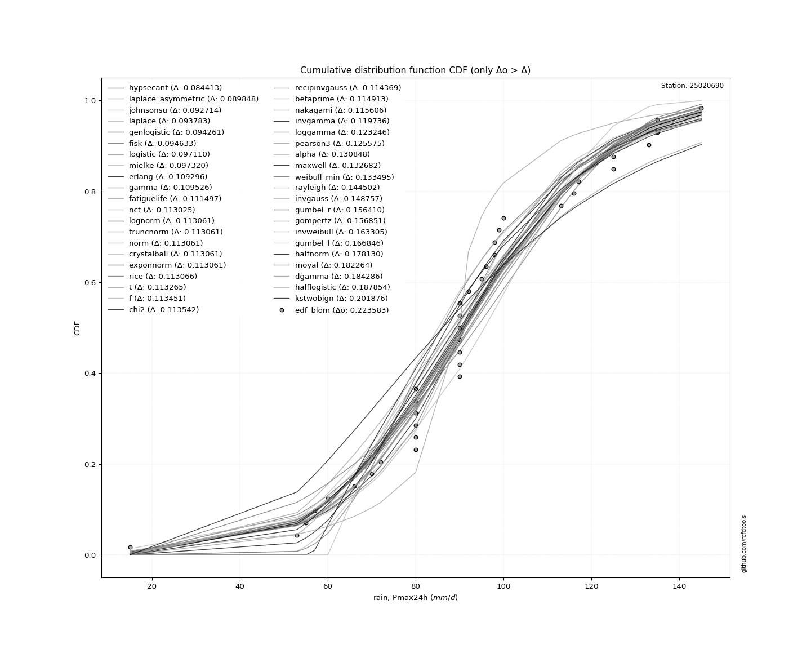</img>

</div>


**6.3. Best fit**

<div align="center">

|   id |   station | empirical_dist   | p_dist       |     delta |   deltao | eval   |   fit |   n |   best_fit |   best_fit_sort |
|-----:|----------:|:-----------------|:-------------|----------:|---------:|:-------|------:|----:|-----------:|----------------:|
|    0 |  25020690 | edf_blom         | loghypsecant | 0.0945231 | 0.192333 | Δo > Δ |     1 |  50 |          1 |               1 |

</div>


<div align="center">

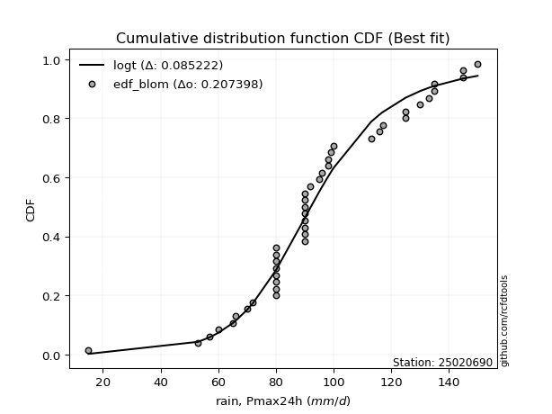</img>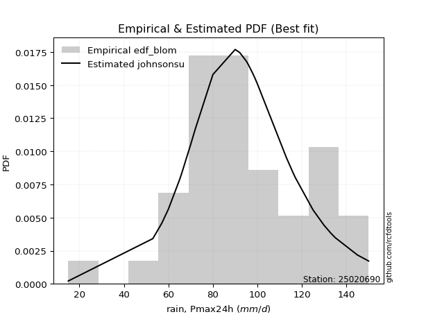</img>

</div>


### 7. Empirical - EDF Tukey (1962)

In hydrology, the Tukey formula is used as a plotting position formula to estimate the empirical probability or frequency of a flood event (or other hydrological data). The formula parameter is given as _c=0.333_ (or 1/3).

<div align="center">


$P=(m-c)/(n+1-2c)$


</div>


**7.1. Empirical values**

<div align="center">

|                | 0                    | 1                    | 2                    | 3                  | 4                   | 5                   | 6                   | 7                 | 8                   | 9                   | 10                 | 11                  | 12                  | 13                 | 14                 | 15                  | 16                  | 17                 | 18                 | 19                  | 20                 | 21                 | 22                 | 23                  | 24                 | 25                 | 26                 | 27                 | 28                 | 29                 | 30                | 31                 | 32                 | 33                 | 34                 | 35                 | 36                 | 37                 | 38                 | 39                 | 40                 | 41                 | 42                | 43                 | 44                 | 45                 | 46                 | 47                 | 48                 | 49                 |
|:---------------|:---------------------|:---------------------|:---------------------|:-------------------|:--------------------|:--------------------|:--------------------|:------------------|:--------------------|:--------------------|:-------------------|:--------------------|:--------------------|:-------------------|:-------------------|:--------------------|:--------------------|:-------------------|:-------------------|:--------------------|:-------------------|:-------------------|:-------------------|:--------------------|:-------------------|:-------------------|:-------------------|:-------------------|:-------------------|:-------------------|:------------------|:-------------------|:-------------------|:-------------------|:-------------------|:-------------------|:-------------------|:-------------------|:-------------------|:-------------------|:-------------------|:-------------------|:------------------|:-------------------|:-------------------|:-------------------|:-------------------|:-------------------|:-------------------|:-------------------|
| date           | 1986                 | 1977                 | 1998                 | 1978               | 1979                | 1985                | 1982                | 1975              | 1991                | 1994                | 1990               | 1997                | 1974                | 2012               | 2015               | 2017                | 2000                | 2003               | 2019               | 2009                | 2006               | 1992               | 1995               | 1996                | 2021               | 2010               | 1976               | 1987               | 1999               | 1983               | 2016              | 2004               | 2001               | 2022               | 2007               | 2018               | 2008               | 2020               | 1973               | 1984               | 1981               | 1988               | 1993              | 2013               | 2005               | 1980               | 2002               | 1989               | 2011               | 2014               |
| x              | 53.0                 | 57.0                 | 60.0                 | 65.0324581         | 66.0                | 70.0                | 72.0                | 80.0              | 80.0                | 80.0                | 80.0               | 80.0                | 80.0                | 80.0               | 80.0               | 85.0                | 90.0                | 90.0               | 90.0               | 90.0                | 90.0               | 90.0               | 90.0               | 90.0                | 90.0               | 90.0               | 92.0               | 94.700649162       | 95.0               | 96.0               | 96.0              | 98.0               | 98.0               | 98.0               | 99.0               | 100.0              | 100.0              | 111.0              | 113.0              | 116.0              | 117.0              | 125.0              | 125.0             | 130.0              | 133.0              | 135.0              | 135.0              | 145.0              | 145.0              | 150.0              |
| m              | 1                    | 2                    | 3                    | 4                  | 5                   | 6                   | 7                   | 8                 | 9                   | 10                  | 11                 | 12                  | 13                  | 14                 | 15                 | 16                  | 17                  | 18                 | 19                 | 20                  | 21                 | 22                 | 23                 | 24                  | 25                 | 26                 | 27                 | 28                 | 29                 | 30                 | 31                | 32                 | 33                 | 34                 | 35                 | 36                 | 37                 | 38                 | 39                 | 40                 | 41                 | 42                 | 43                | 44                 | 45                 | 46                 | 47                 | 48                 | 49                 | 50                 |
| empirical_dist | edf_tukey            | edf_tukey            | edf_tukey            | edf_tukey          | edf_tukey           | edf_tukey           | edf_tukey           | edf_tukey         | edf_tukey           | edf_tukey           | edf_tukey          | edf_tukey           | edf_tukey           | edf_tukey          | edf_tukey          | edf_tukey           | edf_tukey           | edf_tukey          | edf_tukey          | edf_tukey           | edf_tukey          | edf_tukey          | edf_tukey          | edf_tukey           | edf_tukey          | edf_tukey          | edf_tukey          | edf_tukey          | edf_tukey          | edf_tukey          | edf_tukey         | edf_tukey          | edf_tukey          | edf_tukey          | edf_tukey          | edf_tukey          | edf_tukey          | edf_tukey          | edf_tukey          | edf_tukey          | edf_tukey          | edf_tukey          | edf_tukey         | edf_tukey          | edf_tukey          | edf_tukey          | edf_tukey          | edf_tukey          | edf_tukey          | edf_tukey          |
| empirical      | 0.013245033112582781 | 0.033112582781456956 | 0.052980132450331126 | 0.0728476821192053 | 0.09271523178807947 | 0.11258278145695365 | 0.13245033112582782 | 0.152317880794702 | 0.17218543046357615 | 0.19205298013245034 | 0.2119205298013245 | 0.23178807947019867 | 0.25165562913907286 | 0.271523178807947  | 0.2913907284768212 | 0.31125827814569534 | 0.33112582781456956 | 0.3509933774834437 | 0.3708609271523179 | 0.39072847682119205 | 0.4105960264900662 | 0.4304635761589404 | 0.4503311258278146 | 0.47019867549668876 | 0.4900662251655629 | 0.5099337748344371 | 0.5298013245033113 | 0.5496688741721855 | 0.5695364238410596 | 0.5894039735099338 | 0.609271523178808 | 0.6291390728476821 | 0.6490066225165563 | 0.6688741721854304 | 0.6887417218543046 | 0.7086092715231788 | 0.7284768211920529 | 0.7483443708609272 | 0.7682119205298014 | 0.7880794701986755 | 0.8079470198675497 | 0.8278145695364238 | 0.847682119205298 | 0.8675496688741722 | 0.8874172185430463 | 0.9072847682119205 | 0.9271523178807947 | 0.9470198675496688 | 0.9668874172185431 | 0.9867549668874173 |
| empirical_tr   | 1.0134228187919463   | 1.0342465753424657   | 1.055944055944056    | 1.0785714285714285 | 1.102189781021898   | 1.126865671641791   | 1.1526717557251909  | 1.1796875         | 1.208               | 1.2377049180327868  | 1.26890756302521   | 1.3017241379310345  | 1.3362831858407078  | 1.3727272727272728 | 1.4112149532710279 | 1.451923076923077   | 1.495049504950495   | 1.5408163265306123 | 1.5894736842105264 | 1.641304347826087   | 1.696629213483146  | 1.755813953488372  | 1.8192771084337351 | 1.8875              | 1.9610389610389614 | 2.040540540540541  | 2.126760563380282  | 2.2205882352941178 | 2.3230769230769233 | 2.435483870967742  | 2.559322033898305 | 2.696428571428571  | 2.849056603773585  | 3.0199999999999996 | 3.212765957446808  | 3.431818181818181  | 3.682926829268292  | 3.9736842105263164 | 4.314285714285715  | 4.718750000000001  | 5.206896551724139  | 5.807692307692308  | 6.565217391304348 | 7.55               | 8.88235294117647   | 10.785714285714283 | 13.72727272727272  | 18.874999999999982 | 30.20000000000005  | 75.50000000000024  |

</div>


**7.2. Kolmogorov-Smirnov fit test (sorted by Δ)**


<div align="center">

|                | 0                   | 1                   | 2                   | 3                   | 4                   | 5                   | 6                   | 7                   | 8                   | 9                   | 10                    | 11                  | 12                  | 13                  | 14                  | 15                  | 16                  | 17                  | 18                  | 19                  | 20                  | 21                  | 22                  | 23                  | 24                  | 25                  | 26                  | 27                  | 28                  | 29                  | 30                  | 31                  | 32                  | 33                  | 34                  | 35                  | 36                  | 37                  | 38                  | 39                  | 40                  | 41                  | 42                  | 43                  | 44                  | 45                  | 46                  | 47                  | 48                  | 49                  | 50                  | 51                  | 52                  | 53                  | 54                  | 55                  | 56                  | 57                  | 58                  | 59                  | 60                  | 61                  | 62                  | 63                  | 64                  | 65                  | 66                  | 67                  | 68                  | 69                  | 70                  | 71                  | 72                  | 73                  | 74                  | 75                  | 76                  | 77                  | 78                  | 79                  | 80                  | 81                  | 82                  | 83                  | 84                  | 85                  | 86                  | 87                  |
|:---------------|:--------------------|:--------------------|:--------------------|:--------------------|:--------------------|:--------------------|:--------------------|:--------------------|:--------------------|:--------------------|:----------------------|:--------------------|:--------------------|:--------------------|:--------------------|:--------------------|:--------------------|:--------------------|:--------------------|:--------------------|:--------------------|:--------------------|:--------------------|:--------------------|:--------------------|:--------------------|:--------------------|:--------------------|:--------------------|:--------------------|:--------------------|:--------------------|:--------------------|:--------------------|:--------------------|:--------------------|:--------------------|:--------------------|:--------------------|:--------------------|:--------------------|:--------------------|:--------------------|:--------------------|:--------------------|:--------------------|:--------------------|:--------------------|:--------------------|:--------------------|:--------------------|:--------------------|:--------------------|:--------------------|:--------------------|:--------------------|:--------------------|:--------------------|:--------------------|:--------------------|:--------------------|:--------------------|:--------------------|:--------------------|:--------------------|:--------------------|:--------------------|:--------------------|:--------------------|:--------------------|:--------------------|:--------------------|:--------------------|:--------------------|:--------------------|:--------------------|:--------------------|:--------------------|:--------------------|:--------------------|:--------------------|:--------------------|:--------------------|:--------------------|:--------------------|:--------------------|:--------------------|:--------------------|
| station        | 25020690            | 25020690            | 25020690            | 25020690            | 25020690            | 25020690            | 25020690            | 25020690            | 25020690            | 25020690            | 25020690              | 25020690            | 25020690            | 25020690            | 25020690            | 25020690            | 25020690            | 25020690            | 25020690            | 25020690            | 25020690            | 25020690            | 25020690            | 25020690            | 25020690            | 25020690            | 25020690            | 25020690            | 25020690            | 25020690            | 25020690            | 25020690            | 25020690            | 25020690            | 25020690            | 25020690            | 25020690            | 25020690            | 25020690            | 25020690            | 25020690            | 25020690            | 25020690            | 25020690            | 25020690            | 25020690            | 25020690            | 25020690            | 25020690            | 25020690            | 25020690            | 25020690            | 25020690            | 25020690            | 25020690            | 25020690            | 25020690            | 25020690            | 25020690            | 25020690            | 25020690            | 25020690            | 25020690            | 25020690            | 25020690            | 25020690            | 25020690            | 25020690            | 25020690            | 25020690            | 25020690            | 25020690            | 25020690            | 25020690            | 25020690            | 25020690            | 25020690            | 25020690            | 25020690            | 25020690            | 25020690            | 25020690            | 25020690            | 25020690            | 25020690            | 25020690            | 25020690            | 25020690            |
| empirical_dist | edf_tukey           | edf_tukey           | edf_tukey           | edf_tukey           | edf_tukey           | edf_tukey           | edf_tukey           | edf_tukey           | edf_tukey           | edf_tukey           | edf_tukey             | edf_tukey           | edf_tukey           | edf_tukey           | edf_tukey           | edf_tukey           | edf_tukey           | edf_tukey           | edf_tukey           | edf_tukey           | edf_tukey           | edf_tukey           | edf_tukey           | edf_tukey           | edf_tukey           | edf_tukey           | edf_tukey           | edf_tukey           | edf_tukey           | edf_tukey           | edf_tukey           | edf_tukey           | edf_tukey           | edf_tukey           | edf_tukey           | edf_tukey           | edf_tukey           | edf_tukey           | edf_tukey           | edf_tukey           | edf_tukey           | edf_tukey           | edf_tukey           | edf_tukey           | edf_tukey           | edf_tukey           | edf_tukey           | edf_tukey           | edf_tukey           | edf_tukey           | edf_tukey           | edf_tukey           | edf_tukey           | edf_tukey           | edf_tukey           | edf_tukey           | edf_tukey           | edf_tukey           | edf_tukey           | edf_tukey           | edf_tukey           | edf_tukey           | edf_tukey           | edf_tukey           | edf_tukey           | edf_tukey           | edf_tukey           | edf_tukey           | edf_tukey           | edf_tukey           | edf_tukey           | edf_tukey           | edf_tukey           | edf_tukey           | edf_tukey           | edf_tukey           | edf_tukey           | edf_tukey           | edf_tukey           | edf_tukey           | edf_tukey           | edf_tukey           | edf_tukey           | edf_tukey           | edf_tukey           | edf_tukey           | edf_tukey           | edf_tukey           |
| p_dist         | loghypsecant        | logfisk             | laplace_asymmetric  | fisk                | loggenlogistic      | loglogistic         | mielke              | logmielke           | genlogistic         | exponnorm           | loglaplace_asymmetric | loglaplace          | logbetaprime        | logalpha            | logrice             | betaprime           | lognct              | loggamma            | loggamma            | logerlang           | logncf              | logfatiguelife      | nct                 | logf                | logcrystalball      | loglognorm          | logexponnorm        | logt                | lognorm             | lognorm             | lognakagami         | ncf                 | gumbel_r            | alpha               | f                   | invgamma            | johnsonsu           | fatiguelife         | logpearson3         | logjohnsonsu        | logloggamma         | invweibull          | gamma               | erlang              | chi2                | rayleigh            | loginvgamma         | logweibull_min      | loginvgauss         | pearson3            | nakagami            | kstwobign           | invgauss            | weibull_min         | maxwell             | rice                | logmaxwell          | moyal               | halfnorm            | hypsecant           | lograyleigh         | logistic            | halflogistic        | loginvweibull       | t                   | norm                | crystalball         | loggumbel_r         | laplace             | loggumbel_l         | loghalfnorm         | logkstwobign        | logmoyal            | wald                | loghalflogistic     | gumbel_l            | loggenexpon         | logwald             | loggibrat           | gibrat              | expon               | loggompertz         | logtruncnorm        | logexpon            | logchi2             | gompertz            | genexpon            | truncnorm           |
| delta          | 0.09414418909506772 | 0.10378790441283803 | 0.10488500732396933 | 0.10525264603798296 | 0.10544124702947794 | 0.10544213113879952 | 0.10544900236191324 | 0.10544995426765374 | 0.11075014596402011 | 0.11339042788277931 | 0.11351320507574009   | 0.11359332951160012 | 0.11365762837915433 | 0.11390020845222465 | 0.11543490217963481 | 0.11565727054994357 | 0.11628895533770711 | 0.11691260887604316 | 0.11691260887604316 | 0.11717680162774646 | 0.11743129505088523 | 0.11750004296731931 | 0.1177157623376851  | 0.11923255664397936 | 0.11935374837382073 | 0.11935614125032146 | 0.11936087924638272 | 0.11936093723991159 | 0.11936124206422172 | 0.11936124206422172 | 0.11939398737766715 | 0.11955621577857589 | 0.119884376651823   | 0.12000515429277714 | 0.1202004598224451  | 0.12045674611100177 | 0.12076252375753405 | 0.12178788325069179 | 0.12180688863836164 | 0.1218917864157475  | 0.12204715426502943 | 0.12213926097168648 | 0.12321815064011243 | 0.12321815329116759 | 0.12321819788291566 | 0.125966353608297   | 0.12690575291334805 | 0.1277750011965344  | 0.1278796112917026  | 0.12962492024924988 | 0.13198137571774526 | 0.1321011065665354  | 0.13362988539204057 | 0.13434276738242046 | 0.1353317737828551  | 0.13561122206060838 | 0.13803812626393175 | 0.14221239848645584 | 0.14257565252579502 | 0.14913168380299935 | 0.15010394164949303 | 0.1562700987455612  | 0.15717789443623703 | 0.1592680213715531  | 0.16476275903313864 | 0.16477570431863475 | 0.16477571035284988 | 0.1688736933317853  | 0.16979714873361984 | 0.17736970209635938 | 0.18423607883638848 | 0.1921054250535142  | 0.1937125982461506  | 0.2018417986689769  | 0.20383106433551312 | 0.23021994487039976 | 0.24318026901730083 | 0.2624958287913013  | 0.2704580616300619  | 0.2727338482569982  | 0.3116887351037968  | 0.3349176693549658  | 0.3567668840613927  | 0.3628442441391909  | 0.4031739042561284  | 0.8093762839485695  | 0.9003041142140527  | 0.9836720559808606  |
| deltao         | 0.19233304448274094 | 0.19233304448274094 | 0.19233304448274094 | 0.19233304448274094 | 0.19233304448274094 | 0.19233304448274094 | 0.19233304448274094 | 0.19233304448274094 | 0.19233304448274094 | 0.19233304448274094 | 0.19233304448274094   | 0.19233304448274094 | 0.19233304448274094 | 0.19233304448274094 | 0.19233304448274094 | 0.19233304448274094 | 0.19233304448274094 | 0.19233304448274094 | 0.19233304448274094 | 0.19233304448274094 | 0.19233304448274094 | 0.19233304448274094 | 0.19233304448274094 | 0.19233304448274094 | 0.19233304448274094 | 0.19233304448274094 | 0.19233304448274094 | 0.19233304448274094 | 0.19233304448274094 | 0.19233304448274094 | 0.19233304448274094 | 0.19233304448274094 | 0.19233304448274094 | 0.19233304448274094 | 0.19233304448274094 | 0.19233304448274094 | 0.19233304448274094 | 0.19233304448274094 | 0.19233304448274094 | 0.19233304448274094 | 0.19233304448274094 | 0.19233304448274094 | 0.19233304448274094 | 0.19233304448274094 | 0.19233304448274094 | 0.19233304448274094 | 0.19233304448274094 | 0.19233304448274094 | 0.19233304448274094 | 0.19233304448274094 | 0.19233304448274094 | 0.19233304448274094 | 0.19233304448274094 | 0.19233304448274094 | 0.19233304448274094 | 0.19233304448274094 | 0.19233304448274094 | 0.19233304448274094 | 0.19233304448274094 | 0.19233304448274094 | 0.19233304448274094 | 0.19233304448274094 | 0.19233304448274094 | 0.19233304448274094 | 0.19233304448274094 | 0.19233304448274094 | 0.19233304448274094 | 0.19233304448274094 | 0.19233304448274094 | 0.19233304448274094 | 0.19233304448274094 | 0.19233304448274094 | 0.19233304448274094 | 0.19233304448274094 | 0.19233304448274094 | 0.19233304448274094 | 0.19233304448274094 | 0.19233304448274094 | 0.19233304448274094 | 0.19233304448274094 | 0.19233304448274094 | 0.19233304448274094 | 0.19233304448274094 | 0.19233304448274094 | 0.19233304448274094 | 0.19233304448274094 | 0.19233304448274094 | 0.19233304448274094 |
| eval           | Δo > Δ              | Δo > Δ              | Δo > Δ              | Δo > Δ              | Δo > Δ              | Δo > Δ              | Δo > Δ              | Δo > Δ              | Δo > Δ              | Δo > Δ              | Δo > Δ                | Δo > Δ              | Δo > Δ              | Δo > Δ              | Δo > Δ              | Δo > Δ              | Δo > Δ              | Δo > Δ              | Δo > Δ              | Δo > Δ              | Δo > Δ              | Δo > Δ              | Δo > Δ              | Δo > Δ              | Δo > Δ              | Δo > Δ              | Δo > Δ              | Δo > Δ              | Δo > Δ              | Δo > Δ              | Δo > Δ              | Δo > Δ              | Δo > Δ              | Δo > Δ              | Δo > Δ              | Δo > Δ              | Δo > Δ              | Δo > Δ              | Δo > Δ              | Δo > Δ              | Δo > Δ              | Δo > Δ              | Δo > Δ              | Δo > Δ              | Δo > Δ              | Δo > Δ              | Δo > Δ              | Δo > Δ              | Δo > Δ              | Δo > Δ              | Δo > Δ              | Δo > Δ              | Δo > Δ              | Δo > Δ              | Δo > Δ              | Δo > Δ              | Δo > Δ              | Δo > Δ              | Δo > Δ              | Δo > Δ              | Δo > Δ              | Δo > Δ              | Δo > Δ              | Δo > Δ              | Δo > Δ              | Δo > Δ              | Δo > Δ              | Δo > Δ              | Δo > Δ              | Δo > Δ              | Δo > Δ              | Δo > Δ              | Δo <= Δ             | Δo <= Δ             | Δo <= Δ             | Δo <= Δ             | Δo <= Δ             | Δo <= Δ             | Δo <= Δ             | Δo <= Δ             | Δo <= Δ             | Δo <= Δ             | Δo <= Δ             | Δo <= Δ             | Δo <= Δ             | Δo <= Δ             | Δo <= Δ             | Δo <= Δ             |
| fit            | 1                   | 1                   | 1                   | 1                   | 1                   | 1                   | 1                   | 1                   | 1                   | 1                   | 1                     | 1                   | 1                   | 1                   | 1                   | 1                   | 1                   | 1                   | 1                   | 1                   | 1                   | 1                   | 1                   | 1                   | 1                   | 1                   | 1                   | 1                   | 1                   | 1                   | 1                   | 1                   | 1                   | 1                   | 1                   | 1                   | 1                   | 1                   | 1                   | 1                   | 1                   | 1                   | 1                   | 1                   | 1                   | 1                   | 1                   | 1                   | 1                   | 1                   | 1                   | 1                   | 1                   | 1                   | 1                   | 1                   | 1                   | 1                   | 1                   | 1                   | 1                   | 1                   | 1                   | 1                   | 1                   | 1                   | 1                   | 1                   | 1                   | 1                   | 1                   | 1                   | 0                   | 0                   | 0                   | 0                   | 0                   | 0                   | 0                   | 0                   | 0                   | 0                   | 0                   | 0                   | 0                   | 0                   | 0                   | 0                   |
| n              | 50                  | 50                  | 50                  | 50                  | 50                  | 50                  | 50                  | 50                  | 50                  | 50                  | 50                    | 50                  | 50                  | 50                  | 50                  | 50                  | 50                  | 50                  | 50                  | 50                  | 50                  | 50                  | 50                  | 50                  | 50                  | 50                  | 50                  | 50                  | 50                  | 50                  | 50                  | 50                  | 50                  | 50                  | 50                  | 50                  | 50                  | 50                  | 50                  | 50                  | 50                  | 50                  | 50                  | 50                  | 50                  | 50                  | 50                  | 50                  | 50                  | 50                  | 50                  | 50                  | 50                  | 50                  | 50                  | 50                  | 50                  | 50                  | 50                  | 50                  | 50                  | 50                  | 50                  | 50                  | 50                  | 50                  | 50                  | 50                  | 50                  | 50                  | 50                  | 50                  | 50                  | 50                  | 50                  | 50                  | 50                  | 50                  | 50                  | 50                  | 50                  | 50                  | 50                  | 50                  | 50                  | 50                  | 50                  | 50                  |
| best_fit       | 1                   | 0                   | 0                   | 0                   | 0                   | 0                   | 0                   | 0                   | 0                   | 0                   | 0                     | 0                   | 0                   | 0                   | 0                   | 0                   | 0                   | 0                   | 0                   | 0                   | 0                   | 0                   | 0                   | 0                   | 0                   | 0                   | 0                   | 0                   | 0                   | 0                   | 0                   | 0                   | 0                   | 0                   | 0                   | 0                   | 0                   | 0                   | 0                   | 0                   | 0                   | 0                   | 0                   | 0                   | 0                   | 0                   | 0                   | 0                   | 0                   | 0                   | 0                   | 0                   | 0                   | 0                   | 0                   | 0                   | 0                   | 0                   | 0                   | 0                   | 0                   | 0                   | 0                   | 0                   | 0                   | 0                   | 0                   | 0                   | 0                   | 0                   | 0                   | 0                   | 0                   | 0                   | 0                   | 0                   | 0                   | 0                   | 0                   | 0                   | 0                   | 0                   | 0                   | 0                   | 0                   | 0                   | 0                   | 0                   |
| best_fit_sort  | 1                   | 2                   | 3                   | 4                   | 5                   | 6                   | 7                   | 8                   | 9                   | 10                  | 11                    | 12                  | 13                  | 14                  | 15                  | 16                  | 17                  | 18                  | 19                  | 20                  | 21                  | 22                  | 23                  | 24                  | 25                  | 26                  | 27                  | 28                  | 29                  | 30                  | 31                  | 32                  | 33                  | 34                  | 35                  | 36                  | 37                  | 38                  | 39                  | 40                  | 41                  | 42                  | 43                  | 44                  | 45                  | 46                  | 47                  | 48                  | 49                  | 50                  | 51                  | 52                  | 53                  | 54                  | 55                  | 56                  | 57                  | 58                  | 59                  | 60                  | 61                  | 62                  | 63                  | 64                  | 65                  | 66                  | 67                  | 68                  | 69                  | 70                  | 71                  | 72                  | 73                  | 74                  | 75                  | 76                  | 77                  | 78                  | 79                  | 80                  | 81                  | 82                  | 83                  | 84                  | 85                  | 86                  | 87                  | 88                  |

</div>


<div align="center">

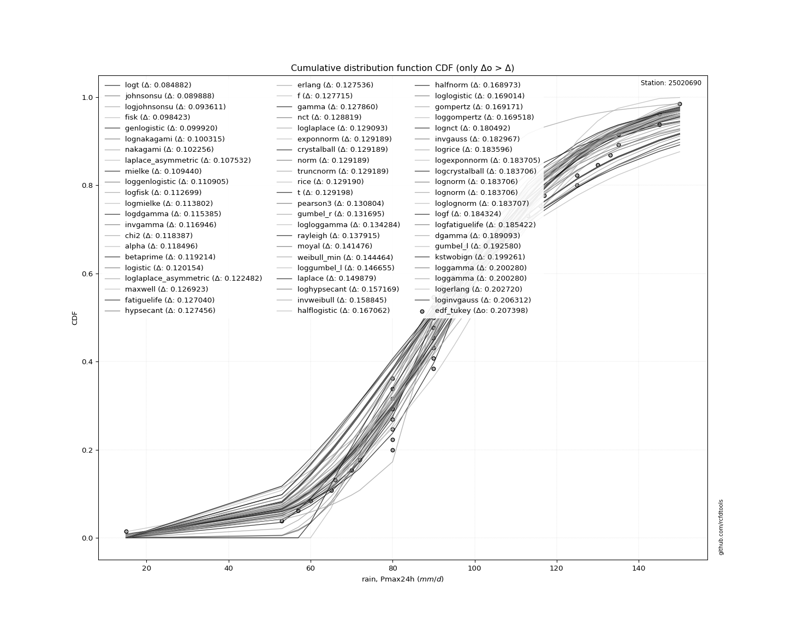</img>

</div>


**7.3. Best fit**

<div align="center">

|   id |   station | empirical_dist   | p_dist       |     delta |   deltao | eval   |   fit |   n |   best_fit |   best_fit_sort |
|-----:|----------:|:-----------------|:-------------|----------:|---------:|:-------|------:|----:|-----------:|----------------:|
|    0 |  25020690 | edf_tukey        | loghypsecant | 0.0941442 | 0.192333 | Δo > Δ |     1 |  50 |          1 |               1 |

</div>


<div align="center">

</img>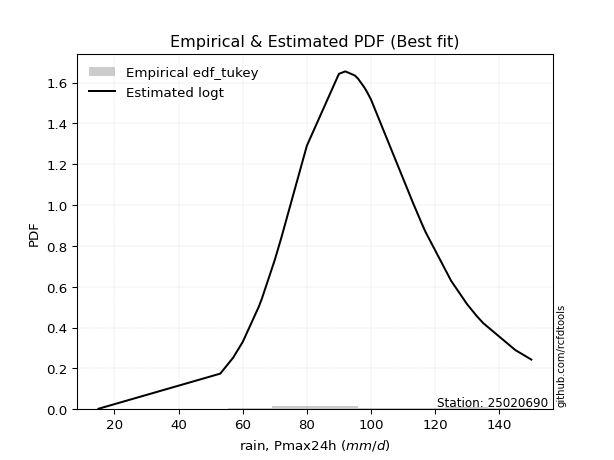</img>

</div>


### 8. Empirical - EDF Gringorten (1963)

Gringorten plotting position formula is essential for estimating the probability and return periods of extreme events like floods and heavy rainfall. The constant _a=0.44_.

<div align="center">


$P=(m-a)/(n+1-2a)$


</div>


**8.1. Empirical values**

<div align="center">

|                | 0                    | 1                    | 2                   | 3                  | 4                   | 5                   | 6                   | 7                   | 8                   | 9                  | 10                  | 11                  | 12                  | 13                  | 14                 | 15                 | 16                 | 17                 | 18                  | 19                  | 20                  | 21                 | 22                 | 23                  | 24                  | 25                | 26                | 27                 | 28                 | 29                 | 30                 | 31                 | 32                 | 33                 | 34                 | 35                 | 36                 | 37                 | 38                 | 39                 | 40                 | 41                 | 42                 | 43                 | 44                 | 45                 | 46                 | 47                 | 48                 | 49                 |
|:---------------|:---------------------|:---------------------|:--------------------|:-------------------|:--------------------|:--------------------|:--------------------|:--------------------|:--------------------|:-------------------|:--------------------|:--------------------|:--------------------|:--------------------|:-------------------|:-------------------|:-------------------|:-------------------|:--------------------|:--------------------|:--------------------|:-------------------|:-------------------|:--------------------|:--------------------|:------------------|:------------------|:-------------------|:-------------------|:-------------------|:-------------------|:-------------------|:-------------------|:-------------------|:-------------------|:-------------------|:-------------------|:-------------------|:-------------------|:-------------------|:-------------------|:-------------------|:-------------------|:-------------------|:-------------------|:-------------------|:-------------------|:-------------------|:-------------------|:-------------------|
| date           | 1986                 | 1977                 | 1998                | 1978               | 1979                | 1985                | 1982                | 1975                | 1991                | 1994               | 1990                | 1997                | 1974                | 2012                | 2015               | 2017               | 2000               | 2003               | 2019                | 2009                | 2006                | 1992               | 1995               | 1996                | 2021                | 2010              | 1976              | 1987               | 1999               | 1983               | 2016               | 2004               | 2001               | 2022               | 2007               | 2018               | 2008               | 2020               | 1973               | 1984               | 1981               | 1988               | 1993               | 2013               | 2005               | 1980               | 2002               | 1989               | 2011               | 2014               |
| x              | 53.0                 | 57.0                 | 60.0                | 65.0324581         | 66.0                | 70.0                | 72.0                | 80.0                | 80.0                | 80.0               | 80.0                | 80.0                | 80.0                | 80.0                | 80.0               | 85.0               | 90.0               | 90.0               | 90.0                | 90.0                | 90.0                | 90.0               | 90.0               | 90.0                | 90.0                | 90.0              | 92.0              | 94.700649162       | 95.0               | 96.0               | 96.0               | 98.0               | 98.0               | 98.0               | 99.0               | 100.0              | 100.0              | 111.0              | 113.0              | 116.0              | 117.0              | 125.0              | 125.0              | 130.0              | 133.0              | 135.0              | 135.0              | 145.0              | 145.0              | 150.0              |
| m              | 1                    | 2                    | 3                   | 4                  | 5                   | 6                   | 7                   | 8                   | 9                   | 10                 | 11                  | 12                  | 13                  | 14                  | 15                 | 16                 | 17                 | 18                 | 19                  | 20                  | 21                  | 22                 | 23                 | 24                  | 25                  | 26                | 27                | 28                 | 29                 | 30                 | 31                 | 32                 | 33                 | 34                 | 35                 | 36                 | 37                 | 38                 | 39                 | 40                 | 41                 | 42                 | 43                 | 44                 | 45                 | 46                 | 47                 | 48                 | 49                 | 50                 |
| empirical_dist | edf_gringorten       | edf_gringorten       | edf_gringorten      | edf_gringorten     | edf_gringorten      | edf_gringorten      | edf_gringorten      | edf_gringorten      | edf_gringorten      | edf_gringorten     | edf_gringorten      | edf_gringorten      | edf_gringorten      | edf_gringorten      | edf_gringorten     | edf_gringorten     | edf_gringorten     | edf_gringorten     | edf_gringorten      | edf_gringorten      | edf_gringorten      | edf_gringorten     | edf_gringorten     | edf_gringorten      | edf_gringorten      | edf_gringorten    | edf_gringorten    | edf_gringorten     | edf_gringorten     | edf_gringorten     | edf_gringorten     | edf_gringorten     | edf_gringorten     | edf_gringorten     | edf_gringorten     | edf_gringorten     | edf_gringorten     | edf_gringorten     | edf_gringorten     | edf_gringorten     | edf_gringorten     | edf_gringorten     | edf_gringorten     | edf_gringorten     | edf_gringorten     | edf_gringorten     | edf_gringorten     | edf_gringorten     | edf_gringorten     | edf_gringorten     |
| empirical      | 0.011173184357541902 | 0.031125299281723865 | 0.05107741420590583 | 0.0710295291300878 | 0.09098164405426976 | 0.11093375897845172 | 0.13088587390263368 | 0.15083798882681565 | 0.17079010375099762 | 0.1907422186751796 | 0.21069433359936154 | 0.23064644852354352 | 0.25059856344772546 | 0.27055067837190744 | 0.2905027932960894 | 0.3104549082202714 | 0.3304070231444533 | 0.3503591380686353 | 0.37031125299281725 | 0.39026336791699917 | 0.41021548284118114 | 0.4301675977653631 | 0.4501197126895451 | 0.47007182761372707 | 0.49002394253790904 | 0.509976057462091 | 0.529928172386273 | 0.5498802873104549 | 0.5698324022346368 | 0.5897845171588189 | 0.6097366320830008 | 0.6296887470071828 | 0.6496408619313648 | 0.6695929768555468 | 0.6895450917797288 | 0.7094972067039107 | 0.7294493216280926 | 0.7494014365522746 | 0.7693535514764566 | 0.7893056664006386 | 0.8092577813248205 | 0.8292098962490024 | 0.8491620111731845 | 0.8691141260973664 | 0.8890662410215484 | 0.9090183559457303 | 0.9289704708699124 | 0.9489225857940943 | 0.9688747007182762 | 0.9888268156424582 |
| empirical_tr   | 1.0112994350282485   | 1.0321252059308073   | 1.0538267451640033  | 1.0764604810996563 | 1.1000877963125548  | 1.1247755834829443  | 1.1505968778696052  | 1.1776315789473684  | 1.2059672762271414  | 1.2357001972386588 | 1.2669362992922144  | 1.299792531120332   | 1.334398296059638   | 1.3708971553610503  | 1.409448818897638  | 1.4502314814814816 | 1.4934445768772349 | 1.5393120393120394 | 1.58808618504436    | 1.6400523560209421  | 1.69553450608931    | 1.754901960784314  | 1.818577648766328  | 1.8870481927710843  | 1.9608763693270737  | 2.04071661237785  | 2.127334465195246 | 2.221631205673759  | 2.3246753246753245 | 2.437743190661479  | 2.5623721881390593 | 2.700431034482759  | 2.8542141230068347 | 3.0265700483091793 | 3.221079691516711  | 3.4423076923076934 | 3.6961651917404135 | 3.9904458598726134 | 4.335640138408306  | 4.746212121212124  | 5.242677824267784  | 5.8551401869158894 | 6.629629629629634  | 7.640243902439027  | 9.014388489208644  | 10.991228070175449 | 14.078651685393288 | 19.57812500000004  | 32.12820512820519  | 89.50000000000098  |

</div>


**8.2. Kolmogorov-Smirnov fit test (sorted by Δ)**


<div align="center">

|                | 0                   | 1                   | 2                   | 3                   | 4                   | 5                   | 6                   | 7                   | 8                   | 9                   | 10                  | 11                    | 12                  | 13                  | 14                  | 15                  | 16                  | 17                  | 18                  | 19                  | 20                  | 21                  | 22                  | 23                  | 24                  | 25                  | 26                  | 27                  | 28                  | 29                  | 30                  | 31                  | 32                  | 33                  | 34                  | 35                  | 36                  | 37                  | 38                  | 39                  | 40                  | 41                  | 42                  | 43                  | 44                  | 45                  | 46                  | 47                  | 48                  | 49                  | 50                  | 51                  | 52                  | 53                  | 54                  | 55                  | 56                  | 57                  | 58                  | 59                  | 60                  | 61                  | 62                  | 63                  | 64                  | 65                  | 66                  | 67                  | 68                  | 69                  | 70                  | 71                  | 72                  | 73                  | 74                  | 75                  | 76                  | 77                  | 78                  | 79                  | 80                  | 81                  | 82                  | 83                  | 84                  | 85                  | 86                  | 87                  |
|:---------------|:--------------------|:--------------------|:--------------------|:--------------------|:--------------------|:--------------------|:--------------------|:--------------------|:--------------------|:--------------------|:--------------------|:----------------------|:--------------------|:--------------------|:--------------------|:--------------------|:--------------------|:--------------------|:--------------------|:--------------------|:--------------------|:--------------------|:--------------------|:--------------------|:--------------------|:--------------------|:--------------------|:--------------------|:--------------------|:--------------------|:--------------------|:--------------------|:--------------------|:--------------------|:--------------------|:--------------------|:--------------------|:--------------------|:--------------------|:--------------------|:--------------------|:--------------------|:--------------------|:--------------------|:--------------------|:--------------------|:--------------------|:--------------------|:--------------------|:--------------------|:--------------------|:--------------------|:--------------------|:--------------------|:--------------------|:--------------------|:--------------------|:--------------------|:--------------------|:--------------------|:--------------------|:--------------------|:--------------------|:--------------------|:--------------------|:--------------------|:--------------------|:--------------------|:--------------------|:--------------------|:--------------------|:--------------------|:--------------------|:--------------------|:--------------------|:--------------------|:--------------------|:--------------------|:--------------------|:--------------------|:--------------------|:--------------------|:--------------------|:--------------------|:--------------------|:--------------------|:--------------------|:--------------------|
| station        | 25020690            | 25020690            | 25020690            | 25020690            | 25020690            | 25020690            | 25020690            | 25020690            | 25020690            | 25020690            | 25020690            | 25020690              | 25020690            | 25020690            | 25020690            | 25020690            | 25020690            | 25020690            | 25020690            | 25020690            | 25020690            | 25020690            | 25020690            | 25020690            | 25020690            | 25020690            | 25020690            | 25020690            | 25020690            | 25020690            | 25020690            | 25020690            | 25020690            | 25020690            | 25020690            | 25020690            | 25020690            | 25020690            | 25020690            | 25020690            | 25020690            | 25020690            | 25020690            | 25020690            | 25020690            | 25020690            | 25020690            | 25020690            | 25020690            | 25020690            | 25020690            | 25020690            | 25020690            | 25020690            | 25020690            | 25020690            | 25020690            | 25020690            | 25020690            | 25020690            | 25020690            | 25020690            | 25020690            | 25020690            | 25020690            | 25020690            | 25020690            | 25020690            | 25020690            | 25020690            | 25020690            | 25020690            | 25020690            | 25020690            | 25020690            | 25020690            | 25020690            | 25020690            | 25020690            | 25020690            | 25020690            | 25020690            | 25020690            | 25020690            | 25020690            | 25020690            | 25020690            | 25020690            |
| empirical_dist | edf_gringorten      | edf_gringorten      | edf_gringorten      | edf_gringorten      | edf_gringorten      | edf_gringorten      | edf_gringorten      | edf_gringorten      | edf_gringorten      | edf_gringorten      | edf_gringorten      | edf_gringorten        | edf_gringorten      | edf_gringorten      | edf_gringorten      | edf_gringorten      | edf_gringorten      | edf_gringorten      | edf_gringorten      | edf_gringorten      | edf_gringorten      | edf_gringorten      | edf_gringorten      | edf_gringorten      | edf_gringorten      | edf_gringorten      | edf_gringorten      | edf_gringorten      | edf_gringorten      | edf_gringorten      | edf_gringorten      | edf_gringorten      | edf_gringorten      | edf_gringorten      | edf_gringorten      | edf_gringorten      | edf_gringorten      | edf_gringorten      | edf_gringorten      | edf_gringorten      | edf_gringorten      | edf_gringorten      | edf_gringorten      | edf_gringorten      | edf_gringorten      | edf_gringorten      | edf_gringorten      | edf_gringorten      | edf_gringorten      | edf_gringorten      | edf_gringorten      | edf_gringorten      | edf_gringorten      | edf_gringorten      | edf_gringorten      | edf_gringorten      | edf_gringorten      | edf_gringorten      | edf_gringorten      | edf_gringorten      | edf_gringorten      | edf_gringorten      | edf_gringorten      | edf_gringorten      | edf_gringorten      | edf_gringorten      | edf_gringorten      | edf_gringorten      | edf_gringorten      | edf_gringorten      | edf_gringorten      | edf_gringorten      | edf_gringorten      | edf_gringorten      | edf_gringorten      | edf_gringorten      | edf_gringorten      | edf_gringorten      | edf_gringorten      | edf_gringorten      | edf_gringorten      | edf_gringorten      | edf_gringorten      | edf_gringorten      | edf_gringorten      | edf_gringorten      | edf_gringorten      | edf_gringorten      |
| p_dist         | loghypsecant        | logfisk             | laplace_asymmetric  | fisk                | loggenlogistic      | mielke              | logmielke           | loglogistic         | genlogistic         | loglaplace          | exponnorm           | loglaplace_asymmetric | logbetaprime        | logalpha            | betaprime           | logrice             | lognct              | loggamma            | loggamma            | logerlang           | logncf              | logfatiguelife      | nct                 | logf                | logcrystalball      | loglognorm          | logexponnorm        | logt                | lognorm             | lognorm             | lognakagami         | ncf                 | gumbel_r            | alpha               | f                   | invgamma            | johnsonsu           | fatiguelife         | logpearson3         | invweibull          | logjohnsonsu        | logloggamma         | gamma               | erlang              | chi2                | rayleigh            | loginvgamma         | loginvgauss         | logweibull_min      | pearson3            | nakagami            | kstwobign           | invgauss            | weibull_min         | maxwell             | rice                | logmaxwell          | moyal               | halfnorm            | hypsecant           | lograyleigh         | logistic            | halflogistic        | loginvweibull       | t                   | norm                | crystalball         | loggumbel_r         | laplace             | loggumbel_l         | loghalfnorm         | logkstwobign        | logmoyal            | wald                | loghalflogistic     | gumbel_l            | loggenexpon         | logwald             | loggibrat           | gibrat              | expon               | loggompertz         | logtruncnorm        | logexpon            | logchi2             | gompertz            | genexpon            | truncnorm           |
| delta          | 0.09511668953110741 | 0.10450670908295429 | 0.10492728995162315 | 0.10597145070809921 | 0.1061600516995942  | 0.1061678070320295  | 0.10616875893777    | 0.10641463157483921 | 0.1117226464000598  | 0.11363561213925394 | 0.11410923255289557 | 0.11423200974585634   | 0.11453328700559173 | 0.11461901312234091 | 0.11637607522005983 | 0.1164074026156745  | 0.1172614557737468  | 0.11788510931208285 | 0.11788510931208285 | 0.11814930206378615 | 0.11840379548692492 | 0.118472543403359   | 0.1186882627737248  | 0.12020505708001905 | 0.12032624880986043 | 0.12032864168636115 | 0.12033337968242241 | 0.12033343767595128 | 0.12033374250026141 | 0.12033374250026141 | 0.12036648781370685 | 0.12052871621461558 | 0.12060318132193926 | 0.12097765472881683 | 0.12117296025848479 | 0.12142924654704146 | 0.12173502419357374 | 0.12276038368673148 | 0.12277938907440133 | 0.12285806564180274 | 0.12286428685178719 | 0.12301965470106913 | 0.12419065107615213 | 0.12419065372720728 | 0.12419069831895535 | 0.1269388540443367  | 0.1276245575834643  | 0.12859841596181887 | 0.1287475016325741  | 0.13059742068528957 | 0.13295387615378496 | 0.13358099853442174 | 0.13434869006215683 | 0.13531526781846015 | 0.1363042742188948  | 0.13658372249664807 | 0.138756930934048   | 0.1429312031565721  | 0.14329445719591127 | 0.15010418423903904 | 0.1508227463196093  | 0.15724259918160088 | 0.1578966991063533  | 0.16003345356371335 | 0.16573525946917833 | 0.16574820475467444 | 0.16574821078888957 | 0.16959249800190157 | 0.16983943136127366 | 0.17834220253239907 | 0.18495488350650474 | 0.19358531702140053 | 0.19443140291626687 | 0.20256060333909315 | 0.20454986900562938 | 0.23119244530643945 | 0.24466016098518717 | 0.26321463346141755 | 0.2711768663001782  | 0.27184591307626643 | 0.31316862707168314 | 0.33639756132285215 | 0.358246776029279   | 0.36432413610707726 | 0.40465379622401476 | 0.810856175916456   | 0.9021222672031702  | 0.9857439047359015  |
| deltao         | 0.19233304448274094 | 0.19233304448274094 | 0.19233304448274094 | 0.19233304448274094 | 0.19233304448274094 | 0.19233304448274094 | 0.19233304448274094 | 0.19233304448274094 | 0.19233304448274094 | 0.19233304448274094 | 0.19233304448274094 | 0.19233304448274094   | 0.19233304448274094 | 0.19233304448274094 | 0.19233304448274094 | 0.19233304448274094 | 0.19233304448274094 | 0.19233304448274094 | 0.19233304448274094 | 0.19233304448274094 | 0.19233304448274094 | 0.19233304448274094 | 0.19233304448274094 | 0.19233304448274094 | 0.19233304448274094 | 0.19233304448274094 | 0.19233304448274094 | 0.19233304448274094 | 0.19233304448274094 | 0.19233304448274094 | 0.19233304448274094 | 0.19233304448274094 | 0.19233304448274094 | 0.19233304448274094 | 0.19233304448274094 | 0.19233304448274094 | 0.19233304448274094 | 0.19233304448274094 | 0.19233304448274094 | 0.19233304448274094 | 0.19233304448274094 | 0.19233304448274094 | 0.19233304448274094 | 0.19233304448274094 | 0.19233304448274094 | 0.19233304448274094 | 0.19233304448274094 | 0.19233304448274094 | 0.19233304448274094 | 0.19233304448274094 | 0.19233304448274094 | 0.19233304448274094 | 0.19233304448274094 | 0.19233304448274094 | 0.19233304448274094 | 0.19233304448274094 | 0.19233304448274094 | 0.19233304448274094 | 0.19233304448274094 | 0.19233304448274094 | 0.19233304448274094 | 0.19233304448274094 | 0.19233304448274094 | 0.19233304448274094 | 0.19233304448274094 | 0.19233304448274094 | 0.19233304448274094 | 0.19233304448274094 | 0.19233304448274094 | 0.19233304448274094 | 0.19233304448274094 | 0.19233304448274094 | 0.19233304448274094 | 0.19233304448274094 | 0.19233304448274094 | 0.19233304448274094 | 0.19233304448274094 | 0.19233304448274094 | 0.19233304448274094 | 0.19233304448274094 | 0.19233304448274094 | 0.19233304448274094 | 0.19233304448274094 | 0.19233304448274094 | 0.19233304448274094 | 0.19233304448274094 | 0.19233304448274094 | 0.19233304448274094 |
| eval           | Δo > Δ              | Δo > Δ              | Δo > Δ              | Δo > Δ              | Δo > Δ              | Δo > Δ              | Δo > Δ              | Δo > Δ              | Δo > Δ              | Δo > Δ              | Δo > Δ              | Δo > Δ                | Δo > Δ              | Δo > Δ              | Δo > Δ              | Δo > Δ              | Δo > Δ              | Δo > Δ              | Δo > Δ              | Δo > Δ              | Δo > Δ              | Δo > Δ              | Δo > Δ              | Δo > Δ              | Δo > Δ              | Δo > Δ              | Δo > Δ              | Δo > Δ              | Δo > Δ              | Δo > Δ              | Δo > Δ              | Δo > Δ              | Δo > Δ              | Δo > Δ              | Δo > Δ              | Δo > Δ              | Δo > Δ              | Δo > Δ              | Δo > Δ              | Δo > Δ              | Δo > Δ              | Δo > Δ              | Δo > Δ              | Δo > Δ              | Δo > Δ              | Δo > Δ              | Δo > Δ              | Δo > Δ              | Δo > Δ              | Δo > Δ              | Δo > Δ              | Δo > Δ              | Δo > Δ              | Δo > Δ              | Δo > Δ              | Δo > Δ              | Δo > Δ              | Δo > Δ              | Δo > Δ              | Δo > Δ              | Δo > Δ              | Δo > Δ              | Δo > Δ              | Δo > Δ              | Δo > Δ              | Δo > Δ              | Δo > Δ              | Δo > Δ              | Δo > Δ              | Δo > Δ              | Δo > Δ              | Δo <= Δ             | Δo <= Δ             | Δo <= Δ             | Δo <= Δ             | Δo <= Δ             | Δo <= Δ             | Δo <= Δ             | Δo <= Δ             | Δo <= Δ             | Δo <= Δ             | Δo <= Δ             | Δo <= Δ             | Δo <= Δ             | Δo <= Δ             | Δo <= Δ             | Δo <= Δ             | Δo <= Δ             |
| fit            | 1                   | 1                   | 1                   | 1                   | 1                   | 1                   | 1                   | 1                   | 1                   | 1                   | 1                   | 1                     | 1                   | 1                   | 1                   | 1                   | 1                   | 1                   | 1                   | 1                   | 1                   | 1                   | 1                   | 1                   | 1                   | 1                   | 1                   | 1                   | 1                   | 1                   | 1                   | 1                   | 1                   | 1                   | 1                   | 1                   | 1                   | 1                   | 1                   | 1                   | 1                   | 1                   | 1                   | 1                   | 1                   | 1                   | 1                   | 1                   | 1                   | 1                   | 1                   | 1                   | 1                   | 1                   | 1                   | 1                   | 1                   | 1                   | 1                   | 1                   | 1                   | 1                   | 1                   | 1                   | 1                   | 1                   | 1                   | 1                   | 1                   | 1                   | 1                   | 0                   | 0                   | 0                   | 0                   | 0                   | 0                   | 0                   | 0                   | 0                   | 0                   | 0                   | 0                   | 0                   | 0                   | 0                   | 0                   | 0                   |
| n              | 50                  | 50                  | 50                  | 50                  | 50                  | 50                  | 50                  | 50                  | 50                  | 50                  | 50                  | 50                    | 50                  | 50                  | 50                  | 50                  | 50                  | 50                  | 50                  | 50                  | 50                  | 50                  | 50                  | 50                  | 50                  | 50                  | 50                  | 50                  | 50                  | 50                  | 50                  | 50                  | 50                  | 50                  | 50                  | 50                  | 50                  | 50                  | 50                  | 50                  | 50                  | 50                  | 50                  | 50                  | 50                  | 50                  | 50                  | 50                  | 50                  | 50                  | 50                  | 50                  | 50                  | 50                  | 50                  | 50                  | 50                  | 50                  | 50                  | 50                  | 50                  | 50                  | 50                  | 50                  | 50                  | 50                  | 50                  | 50                  | 50                  | 50                  | 50                  | 50                  | 50                  | 50                  | 50                  | 50                  | 50                  | 50                  | 50                  | 50                  | 50                  | 50                  | 50                  | 50                  | 50                  | 50                  | 50                  | 50                  |
| best_fit       | 1                   | 0                   | 0                   | 0                   | 0                   | 0                   | 0                   | 0                   | 0                   | 0                   | 0                   | 0                     | 0                   | 0                   | 0                   | 0                   | 0                   | 0                   | 0                   | 0                   | 0                   | 0                   | 0                   | 0                   | 0                   | 0                   | 0                   | 0                   | 0                   | 0                   | 0                   | 0                   | 0                   | 0                   | 0                   | 0                   | 0                   | 0                   | 0                   | 0                   | 0                   | 0                   | 0                   | 0                   | 0                   | 0                   | 0                   | 0                   | 0                   | 0                   | 0                   | 0                   | 0                   | 0                   | 0                   | 0                   | 0                   | 0                   | 0                   | 0                   | 0                   | 0                   | 0                   | 0                   | 0                   | 0                   | 0                   | 0                   | 0                   | 0                   | 0                   | 0                   | 0                   | 0                   | 0                   | 0                   | 0                   | 0                   | 0                   | 0                   | 0                   | 0                   | 0                   | 0                   | 0                   | 0                   | 0                   | 0                   |
| best_fit_sort  | 1                   | 2                   | 3                   | 4                   | 5                   | 6                   | 7                   | 8                   | 9                   | 10                  | 11                  | 12                    | 13                  | 14                  | 15                  | 16                  | 17                  | 18                  | 19                  | 20                  | 21                  | 22                  | 23                  | 24                  | 25                  | 26                  | 27                  | 28                  | 29                  | 30                  | 31                  | 32                  | 33                  | 34                  | 35                  | 36                  | 37                  | 38                  | 39                  | 40                  | 41                  | 42                  | 43                  | 44                  | 45                  | 46                  | 47                  | 48                  | 49                  | 50                  | 51                  | 52                  | 53                  | 54                  | 55                  | 56                  | 57                  | 58                  | 59                  | 60                  | 61                  | 62                  | 63                  | 64                  | 65                  | 66                  | 67                  | 68                  | 69                  | 70                  | 71                  | 72                  | 73                  | 74                  | 75                  | 76                  | 77                  | 78                  | 79                  | 80                  | 81                  | 82                  | 83                  | 84                  | 85                  | 86                  | 87                  | 88                  |

</div>


<div align="center">

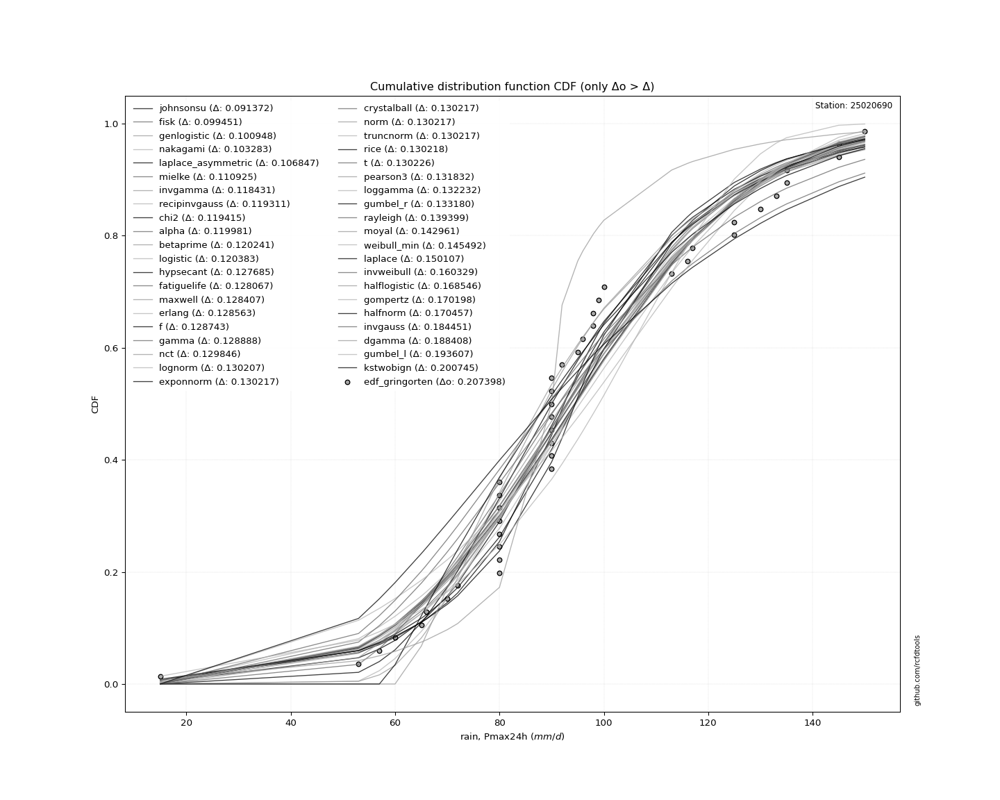</img>

</div>


**8.3. Best fit**

<div align="center">

|   id |   station | empirical_dist   | p_dist       |     delta |   deltao | eval   |   fit |   n |   best_fit |   best_fit_sort |
|-----:|----------:|:-----------------|:-------------|----------:|---------:|:-------|------:|----:|-----------:|----------------:|
|    0 |  25020690 | edf_gringorten   | loghypsecant | 0.0951167 | 0.192333 | Δo > Δ |     1 |  50 |          1 |               1 |

</div>


<div align="center">

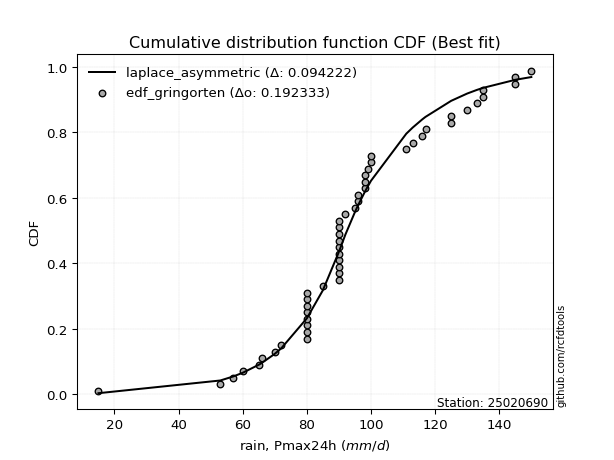</img>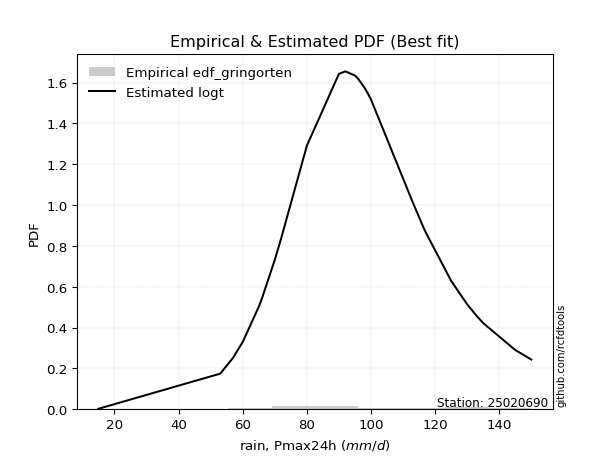</img>

</div>


### 9. Empirical - EDF Filliben (1975)

The specific values of the constants (0.3175) (often denoted as $alpha$) and (0.365) are derived from a method proposed by James J. Filliben in a 1975 paper. This particular formula is the mean value of the $i$-th order statistic of the normal distribution and is considered a robust and effective plotting position formula for the normal probability plot correlation coefficient test for normality.

<div align="center">


$P=(m-0.3175)/(n+0.365)$


</div>


**9.1. Empirical values**

<div align="center">

|                | 0                    | 1                  | 2                   | 3                   | 4                   | 5                   | 6                   | 7                   | 8                   | 9                   | 10                  | 11                 | 12                  | 13                 | 14                 | 15                 | 16                 | 17                 | 18                  | 19                 | 20                 | 21                  | 22                  | 23                 | 24                 | 25                 | 26                 | 27                 | 28                 | 29                 | 30                 | 31                 | 32                 | 33                 | 34                 | 35                 | 36                 | 37                 | 38                 | 39                 | 40                 | 41                 | 42                 | 43                | 44                | 45                 | 46                 | 47                 | 48                 | 49                 |
|:---------------|:---------------------|:-------------------|:--------------------|:--------------------|:--------------------|:--------------------|:--------------------|:--------------------|:--------------------|:--------------------|:--------------------|:-------------------|:--------------------|:-------------------|:-------------------|:-------------------|:-------------------|:-------------------|:--------------------|:-------------------|:-------------------|:--------------------|:--------------------|:-------------------|:-------------------|:-------------------|:-------------------|:-------------------|:-------------------|:-------------------|:-------------------|:-------------------|:-------------------|:-------------------|:-------------------|:-------------------|:-------------------|:-------------------|:-------------------|:-------------------|:-------------------|:-------------------|:-------------------|:------------------|:------------------|:-------------------|:-------------------|:-------------------|:-------------------|:-------------------|
| date           | 1986                 | 1977               | 1998                | 1978                | 1979                | 1985                | 1982                | 1975                | 1991                | 1994                | 1990                | 1997               | 1974                | 2012               | 2015               | 2017               | 2000               | 2003               | 2019                | 2009               | 2006               | 1992                | 1995                | 1996               | 2021               | 2010               | 1976               | 1987               | 1999               | 1983               | 2016               | 2004               | 2001               | 2022               | 2007               | 2018               | 2008               | 2020               | 1973               | 1984               | 1981               | 1988               | 1993               | 2013              | 2005              | 1980               | 2002               | 1989               | 2011               | 2014               |
| x              | 53.0                 | 57.0               | 60.0                | 65.0324581          | 66.0                | 70.0                | 72.0                | 80.0                | 80.0                | 80.0                | 80.0                | 80.0               | 80.0                | 80.0               | 80.0               | 85.0               | 90.0               | 90.0               | 90.0                | 90.0               | 90.0               | 90.0                | 90.0                | 90.0               | 90.0               | 90.0               | 92.0               | 94.700649162       | 95.0               | 96.0               | 96.0               | 98.0               | 98.0               | 98.0               | 99.0               | 100.0              | 100.0              | 111.0              | 113.0              | 116.0              | 117.0              | 125.0              | 125.0              | 130.0             | 133.0             | 135.0              | 135.0              | 145.0              | 145.0              | 150.0              |
| m              | 1                    | 2                  | 3                   | 4                   | 5                   | 6                   | 7                   | 8                   | 9                   | 10                  | 11                  | 12                 | 13                  | 14                 | 15                 | 16                 | 17                 | 18                 | 19                  | 20                 | 21                 | 22                  | 23                  | 24                 | 25                 | 26                 | 27                 | 28                 | 29                 | 30                 | 31                 | 32                 | 33                 | 34                 | 35                 | 36                 | 37                 | 38                 | 39                 | 40                 | 41                 | 42                 | 43                 | 44                | 45                | 46                 | 47                 | 48                 | 49                 | 50                 |
| empirical_dist | edf_filliben         | edf_filliben       | edf_filliben        | edf_filliben        | edf_filliben        | edf_filliben        | edf_filliben        | edf_filliben        | edf_filliben        | edf_filliben        | edf_filliben        | edf_filliben       | edf_filliben        | edf_filliben       | edf_filliben       | edf_filliben       | edf_filliben       | edf_filliben       | edf_filliben        | edf_filliben       | edf_filliben       | edf_filliben        | edf_filliben        | edf_filliben       | edf_filliben       | edf_filliben       | edf_filliben       | edf_filliben       | edf_filliben       | edf_filliben       | edf_filliben       | edf_filliben       | edf_filliben       | edf_filliben       | edf_filliben       | edf_filliben       | edf_filliben       | edf_filliben       | edf_filliben       | edf_filliben       | edf_filliben       | edf_filliben       | edf_filliben       | edf_filliben      | edf_filliben      | edf_filliben       | edf_filliben       | edf_filliben       | edf_filliben       | edf_filliben       |
| empirical      | 0.013551077136900624 | 0.0334061352129455 | 0.05326119328899037 | 0.07311625136503525 | 0.09297130944108012 | 0.11282636751712498 | 0.13268142559316987 | 0.15253648366921474 | 0.17239154174525959 | 0.19224659982130446 | 0.21210165789734933 | 0.2319567159733942 | 0.25181177404943905 | 0.2716668321254839 | 0.2915218902015288 | 0.3113769482775737 | 0.3312320063536186 | 0.3510870644296635 | 0.37094212250570835 | 0.3907971805817532 | 0.4106522386577981 | 0.43050729673384297 | 0.45036235480988784 | 0.4702174128859327 | 0.4900724709619776 | 0.5099275290380224 | 0.5297825871140673 | 0.5496376451901122 | 0.5694927032661571 | 0.5893477613422019 | 0.6092028194182468 | 0.6290578774942917 | 0.6489129355703365 | 0.6687679936463813 | 0.6886230517224262 | 0.708478109798471  | 0.728333167874516  | 0.7481882259505608 | 0.7680432840266057 | 0.7878983421026505 | 0.8077534001786955 | 0.8276084582547403 | 0.8474635163307852 | 0.86731857440683  | 0.887173632482875 | 0.9070286905589198 | 0.9268837486349647 | 0.9467388067110095 | 0.9665938647870544 | 0.9864489228630993 |
| empirical_tr   | 1.0137372314195139   | 1.034560673753402  | 1.0562575368321712  | 1.078883950088363   | 1.1025009576971487  | 1.1271750685391373  | 1.1529788817031992  | 1.1799917999179992  | 1.2083008456786422  | 1.2380015977385854  | 1.2691992691992693  | 1.302009952821043  | 1.3365620646188547  | 1.3729980235807264 | 1.411476213830309  | 1.4521732862394579 | 1.495286870036369  | 1.5410387822229024 | 1.5896788447881323  | 1.6414894483826283 | 1.6967910384906932 | 1.75594874923734    | 1.8193804750293507  | 1.8875667572378898 | 1.9610629806288329 | 2.040514534589284  | 2.1266758154755623 | 2.220434255483302  | 2.3228410008071028 | 2.435150489544301  | 2.558872094500191  | 2.6958383513983675 | 2.848296338187473  | 3.0190319196763062 | 3.211541527179977  | 3.4302741358760414 | 3.6809793531883783 | 3.9712201852946953 | 4.311149154718595  | 4.714720336999763  | 5.201652465788793  | 5.80074863230636   | 6.555808656036444  | 7.536849981294419 | 8.863176418829736 | 10.756006406833944 | 13.676849966055658 | 18.775396085740873 | 29.934621099554185 | 73.7948717948712   |

</div>


**9.2. Kolmogorov-Smirnov fit test (sorted by Δ)**


<div align="center">

|                | 0                   | 1                   | 2                   | 3                   | 4                   | 5                   | 6                   | 7                   | 8                   | 9                   | 10                    | 11                  | 12                  | 13                  | 14                  | 15                  | 16                  | 17                  | 18                  | 19                  | 20                  | 21                  | 22                  | 23                  | 24                  | 25                  | 26                  | 27                  | 28                  | 29                  | 30                  | 31                  | 32                  | 33                  | 34                  | 35                  | 36                  | 37                  | 38                  | 39                  | 40                  | 41                  | 42                  | 43                  | 44                  | 45                  | 46                  | 47                  | 48                  | 49                  | 50                  | 51                  | 52                  | 53                  | 54                  | 55                  | 56                  | 57                  | 58                  | 59                  | 60                  | 61                  | 62                  | 63                  | 64                  | 65                  | 66                  | 67                  | 68                  | 69                  | 70                  | 71                  | 72                  | 73                  | 74                  | 75                  | 76                  | 77                  | 78                  | 79                  | 80                  | 81                  | 82                  | 83                  | 84                  | 85                  | 86                  | 87                  |
|:---------------|:--------------------|:--------------------|:--------------------|:--------------------|:--------------------|:--------------------|:--------------------|:--------------------|:--------------------|:--------------------|:----------------------|:--------------------|:--------------------|:--------------------|:--------------------|:--------------------|:--------------------|:--------------------|:--------------------|:--------------------|:--------------------|:--------------------|:--------------------|:--------------------|:--------------------|:--------------------|:--------------------|:--------------------|:--------------------|:--------------------|:--------------------|:--------------------|:--------------------|:--------------------|:--------------------|:--------------------|:--------------------|:--------------------|:--------------------|:--------------------|:--------------------|:--------------------|:--------------------|:--------------------|:--------------------|:--------------------|:--------------------|:--------------------|:--------------------|:--------------------|:--------------------|:--------------------|:--------------------|:--------------------|:--------------------|:--------------------|:--------------------|:--------------------|:--------------------|:--------------------|:--------------------|:--------------------|:--------------------|:--------------------|:--------------------|:--------------------|:--------------------|:--------------------|:--------------------|:--------------------|:--------------------|:--------------------|:--------------------|:--------------------|:--------------------|:--------------------|:--------------------|:--------------------|:--------------------|:--------------------|:--------------------|:--------------------|:--------------------|:--------------------|:--------------------|:--------------------|:--------------------|:--------------------|
| station        | 25020690            | 25020690            | 25020690            | 25020690            | 25020690            | 25020690            | 25020690            | 25020690            | 25020690            | 25020690            | 25020690              | 25020690            | 25020690            | 25020690            | 25020690            | 25020690            | 25020690            | 25020690            | 25020690            | 25020690            | 25020690            | 25020690            | 25020690            | 25020690            | 25020690            | 25020690            | 25020690            | 25020690            | 25020690            | 25020690            | 25020690            | 25020690            | 25020690            | 25020690            | 25020690            | 25020690            | 25020690            | 25020690            | 25020690            | 25020690            | 25020690            | 25020690            | 25020690            | 25020690            | 25020690            | 25020690            | 25020690            | 25020690            | 25020690            | 25020690            | 25020690            | 25020690            | 25020690            | 25020690            | 25020690            | 25020690            | 25020690            | 25020690            | 25020690            | 25020690            | 25020690            | 25020690            | 25020690            | 25020690            | 25020690            | 25020690            | 25020690            | 25020690            | 25020690            | 25020690            | 25020690            | 25020690            | 25020690            | 25020690            | 25020690            | 25020690            | 25020690            | 25020690            | 25020690            | 25020690            | 25020690            | 25020690            | 25020690            | 25020690            | 25020690            | 25020690            | 25020690            | 25020690            |
| empirical_dist | edf_filliben        | edf_filliben        | edf_filliben        | edf_filliben        | edf_filliben        | edf_filliben        | edf_filliben        | edf_filliben        | edf_filliben        | edf_filliben        | edf_filliben          | edf_filliben        | edf_filliben        | edf_filliben        | edf_filliben        | edf_filliben        | edf_filliben        | edf_filliben        | edf_filliben        | edf_filliben        | edf_filliben        | edf_filliben        | edf_filliben        | edf_filliben        | edf_filliben        | edf_filliben        | edf_filliben        | edf_filliben        | edf_filliben        | edf_filliben        | edf_filliben        | edf_filliben        | edf_filliben        | edf_filliben        | edf_filliben        | edf_filliben        | edf_filliben        | edf_filliben        | edf_filliben        | edf_filliben        | edf_filliben        | edf_filliben        | edf_filliben        | edf_filliben        | edf_filliben        | edf_filliben        | edf_filliben        | edf_filliben        | edf_filliben        | edf_filliben        | edf_filliben        | edf_filliben        | edf_filliben        | edf_filliben        | edf_filliben        | edf_filliben        | edf_filliben        | edf_filliben        | edf_filliben        | edf_filliben        | edf_filliben        | edf_filliben        | edf_filliben        | edf_filliben        | edf_filliben        | edf_filliben        | edf_filliben        | edf_filliben        | edf_filliben        | edf_filliben        | edf_filliben        | edf_filliben        | edf_filliben        | edf_filliben        | edf_filliben        | edf_filliben        | edf_filliben        | edf_filliben        | edf_filliben        | edf_filliben        | edf_filliben        | edf_filliben        | edf_filliben        | edf_filliben        | edf_filliben        | edf_filliben        | edf_filliben        | edf_filliben        |
| p_dist         | loghypsecant        | logfisk             | laplace_asymmetric  | fisk                | loglogistic         | loggenlogistic      | mielke              | logmielke           | genlogistic         | exponnorm           | loglaplace_asymmetric | logbetaprime        | loglaplace          | logalpha            | logrice             | betaprime           | lognct              | loggamma            | loggamma            | logerlang           | logncf              | logfatiguelife      | nct                 | logf                | logcrystalball      | loglognorm          | logexponnorm        | logt                | lognorm             | lognorm             | lognakagami         | ncf                 | gumbel_r            | alpha               | f                   | invgamma            | johnsonsu           | fatiguelife         | logpearson3         | logjohnsonsu        | logloggamma         | invweibull          | gamma               | erlang              | chi2                | rayleigh            | loginvgamma         | logweibull_min      | loginvgauss         | pearson3            | nakagami            | kstwobign           | invgauss            | weibull_min         | maxwell             | rice                | logmaxwell          | moyal               | halfnorm            | hypsecant           | lograyleigh         | logistic            | halflogistic        | loginvweibull       | t                   | norm                | crystalball         | loggumbel_r         | laplace             | loggumbel_l         | loghalfnorm         | logkstwobign        | logmoyal            | wald                | loghalflogistic     | gumbel_l            | loggenexpon         | logwald             | loggibrat           | gibrat              | expon               | loggompertz         | logtruncnorm        | logexpon            | logchi2             | gompertz            | genexpon            | truncnorm           |
| delta          | 0.09400053577753076 | 0.10368172587378899 | 0.1048787615275546  | 0.10514646749893392 | 0.10529847782126256 | 0.1053350684904289  | 0.1053428238228642  | 0.1053437757286047  | 0.11060649264648315 | 0.11328424934373027 | 0.11340702653669105   | 0.11355144984010529 | 0.11358708371518539 | 0.11379402991317561 | 0.11529124886209785 | 0.11555109201089453 | 0.11614530202017015 | 0.1167689555585062  | 0.1167689555585062  | 0.1170331483102095  | 0.11728764173334827 | 0.11735638964978234 | 0.11757210902014814 | 0.1190889033264424  | 0.11921009505628377 | 0.1192124879327845  | 0.11921722592884576 | 0.11921728392237463 | 0.11921758874668476 | 0.11921758874668476 | 0.11925033406013019 | 0.11941256246103893 | 0.11977819811277396 | 0.11986150097524018 | 0.12005680650490813 | 0.1203130927934648  | 0.12061887043999708 | 0.12164422993315482 | 0.12166323532082468 | 0.12174813309821053 | 0.12190350094749247 | 0.12203308243263744 | 0.12307449732257547 | 0.12307449997363062 | 0.1230745445653787  | 0.12582270029076004 | 0.126799574374299   | 0.12763134787899744 | 0.12777343275265357 | 0.1294812669317129  | 0.1318377224002083  | 0.13188250369202265 | 0.13352370685299153 | 0.1341991140648835  | 0.13518812046531814 | 0.13546756874307142 | 0.1379319477248827  | 0.1421062199474068  | 0.14246947398674598 | 0.14898803048546239 | 0.149997763110444   | 0.15612644542802423 | 0.157071715897188   | 0.15916184283250406 | 0.16461910571560168 | 0.1646320510010978  | 0.16463205703531292 | 0.16876751479273627 | 0.1697909029372051  | 0.17722604877882242 | 0.18412990029733944 | 0.19188682217900144 | 0.19360641970710157 | 0.20173562012992785 | 0.20372488579646408 | 0.2300762915528628  | 0.24296166614278808 | 0.26238965025225225 | 0.2703518830910129  | 0.2728650099817058  | 0.31147013222928405 | 0.33469906648045306 | 0.3565482811868799  | 0.36262564126467817 | 0.40295530138161567 | 0.8091576810740567  | 0.9000355449682227  | 0.9833660119565427  |
| deltao         | 0.19233304448274094 | 0.19233304448274094 | 0.19233304448274094 | 0.19233304448274094 | 0.19233304448274094 | 0.19233304448274094 | 0.19233304448274094 | 0.19233304448274094 | 0.19233304448274094 | 0.19233304448274094 | 0.19233304448274094   | 0.19233304448274094 | 0.19233304448274094 | 0.19233304448274094 | 0.19233304448274094 | 0.19233304448274094 | 0.19233304448274094 | 0.19233304448274094 | 0.19233304448274094 | 0.19233304448274094 | 0.19233304448274094 | 0.19233304448274094 | 0.19233304448274094 | 0.19233304448274094 | 0.19233304448274094 | 0.19233304448274094 | 0.19233304448274094 | 0.19233304448274094 | 0.19233304448274094 | 0.19233304448274094 | 0.19233304448274094 | 0.19233304448274094 | 0.19233304448274094 | 0.19233304448274094 | 0.19233304448274094 | 0.19233304448274094 | 0.19233304448274094 | 0.19233304448274094 | 0.19233304448274094 | 0.19233304448274094 | 0.19233304448274094 | 0.19233304448274094 | 0.19233304448274094 | 0.19233304448274094 | 0.19233304448274094 | 0.19233304448274094 | 0.19233304448274094 | 0.19233304448274094 | 0.19233304448274094 | 0.19233304448274094 | 0.19233304448274094 | 0.19233304448274094 | 0.19233304448274094 | 0.19233304448274094 | 0.19233304448274094 | 0.19233304448274094 | 0.19233304448274094 | 0.19233304448274094 | 0.19233304448274094 | 0.19233304448274094 | 0.19233304448274094 | 0.19233304448274094 | 0.19233304448274094 | 0.19233304448274094 | 0.19233304448274094 | 0.19233304448274094 | 0.19233304448274094 | 0.19233304448274094 | 0.19233304448274094 | 0.19233304448274094 | 0.19233304448274094 | 0.19233304448274094 | 0.19233304448274094 | 0.19233304448274094 | 0.19233304448274094 | 0.19233304448274094 | 0.19233304448274094 | 0.19233304448274094 | 0.19233304448274094 | 0.19233304448274094 | 0.19233304448274094 | 0.19233304448274094 | 0.19233304448274094 | 0.19233304448274094 | 0.19233304448274094 | 0.19233304448274094 | 0.19233304448274094 | 0.19233304448274094 |
| eval           | Δo > Δ              | Δo > Δ              | Δo > Δ              | Δo > Δ              | Δo > Δ              | Δo > Δ              | Δo > Δ              | Δo > Δ              | Δo > Δ              | Δo > Δ              | Δo > Δ                | Δo > Δ              | Δo > Δ              | Δo > Δ              | Δo > Δ              | Δo > Δ              | Δo > Δ              | Δo > Δ              | Δo > Δ              | Δo > Δ              | Δo > Δ              | Δo > Δ              | Δo > Δ              | Δo > Δ              | Δo > Δ              | Δo > Δ              | Δo > Δ              | Δo > Δ              | Δo > Δ              | Δo > Δ              | Δo > Δ              | Δo > Δ              | Δo > Δ              | Δo > Δ              | Δo > Δ              | Δo > Δ              | Δo > Δ              | Δo > Δ              | Δo > Δ              | Δo > Δ              | Δo > Δ              | Δo > Δ              | Δo > Δ              | Δo > Δ              | Δo > Δ              | Δo > Δ              | Δo > Δ              | Δo > Δ              | Δo > Δ              | Δo > Δ              | Δo > Δ              | Δo > Δ              | Δo > Δ              | Δo > Δ              | Δo > Δ              | Δo > Δ              | Δo > Δ              | Δo > Δ              | Δo > Δ              | Δo > Δ              | Δo > Δ              | Δo > Δ              | Δo > Δ              | Δo > Δ              | Δo > Δ              | Δo > Δ              | Δo > Δ              | Δo > Δ              | Δo > Δ              | Δo > Δ              | Δo > Δ              | Δo > Δ              | Δo <= Δ             | Δo <= Δ             | Δo <= Δ             | Δo <= Δ             | Δo <= Δ             | Δo <= Δ             | Δo <= Δ             | Δo <= Δ             | Δo <= Δ             | Δo <= Δ             | Δo <= Δ             | Δo <= Δ             | Δo <= Δ             | Δo <= Δ             | Δo <= Δ             | Δo <= Δ             |
| fit            | 1                   | 1                   | 1                   | 1                   | 1                   | 1                   | 1                   | 1                   | 1                   | 1                   | 1                     | 1                   | 1                   | 1                   | 1                   | 1                   | 1                   | 1                   | 1                   | 1                   | 1                   | 1                   | 1                   | 1                   | 1                   | 1                   | 1                   | 1                   | 1                   | 1                   | 1                   | 1                   | 1                   | 1                   | 1                   | 1                   | 1                   | 1                   | 1                   | 1                   | 1                   | 1                   | 1                   | 1                   | 1                   | 1                   | 1                   | 1                   | 1                   | 1                   | 1                   | 1                   | 1                   | 1                   | 1                   | 1                   | 1                   | 1                   | 1                   | 1                   | 1                   | 1                   | 1                   | 1                   | 1                   | 1                   | 1                   | 1                   | 1                   | 1                   | 1                   | 1                   | 0                   | 0                   | 0                   | 0                   | 0                   | 0                   | 0                   | 0                   | 0                   | 0                   | 0                   | 0                   | 0                   | 0                   | 0                   | 0                   |
| n              | 50                  | 50                  | 50                  | 50                  | 50                  | 50                  | 50                  | 50                  | 50                  | 50                  | 50                    | 50                  | 50                  | 50                  | 50                  | 50                  | 50                  | 50                  | 50                  | 50                  | 50                  | 50                  | 50                  | 50                  | 50                  | 50                  | 50                  | 50                  | 50                  | 50                  | 50                  | 50                  | 50                  | 50                  | 50                  | 50                  | 50                  | 50                  | 50                  | 50                  | 50                  | 50                  | 50                  | 50                  | 50                  | 50                  | 50                  | 50                  | 50                  | 50                  | 50                  | 50                  | 50                  | 50                  | 50                  | 50                  | 50                  | 50                  | 50                  | 50                  | 50                  | 50                  | 50                  | 50                  | 50                  | 50                  | 50                  | 50                  | 50                  | 50                  | 50                  | 50                  | 50                  | 50                  | 50                  | 50                  | 50                  | 50                  | 50                  | 50                  | 50                  | 50                  | 50                  | 50                  | 50                  | 50                  | 50                  | 50                  |
| best_fit       | 1                   | 0                   | 0                   | 0                   | 0                   | 0                   | 0                   | 0                   | 0                   | 0                   | 0                     | 0                   | 0                   | 0                   | 0                   | 0                   | 0                   | 0                   | 0                   | 0                   | 0                   | 0                   | 0                   | 0                   | 0                   | 0                   | 0                   | 0                   | 0                   | 0                   | 0                   | 0                   | 0                   | 0                   | 0                   | 0                   | 0                   | 0                   | 0                   | 0                   | 0                   | 0                   | 0                   | 0                   | 0                   | 0                   | 0                   | 0                   | 0                   | 0                   | 0                   | 0                   | 0                   | 0                   | 0                   | 0                   | 0                   | 0                   | 0                   | 0                   | 0                   | 0                   | 0                   | 0                   | 0                   | 0                   | 0                   | 0                   | 0                   | 0                   | 0                   | 0                   | 0                   | 0                   | 0                   | 0                   | 0                   | 0                   | 0                   | 0                   | 0                   | 0                   | 0                   | 0                   | 0                   | 0                   | 0                   | 0                   |
| best_fit_sort  | 1                   | 2                   | 3                   | 4                   | 5                   | 6                   | 7                   | 8                   | 9                   | 10                  | 11                    | 12                  | 13                  | 14                  | 15                  | 16                  | 17                  | 18                  | 19                  | 20                  | 21                  | 22                  | 23                  | 24                  | 25                  | 26                  | 27                  | 28                  | 29                  | 30                  | 31                  | 32                  | 33                  | 34                  | 35                  | 36                  | 37                  | 38                  | 39                  | 40                  | 41                  | 42                  | 43                  | 44                  | 45                  | 46                  | 47                  | 48                  | 49                  | 50                  | 51                  | 52                  | 53                  | 54                  | 55                  | 56                  | 57                  | 58                  | 59                  | 60                  | 61                  | 62                  | 63                  | 64                  | 65                  | 66                  | 67                  | 68                  | 69                  | 70                  | 71                  | 72                  | 73                  | 74                  | 75                  | 76                  | 77                  | 78                  | 79                  | 80                  | 81                  | 82                  | 83                  | 84                  | 85                  | 86                  | 87                  | 88                  |

</div>


<div align="center">

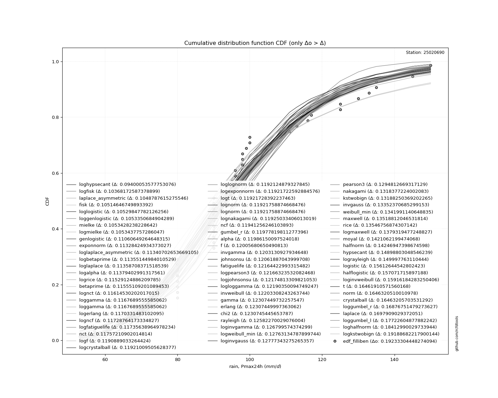</img>

</div>


**9.3. Best fit**

<div align="center">

|   id |   station | empirical_dist   | p_dist       |     delta |   deltao | eval   |   fit |   n |   best_fit |   best_fit_sort |
|-----:|----------:|:-----------------|:-------------|----------:|---------:|:-------|------:|----:|-----------:|----------------:|
|    0 |  25020690 | edf_filliben     | loghypsecant | 0.0940005 | 0.192333 | Δo > Δ |     1 |  50 |          1 |               1 |

</div>


<div align="center">

</img>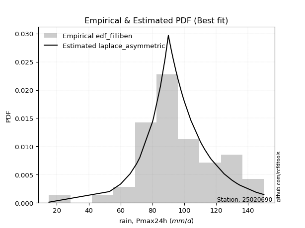</img>

</div>


### 10. Empirical - EDF Jenkinson (1977)

The Jenkinson formula in hydrology is an empirical plotting position formula used to estimate the non-exceedance probability _(P)_ or return period _(T)_ of a given ordered observation within a sample. It is a widely used method in the frequency analysis of extreme events such as floods and rainfall, as it provides a distribution-free way to plot data. _a≈0.31_ and _b≈0.38_ are constants derived to approximate the median of the probability distribution for the given rank.

<div align="center">


$P=(m-a)/(n+b)$


</div>


**10.1. Empirical values**

<div align="center">

|                | 0                    | 1                   | 2                   | 3                   | 4                   | 5                  | 6                   | 7                   | 8                  | 9                   | 10                  | 11                 | 12                 | 13                  | 14                 | 15                 | 16                 | 17                  | 18                 | 19                  | 20                 | 21                  | 22                  | 23                 | 24                  | 25                 | 26                 | 27                 | 28                 | 29                 | 30                 | 31                 | 32                 | 33                | 34                 | 35                 | 36                 | 37                 | 38                 | 39                 | 40                 | 41                 | 42                 | 43                 | 44                 | 45                 | 46                | 47                | 48                 | 49                 |
|:---------------|:---------------------|:--------------------|:--------------------|:--------------------|:--------------------|:-------------------|:--------------------|:--------------------|:-------------------|:--------------------|:--------------------|:-------------------|:-------------------|:--------------------|:-------------------|:-------------------|:-------------------|:--------------------|:-------------------|:--------------------|:-------------------|:--------------------|:--------------------|:-------------------|:--------------------|:-------------------|:-------------------|:-------------------|:-------------------|:-------------------|:-------------------|:-------------------|:-------------------|:------------------|:-------------------|:-------------------|:-------------------|:-------------------|:-------------------|:-------------------|:-------------------|:-------------------|:-------------------|:-------------------|:-------------------|:-------------------|:------------------|:------------------|:-------------------|:-------------------|
| date           | 1986                 | 1977                | 1998                | 1978                | 1979                | 1985               | 1982                | 1975                | 1991               | 1994                | 1990                | 1997               | 1974               | 2012                | 2015               | 2017               | 2000               | 2003                | 2019               | 2009                | 2006               | 1992                | 1995                | 1996               | 2021                | 2010               | 1976               | 1987               | 1999               | 1983               | 2016               | 2004               | 2001               | 2022              | 2007               | 2018               | 2008               | 2020               | 1973               | 1984               | 1981               | 1988               | 1993               | 2013               | 2005               | 1980               | 2002              | 1989              | 2011               | 2014               |
| x              | 53.0                 | 57.0                | 60.0                | 65.0324581          | 66.0                | 70.0               | 72.0                | 80.0                | 80.0               | 80.0                | 80.0                | 80.0               | 80.0               | 80.0                | 80.0               | 85.0               | 90.0               | 90.0                | 90.0               | 90.0                | 90.0               | 90.0                | 90.0                | 90.0               | 90.0                | 90.0               | 92.0               | 94.700649162       | 95.0               | 96.0               | 96.0               | 98.0               | 98.0               | 98.0              | 99.0               | 100.0              | 100.0              | 111.0              | 113.0              | 116.0              | 117.0              | 125.0              | 125.0              | 130.0              | 133.0              | 135.0              | 135.0             | 145.0             | 145.0              | 150.0              |
| m              | 1                    | 2                   | 3                   | 4                   | 5                   | 6                  | 7                   | 8                   | 9                  | 10                  | 11                  | 12                 | 13                 | 14                  | 15                 | 16                 | 17                 | 18                  | 19                 | 20                  | 21                 | 22                  | 23                  | 24                 | 25                  | 26                 | 27                 | 28                 | 29                 | 30                 | 31                 | 32                 | 33                 | 34                | 35                 | 36                 | 37                 | 38                 | 39                 | 40                 | 41                 | 42                 | 43                 | 44                 | 45                 | 46                 | 47                | 48                | 49                 | 50                 |
| empirical_dist | edf_jenkinson        | edf_jenkinson       | edf_jenkinson       | edf_jenkinson       | edf_jenkinson       | edf_jenkinson      | edf_jenkinson       | edf_jenkinson       | edf_jenkinson      | edf_jenkinson       | edf_jenkinson       | edf_jenkinson      | edf_jenkinson      | edf_jenkinson       | edf_jenkinson      | edf_jenkinson      | edf_jenkinson      | edf_jenkinson       | edf_jenkinson      | edf_jenkinson       | edf_jenkinson      | edf_jenkinson       | edf_jenkinson       | edf_jenkinson      | edf_jenkinson       | edf_jenkinson      | edf_jenkinson      | edf_jenkinson      | edf_jenkinson      | edf_jenkinson      | edf_jenkinson      | edf_jenkinson      | edf_jenkinson      | edf_jenkinson     | edf_jenkinson      | edf_jenkinson      | edf_jenkinson      | edf_jenkinson      | edf_jenkinson      | edf_jenkinson      | edf_jenkinson      | edf_jenkinson      | edf_jenkinson      | edf_jenkinson      | edf_jenkinson      | edf_jenkinson      | edf_jenkinson     | edf_jenkinson     | edf_jenkinson      | edf_jenkinson      |
| empirical      | 0.013695911075823738 | 0.03354505756252481 | 0.05339420404922588 | 0.07324335053592695 | 0.09309249702262803 | 0.1129416435093291 | 0.13279078999603017 | 0.15263993648273125 | 0.1724890829694323 | 0.19233822945613335 | 0.21218737594283443 | 0.2320365224295355 | 0.2518856689162366 | 0.27173481540293765 | 0.2915839618896387 | 0.3114331083763398 | 0.3312822548630409 | 0.35113140134974197 | 0.370980547836443  | 0.39082969432314413 | 0.4106788408098452 | 0.43052798729654623 | 0.45037713378324734 | 0.4702262802699484 | 0.49007542675664945 | 0.5099245732433505 | 0.5297737197300516 | 0.5496228662167527 | 0.5694720127034537 | 0.5893211591901548 | 0.6091703056768559 | 0.6290194521635569 | 0.6488685986502579 | 0.668717745136959 | 0.6885668916236601 | 0.7084160381103611 | 0.7282651845970622 | 0.7481143310837634 | 0.7679634775704643 | 0.7878126240571655 | 0.8076617705438666 | 0.8275109170305676 | 0.8473600635172687 | 0.8672092100039698 | 0.8870583564906708 | 0.9069075029773719 | 0.926756649464073 | 0.946605795950774 | 0.9664549424374751 | 0.9863040889241762 |
| empirical_tr   | 1.013886093781445    | 1.0347093859108647  | 1.056405955126861   | 1.0790319126151209  | 1.1026482818997592  | 1.1273215484448422 | 1.1531242847333485  | 1.1801358631998127  | 1.20844327176781   | 1.238142049643647   | 1.2693373645754598  | 1.302145257172396  | 1.336694083311223  | 1.3731261924230036  | 1.411599887923788  | 1.4522917267223983 | 1.4953992282576434 | 1.5411440807586418  | 1.5897759545597978 | 1.6415770609318998  | 1.6968676321993938 | 1.7560125479261064  | 1.819429396894186   | 1.8875983514424879 | 1.9610743479953285  | 2.040502227622519  | 2.1266357112705783 | 2.220361392684002  | 2.3227293683725216 | 2.4349927501208315 | 2.558659217877095  | 2.6955591225254145 | 2.847936687394007  | 3.018573996405032 | 3.210962396430847  | 3.4295439074200122 | 3.6800584368151923 | 3.9700551615445225 | 4.309666381522667  | 4.7128157156220745 | 5.199174406604746  | 5.797468354430376  | 6.551365409622883  | 7.530642750373689  | 8.854130052724067  | 10.742004264392314 | 13.6531165311653  | 18.72862453531594 | 29.810650887573882 | 73.01449275362289  |

</div>


**10.2. Kolmogorov-Smirnov fit test (sorted by Δ)**


<div align="center">

|                | 0                   | 1                   | 2                   | 3                   | 4                   | 5                   | 6                   | 7                   | 8                   | 9                   | 10                    | 11                  | 12                  | 13                  | 14                  | 15                  | 16                  | 17                  | 18                  | 19                  | 20                  | 21                  | 22                  | 23                  | 24                  | 25                  | 26                  | 27                  | 28                  | 29                  | 30                  | 31                  | 32                  | 33                  | 34                  | 35                  | 36                  | 37                  | 38                  | 39                  | 40                  | 41                  | 42                  | 43                  | 44                  | 45                  | 46                  | 47                  | 48                  | 49                  | 50                  | 51                  | 52                  | 53                  | 54                  | 55                  | 56                  | 57                  | 58                  | 59                  | 60                  | 61                  | 62                  | 63                  | 64                  | 65                  | 66                  | 67                  | 68                  | 69                  | 70                  | 71                  | 72                  | 73                  | 74                  | 75                  | 76                  | 77                  | 78                  | 79                  | 80                  | 81                  | 82                  | 83                  | 84                  | 85                  | 86                  | 87                  |
|:---------------|:--------------------|:--------------------|:--------------------|:--------------------|:--------------------|:--------------------|:--------------------|:--------------------|:--------------------|:--------------------|:----------------------|:--------------------|:--------------------|:--------------------|:--------------------|:--------------------|:--------------------|:--------------------|:--------------------|:--------------------|:--------------------|:--------------------|:--------------------|:--------------------|:--------------------|:--------------------|:--------------------|:--------------------|:--------------------|:--------------------|:--------------------|:--------------------|:--------------------|:--------------------|:--------------------|:--------------------|:--------------------|:--------------------|:--------------------|:--------------------|:--------------------|:--------------------|:--------------------|:--------------------|:--------------------|:--------------------|:--------------------|:--------------------|:--------------------|:--------------------|:--------------------|:--------------------|:--------------------|:--------------------|:--------------------|:--------------------|:--------------------|:--------------------|:--------------------|:--------------------|:--------------------|:--------------------|:--------------------|:--------------------|:--------------------|:--------------------|:--------------------|:--------------------|:--------------------|:--------------------|:--------------------|:--------------------|:--------------------|:--------------------|:--------------------|:--------------------|:--------------------|:--------------------|:--------------------|:--------------------|:--------------------|:--------------------|:--------------------|:--------------------|:--------------------|:--------------------|:--------------------|:--------------------|
| station        | 25020690            | 25020690            | 25020690            | 25020690            | 25020690            | 25020690            | 25020690            | 25020690            | 25020690            | 25020690            | 25020690              | 25020690            | 25020690            | 25020690            | 25020690            | 25020690            | 25020690            | 25020690            | 25020690            | 25020690            | 25020690            | 25020690            | 25020690            | 25020690            | 25020690            | 25020690            | 25020690            | 25020690            | 25020690            | 25020690            | 25020690            | 25020690            | 25020690            | 25020690            | 25020690            | 25020690            | 25020690            | 25020690            | 25020690            | 25020690            | 25020690            | 25020690            | 25020690            | 25020690            | 25020690            | 25020690            | 25020690            | 25020690            | 25020690            | 25020690            | 25020690            | 25020690            | 25020690            | 25020690            | 25020690            | 25020690            | 25020690            | 25020690            | 25020690            | 25020690            | 25020690            | 25020690            | 25020690            | 25020690            | 25020690            | 25020690            | 25020690            | 25020690            | 25020690            | 25020690            | 25020690            | 25020690            | 25020690            | 25020690            | 25020690            | 25020690            | 25020690            | 25020690            | 25020690            | 25020690            | 25020690            | 25020690            | 25020690            | 25020690            | 25020690            | 25020690            | 25020690            | 25020690            |
| empirical_dist | edf_jenkinson       | edf_jenkinson       | edf_jenkinson       | edf_jenkinson       | edf_jenkinson       | edf_jenkinson       | edf_jenkinson       | edf_jenkinson       | edf_jenkinson       | edf_jenkinson       | edf_jenkinson         | edf_jenkinson       | edf_jenkinson       | edf_jenkinson       | edf_jenkinson       | edf_jenkinson       | edf_jenkinson       | edf_jenkinson       | edf_jenkinson       | edf_jenkinson       | edf_jenkinson       | edf_jenkinson       | edf_jenkinson       | edf_jenkinson       | edf_jenkinson       | edf_jenkinson       | edf_jenkinson       | edf_jenkinson       | edf_jenkinson       | edf_jenkinson       | edf_jenkinson       | edf_jenkinson       | edf_jenkinson       | edf_jenkinson       | edf_jenkinson       | edf_jenkinson       | edf_jenkinson       | edf_jenkinson       | edf_jenkinson       | edf_jenkinson       | edf_jenkinson       | edf_jenkinson       | edf_jenkinson       | edf_jenkinson       | edf_jenkinson       | edf_jenkinson       | edf_jenkinson       | edf_jenkinson       | edf_jenkinson       | edf_jenkinson       | edf_jenkinson       | edf_jenkinson       | edf_jenkinson       | edf_jenkinson       | edf_jenkinson       | edf_jenkinson       | edf_jenkinson       | edf_jenkinson       | edf_jenkinson       | edf_jenkinson       | edf_jenkinson       | edf_jenkinson       | edf_jenkinson       | edf_jenkinson       | edf_jenkinson       | edf_jenkinson       | edf_jenkinson       | edf_jenkinson       | edf_jenkinson       | edf_jenkinson       | edf_jenkinson       | edf_jenkinson       | edf_jenkinson       | edf_jenkinson       | edf_jenkinson       | edf_jenkinson       | edf_jenkinson       | edf_jenkinson       | edf_jenkinson       | edf_jenkinson       | edf_jenkinson       | edf_jenkinson       | edf_jenkinson       | edf_jenkinson       | edf_jenkinson       | edf_jenkinson       | edf_jenkinson       | edf_jenkinson       |
| p_dist         | loghypsecant        | logfisk             | laplace_asymmetric  | fisk                | loglogistic         | loggenlogistic      | mielke              | logmielke           | genlogistic         | exponnorm           | loglaplace_asymmetric | logbetaprime        | loglaplace          | logalpha            | logrice             | betaprime           | lognct              | loggamma            | loggamma            | logerlang           | logncf              | logfatiguelife      | nct                 | logf                | logcrystalball      | loglognorm          | logexponnorm        | logt                | lognorm             | lognorm             | lognakagami         | ncf                 | gumbel_r            | alpha               | f                   | invgamma            | johnsonsu           | fatiguelife         | logpearson3         | logjohnsonsu        | logloggamma         | invweibull          | gamma               | erlang              | chi2                | rayleigh            | loginvgamma         | logweibull_min      | loginvgauss         | pearson3            | nakagami            | kstwobign           | invgauss            | weibull_min         | maxwell             | rice                | logmaxwell          | moyal               | halfnorm            | hypsecant           | lograyleigh         | logistic            | halflogistic        | loginvweibull       | t                   | norm                | crystalball         | loggumbel_r         | laplace             | loggumbel_l         | loghalfnorm         | logkstwobign        | logmoyal            | wald                | loghalflogistic     | gumbel_l            | loggenexpon         | logwald             | loggibrat           | gibrat              | expon               | loggompertz         | logtruncnorm        | logexpon            | logchi2             | gompertz            | genexpon            | truncnorm           |
| delta          | 0.09393255250007704 | 0.10363147736436668 | 0.10487580573288269 | 0.1050962189895116  | 0.10523049454380884 | 0.10528481998100658 | 0.10529257531344188 | 0.10529352721918239 | 0.11053850936902943 | 0.11323400083430796 | 0.11335677802726873   | 0.11350120133068298 | 0.11358412792051348 | 0.1137437814037533  | 0.11522326558464413 | 0.11550084350147222 | 0.11607731874271643 | 0.11670097228105247 | 0.11670097228105247 | 0.11696516503275578 | 0.11721965845589455 | 0.11728840637232862 | 0.11750412574269442 | 0.11902092004898868 | 0.11914211177883005 | 0.11914450465533077 | 0.11914924265139204 | 0.11914930064492091 | 0.11914960546923103 | 0.11914960546923103 | 0.11918235078267647 | 0.11934457918358521 | 0.11972794960335165 | 0.11979351769778646 | 0.11998882322745441 | 0.12024510951601108 | 0.12055088716254336 | 0.1215762466557011  | 0.12159525204337096 | 0.12168014982075681 | 0.12183551767003875 | 0.12198283392321513 | 0.12300651404512175 | 0.1230065166961769  | 0.12300656128792498 | 0.12575471701330632 | 0.1267493258648767  | 0.12756336460154372 | 0.12772318424323126 | 0.1294132836542592  | 0.13176973912275458 | 0.13177905087850614 | 0.13347345834356922 | 0.13413113078742978 | 0.13512013718786442 | 0.1353995854656177  | 0.1378816992154604  | 0.14205597143798449 | 0.14241922547732366 | 0.14892004720800867 | 0.14994751460102168 | 0.1560584621505705  | 0.15702146738776568 | 0.15911159432308175 | 0.16455112243814796 | 0.16456406772364407 | 0.1645640737578592  | 0.16871726628331396 | 0.1697879471425332  | 0.1771580655013687  | 0.18407965178791713 | 0.19178336936548493 | 0.19355617119767926 | 0.20168537162050554 | 0.20367463728704177 | 0.23000830827540908 | 0.24285821332927157 | 0.26233940174282994 | 0.27030163458159057 | 0.2729270816698157  | 0.31136667941576757 | 0.3345956136669366  | 0.35644482837336344 | 0.3625221884511617  | 0.4028518485680992  | 0.8090542282605402  | 0.899908445797331   | 0.9832211780176197  |
| deltao         | 0.19233304448274094 | 0.19233304448274094 | 0.19233304448274094 | 0.19233304448274094 | 0.19233304448274094 | 0.19233304448274094 | 0.19233304448274094 | 0.19233304448274094 | 0.19233304448274094 | 0.19233304448274094 | 0.19233304448274094   | 0.19233304448274094 | 0.19233304448274094 | 0.19233304448274094 | 0.19233304448274094 | 0.19233304448274094 | 0.19233304448274094 | 0.19233304448274094 | 0.19233304448274094 | 0.19233304448274094 | 0.19233304448274094 | 0.19233304448274094 | 0.19233304448274094 | 0.19233304448274094 | 0.19233304448274094 | 0.19233304448274094 | 0.19233304448274094 | 0.19233304448274094 | 0.19233304448274094 | 0.19233304448274094 | 0.19233304448274094 | 0.19233304448274094 | 0.19233304448274094 | 0.19233304448274094 | 0.19233304448274094 | 0.19233304448274094 | 0.19233304448274094 | 0.19233304448274094 | 0.19233304448274094 | 0.19233304448274094 | 0.19233304448274094 | 0.19233304448274094 | 0.19233304448274094 | 0.19233304448274094 | 0.19233304448274094 | 0.19233304448274094 | 0.19233304448274094 | 0.19233304448274094 | 0.19233304448274094 | 0.19233304448274094 | 0.19233304448274094 | 0.19233304448274094 | 0.19233304448274094 | 0.19233304448274094 | 0.19233304448274094 | 0.19233304448274094 | 0.19233304448274094 | 0.19233304448274094 | 0.19233304448274094 | 0.19233304448274094 | 0.19233304448274094 | 0.19233304448274094 | 0.19233304448274094 | 0.19233304448274094 | 0.19233304448274094 | 0.19233304448274094 | 0.19233304448274094 | 0.19233304448274094 | 0.19233304448274094 | 0.19233304448274094 | 0.19233304448274094 | 0.19233304448274094 | 0.19233304448274094 | 0.19233304448274094 | 0.19233304448274094 | 0.19233304448274094 | 0.19233304448274094 | 0.19233304448274094 | 0.19233304448274094 | 0.19233304448274094 | 0.19233304448274094 | 0.19233304448274094 | 0.19233304448274094 | 0.19233304448274094 | 0.19233304448274094 | 0.19233304448274094 | 0.19233304448274094 | 0.19233304448274094 |
| eval           | Δo > Δ              | Δo > Δ              | Δo > Δ              | Δo > Δ              | Δo > Δ              | Δo > Δ              | Δo > Δ              | Δo > Δ              | Δo > Δ              | Δo > Δ              | Δo > Δ                | Δo > Δ              | Δo > Δ              | Δo > Δ              | Δo > Δ              | Δo > Δ              | Δo > Δ              | Δo > Δ              | Δo > Δ              | Δo > Δ              | Δo > Δ              | Δo > Δ              | Δo > Δ              | Δo > Δ              | Δo > Δ              | Δo > Δ              | Δo > Δ              | Δo > Δ              | Δo > Δ              | Δo > Δ              | Δo > Δ              | Δo > Δ              | Δo > Δ              | Δo > Δ              | Δo > Δ              | Δo > Δ              | Δo > Δ              | Δo > Δ              | Δo > Δ              | Δo > Δ              | Δo > Δ              | Δo > Δ              | Δo > Δ              | Δo > Δ              | Δo > Δ              | Δo > Δ              | Δo > Δ              | Δo > Δ              | Δo > Δ              | Δo > Δ              | Δo > Δ              | Δo > Δ              | Δo > Δ              | Δo > Δ              | Δo > Δ              | Δo > Δ              | Δo > Δ              | Δo > Δ              | Δo > Δ              | Δo > Δ              | Δo > Δ              | Δo > Δ              | Δo > Δ              | Δo > Δ              | Δo > Δ              | Δo > Δ              | Δo > Δ              | Δo > Δ              | Δo > Δ              | Δo > Δ              | Δo > Δ              | Δo > Δ              | Δo <= Δ             | Δo <= Δ             | Δo <= Δ             | Δo <= Δ             | Δo <= Δ             | Δo <= Δ             | Δo <= Δ             | Δo <= Δ             | Δo <= Δ             | Δo <= Δ             | Δo <= Δ             | Δo <= Δ             | Δo <= Δ             | Δo <= Δ             | Δo <= Δ             | Δo <= Δ             |
| fit            | 1                   | 1                   | 1                   | 1                   | 1                   | 1                   | 1                   | 1                   | 1                   | 1                   | 1                     | 1                   | 1                   | 1                   | 1                   | 1                   | 1                   | 1                   | 1                   | 1                   | 1                   | 1                   | 1                   | 1                   | 1                   | 1                   | 1                   | 1                   | 1                   | 1                   | 1                   | 1                   | 1                   | 1                   | 1                   | 1                   | 1                   | 1                   | 1                   | 1                   | 1                   | 1                   | 1                   | 1                   | 1                   | 1                   | 1                   | 1                   | 1                   | 1                   | 1                   | 1                   | 1                   | 1                   | 1                   | 1                   | 1                   | 1                   | 1                   | 1                   | 1                   | 1                   | 1                   | 1                   | 1                   | 1                   | 1                   | 1                   | 1                   | 1                   | 1                   | 1                   | 0                   | 0                   | 0                   | 0                   | 0                   | 0                   | 0                   | 0                   | 0                   | 0                   | 0                   | 0                   | 0                   | 0                   | 0                   | 0                   |
| n              | 50                  | 50                  | 50                  | 50                  | 50                  | 50                  | 50                  | 50                  | 50                  | 50                  | 50                    | 50                  | 50                  | 50                  | 50                  | 50                  | 50                  | 50                  | 50                  | 50                  | 50                  | 50                  | 50                  | 50                  | 50                  | 50                  | 50                  | 50                  | 50                  | 50                  | 50                  | 50                  | 50                  | 50                  | 50                  | 50                  | 50                  | 50                  | 50                  | 50                  | 50                  | 50                  | 50                  | 50                  | 50                  | 50                  | 50                  | 50                  | 50                  | 50                  | 50                  | 50                  | 50                  | 50                  | 50                  | 50                  | 50                  | 50                  | 50                  | 50                  | 50                  | 50                  | 50                  | 50                  | 50                  | 50                  | 50                  | 50                  | 50                  | 50                  | 50                  | 50                  | 50                  | 50                  | 50                  | 50                  | 50                  | 50                  | 50                  | 50                  | 50                  | 50                  | 50                  | 50                  | 50                  | 50                  | 50                  | 50                  |
| best_fit       | 1                   | 0                   | 0                   | 0                   | 0                   | 0                   | 0                   | 0                   | 0                   | 0                   | 0                     | 0                   | 0                   | 0                   | 0                   | 0                   | 0                   | 0                   | 0                   | 0                   | 0                   | 0                   | 0                   | 0                   | 0                   | 0                   | 0                   | 0                   | 0                   | 0                   | 0                   | 0                   | 0                   | 0                   | 0                   | 0                   | 0                   | 0                   | 0                   | 0                   | 0                   | 0                   | 0                   | 0                   | 0                   | 0                   | 0                   | 0                   | 0                   | 0                   | 0                   | 0                   | 0                   | 0                   | 0                   | 0                   | 0                   | 0                   | 0                   | 0                   | 0                   | 0                   | 0                   | 0                   | 0                   | 0                   | 0                   | 0                   | 0                   | 0                   | 0                   | 0                   | 0                   | 0                   | 0                   | 0                   | 0                   | 0                   | 0                   | 0                   | 0                   | 0                   | 0                   | 0                   | 0                   | 0                   | 0                   | 0                   |
| best_fit_sort  | 1                   | 2                   | 3                   | 4                   | 5                   | 6                   | 7                   | 8                   | 9                   | 10                  | 11                    | 12                  | 13                  | 14                  | 15                  | 16                  | 17                  | 18                  | 19                  | 20                  | 21                  | 22                  | 23                  | 24                  | 25                  | 26                  | 27                  | 28                  | 29                  | 30                  | 31                  | 32                  | 33                  | 34                  | 35                  | 36                  | 37                  | 38                  | 39                  | 40                  | 41                  | 42                  | 43                  | 44                  | 45                  | 46                  | 47                  | 48                  | 49                  | 50                  | 51                  | 52                  | 53                  | 54                  | 55                  | 56                  | 57                  | 58                  | 59                  | 60                  | 61                  | 62                  | 63                  | 64                  | 65                  | 66                  | 67                  | 68                  | 69                  | 70                  | 71                  | 72                  | 73                  | 74                  | 75                  | 76                  | 77                  | 78                  | 79                  | 80                  | 81                  | 82                  | 83                  | 84                  | 85                  | 86                  | 87                  | 88                  |

</div>


<div align="center">

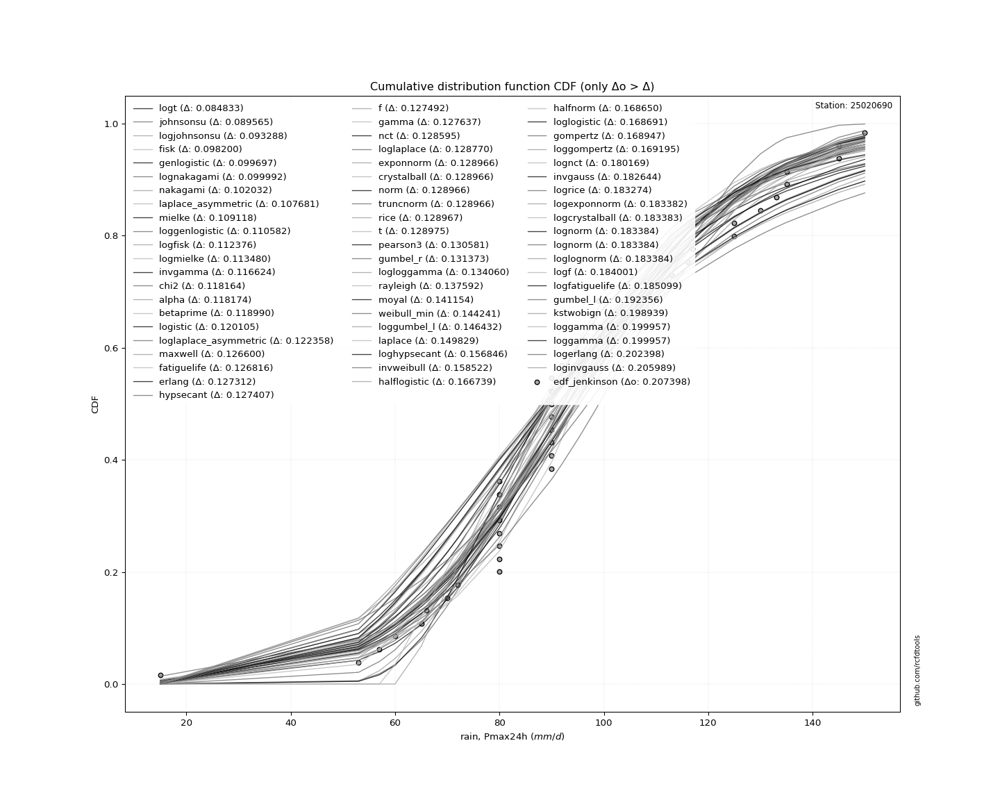</img>

</div>


**10.3. Best fit**

<div align="center">

|   id |   station | empirical_dist   | p_dist       |     delta |   deltao | eval   |   fit |   n |   best_fit |   best_fit_sort |
|-----:|----------:|:-----------------|:-------------|----------:|---------:|:-------|------:|----:|-----------:|----------------:|
|    0 |  25020690 | edf_jenkinson    | loghypsecant | 0.0939326 | 0.192333 | Δo > Δ |     1 |  50 |          1 |               1 |

</div>


<div align="center">

</img></img>

</div>


### 11. Empirical - EDF Cunnane (1978)

Cunnane´s work in statistical hydrology has focused on the performance and evaluation of different probability distributions (such as GEV, Gumbel, Lognormal) for flood frequency estimation. _b_ is a constant, typically set to 0.4.

<div align="center">


$P=(m-b)/(n+1-2b)$


</div>


**11.1. Empirical values**

<div align="center">

|                | 0                    | 1                   | 2                   | 3                   | 4                   | 5                   | 6                   | 7                   | 8                   | 9                   | 10                  | 11                  | 12                 | 13                  | 14                  | 15                 | 16                  | 17                | 18                 | 19                 | 20                 | 21                 | 22                | 23                 | 24                 | 25                 | 26                 | 27                | 28                 | 29                 | 30                 | 31                 | 32                | 33                 | 34                 | 35                 | 36                 | 37                | 38                 | 39                 | 40                 | 41                 | 42                | 43                 | 44                 | 45                 | 46                 | 47                | 48                 | 49                 |
|:---------------|:---------------------|:--------------------|:--------------------|:--------------------|:--------------------|:--------------------|:--------------------|:--------------------|:--------------------|:--------------------|:--------------------|:--------------------|:-------------------|:--------------------|:--------------------|:-------------------|:--------------------|:------------------|:-------------------|:-------------------|:-------------------|:-------------------|:------------------|:-------------------|:-------------------|:-------------------|:-------------------|:------------------|:-------------------|:-------------------|:-------------------|:-------------------|:------------------|:-------------------|:-------------------|:-------------------|:-------------------|:------------------|:-------------------|:-------------------|:-------------------|:-------------------|:------------------|:-------------------|:-------------------|:-------------------|:-------------------|:------------------|:-------------------|:-------------------|
| date           | 1986                 | 1977                | 1998                | 1978                | 1979                | 1985                | 1982                | 1975                | 1991                | 1994                | 1990                | 1997                | 1974               | 2012                | 2015                | 2017               | 2000                | 2003              | 2019               | 2009               | 2006               | 1992               | 1995              | 1996               | 2021               | 2010               | 1976               | 1987              | 1999               | 1983               | 2016               | 2004               | 2001              | 2022               | 2007               | 2018               | 2008               | 2020              | 1973               | 1984               | 1981               | 1988               | 1993              | 2013               | 2005               | 1980               | 2002               | 1989              | 2011               | 2014               |
| x              | 53.0                 | 57.0                | 60.0                | 65.0324581          | 66.0                | 70.0                | 72.0                | 80.0                | 80.0                | 80.0                | 80.0                | 80.0                | 80.0               | 80.0                | 80.0                | 85.0               | 90.0                | 90.0              | 90.0               | 90.0               | 90.0               | 90.0               | 90.0              | 90.0               | 90.0               | 90.0               | 92.0               | 94.700649162      | 95.0               | 96.0               | 96.0               | 98.0               | 98.0              | 98.0               | 99.0               | 100.0              | 100.0              | 111.0             | 113.0              | 116.0              | 117.0              | 125.0              | 125.0             | 130.0              | 133.0              | 135.0              | 135.0              | 145.0             | 145.0              | 150.0              |
| m              | 1                    | 2                   | 3                   | 4                   | 5                   | 6                   | 7                   | 8                   | 9                   | 10                  | 11                  | 12                  | 13                 | 14                  | 15                  | 16                 | 17                  | 18                | 19                 | 20                 | 21                 | 22                 | 23                | 24                 | 25                 | 26                 | 27                 | 28                | 29                 | 30                 | 31                 | 32                 | 33                | 34                 | 35                 | 36                 | 37                 | 38                | 39                 | 40                 | 41                 | 42                 | 43                | 44                 | 45                 | 46                 | 47                 | 48                | 49                 | 50                 |
| empirical_dist | edf_cunnane          | edf_cunnane         | edf_cunnane         | edf_cunnane         | edf_cunnane         | edf_cunnane         | edf_cunnane         | edf_cunnane         | edf_cunnane         | edf_cunnane         | edf_cunnane         | edf_cunnane         | edf_cunnane        | edf_cunnane         | edf_cunnane         | edf_cunnane        | edf_cunnane         | edf_cunnane       | edf_cunnane        | edf_cunnane        | edf_cunnane        | edf_cunnane        | edf_cunnane       | edf_cunnane        | edf_cunnane        | edf_cunnane        | edf_cunnane        | edf_cunnane       | edf_cunnane        | edf_cunnane        | edf_cunnane        | edf_cunnane        | edf_cunnane       | edf_cunnane        | edf_cunnane        | edf_cunnane        | edf_cunnane        | edf_cunnane       | edf_cunnane        | edf_cunnane        | edf_cunnane        | edf_cunnane        | edf_cunnane       | edf_cunnane        | edf_cunnane        | edf_cunnane        | edf_cunnane        | edf_cunnane       | edf_cunnane        | edf_cunnane        |
| empirical      | 0.011952191235059759 | 0.03187250996015936 | 0.05179282868525896 | 0.07171314741035856 | 0.09163346613545816 | 0.11155378486055775 | 0.13147410358565736 | 0.15139442231075695 | 0.17131474103585656 | 0.19123505976095614 | 0.21115537848605576 | 0.23107569721115537 | 0.250996015936255  | 0.27091633466135456 | 0.29083665338645415 | 0.3107569721115538 | 0.33067729083665337 | 0.350597609561753 | 0.3705179282868526 | 0.3904382470119522 | 0.4103585657370518 | 0.4302788844621514 | 0.450199203187251 | 0.4701195219123506 | 0.4900398406374502 | 0.5099601593625498 | 0.5298804780876494 | 0.549800796812749 | 0.5697211155378487 | 0.5896414342629482 | 0.6095617529880478 | 0.6294820717131474 | 0.649402390438247 | 0.6693227091633466 | 0.6892430278884462 | 0.7091633466135459 | 0.7290836653386454 | 0.749003984063745 | 0.7689243027888446 | 0.7888446215139442 | 0.8087649402390438 | 0.8286852589641434 | 0.848605577689243 | 0.8685258964143426 | 0.8884462151394422 | 0.9083665338645418 | 0.9282868525896414 | 0.948207171314741 | 0.9681274900398407 | 0.9880478087649402 |
| empirical_tr   | 1.0120967741935483   | 1.0329218106995885  | 1.0546218487394958  | 1.0772532188841202  | 1.1008771929824561  | 1.1255605381165918  | 1.151376146788991   | 1.1784037558685445  | 1.2067307692307692  | 1.2364532019704433  | 1.2676767676767677  | 1.3005181347150259  | 1.3351063829787233 | 1.3715846994535519  | 1.4101123595505618  | 1.4508670520231213 | 1.4940476190476188  | 1.539877300613497 | 1.5886075949367089 | 1.6405228758169934 | 1.6959459459459463 | 1.7552447552447554 | 1.818840579710145 | 1.887218045112782  | 1.9609375          | 2.040650406504065  | 2.1271186440677963 | 2.221238938053097 | 2.3240740740740744 | 2.4368932038834954 | 2.5612244897959187 | 2.6989247311827955 | 2.852272727272727 | 3.0240963855421685 | 3.217948717948717  | 3.438356164383562  | 3.6911764705882355 | 3.984126984126984 | 4.327586206896552  | 4.735849056603773  | 5.229166666666665  | 5.837209302325579  | 6.605263157894738 | 7.606060606060606  | 8.964285714285714  | 10.913043478260866 | 13.944444444444436 | 19.30769230769228 | 31.37500000000003  | 83.66666666666674  |

</div>


**11.2. Kolmogorov-Smirnov fit test (sorted by Δ)**


<div align="center">

|                | 0                   | 1                   | 2                   | 3                   | 4                   | 5                   | 6                   | 7                   | 8                   | 9                   | 10                  | 11                    | 12                  | 13                  | 14                  | 15                  | 16                  | 17                  | 18                  | 19                  | 20                  | 21                  | 22                  | 23                  | 24                  | 25                  | 26                  | 27                  | 28                  | 29                  | 30                  | 31                  | 32                  | 33                  | 34                  | 35                  | 36                  | 37                  | 38                  | 39                  | 40                  | 41                  | 42                  | 43                  | 44                  | 45                  | 46                  | 47                  | 48                  | 49                  | 50                  | 51                  | 52                  | 53                  | 54                  | 55                  | 56                  | 57                  | 58                  | 59                  | 60                  | 61                  | 62                  | 63                  | 64                  | 65                  | 66                  | 67                  | 68                  | 69                  | 70                  | 71                  | 72                  | 73                  | 74                  | 75                  | 76                  | 77                  | 78                  | 79                  | 80                  | 81                  | 82                  | 83                  | 84                  | 85                  | 86                  | 87                  |
|:---------------|:--------------------|:--------------------|:--------------------|:--------------------|:--------------------|:--------------------|:--------------------|:--------------------|:--------------------|:--------------------|:--------------------|:----------------------|:--------------------|:--------------------|:--------------------|:--------------------|:--------------------|:--------------------|:--------------------|:--------------------|:--------------------|:--------------------|:--------------------|:--------------------|:--------------------|:--------------------|:--------------------|:--------------------|:--------------------|:--------------------|:--------------------|:--------------------|:--------------------|:--------------------|:--------------------|:--------------------|:--------------------|:--------------------|:--------------------|:--------------------|:--------------------|:--------------------|:--------------------|:--------------------|:--------------------|:--------------------|:--------------------|:--------------------|:--------------------|:--------------------|:--------------------|:--------------------|:--------------------|:--------------------|:--------------------|:--------------------|:--------------------|:--------------------|:--------------------|:--------------------|:--------------------|:--------------------|:--------------------|:--------------------|:--------------------|:--------------------|:--------------------|:--------------------|:--------------------|:--------------------|:--------------------|:--------------------|:--------------------|:--------------------|:--------------------|:--------------------|:--------------------|:--------------------|:--------------------|:--------------------|:--------------------|:--------------------|:--------------------|:--------------------|:--------------------|:--------------------|:--------------------|:--------------------|
| station        | 25020690            | 25020690            | 25020690            | 25020690            | 25020690            | 25020690            | 25020690            | 25020690            | 25020690            | 25020690            | 25020690            | 25020690              | 25020690            | 25020690            | 25020690            | 25020690            | 25020690            | 25020690            | 25020690            | 25020690            | 25020690            | 25020690            | 25020690            | 25020690            | 25020690            | 25020690            | 25020690            | 25020690            | 25020690            | 25020690            | 25020690            | 25020690            | 25020690            | 25020690            | 25020690            | 25020690            | 25020690            | 25020690            | 25020690            | 25020690            | 25020690            | 25020690            | 25020690            | 25020690            | 25020690            | 25020690            | 25020690            | 25020690            | 25020690            | 25020690            | 25020690            | 25020690            | 25020690            | 25020690            | 25020690            | 25020690            | 25020690            | 25020690            | 25020690            | 25020690            | 25020690            | 25020690            | 25020690            | 25020690            | 25020690            | 25020690            | 25020690            | 25020690            | 25020690            | 25020690            | 25020690            | 25020690            | 25020690            | 25020690            | 25020690            | 25020690            | 25020690            | 25020690            | 25020690            | 25020690            | 25020690            | 25020690            | 25020690            | 25020690            | 25020690            | 25020690            | 25020690            | 25020690            |
| empirical_dist | edf_cunnane         | edf_cunnane         | edf_cunnane         | edf_cunnane         | edf_cunnane         | edf_cunnane         | edf_cunnane         | edf_cunnane         | edf_cunnane         | edf_cunnane         | edf_cunnane         | edf_cunnane           | edf_cunnane         | edf_cunnane         | edf_cunnane         | edf_cunnane         | edf_cunnane         | edf_cunnane         | edf_cunnane         | edf_cunnane         | edf_cunnane         | edf_cunnane         | edf_cunnane         | edf_cunnane         | edf_cunnane         | edf_cunnane         | edf_cunnane         | edf_cunnane         | edf_cunnane         | edf_cunnane         | edf_cunnane         | edf_cunnane         | edf_cunnane         | edf_cunnane         | edf_cunnane         | edf_cunnane         | edf_cunnane         | edf_cunnane         | edf_cunnane         | edf_cunnane         | edf_cunnane         | edf_cunnane         | edf_cunnane         | edf_cunnane         | edf_cunnane         | edf_cunnane         | edf_cunnane         | edf_cunnane         | edf_cunnane         | edf_cunnane         | edf_cunnane         | edf_cunnane         | edf_cunnane         | edf_cunnane         | edf_cunnane         | edf_cunnane         | edf_cunnane         | edf_cunnane         | edf_cunnane         | edf_cunnane         | edf_cunnane         | edf_cunnane         | edf_cunnane         | edf_cunnane         | edf_cunnane         | edf_cunnane         | edf_cunnane         | edf_cunnane         | edf_cunnane         | edf_cunnane         | edf_cunnane         | edf_cunnane         | edf_cunnane         | edf_cunnane         | edf_cunnane         | edf_cunnane         | edf_cunnane         | edf_cunnane         | edf_cunnane         | edf_cunnane         | edf_cunnane         | edf_cunnane         | edf_cunnane         | edf_cunnane         | edf_cunnane         | edf_cunnane         | edf_cunnane         | edf_cunnane         |
| p_dist         | loghypsecant        | logfisk             | laplace_asymmetric  | fisk                | loggenlogistic      | mielke              | logmielke           | loglogistic         | genlogistic         | loglaplace          | exponnorm           | loglaplace_asymmetric | logbetaprime        | logalpha            | logrice             | betaprime           | lognct              | loggamma            | loggamma            | logerlang           | logncf              | logfatiguelife      | nct                 | logf                | logcrystalball      | loglognorm          | logexponnorm        | logt                | lognorm             | lognorm             | lognakagami         | ncf                 | gumbel_r            | alpha               | f                   | invgamma            | johnsonsu           | fatiguelife         | logpearson3         | logjohnsonsu        | invweibull          | logloggamma         | gamma               | erlang              | chi2                | rayleigh            | loginvgamma         | loginvgauss         | logweibull_min      | pearson3            | nakagami            | kstwobign           | invgauss            | weibull_min         | maxwell             | rice                | logmaxwell          | moyal               | halfnorm            | hypsecant           | lograyleigh         | logistic            | halflogistic        | loginvweibull       | t                   | norm                | crystalball         | loggumbel_r         | laplace             | loggumbel_l         | loghalfnorm         | logkstwobign        | logmoyal            | wald                | loghalflogistic     | gumbel_l            | loggenexpon         | logwald             | loggibrat           | gibrat              | expon               | loggompertz         | logtruncnorm        | logexpon            | logchi2             | gompertz            | genexpon            | truncnorm           |
| delta          | 0.09475103324166023 | 0.10423644139075422 | 0.10491139185208198 | 0.10570118301589915 | 0.10588978400739413 | 0.10589753933982943 | 0.10589849124556994 | 0.10604897528539203 | 0.11135699011061262 | 0.11361971403971277 | 0.1138389648606955  | 0.11396174205365628   | 0.11416763071614455 | 0.11434874543014084 | 0.11604174632622732 | 0.11610580752785976 | 0.11689579948429962 | 0.11751945302263567 | 0.11751945302263567 | 0.11778364577433897 | 0.11803813919747774 | 0.11810688711391182 | 0.11832260648427761 | 0.11983940079057187 | 0.11996059252041325 | 0.11996298539691397 | 0.11996772339297523 | 0.1199677813865041  | 0.11996808621081423 | 0.11996808621081423 | 0.12000083152425967 | 0.1201630599251684  | 0.12033291362973919 | 0.12061199843936965 | 0.1208073039690376  | 0.12106359025759428 | 0.12136936790412656 | 0.1223947273972843  | 0.12241373278495415 | 0.12249863056234    | 0.12258779794960267 | 0.12265399841162195 | 0.12382499478670494 | 0.1238249974377601  | 0.12382504202950817 | 0.1265731977548895  | 0.12735428989126424 | 0.1283281482696188  | 0.1283818453431269  | 0.1302317643958424  | 0.13258821986433778 | 0.13302456505048044 | 0.13407842236995676 | 0.13494961152901297 | 0.1359386179294476  | 0.1362180662072009  | 0.13848666324184794 | 0.14266093546437203 | 0.1430241895037112  | 0.14973852794959186 | 0.15055247862740923 | 0.1568769428921537  | 0.15762643141415322 | 0.1597165583494693  | 0.16536960317973115 | 0.16538254846522726 | 0.1653825544994424  | 0.1693222303097015  | 0.1698235332617325  | 0.1779765462429519  | 0.18468461581430468 | 0.19302888353745923 | 0.1941611352240668  | 0.20229033564689308 | 0.20427960131342932 | 0.23082678901699227 | 0.24410372750124587 | 0.2629443657692175  | 0.2709065986079781  | 0.27217977316663117 | 0.31261219358774184 | 0.33584112783891085 | 0.3576903425453377  | 0.36376770262313596 | 0.40409736274007346 | 0.8102997424325146  | 0.9014386489228994  | 0.9849648978583836  |
| deltao         | 0.19233304448274094 | 0.19233304448274094 | 0.19233304448274094 | 0.19233304448274094 | 0.19233304448274094 | 0.19233304448274094 | 0.19233304448274094 | 0.19233304448274094 | 0.19233304448274094 | 0.19233304448274094 | 0.19233304448274094 | 0.19233304448274094   | 0.19233304448274094 | 0.19233304448274094 | 0.19233304448274094 | 0.19233304448274094 | 0.19233304448274094 | 0.19233304448274094 | 0.19233304448274094 | 0.19233304448274094 | 0.19233304448274094 | 0.19233304448274094 | 0.19233304448274094 | 0.19233304448274094 | 0.19233304448274094 | 0.19233304448274094 | 0.19233304448274094 | 0.19233304448274094 | 0.19233304448274094 | 0.19233304448274094 | 0.19233304448274094 | 0.19233304448274094 | 0.19233304448274094 | 0.19233304448274094 | 0.19233304448274094 | 0.19233304448274094 | 0.19233304448274094 | 0.19233304448274094 | 0.19233304448274094 | 0.19233304448274094 | 0.19233304448274094 | 0.19233304448274094 | 0.19233304448274094 | 0.19233304448274094 | 0.19233304448274094 | 0.19233304448274094 | 0.19233304448274094 | 0.19233304448274094 | 0.19233304448274094 | 0.19233304448274094 | 0.19233304448274094 | 0.19233304448274094 | 0.19233304448274094 | 0.19233304448274094 | 0.19233304448274094 | 0.19233304448274094 | 0.19233304448274094 | 0.19233304448274094 | 0.19233304448274094 | 0.19233304448274094 | 0.19233304448274094 | 0.19233304448274094 | 0.19233304448274094 | 0.19233304448274094 | 0.19233304448274094 | 0.19233304448274094 | 0.19233304448274094 | 0.19233304448274094 | 0.19233304448274094 | 0.19233304448274094 | 0.19233304448274094 | 0.19233304448274094 | 0.19233304448274094 | 0.19233304448274094 | 0.19233304448274094 | 0.19233304448274094 | 0.19233304448274094 | 0.19233304448274094 | 0.19233304448274094 | 0.19233304448274094 | 0.19233304448274094 | 0.19233304448274094 | 0.19233304448274094 | 0.19233304448274094 | 0.19233304448274094 | 0.19233304448274094 | 0.19233304448274094 | 0.19233304448274094 |
| eval           | Δo > Δ              | Δo > Δ              | Δo > Δ              | Δo > Δ              | Δo > Δ              | Δo > Δ              | Δo > Δ              | Δo > Δ              | Δo > Δ              | Δo > Δ              | Δo > Δ              | Δo > Δ                | Δo > Δ              | Δo > Δ              | Δo > Δ              | Δo > Δ              | Δo > Δ              | Δo > Δ              | Δo > Δ              | Δo > Δ              | Δo > Δ              | Δo > Δ              | Δo > Δ              | Δo > Δ              | Δo > Δ              | Δo > Δ              | Δo > Δ              | Δo > Δ              | Δo > Δ              | Δo > Δ              | Δo > Δ              | Δo > Δ              | Δo > Δ              | Δo > Δ              | Δo > Δ              | Δo > Δ              | Δo > Δ              | Δo > Δ              | Δo > Δ              | Δo > Δ              | Δo > Δ              | Δo > Δ              | Δo > Δ              | Δo > Δ              | Δo > Δ              | Δo > Δ              | Δo > Δ              | Δo > Δ              | Δo > Δ              | Δo > Δ              | Δo > Δ              | Δo > Δ              | Δo > Δ              | Δo > Δ              | Δo > Δ              | Δo > Δ              | Δo > Δ              | Δo > Δ              | Δo > Δ              | Δo > Δ              | Δo > Δ              | Δo > Δ              | Δo > Δ              | Δo > Δ              | Δo > Δ              | Δo > Δ              | Δo > Δ              | Δo > Δ              | Δo > Δ              | Δo > Δ              | Δo > Δ              | Δo <= Δ             | Δo <= Δ             | Δo <= Δ             | Δo <= Δ             | Δo <= Δ             | Δo <= Δ             | Δo <= Δ             | Δo <= Δ             | Δo <= Δ             | Δo <= Δ             | Δo <= Δ             | Δo <= Δ             | Δo <= Δ             | Δo <= Δ             | Δo <= Δ             | Δo <= Δ             | Δo <= Δ             |
| fit            | 1                   | 1                   | 1                   | 1                   | 1                   | 1                   | 1                   | 1                   | 1                   | 1                   | 1                   | 1                     | 1                   | 1                   | 1                   | 1                   | 1                   | 1                   | 1                   | 1                   | 1                   | 1                   | 1                   | 1                   | 1                   | 1                   | 1                   | 1                   | 1                   | 1                   | 1                   | 1                   | 1                   | 1                   | 1                   | 1                   | 1                   | 1                   | 1                   | 1                   | 1                   | 1                   | 1                   | 1                   | 1                   | 1                   | 1                   | 1                   | 1                   | 1                   | 1                   | 1                   | 1                   | 1                   | 1                   | 1                   | 1                   | 1                   | 1                   | 1                   | 1                   | 1                   | 1                   | 1                   | 1                   | 1                   | 1                   | 1                   | 1                   | 1                   | 1                   | 0                   | 0                   | 0                   | 0                   | 0                   | 0                   | 0                   | 0                   | 0                   | 0                   | 0                   | 0                   | 0                   | 0                   | 0                   | 0                   | 0                   |
| n              | 50                  | 50                  | 50                  | 50                  | 50                  | 50                  | 50                  | 50                  | 50                  | 50                  | 50                  | 50                    | 50                  | 50                  | 50                  | 50                  | 50                  | 50                  | 50                  | 50                  | 50                  | 50                  | 50                  | 50                  | 50                  | 50                  | 50                  | 50                  | 50                  | 50                  | 50                  | 50                  | 50                  | 50                  | 50                  | 50                  | 50                  | 50                  | 50                  | 50                  | 50                  | 50                  | 50                  | 50                  | 50                  | 50                  | 50                  | 50                  | 50                  | 50                  | 50                  | 50                  | 50                  | 50                  | 50                  | 50                  | 50                  | 50                  | 50                  | 50                  | 50                  | 50                  | 50                  | 50                  | 50                  | 50                  | 50                  | 50                  | 50                  | 50                  | 50                  | 50                  | 50                  | 50                  | 50                  | 50                  | 50                  | 50                  | 50                  | 50                  | 50                  | 50                  | 50                  | 50                  | 50                  | 50                  | 50                  | 50                  |
| best_fit       | 1                   | 0                   | 0                   | 0                   | 0                   | 0                   | 0                   | 0                   | 0                   | 0                   | 0                   | 0                     | 0                   | 0                   | 0                   | 0                   | 0                   | 0                   | 0                   | 0                   | 0                   | 0                   | 0                   | 0                   | 0                   | 0                   | 0                   | 0                   | 0                   | 0                   | 0                   | 0                   | 0                   | 0                   | 0                   | 0                   | 0                   | 0                   | 0                   | 0                   | 0                   | 0                   | 0                   | 0                   | 0                   | 0                   | 0                   | 0                   | 0                   | 0                   | 0                   | 0                   | 0                   | 0                   | 0                   | 0                   | 0                   | 0                   | 0                   | 0                   | 0                   | 0                   | 0                   | 0                   | 0                   | 0                   | 0                   | 0                   | 0                   | 0                   | 0                   | 0                   | 0                   | 0                   | 0                   | 0                   | 0                   | 0                   | 0                   | 0                   | 0                   | 0                   | 0                   | 0                   | 0                   | 0                   | 0                   | 0                   |
| best_fit_sort  | 1                   | 2                   | 3                   | 4                   | 5                   | 6                   | 7                   | 8                   | 9                   | 10                  | 11                  | 12                    | 13                  | 14                  | 15                  | 16                  | 17                  | 18                  | 19                  | 20                  | 21                  | 22                  | 23                  | 24                  | 25                  | 26                  | 27                  | 28                  | 29                  | 30                  | 31                  | 32                  | 33                  | 34                  | 35                  | 36                  | 37                  | 38                  | 39                  | 40                  | 41                  | 42                  | 43                  | 44                  | 45                  | 46                  | 47                  | 48                  | 49                  | 50                  | 51                  | 52                  | 53                  | 54                  | 55                  | 56                  | 57                  | 58                  | 59                  | 60                  | 61                  | 62                  | 63                  | 64                  | 65                  | 66                  | 67                  | 68                  | 69                  | 70                  | 71                  | 72                  | 73                  | 74                  | 75                  | 76                  | 77                  | 78                  | 79                  | 80                  | 81                  | 82                  | 83                  | 84                  | 85                  | 86                  | 87                  | 88                  |

</div>


<div align="center">

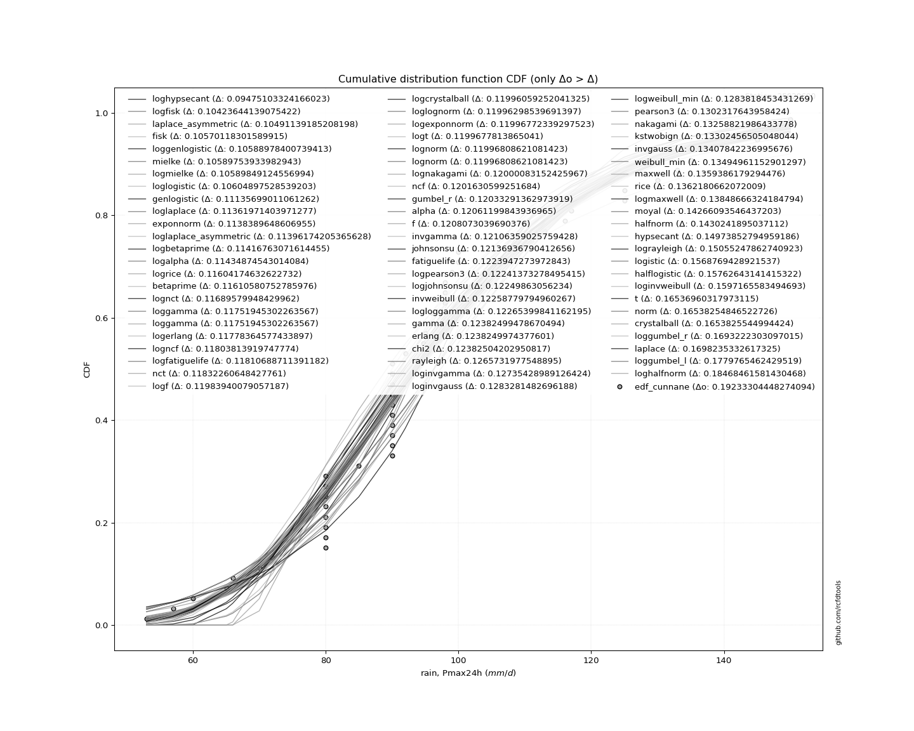</img>

</div>


**11.3. Best fit**

<div align="center">

|   id |   station | empirical_dist   | p_dist       |    delta |   deltao | eval   |   fit |   n |   best_fit |   best_fit_sort |
|-----:|----------:|:-----------------|:-------------|---------:|---------:|:-------|------:|----:|-----------:|----------------:|
|    0 |  25020690 | edf_cunnane      | loghypsecant | 0.094751 | 0.192333 | Δo > Δ |     1 |  50 |          1 |               1 |

</div>


<div align="center">

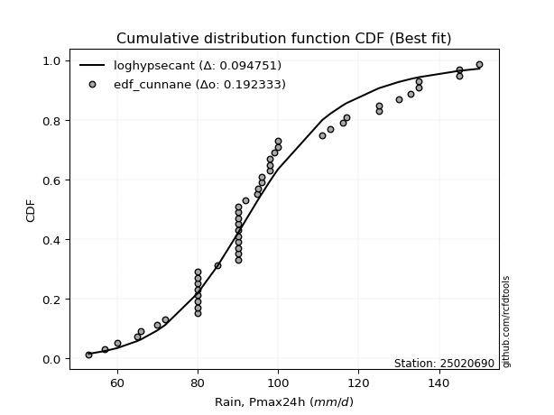</img>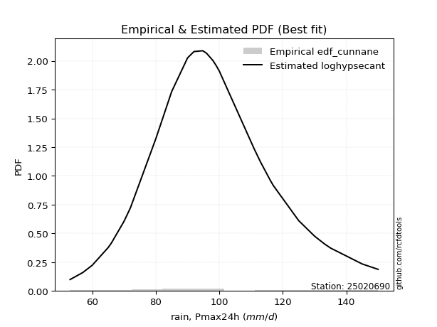</img>

</div>


### 12. Empirical - EDF Adamowski (1981)

The Adamowski formula in hydrology refers to a specific plotting position formula used for estimating the non-parametric empirical distribution of hydrological events (like flood peaks) to calculate their return periods. This formula provides an alternative to traditional parametric methods (like the Gumbel or Log Pearson Type III distributions). 

<div align="center">


$P=(m-0.25)/(n+0.5)$


</div>


**12.1. Empirical values**

<div align="center">

|                | 0                   | 1                    | 2                    | 3                   | 4                   | 5                   | 6                   | 7                   | 8                   | 9                   | 10                  | 11                  | 12                 | 13                 | 14                  | 15                 | 16                 | 17                  | 18                 | 19                 | 20                  | 21                 | 22                 | 23                  | 24                 | 25                 | 26                 | 27                 | 28                 | 29                 | 30                 | 31                 | 32                 | 33                 | 34                 | 35                 | 36                 | 37                 | 38                 | 39                 | 40                | 41                 | 42                 | 43                 | 44                 | 45                 | 46                 | 47                 | 48                 | 49                 |
|:---------------|:--------------------|:---------------------|:---------------------|:--------------------|:--------------------|:--------------------|:--------------------|:--------------------|:--------------------|:--------------------|:--------------------|:--------------------|:-------------------|:-------------------|:--------------------|:-------------------|:-------------------|:--------------------|:-------------------|:-------------------|:--------------------|:-------------------|:-------------------|:--------------------|:-------------------|:-------------------|:-------------------|:-------------------|:-------------------|:-------------------|:-------------------|:-------------------|:-------------------|:-------------------|:-------------------|:-------------------|:-------------------|:-------------------|:-------------------|:-------------------|:------------------|:-------------------|:-------------------|:-------------------|:-------------------|:-------------------|:-------------------|:-------------------|:-------------------|:-------------------|
| date           | 1986                | 1977                 | 1998                 | 1978                | 1979                | 1985                | 1982                | 1975                | 1991                | 1994                | 1990                | 1997                | 1974               | 2012               | 2015                | 2017               | 2000               | 2003                | 2019               | 2009               | 2006                | 1992               | 1995               | 1996                | 2021               | 2010               | 1976               | 1987               | 1999               | 1983               | 2016               | 2004               | 2001               | 2022               | 2007               | 2018               | 2008               | 2020               | 1973               | 1984               | 1981              | 1988               | 1993               | 2013               | 2005               | 1980               | 2002               | 1989               | 2011               | 2014               |
| x              | 53.0                | 57.0                 | 60.0                 | 65.0324581          | 66.0                | 70.0                | 72.0                | 80.0                | 80.0                | 80.0                | 80.0                | 80.0                | 80.0               | 80.0               | 80.0                | 85.0               | 90.0               | 90.0                | 90.0               | 90.0               | 90.0                | 90.0               | 90.0               | 90.0                | 90.0               | 90.0               | 92.0               | 94.700649162       | 95.0               | 96.0               | 96.0               | 98.0               | 98.0               | 98.0               | 99.0               | 100.0              | 100.0              | 111.0              | 113.0              | 116.0              | 117.0             | 125.0              | 125.0              | 130.0              | 133.0              | 135.0              | 135.0              | 145.0              | 145.0              | 150.0              |
| m              | 1                   | 2                    | 3                    | 4                   | 5                   | 6                   | 7                   | 8                   | 9                   | 10                  | 11                  | 12                  | 13                 | 14                 | 15                  | 16                 | 17                 | 18                  | 19                 | 20                 | 21                  | 22                 | 23                 | 24                  | 25                 | 26                 | 27                 | 28                 | 29                 | 30                 | 31                 | 32                 | 33                 | 34                 | 35                 | 36                 | 37                 | 38                 | 39                 | 40                 | 41                | 42                 | 43                 | 44                 | 45                 | 46                 | 47                 | 48                 | 49                 | 50                 |
| empirical_dist | edf_adamowski       | edf_adamowski        | edf_adamowski        | edf_adamowski       | edf_adamowski       | edf_adamowski       | edf_adamowski       | edf_adamowski       | edf_adamowski       | edf_adamowski       | edf_adamowski       | edf_adamowski       | edf_adamowski      | edf_adamowski      | edf_adamowski       | edf_adamowski      | edf_adamowski      | edf_adamowski       | edf_adamowski      | edf_adamowski      | edf_adamowski       | edf_adamowski      | edf_adamowski      | edf_adamowski       | edf_adamowski      | edf_adamowski      | edf_adamowski      | edf_adamowski      | edf_adamowski      | edf_adamowski      | edf_adamowski      | edf_adamowski      | edf_adamowski      | edf_adamowski      | edf_adamowski      | edf_adamowski      | edf_adamowski      | edf_adamowski      | edf_adamowski      | edf_adamowski      | edf_adamowski     | edf_adamowski      | edf_adamowski      | edf_adamowski      | edf_adamowski      | edf_adamowski      | edf_adamowski      | edf_adamowski      | edf_adamowski      | edf_adamowski      |
| empirical      | 0.01485148514851485 | 0.034653465346534656 | 0.054455445544554455 | 0.07425742574257425 | 0.09405940594059406 | 0.11386138613861387 | 0.13366336633663367 | 0.15346534653465346 | 0.17326732673267325 | 0.19306930693069307 | 0.21287128712871287 | 0.23267326732673269 | 0.2524752475247525 | 0.2722772277227723 | 0.29207920792079206 | 0.3118811881188119 | 0.3316831683168317 | 0.35148514851485146 | 0.3712871287128713 | 0.3910891089108911 | 0.41089108910891087 | 0.4306930693069307 | 0.4504950495049505 | 0.47029702970297027 | 0.4900990099009901 | 0.5099009900990099 | 0.5297029702970297 | 0.5495049504950495 | 0.5693069306930693 | 0.5891089108910891 | 0.6089108910891089 | 0.6287128712871287 | 0.6485148514851485 | 0.6683168316831684 | 0.6881188118811881 | 0.7079207920792079 | 0.7277227722772277 | 0.7475247524752475 | 0.7673267326732673 | 0.7871287128712872 | 0.806930693069307 | 0.8267326732673267 | 0.8465346534653465 | 0.8663366336633663 | 0.8861386138613861 | 0.905940594059406  | 0.9257425742574258 | 0.9455445544554455 | 0.9653465346534653 | 0.9851485148514851 |
| empirical_tr   | 1.015075376884422   | 1.035897435897436    | 1.0575916230366493   | 1.0802139037433154  | 1.1038251366120218  | 1.1284916201117319  | 1.1542857142857144  | 1.1812865497076024  | 1.2095808383233533  | 1.2392638036809815  | 1.270440251572327   | 1.303225806451613   | 1.3377483443708609 | 1.3741496598639455 | 1.4125874125874127  | 1.4532374100719425 | 1.4962962962962965 | 1.5419847328244274  | 1.5905511811023623 | 1.6422764227642277 | 1.6974789915966384  | 1.7565217391304346 | 1.8198198198198197 | 1.8878504672897196  | 1.9611650485436893 | 2.04040404040404   | 2.126315789473684  | 2.21978021978022   | 2.3218390804597697 | 2.4337349397590358 | 2.5569620253164556 | 2.6933333333333334 | 2.8450704225352115 | 3.0149253731343286 | 3.2063492063492056 | 3.423728813559322  | 3.6727272727272724 | 3.9607843137254903 | 4.297872340425532  | 4.6976744186046515 | 5.179487179487181 | 5.77142857142857   | 6.516129032258063  | 7.481481481481481  | 8.782608695652174  | 10.631578947368425 | 13.466666666666676 | 18.36363636363635  | 28.857142857142833 | 67.33333333333327  |

</div>


**12.2. Kolmogorov-Smirnov fit test (sorted by Δ)**


<div align="center">

|                | 0                   | 1                   | 2                   | 3                   | 4                   | 5                   | 6                   | 7                   | 8                   | 9                   | 10                    | 11                  | 12                  | 13                  | 14                  | 15                  | 16                  | 17                  | 18                  | 19                  | 20                  | 21                  | 22                  | 23                  | 24                  | 25                  | 26                  | 27                  | 28                  | 29                  | 30                  | 31                  | 32                  | 33                  | 34                  | 35                  | 36                  | 37                  | 38                  | 39                  | 40                  | 41                  | 42                  | 43                  | 44                  | 45                  | 46                  | 47                  | 48                  | 49                  | 50                  | 51                  | 52                  | 53                  | 54                  | 55                  | 56                  | 57                  | 58                  | 59                  | 60                  | 61                  | 62                  | 63                  | 64                  | 65                  | 66                  | 67                  | 68                  | 69                  | 70                  | 71                  | 72                  | 73                  | 74                  | 75                  | 76                  | 77                  | 78                  | 79                  | 80                  | 81                  | 82                  | 83                  | 84                  | 85                  | 86                  | 87                  |
|:---------------|:--------------------|:--------------------|:--------------------|:--------------------|:--------------------|:--------------------|:--------------------|:--------------------|:--------------------|:--------------------|:----------------------|:--------------------|:--------------------|:--------------------|:--------------------|:--------------------|:--------------------|:--------------------|:--------------------|:--------------------|:--------------------|:--------------------|:--------------------|:--------------------|:--------------------|:--------------------|:--------------------|:--------------------|:--------------------|:--------------------|:--------------------|:--------------------|:--------------------|:--------------------|:--------------------|:--------------------|:--------------------|:--------------------|:--------------------|:--------------------|:--------------------|:--------------------|:--------------------|:--------------------|:--------------------|:--------------------|:--------------------|:--------------------|:--------------------|:--------------------|:--------------------|:--------------------|:--------------------|:--------------------|:--------------------|:--------------------|:--------------------|:--------------------|:--------------------|:--------------------|:--------------------|:--------------------|:--------------------|:--------------------|:--------------------|:--------------------|:--------------------|:--------------------|:--------------------|:--------------------|:--------------------|:--------------------|:--------------------|:--------------------|:--------------------|:--------------------|:--------------------|:--------------------|:--------------------|:--------------------|:--------------------|:--------------------|:--------------------|:--------------------|:--------------------|:--------------------|:--------------------|:--------------------|
| station        | 25020690            | 25020690            | 25020690            | 25020690            | 25020690            | 25020690            | 25020690            | 25020690            | 25020690            | 25020690            | 25020690              | 25020690            | 25020690            | 25020690            | 25020690            | 25020690            | 25020690            | 25020690            | 25020690            | 25020690            | 25020690            | 25020690            | 25020690            | 25020690            | 25020690            | 25020690            | 25020690            | 25020690            | 25020690            | 25020690            | 25020690            | 25020690            | 25020690            | 25020690            | 25020690            | 25020690            | 25020690            | 25020690            | 25020690            | 25020690            | 25020690            | 25020690            | 25020690            | 25020690            | 25020690            | 25020690            | 25020690            | 25020690            | 25020690            | 25020690            | 25020690            | 25020690            | 25020690            | 25020690            | 25020690            | 25020690            | 25020690            | 25020690            | 25020690            | 25020690            | 25020690            | 25020690            | 25020690            | 25020690            | 25020690            | 25020690            | 25020690            | 25020690            | 25020690            | 25020690            | 25020690            | 25020690            | 25020690            | 25020690            | 25020690            | 25020690            | 25020690            | 25020690            | 25020690            | 25020690            | 25020690            | 25020690            | 25020690            | 25020690            | 25020690            | 25020690            | 25020690            | 25020690            |
| empirical_dist | edf_adamowski       | edf_adamowski       | edf_adamowski       | edf_adamowski       | edf_adamowski       | edf_adamowski       | edf_adamowski       | edf_adamowski       | edf_adamowski       | edf_adamowski       | edf_adamowski         | edf_adamowski       | edf_adamowski       | edf_adamowski       | edf_adamowski       | edf_adamowski       | edf_adamowski       | edf_adamowski       | edf_adamowski       | edf_adamowski       | edf_adamowski       | edf_adamowski       | edf_adamowski       | edf_adamowski       | edf_adamowski       | edf_adamowski       | edf_adamowski       | edf_adamowski       | edf_adamowski       | edf_adamowski       | edf_adamowski       | edf_adamowski       | edf_adamowski       | edf_adamowski       | edf_adamowski       | edf_adamowski       | edf_adamowski       | edf_adamowski       | edf_adamowski       | edf_adamowski       | edf_adamowski       | edf_adamowski       | edf_adamowski       | edf_adamowski       | edf_adamowski       | edf_adamowski       | edf_adamowski       | edf_adamowski       | edf_adamowski       | edf_adamowski       | edf_adamowski       | edf_adamowski       | edf_adamowski       | edf_adamowski       | edf_adamowski       | edf_adamowski       | edf_adamowski       | edf_adamowski       | edf_adamowski       | edf_adamowski       | edf_adamowski       | edf_adamowski       | edf_adamowski       | edf_adamowski       | edf_adamowski       | edf_adamowski       | edf_adamowski       | edf_adamowski       | edf_adamowski       | edf_adamowski       | edf_adamowski       | edf_adamowski       | edf_adamowski       | edf_adamowski       | edf_adamowski       | edf_adamowski       | edf_adamowski       | edf_adamowski       | edf_adamowski       | edf_adamowski       | edf_adamowski       | edf_adamowski       | edf_adamowski       | edf_adamowski       | edf_adamowski       | edf_adamowski       | edf_adamowski       | edf_adamowski       |
| p_dist         | loghypsecant        | logfisk             | loglogistic         | fisk                | laplace_asymmetric  | loggenlogistic      | mielke              | logmielke           | genlogistic         | exponnorm           | loglaplace_asymmetric | logbetaprime        | logalpha            | loglaplace          | logrice             | betaprime           | lognct              | loggamma            | loggamma            | logerlang           | logncf              | logfatiguelife      | nct                 | logf                | logcrystalball      | loglognorm          | logexponnorm        | logt                | lognorm             | lognorm             | lognakagami         | ncf                 | alpha               | gumbel_r            | f                   | invgamma            | johnsonsu           | fatiguelife         | logpearson3         | logjohnsonsu        | logloggamma         | invweibull          | gamma               | erlang              | chi2                | rayleigh            | loginvgamma         | logweibull_min      | loginvgauss         | pearson3            | kstwobign           | nakagami            | invgauss            | weibull_min         | maxwell             | rice                | logmaxwell          | moyal               | halfnorm            | hypsecant           | lograyleigh         | logistic            | halflogistic        | loginvweibull       | t                   | norm                | crystalball         | loggumbel_r         | laplace             | loggumbel_l         | loghalfnorm         | logkstwobign        | logmoyal            | wald                | loghalflogistic     | gumbel_l            | loggenexpon         | logwald             | loggibrat           | gibrat              | expon               | loggompertz         | logtruncnorm        | logexpon            | logchi2             | gompertz            | genexpon            | truncnorm           |
| delta          | 0.0933901401802425  | 0.10323056391057589 | 0.1046880822239743  | 0.10469530553572082 | 0.1048522225885421  | 0.1048839065272158  | 0.1048916618596511  | 0.1048926137653916  | 0.10999609704919489 | 0.11283308738051717 | 0.11295586457347795   | 0.11310028787689219 | 0.11334286794996251 | 0.11356054477617289 | 0.11468085326480959 | 0.11509993004768143 | 0.11553490642288189 | 0.11615855996121793 | 0.11615855996121793 | 0.11642275271292124 | 0.11667724613606001 | 0.11674599405249408 | 0.11696171342285988 | 0.11847850772915414 | 0.11859969945899551 | 0.11860209233549623 | 0.1186068303315575  | 0.11860688832508637 | 0.1186071931493965  | 0.1186071931493965  | 0.11863993846284193 | 0.11880216686375067 | 0.11925110537795192 | 0.11932703614956086 | 0.11944641090761987 | 0.11970269719617654 | 0.12000847484270882 | 0.12103383433586656 | 0.12105283972353642 | 0.12113773750092227 | 0.12129310535020421 | 0.12158192046942434 | 0.12246410172528721 | 0.12246410437634236 | 0.12246414896809044 | 0.12521230469347178 | 0.1263484124110859  | 0.12702095228170918 | 0.12732227078944047 | 0.12887087133442465 | 0.13095364082658392 | 0.13122732680292004 | 0.13307254488977843 | 0.13358871846759524 | 0.13457772486802988 | 0.13485717314578316 | 0.1374807857616696  | 0.1416550579841937  | 0.14201831202353288 | 0.14837763488817413 | 0.1495466011472309  | 0.15551604983073597 | 0.1566205539339749  | 0.15871068086929097 | 0.16400871011831342 | 0.16402165540380953 | 0.16402166143802466 | 0.16831635282952317 | 0.1697643639981926  | 0.17661565318153416 | 0.18367873833412635 | 0.19095795931356271 | 0.19315525774388848 | 0.20128445816671475 | 0.20327372383325099 | 0.22946589595557454 | 0.24203280327734936 | 0.26193848828903915 | 0.2699007211277998  | 0.2734223277009691  | 0.3105412693638453  | 0.3337702036150143  | 0.35561941832144117 | 0.3616967783992394  | 0.4020264385161769  | 0.808228818208618   | 0.8988943705906838  | 0.9820656039449285  |
| deltao         | 0.19233304448274094 | 0.19233304448274094 | 0.19233304448274094 | 0.19233304448274094 | 0.19233304448274094 | 0.19233304448274094 | 0.19233304448274094 | 0.19233304448274094 | 0.19233304448274094 | 0.19233304448274094 | 0.19233304448274094   | 0.19233304448274094 | 0.19233304448274094 | 0.19233304448274094 | 0.19233304448274094 | 0.19233304448274094 | 0.19233304448274094 | 0.19233304448274094 | 0.19233304448274094 | 0.19233304448274094 | 0.19233304448274094 | 0.19233304448274094 | 0.19233304448274094 | 0.19233304448274094 | 0.19233304448274094 | 0.19233304448274094 | 0.19233304448274094 | 0.19233304448274094 | 0.19233304448274094 | 0.19233304448274094 | 0.19233304448274094 | 0.19233304448274094 | 0.19233304448274094 | 0.19233304448274094 | 0.19233304448274094 | 0.19233304448274094 | 0.19233304448274094 | 0.19233304448274094 | 0.19233304448274094 | 0.19233304448274094 | 0.19233304448274094 | 0.19233304448274094 | 0.19233304448274094 | 0.19233304448274094 | 0.19233304448274094 | 0.19233304448274094 | 0.19233304448274094 | 0.19233304448274094 | 0.19233304448274094 | 0.19233304448274094 | 0.19233304448274094 | 0.19233304448274094 | 0.19233304448274094 | 0.19233304448274094 | 0.19233304448274094 | 0.19233304448274094 | 0.19233304448274094 | 0.19233304448274094 | 0.19233304448274094 | 0.19233304448274094 | 0.19233304448274094 | 0.19233304448274094 | 0.19233304448274094 | 0.19233304448274094 | 0.19233304448274094 | 0.19233304448274094 | 0.19233304448274094 | 0.19233304448274094 | 0.19233304448274094 | 0.19233304448274094 | 0.19233304448274094 | 0.19233304448274094 | 0.19233304448274094 | 0.19233304448274094 | 0.19233304448274094 | 0.19233304448274094 | 0.19233304448274094 | 0.19233304448274094 | 0.19233304448274094 | 0.19233304448274094 | 0.19233304448274094 | 0.19233304448274094 | 0.19233304448274094 | 0.19233304448274094 | 0.19233304448274094 | 0.19233304448274094 | 0.19233304448274094 | 0.19233304448274094 |
| eval           | Δo > Δ              | Δo > Δ              | Δo > Δ              | Δo > Δ              | Δo > Δ              | Δo > Δ              | Δo > Δ              | Δo > Δ              | Δo > Δ              | Δo > Δ              | Δo > Δ                | Δo > Δ              | Δo > Δ              | Δo > Δ              | Δo > Δ              | Δo > Δ              | Δo > Δ              | Δo > Δ              | Δo > Δ              | Δo > Δ              | Δo > Δ              | Δo > Δ              | Δo > Δ              | Δo > Δ              | Δo > Δ              | Δo > Δ              | Δo > Δ              | Δo > Δ              | Δo > Δ              | Δo > Δ              | Δo > Δ              | Δo > Δ              | Δo > Δ              | Δo > Δ              | Δo > Δ              | Δo > Δ              | Δo > Δ              | Δo > Δ              | Δo > Δ              | Δo > Δ              | Δo > Δ              | Δo > Δ              | Δo > Δ              | Δo > Δ              | Δo > Δ              | Δo > Δ              | Δo > Δ              | Δo > Δ              | Δo > Δ              | Δo > Δ              | Δo > Δ              | Δo > Δ              | Δo > Δ              | Δo > Δ              | Δo > Δ              | Δo > Δ              | Δo > Δ              | Δo > Δ              | Δo > Δ              | Δo > Δ              | Δo > Δ              | Δo > Δ              | Δo > Δ              | Δo > Δ              | Δo > Δ              | Δo > Δ              | Δo > Δ              | Δo > Δ              | Δo > Δ              | Δo > Δ              | Δo > Δ              | Δo > Δ              | Δo <= Δ             | Δo <= Δ             | Δo <= Δ             | Δo <= Δ             | Δo <= Δ             | Δo <= Δ             | Δo <= Δ             | Δo <= Δ             | Δo <= Δ             | Δo <= Δ             | Δo <= Δ             | Δo <= Δ             | Δo <= Δ             | Δo <= Δ             | Δo <= Δ             | Δo <= Δ             |
| fit            | 1                   | 1                   | 1                   | 1                   | 1                   | 1                   | 1                   | 1                   | 1                   | 1                   | 1                     | 1                   | 1                   | 1                   | 1                   | 1                   | 1                   | 1                   | 1                   | 1                   | 1                   | 1                   | 1                   | 1                   | 1                   | 1                   | 1                   | 1                   | 1                   | 1                   | 1                   | 1                   | 1                   | 1                   | 1                   | 1                   | 1                   | 1                   | 1                   | 1                   | 1                   | 1                   | 1                   | 1                   | 1                   | 1                   | 1                   | 1                   | 1                   | 1                   | 1                   | 1                   | 1                   | 1                   | 1                   | 1                   | 1                   | 1                   | 1                   | 1                   | 1                   | 1                   | 1                   | 1                   | 1                   | 1                   | 1                   | 1                   | 1                   | 1                   | 1                   | 1                   | 0                   | 0                   | 0                   | 0                   | 0                   | 0                   | 0                   | 0                   | 0                   | 0                   | 0                   | 0                   | 0                   | 0                   | 0                   | 0                   |
| n              | 50                  | 50                  | 50                  | 50                  | 50                  | 50                  | 50                  | 50                  | 50                  | 50                  | 50                    | 50                  | 50                  | 50                  | 50                  | 50                  | 50                  | 50                  | 50                  | 50                  | 50                  | 50                  | 50                  | 50                  | 50                  | 50                  | 50                  | 50                  | 50                  | 50                  | 50                  | 50                  | 50                  | 50                  | 50                  | 50                  | 50                  | 50                  | 50                  | 50                  | 50                  | 50                  | 50                  | 50                  | 50                  | 50                  | 50                  | 50                  | 50                  | 50                  | 50                  | 50                  | 50                  | 50                  | 50                  | 50                  | 50                  | 50                  | 50                  | 50                  | 50                  | 50                  | 50                  | 50                  | 50                  | 50                  | 50                  | 50                  | 50                  | 50                  | 50                  | 50                  | 50                  | 50                  | 50                  | 50                  | 50                  | 50                  | 50                  | 50                  | 50                  | 50                  | 50                  | 50                  | 50                  | 50                  | 50                  | 50                  |
| best_fit       | 1                   | 0                   | 0                   | 0                   | 0                   | 0                   | 0                   | 0                   | 0                   | 0                   | 0                     | 0                   | 0                   | 0                   | 0                   | 0                   | 0                   | 0                   | 0                   | 0                   | 0                   | 0                   | 0                   | 0                   | 0                   | 0                   | 0                   | 0                   | 0                   | 0                   | 0                   | 0                   | 0                   | 0                   | 0                   | 0                   | 0                   | 0                   | 0                   | 0                   | 0                   | 0                   | 0                   | 0                   | 0                   | 0                   | 0                   | 0                   | 0                   | 0                   | 0                   | 0                   | 0                   | 0                   | 0                   | 0                   | 0                   | 0                   | 0                   | 0                   | 0                   | 0                   | 0                   | 0                   | 0                   | 0                   | 0                   | 0                   | 0                   | 0                   | 0                   | 0                   | 0                   | 0                   | 0                   | 0                   | 0                   | 0                   | 0                   | 0                   | 0                   | 0                   | 0                   | 0                   | 0                   | 0                   | 0                   | 0                   |
| best_fit_sort  | 1                   | 2                   | 3                   | 4                   | 5                   | 6                   | 7                   | 8                   | 9                   | 10                  | 11                    | 12                  | 13                  | 14                  | 15                  | 16                  | 17                  | 18                  | 19                  | 20                  | 21                  | 22                  | 23                  | 24                  | 25                  | 26                  | 27                  | 28                  | 29                  | 30                  | 31                  | 32                  | 33                  | 34                  | 35                  | 36                  | 37                  | 38                  | 39                  | 40                  | 41                  | 42                  | 43                  | 44                  | 45                  | 46                  | 47                  | 48                  | 49                  | 50                  | 51                  | 52                  | 53                  | 54                  | 55                  | 56                  | 57                  | 58                  | 59                  | 60                  | 61                  | 62                  | 63                  | 64                  | 65                  | 66                  | 67                  | 68                  | 69                  | 70                  | 71                  | 72                  | 73                  | 74                  | 75                  | 76                  | 77                  | 78                  | 79                  | 80                  | 81                  | 82                  | 83                  | 84                  | 85                  | 86                  | 87                  | 88                  |

</div>


<div align="center">

</img>

</div>


**12.3. Best fit**

<div align="center">

|   id |   station | empirical_dist   | p_dist       |     delta |   deltao | eval   |   fit |   n |   best_fit |   best_fit_sort |
|-----:|----------:|:-----------------|:-------------|----------:|---------:|:-------|------:|----:|-----------:|----------------:|
|    0 |  25020690 | edf_adamowski    | loghypsecant | 0.0933901 | 0.192333 | Δo > Δ |     1 |  50 |          1 |               1 |

</div>


<div align="center">

</img></img>

</div>


## C. Best fit & Estimate extreme values for specific return periods - Tr


### 1. Best fit (ordered by delta Δ)

<div align="center">

|   id |   station | empirical_dist   | p_dist                |     delta |   deltao | eval   |   fit |   n |   best_fit |   best_fit_sort |
|-----:|----------:|:-----------------|:----------------------|----------:|---------:|:-------|------:|----:|-----------:|----------------:|
|    0 |  25020690 | edf_weibull      | loghypsecant          | 0.0911576 | 0.192333 | Δo > Δ |     1 |  50 |          1 |               1 |
|    1 |  25020690 | edf_adamowski    | loghypsecant          | 0.0933901 | 0.192333 | Δo > Δ |     1 |  50 |          1 |               2 |
|    2 |  25020690 | edf_chegodayev   | loghypsecant          | 0.093842  | 0.192333 | Δo > Δ |     1 |  50 |          1 |               3 |
|    3 |  25020690 | edf_jenkinson    | loghypsecant          | 0.0939326 | 0.192333 | Δo > Δ |     1 |  50 |          1 |               4 |
|    4 |  25020690 | edf_beard        | loghypsecant          | 0.0939326 | 0.192333 | Δo > Δ |     1 |  50 |          1 |               5 |
|    5 |  25020690 | edf_filliben     | loghypsecant          | 0.0940005 | 0.192333 | Δo > Δ |     1 |  50 |          1 |               6 |
|    6 |  25020690 | edf_tukey        | loghypsecant          | 0.0941442 | 0.192333 | Δo > Δ |     1 |  50 |          1 |               7 |
|    7 |  25020690 | edf_blom         | loghypsecant          | 0.0945231 | 0.192333 | Δo > Δ |     1 |  50 |          1 |               8 |
|    8 |  25020690 | edf_cunnane      | loghypsecant          | 0.094751  | 0.192333 | Δo > Δ |     1 |  50 |          1 |               9 |
|    9 |  25020690 | edf_gringorten   | loghypsecant          | 0.0951167 | 0.192333 | Δo > Δ |     1 |  50 |          1 |              10 |
|   10 |  25020690 | edf_hazen        | loghypsecant          | 0.0956674 | 0.192333 | Δo > Δ |     1 |  50 |          1 |              11 |
|   11 |  25020690 | edf_california   | loglaplace_asymmetric | 0.104639  | 0.192333 | Δo > Δ |     1 |  50 |          1 |              12 |

</div>

:file_folder:Tables: [bestfit_25020690.csv](table/bestfit_25020690.csv) | [extreme_25020690.csv](table/extreme_25020690.csv)


### 2. Extreme values

In hydrology, a return period (or recurrence interval $Tr$) is the statistical average time between extreme events like floods or droughts of a specific magnitude, indicating how rare an event is, with a 100-year flood, for example, having a 1% chance of occurring in any given year, not that it happens exactly every century. It is a key tool for infrastructure design (like bridges or dams) and risk assessment, calculated from historical data to determine the probability of future events, although it is important to remember it is statistical average, and events can cluster or be missed.

> risk_rate: assuming the return period as the project useful life.

|   id |      tr |   prob_l |     prob_g |    alpha |   betaprime |     chi2 |   crystalball |   erlang |    expon |   exponnorm |        f |   fatiguelife |     fisk |    gamma |   genexpon |   genlogistic |   gibrat |   gompertz |   gumbel_l |   gumbel_r |   halflogistic |   halfnorm |   hypsecant |   invgamma |   invgauss |   invweibull |   johnsonsu |   kstwobign |   laplace |   laplace_asymmetric |   loggamma |   logistic |   lognorm |   maxwell |   mielke |    moyal |   nakagami |      ncf |      nct |     norm |   pearson3 |   rayleigh |     rice |       t |   truncnorm |     wald |   weibull_min |   logalpha |   logbetaprime |   logchi2 |   logcrystalball |   logerlang |   logexpon |   logexponnorm |     logf |   logfatiguelife |   logfisk |   loggenexpon |   loggenlogistic |   loggibrat |   loggompertz |   loggumbel_l |   loggumbel_r |   loghalflogistic |   loghalfnorm |   loghypsecant |   loginvgamma |   loginvgauss |   loginvweibull |   logjohnsonsu |   logkstwobign |   loglaplace |   loglaplace_asymmetric |   logloggamma |   loglogistic |   loglognorm |   logmaxwell |   logmielke |   logmoyal |   lognakagami |   logncf |   lognct |   logpearson3 |   lograyleigh |   logrice |     logt |   logtruncnorm |   logwald |   logweibull_min |   station |   n |   risk_rate |
|-----:|--------:|---------:|-----------:|---------:|------------:|---------:|--------------:|---------:|---------:|------------:|---------:|--------------:|---------:|---------:|-----------:|--------------:|---------:|-----------:|-----------:|-----------:|---------------:|-----------:|------------:|-----------:|-----------:|-------------:|------------:|------------:|----------:|---------------------:|-----------:|-----------:|----------:|----------:|---------:|---------:|-----------:|---------:|---------:|---------:|-----------:|-----------:|---------:|--------:|------------:|---------:|--------------:|-----------:|---------------:|----------:|-----------------:|------------:|-----------:|---------------:|---------:|-----------------:|----------:|--------------:|-----------------:|------------:|--------------:|--------------:|--------------:|------------------:|--------------:|---------------:|--------------:|--------------:|----------------:|---------------:|---------------:|-------------:|------------------------:|--------------:|--------------:|-------------:|-------------:|------------:|-----------:|--------------:|---------:|---------:|--------------:|--------------:|----------:|---------:|---------------:|----------:|-----------------:|----------:|----:|------------:|
|    0 |    2    | 0.5      | 0.5        |  93.7264 |     92.9267 |  93.7605 |       96.2947 |  93.7605 |  83.0096 |     92.8088 |  93.6641 |       93.7232 |  93.1567 |  93.7605 |    55.3055 |       93.3527 |  89.3589 |    136.401 |    100.091 |    92.4986 |        90.6114 |    91.5648 |     96.2947 |    93.7111 |    92.0044 |      92.6056 |     93.7137 |     92.364  |   96.2947 |              93.4303 |    93.4442 |    96.2947 |   93.6002 |   94.3185 |  93.1543 |  91.2732 |    94.0669 |  93.6483 |  93.6296 |  96.2947 |    94.1672 |    93.6176 |  94.1364 |  96.294 |     13.9221 |  88.8045 |       94.1331 |    93.0168 |        93.0769 |   74.828  |          93.6    |     93.4588 |    78.6111 |        93.6002 |  93.5871 |          93.4884 |   93.2235 |       87.1608 |          93.1521 |     87.1278 |        80.975 |       97.3445 |       90      |           88.2624 |       89.1353 |        93.6002 |       92.3357 |       92.2774 |         90.5936 |        93.7611 |        89.215  |      93.6002 |                 91.8781 |       93.7694 |       93.6002 |      93.5999 |      91.7081 |     93.1322 |    88.8676 |       93.5948 |  93.4781 |  93.4024 |       93.7544 |       91.0466 |   93.2519 |  93.6002 |        79.1865 |   86.6282 |          93.9106 |  25020690 |  50 |    0.75     |
|    1 |    2.33 | 0.570815 | 0.429185   |  97.7473 |     97.0152 |  97.8903 |      100.418  |  97.8903 |  89.6216 |     96.5724 |  97.7338 |       97.8176 |  96.8279 |  97.8903 |    55.8135 |       97.2455 |  91.4476 |    137.19  |    103.678 |    96.3194 |        94.5398 |    96.015  |     99.5946 |    97.7594 |    96.2247 |      96.779  |     97.7725 |     96.8011 |   98.7899 |              96.4433 |    97.5176 |    99.9276 |   97.6743 |   98.6023 |  96.8405 |  94.89   |    98.3769 |  97.7001 |  97.6207 | 100.418  |    98.2968 |    97.9648 |  98.5735 | 100.417 |     16.4683 |  91.5082 |       98.5086 |    97.0999 |        97.2305 |   81.6256 |          97.6739 |     97.5334 |    85.7445 |        97.6742 |  97.6632 |          97.5579 |   96.8792 |       92.621  |          96.8345 |     89.0284 |        86.827 |      101.02   |       93.6242 |           91.9184 |       93.33   |        96.8467 |       96.4988 |       96.4282 |         95.2871 |        97.8354 |        94.1596 |      96.0449 |                 94.6798 |       97.8448 |       97.1806 |      97.6739 |      95.859  |     96.788  |    92.2515 |       97.673  |  97.5506 |  97.4758 |       97.8296 |       95.2295 |   97.3841 |  97.6742 |        86.1728 |   89.0828 |          98.1382 |  25020690 |  50 |    0.729209 |
|    2 |    5    | 0.8      | 0.2        | 114.25   |    114.296  | 114.697  |      115.742  | 114.697  | 122.68   |    112.987  | 114.36   |      114.552  | 112.654  | 114.697  |    58.3533 |      113.674  | 103.473  |    139.74  |    115.267 |   112.918  |       112.315  |   114.834  |    112.831  |   114.361  |   114.14   |     114.91   |    114.403  |    115.649  |  111.266  |             111.508  |   114.367  |   113.955  |  114.431  |  115.463  | 112.75   | 111.643  |   115.441  | 114.357  | 114.106  | 115.742  |   114.862  |   115.369  | 115.85   | 115.74  |     25.9305 | 106.644  |      115.679  |   114.37   |       114.877  |  128.221  |         114.43   |    114.389  |   132.376  |       114.431  | 114.473  |         114.364  |  112.543  |      118.182  |         112.729  |    100.806  |       114.913 |      113.871  |      111.141  |          110.449  |      113.365  |       111.041  |      114.628  |      114.444  |        118.669  |       114.487  |       118.407  |     109.259  |                110.022  |      114.489  |      112.338  |     114.431  |     114.104  |    112.594  |   109.687  |      114.469  | 114.397  | 114.388  |      114.484  |      113.991  |  114.538  | 114.431  |       129.143  |  104.166  |         115.077  |  25020690 |  50 |    0.67232  |
|    3 |   10    | 0.9      | 0.1        | 126.782  |    127.89   | 127.155  |      125.907  | 127.155  | 152.69   |    126.957  | 126.833  |      127.065  | 126.193  | 127.155  |    60.6588 |      126.741  | 117.18   |    141.16  |    121.72  |   126.438  |       127.076  |   128.76   |    123.401  |   126.904  |   128.155  |     129.677  |    126.927  |    129.999  |  122.591  |             125.183  |   127.212  |   124.286  |  127.104  |  127.329  | 126.286  | 126.23   |   127.506  | 126.979  | 126.766  | 125.907  |   126.938  |   127.778  | 127.774  | 125.906 |     32.2074 | 122.706  |      127.651  |   127.957  |       128.833  |  195.791  |         127.102  |    127.239  |   196.344  |       127.104  | 127.235  |         127.146  |  125.85   |      140.674  |         126.275  |    116.142  |       139.113 |      121.722  |      127.804  |          128.646  |      130.91   |       123.855  |      129.483  |      129.113  |        141.892  |       126.971  |       140.975  |     122.823  |                126.091  |      126.955  |      124.992  |     127.104  |     128.989  |    126.212  |   127.529  |      127.196  | 127.242  | 127.35   |      126.967  |      129.585  |  127.645  | 127.104  |       182.249  |  122.975  |         127.324  |  25020690 |  50 |    0.651322 |
|    4 |   15    | 0.933333 | 0.0666667  | 133.593  |    135.423  | 133.774  |      130.979  | 133.774  | 170.244  |    135.084  | 133.535  |      133.757  | 134.33   | 133.774  |    62.0074 |      134.053  | 126.635  |    141.803 |    124.642 |   134.066  |       135.43   |   136.007  |    129.433  |   133.681  |   135.843  |     138.009  |    133.671  |    137.617  |  129.216  |             133.182  |   134.18   |   129.914  |  133.943  |  133.418  | 134.359  | 134.695  |   133.706  | 133.812  | 133.704  | 130.979  |   133.298  |   134.172  | 133.815  | 130.979 |     35.3398 | 133.021  |      133.747  |   135.483  |       136.585  |  251.635  |         133.941  |    134.21   |   247.268  |       133.943  | 134.139  |         134.07   |  133.818  |      153.908  |         134.368  |    128.06   |       152.83  |      125.453  |      138.284  |          140.243  |      141.09   |       131.821  |      137.936  |      137.419  |        156.947  |       133.672  |       154.655  |     131.524  |                136.559  |      133.64   |      132.477  |     133.944  |     137.365  |    134.451  |   139.186  |      134.073  | 134.21   | 134.407  |      133.665  |      138.435  |  134.758  | 133.943  |       221.013  |  136.807  |         133.726  |  25020690 |  50 |    0.644736 |
|    5 |   20    | 0.95     | 0.05       | 138.277  |    140.655  | 138.256  |      134.301  | 138.256  | 182.699  |    140.849  | 138.108  |      138.307  | 140.293  | 138.256  |    62.9642 |      139.158  | 134.052  |    142.203 |    126.461 |   139.407  |       141.282  |   140.838  |    133.689  |   138.322  |   141.14   |     143.843  |    138.278  |    142.749  |  133.916  |             138.857  |   138.959  |   133.805  |  138.621  |  137.458  | 140.242  | 140.691  |   137.824  | 138.494  | 138.499  | 134.301  |   137.584  |   138.422  | 137.797  | 134.301 |     37.391  | 140.707  |      137.775  |   140.709  |       141.975  |  300.995  |         138.619  |    138.992  |   291.222  |       138.621  | 138.867  |         138.816  |  139.647  |      163.395  |         140.274  |    138.258  |       162.395 |      127.833  |      146.129  |          148.985  |      148.313  |       137.746  |      143.9    |      143.259  |        168.429  |       138.24   |       164.611  |     138.07   |                144.508  |      138.194  |      137.911  |     138.622  |     143.222  |    140.518  |   148.081  |      138.779  | 138.99   | 139.258  |      138.23   |      144.65   |  139.636  | 138.621  |       252.536  |  148.117  |         138.022  |  25020690 |  50 |    0.641514 |
|    6 |   25    | 0.96     | 0.04       | 141.845  |    144.668  | 141.631  |      136.747  | 141.631  | 192.36   |    145.32   | 141.571  |      141.743  | 145.053  | 141.631  |    63.7064 |      143.083  | 140.235  |    142.488 |    127.755 |   143.52   |       145.792  |   144.433  |    136.982  |   141.845  |   145.175  |     148.336  |    141.769  |    146.593  |  137.562  |             143.26   |   142.591  |   136.781  |  142.168  |  140.458  | 144.916  | 145.338  |   140.881  | 142.051  | 142.164  | 136.747  |   140.802  |   141.579  | 140.74   | 136.746 |     38.9011 | 146.864  |      140.756  |   144.716  |       146.112  |  346.032  |         142.166  |    142.626  |   330.629  |       142.168  | 142.457  |         142.42   |  144.294  |      170.826  |         144.971  |    147.378  |       169.728 |      129.555  |      152.475  |          156.091  |      153.927  |       142.514  |      148.524  |      147.776  |        177.842  |       141.696  |       172.486  |     143.37   |                150.991  |      141.64   |      142.218  |     142.169  |     147.731  |    145.38   |   155.365  |      142.35   | 142.623  | 142.95   |      141.683  |      149.447  |  143.343  | 142.168  |       279.529  |  157.848  |         141.236  |  25020690 |  50 |    0.639603 |
|    7 |   50    | 0.98     | 0.02       | 152.672  |    156.973  | 151.652  |      143.749  | 151.652  | 222.37   |    159.209  | 151.962  |      151.996  | 160.726  | 151.652  |    66.0119 |      155.154  | 162.03   |    143.261 |    131.269 |   156.193  |       159.686  |   154.882  |    147.193  |   152.465  |   157.389  |     162.178  |    152.256  |    157.88   |  148.887  |             156.935  |   153.554  |   145.873  |  152.836  |  149.158  | 160.176  | 159.764  |   149.752  | 152.786  | 153.355  | 143.749  |   150.309  |   150.745  | 149.215  | 143.75  |     43.2252 | 166.965  |      149.355  |   156.992  |       158.806  |  534.843  |         152.833  |    153.596  |   490.399  |       152.836  | 153.271  |         153.287  |  159.57   |      194.391  |         160.338  |    184.597  |       192.073 |      134.344  |      173.806  |          180.186  |      171.477  |       158.372  |      162.974  |      161.826  |        210.278  |       152.05   |       197.857  |     161.168  |                173.045  |      151.955  |      156.227  |     152.838  |     161.627  |    161.515  |   180.339  |      153.098  | 153.589  | 154.125  |      152.027  |      164.292  |  154.526  | 152.836  |       379.522  |  194.293  |         150.682  |  25020690 |  50 |    0.63583  |
|    8 |   75    | 0.986667 | 0.0133333  | 158.887  |    164.113  | 157.248  |      147.507  | 157.248  | 239.924  |    167.334  | 157.842  |      157.757  | 170.614  | 157.248  |    67.3605 |      162.159  | 176.75   |    143.652 |    133.045 |   163.559  |       167.762  |   160.57   |    153.16   |   158.507  |   164.356  |     170.224  |    158.196  |    164.091  |  155.512  |             164.934  |   159.798  |   151.125  |  158.887  |  153.887  | 169.702  | 168.2    |   154.576  | 158.901  | 159.822  | 147.507  |   155.592  |   155.732  | 153.787  | 147.508 |     45.5454 | 179.334  |      154.002  |   164.109  |       166.175  |  690.902  |         158.883  |    159.843  |   617.59   |       158.887  | 159.416  |         159.469  |  169.192  |      208.568  |         169.953  |    214.918  |       204.874 |      136.833  |      187.55   |          195.867  |      181.859  |       168.444  |      171.544  |      170.111  |        231.784  |       157.897  |       213.374  |     172.587  |                187.41   |      157.776  |      164.939  |     158.889  |     169.722  |    171.796  |   196.764  |      159.2    | 159.835  | 160.509  |      157.865  |      172.979  |  160.89   | 158.887  |       451.044  |  220.786  |         155.899  |  25020690 |  50 |    0.634587 |
|    9 |  100    | 0.99     | 0.01       | 163.264  |    169.171  | 161.122  |      150.048  | 161.122  | 252.379  |    173.098  | 161.946  |      161.758  | 177.991  | 161.122  |    68.3173 |      167.115  | 188.153  |    143.907 |    134.207 |   168.772  |       173.478  |   164.445  |    157.393  |   162.738  |   169.237  |     175.918  |    162.343  |    168.346  |  160.212  |             170.61   |   164.171  |   154.833  |  163.114  |  157.109  | 176.762  | 174.185  |   157.862  | 163.186  | 164.395  | 150.048  |   159.238  |   159.129  | 156.888  | 150.05  |     47.1147 | 188.353  |      157.157  |   169.147  |       171.397  |  828.923  |         163.11   |    164.219  |   727.374  |       163.114  | 163.715  |         163.796  |  176.365  |      218.822  |         177.089  |    241.79   |       213.847 |      138.486  |      197.93   |          207.784  |      189.288  |       175.974  |      177.698  |      176.038  |        248.322  |       161.972  |       224.702  |     181.176  |                198.319  |      161.83   |      171.381  |     163.117  |     175.468  |    179.52   |   209.316  |      163.466  | 164.21   | 164.99   |      161.933  |      179.159  |  165.346  | 163.114  |       508.513  |  242.353  |         159.486  |  25020690 |  50 |    0.633968 |
|   10 |  200    | 0.995    | 0.005      | 173.757  |    181.382  | 170.173  |      155.813  | 170.173  | 282.389  |    186.987  | 171.648  |      171.153  | 197.126  | 170.173  |    70.6227 |      179.022  | 219.177  |    144.463 |    136.733 |   181.305  |       187.221  |   173.308  |    167.59   |   172.79   |   180.822  |     189.608  |    172.155  |    178.147  |  171.537  |             184.285  |   174.563  |   163.727  |  173.125  |  164.48   | 194.893  | 188.605  |   165.382  | 173.377  | 175.416  | 155.813  |   167.725  |   166.902  | 163.944  | 155.816 |     50.6743 | 210.817  |      164.34   |   181.3    |       184.004  | 1287.32   |         173.121  |    174.619  |  1078.86   |       173.125  | 173.912  |         174.068  |  194.965  |      244.246  |         195.46   |    333.15   |       235.132 |      142.149  |      225.296  |          239.484  |      207.442  |       195.527  |      192.831  |      190.536  |        293.071  |       171.586  |       253.135  |     203.667  |                227.285  |      171.39   |      187.878  |     173.128  |     189.355  |    199.779  |   242.947  |      173.576  | 174.608  | 175.666  |      171.527  |      194.142  |  175.926  | 173.125  |       673.354  |  305.683  |         167.798  |  25020690 |  50 |    0.633042 |
|   11 |  250    | 0.996    | 0.004      | 177.131  |    185.331  | 173.013  |      157.575  | 173.013  | 292.05   |    191.458  | 174.727  |      174.113  | 203.729  | 173.013  |    71.3649 |      182.849  | 230.309  |    144.627 |    137.477 |   185.334  |       191.639  |   176.034  |    170.872  |   175.994  |   184.508  |     194.009  |    175.27   |    181.18   |  175.183  |             188.687  |   177.875  |   166.583  |  176.305  |  166.749  | 201.093  | 193.247  |   167.696  | 176.627  | 178.976  | 157.575  |   170.379  |   169.295  | 166.106  | 157.578 |     51.7621 | 218.249  |      166.542  |   185.226  |       188.079  | 1483.82   |         176.301  |    177.933  |  1224.85   |       176.305  | 177.156  |         177.339  |  201.381  |      252.659  |         201.754  |    373.754  |       241.891 |      143.244  |      234.873  |          250.67   |      213.369  |       202.273  |      197.808  |      195.28   |        309.105  |       174.63   |       262.643  |     211.486  |                237.483  |      174.415  |      193.503  |     176.309  |     193.847  |    206.844  |   254.884  |      176.79   | 177.922  | 179.077  |      174.564  |      199.001  |  179.294  | 176.305  |       735.345  |  330.085  |         170.387  |  25020690 |  50 |    0.632858 |
|   12 |  500    | 0.998    | 0.002      | 187.639  |    197.686  | 181.64   |      162.799  | 181.64   | 322.059  |    205.347  | 184.184  |      183.145  | 225.75   | 181.64   |    73.6702 |      194.725  | 268.778  |    145.095 |    139.607 |   197.84   |       205.352  |   184.163  |    181.069  |   185.88   |   195.846  |     207.669  |    184.84   |    190.269  |  186.508  |             202.362  |   188.089  |   175.439  |  186.083  |  173.519  | 221.576  | 207.667  |   174.603  | 186.665  | 190.109  | 162.799  |   178.42   |   176.434  | 172.532  | 162.803 |     54.988  | 241.879  |      173.088  |   197.497  |       200.827  | 2309.03   |         186.079  |    188.154  |  1816.73   |       186.084  | 187.146  |         187.418  |  222.79   |      279.546  |         222.594  |    556.157  |       262.625 |      146.433  |      267.271  |          288.825  |      232.066  |       224.746  |      213.64   |      210.29   |        364.677  |       183.962  |       293.33   |     237.74   |                272.169  |      183.683  |      212.045  |     186.088  |     207.895  |    230.695  |   295.835  |      186.679  | 188.144  | 189.621  |      183.869  |      214.236  |  189.675  | 186.083  |       960.193  |  421.39   |         178.199  |  25020690 |  50 |    0.632489 |
|   13 |  750    | 0.998667 | 0.00133333 | 193.823  |    204.992  | 186.567  |      165.701  | 186.567  | 339.614  |    213.472  | 189.657  |      188.327  | 239.775  | 186.567  |    75.0188 |      201.666  | 294.22   |    145.346 |    140.746 |   205.151  |       213.369  |   188.704  |    187.033  |   191.631  |   202.412  |     215.654  |    190.379  |    195.375  |  193.133  |             210.361  |   194.027  |   180.612  |  191.748  |  177.306  | 234.478  | 216.102  |   178.466  | 192.511  | 196.692  | 165.701  |   182.996  |   180.426  | 176.11   | 165.706 |     56.78   | 256.048  |      176.734  |   204.744  |       208.361  | 2992.36   |         191.743  |    194.097  |  2287.92   |       191.748  | 192.943  |         193.271  |  236.437  |      295.826  |         235.754  |    723.356  |       274.583 |      148.166  |      288.243  |          313.766  |      243.216  |       239.033  |      223.186  |      219.282  |        401.682  |       189.347  |       312.116  |     254.583  |                294.762  |      189.028  |      223.689  |     191.753  |     216.191  |    246.118  |   322.775  |      192.413  | 194.087  | 195.769  |      189.237  |      223.258  |  195.703  | 191.748  |      1117.24   |  487.837  |         182.627  |  25020690 |  50 |    0.632366 |
|   14 | 1000    | 0.999    | 0.001      | 198.237  |    210.217  | 190.014  |      167.699  | 190.014  | 352.069  |    219.236  | 193.52   |      191.963  | 250.279  | 190.014  |    75.9756 |      206.589  | 313.689  |    145.514 |    141.512 |   210.337  |       219.055  |   191.84   |    191.265  |   195.705  |   207.045  |     221.319  |    194.289  |    198.913  |  197.833  |             216.037  |   198.229  |   184.281  |  195.748  |  179.923  | 244.072  | 222.086  |   181.136  | 196.653  | 201.402  | 167.699  |   186.192  |   183.185  | 178.576  | 167.705 |     58.0138 | 266.239  |      179.247  |   209.923  |       213.747  | 3597.41   |         195.742  |    198.302  |  2694.63   |       195.748  | 197.04   |         197.411  |  246.666  |      307.634  |         245.555  |    884.523  |       282.996 |      149.344  |      304.109  |          332.753  |      251.228  |       249.717  |      230.098  |      225.766  |        430.187  |       193.142  |       325.832  |     267.253  |                311.921  |      192.792  |      232.332  |     195.754  |     222.118  |    257.787  |   343.365  |      196.463  | 198.293  | 200.127  |      193.018  |      229.714  |  199.965  | 195.748  |      1241.51   |  542.021  |         185.712  |  25020690 |  50 |    0.632305 |

<div align="center">

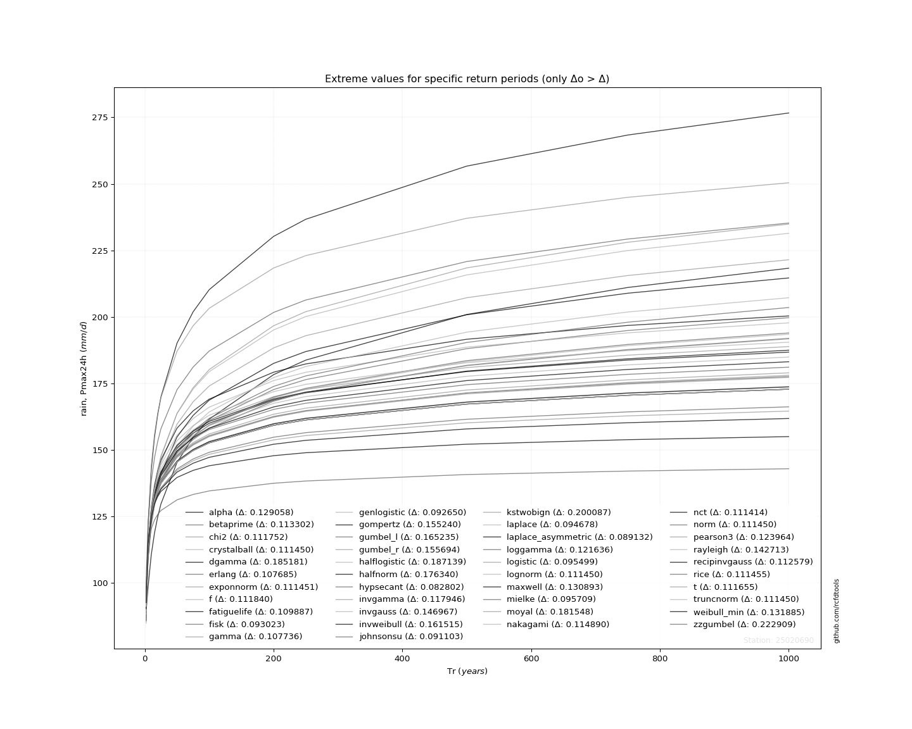</img>

</div>


<div align="center">

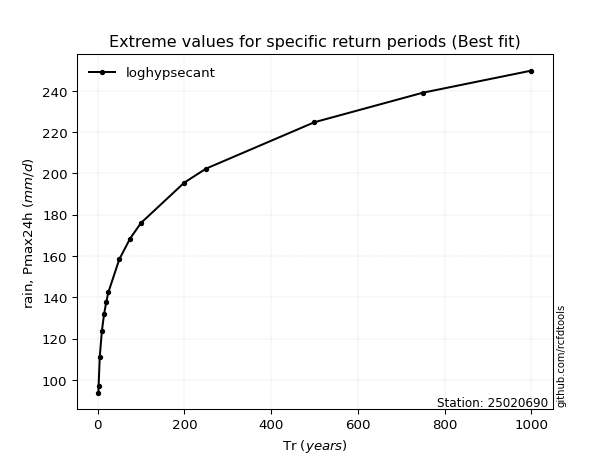</img>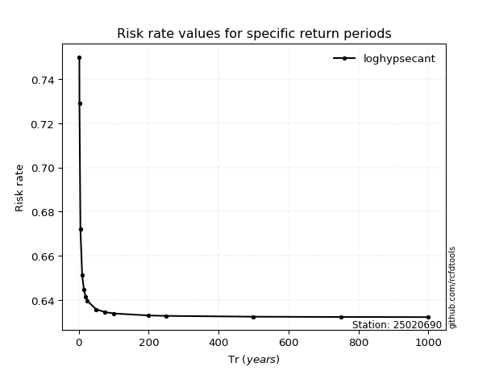</img>

</div>


<sub>**APP DISCLAIMER**: NO WARRANTY - This software is provided by [github.com/rcfdtools](https://github.com/rcfdtools) "as is", without any express or implied warranty, including warranties of merchantability, fitness for a particular purpose, or non-infringement. There is no guarantee that the software will be error-free or operate without interruption. LIMITATION OF LIABILITY - Neither the authors nor copyright holders will be liable for claims or damages arising from the software or its use. You are responsible for determining if the software is appropriate for your use and assume all associated risks, including errors, legal compliance, and data loss. NO PROFESSIONAL ADVICE - The software provides general information and does not offer professional advice. It should not replace consultation with professional advisors.</sub>