<div align="center">


</div>

# Station (rain, Pmax24h): 25020920

Probable Maximum Precipitation (PMP) is the greatest amount of rainfall for a specific duration that is meteorologically possible for a given location, acting as a "worst-case" scenario for extreme storms, crucial for designing safety-critical infrastructure like bridges, river deviations, dams, spillways, and nuclear plants to prevent catastrophic failure. PMP is calculated by hydrologists using meteorological data to determine the upper limit of extreme rainfall, often leading to the Probable Maximum Flood (PMF) for flood control design, and is increasingly being studied for climate change impacts.

<div align="center">

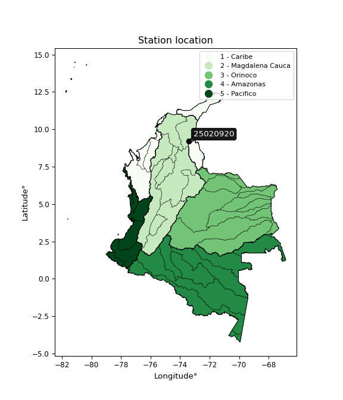</img>

</div>


## A. General information


### 1. General running parameters

• app_version: _v20251225_. • runtime: _2025-12-26 15:25:57.471855_. • Python version: _3.14.0_. • SciPy version: _1.16.3_. • Pandas version: _2.3.3_. • NumPy version: _2.3.5_. • Stations dataset (station_dataset_file): _dataset/pmax24h_in/conventional_cesarcolombia_1970_2021.csv_. • Stations catalog (station_catalog_file): _dataset/CNE_IDEAM.xls_. • Minimum year to eval til year_max (date_min): _1970_. • Maximum year to eval since year_min (date_max): _2021_. • Creates, save and include plots into reports (create_plot): _True_. • Plot only fit distributions with Δo > Δ (plot_only_fit): _True_. • Eval low extreme values, if False, evaluates high extreme values (low_extreme): _False_. • Eval every SciPy distribution as logarithmic (pdist_logarithmic_on): _True_. • Standard deviation normalized (ddof): _1.0_. • Return periods to eval in years (Tr): _[2, 2.33, 5, 10, 15, 20, 25, 50, 75, 100, 200, 250, 500, 750, 1000]_. • Minimum data sample per station, 0 means any (minimum_sample): _5_. • Z-Score threshold to adjust a value, 0 means disable (zscore): _3.5_. • Avoid zeros, e.g. rain = 0 (avoid_zeros): _True_. • Avoid null values (avoid_nans): _True_. [:file_folder:Dataset file.](../../dataset/pmax24h_in/conventional_cesarcolombia_1970_2021.csv)


### 2. Station info and location

|   id |   CODIGO | NOMBRE                  | CATEGORIA     | TECNOLOGIA   | ESTADO     | FECHA_INSTALACION   | FECHA_SUSPENSION   |   ALTITUD |   LATITUD |   LONGITUD | DEPARTAMENTO   | MUNICIPIO   | AREA_OPERATIVA                                         | ENTIDAD                                                     | AREA_HIDROGRAFICA   | ZONA_HIDROGRAFICA   | SUBZONA_HIDROGRAFICA   |   CORRIENTE | OBSERVACION                                                                                                                                                         |   SUBRED | Catalogo   |
|-----:|---------:|:------------------------|:--------------|:-------------|:-----------|:--------------------|:-------------------|----------:|----------:|-----------:|:---------------|:------------|:-------------------------------------------------------|:------------------------------------------------------------|:--------------------|:--------------------|:-----------------------|------------:|:--------------------------------------------------------------------------------------------------------------------------------------------------------------------|---------:|:-----------|
|    0 | 25020920 | PRIMAVERA LA [25020920] | Pluviométrica | Convencional | Suspendida | 15/09/1972          | 02/07/2019         |       500 |   9.21667 |   -73.4167 | Cesar          | Curumaní    | Area Operativa 05 - Magdalena-Cesar-Guajira-San Andrés | INSTITUTO DE HIDROLOGIA METEOROLOGIA Y ESTUDIOS AMBIENTALES | Magdalena Cauca     | Cesar               | Bajo Cesar             |         nan | De acuerdo con el orfeo 20187050000733 enviado por el coordinador del área operativa 05, donde pide poner en estado suspendido varias estaciones de su jurisdicción |      nan | CNE_IDEAM  |

<div align="center">

Map location in: [:earth_americas:Google](http://maps.google.com/maps?q=9.216666667,-73.41666667) [:earth_americas:OSM](https://www.openstreetmap.org/#map=18/9.216666667/-73.41666667&layers=P) [:earth_americas:Bing](https://www.bing.com/maps?cp=9.216666667~-73.41666667&lvl=18) [:earth_americas:Apple](https://maps.apple.com/frame?center=9.216666667%2C-73.41666667&span=0.003%2C0.006)

</div>


<div align="center">

```geojson
{
  "type": "Feature",
  "geometry": {
    "type": "Point", 
    "coordinates": [-73.41666667, 9.216666667]
  }, 
  "properties": {
    "Name": "25020920"
  }
}
```

</div>


### 3. Discrete values table and plot

|               |           0 |            1 |           2 |          3 |          4 |           5 |           6 |           7 |          8 |           9 |         10 |          11 |          12 |         13 |         14 |          15 |          16 |          17 |        18 |          19 |        20 |         21 |        22 |          23 |          24 |          25 |          26 |          27 |          28 |          29 |         30 |         31 |          32 |         33 |         34 |           35 |         36 |          37 |         38 |         39 |         40 |          41 |          42 |          43 |          44 |          45 |           46 |           47 |          48 |          49 |           50 |           51 |
|:--------------|------------:|-------------:|------------:|-----------:|-----------:|------------:|------------:|------------:|-----------:|------------:|-----------:|------------:|------------:|-----------:|-----------:|------------:|------------:|------------:|----------:|------------:|----------:|-----------:|----------:|------------:|------------:|------------:|------------:|------------:|------------:|------------:|-----------:|-----------:|------------:|-----------:|-----------:|-------------:|-----------:|------------:|-----------:|-----------:|-----------:|------------:|------------:|------------:|------------:|------------:|-------------:|-------------:|------------:|------------:|-------------:|-------------:|
| Date          | 1970        | 1971         | 1972        | 1973       | 1974       | 1975        | 1976        | 1977        | 1978       | 1979        | 1980       | 1981        | 1982        | 1983       | 1984       | 1985        | 1986        | 1987        | 1988      | 1989        | 1990      | 1991       | 1992      | 1993        | 1994        | 1995        | 1996        | 1997        | 1998        | 1999        | 2000       | 2001       | 2002        | 2003       | 2004       | 2005         | 2006       | 2007        | 2008       | 2009       | 2010       | 2011        | 2012        | 2013        | 2014        | 2015        | 2016         | 2017         | 2018        | 2019        | 2020         | 2021         |
| Value         |  116.485    |  104.144     |   90.1444   |  173       |   86       |  101        |   99        |   98.3419   |  160       |  122        |  107.12    |  126        |  125        |   75       |   65       |  115        |  120        |  115        |   60      |  100        |   60      |   50       |   60      |  120        |   90        |   80        |  120        |   90        |   70        |  140        |  150       |  150       |  120        |  150       |  203       |  109.721     |  150       |   80        |   20       |   75       |   75       |   80        |   80        |  112.023    |  118.059    |   90.7596   |  106.513     |  109.956     |  101.878    |  100.274    |  105.432     |  103.535     |
| Value_initial |  116.485    |  104.144     |   90.1444   |  173       |   86       |  101        |   99        |   98.3419   |  160       |  122        |  248       |  126        |  125        |   75       |   65       |  115        |  120        |  115        |   60      |  100        |   60      |   50       |   60      |  120        |   90        |   80        |  120        |   90        |   70        |  140        |  150       |  150       |  120        |  150       |  203       |  109.721     |  150       |   80        |   20       |   75       |   75       |   80        |   80        |  112.023    |  118.059    |   90.7596   |  106.513     |  109.956     |  101.878    |  100.274    |  105.432     |  103.535     |
| count         |   52        |   52         |   52        |   52       |   52       |   52        |   52        |   52        |   52       |   52        |   52       |   52        |   52        |   52       |   52       |   52        |   52        |   52        |   52      |   52        |   52      |   52       |   52      |   52        |   52        |   52        |   52        |   52        |   52        |   52        |   52       |   52       |   52        |   52       |   52       |   52         |   52       |   52        |   52       |   52       |   52       |   52        |   52        |   52        |   52        |   52        |   52         |   52         |   52        |   52        |   52         |   52         |
| mean          |  107.12     |  107.12      |  107.12     |  107.12    |  107.12    |  107.12     |  107.12     |  107.12     |  107.12    |  107.12     |  107.12    |  107.12     |  107.12     |  107.12    |  107.12    |  107.12     |  107.12     |  107.12     |  107.12   |  107.12     |  107.12   |  107.12    |  107.12   |  107.12     |  107.12     |  107.12     |  107.12     |  107.12     |  107.12     |  107.12     |  107.12    |  107.12    |  107.12     |  107.12    |  107.12    |  107.12      |  107.12    |  107.12     |  107.12    |  107.12    |  107.12    |  107.12     |  107.12     |  107.12     |  107.12     |  107.12     |  107.12      |  107.12      |  107.12     |  107.12     |  107.12      |  107.12      |
| std           |   38.3904   |   38.3904    |   38.3904   |   38.3904  |   38.3904  |   38.3904   |   38.3904   |   38.3904   |   38.3904  |   38.3904   |   38.3904  |   38.3904   |   38.3904   |   38.3904  |   38.3904  |   38.3904   |   38.3904   |   38.3904   |   38.3904 |   38.3904   |   38.3904 |   38.3904  |   38.3904 |   38.3904   |   38.3904   |   38.3904   |   38.3904   |   38.3904   |   38.3904   |   38.3904   |   38.3904  |   38.3904  |   38.3904   |   38.3904  |   38.3904  |   38.3904    |   38.3904  |   38.3904   |   38.3904  |   38.3904  |   38.3904  |   38.3904   |   38.3904   |   38.3904   |   38.3904   |   38.3904   |   38.3904    |   38.3904    |   38.3904   |   38.3904   |   38.3904    |   38.3904    |
| zscore        |    0.243921 |   -0.0775282 |   -0.442197 |    1.71604 |   -0.55015 |   -0.159427 |   -0.211524 |   -0.228667 |    1.37741 |    0.387584 |    3.66965 |    0.491777 |    0.465729 |   -0.83668 |   -1.09716 |    0.205247 |    0.335488 |    0.205247 |   -1.2274 |   -0.185476 |   -1.2274 |   -1.48788 |   -1.2274 |    0.335488 |   -0.445957 |   -0.706439 |    0.335488 |   -0.445957 |   -0.966921 |    0.856451 |    1.11693 |    1.11693 |    0.335488 |    1.11693 |    2.49749 |    0.0677312 |    1.11693 |   -0.706439 |   -2.26933 |   -0.83668 |   -0.83668 |   -0.706439 |   -0.706439 |    0.127709 |    0.284917 |   -0.426171 |   -0.0158272 |    0.0738592 |   -0.136558 |   -0.178341 |   -0.0439882 |   -0.0933834 |

<div align="center">

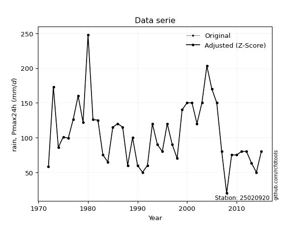</img>

</div>

> If Z-Score is active, values out of range or outliers are replaced with the station mean value.


### 4. Active continuous probability distributions from SciPy (45 of 104 available)

[scipy.stats](https://docs.scipy.org/doc/scipy/reference/stats.html) is a Python´s powerful submodule within the SciPy library for comprehensive statistical analysis, offering over 130 probability distributions (like Normal, Poisson), functions for descriptive stats (mean, variance), hypothesis testing (t-tests, chi-square), random variable generation, and statistical tests, making it essential for data science, modeling, and research. It provides tools to explore, model, and draw conclusions from data efficiently, working seamlessly with NumPy.

<div align="center">

|   id | p_dist             |   n_parameter | fit_method   | label                                                                       | active   | ref                                                                                                        |
|-----:|:-------------------|--------------:|:-------------|:----------------------------------------------------------------------------|:---------|:-----------------------------------------------------------------------------------------------------------|
|    0 | alpha              |             3 | MLE          | Alpha                                                                       | True     | [:mortar_board:](https://docs.scipy.org/doc/scipy/reference/generated/scipy.stats.alpha.html)              |
|    1 | betaprime          |             4 | MLE          | Beta prime                                                                  | True     | [:mortar_board:](https://docs.scipy.org/doc/scipy/reference/generated/scipy.stats.betaprime.html)          |
|    2 | chi2               |             3 | MLE          | Chi²                                                                        | True     | [:mortar_board:](https://docs.scipy.org/doc/scipy/reference/generated/scipy.stats.chi2.html)               |
|    3 | crystalball        |             4 | MLE          | Crystalball                                                                 | True     | [:mortar_board:](https://docs.scipy.org/doc/scipy/reference/generated/scipy.stats.crystalball.html)        |
|    4 | erlang             |             3 | MLE          | Erlang                                                                      | True     | [:mortar_board:](https://docs.scipy.org/doc/scipy/reference/generated/scipy.stats.erlang.html)             |
|    5 | expon              |             2 | MLE          | Exponential                                                                 | True     | [:mortar_board:](https://docs.scipy.org/doc/scipy/reference/generated/scipy.stats.expon.html)              |
|    6 | exponnorm          |             3 | MLE          | Exponentially modified Normal                                               | True     | [:mortar_board:](https://docs.scipy.org/doc/scipy/reference/generated/scipy.stats.exponnorm.html)          |
|    7 | f                  |             4 | MLE          | F                                                                           | True     | [:mortar_board:](https://docs.scipy.org/doc/scipy/reference/generated/scipy.stats.f.html)                  |
|    8 | fatiguelife        |             3 | MLE          | Fatigue-life (Birnbaum-Saunders)                                            | True     | [:mortar_board:](https://docs.scipy.org/doc/scipy/reference/generated/scipy.stats.fatiguelife.html)        |
|    9 | fisk               |             3 | MLE          | Fisk                                                                        | True     | [:mortar_board:](https://docs.scipy.org/doc/scipy/reference/generated/scipy.stats.fisk.html)               |
|   10 | gamma              |             3 | MLE          | Gamma                                                                       | True     | [:mortar_board:](https://docs.scipy.org/doc/scipy/reference/generated/scipy.stats.gamma.html)              |
|   11 | genexpon           |             5 | MLE          | Generalized exponential                                                     | True     | [:mortar_board:](https://docs.scipy.org/doc/scipy/reference/generated/scipy.stats.genexpon.html)           |
|   12 | genlogistic        |             3 | MLE          | Generalized logistic                                                        | True     | [:mortar_board:](https://docs.scipy.org/doc/scipy/reference/generated/scipy.stats.genlogistic.html)        |
|   13 | gibrat             |             2 | MM           | Gibrat                                                                      | True     | [:mortar_board:](https://docs.scipy.org/doc/scipy/reference/generated/scipy.stats.gibrat.html)             |
|   14 | gompertz           |             3 | MLE          | Gompertz (or truncated Gumbel)                                              | True     | [:mortar_board:](https://docs.scipy.org/doc/scipy/reference/generated/scipy.stats.gompertz.html)           |
|   15 | gumbel_l           |             2 | MM           | Gumbel Left Skew                                                            | True     | [:mortar_board:](https://docs.scipy.org/doc/scipy/reference/generated/scipy.stats.gumbel_l.html)           |
|   16 | gumbel_r           |             2 | MM           | Gumbel Right Skew                                                           | True     | [:mortar_board:](https://docs.scipy.org/doc/scipy/reference/generated/scipy.stats.gumbel_r.html)           |
|   17 | halflogistic       |             2 | MM           | Half-logistic                                                               | True     | [:mortar_board:](https://docs.scipy.org/doc/scipy/reference/generated/scipy.stats.halflogistic.html)       |
|   18 | halfnorm           |             2 | MM           | Half Normal                                                                 | True     | [:mortar_board:](https://docs.scipy.org/doc/scipy/reference/generated/scipy.stats.halfnorm.html)           |
|   19 | hypsecant          |             2 | MM           | hyperbolic secant                                                           | True     | [:mortar_board:](https://docs.scipy.org/doc/scipy/reference/generated/scipy.stats.hypsecant.html)          |
|   20 | invgamma           |             3 | MLE          | Inverted gamma                                                              | True     | [:mortar_board:](https://docs.scipy.org/doc/scipy/reference/generated/scipy.stats.invgamma.html)           |
|   21 | invgauss           |             3 | MLE          | Inverse Gaussian                                                            | True     | [:mortar_board:](https://docs.scipy.org/doc/scipy/reference/generated/scipy.stats.invgauss.html)           |
|   22 | invweibull         |             3 | MLE          | Inverted Weibull                                                            | True     | [:mortar_board:](https://docs.scipy.org/doc/scipy/reference/generated/scipy.stats.invweibull.html)         |
|   23 | johnsonsu          |             4 | MLE          | Johnson Su                                                                  | True     | [:mortar_board:](https://docs.scipy.org/doc/scipy/reference/generated/scipy.stats.johnsonsu.html)          |
|   24 | kstwobign          |             2 | MLE          | Limiting distribution of scaled Kolmogorov-Smirnov two-sided test statistic | True     | [:mortar_board:](https://docs.scipy.org/doc/scipy/reference/generated/scipy.stats.kstwobign.html)          |
|   25 | laplace            |             2 | MM           | Laplace                                                                     | True     | [:mortar_board:](https://docs.scipy.org/doc/scipy/reference/generated/scipy.stats.laplace.html)            |
|   26 | laplace_asymmetric |             3 | MLE          | Asymmetric Laplace                                                          | True     | [:mortar_board:](https://docs.scipy.org/doc/scipy/reference/generated/scipy.stats.laplace_asymmetric.html) |
|   27 | loggamma           |             3 | MLE          | Log gamma                                                                   | True     | [:mortar_board:](https://docs.scipy.org/doc/scipy/reference/generated/scipy.stats.loggamma.html)           |
|   28 | logistic           |             2 | MM           | Logistic (or Sech-squared)                                                  | True     | [:mortar_board:](https://docs.scipy.org/doc/scipy/reference/generated/scipy.stats.logistic.html)           |
|   29 | lognorm            |             3 | MLE          | Log Normal                                                                  | True     | [:mortar_board:](https://docs.scipy.org/doc/scipy/reference/generated/scipy.stats.lognorm.html)            |
|   30 | maxwell            |             2 | MM           | Maxwell                                                                     | True     | [:mortar_board:](https://docs.scipy.org/doc/scipy/reference/generated/scipy.stats.maxwell.html)            |
|   31 | mielke             |             4 | MLE          | Mielke Beta-Kappa / Dagum                                                   | True     | [:mortar_board:](https://docs.scipy.org/doc/scipy/reference/generated/scipy.stats.mielke.html)             |
|   32 | moyal              |             2 | MM           | Moyal                                                                       | True     | [:mortar_board:](https://docs.scipy.org/doc/scipy/reference/generated/scipy.stats.moyal.html)              |
|   33 | nakagami           |             3 | MLE          | Nakagami                                                                    | True     | [:mortar_board:](https://docs.scipy.org/doc/scipy/reference/generated/scipy.stats.nakagami.html)           |
|   34 | ncf                |             5 | MLE          | Non-central F distribution                                                  | True     | [:mortar_board:](https://docs.scipy.org/doc/scipy/reference/generated/scipy.stats.ncf.html)                |
|   35 | nct                |             4 | MLE          | Non-central Student’s t                                                     | True     | [:mortar_board:](https://docs.scipy.org/doc/scipy/reference/generated/scipy.stats.nct.html)                |
|   36 | norm               |             2 | MM           | Normal                                                                      | True     | [:mortar_board:](https://docs.scipy.org/doc/scipy/reference/generated/scipy.stats.norm.html)               |
|   37 | pareto             |             3 | MLE          | Pareto                                                                      | True     | [:mortar_board:](https://docs.scipy.org/doc/scipy/reference/generated/scipy.stats.pareto.html)             |
|   38 | pearson3           |             3 | MM           | Pearson type III                                                            | True     | [:mortar_board:](https://docs.scipy.org/doc/scipy/reference/generated/scipy.stats.pearson3.html)           |
|   39 | rayleigh           |             2 | MM           | Rayleigh                                                                    | True     | [:mortar_board:](https://docs.scipy.org/doc/scipy/reference/generated/scipy.stats.rayleigh.html)           |
|   40 | rice               |             3 | MLE          | Rice                                                                        | True     | [:mortar_board:](https://docs.scipy.org/doc/scipy/reference/generated/scipy.stats.rice.html)               |
|   41 | t                  |             3 | MLE          | Student’s t                                                                 | True     | [:mortar_board:](https://docs.scipy.org/doc/scipy/reference/generated/scipy.stats.t.html)                  |
|   42 | truncnorm          |             4 | MLE          | Truncated normal                                                            | True     | [:mortar_board:](https://docs.scipy.org/doc/scipy/reference/generated/scipy.stats.truncnorm.html)          |
|   43 | wald               |             2 | MM           | Wald                                                                        | True     | [:mortar_board:](https://docs.scipy.org/doc/scipy/reference/generated/scipy.stats.wald.html)               |
|   44 | weibull_min        |             3 | MLE          | Weibull minimum                                                             | True     | [:mortar_board:](https://docs.scipy.org/doc/scipy/reference/generated/scipy.stats.weibull_min.html)        |

</div>

> **n_parameter:** # arguments & localization & scale.
>
> **Fit methods:** (MLE) maximum likelihood, (MM) L-moments.
>
>**Inactive:** foldnorm, gennorm, norminvgauss, powernorm, powerlognorm, skewnorm, genextreme, anglit, arcsine, argus, beta, bradford, burr, burr12, cauchy, cosine, halfcauchy, foldcauchy, skewcauchy, wrapcauchy, dgamma, gengamma, exponweib, exponpow, truncexpon, gausshyper, genhalflogistic, genhyperbolic, geninvgauss, halfgennorm, johnsonsb, kappa4, kappa3, ksone, kstwo, loglaplace, levy, levy_l, levy_stable, ncx2, genpareto, truncpareto, lomax, powerlaw, rdist, rel_breitwigner, recipinvgauss, semicircular, studentized_range, trapezoid, triang, truncweibull_min, tukeylambda, uniform, loguniform, vonmises, vonmises_line, weibull_max, dweibull, 


## B. Probability distributions vs. Empirical distributions

A continuous probability distribution (CPD) describes probabilities for variables that can take any value within a range (like rain any time), unlike discrete variables with specific outcomes (like temperature). It uses a Probability Density Function (PDF), a curve where the total area under it equals 1, and the probability of the variable falling within an interval (a to b) is found by calculating the area under the curve between those points. A key feature is that the probability of hitting any single exact value is zero, so probabilities are always expressed for ranges, e.g., $P(a ≤ X ≤ b)$.

<div align="center">

Distributions parameters
|    |   station | p_dist                |   n |               loc |            scale | shape                 | shape1             | shape2                | shape3   |
|---:|----------:|:----------------------|----:|------------------:|-----------------:|:----------------------|:-------------------|:----------------------|:---------|
|  0 |  25020920 | alpha                 |  52 |    -492.29        |  11046.3         | 18.568994549547945    |                    |                       |          |
|  1 |  25020920 | betaprime             |  52 |     -66.809       |  24103.2         | 27.55966711467491     | 3868.4859252810134 |                       |          |
|  2 |  25020920 | chi2                  |  52 |    -178.419       |      1.85776     | 152.2325886302167     |                    |                       |          |
|  3 |  25020920 | crystalball           |  52 |     104.411       |     32.5033      | 6533.636529752919     | 14571.487068393006 |                       |          |
|  4 |  25020920 | erlang                |  52 |    -181.023       |      3.68204     | 77.52059941661759     |                    |                       |          |
|  5 |  25020920 | expon                 |  52 |      20           |     84.4113      |                       |                    |                       |          |
|  6 |  25020920 | exponnorm             |  52 |      84.7577      |     25.8745      | 0.7595757113681635    |                    |                       |          |
|  7 |  25020920 | f                     |  52 |    -181.259       |    285.665       | 155.4934630452004     | 124644.36014262738 |                       |          |
|  8 |  25020920 | fatiguelife           |  52 |    -302.085       |    405.21        | 0.07969928017705027   |                    |                       |          |
|  9 |  25020920 | fisk                  |  52 |    -236.791       |    339.629       | 19.14032667793081     |                    |                       |          |
| 10 |  25020920 | gamma                 |  52 |    -181.022       |      3.68205     | 77.52031717056585     |                    |                       |          |
| 11 |  25020920 | genexpon              |  52 |       1.46042     |      2.37501     | 1.15288463299486e-05  | 0.761250286114536  | 0.0012917906707643426 |          |
| 12 |  25020920 | genlogistic           |  52 |      93.2218      |     19.8805      | 1.4423713380509757    |                    |                       |          |
| 13 |  25020920 | gibrat                |  52 |      79.6153      |     15.0395      |                       |                    |                       |          |
| 14 |  25020920 | gompertz              |  52 |      20           |     42.4514      | 0.10970239209340303   |                    |                       |          |
| 15 |  25020920 | gumbel_l              |  52 |     119.039       |     25.3428      |                       |                    |                       |          |
| 16 |  25020920 | gumbel_r              |  52 |      89.783       |     25.3428      |                       |                    |                       |          |
| 17 |  25020920 | halflogistic          |  52 |      65.8872      |     27.7892      |                       |                    |                       |          |
| 18 |  25020920 | halfnorm              |  52 |      61.3895      |     53.9197      |                       |                    |                       |          |
| 19 |  25020920 | hypsecant             |  52 |     104.411       |     20.6923      |                       |                    |                       |          |
| 20 |  25020920 | invgamma              |  52 |    -266.436       |  48871.1         | 132.80578034166695    |                    |                       |          |
| 21 |  25020920 | invgauss              |  52 |     -29.5421      |   1894.28        | 0.0703548882607298    |                    |                       |          |
| 22 |  25020920 | invweibull            |  52 |      -5.05329e+09 |      5.05329e+09 | 160223474.13248825    |                    |                       |          |
| 23 |  25020920 | johnsonsu             |  52 |      91.2353      |     52.665       | -0.41246151326179514  | 1.9067574485290009 |                       |          |
| 24 |  25020920 | kstwobign             |  52 |     -33.3829      |    159.377       |                       |                    |                       |          |
| 25 |  25020920 | laplace               |  52 |     104.411       |     22.9833      |                       |                    |                       |          |
| 26 |  25020920 | laplace_asymmetric    |  52 |     103.535       |     24.3634      | 0.9821931355832356    |                    |                       |          |
| 27 |  25020920 | loggamma              |  52 |   -7605.1         |   1099.98        | 1106.6881409874368    |                    |                       |          |
| 28 |  25020920 | logistic              |  52 |     104.411       |     17.92        |                       |                    |                       |          |
| 29 |  25020920 | lognorm               |  52 |    -289.933       |    393.017       | 0.08208908801420367   |                    |                       |          |
| 30 |  25020920 | maxwell               |  52 |      27.392       |     48.2647      |                       |                    |                       |          |
| 31 |  25020920 | mielke                |  52 |      -1.99469     |    122.759       | 3.6500136678098354    | 7.993901666637157  |                       |          |
| 32 |  25020920 | moyal                 |  52 |      85.8238      |     14.6316      |                       |                    |                       |          |
| 33 |  25020920 | nakagami              |  52 |      44.6826      |     68.2669      | 1.079546643485401     |                    |                       |          |
| 34 |  25020920 | ncf                   |  52 |      -0.0780747   |      2.917e-05   | 2.119056030193429e-06 | 13.855088863543088 | 6.628485992394183     |          |
| 35 |  25020920 | nct                   |  52 |      -0.155025    |     28.3453      | 30.79866073030155     | 3.599109470984713  |                       |          |
| 36 |  25020920 | norm                  |  52 |     104.411       |     32.5033      |                       |                    |                       |          |
| 37 |  25020920 | pareto                |  52 |      -1.71799e+10 |      1.71799e+10 | 203525796.03006458    |                    |                       |          |
| 38 |  25020920 | pearson3              |  52 |     104.411       |     32.5034      | 0.3604241190674795    |                    |                       |          |
| 39 |  25020920 | rayleigh              |  52 |      42.2304      |     49.6131      |                       |                    |                       |          |
| 40 |  25020920 | rice                  |  52 |       4.98559     |     33.8757      | 2.7449779931139187    |                    |                       |          |
| 41 |  25020920 | t                     |  52 |     103.286       |     27.0784      | 6.181742616014375     |                    |                       |          |
| 42 |  25020920 | truncnorm             |  52 |     104.411       |     32.5033      | -456.3609000500935    | 229.9995011064932  |                       |          |
| 43 |  25020920 | wald                  |  52 |      71.9079      |     32.5033      |                       |                    |                       |          |
| 44 |  25020920 | weibull_min           |  52 |      45.3061      |     68.1355      | 2.0633264204840813    |                    |                       |          |
| 45 |  25020920 | logalpha              |  52 |      -9.687       |    525.559       | 36.872862584410115    |                    |                       |          |
| 46 |  25020920 | logbetaprime          |  52 |      -8.55688     |      1.81125     | 9190.658022658125     | 1267.622807623221  |                       |          |
| 47 |  25020920 | logchi2               |  52 |       2.99573     |      0.892938    | 1.123605047647926     |                    |                       |          |
| 48 |  25020920 | logcrystalball        |  52 |       4.59153     |      0.363584    | 57.69304518915694     | 2098.6430841660303 |                       |          |
| 49 |  25020920 | logerlang             |  52 |      -1.83231     |      0.0224971   | 285.2675344901827     |                    |                       |          |
| 50 |  25020920 | logexpon              |  52 |       2.99573     |      1.59579     |                       |                    |                       |          |
| 51 |  25020920 | logexponnorm          |  52 |       4.5913      |      0.363582    | 0.0006085517163909784 |                    |                       |          |
| 52 |  25020920 | logf                  |  52 |    -862.837       |    867.429       | 33513279.85503949     | 17177439.43601485  |                       |          |
| 53 |  25020920 | logfatiguelife        |  52 |    -268.057       |    272.648       | 0.0013295533922968554 |                    |                       |          |
| 54 |  25020920 | logfisk               |  52 |      -3.2295e+07  |      3.2295e+07  | 175895921.66905236    |                    |                       |          |
| 55 |  25020920 | loggamma              |  52 |      -2.2038      |      0.0219147   | 309.940347218807      |                    |                       |          |
| 56 |  25020920 | loggenexpon           |  52 |       2.99573     |      0.991593    | 0.03379412498604912   | 1.3272071345147287 | 0.6701545478808133    |          |
| 57 |  25020920 | loggenlogistic        |  52 |       4.79241     |      0.127345    | 0.4626743208238543    |                    |                       |          |
| 58 |  25020920 | loggibrat             |  52 |       4.31417     |      0.168223    |                       |                    |                       |          |
| 59 |  25020920 | loggompertz           |  52 |       2.99572     |      0.296846    | 0.0027124758024747713 |                    |                       |          |
| 60 |  25020920 | loggumbel_l           |  52 |       4.75516     |      0.283485    |                       |                    |                       |          |
| 61 |  25020920 | loggumbel_r           |  52 |       4.42789     |      0.283485    |                       |                    |                       |          |
| 62 |  25020920 | loghalflogistic       |  52 |       4.16056     |      0.310875    |                       |                    |                       |          |
| 63 |  25020920 | loghalfnorm           |  52 |       4.11031     |      0.60312     |                       |                    |                       |          |
| 64 |  25020920 | loghypsecant          |  52 |       4.59153     |      0.231465    |                       |                    |                       |          |
| 65 |  25020920 | loginvgamma           |  52 |      -7.17408     |  11135.9         | 947.1147134957882     |                    |                       |          |
| 66 |  25020920 | loginvgauss           |  52 |      -0.397457    |    720.33        | 0.00691215816068806   |                    |                       |          |
| 67 |  25020920 | loginvweibull         |  52 | -717416           | 717421           | 1361392.2950225975    |                    |                       |          |
| 68 |  25020920 | logjohnsonsu          |  52 |       4.77721     |      0.338263    | 0.559868961501045     | 1.3803471180768785 |                       |          |
| 69 |  25020920 | logkstwobign          |  52 |       2.14575     |      2.8578      |                       |                    |                       |          |
| 70 |  25020920 | loglaplace            |  52 |       4.59153     |      0.257093    |                       |                    |                       |          |
| 71 |  25020920 | loglaplace_asymmetric |  52 |       4.74493     |      0.232842    | 1.3822074043910433    |                    |                       |          |
| 72 |  25020920 | logloggamma           |  52 |       4.4701      |      0.407923    | 1.8173200899558162    |                    |                       |          |
| 73 |  25020920 | loglogistic           |  52 |       4.59153     |      0.200454    |                       |                    |                       |          |
| 74 |  25020920 | loglognorm            |  52 |  -32765           |  32769.6         | 1.10952589061427e-05  |                    |                       |          |
| 75 |  25020920 | logmaxwell            |  52 |       3.72997     |      0.539898    |                       |                    |                       |          |
| 76 |  25020920 | logmielke             |  52 |   -4644.89        |   4649.68        | 16874.601647259973    | 36443.27366925996  |                       |          |
| 77 |  25020920 | logmoyal              |  52 |       4.3836      |      0.16367     |                       |                    |                       |          |
| 78 |  25020920 | lognakagami           |  52 |       3.29233     |      1.36037     | 5.220629123843969     |                    |                       |          |
| 79 |  25020920 | logncf                |  52 |    -541.179       |    493.813       | 7489395.659932893     | 10973937.12980282  | 788001.0266636931     |          |
| 80 |  25020920 | lognct                |  52 |     -19.2007      |      0.301332    | 5998.067917390268     | 78.94591386311146  |                       |          |
| 81 |  25020920 | lognorm               |  52 |       4.59153     |      0.363584    |                       |                    |                       |          |
| 82 |  25020920 | logpareto             |  52 |      -1.34218e+08 |      1.34218e+08 | 84107225.00754336     |                    |                       |          |
| 83 |  25020920 | logpearson3           |  52 |       4.59153     |      0.363584    | -1.5476043322021358   |                    |                       |          |
| 84 |  25020920 | lograyleigh           |  52 |       3.89594     |      0.554996    |                       |                    |                       |          |
| 85 |  25020920 | logrice               |  52 |     -79.9498      |      0.363583    | 232.52036270471888    |                    |                       |          |
| 86 |  25020920 | logt                  |  52 |       4.59076     |      0.363309    | 9.128375016399694     |                    |                       |          |
| 87 |  25020920 | logtruncnorm          |  52 |       0.138295    |      2.42166     | 1.5580527420319705    | 2.1369302124222385 |                       |          |
| 88 |  25020920 | logwald               |  52 |       4.22797     |      0.363556    |                       |                    |                       |          |
| 89 |  25020920 | logweibull_min        |  52 |       2.99573     |      1.13066     | 0.8863509253331243    |                    |                       |          |

</div>

> **loc** (Location parameter): This shifts the distribution along the x-axis. For many common distributions, like the normal (Gaussian) distribution, loc represents the mean $μ$. For others, like the uniform distribution, it might represent the minimum value, or for the beta distribution, the left end of the support interval.
>
> **scale** (Scale parameter): This determines the width or spread of the distribution. For the normal distribution, scale represents the standard deviation $σ$. For a uniform distribution, it defines the length of the interval (from $loc$ to $loc + scale$).
>
> **shape** (Shape parameters): Refers to parameters that define the specific form of a probability distribution, distinct from its location (loc) and scale (scale). These parameters are required arguments for most distribution functions. For example, a normal (Gaussian) distribution is fully defined by its location (mean) and scale (standard deviation), so it has no specific shape parameters beyond loc and scale. However, other distributions have intrinsic properties that need specification, as Gamma distribution that takes a shape parameter, often named $a$ or $alpha$.


### 0. Cumulative distribution values - CDF (90 evaluated)

> Ordered by x ascending and calculating $log(f(x))$ separately. 

|   id |   Station |   date |        x |   count |   mean |     std |     zscore |   Value_initial |   station |   m |      alpha |   alpha_pdf |   betaprime |   betaprime_pdf |       chi2 |    chi2_pdf |   crystalball |   crystalball_pdf |     erlang |   erlang_pdf |    expon |   expon_pdf |   exponnorm |   exponnorm_pdf |          f |       f_pdf |   fatiguelife |   fatiguelife_pdf |       fisk |    fisk_pdf |      gamma |   gamma_pdf |   genexpon |   genexpon_pdf |   genlogistic |   genlogistic_pdf |      gibrat |   gibrat_pdf |    gompertz |   gompertz_pdf |   gumbel_l |   gumbel_l_pdf |    gumbel_r |   gumbel_r_pdf |   halflogistic |   halflogistic_pdf |   halfnorm |   halfnorm_pdf |   hypsecant |   hypsecant_pdf |   invgamma |   invgamma_pdf |    invgauss |   invgauss_pdf |   invweibull |   invweibull_pdf |   johnsonsu |   johnsonsu_pdf |   kstwobign |   kstwobign_pdf |   laplace |   laplace_pdf |   laplace_asymmetric |   laplace_asymmetric_pdf |    loggamma |   loggamma_pdf |   logistic |   logistic_pdf |     lognorm |   lognorm_pdf |   maxwell |   maxwell_pdf |     mielke |   mielke_pdf |       moyal |   moyal_pdf |   nakagami |   nakagami_pdf |      ncf |    ncf_pdf |        nct |     nct_pdf |       norm |    norm_pdf |      pareto |   pareto_pdf |    pearson3 |   pearson3_pdf |   rayleigh |   rayleigh_pdf |       rice |    rice_pdf |         t |       t_pdf |   truncnorm |   truncnorm_pdf |       wald |   wald_pdf |   weibull_min |   weibull_min_pdf |    logalpha |   logalpha_pdf |   logbetaprime |   logbetaprime_pdf |     logchi2 |   logchi2_pdf |   logcrystalball |   logcrystalball_pdf |   logerlang |   logerlang_pdf |   logexpon |   logexpon_pdf |   logexponnorm |   logexponnorm_pdf |        logf |    logf_pdf |   logfatiguelife |   logfatiguelife_pdf |     logfisk |   logfisk_pdf |   loggenexpon |   loggenexpon_pdf |   loggenlogistic |   loggenlogistic_pdf |   loggibrat |   loggibrat_pdf |   loggompertz |   loggompertz_pdf |   loggumbel_l |   loggumbel_l_pdf |   loggumbel_r |   loggumbel_r_pdf |   loghalflogistic |   loghalflogistic_pdf |   loghalfnorm |   loghalfnorm_pdf |   loghypsecant |   loghypsecant_pdf |   loginvgamma |   loginvgamma_pdf |   loginvgauss |   loginvgauss_pdf |   loginvweibull |   loginvweibull_pdf |   logjohnsonsu |   logjohnsonsu_pdf |   logkstwobign |   logkstwobign_pdf |   loglaplace |   loglaplace_pdf |   loglaplace_asymmetric |   loglaplace_asymmetric_pdf |   logloggamma |   logloggamma_pdf |   loglogistic |   loglogistic_pdf |   loglognorm |   loglognorm_pdf |   logmaxwell |   logmaxwell_pdf |   logmielke |   logmielke_pdf |    logmoyal |   logmoyal_pdf |   lognakagami |   lognakagami_pdf |      logncf |   logncf_pdf |      lognct |   lognct_pdf |   logpareto |   logpareto_pdf |   logpearson3 |   logpearson3_pdf |   lograyleigh |   lograyleigh_pdf |     logrice |   logrice_pdf |        logt |   logt_pdf |   logtruncnorm |   logtruncnorm_pdf |     logwald |   logwald_pdf |   logweibull_min |   logweibull_min_pdf |
|-----:|----------:|-------:|---------:|--------:|-------:|--------:|-----------:|----------------:|----------:|----:|-----------:|------------:|------------:|----------------:|-----------:|------------:|--------------:|------------------:|-----------:|-------------:|---------:|------------:|------------:|----------------:|-----------:|------------:|--------------:|------------------:|-----------:|------------:|-----------:|------------:|-----------:|---------------:|--------------:|------------------:|------------:|-------------:|------------:|---------------:|-----------:|---------------:|------------:|---------------:|---------------:|-------------------:|-----------:|---------------:|------------:|----------------:|-----------:|---------------:|------------:|---------------:|-------------:|-----------------:|------------:|----------------:|------------:|----------------:|----------:|--------------:|---------------------:|-------------------------:|------------:|---------------:|-----------:|---------------:|------------:|--------------:|----------:|--------------:|-----------:|-------------:|------------:|------------:|-----------:|---------------:|---------:|-----------:|-----------:|------------:|-----------:|------------:|------------:|-------------:|------------:|---------------:|-----------:|---------------:|-----------:|------------:|----------:|------------:|------------:|----------------:|-----------:|-----------:|--------------:|------------------:|------------:|---------------:|---------------:|-------------------:|------------:|--------------:|-----------------:|---------------------:|------------:|----------------:|-----------:|---------------:|---------------:|-------------------:|------------:|------------:|-----------------:|---------------------:|------------:|--------------:|--------------:|------------------:|-----------------:|---------------------:|------------:|----------------:|--------------:|------------------:|--------------:|------------------:|--------------:|------------------:|------------------:|----------------------:|--------------:|------------------:|---------------:|-------------------:|--------------:|------------------:|--------------:|------------------:|----------------:|--------------------:|---------------:|-------------------:|---------------:|-------------------:|-------------:|-----------------:|------------------------:|----------------------------:|--------------:|------------------:|--------------:|------------------:|-------------:|-----------------:|-------------:|-----------------:|------------:|----------------:|------------:|---------------:|--------------:|------------------:|------------:|-------------:|------------:|-------------:|------------:|----------------:|--------------:|------------------:|--------------:|------------------:|------------:|--------------:|------------:|-----------:|---------------:|-------------------:|------------:|--------------:|-----------------:|---------------------:|
|    0 |  25020920 |   2008 |  20      |      52 | 107.12 | 38.3904 | -2.26933   |         20      |  25020920 |   1 | 0.00137902 | 0.000190211 | 0.000837129 |     0.000139262 | 0.00198612 | 0.000246932 |    0.00470207 |       0.000421163 | 0.00200348 |  0.000248221 | 0        |  0.0118468  |  0.00186709 |     0.0002185   | 0.00200306 | 0.000248178 |     0.0019446 |       0.000242356 | 0.00471862 | 0.000350051 | 0.00200347 | 0.000248221 |  0.0295065 |     0.0031257  |    0.00475666 |       0.000336641 | 0           |  0           | 2.80608e-11 |    0.00258419  |  0.0198803 |    0.000776609 | 1.52126e-07 |    9.42342e-08 |       0        |        0           |  0         |    0           |   0.0107695 |     0.00052036  |  0.0011777 |    0.00017135  | 7.57038e-05 |    2.62996e-05 |   0.00015029 |      4.19478e-05 |  0.00571614 |     0.000350562 | 0.000125425 |     4.93241e-05 | 0.0127037 |   0.000552735 |            0.0149631 |              0.000625298 | 3.65488e-06 |    5.31874e-05 | 0.00892052 |    0.000493355 | 5.69201e-06 |   7.19795e-05 | 0         |   0           | 0.00188108 |  0.000312165 | 2.50197e-21 | 7.77022e-21 |  0         |    0           | 0.142942 | 0.00598371 | 0.00197591 | 0.000225879 | 0.00470207 | 0.000421163 | 4.51918e-08 |   0.0118468  | 0.000946312 |    0.000151546 |  0         |    0           | 0.00258038 | 0.000385291 | 0.0104826 | 0.000504694 |  0.00470207 |     0.000421163 | 0          | 0          |    0          |       0           | 2.48479e-06 |    3.87087e-05 |    6.67714e-06 |        9.09241e-05 | 1.92368e-09 |   2.43359e+06 |      5.69203e-06 |          7.19797e-05 | 2.44637e-06 |     3.72156e-05 |   0        |       0.626648 |    5.69143e-06 |        7.19729e-05 | 5.66326e-06 | 7.16926e-05 |      5.06078e-06 |          6.49103e-05 | 0.000144551 |   0.000787192 |   1.63583e-09 |         0.0340807 |       0.00146227 |           0.00531276 | 0           |       0         |   9.92144e-08 |        0.00913799 |    0.00201444 |        0.00709881 |   1.27727e-68 |       7.04362e-66 |         0         |              0        |     0         |          0        |    0.000645228 |         0.00278758 |   2.25622e-06 |       3.43243e-05 |   2.07921e-06 |       3.60905e-05 |     8.37583e-07 |         2.22403e-05 |     0.00344135 |         0.00788005 |    7.39586e-06 |        0.000233994 |   0.00100756 |       0.00391907 |              0.00286262 |                  0.00889465 |   0.000811153 |        0.00357927 |   0.000348725 |        0.00173906 |  5.69035e-06 |      7.19623e-05 |    0         |         0        |  0.00146892 |      0.00533305 | 0           |     0          |    0          |         0         | 5.99236e-06 |  7.55472e-05 | 5.84884e-06 |  7.54501e-05 | 1.86756e-08 |        0.626648 |    0.00296625 |        0.00969274 |   0           |          0        | 5.69141e-06 |   7.19727e-05 | 0.000843237 | 0.00340622 |    0           |           0        | 0           |     0         |       2.2131e-14 |            44.1709   |
|    1 |  25020920 |   1991 |  50      |      52 | 107.12 | 38.3904 | -1.48788   |         50      |  25020920 |   2 | 0.0358801  | 0.00296215  | 0.0335773   |     0.00295495  | 0.03915    | 0.00301488  |    0.0470633  |       0.00302316  | 0.0391851  |  0.00301252  | 0.299109 |  0.00830329 |  0.035075   |     0.00277351  | 0.0391821  | 0.00301245  |     0.0388056 |       0.00300354  | 0.037809   | 0.00242796  | 0.039185   | 0.00301252  |  0.184387  |     0.00681552 |    0.0372103  |       0.00242404  | 0           |  0           | 0.106576    |    0.00468051  |  0.0634915 |    0.00242404  | 0.00818313  |    0.00155175  |       0        |        0           |  0         |    0           |   0.0458281 |     0.0022071   |  0.0349299 |    0.00295564  | 0.0318416   |    0.00353351  |   0.0333609  |      0.0035968   |  0.0372099  |     0.00231599  | 0.0528435   |     0.00507907  | 0.046861  |   0.00203891  |            0.0524189 |              0.00219055  | 0.0362495   |    0.221101    | 0.045811   |    0.0024393   | 0.0308183   |   0.191362    | 0.0256042 |   0.00325036  | 0.0434508  |  0.00304706  | 0.000670413 | 0.000285091 |  0.0042223 |    0.00170905  | 0.330025 | 0.00616351 | 0.0360343  | 0.00283827  | 0.0470633  | 0.00302316  | 0.299109    |   0.00830329 | 0.0345095   |    0.00299365  |  0.0121874 |    0.00311802  | 0.0457377  | 0.00313368  | 0.0476129 | 0.0024676   |  0.0470633  |     0.00302316  | 0          | 0          |    0.00399836 |       0.00175405  | 0.0380358   |    0.235059    |    0.0401884   |        0.234583    | 0.649728    |   0.283542    |      0.0308184   |          0.191362    | 0.0345122   |     0.216498    |   0.43684  |       0.352903 |    0.0308178   |        0.191361    | 0.0307865   | 0.191135    |      0.0303095   |          0.189779    | 0.0208137   |   0.111003    |   0.290613    |         0.462515  |       0.0407978  |           0.148081   | 0           |       0         |   0.055131    |        0.18914    |    0.0498065  |        0.171244   |   0.00209067  |       0.0455051   |         0         |              0        |     0         |          0        |    0.03377     |         0.145623   |   0.0329795   |       0.208324    |   0.0446975   |       0.264045    |     0.0855184   |         0.399054    |     0.0406502  |         0.129734   |    0.160485    |        0.496041    |   0.0355729  |       0.138366   |              0.0493436  |                  0.153319   |   0.0415924   |        0.168954   |   0.0326154   |        0.157401   |  0.0308185   |      0.191365    |    0.0098557 |         0.158743 |  0.0408709  |      0.148208   | 2.40623e-05 |     0.00137813 |    0.00352496 |         0.0493218 | 0.0313393   |  0.193592    | 0.0328752   |  0.201206    | 0.43684     |        0.352903 |    0.0551556  |        0.169933   |   0.000419773 |          0.052191 | 0.0308179   |   0.191361    | 0.0470527   | 0.207325   |    0.000744883 |           1.12956  | 0           |     0         |       0.563951   |             0.350095 |
|    2 |  25020920 |   1988 |  60      |      52 | 107.12 | 38.3904 | -1.2274    |         60      |  25020920 |   3 | 0.0760983  | 0.00518343  | 0.0740738   |     0.00524286  | 0.0793042  | 0.00510761  |    0.0859131  |       0.00482593  | 0.0792956  |  0.00510113  | 0.377412 |  0.00737565 |  0.072891   |     0.00490666  | 0.0792924  | 0.00510116  |     0.078885  |       0.0051053   | 0.0703948  | 0.00422025  | 0.0792956  | 0.00510113  |  0.256104  |     0.0074759  |    0.0700293  |       0.00427658  | 0           |  0           | 0.157825    |    0.00558395  |  0.0927442 |    0.00348439  | 0.0392102   |    0.00501108  |       0        |        0           |  0         |    0           |   0.0740966 |     0.00354863  |  0.0752732 |    0.00521638  | 0.0819677   |    0.00656144  |   0.084043   |      0.006599    |  0.0686711  |     0.00411987  | 0.117648    |     0.00779481  | 0.0724056 |   0.00315035  |            0.0796116 |              0.00332692  | 0.0978228   |    0.470762    | 0.0773933  |    0.00398457  | 0.0857431   |   0.430785    | 0.0716498 |   0.00600599  | 0.0824532  |  0.004834    | 0.0156557   | 0.00355205  |  0.0404482 |    0.00555372  | 0.390389 | 0.00589239 | 0.0746172  | 0.00499041  | 0.0859131  | 0.00482593  | 0.377412    |   0.00737565 | 0.0754206   |    0.00528786  |  0.0621267 |    0.00677062  | 0.0859899  | 0.0049921   | 0.0797918 | 0.00408546  |  0.0859131  |     0.00482593  | 0          | 0          |    0.0413244  |       0.00568121  | 0.103354    |    0.497444    |    0.104096    |        0.481208    | 0.696945    |   0.236453    |      0.0857431   |          0.430785    | 0.0956195   |     0.471347    |   0.497642 |       0.314801 |    0.0857424   |        0.430785    | 0.0856362   | 0.430141    |      0.0849975   |          0.43004     | 0.0542646   |   0.279517    |   0.374996    |         0.459706  |       0.0790107  |           0.285875   | 0           |       0         |   0.101572    |        0.332382   |    0.0926214  |        0.311103   |   0.0390338   |       0.446582    |         0         |              0        |     0         |          0        |    0.0739716   |         0.316712   |   0.0920692   |       0.457492    |   0.115305    |       0.521893    |     0.17555     |         0.579586    |     0.0743164  |         0.254621   |    0.258802    |        0.572053    |   0.0722947  |       0.281201   |              0.086948   |                  0.270162   |   0.0856685   |        0.329774   |   0.077253    |        0.355617   |  0.0857442   |      0.430792    |    0.0714414 |         0.536029 |  0.0791022  |      0.285922   | 0.0155309   |     0.315694   |    0.0288292  |         0.27098   | 0.0867206   |  0.433328    | 0.0898805   |  0.442597    | 0.497642    |        0.314801 |    0.0961327  |        0.28937    |   0.0619      |          0.604255 | 0.0857426   |   0.430786    | 0.102266    | 0.416387   |    0.194888    |           1.00167  | 0           |     0         |       0.622747   |             0.296706 |
|    3 |  25020920 |   1992 |  60      |      52 | 107.12 | 38.3904 | -1.2274    |         60      |  25020920 |   4 | 0.0760983  | 0.00518343  | 0.0740738   |     0.00524286  | 0.0793042  | 0.00510761  |    0.0859131  |       0.00482593  | 0.0792956  |  0.00510113  | 0.377412 |  0.00737565 |  0.072891   |     0.00490666  | 0.0792924  | 0.00510116  |     0.078885  |       0.0051053   | 0.0703948  | 0.00422025  | 0.0792956  | 0.00510113  |  0.256104  |     0.0074759  |    0.0700293  |       0.00427658  | 0           |  0           | 0.157825    |    0.00558395  |  0.0927442 |    0.00348439  | 0.0392102   |    0.00501108  |       0        |        0           |  0         |    0           |   0.0740966 |     0.00354863  |  0.0752732 |    0.00521638  | 0.0819677   |    0.00656144  |   0.084043   |      0.006599    |  0.0686711  |     0.00411987  | 0.117648    |     0.00779481  | 0.0724056 |   0.00315035  |            0.0796116 |              0.00332692  | 0.0978228   |    0.470762    | 0.0773933  |    0.00398457  | 0.0857431   |   0.430785    | 0.0716498 |   0.00600599  | 0.0824532  |  0.004834    | 0.0156557   | 0.00355205  |  0.0404482 |    0.00555372  | 0.390389 | 0.00589239 | 0.0746172  | 0.00499041  | 0.0859131  | 0.00482593  | 0.377412    |   0.00737565 | 0.0754206   |    0.00528786  |  0.0621267 |    0.00677062  | 0.0859899  | 0.0049921   | 0.0797918 | 0.00408546  |  0.0859131  |     0.00482593  | 0          | 0          |    0.0413244  |       0.00568121  | 0.103354    |    0.497444    |    0.104096    |        0.481208    | 0.696945    |   0.236453    |      0.0857431   |          0.430785    | 0.0956195   |     0.471347    |   0.497642 |       0.314801 |    0.0857424   |        0.430785    | 0.0856362   | 0.430141    |      0.0849975   |          0.43004     | 0.0542646   |   0.279517    |   0.374996    |         0.459706  |       0.0790107  |           0.285875   | 0           |       0         |   0.101572    |        0.332382   |    0.0926214  |        0.311103   |   0.0390338   |       0.446582    |         0         |              0        |     0         |          0        |    0.0739716   |         0.316712   |   0.0920692   |       0.457492    |   0.115305    |       0.521893    |     0.17555     |         0.579586    |     0.0743164  |         0.254621   |    0.258802    |        0.572053    |   0.0722947  |       0.281201   |              0.086948   |                  0.270162   |   0.0856685   |        0.329774   |   0.077253    |        0.355617   |  0.0857442   |      0.430792    |    0.0714414 |         0.536029 |  0.0791022  |      0.285922   | 0.0155309   |     0.315694   |    0.0288292  |         0.27098   | 0.0867206   |  0.433328    | 0.0898805   |  0.442597    | 0.497642    |        0.314801 |    0.0961327  |        0.28937    |   0.0619      |          0.604255 | 0.0857426   |   0.430786    | 0.102266    | 0.416387   |    0.194888    |           1.00167  | 0           |     0         |       0.622747   |             0.296706 |
|    4 |  25020920 |   1990 |  60      |      52 | 107.12 | 38.3904 | -1.2274    |         60      |  25020920 |   5 | 0.0760983  | 0.00518343  | 0.0740738   |     0.00524286  | 0.0793042  | 0.00510761  |    0.0859131  |       0.00482593  | 0.0792956  |  0.00510113  | 0.377412 |  0.00737565 |  0.072891   |     0.00490666  | 0.0792924  | 0.00510116  |     0.078885  |       0.0051053   | 0.0703948  | 0.00422025  | 0.0792956  | 0.00510113  |  0.256104  |     0.0074759  |    0.0700293  |       0.00427658  | 0           |  0           | 0.157825    |    0.00558395  |  0.0927442 |    0.00348439  | 0.0392102   |    0.00501108  |       0        |        0           |  0         |    0           |   0.0740966 |     0.00354863  |  0.0752732 |    0.00521638  | 0.0819677   |    0.00656144  |   0.084043   |      0.006599    |  0.0686711  |     0.00411987  | 0.117648    |     0.00779481  | 0.0724056 |   0.00315035  |            0.0796116 |              0.00332692  | 0.0978228   |    0.470762    | 0.0773933  |    0.00398457  | 0.0857431   |   0.430785    | 0.0716498 |   0.00600599  | 0.0824532  |  0.004834    | 0.0156557   | 0.00355205  |  0.0404482 |    0.00555372  | 0.390389 | 0.00589239 | 0.0746172  | 0.00499041  | 0.0859131  | 0.00482593  | 0.377412    |   0.00737565 | 0.0754206   |    0.00528786  |  0.0621267 |    0.00677062  | 0.0859899  | 0.0049921   | 0.0797918 | 0.00408546  |  0.0859131  |     0.00482593  | 0          | 0          |    0.0413244  |       0.00568121  | 0.103354    |    0.497444    |    0.104096    |        0.481208    | 0.696945    |   0.236453    |      0.0857431   |          0.430785    | 0.0956195   |     0.471347    |   0.497642 |       0.314801 |    0.0857424   |        0.430785    | 0.0856362   | 0.430141    |      0.0849975   |          0.43004     | 0.0542646   |   0.279517    |   0.374996    |         0.459706  |       0.0790107  |           0.285875   | 0           |       0         |   0.101572    |        0.332382   |    0.0926214  |        0.311103   |   0.0390338   |       0.446582    |         0         |              0        |     0         |          0        |    0.0739716   |         0.316712   |   0.0920692   |       0.457492    |   0.115305    |       0.521893    |     0.17555     |         0.579586    |     0.0743164  |         0.254621   |    0.258802    |        0.572053    |   0.0722947  |       0.281201   |              0.086948   |                  0.270162   |   0.0856685   |        0.329774   |   0.077253    |        0.355617   |  0.0857442   |      0.430792    |    0.0714414 |         0.536029 |  0.0791022  |      0.285922   | 0.0155309   |     0.315694   |    0.0288292  |         0.27098   | 0.0867206   |  0.433328    | 0.0898805   |  0.442597    | 0.497642    |        0.314801 |    0.0961327  |        0.28937    |   0.0619      |          0.604255 | 0.0857426   |   0.430786    | 0.102266    | 0.416387   |    0.194888    |           1.00167  | 0           |     0         |       0.622747   |             0.296706 |
|    5 |  25020920 |   1984 |  65      |      52 | 107.12 | 38.3904 | -1.09716   |         65      |  25020920 |   6 | 0.105218   | 0.00647712  | 0.103541    |     0.0065541   | 0.107847   | 0.006322    |    0.112655   |       0.00588472  | 0.107801   |  0.00631352  | 0.413219 |  0.00695145 |  0.100619   |     0.00620421  | 0.107798   | 0.00631363  |     0.107433  |       0.00632667  | 0.0944158  | 0.00542272  | 0.107801   | 0.00631352  |  0.29405   |     0.00768982 |    0.0944268  |       0.0055168   | 0           |  0           | 0.18694     |    0.00606476  |  0.111801  |    0.00415519  | 0.070025    |    0.00734686  |       0        |        0           |  0.0533866 |    0.0147645   |   0.0940868 |     0.00448103  |  0.104608  |    0.00652976  | 0.11867     |    0.00810506  |   0.12083    |      0.00809659  |  0.0922767  |     0.005361    | 0.159416    |     0.00887176  | 0.0900021 |   0.00391597  |            0.0981118 |              0.00410003  | 0.140788    |    0.603921    | 0.0998147  |    0.00501404  | 0.12563     |   0.568169    | 0.105208  |   0.00740918  | 0.109255   |  0.00590582  | 0.0416252   | 0.00697296  |  0.0728765 |    0.00739368  | 0.419438 | 0.00572458 | 0.102752   | 0.00628089  | 0.112655   | 0.00588472  | 0.413219    |   0.00695145 | 0.105127    |    0.00660493  |  0.0999583 |    0.00832577  | 0.113606   | 0.00606614  | 0.102859  | 0.00517401  |  0.112655   |     0.00588472  | 0          | 0          |    0.0743225  |       0.00748993  | 0.148601    |    0.633785    |    0.147726    |        0.609766    | 0.71517     |   0.219228    |      0.12563     |          0.568169    | 0.13879     |     0.608606    |   0.522218 |       0.299401 |    0.125629    |        0.56817     | 0.125461    | 0.567258    |      0.124858    |          0.568289    | 0.0815004   |   0.407718    |   0.411528    |         0.452576  |       0.105501   |           0.380343   | 0           |       0         |   0.131596    |        0.420709   |    0.120943   |        0.399721   |   0.0866833   |       0.747776    |         0.0222372 |              1.60757  |     0.0846158 |          1.31548  |    0.104068    |         0.441638   |   0.134052    |       0.592914    |   0.162087    |       0.64672     |     0.224326    |         0.636253    |     0.0981485  |         0.345696   |    0.305234    |        0.586293    |   0.0987003  |       0.383909   |              0.111499   |                  0.346446   |   0.116019    |        0.43212    |   0.110961    |        0.492125   |  0.125632    |      0.568177    |    0.121533  |         0.71359  |  0.105593   |      0.380283   | 0.0581115   |     0.767103   |    0.0575328  |         0.454829  | 0.126796    |  0.570281    | 0.130644    |  0.577867    | 0.522218    |        0.299401 |    0.12214    |        0.362968   |   0.118258    |          0.797084 | 0.12563     |   0.568172    | 0.140463    | 0.54088    |    0.272924    |           0.948501 | 0           |     0         |       0.645674   |             0.276456 |
|    6 |  25020920 |   1998 |  70      |      52 | 107.12 | 38.3904 | -0.966921  |         70      |  25020920 |   7 | 0.140938   | 0.00781165  | 0.139652    |     0.00788714  | 0.142599   | 0.00758097  |    0.144868   |       0.007008    | 0.142506   |  0.0075709   | 0.446967 |  0.00655165 |  0.135079   |     0.00758839  | 0.142504   | 0.00757108  |     0.142228  |       0.00759323  | 0.124951   | 0.0068215   | 0.142506   | 0.0075709   |  0.332875  |     0.0078279  |    0.125515   |       0.0069463   | 0           |  0           | 0.218493    |    0.00655807  |  0.134473  |    0.00493225  | 0.112723    |    0.00970905  |       0.073865 |        0.0178944   |  0.126875  |    0.0146102   |   0.119268  |     0.00562998  |  0.140632  |    0.00787949  | 0.162777    |    0.00950453  |   0.164715   |      0.00941912  |  0.122648   |     0.00682096  | 0.20593     |     0.00968864  | 0.111875  |   0.00486765  |            0.120911  |              0.00505279  | 0.190176    |    0.72826     | 0.127832   |    0.00622157  | 0.172721    |   0.703097    | 0.145597  |   0.00872578  | 0.141689   |  0.00708395  | 0.0859293   | 0.0107172   |  0.114078  |    0.00905021  | 0.44761  | 0.00554181 | 0.137542   | 0.00764031  | 0.144868   | 0.007008    | 0.446967    |   0.00655165 | 0.141511    |    0.00794632  |  0.144992  |    0.00964598  | 0.146737   | 0.00719154  | 0.131851  | 0.0064529   |  0.144868   |     0.007008    | 0          | 0          |    0.115891   |       0.00909922  | 0.200224    |    0.758171    |    0.197343    |        0.728427    | 0.730872    |   0.204772    |      0.172721    |          0.703097    | 0.188681    |     0.737129    |   0.543899 |       0.285815 |    0.17272     |        0.7031      | 0.172475    | 0.701924    |      0.171993    |          0.704188    | 0.117274    |   0.563831    |   0.444742    |         0.443402  |       0.137711   |           0.493444   | 0           |       0         |   0.166298    |        0.518433   |    0.154154   |        0.499532   |   0.152143    |       1.01055     |         0.140498  |              1.57662  |     0.181228  |          1.28865  |    0.142216    |         0.594178   |   0.182743    |       0.720603    |   0.214123    |       0.755779    |     0.27292     |         0.672531    |     0.127792   |         0.459732   |    0.348881    |        0.590256    |   0.131676   |       0.512172   |              0.14037    |                  0.436153   |   0.152146    |        0.54586    |   0.153       |        0.646486   |  0.172723    |      0.703104    |    0.179977  |         0.859502 |  0.137792   |      0.493211   | 0.130797    |     1.1761     |    0.0987963  |         0.663333  | 0.174017    |  0.704436    | 0.178314    |  0.708708    | 0.543899    |        0.285815 |    0.152006   |        0.445528   |   0.182712    |          0.935453 | 0.172721    |   0.703102    | 0.185208    | 0.667878   |    0.341442    |           0.900915 | 6.80065e-05 |     0.0307788 |       0.665513   |             0.259175 |
|    7 |  25020920 |   1983 |  75      |      52 | 107.12 | 38.3904 | -0.83668   |         75      |  25020920 |   8 | 0.183272   | 0.00910887  | 0.182315    |     0.0091618   | 0.183621   | 0.00881813  |    0.182767   |       0.00815051  | 0.183475   |  0.00880716  | 0.478774 |  0.00617484 |  0.176519   |     0.00898182  | 0.183474   | 0.00880741  |     0.183329  |       0.00883753  | 0.162884   | 0.00837046  | 0.183475   | 0.00880716  |  0.372207  |     0.00789289 |    0.164108   |       0.00850521  | 0           |  0           | 0.252529    |    0.0070565   |  0.161311  |    0.0058217   | 0.166629    |    0.0117823   |       0.162509 |        0.0175174   |  0.199284  |    0.0143336   |   0.150786  |     0.00701756  |  0.183329  |    0.00918463  | 0.21331     |    0.0106622   |   0.214568   |      0.0104711   |  0.160762   |     0.00844443  | 0.255849    |     0.0102342   | 0.139063  |   0.00605062  |            0.149008  |              0.00622695  | 0.2442      |    0.835723    | 0.162295   |    0.00758678  | 0.225511    |   0.825939    | 0.192209  |   0.00988857  | 0.180232   |  0.0083437   | 0.147742    | 0.0138433   |  0.162961  |    0.0104568   | 0.474838 | 0.00534817 | 0.179139   | 0.00898938  | 0.182767   | 0.00815051  | 0.478774    |   0.00617484 | 0.184496    |    0.00923144  |  0.19598   |    0.010704    | 0.185528   | 0.00832093  | 0.16766   | 0.00789372  |  0.182767   |     0.00815051  | 0.00309417 | 0.00565605 |    0.164894   |       0.0104565   | 0.256225    |    0.862636    |    0.251177    |        0.829984    | 0.744569    |   0.192438    |      0.225511    |          0.825939    | 0.243445    |     0.848234    |   0.563198 |       0.273721 |    0.225511    |        0.825944    | 0.225177    | 0.824545    |      0.224891    |          0.827949    | 0.162094    |   0.739747    |   0.474983    |         0.432981  |       0.176137   |           0.624945   | 4.30766e-05 |       0.0539887 |   0.205608    |        0.623241   |    0.192288   |        0.608449   |   0.228509    |       1.1899      |         0.247172  |              1.5101   |     0.268791  |          1.24713  |    0.189089    |         0.769718   |   0.236369    |       0.831926    |   0.269393    |       0.843589    |     0.320068    |         0.691927    |     0.164091   |         0.598192   |    0.389527    |        0.586974    |   0.172207   |       0.669826   |              0.17393    |                  0.540431   |   0.193906    |        0.666934   |   0.203092    |        0.807394   |  0.225514    |      0.825945    |    0.243197  |         0.968063 |  0.176194   |      0.624461   | 0.221018    |     1.41068    |    0.151714   |         0.870816  | 0.226867    |  0.826277    | 0.231311    |  0.826067    | 0.563198    |        0.273721 |    0.1858     |        0.536495   |   0.250582    |          1.02563  | 0.225512    |   0.825945    | 0.235447    | 0.787965   |    0.402112    |           0.85804  | 0.10879     |     2.8331    |       0.682872   |             0.244231 |
|    8 |  25020920 |   2009 |  75      |      52 | 107.12 | 38.3904 | -0.83668   |         75      |  25020920 |   9 | 0.183272   | 0.00910887  | 0.182315    |     0.0091618   | 0.183621   | 0.00881813  |    0.182767   |       0.00815051  | 0.183475   |  0.00880716  | 0.478774 |  0.00617484 |  0.176519   |     0.00898182  | 0.183474   | 0.00880741  |     0.183329  |       0.00883753  | 0.162884   | 0.00837046  | 0.183475   | 0.00880716  |  0.372207  |     0.00789289 |    0.164108   |       0.00850521  | 0           |  0           | 0.252529    |    0.0070565   |  0.161311  |    0.0058217   | 0.166629    |    0.0117823   |       0.162509 |        0.0175174   |  0.199284  |    0.0143336   |   0.150786  |     0.00701756  |  0.183329  |    0.00918463  | 0.21331     |    0.0106622   |   0.214568   |      0.0104711   |  0.160762   |     0.00844443  | 0.255849    |     0.0102342   | 0.139063  |   0.00605062  |            0.149008  |              0.00622695  | 0.2442      |    0.835723    | 0.162295   |    0.00758678  | 0.225511    |   0.825939    | 0.192209  |   0.00988857  | 0.180232   |  0.0083437   | 0.147742    | 0.0138433   |  0.162961  |    0.0104568   | 0.474838 | 0.00534817 | 0.179139   | 0.00898938  | 0.182767   | 0.00815051  | 0.478774    |   0.00617484 | 0.184496    |    0.00923144  |  0.19598   |    0.010704    | 0.185528   | 0.00832093  | 0.16766   | 0.00789372  |  0.182767   |     0.00815051  | 0.00309417 | 0.00565605 |    0.164894   |       0.0104565   | 0.256225    |    0.862636    |    0.251177    |        0.829984    | 0.744569    |   0.192438    |      0.225511    |          0.825939    | 0.243445    |     0.848234    |   0.563198 |       0.273721 |    0.225511    |        0.825944    | 0.225177    | 0.824545    |      0.224891    |          0.827949    | 0.162094    |   0.739747    |   0.474983    |         0.432981  |       0.176137   |           0.624945   | 4.30766e-05 |       0.0539887 |   0.205608    |        0.623241   |    0.192288   |        0.608449   |   0.228509    |       1.1899      |         0.247172  |              1.5101   |     0.268791  |          1.24713  |    0.189089    |         0.769718   |   0.236369    |       0.831926    |   0.269393    |       0.843589    |     0.320068    |         0.691927    |     0.164091   |         0.598192   |    0.389527    |        0.586974    |   0.172207   |       0.669826   |              0.17393    |                  0.540431   |   0.193906    |        0.666934   |   0.203092    |        0.807394   |  0.225514    |      0.825945    |    0.243197  |         0.968063 |  0.176194   |      0.624461   | 0.221018    |     1.41068    |    0.151714   |         0.870816  | 0.226867    |  0.826277    | 0.231311    |  0.826067    | 0.563198    |        0.273721 |    0.1858     |        0.536495   |   0.250582    |          1.02563  | 0.225512    |   0.825945    | 0.235447    | 0.787965   |    0.402112    |           0.85804  | 0.10879     |     2.8331    |       0.682872   |             0.244231 |
|    9 |  25020920 |   2010 |  75      |      52 | 107.12 | 38.3904 | -0.83668   |         75      |  25020920 |  10 | 0.183272   | 0.00910887  | 0.182315    |     0.0091618   | 0.183621   | 0.00881813  |    0.182767   |       0.00815051  | 0.183475   |  0.00880716  | 0.478774 |  0.00617484 |  0.176519   |     0.00898182  | 0.183474   | 0.00880741  |     0.183329  |       0.00883753  | 0.162884   | 0.00837046  | 0.183475   | 0.00880716  |  0.372207  |     0.00789289 |    0.164108   |       0.00850521  | 0           |  0           | 0.252529    |    0.0070565   |  0.161311  |    0.0058217   | 0.166629    |    0.0117823   |       0.162509 |        0.0175174   |  0.199284  |    0.0143336   |   0.150786  |     0.00701756  |  0.183329  |    0.00918463  | 0.21331     |    0.0106622   |   0.214568   |      0.0104711   |  0.160762   |     0.00844443  | 0.255849    |     0.0102342   | 0.139063  |   0.00605062  |            0.149008  |              0.00622695  | 0.2442      |    0.835723    | 0.162295   |    0.00758678  | 0.225511    |   0.825939    | 0.192209  |   0.00988857  | 0.180232   |  0.0083437   | 0.147742    | 0.0138433   |  0.162961  |    0.0104568   | 0.474838 | 0.00534817 | 0.179139   | 0.00898938  | 0.182767   | 0.00815051  | 0.478774    |   0.00617484 | 0.184496    |    0.00923144  |  0.19598   |    0.010704    | 0.185528   | 0.00832093  | 0.16766   | 0.00789372  |  0.182767   |     0.00815051  | 0.00309417 | 0.00565605 |    0.164894   |       0.0104565   | 0.256225    |    0.862636    |    0.251177    |        0.829984    | 0.744569    |   0.192438    |      0.225511    |          0.825939    | 0.243445    |     0.848234    |   0.563198 |       0.273721 |    0.225511    |        0.825944    | 0.225177    | 0.824545    |      0.224891    |          0.827949    | 0.162094    |   0.739747    |   0.474983    |         0.432981  |       0.176137   |           0.624945   | 4.30766e-05 |       0.0539887 |   0.205608    |        0.623241   |    0.192288   |        0.608449   |   0.228509    |       1.1899      |         0.247172  |              1.5101   |     0.268791  |          1.24713  |    0.189089    |         0.769718   |   0.236369    |       0.831926    |   0.269393    |       0.843589    |     0.320068    |         0.691927    |     0.164091   |         0.598192   |    0.389527    |        0.586974    |   0.172207   |       0.669826   |              0.17393    |                  0.540431   |   0.193906    |        0.666934   |   0.203092    |        0.807394   |  0.225514    |      0.825945    |    0.243197  |         0.968063 |  0.176194   |      0.624461   | 0.221018    |     1.41068    |    0.151714   |         0.870816  | 0.226867    |  0.826277    | 0.231311    |  0.826067    | 0.563198    |        0.273721 |    0.1858     |        0.536495   |   0.250582    |          1.02563  | 0.225512    |   0.825945    | 0.235447    | 0.787965   |    0.402112    |           0.85804  | 0.10879     |     2.8331    |       0.682872   |             0.244231 |
|   10 |  25020920 |   2007 |  80      |      52 | 107.12 | 38.3904 | -0.706439  |         80      |  25020920 |  11 | 0.231828   | 0.0102866   | 0.231039    |     0.0102983   | 0.230624   | 0.00996154  |    0.226315   |       0.0092576   | 0.230423   |  0.00995054  | 0.508752 |  0.0058197  |  0.22476    |     0.0102931   | 0.230423   | 0.00995085  |     0.230444  |       0.00998646  | 0.208759   | 0.00998002  | 0.230423   | 0.00995054  |  0.411689  |     0.00788855 |    0.210614   |       0.0100912   | 0.000123168 |  0.00125139  | 0.289051    |    0.00755066  |  0.19288   |    0.00682451  | 0.229667    |    0.013332    |       0.248605 |        0.0168806   |  0.270019  |    0.013942    |   0.189838  |     0.00864008  |  0.232264  |    0.0103615   | 0.268886    |    0.0115136   |   0.268882   |      0.0111979   |  0.207189   |     0.010124    | 0.307841    |     0.0105214   | 0.17286   |   0.00752108  |            0.183635  |              0.00767397  | 0.300993    |    0.92125     | 0.203878   |    0.00905755  | 0.282238    |   0.929415    | 0.244135  |   0.0108435   | 0.225191   |  0.00964154  | 0.22239     | 0.015803    |  0.218152  |    0.0115672   | 0.501079 | 0.00514714 | 0.22727    | 0.0102391   | 0.226315   | 0.0092576   | 0.508752    |   0.0058197  | 0.233596    |    0.0103793   |  0.251568  |    0.0114842   | 0.229862   | 0.00939929  | 0.210952  | 0.00943136  |  0.226315   |     0.0092576   | 0.111615   | 0.0318277  |    0.219973   |       0.0115245   | 0.314592    |    0.942695    |    0.307422    |        0.910083    | 0.75664     |   0.18177     |      0.282239    |          0.929415    | 0.301137    |     0.936435    |   0.580511 |       0.262872 |    0.282239    |        0.929421    | 0.281808    | 0.927869    |      0.281772    |          0.932169    | 0.215647    |   0.921247    |   0.502575    |         0.421857  |       0.221106   |           0.772544   | 0.181958    |       3.89342   |   0.249291    |        0.732005   |    0.235203   |        0.723412   |   0.308628    |       1.27989     |         0.341863  |              1.42039  |     0.347668  |          1.19526  |    0.244705    |         0.956101   |   0.293041    |       0.921317    |   0.326017    |       0.907897    |     0.364982    |         0.698074    |     0.207745   |         0.759913   |    0.427167    |        0.57869     |   0.221347   |       0.860962   |              0.212552   |                  0.660435   |   0.240888    |        0.790209   |   0.260163    |        0.960211   |  0.282241    |      0.929418    |    0.308147  |         1.03953  |  0.221121   |      0.771724   | 0.314978    |     1.47837    |    0.213956   |         1.05447   | 0.283581    |  0.928664    | 0.287852    |  0.923424    | 0.580511    |        0.262872 |    0.223532   |        0.635009   |   0.318559    |          1.07538  | 0.282239    |   0.929423    | 0.289744    | 0.892559   |    0.456228    |           0.819179 | 0.29416     |     2.68852   |       0.698208   |             0.231164 |
|   11 |  25020920 |   2011 |  80      |      52 | 107.12 | 38.3904 | -0.706439  |         80      |  25020920 |  12 | 0.231828   | 0.0102866   | 0.231039    |     0.0102983   | 0.230624   | 0.00996154  |    0.226315   |       0.0092576   | 0.230423   |  0.00995054  | 0.508752 |  0.0058197  |  0.22476    |     0.0102931   | 0.230423   | 0.00995085  |     0.230444  |       0.00998646  | 0.208759   | 0.00998002  | 0.230423   | 0.00995054  |  0.411689  |     0.00788855 |    0.210614   |       0.0100912   | 0.000123168 |  0.00125139  | 0.289051    |    0.00755066  |  0.19288   |    0.00682451  | 0.229667    |    0.013332    |       0.248605 |        0.0168806   |  0.270019  |    0.013942    |   0.189838  |     0.00864008  |  0.232264  |    0.0103615   | 0.268886    |    0.0115136   |   0.268882   |      0.0111979   |  0.207189   |     0.010124    | 0.307841    |     0.0105214   | 0.17286   |   0.00752108  |            0.183635  |              0.00767397  | 0.300993    |    0.92125     | 0.203878   |    0.00905755  | 0.282238    |   0.929415    | 0.244135  |   0.0108435   | 0.225191   |  0.00964154  | 0.22239     | 0.015803    |  0.218152  |    0.0115672   | 0.501079 | 0.00514714 | 0.22727    | 0.0102391   | 0.226315   | 0.0092576   | 0.508752    |   0.0058197  | 0.233596    |    0.0103793   |  0.251568  |    0.0114842   | 0.229862   | 0.00939929  | 0.210952  | 0.00943136  |  0.226315   |     0.0092576   | 0.111615   | 0.0318277  |    0.219973   |       0.0115245   | 0.314592    |    0.942695    |    0.307422    |        0.910083    | 0.75664     |   0.18177     |      0.282239    |          0.929415    | 0.301137    |     0.936435    |   0.580511 |       0.262872 |    0.282239    |        0.929421    | 0.281808    | 0.927869    |      0.281772    |          0.932169    | 0.215647    |   0.921247    |   0.502575    |         0.421857  |       0.221106   |           0.772544   | 0.181958    |       3.89342   |   0.249291    |        0.732005   |    0.235203   |        0.723412   |   0.308628    |       1.27989     |         0.341863  |              1.42039  |     0.347668  |          1.19526  |    0.244705    |         0.956101   |   0.293041    |       0.921317    |   0.326017    |       0.907897    |     0.364982    |         0.698074    |     0.207745   |         0.759913   |    0.427167    |        0.57869     |   0.221347   |       0.860962   |              0.212552   |                  0.660435   |   0.240888    |        0.790209   |   0.260163    |        0.960211   |  0.282241    |      0.929418    |    0.308147  |         1.03953  |  0.221121   |      0.771724   | 0.314978    |     1.47837    |    0.213956   |         1.05447   | 0.283581    |  0.928664    | 0.287852    |  0.923424    | 0.580511    |        0.262872 |    0.223532   |        0.635009   |   0.318559    |          1.07538  | 0.282239    |   0.929423    | 0.289744    | 0.892559   |    0.456228    |           0.819179 | 0.29416     |     2.68852   |       0.698208   |             0.231164 |
|   12 |  25020920 |   2012 |  80      |      52 | 107.12 | 38.3904 | -0.706439  |         80      |  25020920 |  13 | 0.231828   | 0.0102866   | 0.231039    |     0.0102983   | 0.230624   | 0.00996154  |    0.226315   |       0.0092576   | 0.230423   |  0.00995054  | 0.508752 |  0.0058197  |  0.22476    |     0.0102931   | 0.230423   | 0.00995085  |     0.230444  |       0.00998646  | 0.208759   | 0.00998002  | 0.230423   | 0.00995054  |  0.411689  |     0.00788855 |    0.210614   |       0.0100912   | 0.000123168 |  0.00125139  | 0.289051    |    0.00755066  |  0.19288   |    0.00682451  | 0.229667    |    0.013332    |       0.248605 |        0.0168806   |  0.270019  |    0.013942    |   0.189838  |     0.00864008  |  0.232264  |    0.0103615   | 0.268886    |    0.0115136   |   0.268882   |      0.0111979   |  0.207189   |     0.010124    | 0.307841    |     0.0105214   | 0.17286   |   0.00752108  |            0.183635  |              0.00767397  | 0.300993    |    0.92125     | 0.203878   |    0.00905755  | 0.282238    |   0.929415    | 0.244135  |   0.0108435   | 0.225191   |  0.00964154  | 0.22239     | 0.015803    |  0.218152  |    0.0115672   | 0.501079 | 0.00514714 | 0.22727    | 0.0102391   | 0.226315   | 0.0092576   | 0.508752    |   0.0058197  | 0.233596    |    0.0103793   |  0.251568  |    0.0114842   | 0.229862   | 0.00939929  | 0.210952  | 0.00943136  |  0.226315   |     0.0092576   | 0.111615   | 0.0318277  |    0.219973   |       0.0115245   | 0.314592    |    0.942695    |    0.307422    |        0.910083    | 0.75664     |   0.18177     |      0.282239    |          0.929415    | 0.301137    |     0.936435    |   0.580511 |       0.262872 |    0.282239    |        0.929421    | 0.281808    | 0.927869    |      0.281772    |          0.932169    | 0.215647    |   0.921247    |   0.502575    |         0.421857  |       0.221106   |           0.772544   | 0.181958    |       3.89342   |   0.249291    |        0.732005   |    0.235203   |        0.723412   |   0.308628    |       1.27989     |         0.341863  |              1.42039  |     0.347668  |          1.19526  |    0.244705    |         0.956101   |   0.293041    |       0.921317    |   0.326017    |       0.907897    |     0.364982    |         0.698074    |     0.207745   |         0.759913   |    0.427167    |        0.57869     |   0.221347   |       0.860962   |              0.212552   |                  0.660435   |   0.240888    |        0.790209   |   0.260163    |        0.960211   |  0.282241    |      0.929418    |    0.308147  |         1.03953  |  0.221121   |      0.771724   | 0.314978    |     1.47837    |    0.213956   |         1.05447   | 0.283581    |  0.928664    | 0.287852    |  0.923424    | 0.580511    |        0.262872 |    0.223532   |        0.635009   |   0.318559    |          1.07538  | 0.282239    |   0.929423    | 0.289744    | 0.892559   |    0.456228    |           0.819179 | 0.29416     |     2.68852   |       0.698208   |             0.231164 |
|   13 |  25020920 |   1995 |  80      |      52 | 107.12 | 38.3904 | -0.706439  |         80      |  25020920 |  14 | 0.231828   | 0.0102866   | 0.231039    |     0.0102983   | 0.230624   | 0.00996154  |    0.226315   |       0.0092576   | 0.230423   |  0.00995054  | 0.508752 |  0.0058197  |  0.22476    |     0.0102931   | 0.230423   | 0.00995085  |     0.230444  |       0.00998646  | 0.208759   | 0.00998002  | 0.230423   | 0.00995054  |  0.411689  |     0.00788855 |    0.210614   |       0.0100912   | 0.000123168 |  0.00125139  | 0.289051    |    0.00755066  |  0.19288   |    0.00682451  | 0.229667    |    0.013332    |       0.248605 |        0.0168806   |  0.270019  |    0.013942    |   0.189838  |     0.00864008  |  0.232264  |    0.0103615   | 0.268886    |    0.0115136   |   0.268882   |      0.0111979   |  0.207189   |     0.010124    | 0.307841    |     0.0105214   | 0.17286   |   0.00752108  |            0.183635  |              0.00767397  | 0.300993    |    0.92125     | 0.203878   |    0.00905755  | 0.282238    |   0.929415    | 0.244135  |   0.0108435   | 0.225191   |  0.00964154  | 0.22239     | 0.015803    |  0.218152  |    0.0115672   | 0.501079 | 0.00514714 | 0.22727    | 0.0102391   | 0.226315   | 0.0092576   | 0.508752    |   0.0058197  | 0.233596    |    0.0103793   |  0.251568  |    0.0114842   | 0.229862   | 0.00939929  | 0.210952  | 0.00943136  |  0.226315   |     0.0092576   | 0.111615   | 0.0318277  |    0.219973   |       0.0115245   | 0.314592    |    0.942695    |    0.307422    |        0.910083    | 0.75664     |   0.18177     |      0.282239    |          0.929415    | 0.301137    |     0.936435    |   0.580511 |       0.262872 |    0.282239    |        0.929421    | 0.281808    | 0.927869    |      0.281772    |          0.932169    | 0.215647    |   0.921247    |   0.502575    |         0.421857  |       0.221106   |           0.772544   | 0.181958    |       3.89342   |   0.249291    |        0.732005   |    0.235203   |        0.723412   |   0.308628    |       1.27989     |         0.341863  |              1.42039  |     0.347668  |          1.19526  |    0.244705    |         0.956101   |   0.293041    |       0.921317    |   0.326017    |       0.907897    |     0.364982    |         0.698074    |     0.207745   |         0.759913   |    0.427167    |        0.57869     |   0.221347   |       0.860962   |              0.212552   |                  0.660435   |   0.240888    |        0.790209   |   0.260163    |        0.960211   |  0.282241    |      0.929418    |    0.308147  |         1.03953  |  0.221121   |      0.771724   | 0.314978    |     1.47837    |    0.213956   |         1.05447   | 0.283581    |  0.928664    | 0.287852    |  0.923424    | 0.580511    |        0.262872 |    0.223532   |        0.635009   |   0.318559    |          1.07538  | 0.282239    |   0.929423    | 0.289744    | 0.892559   |    0.456228    |           0.819179 | 0.29416     |     2.68852   |       0.698208   |             0.231164 |
|   14 |  25020920 |   1974 |  86      |      52 | 107.12 | 38.3904 | -0.55015   |         86      |  25020920 |  15 | 0.297163   | 0.0114352   | 0.296255    |     0.0113817   | 0.29399    | 0.0111118   |    0.285547   |       0.0104546   | 0.293726   |  0.011102    | 0.542458 |  0.00542039 |  0.29068    |     0.0116247   | 0.293728   | 0.0111023   |     0.293971  |       0.0111399   | 0.274224   | 0.0118015   | 0.293726   | 0.011102    |  0.458794  |     0.00779847 |    0.276536   |       0.0118339   | 0.195783    |  0.0432882   | 0.336085    |    0.0081216   |  0.237783  |    0.00816644  | 0.313175    |    0.0143471   |       0.34687  |        0.0158277   |  0.351918  |    0.0133338   |   0.248117  |     0.0108129   |  0.298017  |    0.0114974   | 0.339948    |    0.0120925   |   0.337586   |      0.0116236   |  0.273689   |     0.0119931   | 0.371252    |     0.0105654   | 0.224424  |   0.00976465  |            0.235965  |              0.00986083  | 0.370357    |    0.991967    | 0.263586   |    0.0108319   | 0.352978    |   1.02187     | 0.31184   |   0.011662    | 0.287631   |  0.011152    | 0.320225    | 0.0165369   |  0.290509  |    0.0124726   | 0.531223 | 0.00490033 | 0.29261    | 0.0114846   | 0.285547   | 0.0104546   | 0.542458    |   0.00542039 | 0.299337    |    0.0114752   |  0.32237   |    0.0120496   | 0.289795   | 0.0105438   | 0.273066  | 0.0112521   |  0.285547   |     0.0104546   | 0.303692   | 0.0296969  |    0.291959   |       0.0123946   | 0.385207    |    1.00475     |    0.375782    |        0.975583    | 0.76938     |   0.17071     |      0.352978    |          1.02187     | 0.371669    |     1.00881     |   0.599098 |       0.251224 |    0.352978    |        1.02187     | 0.352432    | 1.02026     |      0.352733    |          1.02518     | 0.289602    |   1.12053     |   0.532593    |         0.408092  |       0.283734   |           0.963147   | 0.427635    |       2.79908   |   0.306905    |        0.862268   |    0.292537   |        0.863649   |   0.40216     |       1.29223     |         0.440232  |              1.29666  |     0.431618  |          1.12429  |    0.321516    |         1.16461    |   0.362562    |       0.996167    |   0.393535    |       0.954487    |     0.415341    |         0.692521    |     0.270339   |         0.976645   |    0.468531    |        0.564408    |   0.293252   |       1.14065    |              0.266107   |                  0.82684    |   0.303193    |        0.932789   |   0.335294    |        1.11183    |  0.352981    |      1.02187     |    0.385092  |         1.08153  |  0.283673   |      0.961826   | 0.420448    |     1.41952    |    0.296589   |         1.2218    | 0.354221    |  1.01987     | 0.357899    |  1.00875     | 0.599098    |        0.251224 |    0.273927   |        0.761487   |   0.397197    |          1.09281  | 0.352979    |   1.02187     | 0.357942    | 0.988679   |    0.51394     |           0.777064 | 0.463107    |     1.99205   |       0.714426   |             0.217482 |
|   15 |  25020920 |   1994 |  90      |      52 | 107.12 | 38.3904 | -0.445957  |         90      |  25020920 |  16 | 0.344077   | 0.0119913   | 0.342863    |     0.011892    | 0.33966    | 0.0116961   |    0.328746   |       0.0111249   | 0.33936    |  0.0116878   | 0.563634 |  0.00516953 |  0.33859    |     0.0122974   | 0.339363   | 0.0116882   |     0.339754  |       0.0117239   | 0.323537   | 0.0128188   | 0.33936    | 0.0116878   |  0.489785  |     0.00769134 |    0.325831   |       0.0127755   | 0.355561    |  0.0358702   | 0.369292    |    0.00847772  |  0.272359  |    0.0091289   | 0.371029    |    0.0145156   |       0.408535 |        0.0149896   |  0.404312  |    0.0128545   |   0.294325  |     0.012282    |  0.345153  |    0.0120394   | 0.388628    |    0.0122133   |   0.384203   |      0.0116529   |  0.323771   |     0.013007    | 0.413302    |     0.0104411   | 0.267088  |   0.0116209   |            0.278897  |              0.0116549   | 0.416141    |    1.01991     | 0.309128   |    0.0119178   | 0.400422    |   1.06289     | 0.359208  |   0.0119929   | 0.334084   |  0.0120541   | 0.38594     | 0.0162334   |  0.341148  |    0.0128118   | 0.550493 | 0.00473439 | 0.339846   | 0.0121015   | 0.328746   | 0.0111249   | 0.563634    |   0.00516953 | 0.346332    |    0.0119913   |  0.370942  |    0.0122081   | 0.333267   | 0.011171    | 0.320297  | 0.0123371   |  0.328746   |     0.0111249   | 0.412637   | 0.0247714  |    0.342258   |       0.0127212   | 0.431429    |    1.02632     |    0.420761    |        1.00103     | 0.776992    |   0.164196    |      0.400422    |          1.06289     | 0.418225    |     1.03693     |   0.610358 |       0.244168 |    0.400423    |        1.0629      | 0.399801    | 1.06131     |      0.400333    |          1.06636     | 0.343056    |   1.22748     |   0.550938    |         0.398862  |       0.330416   |           1.09086    | 0.539235    |       2.13864   |   0.347999    |        0.945391   |    0.333868   |        0.954644   |   0.460273    |       1.25983     |         0.497244  |              1.21069  |     0.4816    |          1.07391  |    0.377049    |         1.27388    |   0.40859     |       1.02639     |   0.437294    |       0.96857     |     0.446627    |         0.683135    |     0.318106   |         1.12558    |    0.493941    |        0.553181    |   0.349977   |       1.36129    |              0.306482   |                  0.95229    |   0.347594    |        1.01972    |   0.38757     |        1.18411    |  0.400425    |      1.06288     |    0.434449  |         1.08719  |  0.330287   |      1.08918    | 0.483194    |     1.33662    |    0.353912   |         1.29533   | 0.401558    |  1.06018     | 0.404652    |  1.04566     | 0.610358    |        0.244168 |    0.310523   |        0.849545   |   0.446746    |          1.08465  | 0.400424    |   1.0629      | 0.403934    | 1.03208    |    0.548681    |           0.751362 | 0.545072    |     1.62648   |       0.724127   |             0.209362 |
|   16 |  25020920 |   1997 |  90      |      52 | 107.12 | 38.3904 | -0.445957  |         90      |  25020920 |  17 | 0.344077   | 0.0119913   | 0.342863    |     0.011892    | 0.33966    | 0.0116961   |    0.328746   |       0.0111249   | 0.33936    |  0.0116878   | 0.563634 |  0.00516953 |  0.33859    |     0.0122974   | 0.339363   | 0.0116882   |     0.339754  |       0.0117239   | 0.323537   | 0.0128188   | 0.33936    | 0.0116878   |  0.489785  |     0.00769134 |    0.325831   |       0.0127755   | 0.355561    |  0.0358702   | 0.369292    |    0.00847772  |  0.272359  |    0.0091289   | 0.371029    |    0.0145156   |       0.408535 |        0.0149896   |  0.404312  |    0.0128545   |   0.294325  |     0.012282    |  0.345153  |    0.0120394   | 0.388628    |    0.0122133   |   0.384203   |      0.0116529   |  0.323771   |     0.013007    | 0.413302    |     0.0104411   | 0.267088  |   0.0116209   |            0.278897  |              0.0116549   | 0.416141    |    1.01991     | 0.309128   |    0.0119178   | 0.400422    |   1.06289     | 0.359208  |   0.0119929   | 0.334084   |  0.0120541   | 0.38594     | 0.0162334   |  0.341148  |    0.0128118   | 0.550493 | 0.00473439 | 0.339846   | 0.0121015   | 0.328746   | 0.0111249   | 0.563634    |   0.00516953 | 0.346332    |    0.0119913   |  0.370942  |    0.0122081   | 0.333267   | 0.011171    | 0.320297  | 0.0123371   |  0.328746   |     0.0111249   | 0.412637   | 0.0247714  |    0.342258   |       0.0127212   | 0.431429    |    1.02632     |    0.420761    |        1.00103     | 0.776992    |   0.164196    |      0.400422    |          1.06289     | 0.418225    |     1.03693     |   0.610358 |       0.244168 |    0.400423    |        1.0629      | 0.399801    | 1.06131     |      0.400333    |          1.06636     | 0.343056    |   1.22748     |   0.550938    |         0.398862  |       0.330416   |           1.09086    | 0.539235    |       2.13864   |   0.347999    |        0.945391   |    0.333868   |        0.954644   |   0.460273    |       1.25983     |         0.497244  |              1.21069  |     0.4816    |          1.07391  |    0.377049    |         1.27388    |   0.40859     |       1.02639     |   0.437294    |       0.96857     |     0.446627    |         0.683135    |     0.318106   |         1.12558    |    0.493941    |        0.553181    |   0.349977   |       1.36129    |              0.306482   |                  0.95229    |   0.347594    |        1.01972    |   0.38757     |        1.18411    |  0.400425    |      1.06288     |    0.434449  |         1.08719  |  0.330287   |      1.08918    | 0.483194    |     1.33662    |    0.353912   |         1.29533   | 0.401558    |  1.06018     | 0.404652    |  1.04566     | 0.610358    |        0.244168 |    0.310523   |        0.849545   |   0.446746    |          1.08465  | 0.400424    |   1.0629      | 0.403934    | 1.03208    |    0.548681    |           0.751362 | 0.545072    |     1.62648   |       0.724127   |             0.209362 |
|   17 |  25020920 |   1972 |  90.1444 |      52 | 107.12 | 38.3904 | -0.442197  |         90.1444 |  25020920 |  18 | 0.34581    | 0.0120078   | 0.344581    |     0.011907    | 0.34135    | 0.011714    |    0.330354   |       0.0111467   | 0.341048   |  0.0117059   | 0.564379 |  0.00516069 |  0.340367   |     0.0123179   | 0.341052   | 0.0117062   |     0.341447  |       0.0117418   | 0.325389   | 0.0128512   | 0.341048   | 0.0117059   |  0.490895  |     0.00768682 |    0.327677   |       0.012805    | 0.360717    |  0.0355564   | 0.370517    |    0.00849008  |  0.273679  |    0.00916439  | 0.373124    |    0.0145147   |       0.410696 |        0.0149577   |  0.406167  |    0.0128362   |   0.296102  |     0.0123335   |  0.346892  |    0.0120554   | 0.390391    |    0.0122138   |   0.385884   |      0.0116505   |  0.325651   |     0.0130387   | 0.414809    |     0.0104347   | 0.268771  |   0.0116941   |            0.280584  |              0.0117254   | 0.417776    |    1.02065     | 0.310851   |    0.0119544   | 0.402127    |   1.06406     | 0.36094   |   0.0120015   | 0.335826   |  0.0120842   | 0.388282    | 0.0162132   |  0.342998  |    0.0128202   | 0.551176 | 0.00472839 | 0.341595   | 0.0121201   | 0.330354   | 0.0111467   | 0.564379    |   0.00516069 | 0.348064    |    0.0120064   |  0.372705  |    0.0122107   | 0.334881   | 0.0111912   | 0.322081  | 0.0123731   |  0.330354   |     0.0111467   | 0.4162     | 0.0245979  |    0.344094   |       0.0127293   | 0.433074    |    1.02682     |    0.422366    |        1.00169     | 0.777255    |   0.163972    |      0.402127    |          1.06406     | 0.419888    |     1.03766     |   0.610749 |       0.243923 |    0.402127    |        1.06407     | 0.401503    | 1.06248     |      0.402042    |          1.06754     | 0.345026    |   1.23083     |   0.551577    |         0.39853   |       0.332168   |           1.09538    | 0.542646    |       2.11846   |   0.349516    |        0.948296   |    0.3354     |        0.957848   |   0.462291    |       1.25822     |         0.499182  |              1.20759  |     0.48332   |          1.07207  |    0.379094    |         1.27718    |   0.410235    |       1.0272      |   0.438847    |       0.968847    |     0.447721    |         0.682729    |     0.319915   |         1.13089    |    0.494827    |        0.552758    |   0.352165   |       1.3698     |              0.308012   |                  0.957044   |   0.34923     |        1.02269    |   0.389469    |        1.18622    |  0.402129    |      1.06406     |    0.436191  |         1.0871   |  0.332036   |      1.09368    | 0.485333    |     1.33328    |    0.355989   |         1.2974    | 0.403258    |  1.06133     | 0.406329    |  1.04669     | 0.610749    |        0.243923 |    0.311887   |        0.852764   |   0.448484    |          1.08411  | 0.402128    |   1.06407     | 0.405589    | 1.03333    |    0.549884    |           0.750467 | 0.54767     |     1.61496   |       0.724462   |             0.209082 |
|   18 |  25020920 |   2015 |  90.7596 |      52 | 107.12 | 38.3904 | -0.426171  |         90.7596 |  25020920 |  19 | 0.353218   | 0.0120756   | 0.351925    |     0.0119679   | 0.34858    | 0.0117881   |    0.33724    |       0.0112377   | 0.348273   |  0.0117801   | 0.567543 |  0.00512322 |  0.347971   |     0.0124021   | 0.348277   | 0.0117805   |     0.348694  |       0.0118155   | 0.333338   | 0.0129856   | 0.348273   | 0.0117801   |  0.495619  |     0.00766705 |    0.335593   |       0.0129269   | 0.382182    |  0.0342253   | 0.375756    |    0.00854232  |  0.279364  |    0.0093161   | 0.382052    |    0.0145055   |       0.419857 |        0.0148209   |  0.41404   |    0.0127575   |   0.303757  |     0.012551    |  0.354329  |    0.0121206   | 0.397905    |    0.0122135   |   0.393048   |      0.0116376   |  0.333713   |     0.0131696   | 0.42122     |     0.0104056   | 0.276062  |   0.0120114   |            0.287892  |              0.0120308   | 0.424729    |    1.02356     | 0.318253   |    0.0121076   | 0.40938     |   1.06882     | 0.368335  |   0.0120359   | 0.3433     |  0.01221     | 0.398229    | 0.0161211   |  0.350896  |    0.0128527   | 0.554077 | 0.00470286 | 0.349075   | 0.0121964   | 0.33724    | 0.0112377   | 0.567543    |   0.00512322 | 0.35547     |    0.0120679   |  0.38022   |    0.0122193   | 0.341792   | 0.0112752   | 0.32974   | 0.0125234   |  0.33724    |     0.0112377   | 0.431108   | 0.0238673  |    0.351936   |       0.0127607   | 0.440065    |    1.02875     |    0.429189    |        1.00431     | 0.778367    |   0.163026    |      0.40938     |          1.06882     | 0.426956    |     1.04054     |   0.612405 |       0.242886 |    0.409381    |        1.06883     | 0.408743    | 1.06725     |      0.40932     |          1.0723      | 0.353445    |   1.24465     |   0.554283    |         0.397114  |       0.339684   |           1.11452    | 0.55677     |       2.03511   |   0.356008    |        0.960592   |    0.341962   |        0.971422   |   0.470825    |       1.25106     |         0.507351  |              1.19436  |     0.490585  |          1.06419  |    0.387827    |         1.29069    |   0.417233    |       1.03043     |   0.44544     |       0.969853    |     0.452359    |         0.680955    |     0.327683   |         1.15339    |    0.498581    |        0.550941    |   0.361606   |       1.40652    |              0.314591   |                  0.977486   |   0.356229    |        1.03519    |   0.397567    |        1.19482    |  0.409383    |      1.06881     |    0.443584  |         1.08654  |  0.33954    |      1.11276    | 0.494353    |     1.31886    |    0.364843   |         1.30577   | 0.410493    |  1.06599     | 0.413463    |  1.05088     | 0.612405    |        0.242886 |    0.317734   |        0.866506   |   0.455849    |          1.08165  | 0.409382    |   1.06883     | 0.412635    | 1.03839    |    0.554976    |           0.746675 | 0.558491    |     1.56712   |       0.725881   |             0.2079   |
|   19 |  25020920 |   1977 |  98.3419 |      52 | 107.12 | 38.3904 | -0.228667  |         98.3419 |  25020920 |  20 | 0.446926   | 0.0125206   | 0.444531    |     0.0123424   | 0.440487   | 0.0123422   |    0.425935   |       0.0120617   | 0.440136   |  0.0123384   | 0.604695 |  0.00468309 |  0.44479    |     0.0129961   | 0.440142   | 0.0123387   |     0.440789  |       0.0123629   | 0.436566   | 0.0140484   | 0.440136   | 0.0123384   |  0.552665  |     0.00736202 |    0.437812   |       0.0138482   | 0.586777    |  0.0207976   | 0.442791    |    0.0091161   |  0.357176  |    0.0112085   | 0.489979    |    0.0137928   |       0.525525 |        0.0130234   |  0.506859  |    0.0117005   |   0.407945  |     0.0147442   |  0.448251  |    0.0125313   | 0.489564    |    0.0118618   |   0.479855   |      0.0111717   |  0.438041   |     0.0141411   | 0.49831     |     0.00988137  | 0.383957  |   0.0167059   |            0.39522   |              0.016516    | 0.507564    |    1.03376     | 0.416127   |    0.0135583   | 0.496625    |   1.09721     | 0.460319  |   0.0121258   | 0.440782   |  0.0133686   | 0.514428    | 0.0143727   |  0.448853  |    0.0128708   | 0.588546 | 0.00438971 | 0.44403    | 0.0127198   | 0.425935   | 0.0120617   | 0.604695    |   0.00468309 | 0.448844    |    0.012443    |  0.472474  |    0.0120255   | 0.430438   | 0.0120113   | 0.430476  | 0.0138806   |  0.425935   |     0.0120617   | 0.581863   | 0.0163803  |    0.449181   |       0.0127793   | 0.522842    |    1.02716     |    0.510372    |        1.01229     | 0.791014    |   0.152373    |      0.496625    |          1.09721     | 0.511101    |     1.04908     |   0.631411 |       0.230976 |    0.496627    |        1.09722     | 0.48194     | 1.09588     |      0.49684     |          1.10051     | 0.458365    |   1.35219     |   0.58546     |         0.379873  |       0.437794   |           1.32379    | 0.687526    |       1.29071   |   0.438692    |        1.0971     |    0.426158   |        1.12426    |   0.566893    |       1.13501     |         0.596827  |              1.03546  |     0.572096  |          0.96618  |    0.49577     |         1.37508    |   0.500748    |       1.04361     |   0.523171    |       0.961612    |     0.505988    |         0.654111    |     0.430472   |         1.39995    |    0.541865    |        0.527355    |   0.494054   |       1.9217     |              0.403662   |                  1.25425    |   0.444768    |        1.16576    |   0.496164    |        1.24709    |  0.496628    |      1.0972      |    0.529807  |         1.05546  |  0.437485   |      1.32147    | 0.59276     |     1.12992    |    0.472121   |         1.35193   | 0.49747     |  1.09346     | 0.499037    |  1.07397     | 0.631411    |        0.230976 |    0.394021   |        1.03758    |   0.540892    |          1.03219  | 0.496628    |   1.09722     | 0.497531    | 1.06845    |    0.613119    |           0.702955 | 0.664703    |     1.11138   |       0.742018   |             0.194515 |
|   20 |  25020920 |   1976 |  99      |      52 | 107.12 | 38.3904 | -0.211524  |         99      |  25020920 |  21 | 0.455168   | 0.0125248   | 0.452654    |     0.0123421   | 0.448616   | 0.012358    |    0.433888   |       0.012105    | 0.448262   |  0.0123547   | 0.607765 |  0.00464671 |  0.453347   |     0.0130075   | 0.448268   | 0.0123549   |     0.448931  |       0.0123779   | 0.445824   | 0.0140829   | 0.448262   | 0.0123547   |  0.5575    |     0.0073306  |    0.446935   |       0.0138733   | 0.600176    |  0.019928    | 0.448805    |    0.00915861  |  0.364606  |    0.0113704   | 0.499022    |    0.0136873   |       0.534043 |        0.0128611   |  0.514527  |    0.0116022   |   0.417691  |     0.0148716   |  0.456499  |    0.0125324   | 0.497352    |    0.0118041   |   0.487187   |      0.0111081   |  0.447356   |     0.0141648   | 0.504794    |     0.00982359  | 0.39511   |   0.0171912   |            0.406241  |              0.0169765   | 0.514455    |    1.03259     | 0.425077   |    0.0136376   | 0.503944    |   1.0972      | 0.468293  |   0.0121056   | 0.4496     |  0.0134274   | 0.523826    | 0.014185    |  0.457314  |    0.0128408   | 0.591426 | 0.00436277 | 0.452405   | 0.0127281   | 0.433888   | 0.012105    | 0.607765    |   0.00464671 | 0.457034    |    0.0124421   |  0.480375  |    0.0119843   | 0.438355   | 0.0120471   | 0.439634  | 0.0139473   |  0.433888   |     0.012105    | 0.592472   | 0.0158632  |    0.457583   |       0.0127505   | 0.529687    |    1.02504     |    0.51712     |        1.01105     | 0.792028    |   0.151527    |      0.503944    |          1.0972      | 0.518094    |     1.04768     |   0.632948 |       0.230012 |    0.503945    |        1.0972      | 0.509126    | 1.0959      |      0.504181    |          1.10045     | 0.467397    |   1.35585     |   0.587989    |         0.378401  |       0.446673   |           1.33856    | 0.695982    |       1.24499   |   0.446044    |        1.10734    |    0.433696   |        1.13591    |   0.574425    |       1.12335     |         0.603689  |              1.02221  |     0.578512  |          0.957687 |    0.504943    |         1.37503    |   0.507706    |       1.04263     |   0.529578    |       0.959305    |     0.510342    |         0.651441    |     0.439868   |         1.41715    |    0.545375    |        0.525237    |   0.506942   |       1.91782    |              0.412115   |                  1.28051    |   0.452574    |        1.17475    |   0.504483    |        1.24707    |  0.503946    |      1.09719     |    0.536832  |         1.05099  |  0.446349   |      1.33622    | 0.600242    |     1.11347    |    0.481137   |         1.35133   | 0.504764    |  1.09339     | 0.5062      |  1.07365     | 0.632948    |        0.230012 |    0.400991   |        1.05241    |   0.547758    |          1.02655  | 0.503946    |   1.0972      | 0.504658    | 1.06839    |    0.617796    |           0.699404 | 0.672015    |     1.08122   |       0.743312   |             0.193447 |
|   21 |  25020920 |   1989 | 100      |      52 | 107.12 | 38.3904 | -0.185476  |        100      |  25020920 |  22 | 0.467692   | 0.0125207   | 0.464992    |     0.0123319   | 0.460982   | 0.0123721   |    0.446022   |       0.0121614   | 0.460625   |  0.0123694   | 0.612384 |  0.00459199 |  0.466358   |     0.0130124   | 0.460632   | 0.0123696   |     0.461316  |       0.0123906   | 0.459926   | 0.0141166   | 0.460625   | 0.0123694   |  0.564806  |     0.0072815  |    0.460821   |       0.0138943   | 0.619475    |  0.0186864   | 0.457995    |    0.00922057  |  0.376098  |    0.0116141   | 0.512625    |    0.0135163   |       0.546781 |        0.0126134   |  0.526054  |    0.0114511   |   0.43265   |     0.01504     |  0.469028  |    0.0125237   | 0.509109    |    0.0117092   |   0.498245   |      0.0110057   |  0.461531   |     0.0141816   | 0.514573    |     0.00973273  | 0.412681  |   0.0179557   |            0.423577  |              0.017701    | 0.524822    |    1.03025     | 0.438768   |    0.0137416   | 0.514968    |   1.09648     | 0.48038   |   0.0120667   | 0.463066   |  0.0135018   | 0.537866    | 0.0138937   |  0.470129  |    0.0127863   | 0.595768 | 0.00432193 | 0.465135   | 0.0127293   | 0.446022   | 0.0121614   | 0.612384    |   0.00459199 | 0.469471    |    0.0124307   |  0.492326  |    0.0119149   | 0.450426   | 0.0120924   | 0.453625  | 0.0140309   |  0.446022   |     0.0121614   | 0.607957   | 0.0151137  |    0.470308   |       0.0126981   | 0.53997     |    1.02129     |    0.52727     |        1.00865     | 0.793544    |   0.150264    |      0.514968    |          1.09648     | 0.52861     |     1.04497     |   0.635253 |       0.228568 |    0.51497     |        1.09648     | 0.516487    | 1.09522     |      0.515238    |          1.09967     | 0.481045    |   1.35968     |   0.591781    |         0.376174  |       0.460234   |           1.35964    | 0.708163    |       1.17979   |   0.457249    |        1.1223     |    0.445198   |        1.153      |   0.585625    |       1.10536     |         0.613863  |              1.00229  |     0.588073  |          0.944813 |    0.518753    |         1.37281    |   0.518175    |       1.04055     |   0.5392      |       0.955381    |     0.516869    |         0.647309    |     0.454235   |         1.44151    |    0.550638    |        0.522005    |   0.525845   |       1.8443     |              0.425188   |                  1.32113    |   0.464446    |        1.18761    |   0.517011    |        1.24572    |  0.51497     |      1.09647     |    0.547359  |         1.04376  |  0.459886   |      1.35725    | 0.611308    |     1.08867    |    0.494709   |         1.34916   | 0.515749    |  1.09259     | 0.516985    |  1.07251     | 0.635253    |        0.228568 |    0.411681   |        1.07488    |   0.558031    |          1.01765  | 0.514971    |   1.09648     | 0.515392    | 1.06754    |    0.624799    |           0.694076 | 0.682661    |     1.03764   |       0.745248   |             0.191852 |
|   22 |  25020920 |   2019 | 100.274  |      52 | 107.12 | 38.3904 | -0.178341  |        100.274  |  25020920 |  23 | 0.471121   | 0.0125174   | 0.468369    |     0.012327    | 0.464371   | 0.0123739   |    0.449355   |       0.0121748   | 0.464013   |  0.0123713   | 0.61364  |  0.00457712 |  0.469922   |     0.0130111   | 0.46402    | 0.0123715   |     0.46471   |       0.012392    | 0.463793   | 0.0141219   | 0.464013   | 0.0123713   |  0.566798  |     0.00726776 |    0.464627   |       0.0138963   | 0.624549    |  0.0183623   | 0.460523    |    0.00923698  |  0.379288  |    0.0116803   | 0.51632     |    0.0134674   |       0.550226 |        0.0125454   |  0.529184  |    0.0114094   |   0.436774  |     0.0150806   |  0.472458  |    0.0125191   | 0.512313    |    0.0116818   |   0.501255   |      0.0109765   |  0.465415   |     0.0141822   | 0.517235    |     0.00970722  | 0.417628  |   0.0181709   |            0.428453  |              0.0179048   | 0.527639    |    1.0295      | 0.442535   |    0.0137666   | 0.517967    |   1.09614     | 0.483683  |   0.0120543   | 0.466766   |  0.013519    | 0.54166     | 0.0138128   |  0.473628  |    0.0127695   | 0.59695  | 0.00431076 | 0.468621   | 0.0127272   | 0.449355   | 0.0121748   | 0.61364     |   0.00457712 | 0.472875    |    0.0124254   |  0.495586  |    0.0118945   | 0.453739   | 0.012103    | 0.45747   | 0.0140501   |  0.449355   |     0.0121748   | 0.612069   | 0.0149158  |    0.473784   |       0.012682    | 0.542762    |    1.02015     |    0.530028    |        1.00789     | 0.793955    |   0.149923    |      0.517967    |          1.09614     | 0.531467    |     1.04411     |   0.635877 |       0.228177 |    0.517968    |        1.09614     | 0.518958    | 1.09489     |      0.518245    |          1.09931     | 0.484765    |   1.36037     |   0.592809    |         0.375566  |       0.46396    |           1.36511    | 0.711367    |       1.16277   |   0.460324    |        1.12627    |    0.448358   |        1.15755    |   0.588642    |       1.10039     |         0.616597  |              0.996878 |     0.590652  |          0.941294 |    0.522507    |         1.37176    |   0.52102     |       1.03987     |   0.541812    |       0.954221    |     0.518638    |         0.646161    |     0.458186   |         1.44779    |    0.552064    |        0.521118    |   0.530862   |       1.82478    |              0.428817   |                  1.33241    |   0.467699    |        1.19096    |   0.520417    |        1.24509    |  0.517969    |      1.09613     |    0.550211  |         1.0417   |  0.463605   |      1.36271    | 0.614276    |     1.08193    |    0.498397   |         1.34831   | 0.518737    |  1.09224     | 0.519918    |  1.07207     | 0.635877    |        0.228177 |    0.414629   |        1.08101    |   0.560811    |          1.01515  | 0.517969    |   1.09614     | 0.518311    | 1.06715    |    0.626695    |           0.692631 | 0.685483    |     1.02615   |       0.745772   |             0.19142  |
|   23 |  25020920 |   1975 | 101      |      52 | 107.12 | 38.3904 | -0.159427  |        101      |  25020920 |  24 | 0.480206   | 0.0125042   | 0.477314    |     0.0123099   | 0.473356   | 0.0123743   |    0.458207   |       0.0122065   | 0.472997   |  0.0123721   | 0.616949 |  0.00453791 |  0.479367   |     0.0130024   | 0.473004   | 0.0123723   |     0.473708  |       0.0123913   | 0.47405    | 0.0141277   | 0.472997   | 0.0123721   |  0.572062  |     0.00723078 |    0.474717   |       0.0138943   | 0.637579    |  0.0175349   | 0.467245    |    0.00927924  |  0.387833  |    0.0118543   | 0.526051    |    0.0133337   |       0.55927  |        0.0123648   |  0.537429  |    0.0112981   |   0.447761  |     0.0151763   |  0.481543  |    0.0125026   | 0.520768    |    0.011606    |   0.509196   |      0.0108966   |  0.475711   |     0.0141755   | 0.524258    |     0.00963838  | 0.431033  |   0.0187542   |            0.441653  |              0.0184564   | 0.535059    |    1.02726     | 0.452553   |    0.0138252   | 0.525872    |   1.09494     | 0.492423  |   0.0120182   | 0.476597   |  0.0135577   | 0.551611    | 0.0135963   |  0.482883  |    0.0127214   | 0.60007  | 0.00428122 | 0.477859   | 0.012717    | 0.458207   | 0.0122065   | 0.616949    |   0.00453791 | 0.481891    |    0.0124073   |  0.504203  |    0.0118376   | 0.462536   | 0.0121268   | 0.467689  | 0.0140929   |  0.458207   |     0.0122065   | 0.622714   | 0.0144059  |    0.482976   |       0.0126356   | 0.550111    |    1.01692     |    0.537292    |        1.00564     | 0.795033    |   0.149026    |      0.525872    |          1.09494     | 0.538992    |     1.04159     |   0.63752  |       0.227147 |    0.525873    |        1.09495     | 0.525978    | 1.09373     |      0.526173    |          1.09807     | 0.494585    |   1.36148     |   0.595513    |         0.373957  |       0.47386    |           1.37895    | 0.719598    |       1.11932   |   0.468488    |        1.13653    |    0.456753   |        1.16932    |   0.596534    |       1.08711     |         0.623738  |              0.982631 |     0.59741   |          0.931982 |    0.532392    |         1.36808    |   0.528516    |       1.0378      |   0.548685    |       0.950972    |     0.523289    |         0.643091    |     0.46869    |         1.46359    |    0.555816    |        0.518761    |   0.543846   |       1.77428    |              0.438539   |                  1.36261    |   0.476323    |        1.19948    |   0.529393    |        1.24286    |  0.525874    |      1.09493     |    0.557707  |         1.03603  |  0.473488   |      1.37653    | 0.622018    |     1.06415    |    0.508116   |         1.34553   | 0.526614    |  1.09099     | 0.527648    |  1.07062     | 0.63752     |        0.227147 |    0.422488   |        1.09724    |   0.568111    |          1.00839  | 0.525874    |   1.09495     | 0.526006    | 1.06581    |    0.631679    |           0.68883  | 0.69278     |     0.996599  |       0.747149   |             0.190286 |
|   24 |  25020920 |   2018 | 101.878  |      52 | 107.12 | 38.3904 | -0.136558  |        101.878  |  25020920 |  25 | 0.491174   | 0.0124796   | 0.48811     |     0.0122812   | 0.484218   | 0.0123663   |    0.468938   |       0.0122367   | 0.483857   |  0.0123647   | 0.620913 |  0.00449096 |  0.490774   |     0.0129815   | 0.483864   | 0.0123649   |     0.484584  |       0.012382    | 0.486451   | 0.0141187   | 0.483857   | 0.0123647   |  0.578391  |     0.00718497 |    0.486909   |       0.0138774   | 0.652556    |  0.0165931   | 0.475414    |    0.0093279   |  0.398332  |    0.0120617   | 0.537684    |    0.0131645   |       0.57003  |        0.0121462   |  0.547288  |    0.0111623   |   0.461127  |     0.0152685   |  0.492508  |    0.012474    | 0.530915    |    0.0115089   |   0.518719   |      0.0107956   |  0.488148   |     0.0141514   | 0.532683    |     0.00955286  | 0.447817  |   0.0194844   |            0.458158  |              0.0191461   | 0.543937    |    1.02412     | 0.464717   |    0.0138814   | 0.53534     |   1.09294     | 0.502953  |   0.0119679   | 0.488516   |  0.013591    | 0.563432    | 0.0133314   |  0.494024  |    0.0126559   | 0.603813 | 0.00424559 | 0.489015   | 0.0126951   | 0.468938   | 0.0122367   | 0.620913    |   0.00449096 | 0.492772    |    0.0123771   |  0.514563  |    0.0117634   | 0.473193   | 0.0121478   | 0.480079  | 0.0141291   |  0.468938   |     0.0122367   | 0.635101   | 0.013817   |    0.494042   |       0.0125725   | 0.558895    |    1.0126      |    0.545983    |        1.00252     | 0.796318    |   0.14796     |      0.53534     |          1.09294     | 0.547992    |     1.03808     |   0.639481 |       0.225919 |    0.535342    |        1.09295     | 0.534938    | 1.09178     |      0.535668    |          1.096       | 0.50637     |   1.36142     |   0.598741    |         0.372021  |       0.485863   |           1.39436    | 0.72907     |       1.0698    |   0.478376    |        1.14838    |    0.466933   |        1.18298    |   0.605873    |       1.07093     |         0.632169  |              0.965601 |     0.605428  |          0.92076  |    0.544208    |         1.36196    |   0.537486    |       1.03485     |   0.556898    |       0.946722    |     0.528839    |         0.639324    |     0.481434   |         1.48097    |    0.560293    |        0.515904    |   0.558947   |       1.71554    |              0.450493   |                  1.39976    |   0.486747    |        1.20906    |   0.540135    |        1.23913    |  0.535342    |      1.09293     |    0.566643  |         1.02886  |  0.48547    |      1.39192    | 0.631137    |     1.04289    |    0.519744   |         1.34119   | 0.536048    |  1.08894     | 0.536905    |  1.06835     | 0.639481    |        0.225919 |    0.432069   |        1.11677    |   0.576803    |          0.999991 | 0.535343    |   1.09295     | 0.535222    | 1.06359    |    0.637621    |           0.684289 | 0.701257    |     0.962512  |       0.74879    |             0.188937 |
|   25 |  25020920 |   2021 | 103.535  |      52 | 107.12 | 38.3904 | -0.0933834 |        103.535  |  25020920 |  26 | 0.511804   | 0.0124078   | 0.508405    |     0.0122035   | 0.504686   | 0.0123266   |    0.489252   |       0.0122694   | 0.504323   |  0.012326    | 0.628284 |  0.00440363 |  0.512239   |     0.0129115   | 0.50433    | 0.0123261   |     0.505076  |       0.0123396   | 0.509808   | 0.0140549   | 0.504323   | 0.012326    |  0.590226  |     0.00709534 |    0.509857   |       0.0138028   | 0.678691    |  0.0149757   | 0.490946    |    0.00941213  |  0.418642  |    0.0124423   | 0.559226    |    0.0128251   |       0.58982  |        0.0117332   |  0.565575  |    0.0109024   |   0.486531  |     0.0153693   |  0.513122  |    0.012395    | 0.549829    |    0.0113101   |   0.536447   |      0.010593    |  0.511536   |     0.0140594   | 0.548379    |     0.00938516  | 0.481305  |   0.0209415   |            0.491017  |              0.0205193   | 0.560409    |    1.01694     | 0.487784   |    0.0139425   | 0.552938    |   1.08757     | 0.522699  |   0.0118539   | 0.511069   |  0.0136127   | 0.58511     | 0.0128245   |  0.514885  |    0.0125119   | 0.610794 | 0.00417866 | 0.510005   | 0.0126263   | 0.489252   | 0.0122694   | 0.628284    |   0.00440363 | 0.513224    |    0.012296    |  0.533935  |    0.0116078   | 0.493346   | 0.012164    | 0.503524  | 0.0141506   |  0.489252   |     0.0122694   | 0.657131   | 0.0127825  |    0.514769   |       0.0124334   | 0.575163    |    1.00329     |    0.562107    |        0.995448    | 0.79869     |   0.145996    |      0.552938    |          1.08757     | 0.564684    |     1.03017     |   0.643108 |       0.223645 |    0.55294     |        1.08758     | 0.552211    | 1.0865      |      0.553314    |          1.09049     | 0.528314    |   1.35727     |   0.604716    |         0.368392  |       0.508573   |           1.41924    | 0.745635    |       0.984495  |   0.497079    |        1.16907    |    0.486221   |        1.20697    |   0.622908    |       1.04011     |         0.647497  |              0.934053 |     0.620118  |          0.899699 |    0.566065    |         1.34568    |   0.554133    |       1.02799     |   0.572106    |       0.937794    |     0.539098    |         0.632071    |     0.505564   |         1.5083     |    0.568576    |        0.510495    |   0.585782   |       1.61116    |              0.473658   |                  1.47174    |   0.506391    |        1.22498    |   0.560057    |        1.22917    |  0.55294     |      1.08756     |    0.583133  |         1.01441  |  0.508141   |      1.4168     | 0.647649    |     1.00353    |    0.541305   |         1.33021   | 0.553581    |  1.0835      | 0.554103    |  1.06259     | 0.643108    |        0.223645 |    0.450386   |        1.15329    |   0.592809    |          0.983503 | 0.552941    |   1.08758     | 0.552342    | 1.05769    |    0.648596    |           0.675879 | 0.716301    |     0.902706  |       0.751819   |             0.18645  |
|   26 |  25020920 |   1971 | 104.144  |      52 | 107.12 | 38.3904 | -0.0775282 |        104.144  |  25020920 |  27 | 0.519346   | 0.0123734   | 0.515823    |     0.0121674   | 0.512183   | 0.012304    |    0.496721   |       0.0122735   | 0.51182    |  0.0123038   | 0.630955 |  0.00437199 |  0.520087   |     0.012876    | 0.511827   | 0.0123039   |     0.51258   |       0.012316    | 0.518351   | 0.0140163   | 0.51182    | 0.0123038   |  0.594534  |     0.00706143 |    0.518246   |       0.0137617   | 0.687639    |  0.0144302   | 0.496683    |    0.00944043  |  0.426256  |    0.0125778   | 0.566993    |    0.0126946   |       0.596915 |        0.0115817   |  0.572182  |    0.010806    |   0.495891  |     0.0153817   |  0.520656  |    0.012358    | 0.55669     |    0.0112324   |   0.542871   |      0.0105149   |  0.520079   |     0.0140108   | 0.554073    |     0.00932168  | 0.494223  |   0.0215035   |            0.503355  |              0.0200219   | 0.566361    |    1.01391     | 0.496274   |    0.0139501   | 0.559306    |   1.0851      | 0.5299    |   0.011806    | 0.519353   |  0.0136068   | 0.592859    | 0.012637    |  0.522483  |    0.0124526   | 0.613331 | 0.00415418 | 0.51768    | 0.0125921   | 0.496721   | 0.0122735   | 0.630955    |   0.00437199 | 0.520697    |    0.0122584   |  0.540982  |    0.0115458   | 0.500749   | 0.0121623   | 0.512135  | 0.0141431   |  0.496721   |     0.0122735   | 0.664803   | 0.0124263  |    0.52232    |       0.012376    | 0.581033    |    0.999508    |    0.567934    |        0.992486    | 0.799544    |   0.145291    |      0.559306    |          1.0851      | 0.570713    |     1.02686     |   0.644417 |       0.222825 |    0.559308    |        1.08511     | 0.558537    | 1.08406     |      0.559699    |          1.08797     | 0.536263    |   1.35447     |   0.606871    |         0.367068  |       0.516915   |           1.42693    | 0.75132     |       0.955609  |   0.503952    |        1.17609    |    0.49332    |        1.21516    |   0.628972    |       1.02875     |         0.652939  |              0.922671 |     0.625369  |          0.892011 |    0.573931    |         1.33827    |   0.560151    |       1.02506     |   0.577593    |       0.934235    |     0.542795    |         0.629365    |     0.51443    |         1.51645    |    0.571562    |        0.508505    |   0.595119   |       1.57484    |              0.482365   |                  1.49879    |   0.513587    |        1.2301     |   0.56725     |        1.22461    |  0.559308    |      1.08509     |    0.589063  |         1.00883  |  0.516469   |      1.4245     | 0.65349     |     0.989343   |    0.549089   |         1.32531   | 0.559925    |  1.08101     | 0.560324    |  1.06002     | 0.644417    |        0.222825 |    0.457186   |        1.16658    |   0.598556    |          0.977262 | 0.559309    |   1.08511     | 0.558534    | 1.05498    |    0.652549    |           0.672843 | 0.721532    |     0.882124  |       0.752909   |             0.185555 |
|   27 |  25020920 |   2020 | 105.432  |      52 | 107.12 | 38.3904 | -0.0439882 |        105.432  |  25020920 |  28 | 0.535224   | 0.0122865   | 0.531434    |     0.0120782   | 0.527988   | 0.0122422   |    0.512523   |       0.0122678   | 0.527625   |  0.0122428   | 0.636541 |  0.00430581 |  0.53661    |     0.0127839   | 0.527632   | 0.0122429   |     0.528399  |       0.0122521   | 0.536333   | 0.0139085   | 0.527625   | 0.0122428   |  0.60358   |     0.00698802 |    0.535898   |       0.0136513   | 0.705516    |  0.0133541   | 0.508875    |    0.00949545  |  0.442632  |    0.0128557   | 0.583156    |    0.0124097   |       0.611622 |        0.0112619   |  0.585964  |    0.0106002   |   0.515692  |     0.0153643   |  0.536511  |    0.0122659   | 0.571043    |    0.0110601   |   0.556301   |      0.010344    |  0.538041   |     0.0138826   | 0.565987    |     0.00918437  | 0.521715  |   0.0208101   |            0.528478  |              0.0190091   | 0.578778    |    1.00685     | 0.514233   |    0.0139396   | 0.572604    |   1.07903     | 0.545031  |   0.0116943   | 0.536853   |  0.0135697   | 0.608874    | 0.0122395   |  0.538431  |    0.0123161   | 0.618646 | 0.00410263 | 0.53384    | 0.0125046   | 0.512523   | 0.0122678   | 0.636541    |   0.00430581 | 0.536423    |    0.0121659   |  0.55576   |    0.0114065   | 0.516401   | 0.0121449   | 0.530322  | 0.0140999   |  0.512523   |     0.0122678   | 0.680338   | 0.0117121  |    0.538172   |       0.012244    | 0.593263    |    0.990917    |    0.580088    |        0.985611    | 0.80132     |   0.143826    |      0.572604    |          1.07903     | 0.583285    |     1.01918     |   0.647144 |       0.221116 |    0.572606    |        1.07903     | 0.57179     | 1.07806     |      0.573031    |          1.08177     | 0.55286     |   1.34642     |   0.611365    |         0.364283  |       0.534537   |           1.44052    | 0.762707    |       0.898392  |   0.51849     |        1.18987    |    0.508353   |        1.23134    |   0.641466    |       1.00467     |         0.664131  |              0.898963 |     0.636231  |          0.875839 |    0.590269    |         1.32027    |   0.572706    |       1.01819     |   0.589024    |       0.926244    |     0.550493    |         0.62358     |     0.533153   |         1.53019    |    0.577785    |        0.504293    |   0.614016   |       1.50134    |              0.501138   |                  1.55712    |   0.528762    |        1.2396     |   0.582231    |        1.21343    |  0.572605    |      1.07902     |    0.601385  |         0.996589 |  0.53406    |      1.43811    | 0.665466    |     0.959863   |    0.565304   |         1.31353   | 0.573172    |  1.0749      | 0.573312    |  1.05379     | 0.647144    |        0.221116 |    0.471691   |        1.19439    |   0.610483    |          0.963768 | 0.572607    |   1.07903     | 0.571458    | 1.04836    |    0.660778    |           0.666509 | 0.732115    |     0.840825  |       0.755178   |             0.183697 |
|   28 |  25020920 |   2016 | 106.513  |      52 | 107.12 | 38.3904 | -0.0158272 |        106.513  |  25020920 |  29 | 0.548461   | 0.0121994   | 0.544445    |     0.0119901   | 0.541188   | 0.0121761   |    0.525777   |       0.0122483   | 0.540826   |  0.0121773   | 0.641167 |  0.00425101 |  0.550381   |     0.0126892   | 0.540834   | 0.0121774   |     0.541609  |       0.0121841   | 0.551309   | 0.0137916   | 0.540826   | 0.0121773   |  0.6111    |     0.0069247  |    0.550596   |       0.0135349   | 0.719499    |  0.0125259   | 0.519163    |    0.00953633  |  0.456652  |    0.0130785   | 0.59644     |    0.0121623   |       0.623653 |        0.0109945   |  0.597329  |    0.010426    |   0.532274  |     0.015304    |  0.549723  |    0.0121745   | 0.582919    |    0.0109079   |   0.567404   |      0.0101949   |  0.552979   |     0.0137495   | 0.575853    |     0.00906617  | 0.543692  |   0.0198539   |            0.548588  |              0.0181984   | 0.589017    |    1.00028     | 0.529286   |    0.013903    | 0.583582    |   1.07308     | 0.557618  |   0.01159     | 0.551495   |  0.0135126   | 0.621926    | 0.011906    |  0.551679  |    0.0121904   | 0.623058 | 0.00405956 | 0.547312   | 0.0124156   | 0.525777   | 0.0122483   | 0.641167    |   0.00425101 | 0.549528    |    0.0120746   |  0.568024  |    0.0112813   | 0.529516   | 0.0121162   | 0.545533  | 0.0140352   |  0.525777   |     0.0122483   | 0.692694   | 0.011151   |    0.551344   |       0.0121223   | 0.603333    |    0.983116    |    0.590111    |        0.979231    | 0.802781    |   0.142624    |      0.583582    |          1.07308     | 0.593646    |     1.01207     |   0.649393 |       0.219707 |    0.583584    |        1.07308     | 0.582749    | 1.07217     |      0.584037    |          1.07572     | 0.566552    |   1.33751     |   0.615069    |         0.361961  |       0.549278   |           1.44904    | 0.771644    |       0.854094  |   0.530683    |        1.20029    |    0.520978   |        1.24368    |   0.651612    |       0.984492    |         0.673203  |              0.879451 |     0.645098  |          0.862364 |    0.603651    |         1.30293    |   0.583061    |       1.01175     |   0.598438    |       0.919081    |     0.55683     |         0.618664    |     0.548807   |         1.53797    |    0.582912    |        0.500756    |   0.629032   |       1.44293    |              0.517278   |                  1.60727    |   0.541443    |        1.24619    |   0.594556    |        1.20256    |  0.583584    |      1.07307     |    0.611498  |         0.985887 |  0.548778   |      1.44666    | 0.675134    |     0.93568    |    0.578648   |         1.30223   | 0.584109    |  1.06894     | 0.584033    |  1.04778     | 0.649393    |        0.219707 |    0.483994   |        1.21742    |   0.620256    |          0.952164 | 0.583585    |   1.07308     | 0.582121    | 1.0419     |    0.667551    |           0.661284 | 0.740526    |     0.808338  |       0.757044   |             0.18217  |
|   29 |  25020920 |   1980 | 107.12   |      52 | 107.12 | 38.3904 |  3.66965   |        248      |  25020920 |  30 | 0.555857   | 0.0121448   | 0.551714    |     0.0119355   | 0.548574   | 0.0121333   |    0.533214   |       0.0122313   | 0.548213   |  0.0121349   | 0.64374  |  0.00422052 |  0.558073   |     0.0126293   | 0.54822    | 0.012135    |     0.548999  |       0.0121402   | 0.559666   | 0.0137156   | 0.548213   | 0.0121349   |  0.615297  |     0.00688845 |    0.558797   |       0.0134603   | 0.726976    |  0.0120881   | 0.524964    |    0.0095571   |  0.464635  |    0.013199    | 0.603787    |    0.0120204   |       0.630288 |        0.0108448   |  0.603635  |    0.0103274   |   0.541557  |     0.0152521   |  0.557104  |    0.0121177   | 0.58952     |    0.0108195   |   0.573573   |      0.0101091   |  0.561308   |     0.0136649   | 0.581341    |     0.00899867  | 0.555598  |   0.0193359   |            0.559511  |              0.017758    | 0.594696    |    0.996337    | 0.537724   |    0.0138715   | 0.589676    |   1.06941     | 0.564641  |   0.0115274   | 0.559693   |  0.0134701   | 0.629104    | 0.0117192   |  0.559064  |    0.0121156   | 0.625518 | 0.00403545 | 0.554839   | 0.0123596   | 0.533214   | 0.0122313   | 0.64374     |   0.00422052 | 0.556847    |    0.0120182   |  0.574857  |    0.0112078   | 0.536872   | 0.0120943   | 0.554047  | 0.0139878   |  0.533214   |     0.0122313   | 0.699377   | 0.0108501  |    0.558688   |       0.0120498   | 0.608913    |    0.978509    |    0.595671    |        0.975415    | 0.803591    |   0.141959    |      0.589676    |          1.06941     | 0.599392    |     1.00782     |   0.650641 |       0.218925 |    0.589678    |        1.06942     | 0.588836    | 1.06854     |      0.590146    |          1.07199     | 0.574144    |   1.33169     |   0.617125    |         0.360664  |       0.557532   |           1.45263    | 0.776435    |       0.830573  |   0.537526    |        1.20567    |    0.528071   |        1.2501     |   0.65718     |       0.97318     |         0.678174  |              0.868644 |     0.649982  |          0.854834 |    0.611033    |         1.29238    |   0.588805    |       1.00787     |   0.603654    |       0.914883    |     0.560341    |         0.615882    |     0.557564   |         1.5408     |    0.585755    |        0.498769    |   0.63715    |       1.41136    |              0.526502   |                  1.63593    |   0.548541    |        1.24933    |   0.601378    |        1.1959     |  0.589677    |      1.0694      |    0.617088  |         0.979717 |  0.557017   |      1.45029    | 0.680419    |     0.922323   |    0.586036   |         1.29534   | 0.590179    |  1.06526     | 0.589983    |  1.04411     | 0.650641    |        0.218925 |    0.490956   |        1.23021    |   0.625653    |          0.945543 | 0.589679    |   1.06942     | 0.588037    | 1.03792    |    0.671305    |           0.658382 | 0.745075    |     0.790897  |       0.758078   |             0.181325 |
|   30 |  25020920 |   2005 | 109.721  |      52 | 107.12 | 38.3904 |  0.0677312 |        109.721  |  25020920 |  31 | 0.587092   | 0.0118686   | 0.582408    |     0.0116624   | 0.579843   | 0.0119063   |    0.564879   |       0.0121112   | 0.579488   |  0.0119094   | 0.654547 |  0.00409249 |  0.590528   |     0.0123205   | 0.579496   | 0.0119094   |     0.580281  |       0.0119087   | 0.594832   | 0.0133126   | 0.579488   | 0.0119094   |  0.633002  |     0.00672839 |    0.593316   |       0.0130716   | 0.756167    |  0.0104153   | 0.549913    |    0.00962716  |  0.499585  |    0.0136704   | 0.634235    |    0.0113954   |       0.65766  |        0.0102105   |  0.629936  |    0.00990205  |   0.580794  |     0.0148902   |  0.588256  |    0.0118327   | 0.617142    |    0.010421    |   0.599368   |      0.00972777  |  0.596299   |     0.0132297   | 0.604357    |     0.0087023   | 0.603135  |   0.0172675   |            0.603348  |              0.0159908   | 0.618374    |    0.977616    | 0.573534   |    0.0136491   | 0.615116    |   1.05125     | 0.594237  |   0.0112286   | 0.594403   |  0.0132051   | 0.658545    | 0.0109284   |  0.59012   |    0.0117636   | 0.635877 | 0.0039331  | 0.58662    | 0.0120729   | 0.564879   | 0.0121112   | 0.654547    |   0.00409249 | 0.587745    |    0.0117361   |  0.603568  |    0.0108697   | 0.568155   | 0.0119557   | 0.590071  | 0.0136968   |  0.564879   |     0.0121112   | 0.72602    | 0.0096702  |    0.589587   |       0.011708    | 0.632131    |    0.957151    |    0.618855    |        0.95735     | 0.806962    |   0.139197    |      0.615116    |          1.05125     | 0.623329    |     0.98774     |   0.655852 |       0.21566  |    0.615118    |        1.05125     | 0.614253    | 1.05054     |      0.615644    |          1.05355     | 0.605733    |   1.30075     |   0.625709    |         0.355168  |       0.59247    |           1.45818    | 0.795241    |       0.739844  |   0.566684    |        1.22472    |    0.558344   |        1.27319    |   0.679947    |       0.92521     |         0.698467  |              0.823713 |     0.670102  |          0.822997 |    0.64144     |         1.24165    |   0.612762    |       0.989343    |   0.625371    |       0.895659    |     0.574969    |         0.603842    |     0.594553   |         1.54029    |    0.597616    |        0.490282    |   0.669469   |       1.28565    |              0.567237   |                  1.7625     |   0.578626    |        1.25815    |   0.629683    |        1.16327    |  0.615117    |      1.05123     |    0.640261  |         0.95221  |  0.591901   |      1.45601    | 0.701874    |     0.86713    |    0.616717   |         1.26198   | 0.615519    |  1.04711     | 0.614817    |  1.02613     | 0.655852    |        0.21566  |    0.521103   |        1.28353    |   0.647987    |          0.916542 | 0.615119    |   1.05125     | 0.612705    | 1.01834    |    0.68695     |           0.646251 | 0.763205    |     0.722279  |       0.762385   |             0.17781  |
|   31 |  25020920 |   2017 | 109.956  |      52 | 107.12 | 38.3904 |  0.0738592 |        109.956  |  25020920 |  32 | 0.589881   | 0.0118403   | 0.585148    |     0.0116347   | 0.582641   | 0.0118824   |    0.567726   |       0.0120966   | 0.582287   |  0.0118856   | 0.655509 |  0.0040811  |  0.593423   |     0.0122886   | 0.582295   | 0.0118856   |     0.58308   |       0.0118843   | 0.597959   | 0.0132702   | 0.582287   | 0.0118856   |  0.634583  |     0.00671353 |    0.596386   |       0.0130313   | 0.758601    |  0.0102786   | 0.552178    |    0.00963193  |  0.502806  |    0.0137091   | 0.636909    |    0.0113377   |       0.660055 |        0.0101537   |  0.632261  |    0.00986331  |   0.584292  |     0.0148468   |  0.591037  |    0.0118037   | 0.619589    |    0.0103835   |   0.601652   |      0.00969227  |  0.599406   |     0.0131849   | 0.606401    |     0.00867496  | 0.607177  |   0.0170916   |            0.607092  |              0.0158398   | 0.620466    |    0.975784    | 0.576742   |    0.0136222   | 0.617365    |   1.04942     | 0.596876  |   0.0111993   | 0.597506   |  0.0131746   | 0.661107    | 0.0108578   |  0.592884  |    0.0117293   | 0.636802 | 0.00392391 | 0.589457   | 0.0120434   | 0.567726   | 0.0120966   | 0.655509    |   0.0040811  | 0.590502    |    0.0117075   |  0.606121  |    0.0108373   | 0.570966   | 0.0119396   | 0.593289  | 0.0136637   |  0.567726   |     0.0120966   | 0.728283   | 0.00957145 |    0.592337   |       0.0116747   | 0.634179    |    0.955097    |    0.620903    |        0.955586    | 0.80726     |   0.138954    |      0.617365    |          1.04942     | 0.625443    |     0.985782    |   0.656314 |       0.21537  |    0.617367    |        1.04942     | 0.616501    | 1.04872     |      0.617898    |          1.0517      | 0.608515    |   1.2975      |   0.626469    |         0.354676  |       0.595593   |           1.45789    | 0.796818    |       0.732357  |   0.569308    |        1.22611    |    0.561073   |        1.27492    |   0.681924    |       0.920916    |         0.700227  |              0.819754 |     0.671862  |          0.820149 |    0.644095    |         1.23668    |   0.614879    |       0.987523    |   0.627287    |       0.893827    |     0.576262    |         0.602744    |     0.597851   |         1.53924    |    0.598665    |        0.489516    |   0.672211   |       1.27498    |              0.571024   |                  1.77427    |   0.581321    |        1.25858    |   0.632171    |        1.16002    |  0.617366    |      1.0494      |    0.642297  |         0.949643 |  0.59502    |      1.45574    | 0.703726    |     0.862296   |    0.619416   |         1.25867   | 0.61776     |  1.04529     | 0.617013    |  1.02433     | 0.656314    |        0.21537  |    0.523857   |        1.28822    |   0.649947    |          0.913872 | 0.617368    |   1.04942     | 0.614884    | 1.01638    |    0.688333    |           0.645175 | 0.764746    |     0.716515  |       0.762765   |             0.1775   |
|   32 |  25020920 |   2013 | 112.023  |      52 | 107.12 | 38.3904 |  0.127709  |        112.023  |  25020920 |  33 | 0.614086   | 0.0115702   | 0.608934    |     0.0113714   | 0.606972   | 0.0116492   |    0.592582   |       0.0119419   | 0.606626   |  0.0116534   | 0.663843 |  0.00398237 |  0.618518   |     0.0119818   | 0.606633   | 0.0116534   |     0.607411  |       0.0116475   | 0.624981   | 0.012861    | 0.606626   | 0.0116534   |  0.648326  |     0.00658047 |    0.622935   |       0.0126431   | 0.778674    |  0.00916794  | 0.572125    |    0.00966216  |  0.531475  |    0.0140166   | 0.65982     |    0.0108254   |       0.680534 |        0.00965975  |  0.652299  |    0.0095215   |   0.614541  |     0.0143978   |  0.61516   |    0.0115277   | 0.640707    |    0.0100449   |   0.621362   |      0.00937472  |  0.626231   |     0.0127568   | 0.624084    |     0.00843155  | 0.640968  |   0.0156214   |            0.638511  |              0.0145732   | 0.638486    |    0.958794    | 0.604626   |    0.01334     | 0.636755    |   1.03213     | 0.61975   |   0.0109257   | 0.624433   |  0.0128628   | 0.682919    | 0.0102461   |  0.616809  |    0.0114127   | 0.64483  | 0.00384363 | 0.614069   | 0.0117605   | 0.592582   | 0.0119419   | 0.663843    |   0.00398237 | 0.614431    |    0.0114359   |  0.628223  |    0.0105414   | 0.595485   | 0.0117733   | 0.621203  | 0.0133276   |  0.592582   |     0.0119419   | 0.747211   | 0.00875505 |    0.616159   |       0.0113666   | 0.651797    |    0.936277    |    0.638553    |        0.939252    | 0.809829    |   0.136859    |      0.636755    |          1.03213     | 0.643639    |     0.967671    |   0.660302 |       0.212871 |    0.636757    |        1.03214     | 0.635879    | 1.03157     |      0.637329    |          1.03418     | 0.6324      |   1.26616     |   0.633036    |         0.350383  |       0.622688   |           1.44971    | 0.809878    |       0.671073  |   0.592245    |        1.23599    |    0.584944   |        1.28746    |   0.69873     |       0.883603    |         0.715178  |              0.785718 |     0.686908  |          0.795371 |    0.66671     |         1.19086    |   0.633119    |       0.970603    |   0.643783    |       0.877139    |     0.587399    |         0.593056    |     0.62639    |         1.52295    |    0.607721    |        0.482804    |   0.69512    |       1.18587    |              0.605048   |                  1.87999    |   0.604782    |        1.25968    |   0.653501    |        1.12962    |  0.636756    |      1.03212     |    0.659773  |         0.926613 |  0.622077   |      1.44777    | 0.719401    |     0.820959   |    0.64258    |         1.22781   | 0.637073    |  1.02805     | 0.635939    |  1.00743     | 0.660302    |        0.212871 |    0.548229   |        1.32844    |   0.66675     |          0.890158 | 0.636758    |   1.03214     | 0.633647    | 0.99789    |    0.700263    |           0.635875 | 0.777641    |     0.668711  |       0.766046   |             0.174829 |
|   33 |  25020920 |   1985 | 115      |      52 | 107.12 | 38.3904 |  0.205247  |        115      |  25020920 |  34 | 0.647872   | 0.0111185   | 0.64215     |     0.010935    | 0.641067   | 0.0112461   |    0.627702   |       0.0116396   | 0.640735   |  0.0112517   | 0.675491 |  0.00384438 |  0.653436   |     0.0114648   | 0.640743   | 0.0112516   |     0.641493  |       0.0112396   | 0.662262   | 0.0121696   | 0.640735   | 0.0112517   |  0.66762   |     0.00638173 |    0.659625   |       0.0119926   | 0.80389     |  0.00781866  | 0.600905    |    0.00966688  |  0.57372   |    0.0143422   | 0.690935    |    0.0100796   |       0.708251 |        0.00896715  |  0.679906  |    0.0090267   |   0.656211  |     0.0135675   |  0.648809  |    0.0110694   | 0.669854    |    0.0095343   |   0.648571   |      0.00890392  |  0.663174   |     0.0120483   | 0.648651    |     0.00807335  | 0.684583  |   0.0137237   |            0.679389  |              0.0129252   | 0.663285    |    0.931836    | 0.643569   |    0.0128006   | 0.663462    |   1.0038      | 0.651633  |   0.0104878   | 0.661898   |  0.0122856   | 0.712146    | 0.00939834  |  0.650049  |    0.0109128   | 0.656102 | 0.0037297  | 0.648388   | 0.0112854   | 0.627702   | 0.0116396   | 0.675491    |   0.00384438 | 0.647819    |    0.0109862   |  0.658929  |    0.0100833   | 0.630084   | 0.0114593   | 0.659997  | 0.0127143   |  0.627702   |     0.0116396   | 0.7717     | 0.00772495 |    0.64928    |       0.0108792   | 0.675975    |    0.90706     |    0.662853    |        0.913396    | 0.81338     |   0.133974    |      0.663462    |          1.0038      | 0.668649    |     0.939071    |   0.665839 |       0.209401 |    0.663464    |        1.0038      | 0.662573    | 1.00343     |      0.664085    |          1.00551     | 0.664935    |   1.21347     |   0.642145    |         0.344311  |       0.660372   |           1.42074    | 0.826458    |       0.595247  |   0.624764    |        1.24248    |    0.618854   |        1.29687    |   0.721217    |       0.831453    |         0.735169  |              0.739085 |     0.70731   |          0.760518 |    0.697026    |         1.12006    |   0.658228    |       0.943639    |   0.666455    |       0.851505    |     0.602769    |         0.579029    |     0.665802   |         1.47854    |    0.620257    |        0.473214    |   0.724687   |       1.07087    |              0.656416   |                  2.03959    |   0.637751    |        1.25302    |   0.682502    |        1.08101    |  0.663462    |      1.00379     |    0.683628  |         0.89226  |  0.659715   |      1.41917    | 0.740192    |     0.765027   |    0.674147   |         1.17851   | 0.663674    |  0.999837    | 0.662008    |  0.979977    | 0.665839    |        0.209401 |    0.583784   |        1.38247    |   0.689643    |          0.855433 | 0.663465    |   1.0038      | 0.659433    | 0.96783    |    0.716769    |           0.622947 | 0.794365    |     0.607883  |       0.770583   |             0.171144 |
|   34 |  25020920 |   1987 | 115      |      52 | 107.12 | 38.3904 |  0.205247  |        115      |  25020920 |  35 | 0.647872   | 0.0111185   | 0.64215     |     0.010935    | 0.641067   | 0.0112461   |    0.627702   |       0.0116396   | 0.640735   |  0.0112517   | 0.675491 |  0.00384438 |  0.653436   |     0.0114648   | 0.640743   | 0.0112516   |     0.641493  |       0.0112396   | 0.662262   | 0.0121696   | 0.640735   | 0.0112517   |  0.66762   |     0.00638173 |    0.659625   |       0.0119926   | 0.80389     |  0.00781866  | 0.600905    |    0.00966688  |  0.57372   |    0.0143422   | 0.690935    |    0.0100796   |       0.708251 |        0.00896715  |  0.679906  |    0.0090267   |   0.656211  |     0.0135675   |  0.648809  |    0.0110694   | 0.669854    |    0.0095343   |   0.648571   |      0.00890392  |  0.663174   |     0.0120483   | 0.648651    |     0.00807335  | 0.684583  |   0.0137237   |            0.679389  |              0.0129252   | 0.663285    |    0.931836    | 0.643569   |    0.0128006   | 0.663462    |   1.0038      | 0.651633  |   0.0104878   | 0.661898   |  0.0122856   | 0.712146    | 0.00939834  |  0.650049  |    0.0109128   | 0.656102 | 0.0037297  | 0.648388   | 0.0112854   | 0.627702   | 0.0116396   | 0.675491    |   0.00384438 | 0.647819    |    0.0109862   |  0.658929  |    0.0100833   | 0.630084   | 0.0114593   | 0.659997  | 0.0127143   |  0.627702   |     0.0116396   | 0.7717     | 0.00772495 |    0.64928    |       0.0108792   | 0.675975    |    0.90706     |    0.662853    |        0.913396    | 0.81338     |   0.133974    |      0.663462    |          1.0038      | 0.668649    |     0.939071    |   0.665839 |       0.209401 |    0.663464    |        1.0038      | 0.662573    | 1.00343     |      0.664085    |          1.00551     | 0.664935    |   1.21347     |   0.642145    |         0.344311  |       0.660372   |           1.42074    | 0.826458    |       0.595247  |   0.624764    |        1.24248    |    0.618854   |        1.29687    |   0.721217    |       0.831453    |         0.735169  |              0.739085 |     0.70731   |          0.760518 |    0.697026    |         1.12006    |   0.658228    |       0.943639    |   0.666455    |       0.851505    |     0.602769    |         0.579029    |     0.665802   |         1.47854    |    0.620257    |        0.473214    |   0.724687   |       1.07087    |              0.656416   |                  2.03959    |   0.637751    |        1.25302    |   0.682502    |        1.08101    |  0.663462    |      1.00379     |    0.683628  |         0.89226  |  0.659715   |      1.41917    | 0.740192    |     0.765027   |    0.674147   |         1.17851   | 0.663674    |  0.999837    | 0.662008    |  0.979977    | 0.665839    |        0.209401 |    0.583784   |        1.38247    |   0.689643    |          0.855433 | 0.663465    |   1.0038      | 0.659433    | 0.96783    |    0.716769    |           0.622947 | 0.794365    |     0.607883  |       0.770583   |             0.171144 |
|   35 |  25020920 |   1970 | 116.485  |      52 | 107.12 | 38.3904 |  0.243921  |        116.485  |  25020920 |  36 | 0.664196   | 0.0108689   | 0.658209    |     0.0106952   | 0.657597   | 0.0110183   |    0.64485    |       0.0114557   | 0.657274   |  0.0110245   | 0.681149 |  0.00377735 |  0.670247   |     0.0111781   | 0.657281   | 0.0110244   |     0.658012  |       0.0110095   | 0.68005    | 0.0117885   | 0.657274   | 0.0110245   |  0.677019  |     0.00627982 |    0.677168   |       0.0116354   | 0.815061    |  0.00723839  | 0.615248    |    0.00965118  |  0.595096  |    0.014445    | 0.705624    |    0.00970817  |       0.721315 |        0.00863114  |  0.693124  |    0.00877959  |   0.676005  |     0.0130908   |  0.665058  |    0.0108172   | 0.683816    |    0.00927216  |   0.661613   |      0.0086653   |  0.680778   |     0.0116631   | 0.660504    |     0.00789234  | 0.704315  |   0.0128652   |            0.698016  |              0.0121743   | 0.675147    |    0.917454    | 0.66234    |    0.0124802   | 0.67624     |   0.988354    | 0.667031  |   0.0102524   | 0.679892   |  0.0119481   | 0.725797    | 0.00899227  |  0.666056  |    0.010647    | 0.661598 | 0.00367365 | 0.664951   | 0.0110224   | 0.64485    | 0.0114557   | 0.681149    |   0.00377735 | 0.663949    |    0.0107394   |  0.673722  |    0.00984275  | 0.646961   | 0.0112718   | 0.678614  | 0.0123591   |  0.64485    |     0.0114557   | 0.782825   | 0.00726716 |    0.665241   |       0.0106195   | 0.687513    |    0.891715    |    0.674483    |        0.899621    | 0.81509     |   0.13259     |      0.67624     |          0.988354    | 0.680599    |     0.923867    |   0.668514 |       0.207725 |    0.676243    |        0.988357    | 0.675348    | 0.988078    |      0.676884    |          0.989892    | 0.680318    |   1.18454     |   0.646543    |         0.341332  |       0.678464   |           1.39918    | 0.833879    |       0.56206   |   0.640704    |        1.24224    |    0.635498   |        1.29765    |   0.731721    |       0.806241    |         0.744507  |              0.716862 |     0.716957  |          0.743518 |    0.711161    |         1.08354    |   0.670241    |       0.929212    |   0.677293    |       0.838137    |     0.610152    |         0.572026    |     0.684579   |         1.44805    |    0.626297    |        0.468472    |   0.738087   |       1.01875    |              0.681609   |                  1.89005    |   0.653783    |        1.24613    |   0.696205    |        1.05512    |  0.676241    |      0.98834     |    0.694962  |         0.874741 |  0.677788   |      1.39783    | 0.749836    |     0.738682   |    0.689097   |         1.15218   | 0.676402    |  0.984468    | 0.674485    |  0.965089    | 0.668514    |        0.207725 |    0.601679   |        1.40739    |   0.700504    |          0.837968 | 0.676244    |   0.988356    | 0.671745    | 0.95156    |    0.72472     |           0.616692 | 0.801986    |     0.580615  |       0.772767   |             0.169374 |
|   36 |  25020920 |   2014 | 118.059  |      52 | 107.12 | 38.3904 |  0.284917  |        118.059  |  25020920 |  37 | 0.681084   | 0.0105889   | 0.674832    |     0.0104271   | 0.674737   | 0.0107595   |    0.662711   |       0.0112383   | 0.674424   |  0.0107663   | 0.687039 |  0.00370758 |  0.687589   |     0.0108564   | 0.674431   | 0.0107661   |     0.675136  |       0.0107484   | 0.698272   | 0.0113644   | 0.674424   | 0.0107663   |  0.686817  |     0.00617001 |    0.69517    |       0.0112382   | 0.826007    |  0.00668082  | 0.630415    |    0.00962087  |  0.617885  |    0.0145054   | 0.720595    |    0.00931718  |       0.734623 |        0.0082825   |  0.706736  |    0.00851798  |   0.696188  |     0.0125525   |  0.681863  |    0.0105353   | 0.698187    |    0.00899051  |   0.675051   |      0.00841093  |  0.698801   |     0.0112374   | 0.672773    |     0.00769942  | 0.723885  |   0.0120137   |            0.716582  |              0.0114258   | 0.687354    |    0.901631    | 0.681694   |    0.0121086   | 0.689391    |   0.971152    | 0.682963  |   0.00999222  | 0.698394   |  0.0115599   | 0.739619    | 0.00857504  |  0.682584  |    0.0103552   | 0.667333 | 0.00361482 | 0.682068   | 0.0107273   | 0.662711   | 0.0112383   | 0.687039    |   0.00370758 | 0.680635    |    0.0104634   |  0.689007  |    0.00958048  | 0.664531   | 0.0110522   | 0.69775   | 0.0119528   |  0.662711   |     0.0112383   | 0.793904   | 0.00681783 |    0.681731   |       0.0103339   | 0.699368    |    0.874988    |    0.686456    |        0.884476    | 0.81686     |   0.13116     |      0.68939     |          0.971151    | 0.692886    |     0.907177    |   0.67129  |       0.205985 |    0.689393    |        0.971154    | 0.688495    | 0.970978    |      0.690054    |          0.972509    | 0.696001    |   1.1524      |   0.651103    |         0.33821   |       0.697063   |           1.37162    | 0.841203    |       0.529778  |   0.65736     |        1.23944    |    0.652903   |        1.29559    |   0.742366    |       0.780148    |         0.753974  |              0.694045 |     0.726816  |          0.725788 |    0.725441    |         1.04447    |   0.682606    |       0.913316    |   0.688445    |       0.82362     |     0.617779    |         0.564613    |     0.703767   |         1.41046    |    0.632551    |        0.46348     |   0.751408   |       0.966934   |              0.70599    |                  1.74531    |   0.670444    |        1.2363     |   0.710176    |        1.0268     |  0.689391    |      0.971138    |    0.706576  |         0.855978 |  0.69637    |      1.37052    | 0.759568    |     0.711852   |    0.704368   |         1.12329   | 0.689501    |  0.967361    | 0.687327    |  0.94856     | 0.67129     |        0.205985 |    0.620735   |        1.4321     |   0.711626    |          0.819414 | 0.689394    |   0.971154    | 0.684396    | 0.933541   |    0.732953    |           0.610198 | 0.809596    |     0.553678  |       0.775028   |             0.167545 |
|   37 |  25020920 |   2002 | 120      |      52 | 107.12 | 38.3904 |  0.335488  |        120      |  25020920 |  38 | 0.701291   | 0.0102246   | 0.694741    |     0.0100791   | 0.695298   | 0.0104181   |    0.684246   |       0.0109404   | 0.694999   |  0.0104256   | 0.694155 |  0.00362328 |  0.708263   |     0.0104381   | 0.695006   | 0.0104254   |     0.695673  |       0.0104045   | 0.71981    | 0.0108195   | 0.694999   | 0.0104256   |  0.698662  |     0.00603232 |    0.716496   |       0.0107277   | 0.838367    |  0.00606492  | 0.649042    |    0.00956352  |  0.64606   |    0.0145056   | 0.738221    |    0.00884116  |       0.750295 |        0.0078638   |  0.722961  |    0.00819635  |   0.719887  |     0.0118563   |  0.701964  |    0.0101693   | 0.715302    |    0.00863952  |   0.691075   |      0.00809653  |  0.720094   |     0.0106944   | 0.68749     |     0.00746063  | 0.746251  |   0.0110406   |            0.737918  |              0.0105657   | 0.701897    |    0.881411    | 0.704726   |    0.011612    | 0.705051    |   0.948905    | 0.70204   |   0.0096582   | 0.720343   |  0.011045    | 0.755783    | 0.00807986  |  0.702329  |    0.009983    | 0.674281 | 0.00354309 | 0.702525   | 0.0103434   | 0.684246   | 0.0109404   | 0.694155    |   0.00362328 | 0.700605    |    0.0101055   |  0.707286  |    0.00924825  | 0.685703   | 0.0107538   | 0.72044   | 0.0114165   |  0.684246   |     0.0109404   | 0.806639   | 0.00630966 |    0.701442   |       0.00996925  | 0.713469    |    0.853811    |    0.700726    |        0.865132    | 0.818985    |   0.129448    |      0.705051    |          0.948905    | 0.707511    |     0.885898    |   0.674633 |       0.20389  |    0.705054    |        0.948908    | 0.704154    | 0.948857    |      0.705735    |          0.950042    | 0.714464    |   1.11112     |   0.656588    |         0.334411  |       0.719118   |           1.33161    | 0.849544    |       0.4936    |   0.677524    |        1.23239    |    0.673987   |        1.28896    |   0.754835    |       0.748899    |         0.765073  |              0.66693  |     0.738479  |          0.704338 |    0.742085    |         0.996288   |   0.697339    |       0.892971    |   0.70173     |       0.805308    |     0.626914    |         0.555499    |     0.726352   |         1.35768    |    0.640061    |        0.457374    |   0.76669    |       0.907494   |              0.733123   |                  1.58424    |   0.690488    |        1.22073    |   0.726634    |        0.990934   |  0.705051    |      0.948892    |    0.720349  |         0.83265  |  0.71841    |      1.33082    | 0.77092     |     0.680266   |    0.722392   |         1.08651   | 0.705101    |  0.945248    | 0.702627    |  0.927244    | 0.674633    |        0.20389  |    0.644324   |        1.45989    |   0.724805    |          0.796538 | 0.705055    |   0.948907    | 0.699436    | 0.910389   |    0.742842    |           0.602372 | 0.818374    |     0.522972  |       0.777743   |             0.165351 |
|   38 |  25020920 |   1996 | 120      |      52 | 107.12 | 38.3904 |  0.335488  |        120      |  25020920 |  39 | 0.701291   | 0.0102246   | 0.694741    |     0.0100791   | 0.695298   | 0.0104181   |    0.684246   |       0.0109404   | 0.694999   |  0.0104256   | 0.694155 |  0.00362328 |  0.708263   |     0.0104381   | 0.695006   | 0.0104254   |     0.695673  |       0.0104045   | 0.71981    | 0.0108195   | 0.694999   | 0.0104256   |  0.698662  |     0.00603232 |    0.716496   |       0.0107277   | 0.838367    |  0.00606492  | 0.649042    |    0.00956352  |  0.64606   |    0.0145056   | 0.738221    |    0.00884116  |       0.750295 |        0.0078638   |  0.722961  |    0.00819635  |   0.719887  |     0.0118563   |  0.701964  |    0.0101693   | 0.715302    |    0.00863952  |   0.691075   |      0.00809653  |  0.720094   |     0.0106944   | 0.68749     |     0.00746063  | 0.746251  |   0.0110406   |            0.737918  |              0.0105657   | 0.701897    |    0.881411    | 0.704726   |    0.011612    | 0.705051    |   0.948905    | 0.70204   |   0.0096582   | 0.720343   |  0.011045    | 0.755783    | 0.00807986  |  0.702329  |    0.009983    | 0.674281 | 0.00354309 | 0.702525   | 0.0103434   | 0.684246   | 0.0109404   | 0.694155    |   0.00362328 | 0.700605    |    0.0101055   |  0.707286  |    0.00924825  | 0.685703   | 0.0107538   | 0.72044   | 0.0114165   |  0.684246   |     0.0109404   | 0.806639   | 0.00630966 |    0.701442   |       0.00996925  | 0.713469    |    0.853811    |    0.700726    |        0.865132    | 0.818985    |   0.129448    |      0.705051    |          0.948905    | 0.707511    |     0.885898    |   0.674633 |       0.20389  |    0.705054    |        0.948908    | 0.704154    | 0.948857    |      0.705735    |          0.950042    | 0.714464    |   1.11112     |   0.656588    |         0.334411  |       0.719118   |           1.33161    | 0.849544    |       0.4936    |   0.677524    |        1.23239    |    0.673987   |        1.28896    |   0.754835    |       0.748899    |         0.765073  |              0.66693  |     0.738479  |          0.704338 |    0.742085    |         0.996288   |   0.697339    |       0.892971    |   0.70173     |       0.805308    |     0.626914    |         0.555499    |     0.726352   |         1.35768    |    0.640061    |        0.457374    |   0.76669    |       0.907494   |              0.733123   |                  1.58424    |   0.690488    |        1.22073    |   0.726634    |        0.990934   |  0.705051    |      0.948892    |    0.720349  |         0.83265  |  0.71841    |      1.33082    | 0.77092     |     0.680266   |    0.722392   |         1.08651   | 0.705101    |  0.945248    | 0.702627    |  0.927244    | 0.674633    |        0.20389  |    0.644324   |        1.45989    |   0.724805    |          0.796538 | 0.705055    |   0.948907    | 0.699436    | 0.910389   |    0.742842    |           0.602372 | 0.818374    |     0.522972  |       0.777743   |             0.165351 |
|   39 |  25020920 |   1993 | 120      |      52 | 107.12 | 38.3904 |  0.335488  |        120      |  25020920 |  40 | 0.701291   | 0.0102246   | 0.694741    |     0.0100791   | 0.695298   | 0.0104181   |    0.684246   |       0.0109404   | 0.694999   |  0.0104256   | 0.694155 |  0.00362328 |  0.708263   |     0.0104381   | 0.695006   | 0.0104254   |     0.695673  |       0.0104045   | 0.71981    | 0.0108195   | 0.694999   | 0.0104256   |  0.698662  |     0.00603232 |    0.716496   |       0.0107277   | 0.838367    |  0.00606492  | 0.649042    |    0.00956352  |  0.64606   |    0.0145056   | 0.738221    |    0.00884116  |       0.750295 |        0.0078638   |  0.722961  |    0.00819635  |   0.719887  |     0.0118563   |  0.701964  |    0.0101693   | 0.715302    |    0.00863952  |   0.691075   |      0.00809653  |  0.720094   |     0.0106944   | 0.68749     |     0.00746063  | 0.746251  |   0.0110406   |            0.737918  |              0.0105657   | 0.701897    |    0.881411    | 0.704726   |    0.011612    | 0.705051    |   0.948905    | 0.70204   |   0.0096582   | 0.720343   |  0.011045    | 0.755783    | 0.00807986  |  0.702329  |    0.009983    | 0.674281 | 0.00354309 | 0.702525   | 0.0103434   | 0.684246   | 0.0109404   | 0.694155    |   0.00362328 | 0.700605    |    0.0101055   |  0.707286  |    0.00924825  | 0.685703   | 0.0107538   | 0.72044   | 0.0114165   |  0.684246   |     0.0109404   | 0.806639   | 0.00630966 |    0.701442   |       0.00996925  | 0.713469    |    0.853811    |    0.700726    |        0.865132    | 0.818985    |   0.129448    |      0.705051    |          0.948905    | 0.707511    |     0.885898    |   0.674633 |       0.20389  |    0.705054    |        0.948908    | 0.704154    | 0.948857    |      0.705735    |          0.950042    | 0.714464    |   1.11112     |   0.656588    |         0.334411  |       0.719118   |           1.33161    | 0.849544    |       0.4936    |   0.677524    |        1.23239    |    0.673987   |        1.28896    |   0.754835    |       0.748899    |         0.765073  |              0.66693  |     0.738479  |          0.704338 |    0.742085    |         0.996288   |   0.697339    |       0.892971    |   0.70173     |       0.805308    |     0.626914    |         0.555499    |     0.726352   |         1.35768    |    0.640061    |        0.457374    |   0.76669    |       0.907494   |              0.733123   |                  1.58424    |   0.690488    |        1.22073    |   0.726634    |        0.990934   |  0.705051    |      0.948892    |    0.720349  |         0.83265  |  0.71841    |      1.33082    | 0.77092     |     0.680266   |    0.722392   |         1.08651   | 0.705101    |  0.945248    | 0.702627    |  0.927244    | 0.674633    |        0.20389  |    0.644324   |        1.45989    |   0.724805    |          0.796538 | 0.705055    |   0.948907    | 0.699436    | 0.910389   |    0.742842    |           0.602372 | 0.818374    |     0.522972  |       0.777743   |             0.165351 |
|   40 |  25020920 |   1986 | 120      |      52 | 107.12 | 38.3904 |  0.335488  |        120      |  25020920 |  41 | 0.701291   | 0.0102246   | 0.694741    |     0.0100791   | 0.695298   | 0.0104181   |    0.684246   |       0.0109404   | 0.694999   |  0.0104256   | 0.694155 |  0.00362328 |  0.708263   |     0.0104381   | 0.695006   | 0.0104254   |     0.695673  |       0.0104045   | 0.71981    | 0.0108195   | 0.694999   | 0.0104256   |  0.698662  |     0.00603232 |    0.716496   |       0.0107277   | 0.838367    |  0.00606492  | 0.649042    |    0.00956352  |  0.64606   |    0.0145056   | 0.738221    |    0.00884116  |       0.750295 |        0.0078638   |  0.722961  |    0.00819635  |   0.719887  |     0.0118563   |  0.701964  |    0.0101693   | 0.715302    |    0.00863952  |   0.691075   |      0.00809653  |  0.720094   |     0.0106944   | 0.68749     |     0.00746063  | 0.746251  |   0.0110406   |            0.737918  |              0.0105657   | 0.701897    |    0.881411    | 0.704726   |    0.011612    | 0.705051    |   0.948905    | 0.70204   |   0.0096582   | 0.720343   |  0.011045    | 0.755783    | 0.00807986  |  0.702329  |    0.009983    | 0.674281 | 0.00354309 | 0.702525   | 0.0103434   | 0.684246   | 0.0109404   | 0.694155    |   0.00362328 | 0.700605    |    0.0101055   |  0.707286  |    0.00924825  | 0.685703   | 0.0107538   | 0.72044   | 0.0114165   |  0.684246   |     0.0109404   | 0.806639   | 0.00630966 |    0.701442   |       0.00996925  | 0.713469    |    0.853811    |    0.700726    |        0.865132    | 0.818985    |   0.129448    |      0.705051    |          0.948905    | 0.707511    |     0.885898    |   0.674633 |       0.20389  |    0.705054    |        0.948908    | 0.704154    | 0.948857    |      0.705735    |          0.950042    | 0.714464    |   1.11112     |   0.656588    |         0.334411  |       0.719118   |           1.33161    | 0.849544    |       0.4936    |   0.677524    |        1.23239    |    0.673987   |        1.28896    |   0.754835    |       0.748899    |         0.765073  |              0.66693  |     0.738479  |          0.704338 |    0.742085    |         0.996288   |   0.697339    |       0.892971    |   0.70173     |       0.805308    |     0.626914    |         0.555499    |     0.726352   |         1.35768    |    0.640061    |        0.457374    |   0.76669    |       0.907494   |              0.733123   |                  1.58424    |   0.690488    |        1.22073    |   0.726634    |        0.990934   |  0.705051    |      0.948892    |    0.720349  |         0.83265  |  0.71841    |      1.33082    | 0.77092     |     0.680266   |    0.722392   |         1.08651   | 0.705101    |  0.945248    | 0.702627    |  0.927244    | 0.674633    |        0.20389  |    0.644324   |        1.45989    |   0.724805    |          0.796538 | 0.705055    |   0.948907    | 0.699436    | 0.910389   |    0.742842    |           0.602372 | 0.818374    |     0.522972  |       0.777743   |             0.165351 |
|   41 |  25020920 |   1979 | 122      |      52 | 107.12 | 38.3904 |  0.387584  |        122      |  25020920 |  42 | 0.72135    | 0.00983088  | 0.714526    |     0.00970382  | 0.715764   | 0.0100444   |    0.705793   |       0.0106022   | 0.715481   |  0.0100524   | 0.701316 |  0.00353844 |  0.728691   |     0.0099871   | 0.715487   | 0.0100522   |     0.71611   |       0.0100285   | 0.740873   | 0.0102415   | 0.71548    | 0.0100524   |  0.710583  |     0.00588824 |    0.737411   |       0.0101853   | 0.849924    |  0.00550288  | 0.66809     |    0.00948076  |  0.674995  |    0.0144135   | 0.75542     |    0.00836061  |       0.765602 |        0.00744628  |  0.739024  |    0.00786704  |   0.742864  |     0.0111186   |  0.721911  |    0.00977472  | 0.732217    |    0.00827597  |   0.706945   |      0.00777354  |  0.740912   |     0.010122    | 0.702165    |     0.00721453  | 0.767399  |   0.0101204   |            0.75822   |              0.0097472   | 0.71629     |    0.859906    | 0.727408   |    0.011065    | 0.72054     |   0.92498     | 0.721002  |   0.00930147  | 0.741875   |  0.0104823   | 0.771452    | 0.00759287  |  0.721902  |    0.00958834  | 0.681294 | 0.0034702  | 0.7228     | 0.00992884  | 0.705793   | 0.0106022   | 0.701316    |   0.00353844 | 0.720433    |    0.00971988  |  0.725434  |    0.00889798  | 0.706879   | 0.0104175   | 0.742694  | 0.0108327   |  0.705793   |     0.0106022   | 0.818775   | 0.00583393 |    0.720995   |       0.00958183  | 0.727398    |    0.831499    |    0.714857    |        0.844568    | 0.821111    |   0.12774     |      0.72054     |          0.92498     | 0.721969    |     0.863321    |   0.677986 |       0.201789 |    0.720543    |        0.924982    | 0.719643    | 0.925058    |      0.721241    |          0.925893    | 0.732471    |   1.06729     |   0.662084    |         0.330556  |       0.740747   |           1.28437    | 0.857422    |       0.460034  |   0.697807    |        1.22101    |    0.695204   |        1.27743    |   0.766956    |       0.717826    |         0.775874  |              0.640159 |     0.749943  |          0.682738 |    0.758148    |         0.947206   |   0.711921    |       0.871305    |   0.714883    |       0.786075    |     0.636019    |         0.546164    |     0.748303   |         1.29733    |    0.647569    |        0.451149    |   0.781218   |       0.850984   |              0.758066   |                  1.43618    |   0.710507    |        1.20088    |   0.742704    |        0.953308   |  0.72054     |      0.924967    |    0.733913  |         0.808512 |  0.740029   |      1.28392    | 0.781908    |     0.649408   |    0.740033   |         1.04767   | 0.720531    |  0.921476    | 0.717767    |  0.904381    | 0.677986    |        0.201789 |    0.668667   |        1.48498    |   0.737778    |          0.773061 | 0.720544    |   0.924981    | 0.714281    | 0.885675   |    0.752734    |           0.594516 | 0.826775    |     0.493956  |       0.780458   |             0.163161 |
|   42 |  25020920 |   1982 | 125      |      52 | 107.12 | 38.3904 |  0.465729  |        125      |  25020920 |  43 | 0.749923   | 0.00921359  | 0.742763    |     0.00911652  | 0.745014   | 0.00944974  |    0.736775   |       0.0100428   | 0.744756   |  0.00945826  | 0.711745 |  0.00341489 |  0.757604   |     0.00928368  | 0.744761   | 0.00945803  |     0.745308  |       0.00943105  | 0.770279   | 0.00936141  | 0.744755   | 0.00945826  |  0.727919  |     0.00566869 |    0.766726   |       0.00935636  | 0.865311    |  0.0047764   | 0.696291    |    0.00931048  |  0.717805  |    0.0140877   | 0.779449    |    0.00766349  |       0.787035 |        0.00684755  |  0.76189   |    0.00737866  |   0.774549  |     0.010007    |  0.750316  |    0.00915782  | 0.756228    |    0.00773148  |   0.729545   |      0.00729416  |  0.769978   |     0.00925545  | 0.723256    |     0.0068469   | 0.795862  |   0.008882    |            0.785763  |              0.00863684  | 0.73678     |    0.826668    | 0.759314   |    0.0101984   | 0.742561    |   0.887573    | 0.748081  |   0.00874809  | 0.772006   |  0.00959912  | 0.793188    | 0.00690684  |  0.74976   |    0.00898113  | 0.691543 | 0.00336283 | 0.75162    | 0.00928016  | 0.736775   | 0.0100428   | 0.711745    |   0.00341489 | 0.748694    |    0.00911683  |  0.751326  |    0.00836196  | 0.737317   | 0.00986547  | 0.77383   | 0.0099192   |  0.736775   |     0.0100428   | 0.835304   | 0.00519983 |    0.748848   |       0.00898446  | 0.747186    |    0.797369    |    0.734991    |        0.812789    | 0.824184    |   0.12528     |      0.742561    |          0.887573    | 0.742523    |     0.828527    |   0.682851 |       0.198741 |    0.742564    |        0.887574    | 0.741668    | 0.887836    |      0.74328     |          0.888162    | 0.757589    |   1.00025     |   0.670045    |         0.324887  |       0.771      |           1.20449    | 0.868047    |       0.415713  |   0.727187    |        1.1963     |    0.725942   |        1.25137    |   0.783851    |       0.673389    |         0.790961  |              0.602141 |     0.766146  |          0.6513   |    0.780286    |         0.875632   |   0.732684    |       0.837773    |   0.733625    |       0.756739    |     0.649119    |         0.532301    |     0.778644   |         1.19892    |    0.658417    |        0.441946    |   0.800944   |       0.774257   |              0.790556   |                  1.24331    |   0.739254    |        1.16434    |   0.765174    |        0.896377   |  0.74256     |      0.88756     |    0.753116  |         0.772324 |  0.770277   |      1.20453    | 0.797153    |     0.606154   |    0.764767   |         0.988287  | 0.742469    |  0.884322    | 0.739308    |  0.868725    | 0.682851    |        0.198741 |    0.705123   |        1.51484    |   0.756135    |          0.738176 | 0.742564    |   0.887573    | 0.735336    | 0.847413   |    0.767037    |           0.583106 | 0.838291    |     0.454795  |       0.784383   |             0.160001 |
|   43 |  25020920 |   1981 | 126      |      52 | 107.12 | 38.3904 |  0.491777  |        126      |  25020920 |  44 | 0.759031   | 0.00900256  | 0.751779    |     0.0089159   | 0.754361   | 0.00924428  |    0.746719   |       0.0098443   | 0.754111   |  0.00925294  | 0.71514  |  0.00337467 |  0.766768   |     0.0090445   | 0.754117   | 0.0092527   |     0.754636  |       0.00922485  | 0.779494   | 0.00906833  | 0.754111   | 0.00925294  |  0.733551  |     0.00559478 |    0.775944   |       0.00907925  | 0.869978    |  0.00456119  | 0.705567    |    0.00924125  |  0.731814  |    0.0139272   | 0.786999    |    0.00743835  |       0.793786 |        0.00665553  |  0.769189  |    0.00721773  |   0.784373  |     0.00964176  |  0.759369  |    0.00894733  | 0.763869    |    0.00755117  |   0.73676    |      0.0071364   |  0.779089   |     0.00896791  | 0.730042    |     0.00672513  | 0.804553  |   0.00850384  |            0.794228  |              0.00829558  | 0.743322    |    0.815392    | 0.769365   |    0.00990192  | 0.749583    |   0.874785    | 0.756735  |   0.00856005  | 0.781455   |  0.00929929  | 0.799986    | 0.00668998  |  0.758638  |    0.00877605  | 0.694888 | 0.00332757 | 0.76079    | 0.00905886  | 0.746719   | 0.0098443   | 0.71514     |   0.00337467 | 0.757708    |    0.008911    |  0.759598  |    0.00818148  | 0.747085   | 0.00967054  | 0.783595  | 0.00960932  |  0.746719   |     0.0098443   | 0.840407   | 0.00500738 |    0.757732   |       0.00878235  | 0.753494    |    0.785876    |    0.741425    |        0.802008    | 0.825179    |   0.124485    |      0.749583    |          0.874785    | 0.749078    |     0.816749    |   0.68443  |       0.197751 |    0.749585    |        0.874785    | 0.748692    | 0.875107    |      0.750306    |          0.87527     | 0.76547     |   0.977796    |   0.672626    |         0.323027  |       0.780485   |           1.17602    | 0.871306    |       0.402348  |   0.73668     |        1.18609    |    0.735871   |        1.24042    |   0.78916     |       0.659159    |         0.79571   |              0.590021 |     0.771295  |          0.641081 |    0.787171    |         0.852493   |   0.739314    |       0.826387    |   0.739616    |       0.746876    |     0.653342    |         0.527724    |     0.788061   |         1.16479    |    0.661927    |        0.438916    |   0.807019   |       0.750628   |              0.800232   |                  1.18587    |   0.748477    |        1.15048    |   0.772241    |        0.877431   |  0.749582    |      0.874772    |    0.759222  |         0.760311 |  0.779763   |      1.17623    | 0.801929    |     0.592506   |    0.772562   |         0.968348  | 0.749465    |  0.871624    | 0.746182    |  0.856556    | 0.68443     |        0.197751 |    0.717224   |        1.52245    |   0.761971    |          0.726668 | 0.749586    |   0.874784    | 0.742037    | 0.834436   |    0.771669    |           0.579399 | 0.841867    |     0.442781  |       0.785654   |             0.158979 |
|   44 |  25020920 |   1999 | 140      |      52 | 107.12 | 38.3904 |  0.856451  |        140      |  25020920 |  45 | 0.864066   | 0.00602742  | 0.856618    |     0.00608113  | 0.862867   | 0.00625569  |    0.863225   |       0.00673989  | 0.862738   |  0.00626367  | 0.758675 |  0.00285892 |  0.870072   |     0.00577746  | 0.86274    | 0.00626341  |     0.862843  |       0.00623534  | 0.879472   | 0.00538466  | 0.862738   | 0.00626367  |  0.804553  |     0.00454801 |    0.877205   |       0.00552611  | 0.917744    |  0.0025142   | 0.825048    |    0.00763642  |  0.898392  |    0.00916791  | 0.87122     |    0.0047393   |       0.870097 |        0.00437095  |  0.855136  |    0.0051126   |   0.887188  |     0.00533848  |  0.863756  |    0.00599357  | 0.852664    |    0.00520015  |   0.822025   |      0.00510808  |  0.87827    |     0.00536806  | 0.812626    |     0.00510329  | 0.893712  |   0.00462456  |            0.882977  |              0.0047177   | 0.820935    |    0.655365    | 0.879317   |    0.0059218   | 0.832216    |   0.690154    | 0.857944  |   0.00591759  | 0.883283   |  0.00540386  | 0.875224    | 0.00422899  |  0.861462  |    0.00594959  | 0.738158 | 0.0028629  | 0.865757   | 0.00597472  | 0.863225   | 0.00673989  | 0.758675    |   0.00285892 | 0.86201     |    0.00601356  |  0.856541  |    0.00569819  | 0.861706   | 0.00665278  | 0.888705  | 0.0055565   |  0.863225   |     0.00673989  | 0.895369   | 0.00304062 |    0.860849   |       0.00597974  | 0.827967    |    0.626223    |    0.817986    |        0.648793    | 0.837761    |   0.114526    |      0.832216    |          0.690154    | 0.826508    |     0.650806    |   0.704593 |       0.185116 |    0.832219    |        0.690152    | 0.831398    | 0.691179    |      0.832924    |          0.68945     | 0.852803    |   0.683706    |   0.705368    |         0.298533  |       0.882618   |           0.758469   | 0.905981    |       0.267311  |   0.851044    |        0.956834   |    0.854938   |        0.987901   |   0.849349    |       0.489217    |         0.850031  |              0.446235 |     0.831918  |          0.511639 |    0.861938    |         0.577946   |   0.817992    |       0.664492    |   0.811166    |       0.609906    |     0.705732    |         0.466741    |     0.886266   |         0.706772   |    0.706051    |        0.398638    |   0.871904   |       0.498246   |              0.893119   |                  0.634469   |   0.857209    |        0.892597   |   0.851526    |        0.630716   |  0.832214    |      0.690146    |    0.83087   |         0.599889 |  0.88201    |      0.760198   | 0.855727    |     0.435907   |    0.860387   |         0.699042  | 0.831836    |  0.688367    | 0.827377    |  0.68136     | 0.704593    |        0.185116 |    0.877309   |        1.45044    |   0.830522    |          0.575363 | 0.832219    |   0.690151    | 0.820482    | 0.652806   |    0.830191    |           0.531999 | 0.881328    |     0.315035  |       0.801717   |             0.146138 |
|   45 |  25020920 |   2003 | 150      |      52 | 107.12 | 38.3904 |  1.11693   |        150      |  25020920 |  46 | 0.914776   | 0.00417485  | 0.908224    |     0.00429325  | 0.915502   | 0.00432683  |    0.91963    |       0.00458986  | 0.915442   |  0.00433256  | 0.785636 |  0.00253952 |  0.917939   |     0.00387809  | 0.915442   | 0.00433238  |     0.915307  |       0.00431352  | 0.923353   | 0.00350216  | 0.915442   | 0.00433256  |  0.846374  |     0.00382256 |    0.922527   |       0.00363926  | 0.93862     |  0.00172282  | 0.893053    |    0.00590802  |  0.966387  |    0.00450002  | 0.911274    |    0.00334093  |       0.907542 |        0.00317332  |  0.899695  |    0.00383482  |   0.929968  |     0.00335721  |  0.914231  |    0.00416117  | 0.897533    |    0.0038214   |   0.866987   |      0.0039236   |  0.922172   |     0.00351817  | 0.858448    |     0.00408341  | 0.93121   |   0.00299302  |            0.921803  |              0.00315245  | 0.862421    |    0.547635    | 0.92717    |    0.00376817  | 0.875487    |   0.564636    | 0.908476  |   0.00423431  | 0.926751   |  0.00341533  | 0.911161    | 0.00302328  |  0.911924  |    0.0041963   | 0.765272 | 0.00256464 | 0.915784   | 0.004098    | 0.91963    | 0.00458986  | 0.785636    |   0.00253952 | 0.912801    |    0.00420121  |  0.905506  |    0.00413719  | 0.9176     | 0.00457268  | 0.933097  | 0.00345071  |  0.91963    |     0.00458986  | 0.921239   | 0.00218858 |    0.91162    |       0.00422583  | 0.867533    |    0.521396    |    0.859165    |        0.54522     | 0.845453    |   0.108516    |      0.875487    |          0.564637    | 0.867577    |     0.540281    |   0.717092 |       0.177284 |    0.875489    |        0.564633    | 0.874752    | 0.565982    |      0.876127    |          0.56342     | 0.894025    |   0.51603     |   0.725418    |         0.282713  |       0.926203   |           0.513834   | 0.922302    |       0.20879   |   0.909556    |        0.732991   |    0.914784   |        0.740251   |   0.879843    |       0.397305    |         0.87806   |              0.368333 |     0.864507  |          0.434153 |    0.8968      |         0.438088   |   0.86006     |       0.555362    |   0.850103    |       0.5192      |     0.73657     |         0.427357    |     0.926404   |         0.468622   |    0.732647    |        0.37242     |   0.902054   |       0.380976   |              0.929037   |                  0.421251   |   0.911415    |        0.675895   |   0.890006    |        0.488368   |  0.875485    |      0.564632    |    0.86874   |         0.49897  |  0.925724   |      0.515777   | 0.882924    |     0.355081   |    0.902834   |         0.53441   | 0.875016    |  0.563774    | 0.870263    |  0.562199    | 0.717092    |        0.177284 |    0.966057   |        1.04281    |   0.866944    |          0.481517 | 0.87549     |   0.564631    | 0.861421    | 0.535099   |    0.865873    |           0.502565 | 0.900911    |     0.255144  |       0.811528   |             0.138358 |
|   46 |  25020920 |   2001 | 150      |      52 | 107.12 | 38.3904 |  1.11693   |        150      |  25020920 |  47 | 0.914776   | 0.00417485  | 0.908224    |     0.00429325  | 0.915502   | 0.00432683  |    0.91963    |       0.00458986  | 0.915442   |  0.00433256  | 0.785636 |  0.00253952 |  0.917939   |     0.00387809  | 0.915442   | 0.00433238  |     0.915307  |       0.00431352  | 0.923353   | 0.00350216  | 0.915442   | 0.00433256  |  0.846374  |     0.00382256 |    0.922527   |       0.00363926  | 0.93862     |  0.00172282  | 0.893053    |    0.00590802  |  0.966387  |    0.00450002  | 0.911274    |    0.00334093  |       0.907542 |        0.00317332  |  0.899695  |    0.00383482  |   0.929968  |     0.00335721  |  0.914231  |    0.00416117  | 0.897533    |    0.0038214   |   0.866987   |      0.0039236   |  0.922172   |     0.00351817  | 0.858448    |     0.00408341  | 0.93121   |   0.00299302  |            0.921803  |              0.00315245  | 0.862421    |    0.547635    | 0.92717    |    0.00376817  | 0.875487    |   0.564636    | 0.908476  |   0.00423431  | 0.926751   |  0.00341533  | 0.911161    | 0.00302328  |  0.911924  |    0.0041963   | 0.765272 | 0.00256464 | 0.915784   | 0.004098    | 0.91963    | 0.00458986  | 0.785636    |   0.00253952 | 0.912801    |    0.00420121  |  0.905506  |    0.00413719  | 0.9176     | 0.00457268  | 0.933097  | 0.00345071  |  0.91963    |     0.00458986  | 0.921239   | 0.00218858 |    0.91162    |       0.00422583  | 0.867533    |    0.521396    |    0.859165    |        0.54522     | 0.845453    |   0.108516    |      0.875487    |          0.564637    | 0.867577    |     0.540281    |   0.717092 |       0.177284 |    0.875489    |        0.564633    | 0.874752    | 0.565982    |      0.876127    |          0.56342     | 0.894025    |   0.51603     |   0.725418    |         0.282713  |       0.926203   |           0.513834   | 0.922302    |       0.20879   |   0.909556    |        0.732991   |    0.914784   |        0.740251   |   0.879843    |       0.397305    |         0.87806   |              0.368333 |     0.864507  |          0.434153 |    0.8968      |         0.438088   |   0.86006     |       0.555362    |   0.850103    |       0.5192      |     0.73657     |         0.427357    |     0.926404   |         0.468622   |    0.732647    |        0.37242     |   0.902054   |       0.380976   |              0.929037   |                  0.421251   |   0.911415    |        0.675895   |   0.890006    |        0.488368   |  0.875485    |      0.564632    |    0.86874   |         0.49897  |  0.925724   |      0.515777   | 0.882924    |     0.355081   |    0.902834   |         0.53441   | 0.875016    |  0.563774    | 0.870263    |  0.562199    | 0.717092    |        0.177284 |    0.966057   |        1.04281    |   0.866944    |          0.481517 | 0.87549     |   0.564631    | 0.861421    | 0.535099   |    0.865873    |           0.502565 | 0.900911    |     0.255144  |       0.811528   |             0.138358 |
|   47 |  25020920 |   2000 | 150      |      52 | 107.12 | 38.3904 |  1.11693   |        150      |  25020920 |  48 | 0.914776   | 0.00417485  | 0.908224    |     0.00429325  | 0.915502   | 0.00432683  |    0.91963    |       0.00458986  | 0.915442   |  0.00433256  | 0.785636 |  0.00253952 |  0.917939   |     0.00387809  | 0.915442   | 0.00433238  |     0.915307  |       0.00431352  | 0.923353   | 0.00350216  | 0.915442   | 0.00433256  |  0.846374  |     0.00382256 |    0.922527   |       0.00363926  | 0.93862     |  0.00172282  | 0.893053    |    0.00590802  |  0.966387  |    0.00450002  | 0.911274    |    0.00334093  |       0.907542 |        0.00317332  |  0.899695  |    0.00383482  |   0.929968  |     0.00335721  |  0.914231  |    0.00416117  | 0.897533    |    0.0038214   |   0.866987   |      0.0039236   |  0.922172   |     0.00351817  | 0.858448    |     0.00408341  | 0.93121   |   0.00299302  |            0.921803  |              0.00315245  | 0.862421    |    0.547635    | 0.92717    |    0.00376817  | 0.875487    |   0.564636    | 0.908476  |   0.00423431  | 0.926751   |  0.00341533  | 0.911161    | 0.00302328  |  0.911924  |    0.0041963   | 0.765272 | 0.00256464 | 0.915784   | 0.004098    | 0.91963    | 0.00458986  | 0.785636    |   0.00253952 | 0.912801    |    0.00420121  |  0.905506  |    0.00413719  | 0.9176     | 0.00457268  | 0.933097  | 0.00345071  |  0.91963    |     0.00458986  | 0.921239   | 0.00218858 |    0.91162    |       0.00422583  | 0.867533    |    0.521396    |    0.859165    |        0.54522     | 0.845453    |   0.108516    |      0.875487    |          0.564637    | 0.867577    |     0.540281    |   0.717092 |       0.177284 |    0.875489    |        0.564633    | 0.874752    | 0.565982    |      0.876127    |          0.56342     | 0.894025    |   0.51603     |   0.725418    |         0.282713  |       0.926203   |           0.513834   | 0.922302    |       0.20879   |   0.909556    |        0.732991   |    0.914784   |        0.740251   |   0.879843    |       0.397305    |         0.87806   |              0.368333 |     0.864507  |          0.434153 |    0.8968      |         0.438088   |   0.86006     |       0.555362    |   0.850103    |       0.5192      |     0.73657     |         0.427357    |     0.926404   |         0.468622   |    0.732647    |        0.37242     |   0.902054   |       0.380976   |              0.929037   |                  0.421251   |   0.911415    |        0.675895   |   0.890006    |        0.488368   |  0.875485    |      0.564632    |    0.86874   |         0.49897  |  0.925724   |      0.515777   | 0.882924    |     0.355081   |    0.902834   |         0.53441   | 0.875016    |  0.563774    | 0.870263    |  0.562199    | 0.717092    |        0.177284 |    0.966057   |        1.04281    |   0.866944    |          0.481517 | 0.87549     |   0.564631    | 0.861421    | 0.535099   |    0.865873    |           0.502565 | 0.900911    |     0.255144  |       0.811528   |             0.138358 |
|   48 |  25020920 |   2006 | 150      |      52 | 107.12 | 38.3904 |  1.11693   |        150      |  25020920 |  49 | 0.914776   | 0.00417485  | 0.908224    |     0.00429325  | 0.915502   | 0.00432683  |    0.91963    |       0.00458986  | 0.915442   |  0.00433256  | 0.785636 |  0.00253952 |  0.917939   |     0.00387809  | 0.915442   | 0.00433238  |     0.915307  |       0.00431352  | 0.923353   | 0.00350216  | 0.915442   | 0.00433256  |  0.846374  |     0.00382256 |    0.922527   |       0.00363926  | 0.93862     |  0.00172282  | 0.893053    |    0.00590802  |  0.966387  |    0.00450002  | 0.911274    |    0.00334093  |       0.907542 |        0.00317332  |  0.899695  |    0.00383482  |   0.929968  |     0.00335721  |  0.914231  |    0.00416117  | 0.897533    |    0.0038214   |   0.866987   |      0.0039236   |  0.922172   |     0.00351817  | 0.858448    |     0.00408341  | 0.93121   |   0.00299302  |            0.921803  |              0.00315245  | 0.862421    |    0.547635    | 0.92717    |    0.00376817  | 0.875487    |   0.564636    | 0.908476  |   0.00423431  | 0.926751   |  0.00341533  | 0.911161    | 0.00302328  |  0.911924  |    0.0041963   | 0.765272 | 0.00256464 | 0.915784   | 0.004098    | 0.91963    | 0.00458986  | 0.785636    |   0.00253952 | 0.912801    |    0.00420121  |  0.905506  |    0.00413719  | 0.9176     | 0.00457268  | 0.933097  | 0.00345071  |  0.91963    |     0.00458986  | 0.921239   | 0.00218858 |    0.91162    |       0.00422583  | 0.867533    |    0.521396    |    0.859165    |        0.54522     | 0.845453    |   0.108516    |      0.875487    |          0.564637    | 0.867577    |     0.540281    |   0.717092 |       0.177284 |    0.875489    |        0.564633    | 0.874752    | 0.565982    |      0.876127    |          0.56342     | 0.894025    |   0.51603     |   0.725418    |         0.282713  |       0.926203   |           0.513834   | 0.922302    |       0.20879   |   0.909556    |        0.732991   |    0.914784   |        0.740251   |   0.879843    |       0.397305    |         0.87806   |              0.368333 |     0.864507  |          0.434153 |    0.8968      |         0.438088   |   0.86006     |       0.555362    |   0.850103    |       0.5192      |     0.73657     |         0.427357    |     0.926404   |         0.468622   |    0.732647    |        0.37242     |   0.902054   |       0.380976   |              0.929037   |                  0.421251   |   0.911415    |        0.675895   |   0.890006    |        0.488368   |  0.875485    |      0.564632    |    0.86874   |         0.49897  |  0.925724   |      0.515777   | 0.882924    |     0.355081   |    0.902834   |         0.53441   | 0.875016    |  0.563774    | 0.870263    |  0.562199    | 0.717092    |        0.177284 |    0.966057   |        1.04281    |   0.866944    |          0.481517 | 0.87549     |   0.564631    | 0.861421    | 0.535099   |    0.865873    |           0.502565 | 0.900911    |     0.255144  |       0.811528   |             0.138358 |
|   49 |  25020920 |   1978 | 160      |      52 | 107.12 | 38.3904 |  1.37741   |        160      |  25020920 |  50 | 0.948915   | 0.00272374  | 0.943699    |     0.00286622  | 0.950731   | 0.00279129  |    0.95639    |       0.0028434   | 0.950716   |  0.00279459  | 0.809584 |  0.00225581 |  0.949339   |     0.00248512  | 0.950714   | 0.0027945   |     0.950446  |       0.00278654  | 0.951541   | 0.00222428  | 0.950716   | 0.0027946   |  0.881172  |     0.00314726 |    0.951896   |       0.00232064  | 0.953145    |  0.00121807  | 0.942636    |    0.00401067  |  0.993489  |    0.00129342  | 0.939302    |    0.00232089  |       0.93457  |        0.00227747  |  0.932576  |    0.00277914  |   0.956699  |     0.00208618  |  0.948316  |    0.00272553  | 0.930056    |    0.0027302   |   0.901271   |      0.00297048  |  0.95058    |     0.00224941  | 0.894762    |     0.0032034   | 0.955479  |   0.00193709  |            0.947748  |              0.00210652  | 0.89462     |    0.451254    | 0.956977   |    0.00229754  | 0.908278    |   0.452964    | 0.943683  |   0.00286404  | 0.953887   |  0.00211122  | 0.936811    | 0.0021548   |  0.946575  |    0.00279619  | 0.789543 | 0.00229397 | 0.949186   | 0.00265743  | 0.95639    | 0.0028434   | 0.809584    |   0.00225581 | 0.947313    |    0.00276853  |  0.940237  |    0.00285939  | 0.954452   | 0.00287416  | 0.960131  | 0.002063    |  0.95639    |     0.0028434   | 0.940024   | 0.00160369 |    0.946527   |       0.00281721  | 0.89816     |    0.428911    |    0.891317    |        0.452103    | 0.852284    |   0.103228    |      0.908278    |          0.452964    | 0.899242    |     0.442223    |   0.728306 |       0.170257 |    0.90828     |        0.45296     | 0.907636    | 0.454484    |      0.90883     |          0.451489    | 0.923015    |   0.387021    |   0.743193    |         0.26817   |       0.953434   |           0.339239   | 0.934395    |       0.167817  |   0.949575    |        0.507905   |    0.954595   |        0.495255   |   0.903077    |       0.324767    |         0.899774  |              0.306242 |     0.890356  |          0.367945 |    0.921618    |         0.335221   |   0.892717    |       0.457719    |   0.880965    |       0.438013    |     0.762992    |         0.39166     |     0.951206   |         0.309719   |    0.755902    |        0.348297    |   0.923798   |       0.296398   |              0.951622   |                  0.287181   |   0.948404    |        0.472766   |   0.917795    |        0.376381   |  0.908275    |      0.452963    |    0.898082  |         0.411654 |  0.953076   |      0.340989   | 0.90376     |     0.292574   |    0.932873   |         0.400147  | 0.907776    |  0.452856    | 0.90307     |  0.455712    | 0.728306    |        0.170257 |    1          |        0          |   0.895368    |          0.400577 | 0.90828     |   0.452958    | 0.892632    | 0.433921   |    0.89745     |           0.476158 | 0.9159      |     0.21101   |       0.820234   |             0.131495 |
|   50 |  25020920 |   1973 | 173      |      52 | 107.12 | 38.3904 |  1.71604   |        173      |  25020920 |  51 | 0.975312   | 0.00144332  | 0.971897    |     0.00157161  | 0.977442   | 0.0014321   |    0.98258    |       0.00132444  | 0.977454   |  0.00143308  | 0.836763 |  0.00193383 |  0.973464   |     0.00133367  | 0.977452   | 0.00143308  |     0.977154  |       0.0014355   | 0.973258   | 0.00121567  | 0.977454   | 0.00143308  |  0.916914  |     0.00237275 |    0.974485   |       0.00125564  | 0.966078    |  0.000806433 | 0.980194    |    0.00188089  |  0.999777  |    7.39858e-05 | 0.963203    |    0.00142492  |       0.958509 |        0.00146207  |  0.961542  |    0.00173698  |   0.976872  |     0.00111671  |  0.974811  |    0.0014548   | 0.958433    |    0.00170295  |   0.933481   |      0.00203735  |  0.972607   |     0.00123684  | 0.930095    |     0.00227161  | 0.974712  |   0.00110027  |            0.969062  |              0.00124726  | 0.925652    |    0.345597    | 0.978699   |    0.00116333  | 0.938836    |   0.332595    | 0.972028  |   0.00158878  | 0.974261   |  0.00112798  | 0.959451    | 0.00138446  |  0.973996  |    0.00151952  | 0.817286 | 0.00198128 | 0.974932   | 0.00141049  | 0.98258    | 0.00132444  | 0.836763    |   0.00193383 | 0.974308    |    0.00148694  |  0.968997  |    0.00164707  | 0.98122    | 0.00137561  | 0.979514  | 0.00103402  |  0.98258    |     0.00132444  | 0.957315   | 0.00109371 |    0.974134   |       0.00152752  | 0.927654    |    0.328626    |    0.922536    |        0.349345    | 0.860111    |   0.0972264   |      0.938836    |          0.332595    | 0.929527    |     0.335708    |   0.741285 |       0.162123 |    0.938838    |        0.332591    | 0.938316    | 0.334163    |      0.939269    |          0.33106     | 0.948315    |   0.266957    |   0.763467    |         0.250992  |       0.973917   |           0.196462   | 0.94598     |       0.130698  |   0.979501    |        0.268638   |    0.982977   |        0.244591   |   0.925526    |       0.252674    |         0.921167  |              0.24359  |     0.916248  |          0.296585 |    0.943931    |         0.240983   |   0.924199    |       0.350703    |   0.911598    |       0.348026    |     0.791964    |         0.350522    |     0.970123   |         0.185049   |    0.781993    |        0.319872    |   0.943765   |       0.218734   |              0.969574   |                  0.180619   |   0.976815    |        0.264103   |   0.942809    |        0.268991   |  0.938834    |      0.332597    |    0.926489  |         0.318016 |  0.97368    |      0.197785   | 0.924123    |     0.2311     |    0.958771   |         0.268729  | 0.938355    |  0.333167    | 0.934037    |  0.339983    | 0.741285    |        0.162123 |    1          |        0          |   0.923179    |          0.313586 | 0.938838    |   0.332589    | 0.922264    | 0.328004   |    0.933443    |           0.44562  | 0.930674    |     0.169065  |       0.830198   |             0.123687 |
|   51 |  25020920 |   2004 | 203      |      52 | 107.12 | 38.3904 |  2.49749   |        203      |  25020920 |  52 | 0.996338   | 0.000250108 | 0.995513    |     0.000296485 | 0.997313   | 0.000209797 |    0.99879    |       0.000123361 | 0.997323   |  0.000209382 | 0.885589 |  0.0013554  |  0.9942     |     0.000295002 | 0.997322   | 0.000209429 |     0.997197  |       0.000215053 | 0.992943   | 0.000304946 | 0.997323   | 0.000209382 |  0.967146  |     0.00109348 |    0.994261   |       0.000287266 | 0.982338    |  0.000353025 | 0.999685    |    6.06287e-05 |  1         |    1.27657e-12 | 0.988589    |    0.000447695 |       0.985708 |        0.000510627 |  0.991369  |    0.000470335 |   0.994572  |     0.000262323 |  0.996173  |    0.000258102 | 0.988478    |    0.000511035 |   0.973761   |      0.000820939 |  0.992695   |     0.000312264 | 0.975435    |     0.000914396 | 0.993145  |   0.000298276 |            0.990769  |              0.000372141 | 0.966701    |    0.179711    | 0.995936   |    0.000225846 | 0.976423    |   0.15303     | 0.995851  |   0.000292076 | 0.992515   |  0.00028839  | 0.985448    | 0.000497211 |  0.996351  |    0.000264477 | 0.867655 | 0.00140866 | 0.995818   | 0.000261349 | 0.99879    | 0.000123361 | 0.885589    |   0.0013554  | 0.996173    |    0.0002631   |  0.994754  |    0.000342636 | 0.998546   | 0.000141714 | 0.995116  | 0.00021878  |  0.99879    |     0.000123361 | 0.979606   | 0.00048436 |    0.996479   |       0.000260279 | 0.966827    |    0.172699    |    0.964433    |        0.185812    | 0.874753    |   0.0861566   |      0.976423    |          0.15303     | 0.969054    |     0.171074    |   0.765954 |       0.146664 |    0.976423    |        0.153026    | 0.976133    | 0.154281    |      0.976637    |          0.15191     | 0.977697    |   0.118763    |   0.800901    |         0.217621  |       0.992346   |           0.059381   | 0.962585    |       0.0816886 |   0.998724    |        0.0286556  |    0.999223   |        0.0196241  |   0.956928    |       0.148616    |         0.95211   |              0.150362 |     0.953898  |          0.18103  |    0.971848    |         0.121469   |   0.965888    |       0.182763    |   0.954793    |       0.201017    |     0.841818    |         0.275067    |     0.988474   |         0.0656867  |    0.828707    |        0.265231    |   0.96981    |       0.11743    |              0.988224   |                  0.0699024  |   0.997637    |        0.0415454  |   0.973409    |        0.129127   |  0.976421    |      0.153035    |    0.96488   |         0.172491 |  0.992255   |      0.0599553  | 0.953403    |     0.142188   |    0.986721   |         0.101577  | 0.976089    |  0.154127    | 0.973169    |  0.163658    | 0.765954    |        0.146664 |    1          |        0          |   0.961633    |          0.176533 | 0.976424    |   0.153025    | 0.961232    | 0.172677   |    1           |           0.387818 | 0.952595    |     0.109967  |       0.848796   |             0.109248 |

An Empirical Distribution Function (EDF) is a step-function estimate of a true cumulative distribution function (CDF) based on observed sample data, representing the proportion of data points less than or equal to a given value. It is calculated by ordering your data and jumping up by $1/n$ (where $n$ is sample size) at each unique data point, allowing analysis without assuming an underlying population distribution, and it gets closer to the true CDF as the sample size grows.


### 1. Empirical - EDF California (1923)

California´s estimates the true probability distribution of water-related data (like rainfall, streamflow) using observed samples, crucial for risk assessment.

<div align="center">


$P=m/n$


</div>


**1.1. Empirical values**

<div align="center">

|                | 0                    | 1                    | 2                    | 3                   | 4                   | 5                   | 6                  | 7                   | 8                   | 9                   | 10                  | 11                  | 12                 | 13                 | 14                  | 15                 | 16                 | 17                  | 18                  | 19                  | 20                  | 21                 | 22                 | 23                  | 24                 | 25               | 26                 | 27                 | 28                 | 29                 | 30                 | 31                 | 32                 | 33                 | 34                 | 35                 | 36                 | 37                 | 38             | 39                 | 40                 | 41                 | 42                 | 43                 | 44                 | 45                 | 46                 | 47                 | 48                 | 49                 | 50                 | 51             |
|:---------------|:---------------------|:---------------------|:---------------------|:--------------------|:--------------------|:--------------------|:-------------------|:--------------------|:--------------------|:--------------------|:--------------------|:--------------------|:-------------------|:-------------------|:--------------------|:-------------------|:-------------------|:--------------------|:--------------------|:--------------------|:--------------------|:-------------------|:-------------------|:--------------------|:-------------------|:-----------------|:-------------------|:-------------------|:-------------------|:-------------------|:-------------------|:-------------------|:-------------------|:-------------------|:-------------------|:-------------------|:-------------------|:-------------------|:---------------|:-------------------|:-------------------|:-------------------|:-------------------|:-------------------|:-------------------|:-------------------|:-------------------|:-------------------|:-------------------|:-------------------|:-------------------|:---------------|
| date           | 2008                 | 1991                 | 1988                 | 1992                | 1990                | 1984                | 1998               | 1983                | 2009                | 2010                | 2007                | 2011                | 2012               | 1995               | 1974                | 1994               | 1997               | 1972                | 2015                | 1977                | 1976                | 1989               | 2019               | 1975                | 2018               | 2021             | 1971               | 2020               | 2016               | 1980               | 2005               | 2017               | 2013               | 1985               | 1987               | 1970               | 2014               | 2002               | 1996           | 1993               | 1986               | 1979               | 1982               | 1981               | 1999               | 2003               | 2001               | 2000               | 2006               | 1978               | 1973               | 2004           |
| x              | 20.0                 | 50.0                 | 60.0                 | 60.0                | 60.0                | 65.0                | 70.0               | 75.0                | 75.0                | 75.0                | 80.0                | 80.0                | 80.0               | 80.0               | 86.0                | 90.0               | 90.0               | 90.1443522883201    | 90.7595845282534    | 98.3418531639491    | 99.0                | 100.0              | 100.273882014316   | 101.0               | 101.877971697636   | 103.535454863046 | 104.144144422804   | 105.431758524183   | 106.512869876267   | 107.12048298616614 | 109.720713687932   | 109.955969697234   | 112.023287990105   | 115.0              | 115.0              | 116.48471118843    | 118.058561338164   | 120.0              | 120.0          | 120.0              | 120.0              | 122.0              | 125.0              | 126.0              | 140.0              | 150.0              | 150.0              | 150.0              | 150.0              | 160.0              | 173.0              | 203.0          |
| m              | 1                    | 2                    | 3                    | 4                   | 5                   | 6                   | 7                  | 8                   | 9                   | 10                  | 11                  | 12                  | 13                 | 14                 | 15                  | 16                 | 17                 | 18                  | 19                  | 20                  | 21                  | 22                 | 23                 | 24                  | 25                 | 26               | 27                 | 28                 | 29                 | 30                 | 31                 | 32                 | 33                 | 34                 | 35                 | 36                 | 37                 | 38                 | 39             | 40                 | 41                 | 42                 | 43                 | 44                 | 45                 | 46                 | 47                 | 48                 | 49                 | 50                 | 51                 | 52             |
| empirical_dist | edf_california       | edf_california       | edf_california       | edf_california      | edf_california      | edf_california      | edf_california     | edf_california      | edf_california      | edf_california      | edf_california      | edf_california      | edf_california     | edf_california     | edf_california      | edf_california     | edf_california     | edf_california      | edf_california      | edf_california      | edf_california      | edf_california     | edf_california     | edf_california      | edf_california     | edf_california   | edf_california     | edf_california     | edf_california     | edf_california     | edf_california     | edf_california     | edf_california     | edf_california     | edf_california     | edf_california     | edf_california     | edf_california     | edf_california | edf_california     | edf_california     | edf_california     | edf_california     | edf_california     | edf_california     | edf_california     | edf_california     | edf_california     | edf_california     | edf_california     | edf_california     | edf_california |
| empirical      | 0.019230769230769232 | 0.038461538461538464 | 0.057692307692307696 | 0.07692307692307693 | 0.09615384615384616 | 0.11538461538461539 | 0.1346153846153846 | 0.15384615384615385 | 0.17307692307692307 | 0.19230769230769232 | 0.21153846153846154 | 0.23076923076923078 | 0.25               | 0.2692307692307692 | 0.28846153846153844 | 0.3076923076923077 | 0.3269230769230769 | 0.34615384615384615 | 0.36538461538461536 | 0.38461538461538464 | 0.40384615384615385 | 0.4230769230769231 | 0.4423076923076923 | 0.46153846153846156 | 0.4807692307692308 | 0.5              | 0.5192307692307693 | 0.5384615384615384 | 0.5576923076923077 | 0.5769230769230769 | 0.5961538461538461 | 0.6153846153846154 | 0.6346153846153846 | 0.6538461538461539 | 0.6730769230769231 | 0.6923076923076923 | 0.7115384615384616 | 0.7307692307692307 | 0.75           | 0.7692307692307693 | 0.7884615384615384 | 0.8076923076923077 | 0.8269230769230769 | 0.8461538461538461 | 0.8653846153846154 | 0.8846153846153846 | 0.9038461538461539 | 0.9230769230769231 | 0.9423076923076923 | 0.9615384615384616 | 0.9807692307692307 | 1.0            |
| empirical_tr   | 1.019607843137255    | 1.04                 | 1.0612244897959184   | 1.0833333333333333  | 1.1063829787234043  | 1.1304347826086958  | 1.1555555555555554 | 1.1818181818181819  | 1.2093023255813955  | 1.2380952380952381  | 1.2682926829268293  | 1.3                 | 1.3333333333333333 | 1.3684210526315788 | 1.4054054054054053  | 1.4444444444444444 | 1.4857142857142855 | 1.5294117647058822  | 1.575757575757576   | 1.625               | 1.6774193548387097  | 1.7333333333333334 | 1.793103448275862  | 1.8571428571428572  | 1.9259259259259263 | 2.0              | 2.08               | 2.1666666666666665 | 2.2608695652173916 | 2.3636363636363633 | 2.4761904761904763 | 2.6                | 2.7368421052631575 | 2.888888888888889  | 3.0588235294117654 | 3.25               | 3.466666666666667  | 3.7142857142857135 | 4.0            | 4.333333333333334  | 4.727272727272727  | 5.2                | 5.777777777777776  | 6.5                | 7.428571428571431  | 8.666666666666664  | 10.4               | 13.000000000000009 | 17.33333333333333  | 26.000000000000018 | 51.999999999999886 | inf            |

</div>


**1.2. Kolmogorov-Smirnov fit test (sorted by Δ)**


<div align="center">

|                | 0                     | 1                   | 2                   | 3                   | 4                   | 5                   | 6                   | 7                   | 8                   | 9                   | 10                  | 11                  | 12                  | 13                  | 14                  | 15                  | 16                  | 17                  | 18                  | 19                  | 20                  | 21                  | 22                  | 23                  | 24                  | 25                  | 26                  | 27                  | 28                  | 29                  | 30                  | 31                  | 32                  | 33                  | 34                  | 35                  | 36                  | 37                  | 38                  | 39                  | 40                  | 41                  | 42                  | 43                  | 44                  | 45                  | 46                  | 47                  | 48                  | 49                  | 50                  | 51                  | 52                  | 53                  | 54                  | 55                  | 56                  | 57                  | 58                  | 59                  | 60                  | 61                  | 62                  | 63                  | 64                  | 65                  | 66                  | 67                  | 68                  | 69                  | 70                  | 71                  | 72                  | 73                  | 74                  | 75                  | 76                  | 77                  | 78                  | 79                  | 80                  | 81                  | 82                  | 83                  | 84                  | 85                  | 86                  | 87                  | 88                  | 89                  |
|:---------------|:----------------------|:--------------------|:--------------------|:--------------------|:--------------------|:--------------------|:--------------------|:--------------------|:--------------------|:--------------------|:--------------------|:--------------------|:--------------------|:--------------------|:--------------------|:--------------------|:--------------------|:--------------------|:--------------------|:--------------------|:--------------------|:--------------------|:--------------------|:--------------------|:--------------------|:--------------------|:--------------------|:--------------------|:--------------------|:--------------------|:--------------------|:--------------------|:--------------------|:--------------------|:--------------------|:--------------------|:--------------------|:--------------------|:--------------------|:--------------------|:--------------------|:--------------------|:--------------------|:--------------------|:--------------------|:--------------------|:--------------------|:--------------------|:--------------------|:--------------------|:--------------------|:--------------------|:--------------------|:--------------------|:--------------------|:--------------------|:--------------------|:--------------------|:--------------------|:--------------------|:--------------------|:--------------------|:--------------------|:--------------------|:--------------------|:--------------------|:--------------------|:--------------------|:--------------------|:--------------------|:--------------------|:--------------------|:--------------------|:--------------------|:--------------------|:--------------------|:--------------------|:--------------------|:--------------------|:--------------------|:--------------------|:--------------------|:--------------------|:--------------------|:--------------------|:--------------------|:--------------------|:--------------------|:--------------------|:--------------------|
| station        | 25020920              | 25020920            | 25020920            | 25020920            | 25020920            | 25020920            | 25020920            | 25020920            | 25020920            | 25020920            | 25020920            | 25020920            | 25020920            | 25020920            | 25020920            | 25020920            | 25020920            | 25020920            | 25020920            | 25020920            | 25020920            | 25020920            | 25020920            | 25020920            | 25020920            | 25020920            | 25020920            | 25020920            | 25020920            | 25020920            | 25020920            | 25020920            | 25020920            | 25020920            | 25020920            | 25020920            | 25020920            | 25020920            | 25020920            | 25020920            | 25020920            | 25020920            | 25020920            | 25020920            | 25020920            | 25020920            | 25020920            | 25020920            | 25020920            | 25020920            | 25020920            | 25020920            | 25020920            | 25020920            | 25020920            | 25020920            | 25020920            | 25020920            | 25020920            | 25020920            | 25020920            | 25020920            | 25020920            | 25020920            | 25020920            | 25020920            | 25020920            | 25020920            | 25020920            | 25020920            | 25020920            | 25020920            | 25020920            | 25020920            | 25020920            | 25020920            | 25020920            | 25020920            | 25020920            | 25020920            | 25020920            | 25020920            | 25020920            | 25020920            | 25020920            | 25020920            | 25020920            | 25020920            | 25020920            | 25020920            |
| empirical_dist | edf_california        | edf_california      | edf_california      | edf_california      | edf_california      | edf_california      | edf_california      | edf_california      | edf_california      | edf_california      | edf_california      | edf_california      | edf_california      | edf_california      | edf_california      | edf_california      | edf_california      | edf_california      | edf_california      | edf_california      | edf_california      | edf_california      | edf_california      | edf_california      | edf_california      | edf_california      | edf_california      | edf_california      | edf_california      | edf_california      | edf_california      | edf_california      | edf_california      | edf_california      | edf_california      | edf_california      | edf_california      | edf_california      | edf_california      | edf_california      | edf_california      | edf_california      | edf_california      | edf_california      | edf_california      | edf_california      | edf_california      | edf_california      | edf_california      | edf_california      | edf_california      | edf_california      | edf_california      | edf_california      | edf_california      | edf_california      | edf_california      | edf_california      | edf_california      | edf_california      | edf_california      | edf_california      | edf_california      | edf_california      | edf_california      | edf_california      | edf_california      | edf_california      | edf_california      | edf_california      | edf_california      | edf_california      | edf_california      | edf_california      | edf_california      | edf_california      | edf_california      | edf_california      | edf_california      | edf_california      | edf_california      | edf_california      | edf_california      | edf_california      | edf_california      | edf_california      | edf_california      | edf_california      | edf_california      | edf_california      |
| p_dist         | loglaplace_asymmetric | logjohnsonsu        | t                   | mielke              | johnsonsu           | fisk                | loggenlogistic      | logmielke           | genlogistic         | hypsecant           | exponnorm           | logfisk             | logistic            | laplace_asymmetric  | nct                 | invgamma            | alpha               | lognakagami         | nakagami            | rayleigh            | weibull_min         | pearson3            | maxwell             | fatiguelife         | chi2                | f                   | erlang              | gamma               | betaprime           | laplace             | logloggamma         | rice                | norm                | truncnorm           | crystalball         | invgauss            | logf                | gumbel_r            | invweibull          | loglaplace          | loggompertz         | loghypsecant        | loglogistic         | logcrystalball      | lognorm             | lognorm             | logexponnorm        | loglognorm          | logrice             | logfatiguelife      | logncf              | logt                | lognct              | loggumbel_l         | kstwobign           | loginvgamma         | halfnorm            | loggamma            | loggamma            | logbetaprime        | logerlang           | moyal               | logalpha            | loginvgauss         | gompertz            | halflogistic        | gumbel_l            | logpearson3         | logmaxwell          | lograyleigh         | loggumbel_r         | loghalfnorm         | wald                | loginvweibull       | logmoyal            | loghalflogistic     | genexpon            | logkstwobign        | logtruncnorm        | gibrat              | logwald             | loggibrat           | loggenexpon         | expon               | pareto              | ncf                 | logexpon            | logpareto           | logweibull_min      | logchi2             |
| delta          | 0.05667870870034819   | 0.06210949630899176 | 0.06802106207196379 | 0.06811824666565269 | 0.0683678654811063  | 0.06865158120717785 | 0.06934342863850118 | 0.07005138013815593 | 0.07196553448459375 | 0.07939242302015107 | 0.0801984995911551  | 0.08068422108972007 | 0.08373548680327825 | 0.08559621199759834 | 0.08593643119988414 | 0.08678512904296753 | 0.08717026622336044 | 0.08750550554156206 | 0.08751560286115512 | 0.08785875616619837 | 0.08842205355109212 | 0.0884455328870819  | 0.08941892991274447 | 0.09278830926429837 | 0.09316360763811027 | 0.09345563086867237 | 0.09346238586570599 | 0.09346245981685153 | 0.09437457605104849 | 0.09637121300829588 | 0.09797346172302634 | 0.10275826777656483 | 0.10421600905762463 | 0.10421601162647365 | 0.1042160184479426  | 0.10494858924555467 | 0.10527969774779555 | 0.10536349855036686 | 0.10939398440339498 | 0.10943862709199809 | 0.11093741853493688 | 0.11115509162200843 | 0.11154882400504207 | 0.11200984046074752 | 0.11200988461652917 | 0.11200988461652917 | 0.11201132684851095 | 0.11201212656500908 | 0.11201218883963371 | 0.11222508171314438 | 0.11285495564973486 | 0.11291551744574052 | 0.11442162600695854 | 0.11447425297634861 | 0.11611179754103995 | 0.11613264084312952 | 0.1222431977257385  | 0.12294844946418376 | 0.12294844946418376 | 0.12575678938488782 | 0.12648534244912918 | 0.12981263697794493 | 0.13822678485598966 | 0.138556055330672   | 0.14058657751312376 | 0.14090996661197636 | 0.14240154406778627 | 0.14413755125443894 | 0.14519142695071202 | 0.15627641732183079 | 0.18227791006860267 | 0.1874806949505689  | 0.1972475348951695  | 0.20573758482711602 | 0.2081443262604436  | 0.21221148958737773 | 0.21836083551298507 | 0.23568105299936193 | 0.2482659991369675  | 0.2691076011488998  | 0.2800875356271703  | 0.30291080682335675 | 0.32113699196404577 | 0.3249279912357588  | 0.3249280144001503  | 0.33269628915812216 | 0.43994996690359456 | 0.43994997467202024 | 0.5650541999580786  | 0.6392522175003947  |
| deltao         | 0.18859806671657792   | 0.18859806671657792 | 0.18859806671657792 | 0.18859806671657792 | 0.18859806671657792 | 0.18859806671657792 | 0.18859806671657792 | 0.18859806671657792 | 0.18859806671657792 | 0.18859806671657792 | 0.18859806671657792 | 0.18859806671657792 | 0.18859806671657792 | 0.18859806671657792 | 0.18859806671657792 | 0.18859806671657792 | 0.18859806671657792 | 0.18859806671657792 | 0.18859806671657792 | 0.18859806671657792 | 0.18859806671657792 | 0.18859806671657792 | 0.18859806671657792 | 0.18859806671657792 | 0.18859806671657792 | 0.18859806671657792 | 0.18859806671657792 | 0.18859806671657792 | 0.18859806671657792 | 0.18859806671657792 | 0.18859806671657792 | 0.18859806671657792 | 0.18859806671657792 | 0.18859806671657792 | 0.18859806671657792 | 0.18859806671657792 | 0.18859806671657792 | 0.18859806671657792 | 0.18859806671657792 | 0.18859806671657792 | 0.18859806671657792 | 0.18859806671657792 | 0.18859806671657792 | 0.18859806671657792 | 0.18859806671657792 | 0.18859806671657792 | 0.18859806671657792 | 0.18859806671657792 | 0.18859806671657792 | 0.18859806671657792 | 0.18859806671657792 | 0.18859806671657792 | 0.18859806671657792 | 0.18859806671657792 | 0.18859806671657792 | 0.18859806671657792 | 0.18859806671657792 | 0.18859806671657792 | 0.18859806671657792 | 0.18859806671657792 | 0.18859806671657792 | 0.18859806671657792 | 0.18859806671657792 | 0.18859806671657792 | 0.18859806671657792 | 0.18859806671657792 | 0.18859806671657792 | 0.18859806671657792 | 0.18859806671657792 | 0.18859806671657792 | 0.18859806671657792 | 0.18859806671657792 | 0.18859806671657792 | 0.18859806671657792 | 0.18859806671657792 | 0.18859806671657792 | 0.18859806671657792 | 0.18859806671657792 | 0.18859806671657792 | 0.18859806671657792 | 0.18859806671657792 | 0.18859806671657792 | 0.18859806671657792 | 0.18859806671657792 | 0.18859806671657792 | 0.18859806671657792 | 0.18859806671657792 | 0.18859806671657792 | 0.18859806671657792 | 0.18859806671657792 |
| eval           | Δo > Δ                | Δo > Δ              | Δo > Δ              | Δo > Δ              | Δo > Δ              | Δo > Δ              | Δo > Δ              | Δo > Δ              | Δo > Δ              | Δo > Δ              | Δo > Δ              | Δo > Δ              | Δo > Δ              | Δo > Δ              | Δo > Δ              | Δo > Δ              | Δo > Δ              | Δo > Δ              | Δo > Δ              | Δo > Δ              | Δo > Δ              | Δo > Δ              | Δo > Δ              | Δo > Δ              | Δo > Δ              | Δo > Δ              | Δo > Δ              | Δo > Δ              | Δo > Δ              | Δo > Δ              | Δo > Δ              | Δo > Δ              | Δo > Δ              | Δo > Δ              | Δo > Δ              | Δo > Δ              | Δo > Δ              | Δo > Δ              | Δo > Δ              | Δo > Δ              | Δo > Δ              | Δo > Δ              | Δo > Δ              | Δo > Δ              | Δo > Δ              | Δo > Δ              | Δo > Δ              | Δo > Δ              | Δo > Δ              | Δo > Δ              | Δo > Δ              | Δo > Δ              | Δo > Δ              | Δo > Δ              | Δo > Δ              | Δo > Δ              | Δo > Δ              | Δo > Δ              | Δo > Δ              | Δo > Δ              | Δo > Δ              | Δo > Δ              | Δo > Δ              | Δo > Δ              | Δo > Δ              | Δo > Δ              | Δo > Δ              | Δo > Δ              | Δo > Δ              | Δo > Δ              | Δo > Δ              | Δo > Δ              | Δo <= Δ             | Δo <= Δ             | Δo <= Δ             | Δo <= Δ             | Δo <= Δ             | Δo <= Δ             | Δo <= Δ             | Δo <= Δ             | Δo <= Δ             | Δo <= Δ             | Δo <= Δ             | Δo <= Δ             | Δo <= Δ             | Δo <= Δ             | Δo <= Δ             | Δo <= Δ             | Δo <= Δ             | Δo <= Δ             |
| fit            | 1                     | 1                   | 1                   | 1                   | 1                   | 1                   | 1                   | 1                   | 1                   | 1                   | 1                   | 1                   | 1                   | 1                   | 1                   | 1                   | 1                   | 1                   | 1                   | 1                   | 1                   | 1                   | 1                   | 1                   | 1                   | 1                   | 1                   | 1                   | 1                   | 1                   | 1                   | 1                   | 1                   | 1                   | 1                   | 1                   | 1                   | 1                   | 1                   | 1                   | 1                   | 1                   | 1                   | 1                   | 1                   | 1                   | 1                   | 1                   | 1                   | 1                   | 1                   | 1                   | 1                   | 1                   | 1                   | 1                   | 1                   | 1                   | 1                   | 1                   | 1                   | 1                   | 1                   | 1                   | 1                   | 1                   | 1                   | 1                   | 1                   | 1                   | 1                   | 1                   | 0                   | 0                   | 0                   | 0                   | 0                   | 0                   | 0                   | 0                   | 0                   | 0                   | 0                   | 0                   | 0                   | 0                   | 0                   | 0                   | 0                   | 0                   |
| n              | 52                    | 52                  | 52                  | 52                  | 52                  | 52                  | 52                  | 52                  | 52                  | 52                  | 52                  | 52                  | 52                  | 52                  | 52                  | 52                  | 52                  | 52                  | 52                  | 52                  | 52                  | 52                  | 52                  | 52                  | 52                  | 52                  | 52                  | 52                  | 52                  | 52                  | 52                  | 52                  | 52                  | 52                  | 52                  | 52                  | 52                  | 52                  | 52                  | 52                  | 52                  | 52                  | 52                  | 52                  | 52                  | 52                  | 52                  | 52                  | 52                  | 52                  | 52                  | 52                  | 52                  | 52                  | 52                  | 52                  | 52                  | 52                  | 52                  | 52                  | 52                  | 52                  | 52                  | 52                  | 52                  | 52                  | 52                  | 52                  | 52                  | 52                  | 52                  | 52                  | 52                  | 52                  | 52                  | 52                  | 52                  | 52                  | 52                  | 52                  | 52                  | 52                  | 52                  | 52                  | 52                  | 52                  | 52                  | 52                  | 52                  | 52                  |
| best_fit       | 1                     | 0                   | 0                   | 0                   | 0                   | 0                   | 0                   | 0                   | 0                   | 0                   | 0                   | 0                   | 0                   | 0                   | 0                   | 0                   | 0                   | 0                   | 0                   | 0                   | 0                   | 0                   | 0                   | 0                   | 0                   | 0                   | 0                   | 0                   | 0                   | 0                   | 0                   | 0                   | 0                   | 0                   | 0                   | 0                   | 0                   | 0                   | 0                   | 0                   | 0                   | 0                   | 0                   | 0                   | 0                   | 0                   | 0                   | 0                   | 0                   | 0                   | 0                   | 0                   | 0                   | 0                   | 0                   | 0                   | 0                   | 0                   | 0                   | 0                   | 0                   | 0                   | 0                   | 0                   | 0                   | 0                   | 0                   | 0                   | 0                   | 0                   | 0                   | 0                   | 0                   | 0                   | 0                   | 0                   | 0                   | 0                   | 0                   | 0                   | 0                   | 0                   | 0                   | 0                   | 0                   | 0                   | 0                   | 0                   | 0                   | 0                   |
| best_fit_sort  | 1                     | 2                   | 3                   | 4                   | 5                   | 6                   | 7                   | 8                   | 9                   | 10                  | 11                  | 12                  | 13                  | 14                  | 15                  | 16                  | 17                  | 18                  | 19                  | 20                  | 21                  | 22                  | 23                  | 24                  | 25                  | 26                  | 27                  | 28                  | 29                  | 30                  | 31                  | 32                  | 33                  | 34                  | 35                  | 36                  | 37                  | 38                  | 39                  | 40                  | 41                  | 42                  | 43                  | 44                  | 45                  | 46                  | 47                  | 48                  | 49                  | 50                  | 51                  | 52                  | 53                  | 54                  | 55                  | 56                  | 57                  | 58                  | 59                  | 60                  | 61                  | 62                  | 63                  | 64                  | 65                  | 66                  | 67                  | 68                  | 69                  | 70                  | 71                  | 72                  | 73                  | 74                  | 75                  | 76                  | 77                  | 78                  | 79                  | 80                  | 81                  | 82                  | 83                  | 84                  | 85                  | 86                  | 87                  | 88                  | 89                  | 90                  |

</div>


<div align="center">

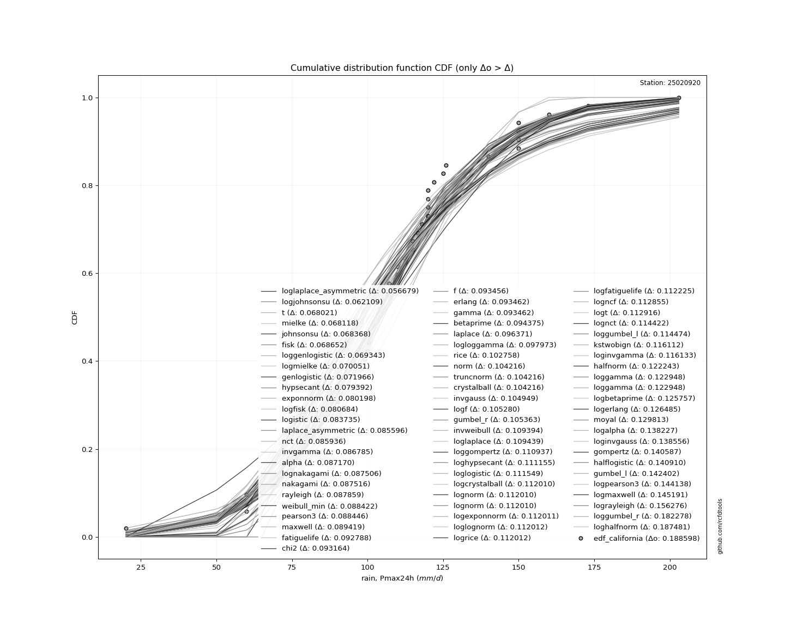</img>

</div>


**1.3. Best fit**

<div align="center">

|   id |   station | empirical_dist   | p_dist                |     delta |   deltao | eval   |   fit |   n |   best_fit |   best_fit_sort |
|-----:|----------:|:-----------------|:----------------------|----------:|---------:|:-------|------:|----:|-----------:|----------------:|
|    0 |  25020920 | edf_california   | loglaplace_asymmetric | 0.0566787 | 0.188598 | Δo > Δ |     1 |  52 |          1 |               1 |

</div>


<div align="center">

</img>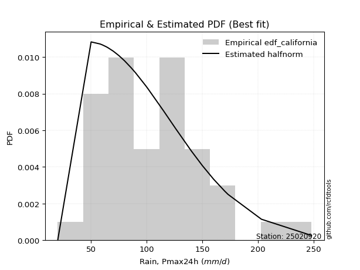</img>

</div>


### 2. Empirical - EDF Hazen (1930)

Hazen method for plotting positions is a formula used to estimate the empirical cumulative probability distribution of flood events or other hydrological data. This formula often results in biased estimations, particularly when extrapolating to extreme events (high return periods).

<div align="center">


$P=(m-0.5)/n$


</div>


**2.1. Empirical values**

<div align="center">

|                | 0                    | 1                    | 2                   | 3                  | 4                   | 5                   | 6                  | 7                   | 8                   | 9                   | 10                  | 11                  | 12                 | 13                  | 14                  | 15                 | 16                 | 17                  | 18                 | 19               | 20                 | 21                  | 22                 | 23                 | 24                  | 25                  | 26                 | 27                 | 28                 | 29                 | 30                 | 31                 | 32                 | 33                 | 34                 | 35                 | 36                 | 37                 | 38                 | 39                 | 40                 | 41                 | 42                 | 43                 | 44                 | 45        | 46                 | 47                 | 48                 | 49                 | 50                 | 51                 |
|:---------------|:---------------------|:---------------------|:--------------------|:-------------------|:--------------------|:--------------------|:-------------------|:--------------------|:--------------------|:--------------------|:--------------------|:--------------------|:-------------------|:--------------------|:--------------------|:-------------------|:-------------------|:--------------------|:-------------------|:-----------------|:-------------------|:--------------------|:-------------------|:-------------------|:--------------------|:--------------------|:-------------------|:-------------------|:-------------------|:-------------------|:-------------------|:-------------------|:-------------------|:-------------------|:-------------------|:-------------------|:-------------------|:-------------------|:-------------------|:-------------------|:-------------------|:-------------------|:-------------------|:-------------------|:-------------------|:----------|:-------------------|:-------------------|:-------------------|:-------------------|:-------------------|:-------------------|
| date           | 2008                 | 1991                 | 1988                | 1992               | 1990                | 1984                | 1998               | 1983                | 2009                | 2010                | 2007                | 2011                | 2012               | 1995                | 1974                | 1994               | 1997               | 1972                | 2015               | 1977             | 1976               | 1989                | 2019               | 1975               | 2018                | 2021                | 1971               | 2020               | 2016               | 1980               | 2005               | 2017               | 2013               | 1985               | 1987               | 1970               | 2014               | 2002               | 1996               | 1993               | 1986               | 1979               | 1982               | 1981               | 1999               | 2003      | 2001               | 2000               | 2006               | 1978               | 1973               | 2004               |
| x              | 20.0                 | 50.0                 | 60.0                | 60.0               | 60.0                | 65.0                | 70.0               | 75.0                | 75.0                | 75.0                | 80.0                | 80.0                | 80.0               | 80.0                | 86.0                | 90.0               | 90.0               | 90.1443522883201    | 90.7595845282534   | 98.3418531639491 | 99.0               | 100.0               | 100.273882014316   | 101.0              | 101.877971697636    | 103.535454863046    | 104.144144422804   | 105.431758524183   | 106.512869876267   | 107.12048298616614 | 109.720713687932   | 109.955969697234   | 112.023287990105   | 115.0              | 115.0              | 116.48471118843    | 118.058561338164   | 120.0              | 120.0              | 120.0              | 120.0              | 122.0              | 125.0              | 126.0              | 140.0              | 150.0     | 150.0              | 150.0              | 150.0              | 160.0              | 173.0              | 203.0              |
| m              | 1                    | 2                    | 3                   | 4                  | 5                   | 6                   | 7                  | 8                   | 9                   | 10                  | 11                  | 12                  | 13                 | 14                  | 15                  | 16                 | 17                 | 18                  | 19                 | 20               | 21                 | 22                  | 23                 | 24                 | 25                  | 26                  | 27                 | 28                 | 29                 | 30                 | 31                 | 32                 | 33                 | 34                 | 35                 | 36                 | 37                 | 38                 | 39                 | 40                 | 41                 | 42                 | 43                 | 44                 | 45                 | 46        | 47                 | 48                 | 49                 | 50                 | 51                 | 52                 |
| empirical_dist | edf_hazen            | edf_hazen            | edf_hazen           | edf_hazen          | edf_hazen           | edf_hazen           | edf_hazen          | edf_hazen           | edf_hazen           | edf_hazen           | edf_hazen           | edf_hazen           | edf_hazen          | edf_hazen           | edf_hazen           | edf_hazen          | edf_hazen          | edf_hazen           | edf_hazen          | edf_hazen        | edf_hazen          | edf_hazen           | edf_hazen          | edf_hazen          | edf_hazen           | edf_hazen           | edf_hazen          | edf_hazen          | edf_hazen          | edf_hazen          | edf_hazen          | edf_hazen          | edf_hazen          | edf_hazen          | edf_hazen          | edf_hazen          | edf_hazen          | edf_hazen          | edf_hazen          | edf_hazen          | edf_hazen          | edf_hazen          | edf_hazen          | edf_hazen          | edf_hazen          | edf_hazen | edf_hazen          | edf_hazen          | edf_hazen          | edf_hazen          | edf_hazen          | edf_hazen          |
| empirical      | 0.009615384615384616 | 0.028846153846153848 | 0.04807692307692308 | 0.0673076923076923 | 0.08653846153846154 | 0.10576923076923077 | 0.125              | 0.14423076923076922 | 0.16346153846153846 | 0.18269230769230768 | 0.20192307692307693 | 0.22115384615384615 | 0.2403846153846154 | 0.25961538461538464 | 0.27884615384615385 | 0.2980769230769231 | 0.3173076923076923 | 0.33653846153846156 | 0.3557692307692308 | 0.375            | 0.3942307692307692 | 0.41346153846153844 | 0.4326923076923077 | 0.4519230769230769 | 0.47115384615384615 | 0.49038461538461536 | 0.5096153846153846 | 0.5288461538461539 | 0.5480769230769231 | 0.5673076923076923 | 0.5865384615384616 | 0.6057692307692307 | 0.625              | 0.6442307692307693 | 0.6634615384615384 | 0.6826923076923077 | 0.7019230769230769 | 0.7211538461538461 | 0.7403846153846154 | 0.7596153846153846 | 0.7788461538461539 | 0.7980769230769231 | 0.8173076923076923 | 0.8365384615384616 | 0.8557692307692307 | 0.875     | 0.8942307692307693 | 0.9134615384615384 | 0.9326923076923077 | 0.9519230769230769 | 0.9711538461538461 | 0.9903846153846154 |
| empirical_tr   | 1.0097087378640777   | 1.0297029702970297   | 1.0505050505050506  | 1.0721649484536082 | 1.0947368421052632  | 1.118279569892473   | 1.1428571428571428 | 1.1685393258426966  | 1.1954022988505746  | 1.223529411764706   | 1.253012048192771   | 1.2839506172839505  | 1.3164556962025318 | 1.3506493506493507  | 1.3866666666666667  | 1.4246575342465755 | 1.4647887323943662 | 1.5072463768115942  | 1.5522388059701495 | 1.6              | 1.6507936507936507 | 1.7049180327868851  | 1.7627118644067796 | 1.8245614035087718 | 1.8909090909090909  | 1.9622641509433965  | 2.0392156862745097 | 2.122448979591837  | 2.2127659574468086 | 2.311111111111111  | 2.418604651162791  | 2.536585365853658  | 2.6666666666666665 | 2.810810810810811  | 2.971428571428571  | 3.151515151515152  | 3.3548387096774186 | 3.586206896551724  | 3.8518518518518525 | 4.159999999999999  | 4.521739130434783  | 4.952380952380953  | 5.473684210526315  | 6.117647058823531  | 6.933333333333331  | 8.0       | 9.454545454545459  | 11.555555555555552 | 14.857142857142861 | 20.79999999999998  | 34.66666666666666  | 104.00000000000037 |

</div>


**2.2. Kolmogorov-Smirnov fit test (sorted by Δ)**


<div align="center">

|                | 0                     | 1                   | 2                   | 3                   | 4                    | 5                   | 6                   | 7                   | 8                   | 9                   | 10                  | 11                  | 12                  | 13                  | 14                  | 15                  | 16                  | 17                  | 18                  | 19                  | 20                  | 21                  | 22                  | 23                  | 24                  | 25                  | 26                  | 27                  | 28                  | 29                  | 30                  | 31                  | 32                  | 33                  | 34                  | 35                  | 36                  | 37                  | 38                  | 39                  | 40                  | 41                  | 42                  | 43                  | 44                  | 45                  | 46                  | 47                  | 48                  | 49                  | 50                  | 51                  | 52                  | 53                  | 54                  | 55                  | 56                  | 57                  | 58                  | 59                  | 60                  | 61                  | 62                  | 63                  | 64                  | 65                  | 66                  | 67                  | 68                  | 69                  | 70                  | 71                  | 72                  | 73                  | 74                  | 75                  | 76                  | 77                  | 78                  | 79                  | 80                  | 81                  | 82                  | 83                  | 84                  | 85                  | 86                  | 87                  | 88                  | 89                  |
|:---------------|:----------------------|:--------------------|:--------------------|:--------------------|:---------------------|:--------------------|:--------------------|:--------------------|:--------------------|:--------------------|:--------------------|:--------------------|:--------------------|:--------------------|:--------------------|:--------------------|:--------------------|:--------------------|:--------------------|:--------------------|:--------------------|:--------------------|:--------------------|:--------------------|:--------------------|:--------------------|:--------------------|:--------------------|:--------------------|:--------------------|:--------------------|:--------------------|:--------------------|:--------------------|:--------------------|:--------------------|:--------------------|:--------------------|:--------------------|:--------------------|:--------------------|:--------------------|:--------------------|:--------------------|:--------------------|:--------------------|:--------------------|:--------------------|:--------------------|:--------------------|:--------------------|:--------------------|:--------------------|:--------------------|:--------------------|:--------------------|:--------------------|:--------------------|:--------------------|:--------------------|:--------------------|:--------------------|:--------------------|:--------------------|:--------------------|:--------------------|:--------------------|:--------------------|:--------------------|:--------------------|:--------------------|:--------------------|:--------------------|:--------------------|:--------------------|:--------------------|:--------------------|:--------------------|:--------------------|:--------------------|:--------------------|:--------------------|:--------------------|:--------------------|:--------------------|:--------------------|:--------------------|:--------------------|:--------------------|:--------------------|
| station        | 25020920              | 25020920            | 25020920            | 25020920            | 25020920             | 25020920            | 25020920            | 25020920            | 25020920            | 25020920            | 25020920            | 25020920            | 25020920            | 25020920            | 25020920            | 25020920            | 25020920            | 25020920            | 25020920            | 25020920            | 25020920            | 25020920            | 25020920            | 25020920            | 25020920            | 25020920            | 25020920            | 25020920            | 25020920            | 25020920            | 25020920            | 25020920            | 25020920            | 25020920            | 25020920            | 25020920            | 25020920            | 25020920            | 25020920            | 25020920            | 25020920            | 25020920            | 25020920            | 25020920            | 25020920            | 25020920            | 25020920            | 25020920            | 25020920            | 25020920            | 25020920            | 25020920            | 25020920            | 25020920            | 25020920            | 25020920            | 25020920            | 25020920            | 25020920            | 25020920            | 25020920            | 25020920            | 25020920            | 25020920            | 25020920            | 25020920            | 25020920            | 25020920            | 25020920            | 25020920            | 25020920            | 25020920            | 25020920            | 25020920            | 25020920            | 25020920            | 25020920            | 25020920            | 25020920            | 25020920            | 25020920            | 25020920            | 25020920            | 25020920            | 25020920            | 25020920            | 25020920            | 25020920            | 25020920            | 25020920            |
| empirical_dist | edf_hazen             | edf_hazen           | edf_hazen           | edf_hazen           | edf_hazen            | edf_hazen           | edf_hazen           | edf_hazen           | edf_hazen           | edf_hazen           | edf_hazen           | edf_hazen           | edf_hazen           | edf_hazen           | edf_hazen           | edf_hazen           | edf_hazen           | edf_hazen           | edf_hazen           | edf_hazen           | edf_hazen           | edf_hazen           | edf_hazen           | edf_hazen           | edf_hazen           | edf_hazen           | edf_hazen           | edf_hazen           | edf_hazen           | edf_hazen           | edf_hazen           | edf_hazen           | edf_hazen           | edf_hazen           | edf_hazen           | edf_hazen           | edf_hazen           | edf_hazen           | edf_hazen           | edf_hazen           | edf_hazen           | edf_hazen           | edf_hazen           | edf_hazen           | edf_hazen           | edf_hazen           | edf_hazen           | edf_hazen           | edf_hazen           | edf_hazen           | edf_hazen           | edf_hazen           | edf_hazen           | edf_hazen           | edf_hazen           | edf_hazen           | edf_hazen           | edf_hazen           | edf_hazen           | edf_hazen           | edf_hazen           | edf_hazen           | edf_hazen           | edf_hazen           | edf_hazen           | edf_hazen           | edf_hazen           | edf_hazen           | edf_hazen           | edf_hazen           | edf_hazen           | edf_hazen           | edf_hazen           | edf_hazen           | edf_hazen           | edf_hazen           | edf_hazen           | edf_hazen           | edf_hazen           | edf_hazen           | edf_hazen           | edf_hazen           | edf_hazen           | edf_hazen           | edf_hazen           | edf_hazen           | edf_hazen           | edf_hazen           | edf_hazen           | edf_hazen           |
| p_dist         | loglaplace_asymmetric | logjohnsonsu        | t                   | fisk                | logmielke            | loggenlogistic      | genlogistic         | johnsonsu           | mielke              | hypsecant           | exponnorm           | logistic            | laplace_asymmetric  | nct                 | invgamma            | alpha               | nakagami            | weibull_min         | pearson3            | fatiguelife         | logfisk             | chi2                | f                   | erlang              | gamma               | betaprime           | maxwell             | laplace             | logloggamma         | rice                | norm                | truncnorm           | crystalball         | lognakagami         | rayleigh            | loggompertz         | invweibull          | loggumbel_l         | invgauss            | logf                | gumbel_r            | loglaplace          | loghypsecant        | loglogistic         | logcrystalball      | lognorm             | lognorm             | logexponnorm        | loglognorm          | logrice             | logfatiguelife      | logncf              | logt                | kstwobign           | lognct              | loginvgamma         | gompertz            | halfnorm            | loggamma            | loggamma            | gumbel_l            | logpearson3         | logbetaprime        | logerlang           | moyal               | logalpha            | loginvgauss         | halflogistic        | logmaxwell          | lograyleigh         | loggumbel_r         | loginvweibull       | loghalfnorm         | wald                | logmoyal            | loghalflogistic     | genexpon            | logkstwobign        | logtruncnorm        | gibrat              | logwald             | loggibrat           | loggenexpon         | expon               | pareto              | ncf                 | logexpon            | logpareto           | logweibull_min      | logchi2             |
| delta          | 0.05403726775007234   | 0.05547205553225837 | 0.05840567745657921 | 0.06156614719271719 | 0.062485297492137715 | 0.06279396119401554 | 0.06281245415947556 | 0.06304057673873464 | 0.06578167661498002 | 0.06977703840476648 | 0.07058311497577052 | 0.07412010218789367 | 0.07598082738221376 | 0.07632104658449956 | 0.07716974442758295 | 0.07755488160797586 | 0.07790021824577054 | 0.07880666893570754 | 0.07883014827169732 | 0.08317292464891379 | 0.08336546942550144 | 0.08354822302272569 | 0.08384024625328779 | 0.0838470012503214  | 0.08384707520146695 | 0.0847591914356639  | 0.08531884237563797 | 0.0867558283929113  | 0.08835807710764176 | 0.09314288316118025 | 0.09460062444224004 | 0.09460062701108907 | 0.09460063383255801 | 0.0971208901569467  | 0.09747414078158301 | 0.1013220339195523  | 0.10485546613819069 | 0.10485886836096403 | 0.1145639738609393  | 0.11489508236318019 | 0.1149788831657515  | 0.11905401170738272 | 0.12077047623739307 | 0.1211642086204267  | 0.12162522507613216 | 0.1216252692319138  | 0.1216252692319138  | 0.12162671146389559 | 0.12162751118039372 | 0.12162757345501835 | 0.12184046632852902 | 0.12247034026511949 | 0.12253090206112516 | 0.1233096992922893  | 0.12403701062234318 | 0.12574802545851416 | 0.13097119289773917 | 0.13185858234112313 | 0.1325638340795684  | 0.1325638340795684  | 0.1327861594524017  | 0.13452216663905436 | 0.13537217400027246 | 0.13610072706451382 | 0.13942802159332957 | 0.1478421694713743  | 0.14817143994605664 | 0.150525351227361   | 0.15480681156609666 | 0.16589180193721542 | 0.1918932946839873  | 0.19612220021173143 | 0.19709607956595354 | 0.20686291951055413 | 0.21775971087582824 | 0.22182687420276237 | 0.2279762201283697  | 0.24529643761474657 | 0.25788138375235214 | 0.25949221653351523 | 0.28970292024255495 | 0.3125261914387414  | 0.3307523765794304  | 0.3345433758511434  | 0.3345433990155349  | 0.3423116737735068  | 0.4495653515189792  | 0.4495653592874049  | 0.5746695845734632  | 0.6488676021157793  |
| deltao         | 0.18859806671657792   | 0.18859806671657792 | 0.18859806671657792 | 0.18859806671657792 | 0.18859806671657792  | 0.18859806671657792 | 0.18859806671657792 | 0.18859806671657792 | 0.18859806671657792 | 0.18859806671657792 | 0.18859806671657792 | 0.18859806671657792 | 0.18859806671657792 | 0.18859806671657792 | 0.18859806671657792 | 0.18859806671657792 | 0.18859806671657792 | 0.18859806671657792 | 0.18859806671657792 | 0.18859806671657792 | 0.18859806671657792 | 0.18859806671657792 | 0.18859806671657792 | 0.18859806671657792 | 0.18859806671657792 | 0.18859806671657792 | 0.18859806671657792 | 0.18859806671657792 | 0.18859806671657792 | 0.18859806671657792 | 0.18859806671657792 | 0.18859806671657792 | 0.18859806671657792 | 0.18859806671657792 | 0.18859806671657792 | 0.18859806671657792 | 0.18859806671657792 | 0.18859806671657792 | 0.18859806671657792 | 0.18859806671657792 | 0.18859806671657792 | 0.18859806671657792 | 0.18859806671657792 | 0.18859806671657792 | 0.18859806671657792 | 0.18859806671657792 | 0.18859806671657792 | 0.18859806671657792 | 0.18859806671657792 | 0.18859806671657792 | 0.18859806671657792 | 0.18859806671657792 | 0.18859806671657792 | 0.18859806671657792 | 0.18859806671657792 | 0.18859806671657792 | 0.18859806671657792 | 0.18859806671657792 | 0.18859806671657792 | 0.18859806671657792 | 0.18859806671657792 | 0.18859806671657792 | 0.18859806671657792 | 0.18859806671657792 | 0.18859806671657792 | 0.18859806671657792 | 0.18859806671657792 | 0.18859806671657792 | 0.18859806671657792 | 0.18859806671657792 | 0.18859806671657792 | 0.18859806671657792 | 0.18859806671657792 | 0.18859806671657792 | 0.18859806671657792 | 0.18859806671657792 | 0.18859806671657792 | 0.18859806671657792 | 0.18859806671657792 | 0.18859806671657792 | 0.18859806671657792 | 0.18859806671657792 | 0.18859806671657792 | 0.18859806671657792 | 0.18859806671657792 | 0.18859806671657792 | 0.18859806671657792 | 0.18859806671657792 | 0.18859806671657792 | 0.18859806671657792 |
| eval           | Δo > Δ                | Δo > Δ              | Δo > Δ              | Δo > Δ              | Δo > Δ               | Δo > Δ              | Δo > Δ              | Δo > Δ              | Δo > Δ              | Δo > Δ              | Δo > Δ              | Δo > Δ              | Δo > Δ              | Δo > Δ              | Δo > Δ              | Δo > Δ              | Δo > Δ              | Δo > Δ              | Δo > Δ              | Δo > Δ              | Δo > Δ              | Δo > Δ              | Δo > Δ              | Δo > Δ              | Δo > Δ              | Δo > Δ              | Δo > Δ              | Δo > Δ              | Δo > Δ              | Δo > Δ              | Δo > Δ              | Δo > Δ              | Δo > Δ              | Δo > Δ              | Δo > Δ              | Δo > Δ              | Δo > Δ              | Δo > Δ              | Δo > Δ              | Δo > Δ              | Δo > Δ              | Δo > Δ              | Δo > Δ              | Δo > Δ              | Δo > Δ              | Δo > Δ              | Δo > Δ              | Δo > Δ              | Δo > Δ              | Δo > Δ              | Δo > Δ              | Δo > Δ              | Δo > Δ              | Δo > Δ              | Δo > Δ              | Δo > Δ              | Δo > Δ              | Δo > Δ              | Δo > Δ              | Δo > Δ              | Δo > Δ              | Δo > Δ              | Δo > Δ              | Δo > Δ              | Δo > Δ              | Δo > Δ              | Δo > Δ              | Δo > Δ              | Δo > Δ              | Δo > Δ              | Δo <= Δ             | Δo <= Δ             | Δo <= Δ             | Δo <= Δ             | Δo <= Δ             | Δo <= Δ             | Δo <= Δ             | Δo <= Δ             | Δo <= Δ             | Δo <= Δ             | Δo <= Δ             | Δo <= Δ             | Δo <= Δ             | Δo <= Δ             | Δo <= Δ             | Δo <= Δ             | Δo <= Δ             | Δo <= Δ             | Δo <= Δ             | Δo <= Δ             |
| fit            | 1                     | 1                   | 1                   | 1                   | 1                    | 1                   | 1                   | 1                   | 1                   | 1                   | 1                   | 1                   | 1                   | 1                   | 1                   | 1                   | 1                   | 1                   | 1                   | 1                   | 1                   | 1                   | 1                   | 1                   | 1                   | 1                   | 1                   | 1                   | 1                   | 1                   | 1                   | 1                   | 1                   | 1                   | 1                   | 1                   | 1                   | 1                   | 1                   | 1                   | 1                   | 1                   | 1                   | 1                   | 1                   | 1                   | 1                   | 1                   | 1                   | 1                   | 1                   | 1                   | 1                   | 1                   | 1                   | 1                   | 1                   | 1                   | 1                   | 1                   | 1                   | 1                   | 1                   | 1                   | 1                   | 1                   | 1                   | 1                   | 1                   | 1                   | 0                   | 0                   | 0                   | 0                   | 0                   | 0                   | 0                   | 0                   | 0                   | 0                   | 0                   | 0                   | 0                   | 0                   | 0                   | 0                   | 0                   | 0                   | 0                   | 0                   |
| n              | 52                    | 52                  | 52                  | 52                  | 52                   | 52                  | 52                  | 52                  | 52                  | 52                  | 52                  | 52                  | 52                  | 52                  | 52                  | 52                  | 52                  | 52                  | 52                  | 52                  | 52                  | 52                  | 52                  | 52                  | 52                  | 52                  | 52                  | 52                  | 52                  | 52                  | 52                  | 52                  | 52                  | 52                  | 52                  | 52                  | 52                  | 52                  | 52                  | 52                  | 52                  | 52                  | 52                  | 52                  | 52                  | 52                  | 52                  | 52                  | 52                  | 52                  | 52                  | 52                  | 52                  | 52                  | 52                  | 52                  | 52                  | 52                  | 52                  | 52                  | 52                  | 52                  | 52                  | 52                  | 52                  | 52                  | 52                  | 52                  | 52                  | 52                  | 52                  | 52                  | 52                  | 52                  | 52                  | 52                  | 52                  | 52                  | 52                  | 52                  | 52                  | 52                  | 52                  | 52                  | 52                  | 52                  | 52                  | 52                  | 52                  | 52                  |
| best_fit       | 1                     | 0                   | 0                   | 0                   | 0                    | 0                   | 0                   | 0                   | 0                   | 0                   | 0                   | 0                   | 0                   | 0                   | 0                   | 0                   | 0                   | 0                   | 0                   | 0                   | 0                   | 0                   | 0                   | 0                   | 0                   | 0                   | 0                   | 0                   | 0                   | 0                   | 0                   | 0                   | 0                   | 0                   | 0                   | 0                   | 0                   | 0                   | 0                   | 0                   | 0                   | 0                   | 0                   | 0                   | 0                   | 0                   | 0                   | 0                   | 0                   | 0                   | 0                   | 0                   | 0                   | 0                   | 0                   | 0                   | 0                   | 0                   | 0                   | 0                   | 0                   | 0                   | 0                   | 0                   | 0                   | 0                   | 0                   | 0                   | 0                   | 0                   | 0                   | 0                   | 0                   | 0                   | 0                   | 0                   | 0                   | 0                   | 0                   | 0                   | 0                   | 0                   | 0                   | 0                   | 0                   | 0                   | 0                   | 0                   | 0                   | 0                   |
| best_fit_sort  | 1                     | 2                   | 3                   | 4                   | 5                    | 6                   | 7                   | 8                   | 9                   | 10                  | 11                  | 12                  | 13                  | 14                  | 15                  | 16                  | 17                  | 18                  | 19                  | 20                  | 21                  | 22                  | 23                  | 24                  | 25                  | 26                  | 27                  | 28                  | 29                  | 30                  | 31                  | 32                  | 33                  | 34                  | 35                  | 36                  | 37                  | 38                  | 39                  | 40                  | 41                  | 42                  | 43                  | 44                  | 45                  | 46                  | 47                  | 48                  | 49                  | 50                  | 51                  | 52                  | 53                  | 54                  | 55                  | 56                  | 57                  | 58                  | 59                  | 60                  | 61                  | 62                  | 63                  | 64                  | 65                  | 66                  | 67                  | 68                  | 69                  | 70                  | 71                  | 72                  | 73                  | 74                  | 75                  | 76                  | 77                  | 78                  | 79                  | 80                  | 81                  | 82                  | 83                  | 84                  | 85                  | 86                  | 87                  | 88                  | 89                  | 90                  |

</div>


<div align="center">

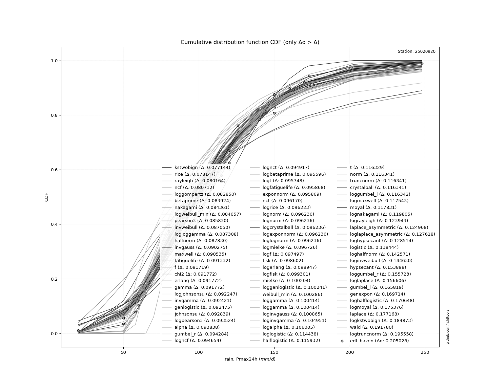</img>

</div>


**2.3. Best fit**

<div align="center">

|   id |   station | empirical_dist   | p_dist                |     delta |   deltao | eval   |   fit |   n |   best_fit |   best_fit_sort |
|-----:|----------:|:-----------------|:----------------------|----------:|---------:|:-------|------:|----:|-----------:|----------------:|
|    0 |  25020920 | edf_hazen        | loglaplace_asymmetric | 0.0540373 | 0.188598 | Δo > Δ |     1 |  52 |          1 |               1 |

</div>


<div align="center">

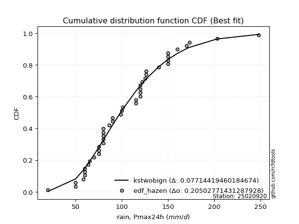</img>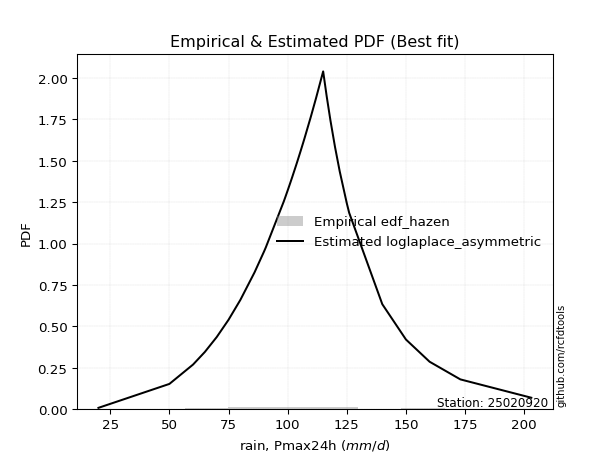</img>

</div>


### 3. Empirical - EDF Weibull (1939)

Weibull plotting position formula is an empirical method used to estimate the non-exceedance probability or plotting position for a set of observed data, is often recommended or widely used in practice, particularly in flood frequency analysis.

<div align="center">


$P=m/(n+1)$


</div>


**3.1. Empirical values**

<div align="center">

|                | 0                    | 1                   | 2                   | 3                   | 4                   | 5                   | 6                  | 7                  | 8                   | 9                   | 10                  | 11                  | 12                  | 13                 | 14                 | 15                 | 16                  | 17                  | 18                 | 19                  | 20                  | 21                  | 22                 | 23                 | 24                 | 25                  | 26                 | 27                 | 28                 | 29                 | 30                 | 31                 | 32                 | 33                 | 34                | 35                 | 36                 | 37                 | 38                 | 39                 | 40                 | 41                 | 42                 | 43                 | 44                 | 45                 | 46                 | 47                 | 48                 | 49                 | 50                 | 51                 |
|:---------------|:---------------------|:--------------------|:--------------------|:--------------------|:--------------------|:--------------------|:-------------------|:-------------------|:--------------------|:--------------------|:--------------------|:--------------------|:--------------------|:-------------------|:-------------------|:-------------------|:--------------------|:--------------------|:-------------------|:--------------------|:--------------------|:--------------------|:-------------------|:-------------------|:-------------------|:--------------------|:-------------------|:-------------------|:-------------------|:-------------------|:-------------------|:-------------------|:-------------------|:-------------------|:------------------|:-------------------|:-------------------|:-------------------|:-------------------|:-------------------|:-------------------|:-------------------|:-------------------|:-------------------|:-------------------|:-------------------|:-------------------|:-------------------|:-------------------|:-------------------|:-------------------|:-------------------|
| date           | 2008                 | 1991                | 1988                | 1992                | 1990                | 1984                | 1998               | 1983               | 2009                | 2010                | 2007                | 2011                | 2012                | 1995               | 1974               | 1994               | 1997                | 1972                | 2015               | 1977                | 1976                | 1989                | 2019               | 1975               | 2018               | 2021                | 1971               | 2020               | 2016               | 1980               | 2005               | 2017               | 2013               | 1985               | 1987              | 1970               | 2014               | 2002               | 1996               | 1993               | 1986               | 1979               | 1982               | 1981               | 1999               | 2003               | 2001               | 2000               | 2006               | 1978               | 1973               | 2004               |
| x              | 20.0                 | 50.0                | 60.0                | 60.0                | 60.0                | 65.0                | 70.0               | 75.0               | 75.0                | 75.0                | 80.0                | 80.0                | 80.0                | 80.0               | 86.0               | 90.0               | 90.0                | 90.1443522883201    | 90.7595845282534   | 98.3418531639491    | 99.0                | 100.0               | 100.273882014316   | 101.0              | 101.877971697636   | 103.535454863046    | 104.144144422804   | 105.431758524183   | 106.512869876267   | 107.12048298616614 | 109.720713687932   | 109.955969697234   | 112.023287990105   | 115.0              | 115.0             | 116.48471118843    | 118.058561338164   | 120.0              | 120.0              | 120.0              | 120.0              | 122.0              | 125.0              | 126.0              | 140.0              | 150.0              | 150.0              | 150.0              | 150.0              | 160.0              | 173.0              | 203.0              |
| m              | 1                    | 2                   | 3                   | 4                   | 5                   | 6                   | 7                  | 8                  | 9                   | 10                  | 11                  | 12                  | 13                  | 14                 | 15                 | 16                 | 17                  | 18                  | 19                 | 20                  | 21                  | 22                  | 23                 | 24                 | 25                 | 26                  | 27                 | 28                 | 29                 | 30                 | 31                 | 32                 | 33                 | 34                 | 35                | 36                 | 37                 | 38                 | 39                 | 40                 | 41                 | 42                 | 43                 | 44                 | 45                 | 46                 | 47                 | 48                 | 49                 | 50                 | 51                 | 52                 |
| empirical_dist | edf_weibull          | edf_weibull         | edf_weibull         | edf_weibull         | edf_weibull         | edf_weibull         | edf_weibull        | edf_weibull        | edf_weibull         | edf_weibull         | edf_weibull         | edf_weibull         | edf_weibull         | edf_weibull        | edf_weibull        | edf_weibull        | edf_weibull         | edf_weibull         | edf_weibull        | edf_weibull         | edf_weibull         | edf_weibull         | edf_weibull        | edf_weibull        | edf_weibull        | edf_weibull         | edf_weibull        | edf_weibull        | edf_weibull        | edf_weibull        | edf_weibull        | edf_weibull        | edf_weibull        | edf_weibull        | edf_weibull       | edf_weibull        | edf_weibull        | edf_weibull        | edf_weibull        | edf_weibull        | edf_weibull        | edf_weibull        | edf_weibull        | edf_weibull        | edf_weibull        | edf_weibull        | edf_weibull        | edf_weibull        | edf_weibull        | edf_weibull        | edf_weibull        | edf_weibull        |
| empirical      | 0.018867924528301886 | 0.03773584905660377 | 0.05660377358490566 | 0.07547169811320754 | 0.09433962264150944 | 0.11320754716981132 | 0.1320754716981132 | 0.1509433962264151 | 0.16981132075471697 | 0.18867924528301888 | 0.20754716981132076 | 0.22641509433962265 | 0.24528301886792453 | 0.2641509433962264 | 0.2830188679245283 | 0.3018867924528302 | 0.32075471698113206 | 0.33962264150943394 | 0.3584905660377358 | 0.37735849056603776 | 0.39622641509433965 | 0.41509433962264153 | 0.4339622641509434 | 0.4528301886792453 | 0.4716981132075472 | 0.49056603773584906 | 0.5094339622641509 | 0.5283018867924528 | 0.5471698113207547 | 0.5660377358490566 | 0.5849056603773585 | 0.6037735849056604 | 0.6226415094339622 | 0.6415094339622641 | 0.660377358490566 | 0.6792452830188679 | 0.6981132075471698 | 0.7169811320754716 | 0.7358490566037735 | 0.7547169811320755 | 0.7735849056603774 | 0.7924528301886793 | 0.8113207547169812 | 0.8301886792452831 | 0.8490566037735849 | 0.8679245283018868 | 0.8867924528301887 | 0.9056603773584906 | 0.9245283018867925 | 0.9433962264150944 | 0.9622641509433962 | 0.9811320754716981 |
| empirical_tr   | 1.0192307692307692   | 1.0392156862745099  | 1.06                | 1.0816326530612246  | 1.1041666666666667  | 1.127659574468085   | 1.1521739130434783 | 1.1777777777777778 | 1.2045454545454546  | 1.2325581395348837  | 1.2619047619047619  | 1.292682926829268   | 1.325               | 1.3589743589743588 | 1.394736842105263  | 1.4324324324324322 | 1.472222222222222   | 1.514285714285714   | 1.5588235294117645 | 1.6060606060606062  | 1.65625             | 1.7096774193548387  | 1.7666666666666666 | 1.8275862068965518 | 1.8928571428571428 | 1.962962962962963   | 2.0384615384615383 | 2.12               | 2.2083333333333335 | 2.3043478260869565 | 2.409090909090909  | 2.5238095238095237 | 2.65               | 2.789473684210526  | 2.944444444444444 | 3.117647058823529  | 3.3124999999999996 | 3.5333333333333328 | 3.785714285714285  | 4.0769230769230775 | 4.416666666666668  | 4.818181818181819  | 5.300000000000002  | 5.88888888888889   | 6.625000000000002  | 7.571428571428573  | 8.833333333333336  | 10.600000000000003 | 13.250000000000004 | 17.66666666666667  | 26.500000000000007 | 53.000000000000014 |

</div>


**3.2. Kolmogorov-Smirnov fit test (sorted by Δ)**


<div align="center">

|                | 0                   | 1                   | 2                   | 3                   | 4                   | 5                   | 6                     | 7                   | 8                   | 9                   | 10                  | 11                  | 12                  | 13                  | 14                  | 15                  | 16                  | 17                  | 18                  | 19                  | 20                  | 21                  | 22                  | 23                  | 24                  | 25                  | 26                  | 27                  | 28                  | 29                  | 30                  | 31                  | 32                  | 33                  | 34                  | 35                  | 36                  | 37                  | 38                  | 39                  | 40                  | 41                  | 42                  | 43                  | 44                  | 45                  | 46                  | 47                  | 48                  | 49                  | 50                  | 51                  | 52                  | 53                  | 54                  | 55                  | 56                  | 57                  | 58                  | 59                  | 60                  | 61                  | 62                  | 63                  | 64                  | 65                  | 66                  | 67                  | 68                  | 69                  | 70                  | 71                  | 72                  | 73                  | 74                  | 75                  | 76                  | 77                  | 78                  | 79                  | 80                  | 81                  | 82                  | 83                  | 84                  | 85                  | 86                  | 87                  | 88                  | 89                  |
|:---------------|:--------------------|:--------------------|:--------------------|:--------------------|:--------------------|:--------------------|:----------------------|:--------------------|:--------------------|:--------------------|:--------------------|:--------------------|:--------------------|:--------------------|:--------------------|:--------------------|:--------------------|:--------------------|:--------------------|:--------------------|:--------------------|:--------------------|:--------------------|:--------------------|:--------------------|:--------------------|:--------------------|:--------------------|:--------------------|:--------------------|:--------------------|:--------------------|:--------------------|:--------------------|:--------------------|:--------------------|:--------------------|:--------------------|:--------------------|:--------------------|:--------------------|:--------------------|:--------------------|:--------------------|:--------------------|:--------------------|:--------------------|:--------------------|:--------------------|:--------------------|:--------------------|:--------------------|:--------------------|:--------------------|:--------------------|:--------------------|:--------------------|:--------------------|:--------------------|:--------------------|:--------------------|:--------------------|:--------------------|:--------------------|:--------------------|:--------------------|:--------------------|:--------------------|:--------------------|:--------------------|:--------------------|:--------------------|:--------------------|:--------------------|:--------------------|:--------------------|:--------------------|:--------------------|:--------------------|:--------------------|:--------------------|:--------------------|:--------------------|:--------------------|:--------------------|:--------------------|:--------------------|:--------------------|:--------------------|:--------------------|
| station        | 25020920            | 25020920            | 25020920            | 25020920            | 25020920            | 25020920            | 25020920              | 25020920            | 25020920            | 25020920            | 25020920            | 25020920            | 25020920            | 25020920            | 25020920            | 25020920            | 25020920            | 25020920            | 25020920            | 25020920            | 25020920            | 25020920            | 25020920            | 25020920            | 25020920            | 25020920            | 25020920            | 25020920            | 25020920            | 25020920            | 25020920            | 25020920            | 25020920            | 25020920            | 25020920            | 25020920            | 25020920            | 25020920            | 25020920            | 25020920            | 25020920            | 25020920            | 25020920            | 25020920            | 25020920            | 25020920            | 25020920            | 25020920            | 25020920            | 25020920            | 25020920            | 25020920            | 25020920            | 25020920            | 25020920            | 25020920            | 25020920            | 25020920            | 25020920            | 25020920            | 25020920            | 25020920            | 25020920            | 25020920            | 25020920            | 25020920            | 25020920            | 25020920            | 25020920            | 25020920            | 25020920            | 25020920            | 25020920            | 25020920            | 25020920            | 25020920            | 25020920            | 25020920            | 25020920            | 25020920            | 25020920            | 25020920            | 25020920            | 25020920            | 25020920            | 25020920            | 25020920            | 25020920            | 25020920            | 25020920            |
| empirical_dist | edf_weibull         | edf_weibull         | edf_weibull         | edf_weibull         | edf_weibull         | edf_weibull         | edf_weibull           | edf_weibull         | edf_weibull         | edf_weibull         | edf_weibull         | edf_weibull         | edf_weibull         | edf_weibull         | edf_weibull         | edf_weibull         | edf_weibull         | edf_weibull         | edf_weibull         | edf_weibull         | edf_weibull         | edf_weibull         | edf_weibull         | edf_weibull         | edf_weibull         | edf_weibull         | edf_weibull         | edf_weibull         | edf_weibull         | edf_weibull         | edf_weibull         | edf_weibull         | edf_weibull         | edf_weibull         | edf_weibull         | edf_weibull         | edf_weibull         | edf_weibull         | edf_weibull         | edf_weibull         | edf_weibull         | edf_weibull         | edf_weibull         | edf_weibull         | edf_weibull         | edf_weibull         | edf_weibull         | edf_weibull         | edf_weibull         | edf_weibull         | edf_weibull         | edf_weibull         | edf_weibull         | edf_weibull         | edf_weibull         | edf_weibull         | edf_weibull         | edf_weibull         | edf_weibull         | edf_weibull         | edf_weibull         | edf_weibull         | edf_weibull         | edf_weibull         | edf_weibull         | edf_weibull         | edf_weibull         | edf_weibull         | edf_weibull         | edf_weibull         | edf_weibull         | edf_weibull         | edf_weibull         | edf_weibull         | edf_weibull         | edf_weibull         | edf_weibull         | edf_weibull         | edf_weibull         | edf_weibull         | edf_weibull         | edf_weibull         | edf_weibull         | edf_weibull         | edf_weibull         | edf_weibull         | edf_weibull         | edf_weibull         | edf_weibull         | edf_weibull         |
| p_dist         | logjohnsonsu        | fisk                | logmielke           | loggenlogistic      | genlogistic         | johnsonsu           | loglaplace_asymmetric | mielke              | t                   | exponnorm           | logistic            | nct                 | nakagami            | invgamma            | alpha               | weibull_min         | pearson3            | hypsecant           | fatiguelife         | chi2                | f                   | erlang              | gamma               | betaprime           | laplace_asymmetric  | logfisk             | maxwell             | logloggamma         | rice                | norm                | truncnorm           | crystalball         | laplace             | lognakagami         | rayleigh            | loggompertz         | loggumbel_l         | invweibull          | invgauss            | gumbel_r            | logf                | loglaplace          | loghypsecant        | loglogistic         | logcrystalball      | lognorm             | lognorm             | logexponnorm        | loglognorm          | logrice             | logfatiguelife      | logncf              | logt                | kstwobign           | lognct              | loginvgamma         | gompertz            | gumbel_l            | logpearson3         | halfnorm            | loggamma            | loggamma            | logbetaprime        | logerlang           | moyal               | logalpha            | loginvgauss         | halflogistic        | logmaxwell          | lograyleigh         | loginvweibull       | loggumbel_r         | loghalfnorm         | wald                | logmoyal            | loghalflogistic     | genexpon            | logkstwobign        | logtruncnorm        | gibrat              | logwald             | loggibrat           | loggenexpon         | expon               | pareto              | ncf                 | logexpon            | logpareto           | logweibull_min      | logchi2             |
| delta          | 0.05847921383313248 | 0.05920765662667943 | 0.06012680692609995 | 0.06043547062797777 | 0.0604539635934378  | 0.06068208617269688 | 0.061112739448185516  | 0.06342318604894226 | 0.06517218527264868 | 0.0674313065865515  | 0.06885885400211722 | 0.07105979839872312 | 0.07155043595259203 | 0.07162066616519469 | 0.07229363342219941 | 0.07245688664252903 | 0.07297994830206223 | 0.07431259718560826 | 0.07791167646313735 | 0.07828697483694924 | 0.07857899806751134 | 0.07858575306454496 | 0.0785858270156905  | 0.07884419442091217 | 0.08051638616305554 | 0.08100697885946367 | 0.08296035180960021 | 0.08309682892186532 | 0.0878816349754038  | 0.0893393762564636  | 0.08933937882531262 | 0.08933938564678157 | 0.09129138717375307 | 0.09476239959090893 | 0.09511565021554524 | 0.09606078573377586 | 0.09959762017518758 | 0.10249697557215293 | 0.11220548329490154 | 0.11262039259971374 | 0.11289943649960976 | 0.11669552114134496 | 0.1184119856713553  | 0.11880571805438894 | 0.1192667345100944  | 0.11926677866587604 | 0.11926677866587604 | 0.11926822089785782 | 0.11926902061435596 | 0.11926908288898058 | 0.11948197576249125 | 0.12011184969908173 | 0.1201724114950874  | 0.12095120872625154 | 0.12167852005630542 | 0.1233895348924764  | 0.12462141060456067 | 0.12752491126662524 | 0.12926091845327792 | 0.12950009177508537 | 0.13020534351353064 | 0.13020534351353064 | 0.1330136834342347  | 0.13374223649847605 | 0.1370695310272918  | 0.14548367890533653 | 0.14581294938001887 | 0.14816686066132323 | 0.1524483210000589  | 0.16353331137117766 | 0.1879581944062162  | 0.18953480411794954 | 0.19473758899991578 | 0.20450442894451637 | 0.21540122030979048 | 0.2194683836367246  | 0.22126359313272384 | 0.2385838106191007  | 0.25116875675670625 | 0.264027775314357   | 0.2873444296765172  | 0.3101677008727036  | 0.32403974958378456 | 0.32783074885549757 | 0.3278307720198891  | 0.3337848232655242  | 0.4410385010109966  | 0.4410385087794223  | 0.5661427340654807  | 0.6403407516077968  |
| deltao         | 0.18859806671657792 | 0.18859806671657792 | 0.18859806671657792 | 0.18859806671657792 | 0.18859806671657792 | 0.18859806671657792 | 0.18859806671657792   | 0.18859806671657792 | 0.18859806671657792 | 0.18859806671657792 | 0.18859806671657792 | 0.18859806671657792 | 0.18859806671657792 | 0.18859806671657792 | 0.18859806671657792 | 0.18859806671657792 | 0.18859806671657792 | 0.18859806671657792 | 0.18859806671657792 | 0.18859806671657792 | 0.18859806671657792 | 0.18859806671657792 | 0.18859806671657792 | 0.18859806671657792 | 0.18859806671657792 | 0.18859806671657792 | 0.18859806671657792 | 0.18859806671657792 | 0.18859806671657792 | 0.18859806671657792 | 0.18859806671657792 | 0.18859806671657792 | 0.18859806671657792 | 0.18859806671657792 | 0.18859806671657792 | 0.18859806671657792 | 0.18859806671657792 | 0.18859806671657792 | 0.18859806671657792 | 0.18859806671657792 | 0.18859806671657792 | 0.18859806671657792 | 0.18859806671657792 | 0.18859806671657792 | 0.18859806671657792 | 0.18859806671657792 | 0.18859806671657792 | 0.18859806671657792 | 0.18859806671657792 | 0.18859806671657792 | 0.18859806671657792 | 0.18859806671657792 | 0.18859806671657792 | 0.18859806671657792 | 0.18859806671657792 | 0.18859806671657792 | 0.18859806671657792 | 0.18859806671657792 | 0.18859806671657792 | 0.18859806671657792 | 0.18859806671657792 | 0.18859806671657792 | 0.18859806671657792 | 0.18859806671657792 | 0.18859806671657792 | 0.18859806671657792 | 0.18859806671657792 | 0.18859806671657792 | 0.18859806671657792 | 0.18859806671657792 | 0.18859806671657792 | 0.18859806671657792 | 0.18859806671657792 | 0.18859806671657792 | 0.18859806671657792 | 0.18859806671657792 | 0.18859806671657792 | 0.18859806671657792 | 0.18859806671657792 | 0.18859806671657792 | 0.18859806671657792 | 0.18859806671657792 | 0.18859806671657792 | 0.18859806671657792 | 0.18859806671657792 | 0.18859806671657792 | 0.18859806671657792 | 0.18859806671657792 | 0.18859806671657792 | 0.18859806671657792 |
| eval           | Δo > Δ              | Δo > Δ              | Δo > Δ              | Δo > Δ              | Δo > Δ              | Δo > Δ              | Δo > Δ                | Δo > Δ              | Δo > Δ              | Δo > Δ              | Δo > Δ              | Δo > Δ              | Δo > Δ              | Δo > Δ              | Δo > Δ              | Δo > Δ              | Δo > Δ              | Δo > Δ              | Δo > Δ              | Δo > Δ              | Δo > Δ              | Δo > Δ              | Δo > Δ              | Δo > Δ              | Δo > Δ              | Δo > Δ              | Δo > Δ              | Δo > Δ              | Δo > Δ              | Δo > Δ              | Δo > Δ              | Δo > Δ              | Δo > Δ              | Δo > Δ              | Δo > Δ              | Δo > Δ              | Δo > Δ              | Δo > Δ              | Δo > Δ              | Δo > Δ              | Δo > Δ              | Δo > Δ              | Δo > Δ              | Δo > Δ              | Δo > Δ              | Δo > Δ              | Δo > Δ              | Δo > Δ              | Δo > Δ              | Δo > Δ              | Δo > Δ              | Δo > Δ              | Δo > Δ              | Δo > Δ              | Δo > Δ              | Δo > Δ              | Δo > Δ              | Δo > Δ              | Δo > Δ              | Δo > Δ              | Δo > Δ              | Δo > Δ              | Δo > Δ              | Δo > Δ              | Δo > Δ              | Δo > Δ              | Δo > Δ              | Δo > Δ              | Δo > Δ              | Δo > Δ              | Δo > Δ              | Δo <= Δ             | Δo <= Δ             | Δo <= Δ             | Δo <= Δ             | Δo <= Δ             | Δo <= Δ             | Δo <= Δ             | Δo <= Δ             | Δo <= Δ             | Δo <= Δ             | Δo <= Δ             | Δo <= Δ             | Δo <= Δ             | Δo <= Δ             | Δo <= Δ             | Δo <= Δ             | Δo <= Δ             | Δo <= Δ             | Δo <= Δ             |
| fit            | 1                   | 1                   | 1                   | 1                   | 1                   | 1                   | 1                     | 1                   | 1                   | 1                   | 1                   | 1                   | 1                   | 1                   | 1                   | 1                   | 1                   | 1                   | 1                   | 1                   | 1                   | 1                   | 1                   | 1                   | 1                   | 1                   | 1                   | 1                   | 1                   | 1                   | 1                   | 1                   | 1                   | 1                   | 1                   | 1                   | 1                   | 1                   | 1                   | 1                   | 1                   | 1                   | 1                   | 1                   | 1                   | 1                   | 1                   | 1                   | 1                   | 1                   | 1                   | 1                   | 1                   | 1                   | 1                   | 1                   | 1                   | 1                   | 1                   | 1                   | 1                   | 1                   | 1                   | 1                   | 1                   | 1                   | 1                   | 1                   | 1                   | 1                   | 1                   | 0                   | 0                   | 0                   | 0                   | 0                   | 0                   | 0                   | 0                   | 0                   | 0                   | 0                   | 0                   | 0                   | 0                   | 0                   | 0                   | 0                   | 0                   | 0                   |
| n              | 52                  | 52                  | 52                  | 52                  | 52                  | 52                  | 52                    | 52                  | 52                  | 52                  | 52                  | 52                  | 52                  | 52                  | 52                  | 52                  | 52                  | 52                  | 52                  | 52                  | 52                  | 52                  | 52                  | 52                  | 52                  | 52                  | 52                  | 52                  | 52                  | 52                  | 52                  | 52                  | 52                  | 52                  | 52                  | 52                  | 52                  | 52                  | 52                  | 52                  | 52                  | 52                  | 52                  | 52                  | 52                  | 52                  | 52                  | 52                  | 52                  | 52                  | 52                  | 52                  | 52                  | 52                  | 52                  | 52                  | 52                  | 52                  | 52                  | 52                  | 52                  | 52                  | 52                  | 52                  | 52                  | 52                  | 52                  | 52                  | 52                  | 52                  | 52                  | 52                  | 52                  | 52                  | 52                  | 52                  | 52                  | 52                  | 52                  | 52                  | 52                  | 52                  | 52                  | 52                  | 52                  | 52                  | 52                  | 52                  | 52                  | 52                  |
| best_fit       | 1                   | 0                   | 0                   | 0                   | 0                   | 0                   | 0                     | 0                   | 0                   | 0                   | 0                   | 0                   | 0                   | 0                   | 0                   | 0                   | 0                   | 0                   | 0                   | 0                   | 0                   | 0                   | 0                   | 0                   | 0                   | 0                   | 0                   | 0                   | 0                   | 0                   | 0                   | 0                   | 0                   | 0                   | 0                   | 0                   | 0                   | 0                   | 0                   | 0                   | 0                   | 0                   | 0                   | 0                   | 0                   | 0                   | 0                   | 0                   | 0                   | 0                   | 0                   | 0                   | 0                   | 0                   | 0                   | 0                   | 0                   | 0                   | 0                   | 0                   | 0                   | 0                   | 0                   | 0                   | 0                   | 0                   | 0                   | 0                   | 0                   | 0                   | 0                   | 0                   | 0                   | 0                   | 0                   | 0                   | 0                   | 0                   | 0                   | 0                   | 0                   | 0                   | 0                   | 0                   | 0                   | 0                   | 0                   | 0                   | 0                   | 0                   |
| best_fit_sort  | 1                   | 2                   | 3                   | 4                   | 5                   | 6                   | 7                     | 8                   | 9                   | 10                  | 11                  | 12                  | 13                  | 14                  | 15                  | 16                  | 17                  | 18                  | 19                  | 20                  | 21                  | 22                  | 23                  | 24                  | 25                  | 26                  | 27                  | 28                  | 29                  | 30                  | 31                  | 32                  | 33                  | 34                  | 35                  | 36                  | 37                  | 38                  | 39                  | 40                  | 41                  | 42                  | 43                  | 44                  | 45                  | 46                  | 47                  | 48                  | 49                  | 50                  | 51                  | 52                  | 53                  | 54                  | 55                  | 56                  | 57                  | 58                  | 59                  | 60                  | 61                  | 62                  | 63                  | 64                  | 65                  | 66                  | 67                  | 68                  | 69                  | 70                  | 71                  | 72                  | 73                  | 74                  | 75                  | 76                  | 77                  | 78                  | 79                  | 80                  | 81                  | 82                  | 83                  | 84                  | 85                  | 86                  | 87                  | 88                  | 89                  | 90                  |

</div>


<div align="center">

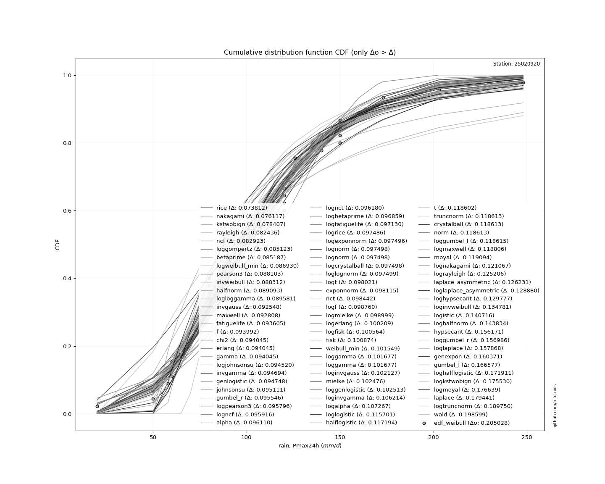</img>

</div>


**3.3. Best fit**

<div align="center">

|   id |   station | empirical_dist   | p_dist       |     delta |   deltao | eval   |   fit |   n |   best_fit |   best_fit_sort |
|-----:|----------:|:-----------------|:-------------|----------:|---------:|:-------|------:|----:|-----------:|----------------:|
|    0 |  25020920 | edf_weibull      | logjohnsonsu | 0.0584792 | 0.188598 | Δo > Δ |     1 |  52 |          1 |               1 |

</div>


<div align="center">

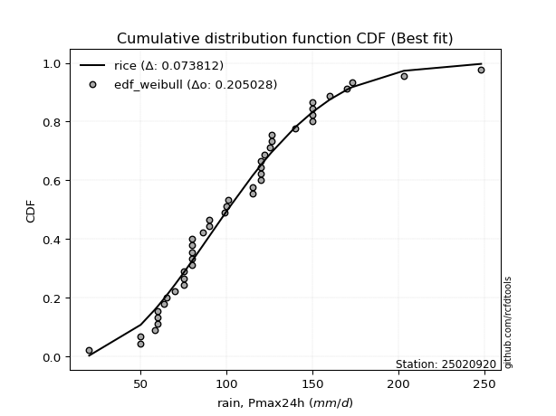</img></img>

</div>


### 4. Empirical - EDF Beard (1943)

The Beard formula (or Beard´s plotting position formula) in hydrology is used to estimate the empirical non-exceedance probability _(P)_ of a flood event (or other extreme hydrological data point) within a given dataset.

<div align="center">


$P=(m-0.31)/(n+0.38)$


</div>


**4.1. Empirical values**

<div align="center">

|                | 0                    | 1                   | 2                   | 3                  | 4                   | 5                   | 6                  | 7                   | 8                   | 9                   | 10                  | 11                 | 12                  | 13                  | 14                 | 15                 | 16                 | 17                 | 18                 | 19                 | 20                  | 21                  | 22                  | 23                  | 24                 | 25                 | 26                 | 27                 | 28                 | 29                 | 30                 | 31                 | 32                 | 33                 | 34                 | 35                 | 36                 | 37                 | 38                 | 39                 | 40                 | 41                | 42                 | 43                 | 44                 | 45                 | 46                 | 47                 | 48                 | 49                 | 50                 | 51                 |
|:---------------|:---------------------|:--------------------|:--------------------|:-------------------|:--------------------|:--------------------|:-------------------|:--------------------|:--------------------|:--------------------|:--------------------|:-------------------|:--------------------|:--------------------|:-------------------|:-------------------|:-------------------|:-------------------|:-------------------|:-------------------|:--------------------|:--------------------|:--------------------|:--------------------|:-------------------|:-------------------|:-------------------|:-------------------|:-------------------|:-------------------|:-------------------|:-------------------|:-------------------|:-------------------|:-------------------|:-------------------|:-------------------|:-------------------|:-------------------|:-------------------|:-------------------|:------------------|:-------------------|:-------------------|:-------------------|:-------------------|:-------------------|:-------------------|:-------------------|:-------------------|:-------------------|:-------------------|
| date           | 2008                 | 1991                | 1988                | 1992               | 1990                | 1984                | 1998               | 1983                | 2009                | 2010                | 2007                | 2011               | 2012                | 1995                | 1974               | 1994               | 1997               | 1972               | 2015               | 1977               | 1976                | 1989                | 2019                | 1975                | 2018               | 2021               | 1971               | 2020               | 2016               | 1980               | 2005               | 2017               | 2013               | 1985               | 1987               | 1970               | 2014               | 2002               | 1996               | 1993               | 1986               | 1979              | 1982               | 1981               | 1999               | 2003               | 2001               | 2000               | 2006               | 1978               | 1973               | 2004               |
| x              | 20.0                 | 50.0                | 60.0                | 60.0               | 60.0                | 65.0                | 70.0               | 75.0                | 75.0                | 75.0                | 80.0                | 80.0               | 80.0                | 80.0                | 86.0               | 90.0               | 90.0               | 90.1443522883201   | 90.7595845282534   | 98.3418531639491   | 99.0                | 100.0               | 100.273882014316    | 101.0               | 101.877971697636   | 103.535454863046   | 104.144144422804   | 105.431758524183   | 106.512869876267   | 107.12048298616614 | 109.720713687932   | 109.955969697234   | 112.023287990105   | 115.0              | 115.0              | 116.48471118843    | 118.058561338164   | 120.0              | 120.0              | 120.0              | 120.0              | 122.0             | 125.0              | 126.0              | 140.0              | 150.0              | 150.0              | 150.0              | 150.0              | 160.0              | 173.0              | 203.0              |
| m              | 1                    | 2                   | 3                   | 4                  | 5                   | 6                   | 7                  | 8                   | 9                   | 10                  | 11                  | 12                 | 13                  | 14                  | 15                 | 16                 | 17                 | 18                 | 19                 | 20                 | 21                  | 22                  | 23                  | 24                  | 25                 | 26                 | 27                 | 28                 | 29                 | 30                 | 31                 | 32                 | 33                 | 34                 | 35                 | 36                 | 37                 | 38                 | 39                 | 40                 | 41                 | 42                | 43                 | 44                 | 45                 | 46                 | 47                 | 48                 | 49                 | 50                 | 51                 | 52                 |
| empirical_dist | edf_beard            | edf_beard           | edf_beard           | edf_beard          | edf_beard           | edf_beard           | edf_beard          | edf_beard           | edf_beard           | edf_beard           | edf_beard           | edf_beard          | edf_beard           | edf_beard           | edf_beard          | edf_beard          | edf_beard          | edf_beard          | edf_beard          | edf_beard          | edf_beard           | edf_beard           | edf_beard           | edf_beard           | edf_beard          | edf_beard          | edf_beard          | edf_beard          | edf_beard          | edf_beard          | edf_beard          | edf_beard          | edf_beard          | edf_beard          | edf_beard          | edf_beard          | edf_beard          | edf_beard          | edf_beard          | edf_beard          | edf_beard          | edf_beard         | edf_beard          | edf_beard          | edf_beard          | edf_beard          | edf_beard          | edf_beard          | edf_beard          | edf_beard          | edf_beard          | edf_beard          |
| empirical      | 0.013172966781214202 | 0.03226422298587247 | 0.05135547919053073 | 0.070446735395189  | 0.08953799159984727 | 0.10862924780450554 | 0.1277205040091638 | 0.14681176021382206 | 0.16590301641848032 | 0.18499427262313858 | 0.20408552882779685 | 0.2231767850324551 | 0.24226804123711337 | 0.26135929744177167 | 0.2804505536464299 | 0.2995418098510882 | 0.3186330660557465 | 0.3377243222604047 | 0.356815578465063  | 0.3759068346697213 | 0.39499809087437954 | 0.41408934707903783 | 0.43318060328369606 | 0.45227185948835436 | 0.4713631156930126 | 0.4904543718976709 | 0.5095456281023292 | 0.5286368843069874 | 0.5477281405116456 | 0.5668193967163039 | 0.5859106529209622 | 0.6050019091256205 | 0.6240931653302787 | 0.6431844215349369 | 0.6622756777395952 | 0.6813669339442534 | 0.7004581901489118 | 0.71954944635357   | 0.7386407025582282 | 0.7577319587628866 | 0.7768232149675448 | 0.795914471172203 | 0.8150057273768613 | 0.8340969835815196 | 0.8531882397861779 | 0.8722794959908361 | 0.8913707521954943 | 0.9104620084001527 | 0.9295532646048109 | 0.9486445208094691 | 0.9677357770141274 | 0.9868270332187857 |
| empirical_tr   | 1.0133488102147417   | 1.0333399092523181  | 1.054135640974039   | 1.0757855822550833 | 1.0983434682323339  | 1.1218676376097665  | 1.1464215364412345 | 1.172074289550235   | 1.1989013504234378  | 1.2269852424455376  | 1.2564164068121852  | 1.287294175473089  | 1.3197278911564627  | 1.3538382010855519  | 1.3897585566463253 | 1.4276369582992643 | 1.4676379938358084 | 1.5099452291726723 | 1.5547640249332149 | 1.602324869990823  | 1.652887346165983   | 1.7067448680351909  | 1.7642303805995283  | 1.8257232485186476  | 1.8916576381365113 | 1.9625327838141624 | 2.0389256520046715 | 2.1215066828675577 | 2.211059518784297  | 2.308505949757602  | 2.4149377593361    | 2.5316578057032384 | 2.6602336211274755 | 2.8025682182985547 | 2.9609949123798747 | 3.138406231276212  | 3.3384321223709366 | 3.5656909462219186 | 3.826150474799122  | 4.127659574468085  | 4.480752780153977  | 4.899906454630494 | 5.405572755417953  | 6.027617951668583  | 6.811443433029906  | 7.8295964125560475 | 9.205623901581712  | 11.1684434968017   | 14.195121951219496 | 19.472118959107764 | 30.994082840236548 | 75.9130434782605   |

</div>


**4.2. Kolmogorov-Smirnov fit test (sorted by Δ)**


<div align="center">

|                | 0                   | 1                     | 2                   | 3                   | 4                   | 5                    | 6                   | 7                   | 8                   | 9                   | 10                  | 11                  | 12                  | 13                  | 14                  | 15                  | 16                  | 17                  | 18                  | 19                  | 20                  | 21                  | 22                  | 23                  | 24                  | 25                  | 26                  | 27                  | 28                  | 29                  | 30                  | 31                  | 32                  | 33                  | 34                  | 35                  | 36                  | 37                  | 38                  | 39                  | 40                  | 41                  | 42                  | 43                  | 44                  | 45                  | 46                  | 47                  | 48                  | 49                  | 50                  | 51                  | 52                  | 53                  | 54                  | 55                  | 56                  | 57                  | 58                  | 59                  | 60                  | 61                  | 62                  | 63                  | 64                  | 65                  | 66                  | 67                  | 68                  | 69                  | 70                  | 71                  | 72                  | 73                  | 74                  | 75                  | 76                  | 77                  | 78                  | 79                  | 80                  | 81                  | 82                  | 83                  | 84                  | 85                  | 86                  | 87                  | 88                  | 89                  |
|:---------------|:--------------------|:----------------------|:--------------------|:--------------------|:--------------------|:---------------------|:--------------------|:--------------------|:--------------------|:--------------------|:--------------------|:--------------------|:--------------------|:--------------------|:--------------------|:--------------------|:--------------------|:--------------------|:--------------------|:--------------------|:--------------------|:--------------------|:--------------------|:--------------------|:--------------------|:--------------------|:--------------------|:--------------------|:--------------------|:--------------------|:--------------------|:--------------------|:--------------------|:--------------------|:--------------------|:--------------------|:--------------------|:--------------------|:--------------------|:--------------------|:--------------------|:--------------------|:--------------------|:--------------------|:--------------------|:--------------------|:--------------------|:--------------------|:--------------------|:--------------------|:--------------------|:--------------------|:--------------------|:--------------------|:--------------------|:--------------------|:--------------------|:--------------------|:--------------------|:--------------------|:--------------------|:--------------------|:--------------------|:--------------------|:--------------------|:--------------------|:--------------------|:--------------------|:--------------------|:--------------------|:--------------------|:--------------------|:--------------------|:--------------------|:--------------------|:--------------------|:--------------------|:--------------------|:--------------------|:--------------------|:--------------------|:--------------------|:--------------------|:--------------------|:--------------------|:--------------------|:--------------------|:--------------------|:--------------------|:--------------------|
| station        | 25020920            | 25020920              | 25020920            | 25020920            | 25020920            | 25020920             | 25020920            | 25020920            | 25020920            | 25020920            | 25020920            | 25020920            | 25020920            | 25020920            | 25020920            | 25020920            | 25020920            | 25020920            | 25020920            | 25020920            | 25020920            | 25020920            | 25020920            | 25020920            | 25020920            | 25020920            | 25020920            | 25020920            | 25020920            | 25020920            | 25020920            | 25020920            | 25020920            | 25020920            | 25020920            | 25020920            | 25020920            | 25020920            | 25020920            | 25020920            | 25020920            | 25020920            | 25020920            | 25020920            | 25020920            | 25020920            | 25020920            | 25020920            | 25020920            | 25020920            | 25020920            | 25020920            | 25020920            | 25020920            | 25020920            | 25020920            | 25020920            | 25020920            | 25020920            | 25020920            | 25020920            | 25020920            | 25020920            | 25020920            | 25020920            | 25020920            | 25020920            | 25020920            | 25020920            | 25020920            | 25020920            | 25020920            | 25020920            | 25020920            | 25020920            | 25020920            | 25020920            | 25020920            | 25020920            | 25020920            | 25020920            | 25020920            | 25020920            | 25020920            | 25020920            | 25020920            | 25020920            | 25020920            | 25020920            | 25020920            |
| empirical_dist | edf_beard           | edf_beard             | edf_beard           | edf_beard           | edf_beard           | edf_beard            | edf_beard           | edf_beard           | edf_beard           | edf_beard           | edf_beard           | edf_beard           | edf_beard           | edf_beard           | edf_beard           | edf_beard           | edf_beard           | edf_beard           | edf_beard           | edf_beard           | edf_beard           | edf_beard           | edf_beard           | edf_beard           | edf_beard           | edf_beard           | edf_beard           | edf_beard           | edf_beard           | edf_beard           | edf_beard           | edf_beard           | edf_beard           | edf_beard           | edf_beard           | edf_beard           | edf_beard           | edf_beard           | edf_beard           | edf_beard           | edf_beard           | edf_beard           | edf_beard           | edf_beard           | edf_beard           | edf_beard           | edf_beard           | edf_beard           | edf_beard           | edf_beard           | edf_beard           | edf_beard           | edf_beard           | edf_beard           | edf_beard           | edf_beard           | edf_beard           | edf_beard           | edf_beard           | edf_beard           | edf_beard           | edf_beard           | edf_beard           | edf_beard           | edf_beard           | edf_beard           | edf_beard           | edf_beard           | edf_beard           | edf_beard           | edf_beard           | edf_beard           | edf_beard           | edf_beard           | edf_beard           | edf_beard           | edf_beard           | edf_beard           | edf_beard           | edf_beard           | edf_beard           | edf_beard           | edf_beard           | edf_beard           | edf_beard           | edf_beard           | edf_beard           | edf_beard           | edf_beard           | edf_beard           |
| p_dist         | logjohnsonsu        | loglaplace_asymmetric | fisk                | t                   | logmielke           | loggenlogistic       | genlogistic         | johnsonsu           | mielke              | exponnorm           | hypsecant           | logistic            | nct                 | invgamma            | nakagami            | alpha               | weibull_min         | pearson3            | laplace_asymmetric  | fatiguelife         | chi2                | f                   | erlang              | gamma               | betaprime           | logfisk             | maxwell             | logloggamma         | laplace             | rice                | norm                | truncnorm           | crystalball         | lognakagami         | rayleigh            | loggompertz         | loggumbel_l         | invweibull          | invgauss            | gumbel_r            | logf                | loglaplace          | loghypsecant        | loglogistic         | logcrystalball      | lognorm             | lognorm             | logexponnorm        | loglognorm          | logrice             | logfatiguelife      | logncf              | logt                | kstwobign           | lognct              | loginvgamma         | gompertz            | gumbel_l            | halfnorm            | loggamma            | loggamma            | logpearson3         | logbetaprime        | logerlang           | moyal               | logalpha            | loginvgauss         | halflogistic        | logmaxwell          | lograyleigh         | loggumbel_r         | loginvweibull       | loghalfnorm         | wald                | logmoyal            | loghalflogistic     | genexpon            | logkstwobign        | logtruncnorm        | gibrat              | logwald             | loggibrat           | loggenexpon         | expon               | pareto              | ncf                 | logexpon            | logpareto           | logweibull_min      | logchi2             |
| delta          | 0.05456522086253707 | 0.05675777175923624   | 0.06065931252299589 | 0.0608172175836994  | 0.06157846282241641 | 0.061887126524294234 | 0.06190561948975426 | 0.06213374206901334 | 0.06487484194525872 | 0.06888296248286796 | 0.07152095123115351 | 0.07209716330928462 | 0.07429810770589051 | 0.07485897547236209 | 0.0754587402888286  | 0.07553194272936681 | 0.0763651909787656  | 0.07638867031475538 | 0.07772474020860079 | 0.08114998577030474 | 0.08152528414411664 | 0.08181730737467874 | 0.08182406237171236 | 0.0818241363228579  | 0.08231771347872197 | 0.08245863475578014 | 0.08441200770591667 | 0.08633513822903272 | 0.08849974121929832 | 0.0911199442825712  | 0.092577685563631   | 0.09257768813248002 | 0.09257769495394896 | 0.09621405548722539 | 0.0965673061118617  | 0.09929909504094325 | 0.10283592948235498 | 0.10394863146846939 | 0.113657139191218   | 0.1140720484960302  | 0.11412776071956987 | 0.11814717703766142 | 0.11986364156767176 | 0.1202573739507054  | 0.12071839040641086 | 0.1207184345621925  | 0.1207184345621925  | 0.12071987679417429 | 0.12072067651067242 | 0.12072073878529704 | 0.12093363165880772 | 0.12156350559539819 | 0.12162406739140386 | 0.122402864622568   | 0.12313017595262188 | 0.12484119078879286 | 0.12852971494079724 | 0.13076322057379264 | 0.13095174767140183 | 0.1316569994098471  | 0.1316569994098471  | 0.13249922776044532 | 0.13446533933055116 | 0.13519389239479251 | 0.13852118692360826 | 0.146935334801653   | 0.14726460527633534 | 0.1496185165576397  | 0.15389997689637536 | 0.16498496726749412 | 0.190986460014266   | 0.19298315712423464 | 0.19618924489623224 | 0.20595608484083283 | 0.21685287620610694 | 0.22092003953304107 | 0.22539522914531687 | 0.24271544663169373 | 0.2553003927692993  | 0.26123612935990226 | 0.28879608557283365 | 0.3116193567690201  | 0.3281713855963776  | 0.3319623848680906  | 0.3319624080324821  | 0.33903311765989913 | 0.44628679540537153 | 0.4462868031737972  | 0.5713910284598556  | 0.6455890460021717  |
| deltao         | 0.18859806671657792 | 0.18859806671657792   | 0.18859806671657792 | 0.18859806671657792 | 0.18859806671657792 | 0.18859806671657792  | 0.18859806671657792 | 0.18859806671657792 | 0.18859806671657792 | 0.18859806671657792 | 0.18859806671657792 | 0.18859806671657792 | 0.18859806671657792 | 0.18859806671657792 | 0.18859806671657792 | 0.18859806671657792 | 0.18859806671657792 | 0.18859806671657792 | 0.18859806671657792 | 0.18859806671657792 | 0.18859806671657792 | 0.18859806671657792 | 0.18859806671657792 | 0.18859806671657792 | 0.18859806671657792 | 0.18859806671657792 | 0.18859806671657792 | 0.18859806671657792 | 0.18859806671657792 | 0.18859806671657792 | 0.18859806671657792 | 0.18859806671657792 | 0.18859806671657792 | 0.18859806671657792 | 0.18859806671657792 | 0.18859806671657792 | 0.18859806671657792 | 0.18859806671657792 | 0.18859806671657792 | 0.18859806671657792 | 0.18859806671657792 | 0.18859806671657792 | 0.18859806671657792 | 0.18859806671657792 | 0.18859806671657792 | 0.18859806671657792 | 0.18859806671657792 | 0.18859806671657792 | 0.18859806671657792 | 0.18859806671657792 | 0.18859806671657792 | 0.18859806671657792 | 0.18859806671657792 | 0.18859806671657792 | 0.18859806671657792 | 0.18859806671657792 | 0.18859806671657792 | 0.18859806671657792 | 0.18859806671657792 | 0.18859806671657792 | 0.18859806671657792 | 0.18859806671657792 | 0.18859806671657792 | 0.18859806671657792 | 0.18859806671657792 | 0.18859806671657792 | 0.18859806671657792 | 0.18859806671657792 | 0.18859806671657792 | 0.18859806671657792 | 0.18859806671657792 | 0.18859806671657792 | 0.18859806671657792 | 0.18859806671657792 | 0.18859806671657792 | 0.18859806671657792 | 0.18859806671657792 | 0.18859806671657792 | 0.18859806671657792 | 0.18859806671657792 | 0.18859806671657792 | 0.18859806671657792 | 0.18859806671657792 | 0.18859806671657792 | 0.18859806671657792 | 0.18859806671657792 | 0.18859806671657792 | 0.18859806671657792 | 0.18859806671657792 | 0.18859806671657792 |
| eval           | Δo > Δ              | Δo > Δ                | Δo > Δ              | Δo > Δ              | Δo > Δ              | Δo > Δ               | Δo > Δ              | Δo > Δ              | Δo > Δ              | Δo > Δ              | Δo > Δ              | Δo > Δ              | Δo > Δ              | Δo > Δ              | Δo > Δ              | Δo > Δ              | Δo > Δ              | Δo > Δ              | Δo > Δ              | Δo > Δ              | Δo > Δ              | Δo > Δ              | Δo > Δ              | Δo > Δ              | Δo > Δ              | Δo > Δ              | Δo > Δ              | Δo > Δ              | Δo > Δ              | Δo > Δ              | Δo > Δ              | Δo > Δ              | Δo > Δ              | Δo > Δ              | Δo > Δ              | Δo > Δ              | Δo > Δ              | Δo > Δ              | Δo > Δ              | Δo > Δ              | Δo > Δ              | Δo > Δ              | Δo > Δ              | Δo > Δ              | Δo > Δ              | Δo > Δ              | Δo > Δ              | Δo > Δ              | Δo > Δ              | Δo > Δ              | Δo > Δ              | Δo > Δ              | Δo > Δ              | Δo > Δ              | Δo > Δ              | Δo > Δ              | Δo > Δ              | Δo > Δ              | Δo > Δ              | Δo > Δ              | Δo > Δ              | Δo > Δ              | Δo > Δ              | Δo > Δ              | Δo > Δ              | Δo > Δ              | Δo > Δ              | Δo > Δ              | Δo > Δ              | Δo > Δ              | Δo <= Δ             | Δo <= Δ             | Δo <= Δ             | Δo <= Δ             | Δo <= Δ             | Δo <= Δ             | Δo <= Δ             | Δo <= Δ             | Δo <= Δ             | Δo <= Δ             | Δo <= Δ             | Δo <= Δ             | Δo <= Δ             | Δo <= Δ             | Δo <= Δ             | Δo <= Δ             | Δo <= Δ             | Δo <= Δ             | Δo <= Δ             | Δo <= Δ             |
| fit            | 1                   | 1                     | 1                   | 1                   | 1                   | 1                    | 1                   | 1                   | 1                   | 1                   | 1                   | 1                   | 1                   | 1                   | 1                   | 1                   | 1                   | 1                   | 1                   | 1                   | 1                   | 1                   | 1                   | 1                   | 1                   | 1                   | 1                   | 1                   | 1                   | 1                   | 1                   | 1                   | 1                   | 1                   | 1                   | 1                   | 1                   | 1                   | 1                   | 1                   | 1                   | 1                   | 1                   | 1                   | 1                   | 1                   | 1                   | 1                   | 1                   | 1                   | 1                   | 1                   | 1                   | 1                   | 1                   | 1                   | 1                   | 1                   | 1                   | 1                   | 1                   | 1                   | 1                   | 1                   | 1                   | 1                   | 1                   | 1                   | 1                   | 1                   | 0                   | 0                   | 0                   | 0                   | 0                   | 0                   | 0                   | 0                   | 0                   | 0                   | 0                   | 0                   | 0                   | 0                   | 0                   | 0                   | 0                   | 0                   | 0                   | 0                   |
| n              | 52                  | 52                    | 52                  | 52                  | 52                  | 52                   | 52                  | 52                  | 52                  | 52                  | 52                  | 52                  | 52                  | 52                  | 52                  | 52                  | 52                  | 52                  | 52                  | 52                  | 52                  | 52                  | 52                  | 52                  | 52                  | 52                  | 52                  | 52                  | 52                  | 52                  | 52                  | 52                  | 52                  | 52                  | 52                  | 52                  | 52                  | 52                  | 52                  | 52                  | 52                  | 52                  | 52                  | 52                  | 52                  | 52                  | 52                  | 52                  | 52                  | 52                  | 52                  | 52                  | 52                  | 52                  | 52                  | 52                  | 52                  | 52                  | 52                  | 52                  | 52                  | 52                  | 52                  | 52                  | 52                  | 52                  | 52                  | 52                  | 52                  | 52                  | 52                  | 52                  | 52                  | 52                  | 52                  | 52                  | 52                  | 52                  | 52                  | 52                  | 52                  | 52                  | 52                  | 52                  | 52                  | 52                  | 52                  | 52                  | 52                  | 52                  |
| best_fit       | 1                   | 0                     | 0                   | 0                   | 0                   | 0                    | 0                   | 0                   | 0                   | 0                   | 0                   | 0                   | 0                   | 0                   | 0                   | 0                   | 0                   | 0                   | 0                   | 0                   | 0                   | 0                   | 0                   | 0                   | 0                   | 0                   | 0                   | 0                   | 0                   | 0                   | 0                   | 0                   | 0                   | 0                   | 0                   | 0                   | 0                   | 0                   | 0                   | 0                   | 0                   | 0                   | 0                   | 0                   | 0                   | 0                   | 0                   | 0                   | 0                   | 0                   | 0                   | 0                   | 0                   | 0                   | 0                   | 0                   | 0                   | 0                   | 0                   | 0                   | 0                   | 0                   | 0                   | 0                   | 0                   | 0                   | 0                   | 0                   | 0                   | 0                   | 0                   | 0                   | 0                   | 0                   | 0                   | 0                   | 0                   | 0                   | 0                   | 0                   | 0                   | 0                   | 0                   | 0                   | 0                   | 0                   | 0                   | 0                   | 0                   | 0                   |
| best_fit_sort  | 1                   | 2                     | 3                   | 4                   | 5                   | 6                    | 7                   | 8                   | 9                   | 10                  | 11                  | 12                  | 13                  | 14                  | 15                  | 16                  | 17                  | 18                  | 19                  | 20                  | 21                  | 22                  | 23                  | 24                  | 25                  | 26                  | 27                  | 28                  | 29                  | 30                  | 31                  | 32                  | 33                  | 34                  | 35                  | 36                  | 37                  | 38                  | 39                  | 40                  | 41                  | 42                  | 43                  | 44                  | 45                  | 46                  | 47                  | 48                  | 49                  | 50                  | 51                  | 52                  | 53                  | 54                  | 55                  | 56                  | 57                  | 58                  | 59                  | 60                  | 61                  | 62                  | 63                  | 64                  | 65                  | 66                  | 67                  | 68                  | 69                  | 70                  | 71                  | 72                  | 73                  | 74                  | 75                  | 76                  | 77                  | 78                  | 79                  | 80                  | 81                  | 82                  | 83                  | 84                  | 85                  | 86                  | 87                  | 88                  | 89                  | 90                  |

</div>


<div align="center">

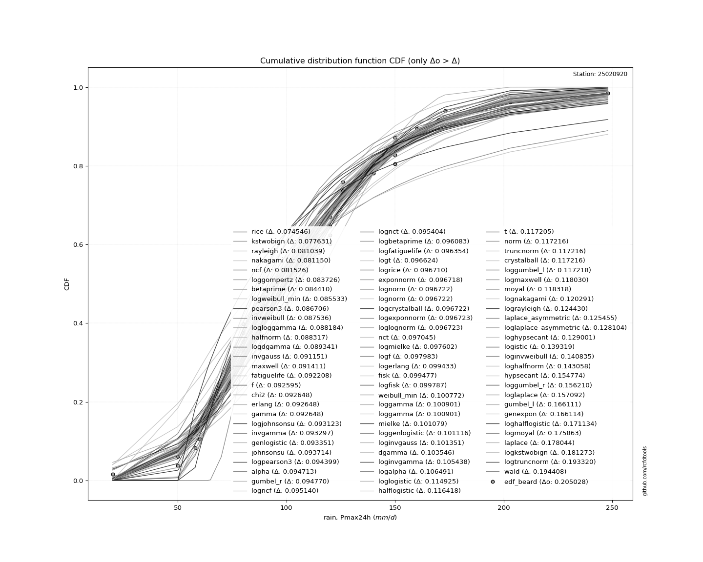</img>

</div>


**4.3. Best fit**

<div align="center">

|   id |   station | empirical_dist   | p_dist       |     delta |   deltao | eval   |   fit |   n |   best_fit |   best_fit_sort |
|-----:|----------:|:-----------------|:-------------|----------:|---------:|:-------|------:|----:|-----------:|----------------:|
|    0 |  25020920 | edf_beard        | logjohnsonsu | 0.0545652 | 0.188598 | Δo > Δ |     1 |  52 |          1 |               1 |

</div>


<div align="center">

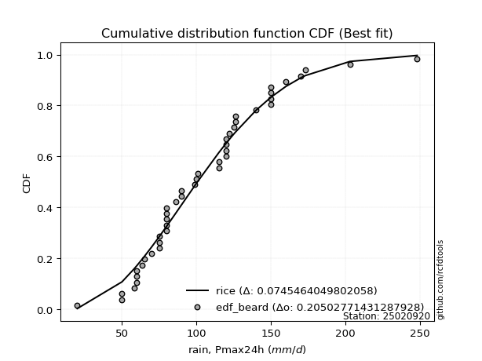</img>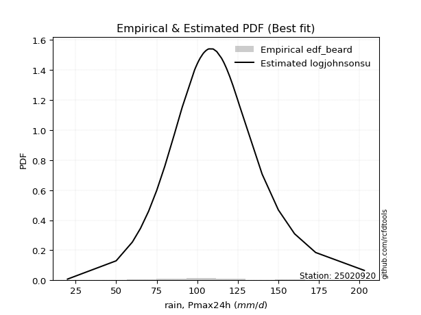</img>

</div>


### 5. Empirical - EDF Chegodayev (1955)

The Chegodayev formula is an empirical plotting position formula used in hydrological frequency analysis to estimate the exceedance probability or return period of a specific event from a set of observed data. It is primarily used for plotting observed data points on probability paper to fit a theoretical distribution, particularly for analyzing extreme events like maximum flood flows or rainfall intensities. The constant _b_ value in the generalized plotting position formula is 0.3.

<div align="center">


$P=(m-b)/(n+1-2b)$


</div>


**5.1. Empirical values**

<div align="center">

|                | 0                    | 1                   | 2                   | 3                   | 4                   | 5                   | 6                   | 7                   | 8                   | 9                  | 10                  | 11                 | 12                  | 13                  | 14                  | 15                 | 16                 | 17                 | 18                 | 19                  | 20                 | 21                  | 22                 | 23                  | 24                 | 25                 | 26                 | 27                 | 28                 | 29                 | 30                 | 31                 | 32                 | 33                 | 34                 | 35                 | 36                 | 37                 | 38                 | 39                 | 40                 | 41                 | 42                 | 43                 | 44                 | 45                 | 46                 | 47                 | 48                 | 49                 | 50                 | 51                 |
|:---------------|:---------------------|:--------------------|:--------------------|:--------------------|:--------------------|:--------------------|:--------------------|:--------------------|:--------------------|:-------------------|:--------------------|:-------------------|:--------------------|:--------------------|:--------------------|:-------------------|:-------------------|:-------------------|:-------------------|:--------------------|:-------------------|:--------------------|:-------------------|:--------------------|:-------------------|:-------------------|:-------------------|:-------------------|:-------------------|:-------------------|:-------------------|:-------------------|:-------------------|:-------------------|:-------------------|:-------------------|:-------------------|:-------------------|:-------------------|:-------------------|:-------------------|:-------------------|:-------------------|:-------------------|:-------------------|:-------------------|:-------------------|:-------------------|:-------------------|:-------------------|:-------------------|:-------------------|
| date           | 2008                 | 1991                | 1988                | 1992                | 1990                | 1984                | 1998                | 1983                | 2009                | 2010               | 2007                | 2011               | 2012                | 1995                | 1974                | 1994               | 1997               | 1972               | 2015               | 1977                | 1976               | 1989                | 2019               | 1975                | 2018               | 2021               | 1971               | 2020               | 2016               | 1980               | 2005               | 2017               | 2013               | 1985               | 1987               | 1970               | 2014               | 2002               | 1996               | 1993               | 1986               | 1979               | 1982               | 1981               | 1999               | 2003               | 2001               | 2000               | 2006               | 1978               | 1973               | 2004               |
| x              | 20.0                 | 50.0                | 60.0                | 60.0                | 60.0                | 65.0                | 70.0                | 75.0                | 75.0                | 75.0               | 80.0                | 80.0               | 80.0                | 80.0                | 86.0                | 90.0               | 90.0               | 90.1443522883201   | 90.7595845282534   | 98.3418531639491    | 99.0               | 100.0               | 100.273882014316   | 101.0               | 101.877971697636   | 103.535454863046   | 104.144144422804   | 105.431758524183   | 106.512869876267   | 107.12048298616614 | 109.720713687932   | 109.955969697234   | 112.023287990105   | 115.0              | 115.0              | 116.48471118843    | 118.058561338164   | 120.0              | 120.0              | 120.0              | 120.0              | 122.0              | 125.0              | 126.0              | 140.0              | 150.0              | 150.0              | 150.0              | 150.0              | 160.0              | 173.0              | 203.0              |
| m              | 1                    | 2                   | 3                   | 4                   | 5                   | 6                   | 7                   | 8                   | 9                   | 10                 | 11                  | 12                 | 13                  | 14                  | 15                  | 16                 | 17                 | 18                 | 19                 | 20                  | 21                 | 22                  | 23                 | 24                  | 25                 | 26                 | 27                 | 28                 | 29                 | 30                 | 31                 | 32                 | 33                 | 34                 | 35                 | 36                 | 37                 | 38                 | 39                 | 40                 | 41                 | 42                 | 43                 | 44                 | 45                 | 46                 | 47                 | 48                 | 49                 | 50                 | 51                 | 52                 |
| empirical_dist | edf_chegodayev       | edf_chegodayev      | edf_chegodayev      | edf_chegodayev      | edf_chegodayev      | edf_chegodayev      | edf_chegodayev      | edf_chegodayev      | edf_chegodayev      | edf_chegodayev     | edf_chegodayev      | edf_chegodayev     | edf_chegodayev      | edf_chegodayev      | edf_chegodayev      | edf_chegodayev     | edf_chegodayev     | edf_chegodayev     | edf_chegodayev     | edf_chegodayev      | edf_chegodayev     | edf_chegodayev      | edf_chegodayev     | edf_chegodayev      | edf_chegodayev     | edf_chegodayev     | edf_chegodayev     | edf_chegodayev     | edf_chegodayev     | edf_chegodayev     | edf_chegodayev     | edf_chegodayev     | edf_chegodayev     | edf_chegodayev     | edf_chegodayev     | edf_chegodayev     | edf_chegodayev     | edf_chegodayev     | edf_chegodayev     | edf_chegodayev     | edf_chegodayev     | edf_chegodayev     | edf_chegodayev     | edf_chegodayev     | edf_chegodayev     | edf_chegodayev     | edf_chegodayev     | edf_chegodayev     | edf_chegodayev     | edf_chegodayev     | edf_chegodayev     | edf_chegodayev     |
| empirical      | 0.013358778625954198 | 0.03244274809160305 | 0.05152671755725191 | 0.07061068702290077 | 0.08969465648854963 | 0.10877862595419847 | 0.12786259541984735 | 0.14694656488549618 | 0.16603053435114504 | 0.1851145038167939 | 0.20419847328244273 | 0.2232824427480916 | 0.24236641221374045 | 0.26145038167938933 | 0.28053435114503816 | 0.299618320610687  | 0.3187022900763359 | 0.3377862595419847 | 0.3568702290076336 | 0.37595419847328243 | 0.3950381679389313 | 0.41412213740458015 | 0.433206106870229  | 0.45229007633587787 | 0.4713740458015267 | 0.4904580152671756 | 0.5095419847328244 | 0.5286259541984732 | 0.5477099236641222 | 0.566793893129771  | 0.5858778625954199 | 0.6049618320610687 | 0.6240458015267176 | 0.6431297709923665 | 0.6622137404580153 | 0.6812977099236642 | 0.7003816793893131 | 0.7194656488549619 | 0.7385496183206107 | 0.7576335877862597 | 0.7767175572519085 | 0.7958015267175573 | 0.8148854961832062 | 0.833969465648855  | 0.8530534351145039 | 0.8721374045801528 | 0.8912213740458016 | 0.9103053435114504 | 0.9293893129770994 | 0.9484732824427482 | 0.967557251908397  | 0.9866412213740459 |
| empirical_tr   | 1.0135396518375241   | 1.0335305719921104  | 1.0543259557344065  | 1.0759753593429158  | 1.09853249475891    | 1.1220556745182013  | 1.1466083150984683  | 1.1722595078299776  | 1.1990846681922196  | 1.2271662763466042 | 1.2565947242206235  | 1.2874692874692875 | 1.3198992443324937  | 1.3540051679586564  | 1.389920424403183   | 1.4277929155313351 | 1.4677871148459385 | 1.510086455331412  | 1.5548961424332344 | 1.602446483180428   | 1.6529968454258677 | 1.706840390879479   | 1.7643097643097643 | 1.8257839721254356  | 1.8916967509025273 | 1.9625468164794009 | 2.0389105058365757 | 2.1214574898785425 | 2.210970464135021  | 2.3083700440528636 | 2.414746543778802  | 2.5314009661835746 | 2.659898477157361  | 2.8021390374331556 | 2.96045197740113   | 3.137724550898205  | 3.337579617834396  | 3.564625850340137  | 3.824817518248176  | 4.125984251968506  | 4.4786324786324805 | 4.897196261682245  | 5.402061855670104  | 6.0229885057471275 | 6.805194805194811  | 7.820895522388065  | 9.192982456140356  | 11.148936170212771 | 14.162162162162188 | 19.407407407407447 | 30.823529411764785 | 74.8571428571432   |

</div>


**5.2. Kolmogorov-Smirnov fit test (sorted by Δ)**


<div align="center">

|                | 0                   | 1                     | 2                   | 3                   | 4                    | 5                    | 6                   | 7                   | 8                   | 9                   | 10                  | 11                  | 12                  | 13                  | 14                  | 15                  | 16                  | 17                  | 18                  | 19                  | 20                  | 21                  | 22                  | 23                  | 24                  | 25                  | 26                  | 27                  | 28                  | 29                  | 30                  | 31                  | 32                  | 33                  | 34                  | 35                  | 36                  | 37                  | 38                  | 39                  | 40                  | 41                  | 42                  | 43                  | 44                  | 45                  | 46                  | 47                  | 48                  | 49                  | 50                  | 51                  | 52                  | 53                  | 54                  | 55                  | 56                  | 57                  | 58                  | 59                  | 60                  | 61                  | 62                  | 63                  | 64                  | 65                  | 66                  | 67                  | 68                  | 69                  | 70                  | 71                  | 72                  | 73                  | 74                  | 75                  | 76                  | 77                  | 78                  | 79                  | 80                  | 81                  | 82                  | 83                  | 84                  | 85                  | 86                  | 87                  | 88                  | 89                  |
|:---------------|:--------------------|:----------------------|:--------------------|:--------------------|:---------------------|:---------------------|:--------------------|:--------------------|:--------------------|:--------------------|:--------------------|:--------------------|:--------------------|:--------------------|:--------------------|:--------------------|:--------------------|:--------------------|:--------------------|:--------------------|:--------------------|:--------------------|:--------------------|:--------------------|:--------------------|:--------------------|:--------------------|:--------------------|:--------------------|:--------------------|:--------------------|:--------------------|:--------------------|:--------------------|:--------------------|:--------------------|:--------------------|:--------------------|:--------------------|:--------------------|:--------------------|:--------------------|:--------------------|:--------------------|:--------------------|:--------------------|:--------------------|:--------------------|:--------------------|:--------------------|:--------------------|:--------------------|:--------------------|:--------------------|:--------------------|:--------------------|:--------------------|:--------------------|:--------------------|:--------------------|:--------------------|:--------------------|:--------------------|:--------------------|:--------------------|:--------------------|:--------------------|:--------------------|:--------------------|:--------------------|:--------------------|:--------------------|:--------------------|:--------------------|:--------------------|:--------------------|:--------------------|:--------------------|:--------------------|:--------------------|:--------------------|:--------------------|:--------------------|:--------------------|:--------------------|:--------------------|:--------------------|:--------------------|:--------------------|:--------------------|
| station        | 25020920            | 25020920              | 25020920            | 25020920            | 25020920             | 25020920             | 25020920            | 25020920            | 25020920            | 25020920            | 25020920            | 25020920            | 25020920            | 25020920            | 25020920            | 25020920            | 25020920            | 25020920            | 25020920            | 25020920            | 25020920            | 25020920            | 25020920            | 25020920            | 25020920            | 25020920            | 25020920            | 25020920            | 25020920            | 25020920            | 25020920            | 25020920            | 25020920            | 25020920            | 25020920            | 25020920            | 25020920            | 25020920            | 25020920            | 25020920            | 25020920            | 25020920            | 25020920            | 25020920            | 25020920            | 25020920            | 25020920            | 25020920            | 25020920            | 25020920            | 25020920            | 25020920            | 25020920            | 25020920            | 25020920            | 25020920            | 25020920            | 25020920            | 25020920            | 25020920            | 25020920            | 25020920            | 25020920            | 25020920            | 25020920            | 25020920            | 25020920            | 25020920            | 25020920            | 25020920            | 25020920            | 25020920            | 25020920            | 25020920            | 25020920            | 25020920            | 25020920            | 25020920            | 25020920            | 25020920            | 25020920            | 25020920            | 25020920            | 25020920            | 25020920            | 25020920            | 25020920            | 25020920            | 25020920            | 25020920            |
| empirical_dist | edf_chegodayev      | edf_chegodayev        | edf_chegodayev      | edf_chegodayev      | edf_chegodayev       | edf_chegodayev       | edf_chegodayev      | edf_chegodayev      | edf_chegodayev      | edf_chegodayev      | edf_chegodayev      | edf_chegodayev      | edf_chegodayev      | edf_chegodayev      | edf_chegodayev      | edf_chegodayev      | edf_chegodayev      | edf_chegodayev      | edf_chegodayev      | edf_chegodayev      | edf_chegodayev      | edf_chegodayev      | edf_chegodayev      | edf_chegodayev      | edf_chegodayev      | edf_chegodayev      | edf_chegodayev      | edf_chegodayev      | edf_chegodayev      | edf_chegodayev      | edf_chegodayev      | edf_chegodayev      | edf_chegodayev      | edf_chegodayev      | edf_chegodayev      | edf_chegodayev      | edf_chegodayev      | edf_chegodayev      | edf_chegodayev      | edf_chegodayev      | edf_chegodayev      | edf_chegodayev      | edf_chegodayev      | edf_chegodayev      | edf_chegodayev      | edf_chegodayev      | edf_chegodayev      | edf_chegodayev      | edf_chegodayev      | edf_chegodayev      | edf_chegodayev      | edf_chegodayev      | edf_chegodayev      | edf_chegodayev      | edf_chegodayev      | edf_chegodayev      | edf_chegodayev      | edf_chegodayev      | edf_chegodayev      | edf_chegodayev      | edf_chegodayev      | edf_chegodayev      | edf_chegodayev      | edf_chegodayev      | edf_chegodayev      | edf_chegodayev      | edf_chegodayev      | edf_chegodayev      | edf_chegodayev      | edf_chegodayev      | edf_chegodayev      | edf_chegodayev      | edf_chegodayev      | edf_chegodayev      | edf_chegodayev      | edf_chegodayev      | edf_chegodayev      | edf_chegodayev      | edf_chegodayev      | edf_chegodayev      | edf_chegodayev      | edf_chegodayev      | edf_chegodayev      | edf_chegodayev      | edf_chegodayev      | edf_chegodayev      | edf_chegodayev      | edf_chegodayev      | edf_chegodayev      | edf_chegodayev      |
| p_dist         | logjohnsonsu        | loglaplace_asymmetric | fisk                | t                   | logmielke            | loggenlogistic       | genlogistic         | johnsonsu           | mielke              | exponnorm           | hypsecant           | logistic            | nct                 | invgamma            | nakagami            | alpha               | weibull_min         | pearson3            | laplace_asymmetric  | fatiguelife         | chi2                | f                   | erlang              | gamma               | betaprime           | logfisk             | maxwell             | logloggamma         | laplace             | rice                | norm                | truncnorm           | crystalball         | lognakagami         | rayleigh            | loggompertz         | loggumbel_l         | invweibull          | invgauss            | gumbel_r            | logf                | loglaplace          | loghypsecant        | loglogistic         | logcrystalball      | lognorm             | lognorm             | logexponnorm        | loglognorm          | logrice             | logfatiguelife      | logncf              | logt                | kstwobign           | lognct              | loginvgamma         | gompertz            | gumbel_l            | halfnorm            | loggamma            | loggamma            | logpearson3         | logbetaprime        | logerlang           | moyal               | logalpha            | loginvgauss         | halflogistic        | logmaxwell          | lograyleigh         | loggumbel_r         | loginvweibull       | loghalfnorm         | wald                | logmoyal            | loghalflogistic     | genexpon            | logkstwobign        | logtruncnorm        | gibrat              | logwald             | loggibrat           | loggenexpon         | expon               | pareto              | ncf                 | logexpon            | logpareto           | logweibull_min      | logchi2             |
| delta          | 0.05451785705897594 | 0.05689986316991957   | 0.06061194871943476 | 0.06095930899438273 | 0.061531099018855284 | 0.061839762720733105 | 0.06185825568619313 | 0.06208637826545221 | 0.06482747814169759 | 0.06883559867930683 | 0.07161203546877118 | 0.07199150559364831 | 0.0741924499902542  | 0.07475331775672578 | 0.07533122235616396 | 0.0754262850137305  | 0.07623767304610096 | 0.07626115238209075 | 0.07781582444621846 | 0.08104432805466844 | 0.08141962642848033 | 0.08171164965904243 | 0.08171840465607605 | 0.08171847860722159 | 0.08219019554605733 | 0.082411270952219   | 0.08436464390235554 | 0.0862294805133964  | 0.08859082545691599 | 0.09101428656693489 | 0.09247202784799469 | 0.09247203041684371 | 0.09247203723831265 | 0.09616669168366426 | 0.09651994230830058 | 0.09919343732530694 | 0.10273027176671867 | 0.10390126766490826 | 0.11360977538765688 | 0.11402468469246907 | 0.11408768365501809 | 0.11809981323410029 | 0.11981627776411063 | 0.12021001014714428 | 0.12067102660284973 | 0.12067107075863137 | 0.12067107075863137 | 0.12067251299061316 | 0.12067331270711129 | 0.12067337498173591 | 0.12088626785524659 | 0.12151614179183706 | 0.12157670358784273 | 0.12235550081900687 | 0.12308281214906075 | 0.12479382698523173 | 0.1284021970081326  | 0.13065756285815633 | 0.1309043838678407  | 0.13160963560628597 | 0.13160963560628597 | 0.132393570044809   | 0.13441797552699003 | 0.13514652859123139 | 0.13847382312004713 | 0.14688797099809187 | 0.1472172414727742  | 0.14957115275407856 | 0.15385261309281423 | 0.164937603463933   | 0.19093909621070487 | 0.1928192054965231  | 0.1961418810926711  | 0.2059087210372717  | 0.2168055124025458  | 0.22087267572947994 | 0.22526042447364275 | 0.2425806419600196  | 0.2551655880976252  | 0.2613272135975199  | 0.2887487217692725  | 0.31157199296545895 | 0.32803658092470345 | 0.33182758019641645 | 0.33182760336080797 | 0.33886187929317796 | 0.44611555703865036 | 0.44611556480707604 | 0.5712197900931344  | 0.6454178076354505  |
| deltao         | 0.18859806671657792 | 0.18859806671657792   | 0.18859806671657792 | 0.18859806671657792 | 0.18859806671657792  | 0.18859806671657792  | 0.18859806671657792 | 0.18859806671657792 | 0.18859806671657792 | 0.18859806671657792 | 0.18859806671657792 | 0.18859806671657792 | 0.18859806671657792 | 0.18859806671657792 | 0.18859806671657792 | 0.18859806671657792 | 0.18859806671657792 | 0.18859806671657792 | 0.18859806671657792 | 0.18859806671657792 | 0.18859806671657792 | 0.18859806671657792 | 0.18859806671657792 | 0.18859806671657792 | 0.18859806671657792 | 0.18859806671657792 | 0.18859806671657792 | 0.18859806671657792 | 0.18859806671657792 | 0.18859806671657792 | 0.18859806671657792 | 0.18859806671657792 | 0.18859806671657792 | 0.18859806671657792 | 0.18859806671657792 | 0.18859806671657792 | 0.18859806671657792 | 0.18859806671657792 | 0.18859806671657792 | 0.18859806671657792 | 0.18859806671657792 | 0.18859806671657792 | 0.18859806671657792 | 0.18859806671657792 | 0.18859806671657792 | 0.18859806671657792 | 0.18859806671657792 | 0.18859806671657792 | 0.18859806671657792 | 0.18859806671657792 | 0.18859806671657792 | 0.18859806671657792 | 0.18859806671657792 | 0.18859806671657792 | 0.18859806671657792 | 0.18859806671657792 | 0.18859806671657792 | 0.18859806671657792 | 0.18859806671657792 | 0.18859806671657792 | 0.18859806671657792 | 0.18859806671657792 | 0.18859806671657792 | 0.18859806671657792 | 0.18859806671657792 | 0.18859806671657792 | 0.18859806671657792 | 0.18859806671657792 | 0.18859806671657792 | 0.18859806671657792 | 0.18859806671657792 | 0.18859806671657792 | 0.18859806671657792 | 0.18859806671657792 | 0.18859806671657792 | 0.18859806671657792 | 0.18859806671657792 | 0.18859806671657792 | 0.18859806671657792 | 0.18859806671657792 | 0.18859806671657792 | 0.18859806671657792 | 0.18859806671657792 | 0.18859806671657792 | 0.18859806671657792 | 0.18859806671657792 | 0.18859806671657792 | 0.18859806671657792 | 0.18859806671657792 | 0.18859806671657792 |
| eval           | Δo > Δ              | Δo > Δ                | Δo > Δ              | Δo > Δ              | Δo > Δ               | Δo > Δ               | Δo > Δ              | Δo > Δ              | Δo > Δ              | Δo > Δ              | Δo > Δ              | Δo > Δ              | Δo > Δ              | Δo > Δ              | Δo > Δ              | Δo > Δ              | Δo > Δ              | Δo > Δ              | Δo > Δ              | Δo > Δ              | Δo > Δ              | Δo > Δ              | Δo > Δ              | Δo > Δ              | Δo > Δ              | Δo > Δ              | Δo > Δ              | Δo > Δ              | Δo > Δ              | Δo > Δ              | Δo > Δ              | Δo > Δ              | Δo > Δ              | Δo > Δ              | Δo > Δ              | Δo > Δ              | Δo > Δ              | Δo > Δ              | Δo > Δ              | Δo > Δ              | Δo > Δ              | Δo > Δ              | Δo > Δ              | Δo > Δ              | Δo > Δ              | Δo > Δ              | Δo > Δ              | Δo > Δ              | Δo > Δ              | Δo > Δ              | Δo > Δ              | Δo > Δ              | Δo > Δ              | Δo > Δ              | Δo > Δ              | Δo > Δ              | Δo > Δ              | Δo > Δ              | Δo > Δ              | Δo > Δ              | Δo > Δ              | Δo > Δ              | Δo > Δ              | Δo > Δ              | Δo > Δ              | Δo > Δ              | Δo > Δ              | Δo > Δ              | Δo > Δ              | Δo > Δ              | Δo <= Δ             | Δo <= Δ             | Δo <= Δ             | Δo <= Δ             | Δo <= Δ             | Δo <= Δ             | Δo <= Δ             | Δo <= Δ             | Δo <= Δ             | Δo <= Δ             | Δo <= Δ             | Δo <= Δ             | Δo <= Δ             | Δo <= Δ             | Δo <= Δ             | Δo <= Δ             | Δo <= Δ             | Δo <= Δ             | Δo <= Δ             | Δo <= Δ             |
| fit            | 1                   | 1                     | 1                   | 1                   | 1                    | 1                    | 1                   | 1                   | 1                   | 1                   | 1                   | 1                   | 1                   | 1                   | 1                   | 1                   | 1                   | 1                   | 1                   | 1                   | 1                   | 1                   | 1                   | 1                   | 1                   | 1                   | 1                   | 1                   | 1                   | 1                   | 1                   | 1                   | 1                   | 1                   | 1                   | 1                   | 1                   | 1                   | 1                   | 1                   | 1                   | 1                   | 1                   | 1                   | 1                   | 1                   | 1                   | 1                   | 1                   | 1                   | 1                   | 1                   | 1                   | 1                   | 1                   | 1                   | 1                   | 1                   | 1                   | 1                   | 1                   | 1                   | 1                   | 1                   | 1                   | 1                   | 1                   | 1                   | 1                   | 1                   | 0                   | 0                   | 0                   | 0                   | 0                   | 0                   | 0                   | 0                   | 0                   | 0                   | 0                   | 0                   | 0                   | 0                   | 0                   | 0                   | 0                   | 0                   | 0                   | 0                   |
| n              | 52                  | 52                    | 52                  | 52                  | 52                   | 52                   | 52                  | 52                  | 52                  | 52                  | 52                  | 52                  | 52                  | 52                  | 52                  | 52                  | 52                  | 52                  | 52                  | 52                  | 52                  | 52                  | 52                  | 52                  | 52                  | 52                  | 52                  | 52                  | 52                  | 52                  | 52                  | 52                  | 52                  | 52                  | 52                  | 52                  | 52                  | 52                  | 52                  | 52                  | 52                  | 52                  | 52                  | 52                  | 52                  | 52                  | 52                  | 52                  | 52                  | 52                  | 52                  | 52                  | 52                  | 52                  | 52                  | 52                  | 52                  | 52                  | 52                  | 52                  | 52                  | 52                  | 52                  | 52                  | 52                  | 52                  | 52                  | 52                  | 52                  | 52                  | 52                  | 52                  | 52                  | 52                  | 52                  | 52                  | 52                  | 52                  | 52                  | 52                  | 52                  | 52                  | 52                  | 52                  | 52                  | 52                  | 52                  | 52                  | 52                  | 52                  |
| best_fit       | 1                   | 0                     | 0                   | 0                   | 0                    | 0                    | 0                   | 0                   | 0                   | 0                   | 0                   | 0                   | 0                   | 0                   | 0                   | 0                   | 0                   | 0                   | 0                   | 0                   | 0                   | 0                   | 0                   | 0                   | 0                   | 0                   | 0                   | 0                   | 0                   | 0                   | 0                   | 0                   | 0                   | 0                   | 0                   | 0                   | 0                   | 0                   | 0                   | 0                   | 0                   | 0                   | 0                   | 0                   | 0                   | 0                   | 0                   | 0                   | 0                   | 0                   | 0                   | 0                   | 0                   | 0                   | 0                   | 0                   | 0                   | 0                   | 0                   | 0                   | 0                   | 0                   | 0                   | 0                   | 0                   | 0                   | 0                   | 0                   | 0                   | 0                   | 0                   | 0                   | 0                   | 0                   | 0                   | 0                   | 0                   | 0                   | 0                   | 0                   | 0                   | 0                   | 0                   | 0                   | 0                   | 0                   | 0                   | 0                   | 0                   | 0                   |
| best_fit_sort  | 1                   | 2                     | 3                   | 4                   | 5                    | 6                    | 7                   | 8                   | 9                   | 10                  | 11                  | 12                  | 13                  | 14                  | 15                  | 16                  | 17                  | 18                  | 19                  | 20                  | 21                  | 22                  | 23                  | 24                  | 25                  | 26                  | 27                  | 28                  | 29                  | 30                  | 31                  | 32                  | 33                  | 34                  | 35                  | 36                  | 37                  | 38                  | 39                  | 40                  | 41                  | 42                  | 43                  | 44                  | 45                  | 46                  | 47                  | 48                  | 49                  | 50                  | 51                  | 52                  | 53                  | 54                  | 55                  | 56                  | 57                  | 58                  | 59                  | 60                  | 61                  | 62                  | 63                  | 64                  | 65                  | 66                  | 67                  | 68                  | 69                  | 70                  | 71                  | 72                  | 73                  | 74                  | 75                  | 76                  | 77                  | 78                  | 79                  | 80                  | 81                  | 82                  | 83                  | 84                  | 85                  | 86                  | 87                  | 88                  | 89                  | 90                  |

</div>


<div align="center">

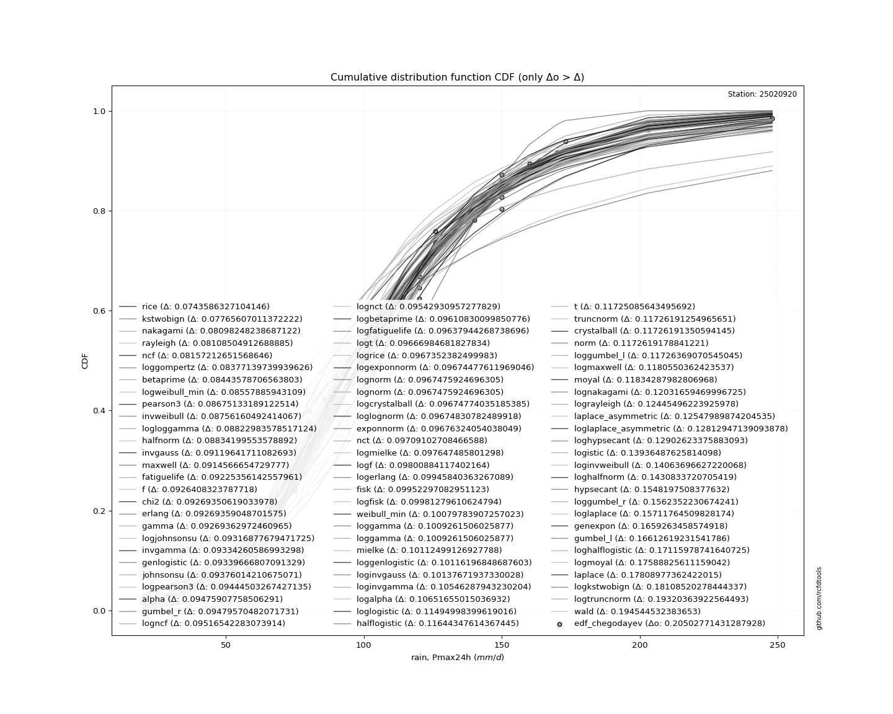</img>

</div>


**5.3. Best fit**

<div align="center">

|   id |   station | empirical_dist   | p_dist       |     delta |   deltao | eval   |   fit |   n |   best_fit |   best_fit_sort |
|-----:|----------:|:-----------------|:-------------|----------:|---------:|:-------|------:|----:|-----------:|----------------:|
|    0 |  25020920 | edf_chegodayev   | logjohnsonsu | 0.0545179 | 0.188598 | Δo > Δ |     1 |  52 |          1 |               1 |

</div>


<div align="center">

</img>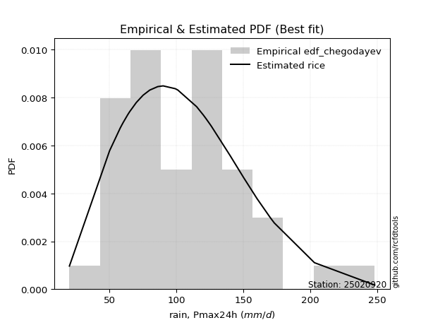</img>

</div>


### 6. Empirical - EDF Blom (1958)

The Blom formula is a specific "plotting position" formula used in hydrology and statistical analysis to estimate the empirical cumulative probability (or non-exceedance probability) of a data series. It is particularly recommended for data that are approximately normally distributed. The constant _a_ is set to 0.375 (or 3/8).

<div align="center">


$P=(m-a)/(n+1-2a)$


</div>


**6.1. Empirical values**

<div align="center">

|                | 0                    | 1                   | 2                    | 3                   | 4                   | 5                  | 6                   | 7                  | 8                   | 9                   | 10                  | 11                  | 12                  | 13                 | 14                 | 15                  | 16                 | 17                 | 18                  | 19                  | 20                  | 21                 | 22                  | 23                  | 24                  | 25                 | 26                 | 27                 | 28                 | 29                 | 30                 | 31                 | 32                 | 33                 | 34                 | 35                 | 36                 | 37                 | 38                 | 39                 | 40                | 41                 | 42                 | 43                 | 44                | 45                 | 46                 | 47                 | 48                 | 49                 | 50                 | 51                 |
|:---------------|:---------------------|:--------------------|:---------------------|:--------------------|:--------------------|:-------------------|:--------------------|:-------------------|:--------------------|:--------------------|:--------------------|:--------------------|:--------------------|:-------------------|:-------------------|:--------------------|:-------------------|:-------------------|:--------------------|:--------------------|:--------------------|:-------------------|:--------------------|:--------------------|:--------------------|:-------------------|:-------------------|:-------------------|:-------------------|:-------------------|:-------------------|:-------------------|:-------------------|:-------------------|:-------------------|:-------------------|:-------------------|:-------------------|:-------------------|:-------------------|:------------------|:-------------------|:-------------------|:-------------------|:------------------|:-------------------|:-------------------|:-------------------|:-------------------|:-------------------|:-------------------|:-------------------|
| date           | 2008                 | 1991                | 1988                 | 1992                | 1990                | 1984               | 1998                | 1983               | 2009                | 2010                | 2007                | 2011                | 2012                | 1995               | 1974               | 1994                | 1997               | 1972               | 2015                | 1977                | 1976                | 1989               | 2019                | 1975                | 2018                | 2021               | 1971               | 2020               | 2016               | 1980               | 2005               | 2017               | 2013               | 1985               | 1987               | 1970               | 2014               | 2002               | 1996               | 1993               | 1986              | 1979               | 1982               | 1981               | 1999              | 2003               | 2001               | 2000               | 2006               | 1978               | 1973               | 2004               |
| x              | 20.0                 | 50.0                | 60.0                 | 60.0                | 60.0                | 65.0               | 70.0                | 75.0               | 75.0                | 75.0                | 80.0                | 80.0                | 80.0                | 80.0               | 86.0               | 90.0                | 90.0               | 90.1443522883201   | 90.7595845282534    | 98.3418531639491    | 99.0                | 100.0              | 100.273882014316    | 101.0               | 101.877971697636    | 103.535454863046   | 104.144144422804   | 105.431758524183   | 106.512869876267   | 107.12048298616614 | 109.720713687932   | 109.955969697234   | 112.023287990105   | 115.0              | 115.0              | 116.48471118843    | 118.058561338164   | 120.0              | 120.0              | 120.0              | 120.0             | 122.0              | 125.0              | 126.0              | 140.0             | 150.0              | 150.0              | 150.0              | 150.0              | 160.0              | 173.0              | 203.0              |
| m              | 1                    | 2                   | 3                    | 4                   | 5                   | 6                  | 7                   | 8                  | 9                   | 10                  | 11                  | 12                  | 13                  | 14                 | 15                 | 16                  | 17                 | 18                 | 19                  | 20                  | 21                  | 22                 | 23                  | 24                  | 25                  | 26                 | 27                 | 28                 | 29                 | 30                 | 31                 | 32                 | 33                 | 34                 | 35                 | 36                 | 37                 | 38                 | 39                 | 40                 | 41                | 42                 | 43                 | 44                 | 45                | 46                 | 47                 | 48                 | 49                 | 50                 | 51                 | 52                 |
| empirical_dist | edf_blom             | edf_blom            | edf_blom             | edf_blom            | edf_blom            | edf_blom           | edf_blom            | edf_blom           | edf_blom            | edf_blom            | edf_blom            | edf_blom            | edf_blom            | edf_blom           | edf_blom           | edf_blom            | edf_blom           | edf_blom           | edf_blom            | edf_blom            | edf_blom            | edf_blom           | edf_blom            | edf_blom            | edf_blom            | edf_blom           | edf_blom           | edf_blom           | edf_blom           | edf_blom           | edf_blom           | edf_blom           | edf_blom           | edf_blom           | edf_blom           | edf_blom           | edf_blom           | edf_blom           | edf_blom           | edf_blom           | edf_blom          | edf_blom           | edf_blom           | edf_blom           | edf_blom          | edf_blom           | edf_blom           | edf_blom           | edf_blom           | edf_blom           | edf_blom           | edf_blom           |
| empirical      | 0.011961722488038277 | 0.03110047846889952 | 0.050239234449760764 | 0.06937799043062201 | 0.08851674641148326 | 0.1076555023923445 | 0.12679425837320574 | 0.145933014354067  | 0.16507177033492823 | 0.18421052631578946 | 0.20334928229665072 | 0.22248803827751196 | 0.24162679425837322 | 0.2607655502392344 | 0.2799043062200957 | 0.29904306220095694 | 0.3181818181818182 | 0.3373205741626794 | 0.35645933014354064 | 0.37559808612440193 | 0.39473684210526316 | 0.4138755980861244 | 0.43301435406698563 | 0.45215311004784686 | 0.47129186602870815 | 0.4904306220095694 | 0.5095693779904307 | 0.5287081339712919 | 0.5478468899521531 | 0.5669856459330144 | 0.5861244019138756 | 0.6052631578947368 | 0.6244019138755981 | 0.6435406698564593 | 0.6626794258373205 | 0.6818181818181818 | 0.7009569377990431 | 0.7200956937799043 | 0.7392344497607656 | 0.7583732057416268 | 0.777511961722488 | 0.7966507177033493 | 0.8157894736842105 | 0.8349282296650717 | 0.854066985645933 | 0.8732057416267942 | 0.8923444976076556 | 0.9114832535885168 | 0.930622009569378  | 0.9497607655502392 | 0.9688995215311005 | 0.9880382775119617 |
| empirical_tr   | 1.0121065375302662   | 1.0320987654320988  | 1.052896725440806    | 1.0745501285347043  | 1.0971128608923884  | 1.1206434316353886 | 1.1452054794520548  | 1.1708683473389356 | 1.1977077363896849  | 1.2258064516129032  | 1.2552552552552552  | 1.2861538461538462  | 1.3186119873817035  | 1.3527508090614886 | 1.388704318936877  | 1.4266211604095564  | 1.4666666666666666 | 1.5090252707581229 | 1.553903345724907   | 1.6015325670498084  | 1.6521739130434783  | 1.7061224489795919 | 1.7637130801687764  | 1.8253275109170304  | 1.8914027149321269  | 1.9624413145539905 | 2.0390243902439025 | 2.121827411167513  | 2.2116402116402116 | 2.3093922651933703 | 2.416184971098266  | 2.533333333333333  | 2.662420382165605  | 2.8053691275167782 | 2.964539007092198  | 3.1428571428571423 | 3.3440000000000007 | 3.5726495726495733 | 3.8348623853211015 | 4.138613861386139  | 4.494623655913979 | 4.917647058823529  | 5.428571428571428  | 6.057971014492753  | 6.852459016393441 | 7.886792452830186  | 9.288888888888893  | 11.297297297297302 | 14.413793103448281 | 19.904761904761912 | 32.15384615384616  | 83.59999999999995  |

</div>


**6.2. Kolmogorov-Smirnov fit test (sorted by Δ)**


<div align="center">

|                | 0                   | 1                     | 2                   | 3                   | 4                    | 5                    | 6                   | 7                   | 8                   | 9                   | 10                  | 11                  | 12                  | 13                  | 14                  | 15                  | 16                  | 17                  | 18                  | 19                  | 20                  | 21                  | 22                  | 23                  | 24                  | 25                  | 26                  | 27                  | 28                  | 29                  | 30                  | 31                  | 32                  | 33                  | 34                  | 35                  | 36                  | 37                  | 38                  | 39                  | 40                  | 41                  | 42                  | 43                  | 44                  | 45                  | 46                  | 47                  | 48                  | 49                  | 50                  | 51                  | 52                  | 53                  | 54                  | 55                  | 56                  | 57                  | 58                  | 59                  | 60                  | 61                  | 62                  | 63                  | 64                  | 65                  | 66                  | 67                  | 68                  | 69                  | 70                  | 71                  | 72                  | 73                  | 74                  | 75                  | 76                  | 77                  | 78                  | 79                  | 80                  | 81                  | 82                  | 83                  | 84                  | 85                  | 86                  | 87                  | 88                  | 89                  |
|:---------------|:--------------------|:----------------------|:--------------------|:--------------------|:---------------------|:---------------------|:--------------------|:--------------------|:--------------------|:--------------------|:--------------------|:--------------------|:--------------------|:--------------------|:--------------------|:--------------------|:--------------------|:--------------------|:--------------------|:--------------------|:--------------------|:--------------------|:--------------------|:--------------------|:--------------------|:--------------------|:--------------------|:--------------------|:--------------------|:--------------------|:--------------------|:--------------------|:--------------------|:--------------------|:--------------------|:--------------------|:--------------------|:--------------------|:--------------------|:--------------------|:--------------------|:--------------------|:--------------------|:--------------------|:--------------------|:--------------------|:--------------------|:--------------------|:--------------------|:--------------------|:--------------------|:--------------------|:--------------------|:--------------------|:--------------------|:--------------------|:--------------------|:--------------------|:--------------------|:--------------------|:--------------------|:--------------------|:--------------------|:--------------------|:--------------------|:--------------------|:--------------------|:--------------------|:--------------------|:--------------------|:--------------------|:--------------------|:--------------------|:--------------------|:--------------------|:--------------------|:--------------------|:--------------------|:--------------------|:--------------------|:--------------------|:--------------------|:--------------------|:--------------------|:--------------------|:--------------------|:--------------------|:--------------------|:--------------------|:--------------------|
| station        | 25020920            | 25020920              | 25020920            | 25020920            | 25020920             | 25020920             | 25020920            | 25020920            | 25020920            | 25020920            | 25020920            | 25020920            | 25020920            | 25020920            | 25020920            | 25020920            | 25020920            | 25020920            | 25020920            | 25020920            | 25020920            | 25020920            | 25020920            | 25020920            | 25020920            | 25020920            | 25020920            | 25020920            | 25020920            | 25020920            | 25020920            | 25020920            | 25020920            | 25020920            | 25020920            | 25020920            | 25020920            | 25020920            | 25020920            | 25020920            | 25020920            | 25020920            | 25020920            | 25020920            | 25020920            | 25020920            | 25020920            | 25020920            | 25020920            | 25020920            | 25020920            | 25020920            | 25020920            | 25020920            | 25020920            | 25020920            | 25020920            | 25020920            | 25020920            | 25020920            | 25020920            | 25020920            | 25020920            | 25020920            | 25020920            | 25020920            | 25020920            | 25020920            | 25020920            | 25020920            | 25020920            | 25020920            | 25020920            | 25020920            | 25020920            | 25020920            | 25020920            | 25020920            | 25020920            | 25020920            | 25020920            | 25020920            | 25020920            | 25020920            | 25020920            | 25020920            | 25020920            | 25020920            | 25020920            | 25020920            |
| empirical_dist | edf_blom            | edf_blom              | edf_blom            | edf_blom            | edf_blom             | edf_blom             | edf_blom            | edf_blom            | edf_blom            | edf_blom            | edf_blom            | edf_blom            | edf_blom            | edf_blom            | edf_blom            | edf_blom            | edf_blom            | edf_blom            | edf_blom            | edf_blom            | edf_blom            | edf_blom            | edf_blom            | edf_blom            | edf_blom            | edf_blom            | edf_blom            | edf_blom            | edf_blom            | edf_blom            | edf_blom            | edf_blom            | edf_blom            | edf_blom            | edf_blom            | edf_blom            | edf_blom            | edf_blom            | edf_blom            | edf_blom            | edf_blom            | edf_blom            | edf_blom            | edf_blom            | edf_blom            | edf_blom            | edf_blom            | edf_blom            | edf_blom            | edf_blom            | edf_blom            | edf_blom            | edf_blom            | edf_blom            | edf_blom            | edf_blom            | edf_blom            | edf_blom            | edf_blom            | edf_blom            | edf_blom            | edf_blom            | edf_blom            | edf_blom            | edf_blom            | edf_blom            | edf_blom            | edf_blom            | edf_blom            | edf_blom            | edf_blom            | edf_blom            | edf_blom            | edf_blom            | edf_blom            | edf_blom            | edf_blom            | edf_blom            | edf_blom            | edf_blom            | edf_blom            | edf_blom            | edf_blom            | edf_blom            | edf_blom            | edf_blom            | edf_blom            | edf_blom            | edf_blom            | edf_blom            |
| p_dist         | logjohnsonsu        | loglaplace_asymmetric | t                   | fisk                | logmielke            | loggenlogistic       | genlogistic         | johnsonsu           | mielke              | exponnorm           | hypsecant           | logistic            | nct                 | invgamma            | alpha               | nakagami            | laplace_asymmetric  | weibull_min         | pearson3            | fatiguelife         | chi2                | f                   | erlang              | gamma               | logfisk             | betaprime           | maxwell             | logloggamma         | laplace             | rice                | norm                | truncnorm           | crystalball         | lognakagami         | rayleigh            | loggompertz         | loggumbel_l         | invweibull          | invgauss            | gumbel_r            | logf                | loglaplace          | loghypsecant        | loglogistic         | logcrystalball      | lognorm             | lognorm             | logexponnorm        | loglognorm          | logrice             | logfatiguelife      | logncf              | logt                | kstwobign           | lognct              | loginvgamma         | gompertz            | halfnorm            | gumbel_l            | loggamma            | loggamma            | logpearson3         | logbetaprime        | logerlang           | moyal               | logalpha            | loginvgauss         | halflogistic        | logmaxwell          | lograyleigh         | loggumbel_r         | loginvweibull       | loghalfnorm         | wald                | logmoyal            | loghalflogistic     | genexpon            | logkstwobign        | logtruncnorm        | gibrat              | logwald             | loggibrat           | loggenexpon         | expon               | pareto              | ncf                 | logexpon            | logpareto           | logweibull_min      | logchi2             |
| delta          | 0.05487396940785644 | 0.05583152612327813   | 0.05989097194774129 | 0.06096806106831526 | 0.061887211367735784 | 0.062195875069613604 | 0.06221436803507363 | 0.06244249061433271 | 0.06518359049057809 | 0.06924892285210471 | 0.07092720402861627 | 0.07278591006422785 | 0.07498685446083375 | 0.07555951255419313 | 0.07622068948431004 | 0.07628998637238071 | 0.07713099300606355 | 0.07719643706231771 | 0.0772199163983075  | 0.08183873252524798 | 0.08221403089905988 | 0.08250605412962198 | 0.0825128091266556  | 0.08251288307780114 | 0.0827673833010995  | 0.08314895956227408 | 0.08472075625123604 | 0.08702388498397595 | 0.08790599401676108 | 0.09180869103751443 | 0.09326643231857423 | 0.09326643488742326 | 0.0932664417088922  | 0.09652280403254476 | 0.09687605465718108 | 0.09998784179588649 | 0.10352467623729822 | 0.10425738001378876 | 0.11396588773653737 | 0.11438079704134957 | 0.11438900948868624 | 0.11845592558298079 | 0.12017239011299113 | 0.12056612249602477 | 0.12102713895173023 | 0.12102718310751187 | 0.12102718310751187 | 0.12102862533949366 | 0.12102942505599179 | 0.12102948733061641 | 0.12124238020412709 | 0.12187225414071756 | 0.12193281593672323 | 0.12271161316788737 | 0.12343892449794125 | 0.12514993933411223 | 0.12936096102434935 | 0.1312604962167212  | 0.13145196732873587 | 0.13196574795516647 | 0.13196574795516647 | 0.13318797451538855 | 0.13477408787587053 | 0.13550264094011188 | 0.13882993546892763 | 0.14724408334697237 | 0.1475733538216547  | 0.14992726510295906 | 0.15420872544169473 | 0.1652937158128135  | 0.19129520855958537 | 0.19405190208880174 | 0.1964979934415516  | 0.2062648333861522  | 0.2171616247514263  | 0.22122878807836044 | 0.22627397500507193 | 0.24359419249144879 | 0.2561791386290544  | 0.260642382157365   | 0.289104834118153   | 0.31192810531433945 | 0.3290501314561326  | 0.3328411307278456  | 0.3328411538922371  | 0.3401493624006691  | 0.4474030401461415  | 0.4474030479145672  | 0.5725072732006256  | 0.6467052907429417  |
| deltao         | 0.18859806671657792 | 0.18859806671657792   | 0.18859806671657792 | 0.18859806671657792 | 0.18859806671657792  | 0.18859806671657792  | 0.18859806671657792 | 0.18859806671657792 | 0.18859806671657792 | 0.18859806671657792 | 0.18859806671657792 | 0.18859806671657792 | 0.18859806671657792 | 0.18859806671657792 | 0.18859806671657792 | 0.18859806671657792 | 0.18859806671657792 | 0.18859806671657792 | 0.18859806671657792 | 0.18859806671657792 | 0.18859806671657792 | 0.18859806671657792 | 0.18859806671657792 | 0.18859806671657792 | 0.18859806671657792 | 0.18859806671657792 | 0.18859806671657792 | 0.18859806671657792 | 0.18859806671657792 | 0.18859806671657792 | 0.18859806671657792 | 0.18859806671657792 | 0.18859806671657792 | 0.18859806671657792 | 0.18859806671657792 | 0.18859806671657792 | 0.18859806671657792 | 0.18859806671657792 | 0.18859806671657792 | 0.18859806671657792 | 0.18859806671657792 | 0.18859806671657792 | 0.18859806671657792 | 0.18859806671657792 | 0.18859806671657792 | 0.18859806671657792 | 0.18859806671657792 | 0.18859806671657792 | 0.18859806671657792 | 0.18859806671657792 | 0.18859806671657792 | 0.18859806671657792 | 0.18859806671657792 | 0.18859806671657792 | 0.18859806671657792 | 0.18859806671657792 | 0.18859806671657792 | 0.18859806671657792 | 0.18859806671657792 | 0.18859806671657792 | 0.18859806671657792 | 0.18859806671657792 | 0.18859806671657792 | 0.18859806671657792 | 0.18859806671657792 | 0.18859806671657792 | 0.18859806671657792 | 0.18859806671657792 | 0.18859806671657792 | 0.18859806671657792 | 0.18859806671657792 | 0.18859806671657792 | 0.18859806671657792 | 0.18859806671657792 | 0.18859806671657792 | 0.18859806671657792 | 0.18859806671657792 | 0.18859806671657792 | 0.18859806671657792 | 0.18859806671657792 | 0.18859806671657792 | 0.18859806671657792 | 0.18859806671657792 | 0.18859806671657792 | 0.18859806671657792 | 0.18859806671657792 | 0.18859806671657792 | 0.18859806671657792 | 0.18859806671657792 | 0.18859806671657792 |
| eval           | Δo > Δ              | Δo > Δ                | Δo > Δ              | Δo > Δ              | Δo > Δ               | Δo > Δ               | Δo > Δ              | Δo > Δ              | Δo > Δ              | Δo > Δ              | Δo > Δ              | Δo > Δ              | Δo > Δ              | Δo > Δ              | Δo > Δ              | Δo > Δ              | Δo > Δ              | Δo > Δ              | Δo > Δ              | Δo > Δ              | Δo > Δ              | Δo > Δ              | Δo > Δ              | Δo > Δ              | Δo > Δ              | Δo > Δ              | Δo > Δ              | Δo > Δ              | Δo > Δ              | Δo > Δ              | Δo > Δ              | Δo > Δ              | Δo > Δ              | Δo > Δ              | Δo > Δ              | Δo > Δ              | Δo > Δ              | Δo > Δ              | Δo > Δ              | Δo > Δ              | Δo > Δ              | Δo > Δ              | Δo > Δ              | Δo > Δ              | Δo > Δ              | Δo > Δ              | Δo > Δ              | Δo > Δ              | Δo > Δ              | Δo > Δ              | Δo > Δ              | Δo > Δ              | Δo > Δ              | Δo > Δ              | Δo > Δ              | Δo > Δ              | Δo > Δ              | Δo > Δ              | Δo > Δ              | Δo > Δ              | Δo > Δ              | Δo > Δ              | Δo > Δ              | Δo > Δ              | Δo > Δ              | Δo > Δ              | Δo > Δ              | Δo > Δ              | Δo > Δ              | Δo > Δ              | Δo <= Δ             | Δo <= Δ             | Δo <= Δ             | Δo <= Δ             | Δo <= Δ             | Δo <= Δ             | Δo <= Δ             | Δo <= Δ             | Δo <= Δ             | Δo <= Δ             | Δo <= Δ             | Δo <= Δ             | Δo <= Δ             | Δo <= Δ             | Δo <= Δ             | Δo <= Δ             | Δo <= Δ             | Δo <= Δ             | Δo <= Δ             | Δo <= Δ             |
| fit            | 1                   | 1                     | 1                   | 1                   | 1                    | 1                    | 1                   | 1                   | 1                   | 1                   | 1                   | 1                   | 1                   | 1                   | 1                   | 1                   | 1                   | 1                   | 1                   | 1                   | 1                   | 1                   | 1                   | 1                   | 1                   | 1                   | 1                   | 1                   | 1                   | 1                   | 1                   | 1                   | 1                   | 1                   | 1                   | 1                   | 1                   | 1                   | 1                   | 1                   | 1                   | 1                   | 1                   | 1                   | 1                   | 1                   | 1                   | 1                   | 1                   | 1                   | 1                   | 1                   | 1                   | 1                   | 1                   | 1                   | 1                   | 1                   | 1                   | 1                   | 1                   | 1                   | 1                   | 1                   | 1                   | 1                   | 1                   | 1                   | 1                   | 1                   | 0                   | 0                   | 0                   | 0                   | 0                   | 0                   | 0                   | 0                   | 0                   | 0                   | 0                   | 0                   | 0                   | 0                   | 0                   | 0                   | 0                   | 0                   | 0                   | 0                   |
| n              | 52                  | 52                    | 52                  | 52                  | 52                   | 52                   | 52                  | 52                  | 52                  | 52                  | 52                  | 52                  | 52                  | 52                  | 52                  | 52                  | 52                  | 52                  | 52                  | 52                  | 52                  | 52                  | 52                  | 52                  | 52                  | 52                  | 52                  | 52                  | 52                  | 52                  | 52                  | 52                  | 52                  | 52                  | 52                  | 52                  | 52                  | 52                  | 52                  | 52                  | 52                  | 52                  | 52                  | 52                  | 52                  | 52                  | 52                  | 52                  | 52                  | 52                  | 52                  | 52                  | 52                  | 52                  | 52                  | 52                  | 52                  | 52                  | 52                  | 52                  | 52                  | 52                  | 52                  | 52                  | 52                  | 52                  | 52                  | 52                  | 52                  | 52                  | 52                  | 52                  | 52                  | 52                  | 52                  | 52                  | 52                  | 52                  | 52                  | 52                  | 52                  | 52                  | 52                  | 52                  | 52                  | 52                  | 52                  | 52                  | 52                  | 52                  |
| best_fit       | 1                   | 0                     | 0                   | 0                   | 0                    | 0                    | 0                   | 0                   | 0                   | 0                   | 0                   | 0                   | 0                   | 0                   | 0                   | 0                   | 0                   | 0                   | 0                   | 0                   | 0                   | 0                   | 0                   | 0                   | 0                   | 0                   | 0                   | 0                   | 0                   | 0                   | 0                   | 0                   | 0                   | 0                   | 0                   | 0                   | 0                   | 0                   | 0                   | 0                   | 0                   | 0                   | 0                   | 0                   | 0                   | 0                   | 0                   | 0                   | 0                   | 0                   | 0                   | 0                   | 0                   | 0                   | 0                   | 0                   | 0                   | 0                   | 0                   | 0                   | 0                   | 0                   | 0                   | 0                   | 0                   | 0                   | 0                   | 0                   | 0                   | 0                   | 0                   | 0                   | 0                   | 0                   | 0                   | 0                   | 0                   | 0                   | 0                   | 0                   | 0                   | 0                   | 0                   | 0                   | 0                   | 0                   | 0                   | 0                   | 0                   | 0                   |
| best_fit_sort  | 1                   | 2                     | 3                   | 4                   | 5                    | 6                    | 7                   | 8                   | 9                   | 10                  | 11                  | 12                  | 13                  | 14                  | 15                  | 16                  | 17                  | 18                  | 19                  | 20                  | 21                  | 22                  | 23                  | 24                  | 25                  | 26                  | 27                  | 28                  | 29                  | 30                  | 31                  | 32                  | 33                  | 34                  | 35                  | 36                  | 37                  | 38                  | 39                  | 40                  | 41                  | 42                  | 43                  | 44                  | 45                  | 46                  | 47                  | 48                  | 49                  | 50                  | 51                  | 52                  | 53                  | 54                  | 55                  | 56                  | 57                  | 58                  | 59                  | 60                  | 61                  | 62                  | 63                  | 64                  | 65                  | 66                  | 67                  | 68                  | 69                  | 70                  | 71                  | 72                  | 73                  | 74                  | 75                  | 76                  | 77                  | 78                  | 79                  | 80                  | 81                  | 82                  | 83                  | 84                  | 85                  | 86                  | 87                  | 88                  | 89                  | 90                  |

</div>


<div align="center">

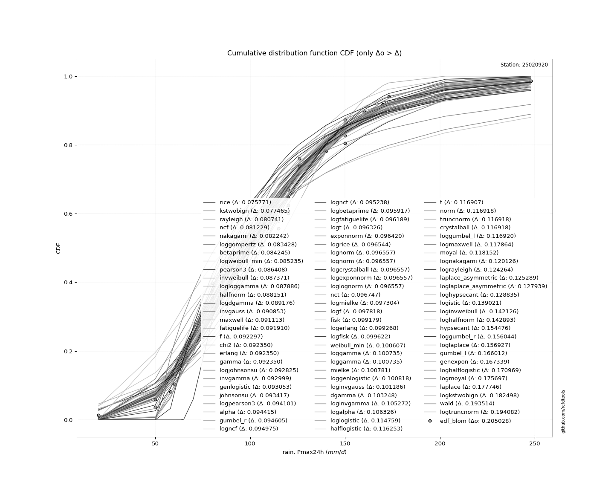</img>

</div>


**6.3. Best fit**

<div align="center">

|   id |   station | empirical_dist   | p_dist       |    delta |   deltao | eval   |   fit |   n |   best_fit |   best_fit_sort |
|-----:|----------:|:-----------------|:-------------|---------:|---------:|:-------|------:|----:|-----------:|----------------:|
|    0 |  25020920 | edf_blom         | logjohnsonsu | 0.054874 | 0.188598 | Δo > Δ |     1 |  52 |          1 |               1 |

</div>


<div align="center">

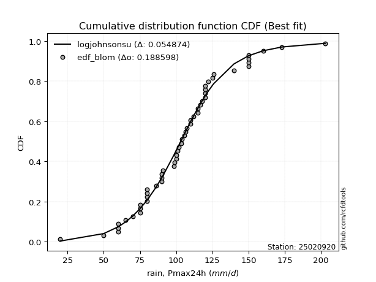</img>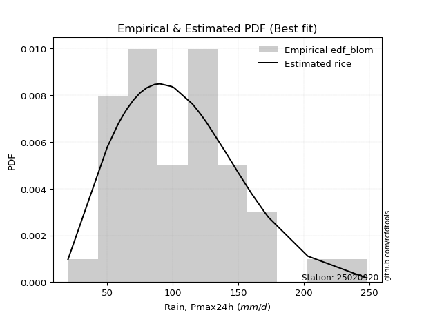</img>

</div>


### 7. Empirical - EDF Tukey (1962)

In hydrology, the Tukey formula is used as a plotting position formula to estimate the empirical probability or frequency of a flood event (or other hydrological data). The formula parameter is given as _c=0.333_ (or 1/3).

<div align="center">


$P=(m-c)/(n+1-2c)$


</div>


**7.1. Empirical values**

<div align="center">

|                | 0                    | 1                   | 2                    | 3                   | 4                   | 5                   | 6                   | 7                  | 8                   | 9                   | 10                  | 11                 | 12                  | 13                 | 14                 | 15                  | 16                 | 17                 | 18                  | 19                  | 20                  | 21                 | 22                  | 23                  | 24                 | 25                  | 26                 | 27                 | 28                 | 29                 | 30                 | 31                 | 32                 | 33                 | 34                 | 35                 | 36                 | 37                 | 38                 | 39                 | 40                 | 41                 | 42                 | 43                 | 44                 | 45                 | 46                | 47                 | 48                 | 49                 | 50                 | 51                 |
|:---------------|:---------------------|:--------------------|:---------------------|:--------------------|:--------------------|:--------------------|:--------------------|:-------------------|:--------------------|:--------------------|:--------------------|:-------------------|:--------------------|:-------------------|:-------------------|:--------------------|:-------------------|:-------------------|:--------------------|:--------------------|:--------------------|:-------------------|:--------------------|:--------------------|:-------------------|:--------------------|:-------------------|:-------------------|:-------------------|:-------------------|:-------------------|:-------------------|:-------------------|:-------------------|:-------------------|:-------------------|:-------------------|:-------------------|:-------------------|:-------------------|:-------------------|:-------------------|:-------------------|:-------------------|:-------------------|:-------------------|:------------------|:-------------------|:-------------------|:-------------------|:-------------------|:-------------------|
| date           | 2008                 | 1991                | 1988                 | 1992                | 1990                | 1984                | 1998                | 1983               | 2009                | 2010                | 2007                | 2011               | 2012                | 1995               | 1974               | 1994                | 1997               | 1972               | 2015                | 1977                | 1976                | 1989               | 2019                | 1975                | 2018               | 2021                | 1971               | 2020               | 2016               | 1980               | 2005               | 2017               | 2013               | 1985               | 1987               | 1970               | 2014               | 2002               | 1996               | 1993               | 1986               | 1979               | 1982               | 1981               | 1999               | 2003               | 2001              | 2000               | 2006               | 1978               | 1973               | 2004               |
| x              | 20.0                 | 50.0                | 60.0                 | 60.0                | 60.0                | 65.0                | 70.0                | 75.0               | 75.0                | 75.0                | 80.0                | 80.0               | 80.0                | 80.0               | 86.0               | 90.0                | 90.0               | 90.1443522883201   | 90.7595845282534    | 98.3418531639491    | 99.0                | 100.0              | 100.273882014316    | 101.0               | 101.877971697636   | 103.535454863046    | 104.144144422804   | 105.431758524183   | 106.512869876267   | 107.12048298616614 | 109.720713687932   | 109.955969697234   | 112.023287990105   | 115.0              | 115.0              | 116.48471118843    | 118.058561338164   | 120.0              | 120.0              | 120.0              | 120.0              | 122.0              | 125.0              | 126.0              | 140.0              | 150.0              | 150.0             | 150.0              | 150.0              | 160.0              | 173.0              | 203.0              |
| m              | 1                    | 2                   | 3                    | 4                   | 5                   | 6                   | 7                   | 8                  | 9                   | 10                  | 11                  | 12                 | 13                  | 14                 | 15                 | 16                  | 17                 | 18                 | 19                  | 20                  | 21                  | 22                 | 23                  | 24                  | 25                 | 26                  | 27                 | 28                 | 29                 | 30                 | 31                 | 32                 | 33                 | 34                 | 35                 | 36                 | 37                 | 38                 | 39                 | 40                 | 41                 | 42                 | 43                 | 44                 | 45                 | 46                 | 47                | 48                 | 49                 | 50                 | 51                 | 52                 |
| empirical_dist | edf_tukey            | edf_tukey           | edf_tukey            | edf_tukey           | edf_tukey           | edf_tukey           | edf_tukey           | edf_tukey          | edf_tukey           | edf_tukey           | edf_tukey           | edf_tukey          | edf_tukey           | edf_tukey          | edf_tukey          | edf_tukey           | edf_tukey          | edf_tukey          | edf_tukey           | edf_tukey           | edf_tukey           | edf_tukey          | edf_tukey           | edf_tukey           | edf_tukey          | edf_tukey           | edf_tukey          | edf_tukey          | edf_tukey          | edf_tukey          | edf_tukey          | edf_tukey          | edf_tukey          | edf_tukey          | edf_tukey          | edf_tukey          | edf_tukey          | edf_tukey          | edf_tukey          | edf_tukey          | edf_tukey          | edf_tukey          | edf_tukey          | edf_tukey          | edf_tukey          | edf_tukey          | edf_tukey         | edf_tukey          | edf_tukey          | edf_tukey          | edf_tukey          | edf_tukey          |
| empirical      | 0.012738853503184714 | 0.03184713375796178 | 0.050955414012738856 | 0.07006369426751592 | 0.08917197452229299 | 0.10828025477707007 | 0.12738853503184713 | 0.1464968152866242 | 0.16560509554140126 | 0.18471337579617833 | 0.20382165605095542 | 0.2229299363057325 | 0.24203821656050956 | 0.2611464968152866 | 0.2802547770700637 | 0.29936305732484075 | 0.3184713375796178 | 0.3375796178343949 | 0.35668789808917195 | 0.37579617834394907 | 0.39490445859872614 | 0.4140127388535032 | 0.43312101910828027 | 0.45222929936305734 | 0.4713375796178344 | 0.49044585987261147 | 0.5095541401273885 | 0.5286624203821656 | 0.5477707006369427 | 0.5668789808917197 | 0.5859872611464968 | 0.6050955414012739 | 0.6242038216560509 | 0.643312101910828  | 0.6624203821656051 | 0.6815286624203821 | 0.7006369426751592 | 0.7197452229299363 | 0.7388535031847133 | 0.7579617834394905 | 0.7770700636942676 | 0.7961783439490446 | 0.8152866242038217 | 0.8343949044585988 | 0.8535031847133758 | 0.8726114649681529 | 0.89171974522293  | 0.910828025477707  | 0.9299363057324841 | 0.9490445859872612 | 0.9681528662420382 | 0.9872611464968153 |
| empirical_tr   | 1.0129032258064516   | 1.0328947368421053  | 1.0536912751677852   | 1.0753424657534247  | 1.097902097902098   | 1.1214285714285714  | 1.145985401459854   | 1.171641791044776  | 1.198473282442748   | 1.2265625           | 1.256               | 1.2868852459016393 | 1.319327731092437   | 1.353448275862069  | 1.3893805309734513 | 1.427272727272727   | 1.467289719626168  | 1.5096153846153844 | 1.5544554455445543  | 1.6020408163265307  | 1.6526315789473685  | 1.7065217391304348 | 1.7640449438202248  | 1.8255813953488373  | 1.891566265060241  | 1.9625              | 2.038961038961039  | 2.1216216216216215 | 2.211267605633803  | 2.3088235294117645 | 2.4153846153846152 | 2.532258064516129  | 2.6610169491525424 | 2.8035714285714284 | 2.962264150943396  | 3.1399999999999997 | 3.340425531914893  | 3.5681818181818175 | 3.8292682926829262 | 4.131578947368422  | 4.485714285714287  | 4.906250000000001  | 5.413793103448277  | 6.03846153846154   | 6.826086956521741  | 7.850000000000001  | 9.235294117647062 | 11.214285714285717 | 14.272727272727275 | 19.625000000000004 | 31.400000000000006 | 78.50000000000001  |

</div>


**7.2. Kolmogorov-Smirnov fit test (sorted by Δ)**


<div align="center">

|                | 0                    | 1                     | 2                   | 3                   | 4                   | 5                   | 6                   | 7                   | 8                   | 9                   | 10                  | 11                  | 12                  | 13                  | 14                  | 15                  | 16                  | 17                  | 18                  | 19                  | 20                  | 21                  | 22                  | 23                  | 24                  | 25                  | 26                  | 27                  | 28                  | 29                  | 30                  | 31                  | 32                  | 33                  | 34                  | 35                  | 36                  | 37                  | 38                  | 39                  | 40                  | 41                  | 42                  | 43                  | 44                  | 45                  | 46                  | 47                  | 48                  | 49                  | 50                  | 51                  | 52                  | 53                  | 54                  | 55                  | 56                  | 57                  | 58                  | 59                  | 60                  | 61                  | 62                  | 63                  | 64                  | 65                  | 66                  | 67                  | 68                  | 69                  | 70                  | 71                  | 72                  | 73                  | 74                  | 75                  | 76                  | 77                  | 78                  | 79                  | 80                  | 81                  | 82                  | 83                  | 84                  | 85                  | 86                  | 87                  | 88                  | 89                  |
|:---------------|:---------------------|:----------------------|:--------------------|:--------------------|:--------------------|:--------------------|:--------------------|:--------------------|:--------------------|:--------------------|:--------------------|:--------------------|:--------------------|:--------------------|:--------------------|:--------------------|:--------------------|:--------------------|:--------------------|:--------------------|:--------------------|:--------------------|:--------------------|:--------------------|:--------------------|:--------------------|:--------------------|:--------------------|:--------------------|:--------------------|:--------------------|:--------------------|:--------------------|:--------------------|:--------------------|:--------------------|:--------------------|:--------------------|:--------------------|:--------------------|:--------------------|:--------------------|:--------------------|:--------------------|:--------------------|:--------------------|:--------------------|:--------------------|:--------------------|:--------------------|:--------------------|:--------------------|:--------------------|:--------------------|:--------------------|:--------------------|:--------------------|:--------------------|:--------------------|:--------------------|:--------------------|:--------------------|:--------------------|:--------------------|:--------------------|:--------------------|:--------------------|:--------------------|:--------------------|:--------------------|:--------------------|:--------------------|:--------------------|:--------------------|:--------------------|:--------------------|:--------------------|:--------------------|:--------------------|:--------------------|:--------------------|:--------------------|:--------------------|:--------------------|:--------------------|:--------------------|:--------------------|:--------------------|:--------------------|:--------------------|
| station        | 25020920             | 25020920              | 25020920            | 25020920            | 25020920            | 25020920            | 25020920            | 25020920            | 25020920            | 25020920            | 25020920            | 25020920            | 25020920            | 25020920            | 25020920            | 25020920            | 25020920            | 25020920            | 25020920            | 25020920            | 25020920            | 25020920            | 25020920            | 25020920            | 25020920            | 25020920            | 25020920            | 25020920            | 25020920            | 25020920            | 25020920            | 25020920            | 25020920            | 25020920            | 25020920            | 25020920            | 25020920            | 25020920            | 25020920            | 25020920            | 25020920            | 25020920            | 25020920            | 25020920            | 25020920            | 25020920            | 25020920            | 25020920            | 25020920            | 25020920            | 25020920            | 25020920            | 25020920            | 25020920            | 25020920            | 25020920            | 25020920            | 25020920            | 25020920            | 25020920            | 25020920            | 25020920            | 25020920            | 25020920            | 25020920            | 25020920            | 25020920            | 25020920            | 25020920            | 25020920            | 25020920            | 25020920            | 25020920            | 25020920            | 25020920            | 25020920            | 25020920            | 25020920            | 25020920            | 25020920            | 25020920            | 25020920            | 25020920            | 25020920            | 25020920            | 25020920            | 25020920            | 25020920            | 25020920            | 25020920            |
| empirical_dist | edf_tukey            | edf_tukey             | edf_tukey           | edf_tukey           | edf_tukey           | edf_tukey           | edf_tukey           | edf_tukey           | edf_tukey           | edf_tukey           | edf_tukey           | edf_tukey           | edf_tukey           | edf_tukey           | edf_tukey           | edf_tukey           | edf_tukey           | edf_tukey           | edf_tukey           | edf_tukey           | edf_tukey           | edf_tukey           | edf_tukey           | edf_tukey           | edf_tukey           | edf_tukey           | edf_tukey           | edf_tukey           | edf_tukey           | edf_tukey           | edf_tukey           | edf_tukey           | edf_tukey           | edf_tukey           | edf_tukey           | edf_tukey           | edf_tukey           | edf_tukey           | edf_tukey           | edf_tukey           | edf_tukey           | edf_tukey           | edf_tukey           | edf_tukey           | edf_tukey           | edf_tukey           | edf_tukey           | edf_tukey           | edf_tukey           | edf_tukey           | edf_tukey           | edf_tukey           | edf_tukey           | edf_tukey           | edf_tukey           | edf_tukey           | edf_tukey           | edf_tukey           | edf_tukey           | edf_tukey           | edf_tukey           | edf_tukey           | edf_tukey           | edf_tukey           | edf_tukey           | edf_tukey           | edf_tukey           | edf_tukey           | edf_tukey           | edf_tukey           | edf_tukey           | edf_tukey           | edf_tukey           | edf_tukey           | edf_tukey           | edf_tukey           | edf_tukey           | edf_tukey           | edf_tukey           | edf_tukey           | edf_tukey           | edf_tukey           | edf_tukey           | edf_tukey           | edf_tukey           | edf_tukey           | edf_tukey           | edf_tukey           | edf_tukey           | edf_tukey           |
| p_dist         | logjohnsonsu         | loglaplace_asymmetric | t                   | fisk                | logmielke           | loggenlogistic      | genlogistic         | johnsonsu           | mielke              | exponnorm           | hypsecant           | logistic            | nct                 | invgamma            | nakagami            | alpha               | weibull_min         | pearson3            | laplace_asymmetric  | fatiguelife         | chi2                | f                   | erlang              | gamma               | logfisk             | betaprime           | maxwell             | logloggamma         | laplace             | rice                | norm                | truncnorm           | crystalball         | lognakagami         | rayleigh            | loggompertz         | loggumbel_l         | invweibull          | invgauss            | gumbel_r            | logf                | loglaplace          | loghypsecant        | loglogistic         | logcrystalball      | lognorm             | lognorm             | logexponnorm        | loglognorm          | logrice             | logfatiguelife      | logncf              | logt                | kstwobign           | lognct              | loginvgamma         | gompertz            | gumbel_l            | halfnorm            | loggamma            | loggamma            | logpearson3         | logbetaprime        | logerlang           | moyal               | logalpha            | loginvgauss         | halflogistic        | logmaxwell          | lograyleigh         | loggumbel_r         | loginvweibull       | loghalfnorm         | wald                | logmoyal            | loghalflogistic     | genexpon            | logkstwobign        | logtruncnorm        | gibrat              | logwald             | loggibrat           | loggenexpon         | expon               | pareto              | ncf                 | logexpon            | logpareto           | logweibull_min      | logchi2             |
| delta          | 0.054675877188309296 | 0.05642580278191944   | 0.0604852486063826  | 0.06076996884876812 | 0.06168911914818864 | 0.06199778285006646 | 0.06201627581552649 | 0.06224439839478557 | 0.06498549827103095 | 0.06899361880864019 | 0.07130815060466847 | 0.07234401203600738 | 0.07454495643261327 | 0.07510582419908485 | 0.07575666116590773 | 0.07577879145608957 | 0.07666311185584473 | 0.07668659119183452 | 0.07751193958211575 | 0.0813968344970275  | 0.0817721328708394  | 0.0820641561014015  | 0.08207091109843512 | 0.08207098504958066 | 0.08256929108155237 | 0.0826156343558011  | 0.0845226640316889  | 0.08658198695575547 | 0.08828694059281328 | 0.09136679300929396 | 0.09282453429035376 | 0.09282453685920278 | 0.09282454368067172 | 0.09632471181299762 | 0.09667796243763394 | 0.09954594376766601 | 0.10308277820907774 | 0.10405928779424162 | 0.11376779551699023 | 0.11418270482180243 | 0.11422139299522327 | 0.11825783336343365 | 0.11997429789344399 | 0.12036803027647763 | 0.12082904673218309 | 0.12082909088796473 | 0.12082909088796473 | 0.12083053311994651 | 0.12083133283644465 | 0.12083139511106927 | 0.12104428798457995 | 0.12167416192117042 | 0.12173472371717609 | 0.12251352094834023 | 0.12324083227839411 | 0.12495184711456508 | 0.12882763581787637 | 0.1310100693005154  | 0.13106240399717406 | 0.13176765573561933 | 0.13176765573561933 | 0.13274607648716807 | 0.1345759956563234  | 0.13530454872056474 | 0.1386318432493805  | 0.14704599112742522 | 0.14737526160210757 | 0.14972917288341192 | 0.15401063322214759 | 0.16509562359326635 | 0.19109711634003823 | 0.19336619825190782 | 0.19629990122200447 | 0.20606674116660506 | 0.21696353253187917 | 0.2210306958588133  | 0.22571017407251473 | 0.24303039155889158 | 0.25561533769649714 | 0.2610233287334172  | 0.2889067418986059  | 0.3117300130947923  | 0.32848633052357545 | 0.33227732979528846 | 0.33227735295968    | 0.339433182837691   | 0.4466868605831634  | 0.4466868683515891  | 0.5717910936376475  | 0.6459891111799636  |
| deltao         | 0.18859806671657792  | 0.18859806671657792   | 0.18859806671657792 | 0.18859806671657792 | 0.18859806671657792 | 0.18859806671657792 | 0.18859806671657792 | 0.18859806671657792 | 0.18859806671657792 | 0.18859806671657792 | 0.18859806671657792 | 0.18859806671657792 | 0.18859806671657792 | 0.18859806671657792 | 0.18859806671657792 | 0.18859806671657792 | 0.18859806671657792 | 0.18859806671657792 | 0.18859806671657792 | 0.18859806671657792 | 0.18859806671657792 | 0.18859806671657792 | 0.18859806671657792 | 0.18859806671657792 | 0.18859806671657792 | 0.18859806671657792 | 0.18859806671657792 | 0.18859806671657792 | 0.18859806671657792 | 0.18859806671657792 | 0.18859806671657792 | 0.18859806671657792 | 0.18859806671657792 | 0.18859806671657792 | 0.18859806671657792 | 0.18859806671657792 | 0.18859806671657792 | 0.18859806671657792 | 0.18859806671657792 | 0.18859806671657792 | 0.18859806671657792 | 0.18859806671657792 | 0.18859806671657792 | 0.18859806671657792 | 0.18859806671657792 | 0.18859806671657792 | 0.18859806671657792 | 0.18859806671657792 | 0.18859806671657792 | 0.18859806671657792 | 0.18859806671657792 | 0.18859806671657792 | 0.18859806671657792 | 0.18859806671657792 | 0.18859806671657792 | 0.18859806671657792 | 0.18859806671657792 | 0.18859806671657792 | 0.18859806671657792 | 0.18859806671657792 | 0.18859806671657792 | 0.18859806671657792 | 0.18859806671657792 | 0.18859806671657792 | 0.18859806671657792 | 0.18859806671657792 | 0.18859806671657792 | 0.18859806671657792 | 0.18859806671657792 | 0.18859806671657792 | 0.18859806671657792 | 0.18859806671657792 | 0.18859806671657792 | 0.18859806671657792 | 0.18859806671657792 | 0.18859806671657792 | 0.18859806671657792 | 0.18859806671657792 | 0.18859806671657792 | 0.18859806671657792 | 0.18859806671657792 | 0.18859806671657792 | 0.18859806671657792 | 0.18859806671657792 | 0.18859806671657792 | 0.18859806671657792 | 0.18859806671657792 | 0.18859806671657792 | 0.18859806671657792 | 0.18859806671657792 |
| eval           | Δo > Δ               | Δo > Δ                | Δo > Δ              | Δo > Δ              | Δo > Δ              | Δo > Δ              | Δo > Δ              | Δo > Δ              | Δo > Δ              | Δo > Δ              | Δo > Δ              | Δo > Δ              | Δo > Δ              | Δo > Δ              | Δo > Δ              | Δo > Δ              | Δo > Δ              | Δo > Δ              | Δo > Δ              | Δo > Δ              | Δo > Δ              | Δo > Δ              | Δo > Δ              | Δo > Δ              | Δo > Δ              | Δo > Δ              | Δo > Δ              | Δo > Δ              | Δo > Δ              | Δo > Δ              | Δo > Δ              | Δo > Δ              | Δo > Δ              | Δo > Δ              | Δo > Δ              | Δo > Δ              | Δo > Δ              | Δo > Δ              | Δo > Δ              | Δo > Δ              | Δo > Δ              | Δo > Δ              | Δo > Δ              | Δo > Δ              | Δo > Δ              | Δo > Δ              | Δo > Δ              | Δo > Δ              | Δo > Δ              | Δo > Δ              | Δo > Δ              | Δo > Δ              | Δo > Δ              | Δo > Δ              | Δo > Δ              | Δo > Δ              | Δo > Δ              | Δo > Δ              | Δo > Δ              | Δo > Δ              | Δo > Δ              | Δo > Δ              | Δo > Δ              | Δo > Δ              | Δo > Δ              | Δo > Δ              | Δo > Δ              | Δo > Δ              | Δo > Δ              | Δo > Δ              | Δo <= Δ             | Δo <= Δ             | Δo <= Δ             | Δo <= Δ             | Δo <= Δ             | Δo <= Δ             | Δo <= Δ             | Δo <= Δ             | Δo <= Δ             | Δo <= Δ             | Δo <= Δ             | Δo <= Δ             | Δo <= Δ             | Δo <= Δ             | Δo <= Δ             | Δo <= Δ             | Δo <= Δ             | Δo <= Δ             | Δo <= Δ             | Δo <= Δ             |
| fit            | 1                    | 1                     | 1                   | 1                   | 1                   | 1                   | 1                   | 1                   | 1                   | 1                   | 1                   | 1                   | 1                   | 1                   | 1                   | 1                   | 1                   | 1                   | 1                   | 1                   | 1                   | 1                   | 1                   | 1                   | 1                   | 1                   | 1                   | 1                   | 1                   | 1                   | 1                   | 1                   | 1                   | 1                   | 1                   | 1                   | 1                   | 1                   | 1                   | 1                   | 1                   | 1                   | 1                   | 1                   | 1                   | 1                   | 1                   | 1                   | 1                   | 1                   | 1                   | 1                   | 1                   | 1                   | 1                   | 1                   | 1                   | 1                   | 1                   | 1                   | 1                   | 1                   | 1                   | 1                   | 1                   | 1                   | 1                   | 1                   | 1                   | 1                   | 0                   | 0                   | 0                   | 0                   | 0                   | 0                   | 0                   | 0                   | 0                   | 0                   | 0                   | 0                   | 0                   | 0                   | 0                   | 0                   | 0                   | 0                   | 0                   | 0                   |
| n              | 52                   | 52                    | 52                  | 52                  | 52                  | 52                  | 52                  | 52                  | 52                  | 52                  | 52                  | 52                  | 52                  | 52                  | 52                  | 52                  | 52                  | 52                  | 52                  | 52                  | 52                  | 52                  | 52                  | 52                  | 52                  | 52                  | 52                  | 52                  | 52                  | 52                  | 52                  | 52                  | 52                  | 52                  | 52                  | 52                  | 52                  | 52                  | 52                  | 52                  | 52                  | 52                  | 52                  | 52                  | 52                  | 52                  | 52                  | 52                  | 52                  | 52                  | 52                  | 52                  | 52                  | 52                  | 52                  | 52                  | 52                  | 52                  | 52                  | 52                  | 52                  | 52                  | 52                  | 52                  | 52                  | 52                  | 52                  | 52                  | 52                  | 52                  | 52                  | 52                  | 52                  | 52                  | 52                  | 52                  | 52                  | 52                  | 52                  | 52                  | 52                  | 52                  | 52                  | 52                  | 52                  | 52                  | 52                  | 52                  | 52                  | 52                  |
| best_fit       | 1                    | 0                     | 0                   | 0                   | 0                   | 0                   | 0                   | 0                   | 0                   | 0                   | 0                   | 0                   | 0                   | 0                   | 0                   | 0                   | 0                   | 0                   | 0                   | 0                   | 0                   | 0                   | 0                   | 0                   | 0                   | 0                   | 0                   | 0                   | 0                   | 0                   | 0                   | 0                   | 0                   | 0                   | 0                   | 0                   | 0                   | 0                   | 0                   | 0                   | 0                   | 0                   | 0                   | 0                   | 0                   | 0                   | 0                   | 0                   | 0                   | 0                   | 0                   | 0                   | 0                   | 0                   | 0                   | 0                   | 0                   | 0                   | 0                   | 0                   | 0                   | 0                   | 0                   | 0                   | 0                   | 0                   | 0                   | 0                   | 0                   | 0                   | 0                   | 0                   | 0                   | 0                   | 0                   | 0                   | 0                   | 0                   | 0                   | 0                   | 0                   | 0                   | 0                   | 0                   | 0                   | 0                   | 0                   | 0                   | 0                   | 0                   |
| best_fit_sort  | 1                    | 2                     | 3                   | 4                   | 5                   | 6                   | 7                   | 8                   | 9                   | 10                  | 11                  | 12                  | 13                  | 14                  | 15                  | 16                  | 17                  | 18                  | 19                  | 20                  | 21                  | 22                  | 23                  | 24                  | 25                  | 26                  | 27                  | 28                  | 29                  | 30                  | 31                  | 32                  | 33                  | 34                  | 35                  | 36                  | 37                  | 38                  | 39                  | 40                  | 41                  | 42                  | 43                  | 44                  | 45                  | 46                  | 47                  | 48                  | 49                  | 50                  | 51                  | 52                  | 53                  | 54                  | 55                  | 56                  | 57                  | 58                  | 59                  | 60                  | 61                  | 62                  | 63                  | 64                  | 65                  | 66                  | 67                  | 68                  | 69                  | 70                  | 71                  | 72                  | 73                  | 74                  | 75                  | 76                  | 77                  | 78                  | 79                  | 80                  | 81                  | 82                  | 83                  | 84                  | 85                  | 86                  | 87                  | 88                  | 89                  | 90                  |

</div>


<div align="center">

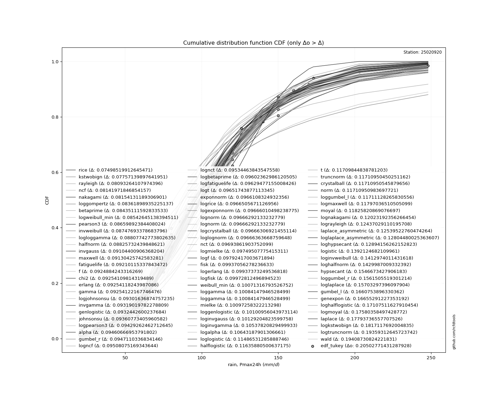</img>

</div>


**7.3. Best fit**

<div align="center">

|   id |   station | empirical_dist   | p_dist       |     delta |   deltao | eval   |   fit |   n |   best_fit |   best_fit_sort |
|-----:|----------:|:-----------------|:-------------|----------:|---------:|:-------|------:|----:|-----------:|----------------:|
|    0 |  25020920 | edf_tukey        | logjohnsonsu | 0.0546759 | 0.188598 | Δo > Δ |     1 |  52 |          1 |               1 |

</div>


<div align="center">

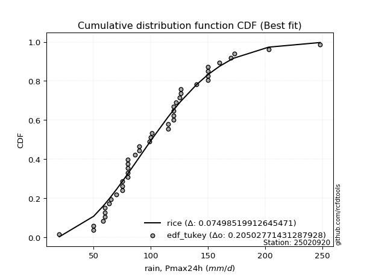</img></img>

</div>


### 8. Empirical - EDF Gringorten (1963)

Gringorten plotting position formula is essential for estimating the probability and return periods of extreme events like floods and heavy rainfall. The constant _a=0.44_.

<div align="center">


$P=(m-a)/(n+1-2a)$


</div>


**8.1. Empirical values**

<div align="center">

|                | 0                    | 1                    | 2                  | 3                   | 4                   | 5                  | 6                   | 7                   | 8                   | 9                   | 10                  | 11                  | 12                  | 13                 | 14                 | 15                  | 16                 | 17                  | 18                 | 19                 | 20                  | 21                 | 22                 | 23                  | 24                 | 25                 | 26                 | 27                 | 28                 | 29                 | 30                 | 31                 | 32                 | 33                 | 34                 | 35                 | 36                 | 37                | 38                 | 39                 | 40                 | 41                | 42                 | 43                 | 44                 | 45                 | 46                 | 47                 | 48                 | 49                 | 50                | 51                 |
|:---------------|:---------------------|:---------------------|:-------------------|:--------------------|:--------------------|:-------------------|:--------------------|:--------------------|:--------------------|:--------------------|:--------------------|:--------------------|:--------------------|:-------------------|:-------------------|:--------------------|:-------------------|:--------------------|:-------------------|:-------------------|:--------------------|:-------------------|:-------------------|:--------------------|:-------------------|:-------------------|:-------------------|:-------------------|:-------------------|:-------------------|:-------------------|:-------------------|:-------------------|:-------------------|:-------------------|:-------------------|:-------------------|:------------------|:-------------------|:-------------------|:-------------------|:------------------|:-------------------|:-------------------|:-------------------|:-------------------|:-------------------|:-------------------|:-------------------|:-------------------|:------------------|:-------------------|
| date           | 2008                 | 1991                 | 1988               | 1992                | 1990                | 1984               | 1998                | 1983                | 2009                | 2010                | 2007                | 2011                | 2012                | 1995               | 1974               | 1994                | 1997               | 1972                | 2015               | 1977               | 1976                | 1989               | 2019               | 1975                | 2018               | 2021               | 1971               | 2020               | 2016               | 1980               | 2005               | 2017               | 2013               | 1985               | 1987               | 1970               | 2014               | 2002              | 1996               | 1993               | 1986               | 1979              | 1982               | 1981               | 1999               | 2003               | 2001               | 2000               | 2006               | 1978               | 1973              | 2004               |
| x              | 20.0                 | 50.0                 | 60.0               | 60.0                | 60.0                | 65.0               | 70.0                | 75.0                | 75.0                | 75.0                | 80.0                | 80.0                | 80.0                | 80.0               | 86.0               | 90.0                | 90.0               | 90.1443522883201    | 90.7595845282534   | 98.3418531639491   | 99.0                | 100.0              | 100.273882014316   | 101.0               | 101.877971697636   | 103.535454863046   | 104.144144422804   | 105.431758524183   | 106.512869876267   | 107.12048298616614 | 109.720713687932   | 109.955969697234   | 112.023287990105   | 115.0              | 115.0              | 116.48471118843    | 118.058561338164   | 120.0             | 120.0              | 120.0              | 120.0              | 122.0             | 125.0              | 126.0              | 140.0              | 150.0              | 150.0              | 150.0              | 150.0              | 160.0              | 173.0             | 203.0              |
| m              | 1                    | 2                    | 3                  | 4                   | 5                   | 6                  | 7                   | 8                   | 9                   | 10                  | 11                  | 12                  | 13                  | 14                 | 15                 | 16                  | 17                 | 18                  | 19                 | 20                 | 21                  | 22                 | 23                 | 24                  | 25                 | 26                 | 27                 | 28                 | 29                 | 30                 | 31                 | 32                 | 33                 | 34                 | 35                 | 36                 | 37                 | 38                | 39                 | 40                 | 41                 | 42                | 43                 | 44                 | 45                 | 46                 | 47                 | 48                 | 49                 | 50                 | 51                | 52                 |
| empirical_dist | edf_gringorten       | edf_gringorten       | edf_gringorten     | edf_gringorten      | edf_gringorten      | edf_gringorten     | edf_gringorten      | edf_gringorten      | edf_gringorten      | edf_gringorten      | edf_gringorten      | edf_gringorten      | edf_gringorten      | edf_gringorten     | edf_gringorten     | edf_gringorten      | edf_gringorten     | edf_gringorten      | edf_gringorten     | edf_gringorten     | edf_gringorten      | edf_gringorten     | edf_gringorten     | edf_gringorten      | edf_gringorten     | edf_gringorten     | edf_gringorten     | edf_gringorten     | edf_gringorten     | edf_gringorten     | edf_gringorten     | edf_gringorten     | edf_gringorten     | edf_gringorten     | edf_gringorten     | edf_gringorten     | edf_gringorten     | edf_gringorten    | edf_gringorten     | edf_gringorten     | edf_gringorten     | edf_gringorten    | edf_gringorten     | edf_gringorten     | edf_gringorten     | edf_gringorten     | edf_gringorten     | edf_gringorten     | edf_gringorten     | edf_gringorten     | edf_gringorten    | edf_gringorten     |
| empirical      | 0.010744435917114353 | 0.029930928626247126 | 0.0491174213353799 | 0.06830391404451266 | 0.08749040675364543 | 0.1066768994627782 | 0.12586339217191098 | 0.14504988488104376 | 0.16423637759017654 | 0.18342287029930932 | 0.20260936300844207 | 0.22179585571757485 | 0.24098234842670763 | 0.2601688411358404 | 0.2793553338449732 | 0.29854182655410594 | 0.3177283192632387 | 0.33691481197237144 | 0.3561013046815042 | 0.375287797390637  | 0.39447429009976975 | 0.4136607828089025 | 0.4328472755180353 | 0.45203376822716806 | 0.4712202609363008 | 0.4904067536454336 | 0.5095932463545664 | 0.5287797390636991 | 0.5479662317728319 | 0.5671527244819647 | 0.5863392171910975 | 0.6055257099002302 | 0.6247122026093631 | 0.6438986953184959 | 0.6630851880276286 | 0.6822716807367614 | 0.7014581734458941 | 0.720644666155027 | 0.7398311588641597 | 0.7590176515732925 | 0.7782041442824252 | 0.797390636991558 | 0.8165771297006909 | 0.8357636224098236 | 0.8549501151189564 | 0.8741366078280891 | 0.8933231005372219 | 0.9125095932463546 | 0.9316960859554875 | 0.9508825786646202 | 0.970069071373753 | 0.9892555640828857 |
| empirical_tr   | 1.0108611326609775   | 1.0308544303797469   | 1.0516545601291365 | 1.07331136738056    | 1.0958788898233809  | 1.1194158075601375 | 1.1439859525899914  | 1.1696588868940754  | 1.1965105601469237  | 1.224624060150376   | 1.2540904716073147  | 1.2850098619329389  | 1.3174924165824065  | 1.3516597510373445 | 1.3876464323748672 | 1.4256017505470462  | 1.4656917885264344 | 1.5081018518518519  | 1.5530393325387366 | 1.6007371007371007 | 1.6514575411913814  | 1.7054973821989527 | 1.7631935047361298 | 1.8249299719887953  | 1.8911465892597965 | 1.9623493975903614 | 2.0391236306729263 | 2.1221498371335503 | 2.2122241086587433 | 2.3102836879432624 | 2.417439703153989  | 2.535019455252918  | 2.6646216768916164 | 2.8081896551724146 | 2.9681093394077456 | 3.147342995169083  | 3.34961439588689   | 3.579670329670331 | 3.843657817109146  | 4.149681528662422  | 4.508650519031143  | 4.935606060606061 | 5.451882845188289  | 6.088785046728977  | 6.894179894179899  | 7.945121951219518  | 9.374100719424465  | 11.429824561403514 | 14.640449438202277 | 20.35937500000005  | 33.41025641025652 | 93.07142857142928  |

</div>


**8.2. Kolmogorov-Smirnov fit test (sorted by Δ)**


<div align="center">

|                | 0                     | 1                   | 2                   | 3                   | 4                   | 5                   | 6                   | 7                   | 8                   | 9                   | 10                  | 11                  | 12                  | 13                  | 14                  | 15                  | 16                  | 17                  | 18                  | 19                  | 20                  | 21                  | 22                  | 23                  | 24                  | 25                  | 26                  | 27                  | 28                  | 29                  | 30                  | 31                  | 32                  | 33                  | 34                  | 35                  | 36                  | 37                  | 38                  | 39                  | 40                  | 41                  | 42                  | 43                  | 44                  | 45                  | 46                  | 47                  | 48                  | 49                  | 50                  | 51                  | 52                  | 53                  | 54                  | 55                  | 56                  | 57                  | 58                  | 59                  | 60                  | 61                  | 62                  | 63                  | 64                  | 65                  | 66                  | 67                  | 68                  | 69                  | 70                  | 71                  | 72                  | 73                  | 74                  | 75                  | 76                  | 77                  | 78                  | 79                  | 80                  | 81                  | 82                  | 83                  | 84                  | 85                  | 86                  | 87                  | 88                  | 89                  |
|:---------------|:----------------------|:--------------------|:--------------------|:--------------------|:--------------------|:--------------------|:--------------------|:--------------------|:--------------------|:--------------------|:--------------------|:--------------------|:--------------------|:--------------------|:--------------------|:--------------------|:--------------------|:--------------------|:--------------------|:--------------------|:--------------------|:--------------------|:--------------------|:--------------------|:--------------------|:--------------------|:--------------------|:--------------------|:--------------------|:--------------------|:--------------------|:--------------------|:--------------------|:--------------------|:--------------------|:--------------------|:--------------------|:--------------------|:--------------------|:--------------------|:--------------------|:--------------------|:--------------------|:--------------------|:--------------------|:--------------------|:--------------------|:--------------------|:--------------------|:--------------------|:--------------------|:--------------------|:--------------------|:--------------------|:--------------------|:--------------------|:--------------------|:--------------------|:--------------------|:--------------------|:--------------------|:--------------------|:--------------------|:--------------------|:--------------------|:--------------------|:--------------------|:--------------------|:--------------------|:--------------------|:--------------------|:--------------------|:--------------------|:--------------------|:--------------------|:--------------------|:--------------------|:--------------------|:--------------------|:--------------------|:--------------------|:--------------------|:--------------------|:--------------------|:--------------------|:--------------------|:--------------------|:--------------------|:--------------------|:--------------------|
| station        | 25020920              | 25020920            | 25020920            | 25020920            | 25020920            | 25020920            | 25020920            | 25020920            | 25020920            | 25020920            | 25020920            | 25020920            | 25020920            | 25020920            | 25020920            | 25020920            | 25020920            | 25020920            | 25020920            | 25020920            | 25020920            | 25020920            | 25020920            | 25020920            | 25020920            | 25020920            | 25020920            | 25020920            | 25020920            | 25020920            | 25020920            | 25020920            | 25020920            | 25020920            | 25020920            | 25020920            | 25020920            | 25020920            | 25020920            | 25020920            | 25020920            | 25020920            | 25020920            | 25020920            | 25020920            | 25020920            | 25020920            | 25020920            | 25020920            | 25020920            | 25020920            | 25020920            | 25020920            | 25020920            | 25020920            | 25020920            | 25020920            | 25020920            | 25020920            | 25020920            | 25020920            | 25020920            | 25020920            | 25020920            | 25020920            | 25020920            | 25020920            | 25020920            | 25020920            | 25020920            | 25020920            | 25020920            | 25020920            | 25020920            | 25020920            | 25020920            | 25020920            | 25020920            | 25020920            | 25020920            | 25020920            | 25020920            | 25020920            | 25020920            | 25020920            | 25020920            | 25020920            | 25020920            | 25020920            | 25020920            |
| empirical_dist | edf_gringorten        | edf_gringorten      | edf_gringorten      | edf_gringorten      | edf_gringorten      | edf_gringorten      | edf_gringorten      | edf_gringorten      | edf_gringorten      | edf_gringorten      | edf_gringorten      | edf_gringorten      | edf_gringorten      | edf_gringorten      | edf_gringorten      | edf_gringorten      | edf_gringorten      | edf_gringorten      | edf_gringorten      | edf_gringorten      | edf_gringorten      | edf_gringorten      | edf_gringorten      | edf_gringorten      | edf_gringorten      | edf_gringorten      | edf_gringorten      | edf_gringorten      | edf_gringorten      | edf_gringorten      | edf_gringorten      | edf_gringorten      | edf_gringorten      | edf_gringorten      | edf_gringorten      | edf_gringorten      | edf_gringorten      | edf_gringorten      | edf_gringorten      | edf_gringorten      | edf_gringorten      | edf_gringorten      | edf_gringorten      | edf_gringorten      | edf_gringorten      | edf_gringorten      | edf_gringorten      | edf_gringorten      | edf_gringorten      | edf_gringorten      | edf_gringorten      | edf_gringorten      | edf_gringorten      | edf_gringorten      | edf_gringorten      | edf_gringorten      | edf_gringorten      | edf_gringorten      | edf_gringorten      | edf_gringorten      | edf_gringorten      | edf_gringorten      | edf_gringorten      | edf_gringorten      | edf_gringorten      | edf_gringorten      | edf_gringorten      | edf_gringorten      | edf_gringorten      | edf_gringorten      | edf_gringorten      | edf_gringorten      | edf_gringorten      | edf_gringorten      | edf_gringorten      | edf_gringorten      | edf_gringorten      | edf_gringorten      | edf_gringorten      | edf_gringorten      | edf_gringorten      | edf_gringorten      | edf_gringorten      | edf_gringorten      | edf_gringorten      | edf_gringorten      | edf_gringorten      | edf_gringorten      | edf_gringorten      | edf_gringorten      |
| p_dist         | loglaplace_asymmetric | logjohnsonsu        | t                   | fisk                | logmielke           | loggenlogistic      | genlogistic         | johnsonsu           | mielke              | exponnorm           | hypsecant           | logistic            | nct                 | invgamma            | laplace_asymmetric  | alpha               | nakagami            | weibull_min         | pearson3            | fatiguelife         | chi2                | logfisk             | f                   | erlang              | gamma               | betaprime           | maxwell             | laplace             | logloggamma         | rice                | norm                | truncnorm           | crystalball         | lognakagami         | rayleigh            | loggompertz         | loggumbel_l         | invweibull          | invgauss            | logf                | gumbel_r            | loglaplace          | loghypsecant        | loglogistic         | logcrystalball      | lognorm             | lognorm             | logexponnorm        | loglognorm          | logrice             | logfatiguelife      | logncf              | logt                | kstwobign           | lognct              | loginvgamma         | gompertz            | halfnorm            | gumbel_l            | loggamma            | loggamma            | logpearson3         | logbetaprime        | logerlang           | moyal               | logalpha            | loginvgauss         | halflogistic        | logmaxwell          | lograyleigh         | loggumbel_r         | loginvweibull       | loghalfnorm         | wald                | logmoyal            | loghalflogistic     | genexpon            | logkstwobign        | logtruncnorm        | gibrat              | logwald             | loggibrat           | loggenexpon         | expon               | pareto              | ncf                 | logexpon            | logpareto           | logweibull_min      | logchi2             |
| delta          | 0.05490065992198323   | 0.05518425814162137 | 0.05896010574644639 | 0.06127834980208019 | 0.06219750010150071 | 0.06250616380337853 | 0.06252465676883856 | 0.06275277934809764 | 0.06549387922434302 | 0.0699411054120419  | 0.07033049492522223 | 0.07347809262416505 | 0.07567903702077095 | 0.07639490529894499 | 0.0765342839026695  | 0.07691287204424724 | 0.07712537911713258 | 0.07803182980706957 | 0.07805530914305936 | 0.08253091508518517 | 0.08290621345899707 | 0.08307767203486444 | 0.08319823668955917 | 0.08320499168659279 | 0.08320506563773833 | 0.08398435230702594 | 0.08503104498500097 | 0.08730928491336704 | 0.08771606754391315 | 0.09250087359745163 | 0.09395861487851143 | 0.09395861744736045 | 0.0939586242688294  | 0.09683309276630969 | 0.097186343390946   | 0.10068002435582368 | 0.10421685879723541 | 0.10456766874755369 | 0.1142761764703023  | 0.11465156149417965 | 0.1146910857751145  | 0.11876621431674572 | 0.12048267884675606 | 0.1208764112297897  | 0.12133742768549516 | 0.1213374718412768  | 0.1213374718412768  | 0.12133891407325859 | 0.12133971378975672 | 0.12133977606438134 | 0.12155266893789202 | 0.12218254287448249 | 0.12224310467048816 | 0.1230219019016523  | 0.12374921323170618 | 0.12546022806787716 | 0.13019635376910121 | 0.13157078495048613 | 0.13214414988867307 | 0.1322760366889314  | 0.1322760366889314  | 0.13388015707532575 | 0.13508437660963546 | 0.13581292967387681 | 0.13914022420269256 | 0.1475543720807373  | 0.14788364255541964 | 0.150237553836724   | 0.15451901417545966 | 0.16560400454657842 | 0.1916054972933503  | 0.1951259784749112  | 0.19680828217531654 | 0.20657512211991713 | 0.21747191348519124 | 0.22153907681212537 | 0.22715710447809517 | 0.24447732196447203 | 0.2570622681020776  | 0.26004567305397097 | 0.28941512285191795 | 0.3122383940481044  | 0.32993326092915587 | 0.33372426020086887 | 0.3337242833652604  | 0.34127117551505    | 0.4485248532605224  | 0.44852486102894806 | 0.5736290863150064  | 0.6478271038573226  |
| deltao         | 0.18859806671657792   | 0.18859806671657792 | 0.18859806671657792 | 0.18859806671657792 | 0.18859806671657792 | 0.18859806671657792 | 0.18859806671657792 | 0.18859806671657792 | 0.18859806671657792 | 0.18859806671657792 | 0.18859806671657792 | 0.18859806671657792 | 0.18859806671657792 | 0.18859806671657792 | 0.18859806671657792 | 0.18859806671657792 | 0.18859806671657792 | 0.18859806671657792 | 0.18859806671657792 | 0.18859806671657792 | 0.18859806671657792 | 0.18859806671657792 | 0.18859806671657792 | 0.18859806671657792 | 0.18859806671657792 | 0.18859806671657792 | 0.18859806671657792 | 0.18859806671657792 | 0.18859806671657792 | 0.18859806671657792 | 0.18859806671657792 | 0.18859806671657792 | 0.18859806671657792 | 0.18859806671657792 | 0.18859806671657792 | 0.18859806671657792 | 0.18859806671657792 | 0.18859806671657792 | 0.18859806671657792 | 0.18859806671657792 | 0.18859806671657792 | 0.18859806671657792 | 0.18859806671657792 | 0.18859806671657792 | 0.18859806671657792 | 0.18859806671657792 | 0.18859806671657792 | 0.18859806671657792 | 0.18859806671657792 | 0.18859806671657792 | 0.18859806671657792 | 0.18859806671657792 | 0.18859806671657792 | 0.18859806671657792 | 0.18859806671657792 | 0.18859806671657792 | 0.18859806671657792 | 0.18859806671657792 | 0.18859806671657792 | 0.18859806671657792 | 0.18859806671657792 | 0.18859806671657792 | 0.18859806671657792 | 0.18859806671657792 | 0.18859806671657792 | 0.18859806671657792 | 0.18859806671657792 | 0.18859806671657792 | 0.18859806671657792 | 0.18859806671657792 | 0.18859806671657792 | 0.18859806671657792 | 0.18859806671657792 | 0.18859806671657792 | 0.18859806671657792 | 0.18859806671657792 | 0.18859806671657792 | 0.18859806671657792 | 0.18859806671657792 | 0.18859806671657792 | 0.18859806671657792 | 0.18859806671657792 | 0.18859806671657792 | 0.18859806671657792 | 0.18859806671657792 | 0.18859806671657792 | 0.18859806671657792 | 0.18859806671657792 | 0.18859806671657792 | 0.18859806671657792 |
| eval           | Δo > Δ                | Δo > Δ              | Δo > Δ              | Δo > Δ              | Δo > Δ              | Δo > Δ              | Δo > Δ              | Δo > Δ              | Δo > Δ              | Δo > Δ              | Δo > Δ              | Δo > Δ              | Δo > Δ              | Δo > Δ              | Δo > Δ              | Δo > Δ              | Δo > Δ              | Δo > Δ              | Δo > Δ              | Δo > Δ              | Δo > Δ              | Δo > Δ              | Δo > Δ              | Δo > Δ              | Δo > Δ              | Δo > Δ              | Δo > Δ              | Δo > Δ              | Δo > Δ              | Δo > Δ              | Δo > Δ              | Δo > Δ              | Δo > Δ              | Δo > Δ              | Δo > Δ              | Δo > Δ              | Δo > Δ              | Δo > Δ              | Δo > Δ              | Δo > Δ              | Δo > Δ              | Δo > Δ              | Δo > Δ              | Δo > Δ              | Δo > Δ              | Δo > Δ              | Δo > Δ              | Δo > Δ              | Δo > Δ              | Δo > Δ              | Δo > Δ              | Δo > Δ              | Δo > Δ              | Δo > Δ              | Δo > Δ              | Δo > Δ              | Δo > Δ              | Δo > Δ              | Δo > Δ              | Δo > Δ              | Δo > Δ              | Δo > Δ              | Δo > Δ              | Δo > Δ              | Δo > Δ              | Δo > Δ              | Δo > Δ              | Δo > Δ              | Δo > Δ              | Δo > Δ              | Δo <= Δ             | Δo <= Δ             | Δo <= Δ             | Δo <= Δ             | Δo <= Δ             | Δo <= Δ             | Δo <= Δ             | Δo <= Δ             | Δo <= Δ             | Δo <= Δ             | Δo <= Δ             | Δo <= Δ             | Δo <= Δ             | Δo <= Δ             | Δo <= Δ             | Δo <= Δ             | Δo <= Δ             | Δo <= Δ             | Δo <= Δ             | Δo <= Δ             |
| fit            | 1                     | 1                   | 1                   | 1                   | 1                   | 1                   | 1                   | 1                   | 1                   | 1                   | 1                   | 1                   | 1                   | 1                   | 1                   | 1                   | 1                   | 1                   | 1                   | 1                   | 1                   | 1                   | 1                   | 1                   | 1                   | 1                   | 1                   | 1                   | 1                   | 1                   | 1                   | 1                   | 1                   | 1                   | 1                   | 1                   | 1                   | 1                   | 1                   | 1                   | 1                   | 1                   | 1                   | 1                   | 1                   | 1                   | 1                   | 1                   | 1                   | 1                   | 1                   | 1                   | 1                   | 1                   | 1                   | 1                   | 1                   | 1                   | 1                   | 1                   | 1                   | 1                   | 1                   | 1                   | 1                   | 1                   | 1                   | 1                   | 1                   | 1                   | 0                   | 0                   | 0                   | 0                   | 0                   | 0                   | 0                   | 0                   | 0                   | 0                   | 0                   | 0                   | 0                   | 0                   | 0                   | 0                   | 0                   | 0                   | 0                   | 0                   |
| n              | 52                    | 52                  | 52                  | 52                  | 52                  | 52                  | 52                  | 52                  | 52                  | 52                  | 52                  | 52                  | 52                  | 52                  | 52                  | 52                  | 52                  | 52                  | 52                  | 52                  | 52                  | 52                  | 52                  | 52                  | 52                  | 52                  | 52                  | 52                  | 52                  | 52                  | 52                  | 52                  | 52                  | 52                  | 52                  | 52                  | 52                  | 52                  | 52                  | 52                  | 52                  | 52                  | 52                  | 52                  | 52                  | 52                  | 52                  | 52                  | 52                  | 52                  | 52                  | 52                  | 52                  | 52                  | 52                  | 52                  | 52                  | 52                  | 52                  | 52                  | 52                  | 52                  | 52                  | 52                  | 52                  | 52                  | 52                  | 52                  | 52                  | 52                  | 52                  | 52                  | 52                  | 52                  | 52                  | 52                  | 52                  | 52                  | 52                  | 52                  | 52                  | 52                  | 52                  | 52                  | 52                  | 52                  | 52                  | 52                  | 52                  | 52                  |
| best_fit       | 1                     | 0                   | 0                   | 0                   | 0                   | 0                   | 0                   | 0                   | 0                   | 0                   | 0                   | 0                   | 0                   | 0                   | 0                   | 0                   | 0                   | 0                   | 0                   | 0                   | 0                   | 0                   | 0                   | 0                   | 0                   | 0                   | 0                   | 0                   | 0                   | 0                   | 0                   | 0                   | 0                   | 0                   | 0                   | 0                   | 0                   | 0                   | 0                   | 0                   | 0                   | 0                   | 0                   | 0                   | 0                   | 0                   | 0                   | 0                   | 0                   | 0                   | 0                   | 0                   | 0                   | 0                   | 0                   | 0                   | 0                   | 0                   | 0                   | 0                   | 0                   | 0                   | 0                   | 0                   | 0                   | 0                   | 0                   | 0                   | 0                   | 0                   | 0                   | 0                   | 0                   | 0                   | 0                   | 0                   | 0                   | 0                   | 0                   | 0                   | 0                   | 0                   | 0                   | 0                   | 0                   | 0                   | 0                   | 0                   | 0                   | 0                   |
| best_fit_sort  | 1                     | 2                   | 3                   | 4                   | 5                   | 6                   | 7                   | 8                   | 9                   | 10                  | 11                  | 12                  | 13                  | 14                  | 15                  | 16                  | 17                  | 18                  | 19                  | 20                  | 21                  | 22                  | 23                  | 24                  | 25                  | 26                  | 27                  | 28                  | 29                  | 30                  | 31                  | 32                  | 33                  | 34                  | 35                  | 36                  | 37                  | 38                  | 39                  | 40                  | 41                  | 42                  | 43                  | 44                  | 45                  | 46                  | 47                  | 48                  | 49                  | 50                  | 51                  | 52                  | 53                  | 54                  | 55                  | 56                  | 57                  | 58                  | 59                  | 60                  | 61                  | 62                  | 63                  | 64                  | 65                  | 66                  | 67                  | 68                  | 69                  | 70                  | 71                  | 72                  | 73                  | 74                  | 75                  | 76                  | 77                  | 78                  | 79                  | 80                  | 81                  | 82                  | 83                  | 84                  | 85                  | 86                  | 87                  | 88                  | 89                  | 90                  |

</div>


<div align="center">

</img>

</div>


**8.3. Best fit**

<div align="center">

|   id |   station | empirical_dist   | p_dist                |     delta |   deltao | eval   |   fit |   n |   best_fit |   best_fit_sort |
|-----:|----------:|:-----------------|:----------------------|----------:|---------:|:-------|------:|----:|-----------:|----------------:|
|    0 |  25020920 | edf_gringorten   | loglaplace_asymmetric | 0.0549007 | 0.188598 | Δo > Δ |     1 |  52 |          1 |               1 |

</div>


<div align="center">

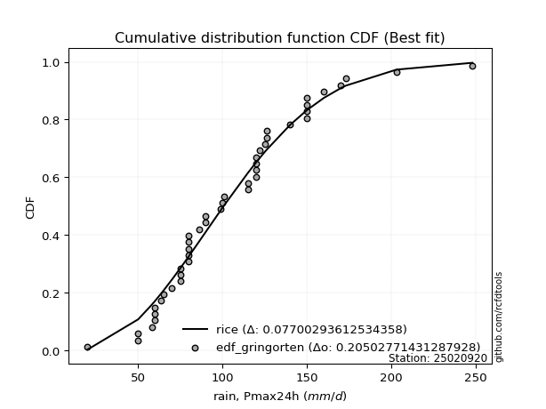</img>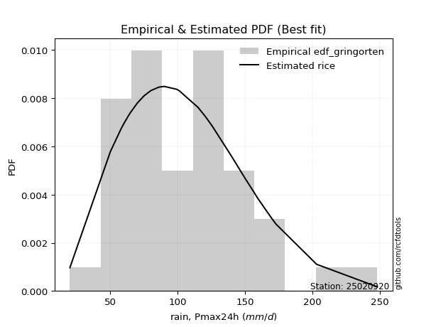</img>

</div>


### 9. Empirical - EDF Filliben (1975)

The specific values of the constants (0.3175) (often denoted as $alpha$) and (0.365) are derived from a method proposed by James J. Filliben in a 1975 paper. This particular formula is the mean value of the $i$-th order statistic of the normal distribution and is considered a robust and effective plotting position formula for the normal probability plot correlation coefficient test for normality.

<div align="center">


$P=(m-0.3175)/(n+0.365)$


</div>


**9.1. Empirical values**

<div align="center">

|                | 0                    | 1                   | 2                   | 3                   | 4                   | 5                   | 6                   | 7                  | 8                   | 9                  | 10                  | 11                 | 12                  | 13                 | 14                  | 15                 | 16                  | 17                 | 18                 | 19                 | 20                  | 21                 | 22                  | 23                 | 24                 | 25                  | 26                 | 27                 | 28                 | 29                 | 30                 | 31                 | 32                 | 33                 | 34                 | 35                 | 36                 | 37                 | 38                 | 39                 | 40                 | 41                 | 42                 | 43                 | 44                 | 45                 | 46                 | 47                 | 48                 | 49                 | 50                 | 51               |
|:---------------|:---------------------|:--------------------|:--------------------|:--------------------|:--------------------|:--------------------|:--------------------|:-------------------|:--------------------|:-------------------|:--------------------|:-------------------|:--------------------|:-------------------|:--------------------|:-------------------|:--------------------|:-------------------|:-------------------|:-------------------|:--------------------|:-------------------|:--------------------|:-------------------|:-------------------|:--------------------|:-------------------|:-------------------|:-------------------|:-------------------|:-------------------|:-------------------|:-------------------|:-------------------|:-------------------|:-------------------|:-------------------|:-------------------|:-------------------|:-------------------|:-------------------|:-------------------|:-------------------|:-------------------|:-------------------|:-------------------|:-------------------|:-------------------|:-------------------|:-------------------|:-------------------|:-----------------|
| date           | 2008                 | 1991                | 1988                | 1992                | 1990                | 1984                | 1998                | 1983               | 2009                | 2010               | 2007                | 2011               | 2012                | 1995               | 1974                | 1994               | 1997                | 1972               | 2015               | 1977               | 1976                | 1989               | 2019                | 1975               | 2018               | 2021                | 1971               | 2020               | 2016               | 1980               | 2005               | 2017               | 2013               | 1985               | 1987               | 1970               | 2014               | 2002               | 1996               | 1993               | 1986               | 1979               | 1982               | 1981               | 1999               | 2003               | 2001               | 2000               | 2006               | 1978               | 1973               | 2004             |
| x              | 20.0                 | 50.0                | 60.0                | 60.0                | 60.0                | 65.0                | 70.0                | 75.0               | 75.0                | 75.0               | 80.0                | 80.0               | 80.0                | 80.0               | 86.0                | 90.0               | 90.0                | 90.1443522883201   | 90.7595845282534   | 98.3418531639491   | 99.0                | 100.0              | 100.273882014316    | 101.0              | 101.877971697636   | 103.535454863046    | 104.144144422804   | 105.431758524183   | 106.512869876267   | 107.12048298616614 | 109.720713687932   | 109.955969697234   | 112.023287990105   | 115.0              | 115.0              | 116.48471118843    | 118.058561338164   | 120.0              | 120.0              | 120.0              | 120.0              | 122.0              | 125.0              | 126.0              | 140.0              | 150.0              | 150.0              | 150.0              | 150.0              | 160.0              | 173.0              | 203.0            |
| m              | 1                    | 2                   | 3                   | 4                   | 5                   | 6                   | 7                   | 8                  | 9                   | 10                 | 11                  | 12                 | 13                  | 14                 | 15                  | 16                 | 17                  | 18                 | 19                 | 20                 | 21                  | 22                 | 23                  | 24                 | 25                 | 26                  | 27                 | 28                 | 29                 | 30                 | 31                 | 32                 | 33                 | 34                 | 35                 | 36                 | 37                 | 38                 | 39                 | 40                 | 41                 | 42                 | 43                 | 44                 | 45                 | 46                 | 47                 | 48                 | 49                 | 50                 | 51                 | 52               |
| empirical_dist | edf_filliben         | edf_filliben        | edf_filliben        | edf_filliben        | edf_filliben        | edf_filliben        | edf_filliben        | edf_filliben       | edf_filliben        | edf_filliben       | edf_filliben        | edf_filliben       | edf_filliben        | edf_filliben       | edf_filliben        | edf_filliben       | edf_filliben        | edf_filliben       | edf_filliben       | edf_filliben       | edf_filliben        | edf_filliben       | edf_filliben        | edf_filliben       | edf_filliben       | edf_filliben        | edf_filliben       | edf_filliben       | edf_filliben       | edf_filliben       | edf_filliben       | edf_filliben       | edf_filliben       | edf_filliben       | edf_filliben       | edf_filliben       | edf_filliben       | edf_filliben       | edf_filliben       | edf_filliben       | edf_filliben       | edf_filliben       | edf_filliben       | edf_filliben       | edf_filliben       | edf_filliben       | edf_filliben       | edf_filliben       | edf_filliben       | edf_filliben       | edf_filliben       | edf_filliben     |
| empirical      | 0.013033514752219994 | 0.03213023966389764 | 0.05122696457557529 | 0.07032368948725294 | 0.08942041439893059 | 0.10851713931060823 | 0.12761386422228588 | 0.1467105891339635 | 0.16580731404564114 | 0.1849040389573188 | 0.20400076386899643 | 0.2230974887806741 | 0.24219421369235175 | 0.2612909386040294 | 0.28038766351570704 | 0.2994843884273847 | 0.31858111333906236 | 0.33767783825074   | 0.3567745631624176 | 0.3758712880740953 | 0.39496801298577294 | 0.4140647378974506 | 0.43316146280912826 | 0.4522581877208059 | 0.4713549126324835 | 0.49045163754416116 | 0.5095483624558388 | 0.5286450873675165 | 0.5477418122791942 | 0.5668385371908717 | 0.5859352621025494 | 0.605031987014227  | 0.6241287119259047 | 0.6432254368375823 | 0.66232216174926   | 0.6814188866609375 | 0.7005156115726152 | 0.7196123364842929 | 0.7387090613959705 | 0.7578057863076482 | 0.7769025112193259 | 0.7959992361310034 | 0.8150959610426811 | 0.8341926859543587 | 0.8532894108660364 | 0.8723861357777141 | 0.8914828606893916 | 0.9105795856010693 | 0.929676310512747  | 0.9487730354244246 | 0.9678697603361023 | 0.98696648524778 |
| empirical_tr   | 1.0132056305325787   | 1.0331968628224732  | 1.0539928546268806  | 1.075643198274534   | 1.098201646306297   | 1.121726557060997   | 1.1462813987850928  | 1.171935321434566  | 1.1987638070165396  | 1.2268494113512562 | 1.2562826126072093  | 1.2871627849812572 | 1.3195993195993196  | 1.3537129192787436 | 1.3896370994493463  | 1.4275199345737069 | 1.4675260982274225  | 1.5098392561089886 | 1.554664885326208  | 1.6022336112598485 | 1.6528051763591887  | 1.7066731850403325 | 1.7641708077149836  | 1.8256776780266712 | 1.8916282850176105 | 1.9625222524126302  | 2.038937019371167  | 2.1215436037678517 | 2.211126359125937  | 2.3086079576766227 | 2.415081286751989  | 2.5318505983319226 | 2.660485202591134  | 2.802890405459654  | 2.9614025166124693 | 3.138918027873519  | 3.339072214251553  | 3.566490720245189  | 3.8271514708569323 | 4.128917800118272  | 4.482345388401455  | 4.901942429206644  | 5.40821068938807   | 6.03109703426432   | 6.816140579238525  | 7.836139169472499  | 9.215134183897922  | 11.183128670581944 | 14.219959266802434 | 19.520969245107132 | 31.123328380386255 | 76.7252747252745 |

</div>


**9.2. Kolmogorov-Smirnov fit test (sorted by Δ)**


<div align="center">

|                | 0                   | 1                     | 2                   | 3                   | 4                    | 5                    | 6                   | 7                   | 8                   | 9                   | 10                  | 11                  | 12                  | 13                  | 14                  | 15                  | 16                  | 17                  | 18                  | 19                  | 20                  | 21                  | 22                  | 23                  | 24                  | 25                  | 26                  | 27                  | 28                  | 29                  | 30                  | 31                  | 32                  | 33                  | 34                  | 35                  | 36                  | 37                  | 38                  | 39                  | 40                  | 41                  | 42                  | 43                  | 44                  | 45                  | 46                  | 47                  | 48                  | 49                  | 50                  | 51                  | 52                  | 53                  | 54                  | 55                  | 56                  | 57                  | 58                  | 59                  | 60                  | 61                  | 62                  | 63                  | 64                  | 65                  | 66                  | 67                  | 68                  | 69                  | 70                  | 71                  | 72                  | 73                  | 74                  | 75                  | 76                  | 77                  | 78                  | 79                  | 80                  | 81                  | 82                  | 83                  | 84                  | 85                  | 86                  | 87                  | 88                  | 89                  |
|:---------------|:--------------------|:----------------------|:--------------------|:--------------------|:---------------------|:---------------------|:--------------------|:--------------------|:--------------------|:--------------------|:--------------------|:--------------------|:--------------------|:--------------------|:--------------------|:--------------------|:--------------------|:--------------------|:--------------------|:--------------------|:--------------------|:--------------------|:--------------------|:--------------------|:--------------------|:--------------------|:--------------------|:--------------------|:--------------------|:--------------------|:--------------------|:--------------------|:--------------------|:--------------------|:--------------------|:--------------------|:--------------------|:--------------------|:--------------------|:--------------------|:--------------------|:--------------------|:--------------------|:--------------------|:--------------------|:--------------------|:--------------------|:--------------------|:--------------------|:--------------------|:--------------------|:--------------------|:--------------------|:--------------------|:--------------------|:--------------------|:--------------------|:--------------------|:--------------------|:--------------------|:--------------------|:--------------------|:--------------------|:--------------------|:--------------------|:--------------------|:--------------------|:--------------------|:--------------------|:--------------------|:--------------------|:--------------------|:--------------------|:--------------------|:--------------------|:--------------------|:--------------------|:--------------------|:--------------------|:--------------------|:--------------------|:--------------------|:--------------------|:--------------------|:--------------------|:--------------------|:--------------------|:--------------------|:--------------------|:--------------------|
| station        | 25020920            | 25020920              | 25020920            | 25020920            | 25020920             | 25020920             | 25020920            | 25020920            | 25020920            | 25020920            | 25020920            | 25020920            | 25020920            | 25020920            | 25020920            | 25020920            | 25020920            | 25020920            | 25020920            | 25020920            | 25020920            | 25020920            | 25020920            | 25020920            | 25020920            | 25020920            | 25020920            | 25020920            | 25020920            | 25020920            | 25020920            | 25020920            | 25020920            | 25020920            | 25020920            | 25020920            | 25020920            | 25020920            | 25020920            | 25020920            | 25020920            | 25020920            | 25020920            | 25020920            | 25020920            | 25020920            | 25020920            | 25020920            | 25020920            | 25020920            | 25020920            | 25020920            | 25020920            | 25020920            | 25020920            | 25020920            | 25020920            | 25020920            | 25020920            | 25020920            | 25020920            | 25020920            | 25020920            | 25020920            | 25020920            | 25020920            | 25020920            | 25020920            | 25020920            | 25020920            | 25020920            | 25020920            | 25020920            | 25020920            | 25020920            | 25020920            | 25020920            | 25020920            | 25020920            | 25020920            | 25020920            | 25020920            | 25020920            | 25020920            | 25020920            | 25020920            | 25020920            | 25020920            | 25020920            | 25020920            |
| empirical_dist | edf_filliben        | edf_filliben          | edf_filliben        | edf_filliben        | edf_filliben         | edf_filliben         | edf_filliben        | edf_filliben        | edf_filliben        | edf_filliben        | edf_filliben        | edf_filliben        | edf_filliben        | edf_filliben        | edf_filliben        | edf_filliben        | edf_filliben        | edf_filliben        | edf_filliben        | edf_filliben        | edf_filliben        | edf_filliben        | edf_filliben        | edf_filliben        | edf_filliben        | edf_filliben        | edf_filliben        | edf_filliben        | edf_filliben        | edf_filliben        | edf_filliben        | edf_filliben        | edf_filliben        | edf_filliben        | edf_filliben        | edf_filliben        | edf_filliben        | edf_filliben        | edf_filliben        | edf_filliben        | edf_filliben        | edf_filliben        | edf_filliben        | edf_filliben        | edf_filliben        | edf_filliben        | edf_filliben        | edf_filliben        | edf_filliben        | edf_filliben        | edf_filliben        | edf_filliben        | edf_filliben        | edf_filliben        | edf_filliben        | edf_filliben        | edf_filliben        | edf_filliben        | edf_filliben        | edf_filliben        | edf_filliben        | edf_filliben        | edf_filliben        | edf_filliben        | edf_filliben        | edf_filliben        | edf_filliben        | edf_filliben        | edf_filliben        | edf_filliben        | edf_filliben        | edf_filliben        | edf_filliben        | edf_filliben        | edf_filliben        | edf_filliben        | edf_filliben        | edf_filliben        | edf_filliben        | edf_filliben        | edf_filliben        | edf_filliben        | edf_filliben        | edf_filliben        | edf_filliben        | edf_filliben        | edf_filliben        | edf_filliben        | edf_filliben        | edf_filliben        |
| p_dist         | logjohnsonsu        | loglaplace_asymmetric | fisk                | t                   | logmielke            | loggenlogistic       | genlogistic         | johnsonsu           | mielke              | exponnorm           | hypsecant           | logistic            | nct                 | invgamma            | nakagami            | alpha               | weibull_min         | pearson3            | laplace_asymmetric  | fatiguelife         | chi2                | f                   | erlang              | gamma               | betaprime           | logfisk             | maxwell             | logloggamma         | laplace             | rice                | norm                | truncnorm           | crystalball         | lognakagami         | rayleigh            | loggompertz         | loggumbel_l         | invweibull          | invgauss            | gumbel_r            | logf                | loglaplace          | loghypsecant        | loglogistic         | logcrystalball      | lognorm             | lognorm             | logexponnorm        | loglognorm          | logrice             | logfatiguelife      | logncf              | logt                | kstwobign           | lognct              | loginvgamma         | gompertz            | gumbel_l            | halfnorm            | loggamma            | loggamma            | logpearson3         | logbetaprime        | logerlang           | moyal               | logalpha            | loginvgauss         | halflogistic        | logmaxwell          | lograyleigh         | loggumbel_r         | loginvweibull       | loghalfnorm         | wald                | logmoyal            | loghalflogistic     | genexpon            | logkstwobign        | logtruncnorm        | gibrat              | logwald             | loggibrat           | loggenexpon         | expon               | pareto              | ncf                 | logexpon            | logpareto           | logweibull_min      | logchi2             |
| delta          | 0.05460076745816306 | 0.05665113197235827   | 0.06069485911862188 | 0.06071057779682143 | 0.061614009418042404 | 0.061922673119920224 | 0.06194116608538025 | 0.06216928866463933 | 0.06491038854088471 | 0.06891850907849395 | 0.07145259239341126 | 0.07217645956106566 | 0.07437740395767156 | 0.07493827172414314 | 0.07555444266166766 | 0.07561123898114785 | 0.07646089335160466 | 0.07648437268759445 | 0.07765638137085853 | 0.08122928202208579 | 0.08160458039589769 | 0.08189660362645979 | 0.0819033586234934  | 0.08190343257463895 | 0.08241341585156103 | 0.08249418135140613 | 0.08444755430154266 | 0.08641443448081376 | 0.08843138238155607 | 0.09119924053435224 | 0.09265698181541204 | 0.09265698438426107 | 0.09265699120573001 | 0.09624960208285138 | 0.0966028527074877  | 0.0993783912927243  | 0.10291522573413603 | 0.10398417806409538 | 0.113692685786844   | 0.11410759509165619 | 0.11415783860817647 | 0.11818272363328741 | 0.11989918816329775 | 0.1202929205463314  | 0.12075393700203685 | 0.12075398115781849 | 0.12075398115781849 | 0.12075542338980028 | 0.12075622310629841 | 0.12075628538092303 | 0.1209691782544337  | 0.12159905219102418 | 0.12165961398702985 | 0.12243841121819399 | 0.12316572254824787 | 0.12487673738441885 | 0.1286254173136363  | 0.13084251682557368 | 0.13098729426702782 | 0.1316925460054731  | 0.1316925460054731  | 0.13257852401222636 | 0.13450088592617715 | 0.1352294389904185  | 0.13855673351923425 | 0.14697088139727899 | 0.14730015187196133 | 0.14965406315326568 | 0.15393552349200135 | 0.1650205138631201  | 0.191022006609892   | 0.19310620303217074 | 0.19622479149185823 | 0.20599163143645882 | 0.21688842280173293 | 0.22095558612866706 | 0.22549640022517542 | 0.24281661771155227 | 0.25540156384915785 | 0.26116777052216    | 0.28883163216845964 | 0.3116549033646461  | 0.3282725566762361  | 0.3320635559479491  | 0.33206357911234063 | 0.3391616322748546  | 0.44641531002032697 | 0.44641531778875265 | 0.571519543074811   | 0.6457175606171272  |
| deltao         | 0.18859806671657792 | 0.18859806671657792   | 0.18859806671657792 | 0.18859806671657792 | 0.18859806671657792  | 0.18859806671657792  | 0.18859806671657792 | 0.18859806671657792 | 0.18859806671657792 | 0.18859806671657792 | 0.18859806671657792 | 0.18859806671657792 | 0.18859806671657792 | 0.18859806671657792 | 0.18859806671657792 | 0.18859806671657792 | 0.18859806671657792 | 0.18859806671657792 | 0.18859806671657792 | 0.18859806671657792 | 0.18859806671657792 | 0.18859806671657792 | 0.18859806671657792 | 0.18859806671657792 | 0.18859806671657792 | 0.18859806671657792 | 0.18859806671657792 | 0.18859806671657792 | 0.18859806671657792 | 0.18859806671657792 | 0.18859806671657792 | 0.18859806671657792 | 0.18859806671657792 | 0.18859806671657792 | 0.18859806671657792 | 0.18859806671657792 | 0.18859806671657792 | 0.18859806671657792 | 0.18859806671657792 | 0.18859806671657792 | 0.18859806671657792 | 0.18859806671657792 | 0.18859806671657792 | 0.18859806671657792 | 0.18859806671657792 | 0.18859806671657792 | 0.18859806671657792 | 0.18859806671657792 | 0.18859806671657792 | 0.18859806671657792 | 0.18859806671657792 | 0.18859806671657792 | 0.18859806671657792 | 0.18859806671657792 | 0.18859806671657792 | 0.18859806671657792 | 0.18859806671657792 | 0.18859806671657792 | 0.18859806671657792 | 0.18859806671657792 | 0.18859806671657792 | 0.18859806671657792 | 0.18859806671657792 | 0.18859806671657792 | 0.18859806671657792 | 0.18859806671657792 | 0.18859806671657792 | 0.18859806671657792 | 0.18859806671657792 | 0.18859806671657792 | 0.18859806671657792 | 0.18859806671657792 | 0.18859806671657792 | 0.18859806671657792 | 0.18859806671657792 | 0.18859806671657792 | 0.18859806671657792 | 0.18859806671657792 | 0.18859806671657792 | 0.18859806671657792 | 0.18859806671657792 | 0.18859806671657792 | 0.18859806671657792 | 0.18859806671657792 | 0.18859806671657792 | 0.18859806671657792 | 0.18859806671657792 | 0.18859806671657792 | 0.18859806671657792 | 0.18859806671657792 |
| eval           | Δo > Δ              | Δo > Δ                | Δo > Δ              | Δo > Δ              | Δo > Δ               | Δo > Δ               | Δo > Δ              | Δo > Δ              | Δo > Δ              | Δo > Δ              | Δo > Δ              | Δo > Δ              | Δo > Δ              | Δo > Δ              | Δo > Δ              | Δo > Δ              | Δo > Δ              | Δo > Δ              | Δo > Δ              | Δo > Δ              | Δo > Δ              | Δo > Δ              | Δo > Δ              | Δo > Δ              | Δo > Δ              | Δo > Δ              | Δo > Δ              | Δo > Δ              | Δo > Δ              | Δo > Δ              | Δo > Δ              | Δo > Δ              | Δo > Δ              | Δo > Δ              | Δo > Δ              | Δo > Δ              | Δo > Δ              | Δo > Δ              | Δo > Δ              | Δo > Δ              | Δo > Δ              | Δo > Δ              | Δo > Δ              | Δo > Δ              | Δo > Δ              | Δo > Δ              | Δo > Δ              | Δo > Δ              | Δo > Δ              | Δo > Δ              | Δo > Δ              | Δo > Δ              | Δo > Δ              | Δo > Δ              | Δo > Δ              | Δo > Δ              | Δo > Δ              | Δo > Δ              | Δo > Δ              | Δo > Δ              | Δo > Δ              | Δo > Δ              | Δo > Δ              | Δo > Δ              | Δo > Δ              | Δo > Δ              | Δo > Δ              | Δo > Δ              | Δo > Δ              | Δo > Δ              | Δo <= Δ             | Δo <= Δ             | Δo <= Δ             | Δo <= Δ             | Δo <= Δ             | Δo <= Δ             | Δo <= Δ             | Δo <= Δ             | Δo <= Δ             | Δo <= Δ             | Δo <= Δ             | Δo <= Δ             | Δo <= Δ             | Δo <= Δ             | Δo <= Δ             | Δo <= Δ             | Δo <= Δ             | Δo <= Δ             | Δo <= Δ             | Δo <= Δ             |
| fit            | 1                   | 1                     | 1                   | 1                   | 1                    | 1                    | 1                   | 1                   | 1                   | 1                   | 1                   | 1                   | 1                   | 1                   | 1                   | 1                   | 1                   | 1                   | 1                   | 1                   | 1                   | 1                   | 1                   | 1                   | 1                   | 1                   | 1                   | 1                   | 1                   | 1                   | 1                   | 1                   | 1                   | 1                   | 1                   | 1                   | 1                   | 1                   | 1                   | 1                   | 1                   | 1                   | 1                   | 1                   | 1                   | 1                   | 1                   | 1                   | 1                   | 1                   | 1                   | 1                   | 1                   | 1                   | 1                   | 1                   | 1                   | 1                   | 1                   | 1                   | 1                   | 1                   | 1                   | 1                   | 1                   | 1                   | 1                   | 1                   | 1                   | 1                   | 0                   | 0                   | 0                   | 0                   | 0                   | 0                   | 0                   | 0                   | 0                   | 0                   | 0                   | 0                   | 0                   | 0                   | 0                   | 0                   | 0                   | 0                   | 0                   | 0                   |
| n              | 52                  | 52                    | 52                  | 52                  | 52                   | 52                   | 52                  | 52                  | 52                  | 52                  | 52                  | 52                  | 52                  | 52                  | 52                  | 52                  | 52                  | 52                  | 52                  | 52                  | 52                  | 52                  | 52                  | 52                  | 52                  | 52                  | 52                  | 52                  | 52                  | 52                  | 52                  | 52                  | 52                  | 52                  | 52                  | 52                  | 52                  | 52                  | 52                  | 52                  | 52                  | 52                  | 52                  | 52                  | 52                  | 52                  | 52                  | 52                  | 52                  | 52                  | 52                  | 52                  | 52                  | 52                  | 52                  | 52                  | 52                  | 52                  | 52                  | 52                  | 52                  | 52                  | 52                  | 52                  | 52                  | 52                  | 52                  | 52                  | 52                  | 52                  | 52                  | 52                  | 52                  | 52                  | 52                  | 52                  | 52                  | 52                  | 52                  | 52                  | 52                  | 52                  | 52                  | 52                  | 52                  | 52                  | 52                  | 52                  | 52                  | 52                  |
| best_fit       | 1                   | 0                     | 0                   | 0                   | 0                    | 0                    | 0                   | 0                   | 0                   | 0                   | 0                   | 0                   | 0                   | 0                   | 0                   | 0                   | 0                   | 0                   | 0                   | 0                   | 0                   | 0                   | 0                   | 0                   | 0                   | 0                   | 0                   | 0                   | 0                   | 0                   | 0                   | 0                   | 0                   | 0                   | 0                   | 0                   | 0                   | 0                   | 0                   | 0                   | 0                   | 0                   | 0                   | 0                   | 0                   | 0                   | 0                   | 0                   | 0                   | 0                   | 0                   | 0                   | 0                   | 0                   | 0                   | 0                   | 0                   | 0                   | 0                   | 0                   | 0                   | 0                   | 0                   | 0                   | 0                   | 0                   | 0                   | 0                   | 0                   | 0                   | 0                   | 0                   | 0                   | 0                   | 0                   | 0                   | 0                   | 0                   | 0                   | 0                   | 0                   | 0                   | 0                   | 0                   | 0                   | 0                   | 0                   | 0                   | 0                   | 0                   |
| best_fit_sort  | 1                   | 2                     | 3                   | 4                   | 5                    | 6                    | 7                   | 8                   | 9                   | 10                  | 11                  | 12                  | 13                  | 14                  | 15                  | 16                  | 17                  | 18                  | 19                  | 20                  | 21                  | 22                  | 23                  | 24                  | 25                  | 26                  | 27                  | 28                  | 29                  | 30                  | 31                  | 32                  | 33                  | 34                  | 35                  | 36                  | 37                  | 38                  | 39                  | 40                  | 41                  | 42                  | 43                  | 44                  | 45                  | 46                  | 47                  | 48                  | 49                  | 50                  | 51                  | 52                  | 53                  | 54                  | 55                  | 56                  | 57                  | 58                  | 59                  | 60                  | 61                  | 62                  | 63                  | 64                  | 65                  | 66                  | 67                  | 68                  | 69                  | 70                  | 71                  | 72                  | 73                  | 74                  | 75                  | 76                  | 77                  | 78                  | 79                  | 80                  | 81                  | 82                  | 83                  | 84                  | 85                  | 86                  | 87                  | 88                  | 89                  | 90                  |

</div>


<div align="center">

</img>

</div>


**9.3. Best fit**

<div align="center">

|   id |   station | empirical_dist   | p_dist       |     delta |   deltao | eval   |   fit |   n |   best_fit |   best_fit_sort |
|-----:|----------:|:-----------------|:-------------|----------:|---------:|:-------|------:|----:|-----------:|----------------:|
|    0 |  25020920 | edf_filliben     | logjohnsonsu | 0.0546008 | 0.188598 | Δo > Δ |     1 |  52 |          1 |               1 |

</div>


<div align="center">

</img>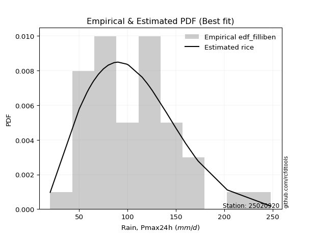</img>

</div>


### 10. Empirical - EDF Jenkinson (1977)

The Jenkinson formula in hydrology is an empirical plotting position formula used to estimate the non-exceedance probability _(P)_ or return period _(T)_ of a given ordered observation within a sample. It is a widely used method in the frequency analysis of extreme events such as floods and rainfall, as it provides a distribution-free way to plot data. _a≈0.31_ and _b≈0.38_ are constants derived to approximate the median of the probability distribution for the given rank.

<div align="center">


$P=(m-a)/(n+b)$


</div>


**10.1. Empirical values**

<div align="center">

|                | 0                    | 1                   | 2                   | 3                  | 4                   | 5                   | 6                  | 7                   | 8                   | 9                   | 10                  | 11                 | 12                  | 13                  | 14                 | 15                 | 16                 | 17                 | 18                 | 19                 | 20                  | 21                  | 22                  | 23                  | 24                 | 25                 | 26                 | 27                 | 28                 | 29                 | 30                 | 31                 | 32                 | 33                 | 34                 | 35                 | 36                 | 37                 | 38                 | 39                 | 40                 | 41                | 42                 | 43                 | 44                 | 45                 | 46                 | 47                 | 48                 | 49                 | 50                 | 51                 |
|:---------------|:---------------------|:--------------------|:--------------------|:-------------------|:--------------------|:--------------------|:-------------------|:--------------------|:--------------------|:--------------------|:--------------------|:-------------------|:--------------------|:--------------------|:-------------------|:-------------------|:-------------------|:-------------------|:-------------------|:-------------------|:--------------------|:--------------------|:--------------------|:--------------------|:-------------------|:-------------------|:-------------------|:-------------------|:-------------------|:-------------------|:-------------------|:-------------------|:-------------------|:-------------------|:-------------------|:-------------------|:-------------------|:-------------------|:-------------------|:-------------------|:-------------------|:------------------|:-------------------|:-------------------|:-------------------|:-------------------|:-------------------|:-------------------|:-------------------|:-------------------|:-------------------|:-------------------|
| date           | 2008                 | 1991                | 1988                | 1992               | 1990                | 1984                | 1998               | 1983                | 2009                | 2010                | 2007                | 2011               | 2012                | 1995                | 1974               | 1994               | 1997               | 1972               | 2015               | 1977               | 1976                | 1989                | 2019                | 1975                | 2018               | 2021               | 1971               | 2020               | 2016               | 1980               | 2005               | 2017               | 2013               | 1985               | 1987               | 1970               | 2014               | 2002               | 1996               | 1993               | 1986               | 1979              | 1982               | 1981               | 1999               | 2003               | 2001               | 2000               | 2006               | 1978               | 1973               | 2004               |
| x              | 20.0                 | 50.0                | 60.0                | 60.0               | 60.0                | 65.0                | 70.0               | 75.0                | 75.0                | 75.0                | 80.0                | 80.0               | 80.0                | 80.0                | 86.0               | 90.0               | 90.0               | 90.1443522883201   | 90.7595845282534   | 98.3418531639491   | 99.0                | 100.0               | 100.273882014316    | 101.0               | 101.877971697636   | 103.535454863046   | 104.144144422804   | 105.431758524183   | 106.512869876267   | 107.12048298616614 | 109.720713687932   | 109.955969697234   | 112.023287990105   | 115.0              | 115.0              | 116.48471118843    | 118.058561338164   | 120.0              | 120.0              | 120.0              | 120.0              | 122.0             | 125.0              | 126.0              | 140.0              | 150.0              | 150.0              | 150.0              | 150.0              | 160.0              | 173.0              | 203.0              |
| m              | 1                    | 2                   | 3                   | 4                  | 5                   | 6                   | 7                  | 8                   | 9                   | 10                  | 11                  | 12                 | 13                  | 14                  | 15                 | 16                 | 17                 | 18                 | 19                 | 20                 | 21                  | 22                  | 23                  | 24                  | 25                 | 26                 | 27                 | 28                 | 29                 | 30                 | 31                 | 32                 | 33                 | 34                 | 35                 | 36                 | 37                 | 38                 | 39                 | 40                 | 41                 | 42                | 43                 | 44                 | 45                 | 46                 | 47                 | 48                 | 49                 | 50                 | 51                 | 52                 |
| empirical_dist | edf_jenkinson        | edf_jenkinson       | edf_jenkinson       | edf_jenkinson      | edf_jenkinson       | edf_jenkinson       | edf_jenkinson      | edf_jenkinson       | edf_jenkinson       | edf_jenkinson       | edf_jenkinson       | edf_jenkinson      | edf_jenkinson       | edf_jenkinson       | edf_jenkinson      | edf_jenkinson      | edf_jenkinson      | edf_jenkinson      | edf_jenkinson      | edf_jenkinson      | edf_jenkinson       | edf_jenkinson       | edf_jenkinson       | edf_jenkinson       | edf_jenkinson      | edf_jenkinson      | edf_jenkinson      | edf_jenkinson      | edf_jenkinson      | edf_jenkinson      | edf_jenkinson      | edf_jenkinson      | edf_jenkinson      | edf_jenkinson      | edf_jenkinson      | edf_jenkinson      | edf_jenkinson      | edf_jenkinson      | edf_jenkinson      | edf_jenkinson      | edf_jenkinson      | edf_jenkinson     | edf_jenkinson      | edf_jenkinson      | edf_jenkinson      | edf_jenkinson      | edf_jenkinson      | edf_jenkinson      | edf_jenkinson      | edf_jenkinson      | edf_jenkinson      | edf_jenkinson      |
| empirical      | 0.013172966781214202 | 0.03226422298587247 | 0.05135547919053073 | 0.070446735395189  | 0.08953799159984727 | 0.10862924780450554 | 0.1277205040091638 | 0.14681176021382206 | 0.16590301641848032 | 0.18499427262313858 | 0.20408552882779685 | 0.2231767850324551 | 0.24226804123711337 | 0.26135929744177167 | 0.2804505536464299 | 0.2995418098510882 | 0.3186330660557465 | 0.3377243222604047 | 0.356815578465063  | 0.3759068346697213 | 0.39499809087437954 | 0.41408934707903783 | 0.43318060328369606 | 0.45227185948835436 | 0.4713631156930126 | 0.4904543718976709 | 0.5095456281023292 | 0.5286368843069874 | 0.5477281405116456 | 0.5668193967163039 | 0.5859106529209622 | 0.6050019091256205 | 0.6240931653302787 | 0.6431844215349369 | 0.6622756777395952 | 0.6813669339442534 | 0.7004581901489118 | 0.71954944635357   | 0.7386407025582282 | 0.7577319587628866 | 0.7768232149675448 | 0.795914471172203 | 0.8150057273768613 | 0.8340969835815196 | 0.8531882397861779 | 0.8722794959908361 | 0.8913707521954943 | 0.9104620084001527 | 0.9295532646048109 | 0.9486445208094691 | 0.9677357770141274 | 0.9868270332187857 |
| empirical_tr   | 1.0133488102147417   | 1.0333399092523181  | 1.054135640974039   | 1.0757855822550833 | 1.0983434682323339  | 1.1218676376097665  | 1.1464215364412345 | 1.172074289550235   | 1.1989013504234378  | 1.2269852424455376  | 1.2564164068121852  | 1.287294175473089  | 1.3197278911564627  | 1.3538382010855519  | 1.3897585566463253 | 1.4276369582992643 | 1.4676379938358084 | 1.5099452291726723 | 1.5547640249332149 | 1.602324869990823  | 1.652887346165983   | 1.7067448680351909  | 1.7642303805995283  | 1.8257232485186476  | 1.8916576381365113 | 1.9625327838141624 | 2.0389256520046715 | 2.1215066828675577 | 2.211059518784297  | 2.308505949757602  | 2.4149377593361    | 2.5316578057032384 | 2.6602336211274755 | 2.8025682182985547 | 2.9609949123798747 | 3.138406231276212  | 3.3384321223709366 | 3.5656909462219186 | 3.826150474799122  | 4.127659574468085  | 4.480752780153977  | 4.899906454630494 | 5.405572755417953  | 6.027617951668583  | 6.811443433029906  | 7.8295964125560475 | 9.205623901581712  | 11.1684434968017   | 14.195121951219496 | 19.472118959107764 | 30.994082840236548 | 75.9130434782605   |

</div>


**10.2. Kolmogorov-Smirnov fit test (sorted by Δ)**


<div align="center">

|                | 0                   | 1                     | 2                   | 3                   | 4                   | 5                    | 6                   | 7                   | 8                   | 9                   | 10                  | 11                  | 12                  | 13                  | 14                  | 15                  | 16                  | 17                  | 18                  | 19                  | 20                  | 21                  | 22                  | 23                  | 24                  | 25                  | 26                  | 27                  | 28                  | 29                  | 30                  | 31                  | 32                  | 33                  | 34                  | 35                  | 36                  | 37                  | 38                  | 39                  | 40                  | 41                  | 42                  | 43                  | 44                  | 45                  | 46                  | 47                  | 48                  | 49                  | 50                  | 51                  | 52                  | 53                  | 54                  | 55                  | 56                  | 57                  | 58                  | 59                  | 60                  | 61                  | 62                  | 63                  | 64                  | 65                  | 66                  | 67                  | 68                  | 69                  | 70                  | 71                  | 72                  | 73                  | 74                  | 75                  | 76                  | 77                  | 78                  | 79                  | 80                  | 81                  | 82                  | 83                  | 84                  | 85                  | 86                  | 87                  | 88                  | 89                  |
|:---------------|:--------------------|:----------------------|:--------------------|:--------------------|:--------------------|:---------------------|:--------------------|:--------------------|:--------------------|:--------------------|:--------------------|:--------------------|:--------------------|:--------------------|:--------------------|:--------------------|:--------------------|:--------------------|:--------------------|:--------------------|:--------------------|:--------------------|:--------------------|:--------------------|:--------------------|:--------------------|:--------------------|:--------------------|:--------------------|:--------------------|:--------------------|:--------------------|:--------------------|:--------------------|:--------------------|:--------------------|:--------------------|:--------------------|:--------------------|:--------------------|:--------------------|:--------------------|:--------------------|:--------------------|:--------------------|:--------------------|:--------------------|:--------------------|:--------------------|:--------------------|:--------------------|:--------------------|:--------------------|:--------------------|:--------------------|:--------------------|:--------------------|:--------------------|:--------------------|:--------------------|:--------------------|:--------------------|:--------------------|:--------------------|:--------------------|:--------------------|:--------------------|:--------------------|:--------------------|:--------------------|:--------------------|:--------------------|:--------------------|:--------------------|:--------------------|:--------------------|:--------------------|:--------------------|:--------------------|:--------------------|:--------------------|:--------------------|:--------------------|:--------------------|:--------------------|:--------------------|:--------------------|:--------------------|:--------------------|:--------------------|
| station        | 25020920            | 25020920              | 25020920            | 25020920            | 25020920            | 25020920             | 25020920            | 25020920            | 25020920            | 25020920            | 25020920            | 25020920            | 25020920            | 25020920            | 25020920            | 25020920            | 25020920            | 25020920            | 25020920            | 25020920            | 25020920            | 25020920            | 25020920            | 25020920            | 25020920            | 25020920            | 25020920            | 25020920            | 25020920            | 25020920            | 25020920            | 25020920            | 25020920            | 25020920            | 25020920            | 25020920            | 25020920            | 25020920            | 25020920            | 25020920            | 25020920            | 25020920            | 25020920            | 25020920            | 25020920            | 25020920            | 25020920            | 25020920            | 25020920            | 25020920            | 25020920            | 25020920            | 25020920            | 25020920            | 25020920            | 25020920            | 25020920            | 25020920            | 25020920            | 25020920            | 25020920            | 25020920            | 25020920            | 25020920            | 25020920            | 25020920            | 25020920            | 25020920            | 25020920            | 25020920            | 25020920            | 25020920            | 25020920            | 25020920            | 25020920            | 25020920            | 25020920            | 25020920            | 25020920            | 25020920            | 25020920            | 25020920            | 25020920            | 25020920            | 25020920            | 25020920            | 25020920            | 25020920            | 25020920            | 25020920            |
| empirical_dist | edf_jenkinson       | edf_jenkinson         | edf_jenkinson       | edf_jenkinson       | edf_jenkinson       | edf_jenkinson        | edf_jenkinson       | edf_jenkinson       | edf_jenkinson       | edf_jenkinson       | edf_jenkinson       | edf_jenkinson       | edf_jenkinson       | edf_jenkinson       | edf_jenkinson       | edf_jenkinson       | edf_jenkinson       | edf_jenkinson       | edf_jenkinson       | edf_jenkinson       | edf_jenkinson       | edf_jenkinson       | edf_jenkinson       | edf_jenkinson       | edf_jenkinson       | edf_jenkinson       | edf_jenkinson       | edf_jenkinson       | edf_jenkinson       | edf_jenkinson       | edf_jenkinson       | edf_jenkinson       | edf_jenkinson       | edf_jenkinson       | edf_jenkinson       | edf_jenkinson       | edf_jenkinson       | edf_jenkinson       | edf_jenkinson       | edf_jenkinson       | edf_jenkinson       | edf_jenkinson       | edf_jenkinson       | edf_jenkinson       | edf_jenkinson       | edf_jenkinson       | edf_jenkinson       | edf_jenkinson       | edf_jenkinson       | edf_jenkinson       | edf_jenkinson       | edf_jenkinson       | edf_jenkinson       | edf_jenkinson       | edf_jenkinson       | edf_jenkinson       | edf_jenkinson       | edf_jenkinson       | edf_jenkinson       | edf_jenkinson       | edf_jenkinson       | edf_jenkinson       | edf_jenkinson       | edf_jenkinson       | edf_jenkinson       | edf_jenkinson       | edf_jenkinson       | edf_jenkinson       | edf_jenkinson       | edf_jenkinson       | edf_jenkinson       | edf_jenkinson       | edf_jenkinson       | edf_jenkinson       | edf_jenkinson       | edf_jenkinson       | edf_jenkinson       | edf_jenkinson       | edf_jenkinson       | edf_jenkinson       | edf_jenkinson       | edf_jenkinson       | edf_jenkinson       | edf_jenkinson       | edf_jenkinson       | edf_jenkinson       | edf_jenkinson       | edf_jenkinson       | edf_jenkinson       | edf_jenkinson       |
| p_dist         | logjohnsonsu        | loglaplace_asymmetric | fisk                | t                   | logmielke           | loggenlogistic       | genlogistic         | johnsonsu           | mielke              | exponnorm           | hypsecant           | logistic            | nct                 | invgamma            | nakagami            | alpha               | weibull_min         | pearson3            | laplace_asymmetric  | fatiguelife         | chi2                | f                   | erlang              | gamma               | betaprime           | logfisk             | maxwell             | logloggamma         | laplace             | rice                | norm                | truncnorm           | crystalball         | lognakagami         | rayleigh            | loggompertz         | loggumbel_l         | invweibull          | invgauss            | gumbel_r            | logf                | loglaplace          | loghypsecant        | loglogistic         | logcrystalball      | lognorm             | lognorm             | logexponnorm        | loglognorm          | logrice             | logfatiguelife      | logncf              | logt                | kstwobign           | lognct              | loginvgamma         | gompertz            | gumbel_l            | halfnorm            | loggamma            | loggamma            | logpearson3         | logbetaprime        | logerlang           | moyal               | logalpha            | loginvgauss         | halflogistic        | logmaxwell          | lograyleigh         | loggumbel_r         | loginvweibull       | loghalfnorm         | wald                | logmoyal            | loghalflogistic     | genexpon            | logkstwobign        | logtruncnorm        | gibrat              | logwald             | loggibrat           | loggenexpon         | expon               | pareto              | ncf                 | logexpon            | logpareto           | logweibull_min      | logchi2             |
| delta          | 0.05456522086253707 | 0.05675777175923624   | 0.06065931252299589 | 0.0608172175836994  | 0.06157846282241641 | 0.061887126524294234 | 0.06190561948975426 | 0.06213374206901334 | 0.06487484194525872 | 0.06888296248286796 | 0.07152095123115351 | 0.07209716330928462 | 0.07429810770589051 | 0.07485897547236209 | 0.0754587402888286  | 0.07553194272936681 | 0.0763651909787656  | 0.07638867031475538 | 0.07772474020860079 | 0.08114998577030474 | 0.08152528414411664 | 0.08181730737467874 | 0.08182406237171236 | 0.0818241363228579  | 0.08231771347872197 | 0.08245863475578014 | 0.08441200770591667 | 0.08633513822903272 | 0.08849974121929832 | 0.0911199442825712  | 0.092577685563631   | 0.09257768813248002 | 0.09257769495394896 | 0.09621405548722539 | 0.0965673061118617  | 0.09929909504094325 | 0.10283592948235498 | 0.10394863146846939 | 0.113657139191218   | 0.1140720484960302  | 0.11412776071956987 | 0.11814717703766142 | 0.11986364156767176 | 0.1202573739507054  | 0.12071839040641086 | 0.1207184345621925  | 0.1207184345621925  | 0.12071987679417429 | 0.12072067651067242 | 0.12072073878529704 | 0.12093363165880772 | 0.12156350559539819 | 0.12162406739140386 | 0.122402864622568   | 0.12313017595262188 | 0.12484119078879286 | 0.12852971494079724 | 0.13076322057379264 | 0.13095174767140183 | 0.1316569994098471  | 0.1316569994098471  | 0.13249922776044532 | 0.13446533933055116 | 0.13519389239479251 | 0.13852118692360826 | 0.146935334801653   | 0.14726460527633534 | 0.1496185165576397  | 0.15389997689637536 | 0.16498496726749412 | 0.190986460014266   | 0.19298315712423464 | 0.19618924489623224 | 0.20595608484083283 | 0.21685287620610694 | 0.22092003953304107 | 0.22539522914531687 | 0.24271544663169373 | 0.2553003927692993  | 0.26123612935990226 | 0.28879608557283365 | 0.3116193567690201  | 0.3281713855963776  | 0.3319623848680906  | 0.3319624080324821  | 0.33903311765989913 | 0.44628679540537153 | 0.4462868031737972  | 0.5713910284598556  | 0.6455890460021717  |
| deltao         | 0.18859806671657792 | 0.18859806671657792   | 0.18859806671657792 | 0.18859806671657792 | 0.18859806671657792 | 0.18859806671657792  | 0.18859806671657792 | 0.18859806671657792 | 0.18859806671657792 | 0.18859806671657792 | 0.18859806671657792 | 0.18859806671657792 | 0.18859806671657792 | 0.18859806671657792 | 0.18859806671657792 | 0.18859806671657792 | 0.18859806671657792 | 0.18859806671657792 | 0.18859806671657792 | 0.18859806671657792 | 0.18859806671657792 | 0.18859806671657792 | 0.18859806671657792 | 0.18859806671657792 | 0.18859806671657792 | 0.18859806671657792 | 0.18859806671657792 | 0.18859806671657792 | 0.18859806671657792 | 0.18859806671657792 | 0.18859806671657792 | 0.18859806671657792 | 0.18859806671657792 | 0.18859806671657792 | 0.18859806671657792 | 0.18859806671657792 | 0.18859806671657792 | 0.18859806671657792 | 0.18859806671657792 | 0.18859806671657792 | 0.18859806671657792 | 0.18859806671657792 | 0.18859806671657792 | 0.18859806671657792 | 0.18859806671657792 | 0.18859806671657792 | 0.18859806671657792 | 0.18859806671657792 | 0.18859806671657792 | 0.18859806671657792 | 0.18859806671657792 | 0.18859806671657792 | 0.18859806671657792 | 0.18859806671657792 | 0.18859806671657792 | 0.18859806671657792 | 0.18859806671657792 | 0.18859806671657792 | 0.18859806671657792 | 0.18859806671657792 | 0.18859806671657792 | 0.18859806671657792 | 0.18859806671657792 | 0.18859806671657792 | 0.18859806671657792 | 0.18859806671657792 | 0.18859806671657792 | 0.18859806671657792 | 0.18859806671657792 | 0.18859806671657792 | 0.18859806671657792 | 0.18859806671657792 | 0.18859806671657792 | 0.18859806671657792 | 0.18859806671657792 | 0.18859806671657792 | 0.18859806671657792 | 0.18859806671657792 | 0.18859806671657792 | 0.18859806671657792 | 0.18859806671657792 | 0.18859806671657792 | 0.18859806671657792 | 0.18859806671657792 | 0.18859806671657792 | 0.18859806671657792 | 0.18859806671657792 | 0.18859806671657792 | 0.18859806671657792 | 0.18859806671657792 |
| eval           | Δo > Δ              | Δo > Δ                | Δo > Δ              | Δo > Δ              | Δo > Δ              | Δo > Δ               | Δo > Δ              | Δo > Δ              | Δo > Δ              | Δo > Δ              | Δo > Δ              | Δo > Δ              | Δo > Δ              | Δo > Δ              | Δo > Δ              | Δo > Δ              | Δo > Δ              | Δo > Δ              | Δo > Δ              | Δo > Δ              | Δo > Δ              | Δo > Δ              | Δo > Δ              | Δo > Δ              | Δo > Δ              | Δo > Δ              | Δo > Δ              | Δo > Δ              | Δo > Δ              | Δo > Δ              | Δo > Δ              | Δo > Δ              | Δo > Δ              | Δo > Δ              | Δo > Δ              | Δo > Δ              | Δo > Δ              | Δo > Δ              | Δo > Δ              | Δo > Δ              | Δo > Δ              | Δo > Δ              | Δo > Δ              | Δo > Δ              | Δo > Δ              | Δo > Δ              | Δo > Δ              | Δo > Δ              | Δo > Δ              | Δo > Δ              | Δo > Δ              | Δo > Δ              | Δo > Δ              | Δo > Δ              | Δo > Δ              | Δo > Δ              | Δo > Δ              | Δo > Δ              | Δo > Δ              | Δo > Δ              | Δo > Δ              | Δo > Δ              | Δo > Δ              | Δo > Δ              | Δo > Δ              | Δo > Δ              | Δo > Δ              | Δo > Δ              | Δo > Δ              | Δo > Δ              | Δo <= Δ             | Δo <= Δ             | Δo <= Δ             | Δo <= Δ             | Δo <= Δ             | Δo <= Δ             | Δo <= Δ             | Δo <= Δ             | Δo <= Δ             | Δo <= Δ             | Δo <= Δ             | Δo <= Δ             | Δo <= Δ             | Δo <= Δ             | Δo <= Δ             | Δo <= Δ             | Δo <= Δ             | Δo <= Δ             | Δo <= Δ             | Δo <= Δ             |
| fit            | 1                   | 1                     | 1                   | 1                   | 1                   | 1                    | 1                   | 1                   | 1                   | 1                   | 1                   | 1                   | 1                   | 1                   | 1                   | 1                   | 1                   | 1                   | 1                   | 1                   | 1                   | 1                   | 1                   | 1                   | 1                   | 1                   | 1                   | 1                   | 1                   | 1                   | 1                   | 1                   | 1                   | 1                   | 1                   | 1                   | 1                   | 1                   | 1                   | 1                   | 1                   | 1                   | 1                   | 1                   | 1                   | 1                   | 1                   | 1                   | 1                   | 1                   | 1                   | 1                   | 1                   | 1                   | 1                   | 1                   | 1                   | 1                   | 1                   | 1                   | 1                   | 1                   | 1                   | 1                   | 1                   | 1                   | 1                   | 1                   | 1                   | 1                   | 0                   | 0                   | 0                   | 0                   | 0                   | 0                   | 0                   | 0                   | 0                   | 0                   | 0                   | 0                   | 0                   | 0                   | 0                   | 0                   | 0                   | 0                   | 0                   | 0                   |
| n              | 52                  | 52                    | 52                  | 52                  | 52                  | 52                   | 52                  | 52                  | 52                  | 52                  | 52                  | 52                  | 52                  | 52                  | 52                  | 52                  | 52                  | 52                  | 52                  | 52                  | 52                  | 52                  | 52                  | 52                  | 52                  | 52                  | 52                  | 52                  | 52                  | 52                  | 52                  | 52                  | 52                  | 52                  | 52                  | 52                  | 52                  | 52                  | 52                  | 52                  | 52                  | 52                  | 52                  | 52                  | 52                  | 52                  | 52                  | 52                  | 52                  | 52                  | 52                  | 52                  | 52                  | 52                  | 52                  | 52                  | 52                  | 52                  | 52                  | 52                  | 52                  | 52                  | 52                  | 52                  | 52                  | 52                  | 52                  | 52                  | 52                  | 52                  | 52                  | 52                  | 52                  | 52                  | 52                  | 52                  | 52                  | 52                  | 52                  | 52                  | 52                  | 52                  | 52                  | 52                  | 52                  | 52                  | 52                  | 52                  | 52                  | 52                  |
| best_fit       | 1                   | 0                     | 0                   | 0                   | 0                   | 0                    | 0                   | 0                   | 0                   | 0                   | 0                   | 0                   | 0                   | 0                   | 0                   | 0                   | 0                   | 0                   | 0                   | 0                   | 0                   | 0                   | 0                   | 0                   | 0                   | 0                   | 0                   | 0                   | 0                   | 0                   | 0                   | 0                   | 0                   | 0                   | 0                   | 0                   | 0                   | 0                   | 0                   | 0                   | 0                   | 0                   | 0                   | 0                   | 0                   | 0                   | 0                   | 0                   | 0                   | 0                   | 0                   | 0                   | 0                   | 0                   | 0                   | 0                   | 0                   | 0                   | 0                   | 0                   | 0                   | 0                   | 0                   | 0                   | 0                   | 0                   | 0                   | 0                   | 0                   | 0                   | 0                   | 0                   | 0                   | 0                   | 0                   | 0                   | 0                   | 0                   | 0                   | 0                   | 0                   | 0                   | 0                   | 0                   | 0                   | 0                   | 0                   | 0                   | 0                   | 0                   |
| best_fit_sort  | 1                   | 2                     | 3                   | 4                   | 5                   | 6                    | 7                   | 8                   | 9                   | 10                  | 11                  | 12                  | 13                  | 14                  | 15                  | 16                  | 17                  | 18                  | 19                  | 20                  | 21                  | 22                  | 23                  | 24                  | 25                  | 26                  | 27                  | 28                  | 29                  | 30                  | 31                  | 32                  | 33                  | 34                  | 35                  | 36                  | 37                  | 38                  | 39                  | 40                  | 41                  | 42                  | 43                  | 44                  | 45                  | 46                  | 47                  | 48                  | 49                  | 50                  | 51                  | 52                  | 53                  | 54                  | 55                  | 56                  | 57                  | 58                  | 59                  | 60                  | 61                  | 62                  | 63                  | 64                  | 65                  | 66                  | 67                  | 68                  | 69                  | 70                  | 71                  | 72                  | 73                  | 74                  | 75                  | 76                  | 77                  | 78                  | 79                  | 80                  | 81                  | 82                  | 83                  | 84                  | 85                  | 86                  | 87                  | 88                  | 89                  | 90                  |

</div>


<div align="center">

</img>

</div>


**10.3. Best fit**

<div align="center">

|   id |   station | empirical_dist   | p_dist       |     delta |   deltao | eval   |   fit |   n |   best_fit |   best_fit_sort |
|-----:|----------:|:-----------------|:-------------|----------:|---------:|:-------|------:|----:|-----------:|----------------:|
|    0 |  25020920 | edf_jenkinson    | logjohnsonsu | 0.0545652 | 0.188598 | Δo > Δ |     1 |  52 |          1 |               1 |

</div>


<div align="center">

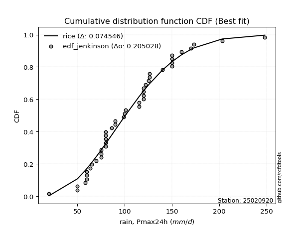</img>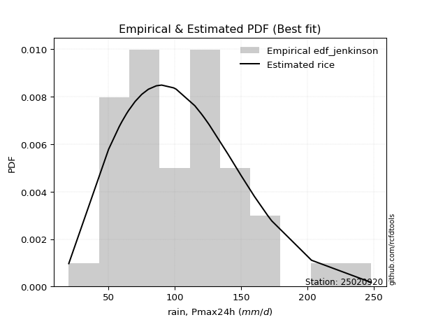</img>

</div>


### 11. Empirical - EDF Cunnane (1978)

Cunnane´s work in statistical hydrology has focused on the performance and evaluation of different probability distributions (such as GEV, Gumbel, Lognormal) for flood frequency estimation. _b_ is a constant, typically set to 0.4.

<div align="center">


$P=(m-b)/(n+1-2b)$


</div>


**11.1. Empirical values**

<div align="center">

|                | 0                    | 1                   | 2                   | 3                   | 4                   | 5                   | 6                  | 7                   | 8                  | 9                   | 10                  | 11                 | 12                  | 13                  | 14                 | 15                  | 16                  | 17                 | 18                 | 19                  | 20                 | 21                  | 22                 | 23                 | 24                  | 25                 | 26                 | 27                 | 28                 | 29                 | 30                 | 31                 | 32                 | 33                 | 34                 | 35                 | 36                 | 37                 | 38                 | 39                 | 40                 | 41                 | 42                 | 43                 | 44                 | 45                 | 46               | 47                 | 48                 | 49                 | 50                 | 51                 |
|:---------------|:---------------------|:--------------------|:--------------------|:--------------------|:--------------------|:--------------------|:-------------------|:--------------------|:-------------------|:--------------------|:--------------------|:-------------------|:--------------------|:--------------------|:-------------------|:--------------------|:--------------------|:-------------------|:-------------------|:--------------------|:-------------------|:--------------------|:-------------------|:-------------------|:--------------------|:-------------------|:-------------------|:-------------------|:-------------------|:-------------------|:-------------------|:-------------------|:-------------------|:-------------------|:-------------------|:-------------------|:-------------------|:-------------------|:-------------------|:-------------------|:-------------------|:-------------------|:-------------------|:-------------------|:-------------------|:-------------------|:-----------------|:-------------------|:-------------------|:-------------------|:-------------------|:-------------------|
| date           | 2008                 | 1991                | 1988                | 1992                | 1990                | 1984                | 1998               | 1983                | 2009               | 2010                | 2007                | 2011               | 2012                | 1995                | 1974               | 1994                | 1997                | 1972               | 2015               | 1977                | 1976               | 1989                | 2019               | 1975               | 2018                | 2021               | 1971               | 2020               | 2016               | 1980               | 2005               | 2017               | 2013               | 1985               | 1987               | 1970               | 2014               | 2002               | 1996               | 1993               | 1986               | 1979               | 1982               | 1981               | 1999               | 2003               | 2001             | 2000               | 2006               | 1978               | 1973               | 2004               |
| x              | 20.0                 | 50.0                | 60.0                | 60.0                | 60.0                | 65.0                | 70.0               | 75.0                | 75.0               | 75.0                | 80.0                | 80.0               | 80.0                | 80.0                | 86.0               | 90.0                | 90.0                | 90.1443522883201   | 90.7595845282534   | 98.3418531639491    | 99.0               | 100.0               | 100.273882014316   | 101.0              | 101.877971697636    | 103.535454863046   | 104.144144422804   | 105.431758524183   | 106.512869876267   | 107.12048298616614 | 109.720713687932   | 109.955969697234   | 112.023287990105   | 115.0              | 115.0              | 116.48471118843    | 118.058561338164   | 120.0              | 120.0              | 120.0              | 120.0              | 122.0              | 125.0              | 126.0              | 140.0              | 150.0              | 150.0            | 150.0              | 150.0              | 160.0              | 173.0              | 203.0              |
| m              | 1                    | 2                   | 3                   | 4                   | 5                   | 6                   | 7                  | 8                   | 9                  | 10                  | 11                  | 12                 | 13                  | 14                  | 15                 | 16                  | 17                  | 18                 | 19                 | 20                  | 21                 | 22                  | 23                 | 24                 | 25                  | 26                 | 27                 | 28                 | 29                 | 30                 | 31                 | 32                 | 33                 | 34                 | 35                 | 36                 | 37                 | 38                 | 39                 | 40                 | 41                 | 42                 | 43                 | 44                 | 45                 | 46                 | 47               | 48                 | 49                 | 50                 | 51                 | 52                 |
| empirical_dist | edf_cunnane          | edf_cunnane         | edf_cunnane         | edf_cunnane         | edf_cunnane         | edf_cunnane         | edf_cunnane        | edf_cunnane         | edf_cunnane        | edf_cunnane         | edf_cunnane         | edf_cunnane        | edf_cunnane         | edf_cunnane         | edf_cunnane        | edf_cunnane         | edf_cunnane         | edf_cunnane        | edf_cunnane        | edf_cunnane         | edf_cunnane        | edf_cunnane         | edf_cunnane        | edf_cunnane        | edf_cunnane         | edf_cunnane        | edf_cunnane        | edf_cunnane        | edf_cunnane        | edf_cunnane        | edf_cunnane        | edf_cunnane        | edf_cunnane        | edf_cunnane        | edf_cunnane        | edf_cunnane        | edf_cunnane        | edf_cunnane        | edf_cunnane        | edf_cunnane        | edf_cunnane        | edf_cunnane        | edf_cunnane        | edf_cunnane        | edf_cunnane        | edf_cunnane        | edf_cunnane      | edf_cunnane        | edf_cunnane        | edf_cunnane        | edf_cunnane        | edf_cunnane        |
| empirical      | 0.011494252873563216 | 0.03065134099616858 | 0.04980842911877394 | 0.06896551724137931 | 0.08812260536398467 | 0.10727969348659003 | 0.1264367816091954 | 0.14559386973180075 | 0.1647509578544061 | 0.18390804597701146 | 0.20306513409961685 | 0.2222222222222222 | 0.24137931034482757 | 0.26053639846743293 | 0.2796934865900383 | 0.29885057471264365 | 0.31800766283524906 | 0.3371647509578544 | 0.3563218390804598 | 0.37547892720306514 | 0.3946360153256705 | 0.41379310344827586 | 0.4329501915708812 | 0.4521072796934866 | 0.47126436781609193 | 0.4904214559386973 | 0.5095785440613027 | 0.5287356321839081 | 0.5478927203065134 | 0.5670498084291188 | 0.5862068965517241 | 0.6053639846743295 | 0.6245210727969348 | 0.6436781609195402 | 0.6628352490421456 | 0.6819923371647509 | 0.7011494252873564 | 0.7203065134099617 | 0.7394636015325671 | 0.7586206896551724 | 0.7777777777777778 | 0.7969348659003831 | 0.8160919540229885 | 0.8352490421455938 | 0.8544061302681992 | 0.8735632183908045 | 0.89272030651341 | 0.9118773946360152 | 0.9310344827586207 | 0.9501915708812261 | 0.9693486590038314 | 0.9885057471264368 |
| empirical_tr   | 1.0116279069767442   | 1.0316205533596838  | 1.0524193548387097  | 1.0740740740740742  | 1.0966386554621848  | 1.1201716738197425  | 1.144736842105263  | 1.1704035874439462  | 1.1972477064220182 | 1.2253521126760563  | 1.2548076923076923  | 1.2857142857142856 | 1.3181818181818183  | 1.3523316062176165  | 1.3882978723404253 | 1.4262295081967213  | 1.4662921348314608  | 1.5086705202312138 | 1.5535714285714286 | 1.6012269938650308  | 1.6518987341772151 | 1.7058823529411762  | 1.7635135135135134 | 1.8251748251748252 | 1.891304347826087   | 1.9624060150375937 | 2.0390625          | 2.1219512195121952 | 2.211864406779661  | 2.3097345132743365 | 2.4166666666666665 | 2.533980582524272  | 2.6632653061224487 | 2.8064516129032255 | 2.9659090909090913 | 3.144578313253012  | 3.3461538461538467 | 3.5753424657534243 | 3.838235294117647  | 4.142857142857142  | 4.5                | 4.924528301886792  | 5.4375             | 6.069767441860463  | 6.868421052631579  | 7.909090909090905  | 9.32142857142857 | 11.347826086956513 | 14.499999999999995 | 20.076923076923087 | 32.624999999999964 | 87.0000000000001   |

</div>


**11.2. Kolmogorov-Smirnov fit test (sorted by Δ)**


<div align="center">

|                | 0                   | 1                     | 2                   | 3                   | 4                    | 5                   | 6                   | 7                   | 8                   | 9                   | 10                  | 11                  | 12                  | 13                  | 14                  | 15                  | 16                  | 17                  | 18                  | 19                  | 20                  | 21                  | 22                  | 23                  | 24                  | 25                  | 26                  | 27                  | 28                  | 29                  | 30                  | 31                  | 32                  | 33                  | 34                  | 35                  | 36                  | 37                  | 38                  | 39                  | 40                  | 41                  | 42                  | 43                  | 44                  | 45                  | 46                  | 47                  | 48                  | 49                  | 50                  | 51                  | 52                  | 53                  | 54                  | 55                  | 56                  | 57                  | 58                  | 59                  | 60                  | 61                  | 62                  | 63                  | 64                  | 65                  | 66                  | 67                  | 68                  | 69                  | 70                  | 71                  | 72                  | 73                  | 74                  | 75                  | 76                  | 77                  | 78                  | 79                  | 80                  | 81                  | 82                  | 83                  | 84                  | 85                  | 86                  | 87                  | 88                  | 89                  |
|:---------------|:--------------------|:----------------------|:--------------------|:--------------------|:---------------------|:--------------------|:--------------------|:--------------------|:--------------------|:--------------------|:--------------------|:--------------------|:--------------------|:--------------------|:--------------------|:--------------------|:--------------------|:--------------------|:--------------------|:--------------------|:--------------------|:--------------------|:--------------------|:--------------------|:--------------------|:--------------------|:--------------------|:--------------------|:--------------------|:--------------------|:--------------------|:--------------------|:--------------------|:--------------------|:--------------------|:--------------------|:--------------------|:--------------------|:--------------------|:--------------------|:--------------------|:--------------------|:--------------------|:--------------------|:--------------------|:--------------------|:--------------------|:--------------------|:--------------------|:--------------------|:--------------------|:--------------------|:--------------------|:--------------------|:--------------------|:--------------------|:--------------------|:--------------------|:--------------------|:--------------------|:--------------------|:--------------------|:--------------------|:--------------------|:--------------------|:--------------------|:--------------------|:--------------------|:--------------------|:--------------------|:--------------------|:--------------------|:--------------------|:--------------------|:--------------------|:--------------------|:--------------------|:--------------------|:--------------------|:--------------------|:--------------------|:--------------------|:--------------------|:--------------------|:--------------------|:--------------------|:--------------------|:--------------------|:--------------------|:--------------------|
| station        | 25020920            | 25020920              | 25020920            | 25020920            | 25020920             | 25020920            | 25020920            | 25020920            | 25020920            | 25020920            | 25020920            | 25020920            | 25020920            | 25020920            | 25020920            | 25020920            | 25020920            | 25020920            | 25020920            | 25020920            | 25020920            | 25020920            | 25020920            | 25020920            | 25020920            | 25020920            | 25020920            | 25020920            | 25020920            | 25020920            | 25020920            | 25020920            | 25020920            | 25020920            | 25020920            | 25020920            | 25020920            | 25020920            | 25020920            | 25020920            | 25020920            | 25020920            | 25020920            | 25020920            | 25020920            | 25020920            | 25020920            | 25020920            | 25020920            | 25020920            | 25020920            | 25020920            | 25020920            | 25020920            | 25020920            | 25020920            | 25020920            | 25020920            | 25020920            | 25020920            | 25020920            | 25020920            | 25020920            | 25020920            | 25020920            | 25020920            | 25020920            | 25020920            | 25020920            | 25020920            | 25020920            | 25020920            | 25020920            | 25020920            | 25020920            | 25020920            | 25020920            | 25020920            | 25020920            | 25020920            | 25020920            | 25020920            | 25020920            | 25020920            | 25020920            | 25020920            | 25020920            | 25020920            | 25020920            | 25020920            |
| empirical_dist | edf_cunnane         | edf_cunnane           | edf_cunnane         | edf_cunnane         | edf_cunnane          | edf_cunnane         | edf_cunnane         | edf_cunnane         | edf_cunnane         | edf_cunnane         | edf_cunnane         | edf_cunnane         | edf_cunnane         | edf_cunnane         | edf_cunnane         | edf_cunnane         | edf_cunnane         | edf_cunnane         | edf_cunnane         | edf_cunnane         | edf_cunnane         | edf_cunnane         | edf_cunnane         | edf_cunnane         | edf_cunnane         | edf_cunnane         | edf_cunnane         | edf_cunnane         | edf_cunnane         | edf_cunnane         | edf_cunnane         | edf_cunnane         | edf_cunnane         | edf_cunnane         | edf_cunnane         | edf_cunnane         | edf_cunnane         | edf_cunnane         | edf_cunnane         | edf_cunnane         | edf_cunnane         | edf_cunnane         | edf_cunnane         | edf_cunnane         | edf_cunnane         | edf_cunnane         | edf_cunnane         | edf_cunnane         | edf_cunnane         | edf_cunnane         | edf_cunnane         | edf_cunnane         | edf_cunnane         | edf_cunnane         | edf_cunnane         | edf_cunnane         | edf_cunnane         | edf_cunnane         | edf_cunnane         | edf_cunnane         | edf_cunnane         | edf_cunnane         | edf_cunnane         | edf_cunnane         | edf_cunnane         | edf_cunnane         | edf_cunnane         | edf_cunnane         | edf_cunnane         | edf_cunnane         | edf_cunnane         | edf_cunnane         | edf_cunnane         | edf_cunnane         | edf_cunnane         | edf_cunnane         | edf_cunnane         | edf_cunnane         | edf_cunnane         | edf_cunnane         | edf_cunnane         | edf_cunnane         | edf_cunnane         | edf_cunnane         | edf_cunnane         | edf_cunnane         | edf_cunnane         | edf_cunnane         | edf_cunnane         | edf_cunnane         |
| p_dist         | logjohnsonsu        | loglaplace_asymmetric | t                   | fisk                | logmielke            | loggenlogistic      | genlogistic         | johnsonsu           | mielke              | exponnorm           | hypsecant           | logistic            | nct                 | invgamma            | alpha               | nakagami            | laplace_asymmetric  | weibull_min         | pearson3            | fatiguelife         | chi2                | f                   | erlang              | gamma               | logfisk             | betaprime           | maxwell             | logloggamma         | laplace             | rice                | norm                | truncnorm           | crystalball         | lognakagami         | rayleigh            | loggompertz         | loggumbel_l         | invweibull          | invgauss            | logf                | gumbel_r            | loglaplace          | loghypsecant        | loglogistic         | logcrystalball      | lognorm             | lognorm             | logexponnorm        | loglognorm          | logrice             | logfatiguelife      | logncf              | logt                | kstwobign           | lognct              | loginvgamma         | gompertz            | halfnorm            | gumbel_l            | loggamma            | loggamma            | logpearson3         | logbetaprime        | logerlang           | moyal               | logalpha            | loginvgauss         | halflogistic        | logmaxwell          | lograyleigh         | loggumbel_r         | loginvweibull       | loghalfnorm         | wald                | logmoyal            | loghalflogistic     | genexpon            | logkstwobign        | logtruncnorm        | gibrat              | logwald             | loggibrat           | loggenexpon         | expon               | pareto              | ncf                 | logexpon            | logpareto           | logweibull_min      | logchi2             |
| delta          | 0.05499312832919323 | 0.05547404935926781   | 0.05953349518373097 | 0.06108721998965205 | 0.062006370289072577 | 0.0623150339909504  | 0.06233352695641042 | 0.0625616495356695  | 0.06530274941191488 | 0.06951473890739446 | 0.07069805225681478 | 0.0730517261195176  | 0.0752526705161235  | 0.0758803250347152  | 0.07648650553959979 | 0.07661079885290278 | 0.07690184123426205 | 0.07751724954283978 | 0.07754072887882957 | 0.08210454858053773 | 0.08247984695434962 | 0.08277187018491172 | 0.08277862518194534 | 0.08277869913309088 | 0.0828865422224363  | 0.08346977204279615 | 0.08483991517257283 | 0.0872897010392657  | 0.08767684224495959 | 0.09207450709280418 | 0.09353224837386398 | 0.093532250942713   | 0.09353225776418195 | 0.09664196295388155 | 0.09699521357851787 | 0.10025365785117624 | 0.10379049229258797 | 0.10437653893512555 | 0.11408504665787417 | 0.11448983626827891 | 0.11449995596268636 | 0.11857508450431758 | 0.12029154903432793 | 0.12068528141736157 | 0.12114629787306702 | 0.12114634202884866 | 0.12114634202884866 | 0.12114778426083045 | 0.12114858397732858 | 0.12114864625195321 | 0.12136153912546388 | 0.12199141306205435 | 0.12205197485806002 | 0.12283077208922416 | 0.12355808341927804 | 0.12526909825544902 | 0.12968177350487142 | 0.131379655138058   | 0.13171778338402562 | 0.13208490687650326 | 0.13208490687650326 | 0.1334537905706783  | 0.13489324679720732 | 0.13562179986144868 | 0.13894909439026443 | 0.14736324226830916 | 0.1476925127429915  | 0.15004642402429585 | 0.15432788436303152 | 0.16541287473415028 | 0.19141436748092217 | 0.1944643752780444  | 0.1966171523628884  | 0.206383992307489   | 0.2172807836727631  | 0.22134794699969723 | 0.22661311962733818 | 0.24393333711371504 | 0.25651828325132064 | 0.2604132303855635  | 0.2892239930394898  | 0.31204726423567625 | 0.32938927607839885 | 0.33318027535011185 | 0.33318029851450337 | 0.34058016773165595 | 0.44783384547712835 | 0.447833853245554   | 0.5729380785316124  | 0.6471360960739285  |
| deltao         | 0.18859806671657792 | 0.18859806671657792   | 0.18859806671657792 | 0.18859806671657792 | 0.18859806671657792  | 0.18859806671657792 | 0.18859806671657792 | 0.18859806671657792 | 0.18859806671657792 | 0.18859806671657792 | 0.18859806671657792 | 0.18859806671657792 | 0.18859806671657792 | 0.18859806671657792 | 0.18859806671657792 | 0.18859806671657792 | 0.18859806671657792 | 0.18859806671657792 | 0.18859806671657792 | 0.18859806671657792 | 0.18859806671657792 | 0.18859806671657792 | 0.18859806671657792 | 0.18859806671657792 | 0.18859806671657792 | 0.18859806671657792 | 0.18859806671657792 | 0.18859806671657792 | 0.18859806671657792 | 0.18859806671657792 | 0.18859806671657792 | 0.18859806671657792 | 0.18859806671657792 | 0.18859806671657792 | 0.18859806671657792 | 0.18859806671657792 | 0.18859806671657792 | 0.18859806671657792 | 0.18859806671657792 | 0.18859806671657792 | 0.18859806671657792 | 0.18859806671657792 | 0.18859806671657792 | 0.18859806671657792 | 0.18859806671657792 | 0.18859806671657792 | 0.18859806671657792 | 0.18859806671657792 | 0.18859806671657792 | 0.18859806671657792 | 0.18859806671657792 | 0.18859806671657792 | 0.18859806671657792 | 0.18859806671657792 | 0.18859806671657792 | 0.18859806671657792 | 0.18859806671657792 | 0.18859806671657792 | 0.18859806671657792 | 0.18859806671657792 | 0.18859806671657792 | 0.18859806671657792 | 0.18859806671657792 | 0.18859806671657792 | 0.18859806671657792 | 0.18859806671657792 | 0.18859806671657792 | 0.18859806671657792 | 0.18859806671657792 | 0.18859806671657792 | 0.18859806671657792 | 0.18859806671657792 | 0.18859806671657792 | 0.18859806671657792 | 0.18859806671657792 | 0.18859806671657792 | 0.18859806671657792 | 0.18859806671657792 | 0.18859806671657792 | 0.18859806671657792 | 0.18859806671657792 | 0.18859806671657792 | 0.18859806671657792 | 0.18859806671657792 | 0.18859806671657792 | 0.18859806671657792 | 0.18859806671657792 | 0.18859806671657792 | 0.18859806671657792 | 0.18859806671657792 |
| eval           | Δo > Δ              | Δo > Δ                | Δo > Δ              | Δo > Δ              | Δo > Δ               | Δo > Δ              | Δo > Δ              | Δo > Δ              | Δo > Δ              | Δo > Δ              | Δo > Δ              | Δo > Δ              | Δo > Δ              | Δo > Δ              | Δo > Δ              | Δo > Δ              | Δo > Δ              | Δo > Δ              | Δo > Δ              | Δo > Δ              | Δo > Δ              | Δo > Δ              | Δo > Δ              | Δo > Δ              | Δo > Δ              | Δo > Δ              | Δo > Δ              | Δo > Δ              | Δo > Δ              | Δo > Δ              | Δo > Δ              | Δo > Δ              | Δo > Δ              | Δo > Δ              | Δo > Δ              | Δo > Δ              | Δo > Δ              | Δo > Δ              | Δo > Δ              | Δo > Δ              | Δo > Δ              | Δo > Δ              | Δo > Δ              | Δo > Δ              | Δo > Δ              | Δo > Δ              | Δo > Δ              | Δo > Δ              | Δo > Δ              | Δo > Δ              | Δo > Δ              | Δo > Δ              | Δo > Δ              | Δo > Δ              | Δo > Δ              | Δo > Δ              | Δo > Δ              | Δo > Δ              | Δo > Δ              | Δo > Δ              | Δo > Δ              | Δo > Δ              | Δo > Δ              | Δo > Δ              | Δo > Δ              | Δo > Δ              | Δo > Δ              | Δo > Δ              | Δo > Δ              | Δo > Δ              | Δo <= Δ             | Δo <= Δ             | Δo <= Δ             | Δo <= Δ             | Δo <= Δ             | Δo <= Δ             | Δo <= Δ             | Δo <= Δ             | Δo <= Δ             | Δo <= Δ             | Δo <= Δ             | Δo <= Δ             | Δo <= Δ             | Δo <= Δ             | Δo <= Δ             | Δo <= Δ             | Δo <= Δ             | Δo <= Δ             | Δo <= Δ             | Δo <= Δ             |
| fit            | 1                   | 1                     | 1                   | 1                   | 1                    | 1                   | 1                   | 1                   | 1                   | 1                   | 1                   | 1                   | 1                   | 1                   | 1                   | 1                   | 1                   | 1                   | 1                   | 1                   | 1                   | 1                   | 1                   | 1                   | 1                   | 1                   | 1                   | 1                   | 1                   | 1                   | 1                   | 1                   | 1                   | 1                   | 1                   | 1                   | 1                   | 1                   | 1                   | 1                   | 1                   | 1                   | 1                   | 1                   | 1                   | 1                   | 1                   | 1                   | 1                   | 1                   | 1                   | 1                   | 1                   | 1                   | 1                   | 1                   | 1                   | 1                   | 1                   | 1                   | 1                   | 1                   | 1                   | 1                   | 1                   | 1                   | 1                   | 1                   | 1                   | 1                   | 0                   | 0                   | 0                   | 0                   | 0                   | 0                   | 0                   | 0                   | 0                   | 0                   | 0                   | 0                   | 0                   | 0                   | 0                   | 0                   | 0                   | 0                   | 0                   | 0                   |
| n              | 52                  | 52                    | 52                  | 52                  | 52                   | 52                  | 52                  | 52                  | 52                  | 52                  | 52                  | 52                  | 52                  | 52                  | 52                  | 52                  | 52                  | 52                  | 52                  | 52                  | 52                  | 52                  | 52                  | 52                  | 52                  | 52                  | 52                  | 52                  | 52                  | 52                  | 52                  | 52                  | 52                  | 52                  | 52                  | 52                  | 52                  | 52                  | 52                  | 52                  | 52                  | 52                  | 52                  | 52                  | 52                  | 52                  | 52                  | 52                  | 52                  | 52                  | 52                  | 52                  | 52                  | 52                  | 52                  | 52                  | 52                  | 52                  | 52                  | 52                  | 52                  | 52                  | 52                  | 52                  | 52                  | 52                  | 52                  | 52                  | 52                  | 52                  | 52                  | 52                  | 52                  | 52                  | 52                  | 52                  | 52                  | 52                  | 52                  | 52                  | 52                  | 52                  | 52                  | 52                  | 52                  | 52                  | 52                  | 52                  | 52                  | 52                  |
| best_fit       | 1                   | 0                     | 0                   | 0                   | 0                    | 0                   | 0                   | 0                   | 0                   | 0                   | 0                   | 0                   | 0                   | 0                   | 0                   | 0                   | 0                   | 0                   | 0                   | 0                   | 0                   | 0                   | 0                   | 0                   | 0                   | 0                   | 0                   | 0                   | 0                   | 0                   | 0                   | 0                   | 0                   | 0                   | 0                   | 0                   | 0                   | 0                   | 0                   | 0                   | 0                   | 0                   | 0                   | 0                   | 0                   | 0                   | 0                   | 0                   | 0                   | 0                   | 0                   | 0                   | 0                   | 0                   | 0                   | 0                   | 0                   | 0                   | 0                   | 0                   | 0                   | 0                   | 0                   | 0                   | 0                   | 0                   | 0                   | 0                   | 0                   | 0                   | 0                   | 0                   | 0                   | 0                   | 0                   | 0                   | 0                   | 0                   | 0                   | 0                   | 0                   | 0                   | 0                   | 0                   | 0                   | 0                   | 0                   | 0                   | 0                   | 0                   |
| best_fit_sort  | 1                   | 2                     | 3                   | 4                   | 5                    | 6                   | 7                   | 8                   | 9                   | 10                  | 11                  | 12                  | 13                  | 14                  | 15                  | 16                  | 17                  | 18                  | 19                  | 20                  | 21                  | 22                  | 23                  | 24                  | 25                  | 26                  | 27                  | 28                  | 29                  | 30                  | 31                  | 32                  | 33                  | 34                  | 35                  | 36                  | 37                  | 38                  | 39                  | 40                  | 41                  | 42                  | 43                  | 44                  | 45                  | 46                  | 47                  | 48                  | 49                  | 50                  | 51                  | 52                  | 53                  | 54                  | 55                  | 56                  | 57                  | 58                  | 59                  | 60                  | 61                  | 62                  | 63                  | 64                  | 65                  | 66                  | 67                  | 68                  | 69                  | 70                  | 71                  | 72                  | 73                  | 74                  | 75                  | 76                  | 77                  | 78                  | 79                  | 80                  | 81                  | 82                  | 83                  | 84                  | 85                  | 86                  | 87                  | 88                  | 89                  | 90                  |

</div>


<div align="center">

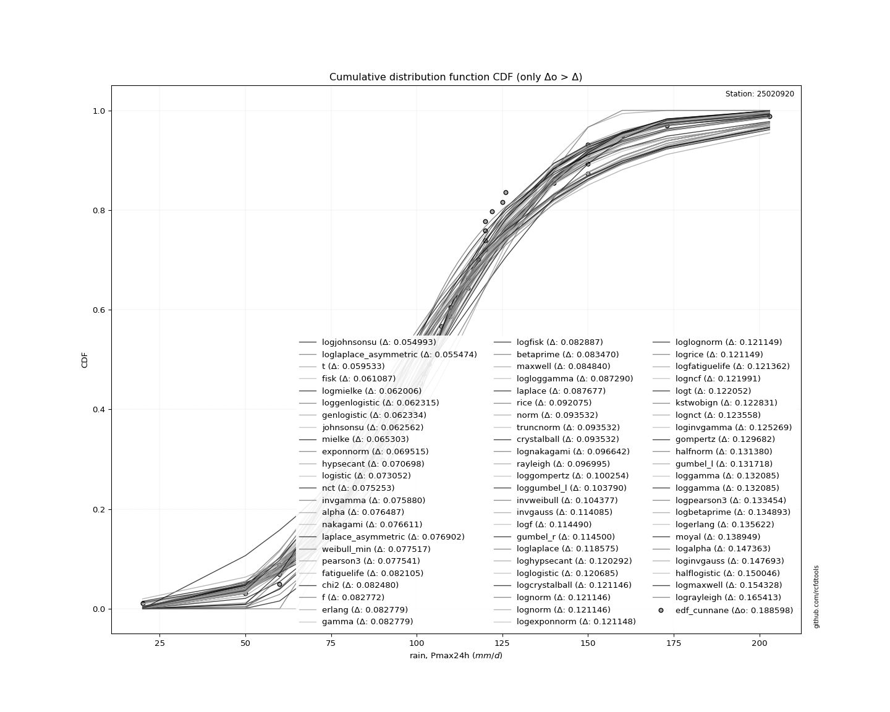</img>

</div>


**11.3. Best fit**

<div align="center">

|   id |   station | empirical_dist   | p_dist       |     delta |   deltao | eval   |   fit |   n |   best_fit |   best_fit_sort |
|-----:|----------:|:-----------------|:-------------|----------:|---------:|:-------|------:|----:|-----------:|----------------:|
|    0 |  25020920 | edf_cunnane      | logjohnsonsu | 0.0549931 | 0.188598 | Δo > Δ |     1 |  52 |          1 |               1 |

</div>


<div align="center">

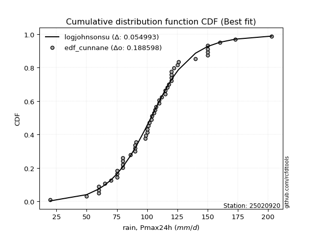</img></img>

</div>


### 12. Empirical - EDF Adamowski (1981)

The Adamowski formula in hydrology refers to a specific plotting position formula used for estimating the non-parametric empirical distribution of hydrological events (like flood peaks) to calculate their return periods. This formula provides an alternative to traditional parametric methods (like the Gumbel or Log Pearson Type III distributions). 

<div align="center">


$P=(m-0.25)/(n+0.5)$


</div>


**12.1. Empirical values**

<div align="center">

|                | 0                    | 1                   | 2                   | 3                   | 4                   | 5                   | 6                   | 7                   | 8                   | 9                   | 10                  | 11                  | 12                  | 13                 | 14                  | 15                 | 16                 | 17                 | 18                  | 19                 | 20                 | 21                 | 22                  | 23                 | 24                 | 25                  | 26                 | 27                 | 28                 | 29                 | 30                 | 31                 | 32                 | 33                 | 34                 | 35                 | 36                | 37                | 38                 | 39                 | 40                 | 41                 | 42                 | 43                 | 44                 | 45                 | 46                 | 47                 | 48                 | 49                 | 50                 | 51                 |
|:---------------|:---------------------|:--------------------|:--------------------|:--------------------|:--------------------|:--------------------|:--------------------|:--------------------|:--------------------|:--------------------|:--------------------|:--------------------|:--------------------|:-------------------|:--------------------|:-------------------|:-------------------|:-------------------|:--------------------|:-------------------|:-------------------|:-------------------|:--------------------|:-------------------|:-------------------|:--------------------|:-------------------|:-------------------|:-------------------|:-------------------|:-------------------|:-------------------|:-------------------|:-------------------|:-------------------|:-------------------|:------------------|:------------------|:-------------------|:-------------------|:-------------------|:-------------------|:-------------------|:-------------------|:-------------------|:-------------------|:-------------------|:-------------------|:-------------------|:-------------------|:-------------------|:-------------------|
| date           | 2008                 | 1991                | 1988                | 1992                | 1990                | 1984                | 1998                | 1983                | 2009                | 2010                | 2007                | 2011                | 2012                | 1995               | 1974                | 1994               | 1997               | 1972               | 2015                | 1977               | 1976               | 1989               | 2019                | 1975               | 2018               | 2021                | 1971               | 2020               | 2016               | 1980               | 2005               | 2017               | 2013               | 1985               | 1987               | 1970               | 2014              | 2002              | 1996               | 1993               | 1986               | 1979               | 1982               | 1981               | 1999               | 2003               | 2001               | 2000               | 2006               | 1978               | 1973               | 2004               |
| x              | 20.0                 | 50.0                | 60.0                | 60.0                | 60.0                | 65.0                | 70.0                | 75.0                | 75.0                | 75.0                | 80.0                | 80.0                | 80.0                | 80.0               | 86.0                | 90.0               | 90.0               | 90.1443522883201   | 90.7595845282534    | 98.3418531639491   | 99.0               | 100.0              | 100.273882014316    | 101.0              | 101.877971697636   | 103.535454863046    | 104.144144422804   | 105.431758524183   | 106.512869876267   | 107.12048298616614 | 109.720713687932   | 109.955969697234   | 112.023287990105   | 115.0              | 115.0              | 116.48471118843    | 118.058561338164  | 120.0             | 120.0              | 120.0              | 120.0              | 122.0              | 125.0              | 126.0              | 140.0              | 150.0              | 150.0              | 150.0              | 150.0              | 160.0              | 173.0              | 203.0              |
| m              | 1                    | 2                   | 3                   | 4                   | 5                   | 6                   | 7                   | 8                   | 9                   | 10                  | 11                  | 12                  | 13                  | 14                 | 15                  | 16                 | 17                 | 18                 | 19                  | 20                 | 21                 | 22                 | 23                  | 24                 | 25                 | 26                  | 27                 | 28                 | 29                 | 30                 | 31                 | 32                 | 33                 | 34                 | 35                 | 36                 | 37                | 38                | 39                 | 40                 | 41                 | 42                 | 43                 | 44                 | 45                 | 46                 | 47                 | 48                 | 49                 | 50                 | 51                 | 52                 |
| empirical_dist | edf_adamowski        | edf_adamowski       | edf_adamowski       | edf_adamowski       | edf_adamowski       | edf_adamowski       | edf_adamowski       | edf_adamowski       | edf_adamowski       | edf_adamowski       | edf_adamowski       | edf_adamowski       | edf_adamowski       | edf_adamowski      | edf_adamowski       | edf_adamowski      | edf_adamowski      | edf_adamowski      | edf_adamowski       | edf_adamowski      | edf_adamowski      | edf_adamowski      | edf_adamowski       | edf_adamowski      | edf_adamowski      | edf_adamowski       | edf_adamowski      | edf_adamowski      | edf_adamowski      | edf_adamowski      | edf_adamowski      | edf_adamowski      | edf_adamowski      | edf_adamowski      | edf_adamowski      | edf_adamowski      | edf_adamowski     | edf_adamowski     | edf_adamowski      | edf_adamowski      | edf_adamowski      | edf_adamowski      | edf_adamowski      | edf_adamowski      | edf_adamowski      | edf_adamowski      | edf_adamowski      | edf_adamowski      | edf_adamowski      | edf_adamowski      | edf_adamowski      | edf_adamowski      |
| empirical      | 0.014285714285714285 | 0.03333333333333333 | 0.05238095238095238 | 0.07142857142857142 | 0.09047619047619047 | 0.10952380952380952 | 0.12857142857142856 | 0.14761904761904762 | 0.16666666666666666 | 0.18571428571428572 | 0.20476190476190476 | 0.22380952380952382 | 0.24285714285714285 | 0.2619047619047619 | 0.28095238095238095 | 0.3                | 0.319047619047619  | 0.3380952380952381 | 0.35714285714285715 | 0.3761904761904762 | 0.3952380952380952 | 0.4142857142857143 | 0.43333333333333335 | 0.4523809523809524 | 0.4714285714285714 | 0.49047619047619045 | 0.5095238095238095 | 0.5285714285714286 | 0.5476190476190477 | 0.5666666666666667 | 0.5857142857142857 | 0.6047619047619047 | 0.6238095238095238 | 0.6428571428571429 | 0.6619047619047619 | 0.680952380952381  | 0.7               | 0.719047619047619 | 0.7380952380952381 | 0.7571428571428571 | 0.7761904761904762 | 0.7952380952380952 | 0.8142857142857143 | 0.8333333333333334 | 0.8523809523809524 | 0.8714285714285714 | 0.8904761904761904 | 0.9095238095238095 | 0.9285714285714286 | 0.9476190476190476 | 0.9666666666666667 | 0.9857142857142858 |
| empirical_tr   | 1.0144927536231882   | 1.0344827586206897  | 1.0552763819095479  | 1.0769230769230769  | 1.0994764397905759  | 1.1229946524064172  | 1.1475409836065573  | 1.1731843575418994  | 1.2                 | 1.2280701754385965  | 1.2574850299401197  | 1.2883435582822085  | 1.3207547169811322  | 1.3548387096774193 | 1.390728476821192   | 1.4285714285714286 | 1.4685314685314685 | 1.510791366906475  | 1.5555555555555558  | 1.6030534351145038 | 1.653543307086614  | 1.707317073170732  | 1.7647058823529411  | 1.826086956521739  | 1.8918918918918919 | 1.9626168224299068  | 2.0388349514563107 | 2.121212121212121  | 2.210526315789474  | 2.3076923076923075 | 2.4137931034482762 | 2.5301204819277108 | 2.6582278481012658 | 2.8000000000000003 | 2.957746478873239  | 3.1343283582089554 | 3.333333333333333 | 3.559322033898305 | 3.818181818181819  | 4.117647058823529  | 4.468085106382979  | 4.883720930232557  | 5.384615384615384  | 6.000000000000002  | 6.774193548387095  | 7.777777777777779  | 9.130434782608692  | 11.052631578947366 | 14.000000000000007 | 19.09090909090908  | 30.000000000000007 | 70.00000000000026  |

</div>


**12.2. Kolmogorov-Smirnov fit test (sorted by Δ)**


<div align="center">

|                | 0                   | 1                     | 2                    | 3                   | 4                   | 5                    | 6                    | 7                   | 8                   | 9                   | 10                  | 11                  | 12                  | 13                  | 14                  | 15                  | 16                  | 17                  | 18                  | 19                  | 20                  | 21                  | 22                  | 23                  | 24                  | 25                  | 26                  | 27                  | 28                  | 29                  | 30                  | 31                  | 32                  | 33                  | 34                  | 35                  | 36                  | 37                  | 38                  | 39                  | 40                  | 41                  | 42                  | 43                  | 44                  | 45                  | 46                  | 47                  | 48                  | 49                  | 50                  | 51                  | 52                  | 53                  | 54                  | 55                  | 56                  | 57                  | 58                  | 59                  | 60                  | 61                  | 62                  | 63                  | 64                  | 65                  | 66                  | 67                  | 68                  | 69                  | 70                  | 71                  | 72                  | 73                  | 74                  | 75                  | 76                  | 77                  | 78                  | 79                  | 80                  | 81                  | 82                  | 83                  | 84                  | 85                  | 86                  | 87                  | 88                  | 89                  |
|:---------------|:--------------------|:----------------------|:---------------------|:--------------------|:--------------------|:---------------------|:---------------------|:--------------------|:--------------------|:--------------------|:--------------------|:--------------------|:--------------------|:--------------------|:--------------------|:--------------------|:--------------------|:--------------------|:--------------------|:--------------------|:--------------------|:--------------------|:--------------------|:--------------------|:--------------------|:--------------------|:--------------------|:--------------------|:--------------------|:--------------------|:--------------------|:--------------------|:--------------------|:--------------------|:--------------------|:--------------------|:--------------------|:--------------------|:--------------------|:--------------------|:--------------------|:--------------------|:--------------------|:--------------------|:--------------------|:--------------------|:--------------------|:--------------------|:--------------------|:--------------------|:--------------------|:--------------------|:--------------------|:--------------------|:--------------------|:--------------------|:--------------------|:--------------------|:--------------------|:--------------------|:--------------------|:--------------------|:--------------------|:--------------------|:--------------------|:--------------------|:--------------------|:--------------------|:--------------------|:--------------------|:--------------------|:--------------------|:--------------------|:--------------------|:--------------------|:--------------------|:--------------------|:--------------------|:--------------------|:--------------------|:--------------------|:--------------------|:--------------------|:--------------------|:--------------------|:--------------------|:--------------------|:--------------------|:--------------------|:--------------------|
| station        | 25020920            | 25020920              | 25020920             | 25020920            | 25020920            | 25020920             | 25020920             | 25020920            | 25020920            | 25020920            | 25020920            | 25020920            | 25020920            | 25020920            | 25020920            | 25020920            | 25020920            | 25020920            | 25020920            | 25020920            | 25020920            | 25020920            | 25020920            | 25020920            | 25020920            | 25020920            | 25020920            | 25020920            | 25020920            | 25020920            | 25020920            | 25020920            | 25020920            | 25020920            | 25020920            | 25020920            | 25020920            | 25020920            | 25020920            | 25020920            | 25020920            | 25020920            | 25020920            | 25020920            | 25020920            | 25020920            | 25020920            | 25020920            | 25020920            | 25020920            | 25020920            | 25020920            | 25020920            | 25020920            | 25020920            | 25020920            | 25020920            | 25020920            | 25020920            | 25020920            | 25020920            | 25020920            | 25020920            | 25020920            | 25020920            | 25020920            | 25020920            | 25020920            | 25020920            | 25020920            | 25020920            | 25020920            | 25020920            | 25020920            | 25020920            | 25020920            | 25020920            | 25020920            | 25020920            | 25020920            | 25020920            | 25020920            | 25020920            | 25020920            | 25020920            | 25020920            | 25020920            | 25020920            | 25020920            | 25020920            |
| empirical_dist | edf_adamowski       | edf_adamowski         | edf_adamowski        | edf_adamowski       | edf_adamowski       | edf_adamowski        | edf_adamowski        | edf_adamowski       | edf_adamowski       | edf_adamowski       | edf_adamowski       | edf_adamowski       | edf_adamowski       | edf_adamowski       | edf_adamowski       | edf_adamowski       | edf_adamowski       | edf_adamowski       | edf_adamowski       | edf_adamowski       | edf_adamowski       | edf_adamowski       | edf_adamowski       | edf_adamowski       | edf_adamowski       | edf_adamowski       | edf_adamowski       | edf_adamowski       | edf_adamowski       | edf_adamowski       | edf_adamowski       | edf_adamowski       | edf_adamowski       | edf_adamowski       | edf_adamowski       | edf_adamowski       | edf_adamowski       | edf_adamowski       | edf_adamowski       | edf_adamowski       | edf_adamowski       | edf_adamowski       | edf_adamowski       | edf_adamowski       | edf_adamowski       | edf_adamowski       | edf_adamowski       | edf_adamowski       | edf_adamowski       | edf_adamowski       | edf_adamowski       | edf_adamowski       | edf_adamowski       | edf_adamowski       | edf_adamowski       | edf_adamowski       | edf_adamowski       | edf_adamowski       | edf_adamowski       | edf_adamowski       | edf_adamowski       | edf_adamowski       | edf_adamowski       | edf_adamowski       | edf_adamowski       | edf_adamowski       | edf_adamowski       | edf_adamowski       | edf_adamowski       | edf_adamowski       | edf_adamowski       | edf_adamowski       | edf_adamowski       | edf_adamowski       | edf_adamowski       | edf_adamowski       | edf_adamowski       | edf_adamowski       | edf_adamowski       | edf_adamowski       | edf_adamowski       | edf_adamowski       | edf_adamowski       | edf_adamowski       | edf_adamowski       | edf_adamowski       | edf_adamowski       | edf_adamowski       | edf_adamowski       | edf_adamowski       |
| p_dist         | logjohnsonsu        | loglaplace_asymmetric | fisk                 | logmielke           | loggenlogistic      | genlogistic          | t                    | johnsonsu           | mielke              | exponnorm           | logistic            | hypsecant           | nct                 | invgamma            | nakagami            | alpha               | weibull_min         | pearson3            | laplace_asymmetric  | fatiguelife         | chi2                | f                   | erlang              | gamma               | betaprime           | logfisk             | maxwell             | logloggamma         | laplace             | rice                | norm                | truncnorm           | crystalball         | lognakagami         | rayleigh            | loggompertz         | loggumbel_l         | invweibull          | invgauss            | gumbel_r            | logf                | loglaplace          | loghypsecant        | loglogistic         | logcrystalball      | lognorm             | lognorm             | logexponnorm        | loglognorm          | logrice             | logfatiguelife      | logncf              | logt                | kstwobign           | lognct              | loginvgamma         | gompertz            | gumbel_l            | halfnorm            | loggamma            | loggamma            | logpearson3         | logbetaprime        | logerlang           | moyal               | logalpha            | loginvgauss         | halflogistic        | logmaxwell          | lograyleigh         | loggumbel_r         | loginvweibull       | loghalfnorm         | wald                | logmoyal            | loghalflogistic     | genexpon            | logkstwobign        | logtruncnorm        | gibrat              | logwald             | loggibrat           | loggenexpon         | expon               | pareto              | ncf                 | logexpon            | logpareto           | logweibull_min      | logchi2             |
| delta          | 0.05497517070644786 | 0.057608696321500896  | 0.060375671002241005 | 0.06129482130166153 | 0.06160348500353935 | 0.061621977968999375 | 0.061668142145964056 | 0.06185010054825846 | 0.06459120042450384 | 0.06859932096211308 | 0.07146442453221602 | 0.07206641569414377 | 0.07366536892882192 | 0.07422623669529349 | 0.07469509004064234 | 0.07489920395229821 | 0.07560154073057934 | 0.07562502006656913 | 0.07827020467159104 | 0.08051724699323615 | 0.08089254536704804 | 0.08118456859761014 | 0.08119132359464376 | 0.0811913975457893  | 0.08155406323053571 | 0.08217499323502525 | 0.08412836618516178 | 0.08570239945196412 | 0.08904520568228858 | 0.0904872055055026  | 0.0919449467865624  | 0.09194494935541142 | 0.09194495617688037 | 0.0959304139664705  | 0.09628366459110682 | 0.09866635626387465 | 0.10220319070528638 | 0.1036649899477145  | 0.11337349767046312 | 0.11378840697527531 | 0.11388775635585419 | 0.11786353551690654 | 0.11958000004691688 | 0.11997373242995052 | 0.12043474888565597 | 0.12043479304143762 | 0.12043479304143762 | 0.1204362352734194  | 0.12043703498991754 | 0.12043709726454216 | 0.12064999013805283 | 0.1212798640746433  | 0.12134042587064897 | 0.12211922310181311 | 0.122846534431867   | 0.12455754926803797 | 0.12776606469261098 | 0.13013048179672404 | 0.13066810615064695 | 0.1313733578890922  | 0.1313733578890922  | 0.13186648898337672 | 0.13418169780979627 | 0.13491025087403763 | 0.13823754540285338 | 0.1466516932808981  | 0.14698096375558045 | 0.1493348750368848  | 0.15361633537562047 | 0.16470132574673924 | 0.19070281849351112 | 0.19200132109085233 | 0.19590560337547736 | 0.20567244332007795 | 0.21656923468535205 | 0.22063639801228618 | 0.2245879417400913  | 0.24190815922646816 | 0.25449310536407377 | 0.2617815938228925  | 0.28851244405207876 | 0.3113357152482652  | 0.327364098191152   | 0.331155097462865   | 0.3311551206272565  | 0.3380076444694775  | 0.4452613222149499  | 0.4452613299833756  | 0.5703655552694339  | 0.64456357281175    |
| deltao         | 0.18859806671657792 | 0.18859806671657792   | 0.18859806671657792  | 0.18859806671657792 | 0.18859806671657792 | 0.18859806671657792  | 0.18859806671657792  | 0.18859806671657792 | 0.18859806671657792 | 0.18859806671657792 | 0.18859806671657792 | 0.18859806671657792 | 0.18859806671657792 | 0.18859806671657792 | 0.18859806671657792 | 0.18859806671657792 | 0.18859806671657792 | 0.18859806671657792 | 0.18859806671657792 | 0.18859806671657792 | 0.18859806671657792 | 0.18859806671657792 | 0.18859806671657792 | 0.18859806671657792 | 0.18859806671657792 | 0.18859806671657792 | 0.18859806671657792 | 0.18859806671657792 | 0.18859806671657792 | 0.18859806671657792 | 0.18859806671657792 | 0.18859806671657792 | 0.18859806671657792 | 0.18859806671657792 | 0.18859806671657792 | 0.18859806671657792 | 0.18859806671657792 | 0.18859806671657792 | 0.18859806671657792 | 0.18859806671657792 | 0.18859806671657792 | 0.18859806671657792 | 0.18859806671657792 | 0.18859806671657792 | 0.18859806671657792 | 0.18859806671657792 | 0.18859806671657792 | 0.18859806671657792 | 0.18859806671657792 | 0.18859806671657792 | 0.18859806671657792 | 0.18859806671657792 | 0.18859806671657792 | 0.18859806671657792 | 0.18859806671657792 | 0.18859806671657792 | 0.18859806671657792 | 0.18859806671657792 | 0.18859806671657792 | 0.18859806671657792 | 0.18859806671657792 | 0.18859806671657792 | 0.18859806671657792 | 0.18859806671657792 | 0.18859806671657792 | 0.18859806671657792 | 0.18859806671657792 | 0.18859806671657792 | 0.18859806671657792 | 0.18859806671657792 | 0.18859806671657792 | 0.18859806671657792 | 0.18859806671657792 | 0.18859806671657792 | 0.18859806671657792 | 0.18859806671657792 | 0.18859806671657792 | 0.18859806671657792 | 0.18859806671657792 | 0.18859806671657792 | 0.18859806671657792 | 0.18859806671657792 | 0.18859806671657792 | 0.18859806671657792 | 0.18859806671657792 | 0.18859806671657792 | 0.18859806671657792 | 0.18859806671657792 | 0.18859806671657792 | 0.18859806671657792 |
| eval           | Δo > Δ              | Δo > Δ                | Δo > Δ               | Δo > Δ              | Δo > Δ              | Δo > Δ               | Δo > Δ               | Δo > Δ              | Δo > Δ              | Δo > Δ              | Δo > Δ              | Δo > Δ              | Δo > Δ              | Δo > Δ              | Δo > Δ              | Δo > Δ              | Δo > Δ              | Δo > Δ              | Δo > Δ              | Δo > Δ              | Δo > Δ              | Δo > Δ              | Δo > Δ              | Δo > Δ              | Δo > Δ              | Δo > Δ              | Δo > Δ              | Δo > Δ              | Δo > Δ              | Δo > Δ              | Δo > Δ              | Δo > Δ              | Δo > Δ              | Δo > Δ              | Δo > Δ              | Δo > Δ              | Δo > Δ              | Δo > Δ              | Δo > Δ              | Δo > Δ              | Δo > Δ              | Δo > Δ              | Δo > Δ              | Δo > Δ              | Δo > Δ              | Δo > Δ              | Δo > Δ              | Δo > Δ              | Δo > Δ              | Δo > Δ              | Δo > Δ              | Δo > Δ              | Δo > Δ              | Δo > Δ              | Δo > Δ              | Δo > Δ              | Δo > Δ              | Δo > Δ              | Δo > Δ              | Δo > Δ              | Δo > Δ              | Δo > Δ              | Δo > Δ              | Δo > Δ              | Δo > Δ              | Δo > Δ              | Δo > Δ              | Δo > Δ              | Δo > Δ              | Δo > Δ              | Δo <= Δ             | Δo <= Δ             | Δo <= Δ             | Δo <= Δ             | Δo <= Δ             | Δo <= Δ             | Δo <= Δ             | Δo <= Δ             | Δo <= Δ             | Δo <= Δ             | Δo <= Δ             | Δo <= Δ             | Δo <= Δ             | Δo <= Δ             | Δo <= Δ             | Δo <= Δ             | Δo <= Δ             | Δo <= Δ             | Δo <= Δ             | Δo <= Δ             |
| fit            | 1                   | 1                     | 1                    | 1                   | 1                   | 1                    | 1                    | 1                   | 1                   | 1                   | 1                   | 1                   | 1                   | 1                   | 1                   | 1                   | 1                   | 1                   | 1                   | 1                   | 1                   | 1                   | 1                   | 1                   | 1                   | 1                   | 1                   | 1                   | 1                   | 1                   | 1                   | 1                   | 1                   | 1                   | 1                   | 1                   | 1                   | 1                   | 1                   | 1                   | 1                   | 1                   | 1                   | 1                   | 1                   | 1                   | 1                   | 1                   | 1                   | 1                   | 1                   | 1                   | 1                   | 1                   | 1                   | 1                   | 1                   | 1                   | 1                   | 1                   | 1                   | 1                   | 1                   | 1                   | 1                   | 1                   | 1                   | 1                   | 1                   | 1                   | 0                   | 0                   | 0                   | 0                   | 0                   | 0                   | 0                   | 0                   | 0                   | 0                   | 0                   | 0                   | 0                   | 0                   | 0                   | 0                   | 0                   | 0                   | 0                   | 0                   |
| n              | 52                  | 52                    | 52                   | 52                  | 52                  | 52                   | 52                   | 52                  | 52                  | 52                  | 52                  | 52                  | 52                  | 52                  | 52                  | 52                  | 52                  | 52                  | 52                  | 52                  | 52                  | 52                  | 52                  | 52                  | 52                  | 52                  | 52                  | 52                  | 52                  | 52                  | 52                  | 52                  | 52                  | 52                  | 52                  | 52                  | 52                  | 52                  | 52                  | 52                  | 52                  | 52                  | 52                  | 52                  | 52                  | 52                  | 52                  | 52                  | 52                  | 52                  | 52                  | 52                  | 52                  | 52                  | 52                  | 52                  | 52                  | 52                  | 52                  | 52                  | 52                  | 52                  | 52                  | 52                  | 52                  | 52                  | 52                  | 52                  | 52                  | 52                  | 52                  | 52                  | 52                  | 52                  | 52                  | 52                  | 52                  | 52                  | 52                  | 52                  | 52                  | 52                  | 52                  | 52                  | 52                  | 52                  | 52                  | 52                  | 52                  | 52                  |
| best_fit       | 1                   | 0                     | 0                    | 0                   | 0                   | 0                    | 0                    | 0                   | 0                   | 0                   | 0                   | 0                   | 0                   | 0                   | 0                   | 0                   | 0                   | 0                   | 0                   | 0                   | 0                   | 0                   | 0                   | 0                   | 0                   | 0                   | 0                   | 0                   | 0                   | 0                   | 0                   | 0                   | 0                   | 0                   | 0                   | 0                   | 0                   | 0                   | 0                   | 0                   | 0                   | 0                   | 0                   | 0                   | 0                   | 0                   | 0                   | 0                   | 0                   | 0                   | 0                   | 0                   | 0                   | 0                   | 0                   | 0                   | 0                   | 0                   | 0                   | 0                   | 0                   | 0                   | 0                   | 0                   | 0                   | 0                   | 0                   | 0                   | 0                   | 0                   | 0                   | 0                   | 0                   | 0                   | 0                   | 0                   | 0                   | 0                   | 0                   | 0                   | 0                   | 0                   | 0                   | 0                   | 0                   | 0                   | 0                   | 0                   | 0                   | 0                   |
| best_fit_sort  | 1                   | 2                     | 3                    | 4                   | 5                   | 6                    | 7                    | 8                   | 9                   | 10                  | 11                  | 12                  | 13                  | 14                  | 15                  | 16                  | 17                  | 18                  | 19                  | 20                  | 21                  | 22                  | 23                  | 24                  | 25                  | 26                  | 27                  | 28                  | 29                  | 30                  | 31                  | 32                  | 33                  | 34                  | 35                  | 36                  | 37                  | 38                  | 39                  | 40                  | 41                  | 42                  | 43                  | 44                  | 45                  | 46                  | 47                  | 48                  | 49                  | 50                  | 51                  | 52                  | 53                  | 54                  | 55                  | 56                  | 57                  | 58                  | 59                  | 60                  | 61                  | 62                  | 63                  | 64                  | 65                  | 66                  | 67                  | 68                  | 69                  | 70                  | 71                  | 72                  | 73                  | 74                  | 75                  | 76                  | 77                  | 78                  | 79                  | 80                  | 81                  | 82                  | 83                  | 84                  | 85                  | 86                  | 87                  | 88                  | 89                  | 90                  |

</div>


<div align="center">

</img>

</div>


**12.3. Best fit**

<div align="center">

|   id |   station | empirical_dist   | p_dist       |     delta |   deltao | eval   |   fit |   n |   best_fit |   best_fit_sort |
|-----:|----------:|:-----------------|:-------------|----------:|---------:|:-------|------:|----:|-----------:|----------------:|
|    0 |  25020920 | edf_adamowski    | logjohnsonsu | 0.0549752 | 0.188598 | Δo > Δ |     1 |  52 |          1 |               1 |

</div>


<div align="center">

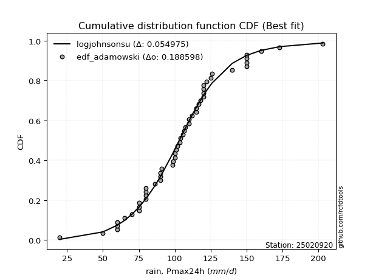</img>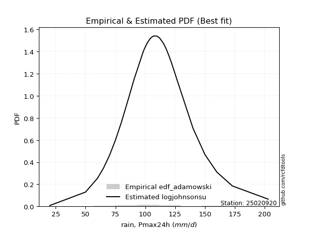</img>

</div>


## C. Best fit & Estimate extreme values for specific return periods - Tr


### 1. Best fit (ordered by delta Δ)

<div align="center">

|   id |   station | empirical_dist   | p_dist                |     delta |   deltao | eval   |   fit |   n |   best_fit |   best_fit_sort |
|-----:|----------:|:-----------------|:----------------------|----------:|---------:|:-------|------:|----:|-----------:|----------------:|
|    0 |  25020920 | edf_hazen        | loglaplace_asymmetric | 0.0540373 | 0.188598 | Δo > Δ |     1 |  52 |          1 |               1 |
|    1 |  25020920 | edf_chegodayev   | logjohnsonsu          | 0.0545179 | 0.188598 | Δo > Δ |     1 |  52 |          1 |               2 |
|    2 |  25020920 | edf_beard        | logjohnsonsu          | 0.0545652 | 0.188598 | Δo > Δ |     1 |  52 |          1 |               3 |
|    3 |  25020920 | edf_jenkinson    | logjohnsonsu          | 0.0545652 | 0.188598 | Δo > Δ |     1 |  52 |          1 |               4 |
|    4 |  25020920 | edf_filliben     | logjohnsonsu          | 0.0546008 | 0.188598 | Δo > Δ |     1 |  52 |          1 |               5 |
|    5 |  25020920 | edf_tukey        | logjohnsonsu          | 0.0546759 | 0.188598 | Δo > Δ |     1 |  52 |          1 |               6 |
|    6 |  25020920 | edf_blom         | logjohnsonsu          | 0.054874  | 0.188598 | Δo > Δ |     1 |  52 |          1 |               7 |
|    7 |  25020920 | edf_gringorten   | loglaplace_asymmetric | 0.0549007 | 0.188598 | Δo > Δ |     1 |  52 |          1 |               8 |
|    8 |  25020920 | edf_adamowski    | logjohnsonsu          | 0.0549752 | 0.188598 | Δo > Δ |     1 |  52 |          1 |               9 |
|    9 |  25020920 | edf_cunnane      | logjohnsonsu          | 0.0549931 | 0.188598 | Δo > Δ |     1 |  52 |          1 |              10 |
|   10 |  25020920 | edf_california   | loglaplace_asymmetric | 0.0566787 | 0.188598 | Δo > Δ |     1 |  52 |          1 |              11 |
|   11 |  25020920 | edf_weibull      | logjohnsonsu          | 0.0584792 | 0.188598 | Δo > Δ |     1 |  52 |          1 |              12 |

</div>

:file_folder:Tables: [bestfit_25020920.csv](table/bestfit_25020920.csv) | [extreme_25020920.csv](table/extreme_25020920.csv)


### 2. Extreme values

In hydrology, a return period (or recurrence interval $Tr$) is the statistical average time between extreme events like floods or droughts of a specific magnitude, indicating how rare an event is, with a 100-year flood, for example, having a 1% chance of occurring in any given year, not that it happens exactly every century. It is a key tool for infrastructure design (like bridges or dams) and risk assessment, calculated from historical data to determine the probability of future events, although it is important to remember it is statistical average, and events can cluster or be missed.

> risk_rate: assuming the return period as the project useful life.

|   id |      tr |   prob_l |     prob_g |   alpha |   betaprime |    chi2 |   crystalball |   erlang |    expon |   exponnorm |       f |   fatiguelife |    fisk |   gamma |   genexpon |   genlogistic |   gibrat |   gompertz |   gumbel_l |   gumbel_r |   halflogistic |   halfnorm |   hypsecant |   invgamma |   invgauss |   invweibull |   johnsonsu |   kstwobign |   laplace |   laplace_asymmetric |   loggamma |   logistic |   lognorm |   maxwell |   mielke |    moyal |   nakagami |      ncf |     nct |    norm |   pareto |   pearson3 |   rayleigh |    rice |       t |   truncnorm |     wald |   weibull_min |   logalpha |   logbetaprime |     logchi2 |   logcrystalball |   logerlang |         logexpon |   logexponnorm |     logf |   logfatiguelife |   logfisk |   loggenexpon |   loggenlogistic |   loggibrat |   loggompertz |   loggumbel_l |   loggumbel_r |   loghalflogistic |   loghalfnorm |   loghypsecant |   loginvgamma |   loginvgauss |   loginvweibull |   logjohnsonsu |   logkstwobign |   loglaplace |   loglaplace_asymmetric |   logloggamma |   loglogistic |   loglognorm |   logmaxwell |   logmielke |   logmoyal |   lognakagami |   logncf |   lognct |        logpareto |   logpearson3 |   lograyleigh |   logrice |     logt |   logtruncnorm |   logwald |   logweibull_min |   station |   n |   risk_rate |
|-----:|--------:|---------:|-----------:|--------:|------------:|--------:|--------------:|---------:|---------:|------------:|--------:|--------------:|--------:|--------:|-----------:|--------------:|---------:|-----------:|-----------:|-----------:|---------------:|-----------:|------------:|-----------:|-----------:|-------------:|------------:|------------:|----------:|---------------------:|-----------:|-----------:|----------:|----------:|---------:|---------:|-----------:|---------:|--------:|--------:|---------:|-----------:|-----------:|--------:|--------:|------------:|---------:|--------------:|-----------:|---------------:|------------:|-----------------:|------------:|-----------------:|---------------:|---------:|-----------------:|----------:|--------------:|-----------------:|------------:|--------------:|--------------:|--------------:|------------------:|--------------:|---------------:|--------------:|--------------:|----------------:|---------------:|---------------:|-------------:|------------------------:|--------------:|--------------:|-------------:|-------------:|------------:|-----------:|--------------:|---------:|---------:|-----------------:|--------------:|--------------:|----------:|---------:|---------------:|----------:|-----------------:|----------:|----:|------------:|
|    0 |    2    | 0.5      | 0.5        | 102.586 |     102.848 | 103.155 |       104.411 |  103.185 |  78.5094 |     102.589 | 103.184 |       103.124 | 102.839 | 103.185 |    91.3318 |       102.822 |  94.6548 |    104.495 |    109.751 |    99.0715 |        96.4168 |    97.7578 |     104.411 |    102.479 |    99.2245 |      100.16  |     102.717 |      98.513 |   104.411 |              103.977 |    97.6253 |    104.411 |   98.6448 |   101.631 |  102.722 |  97.3476 |    102.351 |  79.7906 | 102.744 | 104.411 |  78.5094 |    102.463 |    100.645 | 104.083 | 103.286 |     104.411 |  93.875  |       102.353 |    96.1847 |        97.3401 |     33.0638 |          98.6448 |     97.3076 |     60.4521      |        98.6447 |  98.7109 |          98.6246 |   101.402 |       79.5139 |          102.91  |     88.4463 |       103.794 |       104.716 |       92.9251 |           90.2055 |       91.5701 |        98.6448 |       98.2714 |       96.0087 |         97.4481 |        103.154 |        90.9938 |      98.6448 |                 105.355 |       102.996 |       98.6448 |      98.6446 |      95.6245 |     102.941 |    91.1504 |       100.393 |  98.5696 |  98.4301 |     60.4521      |       107.906 |       94.5755 |   98.6446 |  98.5694 |        84.4809 |   87.6786 |          42.2442 |  25020920 |  52 |    0.75     |
|    1 |    2.33 | 0.570815 | 0.429185   | 108.358 |     108.732 | 108.965 |       110.212 |  108.995 |  91.4008 |     108.134 | 108.994 |       108.928 | 107.937 | 108.995 |   100.828  |       108.017 |  97.593  |    111.888 |    114.797 |   104.446  |       101.943  |   104.018  |     109.053 |    108.257 |   105.411  |      106.848 |     107.819 |     105.959 |   107.921 |              107.765 |   104.603  |    109.522 |  105.257  |   107.657 |  107.948 | 102.435  |    108.095 |  94.3764 | 108.42  | 110.212 |  91.4008 |    108.288 |    106.761 | 109.943 | 108.324 |     110.212 |  97.6783 |       108.132 |   103.088  |       104.447  |     39.2092 |         105.257  |    104.155  |     77.1355      |       105.257  | 105.336  |         105.216  |   106.853 |       94.6624 |          108.103 |     91.4013 |       110.091 |       110.798 |       98.6832 |           95.9577 |       98.2117 |       103.902  |      105.236  |      103.393  |        108.971  |        108.045 |       103.991  |     102.595  |                 109.943 |       109.041 |      104.448  |     105.257  |     102.293  |     108.143 |    96.4884 |       105.876 | 105.201  | 105.182  |     77.1355      |       113.919 |      101.272  |  105.257  | 105.367  |        92.7213 |   91.489  |          50.9993 |  25020920 |  52 |    0.729209 |
|    2 |    5    | 0.8      | 0.2        | 130.828 |     131.792 | 131.252 |       131.767 |  131.277 | 155.855  |     129.874 | 131.276 |       131.231 | 128.35  | 131.277 |   139.007  |       128.766 | 114.509  |    136.818 |    131.1   |   127.796  |       126.946  |   130.49   |     127.673 |    130.818 |   131.09   |      135.907 |     128.425 |     137.588 |   125.471 |              126.706 |   135.752  |    129.254 |  133.958  |   131.376 |  128.063 | 126.002  |    131.008 | 164.679  | 130.589 | 131.767 | 155.855  |    131.044 |    131.242 | 131.833 | 127.757 |     131.767 | 118.969  |       131.116 |   134.182  |       136.286  |    104.472  |         133.958  |    134.664  |    260.88        |       133.957  | 134.107  |         133.831  |   130.794 |      202.163  |          128.167 |    110.44   |       133.195 |       132.962 |      128.138  |          126.928  |      132.057  |       127.962  |      136.372  |      137.508  |        177.081  |        127.324 |       183.361  |     124.848  |                 125.975 |       132.022 |      130.245  |     133.958  |     133.373  |     128.25  |   125.592  |       129.769 | 134.008  | 134.737  |    260.88        |       132.981 |      133.176  |  133.957  | 135.841  |       132.445  |  116.089  |         138.373  |  25020920 |  52 |    0.67232  |
|    3 |   10    | 0.9      | 0.1        | 146.685 |     148.15  | 146.65  |       146.066 |  146.666 | 214.364  |     145.771 | 146.666 |       146.679 | 144.152 | 146.666 |   166.39   |       144.512 | 133.791  |    151.199 |    140.176 |   146.814  |       147.711  |   150.08   |     142.542 |    146.789 |   150.652  |      159.575 |     144.427 |     161.67  |   141.402 |              143.899 |   161.957  |    143.786 |  157.193  |   148.067 |  143.327 | 146.521  |    147.299 | 229.607  | 146.418 | 146.066 | 214.364  |    147.118 |    148.699 | 146.425 | 142.133 |     146.066 | 141.564  |       147.382 |   160.693  |       163.2    |    282.465  |         157.193  |    160.275  |    788.539       |       157.193  | 157.411  |         157.005  |   151.792 |      370.819  |          143.461 |    137.023  |       148.113 |       147.171 |      158.513  |          160.118  |      164.408  |       151.117  |      162.635  |      167.596  |        262.977  |        142.912 |       282.384  |     149.202  |                 141.578 |       147.581 |      153.234  |     157.194  |     160.753  |     143.583 |   157.995  |       149.215 | 157.356  | 158.938  |    788.539       |       142.249 |      161.894  |  157.193  | 162.824  |       160.861  |  149.468  |         362.496  |  25020920 |  52 |    0.651322 |
|    4 |   15    | 0.933333 | 0.0666667  | 154.904 |     156.636 | 154.519 |       153.202 |  154.529 | 248.59   |     154.354 | 154.53  |       154.588 | 153.048 | 154.529 |   180.551  |       153.182 | 147.091  |    157.794 |    144.287 |   157.543  |       159.462  |   160.274  |     151.027 |    155.078 |   161.226  |      172.928 |     153.417 |     174.454 |   150.72  |              153.957 |   177.059  |    151.703 |  170.255  |   156.631 |  152.021 | 158.429  |    155.686 | 269.261  | 154.715 | 153.202 | 248.59   |    155.436 |    157.693 | 153.724 | 150.069 |     153.202 | 156.073  |       155.73  |   176.116  |       178.76   |    519.09   |         170.255  |    175.016  |   1506.01        |       170.254  | 170.516  |         170.036  |   164.619 |      518.989  |          152.192 |    159.002  |       155.411 |       154.096 |      178.728  |          182.613  |      184.265  |       166.163  |      177.803  |      185.484  |        328.712  |        152.346 |       355.138  |     165.595  |                 151.586 |       155.406 |      167.425  |     170.256  |     176.915  |     152.338 |   180.507  |       160.185 | 170.49   | 172.644  |   1506.01        |       145.842 |      179.03   |  170.254  | 179.361  |       172.957  |  175.804  |         648.594  |  25020920 |  52 |    0.644736 |
|    5 |   20    | 0.95     | 0.05       | 160.402 |     162.311 | 159.74  |       157.875 |  159.745 | 272.874  |     160.267 | 159.746 |       159.841 | 159.318 | 159.745 |   189.984  |       159.198 | 157.524  |    161.921 |    146.845 |   165.056  |       167.695  |   167.07   |     157.013 |    160.627 |   168.456  |      182.277 |     159.744 |     183.066 |   157.332 |              161.093 |   187.777  |    157.176 |  179.391  |   162.315 |  158.237 | 166.862  |    161.259 | 298.373  | 160.308 | 157.875 | 272.874  |    160.992 |    163.671 | 158.509 | 155.629 |     157.875 | 166.885  |       161.267 |   187.125  |       189.823  |    806.3    |         179.391  |    185.471  |   2383.44        |       179.39   | 179.684  |         179.152  |   174.113 |      655.073  |          158.441 |    178.682  |       160.134 |       158.57  |      194.397  |          200.23   |      198.82   |       177.67   |      188.582  |      198.415  |        384.291  |        159.386 |       414.44   |     178.306  |                 159.113 |       160.547 |      177.994  |     179.393  |     188.528  |     158.605 |   198.364  |       167.873 | 179.68   | 182.272  |   2383.44        |       147.846 |      191.412  |  179.39   | 191.652  |       179.657  |  198.405  |         986.873  |  25020920 |  52 |    0.641514 |
|    6 |   25    | 0.96     | 0.04       | 164.509 |     166.548 | 163.617 |       161.314 |  163.619 | 291.709  |     164.787 | 163.62  |       163.744 | 164.182 | 163.619 |   197.002  |       163.81  | 166.221  |    164.867 |    148.666 |   170.843  |       174.038  |   172.127  |     161.646 |    164.773 |   173.937  |      189.479 |     164.648 |     189.517 |   162.461 |              166.628 |   196.118  |    161.362 |  186.428  |   166.535 |  163.12  | 173.399  |    165.399 | 321.582  | 164.511 | 161.314 | 291.709  |    165.137 |    168.112 | 162.033 | 159.936 |     161.314 | 175.545  |       165.376 |   195.729  |       198.444  |   1139.26   |         186.428  |    193.604  |   3402.93        |       186.427  | 186.747  |         186.174  |   181.744 |      782.741  |          163.355 |    196.939  |       163.583 |       161.832 |      207.396  |          214.955  |      210.39   |       187.12   |      196.98   |      208.61   |        433.429  |        165.107 |       465.261  |     188.835  |                 165.208 |       164.338 |      186.528  |     186.43   |     197.641  |     163.533 |   213.412  |       173.803 | 186.762  | 189.711  |   3402.93        |       149.154 |      201.163  |  186.427  | 201.578  |       183.913  |  218.585  |        1371.58   |  25020920 |  52 |    0.639603 |
|    7 |   50    | 0.98     | 0.02       | 176.562 |     178.966 | 174.881 |       171.165 |  174.871 | 350.219  |     178.611 | 174.873 |       175.1   | 179.417 | 174.871 |   217.426  |       177.937 | 196.879  |    172.897 |    153.608 |   188.669  |       193.582  |   186.826  |     176.009 |    176.945 |   190.391  |      211.664 |     179.998 |     208.46  |   178.392 |              183.822 |   222.316  |    174.153 |  208.145  |   178.772 |  178.823 | 193.692  |    177.414 | 397.611  | 176.977 | 171.165 | 350.219  |    177.266 |    181.006 | 172.136 | 173.476 |     171.165 | 203.822  |       177.279 |   222.957  |       225.582  |   3396.03   |         208.145  |    219.128  |  10285.7         |       208.144  | 208.549  |         207.851  |   207.192 |     1346.07   |          179.176 |    277.499  |       173.325 |       171.031 |      253.163  |          267.486  |      247.986  |       219.734  |      223.406  |      241.367  |        627.916  |        184.761 |       653.445  |     225.67   |                 185.67  |       175.219 |      215.219  |     208.148  |     226.636  |     179.404 |   267.796  |       192.151 | 208.624  | 212.787  |  10285.7         |       152.187 |      232.374  |  208.144  | 235.124  |       193.016  |  299.901  |        3882.68   |  25020920 |  52 |    0.63583  |
|    8 |   75    | 0.986667 | 0.0133333  | 183.213 |     185.804 | 181.024 |       176.45  |  181.006 | 384.445  |     186.619 | 181.008 |       181.302 | 188.479 | 181.006 |   228.568  |       186.112 | 217.586  |    176.975 |    156.108 |   199.03   |       204.943  |   194.827  |     184.403 |    183.664 |   199.696  |      224.558 |     189.134 |     218.882 |   187.711 |              193.879 |   237.923  |    181.54  |  220.823  |   185.426 |  188.489 | 205.559  |    183.951 | 445.158  | 183.947 | 176.45  | 384.445  |    183.934 |    188.02  | 177.563 | 181.625 |     176.45  | 221.221  |       183.739 |   239.32   |       241.791  |   6501.11   |         220.823  |    234.321  |  19644.4         |       220.821  | 221.28   |         220.509  |   223.483 |     1837.71   |          188.929 |    349.825  |       178.47  |       175.88  |      284.274  |          303.737  |      271.204  |       241.366  |      239.185  |      261.396  |        778.882  |        197.915 |       787.716  |     250.464  |                 198.795 |       181.069 |      233.76   |     220.826  |     244.147  |     189.189 |   305.811  |       202.892 | 221.393  | 226.338  |  19644.4         |       153.428 |      251.342  |  220.821  | 257.078  |       196.239  |  364.334  |        7218.03   |  25020920 |  52 |    0.634587 |
|    9 |  100    | 0.99     | 0.01       | 187.787 |     190.498 | 185.218 |       180.025 |  185.195 | 408.728  |     192.286 | 185.198 |       185.54  | 194.995 | 185.195 |   236.171  |       191.888 | 233.627  |    179.647 |    157.742 |   206.363  |       212.984  |   200.278  |     190.357 |    188.285 |   206.183  |      233.684 |     195.713 |     226.022 |   194.323 |              201.015 |   249.151  |    186.756 |  229.832  |   189.958 |  195.603 | 213.978  |    188.403 | 480.411  | 188.782 | 180.025 | 408.728  |    188.508 |    192.799 | 181.236 | 187.554 |     180.025 | 233.908  |       188.136 |   251.157  |       253.472  |  10345      |         229.832  |    245.246  |  31089.7         |       229.83   | 230.329  |         229.505  |   235.75  |     2287.52   |          196.112 |    418.574  |       181.919 |       179.126 |      308.576  |          332.325  |      288.254  |       257.989  |      250.555  |      276.038  |        907.186  |        208.162 |       895.318  |     269.691  |                 208.667 |       185.028 |      247.804  |     229.836  |     256.843  |     196.397 |   336.011  |       210.54  | 230.471  | 236.004  |  31089.7         |       154.135 |      265.144  |  229.83   | 273.916  |       197.89   |  419.88   |       11258.4    |  25020920 |  52 |    0.633968 |
|   10 |  200    | 0.995    | 0.005      | 198.396 |     201.356 | 194.85  |       188.134 |  194.813 | 467.238  |     205.919 | 194.817 |       195.286 | 211.036 | 194.813 |   253.608  |       205.753 | 277.268  |    185.47  |    161.296 |   223.994  |       232.316  |   212.744  |     204.701 |    199.001 |   221.489  |      255.625 |     211.96  |     242.469 |   210.253 |              218.209 |   276.812  |    199.267 |  251.654  |   200.326 |  213.718 | 234.262  |    198.592 | 570.997  | 200.13  | 188.134 | 467.238  |    199.074 |    203.733 | 189.572 | 202.477 |     188.134 | 265.507  |       198.179 |   280.547  |       282.31   |  32025.2    |         251.654  |    272.142  |  93971.9         |       251.652  | 252.252  |         251.303  |   267.993 |     3857.12   |          214.427 |    681.974  |       189.646 |       186.389 |      375.845  |          412.558  |      331.386  |       302.89   |      278.623  |      312.915  |       1308.91   |        236.647 |      1202.42   |     322.299  |                 234.511 |       194.015 |      285.029  |     251.659  |     288.428  |     214.777 |   421.596  |       229.109 | 252.468  | 259.534  |  93971.9         |       155.4   |      299.642  |  251.652  | 319.662  |       200.414  |  597.896  |       33332.3    |  25020920 |  52 |    0.633042 |
|   11 |  250    | 0.996    | 0.004      | 201.704 |     204.733 | 197.826 |       190.612 |  197.784 | 486.073  |     210.306 | 197.789 |       198.301 | 216.311 | 197.784 |   258.986  |       210.206 | 292.926  |    187.186 |    162.341 |   229.661  |       238.531  |   216.579  |     209.318 |    202.342 |   226.333  |      262.679 |     217.325 |     247.559 |   215.382 |              223.744 |   285.916  |    203.284 |  258.728  |   203.518 |  219.869 | 240.792  |    201.728 | 601.983  | 203.71  | 190.612 | 486.073  |    202.357 |    207.099 | 192.121 | 207.505 |     190.612 | 275.961  |       201.266 |   290.29   |       291.821  |  46205.7    |         258.728  |    280.99   | 134167           |       258.726  | 259.359  |         258.37   |   279.253 |     4558.05   |          220.652 |    812.518  |       191.981 |       188.582 |      400.446  |          442.262  |      345.912  |       318.946  |      287.879  |      325.299  |       1472.63   |        247.164 |      1317.32   |     341.33   |                 243.494 |       196.762 |      298.128  |     258.733  |     298.912  |     221.025 |   453.543  |       235.142 | 259.601  | 267.195  | 134167           |       155.705 |      311.14   |  258.725  | 336.206  |       200.926  |  672.06   |       47463.8    |  25020920 |  52 |    0.632858 |
|   12 |  500    | 0.998    | 0.002      | 211.704 |     214.908 | 206.742 |       197.961 |  206.687 | 544.583  |     223.929 | 206.693 |       207.344 | 233.07  | 206.687 |   275.063  |       224.02  | 347.041  |    192.114 |    165.338 |   247.253  |       257.821  |   228.014  |     223.661 |    212.439 |   241.164  |      284.571 |     234.453 |     262.812 |   231.313 |              240.937 |   314.876  |    215.741 |  280.894  |   213.042 |  240.062 | 261.076  |    211.087 | 704.436  | 214.655 | 197.961 | 544.583  |    212.238 |    217.142 | 199.683 | 223.949 |     197.961 | 309.202  |       210.466 |   321.509  |       322.135  | 145332      |         280.895  |    309.121  | 405534           |       280.892  | 281.638  |         280.522  |   317.269 |     7634.94   |          241.112 |   1488.37   |       198.837 |       195.011 |      487.534  |          548.779  |      393.109  |       374.451  |      317.386  |      365.479  |       2123.04   |        285.061 |      1731.71   |     407.913  |                 273.653 |       204.909 |      342.705  |     280.901  |     332.516  |     241.563 |   569.061  |       254.091 | 281.963  | 291.31   | 405535           |       156.425 |      348.133  |  280.892  | 394.532  |       201.958  |  974.721  |      143925      |  25020920 |  52 |    0.632489 |
|   13 |  750    | 0.998667 | 0.00133333 | 217.384 |     220.666 | 211.754 |       202.043 |  211.691 | 578.809  |     231.898 | 211.697 |       212.434 | 243.146 | 211.691 |   284.074  |       232.092 | 382.829  |    194.752 |    166.94  |   257.537  |       269.097  |   234.402  |     232.051 |    218.172 |   249.709  |      297.37  |     244.822 |     271.381 |   240.632 |              250.995 |   332.324  |    223.019 |  294.019  |   218.369 |  252.69  | 272.942  |    216.32  | 769.041  | 220.959 | 202.043 | 578.809  |    217.824 |    222.758 | 203.887 | 234.219 |     202.043 | 329.132  |       215.603 |   340.479  |       340.443  | 285361      |         294.019  |    326.059  | 774520           |       294.017  | 294.832  |         293.641  |   341.831 |    10307.9    |          253.923 |   2221.07   |       202.601 |       198.537 |      546.972  |          622.565  |      422.227  |       411.296  |      335.208  |      390.253  |       2629.24   |        311.64  |      2019.32   |     452.73   |                 292.997 |       209.434 |      371.772  |     294.026  |     352.931  |     254.425 |   649.831  |       265.339 | 295.209  | 305.662  | 774521           |       156.725 |      370.704  |  294.016  | 434.428  |       202.304  | 1218.13   |      277475      |  25020920 |  52 |    0.632366 |
|   14 | 1000    | 0.999    | 0.001      | 221.349 |     224.674 | 215.229 |       204.854 |  215.16  | 603.092  |     237.552 | 215.167 |       215.967 | 250.423 | 215.16  |   290.309  |       237.817 | 410.216  |    196.529 |    168.018 |   264.832  |       277.097  |   238.814  |     238.004 |    222.172 |   255.722  |      306.448 |     252.346 |     277.318 |   247.244 |              258.131 |   344.944  |    228.181 |  303.41   |   222.05  |  262.04  | 281.36   |    219.937 | 817.128  | 225.397 | 204.854 | 603.092  |    221.709 |    226.639 | 206.782 | 241.831 |     204.854 | 343.469  |       219.151 |   354.275  |       353.704  | 461373      |         303.41   |    338.307  |      1.22577e+06 |       303.407  | 304.274  |         303.03   |   360.393 |    12747.7    |          263.415 |   3017.18   |       205.175 |       200.946 |      593.477  |          680.844  |      443.585  |       439.616  |      348.118  |      408.432  |       3059.91   |        332.893 |      2246.13   |     487.483  |                 307.546 |       212.548 |      393.868  |     303.418  |     367.77   |     263.956 |   714      |       273.402 | 304.69   | 315.964  |      1.22577e+06 |       156.898 |      387.152  |  303.407  | 465.827  |       202.478  | 1430      |      443471      |  25020920 |  52 |    0.632305 |

<div align="center">

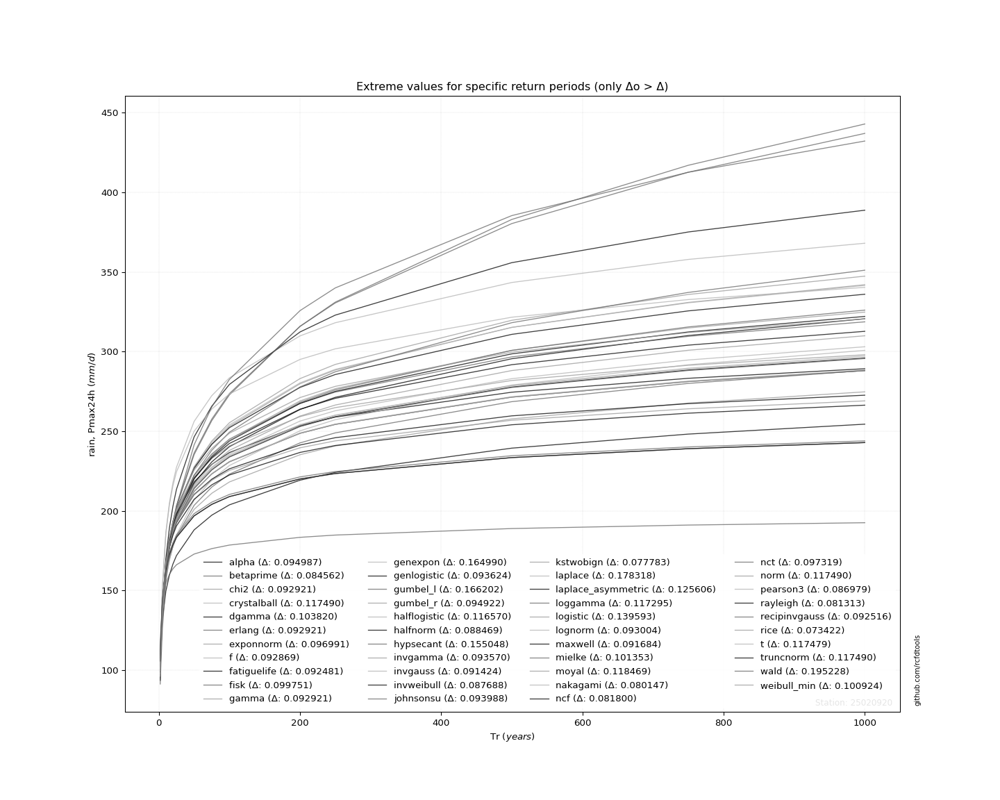</img>

</div>


<div align="center">

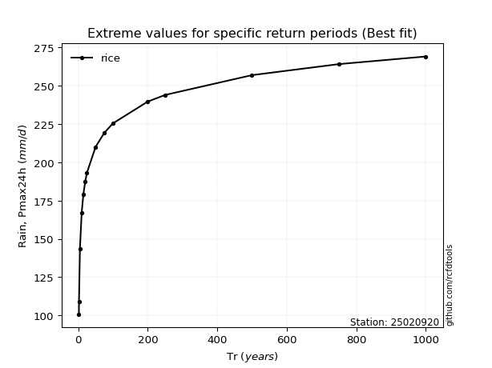</img>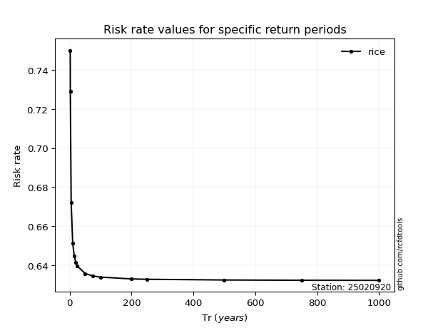</img>

</div>


<sub>**APP DISCLAIMER**: NO WARRANTY - This software is provided by [github.com/rcfdtools](https://github.com/rcfdtools) "as is", without any express or implied warranty, including warranties of merchantability, fitness for a particular purpose, or non-infringement. There is no guarantee that the software will be error-free or operate without interruption. LIMITATION OF LIABILITY - Neither the authors nor copyright holders will be liable for claims or damages arising from the software or its use. You are responsible for determining if the software is appropriate for your use and assume all associated risks, including errors, legal compliance, and data loss. NO PROFESSIONAL ADVICE - The software provides general information and does not offer professional advice. It should not replace consultation with professional advisors.</sub>