<div align="center">


</div>

# Station (rain, Pmax24h): 25021240

Probable Maximum Precipitation (PMP) is the greatest amount of rainfall for a specific duration that is meteorologically possible for a given location, acting as a "worst-case" scenario for extreme storms, crucial for designing safety-critical infrastructure like bridges, river deviations, dams, spillways, and nuclear plants to prevent catastrophic failure. PMP is calculated by hydrologists using meteorological data to determine the upper limit of extreme rainfall, often leading to the Probable Maximum Flood (PMF) for flood control design, and is increasingly being studied for climate change impacts.

<div align="center">

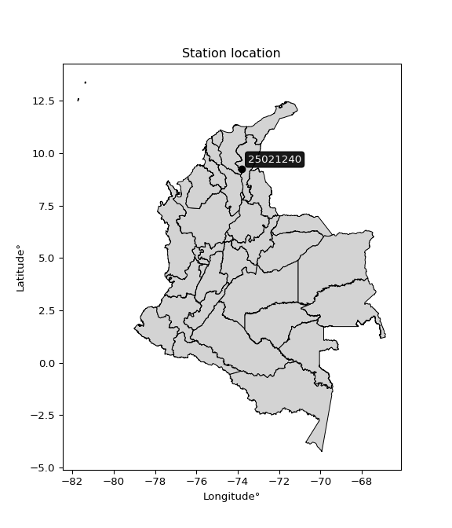</img>


</div>


## A. General information


### 1. General running parameters

• app_version: _v20251220_. • runtime: _2025-12-23 10:23:02.310659_. • Stations dataset (station_dataset_file): _dataset/pmax24h_in/conventional_cesarcolombia_1959_2015.csv_. • Stations catalog (station_catalog_file): _dataset/CNE_IDEAM.xls_. • Plot only fit distributions with Δo > Δ (plot_only_fit): _True_. • Eval low extreme values, if False, evaluates high extreme values (low_extreme): _False_. • Eval Gumbel distribution, non include in SciPy (pdist_loggumbel_on): _True_. • Eval Log-Gumbel distribution, non include in SciPy (pdist_loggumbel_on): _False_. • Standard deviation normalized (ddof): _1.0_. • Return periods to eval in years (Tr): _[2, 2.33, 5, 10, 15, 20, 25, 50, 75, 100, 200, 250, 500, 750, 1000]_. • Minimum data sample per station, 0 means any (minimum_sample): _5_. • Z-Score threshold to adjust a value, 0 means disable (zscore): _3.5_. • Avoid zeros, e.g. rain = 0 (avoid_zeros): _True_. • Avoid null values (avoid_nans): _True_. [:file_folder:Dataset file.](../../dataset/pmax24h_in/conventional_cesarcolombia_1959_2015.csv)


### 2. Station info and location

|   id |   CODIGO | NOMBRE                 | CATEGORIA     | TECNOLOGIA   | ESTADO   | FECHA_INSTALACION   |   FECHA_SUSPENSION |   ALTITUD |   LATITUD |   LONGITUD | DEPARTAMENTO   | MUNICIPIO   | AREA_OPERATIVA                                         | ENTIDAD                                                     | AREA_HIDROGRAFICA   | ZONA_HIDROGRAFICA   | SUBZONA_HIDROGRAFICA   |   CORRIENTE |   OBSERVACION | SUBRED                                                                  |
|-----:|---------:|:-----------------------|:--------------|:-------------|:---------|:--------------------|-------------------:|----------:|----------:|-----------:|:---------------|:------------|:-------------------------------------------------------|:------------------------------------------------------------|:--------------------|:--------------------|:-----------------------|------------:|--------------:|:------------------------------------------------------------------------|
|    0 | 25021240 | CHIMICHAGUA [25021240] | Pluviométrica | Convencional | Activa   | 15/07/1972          |                nan |       138 |   9.26008 |   -73.8099 | Cesar          | Chimichagua | Area Operativa 05 - Magdalena-Cesar-Guajira-San Andrés | INSTITUTO DE HIDROLOGIA METEOROLOGIA Y ESTUDIOS AMBIENTALES | Magdalena Cauca     | Cesar               | Bajo Cesar             |         nan |           nan | RED ALERTAS - AREA OPERATIVA 05,Atlántico, Magdalena y Norte de Bolívar |

<div align="center">

Map location in: [:earth_americas:Google](http://maps.google.com/maps?q=9.260083333,-73.80986111) [:earth_americas:OSM](https://www.openstreetmap.org/#map=18/9.260083333/-73.80986111&layers=P) [:earth_americas:Bing](https://www.bing.com/maps?cp=9.260083333~-73.80986111&lvl=18) [:earth_americas:Apple](https://maps.apple.com/frame?center=9.260083333%2C-73.80986111&span=0.003%2C0.006)

</div>


<div align="center">

```geojson
{
  "type": "Feature",
  "geometry": {
    "type": "Point", 
    "coordinates": [-73.80986111, 9.260083333]
  }, 
  "properties": {
    "Name": "25021240"
  }
}
```

</div>


### 3. Discrete values table and plot

|               |           0 |            1 |           2 |          3 |          4 |           5 |          6 |          7 |           8 |          9 |          10 |         11 |          12 |          13 |         14 |          15 |          16 |          17 |          18 |          19 |          20 |          21 |         22 |          23 |         24 |          25 |          26 |          27 |           28 |          29 |          30 |          31 |         32 |         33 |          34 |          35 |         36 |         37 |          38 |          39 |         40 |         41 |         42 |         43 |
|:--------------|------------:|-------------:|------------:|-----------:|-----------:|------------:|-----------:|-----------:|------------:|-----------:|------------:|-----------:|------------:|------------:|-----------:|------------:|------------:|------------:|------------:|------------:|------------:|------------:|-----------:|------------:|-----------:|------------:|------------:|------------:|-------------:|------------:|------------:|------------:|-----------:|-----------:|------------:|------------:|-----------:|-----------:|------------:|------------:|-----------:|-----------:|-----------:|-----------:|
| Date          | 1972        | 1973         | 1974        | 1975       | 1976       | 1977        | 1978       | 1979       | 1980        | 1981       | 1982        | 1983       | 1984        | 1985        | 1986       | 1987        | 1988        | 1989        | 1990        | 1991        | 1992        | 1993        | 1994       | 1995        | 1996       | 1997        | 1998        | 1999        | 2000         | 2001        | 2002        | 2003        | 2004       | 2005       | 2006        | 2007        | 2008       | 2009       | 2010        | 2011        | 2012       | 2013       | 2014       | 2015       |
| Value         |   95        |  110         |  117        |  140       |   80       |  120        |  130       |  130       |   92        |  142       |  100        |  153       |  120        |   98        |   58       |   95        |  123        |  100        |  105        |   95        |  100        |  117        |   63       |  100        |  130       |   90.6      |  100.5      |  100.3      |  109         |  120        |  100        |   97.5      |   69.2     |   90.2     |  100.7      |  112        |  130.3     |   99.5     |  127        |  116.2      |   83.1     |  135       |  140       |  135       |
| Value_initial |   95        |  110         |  117        |  140       |   80       |  120        |  130       |  130       |   92        |  142       |  100        |  153       |  120        |   98        |   58       |   95        |  123        |  100        |  105        |   95        |  100        |  117        |   63       |  100        |  130       |   90.6      |  100.5      |  100.3      |  109         |  120        |  100        |   97.5      |   69.2     |   90.2     |  100.7      |  112        |  130.3     |   99.5     |  127        |  116.2      |   83.1     |  135       |  140       |  135       |
| count         |   44        |   44         |   44        |   44       |   44       |   44        |   44       |   44       |   44        |   44       |   44        |   44       |   44        |   44        |   44       |   44        |   44        |   44        |   44        |   44        |   44        |   44        |   44       |   44        |   44       |   44        |   44        |   44        |   44         |   44        |   44        |   44        |   44       |   44       |   44        |   44        |   44       |   44       |   44        |   44        |   44       |   44       |   44       |   44       |
| mean          |  108.389    |  108.389     |  108.389    |  108.389   |  108.389   |  108.389    |  108.389   |  108.389   |  108.389    |  108.389   |  108.389    |  108.389   |  108.389    |  108.389    |  108.389   |  108.389    |  108.389    |  108.389    |  108.389    |  108.389    |  108.389    |  108.389    |  108.389   |  108.389    |  108.389   |  108.389    |  108.389    |  108.389    |  108.389     |  108.389    |  108.389    |  108.389    |  108.389   |  108.389   |  108.389    |  108.389    |  108.389   |  108.389   |  108.389    |  108.389    |  108.389   |  108.389   |  108.389   |  108.389   |
| std           |   21.2927   |   21.2927    |   21.2927   |   21.2927  |   21.2927  |   21.2927   |   21.2927  |   21.2927  |   21.2927   |   21.2927  |   21.2927   |   21.2927  |   21.2927   |   21.2927   |   21.2927  |   21.2927   |   21.2927   |   21.2927   |   21.2927   |   21.2927   |   21.2927   |   21.2927   |   21.2927  |   21.2927   |   21.2927  |   21.2927   |   21.2927   |   21.2927   |   21.2927    |   21.2927   |   21.2927   |   21.2927   |   21.2927  |   21.2927  |   21.2927   |   21.2927   |   21.2927  |   21.2927  |   21.2927   |   21.2927   |   21.2927  |   21.2927  |   21.2927  |   21.2927  |
| zscore        |   -0.628791 |    0.0756769 |    0.404428 |    1.48461 |   -1.33326 |    0.545322 |    1.01497 |    1.01497 |   -0.769684 |    1.57854 |   -0.393968 |    2.09515 |    0.545322 |   -0.487897 |   -2.36648 |   -0.628791 |    0.686215 |   -0.393968 |   -0.159146 |   -0.628791 |   -0.393968 |    0.404428 |   -2.13165 |   -0.393968 |    1.01497 |   -0.835434 |   -0.370486 |   -0.379879 |    0.0287124 |    0.545322 |   -0.393968 |   -0.511379 |   -1.84047 |   -0.85422 |   -0.361093 |    0.169606 |    1.02906 |   -0.41745 |    0.874073 |    0.366857 |   -1.18767 |    1.24979 |    1.48461 |    1.24979 |

<div align="center">

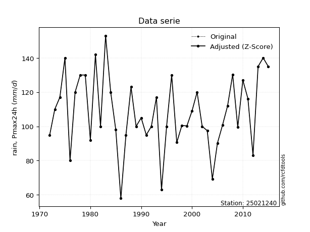</img>

</div>

> If Z-Score is active, values out of range or outliers are replaced with the station mean value.

### 4. Active continuous probability distributions from SciPy (47 of 104 available)

[scipy.stats](https://docs.scipy.org/doc/scipy/reference/stats.html) is a Python´s powerful submodule within the SciPy library for comprehensive statistical analysis, offering over 130 probability distributions (like Normal, Poisson), functions for descriptive stats (mean, variance), hypothesis testing (t-tests, chi-square), random variable generation, and statistical tests, making it essential for data science, modeling, and research. It provides tools to explore, model, and draw conclusions from data efficiently, working seamlessly with NumPy.

|   id | p_dist             |   n_parameter | fit_method   | label                                                                       | active   | ref                                                                                                        |
|-----:|:-------------------|--------------:|:-------------|:----------------------------------------------------------------------------|:---------|:-----------------------------------------------------------------------------------------------------------|
|    0 | alpha              |             3 | MLE          | Alpha                                                                       | True     | [:mortar_board:](https://docs.scipy.org/doc/scipy/reference/generated/scipy.stats.alpha.html)              |
|    1 | betaprime          |             4 | MLE          | Beta prime                                                                  | True     | [:mortar_board:](https://docs.scipy.org/doc/scipy/reference/generated/scipy.stats.betaprime.html)          |
|    2 | chi2               |             3 | MLE          | Chi²                                                                        | True     | [:mortar_board:](https://docs.scipy.org/doc/scipy/reference/generated/scipy.stats.chi2.html)               |
|    3 | crystalball        |             4 | MLE          | Crystalball                                                                 | True     | [:mortar_board:](https://docs.scipy.org/doc/scipy/reference/generated/scipy.stats.crystalball.html)        |
|    4 | dgamma             |             3 | MLE          | Double gamma                                                                | True     | [:mortar_board:](https://docs.scipy.org/doc/scipy/reference/generated/scipy.stats.dgamma.html)             |
|    5 | erlang             |             3 | MLE          | Erlang                                                                      | True     | [:mortar_board:](https://docs.scipy.org/doc/scipy/reference/generated/scipy.stats.erlang.html)             |
|    6 | expon              |             2 | MLE          | Exponential                                                                 | True     | [:mortar_board:](https://docs.scipy.org/doc/scipy/reference/generated/scipy.stats.expon.html)              |
|    7 | exponnorm          |             3 | MLE          | Exponentially modified Normal                                               | True     | [:mortar_board:](https://docs.scipy.org/doc/scipy/reference/generated/scipy.stats.exponnorm.html)          |
|    8 | f                  |             4 | MLE          | F                                                                           | True     | [:mortar_board:](https://docs.scipy.org/doc/scipy/reference/generated/scipy.stats.f.html)                  |
|    9 | fatiguelife        |             3 | MLE          | Fatigue-life (Birnbaum-Saunders)                                            | True     | [:mortar_board:](https://docs.scipy.org/doc/scipy/reference/generated/scipy.stats.fatiguelife.html)        |
|   10 | fisk               |             3 | MLE          | Fisk                                                                        | True     | [:mortar_board:](https://docs.scipy.org/doc/scipy/reference/generated/scipy.stats.fisk.html)               |
|   11 | gamma              |             3 | MLE          | Gamma                                                                       | True     | [:mortar_board:](https://docs.scipy.org/doc/scipy/reference/generated/scipy.stats.gamma.html)              |
|   12 | genexpon           |             5 | MLE          | Generalized exponential                                                     | True     | [:mortar_board:](https://docs.scipy.org/doc/scipy/reference/generated/scipy.stats.genexpon.html)           |
|   13 | genlogistic        |             3 | MLE          | Generalized logistic                                                        | True     | [:mortar_board:](https://docs.scipy.org/doc/scipy/reference/generated/scipy.stats.genlogistic.html)        |
|   14 | gibrat             |             2 | MM           | Gibrat                                                                      | True     | [:mortar_board:](https://docs.scipy.org/doc/scipy/reference/generated/scipy.stats.gibrat.html)             |
|   15 | gompertz           |             3 | MLE          | Gompertz (or truncated Gumbel)                                              | True     | [:mortar_board:](https://docs.scipy.org/doc/scipy/reference/generated/scipy.stats.gompertz.html)           |
|   16 | gumbel_l           |             2 | MM           | Gumbel Left Skew                                                            | True     | [:mortar_board:](https://docs.scipy.org/doc/scipy/reference/generated/scipy.stats.gumbel_l.html)           |
|   17 | gumbel_r           |             2 | MM           | Gumbel Right Skew                                                           | True     | [:mortar_board:](https://docs.scipy.org/doc/scipy/reference/generated/scipy.stats.gumbel_r.html)           |
|   18 | halflogistic       |             2 | MM           | Half-logistic                                                               | True     | [:mortar_board:](https://docs.scipy.org/doc/scipy/reference/generated/scipy.stats.halflogistic.html)       |
|   19 | halfnorm           |             2 | MM           | Half Normal                                                                 | True     | [:mortar_board:](https://docs.scipy.org/doc/scipy/reference/generated/scipy.stats.halfnorm.html)           |
|   20 | hypsecant          |             2 | MM           | hyperbolic secant                                                           | True     | [:mortar_board:](https://docs.scipy.org/doc/scipy/reference/generated/scipy.stats.hypsecant.html)          |
|   21 | invgamma           |             3 | MLE          | Inverted gamma                                                              | True     | [:mortar_board:](https://docs.scipy.org/doc/scipy/reference/generated/scipy.stats.invgamma.html)           |
|   22 | invgauss           |             3 | MLE          | Inverse Gaussian                                                            | True     | [:mortar_board:](https://docs.scipy.org/doc/scipy/reference/generated/scipy.stats.invgauss.html)           |
|   23 | invweibull         |             3 | MLE          | Inverted Weibull                                                            | True     | [:mortar_board:](https://docs.scipy.org/doc/scipy/reference/generated/scipy.stats.invweibull.html)         |
|   24 | johnsonsu          |             4 | MLE          | Johnson Su                                                                  | True     | [:mortar_board:](https://docs.scipy.org/doc/scipy/reference/generated/scipy.stats.johnsonsu.html)          |
|   25 | kstwobign          |             2 | MLE          | Limiting distribution of scaled Kolmogorov-Smirnov two-sided test statistic | True     | [:mortar_board:](https://docs.scipy.org/doc/scipy/reference/generated/scipy.stats.kstwobign.html)          |
|   26 | laplace            |             2 | MM           | Laplace                                                                     | True     | [:mortar_board:](https://docs.scipy.org/doc/scipy/reference/generated/scipy.stats.laplace.html)            |
|   27 | laplace_asymmetric |             3 | MLE          | Asymmetric Laplace                                                          | True     | [:mortar_board:](https://docs.scipy.org/doc/scipy/reference/generated/scipy.stats.laplace_asymmetric.html) |
|   28 | loggamma           |             3 | MLE          | Log gamma                                                                   | True     | [:mortar_board:](https://docs.scipy.org/doc/scipy/reference/generated/scipy.stats.loggamma.html)           |
|   29 | logistic           |             2 | MM           | Logistic (or Sech-squared)                                                  | True     | [:mortar_board:](https://docs.scipy.org/doc/scipy/reference/generated/scipy.stats.logistic.html)           |
|   30 | lognorm            |             3 | MLE          | Log Normal                                                                  | True     | [:mortar_board:](https://docs.scipy.org/doc/scipy/reference/generated/scipy.stats.lognorm.html)            |
|   31 | maxwell            |             2 | MM           | Maxwell                                                                     | True     | [:mortar_board:](https://docs.scipy.org/doc/scipy/reference/generated/scipy.stats.maxwell.html)            |
|   32 | mielke             |             4 | MLE          | Mielke Beta-Kappa / Dagum                                                   | True     | [:mortar_board:](https://docs.scipy.org/doc/scipy/reference/generated/scipy.stats.mielke.html)             |
|   33 | moyal              |             2 | MM           | Moyal                                                                       | True     | [:mortar_board:](https://docs.scipy.org/doc/scipy/reference/generated/scipy.stats.moyal.html)              |
|   34 | nakagami           |             3 | MLE          | Nakagami                                                                    | True     | [:mortar_board:](https://docs.scipy.org/doc/scipy/reference/generated/scipy.stats.nakagami.html)           |
|   35 | ncf                |             5 | MLE          | Non-central F distribution                                                  | True     | [:mortar_board:](https://docs.scipy.org/doc/scipy/reference/generated/scipy.stats.ncf.html)                |
|   36 | nct                |             4 | MLE          | Non-central Student’s t                                                     | True     | [:mortar_board:](https://docs.scipy.org/doc/scipy/reference/generated/scipy.stats.nct.html)                |
|   37 | norm               |             2 | MM           | Normal                                                                      | True     | [:mortar_board:](https://docs.scipy.org/doc/scipy/reference/generated/scipy.stats.norm.html)               |
|   38 | pareto             |             3 | MLE          | Pareto                                                                      | True     | [:mortar_board:](https://docs.scipy.org/doc/scipy/reference/generated/scipy.stats.pareto.html)             |
|   39 | pearson3           |             3 | MM           | Pearson type III                                                            | True     | [:mortar_board:](https://docs.scipy.org/doc/scipy/reference/generated/scipy.stats.pearson3.html)           |
|   40 | rayleigh           |             2 | MM           | Rayleigh                                                                    | True     | [:mortar_board:](https://docs.scipy.org/doc/scipy/reference/generated/scipy.stats.rayleigh.html)           |
|   41 | recipinvgauss      |             3 | MLE          | Reciprocal inverse Gaussian                                                 | True     | [:mortar_board:](https://docs.scipy.org/doc/scipy/reference/generated/scipy.stats.recipinvgauss.html)      |
|   42 | rice               |             3 | MLE          | Rice                                                                        | True     | [:mortar_board:](https://docs.scipy.org/doc/scipy/reference/generated/scipy.stats.rice.html)               |
|   43 | t                  |             3 | MLE          | Student’s t                                                                 | True     | [:mortar_board:](https://docs.scipy.org/doc/scipy/reference/generated/scipy.stats.t.html)                  |
|   44 | truncnorm          |             4 | MLE          | Truncated normal                                                            | True     | [:mortar_board:](https://docs.scipy.org/doc/scipy/reference/generated/scipy.stats.truncnorm.html)          |
|   45 | wald               |             2 | MM           | Wald                                                                        | True     | [:mortar_board:](https://docs.scipy.org/doc/scipy/reference/generated/scipy.stats.wald.html)               |
|   46 | weibull_min        |             3 | MLE          | Weibull minimum                                                             | True     | [:mortar_board:](https://docs.scipy.org/doc/scipy/reference/generated/scipy.stats.weibull_min.html)        |

>Gumbel and Lob-Gumbel probability distributions are not shown in the above table.
>
>**n_parameter:** # arguments & localization & scale.
>
>**Fit methods:** (MLE) maximum likelihood, (MM) L-moments.
>
>**Inactive:** foldnorm, gennorm, norminvgauss, powernorm, powerlognorm, skewnorm, genextreme, anglit, arcsine, argus, beta, bradford, burr, burr12, cauchy, cosine, halfcauchy, foldcauchy, skewcauchy, wrapcauchy, gengamma, exponweib, exponpow, truncexpon, gausshyper, genhalflogistic, genhyperbolic, geninvgauss, halfgennorm, johnsonsb, kappa4, kappa3, ksone, kstwo, loglaplace, levy, levy_l, levy_stable, ncx2, genpareto, truncpareto, lomax, powerlaw, rdist, rel_breitwigner, semicircular, studentized_range, trapezoid, triang, truncweibull_min, tukeylambda, uniform, loguniform, vonmises, vonmises_line, weibull_max, dweibull, 


## B. Probability distributions vs. Empirical distributions

A continuous probability distribution describes probabilities for variables that can take any value within a range (like rain any time), unlike discrete variables with specific outcomes (like temperature). It uses a Probability Density Function (PDF), a curve where the total area under it equals 1, and the probability of the variable falling within an interval (a to b) is found by calculating the area under the curve between those points. A key feature is that the probability of hitting any single exact value is zero, so probabilities are always expressed for ranges, e.g., $P(a ≤ X ≤ b)$.


### 0. Cumulative distribution values - CDF (48 evalated, ordered by x ascending) 

|   id |   Station |   date |     x |   count |    mean |     std |     zscore |   Value_initial |   station |   m |      alpha |   alpha_pdf |   betaprime |   betaprime_pdf |       chi2 |    chi2_pdf |   crystalball |   crystalball_pdf |    dgamma |   dgamma_pdf |     erlang |   erlang_pdf |     expon |   expon_pdf |   exponnorm |   exponnorm_pdf |          f |      f_pdf |   fatiguelife |   fatiguelife_pdf |      fisk |   fisk_pdf |      gamma |   gamma_pdf |   genexpon |   genexpon_pdf |   genlogistic |   genlogistic_pdf |   gibrat |   gibrat_pdf |    gompertz |   gompertz_pdf |   gumbel_l |   gumbel_l_pdf |    gumbel_r |   gumbel_r_pdf |   halflogistic |   halflogistic_pdf |   halfnorm |   halfnorm_pdf |   hypsecant |   hypsecant_pdf |   invgamma |   invgamma_pdf |   invgauss |   invgauss_pdf |   invweibull |   invweibull_pdf |   johnsonsu |   johnsonsu_pdf |   kstwobign |   kstwobign_pdf |   laplace |   laplace_pdf |   laplace_asymmetric |   laplace_asymmetric_pdf |   loggamma |   loggamma_pdf |   logistic |   logistic_pdf |    lognorm |   lognorm_pdf |     maxwell |   maxwell_pdf |   mielke |   mielke_pdf |       moyal |   moyal_pdf |   nakagami |   nakagami_pdf |        ncf |    ncf_pdf |        nct |    nct_pdf |      norm |   norm_pdf |      pareto |   pareto_pdf |   pearson3 |   pearson3_pdf |    rayleigh |   rayleigh_pdf |   recipinvgauss |   recipinvgauss_pdf |       rice |   rice_pdf |         t |      t_pdf |   truncnorm |   truncnorm_pdf |      wald |   wald_pdf |   weibull_min |   weibull_min_pdf |    zzgumbel |   gumbel_pdf |
|-----:|----------:|-------:|------:|--------:|--------:|--------:|-----------:|----------------:|----------:|----:|-----------:|------------:|------------:|----------------:|-----------:|------------:|--------------:|------------------:|----------:|-------------:|-----------:|-------------:|----------:|------------:|------------:|----------------:|-----------:|-----------:|--------------:|------------------:|----------:|-----------:|-----------:|------------:|-----------:|---------------:|--------------:|------------------:|---------:|-------------:|------------:|---------------:|-----------:|---------------:|------------:|---------------:|---------------:|-------------------:|-----------:|---------------:|------------:|----------------:|-----------:|---------------:|-----------:|---------------:|-------------:|-----------------:|------------:|----------------:|------------:|----------------:|----------:|--------------:|---------------------:|-------------------------:|-----------:|---------------:|-----------:|---------------:|-----------:|--------------:|------------:|--------------:|---------:|-------------:|------------:|------------:|-----------:|---------------:|-----------:|-----------:|-----------:|-----------:|----------:|-----------:|------------:|-------------:|-----------:|---------------:|------------:|---------------:|----------------:|--------------------:|-----------:|-----------:|----------:|-----------:|------------:|----------------:|----------:|-----------:|--------------:|------------------:|------------:|-------------:|
|    0 |  25021240 |   1986 |  58   |      44 | 108.389 | 21.2927 | -2.36648   |            58   |  25021240 |   1 | 0.00513611 | 0.000867921 |  0.00361418 |     0.000716011 | 0.00571574 | 0.000918586 |     0.0083366 |        0.00107974 | 0.0108224 |   0.00107548 | 0.00705938 |   0.00100049 | 0         |  0.0198457  |  0.00833664 |      0.00107975 | 0.00812154 | 0.00106482 |    0.00624816 |       0.000914996 | 0.015346  | 0.00124715 | 0.00723613 |  0.00101828 | 2.0795e-07 |     0.0198186  |     0.0135431 |        0.00116725 | 0        |   0          | 0           |    0           |  0.0257214 |    0.00154689  | 5.57347e-06 |    4.10825e-06 |       0        |         0          |  0         |     0          |   0.0148168 |      0.0011053  | 0.00484344 |    0.000829437 | 0.00204893 |    0.000638578 |   0.00180668 |      0.000528505 |   0.0119613 |      0.00127778 |  0.00150484 |     0.000595153 | 0.0169321 |    0.0011376  |            0.0109014 |              0.000914771 |  0.0119428 |     0.00127712 |  0.0128442 |     0.00109255 | 0.00833569 |    0.00107969 | 0           |   0           |      nan |          nan | 3.84058e-14 | 1.1798e-13  | 0.00832227 |     0.00108235 | 0.00135285 | 0.0003898  | 0.00838615 | 0.00108482 | 0.0083366 | 0.00107974 | 1.89264e-08 |   0.0198457  |  0.0112942 |     0.00125064 | 0           |     0          |       0.0049461 |         0.000818705 | 0.00494126 | 0.00105969 | 0.0083305 | 0.00107919 |           1 |    2.64986e-29  | 0         | 0          |    0.00928632 |        0.0013341  | 9.61609e-10 |            0 |
|    1 |  25021240 |   1994 |  63   |      44 | 108.389 | 21.2927 | -2.13165   |            63   |  25021240 |   2 | 0.0113922  | 0.00170782  |  0.00909709 |     0.00156138  | 0.0122124  | 0.00174888  |     0.0155302 |        0.00185361 | 0.0177162 |   0.0017312  | 0.0138886  |   0.00179209 | 0.0944644 |  0.017971   |  0.0155302  |      0.00185362 | 0.0152383  | 0.00183825 |    0.0125668  |       0.00167324  | 0.0230053 | 0.00185507 | 0.0141695  |  0.00181588 | 0.0943644  |     0.017954   |     0.0207981 |        0.00177514 | 0        |   0          | 0           |    0           |  0.0347216 |    0.00207845  | 0.00013363  |    7.26317e-05 |       0        |         0          |  0         |     0          |   0.0215136 |      0.00160422 | 0.010852   |    0.00164631  | 0.00789061 |    0.00183613  |   0.00666674 |      0.00154708  |   0.0200945 |      0.00202253 |  0.00780416 |     0.00212794  | 0.0236921 |    0.00159177 |            0.0165843 |              0.00139164  |  0.0200742 |     0.00202254 |  0.0196257 |     0.00165794 | 0.015529   |    0.00185356 | 0.000783248 |   0.000521232 |      nan |          nan | 6.18608e-09 | 1.13345e-08 | 0.0155391  |     0.00186068 | 0.00495457 | 0.00115523 | 0.0156102  | 0.00186074 | 0.0155302 | 0.00185361 | 0.0944644   |   0.017971   |  0.0193123 |     0.00200511 | 0           |     0          |       0.0108148 |         0.00159649  | 0.012267   | 0.00192677 | 0.0155209 | 0.00185291 |           1 |    4.74144e-32  | 0         | 0          |    0.0180222  |        0.0022094  | 2.12746e-07 |            0 |
|    2 |  25021240 |   2004 |  69.2 |      44 | 108.389 | 21.2927 | -1.84047   |            69.2 |  25021240 |   3 | 0.0269529  | 0.00345635  |  0.0240594  |     0.00343539  | 0.0278715  | 0.00343633  |     0.031319  |        0.00334975 | 0.0322259 |   0.00306701 | 0.0294852  |   0.00335926 | 0.199303  |  0.0158904  |  0.0313191  |      0.00334976 | 0.0309414  | 0.00333844 |    0.0273093  |       0.00320501  | 0.0377955 | 0.00300157 | 0.0299314  |  0.00338803 | 0.19911    |     0.0158775  |     0.0351457 |        0.00294406 | 0        |   0          | 0           |    0           |  0.0502535 |    0.00298372  | 0.00221178  |    0.000823948 |       0        |         0          |  0         |     0          |   0.0341506 |      0.00254358 | 0.0259253  |    0.00335989  | 0.0268605  |    0.00448646  |   0.0232838  |      0.0040546   |   0.0366011 |      0.00339411 |  0.0310047  |     0.00559296  | 0.0359343 |    0.00241427 |            0.0279026 |              0.00234138  |  0.0365861 |     0.003396   |  0.033027  |     0.00275191 | 0.0313176  |    0.00334974 | 0.0102726   |   0.00281602  |      nan |          nan | 2.78929e-05 | 2.71786e-05 | 0.0313963  |     0.00336519 | 0.0176941  | 0.00318182 | 0.031451   | 0.00335929 | 0.031319  | 0.00334975 | 0.199303    |   0.0158904  |  0.0357834 |     0.00340279 | 0.000564744 |     0.00104556 |       0.0253248 |         0.00322046  | 0.0288889  | 0.00354719 | 0.0313051 | 0.00334899 |           1 |    1.21854e-35  | 0         | 0          |    0.0361795  |        0.00373272 | 2.55394e-05 |            0 |
|    3 |  25021240 |   1976 |  80   |      44 | 108.389 | 21.2927 | -1.33326   |            80   |  25021240 |   4 | 0.0896635  | 0.00854912  |  0.0891528  |     0.00905122  | 0.0891581  | 0.00828403  |     0.0887212 |        0.00763307 | 0.08722   |   0.00773113 | 0.0882045  |   0.00788294 | 0.353774  |  0.0128248  |  0.0887214  |      0.00763308 | 0.088312   | 0.00764002 |    0.0842906  |       0.0077351   | 0.087412  | 0.00658396 | 0.0889374  |  0.00790237 | 0.353473   |     0.0128173  |     0.0847647 |        0.006666   | 0        |   0          | 1.82483e-12 |    3.46228e-07 |  0.094768  |    0.00549159  | 0.0421647   |    0.00813429  |       0        |         0          |  0         |     0          |   0.0761646 |      0.00562967 | 0.0872796  |    0.00839989  | 0.108655   |    0.0107404   |   0.102271   |      0.0107998   |   0.0922429 |      0.00722478 |  0.130197   |     0.0125318   | 0.0742396 |    0.00498784 |            0.0690601 |              0.00579502  |  0.0922806 |     0.00723334 |  0.0797154 |     0.00632143 | 0.0887203  |    0.00763319 | 0.0751499   |   0.00952642  |      nan |          nan | 0.0177965   | 0.00601878  | 0.0890548  |     0.00766402 | 0.0844271  | 0.00965596 | 0.0889644  | 0.00764289 | 0.0887212 | 0.00763307 | 0.353774    |   0.0128248  |  0.0919082 |     0.00730936 | 0.0660736   |     0.0107477  |       0.0840299 |         0.00805145  | 0.0895316  | 0.00801542 | 0.0887011 | 0.00763287 |           1 |    2.22461e-42  | 0         | 0          |    0.0960467  |        0.0076006  | 0.00401444  |            0 |
|    4 |  25021240 |   2012 |  83.1 |      44 | 108.389 | 21.2927 | -1.18767   |            83.1 |  25021240 |   5 | 0.118933   | 0.0103453   |  0.120226   |     0.0110028   | 0.117481   | 0.0100015   |     0.114798  |        0.0092098  | 0.114343  |   0.00983024 | 0.115169   |   0.00953085 | 0.392333  |  0.0120596  |  0.114799   |      0.00920982 | 0.114419   | 0.00922218 |    0.110834   |       0.00940888  | 0.110093  | 0.00808622 | 0.11595    |  0.00954196 | 0.39201    |     0.0120533  |     0.107797  |        0.00823212 | 0        |   0          | 1.57047e-06 |    7.10191e-07 |  0.113313  |    0.00649741  | 0.0727144   |    0.0116134   |       0        |         0          |  0.0587269 |     0.0227879  |   0.0957216 |      0.007036   | 0.116076   |    0.0101904   | 0.144566   |    0.0123945   |   0.138736   |      0.0126912   |   0.116821  |      0.00865262 |  0.171414   |     0.0140007   | 0.09143   |    0.00614279 |            0.0895777 |              0.00751672  |  0.116889  |     0.00866367 |  0.101643  |     0.00786827 | 0.114798   |    0.00920997 | 0.107907    |   0.0115938   |      nan |          nan | 0.0441971   | 0.0111879   | 0.115231   |     0.00924261 | 0.117704   | 0.0118054  | 0.11507    | 0.00921803 | 0.114798  | 0.0092098  | 0.392333    |   0.0120596  |  0.116783  |     0.00875917 | 0.102989    |     0.0130165  |       0.111678  |         0.00980136  | 0.116827   | 0.00960914 | 0.114778  | 0.00920997 |           1 |    1.9917e-44   | 0         | 0          |    0.121687   |        0.00895554 | 0.0102754   |            0 |
|    5 |  25021240 |   2005 |  90.2 |      44 | 108.389 | 21.2927 | -0.85422   |            90.2 |  25021240 |   6 | 0.207032   | 0.0144001   |  0.213842   |     0.0152468   | 0.202658   | 0.0139417   |     0.193768  |        0.0130478  | 0.204747  |   0.0158562  | 0.19682    |   0.0134597  | 0.472197  |  0.0104746  |  0.193768   |      0.0130478  | 0.193503   | 0.0130655  |    0.191933   |       0.013433    | 0.181861  | 0.0122803  | 0.197591   |  0.0134445  | 0.471839   |     0.0104707  |     0.181127  |        0.0125661  | 0        |   0          | 1.439e-05   |    3.68113e-06 |  0.169194  |    0.00938316  | 0.182559    |    0.0189174   |       0.185629 |         0.026826   |  0.218219  |     0.0219898  |   0.160354  |      0.0114666  | 0.203102   |    0.0142596   | 0.243445   |    0.0151967   |   0.241309   |      0.0158884   |   0.190857  |      0.0122498  |  0.278942   |     0.0159623   | 0.147318  |    0.00989765 |            0.162534  |              0.0136387   |  0.191023  |     0.0122661  |  0.172602  |     0.0123058  | 0.193769   |    0.013048   | 0.205498    |   0.0156944   |      nan |          nan | 0.166524    | 0.0223698   | 0.194423   |     0.013075   | 0.217504   | 0.0160751  | 0.194076   | 0.0130491  | 0.193768  | 0.0130478  | 0.472197    |   0.0104746  |  0.191703  |     0.0123858  | 0.210323    |     0.0168902  |       0.195865  |         0.0138749   | 0.198488   | 0.013381   | 0.193752  | 0.013049   |           1 |    2.61396e-49  | 0.0171572 | 0.0242558  |    0.196918   |        0.0122598  | 0.0505395   |            0 |
|    6 |  25021240 |   1997 |  90.6 |      44 | 108.389 | 21.2927 | -0.835434  |            90.6 |  25021240 |   7 | 0.212834   | 0.0146095   |  0.219983   |     0.0154572   | 0.208276   | 0.014149    |     0.199029  |        0.0132614  | 0.211163  |   0.0162216  | 0.202247   |   0.0136739  | 0.476371  |  0.0103918  |  0.19903    |      0.0132614  | 0.198772   | 0.013279   |    0.19735    |       0.0136536   | 0.186825  | 0.0125389  | 0.203011   |  0.0136571  | 0.476011   |     0.010388   |     0.186206  |        0.0128304  | 0        |   0          | 1.59328e-05 |    4.03869e-06 |  0.172985  |    0.00957079  | 0.190189    |    0.0192336   |       0.196337 |         0.0267123  |  0.227001  |     0.0219187  |   0.165001  |      0.0117691  | 0.208849   |    0.0144711   | 0.249545   |    0.0153057   |   0.247689   |      0.0160091   |   0.195798  |      0.0124571  |  0.285338   |     0.0160158   | 0.151331  |    0.0101672  |            0.168082  |              0.0141042   |  0.195971  |     0.0124737  |  0.17758   |     0.0125846  | 0.199031   |    0.0132616  | 0.211814    |   0.0158844   |      nan |          nan | 0.175556    | 0.0227863   | 0.199695   |     0.0132878  | 0.223972   | 0.0162671  | 0.199338   | 0.0132622  | 0.199029  | 0.0132614  | 0.476371    |   0.0103918  |  0.196699  |     0.0125936  | 0.217111    |     0.0170484  |       0.201459  |         0.0140914   | 0.203882   | 0.0135863  | 0.199015  | 0.0132627  |           1 |    1.3625e-49   | 0.0282391 | 0.0310053  |    0.20186    |        0.0124472  | 0.0542616   |            0 |
|    7 |  25021240 |   1980 |  92   |      44 | 108.389 | 21.2927 | -0.769684  |            92   |  25021240 |   8 | 0.233787   | 0.0153147   |  0.242119   |     0.0161567   | 0.228581   | 0.0148512   |     0.218113  |        0.0139971  | 0.234761  |   0.0174848  | 0.221907   |   0.0144072  | 0.490719  |  0.0101071  |  0.218113   |      0.0139971  | 0.21788    | 0.0140139  |    0.216998   |       0.0144096   | 0.205017  | 0.0134521  | 0.222644   |  0.0143846  | 0.490354   |     0.0101037  |     0.204818  |        0.0137596  | 0        |   0          | 2.2612e-05  |    5.58659e-06 |  0.186854  |    0.0102482   | 0.217833    |    0.020228    |       0.233432 |         0.0262694  |  0.257502  |     0.0216492  |   0.182241  |      0.0128687  | 0.229613   |    0.0151845   | 0.271218   |    0.0156436   |   0.27037    |      0.016378    |   0.213744  |      0.0131791  |  0.307868   |     0.0161592   | 0.166256  |    0.01117    |            0.189035  |              0.0158624   |  0.213941  |     0.0131964  |  0.195889  |     0.013573   | 0.218114   |    0.0139974  | 0.234496    |   0.0165065   |      nan |          nan | 0.208354    | 0.0240058   | 0.218814   |     0.0140204  | 0.247189   | 0.0168866  | 0.218421   | 0.0139961  | 0.218113  | 0.0139971  | 0.490719    |   0.0101071  |  0.214837  |     0.0133153  | 0.241339    |     0.0175496  |       0.221706  |         0.0148268   | 0.223398   | 0.0142892  | 0.2181    | 0.0139987  |           1 |    1.37188e-50  | 0.0838752 | 0.0462759  |    0.219742   |        0.0130983  | 0.0686806   |            0 |
|    8 |  25021240 |   1987 |  95   |      44 | 108.389 | 21.2927 | -0.628791  |            95   |  25021240 |   9 | 0.281801   | 0.0166508   |  0.292585   |     0.0174329   | 0.275223   | 0.0162053   |     0.262369  |        0.0154818  | 0.290995  |   0.0199071  | 0.267356   |   0.0158615  | 0.520155  |  0.00952288 |  0.262369   |      0.0154818  | 0.26218    | 0.0154943  |    0.262528   |       0.0159133   | 0.248315  | 0.0154057  | 0.268007   |  0.0158271  | 0.519781   |     0.00952027 |     0.249064  |        0.0157243  | 0.097767 |   0.064669   | 4.68195e-05 |    1.11966e-05 |  0.219898  |    0.0118037   | 0.280994    |    0.021734    |       0.310561 |         0.0251037  |  0.321464  |     0.0209691  |   0.224598  |      0.015404   | 0.277268   |    0.0165432   | 0.318972   |    0.0161412   |   0.320364   |      0.0168891   |   0.255555  |      0.0146805  |  0.356554   |     0.0162514   | 0.203381  |    0.0136643  |            0.243148  |              0.0204032   |  0.255805  |     0.0146988  |  0.239817  |     0.015709   | 0.262371   |    0.015482   | 0.28574     |   0.0175999   |      nan |          nan | 0.282864    | 0.0254005   | 0.263126   |     0.0154961  | 0.299504   | 0.0179209  | 0.262668   | 0.0154765  | 0.262369  | 0.0154818  | 0.520155    |   0.00952288 |  0.257046  |     0.0148086  | 0.295281    |     0.0183498  |       0.268383  |         0.0162536   | 0.268404   | 0.0156865  | 0.262361  | 0.0154838  |           1 |    9.24655e-53  | 0.233666  | 0.0495149  |    0.261082   |        0.0144485  | 0.106936    |            0 |
|    9 |  25021240 |   1991 |  95   |      44 | 108.389 | 21.2927 | -0.628791  |            95   |  25021240 |  10 | 0.281801   | 0.0166508   |  0.292585   |     0.0174329   | 0.275223   | 0.0162053   |     0.262369  |        0.0154818  | 0.290995  |   0.0199071  | 0.267356   |   0.0158615  | 0.520155  |  0.00952288 |  0.262369   |      0.0154818  | 0.26218    | 0.0154943  |    0.262528   |       0.0159133   | 0.248315  | 0.0154057  | 0.268007   |  0.0158271  | 0.519781   |     0.00952027 |     0.249064  |        0.0157243  | 0.097767 |   0.064669   | 4.68195e-05 |    1.11966e-05 |  0.219898  |    0.0118037   | 0.280994    |    0.021734    |       0.310561 |         0.0251037  |  0.321464  |     0.0209691  |   0.224598  |      0.015404   | 0.277268   |    0.0165432   | 0.318972   |    0.0161412   |   0.320364   |      0.0168891   |   0.255555  |      0.0146805  |  0.356554   |     0.0162514   | 0.203381  |    0.0136643  |            0.243148  |              0.0204032   |  0.255805  |     0.0146988  |  0.239817  |     0.015709   | 0.262371   |    0.015482   | 0.28574     |   0.0175999   |      nan |          nan | 0.282864    | 0.0254005   | 0.263126   |     0.0154961  | 0.299504   | 0.0179209  | 0.262668   | 0.0154765  | 0.262369  | 0.0154818  | 0.520155    |   0.00952288 |  0.257046  |     0.0148086  | 0.295281    |     0.0183498  |       0.268383  |         0.0162536   | 0.268404   | 0.0156865  | 0.262361  | 0.0154838  |           1 |    9.24655e-53  | 0.233666  | 0.0495149  |    0.261082   |        0.0144485  | 0.106936    |            0 |
|   10 |  25021240 |   1972 |  95   |      44 | 108.389 | 21.2927 | -0.628791  |            95   |  25021240 |  11 | 0.281801   | 0.0166508   |  0.292585   |     0.0174329   | 0.275223   | 0.0162053   |     0.262369  |        0.0154818  | 0.290995  |   0.0199071  | 0.267356   |   0.0158615  | 0.520155  |  0.00952288 |  0.262369   |      0.0154818  | 0.26218    | 0.0154943  |    0.262528   |       0.0159133   | 0.248315  | 0.0154057  | 0.268007   |  0.0158271  | 0.519781   |     0.00952027 |     0.249064  |        0.0157243  | 0.097767 |   0.064669   | 4.68195e-05 |    1.11966e-05 |  0.219898  |    0.0118037   | 0.280994    |    0.021734    |       0.310561 |         0.0251037  |  0.321464  |     0.0209691  |   0.224598  |      0.015404   | 0.277268   |    0.0165432   | 0.318972   |    0.0161412   |   0.320364   |      0.0168891   |   0.255555  |      0.0146805  |  0.356554   |     0.0162514   | 0.203381  |    0.0136643  |            0.243148  |              0.0204032   |  0.255805  |     0.0146988  |  0.239817  |     0.015709   | 0.262371   |    0.015482   | 0.28574     |   0.0175999   |      nan |          nan | 0.282864    | 0.0254005   | 0.263126   |     0.0154961  | 0.299504   | 0.0179209  | 0.262668   | 0.0154765  | 0.262369  | 0.0154818  | 0.520155    |   0.00952288 |  0.257046  |     0.0148086  | 0.295281    |     0.0183498  |       0.268383  |         0.0162536   | 0.268404   | 0.0156865  | 0.262361  | 0.0154838  |           1 |    9.24655e-53  | 0.233666  | 0.0495149  |    0.261082   |        0.0144485  | 0.106936    |            0 |
|   11 |  25021240 |   2003 |  97.5 |      44 | 108.389 | 21.2927 | -0.511379  |            97.5 |  25021240 |  12 | 0.324588   | 0.0175419   |  0.337216   |     0.0182279   | 0.316942   | 0.0171371   |     0.302476  |        0.0165793  | 0.342571  |   0.0211885  | 0.308354   |   0.0169077  | 0.543381  |  0.00906194 |  0.302477   |      0.0165793  | 0.302313   | 0.016586   |    0.303705   |       0.0169989   | 0.288788  | 0.0169519  | 0.308908   |  0.0168645  | 0.543002   |     0.00905992 |     0.290314  |        0.0172502  | 0.263216 |   0.0631452  | 8.4741e-05  |    1.99845e-05 |  0.251131  |    0.0131955   | 0.336195    |    0.0223295   |       0.371899 |         0.0239406  |  0.373073  |     0.020304   |   0.265865  |      0.0176124  | 0.319815   |    0.017458    | 0.359599   |    0.0163274   |   0.362822   |      0.0170361   |   0.293731  |      0.0158435  |  0.397065   |     0.0161296   | 0.240579  |    0.0161635  |            0.299901  |              0.0251655   |  0.294027  |     0.015862   |  0.281251  |     0.017419   | 0.302479   |    0.0165795  | 0.330597    |   0.0182444   |      nan |          nan | 0.34661     | 0.0254464   | 0.303259   |     0.0165844  | 0.345043   | 0.0184605  | 0.302758   | 0.0165705  | 0.302476  | 0.0165793  | 0.543381    |   0.00906193 |  0.295526  |     0.0159566  | 0.34169     |     0.0187356  |       0.310298  |         0.0172444   | 0.308917   | 0.0166971  | 0.302475  | 0.0165817  |           1 |    1.31891e-54  | 0.349584  | 0.0428319  |    0.298531   |        0.0154957  | 0.146167    |            0 |
|   12 |  25021240 |   1985 |  98   |      44 | 108.389 | 21.2927 | -0.487897  |            98   |  25021240 |  13 | 0.333397   | 0.0176927   |  0.346362   |     0.018355    | 0.325551   | 0.0172987   |     0.310816  |        0.0167795  | 0.353197  |   0.0213054  | 0.316855   |   0.017095   | 0.54789   |  0.00897246 |  0.310817   |      0.0167795  | 0.310656   | 0.0167849  |    0.312254   |       0.0171937   | 0.297337  | 0.017244   | 0.317387   |  0.0170502  | 0.547509   |     0.00897056 |     0.299011  |        0.0175347  | 0.294207 |   0.0607844  | 9.53352e-05 |    2.24395e-05 |  0.2578    |    0.0134826   | 0.347373    |    0.0223797   |       0.383807 |         0.0236906  |  0.383189  |     0.0201611  |   0.274781  |      0.0180519  | 0.328583   |    0.0176139   | 0.367767   |    0.0163409   |   0.37134    |      0.017037    |   0.301708  |      0.0160625  |  0.405119   |     0.0160861   | 0.248798  |    0.0167156  |            0.312751  |              0.0262438   |  0.302013  |     0.016081   |  0.290042  |     0.0177437  | 0.310819   |    0.0167797  | 0.339745    |   0.0183432   |      nan |          nan | 0.359311    | 0.0253545   | 0.311601   |     0.0167826  | 0.354291   | 0.0185329  | 0.311093   | 0.01677    | 0.310816  | 0.0167795  | 0.54789     |   0.00897246 |  0.303558  |     0.0161717  | 0.35107     |     0.018783   |       0.318964  |         0.0174173   | 0.317311   | 0.0168788  | 0.310816  | 0.016782   |           1 |    5.58602e-55  | 0.370628  | 0.0413442  |    0.306328   |        0.0156936  | 0.154749    |            0 |
|   13 |  25021240 |   2009 |  99.5 |      44 | 108.389 | 21.2927 | -0.41745   |            99.5 |  25021240 |  14 | 0.360242   | 0.0180867   |  0.374143   |     0.0186701   | 0.351833   | 0.0177299   |     0.336412  |        0.0173361  | 0.3852    |   0.0212543  | 0.342891   |   0.0176078  | 0.56115   |  0.0087093  |  0.336412   |      0.0173361  | 0.336256   | 0.0173369  |    0.338455   |       0.0177278   | 0.323834  | 0.0180725  | 0.343353   |  0.0175585  | 0.560767   |     0.00870773 |     0.325923  |        0.0183335  | 0.379652 |   0.0530942  | 0.000135585 |    3.17665e-05 |  0.278678  |    0.0143573   | 0.380982    |    0.0224011   |       0.418763 |         0.0229112  |  0.413099  |     0.0197141  |   0.302833  |      0.0193407  | 0.355323   |    0.0180241   | 0.392283   |    0.0163364   |   0.396867   |      0.0169862   |   0.326276  |      0.0166866  |  0.429131   |     0.0159212   | 0.275178  |    0.018488   |            0.354701  |              0.029764    |  0.326609  |     0.0167046  |  0.317361  |     0.0186679  | 0.336415   |    0.0173362  | 0.367448    |   0.0185792   |      nan |          nan | 0.39704     | 0.0249112   | 0.337196   |     0.0173329  | 0.382214   | 0.0186796  | 0.336673   | 0.0173245  | 0.336412  | 0.0173361  | 0.56115     |   0.0087093  |  0.32828   |     0.0167823  | 0.379319    |     0.0188672  |       0.345448  |         0.017881    | 0.343013   | 0.0173786  | 0.336415  | 0.0173387  |           1 |    4.16712e-56  | 0.429346  | 0.0369885  |    0.330299   |        0.0162597  | 0.181817    |            0 |
|   14 |  25021240 |   2002 | 100   |      44 | 108.389 | 21.2927 | -0.393968  |           100   |  25021240 |  15 | 0.369314   | 0.018198    |  0.383499   |     0.0187527   | 0.36073    | 0.0178552   |     0.345122  |        0.0175059  | 0.395786  |   0.0210753  | 0.351734   |   0.0177615  | 0.565483  |  0.0086233  |  0.345123   |      0.0175059  | 0.344966   | 0.0175051  |    0.347359   |       0.0178882   | 0.332935  | 0.0183303  | 0.35217    |  0.0177109  | 0.565099   |     0.00862184 |     0.335151  |        0.0185792  | 0.405562 |   0.0505536  | 0.000152425 |    3.56687e-05 |  0.28593   |    0.0146526   | 0.392175    |    0.0223673   |       0.430152 |         0.0226426  |  0.422917  |     0.0195594  |   0.312607  |      0.0197549  | 0.364364   |    0.018141    | 0.400447   |    0.0163204   |   0.405352   |      0.0169522   |   0.334669  |      0.0168824  |  0.437075   |     0.0158554   | 0.284579  |    0.0191197  |            0.3699    |              0.0310393   |  0.335011  |     0.0169003  |  0.326768  |     0.0189564  | 0.345126   |    0.0175061  | 0.376752    |   0.0186377   |      nan |          nan | 0.409447    | 0.024714    | 0.345905   |     0.0175006  | 0.391561   | 0.0187054  | 0.345377   | 0.0174936  | 0.345122  | 0.0175059  | 0.565483    |   0.0086233  |  0.336719  |     0.0169732  | 0.388755    |     0.0188764  |       0.354423  |         0.0180165   | 0.35174    | 0.0175291  | 0.345127  | 0.0175086  |           1 |    1.74357e-56  | 0.447493  | 0.0356045  |    0.338473   |        0.0164383  | 0.191249    |            0 |
|   15 |  25021240 |   1995 | 100   |      44 | 108.389 | 21.2927 | -0.393968  |           100   |  25021240 |  16 | 0.369314   | 0.018198    |  0.383499   |     0.0187527   | 0.36073    | 0.0178552   |     0.345122  |        0.0175059  | 0.395786  |   0.0210753  | 0.351734   |   0.0177615  | 0.565483  |  0.0086233  |  0.345123   |      0.0175059  | 0.344966   | 0.0175051  |    0.347359   |       0.0178882   | 0.332935  | 0.0183303  | 0.35217    |  0.0177109  | 0.565099   |     0.00862184 |     0.335151  |        0.0185792  | 0.405562 |   0.0505536  | 0.000152425 |    3.56687e-05 |  0.28593   |    0.0146526   | 0.392175    |    0.0223673   |       0.430152 |         0.0226426  |  0.422917  |     0.0195594  |   0.312607  |      0.0197549  | 0.364364   |    0.018141    | 0.400447   |    0.0163204   |   0.405352   |      0.0169522   |   0.334669  |      0.0168824  |  0.437075   |     0.0158554   | 0.284579  |    0.0191197  |            0.3699    |              0.0310393   |  0.335011  |     0.0169003  |  0.326768  |     0.0189564  | 0.345126   |    0.0175061  | 0.376752    |   0.0186377   |      nan |          nan | 0.409447    | 0.024714    | 0.345905   |     0.0175006  | 0.391561   | 0.0187054  | 0.345377   | 0.0174936  | 0.345122  | 0.0175059  | 0.565483    |   0.0086233  |  0.336719  |     0.0169732  | 0.388755    |     0.0188764  |       0.354423  |         0.0180165   | 0.35174    | 0.0175291  | 0.345127  | 0.0175086  |           1 |    1.74357e-56  | 0.447493  | 0.0356045  |    0.338473   |        0.0164383  | 0.191249    |            0 |
|   16 |  25021240 |   1989 | 100   |      44 | 108.389 | 21.2927 | -0.393968  |           100   |  25021240 |  17 | 0.369314   | 0.018198    |  0.383499   |     0.0187527   | 0.36073    | 0.0178552   |     0.345122  |        0.0175059  | 0.395786  |   0.0210753  | 0.351734   |   0.0177615  | 0.565483  |  0.0086233  |  0.345123   |      0.0175059  | 0.344966   | 0.0175051  |    0.347359   |       0.0178882   | 0.332935  | 0.0183303  | 0.35217    |  0.0177109  | 0.565099   |     0.00862184 |     0.335151  |        0.0185792  | 0.405562 |   0.0505536  | 0.000152425 |    3.56687e-05 |  0.28593   |    0.0146526   | 0.392175    |    0.0223673   |       0.430152 |         0.0226426  |  0.422917  |     0.0195594  |   0.312607  |      0.0197549  | 0.364364   |    0.018141    | 0.400447   |    0.0163204   |   0.405352   |      0.0169522   |   0.334669  |      0.0168824  |  0.437075   |     0.0158554   | 0.284579  |    0.0191197  |            0.3699    |              0.0310393   |  0.335011  |     0.0169003  |  0.326768  |     0.0189564  | 0.345126   |    0.0175061  | 0.376752    |   0.0186377   |      nan |          nan | 0.409447    | 0.024714    | 0.345905   |     0.0175006  | 0.391561   | 0.0187054  | 0.345377   | 0.0174936  | 0.345122  | 0.0175059  | 0.565483    |   0.0086233  |  0.336719  |     0.0169732  | 0.388755    |     0.0188764  |       0.354423  |         0.0180165   | 0.35174    | 0.0175291  | 0.345127  | 0.0175086  |           1 |    1.74357e-56  | 0.447493  | 0.0356045  |    0.338473   |        0.0164383  | 0.191249    |            0 |
|   17 |  25021240 |   1992 | 100   |      44 | 108.389 | 21.2927 | -0.393968  |           100   |  25021240 |  18 | 0.369314   | 0.018198    |  0.383499   |     0.0187527   | 0.36073    | 0.0178552   |     0.345122  |        0.0175059  | 0.395786  |   0.0210753  | 0.351734   |   0.0177615  | 0.565483  |  0.0086233  |  0.345123   |      0.0175059  | 0.344966   | 0.0175051  |    0.347359   |       0.0178882   | 0.332935  | 0.0183303  | 0.35217    |  0.0177109  | 0.565099   |     0.00862184 |     0.335151  |        0.0185792  | 0.405562 |   0.0505536  | 0.000152425 |    3.56687e-05 |  0.28593   |    0.0146526   | 0.392175    |    0.0223673   |       0.430152 |         0.0226426  |  0.422917  |     0.0195594  |   0.312607  |      0.0197549  | 0.364364   |    0.018141    | 0.400447   |    0.0163204   |   0.405352   |      0.0169522   |   0.334669  |      0.0168824  |  0.437075   |     0.0158554   | 0.284579  |    0.0191197  |            0.3699    |              0.0310393   |  0.335011  |     0.0169003  |  0.326768  |     0.0189564  | 0.345126   |    0.0175061  | 0.376752    |   0.0186377   |      nan |          nan | 0.409447    | 0.024714    | 0.345905   |     0.0175006  | 0.391561   | 0.0187054  | 0.345377   | 0.0174936  | 0.345122  | 0.0175059  | 0.565483    |   0.0086233  |  0.336719  |     0.0169732  | 0.388755    |     0.0188764  |       0.354423  |         0.0180165   | 0.35174    | 0.0175291  | 0.345127  | 0.0175086  |           1 |    1.74357e-56  | 0.447493  | 0.0356045  |    0.338473   |        0.0164383  | 0.191249    |            0 |
|   18 |  25021240 |   1982 | 100   |      44 | 108.389 | 21.2927 | -0.393968  |           100   |  25021240 |  19 | 0.369314   | 0.018198    |  0.383499   |     0.0187527   | 0.36073    | 0.0178552   |     0.345122  |        0.0175059  | 0.395786  |   0.0210753  | 0.351734   |   0.0177615  | 0.565483  |  0.0086233  |  0.345123   |      0.0175059  | 0.344966   | 0.0175051  |    0.347359   |       0.0178882   | 0.332935  | 0.0183303  | 0.35217    |  0.0177109  | 0.565099   |     0.00862184 |     0.335151  |        0.0185792  | 0.405562 |   0.0505536  | 0.000152425 |    3.56687e-05 |  0.28593   |    0.0146526   | 0.392175    |    0.0223673   |       0.430152 |         0.0226426  |  0.422917  |     0.0195594  |   0.312607  |      0.0197549  | 0.364364   |    0.018141    | 0.400447   |    0.0163204   |   0.405352   |      0.0169522   |   0.334669  |      0.0168824  |  0.437075   |     0.0158554   | 0.284579  |    0.0191197  |            0.3699    |              0.0310393   |  0.335011  |     0.0169003  |  0.326768  |     0.0189564  | 0.345126   |    0.0175061  | 0.376752    |   0.0186377   |      nan |          nan | 0.409447    | 0.024714    | 0.345905   |     0.0175006  | 0.391561   | 0.0187054  | 0.345377   | 0.0174936  | 0.345122  | 0.0175059  | 0.565483    |   0.0086233  |  0.336719  |     0.0169732  | 0.388755    |     0.0188764  |       0.354423  |         0.0180165   | 0.35174    | 0.0175291  | 0.345127  | 0.0175086  |           1 |    1.74357e-56  | 0.447493  | 0.0356045  |    0.338473   |        0.0164383  | 0.191249    |            0 |
|   19 |  25021240 |   1999 | 100.3 |      44 | 108.389 | 21.2927 | -0.379879  |           100.3 |  25021240 |  20 | 0.374783   | 0.0182598   |  0.389132   |     0.0187969   | 0.366097   | 0.0179258   |     0.350389  |        0.0176038  | 0.402087  |   0.020922   | 0.357076   |   0.0178494  | 0.568063  |  0.00857212 |  0.350389   |      0.0176038  | 0.350233   | 0.017602   |    0.352739   |       0.01798     | 0.338457  | 0.01848    | 0.357497   |  0.017798   | 0.567678   |     0.00857071 |     0.340746  |        0.0187212  | 0.420504 |   0.0490626  | 0.000163506 |    3.82364e-05 |  0.290353  |    0.0148305   | 0.398881    |    0.0223377   |       0.43692  |         0.0224795  |  0.428771  |     0.0194652  |   0.31857   |      0.0199986  | 0.369817   |    0.0182062   | 0.405342   |    0.0163074   |   0.410434   |      0.0169279   |   0.339751  |      0.0169968  |  0.441826   |     0.0158135   | 0.290373  |    0.0195089  |            0.379143  |              0.030584    |  0.340098  |     0.0170146  |  0.33248   |     0.0191241  | 0.350392   |    0.017604   | 0.382348    |   0.0186679   |      nan |          nan | 0.416843    | 0.0245851   | 0.35117    |     0.0175973  | 0.397174   | 0.0187155  | 0.35064    | 0.0175912  | 0.350389  | 0.0176038  | 0.568063    |   0.00857212 |  0.341828  |     0.0170844  | 0.394418    |     0.0188775  |       0.359839  |         0.0180931   | 0.357012   | 0.0176154  | 0.350395  | 0.0176065  |           1 |    1.03221e-56  | 0.458052  | 0.0347944  |    0.343421   |        0.0165428  | 0.197       |            0 |
|   20 |  25021240 |   1998 | 100.5 |      44 | 108.389 | 21.2927 | -0.370486  |           100.5 |  25021240 |  21 | 0.378439   | 0.018299    |  0.392894   |     0.0188241   | 0.369687   | 0.017971    |     0.353916  |        0.0176674  | 0.406259  |   0.0207993  | 0.360651   |   0.0179061  | 0.569774  |  0.00853816 |  0.353917   |      0.0176674  | 0.353759   | 0.0176649  |    0.356341   |       0.0180394   | 0.342163  | 0.0185777  | 0.361062   |  0.0178543  | 0.569389   |     0.0085368  |     0.3445    |        0.0188134  | 0.430218 |   0.0480852  | 0.000171334 |    4.00501e-05 |  0.293331  |    0.0149494   | 0.403346    |    0.0223142   |       0.441405 |         0.0223701  |  0.432658  |     0.0194018  |   0.322586  |      0.0201587  | 0.373462   |    0.0182477   | 0.408602   |    0.0162974   |   0.413818   |      0.0169101   |   0.343157  |      0.0170717  |  0.444986   |     0.0157846   | 0.294301  |    0.0197728  |            0.38523   |              0.0302842   |  0.343508  |     0.0170894  |  0.336316  |     0.0192336  | 0.353919   |    0.0176676  | 0.386084    |   0.0186861   |      nan |          nan | 0.421751    | 0.024495    | 0.354695   |     0.01766    | 0.400917   | 0.01872    | 0.354165   | 0.0176545  | 0.353916  | 0.0176674  | 0.569774    |   0.00853816 |  0.345252  |     0.0171572  | 0.398194    |     0.0188764  |       0.363463  |         0.0181422   | 0.360541   | 0.0176713  | 0.353922  | 0.0176701  |           1 |    7.27314e-57  | 0.464958  | 0.0342634  |    0.346736   |        0.0166114  | 0.200869    |            0 |
|   21 |  25021240 |   2006 | 100.7 |      44 | 108.389 | 21.2927 | -0.361093  |           100.7 |  25021240 |  22 | 0.382102   | 0.0183366   |  0.396661   |     0.0188494   | 0.373285   | 0.0180146   |     0.357456  |        0.0177296  | 0.410405  |   0.0206594  | 0.364238   |   0.0179614  | 0.571478  |  0.00850434 |  0.357456   |      0.0177296  | 0.357298   | 0.0177265  |    0.359955   |       0.0180972   | 0.345888  | 0.0186736  | 0.364638   |  0.0179091  | 0.571093   |     0.00850302 |     0.348272  |        0.0189038  | 0.439739 |   0.0471224  | 0.000179532 |    4.19498e-05 |  0.296333  |    0.0150684   | 0.407807    |    0.0222877   |       0.445868 |         0.02226    |  0.436532  |     0.019338   |   0.326634  |      0.0203168  | 0.377116   |    0.0182875   | 0.411861   |    0.0162863   |   0.417198   |      0.016891    |   0.346579  |      0.0171455  |  0.44814    |     0.0157549   | 0.298283  |    0.0200403  |            0.391257  |              0.0299873   |  0.346934  |     0.0171631  |  0.340173  |     0.0193411  | 0.357459   |    0.0177298  | 0.389823    |   0.0187027   |      nan |          nan | 0.42664     | 0.0244018   | 0.358233   |     0.0177213  | 0.404662   | 0.0187226  | 0.357702   | 0.0177164  | 0.357456  | 0.0177296  | 0.571478    |   0.00850434 |  0.348691  |     0.0172288  | 0.401969    |     0.0188739  |       0.367096  |         0.0181897   | 0.36408    | 0.0177257  | 0.357462  | 0.0177324  |           1 |    5.1223e-57   | 0.471758  | 0.0337397  |    0.350065   |        0.016679   | 0.204768    |            0 |
|   22 |  25021240 |   1990 | 105   |      44 | 108.389 | 21.2927 | -0.159146  |           105   |  25021240 |  23 | 0.462089   | 0.0187363   |  0.47825    |     0.0189619   | 0.452202   | 0.0185668   |     0.436052  |        0.0187087  | 0.484896  |   0.0118476  | 0.443479   |   0.0187712  | 0.60653   |  0.00780871 |  0.436053   |      0.0187087  | 0.435848   | 0.0186897  |    0.439881   |       0.0189503   | 0.429899  | 0.0202283  | 0.443637   |  0.0187122  | 0.606141   |     0.0078082  |     0.432965  |        0.0203065  | 0.603717 |   0.0304186  | 0.000488812 |    0.000113603 |  0.366642  |    0.0176252   | 0.501465    |    0.0210894   |       0.536337 |         0.0197912  |  0.516598  |     0.0178741  |   0.420352  |      0.023014   | 0.457001   |    0.0187384   | 0.481014   |    0.0158044   |   0.488537   |      0.0162078   |   0.423283  |      0.0184289  |  0.514264   |     0.0149523   | 0.398194  |    0.026753   |            0.507461  |              0.024263    |  0.423707  |     0.0184432  |  0.427515  |     0.0210895  | 0.436056   |    0.0187088  | 0.470456    |   0.0186832   |      nan |          nan | 0.526356    | 0.0218243   | 0.436753   |     0.0186815  | 0.484688   | 0.0183737  | 0.436231   | 0.0186907  | 0.436052  | 0.0187087  | 0.60653     |   0.00780871 |  0.425641  |     0.0184577  | 0.482516    |     0.0184873  |       0.446924  |         0.0188103   | 0.442306   | 0.0185425  | 0.436071  | 0.0187116  |           1 |    2.42572e-60  | 0.595295  | 0.0242834  |    0.424553   |        0.0178816  | 0.294049    |            0 |
|   23 |  25021240 |   2000 | 109   |      44 | 108.389 | 21.2927 |  0.0287124 |           109   |  25021240 |  24 | 0.536613   | 0.0184184   |  0.553115   |     0.0183659   | 0.52637    | 0.0184107   |     0.511585  |        0.0189447  | 0.507937  |   0.00903813 | 0.518917   |   0.018835   | 0.636557  |  0.0072128  |  0.511586   |      0.0189447  | 0.511276   | 0.0189116  |    0.516081   |       0.0190333   | 0.511968  | 0.0206221  | 0.518838   |  0.0187763  | 0.636167   |     0.00721293 |     0.515018  |        0.0205371  | 0.704492 |   0.0207152  | 0.00123703  |    0.000286854 |  0.44165   |    0.0198262   | 0.582207    |    0.0191891   |       0.61076  |         0.0174194  |  0.585153  |     0.0163873  |   0.514517  |      0.023729   | 0.531627   |    0.0184672   | 0.542736   |    0.0150092   |   0.551451   |      0.0152012   |   0.498374  |      0.0190081  |  0.572206   |     0.0139919   | 0.520121  |    0.032241   |            0.595549  |              0.0199236   |  0.498846  |     0.0190175  |  0.513167  |     0.0215273  | 0.511589   |    0.0189447  | 0.544136    |   0.0180685   |      nan |          nan | 0.607938    | 0.0189361   | 0.512146   |     0.0189021  | 0.556498   | 0.0174471  | 0.511686   | 0.0189241  | 0.511585  | 0.0189447  | 0.636557    |   0.0072128  |  0.500732  |     0.0189792  | 0.554887    |     0.0176266  |       0.522142  |         0.018688    | 0.516909   | 0.0186517  | 0.511616  | 0.0189475  |           1 |    1.60133e-63  | 0.679441  | 0.0181486  |    0.497468   |        0.0184842  | 0.382152    |            0 |
|   24 |  25021240 |   1973 | 110   |      44 | 108.389 | 21.2927 |  0.0756769 |           110   |  25021240 |  25 | 0.554946   | 0.0182415   |  0.571363   |     0.018123    | 0.544715   | 0.0182742   |     0.53051   |        0.0188973  | 0.519035  |   0.0129856  | 0.537711   |   0.0187459  | 0.643699  |  0.00707106 |  0.53051    |      0.0188973  | 0.530166   | 0.0188611  |    0.535074   |       0.0189456   | 0.532558  | 0.0205464  | 0.537574   |  0.0186883  | 0.643309   |     0.00707134 |     0.535504  |        0.0204235  | 0.724287 |   0.0189083  | 0.00155979  |    0.000361552 |  0.461723  |    0.0203142   | 0.601124    |    0.0186414   |       0.627885 |         0.0168301  |  0.601348  |     0.0160025  |   0.538184  |      0.023583   | 0.550015   |    0.0183012   | 0.557627   |    0.0147698   |   0.566508   |      0.0149095   |   0.517406  |      0.0190486  |  0.586068   |     0.0137296   | 0.551303  |    0.030146   |            0.61499   |              0.018966    |  0.517886  |     0.0190565  |  0.534657  |     0.0214388  | 0.530514   |    0.0188972  | 0.562091    |   0.0178357   |      nan |          nan | 0.626506    | 0.0182011   | 0.531026   |     0.0188514  | 0.573795   | 0.0171429  | 0.53059    | 0.0188764  | 0.53051   | 0.0188973  | 0.643699    |   0.00707106 |  0.519728  |     0.0190053  | 0.572376    |     0.0173482  |       0.540767  |         0.0185552   | 0.535528   | 0.0185786  | 0.530543  | 0.0189     |           1 |    2.48991e-64  | 0.696967  | 0.0169214  |    0.515986   |        0.0185455  | 0.404256    |            0 |
|   25 |  25021240 |   2007 | 112   |      44 | 108.389 | 21.2927 |  0.169606  |           112   |  25021240 |  26 | 0.590991   | 0.0177812   |  0.607046   |     0.0175392   | 0.580905   | 0.0178921   |     0.568111  |        0.0186758  | 0.550726  |   0.0181701  | 0.574929   |   0.0184459  | 0.657564  |  0.0067959  |  0.568111   |      0.0186758  | 0.567689   | 0.0186344  |    0.572692   |       0.0186446   | 0.573339  | 0.02019    | 0.57468    |  0.0183914  | 0.657175   |     0.00679645 |     0.57597   |        0.0199999  | 0.758927 |   0.0158434  | 0.00247925  |    0.000574208 |  0.503242  |    0.0211769   | 0.63727     |    0.017495    |       0.660378 |         0.0156671  |  0.632575  |     0.0152223  |   0.584763  |      0.0229165  | 0.5862     |    0.0178613   | 0.586657   |    0.0142522   |   0.595715   |      0.0142912   |   0.555482  |      0.0189987  |  0.612987   |     0.0131862   | 0.60772   |    0.0263556  |            0.651114  |              0.0171865   |  0.555975  |     0.0190034  |  0.577175  |     0.021029   | 0.568114   |    0.0186757  | 0.597231    |   0.0172872   |      nan |          nan | 0.661452    | 0.0167513   | 0.568529   |     0.0186245  | 0.607417   | 0.0164649  | 0.568148   | 0.0186547  | 0.568111  | 0.0186758  | 0.657564    |   0.0067959  |  0.55769   |     0.0189281  | 0.606466    |     0.0167277  |       0.577522  |         0.018175    | 0.572447   | 0.0183149  | 0.568149  | 0.0186783  |           1 |    5.80424e-66  | 0.728587  | 0.0147593  |    0.553111   |        0.0185537  | 0.448022    |            0 |
|   26 |  25021240 |   2011 | 116.2 |      44 | 108.389 | 21.2927 |  0.366857  |           116.2 |  25021240 |  27 | 0.662973   | 0.0164143   |  0.677545   |     0.0159626   | 0.653666   | 0.0166681   |     0.644718  |        0.0176916  | 0.636484  |   0.0213599  | 0.650274   |   0.0173293  | 0.684949  |  0.00625241 |  0.644718   |      0.0176916  | 0.644106   | 0.0176443  |    0.648841   |       0.0175109   | 0.655236  | 0.0186449  | 0.649817   |  0.0172856  | 0.684564   |     0.00625347 |     0.656855  |        0.0183661  | 0.814978 |   0.0111838  | 0.00655123  |    0.00151363  |  0.59493   |    0.0223043   | 0.705512    |    0.0149953   |       0.721215 |         0.0133318  |  0.693023  |     0.01356    |   0.675854  |      0.02022    | 0.658597   |    0.0165297   | 0.644019   |    0.0130396   |   0.652837   |      0.0128931   |   0.634131  |      0.0183264  |  0.66588    |     0.0119925   | 0.704167  |    0.0198758  |            0.716319  |              0.0139744   |  0.634629  |     0.018324   |  0.662196  |     0.0192753  | 0.644721   |    0.0176914  | 0.666912    |   0.0158341   |      nan |          nan | 0.725693    | 0.0138902   | 0.644905   |     0.0176342  | 0.673193   | 0.0148156  | 0.644669   | 0.0176719  | 0.644718  | 0.0176916  | 0.68495     |   0.00625241 |  0.635936  |     0.0182085  | 0.673608    |     0.0152016  |       0.651443  |         0.0169333   | 0.64742    | 0.0172846  | 0.644765  | 0.0176934  |           1 |    1.84862e-69  | 0.782741  | 0.0112269  |    0.630242   |        0.0180594  | 0.536094    |            0 |
|   27 |  25021240 |   1993 | 117   |      44 | 108.389 | 21.2927 |  0.404428  |           117   |  25021240 |  28 | 0.675981   | 0.0161029   |  0.690179   |     0.0156203   | 0.666886   | 0.0163793   |     0.658768  |        0.0174313  | 0.653534  |   0.0212382  | 0.664027   |   0.0170502  | 0.689912  |  0.00615393 |  0.658769   |      0.0174312  | 0.658119   | 0.0173837  |    0.662738   |       0.0172266   | 0.669996  | 0.0182487  | 0.663536   |  0.017009   | 0.689528   |     0.00615507 |     0.671388  |        0.0179621  | 0.823648 |   0.0105003  | 0.00788077  |    0.00181953  |  0.612809  |    0.0223848   | 0.717319    |    0.0145209   |       0.731711 |         0.0129081  |  0.703744  |     0.0132428  |   0.691772  |      0.0195716  | 0.671699   |    0.0162236   | 0.654353   |    0.0127952   |   0.663041   |      0.0126183   |   0.648709  |      0.018114   |  0.675382   |     0.0117609   | 0.719648  |    0.0188357  |            0.727281  |              0.0134344   |  0.649204  |     0.0181104  |  0.67744   |     0.0188292  | 0.658771   |    0.017431   | 0.679455    |   0.0155202   |      nan |          nan | 0.736602    | 0.0133826   | 0.658909   |     0.0173735  | 0.68491    | 0.0144777  | 0.658704   | 0.017412   | 0.658768  | 0.0174313  | 0.689912    |   0.00615393 |  0.650417  |     0.0179893  | 0.685643    |     0.0148847  |       0.664873  |         0.0166383   | 0.661144   | 0.0170222  | 0.658817  | 0.0174329  |           1 |    3.89232e-70  | 0.7915    | 0.0106774  |    0.644622   |        0.0178869  | 0.55205     |            0 |
|   28 |  25021240 |   1974 | 117   |      44 | 108.389 | 21.2927 |  0.404428  |           117   |  25021240 |  29 | 0.675981   | 0.0161029   |  0.690179   |     0.0156203   | 0.666886   | 0.0163793   |     0.658768  |        0.0174313  | 0.653534  |   0.0212382  | 0.664027   |   0.0170502  | 0.689912  |  0.00615393 |  0.658769   |      0.0174312  | 0.658119   | 0.0173837  |    0.662738   |       0.0172266   | 0.669996  | 0.0182487  | 0.663536   |  0.017009   | 0.689528   |     0.00615507 |     0.671388  |        0.0179621  | 0.823648 |   0.0105003  | 0.00788077  |    0.00181953  |  0.612809  |    0.0223848   | 0.717319    |    0.0145209   |       0.731711 |         0.0129081  |  0.703744  |     0.0132428  |   0.691772  |      0.0195716  | 0.671699   |    0.0162236   | 0.654353   |    0.0127952   |   0.663041   |      0.0126183   |   0.648709  |      0.018114   |  0.675382   |     0.0117609   | 0.719648  |    0.0188357  |            0.727281  |              0.0134344   |  0.649204  |     0.0181104  |  0.67744   |     0.0188292  | 0.658771   |    0.017431   | 0.679455    |   0.0155202   |      nan |          nan | 0.736602    | 0.0133826   | 0.658909   |     0.0173735  | 0.68491    | 0.0144777  | 0.658704   | 0.017412   | 0.658768  | 0.0174313  | 0.689912    |   0.00615393 |  0.650417  |     0.0179893  | 0.685643    |     0.0148847  |       0.664873  |         0.0166383   | 0.661144   | 0.0170222  | 0.658817  | 0.0174329  |           1 |    3.89232e-70  | 0.7915    | 0.0106774  |    0.644622   |        0.0178869  | 0.55205     |            0 |
|   29 |  25021240 |   2001 | 120   |      44 | 108.389 | 21.2927 |  0.545322  |           120   |  25021240 |  30 | 0.722413   | 0.014826    |  0.735019   |     0.0142549   | 0.714258   | 0.0151718   |     0.709398  |        0.0162778  | 0.715268  |   0.0196837  | 0.713431   |   0.0158476  | 0.707835  |  0.00579823 |  0.709398   |      0.0162778  | 0.708607   | 0.016232   |    0.712637   |       0.0160005   | 0.722275  | 0.0165561  | 0.712832   |  0.0158168  | 0.707454   |     0.00579967 |     0.722791  |        0.0162649  | 0.851785 |   0.00835951 | 0.0157339   |    0.0036179   |  0.679905  |    0.0222173   | 0.758257    |    0.0127854   |       0.76813  |         0.0113905  |  0.741697  |     0.0120616  |   0.746633  |      0.0169731  | 0.718519   |    0.0149625   | 0.691338   |    0.0118571   |   0.699343   |      0.0115827   |   0.701611  |      0.0170985  |  0.709358   |     0.0108905   | 0.770824  |    0.0153974  |            0.764748  |              0.0115888   |  0.702088  |     0.0170901  |  0.731165  |     0.0169376  | 0.7094     |    0.0162776  | 0.724163    |   0.0142673   |      nan |          nan | 0.774027    | 0.0116      | 0.709367   |     0.0162215  | 0.7264     | 0.0131751  | 0.709279   | 0.0162612  | 0.709398  | 0.0162778  | 0.707835    |   0.00579823 |  0.702915  |     0.0169559  | 0.728457    |     0.0136466  |       0.71298   |         0.0154015   | 0.710556   | 0.0158795  | 0.70945   | 0.0162788  |           1 |    1.05366e-72  | 0.820751  | 0.00889008 |    0.697075   |        0.0170264  | 0.609023    |            0 |
|   30 |  25021240 |   1984 | 120   |      44 | 108.389 | 21.2927 |  0.545322  |           120   |  25021240 |  31 | 0.722413   | 0.014826    |  0.735019   |     0.0142549   | 0.714258   | 0.0151718   |     0.709398  |        0.0162778  | 0.715268  |   0.0196837  | 0.713431   |   0.0158476  | 0.707835  |  0.00579823 |  0.709398   |      0.0162778  | 0.708607   | 0.016232   |    0.712637   |       0.0160005   | 0.722275  | 0.0165561  | 0.712832   |  0.0158168  | 0.707454   |     0.00579967 |     0.722791  |        0.0162649  | 0.851785 |   0.00835951 | 0.0157339   |    0.0036179   |  0.679905  |    0.0222173   | 0.758257    |    0.0127854   |       0.76813  |         0.0113905  |  0.741697  |     0.0120616  |   0.746633  |      0.0169731  | 0.718519   |    0.0149625   | 0.691338   |    0.0118571   |   0.699343   |      0.0115827   |   0.701611  |      0.0170985  |  0.709358   |     0.0108905   | 0.770824  |    0.0153974  |            0.764748  |              0.0115888   |  0.702088  |     0.0170901  |  0.731165  |     0.0169376  | 0.7094     |    0.0162776  | 0.724163    |   0.0142673   |      nan |          nan | 0.774027    | 0.0116      | 0.709367   |     0.0162215  | 0.7264     | 0.0131751  | 0.709279   | 0.0162612  | 0.709398  | 0.0162778  | 0.707835    |   0.00579823 |  0.702915  |     0.0169559  | 0.728457    |     0.0136466  |       0.71298   |         0.0154015   | 0.710556   | 0.0158795  | 0.70945   | 0.0162788  |           1 |    1.05366e-72  | 0.820751  | 0.00889008 |    0.697075   |        0.0170264  | 0.609023    |            0 |
|   31 |  25021240 |   1977 | 120   |      44 | 108.389 | 21.2927 |  0.545322  |           120   |  25021240 |  32 | 0.722413   | 0.014826    |  0.735019   |     0.0142549   | 0.714258   | 0.0151718   |     0.709398  |        0.0162778  | 0.715268  |   0.0196837  | 0.713431   |   0.0158476  | 0.707835  |  0.00579823 |  0.709398   |      0.0162778  | 0.708607   | 0.016232   |    0.712637   |       0.0160005   | 0.722275  | 0.0165561  | 0.712832   |  0.0158168  | 0.707454   |     0.00579967 |     0.722791  |        0.0162649  | 0.851785 |   0.00835951 | 0.0157339   |    0.0036179   |  0.679905  |    0.0222173   | 0.758257    |    0.0127854   |       0.76813  |         0.0113905  |  0.741697  |     0.0120616  |   0.746633  |      0.0169731  | 0.718519   |    0.0149625   | 0.691338   |    0.0118571   |   0.699343   |      0.0115827   |   0.701611  |      0.0170985  |  0.709358   |     0.0108905   | 0.770824  |    0.0153974  |            0.764748  |              0.0115888   |  0.702088  |     0.0170901  |  0.731165  |     0.0169376  | 0.7094     |    0.0162776  | 0.724163    |   0.0142673   |      nan |          nan | 0.774027    | 0.0116      | 0.709367   |     0.0162215  | 0.7264     | 0.0131751  | 0.709279   | 0.0162612  | 0.709398  | 0.0162778  | 0.707835    |   0.00579823 |  0.702915  |     0.0169559  | 0.728457    |     0.0136466  |       0.71298   |         0.0154015   | 0.710556   | 0.0158795  | 0.70945   | 0.0162788  |           1 |    1.05366e-72  | 0.820751  | 0.00889008 |    0.697075   |        0.0170264  | 0.609023    |            0 |
|   32 |  25021240 |   1988 | 123   |      44 | 108.389 | 21.2927 |  0.686215  |           123   |  25021240 |  33 | 0.764814   | 0.0134265   |  0.775629   |     0.0128101   | 0.757768   | 0.0138155   |     0.756206  |        0.014895   | 0.770726  |   0.0172028  | 0.758918   |   0.0144503  | 0.724722  |  0.0054631  |  0.756206   |      0.014895   | 0.755286   | 0.0148551  |    0.758542   |       0.0145755   | 0.769125  | 0.014656   | 0.758243   |  0.0144306  | 0.724346   |     0.0054648  |     0.768803  |        0.0143926  | 0.874321 |   0.00673746 | 0.0312867   |    0.00713654  |  0.745285  |    0.0212253   | 0.794135    |    0.0111533   |       0.800175 |         0.0099942  |  0.776139  |     0.010905   |   0.793587  |      0.0143464  | 0.761345   |    0.0135719   | 0.725481   |    0.0109046   |   0.73255    |      0.0105589   |   0.750996  |      0.0157799  |  0.740733   |     0.0100286   | 0.812658  |    0.0125867  |            0.797067  |              0.00999668  |  0.751442  |     0.0157674  |  0.778862  |     0.0148414  | 0.756207   |    0.0148948  | 0.764978    |   0.0129335   |      nan |          nan | 0.806398    | 0.010013    | 0.756013   |     0.0148439  | 0.763942   | 0.0118537  | 0.756042   | 0.0148818  | 0.756206  | 0.014895   | 0.724722    |   0.0054631  |  0.751861  |     0.015632   | 0.767476    |     0.0123614  |       0.757126  |         0.0140089   | 0.756217   | 0.0145333  | 0.75626   | 0.0148954  |           1 |    2.55651e-75  | 0.845193  | 0.00745563 |    0.746471   |        0.0158569  | 0.661055    |            0 |
|   33 |  25021240 |   2010 | 127   |      44 | 108.389 | 21.2927 |  0.874073  |           127   |  25021240 |  34 | 0.814635   | 0.0114778   |  0.822962   |     0.010861    | 0.809193   | 0.0118839   |     0.8117    |        0.0128207  | 0.832272  |   0.0135784  | 0.812677   |   0.0124067  | 0.745729  |  0.00504619 |  0.8117     |      0.0128207  | 0.810645   | 0.0127937  |    0.812724   |       0.0124931   | 0.822521  | 0.0120486  | 0.811953   |  0.0124014  | 0.745361   |     0.00504818 |     0.821273  |        0.011853   | 0.897895 |   0.0051395  | 0.0771843   |    0.0171793   |  0.825365  |    0.0185685   | 0.834731    |    0.00918776  |       0.836749 |         0.00833085 |  0.81677   |     0.00942463 |   0.844426  |      0.0111529  | 0.811755   |    0.0116251   | 0.766577   |    0.00964924  |   0.772136   |      0.00924739  |   0.81001   |      0.0136744  |  0.778601   |     0.00891306  | 0.856807  |    0.0096205  |            0.833361  |              0.00820882  |  0.810398  |     0.0136582  |  0.832538  |     0.0120135  | 0.8117     |    0.0128205  | 0.813069    |   0.0111111   |      nan |          nan | 0.842699    | 0.008192    | 0.811324   |     0.012781   | 0.807888   | 0.0101323  | 0.811494   | 0.0128128  | 0.8117    | 0.0128207  | 0.745729    |   0.00504619 |  0.810302  |     0.0135388  | 0.813469    |     0.0106391  |       0.80922   |         0.0120246   | 0.810413   | 0.0125375  | 0.811755  | 0.0128203  |           1 |    7.03009e-79  | 0.871878  | 0.00595513 |    0.806131   |        0.0139104  | 0.722314    |            0 |
|   34 |  25021240 |   1979 | 130   |      44 | 108.389 | 21.2927 |  1.01497   |           130   |  25021240 |  35 | 0.846881   | 0.0100255   |  0.853405   |     0.00944476  | 0.842642   | 0.0104177   |     0.847719  |        0.0111885  | 0.86914   |   0.0110452  | 0.847529   |   0.0108278  | 0.760426  |  0.00475452 |  0.847719   |      0.0111885  | 0.846601   | 0.0111737  |    0.847793   |       0.0108867   | 0.855836  | 0.0101833  | 0.846803   |  0.010832   | 0.760064   |     0.00475669 |     0.85409   |        0.0100467  | 0.911915 |   0.00424249 | 0.148702    |    0.0317629   |  0.876936  |    0.0157094   | 0.860306    |    0.00788734  |       0.860062 |         0.00723182 |  0.843456  |     0.00837537 |   0.874737  |      0.00910825 | 0.844436   |    0.0101678   | 0.794152   |    0.00874028  |   0.798477   |      0.00832236  |   0.848455  |      0.0119427  |  0.804131   |     0.00811292  | 0.882946  |    0.00786434 |            0.856254  |              0.00708108  |  0.848792  |     0.011925   |  0.865557  |     0.0100273  | 0.847719   |    0.0111883  | 0.844373    |   0.00976463  |      nan |          nan | 0.865491    | 0.00703008  | 0.84724    |     0.0111595  | 0.836433   | 0.00891054 | 0.847496   | 0.0111846  | 0.847719  | 0.0111885  | 0.760426    |   0.00475452 |  0.848369  |     0.0118279  | 0.843489    |     0.00938171 |       0.843032  |         0.0105197   | 0.845689   | 0.010977   | 0.847772  | 0.0111876  |           1 |    1.32124e-81  | 0.888365  | 0.00506461 |    0.845405   |        0.0122517  | 0.762221    |            0 |
|   35 |  25021240 |   1978 | 130   |      44 | 108.389 | 21.2927 |  1.01497   |           130   |  25021240 |  36 | 0.846881   | 0.0100255   |  0.853405   |     0.00944476  | 0.842642   | 0.0104177   |     0.847719  |        0.0111885  | 0.86914   |   0.0110452  | 0.847529   |   0.0108278  | 0.760426  |  0.00475452 |  0.847719   |      0.0111885  | 0.846601   | 0.0111737  |    0.847793   |       0.0108867   | 0.855836  | 0.0101833  | 0.846803   |  0.010832   | 0.760064   |     0.00475669 |     0.85409   |        0.0100467  | 0.911915 |   0.00424249 | 0.148702    |    0.0317629   |  0.876936  |    0.0157094   | 0.860306    |    0.00788734  |       0.860062 |         0.00723182 |  0.843456  |     0.00837537 |   0.874737  |      0.00910825 | 0.844436   |    0.0101678   | 0.794152   |    0.00874028  |   0.798477   |      0.00832236  |   0.848455  |      0.0119427  |  0.804131   |     0.00811292  | 0.882946  |    0.00786434 |            0.856254  |              0.00708108  |  0.848792  |     0.011925   |  0.865557  |     0.0100273  | 0.847719   |    0.0111883  | 0.844373    |   0.00976463  |      nan |          nan | 0.865491    | 0.00703008  | 0.84724    |     0.0111595  | 0.836433   | 0.00891054 | 0.847496   | 0.0111846  | 0.847719  | 0.0111885  | 0.760426    |   0.00475452 |  0.848369  |     0.0118279  | 0.843489    |     0.00938171 |       0.843032  |         0.0105197   | 0.845689   | 0.010977   | 0.847772  | 0.0111876  |           1 |    1.32124e-81  | 0.888365  | 0.00506461 |    0.845405   |        0.0122517  | 0.762221    |            0 |
|   36 |  25021240 |   1996 | 130   |      44 | 108.389 | 21.2927 |  1.01497   |           130   |  25021240 |  37 | 0.846881   | 0.0100255   |  0.853405   |     0.00944476  | 0.842642   | 0.0104177   |     0.847719  |        0.0111885  | 0.86914   |   0.0110452  | 0.847529   |   0.0108278  | 0.760426  |  0.00475452 |  0.847719   |      0.0111885  | 0.846601   | 0.0111737  |    0.847793   |       0.0108867   | 0.855836  | 0.0101833  | 0.846803   |  0.010832   | 0.760064   |     0.00475669 |     0.85409   |        0.0100467  | 0.911915 |   0.00424249 | 0.148702    |    0.0317629   |  0.876936  |    0.0157094   | 0.860306    |    0.00788734  |       0.860062 |         0.00723182 |  0.843456  |     0.00837537 |   0.874737  |      0.00910825 | 0.844436   |    0.0101678   | 0.794152   |    0.00874028  |   0.798477   |      0.00832236  |   0.848455  |      0.0119427  |  0.804131   |     0.00811292  | 0.882946  |    0.00786434 |            0.856254  |              0.00708108  |  0.848792  |     0.011925   |  0.865557  |     0.0100273  | 0.847719   |    0.0111883  | 0.844373    |   0.00976463  |      nan |          nan | 0.865491    | 0.00703008  | 0.84724    |     0.0111595  | 0.836433   | 0.00891054 | 0.847496   | 0.0111846  | 0.847719  | 0.0111885  | 0.760426    |   0.00475452 |  0.848369  |     0.0118279  | 0.843489    |     0.00938171 |       0.843032  |         0.0105197   | 0.845689   | 0.010977   | 0.847772  | 0.0111876  |           1 |    1.32124e-81  | 0.888365  | 0.00506461 |    0.845405   |        0.0122517  | 0.762221    |            0 |
|   37 |  25021240 |   2008 | 130.3 |      44 | 108.389 | 21.2927 |  1.02906   |           130.3 |  25021240 |  38 | 0.849867   | 0.00988279  |  0.856218   |     0.00930701  | 0.845745   | 0.0102726   |     0.851051  |        0.0110249  | 0.872418  |   0.0108079  | 0.850754   |   0.0106705  | 0.761848  |  0.0047263  |  0.851052   |      0.0110249  | 0.849929   | 0.0110113  |    0.851035   |       0.0107269   | 0.858864  | 0.0100047  | 0.850029   |  0.0106756  | 0.761487   |     0.00472849 |     0.857078  |        0.0098739  | 0.913176 |   0.00416392 | 0.158513    |    0.0336575   |  0.881602  |    0.0153927   | 0.862654    |    0.00776561  |       0.862216 |         0.00712874 |  0.845953  |     0.00827373 |   0.877442  |      0.00892154 | 0.847465   |    0.0100243   | 0.796761   |    0.0086515   |   0.80096    |      0.00823306  |   0.852012  |      0.0117662  |  0.806553   |     0.00803493  | 0.885282  |    0.00770742 |            0.858363  |              0.0069772   |  0.852343  |     0.0117485  |  0.868536  |     0.00983885 | 0.851051   |    0.0110247  | 0.847282    |   0.00963251  |      nan |          nan | 0.867584    | 0.00692277  | 0.850563   |     0.010997   | 0.839089   | 0.00879263 | 0.850826   | 0.0110213  | 0.851051  | 0.0110249  | 0.761848    |   0.0047263  |  0.851892  |     0.0116539  | 0.846285    |     0.00925878 |       0.846165  |         0.0103709   | 0.848958   | 0.0108208  | 0.851103  | 0.0110239  |           1 |    7.01082e-82  | 0.889872  | 0.00498465 |    0.849055   |        0.0120801  | 0.765937    |            0 |
|   38 |  25021240 |   2015 | 135   |      44 | 108.389 | 21.2927 |  1.24979   |           135   |  25021240 |  39 | 0.89122    | 0.00775023  |  0.895085   |     0.00727411  | 0.888807   | 0.00808232  |     0.896928  |        0.00852326 | 0.915195  |   0.00753795 | 0.895228   |   0.00828507 | 0.783057  |  0.00430539 |  0.896928   |      0.00852325 | 0.895789   | 0.00852966 |    0.895688   |       0.00830618  | 0.899692  | 0.00744853 | 0.894556   |  0.00830127 | 0.782707   |     0.00430781 |     0.897494  |        0.00740102 | 0.930199 |   0.00313982 | 0.401261    |    0.0711745   |  0.941645  |    0.0101022   | 0.894982    |    0.00605038  |       0.892178 |         0.00566833 |  0.881235  |     0.00676778 |   0.913159  |      0.0064004  | 0.889447   |    0.00787513  | 0.834251   |    0.00732174  |   0.836499   |      0.00691643  |   0.900818  |      0.00901692 |  0.841531   |     0.00686646  | 0.916345  |    0.00562044 |            0.887636  |              0.00553516  |  0.901066  |     0.00899944 |  0.908302  |     0.00717698 | 0.896926   |    0.00852313 | 0.887833    |   0.00765457  |      nan |          nan | 0.896482    | 0.00543165  | 0.89635    |     0.00851293 | 0.876261   | 0.00706333 | 0.896699   | 0.0085251  | 0.896928  | 0.00852326 | 0.783057    |   0.00430539 |  0.900272  |     0.00894924 | 0.885416    |     0.00742344 |       0.889561  |         0.00812816  | 0.894148   | 0.00843377 | 0.896974  | 0.00852171 |           1 |    2.96508e-86  | 0.910649  | 0.00390847 |    0.899419   |        0.00934812 | 0.817986    |            0 |
|   39 |  25021240 |   2013 | 135   |      44 | 108.389 | 21.2927 |  1.24979   |           135   |  25021240 |  40 | 0.89122    | 0.00775023  |  0.895085   |     0.00727411  | 0.888807   | 0.00808232  |     0.896928  |        0.00852326 | 0.915195  |   0.00753795 | 0.895228   |   0.00828507 | 0.783057  |  0.00430539 |  0.896928   |      0.00852325 | 0.895789   | 0.00852966 |    0.895688   |       0.00830618  | 0.899692  | 0.00744853 | 0.894556   |  0.00830127 | 0.782707   |     0.00430781 |     0.897494  |        0.00740102 | 0.930199 |   0.00313982 | 0.401261    |    0.0711745   |  0.941645  |    0.0101022   | 0.894982    |    0.00605038  |       0.892178 |         0.00566833 |  0.881235  |     0.00676778 |   0.913159  |      0.0064004  | 0.889447   |    0.00787513  | 0.834251   |    0.00732174  |   0.836499   |      0.00691643  |   0.900818  |      0.00901692 |  0.841531   |     0.00686646  | 0.916345  |    0.00562044 |            0.887636  |              0.00553516  |  0.901066  |     0.00899944 |  0.908302  |     0.00717698 | 0.896926   |    0.00852313 | 0.887833    |   0.00765457  |      nan |          nan | 0.896482    | 0.00543165  | 0.89635    |     0.00851293 | 0.876261   | 0.00706333 | 0.896699   | 0.0085251  | 0.896928  | 0.00852326 | 0.783057    |   0.00430539 |  0.900272  |     0.00894924 | 0.885416    |     0.00742344 |       0.889561  |         0.00812816  | 0.894148   | 0.00843377 | 0.896974  | 0.00852171 |           1 |    2.96508e-86  | 0.910649  | 0.00390847 |    0.899419   |        0.00934812 | 0.817986    |            0 |
|   40 |  25021240 |   1975 | 140   |      44 | 108.389 | 21.2927 |  1.48461   |           140   |  25021240 |  41 | 0.924879   | 0.00576965  |  0.926681   |     0.00542196  | 0.923919   | 0.00601649  |     0.933422  |        0.00613668 | 0.946104  |   0.00497368 | 0.930864   |   0.00602959 | 0.803551  |  0.00389868 |  0.933423   |      0.00613667 | 0.932362   | 0.00616096 |    0.931361   |       0.00602547  | 0.931278  | 0.00528224 | 0.930291   |  0.00605231 | 0.803213   |     0.00390128 |     0.929011  |        0.00529748 | 0.943866 |   0.0023715  | 0.804893    |    0.0738938   |  0.978787  |    0.00498031  | 0.921444    |    0.00459333  |       0.917251 |         0.00440786 |  0.911464  |     0.00535777 |   0.940007  |      0.00445047 | 0.923672   |    0.00587076  | 0.867618   |    0.00605134  |   0.867946   |      0.00569299  |   0.939038  |      0.00633496 |  0.873      |     0.00574258  | 0.940214  |    0.00401679 |            0.912167  |              0.00432675  |  0.939204  |     0.00632012 |  0.938423  |     0.00497927 | 0.933421   |    0.00613662 | 0.921346    |   0.005799    |      nan |          nan | 0.920396    | 0.00418655  | 0.932835   |     0.00614246 | 0.907524   | 0.00548899 | 0.933214   | 0.00614259 | 0.933422  | 0.00613668 | 0.803551    |   0.00389868 |  0.938276  |     0.00631523 | 0.918119    |     0.00570134 |       0.924793  |         0.00602155  | 0.930463   | 0.00614911 | 0.93346   | 0.00613487 |           1 |    4.90945e-91  | 0.927946  | 0.00305171 |    0.939128   |        0.00658672 | 0.861859    |            0 |
|   41 |  25021240 |   2014 | 140   |      44 | 108.389 | 21.2927 |  1.48461   |           140   |  25021240 |  42 | 0.924879   | 0.00576965  |  0.926681   |     0.00542196  | 0.923919   | 0.00601649  |     0.933422  |        0.00613668 | 0.946104  |   0.00497368 | 0.930864   |   0.00602959 | 0.803551  |  0.00389868 |  0.933423   |      0.00613667 | 0.932362   | 0.00616096 |    0.931361   |       0.00602547  | 0.931278  | 0.00528224 | 0.930291   |  0.00605231 | 0.803213   |     0.00390128 |     0.929011  |        0.00529748 | 0.943866 |   0.0023715  | 0.804893    |    0.0738938   |  0.978787  |    0.00498031  | 0.921444    |    0.00459333  |       0.917251 |         0.00440786 |  0.911464  |     0.00535777 |   0.940007  |      0.00445047 | 0.923672   |    0.00587076  | 0.867618   |    0.00605134  |   0.867946   |      0.00569299  |   0.939038  |      0.00633496 |  0.873      |     0.00574258  | 0.940214  |    0.00401679 |            0.912167  |              0.00432675  |  0.939204  |     0.00632012 |  0.938423  |     0.00497927 | 0.933421   |    0.00613662 | 0.921346    |   0.005799    |      nan |          nan | 0.920396    | 0.00418655  | 0.932835   |     0.00614246 | 0.907524   | 0.00548899 | 0.933214   | 0.00614259 | 0.933422  | 0.00613668 | 0.803551    |   0.00389868 |  0.938276  |     0.00631523 | 0.918119    |     0.00570134 |       0.924793  |         0.00602155  | 0.930463   | 0.00614911 | 0.93346   | 0.00613487 |           1 |    4.90945e-91  | 0.927946  | 0.00305171 |    0.939128   |        0.00658672 | 0.861859    |            0 |
|   42 |  25021240 |   1981 | 142   |      44 | 108.389 | 21.2927 |  1.57854   |           142   |  25021240 |  43 | 0.935715   | 0.00507617  |  0.936873   |     0.0047797   | 0.935212   | 0.00528703  |     0.944844  |        0.00529667 | 0.955239  |   0.00418164 | 0.942119   |   0.00523704 | 0.811195  |  0.00374697 |  0.944844   |      0.00529666 | 0.943838   | 0.00532631 |    0.942601   |       0.00522637  | 0.941119  | 0.00457361 | 0.941593   |  0.00526091 | 0.810863   |     0.00374962 |     0.938901  |        0.00460586 | 0.948363 |   0.0021304  | 0.925563    |    0.044815    |  0.987125  |    0.00341438  | 0.930134    |    0.00410469  |       0.925631 |         0.00397879 |  0.921668  |     0.00485184 |   0.948286  |      0.00384221 | 0.9347     |    0.00516712  | 0.879253   |    0.00558832  |   0.878889   |      0.00525478  |   0.950746  |      0.00538684 |  0.884069   |     0.00532914  | 0.947731  |    0.00351174 |            0.920408  |              0.00392079  |  0.950884  |     0.00537346 |  0.947661  |     0.00427394 | 0.944842   |    0.00529665 | 0.932278    |   0.00514133  |      nan |          nan | 0.928346    | 0.00377082  | 0.944273   |     0.00530749 | 0.917943   | 0.00493806 | 0.944648   | 0.00530363 | 0.944844  | 0.00529667 | 0.811195    |   0.00374697 |  0.949961  |     0.00538335 | 0.928901    |     0.00508832 |       0.936085  |         0.00528041  | 0.941941   | 0.00534042 | 0.944878  | 0.00529484 |           1 |    5.5164e-93   | 0.933765  | 0.00277207 |    0.951292   |        0.00559042 | 0.876524    |            0 |
|   43 |  25021240 |   1983 | 153   |      44 | 108.389 | 21.2927 |  2.09515   |           153   |  25021240 |  44 | 0.974666   | 0.00228368  |  0.973896   |     0.00220871  | 0.975505   | 0.00233016  |     0.98297   |        0.00200587 | 0.984427  |   0.00152902 | 0.980621   |   0.00210188 | 0.848223  |  0.00301212 |  0.982971   |      0.00200587 | 0.982367   | 0.00204383 |    0.9809     |       0.00208166  | 0.975384  | 0.00198166 | 0.980349   |  0.0021219  | 0.847921   |     0.00301494 |     0.973778  |        0.00204683 | 0.966318 |   0.00123409 | 1           |    2.80437e-14 |  0.999798  |    0.000104654 | 0.963625    |    0.00217552  |       0.958943 |         0.00223457 |  0.962056  |     0.00265161 |   0.977203  |      0.00169978 | 0.974363   |    0.00232474  | 0.928553   |    0.00350236  |   0.925367   |      0.00332418  |   0.987585  |      0.00176199 |  0.931643   |     0.00342294  | 0.975038  |    0.0016771  |            0.953704  |              0.00228056  |  0.987623  |     0.00175674 |  0.979043  |     0.00176798 | 0.982969   |    0.00200594 | 0.972498    |   0.00241786  |      nan |          nan | 0.959862    | 0.00211621  | 0.982604   |     0.00202771 | 0.958583   | 0.00264755 | 0.982862   | 0.00201351 | 0.98297   | 0.00200587 | 0.848223    |   0.00301212 |  0.987062  |     0.00179919 | 0.969485    |     0.00250904 |       0.976112  |         0.00229797  | 0.981078   | 0.00211875 | 0.982986  | 0.00200454 |           1 |    4.38929e-104 | 0.957639  | 0.00167452 |    0.988924   |        0.00172761 | 0.934316    |            0 |

An Empirical Distribution Function (EDF) is a step-function estimate of a true cumulative distribution function (CDF) based on observed sample data, representing the proportion of data points less than or equal to a given value. It is calculated by ordering your data and jumping up by $1/n$ (where $n$ is sample size) at each unique data point, allowing analysis without assuming an underlying population distribution, and it gets closer to the true CDF as the sample size grows.


### 1. Empirical - EDF California (1923)

California´s estimates the true probability distribution of water-related data (like rainfall, streamflow) using observed samples, crucial for risk assessment.

<div align="center">


$P=m/n$


</div>


**1.1. Empirical values**

<div align="center">

|                | 0                    | 1                    | 2                   | 3                   | 4                   | 5                   | 6                  | 7                   | 8                   | 9                   | 10                 | 11                 | 12                  | 13                 | 14                 | 15                  | 16                  | 17                 | 18                 | 19                  | 20                 | 21             | 22                 | 23                 | 24                 | 25                 | 26                 | 27                 | 28                 | 29                 | 30                 | 31                 | 32             | 33                 | 34                 | 35                 | 36                 | 37                 | 38                 | 39                 | 40                 | 41                 | 42                 | 43             |
|:---------------|:---------------------|:---------------------|:--------------------|:--------------------|:--------------------|:--------------------|:-------------------|:--------------------|:--------------------|:--------------------|:-------------------|:-------------------|:--------------------|:-------------------|:-------------------|:--------------------|:--------------------|:-------------------|:-------------------|:--------------------|:-------------------|:---------------|:-------------------|:-------------------|:-------------------|:-------------------|:-------------------|:-------------------|:-------------------|:-------------------|:-------------------|:-------------------|:---------------|:-------------------|:-------------------|:-------------------|:-------------------|:-------------------|:-------------------|:-------------------|:-------------------|:-------------------|:-------------------|:---------------|
| date           | 1986                 | 1994                 | 2004                | 1976                | 2012                | 2005                | 1997               | 1980                | 1987                | 1991                | 1972               | 2003               | 1985                | 2009               | 2002               | 1995                | 1989                | 1992               | 1982               | 1999                | 1998               | 2006           | 1990               | 2000               | 1973               | 2007               | 2011               | 1993               | 1974               | 2001               | 1984               | 1977               | 1988           | 2010               | 1979               | 1978               | 1996               | 2008               | 2015               | 2013               | 1975               | 2014               | 1981               | 1983           |
| x              | 58.0                 | 63.0                 | 69.2                | 80.0                | 83.1                | 90.2                | 90.6               | 92.0                | 95.0                | 95.0                | 95.0               | 97.5               | 98.0                | 99.5               | 100.0              | 100.0               | 100.0               | 100.0              | 100.0              | 100.3               | 100.5              | 100.7          | 105.0              | 109.0              | 110.0              | 112.0              | 116.2              | 117.0              | 117.0              | 120.0              | 120.0              | 120.0              | 123.0          | 127.0              | 130.0              | 130.0              | 130.0              | 130.3              | 135.0              | 135.0              | 140.0              | 140.0              | 142.0              | 153.0          |
| m              | 1                    | 2                    | 3                   | 4                   | 5                   | 6                   | 7                  | 8                   | 9                   | 10                  | 11                 | 12                 | 13                  | 14                 | 15                 | 16                  | 17                  | 18                 | 19                 | 20                  | 21                 | 22             | 23                 | 24                 | 25                 | 26                 | 27                 | 28                 | 29                 | 30                 | 31                 | 32                 | 33             | 34                 | 35                 | 36                 | 37                 | 38                 | 39                 | 40                 | 41                 | 42                 | 43                 | 44             |
| empirical_dist | edf_california       | edf_california       | edf_california      | edf_california      | edf_california      | edf_california      | edf_california     | edf_california      | edf_california      | edf_california      | edf_california     | edf_california     | edf_california      | edf_california     | edf_california     | edf_california      | edf_california      | edf_california     | edf_california     | edf_california      | edf_california     | edf_california | edf_california     | edf_california     | edf_california     | edf_california     | edf_california     | edf_california     | edf_california     | edf_california     | edf_california     | edf_california     | edf_california | edf_california     | edf_california     | edf_california     | edf_california     | edf_california     | edf_california     | edf_california     | edf_california     | edf_california     | edf_california     | edf_california |
| empirical      | 0.022727272727272728 | 0.045454545454545456 | 0.06818181818181818 | 0.09090909090909091 | 0.11363636363636363 | 0.13636363636363635 | 0.1590909090909091 | 0.18181818181818182 | 0.20454545454545456 | 0.22727272727272727 | 0.25               | 0.2727272727272727 | 0.29545454545454547 | 0.3181818181818182 | 0.3409090909090909 | 0.36363636363636365 | 0.38636363636363635 | 0.4090909090909091 | 0.4318181818181818 | 0.45454545454545453 | 0.4772727272727273 | 0.5            | 0.5227272727272727 | 0.5454545454545454 | 0.5681818181818182 | 0.5909090909090909 | 0.6136363636363636 | 0.6363636363636364 | 0.6590909090909091 | 0.6818181818181818 | 0.7045454545454546 | 0.7272727272727273 | 0.75           | 0.7727272727272727 | 0.7954545454545454 | 0.8181818181818182 | 0.8409090909090909 | 0.8636363636363636 | 0.8863636363636364 | 0.9090909090909091 | 0.9318181818181818 | 0.9545454545454546 | 0.9772727272727273 | 1.0            |
| empirical_tr   | 1.0232558139534884   | 1.0476190476190477   | 1.073170731707317   | 1.1                 | 1.1282051282051282  | 1.1578947368421053  | 1.1891891891891893 | 1.2222222222222223  | 1.2571428571428571  | 1.2941176470588236  | 1.3333333333333333 | 1.375              | 1.4193548387096773  | 1.4666666666666666 | 1.5172413793103448 | 1.5714285714285714  | 1.6296296296296295  | 1.6923076923076925 | 1.7600000000000002 | 1.8333333333333335  | 1.9130434782608696 | 2.0            | 2.0952380952380953 | 2.1999999999999997 | 2.3157894736842106 | 2.4444444444444446 | 2.588235294117647  | 2.75               | 2.933333333333333  | 3.1428571428571423 | 3.384615384615385  | 3.666666666666667  | 4.0            | 4.3999999999999995 | 4.8888888888888875 | 5.500000000000002  | 6.2857142857142865 | 7.333333333333334  | 8.799999999999999  | 10.999999999999996 | 14.666666666666655 | 22.00000000000002  | 44.00000000000004  | inf            |

</div>


**1.2. Parameters & Kolmogorov-Smirnov fit test (sorted by Δ)**

|   id | empirical_dist   | p_dist             |       delta |   deltao | eval    |   fit |   n |             loc |           scale | shape                  | shape1                | shape2             | shape3   |   best_fit |   best_fit_sort |
|-----:|:-----------------|:-------------------|------------:|---------:|:--------|------:|----:|----------------:|----------------:|:-----------------------|:----------------------|:-------------------|:---------|-----------:|----------------:|
|    0 | edf_california   | dgamma             |   0.0895947 | 0.205028 | Δo > Δ  |     1 |  44 |   107.342       |     8.55339     | 2.015648495922366      |                       |                    |          |          1 |               1 |
|    1 | edf_california   | gumbel_r           |   0.0921933 | 0.205028 | Δo > Δ  |     1 |  44 |    98.9153      |    16.4121      |                        |                       |                    |          |          0 |               2 |
|    2 | edf_california   | ncf                |   0.0953382 | 0.205028 | Δo > Δ  |     1 |  44 |    -1.89013     |     0.000141603 | 0.0005057732793723232  | 65.49070430692507     | 382.11518747151763 |          |          0 |               3 |
|    3 | edf_california   | rayleigh           |   0.0980312 | 0.205028 | Δo > Δ  |     1 |  44 |    68.12        |    32.1297      |                        |                       |                    |          |          0 |               4 |
|    4 | edf_california   | betaprime          |   0.103339  | 0.205028 | Δo > Δ  |     1 |  44 |  -110.299       |     0.458209    | 49518.837134370435     | 105.16051911686904    |                    |          |          0 |               5 |
|    5 | edf_california   | laplace_asymmetric |   0.108743  | 0.205028 | Δo > Δ  |     1 |  44 |   100           |    15.5537      | 0.7661917990874413     |                       |                    |          |          0 |               6 |
|    6 | edf_california   | maxwell            |   0.110177  | 0.205028 | Δo > Δ  |     1 |  44 |    58.5105      |    31.2565      |                        |                       |                    |          |          0 |               7 |
|    7 | edf_california   | moyal              |   0.112057  | 0.205028 | Δo > Δ  |     1 |  44 |    96.3513      |     9.47553     |                        |                       |                    |          |          0 |               8 |
|    8 | edf_california   | halflogistic       |   0.113636  | 0.205028 | Δo > Δ  |     1 |  44 |    83.4403      |    17.9964      |                        |                       |                    |          |          0 |               9 |
|    9 | edf_california   | invgauss           |   0.114426  | 0.205028 | Δo > Δ  |     1 |  44 |    20.8427      |   971.415       | 0.0918880179629486     |                       |                    |          |          0 |              10 |
|   10 | edf_california   | invweibull         |   0.115819  | 0.205028 | Δo > Δ  |     1 |  44 |    -1.5656e+09  |     1.5656e+09  | 72508239.94180292      |                       |                    |          |          0 |              11 |
|   11 | edf_california   | halfnorm           |   0.116918  | 0.205028 | Δo > Δ  |     1 |  44 |    80.5275      |    34.9187      |                        |                       |                    |          |          0 |              12 |
|   12 | edf_california   | alpha              |   0.117898  | 0.205028 | Δo > Δ  |     1 |  44 |  -352.329       |  9867.31        | 21.480774453657446     |                       |                    |          |          0 |              13 |
|   13 | edf_california   | invgamma           |   0.122884  | 0.205028 | Δo > Δ  |     1 |  44 |  -201.989       | 64720.5         | 209.59091202383547     |                       |                    |          |          0 |              14 |
|   14 | edf_california   | chi2               |   0.126715  | 0.205028 | Δo > Δ  |     1 |  44 |   -91.1498      |     1.16584     | 171.12065434021122     |                       |                    |          |          0 |              15 |
|   15 | edf_california   | recipinvgauss      |   0.132904  | 0.205028 | Δo > Δ  |     1 |  44 |  -181.076       |     1.55773     | 0.00540659611346421    |                       |                    |          |          0 |              16 |
|   16 | edf_california   | gamma              |   0.135362  | 0.205028 | Δo > Δ  |     1 |  44 |  -377.25        |     0.9258      | 524.4722092147704      |                       |                    |          |          0 |              17 |
|   17 | edf_california   | erlang             |   0.135762  | 0.205028 | Δo > Δ  |     1 |  44 |  -370.807       |     0.932369    | 513.8677413823123      |                       |                    |          |          0 |              18 |
|   18 | edf_california   | rice               |   0.13592   | 0.205028 | Δo > Δ  |     1 |  44 |    47.6969      |    22.1772      | 2.527901901256791      |                       |                    |          |          0 |              19 |
|   19 | edf_california   | fatiguelife        |   0.140045  | 0.205028 | Δo > Δ  |     1 |  44 |  -532.371       |   640.527       | 0.03265377465385107    |                       |                    |          |          0 |              20 |
|   20 | edf_california   | nakagami           |   0.141767  | 0.205028 | Δo > Δ  |     1 |  44 | -2703.63        |  2812.09        | 4442.835482938412      |                       |                    |          |          0 |              21 |
|   21 | edf_california   | nct                |   0.142298  | 0.205028 | Δo > Δ  |     1 |  44 |  -642.707       |    21.0258      | 145174.90598149569     | 35.72231231454556     |                    |          |          0 |              22 |
|   22 | edf_california   | t                  |   0.142538  | 0.205028 | Δo > Δ  |     1 |  44 |   108.387       |    21.0462      | 249506.05546741685     |                       |                    |          |          0 |              23 |
|   23 | edf_california   | lognorm            |   0.142541  | 0.205028 | Δo > Δ  |     1 |  44 |    -1.13347e+06 |     1.13358e+06 | 1.8568985655257414e-05 |                       |                    |          |          0 |              24 |
|   24 | edf_california   | exponnorm          |   0.142544  | 0.205028 | Δo > Δ  |     1 |  44 |   108.365       |    21.0493      | 0.0011389709651650267  |                       |                    |          |          0 |              25 |
|   25 | edf_california   | norm               |   0.142544  | 0.205028 | Δo > Δ  |     1 |  44 |   108.389       |    21.0493      |                        |                       |                    |          |          0 |              26 |
|   26 | edf_california   | crystalball        |   0.142544  | 0.205028 | Δo > Δ  |     1 |  44 |   108.389       |    21.0493      | 7435.400585347947      | 8983.47428872921      |                    |          |          0 |              27 |
|   27 | edf_california   | f                  |   0.142702  | 0.205028 | Δo > Δ  |     1 |  44 | -3331.5         |  3439.94        | 58242.83451313611      | 619482.6386470855     |                    |          |          0 |              28 |
|   28 | edf_california   | weibull_min        |   0.149935  | 0.205028 | Δo > Δ  |     1 |  44 |    28.0023      |    88.3018      | 4.329734694782085      |                       |                    |          |          0 |              29 |
|   29 | edf_california   | pearson3           |   0.151309  | 0.205028 | Δo > Δ  |     1 |  44 |   108.389       |    21.0494      | -0.16333915629350554   |                       |                    |          |          0 |              30 |
|   30 | edf_california   | genlogistic        |   0.151728  | 0.205028 | Δo > Δ  |     1 |  44 |   106.668       |    12.4898      | 1.0983319324869776     |                       |                    |          |          0 |              31 |
|   31 | edf_california   | kstwobign          |   0.152009  | 0.205028 | Δo > Δ  |     1 |  44 |    18.173       |   103.773       |                        |                       |                    |          |          0 |              32 |
|   32 | edf_california   | loggamma           |   0.153066  | 0.205028 | Δo > Δ  |     1 |  44 |  -250.604       |   109.115       | 27.342442384027855     |                       |                    |          |          0 |              33 |
|   33 | edf_california   | johnsonsu          |   0.153421  | 0.205028 | Δo > Δ  |     1 |  44 |   331.728       |   151.551       | 15.114265514155736     | 12.83593642948999     |                    |          |          0 |              34 |
|   34 | edf_california   | fisk               |   0.154112  | 0.205028 | Δo > Δ  |     1 |  44 |    -2.44616e+08 |     2.44616e+08 | 20189504.060727324     |                       |                    |          |          0 |              35 |
|   35 | edf_california   | logistic           |   0.159827  | 0.205028 | Δo > Δ  |     1 |  44 |   108.389       |    11.6051      |                        |                       |                    |          |          0 |              36 |
|   36 | edf_california   | wald               |   0.169105  | 0.205028 | Δo > Δ  |     1 |  44 |    87.3393      |    21.0494      |                        |                       |                    |          |          0 |              37 |
|   37 | edf_california   | hypsecant          |   0.173366  | 0.205028 | Δo > Δ  |     1 |  44 |   108.389       |    13.4004      |                        |                       |                    |          |          0 |              38 |
|   38 | edf_california   | gibrat             |   0.201341  | 0.205028 | Δo > Δ  |     1 |  44 |    92.3307      |     9.73965     |                        |                       |                    |          |          0 |              39 |
|   39 | edf_california   | laplace            |   0.201717  | 0.205028 | Δo > Δ  |     1 |  44 |   108.389       |    14.8841      |                        |                       |                    |          |          0 |              40 |
|   40 | edf_california   | gumbel_l           |   0.203667  | 0.205028 | Δo > Δ  |     1 |  44 |   117.862       |    16.4121      |                        |                       |                    |          |          0 |              41 |
|   41 | edf_california   | zzgumbel           |   0.295232  | 0.205028 | Δo <= Δ |     0 |  44 |   108.356       |    16.6018      | 0.5458047483363783     | 1.1498899585883997    |                    |          |          0 |              42 |
|   42 | edf_california   | genexpon           |   0.335475  | 0.205028 | Δo <= Δ |     0 |  44 |    58           |     1.81455     | 0.03596184521346672    | 1.125517113751667e-05 | 1.8056619938062841 |          |          0 |              43 |
|   43 | edf_california   | expon              |   0.335834  | 0.205028 | Δo <= Δ |     0 |  44 |    58           |    50.3886      |                        |                       |                    |          |          0 |              44 |
|   44 | edf_california   | pareto             |   0.335834  | 0.205028 | Δo <= Δ |     0 |  44 |    -4.29497e+09 |     4.29497e+09 | 85236823.91118297      |                       |                    |          |          0 |              45 |
|   45 | edf_california   | gompertz           |   0.718713  | 0.205028 | Δo <= Δ |     0 |  44 |    80           |     4.31492     | 1.4939430560776713e-06 |                       |                    |          |          0 |              46 |
|   46 | edf_california   | truncnorm          |   0.977273  | 0.205028 | Δo <= Δ |     0 |  44 |   -43.5193      |     9.06734     | -348.71690733304285    | 21.673304516341247    |                    |          |          0 |              47 |
|   47 | edf_california   | mielke             | nan         | 0.205028 | Δo <= Δ |     0 |  44 | -2274.04        |  2196.15        | 842108.2081278097      | 115.84507666345641    |                    |          |          0 |              48 |

<div align="center">

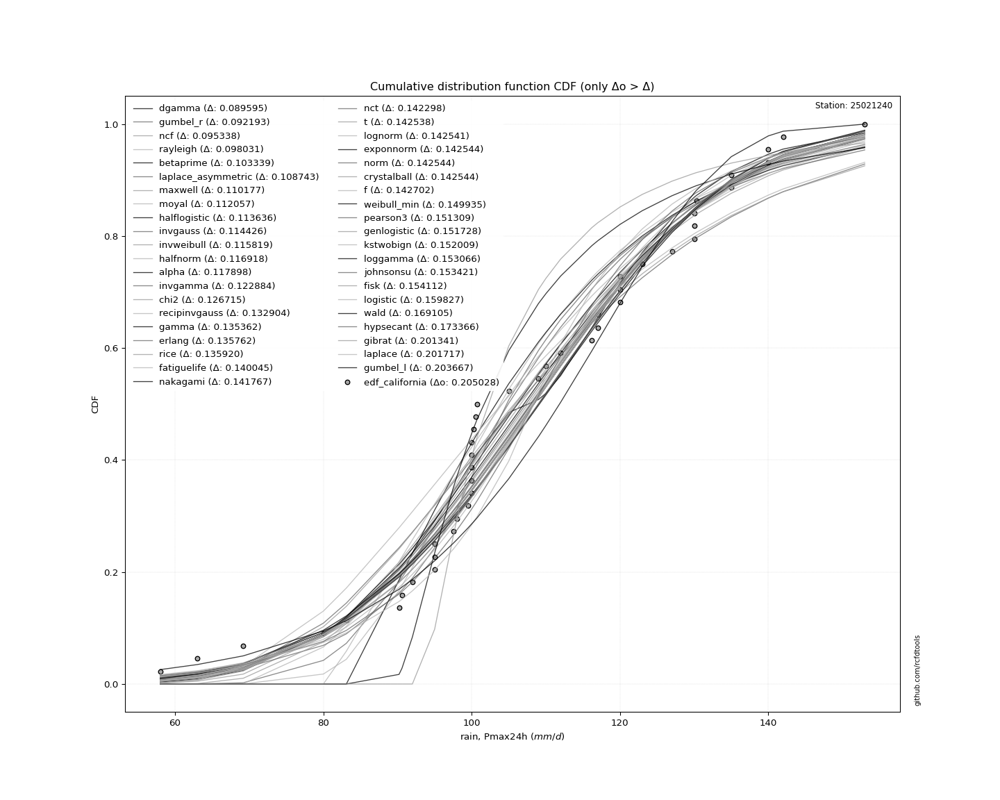</img>

</div>


**1.3. Best fit**

|   id |   station | empirical_dist   | p_dist   |     delta |   deltao | eval   |   fit |   n |     loc |   scale |   shape | shape1   | shape2   | shape3   |   best_fit |   best_fit_sort |
|-----:|----------:|:-----------------|:---------|----------:|---------:|:-------|------:|----:|--------:|--------:|--------:|:---------|:---------|:---------|-----------:|----------------:|
|    0 |  25021240 | edf_california   | dgamma   | 0.0895947 | 0.205028 | Δo > Δ |     1 |  44 | 107.342 | 8.55339 | 2.01565 |          |          |          |          1 |               1 |

<div align="center">

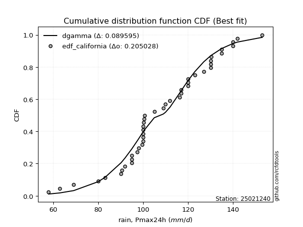</img>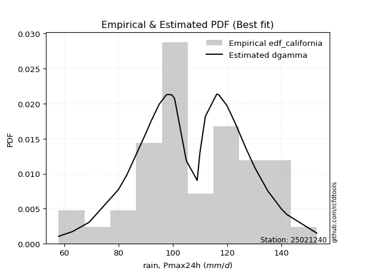</img>

</div>


### 2. Empirical - EDF Hazen (1930)

Hazen method for plotting positions is a formula used to estimate the empirical cumulative probability distribution of flood events or other hydrological data. This formula often results in biased estimations, particularly when extrapolating to extreme events (high return periods).

<div align="center">


$P=(m-0.5)/n$


</div>


**2.1. Empirical values**

<div align="center">

|                | 0                    | 1                   | 2                    | 3                   | 4                   | 5                  | 6                   | 7                   | 8                   | 9                  | 10                  | 11                  | 12                 | 13                 | 14                  | 15                 | 16        | 17                 | 18                  | 19                 | 20                 | 21                  | 22                 | 23                 | 24                 | 25                 | 26                 | 27                 | 28                 | 29                 | 30                 | 31                 | 32                 | 33                 | 34                 | 35                 | 36                 | 37                 | 38        | 39                 | 40                 | 41                 | 42                 | 43                 |
|:---------------|:---------------------|:--------------------|:---------------------|:--------------------|:--------------------|:-------------------|:--------------------|:--------------------|:--------------------|:-------------------|:--------------------|:--------------------|:-------------------|:-------------------|:--------------------|:-------------------|:----------|:-------------------|:--------------------|:-------------------|:-------------------|:--------------------|:-------------------|:-------------------|:-------------------|:-------------------|:-------------------|:-------------------|:-------------------|:-------------------|:-------------------|:-------------------|:-------------------|:-------------------|:-------------------|:-------------------|:-------------------|:-------------------|:----------|:-------------------|:-------------------|:-------------------|:-------------------|:-------------------|
| date           | 1986                 | 1994                | 2004                 | 1976                | 2012                | 2005               | 1997                | 1980                | 1987                | 1991               | 1972                | 2003                | 1985               | 2009               | 2002                | 1995               | 1989      | 1992               | 1982                | 1999               | 1998               | 2006                | 1990               | 2000               | 1973               | 2007               | 2011               | 1993               | 1974               | 2001               | 1984               | 1977               | 1988               | 2010               | 1979               | 1978               | 1996               | 2008               | 2015      | 2013               | 1975               | 2014               | 1981               | 1983               |
| x              | 58.0                 | 63.0                | 69.2                 | 80.0                | 83.1                | 90.2               | 90.6                | 92.0                | 95.0                | 95.0               | 95.0                | 97.5                | 98.0               | 99.5               | 100.0               | 100.0              | 100.0     | 100.0              | 100.0               | 100.3              | 100.5              | 100.7               | 105.0              | 109.0              | 110.0              | 112.0              | 116.2              | 117.0              | 117.0              | 120.0              | 120.0              | 120.0              | 123.0              | 127.0              | 130.0              | 130.0              | 130.0              | 130.3              | 135.0     | 135.0              | 140.0              | 140.0              | 142.0              | 153.0              |
| m              | 1                    | 2                   | 3                    | 4                   | 5                   | 6                  | 7                   | 8                   | 9                   | 10                 | 11                  | 12                  | 13                 | 14                 | 15                  | 16                 | 17        | 18                 | 19                  | 20                 | 21                 | 22                  | 23                 | 24                 | 25                 | 26                 | 27                 | 28                 | 29                 | 30                 | 31                 | 32                 | 33                 | 34                 | 35                 | 36                 | 37                 | 38                 | 39        | 40                 | 41                 | 42                 | 43                 | 44                 |
| empirical_dist | edf_hazen            | edf_hazen           | edf_hazen            | edf_hazen           | edf_hazen           | edf_hazen          | edf_hazen           | edf_hazen           | edf_hazen           | edf_hazen          | edf_hazen           | edf_hazen           | edf_hazen          | edf_hazen          | edf_hazen           | edf_hazen          | edf_hazen | edf_hazen          | edf_hazen           | edf_hazen          | edf_hazen          | edf_hazen           | edf_hazen          | edf_hazen          | edf_hazen          | edf_hazen          | edf_hazen          | edf_hazen          | edf_hazen          | edf_hazen          | edf_hazen          | edf_hazen          | edf_hazen          | edf_hazen          | edf_hazen          | edf_hazen          | edf_hazen          | edf_hazen          | edf_hazen | edf_hazen          | edf_hazen          | edf_hazen          | edf_hazen          | edf_hazen          |
| empirical      | 0.011363636363636364 | 0.03409090909090909 | 0.056818181818181816 | 0.07954545454545454 | 0.10227272727272728 | 0.125              | 0.14772727272727273 | 0.17045454545454544 | 0.19318181818181818 | 0.2159090909090909 | 0.23863636363636365 | 0.26136363636363635 | 0.2840909090909091 | 0.3068181818181818 | 0.32954545454545453 | 0.3522727272727273 | 0.375     | 0.3977272727272727 | 0.42045454545454547 | 0.4431818181818182 | 0.4659090909090909 | 0.48863636363636365 | 0.5113636363636364 | 0.5340909090909091 | 0.5568181818181818 | 0.5795454545454546 | 0.6022727272727273 | 0.625              | 0.6477272727272727 | 0.6704545454545454 | 0.6931818181818182 | 0.7159090909090909 | 0.7386363636363636 | 0.7613636363636364 | 0.7840909090909091 | 0.8068181818181818 | 0.8295454545454546 | 0.8522727272727273 | 0.875     | 0.8977272727272727 | 0.9204545454545454 | 0.9431818181818182 | 0.9659090909090909 | 0.9886363636363636 |
| empirical_tr   | 1.0114942528735633   | 1.0352941176470587  | 1.0602409638554215   | 1.0864197530864197  | 1.1139240506329113  | 1.1428571428571428 | 1.1733333333333333  | 1.2054794520547945  | 1.2394366197183098  | 1.2753623188405798 | 1.3134328358208955  | 1.353846153846154   | 1.396825396825397  | 1.4426229508196722 | 1.4915254237288136  | 1.5438596491228072 | 1.6       | 1.660377358490566  | 1.7254901960784312  | 1.7959183673469385 | 1.8723404255319147 | 1.9555555555555555  | 2.046511627906977  | 2.146341463414634  | 2.256410256410256  | 2.3783783783783785 | 2.5142857142857142 | 2.6666666666666665 | 2.8387096774193545 | 3.0344827586206895 | 3.25925925925926   | 3.5200000000000005 | 3.8260869565217392 | 4.190476190476191  | 4.63157894736842   | 5.176470588235293  | 5.866666666666668  | 6.76923076923077   | 8.0       | 9.777777777777775  | 12.571428571428566 | 17.600000000000016 | 29.33333333333336  | 88.00000000000009  |

</div>


**2.2. Parameters & Kolmogorov-Smirnov fit test (sorted by Δ)**

|   id | empirical_dist   | p_dist             |       delta |   deltao | eval    |   fit |   n |             loc |           scale | shape                  | shape1                | shape2             | shape3   |   best_fit |   best_fit_sort |
|-----:|:-----------------|:-------------------|------------:|---------:|:--------|------:|----:|----------------:|----------------:|:-----------------------|:----------------------|:-------------------|:---------|-----------:|----------------:|
|    0 | edf_hazen        | dgamma             |   0.0978136 | 0.205028 | Δo > Δ  |     1 |  44 |   107.342       |     8.55339     | 2.015648495922366      |                       |                    |          |          1 |               1 |
|    1 | edf_hazen        | maxwell            |   0.0988137 | 0.205028 | Δo > Δ  |     1 |  44 |    58.5105      |    31.2565      |                        |                       |                    |          |          0 |               2 |
|    2 | edf_hazen        | betaprime          |   0.0994034 | 0.205028 | Δo > Δ  |     1 |  44 |  -110.299       |     0.458209    | 49518.837134370435     | 105.16051911686904    |                    |          |          0 |               3 |
|    3 | edf_hazen        | rayleigh           |   0.1021    | 0.205028 | Δo > Δ  |     1 |  44 |    68.12        |    32.1297      |                        |                       |                    |          |          0 |               4 |
|    4 | edf_hazen        | gumbel_r           |   0.10324   | 0.205028 | Δo > Δ  |     1 |  44 |    98.9153      |    16.4121      |                        |                       |                    |          |          0 |               5 |
|    5 | edf_hazen        | ncf                |   0.106322  | 0.205028 | Δo > Δ  |     1 |  44 |    -1.89013     |     0.000141603 | 0.0005057732793723232  | 65.49070430692507     | 382.11518747151763 |          |          0 |               6 |
|    6 | edf_hazen        | alpha              |   0.106534  | 0.205028 | Δo > Δ  |     1 |  44 |  -352.329       |  9867.31        | 21.480774453657446     |                       |                    |          |          0 |               7 |
|    7 | edf_hazen        | invgamma           |   0.111521  | 0.205028 | Δo > Δ  |     1 |  44 |  -201.989       | 64720.5         | 209.59091202383547     |                       |                    |          |          0 |               8 |
|    8 | edf_hazen        | laplace_asymmetric |   0.114046  | 0.205028 | Δo > Δ  |     1 |  44 |   100           |    15.5537      | 0.7661917990874413     |                       |                    |          |          0 |               9 |
|    9 | edf_hazen        | chi2               |   0.115351  | 0.205028 | Δo > Δ  |     1 |  44 |   -91.1498      |     1.16584     | 171.12065434021122     |                       |                    |          |          0 |              10 |
|   10 | edf_hazen        | halflogistic       |   0.118942  | 0.205028 | Δo > Δ  |     1 |  44 |    83.4403      |    17.9964      |                        |                       |                    |          |          0 |              11 |
|   11 | edf_hazen        | recipinvgauss      |   0.12154   | 0.205028 | Δo > Δ  |     1 |  44 |  -181.076       |     1.55773     | 0.00540659611346421    |                       |                    |          |          0 |              12 |
|   12 | edf_hazen        | moyal              |   0.123421  | 0.205028 | Δo > Δ  |     1 |  44 |    96.3513      |     9.47553     |                        |                       |                    |          |          0 |              13 |
|   13 | edf_hazen        | gamma              |   0.123998  | 0.205028 | Δo > Δ  |     1 |  44 |  -377.25        |     0.9258      | 524.4722092147704      |                       |                    |          |          0 |              14 |
|   14 | edf_hazen        | erlang             |   0.124398  | 0.205028 | Δo > Δ  |     1 |  44 |  -370.807       |     0.932369    | 513.8677413823123      |                       |                    |          |          0 |              15 |
|   15 | edf_hazen        | rice               |   0.124556  | 0.205028 | Δo > Δ  |     1 |  44 |    47.6969      |    22.1772      | 2.527901901256791      |                       |                    |          |          0 |              16 |
|   16 | edf_hazen        | invgauss           |   0.12579   | 0.205028 | Δo > Δ  |     1 |  44 |    20.8427      |   971.415       | 0.0918880179629486     |                       |                    |          |          0 |              17 |
|   17 | edf_hazen        | invweibull         |   0.127183  | 0.205028 | Δo > Δ  |     1 |  44 |    -1.5656e+09  |     1.5656e+09  | 72508239.94180292      |                       |                    |          |          0 |              18 |
|   18 | edf_hazen        | halfnorm           |   0.128282  | 0.205028 | Δo > Δ  |     1 |  44 |    80.5275      |    34.9187      |                        |                       |                    |          |          0 |              19 |
|   19 | edf_hazen        | fatiguelife        |   0.128681  | 0.205028 | Δo > Δ  |     1 |  44 |  -532.371       |   640.527       | 0.03265377465385107    |                       |                    |          |          0 |              20 |
|   20 | edf_hazen        | nakagami           |   0.130403  | 0.205028 | Δo > Δ  |     1 |  44 | -2703.63        |  2812.09        | 4442.835482938412      |                       |                    |          |          0 |              21 |
|   21 | edf_hazen        | nct                |   0.130934  | 0.205028 | Δo > Δ  |     1 |  44 |  -642.707       |    21.0258      | 145174.90598149569     | 35.72231231454556     |                    |          |          0 |              22 |
|   22 | edf_hazen        | t                  |   0.131174  | 0.205028 | Δo > Δ  |     1 |  44 |   108.387       |    21.0462      | 249506.05546741685     |                       |                    |          |          0 |              23 |
|   23 | edf_hazen        | lognorm            |   0.131177  | 0.205028 | Δo > Δ  |     1 |  44 |    -1.13347e+06 |     1.13358e+06 | 1.8568985655257414e-05 |                       |                    |          |          0 |              24 |
|   24 | edf_hazen        | exponnorm          |   0.13118   | 0.205028 | Δo > Δ  |     1 |  44 |   108.365       |    21.0493      | 0.0011389709651650267  |                       |                    |          |          0 |              25 |
|   25 | edf_hazen        | norm               |   0.131181  | 0.205028 | Δo > Δ  |     1 |  44 |   108.389       |    21.0493      |                        |                       |                    |          |          0 |              26 |
|   26 | edf_hazen        | crystalball        |   0.131181  | 0.205028 | Δo > Δ  |     1 |  44 |   108.389       |    21.0493      | 7435.400585347947      | 8983.47428872921      |                    |          |          0 |              27 |
|   27 | edf_hazen        | f                  |   0.131338  | 0.205028 | Δo > Δ  |     1 |  44 | -3331.5         |  3439.94        | 58242.83451313611      | 619482.6386470855     |                    |          |          0 |              28 |
|   28 | edf_hazen        | weibull_min        |   0.138571  | 0.205028 | Δo > Δ  |     1 |  44 |    28.0023      |    88.3018      | 4.329734694782085      |                       |                    |          |          0 |              29 |
|   29 | edf_hazen        | pearson3           |   0.139945  | 0.205028 | Δo > Δ  |     1 |  44 |   108.389       |    21.0494      | -0.16333915629350554   |                       |                    |          |          0 |              30 |
|   30 | edf_hazen        | genlogistic        |   0.140365  | 0.205028 | Δo > Δ  |     1 |  44 |   106.668       |    12.4898      | 1.0983319324869776     |                       |                    |          |          0 |              31 |
|   31 | edf_hazen        | loggamma           |   0.141703  | 0.205028 | Δo > Δ  |     1 |  44 |  -250.604       |   109.115       | 27.342442384027855     |                       |                    |          |          0 |              32 |
|   32 | edf_hazen        | johnsonsu          |   0.142057  | 0.205028 | Δo > Δ  |     1 |  44 |   331.728       |   151.551       | 15.114265514155736     | 12.83593642948999     |                    |          |          0 |              33 |
|   33 | edf_hazen        | fisk               |   0.142749  | 0.205028 | Δo > Δ  |     1 |  44 |    -2.44616e+08 |     2.44616e+08 | 20189504.060727324     |                       |                    |          |          0 |              34 |
|   34 | edf_hazen        | logistic           |   0.148463  | 0.205028 | Δo > Δ  |     1 |  44 |   108.389       |    11.6051      |                        |                       |                    |          |          0 |              35 |
|   35 | edf_hazen        | hypsecant          |   0.162003  | 0.205028 | Δo > Δ  |     1 |  44 |   108.389       |    13.4004      |                        |                       |                    |          |          0 |              36 |
|   36 | edf_hazen        | kstwobign          |   0.163372  | 0.205028 | Δo > Δ  |     1 |  44 |    18.173       |   103.773       |                        |                       |                    |          |          0 |              37 |
|   37 | edf_hazen        | wald               |   0.180468  | 0.205028 | Δo > Δ  |     1 |  44 |    87.3393      |    21.0494      |                        |                       |                    |          |          0 |              38 |
|   38 | edf_hazen        | laplace            |   0.190354  | 0.205028 | Δo > Δ  |     1 |  44 |   108.389       |    14.8841      |                        |                       |                    |          |          0 |              39 |
|   39 | edf_hazen        | gumbel_l           |   0.192304  | 0.205028 | Δo > Δ  |     1 |  44 |   117.862       |    16.4121      |                        |                       |                    |          |          0 |              40 |
|   40 | edf_hazen        | gibrat             |   0.212705  | 0.205028 | Δo <= Δ |     0 |  44 |    92.3307      |     9.73965     |                        |                       |                    |          |          0 |              41 |
|   41 | edf_hazen        | zzgumbel           |   0.283869  | 0.205028 | Δo <= Δ |     0 |  44 |   108.356       |    16.6018      | 0.5458047483363783     | 1.1498899585883997    |                    |          |          0 |              42 |
|   42 | edf_hazen        | genexpon           |   0.346839  | 0.205028 | Δo <= Δ |     0 |  44 |    58           |     1.81455     | 0.03596184521346672    | 1.125517113751667e-05 | 1.8056619938062841 |          |          0 |              43 |
|   43 | edf_hazen        | expon              |   0.347197  | 0.205028 | Δo <= Δ |     0 |  44 |    58           |    50.3886      |                        |                       |                    |          |          0 |              44 |
|   44 | edf_hazen        | pareto             |   0.347197  | 0.205028 | Δo <= Δ |     0 |  44 |    -4.29497e+09 |     4.29497e+09 | 85236823.91118297      |                       |                    |          |          0 |              45 |
|   45 | edf_hazen        | gompertz           |   0.70735   | 0.205028 | Δo <= Δ |     0 |  44 |    80           |     4.31492     | 1.4939430560776713e-06 |                       |                    |          |          0 |              46 |
|   46 | edf_hazen        | truncnorm          |   0.988636  | 0.205028 | Δo <= Δ |     0 |  44 |   -43.5193      |     9.06734     | -348.71690733304285    | 21.673304516341247    |                    |          |          0 |              47 |
|   47 | edf_hazen        | mielke             | nan         | 0.205028 | Δo <= Δ |     0 |  44 | -2274.04        |  2196.15        | 842108.2081278097      | 115.84507666345641    |                    |          |          0 |              48 |

<div align="center">

</img>

</div>


**2.3. Best fit**

|   id |   station | empirical_dist   | p_dist   |     delta |   deltao | eval   |   fit |   n |     loc |   scale |   shape | shape1   | shape2   | shape3   |   best_fit |   best_fit_sort |
|-----:|----------:|:-----------------|:---------|----------:|---------:|:-------|------:|----:|--------:|--------:|--------:|:---------|:---------|:---------|-----------:|----------------:|
|    0 |  25021240 | edf_hazen        | dgamma   | 0.0978136 | 0.205028 | Δo > Δ |     1 |  44 | 107.342 | 8.55339 | 2.01565 |          |          |          |          1 |               1 |

<div align="center">

</img>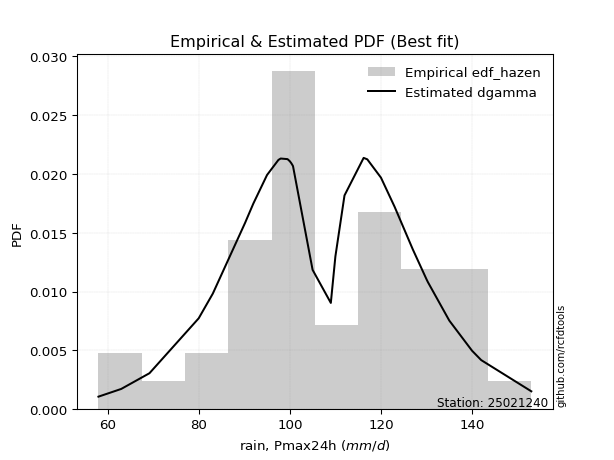</img>

</div>


### 3. Empirical - EDF Weibull (1939)

Weibull plotting position formula is an empirical method used to estimate the non-exceedance probability or plotting position for a set of observed data, is often recommended or widely used in practice, particularly in flood frequency analysis.

<div align="center">


$P=m/(n+1)$


</div>


**3.1. Empirical values**

<div align="center">

|                | 0                    | 1                    | 2                   | 3                   | 4                  | 5                   | 6                   | 7                   | 8           | 9                  | 10                  | 11                  | 12                  | 13                 | 14                 | 15                  | 16                  | 17                 | 18                 | 19                 | 20                 | 21                 | 22                 | 23                 | 24                 | 25                 | 26          | 27                 | 28                 | 29                 | 30                 | 31                 | 32                 | 33                 | 34                 | 35                | 36                 | 37                 | 38                 | 39                 | 40                 | 41                 | 42                 | 43                 |
|:---------------|:---------------------|:---------------------|:--------------------|:--------------------|:-------------------|:--------------------|:--------------------|:--------------------|:------------|:-------------------|:--------------------|:--------------------|:--------------------|:-------------------|:-------------------|:--------------------|:--------------------|:-------------------|:-------------------|:-------------------|:-------------------|:-------------------|:-------------------|:-------------------|:-------------------|:-------------------|:------------|:-------------------|:-------------------|:-------------------|:-------------------|:-------------------|:-------------------|:-------------------|:-------------------|:------------------|:-------------------|:-------------------|:-------------------|:-------------------|:-------------------|:-------------------|:-------------------|:-------------------|
| date           | 1986                 | 1994                 | 2004                | 1976                | 2012               | 2005                | 1997                | 1980                | 1987        | 1991               | 1972                | 2003                | 1985                | 2009               | 2002               | 1995                | 1989                | 1992               | 1982               | 1999               | 1998               | 2006               | 1990               | 2000               | 1973               | 2007               | 2011        | 1993               | 1974               | 2001               | 1984               | 1977               | 1988               | 2010               | 1979               | 1978              | 1996               | 2008               | 2015               | 2013               | 1975               | 2014               | 1981               | 1983               |
| x              | 58.0                 | 63.0                 | 69.2                | 80.0                | 83.1               | 90.2                | 90.6                | 92.0                | 95.0        | 95.0               | 95.0                | 97.5                | 98.0                | 99.5               | 100.0              | 100.0               | 100.0               | 100.0              | 100.0              | 100.3              | 100.5              | 100.7              | 105.0              | 109.0              | 110.0              | 112.0              | 116.2       | 117.0              | 117.0              | 120.0              | 120.0              | 120.0              | 123.0              | 127.0              | 130.0              | 130.0             | 130.0              | 130.3              | 135.0              | 135.0              | 140.0              | 140.0              | 142.0              | 153.0              |
| m              | 1                    | 2                    | 3                   | 4                   | 5                  | 6                   | 7                   | 8                   | 9           | 10                 | 11                  | 12                  | 13                  | 14                 | 15                 | 16                  | 17                  | 18                 | 19                 | 20                 | 21                 | 22                 | 23                 | 24                 | 25                 | 26                 | 27          | 28                 | 29                 | 30                 | 31                 | 32                 | 33                 | 34                 | 35                 | 36                | 37                 | 38                 | 39                 | 40                 | 41                 | 42                 | 43                 | 44                 |
| empirical_dist | edf_weibull          | edf_weibull          | edf_weibull         | edf_weibull         | edf_weibull        | edf_weibull         | edf_weibull         | edf_weibull         | edf_weibull | edf_weibull        | edf_weibull         | edf_weibull         | edf_weibull         | edf_weibull        | edf_weibull        | edf_weibull         | edf_weibull         | edf_weibull        | edf_weibull        | edf_weibull        | edf_weibull        | edf_weibull        | edf_weibull        | edf_weibull        | edf_weibull        | edf_weibull        | edf_weibull | edf_weibull        | edf_weibull        | edf_weibull        | edf_weibull        | edf_weibull        | edf_weibull        | edf_weibull        | edf_weibull        | edf_weibull       | edf_weibull        | edf_weibull        | edf_weibull        | edf_weibull        | edf_weibull        | edf_weibull        | edf_weibull        | edf_weibull        |
| empirical      | 0.022222222222222223 | 0.044444444444444446 | 0.06666666666666667 | 0.08888888888888889 | 0.1111111111111111 | 0.13333333333333333 | 0.15555555555555556 | 0.17777777777777778 | 0.2         | 0.2222222222222222 | 0.24444444444444444 | 0.26666666666666666 | 0.28888888888888886 | 0.3111111111111111 | 0.3333333333333333 | 0.35555555555555557 | 0.37777777777777777 | 0.4                | 0.4222222222222222 | 0.4444444444444444 | 0.4666666666666667 | 0.4888888888888889 | 0.5111111111111111 | 0.5333333333333333 | 0.5555555555555556 | 0.5777777777777777 | 0.6         | 0.6222222222222222 | 0.6444444444444445 | 0.6666666666666666 | 0.6888888888888889 | 0.7111111111111111 | 0.7333333333333333 | 0.7555555555555555 | 0.7777777777777778 | 0.8               | 0.8222222222222222 | 0.8444444444444444 | 0.8666666666666667 | 0.8888888888888888 | 0.9111111111111111 | 0.9333333333333333 | 0.9555555555555556 | 0.9777777777777777 |
| empirical_tr   | 1.0227272727272727   | 1.0465116279069766   | 1.0714285714285714  | 1.0975609756097562  | 1.125              | 1.1538461538461537  | 1.1842105263157894  | 1.2162162162162162  | 1.25        | 1.2857142857142856 | 1.3235294117647058  | 1.3636363636363635  | 1.40625             | 1.4516129032258065 | 1.4999999999999998 | 1.5517241379310347  | 1.6071428571428572  | 1.6666666666666667 | 1.7307692307692308 | 1.7999999999999998 | 1.875              | 1.956521739130435  | 2.0454545454545454 | 2.142857142857143  | 2.25               | 2.3684210526315788 | 2.5         | 2.6470588235294117 | 2.8125000000000004 | 2.9999999999999996 | 3.2142857142857144 | 3.4615384615384617 | 3.749999999999999  | 4.090909090909091  | 4.5                | 5.000000000000001 | 5.624999999999999  | 6.428571428571429  | 7.500000000000002  | 8.999999999999996  | 11.249999999999998 | 15.000000000000004 | 22.500000000000025 | 44.999999999999936 |

</div>


**3.2. Parameters & Kolmogorov-Smirnov fit test (sorted by Δ)**

|   id | empirical_dist   | p_dist             |       delta |   deltao | eval    |   fit |   n |             loc |           scale | shape                  | shape1                | shape2             | shape3   |   best_fit |   best_fit_sort |
|-----:|:-----------------|:-------------------|------------:|---------:|:--------|------:|----:|----------------:|----------------:|:-----------------------|:----------------------|:-------------------|:---------|-----------:|----------------:|
|    0 | edf_weibull      | dgamma             |   0.0913621 | 0.205028 | Δo > Δ  |     1 |  44 |   107.342       |     8.55339     | 2.015648495922366      |                       |                    |          |          1 |               1 |
|    1 | edf_weibull      | betaprime          |   0.0925853 | 0.205028 | Δo > Δ  |     1 |  44 |  -110.299       |     0.458209    | 49518.837134370435     | 105.16051911686904    |                    |          |          0 |               2 |
|    2 | edf_weibull      | rayleigh           |   0.0952813 | 0.205028 | Δo > Δ  |     1 |  44 |    68.12        |    32.1297      |                        |                       |                    |          |          0 |               3 |
|    3 | edf_weibull      | maxwell            |   0.0990663 | 0.205028 | Δo > Δ  |     1 |  44 |    58.5105      |    31.2565      |                        |                       |                    |          |          0 |               4 |
|    4 | edf_weibull      | ncf                |   0.0995039 | 0.205028 | Δo > Δ  |     1 |  44 |    -1.89013     |     0.000141603 | 0.0005057732793723232  | 65.49070430692507     | 382.11518747151763 |          |          0 |               5 |
|    5 | edf_weibull      | gumbel_r           |   0.105512  | 0.205028 | Δo > Δ  |     1 |  44 |    98.9153      |    16.4121      |                        |                       |                    |          |          0 |               6 |
|    6 | edf_weibull      | alpha              |   0.106787  | 0.205028 | Δo > Δ  |     1 |  44 |  -352.329       |  9867.31        | 21.480774453657446     |                       |                    |          |          0 |               7 |
|    7 | edf_weibull      | invgamma           |   0.111773  | 0.205028 | Δo > Δ  |     1 |  44 |  -201.989       | 64720.5         | 209.59091202383547     |                       |                    |          |          0 |               8 |
|    8 | edf_weibull      | chi2               |   0.115604  | 0.205028 | Δo > Δ  |     1 |  44 |   -91.1498      |     1.16584     | 171.12065434021122     |                       |                    |          |          0 |               9 |
|    9 | edf_weibull      | laplace_asymmetric |   0.116319  | 0.205028 | Δo > Δ  |     1 |  44 |   100           |    15.5537      | 0.7661917990874413     |                       |                    |          |          0 |              10 |
|   10 | edf_weibull      | invgauss           |   0.118972  | 0.205028 | Δo > Δ  |     1 |  44 |    20.8427      |   971.415       | 0.0918880179629486     |                       |                    |          |          0 |              11 |
|   11 | edf_weibull      | invweibull         |   0.120364  | 0.205028 | Δo > Δ  |     1 |  44 |    -1.5656e+09  |     1.5656e+09  | 72508239.94180292      |                       |                    |          |          0 |              12 |
|   12 | edf_weibull      | halflogistic       |   0.121215  | 0.205028 | Δo > Δ  |     1 |  44 |    83.4403      |    17.9964      |                        |                       |                    |          |          0 |              13 |
|   13 | edf_weibull      | halfnorm           |   0.121464  | 0.205028 | Δo > Δ  |     1 |  44 |    80.5275      |    34.9187      |                        |                       |                    |          |          0 |              14 |
|   14 | edf_weibull      | recipinvgauss      |   0.121793  | 0.205028 | Δo > Δ  |     1 |  44 |  -181.076       |     1.55773     | 0.00540659611346421    |                       |                    |          |          0 |              15 |
|   15 | edf_weibull      | gamma              |   0.124251  | 0.205028 | Δo > Δ  |     1 |  44 |  -377.25        |     0.9258      | 524.4722092147704      |                       |                    |          |          0 |              16 |
|   16 | edf_weibull      | erlang             |   0.124651  | 0.205028 | Δo > Δ  |     1 |  44 |  -370.807       |     0.932369    | 513.8677413823123      |                       |                    |          |          0 |              17 |
|   17 | edf_weibull      | rice               |   0.124808  | 0.205028 | Δo > Δ  |     1 |  44 |    47.6969      |    22.1772      | 2.527901901256791      |                       |                    |          |          0 |              18 |
|   18 | edf_weibull      | moyal              |   0.125693  | 0.205028 | Δo > Δ  |     1 |  44 |    96.3513      |     9.47553     |                        |                       |                    |          |          0 |              19 |
|   19 | edf_weibull      | fatiguelife        |   0.128934  | 0.205028 | Δo > Δ  |     1 |  44 |  -532.371       |   640.527       | 0.03265377465385107    |                       |                    |          |          0 |              20 |
|   20 | edf_weibull      | nakagami           |   0.130655  | 0.205028 | Δo > Δ  |     1 |  44 | -2703.63        |  2812.09        | 4442.835482938412      |                       |                    |          |          0 |              21 |
|   21 | edf_weibull      | nct                |   0.131187  | 0.205028 | Δo > Δ  |     1 |  44 |  -642.707       |    21.0258      | 145174.90598149569     | 35.72231231454556     |                    |          |          0 |              22 |
|   22 | edf_weibull      | t                  |   0.131426  | 0.205028 | Δo > Δ  |     1 |  44 |   108.387       |    21.0462      | 249506.05546741685     |                       |                    |          |          0 |              23 |
|   23 | edf_weibull      | lognorm            |   0.13143   | 0.205028 | Δo > Δ  |     1 |  44 |    -1.13347e+06 |     1.13358e+06 | 1.8568985655257414e-05 |                       |                    |          |          0 |              24 |
|   24 | edf_weibull      | exponnorm          |   0.131433  | 0.205028 | Δo > Δ  |     1 |  44 |   108.365       |    21.0493      | 0.0011389709651650267  |                       |                    |          |          0 |              25 |
|   25 | edf_weibull      | norm               |   0.131433  | 0.205028 | Δo > Δ  |     1 |  44 |   108.389       |    21.0493      |                        |                       |                    |          |          0 |              26 |
|   26 | edf_weibull      | crystalball        |   0.131433  | 0.205028 | Δo > Δ  |     1 |  44 |   108.389       |    21.0493      | 7435.400585347947      | 8983.47428872921      |                    |          |          0 |              27 |
|   27 | edf_weibull      | f                  |   0.13159   | 0.205028 | Δo > Δ  |     1 |  44 | -3331.5         |  3439.94        | 58242.83451313611      | 619482.6386470855     |                    |          |          0 |              28 |
|   28 | edf_weibull      | weibull_min        |   0.138824  | 0.205028 | Δo > Δ  |     1 |  44 |    28.0023      |    88.3018      | 4.329734694782085      |                       |                    |          |          0 |              29 |
|   29 | edf_weibull      | pearson3           |   0.140198  | 0.205028 | Δo > Δ  |     1 |  44 |   108.389       |    21.0494      | -0.16333915629350554   |                       |                    |          |          0 |              30 |
|   30 | edf_weibull      | genlogistic        |   0.140617  | 0.205028 | Δo > Δ  |     1 |  44 |   106.668       |    12.4898      | 1.0983319324869776     |                       |                    |          |          0 |              31 |
|   31 | edf_weibull      | loggamma           |   0.141955  | 0.205028 | Δo > Δ  |     1 |  44 |  -250.604       |   109.115       | 27.342442384027855     |                       |                    |          |          0 |              32 |
|   32 | edf_weibull      | johnsonsu          |   0.14231   | 0.205028 | Δo > Δ  |     1 |  44 |   331.728       |   151.551       | 15.114265514155736     | 12.83593642948999     |                    |          |          0 |              33 |
|   33 | edf_weibull      | fisk               |   0.143001  | 0.205028 | Δo > Δ  |     1 |  44 |    -2.44616e+08 |     2.44616e+08 | 20189504.060727324     |                       |                    |          |          0 |              34 |
|   34 | edf_weibull      | logistic           |   0.148716  | 0.205028 | Δo > Δ  |     1 |  44 |   108.389       |    11.6051      |                        |                       |                    |          |          0 |              35 |
|   35 | edf_weibull      | kstwobign          |   0.156554  | 0.205028 | Δo > Δ  |     1 |  44 |    18.173       |   103.773       |                        |                       |                    |          |          0 |              36 |
|   36 | edf_weibull      | hypsecant          |   0.162255  | 0.205028 | Δo > Δ  |     1 |  44 |   108.389       |    13.4004      |                        |                       |                    |          |          0 |              37 |
|   37 | edf_weibull      | wald               |   0.182741  | 0.205028 | Δo > Δ  |     1 |  44 |    87.3393      |    21.0494      |                        |                       |                    |          |          0 |              38 |
|   38 | edf_weibull      | laplace            |   0.190606  | 0.205028 | Δo > Δ  |     1 |  44 |   108.389       |    14.8841      |                        |                       |                    |          |          0 |              39 |
|   39 | edf_weibull      | gumbel_l           |   0.192556  | 0.205028 | Δo > Δ  |     1 |  44 |   117.862       |    16.4121      |                        |                       |                    |          |          0 |              40 |
|   40 | edf_weibull      | gibrat             |   0.214978  | 0.205028 | Δo <= Δ |     0 |  44 |    92.3307      |     9.73965     |                        |                       |                    |          |          0 |              41 |
|   41 | edf_weibull      | zzgumbel           |   0.284121  | 0.205028 | Δo <= Δ |     0 |  44 |   108.356       |    16.6018      | 0.5458047483363783     | 1.1498899585883997    |                    |          |          0 |              42 |
|   42 | edf_weibull      | genexpon           |   0.338506  | 0.205028 | Δo <= Δ |     0 |  44 |    58           |     1.81455     | 0.03596184521346672    | 1.125517113751667e-05 | 1.8056619938062841 |          |          0 |              43 |
|   43 | edf_weibull      | expon              |   0.338864  | 0.205028 | Δo <= Δ |     0 |  44 |    58           |    50.3886      |                        |                       |                    |          |          0 |              44 |
|   44 | edf_weibull      | pareto             |   0.338864  | 0.205028 | Δo <= Δ |     0 |  44 |    -4.29497e+09 |     4.29497e+09 | 85236823.91118297      |                       |                    |          |          0 |              45 |
|   45 | edf_weibull      | gompertz           |   0.702047  | 0.205028 | Δo <= Δ |     0 |  44 |    80           |     4.31492     | 1.4939430560776713e-06 |                       |                    |          |          0 |              46 |
|   46 | edf_weibull      | truncnorm          |   0.977778  | 0.205028 | Δo <= Δ |     0 |  44 |   -43.5193      |     9.06734     | -348.71690733304285    | 21.673304516341247    |                    |          |          0 |              47 |
|   47 | edf_weibull      | mielke             | nan         | 0.205028 | Δo <= Δ |     0 |  44 | -2274.04        |  2196.15        | 842108.2081278097      | 115.84507666345641    |                    |          |          0 |              48 |

<div align="center">

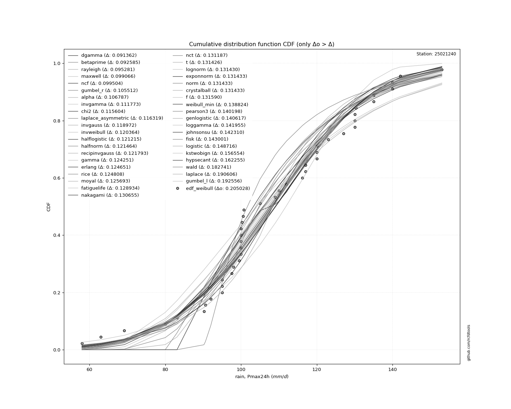</img>

</div>


**3.3. Best fit**

|   id |   station | empirical_dist   | p_dist   |     delta |   deltao | eval   |   fit |   n |     loc |   scale |   shape | shape1   | shape2   | shape3   |   best_fit |   best_fit_sort |
|-----:|----------:|:-----------------|:---------|----------:|---------:|:-------|------:|----:|--------:|--------:|--------:|:---------|:---------|:---------|-----------:|----------------:|
|    0 |  25021240 | edf_weibull      | dgamma   | 0.0913621 | 0.205028 | Δo > Δ |     1 |  44 | 107.342 | 8.55339 | 2.01565 |          |          |          |          1 |               1 |

<div align="center">

</img>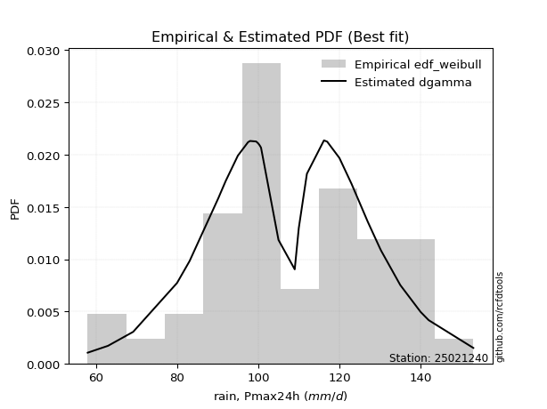</img>

</div>


### 4. Empirical - EDF Beard (1943)

The Beard formula (or Beard´s plotting position formula) in hydrology is used to estimate the empirical non-exceedance probability _(P)_ of a flood event (or other extreme hydrological data point) within a given dataset.

<div align="center">


$P=(m-0.31)/(n+0.38)$


</div>


**4.1. Empirical values**

<div align="center">

|                | 0                    | 1                  | 2                   | 3                   | 4                   | 5                   | 6                   | 7                  | 8                   | 9                   | 10                 | 11                  | 12                 | 13                 | 14                  | 15                 | 16                 | 17                 | 18                  | 19                 | 20                 | 21                  | 22                 | 23                 | 24                 | 25                 | 26                 | 27                 | 28                 | 29                 | 30                 | 31                 | 32                 | 33                 | 34                 | 35                 | 36                 | 37                 | 38                 | 39                 | 40                 | 41                 | 42                 | 43                 |
|:---------------|:---------------------|:-------------------|:--------------------|:--------------------|:--------------------|:--------------------|:--------------------|:-------------------|:--------------------|:--------------------|:-------------------|:--------------------|:-------------------|:-------------------|:--------------------|:-------------------|:-------------------|:-------------------|:--------------------|:-------------------|:-------------------|:--------------------|:-------------------|:-------------------|:-------------------|:-------------------|:-------------------|:-------------------|:-------------------|:-------------------|:-------------------|:-------------------|:-------------------|:-------------------|:-------------------|:-------------------|:-------------------|:-------------------|:-------------------|:-------------------|:-------------------|:-------------------|:-------------------|:-------------------|
| date           | 1986                 | 1994               | 2004                | 1976                | 2012                | 2005                | 1997                | 1980               | 1987                | 1991                | 1972               | 2003                | 1985               | 2009               | 2002                | 1995               | 1989               | 1992               | 1982                | 1999               | 1998               | 2006                | 1990               | 2000               | 1973               | 2007               | 2011               | 1993               | 1974               | 2001               | 1984               | 1977               | 1988               | 2010               | 1979               | 1978               | 1996               | 2008               | 2015               | 2013               | 1975               | 2014               | 1981               | 1983               |
| x              | 58.0                 | 63.0               | 69.2                | 80.0                | 83.1                | 90.2                | 90.6                | 92.0               | 95.0                | 95.0                | 95.0               | 97.5                | 98.0               | 99.5               | 100.0               | 100.0              | 100.0              | 100.0              | 100.0               | 100.3              | 100.5              | 100.7               | 105.0              | 109.0              | 110.0              | 112.0              | 116.2              | 117.0              | 117.0              | 120.0              | 120.0              | 120.0              | 123.0              | 127.0              | 130.0              | 130.0              | 130.0              | 130.3              | 135.0              | 135.0              | 140.0              | 140.0              | 142.0              | 153.0              |
| m              | 1                    | 2                  | 3                   | 4                   | 5                   | 6                   | 7                   | 8                  | 9                   | 10                  | 11                 | 12                  | 13                 | 14                 | 15                  | 16                 | 17                 | 18                 | 19                  | 20                 | 21                 | 22                  | 23                 | 24                 | 25                 | 26                 | 27                 | 28                 | 29                 | 30                 | 31                 | 32                 | 33                 | 34                 | 35                 | 36                 | 37                 | 38                 | 39                 | 40                 | 41                 | 42                 | 43                 | 44                 |
| empirical_dist | edf_beard            | edf_beard          | edf_beard           | edf_beard           | edf_beard           | edf_beard           | edf_beard           | edf_beard          | edf_beard           | edf_beard           | edf_beard          | edf_beard           | edf_beard          | edf_beard          | edf_beard           | edf_beard          | edf_beard          | edf_beard          | edf_beard           | edf_beard          | edf_beard          | edf_beard           | edf_beard          | edf_beard          | edf_beard          | edf_beard          | edf_beard          | edf_beard          | edf_beard          | edf_beard          | edf_beard          | edf_beard          | edf_beard          | edf_beard          | edf_beard          | edf_beard          | edf_beard          | edf_beard          | edf_beard          | edf_beard          | edf_beard          | edf_beard          | edf_beard          | edf_beard          |
| empirical      | 0.015547543938711128 | 0.0380802163136548 | 0.06061288868859846 | 0.08314556106354214 | 0.10567823343848581 | 0.12821090581342948 | 0.15074357818837314 | 0.1732762505633168 | 0.19580892293826047 | 0.21834159531320413 | 0.2408742676881478 | 0.26340694006309145 | 0.2859396124380351 | 0.3084722848129788 | 0.33100495718792244 | 0.3535376295628661 | 0.3760703019378098 | 0.3986029743127535 | 0.42113564668769715 | 0.4436683190626408 | 0.4662009914375845 | 0.48873366381252814 | 0.5112663361874719 | 0.5337990085624155 | 0.5563316809373592 | 0.5788643533123028 | 0.6013970256872465 | 0.6239296980621901 | 0.6464623704371338 | 0.6689950428120776 | 0.6915277151870212 | 0.7140603875619649 | 0.7365930599369084 | 0.7591257323118521 | 0.7816584046867957 | 0.8041910770617394 | 0.8267237494366831 | 0.8492564218116267 | 0.8717890941865705 | 0.8943217665615141 | 0.9168544389364578 | 0.9393871113114014 | 0.9619197836863451 | 0.9844524560612887 |
| empirical_tr   | 1.0157930876630807   | 1.0395877254626376 | 1.0645238666346846  | 1.0906856721553206  | 1.1181657848324515  | 1.1470664254329286  | 1.1775006633059166  | 1.2095938947942217 | 1.2434855701877277  | 1.279331219371577   | 1.317304838230929  | 1.3576017130620983  | 1.4004417797412432 | 1.4460736396220268 | 1.4947793869989894  | 1.5468804461484835 | 1.6027446731672081 | 1.6627950543274634 | 1.7275204359673026  | 1.7974888618874039 | 1.8733642887294215 | 1.9559277214631996  | 2.046104195481789  | 2.1449975833736104 | 2.2539360081259523 | 2.374531835205992  | 2.5087620124364047 | 2.6590772917914913 | 2.8285532186105797 | 3.021102791014296  | 3.2417823228634037 | 3.497241922773838  | 3.7964071856287407 | 4.151543498596818  | 4.579979360165115  | 5.107019562715763  | 5.771131339401819  | 6.633781763826602  | 7.799648506151139  | 9.462686567164168  | 12.0271002710027   | 16.498141263940486 | 26.260355029585742 | 64.31884057970956  |

</div>


**4.2. Parameters & Kolmogorov-Smirnov fit test (sorted by Δ)**

|   id | empirical_dist   | p_dist             |       delta |   deltao | eval    |   fit |   n |             loc |           scale | shape                  | shape1                | shape2             | shape3   |   best_fit |   best_fit_sort |
|-----:|:-----------------|:-------------------|------------:|---------:|:--------|------:|----:|----------------:|----------------:|:-----------------------|:----------------------|:-------------------|:---------|-----------:|----------------:|
|    0 | edf_beard        | dgamma             |   0.0951865 | 0.205028 | Δo > Δ  |     1 |  44 |   107.342       |     8.55339     | 2.015648495922366      |                       |                    |          |          1 |               1 |
|    1 | edf_beard        | betaprime          |   0.0967763 | 0.205028 | Δo > Δ  |     1 |  44 |  -110.299       |     0.458209    | 49518.837134370435     | 105.16051911686904    |                    |          |          0 |               2 |
|    2 | edf_beard        | maxwell            |   0.098911  | 0.205028 | Δo > Δ  |     1 |  44 |    58.5105      |    31.2565      |                        |                       |                    |          |          0 |               3 |
|    3 | edf_beard        | rayleigh           |   0.0994724 | 0.205028 | Δo > Δ  |     1 |  44 |    68.12        |    32.1297      |                        |                       |                    |          |          0 |               4 |
|    4 | edf_beard        | ncf                |   0.103695  | 0.205028 | Δo > Δ  |     1 |  44 |    -1.89013     |     0.000141603 | 0.0005057732793723232  | 65.49070430692507     | 382.11518747151763 |          |          0 |               5 |
|    5 | edf_beard        | gumbel_r           |   0.104115  | 0.205028 | Δo > Δ  |     1 |  44 |    98.9153      |    16.4121      |                        |                       |                    |          |          0 |               6 |
|    6 | edf_beard        | alpha              |   0.106632  | 0.205028 | Δo > Δ  |     1 |  44 |  -352.329       |  9867.31        | 21.480774453657446     |                       |                    |          |          0 |               7 |
|    7 | edf_beard        | invgamma           |   0.111618  | 0.205028 | Δo > Δ  |     1 |  44 |  -201.989       | 64720.5         | 209.59091202383547     |                       |                    |          |          0 |               8 |
|    8 | edf_beard        | laplace_asymmetric |   0.114922  | 0.205028 | Δo > Δ  |     1 |  44 |   100           |    15.5537      | 0.7661917990874413     |                       |                    |          |          0 |               9 |
|    9 | edf_beard        | chi2               |   0.115449  | 0.205028 | Δo > Δ  |     1 |  44 |   -91.1498      |     1.16584     | 171.12065434021122     |                       |                    |          |          0 |              10 |
|   10 | edf_beard        | halflogistic       |   0.119818  | 0.205028 | Δo > Δ  |     1 |  44 |    83.4403      |    17.9964      |                        |                       |                    |          |          0 |              11 |
|   11 | edf_beard        | recipinvgauss      |   0.121638  | 0.205028 | Δo > Δ  |     1 |  44 |  -181.076       |     1.55773     | 0.00540659611346421    |                       |                    |          |          0 |              12 |
|   12 | edf_beard        | invgauss           |   0.123163  | 0.205028 | Δo > Δ  |     1 |  44 |    20.8427      |   971.415       | 0.0918880179629486     |                       |                    |          |          0 |              13 |
|   13 | edf_beard        | gamma              |   0.124095  | 0.205028 | Δo > Δ  |     1 |  44 |  -377.25        |     0.9258      | 524.4722092147704      |                       |                    |          |          0 |              14 |
|   14 | edf_beard        | moyal              |   0.124296  | 0.205028 | Δo > Δ  |     1 |  44 |    96.3513      |     9.47553     |                        |                       |                    |          |          0 |              15 |
|   15 | edf_beard        | erlang             |   0.124496  | 0.205028 | Δo > Δ  |     1 |  44 |  -370.807       |     0.932369    | 513.8677413823123      |                       |                    |          |          0 |              16 |
|   16 | edf_beard        | invweibull         |   0.124555  | 0.205028 | Δo > Δ  |     1 |  44 |    -1.5656e+09  |     1.5656e+09  | 72508239.94180292      |                       |                    |          |          0 |              17 |
|   17 | edf_beard        | rice               |   0.124653  | 0.205028 | Δo > Δ  |     1 |  44 |    47.6969      |    22.1772      | 2.527901901256791      |                       |                    |          |          0 |              18 |
|   18 | edf_beard        | halfnorm           |   0.125655  | 0.205028 | Δo > Δ  |     1 |  44 |    80.5275      |    34.9187      |                        |                       |                    |          |          0 |              19 |
|   19 | edf_beard        | fatiguelife        |   0.128779  | 0.205028 | Δo > Δ  |     1 |  44 |  -532.371       |   640.527       | 0.03265377465385107    |                       |                    |          |          0 |              20 |
|   20 | edf_beard        | nakagami           |   0.1305    | 0.205028 | Δo > Δ  |     1 |  44 | -2703.63        |  2812.09        | 4442.835482938412      |                       |                    |          |          0 |              21 |
|   21 | edf_beard        | nct                |   0.131032  | 0.205028 | Δo > Δ  |     1 |  44 |  -642.707       |    21.0258      | 145174.90598149569     | 35.72231231454556     |                    |          |          0 |              22 |
|   22 | edf_beard        | t                  |   0.131271  | 0.205028 | Δo > Δ  |     1 |  44 |   108.387       |    21.0462      | 249506.05546741685     |                       |                    |          |          0 |              23 |
|   23 | edf_beard        | lognorm            |   0.131275  | 0.205028 | Δo > Δ  |     1 |  44 |    -1.13347e+06 |     1.13358e+06 | 1.8568985655257414e-05 |                       |                    |          |          0 |              24 |
|   24 | edf_beard        | exponnorm          |   0.131277  | 0.205028 | Δo > Δ  |     1 |  44 |   108.365       |    21.0493      | 0.0011389709651650267  |                       |                    |          |          0 |              25 |
|   25 | edf_beard        | norm               |   0.131278  | 0.205028 | Δo > Δ  |     1 |  44 |   108.389       |    21.0493      |                        |                       |                    |          |          0 |              26 |
|   26 | edf_beard        | crystalball        |   0.131278  | 0.205028 | Δo > Δ  |     1 |  44 |   108.389       |    21.0493      | 7435.400585347947      | 8983.47428872921      |                    |          |          0 |              27 |
|   27 | edf_beard        | f                  |   0.131435  | 0.205028 | Δo > Δ  |     1 |  44 | -3331.5         |  3439.94        | 58242.83451313611      | 619482.6386470855     |                    |          |          0 |              28 |
|   28 | edf_beard        | weibull_min        |   0.138669  | 0.205028 | Δo > Δ  |     1 |  44 |    28.0023      |    88.3018      | 4.329734694782085      |                       |                    |          |          0 |              29 |
|   29 | edf_beard        | pearson3           |   0.140043  | 0.205028 | Δo > Δ  |     1 |  44 |   108.389       |    21.0494      | -0.16333915629350554   |                       |                    |          |          0 |              30 |
|   30 | edf_beard        | genlogistic        |   0.140462  | 0.205028 | Δo > Δ  |     1 |  44 |   106.668       |    12.4898      | 1.0983319324869776     |                       |                    |          |          0 |              31 |
|   31 | edf_beard        | loggamma           |   0.1418    | 0.205028 | Δo > Δ  |     1 |  44 |  -250.604       |   109.115       | 27.342442384027855     |                       |                    |          |          0 |              32 |
|   32 | edf_beard        | johnsonsu          |   0.142154  | 0.205028 | Δo > Δ  |     1 |  44 |   331.728       |   151.551       | 15.114265514155736     | 12.83593642948999     |                    |          |          0 |              33 |
|   33 | edf_beard        | fisk               |   0.142846  | 0.205028 | Δo > Δ  |     1 |  44 |    -2.44616e+08 |     2.44616e+08 | 20189504.060727324     |                       |                    |          |          0 |              34 |
|   34 | edf_beard        | logistic           |   0.14856   | 0.205028 | Δo > Δ  |     1 |  44 |   108.389       |    11.6051      |                        |                       |                    |          |          0 |              35 |
|   35 | edf_beard        | kstwobign          |   0.160745  | 0.205028 | Δo > Δ  |     1 |  44 |    18.173       |   103.773       |                        |                       |                    |          |          0 |              36 |
|   36 | edf_beard        | hypsecant          |   0.1621    | 0.205028 | Δo > Δ  |     1 |  44 |   108.389       |    13.4004      |                        |                       |                    |          |          0 |              37 |
|   37 | edf_beard        | wald               |   0.181344  | 0.205028 | Δo > Δ  |     1 |  44 |    87.3393      |    21.0494      |                        |                       |                    |          |          0 |              38 |
|   38 | edf_beard        | laplace            |   0.190451  | 0.205028 | Δo > Δ  |     1 |  44 |   108.389       |    14.8841      |                        |                       |                    |          |          0 |              39 |
|   39 | edf_beard        | gumbel_l           |   0.192401  | 0.205028 | Δo > Δ  |     1 |  44 |   117.862       |    16.4121      |                        |                       |                    |          |          0 |              40 |
|   40 | edf_beard        | gibrat             |   0.213581  | 0.205028 | Δo <= Δ |     0 |  44 |    92.3307      |     9.73965     |                        |                       |                    |          |          0 |              41 |
|   41 | edf_beard        | zzgumbel           |   0.283966  | 0.205028 | Δo <= Δ |     0 |  44 |   108.356       |    16.6018      | 0.5458047483363783     | 1.1498899585883997    |                    |          |          0 |              42 |
|   42 | edf_beard        | genexpon           |   0.343628  | 0.205028 | Δo <= Δ |     0 |  44 |    58           |     1.81455     | 0.03596184521346672    | 1.125517113751667e-05 | 1.8056619938062841 |          |          0 |              43 |
|   43 | edf_beard        | expon              |   0.343987  | 0.205028 | Δo <= Δ |     0 |  44 |    58           |    50.3886      |                        |                       |                    |          |          0 |              44 |
|   44 | edf_beard        | pareto             |   0.343987  | 0.205028 | Δo <= Δ |     0 |  44 |    -4.29497e+09 |     4.29497e+09 | 85236823.91118297      |                       |                    |          |          0 |              45 |
|   45 | edf_beard        | gompertz           |   0.705306  | 0.205028 | Δo <= Δ |     0 |  44 |    80           |     4.31492     | 1.4939430560776713e-06 |                       |                    |          |          0 |              46 |
|   46 | edf_beard        | truncnorm          |   0.984452  | 0.205028 | Δo <= Δ |     0 |  44 |   -43.5193      |     9.06734     | -348.71690733304285    | 21.673304516341247    |                    |          |          0 |              47 |
|   47 | edf_beard        | mielke             | nan         | 0.205028 | Δo <= Δ |     0 |  44 | -2274.04        |  2196.15        | 842108.2081278097      | 115.84507666345641    |                    |          |          0 |              48 |

<div align="center">

</img>

</div>


**4.3. Best fit**

|   id |   station | empirical_dist   | p_dist   |     delta |   deltao | eval   |   fit |   n |     loc |   scale |   shape | shape1   | shape2   | shape3   |   best_fit |   best_fit_sort |
|-----:|----------:|:-----------------|:---------|----------:|---------:|:-------|------:|----:|--------:|--------:|--------:|:---------|:---------|:---------|-----------:|----------------:|
|    0 |  25021240 | edf_beard        | dgamma   | 0.0951865 | 0.205028 | Δo > Δ |     1 |  44 | 107.342 | 8.55339 | 2.01565 |          |          |          |          1 |               1 |

<div align="center">

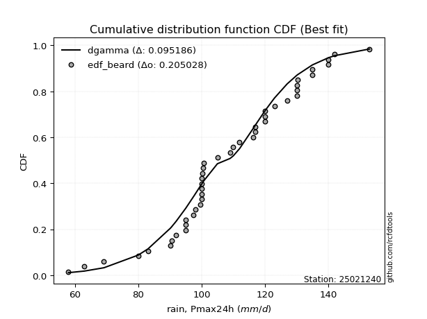</img></img>

</div>


### 5. Empirical - EDF Chegodayev (1955)

The Chegodayev formula is an empirical plotting position formula used in hydrological frequency analysis to estimate the exceedance probability or return period of a specific event from a set of observed data. It is primarily used for plotting observed data points on probability paper to fit a theoretical distribution, particularly for analyzing extreme events like maximum flood flows or rainfall intensities. The constant _b_ value in the generalized plotting position formula is 0.3.

<div align="center">


$P=(m-b)/(n+1-2b)$


</div>


**5.1. Empirical values**

<div align="center">

|                | 0                    | 1                    | 2                    | 3                   | 4                   | 5                  | 6                   | 7                   | 8                   | 9                   | 10                  | 11                 | 12                  | 13                  | 14                 | 15                 | 16                 | 17                  | 18                  | 19                 | 20                  | 21                  | 22                 | 23                 | 24                 | 25                 | 26                 | 27                 | 28                 | 29                 | 30                 | 31                 | 32                 | 33                 | 34                 | 35                 | 36                 | 37                 | 38                 | 39                 | 40                 | 41                 | 42                 | 43                 |
|:---------------|:---------------------|:---------------------|:---------------------|:--------------------|:--------------------|:-------------------|:--------------------|:--------------------|:--------------------|:--------------------|:--------------------|:-------------------|:--------------------|:--------------------|:-------------------|:-------------------|:-------------------|:--------------------|:--------------------|:-------------------|:--------------------|:--------------------|:-------------------|:-------------------|:-------------------|:-------------------|:-------------------|:-------------------|:-------------------|:-------------------|:-------------------|:-------------------|:-------------------|:-------------------|:-------------------|:-------------------|:-------------------|:-------------------|:-------------------|:-------------------|:-------------------|:-------------------|:-------------------|:-------------------|
| date           | 1986                 | 1994                 | 2004                 | 1976                | 2012                | 2005               | 1997                | 1980                | 1987                | 1991                | 1972                | 2003               | 1985                | 2009                | 2002               | 1995               | 1989               | 1992                | 1982                | 1999               | 1998                | 2006                | 1990               | 2000               | 1973               | 2007               | 2011               | 1993               | 1974               | 2001               | 1984               | 1977               | 1988               | 2010               | 1979               | 1978               | 1996               | 2008               | 2015               | 2013               | 1975               | 2014               | 1981               | 1983               |
| x              | 58.0                 | 63.0                 | 69.2                 | 80.0                | 83.1                | 90.2               | 90.6                | 92.0                | 95.0                | 95.0                | 95.0                | 97.5               | 98.0                | 99.5                | 100.0              | 100.0              | 100.0              | 100.0               | 100.0               | 100.3              | 100.5               | 100.7               | 105.0              | 109.0              | 110.0              | 112.0              | 116.2              | 117.0              | 117.0              | 120.0              | 120.0              | 120.0              | 123.0              | 127.0              | 130.0              | 130.0              | 130.0              | 130.3              | 135.0              | 135.0              | 140.0              | 140.0              | 142.0              | 153.0              |
| m              | 1                    | 2                    | 3                    | 4                   | 5                   | 6                  | 7                   | 8                   | 9                   | 10                  | 11                  | 12                 | 13                  | 14                  | 15                 | 16                 | 17                 | 18                  | 19                  | 20                 | 21                  | 22                  | 23                 | 24                 | 25                 | 26                 | 27                 | 28                 | 29                 | 30                 | 31                 | 32                 | 33                 | 34                 | 35                 | 36                 | 37                 | 38                 | 39                 | 40                 | 41                 | 42                 | 43                 | 44                 |
| empirical_dist | edf_chegodayev       | edf_chegodayev       | edf_chegodayev       | edf_chegodayev      | edf_chegodayev      | edf_chegodayev     | edf_chegodayev      | edf_chegodayev      | edf_chegodayev      | edf_chegodayev      | edf_chegodayev      | edf_chegodayev     | edf_chegodayev      | edf_chegodayev      | edf_chegodayev     | edf_chegodayev     | edf_chegodayev     | edf_chegodayev      | edf_chegodayev      | edf_chegodayev     | edf_chegodayev      | edf_chegodayev      | edf_chegodayev     | edf_chegodayev     | edf_chegodayev     | edf_chegodayev     | edf_chegodayev     | edf_chegodayev     | edf_chegodayev     | edf_chegodayev     | edf_chegodayev     | edf_chegodayev     | edf_chegodayev     | edf_chegodayev     | edf_chegodayev     | edf_chegodayev     | edf_chegodayev     | edf_chegodayev     | edf_chegodayev     | edf_chegodayev     | edf_chegodayev     | edf_chegodayev     | edf_chegodayev     | edf_chegodayev     |
| empirical      | 0.015765765765765764 | 0.038288288288288286 | 0.060810810810810814 | 0.08333333333333334 | 0.10585585585585586 | 0.1283783783783784 | 0.15090090090090091 | 0.17342342342342343 | 0.19594594594594594 | 0.21846846846846846 | 0.24099099099099097 | 0.2635135135135135 | 0.28603603603603606 | 0.30855855855855857 | 0.3310810810810811 | 0.3536036036036036 | 0.3761261261261261 | 0.39864864864864863 | 0.42117117117117114 | 0.4436936936936937 | 0.46621621621621623 | 0.48873873873873874 | 0.5112612612612613 | 0.5337837837837838 | 0.5563063063063063 | 0.5788288288288288 | 0.6013513513513513 | 0.6238738738738738 | 0.6463963963963965 | 0.668918918918919  | 0.6914414414414415 | 0.713963963963964  | 0.7364864864864866 | 0.7590090090090091 | 0.7815315315315317 | 0.8040540540540542 | 0.8265765765765767 | 0.8490990990990992 | 0.8716216216216217 | 0.8941441441441442 | 0.9166666666666667 | 0.9391891891891893 | 0.9617117117117118 | 0.9842342342342343 |
| empirical_tr   | 1.0160183066361554   | 1.0398126463700235   | 1.064748201438849    | 1.090909090909091   | 1.1183879093198992  | 1.1472868217054264 | 1.1777188328912467  | 1.2098092643051772  | 1.2436974789915967  | 1.2795389048991355  | 1.317507418397626   | 1.3577981651376145 | 1.4006309148264986  | 1.446254071661238   | 1.494949494949495  | 1.5470383275261326 | 1.6028880866425994 | 1.6629213483146068  | 1.727626459143969   | 1.7975708502024292 | 1.8734177215189873  | 1.9559471365638768  | 2.046082949308756  | 2.144927536231884  | 2.253807106598985  | 2.3743315508021388 | 2.5084745762711864 | 2.6586826347305386 | 2.8280254777070066 | 3.0204081632653064 | 3.2408759124087596 | 3.4960629921259847 | 3.794871794871797  | 4.1495327102803765 | 4.577319587628868  | 5.103448275862072  | 5.7662337662337695 | 6.626865671641795  | 7.789473684210532  | 9.446808510638306  | 12.00000000000001  | 16.44444444444446  | 26.117647058823568 | 63.42857142857163  |

</div>


**5.2. Parameters & Kolmogorov-Smirnov fit test (sorted by Δ)**

|   id | empirical_dist   | p_dist             |       delta |   deltao | eval    |   fit |   n |             loc |           scale | shape                  | shape1                | shape2             | shape3   |   best_fit |   best_fit_sort |
|-----:|:-----------------|:-------------------|------------:|---------:|:--------|------:|----:|----------------:|----------------:|:-----------------------|:----------------------|:-------------------|:---------|-----------:|----------------:|
|    0 | edf_chegodayev   | dgamma             |   0.0950495 | 0.205028 | Δo > Δ  |     1 |  44 |   107.342       |     8.55339     | 2.015648495922366      |                       |                    |          |          1 |               1 |
|    1 | edf_chegodayev   | betaprime          |   0.0966393 | 0.205028 | Δo > Δ  |     1 |  44 |  -110.299       |     0.458209    | 49518.837134370435     | 105.16051911686904    |                    |          |          0 |               2 |
|    2 | edf_chegodayev   | maxwell            |   0.0989161 | 0.205028 | Δo > Δ  |     1 |  44 |    58.5105      |    31.2565      |                        |                       |                    |          |          0 |               3 |
|    3 | edf_chegodayev   | rayleigh           |   0.0993354 | 0.205028 | Δo > Δ  |     1 |  44 |    68.12        |    32.1297      |                        |                       |                    |          |          0 |               4 |
|    4 | edf_chegodayev   | ncf                |   0.103558  | 0.205028 | Δo > Δ  |     1 |  44 |    -1.89013     |     0.000141603 | 0.0005057732793723232  | 65.49070430692507     | 382.11518747151763 |          |          0 |               5 |
|    5 | edf_chegodayev   | gumbel_r           |   0.104161  | 0.205028 | Δo > Δ  |     1 |  44 |    98.9153      |    16.4121      |                        |                       |                    |          |          0 |               6 |
|    6 | edf_chegodayev   | alpha              |   0.106637  | 0.205028 | Δo > Δ  |     1 |  44 |  -352.329       |  9867.31        | 21.480774453657446     |                       |                    |          |          0 |               7 |
|    7 | edf_chegodayev   | invgamma           |   0.111623  | 0.205028 | Δo > Δ  |     1 |  44 |  -201.989       | 64720.5         | 209.59091202383547     |                       |                    |          |          0 |               8 |
|    8 | edf_chegodayev   | laplace_asymmetric |   0.114968  | 0.205028 | Δo > Δ  |     1 |  44 |   100           |    15.5537      | 0.7661917990874413     |                       |                    |          |          0 |               9 |
|    9 | edf_chegodayev   | chi2               |   0.115454  | 0.205028 | Δo > Δ  |     1 |  44 |   -91.1498      |     1.16584     | 171.12065434021122     |                       |                    |          |          0 |              10 |
|   10 | edf_chegodayev   | halflogistic       |   0.119864  | 0.205028 | Δo > Δ  |     1 |  44 |    83.4403      |    17.9964      |                        |                       |                    |          |          0 |              11 |
|   11 | edf_chegodayev   | recipinvgauss      |   0.121643  | 0.205028 | Δo > Δ  |     1 |  44 |  -181.076       |     1.55773     | 0.00540659611346421    |                       |                    |          |          0 |              12 |
|   12 | edf_chegodayev   | invgauss           |   0.123026  | 0.205028 | Δo > Δ  |     1 |  44 |    20.8427      |   971.415       | 0.0918880179629486     |                       |                    |          |          0 |              13 |
|   13 | edf_chegodayev   | gamma              |   0.1241    | 0.205028 | Δo > Δ  |     1 |  44 |  -377.25        |     0.9258      | 524.4722092147704      |                       |                    |          |          0 |              14 |
|   14 | edf_chegodayev   | moyal              |   0.124342  | 0.205028 | Δo > Δ  |     1 |  44 |    96.3513      |     9.47553     |                        |                       |                    |          |          0 |              15 |
|   15 | edf_chegodayev   | invweibull         |   0.124418  | 0.205028 | Δo > Δ  |     1 |  44 |    -1.5656e+09  |     1.5656e+09  | 72508239.94180292      |                       |                    |          |          0 |              16 |
|   16 | edf_chegodayev   | erlang             |   0.124501  | 0.205028 | Δo > Δ  |     1 |  44 |  -370.807       |     0.932369    | 513.8677413823123      |                       |                    |          |          0 |              17 |
|   17 | edf_chegodayev   | rice               |   0.124658  | 0.205028 | Δo > Δ  |     1 |  44 |    47.6969      |    22.1772      | 2.527901901256791      |                       |                    |          |          0 |              18 |
|   18 | edf_chegodayev   | halfnorm           |   0.125518  | 0.205028 | Δo > Δ  |     1 |  44 |    80.5275      |    34.9187      |                        |                       |                    |          |          0 |              19 |
|   19 | edf_chegodayev   | fatiguelife        |   0.128784  | 0.205028 | Δo > Δ  |     1 |  44 |  -532.371       |   640.527       | 0.03265377465385107    |                       |                    |          |          0 |              20 |
|   20 | edf_chegodayev   | nakagami           |   0.130505  | 0.205028 | Δo > Δ  |     1 |  44 | -2703.63        |  2812.09        | 4442.835482938412      |                       |                    |          |          0 |              21 |
|   21 | edf_chegodayev   | nct                |   0.131037  | 0.205028 | Δo > Δ  |     1 |  44 |  -642.707       |    21.0258      | 145174.90598149569     | 35.72231231454556     |                    |          |          0 |              22 |
|   22 | edf_chegodayev   | t                  |   0.131276  | 0.205028 | Δo > Δ  |     1 |  44 |   108.387       |    21.0462      | 249506.05546741685     |                       |                    |          |          0 |              23 |
|   23 | edf_chegodayev   | lognorm            |   0.13128   | 0.205028 | Δo > Δ  |     1 |  44 |    -1.13347e+06 |     1.13358e+06 | 1.8568985655257414e-05 |                       |                    |          |          0 |              24 |
|   24 | edf_chegodayev   | exponnorm          |   0.131283  | 0.205028 | Δo > Δ  |     1 |  44 |   108.365       |    21.0493      | 0.0011389709651650267  |                       |                    |          |          0 |              25 |
|   25 | edf_chegodayev   | norm               |   0.131283  | 0.205028 | Δo > Δ  |     1 |  44 |   108.389       |    21.0493      |                        |                       |                    |          |          0 |              26 |
|   26 | edf_chegodayev   | crystalball        |   0.131283  | 0.205028 | Δo > Δ  |     1 |  44 |   108.389       |    21.0493      | 7435.400585347947      | 8983.47428872921      |                    |          |          0 |              27 |
|   27 | edf_chegodayev   | f                  |   0.13144   | 0.205028 | Δo > Δ  |     1 |  44 | -3331.5         |  3439.94        | 58242.83451313611      | 619482.6386470855     |                    |          |          0 |              28 |
|   28 | edf_chegodayev   | weibull_min        |   0.138674  | 0.205028 | Δo > Δ  |     1 |  44 |    28.0023      |    88.3018      | 4.329734694782085      |                       |                    |          |          0 |              29 |
|   29 | edf_chegodayev   | pearson3           |   0.140048  | 0.205028 | Δo > Δ  |     1 |  44 |   108.389       |    21.0494      | -0.16333915629350554   |                       |                    |          |          0 |              30 |
|   30 | edf_chegodayev   | genlogistic        |   0.140467  | 0.205028 | Δo > Δ  |     1 |  44 |   106.668       |    12.4898      | 1.0983319324869776     |                       |                    |          |          0 |              31 |
|   31 | edf_chegodayev   | loggamma           |   0.141805  | 0.205028 | Δo > Δ  |     1 |  44 |  -250.604       |   109.115       | 27.342442384027855     |                       |                    |          |          0 |              32 |
|   32 | edf_chegodayev   | johnsonsu          |   0.14216   | 0.205028 | Δo > Δ  |     1 |  44 |   331.728       |   151.551       | 15.114265514155736     | 12.83593642948999     |                    |          |          0 |              33 |
|   33 | edf_chegodayev   | fisk               |   0.142851  | 0.205028 | Δo > Δ  |     1 |  44 |    -2.44616e+08 |     2.44616e+08 | 20189504.060727324     |                       |                    |          |          0 |              34 |
|   34 | edf_chegodayev   | logistic           |   0.148565  | 0.205028 | Δo > Δ  |     1 |  44 |   108.389       |    11.6051      |                        |                       |                    |          |          0 |              35 |
|   35 | edf_chegodayev   | kstwobign          |   0.160608  | 0.205028 | Δo > Δ  |     1 |  44 |    18.173       |   103.773       |                        |                       |                    |          |          0 |              36 |
|   36 | edf_chegodayev   | hypsecant          |   0.162105  | 0.205028 | Δo > Δ  |     1 |  44 |   108.389       |    13.4004      |                        |                       |                    |          |          0 |              37 |
|   37 | edf_chegodayev   | wald               |   0.18139   | 0.205028 | Δo > Δ  |     1 |  44 |    87.3393      |    21.0494      |                        |                       |                    |          |          0 |              38 |
|   38 | edf_chegodayev   | laplace            |   0.190456  | 0.205028 | Δo > Δ  |     1 |  44 |   108.389       |    14.8841      |                        |                       |                    |          |          0 |              39 |
|   39 | edf_chegodayev   | gumbel_l           |   0.192406  | 0.205028 | Δo > Δ  |     1 |  44 |   117.862       |    16.4121      |                        |                       |                    |          |          0 |              40 |
|   40 | edf_chegodayev   | gibrat             |   0.213626  | 0.205028 | Δo <= Δ |     0 |  44 |    92.3307      |     9.73965     |                        |                       |                    |          |          0 |              41 |
|   41 | edf_chegodayev   | zzgumbel           |   0.283971  | 0.205028 | Δo <= Δ |     0 |  44 |   108.356       |    16.6018      | 0.5458047483363783     | 1.1498899585883997    |                    |          |          0 |              42 |
|   42 | edf_chegodayev   | genexpon           |   0.343461  | 0.205028 | Δo <= Δ |     0 |  44 |    58           |     1.81455     | 0.03596184521346672    | 1.125517113751667e-05 | 1.8056619938062841 |          |          0 |              43 |
|   43 | edf_chegodayev   | expon              |   0.343819  | 0.205028 | Δo <= Δ |     0 |  44 |    58           |    50.3886      |                        |                       |                    |          |          0 |              44 |
|   44 | edf_chegodayev   | pareto             |   0.343819  | 0.205028 | Δo <= Δ |     0 |  44 |    -4.29497e+09 |     4.29497e+09 | 85236823.91118297      |                       |                    |          |          0 |              45 |
|   45 | edf_chegodayev   | gompertz           |   0.7052    | 0.205028 | Δo <= Δ |     0 |  44 |    80           |     4.31492     | 1.4939430560776713e-06 |                       |                    |          |          0 |              46 |
|   46 | edf_chegodayev   | truncnorm          |   0.984234  | 0.205028 | Δo <= Δ |     0 |  44 |   -43.5193      |     9.06734     | -348.71690733304285    | 21.673304516341247    |                    |          |          0 |              47 |
|   47 | edf_chegodayev   | mielke             | nan         | 0.205028 | Δo <= Δ |     0 |  44 | -2274.04        |  2196.15        | 842108.2081278097      | 115.84507666345641    |                    |          |          0 |              48 |

<div align="center">

</img>

</div>


**5.3. Best fit**

|   id |   station | empirical_dist   | p_dist   |     delta |   deltao | eval   |   fit |   n |     loc |   scale |   shape | shape1   | shape2   | shape3   |   best_fit |   best_fit_sort |
|-----:|----------:|:-----------------|:---------|----------:|---------:|:-------|------:|----:|--------:|--------:|--------:|:---------|:---------|:---------|-----------:|----------------:|
|    0 |  25021240 | edf_chegodayev   | dgamma   | 0.0950495 | 0.205028 | Δo > Δ |     1 |  44 | 107.342 | 8.55339 | 2.01565 |          |          |          |          1 |               1 |

<div align="center">

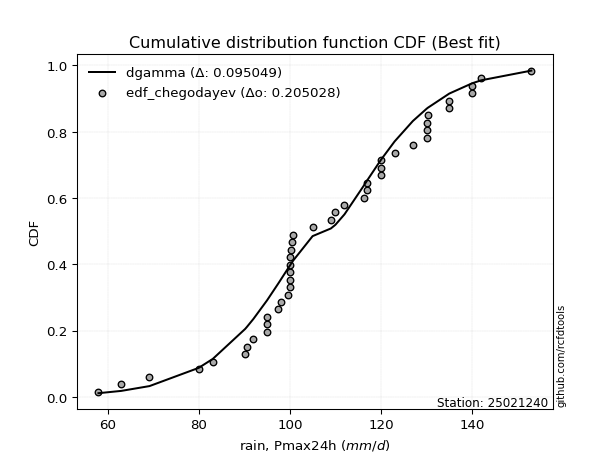</img>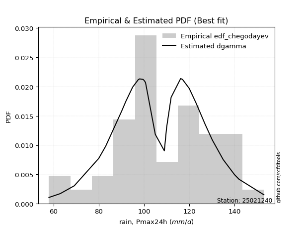</img>

</div>


### 6. Empirical - EDF Blom (1958)

The Blom formula is a specific "plotting position" formula used in hydrology and statistical analysis to estimate the empirical cumulative probability (or non-exceedance probability) of a data series. It is particularly recommended for data that are approximately normally distributed. The constant _a_ is set to 0.375 (or 3/8).

<div align="center">


$P=(m-a)/(n+1-2a)$


</div>


**6.1. Empirical values**

<div align="center">

|                | 0                    | 1                   | 2                    | 3                   | 4                   | 5                  | 6                  | 7                   | 8                   | 9                  | 10                 | 11                 | 12                 | 13                 | 14                 | 15                 | 16                 | 17                 | 18                 | 19                 | 20                 | 21                 | 22                 | 23                 | 24                 | 25                 | 26                 | 27                 | 28                 | 29                 | 30                 | 31                 | 32                 | 33                 | 34                 | 35                 | 36                | 37                 | 38                 | 39                 | 40                 | 41                 | 42                 | 43                 |
|:---------------|:---------------------|:--------------------|:---------------------|:--------------------|:--------------------|:-------------------|:-------------------|:--------------------|:--------------------|:-------------------|:-------------------|:-------------------|:-------------------|:-------------------|:-------------------|:-------------------|:-------------------|:-------------------|:-------------------|:-------------------|:-------------------|:-------------------|:-------------------|:-------------------|:-------------------|:-------------------|:-------------------|:-------------------|:-------------------|:-------------------|:-------------------|:-------------------|:-------------------|:-------------------|:-------------------|:-------------------|:------------------|:-------------------|:-------------------|:-------------------|:-------------------|:-------------------|:-------------------|:-------------------|
| date           | 1986                 | 1994                | 2004                 | 1976                | 2012                | 2005               | 1997               | 1980                | 1987                | 1991               | 1972               | 2003               | 1985               | 2009               | 2002               | 1995               | 1989               | 1992               | 1982               | 1999               | 1998               | 2006               | 1990               | 2000               | 1973               | 2007               | 2011               | 1993               | 1974               | 2001               | 1984               | 1977               | 1988               | 2010               | 1979               | 1978               | 1996              | 2008               | 2015               | 2013               | 1975               | 2014               | 1981               | 1983               |
| x              | 58.0                 | 63.0                | 69.2                 | 80.0                | 83.1                | 90.2               | 90.6               | 92.0                | 95.0                | 95.0               | 95.0               | 97.5               | 98.0               | 99.5               | 100.0              | 100.0              | 100.0              | 100.0              | 100.0              | 100.3              | 100.5              | 100.7              | 105.0              | 109.0              | 110.0              | 112.0              | 116.2              | 117.0              | 117.0              | 120.0              | 120.0              | 120.0              | 123.0              | 127.0              | 130.0              | 130.0              | 130.0             | 130.3              | 135.0              | 135.0              | 140.0              | 140.0              | 142.0              | 153.0              |
| m              | 1                    | 2                   | 3                    | 4                   | 5                   | 6                  | 7                  | 8                   | 9                   | 10                 | 11                 | 12                 | 13                 | 14                 | 15                 | 16                 | 17                 | 18                 | 19                 | 20                 | 21                 | 22                 | 23                 | 24                 | 25                 | 26                 | 27                 | 28                 | 29                 | 30                 | 31                 | 32                 | 33                 | 34                 | 35                 | 36                 | 37                | 38                 | 39                 | 40                 | 41                 | 42                 | 43                 | 44                 |
| empirical_dist | edf_blom             | edf_blom            | edf_blom             | edf_blom            | edf_blom            | edf_blom           | edf_blom           | edf_blom            | edf_blom            | edf_blom           | edf_blom           | edf_blom           | edf_blom           | edf_blom           | edf_blom           | edf_blom           | edf_blom           | edf_blom           | edf_blom           | edf_blom           | edf_blom           | edf_blom           | edf_blom           | edf_blom           | edf_blom           | edf_blom           | edf_blom           | edf_blom           | edf_blom           | edf_blom           | edf_blom           | edf_blom           | edf_blom           | edf_blom           | edf_blom           | edf_blom           | edf_blom          | edf_blom           | edf_blom           | edf_blom           | edf_blom           | edf_blom           | edf_blom           | edf_blom           |
| empirical      | 0.014124293785310734 | 0.03672316384180791 | 0.059322033898305086 | 0.08192090395480225 | 0.10451977401129943 | 0.1271186440677966 | 0.1497175141242938 | 0.17231638418079095 | 0.19491525423728814 | 0.2175141242937853 | 0.2401129943502825 | 0.2627118644067797 | 0.2853107344632768 | 0.307909604519774  | 0.3305084745762712 | 0.3531073446327684 | 0.3757062146892655 | 0.3983050847457627 | 0.4209039548022599 | 0.4435028248587571 | 0.4661016949152542 | 0.4887005649717514 | 0.5112994350282486 | 0.5338983050847458 | 0.556497175141243  | 0.5790960451977402 | 0.6016949152542372 | 0.6242937853107344 | 0.6468926553672316 | 0.6694915254237288 | 0.692090395480226  | 0.7146892655367232 | 0.7372881355932204 | 0.7598870056497176 | 0.7824858757062146 | 0.8050847457627118 | 0.827683615819209 | 0.8502824858757062 | 0.8728813559322034 | 0.8954802259887006 | 0.9180790960451978 | 0.940677966101695  | 0.963276836158192  | 0.9858757062146892 |
| empirical_tr   | 1.0143266475644699   | 1.0381231671554252  | 1.063063063063063    | 1.0892307692307692  | 1.1167192429022081  | 1.145631067961165  | 1.176079734219269  | 1.2081911262798635  | 1.2421052631578948  | 1.2779783393501805 | 1.3159851301115242 | 1.3563218390804597 | 1.3992094861660078 | 1.4448979591836735 | 1.4936708860759493 | 1.5458515283842795 | 1.6018099547511313 | 1.6619718309859157 | 1.7268292682926831 | 1.7969543147208125 | 1.873015873015873  | 1.9558011049723756 | 2.046242774566474  | 2.1454545454545455 | 2.2547770700636947 | 2.375838926174497  | 2.5106382978723403 | 2.661654135338346  | 2.832              | 3.0256410256410255 | 3.2477064220183487 | 3.5049504950495054 | 3.8064516129032264 | 4.164705882352942  | 4.5974025974025965 | 5.1304347826086945 | 5.803278688524589 | 6.679245283018868  | 7.866666666666667  | 9.56756756756757   | 12.206896551724142 | 16.857142857142872 | 27.230769230769194 | 70.79999999999981  |

</div>


**6.2. Parameters & Kolmogorov-Smirnov fit test (sorted by Δ)**

|   id | empirical_dist   | p_dist             |       delta |   deltao | eval    |   fit |   n |             loc |           scale | shape                  | shape1                | shape2             | shape3   |   best_fit |   best_fit_sort |
|-----:|:-----------------|:-------------------|------------:|---------:|:--------|------:|----:|----------------:|----------------:|:-----------------------|:----------------------|:-------------------|:---------|-----------:|----------------:|
|    0 | edf_blom         | dgamma             |   0.0960802 | 0.205028 | Δo > Δ  |     1 |  44 |   107.342       |     8.55339     | 2.015648495922366      |                       |                    |          |          1 |               1 |
|    1 | edf_blom         | betaprime          |   0.09767   | 0.205028 | Δo > Δ  |     1 |  44 |  -110.299       |     0.458209    | 49518.837134370435     | 105.16051911686904    |                    |          |          0 |               2 |
|    2 | edf_blom         | maxwell            |   0.0988779 | 0.205028 | Δo > Δ  |     1 |  44 |    58.5105      |    31.2565      |                        |                       |                    |          |          0 |               3 |
|    3 | edf_blom         | rayleigh           |   0.100366  | 0.205028 | Δo > Δ  |     1 |  44 |    68.12        |    32.1297      |                        |                       |                    |          |          0 |               4 |
|    4 | edf_blom         | gumbel_r           |   0.103817  | 0.205028 | Δo > Δ  |     1 |  44 |    98.9153      |    16.4121      |                        |                       |                    |          |          0 |               5 |
|    5 | edf_blom         | ncf                |   0.104589  | 0.205028 | Δo > Δ  |     1 |  44 |    -1.89013     |     0.000141603 | 0.0005057732793723232  | 65.49070430692507     | 382.11518747151763 |          |          0 |               6 |
|    6 | edf_blom         | alpha              |   0.106598  | 0.205028 | Δo > Δ  |     1 |  44 |  -352.329       |  9867.31        | 21.480774453657446     |                       |                    |          |          0 |               7 |
|    7 | edf_blom         | invgamma           |   0.111585  | 0.205028 | Δo > Δ  |     1 |  44 |  -201.989       | 64720.5         | 209.59091202383547     |                       |                    |          |          0 |               8 |
|    8 | edf_blom         | laplace_asymmetric |   0.114624  | 0.205028 | Δo > Δ  |     1 |  44 |   100           |    15.5537      | 0.7661917990874413     |                       |                    |          |          0 |               9 |
|    9 | edf_blom         | chi2               |   0.115415  | 0.205028 | Δo > Δ  |     1 |  44 |   -91.1498      |     1.16584     | 171.12065434021122     |                       |                    |          |          0 |              10 |
|   10 | edf_blom         | halflogistic       |   0.11952   | 0.205028 | Δo > Δ  |     1 |  44 |    83.4403      |    17.9964      |                        |                       |                    |          |          0 |              11 |
|   11 | edf_blom         | recipinvgauss      |   0.121605  | 0.205028 | Δo > Δ  |     1 |  44 |  -181.076       |     1.55773     | 0.00540659611346421    |                       |                    |          |          0 |              12 |
|   12 | edf_blom         | moyal              |   0.123998  | 0.205028 | Δo > Δ  |     1 |  44 |    96.3513      |     9.47553     |                        |                       |                    |          |          0 |              13 |
|   13 | edf_blom         | invgauss           |   0.124056  | 0.205028 | Δo > Δ  |     1 |  44 |    20.8427      |   971.415       | 0.0918880179629486     |                       |                    |          |          0 |              14 |
|   14 | edf_blom         | gamma              |   0.124062  | 0.205028 | Δo > Δ  |     1 |  44 |  -377.25        |     0.9258      | 524.4722092147704      |                       |                    |          |          0 |              15 |
|   15 | edf_blom         | erlang             |   0.124463  | 0.205028 | Δo > Δ  |     1 |  44 |  -370.807       |     0.932369    | 513.8677413823123      |                       |                    |          |          0 |              16 |
|   16 | edf_blom         | rice               |   0.12462   | 0.205028 | Δo > Δ  |     1 |  44 |    47.6969      |    22.1772      | 2.527901901256791      |                       |                    |          |          0 |              17 |
|   17 | edf_blom         | invweibull         |   0.125449  | 0.205028 | Δo > Δ  |     1 |  44 |    -1.5656e+09  |     1.5656e+09  | 72508239.94180292      |                       |                    |          |          0 |              18 |
|   18 | edf_blom         | halfnorm           |   0.126549  | 0.205028 | Δo > Δ  |     1 |  44 |    80.5275      |    34.9187      |                        |                       |                    |          |          0 |              19 |
|   19 | edf_blom         | fatiguelife        |   0.128746  | 0.205028 | Δo > Δ  |     1 |  44 |  -532.371       |   640.527       | 0.03265377465385107    |                       |                    |          |          0 |              20 |
|   20 | edf_blom         | nakagami           |   0.130467  | 0.205028 | Δo > Δ  |     1 |  44 | -2703.63        |  2812.09        | 4442.835482938412      |                       |                    |          |          0 |              21 |
|   21 | edf_blom         | nct                |   0.130999  | 0.205028 | Δo > Δ  |     1 |  44 |  -642.707       |    21.0258      | 145174.90598149569     | 35.72231231454556     |                    |          |          0 |              22 |
|   22 | edf_blom         | t                  |   0.131238  | 0.205028 | Δo > Δ  |     1 |  44 |   108.387       |    21.0462      | 249506.05546741685     |                       |                    |          |          0 |              23 |
|   23 | edf_blom         | lognorm            |   0.131242  | 0.205028 | Δo > Δ  |     1 |  44 |    -1.13347e+06 |     1.13358e+06 | 1.8568985655257414e-05 |                       |                    |          |          0 |              24 |
|   24 | edf_blom         | exponnorm          |   0.131244  | 0.205028 | Δo > Δ  |     1 |  44 |   108.365       |    21.0493      | 0.0011389709651650267  |                       |                    |          |          0 |              25 |
|   25 | edf_blom         | norm               |   0.131245  | 0.205028 | Δo > Δ  |     1 |  44 |   108.389       |    21.0493      |                        |                       |                    |          |          0 |              26 |
|   26 | edf_blom         | crystalball        |   0.131245  | 0.205028 | Δo > Δ  |     1 |  44 |   108.389       |    21.0493      | 7435.400585347947      | 8983.47428872921      |                    |          |          0 |              27 |
|   27 | edf_blom         | f                  |   0.131402  | 0.205028 | Δo > Δ  |     1 |  44 | -3331.5         |  3439.94        | 58242.83451313611      | 619482.6386470855     |                    |          |          0 |              28 |
|   28 | edf_blom         | weibull_min        |   0.138635  | 0.205028 | Δo > Δ  |     1 |  44 |    28.0023      |    88.3018      | 4.329734694782085      |                       |                    |          |          0 |              29 |
|   29 | edf_blom         | pearson3           |   0.14001   | 0.205028 | Δo > Δ  |     1 |  44 |   108.389       |    21.0494      | -0.16333915629350554   |                       |                    |          |          0 |              30 |
|   30 | edf_blom         | genlogistic        |   0.140429  | 0.205028 | Δo > Δ  |     1 |  44 |   106.668       |    12.4898      | 1.0983319324869776     |                       |                    |          |          0 |              31 |
|   31 | edf_blom         | loggamma           |   0.141767  | 0.205028 | Δo > Δ  |     1 |  44 |  -250.604       |   109.115       | 27.342442384027855     |                       |                    |          |          0 |              32 |
|   32 | edf_blom         | johnsonsu          |   0.142121  | 0.205028 | Δo > Δ  |     1 |  44 |   331.728       |   151.551       | 15.114265514155736     | 12.83593642948999     |                    |          |          0 |              33 |
|   33 | edf_blom         | fisk               |   0.142813  | 0.205028 | Δo > Δ  |     1 |  44 |    -2.44616e+08 |     2.44616e+08 | 20189504.060727324     |                       |                    |          |          0 |              34 |
|   34 | edf_blom         | logistic           |   0.148527  | 0.205028 | Δo > Δ  |     1 |  44 |   108.389       |    11.6051      |                        |                       |                    |          |          0 |              35 |
|   35 | edf_blom         | kstwobign          |   0.161639  | 0.205028 | Δo > Δ  |     1 |  44 |    18.173       |   103.773       |                        |                       |                    |          |          0 |              36 |
|   36 | edf_blom         | hypsecant          |   0.162067  | 0.205028 | Δo > Δ  |     1 |  44 |   108.389       |    13.4004      |                        |                       |                    |          |          0 |              37 |
|   37 | edf_blom         | wald               |   0.181046  | 0.205028 | Δo > Δ  |     1 |  44 |    87.3393      |    21.0494      |                        |                       |                    |          |          0 |              38 |
|   38 | edf_blom         | laplace            |   0.190418  | 0.205028 | Δo > Δ  |     1 |  44 |   108.389       |    14.8841      |                        |                       |                    |          |          0 |              39 |
|   39 | edf_blom         | gumbel_l           |   0.192368  | 0.205028 | Δo > Δ  |     1 |  44 |   117.862       |    16.4121      |                        |                       |                    |          |          0 |              40 |
|   40 | edf_blom         | gibrat             |   0.213283  | 0.205028 | Δo <= Δ |     0 |  44 |    92.3307      |     9.73965     |                        |                       |                    |          |          0 |              41 |
|   41 | edf_blom         | zzgumbel           |   0.283933  | 0.205028 | Δo <= Δ |     0 |  44 |   108.356       |    16.6018      | 0.5458047483363783     | 1.1498899585883997    |                    |          |          0 |              42 |
|   42 | edf_blom         | genexpon           |   0.34472   | 0.205028 | Δo <= Δ |     0 |  44 |    58           |     1.81455     | 0.03596184521346672    | 1.125517113751667e-05 | 1.8056619938062841 |          |          0 |              43 |
|   43 | edf_blom         | expon              |   0.345079  | 0.205028 | Δo <= Δ |     0 |  44 |    58           |    50.3886      |                        |                       |                    |          |          0 |              44 |
|   44 | edf_blom         | pareto             |   0.345079  | 0.205028 | Δo <= Δ |     0 |  44 |    -4.29497e+09 |     4.29497e+09 | 85236823.91118297      |                       |                    |          |          0 |              45 |
|   45 | edf_blom         | gompertz           |   0.706001  | 0.205028 | Δo <= Δ |     0 |  44 |    80           |     4.31492     | 1.4939430560776713e-06 |                       |                    |          |          0 |              46 |
|   46 | edf_blom         | truncnorm          |   0.985876  | 0.205028 | Δo <= Δ |     0 |  44 |   -43.5193      |     9.06734     | -348.71690733304285    | 21.673304516341247    |                    |          |          0 |              47 |
|   47 | edf_blom         | mielke             | nan         | 0.205028 | Δo <= Δ |     0 |  44 | -2274.04        |  2196.15        | 842108.2081278097      | 115.84507666345641    |                    |          |          0 |              48 |

<div align="center">

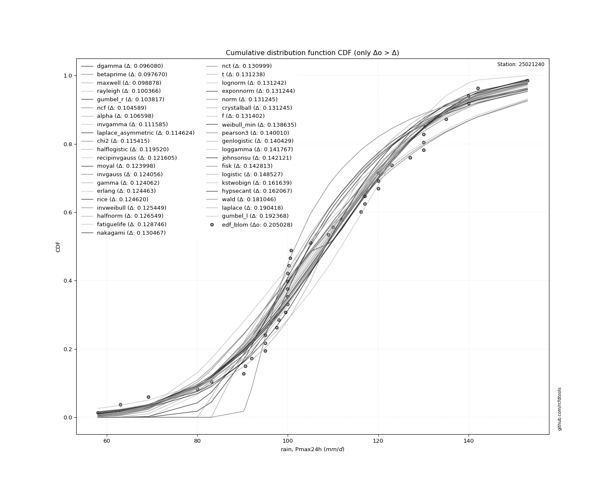</img>

</div>


**6.3. Best fit**

|   id |   station | empirical_dist   | p_dist   |     delta |   deltao | eval   |   fit |   n |     loc |   scale |   shape | shape1   | shape2   | shape3   |   best_fit |   best_fit_sort |
|-----:|----------:|:-----------------|:---------|----------:|---------:|:-------|------:|----:|--------:|--------:|--------:|:---------|:---------|:---------|-----------:|----------------:|
|    0 |  25021240 | edf_blom         | dgamma   | 0.0960802 | 0.205028 | Δo > Δ |     1 |  44 | 107.342 | 8.55339 | 2.01565 |          |          |          |          1 |               1 |

<div align="center">

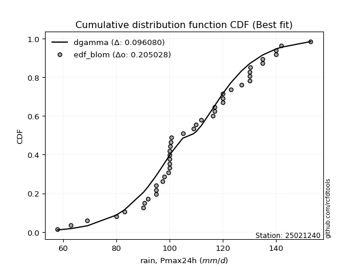</img></img>

</div>


### 7. Empirical - EDF Tukey (1962)

In hydrology, the Tukey formula is used as a plotting position formula to estimate the empirical probability or frequency of a flood event (or other hydrological data). The formula parameter is given as _c=0.333_ (or 1/3).

<div align="center">


$P=(m-c)/(n+1-2c)$


</div>


**7.1. Empirical values**

<div align="center">

|                | 0                    | 1                   | 2                   | 3                   | 4                   | 5                   | 6                   | 7                   | 8                   | 9                   | 10                  | 11                 | 12                 | 13                 | 14                 | 15                 | 16                  | 17                  | 18                  | 19                  | 20                  | 21                  | 22                 | 23                 | 24                | 25                 | 26                 | 27                 | 28                 | 29                 | 30                 | 31                 | 32                 | 33                 | 34                 | 35                 | 36                 | 37                | 38                 | 39                 | 40                 | 41                 | 42                 | 43                 |
|:---------------|:---------------------|:--------------------|:--------------------|:--------------------|:--------------------|:--------------------|:--------------------|:--------------------|:--------------------|:--------------------|:--------------------|:-------------------|:-------------------|:-------------------|:-------------------|:-------------------|:--------------------|:--------------------|:--------------------|:--------------------|:--------------------|:--------------------|:-------------------|:-------------------|:------------------|:-------------------|:-------------------|:-------------------|:-------------------|:-------------------|:-------------------|:-------------------|:-------------------|:-------------------|:-------------------|:-------------------|:-------------------|:------------------|:-------------------|:-------------------|:-------------------|:-------------------|:-------------------|:-------------------|
| date           | 1986                 | 1994                | 2004                | 1976                | 2012                | 2005                | 1997                | 1980                | 1987                | 1991                | 1972                | 2003               | 1985               | 2009               | 2002               | 1995               | 1989                | 1992                | 1982                | 1999                | 1998                | 2006                | 1990               | 2000               | 1973              | 2007               | 2011               | 1993               | 1974               | 2001               | 1984               | 1977               | 1988               | 2010               | 1979               | 1978               | 1996               | 2008              | 2015               | 2013               | 1975               | 2014               | 1981               | 1983               |
| x              | 58.0                 | 63.0                | 69.2                | 80.0                | 83.1                | 90.2                | 90.6                | 92.0                | 95.0                | 95.0                | 95.0                | 97.5               | 98.0               | 99.5               | 100.0              | 100.0              | 100.0               | 100.0               | 100.0               | 100.3               | 100.5               | 100.7               | 105.0              | 109.0              | 110.0             | 112.0              | 116.2              | 117.0              | 117.0              | 120.0              | 120.0              | 120.0              | 123.0              | 127.0              | 130.0              | 130.0              | 130.0              | 130.3             | 135.0              | 135.0              | 140.0              | 140.0              | 142.0              | 153.0              |
| m              | 1                    | 2                   | 3                   | 4                   | 5                   | 6                   | 7                   | 8                   | 9                   | 10                  | 11                  | 12                 | 13                 | 14                 | 15                 | 16                 | 17                  | 18                  | 19                  | 20                  | 21                  | 22                  | 23                 | 24                 | 25                | 26                 | 27                 | 28                 | 29                 | 30                 | 31                 | 32                 | 33                 | 34                 | 35                 | 36                 | 37                 | 38                | 39                 | 40                 | 41                 | 42                 | 43                 | 44                 |
| empirical_dist | edf_tukey            | edf_tukey           | edf_tukey           | edf_tukey           | edf_tukey           | edf_tukey           | edf_tukey           | edf_tukey           | edf_tukey           | edf_tukey           | edf_tukey           | edf_tukey          | edf_tukey          | edf_tukey          | edf_tukey          | edf_tukey          | edf_tukey           | edf_tukey           | edf_tukey           | edf_tukey           | edf_tukey           | edf_tukey           | edf_tukey          | edf_tukey          | edf_tukey         | edf_tukey          | edf_tukey          | edf_tukey          | edf_tukey          | edf_tukey          | edf_tukey          | edf_tukey          | edf_tukey          | edf_tukey          | edf_tukey          | edf_tukey          | edf_tukey          | edf_tukey         | edf_tukey          | edf_tukey          | edf_tukey          | edf_tukey          | edf_tukey          | edf_tukey          |
| empirical      | 0.015037593984962405 | 0.03759398496240601 | 0.06015037593984962 | 0.08270676691729323 | 0.10526315789473684 | 0.12781954887218044 | 0.15037593984962405 | 0.17293233082706766 | 0.19548872180451127 | 0.21804511278195488 | 0.24060150375939848 | 0.2631578947368421 | 0.2857142857142857 | 0.3082706766917293 | 0.3308270676691729 | 0.3533834586466165 | 0.37593984962406013 | 0.39849624060150374 | 0.42105263157894735 | 0.44360902255639095 | 0.46616541353383456 | 0.48872180451127817 | 0.5112781954887218 | 0.5338345864661654 | 0.556390977443609 | 0.5789473684210527 | 0.6015037593984962 | 0.6240601503759399 | 0.6466165413533834 | 0.6691729323308271 | 0.6917293233082706 | 0.7142857142857143 | 0.7368421052631579 | 0.7593984962406015 | 0.7819548872180451 | 0.8045112781954887 | 0.8270676691729323 | 0.849624060150376 | 0.8721804511278195 | 0.8947368421052632 | 0.9172932330827067 | 0.9398496240601504 | 0.9624060150375939 | 0.9849624060150376 |
| empirical_tr   | 1.015267175572519    | 1.0390625           | 1.064               | 1.0901639344262295  | 1.1176470588235294  | 1.146551724137931   | 1.176991150442478   | 1.209090909090909   | 1.2429906542056075  | 1.278846153846154   | 1.316831683168317   | 1.357142857142857  | 1.4                | 1.4456521739130435 | 1.49438202247191   | 1.5465116279069766 | 1.6024096385542168  | 1.6625              | 1.7272727272727273  | 1.7972972972972971  | 1.8732394366197183  | 1.9558823529411766  | 2.046153846153846  | 2.145161290322581  | 2.254237288135593 | 2.375              | 2.5094339622641506 | 2.66               | 2.829787234042553  | 3.022727272727273  | 3.24390243902439   | 3.5                | 3.7999999999999994 | 4.15625            | 4.586206896551723  | 5.115384615384616  | 5.782608695652172  | 6.65              | 7.823529411764703  | 9.5                | 12.090909090909083 | 16.625             | 26.599999999999962 | 66.5               |

</div>


**7.2. Parameters & Kolmogorov-Smirnov fit test (sorted by Δ)**

|   id | empirical_dist   | p_dist             |       delta |   deltao | eval    |   fit |   n |             loc |           scale | shape                  | shape1                | shape2             | shape3   |   best_fit |   best_fit_sort |
|-----:|:-----------------|:-------------------|------------:|---------:|:--------|------:|----:|----------------:|----------------:|:-----------------------|:----------------------|:-------------------|:---------|-----------:|----------------:|
|    0 | edf_tukey        | dgamma             |   0.0955067 | 0.205028 | Δo > Δ  |     1 |  44 |   107.342       |     8.55339     | 2.015648495922366      |                       |                    |          |          1 |               1 |
|    1 | edf_tukey        | betaprime          |   0.0970965 | 0.205028 | Δo > Δ  |     1 |  44 |  -110.299       |     0.458209    | 49518.837134370435     | 105.16051911686904    |                    |          |          0 |               2 |
|    2 | edf_tukey        | maxwell            |   0.0988992 | 0.205028 | Δo > Δ  |     1 |  44 |    58.5105      |    31.2565      |                        |                       |                    |          |          0 |               3 |
|    3 | edf_tukey        | rayleigh           |   0.0997926 | 0.205028 | Δo > Δ  |     1 |  44 |    68.12        |    32.1297      |                        |                       |                    |          |          0 |               4 |
|    4 | edf_tukey        | gumbel_r           |   0.104009  | 0.205028 | Δo > Δ  |     1 |  44 |    98.9153      |    16.4121      |                        |                       |                    |          |          0 |               5 |
|    5 | edf_tukey        | ncf                |   0.104015  | 0.205028 | Δo > Δ  |     1 |  44 |    -1.89013     |     0.000141603 | 0.0005057732793723232  | 65.49070430692507     | 382.11518747151763 |          |          0 |               6 |
|    6 | edf_tukey        | alpha              |   0.10662   | 0.205028 | Δo > Δ  |     1 |  44 |  -352.329       |  9867.31        | 21.480774453657446     |                       |                    |          |          0 |               7 |
|    7 | edf_tukey        | invgamma           |   0.111606  | 0.205028 | Δo > Δ  |     1 |  44 |  -201.989       | 64720.5         | 209.59091202383547     |                       |                    |          |          0 |               8 |
|    8 | edf_tukey        | laplace_asymmetric |   0.114815  | 0.205028 | Δo > Δ  |     1 |  44 |   100           |    15.5537      | 0.7661917990874413     |                       |                    |          |          0 |               9 |
|    9 | edf_tukey        | chi2               |   0.115437  | 0.205028 | Δo > Δ  |     1 |  44 |   -91.1498      |     1.16584     | 171.12065434021122     |                       |                    |          |          0 |              10 |
|   10 | edf_tukey        | halflogistic       |   0.119711  | 0.205028 | Δo > Δ  |     1 |  44 |    83.4403      |    17.9964      |                        |                       |                    |          |          0 |              11 |
|   11 | edf_tukey        | recipinvgauss      |   0.121626  | 0.205028 | Δo > Δ  |     1 |  44 |  -181.076       |     1.55773     | 0.00540659611346421    |                       |                    |          |          0 |              12 |
|   12 | edf_tukey        | invgauss           |   0.123483  | 0.205028 | Δo > Δ  |     1 |  44 |    20.8427      |   971.415       | 0.0918880179629486     |                       |                    |          |          0 |              13 |
|   13 | edf_tukey        | gamma              |   0.124084  | 0.205028 | Δo > Δ  |     1 |  44 |  -377.25        |     0.9258      | 524.4722092147704      |                       |                    |          |          0 |              14 |
|   14 | edf_tukey        | moyal              |   0.12419   | 0.205028 | Δo > Δ  |     1 |  44 |    96.3513      |     9.47553     |                        |                       |                    |          |          0 |              15 |
|   15 | edf_tukey        | erlang             |   0.124484  | 0.205028 | Δo > Δ  |     1 |  44 |  -370.807       |     0.932369    | 513.8677413823123      |                       |                    |          |          0 |              16 |
|   16 | edf_tukey        | rice               |   0.124641  | 0.205028 | Δo > Δ  |     1 |  44 |    47.6969      |    22.1772      | 2.527901901256791      |                       |                    |          |          0 |              17 |
|   17 | edf_tukey        | invweibull         |   0.124876  | 0.205028 | Δo > Δ  |     1 |  44 |    -1.5656e+09  |     1.5656e+09  | 72508239.94180292      |                       |                    |          |          0 |              18 |
|   18 | edf_tukey        | halfnorm           |   0.125975  | 0.205028 | Δo > Δ  |     1 |  44 |    80.5275      |    34.9187      |                        |                       |                    |          |          0 |              19 |
|   19 | edf_tukey        | fatiguelife        |   0.128767  | 0.205028 | Δo > Δ  |     1 |  44 |  -532.371       |   640.527       | 0.03265377465385107    |                       |                    |          |          0 |              20 |
|   20 | edf_tukey        | nakagami           |   0.130488  | 0.205028 | Δo > Δ  |     1 |  44 | -2703.63        |  2812.09        | 4442.835482938412      |                       |                    |          |          0 |              21 |
|   21 | edf_tukey        | nct                |   0.13102   | 0.205028 | Δo > Δ  |     1 |  44 |  -642.707       |    21.0258      | 145174.90598149569     | 35.72231231454556     |                    |          |          0 |              22 |
|   22 | edf_tukey        | t                  |   0.131259  | 0.205028 | Δo > Δ  |     1 |  44 |   108.387       |    21.0462      | 249506.05546741685     |                       |                    |          |          0 |              23 |
|   23 | edf_tukey        | lognorm            |   0.131263  | 0.205028 | Δo > Δ  |     1 |  44 |    -1.13347e+06 |     1.13358e+06 | 1.8568985655257414e-05 |                       |                    |          |          0 |              24 |
|   24 | edf_tukey        | exponnorm          |   0.131266  | 0.205028 | Δo > Δ  |     1 |  44 |   108.365       |    21.0493      | 0.0011389709651650267  |                       |                    |          |          0 |              25 |
|   25 | edf_tukey        | norm               |   0.131266  | 0.205028 | Δo > Δ  |     1 |  44 |   108.389       |    21.0493      |                        |                       |                    |          |          0 |              26 |
|   26 | edf_tukey        | crystalball        |   0.131266  | 0.205028 | Δo > Δ  |     1 |  44 |   108.389       |    21.0493      | 7435.400585347947      | 8983.47428872921      |                    |          |          0 |              27 |
|   27 | edf_tukey        | f                  |   0.131423  | 0.205028 | Δo > Δ  |     1 |  44 | -3331.5         |  3439.94        | 58242.83451313611      | 619482.6386470855     |                    |          |          0 |              28 |
|   28 | edf_tukey        | weibull_min        |   0.138657  | 0.205028 | Δo > Δ  |     1 |  44 |    28.0023      |    88.3018      | 4.329734694782085      |                       |                    |          |          0 |              29 |
|   29 | edf_tukey        | pearson3           |   0.140031  | 0.205028 | Δo > Δ  |     1 |  44 |   108.389       |    21.0494      | -0.16333915629350554   |                       |                    |          |          0 |              30 |
|   30 | edf_tukey        | genlogistic        |   0.14045   | 0.205028 | Δo > Δ  |     1 |  44 |   106.668       |    12.4898      | 1.0983319324869776     |                       |                    |          |          0 |              31 |
|   31 | edf_tukey        | loggamma           |   0.141788  | 0.205028 | Δo > Δ  |     1 |  44 |  -250.604       |   109.115       | 27.342442384027855     |                       |                    |          |          0 |              32 |
|   32 | edf_tukey        | johnsonsu          |   0.142143  | 0.205028 | Δo > Δ  |     1 |  44 |   331.728       |   151.551       | 15.114265514155736     | 12.83593642948999     |                    |          |          0 |              33 |
|   33 | edf_tukey        | fisk               |   0.142834  | 0.205028 | Δo > Δ  |     1 |  44 |    -2.44616e+08 |     2.44616e+08 | 20189504.060727324     |                       |                    |          |          0 |              34 |
|   34 | edf_tukey        | logistic           |   0.148549  | 0.205028 | Δo > Δ  |     1 |  44 |   108.389       |    11.6051      |                        |                       |                    |          |          0 |              35 |
|   35 | edf_tukey        | kstwobign          |   0.161066  | 0.205028 | Δo > Δ  |     1 |  44 |    18.173       |   103.773       |                        |                       |                    |          |          0 |              36 |
|   36 | edf_tukey        | hypsecant          |   0.162088  | 0.205028 | Δo > Δ  |     1 |  44 |   108.389       |    13.4004      |                        |                       |                    |          |          0 |              37 |
|   37 | edf_tukey        | wald               |   0.181237  | 0.205028 | Δo > Δ  |     1 |  44 |    87.3393      |    21.0494      |                        |                       |                    |          |          0 |              38 |
|   38 | edf_tukey        | laplace            |   0.190439  | 0.205028 | Δo > Δ  |     1 |  44 |   108.389       |    14.8841      |                        |                       |                    |          |          0 |              39 |
|   39 | edf_tukey        | gumbel_l           |   0.192389  | 0.205028 | Δo > Δ  |     1 |  44 |   117.862       |    16.4121      |                        |                       |                    |          |          0 |              40 |
|   40 | edf_tukey        | gibrat             |   0.213474  | 0.205028 | Δo <= Δ |     0 |  44 |    92.3307      |     9.73965     |                        |                       |                    |          |          0 |              41 |
|   41 | edf_tukey        | zzgumbel           |   0.283954  | 0.205028 | Δo <= Δ |     0 |  44 |   108.356       |    16.6018      | 0.5458047483363783     | 1.1498899585883997    |                    |          |          0 |              42 |
|   42 | edf_tukey        | genexpon           |   0.344019  | 0.205028 | Δo <= Δ |     0 |  44 |    58           |     1.81455     | 0.03596184521346672    | 1.125517113751667e-05 | 1.8056619938062841 |          |          0 |              43 |
|   43 | edf_tukey        | expon              |   0.344378  | 0.205028 | Δo <= Δ |     0 |  44 |    58           |    50.3886      |                        |                       |                    |          |          0 |              44 |
|   44 | edf_tukey        | pareto             |   0.344378  | 0.205028 | Δo <= Δ |     0 |  44 |    -4.29497e+09 |     4.29497e+09 | 85236823.91118297      |                       |                    |          |          0 |              45 |
|   45 | edf_tukey        | gompertz           |   0.705555  | 0.205028 | Δo <= Δ |     0 |  44 |    80           |     4.31492     | 1.4939430560776713e-06 |                       |                    |          |          0 |              46 |
|   46 | edf_tukey        | truncnorm          |   0.984962  | 0.205028 | Δo <= Δ |     0 |  44 |   -43.5193      |     9.06734     | -348.71690733304285    | 21.673304516341247    |                    |          |          0 |              47 |
|   47 | edf_tukey        | mielke             | nan         | 0.205028 | Δo <= Δ |     0 |  44 | -2274.04        |  2196.15        | 842108.2081278097      | 115.84507666345641    |                    |          |          0 |              48 |

<div align="center">

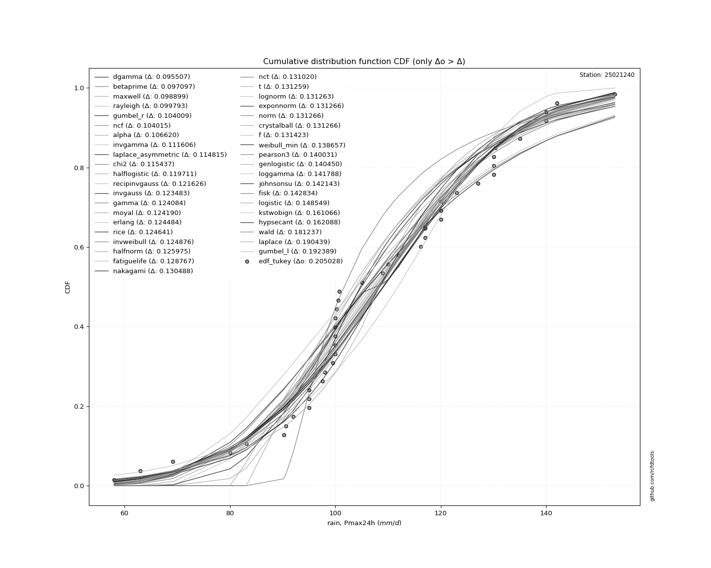</img>

</div>


**7.3. Best fit**

|   id |   station | empirical_dist   | p_dist   |     delta |   deltao | eval   |   fit |   n |     loc |   scale |   shape | shape1   | shape2   | shape3   |   best_fit |   best_fit_sort |
|-----:|----------:|:-----------------|:---------|----------:|---------:|:-------|------:|----:|--------:|--------:|--------:|:---------|:---------|:---------|-----------:|----------------:|
|    0 |  25021240 | edf_tukey        | dgamma   | 0.0955067 | 0.205028 | Δo > Δ |     1 |  44 | 107.342 | 8.55339 | 2.01565 |          |          |          |          1 |               1 |

<div align="center">

</img></img>

</div>


### 8. Empirical - EDF Gringorten (1963)

Gringorten plotting position formula is essential for estimating the probability and return periods of extreme events like floods and heavy rainfall. The constant _a=0.44_.

<div align="center">


$P=(m-a)/(n+1-2a)$


</div>


**8.1. Empirical values**

<div align="center">

|                | 0                    | 1                   | 2                    | 3                   | 4                   | 5                   | 6                  | 7                   | 8                   | 9                   | 10                  | 11                 | 12                 | 13                  | 14                 | 15                  | 16                  | 17                 | 18                  | 19                 | 20                  | 21                 | 22                 | 23                 | 24                 | 25                 | 26                 | 27                 | 28                 | 29                 | 30                 | 31                 | 32                 | 33                 | 34                 | 35                 | 36                | 37                 | 38                 | 39                 | 40                 | 41                 | 42                 | 43                |
|:---------------|:---------------------|:--------------------|:---------------------|:--------------------|:--------------------|:--------------------|:-------------------|:--------------------|:--------------------|:--------------------|:--------------------|:-------------------|:-------------------|:--------------------|:-------------------|:--------------------|:--------------------|:-------------------|:--------------------|:-------------------|:--------------------|:-------------------|:-------------------|:-------------------|:-------------------|:-------------------|:-------------------|:-------------------|:-------------------|:-------------------|:-------------------|:-------------------|:-------------------|:-------------------|:-------------------|:-------------------|:------------------|:-------------------|:-------------------|:-------------------|:-------------------|:-------------------|:-------------------|:------------------|
| date           | 1986                 | 1994                | 2004                 | 1976                | 2012                | 2005                | 1997               | 1980                | 1987                | 1991                | 1972                | 2003               | 1985               | 2009                | 2002               | 1995                | 1989                | 1992               | 1982                | 1999               | 1998                | 2006               | 1990               | 2000               | 1973               | 2007               | 2011               | 1993               | 1974               | 2001               | 1984               | 1977               | 1988               | 2010               | 1979               | 1978               | 1996              | 2008               | 2015               | 2013               | 1975               | 2014               | 1981               | 1983              |
| x              | 58.0                 | 63.0                | 69.2                 | 80.0                | 83.1                | 90.2                | 90.6               | 92.0                | 95.0                | 95.0                | 95.0                | 97.5               | 98.0               | 99.5                | 100.0              | 100.0               | 100.0               | 100.0              | 100.0               | 100.3              | 100.5               | 100.7              | 105.0              | 109.0              | 110.0              | 112.0              | 116.2              | 117.0              | 117.0              | 120.0              | 120.0              | 120.0              | 123.0              | 127.0              | 130.0              | 130.0              | 130.0             | 130.3              | 135.0              | 135.0              | 140.0              | 140.0              | 142.0              | 153.0             |
| m              | 1                    | 2                   | 3                    | 4                   | 5                   | 6                   | 7                  | 8                   | 9                   | 10                  | 11                  | 12                 | 13                 | 14                  | 15                 | 16                  | 17                  | 18                 | 19                  | 20                 | 21                  | 22                 | 23                 | 24                 | 25                 | 26                 | 27                 | 28                 | 29                 | 30                 | 31                 | 32                 | 33                 | 34                 | 35                 | 36                 | 37                | 38                 | 39                 | 40                 | 41                 | 42                 | 43                 | 44                |
| empirical_dist | edf_gringorten       | edf_gringorten      | edf_gringorten       | edf_gringorten      | edf_gringorten      | edf_gringorten      | edf_gringorten     | edf_gringorten      | edf_gringorten      | edf_gringorten      | edf_gringorten      | edf_gringorten     | edf_gringorten     | edf_gringorten      | edf_gringorten     | edf_gringorten      | edf_gringorten      | edf_gringorten     | edf_gringorten      | edf_gringorten     | edf_gringorten      | edf_gringorten     | edf_gringorten     | edf_gringorten     | edf_gringorten     | edf_gringorten     | edf_gringorten     | edf_gringorten     | edf_gringorten     | edf_gringorten     | edf_gringorten     | edf_gringorten     | edf_gringorten     | edf_gringorten     | edf_gringorten     | edf_gringorten     | edf_gringorten    | edf_gringorten     | edf_gringorten     | edf_gringorten     | edf_gringorten     | edf_gringorten     | edf_gringorten     | edf_gringorten    |
| empirical      | 0.012692656391659113 | 0.03535811423390753 | 0.058023572076155945 | 0.08068902991840436 | 0.10335448776065276 | 0.12601994560290117 | 0.1486854034451496 | 0.17135086128739802 | 0.19401631912964645 | 0.21668177697189486 | 0.23934723481414327 | 0.2620126926563917 | 0.2846781504986401 | 0.30734360834088853 | 0.3300090661831369 | 0.35267452402538535 | 0.37533998186763373 | 0.3980054397098821 | 0.42067089755213055 | 0.443336355394379  | 0.46600181323662737 | 0.4886672710788758 | 0.5113327289211242 | 0.5339981867633726 | 0.556663644605621  | 0.5793291024478695 | 0.6019945602901179 | 0.6246600181323663 | 0.6473254759746147 | 0.6699909338168631 | 0.6926563916591115 | 0.7153218495013599 | 0.7379873073436084 | 0.7606527651858569 | 0.7833182230281053 | 0.8059836808703537 | 0.828649138712602 | 0.8513145965548505 | 0.8739800543970989 | 0.8966455122393473 | 0.9193109700815958 | 0.9419764279238442 | 0.9646418857660926 | 0.987307343608341 |
| empirical_tr   | 1.0128558310376492   | 1.0366541353383458  | 1.0615976900866217   | 1.0877712031558184  | 1.115267947421638   | 1.1441908713692945  | 1.174653887113951  | 1.2067833698030634  | 1.2407199100112487  | 1.2766203703703705  | 1.3146603098927294  | 1.3550368550368552 | 1.3979721166032955 | 1.443717277486911   | 1.49255751014885   | 1.5448179271708684  | 1.6008708272859216  | 1.661144578313253  | 1.7261345852895147  | 1.7964169381107493 | 1.8726655348047538  | 1.955673758865248  | 2.046382189239332  | 2.1459143968871595 | 2.2556237218813906 | 2.3771551724137936 | 2.5125284738041005 | 2.6642512077294684 | 2.8354755784061694 | 3.0302197802197806 | 3.2536873156342185 | 3.5127388535031843 | 3.8166089965397934 | 4.178030303030305  | 4.6150627615062785 | 5.154205607476637  | 5.835978835978837 | 6.725609756097566  | 7.935251798561157  | 9.675438596491235  | 12.393258426966314 | 17.234375000000032 | 28.282051282051345 | 78.78571428571527 |

</div>


**8.2. Parameters & Kolmogorov-Smirnov fit test (sorted by Δ)**

|   id | empirical_dist   | p_dist             |       delta |   deltao | eval    |   fit |   n |             loc |           scale | shape                  | shape1                | shape2             | shape3   |   best_fit |   best_fit_sort |
|-----:|:-----------------|:-------------------|------------:|---------:|:--------|------:|----:|----------------:|----------------:|:-----------------------|:----------------------|:-------------------|:---------|-----------:|----------------:|
|    0 | edf_gringorten   | dgamma             |   0.0969791 | 0.205028 | Δo > Δ  |     1 |  44 |   107.342       |     8.55339     | 2.015648495922366      |                       |                    |          |          1 |               1 |
|    1 | edf_gringorten   | betaprime          |   0.0985689 | 0.205028 | Δo > Δ  |     1 |  44 |  -110.299       |     0.458209    | 49518.837134370435     | 105.16051911686904    |                    |          |          0 |               2 |
|    2 | edf_gringorten   | maxwell            |   0.0988447 | 0.205028 | Δo > Δ  |     1 |  44 |    58.5105      |    31.2565      |                        |                       |                    |          |          0 |               3 |
|    3 | edf_gringorten   | rayleigh           |   0.101265  | 0.205028 | Δo > Δ  |     1 |  44 |    68.12        |    32.1297      |                        |                       |                    |          |          0 |               4 |
|    4 | edf_gringorten   | gumbel_r           |   0.103518  | 0.205028 | Δo > Δ  |     1 |  44 |    98.9153      |    16.4121      |                        |                       |                    |          |          0 |               5 |
|    5 | edf_gringorten   | ncf                |   0.105488  | 0.205028 | Δo > Δ  |     1 |  44 |    -1.89013     |     0.000141603 | 0.0005057732793723232  | 65.49070430692507     | 382.11518747151763 |          |          0 |               6 |
|    6 | edf_gringorten   | alpha              |   0.106565  | 0.205028 | Δo > Δ  |     1 |  44 |  -352.329       |  9867.31        | 21.480774453657446     |                       |                    |          |          0 |               7 |
|    7 | edf_gringorten   | invgamma           |   0.111552  | 0.205028 | Δo > Δ  |     1 |  44 |  -201.989       | 64720.5         | 209.59091202383547     |                       |                    |          |          0 |               8 |
|    8 | edf_gringorten   | laplace_asymmetric |   0.114324  | 0.205028 | Δo > Δ  |     1 |  44 |   100           |    15.5537      | 0.7661917990874413     |                       |                    |          |          0 |               9 |
|    9 | edf_gringorten   | chi2               |   0.115382  | 0.205028 | Δo > Δ  |     1 |  44 |   -91.1498      |     1.16584     | 171.12065434021122     |                       |                    |          |          0 |              10 |
|   10 | edf_gringorten   | halflogistic       |   0.119221  | 0.205028 | Δo > Δ  |     1 |  44 |    83.4403      |    17.9964      |                        |                       |                    |          |          0 |              11 |
|   11 | edf_gringorten   | recipinvgauss      |   0.121571  | 0.205028 | Δo > Δ  |     1 |  44 |  -181.076       |     1.55773     | 0.00540659611346421    |                       |                    |          |          0 |              12 |
|   12 | edf_gringorten   | moyal              |   0.123699  | 0.205028 | Δo > Δ  |     1 |  44 |    96.3513      |     9.47553     |                        |                       |                    |          |          0 |              13 |
|   13 | edf_gringorten   | gamma              |   0.124029  | 0.205028 | Δo > Δ  |     1 |  44 |  -377.25        |     0.9258      | 524.4722092147704      |                       |                    |          |          0 |              14 |
|   14 | edf_gringorten   | erlang             |   0.124429  | 0.205028 | Δo > Δ  |     1 |  44 |  -370.807       |     0.932369    | 513.8677413823123      |                       |                    |          |          0 |              15 |
|   15 | edf_gringorten   | rice               |   0.124587  | 0.205028 | Δo > Δ  |     1 |  44 |    47.6969      |    22.1772      | 2.527901901256791      |                       |                    |          |          0 |              16 |
|   16 | edf_gringorten   | invgauss           |   0.124955  | 0.205028 | Δo > Δ  |     1 |  44 |    20.8427      |   971.415       | 0.0918880179629486     |                       |                    |          |          0 |              17 |
|   17 | edf_gringorten   | invweibull         |   0.126348  | 0.205028 | Δo > Δ  |     1 |  44 |    -1.5656e+09  |     1.5656e+09  | 72508239.94180292      |                       |                    |          |          0 |              18 |
|   18 | edf_gringorten   | halfnorm           |   0.127448  | 0.205028 | Δo > Δ  |     1 |  44 |    80.5275      |    34.9187      |                        |                       |                    |          |          0 |              19 |
|   19 | edf_gringorten   | fatiguelife        |   0.128712  | 0.205028 | Δo > Δ  |     1 |  44 |  -532.371       |   640.527       | 0.03265377465385107    |                       |                    |          |          0 |              20 |
|   20 | edf_gringorten   | nakagami           |   0.130434  | 0.205028 | Δo > Δ  |     1 |  44 | -2703.63        |  2812.09        | 4442.835482938412      |                       |                    |          |          0 |              21 |
|   21 | edf_gringorten   | nct                |   0.130965  | 0.205028 | Δo > Δ  |     1 |  44 |  -642.707       |    21.0258      | 145174.90598149569     | 35.72231231454556     |                    |          |          0 |              22 |
|   22 | edf_gringorten   | t                  |   0.131205  | 0.205028 | Δo > Δ  |     1 |  44 |   108.387       |    21.0462      | 249506.05546741685     |                       |                    |          |          0 |              23 |
|   23 | edf_gringorten   | lognorm            |   0.131208  | 0.205028 | Δo > Δ  |     1 |  44 |    -1.13347e+06 |     1.13358e+06 | 1.8568985655257414e-05 |                       |                    |          |          0 |              24 |
|   24 | edf_gringorten   | exponnorm          |   0.131211  | 0.205028 | Δo > Δ  |     1 |  44 |   108.365       |    21.0493      | 0.0011389709651650267  |                       |                    |          |          0 |              25 |
|   25 | edf_gringorten   | norm               |   0.131211  | 0.205028 | Δo > Δ  |     1 |  44 |   108.389       |    21.0493      |                        |                       |                    |          |          0 |              26 |
|   26 | edf_gringorten   | crystalball        |   0.131211  | 0.205028 | Δo > Δ  |     1 |  44 |   108.389       |    21.0493      | 7435.400585347947      | 8983.47428872921      |                    |          |          0 |              27 |
|   27 | edf_gringorten   | f                  |   0.131369  | 0.205028 | Δo > Δ  |     1 |  44 | -3331.5         |  3439.94        | 58242.83451313611      | 619482.6386470855     |                    |          |          0 |              28 |
|   28 | edf_gringorten   | weibull_min        |   0.138602  | 0.205028 | Δo > Δ  |     1 |  44 |    28.0023      |    88.3018      | 4.329734694782085      |                       |                    |          |          0 |              29 |
|   29 | edf_gringorten   | pearson3           |   0.139976  | 0.205028 | Δo > Δ  |     1 |  44 |   108.389       |    21.0494      | -0.16333915629350554   |                       |                    |          |          0 |              30 |
|   30 | edf_gringorten   | genlogistic        |   0.140396  | 0.205028 | Δo > Δ  |     1 |  44 |   106.668       |    12.4898      | 1.0983319324869776     |                       |                    |          |          0 |              31 |
|   31 | edf_gringorten   | loggamma           |   0.141734  | 0.205028 | Δo > Δ  |     1 |  44 |  -250.604       |   109.115       | 27.342442384027855     |                       |                    |          |          0 |              32 |
|   32 | edf_gringorten   | johnsonsu          |   0.142088  | 0.205028 | Δo > Δ  |     1 |  44 |   331.728       |   151.551       | 15.114265514155736     | 12.83593642948999     |                    |          |          0 |              33 |
|   33 | edf_gringorten   | fisk               |   0.14278   | 0.205028 | Δo > Δ  |     1 |  44 |    -2.44616e+08 |     2.44616e+08 | 20189504.060727324     |                       |                    |          |          0 |              34 |
|   34 | edf_gringorten   | logistic           |   0.148494  | 0.205028 | Δo > Δ  |     1 |  44 |   108.389       |    11.6051      |                        |                       |                    |          |          0 |              35 |
|   35 | edf_gringorten   | hypsecant          |   0.162034  | 0.205028 | Δo > Δ  |     1 |  44 |   108.389       |    13.4004      |                        |                       |                    |          |          0 |              36 |
|   36 | edf_gringorten   | kstwobign          |   0.162538  | 0.205028 | Δo > Δ  |     1 |  44 |    18.173       |   103.773       |                        |                       |                    |          |          0 |              37 |
|   37 | edf_gringorten   | wald               |   0.180746  | 0.205028 | Δo > Δ  |     1 |  44 |    87.3393      |    21.0494      |                        |                       |                    |          |          0 |              38 |
|   38 | edf_gringorten   | laplace            |   0.190385  | 0.205028 | Δo > Δ  |     1 |  44 |   108.389       |    14.8841      |                        |                       |                    |          |          0 |              39 |
|   39 | edf_gringorten   | gumbel_l           |   0.192335  | 0.205028 | Δo > Δ  |     1 |  44 |   117.862       |    16.4121      |                        |                       |                    |          |          0 |              40 |
|   40 | edf_gringorten   | gibrat             |   0.212983  | 0.205028 | Δo <= Δ |     0 |  44 |    92.3307      |     9.73965     |                        |                       |                    |          |          0 |              41 |
|   41 | edf_gringorten   | zzgumbel           |   0.2839    | 0.205028 | Δo <= Δ |     0 |  44 |   108.356       |    16.6018      | 0.5458047483363783     | 1.1498899585883997    |                    |          |          0 |              42 |
|   42 | edf_gringorten   | genexpon           |   0.345819  | 0.205028 | Δo <= Δ |     0 |  44 |    58           |     1.81455     | 0.03596184521346672    | 1.125517113751667e-05 | 1.8056619938062841 |          |          0 |              43 |
|   43 | edf_gringorten   | expon              |   0.346177  | 0.205028 | Δo <= Δ |     0 |  44 |    58           |    50.3886      |                        |                       |                    |          |          0 |              44 |
|   44 | edf_gringorten   | pareto             |   0.346177  | 0.205028 | Δo <= Δ |     0 |  44 |    -4.29497e+09 |     4.29497e+09 | 85236823.91118297      |                       |                    |          |          0 |              45 |
|   45 | edf_gringorten   | gompertz           |   0.706701  | 0.205028 | Δo <= Δ |     0 |  44 |    80           |     4.31492     | 1.4939430560776713e-06 |                       |                    |          |          0 |              46 |
|   46 | edf_gringorten   | truncnorm          |   0.987307  | 0.205028 | Δo <= Δ |     0 |  44 |   -43.5193      |     9.06734     | -348.71690733304285    | 21.673304516341247    |                    |          |          0 |              47 |
|   47 | edf_gringorten   | mielke             | nan         | 0.205028 | Δo <= Δ |     0 |  44 | -2274.04        |  2196.15        | 842108.2081278097      | 115.84507666345641    |                    |          |          0 |              48 |

<div align="center">

</img>

</div>


**8.3. Best fit**

|   id |   station | empirical_dist   | p_dist   |     delta |   deltao | eval   |   fit |   n |     loc |   scale |   shape | shape1   | shape2   | shape3   |   best_fit |   best_fit_sort |
|-----:|----------:|:-----------------|:---------|----------:|---------:|:-------|------:|----:|--------:|--------:|--------:|:---------|:---------|:---------|-----------:|----------------:|
|    0 |  25021240 | edf_gringorten   | dgamma   | 0.0969791 | 0.205028 | Δo > Δ |     1 |  44 | 107.342 | 8.55339 | 2.01565 |          |          |          |          1 |               1 |

<div align="center">

</img>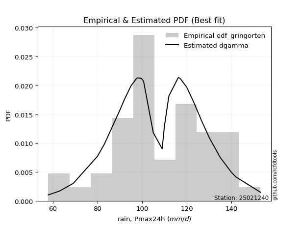</img>

</div>


### 9. Empirical - EDF Jenkinson (1977)

The Jenkinson formula in hydrology is an empirical plotting position formula used to estimate the non-exceedance probability _(P)_ or return period _(T)_ of a given ordered observation within a sample. It is a widely used method in the frequency analysis of extreme events such as floods and rainfall, as it provides a distribution-free way to plot data. _a≈0.31_ and _b≈0.38_ are constants derived to approximate the median of the probability distribution for the given rank.

<div align="center">


$P=(m-a)/(n+b)$


</div>


**9.1. Empirical values**

<div align="center">

|                | 0                    | 1                  | 2                   | 3                   | 4                   | 5                   | 6                   | 7                  | 8                   | 9                   | 10                 | 11                  | 12                 | 13                 | 14                  | 15                 | 16                 | 17                 | 18                  | 19                 | 20                 | 21                  | 22                 | 23                 | 24                 | 25                 | 26                 | 27                 | 28                 | 29                 | 30                 | 31                 | 32                 | 33                 | 34                 | 35                 | 36                 | 37                 | 38                 | 39                 | 40                 | 41                 | 42                 | 43                 |
|:---------------|:---------------------|:-------------------|:--------------------|:--------------------|:--------------------|:--------------------|:--------------------|:-------------------|:--------------------|:--------------------|:-------------------|:--------------------|:-------------------|:-------------------|:--------------------|:-------------------|:-------------------|:-------------------|:--------------------|:-------------------|:-------------------|:--------------------|:-------------------|:-------------------|:-------------------|:-------------------|:-------------------|:-------------------|:-------------------|:-------------------|:-------------------|:-------------------|:-------------------|:-------------------|:-------------------|:-------------------|:-------------------|:-------------------|:-------------------|:-------------------|:-------------------|:-------------------|:-------------------|:-------------------|
| date           | 1986                 | 1994               | 2004                | 1976                | 2012                | 2005                | 1997                | 1980               | 1987                | 1991                | 1972               | 2003                | 1985               | 2009               | 2002                | 1995               | 1989               | 1992               | 1982                | 1999               | 1998               | 2006                | 1990               | 2000               | 1973               | 2007               | 2011               | 1993               | 1974               | 2001               | 1984               | 1977               | 1988               | 2010               | 1979               | 1978               | 1996               | 2008               | 2015               | 2013               | 1975               | 2014               | 1981               | 1983               |
| x              | 58.0                 | 63.0               | 69.2                | 80.0                | 83.1                | 90.2                | 90.6                | 92.0               | 95.0                | 95.0                | 95.0               | 97.5                | 98.0               | 99.5               | 100.0               | 100.0              | 100.0              | 100.0              | 100.0               | 100.3              | 100.5              | 100.7               | 105.0              | 109.0              | 110.0              | 112.0              | 116.2              | 117.0              | 117.0              | 120.0              | 120.0              | 120.0              | 123.0              | 127.0              | 130.0              | 130.0              | 130.0              | 130.3              | 135.0              | 135.0              | 140.0              | 140.0              | 142.0              | 153.0              |
| m              | 1                    | 2                  | 3                   | 4                   | 5                   | 6                   | 7                   | 8                  | 9                   | 10                  | 11                 | 12                  | 13                 | 14                 | 15                  | 16                 | 17                 | 18                 | 19                  | 20                 | 21                 | 22                  | 23                 | 24                 | 25                 | 26                 | 27                 | 28                 | 29                 | 30                 | 31                 | 32                 | 33                 | 34                 | 35                 | 36                 | 37                 | 38                 | 39                 | 40                 | 41                 | 42                 | 43                 | 44                 |
| empirical_dist | edf_jenkinson        | edf_jenkinson      | edf_jenkinson       | edf_jenkinson       | edf_jenkinson       | edf_jenkinson       | edf_jenkinson       | edf_jenkinson      | edf_jenkinson       | edf_jenkinson       | edf_jenkinson      | edf_jenkinson       | edf_jenkinson      | edf_jenkinson      | edf_jenkinson       | edf_jenkinson      | edf_jenkinson      | edf_jenkinson      | edf_jenkinson       | edf_jenkinson      | edf_jenkinson      | edf_jenkinson       | edf_jenkinson      | edf_jenkinson      | edf_jenkinson      | edf_jenkinson      | edf_jenkinson      | edf_jenkinson      | edf_jenkinson      | edf_jenkinson      | edf_jenkinson      | edf_jenkinson      | edf_jenkinson      | edf_jenkinson      | edf_jenkinson      | edf_jenkinson      | edf_jenkinson      | edf_jenkinson      | edf_jenkinson      | edf_jenkinson      | edf_jenkinson      | edf_jenkinson      | edf_jenkinson      | edf_jenkinson      |
| empirical      | 0.015547543938711128 | 0.0380802163136548 | 0.06061288868859846 | 0.08314556106354214 | 0.10567823343848581 | 0.12821090581342948 | 0.15074357818837314 | 0.1732762505633168 | 0.19580892293826047 | 0.21834159531320413 | 0.2408742676881478 | 0.26340694006309145 | 0.2859396124380351 | 0.3084722848129788 | 0.33100495718792244 | 0.3535376295628661 | 0.3760703019378098 | 0.3986029743127535 | 0.42113564668769715 | 0.4436683190626408 | 0.4662009914375845 | 0.48873366381252814 | 0.5112663361874719 | 0.5337990085624155 | 0.5563316809373592 | 0.5788643533123028 | 0.6013970256872465 | 0.6239296980621901 | 0.6464623704371338 | 0.6689950428120776 | 0.6915277151870212 | 0.7140603875619649 | 0.7365930599369084 | 0.7591257323118521 | 0.7816584046867957 | 0.8041910770617394 | 0.8267237494366831 | 0.8492564218116267 | 0.8717890941865705 | 0.8943217665615141 | 0.9168544389364578 | 0.9393871113114014 | 0.9619197836863451 | 0.9844524560612887 |
| empirical_tr   | 1.0157930876630807   | 1.0395877254626376 | 1.0645238666346846  | 1.0906856721553206  | 1.1181657848324515  | 1.1470664254329286  | 1.1775006633059166  | 1.2095938947942217 | 1.2434855701877277  | 1.279331219371577   | 1.317304838230929  | 1.3576017130620983  | 1.4004417797412432 | 1.4460736396220268 | 1.4947793869989894  | 1.5468804461484835 | 1.6027446731672081 | 1.6627950543274634 | 1.7275204359673026  | 1.7974888618874039 | 1.8733642887294215 | 1.9559277214631996  | 2.046104195481789  | 2.1449975833736104 | 2.2539360081259523 | 2.374531835205992  | 2.5087620124364047 | 2.6590772917914913 | 2.8285532186105797 | 3.021102791014296  | 3.2417823228634037 | 3.497241922773838  | 3.7964071856287407 | 4.151543498596818  | 4.579979360165115  | 5.107019562715763  | 5.771131339401819  | 6.633781763826602  | 7.799648506151139  | 9.462686567164168  | 12.0271002710027   | 16.498141263940486 | 26.260355029585742 | 64.31884057970956  |

</div>


**9.2. Parameters & Kolmogorov-Smirnov fit test (sorted by Δ)**

|   id | empirical_dist   | p_dist             |       delta |   deltao | eval    |   fit |   n |             loc |           scale | shape                  | shape1                | shape2             | shape3   |   best_fit |   best_fit_sort |
|-----:|:-----------------|:-------------------|------------:|---------:|:--------|------:|----:|----------------:|----------------:|:-----------------------|:----------------------|:-------------------|:---------|-----------:|----------------:|
|    0 | edf_jenkinson    | dgamma             |   0.0951865 | 0.205028 | Δo > Δ  |     1 |  44 |   107.342       |     8.55339     | 2.015648495922366      |                       |                    |          |          1 |               1 |
|    1 | edf_jenkinson    | betaprime          |   0.0967763 | 0.205028 | Δo > Δ  |     1 |  44 |  -110.299       |     0.458209    | 49518.837134370435     | 105.16051911686904    |                    |          |          0 |               2 |
|    2 | edf_jenkinson    | maxwell            |   0.098911  | 0.205028 | Δo > Δ  |     1 |  44 |    58.5105      |    31.2565      |                        |                       |                    |          |          0 |               3 |
|    3 | edf_jenkinson    | rayleigh           |   0.0994724 | 0.205028 | Δo > Δ  |     1 |  44 |    68.12        |    32.1297      |                        |                       |                    |          |          0 |               4 |
|    4 | edf_jenkinson    | ncf                |   0.103695  | 0.205028 | Δo > Δ  |     1 |  44 |    -1.89013     |     0.000141603 | 0.0005057732793723232  | 65.49070430692507     | 382.11518747151763 |          |          0 |               5 |
|    5 | edf_jenkinson    | gumbel_r           |   0.104115  | 0.205028 | Δo > Δ  |     1 |  44 |    98.9153      |    16.4121      |                        |                       |                    |          |          0 |               6 |
|    6 | edf_jenkinson    | alpha              |   0.106632  | 0.205028 | Δo > Δ  |     1 |  44 |  -352.329       |  9867.31        | 21.480774453657446     |                       |                    |          |          0 |               7 |
|    7 | edf_jenkinson    | invgamma           |   0.111618  | 0.205028 | Δo > Δ  |     1 |  44 |  -201.989       | 64720.5         | 209.59091202383547     |                       |                    |          |          0 |               8 |
|    8 | edf_jenkinson    | laplace_asymmetric |   0.114922  | 0.205028 | Δo > Δ  |     1 |  44 |   100           |    15.5537      | 0.7661917990874413     |                       |                    |          |          0 |               9 |
|    9 | edf_jenkinson    | chi2               |   0.115449  | 0.205028 | Δo > Δ  |     1 |  44 |   -91.1498      |     1.16584     | 171.12065434021122     |                       |                    |          |          0 |              10 |
|   10 | edf_jenkinson    | halflogistic       |   0.119818  | 0.205028 | Δo > Δ  |     1 |  44 |    83.4403      |    17.9964      |                        |                       |                    |          |          0 |              11 |
|   11 | edf_jenkinson    | recipinvgauss      |   0.121638  | 0.205028 | Δo > Δ  |     1 |  44 |  -181.076       |     1.55773     | 0.00540659611346421    |                       |                    |          |          0 |              12 |
|   12 | edf_jenkinson    | invgauss           |   0.123163  | 0.205028 | Δo > Δ  |     1 |  44 |    20.8427      |   971.415       | 0.0918880179629486     |                       |                    |          |          0 |              13 |
|   13 | edf_jenkinson    | gamma              |   0.124095  | 0.205028 | Δo > Δ  |     1 |  44 |  -377.25        |     0.9258      | 524.4722092147704      |                       |                    |          |          0 |              14 |
|   14 | edf_jenkinson    | moyal              |   0.124296  | 0.205028 | Δo > Δ  |     1 |  44 |    96.3513      |     9.47553     |                        |                       |                    |          |          0 |              15 |
|   15 | edf_jenkinson    | erlang             |   0.124496  | 0.205028 | Δo > Δ  |     1 |  44 |  -370.807       |     0.932369    | 513.8677413823123      |                       |                    |          |          0 |              16 |
|   16 | edf_jenkinson    | invweibull         |   0.124555  | 0.205028 | Δo > Δ  |     1 |  44 |    -1.5656e+09  |     1.5656e+09  | 72508239.94180292      |                       |                    |          |          0 |              17 |
|   17 | edf_jenkinson    | rice               |   0.124653  | 0.205028 | Δo > Δ  |     1 |  44 |    47.6969      |    22.1772      | 2.527901901256791      |                       |                    |          |          0 |              18 |
|   18 | edf_jenkinson    | halfnorm           |   0.125655  | 0.205028 | Δo > Δ  |     1 |  44 |    80.5275      |    34.9187      |                        |                       |                    |          |          0 |              19 |
|   19 | edf_jenkinson    | fatiguelife        |   0.128779  | 0.205028 | Δo > Δ  |     1 |  44 |  -532.371       |   640.527       | 0.03265377465385107    |                       |                    |          |          0 |              20 |
|   20 | edf_jenkinson    | nakagami           |   0.1305    | 0.205028 | Δo > Δ  |     1 |  44 | -2703.63        |  2812.09        | 4442.835482938412      |                       |                    |          |          0 |              21 |
|   21 | edf_jenkinson    | nct                |   0.131032  | 0.205028 | Δo > Δ  |     1 |  44 |  -642.707       |    21.0258      | 145174.90598149569     | 35.72231231454556     |                    |          |          0 |              22 |
|   22 | edf_jenkinson    | t                  |   0.131271  | 0.205028 | Δo > Δ  |     1 |  44 |   108.387       |    21.0462      | 249506.05546741685     |                       |                    |          |          0 |              23 |
|   23 | edf_jenkinson    | lognorm            |   0.131275  | 0.205028 | Δo > Δ  |     1 |  44 |    -1.13347e+06 |     1.13358e+06 | 1.8568985655257414e-05 |                       |                    |          |          0 |              24 |
|   24 | edf_jenkinson    | exponnorm          |   0.131277  | 0.205028 | Δo > Δ  |     1 |  44 |   108.365       |    21.0493      | 0.0011389709651650267  |                       |                    |          |          0 |              25 |
|   25 | edf_jenkinson    | norm               |   0.131278  | 0.205028 | Δo > Δ  |     1 |  44 |   108.389       |    21.0493      |                        |                       |                    |          |          0 |              26 |
|   26 | edf_jenkinson    | crystalball        |   0.131278  | 0.205028 | Δo > Δ  |     1 |  44 |   108.389       |    21.0493      | 7435.400585347947      | 8983.47428872921      |                    |          |          0 |              27 |
|   27 | edf_jenkinson    | f                  |   0.131435  | 0.205028 | Δo > Δ  |     1 |  44 | -3331.5         |  3439.94        | 58242.83451313611      | 619482.6386470855     |                    |          |          0 |              28 |
|   28 | edf_jenkinson    | weibull_min        |   0.138669  | 0.205028 | Δo > Δ  |     1 |  44 |    28.0023      |    88.3018      | 4.329734694782085      |                       |                    |          |          0 |              29 |
|   29 | edf_jenkinson    | pearson3           |   0.140043  | 0.205028 | Δo > Δ  |     1 |  44 |   108.389       |    21.0494      | -0.16333915629350554   |                       |                    |          |          0 |              30 |
|   30 | edf_jenkinson    | genlogistic        |   0.140462  | 0.205028 | Δo > Δ  |     1 |  44 |   106.668       |    12.4898      | 1.0983319324869776     |                       |                    |          |          0 |              31 |
|   31 | edf_jenkinson    | loggamma           |   0.1418    | 0.205028 | Δo > Δ  |     1 |  44 |  -250.604       |   109.115       | 27.342442384027855     |                       |                    |          |          0 |              32 |
|   32 | edf_jenkinson    | johnsonsu          |   0.142154  | 0.205028 | Δo > Δ  |     1 |  44 |   331.728       |   151.551       | 15.114265514155736     | 12.83593642948999     |                    |          |          0 |              33 |
|   33 | edf_jenkinson    | fisk               |   0.142846  | 0.205028 | Δo > Δ  |     1 |  44 |    -2.44616e+08 |     2.44616e+08 | 20189504.060727324     |                       |                    |          |          0 |              34 |
|   34 | edf_jenkinson    | logistic           |   0.14856   | 0.205028 | Δo > Δ  |     1 |  44 |   108.389       |    11.6051      |                        |                       |                    |          |          0 |              35 |
|   35 | edf_jenkinson    | kstwobign          |   0.160745  | 0.205028 | Δo > Δ  |     1 |  44 |    18.173       |   103.773       |                        |                       |                    |          |          0 |              36 |
|   36 | edf_jenkinson    | hypsecant          |   0.1621    | 0.205028 | Δo > Δ  |     1 |  44 |   108.389       |    13.4004      |                        |                       |                    |          |          0 |              37 |
|   37 | edf_jenkinson    | wald               |   0.181344  | 0.205028 | Δo > Δ  |     1 |  44 |    87.3393      |    21.0494      |                        |                       |                    |          |          0 |              38 |
|   38 | edf_jenkinson    | laplace            |   0.190451  | 0.205028 | Δo > Δ  |     1 |  44 |   108.389       |    14.8841      |                        |                       |                    |          |          0 |              39 |
|   39 | edf_jenkinson    | gumbel_l           |   0.192401  | 0.205028 | Δo > Δ  |     1 |  44 |   117.862       |    16.4121      |                        |                       |                    |          |          0 |              40 |
|   40 | edf_jenkinson    | gibrat             |   0.213581  | 0.205028 | Δo <= Δ |     0 |  44 |    92.3307      |     9.73965     |                        |                       |                    |          |          0 |              41 |
|   41 | edf_jenkinson    | zzgumbel           |   0.283966  | 0.205028 | Δo <= Δ |     0 |  44 |   108.356       |    16.6018      | 0.5458047483363783     | 1.1498899585883997    |                    |          |          0 |              42 |
|   42 | edf_jenkinson    | genexpon           |   0.343628  | 0.205028 | Δo <= Δ |     0 |  44 |    58           |     1.81455     | 0.03596184521346672    | 1.125517113751667e-05 | 1.8056619938062841 |          |          0 |              43 |
|   43 | edf_jenkinson    | expon              |   0.343987  | 0.205028 | Δo <= Δ |     0 |  44 |    58           |    50.3886      |                        |                       |                    |          |          0 |              44 |
|   44 | edf_jenkinson    | pareto             |   0.343987  | 0.205028 | Δo <= Δ |     0 |  44 |    -4.29497e+09 |     4.29497e+09 | 85236823.91118297      |                       |                    |          |          0 |              45 |
|   45 | edf_jenkinson    | gompertz           |   0.705306  | 0.205028 | Δo <= Δ |     0 |  44 |    80           |     4.31492     | 1.4939430560776713e-06 |                       |                    |          |          0 |              46 |
|   46 | edf_jenkinson    | truncnorm          |   0.984452  | 0.205028 | Δo <= Δ |     0 |  44 |   -43.5193      |     9.06734     | -348.71690733304285    | 21.673304516341247    |                    |          |          0 |              47 |
|   47 | edf_jenkinson    | mielke             | nan         | 0.205028 | Δo <= Δ |     0 |  44 | -2274.04        |  2196.15        | 842108.2081278097      | 115.84507666345641    |                    |          |          0 |              48 |

<div align="center">

</img>

</div>


**9.3. Best fit**

|   id |   station | empirical_dist   | p_dist   |     delta |   deltao | eval   |   fit |   n |     loc |   scale |   shape | shape1   | shape2   | shape3   |   best_fit |   best_fit_sort |
|-----:|----------:|:-----------------|:---------|----------:|---------:|:-------|------:|----:|--------:|--------:|--------:|:---------|:---------|:---------|-----------:|----------------:|
|    0 |  25021240 | edf_jenkinson    | dgamma   | 0.0951865 | 0.205028 | Δo > Δ |     1 |  44 | 107.342 | 8.55339 | 2.01565 |          |          |          |          1 |               1 |

<div align="center">

</img>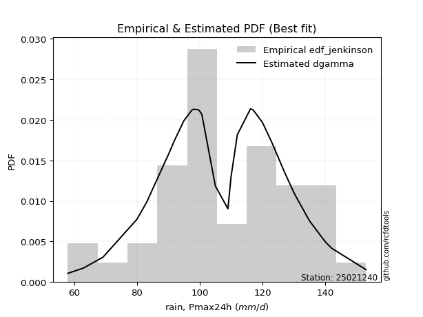</img>

</div>


### 10. Empirical - EDF Cunnane (1978)

Cunnane´s work in statistical hydrology has focused on the performance and evaluation of different probability distributions (such as GEV, Gumbel, Lognormal) for flood frequency estimation. _b_ is a constant, typically set to 0.4.

<div align="center">


$P=(m-b)/(n+1-2b)$


</div>


**10.1. Empirical values**

<div align="center">

|                | 0                    | 1                   | 2                    | 3                   | 4                   | 5                   | 6                   | 7                   | 8                  | 9                   | 10                  | 11                 | 12                 | 13                  | 14                  | 15                 | 16                 | 17                 | 18                  | 19                 | 20                 | 21                  | 22                 | 23                 | 24                 | 25                 | 26                 | 27                 | 28                 | 29                 | 30                 | 31                 | 32                 | 33                 | 34                 | 35                 | 36                 | 37                 | 38                 | 39                 | 40                 | 41                 | 42                 | 43                 |
|:---------------|:---------------------|:--------------------|:---------------------|:--------------------|:--------------------|:--------------------|:--------------------|:--------------------|:-------------------|:--------------------|:--------------------|:-------------------|:-------------------|:--------------------|:--------------------|:-------------------|:-------------------|:-------------------|:--------------------|:-------------------|:-------------------|:--------------------|:-------------------|:-------------------|:-------------------|:-------------------|:-------------------|:-------------------|:-------------------|:-------------------|:-------------------|:-------------------|:-------------------|:-------------------|:-------------------|:-------------------|:-------------------|:-------------------|:-------------------|:-------------------|:-------------------|:-------------------|:-------------------|:-------------------|
| date           | 1986                 | 1994                | 2004                 | 1976                | 2012                | 2005                | 1997                | 1980                | 1987               | 1991                | 1972                | 2003               | 1985               | 2009                | 2002                | 1995               | 1989               | 1992               | 1982                | 1999               | 1998               | 2006                | 1990               | 2000               | 1973               | 2007               | 2011               | 1993               | 1974               | 2001               | 1984               | 1977               | 1988               | 2010               | 1979               | 1978               | 1996               | 2008               | 2015               | 2013               | 1975               | 2014               | 1981               | 1983               |
| x              | 58.0                 | 63.0                | 69.2                 | 80.0                | 83.1                | 90.2                | 90.6                | 92.0                | 95.0               | 95.0                | 95.0                | 97.5               | 98.0               | 99.5                | 100.0               | 100.0              | 100.0              | 100.0              | 100.0               | 100.3              | 100.5              | 100.7               | 105.0              | 109.0              | 110.0              | 112.0              | 116.2              | 117.0              | 117.0              | 120.0              | 120.0              | 120.0              | 123.0              | 127.0              | 130.0              | 130.0              | 130.0              | 130.3              | 135.0              | 135.0              | 140.0              | 140.0              | 142.0              | 153.0              |
| m              | 1                    | 2                   | 3                    | 4                   | 5                   | 6                   | 7                   | 8                   | 9                  | 10                  | 11                  | 12                 | 13                 | 14                  | 15                  | 16                 | 17                 | 18                 | 19                  | 20                 | 21                 | 22                  | 23                 | 24                 | 25                 | 26                 | 27                 | 28                 | 29                 | 30                 | 31                 | 32                 | 33                 | 34                 | 35                 | 36                 | 37                 | 38                 | 39                 | 40                 | 41                 | 42                 | 43                 | 44                 |
| empirical_dist | edf_cunnane          | edf_cunnane         | edf_cunnane          | edf_cunnane         | edf_cunnane         | edf_cunnane         | edf_cunnane         | edf_cunnane         | edf_cunnane        | edf_cunnane         | edf_cunnane         | edf_cunnane        | edf_cunnane        | edf_cunnane         | edf_cunnane         | edf_cunnane        | edf_cunnane        | edf_cunnane        | edf_cunnane         | edf_cunnane        | edf_cunnane        | edf_cunnane         | edf_cunnane        | edf_cunnane        | edf_cunnane        | edf_cunnane        | edf_cunnane        | edf_cunnane        | edf_cunnane        | edf_cunnane        | edf_cunnane        | edf_cunnane        | edf_cunnane        | edf_cunnane        | edf_cunnane        | edf_cunnane        | edf_cunnane        | edf_cunnane        | edf_cunnane        | edf_cunnane        | edf_cunnane        | edf_cunnane        | edf_cunnane        | edf_cunnane        |
| empirical      | 0.013574660633484162 | 0.03619909502262443 | 0.058823529411764705 | 0.08144796380090498 | 0.10407239819004524 | 0.12669683257918551 | 0.14932126696832576 | 0.17194570135746604 | 0.1945701357466063 | 0.21719457013574658 | 0.23981900452488686 | 0.2624434389140271 | 0.2850678733031674 | 0.30769230769230765 | 0.33031674208144796 | 0.3529411764705882 | 0.3755656108597285 | 0.3981900452488688 | 0.42081447963800905 | 0.4434389140271493 | 0.4660633484162896 | 0.48868778280542985 | 0.5113122171945701 | 0.5339366515837104 | 0.5565610859728507 | 0.5791855203619909 | 0.6018099547511312 | 0.6244343891402715 | 0.6470588235294118 | 0.669683257918552  | 0.6923076923076923 | 0.7149321266968326 | 0.7375565610859728 | 0.7601809954751131 | 0.7828054298642534 | 0.8054298642533937 | 0.8280542986425339 | 0.8506787330316742 | 0.8733031674208145 | 0.8959276018099547 | 0.918552036199095  | 0.9411764705882353 | 0.9638009049773756 | 0.9864253393665158 |
| empirical_tr   | 1.0137614678899083   | 1.0375586854460093  | 1.0625               | 1.0886699507389164  | 1.1161616161616161  | 1.145077720207254   | 1.175531914893617   | 1.2076502732240437  | 1.2415730337078652 | 1.277456647398844   | 1.3154761904761905  | 1.3558282208588956 | 1.3987341772151898 | 1.4444444444444444  | 1.4932432432432432  | 1.5454545454545454 | 1.6014492753623188 | 1.661654135338346  | 1.7265625000000002  | 1.7967479674796747 | 1.8728813559322035 | 1.9557522123893807  | 2.0462962962962963 | 2.145631067961165  | 2.2551020408163267 | 2.376344086021505  | 2.5113636363636362 | 2.6626506024096384 | 2.8333333333333335 | 3.0273972602739723 | 3.25               | 3.507936507936508  | 3.810344827586206  | 4.169811320754716  | 4.604166666666667  | 5.1395348837209305 | 5.815789473684209  | 6.6969696969696955 | 7.892857142857143  | 9.608695652173907  | 12.277777777777771 | 16.999999999999996 | 27.625000000000014 | 73.66666666666633  |

</div>


**10.2. Parameters & Kolmogorov-Smirnov fit test (sorted by Δ)**

|   id | empirical_dist   | p_dist             |       delta |   deltao | eval    |   fit |   n |             loc |           scale | shape                  | shape1                | shape2             | shape3   |   best_fit |   best_fit_sort |
|-----:|:-----------------|:-------------------|------------:|---------:|:--------|------:|----:|----------------:|----------------:|:-----------------------|:----------------------|:-------------------|:---------|-----------:|----------------:|
|    0 | edf_cunnane      | dgamma             |   0.0964253 | 0.205028 | Δo > Δ  |     1 |  44 |   107.342       |     8.55339     | 2.015648495922366      |                       |                    |          |          1 |               1 |
|    1 | edf_cunnane      | betaprime          |   0.0980151 | 0.205028 | Δo > Δ  |     1 |  44 |  -110.299       |     0.458209    | 49518.837134370435     | 105.16051911686904    |                    |          |          0 |               2 |
|    2 | edf_cunnane      | maxwell            |   0.0988652 | 0.205028 | Δo > Δ  |     1 |  44 |    58.5105      |    31.2565      |                        |                       |                    |          |          0 |               3 |
|    3 | edf_cunnane      | rayleigh           |   0.100711  | 0.205028 | Δo > Δ  |     1 |  44 |    68.12        |    32.1297      |                        |                       |                    |          |          0 |               4 |
|    4 | edf_cunnane      | gumbel_r           |   0.103702  | 0.205028 | Δo > Δ  |     1 |  44 |    98.9153      |    16.4121      |                        |                       |                    |          |          0 |               5 |
|    5 | edf_cunnane      | ncf                |   0.104934  | 0.205028 | Δo > Δ  |     1 |  44 |    -1.89013     |     0.000141603 | 0.0005057732793723232  | 65.49070430692507     | 382.11518747151763 |          |          0 |               6 |
|    6 | edf_cunnane      | alpha              |   0.106586  | 0.205028 | Δo > Δ  |     1 |  44 |  -352.329       |  9867.31        | 21.480774453657446     |                       |                    |          |          0 |               7 |
|    7 | edf_cunnane      | invgamma           |   0.111572  | 0.205028 | Δo > Δ  |     1 |  44 |  -201.989       | 64720.5         | 209.59091202383547     |                       |                    |          |          0 |               8 |
|    8 | edf_cunnane      | laplace_asymmetric |   0.114509  | 0.205028 | Δo > Δ  |     1 |  44 |   100           |    15.5537      | 0.7661917990874413     |                       |                    |          |          0 |               9 |
|    9 | edf_cunnane      | chi2               |   0.115403  | 0.205028 | Δo > Δ  |     1 |  44 |   -91.1498      |     1.16584     | 171.12065434021122     |                       |                    |          |          0 |              10 |
|   10 | edf_cunnane      | halflogistic       |   0.119405  | 0.205028 | Δo > Δ  |     1 |  44 |    83.4403      |    17.9964      |                        |                       |                    |          |          0 |              11 |
|   11 | edf_cunnane      | recipinvgauss      |   0.121592  | 0.205028 | Δo > Δ  |     1 |  44 |  -181.076       |     1.55773     | 0.00540659611346421    |                       |                    |          |          0 |              12 |
|   12 | edf_cunnane      | moyal              |   0.123883  | 0.205028 | Δo > Δ  |     1 |  44 |    96.3513      |     9.47553     |                        |                       |                    |          |          0 |              13 |
|   13 | edf_cunnane      | gamma              |   0.124049  | 0.205028 | Δo > Δ  |     1 |  44 |  -377.25        |     0.9258      | 524.4722092147704      |                       |                    |          |          0 |              14 |
|   14 | edf_cunnane      | invgauss           |   0.124402  | 0.205028 | Δo > Δ  |     1 |  44 |    20.8427      |   971.415       | 0.0918880179629486     |                       |                    |          |          0 |              15 |
|   15 | edf_cunnane      | erlang             |   0.12445   | 0.205028 | Δo > Δ  |     1 |  44 |  -370.807       |     0.932369    | 513.8677413823123      |                       |                    |          |          0 |              16 |
|   16 | edf_cunnane      | rice               |   0.124607  | 0.205028 | Δo > Δ  |     1 |  44 |    47.6969      |    22.1772      | 2.527901901256791      |                       |                    |          |          0 |              17 |
|   17 | edf_cunnane      | invweibull         |   0.125794  | 0.205028 | Δo > Δ  |     1 |  44 |    -1.5656e+09  |     1.5656e+09  | 72508239.94180292      |                       |                    |          |          0 |              18 |
|   18 | edf_cunnane      | halfnorm           |   0.126894  | 0.205028 | Δo > Δ  |     1 |  44 |    80.5275      |    34.9187      |                        |                       |                    |          |          0 |              19 |
|   19 | edf_cunnane      | fatiguelife        |   0.128733  | 0.205028 | Δo > Δ  |     1 |  44 |  -532.371       |   640.527       | 0.03265377465385107    |                       |                    |          |          0 |              20 |
|   20 | edf_cunnane      | nakagami           |   0.130454  | 0.205028 | Δo > Δ  |     1 |  44 | -2703.63        |  2812.09        | 4442.835482938412      |                       |                    |          |          0 |              21 |
|   21 | edf_cunnane      | nct                |   0.130986  | 0.205028 | Δo > Δ  |     1 |  44 |  -642.707       |    21.0258      | 145174.90598149569     | 35.72231231454556     |                    |          |          0 |              22 |
|   22 | edf_cunnane      | t                  |   0.131225  | 0.205028 | Δo > Δ  |     1 |  44 |   108.387       |    21.0462      | 249506.05546741685     |                       |                    |          |          0 |              23 |
|   23 | edf_cunnane      | lognorm            |   0.131229  | 0.205028 | Δo > Δ  |     1 |  44 |    -1.13347e+06 |     1.13358e+06 | 1.8568985655257414e-05 |                       |                    |          |          0 |              24 |
|   24 | edf_cunnane      | exponnorm          |   0.131232  | 0.205028 | Δo > Δ  |     1 |  44 |   108.365       |    21.0493      | 0.0011389709651650267  |                       |                    |          |          0 |              25 |
|   25 | edf_cunnane      | norm               |   0.131232  | 0.205028 | Δo > Δ  |     1 |  44 |   108.389       |    21.0493      |                        |                       |                    |          |          0 |              26 |
|   26 | edf_cunnane      | crystalball        |   0.131232  | 0.205028 | Δo > Δ  |     1 |  44 |   108.389       |    21.0493      | 7435.400585347947      | 8983.47428872921      |                    |          |          0 |              27 |
|   27 | edf_cunnane      | f                  |   0.131389  | 0.205028 | Δo > Δ  |     1 |  44 | -3331.5         |  3439.94        | 58242.83451313611      | 619482.6386470855     |                    |          |          0 |              28 |
|   28 | edf_cunnane      | weibull_min        |   0.138623  | 0.205028 | Δo > Δ  |     1 |  44 |    28.0023      |    88.3018      | 4.329734694782085      |                       |                    |          |          0 |              29 |
|   29 | edf_cunnane      | pearson3           |   0.139997  | 0.205028 | Δo > Δ  |     1 |  44 |   108.389       |    21.0494      | -0.16333915629350554   |                       |                    |          |          0 |              30 |
|   30 | edf_cunnane      | genlogistic        |   0.140416  | 0.205028 | Δo > Δ  |     1 |  44 |   106.668       |    12.4898      | 1.0983319324869776     |                       |                    |          |          0 |              31 |
|   31 | edf_cunnane      | loggamma           |   0.141754  | 0.205028 | Δo > Δ  |     1 |  44 |  -250.604       |   109.115       | 27.342442384027855     |                       |                    |          |          0 |              32 |
|   32 | edf_cunnane      | johnsonsu          |   0.142109  | 0.205028 | Δo > Δ  |     1 |  44 |   331.728       |   151.551       | 15.114265514155736     | 12.83593642948999     |                    |          |          0 |              33 |
|   33 | edf_cunnane      | fisk               |   0.1428    | 0.205028 | Δo > Δ  |     1 |  44 |    -2.44616e+08 |     2.44616e+08 | 20189504.060727324     |                       |                    |          |          0 |              34 |
|   34 | edf_cunnane      | logistic           |   0.148514  | 0.205028 | Δo > Δ  |     1 |  44 |   108.389       |    11.6051      |                        |                       |                    |          |          0 |              35 |
|   35 | edf_cunnane      | kstwobign          |   0.161984  | 0.205028 | Δo > Δ  |     1 |  44 |    18.173       |   103.773       |                        |                       |                    |          |          0 |              36 |
|   36 | edf_cunnane      | hypsecant          |   0.162054  | 0.205028 | Δo > Δ  |     1 |  44 |   108.389       |    13.4004      |                        |                       |                    |          |          0 |              37 |
|   37 | edf_cunnane      | wald               |   0.180931  | 0.205028 | Δo > Δ  |     1 |  44 |    87.3393      |    21.0494      |                        |                       |                    |          |          0 |              38 |
|   38 | edf_cunnane      | laplace            |   0.190405  | 0.205028 | Δo > Δ  |     1 |  44 |   108.389       |    14.8841      |                        |                       |                    |          |          0 |              39 |
|   39 | edf_cunnane      | gumbel_l           |   0.192355  | 0.205028 | Δo > Δ  |     1 |  44 |   117.862       |    16.4121      |                        |                       |                    |          |          0 |              40 |
|   40 | edf_cunnane      | gibrat             |   0.213168  | 0.205028 | Δo <= Δ |     0 |  44 |    92.3307      |     9.73965     |                        |                       |                    |          |          0 |              41 |
|   41 | edf_cunnane      | zzgumbel           |   0.28392   | 0.205028 | Δo <= Δ |     0 |  44 |   108.356       |    16.6018      | 0.5458047483363783     | 1.1498899585883997    |                    |          |          0 |              42 |
|   42 | edf_cunnane      | genexpon           |   0.345142  | 0.205028 | Δo <= Δ |     0 |  44 |    58           |     1.81455     | 0.03596184521346672    | 1.125517113751667e-05 | 1.8056619938062841 |          |          0 |              43 |
|   43 | edf_cunnane      | expon              |   0.345501  | 0.205028 | Δo <= Δ |     0 |  44 |    58           |    50.3886      |                        |                       |                    |          |          0 |              44 |
|   44 | edf_cunnane      | pareto             |   0.345501  | 0.205028 | Δo <= Δ |     0 |  44 |    -4.29497e+09 |     4.29497e+09 | 85236823.91118297      |                       |                    |          |          0 |              45 |
|   45 | edf_cunnane      | gompertz           |   0.70627   | 0.205028 | Δo <= Δ |     0 |  44 |    80           |     4.31492     | 1.4939430560776713e-06 |                       |                    |          |          0 |              46 |
|   46 | edf_cunnane      | truncnorm          |   0.986425  | 0.205028 | Δo <= Δ |     0 |  44 |   -43.5193      |     9.06734     | -348.71690733304285    | 21.673304516341247    |                    |          |          0 |              47 |
|   47 | edf_cunnane      | mielke             | nan         | 0.205028 | Δo <= Δ |     0 |  44 | -2274.04        |  2196.15        | 842108.2081278097      | 115.84507666345641    |                    |          |          0 |              48 |

<div align="center">

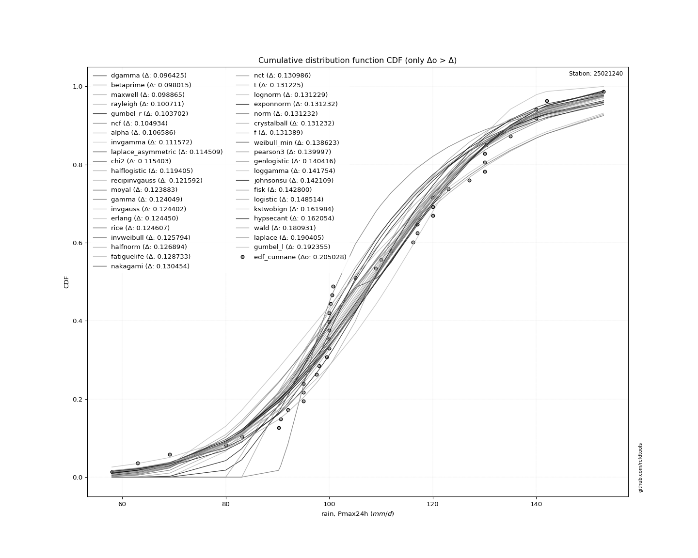</img>

</div>


**10.3. Best fit**

|   id |   station | empirical_dist   | p_dist   |     delta |   deltao | eval   |   fit |   n |     loc |   scale |   shape | shape1   | shape2   | shape3   |   best_fit |   best_fit_sort |
|-----:|----------:|:-----------------|:---------|----------:|---------:|:-------|------:|----:|--------:|--------:|--------:|:---------|:---------|:---------|-----------:|----------------:|
|    0 |  25021240 | edf_cunnane      | dgamma   | 0.0964253 | 0.205028 | Δo > Δ |     1 |  44 | 107.342 | 8.55339 | 2.01565 |          |          |          |          1 |               1 |

<div align="center">

</img>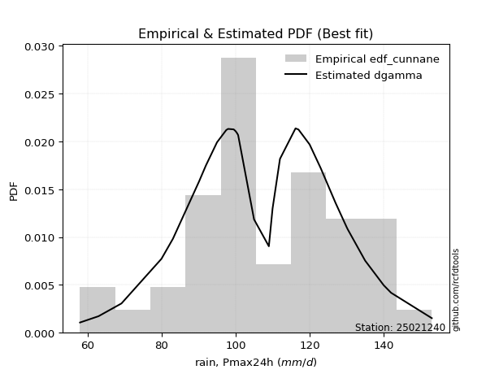</img>

</div>


### 11. Empirical - EDF Adamowski (1981)

The Adamowski formula in hydrology refers to a specific plotting position formula used for estimating the non-parametric empirical distribution of hydrological events (like flood peaks) to calculate their return periods. This formula provides an alternative to traditional parametric methods (like the Gumbel or Log Pearson Type III distributions). 

<div align="center">


$P=(m-0.25)/(n+0.5)$


</div>


**11.1. Empirical values**

<div align="center">

|                | 0                    | 1                   | 2                   | 3                   | 4                   | 5                   | 6                   | 7                   | 8                   | 9                   | 10                  | 11                 | 12                  | 13                 | 14                  | 15                 | 16                  | 17                 | 18                  | 19                 | 20                  | 21                 | 22                 | 23                 | 24                 | 25                 | 26                | 27                 | 28                 | 29                 | 30                 | 31                 | 32                 | 33                 | 34                 | 35                 | 36                 | 37                | 38                 | 39                 | 40                 | 41                 | 42                 | 43                 |
|:---------------|:---------------------|:--------------------|:--------------------|:--------------------|:--------------------|:--------------------|:--------------------|:--------------------|:--------------------|:--------------------|:--------------------|:-------------------|:--------------------|:-------------------|:--------------------|:-------------------|:--------------------|:-------------------|:--------------------|:-------------------|:--------------------|:-------------------|:-------------------|:-------------------|:-------------------|:-------------------|:------------------|:-------------------|:-------------------|:-------------------|:-------------------|:-------------------|:-------------------|:-------------------|:-------------------|:-------------------|:-------------------|:------------------|:-------------------|:-------------------|:-------------------|:-------------------|:-------------------|:-------------------|
| date           | 1986                 | 1994                | 2004                | 1976                | 2012                | 2005                | 1997                | 1980                | 1987                | 1991                | 1972                | 2003               | 1985                | 2009               | 2002                | 1995               | 1989                | 1992               | 1982                | 1999               | 1998                | 2006               | 1990               | 2000               | 1973               | 2007               | 2011              | 1993               | 1974               | 2001               | 1984               | 1977               | 1988               | 2010               | 1979               | 1978               | 1996               | 2008              | 2015               | 2013               | 1975               | 2014               | 1981               | 1983               |
| x              | 58.0                 | 63.0                | 69.2                | 80.0                | 83.1                | 90.2                | 90.6                | 92.0                | 95.0                | 95.0                | 95.0                | 97.5               | 98.0                | 99.5               | 100.0               | 100.0              | 100.0               | 100.0              | 100.0               | 100.3              | 100.5               | 100.7              | 105.0              | 109.0              | 110.0              | 112.0              | 116.2             | 117.0              | 117.0              | 120.0              | 120.0              | 120.0              | 123.0              | 127.0              | 130.0              | 130.0              | 130.0              | 130.3             | 135.0              | 135.0              | 140.0              | 140.0              | 142.0              | 153.0              |
| m              | 1                    | 2                   | 3                   | 4                   | 5                   | 6                   | 7                   | 8                   | 9                   | 10                  | 11                  | 12                 | 13                  | 14                 | 15                  | 16                 | 17                  | 18                 | 19                  | 20                 | 21                  | 22                 | 23                 | 24                 | 25                 | 26                 | 27                | 28                 | 29                 | 30                 | 31                 | 32                 | 33                 | 34                 | 35                 | 36                 | 37                 | 38                | 39                 | 40                 | 41                 | 42                 | 43                 | 44                 |
| empirical_dist | edf_adamowski        | edf_adamowski       | edf_adamowski       | edf_adamowski       | edf_adamowski       | edf_adamowski       | edf_adamowski       | edf_adamowski       | edf_adamowski       | edf_adamowski       | edf_adamowski       | edf_adamowski      | edf_adamowski       | edf_adamowski      | edf_adamowski       | edf_adamowski      | edf_adamowski       | edf_adamowski      | edf_adamowski       | edf_adamowski      | edf_adamowski       | edf_adamowski      | edf_adamowski      | edf_adamowski      | edf_adamowski      | edf_adamowski      | edf_adamowski     | edf_adamowski      | edf_adamowski      | edf_adamowski      | edf_adamowski      | edf_adamowski      | edf_adamowski      | edf_adamowski      | edf_adamowski      | edf_adamowski      | edf_adamowski      | edf_adamowski     | edf_adamowski      | edf_adamowski      | edf_adamowski      | edf_adamowski      | edf_adamowski      | edf_adamowski      |
| empirical      | 0.016853932584269662 | 0.03932584269662921 | 0.06179775280898876 | 0.08426966292134831 | 0.10674157303370786 | 0.12921348314606743 | 0.15168539325842698 | 0.17415730337078653 | 0.19662921348314608 | 0.21910112359550563 | 0.24157303370786518 | 0.2640449438202247 | 0.28651685393258425 | 0.3089887640449438 | 0.33146067415730335 | 0.3539325842696629 | 0.37640449438202245 | 0.398876404494382  | 0.42134831460674155 | 0.4438202247191011 | 0.46629213483146065 | 0.4887640449438202 | 0.5112359550561798 | 0.5337078651685393 | 0.5561797752808989 | 0.5786516853932584 | 0.601123595505618 | 0.6235955056179775 | 0.6460674157303371 | 0.6685393258426966 | 0.6910112359550562 | 0.7134831460674157 | 0.7359550561797753 | 0.7584269662921348 | 0.7808988764044944 | 0.8033707865168539 | 0.8258426966292135 | 0.848314606741573 | 0.8707865168539326 | 0.8932584269662921 | 0.9157303370786517 | 0.9382022471910112 | 0.9606741573033708 | 0.9831460674157303 |
| empirical_tr   | 1.0171428571428571   | 1.04093567251462    | 1.0658682634730539  | 1.0920245398773005  | 1.119496855345912   | 1.1483870967741936  | 1.1788079470198676  | 1.2108843537414966  | 1.2447552447552448  | 1.2805755395683454  | 1.3185185185185186  | 1.3587786259541985 | 1.4015748031496063  | 1.4471544715447153 | 1.495798319327731   | 1.5478260869565217 | 1.6036036036036034  | 1.6635514018691588 | 1.7281553398058254  | 1.7979797979797978 | 1.8736842105263154  | 1.956043956043956  | 2.045977011494253  | 2.144578313253012  | 2.2531645569620253 | 2.373333333333333  | 2.507042253521127 | 2.6567164179104474 | 2.8253968253968256 | 3.0169491525423724 | 3.2363636363636368 | 3.490196078431372  | 3.787234042553192  | 4.13953488372093   | 4.564102564102565  | 5.0857142857142845 | 5.741935483870968  | 6.592592592592591 | 7.739130434782609  | 9.368421052631575  | 11.866666666666669 | 16.181818181818173 | 25.428571428571438 | 59.33333333333319  |

</div>


**11.2. Parameters & Kolmogorov-Smirnov fit test (sorted by Δ)**

|   id | empirical_dist   | p_dist             |       delta |   deltao | eval    |   fit |   n |             loc |           scale | shape                  | shape1                | shape2             | shape3   |   best_fit |   best_fit_sort |
|-----:|:-----------------|:-------------------|------------:|---------:|:--------|------:|----:|----------------:|----------------:|:-----------------------|:----------------------|:-------------------|:---------|-----------:|----------------:|
|    0 | edf_adamowski    | dgamma             |   0.0943662 | 0.205028 | Δo > Δ  |     1 |  44 |   107.342       |     8.55339     | 2.015648495922366      |                       |                    |          |          1 |               1 |
|    1 | edf_adamowski    | betaprime          |   0.0959561 | 0.205028 | Δo > Δ  |     1 |  44 |  -110.299       |     0.458209    | 49518.837134370435     | 105.16051911686904    |                    |          |          0 |               2 |
|    2 | edf_adamowski    | rayleigh           |   0.0986521 | 0.205028 | Δo > Δ  |     1 |  44 |    68.12        |    32.1297      |                        |                       |                    |          |          0 |               3 |
|    3 | edf_adamowski    | maxwell            |   0.0989414 | 0.205028 | Δo > Δ  |     1 |  44 |    58.5105      |    31.2565      |                        |                       |                    |          |          0 |               4 |
|    4 | edf_adamowski    | ncf                |   0.102875  | 0.205028 | Δo > Δ  |     1 |  44 |    -1.89013     |     0.000141603 | 0.0005057732793723232  | 65.49070430692507     | 382.11518747151763 |          |          0 |               5 |
|    5 | edf_adamowski    | gumbel_r           |   0.104389  | 0.205028 | Δo > Δ  |     1 |  44 |    98.9153      |    16.4121      |                        |                       |                    |          |          0 |               6 |
|    6 | edf_adamowski    | alpha              |   0.106662  | 0.205028 | Δo > Δ  |     1 |  44 |  -352.329       |  9867.31        | 21.480774453657446     |                       |                    |          |          0 |               7 |
|    7 | edf_adamowski    | invgamma           |   0.111648  | 0.205028 | Δo > Δ  |     1 |  44 |  -201.989       | 64720.5         | 209.59091202383547     |                       |                    |          |          0 |               8 |
|    8 | edf_adamowski    | laplace_asymmetric |   0.115195  | 0.205028 | Δo > Δ  |     1 |  44 |   100           |    15.5537      | 0.7661917990874413     |                       |                    |          |          0 |               9 |
|    9 | edf_adamowski    | chi2               |   0.115479  | 0.205028 | Δo > Δ  |     1 |  44 |   -91.1498      |     1.16584     | 171.12065434021122     |                       |                    |          |          0 |              10 |
|   10 | edf_adamowski    | halflogistic       |   0.120092  | 0.205028 | Δo > Δ  |     1 |  44 |    83.4403      |    17.9964      |                        |                       |                    |          |          0 |              11 |
|   11 | edf_adamowski    | recipinvgauss      |   0.121668  | 0.205028 | Δo > Δ  |     1 |  44 |  -181.076       |     1.55773     | 0.00540659611346421    |                       |                    |          |          0 |              12 |
|   12 | edf_adamowski    | invgauss           |   0.122342  | 0.205028 | Δo > Δ  |     1 |  44 |    20.8427      |   971.415       | 0.0918880179629486     |                       |                    |          |          0 |              13 |
|   13 | edf_adamowski    | invweibull         |   0.123735  | 0.205028 | Δo > Δ  |     1 |  44 |    -1.5656e+09  |     1.5656e+09  | 72508239.94180292      |                       |                    |          |          0 |              14 |
|   14 | edf_adamowski    | gamma              |   0.124126  | 0.205028 | Δo > Δ  |     1 |  44 |  -377.25        |     0.9258      | 524.4722092147704      |                       |                    |          |          0 |              15 |
|   15 | edf_adamowski    | erlang             |   0.124526  | 0.205028 | Δo > Δ  |     1 |  44 |  -370.807       |     0.932369    | 513.8677413823123      |                       |                    |          |          0 |              16 |
|   16 | edf_adamowski    | moyal              |   0.12457   | 0.205028 | Δo > Δ  |     1 |  44 |    96.3513      |     9.47553     |                        |                       |                    |          |          0 |              17 |
|   17 | edf_adamowski    | rice               |   0.124684  | 0.205028 | Δo > Δ  |     1 |  44 |    47.6969      |    22.1772      | 2.527901901256791      |                       |                    |          |          0 |              18 |
|   18 | edf_adamowski    | halfnorm           |   0.124835  | 0.205028 | Δo > Δ  |     1 |  44 |    80.5275      |    34.9187      |                        |                       |                    |          |          0 |              19 |
|   19 | edf_adamowski    | fatiguelife        |   0.128809  | 0.205028 | Δo > Δ  |     1 |  44 |  -532.371       |   640.527       | 0.03265377465385107    |                       |                    |          |          0 |              20 |
|   20 | edf_adamowski    | nakagami           |   0.130531  | 0.205028 | Δo > Δ  |     1 |  44 | -2703.63        |  2812.09        | 4442.835482938412      |                       |                    |          |          0 |              21 |
|   21 | edf_adamowski    | nct                |   0.131062  | 0.205028 | Δo > Δ  |     1 |  44 |  -642.707       |    21.0258      | 145174.90598149569     | 35.72231231454556     |                    |          |          0 |              22 |
|   22 | edf_adamowski    | t                  |   0.131302  | 0.205028 | Δo > Δ  |     1 |  44 |   108.387       |    21.0462      | 249506.05546741685     |                       |                    |          |          0 |              23 |
|   23 | edf_adamowski    | lognorm            |   0.131305  | 0.205028 | Δo > Δ  |     1 |  44 |    -1.13347e+06 |     1.13358e+06 | 1.8568985655257414e-05 |                       |                    |          |          0 |              24 |
|   24 | edf_adamowski    | exponnorm          |   0.131308  | 0.205028 | Δo > Δ  |     1 |  44 |   108.365       |    21.0493      | 0.0011389709651650267  |                       |                    |          |          0 |              25 |
|   25 | edf_adamowski    | norm               |   0.131308  | 0.205028 | Δo > Δ  |     1 |  44 |   108.389       |    21.0493      |                        |                       |                    |          |          0 |              26 |
|   26 | edf_adamowski    | crystalball        |   0.131308  | 0.205028 | Δo > Δ  |     1 |  44 |   108.389       |    21.0493      | 7435.400585347947      | 8983.47428872921      |                    |          |          0 |              27 |
|   27 | edf_adamowski    | f                  |   0.131466  | 0.205028 | Δo > Δ  |     1 |  44 | -3331.5         |  3439.94        | 58242.83451313611      | 619482.6386470855     |                    |          |          0 |              28 |
|   28 | edf_adamowski    | weibull_min        |   0.138699  | 0.205028 | Δo > Δ  |     1 |  44 |    28.0023      |    88.3018      | 4.329734694782085      |                       |                    |          |          0 |              29 |
|   29 | edf_adamowski    | pearson3           |   0.140073  | 0.205028 | Δo > Δ  |     1 |  44 |   108.389       |    21.0494      | -0.16333915629350554   |                       |                    |          |          0 |              30 |
|   30 | edf_adamowski    | genlogistic        |   0.140492  | 0.205028 | Δo > Δ  |     1 |  44 |   106.668       |    12.4898      | 1.0983319324869776     |                       |                    |          |          0 |              31 |
|   31 | edf_adamowski    | loggamma           |   0.14183   | 0.205028 | Δo > Δ  |     1 |  44 |  -250.604       |   109.115       | 27.342442384027855     |                       |                    |          |          0 |              32 |
|   32 | edf_adamowski    | johnsonsu          |   0.142185  | 0.205028 | Δo > Δ  |     1 |  44 |   331.728       |   151.551       | 15.114265514155736     | 12.83593642948999     |                    |          |          0 |              33 |
|   33 | edf_adamowski    | fisk               |   0.142876  | 0.205028 | Δo > Δ  |     1 |  44 |    -2.44616e+08 |     2.44616e+08 | 20189504.060727324     |                       |                    |          |          0 |              34 |
|   34 | edf_adamowski    | logistic           |   0.148591  | 0.205028 | Δo > Δ  |     1 |  44 |   108.389       |    11.6051      |                        |                       |                    |          |          0 |              35 |
|   35 | edf_adamowski    | kstwobign          |   0.159925  | 0.205028 | Δo > Δ  |     1 |  44 |    18.173       |   103.773       |                        |                       |                    |          |          0 |              36 |
|   36 | edf_adamowski    | hypsecant          |   0.16213   | 0.205028 | Δo > Δ  |     1 |  44 |   108.389       |    13.4004      |                        |                       |                    |          |          0 |              37 |
|   37 | edf_adamowski    | wald               |   0.181617  | 0.205028 | Δo > Δ  |     1 |  44 |    87.3393      |    21.0494      |                        |                       |                    |          |          0 |              38 |
|   38 | edf_adamowski    | laplace            |   0.190481  | 0.205028 | Δo > Δ  |     1 |  44 |   108.389       |    14.8841      |                        |                       |                    |          |          0 |              39 |
|   39 | edf_adamowski    | gumbel_l           |   0.192431  | 0.205028 | Δo > Δ  |     1 |  44 |   117.862       |    16.4121      |                        |                       |                    |          |          0 |              40 |
|   40 | edf_adamowski    | gibrat             |   0.213854  | 0.205028 | Δo <= Δ |     0 |  44 |    92.3307      |     9.73965     |                        |                       |                    |          |          0 |              41 |
|   41 | edf_adamowski    | zzgumbel           |   0.283997  | 0.205028 | Δo <= Δ |     0 |  44 |   108.356       |    16.6018      | 0.5458047483363783     | 1.1498899585883997    |                    |          |          0 |              42 |
|   42 | edf_adamowski    | genexpon           |   0.342625  | 0.205028 | Δo <= Δ |     0 |  44 |    58           |     1.81455     | 0.03596184521346672    | 1.125517113751667e-05 | 1.8056619938062841 |          |          0 |              43 |
|   43 | edf_adamowski    | expon              |   0.342984  | 0.205028 | Δo <= Δ |     0 |  44 |    58           |    50.3886      |                        |                       |                    |          |          0 |              44 |
|   44 | edf_adamowski    | pareto             |   0.342984  | 0.205028 | Δo <= Δ |     0 |  44 |    -4.29497e+09 |     4.29497e+09 | 85236823.91118297      |                       |                    |          |          0 |              45 |
|   45 | edf_adamowski    | gompertz           |   0.704668  | 0.205028 | Δo <= Δ |     0 |  44 |    80           |     4.31492     | 1.4939430560776713e-06 |                       |                    |          |          0 |              46 |
|   46 | edf_adamowski    | truncnorm          |   0.983146  | 0.205028 | Δo <= Δ |     0 |  44 |   -43.5193      |     9.06734     | -348.71690733304285    | 21.673304516341247    |                    |          |          0 |              47 |
|   47 | edf_adamowski    | mielke             | nan         | 0.205028 | Δo <= Δ |     0 |  44 | -2274.04        |  2196.15        | 842108.2081278097      | 115.84507666345641    |                    |          |          0 |              48 |

<div align="center">

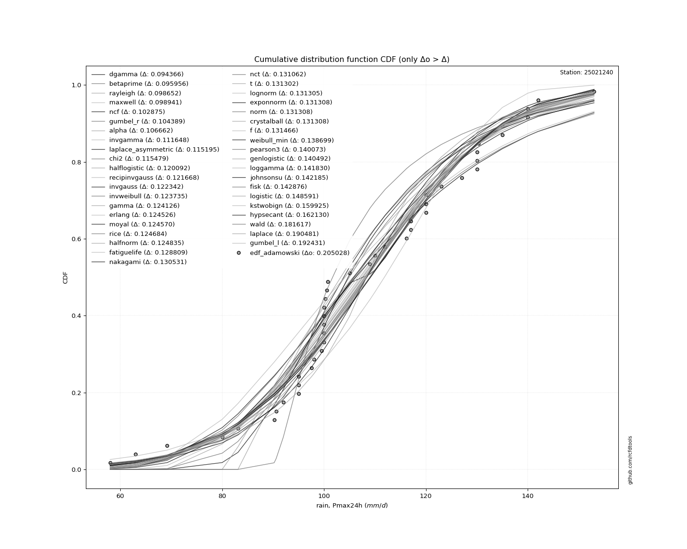</img>

</div>


**11.3. Best fit**

|   id |   station | empirical_dist   | p_dist   |     delta |   deltao | eval   |   fit |   n |     loc |   scale |   shape | shape1   | shape2   | shape3   |   best_fit |   best_fit_sort |
|-----:|----------:|:-----------------|:---------|----------:|---------:|:-------|------:|----:|--------:|--------:|--------:|:---------|:---------|:---------|-----------:|----------------:|
|    0 |  25021240 | edf_adamowski    | dgamma   | 0.0943662 | 0.205028 | Δo > Δ |     1 |  44 | 107.342 | 8.55339 | 2.01565 |          |          |          |          1 |               1 |

<div align="center">

</img></img>

</div>


## C. Best fit & Estimate extreme values for specific return periods - Tr


### 1. Best fit (ordered by delta Δ)

|   id |   station | empirical_dist   | p_dist   |     delta |   deltao | eval   |   fit |   n |     loc |   scale |   shape | shape1   | shape2   | shape3   |   best_fit |   best_fit_sort |
|-----:|----------:|:-----------------|:---------|----------:|---------:|:-------|------:|----:|--------:|--------:|--------:|:---------|:---------|:---------|-----------:|----------------:|
|    0 |  25021240 | edf_california   | dgamma   | 0.0895947 | 0.205028 | Δo > Δ |     1 |  44 | 107.342 | 8.55339 | 2.01565 |          |          |          |          1 |               1 |
|    1 |  25021240 | edf_weibull      | dgamma   | 0.0913621 | 0.205028 | Δo > Δ |     1 |  44 | 107.342 | 8.55339 | 2.01565 |          |          |          |          1 |               2 |
|    2 |  25021240 | edf_adamowski    | dgamma   | 0.0943662 | 0.205028 | Δo > Δ |     1 |  44 | 107.342 | 8.55339 | 2.01565 |          |          |          |          1 |               3 |
|    3 |  25021240 | edf_chegodayev   | dgamma   | 0.0950495 | 0.205028 | Δo > Δ |     1 |  44 | 107.342 | 8.55339 | 2.01565 |          |          |          |          1 |               4 |
|    4 |  25021240 | edf_beard        | dgamma   | 0.0951865 | 0.205028 | Δo > Δ |     1 |  44 | 107.342 | 8.55339 | 2.01565 |          |          |          |          1 |               5 |
|    5 |  25021240 | edf_jenkinson    | dgamma   | 0.0951865 | 0.205028 | Δo > Δ |     1 |  44 | 107.342 | 8.55339 | 2.01565 |          |          |          |          1 |               6 |
|    6 |  25021240 | edf_tukey        | dgamma   | 0.0955067 | 0.205028 | Δo > Δ |     1 |  44 | 107.342 | 8.55339 | 2.01565 |          |          |          |          1 |               7 |
|    7 |  25021240 | edf_blom         | dgamma   | 0.0960802 | 0.205028 | Δo > Δ |     1 |  44 | 107.342 | 8.55339 | 2.01565 |          |          |          |          1 |               8 |
|    8 |  25021240 | edf_cunnane      | dgamma   | 0.0964253 | 0.205028 | Δo > Δ |     1 |  44 | 107.342 | 8.55339 | 2.01565 |          |          |          |          1 |               9 |
|    9 |  25021240 | edf_gringorten   | dgamma   | 0.0969791 | 0.205028 | Δo > Δ |     1 |  44 | 107.342 | 8.55339 | 2.01565 |          |          |          |          1 |              10 |
|   10 |  25021240 | edf_hazen        | dgamma   | 0.0978136 | 0.205028 | Δo > Δ |     1 |  44 | 107.342 | 8.55339 | 2.01565 |          |          |          |          1 |              11 |

:file_folder:Tables: [bestfit_25021240.csv](table/bestfit_25021240.csv) | [extreme_25021240.csv](table/extreme_25021240.csv)


### 2. Extreme values

In hydrology, a return period (or recurrence interval) is the statistical average time between extreme events like floods or droughts of a specific magnitude, indicating how rare an event is, with a 100-year flood, for example, having a 1% chance of occurring in any given year, not that it happens exactly every century. It is a key tool for infrastructure design (like bridges or dams) and risk assessment, calculated from historical data to determine the probability of future events, although it is important to remember it is statistical average, and events can cluster or be missed.

> risk_rate: assuming the return period as the project useful life.

|   id |      tr |   prob_l |     prob_g |   alpha |   betaprime |    chi2 |   crystalball |   dgamma |   erlang |    expon |   exponnorm |       f |   fatiguelife |    fisk |   gamma |   genexpon |   genlogistic |   gibrat |   gompertz |   gumbel_l |   gumbel_r |   halflogistic |   halfnorm |   hypsecant |   invgamma |   invgauss |   invweibull |   johnsonsu |   kstwobign |   laplace |   laplace_asymmetric |   loggamma |   logistic |   lognorm |   maxwell |   mielke |   moyal |   nakagami |     ncf |     nct |    norm |   pareto |   pearson3 |   rayleigh |   recipinvgauss |    rice |       t |   truncnorm |    wald |   weibull_min |   zzgumbel |   station |   n |   risk_rate |
|-----:|--------:|---------:|-----------:|--------:|------------:|--------:|--------------:|---------:|---------:|---------:|------------:|--------:|--------------:|--------:|--------:|-----------:|--------------:|---------:|-----------:|-----------:|-----------:|---------------:|-----------:|------------:|-----------:|-----------:|-------------:|------------:|------------:|----------:|---------------------:|-----------:|-----------:|----------:|----------:|---------:|--------:|-----------:|--------:|--------:|--------:|---------:|-----------:|-----------:|----------------:|--------:|--------:|------------:|--------:|--------------:|-----------:|----------:|----:|------------:|
|    0 |    2    | 0.5      | 0.5        | 107.026 |     106.15  | 107.573 |       108.389 |  107.342 |  107.997 |  92.9267 |     108.389 | 108.404 |       108.156 | 108.42  | 107.998 |    92.9639 |       108.27  |  102.07  |    136.299 |    111.847 |    104.931 |        103.211 |    104.08  |     108.389 |    107.297 |    106.209 |      105.711 |     109.086 |     104.052 |   108.389 |              104.695 |    109.061 |    108.389 |   108.388 |   106.588 |  104.827 | 103.814 |    108.358 | 105.837 | 108.383 | 108.389 |  92.9267 |    108.961 |    105.95  |         107.819 | 108.094 | 108.387 |    -43.5193 | 101.565 |       109.137 |    114.441 |  25021240 |  44 |    0.75     |
|    1 |    2.33 | 0.570815 | 0.429185   | 110.874 |     109.97  | 111.438 |       112.145 |  113.056 |  111.777 | 100.622  |     112.145 | 112.168 |       111.899 | 111.875 | 111.79  |   100.667  |       111.743 |  103.973 |    137.158 |    115.115 |    108.411 |        106.79  |    108.134 |     111.395 |    111.144 |    110.9   |      110.29  |     112.808 |     108.901 |   110.662 |              107.795 |    112.782 |    111.698 |   112.145 |   110.491 |  109.186 | 107.109 |    112.123 | 109.826 | 112.143 | 112.145 | 100.622  |    112.695 |    109.91  |         111.632 | 111.911 | 112.143 |    -41.9012 | 104.028 |       112.955 |    117.961 |  25021240 |  44 |    0.729209 |
|    2 |    5    | 0.8      | 0.2        | 125.758 |     124.977 | 126.238 |       126.104 |  124.786 |  125.999 | 139.097  |     126.104 | 126.182 |       126.003 | 125.216 | 126.055 |   139.183  |       125.283 |  114.928 |    139.934 |    125.672 |    123.532 |        122.982 |    125.278 |     123.453 |    126.01  |    130.677 |      130.184 |     126.279 |     129.495 |   122.027 |              123.296 |    126.25  |    124.477 |   126.104 |   125.851 |  128.217 | 122.371 |    126.13  | 126.234 | 126.119 | 126.104 | 139.097  |    126.251 |    125.765 |         126.245 | 126.183 | 126.1   |    -35.888  | 117.816 |       126.563 |    133.258 |  25021240 |  44 |    0.67232  |
|    3 |   10    | 0.9      | 0.1        | 136.17  |     135.689 | 136.441 |       135.364 |  133.13  |  135.586 | 174.024  |     135.364 | 135.501 |       135.527 | 135.041 | 135.669 |   174.147  |       135.342 |  127.415 |    141.479 |    131.55  |    135.849 |        136.43  |    137.964 |     133.082 |    136.393 |    146.026 |      146.387 |     134.91  |     145.175 |   132.344 |              137.366 |    134.882 |    133.888 |   135.365 |   136.66  |  143.829 | 135.659 |    135.434 | 138.676 | 135.392 | 135.364 | 174.024  |    134.97  |    137.069 |         136.333 | 135.708 | 135.359 |    -31.899  | 132.449 |       135.062 |    145.716 |  25021240 |  44 |    0.651322 |
|    4 |   15    | 0.933333 | 0.0666667  | 141.538 |     141.276 | 141.649 |       139.985 |  137.678 |  140.415 | 194.455  |     139.985 | 140.158 |       140.331 | 140.395 | 140.512 |   194.599  |       140.84  |  136.028 |    142.179 |    134.212 |    142.797 |        144.04  |    144.565 |     138.577 |    141.738 |    154.408 |      155.529 |     139.129 |     153.499 |   138.379 |              145.597 |    139.103 |    139.015 |   139.986 |   142.207 |  152.682 | 143.371 |    140.081 | 145.414 | 140.019 | 139.985 | 194.455  |    139.24  |    142.894 |         141.488 | 140.475 | 139.979 |    -29.9084 | 141.845 |       139.149 |    152.745 |  25021240 |  44 |    0.644736 |
|    5 |   20    | 0.95     | 0.05       | 145.117 |     145.027 | 145.101 |       143.012 |  140.811 |  143.595 | 208.951  |     143.012 | 143.211 |       143.496 | 144.095 | 143.699 |   209.11   |       144.644 |  142.784 |    142.615 |    135.869 |    147.662 |        149.371 |    148.967 |     142.454 |    145.299 |    160.171 |      161.929 |     141.862 |     159.106 |   142.661 |              151.437 |    141.837 |    142.559 |   143.012 |   145.887 |  158.9   | 148.832 |    143.126 | 150.034 | 143.05  | 143.012 | 208.951  |    142.007 |    146.765 |         144.907 | 143.6   | 143.005 |    -28.6049 | 148.847 |       141.771 |    157.666 |  25021240 |  44 |    0.641514 |
|    6 |   25    | 0.96     | 0.04       | 147.786 |     147.835 | 147.664 |       145.239 |  143.2   |  145.943 | 220.195  |     145.239 | 145.459 |       145.834 | 146.925 | 146.054 |   220.366  |       147.556 |  148.417 |    142.925 |    137.048 |    151.41  |        153.479 |    152.242 |     145.454 |    147.952 |    164.554 |      166.86  |     143.859 |     163.307 |   145.982 |              155.967 |    143.834 |    145.27  |   145.24  |   148.62  |  163.7   | 153.065 |    145.368 | 153.544 | 145.281 | 145.239 | 220.195  |    144.03  |    149.642 |         147.447 | 145.902 | 145.233 |    -27.6452 | 154.456 |       143.675 |    161.457 |  25021240 |  44 |    0.639603 |
|    7 |   50    | 0.98     | 0.02       | 155.588 |     156.106 | 155.104 |       151.619 |  150.44  |  152.708 | 255.122  |     151.619 | 151.903 |       152.576 | 155.573 | 152.837 |   255.33   |       156.459 |  168.271 |    143.766 |    140.249 |    162.954 |        166.136 |    161.761 |     154.756 |    155.699 |    177.79  |      182.048 |     149.506 |     175.64  |   156.299 |              170.038 |    149.483 |    153.554 |   151.619 |   156.545 |  178.547 | 166.207 |    151.791 | 164.142 | 151.67  | 151.619 | 255.122  |    149.753 |    157.992 |         154.826 | 152.503 | 151.611 |    -24.8973 | 172.767 |       149.004 |    173.135 |  25021240 |  44 |    0.63583  |
|    8 |   75    | 0.986667 | 0.0133333  | 159.875 |     160.689 | 159.157 |       155.042 |  154.577 |  156.362 | 275.552  |     155.042 | 155.364 |       156.221 | 160.568 | 156.5   |   275.782  |       161.604 |  181.681 |    144.192 |    141.867 |    169.664 |        173.493 |    166.942 |     160.191 |    159.949 |    185.321 |      190.875 |     152.494 |     182.426 |   162.334 |              178.269 |    152.473 |    158.338 |   155.042 |   160.854 |  187.218 | 173.892 |    155.239 | 170.182 | 155.099 | 155.042 | 275.552  |    152.783 |    162.534 |         158.851 | 156.05  | 155.033 |    -23.4228 | 184.036 |       151.792 |    179.923 |  25021240 |  44 |    0.634587 |
|    9 |  100    | 0.99     | 0.01       | 162.816 |     163.847 | 161.924 |       157.357 |  157.478 |  158.843 | 290.048  |     157.357 | 157.707 |       158.696 | 164.094 | 158.987 |   290.293  |       165.237 |  192.069 |    144.47  |    142.926 |    174.413 |        178.701 |    170.472 |     164.047 |    162.862 |    190.589 |      197.123 |     154.499 |     187.076 |   166.616 |              184.109 |    154.478 |    161.715 |   157.358 |   163.789 |  193.374 | 179.345 |    157.572 | 174.415 | 157.418 | 157.357 | 290.048  |    154.816 |    165.629 |         161.599 | 158.45  | 157.348 |    -22.4255 | 192.251 |       153.65  |    184.727 |  25021240 |  44 |    0.633968 |
|   10 |  200    | 0.995    | 0.005      | 169.614 |     171.194 | 168.273 |       162.608 |  164.371 |  164.499 | 324.975  |     162.608 | 163.024 |       164.345 | 172.553 | 164.657 |   325.257  |       173.955 |  220.331 |    145.075 |    145.227 |    185.831 |        191.22  |    178.546 |     173.337 |    169.586 |    203.072 |      212.144 |     158.998 |     197.785 |   176.933 |              198.18  |    158.979 |    169.818 |   162.609 |   170.504 |  208.235 | 192.481 |    162.867 | 184.489 | 162.678 | 162.608 | 324.975  |    159.378 |    172.71  |         167.912 | 163.898 | 162.599 |    -20.1634 | 212.715 |       157.785 |    196.276 |  25021240 |  44 |    0.633042 |
|   11 |  250    | 0.996    | 0.004      | 171.728 |     173.491 | 170.233 |       164.213 |  166.566 |  166.236 | 336.219  |     164.213 | 164.65  |       166.08  | 175.269 | 166.398 |   336.512  |       176.754 |  230.472 |    145.253 |    145.904 |    189.501 |        195.245 |    181.029 |     176.327 |    171.673 |    207.037 |      216.973 |     160.36  |     201.099 |   180.254 |              202.71  |    160.342 |    172.419 |   164.214 |   172.571 |  213.032 | 196.71  |    164.486 | 187.703 | 164.286 | 164.213 | 336.219  |    160.759 |    174.89  |         169.863 | 165.565 | 164.204 |    -19.4721 | 219.486 |       159.028 |    199.989 |  25021240 |  44 |    0.632858 |
|   12 |  500    | 0.998    | 0.002      | 178.097 |     180.449 | 176.105 |       168.972 |  173.319 |  171.407 | 371.146  |     168.972 | 169.476 |       171.25  | 183.692 | 171.581 |   371.476  |       185.435 |  265.517 |    145.764 |    147.845 |    200.894 |        207.737 |    188.434 |     185.616 |    177.955 |    219.218 |      231.961 |     164.363 |     211.03  |   190.571 |              216.781 |    164.346 |    180.487 |   168.974 |   178.738 |  227.98  | 209.846 |    169.288 | 197.635 | 169.053 | 168.972 | 371.146  |    164.816 |    181.394 |         175.711 | 170.509 | 168.962 |    -17.422  | 241.012 |       162.656 |    211.513 |  25021240 |  44 |    0.632489 |
|   13 |  750    | 0.998667 | 0.00133333 | 181.702 |     184.411 | 179.403 |       171.616 |  177.232 |  174.294 | 391.576  |     171.616 | 172.159 |       174.138 | 188.612 | 174.475 |   391.928  |       190.507 |  288.693 |    146.036 |    148.883 |    207.554 |        215.04  |    192.571 |     191.049 |    181.505 |    226.262 |      240.723 |     166.564 |     216.61  |   196.606 |              225.012 |    166.548 |    185.2   |   171.617 |   182.188 |  236.759 | 217.53  |    171.956 | 203.421 | 171.702 | 171.616 | 391.576  |    167.047 |    185.03  |         178.999 | 173.257 | 171.605 |    -16.2832 | 253.919 |       164.636 |    218.25  |  25021240 |  44 |    0.632366 |
|   14 | 1000    | 0.999    | 0.001      | 184.213 |     187.181 | 181.689 |       173.436 |  179.993 |  176.287 | 406.072  |     173.436 | 174.007 |       176.134 | 192.102 | 176.473 |   406.44   |       194.104 |  306.429 |    146.22  |    149.581 |    212.278 |        220.22  |    195.428 |     194.904 |    183.975 |    231.228 |      246.939 |     168.07  |     220.475 |   200.888 |              230.852 |    168.055 |    188.542 |   173.438 |   184.572 |  243.006 | 222.982 |    173.794 | 207.522 | 173.526 | 173.436 | 406.072  |    168.572 |    187.544 |         181.279 | 175.15  | 173.425 |    -15.4991 | 263.204 |       165.985 |    223.029 |  25021240 |  44 |    0.632305 |

<div align="center">

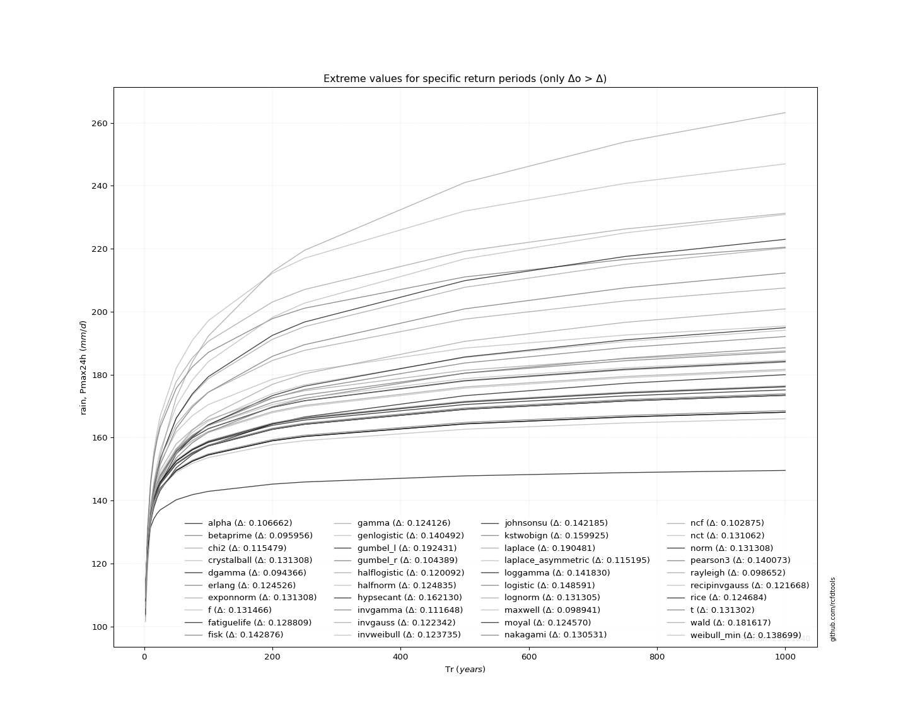</img>

</div>


<div align="center">

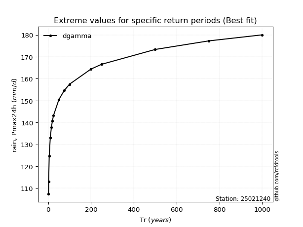</img>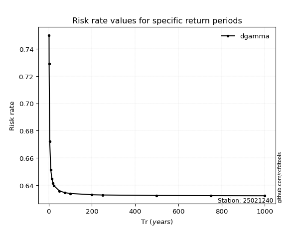</img>

</div>


<sub>**APP DISCLAIMER**: NO WARRANTY - This software is provided by [github.com/rcfdtools](https://github.com/rcfdtools) "as is", without any express or implied warranty, including warranties of merchantability, fitness for a particular purpose, or non-infringement. There is no guarantee that the software will be error-free or operate without interruption. LIMITATION OF LIABILITY - Neither the authors nor copyright holders will be liable for claims or damages arising from the software or its use. You are responsible for determining if the software is appropriate for your use and assume all associated risks, including errors, legal compliance, and data loss. NO PROFESSIONAL ADVICE - The software provides general information and does not offer professional advice. It should not replace consultation with professional advisors.</sub>