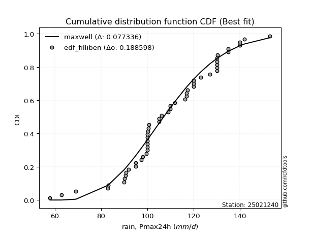
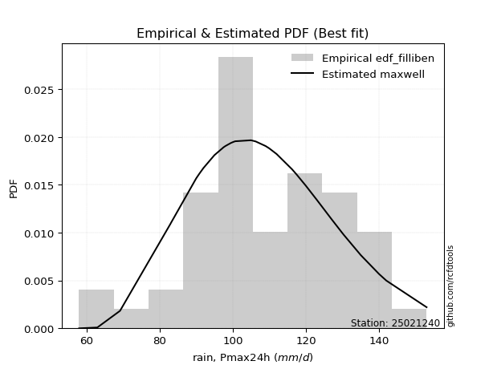

<div align="center">


</div>

# Station (rain, Pmax24h): 25021240

Probable Maximum Precipitation (PMP) is the greatest amount of rainfall for a specific duration that is meteorologically possible for a given location, acting as a "worst-case" scenario for extreme storms, crucial for designing safety-critical infrastructure like bridges, river deviations, dams, spillways, and nuclear plants to prevent catastrophic failure. PMP is calculated by hydrologists using meteorological data to determine the upper limit of extreme rainfall, often leading to the Probable Maximum Flood (PMF) for flood control design, and is increasingly being studied for climate change impacts.

<div align="center">

</img>

</div>


## A. General information


### 1. General running parameters

• app_version: _v20251225_. • runtime: _2025-12-26 15:25:57.471855_. • Python version: _3.14.0_. • SciPy version: _1.16.3_. • Pandas version: _2.3.3_. • NumPy version: _2.3.5_. • Stations dataset (station_dataset_file): _dataset/pmax24h_in/conventional_cesarcolombia_1970_2021.csv_. • Stations catalog (station_catalog_file): _dataset/CNE_IDEAM.xls_. • Minimum year to eval til year_max (date_min): _1970_. • Maximum year to eval since year_min (date_max): _2021_. • Creates, save and include plots into reports (create_plot): _True_. • Plot only fit distributions with Δo > Δ (plot_only_fit): _True_. • Eval low extreme values, if False, evaluates high extreme values (low_extreme): _False_. • Eval every SciPy distribution as logarithmic (pdist_logarithmic_on): _True_. • Standard deviation normalized (ddof): _1.0_. • Return periods to eval in years (Tr): _[2, 2.33, 5, 10, 15, 20, 25, 50, 75, 100, 200, 250, 500, 750, 1000]_. • Minimum data sample per station, 0 means any (minimum_sample): _5_. • Z-Score threshold to adjust a value, 0 means disable (zscore): _3.5_. • Avoid zeros, e.g. rain = 0 (avoid_zeros): _True_. • Avoid null values (avoid_nans): _True_. [:file_folder:Dataset file.](../../dataset/pmax24h_in/conventional_cesarcolombia_1970_2021.csv)


### 2. Station info and location

|   id |   CODIGO | NOMBRE                 | CATEGORIA     | TECNOLOGIA   | ESTADO   | FECHA_INSTALACION   |   FECHA_SUSPENSION |   ALTITUD |   LATITUD |   LONGITUD | DEPARTAMENTO   | MUNICIPIO   | AREA_OPERATIVA                                         | ENTIDAD                                                     | AREA_HIDROGRAFICA   | ZONA_HIDROGRAFICA   | SUBZONA_HIDROGRAFICA   |   CORRIENTE |   OBSERVACION | SUBRED                                                                  | Catalogo   |
|-----:|---------:|:-----------------------|:--------------|:-------------|:---------|:--------------------|-------------------:|----------:|----------:|-----------:|:---------------|:------------|:-------------------------------------------------------|:------------------------------------------------------------|:--------------------|:--------------------|:-----------------------|------------:|--------------:|:------------------------------------------------------------------------|:-----------|
|    0 | 25021240 | CHIMICHAGUA [25021240] | Pluviométrica | Convencional | Activa   | 15/07/1972          |                nan |       138 |   9.26008 |   -73.8099 | Cesar          | Chimichagua | Area Operativa 05 - Magdalena-Cesar-Guajira-San Andrés | INSTITUTO DE HIDROLOGIA METEOROLOGIA Y ESTUDIOS AMBIENTALES | Magdalena Cauca     | Cesar               | Bajo Cesar             |         nan |           nan | RED ALERTAS - AREA OPERATIVA 05,Atlántico, Magdalena y Norte de Bolívar | CNE_IDEAM  |

<div align="center">

Map location in: [:earth_americas:Google](http://maps.google.com/maps?q=9.260083333,-73.80986111) [:earth_americas:OSM](https://www.openstreetmap.org/#map=18/9.260083333/-73.80986111&layers=P) [:earth_americas:Bing](https://www.bing.com/maps?cp=9.260083333~-73.80986111&lvl=18) [:earth_americas:Apple](https://maps.apple.com/frame?center=9.260083333%2C-73.80986111&span=0.003%2C0.006)

</div>


<div align="center">

```geojson
{
  "type": "Feature",
  "geometry": {
    "type": "Point", 
    "coordinates": [-73.80986111, 9.260083333]
  }, 
  "properties": {
    "Name": "25021240"
  }
}
```

</div>


### 3. Discrete values table and plot

|               |           0 |           1 |           2 |            3 |           4 |          5 |           6 |           7 |          8 |          9 |          10 |         11 |          12 |         13 |          14 |         15 |         16 |          17 |          18 |          19 |          20 |          21 |          22 |          23 |         24 |          25 |         26 |          27 |          28 |          29 |           30 |          31 |          32 |          33 |         34 |          35 |          36 |          37 |         38 |          39 |        40 |         41 |         42 |         43 |         44 |         45 |         46 |           47 |         48 |          49 |          50 |         51 |
|:--------------|------------:|------------:|------------:|-------------:|------------:|-----------:|------------:|------------:|-----------:|-----------:|------------:|-----------:|------------:|-----------:|------------:|-----------:|-----------:|------------:|------------:|------------:|------------:|------------:|------------:|------------:|-----------:|------------:|-----------:|------------:|------------:|------------:|-------------:|------------:|------------:|------------:|-----------:|------------:|------------:|------------:|-----------:|------------:|----------:|-----------:|-----------:|-----------:|-----------:|-----------:|-----------:|-------------:|-----------:|------------:|------------:|-----------:|
| Date          | 1970        | 1971        | 1972        | 1973         | 1974        | 1975       | 1976        | 1977        | 1978       | 1979       | 1980        | 1981       | 1982        | 1983       | 1984        | 1985       | 1986       | 1987        | 1988        | 1989        | 1990        | 1991        | 1992        | 1993        | 1994       | 1995        | 1996       | 1997        | 1998        | 1999        | 2000         | 2001        | 2002        | 2003        | 2004       | 2005        | 2006        | 2007        | 2008       | 2009        | 2010      | 2011       | 2012       | 2013       | 2014       | 2015       | 2016       | 2017         | 2018       | 2019        | 2020        | 2021       |
| Value         |  117.43     |  104.989    |   90.876    |  110         |  117        |  140       |  100.002    |  120        |  130       |  130       |   92        |  142       |  100        |  153       |  120        |   98       |   58       |   95        |  123        |  100        |  105        |   95        |  100        |  117        |   63       |  100        |  130       |   90.6      |  100.5      |  100.3      |  109         |  120        |  100        |   97.5      |   69.2     |   90.2      |  100.7      |  112        |  130.3     |   99.5      |  127      |  116.2     |   83.1     |  135       |  140       |  135       |   83       |  110         |  130       |   90        |  106.287    |  130       |
| Value_initial |  117.43     |  104.989    |   90.876    |  110         |  117        |  140       |  100.002    |  120        |  130       |  130       |   92        |  142       |  100        |  153       |  120        |   98       |   58       |   95        |  123        |  100        |  105        |   95        |  100        |  117        |   63       |  100        |  130       |   90.6      |  100.5      |  100.3      |  109         |  120        |  100        |   97.5      |   69.2     |   90.2      |  100.7      |  112        |  130.3     |   99.5      |  127      |  116.2     |   83.1     |  135       |  140       |  135       |   83       |  110         |  130       |   90        |  106.287    |  130       |
| count         |   52        |   52        |   52        |   52         |   52        |   52       |   52        |   52        |   52       |   52       |   52        |   52       |   52        |   52       |   52        |   52       |   52       |   52        |   52        |   52        |   52        |   52        |   52        |   52        |   52       |   52        |   52       |   52        |   52        |   52        |   52         |   52        |   52        |   52        |   52       |   52        |   52        |   52        |   52       |   52        |   52      |   52       |   52       |   52       |   52       |   52       |   52       |   52         |   52       |   52        |   52        |   52       |
| mean          |  108.782    |  108.782    |  108.782    |  108.782     |  108.782    |  108.782   |  108.782    |  108.782    |  108.782   |  108.782   |  108.782    |  108.782   |  108.782    |  108.782   |  108.782    |  108.782   |  108.782   |  108.782    |  108.782    |  108.782    |  108.782    |  108.782    |  108.782    |  108.782    |  108.782   |  108.782    |  108.782   |  108.782    |  108.782    |  108.782    |  108.782     |  108.782    |  108.782    |  108.782    |  108.782   |  108.782    |  108.782    |  108.782    |  108.782   |  108.782    |  108.782  |  108.782   |  108.782   |  108.782   |  108.782   |  108.782   |  108.782   |  108.782     |  108.782   |  108.782    |  108.782    |  108.782   |
| std           |   20.2418   |   20.2418   |   20.2418   |   20.2418    |   20.2418   |   20.2418  |   20.2418   |   20.2418   |   20.2418  |   20.2418  |   20.2418   |   20.2418  |   20.2418   |   20.2418  |   20.2418   |   20.2418  |   20.2418  |   20.2418   |   20.2418   |   20.2418   |   20.2418   |   20.2418   |   20.2418   |   20.2418   |   20.2418  |   20.2418   |   20.2418  |   20.2418   |   20.2418   |   20.2418   |   20.2418    |   20.2418   |   20.2418   |   20.2418   |   20.2418  |   20.2418   |   20.2418   |   20.2418   |   20.2418  |   20.2418   |   20.2418 |   20.2418  |   20.2418  |   20.2418  |   20.2418  |   20.2418  |   20.2418  |   20.2418    |   20.2418  |   20.2418   |   20.2418   |   20.2418  |
| zscore        |    0.427221 |   -0.187386 |   -0.884628 |    0.0601529 |    0.405972 |    1.54224 |   -0.433785 |    0.554181 |    1.04821 |    1.04821 |   -0.829097 |    1.64104 |   -0.433875 |    2.18447 |    0.554181 |   -0.53268 |   -2.50879 |   -0.680889 |    0.702389 |   -0.433875 |   -0.186861 |   -0.680889 |   -0.433875 |    0.405972 |   -2.26178 |   -0.433875 |    1.04821 |   -0.898261 |   -0.409173 |   -0.419054 |    0.0107501 |    0.554181 |   -0.433875 |   -0.557382 |   -1.95548 |   -0.918022 |   -0.399293 |    0.158958 |    1.06303 |   -0.458576 |    0.9    |    0.36645 |   -1.26878 |    1.29522 |    1.54224 |    1.29522 |   -1.27372 |    0.0601529 |    1.04821 |   -0.927903 |   -0.123258 |    1.04821 |

<div align="center">

</img>

</div>

> If Z-Score is active, values out of range or outliers are replaced with the station mean value.


### 4. Active continuous probability distributions from SciPy (45 of 104 available)

[scipy.stats](https://docs.scipy.org/doc/scipy/reference/stats.html) is a Python´s powerful submodule within the SciPy library for comprehensive statistical analysis, offering over 130 probability distributions (like Normal, Poisson), functions for descriptive stats (mean, variance), hypothesis testing (t-tests, chi-square), random variable generation, and statistical tests, making it essential for data science, modeling, and research. It provides tools to explore, model, and draw conclusions from data efficiently, working seamlessly with NumPy.

<div align="center">

|   id | p_dist             |   n_parameter | fit_method   | label                                                                       | active   | ref                                                                                                        |
|-----:|:-------------------|--------------:|:-------------|:----------------------------------------------------------------------------|:---------|:-----------------------------------------------------------------------------------------------------------|
|    0 | alpha              |             3 | MLE          | Alpha                                                                       | True     | [:mortar_board:](https://docs.scipy.org/doc/scipy/reference/generated/scipy.stats.alpha.html)              |
|    1 | betaprime          |             4 | MLE          | Beta prime                                                                  | True     | [:mortar_board:](https://docs.scipy.org/doc/scipy/reference/generated/scipy.stats.betaprime.html)          |
|    2 | chi2               |             3 | MLE          | Chi²                                                                        | True     | [:mortar_board:](https://docs.scipy.org/doc/scipy/reference/generated/scipy.stats.chi2.html)               |
|    3 | crystalball        |             4 | MLE          | Crystalball                                                                 | True     | [:mortar_board:](https://docs.scipy.org/doc/scipy/reference/generated/scipy.stats.crystalball.html)        |
|    4 | erlang             |             3 | MLE          | Erlang                                                                      | True     | [:mortar_board:](https://docs.scipy.org/doc/scipy/reference/generated/scipy.stats.erlang.html)             |
|    5 | expon              |             2 | MLE          | Exponential                                                                 | True     | [:mortar_board:](https://docs.scipy.org/doc/scipy/reference/generated/scipy.stats.expon.html)              |
|    6 | exponnorm          |             3 | MLE          | Exponentially modified Normal                                               | True     | [:mortar_board:](https://docs.scipy.org/doc/scipy/reference/generated/scipy.stats.exponnorm.html)          |
|    7 | f                  |             4 | MLE          | F                                                                           | True     | [:mortar_board:](https://docs.scipy.org/doc/scipy/reference/generated/scipy.stats.f.html)                  |
|    8 | fatiguelife        |             3 | MLE          | Fatigue-life (Birnbaum-Saunders)                                            | True     | [:mortar_board:](https://docs.scipy.org/doc/scipy/reference/generated/scipy.stats.fatiguelife.html)        |
|    9 | fisk               |             3 | MLE          | Fisk                                                                        | True     | [:mortar_board:](https://docs.scipy.org/doc/scipy/reference/generated/scipy.stats.fisk.html)               |
|   10 | gamma              |             3 | MLE          | Gamma                                                                       | True     | [:mortar_board:](https://docs.scipy.org/doc/scipy/reference/generated/scipy.stats.gamma.html)              |
|   11 | genexpon           |             5 | MLE          | Generalized exponential                                                     | True     | [:mortar_board:](https://docs.scipy.org/doc/scipy/reference/generated/scipy.stats.genexpon.html)           |
|   12 | genlogistic        |             3 | MLE          | Generalized logistic                                                        | True     | [:mortar_board:](https://docs.scipy.org/doc/scipy/reference/generated/scipy.stats.genlogistic.html)        |
|   13 | gibrat             |             2 | MM           | Gibrat                                                                      | True     | [:mortar_board:](https://docs.scipy.org/doc/scipy/reference/generated/scipy.stats.gibrat.html)             |
|   14 | gompertz           |             3 | MLE          | Gompertz (or truncated Gumbel)                                              | True     | [:mortar_board:](https://docs.scipy.org/doc/scipy/reference/generated/scipy.stats.gompertz.html)           |
|   15 | gumbel_l           |             2 | MM           | Gumbel Left Skew                                                            | True     | [:mortar_board:](https://docs.scipy.org/doc/scipy/reference/generated/scipy.stats.gumbel_l.html)           |
|   16 | gumbel_r           |             2 | MM           | Gumbel Right Skew                                                           | True     | [:mortar_board:](https://docs.scipy.org/doc/scipy/reference/generated/scipy.stats.gumbel_r.html)           |
|   17 | halflogistic       |             2 | MM           | Half-logistic                                                               | True     | [:mortar_board:](https://docs.scipy.org/doc/scipy/reference/generated/scipy.stats.halflogistic.html)       |
|   18 | halfnorm           |             2 | MM           | Half Normal                                                                 | True     | [:mortar_board:](https://docs.scipy.org/doc/scipy/reference/generated/scipy.stats.halfnorm.html)           |
|   19 | hypsecant          |             2 | MM           | hyperbolic secant                                                           | True     | [:mortar_board:](https://docs.scipy.org/doc/scipy/reference/generated/scipy.stats.hypsecant.html)          |
|   20 | invgamma           |             3 | MLE          | Inverted gamma                                                              | True     | [:mortar_board:](https://docs.scipy.org/doc/scipy/reference/generated/scipy.stats.invgamma.html)           |
|   21 | invgauss           |             3 | MLE          | Inverse Gaussian                                                            | True     | [:mortar_board:](https://docs.scipy.org/doc/scipy/reference/generated/scipy.stats.invgauss.html)           |
|   22 | invweibull         |             3 | MLE          | Inverted Weibull                                                            | True     | [:mortar_board:](https://docs.scipy.org/doc/scipy/reference/generated/scipy.stats.invweibull.html)         |
|   23 | johnsonsu          |             4 | MLE          | Johnson Su                                                                  | True     | [:mortar_board:](https://docs.scipy.org/doc/scipy/reference/generated/scipy.stats.johnsonsu.html)          |
|   24 | kstwobign          |             2 | MLE          | Limiting distribution of scaled Kolmogorov-Smirnov two-sided test statistic | True     | [:mortar_board:](https://docs.scipy.org/doc/scipy/reference/generated/scipy.stats.kstwobign.html)          |
|   25 | laplace            |             2 | MM           | Laplace                                                                     | True     | [:mortar_board:](https://docs.scipy.org/doc/scipy/reference/generated/scipy.stats.laplace.html)            |
|   26 | laplace_asymmetric |             3 | MLE          | Asymmetric Laplace                                                          | True     | [:mortar_board:](https://docs.scipy.org/doc/scipy/reference/generated/scipy.stats.laplace_asymmetric.html) |
|   27 | loggamma           |             3 | MLE          | Log gamma                                                                   | True     | [:mortar_board:](https://docs.scipy.org/doc/scipy/reference/generated/scipy.stats.loggamma.html)           |
|   28 | logistic           |             2 | MM           | Logistic (or Sech-squared)                                                  | True     | [:mortar_board:](https://docs.scipy.org/doc/scipy/reference/generated/scipy.stats.logistic.html)           |
|   29 | lognorm            |             3 | MLE          | Log Normal                                                                  | True     | [:mortar_board:](https://docs.scipy.org/doc/scipy/reference/generated/scipy.stats.lognorm.html)            |
|   30 | maxwell            |             2 | MM           | Maxwell                                                                     | True     | [:mortar_board:](https://docs.scipy.org/doc/scipy/reference/generated/scipy.stats.maxwell.html)            |
|   31 | mielke             |             4 | MLE          | Mielke Beta-Kappa / Dagum                                                   | True     | [:mortar_board:](https://docs.scipy.org/doc/scipy/reference/generated/scipy.stats.mielke.html)             |
|   32 | moyal              |             2 | MM           | Moyal                                                                       | True     | [:mortar_board:](https://docs.scipy.org/doc/scipy/reference/generated/scipy.stats.moyal.html)              |
|   33 | nakagami           |             3 | MLE          | Nakagami                                                                    | True     | [:mortar_board:](https://docs.scipy.org/doc/scipy/reference/generated/scipy.stats.nakagami.html)           |
|   34 | ncf                |             5 | MLE          | Non-central F distribution                                                  | True     | [:mortar_board:](https://docs.scipy.org/doc/scipy/reference/generated/scipy.stats.ncf.html)                |
|   35 | nct                |             4 | MLE          | Non-central Student’s t                                                     | True     | [:mortar_board:](https://docs.scipy.org/doc/scipy/reference/generated/scipy.stats.nct.html)                |
|   36 | norm               |             2 | MM           | Normal                                                                      | True     | [:mortar_board:](https://docs.scipy.org/doc/scipy/reference/generated/scipy.stats.norm.html)               |
|   37 | pareto             |             3 | MLE          | Pareto                                                                      | True     | [:mortar_board:](https://docs.scipy.org/doc/scipy/reference/generated/scipy.stats.pareto.html)             |
|   38 | pearson3           |             3 | MM           | Pearson type III                                                            | True     | [:mortar_board:](https://docs.scipy.org/doc/scipy/reference/generated/scipy.stats.pearson3.html)           |
|   39 | rayleigh           |             2 | MM           | Rayleigh                                                                    | True     | [:mortar_board:](https://docs.scipy.org/doc/scipy/reference/generated/scipy.stats.rayleigh.html)           |
|   40 | rice               |             3 | MLE          | Rice                                                                        | True     | [:mortar_board:](https://docs.scipy.org/doc/scipy/reference/generated/scipy.stats.rice.html)               |
|   41 | t                  |             3 | MLE          | Student’s t                                                                 | True     | [:mortar_board:](https://docs.scipy.org/doc/scipy/reference/generated/scipy.stats.t.html)                  |
|   42 | truncnorm          |             4 | MLE          | Truncated normal                                                            | True     | [:mortar_board:](https://docs.scipy.org/doc/scipy/reference/generated/scipy.stats.truncnorm.html)          |
|   43 | wald               |             2 | MM           | Wald                                                                        | True     | [:mortar_board:](https://docs.scipy.org/doc/scipy/reference/generated/scipy.stats.wald.html)               |
|   44 | weibull_min        |             3 | MLE          | Weibull minimum                                                             | True     | [:mortar_board:](https://docs.scipy.org/doc/scipy/reference/generated/scipy.stats.weibull_min.html)        |

</div>

> **n_parameter:** # arguments & localization & scale.
>
> **Fit methods:** (MLE) maximum likelihood, (MM) L-moments.
>
>**Inactive:** foldnorm, gennorm, norminvgauss, powernorm, powerlognorm, skewnorm, genextreme, anglit, arcsine, argus, beta, bradford, burr, burr12, cauchy, cosine, halfcauchy, foldcauchy, skewcauchy, wrapcauchy, dgamma, gengamma, exponweib, exponpow, truncexpon, gausshyper, genhalflogistic, genhyperbolic, geninvgauss, halfgennorm, johnsonsb, kappa4, kappa3, ksone, kstwo, loglaplace, levy, levy_l, levy_stable, ncx2, genpareto, truncpareto, lomax, powerlaw, rdist, rel_breitwigner, recipinvgauss, semicircular, studentized_range, trapezoid, triang, truncweibull_min, tukeylambda, uniform, loguniform, vonmises, vonmises_line, weibull_max, dweibull, 


## B. Probability distributions vs. Empirical distributions

A continuous probability distribution (CPD) describes probabilities for variables that can take any value within a range (like rain any time), unlike discrete variables with specific outcomes (like temperature). It uses a Probability Density Function (PDF), a curve where the total area under it equals 1, and the probability of the variable falling within an interval (a to b) is found by calculating the area under the curve between those points. A key feature is that the probability of hitting any single exact value is zero, so probabilities are always expressed for ranges, e.g., $P(a ≤ X ≤ b)$.

<div align="center">

Distributions parameters
|    |   station | p_dist                |   n |              loc |           scale | shape                  | shape1                | shape2                | shape3   |
|---:|----------:|:----------------------|----:|-----------------:|----------------:|:-----------------------|:----------------------|:----------------------|:---------|
|  0 |  25021240 | alpha                 |  52 |   -275.085       |  7245.34        | 18.93211639890614      |                       |                       |          |
|  1 |  25021240 | betaprime             |  52 |    -60.8179      |     0.462304    | 27458.1112848209       | 76.08909345648837     |                       |          |
|  2 |  25021240 | chi2                  |  52 |   -103.339       |     0.994082    | 213.41982777964836     |                       |                       |          |
|  3 |  25021240 | crystalball           |  52 |    108.782       |    20.0462      | 7427.585902872663      | 9691.028962900396     |                       |          |
|  4 |  25021240 | erlang                |  52 |   -326.279       |     0.93448     | 465.43856637644853     |                       |                       |          |
|  5 |  25021240 | expon                 |  52 |     58           |    50.7824      |                        |                       |                       |          |
|  6 |  25021240 | exponnorm             |  52 |    108.763       |    20.0462      | 0.0009667308913396779  |                       |                       |          |
|  7 |  25021240 | f                     |  52 |  -3073.39        |  3182.11        | 53207.28089125606      | 974031.7134951926     |                       |          |
|  8 |  25021240 | fatiguelife           |  52 |   -734.377       |   842.869       | 0.023684096831797716   |                       |                       |          |
|  9 |  25021240 | fisk                  |  52 |     -0.785916    |   108.716       | 9.30410587210913       |                       |                       |          |
| 10 |  25021240 | gamma                 |  52 |   -304.402       |     0.981456    | 420.9882334684153      |                       |                       |          |
| 11 |  25021240 | genexpon              |  52 |     58           |     1.75227     | 0.03448767228939287    | 5.727276465757183e-06 | 1.7574756539955843    |          |
| 12 |  25021240 | genlogistic           |  52 |    107.015       |    11.8734      | 1.1053386089061639     |                       |                       |          |
| 13 |  25021240 | gibrat                |  52 |     93.4897      |     9.2755      |                        |                       |                       |          |
| 14 |  25021240 | gompertz              |  52 |     83           |     4.77232     | 1.5535945255194755e-05 |                       |                       |          |
| 15 |  25021240 | gumbel_l              |  52 |    117.804       |    15.63        |                        |                       |                       |          |
| 16 |  25021240 | gumbel_r              |  52 |     99.7605      |    15.63        |                        |                       |                       |          |
| 17 |  25021240 | halflogistic          |  52 |     85.023       |    17.1388      |                        |                       |                       |          |
| 18 |  25021240 | halfnorm              |  52 |     82.2491      |    33.2545      |                        |                       |                       |          |
| 19 |  25021240 | hypsecant             |  52 |    108.782       |    12.7618      |                        |                       |                       |          |
| 20 |  25021240 | invgamma              |  52 |   -219.441       | 84945.1         | 260.0796061325649      |                       |                       |          |
| 21 |  25021240 | invgauss              |  52 |     -4.70726     |  3059.99        | 0.037035678939408206   |                       |                       |          |
| 22 |  25021240 | invweibull            |  52 |     -3.26784e+09 |     3.26784e+09 | 157803034.40066707     |                       |                       |          |
| 23 |  25021240 | johnsonsu             |  52 |    330.176       |   136.321       | 16.356236339054846     | 12.989739289358234    |                       |          |
| 24 |  25021240 | kstwobign             |  52 |     20.7962      |   101.349       |                        |                       |                       |          |
| 25 |  25021240 | laplace               |  52 |    108.782       |    14.1748      |                        |                       |                       |          |
| 26 |  25021240 | laplace_asymmetric    |  52 |    100           |    14.7786      | 0.7460811870444795     |                       |                       |          |
| 27 |  25021240 | loggamma              |  52 |   -227.54        |   102.855       | 26.806616172561313     |                       |                       |          |
| 28 |  25021240 | logistic              |  52 |    108.782       |    11.052       |                        |                       |                       |          |
| 29 |  25021240 | lognorm               |  52 |     -1.04852e+06 |     1.04863e+06 | 1.911665222361665e-05  |                       |                       |          |
| 30 |  25021240 | maxwell               |  52 |     61.2814      |    29.7669      |                        |                       |                       |          |
| 31 |  25021240 | mielke                |  52 |     -0.542265    |   118.379       | 6.592754950356644      | 11.924174569270352    |                       |          |
| 32 |  25021240 | moyal                 |  52 |     97.3187      |     9.02396     |                        |                       |                       |          |
| 33 |  25021240 | nakagami              |  52 |  -3370.3         |  3479.12        | 7499.837872699492      |                       |                       |          |
| 34 |  25021240 | ncf                   |  52 |    -76.3381      |   185.153       | 161.64775508605675     | 19191.77942742627     | 3.480170672896289e-05 |          |
| 35 |  25021240 | nct                   |  52 |  -1145.15        |    19.9706      | 248294.31405019155     | 62.788846336386996    |                       |          |
| 36 |  25021240 | norm                  |  52 |    108.782       |    20.0462      |                        |                       |                       |          |
| 37 |  25021240 | pareto                |  52 |     -8.58993e+09 |     8.58993e+09 | 169151810.53216985     |                       |                       |          |
| 38 |  25021240 | pearson3              |  52 |    108.782       |    20.0462      | -0.17686646582331517   |                       |                       |          |
| 39 |  25021240 | rayleigh              |  52 |     70.4328      |    30.5985      |                        |                       |                       |          |
| 40 |  25021240 | rice                  |  52 |     78.8713      |    20.1871      | 1.1295851708799456     |                       |                       |          |
| 41 |  25021240 | t                     |  52 |    108.779       |    20.0476      | 101021.76745085948     |                       |                       |          |
| 42 |  25021240 | truncnorm             |  52 |    -43.5193      |     9.06734     | -348.71690733304285    | 21.673304516341247    |                       |          |
| 43 |  25021240 | wald                  |  52 |     88.7362      |    20.0462      |                        |                       |                       |          |
| 44 |  25021240 | weibull_min           |  52 |     28.9633      |    87.4397      | 4.508047845141657      |                       |                       |          |
| 45 |  25021240 | logalpha              |  52 |     -4.67866     |   431.117       | 46.11702534032972      |                       |                       |          |
| 46 |  25021240 | logbetaprime          |  52 |    -10.0069      |     8.69984     | 7498.804460978168      | 4453.546674973053     |                       |          |
| 47 |  25021240 | logchi2               |  52 |      4.06044     |     0.289391    | 1.9791406395133633     |                       |                       |          |
| 48 |  25021240 | logcrystalball        |  52 |      4.67096     |     0.196729    | 413.4140254683867      | 405.2465168669292     |                       |          |
| 49 |  25021240 | logerlang             |  52 |      4.06044     |     0.908611    | 0.7460072633539214     |                       |                       |          |
| 50 |  25021240 | logexpon              |  52 |      4.06044     |     0.610519    |                        |                       |                       |          |
| 51 |  25021240 | logexponnorm          |  52 |      4.67082     |     0.196729    | 0.0007210981794843856  |                       |                       |          |
| 52 |  25021240 | logf                  |  52 |   -263.912       |   268.582       | 22785650.266692556     | 4437541.174940497     |                       |          |
| 53 |  25021240 | logfatiguelife        |  52 |   -141.539       |   146.21        | 0.0013419191750184307  |                       |                       |          |
| 54 |  25021240 | logfisk               |  52 |     -1.30538e+07 |     1.30539e+07 | 120536053.47243756     |                       |                       |          |
| 55 |  25021240 | loggamma              |  52 |      2.3416      |     0.0188222   | 123.43112554865658     |                       |                       |          |
| 56 |  25021240 | loggenexpon           |  52 |      4.05811     |     0.00636411  | 0.00048767313455993437 | 0.8163942730854137    | 0.0002267485731380144 |          |
| 57 |  25021240 | loggenlogistic        |  52 |      4.76979     |     0.0841327   | 0.5507441188364601     |                       |                       |          |
| 58 |  25021240 | loggibrat             |  52 |      4.5209      |     0.0910184   |                        |                       |                       |          |
| 59 |  25021240 | loggompertz           |  52 |      4.06044     |     0.850492    | 1.023010913833906      |                       |                       |          |
| 60 |  25021240 | loggumbel_l           |  52 |      4.7595      |     0.153389    |                        |                       |                       |          |
| 61 |  25021240 | loggumbel_r           |  52 |      4.58242     |     0.153389    |                        |                       |                       |          |
| 62 |  25021240 | loghalflogistic       |  52 |      4.4378      |     0.16819     |                        |                       |                       |          |
| 63 |  25021240 | loghalfnorm           |  52 |      4.4106      |     0.326312    |                        |                       |                       |          |
| 64 |  25021240 | loghypsecant          |  52 |      4.67096     |     0.125242    |                        |                       |                       |          |
| 65 |  25021240 | loginvgamma           |  52 |      0.10933     |  2218.43        | 487.41122684996117     |                       |                       |          |
| 66 |  25021240 | loginvgauss           |  52 |      2.30277     |   303.791       | 0.0077815406029548145  |                       |                       |          |
| 67 |  25021240 | loginvweibull         |  52 |     -3.89229e+07 |     3.89229e+07 | 165910191.75983316     |                       |                       |          |
| 68 |  25021240 | logjohnsonsu          |  52 |      5.37843     |     0.102132    | 9.585234881074175      | 3.6905263499487733    |                       |          |
| 69 |  25021240 | logkstwobign          |  52 |      3.65932     |     1.16895     |                        |                       |                       |          |
| 70 |  25021240 | loglaplace            |  52 |      4.67096     |     0.139109    |                        |                       |                       |          |
| 71 |  25021240 | loglaplace_asymmetric |  52 |      4.60519     |     0.146718    | 0.8005845548009155     |                       |                       |          |
| 72 |  25021240 | logloggamma           |  52 |      4.61569     |     0.225217    | 1.7473281541373729     |                       |                       |          |
| 73 |  25021240 | loglogistic           |  52 |      4.67096     |     0.108463    |                        |                       |                       |          |
| 74 |  25021240 | loglognorm            |  52 | -30842.3         | 30847           | 6.377605372264821e-06  |                       |                       |          |
| 75 |  25021240 | logmaxwell            |  52 |      4.20482     |     0.292114    |                        |                       |                       |          |
| 76 |  25021240 | logmielke             |  52 |     -0.423688    |     5.2122      | 30.981140303956025     | 65.36635975976998     |                       |          |
| 77 |  25021240 | logmoyal              |  52 |      4.55846     |     0.0885594   |                        |                       |                       |          |
| 78 |  25021240 | lognakagami           |  52 |   -117.746       |   122.418       | 96360.88693591839      |                       |                       |          |
| 79 |  25021240 | logncf                |  52 |    -35.028       |    33.5642      | 136728.36722884708     | 191429.11070293823    | 24984.874652333325    |          |
| 80 |  25021240 | lognct                |  52 |     -0.132628    |     0.0637321   | 310.6142071696927      | 75.17291774779767     |                       |          |
| 81 |  25021240 | lognorm               |  52 |      4.67096     |     0.19673     |                        |                       |                       |          |
| 82 |  25021240 | logpareto             |  52 |     -3.35544e+07 |     3.35544e+07 | 54960517.471319705     |                       |                       |          |
| 83 |  25021240 | logpearson3           |  52 |      4.67096     |     0.19673     | -0.8098422532077734    |                       |                       |          |
| 84 |  25021240 | lograyleigh           |  52 |      4.29455     |     0.300334    |                        |                       |                       |          |
| 85 |  25021240 | logrice               |  52 |    -82.0071      |     0.196603    | 440.87641817187284     |                       |                       |          |
| 86 |  25021240 | logt                  |  52 |      4.66913     |     0.195218    | 17.04611324844234      |                       |                       |          |
| 87 |  25021240 | logtruncnorm          |  52 |     -0.086297    |     1.41587     | 2.928767387328869      | 3.613857397930284     |                       |          |
| 88 |  25021240 | logwald               |  52 |      4.47419     |     0.196768    |                        |                       |                       |          |
| 89 |  25021240 | logweibull_min        |  52 |      2.22576     |     2.53074     | 15.246116139103165     |                       |                       |          |

</div>

> **loc** (Location parameter): This shifts the distribution along the x-axis. For many common distributions, like the normal (Gaussian) distribution, loc represents the mean $μ$. For others, like the uniform distribution, it might represent the minimum value, or for the beta distribution, the left end of the support interval.
>
> **scale** (Scale parameter): This determines the width or spread of the distribution. For the normal distribution, scale represents the standard deviation $σ$. For a uniform distribution, it defines the length of the interval (from $loc$ to $loc + scale$).
>
> **shape** (Shape parameters): Refers to parameters that define the specific form of a probability distribution, distinct from its location (loc) and scale (scale). These parameters are required arguments for most distribution functions. For example, a normal (Gaussian) distribution is fully defined by its location (mean) and scale (standard deviation), so it has no specific shape parameters beyond loc and scale. However, other distributions have intrinsic properties that need specification, as Gamma distribution that takes a shape parameter, often named $a$ or $alpha$.


### 0. Cumulative distribution values - CDF (90 evaluated)

> Ordered by x ascending and calculating $log(f(x))$ separately. 

|   id |   Station |   date |       x |   count |    mean |     std |     zscore |   Value_initial |   station |   m |      alpha |   alpha_pdf |   betaprime |   betaprime_pdf |       chi2 |    chi2_pdf |   crystalball |   crystalball_pdf |     erlang |   erlang_pdf |     expon |   expon_pdf |   exponnorm |   exponnorm_pdf |          f |       f_pdf |   fatiguelife |   fatiguelife_pdf |       fisk |    fisk_pdf |      gamma |   gamma_pdf |    genexpon |   genexpon_pdf |   genlogistic |   genlogistic_pdf |    gibrat |   gibrat_pdf |    gompertz |   gompertz_pdf |   gumbel_l |   gumbel_l_pdf |    gumbel_r |   gumbel_r_pdf |   halflogistic |   halflogistic_pdf |   halfnorm |   halfnorm_pdf |   hypsecant |   hypsecant_pdf |   invgamma |   invgamma_pdf |   invgauss |   invgauss_pdf |   invweibull |   invweibull_pdf |   johnsonsu |   johnsonsu_pdf |   kstwobign |   kstwobign_pdf |   laplace |   laplace_pdf |   laplace_asymmetric |   laplace_asymmetric_pdf |   loggamma |   loggamma_pdf |   logistic |   logistic_pdf |     lognorm |   lognorm_pdf |     maxwell |   maxwell_pdf |     mielke |   mielke_pdf |       moyal |   moyal_pdf |   nakagami |   nakagami_pdf |        ncf |     ncf_pdf |        nct |     nct_pdf |       norm |    norm_pdf |      pareto |   pareto_pdf |   pearson3 |   pearson3_pdf |   rayleigh |   rayleigh_pdf |      rice |   rice_pdf |          t |       t_pdf |   truncnorm |   truncnorm_pdf |        wald |   wald_pdf |   weibull_min |   weibull_min_pdf |    logalpha |   logalpha_pdf |   logbetaprime |   logbetaprime_pdf |     logchi2 |   logchi2_pdf |   logcrystalball |   logcrystalball_pdf |   logerlang |   logerlang_pdf |   logexpon |   logexpon_pdf |   logexponnorm |   logexponnorm_pdf |        logf |   logf_pdf |   logfatiguelife |   logfatiguelife_pdf |    logfisk |   logfisk_pdf |   loggenexpon |   loggenexpon_pdf |   loggenlogistic |   loggenlogistic_pdf |   loggibrat |   loggibrat_pdf |   loggompertz |   loggompertz_pdf |   loggumbel_l |   loggumbel_l_pdf |   loggumbel_r |   loggumbel_r_pdf |   loghalflogistic |   loghalflogistic_pdf |   loghalfnorm |   loghalfnorm_pdf |   loghypsecant |   loghypsecant_pdf |   loginvgamma |   loginvgamma_pdf |   loginvgauss |   loginvgauss_pdf |   loginvweibull |   loginvweibull_pdf |   logjohnsonsu |   logjohnsonsu_pdf |   logkstwobign |   logkstwobign_pdf |   loglaplace |   loglaplace_pdf |   loglaplace_asymmetric |   loglaplace_asymmetric_pdf |   logloggamma |   logloggamma_pdf |   loglogistic |   loglogistic_pdf |   loglognorm |   loglognorm_pdf |   logmaxwell |   logmaxwell_pdf |   logmielke |   logmielke_pdf |    logmoyal |   logmoyal_pdf |   lognakagami |   lognakagami_pdf |      logncf |   logncf_pdf |      lognct |   lognct_pdf |   logpareto |   logpareto_pdf |   logpearson3 |   logpearson3_pdf |   lograyleigh |   lograyleigh_pdf |     logrice |   logrice_pdf |       logt |   logt_pdf |   logtruncnorm |   logtruncnorm_pdf |   logwald |   logwald_pdf |   logweibull_min |   logweibull_min_pdf |
|-----:|----------:|-------:|--------:|--------:|--------:|--------:|-----------:|----------------:|----------:|----:|-----------:|------------:|------------:|----------------:|-----------:|------------:|--------------:|------------------:|-----------:|-------------:|----------:|------------:|------------:|----------------:|-----------:|------------:|--------------:|------------------:|-----------:|------------:|-----------:|------------:|------------:|---------------:|--------------:|------------------:|----------:|-------------:|------------:|---------------:|-----------:|---------------:|------------:|---------------:|---------------:|-------------------:|-----------:|---------------:|------------:|----------------:|-----------:|---------------:|-----------:|---------------:|-------------:|-----------------:|------------:|----------------:|------------:|----------------:|----------:|--------------:|---------------------:|-------------------------:|-----------:|---------------:|-----------:|---------------:|------------:|--------------:|------------:|--------------:|-----------:|-------------:|------------:|------------:|-----------:|---------------:|-----------:|------------:|-----------:|------------:|-----------:|------------:|------------:|-------------:|-----------:|---------------:|-----------:|---------------:|----------:|-----------:|-----------:|------------:|------------:|----------------:|------------:|-----------:|--------------:|------------------:|------------:|---------------:|---------------:|-------------------:|------------:|--------------:|-----------------:|---------------------:|------------:|----------------:|-----------:|---------------:|---------------:|-------------------:|------------:|-----------:|-----------------:|---------------------:|-----------:|--------------:|--------------:|------------------:|-----------------:|---------------------:|------------:|----------------:|--------------:|------------------:|--------------:|------------------:|--------------:|------------------:|------------------:|----------------------:|--------------:|------------------:|---------------:|-------------------:|--------------:|------------------:|--------------:|------------------:|----------------:|--------------------:|---------------:|-------------------:|---------------:|-------------------:|-------------:|-----------------:|------------------------:|----------------------------:|--------------:|------------------:|--------------:|------------------:|-------------:|-----------------:|-------------:|-----------------:|------------:|----------------:|------------:|---------------:|--------------:|------------------:|------------:|-------------:|------------:|-------------:|------------:|----------------:|--------------:|------------------:|--------------:|------------------:|------------:|--------------:|-----------:|-----------:|---------------:|-------------------:|----------:|--------------:|-----------------:|---------------------:|
|    0 |  25021240 |   1986 |  58     |      52 | 108.782 | 20.2418 | -2.50879   |          58     |  25021240 |   1 | 0.0024005  | 0.000488544 | 0.000764199 |     0.000216305 | 0.00376831 | 0.000657527 |    0.00565022 |       0.000804168 | 0.00463122 |  0.000727798 | 0         |  0.0196919  |  0.00565015 |     0.000804161 | 0.00548713 | 0.000792829 |    0.00454442 |       0.000707913 | 0.00326742 | 0.000515448 | 0.00444021 | 0.000705187 | 7.93431e-08 |     0.0196817  |     0.0102486 |       0.000938945 | 0         |   0          | 0           |    0           |  0.0215553 |    0.00136413  | 5.21595e-07 |    4.82764e-07 |       0        |         0          |  0         |     0          |   0.0119032 |     0.000932504 | 0.00321248 |    0.000597607 | 0.00118364 |    0.000341657 |  0.000820515 |       0.00028154 |  0.00874347 |      0.00101126 | 0.000721483 |      0.0003357  | 0.0139019 |   0.000980748 |           0.00792659 |              0.000718897 | 0.0007974  |      0.0160229 |  0.0100028 |    0.000896007 | 0.000956748 |     0.0164345 | 0           |   0           | 0.00963505 |   0.00108481 | 1.01284e-18 | 4.434e-18   | 0.00566138 |    0.000807914 | 0.00356138 | 0.000641862 | 0.00564754 | 0.000804185 | 0.00565022 | 0.000804168 | 3.75592e-08 |   0.0196919  | 0.00832168 |    0.000990176 |  0         |     0          | 0         | 0          | 0.00565627 | 0.000804834 |           1 |    2.64986e-29  | 0           | 0          |    0.00692169 |        0.00107089 | 0.000652412 |      0.0128293 |      0.0159542 |           0.150538 | 2.19984e-15 |      2.45097  |      0.000956736 |            0.0164343 |   6.912e-12 |     5805.59     |   0        |       1.63795  |    0.000956733 |          0.0164343 | 0.000973626 |  0.0167166 |      0.000910011 |            0.0158037 | 0.00322394 |     0.0296731 |   0.000191222 |         0.0872761 |       0.00962274 |             0.062978 | 0           |        0        |   9.24547e-09 |          1.20285  |     0.0104344 |         0.0676696 |   8.87183e-14 |       1.73824e-11 |          0        |              0        |     0         |          0        |     0.00486194 |          0.0388189 |   0.000656451 |         0.0133949 |   0.000432454 |         0.0101406 |     0.000178613 |          0.00657061 |     0.00781877 |           0.059973 |    0.000205787 |          0.0102372 |    0.0062079 |        0.0446262 |              0.00378091 |                   0.0321888 |    0.00794932 |         0.0597823 |    0.00357989 |         0.0328876 |  0.000956685 |        0.0164338 |  0           |         0        |  0.00945364 |       0.0653123 | 3.62271e-62 |    5.68315e-59 |   0.000969008 |         0.0166175 | 0.000942519 |    0.0163924 | 0.000499201 |    0.0107368 |    0        |        1.63795  |    0.00716272 |         0.0595564 |     0         |          0        | 0.000950282 |     0.016343  | 0.00312144 |  0.034324  |    1.28845e-07 |           2.4931   | 0         |      0        |       0.00739097 |            0.0611912 |
|    1 |  25021240 |   1994 |  63     |      52 | 108.782 | 20.2418 | -2.26178   |          63     |  25021240 |   2 | 0.00623786 | 0.00111555  | 0.00280947  |     0.000671045 | 0.00859905 | 0.00133926  |    0.0111903  |       0.00146639  | 0.00979969 |  0.00139893  | 0.0937674 |  0.0178454  |  0.0111902  |     0.00146638  | 0.0109739  | 0.0014572   |    0.009565   |       0.00135802  | 0.00695727 | 0.00100776  | 0.00946807 | 0.00136497  | 0.0937334   |     0.0178398  |     0.016175  |       0.0014697   | 0         |   0          | 0           |    0           |  0.0295602 |    0.00186302  | 2.73769e-05 |    1.84016e-05 |       0        |         0          |  0         |     0          |   0.0176099 |     0.00137919  | 0.0077208  |    0.00127388  | 0.0043481  |    0.00101729  |  0.00376746  |       0.00101541 |  0.0153336  |      0.00167135 | 0.00489522  |      0.00153443 | 0.0197818 |   0.00139556  |           0.0124746  |              0.00113138  | 0.00368034 |      0.0623924 |  0.0156358 |    0.00139262  | 0.00364816  |     0.0554496 | 5.11384e-05 |   8.92055e-05 | 0.0165357  |   0.00171461 | 2.13991e-11 | 5.43019e-11 | 0.0112302  |    0.00147447  | 0.00832848 | 0.00133147  | 0.0111885  | 0.00146674  | 0.0111903  | 0.00146639  | 0.0937675   |   0.0178454  | 0.0148145  |    0.00165452  |  0         |     0          | 0         | 0          | 0.0112005  | 0.00146738  |           1 |    4.74144e-32  | 0           | 0          |    0.0141154  |        0.00185628 | 0.0029571   |      0.0500296 |      0.0332687 |           0.277652 | 0.136512    |      1.51914  |      0.00364812  |            0.0554492 |   0.175317  |        1.50075  |   0.126673 |       1.43047  |    0.00364812  |          0.0554493 | 0.00370866  |  0.056307  |      0.00351921  |            0.0540265 | 0.00689275 |     0.0632073 |   0.0227566   |         0.454079  |       0.016531   |             0.108151 | 0           |        0        |   0.0991905   |          1.19418  |     0.0178226 |         0.11515   |   2.43839e-08 |       2.78659e-06 |          0        |              0        |     0         |          0        |     0.00940875 |          0.0751136 |   0.00311679  |         0.0539738 |   0.00251933  |         0.048567  |     0.00231899  |          0.0599671  |     0.0146695  |           0.110616 |    0.00451333  |          0.125038  |    0.0112488 |        0.0808633 |              0.00764431 |                   0.06508   |    0.0147451  |         0.109352  |    0.00764189 |         0.069918  |  0.00364802  |        0.0554485 |  0           |         0        |  0.0166508  |       0.112939  | 1.76856e-25 |    1.09649e-22 |   0.0036861   |         0.0559193 | 0.00364683  |    0.0559441 | 0.00257074  |    0.0467477 |    0.126673 |        1.43047  |    0.0140722  |         0.112744  |     0         |          0        | 0.00362927  |     0.0552274 | 0.00766382 |  0.0819773 |    0.189387    |           2.09755  | 0         |      0        |       0.0144232  |            0.113856  |
|    2 |  25021240 |   2004 |  69.2   |      52 | 108.782 | 20.2418 | -1.95548   |          69.2   |  25021240 |   3 | 0.0173232  | 0.00261884  | 0.0106555   |     0.00205248  | 0.0211113  | 0.00283532  |    0.0241591  |       0.002833    | 0.0225104  |  0.00282855  | 0.197922  |  0.0157944  |  0.0241589  |     0.00283298  | 0.023915   | 0.00283521  |    0.0219079  |       0.00274878  | 0.0163358  | 0.00213625  | 0.021921   | 0.00277947  | 0.197857    |     0.0157902  |     0.0282934 |       0.00252926  | 0         |   0          | 0           |    0           |  0.0436344 |    0.0027299   | 0.000853883 |    0.000386009 |       0        |         0          |  0         |     0          |   0.0286132 |     0.00223908  | 0.0199165  |    0.00280989  | 0.0156411  |    0.00283711  |  0.0159664   |       0.00318989 |  0.0293548  |      0.00294817 | 0.023501    |      0.00476649 | 0.0306355 |   0.00216127  |           0.0218893  |              0.00198524  | 0.0155192  |      0.21377   |  0.0270814 |    0.00238399  | 0.0136964   |     0.178003  | 0.00490198  |   0.00183095  | 0.0305278  |   0.00288056 | 2.04099e-06 | 2.65557e-06 | 0.0242732  |    0.00284935  | 0.0208711  | 0.00285681  | 0.0241616  | 0.00283412  | 0.0241591  | 0.002833    | 0.197922    |   0.0157944  | 0.0287719  |    0.0029464   |  0         |     0          | 0         | 0          | 0.0241769  | 0.00283445  |           1 |    1.21854e-35  | 0           | 0          |    0.0297749  |        0.00328577 | 0.0126108   |      0.176845  |      0.0688528 |           0.49311  | 0.267574    |      1.28153  |      0.0136962   |            0.178002  |   0.295783  |        1.11627  |   0.251132 |       1.22661  |    0.0136963   |          0.178002  | 0.0138966   |  0.180274  |      0.0133791   |            0.175428  | 0.0162444  |     0.14756   |   0.0830357   |         0.817622  |       0.0305402  |             0.199565 | 0           |        0        |   0.210238    |          1.16913  |     0.0326178 |         0.209141  |   7.43994e-05 |       0.00461079  |          0        |              0        |     0         |          0        |     0.0199029  |          0.158812  |   0.013608    |         0.192466  |   0.0126616   |         0.19293   |     0.0171434   |          0.29713    |     0.0294917  |           0.216036 |    0.0324593   |          0.511494  |    0.0220879 |        0.158781  |              0.0169979  |                   0.144712  |    0.029354   |         0.212595  |    0.0179683  |         0.162687  |  0.0136961   |        0.178002  |  0.000354464 |         0.032959 |  0.0312667  |       0.207702  | 8.21853e-10 |    1.79389e-07 |   0.0138016   |         0.178985  | 0.0138281   |    0.18073   | 0.0120429   |    0.178033  |    0.251132 |        1.22661  |    0.0293135  |         0.223179  |     0         |          0        | 0.0136464   |     0.177556  | 0.0203897  |  0.206025  |    0.367882    |           1.71692  | 0         |      0        |       0.0296591  |            0.221462  |
|    3 |  25021240 |   2016 |  83     |      52 | 108.782 | 20.2418 | -1.27372   |          83     |  25021240 |   4 | 0.0965531  | 0.00966498  | 0.0864208   |     0.0100261   | 0.100379   | 0.00934493  |    0.0991955  |       0.00870317  | 0.0996789  |  0.00904438  | 0.388779  |  0.0120361  |  0.0991951  |     0.00870315  | 0.0993799  | 0.00876953  |    0.0973554  |       0.00889048  | 0.0814016  | 0.00830352  | 0.098269   | 0.00898246  | 0.388672    |     0.012034   |     0.0932038 |       0.00766275  | 0         |   0          | 1.66582e-11 |    3.25543e-06 |  0.102262  |    0.00619612  | 0.0538155   |    0.0100614   |       0        |         0          |  0.0180143 |     0.0239871  |   0.0839378 |     0.0065013   | 0.100877   |    0.00966289  | 0.106346   |    0.0110151   |  0.119467    |       0.0122576  |  0.102295   |      0.00821072 | 0.154444    |      0.01378    | 0.0811029 |   0.00572162  |           0.0765223  |              0.00694014  | 0.116942   |      1.01221   |  0.0884414 |    0.00729453  | 0.0999981   |     0.892067  | 0.0882717   |   0.0109347   | 0.0996181  |   0.0077401  | 0.0270472   | 0.0084859   | 0.0996815  |    0.0087383   | 0.101174   | 0.00946926  | 0.0992305  | 0.00870667  | 0.0991955  | 0.00870317  | 0.388779    |   0.0120361  | 0.102113   |    0.00827404  |  0.0808834 |     0.0123369  | 0.0110085 | 0.00531236 | 0.0992387  | 0.00870519  |           1 |    2.32317e-44  | 0           | 0          |    0.107935   |        0.00850011 | 0.101779    |      0.925996  |      0.20821   |           1.05206  | 0.466766    |      0.929128 |      0.0999977   |            0.892064  |   0.46288   |        0.763409 |   0.444028 |       0.910655 |    0.0999981   |          0.892069  | 0.100957    |  0.8977    |      0.0992131   |            0.890864  | 0.0813184  |     0.689814  |   0.276568    |         1.24056   |       0.099677   |             0.642584 | 0           |        0        |   0.415007    |          1.07244  |     0.102833  |         0.634688  |   0.0547458   |       1.03684     |          0        |              0        |     0.0201393 |          2.44438  |     0.0845376  |          0.667087  |   0.108968    |         0.974405  |   0.112439    |         1.02589   |     0.153646    |          1.22673    |     0.105478   |           0.697688 |    0.207596    |          1.32414   |    0.0816307 |        0.586812  |              0.0799329  |                   0.68051   |    0.104332   |         0.691607  |    0.0891143  |         0.748395  |  0.0999983   |        0.892073  |  0.0892683   |         1.1211   |  0.101981   |       0.647165  | 0.0278351   |    0.881874    |   0.100305    |         0.892634  | 0.101439    |    0.903758  | 0.104894    |    0.970238  |    0.444028 |        0.910655 |    0.107485   |         0.71162   |     0.0820711 |          1.26487  | 0.0998518   |     0.891686  | 0.108485   |  0.87754   |    0.625506    |           1.15042  | 0         |      0        |       0.10655    |            0.699785  |
|    4 |  25021240 |   2012 |  83.1   |      52 | 108.782 | 20.2418 | -1.26878   |          83.1   |  25021240 |   5 | 0.0975229  | 0.00973071  | 0.0874273   |     0.0101038   | 0.101316   | 0.00940509  |    0.100069   |       0.00875908  | 0.100586   |  0.00910292  | 0.389981  |  0.0120124  |  0.100068   |     0.00875906  | 0.10026    | 0.00882597  |    0.0982473  |       0.00894901  | 0.0822353  | 0.00837096  | 0.0991702  | 0.00904111  | 0.389874    |     0.0120103  |     0.0939728 |       0.00771835  | 0         |   0          | 3.28994e-07 |    3.32436e-06 |  0.102883  |    0.00623157  | 0.0548279   |    0.0101853   |       0        |         0          |  0.020413  |     0.0239854  |   0.0845904 |     0.00655066  | 0.101846   |    0.00972615  | 0.107451   |    0.0110841   |  0.120696    |       0.012324   |  0.103118   |      0.00826127 | 0.155825    |      0.0138283  | 0.0816771 |   0.00576213  |           0.0772194  |              0.00700337  | 0.118165   |      1.0193    |  0.0891735 |    0.00734901  | 0.101076    |     0.899074  | 0.0893688   |   0.0110086   | 0.100395   |   0.00778938 | 0.0279049   | 0.00866938  | 0.100558   |    0.00879425  | 0.102124   | 0.00952985  | 0.100104   | 0.00876259  | 0.100069   | 0.00875908  | 0.389981    |   0.0120124  | 0.102943   |    0.00832505  |  0.0821211 |     0.0124184  | 0.0115461 | 0.00543898 | 0.100112   | 0.0087611   |           1 |    1.9917e-44   | 0           | 0          |    0.108787   |        0.00854725 | 0.102899    |      0.933143  |      0.209479  |           1.05574  | 0.467883    |      0.927165 |      0.101076    |            0.899072  |   0.463798  |        0.761749 |   0.445124 |       0.90886  |    0.101076    |          0.899077  | 0.102042    |  0.904712  |      0.10029     |            0.897911  | 0.0821528  |     0.69626   |   0.278063    |         1.24192   |       0.100454   |             0.647449 | 0           |        0        |   0.416297    |          1.07159  |     0.1036    |         0.639143  |   0.0560036   |       1.05236     |          0        |              0        |     0.0230824 |          2.44414  |     0.0853446  |          0.673303  |   0.110146    |         0.981589  |   0.113679    |         1.03334   |     0.155126    |          1.23221    |     0.106321   |           0.702585 |    0.209192    |          1.32712   |    0.0823403 |        0.591913  |              0.0807565  |                   0.687522  |    0.105168   |         0.696539  |    0.0900196  |         0.755246  |  0.101077    |        0.899081  |  0.0906238   |         1.13032  |  0.102763   |       0.651879  | 0.0289109   |    0.904987    |   0.101384    |         0.899622  | 0.102531    |    0.910804  | 0.106067    |    0.977676  |    0.445124 |        0.90886  |    0.108345   |         0.716468  |     0.0836002 |          1.275    | 0.10093     |     0.8987    | 0.109545   |  0.884253  |    0.626889    |           1.14731  | 0         |      0        |       0.107396   |            0.704611  |
|    5 |  25021240 |   2019 |  90     |      52 | 108.782 | 20.2418 | -0.927903  |          90     |  25021240 |   6 | 0.180491   | 0.0142882   | 0.175758    |     0.0154355   | 0.180807   | 0.0136305   |    0.174391   |       0.0128306   | 0.177785   |  0.0132976   | 0.467483  |  0.0104863  |  0.17439    |     0.0128306   | 0.175155   | 0.0129267   |    0.17446    |       0.0131775   | 0.157506   | 0.0135994   | 0.175986   | 0.013251    | 0.467364    |     0.0104849  |     0.161949  |       0.0121722   | 0         |   0          | 5.18158e-05 |    1.41125e-05 |  0.155341  |    0.00912334  | 0.154545    |    0.0184631   |       0.144185 |         0.0285671  |  0.184299  |     0.0233503  |   0.143629  |     0.0108766   | 0.184214   |    0.0141263   | 0.199651   |    0.0154799   |  0.219744    |       0.0160793  |  0.172862   |      0.0120303  | 0.260401    |      0.0161499  | 0.132894  |   0.00937538  |           0.144379   |              0.0130944   | 0.218133   |      1.47986   |  0.154537  |    0.0118218   | 0.192154    |     1.38895   | 0.182013    |   0.0156655   | 0.167044   |   0.0116852  | 0.133595    | 0.0215276   | 0.175117   |    0.0128617   | 0.182508   | 0.013753    | 0.174451   | 0.0128342   | 0.174391   | 0.0128306   | 0.467483    |   0.0104863  | 0.173213   |    0.0121146   |  0.184919  |     0.0170344  | 0.0780593 | 0.0136256  | 0.174447   | 0.0128322   |           1 |    3.61795e-49  | 0.000180039 | 0.00119035 |    0.179462   |        0.011987   | 0.19671     |      1.41842   |      0.30276   |           1.27317  | 0.536896    |      0.806115 |      0.192153    |            1.38895   |   0.520486  |        0.663113 |   0.513083 |       0.797547 |    0.192154    |          1.38895   | 0.193549    |  1.39365   |      0.191395    |            1.39094   | 0.157504   |     1.22529   |   0.379589    |         1.29023   |       0.1671     |             1.05139  | 0           |        0        |   0.499369    |          1.00945  |     0.168034  |         0.997797  |   0.180219    |       2.01331     |          0.182282 |              2.87405  |     0.215437  |          2.35548  |     0.158938   |          1.21697   |   0.207586    |         1.45672   |   0.215611    |         1.51263   |     0.265432    |          1.5007     |     0.176805   |           1.08252  |    0.320606    |          1.43911   |    0.146096  |        1.05022   |              0.159257   |                   1.35584   |    0.175348   |         1.08213   |    0.171081   |         1.30748   |  0.192155    |        1.38896   |  0.203543    |         1.67286  |  0.169199   |       1.03961   | 0.163758    |    2.37902     |   0.192439    |         1.38768   | 0.194577    |    1.40053   | 0.203952    |    1.4723    |    0.513083 |        0.797547 |    0.179652   |         1.08722   |     0.208281  |          1.80165  | 0.191998    |     1.38915   | 0.1989     |  1.36393   |    0.710627    |           0.957463 | 0.0143673 |      2.36127  |       0.177835   |            1.07935   |
|    6 |  25021240 |   2005 |  90.2   |      52 | 108.782 | 20.2418 | -0.918022  |          90.2   |  25021240 |   7 | 0.183362   | 0.0144141   | 0.178859    |     0.0155794   | 0.183545   | 0.0137496   |    0.176969   |       0.0129505   | 0.180457   |  0.0134187   | 0.469576  |  0.010445   |  0.176968   |     0.0129505   | 0.177753   | 0.0130471   |    0.177108   |       0.0133006   | 0.160242   | 0.0137604   | 0.178649   | 0.0133727   | 0.469457    |     0.0104437  |     0.164398  |       0.012316    | 0         |   0          | 5.46982e-05 |    1.47165e-05 |  0.157176  |    0.00922076  | 0.158258    |    0.0186663   |       0.149894 |         0.0285181  |  0.188965  |     0.0233172  |   0.14582   |     0.0110308   | 0.187052   |    0.0142486   | 0.202758   |    0.0155895   |  0.222968    |       0.0161584  |  0.175279   |      0.0121446  | 0.263635    |      0.0161876  | 0.134782  |   0.0095086   |           0.147022   |              0.0133341   | 0.221431   |      1.49163   |  0.156916  |    0.0119701   | 0.195252    |     1.40256   | 0.185158    |   0.0157815   | 0.169393   |   0.0118111  | 0.13793     | 0.021822    | 0.177702   |    0.0129812   | 0.18527    | 0.013871    | 0.17703    | 0.012954    | 0.176969   | 0.0129505   | 0.469576    |   0.010445   | 0.175647   |    0.0122291   |  0.188336  |     0.0171364  | 0.080806  | 0.0138406  | 0.177025   | 0.012952    |           1 |    2.61396e-49  | 0.000565954 | 0.00280803 |    0.181869   |        0.0120898  | 0.199873    |      1.43145   |      0.305592  |           1.27825  | 0.538682    |      0.802987 |      0.195251    |            1.40256   |   0.521955  |        0.660649 |   0.51485  |       0.794652 |    0.195252    |          1.40257   | 0.196658    |  1.4072    |      0.194497    |            1.40465   | 0.160243   |     1.24254   |   0.382453    |         1.29044   |       0.169449   |             1.06506  | 0           |        0        |   0.501608    |          1.00756  |     0.170262  |         1.00963   |   0.184711    |       2.03384     |          0.188654 |              2.86702  |     0.220661  |          2.35105  |     0.161661   |          1.23601   |   0.210833    |         1.4691    |   0.218983    |         1.52468   |     0.268769    |          1.50525    |     0.179221   |           1.09455  |    0.323802    |          1.43997   |    0.148445  |        1.06712   |              0.162295   |                   1.3817    |    0.177763   |         1.09443   |    0.174003   |         1.32512   |  0.195253    |        1.40257   |  0.20727     |         1.6851   |  0.171521   |       1.05266   | 0.16907     |    2.40646     |   0.195534    |         1.40123   | 0.197701    |    1.41405   | 0.207234    |    1.48524   |    0.51485  |        0.794652 |    0.182078   |         1.09882   |     0.212292  |          1.81191  | 0.195097    |     1.40279   | 0.201943   |  1.37755   |    0.712747    |           0.952612 | 0.0201176 |      2.81561  |       0.180244   |            1.09125   |
|    7 |  25021240 |   1997 |  90.6   |      52 | 108.782 | 20.2418 | -0.898261  |          90.6   |  25021240 |   8 | 0.189177   | 0.0146635   | 0.185148    |     0.0158635   | 0.189093   | 0.0139862   |    0.182197   |       0.0131896   | 0.185873   |  0.0136597   | 0.473737  |  0.0103631  |  0.182196   |     0.0131896   | 0.183019   | 0.0132871   |    0.182478   |       0.0135459   | 0.165811   | 0.0140823   | 0.184046   | 0.013615    | 0.473618    |     0.0103618  |     0.169382  |       0.0126051   | 0         |   0          | 6.08385e-05 |    1.6003e-05  |  0.160903  |    0.00941794  | 0.165804    |    0.0190622   |       0.16128  |         0.0284148  |  0.198279  |     0.0232485  |   0.150295  |     0.0113442   | 0.1928     |    0.0144912   | 0.209037   |    0.0158045   |  0.229462    |       0.0163109  |  0.180183   |      0.0123734  | 0.270125    |      0.0162584  | 0.13864   |   0.00978074  |           0.152453   |              0.0138267   | 0.228082   |      1.5148    |  0.161764  |    0.0122689   | 0.201518    |     1.42955   | 0.191516    |   0.0160093   | 0.174168   |   0.0120645  | 0.146773    | 0.0223867   | 0.182942   |    0.0132196   | 0.190865   | 0.0141052   | 0.18226    | 0.0131931   | 0.182197   | 0.0131896   | 0.473737    |   0.0103631  | 0.180584   |    0.0124581   |  0.195231  |     0.0173347  | 0.0864274 | 0.0142657  | 0.182254   | 0.0131911   |           1 |    1.3625e-49   | 0.00271449  | 0.00841201 |    0.186746   |        0.0122954  | 0.206263    |      1.4572    |      0.31127   |           1.28818  | 0.542221    |      0.796789 |      0.201517    |            1.42955   |   0.524868  |        0.655776 |   0.518353 |       0.788914 |    0.201518    |          1.42956   | 0.202944    |  1.43406   |      0.200773    |            1.43183   | 0.165817   |     1.27723   |   0.388164    |         1.29069   |       0.174223   |             1.09272  | 0           |        0        |   0.506058    |          1.00378  |     0.174782  |         1.03352   |   0.193798    |       2.07322     |          0.201308 |              2.85235  |     0.231043  |          2.34191  |     0.167215   |          1.27457   |   0.217388    |         1.4935    |   0.225781    |         1.54833   |     0.275448    |          1.51384    |     0.184118   |           1.11874  |    0.330176    |          1.44137   |    0.153243  |        1.10161   |              0.168526   |                   1.43474   |    0.182661   |         1.11917   |    0.179945   |         1.36051   |  0.201519    |        1.42956   |  0.214779    |         1.70891  |  0.176237   |       1.07905   | 0.179833    |    2.45778     |   0.201794    |         1.42809   | 0.204017    |    1.44083   | 0.213863    |    1.51073   |    0.518353 |        0.788914 |    0.186992   |         1.1221    |     0.220353  |          1.83161  | 0.201364    |     1.42982   | 0.208098   |  1.40461   |    0.71694     |           0.943008 | 0.0344188 |      3.62344  |       0.185126   |            1.11519   |
|    8 |  25021240 |   1972 |  90.876 |      52 | 108.782 | 20.2418 | -0.884628  |          90.876 |  25021240 |   9 | 0.193247   | 0.0148337   | 0.189553    |     0.0160566   | 0.192975   | 0.0141481   |    0.185859   |       0.0133541   | 0.189665   |  0.0138251   | 0.476589  |  0.0103069  |  0.185859   |     0.0133541   | 0.186709   | 0.0134521   |    0.186239   |       0.0137144   | 0.169728   | 0.0143041   | 0.187827   | 0.0137813   | 0.476469    |     0.0103057  |     0.172889  |       0.0128056   | 0         |   0          | 6.5385e-05  |    1.69556e-05 |  0.163521  |    0.0095558   | 0.171102    |    0.019327    |       0.169112 |         0.0283393  |  0.204688  |     0.0231993  |   0.153456  |     0.0115642   | 0.196822   |    0.0146569   | 0.213418   |    0.0159496   |  0.233977    |       0.0164117  |  0.183619   |      0.0125314  | 0.274618    |      0.0163035  | 0.141366  |   0.00997303  |           0.156317   |              0.0141771   | 0.232713   |      1.53048   |  0.165178  |    0.0124768   | 0.205894    |     1.44798   | 0.195956    |   0.0161631   | 0.177522   |   0.0122407  | 0.153003    | 0.0227572   | 0.186613   |    0.0133835   | 0.19478    | 0.0142652   | 0.185923   | 0.0133576   | 0.185859   | 0.0133541   | 0.476589    |   0.0103069  | 0.184044   |    0.0126162   |  0.200033  |     0.017467   | 0.0904043 | 0.0145551  | 0.185917   | 0.0133556   |           1 |    8.68212e-50  | 0.00573376  | 0.0135885  |    0.190159   |        0.0124372  | 0.210722    |      1.47472   |      0.315198  |           1.29486  | 0.544638    |      0.792557 |      0.205893    |            1.44798   |   0.526857  |        0.652458 |   0.520747 |       0.784993 |    0.205894    |          1.44798   | 0.207333    |  1.45239   |      0.205156    |            1.45038   | 0.169738   |     1.30129   |   0.392089    |         1.29073   |       0.177575   |             1.11203  | 0           |        0        |   0.509107    |          1.00115  |     0.177951  |         1.05017   |   0.200143    |       2.09907     |          0.209967 |              2.84176  |     0.238156  |          2.33541  |     0.171132   |          1.30153   |   0.221955    |         1.51005   |   0.230515    |         1.5643    |     0.280061    |          1.51937    |     0.187546   |           1.13552  |    0.334561    |          1.44209   |    0.15663   |        1.12596   |              0.172946   |                   1.47238   |    0.18609    |         1.13634   |    0.18412    |         1.38499   |  0.205895    |        1.44799   |  0.220001    |         1.7248   |  0.179547   |       1.09748   | 0.187358    |    2.49042     |   0.206165    |         1.44643   | 0.208427    |    1.45911   | 0.218484    |    1.52801   |    0.520747 |        0.784993 |    0.190429   |         1.13824   |     0.225943  |          1.84458  | 0.20574     |     1.44827   | 0.212398   |  1.42312   |    0.719798    |           0.936458 | 0.0461609 |      4.08489  |       0.188543   |            1.13179   |
|    9 |  25021240 |   1980 |  92     |      52 | 108.782 | 20.2418 | -0.829097  |          92     |  25021240 |  10 | 0.210303   | 0.0155092   | 0.208032    |     0.0168163   | 0.209243   | 0.0147945   |    0.201244   |       0.0140179   | 0.20558    |  0.0144891   | 0.488047  |  0.0100813  |  0.201243   |     0.0140179   | 0.202205   | 0.0141177   |    0.202037   |       0.0143921   | 0.186312   | 0.0152016   | 0.203694   | 0.0144493   | 0.487926    |     0.0100802  |     0.187745  |       0.0136294   | 0         |   0          | 8.68751e-05 |    2.14583e-05 |  0.174584  |    0.0101325   | 0.193401    |    0.0203299   |       0.200779 |         0.0279976  |  0.230646  |     0.0229837  |   0.166971  |     0.0124918   | 0.213669   |    0.0153158   | 0.231666   |    0.0165113   |  0.252639    |       0.0167845  |  0.198066   |      0.0131743  | 0.293034    |      0.016457   | 0.153032  |   0.0107961   |           0.173093   |              0.0156986   | 0.251907   |      1.59162   |  0.179684  |    0.0133367   | 0.224146    |     1.52121   | 0.214464    |   0.0167606   | 0.191688   |   0.0129677  | 0.179362    | 0.0240993   | 0.202029   |    0.0140448   | 0.211175   | 0.014903    | 0.201312   | 0.0140212   | 0.201244   | 0.0140179   | 0.488047    |   0.0100813  | 0.198587   |    0.0132587   |  0.219954  |     0.0179685  | 0.107413  | 0.0156996  | 0.201303   | 0.0140193   |           1 |    1.37188e-50  | 0.0336111   | 0.035202   |    0.204463   |        0.0130135  | 0.229278    |      1.54377   |      0.331275  |           1.32052  | 0.554277    |      0.775682 |      0.224145    |            1.5212    |   0.534796  |        0.639289 |   0.5303   |       0.769345 |    0.224146    |          1.52121   | 0.225637    |  1.52519   |      0.223441    |            1.52412   | 0.18634    |     1.4       |   0.407952    |         1.28977   |       0.191737   |             1.19258  | 1.84549e-06 |        0.010015 |   0.521348    |          0.990401 |     0.191282  |         1.11934   |   0.226542    |       2.19295     |          0.244619 |              2.79493  |     0.266695  |          2.30726  |     0.187818   |          1.41413   |   0.24092     |         1.57482   |   0.25013     |         1.62628   |     0.298862    |          1.53859    |     0.201927   |           1.20454  |    0.352297    |          1.44296   |    0.171102  |        1.22998   |              0.192027   |                   1.63483   |    0.200492   |         1.20704   |    0.201758   |         1.48486   |  0.224147    |        1.52121   |  0.241581    |         1.78504  |  0.193507   |       1.17433   | 0.218685    |    2.60047     |   0.224396    |         1.51931   | 0.226812    |    1.53162   | 0.237687    |    1.5957    |    0.5303   |        0.769345 |    0.204827   |         1.20447   |     0.248919  |          1.89219  | 0.223997    |     1.52161   | 0.230348   |  1.49695   |    0.731149    |           0.910401 | 0.104336  |      5.19497  |       0.202874   |            1.20017   |
|   10 |  25021240 |   1991 |  95     |      52 | 108.782 | 20.2418 | -0.680889  |          95     |  25021240 |  11 | 0.259343   | 0.0171365   | 0.261242    |     0.0185895   | 0.25607    | 0.0163866   |    0.245874   |       0.015712    | 0.251591   |  0.016155    | 0.517415  |  0.00950299 |  0.245873   |     0.015712    | 0.247136   | 0.0158116   |    0.247822   |       0.0161029   | 0.235395   | 0.0174827   | 0.249604   | 0.0161271   | 0.517291    |     0.00950212 |     0.231951  |       0.0158362   | 0.0347579 |   0.0508706  | 0.000176479 |    4.02313e-05 |  0.207424  |    0.0117881   | 0.257676    |    0.0223559   |       0.283115 |         0.0268352  |  0.298601  |     0.0222928  |   0.208419  |     0.0151893   | 0.262082   |    0.016916    | 0.283167   |    0.0177584   |  0.304146    |       0.0174813  |  0.240134   |      0.01486    | 0.342761    |      0.0166421  | 0.189103  |   0.0133408   |           0.227219   |              0.0206075   | 0.305302   |      1.73111   |  0.223212  |    0.0156884   | 0.275869    |     1.69873   | 0.26686     |   0.0181072   | 0.233562   |   0.0149554  | 0.2555      | 0.0263355   | 0.246727   |    0.0157301   | 0.258283   | 0.0164631   | 0.24595    | 0.0157146   | 0.245874   | 0.015712    | 0.517415    |   0.00950299 | 0.2409     |    0.0149381   |  0.27553   |     0.0190097  | 0.158758  | 0.018453   | 0.245936   | 0.015713    |           1 |    9.24655e-53  | 0.179102    | 0.0534774  |    0.245783   |        0.0145233  | 0.281508    |      1.70697   |      0.374594  |           1.37678  | 0.578481    |      0.733333 |      0.275869    |            1.69873   |   0.55478   |        0.606656 |   0.55435  |       0.729954 |    0.27587     |          1.69874   | 0.277467    |  1.70135   |      0.275278    |            1.70286   | 0.23547    |     1.6623    |   0.449201    |         1.27932   |       0.233592   |             1.42005  | 0.154999    |        7.22566  |   0.552664    |          0.961193 |     0.230263  |         1.31329   |   0.299828    |       2.35451     |          0.332    |              2.64515  |     0.339389  |          2.22047  |     0.238187   |          1.72923   |   0.293939    |         1.72458   |   0.30464     |         1.76529   |     0.348758    |          1.56594    |     0.243562   |           1.39193  |    0.398464    |          1.43127   |    0.215493  |        1.5491    |              0.252351   |                   2.14839   |    0.242288   |         1.39963   |    0.253602   |         1.74519   |  0.27587     |        1.69874   |  0.300993    |         1.90995  |  0.234616   |       1.39174   | 0.304793    |    2.73044     |   0.276044    |         1.69591   | 0.27883     |    1.70653   | 0.291487    |    1.75208   |    0.55435  |        0.729954 |    0.246326   |         1.38328   |     0.31119   |          1.98035  | 0.275738    |     1.69942   | 0.28134    |  1.67766   |    0.759309    |           0.845449 | 0.275588  |      5.08133  |       0.244349   |            1.38646   |
|   11 |  25021240 |   1987 |  95     |      52 | 108.782 | 20.2418 | -0.680889  |          95     |  25021240 |  12 | 0.259343   | 0.0171365   | 0.261242    |     0.0185895   | 0.25607    | 0.0163866   |    0.245874   |       0.015712    | 0.251591   |  0.016155    | 0.517415  |  0.00950299 |  0.245873   |     0.015712    | 0.247136   | 0.0158116   |    0.247822   |       0.0161029   | 0.235395   | 0.0174827   | 0.249604   | 0.0161271   | 0.517291    |     0.00950212 |     0.231951  |       0.0158362   | 0.0347579 |   0.0508706  | 0.000176479 |    4.02313e-05 |  0.207424  |    0.0117881   | 0.257676    |    0.0223559   |       0.283115 |         0.0268352  |  0.298601  |     0.0222928  |   0.208419  |     0.0151893   | 0.262082   |    0.016916    | 0.283167   |    0.0177584   |  0.304146    |       0.0174813  |  0.240134   |      0.01486    | 0.342761    |      0.0166421  | 0.189103  |   0.0133408   |           0.227219   |              0.0206075   | 0.305302   |      1.73111   |  0.223212  |    0.0156884   | 0.275869    |     1.69873   | 0.26686     |   0.0181072   | 0.233562   |   0.0149554  | 0.2555      | 0.0263355   | 0.246727   |    0.0157301   | 0.258283   | 0.0164631   | 0.24595    | 0.0157146   | 0.245874   | 0.015712    | 0.517415    |   0.00950299 | 0.2409     |    0.0149381   |  0.27553   |     0.0190097  | 0.158758  | 0.018453   | 0.245936   | 0.015713    |           1 |    9.24655e-53  | 0.179102    | 0.0534774  |    0.245783   |        0.0145233  | 0.281508    |      1.70697   |      0.374594  |           1.37678  | 0.578481    |      0.733333 |      0.275869    |            1.69873   |   0.55478   |        0.606656 |   0.55435  |       0.729954 |    0.27587     |          1.69874   | 0.277467    |  1.70135   |      0.275278    |            1.70286   | 0.23547    |     1.6623    |   0.449201    |         1.27932   |       0.233592   |             1.42005  | 0.154999    |        7.22566  |   0.552664    |          0.961193 |     0.230263  |         1.31329   |   0.299828    |       2.35451     |          0.332    |              2.64515  |     0.339389  |          2.22047  |     0.238187   |          1.72923   |   0.293939    |         1.72458   |   0.30464     |         1.76529   |     0.348758    |          1.56594    |     0.243562   |           1.39193  |    0.398464    |          1.43127   |    0.215493  |        1.5491    |              0.252351   |                   2.14839   |    0.242288   |         1.39963   |    0.253602   |         1.74519   |  0.27587     |        1.69874   |  0.300993    |         1.90995  |  0.234616   |       1.39174   | 0.304793    |    2.73044     |   0.276044    |         1.69591   | 0.27883     |    1.70653   | 0.291487    |    1.75208   |    0.55435  |        0.729954 |    0.246326   |         1.38328   |     0.31119   |          1.98035  | 0.275738    |     1.69942   | 0.28134    |  1.67766   |    0.759309    |           0.845449 | 0.275588  |      5.08133  |       0.244349   |            1.38646   |
|   12 |  25021240 |   2003 |  97.5   |      52 | 108.782 | 20.2418 | -0.557382  |          97.5   |  25021240 |  13 | 0.303623   | 0.0182451   | 0.309204    |     0.0197231   | 0.298491   | 0.0175163   |    0.286779   |       0.0169861   | 0.29354    |  0.0173731   | 0.540598  |  0.00904649 |  0.286778   |     0.0169861   | 0.288283   | 0.0170797   |    0.289695   |       0.0173657   | 0.281229   | 0.0191353   | 0.291496   | 0.0173558   | 0.540471    |     0.00904582 |     0.273764  |       0.0175918   | 0.200874  |   0.0699933  | 0.000308665 |    6.79225e-05 |  0.238746  |    0.0132861   | 0.314865    |    0.0232798   |       0.348731 |         0.0256257  |  0.353486  |     0.0215982  |   0.249392  |     0.0176032   | 0.305803   |    0.0180223   | 0.328538   |    0.01849     |  0.348231    |       0.017739   |  0.278962   |      0.0161856  | 0.384319    |      0.0165729  | 0.225577  |   0.0159139   |           0.285046   |              0.025852    | 0.351455   |      1.81824   |  0.264863  |    0.0176176   | 0.321639    |     1.82166   | 0.313214    |   0.0189289   | 0.273023   |   0.0166048  | 0.322172    | 0.0268116   | 0.287666   |    0.0169948   | 0.300853   | 0.0175577   | 0.286861   | 0.0169878   | 0.286779   | 0.0169861   | 0.540598    |   0.00904649 | 0.27991    |    0.0162523   |  0.323789  |     0.019549   | 0.207358  | 0.0203638  | 0.286843   | 0.0169866   |           1 |    1.31891e-54  | 0.307181    | 0.0479236  |    0.283598   |        0.0157158  | 0.327308    |      1.81537   |      0.410812  |           1.40988  | 0.597104    |      0.700774 |      0.321638    |            1.82166   |   0.570214  |        0.581926 |   0.572913 |       0.699548 |    0.32164     |          1.82166   | 0.323288    |  1.82296   |      0.321166    |            1.82657   | 0.28134    |     1.86695   |   0.482234    |         1.26296   |       0.273031   |             1.61805  | 0.33203     |        6.15802  |   0.577312    |          0.9364   |     0.266551  |         1.48229   |   0.361714    |       2.398       |          0.398862 |              2.49987  |     0.396011  |          2.13742  |     0.286518   |          1.99107   |   0.340034    |         1.82033   |   0.351645    |         1.84927   |     0.389469    |          1.56545    |     0.281738   |           1.54771  |    0.435373    |          1.40885   |    0.259734  |        1.86713   |              0.314808   |                   2.68012   |    0.280726   |         1.56022   |    0.301533   |         1.94178   |  0.32164     |        1.82166   |  0.351518    |         1.9747   |  0.273219   |       1.58222   | 0.375496    |    2.69571     |   0.321731    |         1.81816   | 0.324767    |    1.82666   | 0.338351    |    1.85177   |    0.572913 |        0.699548 |    0.284176   |         1.5311    |     0.363143  |          2.01438  | 0.321529    |     1.82257   | 0.326606   |  1.804     |    0.780622    |           0.795981 | 0.396569  |      4.22016  |       0.28238    |            1.54215   |
|   13 |  25021240 |   1985 |  98     |      52 | 108.782 | 20.2418 | -0.53268   |          98     |  25021240 |  14 | 0.312793   | 0.0184353   | 0.319112    |     0.0199076   | 0.3073     | 0.0177164   |    0.295331   |       0.0172209   | 0.302282   |  0.0175932   | 0.545099  |  0.00895786 |  0.29533    |     0.0172209   | 0.296882   | 0.0173126   |    0.298436   |       0.0175953   | 0.29087    | 0.019427    | 0.30023    | 0.0175782   | 0.544972    |     0.00895722 |     0.282643  |       0.0179236   | 0.235452  |   0.0682053  | 0.000344468 |    7.54223e-05 |  0.245466  |    0.0135969   | 0.326532    |    0.0233822   |       0.361479 |         0.0253616  |  0.364248  |     0.0214474  |   0.258316  |     0.0180916   | 0.314863   |    0.0182144   | 0.337811   |    0.0186011   |  0.357105    |       0.0177571  |  0.287118   |      0.0164374  | 0.392597    |      0.0165374  | 0.233676  |   0.0164853   |           0.298269   |              0.0270514   | 0.360792   |      1.83232   |  0.273765  |    0.0179892   | 0.331012    |     1.8431    | 0.322711    |   0.0190589   | 0.281406   |   0.0169266  | 0.335571    | 0.026777    | 0.296222   |    0.0172276   | 0.30968    | 0.0177499   | 0.295413   | 0.0172224   | 0.295331   | 0.0172209   | 0.545099    |   0.00895786 | 0.288099   |    0.0165011   |  0.333582  |     0.0196217  | 0.217624  | 0.0206997  | 0.295395   | 0.0172213   |           1 |    5.58602e-55  | 0.330745    | 0.046323   |    0.291513   |        0.0159436  | 0.336641    |      1.83374   |      0.418037  |           1.41501  | 0.600672    |      0.694537 |      0.331012    |            1.8431    |   0.573178  |        0.577221 |   0.576476 |       0.693711 |    0.331013    |          1.84311   | 0.332668    |  1.84412   |      0.330564    |            1.84814   | 0.290987   |     1.90505   |   0.488684    |         1.25896   |       0.281409   |             1.65787  | 0.362753    |        5.85459  |   0.582089    |          0.931402 |     0.274221  |         1.51653   |   0.373981    |       2.39801     |          0.411571 |              2.46925  |     0.406899  |          2.11985  |     0.296831   |          2.04119   |   0.349386    |         1.83609   |   0.361138    |         1.86246   |     0.397471    |          1.56315    |     0.289733   |           1.5784   |    0.442565    |          1.40324   |    0.269462  |        1.93706   |              0.32882    |                   2.79941   |    0.288788   |         1.59188   |    0.311558   |         1.97754   |  0.331014    |        1.8431    |  0.361642    |         1.98352  |  0.28141    |       1.62075   | 0.389239    |    2.67733     |   0.331086    |         1.83948   | 0.334164    |    1.84749   | 0.347865    |    1.86813   |    0.576476 |        0.693711 |    0.292082   |         1.56017   |     0.373454  |          2.0173   | 0.330907    |     1.84405   | 0.335891   |  1.82611   |    0.784669    |           0.786555 | 0.417721  |      4.05098  |       0.290347   |            1.57292   |
|   14 |  25021240 |   2009 |  99.5   |      52 | 108.782 | 20.2418 | -0.458576  |          99.5   |  25021240 |  15 | 0.340836   | 0.0189379   | 0.349339    |     0.0203722   | 0.334292   | 0.0182589   |    0.321664   |       0.017878    | 0.329137   |  0.0182001   | 0.558339  |  0.00869713 |  0.321664   |     0.017878    | 0.323348   | 0.017963    |    0.325316   |       0.0182314   | 0.320615   | 0.0202085   | 0.327068   | 0.0181916   | 0.558211    |     0.0086966  |     0.310245  |       0.0188641   | 0.332181  |   0.060413   | 0.000477391 |    0.000103263 |  0.266572  |    0.0145478   | 0.361747    |    0.0235335   |       0.398905 |         0.0245313  |  0.396067  |     0.0209727  |   0.286545  |     0.0195413   | 0.342581   |    0.0187267   | 0.365923   |    0.0188632   |  0.383746    |       0.0177485  |  0.312322   |      0.0171585  | 0.417301    |      0.0163918  | 0.259759  |   0.0183254   |           0.341736   |              0.0309935   | 0.388907   |      1.86778   |  0.30156   |    0.0190572   | 0.359459    |     1.9007    | 0.351553    |   0.0193788   | 0.307504   |   0.0178633  | 0.375533    | 0.0264547   | 0.32256    |    0.0178783   | 0.336705   | 0.0182682   | 0.321749   | 0.0178789   | 0.321664   | 0.017878    | 0.558339    |   0.00869713 | 0.313391   |    0.0172123   |  0.36314   |     0.0197718  | 0.249375  | 0.0216094  | 0.321729   | 0.0178781   |           1 |    4.16712e-56  | 0.39655     | 0.0414253  |    0.315926   |        0.0165999  | 0.364874    |      1.88194   |      0.439631  |           1.42743  | 0.611084    |      0.676345 |      0.359458    |            1.9007    |   0.581842  |        0.56355  |   0.586884 |       0.676664 |    0.35946     |          1.9007    | 0.361123    |  1.90087   |      0.35909     |            1.90605   | 0.320749   |     2.01175   |   0.50771     |         1.24565   |       0.307493   |             1.77637  | 0.444984    |        4.98548  |   0.596123    |          0.916345 |     0.298037  |         1.61945   |   0.410321    |       2.38296     |          0.448371 |              2.37518  |     0.438692  |          2.06553  |     0.328931   |          2.18327   |   0.377596    |         1.87646   |   0.389689    |         1.89484   |     0.421141    |          1.5524     |     0.314398   |           1.66882  |    0.463742    |          1.38452   |    0.300553  |        2.16056   |              0.374216   |                   3.18589   |    0.313679   |         1.68522   |    0.342359   |         2.07582   |  0.35946     |        1.9007    |  0.391927    |         2.00213  |  0.306904   |       1.73605   | 0.429391    |    2.60513     |   0.359475    |         1.89675   | 0.362663    |    1.90318   | 0.376572    |    1.90988   |    0.586884 |        0.676664 |    0.316433   |         1.64576   |     0.404123  |          2.0189   | 0.359368    |     1.90175   | 0.364093   |  1.88552   |    0.796408    |           0.759157 | 0.4756    |      3.57764  |       0.314932   |            1.66381   |
|   15 |  25021240 |   1989 | 100     |      52 | 108.782 | 20.2418 | -0.433875  |         100     |  25021240 |  16 | 0.350342   | 0.0190819   | 0.359557    |     0.0204969   | 0.343462   | 0.0184197   |    0.330654   |       0.01808     | 0.338283   |  0.0183834   | 0.562666  |  0.00861192 |  0.330653   |     0.01808     | 0.332379   | 0.0181623   |    0.33448    |       0.0184246   | 0.330777   | 0.0204353   | 0.33621    | 0.0183771   | 0.562538    |     0.00861143 |     0.319751  |       0.0191563   | 0.361674  |   0.0575569  | 0.000531823 |    0.000114663 |  0.273926  |    0.0148701   | 0.373515    |    0.0235341   |       0.411099 |         0.0242432  |  0.406512  |     0.0208074  |   0.296434  |     0.0200133   | 0.351982   |    0.0188753   | 0.375371   |    0.0189268   |  0.392615    |       0.0177255  |  0.320958   |      0.0173862  | 0.425482    |      0.016331   | 0.269086  |   0.0189834   |           0.35759    |              0.0324314   | 0.398293   |      1.87735   |  0.311173  |    0.0193941   | 0.369029    |     1.91758   | 0.361263    |   0.0194621   | 0.316511   |   0.0181632  | 0.388719    | 0.0262823   | 0.33155    |    0.0180781   | 0.345878   | 0.0184206   | 0.330739   | 0.0180807   | 0.330654   | 0.01808     | 0.562666    |   0.00861192 | 0.322053   |    0.0174363   |  0.373033  |     0.0197994  | 0.260247  | 0.021879   | 0.330719   | 0.0180801   |           1 |    1.74357e-56  | 0.416863    | 0.0398311  |    0.324278   |        0.0168086  | 0.374342    |      1.89567   |      0.446794  |           1.4306   | 0.614459    |      0.670448 |      0.369028    |            1.91758   |   0.584656  |        0.559135 |   0.590262 |       0.671131 |    0.36903     |          1.91759   | 0.370693    |  1.91748   |      0.368687    |            1.92302   | 0.330916   |     2.04445   |   0.513942    |         1.24081   |       0.316494   |             1.81528  | 0.469303    |        4.72001  |   0.600704    |          0.911307 |     0.30624   |         1.65369   |   0.422242    |       2.37335     |          0.460196 |              2.34324  |     0.448999  |          2.04694  |     0.339986   |          2.22713   |   0.38703     |         1.8876    |   0.399208    |         1.90325   |     0.428911    |          1.54762    |     0.322837   |           1.69829  |    0.470665    |          1.37771   |    0.31158   |        2.23983   |              0.390531   |                   3.32479   |    0.322203   |         1.71562   |    0.352839   |         2.10527   |  0.36903     |        1.91759   |  0.401973    |         2.00579  |  0.315702   |       1.77415   | 0.442378    |    2.57632     |   0.369025    |         1.91354   | 0.372244    |    1.91941   | 0.386175    |    1.92135   |    0.590262 |        0.671131 |    0.324753   |         1.67364   |     0.414239  |          2.01718  | 0.368944    |     1.91867   | 0.373588   |  1.90294   |    0.800191    |           0.750308 | 0.493167  |      3.43262  |       0.323346   |            1.6935    |
|   16 |  25021240 |   2002 | 100     |      52 | 108.782 | 20.2418 | -0.433875  |         100     |  25021240 |  17 | 0.350342   | 0.0190819   | 0.359557    |     0.0204969   | 0.343462   | 0.0184197   |    0.330654   |       0.01808     | 0.338283   |  0.0183834   | 0.562666  |  0.00861192 |  0.330653   |     0.01808     | 0.332379   | 0.0181623   |    0.33448    |       0.0184246   | 0.330777   | 0.0204353   | 0.33621    | 0.0183771   | 0.562538    |     0.00861143 |     0.319751  |       0.0191563   | 0.361674  |   0.0575569  | 0.000531823 |    0.000114663 |  0.273926  |    0.0148701   | 0.373515    |    0.0235341   |       0.411099 |         0.0242432  |  0.406512  |     0.0208074  |   0.296434  |     0.0200133   | 0.351982   |    0.0188753   | 0.375371   |    0.0189268   |  0.392615    |       0.0177255  |  0.320958   |      0.0173862  | 0.425482    |      0.016331   | 0.269086  |   0.0189834   |           0.35759    |              0.0324314   | 0.398293   |      1.87735   |  0.311173  |    0.0193941   | 0.369029    |     1.91758   | 0.361263    |   0.0194621   | 0.316511   |   0.0181632  | 0.388719    | 0.0262823   | 0.33155    |    0.0180781   | 0.345878   | 0.0184206   | 0.330739   | 0.0180807   | 0.330654   | 0.01808     | 0.562666    |   0.00861192 | 0.322053   |    0.0174363   |  0.373033  |     0.0197994  | 0.260247  | 0.021879   | 0.330719   | 0.0180801   |           1 |    1.74357e-56  | 0.416863    | 0.0398311  |    0.324278   |        0.0168086  | 0.374342    |      1.89567   |      0.446794  |           1.4306   | 0.614459    |      0.670448 |      0.369028    |            1.91758   |   0.584656  |        0.559135 |   0.590262 |       0.671131 |    0.36903     |          1.91759   | 0.370693    |  1.91748   |      0.368687    |            1.92302   | 0.330916   |     2.04445   |   0.513942    |         1.24081   |       0.316494   |             1.81528  | 0.469303    |        4.72001  |   0.600704    |          0.911307 |     0.30624   |         1.65369   |   0.422242    |       2.37335     |          0.460196 |              2.34324  |     0.448999  |          2.04694  |     0.339986   |          2.22713   |   0.38703     |         1.8876    |   0.399208    |         1.90325   |     0.428911    |          1.54762    |     0.322837   |           1.69829  |    0.470665    |          1.37771   |    0.31158   |        2.23983   |              0.390531   |                   3.32479   |    0.322203   |         1.71562   |    0.352839   |         2.10527   |  0.36903     |        1.91759   |  0.401973    |         2.00579  |  0.315702   |       1.77415   | 0.442378    |    2.57632     |   0.369025    |         1.91354   | 0.372244    |    1.91941   | 0.386175    |    1.92135   |    0.590262 |        0.671131 |    0.324753   |         1.67364   |     0.414239  |          2.01718  | 0.368944    |     1.91867   | 0.373588   |  1.90294   |    0.800191    |           0.750308 | 0.493167  |      3.43262  |       0.323346   |            1.6935    |
|   17 |  25021240 |   1992 | 100     |      52 | 108.782 | 20.2418 | -0.433875  |         100     |  25021240 |  18 | 0.350342   | 0.0190819   | 0.359557    |     0.0204969   | 0.343462   | 0.0184197   |    0.330654   |       0.01808     | 0.338283   |  0.0183834   | 0.562666  |  0.00861192 |  0.330653   |     0.01808     | 0.332379   | 0.0181623   |    0.33448    |       0.0184246   | 0.330777   | 0.0204353   | 0.33621    | 0.0183771   | 0.562538    |     0.00861143 |     0.319751  |       0.0191563   | 0.361674  |   0.0575569  | 0.000531823 |    0.000114663 |  0.273926  |    0.0148701   | 0.373515    |    0.0235341   |       0.411099 |         0.0242432  |  0.406512  |     0.0208074  |   0.296434  |     0.0200133   | 0.351982   |    0.0188753   | 0.375371   |    0.0189268   |  0.392615    |       0.0177255  |  0.320958   |      0.0173862  | 0.425482    |      0.016331   | 0.269086  |   0.0189834   |           0.35759    |              0.0324314   | 0.398293   |      1.87735   |  0.311173  |    0.0193941   | 0.369029    |     1.91758   | 0.361263    |   0.0194621   | 0.316511   |   0.0181632  | 0.388719    | 0.0262823   | 0.33155    |    0.0180781   | 0.345878   | 0.0184206   | 0.330739   | 0.0180807   | 0.330654   | 0.01808     | 0.562666    |   0.00861192 | 0.322053   |    0.0174363   |  0.373033  |     0.0197994  | 0.260247  | 0.021879   | 0.330719   | 0.0180801   |           1 |    1.74357e-56  | 0.416863    | 0.0398311  |    0.324278   |        0.0168086  | 0.374342    |      1.89567   |      0.446794  |           1.4306   | 0.614459    |      0.670448 |      0.369028    |            1.91758   |   0.584656  |        0.559135 |   0.590262 |       0.671131 |    0.36903     |          1.91759   | 0.370693    |  1.91748   |      0.368687    |            1.92302   | 0.330916   |     2.04445   |   0.513942    |         1.24081   |       0.316494   |             1.81528  | 0.469303    |        4.72001  |   0.600704    |          0.911307 |     0.30624   |         1.65369   |   0.422242    |       2.37335     |          0.460196 |              2.34324  |     0.448999  |          2.04694  |     0.339986   |          2.22713   |   0.38703     |         1.8876    |   0.399208    |         1.90325   |     0.428911    |          1.54762    |     0.322837   |           1.69829  |    0.470665    |          1.37771   |    0.31158   |        2.23983   |              0.390531   |                   3.32479   |    0.322203   |         1.71562   |    0.352839   |         2.10527   |  0.36903     |        1.91759   |  0.401973    |         2.00579  |  0.315702   |       1.77415   | 0.442378    |    2.57632     |   0.369025    |         1.91354   | 0.372244    |    1.91941   | 0.386175    |    1.92135   |    0.590262 |        0.671131 |    0.324753   |         1.67364   |     0.414239  |          2.01718  | 0.368944    |     1.91867   | 0.373588   |  1.90294   |    0.800191    |           0.750308 | 0.493167  |      3.43262  |       0.323346   |            1.6935    |
|   18 |  25021240 |   1995 | 100     |      52 | 108.782 | 20.2418 | -0.433875  |         100     |  25021240 |  19 | 0.350342   | 0.0190819   | 0.359557    |     0.0204969   | 0.343462   | 0.0184197   |    0.330654   |       0.01808     | 0.338283   |  0.0183834   | 0.562666  |  0.00861192 |  0.330653   |     0.01808     | 0.332379   | 0.0181623   |    0.33448    |       0.0184246   | 0.330777   | 0.0204353   | 0.33621    | 0.0183771   | 0.562538    |     0.00861143 |     0.319751  |       0.0191563   | 0.361674  |   0.0575569  | 0.000531823 |    0.000114663 |  0.273926  |    0.0148701   | 0.373515    |    0.0235341   |       0.411099 |         0.0242432  |  0.406512  |     0.0208074  |   0.296434  |     0.0200133   | 0.351982   |    0.0188753   | 0.375371   |    0.0189268   |  0.392615    |       0.0177255  |  0.320958   |      0.0173862  | 0.425482    |      0.016331   | 0.269086  |   0.0189834   |           0.35759    |              0.0324314   | 0.398293   |      1.87735   |  0.311173  |    0.0193941   | 0.369029    |     1.91758   | 0.361263    |   0.0194621   | 0.316511   |   0.0181632  | 0.388719    | 0.0262823   | 0.33155    |    0.0180781   | 0.345878   | 0.0184206   | 0.330739   | 0.0180807   | 0.330654   | 0.01808     | 0.562666    |   0.00861192 | 0.322053   |    0.0174363   |  0.373033  |     0.0197994  | 0.260247  | 0.021879   | 0.330719   | 0.0180801   |           1 |    1.74357e-56  | 0.416863    | 0.0398311  |    0.324278   |        0.0168086  | 0.374342    |      1.89567   |      0.446794  |           1.4306   | 0.614459    |      0.670448 |      0.369028    |            1.91758   |   0.584656  |        0.559135 |   0.590262 |       0.671131 |    0.36903     |          1.91759   | 0.370693    |  1.91748   |      0.368687    |            1.92302   | 0.330916   |     2.04445   |   0.513942    |         1.24081   |       0.316494   |             1.81528  | 0.469303    |        4.72001  |   0.600704    |          0.911307 |     0.30624   |         1.65369   |   0.422242    |       2.37335     |          0.460196 |              2.34324  |     0.448999  |          2.04694  |     0.339986   |          2.22713   |   0.38703     |         1.8876    |   0.399208    |         1.90325   |     0.428911    |          1.54762    |     0.322837   |           1.69829  |    0.470665    |          1.37771   |    0.31158   |        2.23983   |              0.390531   |                   3.32479   |    0.322203   |         1.71562   |    0.352839   |         2.10527   |  0.36903     |        1.91759   |  0.401973    |         2.00579  |  0.315702   |       1.77415   | 0.442378    |    2.57632     |   0.369025    |         1.91354   | 0.372244    |    1.91941   | 0.386175    |    1.92135   |    0.590262 |        0.671131 |    0.324753   |         1.67364   |     0.414239  |          2.01718  | 0.368944    |     1.91867   | 0.373588   |  1.90294   |    0.800191    |           0.750308 | 0.493167  |      3.43262  |       0.323346   |            1.6935    |
|   19 |  25021240 |   1982 | 100     |      52 | 108.782 | 20.2418 | -0.433875  |         100     |  25021240 |  20 | 0.350342   | 0.0190819   | 0.359557    |     0.0204969   | 0.343462   | 0.0184197   |    0.330654   |       0.01808     | 0.338283   |  0.0183834   | 0.562666  |  0.00861192 |  0.330653   |     0.01808     | 0.332379   | 0.0181623   |    0.33448    |       0.0184246   | 0.330777   | 0.0204353   | 0.33621    | 0.0183771   | 0.562538    |     0.00861143 |     0.319751  |       0.0191563   | 0.361674  |   0.0575569  | 0.000531823 |    0.000114663 |  0.273926  |    0.0148701   | 0.373515    |    0.0235341   |       0.411099 |         0.0242432  |  0.406512  |     0.0208074  |   0.296434  |     0.0200133   | 0.351982   |    0.0188753   | 0.375371   |    0.0189268   |  0.392615    |       0.0177255  |  0.320958   |      0.0173862  | 0.425482    |      0.016331   | 0.269086  |   0.0189834   |           0.35759    |              0.0324314   | 0.398293   |      1.87735   |  0.311173  |    0.0193941   | 0.369029    |     1.91758   | 0.361263    |   0.0194621   | 0.316511   |   0.0181632  | 0.388719    | 0.0262823   | 0.33155    |    0.0180781   | 0.345878   | 0.0184206   | 0.330739   | 0.0180807   | 0.330654   | 0.01808     | 0.562666    |   0.00861192 | 0.322053   |    0.0174363   |  0.373033  |     0.0197994  | 0.260247  | 0.021879   | 0.330719   | 0.0180801   |           1 |    1.74357e-56  | 0.416863    | 0.0398311  |    0.324278   |        0.0168086  | 0.374342    |      1.89567   |      0.446794  |           1.4306   | 0.614459    |      0.670448 |      0.369028    |            1.91758   |   0.584656  |        0.559135 |   0.590262 |       0.671131 |    0.36903     |          1.91759   | 0.370693    |  1.91748   |      0.368687    |            1.92302   | 0.330916   |     2.04445   |   0.513942    |         1.24081   |       0.316494   |             1.81528  | 0.469303    |        4.72001  |   0.600704    |          0.911307 |     0.30624   |         1.65369   |   0.422242    |       2.37335     |          0.460196 |              2.34324  |     0.448999  |          2.04694  |     0.339986   |          2.22713   |   0.38703     |         1.8876    |   0.399208    |         1.90325   |     0.428911    |          1.54762    |     0.322837   |           1.69829  |    0.470665    |          1.37771   |    0.31158   |        2.23983   |              0.390531   |                   3.32479   |    0.322203   |         1.71562   |    0.352839   |         2.10527   |  0.36903     |        1.91759   |  0.401973    |         2.00579  |  0.315702   |       1.77415   | 0.442378    |    2.57632     |   0.369025    |         1.91354   | 0.372244    |    1.91941   | 0.386175    |    1.92135   |    0.590262 |        0.671131 |    0.324753   |         1.67364   |     0.414239  |          2.01718  | 0.368944    |     1.91867   | 0.373588   |  1.90294   |    0.800191    |           0.750308 | 0.493167  |      3.43262  |       0.323346   |            1.6935    |
|   20 |  25021240 |   1976 | 100.002 |      52 | 108.782 | 20.2418 | -0.433785  |         100.002 |  25021240 |  21 | 0.350376   | 0.0190824   | 0.359594    |     0.0204973   | 0.343496   | 0.0184203   |    0.330687   |       0.0180807   | 0.338317   |  0.0183841   | 0.562682  |  0.00861161 |  0.330686   |     0.0180808   | 0.332412   | 0.0181631   |    0.334514   |       0.0184253   | 0.330814   | 0.0204361   | 0.336244   | 0.0183778   | 0.562554    |     0.00861112 |     0.319786  |       0.0191573   | 0.361779  |   0.0575465  | 0.000532032 |    0.000114707 |  0.273953  |    0.0148713   | 0.373558    |    0.023534    |       0.411143 |         0.0242421  |  0.40655   |     0.0208068  |   0.296471  |     0.020015    | 0.352016   |    0.0188758   | 0.375405   |    0.018927    |  0.392647    |       0.0177254  |  0.32099    |      0.017387   | 0.425512    |      0.0163308  | 0.26912   |   0.0189858   |           0.357649   |              0.0324284   | 0.398328   |      1.87738   |  0.311209  |    0.0193953   | 0.369064    |     1.91764   | 0.361299    |   0.0194624   | 0.316544   |   0.0181643  | 0.388767    | 0.0262816   | 0.331583   |    0.0180788   | 0.345911   | 0.0184212   | 0.330772   | 0.0180814   | 0.330687   | 0.0180807   | 0.562682    |   0.00861161 | 0.322085   |    0.0174371   |  0.37307   |     0.0197995  | 0.260287  | 0.02188    | 0.330752   | 0.0180808   |           1 |    1.73804e-56  | 0.416935    | 0.0398254  |    0.324309   |        0.0168093  | 0.374377    |      1.89572   |      0.44682   |           1.43061  | 0.614471    |      0.670426 |      0.369063    |            1.91764   |   0.584666  |        0.559119 |   0.590274 |       0.671111 |    0.369065    |          1.91765   | 0.370728    |  1.91753   |      0.368722    |            1.92308   | 0.330953   |     2.04457   |   0.513964    |         1.24079   |       0.316528   |             1.81542  | 0.469389    |        4.71907  |   0.60072     |          0.911289 |     0.30627   |         1.65382   |   0.422286    |       2.37331     |          0.460239 |              2.34312  |     0.449036  |          2.04687  |     0.340026   |          2.22729   |   0.387064    |         1.88763   |   0.399243    |         1.90328   |     0.428939    |          1.5476     |     0.322868   |           1.69839  |    0.47069     |          1.37769   |    0.311621  |        2.24012   |              0.390591   |                   3.3253    |    0.322234   |         1.71573   |    0.352877   |         2.10538   |  0.369065    |        1.91764   |  0.402009    |         2.0058   |  0.315734   |       1.77429   | 0.442425    |    2.57621     |   0.36906     |         1.91359   | 0.372279    |    1.91947   | 0.38621     |    1.92139   |    0.590274 |        0.671111 |    0.324783   |         1.67374   |     0.414275  |          2.01717  | 0.368979    |     1.91873   | 0.373623   |  1.903     |    0.800204    |           0.750276 | 0.49323   |      3.43211  |       0.323377   |            1.6936    |
|   21 |  25021240 |   1999 | 100.3   |      52 | 108.782 | 20.2418 | -0.419054  |         100.3   |  25021240 |  22 | 0.356078   | 0.0191626   | 0.365716    |     0.0205644   | 0.349002   | 0.0185112   |    0.336096   |       0.0181969   | 0.343814   |  0.0184886   | 0.565242  |  0.00856119 |  0.336095   |     0.0181969   | 0.337845   | 0.0182775   |    0.340024   |       0.0185357   | 0.336927   | 0.0205627   | 0.341739   | 0.0184836   | 0.565114    |     0.00856072 |     0.325523  |       0.0193258   | 0.378685  |   0.0558492  | 0.000567326 |    0.000122098 |  0.278416  |    0.0150645   | 0.380574    |    0.023523    |       0.418346 |         0.0240678  |  0.412739  |     0.0207066  |   0.30248   |     0.0202924   | 0.357657   |    0.018959    | 0.381054   |    0.0189593   |  0.39793     |       0.0177071  |  0.326194   |      0.0175195  | 0.430375    |      0.0162918  | 0.274841  |   0.0193894   |           0.367246   |              0.0319439   | 0.403925   |      1.88254   |  0.317021  |    0.0195908   | 0.374787    |     1.92715   | 0.367109    |   0.0195065   | 0.321987   |   0.0183397  | 0.396586    | 0.0261649   | 0.336991   |    0.0181936   | 0.351417   | 0.018507    | 0.336181   | 0.0181975   | 0.336096   | 0.0181969   | 0.565242    |   0.00856119 | 0.327304   |    0.0175673   |  0.378975  |     0.0198108  | 0.266834  | 0.0220326  | 0.336161   | 0.0181969   |           1 |    1.03221e-56  | 0.428671    | 0.0388933  |    0.329339   |        0.0169312  | 0.380032    |      1.90335   |      0.451082  |           1.43227  | 0.616462    |      0.666949 |      0.374787    |            1.92715   |   0.586327  |        0.556519 |   0.592267 |       0.667847 |    0.374788    |          1.92716   | 0.376451    |  1.92687   |      0.374462    |            1.93263   | 0.337068   |     2.06331   |   0.517654    |         1.23781   |       0.321967   |             1.83841  | 0.483212    |        4.56748  |   0.603429    |          0.908281 |     0.311225  |         1.67419   |   0.429342    |       2.36659     |          0.467187 |              2.32396  |     0.455114  |          2.03568  |     0.346695   |          2.25244   |   0.392694    |         1.89372   |   0.404916    |         1.90773   |     0.433542    |          1.54448    |     0.327951   |           1.71577  |    0.474786    |          1.3735    |    0.318362  |        2.28859   |              0.400412   |                   3.27172   |    0.327369   |         1.73367   |    0.359171   |         2.12209   |  0.374789    |        1.92715   |  0.407984    |         2.0074   |  0.321051   |       1.79687   | 0.450068    |    2.5581      |   0.374771    |         1.92305   | 0.378007    |    1.92858   | 0.39194     |    1.92764   |    0.592267 |        0.667847 |    0.329791   |         1.69019   |     0.420279  |          2.01563  | 0.374706    |     1.92826   | 0.379303   |  1.91279   |    0.80243     |           0.745065 | 0.503323  |      3.34875  |       0.328445   |            1.71113   |
|   22 |  25021240 |   1998 | 100.5   |      52 | 108.782 | 20.2418 | -0.409173  |         100.5   |  25021240 |  23 | 0.359916   | 0.0192139   | 0.369833    |     0.0206063   | 0.35271    | 0.01857     |    0.339743   |       0.018273    | 0.347519   |  0.0185567   | 0.566951  |  0.00852754 |  0.339742   |     0.018273    | 0.341509   | 0.0183524   |    0.343739   |       0.0186078   | 0.341048   | 0.020644    | 0.345443   | 0.0185526   | 0.566823    |     0.00852708 |     0.3294    |       0.0194363   | 0.389741  |   0.0547203  | 0.000592264 |    0.000127321 |  0.281442  |    0.0151945   | 0.385278    |    0.0235109   |       0.423147 |         0.02395    |  0.416874  |     0.0206387  |   0.306557  |     0.0204765   | 0.361454   |    0.0190125   | 0.384847   |    0.0189787   |  0.40147     |       0.0176929  |  0.329707   |      0.0176069  | 0.433631    |      0.0162645  | 0.278747  |   0.0196649   |           0.373602   |              0.031623    | 0.407678   |      1.88579   |  0.320952  |    0.0197196   | 0.378632    |     1.93329   | 0.371013    |   0.0195337   | 0.325666   |   0.0184557  | 0.401811    | 0.0260812   | 0.340637   |    0.0182688   | 0.355124   | 0.0185625   | 0.339828   | 0.0182734   | 0.339743   | 0.018273    | 0.566951    |   0.00852754 | 0.330826   |    0.0176531   |  0.382938  |     0.0198162  | 0.271251  | 0.0221315  | 0.339808   | 0.018273    |           1 |    7.27314e-57  | 0.436388    | 0.038277   |    0.332734   |        0.0170117  | 0.383829    |      1.90823   |      0.453936  |           1.43329  | 0.617789    |      0.664632 |      0.378632    |            1.93329   |   0.587434  |        0.554789 |   0.593595 |       0.665671 |    0.378633    |          1.9333    | 0.380296    |  1.9329    |      0.378318    |            1.9388    | 0.341191   |     2.07556   |   0.520118    |         1.23577   |       0.325644   |             1.85374  | 0.492212    |        4.46865  |   0.605236    |          0.906262 |     0.314573  |         1.68783   |   0.434051    |       2.36167     |          0.471803 |              2.31108  |     0.459161  |          2.02814  |     0.351199   |          2.26887   |   0.39647     |         1.89758   |   0.408719    |         1.91048   |     0.436617    |          1.54229    |     0.33138    |           1.72734  |    0.477519    |          1.37064   |    0.322954  |        2.32159   |              0.406894   |                   3.23635   |    0.330834   |         1.74561   |    0.363409   |         2.13293   |  0.378634    |        1.93329   |  0.411983    |         2.00823  |  0.324645   |       1.81195   | 0.455152    |    2.54559     |   0.378608    |         1.92915   | 0.381855    |    1.93446   | 0.395784    |    1.93159   |    0.593595 |        0.665671 |    0.333169   |         1.70114   |     0.424293  |          2.01439  | 0.378553    |     1.93441   | 0.38312    |  1.91912   |    0.803911    |           0.741597 | 0.50994   |      3.29414  |       0.331866   |            1.72281   |
|   23 |  25021240 |   2006 | 100.7   |      52 | 108.782 | 20.2418 | -0.399293  |         100.7   |  25021240 |  24 | 0.363764   | 0.0192632   | 0.373959    |     0.0206458   | 0.35643    | 0.0186272   |    0.343405   |       0.0183476   | 0.351237   |  0.0186232   | 0.568653  |  0.00849402 |  0.343404   |     0.0183476   | 0.345186   | 0.0184258   |    0.347467   |       0.0186782   | 0.345184   | 0.0207224   | 0.34916    | 0.0186199   | 0.568525    |     0.00849358 |     0.333298  |       0.0195448   | 0.400574  |   0.0536019  | 0.000618269 |    0.000132766 |  0.284494  |    0.0153248   | 0.389978    |    0.0234952   |       0.427926 |         0.0238313  |  0.420994  |     0.0205703  |   0.310671  |     0.0206589   | 0.365262   |    0.0190641   | 0.388645   |    0.0189961   |  0.405007    |       0.0176772  |  0.333237   |      0.0176931  | 0.436881    |      0.0162363  | 0.282708  |   0.0199444   |           0.379895   |              0.0313053   | 0.41143    |      1.88885   |  0.324909  |    0.0198464   | 0.382482    |     1.93924   | 0.374922    |   0.0195591   | 0.329369   |   0.0185704  | 0.407018    | 0.0259932   | 0.344298   |    0.0183425   | 0.358842   | 0.0186162   | 0.34349    | 0.0183479   | 0.343405   | 0.0183476   | 0.568653    |   0.00849402 | 0.334365   |    0.0177377   |  0.386901  |     0.0198199  | 0.275687  | 0.0222276  | 0.34347    | 0.0183475   |           1 |    5.1223e-57   | 0.443982    | 0.0376682  |    0.336144   |        0.0170914  | 0.387627    |      1.91292   |      0.456787  |           1.43424  | 0.619108    |      0.662328 |      0.382481    |            1.93924   |   0.588535  |        0.553069 |   0.594917 |       0.663507 |    0.382483    |          1.93924   | 0.384144    |  1.93873   |      0.382178    |            1.94477   | 0.345329   |     2.08754   |   0.522572    |         1.2337    |       0.329345   |             1.86898  | 0.501       |        4.37211  |   0.607036    |          0.904241 |     0.317942  |         1.70144   |   0.438741    |       2.35645     |          0.476385 |              2.29816  |     0.463186  |          2.02056  |     0.355725   |          2.28493   |   0.400246    |         1.90125   |   0.41252     |         1.91305   |     0.439681    |          1.54       |     0.334825   |           1.73884  |    0.480241    |          1.36774   |    0.327603  |        2.35501   |              0.413293   |                   3.20143   |    0.334317   |         1.75747   |    0.36766    |         2.14347   |  0.382483    |        1.93924   |  0.415977    |         2.00887  |  0.328262   |       1.82697   | 0.4602      |    2.53281     |   0.38245     |         1.93507   | 0.385707    |    1.94014   | 0.399628    |    1.93534   |    0.594917 |        0.663507 |    0.336561   |         1.71203   |     0.428296  |          2.01298  | 0.382405    |     1.94037   | 0.386942   |  1.92524   |    0.805382    |           0.73815  | 0.516435  |      3.24057  |       0.335302   |            1.73442   |
|   24 |  25021240 |   1971 | 104.989 |      52 | 108.782 | 20.2418 | -0.187386  |         104.989 |  25021240 |  25 | 0.447957   | 0.0198388   | 0.463471    |     0.0209058   | 0.438333   | 0.0194217   |    0.424963   |       0.0195481   | 0.433562   |  0.0196228   | 0.603591  |  0.00780603 |  0.424962   |     0.0195481   | 0.427015   | 0.019594    |    0.430208   |       0.0197601   | 0.436565   | 0.0216363   | 0.43151    | 0.0196373   | 0.603462    |     0.00780586 |     0.421283  |       0.0212778   | 0.585095  |   0.0338993  | 0.00154079  |    0.000325861 |  0.356272  |    0.0181414   | 0.488866    |    0.0223843   |       0.524474 |         0.0211487  |  0.505914  |     0.018991   |   0.406756  |     0.0238799   | 0.448737   |    0.0197088   | 0.470286   |    0.0189347   |  0.479625    |       0.0170175  |  0.412628   |      0.0192124  | 0.504948    |      0.015446   | 0.382611  |   0.0269923   |           0.500631   |              0.02521     | 0.49099    |      1.9129    |  0.415033  |    0.021967    | 0.465362    |     2.02022   | 0.45934     |   0.0196646   | 0.413718   |   0.0206082  | 0.513268    | 0.0233411   | 0.425792   |    0.0195233   | 0.44054    | 0.019338    | 0.425045   | 0.0195464   | 0.424963   | 0.0195481   | 0.603591    |   0.00780603 | 0.413866   |    0.0192176   |  0.471504  |     0.0195061  | 0.374451  | 0.0236025  | 0.425026   | 0.0195472   |           1 |    2.4727e-60   | 0.580539    | 0.0266643  |    0.412745   |        0.0185356  | 0.468873    |      1.96871   |      0.516784  |           1.43698  | 0.645753    |      0.615805 |      0.465361    |            2.02022   |   0.610875  |        0.518562 |   0.621669 |       0.619687 |    0.465363    |          2.02023   | 0.466803    |  2.01739   |      0.465294    |            2.02586   | 0.436725   |     2.27147   |   0.573025    |         1.18308   |       0.41365    |             2.16264  | 0.647652    |        2.79254  |   0.643854    |          0.860715 |     0.394815  |         1.98147   |   0.533826    |       2.18447     |          0.566466 |              2.01889  |     0.544013  |          1.85197  |     0.456667   |          2.51805   |   0.480569    |         1.93664   |   0.492848    |         1.92514   |     0.502653    |          1.47378    |     0.412168   |           1.96311  |    0.535894    |          1.2979    |    0.442156  |        3.17849   |              0.532728   |                   2.54972   |    0.41258    |         1.98815   |    0.460661   |         2.29067   |  0.465363    |        2.02022   |  0.49945     |         1.9803   |  0.410814   |       2.12298   | 0.559521    |    2.21722     |   0.465144    |         2.0156    | 0.468506    |    2.01546   | 0.481377    |    1.97019   |    0.621669 |        0.619687 |    0.41254    |         1.92523   |     0.511127  |          1.94741  | 0.465335    |     2.02151   | 0.469279   |  2.00732   |    0.834711    |           0.66911  | 0.631042  |      2.31416  |       0.412526   |            1.96214   |
|   25 |  25021240 |   1990 | 105     |      52 | 108.782 | 20.2418 | -0.186861  |         105     |  25021240 |  26 | 0.448168   | 0.019839    | 0.463693    |     0.0209051   | 0.438539   | 0.0194227   |    0.42517    |       0.01955     | 0.43377    |  0.0196242   | 0.603674  |  0.0078044  |  0.42517    |     0.01955     | 0.427223   | 0.0195958   |    0.430418   |       0.0197617   | 0.436795   | 0.0216367   | 0.431718   | 0.0196387   | 0.603544    |     0.00780422 |     0.421509  |       0.0212805   | 0.585455  |   0.0338613  | 0.00154425  |    0.000326586 |  0.356465  |    0.0181483   | 0.489103    |    0.0223799   |       0.524698 |         0.0211419  |  0.506116  |     0.0189869  |   0.40701   |     0.0238856   | 0.448947   |    0.0197093   | 0.470487   |    0.0189335   |  0.479806    |       0.0170152  |  0.412832   |      0.0192153  | 0.505112    |      0.0154436  | 0.382898  |   0.0270126   |           0.500899   |              0.0251965   | 0.491183   |      1.91286   |  0.415267  |    0.0219706   | 0.465566    |     2.02031   | 0.459549    |   0.0196639   | 0.413937   |   0.020612   | 0.513515    | 0.0233332   | 0.425999   |    0.0195252   | 0.440746   | 0.0193387   | 0.425252   | 0.0195483   | 0.42517    | 0.01955     | 0.603674    |   0.0078044  | 0.41407    |    0.0192204   |  0.471711  |     0.0195045  | 0.374702  | 0.0236042  | 0.425233   | 0.0195492   |           1 |    2.42572e-60  | 0.580822    | 0.0266418  |    0.412942   |        0.0185385  | 0.469072    |      1.96875   |      0.51693   |           1.43695  | 0.645816    |      0.615696 |      0.465565    |            2.02031   |   0.610928  |        0.518482 |   0.621732 |       0.619584 |    0.465567    |          2.02032   | 0.467004    |  2.01748   |      0.465499    |            2.02595   | 0.436955   |     2.27174   |   0.573144    |         1.18294   |       0.413869   |             2.16326  | 0.647934    |        2.78961  |   0.643941    |          0.860607 |     0.395016  |         1.98212   |   0.534047    |       2.18393     |          0.566671 |              2.0182   |     0.5442    |          1.85154  |     0.456922   |          2.51832   |   0.480765    |         1.93663   |   0.493042    |         1.92508   |     0.502802    |          1.47358    |     0.412367   |           1.9636   |    0.536025    |          1.29771   |    0.442478  |        3.1808    |              0.532986   |                   2.54832   |    0.412782   |         1.98865   |    0.460893   |         2.29084   |  0.465567    |        2.02031   |  0.49965     |         1.98014  |  0.411029   |       2.12362   | 0.559746    |    2.21639     |   0.465348    |         2.01569   | 0.46871     |    2.01553   | 0.481577    |    1.97017   |    0.621732 |        0.619584 |    0.412735   |         1.9257    |     0.511324  |          1.94717  | 0.46554     |     2.0216    | 0.469482   |  2.00741   |    0.834779    |           0.66895  | 0.631276  |      2.31232  |       0.412724   |            1.96265   |
|   26 |  25021240 |   2020 | 106.287 |      52 | 108.782 | 20.2418 | -0.123258  |         106.287 |  25021240 |  27 | 0.473713   | 0.0198301   | 0.490531    |     0.0207711   | 0.463599   | 0.0194942   |    0.450475   |       0.0197476   | 0.459128   |  0.0197552   | 0.613595  |  0.00760903 |  0.450475   |     0.0197476   | 0.452579   | 0.0197818   |    0.455967   |       0.0199147   | 0.464652   | 0.0216151   | 0.457098   | 0.0197746   | 0.613466    |     0.00760892 |     0.44909   |       0.0215437   | 0.626233  |   0.0295989  | 0.00202678  |    0.000427512 |  0.380364  |    0.0189746   | 0.517559    |    0.0218095   |       0.551379 |         0.0203043  |  0.530233  |     0.0184767  |   0.438163  |     0.0244732   | 0.474341   |    0.0197267   | 0.49476    |    0.0187619   |  0.501522    |       0.0167133  |  0.43778    |      0.0195288  | 0.524807    |      0.0151483  | 0.419303  |   0.0295809   |           0.532307   |              0.023611    | 0.514456   |      1.90538   |  0.443802  |    0.0223345   | 0.490237    |     2.02726   | 0.484792    |   0.0195382   | 0.440748   |   0.0210193  | 0.54293     | 0.0223522   | 0.451269   |    0.0197172   | 0.465685   | 0.0193899   | 0.450555   | 0.0197453   | 0.450475   | 0.0197476   | 0.613595    |   0.00760903 | 0.439017   |    0.019521    |  0.49668   |     0.0192747  | 0.405202  | 0.0237564  | 0.450537   | 0.0197465   |           1 |    2.34655e-61  | 0.613439    | 0.0240781  |    0.437021   |        0.0188567  | 0.493075    |      1.96924   |      0.534412  |           1.4316   | 0.65324     |      0.60274  |      0.490237    |            2.02727   |   0.617188  |        0.50894  |   0.629208 |       0.607339 |    0.490239    |          2.02727   | 0.49048     |  2.0238    |      0.490238    |            2.03278   | 0.464808   |     2.297     |   0.587457    |         1.16577   |       0.440668   |             2.23319  | 0.679887    |        2.46243  |   0.65435     |          0.847507 |     0.419642  |         2.05867   |   0.560255    |       2.11612     |          0.590761 |              1.93531  |     0.566448  |          1.79942  |     0.487766   |          2.53968   |   0.504344    |         1.93186   |   0.516441    |         1.9138    |     0.52061     |          1.44854    |     0.436647   |           2.02024  |    0.5517      |          1.27457   |    0.482991  |        3.47203   |              0.563032   |                   2.38437   |    0.437375   |         2.04645   |    0.488904   |         2.3038    |  0.490239    |        2.02726   |  0.52365     |         1.95755  |  0.437365   |       2.19717   | 0.586139    |    2.11475     |   0.489963    |         2.02262   | 0.493313    |    2.02089   | 0.505559    |    1.96442   |    0.629208 |        0.607339 |    0.43654    |         1.98016   |     0.53487   |          1.91619  | 0.490227    |     2.02857   | 0.493992   |  2.01359   |    0.842815    |           0.649923 | 0.65816   |      2.10358  |       0.437001   |            2.02061   |
|   27 |  25021240 |   2000 | 109     |      52 | 108.782 | 20.2418 |  0.0107501 |         109     |  25021240 |  28 | 0.527199   | 0.019548    | 0.546183    |     0.0202      | 0.516417   | 0.0193921   |    0.50433    |       0.0199      | 0.512812   |  0.0197667   | 0.633694  |  0.00721326 |  0.50433    |     0.0199      | 0.506492   | 0.0199082   |    0.51014    |       0.019966    | 0.52277    | 0.021143    | 0.510847   | 0.0197952   | 0.633564    |     0.00721329 |     0.507829  |       0.0216662   | 0.696419  |   0.0225367  | 0.0035872   |    0.000753561 |  0.434096  |    0.0206134   | 0.574821    |    0.0203632   |       0.604047 |         0.0185289  |  0.57885   |     0.0173609  |   0.505427  |     0.0249388   | 0.527626   |    0.0195033   | 0.544946   |    0.018198    |  0.545866    |       0.0159577  |  0.491391   |      0.0199411  | 0.564984    |      0.0144615  | 0.507617  |   0.0347365   |           0.592161   |              0.0205893   | 0.562083   |      1.87002   |  0.504922  |    0.022618    | 0.541266    |     2.01701   | 0.537203    |   0.019058    | 0.498522   |   0.0214846  | 0.600634    | 0.0201796   | 0.505026   |    0.0198588   | 0.518166   | 0.0192499   | 0.504402   | 0.0198964   | 0.50433    | 0.0199      | 0.633694    |   0.00721326 | 0.492569   |    0.0199061   |  0.548119  |     0.018614   | 0.46967   | 0.0236909  | 0.504389   | 0.0198985   |           1 |    1.60133e-63  | 0.672397    | 0.0195803  |    0.488867   |        0.0193213  | 0.542494    |      1.94783   |      0.570266  |           1.41197  | 0.6681      |      0.576814 |      0.541266    |            2.01701   |   0.629772  |        0.48992  |   0.644202 |       0.58278  |    0.541268    |          2.01702   | 0.54272     |  2.01238   |      0.541401    |            2.02208   | 0.522908   |     2.30359   |   0.616359    |         1.12732   |       0.498423   |             2.34123  | 0.734793    |        1.92242  |   0.675361    |          0.819927 |     0.473374  |         2.20163   |   0.611656    |       1.96025     |          0.637382 |              1.7651   |     0.610407  |          1.68878  |     0.551585   |          2.50826   |   0.552699    |         1.90106   |   0.564181    |         1.87066   |     0.556398    |          1.39044    |     0.488858   |           2.11871  |    0.583187    |          1.22376   |    0.568158  |        3.10435   |              0.619171   |                   2.07804   |    0.490261   |         2.14576   |    0.546851   |         2.2847    |  0.541267    |        2.01701   |  0.572215    |         1.89288  |  0.49435    |       2.31699   | 0.636759    |    1.90287     |   0.540876    |         2.01249   | 0.544142    |    2.00758   | 0.554698    |    1.93057   |    0.644202 |        0.58278  |    0.487706   |         2.07648   |     0.582211  |          1.83789  | 0.541289    |     2.0183    | 0.54464    |  2.00008   |    0.858713    |           0.612135 | 0.706417  |      1.74029  |       0.489257   |            2.12197   |
|   28 |  25021240 |   1973 | 110     |      52 | 108.782 | 20.2418 |  0.0601529 |         110     |  25021240 |  29 | 0.546656   | 0.0193585   | 0.566237    |     0.0198994   | 0.535752   | 0.0192701   |    0.524217   |       0.0198645   | 0.53254    |  0.019681    | 0.640836  |  0.0070726  |  0.524216   |     0.0198645   | 0.526382   | 0.0198629   |    0.530073   |       0.0198921   | 0.543764   | 0.0208348   | 0.530605   | 0.0197125   | 0.640707    |     0.00707268 |     0.529449  |       0.0215623   | 0.717898  |   0.0204625  | 0.00442517  |    0.000928444 |  0.454988  |    0.0211641   | 0.594889    |    0.0197681   |       0.62225  |         0.0178777  |  0.596     |     0.0169383  |   0.530324  |     0.0248293   | 0.547049   |    0.0193356   | 0.563012   |    0.0179278   |  0.561669    |       0.0156456  |  0.511368   |      0.0200032  | 0.579311    |      0.0141904  | 0.541157  |   0.0323704   |           0.612239   |              0.0195757   | 0.579076   |      1.85089   |  0.527515  |    0.0225517   | 0.559636    |     2.00517   | 0.556141    |   0.018813    | 0.520026   |   0.0215096  | 0.620407    | 0.0193683   | 0.524869   |    0.0198199   | 0.537352   | 0.0191161   | 0.524285   | 0.0198605   | 0.524217   | 0.0198645   | 0.640836    |   0.0070726  | 0.512506   |    0.0199586   |  0.566586  |     0.0183162  | 0.493291  | 0.023539   | 0.524274   | 0.0198628   |           1 |    2.48991e-64  | 0.691269    | 0.0181848  |    0.508239   |        0.0194166  | 0.560217    |      1.93283   |      0.583116  |           1.40209  | 0.673326    |      0.567698 |      0.559635    |            2.00517   |   0.634216  |        0.483253 |   0.649484 |       0.574128 |    0.559637    |          2.00518   | 0.561043    |  2.00017   |      0.559816    |            2.01002   | 0.543893   |     2.29065   |   0.626587    |         1.1125    |       0.519922   |             2.36561  | 0.751611    |        1.76347  |   0.682803    |          0.809781 |     0.493689  |         2.24655   |   0.629285    |       1.90018     |          0.653223 |              1.70432  |     0.625644  |          1.64795  |     0.574338   |          2.47256   |   0.569981    |         1.88323   |   0.581167    |         1.84883   |     0.568993    |          1.36762    |     0.508339   |           2.14699  |    0.594276    |          1.20455   |    0.595597  |        2.9071    |              0.637684   |                   1.97702   |    0.509988   |         2.17372   |    0.567621   |         2.26278   |  0.559637    |        2.00516   |  0.589372    |         1.86401  |  0.515652   |       2.34688   | 0.65379     |    1.82709     |   0.559204    |         2.00075   | 0.562421    |    1.99475   | 0.572244    |    1.91133   |    0.649484 |        0.574128 |    0.506802   |         2.10493   |     0.598848  |          1.80532  | 0.55967     |     2.00644   | 0.562847   |  1.98655   |    0.864243    |           0.598944 | 0.72179   |      1.62798  |       0.508773   |            2.15126   |
|   29 |  25021240 |   2017 | 110     |      52 | 108.782 | 20.2418 |  0.0601529 |         110     |  25021240 |  30 | 0.546656   | 0.0193585   | 0.566237    |     0.0198994   | 0.535752   | 0.0192701   |    0.524217   |       0.0198645   | 0.53254    |  0.019681    | 0.640836  |  0.0070726  |  0.524216   |     0.0198645   | 0.526382   | 0.0198629   |    0.530073   |       0.0198921   | 0.543764   | 0.0208348   | 0.530605   | 0.0197125   | 0.640707    |     0.00707268 |     0.529449  |       0.0215623   | 0.717898  |   0.0204625  | 0.00442517  |    0.000928444 |  0.454988  |    0.0211641   | 0.594889    |    0.0197681   |       0.62225  |         0.0178777  |  0.596     |     0.0169383  |   0.530324  |     0.0248293   | 0.547049   |    0.0193356   | 0.563012   |    0.0179278   |  0.561669    |       0.0156456  |  0.511368   |      0.0200032  | 0.579311    |      0.0141904  | 0.541157  |   0.0323704   |           0.612239   |              0.0195757   | 0.579076   |      1.85089   |  0.527515  |    0.0225517   | 0.559636    |     2.00517   | 0.556141    |   0.018813    | 0.520026   |   0.0215096  | 0.620407    | 0.0193683   | 0.524869   |    0.0198199   | 0.537352   | 0.0191161   | 0.524285   | 0.0198605   | 0.524217   | 0.0198645   | 0.640836    |   0.0070726  | 0.512506   |    0.0199586   |  0.566586  |     0.0183162  | 0.493291  | 0.023539   | 0.524274   | 0.0198628   |           1 |    2.48991e-64  | 0.691269    | 0.0181848  |    0.508239   |        0.0194166  | 0.560217    |      1.93283   |      0.583116  |           1.40209  | 0.673326    |      0.567698 |      0.559635    |            2.00517   |   0.634216  |        0.483253 |   0.649484 |       0.574128 |    0.559637    |          2.00518   | 0.561043    |  2.00017   |      0.559816    |            2.01002   | 0.543893   |     2.29065   |   0.626587    |         1.1125    |       0.519922   |             2.36561  | 0.751611    |        1.76347  |   0.682803    |          0.809781 |     0.493689  |         2.24655   |   0.629285    |       1.90018     |          0.653223 |              1.70432  |     0.625644  |          1.64795  |     0.574338   |          2.47256   |   0.569981    |         1.88323   |   0.581167    |         1.84883   |     0.568993    |          1.36762    |     0.508339   |           2.14699  |    0.594276    |          1.20455   |    0.595597  |        2.9071    |              0.637684   |                   1.97702   |    0.509988   |         2.17372   |    0.567621   |         2.26278   |  0.559637    |        2.00516   |  0.589372    |         1.86401  |  0.515652   |       2.34688   | 0.65379     |    1.82709     |   0.559204    |         2.00075   | 0.562421    |    1.99475   | 0.572244    |    1.91133   |    0.649484 |        0.574128 |    0.506802   |         2.10493   |     0.598848  |          1.80532  | 0.55967     |     2.00644   | 0.562847   |  1.98655   |    0.864243    |           0.598944 | 0.72179   |      1.62798  |       0.508773   |            2.15126   |
|   30 |  25021240 |   2007 | 112     |      52 | 108.782 | 20.2418 |  0.158958  |         112     |  25021240 |  31 | 0.584895   | 0.0188526   | 0.605334    |     0.0191716   | 0.573947   | 0.0188967   |    0.56376    |       0.0196464   | 0.57162    |  0.0193685   | 0.654707  |  0.00679947 |  0.56376    |     0.0196465   | 0.565903   | 0.0196255   |    0.569595   |       0.0195981   | 0.58467    | 0.020032    | 0.569754   | 0.0194053   | 0.654577    |     0.00679964 |     0.572185  |       0.0211228   | 0.755202  |   0.0169757  | 0.00672905  |    0.00140849  |  0.498323  |    0.0221406   | 0.633182    |    0.0185133   |       0.656715 |         0.0165918  |  0.629021  |     0.0160801  |   0.579418  |     0.0241701   | 0.585284   |    0.0188717   | 0.598258   |    0.0173007   |  0.592303    |       0.01498    |  0.551381   |      0.0199761  | 0.607132    |      0.0136264  | 0.601537  |   0.0281106   |           0.649479   |              0.0176957   | 0.612021   |      1.80401   |  0.572273  |    0.0221476   | 0.595469    |     1.96953   | 0.5932      |   0.0182249   | 0.562903   |   0.0213123  | 0.657534    | 0.0177645   | 0.564318   |    0.0195961   | 0.575219   | 0.0187233   | 0.563819   | 0.0196417   | 0.56376    | 0.0196464   | 0.654707    |   0.00679947 | 0.552412   |    0.0199139   |  0.602563  |     0.0176448  | 0.539913  | 0.0230411  | 0.563813   | 0.0196445   |           1 |    5.80424e-66  | 0.725125    | 0.0157429  |    0.547162   |        0.0194764  | 0.594701    |      1.89252   |      0.608175  |           1.37846  | 0.683396    |      0.550138 |      0.595468    |            1.96953   |   0.642807  |        0.470435 |   0.659678 |       0.557431 |    0.595471    |          1.96953   | 0.59678     |  1.9639    |      0.595732    |            1.97385   | 0.584774   |     2.24208   |   0.64636     |         1.08205   |       0.562794   |             2.38683  | 0.780884    |        1.49499  |   0.697212    |          0.789547 |     0.534871  |         2.32108   |   0.662432    |       1.77857     |          0.682867 |              1.58657  |     0.654607  |          1.56668  |     0.618017   |          2.36886   |   0.603529    |         1.83834   |   0.61403     |         1.79693   |     0.593214    |          1.32043    |     0.547433   |           2.18914  |    0.615631    |          1.16565   |    0.644728  |        2.55391   |              0.671611   |                   1.79189   |    0.549551   |         2.21414   |    0.607849   |         2.1977    |  0.59547     |        1.96952   |  0.622393    |         1.79962  |  0.558294   |       2.38028   | 0.685389    |    1.6812      |   0.59496     |         1.96539   | 0.59805     |    1.95738   | 0.60627     |    1.86327   |    0.659678 |        0.557431 |    0.545153   |         2.14911   |     0.630759  |          1.73547  | 0.595525    |     1.97072   | 0.59831    |  1.94693   |    0.874806    |           0.573674 | 0.749306  |      1.43146  |       0.547961   |            2.19519   |
|   31 |  25021240 |   2011 | 116.2   |      52 | 108.782 | 20.2418 |  0.36645   |         116.2   |  25021240 |  32 | 0.661055   | 0.017319    | 0.681905    |     0.0172073   | 0.650829   | 0.0176091   |    0.644318   |       0.0185843   | 0.650659   |  0.0181499   | 0.682115  |  0.00625974 |  0.644318   |     0.0185843   | 0.646294   | 0.0185272   |    0.64964    |       0.0183936   | 0.664218   | 0.0177382   | 0.648966   | 0.0181949   | 0.681987    |     0.00626008 |     0.657493  |       0.0193235   | 0.814725  |   0.0117645  | 0.0161689   |    0.00336372  |  0.594426  |    0.0234173   | 0.705174    |    0.0157598   |       0.720914 |         0.0140116  |  0.692717  |     0.014248   |   0.675397  |     0.0212506   | 0.661687   |    0.0174113   | 0.667651   |    0.0156861   |  0.652076    |       0.0134643  |  0.634086   |      0.0192606  | 0.661767    |      0.0123803  | 0.703718  |   0.0209021   |           0.71645    |              0.0143147   | 0.676185   |      1.67504   |  0.661761  |    0.0202527   | 0.665953    |     1.84978   | 0.666555    |   0.0166356   | 0.649844   |   0.0198686  | 0.72538     | 0.0146005   | 0.644648   |    0.0185274   | 0.65132    | 0.0174152   | 0.644355   | 0.0185786   | 0.644318   | 0.0185843   | 0.682115    |   0.00625974 | 0.634793   |    0.0191711   |  0.673265  |     0.0159716  | 0.633248  | 0.0212499  | 0.644363   | 0.0185821   |           1 |    1.84862e-69  | 0.782487    | 0.0118055  |    0.628266   |        0.0190095  | 0.662276    |      1.77032   |      0.657803  |           1.31434  | 0.703013    |      0.515942 |      0.665953    |            1.84978   |   0.659663  |        0.445552 |   0.679593 |       0.524811 |    0.665955    |          1.84978   | 0.66704     |  1.84333   |      0.666352    |            1.85281   | 0.664259   |     2.0593    |   0.684987    |         1.0156    |       0.649742   |             2.30922  | 0.827932    |        1.0879   |   0.725506    |          0.74743  |     0.622078  |         2.39745   |   0.723278    |       1.52758     |          0.737013 |              1.35802  |     0.709206  |          1.39954  |     0.699801   |          2.0571    |   0.668998    |         1.71115   |   0.677771    |         1.65962   |     0.639952    |          1.21759    |     0.628688   |           2.2093   |    0.657038    |          1.08335   |    0.727336  |        1.96008   |              0.731375   |                   1.46579   |    0.631591   |         2.22592   |    0.685183   |         1.98877   |  0.665954    |        1.84977   |  0.68585     |         1.64288  |  0.645478   |       2.32807   | 0.742087    |    1.40435     |   0.665308    |         1.84653   | 0.668038    |    1.83522   | 0.672521    |    1.72848   |    0.679593 |        0.524811 |    0.62512    |         2.18117   |     0.691751  |          1.57461  | 0.66605     |     1.85076   | 0.667788   |  1.8175    |    0.895018    |           0.525047 | 0.795846  |      1.11332  |       0.629482   |            2.21723   |
|   32 |  25021240 |   1974 | 117     |      52 | 108.782 | 20.2418 |  0.405972  |         117     |  25021240 |  33 | 0.674771   | 0.0169677   | 0.695502    |     0.0167836   | 0.664793   | 0.0172971   |    0.659073   |       0.0182973   | 0.665057   |  0.0178413   | 0.687084  |  0.0061619  |  0.659072   |     0.0182973   | 0.661      | 0.0182344   |    0.664233   |       0.0180839   | 0.67821    | 0.0172392   | 0.663401   | 0.0178875   | 0.686956    |     0.00616227 |     0.672773  |       0.0188725   | 0.823831  |   0.0110107  | 0.0190942   |    0.00396578  |  0.613199  |    0.0235062   | 0.717572    |    0.0152367   |       0.731936 |         0.0135444  |  0.703976  |     0.0138983  |   0.692114  |     0.0205358   | 0.675481   |    0.0170707   | 0.680063   |    0.0153446   |  0.662728    |       0.0131657  |  0.649403   |      0.0190264  | 0.671575    |      0.0121378  | 0.719976  |   0.019755    |           0.727673   |              0.0137481   | 0.687581   |      1.64681   |  0.677769  |    0.0197609   | 0.678548    |     1.82122   | 0.679726    |   0.0162895   | 0.665576   |   0.0194542  | 0.736835    | 0.0140408   | 0.659356   |    0.0182401   | 0.665129   | 0.0171026   | 0.659105   | 0.0182916   | 0.659073   | 0.0182973   | 0.687084    |   0.0061619  | 0.650037   |    0.0189337   |  0.685903  |     0.0156222  | 0.650074  | 0.0208116  | 0.659115   | 0.0182951   |           1 |    3.89232e-70  | 0.791687    | 0.0111995  |    0.643403   |        0.0188289  | 0.674327    |      1.74237   |      0.666773  |           1.30024  | 0.706532    |      0.50981  |      0.678547    |            1.82122   |   0.662704  |        0.441099 |   0.683173 |       0.518946 |    0.678549    |          1.82122   | 0.67959     |  1.81469   |      0.678967    |            1.82398   | 0.678238   |     2.01509   |   0.691911    |         1.0027    |       0.665477   |             2.27672  | 0.835189    |        1.02808  |   0.730607    |          0.739482 |     0.638532  |         2.39797   |   0.733601    |       1.4816      |          0.746191 |              1.31755  |     0.718701  |          1.36849  |     0.713686   |          1.99005   |   0.680643    |         1.68293   |   0.689057    |         1.63017   |     0.648238    |          1.19781    |     0.643823   |           2.20208  |    0.664417    |          1.06775   |    0.740458  |        1.86575   |              0.741246   |                   1.41192   |    0.646833   |         2.21644   |    0.698666   |         1.94105   |  0.678548    |        1.82121   |  0.697012    |         1.61072  |  0.661357   |       2.29964   | 0.751557    |    1.35645     |   0.67788     |         1.81817   | 0.680531    |    1.80638   | 0.684279    |    1.69874   |    0.683173 |        0.518946 |    0.640074   |         2.17734   |     0.702445  |          1.54261  | 0.678651    |     1.82214   | 0.680154   |  1.7871    |    0.898591    |           0.516412 | 0.803314  |      1.06405  |       0.644672   |            2.20999   |
|   33 |  25021240 |   1993 | 117     |      52 | 108.782 | 20.2418 |  0.405972  |         117     |  25021240 |  34 | 0.674771   | 0.0169677   | 0.695502    |     0.0167836   | 0.664793   | 0.0172971   |    0.659073   |       0.0182973   | 0.665057   |  0.0178413   | 0.687084  |  0.0061619  |  0.659072   |     0.0182973   | 0.661      | 0.0182344   |    0.664233   |       0.0180839   | 0.67821    | 0.0172392   | 0.663401   | 0.0178875   | 0.686956    |     0.00616227 |     0.672773  |       0.0188725   | 0.823831  |   0.0110107  | 0.0190942   |    0.00396578  |  0.613199  |    0.0235062   | 0.717572    |    0.0152367   |       0.731936 |         0.0135444  |  0.703976  |     0.0138983  |   0.692114  |     0.0205358   | 0.675481   |    0.0170707   | 0.680063   |    0.0153446   |  0.662728    |       0.0131657  |  0.649403   |      0.0190264  | 0.671575    |      0.0121378  | 0.719976  |   0.019755    |           0.727673   |              0.0137481   | 0.687581   |      1.64681   |  0.677769  |    0.0197609   | 0.678548    |     1.82122   | 0.679726    |   0.0162895   | 0.665576   |   0.0194542  | 0.736835    | 0.0140408   | 0.659356   |    0.0182401   | 0.665129   | 0.0171026   | 0.659105   | 0.0182916   | 0.659073   | 0.0182973   | 0.687084    |   0.0061619  | 0.650037   |    0.0189337   |  0.685903  |     0.0156222  | 0.650074  | 0.0208116  | 0.659115   | 0.0182951   |           1 |    3.89232e-70  | 0.791687    | 0.0111995  |    0.643403   |        0.0188289  | 0.674327    |      1.74237   |      0.666773  |           1.30024  | 0.706532    |      0.50981  |      0.678547    |            1.82122   |   0.662704  |        0.441099 |   0.683173 |       0.518946 |    0.678549    |          1.82122   | 0.67959     |  1.81469   |      0.678967    |            1.82398   | 0.678238   |     2.01509   |   0.691911    |         1.0027    |       0.665477   |             2.27672  | 0.835189    |        1.02808  |   0.730607    |          0.739482 |     0.638532  |         2.39797   |   0.733601    |       1.4816      |          0.746191 |              1.31755  |     0.718701  |          1.36849  |     0.713686   |          1.99005   |   0.680643    |         1.68293   |   0.689057    |         1.63017   |     0.648238    |          1.19781    |     0.643823   |           2.20208  |    0.664417    |          1.06775   |    0.740458  |        1.86575   |              0.741246   |                   1.41192   |    0.646833   |         2.21644   |    0.698666   |         1.94105   |  0.678548    |        1.82121   |  0.697012    |         1.61072  |  0.661357   |       2.29964   | 0.751557    |    1.35645     |   0.67788     |         1.81817   | 0.680531    |    1.80638   | 0.684279    |    1.69874   |    0.683173 |        0.518946 |    0.640074   |         2.17734   |     0.702445  |          1.54261  | 0.678651    |     1.82214   | 0.680154   |  1.7871    |    0.898591    |           0.516412 | 0.803314  |      1.06405  |       0.644672   |            2.20999   |
|   34 |  25021240 |   1970 | 117.43  |      52 | 108.782 | 20.2418 |  0.427221  |         117.43  |  25021240 |  35 | 0.682027   | 0.0167725   | 0.702671    |     0.0165511   | 0.672195   | 0.0171218   |    0.666907   |       0.0181329   | 0.672693   |  0.0176666   | 0.689723  |  0.00610993 |  0.666907   |     0.0181329   | 0.668807   | 0.018067    |    0.671973   |       0.017908    | 0.685566   | 0.0169659   | 0.671057   | 0.0177133   | 0.689595    |     0.00611032 |     0.680836  |       0.0186188   | 0.828484  |   0.0106304  | 0.0208775   |    0.0043319   |  0.623315  |    0.0235301   | 0.724065    |    0.0149573   |       0.737708 |         0.0132969  |  0.709913  |     0.0137105  |   0.700861  |     0.0201391   | 0.682783   |    0.0168807   | 0.686623   |    0.0151576   |  0.668356    |       0.0130046  |  0.657557   |      0.0188882  | 0.676767    |      0.0120071  | 0.728345  |   0.0191646   |           0.733523   |              0.0134528   | 0.693596   |      1.63124   |  0.686208  |    0.0194829   | 0.685201    |     1.80522   | 0.686691    |   0.0160989   | 0.673892   |   0.0192158  | 0.74281     | 0.0137462   | 0.667166   |    0.0180756   | 0.672447   | 0.0169274   | 0.666937   | 0.0181271   | 0.666907   | 0.0181329   | 0.689723    |   0.00610993 | 0.658151   |    0.018794    |  0.692581  |     0.0154313  | 0.658972  | 0.020565   | 0.666949   | 0.0181307   |           1 |    1.67892e-70  | 0.796437    | 0.0108896  |    0.651479   |        0.0187198  | 0.680692    |      1.72685   |      0.67153   |           1.29245  | 0.708396    |      0.506561 |      0.685201    |            1.80522   |   0.664318  |        0.438739 |   0.685072 |       0.515837 |    0.685203    |          1.80522   | 0.68622     |  1.79866   |      0.68563     |            1.80785   | 0.685587   |     1.9904    |   0.695578    |         0.995743  |       0.673796   |             2.25715  | 0.838905    |        0.997769 |   0.733313    |          0.73522  |     0.647328  |         2.39626   |   0.738992    |       1.45721     |          0.750986 |              1.29621  |     0.723692  |          1.35192  |     0.720922   |          1.95361   |   0.686789    |         1.66734   |   0.695009    |         1.61401   |     0.652614    |          1.18718    |     0.651894   |           2.19671  |    0.66832     |          1.05939   |    0.747214  |        1.81718   |              0.746375   |                   1.38393   |    0.654954   |         2.20978   |    0.70574    |         1.91468   |  0.685202    |        1.80521   |  0.70289     |         1.59323  |  0.669763   |       2.28209   | 0.756488    |    1.33134     |   0.684523    |         1.80228   | 0.68713     |    1.79027   | 0.690482    |    1.68234   |    0.685072 |        0.515837 |    0.648057   |         2.17392   |     0.708073  |          1.52531  | 0.685308    |     1.80612   | 0.686681   |  1.77013   |    0.900477    |           0.511848 | 0.807172  |      1.03879  |       0.652771   |            2.20455   |
|   35 |  25021240 |   1977 | 120     |      52 | 108.782 | 20.2418 |  0.554181  |         120     |  25021240 |  36 | 0.723557   | 0.0155279   | 0.743369    |     0.0151092   | 0.714759   | 0.0159774   |    0.71212    |       0.0170169   | 0.716645   |  0.0165071   | 0.705034  |  0.00580843 |  0.712119   |     0.0170169   | 0.71383    | 0.0169362   |    0.71653    |       0.016735    | 0.727022   | 0.0152874   | 0.715131   | 0.0165562   | 0.704907    |     0.00580889 |     0.726613  |       0.0169738   | 0.853177  |   0.00866999 | 0.035516    |    0.00731146  |  0.683626  |    0.0232945   | 0.760392    |    0.0133262   |       0.770031 |         0.0118752  |  0.743713  |     0.0125965  |   0.749465  |     0.0176666   | 0.724625   |    0.0156601   | 0.724105   |    0.014003    |  0.700537    |       0.0120399  |  0.70488    |      0.0178942  | 0.706619    |      0.0112253  | 0.77339   |   0.0159868   |           0.765946   |              0.0118159   | 0.72787    |      1.53363   |  0.733993  |    0.0176661   | 0.723187    |     1.70158   | 0.726548    |   0.0149048   | 0.721265   |   0.0176023  | 0.775963    | 0.012082    | 0.712233   |    0.0169611   | 0.714517   | 0.0157893   | 0.712135   | 0.0170111   | 0.71212    | 0.0170169   | 0.705034    |   0.00580843 | 0.705225   |    0.0177955   |  0.730738  |     0.014255   | 0.709801  | 0.0189558  | 0.712155   | 0.0170146   |           1 |    1.05366e-72  | 0.822234    | 0.00924196 |    0.698594   |        0.0178999  | 0.717025    |      1.62782   |      0.698986  |           1.2431   | 0.719158    |      0.48781  |      0.723187    |            1.70158   |   0.673668  |        0.425133 |   0.696043 |       0.497866 |    0.723189    |          1.70158   | 0.724062    |  1.69495   |      0.723663    |            1.70335   | 0.727002   |     1.83262   |   0.716684    |         0.954029  |       0.721184   |             2.11312  | 0.858737    |        0.84     |   0.748956    |          0.709937 |     0.698864  |         2.35623   |   0.769007    |       1.3168      |          0.777718 |              1.17472  |     0.751907  |          1.25496  |     0.760852   |          1.73485   |   0.721839    |         1.56904   |   0.728877    |         1.51357   |     0.677632    |          1.12403    |     0.698937   |           2.14309  |    0.690719    |          1.00991   |    0.783645  |        1.55529   |              0.774633   |                   1.22974   |    0.70219    |         2.14754   |    0.745428   |         1.74959   |  0.723187    |        1.70157   |  0.736235    |         1.48647  |  0.717801   |       2.14734   | 0.783763    |    1.19052     |   0.722453    |         1.69935   | 0.724787    |    1.68626   | 0.725804    |    1.57923   |    0.696043 |        0.497866 |    0.694746   |         2.13365   |     0.739971  |          1.42105  | 0.723311    |     1.7023    | 0.723848   |  1.66118   |    0.911272    |           0.485662 | 0.828158  |      0.903894 |       0.699973   |            2.14966   |
|   36 |  25021240 |   1984 | 120     |      52 | 108.782 | 20.2418 |  0.554181  |         120     |  25021240 |  37 | 0.723557   | 0.0155279   | 0.743369    |     0.0151092   | 0.714759   | 0.0159774   |    0.71212    |       0.0170169   | 0.716645   |  0.0165071   | 0.705034  |  0.00580843 |  0.712119   |     0.0170169   | 0.71383    | 0.0169362   |    0.71653    |       0.016735    | 0.727022   | 0.0152874   | 0.715131   | 0.0165562   | 0.704907    |     0.00580889 |     0.726613  |       0.0169738   | 0.853177  |   0.00866999 | 0.035516    |    0.00731146  |  0.683626  |    0.0232945   | 0.760392    |    0.0133262   |       0.770031 |         0.0118752  |  0.743713  |     0.0125965  |   0.749465  |     0.0176666   | 0.724625   |    0.0156601   | 0.724105   |    0.014003    |  0.700537    |       0.0120399  |  0.70488    |      0.0178942  | 0.706619    |      0.0112253  | 0.77339   |   0.0159868   |           0.765946   |              0.0118159   | 0.72787    |      1.53363   |  0.733993  |    0.0176661   | 0.723187    |     1.70158   | 0.726548    |   0.0149048   | 0.721265   |   0.0176023  | 0.775963    | 0.012082    | 0.712233   |    0.0169611   | 0.714517   | 0.0157893   | 0.712135   | 0.0170111   | 0.71212    | 0.0170169   | 0.705034    |   0.00580843 | 0.705225   |    0.0177955   |  0.730738  |     0.014255   | 0.709801  | 0.0189558  | 0.712155   | 0.0170146   |           1 |    1.05366e-72  | 0.822234    | 0.00924196 |    0.698594   |        0.0178999  | 0.717025    |      1.62782   |      0.698986  |           1.2431   | 0.719158    |      0.48781  |      0.723187    |            1.70158   |   0.673668  |        0.425133 |   0.696043 |       0.497866 |    0.723189    |          1.70158   | 0.724062    |  1.69495   |      0.723663    |            1.70335   | 0.727002   |     1.83262   |   0.716684    |         0.954029  |       0.721184   |             2.11312  | 0.858737    |        0.84     |   0.748956    |          0.709937 |     0.698864  |         2.35623   |   0.769007    |       1.3168      |          0.777718 |              1.17472  |     0.751907  |          1.25496  |     0.760852   |          1.73485   |   0.721839    |         1.56904   |   0.728877    |         1.51357   |     0.677632    |          1.12403    |     0.698937   |           2.14309  |    0.690719    |          1.00991   |    0.783645  |        1.55529   |              0.774633   |                   1.22974   |    0.70219    |         2.14754   |    0.745428   |         1.74959   |  0.723187    |        1.70157   |  0.736235    |         1.48647  |  0.717801   |       2.14734   | 0.783763    |    1.19052     |   0.722453    |         1.69935   | 0.724787    |    1.68626   | 0.725804    |    1.57923   |    0.696043 |        0.497866 |    0.694746   |         2.13365   |     0.739971  |          1.42105  | 0.723311    |     1.7023    | 0.723848   |  1.66118   |    0.911272    |           0.485662 | 0.828158  |      0.903894 |       0.699973   |            2.14966   |
|   37 |  25021240 |   2001 | 120     |      52 | 108.782 | 20.2418 |  0.554181  |         120     |  25021240 |  38 | 0.723557   | 0.0155279   | 0.743369    |     0.0151092   | 0.714759   | 0.0159774   |    0.71212    |       0.0170169   | 0.716645   |  0.0165071   | 0.705034  |  0.00580843 |  0.712119   |     0.0170169   | 0.71383    | 0.0169362   |    0.71653    |       0.016735    | 0.727022   | 0.0152874   | 0.715131   | 0.0165562   | 0.704907    |     0.00580889 |     0.726613  |       0.0169738   | 0.853177  |   0.00866999 | 0.035516    |    0.00731146  |  0.683626  |    0.0232945   | 0.760392    |    0.0133262   |       0.770031 |         0.0118752  |  0.743713  |     0.0125965  |   0.749465  |     0.0176666   | 0.724625   |    0.0156601   | 0.724105   |    0.014003    |  0.700537    |       0.0120399  |  0.70488    |      0.0178942  | 0.706619    |      0.0112253  | 0.77339   |   0.0159868   |           0.765946   |              0.0118159   | 0.72787    |      1.53363   |  0.733993  |    0.0176661   | 0.723187    |     1.70158   | 0.726548    |   0.0149048   | 0.721265   |   0.0176023  | 0.775963    | 0.012082    | 0.712233   |    0.0169611   | 0.714517   | 0.0157893   | 0.712135   | 0.0170111   | 0.71212    | 0.0170169   | 0.705034    |   0.00580843 | 0.705225   |    0.0177955   |  0.730738  |     0.014255   | 0.709801  | 0.0189558  | 0.712155   | 0.0170146   |           1 |    1.05366e-72  | 0.822234    | 0.00924196 |    0.698594   |        0.0178999  | 0.717025    |      1.62782   |      0.698986  |           1.2431   | 0.719158    |      0.48781  |      0.723187    |            1.70158   |   0.673668  |        0.425133 |   0.696043 |       0.497866 |    0.723189    |          1.70158   | 0.724062    |  1.69495   |      0.723663    |            1.70335   | 0.727002   |     1.83262   |   0.716684    |         0.954029  |       0.721184   |             2.11312  | 0.858737    |        0.84     |   0.748956    |          0.709937 |     0.698864  |         2.35623   |   0.769007    |       1.3168      |          0.777718 |              1.17472  |     0.751907  |          1.25496  |     0.760852   |          1.73485   |   0.721839    |         1.56904   |   0.728877    |         1.51357   |     0.677632    |          1.12403    |     0.698937   |           2.14309  |    0.690719    |          1.00991   |    0.783645  |        1.55529   |              0.774633   |                   1.22974   |    0.70219    |         2.14754   |    0.745428   |         1.74959   |  0.723187    |        1.70157   |  0.736235    |         1.48647  |  0.717801   |       2.14734   | 0.783763    |    1.19052     |   0.722453    |         1.69935   | 0.724787    |    1.68626   | 0.725804    |    1.57923   |    0.696043 |        0.497866 |    0.694746   |         2.13365   |     0.739971  |          1.42105  | 0.723311    |     1.7023    | 0.723848   |  1.66118   |    0.911272    |           0.485662 | 0.828158  |      0.903894 |       0.699973   |            2.14966   |
|   38 |  25021240 |   1988 | 123     |      52 | 108.782 | 20.2418 |  0.702389  |         123     |  25021240 |  39 | 0.767807   | 0.0139565   | 0.786091    |     0.0133673   | 0.76048    | 0.0144796   |    0.760913   |       0.0154756   | 0.763882   |  0.0149554   | 0.721955  |  0.00547523 |  0.760913   |     0.0154756   | 0.762363   | 0.0153842   |    0.764411   |       0.0151548   | 0.769915   | 0.0133148   | 0.762519   | 0.0150058   | 0.72183     |     0.00547578 |     0.774428  |       0.0148856   | 0.876438  |   0.00691942 | 0.0655699   |    0.013282    |  0.752004  |    0.0221236   | 0.797652    |    0.0115378   |       0.803328 |         0.0103468  |  0.779584  |     0.0113242  |   0.798102  |     0.0147808   | 0.769292   |    0.0140998   | 0.76403    |    0.0126094   |  0.734982    |       0.0109283  |  0.75642    |      0.0164141  | 0.738934    |      0.0103206  | 0.816615  |   0.0129374   |           0.79884    |              0.0101553   | 0.764264   |      1.41278   |  0.783541  |    0.015346    | 0.763575    |     1.56726   | 0.769064    |   0.0134295   | 0.770883   |   0.0154433  | 0.809554    | 0.0103495   | 0.760865   |    0.015425    | 0.759699   | 0.0143103   | 0.760911   | 0.0154702   | 0.760913   | 0.0154756   | 0.721955    |   0.00547523 | 0.756471   |    0.0163193   |  0.771381  |     0.0128359  | 0.763568  | 0.0168593  | 0.760942   | 0.0154734   |           1 |    2.55651e-75  | 0.84754     | 0.00768718 |    0.750437   |        0.0166064  | 0.755694    |      1.5023    |      0.728921  |           1.18056  | 0.730948    |      0.467273 |      0.763575    |            1.56727   |   0.683981  |        0.41024  |   0.708092 |       0.478132 |    0.763577    |          1.56726   | 0.764288    |  1.56081   |      0.764084    |            1.5681    | 0.769851   |     1.63604   |   0.739643    |         0.905337  |       0.770824   |             1.90047  | 0.877634    |        0.696246 |   0.766128    |          0.68086  |     0.755813  |         2.24435   |   0.799635    |       1.16565     |          0.805112 |              1.04582  |     0.781552  |          1.14665  |     0.800639   |          1.48976   |   0.759089    |         1.4465    |   0.764751    |         1.39098   |     0.704496    |          1.05185    |     0.750629   |           2.03549  |    0.714959    |          0.953507  |    0.818834  |        1.30233   |              0.803042   |                   1.07473   |    0.753855   |         2.02876   |    0.786178   |         1.54986   |  0.763575    |        1.56725   |  0.771382    |         1.35965  |  0.768353   |       1.93896   | 0.811332    |    1.04513     |   0.762797    |         1.56591   | 0.764799    |    1.55223   | 0.763239    |    1.45135   |    0.708092 |        0.478132 |    0.746423   |         2.0441    |     0.773563  |          1.29946  | 0.763715    |     1.56776   | 0.763178   |  1.52224   |    0.922911    |           0.457295 | 0.848839  |      0.775194 |       0.751791   |            2.03882   |
|   39 |  25021240 |   2010 | 127     |      52 | 108.782 | 20.2418 |  0.9       |         127     |  25021240 |  40 | 0.819301   | 0.0117881   | 0.834938    |     0.0110722   | 0.814145   | 0.012338    |    0.818267   |       0.0131686   | 0.819229   |  0.012696    | 0.743015  |  0.00506051 |  0.818267   |     0.0131686   | 0.819342   | 0.0130743   |    0.820455   |       0.0128425   | 0.81813    | 0.0108337   | 0.818067   | 0.0127457   | 0.742893    |     0.00506116 |     0.828325  |       0.0120813   | 0.900512  |   0.00521752 | 0.145146    |    0.0280944   |  0.834866  |    0.0190279   | 0.839428    |    0.00940046  |       0.841012 |         0.00853909 |  0.821603  |     0.00970177 |   0.850104  |     0.0113163   | 0.821347   |    0.0119206   | 0.810745   |    0.0107566   |  0.775828    |       0.00950942 |  0.817469   |      0.0140533  | 0.777858    |      0.00914947 | 0.861704  |   0.00975648  |           0.835623   |              0.00829839  | 0.806847   |      1.24735   |  0.838667  |    0.0122425   | 0.810712    |     1.3762    | 0.818763    |   0.0114204   | 0.826647   |   0.0124475  | 0.846886    | 0.00837883  | 0.818039   |    0.0131294   | 0.812761   | 0.0122078   | 0.818245   | 0.0131642   | 0.818267   | 0.0131686   | 0.743015    |   0.00506051 | 0.817175   |    0.013977    |  0.818922  |     0.0109403  | 0.825113  | 0.0139014  | 0.818288   | 0.0131666   |           1 |    7.03009e-79  | 0.874919    | 0.00607841 |    0.812652   |        0.0144281  | 0.800993    |      1.32697   |      0.765301  |           1.09169  | 0.745493    |      0.441945 |      0.810712    |            1.3762    |   0.696813  |        0.391871 |   0.722999 |       0.453714 |    0.810714    |          1.37619   | 0.811227    |  1.37031   |      0.81123     |            1.37594   | 0.818018   |     1.37458   |   0.767592    |         0.841224  |       0.826619   |             1.58168  | 0.897509    |        0.552676 |   0.787311    |          0.642934 |     0.823934  |         1.99367   |   0.834023    |       0.986836    |          0.836113 |              0.894566 |     0.816066  |          1.0114   |     0.843566   |          1.19938   |   0.8027      |         1.27778   |   0.806629    |         1.22551   |     0.736676    |          0.959638   |     0.812612   |           1.82558  |    0.744314    |          0.881239  |    0.856065  |        1.03469   |              0.8346     |                   0.902523  |    0.81539    |         1.80463   |    0.831612   |         1.29108   |  0.810712    |        1.37619   |  0.812222    |         1.1926   |  0.825344   |       1.61649   | 0.842068    |    0.879937    |   0.809909    |         1.37599   | 0.811474    |    1.36248   | 0.806903    |    1.27638   |    0.722999 |        0.453714 |    0.809074   |         1.85845   |     0.812621  |          1.1418   | 0.810863    |     1.37641   | 0.808821   |  1.32861   |    0.936987    |           0.422789 | 0.871399  |      0.639873 |       0.813783   |            1.82249   |
|   40 |  25021240 |   1979 | 130     |      52 | 108.782 | 20.2418 |  1.04821   |         130     |  25021240 |  41 | 0.852255   | 0.0101911   | 0.865689    |     0.00944763  | 0.848719   | 0.0107152   |    0.855071   |       0.0113661   | 0.854717   |  0.0109646   | 0.757757  |  0.00477022 |  0.855072   |     0.0113661   | 0.85587    | 0.0112772   |    0.856314   |       0.0110661   | 0.848082   | 0.00916561  | 0.853701   | 0.0110125   | 0.757636    |     0.00477093 |     0.861576  |       0.0101144   | 0.914691  |   0.00427367 | 0.254772    |    0.0459225   |  0.887194  |    0.0157488   | 0.865484    |    0.00799958  |       0.864816 |         0.00735446 |  0.848975  |     0.00855776 |   0.880683  |     0.00913209  | 0.854667   |    0.0103007   | 0.840997   |    0.0094222   |  0.802846    |       0.00851344 |  0.856754   |      0.0121248  | 0.804037    |      0.00831003 | 0.888083  |   0.00789547  |           0.858724   |              0.00713213  | 0.834537   |      1.12469   |  0.872115  |    0.0100914   | 0.841152    |     1.23095   | 0.850798    |   0.00994519  | 0.860761   |   0.0103256  | 0.870107    | 0.00713318  | 0.854741   |    0.0113375   | 0.846996   | 0.0106202   | 0.855038   | 0.0113628   | 0.855071   | 0.0113661   | 0.757757    |   0.00477021 | 0.856261   |    0.0120691   |  0.849664  |     0.00956462 | 0.863503  | 0.0117055  | 0.855086   | 0.0113644   |           1 |    1.32124e-81  | 0.891689    | 0.00513324 |    0.85318    |        0.012568   | 0.830437    |      1.19517   |      0.78999   |           1.02285  | 0.755604    |      0.424342 |      0.841151    |            1.23095   |   0.705812  |        0.379092 |   0.733392 |       0.436691 |    0.841153    |          1.23094   | 0.841535    |  1.22566   |      0.841655    |            1.23004   | 0.847943   |     1.19056   |   0.786684    |         0.794244  |       0.860751   |             1.34301  | 0.909423    |        0.470704 |   0.801998    |          0.615196 |     0.867669  |         1.74479   |   0.855672    |       0.869501    |          0.855824 |              0.795426 |     0.838573  |          0.917323 |     0.869359   |          1.01407   |   0.831067    |         1.15221   |   0.833823    |         1.10419   |     0.758314    |          0.894251   |     0.853005   |           1.62936  |    0.764283    |          0.82957   |    0.878304  |        0.874823  |              0.854385   |                   0.794566  |    0.855194   |         1.60034   |    0.859646   |         1.11241   |  0.841151    |        1.23094   |  0.838656    |         1.07222  |  0.860212   |       1.37088   | 0.861361    |    0.774821    |   0.840352    |         1.23152   | 0.841609    |    1.21872   | 0.835191    |    1.14694   |    0.733392 |        0.436691 |    0.850416   |         1.67708   |     0.83796   |          1.02934  | 0.841305    |     1.23096   | 0.838156   |  1.18438   |    0.946579    |           0.399141 | 0.885367  |      0.558883 |       0.854043   |            1.62104   |
|   41 |  25021240 |   1978 | 130     |      52 | 108.782 | 20.2418 |  1.04821   |         130     |  25021240 |  42 | 0.852255   | 0.0101911   | 0.865689    |     0.00944763  | 0.848719   | 0.0107152   |    0.855071   |       0.0113661   | 0.854717   |  0.0109646   | 0.757757  |  0.00477022 |  0.855072   |     0.0113661   | 0.85587    | 0.0112772   |    0.856314   |       0.0110661   | 0.848082   | 0.00916561  | 0.853701   | 0.0110125   | 0.757636    |     0.00477093 |     0.861576  |       0.0101144   | 0.914691  |   0.00427367 | 0.254772    |    0.0459225   |  0.887194  |    0.0157488   | 0.865484    |    0.00799958  |       0.864816 |         0.00735446 |  0.848975  |     0.00855776 |   0.880683  |     0.00913209  | 0.854667   |    0.0103007   | 0.840997   |    0.0094222   |  0.802846    |       0.00851344 |  0.856754   |      0.0121248  | 0.804037    |      0.00831003 | 0.888083  |   0.00789547  |           0.858724   |              0.00713213  | 0.834537   |      1.12469   |  0.872115  |    0.0100914   | 0.841152    |     1.23095   | 0.850798    |   0.00994519  | 0.860761   |   0.0103256  | 0.870107    | 0.00713318  | 0.854741   |    0.0113375   | 0.846996   | 0.0106202   | 0.855038   | 0.0113628   | 0.855071   | 0.0113661   | 0.757757    |   0.00477021 | 0.856261   |    0.0120691   |  0.849664  |     0.00956462 | 0.863503  | 0.0117055  | 0.855086   | 0.0113644   |           1 |    1.32124e-81  | 0.891689    | 0.00513324 |    0.85318    |        0.012568   | 0.830437    |      1.19517   |      0.78999   |           1.02285  | 0.755604    |      0.424342 |      0.841151    |            1.23095   |   0.705812  |        0.379092 |   0.733392 |       0.436691 |    0.841153    |          1.23094   | 0.841535    |  1.22566   |      0.841655    |            1.23004   | 0.847943   |     1.19056   |   0.786684    |         0.794244  |       0.860751   |             1.34301  | 0.909423    |        0.470704 |   0.801998    |          0.615196 |     0.867669  |         1.74479   |   0.855672    |       0.869501    |          0.855824 |              0.795426 |     0.838573  |          0.917323 |     0.869359   |          1.01407   |   0.831067    |         1.15221   |   0.833823    |         1.10419   |     0.758314    |          0.894251   |     0.853005   |           1.62936  |    0.764283    |          0.82957   |    0.878304  |        0.874823  |              0.854385   |                   0.794566  |    0.855194   |         1.60034   |    0.859646   |         1.11241   |  0.841151    |        1.23094   |  0.838656    |         1.07222  |  0.860212   |       1.37088   | 0.861361    |    0.774821    |   0.840352    |         1.23152   | 0.841609    |    1.21872   | 0.835191    |    1.14694   |    0.733392 |        0.436691 |    0.850416   |         1.67708   |     0.83796   |          1.02934  | 0.841305    |     1.23096   | 0.838156   |  1.18438   |    0.946579    |           0.399141 | 0.885367  |      0.558883 |       0.854043   |            1.62104   |
|   42 |  25021240 |   2021 | 130     |      52 | 108.782 | 20.2418 |  1.04821   |         130     |  25021240 |  43 | 0.852255   | 0.0101911   | 0.865689    |     0.00944763  | 0.848719   | 0.0107152   |    0.855071   |       0.0113661   | 0.854717   |  0.0109646   | 0.757757  |  0.00477022 |  0.855072   |     0.0113661   | 0.85587    | 0.0112772   |    0.856314   |       0.0110661   | 0.848082   | 0.00916561  | 0.853701   | 0.0110125   | 0.757636    |     0.00477093 |     0.861576  |       0.0101144   | 0.914691  |   0.00427367 | 0.254772    |    0.0459225   |  0.887194  |    0.0157488   | 0.865484    |    0.00799958  |       0.864816 |         0.00735446 |  0.848975  |     0.00855776 |   0.880683  |     0.00913209  | 0.854667   |    0.0103007   | 0.840997   |    0.0094222   |  0.802846    |       0.00851344 |  0.856754   |      0.0121248  | 0.804037    |      0.00831003 | 0.888083  |   0.00789547  |           0.858724   |              0.00713213  | 0.834537   |      1.12469   |  0.872115  |    0.0100914   | 0.841152    |     1.23095   | 0.850798    |   0.00994519  | 0.860761   |   0.0103256  | 0.870107    | 0.00713318  | 0.854741   |    0.0113375   | 0.846996   | 0.0106202   | 0.855038   | 0.0113628   | 0.855071   | 0.0113661   | 0.757757    |   0.00477021 | 0.856261   |    0.0120691   |  0.849664  |     0.00956462 | 0.863503  | 0.0117055  | 0.855086   | 0.0113644   |           1 |    1.32124e-81  | 0.891689    | 0.00513324 |    0.85318    |        0.012568   | 0.830437    |      1.19517   |      0.78999   |           1.02285  | 0.755604    |      0.424342 |      0.841151    |            1.23095   |   0.705812  |        0.379092 |   0.733392 |       0.436691 |    0.841153    |          1.23094   | 0.841535    |  1.22566   |      0.841655    |            1.23004   | 0.847943   |     1.19056   |   0.786684    |         0.794244  |       0.860751   |             1.34301  | 0.909423    |        0.470704 |   0.801998    |          0.615196 |     0.867669  |         1.74479   |   0.855672    |       0.869501    |          0.855824 |              0.795426 |     0.838573  |          0.917323 |     0.869359   |          1.01407   |   0.831067    |         1.15221   |   0.833823    |         1.10419   |     0.758314    |          0.894251   |     0.853005   |           1.62936  |    0.764283    |          0.82957   |    0.878304  |        0.874823  |              0.854385   |                   0.794566  |    0.855194   |         1.60034   |    0.859646   |         1.11241   |  0.841151    |        1.23094   |  0.838656    |         1.07222  |  0.860212   |       1.37088   | 0.861361    |    0.774821    |   0.840352    |         1.23152   | 0.841609    |    1.21872   | 0.835191    |    1.14694   |    0.733392 |        0.436691 |    0.850416   |         1.67708   |     0.83796   |          1.02934  | 0.841305    |     1.23096   | 0.838156   |  1.18438   |    0.946579    |           0.399141 | 0.885367  |      0.558883 |       0.854043   |            1.62104   |
|   43 |  25021240 |   1996 | 130     |      52 | 108.782 | 20.2418 |  1.04821   |         130     |  25021240 |  44 | 0.852255   | 0.0101911   | 0.865689    |     0.00944763  | 0.848719   | 0.0107152   |    0.855071   |       0.0113661   | 0.854717   |  0.0109646   | 0.757757  |  0.00477022 |  0.855072   |     0.0113661   | 0.85587    | 0.0112772   |    0.856314   |       0.0110661   | 0.848082   | 0.00916561  | 0.853701   | 0.0110125   | 0.757636    |     0.00477093 |     0.861576  |       0.0101144   | 0.914691  |   0.00427367 | 0.254772    |    0.0459225   |  0.887194  |    0.0157488   | 0.865484    |    0.00799958  |       0.864816 |         0.00735446 |  0.848975  |     0.00855776 |   0.880683  |     0.00913209  | 0.854667   |    0.0103007   | 0.840997   |    0.0094222   |  0.802846    |       0.00851344 |  0.856754   |      0.0121248  | 0.804037    |      0.00831003 | 0.888083  |   0.00789547  |           0.858724   |              0.00713213  | 0.834537   |      1.12469   |  0.872115  |    0.0100914   | 0.841152    |     1.23095   | 0.850798    |   0.00994519  | 0.860761   |   0.0103256  | 0.870107    | 0.00713318  | 0.854741   |    0.0113375   | 0.846996   | 0.0106202   | 0.855038   | 0.0113628   | 0.855071   | 0.0113661   | 0.757757    |   0.00477021 | 0.856261   |    0.0120691   |  0.849664  |     0.00956462 | 0.863503  | 0.0117055  | 0.855086   | 0.0113644   |           1 |    1.32124e-81  | 0.891689    | 0.00513324 |    0.85318    |        0.012568   | 0.830437    |      1.19517   |      0.78999   |           1.02285  | 0.755604    |      0.424342 |      0.841151    |            1.23095   |   0.705812  |        0.379092 |   0.733392 |       0.436691 |    0.841153    |          1.23094   | 0.841535    |  1.22566   |      0.841655    |            1.23004   | 0.847943   |     1.19056   |   0.786684    |         0.794244  |       0.860751   |             1.34301  | 0.909423    |        0.470704 |   0.801998    |          0.615196 |     0.867669  |         1.74479   |   0.855672    |       0.869501    |          0.855824 |              0.795426 |     0.838573  |          0.917323 |     0.869359   |          1.01407   |   0.831067    |         1.15221   |   0.833823    |         1.10419   |     0.758314    |          0.894251   |     0.853005   |           1.62936  |    0.764283    |          0.82957   |    0.878304  |        0.874823  |              0.854385   |                   0.794566  |    0.855194   |         1.60034   |    0.859646   |         1.11241   |  0.841151    |        1.23094   |  0.838656    |         1.07222  |  0.860212   |       1.37088   | 0.861361    |    0.774821    |   0.840352    |         1.23152   | 0.841609    |    1.21872   | 0.835191    |    1.14694   |    0.733392 |        0.436691 |    0.850416   |         1.67708   |     0.83796   |          1.02934  | 0.841305    |     1.23096   | 0.838156   |  1.18438   |    0.946579    |           0.399141 | 0.885367  |      0.558883 |       0.854043   |            1.62104   |
|   44 |  25021240 |   2018 | 130     |      52 | 108.782 | 20.2418 |  1.04821   |         130     |  25021240 |  45 | 0.852255   | 0.0101911   | 0.865689    |     0.00944763  | 0.848719   | 0.0107152   |    0.855071   |       0.0113661   | 0.854717   |  0.0109646   | 0.757757  |  0.00477022 |  0.855072   |     0.0113661   | 0.85587    | 0.0112772   |    0.856314   |       0.0110661   | 0.848082   | 0.00916561  | 0.853701   | 0.0110125   | 0.757636    |     0.00477093 |     0.861576  |       0.0101144   | 0.914691  |   0.00427367 | 0.254772    |    0.0459225   |  0.887194  |    0.0157488   | 0.865484    |    0.00799958  |       0.864816 |         0.00735446 |  0.848975  |     0.00855776 |   0.880683  |     0.00913209  | 0.854667   |    0.0103007   | 0.840997   |    0.0094222   |  0.802846    |       0.00851344 |  0.856754   |      0.0121248  | 0.804037    |      0.00831003 | 0.888083  |   0.00789547  |           0.858724   |              0.00713213  | 0.834537   |      1.12469   |  0.872115  |    0.0100914   | 0.841152    |     1.23095   | 0.850798    |   0.00994519  | 0.860761   |   0.0103256  | 0.870107    | 0.00713318  | 0.854741   |    0.0113375   | 0.846996   | 0.0106202   | 0.855038   | 0.0113628   | 0.855071   | 0.0113661   | 0.757757    |   0.00477021 | 0.856261   |    0.0120691   |  0.849664  |     0.00956462 | 0.863503  | 0.0117055  | 0.855086   | 0.0113644   |           1 |    1.32124e-81  | 0.891689    | 0.00513324 |    0.85318    |        0.012568   | 0.830437    |      1.19517   |      0.78999   |           1.02285  | 0.755604    |      0.424342 |      0.841151    |            1.23095   |   0.705812  |        0.379092 |   0.733392 |       0.436691 |    0.841153    |          1.23094   | 0.841535    |  1.22566   |      0.841655    |            1.23004   | 0.847943   |     1.19056   |   0.786684    |         0.794244  |       0.860751   |             1.34301  | 0.909423    |        0.470704 |   0.801998    |          0.615196 |     0.867669  |         1.74479   |   0.855672    |       0.869501    |          0.855824 |              0.795426 |     0.838573  |          0.917323 |     0.869359   |          1.01407   |   0.831067    |         1.15221   |   0.833823    |         1.10419   |     0.758314    |          0.894251   |     0.853005   |           1.62936  |    0.764283    |          0.82957   |    0.878304  |        0.874823  |              0.854385   |                   0.794566  |    0.855194   |         1.60034   |    0.859646   |         1.11241   |  0.841151    |        1.23094   |  0.838656    |         1.07222  |  0.860212   |       1.37088   | 0.861361    |    0.774821    |   0.840352    |         1.23152   | 0.841609    |    1.21872   | 0.835191    |    1.14694   |    0.733392 |        0.436691 |    0.850416   |         1.67708   |     0.83796   |          1.02934  | 0.841305    |     1.23096   | 0.838156   |  1.18438   |    0.946579    |           0.399141 | 0.885367  |      0.558883 |       0.854043   |            1.62104   |
|   45 |  25021240 |   2008 | 130.3   |      52 | 108.782 | 20.2418 |  1.06303   |         130.3   |  25021240 |  46 | 0.855289   | 0.0100352   | 0.8685      |     0.00929169  | 0.851909   | 0.0105549   |    0.858454   |       0.0111862   | 0.85798    |  0.0107931   | 0.759184  |  0.00474212 |  0.858454   |     0.0111862   | 0.859226   | 0.0110982   |    0.859608   |       0.01089     | 0.850808   | 0.0090094   | 0.856979   | 0.0108407   | 0.759063    |     0.00474283 |     0.864582  |       0.00992767  | 0.91596   |   0.00419143 | 0.268856    |    0.0479778   |  0.891865  |    0.0153892   | 0.867865    |    0.00786908  |       0.867006 |         0.00724383 |  0.851526  |     0.00844727 |   0.883393  |     0.00893417  | 0.857733   |    0.010142    | 0.843804   |    0.00929273  |  0.805385    |       0.00841754 |  0.860362   |      0.0119292  | 0.806518    |      0.00822825 | 0.890427  |   0.00773012  |           0.860848   |              0.00702493  | 0.837116   |      1.11262   |  0.875112  |    0.00988876  | 0.843972    |     1.21654   | 0.85376     |   0.009801    | 0.863829   |   0.0101244  | 0.87223     | 0.00701865  | 0.858115   |    0.0111587   | 0.850159   | 0.0104636   | 0.85842    | 0.011183    | 0.858454   | 0.0111862   | 0.759184    |   0.00474212 | 0.859852   |    0.0118758   |  0.852514  |     0.0094306  | 0.866983  | 0.0114912  | 0.858469   | 0.0111845   |           1 |    7.01082e-82  | 0.893216    | 0.00504876 |    0.856922   |        0.0123758  | 0.833177    |      1.18214   |      0.79234   |           1.01592  | 0.756581    |      0.422643 |      0.843972    |            1.21654   |   0.706684  |        0.377858 |   0.734397 |       0.435045 |    0.843974    |          1.21653   | 0.844344    |  1.21132   |      0.844473    |            1.21557   | 0.850667   |     1.17299   |   0.788509    |         0.789612  |       0.86382    |             1.31987  | 0.9105      |        0.463459 |   0.803413    |          0.612457 |     0.87166   |         1.71779   |   0.857663    |       0.858526    |          0.857646 |              0.786142 |     0.840677  |          0.908272 |     0.871677   |          0.997074  |   0.833709    |         1.13983   |   0.836355    |         1.09231   |     0.760368    |          0.887907   |     0.856737   |           1.60839  |    0.766189    |          0.824529  |    0.880304  |        0.860447  |              0.856205   |                   0.784635  |    0.858858   |         1.57874   |    0.86219    |         1.09547   |  0.843972    |        1.21653   |  0.841114    |         1.0605   |  0.863344   |       1.34696   | 0.863136    |    0.765103    |   0.843174    |         1.21718   | 0.844402    |    1.20448   | 0.83782     |    1.13423   |    0.734397 |        0.435045 |    0.854259   |         1.65731   |     0.84032   |          1.01843  | 0.844126    |     1.21653   | 0.84087    |  1.1702    |    0.947497    |           0.396873 | 0.886647  |      0.551573 |       0.857754   |            1.59957   |
|   46 |  25021240 |   2015 | 135     |      52 | 108.782 | 20.2418 |  1.29522   |         135     |  25021240 |  47 | 0.896926   | 0.00772964  | 0.906727    |     0.00703624  | 0.895775   | 0.00814987  |    0.904539   |       0.00846153  | 0.902552   |  0.00821393  | 0.780472  |  0.00432292 |  0.90454    |     0.00846153  | 0.904937   | 0.00839163  |    0.904472   |       0.00824314  | 0.887824   | 0.00682413  | 0.901764   | 0.0082569   | 0.780355    |     0.00432372 |     0.904821  |       0.00728728  | 0.933007  |   0.00312685 | 0.567615    |    0.0759662   |  0.950447  |    0.00952616  | 0.900402    |    0.00604385  |       0.897265 |         0.00568638 |  0.887323  |     0.00681848 |   0.918845  |     0.0062905   | 0.899755   |    0.00778493  | 0.882901   |    0.00738357  |  0.841569    |       0.00700975 |  0.90928    |      0.00891306 | 0.842271    |      0.00700444 | 0.921349  |   0.00554863  |           0.89024    |              0.00554109  | 0.873293   |      0.930659  |  0.914682  |    0.00706101  | 0.883181    |     0.997701  | 0.894694    |   0.00765744  | 0.904529   |   0.00730201 | 0.901352    | 0.00543796  | 0.904112   |    0.00845107  | 0.89373    | 0.00811493  | 0.904495   | 0.00846015  | 0.904539   | 0.00846153  | 0.780472    |   0.00432292 | 0.908604   |    0.00889544  |  0.892078  |     0.00744254 | 0.91343   | 0.00834742 | 0.904547   | 0.0084603   |           1 |    2.96508e-86  | 0.914156    | 0.00391853 |    0.907936   |        0.00933597 | 0.871547    |      0.984706  |      0.826428  |           0.907585 | 0.771105    |      0.397366 |      0.883181    |            0.997702  |   0.719745  |        0.359472 |   0.749374 |       0.410513 |    0.883182    |          0.997695  | 0.883387    |  0.993579  |      0.883635    |            0.996031  | 0.887659   |     0.920797  |   0.815233    |         0.718891  |       0.904538   |             0.986141 | 0.925145    |        0.367729 |   0.82437     |          0.570444 |     0.924726  |         1.26935   |   0.885262    |       0.703364    |          0.883109 |              0.654374 |     0.870467  |          0.774965 |     0.902732   |          0.764608  |   0.870767    |         0.953084  |   0.871875    |         0.914138  |     0.790138    |          0.793321   |     0.907696   |           1.26152  |    0.794054    |          0.748679  |    0.907221  |        0.666954  |              0.881486   |                   0.646687  |    0.908657   |         1.22738   |    0.896628   |         0.854544  |  0.88318     |        0.997696  |  0.875568    |         0.886077 |  0.904803   |       1.00093   | 0.88777     |    0.629449    |   0.882424    |         0.999346  | 0.883232    |    0.98847   | 0.874596    |    0.943058  |    0.749374 |        0.410513 |    0.907181   |         1.32048   |     0.873504  |          0.856474 | 0.88333     |     0.997443  | 0.878537   |  0.957873  |    0.96096     |           0.36347  | 0.904365  |      0.452373 |       0.908284   |            1.24674   |
|   47 |  25021240 |   2013 | 135     |      52 | 108.782 | 20.2418 |  1.29522   |         135     |  25021240 |  48 | 0.896926   | 0.00772964  | 0.906727    |     0.00703624  | 0.895775   | 0.00814987  |    0.904539   |       0.00846153  | 0.902552   |  0.00821393  | 0.780472  |  0.00432292 |  0.90454    |     0.00846153  | 0.904937   | 0.00839163  |    0.904472   |       0.00824314  | 0.887824   | 0.00682413  | 0.901764   | 0.0082569   | 0.780355    |     0.00432372 |     0.904821  |       0.00728728  | 0.933007  |   0.00312685 | 0.567615    |    0.0759662   |  0.950447  |    0.00952616  | 0.900402    |    0.00604385  |       0.897265 |         0.00568638 |  0.887323  |     0.00681848 |   0.918845  |     0.0062905   | 0.899755   |    0.00778493  | 0.882901   |    0.00738357  |  0.841569    |       0.00700975 |  0.90928    |      0.00891306 | 0.842271    |      0.00700444 | 0.921349  |   0.00554863  |           0.89024    |              0.00554109  | 0.873293   |      0.930659  |  0.914682  |    0.00706101  | 0.883181    |     0.997701  | 0.894694    |   0.00765744  | 0.904529   |   0.00730201 | 0.901352    | 0.00543796  | 0.904112   |    0.00845107  | 0.89373    | 0.00811493  | 0.904495   | 0.00846015  | 0.904539   | 0.00846153  | 0.780472    |   0.00432292 | 0.908604   |    0.00889544  |  0.892078  |     0.00744254 | 0.91343   | 0.00834742 | 0.904547   | 0.0084603   |           1 |    2.96508e-86  | 0.914156    | 0.00391853 |    0.907936   |        0.00933597 | 0.871547    |      0.984706  |      0.826428  |           0.907585 | 0.771105    |      0.397366 |      0.883181    |            0.997702  |   0.719745  |        0.359472 |   0.749374 |       0.410513 |    0.883182    |          0.997695  | 0.883387    |  0.993579  |      0.883635    |            0.996031  | 0.887659   |     0.920797  |   0.815233    |         0.718891  |       0.904538   |             0.986141 | 0.925145    |        0.367729 |   0.82437     |          0.570444 |     0.924726  |         1.26935   |   0.885262    |       0.703364    |          0.883109 |              0.654374 |     0.870467  |          0.774965 |     0.902732   |          0.764608  |   0.870767    |         0.953084  |   0.871875    |         0.914138  |     0.790138    |          0.793321   |     0.907696   |           1.26152  |    0.794054    |          0.748679  |    0.907221  |        0.666954  |              0.881486   |                   0.646687  |    0.908657   |         1.22738   |    0.896628   |         0.854544  |  0.88318     |        0.997696  |  0.875568    |         0.886077 |  0.904803   |       1.00093   | 0.88777     |    0.629449    |   0.882424    |         0.999346  | 0.883232    |    0.98847   | 0.874596    |    0.943058  |    0.749374 |        0.410513 |    0.907181   |         1.32048   |     0.873504  |          0.856474 | 0.88333     |     0.997443  | 0.878537   |  0.957873  |    0.96096     |           0.36347  | 0.904365  |      0.452373 |       0.908284   |            1.24674   |
|   48 |  25021240 |   1975 | 140     |      52 | 108.782 | 20.2418 |  1.54224   |         140     |  25021240 |  49 | 0.930169   | 0.0056357   | 0.936788    |     0.00506392  | 0.930777   | 0.00591689  |    0.940298   |       0.00591927  | 0.937468   |  0.00582652  | 0.801056  |  0.00391757 |  0.940298   |     0.00591926  | 0.940407   | 0.00587365  |    0.939385   |       0.00579933  | 0.917219   | 0.00501786  | 0.93688    | 0.00586311  | 0.800943    |     0.00391843 |     0.935518  |       0.00509658  | 0.946551  |   0.00233822 | 0.908417    |    0.0458752   |  0.984036  |    0.00422578  | 0.926639    |    0.00451708  |       0.92225  |         0.00436013 |  0.917548  |     0.00531125 |   0.944991  |     0.00428905  | 0.933129   |    0.00563347  | 0.915322   |    0.00563658  |  0.87329     |       0.00571363 |  0.946467   |      0.00604488 | 0.874302    |      0.00583066 | 0.944727  |   0.00389936  |           0.914726   |              0.00430498  | 0.903919   |      0.756193  |  0.943991  |    0.00478393  | 0.915574    |     0.786969  | 0.927892    |   0.00567932  | 0.935027   |   0.00501841 | 0.925141    | 0.0041356   | 0.939858   |    0.00592376  | 0.928689   | 0.0059325   | 0.940251   | 0.00591955  | 0.940298   | 0.00591926  | 0.801056    |   0.00391757 | 0.945785   |    0.00605857  |  0.924567  |     0.00560488 | 0.947977  | 0.00558331 | 0.940301   | 0.00591851  |           1 |    4.90945e-91  | 0.931413    | 0.0030289  |    0.946919   |        0.00632717 | 0.903846    |      0.794345  |      0.857394  |           0.795546 | 0.785108    |      0.373002 |      0.915574    |            0.786971  |   0.732491  |        0.341691 |   0.763867 |       0.386774 |    0.915575    |          0.786964  | 0.915651    |  0.784029  |      0.915959    |            0.78493   | 0.917045   |     0.702446  |   0.840081    |         0.647986  |       0.935045   |             0.702702 | 0.937111    |        0.29372  |   0.844337    |          0.527681 |     0.962323  |         0.805351  |   0.908331    |       0.569356    |          0.904756 |              0.53932  |     0.896347  |          0.650444 |     0.926996   |          0.577807  |   0.902119    |         0.77377   |   0.90199     |         0.744729  |     0.817321    |          0.702773   |     0.946809   |           0.89131  |    0.81992     |          0.674494  |    0.928565  |        0.51352   |              0.902818   |                   0.530287  |    0.946609   |         0.863346  |    0.923833   |         0.64875   |  0.915573    |        0.786967  |  0.904753    |         0.721805 |  0.935652   |       0.707382  | 0.9085      |    0.514332    |   0.914891    |         0.789344  | 0.915346    |    0.780838  | 0.905528    |    0.760961  |    0.763867 |        0.386774 |    0.948319   |         0.940102  |     0.901836  |          0.704226 | 0.915709    |     0.786528  | 0.909674   |  0.758346  |    0.973597    |           0.331893 | 0.919295  |      0.371801 |       0.946827   |            0.875852  |
|   49 |  25021240 |   2014 | 140     |      52 | 108.782 | 20.2418 |  1.54224   |         140     |  25021240 |  50 | 0.930169   | 0.0056357   | 0.936788    |     0.00506392  | 0.930777   | 0.00591689  |    0.940298   |       0.00591927  | 0.937468   |  0.00582652  | 0.801056  |  0.00391757 |  0.940298   |     0.00591926  | 0.940407   | 0.00587365  |    0.939385   |       0.00579933  | 0.917219   | 0.00501786  | 0.93688    | 0.00586311  | 0.800943    |     0.00391843 |     0.935518  |       0.00509658  | 0.946551  |   0.00233822 | 0.908417    |    0.0458752   |  0.984036  |    0.00422578  | 0.926639    |    0.00451708  |       0.92225  |         0.00436013 |  0.917548  |     0.00531125 |   0.944991  |     0.00428905  | 0.933129   |    0.00563347  | 0.915322   |    0.00563658  |  0.87329     |       0.00571363 |  0.946467   |      0.00604488 | 0.874302    |      0.00583066 | 0.944727  |   0.00389936  |           0.914726   |              0.00430498  | 0.903919   |      0.756193  |  0.943991  |    0.00478393  | 0.915574    |     0.786969  | 0.927892    |   0.00567932  | 0.935027   |   0.00501841 | 0.925141    | 0.0041356   | 0.939858   |    0.00592376  | 0.928689   | 0.0059325   | 0.940251   | 0.00591955  | 0.940298   | 0.00591926  | 0.801056    |   0.00391757 | 0.945785   |    0.00605857  |  0.924567  |     0.00560488 | 0.947977  | 0.00558331 | 0.940301   | 0.00591851  |           1 |    4.90945e-91  | 0.931413    | 0.0030289  |    0.946919   |        0.00632717 | 0.903846    |      0.794345  |      0.857394  |           0.795546 | 0.785108    |      0.373002 |      0.915574    |            0.786971  |   0.732491  |        0.341691 |   0.763867 |       0.386774 |    0.915575    |          0.786964  | 0.915651    |  0.784029  |      0.915959    |            0.78493   | 0.917045   |     0.702446  |   0.840081    |         0.647986  |       0.935045   |             0.702702 | 0.937111    |        0.29372  |   0.844337    |          0.527681 |     0.962323  |         0.805351  |   0.908331    |       0.569356    |          0.904756 |              0.53932  |     0.896347  |          0.650444 |     0.926996   |          0.577807  |   0.902119    |         0.77377   |   0.90199     |         0.744729  |     0.817321    |          0.702773   |     0.946809   |           0.89131  |    0.81992     |          0.674494  |    0.928565  |        0.51352   |              0.902818   |                   0.530287  |    0.946609   |         0.863346  |    0.923833   |         0.64875   |  0.915573    |        0.786967  |  0.904753    |         0.721805 |  0.935652   |       0.707382  | 0.9085      |    0.514332    |   0.914891    |         0.789344  | 0.915346    |    0.780838  | 0.905528    |    0.760961  |    0.763867 |        0.386774 |    0.948319   |         0.940102  |     0.901836  |          0.704226 | 0.915709    |     0.786528  | 0.909674   |  0.758346  |    0.973597    |           0.331893 | 0.919295  |      0.371801 |       0.946827   |            0.875852  |
|   50 |  25021240 |   1981 | 142     |      52 | 108.782 | 20.2418 |  1.64104   |         142     |  25021240 |  51 | 0.940709   | 0.00491541  | 0.946242    |     0.00440094  | 0.941823   | 0.00514041  |    0.951246   |       0.00504232  | 0.948284   |  0.005003    | 0.808739  |  0.00376628 |  0.951246   |     0.00504232  | 0.951272   | 0.00500621  |    0.95013    |       0.00495953  | 0.926654   | 0.00442877  | 0.947767   | 0.00503684  | 0.808628    |     0.00376716 |     0.944989  |       0.00438993  | 0.950977  |   0.00209284 | 0.973614    |    0.0200972   |  0.990925  |    0.0027302   | 0.935158    |    0.00401107  |       0.930516 |         0.00391334 |  0.927629  |     0.00477586 |   0.952938  |     0.00367427  | 0.943643   |    0.00489268  | 0.925976   |    0.00502574  |  0.884251    |       0.00525273 |  0.95755    |      0.00505518 | 0.885529    |      0.00539996 | 0.952001  |   0.00338623  |           0.922915   |              0.00389154  | 0.914193   |      0.692838  |  0.952825  |    0.0040671   | 0.926192    |     0.710795  | 0.93855     |   0.00498819  | 0.944327   |   0.0042986  | 0.932974    | 0.00370504  | 0.950819   |    0.00505129  | 0.939782   | 0.00517184  | 0.951199   | 0.00504312  | 0.951246   | 0.00504232  | 0.808739    |   0.00376628 | 0.956905   |    0.00507758  |  0.935122  |     0.00495918 | 0.958212  | 0.0046695  | 0.951247   | 0.00504173  |           1 |    5.5164e-93   | 0.937177    | 0.00274079 |    0.958496   |        0.00526687 | 0.914619    |      0.725147  |      0.868372  |           0.752397 | 0.790334    |      0.363911 |      0.926192    |            0.710796  |   0.737291  |        0.335036 |   0.76929  |       0.377891 |    0.926193    |          0.71079   | 0.926231    |  0.708296  |      0.926548    |            0.708699  | 0.92648    |     0.628957  |   0.849081    |         0.620998  |       0.944346   |             0.610456 | 0.941105    |        0.269929 |   0.851704    |          0.51116  |     0.972577  |         0.642968  |   0.916077    |       0.523493    |          0.912121 |              0.499541 |     0.905252  |          0.605447 |     0.934755   |          0.517309  |   0.912629    |         0.708635  |   0.912116    |         0.683466  |     0.827052    |          0.669417   |     0.95847    |           0.754097 |    0.82929     |          0.646684  |    0.93549   |        0.463738  |              0.910056   |                   0.490791  |    0.957907   |         0.731049  |    0.932541   |         0.580002  |  0.926191    |        0.710794  |  0.914569    |         0.662637 |  0.944999   |       0.612322  | 0.915514    |    0.475212    |   0.925545    |         0.713365  | 0.925885    |    0.705829  | 0.915851    |    0.695195  |    0.76929  |        0.377891 |    0.960608   |         0.793389  |     0.911432  |          0.649308 | 0.926321    |     0.710304  | 0.919923   |  0.687324  |    0.978222    |           0.320277 | 0.924376  |      0.345045 |       0.958279   |            0.740161  |
|   51 |  25021240 |   1983 | 153     |      52 | 108.782 | 20.2418 |  2.18447   |         153     |  25021240 |  52 | 0.977632   | 0.00210437  | 0.979192    |     0.00188121  | 0.979796   | 0.00209762  |    0.9863     |       0.00174723  | 0.98398    |  0.0018634   | 0.845988  |  0.00303278 |  0.986301   |     0.00174723  | 0.986157   | 0.00174696  |    0.985107   |       0.00179148  | 0.961834   | 0.00222093  | 0.983752   | 0.00188253  | 0.845887    |     0.00303371 |     0.977505  |       0.00185393  | 0.96847   |   0.00119142 | 1           |    1.14528e-15 |  0.999926  |    4.52942e-05 | 0.967378    |    0.0020527   |       0.962816 |         0.00212922 |  0.966626  |     0.00249559 |   0.980094  |     0.00155877  | 0.979883   |    0.00201747  | 0.966208   |    0.00251717  |  0.930232    |       0.0032487  |  0.99061    |      0.00146579 | 0.933466    |      0.00342503 | 0.977909  |   0.00155845  |           0.955762   |              0.0022333   | 0.954851   |      0.412443  |  0.982029  |    0.00159683  | 0.96617     |     0.381955  | 0.976605    |   0.00220832  | 0.975963   |   0.00180415 | 0.963532    | 0.00201919  | 0.986042   |    0.00176465  | 0.978382   | 0.00216707  | 0.986271   | 0.00174912  | 0.9863     | 0.00174723  | 0.845988    |   0.00303278 | 0.99031    |    0.00149645  |  0.973766  |     0.00231353 | 0.989325  | 0.00145719 | 0.986299   | 0.00174721  |           1 |    4.38929e-104 | 0.960566    | 0.00162333 |    0.992063   |        0.00139504 | 0.956701    |      0.420233  |      0.916378  |           0.539097 | 0.815798    |      0.31963  |      0.96617     |            0.381956  |   0.761047  |        0.302413 |   0.79583  |       0.33442  |    0.96617     |          0.38195   | 0.966097    |  0.381309  |      0.966374    |            0.38014   | 0.961682   |     0.340259  |   0.890335    |         0.487417  |       0.975978   |             0.275931 | 0.957505    |        0.177622 |   0.886658    |          0.426501 |     0.997118  |         0.109891  |   0.947534    |       0.33291     |          0.942704 |              0.3309   |     0.942503  |          0.402536 |     0.963952   |          0.287212  |   0.954161    |         0.420564  |   0.952466    |         0.413082  |     0.870961    |          0.512913   |     0.992363   |           0.214122 |    0.872385    |          0.511807  |    0.962269  |        0.271231  |              0.940137   |                   0.326652  |    0.991232   |         0.220293  |    0.964916   |         0.312121  |  0.966169    |        0.381958  |  0.953747    |         0.40197  |  0.976469   |       0.271781  | 0.944499    |    0.312848    |   0.96573     |         0.384769  | 0.965689    |    0.381826  | 0.95635     |    0.407135  |    0.79583  |        0.33442  |    0.994976   |         0.190001  |     0.950304  |          0.405437 | 0.966257    |     0.381387  | 0.959196   |  0.385893  |    1           |           0.265108 | 0.945771  |      0.236381 |       0.991704   |            0.216113  |

An Empirical Distribution Function (EDF) is a step-function estimate of a true cumulative distribution function (CDF) based on observed sample data, representing the proportion of data points less than or equal to a given value. It is calculated by ordering your data and jumping up by $1/n$ (where $n$ is sample size) at each unique data point, allowing analysis without assuming an underlying population distribution, and it gets closer to the true CDF as the sample size grows.


### 1. Empirical - EDF California (1923)

California´s estimates the true probability distribution of water-related data (like rainfall, streamflow) using observed samples, crucial for risk assessment.

<div align="center">


$P=m/n$


</div>


**1.1. Empirical values**

<div align="center">

|                | 0                    | 1                    | 2                    | 3                   | 4                   | 5                   | 6                  | 7                   | 8                   | 9                   | 10                  | 11                  | 12                 | 13                 | 14                  | 15                 | 16                 | 17                  | 18                  | 19                  | 20                  | 21                 | 22                 | 23                  | 24                 | 25             | 26                 | 27                 | 28                 | 29                 | 30                 | 31                 | 32                 | 33                 | 34                 | 35                 | 36                 | 37                 | 38             | 39                 | 40                 | 41                 | 42                 | 43                 | 44                 | 45                 | 46                 | 47                 | 48                 | 49                 | 50                 | 51             |
|:---------------|:---------------------|:---------------------|:---------------------|:--------------------|:--------------------|:--------------------|:-------------------|:--------------------|:--------------------|:--------------------|:--------------------|:--------------------|:-------------------|:-------------------|:--------------------|:-------------------|:-------------------|:--------------------|:--------------------|:--------------------|:--------------------|:-------------------|:-------------------|:--------------------|:-------------------|:---------------|:-------------------|:-------------------|:-------------------|:-------------------|:-------------------|:-------------------|:-------------------|:-------------------|:-------------------|:-------------------|:-------------------|:-------------------|:---------------|:-------------------|:-------------------|:-------------------|:-------------------|:-------------------|:-------------------|:-------------------|:-------------------|:-------------------|:-------------------|:-------------------|:-------------------|:---------------|
| date           | 1986                 | 1994                 | 2004                 | 2016                | 2012                | 2019                | 2005               | 1997                | 1972                | 1980                | 1991                | 1987                | 2003               | 1985               | 2009                | 1989               | 2002               | 1992                | 1995                | 1982                | 1976                | 1999               | 1998               | 2006                | 1971               | 1990           | 2020               | 2000               | 1973               | 2017               | 2007               | 2011               | 1974               | 1993               | 1970               | 1977               | 1984               | 2001               | 1988           | 2010               | 1979               | 1978               | 2021               | 1996               | 2018               | 2008               | 2015               | 2013               | 1975               | 2014               | 1981               | 1983           |
| x              | 58.0                 | 63.0                 | 69.2                 | 83.0                | 83.1                | 90.0                | 90.2               | 90.6                | 90.8759649939504    | 92.0                | 95.0                | 95.0                | 97.5               | 98.0               | 99.5                | 100.0              | 100.0              | 100.0               | 100.0               | 100.0               | 100.001820162295    | 100.3              | 100.5              | 100.7               | 104.989379618826   | 105.0          | 106.287444012571   | 109.0              | 110.0              | 110.0              | 112.0              | 116.2              | 117.0              | 117.0              | 117.430102580723   | 120.0              | 120.0              | 120.0              | 123.0          | 127.0              | 130.0              | 130.0              | 130.0              | 130.0              | 130.0              | 130.3              | 135.0              | 135.0              | 140.0              | 140.0              | 142.0              | 153.0          |
| m              | 1                    | 2                    | 3                    | 4                   | 5                   | 6                   | 7                  | 8                   | 9                   | 10                  | 11                  | 12                  | 13                 | 14                 | 15                  | 16                 | 17                 | 18                  | 19                  | 20                  | 21                  | 22                 | 23                 | 24                  | 25                 | 26             | 27                 | 28                 | 29                 | 30                 | 31                 | 32                 | 33                 | 34                 | 35                 | 36                 | 37                 | 38                 | 39             | 40                 | 41                 | 42                 | 43                 | 44                 | 45                 | 46                 | 47                 | 48                 | 49                 | 50                 | 51                 | 52             |
| empirical_dist | edf_california       | edf_california       | edf_california       | edf_california      | edf_california      | edf_california      | edf_california     | edf_california      | edf_california      | edf_california      | edf_california      | edf_california      | edf_california     | edf_california     | edf_california      | edf_california     | edf_california     | edf_california      | edf_california      | edf_california      | edf_california      | edf_california     | edf_california     | edf_california      | edf_california     | edf_california | edf_california     | edf_california     | edf_california     | edf_california     | edf_california     | edf_california     | edf_california     | edf_california     | edf_california     | edf_california     | edf_california     | edf_california     | edf_california | edf_california     | edf_california     | edf_california     | edf_california     | edf_california     | edf_california     | edf_california     | edf_california     | edf_california     | edf_california     | edf_california     | edf_california     | edf_california |
| empirical      | 0.019230769230769232 | 0.038461538461538464 | 0.057692307692307696 | 0.07692307692307693 | 0.09615384615384616 | 0.11538461538461539 | 0.1346153846153846 | 0.15384615384615385 | 0.17307692307692307 | 0.19230769230769232 | 0.21153846153846154 | 0.23076923076923078 | 0.25               | 0.2692307692307692 | 0.28846153846153844 | 0.3076923076923077 | 0.3269230769230769 | 0.34615384615384615 | 0.36538461538461536 | 0.38461538461538464 | 0.40384615384615385 | 0.4230769230769231 | 0.4423076923076923 | 0.46153846153846156 | 0.4807692307692308 | 0.5            | 0.5192307692307693 | 0.5384615384615384 | 0.5576923076923077 | 0.5769230769230769 | 0.5961538461538461 | 0.6153846153846154 | 0.6346153846153846 | 0.6538461538461539 | 0.6730769230769231 | 0.6923076923076923 | 0.7115384615384616 | 0.7307692307692307 | 0.75           | 0.7692307692307693 | 0.7884615384615384 | 0.8076923076923077 | 0.8269230769230769 | 0.8461538461538461 | 0.8653846153846154 | 0.8846153846153846 | 0.9038461538461539 | 0.9230769230769231 | 0.9423076923076923 | 0.9615384615384616 | 0.9807692307692307 | 1.0            |
| empirical_tr   | 1.019607843137255    | 1.04                 | 1.0612244897959184   | 1.0833333333333333  | 1.1063829787234043  | 1.1304347826086958  | 1.1555555555555554 | 1.1818181818181819  | 1.2093023255813955  | 1.2380952380952381  | 1.2682926829268293  | 1.3                 | 1.3333333333333333 | 1.3684210526315788 | 1.4054054054054053  | 1.4444444444444444 | 1.4857142857142855 | 1.5294117647058822  | 1.575757575757576   | 1.625               | 1.6774193548387097  | 1.7333333333333334 | 1.793103448275862  | 1.8571428571428572  | 1.9259259259259263 | 2.0            | 2.08               | 2.1666666666666665 | 2.2608695652173916 | 2.3636363636363633 | 2.4761904761904763 | 2.6                | 2.7368421052631575 | 2.888888888888889  | 3.0588235294117654 | 3.25               | 3.466666666666667  | 3.7142857142857135 | 4.0            | 4.333333333333334  | 4.727272727272727  | 5.2                | 5.777777777777776  | 6.5                | 7.428571428571431  | 8.666666666666664  | 10.4               | 13.000000000000009 | 17.33333333333333  | 26.000000000000018 | 51.999999999999886 | inf            |

</div>


**1.2. Kolmogorov-Smirnov fit test (sorted by Δ)**


<div align="center">

|                | 0                   | 1                   | 2                   | 3                   | 4                   | 5                   | 6                   | 7                   | 8                   | 9                   | 10                  | 11                  | 12                  | 13                  | 14                  | 15                  | 16                  | 17                  | 18                  | 19                  | 20                  | 21                  | 22                  | 23                  | 24                  | 25                  | 26                  | 27                  | 28                  | 29                  | 30                  | 31                  | 32                  | 33                  | 34                  | 35                  | 36                  | 37                  | 38                    | 39                  | 40                  | 41                  | 42                  | 43                  | 44                  | 45                  | 46                  | 47                  | 48                  | 49                  | 50                  | 51                  | 52                  | 53                  | 54                  | 55                  | 56                  | 57                  | 58                  | 59                  | 60                  | 61                  | 62                  | 63                  | 64                  | 65                  | 66                  | 67                  | 68                  | 69                  | 70                  | 71                  | 72                  | 73                  | 74                  | 75                  | 76                  | 77                  | 78                  | 79                  | 80                  | 81                  | 82                  | 83                  | 84                  | 85                  | 86                  | 87                  | 88                  | 89                  |
|:---------------|:--------------------|:--------------------|:--------------------|:--------------------|:--------------------|:--------------------|:--------------------|:--------------------|:--------------------|:--------------------|:--------------------|:--------------------|:--------------------|:--------------------|:--------------------|:--------------------|:--------------------|:--------------------|:--------------------|:--------------------|:--------------------|:--------------------|:--------------------|:--------------------|:--------------------|:--------------------|:--------------------|:--------------------|:--------------------|:--------------------|:--------------------|:--------------------|:--------------------|:--------------------|:--------------------|:--------------------|:--------------------|:--------------------|:----------------------|:--------------------|:--------------------|:--------------------|:--------------------|:--------------------|:--------------------|:--------------------|:--------------------|:--------------------|:--------------------|:--------------------|:--------------------|:--------------------|:--------------------|:--------------------|:--------------------|:--------------------|:--------------------|:--------------------|:--------------------|:--------------------|:--------------------|:--------------------|:--------------------|:--------------------|:--------------------|:--------------------|:--------------------|:--------------------|:--------------------|:--------------------|:--------------------|:--------------------|:--------------------|:--------------------|:--------------------|:--------------------|:--------------------|:--------------------|:--------------------|:--------------------|:--------------------|:--------------------|:--------------------|:--------------------|:--------------------|:--------------------|:--------------------|:--------------------|:--------------------|:--------------------|
| station        | 25021240            | 25021240            | 25021240            | 25021240            | 25021240            | 25021240            | 25021240            | 25021240            | 25021240            | 25021240            | 25021240            | 25021240            | 25021240            | 25021240            | 25021240            | 25021240            | 25021240            | 25021240            | 25021240            | 25021240            | 25021240            | 25021240            | 25021240            | 25021240            | 25021240            | 25021240            | 25021240            | 25021240            | 25021240            | 25021240            | 25021240            | 25021240            | 25021240            | 25021240            | 25021240            | 25021240            | 25021240            | 25021240            | 25021240              | 25021240            | 25021240            | 25021240            | 25021240            | 25021240            | 25021240            | 25021240            | 25021240            | 25021240            | 25021240            | 25021240            | 25021240            | 25021240            | 25021240            | 25021240            | 25021240            | 25021240            | 25021240            | 25021240            | 25021240            | 25021240            | 25021240            | 25021240            | 25021240            | 25021240            | 25021240            | 25021240            | 25021240            | 25021240            | 25021240            | 25021240            | 25021240            | 25021240            | 25021240            | 25021240            | 25021240            | 25021240            | 25021240            | 25021240            | 25021240            | 25021240            | 25021240            | 25021240            | 25021240            | 25021240            | 25021240            | 25021240            | 25021240            | 25021240            | 25021240            | 25021240            |
| empirical_dist | edf_california      | edf_california      | edf_california      | edf_california      | edf_california      | edf_california      | edf_california      | edf_california      | edf_california      | edf_california      | edf_california      | edf_california      | edf_california      | edf_california      | edf_california      | edf_california      | edf_california      | edf_california      | edf_california      | edf_california      | edf_california      | edf_california      | edf_california      | edf_california      | edf_california      | edf_california      | edf_california      | edf_california      | edf_california      | edf_california      | edf_california      | edf_california      | edf_california      | edf_california      | edf_california      | edf_california      | edf_california      | edf_california      | edf_california        | edf_california      | edf_california      | edf_california      | edf_california      | edf_california      | edf_california      | edf_california      | edf_california      | edf_california      | edf_california      | edf_california      | edf_california      | edf_california      | edf_california      | edf_california      | edf_california      | edf_california      | edf_california      | edf_california      | edf_california      | edf_california      | edf_california      | edf_california      | edf_california      | edf_california      | edf_california      | edf_california      | edf_california      | edf_california      | edf_california      | edf_california      | edf_california      | edf_california      | edf_california      | edf_california      | edf_california      | edf_california      | edf_california      | edf_california      | edf_california      | edf_california      | edf_california      | edf_california      | edf_california      | edf_california      | edf_california      | edf_california      | edf_california      | edf_california      | edf_california      | edf_california      |
| p_dist         | rayleigh            | logf                | loglognorm          | logexponnorm        | lognorm             | lognorm             | logcrystalball      | lognakagami         | logrice             | logncf              | logfatiguelife      | logalpha            | logt                | invgauss            | maxwell             | betaprime           | lognct              | gumbel_r            | loginvgamma         | loglogistic         | invgamma            | alpha               | laplace_asymmetric  | loginvgauss         | ncf                 | loggamma            | loggamma            | logmaxwell          | invweibull          | chi2                | loghypsecant        | halfnorm            | moyal               | erlang              | halflogistic        | gamma               | fatiguelife         | lograyleigh         | loglaplace_asymmetric | logfisk             | f                   | fisk                | nakagami            | nct                 | t                   | crystalball         | norm                | exponnorm           | loggumbel_r         | logpearson3         | weibull_min         | logweibull_min      | logjohnsonsu        | pearson3            | logloggamma         | genlogistic         | johnsonsu           | mielke              | loggenlogistic      | logmielke           | loglaplace          | logistic            | logmoyal            | loggumbel_l         | kstwobign           | loghalfnorm         | hypsecant           | loginvweibull       | loghalflogistic     | wald                | gumbel_l            | laplace             | rice                | logwald             | logbetaprime        | gibrat              | logkstwobign        | loggibrat           | loggenexpon         | genexpon            | expon               | pareto              | loggompertz         | logexpon            | logpareto           | logerlang           | logchi2             | logtruncnorm        | gompertz            | truncnorm           |
| delta          | 0.07467869899723795 | 0.07816438487516086 | 0.07905524705054845 | 0.079055614511642   | 0.07905664941045842 | 0.07905664941045842 | 0.07905734806418091 | 0.07908889363999894 | 0.07913377149004602 | 0.07919208858839616 | 0.07936029921795684 | 0.08132489700312892 | 0.08351558896554936 | 0.08426601569771414 | 0.08661633166254423 | 0.08757981260944525 | 0.08856703435385219 | 0.08978891743798223 | 0.09220145358588677 | 0.09387877148608031 | 0.09627661087620015 | 0.09777469328600219 | 0.10106520919599427 | 0.10164504767242327 | 0.10269670645253587 | 0.1027479995816597  | 0.1027479995816597  | 0.10346592227073775 | 0.10435915789023537 | 0.10510834756722154 | 0.10581319307722331 | 0.10760518535027963 | 0.109994891652469   | 0.11030157639934762 | 0.1104435216890629  | 0.11237823135404207 | 0.11407104612708463 | 0.11566127534726833 | 0.11598996664206274   | 0.11620954100508007 | 0.11635209093063964 | 0.11635408723442442 | 0.11724052044547723 | 0.1180485434724381  | 0.11806860086032772 | 0.11813369924406192 | 0.11813370603446238 | 0.11813428414026872 | 0.1218594344638479  | 0.12497702999696231 | 0.12539439584832723 | 0.12623618816145094 | 0.12671297510563917 | 0.12717324388236945 | 0.12722186555888826 | 0.128240800590244   | 0.1283014658077397  | 0.13216968078716268 | 0.13219364473616352 | 0.13327626729770103 | 0.1339356462084642  | 0.13662963919262927 | 0.14092950720813913 | 0.14359627063925418 | 0.14501676823520807 | 0.15023007549669043 | 0.15086757798841444 | 0.15371711410091793 | 0.15990910555127397 | 0.1673431633970542  | 0.17704433795570285 | 0.17883080126105766 | 0.185851820565897   | 0.1871384568188555  | 0.1873752609198476  | 0.19934017419124728 | 0.20522150436205175 | 0.21254783498506147 | 0.2642043122267256  | 0.3519791007571249  | 0.3520979266721245  | 0.35209794694095453 | 0.38398475945222044 | 0.39769812998333964 | 0.3976981323468015  | 0.4051013373232276  | 0.421511363008335   | 0.5952420138445442  | 0.6952532586793017  | 0.9807692307692307  |
| deltao         | 0.18859806671657792 | 0.18859806671657792 | 0.18859806671657792 | 0.18859806671657792 | 0.18859806671657792 | 0.18859806671657792 | 0.18859806671657792 | 0.18859806671657792 | 0.18859806671657792 | 0.18859806671657792 | 0.18859806671657792 | 0.18859806671657792 | 0.18859806671657792 | 0.18859806671657792 | 0.18859806671657792 | 0.18859806671657792 | 0.18859806671657792 | 0.18859806671657792 | 0.18859806671657792 | 0.18859806671657792 | 0.18859806671657792 | 0.18859806671657792 | 0.18859806671657792 | 0.18859806671657792 | 0.18859806671657792 | 0.18859806671657792 | 0.18859806671657792 | 0.18859806671657792 | 0.18859806671657792 | 0.18859806671657792 | 0.18859806671657792 | 0.18859806671657792 | 0.18859806671657792 | 0.18859806671657792 | 0.18859806671657792 | 0.18859806671657792 | 0.18859806671657792 | 0.18859806671657792 | 0.18859806671657792   | 0.18859806671657792 | 0.18859806671657792 | 0.18859806671657792 | 0.18859806671657792 | 0.18859806671657792 | 0.18859806671657792 | 0.18859806671657792 | 0.18859806671657792 | 0.18859806671657792 | 0.18859806671657792 | 0.18859806671657792 | 0.18859806671657792 | 0.18859806671657792 | 0.18859806671657792 | 0.18859806671657792 | 0.18859806671657792 | 0.18859806671657792 | 0.18859806671657792 | 0.18859806671657792 | 0.18859806671657792 | 0.18859806671657792 | 0.18859806671657792 | 0.18859806671657792 | 0.18859806671657792 | 0.18859806671657792 | 0.18859806671657792 | 0.18859806671657792 | 0.18859806671657792 | 0.18859806671657792 | 0.18859806671657792 | 0.18859806671657792 | 0.18859806671657792 | 0.18859806671657792 | 0.18859806671657792 | 0.18859806671657792 | 0.18859806671657792 | 0.18859806671657792 | 0.18859806671657792 | 0.18859806671657792 | 0.18859806671657792 | 0.18859806671657792 | 0.18859806671657792 | 0.18859806671657792 | 0.18859806671657792 | 0.18859806671657792 | 0.18859806671657792 | 0.18859806671657792 | 0.18859806671657792 | 0.18859806671657792 | 0.18859806671657792 | 0.18859806671657792 |
| eval           | Δo > Δ              | Δo > Δ              | Δo > Δ              | Δo > Δ              | Δo > Δ              | Δo > Δ              | Δo > Δ              | Δo > Δ              | Δo > Δ              | Δo > Δ              | Δo > Δ              | Δo > Δ              | Δo > Δ              | Δo > Δ              | Δo > Δ              | Δo > Δ              | Δo > Δ              | Δo > Δ              | Δo > Δ              | Δo > Δ              | Δo > Δ              | Δo > Δ              | Δo > Δ              | Δo > Δ              | Δo > Δ              | Δo > Δ              | Δo > Δ              | Δo > Δ              | Δo > Δ              | Δo > Δ              | Δo > Δ              | Δo > Δ              | Δo > Δ              | Δo > Δ              | Δo > Δ              | Δo > Δ              | Δo > Δ              | Δo > Δ              | Δo > Δ                | Δo > Δ              | Δo > Δ              | Δo > Δ              | Δo > Δ              | Δo > Δ              | Δo > Δ              | Δo > Δ              | Δo > Δ              | Δo > Δ              | Δo > Δ              | Δo > Δ              | Δo > Δ              | Δo > Δ              | Δo > Δ              | Δo > Δ              | Δo > Δ              | Δo > Δ              | Δo > Δ              | Δo > Δ              | Δo > Δ              | Δo > Δ              | Δo > Δ              | Δo > Δ              | Δo > Δ              | Δo > Δ              | Δo > Δ              | Δo > Δ              | Δo > Δ              | Δo > Δ              | Δo > Δ              | Δo > Δ              | Δo > Δ              | Δo > Δ              | Δo > Δ              | Δo > Δ              | Δo > Δ              | Δo <= Δ             | Δo <= Δ             | Δo <= Δ             | Δo <= Δ             | Δo <= Δ             | Δo <= Δ             | Δo <= Δ             | Δo <= Δ             | Δo <= Δ             | Δo <= Δ             | Δo <= Δ             | Δo <= Δ             | Δo <= Δ             | Δo <= Δ             | Δo <= Δ             |
| fit            | 1                   | 1                   | 1                   | 1                   | 1                   | 1                   | 1                   | 1                   | 1                   | 1                   | 1                   | 1                   | 1                   | 1                   | 1                   | 1                   | 1                   | 1                   | 1                   | 1                   | 1                   | 1                   | 1                   | 1                   | 1                   | 1                   | 1                   | 1                   | 1                   | 1                   | 1                   | 1                   | 1                   | 1                   | 1                   | 1                   | 1                   | 1                   | 1                     | 1                   | 1                   | 1                   | 1                   | 1                   | 1                   | 1                   | 1                   | 1                   | 1                   | 1                   | 1                   | 1                   | 1                   | 1                   | 1                   | 1                   | 1                   | 1                   | 1                   | 1                   | 1                   | 1                   | 1                   | 1                   | 1                   | 1                   | 1                   | 1                   | 1                   | 1                   | 1                   | 1                   | 1                   | 1                   | 1                   | 0                   | 0                   | 0                   | 0                   | 0                   | 0                   | 0                   | 0                   | 0                   | 0                   | 0                   | 0                   | 0                   | 0                   | 0                   |
| n              | 52                  | 52                  | 52                  | 52                  | 52                  | 52                  | 52                  | 52                  | 52                  | 52                  | 52                  | 52                  | 52                  | 52                  | 52                  | 52                  | 52                  | 52                  | 52                  | 52                  | 52                  | 52                  | 52                  | 52                  | 52                  | 52                  | 52                  | 52                  | 52                  | 52                  | 52                  | 52                  | 52                  | 52                  | 52                  | 52                  | 52                  | 52                  | 52                    | 52                  | 52                  | 52                  | 52                  | 52                  | 52                  | 52                  | 52                  | 52                  | 52                  | 52                  | 52                  | 52                  | 52                  | 52                  | 52                  | 52                  | 52                  | 52                  | 52                  | 52                  | 52                  | 52                  | 52                  | 52                  | 52                  | 52                  | 52                  | 52                  | 52                  | 52                  | 52                  | 52                  | 52                  | 52                  | 52                  | 52                  | 52                  | 52                  | 52                  | 52                  | 52                  | 52                  | 52                  | 52                  | 52                  | 52                  | 52                  | 52                  | 52                  | 52                  |
| best_fit       | 1                   | 0                   | 0                   | 0                   | 0                   | 0                   | 0                   | 0                   | 0                   | 0                   | 0                   | 0                   | 0                   | 0                   | 0                   | 0                   | 0                   | 0                   | 0                   | 0                   | 0                   | 0                   | 0                   | 0                   | 0                   | 0                   | 0                   | 0                   | 0                   | 0                   | 0                   | 0                   | 0                   | 0                   | 0                   | 0                   | 0                   | 0                   | 0                     | 0                   | 0                   | 0                   | 0                   | 0                   | 0                   | 0                   | 0                   | 0                   | 0                   | 0                   | 0                   | 0                   | 0                   | 0                   | 0                   | 0                   | 0                   | 0                   | 0                   | 0                   | 0                   | 0                   | 0                   | 0                   | 0                   | 0                   | 0                   | 0                   | 0                   | 0                   | 0                   | 0                   | 0                   | 0                   | 0                   | 0                   | 0                   | 0                   | 0                   | 0                   | 0                   | 0                   | 0                   | 0                   | 0                   | 0                   | 0                   | 0                   | 0                   | 0                   |
| best_fit_sort  | 1                   | 2                   | 3                   | 4                   | 5                   | 6                   | 7                   | 8                   | 9                   | 10                  | 11                  | 12                  | 13                  | 14                  | 15                  | 16                  | 17                  | 18                  | 19                  | 20                  | 21                  | 22                  | 23                  | 24                  | 25                  | 26                  | 27                  | 28                  | 29                  | 30                  | 31                  | 32                  | 33                  | 34                  | 35                  | 36                  | 37                  | 38                  | 39                    | 40                  | 41                  | 42                  | 43                  | 44                  | 45                  | 46                  | 47                  | 48                  | 49                  | 50                  | 51                  | 52                  | 53                  | 54                  | 55                  | 56                  | 57                  | 58                  | 59                  | 60                  | 61                  | 62                  | 63                  | 64                  | 65                  | 66                  | 67                  | 68                  | 69                  | 70                  | 71                  | 72                  | 73                  | 74                  | 75                  | 76                  | 77                  | 78                  | 79                  | 80                  | 81                  | 82                  | 83                  | 84                  | 85                  | 86                  | 87                  | 88                  | 89                  | 90                  |

</div>


<div align="center">

</img>

</div>


**1.3. Best fit**

<div align="center">

|   id |   station | empirical_dist   | p_dist   |     delta |   deltao | eval   |   fit |   n |   best_fit |   best_fit_sort |
|-----:|----------:|:-----------------|:---------|----------:|---------:|:-------|------:|----:|-----------:|----------------:|
|    0 |  25021240 | edf_california   | rayleigh | 0.0746787 | 0.188598 | Δo > Δ |     1 |  52 |          1 |               1 |

</div>


<div align="center">

</img></img>

</div>


### 2. Empirical - EDF Hazen (1930)

Hazen method for plotting positions is a formula used to estimate the empirical cumulative probability distribution of flood events or other hydrological data. This formula often results in biased estimations, particularly when extrapolating to extreme events (high return periods).

<div align="center">


$P=(m-0.5)/n$


</div>


**2.1. Empirical values**

<div align="center">

|                | 0                    | 1                    | 2                   | 3                  | 4                   | 5                   | 6                  | 7                   | 8                   | 9                   | 10                  | 11                  | 12                 | 13                  | 14                  | 15                 | 16                 | 17                  | 18                 | 19        | 20                 | 21                  | 22                 | 23                 | 24                  | 25                  | 26                 | 27                 | 28                 | 29                 | 30                 | 31                 | 32                 | 33                 | 34                 | 35                 | 36                 | 37                 | 38                 | 39                 | 40                 | 41                 | 42                 | 43                 | 44                 | 45        | 46                 | 47                 | 48                 | 49                 | 50                 | 51                 |
|:---------------|:---------------------|:---------------------|:--------------------|:-------------------|:--------------------|:--------------------|:-------------------|:--------------------|:--------------------|:--------------------|:--------------------|:--------------------|:-------------------|:--------------------|:--------------------|:-------------------|:-------------------|:--------------------|:-------------------|:----------|:-------------------|:--------------------|:-------------------|:-------------------|:--------------------|:--------------------|:-------------------|:-------------------|:-------------------|:-------------------|:-------------------|:-------------------|:-------------------|:-------------------|:-------------------|:-------------------|:-------------------|:-------------------|:-------------------|:-------------------|:-------------------|:-------------------|:-------------------|:-------------------|:-------------------|:----------|:-------------------|:-------------------|:-------------------|:-------------------|:-------------------|:-------------------|
| date           | 1986                 | 1994                 | 2004                | 2016               | 2012                | 2019                | 2005               | 1997                | 1972                | 1980                | 1991                | 1987                | 2003               | 1985                | 2009                | 1989               | 2002               | 1992                | 1995               | 1982      | 1976               | 1999                | 1998               | 2006               | 1971                | 1990                | 2020               | 2000               | 1973               | 2017               | 2007               | 2011               | 1974               | 1993               | 1970               | 1977               | 1984               | 2001               | 1988               | 2010               | 1979               | 1978               | 2021               | 1996               | 2018               | 2008      | 2015               | 2013               | 1975               | 2014               | 1981               | 1983               |
| x              | 58.0                 | 63.0                 | 69.2                | 83.0               | 83.1                | 90.0                | 90.2               | 90.6                | 90.8759649939504    | 92.0                | 95.0                | 95.0                | 97.5               | 98.0                | 99.5                | 100.0              | 100.0              | 100.0               | 100.0              | 100.0     | 100.001820162295   | 100.3               | 100.5              | 100.7              | 104.989379618826    | 105.0               | 106.287444012571   | 109.0              | 110.0              | 110.0              | 112.0              | 116.2              | 117.0              | 117.0              | 117.430102580723   | 120.0              | 120.0              | 120.0              | 123.0              | 127.0              | 130.0              | 130.0              | 130.0              | 130.0              | 130.0              | 130.3     | 135.0              | 135.0              | 140.0              | 140.0              | 142.0              | 153.0              |
| m              | 1                    | 2                    | 3                   | 4                  | 5                   | 6                   | 7                  | 8                   | 9                   | 10                  | 11                  | 12                  | 13                 | 14                  | 15                  | 16                 | 17                 | 18                  | 19                 | 20        | 21                 | 22                  | 23                 | 24                 | 25                  | 26                  | 27                 | 28                 | 29                 | 30                 | 31                 | 32                 | 33                 | 34                 | 35                 | 36                 | 37                 | 38                 | 39                 | 40                 | 41                 | 42                 | 43                 | 44                 | 45                 | 46        | 47                 | 48                 | 49                 | 50                 | 51                 | 52                 |
| empirical_dist | edf_hazen            | edf_hazen            | edf_hazen           | edf_hazen          | edf_hazen           | edf_hazen           | edf_hazen          | edf_hazen           | edf_hazen           | edf_hazen           | edf_hazen           | edf_hazen           | edf_hazen          | edf_hazen           | edf_hazen           | edf_hazen          | edf_hazen          | edf_hazen           | edf_hazen          | edf_hazen | edf_hazen          | edf_hazen           | edf_hazen          | edf_hazen          | edf_hazen           | edf_hazen           | edf_hazen          | edf_hazen          | edf_hazen          | edf_hazen          | edf_hazen          | edf_hazen          | edf_hazen          | edf_hazen          | edf_hazen          | edf_hazen          | edf_hazen          | edf_hazen          | edf_hazen          | edf_hazen          | edf_hazen          | edf_hazen          | edf_hazen          | edf_hazen          | edf_hazen          | edf_hazen | edf_hazen          | edf_hazen          | edf_hazen          | edf_hazen          | edf_hazen          | edf_hazen          |
| empirical      | 0.009615384615384616 | 0.028846153846153848 | 0.04807692307692308 | 0.0673076923076923 | 0.08653846153846154 | 0.10576923076923077 | 0.125              | 0.14423076923076922 | 0.16346153846153846 | 0.18269230769230768 | 0.20192307692307693 | 0.22115384615384615 | 0.2403846153846154 | 0.25961538461538464 | 0.27884615384615385 | 0.2980769230769231 | 0.3173076923076923 | 0.33653846153846156 | 0.3557692307692308 | 0.375     | 0.3942307692307692 | 0.41346153846153844 | 0.4326923076923077 | 0.4519230769230769 | 0.47115384615384615 | 0.49038461538461536 | 0.5096153846153846 | 0.5288461538461539 | 0.5480769230769231 | 0.5673076923076923 | 0.5865384615384616 | 0.6057692307692307 | 0.625              | 0.6442307692307693 | 0.6634615384615384 | 0.6826923076923077 | 0.7019230769230769 | 0.7211538461538461 | 0.7403846153846154 | 0.7596153846153846 | 0.7788461538461539 | 0.7980769230769231 | 0.8173076923076923 | 0.8365384615384616 | 0.8557692307692307 | 0.875     | 0.8942307692307693 | 0.9134615384615384 | 0.9326923076923077 | 0.9519230769230769 | 0.9711538461538461 | 0.9903846153846154 |
| empirical_tr   | 1.0097087378640777   | 1.0297029702970297   | 1.0505050505050506  | 1.0721649484536082 | 1.0947368421052632  | 1.118279569892473   | 1.1428571428571428 | 1.1685393258426966  | 1.1954022988505746  | 1.223529411764706   | 1.253012048192771   | 1.2839506172839505  | 1.3164556962025318 | 1.3506493506493507  | 1.3866666666666667  | 1.4246575342465755 | 1.4647887323943662 | 1.5072463768115942  | 1.5522388059701495 | 1.6       | 1.6507936507936507 | 1.7049180327868851  | 1.7627118644067796 | 1.8245614035087718 | 1.8909090909090909  | 1.9622641509433965  | 2.0392156862745097 | 2.122448979591837  | 2.2127659574468086 | 2.311111111111111  | 2.418604651162791  | 2.536585365853658  | 2.6666666666666665 | 2.810810810810811  | 2.971428571428571  | 3.151515151515152  | 3.3548387096774186 | 3.586206896551724  | 3.8518518518518525 | 4.159999999999999  | 4.521739130434783  | 4.952380952380953  | 5.473684210526315  | 6.117647058823531  | 6.933333333333331  | 8.0       | 9.454545454545459  | 11.555555555555552 | 14.857142857142861 | 20.79999999999998  | 34.66666666666666  | 104.00000000000037 |

</div>


**2.2. Kolmogorov-Smirnov fit test (sorted by Δ)**


<div align="center">

|                | 0                   | 1                   | 2                   | 3                   | 4                   | 5                   | 6                   | 7                   | 8                   | 9                   | 10                  | 11                  | 12                  | 13                  | 14                  | 15                  | 16                  | 17                  | 18                  | 19                  | 20                  | 21                  | 22                  | 23                  | 24                  | 25                  | 26                  | 27                  | 28                  | 29                  | 30                  | 31                  | 32                  | 33                  | 34                  | 35                  | 36                  | 37                  | 38                  | 39                  | 40                  | 41                  | 42                  | 43                  | 44                  | 45                  | 46                  | 47                  | 48                  | 49                  | 50                  | 51                  | 52                  | 53                  | 54                  | 55                  | 56                  | 57                  | 58                  | 59                    | 60                  | 61                  | 62                  | 63                  | 64                  | 65                  | 66                  | 67                  | 68                  | 69                  | 70                  | 71                  | 72                  | 73                  | 74                  | 75                  | 76                  | 77                  | 78                  | 79                  | 80                  | 81                  | 82                  | 83                  | 84                  | 85                  | 86                  | 87                  | 88                  | 89                  |
|:---------------|:--------------------|:--------------------|:--------------------|:--------------------|:--------------------|:--------------------|:--------------------|:--------------------|:--------------------|:--------------------|:--------------------|:--------------------|:--------------------|:--------------------|:--------------------|:--------------------|:--------------------|:--------------------|:--------------------|:--------------------|:--------------------|:--------------------|:--------------------|:--------------------|:--------------------|:--------------------|:--------------------|:--------------------|:--------------------|:--------------------|:--------------------|:--------------------|:--------------------|:--------------------|:--------------------|:--------------------|:--------------------|:--------------------|:--------------------|:--------------------|:--------------------|:--------------------|:--------------------|:--------------------|:--------------------|:--------------------|:--------------------|:--------------------|:--------------------|:--------------------|:--------------------|:--------------------|:--------------------|:--------------------|:--------------------|:--------------------|:--------------------|:--------------------|:--------------------|:----------------------|:--------------------|:--------------------|:--------------------|:--------------------|:--------------------|:--------------------|:--------------------|:--------------------|:--------------------|:--------------------|:--------------------|:--------------------|:--------------------|:--------------------|:--------------------|:--------------------|:--------------------|:--------------------|:--------------------|:--------------------|:--------------------|:--------------------|:--------------------|:--------------------|:--------------------|:--------------------|:--------------------|:--------------------|:--------------------|:--------------------|
| station        | 25021240            | 25021240            | 25021240            | 25021240            | 25021240            | 25021240            | 25021240            | 25021240            | 25021240            | 25021240            | 25021240            | 25021240            | 25021240            | 25021240            | 25021240            | 25021240            | 25021240            | 25021240            | 25021240            | 25021240            | 25021240            | 25021240            | 25021240            | 25021240            | 25021240            | 25021240            | 25021240            | 25021240            | 25021240            | 25021240            | 25021240            | 25021240            | 25021240            | 25021240            | 25021240            | 25021240            | 25021240            | 25021240            | 25021240            | 25021240            | 25021240            | 25021240            | 25021240            | 25021240            | 25021240            | 25021240            | 25021240            | 25021240            | 25021240            | 25021240            | 25021240            | 25021240            | 25021240            | 25021240            | 25021240            | 25021240            | 25021240            | 25021240            | 25021240            | 25021240              | 25021240            | 25021240            | 25021240            | 25021240            | 25021240            | 25021240            | 25021240            | 25021240            | 25021240            | 25021240            | 25021240            | 25021240            | 25021240            | 25021240            | 25021240            | 25021240            | 25021240            | 25021240            | 25021240            | 25021240            | 25021240            | 25021240            | 25021240            | 25021240            | 25021240            | 25021240            | 25021240            | 25021240            | 25021240            | 25021240            |
| empirical_dist | edf_hazen           | edf_hazen           | edf_hazen           | edf_hazen           | edf_hazen           | edf_hazen           | edf_hazen           | edf_hazen           | edf_hazen           | edf_hazen           | edf_hazen           | edf_hazen           | edf_hazen           | edf_hazen           | edf_hazen           | edf_hazen           | edf_hazen           | edf_hazen           | edf_hazen           | edf_hazen           | edf_hazen           | edf_hazen           | edf_hazen           | edf_hazen           | edf_hazen           | edf_hazen           | edf_hazen           | edf_hazen           | edf_hazen           | edf_hazen           | edf_hazen           | edf_hazen           | edf_hazen           | edf_hazen           | edf_hazen           | edf_hazen           | edf_hazen           | edf_hazen           | edf_hazen           | edf_hazen           | edf_hazen           | edf_hazen           | edf_hazen           | edf_hazen           | edf_hazen           | edf_hazen           | edf_hazen           | edf_hazen           | edf_hazen           | edf_hazen           | edf_hazen           | edf_hazen           | edf_hazen           | edf_hazen           | edf_hazen           | edf_hazen           | edf_hazen           | edf_hazen           | edf_hazen           | edf_hazen             | edf_hazen           | edf_hazen           | edf_hazen           | edf_hazen           | edf_hazen           | edf_hazen           | edf_hazen           | edf_hazen           | edf_hazen           | edf_hazen           | edf_hazen           | edf_hazen           | edf_hazen           | edf_hazen           | edf_hazen           | edf_hazen           | edf_hazen           | edf_hazen           | edf_hazen           | edf_hazen           | edf_hazen           | edf_hazen           | edf_hazen           | edf_hazen           | edf_hazen           | edf_hazen           | edf_hazen           | edf_hazen           | edf_hazen           | edf_hazen           |
| p_dist         | maxwell             | loglogistic         | rayleigh            | logfatiguelife      | logrice             | logcrystalball      | lognorm             | lognorm             | logexponnorm        | loglognorm          | invgamma            | lognakagami         | betaprime           | logf                | alpha               | logncf              | logalpha            | ncf                 | logt                | invgauss            | chi2                | loghypsecant        | lognct              | gumbel_r            | erlang              | loginvgamma         | gamma               | fatiguelife         | logfisk             | f                   | fisk                | nakagami            | nct                 | t                   | crystalball         | norm                | exponnorm           | laplace_asymmetric  | loginvgauss         | loggamma            | loggamma            | logmaxwell          | invweibull          | logpearson3         | weibull_min         | logweibull_min      | logjohnsonsu        | halfnorm            | pearson3            | logloggamma         | genlogistic         | johnsonsu           | moyal               | halflogistic        | mielke              | loggenlogistic      | logmielke           | loglaplace          | lograyleigh         | loglaplace_asymmetric | logistic            | loggumbel_r         | loggumbel_l         | hypsecant           | logmoyal            | kstwobign           | loginvweibull       | loghalfnorm         | gumbel_l            | laplace             | loghalflogistic     | rice                | wald                | logwald             | logbetaprime        | gibrat              | logkstwobign        | loggibrat           | loggenexpon         | genexpon            | expon               | pareto              | loggompertz         | logexpon            | logpareto           | logerlang           | logchi2             | logtruncnorm        | gompertz            | truncnorm           |
| delta          | 0.0770009470471596  | 0.08426338687069568 | 0.08429408361262253 | 0.08562539313981034 | 0.08622894765851587 | 0.08638390781571369 | 0.08638450913054908 | 0.08638450913054908 | 0.0863848517975918  | 0.08638533486760176 | 0.08666122626081552 | 0.08666954564022782 | 0.08684332475917278 | 0.08777976949054549 | 0.08815930867061755 | 0.08880747320378078 | 0.09094028161851354 | 0.09308132183715123 | 0.09313097358093399 | 0.09388140031309876 | 0.0954929629518369  | 0.09619780846183867 | 0.09818241896923681 | 0.09940430205336692 | 0.10068619178396299 | 0.1018168382012714  | 0.10276284673865743 | 0.1044556615117     | 0.10659415638969544 | 0.106736706315255   | 0.10673870261903978 | 0.10762513583009259 | 0.10843315885705346 | 0.10845321624494308 | 0.10851831462867728 | 0.10851832141907775 | 0.10851889952488408 | 0.11068059381137896 | 0.11126043228780788 | 0.11236338419704432 | 0.11236338419704432 | 0.11308130688612233 | 0.11397454250561999 | 0.11536164538157767 | 0.1157790112329426  | 0.1166208035460663  | 0.11709759049025453 | 0.11722056996566421 | 0.11755785926698481 | 0.11760648094350362 | 0.11862541597485937 | 0.11868608119235508 | 0.1196102762678537  | 0.12005890630444749 | 0.12255429617177804 | 0.12257826012077888 | 0.1236608826823164  | 0.12432026159307957 | 0.12527665996265291 | 0.12560535125744743   | 0.12701425457724463 | 0.13147481907923247 | 0.13398088602386954 | 0.1412521933730298  | 0.1505448918235237  | 0.15463215285059267 | 0.15966323537293275 | 0.159845460112075   | 0.1674289533403182  | 0.16921541664567302 | 0.16952449016665855 | 0.17623643595051236 | 0.17671816768330817 | 0.19675384143424007 | 0.1969906455352322  | 0.20895555880663197 | 0.21483688897743636 | 0.22216321960044616 | 0.2738196968421102  | 0.36159448537250954 | 0.3617133112875091  | 0.36171333155633917 | 0.3936001440676051  | 0.4073135145987243  | 0.40731351696218615 | 0.41471672193861225 | 0.43112674762371966 | 0.6048573984599289  | 0.6856378740639171  | 0.9903846153846154  |
| deltao         | 0.18859806671657792 | 0.18859806671657792 | 0.18859806671657792 | 0.18859806671657792 | 0.18859806671657792 | 0.18859806671657792 | 0.18859806671657792 | 0.18859806671657792 | 0.18859806671657792 | 0.18859806671657792 | 0.18859806671657792 | 0.18859806671657792 | 0.18859806671657792 | 0.18859806671657792 | 0.18859806671657792 | 0.18859806671657792 | 0.18859806671657792 | 0.18859806671657792 | 0.18859806671657792 | 0.18859806671657792 | 0.18859806671657792 | 0.18859806671657792 | 0.18859806671657792 | 0.18859806671657792 | 0.18859806671657792 | 0.18859806671657792 | 0.18859806671657792 | 0.18859806671657792 | 0.18859806671657792 | 0.18859806671657792 | 0.18859806671657792 | 0.18859806671657792 | 0.18859806671657792 | 0.18859806671657792 | 0.18859806671657792 | 0.18859806671657792 | 0.18859806671657792 | 0.18859806671657792 | 0.18859806671657792 | 0.18859806671657792 | 0.18859806671657792 | 0.18859806671657792 | 0.18859806671657792 | 0.18859806671657792 | 0.18859806671657792 | 0.18859806671657792 | 0.18859806671657792 | 0.18859806671657792 | 0.18859806671657792 | 0.18859806671657792 | 0.18859806671657792 | 0.18859806671657792 | 0.18859806671657792 | 0.18859806671657792 | 0.18859806671657792 | 0.18859806671657792 | 0.18859806671657792 | 0.18859806671657792 | 0.18859806671657792 | 0.18859806671657792   | 0.18859806671657792 | 0.18859806671657792 | 0.18859806671657792 | 0.18859806671657792 | 0.18859806671657792 | 0.18859806671657792 | 0.18859806671657792 | 0.18859806671657792 | 0.18859806671657792 | 0.18859806671657792 | 0.18859806671657792 | 0.18859806671657792 | 0.18859806671657792 | 0.18859806671657792 | 0.18859806671657792 | 0.18859806671657792 | 0.18859806671657792 | 0.18859806671657792 | 0.18859806671657792 | 0.18859806671657792 | 0.18859806671657792 | 0.18859806671657792 | 0.18859806671657792 | 0.18859806671657792 | 0.18859806671657792 | 0.18859806671657792 | 0.18859806671657792 | 0.18859806671657792 | 0.18859806671657792 | 0.18859806671657792 |
| eval           | Δo > Δ              | Δo > Δ              | Δo > Δ              | Δo > Δ              | Δo > Δ              | Δo > Δ              | Δo > Δ              | Δo > Δ              | Δo > Δ              | Δo > Δ              | Δo > Δ              | Δo > Δ              | Δo > Δ              | Δo > Δ              | Δo > Δ              | Δo > Δ              | Δo > Δ              | Δo > Δ              | Δo > Δ              | Δo > Δ              | Δo > Δ              | Δo > Δ              | Δo > Δ              | Δo > Δ              | Δo > Δ              | Δo > Δ              | Δo > Δ              | Δo > Δ              | Δo > Δ              | Δo > Δ              | Δo > Δ              | Δo > Δ              | Δo > Δ              | Δo > Δ              | Δo > Δ              | Δo > Δ              | Δo > Δ              | Δo > Δ              | Δo > Δ              | Δo > Δ              | Δo > Δ              | Δo > Δ              | Δo > Δ              | Δo > Δ              | Δo > Δ              | Δo > Δ              | Δo > Δ              | Δo > Δ              | Δo > Δ              | Δo > Δ              | Δo > Δ              | Δo > Δ              | Δo > Δ              | Δo > Δ              | Δo > Δ              | Δo > Δ              | Δo > Δ              | Δo > Δ              | Δo > Δ              | Δo > Δ                | Δo > Δ              | Δo > Δ              | Δo > Δ              | Δo > Δ              | Δo > Δ              | Δo > Δ              | Δo > Δ              | Δo > Δ              | Δo > Δ              | Δo > Δ              | Δo > Δ              | Δo > Δ              | Δo > Δ              | Δo <= Δ             | Δo <= Δ             | Δo <= Δ             | Δo <= Δ             | Δo <= Δ             | Δo <= Δ             | Δo <= Δ             | Δo <= Δ             | Δo <= Δ             | Δo <= Δ             | Δo <= Δ             | Δo <= Δ             | Δo <= Δ             | Δo <= Δ             | Δo <= Δ             | Δo <= Δ             | Δo <= Δ             |
| fit            | 1                   | 1                   | 1                   | 1                   | 1                   | 1                   | 1                   | 1                   | 1                   | 1                   | 1                   | 1                   | 1                   | 1                   | 1                   | 1                   | 1                   | 1                   | 1                   | 1                   | 1                   | 1                   | 1                   | 1                   | 1                   | 1                   | 1                   | 1                   | 1                   | 1                   | 1                   | 1                   | 1                   | 1                   | 1                   | 1                   | 1                   | 1                   | 1                   | 1                   | 1                   | 1                   | 1                   | 1                   | 1                   | 1                   | 1                   | 1                   | 1                   | 1                   | 1                   | 1                   | 1                   | 1                   | 1                   | 1                   | 1                   | 1                   | 1                   | 1                     | 1                   | 1                   | 1                   | 1                   | 1                   | 1                   | 1                   | 1                   | 1                   | 1                   | 1                   | 1                   | 1                   | 0                   | 0                   | 0                   | 0                   | 0                   | 0                   | 0                   | 0                   | 0                   | 0                   | 0                   | 0                   | 0                   | 0                   | 0                   | 0                   | 0                   |
| n              | 52                  | 52                  | 52                  | 52                  | 52                  | 52                  | 52                  | 52                  | 52                  | 52                  | 52                  | 52                  | 52                  | 52                  | 52                  | 52                  | 52                  | 52                  | 52                  | 52                  | 52                  | 52                  | 52                  | 52                  | 52                  | 52                  | 52                  | 52                  | 52                  | 52                  | 52                  | 52                  | 52                  | 52                  | 52                  | 52                  | 52                  | 52                  | 52                  | 52                  | 52                  | 52                  | 52                  | 52                  | 52                  | 52                  | 52                  | 52                  | 52                  | 52                  | 52                  | 52                  | 52                  | 52                  | 52                  | 52                  | 52                  | 52                  | 52                  | 52                    | 52                  | 52                  | 52                  | 52                  | 52                  | 52                  | 52                  | 52                  | 52                  | 52                  | 52                  | 52                  | 52                  | 52                  | 52                  | 52                  | 52                  | 52                  | 52                  | 52                  | 52                  | 52                  | 52                  | 52                  | 52                  | 52                  | 52                  | 52                  | 52                  | 52                  |
| best_fit       | 1                   | 0                   | 0                   | 0                   | 0                   | 0                   | 0                   | 0                   | 0                   | 0                   | 0                   | 0                   | 0                   | 0                   | 0                   | 0                   | 0                   | 0                   | 0                   | 0                   | 0                   | 0                   | 0                   | 0                   | 0                   | 0                   | 0                   | 0                   | 0                   | 0                   | 0                   | 0                   | 0                   | 0                   | 0                   | 0                   | 0                   | 0                   | 0                   | 0                   | 0                   | 0                   | 0                   | 0                   | 0                   | 0                   | 0                   | 0                   | 0                   | 0                   | 0                   | 0                   | 0                   | 0                   | 0                   | 0                   | 0                   | 0                   | 0                   | 0                     | 0                   | 0                   | 0                   | 0                   | 0                   | 0                   | 0                   | 0                   | 0                   | 0                   | 0                   | 0                   | 0                   | 0                   | 0                   | 0                   | 0                   | 0                   | 0                   | 0                   | 0                   | 0                   | 0                   | 0                   | 0                   | 0                   | 0                   | 0                   | 0                   | 0                   |
| best_fit_sort  | 1                   | 2                   | 3                   | 4                   | 5                   | 6                   | 7                   | 8                   | 9                   | 10                  | 11                  | 12                  | 13                  | 14                  | 15                  | 16                  | 17                  | 18                  | 19                  | 20                  | 21                  | 22                  | 23                  | 24                  | 25                  | 26                  | 27                  | 28                  | 29                  | 30                  | 31                  | 32                  | 33                  | 34                  | 35                  | 36                  | 37                  | 38                  | 39                  | 40                  | 41                  | 42                  | 43                  | 44                  | 45                  | 46                  | 47                  | 48                  | 49                  | 50                  | 51                  | 52                  | 53                  | 54                  | 55                  | 56                  | 57                  | 58                  | 59                  | 60                    | 61                  | 62                  | 63                  | 64                  | 65                  | 66                  | 67                  | 68                  | 69                  | 70                  | 71                  | 72                  | 73                  | 74                  | 75                  | 76                  | 77                  | 78                  | 79                  | 80                  | 81                  | 82                  | 83                  | 84                  | 85                  | 86                  | 87                  | 88                  | 89                  | 90                  |

</div>


<div align="center">

</img>

</div>


**2.3. Best fit**

<div align="center">

|   id |   station | empirical_dist   | p_dist   |     delta |   deltao | eval   |   fit |   n |   best_fit |   best_fit_sort |
|-----:|----------:|:-----------------|:---------|----------:|---------:|:-------|------:|----:|-----------:|----------------:|
|    0 |  25021240 | edf_hazen        | maxwell  | 0.0770009 | 0.188598 | Δo > Δ |     1 |  52 |          1 |               1 |

</div>


<div align="center">

</img></img>

</div>


### 3. Empirical - EDF Weibull (1939)

Weibull plotting position formula is an empirical method used to estimate the non-exceedance probability or plotting position for a set of observed data, is often recommended or widely used in practice, particularly in flood frequency analysis.

<div align="center">


$P=m/(n+1)$


</div>


**3.1. Empirical values**

<div align="center">

|                | 0                    | 1                   | 2                   | 3                   | 4                   | 5                   | 6                  | 7                  | 8                   | 9                   | 10                  | 11                  | 12                  | 13                 | 14                 | 15                 | 16                  | 17                  | 18                 | 19                  | 20                  | 21                  | 22                 | 23                 | 24                 | 25                  | 26                 | 27                 | 28                 | 29                 | 30                 | 31                 | 32                 | 33                 | 34                | 35                 | 36                 | 37                 | 38                 | 39                 | 40                 | 41                 | 42                 | 43                 | 44                 | 45                 | 46                 | 47                 | 48                 | 49                 | 50                 | 51                 |
|:---------------|:---------------------|:--------------------|:--------------------|:--------------------|:--------------------|:--------------------|:-------------------|:-------------------|:--------------------|:--------------------|:--------------------|:--------------------|:--------------------|:-------------------|:-------------------|:-------------------|:--------------------|:--------------------|:-------------------|:--------------------|:--------------------|:--------------------|:-------------------|:-------------------|:-------------------|:--------------------|:-------------------|:-------------------|:-------------------|:-------------------|:-------------------|:-------------------|:-------------------|:-------------------|:------------------|:-------------------|:-------------------|:-------------------|:-------------------|:-------------------|:-------------------|:-------------------|:-------------------|:-------------------|:-------------------|:-------------------|:-------------------|:-------------------|:-------------------|:-------------------|:-------------------|:-------------------|
| date           | 1986                 | 1994                | 2004                | 2016                | 2012                | 2019                | 2005               | 1997               | 1972                | 1980                | 1991                | 1987                | 2003                | 1985               | 2009               | 1989               | 2002                | 1992                | 1995               | 1982                | 1976                | 1999                | 1998               | 2006               | 1971               | 1990                | 2020               | 2000               | 1973               | 2017               | 2007               | 2011               | 1974               | 1993               | 1970              | 1977               | 1984               | 2001               | 1988               | 2010               | 1979               | 1978               | 2021               | 1996               | 2018               | 2008               | 2015               | 2013               | 1975               | 2014               | 1981               | 1983               |
| x              | 58.0                 | 63.0                | 69.2                | 83.0                | 83.1                | 90.0                | 90.2               | 90.6               | 90.8759649939504    | 92.0                | 95.0                | 95.0                | 97.5                | 98.0               | 99.5               | 100.0              | 100.0               | 100.0               | 100.0              | 100.0               | 100.001820162295    | 100.3               | 100.5              | 100.7              | 104.989379618826   | 105.0               | 106.287444012571   | 109.0              | 110.0              | 110.0              | 112.0              | 116.2              | 117.0              | 117.0              | 117.430102580723  | 120.0              | 120.0              | 120.0              | 123.0              | 127.0              | 130.0              | 130.0              | 130.0              | 130.0              | 130.0              | 130.3              | 135.0              | 135.0              | 140.0              | 140.0              | 142.0              | 153.0              |
| m              | 1                    | 2                   | 3                   | 4                   | 5                   | 6                   | 7                  | 8                  | 9                   | 10                  | 11                  | 12                  | 13                  | 14                 | 15                 | 16                 | 17                  | 18                  | 19                 | 20                  | 21                  | 22                  | 23                 | 24                 | 25                 | 26                  | 27                 | 28                 | 29                 | 30                 | 31                 | 32                 | 33                 | 34                 | 35                | 36                 | 37                 | 38                 | 39                 | 40                 | 41                 | 42                 | 43                 | 44                 | 45                 | 46                 | 47                 | 48                 | 49                 | 50                 | 51                 | 52                 |
| empirical_dist | edf_weibull          | edf_weibull         | edf_weibull         | edf_weibull         | edf_weibull         | edf_weibull         | edf_weibull        | edf_weibull        | edf_weibull         | edf_weibull         | edf_weibull         | edf_weibull         | edf_weibull         | edf_weibull        | edf_weibull        | edf_weibull        | edf_weibull         | edf_weibull         | edf_weibull        | edf_weibull         | edf_weibull         | edf_weibull         | edf_weibull        | edf_weibull        | edf_weibull        | edf_weibull         | edf_weibull        | edf_weibull        | edf_weibull        | edf_weibull        | edf_weibull        | edf_weibull        | edf_weibull        | edf_weibull        | edf_weibull       | edf_weibull        | edf_weibull        | edf_weibull        | edf_weibull        | edf_weibull        | edf_weibull        | edf_weibull        | edf_weibull        | edf_weibull        | edf_weibull        | edf_weibull        | edf_weibull        | edf_weibull        | edf_weibull        | edf_weibull        | edf_weibull        | edf_weibull        |
| empirical      | 0.018867924528301886 | 0.03773584905660377 | 0.05660377358490566 | 0.07547169811320754 | 0.09433962264150944 | 0.11320754716981132 | 0.1320754716981132 | 0.1509433962264151 | 0.16981132075471697 | 0.18867924528301888 | 0.20754716981132076 | 0.22641509433962265 | 0.24528301886792453 | 0.2641509433962264 | 0.2830188679245283 | 0.3018867924528302 | 0.32075471698113206 | 0.33962264150943394 | 0.3584905660377358 | 0.37735849056603776 | 0.39622641509433965 | 0.41509433962264153 | 0.4339622641509434 | 0.4528301886792453 | 0.4716981132075472 | 0.49056603773584906 | 0.5094339622641509 | 0.5283018867924528 | 0.5471698113207547 | 0.5660377358490566 | 0.5849056603773585 | 0.6037735849056604 | 0.6226415094339622 | 0.6415094339622641 | 0.660377358490566 | 0.6792452830188679 | 0.6981132075471698 | 0.7169811320754716 | 0.7358490566037735 | 0.7547169811320755 | 0.7735849056603774 | 0.7924528301886793 | 0.8113207547169812 | 0.8301886792452831 | 0.8490566037735849 | 0.8679245283018868 | 0.8867924528301887 | 0.9056603773584906 | 0.9245283018867925 | 0.9433962264150944 | 0.9622641509433962 | 0.9811320754716981 |
| empirical_tr   | 1.0192307692307692   | 1.0392156862745099  | 1.06                | 1.0816326530612246  | 1.1041666666666667  | 1.127659574468085   | 1.1521739130434783 | 1.1777777777777778 | 1.2045454545454546  | 1.2325581395348837  | 1.2619047619047619  | 1.292682926829268   | 1.325               | 1.3589743589743588 | 1.394736842105263  | 1.4324324324324322 | 1.472222222222222   | 1.514285714285714   | 1.5588235294117645 | 1.6060606060606062  | 1.65625             | 1.7096774193548387  | 1.7666666666666666 | 1.8275862068965518 | 1.8928571428571428 | 1.962962962962963   | 2.0384615384615383 | 2.12               | 2.2083333333333335 | 2.3043478260869565 | 2.409090909090909  | 2.5238095238095237 | 2.65               | 2.789473684210526  | 2.944444444444444 | 3.117647058823529  | 3.3124999999999996 | 3.5333333333333328 | 3.785714285714285  | 4.0769230769230775 | 4.416666666666668  | 4.818181818181819  | 5.300000000000002  | 5.88888888888889   | 6.625000000000002  | 7.571428571428573  | 8.833333333333336  | 10.600000000000003 | 13.250000000000004 | 17.66666666666667  | 26.500000000000007 | 53.000000000000014 |

</div>


**3.2. Kolmogorov-Smirnov fit test (sorted by Δ)**


<div align="center">

|                | 0                   | 1                   | 2                   | 3                   | 4                   | 5                   | 6                   | 7                   | 8                   | 9                   | 10                  | 11                  | 12                  | 13                  | 14                  | 15                  | 16                  | 17                  | 18                  | 19                  | 20                  | 21                  | 22                  | 23                  | 24                  | 25                  | 26                  | 27                  | 28                  | 29                  | 30                  | 31                  | 32                  | 33                  | 34                  | 35                  | 36                  | 37                  | 38                  | 39                  | 40                  | 41                  | 42                  | 43                  | 44                  | 45                  | 46                  | 47                  | 48                  | 49                  | 50                  | 51                  | 52                  | 53                  | 54                  | 55                  | 56                  | 57                  | 58                  | 59                  | 60                    | 61                  | 62                  | 63                  | 64                  | 65                  | 66                  | 67                  | 68                  | 69                  | 70                  | 71                  | 72                  | 73                  | 74                  | 75                  | 76                  | 77                  | 78                  | 79                  | 80                  | 81                  | 82                  | 83                  | 84                  | 85                  | 86                  | 87                  | 88                  | 89                  |
|:---------------|:--------------------|:--------------------|:--------------------|:--------------------|:--------------------|:--------------------|:--------------------|:--------------------|:--------------------|:--------------------|:--------------------|:--------------------|:--------------------|:--------------------|:--------------------|:--------------------|:--------------------|:--------------------|:--------------------|:--------------------|:--------------------|:--------------------|:--------------------|:--------------------|:--------------------|:--------------------|:--------------------|:--------------------|:--------------------|:--------------------|:--------------------|:--------------------|:--------------------|:--------------------|:--------------------|:--------------------|:--------------------|:--------------------|:--------------------|:--------------------|:--------------------|:--------------------|:--------------------|:--------------------|:--------------------|:--------------------|:--------------------|:--------------------|:--------------------|:--------------------|:--------------------|:--------------------|:--------------------|:--------------------|:--------------------|:--------------------|:--------------------|:--------------------|:--------------------|:--------------------|:----------------------|:--------------------|:--------------------|:--------------------|:--------------------|:--------------------|:--------------------|:--------------------|:--------------------|:--------------------|:--------------------|:--------------------|:--------------------|:--------------------|:--------------------|:--------------------|:--------------------|:--------------------|:--------------------|:--------------------|:--------------------|:--------------------|:--------------------|:--------------------|:--------------------|:--------------------|:--------------------|:--------------------|:--------------------|:--------------------|
| station        | 25021240            | 25021240            | 25021240            | 25021240            | 25021240            | 25021240            | 25021240            | 25021240            | 25021240            | 25021240            | 25021240            | 25021240            | 25021240            | 25021240            | 25021240            | 25021240            | 25021240            | 25021240            | 25021240            | 25021240            | 25021240            | 25021240            | 25021240            | 25021240            | 25021240            | 25021240            | 25021240            | 25021240            | 25021240            | 25021240            | 25021240            | 25021240            | 25021240            | 25021240            | 25021240            | 25021240            | 25021240            | 25021240            | 25021240            | 25021240            | 25021240            | 25021240            | 25021240            | 25021240            | 25021240            | 25021240            | 25021240            | 25021240            | 25021240            | 25021240            | 25021240            | 25021240            | 25021240            | 25021240            | 25021240            | 25021240            | 25021240            | 25021240            | 25021240            | 25021240            | 25021240              | 25021240            | 25021240            | 25021240            | 25021240            | 25021240            | 25021240            | 25021240            | 25021240            | 25021240            | 25021240            | 25021240            | 25021240            | 25021240            | 25021240            | 25021240            | 25021240            | 25021240            | 25021240            | 25021240            | 25021240            | 25021240            | 25021240            | 25021240            | 25021240            | 25021240            | 25021240            | 25021240            | 25021240            | 25021240            |
| empirical_dist | edf_weibull         | edf_weibull         | edf_weibull         | edf_weibull         | edf_weibull         | edf_weibull         | edf_weibull         | edf_weibull         | edf_weibull         | edf_weibull         | edf_weibull         | edf_weibull         | edf_weibull         | edf_weibull         | edf_weibull         | edf_weibull         | edf_weibull         | edf_weibull         | edf_weibull         | edf_weibull         | edf_weibull         | edf_weibull         | edf_weibull         | edf_weibull         | edf_weibull         | edf_weibull         | edf_weibull         | edf_weibull         | edf_weibull         | edf_weibull         | edf_weibull         | edf_weibull         | edf_weibull         | edf_weibull         | edf_weibull         | edf_weibull         | edf_weibull         | edf_weibull         | edf_weibull         | edf_weibull         | edf_weibull         | edf_weibull         | edf_weibull         | edf_weibull         | edf_weibull         | edf_weibull         | edf_weibull         | edf_weibull         | edf_weibull         | edf_weibull         | edf_weibull         | edf_weibull         | edf_weibull         | edf_weibull         | edf_weibull         | edf_weibull         | edf_weibull         | edf_weibull         | edf_weibull         | edf_weibull         | edf_weibull           | edf_weibull         | edf_weibull         | edf_weibull         | edf_weibull         | edf_weibull         | edf_weibull         | edf_weibull         | edf_weibull         | edf_weibull         | edf_weibull         | edf_weibull         | edf_weibull         | edf_weibull         | edf_weibull         | edf_weibull         | edf_weibull         | edf_weibull         | edf_weibull         | edf_weibull         | edf_weibull         | edf_weibull         | edf_weibull         | edf_weibull         | edf_weibull         | edf_weibull         | edf_weibull         | edf_weibull         | edf_weibull         | edf_weibull         |
| p_dist         | maxwell             | logfatiguelife      | logrice             | logcrystalball      | lognorm             | lognorm             | logexponnorm        | loglognorm          | lognakagami         | rayleigh            | logf                | logncf              | logalpha            | logt                | loglogistic         | invgauss            | invgamma            | alpha               | betaprime           | lognct              | ncf                 | loginvgamma         | chi2                | loghypsecant        | gumbel_r            | erlang              | gamma               | fatiguelife         | loggamma            | loggamma            | invweibull          | loginvgauss         | logfisk             | f                   | fisk                | nakagami            | logmaxwell          | nct                 | t                   | crystalball         | norm                | exponnorm           | laplace_asymmetric  | halfnorm            | logpearson3         | weibull_min         | halflogistic        | logweibull_min      | logjohnsonsu        | pearson3            | logloggamma         | genlogistic         | johnsonsu           | lograyleigh         | moyal               | mielke              | loggenlogistic      | logmielke           | loglaplace          | loggumbel_r         | loglaplace_asymmetric | logistic            | loggumbel_l         | hypsecant           | logmoyal            | kstwobign           | loginvweibull       | loghalfnorm         | loghalflogistic     | gumbel_l            | laplace             | rice                | wald                | logbetaprime        | logwald             | logkstwobign        | gibrat              | loggibrat           | loggenexpon         | genexpon            | expon               | pareto              | loggompertz         | logexpon            | logpareto           | logerlang           | logchi2             | logtruncnorm        | gompertz            | truncnorm           |
| delta          | 0.07790805880332796 | 0.07818707673922978 | 0.07879063125793531 | 0.07894559141513313 | 0.07894619272996853 | 0.07894619272996853 | 0.07894653539701124 | 0.07894701846702121 | 0.07923122923964726 | 0.08012136953424809 | 0.08034145308996493 | 0.08136915680320023 | 0.08350196521793299 | 0.08569265718035343 | 0.08606096106346417 | 0.0864430839125182  | 0.08756833801698388 | 0.08906642042678592 | 0.09210457294494923 | 0.09355359305850991 | 0.0939884335933196  | 0.0947512964803422  | 0.09640007470800527 | 0.09710492021800704 | 0.1013999479169373  | 0.10159330354013135 | 0.1036699584948258  | 0.10536277326786836 | 0.10617191028224726 | 0.10617191028224726 | 0.10653622610503943 | 0.10666966734559136 | 0.1075012681458638  | 0.10764381807142337 | 0.10764581437520815 | 0.10853224758626095 | 0.1089085928077479  | 0.10934027061322182 | 0.10936032800111145 | 0.10942542638484565 | 0.10942543317524611 | 0.10942601128105245 | 0.11267623967494933 | 0.11304785588728977 | 0.11626875713774604 | 0.11668612298911096 | 0.11714036246357795 | 0.11752791530223466 | 0.1180047022464229  | 0.11846497102315318 | 0.11851359269967199 | 0.11953252773102774 | 0.11959319294852344 | 0.12110394588427847 | 0.12160592213142407 | 0.12346140792794641 | 0.12348537187694725 | 0.12456799443848476 | 0.12522737334924794 | 0.12730210500085803 | 0.1276009971210178    | 0.127921366333413   | 0.1348879977800379  | 0.14215930512919817 | 0.14637217774514927 | 0.14719383645001213 | 0.1522249189723522  | 0.15567274603370057 | 0.1653517760882841  | 0.16833606509648658 | 0.1701225284018414  | 0.17714354770668073 | 0.17871381354687854 | 0.18955232913465167 | 0.19258112735586563 | 0.20739857257685582 | 0.21095120467020234 | 0.22415886546401653 | 0.2663813804415297  | 0.35415616897192903 | 0.3542749948869286  | 0.35427501515575865 | 0.38616182766702456 | 0.39987519819814377 | 0.39987520056160564 | 0.40727840553803174 | 0.42368843122313915 | 0.5974190820593483  | 0.6814651599855426  | 0.9811320754716981  |
| deltao         | 0.18859806671657792 | 0.18859806671657792 | 0.18859806671657792 | 0.18859806671657792 | 0.18859806671657792 | 0.18859806671657792 | 0.18859806671657792 | 0.18859806671657792 | 0.18859806671657792 | 0.18859806671657792 | 0.18859806671657792 | 0.18859806671657792 | 0.18859806671657792 | 0.18859806671657792 | 0.18859806671657792 | 0.18859806671657792 | 0.18859806671657792 | 0.18859806671657792 | 0.18859806671657792 | 0.18859806671657792 | 0.18859806671657792 | 0.18859806671657792 | 0.18859806671657792 | 0.18859806671657792 | 0.18859806671657792 | 0.18859806671657792 | 0.18859806671657792 | 0.18859806671657792 | 0.18859806671657792 | 0.18859806671657792 | 0.18859806671657792 | 0.18859806671657792 | 0.18859806671657792 | 0.18859806671657792 | 0.18859806671657792 | 0.18859806671657792 | 0.18859806671657792 | 0.18859806671657792 | 0.18859806671657792 | 0.18859806671657792 | 0.18859806671657792 | 0.18859806671657792 | 0.18859806671657792 | 0.18859806671657792 | 0.18859806671657792 | 0.18859806671657792 | 0.18859806671657792 | 0.18859806671657792 | 0.18859806671657792 | 0.18859806671657792 | 0.18859806671657792 | 0.18859806671657792 | 0.18859806671657792 | 0.18859806671657792 | 0.18859806671657792 | 0.18859806671657792 | 0.18859806671657792 | 0.18859806671657792 | 0.18859806671657792 | 0.18859806671657792 | 0.18859806671657792   | 0.18859806671657792 | 0.18859806671657792 | 0.18859806671657792 | 0.18859806671657792 | 0.18859806671657792 | 0.18859806671657792 | 0.18859806671657792 | 0.18859806671657792 | 0.18859806671657792 | 0.18859806671657792 | 0.18859806671657792 | 0.18859806671657792 | 0.18859806671657792 | 0.18859806671657792 | 0.18859806671657792 | 0.18859806671657792 | 0.18859806671657792 | 0.18859806671657792 | 0.18859806671657792 | 0.18859806671657792 | 0.18859806671657792 | 0.18859806671657792 | 0.18859806671657792 | 0.18859806671657792 | 0.18859806671657792 | 0.18859806671657792 | 0.18859806671657792 | 0.18859806671657792 | 0.18859806671657792 |
| eval           | Δo > Δ              | Δo > Δ              | Δo > Δ              | Δo > Δ              | Δo > Δ              | Δo > Δ              | Δo > Δ              | Δo > Δ              | Δo > Δ              | Δo > Δ              | Δo > Δ              | Δo > Δ              | Δo > Δ              | Δo > Δ              | Δo > Δ              | Δo > Δ              | Δo > Δ              | Δo > Δ              | Δo > Δ              | Δo > Δ              | Δo > Δ              | Δo > Δ              | Δo > Δ              | Δo > Δ              | Δo > Δ              | Δo > Δ              | Δo > Δ              | Δo > Δ              | Δo > Δ              | Δo > Δ              | Δo > Δ              | Δo > Δ              | Δo > Δ              | Δo > Δ              | Δo > Δ              | Δo > Δ              | Δo > Δ              | Δo > Δ              | Δo > Δ              | Δo > Δ              | Δo > Δ              | Δo > Δ              | Δo > Δ              | Δo > Δ              | Δo > Δ              | Δo > Δ              | Δo > Δ              | Δo > Δ              | Δo > Δ              | Δo > Δ              | Δo > Δ              | Δo > Δ              | Δo > Δ              | Δo > Δ              | Δo > Δ              | Δo > Δ              | Δo > Δ              | Δo > Δ              | Δo > Δ              | Δo > Δ              | Δo > Δ                | Δo > Δ              | Δo > Δ              | Δo > Δ              | Δo > Δ              | Δo > Δ              | Δo > Δ              | Δo > Δ              | Δo > Δ              | Δo > Δ              | Δo > Δ              | Δo > Δ              | Δo > Δ              | Δo <= Δ             | Δo <= Δ             | Δo <= Δ             | Δo <= Δ             | Δo <= Δ             | Δo <= Δ             | Δo <= Δ             | Δo <= Δ             | Δo <= Δ             | Δo <= Δ             | Δo <= Δ             | Δo <= Δ             | Δo <= Δ             | Δo <= Δ             | Δo <= Δ             | Δo <= Δ             | Δo <= Δ             |
| fit            | 1                   | 1                   | 1                   | 1                   | 1                   | 1                   | 1                   | 1                   | 1                   | 1                   | 1                   | 1                   | 1                   | 1                   | 1                   | 1                   | 1                   | 1                   | 1                   | 1                   | 1                   | 1                   | 1                   | 1                   | 1                   | 1                   | 1                   | 1                   | 1                   | 1                   | 1                   | 1                   | 1                   | 1                   | 1                   | 1                   | 1                   | 1                   | 1                   | 1                   | 1                   | 1                   | 1                   | 1                   | 1                   | 1                   | 1                   | 1                   | 1                   | 1                   | 1                   | 1                   | 1                   | 1                   | 1                   | 1                   | 1                   | 1                   | 1                   | 1                   | 1                     | 1                   | 1                   | 1                   | 1                   | 1                   | 1                   | 1                   | 1                   | 1                   | 1                   | 1                   | 1                   | 0                   | 0                   | 0                   | 0                   | 0                   | 0                   | 0                   | 0                   | 0                   | 0                   | 0                   | 0                   | 0                   | 0                   | 0                   | 0                   | 0                   |
| n              | 52                  | 52                  | 52                  | 52                  | 52                  | 52                  | 52                  | 52                  | 52                  | 52                  | 52                  | 52                  | 52                  | 52                  | 52                  | 52                  | 52                  | 52                  | 52                  | 52                  | 52                  | 52                  | 52                  | 52                  | 52                  | 52                  | 52                  | 52                  | 52                  | 52                  | 52                  | 52                  | 52                  | 52                  | 52                  | 52                  | 52                  | 52                  | 52                  | 52                  | 52                  | 52                  | 52                  | 52                  | 52                  | 52                  | 52                  | 52                  | 52                  | 52                  | 52                  | 52                  | 52                  | 52                  | 52                  | 52                  | 52                  | 52                  | 52                  | 52                  | 52                    | 52                  | 52                  | 52                  | 52                  | 52                  | 52                  | 52                  | 52                  | 52                  | 52                  | 52                  | 52                  | 52                  | 52                  | 52                  | 52                  | 52                  | 52                  | 52                  | 52                  | 52                  | 52                  | 52                  | 52                  | 52                  | 52                  | 52                  | 52                  | 52                  |
| best_fit       | 1                   | 0                   | 0                   | 0                   | 0                   | 0                   | 0                   | 0                   | 0                   | 0                   | 0                   | 0                   | 0                   | 0                   | 0                   | 0                   | 0                   | 0                   | 0                   | 0                   | 0                   | 0                   | 0                   | 0                   | 0                   | 0                   | 0                   | 0                   | 0                   | 0                   | 0                   | 0                   | 0                   | 0                   | 0                   | 0                   | 0                   | 0                   | 0                   | 0                   | 0                   | 0                   | 0                   | 0                   | 0                   | 0                   | 0                   | 0                   | 0                   | 0                   | 0                   | 0                   | 0                   | 0                   | 0                   | 0                   | 0                   | 0                   | 0                   | 0                   | 0                     | 0                   | 0                   | 0                   | 0                   | 0                   | 0                   | 0                   | 0                   | 0                   | 0                   | 0                   | 0                   | 0                   | 0                   | 0                   | 0                   | 0                   | 0                   | 0                   | 0                   | 0                   | 0                   | 0                   | 0                   | 0                   | 0                   | 0                   | 0                   | 0                   |
| best_fit_sort  | 1                   | 2                   | 3                   | 4                   | 5                   | 6                   | 7                   | 8                   | 9                   | 10                  | 11                  | 12                  | 13                  | 14                  | 15                  | 16                  | 17                  | 18                  | 19                  | 20                  | 21                  | 22                  | 23                  | 24                  | 25                  | 26                  | 27                  | 28                  | 29                  | 30                  | 31                  | 32                  | 33                  | 34                  | 35                  | 36                  | 37                  | 38                  | 39                  | 40                  | 41                  | 42                  | 43                  | 44                  | 45                  | 46                  | 47                  | 48                  | 49                  | 50                  | 51                  | 52                  | 53                  | 54                  | 55                  | 56                  | 57                  | 58                  | 59                  | 60                  | 61                    | 62                  | 63                  | 64                  | 65                  | 66                  | 67                  | 68                  | 69                  | 70                  | 71                  | 72                  | 73                  | 74                  | 75                  | 76                  | 77                  | 78                  | 79                  | 80                  | 81                  | 82                  | 83                  | 84                  | 85                  | 86                  | 87                  | 88                  | 89                  | 90                  |

</div>


<div align="center">

</img>

</div>


**3.3. Best fit**

<div align="center">

|   id |   station | empirical_dist   | p_dist   |     delta |   deltao | eval   |   fit |   n |   best_fit |   best_fit_sort |
|-----:|----------:|:-----------------|:---------|----------:|---------:|:-------|------:|----:|-----------:|----------------:|
|    0 |  25021240 | edf_weibull      | maxwell  | 0.0779081 | 0.188598 | Δo > Δ |     1 |  52 |          1 |               1 |

</div>


<div align="center">

</img></img>

</div>


### 4. Empirical - EDF Beard (1943)

The Beard formula (or Beard´s plotting position formula) in hydrology is used to estimate the empirical non-exceedance probability _(P)_ of a flood event (or other extreme hydrological data point) within a given dataset.

<div align="center">


$P=(m-0.31)/(n+0.38)$


</div>


**4.1. Empirical values**

<div align="center">

|                | 0                    | 1                   | 2                   | 3                  | 4                   | 5                   | 6                  | 7                   | 8                   | 9                   | 10                  | 11                 | 12                  | 13                  | 14                 | 15                 | 16                 | 17                 | 18                 | 19                 | 20                  | 21                  | 22                  | 23                  | 24                 | 25                 | 26                 | 27                 | 28                 | 29                 | 30                 | 31                 | 32                 | 33                 | 34                 | 35                 | 36                 | 37                 | 38                 | 39                 | 40                 | 41                | 42                 | 43                 | 44                 | 45                 | 46                 | 47                 | 48                 | 49                 | 50                 | 51                 |
|:---------------|:---------------------|:--------------------|:--------------------|:-------------------|:--------------------|:--------------------|:-------------------|:--------------------|:--------------------|:--------------------|:--------------------|:-------------------|:--------------------|:--------------------|:-------------------|:-------------------|:-------------------|:-------------------|:-------------------|:-------------------|:--------------------|:--------------------|:--------------------|:--------------------|:-------------------|:-------------------|:-------------------|:-------------------|:-------------------|:-------------------|:-------------------|:-------------------|:-------------------|:-------------------|:-------------------|:-------------------|:-------------------|:-------------------|:-------------------|:-------------------|:-------------------|:------------------|:-------------------|:-------------------|:-------------------|:-------------------|:-------------------|:-------------------|:-------------------|:-------------------|:-------------------|:-------------------|
| date           | 1986                 | 1994                | 2004                | 2016               | 2012                | 2019                | 2005               | 1997                | 1972                | 1980                | 1991                | 1987               | 2003                | 1985                | 2009               | 1989               | 2002               | 1992               | 1995               | 1982               | 1976                | 1999                | 1998                | 2006                | 1971               | 1990               | 2020               | 2000               | 1973               | 2017               | 2007               | 2011               | 1974               | 1993               | 1970               | 1977               | 1984               | 2001               | 1988               | 2010               | 1979               | 1978              | 2021               | 1996               | 2018               | 2008               | 2015               | 2013               | 1975               | 2014               | 1981               | 1983               |
| x              | 58.0                 | 63.0                | 69.2                | 83.0               | 83.1                | 90.0                | 90.2               | 90.6                | 90.8759649939504    | 92.0                | 95.0                | 95.0               | 97.5                | 98.0                | 99.5               | 100.0              | 100.0              | 100.0              | 100.0              | 100.0              | 100.001820162295    | 100.3               | 100.5               | 100.7               | 104.989379618826   | 105.0              | 106.287444012571   | 109.0              | 110.0              | 110.0              | 112.0              | 116.2              | 117.0              | 117.0              | 117.430102580723   | 120.0              | 120.0              | 120.0              | 123.0              | 127.0              | 130.0              | 130.0             | 130.0              | 130.0              | 130.0              | 130.3              | 135.0              | 135.0              | 140.0              | 140.0              | 142.0              | 153.0              |
| m              | 1                    | 2                   | 3                   | 4                  | 5                   | 6                   | 7                  | 8                   | 9                   | 10                  | 11                  | 12                 | 13                  | 14                  | 15                 | 16                 | 17                 | 18                 | 19                 | 20                 | 21                  | 22                  | 23                  | 24                  | 25                 | 26                 | 27                 | 28                 | 29                 | 30                 | 31                 | 32                 | 33                 | 34                 | 35                 | 36                 | 37                 | 38                 | 39                 | 40                 | 41                 | 42                | 43                 | 44                 | 45                 | 46                 | 47                 | 48                 | 49                 | 50                 | 51                 | 52                 |
| empirical_dist | edf_beard            | edf_beard           | edf_beard           | edf_beard          | edf_beard           | edf_beard           | edf_beard          | edf_beard           | edf_beard           | edf_beard           | edf_beard           | edf_beard          | edf_beard           | edf_beard           | edf_beard          | edf_beard          | edf_beard          | edf_beard          | edf_beard          | edf_beard          | edf_beard           | edf_beard           | edf_beard           | edf_beard           | edf_beard          | edf_beard          | edf_beard          | edf_beard          | edf_beard          | edf_beard          | edf_beard          | edf_beard          | edf_beard          | edf_beard          | edf_beard          | edf_beard          | edf_beard          | edf_beard          | edf_beard          | edf_beard          | edf_beard          | edf_beard         | edf_beard          | edf_beard          | edf_beard          | edf_beard          | edf_beard          | edf_beard          | edf_beard          | edf_beard          | edf_beard          | edf_beard          |
| empirical      | 0.013172966781214202 | 0.03226422298587247 | 0.05135547919053073 | 0.070446735395189  | 0.08953799159984727 | 0.10862924780450554 | 0.1277205040091638 | 0.14681176021382206 | 0.16590301641848032 | 0.18499427262313858 | 0.20408552882779685 | 0.2231767850324551 | 0.24226804123711337 | 0.26135929744177167 | 0.2804505536464299 | 0.2995418098510882 | 0.3186330660557465 | 0.3377243222604047 | 0.356815578465063  | 0.3759068346697213 | 0.39499809087437954 | 0.41408934707903783 | 0.43318060328369606 | 0.45227185948835436 | 0.4713631156930126 | 0.4904543718976709 | 0.5095456281023292 | 0.5286368843069874 | 0.5477281405116456 | 0.5668193967163039 | 0.5859106529209622 | 0.6050019091256205 | 0.6240931653302787 | 0.6431844215349369 | 0.6622756777395952 | 0.6813669339442534 | 0.7004581901489118 | 0.71954944635357   | 0.7386407025582282 | 0.7577319587628866 | 0.7768232149675448 | 0.795914471172203 | 0.8150057273768613 | 0.8340969835815196 | 0.8531882397861779 | 0.8722794959908361 | 0.8913707521954943 | 0.9104620084001527 | 0.9295532646048109 | 0.9486445208094691 | 0.9677357770141274 | 0.9868270332187857 |
| empirical_tr   | 1.0133488102147417   | 1.0333399092523181  | 1.054135640974039   | 1.0757855822550833 | 1.0983434682323339  | 1.1218676376097665  | 1.1464215364412345 | 1.172074289550235   | 1.1989013504234378  | 1.2269852424455376  | 1.2564164068121852  | 1.287294175473089  | 1.3197278911564627  | 1.3538382010855519  | 1.3897585566463253 | 1.4276369582992643 | 1.4676379938358084 | 1.5099452291726723 | 1.5547640249332149 | 1.602324869990823  | 1.652887346165983   | 1.7067448680351909  | 1.7642303805995283  | 1.8257232485186476  | 1.8916576381365113 | 1.9625327838141624 | 2.0389256520046715 | 2.1215066828675577 | 2.211059518784297  | 2.308505949757602  | 2.4149377593361    | 2.5316578057032384 | 2.6602336211274755 | 2.8025682182985547 | 2.9609949123798747 | 3.138406231276212  | 3.3384321223709366 | 3.5656909462219186 | 3.826150474799122  | 4.127659574468085  | 4.480752780153977  | 4.899906454630494 | 5.405572755417953  | 6.027617951668583  | 6.811443433029906  | 7.8295964125560475 | 9.205623901581712  | 11.1684434968017   | 14.195121951219496 | 19.472118959107764 | 30.994082840236548 | 75.9130434782605   |

</div>


**4.2. Kolmogorov-Smirnov fit test (sorted by Δ)**


<div align="center">

|                | 0                   | 1                   | 2                   | 3                   | 4                   | 5                   | 6                   | 7                   | 8                   | 9                   | 10                  | 11                  | 12                  | 13                  | 14                  | 15                  | 16                  | 17                  | 18                  | 19                  | 20                  | 21                  | 22                  | 23                  | 24                  | 25                  | 26                  | 27                  | 28                  | 29                  | 30                  | 31                  | 32                  | 33                  | 34                  | 35                  | 36                  | 37                  | 38                  | 39                  | 40                  | 41                  | 42                  | 43                  | 44                  | 45                  | 46                  | 47                  | 48                  | 49                  | 50                  | 51                  | 52                  | 53                  | 54                  | 55                  | 56                  | 57                  | 58                  | 59                    | 60                  | 61                  | 62                  | 63                  | 64                  | 65                  | 66                  | 67                  | 68                  | 69                  | 70                  | 71                  | 72                  | 73                  | 74                  | 75                  | 76                  | 77                  | 78                  | 79                  | 80                  | 81                  | 82                  | 83                  | 84                  | 85                  | 86                  | 87                  | 88                  | 89                  |
|:---------------|:--------------------|:--------------------|:--------------------|:--------------------|:--------------------|:--------------------|:--------------------|:--------------------|:--------------------|:--------------------|:--------------------|:--------------------|:--------------------|:--------------------|:--------------------|:--------------------|:--------------------|:--------------------|:--------------------|:--------------------|:--------------------|:--------------------|:--------------------|:--------------------|:--------------------|:--------------------|:--------------------|:--------------------|:--------------------|:--------------------|:--------------------|:--------------------|:--------------------|:--------------------|:--------------------|:--------------------|:--------------------|:--------------------|:--------------------|:--------------------|:--------------------|:--------------------|:--------------------|:--------------------|:--------------------|:--------------------|:--------------------|:--------------------|:--------------------|:--------------------|:--------------------|:--------------------|:--------------------|:--------------------|:--------------------|:--------------------|:--------------------|:--------------------|:--------------------|:----------------------|:--------------------|:--------------------|:--------------------|:--------------------|:--------------------|:--------------------|:--------------------|:--------------------|:--------------------|:--------------------|:--------------------|:--------------------|:--------------------|:--------------------|:--------------------|:--------------------|:--------------------|:--------------------|:--------------------|:--------------------|:--------------------|:--------------------|:--------------------|:--------------------|:--------------------|:--------------------|:--------------------|:--------------------|:--------------------|:--------------------|
| station        | 25021240            | 25021240            | 25021240            | 25021240            | 25021240            | 25021240            | 25021240            | 25021240            | 25021240            | 25021240            | 25021240            | 25021240            | 25021240            | 25021240            | 25021240            | 25021240            | 25021240            | 25021240            | 25021240            | 25021240            | 25021240            | 25021240            | 25021240            | 25021240            | 25021240            | 25021240            | 25021240            | 25021240            | 25021240            | 25021240            | 25021240            | 25021240            | 25021240            | 25021240            | 25021240            | 25021240            | 25021240            | 25021240            | 25021240            | 25021240            | 25021240            | 25021240            | 25021240            | 25021240            | 25021240            | 25021240            | 25021240            | 25021240            | 25021240            | 25021240            | 25021240            | 25021240            | 25021240            | 25021240            | 25021240            | 25021240            | 25021240            | 25021240            | 25021240            | 25021240              | 25021240            | 25021240            | 25021240            | 25021240            | 25021240            | 25021240            | 25021240            | 25021240            | 25021240            | 25021240            | 25021240            | 25021240            | 25021240            | 25021240            | 25021240            | 25021240            | 25021240            | 25021240            | 25021240            | 25021240            | 25021240            | 25021240            | 25021240            | 25021240            | 25021240            | 25021240            | 25021240            | 25021240            | 25021240            | 25021240            |
| empirical_dist | edf_beard           | edf_beard           | edf_beard           | edf_beard           | edf_beard           | edf_beard           | edf_beard           | edf_beard           | edf_beard           | edf_beard           | edf_beard           | edf_beard           | edf_beard           | edf_beard           | edf_beard           | edf_beard           | edf_beard           | edf_beard           | edf_beard           | edf_beard           | edf_beard           | edf_beard           | edf_beard           | edf_beard           | edf_beard           | edf_beard           | edf_beard           | edf_beard           | edf_beard           | edf_beard           | edf_beard           | edf_beard           | edf_beard           | edf_beard           | edf_beard           | edf_beard           | edf_beard           | edf_beard           | edf_beard           | edf_beard           | edf_beard           | edf_beard           | edf_beard           | edf_beard           | edf_beard           | edf_beard           | edf_beard           | edf_beard           | edf_beard           | edf_beard           | edf_beard           | edf_beard           | edf_beard           | edf_beard           | edf_beard           | edf_beard           | edf_beard           | edf_beard           | edf_beard           | edf_beard             | edf_beard           | edf_beard           | edf_beard           | edf_beard           | edf_beard           | edf_beard           | edf_beard           | edf_beard           | edf_beard           | edf_beard           | edf_beard           | edf_beard           | edf_beard           | edf_beard           | edf_beard           | edf_beard           | edf_beard           | edf_beard           | edf_beard           | edf_beard           | edf_beard           | edf_beard           | edf_beard           | edf_beard           | edf_beard           | edf_beard           | edf_beard           | edf_beard           | edf_beard           | edf_beard           |
| p_dist         | maxwell             | rayleigh            | logfatiguelife      | logrice             | logcrystalball      | lognorm             | lognorm             | logexponnorm        | loglognorm          | lognakagami         | loglogistic         | logf                | logncf              | invgamma            | logalpha            | alpha               | betaprime           | logt                | invgauss            | ncf                 | chi2                | lognct              | loghypsecant        | loginvgamma         | gumbel_r            | erlang              | gamma               | fatiguelife         | logfisk             | f                   | fisk                | nakagami            | nct                 | t                   | crystalball         | norm                | exponnorm           | loginvgauss         | loggamma            | loggamma            | invweibull          | laplace_asymmetric  | logmaxwell          | halfnorm            | logpearson3         | weibull_min         | logweibull_min      | logjohnsonsu        | pearson3            | logloggamma         | halflogistic        | genlogistic         | johnsonsu           | moyal               | mielke              | loggenlogistic      | lograyleigh         | logmielke           | loglaplace          | loglaplace_asymmetric | logistic            | loggumbel_r         | loggumbel_l         | hypsecant           | logmoyal            | kstwobign           | loginvweibull       | loghalfnorm         | gumbel_l            | loghalflogistic     | laplace             | rice                | wald                | logbetaprime        | logwald             | gibrat              | logkstwobign        | loggibrat           | loggenexpon         | genexpon            | expon               | pareto              | loggompertz         | logexpon            | logpareto           | logerlang           | logchi2             | logtruncnorm        | gompertz            | truncnorm           |
| delta          | 0.07734972961243702 | 0.08268968381234648 | 0.08276537610453556 | 0.08336893062324109 | 0.08352389078043891 | 0.08352449209527431 | 0.08352449209527431 | 0.08352483476231702 | 0.08352531783232699 | 0.08380952860495304 | 0.0846121694359731  | 0.08491975245527071 | 0.085947456168506   | 0.08701000882609294 | 0.08808026458323877 | 0.08850809123589498 | 0.08886626363778183 | 0.09027095654565921 | 0.09102138327782398 | 0.09343010440242866 | 0.09584174551711433 | 0.0961219073366083  | 0.0965465910271161  | 0.09895682116599662 | 0.10017162369697719 | 0.10103497434924041 | 0.10311162930393486 | 0.10480444407697742 | 0.10694293895497287 | 0.10708548888053243 | 0.10708748518431721 | 0.10797391839537002 | 0.10878194142233089 | 0.10880199881022051 | 0.10886709719395471 | 0.10886710398435517 | 0.10886768209016151 | 0.1093770064353099  | 0.10950336716176955 | 0.10950336716176955 | 0.11111452547034521 | 0.11144791545498922 | 0.11147690708584629 | 0.11561617016538817 | 0.1157104279468551  | 0.11612779379822002 | 0.11696958611134373 | 0.11744637305553196 | 0.11790664183226224 | 0.11795526350878105 | 0.11845450650417144 | 0.1189741985401368  | 0.1190348637576325  | 0.12037759791146396 | 0.12290307873705547 | 0.12292704268605631 | 0.12367226016237687 | 0.12400966524759383 | 0.124669044158357   | 0.1263726729010577    | 0.12736303714252206 | 0.12987041927895643 | 0.13432966858914697 | 0.14160097593830723 | 0.14894049202324766 | 0.1517721358153179  | 0.15680321833765798 | 0.15824106031179896 | 0.16777773590559564 | 0.1679200903663825  | 0.16956419921095045 | 0.1765852185157898  | 0.17748548932691843 | 0.19413062849995744 | 0.19514944163396403 | 0.20972288045024223 | 0.21197687194216158 | 0.22293054124405642 | 0.27095967980683544 | 0.35873446833723477 | 0.35885329425223433 | 0.3588533145210644  | 0.3907401270323303  | 0.4044534975634495  | 0.4044534999269114  | 0.4118567049033375  | 0.4282667305884449  | 0.6019973814246541  | 0.6840334742636409  | 0.9868270332187858  |
| deltao         | 0.18859806671657792 | 0.18859806671657792 | 0.18859806671657792 | 0.18859806671657792 | 0.18859806671657792 | 0.18859806671657792 | 0.18859806671657792 | 0.18859806671657792 | 0.18859806671657792 | 0.18859806671657792 | 0.18859806671657792 | 0.18859806671657792 | 0.18859806671657792 | 0.18859806671657792 | 0.18859806671657792 | 0.18859806671657792 | 0.18859806671657792 | 0.18859806671657792 | 0.18859806671657792 | 0.18859806671657792 | 0.18859806671657792 | 0.18859806671657792 | 0.18859806671657792 | 0.18859806671657792 | 0.18859806671657792 | 0.18859806671657792 | 0.18859806671657792 | 0.18859806671657792 | 0.18859806671657792 | 0.18859806671657792 | 0.18859806671657792 | 0.18859806671657792 | 0.18859806671657792 | 0.18859806671657792 | 0.18859806671657792 | 0.18859806671657792 | 0.18859806671657792 | 0.18859806671657792 | 0.18859806671657792 | 0.18859806671657792 | 0.18859806671657792 | 0.18859806671657792 | 0.18859806671657792 | 0.18859806671657792 | 0.18859806671657792 | 0.18859806671657792 | 0.18859806671657792 | 0.18859806671657792 | 0.18859806671657792 | 0.18859806671657792 | 0.18859806671657792 | 0.18859806671657792 | 0.18859806671657792 | 0.18859806671657792 | 0.18859806671657792 | 0.18859806671657792 | 0.18859806671657792 | 0.18859806671657792 | 0.18859806671657792 | 0.18859806671657792   | 0.18859806671657792 | 0.18859806671657792 | 0.18859806671657792 | 0.18859806671657792 | 0.18859806671657792 | 0.18859806671657792 | 0.18859806671657792 | 0.18859806671657792 | 0.18859806671657792 | 0.18859806671657792 | 0.18859806671657792 | 0.18859806671657792 | 0.18859806671657792 | 0.18859806671657792 | 0.18859806671657792 | 0.18859806671657792 | 0.18859806671657792 | 0.18859806671657792 | 0.18859806671657792 | 0.18859806671657792 | 0.18859806671657792 | 0.18859806671657792 | 0.18859806671657792 | 0.18859806671657792 | 0.18859806671657792 | 0.18859806671657792 | 0.18859806671657792 | 0.18859806671657792 | 0.18859806671657792 | 0.18859806671657792 |
| eval           | Δo > Δ              | Δo > Δ              | Δo > Δ              | Δo > Δ              | Δo > Δ              | Δo > Δ              | Δo > Δ              | Δo > Δ              | Δo > Δ              | Δo > Δ              | Δo > Δ              | Δo > Δ              | Δo > Δ              | Δo > Δ              | Δo > Δ              | Δo > Δ              | Δo > Δ              | Δo > Δ              | Δo > Δ              | Δo > Δ              | Δo > Δ              | Δo > Δ              | Δo > Δ              | Δo > Δ              | Δo > Δ              | Δo > Δ              | Δo > Δ              | Δo > Δ              | Δo > Δ              | Δo > Δ              | Δo > Δ              | Δo > Δ              | Δo > Δ              | Δo > Δ              | Δo > Δ              | Δo > Δ              | Δo > Δ              | Δo > Δ              | Δo > Δ              | Δo > Δ              | Δo > Δ              | Δo > Δ              | Δo > Δ              | Δo > Δ              | Δo > Δ              | Δo > Δ              | Δo > Δ              | Δo > Δ              | Δo > Δ              | Δo > Δ              | Δo > Δ              | Δo > Δ              | Δo > Δ              | Δo > Δ              | Δo > Δ              | Δo > Δ              | Δo > Δ              | Δo > Δ              | Δo > Δ              | Δo > Δ                | Δo > Δ              | Δo > Δ              | Δo > Δ              | Δo > Δ              | Δo > Δ              | Δo > Δ              | Δo > Δ              | Δo > Δ              | Δo > Δ              | Δo > Δ              | Δo > Δ              | Δo > Δ              | Δo > Δ              | Δo <= Δ             | Δo <= Δ             | Δo <= Δ             | Δo <= Δ             | Δo <= Δ             | Δo <= Δ             | Δo <= Δ             | Δo <= Δ             | Δo <= Δ             | Δo <= Δ             | Δo <= Δ             | Δo <= Δ             | Δo <= Δ             | Δo <= Δ             | Δo <= Δ             | Δo <= Δ             | Δo <= Δ             |
| fit            | 1                   | 1                   | 1                   | 1                   | 1                   | 1                   | 1                   | 1                   | 1                   | 1                   | 1                   | 1                   | 1                   | 1                   | 1                   | 1                   | 1                   | 1                   | 1                   | 1                   | 1                   | 1                   | 1                   | 1                   | 1                   | 1                   | 1                   | 1                   | 1                   | 1                   | 1                   | 1                   | 1                   | 1                   | 1                   | 1                   | 1                   | 1                   | 1                   | 1                   | 1                   | 1                   | 1                   | 1                   | 1                   | 1                   | 1                   | 1                   | 1                   | 1                   | 1                   | 1                   | 1                   | 1                   | 1                   | 1                   | 1                   | 1                   | 1                   | 1                     | 1                   | 1                   | 1                   | 1                   | 1                   | 1                   | 1                   | 1                   | 1                   | 1                   | 1                   | 1                   | 1                   | 0                   | 0                   | 0                   | 0                   | 0                   | 0                   | 0                   | 0                   | 0                   | 0                   | 0                   | 0                   | 0                   | 0                   | 0                   | 0                   | 0                   |
| n              | 52                  | 52                  | 52                  | 52                  | 52                  | 52                  | 52                  | 52                  | 52                  | 52                  | 52                  | 52                  | 52                  | 52                  | 52                  | 52                  | 52                  | 52                  | 52                  | 52                  | 52                  | 52                  | 52                  | 52                  | 52                  | 52                  | 52                  | 52                  | 52                  | 52                  | 52                  | 52                  | 52                  | 52                  | 52                  | 52                  | 52                  | 52                  | 52                  | 52                  | 52                  | 52                  | 52                  | 52                  | 52                  | 52                  | 52                  | 52                  | 52                  | 52                  | 52                  | 52                  | 52                  | 52                  | 52                  | 52                  | 52                  | 52                  | 52                  | 52                    | 52                  | 52                  | 52                  | 52                  | 52                  | 52                  | 52                  | 52                  | 52                  | 52                  | 52                  | 52                  | 52                  | 52                  | 52                  | 52                  | 52                  | 52                  | 52                  | 52                  | 52                  | 52                  | 52                  | 52                  | 52                  | 52                  | 52                  | 52                  | 52                  | 52                  |
| best_fit       | 1                   | 0                   | 0                   | 0                   | 0                   | 0                   | 0                   | 0                   | 0                   | 0                   | 0                   | 0                   | 0                   | 0                   | 0                   | 0                   | 0                   | 0                   | 0                   | 0                   | 0                   | 0                   | 0                   | 0                   | 0                   | 0                   | 0                   | 0                   | 0                   | 0                   | 0                   | 0                   | 0                   | 0                   | 0                   | 0                   | 0                   | 0                   | 0                   | 0                   | 0                   | 0                   | 0                   | 0                   | 0                   | 0                   | 0                   | 0                   | 0                   | 0                   | 0                   | 0                   | 0                   | 0                   | 0                   | 0                   | 0                   | 0                   | 0                   | 0                     | 0                   | 0                   | 0                   | 0                   | 0                   | 0                   | 0                   | 0                   | 0                   | 0                   | 0                   | 0                   | 0                   | 0                   | 0                   | 0                   | 0                   | 0                   | 0                   | 0                   | 0                   | 0                   | 0                   | 0                   | 0                   | 0                   | 0                   | 0                   | 0                   | 0                   |
| best_fit_sort  | 1                   | 2                   | 3                   | 4                   | 5                   | 6                   | 7                   | 8                   | 9                   | 10                  | 11                  | 12                  | 13                  | 14                  | 15                  | 16                  | 17                  | 18                  | 19                  | 20                  | 21                  | 22                  | 23                  | 24                  | 25                  | 26                  | 27                  | 28                  | 29                  | 30                  | 31                  | 32                  | 33                  | 34                  | 35                  | 36                  | 37                  | 38                  | 39                  | 40                  | 41                  | 42                  | 43                  | 44                  | 45                  | 46                  | 47                  | 48                  | 49                  | 50                  | 51                  | 52                  | 53                  | 54                  | 55                  | 56                  | 57                  | 58                  | 59                  | 60                    | 61                  | 62                  | 63                  | 64                  | 65                  | 66                  | 67                  | 68                  | 69                  | 70                  | 71                  | 72                  | 73                  | 74                  | 75                  | 76                  | 77                  | 78                  | 79                  | 80                  | 81                  | 82                  | 83                  | 84                  | 85                  | 86                  | 87                  | 88                  | 89                  | 90                  |

</div>


<div align="center">

</img>

</div>


**4.3. Best fit**

<div align="center">

|   id |   station | empirical_dist   | p_dist   |     delta |   deltao | eval   |   fit |   n |   best_fit |   best_fit_sort |
|-----:|----------:|:-----------------|:---------|----------:|---------:|:-------|------:|----:|-----------:|----------------:|
|    0 |  25021240 | edf_beard        | maxwell  | 0.0773497 | 0.188598 | Δo > Δ |     1 |  52 |          1 |               1 |

</div>


<div align="center">

</img></img>

</div>


### 5. Empirical - EDF Chegodayev (1955)

The Chegodayev formula is an empirical plotting position formula used in hydrological frequency analysis to estimate the exceedance probability or return period of a specific event from a set of observed data. It is primarily used for plotting observed data points on probability paper to fit a theoretical distribution, particularly for analyzing extreme events like maximum flood flows or rainfall intensities. The constant _b_ value in the generalized plotting position formula is 0.3.

<div align="center">


$P=(m-b)/(n+1-2b)$


</div>


**5.1. Empirical values**

<div align="center">

|                | 0                    | 1                   | 2                   | 3                   | 4                   | 5                   | 6                   | 7                   | 8                   | 9                  | 10                  | 11                 | 12                  | 13                  | 14                  | 15                 | 16                 | 17                 | 18                 | 19                  | 20                 | 21                  | 22                 | 23                  | 24                 | 25                 | 26                 | 27                 | 28                 | 29                 | 30                 | 31                 | 32                 | 33                 | 34                 | 35                 | 36                 | 37                 | 38                 | 39                 | 40                 | 41                 | 42                 | 43                 | 44                 | 45                 | 46                 | 47                 | 48                 | 49                 | 50                 | 51                 |
|:---------------|:---------------------|:--------------------|:--------------------|:--------------------|:--------------------|:--------------------|:--------------------|:--------------------|:--------------------|:-------------------|:--------------------|:-------------------|:--------------------|:--------------------|:--------------------|:-------------------|:-------------------|:-------------------|:-------------------|:--------------------|:-------------------|:--------------------|:-------------------|:--------------------|:-------------------|:-------------------|:-------------------|:-------------------|:-------------------|:-------------------|:-------------------|:-------------------|:-------------------|:-------------------|:-------------------|:-------------------|:-------------------|:-------------------|:-------------------|:-------------------|:-------------------|:-------------------|:-------------------|:-------------------|:-------------------|:-------------------|:-------------------|:-------------------|:-------------------|:-------------------|:-------------------|:-------------------|
| date           | 1986                 | 1994                | 2004                | 2016                | 2012                | 2019                | 2005                | 1997                | 1972                | 1980               | 1991                | 1987               | 2003                | 1985                | 2009                | 1989               | 2002               | 1992               | 1995               | 1982                | 1976               | 1999                | 1998               | 2006                | 1971               | 1990               | 2020               | 2000               | 1973               | 2017               | 2007               | 2011               | 1974               | 1993               | 1970               | 1977               | 1984               | 2001               | 1988               | 2010               | 1979               | 1978               | 2021               | 1996               | 2018               | 2008               | 2015               | 2013               | 1975               | 2014               | 1981               | 1983               |
| x              | 58.0                 | 63.0                | 69.2                | 83.0                | 83.1                | 90.0                | 90.2                | 90.6                | 90.8759649939504    | 92.0               | 95.0                | 95.0               | 97.5                | 98.0                | 99.5                | 100.0              | 100.0              | 100.0              | 100.0              | 100.0               | 100.001820162295   | 100.3               | 100.5              | 100.7               | 104.989379618826   | 105.0              | 106.287444012571   | 109.0              | 110.0              | 110.0              | 112.0              | 116.2              | 117.0              | 117.0              | 117.430102580723   | 120.0              | 120.0              | 120.0              | 123.0              | 127.0              | 130.0              | 130.0              | 130.0              | 130.0              | 130.0              | 130.3              | 135.0              | 135.0              | 140.0              | 140.0              | 142.0              | 153.0              |
| m              | 1                    | 2                   | 3                   | 4                   | 5                   | 6                   | 7                   | 8                   | 9                   | 10                 | 11                  | 12                 | 13                  | 14                  | 15                  | 16                 | 17                 | 18                 | 19                 | 20                  | 21                 | 22                  | 23                 | 24                  | 25                 | 26                 | 27                 | 28                 | 29                 | 30                 | 31                 | 32                 | 33                 | 34                 | 35                 | 36                 | 37                 | 38                 | 39                 | 40                 | 41                 | 42                 | 43                 | 44                 | 45                 | 46                 | 47                 | 48                 | 49                 | 50                 | 51                 | 52                 |
| empirical_dist | edf_chegodayev       | edf_chegodayev      | edf_chegodayev      | edf_chegodayev      | edf_chegodayev      | edf_chegodayev      | edf_chegodayev      | edf_chegodayev      | edf_chegodayev      | edf_chegodayev     | edf_chegodayev      | edf_chegodayev     | edf_chegodayev      | edf_chegodayev      | edf_chegodayev      | edf_chegodayev     | edf_chegodayev     | edf_chegodayev     | edf_chegodayev     | edf_chegodayev      | edf_chegodayev     | edf_chegodayev      | edf_chegodayev     | edf_chegodayev      | edf_chegodayev     | edf_chegodayev     | edf_chegodayev     | edf_chegodayev     | edf_chegodayev     | edf_chegodayev     | edf_chegodayev     | edf_chegodayev     | edf_chegodayev     | edf_chegodayev     | edf_chegodayev     | edf_chegodayev     | edf_chegodayev     | edf_chegodayev     | edf_chegodayev     | edf_chegodayev     | edf_chegodayev     | edf_chegodayev     | edf_chegodayev     | edf_chegodayev     | edf_chegodayev     | edf_chegodayev     | edf_chegodayev     | edf_chegodayev     | edf_chegodayev     | edf_chegodayev     | edf_chegodayev     | edf_chegodayev     |
| empirical      | 0.013358778625954198 | 0.03244274809160305 | 0.05152671755725191 | 0.07061068702290077 | 0.08969465648854963 | 0.10877862595419847 | 0.12786259541984735 | 0.14694656488549618 | 0.16603053435114504 | 0.1851145038167939 | 0.20419847328244273 | 0.2232824427480916 | 0.24236641221374045 | 0.26145038167938933 | 0.28053435114503816 | 0.299618320610687  | 0.3187022900763359 | 0.3377862595419847 | 0.3568702290076336 | 0.37595419847328243 | 0.3950381679389313 | 0.41412213740458015 | 0.433206106870229  | 0.45229007633587787 | 0.4713740458015267 | 0.4904580152671756 | 0.5095419847328244 | 0.5286259541984732 | 0.5477099236641222 | 0.566793893129771  | 0.5858778625954199 | 0.6049618320610687 | 0.6240458015267176 | 0.6431297709923665 | 0.6622137404580153 | 0.6812977099236642 | 0.7003816793893131 | 0.7194656488549619 | 0.7385496183206107 | 0.7576335877862597 | 0.7767175572519085 | 0.7958015267175573 | 0.8148854961832062 | 0.833969465648855  | 0.8530534351145039 | 0.8721374045801528 | 0.8912213740458016 | 0.9103053435114504 | 0.9293893129770994 | 0.9484732824427482 | 0.967557251908397  | 0.9866412213740459 |
| empirical_tr   | 1.0135396518375241   | 1.0335305719921104  | 1.0543259557344065  | 1.0759753593429158  | 1.09853249475891    | 1.1220556745182013  | 1.1466083150984683  | 1.1722595078299776  | 1.1990846681922196  | 1.2271662763466042 | 1.2565947242206235  | 1.2874692874692875 | 1.3198992443324937  | 1.3540051679586564  | 1.389920424403183   | 1.4277929155313351 | 1.4677871148459385 | 1.510086455331412  | 1.5548961424332344 | 1.602446483180428   | 1.6529968454258677 | 1.706840390879479   | 1.7643097643097643 | 1.8257839721254356  | 1.8916967509025273 | 1.9625468164794009 | 2.0389105058365757 | 2.1214574898785425 | 2.210970464135021  | 2.3083700440528636 | 2.414746543778802  | 2.5314009661835746 | 2.659898477157361  | 2.8021390374331556 | 2.96045197740113   | 3.137724550898205  | 3.337579617834396  | 3.564625850340137  | 3.824817518248176  | 4.125984251968506  | 4.4786324786324805 | 4.897196261682245  | 5.402061855670104  | 6.0229885057471275 | 6.805194805194811  | 7.820895522388065  | 9.192982456140356  | 11.148936170212771 | 14.162162162162188 | 19.407407407407447 | 30.823529411764785 | 74.8571428571432   |

</div>


**5.2. Kolmogorov-Smirnov fit test (sorted by Δ)**


<div align="center">

|                | 0                   | 1                   | 2                   | 3                   | 4                   | 5                   | 6                   | 7                   | 8                   | 9                   | 10                  | 11                  | 12                  | 13                  | 14                  | 15                  | 16                  | 17                  | 18                  | 19                  | 20                  | 21                  | 22                  | 23                  | 24                  | 25                  | 26                  | 27                  | 28                  | 29                  | 30                  | 31                  | 32                  | 33                  | 34                  | 35                  | 36                  | 37                  | 38                  | 39                  | 40                  | 41                  | 42                  | 43                  | 44                  | 45                  | 46                  | 47                  | 48                  | 49                  | 50                  | 51                  | 52                  | 53                  | 54                  | 55                  | 56                  | 57                  | 58                  | 59                    | 60                  | 61                  | 62                  | 63                  | 64                  | 65                  | 66                  | 67                  | 68                  | 69                  | 70                  | 71                  | 72                  | 73                  | 74                  | 75                  | 76                  | 77                  | 78                  | 79                  | 80                  | 81                  | 82                  | 83                  | 84                  | 85                  | 86                  | 87                  | 88                  | 89                  |
|:---------------|:--------------------|:--------------------|:--------------------|:--------------------|:--------------------|:--------------------|:--------------------|:--------------------|:--------------------|:--------------------|:--------------------|:--------------------|:--------------------|:--------------------|:--------------------|:--------------------|:--------------------|:--------------------|:--------------------|:--------------------|:--------------------|:--------------------|:--------------------|:--------------------|:--------------------|:--------------------|:--------------------|:--------------------|:--------------------|:--------------------|:--------------------|:--------------------|:--------------------|:--------------------|:--------------------|:--------------------|:--------------------|:--------------------|:--------------------|:--------------------|:--------------------|:--------------------|:--------------------|:--------------------|:--------------------|:--------------------|:--------------------|:--------------------|:--------------------|:--------------------|:--------------------|:--------------------|:--------------------|:--------------------|:--------------------|:--------------------|:--------------------|:--------------------|:--------------------|:----------------------|:--------------------|:--------------------|:--------------------|:--------------------|:--------------------|:--------------------|:--------------------|:--------------------|:--------------------|:--------------------|:--------------------|:--------------------|:--------------------|:--------------------|:--------------------|:--------------------|:--------------------|:--------------------|:--------------------|:--------------------|:--------------------|:--------------------|:--------------------|:--------------------|:--------------------|:--------------------|:--------------------|:--------------------|:--------------------|:--------------------|
| station        | 25021240            | 25021240            | 25021240            | 25021240            | 25021240            | 25021240            | 25021240            | 25021240            | 25021240            | 25021240            | 25021240            | 25021240            | 25021240            | 25021240            | 25021240            | 25021240            | 25021240            | 25021240            | 25021240            | 25021240            | 25021240            | 25021240            | 25021240            | 25021240            | 25021240            | 25021240            | 25021240            | 25021240            | 25021240            | 25021240            | 25021240            | 25021240            | 25021240            | 25021240            | 25021240            | 25021240            | 25021240            | 25021240            | 25021240            | 25021240            | 25021240            | 25021240            | 25021240            | 25021240            | 25021240            | 25021240            | 25021240            | 25021240            | 25021240            | 25021240            | 25021240            | 25021240            | 25021240            | 25021240            | 25021240            | 25021240            | 25021240            | 25021240            | 25021240            | 25021240              | 25021240            | 25021240            | 25021240            | 25021240            | 25021240            | 25021240            | 25021240            | 25021240            | 25021240            | 25021240            | 25021240            | 25021240            | 25021240            | 25021240            | 25021240            | 25021240            | 25021240            | 25021240            | 25021240            | 25021240            | 25021240            | 25021240            | 25021240            | 25021240            | 25021240            | 25021240            | 25021240            | 25021240            | 25021240            | 25021240            |
| empirical_dist | edf_chegodayev      | edf_chegodayev      | edf_chegodayev      | edf_chegodayev      | edf_chegodayev      | edf_chegodayev      | edf_chegodayev      | edf_chegodayev      | edf_chegodayev      | edf_chegodayev      | edf_chegodayev      | edf_chegodayev      | edf_chegodayev      | edf_chegodayev      | edf_chegodayev      | edf_chegodayev      | edf_chegodayev      | edf_chegodayev      | edf_chegodayev      | edf_chegodayev      | edf_chegodayev      | edf_chegodayev      | edf_chegodayev      | edf_chegodayev      | edf_chegodayev      | edf_chegodayev      | edf_chegodayev      | edf_chegodayev      | edf_chegodayev      | edf_chegodayev      | edf_chegodayev      | edf_chegodayev      | edf_chegodayev      | edf_chegodayev      | edf_chegodayev      | edf_chegodayev      | edf_chegodayev      | edf_chegodayev      | edf_chegodayev      | edf_chegodayev      | edf_chegodayev      | edf_chegodayev      | edf_chegodayev      | edf_chegodayev      | edf_chegodayev      | edf_chegodayev      | edf_chegodayev      | edf_chegodayev      | edf_chegodayev      | edf_chegodayev      | edf_chegodayev      | edf_chegodayev      | edf_chegodayev      | edf_chegodayev      | edf_chegodayev      | edf_chegodayev      | edf_chegodayev      | edf_chegodayev      | edf_chegodayev      | edf_chegodayev        | edf_chegodayev      | edf_chegodayev      | edf_chegodayev      | edf_chegodayev      | edf_chegodayev      | edf_chegodayev      | edf_chegodayev      | edf_chegodayev      | edf_chegodayev      | edf_chegodayev      | edf_chegodayev      | edf_chegodayev      | edf_chegodayev      | edf_chegodayev      | edf_chegodayev      | edf_chegodayev      | edf_chegodayev      | edf_chegodayev      | edf_chegodayev      | edf_chegodayev      | edf_chegodayev      | edf_chegodayev      | edf_chegodayev      | edf_chegodayev      | edf_chegodayev      | edf_chegodayev      | edf_chegodayev      | edf_chegodayev      | edf_chegodayev      | edf_chegodayev      |
| p_dist         | maxwell             | rayleigh            | logfatiguelife      | logrice             | logcrystalball      | lognorm             | lognorm             | logexponnorm        | loglognorm          | lognakagami         | loglogistic         | logf                | logncf              | invgamma            | logalpha            | alpha               | betaprime           | logt                | invgauss            | ncf                 | chi2                | lognct              | loghypsecant        | loginvgamma         | gumbel_r            | erlang              | gamma               | fatiguelife         | logfisk             | f                   | fisk                | nakagami            | nct                 | t                   | crystalball         | norm                | exponnorm           | loginvgauss         | loggamma            | loggamma            | invweibull          | logmaxwell          | laplace_asymmetric  | halfnorm            | logpearson3         | weibull_min         | logweibull_min      | logjohnsonsu        | pearson3            | logloggamma         | halflogistic        | genlogistic         | johnsonsu           | moyal               | mielke              | loggenlogistic      | lograyleigh         | logmielke           | loglaplace          | loglaplace_asymmetric | logistic            | loggumbel_r         | loggumbel_l         | hypsecant           | logmoyal            | kstwobign           | loginvweibull       | loghalfnorm         | gumbel_l            | loghalflogistic     | laplace             | rice                | wald                | logbetaprime        | logwald             | gibrat              | logkstwobign        | loggibrat           | loggenexpon         | genexpon            | expon               | pareto              | loggompertz         | logexpon            | logpareto           | logerlang           | logchi2             | logtruncnorm        | gompertz            | truncnorm           |
| delta          | 0.07736794645996053 | 0.08260588631373822 | 0.08261599795484263 | 0.08321955247354816 | 0.08337451263074598 | 0.08337511394558138 | 0.08337511394558138 | 0.08337545661262409 | 0.08337593968263406 | 0.08366015045526011 | 0.08463038628349662 | 0.08477037430557778 | 0.08579807801881308 | 0.08702822567361646 | 0.08793088643354584 | 0.08852630808341849 | 0.08897192135341814 | 0.09012157839596628 | 0.09087200512813105 | 0.09344832124995217 | 0.09585996236463784 | 0.09603810983800004 | 0.09656480787463961 | 0.09880744301630369 | 0.10021170076152897 | 0.10105319119676393 | 0.10312984615145837 | 0.10482266092450093 | 0.10696115580249638 | 0.10710370572805594 | 0.10710570203184072 | 0.10799213524289353 | 0.1088001582698544  | 0.10882021565774402 | 0.10888531404147822 | 0.10888532083187868 | 0.10888589893768502 | 0.10927863545868283 | 0.10935398901207662 | 0.10935398901207662 | 0.11096514732065228 | 0.11139310958723803 | 0.111487992519541   | 0.1155323726667799  | 0.11572864479437861 | 0.11614601064574354 | 0.11698780295886724 | 0.11746458990305547 | 0.11792485867978575 | 0.11797348035630456 | 0.11837070900556318 | 0.11899241538766031 | 0.11905308060515601 | 0.12041767497601574 | 0.12292129558457898 | 0.12294525953357982 | 0.1235884626637686  | 0.12402788209511734 | 0.12468726100588051 | 0.12641274996560947   | 0.12738125399004557 | 0.12978662178034817 | 0.13434788543667048 | 0.14161919278583074 | 0.1488566945246394  | 0.151622757665625   | 0.15665384018796508 | 0.1581572628131907  | 0.16779595275311915 | 0.16783629286777424 | 0.16958241605847396 | 0.1766034353633133  | 0.1775255663914702  | 0.19398125035026453 | 0.19506564413535576 | 0.209762957514794   | 0.21182749379246868 | 0.2229706183086082  | 0.27081030165714254 | 0.35858509018754187 | 0.35870391610254143 | 0.3587039363713715  | 0.3905907488826374  | 0.4043041194137566  | 0.4043041217772185  | 0.4117073267536446  | 0.428117352438752   | 0.6018480032749611  | 0.6839496767650328  | 0.9866412213740458  |
| deltao         | 0.18859806671657792 | 0.18859806671657792 | 0.18859806671657792 | 0.18859806671657792 | 0.18859806671657792 | 0.18859806671657792 | 0.18859806671657792 | 0.18859806671657792 | 0.18859806671657792 | 0.18859806671657792 | 0.18859806671657792 | 0.18859806671657792 | 0.18859806671657792 | 0.18859806671657792 | 0.18859806671657792 | 0.18859806671657792 | 0.18859806671657792 | 0.18859806671657792 | 0.18859806671657792 | 0.18859806671657792 | 0.18859806671657792 | 0.18859806671657792 | 0.18859806671657792 | 0.18859806671657792 | 0.18859806671657792 | 0.18859806671657792 | 0.18859806671657792 | 0.18859806671657792 | 0.18859806671657792 | 0.18859806671657792 | 0.18859806671657792 | 0.18859806671657792 | 0.18859806671657792 | 0.18859806671657792 | 0.18859806671657792 | 0.18859806671657792 | 0.18859806671657792 | 0.18859806671657792 | 0.18859806671657792 | 0.18859806671657792 | 0.18859806671657792 | 0.18859806671657792 | 0.18859806671657792 | 0.18859806671657792 | 0.18859806671657792 | 0.18859806671657792 | 0.18859806671657792 | 0.18859806671657792 | 0.18859806671657792 | 0.18859806671657792 | 0.18859806671657792 | 0.18859806671657792 | 0.18859806671657792 | 0.18859806671657792 | 0.18859806671657792 | 0.18859806671657792 | 0.18859806671657792 | 0.18859806671657792 | 0.18859806671657792 | 0.18859806671657792   | 0.18859806671657792 | 0.18859806671657792 | 0.18859806671657792 | 0.18859806671657792 | 0.18859806671657792 | 0.18859806671657792 | 0.18859806671657792 | 0.18859806671657792 | 0.18859806671657792 | 0.18859806671657792 | 0.18859806671657792 | 0.18859806671657792 | 0.18859806671657792 | 0.18859806671657792 | 0.18859806671657792 | 0.18859806671657792 | 0.18859806671657792 | 0.18859806671657792 | 0.18859806671657792 | 0.18859806671657792 | 0.18859806671657792 | 0.18859806671657792 | 0.18859806671657792 | 0.18859806671657792 | 0.18859806671657792 | 0.18859806671657792 | 0.18859806671657792 | 0.18859806671657792 | 0.18859806671657792 | 0.18859806671657792 |
| eval           | Δo > Δ              | Δo > Δ              | Δo > Δ              | Δo > Δ              | Δo > Δ              | Δo > Δ              | Δo > Δ              | Δo > Δ              | Δo > Δ              | Δo > Δ              | Δo > Δ              | Δo > Δ              | Δo > Δ              | Δo > Δ              | Δo > Δ              | Δo > Δ              | Δo > Δ              | Δo > Δ              | Δo > Δ              | Δo > Δ              | Δo > Δ              | Δo > Δ              | Δo > Δ              | Δo > Δ              | Δo > Δ              | Δo > Δ              | Δo > Δ              | Δo > Δ              | Δo > Δ              | Δo > Δ              | Δo > Δ              | Δo > Δ              | Δo > Δ              | Δo > Δ              | Δo > Δ              | Δo > Δ              | Δo > Δ              | Δo > Δ              | Δo > Δ              | Δo > Δ              | Δo > Δ              | Δo > Δ              | Δo > Δ              | Δo > Δ              | Δo > Δ              | Δo > Δ              | Δo > Δ              | Δo > Δ              | Δo > Δ              | Δo > Δ              | Δo > Δ              | Δo > Δ              | Δo > Δ              | Δo > Δ              | Δo > Δ              | Δo > Δ              | Δo > Δ              | Δo > Δ              | Δo > Δ              | Δo > Δ                | Δo > Δ              | Δo > Δ              | Δo > Δ              | Δo > Δ              | Δo > Δ              | Δo > Δ              | Δo > Δ              | Δo > Δ              | Δo > Δ              | Δo > Δ              | Δo > Δ              | Δo > Δ              | Δo > Δ              | Δo <= Δ             | Δo <= Δ             | Δo <= Δ             | Δo <= Δ             | Δo <= Δ             | Δo <= Δ             | Δo <= Δ             | Δo <= Δ             | Δo <= Δ             | Δo <= Δ             | Δo <= Δ             | Δo <= Δ             | Δo <= Δ             | Δo <= Δ             | Δo <= Δ             | Δo <= Δ             | Δo <= Δ             |
| fit            | 1                   | 1                   | 1                   | 1                   | 1                   | 1                   | 1                   | 1                   | 1                   | 1                   | 1                   | 1                   | 1                   | 1                   | 1                   | 1                   | 1                   | 1                   | 1                   | 1                   | 1                   | 1                   | 1                   | 1                   | 1                   | 1                   | 1                   | 1                   | 1                   | 1                   | 1                   | 1                   | 1                   | 1                   | 1                   | 1                   | 1                   | 1                   | 1                   | 1                   | 1                   | 1                   | 1                   | 1                   | 1                   | 1                   | 1                   | 1                   | 1                   | 1                   | 1                   | 1                   | 1                   | 1                   | 1                   | 1                   | 1                   | 1                   | 1                   | 1                     | 1                   | 1                   | 1                   | 1                   | 1                   | 1                   | 1                   | 1                   | 1                   | 1                   | 1                   | 1                   | 1                   | 0                   | 0                   | 0                   | 0                   | 0                   | 0                   | 0                   | 0                   | 0                   | 0                   | 0                   | 0                   | 0                   | 0                   | 0                   | 0                   | 0                   |
| n              | 52                  | 52                  | 52                  | 52                  | 52                  | 52                  | 52                  | 52                  | 52                  | 52                  | 52                  | 52                  | 52                  | 52                  | 52                  | 52                  | 52                  | 52                  | 52                  | 52                  | 52                  | 52                  | 52                  | 52                  | 52                  | 52                  | 52                  | 52                  | 52                  | 52                  | 52                  | 52                  | 52                  | 52                  | 52                  | 52                  | 52                  | 52                  | 52                  | 52                  | 52                  | 52                  | 52                  | 52                  | 52                  | 52                  | 52                  | 52                  | 52                  | 52                  | 52                  | 52                  | 52                  | 52                  | 52                  | 52                  | 52                  | 52                  | 52                  | 52                    | 52                  | 52                  | 52                  | 52                  | 52                  | 52                  | 52                  | 52                  | 52                  | 52                  | 52                  | 52                  | 52                  | 52                  | 52                  | 52                  | 52                  | 52                  | 52                  | 52                  | 52                  | 52                  | 52                  | 52                  | 52                  | 52                  | 52                  | 52                  | 52                  | 52                  |
| best_fit       | 1                   | 0                   | 0                   | 0                   | 0                   | 0                   | 0                   | 0                   | 0                   | 0                   | 0                   | 0                   | 0                   | 0                   | 0                   | 0                   | 0                   | 0                   | 0                   | 0                   | 0                   | 0                   | 0                   | 0                   | 0                   | 0                   | 0                   | 0                   | 0                   | 0                   | 0                   | 0                   | 0                   | 0                   | 0                   | 0                   | 0                   | 0                   | 0                   | 0                   | 0                   | 0                   | 0                   | 0                   | 0                   | 0                   | 0                   | 0                   | 0                   | 0                   | 0                   | 0                   | 0                   | 0                   | 0                   | 0                   | 0                   | 0                   | 0                   | 0                     | 0                   | 0                   | 0                   | 0                   | 0                   | 0                   | 0                   | 0                   | 0                   | 0                   | 0                   | 0                   | 0                   | 0                   | 0                   | 0                   | 0                   | 0                   | 0                   | 0                   | 0                   | 0                   | 0                   | 0                   | 0                   | 0                   | 0                   | 0                   | 0                   | 0                   |
| best_fit_sort  | 1                   | 2                   | 3                   | 4                   | 5                   | 6                   | 7                   | 8                   | 9                   | 10                  | 11                  | 12                  | 13                  | 14                  | 15                  | 16                  | 17                  | 18                  | 19                  | 20                  | 21                  | 22                  | 23                  | 24                  | 25                  | 26                  | 27                  | 28                  | 29                  | 30                  | 31                  | 32                  | 33                  | 34                  | 35                  | 36                  | 37                  | 38                  | 39                  | 40                  | 41                  | 42                  | 43                  | 44                  | 45                  | 46                  | 47                  | 48                  | 49                  | 50                  | 51                  | 52                  | 53                  | 54                  | 55                  | 56                  | 57                  | 58                  | 59                  | 60                    | 61                  | 62                  | 63                  | 64                  | 65                  | 66                  | 67                  | 68                  | 69                  | 70                  | 71                  | 72                  | 73                  | 74                  | 75                  | 76                  | 77                  | 78                  | 79                  | 80                  | 81                  | 82                  | 83                  | 84                  | 85                  | 86                  | 87                  | 88                  | 89                  | 90                  |

</div>


<div align="center">

</img>

</div>


**5.3. Best fit**

<div align="center">

|   id |   station | empirical_dist   | p_dist   |     delta |   deltao | eval   |   fit |   n |   best_fit |   best_fit_sort |
|-----:|----------:|:-----------------|:---------|----------:|---------:|:-------|------:|----:|-----------:|----------------:|
|    0 |  25021240 | edf_chegodayev   | maxwell  | 0.0773679 | 0.188598 | Δo > Δ |     1 |  52 |          1 |               1 |

</div>


<div align="center">

</img></img>

</div>


### 6. Empirical - EDF Blom (1958)

The Blom formula is a specific "plotting position" formula used in hydrology and statistical analysis to estimate the empirical cumulative probability (or non-exceedance probability) of a data series. It is particularly recommended for data that are approximately normally distributed. The constant _a_ is set to 0.375 (or 3/8).

<div align="center">


$P=(m-a)/(n+1-2a)$


</div>


**6.1. Empirical values**

<div align="center">

|                | 0                    | 1                   | 2                    | 3                   | 4                   | 5                  | 6                   | 7                  | 8                   | 9                   | 10                  | 11                  | 12                  | 13                 | 14                 | 15                  | 16                 | 17                 | 18                  | 19                  | 20                  | 21                 | 22                  | 23                  | 24                  | 25                 | 26                 | 27                 | 28                 | 29                 | 30                 | 31                 | 32                 | 33                 | 34                 | 35                 | 36                 | 37                 | 38                 | 39                 | 40                | 41                 | 42                 | 43                 | 44                | 45                 | 46                 | 47                 | 48                 | 49                 | 50                 | 51                 |
|:---------------|:---------------------|:--------------------|:---------------------|:--------------------|:--------------------|:-------------------|:--------------------|:-------------------|:--------------------|:--------------------|:--------------------|:--------------------|:--------------------|:-------------------|:-------------------|:--------------------|:-------------------|:-------------------|:--------------------|:--------------------|:--------------------|:-------------------|:--------------------|:--------------------|:--------------------|:-------------------|:-------------------|:-------------------|:-------------------|:-------------------|:-------------------|:-------------------|:-------------------|:-------------------|:-------------------|:-------------------|:-------------------|:-------------------|:-------------------|:-------------------|:------------------|:-------------------|:-------------------|:-------------------|:------------------|:-------------------|:-------------------|:-------------------|:-------------------|:-------------------|:-------------------|:-------------------|
| date           | 1986                 | 1994                | 2004                 | 2016                | 2012                | 2019               | 2005                | 1997               | 1972                | 1980                | 1991                | 1987                | 2003                | 1985               | 2009               | 1989                | 2002               | 1992               | 1995                | 1982                | 1976                | 1999               | 1998                | 2006                | 1971                | 1990               | 2020               | 2000               | 1973               | 2017               | 2007               | 2011               | 1974               | 1993               | 1970               | 1977               | 1984               | 2001               | 1988               | 2010               | 1979              | 1978               | 2021               | 1996               | 2018              | 2008               | 2015               | 2013               | 1975               | 2014               | 1981               | 1983               |
| x              | 58.0                 | 63.0                | 69.2                 | 83.0                | 83.1                | 90.0               | 90.2                | 90.6               | 90.8759649939504    | 92.0                | 95.0                | 95.0                | 97.5                | 98.0               | 99.5               | 100.0               | 100.0              | 100.0              | 100.0               | 100.0               | 100.001820162295    | 100.3              | 100.5               | 100.7               | 104.989379618826    | 105.0              | 106.287444012571   | 109.0              | 110.0              | 110.0              | 112.0              | 116.2              | 117.0              | 117.0              | 117.430102580723   | 120.0              | 120.0              | 120.0              | 123.0              | 127.0              | 130.0             | 130.0              | 130.0              | 130.0              | 130.0             | 130.3              | 135.0              | 135.0              | 140.0              | 140.0              | 142.0              | 153.0              |
| m              | 1                    | 2                   | 3                    | 4                   | 5                   | 6                  | 7                   | 8                  | 9                   | 10                  | 11                  | 12                  | 13                  | 14                 | 15                 | 16                  | 17                 | 18                 | 19                  | 20                  | 21                  | 22                 | 23                  | 24                  | 25                  | 26                 | 27                 | 28                 | 29                 | 30                 | 31                 | 32                 | 33                 | 34                 | 35                 | 36                 | 37                 | 38                 | 39                 | 40                 | 41                | 42                 | 43                 | 44                 | 45                | 46                 | 47                 | 48                 | 49                 | 50                 | 51                 | 52                 |
| empirical_dist | edf_blom             | edf_blom            | edf_blom             | edf_blom            | edf_blom            | edf_blom           | edf_blom            | edf_blom           | edf_blom            | edf_blom            | edf_blom            | edf_blom            | edf_blom            | edf_blom           | edf_blom           | edf_blom            | edf_blom           | edf_blom           | edf_blom            | edf_blom            | edf_blom            | edf_blom           | edf_blom            | edf_blom            | edf_blom            | edf_blom           | edf_blom           | edf_blom           | edf_blom           | edf_blom           | edf_blom           | edf_blom           | edf_blom           | edf_blom           | edf_blom           | edf_blom           | edf_blom           | edf_blom           | edf_blom           | edf_blom           | edf_blom          | edf_blom           | edf_blom           | edf_blom           | edf_blom          | edf_blom           | edf_blom           | edf_blom           | edf_blom           | edf_blom           | edf_blom           | edf_blom           |
| empirical      | 0.011961722488038277 | 0.03110047846889952 | 0.050239234449760764 | 0.06937799043062201 | 0.08851674641148326 | 0.1076555023923445 | 0.12679425837320574 | 0.145933014354067  | 0.16507177033492823 | 0.18421052631578946 | 0.20334928229665072 | 0.22248803827751196 | 0.24162679425837322 | 0.2607655502392344 | 0.2799043062200957 | 0.29904306220095694 | 0.3181818181818182 | 0.3373205741626794 | 0.35645933014354064 | 0.37559808612440193 | 0.39473684210526316 | 0.4138755980861244 | 0.43301435406698563 | 0.45215311004784686 | 0.47129186602870815 | 0.4904306220095694 | 0.5095693779904307 | 0.5287081339712919 | 0.5478468899521531 | 0.5669856459330144 | 0.5861244019138756 | 0.6052631578947368 | 0.6244019138755981 | 0.6435406698564593 | 0.6626794258373205 | 0.6818181818181818 | 0.7009569377990431 | 0.7200956937799043 | 0.7392344497607656 | 0.7583732057416268 | 0.777511961722488 | 0.7966507177033493 | 0.8157894736842105 | 0.8349282296650717 | 0.854066985645933 | 0.8732057416267942 | 0.8923444976076556 | 0.9114832535885168 | 0.930622009569378  | 0.9497607655502392 | 0.9688995215311005 | 0.9880382775119617 |
| empirical_tr   | 1.0121065375302662   | 1.0320987654320988  | 1.052896725440806    | 1.0745501285347043  | 1.0971128608923884  | 1.1206434316353886 | 1.1452054794520548  | 1.1708683473389356 | 1.1977077363896849  | 1.2258064516129032  | 1.2552552552552552  | 1.2861538461538462  | 1.3186119873817035  | 1.3527508090614886 | 1.388704318936877  | 1.4266211604095564  | 1.4666666666666666 | 1.5090252707581229 | 1.553903345724907   | 1.6015325670498084  | 1.6521739130434783  | 1.7061224489795919 | 1.7637130801687764  | 1.8253275109170304  | 1.8914027149321269  | 1.9624413145539905 | 2.0390243902439025 | 2.121827411167513  | 2.2116402116402116 | 2.3093922651933703 | 2.416184971098266  | 2.533333333333333  | 2.662420382165605  | 2.8053691275167782 | 2.964539007092198  | 3.1428571428571423 | 3.3440000000000007 | 3.5726495726495733 | 3.8348623853211015 | 4.138613861386139  | 4.494623655913979 | 4.917647058823529  | 5.428571428571428  | 6.057971014492753  | 6.852459016393441 | 7.886792452830186  | 9.288888888888893  | 11.297297297297302 | 14.413793103448281 | 19.904761904761912 | 32.15384615384616  | 83.59999999999995  |

</div>


**6.2. Kolmogorov-Smirnov fit test (sorted by Δ)**


<div align="center">

|                | 0                   | 1                   | 2                   | 3                   | 4                   | 5                   | 6                   | 7                   | 8                   | 9                   | 10                  | 11                  | 12                  | 13                  | 14                  | 15                  | 16                  | 17                  | 18                  | 19                  | 20                  | 21                  | 22                  | 23                  | 24                  | 25                  | 26                  | 27                  | 28                  | 29                  | 30                  | 31                  | 32                  | 33                  | 34                  | 35                  | 36                  | 37                  | 38                  | 39                  | 40                  | 41                  | 42                  | 43                  | 44                  | 45                  | 46                  | 47                  | 48                  | 49                  | 50                  | 51                  | 52                  | 53                  | 54                  | 55                  | 56                  | 57                  | 58                  | 59                    | 60                  | 61                  | 62                  | 63                  | 64                  | 65                  | 66                  | 67                  | 68                  | 69                  | 70                  | 71                  | 72                  | 73                  | 74                  | 75                  | 76                  | 77                  | 78                  | 79                  | 80                  | 81                  | 82                  | 83                  | 84                  | 85                  | 86                  | 87                  | 88                  | 89                  |
|:---------------|:--------------------|:--------------------|:--------------------|:--------------------|:--------------------|:--------------------|:--------------------|:--------------------|:--------------------|:--------------------|:--------------------|:--------------------|:--------------------|:--------------------|:--------------------|:--------------------|:--------------------|:--------------------|:--------------------|:--------------------|:--------------------|:--------------------|:--------------------|:--------------------|:--------------------|:--------------------|:--------------------|:--------------------|:--------------------|:--------------------|:--------------------|:--------------------|:--------------------|:--------------------|:--------------------|:--------------------|:--------------------|:--------------------|:--------------------|:--------------------|:--------------------|:--------------------|:--------------------|:--------------------|:--------------------|:--------------------|:--------------------|:--------------------|:--------------------|:--------------------|:--------------------|:--------------------|:--------------------|:--------------------|:--------------------|:--------------------|:--------------------|:--------------------|:--------------------|:----------------------|:--------------------|:--------------------|:--------------------|:--------------------|:--------------------|:--------------------|:--------------------|:--------------------|:--------------------|:--------------------|:--------------------|:--------------------|:--------------------|:--------------------|:--------------------|:--------------------|:--------------------|:--------------------|:--------------------|:--------------------|:--------------------|:--------------------|:--------------------|:--------------------|:--------------------|:--------------------|:--------------------|:--------------------|:--------------------|:--------------------|
| station        | 25021240            | 25021240            | 25021240            | 25021240            | 25021240            | 25021240            | 25021240            | 25021240            | 25021240            | 25021240            | 25021240            | 25021240            | 25021240            | 25021240            | 25021240            | 25021240            | 25021240            | 25021240            | 25021240            | 25021240            | 25021240            | 25021240            | 25021240            | 25021240            | 25021240            | 25021240            | 25021240            | 25021240            | 25021240            | 25021240            | 25021240            | 25021240            | 25021240            | 25021240            | 25021240            | 25021240            | 25021240            | 25021240            | 25021240            | 25021240            | 25021240            | 25021240            | 25021240            | 25021240            | 25021240            | 25021240            | 25021240            | 25021240            | 25021240            | 25021240            | 25021240            | 25021240            | 25021240            | 25021240            | 25021240            | 25021240            | 25021240            | 25021240            | 25021240            | 25021240              | 25021240            | 25021240            | 25021240            | 25021240            | 25021240            | 25021240            | 25021240            | 25021240            | 25021240            | 25021240            | 25021240            | 25021240            | 25021240            | 25021240            | 25021240            | 25021240            | 25021240            | 25021240            | 25021240            | 25021240            | 25021240            | 25021240            | 25021240            | 25021240            | 25021240            | 25021240            | 25021240            | 25021240            | 25021240            | 25021240            |
| empirical_dist | edf_blom            | edf_blom            | edf_blom            | edf_blom            | edf_blom            | edf_blom            | edf_blom            | edf_blom            | edf_blom            | edf_blom            | edf_blom            | edf_blom            | edf_blom            | edf_blom            | edf_blom            | edf_blom            | edf_blom            | edf_blom            | edf_blom            | edf_blom            | edf_blom            | edf_blom            | edf_blom            | edf_blom            | edf_blom            | edf_blom            | edf_blom            | edf_blom            | edf_blom            | edf_blom            | edf_blom            | edf_blom            | edf_blom            | edf_blom            | edf_blom            | edf_blom            | edf_blom            | edf_blom            | edf_blom            | edf_blom            | edf_blom            | edf_blom            | edf_blom            | edf_blom            | edf_blom            | edf_blom            | edf_blom            | edf_blom            | edf_blom            | edf_blom            | edf_blom            | edf_blom            | edf_blom            | edf_blom            | edf_blom            | edf_blom            | edf_blom            | edf_blom            | edf_blom            | edf_blom              | edf_blom            | edf_blom            | edf_blom            | edf_blom            | edf_blom            | edf_blom            | edf_blom            | edf_blom            | edf_blom            | edf_blom            | edf_blom            | edf_blom            | edf_blom            | edf_blom            | edf_blom            | edf_blom            | edf_blom            | edf_blom            | edf_blom            | edf_blom            | edf_blom            | edf_blom            | edf_blom            | edf_blom            | edf_blom            | edf_blom            | edf_blom            | edf_blom            | edf_blom            | edf_blom            |
| p_dist         | maxwell             | rayleigh            | logfatiguelife      | logrice             | loglogistic         | logcrystalball      | lognorm             | lognorm             | logexponnorm        | loglognorm          | lognakagami         | logf                | invgamma            | logncf              | betaprime           | alpha               | logalpha            | logt                | invgauss            | ncf                 | chi2                | loghypsecant        | lognct              | gumbel_r            | loginvgamma         | erlang              | gamma               | fatiguelife         | logfisk             | f                   | fisk                | nakagami            | nct                 | t                   | crystalball         | norm                | exponnorm           | loginvgauss         | loggamma            | loggamma            | laplace_asymmetric  | logmaxwell          | invweibull          | logpearson3         | weibull_min         | halfnorm            | logweibull_min      | logjohnsonsu        | pearson3            | logloggamma         | genlogistic         | johnsonsu           | halflogistic        | moyal               | mielke              | loggenlogistic      | logmielke           | lograyleigh         | loglaplace          | loglaplace_asymmetric | logistic            | loggumbel_r         | loggumbel_l         | hypsecant           | logmoyal            | kstwobign           | loginvweibull       | loghalfnorm         | gumbel_l            | loghalflogistic     | laplace             | rice                | wald                | logbetaprime        | logwald             | gibrat              | logkstwobign        | loggibrat           | loggenexpon         | genexpon            | expon               | pareto              | loggompertz         | logexpon            | logpareto           | logerlang           | logchi2             | logtruncnorm        | gompertz            | truncnorm           |
| delta          | 0.07723098017192953 | 0.08323593123868067 | 0.0837391215166966  | 0.08434267603540213 | 0.08449341999546561 | 0.08449763619259995 | 0.08449823750743535 | 0.08449823750743535 | 0.08449858017447806 | 0.08449906324448803 | 0.08478327401711408 | 0.08589349786743175 | 0.08689125938558545 | 0.08692120158066705 | 0.08817751688283859 | 0.08838934179538749 | 0.08905400999539981 | 0.09124470195782025 | 0.09199512868998502 | 0.09331135496192117 | 0.09572299607660684 | 0.09642784158660861 | 0.09672389365553255 | 0.09991037492786081 | 0.09993056657815766 | 0.10091622490873292 | 0.10299287986342737 | 0.10468569463646993 | 0.10682418951446537 | 0.10696673944002494 | 0.10696873574380972 | 0.10785516895486252 | 0.10866319198182339 | 0.10868324936971302 | 0.10874834775344722 | 0.10874835454384768 | 0.10874893264965402 | 0.11001825341405005 | 0.11047711257393059 | 0.11047711257393059 | 0.11118666668587285 | 0.11202315451218048 | 0.11208827088250625 | 0.1155916785063476  | 0.11600904435771253 | 0.11616241759172236 | 0.11685083667083623 | 0.11732762361502447 | 0.11778789239175474 | 0.11783651406827356 | 0.1188554490996293  | 0.11891611431712501 | 0.11900075393050563 | 0.12011634914234759 | 0.12278432929654798 | 0.12280829324554882 | 0.12389091580708633 | 0.12421850758871106 | 0.12455029471784951 | 0.12611142413194132   | 0.12724428770201457 | 0.13041666670529062 | 0.13421091914863947 | 0.14148222649779973 | 0.14948673944958185 | 0.15274588122747895 | 0.15777696374981903 | 0.15878730773813315 | 0.16765898646508814 | 0.1684663377927167  | 0.16944544977044296 | 0.1764664690752823  | 0.17722424055780206 | 0.1951043739121185  | 0.19569568906029822 | 0.20946163168112586 | 0.21295061735432264 | 0.22266929247494005 | 0.2719334252189965  | 0.3597082137493958  | 0.3598270396643954  | 0.35982705993322545 | 0.39171387244449135 | 0.40542724297561056 | 0.40542724533907243 | 0.41283045031549853 | 0.42924047600060594 | 0.6029711268368152  | 0.6845797216899753  | 0.9880382775119617  |
| deltao         | 0.18859806671657792 | 0.18859806671657792 | 0.18859806671657792 | 0.18859806671657792 | 0.18859806671657792 | 0.18859806671657792 | 0.18859806671657792 | 0.18859806671657792 | 0.18859806671657792 | 0.18859806671657792 | 0.18859806671657792 | 0.18859806671657792 | 0.18859806671657792 | 0.18859806671657792 | 0.18859806671657792 | 0.18859806671657792 | 0.18859806671657792 | 0.18859806671657792 | 0.18859806671657792 | 0.18859806671657792 | 0.18859806671657792 | 0.18859806671657792 | 0.18859806671657792 | 0.18859806671657792 | 0.18859806671657792 | 0.18859806671657792 | 0.18859806671657792 | 0.18859806671657792 | 0.18859806671657792 | 0.18859806671657792 | 0.18859806671657792 | 0.18859806671657792 | 0.18859806671657792 | 0.18859806671657792 | 0.18859806671657792 | 0.18859806671657792 | 0.18859806671657792 | 0.18859806671657792 | 0.18859806671657792 | 0.18859806671657792 | 0.18859806671657792 | 0.18859806671657792 | 0.18859806671657792 | 0.18859806671657792 | 0.18859806671657792 | 0.18859806671657792 | 0.18859806671657792 | 0.18859806671657792 | 0.18859806671657792 | 0.18859806671657792 | 0.18859806671657792 | 0.18859806671657792 | 0.18859806671657792 | 0.18859806671657792 | 0.18859806671657792 | 0.18859806671657792 | 0.18859806671657792 | 0.18859806671657792 | 0.18859806671657792 | 0.18859806671657792   | 0.18859806671657792 | 0.18859806671657792 | 0.18859806671657792 | 0.18859806671657792 | 0.18859806671657792 | 0.18859806671657792 | 0.18859806671657792 | 0.18859806671657792 | 0.18859806671657792 | 0.18859806671657792 | 0.18859806671657792 | 0.18859806671657792 | 0.18859806671657792 | 0.18859806671657792 | 0.18859806671657792 | 0.18859806671657792 | 0.18859806671657792 | 0.18859806671657792 | 0.18859806671657792 | 0.18859806671657792 | 0.18859806671657792 | 0.18859806671657792 | 0.18859806671657792 | 0.18859806671657792 | 0.18859806671657792 | 0.18859806671657792 | 0.18859806671657792 | 0.18859806671657792 | 0.18859806671657792 | 0.18859806671657792 |
| eval           | Δo > Δ              | Δo > Δ              | Δo > Δ              | Δo > Δ              | Δo > Δ              | Δo > Δ              | Δo > Δ              | Δo > Δ              | Δo > Δ              | Δo > Δ              | Δo > Δ              | Δo > Δ              | Δo > Δ              | Δo > Δ              | Δo > Δ              | Δo > Δ              | Δo > Δ              | Δo > Δ              | Δo > Δ              | Δo > Δ              | Δo > Δ              | Δo > Δ              | Δo > Δ              | Δo > Δ              | Δo > Δ              | Δo > Δ              | Δo > Δ              | Δo > Δ              | Δo > Δ              | Δo > Δ              | Δo > Δ              | Δo > Δ              | Δo > Δ              | Δo > Δ              | Δo > Δ              | Δo > Δ              | Δo > Δ              | Δo > Δ              | Δo > Δ              | Δo > Δ              | Δo > Δ              | Δo > Δ              | Δo > Δ              | Δo > Δ              | Δo > Δ              | Δo > Δ              | Δo > Δ              | Δo > Δ              | Δo > Δ              | Δo > Δ              | Δo > Δ              | Δo > Δ              | Δo > Δ              | Δo > Δ              | Δo > Δ              | Δo > Δ              | Δo > Δ              | Δo > Δ              | Δo > Δ              | Δo > Δ                | Δo > Δ              | Δo > Δ              | Δo > Δ              | Δo > Δ              | Δo > Δ              | Δo > Δ              | Δo > Δ              | Δo > Δ              | Δo > Δ              | Δo > Δ              | Δo > Δ              | Δo > Δ              | Δo > Δ              | Δo <= Δ             | Δo <= Δ             | Δo <= Δ             | Δo <= Δ             | Δo <= Δ             | Δo <= Δ             | Δo <= Δ             | Δo <= Δ             | Δo <= Δ             | Δo <= Δ             | Δo <= Δ             | Δo <= Δ             | Δo <= Δ             | Δo <= Δ             | Δo <= Δ             | Δo <= Δ             | Δo <= Δ             |
| fit            | 1                   | 1                   | 1                   | 1                   | 1                   | 1                   | 1                   | 1                   | 1                   | 1                   | 1                   | 1                   | 1                   | 1                   | 1                   | 1                   | 1                   | 1                   | 1                   | 1                   | 1                   | 1                   | 1                   | 1                   | 1                   | 1                   | 1                   | 1                   | 1                   | 1                   | 1                   | 1                   | 1                   | 1                   | 1                   | 1                   | 1                   | 1                   | 1                   | 1                   | 1                   | 1                   | 1                   | 1                   | 1                   | 1                   | 1                   | 1                   | 1                   | 1                   | 1                   | 1                   | 1                   | 1                   | 1                   | 1                   | 1                   | 1                   | 1                   | 1                     | 1                   | 1                   | 1                   | 1                   | 1                   | 1                   | 1                   | 1                   | 1                   | 1                   | 1                   | 1                   | 1                   | 0                   | 0                   | 0                   | 0                   | 0                   | 0                   | 0                   | 0                   | 0                   | 0                   | 0                   | 0                   | 0                   | 0                   | 0                   | 0                   | 0                   |
| n              | 52                  | 52                  | 52                  | 52                  | 52                  | 52                  | 52                  | 52                  | 52                  | 52                  | 52                  | 52                  | 52                  | 52                  | 52                  | 52                  | 52                  | 52                  | 52                  | 52                  | 52                  | 52                  | 52                  | 52                  | 52                  | 52                  | 52                  | 52                  | 52                  | 52                  | 52                  | 52                  | 52                  | 52                  | 52                  | 52                  | 52                  | 52                  | 52                  | 52                  | 52                  | 52                  | 52                  | 52                  | 52                  | 52                  | 52                  | 52                  | 52                  | 52                  | 52                  | 52                  | 52                  | 52                  | 52                  | 52                  | 52                  | 52                  | 52                  | 52                    | 52                  | 52                  | 52                  | 52                  | 52                  | 52                  | 52                  | 52                  | 52                  | 52                  | 52                  | 52                  | 52                  | 52                  | 52                  | 52                  | 52                  | 52                  | 52                  | 52                  | 52                  | 52                  | 52                  | 52                  | 52                  | 52                  | 52                  | 52                  | 52                  | 52                  |
| best_fit       | 1                   | 0                   | 0                   | 0                   | 0                   | 0                   | 0                   | 0                   | 0                   | 0                   | 0                   | 0                   | 0                   | 0                   | 0                   | 0                   | 0                   | 0                   | 0                   | 0                   | 0                   | 0                   | 0                   | 0                   | 0                   | 0                   | 0                   | 0                   | 0                   | 0                   | 0                   | 0                   | 0                   | 0                   | 0                   | 0                   | 0                   | 0                   | 0                   | 0                   | 0                   | 0                   | 0                   | 0                   | 0                   | 0                   | 0                   | 0                   | 0                   | 0                   | 0                   | 0                   | 0                   | 0                   | 0                   | 0                   | 0                   | 0                   | 0                   | 0                     | 0                   | 0                   | 0                   | 0                   | 0                   | 0                   | 0                   | 0                   | 0                   | 0                   | 0                   | 0                   | 0                   | 0                   | 0                   | 0                   | 0                   | 0                   | 0                   | 0                   | 0                   | 0                   | 0                   | 0                   | 0                   | 0                   | 0                   | 0                   | 0                   | 0                   |
| best_fit_sort  | 1                   | 2                   | 3                   | 4                   | 5                   | 6                   | 7                   | 8                   | 9                   | 10                  | 11                  | 12                  | 13                  | 14                  | 15                  | 16                  | 17                  | 18                  | 19                  | 20                  | 21                  | 22                  | 23                  | 24                  | 25                  | 26                  | 27                  | 28                  | 29                  | 30                  | 31                  | 32                  | 33                  | 34                  | 35                  | 36                  | 37                  | 38                  | 39                  | 40                  | 41                  | 42                  | 43                  | 44                  | 45                  | 46                  | 47                  | 48                  | 49                  | 50                  | 51                  | 52                  | 53                  | 54                  | 55                  | 56                  | 57                  | 58                  | 59                  | 60                    | 61                  | 62                  | 63                  | 64                  | 65                  | 66                  | 67                  | 68                  | 69                  | 70                  | 71                  | 72                  | 73                  | 74                  | 75                  | 76                  | 77                  | 78                  | 79                  | 80                  | 81                  | 82                  | 83                  | 84                  | 85                  | 86                  | 87                  | 88                  | 89                  | 90                  |

</div>


<div align="center">

</img>

</div>


**6.3. Best fit**

<div align="center">

|   id |   station | empirical_dist   | p_dist   |    delta |   deltao | eval   |   fit |   n |   best_fit |   best_fit_sort |
|-----:|----------:|:-----------------|:---------|---------:|---------:|:-------|------:|----:|-----------:|----------------:|
|    0 |  25021240 | edf_blom         | maxwell  | 0.077231 | 0.188598 | Δo > Δ |     1 |  52 |          1 |               1 |

</div>


<div align="center">

</img></img>

</div>


### 7. Empirical - EDF Tukey (1962)

In hydrology, the Tukey formula is used as a plotting position formula to estimate the empirical probability or frequency of a flood event (or other hydrological data). The formula parameter is given as _c=0.333_ (or 1/3).

<div align="center">


$P=(m-c)/(n+1-2c)$


</div>


**7.1. Empirical values**

<div align="center">

|                | 0                    | 1                   | 2                    | 3                   | 4                   | 5                   | 6                   | 7                  | 8                   | 9                   | 10                  | 11                 | 12                  | 13                 | 14                 | 15                  | 16                 | 17                 | 18                  | 19                  | 20                  | 21                 | 22                  | 23                  | 24                 | 25                  | 26                 | 27                 | 28                 | 29                 | 30                 | 31                 | 32                 | 33                 | 34                 | 35                 | 36                 | 37                 | 38                 | 39                 | 40                 | 41                 | 42                 | 43                 | 44                 | 45                 | 46                | 47                 | 48                 | 49                 | 50                 | 51                 |
|:---------------|:---------------------|:--------------------|:---------------------|:--------------------|:--------------------|:--------------------|:--------------------|:-------------------|:--------------------|:--------------------|:--------------------|:-------------------|:--------------------|:-------------------|:-------------------|:--------------------|:-------------------|:-------------------|:--------------------|:--------------------|:--------------------|:-------------------|:--------------------|:--------------------|:-------------------|:--------------------|:-------------------|:-------------------|:-------------------|:-------------------|:-------------------|:-------------------|:-------------------|:-------------------|:-------------------|:-------------------|:-------------------|:-------------------|:-------------------|:-------------------|:-------------------|:-------------------|:-------------------|:-------------------|:-------------------|:-------------------|:------------------|:-------------------|:-------------------|:-------------------|:-------------------|:-------------------|
| date           | 1986                 | 1994                | 2004                 | 2016                | 2012                | 2019                | 2005                | 1997               | 1972                | 1980                | 1991                | 1987               | 2003                | 1985               | 2009               | 1989                | 2002               | 1992               | 1995                | 1982                | 1976                | 1999               | 1998                | 2006                | 1971               | 1990                | 2020               | 2000               | 1973               | 2017               | 2007               | 2011               | 1974               | 1993               | 1970               | 1977               | 1984               | 2001               | 1988               | 2010               | 1979               | 1978               | 2021               | 1996               | 2018               | 2008               | 2015              | 2013               | 1975               | 2014               | 1981               | 1983               |
| x              | 58.0                 | 63.0                | 69.2                 | 83.0                | 83.1                | 90.0                | 90.2                | 90.6               | 90.8759649939504    | 92.0                | 95.0                | 95.0               | 97.5                | 98.0               | 99.5               | 100.0               | 100.0              | 100.0              | 100.0               | 100.0               | 100.001820162295    | 100.3              | 100.5               | 100.7               | 104.989379618826   | 105.0               | 106.287444012571   | 109.0              | 110.0              | 110.0              | 112.0              | 116.2              | 117.0              | 117.0              | 117.430102580723   | 120.0              | 120.0              | 120.0              | 123.0              | 127.0              | 130.0              | 130.0              | 130.0              | 130.0              | 130.0              | 130.3              | 135.0             | 135.0              | 140.0              | 140.0              | 142.0              | 153.0              |
| m              | 1                    | 2                   | 3                    | 4                   | 5                   | 6                   | 7                   | 8                  | 9                   | 10                  | 11                  | 12                 | 13                  | 14                 | 15                 | 16                  | 17                 | 18                 | 19                  | 20                  | 21                  | 22                 | 23                  | 24                  | 25                 | 26                  | 27                 | 28                 | 29                 | 30                 | 31                 | 32                 | 33                 | 34                 | 35                 | 36                 | 37                 | 38                 | 39                 | 40                 | 41                 | 42                 | 43                 | 44                 | 45                 | 46                 | 47                | 48                 | 49                 | 50                 | 51                 | 52                 |
| empirical_dist | edf_tukey            | edf_tukey           | edf_tukey            | edf_tukey           | edf_tukey           | edf_tukey           | edf_tukey           | edf_tukey          | edf_tukey           | edf_tukey           | edf_tukey           | edf_tukey          | edf_tukey           | edf_tukey          | edf_tukey          | edf_tukey           | edf_tukey          | edf_tukey          | edf_tukey           | edf_tukey           | edf_tukey           | edf_tukey          | edf_tukey           | edf_tukey           | edf_tukey          | edf_tukey           | edf_tukey          | edf_tukey          | edf_tukey          | edf_tukey          | edf_tukey          | edf_tukey          | edf_tukey          | edf_tukey          | edf_tukey          | edf_tukey          | edf_tukey          | edf_tukey          | edf_tukey          | edf_tukey          | edf_tukey          | edf_tukey          | edf_tukey          | edf_tukey          | edf_tukey          | edf_tukey          | edf_tukey         | edf_tukey          | edf_tukey          | edf_tukey          | edf_tukey          | edf_tukey          |
| empirical      | 0.012738853503184714 | 0.03184713375796178 | 0.050955414012738856 | 0.07006369426751592 | 0.08917197452229299 | 0.10828025477707007 | 0.12738853503184713 | 0.1464968152866242 | 0.16560509554140126 | 0.18471337579617833 | 0.20382165605095542 | 0.2229299363057325 | 0.24203821656050956 | 0.2611464968152866 | 0.2802547770700637 | 0.29936305732484075 | 0.3184713375796178 | 0.3375796178343949 | 0.35668789808917195 | 0.37579617834394907 | 0.39490445859872614 | 0.4140127388535032 | 0.43312101910828027 | 0.45222929936305734 | 0.4713375796178344 | 0.49044585987261147 | 0.5095541401273885 | 0.5286624203821656 | 0.5477707006369427 | 0.5668789808917197 | 0.5859872611464968 | 0.6050955414012739 | 0.6242038216560509 | 0.643312101910828  | 0.6624203821656051 | 0.6815286624203821 | 0.7006369426751592 | 0.7197452229299363 | 0.7388535031847133 | 0.7579617834394905 | 0.7770700636942676 | 0.7961783439490446 | 0.8152866242038217 | 0.8343949044585988 | 0.8535031847133758 | 0.8726114649681529 | 0.89171974522293  | 0.910828025477707  | 0.9299363057324841 | 0.9490445859872612 | 0.9681528662420382 | 0.9872611464968153 |
| empirical_tr   | 1.0129032258064516   | 1.0328947368421053  | 1.0536912751677852   | 1.0753424657534247  | 1.097902097902098   | 1.1214285714285714  | 1.145985401459854   | 1.171641791044776  | 1.198473282442748   | 1.2265625           | 1.256               | 1.2868852459016393 | 1.319327731092437   | 1.353448275862069  | 1.3893805309734513 | 1.427272727272727   | 1.467289719626168  | 1.5096153846153844 | 1.5544554455445543  | 1.6020408163265307  | 1.6526315789473685  | 1.7065217391304348 | 1.7640449438202248  | 1.8255813953488373  | 1.891566265060241  | 1.9625              | 2.038961038961039  | 2.1216216216216215 | 2.211267605633803  | 2.3088235294117645 | 2.4153846153846152 | 2.532258064516129  | 2.6610169491525424 | 2.8035714285714284 | 2.962264150943396  | 3.1399999999999997 | 3.340425531914893  | 3.5681818181818175 | 3.8292682926829262 | 4.131578947368422  | 4.485714285714287  | 4.906250000000001  | 5.413793103448277  | 6.03846153846154   | 6.826086956521741  | 7.850000000000001  | 9.235294117647062 | 11.214285714285717 | 14.272727272727275 | 19.625000000000004 | 31.400000000000006 | 78.50000000000001  |

</div>


**7.2. Kolmogorov-Smirnov fit test (sorted by Δ)**


<div align="center">

|                | 0                   | 1                   | 2                   | 3                   | 4                   | 5                   | 6                   | 7                   | 8                   | 9                   | 10                  | 11                  | 12                  | 13                  | 14                  | 15                  | 16                  | 17                  | 18                  | 19                  | 20                  | 21                  | 22                  | 23                  | 24                  | 25                  | 26                  | 27                  | 28                  | 29                  | 30                  | 31                  | 32                  | 33                  | 34                  | 35                  | 36                  | 37                  | 38                  | 39                  | 40                  | 41                  | 42                  | 43                  | 44                  | 45                  | 46                  | 47                  | 48                  | 49                  | 50                  | 51                  | 52                  | 53                  | 54                  | 55                  | 56                  | 57                  | 58                  | 59                    | 60                  | 61                  | 62                  | 63                  | 64                  | 65                  | 66                  | 67                  | 68                  | 69                  | 70                  | 71                  | 72                  | 73                  | 74                  | 75                  | 76                  | 77                  | 78                  | 79                  | 80                  | 81                  | 82                  | 83                  | 84                  | 85                  | 86                  | 87                  | 88                  | 89                  |
|:---------------|:--------------------|:--------------------|:--------------------|:--------------------|:--------------------|:--------------------|:--------------------|:--------------------|:--------------------|:--------------------|:--------------------|:--------------------|:--------------------|:--------------------|:--------------------|:--------------------|:--------------------|:--------------------|:--------------------|:--------------------|:--------------------|:--------------------|:--------------------|:--------------------|:--------------------|:--------------------|:--------------------|:--------------------|:--------------------|:--------------------|:--------------------|:--------------------|:--------------------|:--------------------|:--------------------|:--------------------|:--------------------|:--------------------|:--------------------|:--------------------|:--------------------|:--------------------|:--------------------|:--------------------|:--------------------|:--------------------|:--------------------|:--------------------|:--------------------|:--------------------|:--------------------|:--------------------|:--------------------|:--------------------|:--------------------|:--------------------|:--------------------|:--------------------|:--------------------|:----------------------|:--------------------|:--------------------|:--------------------|:--------------------|:--------------------|:--------------------|:--------------------|:--------------------|:--------------------|:--------------------|:--------------------|:--------------------|:--------------------|:--------------------|:--------------------|:--------------------|:--------------------|:--------------------|:--------------------|:--------------------|:--------------------|:--------------------|:--------------------|:--------------------|:--------------------|:--------------------|:--------------------|:--------------------|:--------------------|:--------------------|
| station        | 25021240            | 25021240            | 25021240            | 25021240            | 25021240            | 25021240            | 25021240            | 25021240            | 25021240            | 25021240            | 25021240            | 25021240            | 25021240            | 25021240            | 25021240            | 25021240            | 25021240            | 25021240            | 25021240            | 25021240            | 25021240            | 25021240            | 25021240            | 25021240            | 25021240            | 25021240            | 25021240            | 25021240            | 25021240            | 25021240            | 25021240            | 25021240            | 25021240            | 25021240            | 25021240            | 25021240            | 25021240            | 25021240            | 25021240            | 25021240            | 25021240            | 25021240            | 25021240            | 25021240            | 25021240            | 25021240            | 25021240            | 25021240            | 25021240            | 25021240            | 25021240            | 25021240            | 25021240            | 25021240            | 25021240            | 25021240            | 25021240            | 25021240            | 25021240            | 25021240              | 25021240            | 25021240            | 25021240            | 25021240            | 25021240            | 25021240            | 25021240            | 25021240            | 25021240            | 25021240            | 25021240            | 25021240            | 25021240            | 25021240            | 25021240            | 25021240            | 25021240            | 25021240            | 25021240            | 25021240            | 25021240            | 25021240            | 25021240            | 25021240            | 25021240            | 25021240            | 25021240            | 25021240            | 25021240            | 25021240            |
| empirical_dist | edf_tukey           | edf_tukey           | edf_tukey           | edf_tukey           | edf_tukey           | edf_tukey           | edf_tukey           | edf_tukey           | edf_tukey           | edf_tukey           | edf_tukey           | edf_tukey           | edf_tukey           | edf_tukey           | edf_tukey           | edf_tukey           | edf_tukey           | edf_tukey           | edf_tukey           | edf_tukey           | edf_tukey           | edf_tukey           | edf_tukey           | edf_tukey           | edf_tukey           | edf_tukey           | edf_tukey           | edf_tukey           | edf_tukey           | edf_tukey           | edf_tukey           | edf_tukey           | edf_tukey           | edf_tukey           | edf_tukey           | edf_tukey           | edf_tukey           | edf_tukey           | edf_tukey           | edf_tukey           | edf_tukey           | edf_tukey           | edf_tukey           | edf_tukey           | edf_tukey           | edf_tukey           | edf_tukey           | edf_tukey           | edf_tukey           | edf_tukey           | edf_tukey           | edf_tukey           | edf_tukey           | edf_tukey           | edf_tukey           | edf_tukey           | edf_tukey           | edf_tukey           | edf_tukey           | edf_tukey             | edf_tukey           | edf_tukey           | edf_tukey           | edf_tukey           | edf_tukey           | edf_tukey           | edf_tukey           | edf_tukey           | edf_tukey           | edf_tukey           | edf_tukey           | edf_tukey           | edf_tukey           | edf_tukey           | edf_tukey           | edf_tukey           | edf_tukey           | edf_tukey           | edf_tukey           | edf_tukey           | edf_tukey           | edf_tukey           | edf_tukey           | edf_tukey           | edf_tukey           | edf_tukey           | edf_tukey           | edf_tukey           | edf_tukey           | edf_tukey           |
| p_dist         | maxwell             | rayleigh            | logfatiguelife      | logrice             | logcrystalball      | lognorm             | lognorm             | logexponnorm        | loglognorm          | lognakagami         | loglogistic         | logf                | logncf              | invgamma            | logalpha            | alpha               | betaprime           | logt                | invgauss            | ncf                 | chi2                | lognct              | loghypsecant        | loginvgamma         | gumbel_r            | erlang              | gamma               | fatiguelife         | logfisk             | f                   | fisk                | nakagami            | nct                 | t                   | crystalball         | norm                | exponnorm           | loginvgauss         | loggamma            | loggamma            | laplace_asymmetric  | invweibull          | logmaxwell          | logpearson3         | halfnorm            | weibull_min         | logweibull_min      | logjohnsonsu        | pearson3            | logloggamma         | halflogistic        | genlogistic         | johnsonsu           | moyal               | mielke              | loggenlogistic      | lograyleigh         | logmielke           | loglaplace          | loglaplace_asymmetric | logistic            | loggumbel_r         | loggumbel_l         | hypsecant           | logmoyal            | kstwobign           | loginvweibull       | loghalfnorm         | gumbel_l            | loghalflogistic     | laplace             | rice                | wald                | logbetaprime        | logwald             | gibrat              | logkstwobign        | loggibrat           | loggenexpon         | genexpon            | expon               | pareto              | loggompertz         | logexpon            | logpareto           | logerlang           | logchi2             | logtruncnorm        | gompertz            | truncnorm           |
| delta          | 0.07730716948714    | 0.0828854603887127  | 0.08311436913197104 | 0.08371792365067657 | 0.08387288380787439 | 0.08387348512270978 | 0.08387348512270978 | 0.0838738277897525  | 0.08387431085976246 | 0.08415852163238852 | 0.08456960931067609 | 0.08526874548270619 | 0.08629644919594148 | 0.08696744870079592 | 0.08842925761067424 | 0.08846553111059796 | 0.08861941491105907 | 0.09061994957309469 | 0.09137037630525946 | 0.09338754427713164 | 0.09579918539181731 | 0.09631768391297452 | 0.09650403090181908 | 0.0993058141934321  | 0.10007799142132379 | 0.1009924142239434  | 0.10306906917863784 | 0.1047618839516804  | 0.10690037882967585 | 0.10704292875523541 | 0.10704492505902019 | 0.107931358270073   | 0.10873938129703387 | 0.10875943868492349 | 0.10882453706865769 | 0.10882454385905815 | 0.10882512196486449 | 0.10960683111191372 | 0.10985236018920502 | 0.10985236018920502 | 0.11135428317933582 | 0.11146351849778069 | 0.1116726836622125  | 0.11566786782155808 | 0.11581194674175438 | 0.116085233672923   | 0.1169270259860467  | 0.11740381293023494 | 0.11786408170696522 | 0.11791270338348403 | 0.11865028308053766 | 0.11893163841483978 | 0.11899230363233548 | 0.12028396563581056 | 0.12286051861175845 | 0.12288448256075929 | 0.12386803673874308 | 0.1239671051222968  | 0.12462648403305998 | 0.1262790406254043    | 0.12732047701722504 | 0.13006619585532264 | 0.13428710846384995 | 0.1415584158130102  | 0.14913626859961387 | 0.1521211288427534  | 0.15715221136509347 | 0.15843683688816518 | 0.16773517578029862 | 0.16811586694274872 | 0.16952163908565343 | 0.17654265839049277 | 0.17739185705126503 | 0.19447962152739293 | 0.19534521821033024 | 0.20962924817458883 | 0.21232586496959707 | 0.22283690896840302 | 0.27130867283427096 | 0.3590834613646703  | 0.35920228727966985 | 0.3592023075484999  | 0.3910891200597658  | 0.404802490590885   | 0.4048024929543469  | 0.412205697930773   | 0.4286157236158804  | 0.6023463744520896  | 0.6842292508400072  | 0.9872611464968153  |
| deltao         | 0.18859806671657792 | 0.18859806671657792 | 0.18859806671657792 | 0.18859806671657792 | 0.18859806671657792 | 0.18859806671657792 | 0.18859806671657792 | 0.18859806671657792 | 0.18859806671657792 | 0.18859806671657792 | 0.18859806671657792 | 0.18859806671657792 | 0.18859806671657792 | 0.18859806671657792 | 0.18859806671657792 | 0.18859806671657792 | 0.18859806671657792 | 0.18859806671657792 | 0.18859806671657792 | 0.18859806671657792 | 0.18859806671657792 | 0.18859806671657792 | 0.18859806671657792 | 0.18859806671657792 | 0.18859806671657792 | 0.18859806671657792 | 0.18859806671657792 | 0.18859806671657792 | 0.18859806671657792 | 0.18859806671657792 | 0.18859806671657792 | 0.18859806671657792 | 0.18859806671657792 | 0.18859806671657792 | 0.18859806671657792 | 0.18859806671657792 | 0.18859806671657792 | 0.18859806671657792 | 0.18859806671657792 | 0.18859806671657792 | 0.18859806671657792 | 0.18859806671657792 | 0.18859806671657792 | 0.18859806671657792 | 0.18859806671657792 | 0.18859806671657792 | 0.18859806671657792 | 0.18859806671657792 | 0.18859806671657792 | 0.18859806671657792 | 0.18859806671657792 | 0.18859806671657792 | 0.18859806671657792 | 0.18859806671657792 | 0.18859806671657792 | 0.18859806671657792 | 0.18859806671657792 | 0.18859806671657792 | 0.18859806671657792 | 0.18859806671657792   | 0.18859806671657792 | 0.18859806671657792 | 0.18859806671657792 | 0.18859806671657792 | 0.18859806671657792 | 0.18859806671657792 | 0.18859806671657792 | 0.18859806671657792 | 0.18859806671657792 | 0.18859806671657792 | 0.18859806671657792 | 0.18859806671657792 | 0.18859806671657792 | 0.18859806671657792 | 0.18859806671657792 | 0.18859806671657792 | 0.18859806671657792 | 0.18859806671657792 | 0.18859806671657792 | 0.18859806671657792 | 0.18859806671657792 | 0.18859806671657792 | 0.18859806671657792 | 0.18859806671657792 | 0.18859806671657792 | 0.18859806671657792 | 0.18859806671657792 | 0.18859806671657792 | 0.18859806671657792 | 0.18859806671657792 |
| eval           | Δo > Δ              | Δo > Δ              | Δo > Δ              | Δo > Δ              | Δo > Δ              | Δo > Δ              | Δo > Δ              | Δo > Δ              | Δo > Δ              | Δo > Δ              | Δo > Δ              | Δo > Δ              | Δo > Δ              | Δo > Δ              | Δo > Δ              | Δo > Δ              | Δo > Δ              | Δo > Δ              | Δo > Δ              | Δo > Δ              | Δo > Δ              | Δo > Δ              | Δo > Δ              | Δo > Δ              | Δo > Δ              | Δo > Δ              | Δo > Δ              | Δo > Δ              | Δo > Δ              | Δo > Δ              | Δo > Δ              | Δo > Δ              | Δo > Δ              | Δo > Δ              | Δo > Δ              | Δo > Δ              | Δo > Δ              | Δo > Δ              | Δo > Δ              | Δo > Δ              | Δo > Δ              | Δo > Δ              | Δo > Δ              | Δo > Δ              | Δo > Δ              | Δo > Δ              | Δo > Δ              | Δo > Δ              | Δo > Δ              | Δo > Δ              | Δo > Δ              | Δo > Δ              | Δo > Δ              | Δo > Δ              | Δo > Δ              | Δo > Δ              | Δo > Δ              | Δo > Δ              | Δo > Δ              | Δo > Δ                | Δo > Δ              | Δo > Δ              | Δo > Δ              | Δo > Δ              | Δo > Δ              | Δo > Δ              | Δo > Δ              | Δo > Δ              | Δo > Δ              | Δo > Δ              | Δo > Δ              | Δo > Δ              | Δo > Δ              | Δo <= Δ             | Δo <= Δ             | Δo <= Δ             | Δo <= Δ             | Δo <= Δ             | Δo <= Δ             | Δo <= Δ             | Δo <= Δ             | Δo <= Δ             | Δo <= Δ             | Δo <= Δ             | Δo <= Δ             | Δo <= Δ             | Δo <= Δ             | Δo <= Δ             | Δo <= Δ             | Δo <= Δ             |
| fit            | 1                   | 1                   | 1                   | 1                   | 1                   | 1                   | 1                   | 1                   | 1                   | 1                   | 1                   | 1                   | 1                   | 1                   | 1                   | 1                   | 1                   | 1                   | 1                   | 1                   | 1                   | 1                   | 1                   | 1                   | 1                   | 1                   | 1                   | 1                   | 1                   | 1                   | 1                   | 1                   | 1                   | 1                   | 1                   | 1                   | 1                   | 1                   | 1                   | 1                   | 1                   | 1                   | 1                   | 1                   | 1                   | 1                   | 1                   | 1                   | 1                   | 1                   | 1                   | 1                   | 1                   | 1                   | 1                   | 1                   | 1                   | 1                   | 1                   | 1                     | 1                   | 1                   | 1                   | 1                   | 1                   | 1                   | 1                   | 1                   | 1                   | 1                   | 1                   | 1                   | 1                   | 0                   | 0                   | 0                   | 0                   | 0                   | 0                   | 0                   | 0                   | 0                   | 0                   | 0                   | 0                   | 0                   | 0                   | 0                   | 0                   | 0                   |
| n              | 52                  | 52                  | 52                  | 52                  | 52                  | 52                  | 52                  | 52                  | 52                  | 52                  | 52                  | 52                  | 52                  | 52                  | 52                  | 52                  | 52                  | 52                  | 52                  | 52                  | 52                  | 52                  | 52                  | 52                  | 52                  | 52                  | 52                  | 52                  | 52                  | 52                  | 52                  | 52                  | 52                  | 52                  | 52                  | 52                  | 52                  | 52                  | 52                  | 52                  | 52                  | 52                  | 52                  | 52                  | 52                  | 52                  | 52                  | 52                  | 52                  | 52                  | 52                  | 52                  | 52                  | 52                  | 52                  | 52                  | 52                  | 52                  | 52                  | 52                    | 52                  | 52                  | 52                  | 52                  | 52                  | 52                  | 52                  | 52                  | 52                  | 52                  | 52                  | 52                  | 52                  | 52                  | 52                  | 52                  | 52                  | 52                  | 52                  | 52                  | 52                  | 52                  | 52                  | 52                  | 52                  | 52                  | 52                  | 52                  | 52                  | 52                  |
| best_fit       | 1                   | 0                   | 0                   | 0                   | 0                   | 0                   | 0                   | 0                   | 0                   | 0                   | 0                   | 0                   | 0                   | 0                   | 0                   | 0                   | 0                   | 0                   | 0                   | 0                   | 0                   | 0                   | 0                   | 0                   | 0                   | 0                   | 0                   | 0                   | 0                   | 0                   | 0                   | 0                   | 0                   | 0                   | 0                   | 0                   | 0                   | 0                   | 0                   | 0                   | 0                   | 0                   | 0                   | 0                   | 0                   | 0                   | 0                   | 0                   | 0                   | 0                   | 0                   | 0                   | 0                   | 0                   | 0                   | 0                   | 0                   | 0                   | 0                   | 0                     | 0                   | 0                   | 0                   | 0                   | 0                   | 0                   | 0                   | 0                   | 0                   | 0                   | 0                   | 0                   | 0                   | 0                   | 0                   | 0                   | 0                   | 0                   | 0                   | 0                   | 0                   | 0                   | 0                   | 0                   | 0                   | 0                   | 0                   | 0                   | 0                   | 0                   |
| best_fit_sort  | 1                   | 2                   | 3                   | 4                   | 5                   | 6                   | 7                   | 8                   | 9                   | 10                  | 11                  | 12                  | 13                  | 14                  | 15                  | 16                  | 17                  | 18                  | 19                  | 20                  | 21                  | 22                  | 23                  | 24                  | 25                  | 26                  | 27                  | 28                  | 29                  | 30                  | 31                  | 32                  | 33                  | 34                  | 35                  | 36                  | 37                  | 38                  | 39                  | 40                  | 41                  | 42                  | 43                  | 44                  | 45                  | 46                  | 47                  | 48                  | 49                  | 50                  | 51                  | 52                  | 53                  | 54                  | 55                  | 56                  | 57                  | 58                  | 59                  | 60                    | 61                  | 62                  | 63                  | 64                  | 65                  | 66                  | 67                  | 68                  | 69                  | 70                  | 71                  | 72                  | 73                  | 74                  | 75                  | 76                  | 77                  | 78                  | 79                  | 80                  | 81                  | 82                  | 83                  | 84                  | 85                  | 86                  | 87                  | 88                  | 89                  | 90                  |

</div>


<div align="center">

</img>

</div>


**7.3. Best fit**

<div align="center">

|   id |   station | empirical_dist   | p_dist   |     delta |   deltao | eval   |   fit |   n |   best_fit |   best_fit_sort |
|-----:|----------:|:-----------------|:---------|----------:|---------:|:-------|------:|----:|-----------:|----------------:|
|    0 |  25021240 | edf_tukey        | maxwell  | 0.0773072 | 0.188598 | Δo > Δ |     1 |  52 |          1 |               1 |

</div>


<div align="center">

</img></img>

</div>


### 8. Empirical - EDF Gringorten (1963)

Gringorten plotting position formula is essential for estimating the probability and return periods of extreme events like floods and heavy rainfall. The constant _a=0.44_.

<div align="center">


$P=(m-a)/(n+1-2a)$


</div>


**8.1. Empirical values**

<div align="center">

|                | 0                    | 1                    | 2                  | 3                   | 4                   | 5                  | 6                   | 7                   | 8                   | 9                   | 10                  | 11                  | 12                  | 13                 | 14                 | 15                  | 16                 | 17                  | 18                 | 19                 | 20                  | 21                 | 22                 | 23                  | 24                 | 25                 | 26                 | 27                 | 28                 | 29                 | 30                 | 31                 | 32                 | 33                 | 34                 | 35                 | 36                 | 37                | 38                 | 39                 | 40                 | 41                | 42                 | 43                 | 44                 | 45                 | 46                 | 47                 | 48                 | 49                 | 50                | 51                 |
|:---------------|:---------------------|:---------------------|:-------------------|:--------------------|:--------------------|:-------------------|:--------------------|:--------------------|:--------------------|:--------------------|:--------------------|:--------------------|:--------------------|:-------------------|:-------------------|:--------------------|:-------------------|:--------------------|:-------------------|:-------------------|:--------------------|:-------------------|:-------------------|:--------------------|:-------------------|:-------------------|:-------------------|:-------------------|:-------------------|:-------------------|:-------------------|:-------------------|:-------------------|:-------------------|:-------------------|:-------------------|:-------------------|:------------------|:-------------------|:-------------------|:-------------------|:------------------|:-------------------|:-------------------|:-------------------|:-------------------|:-------------------|:-------------------|:-------------------|:-------------------|:------------------|:-------------------|
| date           | 1986                 | 1994                 | 2004               | 2016                | 2012                | 2019               | 2005                | 1997                | 1972                | 1980                | 1991                | 1987                | 2003                | 1985               | 2009               | 1989                | 2002               | 1992                | 1995               | 1982               | 1976                | 1999               | 1998               | 2006                | 1971               | 1990               | 2020               | 2000               | 1973               | 2017               | 2007               | 2011               | 1974               | 1993               | 1970               | 1977               | 1984               | 2001              | 1988               | 2010               | 1979               | 1978              | 2021               | 1996               | 2018               | 2008               | 2015               | 2013               | 1975               | 2014               | 1981              | 1983               |
| x              | 58.0                 | 63.0                 | 69.2               | 83.0                | 83.1                | 90.0               | 90.2                | 90.6                | 90.8759649939504    | 92.0                | 95.0                | 95.0                | 97.5                | 98.0               | 99.5               | 100.0               | 100.0              | 100.0               | 100.0              | 100.0              | 100.001820162295    | 100.3              | 100.5              | 100.7               | 104.989379618826   | 105.0              | 106.287444012571   | 109.0              | 110.0              | 110.0              | 112.0              | 116.2              | 117.0              | 117.0              | 117.430102580723   | 120.0              | 120.0              | 120.0             | 123.0              | 127.0              | 130.0              | 130.0             | 130.0              | 130.0              | 130.0              | 130.3              | 135.0              | 135.0              | 140.0              | 140.0              | 142.0             | 153.0              |
| m              | 1                    | 2                    | 3                  | 4                   | 5                   | 6                  | 7                   | 8                   | 9                   | 10                  | 11                  | 12                  | 13                  | 14                 | 15                 | 16                  | 17                 | 18                  | 19                 | 20                 | 21                  | 22                 | 23                 | 24                  | 25                 | 26                 | 27                 | 28                 | 29                 | 30                 | 31                 | 32                 | 33                 | 34                 | 35                 | 36                 | 37                 | 38                | 39                 | 40                 | 41                 | 42                | 43                 | 44                 | 45                 | 46                 | 47                 | 48                 | 49                 | 50                 | 51                | 52                 |
| empirical_dist | edf_gringorten       | edf_gringorten       | edf_gringorten     | edf_gringorten      | edf_gringorten      | edf_gringorten     | edf_gringorten      | edf_gringorten      | edf_gringorten      | edf_gringorten      | edf_gringorten      | edf_gringorten      | edf_gringorten      | edf_gringorten     | edf_gringorten     | edf_gringorten      | edf_gringorten     | edf_gringorten      | edf_gringorten     | edf_gringorten     | edf_gringorten      | edf_gringorten     | edf_gringorten     | edf_gringorten      | edf_gringorten     | edf_gringorten     | edf_gringorten     | edf_gringorten     | edf_gringorten     | edf_gringorten     | edf_gringorten     | edf_gringorten     | edf_gringorten     | edf_gringorten     | edf_gringorten     | edf_gringorten     | edf_gringorten     | edf_gringorten    | edf_gringorten     | edf_gringorten     | edf_gringorten     | edf_gringorten    | edf_gringorten     | edf_gringorten     | edf_gringorten     | edf_gringorten     | edf_gringorten     | edf_gringorten     | edf_gringorten     | edf_gringorten     | edf_gringorten    | edf_gringorten     |
| empirical      | 0.010744435917114353 | 0.029930928626247126 | 0.0491174213353799 | 0.06830391404451266 | 0.08749040675364543 | 0.1066768994627782 | 0.12586339217191098 | 0.14504988488104376 | 0.16423637759017654 | 0.18342287029930932 | 0.20260936300844207 | 0.22179585571757485 | 0.24098234842670763 | 0.2601688411358404 | 0.2793553338449732 | 0.29854182655410594 | 0.3177283192632387 | 0.33691481197237144 | 0.3561013046815042 | 0.375287797390637  | 0.39447429009976975 | 0.4136607828089025 | 0.4328472755180353 | 0.45203376822716806 | 0.4712202609363008 | 0.4904067536454336 | 0.5095932463545664 | 0.5287797390636991 | 0.5479662317728319 | 0.5671527244819647 | 0.5863392171910975 | 0.6055257099002302 | 0.6247122026093631 | 0.6438986953184959 | 0.6630851880276286 | 0.6822716807367614 | 0.7014581734458941 | 0.720644666155027 | 0.7398311588641597 | 0.7590176515732925 | 0.7782041442824252 | 0.797390636991558 | 0.8165771297006909 | 0.8357636224098236 | 0.8549501151189564 | 0.8741366078280891 | 0.8933231005372219 | 0.9125095932463546 | 0.9316960859554875 | 0.9508825786646202 | 0.970069071373753 | 0.9892555640828857 |
| empirical_tr   | 1.0108611326609775   | 1.0308544303797469   | 1.0516545601291365 | 1.07331136738056    | 1.0958788898233809  | 1.1194158075601375 | 1.1439859525899914  | 1.1696588868940754  | 1.1965105601469237  | 1.224624060150376   | 1.2540904716073147  | 1.2850098619329389  | 1.3174924165824065  | 1.3516597510373445 | 1.3876464323748672 | 1.4256017505470462  | 1.4656917885264344 | 1.5081018518518519  | 1.5530393325387366 | 1.6007371007371007 | 1.6514575411913814  | 1.7054973821989527 | 1.7631935047361298 | 1.8249299719887953  | 1.8911465892597965 | 1.9623493975903614 | 2.0391236306729263 | 2.1221498371335503 | 2.2122241086587433 | 2.3102836879432624 | 2.417439703153989  | 2.535019455252918  | 2.6646216768916164 | 2.8081896551724146 | 2.9681093394077456 | 3.147342995169083  | 3.34961439588689   | 3.579670329670331 | 3.843657817109146  | 4.149681528662422  | 4.508650519031143  | 4.935606060606061 | 5.451882845188289  | 6.088785046728977  | 6.894179894179899  | 7.945121951219518  | 9.374100719424465  | 11.429824561403514 | 14.640449438202277 | 20.35937500000005  | 33.41025641025652 | 93.07142857142928  |

</div>


**8.2. Kolmogorov-Smirnov fit test (sorted by Δ)**


<div align="center">

|                | 0                   | 1                   | 2                   | 3                   | 4                   | 5                   | 6                   | 7                   | 8                   | 9                   | 10                  | 11                  | 12                  | 13                  | 14                  | 15                  | 16                  | 17                  | 18                  | 19                  | 20                  | 21                  | 22                  | 23                  | 24                  | 25                  | 26                  | 27                  | 28                  | 29                  | 30                  | 31                  | 32                  | 33                  | 34                  | 35                  | 36                  | 37                  | 38                  | 39                  | 40                  | 41                  | 42                  | 43                  | 44                  | 45                  | 46                  | 47                  | 48                  | 49                  | 50                  | 51                  | 52                  | 53                  | 54                  | 55                  | 56                  | 57                  | 58                  | 59                    | 60                  | 61                  | 62                  | 63                  | 64                  | 65                  | 66                  | 67                  | 68                  | 69                  | 70                  | 71                  | 72                  | 73                  | 74                  | 75                  | 76                  | 77                  | 78                  | 79                  | 80                  | 81                  | 82                  | 83                  | 84                  | 85                  | 86                  | 87                  | 88                  | 89                  |
|:---------------|:--------------------|:--------------------|:--------------------|:--------------------|:--------------------|:--------------------|:--------------------|:--------------------|:--------------------|:--------------------|:--------------------|:--------------------|:--------------------|:--------------------|:--------------------|:--------------------|:--------------------|:--------------------|:--------------------|:--------------------|:--------------------|:--------------------|:--------------------|:--------------------|:--------------------|:--------------------|:--------------------|:--------------------|:--------------------|:--------------------|:--------------------|:--------------------|:--------------------|:--------------------|:--------------------|:--------------------|:--------------------|:--------------------|:--------------------|:--------------------|:--------------------|:--------------------|:--------------------|:--------------------|:--------------------|:--------------------|:--------------------|:--------------------|:--------------------|:--------------------|:--------------------|:--------------------|:--------------------|:--------------------|:--------------------|:--------------------|:--------------------|:--------------------|:--------------------|:----------------------|:--------------------|:--------------------|:--------------------|:--------------------|:--------------------|:--------------------|:--------------------|:--------------------|:--------------------|:--------------------|:--------------------|:--------------------|:--------------------|:--------------------|:--------------------|:--------------------|:--------------------|:--------------------|:--------------------|:--------------------|:--------------------|:--------------------|:--------------------|:--------------------|:--------------------|:--------------------|:--------------------|:--------------------|:--------------------|:--------------------|
| station        | 25021240            | 25021240            | 25021240            | 25021240            | 25021240            | 25021240            | 25021240            | 25021240            | 25021240            | 25021240            | 25021240            | 25021240            | 25021240            | 25021240            | 25021240            | 25021240            | 25021240            | 25021240            | 25021240            | 25021240            | 25021240            | 25021240            | 25021240            | 25021240            | 25021240            | 25021240            | 25021240            | 25021240            | 25021240            | 25021240            | 25021240            | 25021240            | 25021240            | 25021240            | 25021240            | 25021240            | 25021240            | 25021240            | 25021240            | 25021240            | 25021240            | 25021240            | 25021240            | 25021240            | 25021240            | 25021240            | 25021240            | 25021240            | 25021240            | 25021240            | 25021240            | 25021240            | 25021240            | 25021240            | 25021240            | 25021240            | 25021240            | 25021240            | 25021240            | 25021240              | 25021240            | 25021240            | 25021240            | 25021240            | 25021240            | 25021240            | 25021240            | 25021240            | 25021240            | 25021240            | 25021240            | 25021240            | 25021240            | 25021240            | 25021240            | 25021240            | 25021240            | 25021240            | 25021240            | 25021240            | 25021240            | 25021240            | 25021240            | 25021240            | 25021240            | 25021240            | 25021240            | 25021240            | 25021240            | 25021240            |
| empirical_dist | edf_gringorten      | edf_gringorten      | edf_gringorten      | edf_gringorten      | edf_gringorten      | edf_gringorten      | edf_gringorten      | edf_gringorten      | edf_gringorten      | edf_gringorten      | edf_gringorten      | edf_gringorten      | edf_gringorten      | edf_gringorten      | edf_gringorten      | edf_gringorten      | edf_gringorten      | edf_gringorten      | edf_gringorten      | edf_gringorten      | edf_gringorten      | edf_gringorten      | edf_gringorten      | edf_gringorten      | edf_gringorten      | edf_gringorten      | edf_gringorten      | edf_gringorten      | edf_gringorten      | edf_gringorten      | edf_gringorten      | edf_gringorten      | edf_gringorten      | edf_gringorten      | edf_gringorten      | edf_gringorten      | edf_gringorten      | edf_gringorten      | edf_gringorten      | edf_gringorten      | edf_gringorten      | edf_gringorten      | edf_gringorten      | edf_gringorten      | edf_gringorten      | edf_gringorten      | edf_gringorten      | edf_gringorten      | edf_gringorten      | edf_gringorten      | edf_gringorten      | edf_gringorten      | edf_gringorten      | edf_gringorten      | edf_gringorten      | edf_gringorten      | edf_gringorten      | edf_gringorten      | edf_gringorten      | edf_gringorten        | edf_gringorten      | edf_gringorten      | edf_gringorten      | edf_gringorten      | edf_gringorten      | edf_gringorten      | edf_gringorten      | edf_gringorten      | edf_gringorten      | edf_gringorten      | edf_gringorten      | edf_gringorten      | edf_gringorten      | edf_gringorten      | edf_gringorten      | edf_gringorten      | edf_gringorten      | edf_gringorten      | edf_gringorten      | edf_gringorten      | edf_gringorten      | edf_gringorten      | edf_gringorten      | edf_gringorten      | edf_gringorten      | edf_gringorten      | edf_gringorten      | edf_gringorten      | edf_gringorten      | edf_gringorten      |
| p_dist         | maxwell             | rayleigh            | loglogistic         | logfatiguelife      | logrice             | logcrystalball      | lognorm             | lognorm             | logexponnorm        | loglognorm          | lognakagami         | invgamma            | logf                | betaprime           | logncf              | alpha               | logalpha            | logt                | invgauss            | ncf                 | chi2                | loghypsecant        | lognct              | gumbel_r            | erlang              | loginvgamma         | gamma               | fatiguelife         | logfisk             | f                   | fisk                | nakagami            | nct                 | t                   | crystalball         | norm                | exponnorm           | loginvgauss         | laplace_asymmetric  | loggamma            | loggamma            | logmaxwell          | invweibull          | logpearson3         | weibull_min         | halfnorm            | logweibull_min      | logjohnsonsu        | pearson3            | logloggamma         | genlogistic         | johnsonsu           | halflogistic        | moyal               | mielke              | loggenlogistic      | logmielke           | loglaplace          | lograyleigh         | loglaplace_asymmetric | logistic            | loggumbel_r         | loggumbel_l         | hypsecant           | logmoyal            | kstwobign           | loginvweibull       | loghalfnorm         | gumbel_l            | loghalflogistic     | laplace             | rice                | wald                | logbetaprime        | logwald             | gibrat              | logkstwobign        | loggibrat           | loggenexpon         | genexpon            | expon               | pareto              | loggompertz         | logexpon            | logpareto           | logerlang           | logchi2             | logtruncnorm        | gompertz            | truncnorm           |
| delta          | 0.07711163835125073 | 0.0837849036138032  | 0.08437407817478682 | 0.08471772444626291 | 0.08532127896496844 | 0.08547623912216626 | 0.08547684043700166 | 0.08547684043700166 | 0.08547718310404437 | 0.08547766617405433 | 0.08576187694668039 | 0.08677191756490665 | 0.08687210079699806 | 0.0874853343229014  | 0.08789980451023335 | 0.08826999997470869 | 0.09003261292496612 | 0.09222330488738656 | 0.09297373161955133 | 0.09319201314124237 | 0.09560365425592804 | 0.09630849976592981 | 0.09736833948719814 | 0.0996478229223674  | 0.10079688308805412 | 0.10090916950772397 | 0.10287353804274857 | 0.10456635281579113 | 0.10670484769378658 | 0.10684739761934614 | 0.10684939392313092 | 0.10773582713418373 | 0.1085438501611446  | 0.10856390754903422 | 0.10862900593276842 | 0.10862901272316888 | 0.10862959082897522 | 0.11066269924571565 | 0.11092411468037944 | 0.1114557155034969  | 0.1114557155034969  | 0.112572126887303   | 0.11306687381207256 | 0.11547233668566881 | 0.11588970253703373 | 0.11671138996684488 | 0.11673149485015744 | 0.11720828179434567 | 0.11766855057107595 | 0.11771717224759476 | 0.11873610727895051 | 0.11879677249644621 | 0.11954972630562816 | 0.11985379713685418 | 0.12266498747586918 | 0.12268895142487002 | 0.12377157398640753 | 0.12443095289717071 | 0.12476747996383358 | 0.1258488721264479    | 0.12712494588133577 | 0.13096563908041314 | 0.13409157732796068 | 0.14136288467712094 | 0.15003571182470438 | 0.15372448415704526 | 0.15875556667938534 | 0.15933628011325568 | 0.16753964464440935 | 0.16901531016783922 | 0.16932610794976416 | 0.1763471272546035  | 0.17696168855230865 | 0.1960829768416848  | 0.19624466143542074 | 0.20919907967563245 | 0.21392922028388894 | 0.22240674046944664 | 0.2729120281485628  | 0.36068681667896213 | 0.3608056425939617  | 0.36080566286279175 | 0.39269247537405766 | 0.40640584590517687 | 0.40640584826863874 | 0.41380905324506484 | 0.43021907893017225 | 0.6039497297663814  | 0.6851286940650979  | 0.9892555640828856  |
| deltao         | 0.18859806671657792 | 0.18859806671657792 | 0.18859806671657792 | 0.18859806671657792 | 0.18859806671657792 | 0.18859806671657792 | 0.18859806671657792 | 0.18859806671657792 | 0.18859806671657792 | 0.18859806671657792 | 0.18859806671657792 | 0.18859806671657792 | 0.18859806671657792 | 0.18859806671657792 | 0.18859806671657792 | 0.18859806671657792 | 0.18859806671657792 | 0.18859806671657792 | 0.18859806671657792 | 0.18859806671657792 | 0.18859806671657792 | 0.18859806671657792 | 0.18859806671657792 | 0.18859806671657792 | 0.18859806671657792 | 0.18859806671657792 | 0.18859806671657792 | 0.18859806671657792 | 0.18859806671657792 | 0.18859806671657792 | 0.18859806671657792 | 0.18859806671657792 | 0.18859806671657792 | 0.18859806671657792 | 0.18859806671657792 | 0.18859806671657792 | 0.18859806671657792 | 0.18859806671657792 | 0.18859806671657792 | 0.18859806671657792 | 0.18859806671657792 | 0.18859806671657792 | 0.18859806671657792 | 0.18859806671657792 | 0.18859806671657792 | 0.18859806671657792 | 0.18859806671657792 | 0.18859806671657792 | 0.18859806671657792 | 0.18859806671657792 | 0.18859806671657792 | 0.18859806671657792 | 0.18859806671657792 | 0.18859806671657792 | 0.18859806671657792 | 0.18859806671657792 | 0.18859806671657792 | 0.18859806671657792 | 0.18859806671657792 | 0.18859806671657792   | 0.18859806671657792 | 0.18859806671657792 | 0.18859806671657792 | 0.18859806671657792 | 0.18859806671657792 | 0.18859806671657792 | 0.18859806671657792 | 0.18859806671657792 | 0.18859806671657792 | 0.18859806671657792 | 0.18859806671657792 | 0.18859806671657792 | 0.18859806671657792 | 0.18859806671657792 | 0.18859806671657792 | 0.18859806671657792 | 0.18859806671657792 | 0.18859806671657792 | 0.18859806671657792 | 0.18859806671657792 | 0.18859806671657792 | 0.18859806671657792 | 0.18859806671657792 | 0.18859806671657792 | 0.18859806671657792 | 0.18859806671657792 | 0.18859806671657792 | 0.18859806671657792 | 0.18859806671657792 | 0.18859806671657792 |
| eval           | Δo > Δ              | Δo > Δ              | Δo > Δ              | Δo > Δ              | Δo > Δ              | Δo > Δ              | Δo > Δ              | Δo > Δ              | Δo > Δ              | Δo > Δ              | Δo > Δ              | Δo > Δ              | Δo > Δ              | Δo > Δ              | Δo > Δ              | Δo > Δ              | Δo > Δ              | Δo > Δ              | Δo > Δ              | Δo > Δ              | Δo > Δ              | Δo > Δ              | Δo > Δ              | Δo > Δ              | Δo > Δ              | Δo > Δ              | Δo > Δ              | Δo > Δ              | Δo > Δ              | Δo > Δ              | Δo > Δ              | Δo > Δ              | Δo > Δ              | Δo > Δ              | Δo > Δ              | Δo > Δ              | Δo > Δ              | Δo > Δ              | Δo > Δ              | Δo > Δ              | Δo > Δ              | Δo > Δ              | Δo > Δ              | Δo > Δ              | Δo > Δ              | Δo > Δ              | Δo > Δ              | Δo > Δ              | Δo > Δ              | Δo > Δ              | Δo > Δ              | Δo > Δ              | Δo > Δ              | Δo > Δ              | Δo > Δ              | Δo > Δ              | Δo > Δ              | Δo > Δ              | Δo > Δ              | Δo > Δ                | Δo > Δ              | Δo > Δ              | Δo > Δ              | Δo > Δ              | Δo > Δ              | Δo > Δ              | Δo > Δ              | Δo > Δ              | Δo > Δ              | Δo > Δ              | Δo > Δ              | Δo > Δ              | Δo > Δ              | Δo <= Δ             | Δo <= Δ             | Δo <= Δ             | Δo <= Δ             | Δo <= Δ             | Δo <= Δ             | Δo <= Δ             | Δo <= Δ             | Δo <= Δ             | Δo <= Δ             | Δo <= Δ             | Δo <= Δ             | Δo <= Δ             | Δo <= Δ             | Δo <= Δ             | Δo <= Δ             | Δo <= Δ             |
| fit            | 1                   | 1                   | 1                   | 1                   | 1                   | 1                   | 1                   | 1                   | 1                   | 1                   | 1                   | 1                   | 1                   | 1                   | 1                   | 1                   | 1                   | 1                   | 1                   | 1                   | 1                   | 1                   | 1                   | 1                   | 1                   | 1                   | 1                   | 1                   | 1                   | 1                   | 1                   | 1                   | 1                   | 1                   | 1                   | 1                   | 1                   | 1                   | 1                   | 1                   | 1                   | 1                   | 1                   | 1                   | 1                   | 1                   | 1                   | 1                   | 1                   | 1                   | 1                   | 1                   | 1                   | 1                   | 1                   | 1                   | 1                   | 1                   | 1                   | 1                     | 1                   | 1                   | 1                   | 1                   | 1                   | 1                   | 1                   | 1                   | 1                   | 1                   | 1                   | 1                   | 1                   | 0                   | 0                   | 0                   | 0                   | 0                   | 0                   | 0                   | 0                   | 0                   | 0                   | 0                   | 0                   | 0                   | 0                   | 0                   | 0                   | 0                   |
| n              | 52                  | 52                  | 52                  | 52                  | 52                  | 52                  | 52                  | 52                  | 52                  | 52                  | 52                  | 52                  | 52                  | 52                  | 52                  | 52                  | 52                  | 52                  | 52                  | 52                  | 52                  | 52                  | 52                  | 52                  | 52                  | 52                  | 52                  | 52                  | 52                  | 52                  | 52                  | 52                  | 52                  | 52                  | 52                  | 52                  | 52                  | 52                  | 52                  | 52                  | 52                  | 52                  | 52                  | 52                  | 52                  | 52                  | 52                  | 52                  | 52                  | 52                  | 52                  | 52                  | 52                  | 52                  | 52                  | 52                  | 52                  | 52                  | 52                  | 52                    | 52                  | 52                  | 52                  | 52                  | 52                  | 52                  | 52                  | 52                  | 52                  | 52                  | 52                  | 52                  | 52                  | 52                  | 52                  | 52                  | 52                  | 52                  | 52                  | 52                  | 52                  | 52                  | 52                  | 52                  | 52                  | 52                  | 52                  | 52                  | 52                  | 52                  |
| best_fit       | 1                   | 0                   | 0                   | 0                   | 0                   | 0                   | 0                   | 0                   | 0                   | 0                   | 0                   | 0                   | 0                   | 0                   | 0                   | 0                   | 0                   | 0                   | 0                   | 0                   | 0                   | 0                   | 0                   | 0                   | 0                   | 0                   | 0                   | 0                   | 0                   | 0                   | 0                   | 0                   | 0                   | 0                   | 0                   | 0                   | 0                   | 0                   | 0                   | 0                   | 0                   | 0                   | 0                   | 0                   | 0                   | 0                   | 0                   | 0                   | 0                   | 0                   | 0                   | 0                   | 0                   | 0                   | 0                   | 0                   | 0                   | 0                   | 0                   | 0                     | 0                   | 0                   | 0                   | 0                   | 0                   | 0                   | 0                   | 0                   | 0                   | 0                   | 0                   | 0                   | 0                   | 0                   | 0                   | 0                   | 0                   | 0                   | 0                   | 0                   | 0                   | 0                   | 0                   | 0                   | 0                   | 0                   | 0                   | 0                   | 0                   | 0                   |
| best_fit_sort  | 1                   | 2                   | 3                   | 4                   | 5                   | 6                   | 7                   | 8                   | 9                   | 10                  | 11                  | 12                  | 13                  | 14                  | 15                  | 16                  | 17                  | 18                  | 19                  | 20                  | 21                  | 22                  | 23                  | 24                  | 25                  | 26                  | 27                  | 28                  | 29                  | 30                  | 31                  | 32                  | 33                  | 34                  | 35                  | 36                  | 37                  | 38                  | 39                  | 40                  | 41                  | 42                  | 43                  | 44                  | 45                  | 46                  | 47                  | 48                  | 49                  | 50                  | 51                  | 52                  | 53                  | 54                  | 55                  | 56                  | 57                  | 58                  | 59                  | 60                    | 61                  | 62                  | 63                  | 64                  | 65                  | 66                  | 67                  | 68                  | 69                  | 70                  | 71                  | 72                  | 73                  | 74                  | 75                  | 76                  | 77                  | 78                  | 79                  | 80                  | 81                  | 82                  | 83                  | 84                  | 85                  | 86                  | 87                  | 88                  | 89                  | 90                  |

</div>


<div align="center">

</img>

</div>


**8.3. Best fit**

<div align="center">

|   id |   station | empirical_dist   | p_dist   |     delta |   deltao | eval   |   fit |   n |   best_fit |   best_fit_sort |
|-----:|----------:|:-----------------|:---------|----------:|---------:|:-------|------:|----:|-----------:|----------------:|
|    0 |  25021240 | edf_gringorten   | maxwell  | 0.0771116 | 0.188598 | Δo > Δ |     1 |  52 |          1 |               1 |

</div>


<div align="center">

</img></img>

</div>


### 9. Empirical - EDF Filliben (1975)

The specific values of the constants (0.3175) (often denoted as $alpha$) and (0.365) are derived from a method proposed by James J. Filliben in a 1975 paper. This particular formula is the mean value of the $i$-th order statistic of the normal distribution and is considered a robust and effective plotting position formula for the normal probability plot correlation coefficient test for normality.

<div align="center">


$P=(m-0.3175)/(n+0.365)$


</div>


**9.1. Empirical values**

<div align="center">

|                | 0                    | 1                   | 2                   | 3                   | 4                   | 5                   | 6                   | 7                  | 8                   | 9                  | 10                  | 11                 | 12                  | 13                 | 14                  | 15                 | 16                  | 17                 | 18                 | 19                 | 20                  | 21                 | 22                  | 23                 | 24                 | 25                  | 26                 | 27                 | 28                 | 29                 | 30                 | 31                 | 32                 | 33                 | 34                 | 35                 | 36                 | 37                 | 38                 | 39                 | 40                 | 41                 | 42                 | 43                 | 44                 | 45                 | 46                 | 47                 | 48                 | 49                 | 50                 | 51               |
|:---------------|:---------------------|:--------------------|:--------------------|:--------------------|:--------------------|:--------------------|:--------------------|:-------------------|:--------------------|:-------------------|:--------------------|:-------------------|:--------------------|:-------------------|:--------------------|:-------------------|:--------------------|:-------------------|:-------------------|:-------------------|:--------------------|:-------------------|:--------------------|:-------------------|:-------------------|:--------------------|:-------------------|:-------------------|:-------------------|:-------------------|:-------------------|:-------------------|:-------------------|:-------------------|:-------------------|:-------------------|:-------------------|:-------------------|:-------------------|:-------------------|:-------------------|:-------------------|:-------------------|:-------------------|:-------------------|:-------------------|:-------------------|:-------------------|:-------------------|:-------------------|:-------------------|:-----------------|
| date           | 1986                 | 1994                | 2004                | 2016                | 2012                | 2019                | 2005                | 1997               | 1972                | 1980               | 1991                | 1987               | 2003                | 1985               | 2009                | 1989               | 2002                | 1992               | 1995               | 1982               | 1976                | 1999               | 1998                | 2006               | 1971               | 1990                | 2020               | 2000               | 1973               | 2017               | 2007               | 2011               | 1974               | 1993               | 1970               | 1977               | 1984               | 2001               | 1988               | 2010               | 1979               | 1978               | 2021               | 1996               | 2018               | 2008               | 2015               | 2013               | 1975               | 2014               | 1981               | 1983             |
| x              | 58.0                 | 63.0                | 69.2                | 83.0                | 83.1                | 90.0                | 90.2                | 90.6               | 90.8759649939504    | 92.0               | 95.0                | 95.0               | 97.5                | 98.0               | 99.5                | 100.0              | 100.0               | 100.0              | 100.0              | 100.0              | 100.001820162295    | 100.3              | 100.5               | 100.7              | 104.989379618826   | 105.0               | 106.287444012571   | 109.0              | 110.0              | 110.0              | 112.0              | 116.2              | 117.0              | 117.0              | 117.430102580723   | 120.0              | 120.0              | 120.0              | 123.0              | 127.0              | 130.0              | 130.0              | 130.0              | 130.0              | 130.0              | 130.3              | 135.0              | 135.0              | 140.0              | 140.0              | 142.0              | 153.0            |
| m              | 1                    | 2                   | 3                   | 4                   | 5                   | 6                   | 7                   | 8                  | 9                   | 10                 | 11                  | 12                 | 13                  | 14                 | 15                  | 16                 | 17                  | 18                 | 19                 | 20                 | 21                  | 22                 | 23                  | 24                 | 25                 | 26                  | 27                 | 28                 | 29                 | 30                 | 31                 | 32                 | 33                 | 34                 | 35                 | 36                 | 37                 | 38                 | 39                 | 40                 | 41                 | 42                 | 43                 | 44                 | 45                 | 46                 | 47                 | 48                 | 49                 | 50                 | 51                 | 52               |
| empirical_dist | edf_filliben         | edf_filliben        | edf_filliben        | edf_filliben        | edf_filliben        | edf_filliben        | edf_filliben        | edf_filliben       | edf_filliben        | edf_filliben       | edf_filliben        | edf_filliben       | edf_filliben        | edf_filliben       | edf_filliben        | edf_filliben       | edf_filliben        | edf_filliben       | edf_filliben       | edf_filliben       | edf_filliben        | edf_filliben       | edf_filliben        | edf_filliben       | edf_filliben       | edf_filliben        | edf_filliben       | edf_filliben       | edf_filliben       | edf_filliben       | edf_filliben       | edf_filliben       | edf_filliben       | edf_filliben       | edf_filliben       | edf_filliben       | edf_filliben       | edf_filliben       | edf_filliben       | edf_filliben       | edf_filliben       | edf_filliben       | edf_filliben       | edf_filliben       | edf_filliben       | edf_filliben       | edf_filliben       | edf_filliben       | edf_filliben       | edf_filliben       | edf_filliben       | edf_filliben     |
| empirical      | 0.013033514752219994 | 0.03213023966389764 | 0.05122696457557529 | 0.07032368948725294 | 0.08942041439893059 | 0.10851713931060823 | 0.12761386422228588 | 0.1467105891339635 | 0.16580731404564114 | 0.1849040389573188 | 0.20400076386899643 | 0.2230974887806741 | 0.24219421369235175 | 0.2612909386040294 | 0.28038766351570704 | 0.2994843884273847 | 0.31858111333906236 | 0.33767783825074   | 0.3567745631624176 | 0.3758712880740953 | 0.39496801298577294 | 0.4140647378974506 | 0.43316146280912826 | 0.4522581877208059 | 0.4713549126324835 | 0.49045163754416116 | 0.5095483624558388 | 0.5286450873675165 | 0.5477418122791942 | 0.5668385371908717 | 0.5859352621025494 | 0.605031987014227  | 0.6241287119259047 | 0.6432254368375823 | 0.66232216174926   | 0.6814188866609375 | 0.7005156115726152 | 0.7196123364842929 | 0.7387090613959705 | 0.7578057863076482 | 0.7769025112193259 | 0.7959992361310034 | 0.8150959610426811 | 0.8341926859543587 | 0.8532894108660364 | 0.8723861357777141 | 0.8914828606893916 | 0.9105795856010693 | 0.929676310512747  | 0.9487730354244246 | 0.9678697603361023 | 0.98696648524778 |
| empirical_tr   | 1.0132056305325787   | 1.0331968628224732  | 1.0539928546268806  | 1.075643198274534   | 1.098201646306297   | 1.121726557060997   | 1.1462813987850928  | 1.171935321434566  | 1.1987638070165396  | 1.2268494113512562 | 1.2562826126072093  | 1.2871627849812572 | 1.3195993195993196  | 1.3537129192787436 | 1.3896370994493463  | 1.4275199345737069 | 1.4675260982274225  | 1.5098392561089886 | 1.554664885326208  | 1.6022336112598485 | 1.6528051763591887  | 1.7066731850403325 | 1.7641708077149836  | 1.8256776780266712 | 1.8916282850176105 | 1.9625222524126302  | 2.038937019371167  | 2.1215436037678517 | 2.211126359125937  | 2.3086079576766227 | 2.415081286751989  | 2.5318505983319226 | 2.660485202591134  | 2.802890405459654  | 2.9614025166124693 | 3.138918027873519  | 3.339072214251553  | 3.566490720245189  | 3.8271514708569323 | 4.128917800118272  | 4.482345388401455  | 4.901942429206644  | 5.40821068938807   | 6.03109703426432   | 6.816140579238525  | 7.836139169472499  | 9.215134183897922  | 11.183128670581944 | 14.219959266802434 | 19.520969245107132 | 31.123328380386255 | 76.7252747252745 |

</div>


**9.2. Kolmogorov-Smirnov fit test (sorted by Δ)**


<div align="center">

|                | 0                   | 1                   | 2                   | 3                   | 4                   | 5                   | 6                   | 7                   | 8                   | 9                   | 10                  | 11                  | 12                  | 13                  | 14                  | 15                  | 16                  | 17                  | 18                  | 19                  | 20                  | 21                  | 22                  | 23                  | 24                  | 25                  | 26                  | 27                  | 28                  | 29                  | 30                  | 31                  | 32                  | 33                  | 34                  | 35                  | 36                  | 37                  | 38                  | 39                  | 40                  | 41                  | 42                  | 43                  | 44                  | 45                  | 46                  | 47                  | 48                  | 49                  | 50                  | 51                  | 52                  | 53                  | 54                  | 55                  | 56                  | 57                  | 58                  | 59                    | 60                  | 61                  | 62                  | 63                  | 64                  | 65                  | 66                  | 67                  | 68                  | 69                  | 70                  | 71                  | 72                  | 73                  | 74                  | 75                  | 76                  | 77                  | 78                  | 79                  | 80                  | 81                  | 82                  | 83                  | 84                  | 85                  | 86                  | 87                  | 88                  | 89                  |
|:---------------|:--------------------|:--------------------|:--------------------|:--------------------|:--------------------|:--------------------|:--------------------|:--------------------|:--------------------|:--------------------|:--------------------|:--------------------|:--------------------|:--------------------|:--------------------|:--------------------|:--------------------|:--------------------|:--------------------|:--------------------|:--------------------|:--------------------|:--------------------|:--------------------|:--------------------|:--------------------|:--------------------|:--------------------|:--------------------|:--------------------|:--------------------|:--------------------|:--------------------|:--------------------|:--------------------|:--------------------|:--------------------|:--------------------|:--------------------|:--------------------|:--------------------|:--------------------|:--------------------|:--------------------|:--------------------|:--------------------|:--------------------|:--------------------|:--------------------|:--------------------|:--------------------|:--------------------|:--------------------|:--------------------|:--------------------|:--------------------|:--------------------|:--------------------|:--------------------|:----------------------|:--------------------|:--------------------|:--------------------|:--------------------|:--------------------|:--------------------|:--------------------|:--------------------|:--------------------|:--------------------|:--------------------|:--------------------|:--------------------|:--------------------|:--------------------|:--------------------|:--------------------|:--------------------|:--------------------|:--------------------|:--------------------|:--------------------|:--------------------|:--------------------|:--------------------|:--------------------|:--------------------|:--------------------|:--------------------|:--------------------|
| station        | 25021240            | 25021240            | 25021240            | 25021240            | 25021240            | 25021240            | 25021240            | 25021240            | 25021240            | 25021240            | 25021240            | 25021240            | 25021240            | 25021240            | 25021240            | 25021240            | 25021240            | 25021240            | 25021240            | 25021240            | 25021240            | 25021240            | 25021240            | 25021240            | 25021240            | 25021240            | 25021240            | 25021240            | 25021240            | 25021240            | 25021240            | 25021240            | 25021240            | 25021240            | 25021240            | 25021240            | 25021240            | 25021240            | 25021240            | 25021240            | 25021240            | 25021240            | 25021240            | 25021240            | 25021240            | 25021240            | 25021240            | 25021240            | 25021240            | 25021240            | 25021240            | 25021240            | 25021240            | 25021240            | 25021240            | 25021240            | 25021240            | 25021240            | 25021240            | 25021240              | 25021240            | 25021240            | 25021240            | 25021240            | 25021240            | 25021240            | 25021240            | 25021240            | 25021240            | 25021240            | 25021240            | 25021240            | 25021240            | 25021240            | 25021240            | 25021240            | 25021240            | 25021240            | 25021240            | 25021240            | 25021240            | 25021240            | 25021240            | 25021240            | 25021240            | 25021240            | 25021240            | 25021240            | 25021240            | 25021240            |
| empirical_dist | edf_filliben        | edf_filliben        | edf_filliben        | edf_filliben        | edf_filliben        | edf_filliben        | edf_filliben        | edf_filliben        | edf_filliben        | edf_filliben        | edf_filliben        | edf_filliben        | edf_filliben        | edf_filliben        | edf_filliben        | edf_filliben        | edf_filliben        | edf_filliben        | edf_filliben        | edf_filliben        | edf_filliben        | edf_filliben        | edf_filliben        | edf_filliben        | edf_filliben        | edf_filliben        | edf_filliben        | edf_filliben        | edf_filliben        | edf_filliben        | edf_filliben        | edf_filliben        | edf_filliben        | edf_filliben        | edf_filliben        | edf_filliben        | edf_filliben        | edf_filliben        | edf_filliben        | edf_filliben        | edf_filliben        | edf_filliben        | edf_filliben        | edf_filliben        | edf_filliben        | edf_filliben        | edf_filliben        | edf_filliben        | edf_filliben        | edf_filliben        | edf_filliben        | edf_filliben        | edf_filliben        | edf_filliben        | edf_filliben        | edf_filliben        | edf_filliben        | edf_filliben        | edf_filliben        | edf_filliben          | edf_filliben        | edf_filliben        | edf_filliben        | edf_filliben        | edf_filliben        | edf_filliben        | edf_filliben        | edf_filliben        | edf_filliben        | edf_filliben        | edf_filliben        | edf_filliben        | edf_filliben        | edf_filliben        | edf_filliben        | edf_filliben        | edf_filliben        | edf_filliben        | edf_filliben        | edf_filliben        | edf_filliben        | edf_filliben        | edf_filliben        | edf_filliben        | edf_filliben        | edf_filliben        | edf_filliben        | edf_filliben        | edf_filliben        | edf_filliben        |
| p_dist         | maxwell             | rayleigh            | logfatiguelife      | logrice             | logcrystalball      | lognorm             | lognorm             | logexponnorm        | loglognorm          | lognakagami         | loglogistic         | logf                | logncf              | invgamma            | logalpha            | alpha               | betaprime           | logt                | invgauss            | ncf                 | chi2                | lognct              | loghypsecant        | loginvgamma         | gumbel_r            | erlang              | gamma               | fatiguelife         | logfisk             | f                   | fisk                | nakagami            | nct                 | t                   | crystalball         | norm                | exponnorm           | loginvgauss         | loggamma            | loggamma            | invweibull          | laplace_asymmetric  | logmaxwell          | halfnorm            | logpearson3         | weibull_min         | logweibull_min      | logjohnsonsu        | pearson3            | logloggamma         | halflogistic        | genlogistic         | johnsonsu           | moyal               | mielke              | loggenlogistic      | lograyleigh         | logmielke           | loglaplace          | loglaplace_asymmetric | logistic            | loggumbel_r         | loggumbel_l         | hypsecant           | logmoyal            | kstwobign           | loginvweibull       | loghalfnorm         | gumbel_l            | loghalflogistic     | laplace             | rice                | wald                | logbetaprime        | logwald             | gibrat              | logkstwobign        | loggibrat           | loggenexpon         | genexpon            | expon               | pareto              | loggompertz         | logexpon            | logpareto           | logerlang           | logchi2             | logtruncnorm        | gompertz            | truncnorm           |
| delta          | 0.07733605784488856 | 0.08275257394306934 | 0.08287748459843287 | 0.0834810391171384  | 0.08363599927433622 | 0.08363660058917162 | 0.08363660058917162 | 0.08363694325621433 | 0.0836374263262243  | 0.08392163709885035 | 0.08459849766842464 | 0.08503186094916802 | 0.08605956466240332 | 0.08699633705854448 | 0.08819237307713608 | 0.08849441946834652 | 0.08878696738600078 | 0.09038306503955652 | 0.0911334917717213  | 0.0934164326348802  | 0.09582807374956587 | 0.09618479746733116 | 0.09653291925956764 | 0.09906892965989393 | 0.10014154580837065 | 0.10102130258169195 | 0.1030979575363864  | 0.10479077230942896 | 0.1069292671874244  | 0.10707181711298397 | 0.10707381341676875 | 0.10796024662782155 | 0.10876826965478242 | 0.10878832704267205 | 0.10885342542640625 | 0.10885343221680671 | 0.10885401032261305 | 0.10945083398007152 | 0.10961547565566686 | 0.10961547565566686 | 0.11122663396424252 | 0.11141783756638268 | 0.11153979721656915 | 0.11567906029611102 | 0.11569675617930664 | 0.11611412203067156 | 0.11695591434379526 | 0.1174327012879835  | 0.11789297006471378 | 0.11794159174123259 | 0.1185173966348943  | 0.11896052677258834 | 0.11902119199008404 | 0.12034752002285742 | 0.12288940696950701 | 0.12291337091850785 | 0.12373515029309973 | 0.12399599348004536 | 0.12465537239080854 | 0.12634259501245115   | 0.1273493653749736  | 0.1299333094096793  | 0.1343159968215985  | 0.14158730417075877 | 0.14900338215397052 | 0.1518842443092152  | 0.1569153268315553  | 0.15830395044252182 | 0.16776406413804718 | 0.16798298049710536 | 0.169550527443402   | 0.17657154674824133 | 0.1774554114383119  | 0.19424273699385475 | 0.19521233176468689 | 0.2096928025616357  | 0.2120889804360589  | 0.22290046335544988 | 0.27107178830073275 | 0.3588465768311321  | 0.35896540274613165 | 0.3589654230149617  | 0.3908522355262276  | 0.4045656060573468  | 0.4045656084208087  | 0.4119688133972348  | 0.4283788390823422  | 0.6021094899185514  | 0.6840963643943638  | 0.98696648524778    |
| deltao         | 0.18859806671657792 | 0.18859806671657792 | 0.18859806671657792 | 0.18859806671657792 | 0.18859806671657792 | 0.18859806671657792 | 0.18859806671657792 | 0.18859806671657792 | 0.18859806671657792 | 0.18859806671657792 | 0.18859806671657792 | 0.18859806671657792 | 0.18859806671657792 | 0.18859806671657792 | 0.18859806671657792 | 0.18859806671657792 | 0.18859806671657792 | 0.18859806671657792 | 0.18859806671657792 | 0.18859806671657792 | 0.18859806671657792 | 0.18859806671657792 | 0.18859806671657792 | 0.18859806671657792 | 0.18859806671657792 | 0.18859806671657792 | 0.18859806671657792 | 0.18859806671657792 | 0.18859806671657792 | 0.18859806671657792 | 0.18859806671657792 | 0.18859806671657792 | 0.18859806671657792 | 0.18859806671657792 | 0.18859806671657792 | 0.18859806671657792 | 0.18859806671657792 | 0.18859806671657792 | 0.18859806671657792 | 0.18859806671657792 | 0.18859806671657792 | 0.18859806671657792 | 0.18859806671657792 | 0.18859806671657792 | 0.18859806671657792 | 0.18859806671657792 | 0.18859806671657792 | 0.18859806671657792 | 0.18859806671657792 | 0.18859806671657792 | 0.18859806671657792 | 0.18859806671657792 | 0.18859806671657792 | 0.18859806671657792 | 0.18859806671657792 | 0.18859806671657792 | 0.18859806671657792 | 0.18859806671657792 | 0.18859806671657792 | 0.18859806671657792   | 0.18859806671657792 | 0.18859806671657792 | 0.18859806671657792 | 0.18859806671657792 | 0.18859806671657792 | 0.18859806671657792 | 0.18859806671657792 | 0.18859806671657792 | 0.18859806671657792 | 0.18859806671657792 | 0.18859806671657792 | 0.18859806671657792 | 0.18859806671657792 | 0.18859806671657792 | 0.18859806671657792 | 0.18859806671657792 | 0.18859806671657792 | 0.18859806671657792 | 0.18859806671657792 | 0.18859806671657792 | 0.18859806671657792 | 0.18859806671657792 | 0.18859806671657792 | 0.18859806671657792 | 0.18859806671657792 | 0.18859806671657792 | 0.18859806671657792 | 0.18859806671657792 | 0.18859806671657792 | 0.18859806671657792 |
| eval           | Δo > Δ              | Δo > Δ              | Δo > Δ              | Δo > Δ              | Δo > Δ              | Δo > Δ              | Δo > Δ              | Δo > Δ              | Δo > Δ              | Δo > Δ              | Δo > Δ              | Δo > Δ              | Δo > Δ              | Δo > Δ              | Δo > Δ              | Δo > Δ              | Δo > Δ              | Δo > Δ              | Δo > Δ              | Δo > Δ              | Δo > Δ              | Δo > Δ              | Δo > Δ              | Δo > Δ              | Δo > Δ              | Δo > Δ              | Δo > Δ              | Δo > Δ              | Δo > Δ              | Δo > Δ              | Δo > Δ              | Δo > Δ              | Δo > Δ              | Δo > Δ              | Δo > Δ              | Δo > Δ              | Δo > Δ              | Δo > Δ              | Δo > Δ              | Δo > Δ              | Δo > Δ              | Δo > Δ              | Δo > Δ              | Δo > Δ              | Δo > Δ              | Δo > Δ              | Δo > Δ              | Δo > Δ              | Δo > Δ              | Δo > Δ              | Δo > Δ              | Δo > Δ              | Δo > Δ              | Δo > Δ              | Δo > Δ              | Δo > Δ              | Δo > Δ              | Δo > Δ              | Δo > Δ              | Δo > Δ                | Δo > Δ              | Δo > Δ              | Δo > Δ              | Δo > Δ              | Δo > Δ              | Δo > Δ              | Δo > Δ              | Δo > Δ              | Δo > Δ              | Δo > Δ              | Δo > Δ              | Δo > Δ              | Δo > Δ              | Δo <= Δ             | Δo <= Δ             | Δo <= Δ             | Δo <= Δ             | Δo <= Δ             | Δo <= Δ             | Δo <= Δ             | Δo <= Δ             | Δo <= Δ             | Δo <= Δ             | Δo <= Δ             | Δo <= Δ             | Δo <= Δ             | Δo <= Δ             | Δo <= Δ             | Δo <= Δ             | Δo <= Δ             |
| fit            | 1                   | 1                   | 1                   | 1                   | 1                   | 1                   | 1                   | 1                   | 1                   | 1                   | 1                   | 1                   | 1                   | 1                   | 1                   | 1                   | 1                   | 1                   | 1                   | 1                   | 1                   | 1                   | 1                   | 1                   | 1                   | 1                   | 1                   | 1                   | 1                   | 1                   | 1                   | 1                   | 1                   | 1                   | 1                   | 1                   | 1                   | 1                   | 1                   | 1                   | 1                   | 1                   | 1                   | 1                   | 1                   | 1                   | 1                   | 1                   | 1                   | 1                   | 1                   | 1                   | 1                   | 1                   | 1                   | 1                   | 1                   | 1                   | 1                   | 1                     | 1                   | 1                   | 1                   | 1                   | 1                   | 1                   | 1                   | 1                   | 1                   | 1                   | 1                   | 1                   | 1                   | 0                   | 0                   | 0                   | 0                   | 0                   | 0                   | 0                   | 0                   | 0                   | 0                   | 0                   | 0                   | 0                   | 0                   | 0                   | 0                   | 0                   |
| n              | 52                  | 52                  | 52                  | 52                  | 52                  | 52                  | 52                  | 52                  | 52                  | 52                  | 52                  | 52                  | 52                  | 52                  | 52                  | 52                  | 52                  | 52                  | 52                  | 52                  | 52                  | 52                  | 52                  | 52                  | 52                  | 52                  | 52                  | 52                  | 52                  | 52                  | 52                  | 52                  | 52                  | 52                  | 52                  | 52                  | 52                  | 52                  | 52                  | 52                  | 52                  | 52                  | 52                  | 52                  | 52                  | 52                  | 52                  | 52                  | 52                  | 52                  | 52                  | 52                  | 52                  | 52                  | 52                  | 52                  | 52                  | 52                  | 52                  | 52                    | 52                  | 52                  | 52                  | 52                  | 52                  | 52                  | 52                  | 52                  | 52                  | 52                  | 52                  | 52                  | 52                  | 52                  | 52                  | 52                  | 52                  | 52                  | 52                  | 52                  | 52                  | 52                  | 52                  | 52                  | 52                  | 52                  | 52                  | 52                  | 52                  | 52                  |
| best_fit       | 1                   | 0                   | 0                   | 0                   | 0                   | 0                   | 0                   | 0                   | 0                   | 0                   | 0                   | 0                   | 0                   | 0                   | 0                   | 0                   | 0                   | 0                   | 0                   | 0                   | 0                   | 0                   | 0                   | 0                   | 0                   | 0                   | 0                   | 0                   | 0                   | 0                   | 0                   | 0                   | 0                   | 0                   | 0                   | 0                   | 0                   | 0                   | 0                   | 0                   | 0                   | 0                   | 0                   | 0                   | 0                   | 0                   | 0                   | 0                   | 0                   | 0                   | 0                   | 0                   | 0                   | 0                   | 0                   | 0                   | 0                   | 0                   | 0                   | 0                     | 0                   | 0                   | 0                   | 0                   | 0                   | 0                   | 0                   | 0                   | 0                   | 0                   | 0                   | 0                   | 0                   | 0                   | 0                   | 0                   | 0                   | 0                   | 0                   | 0                   | 0                   | 0                   | 0                   | 0                   | 0                   | 0                   | 0                   | 0                   | 0                   | 0                   |
| best_fit_sort  | 1                   | 2                   | 3                   | 4                   | 5                   | 6                   | 7                   | 8                   | 9                   | 10                  | 11                  | 12                  | 13                  | 14                  | 15                  | 16                  | 17                  | 18                  | 19                  | 20                  | 21                  | 22                  | 23                  | 24                  | 25                  | 26                  | 27                  | 28                  | 29                  | 30                  | 31                  | 32                  | 33                  | 34                  | 35                  | 36                  | 37                  | 38                  | 39                  | 40                  | 41                  | 42                  | 43                  | 44                  | 45                  | 46                  | 47                  | 48                  | 49                  | 50                  | 51                  | 52                  | 53                  | 54                  | 55                  | 56                  | 57                  | 58                  | 59                  | 60                    | 61                  | 62                  | 63                  | 64                  | 65                  | 66                  | 67                  | 68                  | 69                  | 70                  | 71                  | 72                  | 73                  | 74                  | 75                  | 76                  | 77                  | 78                  | 79                  | 80                  | 81                  | 82                  | 83                  | 84                  | 85                  | 86                  | 87                  | 88                  | 89                  | 90                  |

</div>


<div align="center">

</img>

</div>


**9.3. Best fit**

<div align="center">

|   id |   station | empirical_dist   | p_dist   |     delta |   deltao | eval   |   fit |   n |   best_fit |   best_fit_sort |
|-----:|----------:|:-----------------|:---------|----------:|---------:|:-------|------:|----:|-----------:|----------------:|
|    0 |  25021240 | edf_filliben     | maxwell  | 0.0773361 | 0.188598 | Δo > Δ |     1 |  52 |          1 |               1 |

</div>


<div align="center">

</img></img>

</div>


### 10. Empirical - EDF Jenkinson (1977)

The Jenkinson formula in hydrology is an empirical plotting position formula used to estimate the non-exceedance probability _(P)_ or return period _(T)_ of a given ordered observation within a sample. It is a widely used method in the frequency analysis of extreme events such as floods and rainfall, as it provides a distribution-free way to plot data. _a≈0.31_ and _b≈0.38_ are constants derived to approximate the median of the probability distribution for the given rank.

<div align="center">


$P=(m-a)/(n+b)$


</div>


**10.1. Empirical values**

<div align="center">

|                | 0                    | 1                   | 2                   | 3                  | 4                   | 5                   | 6                  | 7                   | 8                   | 9                   | 10                  | 11                 | 12                  | 13                  | 14                 | 15                 | 16                 | 17                 | 18                 | 19                 | 20                  | 21                  | 22                  | 23                  | 24                 | 25                 | 26                 | 27                 | 28                 | 29                 | 30                 | 31                 | 32                 | 33                 | 34                 | 35                 | 36                 | 37                 | 38                 | 39                 | 40                 | 41                | 42                 | 43                 | 44                 | 45                 | 46                 | 47                 | 48                 | 49                 | 50                 | 51                 |
|:---------------|:---------------------|:--------------------|:--------------------|:-------------------|:--------------------|:--------------------|:-------------------|:--------------------|:--------------------|:--------------------|:--------------------|:-------------------|:--------------------|:--------------------|:-------------------|:-------------------|:-------------------|:-------------------|:-------------------|:-------------------|:--------------------|:--------------------|:--------------------|:--------------------|:-------------------|:-------------------|:-------------------|:-------------------|:-------------------|:-------------------|:-------------------|:-------------------|:-------------------|:-------------------|:-------------------|:-------------------|:-------------------|:-------------------|:-------------------|:-------------------|:-------------------|:------------------|:-------------------|:-------------------|:-------------------|:-------------------|:-------------------|:-------------------|:-------------------|:-------------------|:-------------------|:-------------------|
| date           | 1986                 | 1994                | 2004                | 2016               | 2012                | 2019                | 2005               | 1997                | 1972                | 1980                | 1991                | 1987               | 2003                | 1985                | 2009               | 1989               | 2002               | 1992               | 1995               | 1982               | 1976                | 1999                | 1998                | 2006                | 1971               | 1990               | 2020               | 2000               | 1973               | 2017               | 2007               | 2011               | 1974               | 1993               | 1970               | 1977               | 1984               | 2001               | 1988               | 2010               | 1979               | 1978              | 2021               | 1996               | 2018               | 2008               | 2015               | 2013               | 1975               | 2014               | 1981               | 1983               |
| x              | 58.0                 | 63.0                | 69.2                | 83.0               | 83.1                | 90.0                | 90.2               | 90.6                | 90.8759649939504    | 92.0                | 95.0                | 95.0               | 97.5                | 98.0                | 99.5               | 100.0              | 100.0              | 100.0              | 100.0              | 100.0              | 100.001820162295    | 100.3               | 100.5               | 100.7               | 104.989379618826   | 105.0              | 106.287444012571   | 109.0              | 110.0              | 110.0              | 112.0              | 116.2              | 117.0              | 117.0              | 117.430102580723   | 120.0              | 120.0              | 120.0              | 123.0              | 127.0              | 130.0              | 130.0             | 130.0              | 130.0              | 130.0              | 130.3              | 135.0              | 135.0              | 140.0              | 140.0              | 142.0              | 153.0              |
| m              | 1                    | 2                   | 3                   | 4                  | 5                   | 6                   | 7                  | 8                   | 9                   | 10                  | 11                  | 12                 | 13                  | 14                  | 15                 | 16                 | 17                 | 18                 | 19                 | 20                 | 21                  | 22                  | 23                  | 24                  | 25                 | 26                 | 27                 | 28                 | 29                 | 30                 | 31                 | 32                 | 33                 | 34                 | 35                 | 36                 | 37                 | 38                 | 39                 | 40                 | 41                 | 42                | 43                 | 44                 | 45                 | 46                 | 47                 | 48                 | 49                 | 50                 | 51                 | 52                 |
| empirical_dist | edf_jenkinson        | edf_jenkinson       | edf_jenkinson       | edf_jenkinson      | edf_jenkinson       | edf_jenkinson       | edf_jenkinson      | edf_jenkinson       | edf_jenkinson       | edf_jenkinson       | edf_jenkinson       | edf_jenkinson      | edf_jenkinson       | edf_jenkinson       | edf_jenkinson      | edf_jenkinson      | edf_jenkinson      | edf_jenkinson      | edf_jenkinson      | edf_jenkinson      | edf_jenkinson       | edf_jenkinson       | edf_jenkinson       | edf_jenkinson       | edf_jenkinson      | edf_jenkinson      | edf_jenkinson      | edf_jenkinson      | edf_jenkinson      | edf_jenkinson      | edf_jenkinson      | edf_jenkinson      | edf_jenkinson      | edf_jenkinson      | edf_jenkinson      | edf_jenkinson      | edf_jenkinson      | edf_jenkinson      | edf_jenkinson      | edf_jenkinson      | edf_jenkinson      | edf_jenkinson     | edf_jenkinson      | edf_jenkinson      | edf_jenkinson      | edf_jenkinson      | edf_jenkinson      | edf_jenkinson      | edf_jenkinson      | edf_jenkinson      | edf_jenkinson      | edf_jenkinson      |
| empirical      | 0.013172966781214202 | 0.03226422298587247 | 0.05135547919053073 | 0.070446735395189  | 0.08953799159984727 | 0.10862924780450554 | 0.1277205040091638 | 0.14681176021382206 | 0.16590301641848032 | 0.18499427262313858 | 0.20408552882779685 | 0.2231767850324551 | 0.24226804123711337 | 0.26135929744177167 | 0.2804505536464299 | 0.2995418098510882 | 0.3186330660557465 | 0.3377243222604047 | 0.356815578465063  | 0.3759068346697213 | 0.39499809087437954 | 0.41408934707903783 | 0.43318060328369606 | 0.45227185948835436 | 0.4713631156930126 | 0.4904543718976709 | 0.5095456281023292 | 0.5286368843069874 | 0.5477281405116456 | 0.5668193967163039 | 0.5859106529209622 | 0.6050019091256205 | 0.6240931653302787 | 0.6431844215349369 | 0.6622756777395952 | 0.6813669339442534 | 0.7004581901489118 | 0.71954944635357   | 0.7386407025582282 | 0.7577319587628866 | 0.7768232149675448 | 0.795914471172203 | 0.8150057273768613 | 0.8340969835815196 | 0.8531882397861779 | 0.8722794959908361 | 0.8913707521954943 | 0.9104620084001527 | 0.9295532646048109 | 0.9486445208094691 | 0.9677357770141274 | 0.9868270332187857 |
| empirical_tr   | 1.0133488102147417   | 1.0333399092523181  | 1.054135640974039   | 1.0757855822550833 | 1.0983434682323339  | 1.1218676376097665  | 1.1464215364412345 | 1.172074289550235   | 1.1989013504234378  | 1.2269852424455376  | 1.2564164068121852  | 1.287294175473089  | 1.3197278911564627  | 1.3538382010855519  | 1.3897585566463253 | 1.4276369582992643 | 1.4676379938358084 | 1.5099452291726723 | 1.5547640249332149 | 1.602324869990823  | 1.652887346165983   | 1.7067448680351909  | 1.7642303805995283  | 1.8257232485186476  | 1.8916576381365113 | 1.9625327838141624 | 2.0389256520046715 | 2.1215066828675577 | 2.211059518784297  | 2.308505949757602  | 2.4149377593361    | 2.5316578057032384 | 2.6602336211274755 | 2.8025682182985547 | 2.9609949123798747 | 3.138406231276212  | 3.3384321223709366 | 3.5656909462219186 | 3.826150474799122  | 4.127659574468085  | 4.480752780153977  | 4.899906454630494 | 5.405572755417953  | 6.027617951668583  | 6.811443433029906  | 7.8295964125560475 | 9.205623901581712  | 11.1684434968017   | 14.195121951219496 | 19.472118959107764 | 30.994082840236548 | 75.9130434782605   |

</div>


**10.2. Kolmogorov-Smirnov fit test (sorted by Δ)**


<div align="center">

|                | 0                   | 1                   | 2                   | 3                   | 4                   | 5                   | 6                   | 7                   | 8                   | 9                   | 10                  | 11                  | 12                  | 13                  | 14                  | 15                  | 16                  | 17                  | 18                  | 19                  | 20                  | 21                  | 22                  | 23                  | 24                  | 25                  | 26                  | 27                  | 28                  | 29                  | 30                  | 31                  | 32                  | 33                  | 34                  | 35                  | 36                  | 37                  | 38                  | 39                  | 40                  | 41                  | 42                  | 43                  | 44                  | 45                  | 46                  | 47                  | 48                  | 49                  | 50                  | 51                  | 52                  | 53                  | 54                  | 55                  | 56                  | 57                  | 58                  | 59                    | 60                  | 61                  | 62                  | 63                  | 64                  | 65                  | 66                  | 67                  | 68                  | 69                  | 70                  | 71                  | 72                  | 73                  | 74                  | 75                  | 76                  | 77                  | 78                  | 79                  | 80                  | 81                  | 82                  | 83                  | 84                  | 85                  | 86                  | 87                  | 88                  | 89                  |
|:---------------|:--------------------|:--------------------|:--------------------|:--------------------|:--------------------|:--------------------|:--------------------|:--------------------|:--------------------|:--------------------|:--------------------|:--------------------|:--------------------|:--------------------|:--------------------|:--------------------|:--------------------|:--------------------|:--------------------|:--------------------|:--------------------|:--------------------|:--------------------|:--------------------|:--------------------|:--------------------|:--------------------|:--------------------|:--------------------|:--------------------|:--------------------|:--------------------|:--------------------|:--------------------|:--------------------|:--------------------|:--------------------|:--------------------|:--------------------|:--------------------|:--------------------|:--------------------|:--------------------|:--------------------|:--------------------|:--------------------|:--------------------|:--------------------|:--------------------|:--------------------|:--------------------|:--------------------|:--------------------|:--------------------|:--------------------|:--------------------|:--------------------|:--------------------|:--------------------|:----------------------|:--------------------|:--------------------|:--------------------|:--------------------|:--------------------|:--------------------|:--------------------|:--------------------|:--------------------|:--------------------|:--------------------|:--------------------|:--------------------|:--------------------|:--------------------|:--------------------|:--------------------|:--------------------|:--------------------|:--------------------|:--------------------|:--------------------|:--------------------|:--------------------|:--------------------|:--------------------|:--------------------|:--------------------|:--------------------|:--------------------|
| station        | 25021240            | 25021240            | 25021240            | 25021240            | 25021240            | 25021240            | 25021240            | 25021240            | 25021240            | 25021240            | 25021240            | 25021240            | 25021240            | 25021240            | 25021240            | 25021240            | 25021240            | 25021240            | 25021240            | 25021240            | 25021240            | 25021240            | 25021240            | 25021240            | 25021240            | 25021240            | 25021240            | 25021240            | 25021240            | 25021240            | 25021240            | 25021240            | 25021240            | 25021240            | 25021240            | 25021240            | 25021240            | 25021240            | 25021240            | 25021240            | 25021240            | 25021240            | 25021240            | 25021240            | 25021240            | 25021240            | 25021240            | 25021240            | 25021240            | 25021240            | 25021240            | 25021240            | 25021240            | 25021240            | 25021240            | 25021240            | 25021240            | 25021240            | 25021240            | 25021240              | 25021240            | 25021240            | 25021240            | 25021240            | 25021240            | 25021240            | 25021240            | 25021240            | 25021240            | 25021240            | 25021240            | 25021240            | 25021240            | 25021240            | 25021240            | 25021240            | 25021240            | 25021240            | 25021240            | 25021240            | 25021240            | 25021240            | 25021240            | 25021240            | 25021240            | 25021240            | 25021240            | 25021240            | 25021240            | 25021240            |
| empirical_dist | edf_jenkinson       | edf_jenkinson       | edf_jenkinson       | edf_jenkinson       | edf_jenkinson       | edf_jenkinson       | edf_jenkinson       | edf_jenkinson       | edf_jenkinson       | edf_jenkinson       | edf_jenkinson       | edf_jenkinson       | edf_jenkinson       | edf_jenkinson       | edf_jenkinson       | edf_jenkinson       | edf_jenkinson       | edf_jenkinson       | edf_jenkinson       | edf_jenkinson       | edf_jenkinson       | edf_jenkinson       | edf_jenkinson       | edf_jenkinson       | edf_jenkinson       | edf_jenkinson       | edf_jenkinson       | edf_jenkinson       | edf_jenkinson       | edf_jenkinson       | edf_jenkinson       | edf_jenkinson       | edf_jenkinson       | edf_jenkinson       | edf_jenkinson       | edf_jenkinson       | edf_jenkinson       | edf_jenkinson       | edf_jenkinson       | edf_jenkinson       | edf_jenkinson       | edf_jenkinson       | edf_jenkinson       | edf_jenkinson       | edf_jenkinson       | edf_jenkinson       | edf_jenkinson       | edf_jenkinson       | edf_jenkinson       | edf_jenkinson       | edf_jenkinson       | edf_jenkinson       | edf_jenkinson       | edf_jenkinson       | edf_jenkinson       | edf_jenkinson       | edf_jenkinson       | edf_jenkinson       | edf_jenkinson       | edf_jenkinson         | edf_jenkinson       | edf_jenkinson       | edf_jenkinson       | edf_jenkinson       | edf_jenkinson       | edf_jenkinson       | edf_jenkinson       | edf_jenkinson       | edf_jenkinson       | edf_jenkinson       | edf_jenkinson       | edf_jenkinson       | edf_jenkinson       | edf_jenkinson       | edf_jenkinson       | edf_jenkinson       | edf_jenkinson       | edf_jenkinson       | edf_jenkinson       | edf_jenkinson       | edf_jenkinson       | edf_jenkinson       | edf_jenkinson       | edf_jenkinson       | edf_jenkinson       | edf_jenkinson       | edf_jenkinson       | edf_jenkinson       | edf_jenkinson       | edf_jenkinson       |
| p_dist         | maxwell             | rayleigh            | logfatiguelife      | logrice             | logcrystalball      | lognorm             | lognorm             | logexponnorm        | loglognorm          | lognakagami         | loglogistic         | logf                | logncf              | invgamma            | logalpha            | alpha               | betaprime           | logt                | invgauss            | ncf                 | chi2                | lognct              | loghypsecant        | loginvgamma         | gumbel_r            | erlang              | gamma               | fatiguelife         | logfisk             | f                   | fisk                | nakagami            | nct                 | t                   | crystalball         | norm                | exponnorm           | loginvgauss         | loggamma            | loggamma            | invweibull          | laplace_asymmetric  | logmaxwell          | halfnorm            | logpearson3         | weibull_min         | logweibull_min      | logjohnsonsu        | pearson3            | logloggamma         | halflogistic        | genlogistic         | johnsonsu           | moyal               | mielke              | loggenlogistic      | lograyleigh         | logmielke           | loglaplace          | loglaplace_asymmetric | logistic            | loggumbel_r         | loggumbel_l         | hypsecant           | logmoyal            | kstwobign           | loginvweibull       | loghalfnorm         | gumbel_l            | loghalflogistic     | laplace             | rice                | wald                | logbetaprime        | logwald             | gibrat              | logkstwobign        | loggibrat           | loggenexpon         | genexpon            | expon               | pareto              | loggompertz         | logexpon            | logpareto           | logerlang           | logchi2             | logtruncnorm        | gompertz            | truncnorm           |
| delta          | 0.07734972961243702 | 0.08268968381234648 | 0.08276537610453556 | 0.08336893062324109 | 0.08352389078043891 | 0.08352449209527431 | 0.08352449209527431 | 0.08352483476231702 | 0.08352531783232699 | 0.08380952860495304 | 0.0846121694359731  | 0.08491975245527071 | 0.085947456168506   | 0.08701000882609294 | 0.08808026458323877 | 0.08850809123589498 | 0.08886626363778183 | 0.09027095654565921 | 0.09102138327782398 | 0.09343010440242866 | 0.09584174551711433 | 0.0961219073366083  | 0.0965465910271161  | 0.09895682116599662 | 0.10017162369697719 | 0.10103497434924041 | 0.10311162930393486 | 0.10480444407697742 | 0.10694293895497287 | 0.10708548888053243 | 0.10708748518431721 | 0.10797391839537002 | 0.10878194142233089 | 0.10880199881022051 | 0.10886709719395471 | 0.10886710398435517 | 0.10886768209016151 | 0.1093770064353099  | 0.10950336716176955 | 0.10950336716176955 | 0.11111452547034521 | 0.11144791545498922 | 0.11147690708584629 | 0.11561617016538817 | 0.1157104279468551  | 0.11612779379822002 | 0.11696958611134373 | 0.11744637305553196 | 0.11790664183226224 | 0.11795526350878105 | 0.11845450650417144 | 0.1189741985401368  | 0.1190348637576325  | 0.12037759791146396 | 0.12290307873705547 | 0.12292704268605631 | 0.12367226016237687 | 0.12400966524759383 | 0.124669044158357   | 0.1263726729010577    | 0.12736303714252206 | 0.12987041927895643 | 0.13432966858914697 | 0.14160097593830723 | 0.14894049202324766 | 0.1517721358153179  | 0.15680321833765798 | 0.15824106031179896 | 0.16777773590559564 | 0.1679200903663825  | 0.16956419921095045 | 0.1765852185157898  | 0.17748548932691843 | 0.19413062849995744 | 0.19514944163396403 | 0.20972288045024223 | 0.21197687194216158 | 0.22293054124405642 | 0.27095967980683544 | 0.35873446833723477 | 0.35885329425223433 | 0.3588533145210644  | 0.3907401270323303  | 0.4044534975634495  | 0.4044534999269114  | 0.4118567049033375  | 0.4282667305884449  | 0.6019973814246541  | 0.6840334742636409  | 0.9868270332187858  |
| deltao         | 0.18859806671657792 | 0.18859806671657792 | 0.18859806671657792 | 0.18859806671657792 | 0.18859806671657792 | 0.18859806671657792 | 0.18859806671657792 | 0.18859806671657792 | 0.18859806671657792 | 0.18859806671657792 | 0.18859806671657792 | 0.18859806671657792 | 0.18859806671657792 | 0.18859806671657792 | 0.18859806671657792 | 0.18859806671657792 | 0.18859806671657792 | 0.18859806671657792 | 0.18859806671657792 | 0.18859806671657792 | 0.18859806671657792 | 0.18859806671657792 | 0.18859806671657792 | 0.18859806671657792 | 0.18859806671657792 | 0.18859806671657792 | 0.18859806671657792 | 0.18859806671657792 | 0.18859806671657792 | 0.18859806671657792 | 0.18859806671657792 | 0.18859806671657792 | 0.18859806671657792 | 0.18859806671657792 | 0.18859806671657792 | 0.18859806671657792 | 0.18859806671657792 | 0.18859806671657792 | 0.18859806671657792 | 0.18859806671657792 | 0.18859806671657792 | 0.18859806671657792 | 0.18859806671657792 | 0.18859806671657792 | 0.18859806671657792 | 0.18859806671657792 | 0.18859806671657792 | 0.18859806671657792 | 0.18859806671657792 | 0.18859806671657792 | 0.18859806671657792 | 0.18859806671657792 | 0.18859806671657792 | 0.18859806671657792 | 0.18859806671657792 | 0.18859806671657792 | 0.18859806671657792 | 0.18859806671657792 | 0.18859806671657792 | 0.18859806671657792   | 0.18859806671657792 | 0.18859806671657792 | 0.18859806671657792 | 0.18859806671657792 | 0.18859806671657792 | 0.18859806671657792 | 0.18859806671657792 | 0.18859806671657792 | 0.18859806671657792 | 0.18859806671657792 | 0.18859806671657792 | 0.18859806671657792 | 0.18859806671657792 | 0.18859806671657792 | 0.18859806671657792 | 0.18859806671657792 | 0.18859806671657792 | 0.18859806671657792 | 0.18859806671657792 | 0.18859806671657792 | 0.18859806671657792 | 0.18859806671657792 | 0.18859806671657792 | 0.18859806671657792 | 0.18859806671657792 | 0.18859806671657792 | 0.18859806671657792 | 0.18859806671657792 | 0.18859806671657792 | 0.18859806671657792 |
| eval           | Δo > Δ              | Δo > Δ              | Δo > Δ              | Δo > Δ              | Δo > Δ              | Δo > Δ              | Δo > Δ              | Δo > Δ              | Δo > Δ              | Δo > Δ              | Δo > Δ              | Δo > Δ              | Δo > Δ              | Δo > Δ              | Δo > Δ              | Δo > Δ              | Δo > Δ              | Δo > Δ              | Δo > Δ              | Δo > Δ              | Δo > Δ              | Δo > Δ              | Δo > Δ              | Δo > Δ              | Δo > Δ              | Δo > Δ              | Δo > Δ              | Δo > Δ              | Δo > Δ              | Δo > Δ              | Δo > Δ              | Δo > Δ              | Δo > Δ              | Δo > Δ              | Δo > Δ              | Δo > Δ              | Δo > Δ              | Δo > Δ              | Δo > Δ              | Δo > Δ              | Δo > Δ              | Δo > Δ              | Δo > Δ              | Δo > Δ              | Δo > Δ              | Δo > Δ              | Δo > Δ              | Δo > Δ              | Δo > Δ              | Δo > Δ              | Δo > Δ              | Δo > Δ              | Δo > Δ              | Δo > Δ              | Δo > Δ              | Δo > Δ              | Δo > Δ              | Δo > Δ              | Δo > Δ              | Δo > Δ                | Δo > Δ              | Δo > Δ              | Δo > Δ              | Δo > Δ              | Δo > Δ              | Δo > Δ              | Δo > Δ              | Δo > Δ              | Δo > Δ              | Δo > Δ              | Δo > Δ              | Δo > Δ              | Δo > Δ              | Δo <= Δ             | Δo <= Δ             | Δo <= Δ             | Δo <= Δ             | Δo <= Δ             | Δo <= Δ             | Δo <= Δ             | Δo <= Δ             | Δo <= Δ             | Δo <= Δ             | Δo <= Δ             | Δo <= Δ             | Δo <= Δ             | Δo <= Δ             | Δo <= Δ             | Δo <= Δ             | Δo <= Δ             |
| fit            | 1                   | 1                   | 1                   | 1                   | 1                   | 1                   | 1                   | 1                   | 1                   | 1                   | 1                   | 1                   | 1                   | 1                   | 1                   | 1                   | 1                   | 1                   | 1                   | 1                   | 1                   | 1                   | 1                   | 1                   | 1                   | 1                   | 1                   | 1                   | 1                   | 1                   | 1                   | 1                   | 1                   | 1                   | 1                   | 1                   | 1                   | 1                   | 1                   | 1                   | 1                   | 1                   | 1                   | 1                   | 1                   | 1                   | 1                   | 1                   | 1                   | 1                   | 1                   | 1                   | 1                   | 1                   | 1                   | 1                   | 1                   | 1                   | 1                   | 1                     | 1                   | 1                   | 1                   | 1                   | 1                   | 1                   | 1                   | 1                   | 1                   | 1                   | 1                   | 1                   | 1                   | 0                   | 0                   | 0                   | 0                   | 0                   | 0                   | 0                   | 0                   | 0                   | 0                   | 0                   | 0                   | 0                   | 0                   | 0                   | 0                   | 0                   |
| n              | 52                  | 52                  | 52                  | 52                  | 52                  | 52                  | 52                  | 52                  | 52                  | 52                  | 52                  | 52                  | 52                  | 52                  | 52                  | 52                  | 52                  | 52                  | 52                  | 52                  | 52                  | 52                  | 52                  | 52                  | 52                  | 52                  | 52                  | 52                  | 52                  | 52                  | 52                  | 52                  | 52                  | 52                  | 52                  | 52                  | 52                  | 52                  | 52                  | 52                  | 52                  | 52                  | 52                  | 52                  | 52                  | 52                  | 52                  | 52                  | 52                  | 52                  | 52                  | 52                  | 52                  | 52                  | 52                  | 52                  | 52                  | 52                  | 52                  | 52                    | 52                  | 52                  | 52                  | 52                  | 52                  | 52                  | 52                  | 52                  | 52                  | 52                  | 52                  | 52                  | 52                  | 52                  | 52                  | 52                  | 52                  | 52                  | 52                  | 52                  | 52                  | 52                  | 52                  | 52                  | 52                  | 52                  | 52                  | 52                  | 52                  | 52                  |
| best_fit       | 1                   | 0                   | 0                   | 0                   | 0                   | 0                   | 0                   | 0                   | 0                   | 0                   | 0                   | 0                   | 0                   | 0                   | 0                   | 0                   | 0                   | 0                   | 0                   | 0                   | 0                   | 0                   | 0                   | 0                   | 0                   | 0                   | 0                   | 0                   | 0                   | 0                   | 0                   | 0                   | 0                   | 0                   | 0                   | 0                   | 0                   | 0                   | 0                   | 0                   | 0                   | 0                   | 0                   | 0                   | 0                   | 0                   | 0                   | 0                   | 0                   | 0                   | 0                   | 0                   | 0                   | 0                   | 0                   | 0                   | 0                   | 0                   | 0                   | 0                     | 0                   | 0                   | 0                   | 0                   | 0                   | 0                   | 0                   | 0                   | 0                   | 0                   | 0                   | 0                   | 0                   | 0                   | 0                   | 0                   | 0                   | 0                   | 0                   | 0                   | 0                   | 0                   | 0                   | 0                   | 0                   | 0                   | 0                   | 0                   | 0                   | 0                   |
| best_fit_sort  | 1                   | 2                   | 3                   | 4                   | 5                   | 6                   | 7                   | 8                   | 9                   | 10                  | 11                  | 12                  | 13                  | 14                  | 15                  | 16                  | 17                  | 18                  | 19                  | 20                  | 21                  | 22                  | 23                  | 24                  | 25                  | 26                  | 27                  | 28                  | 29                  | 30                  | 31                  | 32                  | 33                  | 34                  | 35                  | 36                  | 37                  | 38                  | 39                  | 40                  | 41                  | 42                  | 43                  | 44                  | 45                  | 46                  | 47                  | 48                  | 49                  | 50                  | 51                  | 52                  | 53                  | 54                  | 55                  | 56                  | 57                  | 58                  | 59                  | 60                    | 61                  | 62                  | 63                  | 64                  | 65                  | 66                  | 67                  | 68                  | 69                  | 70                  | 71                  | 72                  | 73                  | 74                  | 75                  | 76                  | 77                  | 78                  | 79                  | 80                  | 81                  | 82                  | 83                  | 84                  | 85                  | 86                  | 87                  | 88                  | 89                  | 90                  |

</div>


<div align="center">

</img>

</div>


**10.3. Best fit**

<div align="center">

|   id |   station | empirical_dist   | p_dist   |     delta |   deltao | eval   |   fit |   n |   best_fit |   best_fit_sort |
|-----:|----------:|:-----------------|:---------|----------:|---------:|:-------|------:|----:|-----------:|----------------:|
|    0 |  25021240 | edf_jenkinson    | maxwell  | 0.0773497 | 0.188598 | Δo > Δ |     1 |  52 |          1 |               1 |

</div>


<div align="center">

</img></img>

</div>


### 11. Empirical - EDF Cunnane (1978)

Cunnane´s work in statistical hydrology has focused on the performance and evaluation of different probability distributions (such as GEV, Gumbel, Lognormal) for flood frequency estimation. _b_ is a constant, typically set to 0.4.

<div align="center">


$P=(m-b)/(n+1-2b)$


</div>


**11.1. Empirical values**

<div align="center">

|                | 0                    | 1                   | 2                   | 3                   | 4                   | 5                   | 6                  | 7                   | 8                  | 9                   | 10                  | 11                 | 12                  | 13                  | 14                 | 15                  | 16                  | 17                 | 18                 | 19                  | 20                 | 21                  | 22                 | 23                 | 24                  | 25                 | 26                 | 27                 | 28                 | 29                 | 30                 | 31                 | 32                 | 33                 | 34                 | 35                 | 36                 | 37                 | 38                 | 39                 | 40                 | 41                 | 42                 | 43                 | 44                 | 45                 | 46               | 47                 | 48                 | 49                 | 50                 | 51                 |
|:---------------|:---------------------|:--------------------|:--------------------|:--------------------|:--------------------|:--------------------|:-------------------|:--------------------|:-------------------|:--------------------|:--------------------|:-------------------|:--------------------|:--------------------|:-------------------|:--------------------|:--------------------|:-------------------|:-------------------|:--------------------|:-------------------|:--------------------|:-------------------|:-------------------|:--------------------|:-------------------|:-------------------|:-------------------|:-------------------|:-------------------|:-------------------|:-------------------|:-------------------|:-------------------|:-------------------|:-------------------|:-------------------|:-------------------|:-------------------|:-------------------|:-------------------|:-------------------|:-------------------|:-------------------|:-------------------|:-------------------|:-----------------|:-------------------|:-------------------|:-------------------|:-------------------|:-------------------|
| date           | 1986                 | 1994                | 2004                | 2016                | 2012                | 2019                | 2005               | 1997                | 1972               | 1980                | 1991                | 1987               | 2003                | 1985                | 2009               | 1989                | 2002                | 1992               | 1995               | 1982                | 1976               | 1999                | 1998               | 2006               | 1971                | 1990               | 2020               | 2000               | 1973               | 2017               | 2007               | 2011               | 1974               | 1993               | 1970               | 1977               | 1984               | 2001               | 1988               | 2010               | 1979               | 1978               | 2021               | 1996               | 2018               | 2008               | 2015             | 2013               | 1975               | 2014               | 1981               | 1983               |
| x              | 58.0                 | 63.0                | 69.2                | 83.0                | 83.1                | 90.0                | 90.2               | 90.6                | 90.8759649939504   | 92.0                | 95.0                | 95.0               | 97.5                | 98.0                | 99.5               | 100.0               | 100.0               | 100.0              | 100.0              | 100.0               | 100.001820162295   | 100.3               | 100.5              | 100.7              | 104.989379618826    | 105.0              | 106.287444012571   | 109.0              | 110.0              | 110.0              | 112.0              | 116.2              | 117.0              | 117.0              | 117.430102580723   | 120.0              | 120.0              | 120.0              | 123.0              | 127.0              | 130.0              | 130.0              | 130.0              | 130.0              | 130.0              | 130.3              | 135.0            | 135.0              | 140.0              | 140.0              | 142.0              | 153.0              |
| m              | 1                    | 2                   | 3                   | 4                   | 5                   | 6                   | 7                  | 8                   | 9                  | 10                  | 11                  | 12                 | 13                  | 14                  | 15                 | 16                  | 17                  | 18                 | 19                 | 20                  | 21                 | 22                  | 23                 | 24                 | 25                  | 26                 | 27                 | 28                 | 29                 | 30                 | 31                 | 32                 | 33                 | 34                 | 35                 | 36                 | 37                 | 38                 | 39                 | 40                 | 41                 | 42                 | 43                 | 44                 | 45                 | 46                 | 47               | 48                 | 49                 | 50                 | 51                 | 52                 |
| empirical_dist | edf_cunnane          | edf_cunnane         | edf_cunnane         | edf_cunnane         | edf_cunnane         | edf_cunnane         | edf_cunnane        | edf_cunnane         | edf_cunnane        | edf_cunnane         | edf_cunnane         | edf_cunnane        | edf_cunnane         | edf_cunnane         | edf_cunnane        | edf_cunnane         | edf_cunnane         | edf_cunnane        | edf_cunnane        | edf_cunnane         | edf_cunnane        | edf_cunnane         | edf_cunnane        | edf_cunnane        | edf_cunnane         | edf_cunnane        | edf_cunnane        | edf_cunnane        | edf_cunnane        | edf_cunnane        | edf_cunnane        | edf_cunnane        | edf_cunnane        | edf_cunnane        | edf_cunnane        | edf_cunnane        | edf_cunnane        | edf_cunnane        | edf_cunnane        | edf_cunnane        | edf_cunnane        | edf_cunnane        | edf_cunnane        | edf_cunnane        | edf_cunnane        | edf_cunnane        | edf_cunnane      | edf_cunnane        | edf_cunnane        | edf_cunnane        | edf_cunnane        | edf_cunnane        |
| empirical      | 0.011494252873563216 | 0.03065134099616858 | 0.04980842911877394 | 0.06896551724137931 | 0.08812260536398467 | 0.10727969348659003 | 0.1264367816091954 | 0.14559386973180075 | 0.1647509578544061 | 0.18390804597701146 | 0.20306513409961685 | 0.2222222222222222 | 0.24137931034482757 | 0.26053639846743293 | 0.2796934865900383 | 0.29885057471264365 | 0.31800766283524906 | 0.3371647509578544 | 0.3563218390804598 | 0.37547892720306514 | 0.3946360153256705 | 0.41379310344827586 | 0.4329501915708812 | 0.4521072796934866 | 0.47126436781609193 | 0.4904214559386973 | 0.5095785440613027 | 0.5287356321839081 | 0.5478927203065134 | 0.5670498084291188 | 0.5862068965517241 | 0.6053639846743295 | 0.6245210727969348 | 0.6436781609195402 | 0.6628352490421456 | 0.6819923371647509 | 0.7011494252873564 | 0.7203065134099617 | 0.7394636015325671 | 0.7586206896551724 | 0.7777777777777778 | 0.7969348659003831 | 0.8160919540229885 | 0.8352490421455938 | 0.8544061302681992 | 0.8735632183908045 | 0.89272030651341 | 0.9118773946360152 | 0.9310344827586207 | 0.9501915708812261 | 0.9693486590038314 | 0.9885057471264368 |
| empirical_tr   | 1.0116279069767442   | 1.0316205533596838  | 1.0524193548387097  | 1.0740740740740742  | 1.0966386554621848  | 1.1201716738197425  | 1.144736842105263  | 1.1704035874439462  | 1.1972477064220182 | 1.2253521126760563  | 1.2548076923076923  | 1.2857142857142856 | 1.3181818181818183  | 1.3523316062176165  | 1.3882978723404253 | 1.4262295081967213  | 1.4662921348314608  | 1.5086705202312138 | 1.5535714285714286 | 1.6012269938650308  | 1.6518987341772151 | 1.7058823529411762  | 1.7635135135135134 | 1.8251748251748252 | 1.891304347826087   | 1.9624060150375937 | 2.0390625          | 2.1219512195121952 | 2.211864406779661  | 2.3097345132743365 | 2.4166666666666665 | 2.533980582524272  | 2.6632653061224487 | 2.8064516129032255 | 2.9659090909090913 | 3.144578313253012  | 3.3461538461538467 | 3.5753424657534243 | 3.838235294117647  | 4.142857142857142  | 4.5                | 4.924528301886792  | 5.4375             | 6.069767441860463  | 6.868421052631579  | 7.909090909090905  | 9.32142857142857 | 11.347826086956513 | 14.499999999999995 | 20.076923076923087 | 32.624999999999964 | 87.0000000000001   |

</div>


**11.2. Kolmogorov-Smirnov fit test (sorted by Δ)**


<div align="center">

|                | 0                   | 1                   | 2                   | 3                   | 4                   | 5                   | 6                   | 7                   | 8                   | 9                   | 10                  | 11                  | 12                  | 13                  | 14                  | 15                  | 16                  | 17                  | 18                  | 19                  | 20                  | 21                  | 22                  | 23                  | 24                  | 25                  | 26                  | 27                  | 28                  | 29                  | 30                  | 31                  | 32                  | 33                  | 34                  | 35                  | 36                  | 37                  | 38                  | 39                  | 40                  | 41                  | 42                  | 43                  | 44                  | 45                  | 46                  | 47                  | 48                  | 49                  | 50                  | 51                  | 52                  | 53                  | 54                  | 55                  | 56                  | 57                  | 58                  | 59                    | 60                  | 61                  | 62                  | 63                  | 64                  | 65                  | 66                  | 67                  | 68                  | 69                  | 70                  | 71                  | 72                  | 73                  | 74                  | 75                  | 76                  | 77                  | 78                  | 79                  | 80                  | 81                  | 82                  | 83                  | 84                  | 85                  | 86                  | 87                  | 88                  | 89                  |
|:---------------|:--------------------|:--------------------|:--------------------|:--------------------|:--------------------|:--------------------|:--------------------|:--------------------|:--------------------|:--------------------|:--------------------|:--------------------|:--------------------|:--------------------|:--------------------|:--------------------|:--------------------|:--------------------|:--------------------|:--------------------|:--------------------|:--------------------|:--------------------|:--------------------|:--------------------|:--------------------|:--------------------|:--------------------|:--------------------|:--------------------|:--------------------|:--------------------|:--------------------|:--------------------|:--------------------|:--------------------|:--------------------|:--------------------|:--------------------|:--------------------|:--------------------|:--------------------|:--------------------|:--------------------|:--------------------|:--------------------|:--------------------|:--------------------|:--------------------|:--------------------|:--------------------|:--------------------|:--------------------|:--------------------|:--------------------|:--------------------|:--------------------|:--------------------|:--------------------|:----------------------|:--------------------|:--------------------|:--------------------|:--------------------|:--------------------|:--------------------|:--------------------|:--------------------|:--------------------|:--------------------|:--------------------|:--------------------|:--------------------|:--------------------|:--------------------|:--------------------|:--------------------|:--------------------|:--------------------|:--------------------|:--------------------|:--------------------|:--------------------|:--------------------|:--------------------|:--------------------|:--------------------|:--------------------|:--------------------|:--------------------|
| station        | 25021240            | 25021240            | 25021240            | 25021240            | 25021240            | 25021240            | 25021240            | 25021240            | 25021240            | 25021240            | 25021240            | 25021240            | 25021240            | 25021240            | 25021240            | 25021240            | 25021240            | 25021240            | 25021240            | 25021240            | 25021240            | 25021240            | 25021240            | 25021240            | 25021240            | 25021240            | 25021240            | 25021240            | 25021240            | 25021240            | 25021240            | 25021240            | 25021240            | 25021240            | 25021240            | 25021240            | 25021240            | 25021240            | 25021240            | 25021240            | 25021240            | 25021240            | 25021240            | 25021240            | 25021240            | 25021240            | 25021240            | 25021240            | 25021240            | 25021240            | 25021240            | 25021240            | 25021240            | 25021240            | 25021240            | 25021240            | 25021240            | 25021240            | 25021240            | 25021240              | 25021240            | 25021240            | 25021240            | 25021240            | 25021240            | 25021240            | 25021240            | 25021240            | 25021240            | 25021240            | 25021240            | 25021240            | 25021240            | 25021240            | 25021240            | 25021240            | 25021240            | 25021240            | 25021240            | 25021240            | 25021240            | 25021240            | 25021240            | 25021240            | 25021240            | 25021240            | 25021240            | 25021240            | 25021240            | 25021240            |
| empirical_dist | edf_cunnane         | edf_cunnane         | edf_cunnane         | edf_cunnane         | edf_cunnane         | edf_cunnane         | edf_cunnane         | edf_cunnane         | edf_cunnane         | edf_cunnane         | edf_cunnane         | edf_cunnane         | edf_cunnane         | edf_cunnane         | edf_cunnane         | edf_cunnane         | edf_cunnane         | edf_cunnane         | edf_cunnane         | edf_cunnane         | edf_cunnane         | edf_cunnane         | edf_cunnane         | edf_cunnane         | edf_cunnane         | edf_cunnane         | edf_cunnane         | edf_cunnane         | edf_cunnane         | edf_cunnane         | edf_cunnane         | edf_cunnane         | edf_cunnane         | edf_cunnane         | edf_cunnane         | edf_cunnane         | edf_cunnane         | edf_cunnane         | edf_cunnane         | edf_cunnane         | edf_cunnane         | edf_cunnane         | edf_cunnane         | edf_cunnane         | edf_cunnane         | edf_cunnane         | edf_cunnane         | edf_cunnane         | edf_cunnane         | edf_cunnane         | edf_cunnane         | edf_cunnane         | edf_cunnane         | edf_cunnane         | edf_cunnane         | edf_cunnane         | edf_cunnane         | edf_cunnane         | edf_cunnane         | edf_cunnane           | edf_cunnane         | edf_cunnane         | edf_cunnane         | edf_cunnane         | edf_cunnane         | edf_cunnane         | edf_cunnane         | edf_cunnane         | edf_cunnane         | edf_cunnane         | edf_cunnane         | edf_cunnane         | edf_cunnane         | edf_cunnane         | edf_cunnane         | edf_cunnane         | edf_cunnane         | edf_cunnane         | edf_cunnane         | edf_cunnane         | edf_cunnane         | edf_cunnane         | edf_cunnane         | edf_cunnane         | edf_cunnane         | edf_cunnane         | edf_cunnane         | edf_cunnane         | edf_cunnane         | edf_cunnane         |
| p_dist         | maxwell             | rayleigh            | logfatiguelife      | loglogistic         | logrice             | logcrystalball      | lognorm             | lognorm             | logexponnorm        | loglognorm          | lognakagami         | logf                | invgamma            | logncf              | betaprime           | alpha               | logalpha            | logt                | invgauss            | ncf                 | chi2                | loghypsecant        | lognct              | gumbel_r            | loginvgamma         | erlang              | gamma               | fatiguelife         | logfisk             | f                   | fisk                | nakagami            | nct                 | t                   | crystalball         | norm                | exponnorm           | loginvgauss         | loggamma            | loggamma            | laplace_asymmetric  | logmaxwell          | invweibull          | logpearson3         | weibull_min         | halfnorm            | logweibull_min      | logjohnsonsu        | pearson3            | logloggamma         | genlogistic         | johnsonsu           | halflogistic        | moyal               | mielke              | loggenlogistic      | logmielke           | lograyleigh         | loglaplace          | loglaplace_asymmetric | logistic            | loggumbel_r         | loggumbel_l         | hypsecant           | logmoyal            | kstwobign           | loginvweibull       | loghalfnorm         | gumbel_l            | loghalflogistic     | laplace             | rice                | wald                | logbetaprime        | logwald             | gibrat              | logkstwobign        | loggibrat           | loggenexpon         | genexpon            | expon               | pareto              | loggompertz         | logexpon            | logpareto           | logerlang           | logchi2             | logtruncnorm        | gompertz            | truncnorm           |
| delta          | 0.07718514981756924 | 0.0834467508687381  | 0.08411493042245108 | 0.08444758964110533 | 0.08471848494115661 | 0.08487344509835443 | 0.08487404641318982 | 0.08487404641318982 | 0.08487438908023254 | 0.0848748721502425  | 0.08515908292286856 | 0.08626930677318623 | 0.08684542903122516 | 0.08729701048642152 | 0.08791170082754884 | 0.0883435114410272  | 0.08942981890115428 | 0.09162051086357473 | 0.0923709375957395  | 0.09326552460756088 | 0.09567716572224655 | 0.09638201123224832 | 0.0969713775690782  | 0.09980954814826815 | 0.10030637548391214 | 0.10087039455437263 | 0.10294704950906708 | 0.10463986428210964 | 0.10677835916010509 | 0.10692090908566465 | 0.10692290538944943 | 0.10780933860050224 | 0.1086173616274631  | 0.10863741901535273 | 0.10870251739908693 | 0.10870252418948739 | 0.10870310229529373 | 0.1102657373275957  | 0.11085292147968506 | 0.11085292147968506 | 0.11108583990628018 | 0.1122339741422379  | 0.11246407978826073 | 0.11554584815198732 | 0.11596321400335224 | 0.11637323722177978 | 0.11680500631647595 | 0.11728179326066418 | 0.11774206203739446 | 0.11779068371391327 | 0.11880961874526902 | 0.11887028396276472 | 0.11921157356056306 | 0.12001552236275492 | 0.12273849894218769 | 0.12276246289118853 | 0.12384508545272604 | 0.12442932721876848 | 0.12450446436348922 | 0.12601059735234865   | 0.12719845734765428 | 0.13062748633534804 | 0.13416508879427919 | 0.14143639614343945 | 0.14969755907963928 | 0.15312169013323343 | 0.1581527726555735  | 0.15899812736819058 | 0.16761315611072786 | 0.16867715742277412 | 0.16939961941608267 | 0.176420638720922   | 0.1771234137782094  | 0.19548018281787297 | 0.19590650869035564 | 0.2093608049015332  | 0.2133264262600771  | 0.22256846569534738 | 0.27230923412475094 | 0.36008402265515027 | 0.36020284857014984 | 0.3602028688389799  | 0.3920896813502458  | 0.405803051881365   | 0.4058030542448269  | 0.413206259221253   | 0.4296162849063604  | 0.6033469357425696  | 0.6847905413200326  | 0.9885057471264368  |
| deltao         | 0.18859806671657792 | 0.18859806671657792 | 0.18859806671657792 | 0.18859806671657792 | 0.18859806671657792 | 0.18859806671657792 | 0.18859806671657792 | 0.18859806671657792 | 0.18859806671657792 | 0.18859806671657792 | 0.18859806671657792 | 0.18859806671657792 | 0.18859806671657792 | 0.18859806671657792 | 0.18859806671657792 | 0.18859806671657792 | 0.18859806671657792 | 0.18859806671657792 | 0.18859806671657792 | 0.18859806671657792 | 0.18859806671657792 | 0.18859806671657792 | 0.18859806671657792 | 0.18859806671657792 | 0.18859806671657792 | 0.18859806671657792 | 0.18859806671657792 | 0.18859806671657792 | 0.18859806671657792 | 0.18859806671657792 | 0.18859806671657792 | 0.18859806671657792 | 0.18859806671657792 | 0.18859806671657792 | 0.18859806671657792 | 0.18859806671657792 | 0.18859806671657792 | 0.18859806671657792 | 0.18859806671657792 | 0.18859806671657792 | 0.18859806671657792 | 0.18859806671657792 | 0.18859806671657792 | 0.18859806671657792 | 0.18859806671657792 | 0.18859806671657792 | 0.18859806671657792 | 0.18859806671657792 | 0.18859806671657792 | 0.18859806671657792 | 0.18859806671657792 | 0.18859806671657792 | 0.18859806671657792 | 0.18859806671657792 | 0.18859806671657792 | 0.18859806671657792 | 0.18859806671657792 | 0.18859806671657792 | 0.18859806671657792 | 0.18859806671657792   | 0.18859806671657792 | 0.18859806671657792 | 0.18859806671657792 | 0.18859806671657792 | 0.18859806671657792 | 0.18859806671657792 | 0.18859806671657792 | 0.18859806671657792 | 0.18859806671657792 | 0.18859806671657792 | 0.18859806671657792 | 0.18859806671657792 | 0.18859806671657792 | 0.18859806671657792 | 0.18859806671657792 | 0.18859806671657792 | 0.18859806671657792 | 0.18859806671657792 | 0.18859806671657792 | 0.18859806671657792 | 0.18859806671657792 | 0.18859806671657792 | 0.18859806671657792 | 0.18859806671657792 | 0.18859806671657792 | 0.18859806671657792 | 0.18859806671657792 | 0.18859806671657792 | 0.18859806671657792 | 0.18859806671657792 |
| eval           | Δo > Δ              | Δo > Δ              | Δo > Δ              | Δo > Δ              | Δo > Δ              | Δo > Δ              | Δo > Δ              | Δo > Δ              | Δo > Δ              | Δo > Δ              | Δo > Δ              | Δo > Δ              | Δo > Δ              | Δo > Δ              | Δo > Δ              | Δo > Δ              | Δo > Δ              | Δo > Δ              | Δo > Δ              | Δo > Δ              | Δo > Δ              | Δo > Δ              | Δo > Δ              | Δo > Δ              | Δo > Δ              | Δo > Δ              | Δo > Δ              | Δo > Δ              | Δo > Δ              | Δo > Δ              | Δo > Δ              | Δo > Δ              | Δo > Δ              | Δo > Δ              | Δo > Δ              | Δo > Δ              | Δo > Δ              | Δo > Δ              | Δo > Δ              | Δo > Δ              | Δo > Δ              | Δo > Δ              | Δo > Δ              | Δo > Δ              | Δo > Δ              | Δo > Δ              | Δo > Δ              | Δo > Δ              | Δo > Δ              | Δo > Δ              | Δo > Δ              | Δo > Δ              | Δo > Δ              | Δo > Δ              | Δo > Δ              | Δo > Δ              | Δo > Δ              | Δo > Δ              | Δo > Δ              | Δo > Δ                | Δo > Δ              | Δo > Δ              | Δo > Δ              | Δo > Δ              | Δo > Δ              | Δo > Δ              | Δo > Δ              | Δo > Δ              | Δo > Δ              | Δo > Δ              | Δo > Δ              | Δo > Δ              | Δo > Δ              | Δo <= Δ             | Δo <= Δ             | Δo <= Δ             | Δo <= Δ             | Δo <= Δ             | Δo <= Δ             | Δo <= Δ             | Δo <= Δ             | Δo <= Δ             | Δo <= Δ             | Δo <= Δ             | Δo <= Δ             | Δo <= Δ             | Δo <= Δ             | Δo <= Δ             | Δo <= Δ             | Δo <= Δ             |
| fit            | 1                   | 1                   | 1                   | 1                   | 1                   | 1                   | 1                   | 1                   | 1                   | 1                   | 1                   | 1                   | 1                   | 1                   | 1                   | 1                   | 1                   | 1                   | 1                   | 1                   | 1                   | 1                   | 1                   | 1                   | 1                   | 1                   | 1                   | 1                   | 1                   | 1                   | 1                   | 1                   | 1                   | 1                   | 1                   | 1                   | 1                   | 1                   | 1                   | 1                   | 1                   | 1                   | 1                   | 1                   | 1                   | 1                   | 1                   | 1                   | 1                   | 1                   | 1                   | 1                   | 1                   | 1                   | 1                   | 1                   | 1                   | 1                   | 1                   | 1                     | 1                   | 1                   | 1                   | 1                   | 1                   | 1                   | 1                   | 1                   | 1                   | 1                   | 1                   | 1                   | 1                   | 0                   | 0                   | 0                   | 0                   | 0                   | 0                   | 0                   | 0                   | 0                   | 0                   | 0                   | 0                   | 0                   | 0                   | 0                   | 0                   | 0                   |
| n              | 52                  | 52                  | 52                  | 52                  | 52                  | 52                  | 52                  | 52                  | 52                  | 52                  | 52                  | 52                  | 52                  | 52                  | 52                  | 52                  | 52                  | 52                  | 52                  | 52                  | 52                  | 52                  | 52                  | 52                  | 52                  | 52                  | 52                  | 52                  | 52                  | 52                  | 52                  | 52                  | 52                  | 52                  | 52                  | 52                  | 52                  | 52                  | 52                  | 52                  | 52                  | 52                  | 52                  | 52                  | 52                  | 52                  | 52                  | 52                  | 52                  | 52                  | 52                  | 52                  | 52                  | 52                  | 52                  | 52                  | 52                  | 52                  | 52                  | 52                    | 52                  | 52                  | 52                  | 52                  | 52                  | 52                  | 52                  | 52                  | 52                  | 52                  | 52                  | 52                  | 52                  | 52                  | 52                  | 52                  | 52                  | 52                  | 52                  | 52                  | 52                  | 52                  | 52                  | 52                  | 52                  | 52                  | 52                  | 52                  | 52                  | 52                  |
| best_fit       | 1                   | 0                   | 0                   | 0                   | 0                   | 0                   | 0                   | 0                   | 0                   | 0                   | 0                   | 0                   | 0                   | 0                   | 0                   | 0                   | 0                   | 0                   | 0                   | 0                   | 0                   | 0                   | 0                   | 0                   | 0                   | 0                   | 0                   | 0                   | 0                   | 0                   | 0                   | 0                   | 0                   | 0                   | 0                   | 0                   | 0                   | 0                   | 0                   | 0                   | 0                   | 0                   | 0                   | 0                   | 0                   | 0                   | 0                   | 0                   | 0                   | 0                   | 0                   | 0                   | 0                   | 0                   | 0                   | 0                   | 0                   | 0                   | 0                   | 0                     | 0                   | 0                   | 0                   | 0                   | 0                   | 0                   | 0                   | 0                   | 0                   | 0                   | 0                   | 0                   | 0                   | 0                   | 0                   | 0                   | 0                   | 0                   | 0                   | 0                   | 0                   | 0                   | 0                   | 0                   | 0                   | 0                   | 0                   | 0                   | 0                   | 0                   |
| best_fit_sort  | 1                   | 2                   | 3                   | 4                   | 5                   | 6                   | 7                   | 8                   | 9                   | 10                  | 11                  | 12                  | 13                  | 14                  | 15                  | 16                  | 17                  | 18                  | 19                  | 20                  | 21                  | 22                  | 23                  | 24                  | 25                  | 26                  | 27                  | 28                  | 29                  | 30                  | 31                  | 32                  | 33                  | 34                  | 35                  | 36                  | 37                  | 38                  | 39                  | 40                  | 41                  | 42                  | 43                  | 44                  | 45                  | 46                  | 47                  | 48                  | 49                  | 50                  | 51                  | 52                  | 53                  | 54                  | 55                  | 56                  | 57                  | 58                  | 59                  | 60                    | 61                  | 62                  | 63                  | 64                  | 65                  | 66                  | 67                  | 68                  | 69                  | 70                  | 71                  | 72                  | 73                  | 74                  | 75                  | 76                  | 77                  | 78                  | 79                  | 80                  | 81                  | 82                  | 83                  | 84                  | 85                  | 86                  | 87                  | 88                  | 89                  | 90                  |

</div>


<div align="center">

</img>

</div>


**11.3. Best fit**

<div align="center">

|   id |   station | empirical_dist   | p_dist   |     delta |   deltao | eval   |   fit |   n |   best_fit |   best_fit_sort |
|-----:|----------:|:-----------------|:---------|----------:|---------:|:-------|------:|----:|-----------:|----------------:|
|    0 |  25021240 | edf_cunnane      | maxwell  | 0.0771851 | 0.188598 | Δo > Δ |     1 |  52 |          1 |               1 |

</div>


<div align="center">

</img></img>

</div>


### 12. Empirical - EDF Adamowski (1981)

The Adamowski formula in hydrology refers to a specific plotting position formula used for estimating the non-parametric empirical distribution of hydrological events (like flood peaks) to calculate their return periods. This formula provides an alternative to traditional parametric methods (like the Gumbel or Log Pearson Type III distributions). 

<div align="center">


$P=(m-0.25)/(n+0.5)$


</div>


**12.1. Empirical values**

<div align="center">

|                | 0                    | 1                   | 2                   | 3                   | 4                   | 5                   | 6                   | 7                   | 8                   | 9                   | 10                  | 11                  | 12                  | 13                 | 14                  | 15                 | 16                 | 17                 | 18                  | 19                 | 20                 | 21                 | 22                  | 23                 | 24                 | 25                  | 26                 | 27                 | 28                 | 29                 | 30                 | 31                 | 32                 | 33                 | 34                 | 35                 | 36                | 37                | 38                 | 39                 | 40                 | 41                 | 42                 | 43                 | 44                 | 45                 | 46                 | 47                 | 48                 | 49                 | 50                 | 51                 |
|:---------------|:---------------------|:--------------------|:--------------------|:--------------------|:--------------------|:--------------------|:--------------------|:--------------------|:--------------------|:--------------------|:--------------------|:--------------------|:--------------------|:-------------------|:--------------------|:-------------------|:-------------------|:-------------------|:--------------------|:-------------------|:-------------------|:-------------------|:--------------------|:-------------------|:-------------------|:--------------------|:-------------------|:-------------------|:-------------------|:-------------------|:-------------------|:-------------------|:-------------------|:-------------------|:-------------------|:-------------------|:------------------|:------------------|:-------------------|:-------------------|:-------------------|:-------------------|:-------------------|:-------------------|:-------------------|:-------------------|:-------------------|:-------------------|:-------------------|:-------------------|:-------------------|:-------------------|
| date           | 1986                 | 1994                | 2004                | 2016                | 2012                | 2019                | 2005                | 1997                | 1972                | 1980                | 1991                | 1987                | 2003                | 1985               | 2009                | 1989               | 2002               | 1992               | 1995                | 1982               | 1976               | 1999               | 1998                | 2006               | 1971               | 1990                | 2020               | 2000               | 1973               | 2017               | 2007               | 2011               | 1974               | 1993               | 1970               | 1977               | 1984              | 2001              | 1988               | 2010               | 1979               | 1978               | 2021               | 1996               | 2018               | 2008               | 2015               | 2013               | 1975               | 2014               | 1981               | 1983               |
| x              | 58.0                 | 63.0                | 69.2                | 83.0                | 83.1                | 90.0                | 90.2                | 90.6                | 90.8759649939504    | 92.0                | 95.0                | 95.0                | 97.5                | 98.0               | 99.5                | 100.0              | 100.0              | 100.0              | 100.0               | 100.0              | 100.001820162295   | 100.3              | 100.5               | 100.7              | 104.989379618826   | 105.0               | 106.287444012571   | 109.0              | 110.0              | 110.0              | 112.0              | 116.2              | 117.0              | 117.0              | 117.430102580723   | 120.0              | 120.0             | 120.0             | 123.0              | 127.0              | 130.0              | 130.0              | 130.0              | 130.0              | 130.0              | 130.3              | 135.0              | 135.0              | 140.0              | 140.0              | 142.0              | 153.0              |
| m              | 1                    | 2                   | 3                   | 4                   | 5                   | 6                   | 7                   | 8                   | 9                   | 10                  | 11                  | 12                  | 13                  | 14                 | 15                  | 16                 | 17                 | 18                 | 19                  | 20                 | 21                 | 22                 | 23                  | 24                 | 25                 | 26                  | 27                 | 28                 | 29                 | 30                 | 31                 | 32                 | 33                 | 34                 | 35                 | 36                 | 37                | 38                | 39                 | 40                 | 41                 | 42                 | 43                 | 44                 | 45                 | 46                 | 47                 | 48                 | 49                 | 50                 | 51                 | 52                 |
| empirical_dist | edf_adamowski        | edf_adamowski       | edf_adamowski       | edf_adamowski       | edf_adamowski       | edf_adamowski       | edf_adamowski       | edf_adamowski       | edf_adamowski       | edf_adamowski       | edf_adamowski       | edf_adamowski       | edf_adamowski       | edf_adamowski      | edf_adamowski       | edf_adamowski      | edf_adamowski      | edf_adamowski      | edf_adamowski       | edf_adamowski      | edf_adamowski      | edf_adamowski      | edf_adamowski       | edf_adamowski      | edf_adamowski      | edf_adamowski       | edf_adamowski      | edf_adamowski      | edf_adamowski      | edf_adamowski      | edf_adamowski      | edf_adamowski      | edf_adamowski      | edf_adamowski      | edf_adamowski      | edf_adamowski      | edf_adamowski     | edf_adamowski     | edf_adamowski      | edf_adamowski      | edf_adamowski      | edf_adamowski      | edf_adamowski      | edf_adamowski      | edf_adamowski      | edf_adamowski      | edf_adamowski      | edf_adamowski      | edf_adamowski      | edf_adamowski      | edf_adamowski      | edf_adamowski      |
| empirical      | 0.014285714285714285 | 0.03333333333333333 | 0.05238095238095238 | 0.07142857142857142 | 0.09047619047619047 | 0.10952380952380952 | 0.12857142857142856 | 0.14761904761904762 | 0.16666666666666666 | 0.18571428571428572 | 0.20476190476190476 | 0.22380952380952382 | 0.24285714285714285 | 0.2619047619047619 | 0.28095238095238095 | 0.3                | 0.319047619047619  | 0.3380952380952381 | 0.35714285714285715 | 0.3761904761904762 | 0.3952380952380952 | 0.4142857142857143 | 0.43333333333333335 | 0.4523809523809524 | 0.4714285714285714 | 0.49047619047619045 | 0.5095238095238095 | 0.5285714285714286 | 0.5476190476190477 | 0.5666666666666667 | 0.5857142857142857 | 0.6047619047619047 | 0.6238095238095238 | 0.6428571428571429 | 0.6619047619047619 | 0.680952380952381  | 0.7               | 0.719047619047619 | 0.7380952380952381 | 0.7571428571428571 | 0.7761904761904762 | 0.7952380952380952 | 0.8142857142857143 | 0.8333333333333334 | 0.8523809523809524 | 0.8714285714285714 | 0.8904761904761904 | 0.9095238095238095 | 0.9285714285714286 | 0.9476190476190476 | 0.9666666666666667 | 0.9857142857142858 |
| empirical_tr   | 1.0144927536231882   | 1.0344827586206897  | 1.0552763819095479  | 1.0769230769230769  | 1.0994764397905759  | 1.1229946524064172  | 1.1475409836065573  | 1.1731843575418994  | 1.2                 | 1.2280701754385965  | 1.2574850299401197  | 1.2883435582822085  | 1.3207547169811322  | 1.3548387096774193 | 1.390728476821192   | 1.4285714285714286 | 1.4685314685314685 | 1.510791366906475  | 1.5555555555555558  | 1.6030534351145038 | 1.653543307086614  | 1.707317073170732  | 1.7647058823529411  | 1.826086956521739  | 1.8918918918918919 | 1.9626168224299068  | 2.0388349514563107 | 2.121212121212121  | 2.210526315789474  | 2.3076923076923075 | 2.4137931034482762 | 2.5301204819277108 | 2.6582278481012658 | 2.8000000000000003 | 2.957746478873239  | 3.1343283582089554 | 3.333333333333333 | 3.559322033898305 | 3.818181818181819  | 4.117647058823529  | 4.468085106382979  | 4.883720930232557  | 5.384615384615384  | 6.000000000000002  | 6.774193548387095  | 7.777777777777779  | 9.130434782608692  | 11.052631578947366 | 14.000000000000007 | 19.09090909090908  | 30.000000000000007 | 70.00000000000026  |

</div>


**12.2. Kolmogorov-Smirnov fit test (sorted by Δ)**


<div align="center">

|                | 0                   | 1                   | 2                   | 3                   | 4                   | 5                   | 6                   | 7                   | 8                   | 9                   | 10                  | 11                  | 12                  | 13                  | 14                  | 15                  | 16                  | 17                  | 18                  | 19                  | 20                  | 21                  | 22                  | 23                  | 24                  | 25                  | 26                  | 27                  | 28                  | 29                  | 30                  | 31                  | 32                  | 33                  | 34                  | 35                  | 36                  | 37                  | 38                  | 39                  | 40                  | 41                  | 42                  | 43                  | 44                  | 45                  | 46                  | 47                  | 48                  | 49                  | 50                  | 51                  | 52                  | 53                  | 54                  | 55                  | 56                  | 57                  | 58                  | 59                    | 60                  | 61                  | 62                  | 63                  | 64                  | 65                  | 66                  | 67                  | 68                  | 69                  | 70                  | 71                  | 72                  | 73                  | 74                  | 75                  | 76                  | 77                  | 78                  | 79                  | 80                  | 81                  | 82                  | 83                  | 84                  | 85                  | 86                  | 87                  | 88                  | 89                  |
|:---------------|:--------------------|:--------------------|:--------------------|:--------------------|:--------------------|:--------------------|:--------------------|:--------------------|:--------------------|:--------------------|:--------------------|:--------------------|:--------------------|:--------------------|:--------------------|:--------------------|:--------------------|:--------------------|:--------------------|:--------------------|:--------------------|:--------------------|:--------------------|:--------------------|:--------------------|:--------------------|:--------------------|:--------------------|:--------------------|:--------------------|:--------------------|:--------------------|:--------------------|:--------------------|:--------------------|:--------------------|:--------------------|:--------------------|:--------------------|:--------------------|:--------------------|:--------------------|:--------------------|:--------------------|:--------------------|:--------------------|:--------------------|:--------------------|:--------------------|:--------------------|:--------------------|:--------------------|:--------------------|:--------------------|:--------------------|:--------------------|:--------------------|:--------------------|:--------------------|:----------------------|:--------------------|:--------------------|:--------------------|:--------------------|:--------------------|:--------------------|:--------------------|:--------------------|:--------------------|:--------------------|:--------------------|:--------------------|:--------------------|:--------------------|:--------------------|:--------------------|:--------------------|:--------------------|:--------------------|:--------------------|:--------------------|:--------------------|:--------------------|:--------------------|:--------------------|:--------------------|:--------------------|:--------------------|:--------------------|:--------------------|
| station        | 25021240            | 25021240            | 25021240            | 25021240            | 25021240            | 25021240            | 25021240            | 25021240            | 25021240            | 25021240            | 25021240            | 25021240            | 25021240            | 25021240            | 25021240            | 25021240            | 25021240            | 25021240            | 25021240            | 25021240            | 25021240            | 25021240            | 25021240            | 25021240            | 25021240            | 25021240            | 25021240            | 25021240            | 25021240            | 25021240            | 25021240            | 25021240            | 25021240            | 25021240            | 25021240            | 25021240            | 25021240            | 25021240            | 25021240            | 25021240            | 25021240            | 25021240            | 25021240            | 25021240            | 25021240            | 25021240            | 25021240            | 25021240            | 25021240            | 25021240            | 25021240            | 25021240            | 25021240            | 25021240            | 25021240            | 25021240            | 25021240            | 25021240            | 25021240            | 25021240              | 25021240            | 25021240            | 25021240            | 25021240            | 25021240            | 25021240            | 25021240            | 25021240            | 25021240            | 25021240            | 25021240            | 25021240            | 25021240            | 25021240            | 25021240            | 25021240            | 25021240            | 25021240            | 25021240            | 25021240            | 25021240            | 25021240            | 25021240            | 25021240            | 25021240            | 25021240            | 25021240            | 25021240            | 25021240            | 25021240            |
| empirical_dist | edf_adamowski       | edf_adamowski       | edf_adamowski       | edf_adamowski       | edf_adamowski       | edf_adamowski       | edf_adamowski       | edf_adamowski       | edf_adamowski       | edf_adamowski       | edf_adamowski       | edf_adamowski       | edf_adamowski       | edf_adamowski       | edf_adamowski       | edf_adamowski       | edf_adamowski       | edf_adamowski       | edf_adamowski       | edf_adamowski       | edf_adamowski       | edf_adamowski       | edf_adamowski       | edf_adamowski       | edf_adamowski       | edf_adamowski       | edf_adamowski       | edf_adamowski       | edf_adamowski       | edf_adamowski       | edf_adamowski       | edf_adamowski       | edf_adamowski       | edf_adamowski       | edf_adamowski       | edf_adamowski       | edf_adamowski       | edf_adamowski       | edf_adamowski       | edf_adamowski       | edf_adamowski       | edf_adamowski       | edf_adamowski       | edf_adamowski       | edf_adamowski       | edf_adamowski       | edf_adamowski       | edf_adamowski       | edf_adamowski       | edf_adamowski       | edf_adamowski       | edf_adamowski       | edf_adamowski       | edf_adamowski       | edf_adamowski       | edf_adamowski       | edf_adamowski       | edf_adamowski       | edf_adamowski       | edf_adamowski         | edf_adamowski       | edf_adamowski       | edf_adamowski       | edf_adamowski       | edf_adamowski       | edf_adamowski       | edf_adamowski       | edf_adamowski       | edf_adamowski       | edf_adamowski       | edf_adamowski       | edf_adamowski       | edf_adamowski       | edf_adamowski       | edf_adamowski       | edf_adamowski       | edf_adamowski       | edf_adamowski       | edf_adamowski       | edf_adamowski       | edf_adamowski       | edf_adamowski       | edf_adamowski       | edf_adamowski       | edf_adamowski       | edf_adamowski       | edf_adamowski       | edf_adamowski       | edf_adamowski       | edf_adamowski       |
| p_dist         | maxwell             | logfatiguelife      | rayleigh            | logrice             | logcrystalball      | lognorm             | lognorm             | logexponnorm        | loglognorm          | lognakagami         | logf                | loglogistic         | logncf              | invgamma            | logalpha            | alpha               | logt                | betaprime           | invgauss            | ncf                 | lognct              | chi2                | loghypsecant        | loginvgamma         | gumbel_r            | erlang              | gamma               | fatiguelife         | logfisk             | f                   | fisk                | nakagami            | loggamma            | loggamma            | loginvgauss         | nct                 | t                   | crystalball         | norm                | exponnorm           | invweibull          | logmaxwell          | laplace_asymmetric  | halfnorm            | logpearson3         | weibull_min         | logweibull_min      | logjohnsonsu        | halflogistic        | pearson3            | logloggamma         | genlogistic         | johnsonsu           | moyal               | mielke              | loggenlogistic      | lograyleigh         | logmielke           | loglaplace          | loglaplace_asymmetric | logistic            | loggumbel_r         | loggumbel_l         | hypsecant           | logmoyal            | kstwobign           | loginvweibull       | loghalfnorm         | loghalflogistic     | gumbel_l            | laplace             | rice                | wald                | logbetaprime        | logwald             | gibrat              | logkstwobign        | loggibrat           | loggenexpon         | genexpon            | expon               | pareto              | loggompertz         | logexpon            | logpareto           | logerlang           | logchi2             | logtruncnorm        | gompertz            | truncnorm           |
| delta          | 0.07745882250503505 | 0.08187081438523158 | 0.08218785650639543 | 0.08247436890393711 | 0.08262932906113493 | 0.08262993037597033 | 0.08262993037597033 | 0.08263027304301304 | 0.08263075611302301 | 0.08291496688564906 | 0.08402519073596673 | 0.08472126232857113 | 0.08505289444920203 | 0.08711910171869097 | 0.08718570286393479 | 0.08861718412849301 | 0.08937639482635523 | 0.08949900241485043 | 0.09012682155852    | 0.09353919729502669 | 0.09562008003065725 | 0.09595083840971236 | 0.09665568391971413 | 0.09806225944669264 | 0.10041162806069293 | 0.10114406724183844 | 0.10322072219653289 | 0.10491353696957545 | 0.1070520318475709  | 0.10719458177313046 | 0.10719657807691524 | 0.10808301128796804 | 0.10860880544246557 | 0.10860880544246557 | 0.10878790481528042 | 0.10889103431492891 | 0.10891109170281854 | 0.10897619008655274 | 0.1089761968769532  | 0.10897677498275954 | 0.11021996375104123 | 0.11097507977989524 | 0.11168791981870496 | 0.11511434285943711 | 0.11581952083945313 | 0.11623688669081805 | 0.11707867900394175 | 0.11755546594812999 | 0.11795267919822039 | 0.11801573472486027 | 0.11806435640137908 | 0.11908329143273483 | 0.11914395665023053 | 0.1206176022751797  | 0.1230121716296535  | 0.12303613557865434 | 0.12317043285642582 | 0.12411875814019185 | 0.12477813705095503 | 0.12661267726477343   | 0.1274721300351201  | 0.12936859197300538 | 0.134438761481745   | 0.14171006883090526 | 0.1484386647172966  | 0.15087757409601393 | 0.155908656618354   | 0.1577392330058479  | 0.16741826306043145 | 0.16788682879819367 | 0.16967329210354848 | 0.17669431140838782 | 0.17772549369063417 | 0.19323606678065347 | 0.19464761432801297 | 0.20996288481395797 | 0.21108231022285762 | 0.22317054560777216 | 0.2700651180875315  | 0.3578399066179308  | 0.35795873253293037 | 0.3579587528017604  | 0.38984556531302633 | 0.40355893584414554 | 0.4035589382076074  | 0.4109621431840335  | 0.4273721688691409  | 0.6011028197053501  | 0.68353164695769    | 0.9857142857142858  |
| deltao         | 0.18859806671657792 | 0.18859806671657792 | 0.18859806671657792 | 0.18859806671657792 | 0.18859806671657792 | 0.18859806671657792 | 0.18859806671657792 | 0.18859806671657792 | 0.18859806671657792 | 0.18859806671657792 | 0.18859806671657792 | 0.18859806671657792 | 0.18859806671657792 | 0.18859806671657792 | 0.18859806671657792 | 0.18859806671657792 | 0.18859806671657792 | 0.18859806671657792 | 0.18859806671657792 | 0.18859806671657792 | 0.18859806671657792 | 0.18859806671657792 | 0.18859806671657792 | 0.18859806671657792 | 0.18859806671657792 | 0.18859806671657792 | 0.18859806671657792 | 0.18859806671657792 | 0.18859806671657792 | 0.18859806671657792 | 0.18859806671657792 | 0.18859806671657792 | 0.18859806671657792 | 0.18859806671657792 | 0.18859806671657792 | 0.18859806671657792 | 0.18859806671657792 | 0.18859806671657792 | 0.18859806671657792 | 0.18859806671657792 | 0.18859806671657792 | 0.18859806671657792 | 0.18859806671657792 | 0.18859806671657792 | 0.18859806671657792 | 0.18859806671657792 | 0.18859806671657792 | 0.18859806671657792 | 0.18859806671657792 | 0.18859806671657792 | 0.18859806671657792 | 0.18859806671657792 | 0.18859806671657792 | 0.18859806671657792 | 0.18859806671657792 | 0.18859806671657792 | 0.18859806671657792 | 0.18859806671657792 | 0.18859806671657792 | 0.18859806671657792   | 0.18859806671657792 | 0.18859806671657792 | 0.18859806671657792 | 0.18859806671657792 | 0.18859806671657792 | 0.18859806671657792 | 0.18859806671657792 | 0.18859806671657792 | 0.18859806671657792 | 0.18859806671657792 | 0.18859806671657792 | 0.18859806671657792 | 0.18859806671657792 | 0.18859806671657792 | 0.18859806671657792 | 0.18859806671657792 | 0.18859806671657792 | 0.18859806671657792 | 0.18859806671657792 | 0.18859806671657792 | 0.18859806671657792 | 0.18859806671657792 | 0.18859806671657792 | 0.18859806671657792 | 0.18859806671657792 | 0.18859806671657792 | 0.18859806671657792 | 0.18859806671657792 | 0.18859806671657792 | 0.18859806671657792 |
| eval           | Δo > Δ              | Δo > Δ              | Δo > Δ              | Δo > Δ              | Δo > Δ              | Δo > Δ              | Δo > Δ              | Δo > Δ              | Δo > Δ              | Δo > Δ              | Δo > Δ              | Δo > Δ              | Δo > Δ              | Δo > Δ              | Δo > Δ              | Δo > Δ              | Δo > Δ              | Δo > Δ              | Δo > Δ              | Δo > Δ              | Δo > Δ              | Δo > Δ              | Δo > Δ              | Δo > Δ              | Δo > Δ              | Δo > Δ              | Δo > Δ              | Δo > Δ              | Δo > Δ              | Δo > Δ              | Δo > Δ              | Δo > Δ              | Δo > Δ              | Δo > Δ              | Δo > Δ              | Δo > Δ              | Δo > Δ              | Δo > Δ              | Δo > Δ              | Δo > Δ              | Δo > Δ              | Δo > Δ              | Δo > Δ              | Δo > Δ              | Δo > Δ              | Δo > Δ              | Δo > Δ              | Δo > Δ              | Δo > Δ              | Δo > Δ              | Δo > Δ              | Δo > Δ              | Δo > Δ              | Δo > Δ              | Δo > Δ              | Δo > Δ              | Δo > Δ              | Δo > Δ              | Δo > Δ              | Δo > Δ                | Δo > Δ              | Δo > Δ              | Δo > Δ              | Δo > Δ              | Δo > Δ              | Δo > Δ              | Δo > Δ              | Δo > Δ              | Δo > Δ              | Δo > Δ              | Δo > Δ              | Δo > Δ              | Δo > Δ              | Δo <= Δ             | Δo <= Δ             | Δo <= Δ             | Δo <= Δ             | Δo <= Δ             | Δo <= Δ             | Δo <= Δ             | Δo <= Δ             | Δo <= Δ             | Δo <= Δ             | Δo <= Δ             | Δo <= Δ             | Δo <= Δ             | Δo <= Δ             | Δo <= Δ             | Δo <= Δ             | Δo <= Δ             |
| fit            | 1                   | 1                   | 1                   | 1                   | 1                   | 1                   | 1                   | 1                   | 1                   | 1                   | 1                   | 1                   | 1                   | 1                   | 1                   | 1                   | 1                   | 1                   | 1                   | 1                   | 1                   | 1                   | 1                   | 1                   | 1                   | 1                   | 1                   | 1                   | 1                   | 1                   | 1                   | 1                   | 1                   | 1                   | 1                   | 1                   | 1                   | 1                   | 1                   | 1                   | 1                   | 1                   | 1                   | 1                   | 1                   | 1                   | 1                   | 1                   | 1                   | 1                   | 1                   | 1                   | 1                   | 1                   | 1                   | 1                   | 1                   | 1                   | 1                   | 1                     | 1                   | 1                   | 1                   | 1                   | 1                   | 1                   | 1                   | 1                   | 1                   | 1                   | 1                   | 1                   | 1                   | 0                   | 0                   | 0                   | 0                   | 0                   | 0                   | 0                   | 0                   | 0                   | 0                   | 0                   | 0                   | 0                   | 0                   | 0                   | 0                   | 0                   |
| n              | 52                  | 52                  | 52                  | 52                  | 52                  | 52                  | 52                  | 52                  | 52                  | 52                  | 52                  | 52                  | 52                  | 52                  | 52                  | 52                  | 52                  | 52                  | 52                  | 52                  | 52                  | 52                  | 52                  | 52                  | 52                  | 52                  | 52                  | 52                  | 52                  | 52                  | 52                  | 52                  | 52                  | 52                  | 52                  | 52                  | 52                  | 52                  | 52                  | 52                  | 52                  | 52                  | 52                  | 52                  | 52                  | 52                  | 52                  | 52                  | 52                  | 52                  | 52                  | 52                  | 52                  | 52                  | 52                  | 52                  | 52                  | 52                  | 52                  | 52                    | 52                  | 52                  | 52                  | 52                  | 52                  | 52                  | 52                  | 52                  | 52                  | 52                  | 52                  | 52                  | 52                  | 52                  | 52                  | 52                  | 52                  | 52                  | 52                  | 52                  | 52                  | 52                  | 52                  | 52                  | 52                  | 52                  | 52                  | 52                  | 52                  | 52                  |
| best_fit       | 1                   | 0                   | 0                   | 0                   | 0                   | 0                   | 0                   | 0                   | 0                   | 0                   | 0                   | 0                   | 0                   | 0                   | 0                   | 0                   | 0                   | 0                   | 0                   | 0                   | 0                   | 0                   | 0                   | 0                   | 0                   | 0                   | 0                   | 0                   | 0                   | 0                   | 0                   | 0                   | 0                   | 0                   | 0                   | 0                   | 0                   | 0                   | 0                   | 0                   | 0                   | 0                   | 0                   | 0                   | 0                   | 0                   | 0                   | 0                   | 0                   | 0                   | 0                   | 0                   | 0                   | 0                   | 0                   | 0                   | 0                   | 0                   | 0                   | 0                     | 0                   | 0                   | 0                   | 0                   | 0                   | 0                   | 0                   | 0                   | 0                   | 0                   | 0                   | 0                   | 0                   | 0                   | 0                   | 0                   | 0                   | 0                   | 0                   | 0                   | 0                   | 0                   | 0                   | 0                   | 0                   | 0                   | 0                   | 0                   | 0                   | 0                   |
| best_fit_sort  | 1                   | 2                   | 3                   | 4                   | 5                   | 6                   | 7                   | 8                   | 9                   | 10                  | 11                  | 12                  | 13                  | 14                  | 15                  | 16                  | 17                  | 18                  | 19                  | 20                  | 21                  | 22                  | 23                  | 24                  | 25                  | 26                  | 27                  | 28                  | 29                  | 30                  | 31                  | 32                  | 33                  | 34                  | 35                  | 36                  | 37                  | 38                  | 39                  | 40                  | 41                  | 42                  | 43                  | 44                  | 45                  | 46                  | 47                  | 48                  | 49                  | 50                  | 51                  | 52                  | 53                  | 54                  | 55                  | 56                  | 57                  | 58                  | 59                  | 60                    | 61                  | 62                  | 63                  | 64                  | 65                  | 66                  | 67                  | 68                  | 69                  | 70                  | 71                  | 72                  | 73                  | 74                  | 75                  | 76                  | 77                  | 78                  | 79                  | 80                  | 81                  | 82                  | 83                  | 84                  | 85                  | 86                  | 87                  | 88                  | 89                  | 90                  |

</div>


<div align="center">

</img>

</div>


**12.3. Best fit**

<div align="center">

|   id |   station | empirical_dist   | p_dist   |     delta |   deltao | eval   |   fit |   n |   best_fit |   best_fit_sort |
|-----:|----------:|:-----------------|:---------|----------:|---------:|:-------|------:|----:|-----------:|----------------:|
|    0 |  25021240 | edf_adamowski    | maxwell  | 0.0774588 | 0.188598 | Δo > Δ |     1 |  52 |          1 |               1 |

</div>


<div align="center">

</img></img>

</div>


## C. Best fit & Estimate extreme values for specific return periods - Tr


### 1. Best fit (ordered by delta Δ)

<div align="center">

|   id |   station | empirical_dist   | p_dist   |     delta |   deltao | eval   |   fit |   n |   best_fit |   best_fit_sort |
|-----:|----------:|:-----------------|:---------|----------:|---------:|:-------|------:|----:|-----------:|----------------:|
|    0 |  25021240 | edf_california   | rayleigh | 0.0746787 | 0.188598 | Δo > Δ |     1 |  52 |          1 |               1 |
|    1 |  25021240 | edf_hazen        | maxwell  | 0.0770009 | 0.188598 | Δo > Δ |     1 |  52 |          1 |               2 |
|    2 |  25021240 | edf_gringorten   | maxwell  | 0.0771116 | 0.188598 | Δo > Δ |     1 |  52 |          1 |               3 |
|    3 |  25021240 | edf_cunnane      | maxwell  | 0.0771851 | 0.188598 | Δo > Δ |     1 |  52 |          1 |               4 |
|    4 |  25021240 | edf_blom         | maxwell  | 0.077231  | 0.188598 | Δo > Δ |     1 |  52 |          1 |               5 |
|    5 |  25021240 | edf_tukey        | maxwell  | 0.0773072 | 0.188598 | Δo > Δ |     1 |  52 |          1 |               6 |
|    6 |  25021240 | edf_filliben     | maxwell  | 0.0773361 | 0.188598 | Δo > Δ |     1 |  52 |          1 |               7 |
|    7 |  25021240 | edf_jenkinson    | maxwell  | 0.0773497 | 0.188598 | Δo > Δ |     1 |  52 |          1 |               8 |
|    8 |  25021240 | edf_beard        | maxwell  | 0.0773497 | 0.188598 | Δo > Δ |     1 |  52 |          1 |               9 |
|    9 |  25021240 | edf_chegodayev   | maxwell  | 0.0773679 | 0.188598 | Δo > Δ |     1 |  52 |          1 |              10 |
|   10 |  25021240 | edf_adamowski    | maxwell  | 0.0774588 | 0.188598 | Δo > Δ |     1 |  52 |          1 |              11 |
|   11 |  25021240 | edf_weibull      | maxwell  | 0.0779081 | 0.188598 | Δo > Δ |     1 |  52 |          1 |              12 |

</div>

:file_folder:Tables: [bestfit_25021240.csv](table/bestfit_25021240.csv) | [extreme_25021240.csv](table/extreme_25021240.csv)


### 2. Extreme values

In hydrology, a return period (or recurrence interval $Tr$) is the statistical average time between extreme events like floods or droughts of a specific magnitude, indicating how rare an event is, with a 100-year flood, for example, having a 1% chance of occurring in any given year, not that it happens exactly every century. It is a key tool for infrastructure design (like bridges or dams) and risk assessment, calculated from historical data to determine the probability of future events, although it is important to remember it is statistical average, and events can cluster or be missed.

> risk_rate: assuming the return period as the project useful life.

|   id |      tr |   prob_l |     prob_g |   alpha |   betaprime |    chi2 |   crystalball |   erlang |    expon |   exponnorm |       f |   fatiguelife |    fisk |   gamma |   genexpon |   genlogistic |   gibrat |   gompertz |   gumbel_l |   gumbel_r |   halflogistic |   halfnorm |   hypsecant |   invgamma |   invgauss |   invweibull |   johnsonsu |   kstwobign |   laplace |   laplace_asymmetric |   loggamma |   logistic |   lognorm |   maxwell |   mielke |   moyal |   nakagami |     ncf |     nct |    norm |   pareto |   pearson3 |   rayleigh |    rice |       t |   truncnorm |    wald |   weibull_min |   logalpha |   logbetaprime |   logchi2 |   logcrystalball |   logerlang |   logexpon |   logexponnorm |    logf |   logfatiguelife |   logfisk |   loggenexpon |   loggenlogistic |   loggibrat |   loggompertz |   loggumbel_l |   loggumbel_r |   loghalflogistic |   loghalfnorm |   loghypsecant |   loginvgamma |   loginvgauss |   loginvweibull |   logjohnsonsu |   logkstwobign |   loglaplace |   loglaplace_asymmetric |   logloggamma |   loglogistic |   loglognorm |   logmaxwell |   logmielke |   logmoyal |   lognakagami |   logncf |   lognct |   logpareto |   logpearson3 |   lograyleigh |   logrice |    logt |   logtruncnorm |   logwald |   logweibull_min |   station |   n |   risk_rate |
|-----:|--------:|---------:|-----------:|--------:|------------:|--------:|--------------:|---------:|---------:|------------:|--------:|--------------:|--------:|--------:|-----------:|--------------:|---------:|-----------:|-----------:|-----------:|---------------:|-----------:|------------:|-----------:|-----------:|-------------:|------------:|------------:|----------:|---------------------:|-----------:|-----------:|----------:|----------:|---------:|--------:|-----------:|--------:|--------:|--------:|---------:|-----------:|-----------:|--------:|--------:|------------:|--------:|--------------:|-----------:|---------------:|----------:|-----------------:|------------:|-----------:|---------------:|--------:|-----------------:|----------:|--------------:|-----------------:|------------:|--------------:|--------------:|--------------:|------------------:|--------------:|---------------:|--------------:|--------------:|----------------:|---------------:|---------------:|-------------:|------------------------:|--------------:|--------------:|-------------:|-------------:|------------:|-----------:|--------------:|---------:|---------:|------------:|--------------:|--------------:|----------:|--------:|---------------:|----------:|-----------------:|----------:|----:|------------:|
|    0 |    2    | 0.5      | 0.5        | 107.616 |     106.744 | 108.155 |       108.782 |  108.352 |  93.1997 |     108.782 | 108.674 |       108.492 | 107.93  | 108.452 |    93.2121 |       108.639 |  102.765 |    134.092 |    112.076 |    105.489 |        103.852 |    104.679 |     108.782 |    107.59  |    106.567 |      106.196 |     109.431 |     104.67  |   108.782 |              104.964 |    105.485 |    108.782 |   106.8   |   107.068 |  109.069 | 104.426 |    108.747 | 108.059 | 108.779 | 108.782 |  93.1997 |    109.373 |    106.46  | 110.285 | 108.779 |    -43.5193 | 102.284 |       109.575 |    106.662 |        103.771 |   86.1235 |          106.8   |     87.3302 |    88.5549 |        106.8   | 106.716 |          106.799 |   107.923 |       98.8875 |          109.073 |     100.677 |       90.0563 |       110.309 |       103.404 |           101.756 |       102.586 |        106.8   |       106.049 |       105.38  |         104.801 |        109.572 |        102.177 |      106.8   |                 103.695 |       109.494 |       106.8   |      106.8   |      105.019 |     109.266 |    102.331 |       106.816 |  106.64  |  105.987 |     88.5549 |       109.644 |       104.393 |   106.801 | 106.605 |        75.2786 |   100.201 |          109.551 |  25021240 |  52 |    0.75     |
|    1 |    2.33 | 0.570815 | 0.429185   | 111.257 |     110.231 | 111.834 |       112.36  |  111.958 | 100.955  |     112.36  | 112.251 |       112.062 | 111.314 | 112.055 |   100.97   |       111.935 |  104.577 |    135.042 |    115.188 |    108.804 |        107.26  |    108.54  |     111.645 |    111.237 |    110.437 |      110.588 |     112.975 |     109.405 |   110.947 |              107.989 |    109.511 |    111.934 |   110.616 |   110.784 |  112.372 | 107.564 |    112.332 | 111.765 | 112.357 | 112.36  | 100.955  |    112.926 |    110.231 | 113.355 | 112.357 |    -41.9012 | 104.63  |       113.216 |    110.606 |        109.042 |   94.021  |          110.616 |     97.6009 |    97.2088 |        110.616 | 110.54  |          110.605 |   111.308 |      104.794  |          112.377 |     102.483 |       96.8283 |       113.73  |       106.823 |           105.217 |       106.547 |        109.844 |       110.049 |       109.388 |         110.147 |        113.198 |        107.913 |      109.094 |                 106.638 |       113.077 |       110.156 |      110.616 |      108.919 |     112.59  |    105.531 |       110.642 |  110.465 |  109.918 |     97.2088 |       113.339 |       108.33  |   110.614 | 110.443 |        79.3339 |   102.535 |          113.168 |  25021240 |  52 |    0.729209 |
|    2 |    5    | 0.8      | 0.2        | 125.42  |     124.065 | 125.881 |       125.654 |  125.534 | 139.731  |     125.654 | 125.567 |       125.462 | 125.397 | 125.625 |   139.76   |       124.795 |  115.01  |    138.112 |    125.242 |    123.205 |        122.681 |    124.867 |     123.129 |    125.277 |    126.021 |      129.668 |     125.789 |     129.518 |   121.771 |              123.115 |    126.313 |    124.104 |   126.032 |   125.412 |  124.981 | 122.098 |    125.666 | 125.977 | 125.655 | 125.654 | 139.731  |    125.803 |    125.33  | 125.273 | 125.652 |    -35.888  | 117.761 |       126.138 |    126.905 |        131.298 |  145.914  |          126.032 |    176.258  |   154.94   |        126.032 | 125.982 |          125.986 |   125.405 |      132.247  |          124.984 |     113.531 |      129.58   |       125.524 |       123.039 |           122.407 |       125.059 |        122.947 |       126.733 |       126.323 |         136.724 |        126.138 |        136.089 |      121.319 |                 122.655 |       125.941 |       124.129 |      126.032 |      125.733 |     125.115 |    121.71  |       126.103 |  125.954 |  126.323 |    154.94   |       126.387 |       125.635 |   126.019 | 126.172 |        99.9746 |   116.64  |          126.058 |  25021240 |  52 |    0.67232  |
|    3 |   10    | 0.9      | 0.1        | 135.402 |     134.071 | 135.527 |       134.473 |  134.692 | 174.931  |     134.473 | 134.423 |       134.467 | 136.889 | 134.788 |   174.972  |       134.353 |  126.902 |    139.821 |    130.84  |    134.934 |        135.487 |    136.948 |     132.299 |    135.031 |    137.469 |      145.208 |     133.994 |     144.832 |   131.596 |              136.845 |    139.287 |    133.066 |   137.425 |   135.707 |  134.393 | 134.753 |    134.521 | 135.791 | 134.478 | 134.473 | 174.931  |    134.063 |    136.096 | 133.479 | 134.472 |    -31.899  | 131.696 |       134.173 |    139.334 |        148.722 |  217.598  |          137.425 |    309.971  |   236.563  |        137.425 | 137.404 |          137.36  |   136.917 |      156.176  |          134.392 |     127.583 |      158.078  |       132.613 |       138.049 |           138.799 |       140.8   |        134.525 |       139.62  |       139.629 |         163.044 |        134.198 |        162.379 |      133.6   |                 139.269 |       134.077 |       135.542 |      137.426 |      139.098 |     134.367 |    137.804 |       137.537 |  137.441 |  139.009 |    236.563  |       134.282 |       139.638 |   137.403 | 138.297 |       117.321  |   133.737 |          134.129 |  25021240 |  52 |    0.651322 |
|    4 |   15    | 0.933333 | 0.0666667  | 140.572 |     139.333 | 140.439 |       138.873 |  139.308 | 195.521  |     138.873 | 138.848 |       138.995 | 143.584 | 139.408 |   195.569  |       139.578 |  135.105 |    140.595 |    133.375 |    141.551 |        142.734 |    143.235 |     137.532 |    140.036 |    143.531 |      153.976 |     138.004 |     152.961 |   137.343 |              144.876 |    146.389 |    137.949 |   143.491 |   140.989 |  139.667 | 142.097 |    138.942 | 140.804 | 138.881 | 138.873 | 195.521  |    138.102 |    141.643 | 137.632 | 138.873 |    -29.9084 | 140.644 |       138.028 |    146.085 |        158.331 |  274.947  |          143.491 |    434.294  |   303.008  |        143.49  | 143.487 |          143.418 |   143.627 |      170.172  |          139.663 |     138.277 |      174.327  |       135.953 |       147.311 |           149.03  |       149.76  |        141.614 |       146.678 |       146.995 |         180.07  |        138.052 |        178.342 |      141.352 |                 150.011 |       138.021 |       142.195 |      143.491 |      146.499 |     139.549 |    148.103 |       143.626 |  143.569 |  145.963 |    303.008  |       137.953 |       147.452 |   143.464 | 145.017 |       125.919  |   146.015 |          138.019 |  25021240 |  52 |    0.644736 |
|    5 |   20    | 0.95     | 0.05       | 144.029 |     142.881 | 143.691 |       141.755 |  142.348 | 210.13   |     141.755 | 141.748 |       141.974 | 148.401 | 142.451 |   210.184  |       143.194 |  141.539 |    141.077 |    134.953 |    146.185 |        147.812 |    147.427 |     141.224 |    143.365 |    147.631 |      160.114 |     140.6   |     158.438 |   141.421 |              150.575 |    151.285 |    141.324 |   147.607 |   144.494 |  143.393 | 147.299 |    141.839 | 144.13  | 141.765 | 141.755 | 210.13   |    140.717 |    145.33  | 140.368 | 141.755 |    -28.6049 | 147.313 |       140.498 |    150.72  |        164.983 |  324.605  |          147.607 |    552.945  |   361.186  |        147.607 | 147.617 |          147.53  |   148.457 |      180.17   |          143.388 |     147.289 |      185.694  |       138.075 |       154.164 |           156.644 |       156.048 |        146.839 |       151.547 |       152.108 |         193.039 |        140.513 |        189.97  |      147.123 |                 158.133 |       140.564 |       146.984 |      147.607 |      151.626 |     143.217 |    155.859 |       147.759 |  147.732 |  150.763 |    361.186  |       140.253 |       152.886 |   147.577 | 149.707 |       131.131  |   155.892 |          140.519 |  25021240 |  52 |    0.641514 |
|    6 |   25    | 0.96     | 0.04       | 146.611 |     145.546 | 146.104 |       143.877 |  144.593 | 221.462  |     143.877 | 143.885 |       144.173 | 152.195 | 144.7   |   221.519  |       145.961 |  146.903 |    141.42  |    136.076 |    149.753 |        151.724 |    150.546 |     144.081 |    145.841 |    150.717 |      164.843 |     142.496 |     162.54  |   144.584 |              154.995 |    155.021 |    143.906 |   150.712 |   147.097 |  146.294 | 151.33  |    143.972 | 146.599 | 143.887 | 143.877 | 221.462  |    142.627 |    148.07  | 142.39  | 143.877 |    -27.6452 | 152.654 |       142.289 |    154.246 |        170.071 |  369.228  |          150.712 |    667.597  |   413.901  |        150.712 | 150.733 |          150.632 |   152.261 |      187.982  |          146.288 |     155.249 |      194.428  |       139.605 |       159.66  |           162.775 |       160.897 |        151.015 |       155.264 |       156.027 |         203.662 |        142.292 |        199.174 |      151.762 |                 164.733 |       142.415 |       150.756 |      150.713 |      155.548 |     146.079 |    162.149 |       150.878 |  150.876 |  154.429 |    413.901  |       141.892 |       157.052 |   150.679 | 153.322 |       134.645  |   164.283 |          142.336 |  25021240 |  52 |    0.639603 |
|    7 |   50    | 0.98     | 0.02       | 154.183 |     153.437 | 153.097 |       149.952 |  151.064 | 256.662  |     149.952 | 150.008 |       150.5   | 164.393 | 151.182 |   256.731  |       154.425 |  165.811 |    142.351 |    139.124 |    160.748 |        163.778 |    159.611 |     152.94  |    153.058 |    159.873 |      179.409 |     147.857 |     174.586 |   154.409 |              168.725 |    166.371 |    151.795 |   159.971 |   154.644 |  155.462 | 163.846 |    150.081 | 153.772 | 149.967 | 149.952 | 256.662  |    148.027 |    156.022 | 148.21  | 149.953 |    -24.8973 | 170.093 |       147.3   |    164.907 |        185.594 |  550.947  |          159.971 |   1204.52   |   631.948  |        159.971 | 160.027 |          159.885 |   164.497 |      212.656  |          155.453 |     186.901 |      221.137  |       143.844 |       177.85  |           183.214 |       175.865 |        164.731 |       166.565 |       168.031 |         240.202 |        147.237 |        228.86  |      167.124 |                 187.046 |       147.622 |       162.891 |      159.972 |      167.506 |     155.165 |    183.34  |       160.179 |  160.264 |  165.585 |    631.948  |       146.322 |       169.801 |   159.93  | 164.543 |       142.796  |   194.955 |          147.432 |  25021240 |  52 |    0.63583  |
|    8 |   75    | 0.986667 | 0.0133333  | 158.359 |     157.836 | 156.903 |       153.212 |  154.56  | 277.252  |     153.212 | 153.296 |       153.913 | 171.876 | 154.685 |   277.329  |       159.315 |  178.582 |    142.821 |    140.666 |    167.138 |        170.785 |    164.545 |     158.116 |    157.009 |    164.987 |      187.876 |     150.693 |     181.213 |   160.157 |              176.756 |    172.885 |    156.351 |   165.172 |   158.748 |  160.987 | 171.164 |    153.361 | 157.683 | 153.229 | 153.212 | 277.252  |    150.882 |    160.348 | 151.348 | 153.213 |    -23.4228 | 180.824 |       149.917 |    170.993 |        194.544 |  696.328  |          165.172 |   1705.84   |   809.447  |        165.171 | 165.249 |          165.083 |   172.008 |      227.432  |          160.977 |     211.853 |      236.498  |       146.037 |       189.36  |           196.255 |       184.591 |        173.316 |       173.059 |       174.985 |         264.383 |        149.797 |        247.041 |      176.821 |                 201.475 |       150.36  |       170.339 |      165.172 |      174.389 |     160.679 |    196.993 |       165.404 |  165.545 |  172.002 |    809.447  |       148.536 |       177.166 |   165.126 | 171.172 |       145.928  |   216.611 |          150.103 |  25021240 |  52 |    0.634587 |
|    9 |  100    | 0.99     | 0.01       | 161.229 |     160.878 | 159.497 |       155.417 |  156.934 | 291.862  |     155.417 | 155.522 |       156.229 | 177.363 | 157.065 |   291.943  |       162.769 |  188.475 |    143.129 |    141.674 |    171.661 |        175.744 |    167.907 |     161.789 |    159.712 |    168.527 |      193.868 |     152.595 |     185.754 |   164.235 |              182.455 |    177.47  |    159.568 |   168.785 |   161.543 |  164.998 | 176.357 |    155.58  | 160.353 | 155.435 | 155.417 | 291.862  |    152.796 |    163.295 | 153.477 | 155.418 |    -22.4255 | 188.648 |       151.66  |    175.263 |        200.858 |  822.212  |          168.785 |   2185.73   |   964.863  |        168.784 | 168.878 |          168.696 |   177.516 |      238.089  |          164.987 |     233.451 |      247.29   |       147.489 |       197.955 |           206.043 |       190.781 |        179.676 |       177.633 |       179.908 |         282.954 |        151.492 |        260.324 |      184.041 |                 212.382 |       152.191 |       175.802 |      168.785 |      179.239 |     164.7   |    207.291 |       169.035 |  169.218 |  176.525 |    964.863  |       149.968 |       182.366 |   168.735 | 175.933 |       147.587  |   233.902 |          151.887 |  25021240 |  52 |    0.633968 |
|   10 |  200    | 0.995    | 0.005      | 167.884 |     167.989 | 165.445 |       160.418 |  162.348 | 327.061  |     160.418 | 160.575 |       161.505 | 191.245 | 162.492 |   327.155  |       171.056 |  215.39  |    143.798 |    143.865 |    182.534 |        187.666 |    175.596 |     170.635 |    165.94  |    176.802 |      208.274 |     156.862 |     196.212 |   174.06  |              196.185 |    188.437 |    167.284 |   177.275 |   167.937 |  175.01  | 188.867 |    160.615 | 166.484 | 160.44  | 160.418 | 327.061  |    157.087 |    170.039 | 158.32  | 160.42  |    -20.1634 | 208.137 |       155.536 |    185.434 |        216.01  | 1227.16   |          177.275 |   3983.22   |  1473.16   |        177.275 | 177.408 |          177.187 |   191.459 |      264.415  |          174.999 |     304.017 |      272.964  |       150.695 |       220.246 |           231.617 |       205.731 |        195.972 |       188.588 |       191.775 |         333.115 |        155.228 |        293.699 |      202.671 |                 241.149 |       156.281 |       189.633 |      177.276 |      190.847 |     174.814 |    234.369 |       177.57  |  177.862 |  187.367 |   1473.16   |       153.02  |       194.846 |   177.218 | 187.678 |       150.207  |   283.213 |          155.863 |  25021240 |  52 |    0.633042 |
|   11 |  250    | 0.996    | 0.004      | 169.959 |     170.221 | 167.28  |       161.946 |  164.01  | 338.393  |     161.946 | 162.12  |       163.123 | 195.928 | 164.159 |   338.491  |       173.717 |  225.048 |    143.995 |    144.51  |    186.029 |        191.499 |    177.961 |     173.483 |    167.87  |    179.4   |      212.905 |     158.153 |     199.449 |   177.223 |              200.605 |    191.953 |    169.762 |   179.954 |   169.906 |  178.347 | 192.894 |    162.154 | 168.378 | 161.97  | 161.946 | 338.393  |    158.385 |    172.115 | 159.803 | 161.948 |    -19.4721 | 214.585 |       156.7   |    188.682 |        220.881 | 1396.04   |          179.954 |   4835.75   |  1688.17   |        179.954 | 180.101 |          179.867 |   196.163 |      273.098  |          178.336 |     334.236 |      281.138  |       151.652 |       227.933 |           240.495 |       210.562 |        201.527 |       192.105 |       195.607 |         351.059 |        156.34  |        304.87  |      209.06  |                 251.215 |       157.514 |       194.299 |      179.955 |      194.569 |     178.21  |    243.818 |       180.263 |  180.592 |  190.851 |   1688.17   |       153.898 |       198.857 |   179.894 | 191.56  |       150.752  |   301.716 |          157.06  |  25021240 |  52 |    0.632858 |
|   12 |  500    | 0.998    | 0.002      | 176.227 |     177.013 | 172.77  |       166.479 |  168.962 | 373.593  |     166.479 | 166.705 |       167.94  | 211.188 | 169.126 |   373.703  |       181.97  |  258.423 |    144.559 |    146.359 |    196.879 |        203.396 |    185.013 |     182.329 |    173.671 |    187.299 |      227.28  |     161.948 |     209.149 |   187.048 |              214.335 |    202.864 |    177.444 |   188.139 |   175.779 |  189.099 | 205.404 |    166.719 | 174.052 | 166.506 | 166.479 | 373.593  |    162.195 |    178.308 | 164.212 | 166.481 |    -17.422  | 235.086 |       160.095 |    198.726 |        236.03  | 2083.81   |          188.139 |   8849.93   |  2577.51   |        188.139 | 188.328 |          188.056 |   211.502 |      300.757  |          189.09  |     463.751 |      306.27   |       154.428 |       253.541 |           270.278 |       225.649 |        219.804 |       203.029 |       207.581 |         413.147 |        159.554 |        340.959 |      230.222 |                 285.242 |       161.125 |       209.516 |      188.14  |      206.114 |     189.238 |    275.666 |       188.494 |  188.945 |  201.683 |   2577.51   |       156.355 |       211.321 |   188.071 | 204.004 |       151.861  |   368.971 |          160.561 |  25021240 |  52 |    0.632489 |
|   13 |  750    | 0.998667 | 0.00133333 | 179.785 |     180.899 | 175.851 |       168.996 |  171.727 | 394.183  |     168.996 | 169.254 |       170.626 | 220.646 | 171.9   |   394.301  |       186.792 |  280.495 |    144.861 |    147.347 |    203.222 |        210.351 |    188.953 |     187.503 |    176.942 |    191.814 |      235.683 |     164.034 |     214.598 |   192.795 |              222.367 |    209.252 |    181.933 |   192.846 |   179.065 |  195.674 | 212.722 |    169.256 | 177.242 | 169.027 | 168.996 | 394.183  |    164.287 |    181.772 | 166.666 | 168.999 |    -16.2832 | 247.378 |       161.947 |    204.583 |        244.924 | 2634.09   |          192.846 |  12618      |  3301.47   |        192.845 | 193.061 |          192.767 |   221.012 |      317.443  |          195.667 |     575.902 |      320.802  |       155.932 |       269.824 |           289.368 |       234.544 |        231.254 |       209.436 |       214.65  |         454.413 |        161.288 |        363.076 |      243.581 |                 307.245 |       163.103 |       218.951 |      192.847 |      212.868 |     196.047 |    296.192 |       193.228 |  193.755 |  208.042 |   3301.47   |       157.625 |       218.628 |   192.773 | 211.592 |       152.237  |   416.285 |          162.475 |  25021240 |  52 |    0.632366 |
|   14 | 1000    | 0.999    | 0.001      | 182.268 |     183.624 | 177.985 |       170.73  |  173.636 | 408.792  |     170.73  | 171.01  |       172.48  | 227.608 | 173.816 |   408.915  |       190.211 |  297.385 |    145.064 |    148.011 |    207.721 |        215.285 |    191.674 |     191.175 |    179.216 |    194.976 |      241.644 |     165.461 |     218.373 |   196.873 |              228.065 |    213.792 |    185.116 |   196.154 |   181.335 |  200.473 | 217.914 |    171.003 | 179.453 | 170.762 | 170.73  | 408.792  |    165.718 |    184.165 | 168.358 | 170.733 |    -15.4991 | 256.22  |       163.207 |    208.736 |        251.255 | 3110.6    |          196.154 |  16236.5    |  3935.36   |        196.154 | 196.389 |          196.079 |   228.014 |      329.519  |          200.469 |     679.721 |      331.043  |       156.953 |       282.004 |           303.722 |       240.89  |        239.738 |       213.994 |       219.7   |         486.159 |        162.46  |        379.234 |      253.527 |                 323.878 |       164.452 |       225.899 |      196.156 |      217.664 |     201.049 |    311.675 |       196.556 |  197.139 |  212.57  |   3935.36   |       158.461 |       223.825 |   196.078 | 217.134 |       152.427  |   454.029 |          163.781 |  25021240 |  52 |    0.632305 |

<div align="center">

</img>

</div>


<div align="center">

</img></img>

</div>


<sub>**APP DISCLAIMER**: NO WARRANTY - This software is provided by [github.com/rcfdtools](https://github.com/rcfdtools) "as is", without any express or implied warranty, including warranties of merchantability, fitness for a particular purpose, or non-infringement. There is no guarantee that the software will be error-free or operate without interruption. LIMITATION OF LIABILITY - Neither the authors nor copyright holders will be liable for claims or damages arising from the software or its use. You are responsible for determining if the software is appropriate for your use and assume all associated risks, including errors, legal compliance, and data loss. NO PROFESSIONAL ADVICE - The software provides general information and does not offer professional advice. It should not replace consultation with professional advisors.</sub>