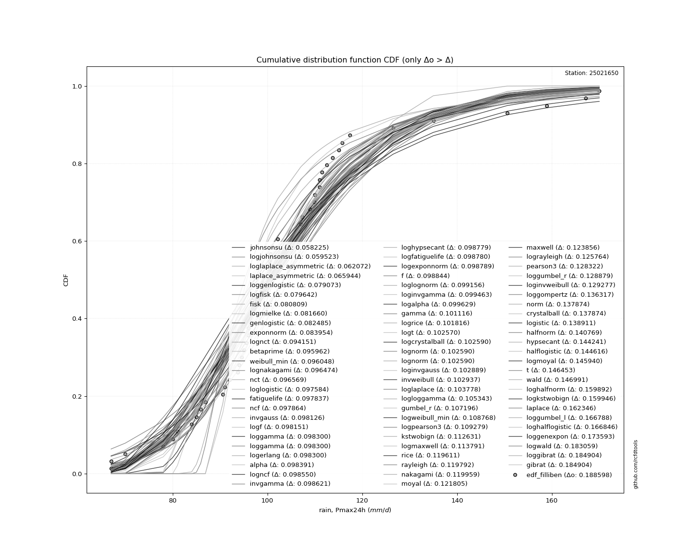
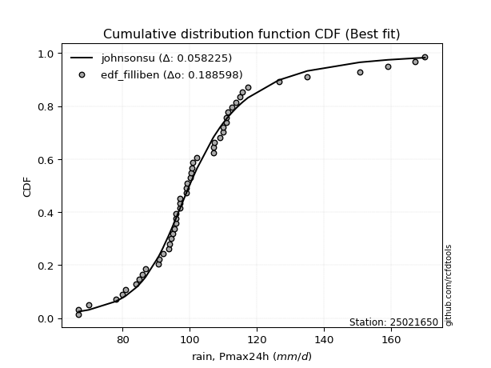
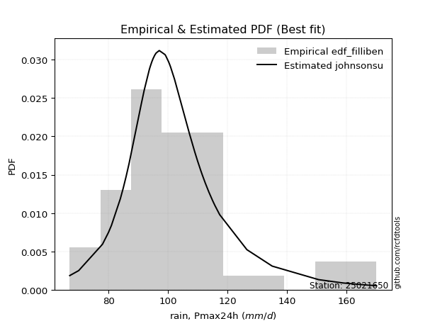

<div align="center">


</div>

# Station (rain, Pmax24h): 25021650

Probable Maximum Precipitation (PMP) is the greatest amount of rainfall for a specific duration that is meteorologically possible for a given location, acting as a "worst-case" scenario for extreme storms, crucial for designing safety-critical infrastructure like bridges, river deviations, dams, spillways, and nuclear plants to prevent catastrophic failure. PMP is calculated by hydrologists using meteorological data to determine the upper limit of extreme rainfall, often leading to the Probable Maximum Flood (PMF) for flood control design, and is increasingly being studied for climate change impacts.

<div align="center">

</img>

</div>


## A. General information


### 1. General running parameters

• app_version: _v20251225_. • runtime: _2025-12-26 15:25:57.471855_. • Python version: _3.14.0_. • SciPy version: _1.16.3_. • Pandas version: _2.3.3_. • NumPy version: _2.3.5_. • Stations dataset (station_dataset_file): _dataset/pmax24h_in/conventional_cesarcolombia_1970_2021.csv_. • Stations catalog (station_catalog_file): _dataset/CNE_IDEAM.xls_. • Minimum year to eval til year_max (date_min): _1970_. • Maximum year to eval since year_min (date_max): _2021_. • Creates, save and include plots into reports (create_plot): _True_. • Plot only fit distributions with Δo > Δ (plot_only_fit): _True_. • Eval low extreme values, if False, evaluates high extreme values (low_extreme): _False_. • Eval every SciPy distribution as logarithmic (pdist_logarithmic_on): _True_. • Standard deviation normalized (ddof): _1.0_. • Return periods to eval in years (Tr): _[2, 2.33, 5, 10, 15, 20, 25, 50, 75, 100, 200, 250, 500, 750, 1000]_. • Minimum data sample per station, 0 means any (minimum_sample): _5_. • Z-Score threshold to adjust a value, 0 means disable (zscore): _3.5_. • Avoid zeros, e.g. rain = 0 (avoid_zeros): _True_. • Avoid null values (avoid_nans): _True_. [:file_folder:Dataset file.](../../dataset/pmax24h_in/conventional_cesarcolombia_1970_2021.csv)


### 2. Station info and location

|   id |   CODIGO | NOMBRE              | CATEGORIA     | TECNOLOGIA   | ESTADO   | FECHA_INSTALACION   |   FECHA_SUSPENSION |   ALTITUD |   LATITUD |   LONGITUD | DEPARTAMENTO   | MUNICIPIO   | AREA_OPERATIVA                                         | ENTIDAD                                                     | AREA_HIDROGRAFICA   | ZONA_HIDROGRAFICA   | SUBZONA_HIDROGRAFICA   |   CORRIENTE |   OBSERVACION |   SUBRED | Catalogo   |
|-----:|---------:|:--------------------|:--------------|:-------------|:---------|:--------------------|-------------------:|----------:|----------:|-----------:|:---------------|:------------|:-------------------------------------------------------|:------------------------------------------------------------|:--------------------|:--------------------|:-----------------------|------------:|--------------:|---------:|:-----------|
|    0 | 25021650 | EL YUCAL [25021650] | Pluviométrica | Convencional | Activa   | 15/11/1984          |                nan |        40 |   9.55739 |   -73.8762 | Cesar          | Astrea      | Area Operativa 05 - Magdalena-Cesar-Guajira-San Andrés | INSTITUTO DE HIDROLOGIA METEOROLOGIA Y ESTUDIOS AMBIENTALES | Magdalena Cauca     | Cesar               | Río Ariguaní           |         nan |           nan |      nan | CNE_IDEAM  |

<div align="center">

Map location in: [:earth_americas:Google](http://maps.google.com/maps?q=9.557388889,-73.87619444) [:earth_americas:OSM](https://www.openstreetmap.org/#map=18/9.557388889/-73.87619444&layers=P) [:earth_americas:Bing](https://www.bing.com/maps?cp=9.557388889~-73.87619444&lvl=18) [:earth_americas:Apple](https://maps.apple.com/frame?center=9.557388889%2C-73.87619444&span=0.003%2C0.006)

</div>


<div align="center">

```geojson
{
  "type": "Feature",
  "geometry": {
    "type": "Point", 
    "coordinates": [-73.87619444, 9.557388889]
  }, 
  "properties": {
    "Name": "25021650"
  }
}
```

</div>


### 3. Discrete values table and plot

|               |           0 |           1 |           2 |           3 |           4 |           5 |           6 |           7 |           8 |           9 |          10 |         11 |          12 |          13 |           14 |         15 |          16 |         17 |         18 |         19 |          20 |        21 |         22 |          23 |          24 |          25 |          26 |         27 |          28 |         29 |          30 |         31 |          32 |          33 |          34 |          35 |          36 |          37 |         38 |          39 |          40 |          41 |          42 |         43 |         44 |         45 |         46 |          47 |          48 |          49 |          50 |          51 |
|:--------------|------------:|------------:|------------:|------------:|------------:|------------:|------------:|------------:|------------:|------------:|------------:|-----------:|------------:|------------:|-------------:|-----------:|------------:|-----------:|-----------:|-----------:|------------:|----------:|-----------:|------------:|------------:|------------:|------------:|-----------:|------------:|-----------:|------------:|-----------:|------------:|------------:|------------:|------------:|------------:|------------:|-----------:|------------:|------------:|------------:|------------:|-----------:|-----------:|-----------:|-----------:|------------:|------------:|------------:|------------:|------------:|
| Date          | 1970        | 1971        | 1972        | 1973        | 1974        | 1975        | 1976        | 1977        | 1978        | 1979        | 1980        | 1981       | 1982        | 1983        | 1984         | 1985       | 1986        | 1987       | 1988       | 1989       | 1990        | 1991      | 1992       | 1993        | 1994        | 1995        | 1996        | 1997       | 1998        | 1999       | 2000        | 2001       | 2002        | 2003        | 2004        | 2005        | 2006        | 2007        | 2008       | 2009        | 2010        | 2011        | 2012        | 2013       | 2014       | 2015       | 2016       | 2017        | 2018        | 2019        | 2020        | 2021        |
| Value         |  111.011    |   99.2504   |   85.9085   |  115.734    |  100.889    |  109.889    |   94.5355   |   93.7208   |  117.348    |  107.031    |  111.501    |  113.738   |  100.605    |  107.287    |  102.19      |  126.5     |   86.9      |  158.9     |  167.1     |   70       |   90.6      |  150.6    |  170       |   99        |   97        |   85        |  107        |   67       |   95        |   67       |  100.2      |   78       |   91        |   92        |   99        |   96        |   96        |  111        |   94       |  110        |   84        |   96        |   97        |  135       |  112.511   |   80       |   81       |  115        |   97.0907   |   95.562    |  100.478    |  109        |
| Value_initial |  111.011    |   99.2504   |   85.9085   |  115.734    |  100.889    |  109.889    |   94.5355   |   93.7208   |  117.348    |  107.031    |  111.501    |  113.738   |  100.605    |  107.287    |  102.19      |  126.5     |   86.9      |  158.9     |  167.1     |   70       |   90.6      |  150.6    |  170       |   99        |   97        |   85        |  107        |   67       |   95        |   67       |  100.2      |   78       |   91        |   92        |   99        |   96        |   96        |  111        |   94       |  110        |   84        |   96        |   97        |  135       |  112.511   |   80       |   81       |  115        |   97.0907   |   95.562    |  100.478    |  109        |
| count         |   52        |   52        |   52        |   52        |   52        |   52        |   52        |   52        |   52        |   52        |   52        |   52       |   52        |   52        |   52         |   52       |   52        |   52       |   52       |   52       |   52        |   52      |   52       |   52        |   52        |   52        |   52        |   52       |   52        |   52       |   52        |   52       |   52        |   52        |   52        |   52        |   52        |   52        |   52       |   52        |   52        |   52        |   52        |   52       |   52       |   52       |   52       |   52        |   52        |   52        |   52        |   52        |
| mean          |  103.425    |  103.425    |  103.425    |  103.425    |  103.425    |  103.425    |  103.425    |  103.425    |  103.425    |  103.425    |  103.425    |  103.425   |  103.425    |  103.425    |  103.425     |  103.425   |  103.425    |  103.425   |  103.425   |  103.425   |  103.425    |  103.425  |  103.425   |  103.425    |  103.425    |  103.425    |  103.425    |  103.425   |  103.425    |  103.425   |  103.425    |  103.425   |  103.425    |  103.425    |  103.425    |  103.425    |  103.425    |  103.425    |  103.425   |  103.425    |  103.425    |  103.425    |  103.425    |  103.425   |  103.425   |  103.425   |  103.425   |  103.425    |  103.425    |  103.425    |  103.425    |  103.425    |
| std           |   21.8344   |   21.8344   |   21.8344   |   21.8344   |   21.8344   |   21.8344   |   21.8344   |   21.8344   |   21.8344   |   21.8344   |   21.8344   |   21.8344  |   21.8344   |   21.8344   |   21.8344    |   21.8344  |   21.8344   |   21.8344  |   21.8344  |   21.8344  |   21.8344   |   21.8344 |   21.8344  |   21.8344   |   21.8344   |   21.8344   |   21.8344   |   21.8344  |   21.8344   |   21.8344  |   21.8344   |   21.8344  |   21.8344   |   21.8344   |   21.8344   |   21.8344   |   21.8344   |   21.8344   |   21.8344  |   21.8344   |   21.8344   |   21.8344   |   21.8344   |   21.8344  |   21.8344  |   21.8344  |   21.8344  |   21.8344   |   21.8344   |   21.8344   |   21.8344   |   21.8344   |
| zscore        |    0.347456 |   -0.191175 |   -0.802227 |    0.563776 |   -0.116135 |    0.296044 |   -0.407115 |   -0.444429 |    0.637703 |    0.165176 |    0.369909 |    0.47233 |   -0.129156 |    0.176899 |   -0.0565518 |    1.05684 |   -0.756815 |    2.54073 |    2.91629 |   -1.53082 |   -0.587358 |    2.1606 |    3.04911 |   -0.202644 |   -0.294242 |   -0.843834 |    0.163751 |   -1.66822 |   -0.385841 |   -1.66822 |   -0.147684 |   -1.16443 |   -0.569038 |   -0.523239 |   -0.202644 |   -0.340041 |   -0.340041 |    0.346948 |   -0.43164 |    0.301149 |   -0.889633 |   -0.340041 |   -0.294242 |    1.44613 |    0.41615 |   -1.07283 |   -1.02703 |    0.530145 |   -0.290087 |   -0.360101 |   -0.134974 |    0.255349 |

<div align="center">

</img>

</div>

> If Z-Score is active, values out of range or outliers are replaced with the station mean value.


### 4. Active continuous probability distributions from SciPy (45 of 104 available)

[scipy.stats](https://docs.scipy.org/doc/scipy/reference/stats.html) is a Python´s powerful submodule within the SciPy library for comprehensive statistical analysis, offering over 130 probability distributions (like Normal, Poisson), functions for descriptive stats (mean, variance), hypothesis testing (t-tests, chi-square), random variable generation, and statistical tests, making it essential for data science, modeling, and research. It provides tools to explore, model, and draw conclusions from data efficiently, working seamlessly with NumPy.

<div align="center">

|   id | p_dist             |   n_parameter | fit_method   | label                                                                       | active   | ref                                                                                                        |
|-----:|:-------------------|--------------:|:-------------|:----------------------------------------------------------------------------|:---------|:-----------------------------------------------------------------------------------------------------------|
|    0 | alpha              |             3 | MLE          | Alpha                                                                       | True     | [:mortar_board:](https://docs.scipy.org/doc/scipy/reference/generated/scipy.stats.alpha.html)              |
|    1 | betaprime          |             4 | MLE          | Beta prime                                                                  | True     | [:mortar_board:](https://docs.scipy.org/doc/scipy/reference/generated/scipy.stats.betaprime.html)          |
|    2 | chi2               |             3 | MLE          | Chi²                                                                        | True     | [:mortar_board:](https://docs.scipy.org/doc/scipy/reference/generated/scipy.stats.chi2.html)               |
|    3 | crystalball        |             4 | MLE          | Crystalball                                                                 | True     | [:mortar_board:](https://docs.scipy.org/doc/scipy/reference/generated/scipy.stats.crystalball.html)        |
|    4 | erlang             |             3 | MLE          | Erlang                                                                      | True     | [:mortar_board:](https://docs.scipy.org/doc/scipy/reference/generated/scipy.stats.erlang.html)             |
|    5 | expon              |             2 | MLE          | Exponential                                                                 | True     | [:mortar_board:](https://docs.scipy.org/doc/scipy/reference/generated/scipy.stats.expon.html)              |
|    6 | exponnorm          |             3 | MLE          | Exponentially modified Normal                                               | True     | [:mortar_board:](https://docs.scipy.org/doc/scipy/reference/generated/scipy.stats.exponnorm.html)          |
|    7 | f                  |             4 | MLE          | F                                                                           | True     | [:mortar_board:](https://docs.scipy.org/doc/scipy/reference/generated/scipy.stats.f.html)                  |
|    8 | fatiguelife        |             3 | MLE          | Fatigue-life (Birnbaum-Saunders)                                            | True     | [:mortar_board:](https://docs.scipy.org/doc/scipy/reference/generated/scipy.stats.fatiguelife.html)        |
|    9 | fisk               |             3 | MLE          | Fisk                                                                        | True     | [:mortar_board:](https://docs.scipy.org/doc/scipy/reference/generated/scipy.stats.fisk.html)               |
|   10 | gamma              |             3 | MLE          | Gamma                                                                       | True     | [:mortar_board:](https://docs.scipy.org/doc/scipy/reference/generated/scipy.stats.gamma.html)              |
|   11 | genexpon           |             5 | MLE          | Generalized exponential                                                     | True     | [:mortar_board:](https://docs.scipy.org/doc/scipy/reference/generated/scipy.stats.genexpon.html)           |
|   12 | genlogistic        |             3 | MLE          | Generalized logistic                                                        | True     | [:mortar_board:](https://docs.scipy.org/doc/scipy/reference/generated/scipy.stats.genlogistic.html)        |
|   13 | gibrat             |             2 | MM           | Gibrat                                                                      | True     | [:mortar_board:](https://docs.scipy.org/doc/scipy/reference/generated/scipy.stats.gibrat.html)             |
|   14 | gompertz           |             3 | MLE          | Gompertz (or truncated Gumbel)                                              | True     | [:mortar_board:](https://docs.scipy.org/doc/scipy/reference/generated/scipy.stats.gompertz.html)           |
|   15 | gumbel_l           |             2 | MM           | Gumbel Left Skew                                                            | True     | [:mortar_board:](https://docs.scipy.org/doc/scipy/reference/generated/scipy.stats.gumbel_l.html)           |
|   16 | gumbel_r           |             2 | MM           | Gumbel Right Skew                                                           | True     | [:mortar_board:](https://docs.scipy.org/doc/scipy/reference/generated/scipy.stats.gumbel_r.html)           |
|   17 | halflogistic       |             2 | MM           | Half-logistic                                                               | True     | [:mortar_board:](https://docs.scipy.org/doc/scipy/reference/generated/scipy.stats.halflogistic.html)       |
|   18 | halfnorm           |             2 | MM           | Half Normal                                                                 | True     | [:mortar_board:](https://docs.scipy.org/doc/scipy/reference/generated/scipy.stats.halfnorm.html)           |
|   19 | hypsecant          |             2 | MM           | hyperbolic secant                                                           | True     | [:mortar_board:](https://docs.scipy.org/doc/scipy/reference/generated/scipy.stats.hypsecant.html)          |
|   20 | invgamma           |             3 | MLE          | Inverted gamma                                                              | True     | [:mortar_board:](https://docs.scipy.org/doc/scipy/reference/generated/scipy.stats.invgamma.html)           |
|   21 | invgauss           |             3 | MLE          | Inverse Gaussian                                                            | True     | [:mortar_board:](https://docs.scipy.org/doc/scipy/reference/generated/scipy.stats.invgauss.html)           |
|   22 | invweibull         |             3 | MLE          | Inverted Weibull                                                            | True     | [:mortar_board:](https://docs.scipy.org/doc/scipy/reference/generated/scipy.stats.invweibull.html)         |
|   23 | johnsonsu          |             4 | MLE          | Johnson Su                                                                  | True     | [:mortar_board:](https://docs.scipy.org/doc/scipy/reference/generated/scipy.stats.johnsonsu.html)          |
|   24 | kstwobign          |             2 | MLE          | Limiting distribution of scaled Kolmogorov-Smirnov two-sided test statistic | True     | [:mortar_board:](https://docs.scipy.org/doc/scipy/reference/generated/scipy.stats.kstwobign.html)          |
|   25 | laplace            |             2 | MM           | Laplace                                                                     | True     | [:mortar_board:](https://docs.scipy.org/doc/scipy/reference/generated/scipy.stats.laplace.html)            |
|   26 | laplace_asymmetric |             3 | MLE          | Asymmetric Laplace                                                          | True     | [:mortar_board:](https://docs.scipy.org/doc/scipy/reference/generated/scipy.stats.laplace_asymmetric.html) |
|   27 | loggamma           |             3 | MLE          | Log gamma                                                                   | True     | [:mortar_board:](https://docs.scipy.org/doc/scipy/reference/generated/scipy.stats.loggamma.html)           |
|   28 | logistic           |             2 | MM           | Logistic (or Sech-squared)                                                  | True     | [:mortar_board:](https://docs.scipy.org/doc/scipy/reference/generated/scipy.stats.logistic.html)           |
|   29 | lognorm            |             3 | MLE          | Log Normal                                                                  | True     | [:mortar_board:](https://docs.scipy.org/doc/scipy/reference/generated/scipy.stats.lognorm.html)            |
|   30 | maxwell            |             2 | MM           | Maxwell                                                                     | True     | [:mortar_board:](https://docs.scipy.org/doc/scipy/reference/generated/scipy.stats.maxwell.html)            |
|   31 | mielke             |             4 | MLE          | Mielke Beta-Kappa / Dagum                                                   | True     | [:mortar_board:](https://docs.scipy.org/doc/scipy/reference/generated/scipy.stats.mielke.html)             |
|   32 | moyal              |             2 | MM           | Moyal                                                                       | True     | [:mortar_board:](https://docs.scipy.org/doc/scipy/reference/generated/scipy.stats.moyal.html)              |
|   33 | nakagami           |             3 | MLE          | Nakagami                                                                    | True     | [:mortar_board:](https://docs.scipy.org/doc/scipy/reference/generated/scipy.stats.nakagami.html)           |
|   34 | ncf                |             5 | MLE          | Non-central F distribution                                                  | True     | [:mortar_board:](https://docs.scipy.org/doc/scipy/reference/generated/scipy.stats.ncf.html)                |
|   35 | nct                |             4 | MLE          | Non-central Student’s t                                                     | True     | [:mortar_board:](https://docs.scipy.org/doc/scipy/reference/generated/scipy.stats.nct.html)                |
|   36 | norm               |             2 | MM           | Normal                                                                      | True     | [:mortar_board:](https://docs.scipy.org/doc/scipy/reference/generated/scipy.stats.norm.html)               |
|   37 | pareto             |             3 | MLE          | Pareto                                                                      | True     | [:mortar_board:](https://docs.scipy.org/doc/scipy/reference/generated/scipy.stats.pareto.html)             |
|   38 | pearson3           |             3 | MM           | Pearson type III                                                            | True     | [:mortar_board:](https://docs.scipy.org/doc/scipy/reference/generated/scipy.stats.pearson3.html)           |
|   39 | rayleigh           |             2 | MM           | Rayleigh                                                                    | True     | [:mortar_board:](https://docs.scipy.org/doc/scipy/reference/generated/scipy.stats.rayleigh.html)           |
|   40 | rice               |             3 | MLE          | Rice                                                                        | True     | [:mortar_board:](https://docs.scipy.org/doc/scipy/reference/generated/scipy.stats.rice.html)               |
|   41 | t                  |             3 | MLE          | Student’s t                                                                 | True     | [:mortar_board:](https://docs.scipy.org/doc/scipy/reference/generated/scipy.stats.t.html)                  |
|   42 | truncnorm          |             4 | MLE          | Truncated normal                                                            | True     | [:mortar_board:](https://docs.scipy.org/doc/scipy/reference/generated/scipy.stats.truncnorm.html)          |
|   43 | wald               |             2 | MM           | Wald                                                                        | True     | [:mortar_board:](https://docs.scipy.org/doc/scipy/reference/generated/scipy.stats.wald.html)               |
|   44 | weibull_min        |             3 | MLE          | Weibull minimum                                                             | True     | [:mortar_board:](https://docs.scipy.org/doc/scipy/reference/generated/scipy.stats.weibull_min.html)        |

</div>

> **n_parameter:** # arguments & localization & scale.
>
> **Fit methods:** (MLE) maximum likelihood, (MM) L-moments.
>
>**Inactive:** foldnorm, gennorm, norminvgauss, powernorm, powerlognorm, skewnorm, genextreme, anglit, arcsine, argus, beta, bradford, burr, burr12, cauchy, cosine, halfcauchy, foldcauchy, skewcauchy, wrapcauchy, dgamma, gengamma, exponweib, exponpow, truncexpon, gausshyper, genhalflogistic, genhyperbolic, geninvgauss, halfgennorm, johnsonsb, kappa4, kappa3, ksone, kstwo, loglaplace, levy, levy_l, levy_stable, ncx2, genpareto, truncpareto, lomax, powerlaw, rdist, rel_breitwigner, recipinvgauss, semicircular, studentized_range, trapezoid, triang, truncweibull_min, tukeylambda, uniform, loguniform, vonmises, vonmises_line, weibull_max, dweibull, 


## B. Probability distributions vs. Empirical distributions

A continuous probability distribution (CPD) describes probabilities for variables that can take any value within a range (like rain any time), unlike discrete variables with specific outcomes (like temperature). It uses a Probability Density Function (PDF), a curve where the total area under it equals 1, and the probability of the variable falling within an interval (a to b) is found by calculating the area under the curve between those points. A key feature is that the probability of hitting any single exact value is zero, so probabilities are always expressed for ranges, e.g., $P(a ≤ X ≤ b)$.

<div align="center">

Distributions parameters
|    |   station | p_dist                |   n |             loc |          scale | shape                  | shape1                | shape2                 | shape3   |
|---:|----------:|:----------------------|----:|----------------:|---------------:|:-----------------------|:----------------------|:-----------------------|:---------|
|  0 |  25021650 | alpha                 |  52 |   -21.6617      |  782.754       | 6.424688085316548      |                       |                        |          |
|  1 |  25021650 | betaprime             |  52 |    -2.57994     |    5.0008      | 610.514887037107       | 29.824190275661486    |                        |          |
|  2 |  25021650 | chi2                  |  52 |    67           |   10.7674      | 0.3598245026332356     |                       |                        |          |
|  3 |  25021650 | crystalball           |  52 |   103.425       |   21.6234      | 7305.49690499644       | 8770.349539593626     |                        |          |
|  4 |  25021650 | erlang                |  52 |    67           |    8.0953      | 0.5236429712689894     |                       |                        |          |
|  5 |  25021650 | expon                 |  52 |    67           |   36.4246      |                        |                       |                        |          |
|  6 |  25021650 | exponnorm             |  52 |    86.0109      |   11.2057      | 1.5539906265868437     |                       |                        |          |
|  7 |  25021650 | f                     |  52 |    17.2471      |   81.6234      | 1505.7123201407862     | 38.53418614304914     |                        |          |
|  8 |  25021650 | fatiguelife           |  52 |    32.8531      |   67.6606      | 0.2933880311217233     |                       |                        |          |
|  9 |  25021650 | fisk                  |  52 |    37.9363      |   62.2075      | 6.000656646299232      |                       |                        |          |
| 10 |  25021650 | gamma                 |  52 |    51.8039      |    8.43767     | 6.117881306274107      |                       |                        |          |
| 11 |  25021650 | genexpon              |  52 |    67           |    2.19693     | 0.06014752009816502    | 1.047695569605719e-05 | 1.5157703002990761     |          |
| 12 |  25021650 | genlogistic           |  52 |    74.9863      |   14.4975      | 4.400034946197168      |                       |                        |          |
| 13 |  25021650 | gibrat                |  52 |    86.9287      |   10.0053      |                        |                       |                        |          |
| 14 |  25021650 | gompertz              |  52 |    90.6         |    5.07244     | 3.925441698112412e-06  |                       |                        |          |
| 15 |  25021650 | gumbel_l              |  52 |   113.156       |   16.8597      |                        |                       |                        |          |
| 16 |  25021650 | gumbel_r              |  52 |    93.6929      |   16.8597      |                        |                       |                        |          |
| 17 |  25021650 | halflogistic          |  52 |    77.7958      |   18.4873      |                        |                       |                        |          |
| 18 |  25021650 | halfnorm              |  52 |    74.8036      |   35.8711      |                        |                       |                        |          |
| 19 |  25021650 | hypsecant             |  52 |   103.425       |   13.7659      |                        |                       |                        |          |
| 20 |  25021650 | invgamma              |  52 |    16.409       | 1576.38        | 19.12630499453416      |                       |                        |          |
| 21 |  25021650 | invgauss              |  52 |    32.4531      |  817.539       | 0.08681114046038899    |                       |                        |          |
| 22 |  25021650 | invweibull            |  52 |    -1.10061e+09 |    1.10061e+09 | 65444107.89161275      |                       |                        |          |
| 23 |  25021650 | johnsonsu             |  52 |    94.6908      |   12.3313      | -0.4167609103548361    | 1.005615523020125     |                        |          |
| 24 |  25021650 | kstwobign             |  52 |    30.9163      |   83.9709      |                        |                       |                        |          |
| 25 |  25021650 | laplace               |  52 |   103.425       |   15.2901      |                        |                       |                        |          |
| 26 |  25021650 | laplace_asymmetric    |  52 |    96           |   13.5083      | 0.7622557290135819     |                       |                        |          |
| 27 |  25021650 | loggamma              |  52 | -8924.01        | 1143.77        | 2678.1598053067137     |                       |                        |          |
| 28 |  25021650 | logistic              |  52 |   103.425       |   11.9216      |                        |                       |                        |          |
| 29 |  25021650 | lognorm               |  52 |    35.111       |   65.2672      | 0.29988789963232376    |                       |                        |          |
| 30 |  25021650 | maxwell               |  52 |    52.1861      |   32.1089      |                        |                       |                        |          |
| 31 |  25021650 | mielke                |  52 | -1057.89        | 1019.08        | 328088.171127219       | 69.2521067181254      |                        |          |
| 32 |  25021650 | moyal                 |  52 |    91.0589      |    9.73396     |                        |                       |                        |          |
| 33 |  25021650 | nakagami              |  52 |    62.3102      |   46.4539      | 1.0411875938150432     |                       |                        |          |
| 34 |  25021650 | ncf                   |  52 |    -5.92872     |    7.84538     | 78.55112292708162      | 67.55415294018096     | 983.2076800336117      |          |
| 35 |  25021650 | nct                   |  52 |    -0.1407      |    4.95208     | 15.283296908777501     | 19.855732715082674    |                        |          |
| 36 |  25021650 | norm                  |  52 |   103.425       |   21.6234      |                        |                       |                        |          |
| 37 |  25021650 | pareto                |  52 |    -2.14748e+09 |    2.14748e+09 | 58956960.38827196      |                       |                        |          |
| 38 |  25021650 | pearson3              |  52 |   103.425       |   21.6234      | 1.2811263516993783     |                       |                        |          |
| 39 |  25021650 | rayleigh              |  52 |    62.0577      |   33.006       |                        |                       |                        |          |
| 40 |  25021650 | rice                  |  52 |    62.8559      |   32.5069      | 0.00031628711501312457 |                       |                        |          |
| 41 |  25021650 | t                     |  52 |   103.477       |   21.7315      | 9.113687737240092      |                       |                        |          |
| 42 |  25021650 | truncnorm             |  52 |   105.655       |   13.7682      | -2.807527079535866     | 710.0006598117333     |                        |          |
| 43 |  25021650 | wald                  |  52 |    81.8012      |   21.6234      |                        |                       |                        |          |
| 44 |  25021650 | weibull_min           |  52 |    77.5336      |   29.9194      | 1.4226426960713547     |                       |                        |          |
| 45 |  25021650 | logalpha              |  52 |     1.23969     |   58.9665      | 17.509188832400945     |                       |                        |          |
| 46 |  25021650 | logbetaprime          |  52 |    -0.42765     |   11.3204      | 176.5177207391945      | 400.9962867568149     |                        |          |
| 47 |  25021650 | logchi2               |  52 |     4.20469     |    0.960727    | 1.1002112237563137     |                       |                        |          |
| 48 |  25021650 | logcrystalball        |  52 |     4.61904     |    0.195445    | 533.2611734589602      | 53.686446913622774    |                        |          |
| 49 |  25021650 | logerlang             |  52 |     3.42668     |    0.031692    | 37.62342820640475      |                       |                        |          |
| 50 |  25021650 | logexpon              |  52 |     4.20469     |    0.414349    |                        |                       |                        |          |
| 51 |  25021650 | logexponnorm          |  52 |     4.48395     |    0.140646    | 0.9604572750225484     |                       |                        |          |
| 52 |  25021650 | logf                  |  52 |     3.35098     |    1.26597     | 91.73886808008297      | 1223.4716977671928    |                        |          |
| 53 |  25021650 | logfatiguelife        |  52 |     2.92156     |    1.68646     | 0.11435737915950037    |                       |                        |          |
| 54 |  25021650 | logfisk               |  52 |     3.08134     |    1.52503     | 14.887531572649456     |                       |                        |          |
| 55 |  25021650 | loggamma              |  52 |     3.42668     |    0.0316919   | 37.6235193579612       |                       |                        |          |
| 56 |  25021650 | loggenexpon           |  52 |     4.18032     |    0.0074816   | 0.0005178981153441831  | 3.4701199541294945    | 0.00013615926044498698 |          |
| 57 |  25021650 | loggenlogistic        |  52 |     4.55513     |    0.114901    | 1.4186758959945158     |                       |                        |          |
| 58 |  25021650 | loggibrat             |  52 |     4.46996     |    0.0904237   |                        |                       |                        |          |
| 59 |  25021650 | loggompertz           |  52 |     4.20469     |    0.29065     | 0.2280425082422823     |                       |                        |          |
| 60 |  25021650 | loggumbel_l           |  52 |     4.707       |    0.152388    |                        |                       |                        |          |
| 61 |  25021650 | loggumbel_r           |  52 |     4.53108     |    0.152388    |                        |                       |                        |          |
| 62 |  25021650 | loghalflogistic       |  52 |     4.38738     |    0.167111    |                        |                       |                        |          |
| 63 |  25021650 | loghalfnorm           |  52 |     4.36032     |    0.32426     |                        |                       |                        |          |
| 64 |  25021650 | loghypsecant          |  52 |     4.61904     |    0.124424    |                        |                       |                        |          |
| 65 |  25021650 | loginvgamma           |  52 |     2.48868     |  257.672       | 121.95374058921286     |                       |                        |          |
| 66 |  25021650 | loginvgauss           |  52 |     3.10217     |   92.1066      | 0.01645792060804052    |                       |                        |          |
| 67 |  25021650 | loginvweibull         |  52 |    -3.25732e+07 |    3.25732e+07 | 171511263.00399712     |                       |                        |          |
| 68 |  25021650 | logjohnsonsu          |  52 |     4.57858     |    0.143201    | -0.20061745929598854   | 1.0891664573108626    |                        |          |
| 69 |  25021650 | logkstwobign          |  52 |     3.84233     |    0.896083    |                        |                       |                        |          |
| 70 |  25021650 | loglaplace            |  52 |     4.61904     |    0.1382      |                        |                       |                        |          |
| 71 |  25021650 | loglaplace_asymmetric |  52 |     4.57471     |    0.135462    | 0.8497429632335773     |                       |                        |          |
| 72 |  25021650 | logloggamma           |  52 |   -36.024       |    5.96435     | 911.2581143463751      |                       |                        |          |
| 73 |  25021650 | loglogistic           |  52 |     4.61904     |    0.107754    |                        |                       |                        |          |
| 74 |  25021650 | loglognorm            |  52 |     2.97241     |    1.63524     | 0.11769274711038297    |                       |                        |          |
| 75 |  25021650 | logmaxwell            |  52 |     4.15592     |    0.290219    |                        |                       |                        |          |
| 76 |  25021650 | logmielke             |  52 |     3.73441     |    0.918817    | 6.832945840745284      | 9.694350551619978     |                        |          |
| 77 |  25021650 | logmoyal              |  52 |     4.50727     |    0.0879811   |                        |                       |                        |          |
| 78 |  25021650 | lognakagami           |  52 |     3.78103     |    0.860503    | 4.761116684797063      |                       |                        |          |
| 79 |  25021650 | logncf                |  52 |    -0.623548    |    5.24033     | 2115.4112242626807     | 4669.69360092762      | 8.253545738484331e-12  |          |
| 80 |  25021650 | lognct                |  52 |     0.156418    |    0.0288991   | 274.0414772025614      | 154.00025162736574    |                        |          |
| 81 |  25021650 | lognorm               |  52 |     4.61904     |    0.195445    |                        |                       |                        |          |
| 82 |  25021650 | logpareto             |  52 |    -3.35544e+07 |    3.35544e+07 | 80981146.01824354      |                       |                        |          |
| 83 |  25021650 | logpearson3           |  52 |     4.61904     |    0.195445    | 0.5188846836625212     |                       |                        |          |
| 84 |  25021650 | lograyleigh           |  52 |     4.24516     |    0.298312    |                        |                       |                        |          |
| 85 |  25021650 | logrice               |  52 |     4.125       |    0.211074    | 2.0822778235532584     |                       |                        |          |
| 86 |  25021650 | logt                  |  52 |     4.61904     |    0.19543     | 19482.779172124807     |                       |                        |          |
| 87 |  25021650 | logtruncnorm          |  52 |    -0.108421    |    1.43499     | 3.005667846139324      | 3.65452614412853      |                        |          |
| 88 |  25021650 | logwald               |  52 |     4.42356     |    0.195479    |                        |                       |                        |          |
| 89 |  25021650 | logweibull_min        |  52 |     4.10643     |    0.574098    | 2.756665156543866      |                       |                        |          |

</div>

> **loc** (Location parameter): This shifts the distribution along the x-axis. For many common distributions, like the normal (Gaussian) distribution, loc represents the mean $μ$. For others, like the uniform distribution, it might represent the minimum value, or for the beta distribution, the left end of the support interval.
>
> **scale** (Scale parameter): This determines the width or spread of the distribution. For the normal distribution, scale represents the standard deviation $σ$. For a uniform distribution, it defines the length of the interval (from $loc$ to $loc + scale$).
>
> **shape** (Shape parameters): Refers to parameters that define the specific form of a probability distribution, distinct from its location (loc) and scale (scale). These parameters are required arguments for most distribution functions. For example, a normal (Gaussian) distribution is fully defined by its location (mean) and scale (standard deviation), so it has no specific shape parameters beyond loc and scale. However, other distributions have intrinsic properties that need specification, as Gamma distribution that takes a shape parameter, often named $a$ or $alpha$.


### 0. Cumulative distribution values - CDF (90 evaluated)

> Ordered by x ascending and calculating $log(f(x))$ separately. 

|   id |   Station |   date |        x |   count |    mean |     std |     zscore |   Value_initial |   station |   m |      alpha |   alpha_pdf |   betaprime |   betaprime_pdf |      chi2 |    chi2_pdf |   crystalball |   crystalball_pdf |      erlang |       erlang_pdf |     expon |   expon_pdf |   exponnorm |   exponnorm_pdf |         f |       f_pdf |   fatiguelife |   fatiguelife_pdf |      fisk |    fisk_pdf |     gamma |   gamma_pdf |    genexpon |   genexpon_pdf |   genlogistic |   genlogistic_pdf |   gibrat |   gibrat_pdf |    gompertz |   gompertz_pdf |   gumbel_l |   gumbel_l_pdf |   gumbel_r |   gumbel_r_pdf |   halflogistic |   halflogistic_pdf |   halfnorm |   halfnorm_pdf |   hypsecant |   hypsecant_pdf |   invgamma |   invgamma_pdf |   invgauss |   invgauss_pdf |   invweibull |   invweibull_pdf |   johnsonsu |   johnsonsu_pdf |   kstwobign |   kstwobign_pdf |   laplace |   laplace_pdf |   laplace_asymmetric |   laplace_asymmetric_pdf |   loggamma |   loggamma_pdf |   logistic |   logistic_pdf |   lognorm |   lognorm_pdf |   maxwell |   maxwell_pdf |   mielke |   mielke_pdf |       moyal |   moyal_pdf |   nakagami |   nakagami_pdf |       ncf |     ncf_pdf |        nct |     nct_pdf |      norm |    norm_pdf |      pareto |   pareto_pdf |    pearson3 |   pearson3_pdf |   rayleigh |   rayleigh_pdf |       rice |    rice_pdf |         t |       t_pdf |   truncnorm |   truncnorm_pdf |       wald |    wald_pdf |   weibull_min |   weibull_min_pdf |   logalpha |   logalpha_pdf |   logbetaprime |   logbetaprime_pdf |     logchi2 |   logchi2_pdf |   logcrystalball |   logcrystalball_pdf |   logerlang |   logerlang_pdf |   logexpon |   logexpon_pdf |   logexponnorm |   logexponnorm_pdf |       logf |   logf_pdf |   logfatiguelife |   logfatiguelife_pdf |   logfisk |   logfisk_pdf |   loggenexpon |   loggenexpon_pdf |   loggenlogistic |   loggenlogistic_pdf |   loggibrat |   loggibrat_pdf |   loggompertz |   loggompertz_pdf |   loggumbel_l |   loggumbel_l_pdf |   loggumbel_r |   loggumbel_r_pdf |   loghalflogistic |   loghalflogistic_pdf |   loghalfnorm |   loghalfnorm_pdf |   loghypsecant |   loghypsecant_pdf |   loginvgamma |   loginvgamma_pdf |   loginvgauss |   loginvgauss_pdf |   loginvweibull |   loginvweibull_pdf |   logjohnsonsu |   logjohnsonsu_pdf |   logkstwobign |   logkstwobign_pdf |   loglaplace |   loglaplace_pdf |   loglaplace_asymmetric |   loglaplace_asymmetric_pdf |   logloggamma |   logloggamma_pdf |   loglogistic |   loglogistic_pdf |   loglognorm |   loglognorm_pdf |   logmaxwell |   logmaxwell_pdf |   logmielke |   logmielke_pdf |    logmoyal |   logmoyal_pdf |   lognakagami |   lognakagami_pdf |    logncf |   logncf_pdf |    lognct |   lognct_pdf |   logpareto |   logpareto_pdf |   logpearson3 |   logpearson3_pdf |   lograyleigh |   lograyleigh_pdf |    logrice |   logrice_pdf |      logt |   logt_pdf |   logtruncnorm |   logtruncnorm_pdf |     logwald |   logwald_pdf |   logweibull_min |   logweibull_min_pdf |
|-----:|----------:|-------:|---------:|--------:|--------:|--------:|-----------:|----------------:|----------:|----:|-----------:|------------:|------------:|----------------:|----------:|------------:|--------------:|------------------:|------------:|-----------------:|----------:|------------:|------------:|----------------:|----------:|------------:|--------------:|------------------:|----------:|------------:|----------:|------------:|------------:|---------------:|--------------:|------------------:|---------:|-------------:|------------:|---------------:|-----------:|---------------:|-----------:|---------------:|---------------:|-------------------:|-----------:|---------------:|------------:|----------------:|-----------:|---------------:|-----------:|---------------:|-------------:|-----------------:|------------:|----------------:|------------:|----------------:|----------:|--------------:|---------------------:|-------------------------:|-----------:|---------------:|-----------:|---------------:|----------:|--------------:|----------:|--------------:|---------:|-------------:|------------:|------------:|-----------:|---------------:|----------:|------------:|-----------:|------------:|----------:|------------:|------------:|-------------:|------------:|---------------:|-----------:|---------------:|-----------:|------------:|----------:|------------:|------------:|----------------:|-----------:|------------:|--------------:|------------------:|-----------:|---------------:|---------------:|-------------------:|------------:|--------------:|-----------------:|---------------------:|------------:|----------------:|-----------:|---------------:|---------------:|-------------------:|-----------:|-----------:|-----------------:|---------------------:|----------:|--------------:|--------------:|------------------:|-----------------:|---------------------:|------------:|----------------:|--------------:|------------------:|--------------:|------------------:|--------------:|------------------:|------------------:|----------------------:|--------------:|------------------:|---------------:|-------------------:|--------------:|------------------:|--------------:|------------------:|----------------:|--------------------:|---------------:|-------------------:|---------------:|-------------------:|-------------:|-----------------:|------------------------:|----------------------------:|--------------:|------------------:|--------------:|------------------:|-------------:|-----------------:|-------------:|-----------------:|------------:|----------------:|------------:|---------------:|--------------:|------------------:|----------:|-------------:|----------:|-------------:|------------:|----------------:|--------------:|------------------:|--------------:|------------------:|-----------:|--------------:|----------:|-----------:|---------------:|-------------------:|------------:|--------------:|-----------------:|---------------------:|
|    0 |  25021650 |   1997 |  67      |      52 | 103.425 | 21.8344 | -1.66822   |         67      |  25021650 |   1 | 0.00811143 | 0.00220936  |   0.0125754 |     0.00280196  | 0.0020104 | 2.5452e+10  |     0.0460428 |       0.00446502  | 2.11492e-08 | 779309           | 0         |  0.027454   |  0.00956042 |     0.00202898  | 0.0082922 | 0.00231101  |    0.00873904 |       0.00250401  | 0.0102883 | 0.00210232  | 0.0088874 | 0.00270531  | 4.51975e-07 |     0.027378   |     0.0119545 |       0.00230152  | 0        |  0           | 0           |    0           |  0.0626712 |    0.00359822  | 0.00766808 |    0.00221527  |     0          |        0           |  0         |    0           |   0.0450827 |     0.00326401  | 0.00828644 |    0.00231131  |  0.0086678 |    0.00248883  |   0.00710467 |      0.00208988  |   0.0242012 |     0.0018868   |  0.00731759 |     0.00250697  | 0.0461718 |   0.00301973  |            0.0219838 |              0.00213502  | 0.00845052 |      0.157971  |  0.0449875 |    0.00360384  | 0.0170018 |     0.215731  | 0.0245122 |   0.00475529  |      nan |          nan | 0.000579112 | 0.000378343 | 0.00859689 |    0.00379736  | 0.0139206 | 0.00293226  | 0.00884635 | 0.00234142  | 0.0460428 | 0.00446502  | 1.30911e-08 |   0.027454   | 0           |    0           |  0.0111483 |    0.00448614  | 0.00809317 | 0.00389002  | 0.0635669 | 0.00457456  | 4.02455e-09 |     0.000564313 | 0          | 0           |    0          |       0           | 0.00869704 |      0.158213  |       0.214087 |           0.689528 | 4.12304e-09 |   2.55366e+06 |        0.0170019 |            0.215732  |  0.00845053 |       0.157971  |   0        |       2.41343  |      0.0067432 |           0.124355 | 0.00846154 |   0.157405 |       0.00825309 |            0.154962  | 0.010446  |     0.136992  |    0.00418598 |          0.273786 |        0.0123696 |            0.145821  |    0        |       0         |   6.55969e-09 |         0.784594  |     0.0363445 |       0.234113    |   0.000200442 |         0.0112001 |         0         |              0        |     0         |          0        |      0.0227738 |          0.182878  |     0.007985  |         0.151088  |    0.00747121 |         0.148097  |      0.00406982 |            0.11795  |      0.0207372 |           0.135819 |      0.0032799 |           0.127521 |    0.024939  |        0.180456  |               0.0168449 |                    0.14634  |     0.0189279 |         0.228485  |     0.0209323 |         0.190193  |   0.00811049 |        0.15297   |   0.00125174 |         0.076559 |   0.0102815 |       0.149158  | 2.37522e-08 |    4.33369e-06 |    0.00964359 |          0.174745 | 0.0141394 |    0.198992  | 0.0110773 |    0.177019  | 1.79814e-08 |        2.41343  |    0.00431896 |          0.112373 |   0           |         0         | 0.00848739 |     0.221181  | 0.0170024 |  0.215713  |    4.71095e-07 |           2.53836  | 0           |    0          |       0.00767429 |            0.214473  |
|    1 |  25021650 |   1999 |  67      |      52 | 103.425 | 21.8344 | -1.66822   |         67      |  25021650 |   2 | 0.00811143 | 0.00220936  |   0.0125754 |     0.00280196  | 0.0020104 | 2.5452e+10  |     0.0460428 |       0.00446502  | 2.11492e-08 | 779309           | 0         |  0.027454   |  0.00956042 |     0.00202898  | 0.0082922 | 0.00231101  |    0.00873904 |       0.00250401  | 0.0102883 | 0.00210232  | 0.0088874 | 0.00270531  | 4.51975e-07 |     0.027378   |     0.0119545 |       0.00230152  | 0        |  0           | 0           |    0           |  0.0626712 |    0.00359822  | 0.00766808 |    0.00221527  |     0          |        0           |  0         |    0           |   0.0450827 |     0.00326401  | 0.00828644 |    0.00231131  |  0.0086678 |    0.00248883  |   0.00710467 |      0.00208988  |   0.0242012 |     0.0018868   |  0.00731759 |     0.00250697  | 0.0461718 |   0.00301973  |            0.0219838 |              0.00213502  | 0.00845052 |      0.157971  |  0.0449875 |    0.00360384  | 0.0170018 |     0.215731  | 0.0245122 |   0.00475529  |      nan |          nan | 0.000579112 | 0.000378343 | 0.00859689 |    0.00379736  | 0.0139206 | 0.00293226  | 0.00884635 | 0.00234142  | 0.0460428 | 0.00446502  | 1.30911e-08 |   0.027454   | 0           |    0           |  0.0111483 |    0.00448614  | 0.00809317 | 0.00389002  | 0.0635669 | 0.00457456  | 4.02455e-09 |     0.000564313 | 0          | 0           |    0          |       0           | 0.00869704 |      0.158213  |       0.214087 |           0.689528 | 4.12304e-09 |   2.55366e+06 |        0.0170019 |            0.215732  |  0.00845053 |       0.157971  |   0        |       2.41343  |      0.0067432 |           0.124355 | 0.00846154 |   0.157405 |       0.00825309 |            0.154962  | 0.010446  |     0.136992  |    0.00418598 |          0.273786 |        0.0123696 |            0.145821  |    0        |       0         |   6.55969e-09 |         0.784594  |     0.0363445 |       0.234113    |   0.000200442 |         0.0112001 |         0         |              0        |     0         |          0        |      0.0227738 |          0.182878  |     0.007985  |         0.151088  |    0.00747121 |         0.148097  |      0.00406982 |            0.11795  |      0.0207372 |           0.135819 |      0.0032799 |           0.127521 |    0.024939  |        0.180456  |               0.0168449 |                    0.14634  |     0.0189279 |         0.228485  |     0.0209323 |         0.190193  |   0.00811049 |        0.15297   |   0.00125174 |         0.076559 |   0.0102815 |       0.149158  | 2.37522e-08 |    4.33369e-06 |    0.00964359 |          0.174745 | 0.0141394 |    0.198992  | 0.0110773 |    0.177019  | 1.79814e-08 |        2.41343  |    0.00431896 |          0.112373 |   0           |         0         | 0.00848739 |     0.221181  | 0.0170024 |  0.215713  |    4.71095e-07 |           2.53836  | 0           |    0          |       0.00767429 |            0.214473  |
|    2 |  25021650 |   1989 |  70      |      52 | 103.425 | 21.8344 | -1.53082   |         70      |  25021650 |   3 | 0.0172187  | 0.00397092  |   0.023422  |     0.00451017  | 0.743798  | 0.0396163   |     0.0610815 |       0.00558651  | 0.593624    |      0.0807588   | 0.0790614 |  0.0252834  |  0.0175534  |     0.00338674  | 0.0178172 | 0.00414693  |    0.0190142  |       0.00444868  | 0.0183981 | 0.00337982  | 0.0199566 | 0.00476716  | 0.0788595   |     0.0252228  |     0.0208312 |       0.00369951  | 0        |  0           | 0           |    0           |  0.0744117 |    0.00424514  | 0.0169628  |    0.00410165  |     0          |        0           |  0         |    0           |   0.0560092 |     0.00404773  | 0.0178139  |    0.00414818  |  0.0188939 |    0.00443197  |   0.0159425  |      0.00392341  |   0.0307742 |     0.00253213  |  0.0181143  |     0.00481528  | 0.0561808 |   0.00367433  |            0.0294196 |              0.00285717  | 0.0181447  |      0.294785  |  0.0571248 |    0.00451797  | 0.0289858 |     0.338341  | 0.0414445 |   0.00655754  |      nan |          nan | 0.00318019  | 0.00155951  | 0.0238558  |    0.00637015  | 0.025117  | 0.00460732  | 0.0183837  | 0.00412036  | 0.0610815 | 0.00558651  | 0.0790614   |   0.0252834  | 3.57129e-05 |    0.000260106 |  0.0285367 |    0.00708249  | 0.0238607  | 0.00659948  | 0.0787077 | 0.00554253  | 0.00231352  |     0.00101598  | 0          | 0           |    0          |       0           | 0.0183653  |      0.293321  |       0.245375 |           0.738279 | 0.139415    |   1.72528     |        0.028986  |            0.338342  |  0.0181447  |       0.294785  |   0.100318 |       2.17132  |      0.01452   |           0.240844 | 0.0181158  |   0.293511 |       0.0177953  |            0.290973  | 0.0183148 |     0.229334  |    0.0240363  |          0.628883 |        0.0206271 |            0.238167  |    0        |       0         |   0.0364126   |         0.878995  |     0.0481521 |       0.308251    |   0.001682    |         0.0705058 |         0         |              0        |     0         |          0        |      0.0323696 |          0.259707  |     0.0173318 |         0.28607   |    0.0167514  |         0.286484  |      0.0126456  |            0.291004 |      0.0278677 |           0.193725 |      0.0136422 |           0.369786 |    0.0342396 |        0.247754  |               0.0246452 |                    0.214105 |     0.0314752 |         0.350967  |     0.0311045 |         0.279683  |   0.0175533  |        0.288503  |   0.00837373 |         0.265867 |   0.0188667 |       0.249867  | 1.3487e-05  |    0.00152184  |    0.0201525  |          0.314449 | 0.0254587 |    0.325524  | 0.021488  |    0.307086  | 0.100318    |        2.17132  |    0.0120753  |          0.255168 |   6.23995e-05 |         0.0374468 | 0.0214466  |     0.376008  | 0.0289854 |  0.338311  |    0.106223    |           2.31476  | 0           |    0          |       0.0210595  |            0.404319  |
|    3 |  25021650 |   2001 |  78      |      52 | 103.425 | 21.8344 | -1.16443   |         78      |  25021650 |   4 | 0.076441   | 0.0113186   |   0.0839555 |     0.0109612   | 0.893815  | 0.00941424  |     0.11984   |       0.00924238  | 0.894369    |      0.0161888   | 0.260657  |  0.0202979  |  0.0674846  |     0.00975401  | 0.0787769 | 0.0115098   |    0.0825036  |       0.0117237   | 0.0665885 | 0.00930936  | 0.0859694 | 0.0119245   | 0.260073    |     0.0202612  |     0.0730752 |       0.00994082  | 0        |  0           | 0           |    0           |  0.116867  |    0.0065099   | 0.0791414  |    0.0119067   |     0.00552213 |        0.0270448   |  0.0710036 |    0.022155    |   0.0995881 |     0.00711696  | 0.0787806  |    0.0115085   |  0.0823163 |    0.0117294   |   0.0763782  |      0.0116812   |   0.0625548 |     0.00596373  |  0.0883468  |     0.0128493   | 0.094802  |   0.00620023  |            0.0639822 |              0.00621383  | 0.0795561  |      0.899667  |  0.105964  |    0.00794654  | 0.0897602 |     0.829231  | 0.114251  |   0.0116257   |      nan |          nan | 0.0504904   | 0.0118395   | 0.100636   |    0.0125942   | 0.0856405 | 0.0108421   | 0.0783897  | 0.0113157   | 0.11984   | 0.00924238  | 0.260657    |   0.0202979  | 0.061498    |    0.0149692   |  0.110104  |    0.0130228   | 0.102838   | 0.0128577   | 0.135397  | 0.00877928  | 0.0198441   |     0.00386419  | 0          | 0           |    0.00268187 |       0.00816925  | 0.0795115  |      0.898101  |       0.330804 |           0.833951 | 0.271028    |   0.931713    |        0.0897606 |            0.829233  |  0.0795562  |       0.899668  |   0.307107 |       1.67225  |      0.068868  |           0.843489 | 0.0793213  |   0.897634 |       0.0788954  |            0.899275  | 0.0652811 |     0.712288  |    0.133584   |          1.34796  |        0.0684172 |            0.717203  |    0        |       0         |   0.145032    |         1.13172   |     0.095515  |       0.595854    |   0.043277    |         0.891775  |         0         |              0        |     0         |          0        |      0.0769313 |          0.612298  |     0.0780267 |         0.898717  |    0.0783254  |         0.915074  |      0.0844059  |            1.09869  |      0.062835  |           0.509369 |      0.103311  |           1.3031   |    0.0749187 |        0.542102  |               0.063098  |                    0.548164 |     0.0931664 |         0.830844  |     0.0805763 |         0.687525  |   0.0784575  |        0.899147  |   0.076447   |         1.03587  |   0.0686676 |       0.737113  | 0.0186257   |    0.669784    |    0.0829216  |          0.897427 | 0.0862506 |    0.846674  | 0.0819873 |    0.865856  | 0.307107    |        1.67225  |    0.0734248  |          0.951162 |   0.067522    |         1.16883   | 0.0892142  |     0.912098  | 0.0897556 |  0.829194  |    0.329904    |           1.83584  | 0           |    0          |       0.0964283  |            1.00917   |
|    4 |  25021650 |   2015 |  80      |      52 | 103.425 | 21.8344 | -1.07283   |         80      |  25021650 |   5 | 0.10117    | 0.0134051   |   0.10767   |     0.0127496   | 0.910605  | 0.00748089  |     0.139338  |       0.0102602   | 0.92196     |      0.0116777   | 0.300159  |  0.0192134  |  0.0890894  |     0.0118727   | 0.10383   | 0.0135337   |    0.107865   |       0.013623    | 0.0872252 | 0.0113579   | 0.111621  | 0.0137097   | 0.299506    |     0.0191815  |     0.0949416 |       0.0119408   | 0        |  0           | 0           |    0           |  0.130583  |    0.00721598  | 0.105106   |    0.0140442   |     0.059543   |        0.0269498   |  0.115181  |    0.0220109   |   0.114847  |     0.00816303  | 0.103829   |    0.0135297   |  0.107698  |    0.0136377   |   0.10191    |      0.0138383   |   0.0759491 |     0.0074932   |  0.115924   |     0.0146934   | 0.10805   |   0.00706668  |            0.0776988 |              0.00754596  | 0.104629   |      1.08226   |  0.12294   |    0.00904452  | 0.112623  |     0.978461  | 0.138701  |   0.0128128   |      nan |          nan | 0.0775909   | 0.0152401   | 0.127138   |    0.0138861   | 0.109057  | 0.0125714   | 0.10304    | 0.0133279   | 0.139338  | 0.0102602   | 0.300159    |   0.0192134  | 0.0942249   |    0.0176508   |  0.137357  |    0.0142077   | 0.129837   | 0.0141177   | 0.153882  | 0.00971191  | 0.0287843   |     0.00511908  | 0          | 0           |    0.0283006  |       0.0160908   | 0.104568   |      1.08263   |       0.352128 |           0.850094 | 0.29365     |   0.857948    |        0.112624  |            0.978463  |  0.104629   |       1.08226   |   0.348177 |       1.57313  |      0.0927731 |           1.04783  | 0.104347   |   1.08061  |       0.103983   |            1.08389   | 0.0855752 |     0.895666  |    0.169291   |          1.46933  |        0.0887995 |            0.897463  |    0        |       0         |   0.174452    |         1.19224   |     0.111778  |       0.690898    |   0.0699857   |         1.22139   |         0         |              0        |     0.0533754 |          2.45513  |      0.0940628 |          0.745032  |     0.103133  |         1.08599   |    0.103885   |         1.10523   |      0.114912   |            1.3091   |      0.0774277 |           0.649549 |      0.138758  |           1.4917   |    0.0899811 |        0.651092  |               0.0786209 |                    0.683019 |     0.116012  |         0.975385  |     0.0997879 |         0.833658  |   0.103559   |        1.08512   |   0.105169   |         1.23194  |   0.089511  |       0.913648  | 0.0415879   |    1.15897     |    0.107805   |          1.06931  | 0.109676  |    1.0054    | 0.106054  |    1.03684   | 0.348177    |        1.57313  |    0.100125   |          1.15873  |   0.0998972   |         1.38433   | 0.114208   |     1.06323   | 0.112618  |  0.978433  |    0.375128    |           1.7375   | 0           |    0          |       0.12388    |            1.159     |
|    5 |  25021650 |   2016 |  81      |      52 | 103.425 | 21.8344 | -1.02703   |         81      |  25021650 |   6 | 0.115087   | 0.0144236   |   0.12086   |     0.0136274   | 0.917696  | 0.00672035  |     0.149856  |       0.0107758   | 0.932755    |      0.00996274  | 0.319111  |  0.0186931  |  0.10151    |     0.0129706   | 0.117856  | 0.0145128   |    0.121945   |       0.0145303   | 0.0991229 | 0.012443    | 0.125757  | 0.0145552   | 0.318427    |     0.0186633  |     0.107394  |       0.0129647   | 0        |  0           | 0           |    0           |  0.137985  |    0.00759173  | 0.119666   |    0.0150689   |     0.0864429  |        0.0268436   |  0.137145  |    0.0219137   |   0.123293  |     0.00873412  | 0.11785    |    0.0145072   |  0.121795  |    0.0145494   |   0.11627    |      0.014877    |   0.0838913 |     0.00840947  |  0.131041   |     0.015531    | 0.115353  |   0.0075443   |            0.0856234 |              0.00831558  | 0.118641   |      1.17378   |  0.132274  |    0.00962767  | 0.12525   |     1.05473   | 0.151798  |   0.0133782   |      nan |          nan | 0.0936454   | 0.0168543   | 0.141325   |    0.0144812   | 0.122055  | 0.0134227   | 0.11686    | 0.0143079   | 0.149856  | 0.0107758   | 0.319111    |   0.0186931  | 0.11244     |    0.0187529   |  0.151838  |    0.0147477   | 0.144246   | 0.0146938   | 0.163833  | 0.0101904   | 0.0342609   |     0.0058455   | 0          | 0           |    0.0455223  |       0.0182509   | 0.118592   |      1.17536   |       0.362732 |           0.857046 | 0.304111    |   0.826845    |        0.125251  |            1.05473   |  0.118642   |       1.17378   |   0.367429 |       1.52666  |      0.106444  |           1.15353  | 0.118341   |   1.17241  |       0.118023   |            1.17647   | 0.0973179 |     0.995977  |    0.187872   |          1.52131  |        0.100552  |            0.995611  |    0        |       0         |   0.189446    |         1.2217    |     0.120676  |       0.742071    |   0.0861842   |         1.38634   |         0.0211624 |              2.99068  |     0.0838278 |          2.44704  |      0.103773  |          0.819331  |     0.117207  |         1.18      |    0.118204   |         1.20021   |      0.131784   |            1.40624  |      0.0860041 |           0.733004 |      0.157795  |           1.5717   |    0.098444  |        0.712328  |               0.0875805 |                    0.760855 |     0.128586  |         1.04918   |     0.110632  |         0.913122  |   0.117618   |        1.17843   |   0.121053   |         1.32484  |   0.101449  |       1.00936   | 0.0576      |    1.41948     |    0.121622   |          1.15531  | 0.122666  |    1.0862    | 0.119471  |    1.12348   | 0.367429    |        1.52666  |    0.115154   |          1.26084  |   0.117696    |         1.48012   | 0.127886   |     1.13895   | 0.125245  |  1.05471   |    0.396423    |           1.691    | 0           |    0          |       0.138727   |            1.23111   |
|    6 |  25021650 |   2010 |  84      |      52 | 103.425 | 21.8344 | -0.889633  |         84      |  25021650 |   7 | 0.162698   | 0.0172461   |   0.165527  |     0.0161015   | 0.935081  | 0.00498586  |     0.184509  |       0.0123241   | 0.956643    |      0.00627002  | 0.372943  |  0.0172152  |  0.145398   |     0.0162742   | 0.165534  | 0.0171979   |    0.169332   |       0.016986    | 0.141499  | 0.0158246   | 0.17294   | 0.016827    | 0.372179    |     0.0171915  |     0.150875  |       0.0159988   | 0        |  0           | 0           |    0           |  0.162556  |    0.00881171  | 0.169148   |    0.0178279   |     0.166239   |        0.0262982   |  0.202337  |    0.021524    |   0.152288  |     0.0106455   | 0.165502   |    0.0171868   |  0.169258  |    0.0170167   |   0.165254   |      0.0176899   |   0.114048  |     0.0118895   |  0.180954   |     0.0176377   | 0.140359  |   0.00917974  |            0.114585  |              0.0111282   | 0.16618    |      1.43869   |  0.163918  |    0.0114958   | 0.167759  |     1.28377   | 0.194321  |   0.0149321   |      nan |          nan | 0.150704    | 0.0209729   | 0.187202   |    0.0160472   | 0.166008  | 0.0158355   | 0.163957   | 0.0170215   | 0.184509  | 0.0123241   | 0.372943    |   0.0172152  | 0.172637    |    0.0211635   |  0.198265  |    0.0161483   | 0.190665   | 0.0161945   | 0.196591  | 0.0116528   | 0.0555255   |     0.00843267  | 0.00445804 | 0.0107614   |    0.106954   |       0.0222247   | 0.166262   |      1.44449   |       0.394219 |           0.873606 | 0.332725    |   0.749799    |        0.16776   |            1.28377   |  0.16618    |       1.43869   |   0.420584 |       1.39838  |      0.154152  |           1.47049  | 0.165848   |   1.43842  |       0.165716   |            1.4445    | 0.139353  |     1.32312   |    0.245561   |          1.64386  |        0.142417  |            1.31329   |    0        |       0         |   0.23542     |         1.30601   |     0.150633  |       0.90999     |   0.145027    |         1.83757   |         0.129251  |              2.94203  |     0.172113  |          2.40316  |      0.138042  |          1.075     |     0.165107  |         1.45225   |    0.166863   |         1.47325   |      0.187605   |            1.65303  |      0.118025  |           1.04651  |      0.21849   |           1.75273  |    0.128078  |        0.926756  |               0.120121  |                    1.04355  |     0.170758  |         1.27077   |     0.148452  |         1.17317   |   0.165422   |        1.4486    |   0.173897   |         1.575    |   0.143679  |       1.31985   | 0.12254     |    2.12532     |    0.1682     |          1.4047   | 0.16654   |    1.32684   | 0.164983  |    1.3789    | 0.420584    |        1.39838  |    0.166294   |          1.54697  |   0.176061    |         1.71893   | 0.173347   |     1.36045   | 0.167753  |  1.28377   |    0.455532    |           1.56123  | 5.60671e-07 |    0.00107573 |       0.187205   |            1.43171   |
|    7 |  25021650 |   1995 |  85      |      52 | 103.425 | 21.8344 | -0.843834  |         85      |  25021650 |   8 | 0.180365   | 0.0180769   |   0.182006  |     0.0168492   | 0.93984   | 0.00454167  |     0.197089  |       0.0128331   | 0.962462    |      0.00539257  | 0.389924  |  0.016749   |  0.162205   |     0.0173343   | 0.183128  | 0.0179808   |    0.186677   |       0.0176941   | 0.157889  | 0.0169525   | 0.190098  | 0.0174792   | 0.389137    |     0.0167271  |     0.167357  |       0.0169586   | 0        |  0           | 0           |    0           |  0.171585  |    0.00924936  | 0.187374   |    0.0186116   |     0.192413   |        0.0260444   |  0.223782  |    0.0213624   |   0.163282  |     0.011348    | 0.183085   |    0.0179677   |  0.186635  |    0.0177278   |   0.183352   |      0.0184942   |   0.126641  |     0.0133198   |  0.198876   |     0.0181943   | 0.149845  |   0.00980018  |            0.126271  |              0.0122632   | 0.183696   |      1.52108   |  0.17574   |    0.0121507   | 0.183394  |     1.35836   | 0.209487  |   0.0153954   |      nan |          nan | 0.172222    | 0.022036    | 0.203475   |    0.0164925   | 0.182215  | 0.0165702   | 0.181383   | 0.0178212   | 0.197089  | 0.0128331   | 0.389924    |   0.016749   | 0.194076    |    0.0216934   |  0.214613  |    0.01654     | 0.207074   | 0.0166165   | 0.208489  | 0.0121423   | 0.0644506   |     0.00942824  | 0.0238601  | 0.0278734   |    0.129593   |       0.0230186   | 0.183856   |      1.52834   |       0.404583 |           0.877747 | 0.34147     |   0.728287    |        0.183395  |            1.35836   |  0.183696   |       1.52108   |   0.436899 |       1.359    |      0.172157  |           1.57202  | 0.183364   |   1.52123  |       0.183307   |            1.52781   | 0.155686  |     1.43754   |    0.265199   |          1.67414  |        0.158609  |            1.42351   |    0        |       0         |   0.251033    |         1.3325    |     0.161758  |       0.970595    |   0.167535    |         1.96415   |         0.163896  |              2.91165  |     0.200434  |          2.38258  |      0.151326  |          1.17091   |     0.182797  |         1.53684   |    0.184799   |         1.55738   |      0.207563   |            1.7184   |      0.131151  |           1.17411  |      0.239487  |           1.7942   |    0.139529  |        1.00961   |               0.133128  |                    1.15655  |     0.186225  |         1.34301   |     0.162879  |         1.26537   |   0.183065   |        1.53255   |   0.192969   |         1.64723  |   0.159939  |       1.4285    | 0.148807    |    2.30879     |    0.185288   |          1.48268  | 0.182702  |    1.40437   | 0.181783  |    1.46009   | 0.436899    |        1.359    |    0.185113   |          1.63248  |   0.196787    |         1.78251   | 0.189865   |     1.43071   | 0.183388  |  1.35838   |    0.473769    |           1.52098  | 0.00358248  |    1.03473    |       0.204509   |            1.49227   |
|    8 |  25021650 |   1972 |  85.9085 |      52 | 103.425 | 21.8344 | -0.802227  |         85.9085 |  25021650 |   9 | 0.197108   | 0.0187726   |   0.197606  |     0.0174862   | 0.9438    | 0.00418175  |     0.208955  |       0.0132891   | 0.967043    |      0.00470839  | 0.404952  |  0.0163364  |  0.178376   |     0.0182602   | 0.199764  | 0.0186337   |    0.203023   |       0.0182824   | 0.173748  | 0.0179573   | 0.206227  | 0.0180206   | 0.404146    |     0.0163161  |     0.183145  |       0.017792    | 0        |  0           | 0           |    0           |  0.180173  |    0.00966022  | 0.20458    |    0.0192546   |     0.215957   |        0.0257843   |  0.243117  |    0.0212024   |   0.173892  |     0.012013    | 0.199708   |    0.0186188   |  0.203013  |    0.0183183   |   0.20046    |      0.0191565   |   0.139378  |     0.0147401   |  0.21561    |     0.0186353   | 0.159018  |   0.0104001   |            0.137918  |              0.0133943   | 0.200248   |      1.59234   |  0.187053  |    0.0127553   | 0.198188  |     1.4246    | 0.223655  |   0.0157899   |      nan |          nan | 0.192623    | 0.0228519   | 0.218628   |    0.0168628   | 0.197557  | 0.0171989   | 0.197882   | 0.0184918   | 0.208955  | 0.0132891   | 0.404952    |   0.0163364  | 0.213962    |    0.0220684   |  0.229788  |    0.0168627   | 0.222331   | 0.0169654   | 0.219721  | 0.0125845   | 0.0734475   |     0.0103866   | 0.0549162  | 0.0396175   |    0.150768   |       0.0235753   | 0.200492   |      1.6009    |       0.413932 |           0.880937 | 0.349115    |   0.710166    |        0.198189  |            1.4246    |  0.200249   |       1.59234   |   0.451163 |       1.32458  |      0.189344  |           1.66079  | 0.19992    |   1.59289  |       0.199935   |            1.59982   | 0.171523  |     1.54202   |    0.283124   |          1.69732  |        0.174275  |            1.52377   |    0        |       0         |   0.265324    |         1.35578   |     0.172377  |       1.02754     |   0.188969    |         2.06614   |         0.194679  |              2.87862  |     0.225654  |          2.36156  |      0.164255  |          1.26231   |     0.199526  |         1.6099    |    0.201744   |         1.62974   |      0.226112   |            1.77005  |      0.144295  |           1.30037  |      0.258727  |           1.8243   |    0.150686  |        1.09034   |               0.146009  |                    1.26846  |     0.200844  |         1.40721   |     0.176782  |         1.35057   |   0.199747   |        1.60509   |   0.210806   |         1.70753  |   0.175653  |       1.52803   | 0.17411     |    2.44717     |    0.201413   |          1.55041  | 0.197997  |    1.47278   | 0.197685  |    1.53114   | 0.451163    |        1.32458  |    0.202856   |          1.7048   |   0.216013    |         1.8335    | 0.205403   |     1.4923    | 0.198182  |  1.42463   |    0.489751    |           1.48561  | 0.0263996   |    3.23561    |       0.220652   |            1.54416   |
|    9 |  25021650 |   1986 |  86.9    |      52 | 103.425 | 21.8344 | -0.756815  |         86.9    |  25021650 |  10 | 0.216069   | 0.019462    |   0.215268  |     0.0181306   | 0.947768  | 0.00382964  |     0.222374  |       0.0137775   | 0.971384    |      0.00406542  | 0.420931  |  0.0158977  |  0.196962   |     0.0192182   | 0.218566  | 0.0192783   |    0.221443   |       0.0188615   | 0.192083  | 0.0190187   | 0.224364  | 0.0185538   | 0.420106    |     0.0158791  |     0.201216  |       0.01865     | 0        |  0           | 0           |    0           |  0.18998   |    0.0101228   | 0.223987   |    0.0198771   |     0.24137    |        0.02547     |  0.264048  |    0.0210137   |   0.186174  |     0.0127663   | 0.218494   |    0.0192615   |  0.221469  |    0.0188993   |   0.21978    |      0.0198004   |   0.154813  |     0.0164152   |  0.234297   |     0.0190465   | 0.169672  |   0.0110969   |            0.151859  |              0.0147483   | 0.218946   |      1.66566   |  0.200031  |    0.0134225   | 0.21494   |     1.49476   | 0.239512  |   0.0161904   |      nan |          nan | 0.215655    | 0.0235777   | 0.235533   |    0.0172292   | 0.214931  | 0.0178382   | 0.216553   | 0.0191578   | 0.222374  | 0.0137775   | 0.420931    |   0.0158977  | 0.236002    |    0.0223701   |  0.246667  |    0.0171788   | 0.239326   | 0.0173084   | 0.232436  | 0.0130621   | 0.0842871   |     0.0114869   | 0.0981556  | 0.0467053   |    0.174382   |       0.0240297   | 0.219296   |      1.67554   |       0.424058 |           0.883814 | 0.357158    |   0.691749    |        0.214941  |            1.49476   |  0.218946   |       1.66566   |   0.466154 |       1.2884   |      0.208935  |           1.7529   | 0.218626   |   1.66664  |       0.218722   |            1.67385   | 0.189869  |     1.65531   |    0.302725   |          1.71811  |        0.192383  |            1.63207   |    0        |       0         |   0.281023    |         1.38024   |     0.184534  |       1.09163     |   0.213246    |         2.16245   |         0.227481  |              2.83719  |     0.252612  |          2.33626  |      0.179332  |          1.36625   |     0.218435  |         1.68494   |    0.220875   |         1.70371   |      0.246708   |            1.81804  |      0.160058  |           1.44906  |      0.279813  |           1.84943  |    0.163732  |        1.18475   |               0.161316  |                    1.40143  |     0.217385  |         1.47529   |     0.192818  |         1.44439   |   0.218598   |        1.67963   |   0.230749   |         1.76735  |   0.19381   |       1.63646   | 0.202909    |    2.56679     |    0.21961    |          1.62047  | 0.215313  |    1.54472   | 0.215684  |    1.6052    | 0.466154    |        1.2884   |    0.222842   |          1.77741  |   0.237339    |         1.88197   | 0.2229     |     1.5567    | 0.214935  |  1.4948    |    0.506584    |           1.44828  | 0.0736567   |    4.81212    |       0.238679   |            1.59721   |
|   10 |  25021650 |   1990 |  90.6    |      52 | 103.425 | 21.8344 | -0.587358  |         90.6    |  25021650 |  11 | 0.291881   | 0.0213249   |   0.286087  |     0.0200033   | 0.959918  | 0.00280418  |     0.276561  |       0.015474    | 0.983003    |      0.00237318  | 0.476864  |  0.0143622  |  0.273802   |     0.0221162   | 0.29343   | 0.0210068   |    0.294398   |       0.02041     | 0.269059  | 0.0224087   | 0.295939  | 0.019988    | 0.475981    |     0.0143491  |     0.275329  |       0.0212314   | 0.158037 |  0.0657394   | 7.26957e-13 |    7.73876e-07 |  0.230798  |    0.0119717   | 0.300787   |    0.0214328   |     0.333088   |        0.024045    |  0.340328  |    0.0201877   |   0.238891  |     0.01577     | 0.293284   |    0.0209839   |  0.294569  |    0.0204495   |   0.29644    |      0.0214326   |   0.228277  |     0.023404    |  0.306756   |     0.0199631   | 0.216125  |   0.014135    |            0.21752   |              0.0211252   | 0.293337   |      1.89046   |  0.254312  |    0.015907    | 0.282289  |     1.72913   | 0.30178   |   0.0173876   |      nan |          nan | 0.305904    | 0.0248444   | 0.301332   |    0.0182455   | 0.284682  | 0.019727    | 0.291136   | 0.0209761   | 0.276561  | 0.015474    | 0.476864    |   0.0143622  | 0.319665    |    0.0226493   |  0.311958  |    0.0180268   | 0.30526    | 0.0182408   | 0.283952  | 0.0147542   | 0.134943    |     0.0159772   | 0.277537   | 0.0461341   |    0.264869   |       0.0246287   | 0.294184   |      1.90404   |       0.461051 |           0.889296 | 0.384737    |   0.633096    |        0.282289  |            1.72913   |  0.293337   |       1.89046   |   0.517261 |       1.16505  |      0.288281  |           2.0378   | 0.293089   |   1.89291  |       0.293492   |            1.90011   | 0.267219  |     2.04557   |    0.375382   |          1.75771  |        0.268351  |            2.00243   |    0.182126 |       7.24284   |   0.340318    |         1.46176   |     0.235242  |       1.34594     |   0.308697    |         2.38104   |         0.341939  |              2.64218  |     0.347776  |          2.22302  |      0.244756  |          1.77892   |     0.293722  |         1.91342   |    0.296828   |         1.9261    |      0.325083   |            1.92339  |      0.233213  |           2.07866  |      0.357907  |           1.88187  |    0.221394  |        1.60198   |               0.231737  |                    2.01321  |     0.283788  |         1.70373   |     0.260215  |         1.7865    |   0.293635   |        1.90697   |   0.308201   |         1.93393  |   0.270124  |       2.01742   | 0.315057    |    2.7502      |    0.291958   |          1.83933  | 0.284795  |    1.77999   | 0.287737  |    1.84082   | 0.517261    |        1.16505  |    0.301598   |          1.98426  |   0.318596    |         2.00073   | 0.292306   |     1.76461   | 0.282286  |  1.72921   |    0.564252    |           1.31963  | 0.294462    |    4.99823    |       0.308836   |            1.75935   |
|   11 |  25021650 |   2002 |  91      |      52 | 103.425 | 21.8344 | -0.569038  |         91      |  25021650 |  12 | 0.300438   | 0.0214563   |   0.294118  |     0.0201517   | 0.961022  | 0.00271489  |     0.282784  |       0.015642    | 0.983925    |      0.00224075  | 0.482577  |  0.0142053  |  0.282696   |     0.0223518   | 0.301858  | 0.0211278   |    0.302584   |       0.0205187   | 0.278082  | 0.0227019   | 0.303955  | 0.02009     | 0.481689    |     0.0141928  |     0.283865  |       0.0214422   | 0.184288 |  0.0654061   | 3.22084e-07 |    8.37372e-07 |  0.235628  |    0.0121821   | 0.309379   |    0.0215282   |     0.342671   |        0.0238699   |  0.348383  |    0.0200875   |   0.245266  |     0.0161055   | 0.301702   |    0.0211043   |  0.302771  |    0.0205579   |   0.305035   |      0.0215356   |   0.237791  |     0.0241647   |  0.31475    |     0.0200075   | 0.221853  |   0.0145096   |            0.226137  |              0.021962    | 0.301708   |      1.90967   |  0.260728  |    0.016168    | 0.289955  |     1.75128   | 0.308755  |   0.0174877   |      nan |          nan | 0.315846    | 0.0248582   | 0.308646   |    0.0183223   | 0.292604  | 0.0198801   | 0.299553   | 0.0211069   | 0.282784  | 0.015642    | 0.482577    |   0.0142053  | 0.328717    |    0.0226114   |  0.319181  |    0.0180875   | 0.31257    | 0.018309    | 0.289887  | 0.0149247   | 0.141436    |     0.0164859   | 0.295787   | 0.0451075   |    0.274718   |       0.0246104   | 0.302615   |      1.92349   |       0.464969 |           0.889421 | 0.387514    |   0.627541    |        0.289956  |            1.75128   |  0.301708   |       1.90967   |   0.522366 |       1.15273  |      0.297312  |           2.06203  | 0.301471   |   1.91226  |       0.301905   |            1.91936   | 0.276312  |     2.08249   |    0.383127   |          1.75871  |        0.27725   |            2.03733   |    0.213792 |       7.12034   |   0.346775    |         1.46956   |     0.241235  |       1.37457     |   0.319211    |         2.39198   |         0.353526  |              2.61807  |     0.357538  |          2.20924  |      0.252693  |          1.82421   |     0.302194  |         1.93274   |    0.305354   |         1.94462   |      0.333567   |            1.92834  |      0.242527  |           2.1497   |      0.366195  |           1.88044  |    0.228564  |        1.65386   |               0.240777  |                    2.09175  |     0.291341  |         1.72545   |     0.268162  |         1.82128   |   0.302079   |        1.92625   |   0.316749   |         1.9466   |   0.279093  |       2.05439   | 0.327172    |    2.74913     |    0.300103   |          1.85851  | 0.292685  |    1.8017    | 0.295893  |    1.86185   | 0.522366    |        1.15273  |    0.310375   |          2.00033  |   0.327427    |         2.0081    | 0.300122   |     1.78358   | 0.289952  |  1.75137   |    0.570037    |           1.30666  | 0.316164    |    4.85324    |       0.316617   |            1.77334   |
|   12 |  25021650 |   2003 |  92      |      52 | 103.425 | 21.8344 | -0.523239  |         92      |  25021650 |  13 | 0.322036   | 0.0217248   |   0.314437  |     0.0204746   | 0.963631  | 0.00250638  |     0.29863   |       0.0160461   | 0.986013    |      0.00194223  | 0.49659   |  0.0138206  |  0.305314   |     0.0228658   | 0.323115  | 0.0213741   |    0.32322    |       0.0207408   | 0.301121  | 0.023358    | 0.324156  | 0.0203004   | 0.495689    |     0.0138094  |     0.305546  |       0.0219049   | 0.248407 |  0.0624487   | 1.2477e-06  |    1.01985e-06 |  0.248077  |    0.012716    | 0.331004   |    0.0217065   |     0.366316   |        0.0234165   |  0.368342  |    0.0198286   |   0.261792  |     0.0169448   | 0.322936   |    0.0213494   |  0.323445  |    0.0207789   |   0.326675   |      0.021732    |   0.262879  |     0.0259905   |  0.334797   |     0.0200756   | 0.236848  |   0.0154903   |            0.2492    |              0.0242019   | 0.322821   |      1.95309   |  0.277217  |    0.0168071   | 0.309384  |     1.80351   | 0.326358  |   0.0177119   |      nan |          nan | 0.340686    | 0.0248022   | 0.327054   |    0.0184864   | 0.312658  | 0.0202172   | 0.320801   | 0.0213773   | 0.29863   | 0.0160461   | 0.49659     |   0.0138206  | 0.351263    |    0.0224681   |  0.337335  |    0.0182135   | 0.330954   | 0.0184525   | 0.30502   | 0.0153367   | 0.15856     |     0.017764    | 0.339539   | 0.0423671   |    0.299283   |       0.0245077   | 0.323882   |      1.96737   |       0.47469  |           0.889356 | 0.394299    |   0.614213    |        0.309385  |            1.80351   |  0.322821   |       1.95309   |   0.5348   |       1.12273  |      0.320153  |           2.11638  | 0.322615   |   1.95598  |       0.323125   |            1.96276   | 0.299549  |     2.16856   |    0.402352   |          1.7587   |        0.299968  |            2.11867   |    0.288927 |       6.59277   |   0.362938    |         1.48811   |     0.25665   |       1.44677     |   0.345461    |         2.40953   |         0.381802  |              2.55586  |     0.381491  |          2.17371  |      0.273242  |          1.93612   |     0.323561  |         1.97621   |    0.326839   |         1.986     |      0.354689   |            1.93578  |      0.26698   |           2.32453  |      0.386712  |           1.87334  |    0.247374  |        1.78996   |               0.264759  |                    2.30009  |     0.310483  |         1.77677   |     0.288529  |         1.90507   |   0.323374   |        1.96968   |   0.338178   |         1.97382  |   0.302029  |       2.14153   | 0.357144    |    2.73259     |    0.32066    |          1.90238  | 0.312657  |    1.85235   | 0.316511  |    1.91029   | 0.5348      |        1.12273  |    0.332433   |          2.03511  |   0.349456    |         2.02222   | 0.31986    |     1.82769   | 0.309382  |  1.80361   |    0.584143    |           1.27498  | 0.367167    |    4.47869    |       0.336176   |            1.80519   |
|   13 |  25021650 |   1977 |  93.7208 |      52 | 103.425 | 21.8344 | -0.444429  |         93.7208 |  25021650 |  14 | 0.359682   | 0.0219898   |   0.350038  |     0.0208692   | 0.967665  | 0.00219097  |     0.326801  |       0.0166822   | 0.988978    |      0.0015213   | 0.519819  |  0.0131829  |  0.345245   |     0.0234895   | 0.360135  | 0.0216148   |    0.359128   |       0.0209615   | 0.3421    | 0.0242102   | 0.3593    | 0.0205166   | 0.518901    |     0.0131738  |     0.343776  |       0.0224817   | 0.349247 |  0.0544909   | 3.33701e-06 |    1.43174e-06 |  0.270764  |    0.0136575   | 0.368487   |    0.02182     |     0.405907   |        0.0225896   |  0.40206   |    0.0193555   |   0.29218   |     0.0183675   | 0.359912   |    0.0215885   |  0.359417  |    0.0209966   |   0.364228   |      0.0218736   |   0.310022  |     0.0286826   |  0.369351   |     0.0200587   | 0.265061  |   0.0173355   |            0.294528  |              0.028604    | 0.359591   |      2.01221   |  0.307045  |    0.0178473   | 0.343555  |     1.88216   | 0.357109  |   0.0180109   |      nan |          nan | 0.383096    | 0.0244369   | 0.359045   |    0.0186769   | 0.347841  | 0.0206429   | 0.35786    | 0.0216567   | 0.326801  | 0.0166822   | 0.519819    |   0.0131829  | 0.389613    |    0.022077    |  0.368805  |    0.0183456   | 0.362859   | 0.0186102   | 0.331985  | 0.0159918   | 0.191016    |     0.0199517   | 0.408282   | 0.0375531   |    0.341187   |       0.024163    | 0.36092    |      2.02675   |       0.491161 |           0.888039 | 0.405482    |   0.59297     |        0.343555  |            1.88216   |  0.359591   |       2.01221   |   0.555147 |       1.07362  |      0.36008   |           2.18847  | 0.359442   |   2.01553  |       0.360071   |            2.02154   | 0.340933  |     2.29283   |    0.434884   |          1.75081  |        0.340363  |            2.23648   |    0.400964 |       5.49424   |   0.390786    |         1.51675   |     0.284619  |       1.57237     |   0.39017     |         2.40976   |         0.428137  |              2.44358  |     0.421183  |          2.10927  |      0.31084   |          2.11968   |     0.360754  |         2.03463   |    0.36418    |         2.0407    |      0.390568   |            1.93343  |      0.312683  |           2.60207  |      0.421237  |           1.85072  |    0.282871  |        2.04682   |               0.311005  |                    2.70185  |     0.344148  |         1.85451   |     0.325071  |         2.03611   |   0.360447   |        2.02826   |   0.375082   |         2.00622  |   0.342951  |       2.27069   | 0.40723     |    2.66567     |    0.356509   |          1.96392  | 0.347697  |    1.92687   | 0.352576  |    1.97925   | 0.555147    |        1.07362  |    0.37057    |          2.07726  |   0.387055    |         2.03298   | 0.354347   |     1.89213   | 0.343555  |  1.88227   |    0.607284    |           1.22284  | 0.444349    |    3.85982    |       0.370059   |            1.84957   |
|   14 |  25021650 |   2008 |  94      |      52 | 103.425 | 21.8344 | -0.43164   |         94      |  25021650 |  15 | 0.365825   | 0.02201     |   0.355872  |     0.0209142   | 0.96827   | 0.00214438  |     0.331472  |       0.0167778   | 0.989394    |      0.00146246  | 0.523486  |  0.0130822  |  0.351814   |     0.0235589   | 0.366173  | 0.0216327   |    0.364984   |       0.0209787   | 0.348875  | 0.0243137   | 0.365032  | 0.0205348   | 0.522565    |     0.0130735  |     0.350063  |       0.0225488   | 0.364271 |  0.0531193   | 3.74801e-06 |    1.51277e-06 |  0.274599  |    0.0138126   | 0.37458    |    0.0218164   |     0.412195   |        0.0224505   |  0.407453  |    0.0192756   |   0.297341  |     0.0185928   | 0.365942   |    0.0216062   |  0.365283  |    0.0210131   |   0.370336   |      0.0218742   |   0.318082  |     0.0290441   |  0.374949   |     0.020041    | 0.269946  |   0.017655    |            0.302625  |              0.0293903   | 0.365589   |      2.01994   |  0.312051  |    0.0180072   | 0.349171  |     1.89352   | 0.362144  |   0.018049    |      nan |          nan | 0.389907    | 0.0243494   | 0.364263   |    0.0186971   | 0.353613  | 0.0206936   | 0.363911   | 0.0216804   | 0.331472  | 0.0167778   | 0.523486    |   0.0130822  | 0.395767    |    0.0219983   |  0.373929  |    0.0183571   | 0.368057   | 0.0186253   | 0.336464  | 0.0160908   | 0.196636    |     0.0203014   | 0.418662   | 0.0367938   |    0.347924   |       0.0240894   | 0.366961   |      2.03446   |       0.493802 |           0.887688 | 0.407241    |   0.589707    |        0.349171  |            1.89352   |  0.365589   |       2.01994   |   0.55833  |       1.06594  |      0.366604  |           2.19757  | 0.36545    |   2.02332  |       0.366097   |            2.02917   | 0.34778   |     2.30987   |    0.44009    |          1.74865  |        0.347041  |            2.25272   |    0.417052 |       5.32184   |   0.395304    |         1.52099   |     0.289327  |       1.59282     |   0.397334    |         2.40656   |         0.435379  |              2.42487  |     0.427442  |          2.09847  |      0.317188  |          2.14782   |     0.366818  |         2.04216   |    0.370261   |         2.04761   |      0.396317   |            1.93139  |      0.320484  |           2.64262  |      0.426736  |           1.84596  |    0.289026  |        2.09135   |               0.319148  |                    2.77259  |     0.349682  |         1.86579   |     0.331157  |         2.05553   |   0.366493   |        2.03583   |   0.381056   |         2.00981  |   0.349733  |       2.28885   | 0.415139    |    2.65108     |    0.362364   |          1.97222  | 0.353445  |    1.9374    | 0.358479  |    1.98869   | 0.55833     |        1.06594  |    0.376757   |          2.08205  |   0.393104    |         2.03321   | 0.35999    |     1.90118   | 0.349171  |  1.89363   |    0.61091     |           1.21465  | 0.455693    |    3.76621    |       0.37557    |            1.85553   |
|   15 |  25021650 |   1976 |  94.5355 |      52 | 103.425 | 21.8344 | -0.407115  |         94.5355 |  25021650 |  16 | 0.377618   | 0.0220314   |   0.367091  |     0.0209856   | 0.969395  | 0.0020583   |     0.340504  |       0.0169547   | 0.990149    |      0.00135611  | 0.53044   |  0.0128913  |  0.36446    |     0.0236672   | 0.377763  | 0.0216509   |    0.376223   |       0.0209975   | 0.361942  | 0.0244843   | 0.376034  | 0.0205569   | 0.529515    |     0.0128832  |     0.362167  |       0.0226569   | 0.392016 |  0.0505122   | 4.60237e-06 |    1.6812e-06  |  0.282076  |    0.0141114   | 0.386257   |    0.0217932   |     0.424145   |        0.0221802   |  0.417734  |    0.0191201   |   0.307411  |     0.0190183   | 0.377518   |    0.0216241   |  0.37654   |    0.0210307   |   0.382046   |      0.0218586   |   0.333805  |     0.0296658   |  0.38567    |     0.0199962   | 0.279567  |   0.0182842   |            0.318779  |              0.0309592   | 0.377102   |      2.03331   |  0.321774  |    0.0183059   | 0.359986  |     1.91416   | 0.371827  |   0.0181139   |      nan |          nan | 0.402897    | 0.0241621   | 0.374283   |    0.0187275   | 0.364717  | 0.0207765   | 0.375529   | 0.0217095   | 0.340504  | 0.0169547   | 0.53044     |   0.0128913  | 0.407504    |    0.0218367   |  0.383763  |    0.0183716   | 0.378037   | 0.0186464   | 0.34513   | 0.0162747   | 0.207685    |     0.020965    | 0.43798    | 0.0353669   |    0.360783   |       0.023936    | 0.378556   |      2.04774   |       0.498842 |           0.886909 | 0.410573    |   0.583582    |        0.359987  |            1.91416   |  0.377102   |       2.03331   |   0.564343 |       1.05143  |      0.379133  |           2.21299  | 0.376983   |   2.03679  |       0.377662   |            2.04234   | 0.360988  |     2.33995   |    0.45001    |          1.74386  |        0.359921  |            2.28148   |    0.44637  |       5.0031    |   0.403967    |         1.52879   |     0.298487  |       1.632       |   0.410982    |         2.39814   |         0.449051  |              2.38869  |     0.439303  |          2.07751  |      0.329538  |          2.20011   |     0.378456  |         2.05508   |    0.381927   |         2.05936   |      0.407274   |            1.92631  |      0.335706  |           2.71578  |      0.437194  |           1.83605  |    0.301153  |        2.17911   |               0.335292  |                    2.91285  |     0.360339  |         1.88636   |     0.342936  |         2.09115   |   0.378095   |        2.04887   |   0.392489   |         2.01544  |   0.362829  |       2.32129   | 0.430114    |    2.62071     |    0.373609   |          1.98684  | 0.364505  |    1.95634   | 0.369824  |    2.00542   | 0.564343    |        1.05143  |    0.388606   |          2.08967  |   0.404652    |         2.03252   | 0.370836   |     1.91741   | 0.359987  |  1.91427   |    0.617766    |           1.19916  | 0.476591    |    3.593      |       0.386141   |            1.86599   |
|   16 |  25021650 |   1998 |  95      |      52 | 103.425 | 21.8344 | -0.385841  |         95      |  25021650 |  17 | 0.387853   | 0.0220319   |   0.37685   |     0.021032    | 0.970335  | 0.00198693  |     0.348414  |       0.0171011   | 0.990758    |      0.00127032  | 0.53639   |  0.0127279  |  0.375471   |     0.0237347   | 0.38782   | 0.02165     |    0.385978   |       0.0209991   | 0.373344  | 0.0246024   | 0.385585  | 0.0205627   | 0.535462    |     0.0127203  |     0.372709  |       0.0227289   | 0.414963 |  0.0482999   | 5.42019e-06 |    1.84243e-06 |  0.288691  |    0.0143719   | 0.396372   |    0.0217562   |     0.434393   |        0.0219422   |  0.426583  |    0.0189828   |   0.31633   |     0.0193793   | 0.387563   |    0.0216229   |  0.38631   |    0.0210311   |   0.392193   |      0.0218279   |   0.347695  |     0.0301236   |  0.394947   |     0.0199462   | 0.288191  |   0.0188482   |            0.33349   |              0.0323879   | 0.387094   |      2.04338   |  0.330336  |    0.0185557   | 0.36941   |     1.93084   | 0.380252  |   0.0181617   |      nan |          nan | 0.414079    | 0.0239802   | 0.382987   |    0.0187451   | 0.374381  | 0.0208332   | 0.385616   | 0.0217176   | 0.348414  | 0.0171011   | 0.53639     |   0.0127279  | 0.417612    |    0.0216856   |  0.392299  |    0.0183763   | 0.386701   | 0.0186562   | 0.352726  | 0.0164275   | 0.217556    |     0.0215318   | 0.454128   | 0.034164    |    0.371868   |       0.0237903   | 0.388619   |      2.05768   |       0.503188 |           0.886125 | 0.413421    |   0.578404    |        0.369411  |            1.93084   |  0.387094   |       2.04338   |   0.569467 |       1.03906  |      0.390008  |           2.22422  | 0.386992   |   2.04693  |       0.387697   |            2.0522    | 0.372515  |     2.36322   |    0.458546   |          1.73905  |        0.37116   |            2.30386   |    0.470245 |       4.74066   |   0.411476    |         1.5352    |     0.306569  |       1.66593     |   0.422714    |         2.38853   |         0.460682  |              2.35703  |     0.449441  |          2.05908  |      0.340429  |          2.24349   |     0.388554  |         2.06469   |    0.392043   |         2.06796   |      0.416703   |            1.92069  |      0.349162  |           2.77377  |      0.446171  |           1.82668  |    0.312026  |        2.25778   |               0.349878  |                    3.03957  |     0.369627  |         1.90304   |     0.353258  |         2.12026   |   0.388162   |        2.0586    |   0.402377   |         2.01902  |   0.37427   |       2.34681   | 0.44289     |    2.59206     |    0.383376   |          1.99812  | 0.374131  |    1.97144   | 0.379686  |    2.01845   | 0.569467    |        1.03906  |    0.398862   |          2.09466  |   0.414611    |         2.03077   | 0.380266   |     1.9303    | 0.369412  |  1.93096   |    0.623611    |           1.18593  | 0.493849    |    3.44959    |       0.395307   |            1.87404   |
|   17 |  25021650 |   2019 |  95.562  |      52 | 103.425 | 21.8344 | -0.360101  |         95.562  |  25021650 |  18 | 0.40023    | 0.0220106   |   0.388682  |     0.0210692   | 0.971428  | 0.00190445  |     0.358073  |       0.0172693   | 0.991445    |      0.00117395  | 0.543488  |  0.0125331  |  0.388825   |     0.0237838   | 0.399983  | 0.0216287   |    0.397776   |       0.0209833   | 0.387202  | 0.024708    | 0.39714   | 0.0205534   | 0.542556    |     0.0125261  |     0.385502  |       0.0227892   | 0.441376 |  0.0457096   | 6.5152e-06  |    2.0583e-06  |  0.296857  |    0.0146885   | 0.408582   |    0.0216911   |     0.446643   |        0.0216503   |  0.437205  |    0.0188138   |   0.327341  |     0.019804    | 0.39971    |    0.0216014   |  0.398126  |    0.0210137   |   0.404445   |      0.02177     |   0.364756  |     0.0305697   |  0.406137   |     0.0198722   | 0.298981  |   0.0195539   |            0.352198  |              0.0342048   | 0.399178   |      2.05368   |  0.340847  |    0.0188456   | 0.380855  |     1.94948   | 0.390473  |   0.0182088   |      nan |          nan | 0.427489    | 0.0237378   | 0.393526   |    0.0187558   | 0.386105  | 0.0208834   | 0.39782    | 0.0217066   | 0.358073  | 0.0172693   | 0.543488    |   0.0125331  | 0.429746    |    0.0214905   |  0.402626  |    0.0183722   | 0.397187   | 0.0186578   | 0.362008  | 0.0166035   | 0.229847    |     0.0222043   | 0.472931   | 0.0327559   |    0.385186   |       0.0235997   | 0.400787   |      2.06776   |       0.508411 |           0.885044 | 0.416815    |   0.572302    |        0.380855  |            1.94948   |  0.399178   |       2.05368   |   0.575552 |       1.02437  |      0.403161  |           2.23514  | 0.399097   |   2.0573   |       0.399833   |            2.06222   | 0.386529  |     2.38779   |    0.468785   |          1.73243  |        0.384821  |            2.32769   |    0.497317 |       4.44159   |   0.420553    |         1.54251   |     0.316516  |       1.70684     |   0.436762    |         2.3742    |         0.474471  |              2.31845  |     0.46152   |          2.03651  |      0.35381   |          2.29317   |     0.400762  |         2.07435   |    0.404267   |         2.07642   |      0.428009   |            1.91247  |      0.365712  |           2.83638  |      0.45691   |           1.81446  |    0.325632  |        2.35623   |               0.368275  |                    3.19938  |     0.380908  |         1.92175   |     0.365862  |         2.15311   |   0.400335   |        2.06843   |   0.414296   |         2.02174  |   0.388196  |       2.37434   | 0.458071    |    2.55493     |    0.395198   |          2.01004  | 0.38581   |    1.98803   | 0.391634  |    2.0324    | 0.575552    |        1.02437  |    0.41123    |          2.09873  |   0.426579    |         2.02725   | 0.391695   |     1.9444    | 0.380857  |  1.9496    |    0.63056     |           1.17019  | 0.513705    |    3.28459    |       0.406387   |            1.88252   |
|   18 |  25021650 |   2006 |  96      |      52 | 103.425 | 21.8344 | -0.340041  |         96      |  25021650 |  19 | 0.409864   | 0.021978    |   0.397914  |     0.0210839   | 0.972249  | 0.00184296  |     0.365664  |       0.0173934   | 0.991944    |      0.00110409  | 0.548945  |  0.0123833  |  0.399246   |     0.0237977   | 0.40945   | 0.0215972   |    0.406962   |       0.0209578   | 0.398037  | 0.0247621   | 0.406138  | 0.0205342   | 0.548009    |     0.0123768  |     0.39549   |       0.0228161   | 0.460968 |  0.0437677   | 7.45678e-06 |    2.24392e-06 |  0.303345  |    0.014936    | 0.418069   |    0.0216256   |     0.456075   |        0.02142     |  0.445416  |    0.0186799   |   0.336086  |     0.0201244   | 0.409165   |    0.0215698   |  0.407324  |    0.020987    |   0.413968   |      0.0217097   |   0.378205  |     0.0308323   |  0.414826   |     0.0198048   | 0.307669  |   0.0201222   |            0.367502  |              0.0356911   | 0.408585   |      2.06029   |  0.349148  |    0.0190615   | 0.3898    |     1.96282   | 0.398455  |   0.0182375   |      nan |          nan | 0.437842    | 0.0235335   | 0.401741   |    0.0187561   | 0.395258  | 0.0209085   | 0.407322   | 0.0216826   | 0.365664  | 0.0173934   | 0.548945    |   0.0123833  | 0.439123    |    0.0213296   |  0.41067   |    0.0183617   | 0.405358   | 0.0186514   | 0.369309  | 0.0167337   | 0.239685    |     0.0227167   | 0.487044   | 0.0316961   |    0.395488   |       0.0234409   | 0.410257   |      2.07416   |       0.512456 |           0.884104 | 0.419421    |   0.567665    |        0.389801  |            1.96282   |  0.408585   |       2.06029   |   0.580211 |       1.01313  |      0.413398  |           2.24166  | 0.408521   |   2.06396  |       0.409278   |            2.06859   | 0.397487  |     2.40419   |    0.476694   |          1.7267   |        0.395503  |            2.34376   |    0.517123 |       4.22262   |   0.427619    |         1.54786   |     0.324394  |       1.73856     |   0.44759     |         2.36113   |         0.485004  |              2.28821  |     0.470792  |          2.01872  |      0.36438   |          2.32956   |     0.410262  |         2.08041   |    0.413774   |         2.08154   |      0.436738   |            1.90504  |      0.378782  |           2.87894  |      0.465185  |           1.80431  |    0.336587  |        2.4355    |               0.383199  |                    3.32904  |     0.389727  |         1.93522   |     0.375763  |         2.17685   |   0.409808   |        2.07463   |   0.423543   |         2.02269  |   0.399097  |       2.39317   | 0.469685    |    2.52434     |    0.404409   |          2.01803  | 0.394928  |    1.99968   | 0.40095   |    2.04189   | 0.580211    |        1.01313  |    0.420832   |          2.10043  |   0.435841    |         2.0235    | 0.400609   |     1.95425   | 0.389803  |  1.96294   |    0.635883    |           1.15811  | 0.528444    |    3.16237    |       0.415009   |            1.88817   |
|   19 |  25021650 |   2011 |  96      |      52 | 103.425 | 21.8344 | -0.340041  |         96      |  25021650 |  20 | 0.409864   | 0.021978    |   0.397914  |     0.0210839   | 0.972249  | 0.00184296  |     0.365664  |       0.0173934   | 0.991944    |      0.00110409  | 0.548945  |  0.0123833  |  0.399246   |     0.0237977   | 0.40945   | 0.0215972   |    0.406962   |       0.0209578   | 0.398037  | 0.0247621   | 0.406138  | 0.0205342   | 0.548009    |     0.0123768  |     0.39549   |       0.0228161   | 0.460968 |  0.0437677   | 7.45678e-06 |    2.24392e-06 |  0.303345  |    0.014936    | 0.418069   |    0.0216256   |     0.456075   |        0.02142     |  0.445416  |    0.0186799   |   0.336086  |     0.0201244   | 0.409165   |    0.0215698   |  0.407324  |    0.020987    |   0.413968   |      0.0217097   |   0.378205  |     0.0308323   |  0.414826   |     0.0198048   | 0.307669  |   0.0201222   |            0.367502  |              0.0356911   | 0.408585   |      2.06029   |  0.349148  |    0.0190615   | 0.3898    |     1.96282   | 0.398455  |   0.0182375   |      nan |          nan | 0.437842    | 0.0235335   | 0.401741   |    0.0187561   | 0.395258  | 0.0209085   | 0.407322   | 0.0216826   | 0.365664  | 0.0173934   | 0.548945    |   0.0123833  | 0.439123    |    0.0213296   |  0.41067   |    0.0183617   | 0.405358   | 0.0186514   | 0.369309  | 0.0167337   | 0.239685    |     0.0227167   | 0.487044   | 0.0316961   |    0.395488   |       0.0234409   | 0.410257   |      2.07416   |       0.512456 |           0.884104 | 0.419421    |   0.567665    |        0.389801  |            1.96282   |  0.408585   |       2.06029   |   0.580211 |       1.01313  |      0.413398  |           2.24166  | 0.408521   |   2.06396  |       0.409278   |            2.06859   | 0.397487  |     2.40419   |    0.476694   |          1.7267   |        0.395503  |            2.34376   |    0.517123 |       4.22262   |   0.427619    |         1.54786   |     0.324394  |       1.73856     |   0.44759     |         2.36113   |         0.485004  |              2.28821  |     0.470792  |          2.01872  |      0.36438   |          2.32956   |     0.410262  |         2.08041   |    0.413774   |         2.08154   |      0.436738   |            1.90504  |      0.378782  |           2.87894  |      0.465185  |           1.80431  |    0.336587  |        2.4355    |               0.383199  |                    3.32904  |     0.389727  |         1.93522   |     0.375763  |         2.17685   |   0.409808   |        2.07463   |   0.423543   |         2.02269  |   0.399097  |       2.39317   | 0.469685    |    2.52434     |    0.404409   |          2.01803  | 0.394928  |    1.99968   | 0.40095   |    2.04189   | 0.580211    |        1.01313  |    0.420832   |          2.10043  |   0.435841    |         2.0235    | 0.400609   |     1.95425   | 0.389803  |  1.96294   |    0.635883    |           1.15811  | 0.528444    |    3.16237    |       0.415009   |            1.88817   |
|   20 |  25021650 |   2005 |  96      |      52 | 103.425 | 21.8344 | -0.340041  |         96      |  25021650 |  21 | 0.409864   | 0.021978    |   0.397914  |     0.0210839   | 0.972249  | 0.00184296  |     0.365664  |       0.0173934   | 0.991944    |      0.00110409  | 0.548945  |  0.0123833  |  0.399246   |     0.0237977   | 0.40945   | 0.0215972   |    0.406962   |       0.0209578   | 0.398037  | 0.0247621   | 0.406138  | 0.0205342   | 0.548009    |     0.0123768  |     0.39549   |       0.0228161   | 0.460968 |  0.0437677   | 7.45678e-06 |    2.24392e-06 |  0.303345  |    0.014936    | 0.418069   |    0.0216256   |     0.456075   |        0.02142     |  0.445416  |    0.0186799   |   0.336086  |     0.0201244   | 0.409165   |    0.0215698   |  0.407324  |    0.020987    |   0.413968   |      0.0217097   |   0.378205  |     0.0308323   |  0.414826   |     0.0198048   | 0.307669  |   0.0201222   |            0.367502  |              0.0356911   | 0.408585   |      2.06029   |  0.349148  |    0.0190615   | 0.3898    |     1.96282   | 0.398455  |   0.0182375   |      nan |          nan | 0.437842    | 0.0235335   | 0.401741   |    0.0187561   | 0.395258  | 0.0209085   | 0.407322   | 0.0216826   | 0.365664  | 0.0173934   | 0.548945    |   0.0123833  | 0.439123    |    0.0213296   |  0.41067   |    0.0183617   | 0.405358   | 0.0186514   | 0.369309  | 0.0167337   | 0.239685    |     0.0227167   | 0.487044   | 0.0316961   |    0.395488   |       0.0234409   | 0.410257   |      2.07416   |       0.512456 |           0.884104 | 0.419421    |   0.567665    |        0.389801  |            1.96282   |  0.408585   |       2.06029   |   0.580211 |       1.01313  |      0.413398  |           2.24166  | 0.408521   |   2.06396  |       0.409278   |            2.06859   | 0.397487  |     2.40419   |    0.476694   |          1.7267   |        0.395503  |            2.34376   |    0.517123 |       4.22262   |   0.427619    |         1.54786   |     0.324394  |       1.73856     |   0.44759     |         2.36113   |         0.485004  |              2.28821  |     0.470792  |          2.01872  |      0.36438   |          2.32956   |     0.410262  |         2.08041   |    0.413774   |         2.08154   |      0.436738   |            1.90504  |      0.378782  |           2.87894  |      0.465185  |           1.80431  |    0.336587  |        2.4355    |               0.383199  |                    3.32904  |     0.389727  |         1.93522   |     0.375763  |         2.17685   |   0.409808   |        2.07463   |   0.423543   |         2.02269  |   0.399097  |       2.39317   | 0.469685    |    2.52434     |    0.404409   |          2.01803  | 0.394928  |    1.99968   | 0.40095   |    2.04189   | 0.580211    |        1.01313  |    0.420832   |          2.10043  |   0.435841    |         2.0235    | 0.400609   |     1.95425   | 0.389803  |  1.96294   |    0.635883    |           1.15811  | 0.528444    |    3.16237    |       0.415009   |            1.88817   |
|   21 |  25021650 |   2012 |  97      |      52 | 103.425 | 21.8344 | -0.294242  |         97      |  25021650 |  22 | 0.431785   | 0.0218526   |   0.418997  |     0.0210717   | 0.974025  | 0.0017111   |     0.38319   |       0.0176529   | 0.992974    |      0.000960161 | 0.561159  |  0.0120479  |  0.423029   |     0.0237511   | 0.430993  | 0.0214781   |    0.427874   |       0.0208579   | 0.422825  | 0.024794    | 0.426636  | 0.0204521   | 0.560218    |     0.0120424  |     0.418312  |       0.0228133   | 0.502625 |  0.0396108   | 9.93716e-06 |    2.73291e-06 |  0.318564  |    0.0155024   | 0.439602   |    0.0214299   |     0.477229   |        0.0208861   |  0.46394   |    0.0183676   |   0.35656   |     0.0208148   | 0.43068    |    0.0214507   |  0.428264  |    0.020884    |   0.43559    |      0.021525    |   0.409228  |     0.0311466   |  0.434543   |     0.019621    | 0.328464  |   0.0214822   |            0.402205  |              0.0337329   | 0.429995   |      2.07082   |  0.368443  |    0.0195185   | 0.410283  |     1.98937   | 0.416715  |   0.0182768   |      nan |          nan | 0.461124    | 0.0230218   | 0.420487   |    0.0187311   | 0.416177  | 0.020921    | 0.428959   | 0.0215793   | 0.38319   | 0.0176529   | 0.561159    |   0.0120479  | 0.460259    |    0.0209359   |  0.429011  |    0.0183144   | 0.423992   | 0.018612    | 0.386182  | 0.0170072   | 0.262969    |     0.0238407   | 0.517579   | 0.0294025   |    0.418735   |       0.0230474   | 0.431808   |      2.08406   |       0.521606 |           0.881644 | 0.425251    |   0.557442    |        0.410283  |            1.98936   |  0.429995   |       2.07082   |   0.590579 |       0.988107 |      0.436679  |           2.25011  | 0.429969   |   2.07457  |       0.430771   |            2.07849   | 0.422558  |     2.43248   |    0.494512   |          1.71181  |        0.419948  |            2.37219   |    0.558474 |       3.76742   |   0.443718    |         1.55893   |     0.342782  |       1.81025     |   0.471881    |         2.32562   |         0.508357  |              2.2188   |     0.4915    |          1.97752  |      0.388917  |          2.40406   |     0.431873  |         2.08951   |    0.435386   |         2.08858   |      0.456379   |            1.88501  |      0.409031  |           2.95399  |      0.483755  |           1.77925  |    0.362796  |        2.62514   |               0.419298  |                    3.64265  |     0.409925  |         1.96222   |     0.398576  |         2.22463   |   0.431362   |        2.08412   |   0.4445     |         2.02112  |   0.424085  |       2.42735   | 0.495465    |    2.4501      |    0.425398   |          2.03205  | 0.415771  |    2.02208   | 0.422203  |    2.05905   | 0.590579    |        0.988107 |    0.4426     |          2.09971  |   0.456754    |         2.01175   | 0.420962   |     1.97301   | 0.410287  |  1.98949   |    0.647744    |           1.13117  | 0.559852    |    2.90339    |       0.43463    |            1.898     |
|   22 |  25021650 |   1994 |  97      |      52 | 103.425 | 21.8344 | -0.294242  |         97      |  25021650 |  23 | 0.431785   | 0.0218526   |   0.418997  |     0.0210717   | 0.974025  | 0.0017111   |     0.38319   |       0.0176529   | 0.992974    |      0.000960161 | 0.561159  |  0.0120479  |  0.423029   |     0.0237511   | 0.430993  | 0.0214781   |    0.427874   |       0.0208579   | 0.422825  | 0.024794    | 0.426636  | 0.0204521   | 0.560218    |     0.0120424  |     0.418312  |       0.0228133   | 0.502625 |  0.0396108   | 9.93716e-06 |    2.73291e-06 |  0.318564  |    0.0155024   | 0.439602   |    0.0214299   |     0.477229   |        0.0208861   |  0.46394   |    0.0183676   |   0.35656   |     0.0208148   | 0.43068    |    0.0214507   |  0.428264  |    0.020884    |   0.43559    |      0.021525    |   0.409228  |     0.0311466   |  0.434543   |     0.019621    | 0.328464  |   0.0214822   |            0.402205  |              0.0337329   | 0.429995   |      2.07082   |  0.368443  |    0.0195185   | 0.410283  |     1.98937   | 0.416715  |   0.0182768   |      nan |          nan | 0.461124    | 0.0230218   | 0.420487   |    0.0187311   | 0.416177  | 0.020921    | 0.428959   | 0.0215793   | 0.38319   | 0.0176529   | 0.561159    |   0.0120479  | 0.460259    |    0.0209359   |  0.429011  |    0.0183144   | 0.423992   | 0.018612    | 0.386182  | 0.0170072   | 0.262969    |     0.0238407   | 0.517579   | 0.0294025   |    0.418735   |       0.0230474   | 0.431808   |      2.08406   |       0.521606 |           0.881644 | 0.425251    |   0.557442    |        0.410283  |            1.98936   |  0.429995   |       2.07082   |   0.590579 |       0.988107 |      0.436679  |           2.25011  | 0.429969   |   2.07457  |       0.430771   |            2.07849   | 0.422558  |     2.43248   |    0.494512   |          1.71181  |        0.419948  |            2.37219   |    0.558474 |       3.76742   |   0.443718    |         1.55893   |     0.342782  |       1.81025     |   0.471881    |         2.32562   |         0.508357  |              2.2188   |     0.4915    |          1.97752  |      0.388917  |          2.40406   |     0.431873  |         2.08951   |    0.435386   |         2.08858   |      0.456379   |            1.88501  |      0.409031  |           2.95399  |      0.483755  |           1.77925  |    0.362796  |        2.62514   |               0.419298  |                    3.64265  |     0.409925  |         1.96222   |     0.398576  |         2.22463   |   0.431362   |        2.08412   |   0.4445     |         2.02112  |   0.424085  |       2.42735   | 0.495465    |    2.4501      |    0.425398   |          2.03205  | 0.415771  |    2.02208   | 0.422203  |    2.05905   | 0.590579    |        0.988107 |    0.4426     |          2.09971  |   0.456754    |         2.01175   | 0.420962   |     1.97301   | 0.410287  |  1.98949   |    0.647744    |           1.13117  | 0.559852    |    2.90339    |       0.43463    |            1.898     |
|   23 |  25021650 |   2018 |  97.0907 |      52 | 103.425 | 21.8344 | -0.290087  |         97.0907 |  25021650 |  24 | 0.433767   | 0.0218378   |   0.420908  |     0.0210675   | 0.97418   | 0.00169969  |     0.384793  |       0.0176748   | 0.993061    |      0.000948095 | 0.562251  |  0.0120179  |  0.425184   |     0.0237416   | 0.432941  | 0.0214642   |    0.429766   |       0.0208461   | 0.425075  | 0.0247907   | 0.428491  | 0.0204421   | 0.561309    |     0.0120126  |     0.420381  |       0.0228087   | 0.506202 |  0.0392533   | 1.01873e-05 |    2.78223e-06 |  0.319973  |    0.0155539   | 0.441545   |    0.0214091   |     0.479121   |        0.0208371   |  0.465605  |    0.0183388   |   0.358451  |     0.0208742   | 0.432626   |    0.0214368   |  0.430159  |    0.0208719   |   0.437542   |      0.0215051   |   0.412054  |     0.0311555   |  0.436322   |     0.0196024   | 0.330419  |   0.02161     |            0.405258  |              0.0335606   | 0.431931   |      2.07147   |  0.370215  |    0.0195574   | 0.412144  |     1.9915    | 0.418374  |   0.0182786   |      nan |          nan | 0.463211    | 0.0229726   | 0.422186   |    0.0187271   | 0.418075  | 0.0209191   | 0.430916   | 0.0215667   | 0.384793  | 0.0176748   | 0.562251    |   0.0120179  | 0.462157    |    0.0208985   |  0.430672  |    0.0183086   | 0.425681   | 0.0186068   | 0.387726  | 0.0170303   | 0.265137    |     0.0239391   | 0.520237   | 0.0292032   |    0.420824   |       0.0230098   | 0.433757   |      2.08464   |       0.52243  |           0.8814   | 0.425771    |   0.556538    |        0.412144  |            1.9915    |  0.431931   |       2.07147   |   0.591502 |       0.98588  |      0.438783  |           2.25045  | 0.431909   |   2.07522  |       0.432714   |            2.07908   | 0.424833  |     2.43442   |    0.496112   |          1.71034  |        0.422166  |            2.3742    |    0.561978 |       3.72907   |   0.445176    |         1.55986   |     0.344477  |       1.8167      |   0.474053    |         2.32204   |         0.510429  |              2.21249  |     0.493347  |          1.97374  |      0.391167  |          2.41019   |     0.433827  |         2.09002   |    0.437339   |         2.0889    |      0.45814    |            1.88299  |      0.411795  |           2.95921  |      0.485417  |           1.77686  |    0.365258  |        2.64296   |               0.422693  |                    3.6214   |     0.411761  |         1.96441   |     0.400658  |         2.2285    |   0.43331    |        2.08467   |   0.446389   |         2.02073  |   0.426355  |       2.42984   | 0.497752    |    2.4431      |    0.427299   |          2.03304  | 0.417662  |    2.02383   | 0.424129  |    2.0603    | 0.591502    |        0.98588  |    0.444563   |          2.09934  |   0.458634    |         2.01048   | 0.422807   |     1.97446   | 0.412148  |  1.99163   |    0.648801    |           1.12877  | 0.562556    |    2.88122    |       0.436405   |            1.89869   |
|   24 |  25021650 |   1993 |  99      |      52 | 103.425 | 21.8344 | -0.202644  |         99      |  25021650 |  25 | 0.475085   | 0.0214066   |   0.460973  |     0.0208662   | 0.977208  | 0.00147896  |     0.418934  |       0.0180673   | 0.99465     |      0.000727272 | 0.584606  |  0.0114042  |  0.470196   |     0.0233499   | 0.473568  | 0.021059    |    0.469263   |       0.0204972   | 0.472189  | 0.0244912   | 0.467258  | 0.020139    | 0.583655    |     0.0114007  |     0.463733  |       0.0225537   | 0.574452 |  0.0324715   | 1.66373e-05 |    4.05377e-06 |  0.3507    |    0.0166318   | 0.481933   |    0.0208655   |     0.517911   |        0.0197911   |  0.50003   |    0.0177171   |   0.399407  |     0.021978    | 0.473201   |    0.0210321   |  0.469699  |    0.0205166   |   0.47813    |      0.0209779   |   0.471248  |     0.0306328   |  0.473328   |     0.0191412   | 0.374365  |   0.0244842   |            0.466003  |              0.0301328   | 0.472327   |      2.07366   |  0.408265  |    0.0202644   | 0.451293  |     2.02597   | 0.453264  |   0.0182485   |      nan |          nan | 0.506024    | 0.0218489   | 0.457819   |    0.018578    | 0.457904  | 0.0207669   | 0.471763   | 0.0211849   | 0.418934  | 0.0180673   | 0.584606    |   0.0114042  | 0.50127     |    0.0200566   |  0.465472  |    0.0181263   | 0.46106    | 0.0184343   | 0.420661  | 0.0174474   | 0.312716    |     0.0258459   | 0.572202   | 0.0253333   |    0.463956   |       0.0221514   | 0.474393   |      2.08508   |       0.539539 |           0.875489 | 0.436431    |   0.538389    |        0.451294  |            2.02597   |  0.472327   |       2.07366   |   0.610257 |       0.940616 |      0.482569  |           2.24146  | 0.472378   |   2.0774   |       0.473245   |            2.07984   | 0.472477  |     2.45122   |    0.529091   |          1.67524  |        0.468668  |            2.39487   |    0.627448 |       3.02334   |   0.47572     |         1.57612   |     0.38115   |       1.94885     |   0.518461    |         2.23491   |         0.552224  |              2.0796   |     0.531004  |          1.89316  |      0.439176  |          2.5117    |     0.474553  |         2.08889   |    0.478007   |         2.08412   |      0.494352   |            1.83381  |      0.47007   |           3.00577  |      0.519505  |           1.72261  |    0.42053   |        3.0429    |               0.489079  |                    3.20497  |     0.450397  |         2.00046   |     0.444727  |         2.29174   |   0.473941   |        2.08445   |   0.485601   |         2.00344  |   0.474023  |       2.45821   | 0.543854    |    2.28928     |    0.46702    |          2.04303  | 0.457357  |    2.0495    | 0.46443   |    2.07502   | 0.610257    |        0.940616 |    0.485295   |          2.08037  |   0.497475    |         1.9762    | 0.461488   |     1.99515   | 0.4513    |  2.0261    |    0.670302    |           1.07976  | 0.614449    |    2.46113    |       0.473467   |            1.90518   |
|   25 |  25021650 |   2004 |  99      |      52 | 103.425 | 21.8344 | -0.202644  |         99      |  25021650 |  26 | 0.475085   | 0.0214066   |   0.460973  |     0.0208662   | 0.977208  | 0.00147896  |     0.418934  |       0.0180673   | 0.99465     |      0.000727272 | 0.584606  |  0.0114042  |  0.470196   |     0.0233499   | 0.473568  | 0.021059    |    0.469263   |       0.0204972   | 0.472189  | 0.0244912   | 0.467258  | 0.020139    | 0.583655    |     0.0114007  |     0.463733  |       0.0225537   | 0.574452 |  0.0324715   | 1.66373e-05 |    4.05377e-06 |  0.3507    |    0.0166318   | 0.481933   |    0.0208655   |     0.517911   |        0.0197911   |  0.50003   |    0.0177171   |   0.399407  |     0.021978    | 0.473201   |    0.0210321   |  0.469699  |    0.0205166   |   0.47813    |      0.0209779   |   0.471248  |     0.0306328   |  0.473328   |     0.0191412   | 0.374365  |   0.0244842   |            0.466003  |              0.0301328   | 0.472327   |      2.07366   |  0.408265  |    0.0202644   | 0.451293  |     2.02597   | 0.453264  |   0.0182485   |      nan |          nan | 0.506024    | 0.0218489   | 0.457819   |    0.018578    | 0.457904  | 0.0207669   | 0.471763   | 0.0211849   | 0.418934  | 0.0180673   | 0.584606    |   0.0114042  | 0.50127     |    0.0200566   |  0.465472  |    0.0181263   | 0.46106    | 0.0184343   | 0.420661  | 0.0174474   | 0.312716    |     0.0258459   | 0.572202   | 0.0253333   |    0.463956   |       0.0221514   | 0.474393   |      2.08508   |       0.539539 |           0.875489 | 0.436431    |   0.538389    |        0.451294  |            2.02597   |  0.472327   |       2.07366   |   0.610257 |       0.940616 |      0.482569  |           2.24146  | 0.472378   |   2.0774   |       0.473245   |            2.07984   | 0.472477  |     2.45122   |    0.529091   |          1.67524  |        0.468668  |            2.39487   |    0.627448 |       3.02334   |   0.47572     |         1.57612   |     0.38115   |       1.94885     |   0.518461    |         2.23491   |         0.552224  |              2.0796   |     0.531004  |          1.89316  |      0.439176  |          2.5117    |     0.474553  |         2.08889   |    0.478007   |         2.08412   |      0.494352   |            1.83381  |      0.47007   |           3.00577  |      0.519505  |           1.72261  |    0.42053   |        3.0429    |               0.489079  |                    3.20497  |     0.450397  |         2.00046   |     0.444727  |         2.29174   |   0.473941   |        2.08445   |   0.485601   |         2.00344  |   0.474023  |       2.45821   | 0.543854    |    2.28928     |    0.46702    |          2.04303  | 0.457357  |    2.0495    | 0.46443   |    2.07502   | 0.610257    |        0.940616 |    0.485295   |          2.08037  |   0.497475    |         1.9762    | 0.461488   |     1.99515   | 0.4513    |  2.0261    |    0.670302    |           1.07976  | 0.614449    |    2.46113    |       0.473467   |            1.90518   |
|   26 |  25021650 |   1971 |  99.2504 |      52 | 103.425 | 21.8344 | -0.191175  |         99.2504 |  25021650 |  27 | 0.480437   | 0.0213341   |   0.466193  |     0.0208244   | 0.977575  | 0.00145254  |     0.423464  |       0.018109    | 0.994829    |      0.000702506 | 0.587452  |  0.0113261  |  0.476033   |     0.0232728   | 0.478833  | 0.020991    |    0.474389   |       0.0204381   | 0.478314  | 0.0244208   | 0.472295  | 0.0200868   | 0.5865      |     0.0113228  |     0.469374  |       0.0224988   | 0.582484 |  0.0316826   | 1.76778e-05 |    4.2589e-06  |  0.354883  |    0.0167719   | 0.487148   |    0.0207803   |     0.52285    |        0.0196521   |  0.504456  |    0.0176335   |   0.404926  |     0.0220993   | 0.47846    |    0.0209642   |  0.474829  |    0.0204566   |   0.483373   |      0.0208945   |   0.478899  |     0.0304719   |  0.478113   |     0.0190718   | 0.380546  |   0.0248885   |            0.473496  |              0.02971     | 0.477564   |      2.07239   |  0.413349  |    0.0203405   | 0.456415  |     2.02901   | 0.457832  |   0.0182351   |      nan |          nan | 0.511475    | 0.0216911   | 0.462467   |    0.0185495   | 0.4631    | 0.0207316   | 0.477059   | 0.0211193   | 0.423464  | 0.018109    | 0.587452    |   0.0113261  | 0.506278    |    0.0199394   |  0.470007  |    0.0180943   | 0.465672   | 0.0184032   | 0.425036  | 0.0174919   | 0.319217    |     0.0260698   | 0.578488   | 0.0248702   |    0.469488   |       0.0220305   | 0.479658   |      2.08353   |       0.54175  |           0.874608 | 0.437788    |   0.536124    |        0.456415  |            2.02901   |  0.477564   |       2.07239   |   0.612626 |       0.934899 |      0.488228  |           2.23811  | 0.477625   |   2.07611  |       0.478497   |            2.07835   | 0.478669  |     2.45011   |    0.533317   |          1.67009  |        0.474718  |            2.39459   |    0.634985 |       2.94375   |   0.479704    |         1.5778    |     0.386094  |       1.9656      |   0.524091    |         2.22203   |         0.557456  |              2.06223  |     0.535773  |          1.88245  |      0.445533  |          2.52091   |     0.479828  |         2.08714   |    0.483269   |         2.08191   |      0.498976   |            1.8265   |      0.477661  |           3.00304  |      0.523847  |           1.715    |    0.428287  |        3.09903   |               0.497112  |                    3.15458  |     0.455454  |         2.00376   |     0.450523  |         2.29737   |   0.479204   |        2.08283   |   0.490657   |         1.99996  |   0.480234  |       2.45856   | 0.549611    |    2.26845     |    0.472181   |          2.04286  | 0.462537  |    2.05132   | 0.469672  |    2.07535   | 0.612626    |        0.934899 |    0.490545   |          2.0764   |   0.502461    |         1.97072   | 0.46653    |     1.9965    | 0.456422  |  2.02914   |    0.673022    |           1.07354  | 0.620604    |    2.4121     |       0.478279   |            1.90494   |
|   27 |  25021650 |   2000 | 100.2    |      52 | 103.425 | 21.8344 | -0.147684  |        100.2    |  25021650 |  28 | 0.500554   | 0.0210281   |   0.485882  |     0.0206354   | 0.978909  | 0.0013572   |     0.440727  |       0.0182455   | 0.995455    |      0.000616174 | 0.598068  |  0.0110346  |  0.497977   |     0.0229308   | 0.498633  | 0.0207043   |    0.493681   |       0.0201882   | 0.501355  | 0.0240935   | 0.491267  | 0.0198646   | 0.597114    |     0.0110321  |     0.490625  |       0.0222492   | 0.611217 |  0.0288846   | 2.21254e-05 |    5.13568e-06 |  0.37106   |    0.0172987   | 0.506718   |    0.0204314   |     0.54126    |        0.0191223   |  0.521049  |    0.0173121   |   0.42611   |     0.0225029   | 0.498235   |    0.0206781   |  0.494138  |    0.0202032   |   0.503054   |      0.0205515   |   0.507487  |     0.0296989   |  0.496092   |     0.0187915   | 0.40493   |   0.0264832   |            0.500966  |              0.02816     | 0.497264   |      2.06443   |  0.432788  |    0.0205914   | 0.475779  |     2.03744   | 0.475117  |   0.0181653   |      nan |          nan | 0.531783    | 0.0210765   | 0.480024   |    0.0184236   | 0.482712  | 0.0205672   | 0.496985   | 0.0208407   | 0.440727  | 0.0182455   | 0.598068    |   0.0110346  | 0.524997    |    0.0194831   |  0.487126  |    0.0179569   | 0.483086   | 0.018268    | 0.441718  | 0.0176384   | 0.344353    |     0.0268558   | 0.601301   | 0.0232012   |    0.490185   |       0.0215574   | 0.499459   |      2.07445   |       0.550061 |           0.871057 | 0.442853    |   0.527758    |        0.47578   |            2.03744   |  0.497264   |       2.06443   |   0.621427 |       0.913659 |      0.509464  |           2.22114  | 0.497359   |   2.06808  |       0.49825    |            2.06959   | 0.501955  |     2.43922   |    0.549123   |          1.64949  |        0.497493  |            2.38746   |    0.661664 |       2.6654    |   0.494755    |         1.58319   |     0.405108  |       2.02754     |   0.545008    |         2.17075   |         0.576781  |              1.99665  |     0.553505  |          1.84163  |      0.469671  |          2.54666   |     0.499659  |         2.07729   |    0.503043   |         2.07046   |      0.516231   |            1.79726  |      0.506145  |           2.97523  |      0.540037  |           1.68533  |    0.458837  |        3.32009   |               0.526271  |                    2.97167  |     0.474584  |         2.01332   |     0.472481  |         2.31306   |   0.498997   |        2.0735    |   0.50963    |         1.98438  |   0.503626  |       2.45296   | 0.570834    |    2.18878     |    0.49162    |          2.03923  | 0.482092  |    2.05506   | 0.489428  |    2.07336   | 0.621427    |        0.913659 |    0.510235   |          2.05845  |   0.521121    |         1.94805   | 0.485556   |     1.99881   | 0.475788  |  2.03757   |    0.683134    |           1.05041  | 0.642728    |    2.23755    |       0.496406   |            1.90183   |
|   28 |  25021650 |   2020 | 100.478  |      52 | 103.425 | 21.8344 | -0.134974  |        100.478  |  25021650 |  29 | 0.506376   | 0.02093     |   0.4916    |     0.0205714   | 0.979282  | 0.0013307   |     0.445796  |       0.018279    | 0.995622    |      0.000593052 | 0.601119  |  0.0109509  |  0.504325   |     0.0228168   | 0.504366  | 0.0206124   |    0.499272   |       0.0201077   | 0.508026  | 0.0239806   | 0.49677   | 0.0197927   | 0.600164    |     0.0109486  |     0.496788  |       0.0221644   | 0.619127 |  0.028122    | 2.35903e-05 |    5.42448e-06 |  0.375882  |    0.017451    | 0.512373   |    0.0203221   |     0.546545   |        0.0189668   |  0.52584   |    0.017217    |   0.432369  |     0.0226031   | 0.503961   |    0.0205864   |  0.499733  |    0.0201218   |   0.508743   |      0.0204437   |   0.515692  |     0.0294293   |  0.501295   |     0.0187048   | 0.412346  |   0.0269682   |            0.50872   |              0.0277224   | 0.502969   |      2.0612    |  0.438512  |    0.0206532   | 0.481417  |     2.03899   | 0.480155  |   0.0181393   |      nan |          nan | 0.537607    | 0.0208927   | 0.485131   |    0.0183815   | 0.488412  | 0.0205103   | 0.502757   | 0.0207508   | 0.445796  | 0.018279    | 0.601119    |   0.0109509  | 0.530385    |    0.0193466   |  0.492103  |    0.017912    | 0.488149   | 0.0182234   | 0.446618  | 0.0176745   | 0.351836    |     0.0270656   | 0.607675   | 0.0227386   |    0.496148   |       0.0214151   | 0.505192   |      2.07088   |       0.552469 |           0.869958 | 0.444309    |   0.525378    |        0.481417  |            2.03899   |  0.502969   |       2.0612    |   0.623945 |       0.907581 |      0.515599  |           2.21495  | 0.503075   |   2.06482  |       0.503969   |            2.06612   | 0.508695  |     2.4341    |    0.553676   |          1.64317  |        0.504092  |            2.38362   |    0.668932 |       2.59056   |   0.499135    |         1.58447   |     0.41074   |       2.04513     |   0.550991    |         2.1551    |         0.582277  |              1.97759  |     0.558582  |          1.82965  |      0.476722  |          2.55143   |     0.505399  |         2.07349   |    0.508764   |         2.06622   |      0.521189   |            1.78829  |      0.514357  |           2.96216  |      0.544686  |           1.67643  |    0.468113  |        3.3872    |               0.534419  |                    2.92055  |     0.480155  |         2.01523   |     0.478883  |         2.31595   |   0.504727   |        2.06986   |   0.515111   |         1.97914  |   0.510406  |       2.4493    | 0.576855    |    2.16538     |    0.497257   |          2.03729  | 0.487776  |    2.05522   | 0.495161  |    2.07183   | 0.623945    |        0.907581 |    0.51592    |          2.05238  |   0.526499    |         1.94089   | 0.491084   |     1.99865   | 0.481426  |  2.03912   |    0.68603     |           1.04377  | 0.648851    |    2.18973    |       0.501664   |            1.90027   |
|   29 |  25021650 |   1982 | 100.605  |      52 | 103.425 | 21.8344 | -0.129156  |        100.605  |  25021650 |  30 | 0.509032   | 0.0208839   |   0.494211  |     0.0205409   | 0.97945   | 0.00131877  |     0.448119  |       0.0182933   | 0.995697    |      0.000582766 | 0.602507  |  0.0109128  |  0.50722    |     0.0227626   | 0.506982  | 0.0205691   |    0.501825   |       0.0200699   | 0.511069  | 0.0239264   | 0.499282  | 0.0197587   | 0.601552    |     0.0109106  |     0.499601  |       0.0221238   | 0.622677 |  0.0277809   | 2.42881e-05 |    5.56205e-06 |  0.378103  |    0.0175204   | 0.514951   |    0.0202711   |     0.54895    |        0.0188956   |  0.528025  |    0.0171733   |   0.435243  |     0.0226462   | 0.506573   |    0.0205433   |  0.502287  |    0.0200835   |   0.511337   |      0.0203933   |   0.519423  |     0.0293001   |  0.503669   |     0.0186645   | 0.415787  |   0.0271932   |            0.512229  |              0.0275244   | 0.505573   |      2.05959   |  0.441137  |    0.0206797   | 0.483994  |     2.03956   | 0.482458  |   0.0181265   |      nan |          nan | 0.540255    | 0.020808    | 0.487465   |    0.0183615   | 0.491016  | 0.020483    | 0.50539    | 0.0207083   | 0.448119  | 0.0182933   | 0.602507    |   0.0109128  | 0.532838    |    0.0192836   |  0.494377  |    0.0178908   | 0.490463   | 0.0182023   | 0.448865  | 0.01769     | 0.35528     |     0.0271585   | 0.610551   | 0.0225305   |    0.498864   |       0.0213495   | 0.507807   |      2.0691    |       0.553568 |           0.869445 | 0.444972    |   0.524297    |        0.483994  |            2.03956   |  0.505573   |       2.05959   |   0.62509  |       0.904817 |      0.518395  |           2.21194  | 0.505683   |   2.0632   |       0.506579   |            2.0644    | 0.511769  |     2.43148   |    0.555751   |          1.64023  |        0.507102  |            2.38161   |    0.672184 |       2.55722   |   0.501138    |         1.58501   |     0.413329  |       2.0531      |   0.553709    |         2.14785   |         0.58477   |              1.96888  |     0.56089   |          1.82415  |      0.479947  |          2.55319   |     0.508018  |         2.07162   |    0.511373   |         2.06414   |      0.523446   |            1.78412  |      0.518095  |           2.95548  |      0.546802  |           1.67232  |    0.472412  |        3.41831   |               0.538094  |                    2.8975   |     0.482702  |         2.01598   |     0.48181   |         2.31702   |   0.507341   |        2.06806   |   0.517611   |         1.97665  |   0.5135    |       2.44732   | 0.579584    |    2.15467     |    0.499831   |          2.03628  | 0.490373  |    2.05515   | 0.497778  |    2.07099   | 0.62509     |        0.904817 |    0.518512   |          2.04948  |   0.528949    |         1.93753   | 0.493609   |     1.99846   | 0.484003  |  2.03969   |    0.687347    |           1.04076  | 0.651604    |    2.1683     |       0.504065   |            1.89946   |
|   30 |  25021650 |   1974 | 100.889  |      52 | 103.425 | 21.8344 | -0.116135  |        100.889  |  25021650 |  31 | 0.514954   | 0.0207778   |   0.500041  |     0.0204696   | 0.979821  | 0.00129252  |     0.453324  |       0.0183231   | 0.99586     |      0.000560402 | 0.605598  |  0.0108279  |  0.513673   |     0.0226368   | 0.512816  | 0.0204698   |    0.507518   |       0.0199827   | 0.517854  | 0.0237997   | 0.504888  | 0.0196805   | 0.604642    |     0.010826   |     0.505878  |       0.0220291   | 0.630469 |  0.027035    | 2.59146e-05 |    5.88268e-06 |  0.383106  |    0.017675    | 0.520698   |    0.0201545   |     0.554299   |        0.0187359   |  0.532893  |    0.0170752   |   0.441695  |     0.0227362   | 0.512399   |    0.0204441   |  0.507984  |    0.0199953   |   0.517118   |      0.0202782   |   0.52771   |     0.0289984   |  0.508962   |     0.0185727   | 0.42359   |   0.0277036   |            0.519991  |              0.0270863   | 0.511379   |      2.05569   |  0.447024  |    0.0207349   | 0.48975   |     2.04053   | 0.487607  |   0.0180961   |      nan |          nan | 0.546144    | 0.0206173   | 0.492679   |    0.018315    | 0.49683   | 0.0204189   | 0.511264   | 0.0206107   | 0.453324  | 0.0183231   | 0.605598    |   0.0108279  | 0.5383      |    0.0191419   |  0.499457  |    0.0178417   | 0.495631   | 0.0181534   | 0.453899  | 0.0177222   | 0.36303     |     0.0273591   | 0.616891   | 0.0220729   |    0.504913   |       0.0212012   | 0.51364    |      2.06483   |       0.55602  |           0.868279 | 0.446448    |   0.521901    |        0.489751  |            2.04053   |  0.511379   |       2.05569   |   0.627635 |       0.898676 |      0.524627  |           2.2048   | 0.511499   |   2.05926  |       0.512399   |            2.06024   | 0.518621  |     2.42498   |    0.56037    |          1.63357  |        0.513816  |            2.37653   |    0.679297 |       2.48462   |   0.505612    |         1.58612   |     0.419147  |       2.07073     |   0.559747    |         2.13144   |         0.590298  |              1.94944  |     0.56602   |          1.81184  |      0.487156  |          2.55619   |     0.513858  |         2.06712   |    0.517191   |         2.05921   |      0.528467   |            1.77467  |      0.526412  |           2.93898  |      0.551508  |           1.66306  |    0.482157  |        3.48883   |               0.546199  |                    2.84666  |     0.488393  |         2.01734   |     0.488351  |         2.31883   |   0.513171   |        2.06373   |   0.52318    |         1.97084  |   0.520399  |       2.44223   | 0.585631    |    2.13068     |    0.505574   |          2.03372  | 0.496172  |    2.05469   | 0.503619  |    2.06879   | 0.627635    |        0.898676 |    0.524285   |          2.04273  |   0.534406    |         1.92985   | 0.499248   |     1.99775   | 0.48976   |  2.04066   |    0.690274    |           1.03405  | 0.657656    |    2.12135    |       0.509422   |            1.89743   |
|   31 |  25021650 |   1984 | 102.19   |      52 | 103.425 | 21.8344 | -0.0565518 |        102.19   |  25021650 |  32 | 0.541648   | 0.0202469   |   0.526436  |     0.0200951   | 0.981428  | 0.00117973  |     0.477231  |       0.0184195   | 0.996527    |      0.000468718 | 0.619436  |  0.010448   |  0.542714   |     0.0219879   | 0.53913   | 0.0199721   |    0.533237   |       0.0195446   | 0.548396  | 0.0231288   | 0.530241  | 0.0192849   | 0.618479    |     0.0104471  |     0.534224  |       0.021532    | 0.663559 |  0.023912    | 3.46387e-05 |    7.60254e-06 |  0.406554  |    0.0183672   | 0.546554   |    0.0195843   |     0.578198   |        0.0180039   |  0.554812  |    0.0166198   |   0.471486  |     0.0230304   | 0.538681   |    0.0199477   |  0.533716  |    0.0195525   |   0.543139   |      0.0197131   |   0.564447  |     0.0274338   |  0.53284    |     0.0181283   | 0.461209  |   0.030164    |            0.553968  |              0.0251691   | 0.53758    |      2.0328    |  0.47413   |    0.0209142   | 0.515898  |     2.03958   | 0.511044  |   0.017924    |      nan |          nan | 0.572391    | 0.019729    | 0.516353   |    0.0180721   | 0.52318   | 0.0200768   | 0.537766   | 0.020119    | 0.477231  | 0.0184195   | 0.619436    |   0.010448   | 0.562775    |    0.0184788   |  0.522509  |    0.0175902   | 0.519089   | 0.0179012   | 0.477031  | 0.0178274   | 0.399158    |     0.0281428   | 0.64431    | 0.0201158   |    0.532044   |       0.0205038   | 0.539947   |      2.04015   |       0.567109 |           0.862591 | 0.453067    |   0.511293    |        0.515899  |            2.03958   |  0.53758    |       2.0328    |   0.638973 |       0.871312 |      0.552637  |           2.16547  | 0.537745   |   2.03618  |       0.538651   |            2.03617   | 0.549452  |     2.38466   |    0.581098   |          1.60149  |        0.544071  |            2.34357   |    0.709162 |       2.18498   |   0.525959    |         1.58938   |     0.446177  |       2.14755     |   0.586562    |         2.05343   |         0.614712  |              1.86142  |     0.588874  |          1.75531  |      0.519918  |          2.55326   |     0.540188  |         2.04145   |    0.543407   |         2.03168   |      0.550919   |            1.72937  |      0.56347   |           2.83898  |      0.57254   |           1.61964  |    0.527407  |        3.41962   |               0.581245  |                    2.62682  |     0.514256  |         2.01835   |     0.518068  |         2.31706   |   0.539463   |        2.03883   |   0.548245   |         1.94054  |   0.551488  |       2.40754   | 0.61223     |    2.02136     |    0.531533   |          2.01707  | 0.522459  |    2.04715   | 0.530037  |    2.05334   | 0.638973    |        0.871312 |    0.55024    |          2.00742  |   0.558894    |         1.89186   | 0.524801   |     1.98972   | 0.515909  |  2.03971   |    0.70333     |           1.00406  | 0.683541    |    1.92315    |       0.533657   |            1.88444   |
|   32 |  25021650 |   1996 | 107      |      52 | 103.425 | 21.8344 |  0.163751  |        107      |  25021650 |  33 | 0.6334     | 0.0177994   |   0.618725  |     0.0181492   | 0.98626   | 0.000849462 |     0.565665  |       0.018199    | 0.99818     |      0.000243417 | 0.666516  |  0.00915547 |  0.641283   |     0.0188466   | 0.6299    | 0.017669    |    0.62253    |       0.0174853   | 0.651898  | 0.0197167   | 0.618682  | 0.01739     | 0.665562    |     0.00915783 |     0.632058  |       0.0189941   | 0.756841 |  0.0155988   | 9.56175e-05 |    1.96233e-05 |  0.500473  |    0.0205649   | 0.634975   |    0.0171051   |     0.658322   |        0.0153244   |  0.630579  |    0.0148682   |   0.58176   |     0.0223645   | 0.629348   |    0.0176512   |  0.623008  |    0.0174774   |   0.632197   |      0.0172377   |   0.68021   |     0.0206343   |  0.6156     |     0.0162276   | 0.604255  |   0.0258825   |            0.659996  |              0.0191861   | 0.628098   |      1.88785   |  0.57442   |    0.0205057   | 0.608421  |     1.96535   | 0.594966  |   0.0168663   |      nan |          nan | 0.659254    | 0.0163977   | 0.60044    |    0.0167996   | 0.615639  | 0.0182325   | 0.629245   | 0.017811    | 0.565665  | 0.018199    | 0.666516    |   0.00915547 | 0.645542    |    0.0159201   |  0.604273  |    0.0163254   | 0.602306   | 0.0166139   | 0.562631  | 0.0176038   | 0.53777     |     0.0289098   | 0.726647   | 0.0144946   |    0.624136   |       0.0177571   | 0.630637   |      1.88788   |       0.60623  |           0.837152 | 0.475766    |   0.476504    |        0.608421  |            1.96535   |  0.628098   |       1.88784   |   0.676906 |       0.779763 |      0.647594  |           1.94514  | 0.628395   |   1.89014  |       0.629223   |            1.88691   | 0.653639  |     2.11781   |    0.651745   |          1.46547  |        0.647125  |            2.11084   |    0.790473 |       1.41873   |   0.598903    |         1.5754    |     0.550273  |       2.35835     |   0.674029    |         1.74484   |         0.693196  |              1.55429  |     0.664836  |          1.54651  |      0.633507  |          2.33653   |     0.630865  |         1.88621   |    0.63352    |         1.87201   |      0.626294   |            1.54311  |      0.681731  |           2.26683  |      0.643209  |           1.45039  |    0.661201  |        2.45151   |               0.686201  |                    1.96844  |     0.605996  |         1.95294   |     0.622264  |         2.18137   |   0.630087   |        1.8865    |   0.634189   |         1.78538  |   0.656975  |       2.1479    | 0.69632     |    1.63996     |    0.621851   |          1.89465  | 0.614791  |    1.94998   | 0.622023  |    1.92953   | 0.676906    |        0.779763 |    0.638717   |          1.82724  |   0.642147    |         1.71976   | 0.614583   |     1.89836   | 0.608437  |  1.96544   |    0.747148    |           0.902822 | 0.758547    |    1.37583    |       0.618426   |            1.78925   |
|   33 |  25021650 |   1979 | 107.031  |      52 | 103.425 | 21.8344 |  0.165176  |        107.031  |  25021650 |  34 | 0.633953   | 0.0177819   |   0.619289  |     0.0181344   | 0.986286  | 0.000847695 |     0.566231  |       0.0181947   | 0.998188    |      0.000242393 | 0.6668    |  0.00914766 |  0.641869   |     0.0188239   | 0.63045   | 0.0176524   |    0.623074   |       0.0174703   | 0.652511  | 0.0196916   | 0.619223  | 0.017376    | 0.665847    |     0.00915003 |     0.632649  |       0.0189751   | 0.757326 |  0.0155578   | 9.62299e-05 |    1.9744e-05  |  0.501113  |    0.0205765   | 0.635507   |    0.0170878   |     0.658798   |        0.0153074   |  0.631041  |    0.0148567   |   0.582456  |     0.0223516   | 0.629897   |    0.0176346   |  0.623552  |    0.0174623   |   0.632733   |      0.0172204   |   0.680852  |     0.0205909   |  0.616104   |     0.0162144   | 0.60506   |   0.0258299   |            0.660592  |              0.0191524   | 0.628646   |      1.88666   |  0.575058  |    0.0204977   | 0.608992  |     1.96454   | 0.595491  |   0.0168575   |      nan |          nan | 0.659763    | 0.0163766   | 0.600963   |    0.0167897   | 0.616206  | 0.0182182   | 0.629799   | 0.0177943   | 0.566231  | 0.0181947   | 0.6668      |   0.00914766 | 0.646037    |    0.0159034   |  0.604781  |    0.0163158   | 0.602823   | 0.016604    | 0.563179  | 0.0175992   | 0.53867     |     0.0289034   | 0.727097   | 0.0144651   |    0.624688   |       0.0177389   | 0.631186   |      1.88664   |       0.606473 |           0.836968 | 0.475905    |   0.476298    |        0.608992  |            1.96454   |  0.628646   |       1.88666   |   0.677133 |       0.779216 |      0.64816   |           1.94343  | 0.628945   |   1.88894  |       0.629772   |            1.8857    | 0.654254  |     2.11565   |    0.652171   |          1.46452  |        0.647738  |            2.10891   |    0.790885 |       1.41506   |   0.599361    |         1.57517   |     0.550959  |       2.35925     |   0.674536    |         1.74283   |         0.693648  |              1.55242  |     0.665286  |          1.54517  |      0.634186  |          2.3343    |     0.631413  |         1.88496   |    0.634064   |         1.87074   |      0.626743   |            1.54185  |      0.68239   |           2.26274  |      0.64363   |           1.44927  |    0.661913  |        2.44636   |               0.686773  |                    1.96485  |     0.606564  |         1.9522    |     0.622898  |         2.17992   |   0.630635   |        1.88527   |   0.634708   |         1.7842   |   0.6576    |       2.14572   | 0.696797    |    1.63767     |    0.622401   |          1.8936   | 0.615358  |    1.94904   | 0.622584  |    1.92844   | 0.677133    |        0.779216 |    0.639248   |          1.82588  |   0.642647    |         1.71853   | 0.615135   |     1.89749   | 0.609008  |  1.96464   |    0.74741     |           0.902212 | 0.758947    |    1.37304    |       0.618946   |            1.78843   |
|   34 |  25021650 |   1983 | 107.287  |      52 | 103.425 | 21.8344 |  0.176899  |        107.287  |  25021650 |  35 | 0.638486   | 0.017637    |   0.623915  |     0.0180115   | 0.986501  | 0.000833312 |     0.570884  |       0.0181575   | 0.998249    |      0.000234137 | 0.669134  |  0.0090836  |  0.646664   |     0.0186368   | 0.63495   | 0.0175155   |    0.62753    |       0.0173464   | 0.657525  | 0.0194845   | 0.623656  | 0.0172605   | 0.668181    |     0.00908613 |     0.637486  |       0.0188181   | 0.761266 |  0.015226    | 0.000101413 |    2.07658e-05 |  0.506392  |    0.0206702   | 0.639862   |    0.0169457   |     0.662699   |        0.015168    |  0.634832  |    0.0147613   |   0.588163  |     0.0222418   | 0.634394   |    0.0174981   |  0.628006  |    0.0173376   |   0.637122   |      0.017078    |   0.686077  |     0.0202361   |  0.620241   |     0.0161055   | 0.611616  |   0.0254011   |            0.665459  |              0.0188778   | 0.633141   |      1.87677   |  0.580296  |    0.0204295   | 0.613677  |     1.95776   | 0.599796  |   0.0167846   |      nan |          nan | 0.663933    | 0.0162034   | 0.60525    |    0.0167077   | 0.620854  | 0.0180996   | 0.634336   | 0.0176562   | 0.570884  | 0.0181575   | 0.669134    |   0.0090836  | 0.650091    |    0.0157661   |  0.608947  |    0.0162357   | 0.607063   | 0.0165219   | 0.567679  | 0.0175604   | 0.54606     |     0.0288447   | 0.730769   | 0.0142247   |    0.62921    |       0.0175894   | 0.63568    |      1.87636   |       0.60847  |           0.835441 | 0.47704     |   0.474619    |        0.613677  |            1.95776   |  0.633141   |       1.87677   |   0.678989 |       0.774737 |      0.652785  |           1.92926  | 0.633445   |   1.87898  |       0.634264   |            1.8756    | 0.659286  |     2.09774   |    0.65566    |          1.45671  |        0.652757  |            2.09288   |    0.79423  |       1.38535   |   0.603122    |         1.57327   |     0.556603  |       2.3664      |   0.678679    |         1.72626   |         0.697338  |              1.53706  |     0.668963  |          1.53419  |      0.63974   |          2.31568   |     0.635903  |         1.87457   |    0.63852    |         1.86021   |      0.630414   |            1.5315   |      0.687754  |           2.22908  |      0.647081  |           1.44011  |    0.667706  |        2.40444   |               0.691431  |                    1.93563  |     0.611219  |         1.94592   |     0.628091  |         2.16783   |   0.635126   |        1.87502   |   0.638958   |         1.77444  |   0.662703  |       2.1276    | 0.700686    |    1.61887     |    0.626914   |          1.88481  | 0.620004  |    1.94118   | 0.62718   |    1.91935   | 0.678989    |        0.774737 |    0.643596   |          1.81464  |   0.64674     |         1.70832   | 0.619659   |     1.89021   | 0.613693  |  1.95786   |    0.749559    |           0.897221 | 0.762199    |    1.35032    |       0.62321    |            1.78153   |
|   35 |  25021650 |   2021 | 109      |      52 | 103.425 | 21.8344 |  0.255349  |        109      |  25021650 |  36 | 0.667854   | 0.0166471   |   0.654041  |     0.0171542   | 0.98785   | 0.00074376  |     0.601735  |       0.0178463   | 0.998607    |      0.000185764 | 0.684333  |  0.00866632 |  0.677501   |     0.0173652   | 0.664154  | 0.0165775   |    0.656518   |       0.0164934   | 0.689696  | 0.0180716   | 0.652543  | 0.0164615   | 0.683385    |     0.00866979 |     0.668799  |       0.0177346   | 0.785576 |  0.0132178   | 0.000143726 |    2.91063e-05 |  0.542288  |    0.0212168   | 0.668067   |    0.0159834   |     0.687889   |        0.0142479   |  0.659569  |    0.0141205   |   0.625534  |     0.0213481   | 0.66357    |    0.016563    |  0.656974  |    0.0164801   |   0.665551   |      0.0161124   |   0.718763  |     0.017959    |  0.647196   |     0.0153647   | 0.652777  |   0.022709    |            0.696282  |              0.0171385   | 0.662322   |      1.80642   |  0.614832  |    0.0198642   | 0.644294  |     1.90619   | 0.628107  |   0.0162601   |      nan |          nan | 0.690709    | 0.0150664   | 0.63338    |    0.0161281   | 0.651154  | 0.0172684   | 0.663773   | 0.0167084   | 0.601735  | 0.0178463   | 0.684333    |   0.00866632 | 0.676313    |    0.0148528   |  0.636282  |    0.0156727   | 0.634875   | 0.0159444   | 0.597496  | 0.0172353   | 0.594981    |     0.0282032   | 0.753832   | 0.0127371   |    0.658481   |       0.0165886   | 0.664834   |      1.80347   |       0.621621 |           0.82484  | 0.484472    |   0.463767    |        0.644294  |            1.90618   |  0.662322   |       1.80642   |   0.691029 |       0.74568  |      0.682572  |           1.83047  | 0.662657   |   1.80816  |       0.663415   |            1.80392   | 0.691535  |     1.97249   |    0.678315   |          1.40349  |        0.685026  |            1.97971   |    0.814719 |       1.20684   |   0.627924    |         1.55756   |     0.594395  |       2.40182     |   0.705153    |         1.61653   |         0.720888  |              1.43713  |     0.692687  |          1.4613   |      0.675369  |          2.17973   |     0.665023  |         1.80098   |    0.667407   |         1.78598   |      0.654123   |            1.46194  |      0.721298  |           2.00695  |      0.669408  |           1.37892  |    0.70369   |        2.14406   |               0.720617  |                    1.75255  |     0.641675  |         1.89774   |     0.661734  |         2.07734   |   0.664261   |        1.80235   |   0.666533   |         1.70632  |   0.695407  |       1.99973   | 0.72536     |    1.49763     |    0.656278   |          1.8214   | 0.650304  |    1.88286   | 0.657073  |    1.85351   | 0.691029    |        0.74568  |    0.671729   |          1.7366   |   0.67325     |         1.63829   | 0.649185   |     1.83634   | 0.644311  |  1.90626   |    0.763512    |           0.864752 | 0.782459    |    1.21084    |       0.651042   |            1.73146   |
|   36 |  25021650 |   1975 | 109.889  |      52 | 103.425 | 21.8344 |  0.296044  |        109.889  |  25021650 |  37 | 0.682413   | 0.0161239   |   0.669078  |     0.0166897   | 0.988492  | 0.000701548 |     0.617504  |       0.0176434   | 0.998762    |      0.000164802 | 0.69194   |  0.00845747 |  0.692636   |     0.0167003   | 0.678664  | 0.0160802   |    0.670971   |       0.0160381   | 0.705424  | 0.0173301   | 0.66698   | 0.0160324   | 0.690996    |     0.00846139 |     0.6843    |       0.017156    | 0.79691  |  0.0123061   | 0.000171991 |    3.46777e-05 |  0.561242  |    0.0214388   | 0.682046   |    0.0154801   |     0.700341   |        0.0137804   |  0.671967  |    0.0137868   |   0.644258  |     0.0207888   | 0.678068   |    0.0160672   |  0.671415  |    0.0160228   |   0.679643   |      0.0156068   |   0.734226  |     0.0168549   |  0.660675   |     0.0149746   | 0.67238   |   0.021427    |            0.711135  |              0.0163004   | 0.676831   |      1.76744   |  0.632325  |    0.0195016   | 0.659647  |     1.8755    | 0.642424  |   0.0159651   |      nan |          nan | 0.70384     | 0.0144939   | 0.647569   |    0.0158086   | 0.666298  | 0.0168153   | 0.678396   | 0.016205    | 0.617504  | 0.0176434   | 0.69194     |   0.00845747 | 0.689302    |    0.0143844   |  0.650071  |    0.0153639   | 0.648903   | 0.015627    | 0.612718  | 0.0170236   | 0.619828    |     0.0277066   | 0.764837   | 0.0120411   |    0.672991   |       0.0160719   | 0.679314   |      1.76322   |       0.628294 |           0.819095 | 0.488215    |   0.458387    |        0.659647  |            1.87549   |  0.676831   |       1.76744   |   0.697024 |       0.731211 |      0.697217  |           1.77712  | 0.677179   |   1.76892  |       0.677901   |            1.7643    | 0.707276  |     1.90484   |    0.689596   |          1.37534  |        0.700849  |            1.91789   |    0.824186 |       1.12647   |   0.64053     |         1.54742   |     0.613937  |       2.4112      |   0.71805     |         1.56069   |         0.732353  |              1.38728  |     0.704399  |          1.42397  |      0.692758  |          2.10335   |     0.679482  |         1.76045   |    0.681743   |         1.74527   |      0.665846   |            1.42586  |      0.737139  |           1.89579  |      0.680475  |           1.34736  |    0.720595  |        2.02174   |               0.734489  |                    1.66553  |     0.656967  |         1.86879   |     0.678389  |         2.02477   |   0.678732   |        1.76226   |   0.680237   |         1.66935  |   0.711361  |       1.93001   | 0.737275    |    1.4379      |    0.670922   |          1.7857   | 0.665454  |    1.84905   | 0.671971  |    1.81628   | 0.697024    |        0.731211 |    0.685658   |          1.69454  |   0.686399    |         1.60096   | 0.663969   |     1.80514   | 0.659665  |  1.87556   |    0.770467    |           0.848528 | 0.792024    |    1.14624    |       0.664985   |            1.70302   |
|   37 |  25021650 |   2009 | 110      |      52 | 103.425 | 21.8344 |  0.301149  |        110      |  25021650 |  38 | 0.684207   | 0.016058    |   0.670935  |     0.0166307   | 0.98857   | 0.000696442 |     0.619469  |       0.017616    | 0.99878     |      0.000162348 | 0.692881  |  0.00843163 |  0.694493   |     0.016617    | 0.680452  | 0.0160175   |    0.672755   |       0.0159805   | 0.70735   | 0.0172371   | 0.668764  | 0.015978    | 0.691937    |     0.0084356  |     0.686208  |       0.0170829   | 0.798275 |  0.0121973   | 0.000175899 |    3.5448e-05  |  0.563632  |    0.0214634   | 0.683767   |    0.015417    |     0.701873   |        0.0137223   |  0.673501  |    0.0137449   |   0.646571  |     0.0207147   | 0.679855   |    0.0160046   |  0.673198  |    0.0159649   |   0.681379   |      0.0155433   |   0.736097  |     0.0167205   |  0.662342   |     0.0149255   | 0.67476   |   0.0212713   |            0.712946  |              0.0161982   | 0.67862    |      1.76244   |  0.634496  |    0.019453    | 0.661546  |     1.87147   | 0.644202  |   0.0159271   |      nan |          nan | 0.705452    | 0.014423    | 0.649329   |    0.0157677   | 0.668169  | 0.0167576   | 0.680199   | 0.0161415   | 0.619469  | 0.017616    | 0.692881    |   0.00843163 | 0.690902    |    0.0143259   |  0.651782  |    0.0153244   | 0.650642   | 0.0155865   | 0.614614  | 0.0169951   | 0.622912    |     0.0276368   | 0.766174   | 0.0119572   |    0.674779   |       0.0160072   | 0.681099   |      1.75807   |       0.629124 |           0.818363 | 0.488679    |   0.457724    |        0.661546  |            1.87147   |  0.67862    |       1.76244   |   0.697764 |       0.729424 |      0.699015  |           1.77035  | 0.67897    |   1.7639   |       0.679687   |            1.75923   | 0.709203  |     1.89626   |    0.690989   |          1.37179  |        0.702789  |            1.91002   |    0.825323 |       1.11691   |   0.642098    |         1.54605   |     0.616382  |       2.41192     |   0.719628    |         1.55375   |         0.733756  |              1.38112  |     0.705841  |          1.41932  |      0.694885  |          2.09358   |     0.681264  |         1.75527   |    0.68351    |         1.74007   |      0.667289   |            1.42134  |      0.739054  |           1.88211  |      0.681839  |           1.34342  |    0.722637  |        2.00696   |               0.736172  |                    1.65497  |     0.65886   |         1.86499   |     0.680438  |         2.01794   |   0.680516   |        1.75714   |   0.681927   |         1.66465  |   0.713313  |       1.92115   | 0.738729    |    1.43056     |    0.67273    |          1.7811   | 0.667327  |    1.84465   | 0.67381   |    1.81148   | 0.697764    |        0.729424 |    0.687373   |          1.6892   |   0.68802     |         1.59625   | 0.665797   |     1.80108   | 0.661564  |  1.87154   |    0.771326    |           0.846521 | 0.793182    |    1.13847    |       0.66671    |            1.69934   |
|   38 |  25021650 |   2007 | 111      |      52 | 103.425 | 21.8344 |  0.346948  |        111      |  25021650 |  39 | 0.699968   | 0.015465    |   0.687298  |     0.0160946   | 0.989244  | 0.000652424 |     0.636956  |       0.0173514   | 0.998932    |      0.00014192  | 0.701198  |  0.0082033  |  0.710737   |     0.0158721   | 0.696188  | 0.0154523   |    0.688476   |       0.0154603   | 0.724171  | 0.0164051   | 0.684496  | 0.0154853   | 0.700259    |     0.00820775 |     0.702962  |       0.0164234   | 0.810003 |  0.0112733   | 0.000215082 |    4.31711e-05 |  0.585194  |    0.0216496   | 0.698901   |    0.0148507   |     0.715337   |        0.0132062   |  0.687058  |    0.0133688   |   0.666941  |     0.0200152   | 0.695578   |    0.0154412   |  0.688902  |    0.0154426   |   0.696638   |      0.014974    |   0.752229  |     0.015555    |  0.677046   |     0.0144835   | 0.69535   |   0.0199247   |            0.728695  |              0.0153094   | 0.694364   |      1.71673   |  0.653721  |    0.0189882   | 0.678314  |     1.83374   | 0.659955  |   0.0155764   |      nan |          nan | 0.71956     | 0.0137968   | 0.66491    |    0.0153932   | 0.684665  | 0.0162324   | 0.696054   | 0.0155688   | 0.636956  | 0.0173514   | 0.701198    |   0.0082033  | 0.704967    |    0.0138056   |  0.666927  |    0.0149637   | 0.666044   | 0.0152154   | 0.631474  | 0.0167201   | 0.650211    |     0.0269393   | 0.777766   | 0.0112354   |    0.690497   |       0.0154302   | 0.696798   |      1.71102   |       0.6365   |           0.811691 | 0.492795    |   0.45188     |        0.678314  |            1.83374   |  0.694365   |       1.71673   |   0.704294 |       0.713666 |      0.714761  |           1.70907  | 0.694726   |   1.7179   |       0.6954     |            1.71286   | 0.726014  |     1.81882   |    0.703259   |          1.33978  |        0.719753  |            1.83862   |    0.835058 |       1.03591   |   0.656031    |         1.53285   |     0.638224  |       2.41377     |   0.733411    |         1.49221   |         0.746009  |              1.32687  |     0.718497  |          1.37783  |      0.713431  |          2.00441   |     0.696936  |         1.70795   |    0.699044   |         1.69268   |      0.679969   |            1.38096  |      0.755541  |           1.76239  |      0.693838  |           1.30818  |    0.740218  |        1.87975   |               0.750732  |                    1.56364  |     0.675578  |         1.82917   |     0.698417  |         1.95473   |   0.696207   |        1.71028   |   0.696799   |         1.62187  |   0.730338  |       1.84091   | 0.751383    |    1.36626     |    0.688659   |          1.73876  | 0.683838  |    1.80379   | 0.690005  |    1.76723   | 0.704294    |        0.713666 |    0.702442   |          1.64081  |   0.702274    |         1.55359   | 0.681928   |     1.76337   | 0.678333  |  1.8338    |    0.778907    |           0.828802 | 0.80318     |    1.07194    |       0.681936   |            1.66536   |
|   39 |  25021650 |   1970 | 111.011  |      52 | 103.425 | 21.8344 |  0.347456  |        111.011  |  25021650 |  40 | 0.70014    | 0.0154584   |   0.687477  |     0.0160886   | 0.989252  | 0.000651954 |     0.637148  |       0.0173483   | 0.998934    |      0.000141708 | 0.701289  |  0.0082008  |  0.710913   |     0.0158639   | 0.696359  | 0.015446    |    0.688648   |       0.0154545   | 0.724353  | 0.0163959   | 0.684668  | 0.0154798   | 0.70035     |     0.00820526 |     0.703144  |       0.016416    | 0.810128 |  0.0112635   | 0.000215561 |    4.32656e-05 |  0.585434  |    0.0216513   | 0.699066   |    0.0148444   |     0.715483   |        0.0132005   |  0.687207  |    0.0133646   |   0.667163  |     0.0200071   | 0.695749   |    0.0154349   |  0.689073  |    0.0154368   |   0.696804   |      0.0149677   |   0.752401  |     0.0155425   |  0.677207   |     0.0144786   | 0.695571  |   0.0199102   |            0.728865  |              0.0152998   | 0.694536   |      1.71621   |  0.653931  |    0.0189828   | 0.678497  |     1.83331   | 0.660128  |   0.0155724   |      nan |          nan | 0.719713    | 0.0137899   | 0.665081   |    0.015389    | 0.684845  | 0.0162265   | 0.696227   | 0.0155624   | 0.637148  | 0.0173483   | 0.701289    |   0.0082008  | 0.70512     |    0.0137999   |  0.667093  |    0.0149596   | 0.666213   | 0.0152112   | 0.63166   | 0.0167168   | 0.650509    |     0.0269309   | 0.77789    | 0.0112277   |    0.690668   |       0.0154238   | 0.696969   |      1.71049   |       0.636581 |           0.811616 | 0.49284     |   0.451817    |        0.678497  |            1.83331   |  0.694536   |       1.71621   |   0.704365 |       0.713493 |      0.714931  |           1.70838  | 0.694898   |   1.71738  |       0.695571   |            1.71233   | 0.726196  |     1.81796   |    0.703392   |          1.33942  |        0.719937  |            1.83782   |    0.835162 |       1.03506   |   0.656184    |         1.5327    |     0.638465  |       2.41374     |   0.73356     |         1.49153   |         0.746141  |              1.32628  |     0.718635  |          1.37737  |      0.713631  |          2.00341   |     0.697107  |         1.70742   |    0.699213   |         1.69215   |      0.680107   |            1.38051  |      0.755717  |           1.76109  |      0.693968  |           1.30779  |    0.740406  |        1.87839   |               0.750888  |                    1.56266  |     0.675761  |         1.82876   |     0.698612  |         1.95401   |   0.696378   |        1.70975   |   0.696961   |         1.62139  |   0.730522  |       1.84001   | 0.75152     |    1.36556     |    0.688833   |          1.73828  | 0.684018  |    1.80332   | 0.690182  |    1.76673   | 0.704365    |        0.713493 |    0.702606   |          1.64027  |   0.702429    |         1.55312   | 0.682104   |     1.76293   | 0.678516  |  1.83336   |    0.778989    |           0.828608 | 0.803287    |    1.07124    |       0.682103   |            1.66497   |
|   40 |  25021650 |   1980 | 111.501  |      52 | 103.425 | 21.8344 |  0.369909  |        111.501  |  25021650 |  41 | 0.707647   | 0.0151673   |   0.695299  |     0.0158222   | 0.989566  | 0.000631516 |     0.645618  |       0.0172064   | 0.999001    |      0.000132679 | 0.705283  |  0.00809116 |  0.718601   |     0.0155016   | 0.703863  | 0.015168    |    0.696161   |       0.0151975   | 0.732291  | 0.0159909   | 0.692197  | 0.0152356   | 0.704345    |     0.00809584 |     0.711112  |       0.0160912   | 0.815546 |  0.0108429   | 0.00023783  |    4.76548e-05 |  0.596066  |    0.0217185   | 0.706275   |    0.0145677   |     0.721893   |        0.0129513   |  0.693713  |    0.0131803   |   0.676883  |     0.0196438   | 0.703248   |    0.0151577   |  0.696578  |    0.0151789   |   0.704073   |      0.0146894   |   0.759887  |     0.0149988   |  0.684252   |     0.0142613   | 0.705177  |   0.019282    |            0.736263  |              0.0148824   | 0.702048   |      1.69325   |  0.663177  |    0.0187368   | 0.686533  |     1.81379   | 0.667718  |   0.0153945   |      nan |          nan | 0.7264      | 0.0134896   | 0.672579   |    0.0152006   | 0.692735  | 0.0159646   | 0.703787   | 0.0152805   | 0.645618  | 0.0172064   | 0.705283    |   0.00809116 | 0.711823    |    0.0135475   |  0.674382  |    0.0147786   | 0.673624   | 0.0150248   | 0.639819  | 0.0165697   | 0.663618    |     0.0265436   | 0.783312   | 0.0108937   |    0.698161   |       0.015143    | 0.704454   |      1.6869    |       0.64015  |           0.808278 | 0.494825    |   0.449023    |        0.686533  |            1.81379   |  0.702048   |       1.69325   |   0.707492 |       0.705946 |      0.722392  |           1.67805  | 0.702414   |   1.69428  |       0.703065   |            1.68908   | 0.734123  |     1.77978   |    0.70926    |          1.32363  |        0.727957  |            1.8024    |    0.839641 |       0.998318  |   0.662922    |         1.52561   |     0.649097  |       2.41149     |   0.740067    |         1.46187   |         0.751928  |              1.30034  |     0.72466   |          1.35723  |      0.722361  |          1.95903   |     0.704578  |         1.68372   |    0.706617   |         1.66846   |      0.686147   |            1.36083  |      0.763352  |           1.70454  |      0.699693  |           1.29064  |    0.748552  |        1.81944   |               0.75768   |                    1.52005  |     0.683778  |         1.81016   |     0.707152  |         1.92185   |   0.70386    |        1.68627   |   0.704059   |         1.60008  |   0.738542  |       1.80034   | 0.757469    |    1.33505     |    0.696445   |          1.71686  | 0.691918  |    1.7824    | 0.697918  |    1.74431   | 0.707492    |        0.705946 |    0.709781   |          1.61628  |   0.709226    |         1.53204   | 0.68983    |     1.74361   | 0.686552  |  1.81384   |    0.782622    |           0.820105 | 0.80794     |    1.0406     |       0.689401   |            1.64768   |
|   41 |  25021650 |   2014 | 112.511  |      52 | 103.425 | 21.8344 |  0.41615   |        112.511  |  25021650 |  42 | 0.722658   | 0.0145688   |   0.710995  |     0.015268    | 0.990183  | 0.000591606 |     0.662834  |       0.0168905   | 0.999126    |      0.000115877 | 0.71334   |  0.00786996 |  0.733879   |     0.0147645   | 0.718888  | 0.0145952   |    0.711237   |       0.0146661   | 0.748019  | 0.0151666   | 0.707324  | 0.0147289   | 0.712407    |     0.00787508 |     0.727021  |       0.0154218   | 0.82608  |  0.0100368   | 0.000291066 |    5.81472e-05 |  0.618043  |    0.0218042   | 0.720697   |    0.0140011   |     0.734714   |        0.0124463   |  0.706829  |    0.0128011   |   0.696325  |     0.0188626   | 0.718264   |    0.0145866   |  0.711634  |    0.0146457   |   0.718616   |      0.0141192   |   0.774487  |     0.0139352   |  0.698425   |     0.0138137   | 0.724017  |   0.0180498   |            0.750869  |              0.0140582   | 0.717095   |      1.64504   |  0.681826  |    0.0181971   | 0.702695  |     1.7717    | 0.683072  |   0.0150171   |      nan |          nan | 0.739713    | 0.0128853   | 0.687727   |    0.0148042   | 0.708579  | 0.0154185   | 0.718922   | 0.0146994   | 0.662834  | 0.0168905   | 0.71334     |   0.00786996 | 0.725242    |    0.0130343   |  0.689112  |    0.0143982   | 0.688597   | 0.0146331   | 0.656387  | 0.0162433   | 0.689982    |     0.0256606   | 0.793979   | 0.0102437   |    0.71316    |       0.0145697   | 0.719439   |      1.63747   |       0.647405 |           0.801273 | 0.498847    |   0.443408    |        0.702696  |            1.77169   |  0.717095   |       1.64504   |   0.713787 |       0.690754 |      0.737237  |           1.61528  | 0.71747    |   1.6458   |       0.718072   |            1.6403    | 0.749812  |     1.70116   |    0.721045   |          1.291    |        0.743874  |            1.729     |    0.848319 |       0.928096  |   0.676605    |         1.50979   |     0.670791  |       2.40027     |   0.752973    |         1.40194   |         0.763414  |              1.24827  |     0.736709  |          1.31618  |      0.739607  |          1.86706   |     0.719533  |         1.63411   |    0.721435   |         1.61894   |      0.698232   |            1.3206   |      0.77821   |           1.59276  |      0.711169  |           1.25561  |    0.76443   |        1.70455   |               0.771002  |                    1.43649  |     0.699916  |         1.76991   |     0.724171  |         1.85373   |   0.71884    |        1.63706   |   0.718283   |         1.55564  |   0.754402  |       1.71843   | 0.769228    |    1.27429     |    0.711719   |          1.67156  | 0.707786  |    1.73771   | 0.713429  |    1.69687   | 0.713787    |        0.690754 |    0.724127   |          1.56645  |   0.72284     |         1.48838   | 0.705363   |     1.70231   | 0.702715  |  1.77173   |    0.789937    |           0.802958 | 0.817049    |    0.981204   |       0.70409    |            1.6109    |
|   42 |  25021650 |   1981 | 113.738  |      52 | 103.425 | 21.8344 |  0.47233   |        113.738  |  25021650 |  43 | 0.740086   | 0.0138469   |   0.729307  |     0.0145884   | 0.990881  | 0.000546792 |     0.683297  |       0.0164661   | 0.999258    |      9.83302e-05 | 0.722833  |  0.00760934 |  0.751451   |     0.01389     | 0.736366  | 0.013902    |    0.728831   |       0.0140191   | 0.76602   | 0.0141886   | 0.725012  | 0.014109    | 0.721907    |     0.00761496 |     0.745441  |       0.0146125   | 0.837841 |  0.0091555   | 0.000371753 |    7.40487e-05 |  0.644803  |    0.0218069   | 0.737453   |    0.0133213   |     0.749613   |        0.0118482   |  0.72225   |    0.0123419   |   0.718858  |     0.0178694   | 0.735732   |    0.0138956   |  0.729202  |    0.013997    |   0.735515   |      0.0134347   |   0.790839  |     0.0127429   |  0.715036   |     0.0132711   | 0.745293  |   0.0166584   |            0.76753   |              0.013118    | 0.73461    |      1.58515   |  0.703719  |    0.0174891   | 0.721616  |     1.71751   | 0.701203  |   0.0145406   |      nan |          nan | 0.755082    | 0.0121778   | 0.705585   |    0.014309    | 0.727081  | 0.0147464   | 0.736521   | 0.0139959   | 0.683297  | 0.0164661   | 0.722833    |   0.00760934 | 0.740854    |    0.0124236   |  0.706484  |    0.0139241   | 0.706249   | 0.0141446   | 0.676048  | 0.0158071   | 0.72073     |     0.0244498   | 0.806092   | 0.00951695  |    0.73061    |       0.0138842   | 0.736864   |      1.57621   |       0.656046 |           0.792544 | 0.503619    |   0.436825    |        0.721616  |            1.7175    |  0.73461    |       1.58515   |   0.72118  |       0.672911 |      0.754339  |           1.53893  | 0.734991   |   1.58557  |       0.735532   |            1.5798    | 0.767745  |     1.60638   |    0.734829   |          1.25124  |        0.762139  |            1.63972   |    0.857961 |       0.851607  |   0.692862    |         1.4884    |     0.696691  |       2.37453     |   0.767791    |         1.33134   |         0.776618  |              1.18743  |     0.750715  |          1.26714  |      0.759248  |          1.75565   |     0.736921  |         1.57271   |    0.73866    |         1.55779   |      0.712291   |            1.27243  |      0.794785  |           1.46577  |      0.724557  |           1.21366  |    0.782207  |        1.57592   |               0.786061  |                    1.34203  |     0.71883   |         1.71786   |     0.743812  |         1.76843   |   0.736263   |        1.5761    |   0.734856   |         1.50088  |   0.7725    |       1.61945   | 0.782663    |    1.20412     |    0.729538   |          1.61475  | 0.726323  |    1.68088   | 0.731509  |    1.63732   | 0.72118     |        0.672911 |    0.740783   |          1.5055   |   0.738691    |         1.4351    | 0.723539   |     1.6497    | 0.721636  |  1.71753   |    0.798534    |           0.782765 | 0.827326    |    0.91516    |       0.721307   |            1.56435   |
|   43 |  25021650 |   2017 | 115      |      52 | 103.425 | 21.8344 |  0.530145  |        115      |  25021650 |  44 | 0.757102   | 0.0131144   |   0.74728   |     0.0138869   | 0.991544  | 0.000504513 |     0.703785  |       0.0159867   | 0.999372    |      8.30712e-05 | 0.732274  |  0.00735015 |  0.768432   |     0.0130201   | 0.753469  | 0.0131961   |    0.746109   |       0.0133558   | 0.783314  | 0.0132165   | 0.742419  | 0.0134701   | 0.731355    |     0.00735623 |     0.763367  |       0.0137903   | 0.848878 |  0.00834726  | 0.000477883 |    9.49626e-05 |  0.672268  |    0.0216851   | 0.753835   |    0.0126349   |     0.764191   |        0.0112513   |  0.737533  |    0.011872    |   0.740754  |     0.0168184   | 0.752828   |    0.0131917   |  0.746451  |    0.0133323   |   0.752036   |      0.0127431   |   0.806208  |     0.0116252   |  0.731438   |     0.0127163   | 0.765477  |   0.0153383   |            0.783514  |              0.0122161   | 0.751762   |      1.52247   |  0.725311  |    0.0167121   | 0.740253  |     1.65879   | 0.719239  |   0.014033    |      nan |          nan | 0.770011    | 0.0114809   | 0.72332    |    0.013787    | 0.745257  | 0.01405     | 0.753736   | 0.0132791   | 0.703785  | 0.0159867   | 0.732274    |   0.00735015 | 0.756149    |    0.0118111   |  0.723748  |    0.0134253   | 0.723781   | 0.0136304   | 0.695698  | 0.0153179   | 0.750737    |     0.0230713   | 0.817668   | 0.00883401  |    0.747699   |       0.0131931   | 0.75391    |      1.5123    |       0.664744 |           0.783334 | 0.508405    |   0.430308    |        0.740253  |            1.65879   |  0.751762   |       1.52247   |   0.72851  |       0.655222 |      0.770894  |           1.46093  | 0.752146   |   1.52257  |       0.752622   |            1.51661   | 0.784946  |     1.51065   |    0.748414   |          1.21034  |        0.779735  |            1.54864   |    0.866968 |       0.781669  |   0.709159    |         1.46398   |     0.722691  |       2.33407     |   0.782098    |         1.26139   |         0.789392  |              1.12757  |     0.764428  |          1.21771  |      0.778004  |          1.64303   |     0.753928  |         1.50872   |    0.755504   |         1.49418   |      0.726067   |            1.22381  |      0.81029   |           1.34527  |      0.737719  |           1.17126  |    0.798925  |        1.45495   |               0.800372  |                    1.25225  |     0.737481  |         1.66119   |     0.76284   |         1.67896   |   0.753309   |        1.5125    |   0.751109   |         1.44401  |   0.789821  |       1.51933   | 0.795575    |    1.136       |    0.747032   |          1.55472  | 0.744543  |    1.62004   | 0.749236  |    1.57438   | 0.72851     |        0.655222 |    0.757055   |          1.44268  |   0.754229    |         1.38025   | 0.741439   |     1.59327   | 0.740273  |  1.65881   |    0.807063    |           0.762686 | 0.837081    |    0.853426   |       0.738302   |            1.51465   |
|   44 |  25021650 |   1973 | 115.734  |      52 | 103.425 | 21.8344 |  0.563776  |        115.734  |  25021650 |  45 | 0.766577   | 0.0126947   |   0.757327  |     0.0134799   | 0.991906  | 0.000481566 |     0.715416  |       0.0156897   | 0.99943     |      7.5321e-05  | 0.737617  |  0.00720345 |  0.777812   |     0.01253     | 0.763009  | 0.0127905   |    0.755775   |       0.0129726   | 0.792817  | 0.0126694   | 0.752174  | 0.0130994   | 0.736703    |     0.00720979 |     0.77332   |       0.0133193   | 0.854848 |  0.007918    | 0.000552911 |    0.000109746 |  0.688146  |    0.0215531   | 0.762968   |    0.0122429   |     0.772328   |        0.0109132   |  0.746151  |    0.0116003   |   0.752878  |     0.016202    | 0.762366   |    0.0127873   |  0.7561    |    0.0129484   |   0.761248   |      0.0123481   |   0.814521  |     0.0110232   |  0.740658   |     0.0123962   | 0.776473  |   0.0146191   |            0.792301  |              0.0117202   | 0.761336   |      1.48572   |  0.73741   |    0.0162424   | 0.750699  |     1.6235    | 0.729433  |   0.013731    |      nan |          nan | 0.778298    | 0.0110904   | 0.73333    |    0.0134787   | 0.755425  | 0.0136448   | 0.763335   | 0.0128671   | 0.715416  | 0.0156897   | 0.737617    |   0.00720345 | 0.764694    |    0.011463    |  0.733498  |    0.0131311   | 0.733678   | 0.0133271   | 0.706836  | 0.0150166   | 0.767367    |     0.0222194   | 0.824018   | 0.00846433  |    0.757242   |       0.0127987   | 0.763417   |      1.4749    |       0.669712 |           0.777881 | 0.511132    |   0.426631    |        0.750699  |            1.6235    |  0.761336   |       1.48572   |   0.732648 |       0.645234 |      0.78005   |           1.41606  | 0.76172    |   1.48565  |       0.762158   |            1.47961   | 0.794388  |     1.45613   |    0.756042   |          1.18661  |        0.789426  |            1.49636   |    0.871824 |       0.744592  |   0.718429    |         1.4487    |     0.737454  |       2.30406     |   0.790001    |         1.22201   |         0.796462  |              1.09403  |     0.772089  |          1.18945  |      0.788257  |          1.57902   |     0.763413  |         1.47132   |    0.764897   |         1.45705   |      0.733768   |            1.19602  |      0.818643  |           1.27984  |      0.745096  |           1.14699  |    0.807976  |        1.38946   |               0.808186  |                    1.20324  |     0.747946  |         1.62701   |     0.77336   |         1.62661   |   0.762818   |        1.47529   |   0.760195   |         1.41081  |   0.79931   |       1.4623    | 0.802684    |    1.09821     |    0.756815   |          1.51927  | 0.75474   |    1.58379   | 0.759138  |    1.53721   | 0.732648    |        0.645234 |    0.766121   |          1.40625  |   0.762913    |         1.34844   | 0.751473   |     1.55957   | 0.750719  |  1.6235    |    0.811881    |           0.751323 | 0.842406    |    0.820134   |       0.747848   |            1.48505   |
|   45 |  25021650 |   1978 | 117.348  |      52 | 103.425 | 21.8344 |  0.637703  |        117.348  |  25021650 |  46 | 0.786336   | 0.011793    |   0.778368  |     0.0125926   | 0.992645  | 0.000435009 |     0.740188  |       0.014995    | 0.999539    |      6.07546e-05 | 0.748991  |  0.0068912  |  0.797196   |     0.011498    | 0.782946  | 0.0119158   |    0.776041   |       0.0121409   | 0.81233   | 0.0115197   | 0.772665  | 0.0122912   | 0.748087    |     0.00689806 |     0.793998  |       0.0123081   | 0.866926 |  0.00706727  | 0.000761467 |    0.000150834 |  0.722599  |    0.0210981   | 0.782049   |    0.0114034   |     0.789358   |        0.0101939   |  0.764397  |    0.0110086   |   0.77794   |     0.0148542   | 0.782299   |    0.011915    |  0.776326  |    0.0121158   |   0.780492   |      0.0115016   |   0.831319  |     0.00981573  |  0.760105   |     0.0117012   | 0.798868  |   0.0131544   |            0.810383  |              0.0106999   | 0.781354   |      1.4047    |  0.762774  |    0.0151783   | 0.772637  |     1.5436    | 0.751053  |   0.0130536   |      nan |          nan | 0.79553     | 0.0102699   | 0.754535   |    0.0127925   | 0.776733  | 0.0127588   | 0.783384   | 0.0119787   | 0.740188  | 0.014995    | 0.748991    |   0.0068912  | 0.782593    |    0.0107197   |  0.754167  |    0.0124769   | 0.754647   | 0.0126525   | 0.730517  | 0.0143177   | 0.80166     |     0.0202522   | 0.837065   | 0.00771601  |    0.777214   |       0.011953    | 0.783277   |      1.39267   |       0.680403 |           0.765671 | 0.516987    |   0.418825    |        0.772637  |            1.5436    |  0.781355   |       1.4047    |   0.741437 |       0.624022 |      0.798992  |           1.31933  | 0.781735   |   1.40425  |       0.782088   |            1.39813   | 0.813748  |     1.34005   |    0.772119   |          1.13478  |        0.809371  |            1.38408   |    0.881618 |       0.671205  |   0.738248    |         1.41246   |     0.768824  |       2.2218      |   0.806347    |         1.13893   |         0.811123  |              1.02351  |     0.788142  |          1.12871  |      0.809182  |          1.44339   |     0.783223  |         1.38914   |    0.784514   |         1.37557   |      0.749919   |            1.13638  |      0.835438  |           1.14759  |      0.76062   |           1.09474  |    0.826288  |        1.25696   |               0.824148  |                    1.10311  |     0.769949  |         1.54936   |     0.795096  |         1.51194   |   0.782686   |        1.39345   |   0.779231   |         1.33792  |   0.818718  |       1.34092   | 0.817346    |    1.01971     |    0.777315   |          1.44047  | 0.776117  |    1.50246   | 0.77986   |    1.45465   | 0.741437    |        0.624022 |    0.785049   |          1.32686  |   0.781109    |         1.27902   | 0.772553   |     1.48377   | 0.772657  |  1.54359   |    0.822119    |           0.727127 | 0.853293    |    0.752983   |       0.76796    |            1.41858   |
|   46 |  25021650 |   1985 | 126.5    |      52 | 103.425 | 21.8344 |  1.05684   |        126.5    |  25021650 |  47 | 0.873186   | 0.0074144   |   0.872049  |     0.00805466  | 0.995685  | 0.000248003 |     0.857047  |       0.0104399   | 0.999861    |      1.81163e-05 | 0.804757  |  0.00536019 |  0.879767   |     0.00689586  | 0.871311  | 0.00759937  |    0.867086   |       0.00792178  | 0.892805  | 0.00648449  | 0.865369  | 0.00811059  | 0.803927    |     0.00536902 |     0.883199  |       0.00746089  | 0.915433 |  0.00391734  | 0.00463675  |    0.000912753 |  0.889926  |    0.0144065   | 0.866875   |    0.00734545  |     0.866095   |        0.00675815  |  0.850464  |    0.00787383  |   0.882268  |     0.00835875  | 0.87071    |    0.00760881  |  0.867145  |    0.00789949  |   0.866041   |      0.0074063   |   0.897785  |     0.00525635  |  0.850238   |     0.00811033  | 0.889454  |   0.00722993  |            0.886864  |              0.00638417  | 0.870315   |      0.96995   |  0.873867  |    0.00924567  | 0.871137  |     1.07581   | 0.852527  |   0.00914187  |      nan |          nan | 0.871347    | 0.00655087  | 0.853726   |    0.00892533  | 0.871793  | 0.00817945  | 0.87202    | 0.00760131  | 0.857047  | 0.0104399   | 0.804757    |   0.00536019 | 0.86343     |    0.00712563  |  0.851328  |    0.00879455  | 0.852897   | 0.00885993  | 0.841668  | 0.0099279   | 0.934828    |     0.00923323  | 0.892581   | 0.00471303  |    0.866737   |       0.00780325  | 0.871214   |      0.95597   |       0.735222 |           0.692607 | 0.546963    |   0.380619    |        0.871137  |            1.07581   |  0.870315   |       0.969949  |   0.784297 |       0.520584 |      0.879688  |           0.848814 | 0.870607   |   0.968233 |       0.870533   |            0.963389  | 0.893226  |     0.807251  |    0.846862   |          0.858559 |        0.892309  |            0.850266  |    0.920696 |       0.398848  |   0.835154    |         1.15179   |     0.909039  |       1.43098     |   0.876783    |         0.756577  |         0.875225  |              0.700075 |     0.861143  |          0.822943 |      0.893412  |          0.840729  |     0.870941  |         0.953901  |    0.871405   |         0.945658  |      0.823823   |            0.84066  |      0.900527  |           0.638349 |      0.832676  |           0.830325 |    0.899111  |        0.730024  |               0.890209  |                    0.688712 |     0.869198  |         1.08845   |     0.886233  |         0.935685  |   0.870753   |        0.958448  |   0.864904   |         0.948324 |   0.897432  |       0.789253  | 0.88019     |    0.675745    |    0.86906    |          1.00504  | 0.871628  |    1.0408    | 0.871956  |    1.00132   | 0.784297    |        0.520584 |    0.868961   |          0.916669 |   0.863258    |         0.914399  | 0.867673   |     1.04716   | 0.871153  |  1.07573   |    0.872123    |           0.607896 | 0.898921    |    0.485632   |       0.860155   |            1.03348   |
|   47 |  25021650 |   2013 | 135      |      52 | 103.425 | 21.8344 |  1.44613   |        135      |  25021650 |  48 | 0.923387   | 0.00458846  |   0.92648   |     0.00494176  | 0.997339  | 0.000149788 |     0.927888  |       0.00635276  | 0.999954    |      5.94892e-06 | 0.845393  |  0.00424457 |  0.926187   |     0.00423843  | 0.922978  | 0.00473969  |    0.921307   |       0.00500354  | 0.935212  | 0.00374584  | 0.92101   | 0.00514153  | 0.844642    |     0.00425414 |     0.932826  |       0.00443913  | 0.941743 |  0.00242142  | 0.024541    |    0.004779    |  0.974093  |    0.00561365  | 0.917329   |    0.00469497  |     0.91331    |        0.00448593  |  0.906679  |    0.00544104  |   0.935989  |     0.00461869  | 0.922476   |    0.00475287  |  0.921212  |    0.00499017  |   0.916896   |      0.00473022  |   0.932427  |     0.00311715  |  0.907429   |     0.00546425  | 0.936597  |   0.0041467   |            0.929968  |              0.00395182  | 0.922511   |      0.647112  |  0.933924  |    0.00517634  | 0.928475  |     0.698461  | 0.916144  |   0.00594017  |      nan |          nan | 0.916651    | 0.00426575  | 0.915925   |    0.00582485  | 0.927016  | 0.00500384  | 0.923579   | 0.00471703  | 0.927888  | 0.00635276  | 0.845393    |   0.00424457 | 0.913156    |    0.00471307  |  0.913012  |    0.00582442  | 0.9148     | 0.00581686  | 0.909788  | 0.00624765  | 0.98343     |     0.00299675  | 0.925221   | 0.00309968  |    0.920407   |       0.00498676  | 0.922589   |      0.636363  |       0.778018 |           0.622859 | 0.57077     |   0.352174    |        0.928474  |            0.698461  |  0.922511   |       0.647112  |   0.815629 |       0.444967 |      0.924549  |           0.548408 | 0.922682   |   0.645279 |       0.922366   |            0.642714  | 0.934907  |     0.496724  |    0.895508   |          0.642469 |        0.936304  |            0.524064  |    0.941975 |       0.266556  |   0.900935    |         0.865741  |     0.974609  |       0.612056    |   0.917762    |         0.516836  |         0.913714  |              0.494064 |     0.907162  |          0.599406 |      0.936415  |          0.50764   |     0.922237  |         0.635991  |    0.922314   |         0.632129  |      0.871441   |            0.631411 |      0.933395  |           0.394548 |      0.880121  |           0.634361 |    0.93698   |        0.456008  |               0.926987  |                    0.458005 |     0.92736   |         0.710336  |     0.934401  |         0.568844  |   0.922306   |        0.639203  |   0.916693   |         0.653788 |   0.937816  |       0.476483  | 0.917045    |    0.469735    |    0.923178   |          0.670194 | 0.927194  |    0.679691  | 0.92553   |    0.658517  | 0.815629    |        0.444967 |    0.918623   |          0.62226  |   0.913559    |         0.641202  | 0.924047   |     0.696223  | 0.928485  |  0.698369  |    0.90871     |           0.519409 | 0.925491    |    0.341461   |       0.916763   |            0.714089  |
|   48 |  25021650 |   1991 | 150.6    |      52 | 103.425 | 21.8344 |  2.1606    |        150.6    |  25021650 |  49 | 0.969994   | 0.00179513  |   0.975334  |     0.00178297  | 0.998879  | 6.12791e-05 |     0.985433  |       0.00170775  | 0.999994    |      7.84884e-07 | 0.899254  |  0.00276588 |  0.969865   |     0.00173055  | 0.971101  | 0.00184145  |    0.972103   |       0.00192577  | 0.972454  | 0.00142671  | 0.973013  | 0.00195042  | 0.898652    |     0.0027752  |     0.97645   |       0.0016008   | 0.967888 |  0.00113053  | 0.416235    |    0.061946    |  0.999901  |    5.43739e-05 | 0.966372   |    0.00196068  |     0.961773   |        0.0020282   |  0.965401  |    0.00238596  |   0.979327  |     0.00150073  | 0.9708     |    0.00185291  |  0.971917  |    0.00192588  |   0.966268   |      0.00197155  |   0.965036  |     0.00135608  |  0.965604   |     0.00233526  | 0.977143  |   0.00149488  |            0.97096   |              0.00163867  | 0.971183   |      0.280093  |  0.981241  |    0.00154403  | 0.978516  |     0.263208  | 0.975516  |   0.00212935  |      nan |          nan | 0.962544    | 0.00192259  | 0.974652   |    0.00214024  | 0.976186  | 0.00177391  | 0.971318   | 0.00182045  | 0.985433  | 0.00170775  | 0.899254    |   0.00276588 | 0.963635    |    0.00207883  |  0.972627  |    0.00222477  | 0.973826   | 0.00217343  | 0.971054  | 0.00217895  | 0.99945     |     0.000140951 | 0.959773   | 0.0015387   |    0.971608   |       0.00196892  | 0.970534   |      0.277392  |       0.839484 |           0.501264 | 0.606993    |   0.311675    |        0.978516  |            0.263209  |  0.971183   |       0.280093  |   0.858396 |       0.341752 |      0.966198  |           0.249636 | 0.971196   |   0.27914  |       0.970788   |            0.279677  | 0.97157   |     0.212705  |    0.949247   |          0.358246 |        0.974556  |            0.216625  |    0.963727 |       0.146083  |   0.968952    |         0.395271  |     0.999462  |       0.0265553   |   0.958992    |         0.263506  |         0.954202  |              0.26778  |     0.956393  |          0.321279 |      0.973523  |          0.212547  |     0.970245  |         0.278571  |    0.970151   |         0.278554  |      0.925546   |            0.377061 |      0.963703  |           0.188924 |      0.934775  |           0.380865 |    0.971435  |        0.206696  |               0.96323   |                    0.230654 |     0.978332  |         0.268096  |     0.975185  |         0.224577  |   0.970511   |        0.279087  |   0.967263   |         0.302274 |   0.972648  |       0.200292  | 0.955382    |    0.253299    |    0.97312    |          0.281678 | 0.976578  |    0.267125  | 0.974135  |    0.271052  | 0.858396    |        0.341752 |    0.966611   |          0.287924 |   0.964086    |         0.310532  | 0.975243   |     0.281     | 0.978519  |  0.263159  |    0.958531    |           0.396843 | 0.954111    |    0.197197   |       0.971011   |            0.311559  |
|   49 |  25021650 |   1987 | 158.9    |      52 | 103.425 | 21.8344 |  2.54073   |        158.9    |  25021650 |  50 | 0.981672   | 0.0010793   |   0.986558  |     0.000993165 | 0.999286  | 3.85667e-05 |     0.994849  |       0.000686661 | 0.999998    |      2.69121e-07 | 0.919783  |  0.00220227 |  0.98129    |     0.00107444  | 0.982998  | 0.00108859  |    0.984417   |       0.00110979  | 0.981846  | 0.000884231 | 0.985382  | 0.0011021   | 0.919256    |     0.002211   |     0.986631  |       0.000914587 | 0.975761 |  0.000791268 | 0.936996    |    0.0343383   |  1         |    2.53196e-07 | 0.979309   |    0.00121445  |     0.97543    |        0.00131268  |  0.980943  |    0.00142463  |   0.988685  |     0.000821805 | 0.982782   |    0.00109763  |  0.984246  |    0.00111301  |   0.97927    |      0.00121976  |   0.974334  |     0.000918922 |  0.980801   |     0.00139392  | 0.986718  |   0.000868669 |            0.98182   |              0.00102585  | 0.983179   |      0.174024  |  0.99056   |    0.000784341 | 0.989234  |     0.14543   | 0.988518  |   0.00109643  |      nan |          nan | 0.97554     | 0.00125604  | 0.987837   |    0.00112501  | 0.987279  | 0.000973104 | 0.983071   | 0.00107502  | 0.994849  | 0.000686661 | 0.919783    |   0.00220227 | 0.977488    |    0.00131375  |  0.986491  |    0.00120087  | 0.987282   | 0.00115591  | 0.984559  | 0.00117209  | 0.999945    |     1.64244e-05 | 0.970556   | 0.0010888   |    0.984247   |       0.00114322  | 0.982466   |      0.174139  |       0.864803 |           0.442968 | 0.623246    |   0.294472    |        0.989234  |            0.145431  |  0.983179   |       0.174024  |   0.875592 |       0.300248 |      0.977264  |           0.168189 | 0.983155   |   0.173539 |       0.982796   |            0.174756  | 0.980903  |     0.140353  |    0.965659   |          0.257707 |        0.983918  |            0.138043  |    0.970595 |       0.111847  |   0.985335    |         0.224542  |     0.999978  |       0.00157524  |   0.970983    |         0.187627  |         0.966568  |              0.196714 |     0.970986  |          0.22696  |      0.982791  |          0.13824   |     0.982245  |         0.175412  |    0.982167   |         0.175916  |      0.943337   |            0.289736 |      0.972322  |           0.135844 |      0.952658  |           0.289112 |    0.980624  |        0.140199  |               0.973737  |                    0.164744 |     0.989232  |         0.147534  |     0.984769  |         0.139199  |   0.982514   |        0.175086  |   0.98041    |         0.194125 |   0.981427  |       0.13196   | 0.9671      |    0.186868    |    0.985027   |          0.169692 | 0.987636  |    0.153459  | 0.985557  |    0.162314  | 0.875592    |        0.300248 |    0.979221   |          0.188117 |   0.977778    |         0.20554   | 0.986924   |     0.162781  | 0.989234  |  0.145405  |    0.978456    |           0.347016 | 0.963448    |    0.152998   |       0.984201   |            0.187816  |
|   50 |  25021650 |   1988 | 167.1    |      52 | 103.425 | 21.8344 |  2.91629   |        167.1    |  25021650 |  51 | 0.988634   | 0.000654584 |   0.992699  |     0.000546917 | 0.99954   | 2.45698e-05 |     0.998384  |       0.000241542 | 0.999999    |      9.38326e-08 | 0.935953  |  0.00175834 |  0.988317   |     0.000670926 | 0.989941  | 0.000643144 |    0.991375   |       0.000629747 | 0.98768   | 0.000565321 | 0.992211  | 0.000608332 | 0.935495    |     0.00176633 |     0.992379  |       0.000523212 | 0.981285 |  0.000570788 | 0.999999    |    2.46782e-06 |  1         |    3.25861e-11 | 0.987227   |    0.000752752 |     0.984163   |        0.00084988  |  0.989918  |    0.000812095 |   0.993763  |     0.000453071 | 0.98979    |    0.000649883 |  0.991237  |    0.000633957 |   0.987218   |      0.000755146 |   0.980662  |     0.000644195 |  0.989614   |     0.000802364 | 0.992231  |   0.000508094 |            0.988555  |              0.000645847 | 0.990147   |      0.107468  |  0.995233  |    0.000397991 | 0.994705  |     0.0778513 | 0.99493   |   0.000526637 |      nan |          nan | 0.983946    | 0.000824504 | 0.994485   |    0.000553913 | 0.993248  | 0.00052593  | 0.98993    | 0.000635778 | 0.998384  | 0.000241542 | 0.935953    |   0.00175834 | 0.986108    |    0.000824662 |  0.993681  |    0.000609278 | 0.994153   | 0.000576775 | 0.991699  | 0.000625157 | 0.999996    |     1.37458e-06 | 0.97816    | 0.000784541 |    0.99142    |       0.00064849  | 0.989483   |      0.109149  |       0.885763 |           0.390597 | 0.637685    |   0.279645    |        0.994705  |            0.0778516 |  0.990147   |       0.107468  |   0.889819 |       0.265914 |      0.984332  |           0.115962 | 0.990106   |   0.107308 |       0.989816   |            0.108727  | 0.986761  |     0.0954632 |    0.976705   |          0.184543 |        0.98957   |            0.0899639 |    0.975602 |       0.088282  |   0.993676    |         0.115126  |     1         |       3.3248e-05  |   0.979057    |         0.135985  |         0.975152  |              0.146843 |     0.980637  |          0.159803 |      0.988514  |          0.0922957 |     0.989322  |         0.110282  |    0.989272   |         0.11085   |      0.956232   |            0.225339 |      0.978241  |           0.101377 |      0.965402  |           0.219965 |    0.986537  |        0.0974141 |               0.980846  |                    0.120152 |     0.994766  |         0.0783871 |     0.990397  |         0.0882646 |   0.989563   |        0.109528  |   0.98829    |         0.123445 |   0.986941  |       0.0900214 | 0.975279    |    0.140445    |    0.991702   |          0.10064  | 0.993533  |    0.0863149 | 0.991936  |    0.0961375 | 0.889819    |        0.265914 |    0.98695    |          0.123067 |   0.986245    |         0.135009  | 0.993192   |     0.0918599 | 0.994705  |  0.0778424 |    0.994855    |           0.305596 | 0.97032     |    0.121507   |       0.991552   |            0.109841  |
|   51 |  25021650 |   1992 | 170      |      52 | 103.425 | 21.8344 |  3.04911   |        170      |  25021650 |  52 | 0.990375   | 0.000549282 |   0.994127  |     0.000441444 | 0.999606  | 2.09771e-05 |     0.998961  |       0.000161277 | 0.999999    |      6.46944e-08 | 0.940855  |  0.00162377 |  0.990109   |     0.000568    | 0.991643  | 0.000533498 |    0.993027   |       0.000513093 | 0.9892    | 0.000485427 | 0.993798  | 0.00048988  | 0.940419    |     0.00163149 |     0.993755  |       0.000429084 | 0.982852 |  0.000511274 | 1           |    9.48787e-11 |  1         |    3.88088e-13 | 0.989234   |    0.000635085 |     0.986446   |        0.000728167 |  0.992042  |    0.000657427 |   0.994947  |     0.00036702  | 0.99151    |    0.000539512 |  0.992901  |    0.000517328 |   0.989232   |      0.000636835 |   0.982423  |     0.000571638 |  0.991719   |     0.000653412 | 0.993573  |   0.000420314 |            0.990282  |              0.000548353 | 0.991846   |      0.0904543 |  0.996258  |    0.000312697 | 0.995903  |     0.0619242 | 0.996265  |   0.000399033 |      nan |          nan | 0.986168    | 0.000710431 | 0.995896   |    0.000423796 | 0.994616  | 0.00042137  | 0.991612   | 0.000527856 | 0.998961  | 0.000161277 | 0.940855    |   0.00162377 | 0.988311    |    0.000697676 |  0.995241  |    0.000471549 | 0.995625   | 0.000443556 | 0.993324  | 0.000499944 | 0.999999    |     5.25162e-07 | 0.980312   | 0.000700686 |    0.993119   |       0.000527128 | 0.991214   |      0.0924532 |       0.892335 |           0.373345 | 0.642455    |   0.274836    |        0.995903  |            0.0619244 |  0.991846   |       0.0904543 |   0.894301 |       0.255098 |      0.986206  |           0.102104 | 0.991803   |   0.090376 |       0.991537   |            0.0917931 | 0.988301  |     0.083784  |    0.979699   |          0.163728 |        0.99101   |            0.0776445 |    0.977063 |       0.0816488 |   0.995421    |         0.0884575 |     1         |       6.27543e-06 |   0.981272    |         0.121741  |         0.977556  |              0.132799 |     0.983222  |          0.140956 |      0.989997  |          0.0803821 |     0.991072  |         0.0935121 |    0.991032   |         0.0940509 |      0.959946   |            0.20662  |      0.979903  |           0.092039 |      0.969009  |           0.199685 |    0.988113  |        0.0860106 |               0.982806  |                    0.107859 |     0.99597   |         0.0621324 |     0.991803  |         0.0754521 |   0.991299   |        0.0926795 |   0.99025    |         0.10488  |   0.988394  |       0.0791616 | 0.977581    |    0.127373    |    0.993281   |          0.083314 | 0.994874  |    0.0700444 | 0.993445  |    0.0796453 | 0.894301    |        0.255098 |    0.988916   |          0.10589  |   0.988401    |         0.116083  | 0.994619   |     0.0745373 | 0.995903  |  0.061919  |    1           |           0.292515 | 0.972331    |    0.112469   |       0.993268   |            0.0901595 |

An Empirical Distribution Function (EDF) is a step-function estimate of a true cumulative distribution function (CDF) based on observed sample data, representing the proportion of data points less than or equal to a given value. It is calculated by ordering your data and jumping up by $1/n$ (where $n$ is sample size) at each unique data point, allowing analysis without assuming an underlying population distribution, and it gets closer to the true CDF as the sample size grows.


### 1. Empirical - EDF California (1923)

California´s estimates the true probability distribution of water-related data (like rainfall, streamflow) using observed samples, crucial for risk assessment.

<div align="center">


$P=m/n$


</div>


**1.1. Empirical values**

<div align="center">

|                | 0                    | 1                    | 2                    | 3                   | 4                   | 5                   | 6                  | 7                   | 8                   | 9                   | 10                  | 11                  | 12                 | 13                 | 14                  | 15                 | 16                 | 17                  | 18                  | 19                  | 20                  | 21                 | 22                 | 23                  | 24                 | 25             | 26                 | 27                 | 28                 | 29                 | 30                 | 31                 | 32                 | 33                 | 34                 | 35                 | 36                 | 37                 | 38             | 39                 | 40                 | 41                 | 42                 | 43                 | 44                 | 45                 | 46                 | 47                 | 48                 | 49                 | 50                 | 51             |
|:---------------|:---------------------|:---------------------|:---------------------|:--------------------|:--------------------|:--------------------|:-------------------|:--------------------|:--------------------|:--------------------|:--------------------|:--------------------|:-------------------|:-------------------|:--------------------|:-------------------|:-------------------|:--------------------|:--------------------|:--------------------|:--------------------|:-------------------|:-------------------|:--------------------|:-------------------|:---------------|:-------------------|:-------------------|:-------------------|:-------------------|:-------------------|:-------------------|:-------------------|:-------------------|:-------------------|:-------------------|:-------------------|:-------------------|:---------------|:-------------------|:-------------------|:-------------------|:-------------------|:-------------------|:-------------------|:-------------------|:-------------------|:-------------------|:-------------------|:-------------------|:-------------------|:---------------|
| date           | 1997                 | 1999                 | 1989                 | 2001                | 2015                | 2016                | 2010               | 1995                | 1972                | 1986                | 1990                | 2002                | 2003               | 1977               | 2008                | 1976               | 1998               | 2019                | 2006                | 2011                | 2005                | 2012               | 1994               | 2018                | 1993               | 2004           | 1971               | 2000               | 2020               | 1982               | 1974               | 1984               | 1996               | 1979               | 1983               | 2021               | 1975               | 2009               | 2007           | 1970               | 1980               | 2014               | 1981               | 2017               | 1973               | 1978               | 1985               | 2013               | 1991               | 1987               | 1988               | 1992           |
| x              | 67.0                 | 67.0                 | 70.0                 | 78.0                | 80.0                | 81.0                | 84.0               | 85.0                | 85.9084685151815    | 86.9                | 90.6                | 91.0                | 92.0               | 93.7207687647267   | 94.0                | 94.535482725771    | 95.0               | 95.562011565288     | 96.0                | 96.0                | 96.0                | 97.0               | 97.0               | 97.0907250626601    | 99.0               | 99.0           | 99.250410314903    | 100.2              | 100.477519420244   | 100.604559053166   | 100.888852049856   | 102.189825517324   | 107.0              | 107.031115774966   | 107.287080288698   | 109.0              | 109.888544069611   | 110.0              | 111.0          | 111.011093757982   | 111.501335165852   | 112.510988677673   | 113.7376383348     | 115.0              | 115.734301156632   | 117.348455983721   | 126.5              | 135.0              | 150.6              | 158.9              | 167.1              | 170.0          |
| m              | 1                    | 2                    | 3                    | 4                   | 5                   | 6                   | 7                  | 8                   | 9                   | 10                  | 11                  | 12                  | 13                 | 14                 | 15                  | 16                 | 17                 | 18                  | 19                  | 20                  | 21                  | 22                 | 23                 | 24                  | 25                 | 26             | 27                 | 28                 | 29                 | 30                 | 31                 | 32                 | 33                 | 34                 | 35                 | 36                 | 37                 | 38                 | 39             | 40                 | 41                 | 42                 | 43                 | 44                 | 45                 | 46                 | 47                 | 48                 | 49                 | 50                 | 51                 | 52             |
| empirical_dist | edf_california       | edf_california       | edf_california       | edf_california      | edf_california      | edf_california      | edf_california     | edf_california      | edf_california      | edf_california      | edf_california      | edf_california      | edf_california     | edf_california     | edf_california      | edf_california     | edf_california     | edf_california      | edf_california      | edf_california      | edf_california      | edf_california     | edf_california     | edf_california      | edf_california     | edf_california | edf_california     | edf_california     | edf_california     | edf_california     | edf_california     | edf_california     | edf_california     | edf_california     | edf_california     | edf_california     | edf_california     | edf_california     | edf_california | edf_california     | edf_california     | edf_california     | edf_california     | edf_california     | edf_california     | edf_california     | edf_california     | edf_california     | edf_california     | edf_california     | edf_california     | edf_california |
| empirical      | 0.019230769230769232 | 0.038461538461538464 | 0.057692307692307696 | 0.07692307692307693 | 0.09615384615384616 | 0.11538461538461539 | 0.1346153846153846 | 0.15384615384615385 | 0.17307692307692307 | 0.19230769230769232 | 0.21153846153846154 | 0.23076923076923078 | 0.25               | 0.2692307692307692 | 0.28846153846153844 | 0.3076923076923077 | 0.3269230769230769 | 0.34615384615384615 | 0.36538461538461536 | 0.38461538461538464 | 0.40384615384615385 | 0.4230769230769231 | 0.4423076923076923 | 0.46153846153846156 | 0.4807692307692308 | 0.5            | 0.5192307692307693 | 0.5384615384615384 | 0.5576923076923077 | 0.5769230769230769 | 0.5961538461538461 | 0.6153846153846154 | 0.6346153846153846 | 0.6538461538461539 | 0.6730769230769231 | 0.6923076923076923 | 0.7115384615384616 | 0.7307692307692307 | 0.75           | 0.7692307692307693 | 0.7884615384615384 | 0.8076923076923077 | 0.8269230769230769 | 0.8461538461538461 | 0.8653846153846154 | 0.8846153846153846 | 0.9038461538461539 | 0.9230769230769231 | 0.9423076923076923 | 0.9615384615384616 | 0.9807692307692307 | 1.0            |
| empirical_tr   | 1.019607843137255    | 1.04                 | 1.0612244897959184   | 1.0833333333333333  | 1.1063829787234043  | 1.1304347826086958  | 1.1555555555555554 | 1.1818181818181819  | 1.2093023255813955  | 1.2380952380952381  | 1.2682926829268293  | 1.3                 | 1.3333333333333333 | 1.3684210526315788 | 1.4054054054054053  | 1.4444444444444444 | 1.4857142857142855 | 1.5294117647058822  | 1.575757575757576   | 1.625               | 1.6774193548387097  | 1.7333333333333334 | 1.793103448275862  | 1.8571428571428572  | 1.9259259259259263 | 2.0            | 2.08               | 2.1666666666666665 | 2.2608695652173916 | 2.3636363636363633 | 2.4761904761904763 | 2.6                | 2.7368421052631575 | 2.888888888888889  | 3.0588235294117654 | 3.25               | 3.466666666666667  | 3.7142857142857135 | 4.0            | 4.333333333333334  | 4.727272727272727  | 5.2                | 5.777777777777776  | 6.5                | 7.428571428571431  | 8.666666666666664  | 10.4               | 13.000000000000009 | 17.33333333333333  | 26.000000000000018 | 51.999999999999886 | inf            |

</div>


**1.2. Kolmogorov-Smirnov fit test (sorted by Δ)**


<div align="center">

|                | 0                     | 1                   | 2                   | 3                   | 4                   | 5                   | 6                   | 7                   | 8                   | 9                   | 10                  | 11                  | 12                  | 13                  | 14                  | 15                  | 16                  | 17                  | 18                  | 19                  | 20                  | 21                  | 22                  | 23                  | 24                  | 25                  | 26                  | 27                  | 28                  | 29                  | 30                  | 31                  | 32                  | 33                  | 34                  | 35                  | 36                  | 37                  | 38                  | 39                  | 40                  | 41                  | 42                  | 43                  | 44                  | 45                  | 46                  | 47                  | 48                  | 49                  | 50                  | 51                  | 52                  | 53                  | 54                  | 55                  | 56                  | 57                  | 58                  | 59                  | 60                  | 61                  | 62                  | 63                  | 64                  | 65                  | 66                  | 67                  | 68                  | 69                  | 70                  | 71                  | 72                  | 73                  | 74                  | 75                  | 76                  | 77                  | 78                  | 79                  | 80                  | 81                  | 82                  | 83                  | 84                  | 85                  | 86                  | 87                  | 88                  | 89                  |
|:---------------|:----------------------|:--------------------|:--------------------|:--------------------|:--------------------|:--------------------|:--------------------|:--------------------|:--------------------|:--------------------|:--------------------|:--------------------|:--------------------|:--------------------|:--------------------|:--------------------|:--------------------|:--------------------|:--------------------|:--------------------|:--------------------|:--------------------|:--------------------|:--------------------|:--------------------|:--------------------|:--------------------|:--------------------|:--------------------|:--------------------|:--------------------|:--------------------|:--------------------|:--------------------|:--------------------|:--------------------|:--------------------|:--------------------|:--------------------|:--------------------|:--------------------|:--------------------|:--------------------|:--------------------|:--------------------|:--------------------|:--------------------|:--------------------|:--------------------|:--------------------|:--------------------|:--------------------|:--------------------|:--------------------|:--------------------|:--------------------|:--------------------|:--------------------|:--------------------|:--------------------|:--------------------|:--------------------|:--------------------|:--------------------|:--------------------|:--------------------|:--------------------|:--------------------|:--------------------|:--------------------|:--------------------|:--------------------|:--------------------|:--------------------|:--------------------|:--------------------|:--------------------|:--------------------|:--------------------|:--------------------|:--------------------|:--------------------|:--------------------|:--------------------|:--------------------|:--------------------|:--------------------|:--------------------|:--------------------|:--------------------|
| station        | 25021650              | 25021650            | 25021650            | 25021650            | 25021650            | 25021650            | 25021650            | 25021650            | 25021650            | 25021650            | 25021650            | 25021650            | 25021650            | 25021650            | 25021650            | 25021650            | 25021650            | 25021650            | 25021650            | 25021650            | 25021650            | 25021650            | 25021650            | 25021650            | 25021650            | 25021650            | 25021650            | 25021650            | 25021650            | 25021650            | 25021650            | 25021650            | 25021650            | 25021650            | 25021650            | 25021650            | 25021650            | 25021650            | 25021650            | 25021650            | 25021650            | 25021650            | 25021650            | 25021650            | 25021650            | 25021650            | 25021650            | 25021650            | 25021650            | 25021650            | 25021650            | 25021650            | 25021650            | 25021650            | 25021650            | 25021650            | 25021650            | 25021650            | 25021650            | 25021650            | 25021650            | 25021650            | 25021650            | 25021650            | 25021650            | 25021650            | 25021650            | 25021650            | 25021650            | 25021650            | 25021650            | 25021650            | 25021650            | 25021650            | 25021650            | 25021650            | 25021650            | 25021650            | 25021650            | 25021650            | 25021650            | 25021650            | 25021650            | 25021650            | 25021650            | 25021650            | 25021650            | 25021650            | 25021650            | 25021650            |
| empirical_dist | edf_california        | edf_california      | edf_california      | edf_california      | edf_california      | edf_california      | edf_california      | edf_california      | edf_california      | edf_california      | edf_california      | edf_california      | edf_california      | edf_california      | edf_california      | edf_california      | edf_california      | edf_california      | edf_california      | edf_california      | edf_california      | edf_california      | edf_california      | edf_california      | edf_california      | edf_california      | edf_california      | edf_california      | edf_california      | edf_california      | edf_california      | edf_california      | edf_california      | edf_california      | edf_california      | edf_california      | edf_california      | edf_california      | edf_california      | edf_california      | edf_california      | edf_california      | edf_california      | edf_california      | edf_california      | edf_california      | edf_california      | edf_california      | edf_california      | edf_california      | edf_california      | edf_california      | edf_california      | edf_california      | edf_california      | edf_california      | edf_california      | edf_california      | edf_california      | edf_california      | edf_california      | edf_california      | edf_california      | edf_california      | edf_california      | edf_california      | edf_california      | edf_california      | edf_california      | edf_california      | edf_california      | edf_california      | edf_california      | edf_california      | edf_california      | edf_california      | edf_california      | edf_california      | edf_california      | edf_california      | edf_california      | edf_california      | edf_california      | edf_california      | edf_california      | edf_california      | edf_california      | edf_california      | edf_california      | edf_california      |
| p_dist         | loglaplace_asymmetric | johnsonsu           | logjohnsonsu        | logmielke           | laplace_asymmetric  | logfisk             | fisk                | loggenlogistic      | exponnorm           | logexponnorm        | genlogistic         | alpha               | loginvgauss         | logpearson3         | logalpha            | loginvgamma         | nct                 | f                   | loglognorm          | gumbel_r            | invgamma            | logfatiguelife      | logf                | logerlang           | loggamma            | loggamma            | invweibull          | logmaxwell          | lognct              | loglogistic         | betaprime           | weibull_min         | lognakagami         | loghypsecant        | invgauss            | fatiguelife         | ncf                 | logncf              | gamma               | moyal               | logrice             | loglaplace          | logt                | logcrystalball      | lognorm             | lognorm             | logloggamma         | logweibull_min      | lograyleigh         | pearson3            | loggumbel_r         | kstwobign           | rice                | rayleigh            | nakagami            | halfnorm            | loginvweibull       | maxwell             | halflogistic        | logmoyal            | wald                | loggompertz         | logistic            | norm                | crystalball         | loghalfnorm         | logkstwobign        | hypsecant           | t                   | loghalflogistic     | loggenexpon         | laplace             | logwald             | loggumbel_l         | loggibrat           | gibrat              | gumbel_l            | truncnorm           | logbetaprime        | genexpon            | expon               | pareto              | logexpon            | logpareto           | logtruncnorm        | logchi2             | chi2                | erlang              | gompertz            | mielke              |
| delta          | 0.06046744200888421   | 0.06844401757941343 | 0.06974144771075708 | 0.07575519182107959 | 0.07616235040299857 | 0.0775326781072786  | 0.07830011722922992 | 0.08233811411173053 | 0.08757231086591344 | 0.09084926788581843 | 0.09206481417218015 | 0.09880746424058262 | 0.10048795369853236 | 0.10133887961762461 | 0.10196743494051475 | 0.10197209271293084 | 0.10204974458060767 | 0.10237526634314775 | 0.10256651039555442 | 0.10256678226079319 | 0.10301846568598838 | 0.1032267194015779  | 0.10366490125666283 | 0.10404861186351988 | 0.10404871222980439 | 0.10404871222980439 | 0.10413681021917565 | 0.10585117556107448 | 0.10624621634172815 | 0.10780296250526505 | 0.10805725833656621 | 0.10814274283958081 | 0.10856932102014505 | 0.10899767327927734 | 0.10928505080609618 | 0.1096095552130949  | 0.10995958547451923 | 0.11064479802119331 | 0.11321073573383988 | 0.113865045640753   | 0.1139112115066172  | 0.1139965469762757  | 0.11466552362426907 | 0.11468550382126363 | 0.11468559429031577 | 0.11468559429031577 | 0.11743820810817385 | 0.11753620549528199 | 0.11782426846058208 | 0.12038216759726428 | 0.12093922423727077 | 0.12472619031779075 | 0.1317061621269816  | 0.13188671409607355 | 0.1320542759720228  | 0.13282911992127133 | 0.13469637916432908 | 0.1359514299070833  | 0.1366759577626993  | 0.13799970325069616 | 0.1390512894356225  | 0.14695605885392027 | 0.1491296570592633  | 0.14996901494915815 | 0.1499690247479475  | 0.15195251462593906 | 0.15200653916564977 | 0.15445929628611227 | 0.1585486262594049  | 0.15890624805426745 | 0.16565358675544245 | 0.17256411182709003 | 0.17511869065506536 | 0.17700639579947086 | 0.19230769230769232 | 0.19230769230769232 | 0.21304783637684027 | 0.23312404007142845 | 0.25960358181021426 | 0.2644422192430559  | 0.2653255228833792  | 0.2653255303466311  | 0.305722630509795   | 0.3057226370864904  | 0.3527134340805608  | 0.36762868477581245 | 0.8168923572519822  | 0.8258061288002843  | 0.8992094056828852  | nan                 |
| deltao         | 0.18859806671657792   | 0.18859806671657792 | 0.18859806671657792 | 0.18859806671657792 | 0.18859806671657792 | 0.18859806671657792 | 0.18859806671657792 | 0.18859806671657792 | 0.18859806671657792 | 0.18859806671657792 | 0.18859806671657792 | 0.18859806671657792 | 0.18859806671657792 | 0.18859806671657792 | 0.18859806671657792 | 0.18859806671657792 | 0.18859806671657792 | 0.18859806671657792 | 0.18859806671657792 | 0.18859806671657792 | 0.18859806671657792 | 0.18859806671657792 | 0.18859806671657792 | 0.18859806671657792 | 0.18859806671657792 | 0.18859806671657792 | 0.18859806671657792 | 0.18859806671657792 | 0.18859806671657792 | 0.18859806671657792 | 0.18859806671657792 | 0.18859806671657792 | 0.18859806671657792 | 0.18859806671657792 | 0.18859806671657792 | 0.18859806671657792 | 0.18859806671657792 | 0.18859806671657792 | 0.18859806671657792 | 0.18859806671657792 | 0.18859806671657792 | 0.18859806671657792 | 0.18859806671657792 | 0.18859806671657792 | 0.18859806671657792 | 0.18859806671657792 | 0.18859806671657792 | 0.18859806671657792 | 0.18859806671657792 | 0.18859806671657792 | 0.18859806671657792 | 0.18859806671657792 | 0.18859806671657792 | 0.18859806671657792 | 0.18859806671657792 | 0.18859806671657792 | 0.18859806671657792 | 0.18859806671657792 | 0.18859806671657792 | 0.18859806671657792 | 0.18859806671657792 | 0.18859806671657792 | 0.18859806671657792 | 0.18859806671657792 | 0.18859806671657792 | 0.18859806671657792 | 0.18859806671657792 | 0.18859806671657792 | 0.18859806671657792 | 0.18859806671657792 | 0.18859806671657792 | 0.18859806671657792 | 0.18859806671657792 | 0.18859806671657792 | 0.18859806671657792 | 0.18859806671657792 | 0.18859806671657792 | 0.18859806671657792 | 0.18859806671657792 | 0.18859806671657792 | 0.18859806671657792 | 0.18859806671657792 | 0.18859806671657792 | 0.18859806671657792 | 0.18859806671657792 | 0.18859806671657792 | 0.18859806671657792 | 0.18859806671657792 | 0.18859806671657792 | 0.18859806671657792 |
| eval           | Δo > Δ                | Δo > Δ              | Δo > Δ              | Δo > Δ              | Δo > Δ              | Δo > Δ              | Δo > Δ              | Δo > Δ              | Δo > Δ              | Δo > Δ              | Δo > Δ              | Δo > Δ              | Δo > Δ              | Δo > Δ              | Δo > Δ              | Δo > Δ              | Δo > Δ              | Δo > Δ              | Δo > Δ              | Δo > Δ              | Δo > Δ              | Δo > Δ              | Δo > Δ              | Δo > Δ              | Δo > Δ              | Δo > Δ              | Δo > Δ              | Δo > Δ              | Δo > Δ              | Δo > Δ              | Δo > Δ              | Δo > Δ              | Δo > Δ              | Δo > Δ              | Δo > Δ              | Δo > Δ              | Δo > Δ              | Δo > Δ              | Δo > Δ              | Δo > Δ              | Δo > Δ              | Δo > Δ              | Δo > Δ              | Δo > Δ              | Δo > Δ              | Δo > Δ              | Δo > Δ              | Δo > Δ              | Δo > Δ              | Δo > Δ              | Δo > Δ              | Δo > Δ              | Δo > Δ              | Δo > Δ              | Δo > Δ              | Δo > Δ              | Δo > Δ              | Δo > Δ              | Δo > Δ              | Δo > Δ              | Δo > Δ              | Δo > Δ              | Δo > Δ              | Δo > Δ              | Δo > Δ              | Δo > Δ              | Δo > Δ              | Δo > Δ              | Δo > Δ              | Δo > Δ              | Δo > Δ              | Δo > Δ              | Δo > Δ              | Δo > Δ              | Δo <= Δ             | Δo <= Δ             | Δo <= Δ             | Δo <= Δ             | Δo <= Δ             | Δo <= Δ             | Δo <= Δ             | Δo <= Δ             | Δo <= Δ             | Δo <= Δ             | Δo <= Δ             | Δo <= Δ             | Δo <= Δ             | Δo <= Δ             | Δo <= Δ             | Δo <= Δ             |
| fit            | 1                     | 1                   | 1                   | 1                   | 1                   | 1                   | 1                   | 1                   | 1                   | 1                   | 1                   | 1                   | 1                   | 1                   | 1                   | 1                   | 1                   | 1                   | 1                   | 1                   | 1                   | 1                   | 1                   | 1                   | 1                   | 1                   | 1                   | 1                   | 1                   | 1                   | 1                   | 1                   | 1                   | 1                   | 1                   | 1                   | 1                   | 1                   | 1                   | 1                   | 1                   | 1                   | 1                   | 1                   | 1                   | 1                   | 1                   | 1                   | 1                   | 1                   | 1                   | 1                   | 1                   | 1                   | 1                   | 1                   | 1                   | 1                   | 1                   | 1                   | 1                   | 1                   | 1                   | 1                   | 1                   | 1                   | 1                   | 1                   | 1                   | 1                   | 1                   | 1                   | 1                   | 1                   | 0                   | 0                   | 0                   | 0                   | 0                   | 0                   | 0                   | 0                   | 0                   | 0                   | 0                   | 0                   | 0                   | 0                   | 0                   | 0                   |
| n              | 52                    | 52                  | 52                  | 52                  | 52                  | 52                  | 52                  | 52                  | 52                  | 52                  | 52                  | 52                  | 52                  | 52                  | 52                  | 52                  | 52                  | 52                  | 52                  | 52                  | 52                  | 52                  | 52                  | 52                  | 52                  | 52                  | 52                  | 52                  | 52                  | 52                  | 52                  | 52                  | 52                  | 52                  | 52                  | 52                  | 52                  | 52                  | 52                  | 52                  | 52                  | 52                  | 52                  | 52                  | 52                  | 52                  | 52                  | 52                  | 52                  | 52                  | 52                  | 52                  | 52                  | 52                  | 52                  | 52                  | 52                  | 52                  | 52                  | 52                  | 52                  | 52                  | 52                  | 52                  | 52                  | 52                  | 52                  | 52                  | 52                  | 52                  | 52                  | 52                  | 52                  | 52                  | 52                  | 52                  | 52                  | 52                  | 52                  | 52                  | 52                  | 52                  | 52                  | 52                  | 52                  | 52                  | 52                  | 52                  | 52                  | 52                  |
| best_fit       | 1                     | 0                   | 0                   | 0                   | 0                   | 0                   | 0                   | 0                   | 0                   | 0                   | 0                   | 0                   | 0                   | 0                   | 0                   | 0                   | 0                   | 0                   | 0                   | 0                   | 0                   | 0                   | 0                   | 0                   | 0                   | 0                   | 0                   | 0                   | 0                   | 0                   | 0                   | 0                   | 0                   | 0                   | 0                   | 0                   | 0                   | 0                   | 0                   | 0                   | 0                   | 0                   | 0                   | 0                   | 0                   | 0                   | 0                   | 0                   | 0                   | 0                   | 0                   | 0                   | 0                   | 0                   | 0                   | 0                   | 0                   | 0                   | 0                   | 0                   | 0                   | 0                   | 0                   | 0                   | 0                   | 0                   | 0                   | 0                   | 0                   | 0                   | 0                   | 0                   | 0                   | 0                   | 0                   | 0                   | 0                   | 0                   | 0                   | 0                   | 0                   | 0                   | 0                   | 0                   | 0                   | 0                   | 0                   | 0                   | 0                   | 0                   |
| best_fit_sort  | 1                     | 2                   | 3                   | 4                   | 5                   | 6                   | 7                   | 8                   | 9                   | 10                  | 11                  | 12                  | 13                  | 14                  | 15                  | 16                  | 17                  | 18                  | 19                  | 20                  | 21                  | 22                  | 23                  | 24                  | 25                  | 26                  | 27                  | 28                  | 29                  | 30                  | 31                  | 32                  | 33                  | 34                  | 35                  | 36                  | 37                  | 38                  | 39                  | 40                  | 41                  | 42                  | 43                  | 44                  | 45                  | 46                  | 47                  | 48                  | 49                  | 50                  | 51                  | 52                  | 53                  | 54                  | 55                  | 56                  | 57                  | 58                  | 59                  | 60                  | 61                  | 62                  | 63                  | 64                  | 65                  | 66                  | 67                  | 68                  | 69                  | 70                  | 71                  | 72                  | 73                  | 74                  | 75                  | 76                  | 77                  | 78                  | 79                  | 80                  | 81                  | 82                  | 83                  | 84                  | 85                  | 86                  | 87                  | 88                  | 89                  | 90                  |

</div>


<div align="center">

</img>

</div>


**1.3. Best fit**

<div align="center">

|   id |   station | empirical_dist   | p_dist                |     delta |   deltao | eval   |   fit |   n |   best_fit |   best_fit_sort |
|-----:|----------:|:-----------------|:----------------------|----------:|---------:|:-------|------:|----:|-----------:|----------------:|
|    0 |  25021650 | edf_california   | loglaplace_asymmetric | 0.0604674 | 0.188598 | Δo > Δ |     1 |  52 |          1 |               1 |

</div>


<div align="center">

</img></img>

</div>


### 2. Empirical - EDF Hazen (1930)

Hazen method for plotting positions is a formula used to estimate the empirical cumulative probability distribution of flood events or other hydrological data. This formula often results in biased estimations, particularly when extrapolating to extreme events (high return periods).

<div align="center">


$P=(m-0.5)/n$


</div>


**2.1. Empirical values**

<div align="center">

|                | 0                    | 1                    | 2                   | 3                  | 4                   | 5                   | 6                  | 7                   | 8                   | 9                   | 10                  | 11                  | 12                 | 13                  | 14                  | 15                 | 16                 | 17                  | 18                 | 19        | 20                 | 21                  | 22                 | 23                 | 24                  | 25                  | 26                 | 27                 | 28                 | 29                 | 30                 | 31                 | 32                 | 33                 | 34                 | 35                 | 36                 | 37                 | 38                 | 39                 | 40                 | 41                 | 42                 | 43                 | 44                 | 45               | 46                 | 47                 | 48                 | 49                 | 50                 | 51                 |
|:---------------|:---------------------|:---------------------|:--------------------|:-------------------|:--------------------|:--------------------|:-------------------|:--------------------|:--------------------|:--------------------|:--------------------|:--------------------|:-------------------|:--------------------|:--------------------|:-------------------|:-------------------|:--------------------|:-------------------|:----------|:-------------------|:--------------------|:-------------------|:-------------------|:--------------------|:--------------------|:-------------------|:-------------------|:-------------------|:-------------------|:-------------------|:-------------------|:-------------------|:-------------------|:-------------------|:-------------------|:-------------------|:-------------------|:-------------------|:-------------------|:-------------------|:-------------------|:-------------------|:-------------------|:-------------------|:-----------------|:-------------------|:-------------------|:-------------------|:-------------------|:-------------------|:-------------------|
| date           | 1997                 | 1999                 | 1989                | 2001               | 2015                | 2016                | 2010               | 1995                | 1972                | 1986                | 1990                | 2002                | 2003               | 1977                | 2008                | 1976               | 1998               | 2019                | 2006               | 2011      | 2005               | 2012                | 1994               | 2018               | 1993                | 2004                | 1971               | 2000               | 2020               | 1982               | 1974               | 1984               | 1996               | 1979               | 1983               | 2021               | 1975               | 2009               | 2007               | 1970               | 1980               | 2014               | 1981               | 2017               | 1973               | 1978             | 1985               | 2013               | 1991               | 1987               | 1988               | 1992               |
| x              | 67.0                 | 67.0                 | 70.0                | 78.0               | 80.0                | 81.0                | 84.0               | 85.0                | 85.9084685151815    | 86.9                | 90.6                | 91.0                | 92.0               | 93.7207687647267    | 94.0                | 94.535482725771    | 95.0               | 95.562011565288     | 96.0               | 96.0      | 96.0               | 97.0                | 97.0               | 97.0907250626601   | 99.0                | 99.0                | 99.250410314903    | 100.2              | 100.477519420244   | 100.604559053166   | 100.888852049856   | 102.189825517324   | 107.0              | 107.031115774966   | 107.287080288698   | 109.0              | 109.888544069611   | 110.0              | 111.0              | 111.011093757982   | 111.501335165852   | 112.510988677673   | 113.7376383348     | 115.0              | 115.734301156632   | 117.348455983721 | 126.5              | 135.0              | 150.6              | 158.9              | 167.1              | 170.0              |
| m              | 1                    | 2                    | 3                   | 4                  | 5                   | 6                   | 7                  | 8                   | 9                   | 10                  | 11                  | 12                  | 13                 | 14                  | 15                  | 16                 | 17                 | 18                  | 19                 | 20        | 21                 | 22                  | 23                 | 24                 | 25                  | 26                  | 27                 | 28                 | 29                 | 30                 | 31                 | 32                 | 33                 | 34                 | 35                 | 36                 | 37                 | 38                 | 39                 | 40                 | 41                 | 42                 | 43                 | 44                 | 45                 | 46               | 47                 | 48                 | 49                 | 50                 | 51                 | 52                 |
| empirical_dist | edf_hazen            | edf_hazen            | edf_hazen           | edf_hazen          | edf_hazen           | edf_hazen           | edf_hazen          | edf_hazen           | edf_hazen           | edf_hazen           | edf_hazen           | edf_hazen           | edf_hazen          | edf_hazen           | edf_hazen           | edf_hazen          | edf_hazen          | edf_hazen           | edf_hazen          | edf_hazen | edf_hazen          | edf_hazen           | edf_hazen          | edf_hazen          | edf_hazen           | edf_hazen           | edf_hazen          | edf_hazen          | edf_hazen          | edf_hazen          | edf_hazen          | edf_hazen          | edf_hazen          | edf_hazen          | edf_hazen          | edf_hazen          | edf_hazen          | edf_hazen          | edf_hazen          | edf_hazen          | edf_hazen          | edf_hazen          | edf_hazen          | edf_hazen          | edf_hazen          | edf_hazen        | edf_hazen          | edf_hazen          | edf_hazen          | edf_hazen          | edf_hazen          | edf_hazen          |
| empirical      | 0.009615384615384616 | 0.028846153846153848 | 0.04807692307692308 | 0.0673076923076923 | 0.08653846153846154 | 0.10576923076923077 | 0.125              | 0.14423076923076922 | 0.16346153846153846 | 0.18269230769230768 | 0.20192307692307693 | 0.22115384615384615 | 0.2403846153846154 | 0.25961538461538464 | 0.27884615384615385 | 0.2980769230769231 | 0.3173076923076923 | 0.33653846153846156 | 0.3557692307692308 | 0.375     | 0.3942307692307692 | 0.41346153846153844 | 0.4326923076923077 | 0.4519230769230769 | 0.47115384615384615 | 0.49038461538461536 | 0.5096153846153846 | 0.5288461538461539 | 0.5480769230769231 | 0.5673076923076923 | 0.5865384615384616 | 0.6057692307692307 | 0.625              | 0.6442307692307693 | 0.6634615384615384 | 0.6826923076923077 | 0.7019230769230769 | 0.7211538461538461 | 0.7403846153846154 | 0.7596153846153846 | 0.7788461538461539 | 0.7980769230769231 | 0.8173076923076923 | 0.8365384615384616 | 0.8557692307692307 | 0.875            | 0.8942307692307693 | 0.9134615384615384 | 0.9326923076923077 | 0.9519230769230769 | 0.9711538461538461 | 0.9903846153846154 |
| empirical_tr   | 1.0097087378640777   | 1.0297029702970297   | 1.0505050505050506  | 1.0721649484536082 | 1.0947368421052632  | 1.118279569892473   | 1.1428571428571428 | 1.1685393258426966  | 1.1954022988505746  | 1.223529411764706   | 1.253012048192771   | 1.2839506172839505  | 1.3164556962025318 | 1.3506493506493507  | 1.3866666666666667  | 1.4246575342465755 | 1.4647887323943662 | 1.5072463768115942  | 1.5522388059701495 | 1.6       | 1.6507936507936507 | 1.7049180327868851  | 1.7627118644067796 | 1.8245614035087718 | 1.8909090909090909  | 1.9622641509433965  | 2.0392156862745097 | 2.122448979591837  | 2.2127659574468086 | 2.311111111111111  | 2.418604651162791  | 2.536585365853658  | 2.6666666666666665 | 2.810810810810811  | 2.971428571428571  | 3.151515151515152  | 3.3548387096774186 | 3.586206896551724  | 3.8518518518518525 | 4.159999999999999  | 4.521739130434783  | 4.952380952380953  | 5.473684210526315  | 6.117647058823531  | 6.933333333333331  | 8.0              | 9.454545454545459  | 11.555555555555552 | 14.857142857142861 | 20.79999999999998  | 34.66666666666666  | 104.00000000000037 |

</div>


**2.2. Kolmogorov-Smirnov fit test (sorted by Δ)**


<div align="center">

|                | 0                   | 1                    | 2                     | 3                   | 4                   | 5                   | 6                   | 7                   | 8                   | 9                   | 10                  | 11                  | 12                  | 13                  | 14                  | 15                  | 16                  | 17                  | 18                  | 19                  | 20                  | 21                  | 22                  | 23                  | 24                  | 25                  | 26                  | 27                  | 28                  | 29                  | 30                  | 31                  | 32                  | 33                  | 34                  | 35                  | 36                  | 37                  | 38                  | 39                  | 40                  | 41                  | 42                  | 43                  | 44                  | 45                  | 46                  | 47                  | 48                  | 49                  | 50                  | 51                  | 52                  | 53                  | 54                  | 55                  | 56                  | 57                  | 58                  | 59                  | 60                  | 61                  | 62                  | 63                  | 64                  | 65                  | 66                  | 67                  | 68                  | 69                  | 70                  | 71                  | 72                  | 73                  | 74                  | 75                  | 76                  | 77                  | 78                  | 79                  | 80                  | 81                  | 82                  | 83                  | 84                  | 85                  | 86                  | 87                  | 88                  | 89                  |
|:---------------|:--------------------|:---------------------|:----------------------|:--------------------|:--------------------|:--------------------|:--------------------|:--------------------|:--------------------|:--------------------|:--------------------|:--------------------|:--------------------|:--------------------|:--------------------|:--------------------|:--------------------|:--------------------|:--------------------|:--------------------|:--------------------|:--------------------|:--------------------|:--------------------|:--------------------|:--------------------|:--------------------|:--------------------|:--------------------|:--------------------|:--------------------|:--------------------|:--------------------|:--------------------|:--------------------|:--------------------|:--------------------|:--------------------|:--------------------|:--------------------|:--------------------|:--------------------|:--------------------|:--------------------|:--------------------|:--------------------|:--------------------|:--------------------|:--------------------|:--------------------|:--------------------|:--------------------|:--------------------|:--------------------|:--------------------|:--------------------|:--------------------|:--------------------|:--------------------|:--------------------|:--------------------|:--------------------|:--------------------|:--------------------|:--------------------|:--------------------|:--------------------|:--------------------|:--------------------|:--------------------|:--------------------|:--------------------|:--------------------|:--------------------|:--------------------|:--------------------|:--------------------|:--------------------|:--------------------|:--------------------|:--------------------|:--------------------|:--------------------|:--------------------|:--------------------|:--------------------|:--------------------|:--------------------|:--------------------|:--------------------|
| station        | 25021650            | 25021650             | 25021650              | 25021650            | 25021650            | 25021650            | 25021650            | 25021650            | 25021650            | 25021650            | 25021650            | 25021650            | 25021650            | 25021650            | 25021650            | 25021650            | 25021650            | 25021650            | 25021650            | 25021650            | 25021650            | 25021650            | 25021650            | 25021650            | 25021650            | 25021650            | 25021650            | 25021650            | 25021650            | 25021650            | 25021650            | 25021650            | 25021650            | 25021650            | 25021650            | 25021650            | 25021650            | 25021650            | 25021650            | 25021650            | 25021650            | 25021650            | 25021650            | 25021650            | 25021650            | 25021650            | 25021650            | 25021650            | 25021650            | 25021650            | 25021650            | 25021650            | 25021650            | 25021650            | 25021650            | 25021650            | 25021650            | 25021650            | 25021650            | 25021650            | 25021650            | 25021650            | 25021650            | 25021650            | 25021650            | 25021650            | 25021650            | 25021650            | 25021650            | 25021650            | 25021650            | 25021650            | 25021650            | 25021650            | 25021650            | 25021650            | 25021650            | 25021650            | 25021650            | 25021650            | 25021650            | 25021650            | 25021650            | 25021650            | 25021650            | 25021650            | 25021650            | 25021650            | 25021650            | 25021650            |
| empirical_dist | edf_hazen           | edf_hazen            | edf_hazen             | edf_hazen           | edf_hazen           | edf_hazen           | edf_hazen           | edf_hazen           | edf_hazen           | edf_hazen           | edf_hazen           | edf_hazen           | edf_hazen           | edf_hazen           | edf_hazen           | edf_hazen           | edf_hazen           | edf_hazen           | edf_hazen           | edf_hazen           | edf_hazen           | edf_hazen           | edf_hazen           | edf_hazen           | edf_hazen           | edf_hazen           | edf_hazen           | edf_hazen           | edf_hazen           | edf_hazen           | edf_hazen           | edf_hazen           | edf_hazen           | edf_hazen           | edf_hazen           | edf_hazen           | edf_hazen           | edf_hazen           | edf_hazen           | edf_hazen           | edf_hazen           | edf_hazen           | edf_hazen           | edf_hazen           | edf_hazen           | edf_hazen           | edf_hazen           | edf_hazen           | edf_hazen           | edf_hazen           | edf_hazen           | edf_hazen           | edf_hazen           | edf_hazen           | edf_hazen           | edf_hazen           | edf_hazen           | edf_hazen           | edf_hazen           | edf_hazen           | edf_hazen           | edf_hazen           | edf_hazen           | edf_hazen           | edf_hazen           | edf_hazen           | edf_hazen           | edf_hazen           | edf_hazen           | edf_hazen           | edf_hazen           | edf_hazen           | edf_hazen           | edf_hazen           | edf_hazen           | edf_hazen           | edf_hazen           | edf_hazen           | edf_hazen           | edf_hazen           | edf_hazen           | edf_hazen           | edf_hazen           | edf_hazen           | edf_hazen           | edf_hazen           | edf_hazen           | edf_hazen           | edf_hazen           | edf_hazen           |
| p_dist         | johnsonsu           | logjohnsonsu         | loglaplace_asymmetric | laplace_asymmetric  | loggenlogistic      | logfisk             | fisk                | logmielke           | genlogistic         | exponnorm           | lognct              | loglogistic         | nct                 | betaprime           | weibull_min         | lognakagami         | loghypsecant        | invgauss            | logf                | loggamma            | loggamma            | logerlang           | fatiguelife         | alpha               | invgamma            | ncf                 | logfatiguelife      | logexponnorm        | f                   | loglognorm          | logncf              | loginvgamma         | logalpha            | gamma               | logrice             | loglaplace          | loginvgauss         | invweibull          | logt                | logcrystalball      | lognorm             | lognorm             | logloggamma         | gumbel_r            | logweibull_min      | logpearson3         | kstwobign           | logmaxwell          | rice                | rayleigh            | nakagami            | moyal               | maxwell             | lograyleigh         | pearson3            | loggumbel_r         | loginvweibull       | loggompertz         | logistic            | norm                | crystalball         | halfnorm            | hypsecant           | halflogistic        | logmoyal            | wald                | t                   | loghalfnorm         | logkstwobign        | laplace             | loggumbel_l         | loghalflogistic     | loggenexpon         | loggibrat           | gibrat              | logwald             | gumbel_l            | truncnorm           | logbetaprime        | genexpon            | expon               | pareto              | logexpon            | logpareto           | logchi2             | logtruncnorm        | chi2                | erlang              | gompertz            | mielke              |
| delta          | 0.05882863296402885 | 0.060126063095372495 | 0.061201093100879955  | 0.06654696578761399 | 0.08074811168159785 | 0.08131764765749777 | 0.0824848763322305  | 0.08333550688022334 | 0.08416024246989817 | 0.0856300114348803  | 0.09663083172634346 | 0.09818757788988047 | 0.09824503682739166 | 0.09844187372118152 | 0.09852735822419612 | 0.09895393640476036 | 0.09938228866389276 | 0.09980199177967503 | 0.0998270516455238  | 0.09997564298601491 | 0.09997564298601491 | 0.09997581276253553 | 0.09999417059771021 | 0.10006675530828696 | 0.10029618392969208 | 0.10034420085913454 | 0.10045592522118557 | 0.10046465250120301 | 0.10051962649998125 | 0.10083180733850239 | 0.10102941340580862 | 0.10113869310536377 | 0.10130463778932308 | 0.10359535111845519 | 0.10429582689123251 | 0.10438116236089112 | 0.10456431960087215 | 0.10461234379021378 | 0.10505013900888438 | 0.10507011920587894 | 0.10507020967493108 | 0.10507020967493108 | 0.10782282349278915 | 0.10887203669672618 | 0.1104435361377844  | 0.11095426423300919 | 0.11511080570240606 | 0.11546656017645907 | 0.12209077751159692 | 0.12227132948068886 | 0.1224388913566381  | 0.12348043025613759 | 0.12633604529169862 | 0.12743965307596666 | 0.12999755221264886 | 0.13055460885265535 | 0.13095251784148798 | 0.13839488334395494 | 0.1395142724438787  | 0.14035363033377346 | 0.1403536401325628  | 0.1424445045366559  | 0.1448439116707277  | 0.1462913423780839  | 0.14761508786608074 | 0.14866667405100709 | 0.14893324164402022 | 0.16156789924132364 | 0.16162192378103435 | 0.16294872721170545 | 0.16739101118408628 | 0.16852163266965203 | 0.17526897137082703 | 0.18269230769230768 | 0.18269230769230768 | 0.18473407527044994 | 0.2034324517614557  | 0.22350865545604387 | 0.2692189664255989  | 0.2740576038584405  | 0.2749409074987638  | 0.2749409149620157  | 0.3153380151251796  | 0.315338021701875   | 0.35801330016042787 | 0.3623288186959454  | 0.8265077418673668  | 0.8354215134156688  | 0.8895940210675006  | nan                 |
| deltao         | 0.18859806671657792 | 0.18859806671657792  | 0.18859806671657792   | 0.18859806671657792 | 0.18859806671657792 | 0.18859806671657792 | 0.18859806671657792 | 0.18859806671657792 | 0.18859806671657792 | 0.18859806671657792 | 0.18859806671657792 | 0.18859806671657792 | 0.18859806671657792 | 0.18859806671657792 | 0.18859806671657792 | 0.18859806671657792 | 0.18859806671657792 | 0.18859806671657792 | 0.18859806671657792 | 0.18859806671657792 | 0.18859806671657792 | 0.18859806671657792 | 0.18859806671657792 | 0.18859806671657792 | 0.18859806671657792 | 0.18859806671657792 | 0.18859806671657792 | 0.18859806671657792 | 0.18859806671657792 | 0.18859806671657792 | 0.18859806671657792 | 0.18859806671657792 | 0.18859806671657792 | 0.18859806671657792 | 0.18859806671657792 | 0.18859806671657792 | 0.18859806671657792 | 0.18859806671657792 | 0.18859806671657792 | 0.18859806671657792 | 0.18859806671657792 | 0.18859806671657792 | 0.18859806671657792 | 0.18859806671657792 | 0.18859806671657792 | 0.18859806671657792 | 0.18859806671657792 | 0.18859806671657792 | 0.18859806671657792 | 0.18859806671657792 | 0.18859806671657792 | 0.18859806671657792 | 0.18859806671657792 | 0.18859806671657792 | 0.18859806671657792 | 0.18859806671657792 | 0.18859806671657792 | 0.18859806671657792 | 0.18859806671657792 | 0.18859806671657792 | 0.18859806671657792 | 0.18859806671657792 | 0.18859806671657792 | 0.18859806671657792 | 0.18859806671657792 | 0.18859806671657792 | 0.18859806671657792 | 0.18859806671657792 | 0.18859806671657792 | 0.18859806671657792 | 0.18859806671657792 | 0.18859806671657792 | 0.18859806671657792 | 0.18859806671657792 | 0.18859806671657792 | 0.18859806671657792 | 0.18859806671657792 | 0.18859806671657792 | 0.18859806671657792 | 0.18859806671657792 | 0.18859806671657792 | 0.18859806671657792 | 0.18859806671657792 | 0.18859806671657792 | 0.18859806671657792 | 0.18859806671657792 | 0.18859806671657792 | 0.18859806671657792 | 0.18859806671657792 | 0.18859806671657792 |
| eval           | Δo > Δ              | Δo > Δ               | Δo > Δ                | Δo > Δ              | Δo > Δ              | Δo > Δ              | Δo > Δ              | Δo > Δ              | Δo > Δ              | Δo > Δ              | Δo > Δ              | Δo > Δ              | Δo > Δ              | Δo > Δ              | Δo > Δ              | Δo > Δ              | Δo > Δ              | Δo > Δ              | Δo > Δ              | Δo > Δ              | Δo > Δ              | Δo > Δ              | Δo > Δ              | Δo > Δ              | Δo > Δ              | Δo > Δ              | Δo > Δ              | Δo > Δ              | Δo > Δ              | Δo > Δ              | Δo > Δ              | Δo > Δ              | Δo > Δ              | Δo > Δ              | Δo > Δ              | Δo > Δ              | Δo > Δ              | Δo > Δ              | Δo > Δ              | Δo > Δ              | Δo > Δ              | Δo > Δ              | Δo > Δ              | Δo > Δ              | Δo > Δ              | Δo > Δ              | Δo > Δ              | Δo > Δ              | Δo > Δ              | Δo > Δ              | Δo > Δ              | Δo > Δ              | Δo > Δ              | Δo > Δ              | Δo > Δ              | Δo > Δ              | Δo > Δ              | Δo > Δ              | Δo > Δ              | Δo > Δ              | Δo > Δ              | Δo > Δ              | Δo > Δ              | Δo > Δ              | Δo > Δ              | Δo > Δ              | Δo > Δ              | Δo > Δ              | Δo > Δ              | Δo > Δ              | Δo > Δ              | Δo > Δ              | Δo > Δ              | Δo > Δ              | Δo > Δ              | Δo > Δ              | Δo <= Δ             | Δo <= Δ             | Δo <= Δ             | Δo <= Δ             | Δo <= Δ             | Δo <= Δ             | Δo <= Δ             | Δo <= Δ             | Δo <= Δ             | Δo <= Δ             | Δo <= Δ             | Δo <= Δ             | Δo <= Δ             | Δo <= Δ             |
| fit            | 1                   | 1                    | 1                     | 1                   | 1                   | 1                   | 1                   | 1                   | 1                   | 1                   | 1                   | 1                   | 1                   | 1                   | 1                   | 1                   | 1                   | 1                   | 1                   | 1                   | 1                   | 1                   | 1                   | 1                   | 1                   | 1                   | 1                   | 1                   | 1                   | 1                   | 1                   | 1                   | 1                   | 1                   | 1                   | 1                   | 1                   | 1                   | 1                   | 1                   | 1                   | 1                   | 1                   | 1                   | 1                   | 1                   | 1                   | 1                   | 1                   | 1                   | 1                   | 1                   | 1                   | 1                   | 1                   | 1                   | 1                   | 1                   | 1                   | 1                   | 1                   | 1                   | 1                   | 1                   | 1                   | 1                   | 1                   | 1                   | 1                   | 1                   | 1                   | 1                   | 1                   | 1                   | 1                   | 1                   | 0                   | 0                   | 0                   | 0                   | 0                   | 0                   | 0                   | 0                   | 0                   | 0                   | 0                   | 0                   | 0                   | 0                   |
| n              | 52                  | 52                   | 52                    | 52                  | 52                  | 52                  | 52                  | 52                  | 52                  | 52                  | 52                  | 52                  | 52                  | 52                  | 52                  | 52                  | 52                  | 52                  | 52                  | 52                  | 52                  | 52                  | 52                  | 52                  | 52                  | 52                  | 52                  | 52                  | 52                  | 52                  | 52                  | 52                  | 52                  | 52                  | 52                  | 52                  | 52                  | 52                  | 52                  | 52                  | 52                  | 52                  | 52                  | 52                  | 52                  | 52                  | 52                  | 52                  | 52                  | 52                  | 52                  | 52                  | 52                  | 52                  | 52                  | 52                  | 52                  | 52                  | 52                  | 52                  | 52                  | 52                  | 52                  | 52                  | 52                  | 52                  | 52                  | 52                  | 52                  | 52                  | 52                  | 52                  | 52                  | 52                  | 52                  | 52                  | 52                  | 52                  | 52                  | 52                  | 52                  | 52                  | 52                  | 52                  | 52                  | 52                  | 52                  | 52                  | 52                  | 52                  |
| best_fit       | 1                   | 0                    | 0                     | 0                   | 0                   | 0                   | 0                   | 0                   | 0                   | 0                   | 0                   | 0                   | 0                   | 0                   | 0                   | 0                   | 0                   | 0                   | 0                   | 0                   | 0                   | 0                   | 0                   | 0                   | 0                   | 0                   | 0                   | 0                   | 0                   | 0                   | 0                   | 0                   | 0                   | 0                   | 0                   | 0                   | 0                   | 0                   | 0                   | 0                   | 0                   | 0                   | 0                   | 0                   | 0                   | 0                   | 0                   | 0                   | 0                   | 0                   | 0                   | 0                   | 0                   | 0                   | 0                   | 0                   | 0                   | 0                   | 0                   | 0                   | 0                   | 0                   | 0                   | 0                   | 0                   | 0                   | 0                   | 0                   | 0                   | 0                   | 0                   | 0                   | 0                   | 0                   | 0                   | 0                   | 0                   | 0                   | 0                   | 0                   | 0                   | 0                   | 0                   | 0                   | 0                   | 0                   | 0                   | 0                   | 0                   | 0                   |
| best_fit_sort  | 1                   | 2                    | 3                     | 4                   | 5                   | 6                   | 7                   | 8                   | 9                   | 10                  | 11                  | 12                  | 13                  | 14                  | 15                  | 16                  | 17                  | 18                  | 19                  | 20                  | 21                  | 22                  | 23                  | 24                  | 25                  | 26                  | 27                  | 28                  | 29                  | 30                  | 31                  | 32                  | 33                  | 34                  | 35                  | 36                  | 37                  | 38                  | 39                  | 40                  | 41                  | 42                  | 43                  | 44                  | 45                  | 46                  | 47                  | 48                  | 49                  | 50                  | 51                  | 52                  | 53                  | 54                  | 55                  | 56                  | 57                  | 58                  | 59                  | 60                  | 61                  | 62                  | 63                  | 64                  | 65                  | 66                  | 67                  | 68                  | 69                  | 70                  | 71                  | 72                  | 73                  | 74                  | 75                  | 76                  | 77                  | 78                  | 79                  | 80                  | 81                  | 82                  | 83                  | 84                  | 85                  | 86                  | 87                  | 88                  | 89                  | 90                  |

</div>


<div align="center">

</img>

</div>


**2.3. Best fit**

<div align="center">

|   id |   station | empirical_dist   | p_dist    |     delta |   deltao | eval   |   fit |   n |   best_fit |   best_fit_sort |
|-----:|----------:|:-----------------|:----------|----------:|---------:|:-------|------:|----:|-----------:|----------------:|
|    0 |  25021650 | edf_hazen        | johnsonsu | 0.0588286 | 0.188598 | Δo > Δ |     1 |  52 |          1 |               1 |

</div>


<div align="center">

</img></img>

</div>


### 3. Empirical - EDF Weibull (1939)

Weibull plotting position formula is an empirical method used to estimate the non-exceedance probability or plotting position for a set of observed data, is often recommended or widely used in practice, particularly in flood frequency analysis.

<div align="center">


$P=m/(n+1)$


</div>


**3.1. Empirical values**

<div align="center">

|                | 0                    | 1                   | 2                   | 3                   | 4                   | 5                   | 6                  | 7                  | 8                   | 9                   | 10                  | 11                  | 12                  | 13                 | 14                 | 15                 | 16                  | 17                  | 18                 | 19                  | 20                  | 21                  | 22                 | 23                 | 24                 | 25                  | 26                 | 27                 | 28                 | 29                 | 30                 | 31                 | 32                 | 33                 | 34                | 35                 | 36                 | 37                 | 38                 | 39                 | 40                 | 41                 | 42                 | 43                 | 44                 | 45                 | 46                 | 47                 | 48                 | 49                 | 50                 | 51                 |
|:---------------|:---------------------|:--------------------|:--------------------|:--------------------|:--------------------|:--------------------|:-------------------|:-------------------|:--------------------|:--------------------|:--------------------|:--------------------|:--------------------|:-------------------|:-------------------|:-------------------|:--------------------|:--------------------|:-------------------|:--------------------|:--------------------|:--------------------|:-------------------|:-------------------|:-------------------|:--------------------|:-------------------|:-------------------|:-------------------|:-------------------|:-------------------|:-------------------|:-------------------|:-------------------|:------------------|:-------------------|:-------------------|:-------------------|:-------------------|:-------------------|:-------------------|:-------------------|:-------------------|:-------------------|:-------------------|:-------------------|:-------------------|:-------------------|:-------------------|:-------------------|:-------------------|:-------------------|
| date           | 1997                 | 1999                | 1989                | 2001                | 2015                | 2016                | 2010               | 1995               | 1972                | 1986                | 1990                | 2002                | 2003                | 1977               | 2008               | 1976               | 1998                | 2019                | 2006               | 2011                | 2005                | 2012                | 1994               | 2018               | 1993               | 2004                | 1971               | 2000               | 2020               | 1982               | 1974               | 1984               | 1996               | 1979               | 1983              | 2021               | 1975               | 2009               | 2007               | 1970               | 1980               | 2014               | 1981               | 2017               | 1973               | 1978               | 1985               | 2013               | 1991               | 1987               | 1988               | 1992               |
| x              | 67.0                 | 67.0                | 70.0                | 78.0                | 80.0                | 81.0                | 84.0               | 85.0               | 85.9084685151815    | 86.9                | 90.6                | 91.0                | 92.0                | 93.7207687647267   | 94.0               | 94.535482725771    | 95.0                | 95.562011565288     | 96.0               | 96.0                | 96.0                | 97.0                | 97.0               | 97.0907250626601   | 99.0               | 99.0                | 99.250410314903    | 100.2              | 100.477519420244   | 100.604559053166   | 100.888852049856   | 102.189825517324   | 107.0              | 107.031115774966   | 107.287080288698  | 109.0              | 109.888544069611   | 110.0              | 111.0              | 111.011093757982   | 111.501335165852   | 112.510988677673   | 113.7376383348     | 115.0              | 115.734301156632   | 117.348455983721   | 126.5              | 135.0              | 150.6              | 158.9              | 167.1              | 170.0              |
| m              | 1                    | 2                   | 3                   | 4                   | 5                   | 6                   | 7                  | 8                  | 9                   | 10                  | 11                  | 12                  | 13                  | 14                 | 15                 | 16                 | 17                  | 18                  | 19                 | 20                  | 21                  | 22                  | 23                 | 24                 | 25                 | 26                  | 27                 | 28                 | 29                 | 30                 | 31                 | 32                 | 33                 | 34                 | 35                | 36                 | 37                 | 38                 | 39                 | 40                 | 41                 | 42                 | 43                 | 44                 | 45                 | 46                 | 47                 | 48                 | 49                 | 50                 | 51                 | 52                 |
| empirical_dist | edf_weibull          | edf_weibull         | edf_weibull         | edf_weibull         | edf_weibull         | edf_weibull         | edf_weibull        | edf_weibull        | edf_weibull         | edf_weibull         | edf_weibull         | edf_weibull         | edf_weibull         | edf_weibull        | edf_weibull        | edf_weibull        | edf_weibull         | edf_weibull         | edf_weibull        | edf_weibull         | edf_weibull         | edf_weibull         | edf_weibull        | edf_weibull        | edf_weibull        | edf_weibull         | edf_weibull        | edf_weibull        | edf_weibull        | edf_weibull        | edf_weibull        | edf_weibull        | edf_weibull        | edf_weibull        | edf_weibull       | edf_weibull        | edf_weibull        | edf_weibull        | edf_weibull        | edf_weibull        | edf_weibull        | edf_weibull        | edf_weibull        | edf_weibull        | edf_weibull        | edf_weibull        | edf_weibull        | edf_weibull        | edf_weibull        | edf_weibull        | edf_weibull        | edf_weibull        |
| empirical      | 0.018867924528301886 | 0.03773584905660377 | 0.05660377358490566 | 0.07547169811320754 | 0.09433962264150944 | 0.11320754716981132 | 0.1320754716981132 | 0.1509433962264151 | 0.16981132075471697 | 0.18867924528301888 | 0.20754716981132076 | 0.22641509433962265 | 0.24528301886792453 | 0.2641509433962264 | 0.2830188679245283 | 0.3018867924528302 | 0.32075471698113206 | 0.33962264150943394 | 0.3584905660377358 | 0.37735849056603776 | 0.39622641509433965 | 0.41509433962264153 | 0.4339622641509434 | 0.4528301886792453 | 0.4716981132075472 | 0.49056603773584906 | 0.5094339622641509 | 0.5283018867924528 | 0.5471698113207547 | 0.5660377358490566 | 0.5849056603773585 | 0.6037735849056604 | 0.6226415094339622 | 0.6415094339622641 | 0.660377358490566 | 0.6792452830188679 | 0.6981132075471698 | 0.7169811320754716 | 0.7358490566037735 | 0.7547169811320755 | 0.7735849056603774 | 0.7924528301886793 | 0.8113207547169812 | 0.8301886792452831 | 0.8490566037735849 | 0.8679245283018868 | 0.8867924528301887 | 0.9056603773584906 | 0.9245283018867925 | 0.9433962264150944 | 0.9622641509433962 | 0.9811320754716981 |
| empirical_tr   | 1.0192307692307692   | 1.0392156862745099  | 1.06                | 1.0816326530612246  | 1.1041666666666667  | 1.127659574468085   | 1.1521739130434783 | 1.1777777777777778 | 1.2045454545454546  | 1.2325581395348837  | 1.2619047619047619  | 1.292682926829268   | 1.325               | 1.3589743589743588 | 1.394736842105263  | 1.4324324324324322 | 1.472222222222222   | 1.514285714285714   | 1.5588235294117645 | 1.6060606060606062  | 1.65625             | 1.7096774193548387  | 1.7666666666666666 | 1.8275862068965518 | 1.8928571428571428 | 1.962962962962963   | 2.0384615384615383 | 2.12               | 2.2083333333333335 | 2.3043478260869565 | 2.409090909090909  | 2.5238095238095237 | 2.65               | 2.789473684210526  | 2.944444444444444 | 3.117647058823529  | 3.3124999999999996 | 3.5333333333333328 | 3.785714285714285  | 4.0769230769230775 | 4.416666666666668  | 4.818181818181819  | 5.300000000000002  | 5.88888888888889   | 6.625000000000002  | 7.571428571428573  | 8.833333333333336  | 10.600000000000003 | 13.250000000000004 | 17.66666666666667  | 26.500000000000007 | 53.000000000000014 |

</div>


**3.2. Kolmogorov-Smirnov fit test (sorted by Δ)**


<div align="center">

|                | 0                    | 1                   | 2                     | 3                   | 4                   | 5                   | 6                   | 7                   | 8                   | 9                   | 10                  | 11                  | 12                  | 13                  | 14                  | 15                  | 16                  | 17                  | 18                  | 19                  | 20                  | 21                  | 22                  | 23                  | 24                  | 25                  | 26                  | 27                  | 28                  | 29                  | 30                  | 31                  | 32                  | 33                  | 34                  | 35                  | 36                  | 37                  | 38                  | 39                  | 40                  | 41                  | 42                  | 43                  | 44                  | 45                  | 46                  | 47                  | 48                  | 49                  | 50                  | 51                  | 52                  | 53                  | 54                  | 55                  | 56                  | 57                  | 58                  | 59                  | 60                  | 61                  | 62                  | 63                  | 64                  | 65                  | 66                  | 67                  | 68                  | 69                  | 70                  | 71                  | 72                  | 73                  | 74                  | 75                  | 76                  | 77                  | 78                  | 79                  | 80                  | 81                  | 82                  | 83                  | 84                  | 85                  | 86                  | 87                  | 88                  | 89                  |
|:---------------|:---------------------|:--------------------|:----------------------|:--------------------|:--------------------|:--------------------|:--------------------|:--------------------|:--------------------|:--------------------|:--------------------|:--------------------|:--------------------|:--------------------|:--------------------|:--------------------|:--------------------|:--------------------|:--------------------|:--------------------|:--------------------|:--------------------|:--------------------|:--------------------|:--------------------|:--------------------|:--------------------|:--------------------|:--------------------|:--------------------|:--------------------|:--------------------|:--------------------|:--------------------|:--------------------|:--------------------|:--------------------|:--------------------|:--------------------|:--------------------|:--------------------|:--------------------|:--------------------|:--------------------|:--------------------|:--------------------|:--------------------|:--------------------|:--------------------|:--------------------|:--------------------|:--------------------|:--------------------|:--------------------|:--------------------|:--------------------|:--------------------|:--------------------|:--------------------|:--------------------|:--------------------|:--------------------|:--------------------|:--------------------|:--------------------|:--------------------|:--------------------|:--------------------|:--------------------|:--------------------|:--------------------|:--------------------|:--------------------|:--------------------|:--------------------|:--------------------|:--------------------|:--------------------|:--------------------|:--------------------|:--------------------|:--------------------|:--------------------|:--------------------|:--------------------|:--------------------|:--------------------|:--------------------|:--------------------|:--------------------|
| station        | 25021650             | 25021650            | 25021650              | 25021650            | 25021650            | 25021650            | 25021650            | 25021650            | 25021650            | 25021650            | 25021650            | 25021650            | 25021650            | 25021650            | 25021650            | 25021650            | 25021650            | 25021650            | 25021650            | 25021650            | 25021650            | 25021650            | 25021650            | 25021650            | 25021650            | 25021650            | 25021650            | 25021650            | 25021650            | 25021650            | 25021650            | 25021650            | 25021650            | 25021650            | 25021650            | 25021650            | 25021650            | 25021650            | 25021650            | 25021650            | 25021650            | 25021650            | 25021650            | 25021650            | 25021650            | 25021650            | 25021650            | 25021650            | 25021650            | 25021650            | 25021650            | 25021650            | 25021650            | 25021650            | 25021650            | 25021650            | 25021650            | 25021650            | 25021650            | 25021650            | 25021650            | 25021650            | 25021650            | 25021650            | 25021650            | 25021650            | 25021650            | 25021650            | 25021650            | 25021650            | 25021650            | 25021650            | 25021650            | 25021650            | 25021650            | 25021650            | 25021650            | 25021650            | 25021650            | 25021650            | 25021650            | 25021650            | 25021650            | 25021650            | 25021650            | 25021650            | 25021650            | 25021650            | 25021650            | 25021650            |
| empirical_dist | edf_weibull          | edf_weibull         | edf_weibull           | edf_weibull         | edf_weibull         | edf_weibull         | edf_weibull         | edf_weibull         | edf_weibull         | edf_weibull         | edf_weibull         | edf_weibull         | edf_weibull         | edf_weibull         | edf_weibull         | edf_weibull         | edf_weibull         | edf_weibull         | edf_weibull         | edf_weibull         | edf_weibull         | edf_weibull         | edf_weibull         | edf_weibull         | edf_weibull         | edf_weibull         | edf_weibull         | edf_weibull         | edf_weibull         | edf_weibull         | edf_weibull         | edf_weibull         | edf_weibull         | edf_weibull         | edf_weibull         | edf_weibull         | edf_weibull         | edf_weibull         | edf_weibull         | edf_weibull         | edf_weibull         | edf_weibull         | edf_weibull         | edf_weibull         | edf_weibull         | edf_weibull         | edf_weibull         | edf_weibull         | edf_weibull         | edf_weibull         | edf_weibull         | edf_weibull         | edf_weibull         | edf_weibull         | edf_weibull         | edf_weibull         | edf_weibull         | edf_weibull         | edf_weibull         | edf_weibull         | edf_weibull         | edf_weibull         | edf_weibull         | edf_weibull         | edf_weibull         | edf_weibull         | edf_weibull         | edf_weibull         | edf_weibull         | edf_weibull         | edf_weibull         | edf_weibull         | edf_weibull         | edf_weibull         | edf_weibull         | edf_weibull         | edf_weibull         | edf_weibull         | edf_weibull         | edf_weibull         | edf_weibull         | edf_weibull         | edf_weibull         | edf_weibull         | edf_weibull         | edf_weibull         | edf_weibull         | edf_weibull         | edf_weibull         | edf_weibull         |
| p_dist         | johnsonsu            | logjohnsonsu        | loglaplace_asymmetric | laplace_asymmetric  | loggenlogistic      | logfisk             | fisk                | logmielke           | genlogistic         | exponnorm           | lognct              | betaprime           | weibull_min         | lognakagami         | ncf                 | nct                 | logncf              | fatiguelife         | invgauss            | logf                | loggamma            | loggamma            | logerlang           | alpha               | invgamma            | logfatiguelife      | logexponnorm        | f                   | loglognorm          | loglogistic         | loginvgamma         | logalpha            | gamma               | logrice             | loghypsecant        | logt                | logcrystalball      | lognorm             | lognorm             | loginvgauss         | invweibull          | logloggamma         | loglaplace          | gumbel_r            | logweibull_min      | logpearson3         | kstwobign           | logmaxwell          | rice                | rayleigh            | nakagami            | moyal               | maxwell             | lograyleigh         | pearson3            | loggumbel_r         | loginvweibull       | loggompertz         | norm                | crystalball         | logistic            | halfnorm            | halflogistic        | t                   | logmoyal            | hypsecant           | wald                | loghalfnorm         | logkstwobign        | laplace             | loghalflogistic     | loggumbel_l         | loggenexpon         | logwald             | loggibrat           | gibrat              | gumbel_l            | truncnorm           | logbetaprime        | genexpon            | expon               | pareto              | logexpon            | logpareto           | logchi2             | logtruncnorm        | chi2                | erlang              | gompertz            | mielke              |
| delta          | 0.057568962995220074 | 0.05908978505497908 | 0.06355958366691772   | 0.0649141646265109  | 0.07621255290075607 | 0.076782088876656   | 0.07794931755138873 | 0.07879994809938157 | 0.0796246836890564  | 0.08109445265403853 | 0.08991820473069767 | 0.09172924672553573 | 0.09181473122855033 | 0.09235801643341607 | 0.09363157386348875 | 0.09370947804654989 | 0.09431678641016283 | 0.09497730195059845 | 0.09526643299883325 | 0.09529149286468203 | 0.09544008420517314 | 0.09544008420517314 | 0.09544025398169376 | 0.09553119652744518 | 0.09576062514885031 | 0.0959203664403438  | 0.09592909372036124 | 0.09598406771913948 | 0.09629624855766061 | 0.09655477672877738 | 0.096603134324522   | 0.0967690790084813  | 0.0968827241228094  | 0.09758319989558673 | 0.09774948750278967 | 0.09833751201323859 | 0.09835749221023316 | 0.0983575826792853  | 0.0983575826792853  | 0.10002876082003037 | 0.100076785009372   | 0.10111019649714337 | 0.10274836119978803 | 0.1043364779158844  | 0.10590797735694263 | 0.10641870545216742 | 0.10839817870676027 | 0.11093100139561729 | 0.11537815051595113 | 0.11555870248504307 | 0.11572626436099231 | 0.11894487147529581 | 0.11962341829605283 | 0.12290409429512489 | 0.12546199343180708 | 0.12601905007181358 | 0.1264169590606462  | 0.1327707904557111  | 0.13364100333812767 | 0.133641013136917   | 0.13788147128277561 | 0.13790894575581414 | 0.1417557835972421  | 0.14222061464837443 | 0.14307952908523897 | 0.1432111105096246  | 0.1441311152701653  | 0.15703234046048187 | 0.15708636500019257 | 0.16131592605060235 | 0.16398607388881026 | 0.1657582100229832  | 0.17073341258998526 | 0.18019851648960816 | 0.18867924528301888 | 0.18867924528301888 | 0.2017996506003526  | 0.22187585429494078 | 0.26214349472748566 | 0.2684335109701967  | 0.26931681461052    | 0.2693168220737719  | 0.3097139222369358  | 0.3097139288136312  | 0.3509378284623147  | 0.3567047258077016  | 0.8183437360618515  | 0.827620352312621   | 0.8821557046669201  | nan                 |
| deltao         | 0.18859806671657792  | 0.18859806671657792 | 0.18859806671657792   | 0.18859806671657792 | 0.18859806671657792 | 0.18859806671657792 | 0.18859806671657792 | 0.18859806671657792 | 0.18859806671657792 | 0.18859806671657792 | 0.18859806671657792 | 0.18859806671657792 | 0.18859806671657792 | 0.18859806671657792 | 0.18859806671657792 | 0.18859806671657792 | 0.18859806671657792 | 0.18859806671657792 | 0.18859806671657792 | 0.18859806671657792 | 0.18859806671657792 | 0.18859806671657792 | 0.18859806671657792 | 0.18859806671657792 | 0.18859806671657792 | 0.18859806671657792 | 0.18859806671657792 | 0.18859806671657792 | 0.18859806671657792 | 0.18859806671657792 | 0.18859806671657792 | 0.18859806671657792 | 0.18859806671657792 | 0.18859806671657792 | 0.18859806671657792 | 0.18859806671657792 | 0.18859806671657792 | 0.18859806671657792 | 0.18859806671657792 | 0.18859806671657792 | 0.18859806671657792 | 0.18859806671657792 | 0.18859806671657792 | 0.18859806671657792 | 0.18859806671657792 | 0.18859806671657792 | 0.18859806671657792 | 0.18859806671657792 | 0.18859806671657792 | 0.18859806671657792 | 0.18859806671657792 | 0.18859806671657792 | 0.18859806671657792 | 0.18859806671657792 | 0.18859806671657792 | 0.18859806671657792 | 0.18859806671657792 | 0.18859806671657792 | 0.18859806671657792 | 0.18859806671657792 | 0.18859806671657792 | 0.18859806671657792 | 0.18859806671657792 | 0.18859806671657792 | 0.18859806671657792 | 0.18859806671657792 | 0.18859806671657792 | 0.18859806671657792 | 0.18859806671657792 | 0.18859806671657792 | 0.18859806671657792 | 0.18859806671657792 | 0.18859806671657792 | 0.18859806671657792 | 0.18859806671657792 | 0.18859806671657792 | 0.18859806671657792 | 0.18859806671657792 | 0.18859806671657792 | 0.18859806671657792 | 0.18859806671657792 | 0.18859806671657792 | 0.18859806671657792 | 0.18859806671657792 | 0.18859806671657792 | 0.18859806671657792 | 0.18859806671657792 | 0.18859806671657792 | 0.18859806671657792 | 0.18859806671657792 |
| eval           | Δo > Δ               | Δo > Δ              | Δo > Δ                | Δo > Δ              | Δo > Δ              | Δo > Δ              | Δo > Δ              | Δo > Δ              | Δo > Δ              | Δo > Δ              | Δo > Δ              | Δo > Δ              | Δo > Δ              | Δo > Δ              | Δo > Δ              | Δo > Δ              | Δo > Δ              | Δo > Δ              | Δo > Δ              | Δo > Δ              | Δo > Δ              | Δo > Δ              | Δo > Δ              | Δo > Δ              | Δo > Δ              | Δo > Δ              | Δo > Δ              | Δo > Δ              | Δo > Δ              | Δo > Δ              | Δo > Δ              | Δo > Δ              | Δo > Δ              | Δo > Δ              | Δo > Δ              | Δo > Δ              | Δo > Δ              | Δo > Δ              | Δo > Δ              | Δo > Δ              | Δo > Δ              | Δo > Δ              | Δo > Δ              | Δo > Δ              | Δo > Δ              | Δo > Δ              | Δo > Δ              | Δo > Δ              | Δo > Δ              | Δo > Δ              | Δo > Δ              | Δo > Δ              | Δo > Δ              | Δo > Δ              | Δo > Δ              | Δo > Δ              | Δo > Δ              | Δo > Δ              | Δo > Δ              | Δo > Δ              | Δo > Δ              | Δo > Δ              | Δo > Δ              | Δo > Δ              | Δo > Δ              | Δo > Δ              | Δo > Δ              | Δo > Δ              | Δo > Δ              | Δo > Δ              | Δo > Δ              | Δo > Δ              | Δo > Δ              | Δo > Δ              | Δo <= Δ             | Δo <= Δ             | Δo <= Δ             | Δo <= Δ             | Δo <= Δ             | Δo <= Δ             | Δo <= Δ             | Δo <= Δ             | Δo <= Δ             | Δo <= Δ             | Δo <= Δ             | Δo <= Δ             | Δo <= Δ             | Δo <= Δ             | Δo <= Δ             | Δo <= Δ             |
| fit            | 1                    | 1                   | 1                     | 1                   | 1                   | 1                   | 1                   | 1                   | 1                   | 1                   | 1                   | 1                   | 1                   | 1                   | 1                   | 1                   | 1                   | 1                   | 1                   | 1                   | 1                   | 1                   | 1                   | 1                   | 1                   | 1                   | 1                   | 1                   | 1                   | 1                   | 1                   | 1                   | 1                   | 1                   | 1                   | 1                   | 1                   | 1                   | 1                   | 1                   | 1                   | 1                   | 1                   | 1                   | 1                   | 1                   | 1                   | 1                   | 1                   | 1                   | 1                   | 1                   | 1                   | 1                   | 1                   | 1                   | 1                   | 1                   | 1                   | 1                   | 1                   | 1                   | 1                   | 1                   | 1                   | 1                   | 1                   | 1                   | 1                   | 1                   | 1                   | 1                   | 1                   | 1                   | 0                   | 0                   | 0                   | 0                   | 0                   | 0                   | 0                   | 0                   | 0                   | 0                   | 0                   | 0                   | 0                   | 0                   | 0                   | 0                   |
| n              | 52                   | 52                  | 52                    | 52                  | 52                  | 52                  | 52                  | 52                  | 52                  | 52                  | 52                  | 52                  | 52                  | 52                  | 52                  | 52                  | 52                  | 52                  | 52                  | 52                  | 52                  | 52                  | 52                  | 52                  | 52                  | 52                  | 52                  | 52                  | 52                  | 52                  | 52                  | 52                  | 52                  | 52                  | 52                  | 52                  | 52                  | 52                  | 52                  | 52                  | 52                  | 52                  | 52                  | 52                  | 52                  | 52                  | 52                  | 52                  | 52                  | 52                  | 52                  | 52                  | 52                  | 52                  | 52                  | 52                  | 52                  | 52                  | 52                  | 52                  | 52                  | 52                  | 52                  | 52                  | 52                  | 52                  | 52                  | 52                  | 52                  | 52                  | 52                  | 52                  | 52                  | 52                  | 52                  | 52                  | 52                  | 52                  | 52                  | 52                  | 52                  | 52                  | 52                  | 52                  | 52                  | 52                  | 52                  | 52                  | 52                  | 52                  |
| best_fit       | 1                    | 0                   | 0                     | 0                   | 0                   | 0                   | 0                   | 0                   | 0                   | 0                   | 0                   | 0                   | 0                   | 0                   | 0                   | 0                   | 0                   | 0                   | 0                   | 0                   | 0                   | 0                   | 0                   | 0                   | 0                   | 0                   | 0                   | 0                   | 0                   | 0                   | 0                   | 0                   | 0                   | 0                   | 0                   | 0                   | 0                   | 0                   | 0                   | 0                   | 0                   | 0                   | 0                   | 0                   | 0                   | 0                   | 0                   | 0                   | 0                   | 0                   | 0                   | 0                   | 0                   | 0                   | 0                   | 0                   | 0                   | 0                   | 0                   | 0                   | 0                   | 0                   | 0                   | 0                   | 0                   | 0                   | 0                   | 0                   | 0                   | 0                   | 0                   | 0                   | 0                   | 0                   | 0                   | 0                   | 0                   | 0                   | 0                   | 0                   | 0                   | 0                   | 0                   | 0                   | 0                   | 0                   | 0                   | 0                   | 0                   | 0                   |
| best_fit_sort  | 1                    | 2                   | 3                     | 4                   | 5                   | 6                   | 7                   | 8                   | 9                   | 10                  | 11                  | 12                  | 13                  | 14                  | 15                  | 16                  | 17                  | 18                  | 19                  | 20                  | 21                  | 22                  | 23                  | 24                  | 25                  | 26                  | 27                  | 28                  | 29                  | 30                  | 31                  | 32                  | 33                  | 34                  | 35                  | 36                  | 37                  | 38                  | 39                  | 40                  | 41                  | 42                  | 43                  | 44                  | 45                  | 46                  | 47                  | 48                  | 49                  | 50                  | 51                  | 52                  | 53                  | 54                  | 55                  | 56                  | 57                  | 58                  | 59                  | 60                  | 61                  | 62                  | 63                  | 64                  | 65                  | 66                  | 67                  | 68                  | 69                  | 70                  | 71                  | 72                  | 73                  | 74                  | 75                  | 76                  | 77                  | 78                  | 79                  | 80                  | 81                  | 82                  | 83                  | 84                  | 85                  | 86                  | 87                  | 88                  | 89                  | 90                  |

</div>


<div align="center">

</img>

</div>


**3.3. Best fit**

<div align="center">

|   id |   station | empirical_dist   | p_dist    |    delta |   deltao | eval   |   fit |   n |   best_fit |   best_fit_sort |
|-----:|----------:|:-----------------|:----------|---------:|---------:|:-------|------:|----:|-----------:|----------------:|
|    0 |  25021650 | edf_weibull      | johnsonsu | 0.057569 | 0.188598 | Δo > Δ |     1 |  52 |          1 |               1 |

</div>


<div align="center">

</img></img>

</div>


### 4. Empirical - EDF Beard (1943)

The Beard formula (or Beard´s plotting position formula) in hydrology is used to estimate the empirical non-exceedance probability _(P)_ of a flood event (or other extreme hydrological data point) within a given dataset.

<div align="center">


$P=(m-0.31)/(n+0.38)$


</div>


**4.1. Empirical values**

<div align="center">

|                | 0                    | 1                   | 2                   | 3                  | 4                   | 5                   | 6                  | 7                   | 8                   | 9                   | 10                  | 11                 | 12                  | 13                  | 14                 | 15                 | 16                 | 17                 | 18                 | 19                 | 20                  | 21                  | 22                  | 23                  | 24                 | 25                 | 26                 | 27                 | 28                 | 29                 | 30                 | 31                 | 32                 | 33                 | 34                 | 35                 | 36                 | 37                 | 38                 | 39                 | 40                 | 41                | 42                 | 43                 | 44                 | 45                 | 46                 | 47                 | 48                 | 49                 | 50                 | 51                 |
|:---------------|:---------------------|:--------------------|:--------------------|:-------------------|:--------------------|:--------------------|:-------------------|:--------------------|:--------------------|:--------------------|:--------------------|:-------------------|:--------------------|:--------------------|:-------------------|:-------------------|:-------------------|:-------------------|:-------------------|:-------------------|:--------------------|:--------------------|:--------------------|:--------------------|:-------------------|:-------------------|:-------------------|:-------------------|:-------------------|:-------------------|:-------------------|:-------------------|:-------------------|:-------------------|:-------------------|:-------------------|:-------------------|:-------------------|:-------------------|:-------------------|:-------------------|:------------------|:-------------------|:-------------------|:-------------------|:-------------------|:-------------------|:-------------------|:-------------------|:-------------------|:-------------------|:-------------------|
| date           | 1997                 | 1999                | 1989                | 2001               | 2015                | 2016                | 2010               | 1995                | 1972                | 1986                | 1990                | 2002               | 2003                | 1977                | 2008               | 1976               | 1998               | 2019               | 2006               | 2011               | 2005                | 2012                | 1994                | 2018                | 1993               | 2004               | 1971               | 2000               | 2020               | 1982               | 1974               | 1984               | 1996               | 1979               | 1983               | 2021               | 1975               | 2009               | 2007               | 1970               | 1980               | 2014              | 1981               | 2017               | 1973               | 1978               | 1985               | 2013               | 1991               | 1987               | 1988               | 1992               |
| x              | 67.0                 | 67.0                | 70.0                | 78.0               | 80.0                | 81.0                | 84.0               | 85.0                | 85.9084685151815    | 86.9                | 90.6                | 91.0               | 92.0                | 93.7207687647267    | 94.0               | 94.535482725771    | 95.0               | 95.562011565288    | 96.0               | 96.0               | 96.0                | 97.0                | 97.0                | 97.0907250626601    | 99.0               | 99.0               | 99.250410314903    | 100.2              | 100.477519420244   | 100.604559053166   | 100.888852049856   | 102.189825517324   | 107.0              | 107.031115774966   | 107.287080288698   | 109.0              | 109.888544069611   | 110.0              | 111.0              | 111.011093757982   | 111.501335165852   | 112.510988677673  | 113.7376383348     | 115.0              | 115.734301156632   | 117.348455983721   | 126.5              | 135.0              | 150.6              | 158.9              | 167.1              | 170.0              |
| m              | 1                    | 2                   | 3                   | 4                  | 5                   | 6                   | 7                  | 8                   | 9                   | 10                  | 11                  | 12                 | 13                  | 14                  | 15                 | 16                 | 17                 | 18                 | 19                 | 20                 | 21                  | 22                  | 23                  | 24                  | 25                 | 26                 | 27                 | 28                 | 29                 | 30                 | 31                 | 32                 | 33                 | 34                 | 35                 | 36                 | 37                 | 38                 | 39                 | 40                 | 41                 | 42                | 43                 | 44                 | 45                 | 46                 | 47                 | 48                 | 49                 | 50                 | 51                 | 52                 |
| empirical_dist | edf_beard            | edf_beard           | edf_beard           | edf_beard          | edf_beard           | edf_beard           | edf_beard          | edf_beard           | edf_beard           | edf_beard           | edf_beard           | edf_beard          | edf_beard           | edf_beard           | edf_beard          | edf_beard          | edf_beard          | edf_beard          | edf_beard          | edf_beard          | edf_beard           | edf_beard           | edf_beard           | edf_beard           | edf_beard          | edf_beard          | edf_beard          | edf_beard          | edf_beard          | edf_beard          | edf_beard          | edf_beard          | edf_beard          | edf_beard          | edf_beard          | edf_beard          | edf_beard          | edf_beard          | edf_beard          | edf_beard          | edf_beard          | edf_beard         | edf_beard          | edf_beard          | edf_beard          | edf_beard          | edf_beard          | edf_beard          | edf_beard          | edf_beard          | edf_beard          | edf_beard          |
| empirical      | 0.013172966781214202 | 0.03226422298587247 | 0.05135547919053073 | 0.070446735395189  | 0.08953799159984727 | 0.10862924780450554 | 0.1277205040091638 | 0.14681176021382206 | 0.16590301641848032 | 0.18499427262313858 | 0.20408552882779685 | 0.2231767850324551 | 0.24226804123711337 | 0.26135929744177167 | 0.2804505536464299 | 0.2995418098510882 | 0.3186330660557465 | 0.3377243222604047 | 0.356815578465063  | 0.3759068346697213 | 0.39499809087437954 | 0.41408934707903783 | 0.43318060328369606 | 0.45227185948835436 | 0.4713631156930126 | 0.4904543718976709 | 0.5095456281023292 | 0.5286368843069874 | 0.5477281405116456 | 0.5668193967163039 | 0.5859106529209622 | 0.6050019091256205 | 0.6240931653302787 | 0.6431844215349369 | 0.6622756777395952 | 0.6813669339442534 | 0.7004581901489118 | 0.71954944635357   | 0.7386407025582282 | 0.7577319587628866 | 0.7768232149675448 | 0.795914471172203 | 0.8150057273768613 | 0.8340969835815196 | 0.8531882397861779 | 0.8722794959908361 | 0.8913707521954943 | 0.9104620084001527 | 0.9295532646048109 | 0.9486445208094691 | 0.9677357770141274 | 0.9868270332187857 |
| empirical_tr   | 1.0133488102147417   | 1.0333399092523181  | 1.054135640974039   | 1.0757855822550833 | 1.0983434682323339  | 1.1218676376097665  | 1.1464215364412345 | 1.172074289550235   | 1.1989013504234378  | 1.2269852424455376  | 1.2564164068121852  | 1.287294175473089  | 1.3197278911564627  | 1.3538382010855519  | 1.3897585566463253 | 1.4276369582992643 | 1.4676379938358084 | 1.5099452291726723 | 1.5547640249332149 | 1.602324869990823  | 1.652887346165983   | 1.7067448680351909  | 1.7642303805995283  | 1.8257232485186476  | 1.8916576381365113 | 1.9625327838141624 | 2.0389256520046715 | 2.1215066828675577 | 2.211059518784297  | 2.308505949757602  | 2.4149377593361    | 2.5316578057032384 | 2.6602336211274755 | 2.8025682182985547 | 2.9609949123798747 | 3.138406231276212  | 3.3384321223709366 | 3.5656909462219186 | 3.826150474799122  | 4.127659574468085  | 4.480752780153977  | 4.899906454630494 | 5.405572755417953  | 6.027617951668583  | 6.811443433029906  | 7.8295964125560475 | 9.205623901581712  | 11.1684434968017   | 14.195121951219496 | 19.472118959107764 | 30.994082840236548 | 75.9130434782605   |

</div>


**4.2. Kolmogorov-Smirnov fit test (sorted by Δ)**


<div align="center">

|                | 0                   | 1                   | 2                     | 3                   | 4                   | 5                   | 6                   | 7                   | 8                   | 9                   | 10                  | 11                  | 12                  | 13                  | 14                  | 15                  | 16                  | 17                  | 18                  | 19                  | 20                  | 21                  | 22                  | 23                  | 24                  | 25                  | 26                  | 27                  | 28                  | 29                  | 30                  | 31                  | 32                  | 33                  | 34                  | 35                  | 36                  | 37                  | 38                  | 39                  | 40                  | 41                  | 42                  | 43                  | 44                  | 45                  | 46                  | 47                  | 48                  | 49                  | 50                  | 51                  | 52                  | 53                  | 54                  | 55                  | 56                  | 57                  | 58                  | 59                  | 60                  | 61                  | 62                  | 63                  | 64                  | 65                  | 66                  | 67                  | 68                  | 69                  | 70                  | 71                  | 72                  | 73                  | 74                  | 75                  | 76                  | 77                  | 78                  | 79                  | 80                  | 81                  | 82                  | 83                  | 84                  | 85                  | 86                  | 87                  | 88                  | 89                  |
|:---------------|:--------------------|:--------------------|:----------------------|:--------------------|:--------------------|:--------------------|:--------------------|:--------------------|:--------------------|:--------------------|:--------------------|:--------------------|:--------------------|:--------------------|:--------------------|:--------------------|:--------------------|:--------------------|:--------------------|:--------------------|:--------------------|:--------------------|:--------------------|:--------------------|:--------------------|:--------------------|:--------------------|:--------------------|:--------------------|:--------------------|:--------------------|:--------------------|:--------------------|:--------------------|:--------------------|:--------------------|:--------------------|:--------------------|:--------------------|:--------------------|:--------------------|:--------------------|:--------------------|:--------------------|:--------------------|:--------------------|:--------------------|:--------------------|:--------------------|:--------------------|:--------------------|:--------------------|:--------------------|:--------------------|:--------------------|:--------------------|:--------------------|:--------------------|:--------------------|:--------------------|:--------------------|:--------------------|:--------------------|:--------------------|:--------------------|:--------------------|:--------------------|:--------------------|:--------------------|:--------------------|:--------------------|:--------------------|:--------------------|:--------------------|:--------------------|:--------------------|:--------------------|:--------------------|:--------------------|:--------------------|:--------------------|:--------------------|:--------------------|:--------------------|:--------------------|:--------------------|:--------------------|:--------------------|:--------------------|:--------------------|
| station        | 25021650            | 25021650            | 25021650              | 25021650            | 25021650            | 25021650            | 25021650            | 25021650            | 25021650            | 25021650            | 25021650            | 25021650            | 25021650            | 25021650            | 25021650            | 25021650            | 25021650            | 25021650            | 25021650            | 25021650            | 25021650            | 25021650            | 25021650            | 25021650            | 25021650            | 25021650            | 25021650            | 25021650            | 25021650            | 25021650            | 25021650            | 25021650            | 25021650            | 25021650            | 25021650            | 25021650            | 25021650            | 25021650            | 25021650            | 25021650            | 25021650            | 25021650            | 25021650            | 25021650            | 25021650            | 25021650            | 25021650            | 25021650            | 25021650            | 25021650            | 25021650            | 25021650            | 25021650            | 25021650            | 25021650            | 25021650            | 25021650            | 25021650            | 25021650            | 25021650            | 25021650            | 25021650            | 25021650            | 25021650            | 25021650            | 25021650            | 25021650            | 25021650            | 25021650            | 25021650            | 25021650            | 25021650            | 25021650            | 25021650            | 25021650            | 25021650            | 25021650            | 25021650            | 25021650            | 25021650            | 25021650            | 25021650            | 25021650            | 25021650            | 25021650            | 25021650            | 25021650            | 25021650            | 25021650            | 25021650            |
| empirical_dist | edf_beard           | edf_beard           | edf_beard             | edf_beard           | edf_beard           | edf_beard           | edf_beard           | edf_beard           | edf_beard           | edf_beard           | edf_beard           | edf_beard           | edf_beard           | edf_beard           | edf_beard           | edf_beard           | edf_beard           | edf_beard           | edf_beard           | edf_beard           | edf_beard           | edf_beard           | edf_beard           | edf_beard           | edf_beard           | edf_beard           | edf_beard           | edf_beard           | edf_beard           | edf_beard           | edf_beard           | edf_beard           | edf_beard           | edf_beard           | edf_beard           | edf_beard           | edf_beard           | edf_beard           | edf_beard           | edf_beard           | edf_beard           | edf_beard           | edf_beard           | edf_beard           | edf_beard           | edf_beard           | edf_beard           | edf_beard           | edf_beard           | edf_beard           | edf_beard           | edf_beard           | edf_beard           | edf_beard           | edf_beard           | edf_beard           | edf_beard           | edf_beard           | edf_beard           | edf_beard           | edf_beard           | edf_beard           | edf_beard           | edf_beard           | edf_beard           | edf_beard           | edf_beard           | edf_beard           | edf_beard           | edf_beard           | edf_beard           | edf_beard           | edf_beard           | edf_beard           | edf_beard           | edf_beard           | edf_beard           | edf_beard           | edf_beard           | edf_beard           | edf_beard           | edf_beard           | edf_beard           | edf_beard           | edf_beard           | edf_beard           | edf_beard           | edf_beard           | edf_beard           | edf_beard           |
| p_dist         | johnsonsu           | logjohnsonsu        | loglaplace_asymmetric | laplace_asymmetric  | loggenlogistic      | logfisk             | fisk                | logmielke           | genlogistic         | exponnorm           | lognct              | betaprime           | weibull_min         | lognakagami         | nct                 | loglogistic         | ncf                 | fatiguelife         | invgauss            | logf                | loggamma            | loggamma            | logerlang           | alpha               | logncf              | invgamma            | logfatiguelife      | logexponnorm        | loghypsecant        | f                   | loglognorm          | loginvgamma         | logalpha            | gamma               | logrice             | logt                | logcrystalball      | lognorm             | lognorm             | loginvgauss         | invweibull          | loglaplace          | logloggamma         | gumbel_r            | logweibull_min      | logpearson3         | kstwobign           | logmaxwell          | rice                | rayleigh            | nakagami            | moyal               | maxwell             | lograyleigh         | pearson3            | loggumbel_r         | loginvweibull       | loggompertz         | norm                | crystalball         | logistic            | halfnorm            | hypsecant           | halflogistic        | logmoyal            | t                   | wald                | loghalfnorm         | logkstwobign        | laplace             | loggumbel_l         | loghalflogistic     | loggenexpon         | logwald             | loggibrat           | gibrat              | gumbel_l            | truncnorm           | logbetaprime        | genexpon            | expon               | pareto              | logexpon            | logpareto           | logchi2             | logtruncnorm        | chi2                | erlang              | gompertz            | mielke              |
| delta          | 0.05820082434652951 | 0.05949825447787316 | 0.06210792777060126   | 0.06591915717011465 | 0.07900419885521082 | 0.07957373483111074 | 0.08074096350584348 | 0.08159159405383631 | 0.08241632964351114 | 0.08388609860849328 | 0.09404984074329059 | 0.09586088273812865 | 0.09594636724114325 | 0.09637294542170749 | 0.09650112400100463 | 0.09755976927238114 | 0.09776320987608167 | 0.0977689479050532  | 0.098058078953288   | 0.09808313881913677 | 0.09823173015962788 | 0.09823173015962788 | 0.0982318999361485  | 0.09832284248189993 | 0.09844842242275575 | 0.09855227110330506 | 0.09871201239479854 | 0.09872073967481598 | 0.09875448004639342 | 0.09877571367359422 | 0.09908789451211536 | 0.09939478027897675 | 0.09956072496293605 | 0.10101436013540233 | 0.10171483590817965 | 0.10246914802583151 | 0.10248912822282608 | 0.10248921869187821 | 0.10248921869187821 | 0.10282040677448512 | 0.10286843096382675 | 0.10375335374339179 | 0.10524183250973629 | 0.10712812387033915 | 0.10869962331139738 | 0.10921035140662216 | 0.1125298147193532  | 0.11372264735007204 | 0.11950978652854405 | 0.119690338497636   | 0.11985790037358524 | 0.12173651742975056 | 0.12375505430864575 | 0.12569574024957963 | 0.12825363938626183 | 0.12881069602626832 | 0.12920860501510095 | 0.13623243143923502 | 0.1377726393507206  | 0.13777264914950993 | 0.13888646382637937 | 0.14070059171026889 | 0.14421610305322835 | 0.14454742955169686 | 0.1458711750396937  | 0.14635225066096735 | 0.14692276122462006 | 0.15982398641493661 | 0.15987801095464732 | 0.1623209185942061  | 0.16676320256658694 | 0.166777719843265   | 0.17352505854444    | 0.1829901624440629  | 0.18499427262313858 | 0.18499427262313858 | 0.20280464314395635 | 0.22288084683854453 | 0.2664984624164351  | 0.2718951519537206  | 0.2727784555940439  | 0.2727784630572958  | 0.3131755632204597  | 0.3131755697971551  | 0.35529279615126397 | 0.3601663667912255  | 0.8233686987798701  | 0.8324219833542832  | 0.8867340040322257  | nan                 |
| deltao         | 0.18859806671657792 | 0.18859806671657792 | 0.18859806671657792   | 0.18859806671657792 | 0.18859806671657792 | 0.18859806671657792 | 0.18859806671657792 | 0.18859806671657792 | 0.18859806671657792 | 0.18859806671657792 | 0.18859806671657792 | 0.18859806671657792 | 0.18859806671657792 | 0.18859806671657792 | 0.18859806671657792 | 0.18859806671657792 | 0.18859806671657792 | 0.18859806671657792 | 0.18859806671657792 | 0.18859806671657792 | 0.18859806671657792 | 0.18859806671657792 | 0.18859806671657792 | 0.18859806671657792 | 0.18859806671657792 | 0.18859806671657792 | 0.18859806671657792 | 0.18859806671657792 | 0.18859806671657792 | 0.18859806671657792 | 0.18859806671657792 | 0.18859806671657792 | 0.18859806671657792 | 0.18859806671657792 | 0.18859806671657792 | 0.18859806671657792 | 0.18859806671657792 | 0.18859806671657792 | 0.18859806671657792 | 0.18859806671657792 | 0.18859806671657792 | 0.18859806671657792 | 0.18859806671657792 | 0.18859806671657792 | 0.18859806671657792 | 0.18859806671657792 | 0.18859806671657792 | 0.18859806671657792 | 0.18859806671657792 | 0.18859806671657792 | 0.18859806671657792 | 0.18859806671657792 | 0.18859806671657792 | 0.18859806671657792 | 0.18859806671657792 | 0.18859806671657792 | 0.18859806671657792 | 0.18859806671657792 | 0.18859806671657792 | 0.18859806671657792 | 0.18859806671657792 | 0.18859806671657792 | 0.18859806671657792 | 0.18859806671657792 | 0.18859806671657792 | 0.18859806671657792 | 0.18859806671657792 | 0.18859806671657792 | 0.18859806671657792 | 0.18859806671657792 | 0.18859806671657792 | 0.18859806671657792 | 0.18859806671657792 | 0.18859806671657792 | 0.18859806671657792 | 0.18859806671657792 | 0.18859806671657792 | 0.18859806671657792 | 0.18859806671657792 | 0.18859806671657792 | 0.18859806671657792 | 0.18859806671657792 | 0.18859806671657792 | 0.18859806671657792 | 0.18859806671657792 | 0.18859806671657792 | 0.18859806671657792 | 0.18859806671657792 | 0.18859806671657792 | 0.18859806671657792 |
| eval           | Δo > Δ              | Δo > Δ              | Δo > Δ                | Δo > Δ              | Δo > Δ              | Δo > Δ              | Δo > Δ              | Δo > Δ              | Δo > Δ              | Δo > Δ              | Δo > Δ              | Δo > Δ              | Δo > Δ              | Δo > Δ              | Δo > Δ              | Δo > Δ              | Δo > Δ              | Δo > Δ              | Δo > Δ              | Δo > Δ              | Δo > Δ              | Δo > Δ              | Δo > Δ              | Δo > Δ              | Δo > Δ              | Δo > Δ              | Δo > Δ              | Δo > Δ              | Δo > Δ              | Δo > Δ              | Δo > Δ              | Δo > Δ              | Δo > Δ              | Δo > Δ              | Δo > Δ              | Δo > Δ              | Δo > Δ              | Δo > Δ              | Δo > Δ              | Δo > Δ              | Δo > Δ              | Δo > Δ              | Δo > Δ              | Δo > Δ              | Δo > Δ              | Δo > Δ              | Δo > Δ              | Δo > Δ              | Δo > Δ              | Δo > Δ              | Δo > Δ              | Δo > Δ              | Δo > Δ              | Δo > Δ              | Δo > Δ              | Δo > Δ              | Δo > Δ              | Δo > Δ              | Δo > Δ              | Δo > Δ              | Δo > Δ              | Δo > Δ              | Δo > Δ              | Δo > Δ              | Δo > Δ              | Δo > Δ              | Δo > Δ              | Δo > Δ              | Δo > Δ              | Δo > Δ              | Δo > Δ              | Δo > Δ              | Δo > Δ              | Δo > Δ              | Δo > Δ              | Δo > Δ              | Δo <= Δ             | Δo <= Δ             | Δo <= Δ             | Δo <= Δ             | Δo <= Δ             | Δo <= Δ             | Δo <= Δ             | Δo <= Δ             | Δo <= Δ             | Δo <= Δ             | Δo <= Δ             | Δo <= Δ             | Δo <= Δ             | Δo <= Δ             |
| fit            | 1                   | 1                   | 1                     | 1                   | 1                   | 1                   | 1                   | 1                   | 1                   | 1                   | 1                   | 1                   | 1                   | 1                   | 1                   | 1                   | 1                   | 1                   | 1                   | 1                   | 1                   | 1                   | 1                   | 1                   | 1                   | 1                   | 1                   | 1                   | 1                   | 1                   | 1                   | 1                   | 1                   | 1                   | 1                   | 1                   | 1                   | 1                   | 1                   | 1                   | 1                   | 1                   | 1                   | 1                   | 1                   | 1                   | 1                   | 1                   | 1                   | 1                   | 1                   | 1                   | 1                   | 1                   | 1                   | 1                   | 1                   | 1                   | 1                   | 1                   | 1                   | 1                   | 1                   | 1                   | 1                   | 1                   | 1                   | 1                   | 1                   | 1                   | 1                   | 1                   | 1                   | 1                   | 1                   | 1                   | 0                   | 0                   | 0                   | 0                   | 0                   | 0                   | 0                   | 0                   | 0                   | 0                   | 0                   | 0                   | 0                   | 0                   |
| n              | 52                  | 52                  | 52                    | 52                  | 52                  | 52                  | 52                  | 52                  | 52                  | 52                  | 52                  | 52                  | 52                  | 52                  | 52                  | 52                  | 52                  | 52                  | 52                  | 52                  | 52                  | 52                  | 52                  | 52                  | 52                  | 52                  | 52                  | 52                  | 52                  | 52                  | 52                  | 52                  | 52                  | 52                  | 52                  | 52                  | 52                  | 52                  | 52                  | 52                  | 52                  | 52                  | 52                  | 52                  | 52                  | 52                  | 52                  | 52                  | 52                  | 52                  | 52                  | 52                  | 52                  | 52                  | 52                  | 52                  | 52                  | 52                  | 52                  | 52                  | 52                  | 52                  | 52                  | 52                  | 52                  | 52                  | 52                  | 52                  | 52                  | 52                  | 52                  | 52                  | 52                  | 52                  | 52                  | 52                  | 52                  | 52                  | 52                  | 52                  | 52                  | 52                  | 52                  | 52                  | 52                  | 52                  | 52                  | 52                  | 52                  | 52                  |
| best_fit       | 1                   | 0                   | 0                     | 0                   | 0                   | 0                   | 0                   | 0                   | 0                   | 0                   | 0                   | 0                   | 0                   | 0                   | 0                   | 0                   | 0                   | 0                   | 0                   | 0                   | 0                   | 0                   | 0                   | 0                   | 0                   | 0                   | 0                   | 0                   | 0                   | 0                   | 0                   | 0                   | 0                   | 0                   | 0                   | 0                   | 0                   | 0                   | 0                   | 0                   | 0                   | 0                   | 0                   | 0                   | 0                   | 0                   | 0                   | 0                   | 0                   | 0                   | 0                   | 0                   | 0                   | 0                   | 0                   | 0                   | 0                   | 0                   | 0                   | 0                   | 0                   | 0                   | 0                   | 0                   | 0                   | 0                   | 0                   | 0                   | 0                   | 0                   | 0                   | 0                   | 0                   | 0                   | 0                   | 0                   | 0                   | 0                   | 0                   | 0                   | 0                   | 0                   | 0                   | 0                   | 0                   | 0                   | 0                   | 0                   | 0                   | 0                   |
| best_fit_sort  | 1                   | 2                   | 3                     | 4                   | 5                   | 6                   | 7                   | 8                   | 9                   | 10                  | 11                  | 12                  | 13                  | 14                  | 15                  | 16                  | 17                  | 18                  | 19                  | 20                  | 21                  | 22                  | 23                  | 24                  | 25                  | 26                  | 27                  | 28                  | 29                  | 30                  | 31                  | 32                  | 33                  | 34                  | 35                  | 36                  | 37                  | 38                  | 39                  | 40                  | 41                  | 42                  | 43                  | 44                  | 45                  | 46                  | 47                  | 48                  | 49                  | 50                  | 51                  | 52                  | 53                  | 54                  | 55                  | 56                  | 57                  | 58                  | 59                  | 60                  | 61                  | 62                  | 63                  | 64                  | 65                  | 66                  | 67                  | 68                  | 69                  | 70                  | 71                  | 72                  | 73                  | 74                  | 75                  | 76                  | 77                  | 78                  | 79                  | 80                  | 81                  | 82                  | 83                  | 84                  | 85                  | 86                  | 87                  | 88                  | 89                  | 90                  |

</div>


<div align="center">

</img>

</div>


**4.3. Best fit**

<div align="center">

|   id |   station | empirical_dist   | p_dist    |     delta |   deltao | eval   |   fit |   n |   best_fit |   best_fit_sort |
|-----:|----------:|:-----------------|:----------|----------:|---------:|:-------|------:|----:|-----------:|----------------:|
|    0 |  25021650 | edf_beard        | johnsonsu | 0.0582008 | 0.188598 | Δo > Δ |     1 |  52 |          1 |               1 |

</div>


<div align="center">

</img></img>

</div>


### 5. Empirical - EDF Chegodayev (1955)

The Chegodayev formula is an empirical plotting position formula used in hydrological frequency analysis to estimate the exceedance probability or return period of a specific event from a set of observed data. It is primarily used for plotting observed data points on probability paper to fit a theoretical distribution, particularly for analyzing extreme events like maximum flood flows or rainfall intensities. The constant _b_ value in the generalized plotting position formula is 0.3.

<div align="center">


$P=(m-b)/(n+1-2b)$


</div>


**5.1. Empirical values**

<div align="center">

|                | 0                    | 1                   | 2                   | 3                   | 4                   | 5                   | 6                   | 7                   | 8                   | 9                  | 10                  | 11                 | 12                  | 13                  | 14                  | 15                 | 16                 | 17                 | 18                 | 19                  | 20                 | 21                  | 22                 | 23                  | 24                 | 25                 | 26                 | 27                 | 28                 | 29                 | 30                 | 31                 | 32                 | 33                 | 34                 | 35                 | 36                 | 37                 | 38                 | 39                 | 40                 | 41                 | 42                 | 43                 | 44                 | 45                 | 46                 | 47                 | 48                 | 49                 | 50                 | 51                 |
|:---------------|:---------------------|:--------------------|:--------------------|:--------------------|:--------------------|:--------------------|:--------------------|:--------------------|:--------------------|:-------------------|:--------------------|:-------------------|:--------------------|:--------------------|:--------------------|:-------------------|:-------------------|:-------------------|:-------------------|:--------------------|:-------------------|:--------------------|:-------------------|:--------------------|:-------------------|:-------------------|:-------------------|:-------------------|:-------------------|:-------------------|:-------------------|:-------------------|:-------------------|:-------------------|:-------------------|:-------------------|:-------------------|:-------------------|:-------------------|:-------------------|:-------------------|:-------------------|:-------------------|:-------------------|:-------------------|:-------------------|:-------------------|:-------------------|:-------------------|:-------------------|:-------------------|:-------------------|
| date           | 1997                 | 1999                | 1989                | 2001                | 2015                | 2016                | 2010                | 1995                | 1972                | 1986               | 1990                | 2002               | 2003                | 1977                | 2008                | 1976               | 1998               | 2019               | 2006               | 2011                | 2005               | 2012                | 1994               | 2018                | 1993               | 2004               | 1971               | 2000               | 2020               | 1982               | 1974               | 1984               | 1996               | 1979               | 1983               | 2021               | 1975               | 2009               | 2007               | 1970               | 1980               | 2014               | 1981               | 2017               | 1973               | 1978               | 1985               | 2013               | 1991               | 1987               | 1988               | 1992               |
| x              | 67.0                 | 67.0                | 70.0                | 78.0                | 80.0                | 81.0                | 84.0                | 85.0                | 85.9084685151815    | 86.9               | 90.6                | 91.0               | 92.0                | 93.7207687647267    | 94.0                | 94.535482725771    | 95.0               | 95.562011565288    | 96.0               | 96.0                | 96.0               | 97.0                | 97.0               | 97.0907250626601    | 99.0               | 99.0               | 99.250410314903    | 100.2              | 100.477519420244   | 100.604559053166   | 100.888852049856   | 102.189825517324   | 107.0              | 107.031115774966   | 107.287080288698   | 109.0              | 109.888544069611   | 110.0              | 111.0              | 111.011093757982   | 111.501335165852   | 112.510988677673   | 113.7376383348     | 115.0              | 115.734301156632   | 117.348455983721   | 126.5              | 135.0              | 150.6              | 158.9              | 167.1              | 170.0              |
| m              | 1                    | 2                   | 3                   | 4                   | 5                   | 6                   | 7                   | 8                   | 9                   | 10                 | 11                  | 12                 | 13                  | 14                  | 15                  | 16                 | 17                 | 18                 | 19                 | 20                  | 21                 | 22                  | 23                 | 24                  | 25                 | 26                 | 27                 | 28                 | 29                 | 30                 | 31                 | 32                 | 33                 | 34                 | 35                 | 36                 | 37                 | 38                 | 39                 | 40                 | 41                 | 42                 | 43                 | 44                 | 45                 | 46                 | 47                 | 48                 | 49                 | 50                 | 51                 | 52                 |
| empirical_dist | edf_chegodayev       | edf_chegodayev      | edf_chegodayev      | edf_chegodayev      | edf_chegodayev      | edf_chegodayev      | edf_chegodayev      | edf_chegodayev      | edf_chegodayev      | edf_chegodayev     | edf_chegodayev      | edf_chegodayev     | edf_chegodayev      | edf_chegodayev      | edf_chegodayev      | edf_chegodayev     | edf_chegodayev     | edf_chegodayev     | edf_chegodayev     | edf_chegodayev      | edf_chegodayev     | edf_chegodayev      | edf_chegodayev     | edf_chegodayev      | edf_chegodayev     | edf_chegodayev     | edf_chegodayev     | edf_chegodayev     | edf_chegodayev     | edf_chegodayev     | edf_chegodayev     | edf_chegodayev     | edf_chegodayev     | edf_chegodayev     | edf_chegodayev     | edf_chegodayev     | edf_chegodayev     | edf_chegodayev     | edf_chegodayev     | edf_chegodayev     | edf_chegodayev     | edf_chegodayev     | edf_chegodayev     | edf_chegodayev     | edf_chegodayev     | edf_chegodayev     | edf_chegodayev     | edf_chegodayev     | edf_chegodayev     | edf_chegodayev     | edf_chegodayev     | edf_chegodayev     |
| empirical      | 0.013358778625954198 | 0.03244274809160305 | 0.05152671755725191 | 0.07061068702290077 | 0.08969465648854963 | 0.10877862595419847 | 0.12786259541984735 | 0.14694656488549618 | 0.16603053435114504 | 0.1851145038167939 | 0.20419847328244273 | 0.2232824427480916 | 0.24236641221374045 | 0.26145038167938933 | 0.28053435114503816 | 0.299618320610687  | 0.3187022900763359 | 0.3377862595419847 | 0.3568702290076336 | 0.37595419847328243 | 0.3950381679389313 | 0.41412213740458015 | 0.433206106870229  | 0.45229007633587787 | 0.4713740458015267 | 0.4904580152671756 | 0.5095419847328244 | 0.5286259541984732 | 0.5477099236641222 | 0.566793893129771  | 0.5858778625954199 | 0.6049618320610687 | 0.6240458015267176 | 0.6431297709923665 | 0.6622137404580153 | 0.6812977099236642 | 0.7003816793893131 | 0.7194656488549619 | 0.7385496183206107 | 0.7576335877862597 | 0.7767175572519085 | 0.7958015267175573 | 0.8148854961832062 | 0.833969465648855  | 0.8530534351145039 | 0.8721374045801528 | 0.8912213740458016 | 0.9103053435114504 | 0.9293893129770994 | 0.9484732824427482 | 0.967557251908397  | 0.9866412213740459 |
| empirical_tr   | 1.0135396518375241   | 1.0335305719921104  | 1.0543259557344065  | 1.0759753593429158  | 1.09853249475891    | 1.1220556745182013  | 1.1466083150984683  | 1.1722595078299776  | 1.1990846681922196  | 1.2271662763466042 | 1.2565947242206235  | 1.2874692874692875 | 1.3198992443324937  | 1.3540051679586564  | 1.389920424403183   | 1.4277929155313351 | 1.4677871148459385 | 1.510086455331412  | 1.5548961424332344 | 1.602446483180428   | 1.6529968454258677 | 1.706840390879479   | 1.7643097643097643 | 1.8257839721254356  | 1.8916967509025273 | 1.9625468164794009 | 2.0389105058365757 | 2.1214574898785425 | 2.210970464135021  | 2.3083700440528636 | 2.414746543778802  | 2.5314009661835746 | 2.659898477157361  | 2.8021390374331556 | 2.96045197740113   | 3.137724550898205  | 3.337579617834396  | 3.564625850340137  | 3.824817518248176  | 4.125984251968506  | 4.4786324786324805 | 4.897196261682245  | 5.402061855670104  | 6.0229885057471275 | 6.805194805194811  | 7.820895522388065  | 9.192982456140356  | 11.148936170212771 | 14.162162162162188 | 19.407407407407447 | 30.823529411764785 | 74.8571428571432   |

</div>


**5.2. Kolmogorov-Smirnov fit test (sorted by Δ)**


<div align="center">

|                | 0                    | 1                   | 2                     | 3                   | 4                   | 5                   | 6                   | 7                   | 8                   | 9                   | 10                  | 11                  | 12                  | 13                  | 14                  | 15                  | 16                  | 17                  | 18                  | 19                  | 20                  | 21                  | 22                  | 23                  | 24                  | 25                  | 26                  | 27                  | 28                  | 29                  | 30                  | 31                  | 32                  | 33                  | 34                  | 35                  | 36                  | 37                  | 38                  | 39                  | 40                  | 41                  | 42                  | 43                  | 44                  | 45                  | 46                  | 47                  | 48                  | 49                  | 50                  | 51                  | 52                  | 53                  | 54                  | 55                  | 56                  | 57                  | 58                  | 59                  | 60                  | 61                  | 62                  | 63                  | 64                  | 65                  | 66                  | 67                  | 68                  | 69                  | 70                  | 71                  | 72                  | 73                  | 74                  | 75                  | 76                  | 77                  | 78                  | 79                  | 80                  | 81                  | 82                  | 83                  | 84                  | 85                  | 86                  | 87                  | 88                  | 89                  |
|:---------------|:---------------------|:--------------------|:----------------------|:--------------------|:--------------------|:--------------------|:--------------------|:--------------------|:--------------------|:--------------------|:--------------------|:--------------------|:--------------------|:--------------------|:--------------------|:--------------------|:--------------------|:--------------------|:--------------------|:--------------------|:--------------------|:--------------------|:--------------------|:--------------------|:--------------------|:--------------------|:--------------------|:--------------------|:--------------------|:--------------------|:--------------------|:--------------------|:--------------------|:--------------------|:--------------------|:--------------------|:--------------------|:--------------------|:--------------------|:--------------------|:--------------------|:--------------------|:--------------------|:--------------------|:--------------------|:--------------------|:--------------------|:--------------------|:--------------------|:--------------------|:--------------------|:--------------------|:--------------------|:--------------------|:--------------------|:--------------------|:--------------------|:--------------------|:--------------------|:--------------------|:--------------------|:--------------------|:--------------------|:--------------------|:--------------------|:--------------------|:--------------------|:--------------------|:--------------------|:--------------------|:--------------------|:--------------------|:--------------------|:--------------------|:--------------------|:--------------------|:--------------------|:--------------------|:--------------------|:--------------------|:--------------------|:--------------------|:--------------------|:--------------------|:--------------------|:--------------------|:--------------------|:--------------------|:--------------------|:--------------------|
| station        | 25021650             | 25021650            | 25021650              | 25021650            | 25021650            | 25021650            | 25021650            | 25021650            | 25021650            | 25021650            | 25021650            | 25021650            | 25021650            | 25021650            | 25021650            | 25021650            | 25021650            | 25021650            | 25021650            | 25021650            | 25021650            | 25021650            | 25021650            | 25021650            | 25021650            | 25021650            | 25021650            | 25021650            | 25021650            | 25021650            | 25021650            | 25021650            | 25021650            | 25021650            | 25021650            | 25021650            | 25021650            | 25021650            | 25021650            | 25021650            | 25021650            | 25021650            | 25021650            | 25021650            | 25021650            | 25021650            | 25021650            | 25021650            | 25021650            | 25021650            | 25021650            | 25021650            | 25021650            | 25021650            | 25021650            | 25021650            | 25021650            | 25021650            | 25021650            | 25021650            | 25021650            | 25021650            | 25021650            | 25021650            | 25021650            | 25021650            | 25021650            | 25021650            | 25021650            | 25021650            | 25021650            | 25021650            | 25021650            | 25021650            | 25021650            | 25021650            | 25021650            | 25021650            | 25021650            | 25021650            | 25021650            | 25021650            | 25021650            | 25021650            | 25021650            | 25021650            | 25021650            | 25021650            | 25021650            | 25021650            |
| empirical_dist | edf_chegodayev       | edf_chegodayev      | edf_chegodayev        | edf_chegodayev      | edf_chegodayev      | edf_chegodayev      | edf_chegodayev      | edf_chegodayev      | edf_chegodayev      | edf_chegodayev      | edf_chegodayev      | edf_chegodayev      | edf_chegodayev      | edf_chegodayev      | edf_chegodayev      | edf_chegodayev      | edf_chegodayev      | edf_chegodayev      | edf_chegodayev      | edf_chegodayev      | edf_chegodayev      | edf_chegodayev      | edf_chegodayev      | edf_chegodayev      | edf_chegodayev      | edf_chegodayev      | edf_chegodayev      | edf_chegodayev      | edf_chegodayev      | edf_chegodayev      | edf_chegodayev      | edf_chegodayev      | edf_chegodayev      | edf_chegodayev      | edf_chegodayev      | edf_chegodayev      | edf_chegodayev      | edf_chegodayev      | edf_chegodayev      | edf_chegodayev      | edf_chegodayev      | edf_chegodayev      | edf_chegodayev      | edf_chegodayev      | edf_chegodayev      | edf_chegodayev      | edf_chegodayev      | edf_chegodayev      | edf_chegodayev      | edf_chegodayev      | edf_chegodayev      | edf_chegodayev      | edf_chegodayev      | edf_chegodayev      | edf_chegodayev      | edf_chegodayev      | edf_chegodayev      | edf_chegodayev      | edf_chegodayev      | edf_chegodayev      | edf_chegodayev      | edf_chegodayev      | edf_chegodayev      | edf_chegodayev      | edf_chegodayev      | edf_chegodayev      | edf_chegodayev      | edf_chegodayev      | edf_chegodayev      | edf_chegodayev      | edf_chegodayev      | edf_chegodayev      | edf_chegodayev      | edf_chegodayev      | edf_chegodayev      | edf_chegodayev      | edf_chegodayev      | edf_chegodayev      | edf_chegodayev      | edf_chegodayev      | edf_chegodayev      | edf_chegodayev      | edf_chegodayev      | edf_chegodayev      | edf_chegodayev      | edf_chegodayev      | edf_chegodayev      | edf_chegodayev      | edf_chegodayev      | edf_chegodayev      |
| p_dist         | johnsonsu            | logjohnsonsu        | loglaplace_asymmetric | laplace_asymmetric  | loggenlogistic      | logfisk             | fisk                | logmielke           | genlogistic         | exponnorm           | lognct              | betaprime           | weibull_min         | lognakagami         | nct                 | loglogistic         | ncf                 | fatiguelife         | invgauss            | logf                | loggamma            | loggamma            | logerlang           | alpha               | logncf              | invgamma            | logfatiguelife      | logexponnorm        | f                   | loghypsecant        | loglognorm          | loginvgamma         | logalpha            | gamma               | logrice             | logt                | logcrystalball      | lognorm             | lognorm             | loginvgauss         | invweibull          | loglaplace          | logloggamma         | gumbel_r            | logweibull_min      | logpearson3         | kstwobign           | logmaxwell          | rice                | rayleigh            | nakagami            | moyal               | maxwell             | lograyleigh         | pearson3            | loggumbel_r         | loginvweibull       | loggompertz         | norm                | crystalball         | logistic            | halfnorm            | hypsecant           | halflogistic        | logmoyal            | t                   | wald                | loghalfnorm         | logkstwobign        | laplace             | loghalflogistic     | loggumbel_l         | loggenexpon         | logwald             | loggibrat           | gibrat              | gumbel_l            | truncnorm           | logbetaprime        | genexpon            | expon               | pareto              | logexpon            | logpareto           | logchi2             | logtruncnorm        | chi2                | erlang              | gompertz            | mielke              |
| delta          | 0.058168034020987136 | 0.05946546415233078 | 0.06215529157416233   | 0.06588636684457227 | 0.07891311461759315 | 0.07948265059349308 | 0.08064987926822581 | 0.08150050981621865 | 0.08232524540589348 | 0.08379501437087561 | 0.09391503607161666 | 0.09572607806645472 | 0.09581156256946932 | 0.09623814075003356 | 0.09641003976338697 | 0.09752697894683876 | 0.09762840520440774 | 0.09767786366743553 | 0.09796699471567033 | 0.0979920545815191  | 0.09814064592201022 | 0.09814064592201022 | 0.09814081569853084 | 0.09823175824428226 | 0.09831361775108183 | 0.09846118686568739 | 0.09862092815718088 | 0.09862965543719832 | 0.09868462943597656 | 0.09872168972085105 | 0.09899681027449769 | 0.09930369604135908 | 0.09946964072531839 | 0.1008795554637284  | 0.10158003123650572 | 0.10233434335415759 | 0.10235432355115215 | 0.10235441402020429 | 0.10235441402020429 | 0.10272932253686745 | 0.10277734672620908 | 0.10372056341784941 | 0.10510702783806236 | 0.10703703963272149 | 0.10860853907377971 | 0.1091192671690045  | 0.11239501004767927 | 0.11363156311245437 | 0.11937498185687012 | 0.11955553382596207 | 0.11972309570191131 | 0.12164543319213289 | 0.12362024963697182 | 0.12560465601196197 | 0.12816255514864416 | 0.12871961178865066 | 0.12911752077748329 | 0.13611948698458914 | 0.13763783467904667 | 0.137637844477836   | 0.138853673500837   | 0.14060950747265122 | 0.14418331272768597 | 0.1444563453140792  | 0.14578009080207605 | 0.14621744598929343 | 0.1468316769870024  | 0.15973290217731895 | 0.15978692671702965 | 0.16228812826866373 | 0.16668663560564734 | 0.16673041224104457 | 0.17343397430682234 | 0.18289907820644524 | 0.1851145038167939  | 0.1851145038167939  | 0.20277185281841398 | 0.22284805651300216 | 0.26635637100575155 | 0.2717822074990747  | 0.272665511139398   | 0.2726655186026499  | 0.3130626187658138  | 0.3130626253425092  | 0.35515070474058064 | 0.3600534223365796  | 0.8232047471521583  | 0.8322653184655808  | 0.886584625882533   | nan                 |
| deltao         | 0.18859806671657792  | 0.18859806671657792 | 0.18859806671657792   | 0.18859806671657792 | 0.18859806671657792 | 0.18859806671657792 | 0.18859806671657792 | 0.18859806671657792 | 0.18859806671657792 | 0.18859806671657792 | 0.18859806671657792 | 0.18859806671657792 | 0.18859806671657792 | 0.18859806671657792 | 0.18859806671657792 | 0.18859806671657792 | 0.18859806671657792 | 0.18859806671657792 | 0.18859806671657792 | 0.18859806671657792 | 0.18859806671657792 | 0.18859806671657792 | 0.18859806671657792 | 0.18859806671657792 | 0.18859806671657792 | 0.18859806671657792 | 0.18859806671657792 | 0.18859806671657792 | 0.18859806671657792 | 0.18859806671657792 | 0.18859806671657792 | 0.18859806671657792 | 0.18859806671657792 | 0.18859806671657792 | 0.18859806671657792 | 0.18859806671657792 | 0.18859806671657792 | 0.18859806671657792 | 0.18859806671657792 | 0.18859806671657792 | 0.18859806671657792 | 0.18859806671657792 | 0.18859806671657792 | 0.18859806671657792 | 0.18859806671657792 | 0.18859806671657792 | 0.18859806671657792 | 0.18859806671657792 | 0.18859806671657792 | 0.18859806671657792 | 0.18859806671657792 | 0.18859806671657792 | 0.18859806671657792 | 0.18859806671657792 | 0.18859806671657792 | 0.18859806671657792 | 0.18859806671657792 | 0.18859806671657792 | 0.18859806671657792 | 0.18859806671657792 | 0.18859806671657792 | 0.18859806671657792 | 0.18859806671657792 | 0.18859806671657792 | 0.18859806671657792 | 0.18859806671657792 | 0.18859806671657792 | 0.18859806671657792 | 0.18859806671657792 | 0.18859806671657792 | 0.18859806671657792 | 0.18859806671657792 | 0.18859806671657792 | 0.18859806671657792 | 0.18859806671657792 | 0.18859806671657792 | 0.18859806671657792 | 0.18859806671657792 | 0.18859806671657792 | 0.18859806671657792 | 0.18859806671657792 | 0.18859806671657792 | 0.18859806671657792 | 0.18859806671657792 | 0.18859806671657792 | 0.18859806671657792 | 0.18859806671657792 | 0.18859806671657792 | 0.18859806671657792 | 0.18859806671657792 |
| eval           | Δo > Δ               | Δo > Δ              | Δo > Δ                | Δo > Δ              | Δo > Δ              | Δo > Δ              | Δo > Δ              | Δo > Δ              | Δo > Δ              | Δo > Δ              | Δo > Δ              | Δo > Δ              | Δo > Δ              | Δo > Δ              | Δo > Δ              | Δo > Δ              | Δo > Δ              | Δo > Δ              | Δo > Δ              | Δo > Δ              | Δo > Δ              | Δo > Δ              | Δo > Δ              | Δo > Δ              | Δo > Δ              | Δo > Δ              | Δo > Δ              | Δo > Δ              | Δo > Δ              | Δo > Δ              | Δo > Δ              | Δo > Δ              | Δo > Δ              | Δo > Δ              | Δo > Δ              | Δo > Δ              | Δo > Δ              | Δo > Δ              | Δo > Δ              | Δo > Δ              | Δo > Δ              | Δo > Δ              | Δo > Δ              | Δo > Δ              | Δo > Δ              | Δo > Δ              | Δo > Δ              | Δo > Δ              | Δo > Δ              | Δo > Δ              | Δo > Δ              | Δo > Δ              | Δo > Δ              | Δo > Δ              | Δo > Δ              | Δo > Δ              | Δo > Δ              | Δo > Δ              | Δo > Δ              | Δo > Δ              | Δo > Δ              | Δo > Δ              | Δo > Δ              | Δo > Δ              | Δo > Δ              | Δo > Δ              | Δo > Δ              | Δo > Δ              | Δo > Δ              | Δo > Δ              | Δo > Δ              | Δo > Δ              | Δo > Δ              | Δo > Δ              | Δo > Δ              | Δo > Δ              | Δo <= Δ             | Δo <= Δ             | Δo <= Δ             | Δo <= Δ             | Δo <= Δ             | Δo <= Δ             | Δo <= Δ             | Δo <= Δ             | Δo <= Δ             | Δo <= Δ             | Δo <= Δ             | Δo <= Δ             | Δo <= Δ             | Δo <= Δ             |
| fit            | 1                    | 1                   | 1                     | 1                   | 1                   | 1                   | 1                   | 1                   | 1                   | 1                   | 1                   | 1                   | 1                   | 1                   | 1                   | 1                   | 1                   | 1                   | 1                   | 1                   | 1                   | 1                   | 1                   | 1                   | 1                   | 1                   | 1                   | 1                   | 1                   | 1                   | 1                   | 1                   | 1                   | 1                   | 1                   | 1                   | 1                   | 1                   | 1                   | 1                   | 1                   | 1                   | 1                   | 1                   | 1                   | 1                   | 1                   | 1                   | 1                   | 1                   | 1                   | 1                   | 1                   | 1                   | 1                   | 1                   | 1                   | 1                   | 1                   | 1                   | 1                   | 1                   | 1                   | 1                   | 1                   | 1                   | 1                   | 1                   | 1                   | 1                   | 1                   | 1                   | 1                   | 1                   | 1                   | 1                   | 0                   | 0                   | 0                   | 0                   | 0                   | 0                   | 0                   | 0                   | 0                   | 0                   | 0                   | 0                   | 0                   | 0                   |
| n              | 52                   | 52                  | 52                    | 52                  | 52                  | 52                  | 52                  | 52                  | 52                  | 52                  | 52                  | 52                  | 52                  | 52                  | 52                  | 52                  | 52                  | 52                  | 52                  | 52                  | 52                  | 52                  | 52                  | 52                  | 52                  | 52                  | 52                  | 52                  | 52                  | 52                  | 52                  | 52                  | 52                  | 52                  | 52                  | 52                  | 52                  | 52                  | 52                  | 52                  | 52                  | 52                  | 52                  | 52                  | 52                  | 52                  | 52                  | 52                  | 52                  | 52                  | 52                  | 52                  | 52                  | 52                  | 52                  | 52                  | 52                  | 52                  | 52                  | 52                  | 52                  | 52                  | 52                  | 52                  | 52                  | 52                  | 52                  | 52                  | 52                  | 52                  | 52                  | 52                  | 52                  | 52                  | 52                  | 52                  | 52                  | 52                  | 52                  | 52                  | 52                  | 52                  | 52                  | 52                  | 52                  | 52                  | 52                  | 52                  | 52                  | 52                  |
| best_fit       | 1                    | 0                   | 0                     | 0                   | 0                   | 0                   | 0                   | 0                   | 0                   | 0                   | 0                   | 0                   | 0                   | 0                   | 0                   | 0                   | 0                   | 0                   | 0                   | 0                   | 0                   | 0                   | 0                   | 0                   | 0                   | 0                   | 0                   | 0                   | 0                   | 0                   | 0                   | 0                   | 0                   | 0                   | 0                   | 0                   | 0                   | 0                   | 0                   | 0                   | 0                   | 0                   | 0                   | 0                   | 0                   | 0                   | 0                   | 0                   | 0                   | 0                   | 0                   | 0                   | 0                   | 0                   | 0                   | 0                   | 0                   | 0                   | 0                   | 0                   | 0                   | 0                   | 0                   | 0                   | 0                   | 0                   | 0                   | 0                   | 0                   | 0                   | 0                   | 0                   | 0                   | 0                   | 0                   | 0                   | 0                   | 0                   | 0                   | 0                   | 0                   | 0                   | 0                   | 0                   | 0                   | 0                   | 0                   | 0                   | 0                   | 0                   |
| best_fit_sort  | 1                    | 2                   | 3                     | 4                   | 5                   | 6                   | 7                   | 8                   | 9                   | 10                  | 11                  | 12                  | 13                  | 14                  | 15                  | 16                  | 17                  | 18                  | 19                  | 20                  | 21                  | 22                  | 23                  | 24                  | 25                  | 26                  | 27                  | 28                  | 29                  | 30                  | 31                  | 32                  | 33                  | 34                  | 35                  | 36                  | 37                  | 38                  | 39                  | 40                  | 41                  | 42                  | 43                  | 44                  | 45                  | 46                  | 47                  | 48                  | 49                  | 50                  | 51                  | 52                  | 53                  | 54                  | 55                  | 56                  | 57                  | 58                  | 59                  | 60                  | 61                  | 62                  | 63                  | 64                  | 65                  | 66                  | 67                  | 68                  | 69                  | 70                  | 71                  | 72                  | 73                  | 74                  | 75                  | 76                  | 77                  | 78                  | 79                  | 80                  | 81                  | 82                  | 83                  | 84                  | 85                  | 86                  | 87                  | 88                  | 89                  | 90                  |

</div>


<div align="center">

</img>

</div>


**5.3. Best fit**

<div align="center">

|   id |   station | empirical_dist   | p_dist    |    delta |   deltao | eval   |   fit |   n |   best_fit |   best_fit_sort |
|-----:|----------:|:-----------------|:----------|---------:|---------:|:-------|------:|----:|-----------:|----------------:|
|    0 |  25021650 | edf_chegodayev   | johnsonsu | 0.058168 | 0.188598 | Δo > Δ |     1 |  52 |          1 |               1 |

</div>


<div align="center">

</img></img>

</div>


### 6. Empirical - EDF Blom (1958)

The Blom formula is a specific "plotting position" formula used in hydrology and statistical analysis to estimate the empirical cumulative probability (or non-exceedance probability) of a data series. It is particularly recommended for data that are approximately normally distributed. The constant _a_ is set to 0.375 (or 3/8).

<div align="center">


$P=(m-a)/(n+1-2a)$


</div>


**6.1. Empirical values**

<div align="center">

|                | 0                    | 1                   | 2                    | 3                   | 4                   | 5                  | 6                   | 7                  | 8                   | 9                   | 10                  | 11                  | 12                  | 13                 | 14                 | 15                  | 16                 | 17                 | 18                  | 19                  | 20                  | 21                 | 22                  | 23                  | 24                  | 25                 | 26                 | 27                 | 28                 | 29                 | 30                 | 31                 | 32                 | 33                 | 34                 | 35                 | 36                 | 37                 | 38                 | 39                 | 40                | 41                 | 42                 | 43                 | 44                | 45                 | 46                 | 47                 | 48                 | 49                 | 50                 | 51                 |
|:---------------|:---------------------|:--------------------|:---------------------|:--------------------|:--------------------|:-------------------|:--------------------|:-------------------|:--------------------|:--------------------|:--------------------|:--------------------|:--------------------|:-------------------|:-------------------|:--------------------|:-------------------|:-------------------|:--------------------|:--------------------|:--------------------|:-------------------|:--------------------|:--------------------|:--------------------|:-------------------|:-------------------|:-------------------|:-------------------|:-------------------|:-------------------|:-------------------|:-------------------|:-------------------|:-------------------|:-------------------|:-------------------|:-------------------|:-------------------|:-------------------|:------------------|:-------------------|:-------------------|:-------------------|:------------------|:-------------------|:-------------------|:-------------------|:-------------------|:-------------------|:-------------------|:-------------------|
| date           | 1997                 | 1999                | 1989                 | 2001                | 2015                | 2016               | 2010                | 1995               | 1972                | 1986                | 1990                | 2002                | 2003                | 1977               | 2008               | 1976                | 1998               | 2019               | 2006                | 2011                | 2005                | 2012               | 1994                | 2018                | 1993                | 2004               | 1971               | 2000               | 2020               | 1982               | 1974               | 1984               | 1996               | 1979               | 1983               | 2021               | 1975               | 2009               | 2007               | 1970               | 1980              | 2014               | 1981               | 2017               | 1973              | 1978               | 1985               | 2013               | 1991               | 1987               | 1988               | 1992               |
| x              | 67.0                 | 67.0                | 70.0                 | 78.0                | 80.0                | 81.0               | 84.0                | 85.0               | 85.9084685151815    | 86.9                | 90.6                | 91.0                | 92.0                | 93.7207687647267   | 94.0               | 94.535482725771     | 95.0               | 95.562011565288    | 96.0                | 96.0                | 96.0                | 97.0               | 97.0                | 97.0907250626601    | 99.0                | 99.0               | 99.250410314903    | 100.2              | 100.477519420244   | 100.604559053166   | 100.888852049856   | 102.189825517324   | 107.0              | 107.031115774966   | 107.287080288698   | 109.0              | 109.888544069611   | 110.0              | 111.0              | 111.011093757982   | 111.501335165852  | 112.510988677673   | 113.7376383348     | 115.0              | 115.734301156632  | 117.348455983721   | 126.5              | 135.0              | 150.6              | 158.9              | 167.1              | 170.0              |
| m              | 1                    | 2                   | 3                    | 4                   | 5                   | 6                  | 7                   | 8                  | 9                   | 10                  | 11                  | 12                  | 13                  | 14                 | 15                 | 16                  | 17                 | 18                 | 19                  | 20                  | 21                  | 22                 | 23                  | 24                  | 25                  | 26                 | 27                 | 28                 | 29                 | 30                 | 31                 | 32                 | 33                 | 34                 | 35                 | 36                 | 37                 | 38                 | 39                 | 40                 | 41                | 42                 | 43                 | 44                 | 45                | 46                 | 47                 | 48                 | 49                 | 50                 | 51                 | 52                 |
| empirical_dist | edf_blom             | edf_blom            | edf_blom             | edf_blom            | edf_blom            | edf_blom           | edf_blom            | edf_blom           | edf_blom            | edf_blom            | edf_blom            | edf_blom            | edf_blom            | edf_blom           | edf_blom           | edf_blom            | edf_blom           | edf_blom           | edf_blom            | edf_blom            | edf_blom            | edf_blom           | edf_blom            | edf_blom            | edf_blom            | edf_blom           | edf_blom           | edf_blom           | edf_blom           | edf_blom           | edf_blom           | edf_blom           | edf_blom           | edf_blom           | edf_blom           | edf_blom           | edf_blom           | edf_blom           | edf_blom           | edf_blom           | edf_blom          | edf_blom           | edf_blom           | edf_blom           | edf_blom          | edf_blom           | edf_blom           | edf_blom           | edf_blom           | edf_blom           | edf_blom           | edf_blom           |
| empirical      | 0.011961722488038277 | 0.03110047846889952 | 0.050239234449760764 | 0.06937799043062201 | 0.08851674641148326 | 0.1076555023923445 | 0.12679425837320574 | 0.145933014354067  | 0.16507177033492823 | 0.18421052631578946 | 0.20334928229665072 | 0.22248803827751196 | 0.24162679425837322 | 0.2607655502392344 | 0.2799043062200957 | 0.29904306220095694 | 0.3181818181818182 | 0.3373205741626794 | 0.35645933014354064 | 0.37559808612440193 | 0.39473684210526316 | 0.4138755980861244 | 0.43301435406698563 | 0.45215311004784686 | 0.47129186602870815 | 0.4904306220095694 | 0.5095693779904307 | 0.5287081339712919 | 0.5478468899521531 | 0.5669856459330144 | 0.5861244019138756 | 0.6052631578947368 | 0.6244019138755981 | 0.6435406698564593 | 0.6626794258373205 | 0.6818181818181818 | 0.7009569377990431 | 0.7200956937799043 | 0.7392344497607656 | 0.7583732057416268 | 0.777511961722488 | 0.7966507177033493 | 0.8157894736842105 | 0.8349282296650717 | 0.854066985645933 | 0.8732057416267942 | 0.8923444976076556 | 0.9114832535885168 | 0.930622009569378  | 0.9497607655502392 | 0.9688995215311005 | 0.9880382775119617 |
| empirical_tr   | 1.0121065375302662   | 1.0320987654320988  | 1.052896725440806    | 1.0745501285347043  | 1.0971128608923884  | 1.1206434316353886 | 1.1452054794520548  | 1.1708683473389356 | 1.1977077363896849  | 1.2258064516129032  | 1.2552552552552552  | 1.2861538461538462  | 1.3186119873817035  | 1.3527508090614886 | 1.388704318936877  | 1.4266211604095564  | 1.4666666666666666 | 1.5090252707581229 | 1.553903345724907   | 1.6015325670498084  | 1.6521739130434783  | 1.7061224489795919 | 1.7637130801687764  | 1.8253275109170304  | 1.8914027149321269  | 1.9624413145539905 | 2.0390243902439025 | 2.121827411167513  | 2.2116402116402116 | 2.3093922651933703 | 2.416184971098266  | 2.533333333333333  | 2.662420382165605  | 2.8053691275167782 | 2.964539007092198  | 3.1428571428571423 | 3.3440000000000007 | 3.5726495726495733 | 3.8348623853211015 | 4.138613861386139  | 4.494623655913979 | 4.917647058823529  | 5.428571428571428  | 6.057971014492753  | 6.852459016393441 | 7.886792452830186  | 9.288888888888893  | 11.297297297297302 | 14.413793103448281 | 19.904761904761912 | 32.15384615384616  | 83.59999999999995  |

</div>


**6.2. Kolmogorov-Smirnov fit test (sorted by Δ)**


<div align="center">

|                | 0                   | 1                    | 2                     | 3                   | 4                   | 5                   | 6                   | 7                   | 8                   | 9                   | 10                  | 11                  | 12                  | 13                  | 14                  | 15                  | 16                  | 17                  | 18                  | 19                  | 20                  | 21                  | 22                  | 23                  | 24                  | 25                  | 26                  | 27                  | 28                  | 29                  | 30                  | 31                  | 32                  | 33                  | 34                  | 35                  | 36                  | 37                  | 38                  | 39                  | 40                  | 41                  | 42                  | 43                  | 44                  | 45                  | 46                  | 47                  | 48                  | 49                  | 50                  | 51                  | 52                  | 53                  | 54                  | 55                  | 56                  | 57                  | 58                  | 59                  | 60                  | 61                  | 62                  | 63                  | 64                  | 65                  | 66                  | 67                  | 68                  | 69                  | 70                  | 71                  | 72                  | 73                  | 74                  | 75                  | 76                  | 77                  | 78                  | 79                  | 80                  | 81                  | 82                  | 83                  | 84                  | 85                  | 86                  | 87                  | 88                  | 89                  |
|:---------------|:--------------------|:---------------------|:----------------------|:--------------------|:--------------------|:--------------------|:--------------------|:--------------------|:--------------------|:--------------------|:--------------------|:--------------------|:--------------------|:--------------------|:--------------------|:--------------------|:--------------------|:--------------------|:--------------------|:--------------------|:--------------------|:--------------------|:--------------------|:--------------------|:--------------------|:--------------------|:--------------------|:--------------------|:--------------------|:--------------------|:--------------------|:--------------------|:--------------------|:--------------------|:--------------------|:--------------------|:--------------------|:--------------------|:--------------------|:--------------------|:--------------------|:--------------------|:--------------------|:--------------------|:--------------------|:--------------------|:--------------------|:--------------------|:--------------------|:--------------------|:--------------------|:--------------------|:--------------------|:--------------------|:--------------------|:--------------------|:--------------------|:--------------------|:--------------------|:--------------------|:--------------------|:--------------------|:--------------------|:--------------------|:--------------------|:--------------------|:--------------------|:--------------------|:--------------------|:--------------------|:--------------------|:--------------------|:--------------------|:--------------------|:--------------------|:--------------------|:--------------------|:--------------------|:--------------------|:--------------------|:--------------------|:--------------------|:--------------------|:--------------------|:--------------------|:--------------------|:--------------------|:--------------------|:--------------------|:--------------------|
| station        | 25021650            | 25021650             | 25021650              | 25021650            | 25021650            | 25021650            | 25021650            | 25021650            | 25021650            | 25021650            | 25021650            | 25021650            | 25021650            | 25021650            | 25021650            | 25021650            | 25021650            | 25021650            | 25021650            | 25021650            | 25021650            | 25021650            | 25021650            | 25021650            | 25021650            | 25021650            | 25021650            | 25021650            | 25021650            | 25021650            | 25021650            | 25021650            | 25021650            | 25021650            | 25021650            | 25021650            | 25021650            | 25021650            | 25021650            | 25021650            | 25021650            | 25021650            | 25021650            | 25021650            | 25021650            | 25021650            | 25021650            | 25021650            | 25021650            | 25021650            | 25021650            | 25021650            | 25021650            | 25021650            | 25021650            | 25021650            | 25021650            | 25021650            | 25021650            | 25021650            | 25021650            | 25021650            | 25021650            | 25021650            | 25021650            | 25021650            | 25021650            | 25021650            | 25021650            | 25021650            | 25021650            | 25021650            | 25021650            | 25021650            | 25021650            | 25021650            | 25021650            | 25021650            | 25021650            | 25021650            | 25021650            | 25021650            | 25021650            | 25021650            | 25021650            | 25021650            | 25021650            | 25021650            | 25021650            | 25021650            |
| empirical_dist | edf_blom            | edf_blom             | edf_blom              | edf_blom            | edf_blom            | edf_blom            | edf_blom            | edf_blom            | edf_blom            | edf_blom            | edf_blom            | edf_blom            | edf_blom            | edf_blom            | edf_blom            | edf_blom            | edf_blom            | edf_blom            | edf_blom            | edf_blom            | edf_blom            | edf_blom            | edf_blom            | edf_blom            | edf_blom            | edf_blom            | edf_blom            | edf_blom            | edf_blom            | edf_blom            | edf_blom            | edf_blom            | edf_blom            | edf_blom            | edf_blom            | edf_blom            | edf_blom            | edf_blom            | edf_blom            | edf_blom            | edf_blom            | edf_blom            | edf_blom            | edf_blom            | edf_blom            | edf_blom            | edf_blom            | edf_blom            | edf_blom            | edf_blom            | edf_blom            | edf_blom            | edf_blom            | edf_blom            | edf_blom            | edf_blom            | edf_blom            | edf_blom            | edf_blom            | edf_blom            | edf_blom            | edf_blom            | edf_blom            | edf_blom            | edf_blom            | edf_blom            | edf_blom            | edf_blom            | edf_blom            | edf_blom            | edf_blom            | edf_blom            | edf_blom            | edf_blom            | edf_blom            | edf_blom            | edf_blom            | edf_blom            | edf_blom            | edf_blom            | edf_blom            | edf_blom            | edf_blom            | edf_blom            | edf_blom            | edf_blom            | edf_blom            | edf_blom            | edf_blom            | edf_blom            |
| p_dist         | johnsonsu           | logjohnsonsu         | loglaplace_asymmetric | laplace_asymmetric  | loggenlogistic      | logfisk             | fisk                | logmielke           | genlogistic         | exponnorm           | lognct              | betaprime           | weibull_min         | nct                 | lognakagami         | loglogistic         | fatiguelife         | ncf                 | invgauss            | logf                | loggamma            | loggamma            | logerlang           | alpha               | loghypsecant        | invgamma            | logfatiguelife      | logexponnorm        | logncf              | f                   | loglognorm          | loginvgamma         | logalpha            | gamma               | logrice             | logt                | logcrystalball      | lognorm             | lognorm             | loginvgauss         | invweibull          | loglaplace          | logloggamma         | gumbel_r            | logweibull_min      | logpearson3         | kstwobign           | logmaxwell          | rice                | rayleigh            | nakagami            | moyal               | maxwell             | lograyleigh         | pearson3            | loggumbel_r         | loginvweibull       | loggompertz         | norm                | crystalball         | logistic            | halfnorm            | hypsecant           | halflogistic        | logmoyal            | t                   | wald                | loghalfnorm         | logkstwobign        | laplace             | loggumbel_l         | loghalflogistic     | loggenexpon         | logwald             | loggibrat           | gibrat              | gumbel_l            | truncnorm           | logbetaprime        | genexpon            | expon               | pareto              | logexpon            | logpareto           | logchi2             | logtruncnorm        | chi2                | erlang              | gompertz            | mielke              |
| delta          | 0.05841457333944289 | 0.059712003470786534 | 0.061799179225281886  | 0.06613290616302803 | 0.07959794605774806 | 0.08016748203364799 | 0.08133471070838072 | 0.08218534125637356 | 0.08301007684604839 | 0.08447984581103052 | 0.0949285866030457  | 0.09673962859788376 | 0.09682511310089836 | 0.09709487120354188 | 0.0972516912814626  | 0.09777351826529451 | 0.09836269510759044 | 0.09864195573583678 | 0.09865182615582524 | 0.09867688602167402 | 0.09882547736216513 | 0.09882547736216513 | 0.09882564713868575 | 0.09891658968443717 | 0.0989682290393068  | 0.0991460183058423  | 0.09930575959733579 | 0.09931448687735323 | 0.09932716828251087 | 0.09936946087613147 | 0.0996816417146526  | 0.09998852748151399 | 0.1001544721654733  | 0.10189310599515744 | 0.10259358176793476 | 0.10334789388558663 | 0.10336787408258119 | 0.10336796455163333 | 0.10336796455163333 | 0.10341415397702236 | 0.103462178166364   | 0.10396710273630516 | 0.1061205783694914  | 0.1077218710728764  | 0.10929337051393462 | 0.1098040986091594  | 0.11340856057910831 | 0.11431639455260928 | 0.12038853238829916 | 0.12056908435739111 | 0.12073664623334035 | 0.1223302646322878  | 0.12463380016840087 | 0.12628948745211688 | 0.12884738658879907 | 0.12940444322880557 | 0.1298023522176382  | 0.13696867797038115 | 0.1386513852104757  | 0.13865139500926504 | 0.13910021281929275 | 0.14129433891280613 | 0.14442985204614173 | 0.1451411767542341  | 0.14646492224223095 | 0.14723099652072247 | 0.1475165084271573  | 0.16041773361747386 | 0.16047175815718456 | 0.16253466758711949 | 0.16697695155950032 | 0.16737146704580225 | 0.17411880574697725 | 0.18358390964660015 | 0.18421052631578946 | 0.18421052631578946 | 0.20301839213686973 | 0.2230945958314579  | 0.26742470805239316 | 0.2726313984848667  | 0.27351470212519    | 0.27351470958844193 | 0.3139118097516058  | 0.31391181632830123 | 0.3562190417872221  | 0.3609026133223716  | 0.8244374437444371  | 0.8334432285426472  | 0.8877077494443869  | nan                 |
| deltao         | 0.18859806671657792 | 0.18859806671657792  | 0.18859806671657792   | 0.18859806671657792 | 0.18859806671657792 | 0.18859806671657792 | 0.18859806671657792 | 0.18859806671657792 | 0.18859806671657792 | 0.18859806671657792 | 0.18859806671657792 | 0.18859806671657792 | 0.18859806671657792 | 0.18859806671657792 | 0.18859806671657792 | 0.18859806671657792 | 0.18859806671657792 | 0.18859806671657792 | 0.18859806671657792 | 0.18859806671657792 | 0.18859806671657792 | 0.18859806671657792 | 0.18859806671657792 | 0.18859806671657792 | 0.18859806671657792 | 0.18859806671657792 | 0.18859806671657792 | 0.18859806671657792 | 0.18859806671657792 | 0.18859806671657792 | 0.18859806671657792 | 0.18859806671657792 | 0.18859806671657792 | 0.18859806671657792 | 0.18859806671657792 | 0.18859806671657792 | 0.18859806671657792 | 0.18859806671657792 | 0.18859806671657792 | 0.18859806671657792 | 0.18859806671657792 | 0.18859806671657792 | 0.18859806671657792 | 0.18859806671657792 | 0.18859806671657792 | 0.18859806671657792 | 0.18859806671657792 | 0.18859806671657792 | 0.18859806671657792 | 0.18859806671657792 | 0.18859806671657792 | 0.18859806671657792 | 0.18859806671657792 | 0.18859806671657792 | 0.18859806671657792 | 0.18859806671657792 | 0.18859806671657792 | 0.18859806671657792 | 0.18859806671657792 | 0.18859806671657792 | 0.18859806671657792 | 0.18859806671657792 | 0.18859806671657792 | 0.18859806671657792 | 0.18859806671657792 | 0.18859806671657792 | 0.18859806671657792 | 0.18859806671657792 | 0.18859806671657792 | 0.18859806671657792 | 0.18859806671657792 | 0.18859806671657792 | 0.18859806671657792 | 0.18859806671657792 | 0.18859806671657792 | 0.18859806671657792 | 0.18859806671657792 | 0.18859806671657792 | 0.18859806671657792 | 0.18859806671657792 | 0.18859806671657792 | 0.18859806671657792 | 0.18859806671657792 | 0.18859806671657792 | 0.18859806671657792 | 0.18859806671657792 | 0.18859806671657792 | 0.18859806671657792 | 0.18859806671657792 | 0.18859806671657792 |
| eval           | Δo > Δ              | Δo > Δ               | Δo > Δ                | Δo > Δ              | Δo > Δ              | Δo > Δ              | Δo > Δ              | Δo > Δ              | Δo > Δ              | Δo > Δ              | Δo > Δ              | Δo > Δ              | Δo > Δ              | Δo > Δ              | Δo > Δ              | Δo > Δ              | Δo > Δ              | Δo > Δ              | Δo > Δ              | Δo > Δ              | Δo > Δ              | Δo > Δ              | Δo > Δ              | Δo > Δ              | Δo > Δ              | Δo > Δ              | Δo > Δ              | Δo > Δ              | Δo > Δ              | Δo > Δ              | Δo > Δ              | Δo > Δ              | Δo > Δ              | Δo > Δ              | Δo > Δ              | Δo > Δ              | Δo > Δ              | Δo > Δ              | Δo > Δ              | Δo > Δ              | Δo > Δ              | Δo > Δ              | Δo > Δ              | Δo > Δ              | Δo > Δ              | Δo > Δ              | Δo > Δ              | Δo > Δ              | Δo > Δ              | Δo > Δ              | Δo > Δ              | Δo > Δ              | Δo > Δ              | Δo > Δ              | Δo > Δ              | Δo > Δ              | Δo > Δ              | Δo > Δ              | Δo > Δ              | Δo > Δ              | Δo > Δ              | Δo > Δ              | Δo > Δ              | Δo > Δ              | Δo > Δ              | Δo > Δ              | Δo > Δ              | Δo > Δ              | Δo > Δ              | Δo > Δ              | Δo > Δ              | Δo > Δ              | Δo > Δ              | Δo > Δ              | Δo > Δ              | Δo > Δ              | Δo <= Δ             | Δo <= Δ             | Δo <= Δ             | Δo <= Δ             | Δo <= Δ             | Δo <= Δ             | Δo <= Δ             | Δo <= Δ             | Δo <= Δ             | Δo <= Δ             | Δo <= Δ             | Δo <= Δ             | Δo <= Δ             | Δo <= Δ             |
| fit            | 1                   | 1                    | 1                     | 1                   | 1                   | 1                   | 1                   | 1                   | 1                   | 1                   | 1                   | 1                   | 1                   | 1                   | 1                   | 1                   | 1                   | 1                   | 1                   | 1                   | 1                   | 1                   | 1                   | 1                   | 1                   | 1                   | 1                   | 1                   | 1                   | 1                   | 1                   | 1                   | 1                   | 1                   | 1                   | 1                   | 1                   | 1                   | 1                   | 1                   | 1                   | 1                   | 1                   | 1                   | 1                   | 1                   | 1                   | 1                   | 1                   | 1                   | 1                   | 1                   | 1                   | 1                   | 1                   | 1                   | 1                   | 1                   | 1                   | 1                   | 1                   | 1                   | 1                   | 1                   | 1                   | 1                   | 1                   | 1                   | 1                   | 1                   | 1                   | 1                   | 1                   | 1                   | 1                   | 1                   | 0                   | 0                   | 0                   | 0                   | 0                   | 0                   | 0                   | 0                   | 0                   | 0                   | 0                   | 0                   | 0                   | 0                   |
| n              | 52                  | 52                   | 52                    | 52                  | 52                  | 52                  | 52                  | 52                  | 52                  | 52                  | 52                  | 52                  | 52                  | 52                  | 52                  | 52                  | 52                  | 52                  | 52                  | 52                  | 52                  | 52                  | 52                  | 52                  | 52                  | 52                  | 52                  | 52                  | 52                  | 52                  | 52                  | 52                  | 52                  | 52                  | 52                  | 52                  | 52                  | 52                  | 52                  | 52                  | 52                  | 52                  | 52                  | 52                  | 52                  | 52                  | 52                  | 52                  | 52                  | 52                  | 52                  | 52                  | 52                  | 52                  | 52                  | 52                  | 52                  | 52                  | 52                  | 52                  | 52                  | 52                  | 52                  | 52                  | 52                  | 52                  | 52                  | 52                  | 52                  | 52                  | 52                  | 52                  | 52                  | 52                  | 52                  | 52                  | 52                  | 52                  | 52                  | 52                  | 52                  | 52                  | 52                  | 52                  | 52                  | 52                  | 52                  | 52                  | 52                  | 52                  |
| best_fit       | 1                   | 0                    | 0                     | 0                   | 0                   | 0                   | 0                   | 0                   | 0                   | 0                   | 0                   | 0                   | 0                   | 0                   | 0                   | 0                   | 0                   | 0                   | 0                   | 0                   | 0                   | 0                   | 0                   | 0                   | 0                   | 0                   | 0                   | 0                   | 0                   | 0                   | 0                   | 0                   | 0                   | 0                   | 0                   | 0                   | 0                   | 0                   | 0                   | 0                   | 0                   | 0                   | 0                   | 0                   | 0                   | 0                   | 0                   | 0                   | 0                   | 0                   | 0                   | 0                   | 0                   | 0                   | 0                   | 0                   | 0                   | 0                   | 0                   | 0                   | 0                   | 0                   | 0                   | 0                   | 0                   | 0                   | 0                   | 0                   | 0                   | 0                   | 0                   | 0                   | 0                   | 0                   | 0                   | 0                   | 0                   | 0                   | 0                   | 0                   | 0                   | 0                   | 0                   | 0                   | 0                   | 0                   | 0                   | 0                   | 0                   | 0                   |
| best_fit_sort  | 1                   | 2                    | 3                     | 4                   | 5                   | 6                   | 7                   | 8                   | 9                   | 10                  | 11                  | 12                  | 13                  | 14                  | 15                  | 16                  | 17                  | 18                  | 19                  | 20                  | 21                  | 22                  | 23                  | 24                  | 25                  | 26                  | 27                  | 28                  | 29                  | 30                  | 31                  | 32                  | 33                  | 34                  | 35                  | 36                  | 37                  | 38                  | 39                  | 40                  | 41                  | 42                  | 43                  | 44                  | 45                  | 46                  | 47                  | 48                  | 49                  | 50                  | 51                  | 52                  | 53                  | 54                  | 55                  | 56                  | 57                  | 58                  | 59                  | 60                  | 61                  | 62                  | 63                  | 64                  | 65                  | 66                  | 67                  | 68                  | 69                  | 70                  | 71                  | 72                  | 73                  | 74                  | 75                  | 76                  | 77                  | 78                  | 79                  | 80                  | 81                  | 82                  | 83                  | 84                  | 85                  | 86                  | 87                  | 88                  | 89                  | 90                  |

</div>


<div align="center">

</img>

</div>


**6.3. Best fit**

<div align="center">

|   id |   station | empirical_dist   | p_dist    |     delta |   deltao | eval   |   fit |   n |   best_fit |   best_fit_sort |
|-----:|----------:|:-----------------|:----------|----------:|---------:|:-------|------:|----:|-----------:|----------------:|
|    0 |  25021650 | edf_blom         | johnsonsu | 0.0584146 | 0.188598 | Δo > Δ |     1 |  52 |          1 |               1 |

</div>


<div align="center">

</img></img>

</div>


### 7. Empirical - EDF Tukey (1962)

In hydrology, the Tukey formula is used as a plotting position formula to estimate the empirical probability or frequency of a flood event (or other hydrological data). The formula parameter is given as _c=0.333_ (or 1/3).

<div align="center">


$P=(m-c)/(n+1-2c)$


</div>


**7.1. Empirical values**

<div align="center">

|                | 0                    | 1                   | 2                    | 3                   | 4                   | 5                   | 6                   | 7                  | 8                   | 9                   | 10                  | 11                 | 12                  | 13                 | 14                 | 15                  | 16                 | 17                 | 18                  | 19                  | 20                  | 21                 | 22                  | 23                  | 24                 | 25                  | 26                 | 27                 | 28                 | 29                 | 30                 | 31                 | 32                 | 33                 | 34                 | 35                 | 36                 | 37                 | 38                 | 39                 | 40                 | 41                 | 42                 | 43                 | 44                 | 45                 | 46                | 47                 | 48                 | 49                 | 50                 | 51                 |
|:---------------|:---------------------|:--------------------|:---------------------|:--------------------|:--------------------|:--------------------|:--------------------|:-------------------|:--------------------|:--------------------|:--------------------|:-------------------|:--------------------|:-------------------|:-------------------|:--------------------|:-------------------|:-------------------|:--------------------|:--------------------|:--------------------|:-------------------|:--------------------|:--------------------|:-------------------|:--------------------|:-------------------|:-------------------|:-------------------|:-------------------|:-------------------|:-------------------|:-------------------|:-------------------|:-------------------|:-------------------|:-------------------|:-------------------|:-------------------|:-------------------|:-------------------|:-------------------|:-------------------|:-------------------|:-------------------|:-------------------|:------------------|:-------------------|:-------------------|:-------------------|:-------------------|:-------------------|
| date           | 1997                 | 1999                | 1989                 | 2001                | 2015                | 2016                | 2010                | 1995               | 1972                | 1986                | 1990                | 2002               | 2003                | 1977               | 2008               | 1976                | 1998               | 2019               | 2006                | 2011                | 2005                | 2012               | 1994                | 2018                | 1993               | 2004                | 1971               | 2000               | 2020               | 1982               | 1974               | 1984               | 1996               | 1979               | 1983               | 2021               | 1975               | 2009               | 2007               | 1970               | 1980               | 2014               | 1981               | 2017               | 1973               | 1978               | 1985              | 2013               | 1991               | 1987               | 1988               | 1992               |
| x              | 67.0                 | 67.0                | 70.0                 | 78.0                | 80.0                | 81.0                | 84.0                | 85.0               | 85.9084685151815    | 86.9                | 90.6                | 91.0               | 92.0                | 93.7207687647267   | 94.0               | 94.535482725771     | 95.0               | 95.562011565288    | 96.0                | 96.0                | 96.0                | 97.0               | 97.0                | 97.0907250626601    | 99.0               | 99.0                | 99.250410314903    | 100.2              | 100.477519420244   | 100.604559053166   | 100.888852049856   | 102.189825517324   | 107.0              | 107.031115774966   | 107.287080288698   | 109.0              | 109.888544069611   | 110.0              | 111.0              | 111.011093757982   | 111.501335165852   | 112.510988677673   | 113.7376383348     | 115.0              | 115.734301156632   | 117.348455983721   | 126.5             | 135.0              | 150.6              | 158.9              | 167.1              | 170.0              |
| m              | 1                    | 2                   | 3                    | 4                   | 5                   | 6                   | 7                   | 8                  | 9                   | 10                  | 11                  | 12                 | 13                  | 14                 | 15                 | 16                  | 17                 | 18                 | 19                  | 20                  | 21                  | 22                 | 23                  | 24                  | 25                 | 26                  | 27                 | 28                 | 29                 | 30                 | 31                 | 32                 | 33                 | 34                 | 35                 | 36                 | 37                 | 38                 | 39                 | 40                 | 41                 | 42                 | 43                 | 44                 | 45                 | 46                 | 47                | 48                 | 49                 | 50                 | 51                 | 52                 |
| empirical_dist | edf_tukey            | edf_tukey           | edf_tukey            | edf_tukey           | edf_tukey           | edf_tukey           | edf_tukey           | edf_tukey          | edf_tukey           | edf_tukey           | edf_tukey           | edf_tukey          | edf_tukey           | edf_tukey          | edf_tukey          | edf_tukey           | edf_tukey          | edf_tukey          | edf_tukey           | edf_tukey           | edf_tukey           | edf_tukey          | edf_tukey           | edf_tukey           | edf_tukey          | edf_tukey           | edf_tukey          | edf_tukey          | edf_tukey          | edf_tukey          | edf_tukey          | edf_tukey          | edf_tukey          | edf_tukey          | edf_tukey          | edf_tukey          | edf_tukey          | edf_tukey          | edf_tukey          | edf_tukey          | edf_tukey          | edf_tukey          | edf_tukey          | edf_tukey          | edf_tukey          | edf_tukey          | edf_tukey         | edf_tukey          | edf_tukey          | edf_tukey          | edf_tukey          | edf_tukey          |
| empirical      | 0.012738853503184714 | 0.03184713375796178 | 0.050955414012738856 | 0.07006369426751592 | 0.08917197452229299 | 0.10828025477707007 | 0.12738853503184713 | 0.1464968152866242 | 0.16560509554140126 | 0.18471337579617833 | 0.20382165605095542 | 0.2229299363057325 | 0.24203821656050956 | 0.2611464968152866 | 0.2802547770700637 | 0.29936305732484075 | 0.3184713375796178 | 0.3375796178343949 | 0.35668789808917195 | 0.37579617834394907 | 0.39490445859872614 | 0.4140127388535032 | 0.43312101910828027 | 0.45222929936305734 | 0.4713375796178344 | 0.49044585987261147 | 0.5095541401273885 | 0.5286624203821656 | 0.5477707006369427 | 0.5668789808917197 | 0.5859872611464968 | 0.6050955414012739 | 0.6242038216560509 | 0.643312101910828  | 0.6624203821656051 | 0.6815286624203821 | 0.7006369426751592 | 0.7197452229299363 | 0.7388535031847133 | 0.7579617834394905 | 0.7770700636942676 | 0.7961783439490446 | 0.8152866242038217 | 0.8343949044585988 | 0.8535031847133758 | 0.8726114649681529 | 0.89171974522293  | 0.910828025477707  | 0.9299363057324841 | 0.9490445859872612 | 0.9681528662420382 | 0.9872611464968153 |
| empirical_tr   | 1.0129032258064516   | 1.0328947368421053  | 1.0536912751677852   | 1.0753424657534247  | 1.097902097902098   | 1.1214285714285714  | 1.145985401459854   | 1.171641791044776  | 1.198473282442748   | 1.2265625           | 1.256               | 1.2868852459016393 | 1.319327731092437   | 1.353448275862069  | 1.3893805309734513 | 1.427272727272727   | 1.467289719626168  | 1.5096153846153844 | 1.5544554455445543  | 1.6020408163265307  | 1.6526315789473685  | 1.7065217391304348 | 1.7640449438202248  | 1.8255813953488373  | 1.891566265060241  | 1.9625              | 2.038961038961039  | 2.1216216216216215 | 2.211267605633803  | 2.3088235294117645 | 2.4153846153846152 | 2.532258064516129  | 2.6610169491525424 | 2.8035714285714284 | 2.962264150943396  | 3.1399999999999997 | 3.340425531914893  | 3.5681818181818175 | 3.8292682926829262 | 4.131578947368422  | 4.485714285714287  | 4.906250000000001  | 5.413793103448277  | 6.03846153846154   | 6.826086956521741  | 7.850000000000001  | 9.235294117647062 | 11.214285714285717 | 14.272727272727275 | 19.625000000000004 | 31.400000000000006 | 78.50000000000001  |

</div>


**7.2. Kolmogorov-Smirnov fit test (sorted by Δ)**


<div align="center">

|                | 0                   | 1                   | 2                     | 3                   | 4                   | 5                   | 6                   | 7                   | 8                   | 9                   | 10                  | 11                  | 12                  | 13                  | 14                  | 15                  | 16                  | 17                  | 18                  | 19                  | 20                  | 21                  | 22                  | 23                  | 24                  | 25                  | 26                  | 27                  | 28                  | 29                  | 30                  | 31                  | 32                  | 33                  | 34                  | 35                  | 36                  | 37                  | 38                  | 39                  | 40                  | 41                  | 42                  | 43                  | 44                  | 45                  | 46                  | 47                  | 48                  | 49                  | 50                  | 51                  | 52                  | 53                  | 54                  | 55                  | 56                  | 57                  | 58                  | 59                  | 60                  | 61                  | 62                  | 63                  | 64                  | 65                  | 66                  | 67                  | 68                  | 69                  | 70                  | 71                  | 72                  | 73                  | 74                  | 75                  | 76                  | 77                  | 78                  | 79                  | 80                  | 81                  | 82                  | 83                  | 84                  | 85                  | 86                  | 87                  | 88                  | 89                  |
|:---------------|:--------------------|:--------------------|:----------------------|:--------------------|:--------------------|:--------------------|:--------------------|:--------------------|:--------------------|:--------------------|:--------------------|:--------------------|:--------------------|:--------------------|:--------------------|:--------------------|:--------------------|:--------------------|:--------------------|:--------------------|:--------------------|:--------------------|:--------------------|:--------------------|:--------------------|:--------------------|:--------------------|:--------------------|:--------------------|:--------------------|:--------------------|:--------------------|:--------------------|:--------------------|:--------------------|:--------------------|:--------------------|:--------------------|:--------------------|:--------------------|:--------------------|:--------------------|:--------------------|:--------------------|:--------------------|:--------------------|:--------------------|:--------------------|:--------------------|:--------------------|:--------------------|:--------------------|:--------------------|:--------------------|:--------------------|:--------------------|:--------------------|:--------------------|:--------------------|:--------------------|:--------------------|:--------------------|:--------------------|:--------------------|:--------------------|:--------------------|:--------------------|:--------------------|:--------------------|:--------------------|:--------------------|:--------------------|:--------------------|:--------------------|:--------------------|:--------------------|:--------------------|:--------------------|:--------------------|:--------------------|:--------------------|:--------------------|:--------------------|:--------------------|:--------------------|:--------------------|:--------------------|:--------------------|:--------------------|:--------------------|
| station        | 25021650            | 25021650            | 25021650              | 25021650            | 25021650            | 25021650            | 25021650            | 25021650            | 25021650            | 25021650            | 25021650            | 25021650            | 25021650            | 25021650            | 25021650            | 25021650            | 25021650            | 25021650            | 25021650            | 25021650            | 25021650            | 25021650            | 25021650            | 25021650            | 25021650            | 25021650            | 25021650            | 25021650            | 25021650            | 25021650            | 25021650            | 25021650            | 25021650            | 25021650            | 25021650            | 25021650            | 25021650            | 25021650            | 25021650            | 25021650            | 25021650            | 25021650            | 25021650            | 25021650            | 25021650            | 25021650            | 25021650            | 25021650            | 25021650            | 25021650            | 25021650            | 25021650            | 25021650            | 25021650            | 25021650            | 25021650            | 25021650            | 25021650            | 25021650            | 25021650            | 25021650            | 25021650            | 25021650            | 25021650            | 25021650            | 25021650            | 25021650            | 25021650            | 25021650            | 25021650            | 25021650            | 25021650            | 25021650            | 25021650            | 25021650            | 25021650            | 25021650            | 25021650            | 25021650            | 25021650            | 25021650            | 25021650            | 25021650            | 25021650            | 25021650            | 25021650            | 25021650            | 25021650            | 25021650            | 25021650            |
| empirical_dist | edf_tukey           | edf_tukey           | edf_tukey             | edf_tukey           | edf_tukey           | edf_tukey           | edf_tukey           | edf_tukey           | edf_tukey           | edf_tukey           | edf_tukey           | edf_tukey           | edf_tukey           | edf_tukey           | edf_tukey           | edf_tukey           | edf_tukey           | edf_tukey           | edf_tukey           | edf_tukey           | edf_tukey           | edf_tukey           | edf_tukey           | edf_tukey           | edf_tukey           | edf_tukey           | edf_tukey           | edf_tukey           | edf_tukey           | edf_tukey           | edf_tukey           | edf_tukey           | edf_tukey           | edf_tukey           | edf_tukey           | edf_tukey           | edf_tukey           | edf_tukey           | edf_tukey           | edf_tukey           | edf_tukey           | edf_tukey           | edf_tukey           | edf_tukey           | edf_tukey           | edf_tukey           | edf_tukey           | edf_tukey           | edf_tukey           | edf_tukey           | edf_tukey           | edf_tukey           | edf_tukey           | edf_tukey           | edf_tukey           | edf_tukey           | edf_tukey           | edf_tukey           | edf_tukey           | edf_tukey           | edf_tukey           | edf_tukey           | edf_tukey           | edf_tukey           | edf_tukey           | edf_tukey           | edf_tukey           | edf_tukey           | edf_tukey           | edf_tukey           | edf_tukey           | edf_tukey           | edf_tukey           | edf_tukey           | edf_tukey           | edf_tukey           | edf_tukey           | edf_tukey           | edf_tukey           | edf_tukey           | edf_tukey           | edf_tukey           | edf_tukey           | edf_tukey           | edf_tukey           | edf_tukey           | edf_tukey           | edf_tukey           | edf_tukey           | edf_tukey           |
| p_dist         | johnsonsu           | logjohnsonsu        | loglaplace_asymmetric | laplace_asymmetric  | loggenlogistic      | logfisk             | fisk                | logmielke           | genlogistic         | exponnorm           | lognct              | betaprime           | weibull_min         | lognakagami         | nct                 | loglogistic         | fatiguelife         | ncf                 | invgauss            | logf                | loggamma            | loggamma            | logerlang           | alpha               | logncf              | invgamma            | loghypsecant        | logfatiguelife      | logexponnorm        | f                   | loglognorm          | loginvgamma         | logalpha            | gamma               | logrice             | logt                | logcrystalball      | lognorm             | lognorm             | loginvgauss         | invweibull          | loglaplace          | logloggamma         | gumbel_r            | logweibull_min      | logpearson3         | kstwobign           | logmaxwell          | rice                | rayleigh            | nakagami            | moyal               | maxwell             | lograyleigh         | pearson3            | loggumbel_r         | loginvweibull       | loggompertz         | norm                | crystalball         | logistic            | halfnorm            | hypsecant           | halflogistic        | logmoyal            | t                   | wald                | loghalfnorm         | logkstwobign        | laplace             | loggumbel_l         | loghalflogistic     | loggenexpon         | logwald             | loggibrat           | gibrat              | gumbel_l            | truncnorm           | logbetaprime        | genexpon            | expon               | pareto              | logexpon            | logpareto           | logchi2             | logtruncnorm        | chi2                | erlang              | gompertz            | mielke              |
| delta          | 0.05827743257206408 | 0.05957486270340773 | 0.06199727144482903   | 0.06599576539564922 | 0.07921699948169586 | 0.07978653545759579 | 0.08095376413232852 | 0.08180439468032136 | 0.08262913026999619 | 0.08409889923497832 | 0.09436478567048856 | 0.09617582766532662 | 0.09626131216834122 | 0.09668789034890546 | 0.09671392462748968 | 0.0976363774979157  | 0.09798174853153824 | 0.09807815480327964 | 0.09827087957977304 | 0.09829593944562182 | 0.09844453078611293 | 0.09844453078611293 | 0.09844470056263355 | 0.09853564310838497 | 0.09876336734995372 | 0.0987650717297901  | 0.09883108827192799 | 0.09892481302128359 | 0.09893354030130103 | 0.09898851430007927 | 0.0993006951386004  | 0.09960758090546179 | 0.0997735255894211  | 0.1013293050626003  | 0.10202978083537761 | 0.10278409295302948 | 0.10280407315002404 | 0.10280416361907618 | 0.10280416361907618 | 0.10303320740097016 | 0.1030812315903118  | 0.10382996196892635 | 0.10555677743693426 | 0.1073409244968242  | 0.10891242393788242 | 0.10942315203310721 | 0.11284475964655116 | 0.11393544797655708 | 0.11982473145574202 | 0.12000528342483396 | 0.1201728453007832  | 0.1219493180562356  | 0.12406999923584372 | 0.12590854087606468 | 0.12846644001274687 | 0.12902349665275337 | 0.129421405641586   | 0.13649630421607645 | 0.13808758427791856 | 0.1380875940767079  | 0.13896307205191394 | 0.14091339233675393 | 0.14429271127876292 | 0.1447602301781819  | 0.14608397566617876 | 0.14666719558816532 | 0.1471355618511051  | 0.16003678704142166 | 0.16009081158113236 | 0.16239752681974068 | 0.1668398107921215  | 0.16699052046975005 | 0.17373785917092505 | 0.18320296307054795 | 0.18471337579617833 | 0.18471337579617833 | 0.20288125136949092 | 0.2229574550640791  | 0.26683043139375173 | 0.272159024730562   | 0.2730423283708853  | 0.27304233583413723 | 0.3134394359973011  | 0.31343944257399653 | 0.35562476512858077 | 0.3604302395680669  | 0.8237517399075431  | 0.8327880004318374  | 0.8870829970596613  | nan                 |
| deltao         | 0.18859806671657792 | 0.18859806671657792 | 0.18859806671657792   | 0.18859806671657792 | 0.18859806671657792 | 0.18859806671657792 | 0.18859806671657792 | 0.18859806671657792 | 0.18859806671657792 | 0.18859806671657792 | 0.18859806671657792 | 0.18859806671657792 | 0.18859806671657792 | 0.18859806671657792 | 0.18859806671657792 | 0.18859806671657792 | 0.18859806671657792 | 0.18859806671657792 | 0.18859806671657792 | 0.18859806671657792 | 0.18859806671657792 | 0.18859806671657792 | 0.18859806671657792 | 0.18859806671657792 | 0.18859806671657792 | 0.18859806671657792 | 0.18859806671657792 | 0.18859806671657792 | 0.18859806671657792 | 0.18859806671657792 | 0.18859806671657792 | 0.18859806671657792 | 0.18859806671657792 | 0.18859806671657792 | 0.18859806671657792 | 0.18859806671657792 | 0.18859806671657792 | 0.18859806671657792 | 0.18859806671657792 | 0.18859806671657792 | 0.18859806671657792 | 0.18859806671657792 | 0.18859806671657792 | 0.18859806671657792 | 0.18859806671657792 | 0.18859806671657792 | 0.18859806671657792 | 0.18859806671657792 | 0.18859806671657792 | 0.18859806671657792 | 0.18859806671657792 | 0.18859806671657792 | 0.18859806671657792 | 0.18859806671657792 | 0.18859806671657792 | 0.18859806671657792 | 0.18859806671657792 | 0.18859806671657792 | 0.18859806671657792 | 0.18859806671657792 | 0.18859806671657792 | 0.18859806671657792 | 0.18859806671657792 | 0.18859806671657792 | 0.18859806671657792 | 0.18859806671657792 | 0.18859806671657792 | 0.18859806671657792 | 0.18859806671657792 | 0.18859806671657792 | 0.18859806671657792 | 0.18859806671657792 | 0.18859806671657792 | 0.18859806671657792 | 0.18859806671657792 | 0.18859806671657792 | 0.18859806671657792 | 0.18859806671657792 | 0.18859806671657792 | 0.18859806671657792 | 0.18859806671657792 | 0.18859806671657792 | 0.18859806671657792 | 0.18859806671657792 | 0.18859806671657792 | 0.18859806671657792 | 0.18859806671657792 | 0.18859806671657792 | 0.18859806671657792 | 0.18859806671657792 |
| eval           | Δo > Δ              | Δo > Δ              | Δo > Δ                | Δo > Δ              | Δo > Δ              | Δo > Δ              | Δo > Δ              | Δo > Δ              | Δo > Δ              | Δo > Δ              | Δo > Δ              | Δo > Δ              | Δo > Δ              | Δo > Δ              | Δo > Δ              | Δo > Δ              | Δo > Δ              | Δo > Δ              | Δo > Δ              | Δo > Δ              | Δo > Δ              | Δo > Δ              | Δo > Δ              | Δo > Δ              | Δo > Δ              | Δo > Δ              | Δo > Δ              | Δo > Δ              | Δo > Δ              | Δo > Δ              | Δo > Δ              | Δo > Δ              | Δo > Δ              | Δo > Δ              | Δo > Δ              | Δo > Δ              | Δo > Δ              | Δo > Δ              | Δo > Δ              | Δo > Δ              | Δo > Δ              | Δo > Δ              | Δo > Δ              | Δo > Δ              | Δo > Δ              | Δo > Δ              | Δo > Δ              | Δo > Δ              | Δo > Δ              | Δo > Δ              | Δo > Δ              | Δo > Δ              | Δo > Δ              | Δo > Δ              | Δo > Δ              | Δo > Δ              | Δo > Δ              | Δo > Δ              | Δo > Δ              | Δo > Δ              | Δo > Δ              | Δo > Δ              | Δo > Δ              | Δo > Δ              | Δo > Δ              | Δo > Δ              | Δo > Δ              | Δo > Δ              | Δo > Δ              | Δo > Δ              | Δo > Δ              | Δo > Δ              | Δo > Δ              | Δo > Δ              | Δo > Δ              | Δo > Δ              | Δo <= Δ             | Δo <= Δ             | Δo <= Δ             | Δo <= Δ             | Δo <= Δ             | Δo <= Δ             | Δo <= Δ             | Δo <= Δ             | Δo <= Δ             | Δo <= Δ             | Δo <= Δ             | Δo <= Δ             | Δo <= Δ             | Δo <= Δ             |
| fit            | 1                   | 1                   | 1                     | 1                   | 1                   | 1                   | 1                   | 1                   | 1                   | 1                   | 1                   | 1                   | 1                   | 1                   | 1                   | 1                   | 1                   | 1                   | 1                   | 1                   | 1                   | 1                   | 1                   | 1                   | 1                   | 1                   | 1                   | 1                   | 1                   | 1                   | 1                   | 1                   | 1                   | 1                   | 1                   | 1                   | 1                   | 1                   | 1                   | 1                   | 1                   | 1                   | 1                   | 1                   | 1                   | 1                   | 1                   | 1                   | 1                   | 1                   | 1                   | 1                   | 1                   | 1                   | 1                   | 1                   | 1                   | 1                   | 1                   | 1                   | 1                   | 1                   | 1                   | 1                   | 1                   | 1                   | 1                   | 1                   | 1                   | 1                   | 1                   | 1                   | 1                   | 1                   | 1                   | 1                   | 0                   | 0                   | 0                   | 0                   | 0                   | 0                   | 0                   | 0                   | 0                   | 0                   | 0                   | 0                   | 0                   | 0                   |
| n              | 52                  | 52                  | 52                    | 52                  | 52                  | 52                  | 52                  | 52                  | 52                  | 52                  | 52                  | 52                  | 52                  | 52                  | 52                  | 52                  | 52                  | 52                  | 52                  | 52                  | 52                  | 52                  | 52                  | 52                  | 52                  | 52                  | 52                  | 52                  | 52                  | 52                  | 52                  | 52                  | 52                  | 52                  | 52                  | 52                  | 52                  | 52                  | 52                  | 52                  | 52                  | 52                  | 52                  | 52                  | 52                  | 52                  | 52                  | 52                  | 52                  | 52                  | 52                  | 52                  | 52                  | 52                  | 52                  | 52                  | 52                  | 52                  | 52                  | 52                  | 52                  | 52                  | 52                  | 52                  | 52                  | 52                  | 52                  | 52                  | 52                  | 52                  | 52                  | 52                  | 52                  | 52                  | 52                  | 52                  | 52                  | 52                  | 52                  | 52                  | 52                  | 52                  | 52                  | 52                  | 52                  | 52                  | 52                  | 52                  | 52                  | 52                  |
| best_fit       | 1                   | 0                   | 0                     | 0                   | 0                   | 0                   | 0                   | 0                   | 0                   | 0                   | 0                   | 0                   | 0                   | 0                   | 0                   | 0                   | 0                   | 0                   | 0                   | 0                   | 0                   | 0                   | 0                   | 0                   | 0                   | 0                   | 0                   | 0                   | 0                   | 0                   | 0                   | 0                   | 0                   | 0                   | 0                   | 0                   | 0                   | 0                   | 0                   | 0                   | 0                   | 0                   | 0                   | 0                   | 0                   | 0                   | 0                   | 0                   | 0                   | 0                   | 0                   | 0                   | 0                   | 0                   | 0                   | 0                   | 0                   | 0                   | 0                   | 0                   | 0                   | 0                   | 0                   | 0                   | 0                   | 0                   | 0                   | 0                   | 0                   | 0                   | 0                   | 0                   | 0                   | 0                   | 0                   | 0                   | 0                   | 0                   | 0                   | 0                   | 0                   | 0                   | 0                   | 0                   | 0                   | 0                   | 0                   | 0                   | 0                   | 0                   |
| best_fit_sort  | 1                   | 2                   | 3                     | 4                   | 5                   | 6                   | 7                   | 8                   | 9                   | 10                  | 11                  | 12                  | 13                  | 14                  | 15                  | 16                  | 17                  | 18                  | 19                  | 20                  | 21                  | 22                  | 23                  | 24                  | 25                  | 26                  | 27                  | 28                  | 29                  | 30                  | 31                  | 32                  | 33                  | 34                  | 35                  | 36                  | 37                  | 38                  | 39                  | 40                  | 41                  | 42                  | 43                  | 44                  | 45                  | 46                  | 47                  | 48                  | 49                  | 50                  | 51                  | 52                  | 53                  | 54                  | 55                  | 56                  | 57                  | 58                  | 59                  | 60                  | 61                  | 62                  | 63                  | 64                  | 65                  | 66                  | 67                  | 68                  | 69                  | 70                  | 71                  | 72                  | 73                  | 74                  | 75                  | 76                  | 77                  | 78                  | 79                  | 80                  | 81                  | 82                  | 83                  | 84                  | 85                  | 86                  | 87                  | 88                  | 89                  | 90                  |

</div>


<div align="center">

</img>

</div>


**7.3. Best fit**

<div align="center">

|   id |   station | empirical_dist   | p_dist    |     delta |   deltao | eval   |   fit |   n |   best_fit |   best_fit_sort |
|-----:|----------:|:-----------------|:----------|----------:|---------:|:-------|------:|----:|-----------:|----------------:|
|    0 |  25021650 | edf_tukey        | johnsonsu | 0.0582774 | 0.188598 | Δo > Δ |     1 |  52 |          1 |               1 |

</div>


<div align="center">

</img></img>

</div>


### 8. Empirical - EDF Gringorten (1963)

Gringorten plotting position formula is essential for estimating the probability and return periods of extreme events like floods and heavy rainfall. The constant _a=0.44_.

<div align="center">


$P=(m-a)/(n+1-2a)$


</div>


**8.1. Empirical values**

<div align="center">

|                | 0                    | 1                    | 2                  | 3                   | 4                   | 5                  | 6                   | 7                   | 8                   | 9                   | 10                  | 11                  | 12                  | 13                 | 14                 | 15                  | 16                 | 17                  | 18                 | 19                 | 20                  | 21                 | 22                 | 23                  | 24                 | 25                 | 26                 | 27                 | 28                 | 29                 | 30                 | 31                 | 32                 | 33                 | 34                 | 35                 | 36                 | 37                | 38                 | 39                 | 40                 | 41                | 42                 | 43                 | 44                 | 45                 | 46                 | 47                 | 48                 | 49                 | 50                | 51                 |
|:---------------|:---------------------|:---------------------|:-------------------|:--------------------|:--------------------|:-------------------|:--------------------|:--------------------|:--------------------|:--------------------|:--------------------|:--------------------|:--------------------|:-------------------|:-------------------|:--------------------|:-------------------|:--------------------|:-------------------|:-------------------|:--------------------|:-------------------|:-------------------|:--------------------|:-------------------|:-------------------|:-------------------|:-------------------|:-------------------|:-------------------|:-------------------|:-------------------|:-------------------|:-------------------|:-------------------|:-------------------|:-------------------|:------------------|:-------------------|:-------------------|:-------------------|:------------------|:-------------------|:-------------------|:-------------------|:-------------------|:-------------------|:-------------------|:-------------------|:-------------------|:------------------|:-------------------|
| date           | 1997                 | 1999                 | 1989               | 2001                | 2015                | 2016               | 2010                | 1995                | 1972                | 1986                | 1990                | 2002                | 2003                | 1977               | 2008               | 1976                | 1998               | 2019                | 2006               | 2011               | 2005                | 2012               | 1994               | 2018                | 1993               | 2004               | 1971               | 2000               | 2020               | 1982               | 1974               | 1984               | 1996               | 1979               | 1983               | 2021               | 1975               | 2009              | 2007               | 1970               | 1980               | 2014              | 1981               | 2017               | 1973               | 1978               | 1985               | 2013               | 1991               | 1987               | 1988              | 1992               |
| x              | 67.0                 | 67.0                 | 70.0               | 78.0                | 80.0                | 81.0               | 84.0                | 85.0                | 85.9084685151815    | 86.9                | 90.6                | 91.0                | 92.0                | 93.7207687647267   | 94.0               | 94.535482725771     | 95.0               | 95.562011565288     | 96.0               | 96.0               | 96.0                | 97.0               | 97.0               | 97.0907250626601    | 99.0               | 99.0               | 99.250410314903    | 100.2              | 100.477519420244   | 100.604559053166   | 100.888852049856   | 102.189825517324   | 107.0              | 107.031115774966   | 107.287080288698   | 109.0              | 109.888544069611   | 110.0             | 111.0              | 111.011093757982   | 111.501335165852   | 112.510988677673  | 113.7376383348     | 115.0              | 115.734301156632   | 117.348455983721   | 126.5              | 135.0              | 150.6              | 158.9              | 167.1             | 170.0              |
| m              | 1                    | 2                    | 3                  | 4                   | 5                   | 6                  | 7                   | 8                   | 9                   | 10                  | 11                  | 12                  | 13                  | 14                 | 15                 | 16                  | 17                 | 18                  | 19                 | 20                 | 21                  | 22                 | 23                 | 24                  | 25                 | 26                 | 27                 | 28                 | 29                 | 30                 | 31                 | 32                 | 33                 | 34                 | 35                 | 36                 | 37                 | 38                | 39                 | 40                 | 41                 | 42                | 43                 | 44                 | 45                 | 46                 | 47                 | 48                 | 49                 | 50                 | 51                | 52                 |
| empirical_dist | edf_gringorten       | edf_gringorten       | edf_gringorten     | edf_gringorten      | edf_gringorten      | edf_gringorten     | edf_gringorten      | edf_gringorten      | edf_gringorten      | edf_gringorten      | edf_gringorten      | edf_gringorten      | edf_gringorten      | edf_gringorten     | edf_gringorten     | edf_gringorten      | edf_gringorten     | edf_gringorten      | edf_gringorten     | edf_gringorten     | edf_gringorten      | edf_gringorten     | edf_gringorten     | edf_gringorten      | edf_gringorten     | edf_gringorten     | edf_gringorten     | edf_gringorten     | edf_gringorten     | edf_gringorten     | edf_gringorten     | edf_gringorten     | edf_gringorten     | edf_gringorten     | edf_gringorten     | edf_gringorten     | edf_gringorten     | edf_gringorten    | edf_gringorten     | edf_gringorten     | edf_gringorten     | edf_gringorten    | edf_gringorten     | edf_gringorten     | edf_gringorten     | edf_gringorten     | edf_gringorten     | edf_gringorten     | edf_gringorten     | edf_gringorten     | edf_gringorten    | edf_gringorten     |
| empirical      | 0.010744435917114353 | 0.029930928626247126 | 0.0491174213353799 | 0.06830391404451266 | 0.08749040675364543 | 0.1066768994627782 | 0.12586339217191098 | 0.14504988488104376 | 0.16423637759017654 | 0.18342287029930932 | 0.20260936300844207 | 0.22179585571757485 | 0.24098234842670763 | 0.2601688411358404 | 0.2793553338449732 | 0.29854182655410594 | 0.3177283192632387 | 0.33691481197237144 | 0.3561013046815042 | 0.375287797390637  | 0.39447429009976975 | 0.4136607828089025 | 0.4328472755180353 | 0.45203376822716806 | 0.4712202609363008 | 0.4904067536454336 | 0.5095932463545664 | 0.5287797390636991 | 0.5479662317728319 | 0.5671527244819647 | 0.5863392171910975 | 0.6055257099002302 | 0.6247122026093631 | 0.6438986953184959 | 0.6630851880276286 | 0.6822716807367614 | 0.7014581734458941 | 0.720644666155027 | 0.7398311588641597 | 0.7590176515732925 | 0.7782041442824252 | 0.797390636991558 | 0.8165771297006909 | 0.8357636224098236 | 0.8549501151189564 | 0.8741366078280891 | 0.8933231005372219 | 0.9125095932463546 | 0.9316960859554875 | 0.9508825786646202 | 0.970069071373753 | 0.9892555640828857 |
| empirical_tr   | 1.0108611326609775   | 1.0308544303797469   | 1.0516545601291365 | 1.07331136738056    | 1.0958788898233809  | 1.1194158075601375 | 1.1439859525899914  | 1.1696588868940754  | 1.1965105601469237  | 1.224624060150376   | 1.2540904716073147  | 1.2850098619329389  | 1.3174924165824065  | 1.3516597510373445 | 1.3876464323748672 | 1.4256017505470462  | 1.4656917885264344 | 1.5081018518518519  | 1.5530393325387366 | 1.6007371007371007 | 1.6514575411913814  | 1.7054973821989527 | 1.7631935047361298 | 1.8249299719887953  | 1.8911465892597965 | 1.9623493975903614 | 2.0391236306729263 | 2.1221498371335503 | 2.2122241086587433 | 2.3102836879432624 | 2.417439703153989  | 2.535019455252918  | 2.6646216768916164 | 2.8081896551724146 | 2.9681093394077456 | 3.147342995169083  | 3.34961439588689   | 3.579670329670331 | 3.843657817109146  | 4.149681528662422  | 4.508650519031143  | 4.935606060606061 | 5.451882845188289  | 6.088785046728977  | 6.894179894179899  | 7.945121951219518  | 9.374100719424465  | 11.429824561403514 | 14.640449438202277 | 20.35937500000005  | 33.41025641025652 | 93.07142857142928  |

</div>


**8.2. Kolmogorov-Smirnov fit test (sorted by Δ)**


<div align="center">

|                | 0                   | 1                    | 2                     | 3                   | 4                   | 5                   | 6                   | 7                   | 8                   | 9                   | 10                  | 11                  | 12                  | 13                  | 14                  | 15                  | 16                  | 17                  | 18                  | 19                  | 20                  | 21                  | 22                  | 23                  | 24                  | 25                  | 26                  | 27                  | 28                  | 29                  | 30                  | 31                  | 32                  | 33                  | 34                  | 35                  | 36                  | 37                  | 38                  | 39                  | 40                  | 41                  | 42                  | 43                  | 44                  | 45                  | 46                  | 47                  | 48                  | 49                  | 50                  | 51                  | 52                  | 53                  | 54                  | 55                  | 56                  | 57                  | 58                  | 59                  | 60                  | 61                  | 62                  | 63                  | 64                  | 65                  | 66                  | 67                  | 68                  | 69                  | 70                  | 71                  | 72                  | 73                  | 74                  | 75                  | 76                  | 77                  | 78                  | 79                  | 80                  | 81                  | 82                  | 83                  | 84                  | 85                  | 86                  | 87                  | 88                  | 89                  |
|:---------------|:--------------------|:---------------------|:----------------------|:--------------------|:--------------------|:--------------------|:--------------------|:--------------------|:--------------------|:--------------------|:--------------------|:--------------------|:--------------------|:--------------------|:--------------------|:--------------------|:--------------------|:--------------------|:--------------------|:--------------------|:--------------------|:--------------------|:--------------------|:--------------------|:--------------------|:--------------------|:--------------------|:--------------------|:--------------------|:--------------------|:--------------------|:--------------------|:--------------------|:--------------------|:--------------------|:--------------------|:--------------------|:--------------------|:--------------------|:--------------------|:--------------------|:--------------------|:--------------------|:--------------------|:--------------------|:--------------------|:--------------------|:--------------------|:--------------------|:--------------------|:--------------------|:--------------------|:--------------------|:--------------------|:--------------------|:--------------------|:--------------------|:--------------------|:--------------------|:--------------------|:--------------------|:--------------------|:--------------------|:--------------------|:--------------------|:--------------------|:--------------------|:--------------------|:--------------------|:--------------------|:--------------------|:--------------------|:--------------------|:--------------------|:--------------------|:--------------------|:--------------------|:--------------------|:--------------------|:--------------------|:--------------------|:--------------------|:--------------------|:--------------------|:--------------------|:--------------------|:--------------------|:--------------------|:--------------------|:--------------------|
| station        | 25021650            | 25021650             | 25021650              | 25021650            | 25021650            | 25021650            | 25021650            | 25021650            | 25021650            | 25021650            | 25021650            | 25021650            | 25021650            | 25021650            | 25021650            | 25021650            | 25021650            | 25021650            | 25021650            | 25021650            | 25021650            | 25021650            | 25021650            | 25021650            | 25021650            | 25021650            | 25021650            | 25021650            | 25021650            | 25021650            | 25021650            | 25021650            | 25021650            | 25021650            | 25021650            | 25021650            | 25021650            | 25021650            | 25021650            | 25021650            | 25021650            | 25021650            | 25021650            | 25021650            | 25021650            | 25021650            | 25021650            | 25021650            | 25021650            | 25021650            | 25021650            | 25021650            | 25021650            | 25021650            | 25021650            | 25021650            | 25021650            | 25021650            | 25021650            | 25021650            | 25021650            | 25021650            | 25021650            | 25021650            | 25021650            | 25021650            | 25021650            | 25021650            | 25021650            | 25021650            | 25021650            | 25021650            | 25021650            | 25021650            | 25021650            | 25021650            | 25021650            | 25021650            | 25021650            | 25021650            | 25021650            | 25021650            | 25021650            | 25021650            | 25021650            | 25021650            | 25021650            | 25021650            | 25021650            | 25021650            |
| empirical_dist | edf_gringorten      | edf_gringorten       | edf_gringorten        | edf_gringorten      | edf_gringorten      | edf_gringorten      | edf_gringorten      | edf_gringorten      | edf_gringorten      | edf_gringorten      | edf_gringorten      | edf_gringorten      | edf_gringorten      | edf_gringorten      | edf_gringorten      | edf_gringorten      | edf_gringorten      | edf_gringorten      | edf_gringorten      | edf_gringorten      | edf_gringorten      | edf_gringorten      | edf_gringorten      | edf_gringorten      | edf_gringorten      | edf_gringorten      | edf_gringorten      | edf_gringorten      | edf_gringorten      | edf_gringorten      | edf_gringorten      | edf_gringorten      | edf_gringorten      | edf_gringorten      | edf_gringorten      | edf_gringorten      | edf_gringorten      | edf_gringorten      | edf_gringorten      | edf_gringorten      | edf_gringorten      | edf_gringorten      | edf_gringorten      | edf_gringorten      | edf_gringorten      | edf_gringorten      | edf_gringorten      | edf_gringorten      | edf_gringorten      | edf_gringorten      | edf_gringorten      | edf_gringorten      | edf_gringorten      | edf_gringorten      | edf_gringorten      | edf_gringorten      | edf_gringorten      | edf_gringorten      | edf_gringorten      | edf_gringorten      | edf_gringorten      | edf_gringorten      | edf_gringorten      | edf_gringorten      | edf_gringorten      | edf_gringorten      | edf_gringorten      | edf_gringorten      | edf_gringorten      | edf_gringorten      | edf_gringorten      | edf_gringorten      | edf_gringorten      | edf_gringorten      | edf_gringorten      | edf_gringorten      | edf_gringorten      | edf_gringorten      | edf_gringorten      | edf_gringorten      | edf_gringorten      | edf_gringorten      | edf_gringorten      | edf_gringorten      | edf_gringorten      | edf_gringorten      | edf_gringorten      | edf_gringorten      | edf_gringorten      | edf_gringorten      |
| p_dist         | johnsonsu           | logjohnsonsu         | loglaplace_asymmetric | laplace_asymmetric  | loggenlogistic      | logfisk             | fisk                | logmielke           | genlogistic         | exponnorm           | lognct              | betaprime           | nct                 | weibull_min         | loglogistic         | lognakagami         | fatiguelife         | loghypsecant        | invgauss            | logf                | loggamma            | loggamma            | logerlang           | alpha               | ncf                 | invgamma            | logfatiguelife      | logexponnorm        | f                   | logncf              | loglognorm          | loginvgamma         | logalpha            | gamma               | logrice             | loginvgauss         | invweibull          | loglaplace          | logt                | logcrystalball      | lognorm             | lognorm             | logloggamma         | gumbel_r            | logweibull_min      | logpearson3         | kstwobign           | logmaxwell          | rice                | rayleigh            | nakagami            | moyal               | maxwell             | lograyleigh         | pearson3            | loggumbel_r         | loginvweibull       | loggompertz         | logistic            | norm                | crystalball         | halfnorm            | hypsecant           | halflogistic        | logmoyal            | wald                | t                   | loghalfnorm         | logkstwobign        | laplace             | loggumbel_l         | loghalflogistic     | loggenexpon         | loggibrat           | gibrat              | logwald             | gumbel_l            | truncnorm           | logbetaprime        | genexpon            | expon               | pareto              | logexpon            | logpareto           | logchi2             | logtruncnorm        | chi2                | erlang              | gompertz            | mielke              |
| delta          | 0.05862938861666478 | 0.059926818748008426 | 0.061488890491516845  | 0.06634772144024992 | 0.0801946551611421  | 0.08076419113704203 | 0.08193141981177476 | 0.0827820503597676  | 0.08360678594944243 | 0.08507655491442456 | 0.09581171607606909 | 0.09762275807090715 | 0.09769158030693592 | 0.09770824257392174 | 0.0979883335425164  | 0.09813482075448599 | 0.09917505494743584 | 0.09918304431652869 | 0.09924853525921928 | 0.09927359512506806 | 0.09942218646555917 | 0.09942218646555917 | 0.09942235624207979 | 0.09951329878783122 | 0.09952508520886016 | 0.09974272740923634 | 0.09990246870072983 | 0.09991119598074727 | 0.09996616997952551 | 0.10021029775553425 | 0.10027835081804665 | 0.10058523658490803 | 0.10075118126886734 | 0.10277623546818082 | 0.10347671124095814 | 0.1040108630804164  | 0.10405888726975804 | 0.10418191801352705 | 0.10423102335861001 | 0.10425100355560457 | 0.10425109402465671 | 0.10425109402465671 | 0.10700370784251478 | 0.10831858017627044 | 0.10989007961732866 | 0.11040080771255345 | 0.11429169005213169 | 0.11491310365600332 | 0.12127166186132254 | 0.12145221383041449 | 0.12161977570636373 | 0.12292697373568184 | 0.12551692964142425 | 0.12688619655551092 | 0.12944409569219312 | 0.1300011523321996  | 0.13039906132103224 | 0.1377085972585898  | 0.13931502809651464 | 0.1395345146834991  | 0.13953452448228842 | 0.14189104801620017 | 0.14464466732336362 | 0.14573788585762815 | 0.147061631345625   | 0.14811321753055134 | 0.14811412599374585 | 0.1610144427208679  | 0.1610684672605786  | 0.16274948286434138 | 0.1671917668367222  | 0.1679681761491963  | 0.1747155148503713  | 0.18342287029930932 | 0.18342287029930932 | 0.1841806187499942  | 0.20323320741409162 | 0.2233094111086798  | 0.26835557425368795 | 0.2733713177730754  | 0.2742546214133987  | 0.2742546288766506  | 0.3146517290398145  | 0.3146517356165099  | 0.357149907988517   | 0.36164253261058027 | 0.8255115201305464  | 0.834469568200485   | 0.8886863523739532  | nan                 |
| deltao         | 0.18859806671657792 | 0.18859806671657792  | 0.18859806671657792   | 0.18859806671657792 | 0.18859806671657792 | 0.18859806671657792 | 0.18859806671657792 | 0.18859806671657792 | 0.18859806671657792 | 0.18859806671657792 | 0.18859806671657792 | 0.18859806671657792 | 0.18859806671657792 | 0.18859806671657792 | 0.18859806671657792 | 0.18859806671657792 | 0.18859806671657792 | 0.18859806671657792 | 0.18859806671657792 | 0.18859806671657792 | 0.18859806671657792 | 0.18859806671657792 | 0.18859806671657792 | 0.18859806671657792 | 0.18859806671657792 | 0.18859806671657792 | 0.18859806671657792 | 0.18859806671657792 | 0.18859806671657792 | 0.18859806671657792 | 0.18859806671657792 | 0.18859806671657792 | 0.18859806671657792 | 0.18859806671657792 | 0.18859806671657792 | 0.18859806671657792 | 0.18859806671657792 | 0.18859806671657792 | 0.18859806671657792 | 0.18859806671657792 | 0.18859806671657792 | 0.18859806671657792 | 0.18859806671657792 | 0.18859806671657792 | 0.18859806671657792 | 0.18859806671657792 | 0.18859806671657792 | 0.18859806671657792 | 0.18859806671657792 | 0.18859806671657792 | 0.18859806671657792 | 0.18859806671657792 | 0.18859806671657792 | 0.18859806671657792 | 0.18859806671657792 | 0.18859806671657792 | 0.18859806671657792 | 0.18859806671657792 | 0.18859806671657792 | 0.18859806671657792 | 0.18859806671657792 | 0.18859806671657792 | 0.18859806671657792 | 0.18859806671657792 | 0.18859806671657792 | 0.18859806671657792 | 0.18859806671657792 | 0.18859806671657792 | 0.18859806671657792 | 0.18859806671657792 | 0.18859806671657792 | 0.18859806671657792 | 0.18859806671657792 | 0.18859806671657792 | 0.18859806671657792 | 0.18859806671657792 | 0.18859806671657792 | 0.18859806671657792 | 0.18859806671657792 | 0.18859806671657792 | 0.18859806671657792 | 0.18859806671657792 | 0.18859806671657792 | 0.18859806671657792 | 0.18859806671657792 | 0.18859806671657792 | 0.18859806671657792 | 0.18859806671657792 | 0.18859806671657792 | 0.18859806671657792 |
| eval           | Δo > Δ              | Δo > Δ               | Δo > Δ                | Δo > Δ              | Δo > Δ              | Δo > Δ              | Δo > Δ              | Δo > Δ              | Δo > Δ              | Δo > Δ              | Δo > Δ              | Δo > Δ              | Δo > Δ              | Δo > Δ              | Δo > Δ              | Δo > Δ              | Δo > Δ              | Δo > Δ              | Δo > Δ              | Δo > Δ              | Δo > Δ              | Δo > Δ              | Δo > Δ              | Δo > Δ              | Δo > Δ              | Δo > Δ              | Δo > Δ              | Δo > Δ              | Δo > Δ              | Δo > Δ              | Δo > Δ              | Δo > Δ              | Δo > Δ              | Δo > Δ              | Δo > Δ              | Δo > Δ              | Δo > Δ              | Δo > Δ              | Δo > Δ              | Δo > Δ              | Δo > Δ              | Δo > Δ              | Δo > Δ              | Δo > Δ              | Δo > Δ              | Δo > Δ              | Δo > Δ              | Δo > Δ              | Δo > Δ              | Δo > Δ              | Δo > Δ              | Δo > Δ              | Δo > Δ              | Δo > Δ              | Δo > Δ              | Δo > Δ              | Δo > Δ              | Δo > Δ              | Δo > Δ              | Δo > Δ              | Δo > Δ              | Δo > Δ              | Δo > Δ              | Δo > Δ              | Δo > Δ              | Δo > Δ              | Δo > Δ              | Δo > Δ              | Δo > Δ              | Δo > Δ              | Δo > Δ              | Δo > Δ              | Δo > Δ              | Δo > Δ              | Δo > Δ              | Δo > Δ              | Δo <= Δ             | Δo <= Δ             | Δo <= Δ             | Δo <= Δ             | Δo <= Δ             | Δo <= Δ             | Δo <= Δ             | Δo <= Δ             | Δo <= Δ             | Δo <= Δ             | Δo <= Δ             | Δo <= Δ             | Δo <= Δ             | Δo <= Δ             |
| fit            | 1                   | 1                    | 1                     | 1                   | 1                   | 1                   | 1                   | 1                   | 1                   | 1                   | 1                   | 1                   | 1                   | 1                   | 1                   | 1                   | 1                   | 1                   | 1                   | 1                   | 1                   | 1                   | 1                   | 1                   | 1                   | 1                   | 1                   | 1                   | 1                   | 1                   | 1                   | 1                   | 1                   | 1                   | 1                   | 1                   | 1                   | 1                   | 1                   | 1                   | 1                   | 1                   | 1                   | 1                   | 1                   | 1                   | 1                   | 1                   | 1                   | 1                   | 1                   | 1                   | 1                   | 1                   | 1                   | 1                   | 1                   | 1                   | 1                   | 1                   | 1                   | 1                   | 1                   | 1                   | 1                   | 1                   | 1                   | 1                   | 1                   | 1                   | 1                   | 1                   | 1                   | 1                   | 1                   | 1                   | 0                   | 0                   | 0                   | 0                   | 0                   | 0                   | 0                   | 0                   | 0                   | 0                   | 0                   | 0                   | 0                   | 0                   |
| n              | 52                  | 52                   | 52                    | 52                  | 52                  | 52                  | 52                  | 52                  | 52                  | 52                  | 52                  | 52                  | 52                  | 52                  | 52                  | 52                  | 52                  | 52                  | 52                  | 52                  | 52                  | 52                  | 52                  | 52                  | 52                  | 52                  | 52                  | 52                  | 52                  | 52                  | 52                  | 52                  | 52                  | 52                  | 52                  | 52                  | 52                  | 52                  | 52                  | 52                  | 52                  | 52                  | 52                  | 52                  | 52                  | 52                  | 52                  | 52                  | 52                  | 52                  | 52                  | 52                  | 52                  | 52                  | 52                  | 52                  | 52                  | 52                  | 52                  | 52                  | 52                  | 52                  | 52                  | 52                  | 52                  | 52                  | 52                  | 52                  | 52                  | 52                  | 52                  | 52                  | 52                  | 52                  | 52                  | 52                  | 52                  | 52                  | 52                  | 52                  | 52                  | 52                  | 52                  | 52                  | 52                  | 52                  | 52                  | 52                  | 52                  | 52                  |
| best_fit       | 1                   | 0                    | 0                     | 0                   | 0                   | 0                   | 0                   | 0                   | 0                   | 0                   | 0                   | 0                   | 0                   | 0                   | 0                   | 0                   | 0                   | 0                   | 0                   | 0                   | 0                   | 0                   | 0                   | 0                   | 0                   | 0                   | 0                   | 0                   | 0                   | 0                   | 0                   | 0                   | 0                   | 0                   | 0                   | 0                   | 0                   | 0                   | 0                   | 0                   | 0                   | 0                   | 0                   | 0                   | 0                   | 0                   | 0                   | 0                   | 0                   | 0                   | 0                   | 0                   | 0                   | 0                   | 0                   | 0                   | 0                   | 0                   | 0                   | 0                   | 0                   | 0                   | 0                   | 0                   | 0                   | 0                   | 0                   | 0                   | 0                   | 0                   | 0                   | 0                   | 0                   | 0                   | 0                   | 0                   | 0                   | 0                   | 0                   | 0                   | 0                   | 0                   | 0                   | 0                   | 0                   | 0                   | 0                   | 0                   | 0                   | 0                   |
| best_fit_sort  | 1                   | 2                    | 3                     | 4                   | 5                   | 6                   | 7                   | 8                   | 9                   | 10                  | 11                  | 12                  | 13                  | 14                  | 15                  | 16                  | 17                  | 18                  | 19                  | 20                  | 21                  | 22                  | 23                  | 24                  | 25                  | 26                  | 27                  | 28                  | 29                  | 30                  | 31                  | 32                  | 33                  | 34                  | 35                  | 36                  | 37                  | 38                  | 39                  | 40                  | 41                  | 42                  | 43                  | 44                  | 45                  | 46                  | 47                  | 48                  | 49                  | 50                  | 51                  | 52                  | 53                  | 54                  | 55                  | 56                  | 57                  | 58                  | 59                  | 60                  | 61                  | 62                  | 63                  | 64                  | 65                  | 66                  | 67                  | 68                  | 69                  | 70                  | 71                  | 72                  | 73                  | 74                  | 75                  | 76                  | 77                  | 78                  | 79                  | 80                  | 81                  | 82                  | 83                  | 84                  | 85                  | 86                  | 87                  | 88                  | 89                  | 90                  |

</div>


<div align="center">

</img>

</div>


**8.3. Best fit**

<div align="center">

|   id |   station | empirical_dist   | p_dist    |     delta |   deltao | eval   |   fit |   n |   best_fit |   best_fit_sort |
|-----:|----------:|:-----------------|:----------|----------:|---------:|:-------|------:|----:|-----------:|----------------:|
|    0 |  25021650 | edf_gringorten   | johnsonsu | 0.0586294 | 0.188598 | Δo > Δ |     1 |  52 |          1 |               1 |

</div>


<div align="center">

</img></img>

</div>


### 9. Empirical - EDF Filliben (1975)

The specific values of the constants (0.3175) (often denoted as $alpha$) and (0.365) are derived from a method proposed by James J. Filliben in a 1975 paper. This particular formula is the mean value of the $i$-th order statistic of the normal distribution and is considered a robust and effective plotting position formula for the normal probability plot correlation coefficient test for normality.

<div align="center">


$P=(m-0.3175)/(n+0.365)$


</div>


**9.1. Empirical values**

<div align="center">

|                | 0                    | 1                   | 2                   | 3                   | 4                   | 5                   | 6                   | 7                  | 8                   | 9                  | 10                  | 11                 | 12                  | 13                 | 14                  | 15                 | 16                  | 17                 | 18                 | 19                 | 20                  | 21                 | 22                  | 23                 | 24                 | 25                  | 26                 | 27                 | 28                 | 29                 | 30                 | 31                 | 32                 | 33                 | 34                 | 35                 | 36                 | 37                 | 38                 | 39                 | 40                 | 41                 | 42                 | 43                 | 44                 | 45                 | 46                 | 47                 | 48                 | 49                 | 50                 | 51               |
|:---------------|:---------------------|:--------------------|:--------------------|:--------------------|:--------------------|:--------------------|:--------------------|:-------------------|:--------------------|:-------------------|:--------------------|:-------------------|:--------------------|:-------------------|:--------------------|:-------------------|:--------------------|:-------------------|:-------------------|:-------------------|:--------------------|:-------------------|:--------------------|:-------------------|:-------------------|:--------------------|:-------------------|:-------------------|:-------------------|:-------------------|:-------------------|:-------------------|:-------------------|:-------------------|:-------------------|:-------------------|:-------------------|:-------------------|:-------------------|:-------------------|:-------------------|:-------------------|:-------------------|:-------------------|:-------------------|:-------------------|:-------------------|:-------------------|:-------------------|:-------------------|:-------------------|:-----------------|
| date           | 1997                 | 1999                | 1989                | 2001                | 2015                | 2016                | 2010                | 1995               | 1972                | 1986               | 1990                | 2002               | 2003                | 1977               | 2008                | 1976               | 1998                | 2019               | 2006               | 2011               | 2005                | 2012               | 1994                | 2018               | 1993               | 2004                | 1971               | 2000               | 2020               | 1982               | 1974               | 1984               | 1996               | 1979               | 1983               | 2021               | 1975               | 2009               | 2007               | 1970               | 1980               | 2014               | 1981               | 2017               | 1973               | 1978               | 1985               | 2013               | 1991               | 1987               | 1988               | 1992             |
| x              | 67.0                 | 67.0                | 70.0                | 78.0                | 80.0                | 81.0                | 84.0                | 85.0               | 85.9084685151815    | 86.9               | 90.6                | 91.0               | 92.0                | 93.7207687647267   | 94.0                | 94.535482725771    | 95.0                | 95.562011565288    | 96.0               | 96.0               | 96.0                | 97.0               | 97.0                | 97.0907250626601   | 99.0               | 99.0                | 99.250410314903    | 100.2              | 100.477519420244   | 100.604559053166   | 100.888852049856   | 102.189825517324   | 107.0              | 107.031115774966   | 107.287080288698   | 109.0              | 109.888544069611   | 110.0              | 111.0              | 111.011093757982   | 111.501335165852   | 112.510988677673   | 113.7376383348     | 115.0              | 115.734301156632   | 117.348455983721   | 126.5              | 135.0              | 150.6              | 158.9              | 167.1              | 170.0            |
| m              | 1                    | 2                   | 3                   | 4                   | 5                   | 6                   | 7                   | 8                  | 9                   | 10                 | 11                  | 12                 | 13                  | 14                 | 15                  | 16                 | 17                  | 18                 | 19                 | 20                 | 21                  | 22                 | 23                  | 24                 | 25                 | 26                  | 27                 | 28                 | 29                 | 30                 | 31                 | 32                 | 33                 | 34                 | 35                 | 36                 | 37                 | 38                 | 39                 | 40                 | 41                 | 42                 | 43                 | 44                 | 45                 | 46                 | 47                 | 48                 | 49                 | 50                 | 51                 | 52               |
| empirical_dist | edf_filliben         | edf_filliben        | edf_filliben        | edf_filliben        | edf_filliben        | edf_filliben        | edf_filliben        | edf_filliben       | edf_filliben        | edf_filliben       | edf_filliben        | edf_filliben       | edf_filliben        | edf_filliben       | edf_filliben        | edf_filliben       | edf_filliben        | edf_filliben       | edf_filliben       | edf_filliben       | edf_filliben        | edf_filliben       | edf_filliben        | edf_filliben       | edf_filliben       | edf_filliben        | edf_filliben       | edf_filliben       | edf_filliben       | edf_filliben       | edf_filliben       | edf_filliben       | edf_filliben       | edf_filliben       | edf_filliben       | edf_filliben       | edf_filliben       | edf_filliben       | edf_filliben       | edf_filliben       | edf_filliben       | edf_filliben       | edf_filliben       | edf_filliben       | edf_filliben       | edf_filliben       | edf_filliben       | edf_filliben       | edf_filliben       | edf_filliben       | edf_filliben       | edf_filliben     |
| empirical      | 0.013033514752219994 | 0.03213023966389764 | 0.05122696457557529 | 0.07032368948725294 | 0.08942041439893059 | 0.10851713931060823 | 0.12761386422228588 | 0.1467105891339635 | 0.16580731404564114 | 0.1849040389573188 | 0.20400076386899643 | 0.2230974887806741 | 0.24219421369235175 | 0.2612909386040294 | 0.28038766351570704 | 0.2994843884273847 | 0.31858111333906236 | 0.33767783825074   | 0.3567745631624176 | 0.3758712880740953 | 0.39496801298577294 | 0.4140647378974506 | 0.43316146280912826 | 0.4522581877208059 | 0.4713549126324835 | 0.49045163754416116 | 0.5095483624558388 | 0.5286450873675165 | 0.5477418122791942 | 0.5668385371908717 | 0.5859352621025494 | 0.605031987014227  | 0.6241287119259047 | 0.6432254368375823 | 0.66232216174926   | 0.6814188866609375 | 0.7005156115726152 | 0.7196123364842929 | 0.7387090613959705 | 0.7578057863076482 | 0.7769025112193259 | 0.7959992361310034 | 0.8150959610426811 | 0.8341926859543587 | 0.8532894108660364 | 0.8723861357777141 | 0.8914828606893916 | 0.9105795856010693 | 0.929676310512747  | 0.9487730354244246 | 0.9678697603361023 | 0.98696648524778 |
| empirical_tr   | 1.0132056305325787   | 1.0331968628224732  | 1.0539928546268806  | 1.075643198274534   | 1.098201646306297   | 1.121726557060997   | 1.1462813987850928  | 1.171935321434566  | 1.1987638070165396  | 1.2268494113512562 | 1.2562826126072093  | 1.2871627849812572 | 1.3195993195993196  | 1.3537129192787436 | 1.3896370994493463  | 1.4275199345737069 | 1.4675260982274225  | 1.5098392561089886 | 1.554664885326208  | 1.6022336112598485 | 1.6528051763591887  | 1.7066731850403325 | 1.7641708077149836  | 1.8256776780266712 | 1.8916282850176105 | 1.9625222524126302  | 2.038937019371167  | 2.1215436037678517 | 2.211126359125937  | 2.3086079576766227 | 2.415081286751989  | 2.5318505983319226 | 2.660485202591134  | 2.802890405459654  | 2.9614025166124693 | 3.138918027873519  | 3.339072214251553  | 3.566490720245189  | 3.8271514708569323 | 4.128917800118272  | 4.482345388401455  | 4.901942429206644  | 5.40821068938807   | 6.03109703426432   | 6.816140579238525  | 7.836139169472499  | 9.215134183897922  | 11.183128670581944 | 14.219959266802434 | 19.520969245107132 | 31.123328380386255 | 76.7252747252745 |

</div>


**9.2. Kolmogorov-Smirnov fit test (sorted by Δ)**


<div align="center">

|                | 0                   | 1                   | 2                     | 3                   | 4                   | 5                   | 6                   | 7                   | 8                   | 9                   | 10                  | 11                  | 12                  | 13                  | 14                  | 15                  | 16                  | 17                  | 18                  | 19                  | 20                  | 21                  | 22                  | 23                  | 24                  | 25                  | 26                  | 27                  | 28                  | 29                  | 30                  | 31                  | 32                  | 33                  | 34                  | 35                  | 36                  | 37                  | 38                  | 39                  | 40                  | 41                  | 42                  | 43                  | 44                  | 45                  | 46                  | 47                  | 48                  | 49                  | 50                  | 51                  | 52                  | 53                  | 54                  | 55                  | 56                  | 57                  | 58                  | 59                  | 60                  | 61                  | 62                  | 63                  | 64                  | 65                  | 66                  | 67                  | 68                  | 69                  | 70                  | 71                  | 72                  | 73                  | 74                  | 75                  | 76                  | 77                  | 78                  | 79                  | 80                  | 81                  | 82                  | 83                  | 84                  | 85                  | 86                  | 87                  | 88                  | 89                  |
|:---------------|:--------------------|:--------------------|:----------------------|:--------------------|:--------------------|:--------------------|:--------------------|:--------------------|:--------------------|:--------------------|:--------------------|:--------------------|:--------------------|:--------------------|:--------------------|:--------------------|:--------------------|:--------------------|:--------------------|:--------------------|:--------------------|:--------------------|:--------------------|:--------------------|:--------------------|:--------------------|:--------------------|:--------------------|:--------------------|:--------------------|:--------------------|:--------------------|:--------------------|:--------------------|:--------------------|:--------------------|:--------------------|:--------------------|:--------------------|:--------------------|:--------------------|:--------------------|:--------------------|:--------------------|:--------------------|:--------------------|:--------------------|:--------------------|:--------------------|:--------------------|:--------------------|:--------------------|:--------------------|:--------------------|:--------------------|:--------------------|:--------------------|:--------------------|:--------------------|:--------------------|:--------------------|:--------------------|:--------------------|:--------------------|:--------------------|:--------------------|:--------------------|:--------------------|:--------------------|:--------------------|:--------------------|:--------------------|:--------------------|:--------------------|:--------------------|:--------------------|:--------------------|:--------------------|:--------------------|:--------------------|:--------------------|:--------------------|:--------------------|:--------------------|:--------------------|:--------------------|:--------------------|:--------------------|:--------------------|:--------------------|
| station        | 25021650            | 25021650            | 25021650              | 25021650            | 25021650            | 25021650            | 25021650            | 25021650            | 25021650            | 25021650            | 25021650            | 25021650            | 25021650            | 25021650            | 25021650            | 25021650            | 25021650            | 25021650            | 25021650            | 25021650            | 25021650            | 25021650            | 25021650            | 25021650            | 25021650            | 25021650            | 25021650            | 25021650            | 25021650            | 25021650            | 25021650            | 25021650            | 25021650            | 25021650            | 25021650            | 25021650            | 25021650            | 25021650            | 25021650            | 25021650            | 25021650            | 25021650            | 25021650            | 25021650            | 25021650            | 25021650            | 25021650            | 25021650            | 25021650            | 25021650            | 25021650            | 25021650            | 25021650            | 25021650            | 25021650            | 25021650            | 25021650            | 25021650            | 25021650            | 25021650            | 25021650            | 25021650            | 25021650            | 25021650            | 25021650            | 25021650            | 25021650            | 25021650            | 25021650            | 25021650            | 25021650            | 25021650            | 25021650            | 25021650            | 25021650            | 25021650            | 25021650            | 25021650            | 25021650            | 25021650            | 25021650            | 25021650            | 25021650            | 25021650            | 25021650            | 25021650            | 25021650            | 25021650            | 25021650            | 25021650            |
| empirical_dist | edf_filliben        | edf_filliben        | edf_filliben          | edf_filliben        | edf_filliben        | edf_filliben        | edf_filliben        | edf_filliben        | edf_filliben        | edf_filliben        | edf_filliben        | edf_filliben        | edf_filliben        | edf_filliben        | edf_filliben        | edf_filliben        | edf_filliben        | edf_filliben        | edf_filliben        | edf_filliben        | edf_filliben        | edf_filliben        | edf_filliben        | edf_filliben        | edf_filliben        | edf_filliben        | edf_filliben        | edf_filliben        | edf_filliben        | edf_filliben        | edf_filliben        | edf_filliben        | edf_filliben        | edf_filliben        | edf_filliben        | edf_filliben        | edf_filliben        | edf_filliben        | edf_filliben        | edf_filliben        | edf_filliben        | edf_filliben        | edf_filliben        | edf_filliben        | edf_filliben        | edf_filliben        | edf_filliben        | edf_filliben        | edf_filliben        | edf_filliben        | edf_filliben        | edf_filliben        | edf_filliben        | edf_filliben        | edf_filliben        | edf_filliben        | edf_filliben        | edf_filliben        | edf_filliben        | edf_filliben        | edf_filliben        | edf_filliben        | edf_filliben        | edf_filliben        | edf_filliben        | edf_filliben        | edf_filliben        | edf_filliben        | edf_filliben        | edf_filliben        | edf_filliben        | edf_filliben        | edf_filliben        | edf_filliben        | edf_filliben        | edf_filliben        | edf_filliben        | edf_filliben        | edf_filliben        | edf_filliben        | edf_filliben        | edf_filliben        | edf_filliben        | edf_filliben        | edf_filliben        | edf_filliben        | edf_filliben        | edf_filliben        | edf_filliben        | edf_filliben        |
| p_dist         | johnsonsu           | logjohnsonsu        | loglaplace_asymmetric | laplace_asymmetric  | loggenlogistic      | logfisk             | fisk                | logmielke           | genlogistic         | exponnorm           | lognct              | betaprime           | weibull_min         | lognakagami         | nct                 | loglogistic         | fatiguelife         | ncf                 | invgauss            | logf                | loggamma            | loggamma            | logerlang           | alpha               | logncf              | invgamma            | loghypsecant        | logfatiguelife      | logexponnorm        | f                   | loglognorm          | loginvgamma         | logalpha            | gamma               | logrice             | logt                | logcrystalball      | lognorm             | lognorm             | loginvgauss         | invweibull          | loglaplace          | logloggamma         | gumbel_r            | logweibull_min      | logpearson3         | kstwobign           | logmaxwell          | rice                | rayleigh            | nakagami            | moyal               | maxwell             | lograyleigh         | pearson3            | loggumbel_r         | loginvweibull       | loggompertz         | norm                | crystalball         | logistic            | halfnorm            | hypsecant           | halflogistic        | logmoyal            | t                   | wald                | loghalfnorm         | logkstwobign        | laplace             | loggumbel_l         | loghalflogistic     | loggenexpon         | logwald             | loggibrat           | gibrat              | gumbel_l            | truncnorm           | logbetaprime        | genexpon            | expon               | pareto              | logexpon            | logpareto           | logchi2             | logtruncnorm        | chi2                | erlang              | gompertz            | mielke              |
| delta          | 0.05822543352811671 | 0.05952286365946036 | 0.062072381174975266  | 0.06594376635170185 | 0.07907255769295307 | 0.079642093668853   | 0.08080932234358573 | 0.08165995289157857 | 0.0824846884812534  | 0.08395445744623553 | 0.09415101182314911 | 0.09596205381798717 | 0.09604753832100177 | 0.09647411650156601 | 0.09656948283874689 | 0.09758437845396833 | 0.09783730674279545 | 0.09786438095594019 | 0.09812643779103025 | 0.09815149765687903 | 0.09830008899737014 | 0.09830008899737014 | 0.09830025877389076 | 0.09839120131964219 | 0.09854959350261427 | 0.09862062994104731 | 0.09877908922798062 | 0.0987803712325408  | 0.09878909851255824 | 0.09884407251133648 | 0.09915625334985761 | 0.099463139116719   | 0.09962908380067831 | 0.10111553121526085 | 0.10181600698803817 | 0.10257031910569003 | 0.1025902993026846  | 0.10259038977173673 | 0.10259038977173673 | 0.10288876561222737 | 0.102936789801569   | 0.10377796292497898 | 0.10534300358959481 | 0.10719648270808141 | 0.10876798214913963 | 0.10927871024436442 | 0.11263098579921171 | 0.11379100618781429 | 0.11961095760840257 | 0.11979150957749451 | 0.11995907145344376 | 0.12180487626749281 | 0.12385622538850427 | 0.1257640990873219  | 0.12832199822400409 | 0.12887905486401058 | 0.1292769638528432  | 0.13631719639803544 | 0.1378738104305791  | 0.13787382022936845 | 0.13891107300796657 | 0.14076895054801114 | 0.14424071223481555 | 0.14461578838943911 | 0.14593953387743597 | 0.14645342174082587 | 0.1469911200623623  | 0.15989234525267887 | 0.15994636979238958 | 0.1623455277757933  | 0.16678781174817414 | 0.16684607868100726 | 0.17359341738218226 | 0.18305852128180516 | 0.1849040389573188  | 0.1849040389573188  | 0.20282925232554355 | 0.22290545602013173 | 0.266605102203313   | 0.271979916912521   | 0.2728632205528443  | 0.2728632280160962  | 0.3132603281792601  | 0.3132603347559555  | 0.35539943593814194 | 0.3602511317500259  | 0.8234917446878061  | 0.8325395605551998  | 0.886846112526123   | nan                 |
| deltao         | 0.18859806671657792 | 0.18859806671657792 | 0.18859806671657792   | 0.18859806671657792 | 0.18859806671657792 | 0.18859806671657792 | 0.18859806671657792 | 0.18859806671657792 | 0.18859806671657792 | 0.18859806671657792 | 0.18859806671657792 | 0.18859806671657792 | 0.18859806671657792 | 0.18859806671657792 | 0.18859806671657792 | 0.18859806671657792 | 0.18859806671657792 | 0.18859806671657792 | 0.18859806671657792 | 0.18859806671657792 | 0.18859806671657792 | 0.18859806671657792 | 0.18859806671657792 | 0.18859806671657792 | 0.18859806671657792 | 0.18859806671657792 | 0.18859806671657792 | 0.18859806671657792 | 0.18859806671657792 | 0.18859806671657792 | 0.18859806671657792 | 0.18859806671657792 | 0.18859806671657792 | 0.18859806671657792 | 0.18859806671657792 | 0.18859806671657792 | 0.18859806671657792 | 0.18859806671657792 | 0.18859806671657792 | 0.18859806671657792 | 0.18859806671657792 | 0.18859806671657792 | 0.18859806671657792 | 0.18859806671657792 | 0.18859806671657792 | 0.18859806671657792 | 0.18859806671657792 | 0.18859806671657792 | 0.18859806671657792 | 0.18859806671657792 | 0.18859806671657792 | 0.18859806671657792 | 0.18859806671657792 | 0.18859806671657792 | 0.18859806671657792 | 0.18859806671657792 | 0.18859806671657792 | 0.18859806671657792 | 0.18859806671657792 | 0.18859806671657792 | 0.18859806671657792 | 0.18859806671657792 | 0.18859806671657792 | 0.18859806671657792 | 0.18859806671657792 | 0.18859806671657792 | 0.18859806671657792 | 0.18859806671657792 | 0.18859806671657792 | 0.18859806671657792 | 0.18859806671657792 | 0.18859806671657792 | 0.18859806671657792 | 0.18859806671657792 | 0.18859806671657792 | 0.18859806671657792 | 0.18859806671657792 | 0.18859806671657792 | 0.18859806671657792 | 0.18859806671657792 | 0.18859806671657792 | 0.18859806671657792 | 0.18859806671657792 | 0.18859806671657792 | 0.18859806671657792 | 0.18859806671657792 | 0.18859806671657792 | 0.18859806671657792 | 0.18859806671657792 | 0.18859806671657792 |
| eval           | Δo > Δ              | Δo > Δ              | Δo > Δ                | Δo > Δ              | Δo > Δ              | Δo > Δ              | Δo > Δ              | Δo > Δ              | Δo > Δ              | Δo > Δ              | Δo > Δ              | Δo > Δ              | Δo > Δ              | Δo > Δ              | Δo > Δ              | Δo > Δ              | Δo > Δ              | Δo > Δ              | Δo > Δ              | Δo > Δ              | Δo > Δ              | Δo > Δ              | Δo > Δ              | Δo > Δ              | Δo > Δ              | Δo > Δ              | Δo > Δ              | Δo > Δ              | Δo > Δ              | Δo > Δ              | Δo > Δ              | Δo > Δ              | Δo > Δ              | Δo > Δ              | Δo > Δ              | Δo > Δ              | Δo > Δ              | Δo > Δ              | Δo > Δ              | Δo > Δ              | Δo > Δ              | Δo > Δ              | Δo > Δ              | Δo > Δ              | Δo > Δ              | Δo > Δ              | Δo > Δ              | Δo > Δ              | Δo > Δ              | Δo > Δ              | Δo > Δ              | Δo > Δ              | Δo > Δ              | Δo > Δ              | Δo > Δ              | Δo > Δ              | Δo > Δ              | Δo > Δ              | Δo > Δ              | Δo > Δ              | Δo > Δ              | Δo > Δ              | Δo > Δ              | Δo > Δ              | Δo > Δ              | Δo > Δ              | Δo > Δ              | Δo > Δ              | Δo > Δ              | Δo > Δ              | Δo > Δ              | Δo > Δ              | Δo > Δ              | Δo > Δ              | Δo > Δ              | Δo > Δ              | Δo <= Δ             | Δo <= Δ             | Δo <= Δ             | Δo <= Δ             | Δo <= Δ             | Δo <= Δ             | Δo <= Δ             | Δo <= Δ             | Δo <= Δ             | Δo <= Δ             | Δo <= Δ             | Δo <= Δ             | Δo <= Δ             | Δo <= Δ             |
| fit            | 1                   | 1                   | 1                     | 1                   | 1                   | 1                   | 1                   | 1                   | 1                   | 1                   | 1                   | 1                   | 1                   | 1                   | 1                   | 1                   | 1                   | 1                   | 1                   | 1                   | 1                   | 1                   | 1                   | 1                   | 1                   | 1                   | 1                   | 1                   | 1                   | 1                   | 1                   | 1                   | 1                   | 1                   | 1                   | 1                   | 1                   | 1                   | 1                   | 1                   | 1                   | 1                   | 1                   | 1                   | 1                   | 1                   | 1                   | 1                   | 1                   | 1                   | 1                   | 1                   | 1                   | 1                   | 1                   | 1                   | 1                   | 1                   | 1                   | 1                   | 1                   | 1                   | 1                   | 1                   | 1                   | 1                   | 1                   | 1                   | 1                   | 1                   | 1                   | 1                   | 1                   | 1                   | 1                   | 1                   | 0                   | 0                   | 0                   | 0                   | 0                   | 0                   | 0                   | 0                   | 0                   | 0                   | 0                   | 0                   | 0                   | 0                   |
| n              | 52                  | 52                  | 52                    | 52                  | 52                  | 52                  | 52                  | 52                  | 52                  | 52                  | 52                  | 52                  | 52                  | 52                  | 52                  | 52                  | 52                  | 52                  | 52                  | 52                  | 52                  | 52                  | 52                  | 52                  | 52                  | 52                  | 52                  | 52                  | 52                  | 52                  | 52                  | 52                  | 52                  | 52                  | 52                  | 52                  | 52                  | 52                  | 52                  | 52                  | 52                  | 52                  | 52                  | 52                  | 52                  | 52                  | 52                  | 52                  | 52                  | 52                  | 52                  | 52                  | 52                  | 52                  | 52                  | 52                  | 52                  | 52                  | 52                  | 52                  | 52                  | 52                  | 52                  | 52                  | 52                  | 52                  | 52                  | 52                  | 52                  | 52                  | 52                  | 52                  | 52                  | 52                  | 52                  | 52                  | 52                  | 52                  | 52                  | 52                  | 52                  | 52                  | 52                  | 52                  | 52                  | 52                  | 52                  | 52                  | 52                  | 52                  |
| best_fit       | 1                   | 0                   | 0                     | 0                   | 0                   | 0                   | 0                   | 0                   | 0                   | 0                   | 0                   | 0                   | 0                   | 0                   | 0                   | 0                   | 0                   | 0                   | 0                   | 0                   | 0                   | 0                   | 0                   | 0                   | 0                   | 0                   | 0                   | 0                   | 0                   | 0                   | 0                   | 0                   | 0                   | 0                   | 0                   | 0                   | 0                   | 0                   | 0                   | 0                   | 0                   | 0                   | 0                   | 0                   | 0                   | 0                   | 0                   | 0                   | 0                   | 0                   | 0                   | 0                   | 0                   | 0                   | 0                   | 0                   | 0                   | 0                   | 0                   | 0                   | 0                   | 0                   | 0                   | 0                   | 0                   | 0                   | 0                   | 0                   | 0                   | 0                   | 0                   | 0                   | 0                   | 0                   | 0                   | 0                   | 0                   | 0                   | 0                   | 0                   | 0                   | 0                   | 0                   | 0                   | 0                   | 0                   | 0                   | 0                   | 0                   | 0                   |
| best_fit_sort  | 1                   | 2                   | 3                     | 4                   | 5                   | 6                   | 7                   | 8                   | 9                   | 10                  | 11                  | 12                  | 13                  | 14                  | 15                  | 16                  | 17                  | 18                  | 19                  | 20                  | 21                  | 22                  | 23                  | 24                  | 25                  | 26                  | 27                  | 28                  | 29                  | 30                  | 31                  | 32                  | 33                  | 34                  | 35                  | 36                  | 37                  | 38                  | 39                  | 40                  | 41                  | 42                  | 43                  | 44                  | 45                  | 46                  | 47                  | 48                  | 49                  | 50                  | 51                  | 52                  | 53                  | 54                  | 55                  | 56                  | 57                  | 58                  | 59                  | 60                  | 61                  | 62                  | 63                  | 64                  | 65                  | 66                  | 67                  | 68                  | 69                  | 70                  | 71                  | 72                  | 73                  | 74                  | 75                  | 76                  | 77                  | 78                  | 79                  | 80                  | 81                  | 82                  | 83                  | 84                  | 85                  | 86                  | 87                  | 88                  | 89                  | 90                  |

</div>


<div align="center">

</img>

</div>


**9.3. Best fit**

<div align="center">

|   id |   station | empirical_dist   | p_dist    |     delta |   deltao | eval   |   fit |   n |   best_fit |   best_fit_sort |
|-----:|----------:|:-----------------|:----------|----------:|---------:|:-------|------:|----:|-----------:|----------------:|
|    0 |  25021650 | edf_filliben     | johnsonsu | 0.0582254 | 0.188598 | Δo > Δ |     1 |  52 |          1 |               1 |

</div>


<div align="center">

</img></img>

</div>


### 10. Empirical - EDF Jenkinson (1977)

The Jenkinson formula in hydrology is an empirical plotting position formula used to estimate the non-exceedance probability _(P)_ or return period _(T)_ of a given ordered observation within a sample. It is a widely used method in the frequency analysis of extreme events such as floods and rainfall, as it provides a distribution-free way to plot data. _a≈0.31_ and _b≈0.38_ are constants derived to approximate the median of the probability distribution for the given rank.

<div align="center">


$P=(m-a)/(n+b)$


</div>


**10.1. Empirical values**

<div align="center">

|                | 0                    | 1                   | 2                   | 3                  | 4                   | 5                   | 6                  | 7                   | 8                   | 9                   | 10                  | 11                 | 12                  | 13                  | 14                 | 15                 | 16                 | 17                 | 18                 | 19                 | 20                  | 21                  | 22                  | 23                  | 24                 | 25                 | 26                 | 27                 | 28                 | 29                 | 30                 | 31                 | 32                 | 33                 | 34                 | 35                 | 36                 | 37                 | 38                 | 39                 | 40                 | 41                | 42                 | 43                 | 44                 | 45                 | 46                 | 47                 | 48                 | 49                 | 50                 | 51                 |
|:---------------|:---------------------|:--------------------|:--------------------|:-------------------|:--------------------|:--------------------|:-------------------|:--------------------|:--------------------|:--------------------|:--------------------|:-------------------|:--------------------|:--------------------|:-------------------|:-------------------|:-------------------|:-------------------|:-------------------|:-------------------|:--------------------|:--------------------|:--------------------|:--------------------|:-------------------|:-------------------|:-------------------|:-------------------|:-------------------|:-------------------|:-------------------|:-------------------|:-------------------|:-------------------|:-------------------|:-------------------|:-------------------|:-------------------|:-------------------|:-------------------|:-------------------|:------------------|:-------------------|:-------------------|:-------------------|:-------------------|:-------------------|:-------------------|:-------------------|:-------------------|:-------------------|:-------------------|
| date           | 1997                 | 1999                | 1989                | 2001               | 2015                | 2016                | 2010               | 1995                | 1972                | 1986                | 1990                | 2002               | 2003                | 1977                | 2008               | 1976               | 1998               | 2019               | 2006               | 2011               | 2005                | 2012                | 1994                | 2018                | 1993               | 2004               | 1971               | 2000               | 2020               | 1982               | 1974               | 1984               | 1996               | 1979               | 1983               | 2021               | 1975               | 2009               | 2007               | 1970               | 1980               | 2014              | 1981               | 2017               | 1973               | 1978               | 1985               | 2013               | 1991               | 1987               | 1988               | 1992               |
| x              | 67.0                 | 67.0                | 70.0                | 78.0               | 80.0                | 81.0                | 84.0               | 85.0                | 85.9084685151815    | 86.9                | 90.6                | 91.0               | 92.0                | 93.7207687647267    | 94.0               | 94.535482725771    | 95.0               | 95.562011565288    | 96.0               | 96.0               | 96.0                | 97.0                | 97.0                | 97.0907250626601    | 99.0               | 99.0               | 99.250410314903    | 100.2              | 100.477519420244   | 100.604559053166   | 100.888852049856   | 102.189825517324   | 107.0              | 107.031115774966   | 107.287080288698   | 109.0              | 109.888544069611   | 110.0              | 111.0              | 111.011093757982   | 111.501335165852   | 112.510988677673  | 113.7376383348     | 115.0              | 115.734301156632   | 117.348455983721   | 126.5              | 135.0              | 150.6              | 158.9              | 167.1              | 170.0              |
| m              | 1                    | 2                   | 3                   | 4                  | 5                   | 6                   | 7                  | 8                   | 9                   | 10                  | 11                  | 12                 | 13                  | 14                  | 15                 | 16                 | 17                 | 18                 | 19                 | 20                 | 21                  | 22                  | 23                  | 24                  | 25                 | 26                 | 27                 | 28                 | 29                 | 30                 | 31                 | 32                 | 33                 | 34                 | 35                 | 36                 | 37                 | 38                 | 39                 | 40                 | 41                 | 42                | 43                 | 44                 | 45                 | 46                 | 47                 | 48                 | 49                 | 50                 | 51                 | 52                 |
| empirical_dist | edf_jenkinson        | edf_jenkinson       | edf_jenkinson       | edf_jenkinson      | edf_jenkinson       | edf_jenkinson       | edf_jenkinson      | edf_jenkinson       | edf_jenkinson       | edf_jenkinson       | edf_jenkinson       | edf_jenkinson      | edf_jenkinson       | edf_jenkinson       | edf_jenkinson      | edf_jenkinson      | edf_jenkinson      | edf_jenkinson      | edf_jenkinson      | edf_jenkinson      | edf_jenkinson       | edf_jenkinson       | edf_jenkinson       | edf_jenkinson       | edf_jenkinson      | edf_jenkinson      | edf_jenkinson      | edf_jenkinson      | edf_jenkinson      | edf_jenkinson      | edf_jenkinson      | edf_jenkinson      | edf_jenkinson      | edf_jenkinson      | edf_jenkinson      | edf_jenkinson      | edf_jenkinson      | edf_jenkinson      | edf_jenkinson      | edf_jenkinson      | edf_jenkinson      | edf_jenkinson     | edf_jenkinson      | edf_jenkinson      | edf_jenkinson      | edf_jenkinson      | edf_jenkinson      | edf_jenkinson      | edf_jenkinson      | edf_jenkinson      | edf_jenkinson      | edf_jenkinson      |
| empirical      | 0.013172966781214202 | 0.03226422298587247 | 0.05135547919053073 | 0.070446735395189  | 0.08953799159984727 | 0.10862924780450554 | 0.1277205040091638 | 0.14681176021382206 | 0.16590301641848032 | 0.18499427262313858 | 0.20408552882779685 | 0.2231767850324551 | 0.24226804123711337 | 0.26135929744177167 | 0.2804505536464299 | 0.2995418098510882 | 0.3186330660557465 | 0.3377243222604047 | 0.356815578465063  | 0.3759068346697213 | 0.39499809087437954 | 0.41408934707903783 | 0.43318060328369606 | 0.45227185948835436 | 0.4713631156930126 | 0.4904543718976709 | 0.5095456281023292 | 0.5286368843069874 | 0.5477281405116456 | 0.5668193967163039 | 0.5859106529209622 | 0.6050019091256205 | 0.6240931653302787 | 0.6431844215349369 | 0.6622756777395952 | 0.6813669339442534 | 0.7004581901489118 | 0.71954944635357   | 0.7386407025582282 | 0.7577319587628866 | 0.7768232149675448 | 0.795914471172203 | 0.8150057273768613 | 0.8340969835815196 | 0.8531882397861779 | 0.8722794959908361 | 0.8913707521954943 | 0.9104620084001527 | 0.9295532646048109 | 0.9486445208094691 | 0.9677357770141274 | 0.9868270332187857 |
| empirical_tr   | 1.0133488102147417   | 1.0333399092523181  | 1.054135640974039   | 1.0757855822550833 | 1.0983434682323339  | 1.1218676376097665  | 1.1464215364412345 | 1.172074289550235   | 1.1989013504234378  | 1.2269852424455376  | 1.2564164068121852  | 1.287294175473089  | 1.3197278911564627  | 1.3538382010855519  | 1.3897585566463253 | 1.4276369582992643 | 1.4676379938358084 | 1.5099452291726723 | 1.5547640249332149 | 1.602324869990823  | 1.652887346165983   | 1.7067448680351909  | 1.7642303805995283  | 1.8257232485186476  | 1.8916576381365113 | 1.9625327838141624 | 2.0389256520046715 | 2.1215066828675577 | 2.211059518784297  | 2.308505949757602  | 2.4149377593361    | 2.5316578057032384 | 2.6602336211274755 | 2.8025682182985547 | 2.9609949123798747 | 3.138406231276212  | 3.3384321223709366 | 3.5656909462219186 | 3.826150474799122  | 4.127659574468085  | 4.480752780153977  | 4.899906454630494 | 5.405572755417953  | 6.027617951668583  | 6.811443433029906  | 7.8295964125560475 | 9.205623901581712  | 11.1684434968017   | 14.195121951219496 | 19.472118959107764 | 30.994082840236548 | 75.9130434782605   |

</div>


**10.2. Kolmogorov-Smirnov fit test (sorted by Δ)**


<div align="center">

|                | 0                   | 1                   | 2                     | 3                   | 4                   | 5                   | 6                   | 7                   | 8                   | 9                   | 10                  | 11                  | 12                  | 13                  | 14                  | 15                  | 16                  | 17                  | 18                  | 19                  | 20                  | 21                  | 22                  | 23                  | 24                  | 25                  | 26                  | 27                  | 28                  | 29                  | 30                  | 31                  | 32                  | 33                  | 34                  | 35                  | 36                  | 37                  | 38                  | 39                  | 40                  | 41                  | 42                  | 43                  | 44                  | 45                  | 46                  | 47                  | 48                  | 49                  | 50                  | 51                  | 52                  | 53                  | 54                  | 55                  | 56                  | 57                  | 58                  | 59                  | 60                  | 61                  | 62                  | 63                  | 64                  | 65                  | 66                  | 67                  | 68                  | 69                  | 70                  | 71                  | 72                  | 73                  | 74                  | 75                  | 76                  | 77                  | 78                  | 79                  | 80                  | 81                  | 82                  | 83                  | 84                  | 85                  | 86                  | 87                  | 88                  | 89                  |
|:---------------|:--------------------|:--------------------|:----------------------|:--------------------|:--------------------|:--------------------|:--------------------|:--------------------|:--------------------|:--------------------|:--------------------|:--------------------|:--------------------|:--------------------|:--------------------|:--------------------|:--------------------|:--------------------|:--------------------|:--------------------|:--------------------|:--------------------|:--------------------|:--------------------|:--------------------|:--------------------|:--------------------|:--------------------|:--------------------|:--------------------|:--------------------|:--------------------|:--------------------|:--------------------|:--------------------|:--------------------|:--------------------|:--------------------|:--------------------|:--------------------|:--------------------|:--------------------|:--------------------|:--------------------|:--------------------|:--------------------|:--------------------|:--------------------|:--------------------|:--------------------|:--------------------|:--------------------|:--------------------|:--------------------|:--------------------|:--------------------|:--------------------|:--------------------|:--------------------|:--------------------|:--------------------|:--------------------|:--------------------|:--------------------|:--------------------|:--------------------|:--------------------|:--------------------|:--------------------|:--------------------|:--------------------|:--------------------|:--------------------|:--------------------|:--------------------|:--------------------|:--------------------|:--------------------|:--------------------|:--------------------|:--------------------|:--------------------|:--------------------|:--------------------|:--------------------|:--------------------|:--------------------|:--------------------|:--------------------|:--------------------|
| station        | 25021650            | 25021650            | 25021650              | 25021650            | 25021650            | 25021650            | 25021650            | 25021650            | 25021650            | 25021650            | 25021650            | 25021650            | 25021650            | 25021650            | 25021650            | 25021650            | 25021650            | 25021650            | 25021650            | 25021650            | 25021650            | 25021650            | 25021650            | 25021650            | 25021650            | 25021650            | 25021650            | 25021650            | 25021650            | 25021650            | 25021650            | 25021650            | 25021650            | 25021650            | 25021650            | 25021650            | 25021650            | 25021650            | 25021650            | 25021650            | 25021650            | 25021650            | 25021650            | 25021650            | 25021650            | 25021650            | 25021650            | 25021650            | 25021650            | 25021650            | 25021650            | 25021650            | 25021650            | 25021650            | 25021650            | 25021650            | 25021650            | 25021650            | 25021650            | 25021650            | 25021650            | 25021650            | 25021650            | 25021650            | 25021650            | 25021650            | 25021650            | 25021650            | 25021650            | 25021650            | 25021650            | 25021650            | 25021650            | 25021650            | 25021650            | 25021650            | 25021650            | 25021650            | 25021650            | 25021650            | 25021650            | 25021650            | 25021650            | 25021650            | 25021650            | 25021650            | 25021650            | 25021650            | 25021650            | 25021650            |
| empirical_dist | edf_jenkinson       | edf_jenkinson       | edf_jenkinson         | edf_jenkinson       | edf_jenkinson       | edf_jenkinson       | edf_jenkinson       | edf_jenkinson       | edf_jenkinson       | edf_jenkinson       | edf_jenkinson       | edf_jenkinson       | edf_jenkinson       | edf_jenkinson       | edf_jenkinson       | edf_jenkinson       | edf_jenkinson       | edf_jenkinson       | edf_jenkinson       | edf_jenkinson       | edf_jenkinson       | edf_jenkinson       | edf_jenkinson       | edf_jenkinson       | edf_jenkinson       | edf_jenkinson       | edf_jenkinson       | edf_jenkinson       | edf_jenkinson       | edf_jenkinson       | edf_jenkinson       | edf_jenkinson       | edf_jenkinson       | edf_jenkinson       | edf_jenkinson       | edf_jenkinson       | edf_jenkinson       | edf_jenkinson       | edf_jenkinson       | edf_jenkinson       | edf_jenkinson       | edf_jenkinson       | edf_jenkinson       | edf_jenkinson       | edf_jenkinson       | edf_jenkinson       | edf_jenkinson       | edf_jenkinson       | edf_jenkinson       | edf_jenkinson       | edf_jenkinson       | edf_jenkinson       | edf_jenkinson       | edf_jenkinson       | edf_jenkinson       | edf_jenkinson       | edf_jenkinson       | edf_jenkinson       | edf_jenkinson       | edf_jenkinson       | edf_jenkinson       | edf_jenkinson       | edf_jenkinson       | edf_jenkinson       | edf_jenkinson       | edf_jenkinson       | edf_jenkinson       | edf_jenkinson       | edf_jenkinson       | edf_jenkinson       | edf_jenkinson       | edf_jenkinson       | edf_jenkinson       | edf_jenkinson       | edf_jenkinson       | edf_jenkinson       | edf_jenkinson       | edf_jenkinson       | edf_jenkinson       | edf_jenkinson       | edf_jenkinson       | edf_jenkinson       | edf_jenkinson       | edf_jenkinson       | edf_jenkinson       | edf_jenkinson       | edf_jenkinson       | edf_jenkinson       | edf_jenkinson       | edf_jenkinson       |
| p_dist         | johnsonsu           | logjohnsonsu        | loglaplace_asymmetric | laplace_asymmetric  | loggenlogistic      | logfisk             | fisk                | logmielke           | genlogistic         | exponnorm           | lognct              | betaprime           | weibull_min         | lognakagami         | nct                 | loglogistic         | ncf                 | fatiguelife         | invgauss            | logf                | loggamma            | loggamma            | logerlang           | alpha               | logncf              | invgamma            | logfatiguelife      | logexponnorm        | loghypsecant        | f                   | loglognorm          | loginvgamma         | logalpha            | gamma               | logrice             | logt                | logcrystalball      | lognorm             | lognorm             | loginvgauss         | invweibull          | loglaplace          | logloggamma         | gumbel_r            | logweibull_min      | logpearson3         | kstwobign           | logmaxwell          | rice                | rayleigh            | nakagami            | moyal               | maxwell             | lograyleigh         | pearson3            | loggumbel_r         | loginvweibull       | loggompertz         | norm                | crystalball         | logistic            | halfnorm            | hypsecant           | halflogistic        | logmoyal            | t                   | wald                | loghalfnorm         | logkstwobign        | laplace             | loggumbel_l         | loghalflogistic     | loggenexpon         | logwald             | loggibrat           | gibrat              | gumbel_l            | truncnorm           | logbetaprime        | genexpon            | expon               | pareto              | logexpon            | logpareto           | logchi2             | logtruncnorm        | chi2                | erlang              | gompertz            | mielke              |
| delta          | 0.05820082434652951 | 0.05949825447787316 | 0.06210792777060126   | 0.06591915717011465 | 0.07900419885521082 | 0.07957373483111074 | 0.08074096350584348 | 0.08159159405383631 | 0.08241632964351114 | 0.08388609860849328 | 0.09404984074329059 | 0.09586088273812865 | 0.09594636724114325 | 0.09637294542170749 | 0.09650112400100463 | 0.09755976927238114 | 0.09776320987608167 | 0.0977689479050532  | 0.098058078953288   | 0.09808313881913677 | 0.09823173015962788 | 0.09823173015962788 | 0.0982318999361485  | 0.09832284248189993 | 0.09844842242275575 | 0.09855227110330506 | 0.09871201239479854 | 0.09872073967481598 | 0.09875448004639342 | 0.09877571367359422 | 0.09908789451211536 | 0.09939478027897675 | 0.09956072496293605 | 0.10101436013540233 | 0.10171483590817965 | 0.10246914802583151 | 0.10248912822282608 | 0.10248921869187821 | 0.10248921869187821 | 0.10282040677448512 | 0.10286843096382675 | 0.10375335374339179 | 0.10524183250973629 | 0.10712812387033915 | 0.10869962331139738 | 0.10921035140662216 | 0.1125298147193532  | 0.11372264735007204 | 0.11950978652854405 | 0.119690338497636   | 0.11985790037358524 | 0.12173651742975056 | 0.12375505430864575 | 0.12569574024957963 | 0.12825363938626183 | 0.12881069602626832 | 0.12920860501510095 | 0.13623243143923502 | 0.1377726393507206  | 0.13777264914950993 | 0.13888646382637937 | 0.14070059171026889 | 0.14421610305322835 | 0.14454742955169686 | 0.1458711750396937  | 0.14635225066096735 | 0.14692276122462006 | 0.15982398641493661 | 0.15987801095464732 | 0.1623209185942061  | 0.16676320256658694 | 0.166777719843265   | 0.17352505854444    | 0.1829901624440629  | 0.18499427262313858 | 0.18499427262313858 | 0.20280464314395635 | 0.22288084683854453 | 0.2664984624164351  | 0.2718951519537206  | 0.2727784555940439  | 0.2727784630572958  | 0.3131755632204597  | 0.3131755697971551  | 0.35529279615126397 | 0.3601663667912255  | 0.8233686987798701  | 0.8324219833542832  | 0.8867340040322257  | nan                 |
| deltao         | 0.18859806671657792 | 0.18859806671657792 | 0.18859806671657792   | 0.18859806671657792 | 0.18859806671657792 | 0.18859806671657792 | 0.18859806671657792 | 0.18859806671657792 | 0.18859806671657792 | 0.18859806671657792 | 0.18859806671657792 | 0.18859806671657792 | 0.18859806671657792 | 0.18859806671657792 | 0.18859806671657792 | 0.18859806671657792 | 0.18859806671657792 | 0.18859806671657792 | 0.18859806671657792 | 0.18859806671657792 | 0.18859806671657792 | 0.18859806671657792 | 0.18859806671657792 | 0.18859806671657792 | 0.18859806671657792 | 0.18859806671657792 | 0.18859806671657792 | 0.18859806671657792 | 0.18859806671657792 | 0.18859806671657792 | 0.18859806671657792 | 0.18859806671657792 | 0.18859806671657792 | 0.18859806671657792 | 0.18859806671657792 | 0.18859806671657792 | 0.18859806671657792 | 0.18859806671657792 | 0.18859806671657792 | 0.18859806671657792 | 0.18859806671657792 | 0.18859806671657792 | 0.18859806671657792 | 0.18859806671657792 | 0.18859806671657792 | 0.18859806671657792 | 0.18859806671657792 | 0.18859806671657792 | 0.18859806671657792 | 0.18859806671657792 | 0.18859806671657792 | 0.18859806671657792 | 0.18859806671657792 | 0.18859806671657792 | 0.18859806671657792 | 0.18859806671657792 | 0.18859806671657792 | 0.18859806671657792 | 0.18859806671657792 | 0.18859806671657792 | 0.18859806671657792 | 0.18859806671657792 | 0.18859806671657792 | 0.18859806671657792 | 0.18859806671657792 | 0.18859806671657792 | 0.18859806671657792 | 0.18859806671657792 | 0.18859806671657792 | 0.18859806671657792 | 0.18859806671657792 | 0.18859806671657792 | 0.18859806671657792 | 0.18859806671657792 | 0.18859806671657792 | 0.18859806671657792 | 0.18859806671657792 | 0.18859806671657792 | 0.18859806671657792 | 0.18859806671657792 | 0.18859806671657792 | 0.18859806671657792 | 0.18859806671657792 | 0.18859806671657792 | 0.18859806671657792 | 0.18859806671657792 | 0.18859806671657792 | 0.18859806671657792 | 0.18859806671657792 | 0.18859806671657792 |
| eval           | Δo > Δ              | Δo > Δ              | Δo > Δ                | Δo > Δ              | Δo > Δ              | Δo > Δ              | Δo > Δ              | Δo > Δ              | Δo > Δ              | Δo > Δ              | Δo > Δ              | Δo > Δ              | Δo > Δ              | Δo > Δ              | Δo > Δ              | Δo > Δ              | Δo > Δ              | Δo > Δ              | Δo > Δ              | Δo > Δ              | Δo > Δ              | Δo > Δ              | Δo > Δ              | Δo > Δ              | Δo > Δ              | Δo > Δ              | Δo > Δ              | Δo > Δ              | Δo > Δ              | Δo > Δ              | Δo > Δ              | Δo > Δ              | Δo > Δ              | Δo > Δ              | Δo > Δ              | Δo > Δ              | Δo > Δ              | Δo > Δ              | Δo > Δ              | Δo > Δ              | Δo > Δ              | Δo > Δ              | Δo > Δ              | Δo > Δ              | Δo > Δ              | Δo > Δ              | Δo > Δ              | Δo > Δ              | Δo > Δ              | Δo > Δ              | Δo > Δ              | Δo > Δ              | Δo > Δ              | Δo > Δ              | Δo > Δ              | Δo > Δ              | Δo > Δ              | Δo > Δ              | Δo > Δ              | Δo > Δ              | Δo > Δ              | Δo > Δ              | Δo > Δ              | Δo > Δ              | Δo > Δ              | Δo > Δ              | Δo > Δ              | Δo > Δ              | Δo > Δ              | Δo > Δ              | Δo > Δ              | Δo > Δ              | Δo > Δ              | Δo > Δ              | Δo > Δ              | Δo > Δ              | Δo <= Δ             | Δo <= Δ             | Δo <= Δ             | Δo <= Δ             | Δo <= Δ             | Δo <= Δ             | Δo <= Δ             | Δo <= Δ             | Δo <= Δ             | Δo <= Δ             | Δo <= Δ             | Δo <= Δ             | Δo <= Δ             | Δo <= Δ             |
| fit            | 1                   | 1                   | 1                     | 1                   | 1                   | 1                   | 1                   | 1                   | 1                   | 1                   | 1                   | 1                   | 1                   | 1                   | 1                   | 1                   | 1                   | 1                   | 1                   | 1                   | 1                   | 1                   | 1                   | 1                   | 1                   | 1                   | 1                   | 1                   | 1                   | 1                   | 1                   | 1                   | 1                   | 1                   | 1                   | 1                   | 1                   | 1                   | 1                   | 1                   | 1                   | 1                   | 1                   | 1                   | 1                   | 1                   | 1                   | 1                   | 1                   | 1                   | 1                   | 1                   | 1                   | 1                   | 1                   | 1                   | 1                   | 1                   | 1                   | 1                   | 1                   | 1                   | 1                   | 1                   | 1                   | 1                   | 1                   | 1                   | 1                   | 1                   | 1                   | 1                   | 1                   | 1                   | 1                   | 1                   | 0                   | 0                   | 0                   | 0                   | 0                   | 0                   | 0                   | 0                   | 0                   | 0                   | 0                   | 0                   | 0                   | 0                   |
| n              | 52                  | 52                  | 52                    | 52                  | 52                  | 52                  | 52                  | 52                  | 52                  | 52                  | 52                  | 52                  | 52                  | 52                  | 52                  | 52                  | 52                  | 52                  | 52                  | 52                  | 52                  | 52                  | 52                  | 52                  | 52                  | 52                  | 52                  | 52                  | 52                  | 52                  | 52                  | 52                  | 52                  | 52                  | 52                  | 52                  | 52                  | 52                  | 52                  | 52                  | 52                  | 52                  | 52                  | 52                  | 52                  | 52                  | 52                  | 52                  | 52                  | 52                  | 52                  | 52                  | 52                  | 52                  | 52                  | 52                  | 52                  | 52                  | 52                  | 52                  | 52                  | 52                  | 52                  | 52                  | 52                  | 52                  | 52                  | 52                  | 52                  | 52                  | 52                  | 52                  | 52                  | 52                  | 52                  | 52                  | 52                  | 52                  | 52                  | 52                  | 52                  | 52                  | 52                  | 52                  | 52                  | 52                  | 52                  | 52                  | 52                  | 52                  |
| best_fit       | 1                   | 0                   | 0                     | 0                   | 0                   | 0                   | 0                   | 0                   | 0                   | 0                   | 0                   | 0                   | 0                   | 0                   | 0                   | 0                   | 0                   | 0                   | 0                   | 0                   | 0                   | 0                   | 0                   | 0                   | 0                   | 0                   | 0                   | 0                   | 0                   | 0                   | 0                   | 0                   | 0                   | 0                   | 0                   | 0                   | 0                   | 0                   | 0                   | 0                   | 0                   | 0                   | 0                   | 0                   | 0                   | 0                   | 0                   | 0                   | 0                   | 0                   | 0                   | 0                   | 0                   | 0                   | 0                   | 0                   | 0                   | 0                   | 0                   | 0                   | 0                   | 0                   | 0                   | 0                   | 0                   | 0                   | 0                   | 0                   | 0                   | 0                   | 0                   | 0                   | 0                   | 0                   | 0                   | 0                   | 0                   | 0                   | 0                   | 0                   | 0                   | 0                   | 0                   | 0                   | 0                   | 0                   | 0                   | 0                   | 0                   | 0                   |
| best_fit_sort  | 1                   | 2                   | 3                     | 4                   | 5                   | 6                   | 7                   | 8                   | 9                   | 10                  | 11                  | 12                  | 13                  | 14                  | 15                  | 16                  | 17                  | 18                  | 19                  | 20                  | 21                  | 22                  | 23                  | 24                  | 25                  | 26                  | 27                  | 28                  | 29                  | 30                  | 31                  | 32                  | 33                  | 34                  | 35                  | 36                  | 37                  | 38                  | 39                  | 40                  | 41                  | 42                  | 43                  | 44                  | 45                  | 46                  | 47                  | 48                  | 49                  | 50                  | 51                  | 52                  | 53                  | 54                  | 55                  | 56                  | 57                  | 58                  | 59                  | 60                  | 61                  | 62                  | 63                  | 64                  | 65                  | 66                  | 67                  | 68                  | 69                  | 70                  | 71                  | 72                  | 73                  | 74                  | 75                  | 76                  | 77                  | 78                  | 79                  | 80                  | 81                  | 82                  | 83                  | 84                  | 85                  | 86                  | 87                  | 88                  | 89                  | 90                  |

</div>


<div align="center">

</img>

</div>


**10.3. Best fit**

<div align="center">

|   id |   station | empirical_dist   | p_dist    |     delta |   deltao | eval   |   fit |   n |   best_fit |   best_fit_sort |
|-----:|----------:|:-----------------|:----------|----------:|---------:|:-------|------:|----:|-----------:|----------------:|
|    0 |  25021650 | edf_jenkinson    | johnsonsu | 0.0582008 | 0.188598 | Δo > Δ |     1 |  52 |          1 |               1 |

</div>


<div align="center">

</img></img>

</div>


### 11. Empirical - EDF Cunnane (1978)

Cunnane´s work in statistical hydrology has focused on the performance and evaluation of different probability distributions (such as GEV, Gumbel, Lognormal) for flood frequency estimation. _b_ is a constant, typically set to 0.4.

<div align="center">


$P=(m-b)/(n+1-2b)$


</div>


**11.1. Empirical values**

<div align="center">

|                | 0                    | 1                   | 2                   | 3                   | 4                   | 5                   | 6                  | 7                   | 8                  | 9                   | 10                  | 11                 | 12                  | 13                  | 14                 | 15                  | 16                  | 17                 | 18                 | 19                  | 20                 | 21                  | 22                 | 23                 | 24                  | 25                 | 26                 | 27                 | 28                 | 29                 | 30                 | 31                 | 32                 | 33                 | 34                 | 35                 | 36                 | 37                 | 38                 | 39                 | 40                 | 41                 | 42                 | 43                 | 44                 | 45                 | 46               | 47                 | 48                 | 49                 | 50                 | 51                 |
|:---------------|:---------------------|:--------------------|:--------------------|:--------------------|:--------------------|:--------------------|:-------------------|:--------------------|:-------------------|:--------------------|:--------------------|:-------------------|:--------------------|:--------------------|:-------------------|:--------------------|:--------------------|:-------------------|:-------------------|:--------------------|:-------------------|:--------------------|:-------------------|:-------------------|:--------------------|:-------------------|:-------------------|:-------------------|:-------------------|:-------------------|:-------------------|:-------------------|:-------------------|:-------------------|:-------------------|:-------------------|:-------------------|:-------------------|:-------------------|:-------------------|:-------------------|:-------------------|:-------------------|:-------------------|:-------------------|:-------------------|:-----------------|:-------------------|:-------------------|:-------------------|:-------------------|:-------------------|
| date           | 1997                 | 1999                | 1989                | 2001                | 2015                | 2016                | 2010               | 1995                | 1972               | 1986                | 1990                | 2002               | 2003                | 1977                | 2008               | 1976                | 1998                | 2019               | 2006               | 2011                | 2005               | 2012                | 1994               | 2018               | 1993                | 2004               | 1971               | 2000               | 2020               | 1982               | 1974               | 1984               | 1996               | 1979               | 1983               | 2021               | 1975               | 2009               | 2007               | 1970               | 1980               | 2014               | 1981               | 2017               | 1973               | 1978               | 1985             | 2013               | 1991               | 1987               | 1988               | 1992               |
| x              | 67.0                 | 67.0                | 70.0                | 78.0                | 80.0                | 81.0                | 84.0               | 85.0                | 85.9084685151815   | 86.9                | 90.6                | 91.0               | 92.0                | 93.7207687647267    | 94.0               | 94.535482725771     | 95.0                | 95.562011565288    | 96.0               | 96.0                | 96.0               | 97.0                | 97.0               | 97.0907250626601   | 99.0                | 99.0               | 99.250410314903    | 100.2              | 100.477519420244   | 100.604559053166   | 100.888852049856   | 102.189825517324   | 107.0              | 107.031115774966   | 107.287080288698   | 109.0              | 109.888544069611   | 110.0              | 111.0              | 111.011093757982   | 111.501335165852   | 112.510988677673   | 113.7376383348     | 115.0              | 115.734301156632   | 117.348455983721   | 126.5            | 135.0              | 150.6              | 158.9              | 167.1              | 170.0              |
| m              | 1                    | 2                   | 3                   | 4                   | 5                   | 6                   | 7                  | 8                   | 9                  | 10                  | 11                  | 12                 | 13                  | 14                  | 15                 | 16                  | 17                  | 18                 | 19                 | 20                  | 21                 | 22                  | 23                 | 24                 | 25                  | 26                 | 27                 | 28                 | 29                 | 30                 | 31                 | 32                 | 33                 | 34                 | 35                 | 36                 | 37                 | 38                 | 39                 | 40                 | 41                 | 42                 | 43                 | 44                 | 45                 | 46                 | 47               | 48                 | 49                 | 50                 | 51                 | 52                 |
| empirical_dist | edf_cunnane          | edf_cunnane         | edf_cunnane         | edf_cunnane         | edf_cunnane         | edf_cunnane         | edf_cunnane        | edf_cunnane         | edf_cunnane        | edf_cunnane         | edf_cunnane         | edf_cunnane        | edf_cunnane         | edf_cunnane         | edf_cunnane        | edf_cunnane         | edf_cunnane         | edf_cunnane        | edf_cunnane        | edf_cunnane         | edf_cunnane        | edf_cunnane         | edf_cunnane        | edf_cunnane        | edf_cunnane         | edf_cunnane        | edf_cunnane        | edf_cunnane        | edf_cunnane        | edf_cunnane        | edf_cunnane        | edf_cunnane        | edf_cunnane        | edf_cunnane        | edf_cunnane        | edf_cunnane        | edf_cunnane        | edf_cunnane        | edf_cunnane        | edf_cunnane        | edf_cunnane        | edf_cunnane        | edf_cunnane        | edf_cunnane        | edf_cunnane        | edf_cunnane        | edf_cunnane      | edf_cunnane        | edf_cunnane        | edf_cunnane        | edf_cunnane        | edf_cunnane        |
| empirical      | 0.011494252873563216 | 0.03065134099616858 | 0.04980842911877394 | 0.06896551724137931 | 0.08812260536398467 | 0.10727969348659003 | 0.1264367816091954 | 0.14559386973180075 | 0.1647509578544061 | 0.18390804597701146 | 0.20306513409961685 | 0.2222222222222222 | 0.24137931034482757 | 0.26053639846743293 | 0.2796934865900383 | 0.29885057471264365 | 0.31800766283524906 | 0.3371647509578544 | 0.3563218390804598 | 0.37547892720306514 | 0.3946360153256705 | 0.41379310344827586 | 0.4329501915708812 | 0.4521072796934866 | 0.47126436781609193 | 0.4904214559386973 | 0.5095785440613027 | 0.5287356321839081 | 0.5478927203065134 | 0.5670498084291188 | 0.5862068965517241 | 0.6053639846743295 | 0.6245210727969348 | 0.6436781609195402 | 0.6628352490421456 | 0.6819923371647509 | 0.7011494252873564 | 0.7203065134099617 | 0.7394636015325671 | 0.7586206896551724 | 0.7777777777777778 | 0.7969348659003831 | 0.8160919540229885 | 0.8352490421455938 | 0.8544061302681992 | 0.8735632183908045 | 0.89272030651341 | 0.9118773946360152 | 0.9310344827586207 | 0.9501915708812261 | 0.9693486590038314 | 0.9885057471264368 |
| empirical_tr   | 1.0116279069767442   | 1.0316205533596838  | 1.0524193548387097  | 1.0740740740740742  | 1.0966386554621848  | 1.1201716738197425  | 1.144736842105263  | 1.1704035874439462  | 1.1972477064220182 | 1.2253521126760563  | 1.2548076923076923  | 1.2857142857142856 | 1.3181818181818183  | 1.3523316062176165  | 1.3882978723404253 | 1.4262295081967213  | 1.4662921348314608  | 1.5086705202312138 | 1.5535714285714286 | 1.6012269938650308  | 1.6518987341772151 | 1.7058823529411762  | 1.7635135135135134 | 1.8251748251748252 | 1.891304347826087   | 1.9624060150375937 | 2.0390625          | 2.1219512195121952 | 2.211864406779661  | 2.3097345132743365 | 2.4166666666666665 | 2.533980582524272  | 2.6632653061224487 | 2.8064516129032255 | 2.9659090909090913 | 3.144578313253012  | 3.3461538461538467 | 3.5753424657534243 | 3.838235294117647  | 4.142857142857142  | 4.5                | 4.924528301886792  | 5.4375             | 6.069767441860463  | 6.868421052631579  | 7.909090909090905  | 9.32142857142857 | 11.347826086956513 | 14.499999999999995 | 20.076923076923087 | 32.624999999999964 | 87.0000000000001   |

</div>


**11.2. Kolmogorov-Smirnov fit test (sorted by Δ)**


<div align="center">

|                | 0                   | 1                   | 2                     | 3                   | 4                   | 5                   | 6                   | 7                   | 8                   | 9                   | 10                  | 11                  | 12                  | 13                  | 14                  | 15                  | 16                  | 17                  | 18                  | 19                  | 20                  | 21                  | 22                  | 23                  | 24                  | 25                  | 26                  | 27                  | 28                  | 29                  | 30                  | 31                  | 32                  | 33                  | 34                  | 35                  | 36                  | 37                  | 38                  | 39                  | 40                  | 41                  | 42                  | 43                  | 44                  | 45                  | 46                  | 47                  | 48                  | 49                  | 50                  | 51                  | 52                  | 53                  | 54                  | 55                  | 56                  | 57                  | 58                  | 59                  | 60                  | 61                  | 62                  | 63                  | 64                  | 65                  | 66                  | 67                  | 68                  | 69                  | 70                  | 71                  | 72                  | 73                  | 74                  | 75                  | 76                  | 77                  | 78                  | 79                  | 80                  | 81                  | 82                  | 83                  | 84                  | 85                  | 86                  | 87                  | 88                  | 89                  |
|:---------------|:--------------------|:--------------------|:----------------------|:--------------------|:--------------------|:--------------------|:--------------------|:--------------------|:--------------------|:--------------------|:--------------------|:--------------------|:--------------------|:--------------------|:--------------------|:--------------------|:--------------------|:--------------------|:--------------------|:--------------------|:--------------------|:--------------------|:--------------------|:--------------------|:--------------------|:--------------------|:--------------------|:--------------------|:--------------------|:--------------------|:--------------------|:--------------------|:--------------------|:--------------------|:--------------------|:--------------------|:--------------------|:--------------------|:--------------------|:--------------------|:--------------------|:--------------------|:--------------------|:--------------------|:--------------------|:--------------------|:--------------------|:--------------------|:--------------------|:--------------------|:--------------------|:--------------------|:--------------------|:--------------------|:--------------------|:--------------------|:--------------------|:--------------------|:--------------------|:--------------------|:--------------------|:--------------------|:--------------------|:--------------------|:--------------------|:--------------------|:--------------------|:--------------------|:--------------------|:--------------------|:--------------------|:--------------------|:--------------------|:--------------------|:--------------------|:--------------------|:--------------------|:--------------------|:--------------------|:--------------------|:--------------------|:--------------------|:--------------------|:--------------------|:--------------------|:--------------------|:--------------------|:--------------------|:--------------------|:--------------------|
| station        | 25021650            | 25021650            | 25021650              | 25021650            | 25021650            | 25021650            | 25021650            | 25021650            | 25021650            | 25021650            | 25021650            | 25021650            | 25021650            | 25021650            | 25021650            | 25021650            | 25021650            | 25021650            | 25021650            | 25021650            | 25021650            | 25021650            | 25021650            | 25021650            | 25021650            | 25021650            | 25021650            | 25021650            | 25021650            | 25021650            | 25021650            | 25021650            | 25021650            | 25021650            | 25021650            | 25021650            | 25021650            | 25021650            | 25021650            | 25021650            | 25021650            | 25021650            | 25021650            | 25021650            | 25021650            | 25021650            | 25021650            | 25021650            | 25021650            | 25021650            | 25021650            | 25021650            | 25021650            | 25021650            | 25021650            | 25021650            | 25021650            | 25021650            | 25021650            | 25021650            | 25021650            | 25021650            | 25021650            | 25021650            | 25021650            | 25021650            | 25021650            | 25021650            | 25021650            | 25021650            | 25021650            | 25021650            | 25021650            | 25021650            | 25021650            | 25021650            | 25021650            | 25021650            | 25021650            | 25021650            | 25021650            | 25021650            | 25021650            | 25021650            | 25021650            | 25021650            | 25021650            | 25021650            | 25021650            | 25021650            |
| empirical_dist | edf_cunnane         | edf_cunnane         | edf_cunnane           | edf_cunnane         | edf_cunnane         | edf_cunnane         | edf_cunnane         | edf_cunnane         | edf_cunnane         | edf_cunnane         | edf_cunnane         | edf_cunnane         | edf_cunnane         | edf_cunnane         | edf_cunnane         | edf_cunnane         | edf_cunnane         | edf_cunnane         | edf_cunnane         | edf_cunnane         | edf_cunnane         | edf_cunnane         | edf_cunnane         | edf_cunnane         | edf_cunnane         | edf_cunnane         | edf_cunnane         | edf_cunnane         | edf_cunnane         | edf_cunnane         | edf_cunnane         | edf_cunnane         | edf_cunnane         | edf_cunnane         | edf_cunnane         | edf_cunnane         | edf_cunnane         | edf_cunnane         | edf_cunnane         | edf_cunnane         | edf_cunnane         | edf_cunnane         | edf_cunnane         | edf_cunnane         | edf_cunnane         | edf_cunnane         | edf_cunnane         | edf_cunnane         | edf_cunnane         | edf_cunnane         | edf_cunnane         | edf_cunnane         | edf_cunnane         | edf_cunnane         | edf_cunnane         | edf_cunnane         | edf_cunnane         | edf_cunnane         | edf_cunnane         | edf_cunnane         | edf_cunnane         | edf_cunnane         | edf_cunnane         | edf_cunnane         | edf_cunnane         | edf_cunnane         | edf_cunnane         | edf_cunnane         | edf_cunnane         | edf_cunnane         | edf_cunnane         | edf_cunnane         | edf_cunnane         | edf_cunnane         | edf_cunnane         | edf_cunnane         | edf_cunnane         | edf_cunnane         | edf_cunnane         | edf_cunnane         | edf_cunnane         | edf_cunnane         | edf_cunnane         | edf_cunnane         | edf_cunnane         | edf_cunnane         | edf_cunnane         | edf_cunnane         | edf_cunnane         | edf_cunnane         |
| p_dist         | johnsonsu           | logjohnsonsu        | loglaplace_asymmetric | laplace_asymmetric  | loggenlogistic      | logfisk             | fisk                | logmielke           | genlogistic         | exponnorm           | lognct              | betaprime           | weibull_min         | nct                 | lognakagami         | loglogistic         | fatiguelife         | invgauss            | logf                | ncf                 | loghypsecant        | loggamma            | loggamma            | logerlang           | alpha               | invgamma            | logfatiguelife      | logexponnorm        | f                   | logncf              | loglognorm          | loginvgamma         | logalpha            | gamma               | logrice             | loginvgauss         | logt                | invweibull          | logcrystalball      | lognorm             | lognorm             | loglaplace          | logloggamma         | gumbel_r            | logweibull_min      | logpearson3         | kstwobign           | logmaxwell          | rice                | rayleigh            | nakagami            | moyal               | maxwell             | lograyleigh         | pearson3            | loggumbel_r         | loginvweibull       | loggompertz         | norm                | crystalball         | logistic            | halfnorm            | hypsecant           | halflogistic        | logmoyal            | t                   | wald                | loghalfnorm         | logkstwobign        | laplace             | loggumbel_l         | loghalflogistic     | loggenexpon         | logwald             | loggibrat           | gibrat              | gumbel_l            | truncnorm           | logbetaprime        | genexpon            | expon               | pareto              | logexpon            | logpareto           | logchi2             | logtruncnorm        | chi2                | erlang              | gompertz            | mielke              |
| delta          | 0.05849706797729137 | 0.05979449810863502 | 0.06168002030394515   | 0.06621540080087651 | 0.07982709782954955 | 0.08039663380544948 | 0.08156386248018221 | 0.08241449302817505 | 0.08323922861784988 | 0.08470899758283201 | 0.09526773122531196 | 0.09707877322015002 | 0.09716425772316462 | 0.09732402297534337 | 0.09759083590372886 | 0.097856012903143   | 0.09863107009667871 | 0.09888097792762673 | 0.09890603779347551 | 0.09898110035810304 | 0.09905072367715528 | 0.09905462913396662 | 0.09905462913396662 | 0.09905479891048724 | 0.09914574145623867 | 0.09937517007764379 | 0.09953491136913728 | 0.09954363864915472 | 0.09959861264793296 | 0.09966631290477712 | 0.0999107934864541  | 0.10021767925331548 | 0.10038362393727479 | 0.10223225061742369 | 0.10293272639020101 | 0.10364330574882386 | 0.10368703850785288 | 0.10369132993816549 | 0.10370701870484744 | 0.10370710917389958 | 0.10370710917389958 | 0.10404959737415365 | 0.10645972299175765 | 0.10795102284467789 | 0.10952252228573611 | 0.1100332503809609  | 0.11374770520137456 | 0.11454554632441077 | 0.12072767701056542 | 0.12090822897965736 | 0.1210757908556066  | 0.1225594164040893  | 0.12497294479066712 | 0.12651863922391837 | 0.12907653836060057 | 0.12963359500060706 | 0.1300315039894397  | 0.13725282616741502 | 0.13899052983274196 | 0.1389905396315313  | 0.13918270745714123 | 0.14152349068460762 | 0.1445123466839902  | 0.1453703285260356  | 0.14669407401403245 | 0.14757014114298872 | 0.1477456601989588  | 0.16064688538927535 | 0.16070090992898606 | 0.16261716222496797 | 0.1670594461973488  | 0.16760061881760374 | 0.17434795751877874 | 0.18381306141840165 | 0.18390804597701146 | 0.18390804597701146 | 0.20310088677471821 | 0.2231770904693064  | 0.2677821848164035  | 0.2729155466819006  | 0.2737988503222239  | 0.2737988577854758  | 0.3141959579486397  | 0.3141959645253351  | 0.3565765185512324  | 0.3611867615194055  | 0.8248499169336797  | 0.8338373695901458  | 0.8880835583501413  | nan                 |
| deltao         | 0.18859806671657792 | 0.18859806671657792 | 0.18859806671657792   | 0.18859806671657792 | 0.18859806671657792 | 0.18859806671657792 | 0.18859806671657792 | 0.18859806671657792 | 0.18859806671657792 | 0.18859806671657792 | 0.18859806671657792 | 0.18859806671657792 | 0.18859806671657792 | 0.18859806671657792 | 0.18859806671657792 | 0.18859806671657792 | 0.18859806671657792 | 0.18859806671657792 | 0.18859806671657792 | 0.18859806671657792 | 0.18859806671657792 | 0.18859806671657792 | 0.18859806671657792 | 0.18859806671657792 | 0.18859806671657792 | 0.18859806671657792 | 0.18859806671657792 | 0.18859806671657792 | 0.18859806671657792 | 0.18859806671657792 | 0.18859806671657792 | 0.18859806671657792 | 0.18859806671657792 | 0.18859806671657792 | 0.18859806671657792 | 0.18859806671657792 | 0.18859806671657792 | 0.18859806671657792 | 0.18859806671657792 | 0.18859806671657792 | 0.18859806671657792 | 0.18859806671657792 | 0.18859806671657792 | 0.18859806671657792 | 0.18859806671657792 | 0.18859806671657792 | 0.18859806671657792 | 0.18859806671657792 | 0.18859806671657792 | 0.18859806671657792 | 0.18859806671657792 | 0.18859806671657792 | 0.18859806671657792 | 0.18859806671657792 | 0.18859806671657792 | 0.18859806671657792 | 0.18859806671657792 | 0.18859806671657792 | 0.18859806671657792 | 0.18859806671657792 | 0.18859806671657792 | 0.18859806671657792 | 0.18859806671657792 | 0.18859806671657792 | 0.18859806671657792 | 0.18859806671657792 | 0.18859806671657792 | 0.18859806671657792 | 0.18859806671657792 | 0.18859806671657792 | 0.18859806671657792 | 0.18859806671657792 | 0.18859806671657792 | 0.18859806671657792 | 0.18859806671657792 | 0.18859806671657792 | 0.18859806671657792 | 0.18859806671657792 | 0.18859806671657792 | 0.18859806671657792 | 0.18859806671657792 | 0.18859806671657792 | 0.18859806671657792 | 0.18859806671657792 | 0.18859806671657792 | 0.18859806671657792 | 0.18859806671657792 | 0.18859806671657792 | 0.18859806671657792 | 0.18859806671657792 |
| eval           | Δo > Δ              | Δo > Δ              | Δo > Δ                | Δo > Δ              | Δo > Δ              | Δo > Δ              | Δo > Δ              | Δo > Δ              | Δo > Δ              | Δo > Δ              | Δo > Δ              | Δo > Δ              | Δo > Δ              | Δo > Δ              | Δo > Δ              | Δo > Δ              | Δo > Δ              | Δo > Δ              | Δo > Δ              | Δo > Δ              | Δo > Δ              | Δo > Δ              | Δo > Δ              | Δo > Δ              | Δo > Δ              | Δo > Δ              | Δo > Δ              | Δo > Δ              | Δo > Δ              | Δo > Δ              | Δo > Δ              | Δo > Δ              | Δo > Δ              | Δo > Δ              | Δo > Δ              | Δo > Δ              | Δo > Δ              | Δo > Δ              | Δo > Δ              | Δo > Δ              | Δo > Δ              | Δo > Δ              | Δo > Δ              | Δo > Δ              | Δo > Δ              | Δo > Δ              | Δo > Δ              | Δo > Δ              | Δo > Δ              | Δo > Δ              | Δo > Δ              | Δo > Δ              | Δo > Δ              | Δo > Δ              | Δo > Δ              | Δo > Δ              | Δo > Δ              | Δo > Δ              | Δo > Δ              | Δo > Δ              | Δo > Δ              | Δo > Δ              | Δo > Δ              | Δo > Δ              | Δo > Δ              | Δo > Δ              | Δo > Δ              | Δo > Δ              | Δo > Δ              | Δo > Δ              | Δo > Δ              | Δo > Δ              | Δo > Δ              | Δo > Δ              | Δo > Δ              | Δo > Δ              | Δo <= Δ             | Δo <= Δ             | Δo <= Δ             | Δo <= Δ             | Δo <= Δ             | Δo <= Δ             | Δo <= Δ             | Δo <= Δ             | Δo <= Δ             | Δo <= Δ             | Δo <= Δ             | Δo <= Δ             | Δo <= Δ             | Δo <= Δ             |
| fit            | 1                   | 1                   | 1                     | 1                   | 1                   | 1                   | 1                   | 1                   | 1                   | 1                   | 1                   | 1                   | 1                   | 1                   | 1                   | 1                   | 1                   | 1                   | 1                   | 1                   | 1                   | 1                   | 1                   | 1                   | 1                   | 1                   | 1                   | 1                   | 1                   | 1                   | 1                   | 1                   | 1                   | 1                   | 1                   | 1                   | 1                   | 1                   | 1                   | 1                   | 1                   | 1                   | 1                   | 1                   | 1                   | 1                   | 1                   | 1                   | 1                   | 1                   | 1                   | 1                   | 1                   | 1                   | 1                   | 1                   | 1                   | 1                   | 1                   | 1                   | 1                   | 1                   | 1                   | 1                   | 1                   | 1                   | 1                   | 1                   | 1                   | 1                   | 1                   | 1                   | 1                   | 1                   | 1                   | 1                   | 0                   | 0                   | 0                   | 0                   | 0                   | 0                   | 0                   | 0                   | 0                   | 0                   | 0                   | 0                   | 0                   | 0                   |
| n              | 52                  | 52                  | 52                    | 52                  | 52                  | 52                  | 52                  | 52                  | 52                  | 52                  | 52                  | 52                  | 52                  | 52                  | 52                  | 52                  | 52                  | 52                  | 52                  | 52                  | 52                  | 52                  | 52                  | 52                  | 52                  | 52                  | 52                  | 52                  | 52                  | 52                  | 52                  | 52                  | 52                  | 52                  | 52                  | 52                  | 52                  | 52                  | 52                  | 52                  | 52                  | 52                  | 52                  | 52                  | 52                  | 52                  | 52                  | 52                  | 52                  | 52                  | 52                  | 52                  | 52                  | 52                  | 52                  | 52                  | 52                  | 52                  | 52                  | 52                  | 52                  | 52                  | 52                  | 52                  | 52                  | 52                  | 52                  | 52                  | 52                  | 52                  | 52                  | 52                  | 52                  | 52                  | 52                  | 52                  | 52                  | 52                  | 52                  | 52                  | 52                  | 52                  | 52                  | 52                  | 52                  | 52                  | 52                  | 52                  | 52                  | 52                  |
| best_fit       | 1                   | 0                   | 0                     | 0                   | 0                   | 0                   | 0                   | 0                   | 0                   | 0                   | 0                   | 0                   | 0                   | 0                   | 0                   | 0                   | 0                   | 0                   | 0                   | 0                   | 0                   | 0                   | 0                   | 0                   | 0                   | 0                   | 0                   | 0                   | 0                   | 0                   | 0                   | 0                   | 0                   | 0                   | 0                   | 0                   | 0                   | 0                   | 0                   | 0                   | 0                   | 0                   | 0                   | 0                   | 0                   | 0                   | 0                   | 0                   | 0                   | 0                   | 0                   | 0                   | 0                   | 0                   | 0                   | 0                   | 0                   | 0                   | 0                   | 0                   | 0                   | 0                   | 0                   | 0                   | 0                   | 0                   | 0                   | 0                   | 0                   | 0                   | 0                   | 0                   | 0                   | 0                   | 0                   | 0                   | 0                   | 0                   | 0                   | 0                   | 0                   | 0                   | 0                   | 0                   | 0                   | 0                   | 0                   | 0                   | 0                   | 0                   |
| best_fit_sort  | 1                   | 2                   | 3                     | 4                   | 5                   | 6                   | 7                   | 8                   | 9                   | 10                  | 11                  | 12                  | 13                  | 14                  | 15                  | 16                  | 17                  | 18                  | 19                  | 20                  | 21                  | 22                  | 23                  | 24                  | 25                  | 26                  | 27                  | 28                  | 29                  | 30                  | 31                  | 32                  | 33                  | 34                  | 35                  | 36                  | 37                  | 38                  | 39                  | 40                  | 41                  | 42                  | 43                  | 44                  | 45                  | 46                  | 47                  | 48                  | 49                  | 50                  | 51                  | 52                  | 53                  | 54                  | 55                  | 56                  | 57                  | 58                  | 59                  | 60                  | 61                  | 62                  | 63                  | 64                  | 65                  | 66                  | 67                  | 68                  | 69                  | 70                  | 71                  | 72                  | 73                  | 74                  | 75                  | 76                  | 77                  | 78                  | 79                  | 80                  | 81                  | 82                  | 83                  | 84                  | 85                  | 86                  | 87                  | 88                  | 89                  | 90                  |

</div>


<div align="center">

</img>

</div>


**11.3. Best fit**

<div align="center">

|   id |   station | empirical_dist   | p_dist    |     delta |   deltao | eval   |   fit |   n |   best_fit |   best_fit_sort |
|-----:|----------:|:-----------------|:----------|----------:|---------:|:-------|------:|----:|-----------:|----------------:|
|    0 |  25021650 | edf_cunnane      | johnsonsu | 0.0584971 | 0.188598 | Δo > Δ |     1 |  52 |          1 |               1 |

</div>


<div align="center">

</img></img>

</div>


### 12. Empirical - EDF Adamowski (1981)

The Adamowski formula in hydrology refers to a specific plotting position formula used for estimating the non-parametric empirical distribution of hydrological events (like flood peaks) to calculate their return periods. This formula provides an alternative to traditional parametric methods (like the Gumbel or Log Pearson Type III distributions). 

<div align="center">


$P=(m-0.25)/(n+0.5)$


</div>


**12.1. Empirical values**

<div align="center">

|                | 0                    | 1                   | 2                   | 3                   | 4                   | 5                   | 6                   | 7                   | 8                   | 9                   | 10                  | 11                  | 12                  | 13                 | 14                  | 15                 | 16                 | 17                 | 18                  | 19                 | 20                 | 21                 | 22                  | 23                 | 24                 | 25                  | 26                 | 27                 | 28                 | 29                 | 30                 | 31                 | 32                 | 33                 | 34                 | 35                 | 36                | 37                | 38                 | 39                 | 40                 | 41                 | 42                 | 43                 | 44                 | 45                 | 46                 | 47                 | 48                 | 49                 | 50                 | 51                 |
|:---------------|:---------------------|:--------------------|:--------------------|:--------------------|:--------------------|:--------------------|:--------------------|:--------------------|:--------------------|:--------------------|:--------------------|:--------------------|:--------------------|:-------------------|:--------------------|:-------------------|:-------------------|:-------------------|:--------------------|:-------------------|:-------------------|:-------------------|:--------------------|:-------------------|:-------------------|:--------------------|:-------------------|:-------------------|:-------------------|:-------------------|:-------------------|:-------------------|:-------------------|:-------------------|:-------------------|:-------------------|:------------------|:------------------|:-------------------|:-------------------|:-------------------|:-------------------|:-------------------|:-------------------|:-------------------|:-------------------|:-------------------|:-------------------|:-------------------|:-------------------|:-------------------|:-------------------|
| date           | 1997                 | 1999                | 1989                | 2001                | 2015                | 2016                | 2010                | 1995                | 1972                | 1986                | 1990                | 2002                | 2003                | 1977               | 2008                | 1976               | 1998               | 2019               | 2006                | 2011               | 2005               | 2012               | 1994                | 2018               | 1993               | 2004                | 1971               | 2000               | 2020               | 1982               | 1974               | 1984               | 1996               | 1979               | 1983               | 2021               | 1975              | 2009              | 2007               | 1970               | 1980               | 2014               | 1981               | 2017               | 1973               | 1978               | 1985               | 2013               | 1991               | 1987               | 1988               | 1992               |
| x              | 67.0                 | 67.0                | 70.0                | 78.0                | 80.0                | 81.0                | 84.0                | 85.0                | 85.9084685151815    | 86.9                | 90.6                | 91.0                | 92.0                | 93.7207687647267   | 94.0                | 94.535482725771    | 95.0               | 95.562011565288    | 96.0                | 96.0               | 96.0               | 97.0               | 97.0                | 97.0907250626601   | 99.0               | 99.0                | 99.250410314903    | 100.2              | 100.477519420244   | 100.604559053166   | 100.888852049856   | 102.189825517324   | 107.0              | 107.031115774966   | 107.287080288698   | 109.0              | 109.888544069611  | 110.0             | 111.0              | 111.011093757982   | 111.501335165852   | 112.510988677673   | 113.7376383348     | 115.0              | 115.734301156632   | 117.348455983721   | 126.5              | 135.0              | 150.6              | 158.9              | 167.1              | 170.0              |
| m              | 1                    | 2                   | 3                   | 4                   | 5                   | 6                   | 7                   | 8                   | 9                   | 10                  | 11                  | 12                  | 13                  | 14                 | 15                  | 16                 | 17                 | 18                 | 19                  | 20                 | 21                 | 22                 | 23                  | 24                 | 25                 | 26                  | 27                 | 28                 | 29                 | 30                 | 31                 | 32                 | 33                 | 34                 | 35                 | 36                 | 37                | 38                | 39                 | 40                 | 41                 | 42                 | 43                 | 44                 | 45                 | 46                 | 47                 | 48                 | 49                 | 50                 | 51                 | 52                 |
| empirical_dist | edf_adamowski        | edf_adamowski       | edf_adamowski       | edf_adamowski       | edf_adamowski       | edf_adamowski       | edf_adamowski       | edf_adamowski       | edf_adamowski       | edf_adamowski       | edf_adamowski       | edf_adamowski       | edf_adamowski       | edf_adamowski      | edf_adamowski       | edf_adamowski      | edf_adamowski      | edf_adamowski      | edf_adamowski       | edf_adamowski      | edf_adamowski      | edf_adamowski      | edf_adamowski       | edf_adamowski      | edf_adamowski      | edf_adamowski       | edf_adamowski      | edf_adamowski      | edf_adamowski      | edf_adamowski      | edf_adamowski      | edf_adamowski      | edf_adamowski      | edf_adamowski      | edf_adamowski      | edf_adamowski      | edf_adamowski     | edf_adamowski     | edf_adamowski      | edf_adamowski      | edf_adamowski      | edf_adamowski      | edf_adamowski      | edf_adamowski      | edf_adamowski      | edf_adamowski      | edf_adamowski      | edf_adamowski      | edf_adamowski      | edf_adamowski      | edf_adamowski      | edf_adamowski      |
| empirical      | 0.014285714285714285 | 0.03333333333333333 | 0.05238095238095238 | 0.07142857142857142 | 0.09047619047619047 | 0.10952380952380952 | 0.12857142857142856 | 0.14761904761904762 | 0.16666666666666666 | 0.18571428571428572 | 0.20476190476190476 | 0.22380952380952382 | 0.24285714285714285 | 0.2619047619047619 | 0.28095238095238095 | 0.3                | 0.319047619047619  | 0.3380952380952381 | 0.35714285714285715 | 0.3761904761904762 | 0.3952380952380952 | 0.4142857142857143 | 0.43333333333333335 | 0.4523809523809524 | 0.4714285714285714 | 0.49047619047619045 | 0.5095238095238095 | 0.5285714285714286 | 0.5476190476190477 | 0.5666666666666667 | 0.5857142857142857 | 0.6047619047619047 | 0.6238095238095238 | 0.6428571428571429 | 0.6619047619047619 | 0.680952380952381  | 0.7               | 0.719047619047619 | 0.7380952380952381 | 0.7571428571428571 | 0.7761904761904762 | 0.7952380952380952 | 0.8142857142857143 | 0.8333333333333334 | 0.8523809523809524 | 0.8714285714285714 | 0.8904761904761904 | 0.9095238095238095 | 0.9285714285714286 | 0.9476190476190476 | 0.9666666666666667 | 0.9857142857142858 |
| empirical_tr   | 1.0144927536231882   | 1.0344827586206897  | 1.0552763819095479  | 1.0769230769230769  | 1.0994764397905759  | 1.1229946524064172  | 1.1475409836065573  | 1.1731843575418994  | 1.2                 | 1.2280701754385965  | 1.2574850299401197  | 1.2883435582822085  | 1.3207547169811322  | 1.3548387096774193 | 1.390728476821192   | 1.4285714285714286 | 1.4685314685314685 | 1.510791366906475  | 1.5555555555555558  | 1.6030534351145038 | 1.653543307086614  | 1.707317073170732  | 1.7647058823529411  | 1.826086956521739  | 1.8918918918918919 | 1.9626168224299068  | 2.0388349514563107 | 2.121212121212121  | 2.210526315789474  | 2.3076923076923075 | 2.4137931034482762 | 2.5301204819277108 | 2.6582278481012658 | 2.8000000000000003 | 2.957746478873239  | 3.1343283582089554 | 3.333333333333333 | 3.559322033898305 | 3.818181818181819  | 4.117647058823529  | 4.468085106382979  | 4.883720930232557  | 5.384615384615384  | 6.000000000000002  | 6.774193548387095  | 7.777777777777779  | 9.130434782608692  | 11.052631578947366 | 14.000000000000007 | 19.09090909090908  | 30.000000000000007 | 70.00000000000026  |

</div>


**12.2. Kolmogorov-Smirnov fit test (sorted by Δ)**


<div align="center">

|                | 0                   | 1                    | 2                     | 3                   | 4                   | 5                   | 6                   | 7                   | 8                   | 9                   | 10                  | 11                  | 12                  | 13                  | 14                  | 15                  | 16                  | 17                  | 18                  | 19                  | 20                  | 21                  | 22                  | 23                  | 24                  | 25                  | 26                  | 27                  | 28                  | 29                  | 30                  | 31                  | 32                  | 33                  | 34                  | 35                  | 36                  | 37                  | 38                  | 39                  | 40                  | 41                  | 42                  | 43                  | 44                  | 45                  | 46                  | 47                  | 48                  | 49                  | 50                  | 51                  | 52                  | 53                  | 54                  | 55                  | 56                  | 57                  | 58                  | 59                  | 60                  | 61                  | 62                  | 63                  | 64                  | 65                  | 66                  | 67                  | 68                  | 69                  | 70                  | 71                  | 72                  | 73                  | 74                  | 75                  | 76                  | 77                  | 78                  | 79                  | 80                  | 81                  | 82                  | 83                  | 84                  | 85                  | 86                  | 87                  | 88                  | 89                  |
|:---------------|:--------------------|:---------------------|:----------------------|:--------------------|:--------------------|:--------------------|:--------------------|:--------------------|:--------------------|:--------------------|:--------------------|:--------------------|:--------------------|:--------------------|:--------------------|:--------------------|:--------------------|:--------------------|:--------------------|:--------------------|:--------------------|:--------------------|:--------------------|:--------------------|:--------------------|:--------------------|:--------------------|:--------------------|:--------------------|:--------------------|:--------------------|:--------------------|:--------------------|:--------------------|:--------------------|:--------------------|:--------------------|:--------------------|:--------------------|:--------------------|:--------------------|:--------------------|:--------------------|:--------------------|:--------------------|:--------------------|:--------------------|:--------------------|:--------------------|:--------------------|:--------------------|:--------------------|:--------------------|:--------------------|:--------------------|:--------------------|:--------------------|:--------------------|:--------------------|:--------------------|:--------------------|:--------------------|:--------------------|:--------------------|:--------------------|:--------------------|:--------------------|:--------------------|:--------------------|:--------------------|:--------------------|:--------------------|:--------------------|:--------------------|:--------------------|:--------------------|:--------------------|:--------------------|:--------------------|:--------------------|:--------------------|:--------------------|:--------------------|:--------------------|:--------------------|:--------------------|:--------------------|:--------------------|:--------------------|:--------------------|
| station        | 25021650            | 25021650             | 25021650              | 25021650            | 25021650            | 25021650            | 25021650            | 25021650            | 25021650            | 25021650            | 25021650            | 25021650            | 25021650            | 25021650            | 25021650            | 25021650            | 25021650            | 25021650            | 25021650            | 25021650            | 25021650            | 25021650            | 25021650            | 25021650            | 25021650            | 25021650            | 25021650            | 25021650            | 25021650            | 25021650            | 25021650            | 25021650            | 25021650            | 25021650            | 25021650            | 25021650            | 25021650            | 25021650            | 25021650            | 25021650            | 25021650            | 25021650            | 25021650            | 25021650            | 25021650            | 25021650            | 25021650            | 25021650            | 25021650            | 25021650            | 25021650            | 25021650            | 25021650            | 25021650            | 25021650            | 25021650            | 25021650            | 25021650            | 25021650            | 25021650            | 25021650            | 25021650            | 25021650            | 25021650            | 25021650            | 25021650            | 25021650            | 25021650            | 25021650            | 25021650            | 25021650            | 25021650            | 25021650            | 25021650            | 25021650            | 25021650            | 25021650            | 25021650            | 25021650            | 25021650            | 25021650            | 25021650            | 25021650            | 25021650            | 25021650            | 25021650            | 25021650            | 25021650            | 25021650            | 25021650            |
| empirical_dist | edf_adamowski       | edf_adamowski        | edf_adamowski         | edf_adamowski       | edf_adamowski       | edf_adamowski       | edf_adamowski       | edf_adamowski       | edf_adamowski       | edf_adamowski       | edf_adamowski       | edf_adamowski       | edf_adamowski       | edf_adamowski       | edf_adamowski       | edf_adamowski       | edf_adamowski       | edf_adamowski       | edf_adamowski       | edf_adamowski       | edf_adamowski       | edf_adamowski       | edf_adamowski       | edf_adamowski       | edf_adamowski       | edf_adamowski       | edf_adamowski       | edf_adamowski       | edf_adamowski       | edf_adamowski       | edf_adamowski       | edf_adamowski       | edf_adamowski       | edf_adamowski       | edf_adamowski       | edf_adamowski       | edf_adamowski       | edf_adamowski       | edf_adamowski       | edf_adamowski       | edf_adamowski       | edf_adamowski       | edf_adamowski       | edf_adamowski       | edf_adamowski       | edf_adamowski       | edf_adamowski       | edf_adamowski       | edf_adamowski       | edf_adamowski       | edf_adamowski       | edf_adamowski       | edf_adamowski       | edf_adamowski       | edf_adamowski       | edf_adamowski       | edf_adamowski       | edf_adamowski       | edf_adamowski       | edf_adamowski       | edf_adamowski       | edf_adamowski       | edf_adamowski       | edf_adamowski       | edf_adamowski       | edf_adamowski       | edf_adamowski       | edf_adamowski       | edf_adamowski       | edf_adamowski       | edf_adamowski       | edf_adamowski       | edf_adamowski       | edf_adamowski       | edf_adamowski       | edf_adamowski       | edf_adamowski       | edf_adamowski       | edf_adamowski       | edf_adamowski       | edf_adamowski       | edf_adamowski       | edf_adamowski       | edf_adamowski       | edf_adamowski       | edf_adamowski       | edf_adamowski       | edf_adamowski       | edf_adamowski       | edf_adamowski       |
| p_dist         | johnsonsu           | logjohnsonsu         | loglaplace_asymmetric | laplace_asymmetric  | loggenlogistic      | logfisk             | fisk                | logmielke           | genlogistic         | exponnorm           | lognct              | betaprime           | weibull_min         | lognakagami         | nct                 | ncf                 | fatiguelife         | loglogistic         | invgauss            | logf                | logncf              | loggamma            | loggamma            | logerlang           | alpha               | invgamma            | logfatiguelife      | logexponnorm        | f                   | loglognorm          | loghypsecant        | loginvgamma         | logalpha            | gamma               | logrice             | logt                | logcrystalball      | lognorm             | lognorm             | loginvgauss         | invweibull          | loglaplace          | logloggamma         | gumbel_r            | logweibull_min      | logpearson3         | kstwobign           | logmaxwell          | rice                | rayleigh            | nakagami            | moyal               | maxwell             | lograyleigh         | pearson3            | loggumbel_r         | loginvweibull       | loggompertz         | norm                | crystalball         | logistic            | halfnorm            | halflogistic        | hypsecant           | logmoyal            | t                   | wald                | loghalfnorm         | logkstwobign        | laplace             | loghalflogistic     | loggumbel_l         | loggenexpon         | logwald             | loggibrat           | gibrat              | gumbel_l            | truncnorm           | logbetaprime        | genexpon            | expon               | pareto              | logexpon            | logpareto           | logchi2             | logtruncnorm        | chi2                | erlang              | gompertz            | mielke              |
| delta          | 0.05800445713985303 | 0.059301887271196674 | 0.06239156929135614   | 0.06572278996343817 | 0.07845873439222056 | 0.07902827036812049 | 0.08019549904285322 | 0.08104612959084606 | 0.08187086518052089 | 0.08334063414550302 | 0.09324255333806508 | 0.09505359533290314 | 0.09513907983591774 | 0.09556565801648198 | 0.09595565953801438 | 0.09695592247085616 | 0.09722348344206294 | 0.09736340206570465 | 0.09751261449029774 | 0.09753767435614652 | 0.09764113501753025 | 0.09768626569663763 | 0.09768626569663763 | 0.09768643547315825 | 0.09777737801890968 | 0.0980068066403148  | 0.09816654793180829 | 0.09817527521182573 | 0.09823024921060397 | 0.09854243004912511 | 0.09855811283971694 | 0.0988493158159865  | 0.0990152604999458  | 0.10020707273017682 | 0.10090754850295414 | 0.101661860620606   | 0.10168184081760057 | 0.1016819312866527  | 0.1016819312866527  | 0.10227494231149487 | 0.1023229665008365  | 0.1035569865367153  | 0.10443454510451078 | 0.1065826594073489  | 0.10815415884840712 | 0.10866488694363191 | 0.11172252731412768 | 0.11317718288708178 | 0.11870249912331854 | 0.11888305109241049 | 0.11905061296835973 | 0.1211910529667603  | 0.12294776690342024 | 0.12515027578658938 | 0.12770817492327158 | 0.12826523156327807 | 0.1286631405521107  | 0.13555605550512712 | 0.13696535194549508 | 0.13696536174428442 | 0.13869009661970289 | 0.14015512724727863 | 0.1440019650887066  | 0.14401973584655187 | 0.14532571057670346 | 0.14554496325574184 | 0.1463772967616298  | 0.15927852195194636 | 0.15933254649165707 | 0.16212455138752963 | 0.16623225538027475 | 0.16656683535991046 | 0.17297959408144975 | 0.18244469798107266 | 0.18571428571428572 | 0.18571428571428572 | 0.20260827593727987 | 0.22268447963186805 | 0.26564753785417033 | 0.2712187760196127  | 0.272102079659936   | 0.2721020871231879  | 0.3124991872863518  | 0.3124991938630472  | 0.3544418715889993  | 0.3594899908571176  | 0.8223868627464876  | 0.8314837844779399  | 0.8858394423129218  | nan                 |
| deltao         | 0.18859806671657792 | 0.18859806671657792  | 0.18859806671657792   | 0.18859806671657792 | 0.18859806671657792 | 0.18859806671657792 | 0.18859806671657792 | 0.18859806671657792 | 0.18859806671657792 | 0.18859806671657792 | 0.18859806671657792 | 0.18859806671657792 | 0.18859806671657792 | 0.18859806671657792 | 0.18859806671657792 | 0.18859806671657792 | 0.18859806671657792 | 0.18859806671657792 | 0.18859806671657792 | 0.18859806671657792 | 0.18859806671657792 | 0.18859806671657792 | 0.18859806671657792 | 0.18859806671657792 | 0.18859806671657792 | 0.18859806671657792 | 0.18859806671657792 | 0.18859806671657792 | 0.18859806671657792 | 0.18859806671657792 | 0.18859806671657792 | 0.18859806671657792 | 0.18859806671657792 | 0.18859806671657792 | 0.18859806671657792 | 0.18859806671657792 | 0.18859806671657792 | 0.18859806671657792 | 0.18859806671657792 | 0.18859806671657792 | 0.18859806671657792 | 0.18859806671657792 | 0.18859806671657792 | 0.18859806671657792 | 0.18859806671657792 | 0.18859806671657792 | 0.18859806671657792 | 0.18859806671657792 | 0.18859806671657792 | 0.18859806671657792 | 0.18859806671657792 | 0.18859806671657792 | 0.18859806671657792 | 0.18859806671657792 | 0.18859806671657792 | 0.18859806671657792 | 0.18859806671657792 | 0.18859806671657792 | 0.18859806671657792 | 0.18859806671657792 | 0.18859806671657792 | 0.18859806671657792 | 0.18859806671657792 | 0.18859806671657792 | 0.18859806671657792 | 0.18859806671657792 | 0.18859806671657792 | 0.18859806671657792 | 0.18859806671657792 | 0.18859806671657792 | 0.18859806671657792 | 0.18859806671657792 | 0.18859806671657792 | 0.18859806671657792 | 0.18859806671657792 | 0.18859806671657792 | 0.18859806671657792 | 0.18859806671657792 | 0.18859806671657792 | 0.18859806671657792 | 0.18859806671657792 | 0.18859806671657792 | 0.18859806671657792 | 0.18859806671657792 | 0.18859806671657792 | 0.18859806671657792 | 0.18859806671657792 | 0.18859806671657792 | 0.18859806671657792 | 0.18859806671657792 |
| eval           | Δo > Δ              | Δo > Δ               | Δo > Δ                | Δo > Δ              | Δo > Δ              | Δo > Δ              | Δo > Δ              | Δo > Δ              | Δo > Δ              | Δo > Δ              | Δo > Δ              | Δo > Δ              | Δo > Δ              | Δo > Δ              | Δo > Δ              | Δo > Δ              | Δo > Δ              | Δo > Δ              | Δo > Δ              | Δo > Δ              | Δo > Δ              | Δo > Δ              | Δo > Δ              | Δo > Δ              | Δo > Δ              | Δo > Δ              | Δo > Δ              | Δo > Δ              | Δo > Δ              | Δo > Δ              | Δo > Δ              | Δo > Δ              | Δo > Δ              | Δo > Δ              | Δo > Δ              | Δo > Δ              | Δo > Δ              | Δo > Δ              | Δo > Δ              | Δo > Δ              | Δo > Δ              | Δo > Δ              | Δo > Δ              | Δo > Δ              | Δo > Δ              | Δo > Δ              | Δo > Δ              | Δo > Δ              | Δo > Δ              | Δo > Δ              | Δo > Δ              | Δo > Δ              | Δo > Δ              | Δo > Δ              | Δo > Δ              | Δo > Δ              | Δo > Δ              | Δo > Δ              | Δo > Δ              | Δo > Δ              | Δo > Δ              | Δo > Δ              | Δo > Δ              | Δo > Δ              | Δo > Δ              | Δo > Δ              | Δo > Δ              | Δo > Δ              | Δo > Δ              | Δo > Δ              | Δo > Δ              | Δo > Δ              | Δo > Δ              | Δo > Δ              | Δo > Δ              | Δo > Δ              | Δo <= Δ             | Δo <= Δ             | Δo <= Δ             | Δo <= Δ             | Δo <= Δ             | Δo <= Δ             | Δo <= Δ             | Δo <= Δ             | Δo <= Δ             | Δo <= Δ             | Δo <= Δ             | Δo <= Δ             | Δo <= Δ             | Δo <= Δ             |
| fit            | 1                   | 1                    | 1                     | 1                   | 1                   | 1                   | 1                   | 1                   | 1                   | 1                   | 1                   | 1                   | 1                   | 1                   | 1                   | 1                   | 1                   | 1                   | 1                   | 1                   | 1                   | 1                   | 1                   | 1                   | 1                   | 1                   | 1                   | 1                   | 1                   | 1                   | 1                   | 1                   | 1                   | 1                   | 1                   | 1                   | 1                   | 1                   | 1                   | 1                   | 1                   | 1                   | 1                   | 1                   | 1                   | 1                   | 1                   | 1                   | 1                   | 1                   | 1                   | 1                   | 1                   | 1                   | 1                   | 1                   | 1                   | 1                   | 1                   | 1                   | 1                   | 1                   | 1                   | 1                   | 1                   | 1                   | 1                   | 1                   | 1                   | 1                   | 1                   | 1                   | 1                   | 1                   | 1                   | 1                   | 0                   | 0                   | 0                   | 0                   | 0                   | 0                   | 0                   | 0                   | 0                   | 0                   | 0                   | 0                   | 0                   | 0                   |
| n              | 52                  | 52                   | 52                    | 52                  | 52                  | 52                  | 52                  | 52                  | 52                  | 52                  | 52                  | 52                  | 52                  | 52                  | 52                  | 52                  | 52                  | 52                  | 52                  | 52                  | 52                  | 52                  | 52                  | 52                  | 52                  | 52                  | 52                  | 52                  | 52                  | 52                  | 52                  | 52                  | 52                  | 52                  | 52                  | 52                  | 52                  | 52                  | 52                  | 52                  | 52                  | 52                  | 52                  | 52                  | 52                  | 52                  | 52                  | 52                  | 52                  | 52                  | 52                  | 52                  | 52                  | 52                  | 52                  | 52                  | 52                  | 52                  | 52                  | 52                  | 52                  | 52                  | 52                  | 52                  | 52                  | 52                  | 52                  | 52                  | 52                  | 52                  | 52                  | 52                  | 52                  | 52                  | 52                  | 52                  | 52                  | 52                  | 52                  | 52                  | 52                  | 52                  | 52                  | 52                  | 52                  | 52                  | 52                  | 52                  | 52                  | 52                  |
| best_fit       | 1                   | 0                    | 0                     | 0                   | 0                   | 0                   | 0                   | 0                   | 0                   | 0                   | 0                   | 0                   | 0                   | 0                   | 0                   | 0                   | 0                   | 0                   | 0                   | 0                   | 0                   | 0                   | 0                   | 0                   | 0                   | 0                   | 0                   | 0                   | 0                   | 0                   | 0                   | 0                   | 0                   | 0                   | 0                   | 0                   | 0                   | 0                   | 0                   | 0                   | 0                   | 0                   | 0                   | 0                   | 0                   | 0                   | 0                   | 0                   | 0                   | 0                   | 0                   | 0                   | 0                   | 0                   | 0                   | 0                   | 0                   | 0                   | 0                   | 0                   | 0                   | 0                   | 0                   | 0                   | 0                   | 0                   | 0                   | 0                   | 0                   | 0                   | 0                   | 0                   | 0                   | 0                   | 0                   | 0                   | 0                   | 0                   | 0                   | 0                   | 0                   | 0                   | 0                   | 0                   | 0                   | 0                   | 0                   | 0                   | 0                   | 0                   |
| best_fit_sort  | 1                   | 2                    | 3                     | 4                   | 5                   | 6                   | 7                   | 8                   | 9                   | 10                  | 11                  | 12                  | 13                  | 14                  | 15                  | 16                  | 17                  | 18                  | 19                  | 20                  | 21                  | 22                  | 23                  | 24                  | 25                  | 26                  | 27                  | 28                  | 29                  | 30                  | 31                  | 32                  | 33                  | 34                  | 35                  | 36                  | 37                  | 38                  | 39                  | 40                  | 41                  | 42                  | 43                  | 44                  | 45                  | 46                  | 47                  | 48                  | 49                  | 50                  | 51                  | 52                  | 53                  | 54                  | 55                  | 56                  | 57                  | 58                  | 59                  | 60                  | 61                  | 62                  | 63                  | 64                  | 65                  | 66                  | 67                  | 68                  | 69                  | 70                  | 71                  | 72                  | 73                  | 74                  | 75                  | 76                  | 77                  | 78                  | 79                  | 80                  | 81                  | 82                  | 83                  | 84                  | 85                  | 86                  | 87                  | 88                  | 89                  | 90                  |

</div>


<div align="center">

</img>

</div>


**12.3. Best fit**

<div align="center">

|   id |   station | empirical_dist   | p_dist    |     delta |   deltao | eval   |   fit |   n |   best_fit |   best_fit_sort |
|-----:|----------:|:-----------------|:----------|----------:|---------:|:-------|------:|----:|-----------:|----------------:|
|    0 |  25021650 | edf_adamowski    | johnsonsu | 0.0580045 | 0.188598 | Δo > Δ |     1 |  52 |          1 |               1 |

</div>


<div align="center">

</img></img>

</div>


## C. Best fit & Estimate extreme values for specific return periods - Tr


### 1. Best fit (ordered by delta Δ)

<div align="center">

|   id |   station | empirical_dist   | p_dist                |     delta |   deltao | eval   |   fit |   n |   best_fit |   best_fit_sort |
|-----:|----------:|:-----------------|:----------------------|----------:|---------:|:-------|------:|----:|-----------:|----------------:|
|    0 |  25021650 | edf_weibull      | johnsonsu             | 0.057569  | 0.188598 | Δo > Δ |     1 |  52 |          1 |               1 |
|    1 |  25021650 | edf_adamowski    | johnsonsu             | 0.0580045 | 0.188598 | Δo > Δ |     1 |  52 |          1 |               2 |
|    2 |  25021650 | edf_chegodayev   | johnsonsu             | 0.058168  | 0.188598 | Δo > Δ |     1 |  52 |          1 |               3 |
|    3 |  25021650 | edf_jenkinson    | johnsonsu             | 0.0582008 | 0.188598 | Δo > Δ |     1 |  52 |          1 |               4 |
|    4 |  25021650 | edf_beard        | johnsonsu             | 0.0582008 | 0.188598 | Δo > Δ |     1 |  52 |          1 |               5 |
|    5 |  25021650 | edf_filliben     | johnsonsu             | 0.0582254 | 0.188598 | Δo > Δ |     1 |  52 |          1 |               6 |
|    6 |  25021650 | edf_tukey        | johnsonsu             | 0.0582774 | 0.188598 | Δo > Δ |     1 |  52 |          1 |               7 |
|    7 |  25021650 | edf_blom         | johnsonsu             | 0.0584146 | 0.188598 | Δo > Δ |     1 |  52 |          1 |               8 |
|    8 |  25021650 | edf_cunnane      | johnsonsu             | 0.0584971 | 0.188598 | Δo > Δ |     1 |  52 |          1 |               9 |
|    9 |  25021650 | edf_gringorten   | johnsonsu             | 0.0586294 | 0.188598 | Δo > Δ |     1 |  52 |          1 |              10 |
|   10 |  25021650 | edf_hazen        | johnsonsu             | 0.0588286 | 0.188598 | Δo > Δ |     1 |  52 |          1 |              11 |
|   11 |  25021650 | edf_california   | loglaplace_asymmetric | 0.0604674 | 0.188598 | Δo > Δ |     1 |  52 |          1 |              12 |

</div>

:file_folder:Tables: [bestfit_25021650.csv](table/bestfit_25021650.csv) | [extreme_25021650.csv](table/extreme_25021650.csv)


### 2. Extreme values

In hydrology, a return period (or recurrence interval $Tr$) is the statistical average time between extreme events like floods or droughts of a specific magnitude, indicating how rare an event is, with a 100-year flood, for example, having a 1% chance of occurring in any given year, not that it happens exactly every century. It is a key tool for infrastructure design (like bridges or dams) and risk assessment, calculated from historical data to determine the probability of future events, although it is important to remember it is statistical average, and events can cluster or be missed.

> risk_rate: assuming the return period as the project useful life.

|   id |      tr |   prob_l |     prob_g |   alpha |   betaprime |     chi2 |   crystalball |   erlang |    expon |   exponnorm |       f |   fatiguelife |    fisk |   gamma |   genexpon |   genlogistic |   gibrat |   gompertz |   gumbel_l |   gumbel_r |   halflogistic |   halfnorm |   hypsecant |   invgamma |   invgauss |   invweibull |   johnsonsu |   kstwobign |   laplace |   laplace_asymmetric |   loggamma |   logistic |   lognorm |   maxwell |   mielke |    moyal |   nakagami |     ncf |     nct |    norm |   pareto |   pearson3 |   rayleigh |    rice |       t |   truncnorm |     wald |   weibull_min |   logalpha |   logbetaprime |          logchi2 |   logcrystalball |   logerlang |   logexpon |   logexponnorm |    logf |   logfatiguelife |   logfisk |   loggenexpon |   loggenlogistic |   loggibrat |   loggompertz |   loggumbel_l |   loggumbel_r |   loghalflogistic |   loghalfnorm |   loghypsecant |   loginvgamma |   loginvgauss |   loginvweibull |   logjohnsonsu |   logkstwobign |   loglaplace |   loglaplace_asymmetric |   logloggamma |   loglogistic |   loglognorm |   logmaxwell |   logmielke |   logmoyal |   lognakagami |   logncf |   lognct |   logpareto |   logpearson3 |   lograyleigh |   logrice |    logt |   logtruncnorm |   logwald |   logweibull_min |   station |   n |   risk_rate |
|-----:|--------:|---------:|-----------:|--------:|------------:|---------:|--------------:|---------:|---------:|------------:|--------:|--------------:|--------:|--------:|-----------:|--------------:|---------:|-----------:|-----------:|-----------:|---------------:|-----------:|------------:|-----------:|-----------:|-------------:|------------:|------------:|----------:|---------------------:|-----------:|-----------:|----------:|----------:|---------:|---------:|-----------:|--------:|--------:|--------:|---------:|-----------:|-----------:|--------:|--------:|------------:|---------:|--------------:|-----------:|---------------:|-----------------:|-----------------:|------------:|-----------:|---------------:|--------:|-----------------:|----------:|--------------:|-----------------:|------------:|--------------:|--------------:|--------------:|------------------:|--------------:|---------------:|--------------:|--------------:|----------------:|---------------:|---------------:|-------------:|------------------------:|--------------:|--------------:|-------------:|-------------:|------------:|-----------:|--------------:|---------:|---------:|------------:|--------------:|--------------:|----------:|--------:|---------------:|----------:|-----------------:|----------:|----:|------------:|
|    0 |    2    | 0.5      | 0.5        | 100.174 |     100.887 |  67.2976 |       103.425 |  69.0069 |  92.2476 |     100.288 | 100.266 |       100.514 | 100.144 | 100.641 |    92.3135 |       100.623 |  96.934  |    151.883 |    106.977 |    99.8722 |        98.1061 |    98.9983 |     103.425 |    100.285 |    100.491 |      100.052 |     99.9489 |     100.408 |   103.425 |              100.166 |    100.333 |    103.425 |   101.397 |   101.575 |  99.7629 |  98.7254 |    101.289 | 101.044 | 100.345 | 103.425 |  92.2476 |    98.9367 |    100.919 | 101.13  | 103.477 |     105.698 |  96.4152 |       100.658 |    100.226 |         94.659 |    112.804       |          101.397 |     100.333 |    89.2907 |        99.7748 | 100.328 |          100.285 |   100.12  |       97.3119 |          100.305 |     95.62   |       100.532 |       104.705 |       98.1928 |           96.6374 |       97.4197 |        101.397 |       100.216 |       100.053 |         99.3061 |        99.9936 |        97.8958 |      101.397 |                 99.3416 |       101.471 |       101.397 |      100.248 |      99.7159 |     100.052 |    97.1802 |       100.613 |  101.077 |  100.713 |     89.2907 |       99.7042 |       99.1266 |   100.927 | 101.396 |        86.5078 |   95.1708 |          100.39  |  25021650 |  52 |    0.75     |
|    1 |    2.33 | 0.570815 | 0.429185   | 103.654 |     104.442 |  67.6294 |       107.283 |  69.7285 |  97.8104 |     103.49  | 103.804 |       104.15  | 103.172 | 104.335 |    97.8908 |       103.921 |  98.8886 |    152.893 |    110.334 |   103.448  |       101.782  |   103.163  |     106.513 |    103.829 |    104.124 |      103.618 |    102.423  |     104.331 |   105.76  |              102.872 |    103.891 |    106.824 |   104.996 |   105.584 | 103.314  | 102.11   |    105.264 | 104.61  | 103.862 | 107.283 |  97.8104 |   102.628  |    104.988 | 105.137 | 107.466 |     108.149 |  98.9454 |       104.132 |    103.763 |        102.63  |    135.017       |          104.996 |     103.891 |    95.1236 |       103.058  | 103.879 |          103.833 |   103.117 |      101.539  |          103.373 |     97.3241 |       105.116 |       107.931 |      101.418  |           99.9026 |      101.157  |        104.267 |       103.75  |       103.59  |        103.388  |       102.456  |       102.081  |      103.56  |                101.79   |       105.109 |       104.561 |      103.789 |     103.395  |     103.019 |   100.199  |       104.219 |  104.652 |  104.259 |     95.1236 |      103.251  |      102.839  |   104.599 | 104.995 |        91.0543 |   97.3728 |          104.241 |  25021650 |  52 |    0.729209 |
|    2 |    5    | 0.8      | 0.2        | 118.54  |     119.135 |  71.8054 |       121.623 |  73.9741 | 125.623  |     117.594 | 118.828 |       119.41  | 116.311 | 119.681 |   125.776  |       117.842 | 110.142  |    156.156 |    121.18  |   118.981  |       118.416  |   120.774  |     118.9   |    118.886 |    119.389 |      119.113 |    114.476  |     120.996 |   117.435 |              116.404 |    118.963 |    119.951 |   119.526 |   121.363 | 118.867  | 117.788  |    121.144 | 119.249 | 118.782 | 121.623 | 125.623  |   119.031  |    121.275 | 121.177 | 122.662 |     117.267 | 113.109  |       119.339 |    118.805 |        140.015 |    382.136       |          119.526 |     118.963 |   130.525  |       117.438  | 118.93  |          118.905 |   116.186 |      120.398  |          116.572 |    107.743  |       122.875 |       119.047 |      116.705  |          116.112  |      118.614  |        116.619 |       118.814 |       118.711 |        123.158  |       114.149  |       121.949  |      115.085 |                114.966  |       119.739 |       117.733 |      118.857 |     119.245  |     115.789 |   115.454  |       119.275 |  119.294 |  119.035 |    130.525  |      118.712  |      119.149  |   119.623 | 119.524 |       113.951  |  110.674  |          120.146 |  25021650 |  52 |    0.67232  |
|    3 |   10    | 0.9      | 0.1        | 130.532 |     130.35  |  78.6842 |       131.136 |  78.3583 | 150.871  |     129.711 | 130.72  |       131.182 | 127.651 | 131.321 |   151.089  |       128.917 | 122.97   |    157.973 |    127.218 |   131.633  |       132.23   |   133.806  |     128.791 |    130.812 |    131.188 |      131.734 |    126.927  |     133.684 |   128.033 |              128.687 |    130.838 |    129.619 |   130.258 |   132.467 | 131.688  | 131.439  |    132.451 | 130.325 | 130.608 | 131.136 | 150.871  |   132.387  |    132.887 | 132.615 | 133.502 |     123.319 | 128.141  |       131.306 |    130.764 |        173.628 |   1104.39        |          130.258 |     130.838 |   173.95   |       129.833  | 130.8   |          130.836 |   127.6   |      135.963  |          127.688 |    120.987  |       134.855 |       125.725 |      130.844  |          131.555  |      133.444  |        127.526 |       130.818 |       130.78  |        142.023  |       126.396  |       139.63   |      126.655 |                128.398  |       130.482 |       128.484 |      130.826 |     131.834  |     126.917 |   130.614  |       130.864 |  130.323 |  130.438 |    173.95   |      131.348  |      132.334  |   130.875 | 130.256 |       132.799  |  126.783  |          132.074 |  25021650 |  52 |    0.651322 |
|    4 |   15    | 0.933333 | 0.0666667  | 137.318 |     136.449 |  83.6552 |       135.883 |  81.0583 | 165.64   |     136.773 | 137.337 |       137.587 | 134.506 | 137.579 |   165.896  |       135.115 | 131.818  |    158.795 |    129.952 |   138.772  |       140.048  |   140.588  |     134.436 |    137.45  |    137.616 |      138.854 |    135.293  |     140.42  |   134.233 |              135.873 |    137.42  |    134.886 |   135.968 |   138.165 | 138.983  | 139.361  |    138.273 | 136.314 | 137.205 | 135.883 | 165.64   |   139.826  |    138.871 | 138.508 | 139.29  |     126.339 | 137.793  |       137.8   |    137.445 |        193.854 |   2116.66        |          135.968 |     137.42  |   205.772  |       137.313  | 137.386 |          137.472 |   134.578 |      144.759  |          134.253 |    131.059  |       140.807 |       128.871 |      139.565  |          141.187  |      141.88   |        134.202 |       137.532 |       137.528 |        153.914  |       134.979  |       150.036  |      133.955 |                136.971  |       136.178 |       134.749 |      137.502 |     138.801  |     133.781 |   140.31   |       137.179 |  136.268 |  136.682 |    205.772  |      138.51   |      139.688  |   136.906 | 135.966 |       141.976  |  138.343  |          138.442 |  25021650 |  52 |    0.644736 |
|    5 |   20    | 0.95     | 0.05       | 142.1   |     140.64  |  87.4981 |       138.992 |  83.0178 | 176.118  |     141.783 | 141.943 |       141.981 | 139.548 | 141.844 |   176.402  |       139.442 | 138.759  |    159.307 |    131.655 |   143.77   |       145.525  |   145.11   |     138.419 |    142.073 |    142.03  |      143.839 |    141.796  |     144.957 |   138.631 |              140.971 |    141.991 |    138.527 |   139.843 |   141.946 | 144.117  | 144.971  |    142.143 | 140.418 | 141.807 | 138.992 | 176.118  |   144.985  |    142.848 | 142.424 | 143.256 |     128.318 | 144.986  |       142.232 |    142.111 |        208.576 |   3390.66        |          139.843 |     141.991 |   231.822  |       142.81   | 141.964 |          142.092 |   139.753 |      150.919  |          139.005 |    139.543  |       144.685 |       130.869 |      146.014  |          148.353  |      147.799  |        139.12  |       142.222 |       142.24  |        162.828  |       141.907  |       157.48   |      139.388 |                143.399  |       140.034 |       139.256 |      142.157 |     143.627  |     138.913 |   147.608  |       141.521 |  140.331 |  140.99  |    231.822  |      143.548  |      144.8    |   141.012 | 139.841 |       147.479  |  147.638  |          142.763 |  25021650 |  52 |    0.641514 |
|    6 |   25    | 0.96     | 0.04       | 145.808 |     143.831 |  90.6292 |       141.28  |  84.5584 | 184.246  |     145.669 | 145.482 |       145.319 | 143.582 | 145.067 |   184.551  |       142.769 | 144.545  |    159.672 |    132.866 |   147.619  |       149.745  |   148.474  |     141.501 |    145.625 |    145.385 |      147.679 |    147.191  |     148.356 |   142.043 |              144.925 |    145.497 |    141.312 |   142.766 |   144.753 | 148.087  | 149.32   |    145.018 | 143.534 | 145.349 | 141.28  | 184.246  |   148.929  |    145.803 | 145.335 | 146.278 |     129.774 | 150.748  |       145.583 |    145.703 |        220.239 |   4908.99        |          142.766 |     145.497 |   254.278  |       147.204  | 145.476 |          145.639 |   143.922 |      155.666  |          142.761 |    147.035  |       147.527 |       132.31  |      151.184  |          154.122  |      152.363  |        143.05  |       145.833 |       145.867 |        170.045  |       147.844  |       163.296  |      143.753 |                148.592  |       142.938 |       142.806 |      145.737 |     147.318  |     143.078 |   153.526  |       144.825 |  143.412 |  144.278 |    254.278  |      147.446  |      148.719  |   144.118 | 142.764 |       151.161  |  155.532  |          146.022 |  25021650 |  52 |    0.639603 |
|    7 |   50    | 0.98     | 0.02       | 157.42  |     153.488 | 101.028  |       147.834 |  89.4377 | 209.494  |     157.739 | 156.363 |       155.375 | 156.926 | 154.7   |   209.865  |       153.001 | 164.941  |    160.661 |    136.154 |   159.478  |       162.747  |   158.252  |     151.056 |    156.55  |    155.503 |      159.509 |    166.093  |     158.336 |   152.641 |              157.209 |    156.238 |    149.821 |   151.477 |   152.895 | 160.399  | 162.82   |    153.362 | 152.933 | 156.276 | 147.834 | 209.494  |   160.923  |    154.38  | 153.782 | 155.491 |     133.945 | 169.559  |       155.582 |    156.795 |        258.026 |  15816.9         |          151.477 |     156.238 |   338.876  |       161.678  | 156.25  |          156.543 |   157.905 |      170.315  |          154.908 |    176.796  |       155.597 |       136.301 |      168.29   |          173.343  |      166.444  |        155.954 |       156.986 |       157.053 |        194.348  |       170.18   |       181.648  |      158.205 |                165.953  |       151.572 |       154.223 |      156.769 |     158.567  |     157.258 |   173.45   |       154.819 |  152.677 |  154.28  |    338.876  |      159.571  |      160.708  |   153.411 | 151.476 |       159.612  |  184.363  |          155.722 |  25021650 |  52 |    0.63583  |
|    8 |   75    | 0.986667 | 0.0133333  | 164.34  |     159.01  | 107.487  |       151.35  |  92.3448 | 224.263  |     164.799 | 162.696 |       161.082 | 165.388 | 160.117 |   224.672  |       158.939 | 178.716  |    161.161 |    137.817 |   166.372  |       170.305  |   163.575  |     156.64  |    162.91  |    161.252 |      166.385 |    178.797  |     163.827 |   158.841 |              164.394 |    162.465 |    154.736 |   156.369 |   157.321 | 167.613  | 170.715  |    157.902 | 158.285 | 162.663 | 151.35  | 224.263  |   167.79   |    159.047 | 158.378 | 160.834 |     136.183 | 181.135  |       161.184 |    163.287 |        281.349 |  31726           |          156.369 |     162.465 |   400.87   |       170.783  | 162.504 |          162.885 |   166.935 |      178.86   |          162.404 |    200.236  |       159.88  |       138.365 |      179.108  |          185.599  |      174.649  |        164.028 |       163.512 |       163.588 |        210.04   |       186.692  |       192.61   |      167.323 |                177.034  |       156.405 |       161.229 |      163.205 |     165.04   |     166.598 |   186.28   |       160.523 |  157.932 |  160.029 |    400.87   |      166.72   |      167.631  |   158.651 | 156.368 |       162.824  |  204.701  |          161.155 |  25021650 |  52 |    0.634587 |
|    9 |  100    | 0.99     | 0.01       | 169.331 |     162.888 | 112.204  |       153.728 |  94.4267 | 234.741  |     169.809 | 167.191 |       165.068 | 171.723 | 163.88  |   235.178  |       163.14  | 189.388  |    161.488 |    138.904 |   171.25   |       175.655  |   167.201  |     160.601 |    167.427 |    165.271 |      171.251 |    188.616  |     167.589 |   163.24  |              169.492 |    166.874 |    158.206 |   159.767 |   160.336 | 172.744  | 176.316  |    160.995 | 162.033 | 167.211 | 153.728 | 234.741  |   172.609  |    162.226 | 161.509 | 164.632 |     137.697 | 189.574  |       165.064 |    167.912 |        298.494 |  52207.3         |          159.767 |     166.874 |   451.619  |       177.551  | 166.935 |          167.386 |   173.783 |      184.926  |          167.917 |    220.509  |       162.758 |       139.732 |      187.183  |          194.795  |      180.469  |        170.007 |       168.161 |       168.236 |        221.906  |       200.376  |       200.5    |      174.109 |                185.342  |       159.756 |       166.365 |      167.782 |     169.599  |     173.779 |   195.953  |       164.523 |  161.606 |  164.08  |    451.619  |      171.834  |      172.517  |   162.3   | 159.766 |       164.518  |  220.93   |          164.922 |  25021650 |  52 |    0.633968 |
|   10 |  200    | 0.995    | 0.005      | 181.711 |     172.139 | 123.945  |       159.123 |  99.4973 | 259.989  |     181.879 | 178.074 |       174.495 | 188.231 | 172.715 |   260.491  |       173.234 | 218.42   |    162.2   |    141.268 |   182.979  |       188.515  |   175.495  |     170.144 |    178.362 |    174.784 |      182.951 |    215.265  |     176.255 |   173.838 |              181.776 |    177.505 |    166.529 |   167.75  |   167.234 | 185.169  | 189.81   |    168.071 | 170.945 | 178.267 | 159.123 | 259.989  |   184.062  |    169.5   | 168.674 | 173.878 |     141.131 | 210.597  |       174.13  |    179.168 |        342.014 | 175445           |          167.75  |     177.505 |   601.871  |       194.979  | 177.635 |          178.272 |   192.002 |      199.599  |          181.927 |    286.668  |       169.222 |       142.75  |      208.116  |          218.809  |      194.518  |        185.321 |       179.47  |       179.52  |        253.249  |       242.063  |       219.925  |      191.613 |                206.996  |       167.61  |       179.364 |      178.883 |     180.51   |     193.3   |   221.372  |       174.04  |  170.309 |  173.787 |    601.871  |      184.338  |      184.241  |   170.901 | 167.751 |       167.179  |  267.172  |          173.747 |  25021650 |  52 |    0.633042 |
|   11 |  250    | 0.996    | 0.004      | 185.821 |     175.098 | 127.821  |       160.771 | 101.144  | 268.117  |     185.765 | 181.601 |       177.485 | 193.951 | 175.498 |   268.64   |       176.478 | 228.837  |    162.409 |    141.964 |   186.749  |       192.65   |   178.046  |     173.216 |    181.907 |    177.804 |      186.712 |    224.809  |     178.936 |   177.25  |              185.73  |    180.939 |    169.202 |   170.268 |   169.357 | 189.189  | 194.155  |    170.249 | 173.787 | 181.866 | 160.771 | 268.117  |   187.708  |    171.74  | 170.879 | 176.899 |     142.18  | 217.552  |       176.972 |    182.836 |        356.729 | 259990           |          170.268 |     180.939 |   660.174  |       200.945  | 181.096 |          181.798 |   198.446 |      204.347  |          186.67  |    314.968  |       171.181 |       143.65  |      215.331  |          227.141  |      199.057  |        190.538 |       183.152 |       183.186 |        264.237  |       258.788  |       226.309  |      197.614 |                214.492  |       170.082 |       183.749 |      182.49  |     184.007  |     200.349 |   230.237  |       177.076 |  173.076 |  176.904 |    660.174  |      188.428  |      188.007  |   173.622 | 170.27  |       167.73   |  284.508  |          176.523 |  25021650 |  52 |    0.632858 |
|   12 |  500    | 0.998    | 0.002      | 199.048 |     184.261 | 140.102  |       165.66  | 106.295  | 293.365  |     197.835 | 192.663 |       186.654 | 213.113 | 183.985 |   293.954  |       186.544 | 264.838  |    163.009 |    143.957 |   198.453  |       205.483  |   185.654  |     182.758 |    193.028 |    187.073 |      198.386 |    257.746  |     186.973 |   187.848 |              198.014 |    191.67  |    177.489 |   177.961 |   175.693 | 201.753  | 207.649  |    176.748 | 182.559 | 193.203 | 165.66  | 293.365  |   198.927  |    178.421 | 177.459 | 186.478 |     145.292 | 239.666  |       185.592 |    194.4   |        404.803 | 889307           |          177.961 |     191.67  |   879.811  |       220.67   | 191.923 |          192.849 |   220.549 |      219.199  |          202.185 |    436.083  |       176.939 |       146.262 |      239.357  |          255.079  |      213.227  |        207.701 |       194.756 |       194.712 |        301.473  |       324.954  |       246.574  |      217.48  |                239.552  |       177.616 |       198.042 |      193.823 |     194.853  |     225.096 |   260.103  |       186.448 |  181.591 |  186.595 |    879.811  |      201.364  |      199.71   |   181.955 | 177.964 |       168.852  |  347.469  |          184.975 |  25021650 |  52 |    0.632489 |
|   13 |  750    | 0.998667 | 0.00133333 | 207.152 |     189.613 | 147.433  |       168.376 | 109.33   | 308.134  |     204.896 | 199.222 |       191.946 | 225.38  | 188.85  |   308.761  |       192.428 | 288.647  |    163.329 |    145.023 |   205.294  |       212.985  |   189.903  |     188.339 |    199.625 |    192.429 |      205.21  |    279.495  |     191.488 |   194.048 |              205.199 |    198.005 |    182.331 |   182.383 |   179.237 | 209.155  | 215.542  |    180.383 | 187.666 | 199.962 | 168.376 | 308.134  |   205.424  |    182.157 | 181.139 | 192.247 |     147.021 | 252.925  |       190.501 |    201.304 |        434.68  |      1.83488e+06 |          182.383 |     198.005 |  1040.77   |       233.093  | 198.325 |          199.396 |   235.129 |      227.974  |          211.841 |    540.776  |       180.105 |       147.677 |      254.626  |          272.976  |      221.578  |        218.448 |       201.677 |       201.565 |        325.626  |       376.892  |       258.745  |      230.015 |                255.547  |       181.937 |       206.901 |      200.56  |     201.195  |     241.899 |   279.339  |       191.901 |  186.53  |  192.282 |   1040.77   |      209.11   |      206.568  |   186.759 | 182.388 |       169.232  |  391.717  |          189.815 |  25021650 |  52 |    0.632366 |
|   14 | 1000    | 0.999    | 0.001      | 213.086 |     193.413 | 152.69   |       170.246 | 111.493  | 318.612  |     209.905 | 203.922 |       195.674 | 234.596 | 192.263 |   319.267  |       196.602 | 306.867  |    163.545 |    145.74  |   210.147  |       218.306  |   192.838  |     192.3   |    204.352 |    196.204 |      210.051 |    296.125  |     194.615 |   198.446 |              210.297 |    202.532 |    185.764 |   185.492 |   181.686 | 214.433  | 221.143  |    182.895 | 191.283 | 204.822 | 170.246 | 318.612  |   210.007  |    184.738 | 183.681 | 196.427 |     148.212 | 262.462  |       193.93  |    206.272 |        456.71  |      3.07341e+06 |          185.492 |     202.532 |  1172.52   |       242.33   | 202.903 |          204.084 |   246.313 |      234.243  |          218.968 |    637.572  |       182.273 |       148.638 |      266.044  |          286.428  |      227.535  |        226.409 |       206.653 |       206.483 |        343.922  |       421.741  |       267.527  |      239.344 |                267.54   |       184.969 |       213.423 |      205.395 |     205.699  |     255.042 |   293.843  |       195.762 |  190.02  |  196.331 |   1172.52   |      214.693  |      211.445  |   190.143 | 185.498 |       169.423  |  426.99   |          193.209 |  25021650 |  52 |    0.632305 |

<div align="center">

</img>

</div>


<div align="center">

</img></img>

</div>


<sub>**APP DISCLAIMER**: NO WARRANTY - This software is provided by [github.com/rcfdtools](https://github.com/rcfdtools) "as is", without any express or implied warranty, including warranties of merchantability, fitness for a particular purpose, or non-infringement. There is no guarantee that the software will be error-free or operate without interruption. LIMITATION OF LIABILITY - Neither the authors nor copyright holders will be liable for claims or damages arising from the software or its use. You are responsible for determining if the software is appropriate for your use and assume all associated risks, including errors, legal compliance, and data loss. NO PROFESSIONAL ADVICE - The software provides general information and does not offer professional advice. It should not replace consultation with professional advisors.</sub>