<div align="center">


</div>

# Station (rain, Pmax24h): 25021650

Probable Maximum Precipitation (PMP) is the greatest amount of rainfall for a specific duration that is meteorologically possible for a given location, acting as a "worst-case" scenario for extreme storms, crucial for designing safety-critical infrastructure like bridges, river deviations, dams, spillways, and nuclear plants to prevent catastrophic failure. PMP is calculated by hydrologists using meteorological data to determine the upper limit of extreme rainfall, often leading to the Probable Maximum Flood (PMF) for flood control design, and is increasingly being studied for climate change impacts.

<div align="center">

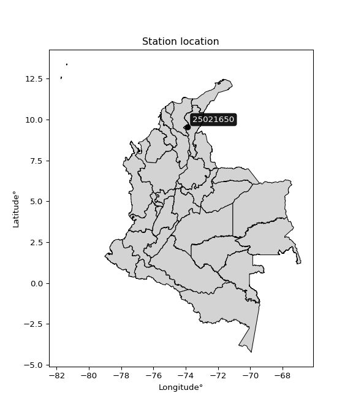</img>


</div>


## A. General information


### 1. General running parameters

• app_version: _v20251220_. • runtime: _2025-12-23 10:23:02.310659_. • Stations dataset (station_dataset_file): _dataset/pmax24h_in/conventional_cesarcolombia_1959_2015.csv_. • Stations catalog (station_catalog_file): _dataset/CNE_IDEAM.xls_. • Plot only fit distributions with Δo > Δ (plot_only_fit): _True_. • Eval low extreme values, if False, evaluates high extreme values (low_extreme): _False_. • Eval Gumbel distribution, non include in SciPy (pdist_loggumbel_on): _True_. • Eval Log-Gumbel distribution, non include in SciPy (pdist_loggumbel_on): _False_. • Standard deviation normalized (ddof): _1.0_. • Return periods to eval in years (Tr): _[2, 2.33, 5, 10, 15, 20, 25, 50, 75, 100, 200, 250, 500, 750, 1000]_. • Minimum data sample per station, 0 means any (minimum_sample): _5_. • Z-Score threshold to adjust a value, 0 means disable (zscore): _3.5_. • Avoid zeros, e.g. rain = 0 (avoid_zeros): _True_. • Avoid null values (avoid_nans): _True_. [:file_folder:Dataset file.](../../dataset/pmax24h_in/conventional_cesarcolombia_1959_2015.csv)


### 2. Station info and location

|   id |   CODIGO | NOMBRE              | CATEGORIA     | TECNOLOGIA   | ESTADO   | FECHA_INSTALACION   |   FECHA_SUSPENSION |   ALTITUD |   LATITUD |   LONGITUD | DEPARTAMENTO   | MUNICIPIO   | AREA_OPERATIVA                                         | ENTIDAD                                                     | AREA_HIDROGRAFICA   | ZONA_HIDROGRAFICA   | SUBZONA_HIDROGRAFICA   |   CORRIENTE |   OBSERVACION |   SUBRED |
|-----:|---------:|:--------------------|:--------------|:-------------|:---------|:--------------------|-------------------:|----------:|----------:|-----------:|:---------------|:------------|:-------------------------------------------------------|:------------------------------------------------------------|:--------------------|:--------------------|:-----------------------|------------:|--------------:|---------:|
|    0 | 25021650 | EL YUCAL [25021650] | Pluviométrica | Convencional | Activa   | 15/11/1984          |                nan |        40 |   9.55739 |   -73.8762 | Cesar          | Astrea      | Area Operativa 05 - Magdalena-Cesar-Guajira-San Andrés | INSTITUTO DE HIDROLOGIA METEOROLOGIA Y ESTUDIOS AMBIENTALES | Magdalena Cauca     | Cesar               | Río Ariguaní           |         nan |           nan |      nan |

<div align="center">

Map location in: [:earth_americas:Google](http://maps.google.com/maps?q=9.557388889,-73.87619444) [:earth_americas:OSM](https://www.openstreetmap.org/#map=18/9.557388889/-73.87619444&layers=P) [:earth_americas:Bing](https://www.bing.com/maps?cp=9.557388889~-73.87619444&lvl=18) [:earth_americas:Apple](https://maps.apple.com/frame?center=9.557388889%2C-73.87619444&span=0.003%2C0.006)

</div>


<div align="center">

```geojson
{
  "type": "Feature",
  "geometry": {
    "type": "Point", 
    "coordinates": [-73.87619444, 9.557388889]
  }, 
  "properties": {
    "Name": "25021650"
  }
}
```

</div>


### 3. Discrete values table and plot

|               |           0 |         1 |          2 |           3 |           4 |           5 |          6 |          7 |          8 |          9 |         10 |         11 |           12 |          13 |          14 |          15 |        16 |          17 |        18 |           19 |          20 |          21 |          22 |           23 |          24 |          25 |          26 |          27 |          28 |          29 |          30 |          31 |         32 |         33 |          34 |
|:--------------|------------:|----------:|-----------:|------------:|------------:|------------:|-----------:|-----------:|-----------:|-----------:|-----------:|-----------:|-------------:|------------:|------------:|------------:|----------:|------------:|----------:|-------------:|------------:|------------:|------------:|-------------:|------------:|------------:|------------:|------------:|------------:|------------:|------------:|------------:|-----------:|-----------:|------------:|
| Date          | 1981        | 1982      | 1983       | 1984        | 1985        | 1986        | 1987       | 1988       | 1989       | 1990       | 1991       | 1992       | 1993         | 1994        | 1995        | 1996        | 1997      | 1998        | 1999      | 2000         | 2001        | 2002        | 2003        | 2004         | 2005        | 2006        | 2007        | 2008        | 2009        | 2010        | 2011        | 2012        | 2013       | 2014       | 2015        |
| Value         |   96.9981   |   70.1839 |   72.8016  |   75.2912   |  126.5      |   86.9      |  158.9     |  167.1     |   70       |   90.6     |  150.6     |  170       |   99         |   97        |   85        |  107        |   67      |   95        |   67      |  100.2       |   78        |   91        |   92        |   99         |   96        |   96        |  111        |   94        |  110        |   84        |   96        |   97        |  135       |  135       |   80        |
| Value_initial |   96.9981   |   70.1839 |   72.8016  |   75.2912   |  126.5      |   86.9      |  158.9     |  167.1     |   70       |   90.6     |  150.6     |  170       |   99         |   97        |   85        |  107        |   67      |   95        |   67      |  100.2       |   78        |   91        |   92        |   99         |   96        |   96        |  111        |   94        |  110        |   84        |   96        |   97        |  135       |  135       |   80        |
| count         |   35        |   35      |   35       |   35        |   35        |   35        |   35       |   35       |   35       |   35       |   35       |   35       |   35         |   35        |   35        |   35        |   35      |   35        |   35      |   35         |   35        |   35        |   35        |   35         |   35        |   35        |   35        |   35        |   35        |   35        |   35        |   35        |   35       |   35       |   35        |
| mean          |  101.345    |  101.345  |  101.345   |  101.345    |  101.345    |  101.345    |  101.345   |  101.345   |  101.345   |  101.345   |  101.345   |  101.345   |  101.345     |  101.345    |  101.345    |  101.345    |  101.345  |  101.345    |  101.345  |  101.345     |  101.345    |  101.345    |  101.345    |  101.345     |  101.345    |  101.345    |  101.345    |  101.345    |  101.345    |  101.345    |  101.345    |  101.345    |  101.345   |  101.345   |  101.345    |
| std           |   27.6619   |   27.6619 |   27.6619  |   27.6619   |   27.6619   |   27.6619   |   27.6619  |   27.6619  |   27.6619  |   27.6619  |   27.6619  |   27.6619  |   27.6619    |   27.6619   |   27.6619   |   27.6619   |   27.6619 |   27.6619   |   27.6619 |   27.6619    |   27.6619   |   27.6619   |   27.6619   |   27.6619    |   27.6619   |   27.6619   |   27.6619   |   27.6619   |   27.6619   |   27.6619   |   27.6619   |   27.6619   |   27.6619  |   27.6619  |   27.6619   |
| zscore        |   -0.157143 |   -1.1265 |   -1.03186 |   -0.941865 |    0.909373 |   -0.522197 |    2.08066 |    2.37709 |   -1.13315 |   -0.38844 |    1.78061 |    2.48193 |   -0.0847733 |   -0.157075 |   -0.590884 |    0.204433 |   -1.2416 |   -0.229376 |   -1.2416 |   -0.0413924 |   -0.843939 |   -0.373979 |   -0.337829 |   -0.0847733 |   -0.193226 |   -0.193226 |    0.349036 |   -0.265527 |    0.312885 |   -0.627035 |   -0.193226 |   -0.157075 |    1.21665 |    1.21665 |   -0.771638 |

<div align="center">

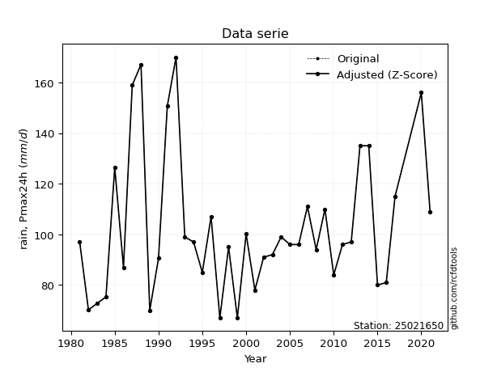</img>

</div>

> If Z-Score is active, values out of range or outliers are replaced with the station mean value.

### 4. Active continuous probability distributions from SciPy (47 of 104 available)

[scipy.stats](https://docs.scipy.org/doc/scipy/reference/stats.html) is a Python´s powerful submodule within the SciPy library for comprehensive statistical analysis, offering over 130 probability distributions (like Normal, Poisson), functions for descriptive stats (mean, variance), hypothesis testing (t-tests, chi-square), random variable generation, and statistical tests, making it essential for data science, modeling, and research. It provides tools to explore, model, and draw conclusions from data efficiently, working seamlessly with NumPy.

|   id | p_dist             |   n_parameter | fit_method   | label                                                                       | active   | ref                                                                                                        |
|-----:|:-------------------|--------------:|:-------------|:----------------------------------------------------------------------------|:---------|:-----------------------------------------------------------------------------------------------------------|
|    0 | alpha              |             3 | MLE          | Alpha                                                                       | True     | [:mortar_board:](https://docs.scipy.org/doc/scipy/reference/generated/scipy.stats.alpha.html)              |
|    1 | betaprime          |             4 | MLE          | Beta prime                                                                  | True     | [:mortar_board:](https://docs.scipy.org/doc/scipy/reference/generated/scipy.stats.betaprime.html)          |
|    2 | chi2               |             3 | MLE          | Chi²                                                                        | True     | [:mortar_board:](https://docs.scipy.org/doc/scipy/reference/generated/scipy.stats.chi2.html)               |
|    3 | crystalball        |             4 | MLE          | Crystalball                                                                 | True     | [:mortar_board:](https://docs.scipy.org/doc/scipy/reference/generated/scipy.stats.crystalball.html)        |
|    4 | dgamma             |             3 | MLE          | Double gamma                                                                | True     | [:mortar_board:](https://docs.scipy.org/doc/scipy/reference/generated/scipy.stats.dgamma.html)             |
|    5 | erlang             |             3 | MLE          | Erlang                                                                      | True     | [:mortar_board:](https://docs.scipy.org/doc/scipy/reference/generated/scipy.stats.erlang.html)             |
|    6 | expon              |             2 | MLE          | Exponential                                                                 | True     | [:mortar_board:](https://docs.scipy.org/doc/scipy/reference/generated/scipy.stats.expon.html)              |
|    7 | exponnorm          |             3 | MLE          | Exponentially modified Normal                                               | True     | [:mortar_board:](https://docs.scipy.org/doc/scipy/reference/generated/scipy.stats.exponnorm.html)          |
|    8 | f                  |             4 | MLE          | F                                                                           | True     | [:mortar_board:](https://docs.scipy.org/doc/scipy/reference/generated/scipy.stats.f.html)                  |
|    9 | fatiguelife        |             3 | MLE          | Fatigue-life (Birnbaum-Saunders)                                            | True     | [:mortar_board:](https://docs.scipy.org/doc/scipy/reference/generated/scipy.stats.fatiguelife.html)        |
|   10 | fisk               |             3 | MLE          | Fisk                                                                        | True     | [:mortar_board:](https://docs.scipy.org/doc/scipy/reference/generated/scipy.stats.fisk.html)               |
|   11 | gamma              |             3 | MLE          | Gamma                                                                       | True     | [:mortar_board:](https://docs.scipy.org/doc/scipy/reference/generated/scipy.stats.gamma.html)              |
|   12 | genexpon           |             5 | MLE          | Generalized exponential                                                     | True     | [:mortar_board:](https://docs.scipy.org/doc/scipy/reference/generated/scipy.stats.genexpon.html)           |
|   13 | genlogistic        |             3 | MLE          | Generalized logistic                                                        | True     | [:mortar_board:](https://docs.scipy.org/doc/scipy/reference/generated/scipy.stats.genlogistic.html)        |
|   14 | gibrat             |             2 | MM           | Gibrat                                                                      | True     | [:mortar_board:](https://docs.scipy.org/doc/scipy/reference/generated/scipy.stats.gibrat.html)             |
|   15 | gompertz           |             3 | MLE          | Gompertz (or truncated Gumbel)                                              | True     | [:mortar_board:](https://docs.scipy.org/doc/scipy/reference/generated/scipy.stats.gompertz.html)           |
|   16 | gumbel_l           |             2 | MM           | Gumbel Left Skew                                                            | True     | [:mortar_board:](https://docs.scipy.org/doc/scipy/reference/generated/scipy.stats.gumbel_l.html)           |
|   17 | gumbel_r           |             2 | MM           | Gumbel Right Skew                                                           | True     | [:mortar_board:](https://docs.scipy.org/doc/scipy/reference/generated/scipy.stats.gumbel_r.html)           |
|   18 | halflogistic       |             2 | MM           | Half-logistic                                                               | True     | [:mortar_board:](https://docs.scipy.org/doc/scipy/reference/generated/scipy.stats.halflogistic.html)       |
|   19 | halfnorm           |             2 | MM           | Half Normal                                                                 | True     | [:mortar_board:](https://docs.scipy.org/doc/scipy/reference/generated/scipy.stats.halfnorm.html)           |
|   20 | hypsecant          |             2 | MM           | hyperbolic secant                                                           | True     | [:mortar_board:](https://docs.scipy.org/doc/scipy/reference/generated/scipy.stats.hypsecant.html)          |
|   21 | invgamma           |             3 | MLE          | Inverted gamma                                                              | True     | [:mortar_board:](https://docs.scipy.org/doc/scipy/reference/generated/scipy.stats.invgamma.html)           |
|   22 | invgauss           |             3 | MLE          | Inverse Gaussian                                                            | True     | [:mortar_board:](https://docs.scipy.org/doc/scipy/reference/generated/scipy.stats.invgauss.html)           |
|   23 | invweibull         |             3 | MLE          | Inverted Weibull                                                            | True     | [:mortar_board:](https://docs.scipy.org/doc/scipy/reference/generated/scipy.stats.invweibull.html)         |
|   24 | johnsonsu          |             4 | MLE          | Johnson Su                                                                  | True     | [:mortar_board:](https://docs.scipy.org/doc/scipy/reference/generated/scipy.stats.johnsonsu.html)          |
|   25 | kstwobign          |             2 | MLE          | Limiting distribution of scaled Kolmogorov-Smirnov two-sided test statistic | True     | [:mortar_board:](https://docs.scipy.org/doc/scipy/reference/generated/scipy.stats.kstwobign.html)          |
|   26 | laplace            |             2 | MM           | Laplace                                                                     | True     | [:mortar_board:](https://docs.scipy.org/doc/scipy/reference/generated/scipy.stats.laplace.html)            |
|   27 | laplace_asymmetric |             3 | MLE          | Asymmetric Laplace                                                          | True     | [:mortar_board:](https://docs.scipy.org/doc/scipy/reference/generated/scipy.stats.laplace_asymmetric.html) |
|   28 | loggamma           |             3 | MLE          | Log gamma                                                                   | True     | [:mortar_board:](https://docs.scipy.org/doc/scipy/reference/generated/scipy.stats.loggamma.html)           |
|   29 | logistic           |             2 | MM           | Logistic (or Sech-squared)                                                  | True     | [:mortar_board:](https://docs.scipy.org/doc/scipy/reference/generated/scipy.stats.logistic.html)           |
|   30 | lognorm            |             3 | MLE          | Log Normal                                                                  | True     | [:mortar_board:](https://docs.scipy.org/doc/scipy/reference/generated/scipy.stats.lognorm.html)            |
|   31 | maxwell            |             2 | MM           | Maxwell                                                                     | True     | [:mortar_board:](https://docs.scipy.org/doc/scipy/reference/generated/scipy.stats.maxwell.html)            |
|   32 | mielke             |             4 | MLE          | Mielke Beta-Kappa / Dagum                                                   | True     | [:mortar_board:](https://docs.scipy.org/doc/scipy/reference/generated/scipy.stats.mielke.html)             |
|   33 | moyal              |             2 | MM           | Moyal                                                                       | True     | [:mortar_board:](https://docs.scipy.org/doc/scipy/reference/generated/scipy.stats.moyal.html)              |
|   34 | nakagami           |             3 | MLE          | Nakagami                                                                    | True     | [:mortar_board:](https://docs.scipy.org/doc/scipy/reference/generated/scipy.stats.nakagami.html)           |
|   35 | ncf                |             5 | MLE          | Non-central F distribution                                                  | True     | [:mortar_board:](https://docs.scipy.org/doc/scipy/reference/generated/scipy.stats.ncf.html)                |
|   36 | nct                |             4 | MLE          | Non-central Student’s t                                                     | True     | [:mortar_board:](https://docs.scipy.org/doc/scipy/reference/generated/scipy.stats.nct.html)                |
|   37 | norm               |             2 | MM           | Normal                                                                      | True     | [:mortar_board:](https://docs.scipy.org/doc/scipy/reference/generated/scipy.stats.norm.html)               |
|   38 | pareto             |             3 | MLE          | Pareto                                                                      | True     | [:mortar_board:](https://docs.scipy.org/doc/scipy/reference/generated/scipy.stats.pareto.html)             |
|   39 | pearson3           |             3 | MM           | Pearson type III                                                            | True     | [:mortar_board:](https://docs.scipy.org/doc/scipy/reference/generated/scipy.stats.pearson3.html)           |
|   40 | rayleigh           |             2 | MM           | Rayleigh                                                                    | True     | [:mortar_board:](https://docs.scipy.org/doc/scipy/reference/generated/scipy.stats.rayleigh.html)           |
|   41 | recipinvgauss      |             3 | MLE          | Reciprocal inverse Gaussian                                                 | True     | [:mortar_board:](https://docs.scipy.org/doc/scipy/reference/generated/scipy.stats.recipinvgauss.html)      |
|   42 | rice               |             3 | MLE          | Rice                                                                        | True     | [:mortar_board:](https://docs.scipy.org/doc/scipy/reference/generated/scipy.stats.rice.html)               |
|   43 | t                  |             3 | MLE          | Student’s t                                                                 | True     | [:mortar_board:](https://docs.scipy.org/doc/scipy/reference/generated/scipy.stats.t.html)                  |
|   44 | truncnorm          |             4 | MLE          | Truncated normal                                                            | True     | [:mortar_board:](https://docs.scipy.org/doc/scipy/reference/generated/scipy.stats.truncnorm.html)          |
|   45 | wald               |             2 | MM           | Wald                                                                        | True     | [:mortar_board:](https://docs.scipy.org/doc/scipy/reference/generated/scipy.stats.wald.html)               |
|   46 | weibull_min        |             3 | MLE          | Weibull minimum                                                             | True     | [:mortar_board:](https://docs.scipy.org/doc/scipy/reference/generated/scipy.stats.weibull_min.html)        |

>Gumbel and Lob-Gumbel probability distributions are not shown in the above table.
>
>**n_parameter:** # arguments & localization & scale.
>
>**Fit methods:** (MLE) maximum likelihood, (MM) L-moments.
>
>**Inactive:** foldnorm, gennorm, norminvgauss, powernorm, powerlognorm, skewnorm, genextreme, anglit, arcsine, argus, beta, bradford, burr, burr12, cauchy, cosine, halfcauchy, foldcauchy, skewcauchy, wrapcauchy, gengamma, exponweib, exponpow, truncexpon, gausshyper, genhalflogistic, genhyperbolic, geninvgauss, halfgennorm, johnsonsb, kappa4, kappa3, ksone, kstwo, loglaplace, levy, levy_l, levy_stable, ncx2, genpareto, truncpareto, lomax, powerlaw, rdist, rel_breitwigner, semicircular, studentized_range, trapezoid, triang, truncweibull_min, tukeylambda, uniform, loguniform, vonmises, vonmises_line, weibull_max, dweibull, 


## B. Probability distributions vs. Empirical distributions

A continuous probability distribution describes probabilities for variables that can take any value within a range (like rain any time), unlike discrete variables with specific outcomes (like temperature). It uses a Probability Density Function (PDF), a curve where the total area under it equals 1, and the probability of the variable falling within an interval (a to b) is found by calculating the area under the curve between those points. A key feature is that the probability of hitting any single exact value is zero, so probabilities are always expressed for ranges, e.g., $P(a ≤ X ≤ b)$.


### 0. Cumulative distribution values - CDF (48 evalated, ordered by x ascending) 

|   id |   Station |   date |        x |   count |    mean |     std |     zscore |   Value_initial |   station |   m |     alpha |   alpha_pdf |   betaprime |   betaprime_pdf |       chi2 |    chi2_pdf |   crystalball |   crystalball_pdf |    dgamma |     dgamma_pdf |     erlang |   erlang_pdf |     expon |   expon_pdf |   exponnorm |   exponnorm_pdf |         f |      f_pdf |   fatiguelife |   fatiguelife_pdf |      fisk |   fisk_pdf |      gamma |   gamma_pdf |    genexpon |   genexpon_pdf |   genlogistic |   genlogistic_pdf |    gibrat |   gibrat_pdf |    gompertz |   gompertz_pdf |   gumbel_l |   gumbel_l_pdf |   gumbel_r |   gumbel_r_pdf |   halflogistic |   halflogistic_pdf |   halfnorm |   halfnorm_pdf |   hypsecant |   hypsecant_pdf |   invgamma |   invgamma_pdf |   invgauss |   invgauss_pdf |   invweibull |   invweibull_pdf |   johnsonsu |   johnsonsu_pdf |   kstwobign |   kstwobign_pdf |   laplace |   laplace_pdf |   laplace_asymmetric |   laplace_asymmetric_pdf |   loggamma |   loggamma_pdf |   logistic |   logistic_pdf |   lognorm |   lognorm_pdf |   maxwell |   maxwell_pdf |   mielke |   mielke_pdf |     moyal |   moyal_pdf |    nakagami |   nakagami_pdf |      ncf |    ncf_pdf |       nct |     nct_pdf |     norm |    norm_pdf |   pareto |      pareto_pdf |   pearson3 |   pearson3_pdf |   rayleigh |   rayleigh_pdf |   recipinvgauss |   recipinvgauss_pdf |      rice |    rice_pdf |        t |       t_pdf |   truncnorm |   truncnorm_pdf |        wald |    wald_pdf |   weibull_min |   weibull_min_pdf |   zzgumbel |   gumbel_pdf |
|-----:|----------:|-------:|---------:|--------:|--------:|--------:|-----------:|----------------:|----------:|----:|----------:|------------:|------------:|----------------:|-----------:|------------:|--------------:|------------------:|----------:|---------------:|-----------:|-------------:|----------:|------------:|------------:|----------------:|----------:|-----------:|--------------:|------------------:|----------:|-----------:|-----------:|------------:|------------:|---------------:|--------------:|------------------:|----------:|-------------:|------------:|---------------:|-----------:|---------------:|-----------:|---------------:|---------------:|-------------------:|-----------:|---------------:|------------:|----------------:|-----------:|---------------:|-----------:|---------------:|-------------:|-----------------:|------------:|----------------:|------------:|----------------:|----------:|--------------:|---------------------:|-------------------------:|-----------:|---------------:|-----------:|---------------:|----------:|--------------:|----------:|--------------:|---------:|-------------:|----------:|------------:|------------:|---------------:|---------:|-----------:|----------:|------------:|---------:|------------:|---------:|----------------:|-----------:|---------------:|-----------:|---------------:|----------------:|--------------------:|----------:|------------:|---------:|------------:|------------:|----------------:|------------:|------------:|--------------:|------------------:|-----------:|-------------:|
|    0 |  25021650 |   1999 |  67      |      35 | 101.345 | 27.6619 | -1.2416    |         67      |  25021650 |   1 | 0.0307973 | 0.00683368  |   0.0534325 |     0.00736538  | 0.00322686 | 3.80078e+10 |      0.103884 |       0.00661805  | 0.0996019 |    0.00452107  | 0.00933418 |   0.0127576  | 0         |  0.0291163  |   0.0344322 |      0.00614949 | 0.027465  | 0.00713288 |     0.0229032 |        0.00798535 | 0.0257399 | 0.00660522 | 0.00933415 |  0.0127576  | 7.92591e-08 |     0.0290781  |     0.042444  |       0.00689417  | 0         |  0           | 1.00376e-08 |     0.0214606  |   0.105594 |    0.00469535  |  0.0593196 |     0.00788269 |      0         |         0          |  0.030719  |     0.0176283  |   0.0874516 |     0.00497533  |  0.0274653 |     0.00713303 |  0.0238167 |     0.00777039 |    0.0294872 |       0.00690852 |   0.0244633 |      0.00754035 |   0.0397215 |     0.00712628  | 0.0841911 |   0.0043671   |            0.0578778 |              0.00440021  |   0.109157 |    0.00665227  |  0.0923824 |    0.00557819  | 0.0244534 |    0.00753998 | 0.0941676 |    0.00832673 |      nan |          nan | 0.0318021 |  0.00696475 | 3.50661e-13 |    19.6036     | 0.442799 | 0.00572705 | 0.0429726 | 0.00729995  | 0.103884 | 0.00661805  | 0        | 89617.2         |  0.0539103 |     0.00929765 |  0.0875317 |     0.00938488 |       0.0218206 |          0.00821713 | 0.0392151 | 0.00732359  | 0.107105 | 0.0054267   |    0.103884 |     0.00661805  | 0           | 0           |    0.00710135 |        0.0135151  | 0.00737339 |            0 |
|    1 |  25021650 |   1997 |  67      |      35 | 101.345 | 27.6619 | -1.2416    |         67      |  25021650 |   2 | 0.0307973 | 0.00683368  |   0.0534325 |     0.00736538  | 0.00322686 | 3.80078e+10 |      0.103884 |       0.00661805  | 0.0996019 |    0.00452107  | 0.00933418 |   0.0127576  | 0         |  0.0291163  |   0.0344322 |      0.00614949 | 0.027465  | 0.00713288 |     0.0229032 |        0.00798535 | 0.0257399 | 0.00660522 | 0.00933415 |  0.0127576  | 7.92591e-08 |     0.0290781  |     0.042444  |       0.00689417  | 0         |  0           | 1.00376e-08 |     0.0214606  |   0.105594 |    0.00469535  |  0.0593196 |     0.00788269 |      0         |         0          |  0.030719  |     0.0176283  |   0.0874516 |     0.00497533  |  0.0274653 |     0.00713303 |  0.0238167 |     0.00777039 |    0.0294872 |       0.00690852 |   0.0244633 |      0.00754035 |   0.0397215 |     0.00712628  | 0.0841911 |   0.0043671   |            0.0578778 |              0.00440021  |   0.109157 |    0.00665227  |  0.0923824 |    0.00557819  | 0.0244534 |    0.00753998 | 0.0941676 |    0.00832673 |      nan |          nan | 0.0318021 |  0.00696475 | 3.50661e-13 |    19.6036     | 0.442799 | 0.00572705 | 0.0429726 | 0.00729995  | 0.103884 | 0.00661805  | 0        | 89617.2         |  0.0539103 |     0.00929765 |  0.0875317 |     0.00938488 |       0.0218206 |          0.00821713 | 0.0392151 | 0.00732359  | 0.107105 | 0.0054267   |    0.103884 |     0.00661805  | 0           | 0           |    0.00710135 |        0.0135151  | 0.00737339 |            0 |
|    2 |  25021650 |   1989 |  70      |      35 | 101.345 | 27.6619 | -1.13315   |         70      |  25021650 |   3 | 0.0560918 | 0.0100684   |   0.078565  |     0.00939796  | 0.786808   | 0.0377181   |      0.125136 |       0.00755615  | 0.114233  |    0.00525464  | 0.0588897  |   0.018861   | 0.0836427 |  0.026681   |   0.0569209 |      0.00892076 | 0.0543582 | 0.0108101  |     0.0538915 |        0.0125666  | 0.0504549 | 0.00991507 | 0.0588895  |  0.018861   | 0.0835387   |     0.0266494  |     0.0666734 |       0.00928386  | 0         |  0           | 0.0632512   |     0.0207046  |   0.120595 |    0.00531633  |  0.086034  |     0.00992787 |      0.0207839 |         0.0214411  |  0.0834977 |     0.0175447  |   0.103684  |     0.00586863  |  0.0543591 |     0.0108103  |  0.0537766 |     0.0121328  |    0.0552947 |       0.0103333  |   0.0533481 |      0.0116774  |   0.0647326 |     0.00954691  | 0.0983668 |   0.00510241  |            0.0727051 |              0.00552748  |   0.13045  |    0.00754897  |  0.110533  |    0.0065407   | 0.0533292 |    0.0116713  | 0.120909  |    0.00949156 |      nan |          nan | 0.0574462 |  0.0101594  | 0.0841175   |     0.0222527  | 0.459799 | 0.0056057  | 0.0686121 | 0.00980641  | 0.125136 | 0.00755615  | 0.604495 |     0.00798999  |  0.0852713 |     0.0115575  |  0.117552  |     0.0106047  |       0.0539117 |          0.0130228  | 0.0640003 | 0.00917382  | 0.125215 | 0.00669701  |    0.125136 |     0.00755615  | 0           | 0           |    0.0575767  |        0.018684   | 0.0139496  |            0 |
|    3 |  25021650 |   1982 |  70.1839 |      35 | 101.345 | 27.6619 | -1.1265    |         70.1839 |  25021650 |   4 | 0.0579616 | 0.0102715   |   0.0803044 |     0.00952331  | 0.793536   | 0.0355102   |      0.126531 |       0.00761478  | 0.115204  |    0.005304    | 0.0623737  |   0.0190361  | 0.0885351 |  0.0265385  |   0.0585779 |      0.00910433 | 0.0563664 | 0.0110344  |     0.0562254 |        0.0128212  | 0.0522971 | 0.0101242  | 0.0623736  |  0.0190361  | 0.0884253   |     0.0265073  |     0.0683941 |       0.00943396  | 0         |  0           | 0.0670536   |     0.0206579  |   0.121576 |    0.00535653  |  0.0878708 |     0.0100525  |      0.0247256 |         0.0214372  |  0.0867227 |     0.0175371  |   0.104769  |     0.00592779  |  0.0563673 |     0.0110346  |  0.0560302 |     0.0123813  |    0.0572142 |       0.0105472  |   0.0555173 |      0.0119187  |   0.0665013 |     0.00969371  | 0.0993094 |   0.00515131  |            0.0737285 |              0.00560528  |   0.131843 |    0.0076049   |  0.111742  |    0.00660322  | 0.0554972 |    0.0119122  | 0.12266   |    0.00956096 |      nan |          nan | 0.0593324 |  0.0103579  | 0.0881833   |     0.0219782  | 0.460829 | 0.00559814 | 0.0704293 | 0.0099612   | 0.126531 | 0.00761479  | 0.605919 |     0.00750151  |  0.087408  |     0.0116852  |  0.119508  |     0.0106747  |       0.05633   |          0.0132822  | 0.0656969 | 0.00928193  | 0.126454 | 0.00678512  |    0.126531 |     0.00761478  | 0           | 0           |    0.0610241  |        0.0188148  | 0.0144647  |            0 |
|    4 |  25021650 |   1983 |  72.8016 |      35 | 101.345 | 27.6619 | -1.03186   |         72.8016 |  25021650 |   5 | 0.0885975 | 0.0131085   |   0.10755   |     0.0112817   | 0.860108   | 0.0184763   |      0.147566 |       0.00845893  | 0.130065  |    0.006071    | 0.114504   |   0.0205278  | 0.155425  |  0.0245909  |   0.0859271 |      0.0118131  | 0.0892997 | 0.0140666  |     0.0941116 |        0.01597    | 0.0826886 | 0.0130804  | 0.114504   |  0.0205277  | 0.15524     |     0.0245645  |     0.095885  |       0.011562    | 0         |  0           | 0.120256    |     0.0199874  |   0.136372 |    0.00595645  |  0.11647   |     0.0117805  |      0.0807068 |         0.0213106  |  0.132461  |     0.0173977  |   0.121441  |     0.00682825  |  0.0893012 |     0.0140668  |  0.0927282 |     0.0155257  |    0.088746  |       0.0135068  |   0.0909486 |      0.0150461  |   0.0945511 |     0.0117095   | 0.113753  |   0.0059005   |            0.0899639 |              0.00683959  |   0.152801 |    0.00840883  |  0.130231  |    0.00753562  | 0.0909043 |    0.0150343  | 0.148953  |    0.0105161  |      nan |          nan | 0.0900814 |  0.0131     | 0.141889    |     0.0193542  | 0.475341 | 0.00548917 | 0.0993548 | 0.0121192   | 0.147566 | 0.00845893  | 0.619993 |     0.00396971  |  0.120235  |     0.0133448  |  0.1487    |     0.0116076  |       0.0954311 |          0.0164137  | 0.0919439 | 0.0107474   | 0.145988 | 0.00818604  |    0.147566 |     0.00845893  | 0           | 0           |    0.111977   |        0.0199148  | 0.0234737  |            0 |
|    5 |  25021650 |   1984 |  75.2912 |      35 | 101.345 | 27.6619 | -0.941865  |         75.2912 |  25021650 |   6 | 0.124343  | 0.0155487   |   0.137622  |     0.0128546   | 0.896933   | 0.0118581   |      0.169633 |       0.00926878  | 0.146219  |    0.00693026  | 0.1662     |   0.0208816  | 0.214479  |  0.0228715  |   0.11858   |      0.0144014  | 0.12746   | 0.0165009  |     0.136677  |        0.0180822  | 0.118572  | 0.0156972  | 0.1662     |  0.0208816  | 0.214233    |     0.022849   |     0.127096  |       0.0134854   | 0         |  0           | 0.169214    |     0.0193425  |   0.151962 |    0.00657563  |  0.147711  |     0.0132892  |      0.133483  |         0.0210681  |  0.175553  |     0.0172126  |   0.139614  |     0.00778834  |  0.127462  |     0.0165012  |  0.134294  |     0.0177346  |    0.125558  |       0.0159952  |   0.131428  |      0.0173568  |   0.125891  |     0.0134283   | 0.129433  |   0.00671385  |            0.108709  |              0.00826473  |   0.174693 |    0.00917826  |  0.150167  |    0.00849001  | 0.13135   |    0.0173415  | 0.176195  |    0.0113562  |      nan |          nan | 0.125648  |  0.0154085  | 0.188123    |     0.0178828  | 0.488876 | 0.00538358 | 0.13192   | 0.0140061   | 0.169633 | 0.00926878  | 0.628127 |     0.00271828  |  0.155119  |     0.0146308  |  0.178583  |     0.0123809  |       0.138978  |          0.0184181  | 0.120292  | 0.0120023   | 0.168314 | 0.00979794  |    0.169633 |     0.00926878  | 5.50774e-06 | 5.32951e-05 |    0.161981   |        0.0201669  | 0.0353356  |            0 |
|    6 |  25021650 |   2001 |  78      |      35 | 101.345 | 27.6619 | -0.843939  |         78      |  25021650 |   7 | 0.169526  | 0.0177136   |   0.174559  |     0.0143782   | 0.92333    | 0.00799294  |      0.195927 |       0.0101418   | 0.166458  |    0.00804827  | 0.222545   |   0.020638   | 0.274054  |  0.0211369  |   0.161151  |      0.0169634  | 0.175011  | 0.0184844  |     0.187729  |        0.0194631  | 0.164473  | 0.0180987  | 0.222545   |  0.0206379  | 0.273753    |     0.0211183  |     0.16621   |       0.0153438   | 0         |  0           | 0.220651    |     0.0186344  |   0.170748 |    0.00730383  |  0.18569   |     0.0147073  |      0.19005   |         0.0206756  |  0.221843  |     0.016955   |   0.162256  |     0.00894868  |  0.175014  |     0.0184846  |  0.184604  |     0.0192663  |    0.17193   |       0.018131   |   0.180947  |      0.0190662  |   0.164467  |     0.0149966   | 0.148959  |   0.00772671  |            0.133569  |              0.0101547   |   0.200681 |    0.0100063   |  0.174641  |    0.00958939  | 0.180825  |    0.0190493  | 0.208093  |    0.012178   |      nan |          nan | 0.170228  |  0.0174062  | 0.234933    |     0.0167312  | 0.503301 | 0.00526701 | 0.172317  | 0.0157606   | 0.195927 | 0.0101418   | 0.634445 |     0.00201408  |  0.196273  |     0.0156961  |  0.213114  |     0.0130912  |       0.190742  |          0.0196526  | 0.154466  | 0.0131993   | 0.197608 | 0.0118898   |    0.195927 |     0.0101418   | 0.0213975   | 0.0209577   |    0.216424   |        0.0199663  | 0.0524282  |            0 |
|    7 |  25021650 |   2015 |  80      |      35 | 101.345 | 27.6619 | -0.771638  |         80      |  25021650 |   8 | 0.20621   | 0.0189112   |   0.204302  |     0.0153401   | 0.937403   | 0.00618435  |      0.216842 |       0.0107702   | 0.183511  |    0.00903059  | 0.263415   |   0.0202036  | 0.31512   |  0.0199412  |   0.196702  |      0.0185317  | 0.213035  | 0.0194737  |     0.22722   |        0.0199625  | 0.202102  | 0.0194681  | 0.263415   |  0.0202036  | 0.314784    |     0.0199251  |     0.198088  |       0.0165001   | 0         |  0           | 0.257394    |     0.0181082  |   0.185924 |    0.00787751  |  0.215996  |     0.0155715  |      0.231042  |         0.0203053  |  0.255532  |     0.0167287  |   0.181074  |     0.00987884  |  0.213039  |     0.0194739  |  0.223816  |     0.019878   |    0.209388  |       0.0192621  |   0.219901  |      0.019819   |   0.195422  |     0.0159246   | 0.165243  |   0.00857136  |            0.155504  |              0.0118223   |   0.221292 |    0.0106019   |  0.194657  |    0.0104292   | 0.219744  |    0.0198021  | 0.232996  |    0.0127144  |      nan |          nan | 0.206174  |  0.0184815  | 0.267689    |     0.0160414  | 0.513749 | 0.00518012 | 0.204923  | 0.0168079   | 0.216842 | 0.0107702   | 0.638127 |     0.00168705  |  0.228263  |     0.0162644  |  0.239744  |     0.0135261  |       0.230509  |          0.0200504  | 0.181646  | 0.0139636   | 0.223124 | 0.0136564   |    0.216842 |     0.0107702   | 0.0796931   | 0.0352584   |    0.25603    |        0.0196171  | 0.0680708  |            0 |
|    8 |  25021650 |   2010 |  84      |      35 | 101.345 | 27.6619 | -0.627035  |         84      |  25021650 |   9 | 0.284969  | 0.0202337   |   0.268757  |     0.0167739   | 0.957148   | 0.00391092  |      0.262327 |       0.0119518   | 0.224405  |    0.0115677   | 0.341878   |   0.0189663  | 0.390415  |  0.0177489  |   0.275361  |      0.0205235  | 0.293102  | 0.0203256  |     0.307447  |        0.0199605  | 0.283623  | 0.0210253  | 0.341878   |  0.0189663  | 0.390024    |     0.0177373  |     0.267701  |       0.0181536   | 0.0975923 |  0.0499133   | 0.327714    |     0.0170507  |   0.219866 |    0.009112    |  0.280935  |     0.0167791  |      0.310493  |         0.0193824  |  0.321407  |     0.01619    |   0.224557  |     0.011891    |  0.293106  |     0.0203257  |  0.304091  |     0.0200573  |    0.289172  |       0.0203871  |   0.300445  |      0.0202367  |   0.261886  |     0.0171736   | 0.203344  |   0.0105477   |            0.210772  |              0.0160241   |   0.265978 |    0.011722    |  0.239774  |    0.0121268   | 0.300226  |    0.0202225  | 0.285692  |    0.0135876  |      nan |          nan | 0.282795  |  0.0196103  | 0.329471    |     0.0148888  | 0.534119 | 0.00500499 | 0.275258  | 0.0182016   | 0.262327 | 0.0119518   | 0.643963 |     0.0012693   |  0.294784  |     0.0168872  |  0.295232  |     0.0141667  |       0.310754  |          0.0198936  | 0.240065  | 0.0151742   | 0.285503 | 0.0175929   |    0.262327 |     0.0119518   | 0.233531    | 0.0382326   |    0.332582   |        0.0186029  | 0.107279   |            0 |
|    9 |  25021650 |   1995 |  85      |      35 | 101.345 | 27.6619 | -0.590884  |         85      |  25021650 |  10 | 0.305268  | 0.0203522   |   0.28566   |     0.017024    | 0.960858   | 0.00351647  |      0.274416 |       0.0122258   | 0.236366  |    0.0123682   | 0.360667   |   0.0186098  | 0.407908  |  0.0172395  |   0.296011  |      0.0207599  | 0.313438  | 0.0203332  |     0.327333  |        0.0198018  | 0.304728  | 0.0211684  | 0.360667   |  0.0186098  | 0.407506    |     0.0172289  |     0.285993  |       0.0184219   | 0.14891   |  0.0520951   | 0.344632    |     0.0167857  |   0.22914  |    0.00943735  |  0.297813  |     0.0169698  |      0.329745  |         0.019118   |  0.337521  |     0.0160384  |   0.236709  |     0.0124152   |  0.313442  |     0.0203333  |  0.324091  |     0.0199318  |    0.309598  |       0.0204516  |   0.320647  |      0.0201561  |   0.279158  |     0.0173633   | 0.21417   |   0.0111093   |            0.227421  |              0.0172899   |   0.277831 |    0.0119819   |  0.25211   |    0.0125438   | 0.320414  |    0.0201429  | 0.299368  |    0.0137618  |      nan |          nan | 0.302455  |  0.0196966  | 0.34423     |     0.0146318  | 0.539102 | 0.00496104 | 0.293565  | 0.018403    | 0.274416 | 0.0122258   | 0.645194 |     0.00119463  |  0.311703  |     0.0169453  |  0.309456  |     0.0142795  |       0.330559  |          0.0197074  | 0.255359  | 0.0154096   | 0.303601 | 0.0186013   |    0.274416 |     0.0122258   | 0.271106    | 0.0368604   |    0.351037   |        0.0183051  | 0.118697   |            0 |
|   10 |  25021650 |   1986 |  86.9    |      35 | 101.345 | 27.6619 | -0.522197  |         86.9    |  25021650 |  11 | 0.343995  | 0.0203691   |   0.318367  |     0.0173787   | 0.966923   | 0.00289312  |      0.298118 |       0.0127165   | 0.261503  |    0.0141583   | 0.395359   |   0.0179027  | 0.439774  |  0.0163117  |   0.335671  |      0.0209271  | 0.351943  | 0.0201605  |     0.364573  |        0.019373   | 0.345018  | 0.02119    | 0.395359   |  0.0179027  | 0.439353    |     0.0163028  |     0.321361  |       0.0187731   | 0.24641   |  0.0496285   | 0.376047    |     0.0162823  |   0.247671 |    0.0100716   |  0.33031   |     0.0172123  |      0.365568  |         0.0185837  |  0.367708  |     0.0157331  |   0.261251  |     0.013418    |  0.351948  |     0.0201605  |  0.361628  |     0.0195526  |    0.348418  |       0.020369   |   0.358677  |      0.0198436  |   0.312397  |     0.0175979   | 0.236353  |   0.0122599   |            0.262762  |              0.0199768   |   0.301045 |    0.0124481   |  0.27668   |    0.013314    | 0.358421  |    0.0198325  | 0.325793  |    0.0140424  |      nan |          nan | 0.339894  |  0.0196739  | 0.371585    |     0.014167   | 0.548449 | 0.00487751 | 0.328779  | 0.0186312   | 0.298118 | 0.0127165   | 0.647345 |     0.00107402  |  0.343932  |     0.0169601  |  0.336753  |     0.0144427  |       0.367578  |          0.0192378  | 0.285007  | 0.0157826   | 0.340715 | 0.0204411   |    0.298118 |     0.0127165   | 0.338183    | 0.0336732   |    0.385254   |        0.017707   | 0.142065   |            0 |
|   11 |  25021650 |   1990 |  90.6    |      35 | 101.345 | 27.6619 | -0.38844   |         90.6    |  25021650 |  12 | 0.41844   | 0.0197421   |   0.383309  |     0.0176316   | 0.975898   | 0.00201996  |      0.34675  |       0.0135392   | 0.322581  |    0.0193784   | 0.458956   |   0.0164664  | 0.49699   |  0.0146458  |   0.412328  |      0.0203262  | 0.425075  | 0.0192642  |     0.434183  |        0.0181933  | 0.422306  | 0.02043    | 0.458956   |  0.0164664  | 0.496542    |     0.0146399  |     0.391266  |       0.0188956   | 0.410236  |  0.0386716   | 0.43448     |     0.0153038  |   0.287294 |    0.0113552   |  0.394252  |     0.0172624  |      0.432253  |         0.0174425  |  0.424732  |     0.0150786  |   0.314445  |     0.0153105   |  0.425079  |     0.0192642  |  0.432014  |     0.018424   |    0.422544  |       0.0195788  |   0.430286  |      0.0187802  |   0.377728  |     0.017629    | 0.286361  |   0.0148539   |            0.34812   |              0.0264661   |   0.34861  |    0.0132329   |  0.328531  |    0.0146759   | 0.429996  |    0.0187733  | 0.378484  |    0.0143969  |      nan |          nan | 0.411741  |  0.0190504  | 0.422427    |     0.0133273  | 0.566195 | 0.00471502 | 0.397759  | 0.0185462   | 0.34675  | 0.0135392   | 0.650971 |     0.000896325 |  0.406272  |     0.0166732  |  0.390508  |     0.0145742  |       0.436597  |          0.0180154  | 0.344349  | 0.0162344   | 0.421964 | 0.0232396   |    0.34675  |     0.0135392   | 0.450787    | 0.0272939   |    0.448493   |        0.0164635  | 0.193238   |            0 |
|   12 |  25021650 |   2002 |  91      |      35 | 101.345 | 27.6619 | -0.373979  |         91      |  25021650 |  13 | 0.426315  | 0.0196314   |   0.390361  |     0.0176262   | 0.976691   | 0.00194565  |      0.352181 |       0.0136163   | 0.330491  |    0.0201842   | 0.465511   |   0.0163094  | 0.502814  |  0.0144762  |   0.420433  |      0.0202008  | 0.432754  | 0.0191329  |     0.441431  |        0.0180466  | 0.430451  | 0.0202959  | 0.465511   |  0.0163094  | 0.502364    |     0.0144706  |     0.398819  |       0.0188681   | 0.425468  |  0.0374941   | 0.44058     |     0.0151984  |   0.291864 |    0.0114967   |  0.401152  |     0.0172371  |      0.439204  |         0.0173126  |  0.430749  |     0.0150034  |   0.320608  |     0.0155031   |  0.432759  |     0.0191329  |  0.439355  |     0.0182798  |    0.430351  |       0.0194537  |   0.43777   |      0.0186385  |   0.384775  |     0.0176024   | 0.292364  |   0.0151653   |            0.358869  |              0.0272833   |   0.353918 |    0.0133067   |  0.334428  |    0.0148081   | 0.437477  |    0.0186321  | 0.384247  |    0.01442    |      nan |          nan | 0.41934   |  0.0189461  | 0.427741    |     0.0132405  | 0.568077 | 0.00469749 | 0.405168  | 0.0184996   | 0.352181 | 0.0136163   | 0.651327 |     0.000880489 |  0.412931  |     0.0166205  |  0.396338  |     0.0145743  |       0.443773  |          0.0178664  | 0.350848  | 0.016262    | 0.431301 | 0.0234434   |    0.352181 |     0.0136163   | 0.461577    | 0.0266542   |    0.455051   |        0.0163253  | 0.199164   |            0 |
|   13 |  25021650 |   2003 |  92      |      35 | 101.345 | 27.6619 | -0.337829  |         92      |  25021650 |  14 | 0.445796  | 0.0193247   |   0.407971  |     0.0175867   | 0.978549   | 0.00177338  |      0.365889 |       0.0137978   | 0.35182   |    0.0225775   | 0.481624   |   0.015917   | 0.517082  |  0.0140608  |   0.440462  |      0.0198465  | 0.451714  | 0.0187819  |     0.45929   |        0.0176683  | 0.450566  | 0.0199247  | 0.481624   |  0.015917   | 0.516626    |     0.0140558  |     0.417641  |       0.0187678   | 0.461534  |  0.0346682   | 0.455647    |     0.0149351  |   0.303538 |    0.0118518   |  0.418349  |     0.0171499  |      0.456352  |         0.0169831  |  0.445657  |     0.0148122  |   0.336346  |     0.0159683   |  0.451719  |     0.0187819  |  0.457449  |     0.0179056  |    0.449638  |       0.0191145  |   0.456225  |      0.0182671  |   0.402335  |     0.017513    | 0.30793   |   0.0159727   |            0.38558   |              0.0261466   |   0.367313 |    0.013481    |  0.349395  |    0.0151229   | 0.455926  |    0.0182618  | 0.398691  |    0.014465   |      nan |          nan | 0.438146  |  0.0186598  | 0.440874    |     0.0130262  | 0.572753 | 0.00465373 | 0.423599  | 0.018355    | 0.365889 | 0.0137978   | 0.652188 |     0.000843181 |  0.429479  |     0.0164722  |  0.410908  |     0.0145627  |       0.461449  |          0.0174842  | 0.367138  | 0.0163135   | 0.454959 | 0.0238455   |    0.365889 |     0.0137978   | 0.487454    | 0.0251143   |    0.471203   |        0.015978   | 0.21427    |            0 |
|   14 |  25021650 |   2008 |  94      |      35 | 101.345 | 27.6619 | -0.265527  |         94      |  25021650 |  15 | 0.483745  | 0.0186016   |   0.442982  |     0.0174021   | 0.981791   | 0.00147899  |      0.39381  |       0.0141111   | 0.403951  |    0.0306589   | 0.512676   |   0.0151366  | 0.5444    |  0.0132654  |   0.47933   |      0.0189936  | 0.488511  | 0.017999   |     0.493839  |        0.016874   | 0.48957   | 0.0190541  | 0.512676   |  0.0151366  | 0.543936    |     0.0132617  |     0.454877  |       0.0184425   | 0.525662  |  0.0295911   | 0.484992    |     0.0144104  |   0.327954 |    0.0125645   |  0.452399  |     0.0168805  |      0.489646  |         0.0163075  |  0.474888  |     0.0144158  |   0.369147  |     0.0168114   |  0.488515  |     0.017999   |  0.492475  |     0.0171111  |    0.487112  |       0.0183401  |   0.491969  |      0.0174658  |   0.437112  |     0.0172446   | 0.341591  |   0.0177188   |            0.435709  |              0.0240134   |   0.394588 |    0.0137836   |  0.380213  |    0.0156773   | 0.491662  |    0.0174626  | 0.427669  |    0.0145006  |      nan |          nan | 0.47482   |  0.0179949  | 0.466505    |     0.0126077  | 0.581973 | 0.00456648 | 0.459932  | 0.0179554   | 0.39381  | 0.0141111   | 0.653807 |     0.00077709  |  0.462077  |     0.0161119  |  0.439972  |     0.0144909  |       0.495627  |          0.0166878  | 0.399811  | 0.016343    | 0.503068 | 0.0241488   |    0.39381  |     0.0141111   | 0.534806    | 0.0222964   |    0.50246    |        0.0152792  | 0.24559    |            0 |
|   15 |  25021650 |   1998 |  95      |      35 | 101.345 | 27.6619 | -0.229376  |         95      |  25021650 |  16 | 0.502145  | 0.0181953   |   0.460316  |     0.017261    | 0.983206   | 0.00135305  |      0.407987 |       0.0142417   | 0.438648  |    0.0400786   | 0.527619   |   0.0147504  | 0.557474  |  0.0128847  |   0.498085  |      0.0185126  | 0.5063    | 0.0175763  |     0.510509  |        0.0164637  | 0.508384  | 0.0185684  | 0.527619   |  0.0147504  | 0.557007    |     0.0128816  |     0.473213  |       0.0182237   | 0.554115  |  0.0273467   | 0.499271    |     0.0141492  |   0.340697 |    0.01292     |  0.469193  |     0.0167026  |      0.505782  |         0.015963   |  0.489202  |     0.0142112  |   0.386146  |     0.0171786   |  0.506304  |     0.0175762  |  0.509379  |     0.0166974  |    0.505241  |       0.0179151  |   0.509224  |      0.0170434  |   0.454271  |     0.0170703   | 0.359777  |   0.0186621   |            0.459219  |              0.0230129   |   0.408436 |    0.0139107   |  0.39601   |    0.0159125   | 0.508915  |    0.0170412  | 0.442166  |    0.0144917  |      nan |          nan | 0.492631  |  0.0176253  | 0.47901     |     0.0124029  | 0.586518 | 0.00452302 | 0.477766  | 0.0177069   | 0.407987 | 0.0142417   | 0.654569 |     0.000747687 |  0.478086  |     0.0159036  |  0.454435  |     0.0144317  |       0.512111  |          0.0162791  | 0.416146  | 0.0163222   | 0.527177 | 0.0240391   |    0.407987 |     0.0142417   | 0.556455    | 0.0210168   |    0.517565   |        0.0149294  | 0.261721   |            0 |
|   16 |  25021650 |   2006 |  96      |      35 | 101.345 | 27.6619 | -0.193226  |         96      |  25021650 |  17 | 0.520128  | 0.0177657   |   0.477494  |     0.0170901   | 0.984501   | 0.00123914  |      0.422287 |       0.0143541   | 0.5       | 1628.14        | 0.542178   |   0.0143678  | 0.570173  |  0.012515   |   0.516346  |      0.0180062  | 0.523658  | 0.0171381  |     0.526765  |        0.0160481  | 0.526698  | 0.0180577  | 0.542178   |  0.0143678  | 0.569703    |     0.0125124  |     0.491314  |       0.0179719   | 0.580418  |  0.0252887   | 0.51329     |     0.0138888  |   0.353793 |    0.0132732   |  0.485796  |     0.016499   |      0.521571  |         0.0156151  |  0.503309  |     0.0140027  |   0.40349   |     0.0175028   |  0.523662  |     0.017138   |  0.525867  |     0.0162765  |    0.522936  |       0.0174711  |   0.526052  |      0.0166109  |   0.471244  |     0.0168722   | 0.378932  |   0.0196557   |            0.481749  |              0.0220542   |   0.422404 |    0.0140209   |  0.412028  |    0.016117    | 0.525741  |    0.0166096  | 0.456646  |    0.0144655  |      nan |          nan | 0.510064  |  0.0172362  | 0.491312    |     0.0122007  | 0.591019 | 0.00447968 | 0.495337  | 0.0174302   | 0.422287 | 0.0143541   | 0.655303 |     0.000720371 |  0.493878  |     0.0156787  |  0.46883   |     0.0143576  |       0.528184  |          0.0158663  | 0.432448  | 0.0162786   | 0.55109  | 0.0237584   |    0.422287 |     0.0143541   | 0.576867    | 0.0198196   |    0.53232    |        0.0145804  | 0.278109   |            0 |
|   17 |  25021650 |   2005 |  96      |      35 | 101.345 | 27.6619 | -0.193226  |         96      |  25021650 |  18 | 0.520128  | 0.0177657   |   0.477494  |     0.0170901   | 0.984501   | 0.00123914  |      0.422287 |       0.0143541   | 0.5       | 1628.14        | 0.542178   |   0.0143678  | 0.570173  |  0.012515   |   0.516346  |      0.0180062  | 0.523658  | 0.0171381  |     0.526765  |        0.0160481  | 0.526698  | 0.0180577  | 0.542178   |  0.0143678  | 0.569703    |     0.0125124  |     0.491314  |       0.0179719   | 0.580418  |  0.0252887   | 0.51329     |     0.0138888  |   0.353793 |    0.0132732   |  0.485796  |     0.016499   |      0.521571  |         0.0156151  |  0.503309  |     0.0140027  |   0.40349   |     0.0175028   |  0.523662  |     0.017138   |  0.525867  |     0.0162765  |    0.522936  |       0.0174711  |   0.526052  |      0.0166109  |   0.471244  |     0.0168722   | 0.378932  |   0.0196557   |            0.481749  |              0.0220542   |   0.422404 |    0.0140209   |  0.412028  |    0.016117    | 0.525741  |    0.0166096  | 0.456646  |    0.0144655  |      nan |          nan | 0.510064  |  0.0172362  | 0.491312    |     0.0122007  | 0.591019 | 0.00447968 | 0.495337  | 0.0174302   | 0.422287 | 0.0143541   | 0.655303 |     0.000720371 |  0.493878  |     0.0156787  |  0.46883   |     0.0143576  |       0.528184  |          0.0158663  | 0.432448  | 0.0162786   | 0.55109  | 0.0237584   |    0.422287 |     0.0143541   | 0.576867    | 0.0198196   |    0.53232    |        0.0145804  | 0.278109   |            0 |
|   18 |  25021650 |   2011 |  96      |      35 | 101.345 | 27.6619 | -0.193226  |         96      |  25021650 |  19 | 0.520128  | 0.0177657   |   0.477494  |     0.0170901   | 0.984501   | 0.00123914  |      0.422287 |       0.0143541   | 0.5       | 1628.14        | 0.542178   |   0.0143678  | 0.570173  |  0.012515   |   0.516346  |      0.0180062  | 0.523658  | 0.0171381  |     0.526765  |        0.0160481  | 0.526698  | 0.0180577  | 0.542178   |  0.0143678  | 0.569703    |     0.0125124  |     0.491314  |       0.0179719   | 0.580418  |  0.0252887   | 0.51329     |     0.0138888  |   0.353793 |    0.0132732   |  0.485796  |     0.016499   |      0.521571  |         0.0156151  |  0.503309  |     0.0140027  |   0.40349   |     0.0175028   |  0.523662  |     0.017138   |  0.525867  |     0.0162765  |    0.522936  |       0.0174711  |   0.526052  |      0.0166109  |   0.471244  |     0.0168722   | 0.378932  |   0.0196557   |            0.481749  |              0.0220542   |   0.422404 |    0.0140209   |  0.412028  |    0.016117    | 0.525741  |    0.0166096  | 0.456646  |    0.0144655  |      nan |          nan | 0.510064  |  0.0172362  | 0.491312    |     0.0122007  | 0.591019 | 0.00447968 | 0.495337  | 0.0174302   | 0.422287 | 0.0143541   | 0.655303 |     0.000720371 |  0.493878  |     0.0156787  |  0.46883   |     0.0143576  |       0.528184  |          0.0158663  | 0.432448  | 0.0162786   | 0.55109  | 0.0237584   |    0.422287 |     0.0143541   | 0.576867    | 0.0198196   |    0.53232    |        0.0145804  | 0.278109   |            0 |
|   19 |  25021650 |   1981 |  96.9981 |      35 | 101.345 | 27.6619 | -0.157143  |         96.9981 |  25021650 |  20 | 0.537637  | 0.0173178   |   0.494455  |     0.0168919   | 0.985686   | 0.00113614  |      0.436662 |       0.0144478   | 0.561276  |    0.0401068   | 0.55633    |   0.0139902  | 0.582485  |  0.0121565  |   0.534058  |      0.0174825  | 0.540541  | 0.0166889  |     0.542574  |        0.0156301  | 0.544459  | 0.0175287  | 0.55633    |  0.0139902  | 0.582012    |     0.0121545  |     0.509114  |       0.0176907   | 0.604706  |  0.0234088   | 0.527024    |     0.01363    |   0.367216 |    0.0136224   |  0.502152  |     0.0162722  |      0.536982  |         0.0152651  |  0.51718   |     0.0137908  |   0.421102  |     0.0177788   |  0.540545  |     0.0166888  |  0.541901  |     0.0158517  |    0.540146  |       0.017013   |   0.542413  |      0.016172   |   0.487977  |     0.0166529   | 0.399067  |   0.0207001   |            0.503301  |              0.021137    |   0.436446 |    0.0141138   |  0.428203  |    0.0162889   | 0.542101  |    0.0161716  | 0.471064  |    0.0144224  |      nan |          nan | 0.527067  |  0.0168323  | 0.50339     |     0.0120012  | 0.595469 | 0.00443656 | 0.512585  | 0.0171289   | 0.436662 | 0.0144478   | 0.656009 |     0.000694976 |  0.509409  |     0.0154393  |  0.483118  |     0.0142693  |       0.543814  |          0.0154523  | 0.448665  | 0.0162131   | 0.574596 | 0.0233176   |    0.436662 |     0.0144478   | 0.596085    | 0.0187025   |    0.546699   |        0.0142335  | 0.294679   |            0 |
|   20 |  25021650 |   1994 |  97      |      35 | 101.345 | 27.6619 | -0.157075  |         97      |  25021650 |  21 | 0.53767   | 0.017317    |   0.494487  |     0.0168915   | 0.985688   | 0.00113595  |      0.436689 |       0.014448    | 0.561352  |    0.0400786   | 0.556356   |   0.0139895  | 0.582508  |  0.0121558  |   0.534091  |      0.0174815  | 0.540572  | 0.016688   |     0.542604  |        0.0156293  | 0.544493  | 0.0175277  | 0.556356   |  0.0139895  | 0.582035    |     0.0121538  |     0.509147  |       0.0176902   | 0.604751  |  0.0234054   | 0.527049    |     0.0136295  |   0.367242 |    0.013623    |  0.502183  |     0.0162718  |      0.537011  |         0.0152645  |  0.517206  |     0.0137904  |   0.421135  |     0.0177793   |  0.540576  |     0.0166879  |  0.541931  |     0.0158509  |    0.540179  |       0.0170122  |   0.542444  |      0.0161712  |   0.488008  |     0.0166525   | 0.399106  |   0.0207022   |            0.503341  |              0.0211353   |   0.436473 |    0.014114    |  0.428234  |    0.0162892   | 0.542132  |    0.0161707  | 0.471092  |    0.0144223  |      nan |          nan | 0.527099  |  0.0168315  | 0.503413    |     0.0120009  | 0.595477 | 0.00443648 | 0.512618  | 0.0171283   | 0.436689 | 0.014448    | 0.65601  |     0.000694929 |  0.509438  |     0.0154389  |  0.483145  |     0.0142691  |       0.543843  |          0.0154515  | 0.448695  | 0.016213    | 0.57464  | 0.0233166   |    0.436689 |     0.014448    | 0.596121    | 0.0187005   |    0.546726   |        0.0142328  | 0.29471    |            0 |
|   21 |  25021650 |   2012 |  97      |      35 | 101.345 | 27.6619 | -0.157075  |         97      |  25021650 |  22 | 0.53767   | 0.017317    |   0.494487  |     0.0168915   | 0.985688   | 0.00113595  |      0.436689 |       0.014448    | 0.561352  |    0.0400786   | 0.556356   |   0.0139895  | 0.582508  |  0.0121558  |   0.534091  |      0.0174815  | 0.540572  | 0.016688   |     0.542604  |        0.0156293  | 0.544493  | 0.0175277  | 0.556356   |  0.0139895  | 0.582035    |     0.0121538  |     0.509147  |       0.0176902   | 0.604751  |  0.0234054   | 0.527049    |     0.0136295  |   0.367242 |    0.013623    |  0.502183  |     0.0162718  |      0.537011  |         0.0152645  |  0.517206  |     0.0137904  |   0.421135  |     0.0177793   |  0.540576  |     0.0166879  |  0.541931  |     0.0158509  |    0.540179  |       0.0170122  |   0.542444  |      0.0161712  |   0.488008  |     0.0166525   | 0.399106  |   0.0207022   |            0.503341  |              0.0211353   |   0.436473 |    0.014114    |  0.428234  |    0.0162892   | 0.542132  |    0.0161707  | 0.471092  |    0.0144223  |      nan |          nan | 0.527099  |  0.0168315  | 0.503413    |     0.0120009  | 0.595477 | 0.00443648 | 0.512618  | 0.0171283   | 0.436689 | 0.014448    | 0.65601  |     0.000694929 |  0.509438  |     0.0154389  |  0.483145  |     0.0142691  |       0.543843  |          0.0154515  | 0.448695  | 0.016213    | 0.57464  | 0.0233166   |    0.436689 |     0.014448    | 0.596121    | 0.0187005   |    0.546726   |        0.0142328  | 0.29471    |            0 |
|   22 |  25021650 |   1993 |  99      |      35 | 101.345 | 27.6619 | -0.0847733 |         99      |  25021650 |  23 | 0.571373  | 0.0163782   |   0.527814  |     0.0164201   | 0.987775   | 0.000957231 |      0.465729 |       0.0145786   | 0.624082  |    0.0258008   | 0.58359    |   0.0132479  | 0.606125  |  0.0114682  |   0.56798   |      0.0164026  | 0.573029  | 0.0157651  |     0.573023  |        0.0147894  | 0.578457  | 0.0164311  | 0.58359    |  0.0132479  | 0.60565     |     0.0114672  |     0.543903  |       0.0170496   | 0.648167  |  0.0201096   | 0.553792    |     0.013114   |   0.395176 |    0.0143062   |  0.534223  |     0.0157556  |      0.566834  |         0.0145583  |  0.544355  |     0.013356   |   0.457125  |     0.0181732   |  0.573033  |     0.015765   |  0.572776  |     0.0149937  |    0.57326   |       0.0160643  |   0.573897  |      0.0152802  |   0.520829  |     0.0161568   | 0.442735  |   0.0229652   |            0.543862  |              0.0194109   |   0.464846 |    0.014247    |  0.461077  |    0.0165311   | 0.573585  |    0.0152813  | 0.499811  |    0.0142866  |      nan |          nan | 0.559924  |  0.0159881  | 0.52702     |     0.0116074  | 0.604264 | 0.00435053 | 0.54622   | 0.0164612   | 0.465729 | 0.0145786   | 0.657353 |     0.000648953 |  0.539806  |     0.0149208  |  0.511474  |     0.0140512  |       0.573916  |          0.0146221  | 0.480941  | 0.0160186   | 0.620056 | 0.0220155   |    0.465729 |     0.0145786   | 0.631453    | 0.0166783   |    0.574501   |        0.0135442  | 0.328387   |            0 |
|   23 |  25021650 |   2004 |  99      |      35 | 101.345 | 27.6619 | -0.0847733 |         99      |  25021650 |  24 | 0.571373  | 0.0163782   |   0.527814  |     0.0164201   | 0.987775   | 0.000957231 |      0.465729 |       0.0145786   | 0.624082  |    0.0258008   | 0.58359    |   0.0132479  | 0.606125  |  0.0114682  |   0.56798   |      0.0164026  | 0.573029  | 0.0157651  |     0.573023  |        0.0147894  | 0.578457  | 0.0164311  | 0.58359    |  0.0132479  | 0.60565     |     0.0114672  |     0.543903  |       0.0170496   | 0.648167  |  0.0201096   | 0.553792    |     0.013114   |   0.395176 |    0.0143062   |  0.534223  |     0.0157556  |      0.566834  |         0.0145583  |  0.544355  |     0.013356   |   0.457125  |     0.0181732   |  0.573033  |     0.015765   |  0.572776  |     0.0149937  |    0.57326   |       0.0160643  |   0.573897  |      0.0152802  |   0.520829  |     0.0161568   | 0.442735  |   0.0229652   |            0.543862  |              0.0194109   |   0.464846 |    0.014247    |  0.461077  |    0.0165311   | 0.573585  |    0.0152813  | 0.499811  |    0.0142866  |      nan |          nan | 0.559924  |  0.0159881  | 0.52702     |     0.0116074  | 0.604264 | 0.00435053 | 0.54622   | 0.0164612   | 0.465729 | 0.0145786   | 0.657353 |     0.000648953 |  0.539806  |     0.0149208  |  0.511474  |     0.0140512  |       0.573916  |          0.0146221  | 0.480941  | 0.0160186   | 0.620056 | 0.0220155   |    0.465729 |     0.0145786   | 0.631453    | 0.0166783   |    0.574501   |        0.0135442  | 0.328387   |            0 |
|   24 |  25021650 |   2000 | 100.2    |      35 | 101.345 | 27.6619 | -0.0413924 |        100.2    |  25021650 |  25 | 0.59068   | 0.0157979   |   0.547326  |     0.0160954   | 0.988868   | 0.000865171 |      0.483251 |       0.0146197   | 0.652642  |    0.0220467   | 0.599226   |   0.0128136  | 0.619649  |  0.0110744  |   0.587271  |      0.0157505  | 0.591611  | 0.0152042  |     0.590469  |        0.0142881  | 0.597774  | 0.0157619  | 0.599226   |  0.0128136  | 0.619173    |     0.0110739  |     0.56411   |       0.0166241   | 0.671253  |  0.0183981   | 0.569345    |     0.012807   |   0.412581 |    0.0147014   |  0.552926  |     0.0154122  |      0.584049  |         0.0141333  |  0.560222  |     0.0130896  |   0.479017  |     0.0182994   |  0.591615  |     0.0152041  |  0.59046   |     0.0144803  |    0.59219   |       0.015485   |   0.591911  |      0.014744   |   0.540023  |     0.0158286   | 0.471169  |   0.0244401   |            0.566571  |              0.0184446   |   0.481972 |    0.0142921   |  0.480966  |    0.0166078   | 0.591601  |    0.0147459  | 0.51689   |    0.014175   |      nan |          nan | 0.578799  |  0.0154682  | 0.540809    |     0.011375   | 0.609454 | 0.00429928 | 0.565716  | 0.0160278   | 0.483251 | 0.0146197   | 0.658117 |     0.000624103 |  0.557513  |     0.0145892  |  0.528244  |     0.0138957  |       0.591166  |          0.0141284  | 0.500073  | 0.0158638   | 0.645893 | 0.0210233   |    0.483251 |     0.0146197   | 0.650806    | 0.0155909   |    0.590509   |        0.0131366  | 0.348786   |            0 |
|   25 |  25021650 |   1996 | 107      |      35 | 101.345 | 27.6619 |  0.204433  |        107      |  25021650 |  26 | 0.686841  | 0.0125105   |   0.649457  |     0.0138512   | 0.993373   | 0.000496942 |      0.582158 |       0.0143212   | 0.763634  |    0.0123682   | 0.678411   |   0.0105278  | 0.687969  |  0.00908519 |   0.682274  |      0.0122803  | 0.684323  | 0.0121048  |     0.678262  |        0.0115803  | 0.692287  | 0.0121028  | 0.678411   |  0.0105278  | 0.687498    |     0.00908713 |     0.668031  |       0.0138735   | 0.770503  |  0.0114643   | 0.650614    |     0.0111082  |   0.519329 |    0.0165647   |  0.650304  |     0.013164   |      0.672037  |         0.0117626  |  0.64395   |     0.0115232  |   0.601921  |     0.0174072   |  0.684325  |     0.0121047  |  0.679302  |     0.0116958  |    0.686405  |       0.0122644  |   0.682068  |      0.0118186  |   0.640585  |     0.0136866   | 0.627113  |   0.0193421   |            0.675478  |              0.01381     |   0.578812 |    0.0140499   |  0.59296   |    0.016057    | 0.681784  |    0.0118237  | 0.61019   |    0.0131666  |      nan |          nan | 0.673891  |  0.0125197  | 0.613786    |     0.0101003  | 0.637714 | 0.00401417 | 0.665661  | 0.0133223   | 0.582158 | 0.0143212   | 0.661956 |     0.000512188 |  0.649852  |     0.0125325  |  0.618994  |     0.0127186  |       0.67804   |          0.0114705  | 0.60381   | 0.0145284   | 0.766429 | 0.014358    |    0.582158 |     0.0143212   | 0.739448    | 0.0108342   |    0.672245   |        0.0109383  | 0.463723   |            0 |
|   26 |  25021650 |   2009 | 110      |      35 | 101.345 | 27.6619 |  0.312885  |        110      |  25021650 |  27 | 0.722319  | 0.0111564   |   0.689353  |     0.012741    | 0.9947     | 0.000392326 |      0.62455  |       0.0139136   | 0.797305  |    0.0101859   | 0.708618   |   0.00962083 | 0.714068  |  0.00832528 |   0.717085  |      0.0109499  | 0.71873   | 0.0108483  |     0.711351  |        0.0104913  | 0.726403  | 0.010664   | 0.708618   |  0.00962084 | 0.713604    |     0.008328   |     0.707733  |       0.012595    | 0.801761  |  0.00945459  | 0.682849    |     0.010385   |   0.569845 |    0.0170708   |  0.6882    |     0.0120975  |      0.705818  |         0.0107642  |  0.677458  |     0.0108151  |   0.65253   |     0.0162737   |  0.718733  |     0.0108482  |  0.712688  |     0.0105744  |    0.721214  |       0.0109574  |   0.715735  |      0.0106396  |   0.680115  |     0.012664    | 0.68085   |   0.0165547   |            0.714372  |              0.0121549   |   0.620448 |    0.0136822   |  0.640099  |    0.0153261   | 0.715467  |    0.0106455  | 0.648791  |    0.012553   |      nan |          nan | 0.709594  |  0.0112942  | 0.643271    |     0.00955818 | 0.649573 | 0.00389167 | 0.703785  | 0.0120968   | 0.62455  | 0.0139136   | 0.663434 |     0.00047437  |  0.686029  |     0.0115852  |  0.656196  |     0.0120723  |       0.710832  |          0.0104032  | 0.646241  | 0.0137431   | 0.805387 | 0.0116785   |    0.62455  |     0.0139136   | 0.769599    | 0.00931342  |    0.703703   |        0.0100416  | 0.512385   |            0 |
|   27 |  25021650 |   2007 | 111      |      35 | 101.345 | 27.6619 |  0.349036  |        111      |  25021650 |  28 | 0.73326   | 0.0107261   |   0.701907  |     0.0123659   | 0.995078   | 0.000362937 |      0.63838  |       0.0137433   | 0.807186  |    0.00958376  | 0.718095   |   0.00933263 | 0.722273  |  0.00808638 |   0.727827  |      0.0105367  | 0.729379  | 0.01045    |     0.721668  |        0.0101452  | 0.736841  | 0.0102154  | 0.718094   |  0.00933263 | 0.721812    |     0.00808932 |     0.720116  |       0.0121725   | 0.810926  |  0.00888394  | 0.693115    |     0.010148   |   0.586973 |    0.0171805   |  0.700119  |     0.0117415  |      0.71642   |         0.0104408  |  0.688155  |     0.0105785  |   0.668583  |     0.0158268   |  0.729381  |     0.0104498  |  0.723083  |     0.0102181  |    0.731963  |       0.0105435  |   0.726187  |      0.0102657  |   0.692607  |     0.0123206   | 0.696983  |   0.0157179   |            0.726272  |              0.0116485   |   0.634054 |    0.0135268   |  0.655278  |    0.0150278   | 0.725924  |    0.0102717  | 0.661233  |    0.0123305  |      nan |          nan | 0.720691  |  0.0109023  | 0.65274     |     0.00938011 | 0.653444 | 0.00385133 | 0.71568   | 0.0116945   | 0.63838  | 0.0137433   | 0.663903 |     0.000462944 |  0.697457  |     0.0112701  |  0.668154  |     0.011844   |       0.721065  |          0.0100639  | 0.659844  | 0.0134617   | 0.81666  | 0.0108769   |    0.63838  |     0.0137433   | 0.778686    | 0.00886585  |    0.7136     |        0.00975374 | 0.528146   |            0 |
|   28 |  25021650 |   1985 | 126.5    |      35 | 101.345 | 27.6619 |  0.909373  |        126.5    |  25021650 |  29 | 0.856089  | 0.00560413  |   0.850436  |     0.00702861  | 0.998384   | 0.000113609 |      0.821905 |       0.00956024  | 0.906935  |    0.00419944  | 0.832737   |   0.00571533 | 0.823144  |  0.00514939 |   0.850679  |      0.00578401 | 0.851005  | 0.00567239 |     0.84322   |        0.00587203 | 0.851827  | 0.00518747 | 0.832736   |  0.00571533 | 0.822747    |     0.00515427 |     0.862578  |       0.00656518  | 0.901949  |  0.00376441  | 0.823587    |     0.00679331 |   0.840118 |    0.0137887   |  0.842022  |     0.00681097 |      0.843369  |         0.00619331 |  0.824285  |     0.00705333 |   0.85322   |     0.00816014  |  0.851005  |     0.00567232 |  0.844852  |     0.00584488 |    0.853727  |       0.00562681 |   0.847176  |      0.00573169 |   0.843923  |     0.00737804  | 0.86439   |   0.00703428  |            0.858467  |              0.00602293  |   0.816202 |    0.00959512  |  0.842042  |    0.00884865  | 0.84701   |    0.00573745 | 0.821918  |    0.00829501 |      nan |          nan | 0.849198  |  0.00606992 | 0.777678    |     0.00680005 | 0.708478 | 0.00326126 | 0.853396  | 0.00642308  | 0.821905 | 0.00956024  | 0.669994 |     0.00033614  |  0.83641   |     0.00684356 |  0.821945  |     0.0079486  |       0.842012  |          0.00586509 | 0.831193  | 0.00858064  | 0.918767 | 0.0036971   |    0.821905 |     0.00956024  | 0.876596    | 0.00439873  |    0.834114   |        0.00602475 | 0.732603   |            0 |
|   29 |  25021650 |   2013 | 135      |      35 | 101.345 | 27.6619 |  1.21665   |        135      |  25021650 |  30 | 0.895987  | 0.00388958  |   0.900534  |     0.00486097  | 0.999106   | 6.17097e-05 |      0.891476 |       0.00683025  | 0.936238  |    0.00280107  | 0.875129   |   0.00431925 | 0.861918  |  0.00402043 |   0.89257   |      0.00416138 | 0.891811  | 0.0040235  |     0.886102  |        0.00429513 | 0.88883   | 0.00362414 | 0.875129   |  0.00431925 | 0.861564    |     0.00402553 |     0.908979  |       0.00446633  | 0.928192  |  0.0025145   | 0.874607    |     0.00524925 |   0.93508  |    0.00835139  |  0.891119  |     0.00483243 |      0.888563  |         0.00451433 |  0.876927  |     0.00537286 |   0.909049  |     0.00516908  |  0.891811  |     0.00402345 |  0.887419  |     0.00425121 |    0.894057  |       0.00396154 |   0.888694  |      0.00412368 |   0.897237  |     0.00524644  | 0.912741  |   0.00452623  |            0.901425  |              0.00419485  |   0.886494 |    0.00695513  |  0.903696  |    0.00578986  | 0.888572  |    0.00412838 | 0.882949  |    0.00610478 |      nan |          nan | 0.893016  |  0.00433227 | 0.83008     |     0.00555162 | 0.734936 | 0.00296791 | 0.899186  | 0.0044561   | 0.891476 | 0.00683025  | 0.672654 |     0.000291752 |  0.88634   |     0.00497781 |  0.880683  |     0.00591206 |       0.88492   |          0.00430601 | 0.893254  | 0.00608495  | 0.943218 | 0.00221348  |    0.891476 |     0.00683025  | 0.908156    | 0.00311523  |    0.878726   |        0.00453194 | 0.810743   |            0 |
|   30 |  25021650 |   2014 | 135      |      35 | 101.345 | 27.6619 |  1.21665   |        135      |  25021650 |  31 | 0.895987  | 0.00388958  |   0.900534  |     0.00486097  | 0.999106   | 6.17097e-05 |      0.891476 |       0.00683025  | 0.936238  |    0.00280107  | 0.875129   |   0.00431925 | 0.861918  |  0.00402043 |   0.89257   |      0.00416138 | 0.891811  | 0.0040235  |     0.886102  |        0.00429513 | 0.88883   | 0.00362414 | 0.875129   |  0.00431925 | 0.861564    |     0.00402553 |     0.908979  |       0.00446633  | 0.928192  |  0.0025145   | 0.874607    |     0.00524925 |   0.93508  |    0.00835139  |  0.891119  |     0.00483243 |      0.888563  |         0.00451433 |  0.876927  |     0.00537286 |   0.909049  |     0.00516908  |  0.891811  |     0.00402345 |  0.887419  |     0.00425121 |    0.894057  |       0.00396154 |   0.888694  |      0.00412368 |   0.897237  |     0.00524644  | 0.912741  |   0.00452623  |            0.901425  |              0.00419485  |   0.886494 |    0.00695513  |  0.903696  |    0.00578986  | 0.888572  |    0.00412838 | 0.882949  |    0.00610478 |      nan |          nan | 0.893016  |  0.00433227 | 0.83008     |     0.00555162 | 0.734936 | 0.00296791 | 0.899186  | 0.0044561   | 0.891476 | 0.00683025  | 0.672654 |     0.000291752 |  0.88634   |     0.00497781 |  0.880683  |     0.00591206 |       0.88492   |          0.00430601 | 0.893254  | 0.00608495  | 0.943218 | 0.00221348  |    0.891476 |     0.00683025  | 0.908156    | 0.00311523  |    0.878726   |        0.00453194 | 0.810743   |            0 |
|   31 |  25021650 |   1991 | 150.6    |      35 | 101.345 | 27.6619 |  1.78061   |        150.6    |  25021650 |  32 | 0.94044   | 0.00202656  |   0.954398  |     0.00231847  | 0.999691   | 2.07887e-05 |      0.964588 |       0.00286151  | 0.967494  |    0.00138382  | 0.927554   |   0.00254855 | 0.912326  |  0.00255276 |   0.941292  |      0.00227407 | 0.938499  | 0.00216329 |     0.936882  |        0.00239393 | 0.930926  | 0.00196953 | 0.927554   |  0.00254855 | 0.912049    |     0.0025575  |     0.958157  |       0.0021087   | 0.956769  |  0.00131     | 0.938089    |     0.00302106 |   0.996642 |    0.000899827 |  0.946164  |     0.00246312 |      0.941339  |         0.00244276 |  0.940829  |     0.0029743  |   0.962766  |     0.00214034  |  0.938499  |     0.00216327 |  0.937502  |     0.00235315 |    0.939825  |       0.00211169 |   0.936989  |      0.00225868 |   0.956082  |     0.00254406  | 0.961151  |   0.00201516  |            0.949248  |              0.00215976  |   0.961917 |    0.00300597  |  0.963625  |    0.00233193  | 0.936926  |    0.0022615  | 0.952083  |    0.00298712 |      nan |          nan | 0.943213  |  0.00230957 | 0.901039    |     0.00362877 | 0.777388 | 0.00248693 | 0.949318  | 0.00221851  | 0.964588 | 0.00286151  | 0.676726 |     0.000234358 |  0.943942  |     0.00261745 |  0.948656  |     0.00300656 |       0.935971  |          0.00241434 | 0.959842  | 0.00274413  | 0.966757 | 0.00100643  |    0.964588 |     0.00286151  | 0.944817    | 0.00173992  |    0.933209   |        0.00260871 | 0.903222   |            0 |
|   32 |  25021650 |   1987 | 158.9    |      35 | 101.345 | 27.6619 |  2.08066   |        158.9    |  25021650 |  33 | 0.954747  | 0.00145604  |   0.970163  |     0.00153128  | 0.999823   | 1.18012e-05 |      0.982615 |       0.00157621  | 0.977122  |    0.000962814 | 0.945956   |   0.00191451 | 0.931148  |  0.00200473 |   0.957434  |      0.00164883 | 0.953853  | 0.00157058 |     0.953936  |        0.00174893 | 0.945044  | 0.00146246 | 0.945956   |  0.00191451 | 0.930909    |     0.00200908 |     0.972506  |       0.00139597  | 0.9661    |  0.000960626 | 0.959403    |     0.00214937 |   0.999779 |    8.75126e-05 |  0.963242  |     0.00169701 |      0.958549  |         0.00174143 |  0.961589  |     0.00206864 |   0.976902  |     0.00132959  |  0.953853  |     0.00157057 |  0.954252  |     0.00171646 |    0.954796  |       0.00152985 |   0.953064  |      0.00164835 |   0.973254  |     0.00164691  | 0.974742  |   0.00131018  |            0.96435   |              0.00151709  |   0.981008 |    0.00168575  |  0.978731  |    0.0013849   | 0.953021  |    0.00165041 | 0.972071  |    0.00189161 |      nan |          nan | 0.959489  |  0.001649   | 0.927667    |     0.00281143 | 0.797076 | 0.00226046 | 0.964674  | 0.00152514  | 0.982615 | 0.00157621  | 0.678575 |     0.000211973 |  0.962155  |     0.00181469 |  0.969042  |     0.00196119 |       0.953193  |          0.00176851 | 0.977787  | 0.00165173  | 0.973769 | 0.000706387 |    0.982615 |     0.00157621  | 0.957344    | 0.00130289  |    0.951864   |        0.00191859 | 0.933072   |            0 |
|   33 |  25021650 |   1988 | 167.1    |      35 | 101.345 | 27.6619 |  2.37709   |        167.1    |  25021650 |  34 | 0.964985  | 0.00106413  |   0.980431  |     0.0010081   | 0.999897   | 6.79045e-06 |      0.992063 |       0.000798413 | 0.983772  |    0.000676692 | 0.959616   |   0.00143907 | 0.945771  |  0.00157894 |   0.969017  |      0.00120014 | 0.96493   | 0.00115424 |     0.966262  |        0.00128131 | 0.955504  | 0.00110882 | 0.959616   |  0.00143907 | 0.945566    |     0.00158286 |     0.981889  |       0.000924028 | 0.97294   |  0.000721493 | 0.974168    |     0.00148237 |   0.999996 |    2.44837e-06 |  0.974857  |     0.00116779 |      0.970662  |         0.00124017 |  0.975661  |     0.00139805 |   0.985595  |     0.000829641 |  0.964929  |     0.00115424 |  0.966347  |     0.00125747 |    0.96558   |       0.00112346 |   0.964702  |      0.0012136  |   0.984094  |     0.00103674  | 0.983493  |   0.000856263 |            0.974851  |              0.0010702   |   0.991193 |    0.000869368 |  0.987562  |    0.000817151 | 0.964673  |    0.00121509 | 0.984318  |    0.00114532 |      nan |          nan | 0.970987  |  0.00118144 | 0.947882    |     0.00214111 | 0.81476  | 0.00205569 | 0.975133  | 0.00105515  | 0.992063 | 0.000798413 | 0.680236 |     0.000193603 |  0.974575  |     0.00124696 |  0.981939  |     0.00122968 |       0.96567   |          0.00129858 | 0.988219  | 0.000946193 | 0.978725 | 0.000515635 |    0.992063 |     0.000798413 | 0.966678    | 0.000989996 |    0.96539    |        0.00140497 | 0.953741   |            0 |
|   34 |  25021650 |   1992 | 170      |      35 | 101.345 | 27.6619 |  2.48193   |        170      |  25021650 |  35 | 0.96791   | 0.000955498 |   0.983147  |     0.000868416 | 0.999915   | 5.59259e-06 |      0.994102 |       0.000614268 | 0.985618  |    0.000598014 | 0.963584   |   0.00130011 | 0.950162  |  0.00145109 |   0.972309  |      0.00107262 | 0.968104  | 0.00103727 |     0.96978   |        0.00114764 | 0.958573  | 0.00100932 | 0.963584   |  0.00130011 | 0.949968    |     0.00145485 |     0.984381  |       0.000797881 | 0.974933  |  0.000654816 | 0.978181    |     0.0012883  |   0.999999 |    4.5951e-07  |  0.978028  |     0.00102218 |      0.974049  |         0.00109886 |  0.979434  |     0.00120761 |   0.987811  |     0.000702086 |  0.968104  |     0.00103727 |  0.9698    |     0.00112667 |    0.96867   |       0.00100962 |   0.96804   |      0.00109048 |   0.986858  |     0.000873342 | 0.985798  |   0.000736678 |            0.977771  |              0.000945948 |   0.99342  |    0.000673086 |  0.989722  |    0.000676724 | 0.968015  |    0.00109179 | 0.987346  |    0.00094788 |      nan |          nan | 0.974219  |  0.00104993 | 0.953788    |     0.00193505 | 0.820622 | 0.00198758 | 0.978003  | 0.000927045 | 0.994102 | 0.000614268 | 0.680789 |     0.000187826 |  0.977957  |     0.00108893 |  0.985211  |     0.00103167 |       0.969238  |          0.00116394 | 0.990695  | 0.000766906 | 0.980145 | 0.00046465  |    0.994102 |     0.000614268 | 0.969417    | 0.000900453 |    0.969245   |        0.00125615 | 0.959441   |            0 |

An Empirical Distribution Function (EDF) is a step-function estimate of a true cumulative distribution function (CDF) based on observed sample data, representing the proportion of data points less than or equal to a given value. It is calculated by ordering your data and jumping up by $1/n$ (where $n$ is sample size) at each unique data point, allowing analysis without assuming an underlying population distribution, and it gets closer to the true CDF as the sample size grows.


### 1. Empirical - EDF California (1923)

California´s estimates the true probability distribution of water-related data (like rainfall, streamflow) using observed samples, crucial for risk assessment.

<div align="center">


$P=m/n$


</div>


**1.1. Empirical values**

<div align="center">

|                | 0                   | 1                   | 2                   | 3                   | 4                   | 5                   | 6              | 7                   | 8                  | 9                  | 10                 | 11                  | 12                  | 13                 | 14                  | 15                  | 16                 | 17                 | 18                 | 19                 | 20             | 21                 | 22                 | 23                 | 24                 | 25                 | 26                 | 27                | 28                 | 29                 | 30                 | 31                 | 32                 | 33                 | 34             |
|:---------------|:--------------------|:--------------------|:--------------------|:--------------------|:--------------------|:--------------------|:---------------|:--------------------|:-------------------|:-------------------|:-------------------|:--------------------|:--------------------|:-------------------|:--------------------|:--------------------|:-------------------|:-------------------|:-------------------|:-------------------|:---------------|:-------------------|:-------------------|:-------------------|:-------------------|:-------------------|:-------------------|:------------------|:-------------------|:-------------------|:-------------------|:-------------------|:-------------------|:-------------------|:---------------|
| date           | 1999                | 1997                | 1989                | 1982                | 1983                | 1984                | 2001           | 2015                | 2010               | 1995               | 1986               | 1990                | 2002                | 2003               | 2008                | 1998                | 2006               | 2005               | 2011               | 1981               | 1994           | 2012               | 1993               | 2004               | 2000               | 1996               | 2009               | 2007              | 1985               | 2013               | 2014               | 1991               | 1987               | 1988               | 1992           |
| x              | 67.0                | 67.0                | 70.0                | 70.183857028671     | 72.8016283965208    | 75.2911691571765    | 78.0           | 80.0                | 84.0               | 85.0               | 86.9               | 90.6                | 91.0                | 92.0               | 94.0                | 95.0                | 96.0               | 96.0               | 96.0               | 96.998100854538    | 97.0           | 97.0               | 99.0               | 99.0               | 100.2              | 107.0              | 110.0              | 111.0             | 126.5              | 135.0              | 135.0              | 150.6              | 158.9              | 167.1              | 170.0          |
| m              | 1                   | 2                   | 3                   | 4                   | 5                   | 6                   | 7              | 8                   | 9                  | 10                 | 11                 | 12                  | 13                  | 14                 | 15                  | 16                  | 17                 | 18                 | 19                 | 20                 | 21             | 22                 | 23                 | 24                 | 25                 | 26                 | 27                 | 28                | 29                 | 30                 | 31                 | 32                 | 33                 | 34                 | 35             |
| empirical_dist | edf_california      | edf_california      | edf_california      | edf_california      | edf_california      | edf_california      | edf_california | edf_california      | edf_california     | edf_california     | edf_california     | edf_california      | edf_california      | edf_california     | edf_california      | edf_california      | edf_california     | edf_california     | edf_california     | edf_california     | edf_california | edf_california     | edf_california     | edf_california     | edf_california     | edf_california     | edf_california     | edf_california    | edf_california     | edf_california     | edf_california     | edf_california     | edf_california     | edf_california     | edf_california |
| empirical      | 0.02857142857142857 | 0.05714285714285714 | 0.08571428571428572 | 0.11428571428571428 | 0.14285714285714285 | 0.17142857142857143 | 0.2            | 0.22857142857142856 | 0.2571428571428571 | 0.2857142857142857 | 0.3142857142857143 | 0.34285714285714286 | 0.37142857142857144 | 0.4                | 0.42857142857142855 | 0.45714285714285713 | 0.4857142857142857 | 0.5142857142857142 | 0.5428571428571428 | 0.5714285714285714 | 0.6            | 0.6285714285714286 | 0.6571428571428571 | 0.6857142857142857 | 0.7142857142857143 | 0.7428571428571429 | 0.7714285714285715 | 0.8               | 0.8285714285714286 | 0.8571428571428571 | 0.8857142857142857 | 0.9142857142857143 | 0.9428571428571428 | 0.9714285714285714 | 1.0            |
| empirical_tr   | 1.0294117647058825  | 1.0606060606060606  | 1.09375             | 1.1290322580645162  | 1.1666666666666665  | 1.2068965517241381  | 1.25           | 1.2962962962962963  | 1.346153846153846  | 1.4                | 1.4583333333333333 | 1.5217391304347827  | 1.590909090909091   | 1.6666666666666667 | 1.75                | 1.8421052631578945  | 1.9444444444444446 | 2.0588235294117645 | 2.1875             | 2.333333333333333  | 2.5            | 2.692307692307692  | 2.9166666666666665 | 3.181818181818182  | 3.5                | 3.8888888888888893 | 4.375000000000001  | 5.000000000000001 | 5.833333333333335  | 6.999999999999997  | 8.749999999999996  | 11.666666666666663 | 17.499999999999993 | 34.999999999999986 | inf            |

</div>


**1.2. Parameters & Kolmogorov-Smirnov fit test (sorted by Δ)**

|   id | empirical_dist   | p_dist             |       delta |   deltao | eval    |   fit |   n |            loc |          scale | shape                 | shape1                 | shape2             | shape3   |   best_fit |   best_fit_sort |
|-----:|:-----------------|:-------------------|------------:|---------:|:--------|------:|----:|---------------:|---------------:|:----------------------|:-----------------------|:-------------------|:---------|-----------:|----------------:|
|    0 | edf_california   | dgamma             |   0.0790954 | 0.229882 | Δo > Δ  |     1 |  35 |     96         |   26.2816      | 0.6683665068329485    |                        |                    |          |          1 |               1 |
|    1 | edf_california   | t                  |   0.0901952 | 0.229882 | Δo > Δ  |     1 |  35 |     93.8729    |   14.5256      | 1.8705082911962037    |                        |                    |          |          0 |               2 |
|    2 | edf_california   | gamma              |   0.116098  | 0.229882 | Δo > Δ  |     1 |  35 |     66.0197    |   25.9452      | 1.3615356740954403    |                        |                    |          |          0 |               3 |
|    3 | edf_california   | erlang             |   0.116099  | 0.229882 | Δo > Δ  |     1 |  35 |     66.0197    |   25.9452      | 1.3615347156760886    |                        |                    |          |          0 |               4 |
|    4 | edf_california   | fisk               |   0.116512  | 0.229882 | Δo > Δ  |     1 |  35 |     55.9992    |   38.552       | 2.8975480030711314    |                        |                    |          |          0 |               5 |
|    5 | edf_california   | invweibull         |   0.122096  | 0.229882 | Δo > Δ  |     1 |  35 |    -32.9463    |  120.805       | 6.645185278530256     |                        |                    |          |          0 |               6 |
|    6 | edf_california   | johnsonsu          |   0.122375  | 0.229882 | Δo > Δ  |     1 |  35 |     53.585     |    1.28694     | -7.351164534501085    | 1.7706367032893393     |                    |          |          0 |               7 |
|    7 | edf_california   | invgamma           |   0.122671  | 0.229882 | Δo > Δ  |     1 |  35 |     39.2088    |  333.28        | 6.342220985523436     |                        |                    |          |          0 |               8 |
|    8 | edf_california   | f                  |   0.122675  | 0.229882 | Δo > Δ  |     1 |  35 |     39.2151    |   52.5445      | 47566.92116404584     | 12.684817988777871     |                    |          |          0 |               9 |
|    9 | edf_california   | lognorm            |   0.122684  | 0.229882 | Δo > Δ  |     1 |  35 |     53.5122    |   40.9681      | 0.5641327574486195    |                        |                    |          |          0 |              10 |
|   10 | edf_california   | recipinvgauss      |   0.12312   | 0.229882 | Δo > Δ  |     1 |  35 |     55.8208    |   13.8245      | 0.4361063581272295    |                        |                    |          |          0 |              11 |
|   11 | edf_california   | alpha              |   0.123606  | 0.229882 | Δo > Δ  |     1 |  35 |      7.15835   |  351.92        | 4.011643075494929     |                        |                    |          |          0 |              12 |
|   12 | edf_california   | weibull_min        |   0.123776  | 0.229882 | Δo > Δ  |     1 |  35 |     66.3635    |   37.1429      | 1.215770446755193     |                        |                    |          |          0 |              13 |
|   13 | edf_california   | fatiguelife        |   0.123817  | 0.229882 | Δo > Δ  |     1 |  35 |     53.522     |   40.8448      | 0.5840172344208054    |                        |                    |          |          0 |              14 |
|   14 | edf_california   | invgauss           |   0.123826  | 0.229882 | Δo > Δ  |     1 |  35 |     51.677     |  150.764       | 0.32944194934320653   |                        |                    |          |          0 |              15 |
|   15 | edf_california   | exponnorm          |   0.127014  | 0.229882 | Δo > Δ  |     1 |  35 |     75.5289    |    9.84626     | 2.621918022232256     |                        |                    |          |          0 |              16 |
|   16 | edf_california   | halflogistic       |   0.130236  | 0.229882 | Δo > Δ  |     1 |  35 |     69.0309    |   23.3097      |                       |                        |                    |          |          0 |              17 |
|   17 | edf_california   | moyal              |   0.135487  | 0.229882 | Δo > Δ  |     1 |  35 |     85.7537    |   12.2731      |                       |                        |                    |          |          0 |              18 |
|   18 | edf_california   | gompertz           |   0.144941  | 0.229882 | Δo > Δ  |     1 |  35 |     67         |  101.771       | 2.1840700714139105    |                        |                    |          |          0 |              19 |
|   19 | edf_california   | laplace_asymmetric |   0.147715  | 0.229882 | Δo > Δ  |     1 |  35 |     91         |   17.581       | 0.7481597286104452    |                        |                    |          |          0 |              20 |
|   20 | edf_california   | nct                |   0.14857   | 0.229882 | Δo > Δ  |     1 |  35 |     -0.136947  |    2.00783     | 9.405882071310153     | 46.30934981028304      |                    |          |          0 |              21 |
|   21 | edf_california   | genlogistic        |   0.150176  | 0.229882 | Δo > Δ  |     1 |  35 |    -44.9254    |   19.4214      | 1007.2622984029299    |                        |                    |          |          0 |              22 |
|   22 | edf_california   | genexpon           |   0.153685  | 0.229882 | Δo > Δ  |     1 |  35 |     67         |    2.22535     | 0.0647090447130945    | 1.1377784035012407e-06 | 1.8199456936372878 |          |          0 |              23 |
|   23 | edf_california   | halfnorm           |   0.154063  | 0.229882 | Δo > Δ  |     1 |  35 |     65.2583    |   45.228       |                       |                        |                    |          |          0 |              24 |
|   24 | edf_california   | expon              |   0.154133  | 0.229882 | Δo > Δ  |     1 |  35 |     67         |   34.345       |                       |                        |                    |          |          0 |              25 |
|   25 | edf_california   | pearson3           |   0.156773  | 0.229882 | Δo > Δ  |     1 |  35 |    101.345     |   27.2639      | 1.1128519853868506    |                        |                    |          |          0 |              26 |
|   26 | edf_california   | gumbel_r           |   0.161359  | 0.229882 | Δo > Δ  |     1 |  35 |     89.0748    |   21.2576      |                       |                        |                    |          |          0 |              27 |
|   27 | edf_california   | betaprime          |   0.166959  | 0.229882 | Δo > Δ  |     1 |  35 |     -2.23366   |    4.80397     | 382.0039940260071     | 18.748501750510883     |                    |          |          0 |              28 |
|   28 | edf_california   | nakagami           |   0.173477  | 0.229882 | Δo > Δ  |     1 |  35 |     67         |   49.5425      | 0.3972277566262906    |                        |                    |          |          0 |              29 |
|   29 | edf_california   | kstwobign          |   0.174263  | 0.229882 | Δo > Δ  |     1 |  35 |     18.7642    |   95.4109      |                       |                        |                    |          |          0 |              30 |
|   30 | edf_california   | wald               |   0.178602  | 0.229882 | Δo > Δ  |     1 |  35 |     74.0811    |   27.2639      |                       |                        |                    |          |          0 |              31 |
|   31 | edf_california   | rayleigh           |   0.186042  | 0.229882 | Δo > Δ  |     1 |  35 |     49.1876    |   41.6156      |                       |                        |                    |          |          0 |              32 |
|   32 | edf_california   | maxwell            |   0.197395  | 0.229882 | Δo > Δ  |     1 |  35 |     36.741     |   40.4846      |                       |                        |                    |          |          0 |              33 |
|   33 | edf_california   | rice               |   0.214213  | 0.229882 | Δo > Δ  |     1 |  35 |     56.5035    |   37.1085      | 0.001084836132545509  |                        |                    |          |          0 |              34 |
|   34 | edf_california   | gibrat             |   0.228571  | 0.229882 | Δo > Δ  |     1 |  35 |     80.5461    |   12.6152      |                       |                        |                    |          |          0 |              35 |
|   35 | edf_california   | norm               |   0.231035  | 0.229882 | Δo <= Δ |     0 |  35 |    101.345     |   27.2639      |                       |                        |                    |          |          0 |              36 |
|   36 | edf_california   | crystalball        |   0.231035  | 0.229882 | Δo <= Δ |     0 |  35 |    101.345     |   27.2639      | 6888.381379240169     | 10306.04410682998      |                    |          |          0 |              37 |
|   37 | edf_california   | truncnorm          |   0.231035  | 0.229882 | Δo <= Δ |     0 |  35 |    101.345     |   27.2639      | -1122.1442806305452   | 522.6699189423582      |                    |          |          0 |              38 |
|   38 | edf_california   | loggamma           |   0.232314  | 0.229882 | Δo <= Δ |     0 |  35 | -10565.3       | 1369.5         | 2413.804585039734     |                        |                    |          |          0 |              39 |
|   39 | edf_california   | logistic           |   0.23332   | 0.229882 | Δo <= Δ |     0 |  35 |    101.345     |   15.0314      |                       |                        |                    |          |          0 |              40 |
|   40 | edf_california   | hypsecant          |   0.235269  | 0.229882 | Δo <= Δ |     0 |  35 |    101.345     |   17.3567      |                       |                        |                    |          |          0 |              41 |
|   41 | edf_california   | laplace            |   0.243117  | 0.229882 | Δo <= Δ |     0 |  35 |    101.345     |   19.2785      |                       |                        |                    |          |          0 |              42 |
|   42 | edf_california   | gumbel_l           |   0.301704  | 0.229882 | Δo <= Δ |     0 |  35 |    113.615     |   21.2576      |                       |                        |                    |          |          0 |              43 |
|   43 | edf_california   | zzgumbel           |   0.3655    | 0.229882 | Δo <= Δ |     0 |  35 |    101.32      |   21.5679      | 0.5403397786021026    | 1.1284724725032327     |                    |          |          0 |              44 |
|   44 | edf_california   | ncf                |   0.414227  | 0.229882 | Δo <= Δ |     0 |  35 |     -0.0764801 |    8.83301e-06 | 6.581314097803295e-07 | 13.62215232828027      | 6.595044645746899  |          |          0 |              45 |
|   45 | edf_california   | pareto             |   0.518781  | 0.229882 | Δo <= Δ |     0 |  35 |     67         |    6.76277e-07 | 0.0606061021007697    |                        |                    |          |          0 |              46 |
|   46 | edf_california   | chi2               |   0.725505  | 0.229882 | Δo <= Δ |     0 |  35 |     67         |    8.51466     | 0.334767263371169     |                        |                    |          |          0 |              47 |
|   47 | edf_california   | mielke             | nan         | 0.229882 | Δo <= Δ |     0 |  35 |     -7.9241    |   33.4196      | 1447.4439709185908    | 5.340436746978941      |                    |          |          0 |              48 |

<div align="center">

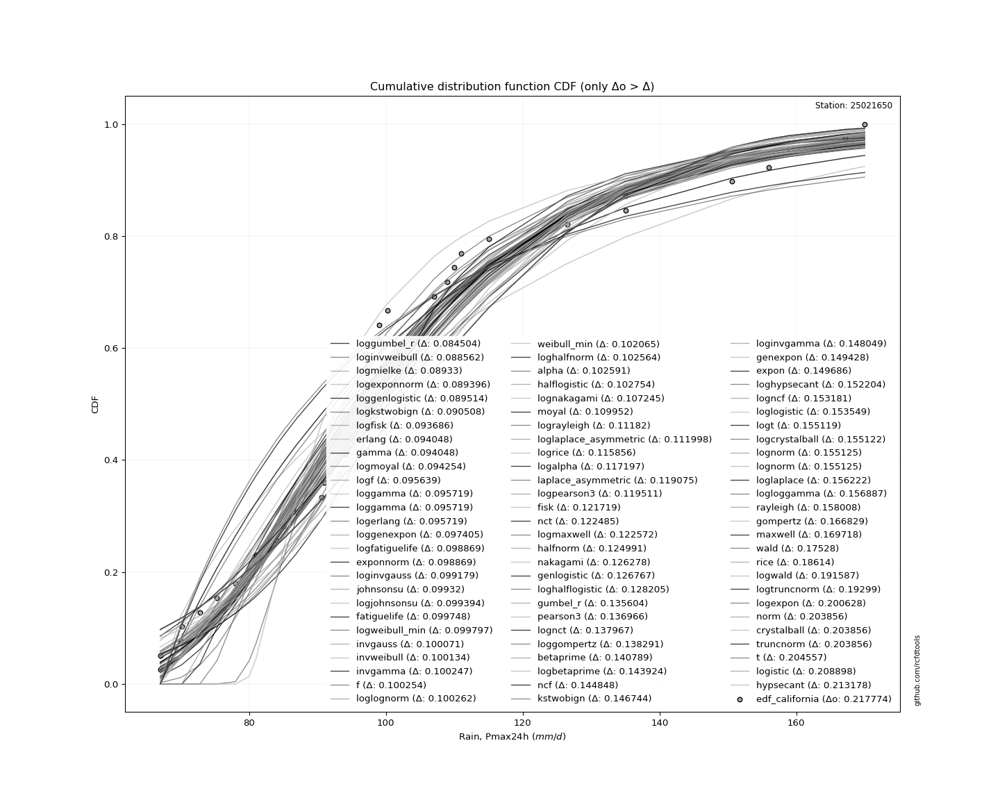</img>

</div>


**1.3. Best fit**

|   id |   station | empirical_dist   | p_dist   |     delta |   deltao | eval   |   fit |   n |   loc |   scale |    shape | shape1   | shape2   | shape3   |   best_fit |   best_fit_sort |
|-----:|----------:|:-----------------|:---------|----------:|---------:|:-------|------:|----:|------:|--------:|---------:|:---------|:---------|:---------|-----------:|----------------:|
|    0 |  25021650 | edf_california   | dgamma   | 0.0790954 | 0.229882 | Δo > Δ |     1 |  35 |    96 | 26.2816 | 0.668367 |          |          |          |          1 |               1 |

<div align="center">

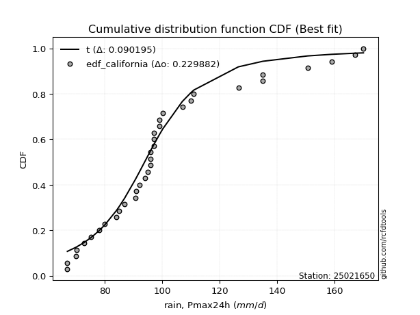</img>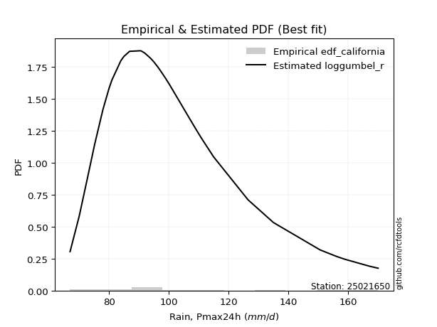</img>

</div>


### 2. Empirical - EDF Hazen (1930)

Hazen method for plotting positions is a formula used to estimate the empirical cumulative probability distribution of flood events or other hydrological data. This formula often results in biased estimations, particularly when extrapolating to extreme events (high return periods).

<div align="center">


$P=(m-0.5)/n$


</div>


**2.1. Empirical values**

<div align="center">

|                | 0                    | 1                   | 2                   | 3                  | 4                   | 5                   | 6                   | 7                   | 8                   | 9                  | 10                 | 11                  | 12                  | 13                  | 14                 | 15                  | 16                 | 17        | 18                 | 19                 | 20                 | 21                 | 22                 | 23                 | 24                | 25                 | 26                 | 27                 | 28                 | 29                 | 30                 | 31                 | 32                 | 33                 | 34                 |
|:---------------|:---------------------|:--------------------|:--------------------|:-------------------|:--------------------|:--------------------|:--------------------|:--------------------|:--------------------|:-------------------|:-------------------|:--------------------|:--------------------|:--------------------|:-------------------|:--------------------|:-------------------|:----------|:-------------------|:-------------------|:-------------------|:-------------------|:-------------------|:-------------------|:------------------|:-------------------|:-------------------|:-------------------|:-------------------|:-------------------|:-------------------|:-------------------|:-------------------|:-------------------|:-------------------|
| date           | 1999                 | 1997                | 1989                | 1982               | 1983                | 1984                | 2001                | 2015                | 2010                | 1995               | 1986               | 1990                | 2002                | 2003                | 2008               | 1998                | 2006               | 2005      | 2011               | 1981               | 1994               | 2012               | 1993               | 2004               | 2000              | 1996               | 2009               | 2007               | 1985               | 2013               | 2014               | 1991               | 1987               | 1988               | 1992               |
| x              | 67.0                 | 67.0                | 70.0                | 70.183857028671    | 72.8016283965208    | 75.2911691571765    | 78.0                | 80.0                | 84.0                | 85.0               | 86.9               | 90.6                | 91.0                | 92.0                | 94.0               | 95.0                | 96.0               | 96.0      | 96.0               | 96.998100854538    | 97.0               | 97.0               | 99.0               | 99.0               | 100.2             | 107.0              | 110.0              | 111.0              | 126.5              | 135.0              | 135.0              | 150.6              | 158.9              | 167.1              | 170.0              |
| m              | 1                    | 2                   | 3                   | 4                  | 5                   | 6                   | 7                   | 8                   | 9                   | 10                 | 11                 | 12                  | 13                  | 14                  | 15                 | 16                  | 17                 | 18        | 19                 | 20                 | 21                 | 22                 | 23                 | 24                 | 25                | 26                 | 27                 | 28                 | 29                 | 30                 | 31                 | 32                 | 33                 | 34                 | 35                 |
| empirical_dist | edf_hazen            | edf_hazen           | edf_hazen           | edf_hazen          | edf_hazen           | edf_hazen           | edf_hazen           | edf_hazen           | edf_hazen           | edf_hazen          | edf_hazen          | edf_hazen           | edf_hazen           | edf_hazen           | edf_hazen          | edf_hazen           | edf_hazen          | edf_hazen | edf_hazen          | edf_hazen          | edf_hazen          | edf_hazen          | edf_hazen          | edf_hazen          | edf_hazen         | edf_hazen          | edf_hazen          | edf_hazen          | edf_hazen          | edf_hazen          | edf_hazen          | edf_hazen          | edf_hazen          | edf_hazen          | edf_hazen          |
| empirical      | 0.014285714285714285 | 0.04285714285714286 | 0.07142857142857142 | 0.1                | 0.12857142857142856 | 0.15714285714285714 | 0.18571428571428572 | 0.21428571428571427 | 0.24285714285714285 | 0.2714285714285714 | 0.3                | 0.32857142857142857 | 0.35714285714285715 | 0.38571428571428573 | 0.4142857142857143 | 0.44285714285714284 | 0.4714285714285714 | 0.5       | 0.5285714285714286 | 0.5571428571428572 | 0.5857142857142857 | 0.6142857142857143 | 0.6428571428571429 | 0.6714285714285714 | 0.7               | 0.7285714285714285 | 0.7571428571428571 | 0.7857142857142857 | 0.8142857142857143 | 0.8428571428571429 | 0.8714285714285714 | 0.9                | 0.9285714285714286 | 0.9571428571428572 | 0.9857142857142858 |
| empirical_tr   | 1.0144927536231882   | 1.044776119402985   | 1.0769230769230769  | 1.1111111111111112 | 1.1475409836065573  | 1.1864406779661016  | 1.2280701754385965  | 1.2727272727272727  | 1.3207547169811322  | 1.372549019607843  | 1.4285714285714286 | 1.4893617021276595  | 1.5555555555555558  | 1.627906976744186   | 1.707317073170732  | 1.7948717948717947  | 1.8918918918918919 | 2.0       | 2.121212121212121  | 2.2580645161290325 | 2.4137931034482762 | 2.592592592592593  | 2.8000000000000003 | 3.0434782608695645 | 3.333333333333333 | 3.684210526315789  | 4.117647058823529  | 4.666666666666666  | 5.384615384615384  | 6.363636363636364  | 7.777777777777779  | 10.000000000000002 | 14.000000000000007 | 23.333333333333357 | 70.00000000000026  |

</div>


**2.2. Parameters & Kolmogorov-Smirnov fit test (sorted by Δ)**

|   id | empirical_dist   | p_dist             |       delta |   deltao | eval    |   fit |   n |            loc |          scale | shape                 | shape1                 | shape2             | shape3   |   best_fit |   best_fit_sort |
|-----:|:-----------------|:-------------------|------------:|---------:|:--------|------:|----:|---------------:|---------------:|:----------------------|:-----------------------|:-------------------|:---------|-----------:|----------------:|
|    0 | edf_hazen        | dgamma             |   0.0933811 | 0.229882 | Δo > Δ  |     1 |  35 |     96         |   26.2816      | 0.6683665068329485    |                        |                    |          |          1 |               1 |
|    1 | edf_hazen        | fisk               |   0.102226  | 0.229882 | Δo > Δ  |     1 |  35 |     55.9992    |   38.552       | 2.8975480030711314    |                        |                    |          |          0 |               2 |
|    2 | edf_hazen        | t                  |   0.104481  | 0.229882 | Δo > Δ  |     1 |  35 |     93.8729    |   14.5256      | 1.8705082911962037    |                        |                    |          |          0 |               3 |
|    3 | edf_hazen        | invweibull         |   0.10781   | 0.229882 | Δo > Δ  |     1 |  35 |    -32.9463    |  120.805       | 6.645185278530256     |                        |                    |          |          0 |               4 |
|    4 | edf_hazen        | johnsonsu          |   0.108089  | 0.229882 | Δo > Δ  |     1 |  35 |     53.585     |    1.28694     | -7.351164534501085    | 1.7706367032893393     |                    |          |          0 |               5 |
|    5 | edf_hazen        | invgamma           |   0.108385  | 0.229882 | Δo > Δ  |     1 |  35 |     39.2088    |  333.28        | 6.342220985523436     |                        |                    |          |          0 |               6 |
|    6 | edf_hazen        | f                  |   0.108389  | 0.229882 | Δo > Δ  |     1 |  35 |     39.2151    |   52.5445      | 47566.92116404584     | 12.684817988777871     |                    |          |          0 |               7 |
|    7 | edf_hazen        | lognorm            |   0.108399  | 0.229882 | Δo > Δ  |     1 |  35 |     53.5122    |   40.9681      | 0.5641327574486195    |                        |                    |          |          0 |               8 |
|    8 | edf_hazen        | recipinvgauss      |   0.108834  | 0.229882 | Δo > Δ  |     1 |  35 |     55.8208    |   13.8245      | 0.4361063581272295    |                        |                    |          |          0 |               9 |
|    9 | edf_hazen        | alpha              |   0.10932   | 0.229882 | Δo > Δ  |     1 |  35 |      7.15835   |  351.92        | 4.011643075494929     |                        |                    |          |          0 |              10 |
|   10 | edf_hazen        | fatiguelife        |   0.109531  | 0.229882 | Δo > Δ  |     1 |  35 |     53.522     |   40.8448      | 0.5840172344208054    |                        |                    |          |          0 |              11 |
|   11 | edf_hazen        | invgauss           |   0.10954   | 0.229882 | Δo > Δ  |     1 |  35 |     51.677     |  150.764       | 0.32944194934320653   |                        |                    |          |          0 |              12 |
|   12 | edf_hazen        | exponnorm          |   0.112729  | 0.229882 | Δo > Δ  |     1 |  35 |     75.5289    |    9.84626     | 2.621918022232256     |                        |                    |          |          0 |              13 |
|   13 | edf_hazen        | halflogistic       |   0.115951  | 0.229882 | Δo > Δ  |     1 |  35 |     69.0309    |   23.3097      |                       |                        |                    |          |          0 |              14 |
|   14 | edf_hazen        | weibull_min        |   0.119922  | 0.229882 | Δo > Δ  |     1 |  35 |     66.3635    |   37.1429      | 1.215770446755193     |                        |                    |          |          0 |              15 |
|   15 | edf_hazen        | moyal              |   0.121201  | 0.229882 | Δo > Δ  |     1 |  35 |     85.7537    |   12.2731      |                       |                        |                    |          |          0 |              16 |
|   16 | edf_hazen        | gamma              |   0.130384  | 0.229882 | Δo > Δ  |     1 |  35 |     66.0197    |   25.9452      | 1.3615356740954403    |                        |                    |          |          0 |              17 |
|   17 | edf_hazen        | erlang             |   0.130384  | 0.229882 | Δo > Δ  |     1 |  35 |     66.0197    |   25.9452      | 1.3615347156760886    |                        |                    |          |          0 |              18 |
|   18 | edf_hazen        | gompertz           |   0.130655  | 0.229882 | Δo > Δ  |     1 |  35 |     67         |  101.771       | 2.1840700714139105    |                        |                    |          |          0 |              19 |
|   19 | edf_hazen        | laplace_asymmetric |   0.133429  | 0.229882 | Δo > Δ  |     1 |  35 |     91         |   17.581       | 0.7481597286104452    |                        |                    |          |          0 |              20 |
|   20 | edf_hazen        | nct                |   0.134284  | 0.229882 | Δo > Δ  |     1 |  35 |     -0.136947  |    2.00783     | 9.405882071310153     | 46.30934981028304      |                    |          |          0 |              21 |
|   21 | edf_hazen        | genlogistic        |   0.13589   | 0.229882 | Δo > Δ  |     1 |  35 |    -44.9254    |   19.4214      | 1007.2622984029299    |                        |                    |          |          0 |              22 |
|   22 | edf_hazen        | halfnorm           |   0.139778  | 0.229882 | Δo > Δ  |     1 |  35 |     65.2583    |   45.228       |                       |                        |                    |          |          0 |              23 |
|   23 | edf_hazen        | pearson3           |   0.142487  | 0.229882 | Δo > Δ  |     1 |  35 |    101.345     |   27.2639      | 1.1128519853868506    |                        |                    |          |          0 |              24 |
|   24 | edf_hazen        | gumbel_r           |   0.147074  | 0.229882 | Δo > Δ  |     1 |  35 |     89.0748    |   21.2576      |                       |                        |                    |          |          0 |              25 |
|   25 | edf_hazen        | betaprime          |   0.152674  | 0.229882 | Δo > Δ  |     1 |  35 |     -2.23366   |    4.80397     | 382.0039940260071     | 18.748501750510883     |                    |          |          0 |              26 |
|   26 | edf_hazen        | nakagami           |   0.159191  | 0.229882 | Δo > Δ  |     1 |  35 |     67         |   49.5425      | 0.3972277566262906    |                        |                    |          |          0 |              27 |
|   27 | edf_hazen        | kstwobign          |   0.159977  | 0.229882 | Δo > Δ  |     1 |  35 |     18.7642    |   95.4109      |                       |                        |                    |          |          0 |              28 |
|   28 | edf_hazen        | wald               |   0.164317  | 0.229882 | Δo > Δ  |     1 |  35 |     74.0811    |   27.2639      |                       |                        |                    |          |          0 |              29 |
|   29 | edf_hazen        | genexpon           |   0.167971  | 0.229882 | Δo > Δ  |     1 |  35 |     67         |    2.22535     | 0.0647090447130945    | 1.1377784035012407e-06 | 1.8199456936372878 |          |          0 |              30 |
|   30 | edf_hazen        | expon              |   0.168419  | 0.229882 | Δo > Δ  |     1 |  35 |     67         |   34.345       |                       |                        |                    |          |          0 |              31 |
|   31 | edf_hazen        | rayleigh           |   0.171756  | 0.229882 | Δo > Δ  |     1 |  35 |     49.1876    |   41.6156      |                       |                        |                    |          |          0 |              32 |
|   32 | edf_hazen        | maxwell            |   0.18311   | 0.229882 | Δo > Δ  |     1 |  35 |     36.741     |   40.4846      |                       |                        |                    |          |          0 |              33 |
|   33 | edf_hazen        | rice               |   0.199927  | 0.229882 | Δo > Δ  |     1 |  35 |     56.5035    |   37.1085      | 0.001084836132545509  |                        |                    |          |          0 |              34 |
|   34 | edf_hazen        | gibrat             |   0.214286  | 0.229882 | Δo > Δ  |     1 |  35 |     80.5461    |   12.6152      |                       |                        |                    |          |          0 |              35 |
|   35 | edf_hazen        | norm               |   0.216749  | 0.229882 | Δo > Δ  |     1 |  35 |    101.345     |   27.2639      |                       |                        |                    |          |          0 |              36 |
|   36 | edf_hazen        | crystalball        |   0.216749  | 0.229882 | Δo > Δ  |     1 |  35 |    101.345     |   27.2639      | 6888.381379240169     | 10306.04410682998      |                    |          |          0 |              37 |
|   37 | edf_hazen        | truncnorm          |   0.216749  | 0.229882 | Δo > Δ  |     1 |  35 |    101.345     |   27.2639      | -1122.1442806305452   | 522.6699189423582      |                    |          |          0 |              38 |
|   38 | edf_hazen        | loggamma           |   0.218028  | 0.229882 | Δo > Δ  |     1 |  35 | -10565.3       | 1369.5         | 2413.804585039734     |                        |                    |          |          0 |              39 |
|   39 | edf_hazen        | logistic           |   0.219034  | 0.229882 | Δo > Δ  |     1 |  35 |    101.345     |   15.0314      |                       |                        |                    |          |          0 |              40 |
|   40 | edf_hazen        | hypsecant          |   0.220983  | 0.229882 | Δo > Δ  |     1 |  35 |    101.345     |   17.3567      |                       |                        |                    |          |          0 |              41 |
|   41 | edf_hazen        | laplace            |   0.228831  | 0.229882 | Δo > Δ  |     1 |  35 |    101.345     |   19.2785      |                       |                        |                    |          |          0 |              42 |
|   42 | edf_hazen        | gumbel_l           |   0.287419  | 0.229882 | Δo <= Δ |     0 |  35 |    113.615     |   21.2576      |                       |                        |                    |          |          0 |              43 |
|   43 | edf_hazen        | zzgumbel           |   0.351214  | 0.229882 | Δo <= Δ |     0 |  35 |    101.32      |   21.5679      | 0.5403397786021026    | 1.1284724725032327     |                    |          |          0 |              44 |
|   44 | edf_hazen        | ncf                |   0.428513  | 0.229882 | Δo <= Δ |     0 |  35 |     -0.0764801 |    8.83301e-06 | 6.581314097803295e-07 | 13.62215232828027      | 6.595044645746899  |          |          0 |              45 |
|   45 | edf_hazen        | pareto             |   0.533067  | 0.229882 | Δo <= Δ |     0 |  35 |     67         |    6.76277e-07 | 0.0606061021007697    |                        |                    |          |          0 |              46 |
|   46 | edf_hazen        | chi2               |   0.73979   | 0.229882 | Δo <= Δ |     0 |  35 |     67         |    8.51466     | 0.334767263371169     |                        |                    |          |          0 |              47 |
|   47 | edf_hazen        | mielke             | nan         | 0.229882 | Δo <= Δ |     0 |  35 |     -7.9241    |   33.4196      | 1447.4439709185908    | 5.340436746978941      |                    |          |          0 |              48 |

<div align="center">

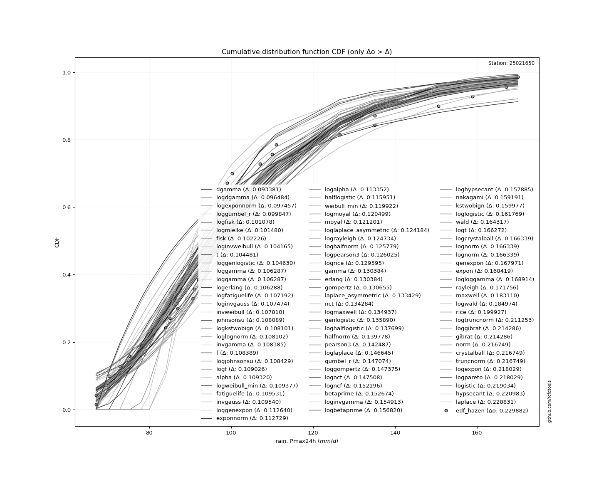</img>

</div>


**2.3. Best fit**

|   id |   station | empirical_dist   | p_dist   |     delta |   deltao | eval   |   fit |   n |   loc |   scale |    shape | shape1   | shape2   | shape3   |   best_fit |   best_fit_sort |
|-----:|----------:|:-----------------|:---------|----------:|---------:|:-------|------:|----:|------:|--------:|---------:|:---------|:---------|:---------|-----------:|----------------:|
|    0 |  25021650 | edf_hazen        | dgamma   | 0.0933811 | 0.229882 | Δo > Δ |     1 |  35 |    96 | 26.2816 | 0.668367 |          |          |          |          1 |               1 |

<div align="center">

</img>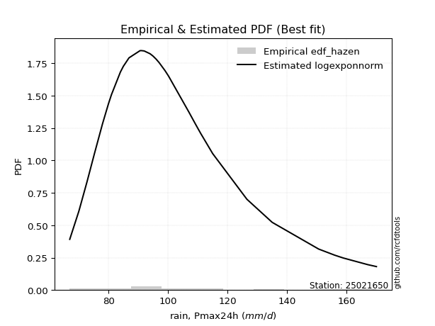</img>

</div>


### 3. Empirical - EDF Weibull (1939)

Weibull plotting position formula is an empirical method used to estimate the non-exceedance probability or plotting position for a set of observed data, is often recommended or widely used in practice, particularly in flood frequency analysis.

<div align="center">


$P=m/(n+1)$


</div>


**3.1. Empirical values**

<div align="center">

|                | 0                    | 1                   | 2                   | 3                  | 4                  | 5                   | 6                   | 7                  | 8                  | 9                  | 10                 | 11                 | 12                 | 13                 | 14                 | 15                 | 16                 | 17          | 18                 | 19                 | 20                 | 21                 | 22                 | 23                 | 24                 | 25                 | 26          | 27                 | 28                 | 29                 | 30                 | 31                 | 32                 | 33                 | 34                 |
|:---------------|:---------------------|:--------------------|:--------------------|:-------------------|:-------------------|:--------------------|:--------------------|:-------------------|:-------------------|:-------------------|:-------------------|:-------------------|:-------------------|:-------------------|:-------------------|:-------------------|:-------------------|:------------|:-------------------|:-------------------|:-------------------|:-------------------|:-------------------|:-------------------|:-------------------|:-------------------|:------------|:-------------------|:-------------------|:-------------------|:-------------------|:-------------------|:-------------------|:-------------------|:-------------------|
| date           | 1999                 | 1997                | 1989                | 1982               | 1983               | 1984                | 2001                | 2015               | 2010               | 1995               | 1986               | 1990               | 2002               | 2003               | 2008               | 1998               | 2006               | 2005        | 2011               | 1981               | 1994               | 2012               | 1993               | 2004               | 2000               | 1996               | 2009        | 2007               | 1985               | 2013               | 2014               | 1991               | 1987               | 1988               | 1992               |
| x              | 67.0                 | 67.0                | 70.0                | 70.183857028671    | 72.8016283965208   | 75.2911691571765    | 78.0                | 80.0               | 84.0               | 85.0               | 86.9               | 90.6               | 91.0               | 92.0               | 94.0               | 95.0               | 96.0               | 96.0        | 96.0               | 96.998100854538    | 97.0               | 97.0               | 99.0               | 99.0               | 100.2              | 107.0              | 110.0       | 111.0              | 126.5              | 135.0              | 135.0              | 150.6              | 158.9              | 167.1              | 170.0              |
| m              | 1                    | 2                   | 3                   | 4                  | 5                  | 6                   | 7                   | 8                  | 9                  | 10                 | 11                 | 12                 | 13                 | 14                 | 15                 | 16                 | 17                 | 18          | 19                 | 20                 | 21                 | 22                 | 23                 | 24                 | 25                 | 26                 | 27          | 28                 | 29                 | 30                 | 31                 | 32                 | 33                 | 34                 | 35                 |
| empirical_dist | edf_weibull          | edf_weibull         | edf_weibull         | edf_weibull        | edf_weibull        | edf_weibull         | edf_weibull         | edf_weibull        | edf_weibull        | edf_weibull        | edf_weibull        | edf_weibull        | edf_weibull        | edf_weibull        | edf_weibull        | edf_weibull        | edf_weibull        | edf_weibull | edf_weibull        | edf_weibull        | edf_weibull        | edf_weibull        | edf_weibull        | edf_weibull        | edf_weibull        | edf_weibull        | edf_weibull | edf_weibull        | edf_weibull        | edf_weibull        | edf_weibull        | edf_weibull        | edf_weibull        | edf_weibull        | edf_weibull        |
| empirical      | 0.027777777777777776 | 0.05555555555555555 | 0.08333333333333333 | 0.1111111111111111 | 0.1388888888888889 | 0.16666666666666666 | 0.19444444444444445 | 0.2222222222222222 | 0.25               | 0.2777777777777778 | 0.3055555555555556 | 0.3333333333333333 | 0.3611111111111111 | 0.3888888888888889 | 0.4166666666666667 | 0.4444444444444444 | 0.4722222222222222 | 0.5         | 0.5277777777777778 | 0.5555555555555556 | 0.5833333333333334 | 0.6111111111111112 | 0.6388888888888888 | 0.6666666666666666 | 0.6944444444444444 | 0.7222222222222222 | 0.75        | 0.7777777777777778 | 0.8055555555555556 | 0.8333333333333334 | 0.8611111111111112 | 0.8888888888888888 | 0.9166666666666666 | 0.9444444444444444 | 0.9722222222222222 |
| empirical_tr   | 1.0285714285714287   | 1.0588235294117647  | 1.090909090909091   | 1.125              | 1.161290322580645  | 1.2                 | 1.2413793103448276  | 1.2857142857142856 | 1.3333333333333333 | 1.3846153846153846 | 1.44               | 1.4999999999999998 | 1.565217391304348  | 1.6363636363636362 | 1.7142857142857144 | 1.7999999999999998 | 1.894736842105263  | 2.0         | 2.1176470588235294 | 2.25               | 2.4000000000000004 | 2.5714285714285716 | 2.7692307692307687 | 2.9999999999999996 | 3.2727272727272725 | 3.5999999999999996 | 4.0         | 4.5                | 5.142857142857143  | 6.000000000000002  | 7.200000000000003  | 8.999999999999996  | 11.999999999999995 | 17.999999999999993 | 35.999999999999986 |

</div>


**3.2. Parameters & Kolmogorov-Smirnov fit test (sorted by Δ)**

|   id | empirical_dist   | p_dist             |       delta |   deltao | eval    |   fit |   n |            loc |          scale | shape                 | shape1                 | shape2             | shape3   |   best_fit |   best_fit_sort |
|-----:|:-----------------|:-------------------|------------:|---------:|:--------|------:|----:|---------------:|---------------:|:----------------------|:-----------------------|:-------------------|:---------|-----------:|----------------:|
|    0 | edf_weibull      | fisk               |   0.0966709 | 0.229882 | Δo > Δ  |     1 |  35 |     55.9992    |   38.552       | 2.8975480030711314    |                        |                    |          |          1 |               1 |
|    1 | edf_weibull      | invweibull         |   0.102254  | 0.229882 | Δo > Δ  |     1 |  35 |    -32.9463    |  120.805       | 6.645185278530256     |                        |                    |          |          0 |               2 |
|    2 | edf_weibull      | johnsonsu          |   0.102533  | 0.229882 | Δo > Δ  |     1 |  35 |     53.585     |    1.28694     | -7.351164534501085    | 1.7706367032893393     |                    |          |          0 |               3 |
|    3 | edf_weibull      | invgamma           |   0.10283   | 0.229882 | Δo > Δ  |     1 |  35 |     39.2088    |  333.28        | 6.342220985523436     |                        |                    |          |          0 |               4 |
|    4 | edf_weibull      | f                  |   0.102834  | 0.229882 | Δo > Δ  |     1 |  35 |     39.2151    |   52.5445      | 47566.92116404584     | 12.684817988777871     |                    |          |          0 |               5 |
|    5 | edf_weibull      | lognorm            |   0.102843  | 0.229882 | Δo > Δ  |     1 |  35 |     53.5122    |   40.9681      | 0.5641327574486195    |                        |                    |          |          0 |               6 |
|    6 | edf_weibull      | dgamma             |   0.102905  | 0.229882 | Δo > Δ  |     1 |  35 |     96         |   26.2816      | 0.6683665068329485    |                        |                    |          |          0 |               7 |
|    7 | edf_weibull      | recipinvgauss      |   0.103279  | 0.229882 | Δo > Δ  |     1 |  35 |     55.8208    |   13.8245      | 0.4361063581272295    |                        |                    |          |          0 |               8 |
|    8 | edf_weibull      | alpha              |   0.103765  | 0.229882 | Δo > Δ  |     1 |  35 |      7.15835   |  351.92        | 4.011643075494929     |                        |                    |          |          0 |               9 |
|    9 | edf_weibull      | fatiguelife        |   0.103976  | 0.229882 | Δo > Δ  |     1 |  35 |     53.522     |   40.8448      | 0.5840172344208054    |                        |                    |          |          0 |              10 |
|   10 | edf_weibull      | invgauss           |   0.103984  | 0.229882 | Δo > Δ  |     1 |  35 |     51.677     |  150.764       | 0.32944194934320653   |                        |                    |          |          0 |              11 |
|   11 | edf_weibull      | exponnorm          |   0.107173  | 0.229882 | Δo > Δ  |     1 |  35 |     75.5289    |    9.84626     | 2.621918022232256     |                        |                    |          |          0 |              12 |
|   12 | edf_weibull      | halflogistic       |   0.110395  | 0.229882 | Δo > Δ  |     1 |  35 |     69.0309    |   23.3097      |                       |                        |                    |          |          0 |              13 |
|   13 | edf_weibull      | t                  |   0.113211  | 0.229882 | Δo > Δ  |     1 |  35 |     93.8729    |   14.5256      | 1.8705082911962037    |                        |                    |          |          0 |              14 |
|   14 | edf_weibull      | weibull_min        |   0.11516   | 0.229882 | Δo > Δ  |     1 |  35 |     66.3635    |   37.1429      | 1.215770446755193     |                        |                    |          |          0 |              15 |
|   15 | edf_weibull      | moyal              |   0.115646  | 0.229882 | Δo > Δ  |     1 |  35 |     85.7537    |   12.2731      |                       |                        |                    |          |          0 |              16 |
|   16 | edf_weibull      | gompertz           |   0.1251    | 0.229882 | Δo > Δ  |     1 |  35 |     67         |  101.771       | 2.1840700714139105    |                        |                    |          |          0 |              17 |
|   17 | edf_weibull      | gamma              |   0.125622  | 0.229882 | Δo > Δ  |     1 |  35 |     66.0197    |   25.9452      | 1.3615356740954403    |                        |                    |          |          0 |              18 |
|   18 | edf_weibull      | erlang             |   0.125622  | 0.229882 | Δo > Δ  |     1 |  35 |     66.0197    |   25.9452      | 1.3615347156760886    |                        |                    |          |          0 |              19 |
|   19 | edf_weibull      | laplace_asymmetric |   0.127874  | 0.229882 | Δo > Δ  |     1 |  35 |     91         |   17.581       | 0.7481597286104452    |                        |                    |          |          0 |              20 |
|   20 | edf_weibull      | nct                |   0.128729  | 0.229882 | Δo > Δ  |     1 |  35 |     -0.136947  |    2.00783     | 9.405882071310153     | 46.30934981028304      |                    |          |          0 |              21 |
|   21 | edf_weibull      | genlogistic        |   0.130335  | 0.229882 | Δo > Δ  |     1 |  35 |    -44.9254    |   19.4214      | 1007.2622984029299    |                        |                    |          |          0 |              22 |
|   22 | edf_weibull      | halfnorm           |   0.134222  | 0.229882 | Δo > Δ  |     1 |  35 |     65.2583    |   45.228       |                       |                        |                    |          |          0 |              23 |
|   23 | edf_weibull      | pearson3           |   0.136931  | 0.229882 | Δo > Δ  |     1 |  35 |    101.345     |   27.2639      | 1.1128519853868506    |                        |                    |          |          0 |              24 |
|   24 | edf_weibull      | gumbel_r           |   0.141518  | 0.229882 | Δo > Δ  |     1 |  35 |     89.0748    |   21.2576      |                       |                        |                    |          |          0 |              25 |
|   25 | edf_weibull      | betaprime          |   0.147118  | 0.229882 | Δo > Δ  |     1 |  35 |     -2.23366   |    4.80397     | 382.0039940260071     | 18.748501750510883     |                    |          |          0 |              26 |
|   26 | edf_weibull      | nakagami           |   0.153636  | 0.229882 | Δo > Δ  |     1 |  35 |     67         |   49.5425      | 0.3972277566262906    |                        |                    |          |          0 |              27 |
|   27 | edf_weibull      | kstwobign          |   0.154422  | 0.229882 | Δo > Δ  |     1 |  35 |     18.7642    |   95.4109      |                       |                        |                    |          |          0 |              28 |
|   28 | edf_weibull      | genexpon           |   0.163209  | 0.229882 | Δo > Δ  |     1 |  35 |     67         |    2.22535     | 0.0647090447130945    | 1.1377784035012407e-06 | 1.8199456936372878 |          |          0 |              29 |
|   29 | edf_weibull      | expon              |   0.163657  | 0.229882 | Δo > Δ  |     1 |  35 |     67         |   34.345       |                       |                        |                    |          |          0 |              30 |
|   30 | edf_weibull      | rayleigh           |   0.1662    | 0.229882 | Δo > Δ  |     1 |  35 |     49.1876    |   41.6156      |                       |                        |                    |          |          0 |              31 |
|   31 | edf_weibull      | wald               |   0.173047  | 0.229882 | Δo > Δ  |     1 |  35 |     74.0811    |   27.2639      |                       |                        |                    |          |          0 |              32 |
|   32 | edf_weibull      | maxwell            |   0.177554  | 0.229882 | Δo > Δ  |     1 |  35 |     36.741     |   40.4846      |                       |                        |                    |          |          0 |              33 |
|   33 | edf_weibull      | rice               |   0.194372  | 0.229882 | Δo > Δ  |     1 |  35 |     56.5035    |   37.1085      | 0.001084836132545509  |                        |                    |          |          0 |              34 |
|   34 | edf_weibull      | norm               |   0.211194  | 0.229882 | Δo > Δ  |     1 |  35 |    101.345     |   27.2639      |                       |                        |                    |          |          0 |              35 |
|   35 | edf_weibull      | crystalball        |   0.211194  | 0.229882 | Δo > Δ  |     1 |  35 |    101.345     |   27.2639      | 6888.381379240169     | 10306.04410682998      |                    |          |          0 |              36 |
|   36 | edf_weibull      | truncnorm          |   0.211194  | 0.229882 | Δo > Δ  |     1 |  35 |    101.345     |   27.2639      | -1122.1442806305452   | 522.6699189423582      |                    |          |          0 |              37 |
|   37 | edf_weibull      | loggamma           |   0.212473  | 0.229882 | Δo > Δ  |     1 |  35 | -10565.3       | 1369.5         | 2413.804585039734     |                        |                    |          |          0 |              38 |
|   38 | edf_weibull      | logistic           |   0.213479  | 0.229882 | Δo > Δ  |     1 |  35 |    101.345     |   15.0314      |                       |                        |                    |          |          0 |              39 |
|   39 | edf_weibull      | hypsecant          |   0.215428  | 0.229882 | Δo > Δ  |     1 |  35 |    101.345     |   17.3567      |                       |                        |                    |          |          0 |              40 |
|   40 | edf_weibull      | gibrat             |   0.222222  | 0.229882 | Δo > Δ  |     1 |  35 |     80.5461    |   12.6152      |                       |                        |                    |          |          0 |              41 |
|   41 | edf_weibull      | laplace            |   0.223932  | 0.229882 | Δo > Δ  |     1 |  35 |    101.345     |   19.2785      |                       |                        |                    |          |          0 |              42 |
|   42 | edf_weibull      | gumbel_l           |   0.281863  | 0.229882 | Δo <= Δ |     0 |  35 |    113.615     |   21.2576      |                       |                        |                    |          |          0 |              43 |
|   43 | edf_weibull      | zzgumbel           |   0.345659  | 0.229882 | Δo <= Δ |     0 |  35 |    101.32      |   21.5679      | 0.5403397786021026    | 1.1284724725032327     |                    |          |          0 |              44 |
|   44 | edf_weibull      | ncf                |   0.415021  | 0.229882 | Δo <= Δ |     0 |  35 |     -0.0764801 |    8.83301e-06 | 6.581314097803295e-07 | 13.62215232828027      | 6.595044645746899  |          |          0 |              45 |
|   45 | edf_weibull      | pareto             |   0.521162  | 0.229882 | Δo <= Δ |     0 |  35 |     67         |    6.76277e-07 | 0.0606061021007697    |                        |                    |          |          0 |              46 |
|   46 | edf_weibull      | chi2               |   0.730267  | 0.229882 | Δo <= Δ |     0 |  35 |     67         |    8.51466     | 0.334767263371169     |                        |                    |          |          0 |              47 |
|   47 | edf_weibull      | mielke             | nan         | 0.229882 | Δo <= Δ |     0 |  35 |     -7.9241    |   33.4196      | 1447.4439709185908    | 5.340436746978941      |                    |          |          0 |              48 |

<div align="center">

</img>

</div>


**3.3. Best fit**

|   id |   station | empirical_dist   | p_dist   |     delta |   deltao | eval   |   fit |   n |     loc |   scale |   shape | shape1   | shape2   | shape3   |   best_fit |   best_fit_sort |
|-----:|----------:|:-----------------|:---------|----------:|---------:|:-------|------:|----:|--------:|--------:|--------:|:---------|:---------|:---------|-----------:|----------------:|
|    0 |  25021650 | edf_weibull      | fisk     | 0.0966709 | 0.229882 | Δo > Δ |     1 |  35 | 55.9992 |  38.552 | 2.89755 |          |          |          |          1 |               1 |

<div align="center">

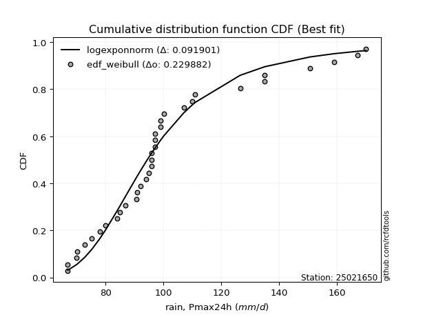</img>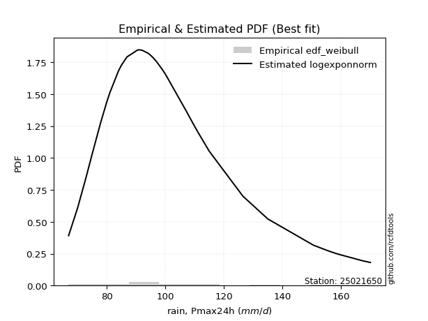</img>

</div>


### 4. Empirical - EDF Beard (1943)

The Beard formula (or Beard´s plotting position formula) in hydrology is used to estimate the empirical non-exceedance probability _(P)_ of a flood event (or other extreme hydrological data point) within a given dataset.

<div align="center">


$P=(m-0.31)/(n+0.38)$


</div>


**4.1. Empirical values**

<div align="center">

|                | 0                    | 1                   | 2                   | 3                   | 4                  | 5                   | 6                   | 7                   | 8                  | 9                   | 10                  | 11                 | 12                 | 13                  | 14                  | 15                 | 16                  | 17        | 18                 | 19                 | 20                 | 21                 | 22                 | 23                 | 24                 | 25                 | 26                 | 27                 | 28                 | 29                 | 30                 | 31                | 32                 | 33                 | 34                 |
|:---------------|:---------------------|:--------------------|:--------------------|:--------------------|:-------------------|:--------------------|:--------------------|:--------------------|:-------------------|:--------------------|:--------------------|:-------------------|:-------------------|:--------------------|:--------------------|:-------------------|:--------------------|:----------|:-------------------|:-------------------|:-------------------|:-------------------|:-------------------|:-------------------|:-------------------|:-------------------|:-------------------|:-------------------|:-------------------|:-------------------|:-------------------|:------------------|:-------------------|:-------------------|:-------------------|
| date           | 1999                 | 1997                | 1989                | 1982                | 1983               | 1984                | 2001                | 2015                | 2010               | 1995                | 1986                | 1990               | 2002               | 2003                | 2008                | 1998               | 2006                | 2005      | 2011               | 1981               | 1994               | 2012               | 1993               | 2004               | 2000               | 1996               | 2009               | 2007               | 1985               | 2013               | 2014               | 1991              | 1987               | 1988               | 1992               |
| x              | 67.0                 | 67.0                | 70.0                | 70.183857028671     | 72.8016283965208   | 75.2911691571765    | 78.0                | 80.0                | 84.0               | 85.0                | 86.9                | 90.6               | 91.0               | 92.0                | 94.0                | 95.0               | 96.0                | 96.0      | 96.0               | 96.998100854538    | 97.0               | 97.0               | 99.0               | 99.0               | 100.2              | 107.0              | 110.0              | 111.0              | 126.5              | 135.0              | 135.0              | 150.6             | 158.9              | 167.1              | 170.0              |
| m              | 1                    | 2                   | 3                   | 4                   | 5                  | 6                   | 7                   | 8                   | 9                  | 10                  | 11                  | 12                 | 13                 | 14                  | 15                  | 16                 | 17                  | 18        | 19                 | 20                 | 21                 | 22                 | 23                 | 24                 | 25                 | 26                 | 27                 | 28                 | 29                 | 30                 | 31                 | 32                | 33                 | 34                 | 35                 |
| empirical_dist | edf_beard            | edf_beard           | edf_beard           | edf_beard           | edf_beard          | edf_beard           | edf_beard           | edf_beard           | edf_beard          | edf_beard           | edf_beard           | edf_beard          | edf_beard          | edf_beard           | edf_beard           | edf_beard          | edf_beard           | edf_beard | edf_beard          | edf_beard          | edf_beard          | edf_beard          | edf_beard          | edf_beard          | edf_beard          | edf_beard          | edf_beard          | edf_beard          | edf_beard          | edf_beard          | edf_beard          | edf_beard         | edf_beard          | edf_beard          | edf_beard          |
| empirical      | 0.019502543810062178 | 0.04776710005652911 | 0.07603165630299603 | 0.10429621254946296 | 0.1325607687959299 | 0.16082532504239683 | 0.18908988128886375 | 0.21735443753533068 | 0.2456189937817976 | 0.27388355002826453 | 0.30214810627473143 | 0.3304126625211984 | 0.3586772187676653 | 0.38694177501413224 | 0.41520633126059914 | 0.4434708875070661 | 0.47173544375353305 | 0.5       | 0.528264556246467  | 0.5565291124929339 | 0.5847936687394008 | 0.6130582249858677 | 0.6413227812323347 | 0.6695873374788016 | 0.6978518937252685 | 0.7261164499717354 | 0.7543810062182024 | 0.7826455624646693 | 0.8109101187111362 | 0.8391746749576031 | 0.8674392312040701 | 0.895703787450537 | 0.9239683436970039 | 0.9522328999434707 | 0.9804974561899377 |
| empirical_tr   | 1.0198904583453445   | 1.0501632531908578  | 1.0822881615172835  | 1.1164405175134111  | 1.1528185076572173 | 1.1916470191983832  | 1.2331822934820493  | 1.2777175875767426  | 1.3255901086549269 | 1.3771895679252628  | 1.4329688132847305  | 1.4934571549176867 | 1.5592772146319962 | 1.631166436145689   | 1.7100048332527789  | 1.796851193499238  | 1.8929909042268591  | 2.0       | 2.1198322348711804 | 2.254939451880179  | 2.408441116405718  | 2.5843681519357196 | 2.7880220646178095 | 3.026518391787853  | 3.309635173058933  | 3.6511867905056756 | 4.071346375143843  | 4.600780234070221  | 5.288490284005977  | 6.217926186291738  | 7.54371002132196   | 9.588075880758808 | 13.152416356877309 | 20.934911242603473 | 51.27536231884018  |

</div>


**4.2. Parameters & Kolmogorov-Smirnov fit test (sorted by Δ)**

|   id | empirical_dist   | p_dist             |       delta |   deltao | eval    |   fit |   n |            loc |          scale | shape                 | shape1                 | shape2             | shape3   |   best_fit |   best_fit_sort |
|-----:|:-----------------|:-------------------|------------:|---------:|:--------|------:|----:|---------------:|---------------:|:----------------------|:-----------------------|:-------------------|:---------|-----------:|----------------:|
|    0 | edf_beard        | dgamma             |   0.0970636 | 0.229882 | Δo > Δ  |     1 |  35 |     96         |   26.2816      | 0.6683665068329485    |                        |                    |          |          1 |               1 |
|    1 | edf_beard        | fisk               |   0.100078  | 0.229882 | Δo > Δ  |     1 |  35 |     55.9992    |   38.552       | 2.8975480030711314    |                        |                    |          |          0 |               2 |
|    2 | edf_beard        | invweibull         |   0.105662  | 0.229882 | Δo > Δ  |     1 |  35 |    -32.9463    |  120.805       | 6.645185278530256     |                        |                    |          |          0 |               3 |
|    3 | edf_beard        | johnsonsu          |   0.105941  | 0.229882 | Δo > Δ  |     1 |  35 |     53.585     |    1.28694     | -7.351164534501085    | 1.7706367032893393     |                    |          |          0 |               4 |
|    4 | edf_beard        | invgamma           |   0.106237  | 0.229882 | Δo > Δ  |     1 |  35 |     39.2088    |  333.28        | 6.342220985523436     |                        |                    |          |          0 |               5 |
|    5 | edf_beard        | f                  |   0.106241  | 0.229882 | Δo > Δ  |     1 |  35 |     39.2151    |   52.5445      | 47566.92116404584     | 12.684817988777871     |                    |          |          0 |               6 |
|    6 | edf_beard        | lognorm            |   0.10625   | 0.229882 | Δo > Δ  |     1 |  35 |     53.5122    |   40.9681      | 0.5641327574486195    |                        |                    |          |          0 |               7 |
|    7 | edf_beard        | recipinvgauss      |   0.106686  | 0.229882 | Δo > Δ  |     1 |  35 |     55.8208    |   13.8245      | 0.4361063581272295    |                        |                    |          |          0 |               8 |
|    8 | edf_beard        | alpha              |   0.107172  | 0.229882 | Δo > Δ  |     1 |  35 |      7.15835   |  351.92        | 4.011643075494929     |                        |                    |          |          0 |               9 |
|    9 | edf_beard        | fatiguelife        |   0.107383  | 0.229882 | Δo > Δ  |     1 |  35 |     53.522     |   40.8448      | 0.5840172344208054    |                        |                    |          |          0 |              10 |
|   10 | edf_beard        | invgauss           |   0.107392  | 0.229882 | Δo > Δ  |     1 |  35 |     51.677     |  150.764       | 0.32944194934320653   |                        |                    |          |          0 |              11 |
|   11 | edf_beard        | t                  |   0.107857  | 0.229882 | Δo > Δ  |     1 |  35 |     93.8729    |   14.5256      | 1.8705082911962037    |                        |                    |          |          0 |              12 |
|   12 | edf_beard        | exponnorm          |   0.110581  | 0.229882 | Δo > Δ  |     1 |  35 |     75.5289    |    9.84626     | 2.621918022232256     |                        |                    |          |          0 |              13 |
|   13 | edf_beard        | halflogistic       |   0.113802  | 0.229882 | Δo > Δ  |     1 |  35 |     69.0309    |   23.3097      |                       |                        |                    |          |          0 |              14 |
|   14 | edf_beard        | weibull_min        |   0.11808   | 0.229882 | Δo > Δ  |     1 |  35 |     66.3635    |   37.1429      | 1.215770446755193     |                        |                    |          |          0 |              15 |
|   15 | edf_beard        | moyal              |   0.119053  | 0.229882 | Δo > Δ  |     1 |  35 |     85.7537    |   12.2731      |                       |                        |                    |          |          0 |              16 |
|   16 | edf_beard        | gompertz           |   0.128507  | 0.229882 | Δo > Δ  |     1 |  35 |     67         |  101.771       | 2.1840700714139105    |                        |                    |          |          0 |              17 |
|   17 | edf_beard        | gamma              |   0.128543  | 0.229882 | Δo > Δ  |     1 |  35 |     66.0197    |   25.9452      | 1.3615356740954403    |                        |                    |          |          0 |              18 |
|   18 | edf_beard        | erlang             |   0.128543  | 0.229882 | Δo > Δ  |     1 |  35 |     66.0197    |   25.9452      | 1.3615347156760886    |                        |                    |          |          0 |              19 |
|   19 | edf_beard        | laplace_asymmetric |   0.131281  | 0.229882 | Δo > Δ  |     1 |  35 |     91         |   17.581       | 0.7481597286104452    |                        |                    |          |          0 |              20 |
|   20 | edf_beard        | nct                |   0.132136  | 0.229882 | Δo > Δ  |     1 |  35 |     -0.136947  |    2.00783     | 9.405882071310153     | 46.30934981028304      |                    |          |          0 |              21 |
|   21 | edf_beard        | genlogistic        |   0.133742  | 0.229882 | Δo > Δ  |     1 |  35 |    -44.9254    |   19.4214      | 1007.2622984029299    |                        |                    |          |          0 |              22 |
|   22 | edf_beard        | halfnorm           |   0.13763   | 0.229882 | Δo > Δ  |     1 |  35 |     65.2583    |   45.228       |                       |                        |                    |          |          0 |              23 |
|   23 | edf_beard        | pearson3           |   0.140339  | 0.229882 | Δo > Δ  |     1 |  35 |    101.345     |   27.2639      | 1.1128519853868506    |                        |                    |          |          0 |              24 |
|   24 | edf_beard        | gumbel_r           |   0.144926  | 0.229882 | Δo > Δ  |     1 |  35 |     89.0748    |   21.2576      |                       |                        |                    |          |          0 |              25 |
|   25 | edf_beard        | betaprime          |   0.150525  | 0.229882 | Δo > Δ  |     1 |  35 |     -2.23366   |    4.80397     | 382.0039940260071     | 18.748501750510883     |                    |          |          0 |              26 |
|   26 | edf_beard        | nakagami           |   0.157043  | 0.229882 | Δo > Δ  |     1 |  35 |     67         |   49.5425      | 0.3972277566262906    |                        |                    |          |          0 |              27 |
|   27 | edf_beard        | kstwobign          |   0.157829  | 0.229882 | Δo > Δ  |     1 |  35 |     18.7642    |   95.4109      |                       |                        |                    |          |          0 |              28 |
|   28 | edf_beard        | genexpon           |   0.16613   | 0.229882 | Δo > Δ  |     1 |  35 |     67         |    2.22535     | 0.0647090447130945    | 1.1377784035012407e-06 | 1.8199456936372878 |          |          0 |              29 |
|   29 | edf_beard        | expon              |   0.166577  | 0.229882 | Δo > Δ  |     1 |  35 |     67         |   34.345       |                       |                        |                    |          |          0 |              30 |
|   30 | edf_beard        | wald               |   0.167692  | 0.229882 | Δo > Δ  |     1 |  35 |     74.0811    |   27.2639      |                       |                        |                    |          |          0 |              31 |
|   31 | edf_beard        | rayleigh           |   0.169608  | 0.229882 | Δo > Δ  |     1 |  35 |     49.1876    |   41.6156      |                       |                        |                    |          |          0 |              32 |
|   32 | edf_beard        | maxwell            |   0.180961  | 0.229882 | Δo > Δ  |     1 |  35 |     36.741     |   40.4846      |                       |                        |                    |          |          0 |              33 |
|   33 | edf_beard        | rice               |   0.197779  | 0.229882 | Δo > Δ  |     1 |  35 |     56.5035    |   37.1085      | 0.001084836132545509  |                        |                    |          |          0 |              34 |
|   34 | edf_beard        | norm               |   0.214601  | 0.229882 | Δo > Δ  |     1 |  35 |    101.345     |   27.2639      |                       |                        |                    |          |          0 |              35 |
|   35 | edf_beard        | crystalball        |   0.214601  | 0.229882 | Δo > Δ  |     1 |  35 |    101.345     |   27.2639      | 6888.381379240169     | 10306.04410682998      |                    |          |          0 |              36 |
|   36 | edf_beard        | truncnorm          |   0.214601  | 0.229882 | Δo > Δ  |     1 |  35 |    101.345     |   27.2639      | -1122.1442806305452   | 522.6699189423582      |                    |          |          0 |              37 |
|   37 | edf_beard        | loggamma           |   0.21588   | 0.229882 | Δo > Δ  |     1 |  35 | -10565.3       | 1369.5         | 2413.804585039734     |                        |                    |          |          0 |              38 |
|   38 | edf_beard        | logistic           |   0.216886  | 0.229882 | Δo > Δ  |     1 |  35 |    101.345     |   15.0314      |                       |                        |                    |          |          0 |              39 |
|   39 | edf_beard        | gibrat             |   0.217354  | 0.229882 | Δo > Δ  |     1 |  35 |     80.5461    |   12.6152      |                       |                        |                    |          |          0 |              40 |
|   40 | edf_beard        | hypsecant          |   0.218835  | 0.229882 | Δo > Δ  |     1 |  35 |    101.345     |   17.3567      |                       |                        |                    |          |          0 |              41 |
|   41 | edf_beard        | laplace            |   0.226853  | 0.229882 | Δo > Δ  |     1 |  35 |    101.345     |   19.2785      |                       |                        |                    |          |          0 |              42 |
|   42 | edf_beard        | gumbel_l           |   0.28527   | 0.229882 | Δo <= Δ |     0 |  35 |    113.615     |   21.2576      |                       |                        |                    |          |          0 |              43 |
|   43 | edf_beard        | zzgumbel           |   0.349066  | 0.229882 | Δo <= Δ |     0 |  35 |    101.32      |   21.5679      | 0.5403397786021026    | 1.1284724725032327     |                    |          |          0 |              44 |
|   44 | edf_beard        | ncf                |   0.423296  | 0.229882 | Δo <= Δ |     0 |  35 |     -0.0764801 |    8.83301e-06 | 6.581314097803295e-07 | 13.62215232828027      | 6.595044645746899  |          |          0 |              45 |
|   45 | edf_beard        | pareto             |   0.528464  | 0.229882 | Δo <= Δ |     0 |  35 |     67         |    6.76277e-07 | 0.0606061021007697    |                        |                    |          |          0 |              46 |
|   46 | edf_beard        | chi2               |   0.736108  | 0.229882 | Δo <= Δ |     0 |  35 |     67         |    8.51466     | 0.334767263371169     |                        |                    |          |          0 |              47 |
|   47 | edf_beard        | mielke             | nan         | 0.229882 | Δo <= Δ |     0 |  35 |     -7.9241    |   33.4196      | 1447.4439709185908    | 5.340436746978941      |                    |          |          0 |              48 |

<div align="center">

</img>

</div>


**4.3. Best fit**

|   id |   station | empirical_dist   | p_dist   |     delta |   deltao | eval   |   fit |   n |   loc |   scale |    shape | shape1   | shape2   | shape3   |   best_fit |   best_fit_sort |
|-----:|----------:|:-----------------|:---------|----------:|---------:|:-------|------:|----:|------:|--------:|---------:|:---------|:---------|:---------|-----------:|----------------:|
|    0 |  25021650 | edf_beard        | dgamma   | 0.0970636 | 0.229882 | Δo > Δ |     1 |  35 |    96 | 26.2816 | 0.668367 |          |          |          |          1 |               1 |

<div align="center">

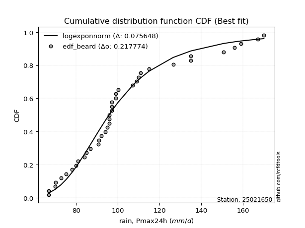</img></img>

</div>


### 5. Empirical - EDF Chegodayev (1955)

The Chegodayev formula is an empirical plotting position formula used in hydrological frequency analysis to estimate the exceedance probability or return period of a specific event from a set of observed data. It is primarily used for plotting observed data points on probability paper to fit a theoretical distribution, particularly for analyzing extreme events like maximum flood flows or rainfall intensities. The constant _b_ value in the generalized plotting position formula is 0.3.

<div align="center">


$P=(m-b)/(n+1-2b)$


</div>


**5.1. Empirical values**

<div align="center">

|                | 0                    | 1                  | 2                   | 3                   | 4                  | 5                  | 6                   | 7                   | 8                   | 9                  | 10                 | 11                 | 12                 | 13                 | 14                 | 15                 | 16                 | 17             | 18                 | 19                 | 20                 | 21                 | 22                 | 23                 | 24                 | 25                 | 26                 | 27                 | 28                 | 29                 | 30                 | 31                 | 32                 | 33                 | 34                 |
|:---------------|:---------------------|:-------------------|:--------------------|:--------------------|:-------------------|:-------------------|:--------------------|:--------------------|:--------------------|:-------------------|:-------------------|:-------------------|:-------------------|:-------------------|:-------------------|:-------------------|:-------------------|:---------------|:-------------------|:-------------------|:-------------------|:-------------------|:-------------------|:-------------------|:-------------------|:-------------------|:-------------------|:-------------------|:-------------------|:-------------------|:-------------------|:-------------------|:-------------------|:-------------------|:-------------------|
| date           | 1999                 | 1997               | 1989                | 1982                | 1983               | 1984               | 2001                | 2015                | 2010                | 1995               | 1986               | 1990               | 2002               | 2003               | 2008               | 1998               | 2006               | 2005           | 2011               | 1981               | 1994               | 2012               | 1993               | 2004               | 2000               | 1996               | 2009               | 2007               | 1985               | 2013               | 2014               | 1991               | 1987               | 1988               | 1992               |
| x              | 67.0                 | 67.0               | 70.0                | 70.183857028671     | 72.8016283965208   | 75.2911691571765   | 78.0                | 80.0                | 84.0                | 85.0               | 86.9               | 90.6               | 91.0               | 92.0               | 94.0               | 95.0               | 96.0               | 96.0           | 96.0               | 96.998100854538    | 97.0               | 97.0               | 99.0               | 99.0               | 100.2              | 107.0              | 110.0              | 111.0              | 126.5              | 135.0              | 135.0              | 150.6              | 158.9              | 167.1              | 170.0              |
| m              | 1                    | 2                  | 3                   | 4                   | 5                  | 6                  | 7                   | 8                   | 9                   | 10                 | 11                 | 12                 | 13                 | 14                 | 15                 | 16                 | 17                 | 18             | 19                 | 20                 | 21                 | 22                 | 23                 | 24                 | 25                 | 26                 | 27                 | 28                 | 29                 | 30                 | 31                 | 32                 | 33                 | 34                 | 35                 |
| empirical_dist | edf_chegodayev       | edf_chegodayev     | edf_chegodayev      | edf_chegodayev      | edf_chegodayev     | edf_chegodayev     | edf_chegodayev      | edf_chegodayev      | edf_chegodayev      | edf_chegodayev     | edf_chegodayev     | edf_chegodayev     | edf_chegodayev     | edf_chegodayev     | edf_chegodayev     | edf_chegodayev     | edf_chegodayev     | edf_chegodayev | edf_chegodayev     | edf_chegodayev     | edf_chegodayev     | edf_chegodayev     | edf_chegodayev     | edf_chegodayev     | edf_chegodayev     | edf_chegodayev     | edf_chegodayev     | edf_chegodayev     | edf_chegodayev     | edf_chegodayev     | edf_chegodayev     | edf_chegodayev     | edf_chegodayev     | edf_chegodayev     | edf_chegodayev     |
| empirical      | 0.019774011299435026 | 0.0480225988700565 | 0.07627118644067797 | 0.10451977401129944 | 0.1327683615819209 | 0.1610169491525424 | 0.18926553672316385 | 0.21751412429378533 | 0.24576271186440676 | 0.2740112994350282 | 0.3022598870056497 | 0.3305084745762712 | 0.3587570621468926 | 0.3870056497175141 | 0.4152542372881356 | 0.4435028248587571 | 0.4717514124293785 | 0.5            | 0.5282485875706214 | 0.556497175141243  | 0.5847457627118644 | 0.6129943502824858 | 0.6412429378531074 | 0.6694915254237288 | 0.6977401129943502 | 0.7259887005649718 | 0.7542372881355932 | 0.7824858757062148 | 0.8107344632768362 | 0.8389830508474576 | 0.8672316384180792 | 0.8954802259887006 | 0.9237288135593221 | 0.9519774011299437 | 0.9802259887005651 |
| empirical_tr   | 1.0201729106628241   | 1.0504451038575666 | 1.0825688073394495  | 1.1167192429022081  | 1.1530944625407165 | 1.191919191919192  | 1.2334494773519162  | 1.2779783393501807  | 1.3258426966292136  | 1.377431906614786  | 1.4331983805668014 | 1.4936708860759493 | 1.5594713656387664 | 1.6313364055299537 | 1.710144927536232  | 1.7969543147208125 | 1.8930481283422458 | 2.0            | 2.119760479041916  | 2.2547770700636947 | 2.4081632653061225 | 2.583941605839416  | 2.78740157480315   | 3.0256410256410255 | 3.3084112149532707 | 3.6494845360824746 | 4.068965517241379  | 4.597402597402598  | 5.283582089552239  | 6.2105263157894735 | 7.531914893617024  | 9.56756756756757   | 13.111111111111127 | 20.823529411764778 | 50.571428571428896 |

</div>


**5.2. Parameters & Kolmogorov-Smirnov fit test (sorted by Δ)**

|   id | empirical_dist   | p_dist             |       delta |   deltao | eval    |   fit |   n |            loc |          scale | shape                 | shape1                 | shape2             | shape3   |   best_fit |   best_fit_sort |
|-----:|:-----------------|:-------------------|------------:|---------:|:--------|------:|----:|---------------:|---------------:|:----------------------|:-----------------------|:-------------------|:---------|-----------:|----------------:|
|    0 | edf_chegodayev   | dgamma             |   0.0972552 | 0.229882 | Δo > Δ  |     1 |  35 |     96         |   26.2816      | 0.6683665068329485    |                        |                    |          |          1 |               1 |
|    1 | edf_chegodayev   | fisk               |   0.0999666 | 0.229882 | Δo > Δ  |     1 |  35 |     55.9992    |   38.552       | 2.8975480030711314    |                        |                    |          |          0 |               2 |
|    2 | edf_chegodayev   | invweibull         |   0.10555   | 0.229882 | Δo > Δ  |     1 |  35 |    -32.9463    |  120.805       | 6.645185278530256     |                        |                    |          |          0 |               3 |
|    3 | edf_chegodayev   | johnsonsu          |   0.105829  | 0.229882 | Δo > Δ  |     1 |  35 |     53.585     |    1.28694     | -7.351164534501085    | 1.7706367032893393     |                    |          |          0 |               4 |
|    4 | edf_chegodayev   | invgamma           |   0.106126  | 0.229882 | Δo > Δ  |     1 |  35 |     39.2088    |  333.28        | 6.342220985523436     |                        |                    |          |          0 |               5 |
|    5 | edf_chegodayev   | f                  |   0.106129  | 0.229882 | Δo > Δ  |     1 |  35 |     39.2151    |   52.5445      | 47566.92116404584     | 12.684817988777871     |                    |          |          0 |               6 |
|    6 | edf_chegodayev   | lognorm            |   0.106139  | 0.229882 | Δo > Δ  |     1 |  35 |     53.5122    |   40.9681      | 0.5641327574486195    |                        |                    |          |          0 |               7 |
|    7 | edf_chegodayev   | recipinvgauss      |   0.106574  | 0.229882 | Δo > Δ  |     1 |  35 |     55.8208    |   13.8245      | 0.4361063581272295    |                        |                    |          |          0 |               8 |
|    8 | edf_chegodayev   | alpha              |   0.107061  | 0.229882 | Δo > Δ  |     1 |  35 |      7.15835   |  351.92        | 4.011643075494929     |                        |                    |          |          0 |               9 |
|    9 | edf_chegodayev   | fatiguelife        |   0.107271  | 0.229882 | Δo > Δ  |     1 |  35 |     53.522     |   40.8448      | 0.5840172344208054    |                        |                    |          |          0 |              10 |
|   10 | edf_chegodayev   | invgauss           |   0.10728   | 0.229882 | Δo > Δ  |     1 |  35 |     51.677     |  150.764       | 0.32944194934320653   |                        |                    |          |          0 |              11 |
|   11 | edf_chegodayev   | t                  |   0.108032  | 0.229882 | Δo > Δ  |     1 |  35 |     93.8729    |   14.5256      | 1.8705082911962037    |                        |                    |          |          0 |              12 |
|   12 | edf_chegodayev   | exponnorm          |   0.110469  | 0.229882 | Δo > Δ  |     1 |  35 |     75.5289    |    9.84626     | 2.621918022232256     |                        |                    |          |          0 |              13 |
|   13 | edf_chegodayev   | halflogistic       |   0.113691  | 0.229882 | Δo > Δ  |     1 |  35 |     69.0309    |   23.3097      |                       |                        |                    |          |          0 |              14 |
|   14 | edf_chegodayev   | weibull_min        |   0.117985  | 0.229882 | Δo > Δ  |     1 |  35 |     66.3635    |   37.1429      | 1.215770446755193     |                        |                    |          |          0 |              15 |
|   15 | edf_chegodayev   | moyal              |   0.118941  | 0.229882 | Δo > Δ  |     1 |  35 |     85.7537    |   12.2731      |                       |                        |                    |          |          0 |              16 |
|   16 | edf_chegodayev   | gompertz           |   0.128396  | 0.229882 | Δo > Δ  |     1 |  35 |     67         |  101.771       | 2.1840700714139105    |                        |                    |          |          0 |              17 |
|   17 | edf_chegodayev   | gamma              |   0.128447  | 0.229882 | Δo > Δ  |     1 |  35 |     66.0197    |   25.9452      | 1.3615356740954403    |                        |                    |          |          0 |              18 |
|   18 | edf_chegodayev   | erlang             |   0.128447  | 0.229882 | Δo > Δ  |     1 |  35 |     66.0197    |   25.9452      | 1.3615347156760886    |                        |                    |          |          0 |              19 |
|   19 | edf_chegodayev   | laplace_asymmetric |   0.131169  | 0.229882 | Δo > Δ  |     1 |  35 |     91         |   17.581       | 0.7481597286104452    |                        |                    |          |          0 |              20 |
|   20 | edf_chegodayev   | nct                |   0.132024  | 0.229882 | Δo > Δ  |     1 |  35 |     -0.136947  |    2.00783     | 9.405882071310153     | 46.30934981028304      |                    |          |          0 |              21 |
|   21 | edf_chegodayev   | genlogistic        |   0.13363   | 0.229882 | Δo > Δ  |     1 |  35 |    -44.9254    |   19.4214      | 1007.2622984029299    |                        |                    |          |          0 |              22 |
|   22 | edf_chegodayev   | halfnorm           |   0.137518  | 0.229882 | Δo > Δ  |     1 |  35 |     65.2583    |   45.228       |                       |                        |                    |          |          0 |              23 |
|   23 | edf_chegodayev   | pearson3           |   0.140227  | 0.229882 | Δo > Δ  |     1 |  35 |    101.345     |   27.2639      | 1.1128519853868506    |                        |                    |          |          0 |              24 |
|   24 | edf_chegodayev   | gumbel_r           |   0.144814  | 0.229882 | Δo > Δ  |     1 |  35 |     89.0748    |   21.2576      |                       |                        |                    |          |          0 |              25 |
|   25 | edf_chegodayev   | betaprime          |   0.150414  | 0.229882 | Δo > Δ  |     1 |  35 |     -2.23366   |    4.80397     | 382.0039940260071     | 18.748501750510883     |                    |          |          0 |              26 |
|   26 | edf_chegodayev   | nakagami           |   0.156931  | 0.229882 | Δo > Δ  |     1 |  35 |     67         |   49.5425      | 0.3972277566262906    |                        |                    |          |          0 |              27 |
|   27 | edf_chegodayev   | kstwobign          |   0.157718  | 0.229882 | Δo > Δ  |     1 |  35 |     18.7642    |   95.4109      |                       |                        |                    |          |          0 |              28 |
|   28 | edf_chegodayev   | genexpon           |   0.166034  | 0.229882 | Δo > Δ  |     1 |  35 |     67         |    2.22535     | 0.0647090447130945    | 1.1377784035012407e-06 | 1.8199456936372878 |          |          0 |              29 |
|   29 | edf_chegodayev   | expon              |   0.166482  | 0.229882 | Δo > Δ  |     1 |  35 |     67         |   34.345       |                       |                        |                    |          |          0 |              30 |
|   30 | edf_chegodayev   | wald               |   0.167868  | 0.229882 | Δo > Δ  |     1 |  35 |     74.0811    |   27.2639      |                       |                        |                    |          |          0 |              31 |
|   31 | edf_chegodayev   | rayleigh           |   0.169496  | 0.229882 | Δo > Δ  |     1 |  35 |     49.1876    |   41.6156      |                       |                        |                    |          |          0 |              32 |
|   32 | edf_chegodayev   | maxwell            |   0.18085   | 0.229882 | Δo > Δ  |     1 |  35 |     36.741     |   40.4846      |                       |                        |                    |          |          0 |              33 |
|   33 | edf_chegodayev   | rice               |   0.197667  | 0.229882 | Δo > Δ  |     1 |  35 |     56.5035    |   37.1085      | 0.001084836132545509  |                        |                    |          |          0 |              34 |
|   34 | edf_chegodayev   | norm               |   0.214489  | 0.229882 | Δo > Δ  |     1 |  35 |    101.345     |   27.2639      |                       |                        |                    |          |          0 |              35 |
|   35 | edf_chegodayev   | crystalball        |   0.214489  | 0.229882 | Δo > Δ  |     1 |  35 |    101.345     |   27.2639      | 6888.381379240169     | 10306.04410682998      |                    |          |          0 |              36 |
|   36 | edf_chegodayev   | truncnorm          |   0.214489  | 0.229882 | Δo > Δ  |     1 |  35 |    101.345     |   27.2639      | -1122.1442806305452   | 522.6699189423582      |                    |          |          0 |              37 |
|   37 | edf_chegodayev   | loggamma           |   0.215768  | 0.229882 | Δo > Δ  |     1 |  35 | -10565.3       | 1369.5         | 2413.804585039734     |                        |                    |          |          0 |              38 |
|   38 | edf_chegodayev   | logistic           |   0.216774  | 0.229882 | Δo > Δ  |     1 |  35 |    101.345     |   15.0314      |                       |                        |                    |          |          0 |              39 |
|   39 | edf_chegodayev   | gibrat             |   0.217514  | 0.229882 | Δo > Δ  |     1 |  35 |     80.5461    |   12.6152      |                       |                        |                    |          |          0 |              40 |
|   40 | edf_chegodayev   | hypsecant          |   0.218723  | 0.229882 | Δo > Δ  |     1 |  35 |    101.345     |   17.3567      |                       |                        |                    |          |          0 |              41 |
|   41 | edf_chegodayev   | laplace            |   0.226757  | 0.229882 | Δo > Δ  |     1 |  35 |    101.345     |   19.2785      |                       |                        |                    |          |          0 |              42 |
|   42 | edf_chegodayev   | gumbel_l           |   0.285159  | 0.229882 | Δo <= Δ |     0 |  35 |    113.615     |   21.2576      |                       |                        |                    |          |          0 |              43 |
|   43 | edf_chegodayev   | zzgumbel           |   0.348955  | 0.229882 | Δo <= Δ |     0 |  35 |    101.32      |   21.5679      | 0.5403397786021026    | 1.1284724725032327     |                    |          |          0 |              44 |
|   44 | edf_chegodayev   | ncf                |   0.423025  | 0.229882 | Δo <= Δ |     0 |  35 |     -0.0764801 |    8.83301e-06 | 6.581314097803295e-07 | 13.62215232828027      | 6.595044645746899  |          |          0 |              45 |
|   45 | edf_chegodayev   | pareto             |   0.528224  | 0.229882 | Δo <= Δ |     0 |  35 |     67         |    6.76277e-07 | 0.0606061021007697    |                        |                    |          |          0 |              46 |
|   46 | edf_chegodayev   | chi2               |   0.735916  | 0.229882 | Δo <= Δ |     0 |  35 |     67         |    8.51466     | 0.334767263371169     |                        |                    |          |          0 |              47 |
|   47 | edf_chegodayev   | mielke             | nan         | 0.229882 | Δo <= Δ |     0 |  35 |     -7.9241    |   33.4196      | 1447.4439709185908    | 5.340436746978941      |                    |          |          0 |              48 |

<div align="center">

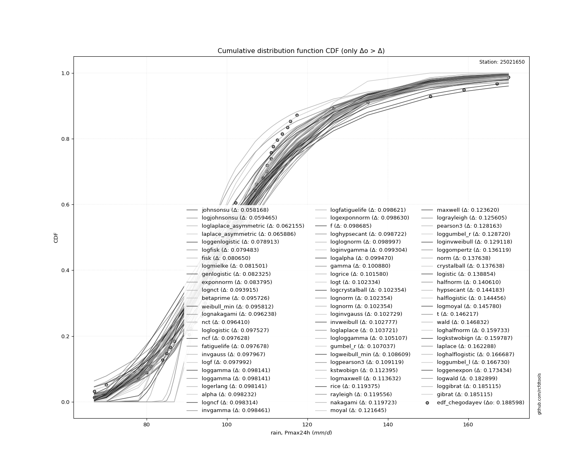</img>

</div>


**5.3. Best fit**

|   id |   station | empirical_dist   | p_dist   |     delta |   deltao | eval   |   fit |   n |   loc |   scale |    shape | shape1   | shape2   | shape3   |   best_fit |   best_fit_sort |
|-----:|----------:|:-----------------|:---------|----------:|---------:|:-------|------:|----:|------:|--------:|---------:|:---------|:---------|:---------|-----------:|----------------:|
|    0 |  25021650 | edf_chegodayev   | dgamma   | 0.0972552 | 0.229882 | Δo > Δ |     1 |  35 |    96 | 26.2816 | 0.668367 |          |          |          |          1 |               1 |

<div align="center">

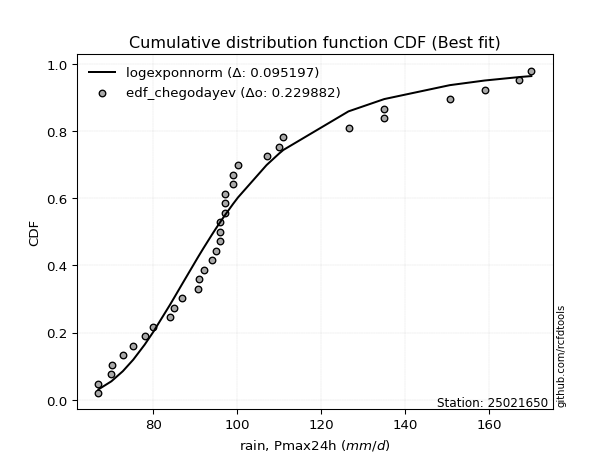</img></img>

</div>


### 6. Empirical - EDF Blom (1958)

The Blom formula is a specific "plotting position" formula used in hydrology and statistical analysis to estimate the empirical cumulative probability (or non-exceedance probability) of a data series. It is particularly recommended for data that are approximately normally distributed. The constant _a_ is set to 0.375 (or 3/8).

<div align="center">


$P=(m-a)/(n+1-2a)$


</div>


**6.1. Empirical values**

<div align="center">

|                | 0                   | 1                   | 2                   | 3                   | 4                   | 5                  | 6                  | 7                   | 8                   | 9                  | 10                  | 11                  | 12                  | 13                  | 14                 | 15                 | 16                 | 17       | 18                 | 19                 | 20                 | 21                 | 22                 | 23                 | 24                 | 25                 | 26                 | 27                 | 28                 | 29                 | 30                 | 31                 | 32                | 33                 | 34                 |
|:---------------|:--------------------|:--------------------|:--------------------|:--------------------|:--------------------|:-------------------|:-------------------|:--------------------|:--------------------|:-------------------|:--------------------|:--------------------|:--------------------|:--------------------|:-------------------|:-------------------|:-------------------|:---------|:-------------------|:-------------------|:-------------------|:-------------------|:-------------------|:-------------------|:-------------------|:-------------------|:-------------------|:-------------------|:-------------------|:-------------------|:-------------------|:-------------------|:------------------|:-------------------|:-------------------|
| date           | 1999                | 1997                | 1989                | 1982                | 1983                | 1984               | 2001               | 2015                | 2010                | 1995               | 1986                | 1990                | 2002                | 2003                | 2008               | 1998               | 2006               | 2005     | 2011               | 1981               | 1994               | 2012               | 1993               | 2004               | 2000               | 1996               | 2009               | 2007               | 1985               | 2013               | 2014               | 1991               | 1987              | 1988               | 1992               |
| x              | 67.0                | 67.0                | 70.0                | 70.183857028671     | 72.8016283965208    | 75.2911691571765   | 78.0               | 80.0                | 84.0                | 85.0               | 86.9                | 90.6                | 91.0                | 92.0                | 94.0               | 95.0               | 96.0               | 96.0     | 96.0               | 96.998100854538    | 97.0               | 97.0               | 99.0               | 99.0               | 100.2              | 107.0              | 110.0              | 111.0              | 126.5              | 135.0              | 135.0              | 150.6              | 158.9             | 167.1              | 170.0              |
| m              | 1                   | 2                   | 3                   | 4                   | 5                   | 6                  | 7                  | 8                   | 9                   | 10                 | 11                  | 12                  | 13                  | 14                  | 15                 | 16                 | 17                 | 18       | 19                 | 20                 | 21                 | 22                 | 23                 | 24                 | 25                 | 26                 | 27                 | 28                 | 29                 | 30                 | 31                 | 32                 | 33                | 34                 | 35                 |
| empirical_dist | edf_blom            | edf_blom            | edf_blom            | edf_blom            | edf_blom            | edf_blom           | edf_blom           | edf_blom            | edf_blom            | edf_blom           | edf_blom            | edf_blom            | edf_blom            | edf_blom            | edf_blom           | edf_blom           | edf_blom           | edf_blom | edf_blom           | edf_blom           | edf_blom           | edf_blom           | edf_blom           | edf_blom           | edf_blom           | edf_blom           | edf_blom           | edf_blom           | edf_blom           | edf_blom           | edf_blom           | edf_blom           | edf_blom          | edf_blom           | edf_blom           |
| empirical      | 0.01773049645390071 | 0.04609929078014184 | 0.07446808510638298 | 0.10283687943262411 | 0.13120567375886524 | 0.1595744680851064 | 0.1879432624113475 | 0.21631205673758866 | 0.24468085106382978 | 0.2730496453900709 | 0.30141843971631205 | 0.32978723404255317 | 0.35815602836879434 | 0.38652482269503546 | 0.4148936170212766 | 0.4432624113475177 | 0.4716312056737589 | 0.5      | 0.5283687943262412 | 0.5567375886524822 | 0.5851063829787234 | 0.6134751773049646 | 0.6418439716312057 | 0.6702127659574468 | 0.6985815602836879 | 0.7269503546099291 | 0.7553191489361702 | 0.7836879432624113 | 0.8120567375886525 | 0.8404255319148937 | 0.8687943262411347 | 0.8971631205673759 | 0.925531914893617 | 0.9539007092198581 | 0.9822695035460993 |
| empirical_tr   | 1.0180505415162455  | 1.0483271375464684  | 1.0804597701149425  | 1.1146245059288538  | 1.1510204081632653  | 1.1898734177215189 | 1.2314410480349345 | 1.2760180995475114  | 1.323943661971831   | 1.375609756097561  | 1.431472081218274   | 1.492063492063492   | 1.558011049723757   | 1.6300578034682083  | 1.709090909090909  | 1.7961783439490444 | 1.8926174496644295 | 2.0      | 2.1203007518796992 | 2.256              | 2.41025641025641   | 2.5871559633027528 | 2.792079207920792  | 3.0322580645161294 | 3.3176470588235287 | 3.6623376623376624 | 4.086956521739131  | 4.6229508196721305 | 5.320754716981132  | 6.266666666666668  | 7.62162162162162   | 9.724137931034484  | 13.42857142857142 | 21.692307692307686 | 56.4000000000001   |

</div>


**6.2. Parameters & Kolmogorov-Smirnov fit test (sorted by Δ)**

|   id | empirical_dist   | p_dist             |       delta |   deltao | eval    |   fit |   n |            loc |          scale | shape                 | shape1                 | shape2             | shape3   |   best_fit |   best_fit_sort |
|-----:|:-----------------|:-------------------|------------:|---------:|:--------|------:|----:|---------------:|---------------:|:----------------------|:-----------------------|:-------------------|:---------|-----------:|----------------:|
|    0 | edf_blom         | dgamma             |   0.0958128 | 0.229882 | Δo > Δ  |     1 |  35 |     96         |   26.2816      | 0.6683665068329485    |                        |                    |          |          1 |               1 |
|    1 | edf_blom         | fisk               |   0.100808  | 0.229882 | Δo > Δ  |     1 |  35 |     55.9992    |   38.552       | 2.8975480030711314    |                        |                    |          |          0 |               2 |
|    2 | edf_blom         | invweibull         |   0.106391  | 0.229882 | Δo > Δ  |     1 |  35 |    -32.9463    |  120.805       | 6.645185278530256     |                        |                    |          |          0 |               3 |
|    3 | edf_blom         | johnsonsu          |   0.10667   | 0.229882 | Δo > Δ  |     1 |  35 |     53.585     |    1.28694     | -7.351164534501085    | 1.7706367032893393     |                    |          |          0 |               4 |
|    4 | edf_blom         | t                  |   0.10671   | 0.229882 | Δo > Δ  |     1 |  35 |     93.8729    |   14.5256      | 1.8705082911962037    |                        |                    |          |          0 |               5 |
|    5 | edf_blom         | invgamma           |   0.106967  | 0.229882 | Δo > Δ  |     1 |  35 |     39.2088    |  333.28        | 6.342220985523436     |                        |                    |          |          0 |               6 |
|    6 | edf_blom         | f                  |   0.106971  | 0.229882 | Δo > Δ  |     1 |  35 |     39.2151    |   52.5445      | 47566.92116404584     | 12.684817988777871     |                    |          |          0 |               7 |
|    7 | edf_blom         | lognorm            |   0.10698   | 0.229882 | Δo > Δ  |     1 |  35 |     53.5122    |   40.9681      | 0.5641327574486195    |                        |                    |          |          0 |               8 |
|    8 | edf_blom         | recipinvgauss      |   0.107416  | 0.229882 | Δo > Δ  |     1 |  35 |     55.8208    |   13.8245      | 0.4361063581272295    |                        |                    |          |          0 |               9 |
|    9 | edf_blom         | alpha              |   0.107902  | 0.229882 | Δo > Δ  |     1 |  35 |      7.15835   |  351.92        | 4.011643075494929     |                        |                    |          |          0 |              10 |
|   10 | edf_blom         | fatiguelife        |   0.108113  | 0.229882 | Δo > Δ  |     1 |  35 |     53.522     |   40.8448      | 0.5840172344208054    |                        |                    |          |          0 |              11 |
|   11 | edf_blom         | invgauss           |   0.108122  | 0.229882 | Δo > Δ  |     1 |  35 |     51.677     |  150.764       | 0.32944194934320653   |                        |                    |          |          0 |              12 |
|   12 | edf_blom         | exponnorm          |   0.11131   | 0.229882 | Δo > Δ  |     1 |  35 |     75.5289    |    9.84626     | 2.621918022232256     |                        |                    |          |          0 |              13 |
|   13 | edf_blom         | halflogistic       |   0.114532  | 0.229882 | Δo > Δ  |     1 |  35 |     69.0309    |   23.3097      |                       |                        |                    |          |          0 |              14 |
|   14 | edf_blom         | weibull_min        |   0.118706  | 0.229882 | Δo > Δ  |     1 |  35 |     66.3635    |   37.1429      | 1.215770446755193     |                        |                    |          |          0 |              15 |
|   15 | edf_blom         | moyal              |   0.119783  | 0.229882 | Δo > Δ  |     1 |  35 |     85.7537    |   12.2731      |                       |                        |                    |          |          0 |              16 |
|   16 | edf_blom         | gamma              |   0.129168  | 0.229882 | Δo > Δ  |     1 |  35 |     66.0197    |   25.9452      | 1.3615356740954403    |                        |                    |          |          0 |              17 |
|   17 | edf_blom         | erlang             |   0.129169  | 0.229882 | Δo > Δ  |     1 |  35 |     66.0197    |   25.9452      | 1.3615347156760886    |                        |                    |          |          0 |              18 |
|   18 | edf_blom         | gompertz           |   0.129237  | 0.229882 | Δo > Δ  |     1 |  35 |     67         |  101.771       | 2.1840700714139105    |                        |                    |          |          0 |              19 |
|   19 | edf_blom         | laplace_asymmetric |   0.132011  | 0.229882 | Δo > Δ  |     1 |  35 |     91         |   17.581       | 0.7481597286104452    |                        |                    |          |          0 |              20 |
|   20 | edf_blom         | nct                |   0.132866  | 0.229882 | Δo > Δ  |     1 |  35 |     -0.136947  |    2.00783     | 9.405882071310153     | 46.30934981028304      |                    |          |          0 |              21 |
|   21 | edf_blom         | genlogistic        |   0.134472  | 0.229882 | Δo > Δ  |     1 |  35 |    -44.9254    |   19.4214      | 1007.2622984029299    |                        |                    |          |          0 |              22 |
|   22 | edf_blom         | halfnorm           |   0.138359  | 0.229882 | Δo > Δ  |     1 |  35 |     65.2583    |   45.228       |                       |                        |                    |          |          0 |              23 |
|   23 | edf_blom         | pearson3           |   0.141068  | 0.229882 | Δo > Δ  |     1 |  35 |    101.345     |   27.2639      | 1.1128519853868506    |                        |                    |          |          0 |              24 |
|   24 | edf_blom         | gumbel_r           |   0.145655  | 0.229882 | Δo > Δ  |     1 |  35 |     89.0748    |   21.2576      |                       |                        |                    |          |          0 |              25 |
|   25 | edf_blom         | betaprime          |   0.151255  | 0.229882 | Δo > Δ  |     1 |  35 |     -2.23366   |    4.80397     | 382.0039940260071     | 18.748501750510883     |                    |          |          0 |              26 |
|   26 | edf_blom         | nakagami           |   0.157773  | 0.229882 | Δo > Δ  |     1 |  35 |     67         |   49.5425      | 0.3972277566262906    |                        |                    |          |          0 |              27 |
|   27 | edf_blom         | kstwobign          |   0.158559  | 0.229882 | Δo > Δ  |     1 |  35 |     18.7642    |   95.4109      |                       |                        |                    |          |          0 |              28 |
|   28 | edf_blom         | wald               |   0.166546  | 0.229882 | Δo > Δ  |     1 |  35 |     74.0811    |   27.2639      |                       |                        |                    |          |          0 |              29 |
|   29 | edf_blom         | genexpon           |   0.166755  | 0.229882 | Δo > Δ  |     1 |  35 |     67         |    2.22535     | 0.0647090447130945    | 1.1377784035012407e-06 | 1.8199456936372878 |          |          0 |              30 |
|   30 | edf_blom         | expon              |   0.167203  | 0.229882 | Δo > Δ  |     1 |  35 |     67         |   34.345       |                       |                        |                    |          |          0 |              31 |
|   31 | edf_blom         | rayleigh           |   0.170337  | 0.229882 | Δo > Δ  |     1 |  35 |     49.1876    |   41.6156      |                       |                        |                    |          |          0 |              32 |
|   32 | edf_blom         | maxwell            |   0.181691  | 0.229882 | Δo > Δ  |     1 |  35 |     36.741     |   40.4846      |                       |                        |                    |          |          0 |              33 |
|   33 | edf_blom         | rice               |   0.198509  | 0.229882 | Δo > Δ  |     1 |  35 |     56.5035    |   37.1085      | 0.001084836132545509  |                        |                    |          |          0 |              34 |
|   34 | edf_blom         | norm               |   0.215331  | 0.229882 | Δo > Δ  |     1 |  35 |    101.345     |   27.2639      |                       |                        |                    |          |          0 |              35 |
|   35 | edf_blom         | crystalball        |   0.215331  | 0.229882 | Δo > Δ  |     1 |  35 |    101.345     |   27.2639      | 6888.381379240169     | 10306.04410682998      |                    |          |          0 |              36 |
|   36 | edf_blom         | truncnorm          |   0.215331  | 0.229882 | Δo > Δ  |     1 |  35 |    101.345     |   27.2639      | -1122.1442806305452   | 522.6699189423582      |                    |          |          0 |              37 |
|   37 | edf_blom         | gibrat             |   0.216312  | 0.229882 | Δo > Δ  |     1 |  35 |     80.5461    |   12.6152      |                       |                        |                    |          |          0 |              38 |
|   38 | edf_blom         | loggamma           |   0.21661   | 0.229882 | Δo > Δ  |     1 |  35 | -10565.3       | 1369.5         | 2413.804585039734     |                        |                    |          |          0 |              39 |
|   39 | edf_blom         | logistic           |   0.217616  | 0.229882 | Δo > Δ  |     1 |  35 |    101.345     |   15.0314      |                       |                        |                    |          |          0 |              40 |
|   40 | edf_blom         | hypsecant          |   0.219565  | 0.229882 | Δo > Δ  |     1 |  35 |    101.345     |   17.3567      |                       |                        |                    |          |          0 |              41 |
|   41 | edf_blom         | laplace            |   0.227478  | 0.229882 | Δo > Δ  |     1 |  35 |    101.345     |   19.2785      |                       |                        |                    |          |          0 |              42 |
|   42 | edf_blom         | gumbel_l           |   0.286     | 0.229882 | Δo <= Δ |     0 |  35 |    113.615     |   21.2576      |                       |                        |                    |          |          0 |              43 |
|   43 | edf_blom         | zzgumbel           |   0.349796  | 0.229882 | Δo <= Δ |     0 |  35 |    101.32      |   21.5679      | 0.5403397786021026    | 1.1284724725032327     |                    |          |          0 |              44 |
|   44 | edf_blom         | ncf                |   0.425068  | 0.229882 | Δo <= Δ |     0 |  35 |     -0.0764801 |    8.83301e-06 | 6.581314097803295e-07 | 13.62215232828027      | 6.595044645746899  |          |          0 |              45 |
|   45 | edf_blom         | pareto             |   0.530027  | 0.229882 | Δo <= Δ |     0 |  35 |     67         |    6.76277e-07 | 0.0606061021007697    |                        |                    |          |          0 |              46 |
|   46 | edf_blom         | chi2               |   0.737359  | 0.229882 | Δo <= Δ |     0 |  35 |     67         |    8.51466     | 0.334767263371169     |                        |                    |          |          0 |              47 |
|   47 | edf_blom         | mielke             | nan         | 0.229882 | Δo <= Δ |     0 |  35 |     -7.9241    |   33.4196      | 1447.4439709185908    | 5.340436746978941      |                    |          |          0 |              48 |

<div align="center">

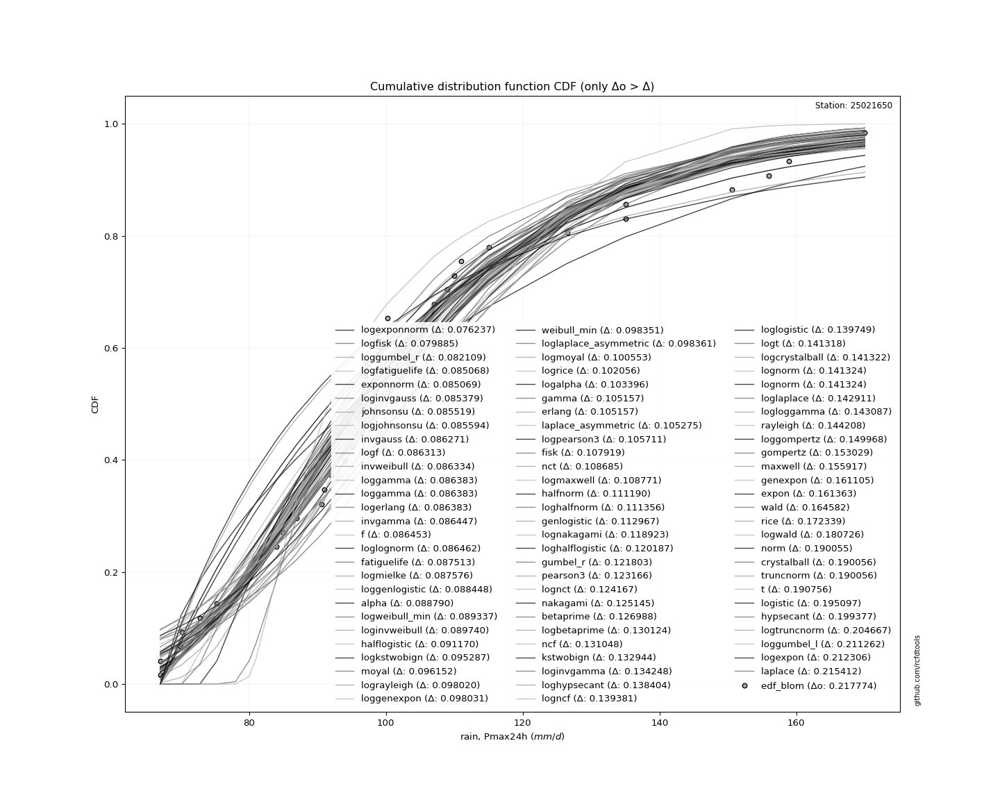</img>

</div>


**6.3. Best fit**

|   id |   station | empirical_dist   | p_dist   |     delta |   deltao | eval   |   fit |   n |   loc |   scale |    shape | shape1   | shape2   | shape3   |   best_fit |   best_fit_sort |
|-----:|----------:|:-----------------|:---------|----------:|---------:|:-------|------:|----:|------:|--------:|---------:|:---------|:---------|:---------|-----------:|----------------:|
|    0 |  25021650 | edf_blom         | dgamma   | 0.0958128 | 0.229882 | Δo > Δ |     1 |  35 |    96 | 26.2816 | 0.668367 |          |          |          |          1 |               1 |

<div align="center">

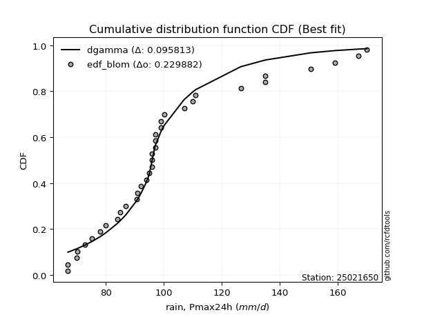</img></img>

</div>


### 7. Empirical - EDF Tukey (1962)

In hydrology, the Tukey formula is used as a plotting position formula to estimate the empirical probability or frequency of a flood event (or other hydrological data). The formula parameter is given as _c=0.333_ (or 1/3).

<div align="center">


$P=(m-c)/(n+1-2c)$


</div>


**7.1. Empirical values**

<div align="center">

|                | 0                    | 1                   | 2                   | 3                   | 4                  | 5                   | 6                   | 7                  | 8                   | 9                   | 10                 | 11                 | 12                 | 13                 | 14                  | 15                  | 16                 | 17        | 18                 | 19                 | 20                 | 21                 | 22                 | 23                 | 24                 | 25                 | 26                 | 27                 | 28                 | 29                | 30                 | 31                 | 32                 | 33                 | 34                 |
|:---------------|:---------------------|:--------------------|:--------------------|:--------------------|:-------------------|:--------------------|:--------------------|:-------------------|:--------------------|:--------------------|:-------------------|:-------------------|:-------------------|:-------------------|:--------------------|:--------------------|:-------------------|:----------|:-------------------|:-------------------|:-------------------|:-------------------|:-------------------|:-------------------|:-------------------|:-------------------|:-------------------|:-------------------|:-------------------|:------------------|:-------------------|:-------------------|:-------------------|:-------------------|:-------------------|
| date           | 1999                 | 1997                | 1989                | 1982                | 1983               | 1984                | 2001                | 2015               | 2010                | 1995                | 1986               | 1990               | 2002               | 2003               | 2008                | 1998                | 2006               | 2005      | 2011               | 1981               | 1994               | 2012               | 1993               | 2004               | 2000               | 1996               | 2009               | 2007               | 1985               | 2013              | 2014               | 1991               | 1987               | 1988               | 1992               |
| x              | 67.0                 | 67.0                | 70.0                | 70.183857028671     | 72.8016283965208   | 75.2911691571765    | 78.0                | 80.0               | 84.0                | 85.0                | 86.9               | 90.6               | 91.0               | 92.0               | 94.0                | 95.0                | 96.0               | 96.0      | 96.0               | 96.998100854538    | 97.0               | 97.0               | 99.0               | 99.0               | 100.2              | 107.0              | 110.0              | 111.0              | 126.5              | 135.0             | 135.0              | 150.6              | 158.9              | 167.1              | 170.0              |
| m              | 1                    | 2                   | 3                   | 4                   | 5                  | 6                   | 7                   | 8                  | 9                   | 10                  | 11                 | 12                 | 13                 | 14                 | 15                  | 16                  | 17                 | 18        | 19                 | 20                 | 21                 | 22                 | 23                 | 24                 | 25                 | 26                 | 27                 | 28                 | 29                 | 30                | 31                 | 32                 | 33                 | 34                 | 35                 |
| empirical_dist | edf_tukey            | edf_tukey           | edf_tukey           | edf_tukey           | edf_tukey          | edf_tukey           | edf_tukey           | edf_tukey          | edf_tukey           | edf_tukey           | edf_tukey          | edf_tukey          | edf_tukey          | edf_tukey          | edf_tukey           | edf_tukey           | edf_tukey          | edf_tukey | edf_tukey          | edf_tukey          | edf_tukey          | edf_tukey          | edf_tukey          | edf_tukey          | edf_tukey          | edf_tukey          | edf_tukey          | edf_tukey          | edf_tukey          | edf_tukey         | edf_tukey          | edf_tukey          | edf_tukey          | edf_tukey          | edf_tukey          |
| empirical      | 0.018867924528301886 | 0.04716981132075472 | 0.07547169811320754 | 0.10377358490566038 | 0.1320754716981132 | 0.16037735849056603 | 0.18867924528301888 | 0.2169811320754717 | 0.24528301886792453 | 0.27358490566037735 | 0.3018867924528302 | 0.330188679245283  | 0.3584905660377358 | 0.3867924528301887 | 0.41509433962264153 | 0.44339622641509435 | 0.4716981132075472 | 0.5       | 0.5283018867924528 | 0.5566037735849056 | 0.5849056603773585 | 0.6132075471698113 | 0.6415094339622641 | 0.6698113207547169 | 0.6981132075471698 | 0.7264150943396226 | 0.7547169811320755 | 0.7830188679245284 | 0.8113207547169812 | 0.839622641509434 | 0.8679245283018868 | 0.8962264150943396 | 0.9245283018867925 | 0.9528301886792453 | 0.9811320754716981 |
| empirical_tr   | 1.0192307692307692   | 1.0495049504950495  | 1.0816326530612246  | 1.1157894736842104  | 1.1521739130434783 | 1.1910112359550562  | 1.2325581395348837  | 1.2771084337349399 | 1.325               | 1.3766233766233766  | 1.4324324324324322 | 1.4929577464788732 | 1.5588235294117645 | 1.6307692307692307 | 1.7096774193548387  | 1.7966101694915255  | 1.8928571428571428 | 2.0       | 2.12               | 2.25531914893617   | 2.409090909090909  | 2.585365853658536  | 2.789473684210526  | 3.028571428571428  | 3.3124999999999996 | 3.6551724137931028 | 4.0769230769230775 | 4.608695652173914  | 5.300000000000002  | 6.235294117647061 | 7.571428571428573  | 9.636363636363638  | 13.250000000000004 | 21.200000000000006 | 53.000000000000014 |

</div>


**7.2. Parameters & Kolmogorov-Smirnov fit test (sorted by Δ)**

|   id | empirical_dist   | p_dist             |       delta |   deltao | eval    |   fit |   n |            loc |          scale | shape                 | shape1                 | shape2             | shape3   |   best_fit |   best_fit_sort |
|-----:|:-----------------|:-------------------|------------:|---------:|:--------|------:|----:|---------------:|---------------:|:----------------------|:-----------------------|:-------------------|:---------|-----------:|----------------:|
|    0 | edf_tukey        | dgamma             |   0.0966156 | 0.229882 | Δo > Δ  |     1 |  35 |     96         |   26.2816      | 0.6683665068329485    |                        |                    |          |          1 |               1 |
|    1 | edf_tukey        | fisk               |   0.10034   | 0.229882 | Δo > Δ  |     1 |  35 |     55.9992    |   38.552       | 2.8975480030711314    |                        |                    |          |          0 |               2 |
|    2 | edf_tukey        | invweibull         |   0.105923  | 0.229882 | Δo > Δ  |     1 |  35 |    -32.9463    |  120.805       | 6.645185278530256     |                        |                    |          |          0 |               3 |
|    3 | edf_tukey        | johnsonsu          |   0.106202  | 0.229882 | Δo > Δ  |     1 |  35 |     53.585     |    1.28694     | -7.351164534501085    | 1.7706367032893393     |                    |          |          0 |               4 |
|    4 | edf_tukey        | invgamma           |   0.106499  | 0.229882 | Δo > Δ  |     1 |  35 |     39.2088    |  333.28        | 6.342220985523436     |                        |                    |          |          0 |               5 |
|    5 | edf_tukey        | f                  |   0.106502  | 0.229882 | Δo > Δ  |     1 |  35 |     39.2151    |   52.5445      | 47566.92116404584     | 12.684817988777871     |                    |          |          0 |               6 |
|    6 | edf_tukey        | lognorm            |   0.106512  | 0.229882 | Δo > Δ  |     1 |  35 |     53.5122    |   40.9681      | 0.5641327574486195    |                        |                    |          |          0 |               7 |
|    7 | edf_tukey        | recipinvgauss      |   0.106947  | 0.229882 | Δo > Δ  |     1 |  35 |     55.8208    |   13.8245      | 0.4361063581272295    |                        |                    |          |          0 |               8 |
|    8 | edf_tukey        | alpha              |   0.107434  | 0.229882 | Δo > Δ  |     1 |  35 |      7.15835   |  351.92        | 4.011643075494929     |                        |                    |          |          0 |               9 |
|    9 | edf_tukey        | t                  |   0.107446  | 0.229882 | Δo > Δ  |     1 |  35 |     93.8729    |   14.5256      | 1.8705082911962037    |                        |                    |          |          0 |              10 |
|   10 | edf_tukey        | fatiguelife        |   0.107644  | 0.229882 | Δo > Δ  |     1 |  35 |     53.522     |   40.8448      | 0.5840172344208054    |                        |                    |          |          0 |              11 |
|   11 | edf_tukey        | invgauss           |   0.107653  | 0.229882 | Δo > Δ  |     1 |  35 |     51.677     |  150.764       | 0.32944194934320653   |                        |                    |          |          0 |              12 |
|   12 | edf_tukey        | exponnorm          |   0.110842  | 0.229882 | Δo > Δ  |     1 |  35 |     75.5289    |    9.84626     | 2.621918022232256     |                        |                    |          |          0 |              13 |
|   13 | edf_tukey        | halflogistic       |   0.114064  | 0.229882 | Δo > Δ  |     1 |  35 |     69.0309    |   23.3097      |                       |                        |                    |          |          0 |              14 |
|   14 | edf_tukey        | weibull_min        |   0.118304  | 0.229882 | Δo > Δ  |     1 |  35 |     66.3635    |   37.1429      | 1.215770446755193     |                        |                    |          |          0 |              15 |
|   15 | edf_tukey        | moyal              |   0.119314  | 0.229882 | Δo > Δ  |     1 |  35 |     85.7537    |   12.2731      |                       |                        |                    |          |          0 |              16 |
|   16 | edf_tukey        | gamma              |   0.128767  | 0.229882 | Δo > Δ  |     1 |  35 |     66.0197    |   25.9452      | 1.3615356740954403    |                        |                    |          |          0 |              17 |
|   17 | edf_tukey        | erlang             |   0.128767  | 0.229882 | Δo > Δ  |     1 |  35 |     66.0197    |   25.9452      | 1.3615347156760886    |                        |                    |          |          0 |              18 |
|   18 | edf_tukey        | gompertz           |   0.128769  | 0.229882 | Δo > Δ  |     1 |  35 |     67         |  101.771       | 2.1840700714139105    |                        |                    |          |          0 |              19 |
|   19 | edf_tukey        | laplace_asymmetric |   0.131542  | 0.229882 | Δo > Δ  |     1 |  35 |     91         |   17.581       | 0.7481597286104452    |                        |                    |          |          0 |              20 |
|   20 | edf_tukey        | nct                |   0.132397  | 0.229882 | Δo > Δ  |     1 |  35 |     -0.136947  |    2.00783     | 9.405882071310153     | 46.30934981028304      |                    |          |          0 |              21 |
|   21 | edf_tukey        | genlogistic        |   0.134003  | 0.229882 | Δo > Δ  |     1 |  35 |    -44.9254    |   19.4214      | 1007.2622984029299    |                        |                    |          |          0 |              22 |
|   22 | edf_tukey        | halfnorm           |   0.137891  | 0.229882 | Δo > Δ  |     1 |  35 |     65.2583    |   45.228       |                       |                        |                    |          |          0 |              23 |
|   23 | edf_tukey        | pearson3           |   0.1406    | 0.229882 | Δo > Δ  |     1 |  35 |    101.345     |   27.2639      | 1.1128519853868506    |                        |                    |          |          0 |              24 |
|   24 | edf_tukey        | gumbel_r           |   0.145187  | 0.229882 | Δo > Δ  |     1 |  35 |     89.0748    |   21.2576      |                       |                        |                    |          |          0 |              25 |
|   25 | edf_tukey        | betaprime          |   0.150787  | 0.229882 | Δo > Δ  |     1 |  35 |     -2.23366   |    4.80397     | 382.0039940260071     | 18.748501750510883     |                    |          |          0 |              26 |
|   26 | edf_tukey        | nakagami           |   0.157304  | 0.229882 | Δo > Δ  |     1 |  35 |     67         |   49.5425      | 0.3972277566262906    |                        |                    |          |          0 |              27 |
|   27 | edf_tukey        | kstwobign          |   0.158091  | 0.229882 | Δo > Δ  |     1 |  35 |     18.7642    |   95.4109      |                       |                        |                    |          |          0 |              28 |
|   28 | edf_tukey        | genexpon           |   0.166353  | 0.229882 | Δo > Δ  |     1 |  35 |     67         |    2.22535     | 0.0647090447130945    | 1.1377784035012407e-06 | 1.8199456936372878 |          |          0 |              29 |
|   29 | edf_tukey        | expon              |   0.166801  | 0.229882 | Δo > Δ  |     1 |  35 |     67         |   34.345       |                       |                        |                    |          |          0 |              30 |
|   30 | edf_tukey        | wald               |   0.167282  | 0.229882 | Δo > Δ  |     1 |  35 |     74.0811    |   27.2639      |                       |                        |                    |          |          0 |              31 |
|   31 | edf_tukey        | rayleigh           |   0.169869  | 0.229882 | Δo > Δ  |     1 |  35 |     49.1876    |   41.6156      |                       |                        |                    |          |          0 |              32 |
|   32 | edf_tukey        | maxwell            |   0.181223  | 0.229882 | Δo > Δ  |     1 |  35 |     36.741     |   40.4846      |                       |                        |                    |          |          0 |              33 |
|   33 | edf_tukey        | rice               |   0.19804   | 0.229882 | Δo > Δ  |     1 |  35 |     56.5035    |   37.1085      | 0.001084836132545509  |                        |                    |          |          0 |              34 |
|   34 | edf_tukey        | norm               |   0.214863  | 0.229882 | Δo > Δ  |     1 |  35 |    101.345     |   27.2639      |                       |                        |                    |          |          0 |              35 |
|   35 | edf_tukey        | crystalball        |   0.214863  | 0.229882 | Δo > Δ  |     1 |  35 |    101.345     |   27.2639      | 6888.381379240169     | 10306.04410682998      |                    |          |          0 |              36 |
|   36 | edf_tukey        | truncnorm          |   0.214863  | 0.229882 | Δo > Δ  |     1 |  35 |    101.345     |   27.2639      | -1122.1442806305452   | 522.6699189423582      |                    |          |          0 |              37 |
|   37 | edf_tukey        | loggamma           |   0.216142  | 0.229882 | Δo > Δ  |     1 |  35 | -10565.3       | 1369.5         | 2413.804585039734     |                        |                    |          |          0 |              38 |
|   38 | edf_tukey        | gibrat             |   0.216981  | 0.229882 | Δo > Δ  |     1 |  35 |     80.5461    |   12.6152      |                       |                        |                    |          |          0 |              39 |
|   39 | edf_tukey        | logistic           |   0.217147  | 0.229882 | Δo > Δ  |     1 |  35 |    101.345     |   15.0314      |                       |                        |                    |          |          0 |              40 |
|   40 | edf_tukey        | hypsecant          |   0.219096  | 0.229882 | Δo > Δ  |     1 |  35 |    101.345     |   17.3567      |                       |                        |                    |          |          0 |              41 |
|   41 | edf_tukey        | laplace            |   0.227077  | 0.229882 | Δo > Δ  |     1 |  35 |    101.345     |   19.2785      |                       |                        |                    |          |          0 |              42 |
|   42 | edf_tukey        | gumbel_l           |   0.285532  | 0.229882 | Δo <= Δ |     0 |  35 |    113.615     |   21.2576      |                       |                        |                    |          |          0 |              43 |
|   43 | edf_tukey        | zzgumbel           |   0.349328  | 0.229882 | Δo <= Δ |     0 |  35 |    101.32      |   21.5679      | 0.5403397786021026    | 1.1284724725032327     |                    |          |          0 |              44 |
|   44 | edf_tukey        | ncf                |   0.423931  | 0.229882 | Δo <= Δ |     0 |  35 |     -0.0764801 |    8.83301e-06 | 6.581314097803295e-07 | 13.62215232828027      | 6.595044645746899  |          |          0 |              45 |
|   45 | edf_tukey        | pareto             |   0.529024  | 0.229882 | Δo <= Δ |     0 |  35 |     67         |    6.76277e-07 | 0.0606061021007697    |                        |                    |          |          0 |              46 |
|   46 | edf_tukey        | chi2               |   0.736556  | 0.229882 | Δo <= Δ |     0 |  35 |     67         |    8.51466     | 0.334767263371169     |                        |                    |          |          0 |              47 |
|   47 | edf_tukey        | mielke             | nan         | 0.229882 | Δo <= Δ |     0 |  35 |     -7.9241    |   33.4196      | 1447.4439709185908    | 5.340436746978941      |                    |          |          0 |              48 |

<div align="center">

</img>

</div>


**7.3. Best fit**

|   id |   station | empirical_dist   | p_dist   |     delta |   deltao | eval   |   fit |   n |   loc |   scale |    shape | shape1   | shape2   | shape3   |   best_fit |   best_fit_sort |
|-----:|----------:|:-----------------|:---------|----------:|---------:|:-------|------:|----:|------:|--------:|---------:|:---------|:---------|:---------|-----------:|----------------:|
|    0 |  25021650 | edf_tukey        | dgamma   | 0.0966156 | 0.229882 | Δo > Δ |     1 |  35 |    96 | 26.2816 | 0.668367 |          |          |          |          1 |               1 |

<div align="center">

</img></img>

</div>


### 8. Empirical - EDF Gringorten (1963)

Gringorten plotting position formula is essential for estimating the probability and return periods of extreme events like floods and heavy rainfall. The constant _a=0.44_.

<div align="center">


$P=(m-a)/(n+1-2a)$


</div>


**8.1. Empirical values**

<div align="center">

|                | 0                    | 1                   | 2                   | 3                   | 4                   | 5                   | 6                  | 7                  | 8                   | 9                   | 10                 | 11                 | 12                 | 13                 | 14                  | 15                 | 16                 | 17             | 18                 | 19                 | 20                 | 21                 | 22                 | 23                 | 24                 | 25                 | 26                 | 27                 | 28                 | 29                 | 30                 | 31                 | 32                 | 33                 | 34                 |
|:---------------|:---------------------|:--------------------|:--------------------|:--------------------|:--------------------|:--------------------|:-------------------|:-------------------|:--------------------|:--------------------|:-------------------|:-------------------|:-------------------|:-------------------|:--------------------|:-------------------|:-------------------|:---------------|:-------------------|:-------------------|:-------------------|:-------------------|:-------------------|:-------------------|:-------------------|:-------------------|:-------------------|:-------------------|:-------------------|:-------------------|:-------------------|:-------------------|:-------------------|:-------------------|:-------------------|
| date           | 1999                 | 1997                | 1989                | 1982                | 1983                | 1984                | 2001               | 2015               | 2010                | 1995                | 1986               | 1990               | 2002               | 2003               | 2008                | 1998               | 2006               | 2005           | 2011               | 1981               | 1994               | 2012               | 1993               | 2004               | 2000               | 1996               | 2009               | 2007               | 1985               | 2013               | 2014               | 1991               | 1987               | 1988               | 1992               |
| x              | 67.0                 | 67.0                | 70.0                | 70.183857028671     | 72.8016283965208    | 75.2911691571765    | 78.0               | 80.0               | 84.0                | 85.0                | 86.9               | 90.6               | 91.0               | 92.0               | 94.0                | 95.0               | 96.0               | 96.0           | 96.0               | 96.998100854538    | 97.0               | 97.0               | 99.0               | 99.0               | 100.2              | 107.0              | 110.0              | 111.0              | 126.5              | 135.0              | 135.0              | 150.6              | 158.9              | 167.1              | 170.0              |
| m              | 1                    | 2                   | 3                   | 4                   | 5                   | 6                   | 7                  | 8                  | 9                   | 10                  | 11                 | 12                 | 13                 | 14                 | 15                  | 16                 | 17                 | 18             | 19                 | 20                 | 21                 | 22                 | 23                 | 24                 | 25                 | 26                 | 27                 | 28                 | 29                 | 30                 | 31                 | 32                 | 33                 | 34                 | 35                 |
| empirical_dist | edf_gringorten       | edf_gringorten      | edf_gringorten      | edf_gringorten      | edf_gringorten      | edf_gringorten      | edf_gringorten     | edf_gringorten     | edf_gringorten      | edf_gringorten      | edf_gringorten     | edf_gringorten     | edf_gringorten     | edf_gringorten     | edf_gringorten      | edf_gringorten     | edf_gringorten     | edf_gringorten | edf_gringorten     | edf_gringorten     | edf_gringorten     | edf_gringorten     | edf_gringorten     | edf_gringorten     | edf_gringorten     | edf_gringorten     | edf_gringorten     | edf_gringorten     | edf_gringorten     | edf_gringorten     | edf_gringorten     | edf_gringorten     | edf_gringorten     | edf_gringorten     | edf_gringorten     |
| empirical      | 0.015945330296127564 | 0.04441913439635536 | 0.07289293849658315 | 0.10136674259681094 | 0.12984054669703873 | 0.15831435079726652 | 0.1867881548974943 | 0.2152619589977221 | 0.24373576309794992 | 0.27220956719817774 | 0.3006833712984055 | 0.3291571753986333 | 0.3576309794988611 | 0.3861047835990889 | 0.41457858769931666 | 0.4430523917995445 | 0.4715261958997722 | 0.5            | 0.5284738041002278 | 0.5569476082004556 | 0.5854214123006833 | 0.6138952164009112 | 0.642369020501139  | 0.6708428246013668 | 0.6993166287015945 | 0.7277904328018223 | 0.7562642369020501 | 0.784738041002278  | 0.8132118451025058 | 0.8416856492027335 | 0.8701594533029613 | 0.8986332574031891 | 0.927107061503417  | 0.9555808656036447 | 0.9840546697038726 |
| empirical_tr   | 1.0162037037037037   | 1.0464839094159715  | 1.0786240786240786  | 1.1128010139416984  | 1.149214659685864   | 1.1880920162381596  | 1.2296918767507004 | 1.274310595065312  | 1.3222891566265063  | 1.374021909233177   | 1.4299674267100977 | 1.4906621392190154 | 1.5567375886524821 | 1.6289424860853434 | 1.708171206225681   | 1.7955010224948877 | 1.8922413793103448 | 2.0            | 2.1207729468599035 | 2.25706940874036   | 2.412087912087912  | 2.589970501474926  | 2.7961783439490446 | 3.0380622837370246 | 3.3257575757575752 | 3.6736401673640167 | 4.102803738317758  | 4.6455026455026465 | 5.353658536585368  | 6.316546762589928  | 7.701754385964914  | 9.865168539325847  | 13.718750000000034 | 22.512820512820564 | 62.71428571428621  |

</div>


**8.2. Parameters & Kolmogorov-Smirnov fit test (sorted by Δ)**

|   id | empirical_dist   | p_dist             |       delta |   deltao | eval    |   fit |   n |            loc |          scale | shape                 | shape1                 | shape2             | shape3   |   best_fit |   best_fit_sort |
|-----:|:-----------------|:-------------------|------------:|---------:|:--------|------:|----:|---------------:|---------------:|:----------------------|:-----------------------|:-------------------|:---------|-----------:|----------------:|
|    0 | edf_gringorten   | dgamma             |   0.0945526 | 0.229882 | Δo > Δ  |     1 |  35 |     96         |   26.2816      | 0.6683665068329485    |                        |                    |          |          1 |               1 |
|    1 | edf_gringorten   | fisk               |   0.101543  | 0.229882 | Δo > Δ  |     1 |  35 |     55.9992    |   38.552       | 2.8975480030711314    |                        |                    |          |          0 |               2 |
|    2 | edf_gringorten   | t                  |   0.105555  | 0.229882 | Δo > Δ  |     1 |  35 |     93.8729    |   14.5256      | 1.8705082911962037    |                        |                    |          |          0 |               3 |
|    3 | edf_gringorten   | invweibull         |   0.107127  | 0.229882 | Δo > Δ  |     1 |  35 |    -32.9463    |  120.805       | 6.645185278530256     |                        |                    |          |          0 |               4 |
|    4 | edf_gringorten   | johnsonsu          |   0.107405  | 0.229882 | Δo > Δ  |     1 |  35 |     53.585     |    1.28694     | -7.351164534501085    | 1.7706367032893393     |                    |          |          0 |               5 |
|    5 | edf_gringorten   | invgamma           |   0.107702  | 0.229882 | Δo > Δ  |     1 |  35 |     39.2088    |  333.28        | 6.342220985523436     |                        |                    |          |          0 |               6 |
|    6 | edf_gringorten   | f                  |   0.107706  | 0.229882 | Δo > Δ  |     1 |  35 |     39.2151    |   52.5445      | 47566.92116404584     | 12.684817988777871     |                    |          |          0 |               7 |
|    7 | edf_gringorten   | lognorm            |   0.107715  | 0.229882 | Δo > Δ  |     1 |  35 |     53.5122    |   40.9681      | 0.5641327574486195    |                        |                    |          |          0 |               8 |
|    8 | edf_gringorten   | recipinvgauss      |   0.108151  | 0.229882 | Δo > Δ  |     1 |  35 |     55.8208    |   13.8245      | 0.4361063581272295    |                        |                    |          |          0 |               9 |
|    9 | edf_gringorten   | alpha              |   0.108637  | 0.229882 | Δo > Δ  |     1 |  35 |      7.15835   |  351.92        | 4.011643075494929     |                        |                    |          |          0 |              10 |
|   10 | edf_gringorten   | fatiguelife        |   0.108848  | 0.229882 | Δo > Δ  |     1 |  35 |     53.522     |   40.8448      | 0.5840172344208054    |                        |                    |          |          0 |              11 |
|   11 | edf_gringorten   | invgauss           |   0.108857  | 0.229882 | Δo > Δ  |     1 |  35 |     51.677     |  150.764       | 0.32944194934320653   |                        |                    |          |          0 |              12 |
|   12 | edf_gringorten   | exponnorm          |   0.112045  | 0.229882 | Δo > Δ  |     1 |  35 |     75.5289    |    9.84626     | 2.621918022232256     |                        |                    |          |          0 |              13 |
|   13 | edf_gringorten   | halflogistic       |   0.115267  | 0.229882 | Δo > Δ  |     1 |  35 |     69.0309    |   23.3097      |                       |                        |                    |          |          0 |              14 |
|   14 | edf_gringorten   | weibull_min        |   0.119336  | 0.229882 | Δo > Δ  |     1 |  35 |     66.3635    |   37.1429      | 1.215770446755193     |                        |                    |          |          0 |              15 |
|   15 | edf_gringorten   | moyal              |   0.120518  | 0.229882 | Δo > Δ  |     1 |  35 |     85.7537    |   12.2731      |                       |                        |                    |          |          0 |              16 |
|   16 | edf_gringorten   | gamma              |   0.129798  | 0.229882 | Δo > Δ  |     1 |  35 |     66.0197    |   25.9452      | 1.3615356740954403    |                        |                    |          |          0 |              17 |
|   17 | edf_gringorten   | erlang             |   0.129799  | 0.229882 | Δo > Δ  |     1 |  35 |     66.0197    |   25.9452      | 1.3615347156760886    |                        |                    |          |          0 |              18 |
|   18 | edf_gringorten   | gompertz           |   0.129972  | 0.229882 | Δo > Δ  |     1 |  35 |     67         |  101.771       | 2.1840700714139105    |                        |                    |          |          0 |              19 |
|   19 | edf_gringorten   | laplace_asymmetric |   0.132746  | 0.229882 | Δo > Δ  |     1 |  35 |     91         |   17.581       | 0.7481597286104452    |                        |                    |          |          0 |              20 |
|   20 | edf_gringorten   | nct                |   0.133601  | 0.229882 | Δo > Δ  |     1 |  35 |     -0.136947  |    2.00783     | 9.405882071310153     | 46.30934981028304      |                    |          |          0 |              21 |
|   21 | edf_gringorten   | genlogistic        |   0.135207  | 0.229882 | Δo > Δ  |     1 |  35 |    -44.9254    |   19.4214      | 1007.2622984029299    |                        |                    |          |          0 |              22 |
|   22 | edf_gringorten   | halfnorm           |   0.139094  | 0.229882 | Δo > Δ  |     1 |  35 |     65.2583    |   45.228       |                       |                        |                    |          |          0 |              23 |
|   23 | edf_gringorten   | pearson3           |   0.141803  | 0.229882 | Δo > Δ  |     1 |  35 |    101.345     |   27.2639      | 1.1128519853868506    |                        |                    |          |          0 |              24 |
|   24 | edf_gringorten   | gumbel_r           |   0.14639   | 0.229882 | Δo > Δ  |     1 |  35 |     89.0748    |   21.2576      |                       |                        |                    |          |          0 |              25 |
|   25 | edf_gringorten   | betaprime          |   0.15199   | 0.229882 | Δo > Δ  |     1 |  35 |     -2.23366   |    4.80397     | 382.0039940260071     | 18.748501750510883     |                    |          |          0 |              26 |
|   26 | edf_gringorten   | nakagami           |   0.158508  | 0.229882 | Δo > Δ  |     1 |  35 |     67         |   49.5425      | 0.3972277566262906    |                        |                    |          |          0 |              27 |
|   27 | edf_gringorten   | kstwobign          |   0.159294  | 0.229882 | Δo > Δ  |     1 |  35 |     18.7642    |   95.4109      |                       |                        |                    |          |          0 |              28 |
|   28 | edf_gringorten   | wald               |   0.165391  | 0.229882 | Δo > Δ  |     1 |  35 |     74.0811    |   27.2639      |                       |                        |                    |          |          0 |              29 |
|   29 | edf_gringorten   | genexpon           |   0.167385  | 0.229882 | Δo > Δ  |     1 |  35 |     67         |    2.22535     | 0.0647090447130945    | 1.1377784035012407e-06 | 1.8199456936372878 |          |          0 |              30 |
|   30 | edf_gringorten   | expon              |   0.167833  | 0.229882 | Δo > Δ  |     1 |  35 |     67         |   34.345       |                       |                        |                    |          |          0 |              31 |
|   31 | edf_gringorten   | rayleigh           |   0.171073  | 0.229882 | Δo > Δ  |     1 |  35 |     49.1876    |   41.6156      |                       |                        |                    |          |          0 |              32 |
|   32 | edf_gringorten   | maxwell            |   0.182426  | 0.229882 | Δo > Δ  |     1 |  35 |     36.741     |   40.4846      |                       |                        |                    |          |          0 |              33 |
|   33 | edf_gringorten   | rice               |   0.199244  | 0.229882 | Δo > Δ  |     1 |  35 |     56.5035    |   37.1085      | 0.001084836132545509  |                        |                    |          |          0 |              34 |
|   34 | edf_gringorten   | gibrat             |   0.215262  | 0.229882 | Δo > Δ  |     1 |  35 |     80.5461    |   12.6152      |                       |                        |                    |          |          0 |              35 |
|   35 | edf_gringorten   | norm               |   0.216066  | 0.229882 | Δo > Δ  |     1 |  35 |    101.345     |   27.2639      |                       |                        |                    |          |          0 |              36 |
|   36 | edf_gringorten   | crystalball        |   0.216066  | 0.229882 | Δo > Δ  |     1 |  35 |    101.345     |   27.2639      | 6888.381379240169     | 10306.04410682998      |                    |          |          0 |              37 |
|   37 | edf_gringorten   | truncnorm          |   0.216066  | 0.229882 | Δo > Δ  |     1 |  35 |    101.345     |   27.2639      | -1122.1442806305452   | 522.6699189423582      |                    |          |          0 |              38 |
|   38 | edf_gringorten   | loggamma           |   0.217345  | 0.229882 | Δo > Δ  |     1 |  35 | -10565.3       | 1369.5         | 2413.804585039734     |                        |                    |          |          0 |              39 |
|   39 | edf_gringorten   | logistic           |   0.218351  | 0.229882 | Δo > Δ  |     1 |  35 |    101.345     |   15.0314      |                       |                        |                    |          |          0 |              40 |
|   40 | edf_gringorten   | hypsecant          |   0.2203    | 0.229882 | Δo > Δ  |     1 |  35 |    101.345     |   17.3567      |                       |                        |                    |          |          0 |              41 |
|   41 | edf_gringorten   | laplace            |   0.228148  | 0.229882 | Δo > Δ  |     1 |  35 |    101.345     |   19.2785      |                       |                        |                    |          |          0 |              42 |
|   42 | edf_gringorten   | gumbel_l           |   0.286735  | 0.229882 | Δo <= Δ |     0 |  35 |    113.615     |   21.2576      |                       |                        |                    |          |          0 |              43 |
|   43 | edf_gringorten   | zzgumbel           |   0.350531  | 0.229882 | Δo <= Δ |     0 |  35 |    101.32      |   21.5679      | 0.5403397786021026    | 1.1284724725032327     |                    |          |          0 |              44 |
|   44 | edf_gringorten   | ncf                |   0.426853  | 0.229882 | Δo <= Δ |     0 |  35 |     -0.0764801 |    8.83301e-06 | 6.581314097803295e-07 | 13.62215232828027      | 6.595044645746899  |          |          0 |              45 |
|   45 | edf_gringorten   | pareto             |   0.531603  | 0.229882 | Δo <= Δ |     0 |  35 |     67         |    6.76277e-07 | 0.0606061021007697    |                        |                    |          |          0 |              46 |
|   46 | edf_gringorten   | chi2               |   0.738619  | 0.229882 | Δo <= Δ |     0 |  35 |     67         |    8.51466     | 0.334767263371169     |                        |                    |          |          0 |              47 |
|   47 | edf_gringorten   | mielke             | nan         | 0.229882 | Δo <= Δ |     0 |  35 |     -7.9241    |   33.4196      | 1447.4439709185908    | 5.340436746978941      |                    |          |          0 |              48 |

<div align="center">

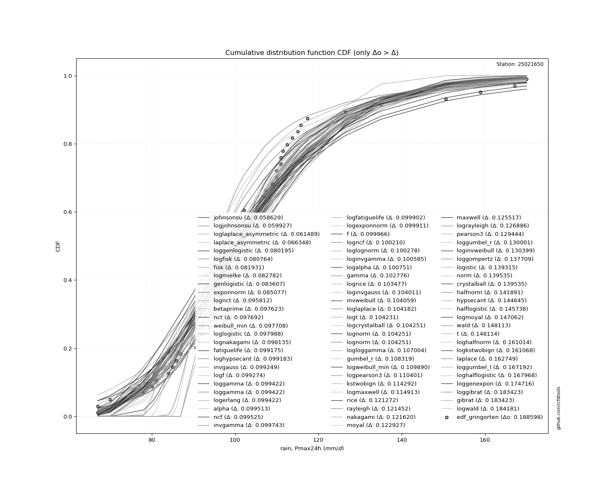</img>

</div>


**8.3. Best fit**

|   id |   station | empirical_dist   | p_dist   |     delta |   deltao | eval   |   fit |   n |   loc |   scale |    shape | shape1   | shape2   | shape3   |   best_fit |   best_fit_sort |
|-----:|----------:|:-----------------|:---------|----------:|---------:|:-------|------:|----:|------:|--------:|---------:|:---------|:---------|:---------|-----------:|----------------:|
|    0 |  25021650 | edf_gringorten   | dgamma   | 0.0945526 | 0.229882 | Δo > Δ |     1 |  35 |    96 | 26.2816 | 0.668367 |          |          |          |          1 |               1 |

<div align="center">

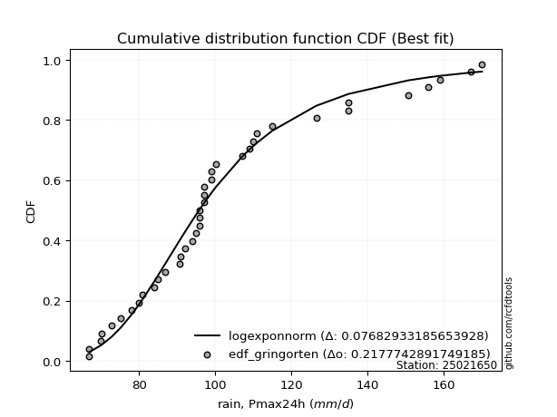</img>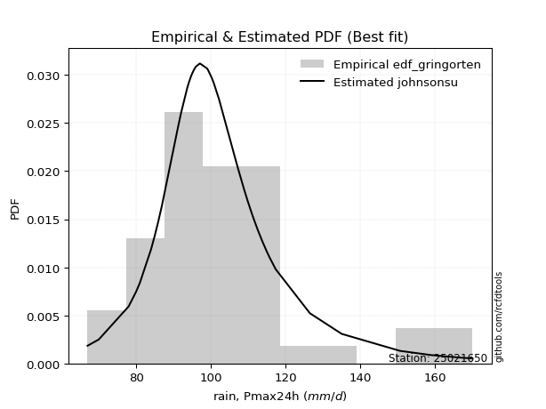</img>

</div>


### 9. Empirical - EDF Jenkinson (1977)

The Jenkinson formula in hydrology is an empirical plotting position formula used to estimate the non-exceedance probability _(P)_ or return period _(T)_ of a given ordered observation within a sample. It is a widely used method in the frequency analysis of extreme events such as floods and rainfall, as it provides a distribution-free way to plot data. _a≈0.31_ and _b≈0.38_ are constants derived to approximate the median of the probability distribution for the given rank.

<div align="center">


$P=(m-a)/(n+b)$


</div>


**9.1. Empirical values**

<div align="center">

|                | 0                    | 1                   | 2                   | 3                   | 4                  | 5                   | 6                   | 7                   | 8                  | 9                   | 10                  | 11                 | 12                 | 13                  | 14                  | 15                 | 16                  | 17            | 18                 | 19                 | 20                 | 21                 | 22                 | 23                 | 24                 | 25                 | 26                 | 27                 | 28                 | 29                 | 30                 | 31                | 32                 | 33                 | 34                 |
|:---------------|:---------------------|:--------------------|:--------------------|:--------------------|:-------------------|:--------------------|:--------------------|:--------------------|:-------------------|:--------------------|:--------------------|:-------------------|:-------------------|:--------------------|:--------------------|:-------------------|:--------------------|:--------------|:-------------------|:-------------------|:-------------------|:-------------------|:-------------------|:-------------------|:-------------------|:-------------------|:-------------------|:-------------------|:-------------------|:-------------------|:-------------------|:------------------|:-------------------|:-------------------|:-------------------|
| date           | 1999                 | 1997                | 1989                | 1982                | 1983               | 1984                | 2001                | 2015                | 2010               | 1995                | 1986                | 1990               | 2002               | 2003                | 2008                | 1998               | 2006                | 2005          | 2011               | 1981               | 1994               | 2012               | 1993               | 2004               | 2000               | 1996               | 2009               | 2007               | 1985               | 2013               | 2014               | 1991              | 1987               | 1988               | 1992               |
| x              | 67.0                 | 67.0                | 70.0                | 70.183857028671     | 72.8016283965208   | 75.2911691571765    | 78.0                | 80.0                | 84.0               | 85.0                | 86.9                | 90.6               | 91.0               | 92.0                | 94.0                | 95.0               | 96.0                | 96.0          | 96.0               | 96.998100854538    | 97.0               | 97.0               | 99.0               | 99.0               | 100.2              | 107.0              | 110.0              | 111.0              | 126.5              | 135.0              | 135.0              | 150.6             | 158.9              | 167.1              | 170.0              |
| m              | 1                    | 2                   | 3                   | 4                   | 5                  | 6                   | 7                   | 8                   | 9                  | 10                  | 11                  | 12                 | 13                 | 14                  | 15                  | 16                 | 17                  | 18            | 19                 | 20                 | 21                 | 22                 | 23                 | 24                 | 25                 | 26                 | 27                 | 28                 | 29                 | 30                 | 31                 | 32                | 33                 | 34                 | 35                 |
| empirical_dist | edf_jenkinson        | edf_jenkinson       | edf_jenkinson       | edf_jenkinson       | edf_jenkinson      | edf_jenkinson       | edf_jenkinson       | edf_jenkinson       | edf_jenkinson      | edf_jenkinson       | edf_jenkinson       | edf_jenkinson      | edf_jenkinson      | edf_jenkinson       | edf_jenkinson       | edf_jenkinson      | edf_jenkinson       | edf_jenkinson | edf_jenkinson      | edf_jenkinson      | edf_jenkinson      | edf_jenkinson      | edf_jenkinson      | edf_jenkinson      | edf_jenkinson      | edf_jenkinson      | edf_jenkinson      | edf_jenkinson      | edf_jenkinson      | edf_jenkinson      | edf_jenkinson      | edf_jenkinson     | edf_jenkinson      | edf_jenkinson      | edf_jenkinson      |
| empirical      | 0.019502543810062178 | 0.04776710005652911 | 0.07603165630299603 | 0.10429621254946296 | 0.1325607687959299 | 0.16082532504239683 | 0.18908988128886375 | 0.21735443753533068 | 0.2456189937817976 | 0.27388355002826453 | 0.30214810627473143 | 0.3304126625211984 | 0.3586772187676653 | 0.38694177501413224 | 0.41520633126059914 | 0.4434708875070661 | 0.47173544375353305 | 0.5           | 0.528264556246467  | 0.5565291124929339 | 0.5847936687394008 | 0.6130582249858677 | 0.6413227812323347 | 0.6695873374788016 | 0.6978518937252685 | 0.7261164499717354 | 0.7543810062182024 | 0.7826455624646693 | 0.8109101187111362 | 0.8391746749576031 | 0.8674392312040701 | 0.895703787450537 | 0.9239683436970039 | 0.9522328999434707 | 0.9804974561899377 |
| empirical_tr   | 1.0198904583453445   | 1.0501632531908578  | 1.0822881615172835  | 1.1164405175134111  | 1.1528185076572173 | 1.1916470191983832  | 1.2331822934820493  | 1.2777175875767426  | 1.3255901086549269 | 1.3771895679252628  | 1.4329688132847305  | 1.4934571549176867 | 1.5592772146319962 | 1.631166436145689   | 1.7100048332527789  | 1.796851193499238  | 1.8929909042268591  | 2.0           | 2.1198322348711804 | 2.254939451880179  | 2.408441116405718  | 2.5843681519357196 | 2.7880220646178095 | 3.026518391787853  | 3.309635173058933  | 3.6511867905056756 | 4.071346375143843  | 4.600780234070221  | 5.288490284005977  | 6.217926186291738  | 7.54371002132196   | 9.588075880758808 | 13.152416356877309 | 20.934911242603473 | 51.27536231884018  |

</div>


**9.2. Parameters & Kolmogorov-Smirnov fit test (sorted by Δ)**

|   id | empirical_dist   | p_dist             |       delta |   deltao | eval    |   fit |   n |            loc |          scale | shape                 | shape1                 | shape2             | shape3   |   best_fit |   best_fit_sort |
|-----:|:-----------------|:-------------------|------------:|---------:|:--------|------:|----:|---------------:|---------------:|:----------------------|:-----------------------|:-------------------|:---------|-----------:|----------------:|
|    0 | edf_jenkinson    | dgamma             |   0.0970636 | 0.229882 | Δo > Δ  |     1 |  35 |     96         |   26.2816      | 0.6683665068329485    |                        |                    |          |          1 |               1 |
|    1 | edf_jenkinson    | fisk               |   0.100078  | 0.229882 | Δo > Δ  |     1 |  35 |     55.9992    |   38.552       | 2.8975480030711314    |                        |                    |          |          0 |               2 |
|    2 | edf_jenkinson    | invweibull         |   0.105662  | 0.229882 | Δo > Δ  |     1 |  35 |    -32.9463    |  120.805       | 6.645185278530256     |                        |                    |          |          0 |               3 |
|    3 | edf_jenkinson    | johnsonsu          |   0.105941  | 0.229882 | Δo > Δ  |     1 |  35 |     53.585     |    1.28694     | -7.351164534501085    | 1.7706367032893393     |                    |          |          0 |               4 |
|    4 | edf_jenkinson    | invgamma           |   0.106237  | 0.229882 | Δo > Δ  |     1 |  35 |     39.2088    |  333.28        | 6.342220985523436     |                        |                    |          |          0 |               5 |
|    5 | edf_jenkinson    | f                  |   0.106241  | 0.229882 | Δo > Δ  |     1 |  35 |     39.2151    |   52.5445      | 47566.92116404584     | 12.684817988777871     |                    |          |          0 |               6 |
|    6 | edf_jenkinson    | lognorm            |   0.10625   | 0.229882 | Δo > Δ  |     1 |  35 |     53.5122    |   40.9681      | 0.5641327574486195    |                        |                    |          |          0 |               7 |
|    7 | edf_jenkinson    | recipinvgauss      |   0.106686  | 0.229882 | Δo > Δ  |     1 |  35 |     55.8208    |   13.8245      | 0.4361063581272295    |                        |                    |          |          0 |               8 |
|    8 | edf_jenkinson    | alpha              |   0.107172  | 0.229882 | Δo > Δ  |     1 |  35 |      7.15835   |  351.92        | 4.011643075494929     |                        |                    |          |          0 |               9 |
|    9 | edf_jenkinson    | fatiguelife        |   0.107383  | 0.229882 | Δo > Δ  |     1 |  35 |     53.522     |   40.8448      | 0.5840172344208054    |                        |                    |          |          0 |              10 |
|   10 | edf_jenkinson    | invgauss           |   0.107392  | 0.229882 | Δo > Δ  |     1 |  35 |     51.677     |  150.764       | 0.32944194934320653   |                        |                    |          |          0 |              11 |
|   11 | edf_jenkinson    | t                  |   0.107857  | 0.229882 | Δo > Δ  |     1 |  35 |     93.8729    |   14.5256      | 1.8705082911962037    |                        |                    |          |          0 |              12 |
|   12 | edf_jenkinson    | exponnorm          |   0.110581  | 0.229882 | Δo > Δ  |     1 |  35 |     75.5289    |    9.84626     | 2.621918022232256     |                        |                    |          |          0 |              13 |
|   13 | edf_jenkinson    | halflogistic       |   0.113802  | 0.229882 | Δo > Δ  |     1 |  35 |     69.0309    |   23.3097      |                       |                        |                    |          |          0 |              14 |
|   14 | edf_jenkinson    | weibull_min        |   0.11808   | 0.229882 | Δo > Δ  |     1 |  35 |     66.3635    |   37.1429      | 1.215770446755193     |                        |                    |          |          0 |              15 |
|   15 | edf_jenkinson    | moyal              |   0.119053  | 0.229882 | Δo > Δ  |     1 |  35 |     85.7537    |   12.2731      |                       |                        |                    |          |          0 |              16 |
|   16 | edf_jenkinson    | gompertz           |   0.128507  | 0.229882 | Δo > Δ  |     1 |  35 |     67         |  101.771       | 2.1840700714139105    |                        |                    |          |          0 |              17 |
|   17 | edf_jenkinson    | gamma              |   0.128543  | 0.229882 | Δo > Δ  |     1 |  35 |     66.0197    |   25.9452      | 1.3615356740954403    |                        |                    |          |          0 |              18 |
|   18 | edf_jenkinson    | erlang             |   0.128543  | 0.229882 | Δo > Δ  |     1 |  35 |     66.0197    |   25.9452      | 1.3615347156760886    |                        |                    |          |          0 |              19 |
|   19 | edf_jenkinson    | laplace_asymmetric |   0.131281  | 0.229882 | Δo > Δ  |     1 |  35 |     91         |   17.581       | 0.7481597286104452    |                        |                    |          |          0 |              20 |
|   20 | edf_jenkinson    | nct                |   0.132136  | 0.229882 | Δo > Δ  |     1 |  35 |     -0.136947  |    2.00783     | 9.405882071310153     | 46.30934981028304      |                    |          |          0 |              21 |
|   21 | edf_jenkinson    | genlogistic        |   0.133742  | 0.229882 | Δo > Δ  |     1 |  35 |    -44.9254    |   19.4214      | 1007.2622984029299    |                        |                    |          |          0 |              22 |
|   22 | edf_jenkinson    | halfnorm           |   0.13763   | 0.229882 | Δo > Δ  |     1 |  35 |     65.2583    |   45.228       |                       |                        |                    |          |          0 |              23 |
|   23 | edf_jenkinson    | pearson3           |   0.140339  | 0.229882 | Δo > Δ  |     1 |  35 |    101.345     |   27.2639      | 1.1128519853868506    |                        |                    |          |          0 |              24 |
|   24 | edf_jenkinson    | gumbel_r           |   0.144926  | 0.229882 | Δo > Δ  |     1 |  35 |     89.0748    |   21.2576      |                       |                        |                    |          |          0 |              25 |
|   25 | edf_jenkinson    | betaprime          |   0.150525  | 0.229882 | Δo > Δ  |     1 |  35 |     -2.23366   |    4.80397     | 382.0039940260071     | 18.748501750510883     |                    |          |          0 |              26 |
|   26 | edf_jenkinson    | nakagami           |   0.157043  | 0.229882 | Δo > Δ  |     1 |  35 |     67         |   49.5425      | 0.3972277566262906    |                        |                    |          |          0 |              27 |
|   27 | edf_jenkinson    | kstwobign          |   0.157829  | 0.229882 | Δo > Δ  |     1 |  35 |     18.7642    |   95.4109      |                       |                        |                    |          |          0 |              28 |
|   28 | edf_jenkinson    | genexpon           |   0.16613   | 0.229882 | Δo > Δ  |     1 |  35 |     67         |    2.22535     | 0.0647090447130945    | 1.1377784035012407e-06 | 1.8199456936372878 |          |          0 |              29 |
|   29 | edf_jenkinson    | expon              |   0.166577  | 0.229882 | Δo > Δ  |     1 |  35 |     67         |   34.345       |                       |                        |                    |          |          0 |              30 |
|   30 | edf_jenkinson    | wald               |   0.167692  | 0.229882 | Δo > Δ  |     1 |  35 |     74.0811    |   27.2639      |                       |                        |                    |          |          0 |              31 |
|   31 | edf_jenkinson    | rayleigh           |   0.169608  | 0.229882 | Δo > Δ  |     1 |  35 |     49.1876    |   41.6156      |                       |                        |                    |          |          0 |              32 |
|   32 | edf_jenkinson    | maxwell            |   0.180961  | 0.229882 | Δo > Δ  |     1 |  35 |     36.741     |   40.4846      |                       |                        |                    |          |          0 |              33 |
|   33 | edf_jenkinson    | rice               |   0.197779  | 0.229882 | Δo > Δ  |     1 |  35 |     56.5035    |   37.1085      | 0.001084836132545509  |                        |                    |          |          0 |              34 |
|   34 | edf_jenkinson    | norm               |   0.214601  | 0.229882 | Δo > Δ  |     1 |  35 |    101.345     |   27.2639      |                       |                        |                    |          |          0 |              35 |
|   35 | edf_jenkinson    | crystalball        |   0.214601  | 0.229882 | Δo > Δ  |     1 |  35 |    101.345     |   27.2639      | 6888.381379240169     | 10306.04410682998      |                    |          |          0 |              36 |
|   36 | edf_jenkinson    | truncnorm          |   0.214601  | 0.229882 | Δo > Δ  |     1 |  35 |    101.345     |   27.2639      | -1122.1442806305452   | 522.6699189423582      |                    |          |          0 |              37 |
|   37 | edf_jenkinson    | loggamma           |   0.21588   | 0.229882 | Δo > Δ  |     1 |  35 | -10565.3       | 1369.5         | 2413.804585039734     |                        |                    |          |          0 |              38 |
|   38 | edf_jenkinson    | logistic           |   0.216886  | 0.229882 | Δo > Δ  |     1 |  35 |    101.345     |   15.0314      |                       |                        |                    |          |          0 |              39 |
|   39 | edf_jenkinson    | gibrat             |   0.217354  | 0.229882 | Δo > Δ  |     1 |  35 |     80.5461    |   12.6152      |                       |                        |                    |          |          0 |              40 |
|   40 | edf_jenkinson    | hypsecant          |   0.218835  | 0.229882 | Δo > Δ  |     1 |  35 |    101.345     |   17.3567      |                       |                        |                    |          |          0 |              41 |
|   41 | edf_jenkinson    | laplace            |   0.226853  | 0.229882 | Δo > Δ  |     1 |  35 |    101.345     |   19.2785      |                       |                        |                    |          |          0 |              42 |
|   42 | edf_jenkinson    | gumbel_l           |   0.28527   | 0.229882 | Δo <= Δ |     0 |  35 |    113.615     |   21.2576      |                       |                        |                    |          |          0 |              43 |
|   43 | edf_jenkinson    | zzgumbel           |   0.349066  | 0.229882 | Δo <= Δ |     0 |  35 |    101.32      |   21.5679      | 0.5403397786021026    | 1.1284724725032327     |                    |          |          0 |              44 |
|   44 | edf_jenkinson    | ncf                |   0.423296  | 0.229882 | Δo <= Δ |     0 |  35 |     -0.0764801 |    8.83301e-06 | 6.581314097803295e-07 | 13.62215232828027      | 6.595044645746899  |          |          0 |              45 |
|   45 | edf_jenkinson    | pareto             |   0.528464  | 0.229882 | Δo <= Δ |     0 |  35 |     67         |    6.76277e-07 | 0.0606061021007697    |                        |                    |          |          0 |              46 |
|   46 | edf_jenkinson    | chi2               |   0.736108  | 0.229882 | Δo <= Δ |     0 |  35 |     67         |    8.51466     | 0.334767263371169     |                        |                    |          |          0 |              47 |
|   47 | edf_jenkinson    | mielke             | nan         | 0.229882 | Δo <= Δ |     0 |  35 |     -7.9241    |   33.4196      | 1447.4439709185908    | 5.340436746978941      |                    |          |          0 |              48 |

<div align="center">

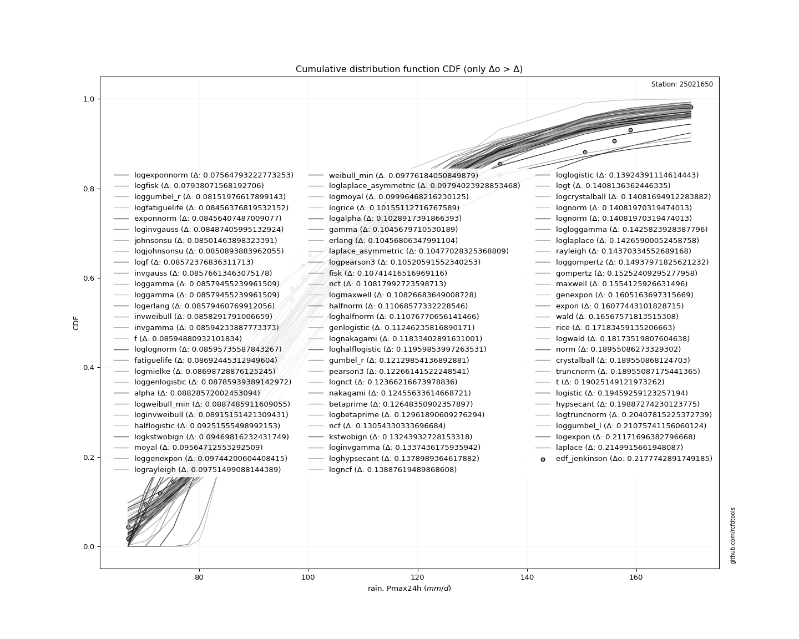</img>

</div>


**9.3. Best fit**

|   id |   station | empirical_dist   | p_dist   |     delta |   deltao | eval   |   fit |   n |   loc |   scale |    shape | shape1   | shape2   | shape3   |   best_fit |   best_fit_sort |
|-----:|----------:|:-----------------|:---------|----------:|---------:|:-------|------:|----:|------:|--------:|---------:|:---------|:---------|:---------|-----------:|----------------:|
|    0 |  25021650 | edf_jenkinson    | dgamma   | 0.0970636 | 0.229882 | Δo > Δ |     1 |  35 |    96 | 26.2816 | 0.668367 |          |          |          |          1 |               1 |

<div align="center">

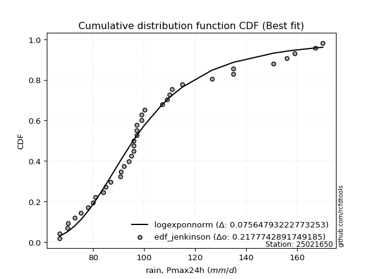</img>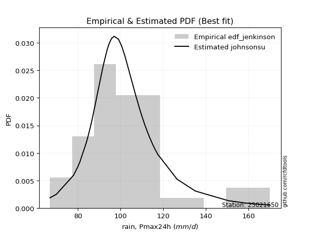</img>

</div>


### 10. Empirical - EDF Cunnane (1978)

Cunnane´s work in statistical hydrology has focused on the performance and evaluation of different probability distributions (such as GEV, Gumbel, Lognormal) for flood frequency estimation. _b_ is a constant, typically set to 0.4.

<div align="center">


$P=(m-b)/(n+1-2b)$


</div>


**10.1. Empirical values**

<div align="center">

|                | 0                    | 1                    | 2                   | 3                   | 4                   | 5                   | 6                   | 7                   | 8                  | 9                  | 10                 | 11                  | 12                 | 13                 | 14                  | 15                 | 16                 | 17          | 18                 | 19                 | 20                 | 21                 | 22                 | 23                 | 24                 | 25                 | 26                 | 27                 | 28                | 29                 | 30                 | 31                 | 32                 | 33                 | 34                 |
|:---------------|:---------------------|:---------------------|:--------------------|:--------------------|:--------------------|:--------------------|:--------------------|:--------------------|:-------------------|:-------------------|:-------------------|:--------------------|:-------------------|:-------------------|:--------------------|:-------------------|:-------------------|:------------|:-------------------|:-------------------|:-------------------|:-------------------|:-------------------|:-------------------|:-------------------|:-------------------|:-------------------|:-------------------|:------------------|:-------------------|:-------------------|:-------------------|:-------------------|:-------------------|:-------------------|
| date           | 1999                 | 1997                 | 1989                | 1982                | 1983                | 1984                | 2001                | 2015                | 2010               | 1995               | 1986               | 1990                | 2002               | 2003               | 2008                | 1998               | 2006               | 2005        | 2011               | 1981               | 1994               | 2012               | 1993               | 2004               | 2000               | 1996               | 2009               | 2007               | 1985              | 2013               | 2014               | 1991               | 1987               | 1988               | 1992               |
| x              | 67.0                 | 67.0                 | 70.0                | 70.183857028671     | 72.8016283965208    | 75.2911691571765    | 78.0                | 80.0                | 84.0               | 85.0               | 86.9               | 90.6                | 91.0               | 92.0               | 94.0                | 95.0               | 96.0               | 96.0        | 96.0               | 96.998100854538    | 97.0               | 97.0               | 99.0               | 99.0               | 100.2              | 107.0              | 110.0              | 111.0              | 126.5             | 135.0              | 135.0              | 150.6              | 158.9              | 167.1              | 170.0              |
| m              | 1                    | 2                    | 3                   | 4                   | 5                   | 6                   | 7                   | 8                   | 9                  | 10                 | 11                 | 12                  | 13                 | 14                 | 15                  | 16                 | 17                 | 18          | 19                 | 20                 | 21                 | 22                 | 23                 | 24                 | 25                 | 26                 | 27                 | 28                 | 29                | 30                 | 31                 | 32                 | 33                 | 34                 | 35                 |
| empirical_dist | edf_cunnane          | edf_cunnane          | edf_cunnane         | edf_cunnane         | edf_cunnane         | edf_cunnane         | edf_cunnane         | edf_cunnane         | edf_cunnane        | edf_cunnane        | edf_cunnane        | edf_cunnane         | edf_cunnane        | edf_cunnane        | edf_cunnane         | edf_cunnane        | edf_cunnane        | edf_cunnane | edf_cunnane        | edf_cunnane        | edf_cunnane        | edf_cunnane        | edf_cunnane        | edf_cunnane        | edf_cunnane        | edf_cunnane        | edf_cunnane        | edf_cunnane        | edf_cunnane       | edf_cunnane        | edf_cunnane        | edf_cunnane        | edf_cunnane        | edf_cunnane        | edf_cunnane        |
| empirical      | 0.017045454545454544 | 0.045454545454545456 | 0.07386363636363635 | 0.10227272727272727 | 0.13068181818181815 | 0.15909090909090906 | 0.18749999999999997 | 0.21590909090909088 | 0.2443181818181818 | 0.2727272727272727 | 0.3011363636363636 | 0.32954545454545453 | 0.3579545454545454 | 0.3863636363636363 | 0.41477272727272724 | 0.4431818181818181 | 0.4715909090909091 | 0.5         | 0.5284090909090909 | 0.5568181818181818 | 0.5852272727272727 | 0.6136363636363636 | 0.6420454545454546 | 0.6704545454545454 | 0.6988636363636364 | 0.7272727272727273 | 0.7556818181818181 | 0.7840909090909091 | 0.8125            | 0.8409090909090908 | 0.8693181818181818 | 0.8977272727272727 | 0.9261363636363636 | 0.9545454545454545 | 0.9829545454545454 |
| empirical_tr   | 1.0173410404624277   | 1.0476190476190477   | 1.0797546012269938  | 1.1139240506329113  | 1.1503267973856208  | 1.1891891891891893  | 1.2307692307692308  | 1.2753623188405796  | 1.3233082706766917 | 1.375              | 1.4308943089430892 | 1.4915254237288136  | 1.5575221238938053 | 1.6296296296296293 | 1.70873786407767    | 1.7959183673469385 | 1.8924731182795702 | 2.0         | 2.1204819277108435 | 2.256410256410256  | 2.410958904109589  | 2.588235294117647  | 2.793650793650794  | 3.0344827586206895 | 3.320754716981132  | 3.666666666666667  | 4.093023255813953  | 4.63157894736842   | 5.333333333333333 | 6.285714285714283  | 7.652173913043475  | 9.777777777777775  | 13.53846153846154  | 21.999999999999964 | 58.66666666666653  |

</div>


**10.2. Parameters & Kolmogorov-Smirnov fit test (sorted by Δ)**

|   id | empirical_dist   | p_dist             |       delta |   deltao | eval    |   fit |   n |            loc |          scale | shape                 | shape1                 | shape2             | shape3   |   best_fit |   best_fit_sort |
|-----:|:-----------------|:-------------------|------------:|---------:|:--------|------:|----:|---------------:|---------------:|:----------------------|:-----------------------|:-------------------|:---------|-----------:|----------------:|
|    0 | edf_cunnane      | dgamma             |   0.0953292 | 0.229882 | Δo > Δ  |     1 |  35 |     96         |   26.2816      | 0.6683665068329485    |                        |                    |          |          1 |               1 |
|    1 | edf_cunnane      | fisk               |   0.10109   | 0.229882 | Δo > Δ  |     1 |  35 |     55.9992    |   38.552       | 2.8975480030711314    |                        |                    |          |          0 |               2 |
|    2 | edf_cunnane      | t                  |   0.106267  | 0.229882 | Δo > Δ  |     1 |  35 |     93.8729    |   14.5256      | 1.8705082911962037    |                        |                    |          |          0 |               3 |
|    3 | edf_cunnane      | invweibull         |   0.106674  | 0.229882 | Δo > Δ  |     1 |  35 |    -32.9463    |  120.805       | 6.645185278530256     |                        |                    |          |          0 |               4 |
|    4 | edf_cunnane      | johnsonsu          |   0.106952  | 0.229882 | Δo > Δ  |     1 |  35 |     53.585     |    1.28694     | -7.351164534501085    | 1.7706367032893393     |                    |          |          0 |               5 |
|    5 | edf_cunnane      | invgamma           |   0.107249  | 0.229882 | Δo > Δ  |     1 |  35 |     39.2088    |  333.28        | 6.342220985523436     |                        |                    |          |          0 |               6 |
|    6 | edf_cunnane      | f                  |   0.107253  | 0.229882 | Δo > Δ  |     1 |  35 |     39.2151    |   52.5445      | 47566.92116404584     | 12.684817988777871     |                    |          |          0 |               7 |
|    7 | edf_cunnane      | lognorm            |   0.107262  | 0.229882 | Δo > Δ  |     1 |  35 |     53.5122    |   40.9681      | 0.5641327574486195    |                        |                    |          |          0 |               8 |
|    8 | edf_cunnane      | recipinvgauss      |   0.107698  | 0.229882 | Δo > Δ  |     1 |  35 |     55.8208    |   13.8245      | 0.4361063581272295    |                        |                    |          |          0 |               9 |
|    9 | edf_cunnane      | alpha              |   0.108184  | 0.229882 | Δo > Δ  |     1 |  35 |      7.15835   |  351.92        | 4.011643075494929     |                        |                    |          |          0 |              10 |
|   10 | edf_cunnane      | fatiguelife        |   0.108395  | 0.229882 | Δo > Δ  |     1 |  35 |     53.522     |   40.8448      | 0.5840172344208054    |                        |                    |          |          0 |              11 |
|   11 | edf_cunnane      | invgauss           |   0.108404  | 0.229882 | Δo > Δ  |     1 |  35 |     51.677     |  150.764       | 0.32944194934320653   |                        |                    |          |          0 |              12 |
|   12 | edf_cunnane      | exponnorm          |   0.111592  | 0.229882 | Δo > Δ  |     1 |  35 |     75.5289    |    9.84626     | 2.621918022232256     |                        |                    |          |          0 |              13 |
|   13 | edf_cunnane      | halflogistic       |   0.114814  | 0.229882 | Δo > Δ  |     1 |  35 |     69.0309    |   23.3097      |                       |                        |                    |          |          0 |              14 |
|   14 | edf_cunnane      | weibull_min        |   0.118948  | 0.229882 | Δo > Δ  |     1 |  35 |     66.3635    |   37.1429      | 1.215770446755193     |                        |                    |          |          0 |              15 |
|   15 | edf_cunnane      | moyal              |   0.120065  | 0.229882 | Δo > Δ  |     1 |  35 |     85.7537    |   12.2731      |                       |                        |                    |          |          0 |              16 |
|   16 | edf_cunnane      | gamma              |   0.12941   | 0.229882 | Δo > Δ  |     1 |  35 |     66.0197    |   25.9452      | 1.3615356740954403    |                        |                    |          |          0 |              17 |
|   17 | edf_cunnane      | erlang             |   0.12941   | 0.229882 | Δo > Δ  |     1 |  35 |     66.0197    |   25.9452      | 1.3615347156760886    |                        |                    |          |          0 |              18 |
|   18 | edf_cunnane      | gompertz           |   0.129519  | 0.229882 | Δo > Δ  |     1 |  35 |     67         |  101.771       | 2.1840700714139105    |                        |                    |          |          0 |              19 |
|   19 | edf_cunnane      | laplace_asymmetric |   0.132293  | 0.229882 | Δo > Δ  |     1 |  35 |     91         |   17.581       | 0.7481597286104452    |                        |                    |          |          0 |              20 |
|   20 | edf_cunnane      | nct                |   0.133148  | 0.229882 | Δo > Δ  |     1 |  35 |     -0.136947  |    2.00783     | 9.405882071310153     | 46.30934981028304      |                    |          |          0 |              21 |
|   21 | edf_cunnane      | genlogistic        |   0.134754  | 0.229882 | Δo > Δ  |     1 |  35 |    -44.9254    |   19.4214      | 1007.2622984029299    |                        |                    |          |          0 |              22 |
|   22 | edf_cunnane      | halfnorm           |   0.138641  | 0.229882 | Δo > Δ  |     1 |  35 |     65.2583    |   45.228       |                       |                        |                    |          |          0 |              23 |
|   23 | edf_cunnane      | pearson3           |   0.14135   | 0.229882 | Δo > Δ  |     1 |  35 |    101.345     |   27.2639      | 1.1128519853868506    |                        |                    |          |          0 |              24 |
|   24 | edf_cunnane      | gumbel_r           |   0.145937  | 0.229882 | Δo > Δ  |     1 |  35 |     89.0748    |   21.2576      |                       |                        |                    |          |          0 |              25 |
|   25 | edf_cunnane      | betaprime          |   0.151537  | 0.229882 | Δo > Δ  |     1 |  35 |     -2.23366   |    4.80397     | 382.0039940260071     | 18.748501750510883     |                    |          |          0 |              26 |
|   26 | edf_cunnane      | nakagami           |   0.158055  | 0.229882 | Δo > Δ  |     1 |  35 |     67         |   49.5425      | 0.3972277566262906    |                        |                    |          |          0 |              27 |
|   27 | edf_cunnane      | kstwobign          |   0.158841  | 0.229882 | Δo > Δ  |     1 |  35 |     18.7642    |   95.4109      |                       |                        |                    |          |          0 |              28 |
|   28 | edf_cunnane      | wald               |   0.166102  | 0.229882 | Δo > Δ  |     1 |  35 |     74.0811    |   27.2639      |                       |                        |                    |          |          0 |              29 |
|   29 | edf_cunnane      | genexpon           |   0.166997  | 0.229882 | Δo > Δ  |     1 |  35 |     67         |    2.22535     | 0.0647090447130945    | 1.1377784035012407e-06 | 1.8199456936372878 |          |          0 |              30 |
|   30 | edf_cunnane      | expon              |   0.167445  | 0.229882 | Δo > Δ  |     1 |  35 |     67         |   34.345       |                       |                        |                    |          |          0 |              31 |
|   31 | edf_cunnane      | rayleigh           |   0.17062   | 0.229882 | Δo > Δ  |     1 |  35 |     49.1876    |   41.6156      |                       |                        |                    |          |          0 |              32 |
|   32 | edf_cunnane      | maxwell            |   0.181973  | 0.229882 | Δo > Δ  |     1 |  35 |     36.741     |   40.4846      |                       |                        |                    |          |          0 |              33 |
|   33 | edf_cunnane      | rice               |   0.198791  | 0.229882 | Δo > Δ  |     1 |  35 |     56.5035    |   37.1085      | 0.001084836132545509  |                        |                    |          |          0 |              34 |
|   34 | edf_cunnane      | norm               |   0.215613  | 0.229882 | Δo > Δ  |     1 |  35 |    101.345     |   27.2639      |                       |                        |                    |          |          0 |              35 |
|   35 | edf_cunnane      | crystalball        |   0.215613  | 0.229882 | Δo > Δ  |     1 |  35 |    101.345     |   27.2639      | 6888.381379240169     | 10306.04410682998      |                    |          |          0 |              36 |
|   36 | edf_cunnane      | truncnorm          |   0.215613  | 0.229882 | Δo > Δ  |     1 |  35 |    101.345     |   27.2639      | -1122.1442806305452   | 522.6699189423582      |                    |          |          0 |              37 |
|   37 | edf_cunnane      | gibrat             |   0.215909  | 0.229882 | Δo > Δ  |     1 |  35 |     80.5461    |   12.6152      |                       |                        |                    |          |          0 |              38 |
|   38 | edf_cunnane      | loggamma           |   0.216892  | 0.229882 | Δo > Δ  |     1 |  35 | -10565.3       | 1369.5         | 2413.804585039734     |                        |                    |          |          0 |              39 |
|   39 | edf_cunnane      | logistic           |   0.217898  | 0.229882 | Δo > Δ  |     1 |  35 |    101.345     |   15.0314      |                       |                        |                    |          |          0 |              40 |
|   40 | edf_cunnane      | hypsecant          |   0.219847  | 0.229882 | Δo > Δ  |     1 |  35 |    101.345     |   17.3567      |                       |                        |                    |          |          0 |              41 |
|   41 | edf_cunnane      | laplace            |   0.22772   | 0.229882 | Δo > Δ  |     1 |  35 |    101.345     |   19.2785      |                       |                        |                    |          |          0 |              42 |
|   42 | edf_cunnane      | gumbel_l           |   0.286282  | 0.229882 | Δo <= Δ |     0 |  35 |    113.615     |   21.2576      |                       |                        |                    |          |          0 |              43 |
|   43 | edf_cunnane      | zzgumbel           |   0.350078  | 0.229882 | Δo <= Δ |     0 |  35 |    101.32      |   21.5679      | 0.5403397786021026    | 1.1284724725032327     |                    |          |          0 |              44 |
|   44 | edf_cunnane      | ncf                |   0.425753  | 0.229882 | Δo <= Δ |     0 |  35 |     -0.0764801 |    8.83301e-06 | 6.581314097803295e-07 | 13.62215232828027      | 6.595044645746899  |          |          0 |              45 |
|   45 | edf_cunnane      | pareto             |   0.530632  | 0.229882 | Δo <= Δ |     0 |  35 |     67         |    6.76277e-07 | 0.0606061021007697    |                        |                    |          |          0 |              46 |
|   46 | edf_cunnane      | chi2               |   0.737842  | 0.229882 | Δo <= Δ |     0 |  35 |     67         |    8.51466     | 0.334767263371169     |                        |                    |          |          0 |              47 |
|   47 | edf_cunnane      | mielke             | nan         | 0.229882 | Δo <= Δ |     0 |  35 |     -7.9241    |   33.4196      | 1447.4439709185908    | 5.340436746978941      |                    |          |          0 |              48 |

<div align="center">

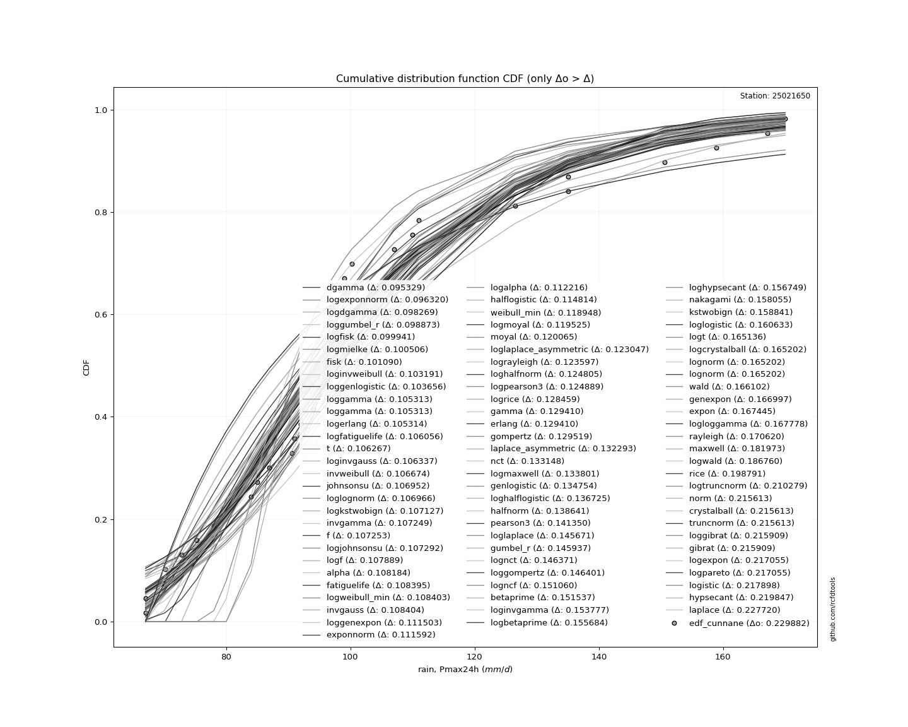</img>

</div>


**10.3. Best fit**

|   id |   station | empirical_dist   | p_dist   |     delta |   deltao | eval   |   fit |   n |   loc |   scale |    shape | shape1   | shape2   | shape3   |   best_fit |   best_fit_sort |
|-----:|----------:|:-----------------|:---------|----------:|---------:|:-------|------:|----:|------:|--------:|---------:|:---------|:---------|:---------|-----------:|----------------:|
|    0 |  25021650 | edf_cunnane      | dgamma   | 0.0953292 | 0.229882 | Δo > Δ |     1 |  35 |    96 | 26.2816 | 0.668367 |          |          |          |          1 |               1 |

<div align="center">

</img></img>

</div>


### 11. Empirical - EDF Adamowski (1981)

The Adamowski formula in hydrology refers to a specific plotting position formula used for estimating the non-parametric empirical distribution of hydrological events (like flood peaks) to calculate their return periods. This formula provides an alternative to traditional parametric methods (like the Gumbel or Log Pearson Type III distributions). 

<div align="center">


$P=(m-0.25)/(n+0.5)$


</div>


**11.1. Empirical values**

<div align="center">

|                | 0                   | 1                   | 2                   | 3                  | 4                   | 5                  | 6                   | 7                   | 8                   | 9                  | 10                 | 11                  | 12                 | 13                 | 14                 | 15                  | 16                  | 17            | 18                 | 19                 | 20                 | 21                 | 22                 | 23                 | 24                 | 25                 | 26                 | 27                 | 28                 | 29                 | 30                 | 31                 | 32                 | 33                 | 34                 |
|:---------------|:--------------------|:--------------------|:--------------------|:-------------------|:--------------------|:-------------------|:--------------------|:--------------------|:--------------------|:-------------------|:-------------------|:--------------------|:-------------------|:-------------------|:-------------------|:--------------------|:--------------------|:--------------|:-------------------|:-------------------|:-------------------|:-------------------|:-------------------|:-------------------|:-------------------|:-------------------|:-------------------|:-------------------|:-------------------|:-------------------|:-------------------|:-------------------|:-------------------|:-------------------|:-------------------|
| date           | 1999                | 1997                | 1989                | 1982               | 1983                | 1984               | 2001                | 2015                | 2010                | 1995               | 1986               | 1990                | 2002               | 2003               | 2008               | 1998                | 2006                | 2005          | 2011               | 1981               | 1994               | 2012               | 1993               | 2004               | 2000               | 1996               | 2009               | 2007               | 1985               | 2013               | 2014               | 1991               | 1987               | 1988               | 1992               |
| x              | 67.0                | 67.0                | 70.0                | 70.183857028671    | 72.8016283965208    | 75.2911691571765   | 78.0                | 80.0                | 84.0                | 85.0               | 86.9               | 90.6                | 91.0               | 92.0               | 94.0               | 95.0                | 96.0                | 96.0          | 96.0               | 96.998100854538    | 97.0               | 97.0               | 99.0               | 99.0               | 100.2              | 107.0              | 110.0              | 111.0              | 126.5              | 135.0              | 135.0              | 150.6              | 158.9              | 167.1              | 170.0              |
| m              | 1                   | 2                   | 3                   | 4                  | 5                   | 6                  | 7                   | 8                   | 9                   | 10                 | 11                 | 12                  | 13                 | 14                 | 15                 | 16                  | 17                  | 18            | 19                 | 20                 | 21                 | 22                 | 23                 | 24                 | 25                 | 26                 | 27                 | 28                 | 29                 | 30                 | 31                 | 32                 | 33                 | 34                 | 35                 |
| empirical_dist | edf_adamowski       | edf_adamowski       | edf_adamowski       | edf_adamowski      | edf_adamowski       | edf_adamowski      | edf_adamowski       | edf_adamowski       | edf_adamowski       | edf_adamowski      | edf_adamowski      | edf_adamowski       | edf_adamowski      | edf_adamowski      | edf_adamowski      | edf_adamowski       | edf_adamowski       | edf_adamowski | edf_adamowski      | edf_adamowski      | edf_adamowski      | edf_adamowski      | edf_adamowski      | edf_adamowski      | edf_adamowski      | edf_adamowski      | edf_adamowski      | edf_adamowski      | edf_adamowski      | edf_adamowski      | edf_adamowski      | edf_adamowski      | edf_adamowski      | edf_adamowski      | edf_adamowski      |
| empirical      | 0.02112676056338028 | 0.04929577464788732 | 0.07746478873239436 | 0.1056338028169014 | 0.13380281690140844 | 0.1619718309859155 | 0.19014084507042253 | 0.21830985915492956 | 0.24647887323943662 | 0.2746478873239437 | 0.3028169014084507 | 0.33098591549295775 | 0.3591549295774648 | 0.3873239436619718 | 0.4154929577464789 | 0.44366197183098594 | 0.47183098591549294 | 0.5           | 0.528169014084507  | 0.5563380281690141 | 0.5845070422535211 | 0.6126760563380281 | 0.6408450704225352 | 0.6690140845070423 | 0.6971830985915493 | 0.7253521126760564 | 0.7535211267605634 | 0.7816901408450704 | 0.8098591549295775 | 0.8380281690140845 | 0.8661971830985915 | 0.8943661971830986 | 0.9225352112676056 | 0.9507042253521126 | 0.9788732394366197 |
| empirical_tr   | 1.0215827338129495  | 1.0518518518518518  | 1.083969465648855   | 1.1181102362204725 | 1.1544715447154472  | 1.1932773109243697 | 1.2347826086956522  | 1.279279279279279   | 1.3271028037383177  | 1.3786407766990292 | 1.4343434343434345 | 1.4947368421052631  | 1.5604395604395604 | 1.6321839080459768 | 1.7108433734939759 | 1.79746835443038    | 1.8933333333333335  | 2.0           | 2.1194029850746268 | 2.253968253968254  | 2.406779661016949  | 2.5818181818181816 | 2.7843137254901964 | 3.021276595744681  | 3.3023255813953485 | 3.6410256410256414 | 4.057142857142857  | 4.580645161290322  | 5.25925925925926   | 6.173913043478261  | 7.473684210526313  | 9.466666666666669  | 12.909090909090908 | 20.285714285714267 | 47.3333333333334   |

</div>


**11.2. Parameters & Kolmogorov-Smirnov fit test (sorted by Δ)**

|   id | empirical_dist   | p_dist             |       delta |   deltao | eval    |   fit |   n |            loc |          scale | shape                 | shape1                 | shape2             | shape3   |   best_fit |   best_fit_sort |
|-----:|:-----------------|:-------------------|------------:|---------:|:--------|------:|----:|---------------:|---------------:|:----------------------|:-----------------------|:-------------------|:---------|-----------:|----------------:|
|    0 | edf_adamowski    | dgamma             |   0.0982101 | 0.229882 | Δo > Δ  |     1 |  35 |     96         |   26.2816      | 0.6683665068329485    |                        |                    |          |          1 |               1 |
|    1 | edf_adamowski    | fisk               |   0.0994096 | 0.229882 | Δo > Δ  |     1 |  35 |     55.9992    |   38.552       | 2.8975480030711314    |                        |                    |          |          0 |               2 |
|    2 | edf_adamowski    | invweibull         |   0.104993  | 0.229882 | Δo > Δ  |     1 |  35 |    -32.9463    |  120.805       | 6.645185278530256     |                        |                    |          |          0 |               3 |
|    3 | edf_adamowski    | johnsonsu          |   0.105272  | 0.229882 | Δo > Δ  |     1 |  35 |     53.585     |    1.28694     | -7.351164534501085    | 1.7706367032893393     |                    |          |          0 |               4 |
|    4 | edf_adamowski    | invgamma           |   0.105569  | 0.229882 | Δo > Δ  |     1 |  35 |     39.2088    |  333.28        | 6.342220985523436     |                        |                    |          |          0 |               5 |
|    5 | edf_adamowski    | f                  |   0.105572  | 0.229882 | Δo > Δ  |     1 |  35 |     39.2151    |   52.5445      | 47566.92116404584     | 12.684817988777871     |                    |          |          0 |               6 |
|    6 | edf_adamowski    | lognorm            |   0.105582  | 0.229882 | Δo > Δ  |     1 |  35 |     53.5122    |   40.9681      | 0.5641327574486195    |                        |                    |          |          0 |               7 |
|    7 | edf_adamowski    | recipinvgauss      |   0.106017  | 0.229882 | Δo > Δ  |     1 |  35 |     55.8208    |   13.8245      | 0.4361063581272295    |                        |                    |          |          0 |               8 |
|    8 | edf_adamowski    | alpha              |   0.106504  | 0.229882 | Δo > Δ  |     1 |  35 |      7.15835   |  351.92        | 4.011643075494929     |                        |                    |          |          0 |               9 |
|    9 | edf_adamowski    | fatiguelife        |   0.106714  | 0.229882 | Δo > Δ  |     1 |  35 |     53.522     |   40.8448      | 0.5840172344208054    |                        |                    |          |          0 |              10 |
|   10 | edf_adamowski    | invgauss           |   0.106723  | 0.229882 | Δo > Δ  |     1 |  35 |     51.677     |  150.764       | 0.32944194934320653   |                        |                    |          |          0 |              11 |
|   11 | edf_adamowski    | t                  |   0.108907  | 0.229882 | Δo > Δ  |     1 |  35 |     93.8729    |   14.5256      | 1.8705082911962037    |                        |                    |          |          0 |              12 |
|   12 | edf_adamowski    | exponnorm          |   0.109912  | 0.229882 | Δo > Δ  |     1 |  35 |     75.5289    |    9.84626     | 2.621918022232256     |                        |                    |          |          0 |              13 |
|   13 | edf_adamowski    | halflogistic       |   0.113134  | 0.229882 | Δo > Δ  |     1 |  35 |     69.0309    |   23.3097      |                       |                        |                    |          |          0 |              14 |
|   14 | edf_adamowski    | weibull_min        |   0.117507  | 0.229882 | Δo > Δ  |     1 |  35 |     66.3635    |   37.1429      | 1.215770446755193     |                        |                    |          |          0 |              15 |
|   15 | edf_adamowski    | moyal              |   0.118384  | 0.229882 | Δo > Δ  |     1 |  35 |     85.7537    |   12.2731      |                       |                        |                    |          |          0 |              16 |
|   16 | edf_adamowski    | gompertz           |   0.127839  | 0.229882 | Δo > Δ  |     1 |  35 |     67         |  101.771       | 2.1840700714139105    |                        |                    |          |          0 |              17 |
|   17 | edf_adamowski    | gamma              |   0.12797   | 0.229882 | Δo > Δ  |     1 |  35 |     66.0197    |   25.9452      | 1.3615356740954403    |                        |                    |          |          0 |              18 |
|   18 | edf_adamowski    | erlang             |   0.12797   | 0.229882 | Δo > Δ  |     1 |  35 |     66.0197    |   25.9452      | 1.3615347156760886    |                        |                    |          |          0 |              19 |
|   19 | edf_adamowski    | laplace_asymmetric |   0.130612  | 0.229882 | Δo > Δ  |     1 |  35 |     91         |   17.581       | 0.7481597286104452    |                        |                    |          |          0 |              20 |
|   20 | edf_adamowski    | nct                |   0.131467  | 0.229882 | Δo > Δ  |     1 |  35 |     -0.136947  |    2.00783     | 9.405882071310153     | 46.30934981028304      |                    |          |          0 |              21 |
|   21 | edf_adamowski    | genlogistic        |   0.133073  | 0.229882 | Δo > Δ  |     1 |  35 |    -44.9254    |   19.4214      | 1007.2622984029299    |                        |                    |          |          0 |              22 |
|   22 | edf_adamowski    | halfnorm           |   0.136961  | 0.229882 | Δo > Δ  |     1 |  35 |     65.2583    |   45.228       |                       |                        |                    |          |          0 |              23 |
|   23 | edf_adamowski    | pearson3           |   0.13967   | 0.229882 | Δo > Δ  |     1 |  35 |    101.345     |   27.2639      | 1.1128519853868506    |                        |                    |          |          0 |              24 |
|   24 | edf_adamowski    | gumbel_r           |   0.144257  | 0.229882 | Δo > Δ  |     1 |  35 |     89.0748    |   21.2576      |                       |                        |                    |          |          0 |              25 |
|   25 | edf_adamowski    | betaprime          |   0.149857  | 0.229882 | Δo > Δ  |     1 |  35 |     -2.23366   |    4.80397     | 382.0039940260071     | 18.748501750510883     |                    |          |          0 |              26 |
|   26 | edf_adamowski    | nakagami           |   0.156374  | 0.229882 | Δo > Δ  |     1 |  35 |     67         |   49.5425      | 0.3972277566262906    |                        |                    |          |          0 |              27 |
|   27 | edf_adamowski    | kstwobign          |   0.157161  | 0.229882 | Δo > Δ  |     1 |  35 |     18.7642    |   95.4109      |                       |                        |                    |          |          0 |              28 |
|   28 | edf_adamowski    | genexpon           |   0.165556  | 0.229882 | Δo > Δ  |     1 |  35 |     67         |    2.22535     | 0.0647090447130945    | 1.1377784035012407e-06 | 1.8199456936372878 |          |          0 |              29 |
|   29 | edf_adamowski    | expon              |   0.166004  | 0.229882 | Δo > Δ  |     1 |  35 |     67         |   34.345       |                       |                        |                    |          |          0 |              30 |
|   30 | edf_adamowski    | wald               |   0.168743  | 0.229882 | Δo > Δ  |     1 |  35 |     74.0811    |   27.2639      |                       |                        |                    |          |          0 |              31 |
|   31 | edf_adamowski    | rayleigh           |   0.168939  | 0.229882 | Δo > Δ  |     1 |  35 |     49.1876    |   41.6156      |                       |                        |                    |          |          0 |              32 |
|   32 | edf_adamowski    | maxwell            |   0.180293  | 0.229882 | Δo > Δ  |     1 |  35 |     36.741     |   40.4846      |                       |                        |                    |          |          0 |              33 |
|   33 | edf_adamowski    | rice               |   0.19711   | 0.229882 | Δo > Δ  |     1 |  35 |     56.5035    |   37.1085      | 0.001084836132545509  |                        |                    |          |          0 |              34 |
|   34 | edf_adamowski    | norm               |   0.213932  | 0.229882 | Δo > Δ  |     1 |  35 |    101.345     |   27.2639      |                       |                        |                    |          |          0 |              35 |
|   35 | edf_adamowski    | crystalball        |   0.213932  | 0.229882 | Δo > Δ  |     1 |  35 |    101.345     |   27.2639      | 6888.381379240169     | 10306.04410682998      |                    |          |          0 |              36 |
|   36 | edf_adamowski    | truncnorm          |   0.213932  | 0.229882 | Δo > Δ  |     1 |  35 |    101.345     |   27.2639      | -1122.1442806305452   | 522.6699189423582      |                    |          |          0 |              37 |
|   37 | edf_adamowski    | loggamma           |   0.215211  | 0.229882 | Δo > Δ  |     1 |  35 | -10565.3       | 1369.5         | 2413.804585039734     |                        |                    |          |          0 |              38 |
|   38 | edf_adamowski    | logistic           |   0.216217  | 0.229882 | Δo > Δ  |     1 |  35 |    101.345     |   15.0314      |                       |                        |                    |          |          0 |              39 |
|   39 | edf_adamowski    | hypsecant          |   0.218166  | 0.229882 | Δo > Δ  |     1 |  35 |    101.345     |   17.3567      |                       |                        |                    |          |          0 |              40 |
|   40 | edf_adamowski    | gibrat             |   0.21831   | 0.229882 | Δo > Δ  |     1 |  35 |     80.5461    |   12.6152      |                       |                        |                    |          |          0 |              41 |
|   41 | edf_adamowski    | laplace            |   0.22628   | 0.229882 | Δo > Δ  |     1 |  35 |    101.345     |   19.2785      |                       |                        |                    |          |          0 |              42 |
|   42 | edf_adamowski    | gumbel_l           |   0.284602  | 0.229882 | Δo <= Δ |     0 |  35 |    113.615     |   21.2576      |                       |                        |                    |          |          0 |              43 |
|   43 | edf_adamowski    | zzgumbel           |   0.348398  | 0.229882 | Δo <= Δ |     0 |  35 |    101.32      |   21.5679      | 0.5403397786021026    | 1.1284724725032327     |                    |          |          0 |              44 |
|   44 | edf_adamowski    | ncf                |   0.421672  | 0.229882 | Δo <= Δ |     0 |  35 |     -0.0764801 |    8.83301e-06 | 6.581314097803295e-07 | 13.62215232828027      | 6.595044645746899  |          |          0 |              45 |
|   45 | edf_adamowski    | pareto             |   0.527031  | 0.229882 | Δo <= Δ |     0 |  35 |     67         |    6.76277e-07 | 0.0606061021007697    |                        |                    |          |          0 |              46 |
|   46 | edf_adamowski    | chi2               |   0.734961  | 0.229882 | Δo <= Δ |     0 |  35 |     67         |    8.51466     | 0.334767263371169     |                        |                    |          |          0 |              47 |
|   47 | edf_adamowski    | mielke             | nan         | 0.229882 | Δo <= Δ |     0 |  35 |     -7.9241    |   33.4196      | 1447.4439709185908    | 5.340436746978941      |                    |          |          0 |              48 |

<div align="center">

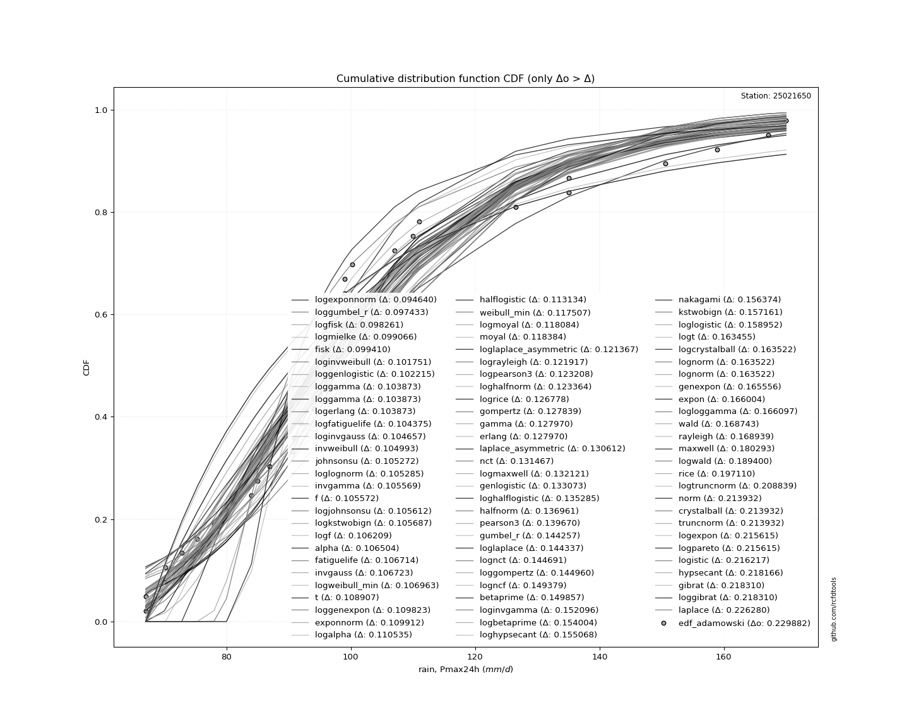</img>

</div>


**11.3. Best fit**

|   id |   station | empirical_dist   | p_dist   |     delta |   deltao | eval   |   fit |   n |   loc |   scale |    shape | shape1   | shape2   | shape3   |   best_fit |   best_fit_sort |
|-----:|----------:|:-----------------|:---------|----------:|---------:|:-------|------:|----:|------:|--------:|---------:|:---------|:---------|:---------|-----------:|----------------:|
|    0 |  25021650 | edf_adamowski    | dgamma   | 0.0982101 | 0.229882 | Δo > Δ |     1 |  35 |    96 | 26.2816 | 0.668367 |          |          |          |          1 |               1 |

<div align="center">

</img>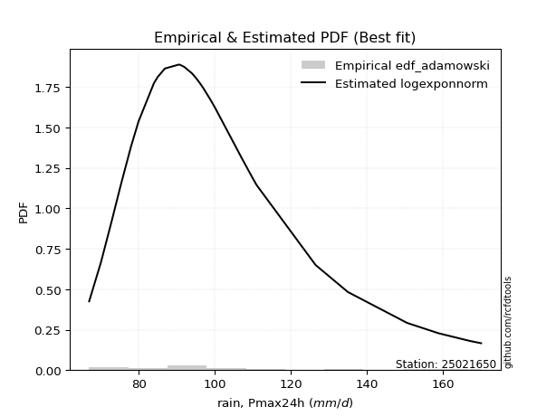</img>

</div>


## C. Best fit & Estimate extreme values for specific return periods - Tr


### 1. Best fit (ordered by delta Δ)

|   id |   station | empirical_dist   | p_dist   |     delta |   deltao | eval   |   fit |   n |     loc |   scale |    shape | shape1   | shape2   | shape3   |   best_fit |   best_fit_sort |
|-----:|----------:|:-----------------|:---------|----------:|---------:|:-------|------:|----:|--------:|--------:|---------:|:---------|:---------|:---------|-----------:|----------------:|
|    0 |  25021650 | edf_california   | dgamma   | 0.0790954 | 0.229882 | Δo > Δ |     1 |  35 | 96      | 26.2816 | 0.668367 |          |          |          |          1 |               1 |
|    1 |  25021650 | edf_hazen        | dgamma   | 0.0933811 | 0.229882 | Δo > Δ |     1 |  35 | 96      | 26.2816 | 0.668367 |          |          |          |          1 |               2 |
|    2 |  25021650 | edf_gringorten   | dgamma   | 0.0945526 | 0.229882 | Δo > Δ |     1 |  35 | 96      | 26.2816 | 0.668367 |          |          |          |          1 |               3 |
|    3 |  25021650 | edf_cunnane      | dgamma   | 0.0953292 | 0.229882 | Δo > Δ |     1 |  35 | 96      | 26.2816 | 0.668367 |          |          |          |          1 |               4 |
|    4 |  25021650 | edf_blom         | dgamma   | 0.0958128 | 0.229882 | Δo > Δ |     1 |  35 | 96      | 26.2816 | 0.668367 |          |          |          |          1 |               5 |
|    5 |  25021650 | edf_tukey        | dgamma   | 0.0966156 | 0.229882 | Δo > Δ |     1 |  35 | 96      | 26.2816 | 0.668367 |          |          |          |          1 |               6 |
|    6 |  25021650 | edf_weibull      | fisk     | 0.0966709 | 0.229882 | Δo > Δ |     1 |  35 | 55.9992 | 38.552  | 2.89755  |          |          |          |          1 |               7 |
|    7 |  25021650 | edf_beard        | dgamma   | 0.0970636 | 0.229882 | Δo > Δ |     1 |  35 | 96      | 26.2816 | 0.668367 |          |          |          |          1 |               8 |
|    8 |  25021650 | edf_jenkinson    | dgamma   | 0.0970636 | 0.229882 | Δo > Δ |     1 |  35 | 96      | 26.2816 | 0.668367 |          |          |          |          1 |               9 |
|    9 |  25021650 | edf_chegodayev   | dgamma   | 0.0972552 | 0.229882 | Δo > Δ |     1 |  35 | 96      | 26.2816 | 0.668367 |          |          |          |          1 |              10 |
|   10 |  25021650 | edf_adamowski    | dgamma   | 0.0982101 | 0.229882 | Δo > Δ |     1 |  35 | 96      | 26.2816 | 0.668367 |          |          |          |          1 |              11 |

:file_folder:Tables: [bestfit_25021650.csv](table/bestfit_25021650.csv) | [extreme_25021650.csv](table/extreme_25021650.csv)


### 2. Extreme values

In hydrology, a return period (or recurrence interval) is the statistical average time between extreme events like floods or droughts of a specific magnitude, indicating how rare an event is, with a 100-year flood, for example, having a 1% chance of occurring in any given year, not that it happens exactly every century. It is a key tool for infrastructure design (like bridges or dams) and risk assessment, calculated from historical data to determine the probability of future events, although it is important to remember it is statistical average, and events can cluster or be missed.

> risk_rate: assuming the return period as the project useful life.

|   id |      tr |   prob_l |     prob_g |    alpha |   betaprime |     chi2 |   crystalball |   dgamma |   erlang |    expon |   exponnorm |        f |   fatiguelife |     fisk |    gamma |   genexpon |   genlogistic |   gibrat |   gompertz |   gumbel_l |   gumbel_r |   halflogistic |   halfnorm |   hypsecant |   invgamma |   invgauss |   invweibull |   johnsonsu |   kstwobign |   laplace |   laplace_asymmetric |   loggamma |   logistic |   lognorm |   maxwell |   mielke |    moyal |   nakagami |      ncf |      nct |    norm |           pareto |   pearson3 |   rayleigh |   recipinvgauss |    rice |        t |   truncnorm |     wald |   weibull_min |   zzgumbel |   station |   n |   risk_rate |
|-----:|--------:|---------:|-----------:|---------:|------------:|---------:|--------------:|---------:|---------:|---------:|------------:|---------:|--------------:|---------:|---------:|-----------:|--------------:|---------:|-----------:|-----------:|-----------:|---------------:|-----------:|------------:|-----------:|-----------:|-------------:|------------:|------------:|----------:|---------------------:|-----------:|-----------:|----------:|----------:|---------:|---------:|-----------:|---------:|---------:|--------:|-----------------:|-----------:|-----------:|----------------:|--------:|---------:|------------:|---------:|--------------:|-----------:|----------:|----:|------------:|
|    0 |    2    | 0.5      | 0.5        |  94.8823 |      97.327 |  67.1743 |       101.345 |  96      |  93.1714 |  90.8061 |     95.1036 |  94.6431 |       94.3667 |  94.5512 |  93.1714 |     90.837 |       96.4851 |  93.1613 |    95.0515 |    105.824 |     96.866 |        94.6392 |    95.7641 |     101.345 |    94.6429 |    94.4421 |      94.7085 |     94.4624 |     97.7238 |   101.345 |              96.8425 |    101.46  |    101.345 |   94.4802 |   99.0132 |  94.2377 |  95.42   |    96.7163 |  77.3748 |  96.2681 | 101.345 |     67.0627      |    96.3916 |    98.1862 |         94.2629 | 100.195 |  93.8729 |     101.345 |  92.5072 |       93.8393 |    109.225 |  25021650 |  35 |    0.75     |
|    1 |    2.33 | 0.570815 | 0.429185   |  98.966  |     101.679 |  67.3887 |       106.21  |  97.2463 |  98.0483 |  96.0513 |     99.1734 |  98.8599 |       98.8511 |  98.5385 |  98.0483 |     96.089 |      100.605  |  95.6258 |   100.315  |    110.057 |    101.374 |        99.2744 |   101.015  |     105.239 |    98.8596 |    98.8695 |      98.8482 |     98.7989 |    102.181  |   104.289 |             100.431  |    106.432 |    105.632 |   98.8192 |  104.068  |  98.3811 |  99.6876 |   102.899  |  91.5845 | 100.519  | 106.21  |     67.7789      |   101.12   |   103.316  |         98.7886 | 104.769 |  96.8363 |     106.21  |  95.6974 |       98.7288 |    113.799 |  25021650 |  35 |    0.729209 |
|    2 |    5    | 0.8      | 0.2        | 118.17   |     120.196 |  70.3713 |       124.291 | 110.267  | 121.246  | 122.276  |    118.956  | 118.824  |      119.974  | 118.205  | 121.246  |    122.348 |      118.502  | 109.815  |   123.188  |    123.731 |    120.96  |       120.248  |   123.22   |     120.857 |   118.824  |   119.743  |     118.449  |    119.347  |    121.116  |   119.01  |             118.374  |    124.855 |    122.183 |  119.375  |  123.963  | 118.413  | 119.455  |   129.913  | 160.203  | 119.349  | 124.291 | 230807           |   121.623  |   123.851  |        120.122  | 123.081 | 109.546  |     124.291 | 113.556  |      121.301  |    133.671 |  25021650 |  35 |    0.67232  |
|    3 |   10    | 0.9      | 0.1        | 136.055  |     134.89  |  75.5552 |       136.285 | 124.912  | 141.396  | 146.082  |    136.85   | 137.124  |      138.447  | 138.294  | 141.396  |    146.185 |      133.078  | 125.989  |   140.267  |    131.345 |    136.912 |       137.665  |   139.652  |     133.329 |   137.124  |   138.138  |     136.548  |    137.899  |    135.533  |   132.373 |             134.663  |    137.031 |    134.372 |  137.928  |  137.964  | 137.48   | 136.666  |   150.315  | 223.742  | 135.183  | 136.285 |      2.13852e+10 |   137.904  |   138.493  |        138.749  | 136.137 | 122.118  |     136.285 | 132.509  |      140.121  |    149.856 |  25021650 |  35 |    0.651322 |
|    4 |   15    | 0.933333 | 0.0666667  | 147.322  |     143.079 |  79.3674 |       142.27  | 133.987  | 152.961  | 160.008  |    147.318  | 148.317  |      149.158  | 151.85   | 152.961  |    160.129 |      141.301  | 137.145  |   149.072  |    134.793 |    145.912 |       147.521  |   148.203  |     140.446 |   148.317  |   148.886  |     147.699  |    149.029  |    143.186  |   140.189 |             144.191  |    143.093 |    141.014 |  149.058  |  145.147  | 149.478  | 146.655  |   160.984  | 262.617  | 144.361  | 142.27  |      1.72035e+13 |   146.863  |   146.038  |        149.529  | 142.864 | 131.027  |     142.27  | 144.679  |      150.648  |    158.987 |  25021650 |  35 |    0.644736 |
|    5 |   20    | 0.95     | 0.05       | 155.832  |     148.786 |  82.3338 |       146.19  | 140.572  | 161.094  | 169.888  |    154.745  | 156.555  |      156.74   | 162.504  | 161.094  |    170.022 |      147.059  | 145.896  |   154.887  |    136.939 |    152.214 |       154.427  |   153.904  |     145.467 |   156.555  |   156.533  |     155.94   |    157.103  |    148.342  |   145.735 |             150.951  |    147.058 |    145.604 |  157.13   |  149.915  | 158.464  | 153.729  |   168.107  | 291.187  | 150.91   | 146.19  |      1.98201e+15 |   153.039  |   151.052  |        157.153  | 147.336 | 138.359  |     146.19  | 153.748  |      157.945  |    165.381 |  25021650 |  35 |    0.641514 |
|    6 |   25    | 0.96     | 0.04       | 162.786  |     153.173 |  84.7592 |       149.076 | 145.746  | 167.368  | 177.552  |    160.505  | 163.136  |      162.617  | 171.447  | 167.368  |    177.696 |      151.493  | 153.191  |   159.18   |    138.466 |    157.068 |       159.748  |   158.145  |     149.353 |   163.137  |   162.482  |     162.543  |    163.48   |    152.203  |   150.037 |             156.195  |    149.975 |    149.116 |  163.505  |  153.454  | 165.733  | 159.212  |   173.409  | 313.982  | 156.03   | 149.076 |      7.87262e+16 |   157.743  |   154.778  |        163.058  | 150.658 | 144.755  |     149.076 | 161.013  |      163.52   |    170.306 |  25021650 |  35 |    0.639603 |
|    7 |   50    | 0.98     | 0.02       | 186.847  |     166.677 |  92.8506 |       157.338 | 162.101  | 186.704  | 201.358  |    178.4    | 184.796  |      180.871  | 203.694  | 186.704  |    201.533 |      165.155  | 178.908  |   171.464  |    142.612 |    172.021 |       176.142  |   170.474  |     161.401 |   184.797  |   181.08   |     184.371  |    183.996  |    163.543  |   163.4   |             172.483  |    158.315 |    159.844 |  184.013  |  163.719  | 190.182  | 176.234  |   188.829  | 388.755  | 172.265  | 157.338 |      7.29644e+21 |   171.964  |   165.593  |        181.376  | 160.301 | 169.689  |     157.338 | 184.731  |      180.425  |    185.477 |  25021650 |  35 |    0.63583  |
|    8 |   75    | 0.986667 | 0.0133333  | 203.089  |     174.548 |  97.8953 |       161.772 | 171.822  | 197.926  | 215.284  |    188.867  | 198.424  |      191.559  | 226.276  | 197.926  |    215.476 |      173.095  | 196.276  |   178.017  |    144.708 |    180.712 |       185.671  |   177.186  |     168.442 |   198.425  |   192.05   |     198.161  |    196.541  |    169.783  |   171.217 |             182.011  |    162.783 |    166.041 |  196.551  |  169.3    | 205.944  | 186.188  |   197.223  | 435.591  | 182.061  | 161.772 |      5.86968e+24 |   180.059  |   171.476  |        192.088  | 165.548 | 188.873  |     161.772 | 199.326  |      190.063  |    194.295 |  25021650 |  35 |    0.634587 |
|    9 |  100    | 0.99     | 0.01       | 215.838  |     180.139 | 101.586  |       164.77  | 178.773  | 205.856  | 225.165  |    196.294  | 208.569  |      199.15   | 244.268  | 205.856  |    225.37  |      178.715  | 209.731  |   182.424  |    146.079 |    186.863 |       192.416  |   181.758  |     173.436 |   208.57   |   199.875  |     208.447  |    205.703  |    174.057  |   176.763 |             188.771  |    165.803 |    170.416 |  205.707  |  173.102  | 217.852  | 193.25   |   202.941  | 470.35   | 189.172  | 164.77  |      6.76242e+26 |   185.72   |   175.485  |        199.69   | 169.122 | 205.139  |     164.77  | 209.967  |      196.803  |    200.536 |  25021650 |  35 |    0.633968 |
|   10 |  200    | 0.995    | 0.005      | 251.907  |     193.687 | 110.788  |       171.572 | 195.671  | 224.871  | 248.971  |    214.188  | 234.797  |      217.467  | 295.566  | 224.871  |    249.207 |      192.226  | 246.337  |   192.317  |    149.06  |    201.651 |       208.632  |   192.215  |     185.468 |   234.799  |   218.872  |     235.088  |    228.72   |    183.903  |   190.126 |             205.059  |    172.643 |    180.911 |  228.708  |  181.799  | 249.264  | 210.265  |   216.014  | 559.788  | 206.928  | 171.572 |      6.26749e+31 |   199.123  |   184.657  |        218.019  | 177.301 | 256.038  |     171.572 | 236.473  |      212.748  |    215.54  |  25021650 |  35 |    0.633042 |
|   11 |  250    | 0.996    | 0.004      | 265.524  |     198.083 | 113.829  |       173.651 | 201.148  | 230.968  | 256.635  |    219.949  | 243.82   |      223.374  | 314.834  | 230.968  |    256.88  |      196.569  | 259.472  |   195.308  |    149.937 |    206.405 |       213.845  |   195.432  |     189.341 |   243.822  |   225.029  |     244.262  |    236.426  |    186.95   |   194.428 |             210.303  |    174.731 |    184.28  |  236.407  |  184.476  | 260.264  | 215.742  |   220.034  | 590.419  | 212.85   | 173.651 |      2.48948e+33 |   203.375  |   187.48   |        223.925  | 179.818 | 276.8    |     173.651 | 245.242  |      217.801  |    220.363 |  25021650 |  35 |    0.632858 |
|   12 |  500    | 0.998    | 0.002      | 316.35   |     211.881 | 123.477  |       179.815 | 218.26   | 249.845  | 280.441  |    237.843  | 273.832  |      241.752  | 385.013  | 249.845  |    280.717 |      210.051  | 304.863  |   204.074  |    152.451 |    221.161 |       230.025  |   205.023  |     201.372 |   273.835  |   244.28   |     274.786  |    261.33   |    196.082  |   207.79  |             226.591  |    180.917 |    194.729 |  261.288  |  192.465  | 297.49   | 232.756  |   232.016  | 691.825  | 231.955  | 179.815 |      2.30728e+38 |   216.423  |   195.904  |        242.289  | 187.33  | 359.458  |     179.815 | 273.124  |      233.271  |    235.335 |  25021650 |  35 |    0.632489 |
|   13 |  750    | 0.998667 | 0.00133333 | 353.985  |     220.072 | 129.241  |       183.239 | 228.327  | 260.848  | 294.366  |    248.311  | 292.891  |      252.523  | 434.517  | 260.848  |    294.661 |      217.932  | 334.883  |   208.872  |    153.794 |    229.787 |       239.484  |   210.382  |     208.41  |   292.895  |   255.624  |     294.163  |    276.601  |    201.212  |   215.607 |             236.119  |    184.35  |    200.834 |  276.543  |  196.933  | 321.602  | 242.709  |   238.706  | 755.862  | 243.669  | 183.239 |      1.85611e+41 |   223.954  |   200.614  |        253.045  | 191.53  | 423.985  |     183.239 | 289.842  |      242.178  |    244.087 |  25021650 |  35 |    0.632366 |
|   14 | 1000    | 0.999    | 0.001      | 385.472  |     225.945 | 133.376  |       185.597 | 235.492  | 268.64   | 304.247  |    255.738  | 307.142  |      260.175  | 474.075  | 268.64   |    304.554 |      223.522  | 357.855  |   212.144  |    154.699 |    235.906 |       246.194  |   214.082  |     213.403 |   307.147  |   263.709  |     308.644  |    287.763  |    204.765  |   221.153 |             242.88   |    186.711 |    205.163 |  287.693  |  200.021  | 339.85   | 249.77   |   243.325  | 803.57   | 252.239  | 185.597 |      2.13841e+43 |   229.258  |   203.87   |        260.683  | 194.433 | 479.005  |     185.597 | 301.867  |      248.438  |    250.295 |  25021650 |  35 |    0.632305 |

<div align="center">

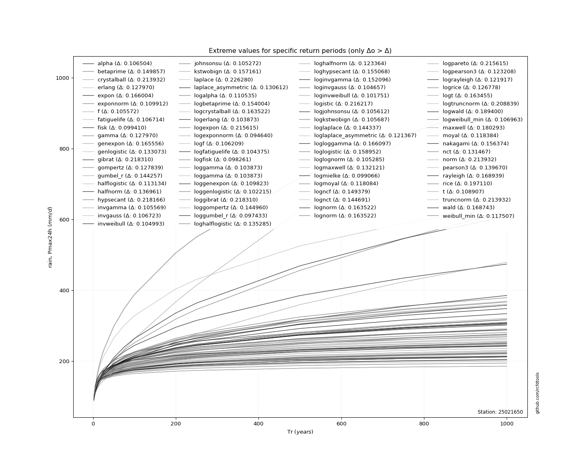</img>

</div>


<div align="center">

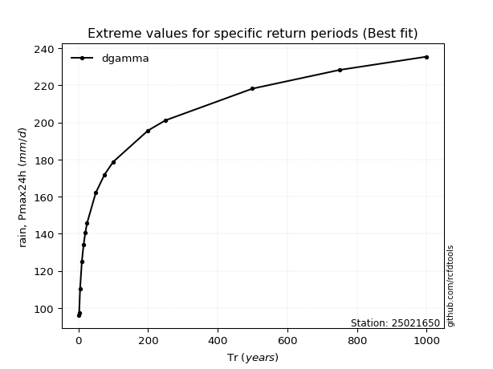</img>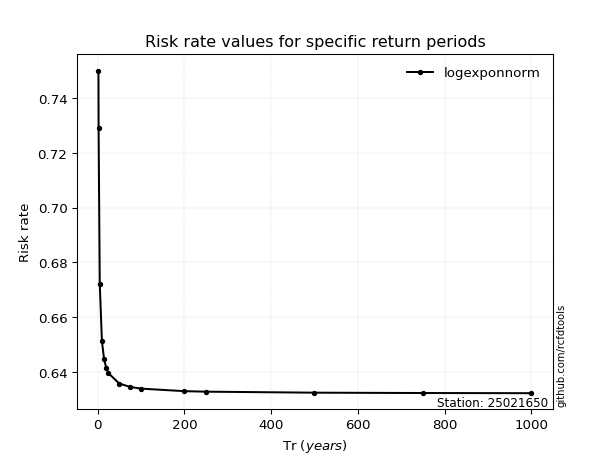</img>

</div>


<sub>**APP DISCLAIMER**: NO WARRANTY - This software is provided by [github.com/rcfdtools](https://github.com/rcfdtools) "as is", without any express or implied warranty, including warranties of merchantability, fitness for a particular purpose, or non-infringement. There is no guarantee that the software will be error-free or operate without interruption. LIMITATION OF LIABILITY - Neither the authors nor copyright holders will be liable for claims or damages arising from the software or its use. You are responsible for determining if the software is appropriate for your use and assume all associated risks, including errors, legal compliance, and data loss. NO PROFESSIONAL ADVICE - The software provides general information and does not offer professional advice. It should not replace consultation with professional advisors.</sub>