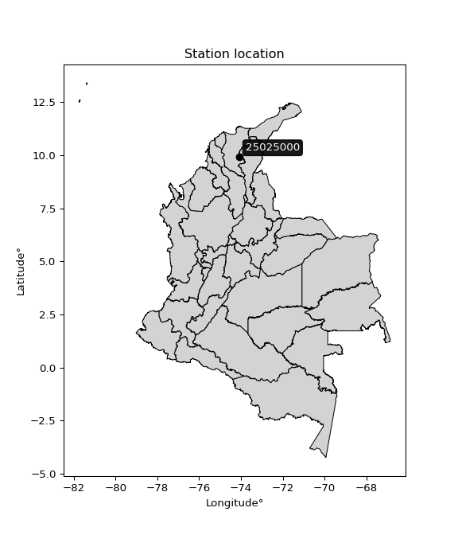

<div align="center">


</div>

# PMP Station (Rain, Pmax24h): 25025000

Probable Maximum Precipitation (PMP) is the greatest amount of rainfall for a specific duration that is meteorologically possible for a given location, acting as a "worst-case" scenario for extreme storms, crucial for designing safety-critical infrastructure like bridges, river deviations, dams, spillways, and nuclear plants to prevent catastrophic failure. PMP is calculated by hydrologists using meteorological data to determine the upper limit of extreme rainfall, often leading to the Probable Maximum Flood (PMF) for flood control design, and is increasingly being studied for climate change impacts.

<div align="center">

</img>

</div>


## A. General information


### 1. General running parameters

• app_version: _v20260103_. • runtime: _2026-01-03 07:24:50.581521_. • Python version: _3.14.0_. • SciPy version: _1.16.3_. • Pandas version: _2.3.3_. • NumPy version: _2.3.5_. • Stations dataset (station_dataset_file): _dataset/pmax24h_in/automatic_colombia_2003_2024.csv_. • Stations catalog (station_catalog_file): _dataset/CNE.xls_. • Minimum year to eval til year_max (date_min): _1900_. • Maximum year to eval since year_min (date_max): _2024_. • Creates, save and include plots into reports (create_plot): _False_. • Plot only fit distributions with Δo > Δ (plot_only_fit): _True_. • Eval low extreme values, if False, evaluates high extreme values (low_extreme): _False_. • Eval every SciPy distribution as logarithmic (pdist_logarithmic_on): _True_. • Standard deviation normalized (ddof): _1.0_. • Return periods to eval in years (Tr): _[2, 2.33, 5, 10, 15, 20, 25, 50, 75, 100, 200, 250, 500, 750, 1000]_. • Minimum data sample per station, 0 means any (minimum_sample): _5_. • Z-Score maximum threshold to adjust a value, 0 means disable (zscore_max): _3.5_. • Z-Score minimum threshold to adjust a value, 0 means disable (zscore_min): _-2.5_. • Avoid zeros, e.g. rain = 0 (avoid_zeros): _True_. • Avoid null values (avoid_nans): _True_. [:file_folder:Dataset file.](../../dataset/pmax24h_in/automatic_colombia_2003_2024.csv)

> Delta Degrees of Freedom (DDOF): is a parameter used in the formulas for calculating variance and standard deviation. When ddof=0, the divisor is $N$ (the total number of observations) and this is used when your data set is the entire population. When ddof=1, the divisor is $N-1$ and this is used when your data set is a sample drawn from a larger population. Using $N-1$ provides an unbiased estimate of the population variance (known as Bessel´s correction).


### 2. Station info and location

|   id |   CODIGO | NOMBRE                               | CATEGORIA     | TECNOLOGIA   | ESTADO   | FECHA_INSTALACION   |   FECHA_SUSPENSION |   ALTITUD |   LATITUD |   LONGITUD | DEPARTAMENTO   | MUNICIPIO             | AREA_OPERATIVA                                         | ENTIDAD                                                     | AREA_HIDROGRAFICA   | ZONA_HIDROGRAFICA   | SUBZONA_HIDROGRAFICA   |   CORRIENTE | Catalogo   |   Version |
|-----:|---------:|:-------------------------------------|:--------------|:-------------|:---------|:--------------------|-------------------:|----------:|----------:|-----------:|:---------------|:----------------------|:-------------------------------------------------------|:------------------------------------------------------------|:--------------------|:--------------------|:-----------------------|------------:|:-----------|----------:|
|    0 | 25025000 | EL DIFICIL - PUEBLO NUEVO [25025000] | Pluviométrica | Convencional | Activa   | 05/05/2013          |                nan |       120 |   9.91197 |   -74.0858 | Magdalena      | Ariguaní (El Dificil) | Area Operativa 05 - Magdalena-Cesar-Guajira-San Andrés | INSTITUTO DE HIDROLOGIA METEOROLOGIA Y ESTUDIOS AMBIENTALES | Magdalena Cauca     | Cesar               | Río Ariguaní           |         nan | CNE_IDEAM  |  20251226 |

<div align="center">

Dynamic map: [:earth_americas:Google](http://maps.google.com/maps?q=9.911972222,-74.08580556) [:earth_americas:OSM](https://www.openstreetmap.org/#map=18/9.911972222/-74.08580556&layers=P) [:earth_americas:Bing](https://www.bing.com/maps?cp=9.911972222~-74.08580556&lvl=18) [:earth_americas:Apple](https://maps.apple.com/frame?center=9.911972222%2C-74.08580556&span=0.003%2C0.006)

</div>


<div align="center">

```geojson
{
  "type": "Feature",
  "geometry": {
    "type": "Point", 
    "coordinates": [-74.08580556, 9.911972222]
  }, 
  "properties": {
    "Name": "25025000"
  }
}
```

</div>


### 3. Discrete values table and plot

<div align="center">

|               |          0 |           1 |           2 |          3 |           4 |
|:--------------|-----------:|------------:|------------:|-----------:|------------:|
| Date          | 2017       | 2018        | 2019        | 2020       | 2021        |
| Value         |  134.36    |    6.69     |   12.39     |   25.5     |   24.07     |
| Value_initial |  134.36    |    6.69     |   12.39     |   25.5     |   24.07     |
| count         |    5       |    5        |    5        |    5       |    5        |
| mean          |   40.602   |   40.602    |   40.602    |   40.602   |   40.602    |
| std           |   53.0044  |   53.0044   |   53.0044   |   53.0044  |   53.0044   |
| zscore        |    1.76887 |   -0.639796 |   -0.532257 |   -0.28492 |   -0.311898 |


</div>


> The initial value (value_initial) correspond to the initial obtained or null completed value, and value (value) is adjusted only when the initial value is outside the valid range definite through the Z-Score value. If Z-Score is active, values out of range or outliers are replaced with the station mean value


### 4. Active continuous probability distributions from SciPy (44 of 104 available)

A Probability Density Function (PDF) describes the relative likelihood of a continuous random variable falling within a specific range, where the total area under its curve equals 1, and the area over any interval gives the actual probability for that range. Unlike discrete probabilities (like rolling a die), a PDF shows density, not direct probability for a single point (which is zero), with higher points indicating higher likelihood, often visualized as a bell curve for normal distributions.

A log of a probability density function (log-PDF) is simply the logarithm of the PDF´s value, denoted as $log(f(x))$, useful for converting multiplication of probabilities into addition, improving numerical stability with tiny numbers, and connecting to information theory concepts like entropy. Instead of dealing with very small probabilities (e.g., 0.000001), log-PDFs use negative numbers (e.g., $log(0.00001) ≈ -11.51$ that are easier for computers to handle, preventing underflow errors and simplifying complex calculations. In this study, each active probability distribution from SciPy is also evaluated in the $log$ form.

[scipy.stats](https://docs.scipy.org/doc/scipy/reference/stats.html) is a Python´s powerful submodule within the SciPy library for comprehensive statistical analysis, offering over 130 probability distributions (like Normal, Poisson), functions for descriptive stats (mean, variance), hypothesis testing (t-tests, chi-square), random variable generation, and statistical tests, making it essential for data science, modeling, and research. It provides tools to explore, model, and draw conclusions from data efficiently, working seamlessly with NumPy.

<div align="center">

|   id | p_dist             |   n_parameter | fit_method   | label                                                                       | active   | ref                                                                                                        |
|-----:|:-------------------|--------------:|:-------------|:----------------------------------------------------------------------------|:---------|:-----------------------------------------------------------------------------------------------------------|
|    0 | alpha              |             3 | MLE          | Alpha                                                                       | True     | [:mortar_board:](https://docs.scipy.org/doc/scipy/reference/generated/scipy.stats.alpha.html)              |
|    1 | betaprime          |             4 | MLE          | Beta prime                                                                  | True     | [:mortar_board:](https://docs.scipy.org/doc/scipy/reference/generated/scipy.stats.betaprime.html)          |
|    2 | chi2               |             3 | MLE          | Chi²                                                                        | True     | [:mortar_board:](https://docs.scipy.org/doc/scipy/reference/generated/scipy.stats.chi2.html)               |
|    3 | crystalball        |             4 | MLE          | Crystalball                                                                 | True     | [:mortar_board:](https://docs.scipy.org/doc/scipy/reference/generated/scipy.stats.crystalball.html)        |
|    4 | erlang             |             3 | MLE          | Erlang                                                                      | True     | [:mortar_board:](https://docs.scipy.org/doc/scipy/reference/generated/scipy.stats.erlang.html)             |
|    5 | expon              |             2 | MLE          | Exponential                                                                 | True     | [:mortar_board:](https://docs.scipy.org/doc/scipy/reference/generated/scipy.stats.expon.html)              |
|    6 | exponnorm          |             3 | MLE          | Exponentially modified Normal                                               | True     | [:mortar_board:](https://docs.scipy.org/doc/scipy/reference/generated/scipy.stats.exponnorm.html)          |
|    7 | f                  |             4 | MLE          | F                                                                           | True     | [:mortar_board:](https://docs.scipy.org/doc/scipy/reference/generated/scipy.stats.f.html)                  |
|    8 | fatiguelife        |             3 | MLE          | Fatigue-life (Birnbaum-Saunders)                                            | True     | [:mortar_board:](https://docs.scipy.org/doc/scipy/reference/generated/scipy.stats.fatiguelife.html)        |
|    9 | fisk               |             3 | MLE          | Fisk                                                                        | True     | [:mortar_board:](https://docs.scipy.org/doc/scipy/reference/generated/scipy.stats.fisk.html)               |
|   10 | gamma              |             3 | MLE          | Gamma                                                                       | True     | [:mortar_board:](https://docs.scipy.org/doc/scipy/reference/generated/scipy.stats.gamma.html)              |
|   11 | genexpon           |             5 | MLE          | Generalized exponential                                                     | True     | [:mortar_board:](https://docs.scipy.org/doc/scipy/reference/generated/scipy.stats.genexpon.html)           |
|   12 | genlogistic        |             3 | MLE          | Generalized logistic                                                        | True     | [:mortar_board:](https://docs.scipy.org/doc/scipy/reference/generated/scipy.stats.genlogistic.html)        |
|   13 | gibrat             |             2 | MM           | Gibrat                                                                      | True     | [:mortar_board:](https://docs.scipy.org/doc/scipy/reference/generated/scipy.stats.gibrat.html)             |
|   14 | gompertz           |             3 | MLE          | Gompertz (or truncated Gumbel)                                              | True     | [:mortar_board:](https://docs.scipy.org/doc/scipy/reference/generated/scipy.stats.gompertz.html)           |
|   15 | gumbel_l           |             2 | MM           | Gumbel Left Skew                                                            | True     | [:mortar_board:](https://docs.scipy.org/doc/scipy/reference/generated/scipy.stats.gumbel_l.html)           |
|   16 | gumbel_r           |             2 | MM           | Gumbel Right Skew                                                           | True     | [:mortar_board:](https://docs.scipy.org/doc/scipy/reference/generated/scipy.stats.gumbel_r.html)           |
|   17 | halflogistic       |             2 | MM           | Half-logistic                                                               | True     | [:mortar_board:](https://docs.scipy.org/doc/scipy/reference/generated/scipy.stats.halflogistic.html)       |
|   18 | halfnorm           |             2 | MM           | Half Normal                                                                 | True     | [:mortar_board:](https://docs.scipy.org/doc/scipy/reference/generated/scipy.stats.halfnorm.html)           |
|   19 | hypsecant          |             2 | MM           | hyperbolic secant                                                           | True     | [:mortar_board:](https://docs.scipy.org/doc/scipy/reference/generated/scipy.stats.hypsecant.html)          |
|   20 | invgamma           |             3 | MLE          | Inverted gamma                                                              | True     | [:mortar_board:](https://docs.scipy.org/doc/scipy/reference/generated/scipy.stats.invgamma.html)           |
|   21 | invgauss           |             3 | MLE          | Inverse Gaussian                                                            | True     | [:mortar_board:](https://docs.scipy.org/doc/scipy/reference/generated/scipy.stats.invgauss.html)           |
|   22 | invweibull         |             3 | MLE          | Inverted Weibull                                                            | True     | [:mortar_board:](https://docs.scipy.org/doc/scipy/reference/generated/scipy.stats.invweibull.html)         |
|   23 | johnsonsu          |             4 | MLE          | Johnson Su                                                                  | True     | [:mortar_board:](https://docs.scipy.org/doc/scipy/reference/generated/scipy.stats.johnsonsu.html)          |
|   24 | kstwobign          |             2 | MLE          | Limiting distribution of scaled Kolmogorov-Smirnov two-sided test statistic | True     | [:mortar_board:](https://docs.scipy.org/doc/scipy/reference/generated/scipy.stats.kstwobign.html)          |
|   25 | laplace            |             2 | MM           | Laplace                                                                     | True     | [:mortar_board:](https://docs.scipy.org/doc/scipy/reference/generated/scipy.stats.laplace.html)            |
|   26 | laplace_asymmetric |             3 | MLE          | Asymmetric Laplace                                                          | True     | [:mortar_board:](https://docs.scipy.org/doc/scipy/reference/generated/scipy.stats.laplace_asymmetric.html) |
|   27 | loggamma           |             3 | MLE          | Log gamma                                                                   | True     | [:mortar_board:](https://docs.scipy.org/doc/scipy/reference/generated/scipy.stats.loggamma.html)           |
|   28 | logistic           |             2 | MM           | Logistic (or Sech-squared)                                                  | True     | [:mortar_board:](https://docs.scipy.org/doc/scipy/reference/generated/scipy.stats.logistic.html)           |
|   29 | lognorm            |             3 | MLE          | Log Normal                                                                  | True     | [:mortar_board:](https://docs.scipy.org/doc/scipy/reference/generated/scipy.stats.lognorm.html)            |
|   30 | maxwell            |             2 | MM           | Maxwell                                                                     | True     | [:mortar_board:](https://docs.scipy.org/doc/scipy/reference/generated/scipy.stats.maxwell.html)            |
|   31 | mielke             |             4 | MLE          | Mielke Beta-Kappa / Dagum                                                   | True     | [:mortar_board:](https://docs.scipy.org/doc/scipy/reference/generated/scipy.stats.mielke.html)             |
|   32 | moyal              |             2 | MM           | Moyal                                                                       | True     | [:mortar_board:](https://docs.scipy.org/doc/scipy/reference/generated/scipy.stats.moyal.html)              |
|   33 | nakagami           |             3 | MLE          | Nakagami                                                                    | True     | [:mortar_board:](https://docs.scipy.org/doc/scipy/reference/generated/scipy.stats.nakagami.html)           |
|   34 | ncf                |             5 | MLE          | Non-central F distribution                                                  | True     | [:mortar_board:](https://docs.scipy.org/doc/scipy/reference/generated/scipy.stats.ncf.html)                |
|   35 | nct                |             4 | MLE          | Non-central Student’s t                                                     | True     | [:mortar_board:](https://docs.scipy.org/doc/scipy/reference/generated/scipy.stats.nct.html)                |
|   36 | norm               |             2 | MM           | Normal                                                                      | True     | [:mortar_board:](https://docs.scipy.org/doc/scipy/reference/generated/scipy.stats.norm.html)               |
|   37 | pearson3           |             3 | MM           | Pearson type III                                                            | True     | [:mortar_board:](https://docs.scipy.org/doc/scipy/reference/generated/scipy.stats.pearson3.html)           |
|   38 | rayleigh           |             2 | MM           | Rayleigh                                                                    | True     | [:mortar_board:](https://docs.scipy.org/doc/scipy/reference/generated/scipy.stats.rayleigh.html)           |
|   39 | rice               |             3 | MLE          | Rice                                                                        | True     | [:mortar_board:](https://docs.scipy.org/doc/scipy/reference/generated/scipy.stats.rice.html)               |
|   40 | t                  |             3 | MLE          | Student’s t                                                                 | True     | [:mortar_board:](https://docs.scipy.org/doc/scipy/reference/generated/scipy.stats.t.html)                  |
|   41 | truncnorm          |             4 | MLE          | Truncated normal                                                            | True     | [:mortar_board:](https://docs.scipy.org/doc/scipy/reference/generated/scipy.stats.truncnorm.html)          |
|   42 | wald               |             2 | MM           | Wald                                                                        | True     | [:mortar_board:](https://docs.scipy.org/doc/scipy/reference/generated/scipy.stats.wald.html)               |
|   43 | weibull_min        |             3 | MLE          | Weibull minimum                                                             | True     | [:mortar_board:](https://docs.scipy.org/doc/scipy/reference/generated/scipy.stats.weibull_min.html)        |

</div>

> **n_parameter:** # arguments & localization & scale.
>
> **Fit methods:** (MLE) maximum likelihood, (MM) L-moments.
>
>**Inactive** (With the only purpose of prevent loops, zero divisions, infinite values, over high estimated values or horizontal trending for recurrence intervals estimations, the follow distributions were disabled.)**:** foldnorm, gennorm, norminvgauss, powernorm, powerlognorm, skewnorm, genextreme, anglit, arcsine, argus, beta, bradford, burr, burr12, cauchy, cosine, halfcauchy, foldcauchy, skewcauchy, wrapcauchy, dgamma, gengamma, exponweib, exponpow, truncexpon, gausshyper, genhalflogistic, genhyperbolic, geninvgauss, halfgennorm, johnsonsb, kappa4, kappa3, ksone, kstwo, loglaplace, levy, levy_l, levy_stable, ncx2, pareto, genpareto, truncpareto, lomax, powerlaw, rdist, rel_breitwigner, recipinvgauss, semicircular, studentized_range, trapezoid, triang, truncweibull_min, tukeylambda, uniform, loguniform, vonmises, vonmises_line, weibull_max, dweibull, 


## B. Probability distributions vs. Empirical distributions

A continuous probability distribution (CPD) describes probabilities for variables that can take any value within a range (like rain any time), unlike discrete variables with specific outcomes (like temperature). It uses a Probability Density Function (PDF), a curve where the total area under it equals 1, and the probability of the variable falling within an interval (a to b) is found by calculating the area under the curve between those points. A key feature is that the probability of hitting any single exact value is zero, so probabilities are always expressed for ranges, e.g., $P(a ≤ X ≤ b)$.

<div align="center">

Distributions parameters from station values
|    |   station | p_dist                |   n |            loc |          scale | shape                 | shape1                | shape2                 | shape3   |
|---:|----------:|:----------------------|----:|---------------:|---------------:|:----------------------|:----------------------|:-----------------------|:---------|
|  0 |  25025000 | alpha                 |   5 |     -0.0268752 |   12.5063      | 6.687525496205067e-09 |                       |                        |          |
|  1 |  25025000 | betaprime             |   5 |      3.41673   |    0.0633917   | 146.83263172011746    | 0.9582657427231943    |                        |          |
|  2 |  25025000 | chi2                  |   5 |      6.69      |    5.97113     | 0.5715899318381932    |                       |                        |          |
|  3 |  25025000 | crystalball           |   5 |     40.6017    |   47.4066      | 134945.86093903505    | 2624.222328663236     |                        |          |
|  4 |  25025000 | erlang                |   5 |      6.69      |   45.4272      | 0.5520816711244667    |                       |                        |          |
|  5 |  25025000 | expon                 |   5 |      6.69      |   33.912       |                       |                       |                        |          |
|  6 |  25025000 | exponnorm             |   5 |      6.65498   |    0.0108056   | 3118.4560166020347    |                       |                        |          |
|  7 |  25025000 | f                     |   5 |      6.69      |    6.12257     | 0.6978389130658742    | 1.5311470813465797    |                        |          |
|  8 |  25025000 | fatiguelife           |   5 |      6.69      |    1.6457e-05  | 1268.063880062431     |                       |                        |          |
|  9 |  25025000 | fisk                  |   5 |      6.69      |   13.3881      | 0.78569731036081      |                       |                        |          |
| 10 |  25025000 | gamma                 |   5 |      6.69      |   30.5473      | 0.526718892355801     |                       |                        |          |
| 11 |  25025000 | genexpon              |   5 |      6.68999   |   59.9736      | 1.7685211320377783    | 9.031754367363272e-11 | 1.7388145432888273     |          |
| 12 |  25025000 | genlogistic           |   5 |   -177.678     |   25.5332      | 2447.8347850128857    |                       |                        |          |
| 13 |  25025000 | gibrat                |   5 |      4.43521   |   21.9363      |                       |                       |                        |          |
| 14 |  25025000 | gompertz              |   5 |      6.69      |  101.541       | 1.3529817002759628    |                       |                        |          |
| 15 |  25025000 | gumbel_l              |   5 |     61.9384    |   36.9643      |                       |                       |                        |          |
| 16 |  25025000 | gumbel_r              |   5 |     19.2656    |   36.9643      |                       |                       |                        |          |
| 17 |  25025000 | halflogistic          |   5 |    -15.5882    |   40.5327      |                       |                       |                        |          |
| 18 |  25025000 | halfnorm              |   5 |    -22.1484    |   78.646       |                       |                       |                        |          |
| 19 |  25025000 | hypsecant             |   5 |     40.602     |   30.1813      |                       |                       |                        |          |
| 20 |  25025000 | invgamma              |   5 |      3.38525   |    9.30612     | 0.9582443530030249    |                       |                        |          |
| 21 |  25025000 | invgauss              |   5 |      4.5888    |    8.73939     | 4.120789634886255     |                       |                        |          |
| 22 |  25025000 | invweibull            |   5 |      4.45729   |    8.14496     | 0.8347577636744694    |                       |                        |          |
| 23 |  25025000 | johnsonsu             |   5 |      6.69      |    4.28642e-12 | -4.29621500386774     | 0.17098310373183395   |                        |          |
| 24 |  25025000 | kstwobign             |   5 |    -78.0827    |  138.55        |                       |                       |                        |          |
| 25 |  25025000 | laplace               |   5 |     40.602     |   33.5229      |                       |                       |                        |          |
| 26 |  25025000 | laplace_asymmetric    |   5 |      6.69      |    0.000223359 | 6.586478795379786e-06 |                       |                        |          |
| 27 |  25025000 | loggamma              |   5 | -14517.6       | 1966.08        | 1644.2800682779798    |                       |                        |          |
| 28 |  25025000 | logistic              |   5 |     40.602     |   26.1377      |                       |                       |                        |          |
| 29 |  25025000 | lognorm               |   5 |      6.69      |    0.011614    | 15.133954558637326    |                       |                        |          |
| 30 |  25025000 | maxwell               |   5 |    -71.7365    |   70.3977      |                       |                       |                        |          |
| 31 |  25025000 | mielke                |   5 |      3.38875   |    0.0651977   | 126.37120936716568    | 0.9744479511691324    |                        |          |
| 32 |  25025000 | moyal                 |   5 |     13.4907    |   21.3414      |                       |                       |                        |          |
| 33 |  25025000 | nakagami              |   5 |      6.69      |   83.24        | 0.1808900416068538    |                       |                        |          |
| 34 |  25025000 | ncf                   |   5 |      3.38646   |    6.01712     | 6617.159742939963     | 1.9164881798193987    | 4062.9928055083005     |          |
| 35 |  25025000 | nct                   |   5 |      0.0985505 |    0.225037    | 1.0066022337118878    | 54.73599063709152     |                        |          |
| 36 |  25025000 | norm                  |   5 |     40.602     |   47.4086      |                       |                       |                        |          |
| 37 |  25025000 | pearson3              |   5 |     40.6021    |   47.4086      | 1.4166793202899746    |                       |                        |          |
| 38 |  25025000 | rayleigh              |   5 |    -50.0934    |   72.3645      |                       |                       |                        |          |
| 39 |  25025000 | rice                  |   5 |    -27.4131    |   58.6244      | 0.0005465180561250193 |                       |                        |          |
| 40 |  25025000 | t                     |   5 |     19.2593    |    9.30844     | 0.968829831310418     |                       |                        |          |
| 41 |  25025000 | truncnorm             |   5 |  -2097.74      |  285.575       | 7.3690912365900765    | 179.42368034625247    |                        |          |
| 42 |  25025000 | wald                  |   5 |     -6.80661   |   47.4086      |                       |                       |                        |          |
| 43 |  25025000 | weibull_min           |   5 |      6.69      |   41.9167      | 0.5295361542529765    |                       |                        |          |
| 44 |  25025000 | logalpha              |   5 |     -1.80748   |   25.0698      | 5.257824184073938     |                       |                        |          |
| 45 |  25025000 | logbetaprime          |   5 |      0.795401  |    2.02965     | 11.433868254066304    | 10.916929856073558    |                        |          |
| 46 |  25025000 | logchi2               |   5 |      1.90061   |    0.889436    | 1.0896580843904755    |                       |                        |          |
| 47 |  25025000 | logcrystalball        |   5 |      3.14753   |    1.00349     | 7.56964128549674      | 1341.586213897614     |                        |          |
| 48 |  25025000 | logerlang             |   5 |      1.90061   |    0.992739    | 0.7690584180914637    |                       |                        |          |
| 49 |  25025000 | logexpon              |   5 |      1.90061   |    1.24692     |                       |                       |                        |          |
| 50 |  25025000 | logexponnorm          |   5 |      2.18131   |    0.479007    | 2.01713034532208      |                       |                        |          |
| 51 |  25025000 | logf                  |   5 |      1.90061   |    1.09943     | 0.6809744061502302    | 24.03755981085402     |                        |          |
| 52 |  25025000 | logfatiguelife        |   5 |      1.18834   |    1.69246     | 0.5601435543809704    |                       |                        |          |
| 53 |  25025000 | logfisk               |   5 |      1.12213   |    1.81333     | 3.271715506962607     |                       |                        |          |
| 54 |  25025000 | loggamma              |   5 |      1.90061   |    1.27128     | 0.6863116854761735    |                       |                        |          |
| 55 |  25025000 | loggenexpon           |   5 |      1.89991   |    0.0126245   | 0.007483339494675889  | 1.3016125571478616    | 2.4909640856627275e-05 |          |
| 56 |  25025000 | loggenlogistic        |   5 |     -2.32421   |    0.789562    | 565.3225493287915     |                       |                        |          |
| 57 |  25025000 | loggibrat             |   5 |      2.38199   |    0.464328    |                       |                       |                        |          |
| 58 |  25025000 | loggompertz           |   5 |      1.90061   |    3.20596     | 1.8051372372592684    |                       |                        |          |
| 59 |  25025000 | loggumbel_l           |   5 |      3.59916   |    0.782415    |                       |                       |                        |          |
| 60 |  25025000 | loggumbel_r           |   5 |      2.69591   |    0.782415    |                       |                       |                        |          |
| 61 |  25025000 | loghalflogistic       |   5 |      1.95815   |    0.85796     |                       |                       |                        |          |
| 62 |  25025000 | loghalfnorm           |   5 |      1.81931   |    1.66468     |                       |                       |                        |          |
| 63 |  25025000 | loghypsecant          |   5 |      3.14753   |    0.638839    |                       |                       |                        |          |
| 64 |  25025000 | loginvgamma           |   5 |      0.126288  |   26.3781      | 9.707234962943723     |                       |                        |          |
| 65 |  25025000 | loginvgauss           |   5 |      1.02064   |    7.99519     | 0.2660211223212724    |                       |                        |          |
| 66 |  25025000 | loginvweibull         |   5 |    -21.6621    |   24.3297      | 31.184289703149204    |                       |                        |          |
| 67 |  25025000 | logjohnsonsu          |   5 |      1.02397   |    0.104289    | -7.340155992912013    | 2.043429458008598     |                        |          |
| 68 |  25025000 | logkstwobign          |   5 |     -0.110445  |    3.74144     |                       |                       |                        |          |
| 69 |  25025000 | loglaplace            |   5 |      3.14753   |    0.709571    |                       |                       |                        |          |
| 70 |  25025000 | loglaplace_asymmetric |   5 |      3.18097   |    0.743792    | 1.0228101073253009    |                       |                        |          |
| 71 |  25025000 | logloggamma           |   5 |   -316.17      |   42.7501      | 1754.068291279903     |                       |                        |          |
| 72 |  25025000 | loglogistic           |   5 |      3.14753   |    0.553251    |                       |                       |                        |          |
| 73 |  25025000 | loglognorm            |   5 |      1.90061   |    0.000932022 | 14.541381172250933    |                       |                        |          |
| 74 |  25025000 | logmaxwell            |   5 |      0.769695  |    1.49009     |                       |                       |                        |          |
| 75 |  25025000 | logmielke             |   5 |     -8.32659   |    8.59361     | 492.14632683778245    | 14.340993472646357    |                        |          |
| 76 |  25025000 | logmoyal              |   5 |      2.57368   |    0.451727    |                       |                       |                        |          |
| 77 |  25025000 | lognakagami           |   5 |      2.51689   |    1.02348     | 0.24146905177190803   |                       |                        |          |
| 78 |  25025000 | logncf                |   5 |     -0.374728  |    3.29657     | 166.64039244335066    | 31.385321917137546    | 0.16903544866917986    |          |
| 79 |  25025000 | lognct                |   5 |     -0.486768  |    0.194733    | 8.028005429099473     | 16.878295383751407    |                        |          |
| 80 |  25025000 | lognorm               |   5 |      3.14753   |    1.00349     |                       |                       |                        |          |
| 81 |  25025000 | logpearson3           |   5 |      3.14753   |    1.00348     | 0.633021787700304     |                       |                        |          |
| 82 |  25025000 | lograyleigh           |   5 |      1.22781   |    1.53172     |                       |                       |                        |          |
| 83 |  25025000 | logrice               |   5 |      1.40454   |    1.42215     | 0.0007280768239364343 |                       |                        |          |
| 84 |  25025000 | logt                  |   5 |      3.14754   |    1.00348     | 734582754.47905       |                       |                        |          |
| 85 |  25025000 | logtruncnorm          |   5 |     -0.323247  |    2.15199     | 1.3197637434608642    | 2.4274264671569816    |                        |          |
| 86 |  25025000 | logwald               |   5 |      2.14407   |    1.00346     |                       |                       |                        |          |
| 87 |  25025000 | logweibull_min        |   5 |      1.90061   |    0.818425    | 0.5735515568064209    |                       |                        |          |

</div>

> **loc** (Location parameter): This shifts the distribution along the x-axis. For many common distributions, like the normal (Gaussian) distribution, loc represents the mean $μ$. For others, like the uniform distribution, it might represent the minimum value, or for the beta distribution, the left end of the support interval.
>
> **scale** (Scale parameter): This determines the width or spread of the distribution. For the normal distribution, scale represents the standard deviation $σ$. For a uniform distribution, it defines the length of the interval (from $loc$ to $loc + scale$).
>
> **shape** (Shape parameters): Refers to parameters that define the specific form of a probability distribution, distinct from its location (loc) and scale (scale). These parameters are required arguments for most distribution functions. For example, a normal (Gaussian) distribution is fully defined by its location (mean) and scale (standard deviation), so it has no specific shape parameters beyond loc and scale. However, other distributions have intrinsic properties that need specification, as Gamma distribution that takes a shape parameter, often named $a$ or $alpha$.


### 0. Cumulative distribution values - CDF (88 evaluated)

Cumulative Distribution Function (CDF), denoted as $F$<sub>$X$</sub>$(x)$, is a function that gives the probability that a random variable $X$ will take a value less than or equal to a specific value, $x$ (i.e., $(P(X≥x)$. It essentially "accumulates" probabilities from a given point up to the far right (positive infinity), providing a complete picture of the distribution´s probabilities for both discrete (like rain) and continuous (like temperature) variables, helping to find probabilities over ranges or above certain values. Each station is evaluated separately ordering the $x$ values ascending, calculating the CDF and PDF values for the activated distributions and their logarithmic forms.

<div align="center">

CDF ordered by x ascending and calculating $log(f(x))$ separately
|   id |   Station |   date |      x |   count |   mean |     std |    zscore |   Value_initial |   station |   m |     alpha |   alpha_pdf |   betaprime |   betaprime_pdf |       chi2 |    chi2_pdf |   crystalball |   crystalball_pdf |      erlang |       erlang_pdf |    expon |   expon_pdf |   exponnorm |   exponnorm_pdf |           f |            f_pdf |   fatiguelife |   fatiguelife_pdf |        fisk |      fisk_pdf |       gamma |   gamma_pdf |    genexpon |   genexpon_pdf |   genlogistic |   genlogistic_pdf |    gibrat |   gibrat_pdf |    gompertz |   gompertz_pdf |   gumbel_l |   gumbel_l_pdf |   gumbel_r |   gumbel_r_pdf |   halflogistic |   halflogistic_pdf |   halfnorm |   halfnorm_pdf |   hypsecant |   hypsecant_pdf |   invgamma |   invgamma_pdf |   invgauss |   invgauss_pdf |   invweibull |   invweibull_pdf |   johnsonsu |   johnsonsu_pdf |   kstwobign |   kstwobign_pdf |   laplace |   laplace_pdf |   laplace_asymmetric |   laplace_asymmetric_pdf |    loggamma |   loggamma_pdf |   logistic |   logistic_pdf |   lognorm |   lognorm_pdf |   maxwell |   maxwell_pdf |      mielke |   mielke_pdf |    moyal |   moyal_pdf |    nakagami |   nakagami_pdf |       ncf |     ncf_pdf |       nct |     nct_pdf |     norm |   norm_pdf |   pearson3 |   pearson3_pdf |   rayleigh |   rayleigh_pdf |     rice |   rice_pdf |        t |       t_pdf |   truncnorm |   truncnorm_pdf |     wald |    wald_pdf |   weibull_min |   weibull_min_pdf |   logalpha |   logalpha_pdf |   logbetaprime |   logbetaprime_pdf |     logchi2 |   logchi2_pdf |   logcrystalball |   logcrystalball_pdf |   logerlang |   logerlang_pdf |   logexpon |   logexpon_pdf |   logexponnorm |   logexponnorm_pdf |       logf |      logf_pdf |   logfatiguelife |   logfatiguelife_pdf |   logfisk |   logfisk_pdf |   loggenexpon |   loggenexpon_pdf |   loggenlogistic |   loggenlogistic_pdf |   loggibrat |   loggibrat_pdf |   loggompertz |   loggompertz_pdf |   loggumbel_l |   loggumbel_l_pdf |   loggumbel_r |   loggumbel_r_pdf |   loghalflogistic |   loghalflogistic_pdf |   loghalfnorm |   loghalfnorm_pdf |   loghypsecant |   loghypsecant_pdf |   loginvgamma |   loginvgamma_pdf |   loginvgauss |   loginvgauss_pdf |   loginvweibull |   loginvweibull_pdf |   logjohnsonsu |   logjohnsonsu_pdf |   logkstwobign |   logkstwobign_pdf |   loglaplace |   loglaplace_pdf |   loglaplace_asymmetric |   loglaplace_asymmetric_pdf |   logloggamma |   logloggamma_pdf |   loglogistic |   loglogistic_pdf |   loglognorm |   loglognorm_pdf |   logmaxwell |   logmaxwell_pdf |   logmielke |   logmielke_pdf |   logmoyal |   logmoyal_pdf |   lognakagami |   lognakagami_pdf |    logncf |   logncf_pdf |    lognct |   lognct_pdf |   logpearson3 |   logpearson3_pdf |   lograyleigh |   lograyleigh_pdf |   logrice |   logrice_pdf |     logt |   logt_pdf |   logtruncnorm |   logtruncnorm_pdf |   logwald |   logwald_pdf |   logweibull_min |   logweibull_min_pdf |
|-----:|----------:|-------:|-------:|--------:|-------:|--------:|----------:|----------------:|----------:|----:|----------:|------------:|------------:|----------------:|-----------:|------------:|--------------:|------------------:|------------:|-----------------:|---------:|------------:|------------:|----------------:|------------:|-----------------:|--------------:|------------------:|------------:|--------------:|------------:|------------:|------------:|---------------:|--------------:|------------------:|----------:|-------------:|------------:|---------------:|-----------:|---------------:|-----------:|---------------:|---------------:|-------------------:|-----------:|---------------:|------------:|----------------:|-----------:|---------------:|-----------:|---------------:|-------------:|-----------------:|------------:|----------------:|------------:|----------------:|----------:|--------------:|---------------------:|-------------------------:|------------:|---------------:|-----------:|---------------:|----------:|--------------:|----------:|--------------:|------------:|-------------:|---------:|------------:|------------:|---------------:|----------:|------------:|----------:|------------:|---------:|-----------:|-----------:|---------------:|-----------:|---------------:|---------:|-----------:|---------:|------------:|------------:|----------------:|---------:|------------:|--------------:|------------------:|-----------:|---------------:|---------------:|-------------------:|------------:|--------------:|-----------------:|---------------------:|------------:|----------------:|-----------:|---------------:|---------------:|-------------------:|-----------:|--------------:|-----------------:|---------------------:|----------:|--------------:|--------------:|------------------:|-----------------:|---------------------:|------------:|----------------:|--------------:|------------------:|--------------:|------------------:|--------------:|------------------:|------------------:|----------------------:|--------------:|------------------:|---------------:|-------------------:|--------------:|------------------:|--------------:|------------------:|----------------:|--------------------:|---------------:|-------------------:|---------------:|-------------------:|-------------:|-----------------:|------------------------:|----------------------------:|--------------:|------------------:|--------------:|------------------:|-------------:|-----------------:|-------------:|-----------------:|------------:|----------------:|-----------:|---------------:|--------------:|------------------:|----------:|-------------:|----------:|-------------:|--------------:|------------------:|--------------:|------------------:|----------:|--------------:|---------:|-----------:|---------------:|-------------------:|----------:|--------------:|-----------------:|---------------------:|
|    0 |  25025000 |   2018 |   6.69 |       5 | 40.602 | 53.0044 | -0.639796 |            6.69 |  25025000 |   1 | 0.0626133 | 0.0390782   |   0.0552285 |     0.047604    | 2.7316e-05 | 8.78965e+09 |      0.2372   |        0.00651562 | 6.70589e-10 | 416830           | 0        | 0.0294881   |  0.00103877 |     0.0296278   | 9.49625e-05 | 577803           |     0.0352613 |       2.24671e+10 | 1.94454e-13 | 172.017       | 2.19693e-09 | 1.30285e+06 | 1.58893e-07 |    0.0294883   |      0.167064 |       0.0117036   | 0.0114505 |  0.0132999   | 1.58334e-13 |     0.0133245  |   0.200948 |    0.00484929  |   0.245308 |     0.00932566 |       0.268102 |         0.011449   |   0.286147 |     0.00948563 |    0.200106 |     0.00620198  |  0.0552297 |    0.0476045   |  0.0525007 |    0.061249    |    0.0525678 |      0.0578935   | 2.89261e-05 |     1.88816e+06 |    0.151795 |     0.010011    |  0.181817 |   0.00542367  |          1.67823e-10 |              0.0294883   | 2.72053e-11 |  42044.1       |   0.214597 |     0.00644835 |  0.10701  |      0.183704 |  0.256837 |    0.00756289 |   0.0607553 |    0.0496914 | 0.240905 |  0.0110216  | 5.75679e-07 |     2.3449e+08 | 0.0552294 | 0.0476044   | 0.0615399 | 0.0394781   | 0.237208 | 0.00651545 |   0.259968 |     0.0109867  |   0.264987 |     0.00797014 | 0.15566  | 0.00837828 | 0.20552  | 0.0119883   | 2.95408e-05 |     0.0262627   | 0.149318 | 0.0225538   |   1.48106e-09 |   883018          |  0.0664186 |      0.235081  |      0.0639535 |          0.259263  | 3.55265e-09 |   4.35855e+06 |         0.10701  |             0.183704 | 9.96503e-13 |    3451.42      |   0        |      0.801976  |      0.0677472 |          0.218573  | 0.00174424 | 31588.9       |        0.0554933 |            0.307495  | 0.0591639 |     0.233935  |   0.000418184 |         0.59266   |        0.0688629 |            0.232809  |    0        |       0         |   2.95493e-11 |         0.563056  |      0.107809 |          0.13008  |     0.0630761 |         0.222779  |          0        |             0         |     0.0389524 |         0.478731  |      0.0898062 |          0.13872   |     0.0626831 |         0.250029  |     0.0573067 |         0.286753  |       0.0661956 |           0.237866  |      0.0586456 |           0.270836 |      0.0651965 |          0.244446  |    0.0862562 |        0.121561  |               0.0950032 |                    0.12488  |      0.111189 |         0.183827  |     0.0950215 |         0.155431  |    0.0228143 |      1.67612e+13 |    0.0981008 |        0.231251  |   0.0659887 |       0.241823  |  0.0351682 |      0.202348  |   0           |       0           | 0.0713184 |    0.235096  | 0.0638339 |    0.245293  |     0.0888433 |         0.224626  |     0.0919626 |          0.260396 | 0.0590247 |     0.2308    | 0.107007 |   0.183701 |    0           |           0        |  0        |      0        |      1.75567e-09 |          2.26749e+06 |
|    1 |  25025000 |   2019 |  12.39 |       5 | 40.602 | 53.0044 | -0.532257 |           12.39 |  25025000 |   2 | 0.313836  | 0.0389725   |   0.338029  |     0.039746    | 0.815744   | 0.0279884   |      0.275888 |        0.00704968 | 0.342247    |      0.030553    | 0.154716 | 0.0249258   |  0.156499   |     0.025032    | 0.588708    |      0.0269409   |     0.678715  |       0.0145833   | 0.338293    |   0.030856    | 0.437088    | 0.0356882   | 0.154717    |    0.024926    |      0.238957 |       0.0133928   | 0.155204  |  0.0299812   | 0.075148    |     0.0130347  |   0.230282 |    0.00545009  |   0.299863 |     0.0097706  |       0.332051 |         0.0109756  |   0.339457 |     0.00921263 |    0.238212 |     0.00717636  |  0.338033  |    0.0397462   |  0.364237  |    0.0383816   |    0.359772  |      0.0387024   | 0.724236    |     0.0100228   |    0.212643 |     0.01125     |  0.215516 |   0.00642891  |          0.154716    |              0.024926    | 0.556943    |      0.460478  |   0.253627 |     0.00724242 |  0.264853 |      0.326314 |  0.301031 |    0.00792555 |   0.346102  |    0.0395921 | 0.304833 |  0.0113304  | 0.301243    |     0.0191062  | 0.338033  | 0.0397462   | 0.316894  | 0.0395235   | 0.275894 | 0.00704947 |   0.322361 |     0.0108601  |   0.311181 |     0.008219   | 0.205854 | 0.00919732 | 0.299227 | 0.0219076   | 0.139229    |     0.022666    | 0.275545 | 0.0210909   |   0.293659    |        0.0228132  |  0.294769  |      0.462393  |      0.309886  |          0.4783    | 0.562014    |   0.394954    |         0.264853 |             0.326314 | 0.582636    |       0.503369  |   0.389965 |      0.489234  |      0.293895  |          0.480552  | 0.60211    |     0.287298  |        0.332413  |            0.491638  | 0.297626  |     0.490359  |   0.332642    |         0.479298  |        0.293038  |            0.455063  |    0.108225 |       1.37764   |   0.31791     |         0.465455  |      0.221795 |          0.249416 |     0.284478  |         0.457069  |          0.314581 |             0.525105  |     0.324818  |         0.439014  |      0.227076  |          0.32606   |     0.303641  |         0.47435   |     0.32225   |         0.487311  |       0.297082  |           0.465052  |      0.31453   |           0.484739 |      0.292473  |          0.445683  |    0.205581  |        0.289726  |               0.213576  |                    0.280741 |      0.26732  |         0.320692  |     0.242341  |         0.331878  |    0.672416  |      0.0402921   |    0.288561  |        0.370202  |   0.300883  |       0.469663  |  0.286933  |      0.533453  |   2.97583e-08 |       3.23616e+07 | 0.291748  |    0.442823  | 0.302052  |    0.473898  |     0.284964  |         0.391686  |     0.298222  |          0.385586 | 0.263532  |     0.405047  | 0.264849 |   0.326312 |    1.13587e-05 |           0.903825 |  0.241548 |      1.03174  |      0.572516    |          0.338107    |
|    2 |  25025000 |   2021 |  24.07 |       5 | 40.602 | 53.0044 | -0.311898 |           24.07 |  25025000 |   3 | 0.603759  | 0.0150196   |   0.617074  |     0.0139786   | 0.957977   | 0.00474702  |      0.363649 |        0.0079189  | 0.581316    |      0.014339    | 0.401006 | 0.0176632   |  0.403582   |     0.0176995   | 0.752815    |      0.00766543  |     0.791149  |       0.00669765  | 0.551078    |   0.0111838   | 0.69775     | 0.0143654   | 0.401008    |    0.0176633   |      0.404107 |       0.0143376   | 0.455872  |  0.0201937   | 0.223205    |     0.0122826  |   0.301619 |    0.00678255  |   0.415564 |     0.00987207 |       0.453592 |         0.00979771 |   0.443251 |     0.00853628 |    0.33376  |     0.0091407   |  0.617077  |    0.0139784   |  0.624601  |    0.0130827   |    0.618664  |      0.0126443   | 0.784094    |     0.00288157  |    0.351424 |     0.0121746   |  0.305348 |   0.00910864  |          0.401008    |              0.0176633   | 0.768929    |      0.217137  |   0.346945 |     0.00866847 |  0.513289 |      0.397336 |  0.396344 |    0.00831511 | nan         |  nan         | 0.435114 |  0.010759   | 0.450417    |     0.00931341 | 0.617077  | 0.0139785   | 0.608931  | 0.0150194   | 0.363652 | 0.00791859 |   0.444607 |     0.00996522 |   0.408544 |     0.00837647 | 0.319961 | 0.0101869  | 0.650737 | 0.026742    | 0.367649    |     0.0167403   | 0.483358 | 0.0145831   |   0.466017    |        0.0102073  |  0.591829  |      0.391217  |      0.604877  |          0.376581  | 0.746357    |   0.194929    |         0.513289 |             0.397336 | 0.806686    |       0.217789  |   0.641853 |      0.287225  |      0.602135  |          0.392683  | 0.735988   |     0.144292  |        0.614781  |            0.343669  | 0.602391  |     0.380617  |   0.603926    |         0.337869  |        0.588803  |            0.394803  |    0.706347 |       0.430931  |   0.587741    |         0.34607   |      0.443434 |          0.416826 |     0.58393   |         0.4015    |          0.612323 |             0.364271  |     0.586624  |         0.343022  |      0.51665   |          0.497582  |     0.598455  |         0.37844   |     0.609102  |         0.355098  |       0.593681  |           0.388566  |      0.605497  |           0.36422  |      0.578665  |          0.384731  |    0.523012  |        0.67222   |               0.511275  |                    0.67206  |      0.511193 |         0.39074   |     0.515103  |         0.451463  |    0.690362  |      0.0189393   |    0.54576   |        0.378596  |   0.596162  |       0.381405  |  0.609637  |      0.395818  |   0.621785    |       0.416482    | 0.581314  |    0.39109   | 0.598774  |    0.382284  |     0.555217  |         0.389924  |     0.556471  |          0.369233 | 0.54166   |     0.402573  | 0.513285 |   0.397337 |    0.486085    |           0.573501 |  0.681067 |      0.378292 |      0.725449    |          0.158978    |
|    3 |  25025000 |   2020 |  25.5  |       5 | 40.602 | 53.0044 | -0.28492  |           25.5  |  25025000 |   4 | 0.624185  | 0.0135817   |   0.636072  |     0.0126255   | 0.964199   | 0.00398008  |      0.375031 |        0.007999   | 0.601145    |      0.0134112   | 0.425739 | 0.0169339   |  0.428363   |     0.0169641   | 0.76323     |      0.00692185  |     0.800413  |       0.00626641  | 0.566394    |   0.0102584   | 0.717446    | 0.0132049   | 0.425741    |    0.0169339   |      0.424547 |       0.0142426   | 0.483832  |  0.0189233   | 0.240693    |     0.0121764  |   0.311439 |    0.00695095  |   0.429645 |     0.00981926 |       0.46749  |         0.0096398  |   0.455392 |     0.00844415 |    0.346984 |     0.0093513   |  0.636074  |    0.0126253   |  0.642434  |    0.0118884   |    0.635848  |      0.0114213   | 0.788032    |     0.00263412  |    0.368825 |     0.0121578   |  0.318656 |   0.00950559  |          0.425741    |              0.0169339   | 0.781096    |      0.20465   |   0.359442 |     0.00880886 |  0.536185 |      0.39592  |  0.408246 |    0.00832993 | nan         |  nan         | 0.450396 |  0.0106119  | 0.463392    |     0.00884313 | 0.636074  | 0.0126253   | 0.629346  | 0.0135668   | 0.375034 | 0.00799868 |   0.458754 |     0.00981884 |   0.420515 |     0.00836518 | 0.334572 | 0.0102449  | 0.686549 | 0.0233531   | 0.391147    |     0.0161287   | 0.503709 | 0.0138857   |   0.480151    |        0.00957428 |  0.613989  |      0.376627  |      0.626176  |          0.361509  | 0.757316    |   0.184957    |         0.536185 |             0.39592  | 0.818835    |       0.203407  |   0.658052 |      0.274234  |      0.624281  |          0.374735  | 0.744122   |     0.137687  |        0.634191  |            0.329031  | 0.623841  |     0.362737  |   0.62308     |         0.325944  |        0.611191  |            0.380954  |    0.729893 |       0.386032  |   0.60741     |         0.335546  |      0.467848 |          0.429051 |     0.6067    |         0.387493  |          0.632915 |             0.349328  |     0.606139  |         0.333231  |      0.545261  |          0.493235  |     0.619866  |         0.363499  |     0.629169  |         0.340357  |       0.615687  |           0.373972  |      0.626082  |           0.349163 |      0.600528  |          0.372861  |    0.560271  |        0.619711  |               0.548562  |                    0.620786 |      0.533719 |         0.389672  |     0.541093  |         0.448823  |    0.691431  |      0.0180951   |    0.567439  |        0.372542  |   0.617742  |       0.366395  |  0.631942  |      0.377175  |   0.645093    |       0.39163     | 0.603519  |    0.378323  | 0.620401  |    0.367151  |     0.577487  |         0.381688  |     0.577576  |          0.362054 | 0.564673  |     0.394782  | 0.536181 |   0.395922 |    0.518467    |           0.548798 |  0.701999 |      0.347643 |      0.734389    |          0.150936    |
|    4 |  25025000 |   2017 | 134.36 |       5 | 40.602 | 53.0044 |  1.76887  |          134.36 |  25025000 |   5 | 0.925854  | 0.000550143 |   0.922028  |     0.000550032 | 0.999999   | 1.11447e-07 |      0.976021 |        0.00119043 | 0.979111    |      0.000517854 | 0.976826 | 0.000683343 |  0.9774     |     0.000670677 | 0.931827    |      0.000383905 |     0.985971  |       0.000307528 | 0.854683    |   0.000764344 | 0.995784    | 0.000151158 | 0.976827    |    0.000683329 |      0.988013 |       0.000466632 | 0.962365  |  0.000631139 | 0.966763    |     0.00155711 |   0.99917  |    0.000159323 |   0.956535 |     0.00114993 |       0.95172  |         0.00116239 |   0.953413 |     0.00140058 |    0.971526 |     0.000942191 |  0.922026  |    0.000550029 |  0.939014  |    0.000634988 |    0.905665  |      0.000576663 | 0.87014     |     0.000283102 |    0.981849 |     0.000803488 |  0.969498 |   0.000909871 |          0.976827    |              0.000683331 | 0.950385    |      0.0429837 |   0.973066 |     0.0010027  |  0.959673 |      0.086445 |  0.964424 |    0.00133742 | nan         |  nan         | 0.953027 |  0.00109925 | 0.873664    |     0.00171793 | 0.922026  | 0.000550029 | 0.927982  | 0.000538422 | 0.976016 | 0.00119059 |   0.952123 |     0.00118093 |   0.96117  |     0.00136773 | 0.977794 | 0.00104526 | 0.972373 | 0.000231575 | 0.968299    |     0.000881415 | 0.952298 | 0.000849219 |   0.835293    |        0.00123213 |  0.935811  |      0.0699565 |      0.935433  |          0.0696223 | 0.925031    |   0.0503212   |         0.959673 |             0.086445 | 0.970378    |       0.0316507 |   0.909812 |      0.0723289 |      0.932213  |          0.0701565 | 0.881515   |     0.0489706 |        0.924858  |            0.0735003 | 0.916971  |     0.0659258 |   0.932301    |         0.0813331 |        0.941739  |            0.0715928 |    0.954566 |       0.0379271 |   0.938963    |         0.0876039 |      0.99489  |          0.034462 |     0.942006  |         0.0719291 |          0.937228 |             0.0708683 |     0.935821  |         0.0864317 |      0.959115  |          0.0638237 |     0.932373  |         0.0711546 |     0.927945  |         0.0733036 |       0.937365  |           0.0711804 |      0.928498  |           0.071914 |      0.944668  |          0.0792231 |    0.957728  |        0.0595736 |               0.954067  |                    0.063164 |      0.957673 |         0.0895939 |     0.959632  |         0.0700188 |    0.7107    |      0.00783801  |    0.947011  |        0.0882225 |   0.931782  |       0.0713075 |  0.939327  |      0.0670271 |   0.958368    |       0.064262    | 0.939033  |    0.0741807 | 0.933571  |    0.0700637 |     0.945436  |         0.0823576 |     0.943564  |          0.088345 | 0.95127   |     0.0842308 | 0.959672 |   0.086446 |    0.999996    |           0.113451 |  0.941902 |      0.050106 |      0.878334    |          0.0489992   |


</div>

An Empirical Distribution Function (EDF) is a step-function estimate of a true cumulative distribution function (CDF) based on observed sample data, representing the proportion of data points less than or equal to a given value. It is calculated by ordering your data and jumping up by $1/n$ (where $n$ is sample size) at each unique data point, allowing analysis without assuming an underlying population distribution, and it gets closer to the true CDF as the sample size grows. For the empirical probability calculations, the parameter $m$ correspond to the order number which means the position of the $x$ values in an ascending order list.


### 1. Empirical - EDF California (1923)

California´s estimates the true probability distribution of water-related data (like rainfall, streamflow) using observed samples, crucial for risk assessment.

<div align="center">


$P=m/n$


</div>


**1.1. Empirical values**

<div align="center">

|                | 0              | 1                  | 2              | 3                 | 4              |
|:---------------|:---------------|:-------------------|:---------------|:------------------|:---------------|
| date           | 2018           | 2019               | 2021           | 2020              | 2017           |
| x              | 6.69           | 12.39              | 24.07          | 25.5              | 134.36         |
| m              | 1              | 2                  | 3              | 4                 | 5              |
| empirical_dist | edf_california | edf_california     | edf_california | edf_california    | edf_california |
| empirical      | 0.2            | 0.4                | 0.6            | 0.8               | 1.0            |
| empirical_tr   | 1.25           | 1.6666666666666667 | 2.5            | 5.000000000000001 | inf            |

</div>


**1.2. Kolmogorov-Smirnov fit test (sorted by Δ)**


<div align="center">

|                | 0                   | 1                   | 2                   | 3                   | 4                   | 5                  | 6                   | 7                  | 8                   | 9                   | 10                  | 11                  | 12                 | 13                  | 14                  | 15                  | 16                  | 17                  | 18                 | 19                  | 20                 | 21                  | 22                  | 23                  | 24                  | 25                  | 26                  | 27                  | 28                  | 29                 | 30                  | 31                  | 32                  | 33                  | 34                  | 35                 | 36                 | 37                 | 38                 | 39                 | 40                  | 41                  | 42                 | 43                  | 44                  | 45                  | 46                    | 47                  | 48                  | 49                 | 50                 | 51                  | 52                  | 53                 | 54                  | 55                  | 56                 | 57                  | 58                  | 59                 | 60                 | 61                  | 62                 | 63                 | 64                 | 65                 | 66                  | 67                 | 68                  | 69                  | 70                  | 71                 | 72                  | 73                  | 74                 | 75                 | 76                 | 77                 | 78                 | 79                  | 80                  | 81                  | 82                 | 83                  | 84                  | 85                 | 86                  | 87                 |
|:---------------|:--------------------|:--------------------|:--------------------|:--------------------|:--------------------|:-------------------|:--------------------|:-------------------|:--------------------|:--------------------|:--------------------|:--------------------|:-------------------|:--------------------|:--------------------|:--------------------|:--------------------|:--------------------|:-------------------|:--------------------|:-------------------|:--------------------|:--------------------|:--------------------|:--------------------|:--------------------|:--------------------|:--------------------|:--------------------|:-------------------|:--------------------|:--------------------|:--------------------|:--------------------|:--------------------|:-------------------|:-------------------|:-------------------|:-------------------|:-------------------|:--------------------|:--------------------|:-------------------|:--------------------|:--------------------|:--------------------|:----------------------|:--------------------|:--------------------|:-------------------|:-------------------|:--------------------|:--------------------|:-------------------|:--------------------|:--------------------|:-------------------|:--------------------|:--------------------|:-------------------|:-------------------|:--------------------|:-------------------|:-------------------|:-------------------|:-------------------|:--------------------|:-------------------|:--------------------|:--------------------|:--------------------|:-------------------|:--------------------|:--------------------|:-------------------|:-------------------|:-------------------|:-------------------|:-------------------|:--------------------|:--------------------|:--------------------|:-------------------|:--------------------|:--------------------|:-------------------|:--------------------|:-------------------|
| station        | 25025000            | 25025000            | 25025000            | 25025000            | 25025000            | 25025000           | 25025000            | 25025000           | 25025000            | 25025000            | 25025000            | 25025000            | 25025000           | 25025000            | 25025000            | 25025000            | 25025000            | 25025000            | 25025000           | 25025000            | 25025000           | 25025000            | 25025000            | 25025000            | 25025000            | 25025000            | 25025000            | 25025000            | 25025000            | 25025000           | 25025000            | 25025000            | 25025000            | 25025000            | 25025000            | 25025000           | 25025000           | 25025000           | 25025000           | 25025000           | 25025000            | 25025000            | 25025000           | 25025000            | 25025000            | 25025000            | 25025000              | 25025000            | 25025000            | 25025000           | 25025000           | 25025000            | 25025000            | 25025000           | 25025000            | 25025000            | 25025000           | 25025000            | 25025000            | 25025000           | 25025000           | 25025000            | 25025000           | 25025000           | 25025000           | 25025000           | 25025000            | 25025000           | 25025000            | 25025000            | 25025000            | 25025000           | 25025000            | 25025000            | 25025000           | 25025000           | 25025000           | 25025000           | 25025000           | 25025000            | 25025000            | 25025000            | 25025000           | 25025000            | 25025000            | 25025000           | 25025000            | 25025000           |
| empirical_dist | edf_california      | edf_california      | edf_california      | edf_california      | edf_california      | edf_california     | edf_california      | edf_california     | edf_california      | edf_california      | edf_california      | edf_california      | edf_california     | edf_california      | edf_california      | edf_california      | edf_california      | edf_california      | edf_california     | edf_california      | edf_california     | edf_california      | edf_california      | edf_california      | edf_california      | edf_california      | edf_california      | edf_california      | edf_california      | edf_california     | edf_california      | edf_california      | edf_california      | edf_california      | edf_california      | edf_california     | edf_california     | edf_california     | edf_california     | edf_california     | edf_california      | edf_california      | edf_california     | edf_california      | edf_california      | edf_california      | edf_california        | edf_california      | edf_california      | edf_california     | edf_california     | edf_california      | edf_california      | edf_california     | edf_california      | edf_california      | edf_california     | edf_california      | edf_california      | edf_california     | edf_california     | edf_california      | edf_california     | edf_california     | edf_california     | edf_california     | edf_california      | edf_california     | edf_california      | edf_california      | edf_california      | edf_california     | edf_california      | edf_california      | edf_california     | edf_california     | edf_california     | edf_california     | edf_california     | edf_california      | edf_california      | edf_california      | edf_california     | edf_california      | edf_california      | edf_california     | edf_california      | edf_california     |
| p_dist         | t                   | mielke              | invgauss            | invgamma            | ncf                 | betaprime          | invweibull          | logfatiguelife     | logmoyal            | nct                 | loginvgauss         | logbetaprime        | logjohnsonsu       | logexponnorm        | alpha               | logfisk             | lognct              | loginvgamma         | logmielke          | loginvweibull       | logalpha           | loggenlogistic      | loggumbel_r         | loghalfnorm         | logncf              | logkstwobign        | loggenexpon         | f                   | logchi2             | gamma              | logweibull_min      | erlang              | loggompertz         | loggamma            | loggamma            | loghalflogistic    | logexpon           | logwald            | logf               | logerlang          | lograyleigh         | logpearson3         | logmaxwell         | fisk                | logrice             | loglaplace          | loglaplace_asymmetric | loghypsecant        | loglogistic         | lognorm            | lognorm            | logcrystalball      | logt                | logloggamma        | fatiguelife         | loglognorm          | loggibrat          | wald                | gibrat              | weibull_min        | johnsonsu          | loggumbel_l         | halflogistic       | nakagami           | pearson3           | halfnorm           | moyal               | gumbel_r           | exponnorm           | genexpon            | laplace_asymmetric  | expon              | genlogistic         | rayleigh            | maxwell            | logtruncnorm       | lognakagami        | truncnorm          | chi2               | norm                | crystalball         | kstwobign           | logistic           | hypsecant           | rice                | laplace            | gumbel_l            | gompertz           |
| delta          | 0.11345085411204336 | 0.13924466861719384 | 0.15756592047227902 | 0.16392564610813953 | 0.16392580868069984 | 0.1639283798093416 | 0.16415183433063485 | 0.1658088371017561 | 0.16805765628375613 | 0.17065434796765322 | 0.17083072427280066 | 0.17382355624017842 | 0.1739177899213853 | 0.17571924892923485 | 0.17581529817272123 | 0.17615870664530464 | 0.17959902908302294 | 0.18013426918726727 | 0.1822584065148084 | 0.18431284066323583 | 0.1860113277748311 | 0.18880936430957962 | 0.19329969330773789 | 0.19386096743931114 | 0.19648073218379403 | 0.19947165543350054 | 0.19958181569797956 | 0.19990503749231717 | 0.19999999644735406 | 0.1999999978030743 | 0.19999999824432685 | 0.19999999932941123 | 0.19999999997045068 | 0.19999999997279472 | 0.19999999997279472 | 0.2                | 0.2                | 0.2                | 0.2021104880242236 | 0.2066859662583278 | 0.22242372143604394 | 0.22251268853229678 | 0.2325608743469607 | 0.23360636605947038 | 0.23532690868072492 | 0.23972889756698135 | 0.2514380614721522    | 0.25473946059885066 | 0.25890711115775233 | 0.2638147671846356 | 0.2638147671846356 | 0.26381476796395575 | 0.26381869342006636 | 0.2662811371941761 | 0.27871498052644295 | 0.28929988696305253 | 0.291775432309493  | 0.29629075500406254 | 0.31616801230732544 | 0.3198485876449051 | 0.3242359653749112 | 0.33215188140471497 | 0.3325103894204209 | 0.3366082549800578 | 0.3412464954455279 | 0.3446080536167675 | 0.34960421302372846 | 0.3703551321796136 | 0.37163688622400715 | 0.37425878751969566 | 0.37425914199242183 | 0.3742612120316209 | 0.37545309659149667 | 0.37948464602577037 | 0.3917538070308954 | 0.3999886412685026 | 0.399999970241669  | 0.4088526954029026 | 0.4157436599370098 | 0.42496601588469607 | 0.42496863698283105 | 0.43117509946496224 | 0.4405576499875257 | 0.45301639239001623 | 0.46542837624004674 | 0.4813444525656583 | 0.48856111578110256 | 0.5593066233849637 |
| deltao         | 0.5865427407550001  | 0.5865427407550001  | 0.5865427407550001  | 0.5865427407550001  | 0.5865427407550001  | 0.5865427407550001 | 0.5865427407550001  | 0.5865427407550001 | 0.5865427407550001  | 0.5865427407550001  | 0.5865427407550001  | 0.5865427407550001  | 0.5865427407550001 | 0.5865427407550001  | 0.5865427407550001  | 0.5865427407550001  | 0.5865427407550001  | 0.5865427407550001  | 0.5865427407550001 | 0.5865427407550001  | 0.5865427407550001 | 0.5865427407550001  | 0.5865427407550001  | 0.5865427407550001  | 0.5865427407550001  | 0.5865427407550001  | 0.5865427407550001  | 0.5865427407550001  | 0.5865427407550001  | 0.5865427407550001 | 0.5865427407550001  | 0.5865427407550001  | 0.5865427407550001  | 0.5865427407550001  | 0.5865427407550001  | 0.5865427407550001 | 0.5865427407550001 | 0.5865427407550001 | 0.5865427407550001 | 0.5865427407550001 | 0.5865427407550001  | 0.5865427407550001  | 0.5865427407550001 | 0.5865427407550001  | 0.5865427407550001  | 0.5865427407550001  | 0.5865427407550001    | 0.5865427407550001  | 0.5865427407550001  | 0.5865427407550001 | 0.5865427407550001 | 0.5865427407550001  | 0.5865427407550001  | 0.5865427407550001 | 0.5865427407550001  | 0.5865427407550001  | 0.5865427407550001 | 0.5865427407550001  | 0.5865427407550001  | 0.5865427407550001 | 0.5865427407550001 | 0.5865427407550001  | 0.5865427407550001 | 0.5865427407550001 | 0.5865427407550001 | 0.5865427407550001 | 0.5865427407550001  | 0.5865427407550001 | 0.5865427407550001  | 0.5865427407550001  | 0.5865427407550001  | 0.5865427407550001 | 0.5865427407550001  | 0.5865427407550001  | 0.5865427407550001 | 0.5865427407550001 | 0.5865427407550001 | 0.5865427407550001 | 0.5865427407550001 | 0.5865427407550001  | 0.5865427407550001  | 0.5865427407550001  | 0.5865427407550001 | 0.5865427407550001  | 0.5865427407550001  | 0.5865427407550001 | 0.5865427407550001  | 0.5865427407550001 |
| eval           | Δo > Δ              | Δo > Δ              | Δo > Δ              | Δo > Δ              | Δo > Δ              | Δo > Δ             | Δo > Δ              | Δo > Δ             | Δo > Δ              | Δo > Δ              | Δo > Δ              | Δo > Δ              | Δo > Δ             | Δo > Δ              | Δo > Δ              | Δo > Δ              | Δo > Δ              | Δo > Δ              | Δo > Δ             | Δo > Δ              | Δo > Δ             | Δo > Δ              | Δo > Δ              | Δo > Δ              | Δo > Δ              | Δo > Δ              | Δo > Δ              | Δo > Δ              | Δo > Δ              | Δo > Δ             | Δo > Δ              | Δo > Δ              | Δo > Δ              | Δo > Δ              | Δo > Δ              | Δo > Δ             | Δo > Δ             | Δo > Δ             | Δo > Δ             | Δo > Δ             | Δo > Δ              | Δo > Δ              | Δo > Δ             | Δo > Δ              | Δo > Δ              | Δo > Δ              | Δo > Δ                | Δo > Δ              | Δo > Δ              | Δo > Δ             | Δo > Δ             | Δo > Δ              | Δo > Δ              | Δo > Δ             | Δo > Δ              | Δo > Δ              | Δo > Δ             | Δo > Δ              | Δo > Δ              | Δo > Δ             | Δo > Δ             | Δo > Δ              | Δo > Δ             | Δo > Δ             | Δo > Δ             | Δo > Δ             | Δo > Δ              | Δo > Δ             | Δo > Δ              | Δo > Δ              | Δo > Δ              | Δo > Δ             | Δo > Δ              | Δo > Δ              | Δo > Δ             | Δo > Δ             | Δo > Δ             | Δo > Δ             | Δo > Δ             | Δo > Δ              | Δo > Δ              | Δo > Δ              | Δo > Δ             | Δo > Δ              | Δo > Δ              | Δo > Δ             | Δo > Δ              | Δo > Δ             |
| fit            | 1                   | 1                   | 1                   | 1                   | 1                   | 1                  | 1                   | 1                  | 1                   | 1                   | 1                   | 1                   | 1                  | 1                   | 1                   | 1                   | 1                   | 1                   | 1                  | 1                   | 1                  | 1                   | 1                   | 1                   | 1                   | 1                   | 1                   | 1                   | 1                   | 1                  | 1                   | 1                   | 1                   | 1                   | 1                   | 1                  | 1                  | 1                  | 1                  | 1                  | 1                   | 1                   | 1                  | 1                   | 1                   | 1                   | 1                     | 1                   | 1                   | 1                  | 1                  | 1                   | 1                   | 1                  | 1                   | 1                   | 1                  | 1                   | 1                   | 1                  | 1                  | 1                   | 1                  | 1                  | 1                  | 1                  | 1                   | 1                  | 1                   | 1                   | 1                   | 1                  | 1                   | 1                   | 1                  | 1                  | 1                  | 1                  | 1                  | 1                   | 1                   | 1                   | 1                  | 1                   | 1                   | 1                  | 1                   | 1                  |
| n              | 5                   | 5                   | 5                   | 5                   | 5                   | 5                  | 5                   | 5                  | 5                   | 5                   | 5                   | 5                   | 5                  | 5                   | 5                   | 5                   | 5                   | 5                   | 5                  | 5                   | 5                  | 5                   | 5                   | 5                   | 5                   | 5                   | 5                   | 5                   | 5                   | 5                  | 5                   | 5                   | 5                   | 5                   | 5                   | 5                  | 5                  | 5                  | 5                  | 5                  | 5                   | 5                   | 5                  | 5                   | 5                   | 5                   | 5                     | 5                   | 5                   | 5                  | 5                  | 5                   | 5                   | 5                  | 5                   | 5                   | 5                  | 5                   | 5                   | 5                  | 5                  | 5                   | 5                  | 5                  | 5                  | 5                  | 5                   | 5                  | 5                   | 5                   | 5                   | 5                  | 5                   | 5                   | 5                  | 5                  | 5                  | 5                  | 5                  | 5                   | 5                   | 5                   | 5                  | 5                   | 5                   | 5                  | 5                   | 5                  |
| best_fit       | 1                   | 0                   | 0                   | 0                   | 0                   | 0                  | 0                   | 0                  | 0                   | 0                   | 0                   | 0                   | 0                  | 0                   | 0                   | 0                   | 0                   | 0                   | 0                  | 0                   | 0                  | 0                   | 0                   | 0                   | 0                   | 0                   | 0                   | 0                   | 0                   | 0                  | 0                   | 0                   | 0                   | 0                   | 0                   | 0                  | 0                  | 0                  | 0                  | 0                  | 0                   | 0                   | 0                  | 0                   | 0                   | 0                   | 0                     | 0                   | 0                   | 0                  | 0                  | 0                   | 0                   | 0                  | 0                   | 0                   | 0                  | 0                   | 0                   | 0                  | 0                  | 0                   | 0                  | 0                  | 0                  | 0                  | 0                   | 0                  | 0                   | 0                   | 0                   | 0                  | 0                   | 0                   | 0                  | 0                  | 0                  | 0                  | 0                  | 0                   | 0                   | 0                   | 0                  | 0                   | 0                   | 0                  | 0                   | 0                  |
| best_fit_sort  | 1                   | 2                   | 3                   | 4                   | 5                   | 6                  | 7                   | 8                  | 9                   | 10                  | 11                  | 12                  | 13                 | 14                  | 15                  | 16                  | 17                  | 18                  | 19                 | 20                  | 21                 | 22                  | 23                  | 24                  | 25                  | 26                  | 27                  | 28                  | 29                  | 30                 | 31                  | 32                  | 33                  | 34                  | 35                  | 36                 | 37                 | 38                 | 39                 | 40                 | 41                  | 42                  | 43                 | 44                  | 45                  | 46                  | 47                    | 48                  | 49                  | 50                 | 51                 | 52                  | 53                  | 54                 | 55                  | 56                  | 57                 | 58                  | 59                  | 60                 | 61                 | 62                  | 63                 | 64                 | 65                 | 66                 | 67                  | 68                 | 69                  | 70                  | 71                  | 72                 | 73                  | 74                  | 75                 | 76                 | 77                 | 78                 | 79                 | 80                  | 81                  | 82                  | 83                 | 84                  | 85                  | 86                 | 87                  | 88                 |

</div>


**1.3. Best fit**

<div align="center">

|   id |   station | empirical_dist   | p_dist   |    delta |   deltao | eval   |   fit |   n |   best_fit |   best_fit_sort |
|-----:|----------:|:-----------------|:---------|---------:|---------:|:-------|------:|----:|-----------:|----------------:|
|    0 |  25025000 | edf_california   | t        | 0.113451 | 0.586543 | Δo > Δ |     1 |   5 |          1 |               1 |

</div>


### 2. Empirical - EDF Hazen (1930)

Hazen method for plotting positions is a formula used to estimate the empirical cumulative probability distribution of flood events or other hydrological data. This formula often results in biased estimations, particularly when extrapolating to extreme events (high return periods).

<div align="center">


$P=(m-0.5)/n$


</div>


**2.1. Empirical values**

<div align="center">

|                | 0                  | 1                  | 2         | 3                 | 4                  |
|:---------------|:-------------------|:-------------------|:----------|:------------------|:-------------------|
| date           | 2018               | 2019               | 2021      | 2020              | 2017               |
| x              | 6.69               | 12.39              | 24.07     | 25.5              | 134.36             |
| m              | 1                  | 2                  | 3         | 4                 | 5                  |
| empirical_dist | edf_hazen          | edf_hazen          | edf_hazen | edf_hazen         | edf_hazen          |
| empirical      | 0.1                | 0.3                | 0.5       | 0.7               | 0.9                |
| empirical_tr   | 1.1111111111111112 | 1.4285714285714286 | 2.0       | 3.333333333333333 | 10.000000000000002 |

</div>


**2.2. Kolmogorov-Smirnov fit test (sorted by Δ)**


<div align="center">

|                | 0                   | 1                   | 2                   | 3                  | 4                   | 5                   | 6                   | 7                   | 8                   | 9                  | 10                  | 11                  | 12                  | 13                  | 14                  | 15                  | 16                  | 17                  | 18                  | 19                  | 20                  | 21                  | 22                  | 23                  | 24                  | 25                  | 26                  | 27                  | 28                  | 29                  | 30                  | 31                  | 32                 | 33                  | 34                  | 35                  | 36                 | 37                    | 38                  | 39                  | 40                 | 41                 | 42                  | 43                  | 44                  | 45                  | 46                  | 47                  | 48                  | 49                  | 50                 | 51                  | 52                 | 53                  | 54                 | 55                 | 56                  | 57                 | 58                 | 59                 | 60                 | 61                  | 62                 | 63                  | 64                  | 65                 | 66                 | 67                 | 68                 | 69                 | 70                  | 71                  | 72                  | 73                 | 74                 | 75                 | 76                  | 77                  | 78                  | 79                  | 80                  | 81                  | 82                 | 83                 | 84                 | 85                 | 86                  | 87                 |
|:---------------|:--------------------|:--------------------|:--------------------|:-------------------|:--------------------|:--------------------|:--------------------|:--------------------|:--------------------|:-------------------|:--------------------|:--------------------|:--------------------|:--------------------|:--------------------|:--------------------|:--------------------|:--------------------|:--------------------|:--------------------|:--------------------|:--------------------|:--------------------|:--------------------|:--------------------|:--------------------|:--------------------|:--------------------|:--------------------|:--------------------|:--------------------|:--------------------|:-------------------|:--------------------|:--------------------|:--------------------|:-------------------|:----------------------|:--------------------|:--------------------|:-------------------|:-------------------|:--------------------|:--------------------|:--------------------|:--------------------|:--------------------|:--------------------|:--------------------|:--------------------|:-------------------|:--------------------|:-------------------|:--------------------|:-------------------|:-------------------|:--------------------|:-------------------|:-------------------|:-------------------|:-------------------|:--------------------|:-------------------|:--------------------|:--------------------|:-------------------|:-------------------|:-------------------|:-------------------|:-------------------|:--------------------|:--------------------|:--------------------|:-------------------|:-------------------|:-------------------|:--------------------|:--------------------|:--------------------|:--------------------|:--------------------|:--------------------|:-------------------|:-------------------|:-------------------|:-------------------|:--------------------|:-------------------|
| station        | 25025000            | 25025000            | 25025000            | 25025000           | 25025000            | 25025000            | 25025000            | 25025000            | 25025000            | 25025000           | 25025000            | 25025000            | 25025000            | 25025000            | 25025000            | 25025000            | 25025000            | 25025000            | 25025000            | 25025000            | 25025000            | 25025000            | 25025000            | 25025000            | 25025000            | 25025000            | 25025000            | 25025000            | 25025000            | 25025000            | 25025000            | 25025000            | 25025000           | 25025000            | 25025000            | 25025000            | 25025000           | 25025000              | 25025000            | 25025000            | 25025000           | 25025000           | 25025000            | 25025000            | 25025000            | 25025000            | 25025000            | 25025000            | 25025000            | 25025000            | 25025000           | 25025000            | 25025000           | 25025000            | 25025000           | 25025000           | 25025000            | 25025000           | 25025000           | 25025000           | 25025000           | 25025000            | 25025000           | 25025000            | 25025000            | 25025000           | 25025000           | 25025000           | 25025000           | 25025000           | 25025000            | 25025000            | 25025000            | 25025000           | 25025000           | 25025000           | 25025000            | 25025000            | 25025000            | 25025000            | 25025000            | 25025000            | 25025000           | 25025000           | 25025000           | 25025000           | 25025000            | 25025000           |
| empirical_dist | edf_hazen           | edf_hazen           | edf_hazen           | edf_hazen          | edf_hazen           | edf_hazen           | edf_hazen           | edf_hazen           | edf_hazen           | edf_hazen          | edf_hazen           | edf_hazen           | edf_hazen           | edf_hazen           | edf_hazen           | edf_hazen           | edf_hazen           | edf_hazen           | edf_hazen           | edf_hazen           | edf_hazen           | edf_hazen           | edf_hazen           | edf_hazen           | edf_hazen           | edf_hazen           | edf_hazen           | edf_hazen           | edf_hazen           | edf_hazen           | edf_hazen           | edf_hazen           | edf_hazen          | edf_hazen           | edf_hazen           | edf_hazen           | edf_hazen          | edf_hazen             | edf_hazen           | edf_hazen           | edf_hazen          | edf_hazen          | edf_hazen           | edf_hazen           | edf_hazen           | edf_hazen           | edf_hazen           | edf_hazen           | edf_hazen           | edf_hazen           | edf_hazen          | edf_hazen           | edf_hazen          | edf_hazen           | edf_hazen          | edf_hazen          | edf_hazen           | edf_hazen          | edf_hazen          | edf_hazen          | edf_hazen          | edf_hazen           | edf_hazen          | edf_hazen           | edf_hazen           | edf_hazen          | edf_hazen          | edf_hazen          | edf_hazen          | edf_hazen          | edf_hazen           | edf_hazen           | edf_hazen           | edf_hazen          | edf_hazen          | edf_hazen          | edf_hazen           | edf_hazen           | edf_hazen           | edf_hazen           | edf_hazen           | edf_hazen           | edf_hazen          | edf_hazen          | edf_hazen          | edf_hazen          | edf_hazen           | edf_hazen          |
| p_dist         | mielke              | loggenlogistic      | logalpha            | loggumbel_r        | loginvweibull       | loghalfnorm         | logmielke           | logncf              | loginvgamma         | lognct             | logkstwobign        | erlang              | loggompertz         | logexponnorm        | logfisk             | alpha               | loggenexpon         | logbetaprime        | logjohnsonsu        | nct                 | loginvgauss         | logmoyal            | loghalflogistic     | logfatiguelife      | betaprime           | ncf                 | invgamma            | invweibull          | lograyleigh         | logpearson3         | invgauss            | logmaxwell          | fisk               | logrice             | loglaplace          | logexpon            | t                  | loglaplace_asymmetric | loghypsecant        | loglogistic         | lognorm            | lognorm            | logcrystalball      | logt                | logloggamma         | logwald             | wald                | gamma               | loggibrat           | gibrat              | weibull_min        | loggumbel_l         | halflogistic       | nakagami            | pearson3           | halfnorm           | moyal               | logchi2            | loggamma           | loggamma           | gumbel_r           | exponnorm           | logweibull_min     | genexpon            | laplace_asymmetric  | expon              | genlogistic        | rayleigh           | f                  | maxwell            | logtruncnorm        | lognakagami         | logf                | logerlang          | truncnorm          | norm               | crystalball         | kstwobign           | logistic            | hypsecant           | rice                | loglognorm          | fatiguelife        | laplace            | gumbel_l           | johnsonsu          | gompertz            | chi2               |
| delta          | 0.04610177270924981 | 0.08880936430957953 | 0.09182939792670197 | 0.0932996933077378 | 0.09368129975524486 | 0.09386096743931105 | 0.09616161972229975 | 0.09648073218379394 | 0.09845515268480931 | 0.098773852142779  | 0.09947165543350045 | 0.09999999932941124 | 0.09999999997045067 | 0.10213503182277561 | 0.10239057499347592 | 0.10375906321259099 | 0.10392563648034092 | 0.10487709593570249 | 0.10549674894705341 | 0.10893128790387818 | 0.10910165737821431 | 0.10963737314764366 | 0.11232346553617734 | 0.11478080432430182 | 0.11707380492698805 | 0.11707660488983795 | 0.11707677373021852 | 0.11866408246268911 | 0.12242372143604385 | 0.12251268853229669 | 0.12460129006360121 | 0.13256087434696062 | 0.1336063660594703 | 0.13532690868072483 | 0.13972889756698126 | 0.14185297485733095 | 0.1507367393733241 | 0.1514380614721521    | 0.15473946059885058 | 0.15890711115775225 | 0.1638147671846355 | 0.1638147671846355 | 0.16381476796395567 | 0.16381869342006627 | 0.16628113719417603 | 0.18106672038107186 | 0.19629075500406246 | 0.19774953674579498 | 0.20634741645845334 | 0.21616801230732535 | 0.219848587644905  | 0.23215188140471488 | 0.2325103894204208 | 0.23660825498005772 | 0.2412464954455278 | 0.2446080536167674 | 0.24960421302372837 | 0.2620142757028863 | 0.2689290842978507 | 0.2689290842978507 | 0.2703551321796135 | 0.27163688622400706 | 0.2725158892976011 | 0.27425878751969557 | 0.27425914199242174 | 0.2742612120316208 | 0.2754530965914966 | 0.2794846460257703 | 0.2887082448588319 | 0.2917538070308953 | 0.29998864126850255 | 0.29999997024166897 | 0.30211048802422363 | 0.3066859662583278 | 0.3088526954029025 | 0.324966015884696  | 0.32496863698283096 | 0.33117509946496215 | 0.34055764998752563 | 0.35301639239001614 | 0.36542837624004665 | 0.37241589258577507 | 0.378714980526443  | 0.3813444525656582 | 0.3885611157811025 | 0.4242359653749112 | 0.45930662338496364 | 0.5157436599370098 |
| deltao         | 0.5865427407550001  | 0.5865427407550001  | 0.5865427407550001  | 0.5865427407550001 | 0.5865427407550001  | 0.5865427407550001  | 0.5865427407550001  | 0.5865427407550001  | 0.5865427407550001  | 0.5865427407550001 | 0.5865427407550001  | 0.5865427407550001  | 0.5865427407550001  | 0.5865427407550001  | 0.5865427407550001  | 0.5865427407550001  | 0.5865427407550001  | 0.5865427407550001  | 0.5865427407550001  | 0.5865427407550001  | 0.5865427407550001  | 0.5865427407550001  | 0.5865427407550001  | 0.5865427407550001  | 0.5865427407550001  | 0.5865427407550001  | 0.5865427407550001  | 0.5865427407550001  | 0.5865427407550001  | 0.5865427407550001  | 0.5865427407550001  | 0.5865427407550001  | 0.5865427407550001 | 0.5865427407550001  | 0.5865427407550001  | 0.5865427407550001  | 0.5865427407550001 | 0.5865427407550001    | 0.5865427407550001  | 0.5865427407550001  | 0.5865427407550001 | 0.5865427407550001 | 0.5865427407550001  | 0.5865427407550001  | 0.5865427407550001  | 0.5865427407550001  | 0.5865427407550001  | 0.5865427407550001  | 0.5865427407550001  | 0.5865427407550001  | 0.5865427407550001 | 0.5865427407550001  | 0.5865427407550001 | 0.5865427407550001  | 0.5865427407550001 | 0.5865427407550001 | 0.5865427407550001  | 0.5865427407550001 | 0.5865427407550001 | 0.5865427407550001 | 0.5865427407550001 | 0.5865427407550001  | 0.5865427407550001 | 0.5865427407550001  | 0.5865427407550001  | 0.5865427407550001 | 0.5865427407550001 | 0.5865427407550001 | 0.5865427407550001 | 0.5865427407550001 | 0.5865427407550001  | 0.5865427407550001  | 0.5865427407550001  | 0.5865427407550001 | 0.5865427407550001 | 0.5865427407550001 | 0.5865427407550001  | 0.5865427407550001  | 0.5865427407550001  | 0.5865427407550001  | 0.5865427407550001  | 0.5865427407550001  | 0.5865427407550001 | 0.5865427407550001 | 0.5865427407550001 | 0.5865427407550001 | 0.5865427407550001  | 0.5865427407550001 |
| eval           | Δo > Δ              | Δo > Δ              | Δo > Δ              | Δo > Δ             | Δo > Δ              | Δo > Δ              | Δo > Δ              | Δo > Δ              | Δo > Δ              | Δo > Δ             | Δo > Δ              | Δo > Δ              | Δo > Δ              | Δo > Δ              | Δo > Δ              | Δo > Δ              | Δo > Δ              | Δo > Δ              | Δo > Δ              | Δo > Δ              | Δo > Δ              | Δo > Δ              | Δo > Δ              | Δo > Δ              | Δo > Δ              | Δo > Δ              | Δo > Δ              | Δo > Δ              | Δo > Δ              | Δo > Δ              | Δo > Δ              | Δo > Δ              | Δo > Δ             | Δo > Δ              | Δo > Δ              | Δo > Δ              | Δo > Δ             | Δo > Δ                | Δo > Δ              | Δo > Δ              | Δo > Δ             | Δo > Δ             | Δo > Δ              | Δo > Δ              | Δo > Δ              | Δo > Δ              | Δo > Δ              | Δo > Δ              | Δo > Δ              | Δo > Δ              | Δo > Δ             | Δo > Δ              | Δo > Δ             | Δo > Δ              | Δo > Δ             | Δo > Δ             | Δo > Δ              | Δo > Δ             | Δo > Δ             | Δo > Δ             | Δo > Δ             | Δo > Δ              | Δo > Δ             | Δo > Δ              | Δo > Δ              | Δo > Δ             | Δo > Δ             | Δo > Δ             | Δo > Δ             | Δo > Δ             | Δo > Δ              | Δo > Δ              | Δo > Δ              | Δo > Δ             | Δo > Δ             | Δo > Δ             | Δo > Δ              | Δo > Δ              | Δo > Δ              | Δo > Δ              | Δo > Δ              | Δo > Δ              | Δo > Δ             | Δo > Δ             | Δo > Δ             | Δo > Δ             | Δo > Δ              | Δo > Δ             |
| fit            | 1                   | 1                   | 1                   | 1                  | 1                   | 1                   | 1                   | 1                   | 1                   | 1                  | 1                   | 1                   | 1                   | 1                   | 1                   | 1                   | 1                   | 1                   | 1                   | 1                   | 1                   | 1                   | 1                   | 1                   | 1                   | 1                   | 1                   | 1                   | 1                   | 1                   | 1                   | 1                   | 1                  | 1                   | 1                   | 1                   | 1                  | 1                     | 1                   | 1                   | 1                  | 1                  | 1                   | 1                   | 1                   | 1                   | 1                   | 1                   | 1                   | 1                   | 1                  | 1                   | 1                  | 1                   | 1                  | 1                  | 1                   | 1                  | 1                  | 1                  | 1                  | 1                   | 1                  | 1                   | 1                   | 1                  | 1                  | 1                  | 1                  | 1                  | 1                   | 1                   | 1                   | 1                  | 1                  | 1                  | 1                   | 1                   | 1                   | 1                   | 1                   | 1                   | 1                  | 1                  | 1                  | 1                  | 1                   | 1                  |
| n              | 5                   | 5                   | 5                   | 5                  | 5                   | 5                   | 5                   | 5                   | 5                   | 5                  | 5                   | 5                   | 5                   | 5                   | 5                   | 5                   | 5                   | 5                   | 5                   | 5                   | 5                   | 5                   | 5                   | 5                   | 5                   | 5                   | 5                   | 5                   | 5                   | 5                   | 5                   | 5                   | 5                  | 5                   | 5                   | 5                   | 5                  | 5                     | 5                   | 5                   | 5                  | 5                  | 5                   | 5                   | 5                   | 5                   | 5                   | 5                   | 5                   | 5                   | 5                  | 5                   | 5                  | 5                   | 5                  | 5                  | 5                   | 5                  | 5                  | 5                  | 5                  | 5                   | 5                  | 5                   | 5                   | 5                  | 5                  | 5                  | 5                  | 5                  | 5                   | 5                   | 5                   | 5                  | 5                  | 5                  | 5                   | 5                   | 5                   | 5                   | 5                   | 5                   | 5                  | 5                  | 5                  | 5                  | 5                   | 5                  |
| best_fit       | 1                   | 0                   | 0                   | 0                  | 0                   | 0                   | 0                   | 0                   | 0                   | 0                  | 0                   | 0                   | 0                   | 0                   | 0                   | 0                   | 0                   | 0                   | 0                   | 0                   | 0                   | 0                   | 0                   | 0                   | 0                   | 0                   | 0                   | 0                   | 0                   | 0                   | 0                   | 0                   | 0                  | 0                   | 0                   | 0                   | 0                  | 0                     | 0                   | 0                   | 0                  | 0                  | 0                   | 0                   | 0                   | 0                   | 0                   | 0                   | 0                   | 0                   | 0                  | 0                   | 0                  | 0                   | 0                  | 0                  | 0                   | 0                  | 0                  | 0                  | 0                  | 0                   | 0                  | 0                   | 0                   | 0                  | 0                  | 0                  | 0                  | 0                  | 0                   | 0                   | 0                   | 0                  | 0                  | 0                  | 0                   | 0                   | 0                   | 0                   | 0                   | 0                   | 0                  | 0                  | 0                  | 0                  | 0                   | 0                  |
| best_fit_sort  | 1                   | 2                   | 3                   | 4                  | 5                   | 6                   | 7                   | 8                   | 9                   | 10                 | 11                  | 12                  | 13                  | 14                  | 15                  | 16                  | 17                  | 18                  | 19                  | 20                  | 21                  | 22                  | 23                  | 24                  | 25                  | 26                  | 27                  | 28                  | 29                  | 30                  | 31                  | 32                  | 33                 | 34                  | 35                  | 36                  | 37                 | 38                    | 39                  | 40                  | 41                 | 42                 | 43                  | 44                  | 45                  | 46                  | 47                  | 48                  | 49                  | 50                  | 51                 | 52                  | 53                 | 54                  | 55                 | 56                 | 57                  | 58                 | 59                 | 60                 | 61                 | 62                  | 63                 | 64                  | 65                  | 66                 | 67                 | 68                 | 69                 | 70                 | 71                  | 72                  | 73                  | 74                 | 75                 | 76                 | 77                  | 78                  | 79                  | 80                  | 81                  | 82                  | 83                 | 84                 | 85                 | 86                 | 87                  | 88                 |

</div>


**2.3. Best fit**

<div align="center">

|   id |   station | empirical_dist   | p_dist   |     delta |   deltao | eval   |   fit |   n |   best_fit |   best_fit_sort |
|-----:|----------:|:-----------------|:---------|----------:|---------:|:-------|------:|----:|-----------:|----------------:|
|    0 |  25025000 | edf_hazen        | mielke   | 0.0461018 | 0.586543 | Δo > Δ |     1 |   5 |          1 |               1 |

</div>


### 3. Empirical - EDF Weibull (1939)

Weibull plotting position formula is an empirical method used to estimate the non-exceedance probability or plotting position for a set of observed data, is often recommended or widely used in practice, particularly in flood frequency analysis.

<div align="center">


$P=m/(n+1)$


</div>


**3.1. Empirical values**

<div align="center">

|                | 0                   | 1                  | 2           | 3                  | 4                  |
|:---------------|:--------------------|:-------------------|:------------|:-------------------|:-------------------|
| date           | 2018                | 2019               | 2021        | 2020               | 2017               |
| x              | 6.69                | 12.39              | 24.07       | 25.5               | 134.36             |
| m              | 1                   | 2                  | 3           | 4                  | 5                  |
| empirical_dist | edf_weibull         | edf_weibull        | edf_weibull | edf_weibull        | edf_weibull        |
| empirical      | 0.16666666666666666 | 0.3333333333333333 | 0.5         | 0.6666666666666666 | 0.8333333333333334 |
| empirical_tr   | 1.2                 | 1.4999999999999998 | 2.0         | 2.9999999999999996 | 6.000000000000002  |

</div>


**3.2. Kolmogorov-Smirnov fit test (sorted by Δ)**


<div align="center">

|                | 0                   | 1                   | 2                   | 3                   | 4                   | 5                  | 6                   | 7                   | 8                   | 9                   | 10                  | 11                  | 12                  | 13                  | 14                  | 15                  | 16                  | 17                  | 18                  | 19                  | 20                  | 21                  | 22                  | 23                  | 24                  | 25                  | 26                    | 27                  | 28                  | 29                  | 30                 | 31                  | 32                  | 33                  | 34                  | 35                  | 36                  | 37                 | 38                 | 39                  | 40                 | 41                  | 42                  | 43                 | 44                  | 45                  | 46                  | 47                  | 48                  | 49                  | 50                  | 51                  | 52                 | 53                  | 54                  | 55                  | 56                  | 57                  | 58                  | 59                 | 60                  | 61                  | 62                  | 63                  | 64                  | 65                  | 66                  | 67                 | 68                 | 69                 | 70                 | 71                 | 72                  | 73                  | 74                 | 75                 | 76                 | 77                 | 78                 | 79                 | 80                 | 81                  | 82                  | 83                  | 84                  | 85                 | 86                 | 87                 |
|:---------------|:--------------------|:--------------------|:--------------------|:--------------------|:--------------------|:-------------------|:--------------------|:--------------------|:--------------------|:--------------------|:--------------------|:--------------------|:--------------------|:--------------------|:--------------------|:--------------------|:--------------------|:--------------------|:--------------------|:--------------------|:--------------------|:--------------------|:--------------------|:--------------------|:--------------------|:--------------------|:----------------------|:--------------------|:--------------------|:--------------------|:-------------------|:--------------------|:--------------------|:--------------------|:--------------------|:--------------------|:--------------------|:-------------------|:-------------------|:--------------------|:-------------------|:--------------------|:--------------------|:-------------------|:--------------------|:--------------------|:--------------------|:--------------------|:--------------------|:--------------------|:--------------------|:--------------------|:-------------------|:--------------------|:--------------------|:--------------------|:--------------------|:--------------------|:--------------------|:-------------------|:--------------------|:--------------------|:--------------------|:--------------------|:--------------------|:--------------------|:--------------------|:-------------------|:-------------------|:-------------------|:-------------------|:-------------------|:--------------------|:--------------------|:-------------------|:-------------------|:-------------------|:-------------------|:-------------------|:-------------------|:-------------------|:--------------------|:--------------------|:--------------------|:--------------------|:-------------------|:-------------------|:-------------------|
| station        | 25025000            | 25025000            | 25025000            | 25025000            | 25025000            | 25025000           | 25025000            | 25025000            | 25025000            | 25025000            | 25025000            | 25025000            | 25025000            | 25025000            | 25025000            | 25025000            | 25025000            | 25025000            | 25025000            | 25025000            | 25025000            | 25025000            | 25025000            | 25025000            | 25025000            | 25025000            | 25025000              | 25025000            | 25025000            | 25025000            | 25025000           | 25025000            | 25025000            | 25025000            | 25025000            | 25025000            | 25025000            | 25025000           | 25025000           | 25025000            | 25025000           | 25025000            | 25025000            | 25025000           | 25025000            | 25025000            | 25025000            | 25025000            | 25025000            | 25025000            | 25025000            | 25025000            | 25025000           | 25025000            | 25025000            | 25025000            | 25025000            | 25025000            | 25025000            | 25025000           | 25025000            | 25025000            | 25025000            | 25025000            | 25025000            | 25025000            | 25025000            | 25025000           | 25025000           | 25025000           | 25025000           | 25025000           | 25025000            | 25025000            | 25025000           | 25025000           | 25025000           | 25025000           | 25025000           | 25025000           | 25025000           | 25025000            | 25025000            | 25025000            | 25025000            | 25025000           | 25025000           | 25025000           |
| empirical_dist | edf_weibull         | edf_weibull         | edf_weibull         | edf_weibull         | edf_weibull         | edf_weibull        | edf_weibull         | edf_weibull         | edf_weibull         | edf_weibull         | edf_weibull         | edf_weibull         | edf_weibull         | edf_weibull         | edf_weibull         | edf_weibull         | edf_weibull         | edf_weibull         | edf_weibull         | edf_weibull         | edf_weibull         | edf_weibull         | edf_weibull         | edf_weibull         | edf_weibull         | edf_weibull         | edf_weibull           | edf_weibull         | edf_weibull         | edf_weibull         | edf_weibull        | edf_weibull         | edf_weibull         | edf_weibull         | edf_weibull         | edf_weibull         | edf_weibull         | edf_weibull        | edf_weibull        | edf_weibull         | edf_weibull        | edf_weibull         | edf_weibull         | edf_weibull        | edf_weibull         | edf_weibull         | edf_weibull         | edf_weibull         | edf_weibull         | edf_weibull         | edf_weibull         | edf_weibull         | edf_weibull        | edf_weibull         | edf_weibull         | edf_weibull         | edf_weibull         | edf_weibull         | edf_weibull         | edf_weibull        | edf_weibull         | edf_weibull         | edf_weibull         | edf_weibull         | edf_weibull         | edf_weibull         | edf_weibull         | edf_weibull        | edf_weibull        | edf_weibull        | edf_weibull        | edf_weibull        | edf_weibull         | edf_weibull         | edf_weibull        | edf_weibull        | edf_weibull        | edf_weibull        | edf_weibull        | edf_weibull        | edf_weibull        | edf_weibull         | edf_weibull         | edf_weibull         | edf_weibull         | edf_weibull        | edf_weibull        | edf_weibull        |
| p_dist         | logmielke           | logexponnorm        | logalpha            | lognct              | loginvgamma         | loginvweibull      | alpha               | logbetaprime        | logncf              | mielke              | logfisk             | logjohnsonsu        | loggenlogistic      | loggumbel_r         | nct                 | loginvgauss         | lograyleigh         | logkstwobign        | logpearson3         | logmaxwell          | logfatiguelife      | betaprime           | ncf                 | invgamma            | logrice             | invweibull          | loglaplace_asymmetric | invgauss            | loghypsecant        | loglogistic         | loghalfnorm        | loglaplace          | lognorm             | lognorm             | logcrystalball      | logt                | logmoyal            | logloggamma        | t                  | wald                | loggenexpon        | erlang              | loggompertz         | fisk               | loghalflogistic     | logexpon            | logwald             | gibrat              | weibull_min         | gamma               | loggumbel_l         | halflogistic        | nakagami           | pearson3            | halfnorm            | moyal               | loggibrat           | gumbel_r            | exponnorm           | logweibull_min     | genexpon            | laplace_asymmetric  | expon               | genlogistic         | rayleigh            | logchi2             | f                   | maxwell            | logf               | loggamma           | loggamma           | truncnorm          | norm                | crystalball         | kstwobign          | logerlang          | logistic           | hypsecant          | rice               | logtruncnorm       | lognakagami        | loglognorm          | fatiguelife         | laplace             | gumbel_l            | johnsonsu          | gompertz           | chi2               |
| delta          | 0.10067794026704285 | 0.10213503182277561 | 0.10247771774022185 | 0.10283275809637127 | 0.10398356052092406 | 0.1040316206805284 | 0.10405339091365474 | 0.10487709593570249 | 0.10569989608240216 | 0.10591133528386049 | 0.10750275948727907 | 0.10802110629033083 | 0.10840563207486342 | 0.10867316185882314 | 0.10893128790387818 | 0.10935999947237361 | 0.11023102172535071 | 0.11133479138723845 | 0.11210254562621269 | 0.11367815513258928 | 0.11478080432430182 | 0.11707380492698805 | 0.11707660488983795 | 0.11707677373021852 | 0.11793712799815625 | 0.11866408246268911 | 0.1207335635906257    | 0.12460129006360121 | 0.12578126948265989 | 0.12629916466214097 | 0.1277142370675178 | 0.12775236552633873 | 0.13048143385130218 | 0.13048143385130218 | 0.13048143463062234 | 0.13048536008673295 | 0.13149847273781262 | 0.1329478038608427 | 0.1507367393733241 | 0.16295742167072913 | 0.1662484823646462 | 0.16666666599607788 | 0.16666666663711732 | 0.1666666666664722 | 0.16666666666666666 | 0.16666666666666666 | 0.18106672038107186 | 0.18283467897399203 | 0.18651525431157168 | 0.19774953674579498 | 0.19881854807138155 | 0.19917705608708747 | 0.2032749216467244 | 0.20791316211219446 | 0.21127472028343408 | 0.21627087969039505 | 0.22510876564282628 | 0.23702179884628016 | 0.23830355289067373 | 0.2391825559642678 | 0.24092545418636224 | 0.24092580865908841 | 0.24092787869828747 | 0.24211976325816326 | 0.24615131269243695 | 0.24635717081304098 | 0.25537491152549857 | 0.258420473697562  | 0.2687771546908903 | 0.2689290842978507 | 0.2689290842978507 | 0.2755193620695692 | 0.29163268255136265 | 0.29163530364949763 | 0.2978417661316288 | 0.3066859662583278 | 0.3072243166541923 | 0.3196830590566828 | 0.3320950429067133 | 0.3333219746018359 | 0.3333333035750023 | 0.33908255925244174 | 0.34538164719310965 | 0.34801111923232486 | 0.35522778244776915 | 0.3909026320415779 | 0.4259732900516303 | 0.4824103266036765 |
| deltao         | 0.5865427407550001  | 0.5865427407550001  | 0.5865427407550001  | 0.5865427407550001  | 0.5865427407550001  | 0.5865427407550001 | 0.5865427407550001  | 0.5865427407550001  | 0.5865427407550001  | 0.5865427407550001  | 0.5865427407550001  | 0.5865427407550001  | 0.5865427407550001  | 0.5865427407550001  | 0.5865427407550001  | 0.5865427407550001  | 0.5865427407550001  | 0.5865427407550001  | 0.5865427407550001  | 0.5865427407550001  | 0.5865427407550001  | 0.5865427407550001  | 0.5865427407550001  | 0.5865427407550001  | 0.5865427407550001  | 0.5865427407550001  | 0.5865427407550001    | 0.5865427407550001  | 0.5865427407550001  | 0.5865427407550001  | 0.5865427407550001 | 0.5865427407550001  | 0.5865427407550001  | 0.5865427407550001  | 0.5865427407550001  | 0.5865427407550001  | 0.5865427407550001  | 0.5865427407550001 | 0.5865427407550001 | 0.5865427407550001  | 0.5865427407550001 | 0.5865427407550001  | 0.5865427407550001  | 0.5865427407550001 | 0.5865427407550001  | 0.5865427407550001  | 0.5865427407550001  | 0.5865427407550001  | 0.5865427407550001  | 0.5865427407550001  | 0.5865427407550001  | 0.5865427407550001  | 0.5865427407550001 | 0.5865427407550001  | 0.5865427407550001  | 0.5865427407550001  | 0.5865427407550001  | 0.5865427407550001  | 0.5865427407550001  | 0.5865427407550001 | 0.5865427407550001  | 0.5865427407550001  | 0.5865427407550001  | 0.5865427407550001  | 0.5865427407550001  | 0.5865427407550001  | 0.5865427407550001  | 0.5865427407550001 | 0.5865427407550001 | 0.5865427407550001 | 0.5865427407550001 | 0.5865427407550001 | 0.5865427407550001  | 0.5865427407550001  | 0.5865427407550001 | 0.5865427407550001 | 0.5865427407550001 | 0.5865427407550001 | 0.5865427407550001 | 0.5865427407550001 | 0.5865427407550001 | 0.5865427407550001  | 0.5865427407550001  | 0.5865427407550001  | 0.5865427407550001  | 0.5865427407550001 | 0.5865427407550001 | 0.5865427407550001 |
| eval           | Δo > Δ              | Δo > Δ              | Δo > Δ              | Δo > Δ              | Δo > Δ              | Δo > Δ             | Δo > Δ              | Δo > Δ              | Δo > Δ              | Δo > Δ              | Δo > Δ              | Δo > Δ              | Δo > Δ              | Δo > Δ              | Δo > Δ              | Δo > Δ              | Δo > Δ              | Δo > Δ              | Δo > Δ              | Δo > Δ              | Δo > Δ              | Δo > Δ              | Δo > Δ              | Δo > Δ              | Δo > Δ              | Δo > Δ              | Δo > Δ                | Δo > Δ              | Δo > Δ              | Δo > Δ              | Δo > Δ             | Δo > Δ              | Δo > Δ              | Δo > Δ              | Δo > Δ              | Δo > Δ              | Δo > Δ              | Δo > Δ             | Δo > Δ             | Δo > Δ              | Δo > Δ             | Δo > Δ              | Δo > Δ              | Δo > Δ             | Δo > Δ              | Δo > Δ              | Δo > Δ              | Δo > Δ              | Δo > Δ              | Δo > Δ              | Δo > Δ              | Δo > Δ              | Δo > Δ             | Δo > Δ              | Δo > Δ              | Δo > Δ              | Δo > Δ              | Δo > Δ              | Δo > Δ              | Δo > Δ             | Δo > Δ              | Δo > Δ              | Δo > Δ              | Δo > Δ              | Δo > Δ              | Δo > Δ              | Δo > Δ              | Δo > Δ             | Δo > Δ             | Δo > Δ             | Δo > Δ             | Δo > Δ             | Δo > Δ              | Δo > Δ              | Δo > Δ             | Δo > Δ             | Δo > Δ             | Δo > Δ             | Δo > Δ             | Δo > Δ             | Δo > Δ             | Δo > Δ              | Δo > Δ              | Δo > Δ              | Δo > Δ              | Δo > Δ             | Δo > Δ             | Δo > Δ             |
| fit            | 1                   | 1                   | 1                   | 1                   | 1                   | 1                  | 1                   | 1                   | 1                   | 1                   | 1                   | 1                   | 1                   | 1                   | 1                   | 1                   | 1                   | 1                   | 1                   | 1                   | 1                   | 1                   | 1                   | 1                   | 1                   | 1                   | 1                     | 1                   | 1                   | 1                   | 1                  | 1                   | 1                   | 1                   | 1                   | 1                   | 1                   | 1                  | 1                  | 1                   | 1                  | 1                   | 1                   | 1                  | 1                   | 1                   | 1                   | 1                   | 1                   | 1                   | 1                   | 1                   | 1                  | 1                   | 1                   | 1                   | 1                   | 1                   | 1                   | 1                  | 1                   | 1                   | 1                   | 1                   | 1                   | 1                   | 1                   | 1                  | 1                  | 1                  | 1                  | 1                  | 1                   | 1                   | 1                  | 1                  | 1                  | 1                  | 1                  | 1                  | 1                  | 1                   | 1                   | 1                   | 1                   | 1                  | 1                  | 1                  |
| n              | 5                   | 5                   | 5                   | 5                   | 5                   | 5                  | 5                   | 5                   | 5                   | 5                   | 5                   | 5                   | 5                   | 5                   | 5                   | 5                   | 5                   | 5                   | 5                   | 5                   | 5                   | 5                   | 5                   | 5                   | 5                   | 5                   | 5                     | 5                   | 5                   | 5                   | 5                  | 5                   | 5                   | 5                   | 5                   | 5                   | 5                   | 5                  | 5                  | 5                   | 5                  | 5                   | 5                   | 5                  | 5                   | 5                   | 5                   | 5                   | 5                   | 5                   | 5                   | 5                   | 5                  | 5                   | 5                   | 5                   | 5                   | 5                   | 5                   | 5                  | 5                   | 5                   | 5                   | 5                   | 5                   | 5                   | 5                   | 5                  | 5                  | 5                  | 5                  | 5                  | 5                   | 5                   | 5                  | 5                  | 5                  | 5                  | 5                  | 5                  | 5                  | 5                   | 5                   | 5                   | 5                   | 5                  | 5                  | 5                  |
| best_fit       | 1                   | 0                   | 0                   | 0                   | 0                   | 0                  | 0                   | 0                   | 0                   | 0                   | 0                   | 0                   | 0                   | 0                   | 0                   | 0                   | 0                   | 0                   | 0                   | 0                   | 0                   | 0                   | 0                   | 0                   | 0                   | 0                   | 0                     | 0                   | 0                   | 0                   | 0                  | 0                   | 0                   | 0                   | 0                   | 0                   | 0                   | 0                  | 0                  | 0                   | 0                  | 0                   | 0                   | 0                  | 0                   | 0                   | 0                   | 0                   | 0                   | 0                   | 0                   | 0                   | 0                  | 0                   | 0                   | 0                   | 0                   | 0                   | 0                   | 0                  | 0                   | 0                   | 0                   | 0                   | 0                   | 0                   | 0                   | 0                  | 0                  | 0                  | 0                  | 0                  | 0                   | 0                   | 0                  | 0                  | 0                  | 0                  | 0                  | 0                  | 0                  | 0                   | 0                   | 0                   | 0                   | 0                  | 0                  | 0                  |
| best_fit_sort  | 1                   | 2                   | 3                   | 4                   | 5                   | 6                  | 7                   | 8                   | 9                   | 10                  | 11                  | 12                  | 13                  | 14                  | 15                  | 16                  | 17                  | 18                  | 19                  | 20                  | 21                  | 22                  | 23                  | 24                  | 25                  | 26                  | 27                    | 28                  | 29                  | 30                  | 31                 | 32                  | 33                  | 34                  | 35                  | 36                  | 37                  | 38                 | 39                 | 40                  | 41                 | 42                  | 43                  | 44                 | 45                  | 46                  | 47                  | 48                  | 49                  | 50                  | 51                  | 52                  | 53                 | 54                  | 55                  | 56                  | 57                  | 58                  | 59                  | 60                 | 61                  | 62                  | 63                  | 64                  | 65                  | 66                  | 67                  | 68                 | 69                 | 70                 | 71                 | 72                 | 73                  | 74                  | 75                 | 76                 | 77                 | 78                 | 79                 | 80                 | 81                 | 82                  | 83                  | 84                  | 85                  | 86                 | 87                 | 88                 |

</div>


**3.3. Best fit**

<div align="center">

|   id |   station | empirical_dist   | p_dist    |    delta |   deltao | eval   |   fit |   n |   best_fit |   best_fit_sort |
|-----:|----------:|:-----------------|:----------|---------:|---------:|:-------|------:|----:|-----------:|----------------:|
|    0 |  25025000 | edf_weibull      | logmielke | 0.100678 | 0.586543 | Δo > Δ |     1 |   5 |          1 |               1 |

</div>


### 4. Empirical - EDF Beard (1943)

The Beard formula (or Beard´s plotting position formula) in hydrology is used to estimate the empirical non-exceedance probability _(P)_ of a flood event (or other extreme hydrological data point) within a given dataset.

<div align="center">


$P=(m-0.31)/(n+0.38)$


</div>


**4.1. Empirical values**

<div align="center">

|                | 0                   | 1                  | 2         | 3                  | 4                  |
|:---------------|:--------------------|:-------------------|:----------|:-------------------|:-------------------|
| date           | 2018                | 2019               | 2021      | 2020               | 2017               |
| x              | 6.69                | 12.39              | 24.07     | 25.5               | 134.36             |
| m              | 1                   | 2                  | 3         | 4                  | 5                  |
| empirical_dist | edf_beard           | edf_beard          | edf_beard | edf_beard          | edf_beard          |
| empirical      | 0.12825278810408922 | 0.3141263940520446 | 0.5       | 0.6858736059479554 | 0.8717472118959109 |
| empirical_tr   | 1.1471215351812367  | 1.4579945799457996 | 2.0       | 3.183431952662722  | 7.797101449275368  |

</div>


**4.2. Kolmogorov-Smirnov fit test (sorted by Δ)**


<div align="center">

|                | 0                   | 1                   | 2                  | 3                   | 4                  | 5                   | 6                   | 7                   | 8                   | 9                   | 10                 | 11                  | 12                  | 13                  | 14                  | 15                  | 16                  | 17                  | 18                  | 19                  | 20                  | 21                  | 22                  | 23                  | 24                  | 25                 | 26                  | 27                  | 28                  | 29                  | 30                  | 31                  | 32                  | 33                  | 34                  | 35                    | 36                  | 37                  | 38                  | 39                  | 40                  | 41                  | 42                  | 43                 | 44                 | 45                  | 46                  | 47                  | 48                  | 49                  | 50                  | 51                  | 52                  | 53                 | 54                  | 55                  | 56                  | 57                 | 58                  | 59                  | 60                 | 61                  | 62                 | 63                  | 64                  | 65                  | 66                 | 67                 | 68                  | 69                 | 70                 | 71                 | 72                 | 73                  | 74                  | 75                 | 76                 | 77                  | 78                 | 79                 | 80                 | 81                  | 82                  | 83                  | 84                  | 85                 | 86                 | 87                 |
|:---------------|:--------------------|:--------------------|:-------------------|:--------------------|:-------------------|:--------------------|:--------------------|:--------------------|:--------------------|:--------------------|:-------------------|:--------------------|:--------------------|:--------------------|:--------------------|:--------------------|:--------------------|:--------------------|:--------------------|:--------------------|:--------------------|:--------------------|:--------------------|:--------------------|:--------------------|:-------------------|:--------------------|:--------------------|:--------------------|:--------------------|:--------------------|:--------------------|:--------------------|:--------------------|:--------------------|:----------------------|:--------------------|:--------------------|:--------------------|:--------------------|:--------------------|:--------------------|:--------------------|:-------------------|:-------------------|:--------------------|:--------------------|:--------------------|:--------------------|:--------------------|:--------------------|:--------------------|:--------------------|:-------------------|:--------------------|:--------------------|:--------------------|:-------------------|:--------------------|:--------------------|:-------------------|:--------------------|:-------------------|:--------------------|:--------------------|:--------------------|:-------------------|:-------------------|:--------------------|:-------------------|:-------------------|:-------------------|:-------------------|:--------------------|:--------------------|:-------------------|:-------------------|:--------------------|:-------------------|:-------------------|:-------------------|:--------------------|:--------------------|:--------------------|:--------------------|:-------------------|:-------------------|:-------------------|
| station        | 25025000            | 25025000            | 25025000           | 25025000            | 25025000           | 25025000            | 25025000            | 25025000            | 25025000            | 25025000            | 25025000           | 25025000            | 25025000            | 25025000            | 25025000            | 25025000            | 25025000            | 25025000            | 25025000            | 25025000            | 25025000            | 25025000            | 25025000            | 25025000            | 25025000            | 25025000           | 25025000            | 25025000            | 25025000            | 25025000            | 25025000            | 25025000            | 25025000            | 25025000            | 25025000            | 25025000              | 25025000            | 25025000            | 25025000            | 25025000            | 25025000            | 25025000            | 25025000            | 25025000           | 25025000           | 25025000            | 25025000            | 25025000            | 25025000            | 25025000            | 25025000            | 25025000            | 25025000            | 25025000           | 25025000            | 25025000            | 25025000            | 25025000           | 25025000            | 25025000            | 25025000           | 25025000            | 25025000           | 25025000            | 25025000            | 25025000            | 25025000           | 25025000           | 25025000            | 25025000           | 25025000           | 25025000           | 25025000           | 25025000            | 25025000            | 25025000           | 25025000           | 25025000            | 25025000           | 25025000           | 25025000           | 25025000            | 25025000            | 25025000            | 25025000            | 25025000           | 25025000           | 25025000           |
| empirical_dist | edf_beard           | edf_beard           | edf_beard          | edf_beard           | edf_beard          | edf_beard           | edf_beard           | edf_beard           | edf_beard           | edf_beard           | edf_beard          | edf_beard           | edf_beard           | edf_beard           | edf_beard           | edf_beard           | edf_beard           | edf_beard           | edf_beard           | edf_beard           | edf_beard           | edf_beard           | edf_beard           | edf_beard           | edf_beard           | edf_beard          | edf_beard           | edf_beard           | edf_beard           | edf_beard           | edf_beard           | edf_beard           | edf_beard           | edf_beard           | edf_beard           | edf_beard             | edf_beard           | edf_beard           | edf_beard           | edf_beard           | edf_beard           | edf_beard           | edf_beard           | edf_beard          | edf_beard          | edf_beard           | edf_beard           | edf_beard           | edf_beard           | edf_beard           | edf_beard           | edf_beard           | edf_beard           | edf_beard          | edf_beard           | edf_beard           | edf_beard           | edf_beard          | edf_beard           | edf_beard           | edf_beard          | edf_beard           | edf_beard          | edf_beard           | edf_beard           | edf_beard           | edf_beard          | edf_beard          | edf_beard           | edf_beard          | edf_beard          | edf_beard          | edf_beard          | edf_beard           | edf_beard           | edf_beard          | edf_beard          | edf_beard           | edf_beard          | edf_beard          | edf_beard          | edf_beard           | edf_beard           | edf_beard           | edf_beard           | edf_beard          | edf_beard          | edf_beard          |
| p_dist         | mielke              | logncf              | loggumbel_r        | logkstwobign        | loggenlogistic     | loghalfnorm         | logalpha            | loginvweibull       | logmielke           | loginvgamma         | lognct             | logexponnorm        | logfisk             | alpha               | logbetaprime        | logjohnsonsu        | lograyleigh         | logpearson3         | nct                 | loginvgauss         | logmoyal            | logfatiguelife      | betaprime           | ncf                 | invgamma            | logmaxwell         | invweibull          | logrice             | invgauss            | loglaplace          | loggenexpon         | erlang              | loggompertz         | fisk                | loghalflogistic     | loglaplace_asymmetric | loghypsecant        | logexpon            | loglogistic         | lognorm             | lognorm             | logcrystalball      | logt                | t                  | logloggamma        | logwald             | wald                | gamma               | gibrat              | weibull_min         | loggibrat           | loggumbel_l         | halflogistic        | nakagami           | pearson3            | halfnorm            | moyal               | logchi2            | gumbel_r            | exponnorm           | logweibull_min     | genexpon            | laplace_asymmetric | expon               | genlogistic         | rayleigh            | loggamma           | loggamma           | f                   | maxwell            | logf               | truncnorm          | logerlang          | norm                | crystalball         | logtruncnorm       | lognakagami        | kstwobign           | logistic           | hypsecant          | rice               | loglognorm          | fatiguelife         | laplace             | gumbel_l            | johnsonsu          | gompertz           | chi2               |
| delta          | 0.06749745672128304 | 0.08235433813174942 | 0.0839300793029788 | 0.08534526138145593 | 0.088802597513715  | 0.08930035850494036 | 0.09182939792670197 | 0.09368129975524486 | 0.09616161972229975 | 0.09845515268480931 | 0.098773852142779  | 0.10213503182277561 | 0.10239057499347592 | 0.10375906321259099 | 0.10487709593570249 | 0.10549674894705341 | 0.10829732738399933 | 0.10838629448025217 | 0.10893128790387818 | 0.10910165737821431 | 0.10963737314764366 | 0.11478080432430182 | 0.11707380492698805 | 0.11707660488983795 | 0.11707677373021852 | 0.1184344802949161 | 0.11866408246268911 | 0.12120051462868031 | 0.12460129006360121 | 0.12560250351493674 | 0.12783460380206876 | 0.12825278743350044 | 0.12825278807453988 | 0.12825278810389476 | 0.12825278810408922 | 0.13731166742010759   | 0.14061306654680605 | 0.14185297485733095 | 0.14478071710570772 | 0.14968837313259098 | 0.14968837313259098 | 0.14968837391191114 | 0.14969229936802175 | 0.1507367393733241 | 0.1521547431421315 | 0.18106672038107186 | 0.18216436095201793 | 0.19774953674579498 | 0.20204161825528083 | 0.20572219359286048 | 0.20634741645845334 | 0.21802548735267036 | 0.21838399536837627 | 0.2224818609280132 | 0.22712010139348326 | 0.23048165956472288 | 0.23547781897168385 | 0.2478878816508417 | 0.25622873812756897 | 0.25751049217196254 | 0.2583894952455565 | 0.26013239346765105 | 0.2601327479403772 | 0.26013481797957627 | 0.26132670253945206 | 0.26535825197372576 | 0.2689290842978507 | 0.2689290842978507 | 0.27458185080678726 | 0.2776274129788508 | 0.287984093972179  | 0.294726301350858  | 0.3066859662583278 | 0.31083962183265146 | 0.31084224293078644 | 0.3141150353205472 | 0.3141263642937136 | 0.31704870541291763 | 0.3264312559354811 | 0.3388899983379716 | 0.3513019821880021 | 0.35828949853373043 | 0.36458858647439835 | 0.36721805851361367 | 0.37443472172905795 | 0.4101095713228666 | 0.4451802293329191 | 0.5016172658849651 |
| deltao         | 0.5865427407550001  | 0.5865427407550001  | 0.5865427407550001 | 0.5865427407550001  | 0.5865427407550001 | 0.5865427407550001  | 0.5865427407550001  | 0.5865427407550001  | 0.5865427407550001  | 0.5865427407550001  | 0.5865427407550001 | 0.5865427407550001  | 0.5865427407550001  | 0.5865427407550001  | 0.5865427407550001  | 0.5865427407550001  | 0.5865427407550001  | 0.5865427407550001  | 0.5865427407550001  | 0.5865427407550001  | 0.5865427407550001  | 0.5865427407550001  | 0.5865427407550001  | 0.5865427407550001  | 0.5865427407550001  | 0.5865427407550001 | 0.5865427407550001  | 0.5865427407550001  | 0.5865427407550001  | 0.5865427407550001  | 0.5865427407550001  | 0.5865427407550001  | 0.5865427407550001  | 0.5865427407550001  | 0.5865427407550001  | 0.5865427407550001    | 0.5865427407550001  | 0.5865427407550001  | 0.5865427407550001  | 0.5865427407550001  | 0.5865427407550001  | 0.5865427407550001  | 0.5865427407550001  | 0.5865427407550001 | 0.5865427407550001 | 0.5865427407550001  | 0.5865427407550001  | 0.5865427407550001  | 0.5865427407550001  | 0.5865427407550001  | 0.5865427407550001  | 0.5865427407550001  | 0.5865427407550001  | 0.5865427407550001 | 0.5865427407550001  | 0.5865427407550001  | 0.5865427407550001  | 0.5865427407550001 | 0.5865427407550001  | 0.5865427407550001  | 0.5865427407550001 | 0.5865427407550001  | 0.5865427407550001 | 0.5865427407550001  | 0.5865427407550001  | 0.5865427407550001  | 0.5865427407550001 | 0.5865427407550001 | 0.5865427407550001  | 0.5865427407550001 | 0.5865427407550001 | 0.5865427407550001 | 0.5865427407550001 | 0.5865427407550001  | 0.5865427407550001  | 0.5865427407550001 | 0.5865427407550001 | 0.5865427407550001  | 0.5865427407550001 | 0.5865427407550001 | 0.5865427407550001 | 0.5865427407550001  | 0.5865427407550001  | 0.5865427407550001  | 0.5865427407550001  | 0.5865427407550001 | 0.5865427407550001 | 0.5865427407550001 |
| eval           | Δo > Δ              | Δo > Δ              | Δo > Δ             | Δo > Δ              | Δo > Δ             | Δo > Δ              | Δo > Δ              | Δo > Δ              | Δo > Δ              | Δo > Δ              | Δo > Δ             | Δo > Δ              | Δo > Δ              | Δo > Δ              | Δo > Δ              | Δo > Δ              | Δo > Δ              | Δo > Δ              | Δo > Δ              | Δo > Δ              | Δo > Δ              | Δo > Δ              | Δo > Δ              | Δo > Δ              | Δo > Δ              | Δo > Δ             | Δo > Δ              | Δo > Δ              | Δo > Δ              | Δo > Δ              | Δo > Δ              | Δo > Δ              | Δo > Δ              | Δo > Δ              | Δo > Δ              | Δo > Δ                | Δo > Δ              | Δo > Δ              | Δo > Δ              | Δo > Δ              | Δo > Δ              | Δo > Δ              | Δo > Δ              | Δo > Δ             | Δo > Δ             | Δo > Δ              | Δo > Δ              | Δo > Δ              | Δo > Δ              | Δo > Δ              | Δo > Δ              | Δo > Δ              | Δo > Δ              | Δo > Δ             | Δo > Δ              | Δo > Δ              | Δo > Δ              | Δo > Δ             | Δo > Δ              | Δo > Δ              | Δo > Δ             | Δo > Δ              | Δo > Δ             | Δo > Δ              | Δo > Δ              | Δo > Δ              | Δo > Δ             | Δo > Δ             | Δo > Δ              | Δo > Δ             | Δo > Δ             | Δo > Δ             | Δo > Δ             | Δo > Δ              | Δo > Δ              | Δo > Δ             | Δo > Δ             | Δo > Δ              | Δo > Δ             | Δo > Δ             | Δo > Δ             | Δo > Δ              | Δo > Δ              | Δo > Δ              | Δo > Δ              | Δo > Δ             | Δo > Δ             | Δo > Δ             |
| fit            | 1                   | 1                   | 1                  | 1                   | 1                  | 1                   | 1                   | 1                   | 1                   | 1                   | 1                  | 1                   | 1                   | 1                   | 1                   | 1                   | 1                   | 1                   | 1                   | 1                   | 1                   | 1                   | 1                   | 1                   | 1                   | 1                  | 1                   | 1                   | 1                   | 1                   | 1                   | 1                   | 1                   | 1                   | 1                   | 1                     | 1                   | 1                   | 1                   | 1                   | 1                   | 1                   | 1                   | 1                  | 1                  | 1                   | 1                   | 1                   | 1                   | 1                   | 1                   | 1                   | 1                   | 1                  | 1                   | 1                   | 1                   | 1                  | 1                   | 1                   | 1                  | 1                   | 1                  | 1                   | 1                   | 1                   | 1                  | 1                  | 1                   | 1                  | 1                  | 1                  | 1                  | 1                   | 1                   | 1                  | 1                  | 1                   | 1                  | 1                  | 1                  | 1                   | 1                   | 1                   | 1                   | 1                  | 1                  | 1                  |
| n              | 5                   | 5                   | 5                  | 5                   | 5                  | 5                   | 5                   | 5                   | 5                   | 5                   | 5                  | 5                   | 5                   | 5                   | 5                   | 5                   | 5                   | 5                   | 5                   | 5                   | 5                   | 5                   | 5                   | 5                   | 5                   | 5                  | 5                   | 5                   | 5                   | 5                   | 5                   | 5                   | 5                   | 5                   | 5                   | 5                     | 5                   | 5                   | 5                   | 5                   | 5                   | 5                   | 5                   | 5                  | 5                  | 5                   | 5                   | 5                   | 5                   | 5                   | 5                   | 5                   | 5                   | 5                  | 5                   | 5                   | 5                   | 5                  | 5                   | 5                   | 5                  | 5                   | 5                  | 5                   | 5                   | 5                   | 5                  | 5                  | 5                   | 5                  | 5                  | 5                  | 5                  | 5                   | 5                   | 5                  | 5                  | 5                   | 5                  | 5                  | 5                  | 5                   | 5                   | 5                   | 5                   | 5                  | 5                  | 5                  |
| best_fit       | 1                   | 0                   | 0                  | 0                   | 0                  | 0                   | 0                   | 0                   | 0                   | 0                   | 0                  | 0                   | 0                   | 0                   | 0                   | 0                   | 0                   | 0                   | 0                   | 0                   | 0                   | 0                   | 0                   | 0                   | 0                   | 0                  | 0                   | 0                   | 0                   | 0                   | 0                   | 0                   | 0                   | 0                   | 0                   | 0                     | 0                   | 0                   | 0                   | 0                   | 0                   | 0                   | 0                   | 0                  | 0                  | 0                   | 0                   | 0                   | 0                   | 0                   | 0                   | 0                   | 0                   | 0                  | 0                   | 0                   | 0                   | 0                  | 0                   | 0                   | 0                  | 0                   | 0                  | 0                   | 0                   | 0                   | 0                  | 0                  | 0                   | 0                  | 0                  | 0                  | 0                  | 0                   | 0                   | 0                  | 0                  | 0                   | 0                  | 0                  | 0                  | 0                   | 0                   | 0                   | 0                   | 0                  | 0                  | 0                  |
| best_fit_sort  | 1                   | 2                   | 3                  | 4                   | 5                  | 6                   | 7                   | 8                   | 9                   | 10                  | 11                 | 12                  | 13                  | 14                  | 15                  | 16                  | 17                  | 18                  | 19                  | 20                  | 21                  | 22                  | 23                  | 24                  | 25                  | 26                 | 27                  | 28                  | 29                  | 30                  | 31                  | 32                  | 33                  | 34                  | 35                  | 36                    | 37                  | 38                  | 39                  | 40                  | 41                  | 42                  | 43                  | 44                 | 45                 | 46                  | 47                  | 48                  | 49                  | 50                  | 51                  | 52                  | 53                  | 54                 | 55                  | 56                  | 57                  | 58                 | 59                  | 60                  | 61                 | 62                  | 63                 | 64                  | 65                  | 66                  | 67                 | 68                 | 69                  | 70                 | 71                 | 72                 | 73                 | 74                  | 75                  | 76                 | 77                 | 78                  | 79                 | 80                 | 81                 | 82                  | 83                  | 84                  | 85                  | 86                 | 87                 | 88                 |

</div>


**4.3. Best fit**

<div align="center">

|   id |   station | empirical_dist   | p_dist   |     delta |   deltao | eval   |   fit |   n |   best_fit |   best_fit_sort |
|-----:|----------:|:-----------------|:---------|----------:|---------:|:-------|------:|----:|-----------:|----------------:|
|    0 |  25025000 | edf_beard        | mielke   | 0.0674975 | 0.586543 | Δo > Δ |     1 |   5 |          1 |               1 |

</div>


### 5. Empirical - EDF Chegodayev (1955)

The Chegodayev formula is an empirical plotting position formula used in hydrological frequency analysis to estimate the exceedance probability or return period of a specific event from a set of observed data. It is primarily used for plotting observed data points on probability paper to fit a theoretical distribution, particularly for analyzing extreme events like maximum flood flows or rainfall intensities. The constant _b_ value in the generalized plotting position formula is 0.3.

<div align="center">


$P=(m-b)/(n+1-2b)$


</div>


**5.1. Empirical values**

<div align="center">

|                | 0                   | 1                   | 2              | 3                  | 4                  |
|:---------------|:--------------------|:--------------------|:---------------|:-------------------|:-------------------|
| date           | 2018                | 2019                | 2021           | 2020               | 2017               |
| x              | 6.69                | 12.39               | 24.07          | 25.5               | 134.36             |
| m              | 1                   | 2                   | 3              | 4                  | 5                  |
| empirical_dist | edf_chegodayev      | edf_chegodayev      | edf_chegodayev | edf_chegodayev     | edf_chegodayev     |
| empirical      | 0.12962962962962962 | 0.31481481481481477 | 0.5            | 0.6851851851851851 | 0.8703703703703703 |
| empirical_tr   | 1.148936170212766   | 1.4594594594594594  | 2.0            | 3.1764705882352935 | 7.714285714285713  |

</div>


**5.2. Kolmogorov-Smirnov fit test (sorted by Δ)**


<div align="center">

|                | 0                   | 1                  | 2                  | 3                   | 4                  | 5                   | 6                   | 7                   | 8                   | 9                   | 10                 | 11                  | 12                  | 13                  | 14                  | 15                  | 16                  | 17                  | 18                  | 19                  | 20                  | 21                  | 22                  | 23                  | 24                  | 25                  | 26                  | 27                 | 28                  | 29                  | 30                  | 31                  | 32                 | 33                  | 34                  | 35                    | 36                  | 37                  | 38                 | 39                  | 40                  | 41                  | 42                  | 43                 | 44                 | 45                  | 46                  | 47                  | 48                  | 49                  | 50                  | 51                  | 52                  | 53                  | 54                  | 55                  | 56                  | 57                  | 58                  | 59                 | 60                  | 61                  | 62                 | 63                  | 64                  | 65                  | 66                 | 67                 | 68                 | 69                 | 70                  | 71                  | 72                 | 73                  | 74                 | 75                  | 76                  | 77                 | 78                 | 79                 | 80                 | 81                 | 82                 | 83                  | 84                  | 85                 | 86                 | 87                 |
|:---------------|:--------------------|:-------------------|:-------------------|:--------------------|:-------------------|:--------------------|:--------------------|:--------------------|:--------------------|:--------------------|:-------------------|:--------------------|:--------------------|:--------------------|:--------------------|:--------------------|:--------------------|:--------------------|:--------------------|:--------------------|:--------------------|:--------------------|:--------------------|:--------------------|:--------------------|:--------------------|:--------------------|:-------------------|:--------------------|:--------------------|:--------------------|:--------------------|:-------------------|:--------------------|:--------------------|:----------------------|:--------------------|:--------------------|:-------------------|:--------------------|:--------------------|:--------------------|:--------------------|:-------------------|:-------------------|:--------------------|:--------------------|:--------------------|:--------------------|:--------------------|:--------------------|:--------------------|:--------------------|:--------------------|:--------------------|:--------------------|:--------------------|:--------------------|:--------------------|:-------------------|:--------------------|:--------------------|:-------------------|:--------------------|:--------------------|:--------------------|:-------------------|:-------------------|:-------------------|:-------------------|:--------------------|:--------------------|:-------------------|:--------------------|:-------------------|:--------------------|:--------------------|:-------------------|:-------------------|:-------------------|:-------------------|:-------------------|:-------------------|:--------------------|:--------------------|:-------------------|:-------------------|:-------------------|
| station        | 25025000            | 25025000           | 25025000           | 25025000            | 25025000           | 25025000            | 25025000            | 25025000            | 25025000            | 25025000            | 25025000           | 25025000            | 25025000            | 25025000            | 25025000            | 25025000            | 25025000            | 25025000            | 25025000            | 25025000            | 25025000            | 25025000            | 25025000            | 25025000            | 25025000            | 25025000            | 25025000            | 25025000           | 25025000            | 25025000            | 25025000            | 25025000            | 25025000           | 25025000            | 25025000            | 25025000              | 25025000            | 25025000            | 25025000           | 25025000            | 25025000            | 25025000            | 25025000            | 25025000           | 25025000           | 25025000            | 25025000            | 25025000            | 25025000            | 25025000            | 25025000            | 25025000            | 25025000            | 25025000            | 25025000            | 25025000            | 25025000            | 25025000            | 25025000            | 25025000           | 25025000            | 25025000            | 25025000           | 25025000            | 25025000            | 25025000            | 25025000           | 25025000           | 25025000           | 25025000           | 25025000            | 25025000            | 25025000           | 25025000            | 25025000           | 25025000            | 25025000            | 25025000           | 25025000           | 25025000           | 25025000           | 25025000           | 25025000           | 25025000            | 25025000            | 25025000           | 25025000           | 25025000           |
| empirical_dist | edf_chegodayev      | edf_chegodayev     | edf_chegodayev     | edf_chegodayev      | edf_chegodayev     | edf_chegodayev      | edf_chegodayev      | edf_chegodayev      | edf_chegodayev      | edf_chegodayev      | edf_chegodayev     | edf_chegodayev      | edf_chegodayev      | edf_chegodayev      | edf_chegodayev      | edf_chegodayev      | edf_chegodayev      | edf_chegodayev      | edf_chegodayev      | edf_chegodayev      | edf_chegodayev      | edf_chegodayev      | edf_chegodayev      | edf_chegodayev      | edf_chegodayev      | edf_chegodayev      | edf_chegodayev      | edf_chegodayev     | edf_chegodayev      | edf_chegodayev      | edf_chegodayev      | edf_chegodayev      | edf_chegodayev     | edf_chegodayev      | edf_chegodayev      | edf_chegodayev        | edf_chegodayev      | edf_chegodayev      | edf_chegodayev     | edf_chegodayev      | edf_chegodayev      | edf_chegodayev      | edf_chegodayev      | edf_chegodayev     | edf_chegodayev     | edf_chegodayev      | edf_chegodayev      | edf_chegodayev      | edf_chegodayev      | edf_chegodayev      | edf_chegodayev      | edf_chegodayev      | edf_chegodayev      | edf_chegodayev      | edf_chegodayev      | edf_chegodayev      | edf_chegodayev      | edf_chegodayev      | edf_chegodayev      | edf_chegodayev     | edf_chegodayev      | edf_chegodayev      | edf_chegodayev     | edf_chegodayev      | edf_chegodayev      | edf_chegodayev      | edf_chegodayev     | edf_chegodayev     | edf_chegodayev     | edf_chegodayev     | edf_chegodayev      | edf_chegodayev      | edf_chegodayev     | edf_chegodayev      | edf_chegodayev     | edf_chegodayev      | edf_chegodayev      | edf_chegodayev     | edf_chegodayev     | edf_chegodayev     | edf_chegodayev     | edf_chegodayev     | edf_chegodayev     | edf_chegodayev      | edf_chegodayev      | edf_chegodayev     | edf_chegodayev     | edf_chegodayev     |
| p_dist         | mielke              | logncf             | loggumbel_r        | logkstwobign        | loggenlogistic     | loghalfnorm         | logalpha            | loginvweibull       | logmielke           | loginvgamma         | lognct             | logexponnorm        | logfisk             | alpha               | logbetaprime        | logjohnsonsu        | lograyleigh         | logpearson3         | nct                 | loginvgauss         | logmoyal            | logfatiguelife      | betaprime           | ncf                 | invgamma            | logmaxwell          | invweibull          | logrice            | invgauss            | loglaplace          | loggenexpon         | erlang              | loggompertz        | fisk                | loghalflogistic     | loglaplace_asymmetric | loghypsecant        | logexpon            | loglogistic        | lognorm             | lognorm             | logcrystalball      | logt                | t                  | logloggamma        | logwald             | wald                | gamma               | gibrat              | weibull_min         | loggibrat           | loggumbel_l         | halflogistic        | nakagami            | pearson3            | halfnorm            | moyal               | logchi2             | gumbel_r            | exponnorm          | logweibull_min      | genexpon            | laplace_asymmetric | expon               | genlogistic         | rayleigh            | loggamma           | loggamma           | f                  | maxwell            | logf                | truncnorm           | logerlang          | norm                | crystalball        | logtruncnorm        | lognakagami         | kstwobign          | logistic           | hypsecant          | rice               | loglognorm         | fatiguelife        | laplace             | gumbel_l            | johnsonsu          | gompertz           | chi2               |
| delta          | 0.06887429824682345 | 0.0816659173689791 | 0.0839300793029788 | 0.08465684061868561 | 0.088802597513715  | 0.09067720003048077 | 0.09182939792670197 | 0.09368129975524486 | 0.09616161972229975 | 0.09845515268480931 | 0.098773852142779  | 0.10213503182277561 | 0.10239057499347592 | 0.10375906321259099 | 0.10487709593570249 | 0.10549674894705341 | 0.10760890662122902 | 0.10769787371748185 | 0.10893128790387818 | 0.10910165737821431 | 0.10963737314764366 | 0.11478080432430182 | 0.11707380492698805 | 0.11707660488983795 | 0.11707677373021852 | 0.11774605953214579 | 0.11866408246268911 | 0.12051209386591   | 0.12460129006360121 | 0.12491408275216642 | 0.12921144532760917 | 0.12962962895904084 | 0.1296296296000803 | 0.12962962962943517 | 0.12962962962962962 | 0.13662324665733727   | 0.13992464578403574 | 0.14185297485733095 | 0.1440922963429374 | 0.14899995236982067 | 0.14899995236982067 | 0.14899995314914083 | 0.14900387860525144 | 0.1507367393733241 | 0.1514663223793612 | 0.18106672038107186 | 0.18147594018924762 | 0.19774953674579498 | 0.20135319749251052 | 0.20503377283009017 | 0.20659024712430774 | 0.21733706658990004 | 0.21769557460560596 | 0.22179344016524288 | 0.22643168063071295 | 0.22979323880195257 | 0.23478939820891354 | 0.24719946088807154 | 0.25554031736479865 | 0.2568220714091922 | 0.25770107448278634 | 0.25944397270488073 | 0.2594443271776069 | 0.25944639721680596 | 0.26063828177668175 | 0.26466983121095544 | 0.2689290842978507 | 0.2689290842978507 | 0.2738934300440171 | 0.2769389922160805 | 0.28729567320940885 | 0.29403788058808766 | 0.3066859662583278 | 0.31015120106988114 | 0.3101538221680161 | 0.31480345608331733 | 0.31481478505648375 | 0.3163602846501473 | 0.3257428351727108 | 0.3382015775752013 | 0.3506135614252318 | 0.3576010777709603 | 0.3639001657116282 | 0.36652963775084335 | 0.37374630096628764 | 0.4094211505600964 | 0.4444918085701488 | 0.500928845122195  |
| deltao         | 0.5865427407550001  | 0.5865427407550001 | 0.5865427407550001 | 0.5865427407550001  | 0.5865427407550001 | 0.5865427407550001  | 0.5865427407550001  | 0.5865427407550001  | 0.5865427407550001  | 0.5865427407550001  | 0.5865427407550001 | 0.5865427407550001  | 0.5865427407550001  | 0.5865427407550001  | 0.5865427407550001  | 0.5865427407550001  | 0.5865427407550001  | 0.5865427407550001  | 0.5865427407550001  | 0.5865427407550001  | 0.5865427407550001  | 0.5865427407550001  | 0.5865427407550001  | 0.5865427407550001  | 0.5865427407550001  | 0.5865427407550001  | 0.5865427407550001  | 0.5865427407550001 | 0.5865427407550001  | 0.5865427407550001  | 0.5865427407550001  | 0.5865427407550001  | 0.5865427407550001 | 0.5865427407550001  | 0.5865427407550001  | 0.5865427407550001    | 0.5865427407550001  | 0.5865427407550001  | 0.5865427407550001 | 0.5865427407550001  | 0.5865427407550001  | 0.5865427407550001  | 0.5865427407550001  | 0.5865427407550001 | 0.5865427407550001 | 0.5865427407550001  | 0.5865427407550001  | 0.5865427407550001  | 0.5865427407550001  | 0.5865427407550001  | 0.5865427407550001  | 0.5865427407550001  | 0.5865427407550001  | 0.5865427407550001  | 0.5865427407550001  | 0.5865427407550001  | 0.5865427407550001  | 0.5865427407550001  | 0.5865427407550001  | 0.5865427407550001 | 0.5865427407550001  | 0.5865427407550001  | 0.5865427407550001 | 0.5865427407550001  | 0.5865427407550001  | 0.5865427407550001  | 0.5865427407550001 | 0.5865427407550001 | 0.5865427407550001 | 0.5865427407550001 | 0.5865427407550001  | 0.5865427407550001  | 0.5865427407550001 | 0.5865427407550001  | 0.5865427407550001 | 0.5865427407550001  | 0.5865427407550001  | 0.5865427407550001 | 0.5865427407550001 | 0.5865427407550001 | 0.5865427407550001 | 0.5865427407550001 | 0.5865427407550001 | 0.5865427407550001  | 0.5865427407550001  | 0.5865427407550001 | 0.5865427407550001 | 0.5865427407550001 |
| eval           | Δo > Δ              | Δo > Δ             | Δo > Δ             | Δo > Δ              | Δo > Δ             | Δo > Δ              | Δo > Δ              | Δo > Δ              | Δo > Δ              | Δo > Δ              | Δo > Δ             | Δo > Δ              | Δo > Δ              | Δo > Δ              | Δo > Δ              | Δo > Δ              | Δo > Δ              | Δo > Δ              | Δo > Δ              | Δo > Δ              | Δo > Δ              | Δo > Δ              | Δo > Δ              | Δo > Δ              | Δo > Δ              | Δo > Δ              | Δo > Δ              | Δo > Δ             | Δo > Δ              | Δo > Δ              | Δo > Δ              | Δo > Δ              | Δo > Δ             | Δo > Δ              | Δo > Δ              | Δo > Δ                | Δo > Δ              | Δo > Δ              | Δo > Δ             | Δo > Δ              | Δo > Δ              | Δo > Δ              | Δo > Δ              | Δo > Δ             | Δo > Δ             | Δo > Δ              | Δo > Δ              | Δo > Δ              | Δo > Δ              | Δo > Δ              | Δo > Δ              | Δo > Δ              | Δo > Δ              | Δo > Δ              | Δo > Δ              | Δo > Δ              | Δo > Δ              | Δo > Δ              | Δo > Δ              | Δo > Δ             | Δo > Δ              | Δo > Δ              | Δo > Δ             | Δo > Δ              | Δo > Δ              | Δo > Δ              | Δo > Δ             | Δo > Δ             | Δo > Δ             | Δo > Δ             | Δo > Δ              | Δo > Δ              | Δo > Δ             | Δo > Δ              | Δo > Δ             | Δo > Δ              | Δo > Δ              | Δo > Δ             | Δo > Δ             | Δo > Δ             | Δo > Δ             | Δo > Δ             | Δo > Δ             | Δo > Δ              | Δo > Δ              | Δo > Δ             | Δo > Δ             | Δo > Δ             |
| fit            | 1                   | 1                  | 1                  | 1                   | 1                  | 1                   | 1                   | 1                   | 1                   | 1                   | 1                  | 1                   | 1                   | 1                   | 1                   | 1                   | 1                   | 1                   | 1                   | 1                   | 1                   | 1                   | 1                   | 1                   | 1                   | 1                   | 1                   | 1                  | 1                   | 1                   | 1                   | 1                   | 1                  | 1                   | 1                   | 1                     | 1                   | 1                   | 1                  | 1                   | 1                   | 1                   | 1                   | 1                  | 1                  | 1                   | 1                   | 1                   | 1                   | 1                   | 1                   | 1                   | 1                   | 1                   | 1                   | 1                   | 1                   | 1                   | 1                   | 1                  | 1                   | 1                   | 1                  | 1                   | 1                   | 1                   | 1                  | 1                  | 1                  | 1                  | 1                   | 1                   | 1                  | 1                   | 1                  | 1                   | 1                   | 1                  | 1                  | 1                  | 1                  | 1                  | 1                  | 1                   | 1                   | 1                  | 1                  | 1                  |
| n              | 5                   | 5                  | 5                  | 5                   | 5                  | 5                   | 5                   | 5                   | 5                   | 5                   | 5                  | 5                   | 5                   | 5                   | 5                   | 5                   | 5                   | 5                   | 5                   | 5                   | 5                   | 5                   | 5                   | 5                   | 5                   | 5                   | 5                   | 5                  | 5                   | 5                   | 5                   | 5                   | 5                  | 5                   | 5                   | 5                     | 5                   | 5                   | 5                  | 5                   | 5                   | 5                   | 5                   | 5                  | 5                  | 5                   | 5                   | 5                   | 5                   | 5                   | 5                   | 5                   | 5                   | 5                   | 5                   | 5                   | 5                   | 5                   | 5                   | 5                  | 5                   | 5                   | 5                  | 5                   | 5                   | 5                   | 5                  | 5                  | 5                  | 5                  | 5                   | 5                   | 5                  | 5                   | 5                  | 5                   | 5                   | 5                  | 5                  | 5                  | 5                  | 5                  | 5                  | 5                   | 5                   | 5                  | 5                  | 5                  |
| best_fit       | 1                   | 0                  | 0                  | 0                   | 0                  | 0                   | 0                   | 0                   | 0                   | 0                   | 0                  | 0                   | 0                   | 0                   | 0                   | 0                   | 0                   | 0                   | 0                   | 0                   | 0                   | 0                   | 0                   | 0                   | 0                   | 0                   | 0                   | 0                  | 0                   | 0                   | 0                   | 0                   | 0                  | 0                   | 0                   | 0                     | 0                   | 0                   | 0                  | 0                   | 0                   | 0                   | 0                   | 0                  | 0                  | 0                   | 0                   | 0                   | 0                   | 0                   | 0                   | 0                   | 0                   | 0                   | 0                   | 0                   | 0                   | 0                   | 0                   | 0                  | 0                   | 0                   | 0                  | 0                   | 0                   | 0                   | 0                  | 0                  | 0                  | 0                  | 0                   | 0                   | 0                  | 0                   | 0                  | 0                   | 0                   | 0                  | 0                  | 0                  | 0                  | 0                  | 0                  | 0                   | 0                   | 0                  | 0                  | 0                  |
| best_fit_sort  | 1                   | 2                  | 3                  | 4                   | 5                  | 6                   | 7                   | 8                   | 9                   | 10                  | 11                 | 12                  | 13                  | 14                  | 15                  | 16                  | 17                  | 18                  | 19                  | 20                  | 21                  | 22                  | 23                  | 24                  | 25                  | 26                  | 27                  | 28                 | 29                  | 30                  | 31                  | 32                  | 33                 | 34                  | 35                  | 36                    | 37                  | 38                  | 39                 | 40                  | 41                  | 42                  | 43                  | 44                 | 45                 | 46                  | 47                  | 48                  | 49                  | 50                  | 51                  | 52                  | 53                  | 54                  | 55                  | 56                  | 57                  | 58                  | 59                  | 60                 | 61                  | 62                  | 63                 | 64                  | 65                  | 66                  | 67                 | 68                 | 69                 | 70                 | 71                  | 72                  | 73                 | 74                  | 75                 | 76                  | 77                  | 78                 | 79                 | 80                 | 81                 | 82                 | 83                 | 84                  | 85                  | 86                 | 87                 | 88                 |

</div>


**5.3. Best fit**

<div align="center">

|   id |   station | empirical_dist   | p_dist   |     delta |   deltao | eval   |   fit |   n |   best_fit |   best_fit_sort |
|-----:|----------:|:-----------------|:---------|----------:|---------:|:-------|------:|----:|-----------:|----------------:|
|    0 |  25025000 | edf_chegodayev   | mielke   | 0.0688743 | 0.586543 | Δo > Δ |     1 |   5 |          1 |               1 |

</div>


### 6. Empirical - EDF Blom (1958)

The Blom formula is a specific "plotting position" formula used in hydrology and statistical analysis to estimate the empirical cumulative probability (or non-exceedance probability) of a data series. It is particularly recommended for data that are approximately normally distributed. The constant _a_ is set to 0.375 (or 3/8).

<div align="center">


$P=(m-a)/(n+1-2a)$


</div>


**6.1. Empirical values**

<div align="center">

|                | 0                   | 1                   | 2        | 3                  | 4                  |
|:---------------|:--------------------|:--------------------|:---------|:-------------------|:-------------------|
| date           | 2018                | 2019                | 2021     | 2020               | 2017               |
| x              | 6.69                | 12.39               | 24.07    | 25.5               | 134.36             |
| m              | 1                   | 2                   | 3        | 4                  | 5                  |
| empirical_dist | edf_blom            | edf_blom            | edf_blom | edf_blom           | edf_blom           |
| empirical      | 0.11904761904761904 | 0.30952380952380953 | 0.5      | 0.6904761904761905 | 0.8809523809523809 |
| empirical_tr   | 1.135135135135135   | 1.4482758620689655  | 2.0      | 3.230769230769231  | 8.399999999999999  |

</div>


**6.2. Kolmogorov-Smirnov fit test (sorted by Δ)**


<div align="center">

|                | 0                   | 1                  | 2                   | 3                   | 4                  | 5                   | 6                   | 7                   | 8                   | 9                   | 10                 | 11                  | 12                  | 13                  | 14                  | 15                  | 16                  | 17                  | 18                  | 19                  | 20                 | 21                  | 22                  | 23                  | 24                  | 25                 | 26                  | 27                  | 28                 | 29                  | 30                  | 31                 | 32                  | 33                  | 34                  | 35                  | 36                    | 37                  | 38                  | 39                 | 40                 | 41                 | 42                  | 43                  | 44                  | 45                  | 46                  | 47                  | 48                  | 49                  | 50                 | 51                 | 52                 | 53                  | 54                 | 55                  | 56                  | 57                 | 58                 | 59                  | 60                 | 61                 | 62                  | 63                 | 64                 | 65                 | 66                 | 67                 | 68                  | 69                  | 70                 | 71                 | 72                 | 73                 | 74                 | 75                 | 76                  | 77                  | 78                  | 79                  | 80                  | 81                 | 82                  | 83                 | 84                 | 85                  | 86                  | 87                 |
|:---------------|:--------------------|:-------------------|:--------------------|:--------------------|:-------------------|:--------------------|:--------------------|:--------------------|:--------------------|:--------------------|:-------------------|:--------------------|:--------------------|:--------------------|:--------------------|:--------------------|:--------------------|:--------------------|:--------------------|:--------------------|:-------------------|:--------------------|:--------------------|:--------------------|:--------------------|:-------------------|:--------------------|:--------------------|:-------------------|:--------------------|:--------------------|:-------------------|:--------------------|:--------------------|:--------------------|:--------------------|:----------------------|:--------------------|:--------------------|:-------------------|:-------------------|:-------------------|:--------------------|:--------------------|:--------------------|:--------------------|:--------------------|:--------------------|:--------------------|:--------------------|:-------------------|:-------------------|:-------------------|:--------------------|:-------------------|:--------------------|:--------------------|:-------------------|:-------------------|:--------------------|:-------------------|:-------------------|:--------------------|:-------------------|:-------------------|:-------------------|:-------------------|:-------------------|:--------------------|:--------------------|:-------------------|:-------------------|:-------------------|:-------------------|:-------------------|:-------------------|:--------------------|:--------------------|:--------------------|:--------------------|:--------------------|:-------------------|:--------------------|:-------------------|:-------------------|:--------------------|:--------------------|:-------------------|
| station        | 25025000            | 25025000           | 25025000            | 25025000            | 25025000           | 25025000            | 25025000            | 25025000            | 25025000            | 25025000            | 25025000           | 25025000            | 25025000            | 25025000            | 25025000            | 25025000            | 25025000            | 25025000            | 25025000            | 25025000            | 25025000           | 25025000            | 25025000            | 25025000            | 25025000            | 25025000           | 25025000            | 25025000            | 25025000           | 25025000            | 25025000            | 25025000           | 25025000            | 25025000            | 25025000            | 25025000            | 25025000              | 25025000            | 25025000            | 25025000           | 25025000           | 25025000           | 25025000            | 25025000            | 25025000            | 25025000            | 25025000            | 25025000            | 25025000            | 25025000            | 25025000           | 25025000           | 25025000           | 25025000            | 25025000           | 25025000            | 25025000            | 25025000           | 25025000           | 25025000            | 25025000           | 25025000           | 25025000            | 25025000           | 25025000           | 25025000           | 25025000           | 25025000           | 25025000            | 25025000            | 25025000           | 25025000           | 25025000           | 25025000           | 25025000           | 25025000           | 25025000            | 25025000            | 25025000            | 25025000            | 25025000            | 25025000           | 25025000            | 25025000           | 25025000           | 25025000            | 25025000            | 25025000           |
| empirical_dist | edf_blom            | edf_blom           | edf_blom            | edf_blom            | edf_blom           | edf_blom            | edf_blom            | edf_blom            | edf_blom            | edf_blom            | edf_blom           | edf_blom            | edf_blom            | edf_blom            | edf_blom            | edf_blom            | edf_blom            | edf_blom            | edf_blom            | edf_blom            | edf_blom           | edf_blom            | edf_blom            | edf_blom            | edf_blom            | edf_blom           | edf_blom            | edf_blom            | edf_blom           | edf_blom            | edf_blom            | edf_blom           | edf_blom            | edf_blom            | edf_blom            | edf_blom            | edf_blom              | edf_blom            | edf_blom            | edf_blom           | edf_blom           | edf_blom           | edf_blom            | edf_blom            | edf_blom            | edf_blom            | edf_blom            | edf_blom            | edf_blom            | edf_blom            | edf_blom           | edf_blom           | edf_blom           | edf_blom            | edf_blom           | edf_blom            | edf_blom            | edf_blom           | edf_blom           | edf_blom            | edf_blom           | edf_blom           | edf_blom            | edf_blom           | edf_blom           | edf_blom           | edf_blom           | edf_blom           | edf_blom            | edf_blom            | edf_blom           | edf_blom           | edf_blom           | edf_blom           | edf_blom           | edf_blom           | edf_blom            | edf_blom            | edf_blom            | edf_blom            | edf_blom            | edf_blom           | edf_blom            | edf_blom           | edf_blom           | edf_blom            | edf_blom            | edf_blom           |
| p_dist         | mielke              | loggumbel_r        | loghalfnorm         | logncf              | loggenlogistic     | logkstwobign        | logalpha            | loginvweibull       | logmielke           | loginvgamma         | lognct             | logexponnorm        | logfisk             | alpha               | logbetaprime        | logjohnsonsu        | nct                 | loginvgauss         | logmoyal            | lograyleigh         | logpearson3        | logfatiguelife      | betaprime           | ncf                 | invgamma            | loggenexpon        | invweibull          | erlang              | loggompertz        | loghalflogistic     | logmaxwell          | fisk               | invgauss            | logrice             | loglaplace          | logexpon            | loglaplace_asymmetric | loghypsecant        | loglogistic         | t                  | lognorm            | lognorm            | logcrystalball      | logt                | logloggamma         | logwald             | wald                | gamma               | loggibrat           | gibrat              | weibull_min        | loggumbel_l        | halflogistic       | nakagami            | pearson3           | halfnorm            | moyal               | logchi2            | gumbel_r           | exponnorm           | logweibull_min     | genexpon           | laplace_asymmetric  | expon              | genlogistic        | loggamma           | loggamma           | rayleigh           | f                   | maxwell             | logf               | truncnorm          | logerlang          | logtruncnorm       | lognakagami        | norm               | crystalball         | kstwobign           | logistic            | hypsecant           | rice                | loglognorm         | fatiguelife         | laplace            | gumbel_l           | johnsonsu           | gompertz            | chi2               |
| delta          | 0.05829228766481286 | 0.0839300793029788 | 0.08662439105590147 | 0.08695692265998445 | 0.088802597513715  | 0.08994784590969096 | 0.09182939792670197 | 0.09368129975524486 | 0.09616161972229975 | 0.09845515268480931 | 0.098773852142779  | 0.10213503182277561 | 0.10239057499347592 | 0.10375906321259099 | 0.10487709593570249 | 0.10549674894705341 | 0.10893128790387818 | 0.10910165737821431 | 0.10963737314764366 | 0.11289991191223436 | 0.1129888790084872 | 0.11478080432430182 | 0.11707380492698805 | 0.11707660488983795 | 0.11707677373021852 | 0.1186294347455986 | 0.11866408246268911 | 0.11904761837703028 | 0.1190476190180697 | 0.11904761904761904 | 0.12303706482315113 | 0.1240825565356608 | 0.12460129006360121 | 0.12580309915691534 | 0.13020508804317177 | 0.14185297485733095 | 0.14191425194834262   | 0.14521565107504109 | 0.14938330163394276 | 0.1507367393733241 | 0.154290957660826  | 0.154290957660826  | 0.15429095844014618 | 0.15429488389625678 | 0.15675732767036654 | 0.18106672038107186 | 0.18676694548025297 | 0.19774953674579498 | 0.20634741645845334 | 0.20664420278351586 | 0.2103247781210955 | 0.2226280718809054 | 0.2229865798966113 | 0.22708444545624823 | 0.2317226859217183 | 0.23508424409295792 | 0.24008040349991888 | 0.2524904661790768 | 0.260831322655804  | 0.26211307670019757 | 0.2629920797737916 | 0.2647349779958861 | 0.26473533246861225 | 0.2647374025078113 | 0.2659292870676871 | 0.2689290842978507 | 0.2689290842978507 | 0.2699608365019608 | 0.27918443533502235 | 0.28222999750708583 | 0.2925866785004141 | 0.299328885879093  | 0.3066859662583278 | 0.3095124507923121 | 0.3095237797654785 | 0.3154422063608865 | 0.31544482745902147 | 0.32165128994115266 | 0.33103384046371614 | 0.34349258286620665 | 0.35590456671623716 | 0.3628920830619655 | 0.36919117100263343 | 0.3718206430418487 | 0.379037306257293  | 0.41471215585110166 | 0.44978281386115415 | 0.5062198504132003 |
| deltao         | 0.5865427407550001  | 0.5865427407550001 | 0.5865427407550001  | 0.5865427407550001  | 0.5865427407550001 | 0.5865427407550001  | 0.5865427407550001  | 0.5865427407550001  | 0.5865427407550001  | 0.5865427407550001  | 0.5865427407550001 | 0.5865427407550001  | 0.5865427407550001  | 0.5865427407550001  | 0.5865427407550001  | 0.5865427407550001  | 0.5865427407550001  | 0.5865427407550001  | 0.5865427407550001  | 0.5865427407550001  | 0.5865427407550001 | 0.5865427407550001  | 0.5865427407550001  | 0.5865427407550001  | 0.5865427407550001  | 0.5865427407550001 | 0.5865427407550001  | 0.5865427407550001  | 0.5865427407550001 | 0.5865427407550001  | 0.5865427407550001  | 0.5865427407550001 | 0.5865427407550001  | 0.5865427407550001  | 0.5865427407550001  | 0.5865427407550001  | 0.5865427407550001    | 0.5865427407550001  | 0.5865427407550001  | 0.5865427407550001 | 0.5865427407550001 | 0.5865427407550001 | 0.5865427407550001  | 0.5865427407550001  | 0.5865427407550001  | 0.5865427407550001  | 0.5865427407550001  | 0.5865427407550001  | 0.5865427407550001  | 0.5865427407550001  | 0.5865427407550001 | 0.5865427407550001 | 0.5865427407550001 | 0.5865427407550001  | 0.5865427407550001 | 0.5865427407550001  | 0.5865427407550001  | 0.5865427407550001 | 0.5865427407550001 | 0.5865427407550001  | 0.5865427407550001 | 0.5865427407550001 | 0.5865427407550001  | 0.5865427407550001 | 0.5865427407550001 | 0.5865427407550001 | 0.5865427407550001 | 0.5865427407550001 | 0.5865427407550001  | 0.5865427407550001  | 0.5865427407550001 | 0.5865427407550001 | 0.5865427407550001 | 0.5865427407550001 | 0.5865427407550001 | 0.5865427407550001 | 0.5865427407550001  | 0.5865427407550001  | 0.5865427407550001  | 0.5865427407550001  | 0.5865427407550001  | 0.5865427407550001 | 0.5865427407550001  | 0.5865427407550001 | 0.5865427407550001 | 0.5865427407550001  | 0.5865427407550001  | 0.5865427407550001 |
| eval           | Δo > Δ              | Δo > Δ             | Δo > Δ              | Δo > Δ              | Δo > Δ             | Δo > Δ              | Δo > Δ              | Δo > Δ              | Δo > Δ              | Δo > Δ              | Δo > Δ             | Δo > Δ              | Δo > Δ              | Δo > Δ              | Δo > Δ              | Δo > Δ              | Δo > Δ              | Δo > Δ              | Δo > Δ              | Δo > Δ              | Δo > Δ             | Δo > Δ              | Δo > Δ              | Δo > Δ              | Δo > Δ              | Δo > Δ             | Δo > Δ              | Δo > Δ              | Δo > Δ             | Δo > Δ              | Δo > Δ              | Δo > Δ             | Δo > Δ              | Δo > Δ              | Δo > Δ              | Δo > Δ              | Δo > Δ                | Δo > Δ              | Δo > Δ              | Δo > Δ             | Δo > Δ             | Δo > Δ             | Δo > Δ              | Δo > Δ              | Δo > Δ              | Δo > Δ              | Δo > Δ              | Δo > Δ              | Δo > Δ              | Δo > Δ              | Δo > Δ             | Δo > Δ             | Δo > Δ             | Δo > Δ              | Δo > Δ             | Δo > Δ              | Δo > Δ              | Δo > Δ             | Δo > Δ             | Δo > Δ              | Δo > Δ             | Δo > Δ             | Δo > Δ              | Δo > Δ             | Δo > Δ             | Δo > Δ             | Δo > Δ             | Δo > Δ             | Δo > Δ              | Δo > Δ              | Δo > Δ             | Δo > Δ             | Δo > Δ             | Δo > Δ             | Δo > Δ             | Δo > Δ             | Δo > Δ              | Δo > Δ              | Δo > Δ              | Δo > Δ              | Δo > Δ              | Δo > Δ             | Δo > Δ              | Δo > Δ             | Δo > Δ             | Δo > Δ              | Δo > Δ              | Δo > Δ             |
| fit            | 1                   | 1                  | 1                   | 1                   | 1                  | 1                   | 1                   | 1                   | 1                   | 1                   | 1                  | 1                   | 1                   | 1                   | 1                   | 1                   | 1                   | 1                   | 1                   | 1                   | 1                  | 1                   | 1                   | 1                   | 1                   | 1                  | 1                   | 1                   | 1                  | 1                   | 1                   | 1                  | 1                   | 1                   | 1                   | 1                   | 1                     | 1                   | 1                   | 1                  | 1                  | 1                  | 1                   | 1                   | 1                   | 1                   | 1                   | 1                   | 1                   | 1                   | 1                  | 1                  | 1                  | 1                   | 1                  | 1                   | 1                   | 1                  | 1                  | 1                   | 1                  | 1                  | 1                   | 1                  | 1                  | 1                  | 1                  | 1                  | 1                   | 1                   | 1                  | 1                  | 1                  | 1                  | 1                  | 1                  | 1                   | 1                   | 1                   | 1                   | 1                   | 1                  | 1                   | 1                  | 1                  | 1                   | 1                   | 1                  |
| n              | 5                   | 5                  | 5                   | 5                   | 5                  | 5                   | 5                   | 5                   | 5                   | 5                   | 5                  | 5                   | 5                   | 5                   | 5                   | 5                   | 5                   | 5                   | 5                   | 5                   | 5                  | 5                   | 5                   | 5                   | 5                   | 5                  | 5                   | 5                   | 5                  | 5                   | 5                   | 5                  | 5                   | 5                   | 5                   | 5                   | 5                     | 5                   | 5                   | 5                  | 5                  | 5                  | 5                   | 5                   | 5                   | 5                   | 5                   | 5                   | 5                   | 5                   | 5                  | 5                  | 5                  | 5                   | 5                  | 5                   | 5                   | 5                  | 5                  | 5                   | 5                  | 5                  | 5                   | 5                  | 5                  | 5                  | 5                  | 5                  | 5                   | 5                   | 5                  | 5                  | 5                  | 5                  | 5                  | 5                  | 5                   | 5                   | 5                   | 5                   | 5                   | 5                  | 5                   | 5                  | 5                  | 5                   | 5                   | 5                  |
| best_fit       | 1                   | 0                  | 0                   | 0                   | 0                  | 0                   | 0                   | 0                   | 0                   | 0                   | 0                  | 0                   | 0                   | 0                   | 0                   | 0                   | 0                   | 0                   | 0                   | 0                   | 0                  | 0                   | 0                   | 0                   | 0                   | 0                  | 0                   | 0                   | 0                  | 0                   | 0                   | 0                  | 0                   | 0                   | 0                   | 0                   | 0                     | 0                   | 0                   | 0                  | 0                  | 0                  | 0                   | 0                   | 0                   | 0                   | 0                   | 0                   | 0                   | 0                   | 0                  | 0                  | 0                  | 0                   | 0                  | 0                   | 0                   | 0                  | 0                  | 0                   | 0                  | 0                  | 0                   | 0                  | 0                  | 0                  | 0                  | 0                  | 0                   | 0                   | 0                  | 0                  | 0                  | 0                  | 0                  | 0                  | 0                   | 0                   | 0                   | 0                   | 0                   | 0                  | 0                   | 0                  | 0                  | 0                   | 0                   | 0                  |
| best_fit_sort  | 1                   | 2                  | 3                   | 4                   | 5                  | 6                   | 7                   | 8                   | 9                   | 10                  | 11                 | 12                  | 13                  | 14                  | 15                  | 16                  | 17                  | 18                  | 19                  | 20                  | 21                 | 22                  | 23                  | 24                  | 25                  | 26                 | 27                  | 28                  | 29                 | 30                  | 31                  | 32                 | 33                  | 34                  | 35                  | 36                  | 37                    | 38                  | 39                  | 40                 | 41                 | 42                 | 43                  | 44                  | 45                  | 46                  | 47                  | 48                  | 49                  | 50                  | 51                 | 52                 | 53                 | 54                  | 55                 | 56                  | 57                  | 58                 | 59                 | 60                  | 61                 | 62                 | 63                  | 64                 | 65                 | 66                 | 67                 | 68                 | 69                  | 70                  | 71                 | 72                 | 73                 | 74                 | 75                 | 76                 | 77                  | 78                  | 79                  | 80                  | 81                  | 82                 | 83                  | 84                 | 85                 | 86                  | 87                  | 88                 |

</div>


**6.3. Best fit**

<div align="center">

|   id |   station | empirical_dist   | p_dist   |     delta |   deltao | eval   |   fit |   n |   best_fit |   best_fit_sort |
|-----:|----------:|:-----------------|:---------|----------:|---------:|:-------|------:|----:|-----------:|----------------:|
|    0 |  25025000 | edf_blom         | mielke   | 0.0582923 | 0.586543 | Δo > Δ |     1 |   5 |          1 |               1 |

</div>


### 7. Empirical - EDF Tukey (1962)

In hydrology, the Tukey formula is used as a plotting position formula to estimate the empirical probability or frequency of a flood event (or other hydrological data). The formula parameter is given as _c=0.333_ (or 1/3).

<div align="center">


$P=(m-c)/(n+1-2c)$


</div>


**7.1. Empirical values**

<div align="center">

|                | 0                  | 1                  | 2         | 3         | 4         |
|:---------------|:-------------------|:-------------------|:----------|:----------|:----------|
| date           | 2018               | 2019               | 2021      | 2020      | 2017      |
| x              | 6.69               | 12.39              | 24.07     | 25.5      | 134.36    |
| m              | 1                  | 2                  | 3         | 4         | 5         |
| empirical_dist | edf_tukey          | edf_tukey          | edf_tukey | edf_tukey | edf_tukey |
| empirical      | 0.125              | 0.3125             | 0.5       | 0.6875    | 0.875     |
| empirical_tr   | 1.1428571428571428 | 1.4545454545454546 | 2.0       | 3.2       | 8.0       |

</div>


**7.2. Kolmogorov-Smirnov fit test (sorted by Δ)**


<div align="center">

|                | 0                   | 1                  | 2                   | 3                   | 4                  | 5                  | 6                   | 7                   | 8                   | 9                   | 10                 | 11                  | 12                  | 13                  | 14                  | 15                  | 16                  | 17                  | 18                  | 19                 | 20                  | 21                  | 22                  | 23                  | 24                  | 25                  | 26                  | 27                  | 28                  | 29                  | 30                  | 31                  | 32                  | 33                 | 34                 | 35                    | 36                  | 37                  | 38                 | 39                 | 40                  | 41                  | 42                 | 43                  | 44                  | 45                  | 46                 | 47                  | 48                 | 49                  | 50                  | 51                  | 52                  | 53                  | 54                  | 55                  | 56                  | 57                 | 58                  | 59                 | 60                 | 61                 | 62                 | 63                  | 64                 | 65                 | 66                 | 67                 | 68                 | 69                  | 70                 | 71                  | 72                 | 73                 | 74                 | 75                  | 76                 | 77                 | 78                 | 79                 | 80                 | 81                  | 82                  | 83                  | 84                 | 85                 | 86                 | 87                 |
|:---------------|:--------------------|:-------------------|:--------------------|:--------------------|:-------------------|:-------------------|:--------------------|:--------------------|:--------------------|:--------------------|:-------------------|:--------------------|:--------------------|:--------------------|:--------------------|:--------------------|:--------------------|:--------------------|:--------------------|:-------------------|:--------------------|:--------------------|:--------------------|:--------------------|:--------------------|:--------------------|:--------------------|:--------------------|:--------------------|:--------------------|:--------------------|:--------------------|:--------------------|:-------------------|:-------------------|:----------------------|:--------------------|:--------------------|:-------------------|:-------------------|:--------------------|:--------------------|:-------------------|:--------------------|:--------------------|:--------------------|:-------------------|:--------------------|:-------------------|:--------------------|:--------------------|:--------------------|:--------------------|:--------------------|:--------------------|:--------------------|:--------------------|:-------------------|:--------------------|:-------------------|:-------------------|:-------------------|:-------------------|:--------------------|:-------------------|:-------------------|:-------------------|:-------------------|:-------------------|:--------------------|:-------------------|:--------------------|:-------------------|:-------------------|:-------------------|:--------------------|:-------------------|:-------------------|:-------------------|:-------------------|:-------------------|:--------------------|:--------------------|:--------------------|:-------------------|:-------------------|:-------------------|:-------------------|
| station        | 25025000            | 25025000           | 25025000            | 25025000            | 25025000           | 25025000           | 25025000            | 25025000            | 25025000            | 25025000            | 25025000           | 25025000            | 25025000            | 25025000            | 25025000            | 25025000            | 25025000            | 25025000            | 25025000            | 25025000           | 25025000            | 25025000            | 25025000            | 25025000            | 25025000            | 25025000            | 25025000            | 25025000            | 25025000            | 25025000            | 25025000            | 25025000            | 25025000            | 25025000           | 25025000           | 25025000              | 25025000            | 25025000            | 25025000           | 25025000           | 25025000            | 25025000            | 25025000           | 25025000            | 25025000            | 25025000            | 25025000           | 25025000            | 25025000           | 25025000            | 25025000            | 25025000            | 25025000            | 25025000            | 25025000            | 25025000            | 25025000            | 25025000           | 25025000            | 25025000           | 25025000           | 25025000           | 25025000           | 25025000            | 25025000           | 25025000           | 25025000           | 25025000           | 25025000           | 25025000            | 25025000           | 25025000            | 25025000           | 25025000           | 25025000           | 25025000            | 25025000           | 25025000           | 25025000           | 25025000           | 25025000           | 25025000            | 25025000            | 25025000            | 25025000           | 25025000           | 25025000           | 25025000           |
| empirical_dist | edf_tukey           | edf_tukey          | edf_tukey           | edf_tukey           | edf_tukey          | edf_tukey          | edf_tukey           | edf_tukey           | edf_tukey           | edf_tukey           | edf_tukey          | edf_tukey           | edf_tukey           | edf_tukey           | edf_tukey           | edf_tukey           | edf_tukey           | edf_tukey           | edf_tukey           | edf_tukey          | edf_tukey           | edf_tukey           | edf_tukey           | edf_tukey           | edf_tukey           | edf_tukey           | edf_tukey           | edf_tukey           | edf_tukey           | edf_tukey           | edf_tukey           | edf_tukey           | edf_tukey           | edf_tukey          | edf_tukey          | edf_tukey             | edf_tukey           | edf_tukey           | edf_tukey          | edf_tukey          | edf_tukey           | edf_tukey           | edf_tukey          | edf_tukey           | edf_tukey           | edf_tukey           | edf_tukey          | edf_tukey           | edf_tukey          | edf_tukey           | edf_tukey           | edf_tukey           | edf_tukey           | edf_tukey           | edf_tukey           | edf_tukey           | edf_tukey           | edf_tukey          | edf_tukey           | edf_tukey          | edf_tukey          | edf_tukey          | edf_tukey          | edf_tukey           | edf_tukey          | edf_tukey          | edf_tukey          | edf_tukey          | edf_tukey          | edf_tukey           | edf_tukey          | edf_tukey           | edf_tukey          | edf_tukey          | edf_tukey          | edf_tukey           | edf_tukey          | edf_tukey          | edf_tukey          | edf_tukey          | edf_tukey          | edf_tukey           | edf_tukey           | edf_tukey           | edf_tukey          | edf_tukey          | edf_tukey          | edf_tukey          |
| p_dist         | mielke              | loggumbel_r        | logncf              | loghalfnorm         | logkstwobign       | loggenlogistic     | logalpha            | loginvweibull       | logmielke           | loginvgamma         | lognct             | logexponnorm        | logfisk             | alpha               | logbetaprime        | logjohnsonsu        | nct                 | loginvgauss         | logmoyal            | lograyleigh        | logpearson3         | logfatiguelife      | betaprime           | ncf                 | invgamma            | invweibull          | logmaxwell          | logrice             | loggenexpon         | invgauss            | erlang              | loggompertz         | fisk                | loghalflogistic    | loglaplace         | loglaplace_asymmetric | logexpon            | loghypsecant        | loglogistic        | t                  | lognorm             | lognorm             | logcrystalball     | logt                | logloggamma         | logwald             | wald               | gamma               | gibrat             | loggibrat           | weibull_min         | loggumbel_l         | halflogistic        | nakagami            | pearson3            | halfnorm            | moyal               | logchi2            | gumbel_r            | exponnorm          | logweibull_min     | genexpon           | laplace_asymmetric | expon               | genlogistic        | rayleigh           | loggamma           | loggamma           | f                  | maxwell             | logf               | truncnorm           | logerlang          | norm               | crystalball        | logtruncnorm        | lognakagami        | kstwobign          | logistic           | hypsecant          | rice               | loglognorm          | fatiguelife         | laplace             | gumbel_l           | johnsonsu          | gompertz           | chi2               |
| delta          | 0.06424466861719383 | 0.0839300793029788 | 0.08398073218379398 | 0.08662439105590147 | 0.0869716554335005 | 0.088802597513715  | 0.09182939792670197 | 0.09368129975524486 | 0.09616161972229975 | 0.09845515268480931 | 0.098773852142779  | 0.10213503182277561 | 0.10239057499347592 | 0.10375906321259099 | 0.10487709593570249 | 0.10549674894705341 | 0.10893128790387818 | 0.10910165737821431 | 0.10963737314764366 | 0.1099237214360439 | 0.11001268853229673 | 0.11478080432430182 | 0.11707380492698805 | 0.11707660488983795 | 0.11707677373021852 | 0.11866408246268911 | 0.12006087434696067 | 0.12282690868072488 | 0.12458181569797956 | 0.12460129006360121 | 0.12499999932941123 | 0.12499999997045066 | 0.12499999999980554 | 0.125              | 0.1272288975669813 | 0.13893806147215215   | 0.14185297485733095 | 0.14223946059885062 | 0.1464071111577523 | 0.1507367393733241 | 0.15131476718463555 | 0.15131476718463555 | 0.1513147679639557 | 0.15131869342006632 | 0.15378113719417608 | 0.18106672038107186 | 0.1837907550040625 | 0.19774953674579498 | 0.2036680123073254 | 0.20634741645845334 | 0.20734858764490505 | 0.21965188140471492 | 0.22001038942042084 | 0.22410825498005776 | 0.22874649544552783 | 0.23210805361676745 | 0.23710421302372842 | 0.2495142757028863 | 0.25785513217961353 | 0.2591368862240071 | 0.2600158892976011 | 0.2617587875196956 | 0.2617591419924218 | 0.26176121203162084 | 0.2629530965914966 | 0.2669846460257703 | 0.2689290842978507 | 0.2689290842978507 | 0.2762082448588319 | 0.27925380703089536 | 0.2896104880242236 | 0.29635269540290254 | 0.3066859662583278 | 0.312466015884696  | 0.312468636982831  | 0.31248864126850256 | 0.312499970241669  | 0.3186750994649622 | 0.3280576499875257 | 0.3405163923900162 | 0.3529283762400467 | 0.35991589258577505 | 0.36621498052644297 | 0.36884445256565823 | 0.3760611157811025 | 0.4117359653749112 | 0.4468066233849637 | 0.5032436599370098 |
| deltao         | 0.5865427407550001  | 0.5865427407550001 | 0.5865427407550001  | 0.5865427407550001  | 0.5865427407550001 | 0.5865427407550001 | 0.5865427407550001  | 0.5865427407550001  | 0.5865427407550001  | 0.5865427407550001  | 0.5865427407550001 | 0.5865427407550001  | 0.5865427407550001  | 0.5865427407550001  | 0.5865427407550001  | 0.5865427407550001  | 0.5865427407550001  | 0.5865427407550001  | 0.5865427407550001  | 0.5865427407550001 | 0.5865427407550001  | 0.5865427407550001  | 0.5865427407550001  | 0.5865427407550001  | 0.5865427407550001  | 0.5865427407550001  | 0.5865427407550001  | 0.5865427407550001  | 0.5865427407550001  | 0.5865427407550001  | 0.5865427407550001  | 0.5865427407550001  | 0.5865427407550001  | 0.5865427407550001 | 0.5865427407550001 | 0.5865427407550001    | 0.5865427407550001  | 0.5865427407550001  | 0.5865427407550001 | 0.5865427407550001 | 0.5865427407550001  | 0.5865427407550001  | 0.5865427407550001 | 0.5865427407550001  | 0.5865427407550001  | 0.5865427407550001  | 0.5865427407550001 | 0.5865427407550001  | 0.5865427407550001 | 0.5865427407550001  | 0.5865427407550001  | 0.5865427407550001  | 0.5865427407550001  | 0.5865427407550001  | 0.5865427407550001  | 0.5865427407550001  | 0.5865427407550001  | 0.5865427407550001 | 0.5865427407550001  | 0.5865427407550001 | 0.5865427407550001 | 0.5865427407550001 | 0.5865427407550001 | 0.5865427407550001  | 0.5865427407550001 | 0.5865427407550001 | 0.5865427407550001 | 0.5865427407550001 | 0.5865427407550001 | 0.5865427407550001  | 0.5865427407550001 | 0.5865427407550001  | 0.5865427407550001 | 0.5865427407550001 | 0.5865427407550001 | 0.5865427407550001  | 0.5865427407550001 | 0.5865427407550001 | 0.5865427407550001 | 0.5865427407550001 | 0.5865427407550001 | 0.5865427407550001  | 0.5865427407550001  | 0.5865427407550001  | 0.5865427407550001 | 0.5865427407550001 | 0.5865427407550001 | 0.5865427407550001 |
| eval           | Δo > Δ              | Δo > Δ             | Δo > Δ              | Δo > Δ              | Δo > Δ             | Δo > Δ             | Δo > Δ              | Δo > Δ              | Δo > Δ              | Δo > Δ              | Δo > Δ             | Δo > Δ              | Δo > Δ              | Δo > Δ              | Δo > Δ              | Δo > Δ              | Δo > Δ              | Δo > Δ              | Δo > Δ              | Δo > Δ             | Δo > Δ              | Δo > Δ              | Δo > Δ              | Δo > Δ              | Δo > Δ              | Δo > Δ              | Δo > Δ              | Δo > Δ              | Δo > Δ              | Δo > Δ              | Δo > Δ              | Δo > Δ              | Δo > Δ              | Δo > Δ             | Δo > Δ             | Δo > Δ                | Δo > Δ              | Δo > Δ              | Δo > Δ             | Δo > Δ             | Δo > Δ              | Δo > Δ              | Δo > Δ             | Δo > Δ              | Δo > Δ              | Δo > Δ              | Δo > Δ             | Δo > Δ              | Δo > Δ             | Δo > Δ              | Δo > Δ              | Δo > Δ              | Δo > Δ              | Δo > Δ              | Δo > Δ              | Δo > Δ              | Δo > Δ              | Δo > Δ             | Δo > Δ              | Δo > Δ             | Δo > Δ             | Δo > Δ             | Δo > Δ             | Δo > Δ              | Δo > Δ             | Δo > Δ             | Δo > Δ             | Δo > Δ             | Δo > Δ             | Δo > Δ              | Δo > Δ             | Δo > Δ              | Δo > Δ             | Δo > Δ             | Δo > Δ             | Δo > Δ              | Δo > Δ             | Δo > Δ             | Δo > Δ             | Δo > Δ             | Δo > Δ             | Δo > Δ              | Δo > Δ              | Δo > Δ              | Δo > Δ             | Δo > Δ             | Δo > Δ             | Δo > Δ             |
| fit            | 1                   | 1                  | 1                   | 1                   | 1                  | 1                  | 1                   | 1                   | 1                   | 1                   | 1                  | 1                   | 1                   | 1                   | 1                   | 1                   | 1                   | 1                   | 1                   | 1                  | 1                   | 1                   | 1                   | 1                   | 1                   | 1                   | 1                   | 1                   | 1                   | 1                   | 1                   | 1                   | 1                   | 1                  | 1                  | 1                     | 1                   | 1                   | 1                  | 1                  | 1                   | 1                   | 1                  | 1                   | 1                   | 1                   | 1                  | 1                   | 1                  | 1                   | 1                   | 1                   | 1                   | 1                   | 1                   | 1                   | 1                   | 1                  | 1                   | 1                  | 1                  | 1                  | 1                  | 1                   | 1                  | 1                  | 1                  | 1                  | 1                  | 1                   | 1                  | 1                   | 1                  | 1                  | 1                  | 1                   | 1                  | 1                  | 1                  | 1                  | 1                  | 1                   | 1                   | 1                   | 1                  | 1                  | 1                  | 1                  |
| n              | 5                   | 5                  | 5                   | 5                   | 5                  | 5                  | 5                   | 5                   | 5                   | 5                   | 5                  | 5                   | 5                   | 5                   | 5                   | 5                   | 5                   | 5                   | 5                   | 5                  | 5                   | 5                   | 5                   | 5                   | 5                   | 5                   | 5                   | 5                   | 5                   | 5                   | 5                   | 5                   | 5                   | 5                  | 5                  | 5                     | 5                   | 5                   | 5                  | 5                  | 5                   | 5                   | 5                  | 5                   | 5                   | 5                   | 5                  | 5                   | 5                  | 5                   | 5                   | 5                   | 5                   | 5                   | 5                   | 5                   | 5                   | 5                  | 5                   | 5                  | 5                  | 5                  | 5                  | 5                   | 5                  | 5                  | 5                  | 5                  | 5                  | 5                   | 5                  | 5                   | 5                  | 5                  | 5                  | 5                   | 5                  | 5                  | 5                  | 5                  | 5                  | 5                   | 5                   | 5                   | 5                  | 5                  | 5                  | 5                  |
| best_fit       | 1                   | 0                  | 0                   | 0                   | 0                  | 0                  | 0                   | 0                   | 0                   | 0                   | 0                  | 0                   | 0                   | 0                   | 0                   | 0                   | 0                   | 0                   | 0                   | 0                  | 0                   | 0                   | 0                   | 0                   | 0                   | 0                   | 0                   | 0                   | 0                   | 0                   | 0                   | 0                   | 0                   | 0                  | 0                  | 0                     | 0                   | 0                   | 0                  | 0                  | 0                   | 0                   | 0                  | 0                   | 0                   | 0                   | 0                  | 0                   | 0                  | 0                   | 0                   | 0                   | 0                   | 0                   | 0                   | 0                   | 0                   | 0                  | 0                   | 0                  | 0                  | 0                  | 0                  | 0                   | 0                  | 0                  | 0                  | 0                  | 0                  | 0                   | 0                  | 0                   | 0                  | 0                  | 0                  | 0                   | 0                  | 0                  | 0                  | 0                  | 0                  | 0                   | 0                   | 0                   | 0                  | 0                  | 0                  | 0                  |
| best_fit_sort  | 1                   | 2                  | 3                   | 4                   | 5                  | 6                  | 7                   | 8                   | 9                   | 10                  | 11                 | 12                  | 13                  | 14                  | 15                  | 16                  | 17                  | 18                  | 19                  | 20                 | 21                  | 22                  | 23                  | 24                  | 25                  | 26                  | 27                  | 28                  | 29                  | 30                  | 31                  | 32                  | 33                  | 34                 | 35                 | 36                    | 37                  | 38                  | 39                 | 40                 | 41                  | 42                  | 43                 | 44                  | 45                  | 46                  | 47                 | 48                  | 49                 | 50                  | 51                  | 52                  | 53                  | 54                  | 55                  | 56                  | 57                  | 58                 | 59                  | 60                 | 61                 | 62                 | 63                 | 64                  | 65                 | 66                 | 67                 | 68                 | 69                 | 70                  | 71                 | 72                  | 73                 | 74                 | 75                 | 76                  | 77                 | 78                 | 79                 | 80                 | 81                 | 82                  | 83                  | 84                  | 85                 | 86                 | 87                 | 88                 |

</div>


**7.3. Best fit**

<div align="center">

|   id |   station | empirical_dist   | p_dist   |     delta |   deltao | eval   |   fit |   n |   best_fit |   best_fit_sort |
|-----:|----------:|:-----------------|:---------|----------:|---------:|:-------|------:|----:|-----------:|----------------:|
|    0 |  25025000 | edf_tukey        | mielke   | 0.0642447 | 0.586543 | Δo > Δ |     1 |   5 |          1 |               1 |

</div>


### 8. Empirical - EDF Gringorten (1963)

Gringorten plotting position formula is essential for estimating the probability and return periods of extreme events like floods and heavy rainfall. The constant _a=0.44_.

<div align="center">


$P=(m-a)/(n+1-2a)$


</div>


**8.1. Empirical values**

<div align="center">

|                | 0                   | 1                  | 2              | 3                 | 4                  |
|:---------------|:--------------------|:-------------------|:---------------|:------------------|:-------------------|
| date           | 2018                | 2019               | 2021           | 2020              | 2017               |
| x              | 6.69                | 12.39              | 24.07          | 25.5              | 134.36             |
| m              | 1                   | 2                  | 3              | 4                 | 5                  |
| empirical_dist | edf_gringorten      | edf_gringorten     | edf_gringorten | edf_gringorten    | edf_gringorten     |
| empirical      | 0.10937500000000001 | 0.3046875          | 0.5            | 0.6953125         | 0.8906249999999999 |
| empirical_tr   | 1.1228070175438596  | 1.4382022471910112 | 2.0            | 3.282051282051282 | 9.142857142857133  |

</div>


**8.2. Kolmogorov-Smirnov fit test (sorted by Δ)**


<div align="center">

|                | 0                    | 1                   | 2                  | 3                  | 4                   | 5                   | 6                   | 7                  | 8                   | 9                   | 10                 | 11                  | 12                  | 13                  | 14                  | 15                  | 16                  | 17                  | 18                  | 19                  | 20                  | 21                  | 22                  | 23                  | 24                  | 25                  | 26                  | 27                 | 28                  | 29                  | 30                  | 31                  | 32                  | 33                  | 34                 | 35                  | 36                    | 37                  | 38                 | 39                 | 40                  | 41                  | 42                 | 43                  | 44                  | 45                  | 46                 | 47                  | 48                  | 49                 | 50                  | 51                  | 52                  | 53                  | 54                  | 55                  | 56                  | 57                 | 58                  | 59                 | 60                 | 61                 | 62                 | 63                 | 64                 | 65                  | 66                 | 67                 | 68                 | 69                  | 70                 | 71                  | 72                  | 73                 | 74                 | 75                 | 76                 | 77                 | 78                 | 79                 | 80                 | 81                  | 82                  | 83                  | 84                 | 85                 | 86                 | 87                 |
|:---------------|:---------------------|:--------------------|:-------------------|:-------------------|:--------------------|:--------------------|:--------------------|:-------------------|:--------------------|:--------------------|:-------------------|:--------------------|:--------------------|:--------------------|:--------------------|:--------------------|:--------------------|:--------------------|:--------------------|:--------------------|:--------------------|:--------------------|:--------------------|:--------------------|:--------------------|:--------------------|:--------------------|:-------------------|:--------------------|:--------------------|:--------------------|:--------------------|:--------------------|:--------------------|:-------------------|:--------------------|:----------------------|:--------------------|:-------------------|:-------------------|:--------------------|:--------------------|:-------------------|:--------------------|:--------------------|:--------------------|:-------------------|:--------------------|:--------------------|:-------------------|:--------------------|:--------------------|:--------------------|:--------------------|:--------------------|:--------------------|:--------------------|:-------------------|:--------------------|:-------------------|:-------------------|:-------------------|:-------------------|:-------------------|:-------------------|:--------------------|:-------------------|:-------------------|:-------------------|:--------------------|:-------------------|:--------------------|:--------------------|:-------------------|:-------------------|:-------------------|:-------------------|:-------------------|:-------------------|:-------------------|:-------------------|:--------------------|:--------------------|:--------------------|:-------------------|:-------------------|:-------------------|:-------------------|
| station        | 25025000             | 25025000            | 25025000           | 25025000           | 25025000            | 25025000            | 25025000            | 25025000           | 25025000            | 25025000            | 25025000           | 25025000            | 25025000            | 25025000            | 25025000            | 25025000            | 25025000            | 25025000            | 25025000            | 25025000            | 25025000            | 25025000            | 25025000            | 25025000            | 25025000            | 25025000            | 25025000            | 25025000           | 25025000            | 25025000            | 25025000            | 25025000            | 25025000            | 25025000            | 25025000           | 25025000            | 25025000              | 25025000            | 25025000           | 25025000           | 25025000            | 25025000            | 25025000           | 25025000            | 25025000            | 25025000            | 25025000           | 25025000            | 25025000            | 25025000           | 25025000            | 25025000            | 25025000            | 25025000            | 25025000            | 25025000            | 25025000            | 25025000           | 25025000            | 25025000           | 25025000           | 25025000           | 25025000           | 25025000           | 25025000           | 25025000            | 25025000           | 25025000           | 25025000           | 25025000            | 25025000           | 25025000            | 25025000            | 25025000           | 25025000           | 25025000           | 25025000           | 25025000           | 25025000           | 25025000           | 25025000           | 25025000            | 25025000            | 25025000            | 25025000           | 25025000           | 25025000           | 25025000           |
| empirical_dist | edf_gringorten       | edf_gringorten      | edf_gringorten     | edf_gringorten     | edf_gringorten      | edf_gringorten      | edf_gringorten      | edf_gringorten     | edf_gringorten      | edf_gringorten      | edf_gringorten     | edf_gringorten      | edf_gringorten      | edf_gringorten      | edf_gringorten      | edf_gringorten      | edf_gringorten      | edf_gringorten      | edf_gringorten      | edf_gringorten      | edf_gringorten      | edf_gringorten      | edf_gringorten      | edf_gringorten      | edf_gringorten      | edf_gringorten      | edf_gringorten      | edf_gringorten     | edf_gringorten      | edf_gringorten      | edf_gringorten      | edf_gringorten      | edf_gringorten      | edf_gringorten      | edf_gringorten     | edf_gringorten      | edf_gringorten        | edf_gringorten      | edf_gringorten     | edf_gringorten     | edf_gringorten      | edf_gringorten      | edf_gringorten     | edf_gringorten      | edf_gringorten      | edf_gringorten      | edf_gringorten     | edf_gringorten      | edf_gringorten      | edf_gringorten     | edf_gringorten      | edf_gringorten      | edf_gringorten      | edf_gringorten      | edf_gringorten      | edf_gringorten      | edf_gringorten      | edf_gringorten     | edf_gringorten      | edf_gringorten     | edf_gringorten     | edf_gringorten     | edf_gringorten     | edf_gringorten     | edf_gringorten     | edf_gringorten      | edf_gringorten     | edf_gringorten     | edf_gringorten     | edf_gringorten      | edf_gringorten     | edf_gringorten      | edf_gringorten      | edf_gringorten     | edf_gringorten     | edf_gringorten     | edf_gringorten     | edf_gringorten     | edf_gringorten     | edf_gringorten     | edf_gringorten     | edf_gringorten      | edf_gringorten      | edf_gringorten      | edf_gringorten     | edf_gringorten     | edf_gringorten     | edf_gringorten     |
| p_dist         | mielke               | loggumbel_r         | loggenlogistic     | loghalfnorm        | logncf              | logalpha            | loginvweibull       | logkstwobign       | logmielke           | loginvgamma         | lognct             | logexponnorm        | logfisk             | alpha               | logbetaprime        | logjohnsonsu        | nct                 | loggenexpon         | loginvgauss         | erlang              | loggompertz         | logmoyal            | loghalflogistic     | logfatiguelife      | betaprime           | ncf                 | invgamma            | lograyleigh        | logpearson3         | invweibull          | invgauss            | logmaxwell          | fisk                | logrice             | loglaplace         | logexpon            | loglaplace_asymmetric | loghypsecant        | t                  | loglogistic        | lognorm             | lognorm             | logcrystalball     | logt                | logloggamma         | logwald             | wald               | gamma               | loggibrat           | gibrat             | weibull_min         | loggumbel_l         | halflogistic        | nakagami            | pearson3            | halfnorm            | moyal               | logchi2            | gumbel_r            | exponnorm          | logweibull_min     | loggamma           | loggamma           | genexpon           | laplace_asymmetric | expon               | genlogistic        | rayleigh           | f                  | maxwell             | logf               | truncnorm           | logtruncnorm        | lognakagami        | logerlang          | norm               | crystalball        | kstwobign          | logistic           | hypsecant          | rice               | loglognorm          | fatiguelife         | laplace             | gumbel_l           | johnsonsu          | gompertz           | chi2               |
| delta          | 0.048619668617193836 | 0.08861219330773784 | 0.088802597513715  | 0.0891734674393111 | 0.09179323218379398 | 0.09182939792670197 | 0.09368129975524486 | 0.0947841554335005 | 0.09616161972229975 | 0.09845515268480931 | 0.098773852142779  | 0.10213503182277561 | 0.10239057499347592 | 0.10375906321259099 | 0.10487709593570249 | 0.10549674894705341 | 0.10893128790387818 | 0.10895681569797958 | 0.10910165737821431 | 0.10937499932941125 | 0.10937499997045068 | 0.10963737314764366 | 0.11232346553617734 | 0.11478080432430182 | 0.11707380492698805 | 0.11707660488983795 | 0.11707677373021852 | 0.1177362214360439 | 0.11782518853229673 | 0.11866408246268911 | 0.12460129006360121 | 0.12787337434696067 | 0.12891886605947034 | 0.13063940868072488 | 0.1350413975669813 | 0.14185297485733095 | 0.14675056147215215   | 0.15005196059885062 | 0.1507367393733241 | 0.1542196111577523 | 0.15912726718463555 | 0.15912726718463555 | 0.1591272679639557 | 0.15913119342006632 | 0.16159363719417608 | 0.18106672038107186 | 0.1916032550040625 | 0.19774953674579498 | 0.20634741645845334 | 0.2114805123073254 | 0.21516108764490505 | 0.22746438140471492 | 0.22782288942042084 | 0.23192075498005776 | 0.23655899544552783 | 0.23992055361676745 | 0.24491671302372842 | 0.2573267757028863 | 0.26566763217961353 | 0.2669493862240071 | 0.2678283892976011 | 0.2689290842978507 | 0.2689290842978507 | 0.2695712875196956 | 0.2695716419924218 | 0.26957371203162084 | 0.2707655965914966 | 0.2747971460257703 | 0.2840207448588319 | 0.28706630703089536 | 0.2974229880242236 | 0.30416519540290254 | 0.30467614126850256 | 0.304687470241669  | 0.3066859662583278 | 0.320278515884696  | 0.320281136982831  | 0.3264875994649622 | 0.3358701499875257 | 0.3483288923900162 | 0.3607408762400467 | 0.36772839258577505 | 0.37402748052644297 | 0.37665695256565823 | 0.3838736157811025 | 0.4195484653749112 | 0.4546191233849637 | 0.5110561599370098 |
| deltao         | 0.5865427407550001   | 0.5865427407550001  | 0.5865427407550001 | 0.5865427407550001 | 0.5865427407550001  | 0.5865427407550001  | 0.5865427407550001  | 0.5865427407550001 | 0.5865427407550001  | 0.5865427407550001  | 0.5865427407550001 | 0.5865427407550001  | 0.5865427407550001  | 0.5865427407550001  | 0.5865427407550001  | 0.5865427407550001  | 0.5865427407550001  | 0.5865427407550001  | 0.5865427407550001  | 0.5865427407550001  | 0.5865427407550001  | 0.5865427407550001  | 0.5865427407550001  | 0.5865427407550001  | 0.5865427407550001  | 0.5865427407550001  | 0.5865427407550001  | 0.5865427407550001 | 0.5865427407550001  | 0.5865427407550001  | 0.5865427407550001  | 0.5865427407550001  | 0.5865427407550001  | 0.5865427407550001  | 0.5865427407550001 | 0.5865427407550001  | 0.5865427407550001    | 0.5865427407550001  | 0.5865427407550001 | 0.5865427407550001 | 0.5865427407550001  | 0.5865427407550001  | 0.5865427407550001 | 0.5865427407550001  | 0.5865427407550001  | 0.5865427407550001  | 0.5865427407550001 | 0.5865427407550001  | 0.5865427407550001  | 0.5865427407550001 | 0.5865427407550001  | 0.5865427407550001  | 0.5865427407550001  | 0.5865427407550001  | 0.5865427407550001  | 0.5865427407550001  | 0.5865427407550001  | 0.5865427407550001 | 0.5865427407550001  | 0.5865427407550001 | 0.5865427407550001 | 0.5865427407550001 | 0.5865427407550001 | 0.5865427407550001 | 0.5865427407550001 | 0.5865427407550001  | 0.5865427407550001 | 0.5865427407550001 | 0.5865427407550001 | 0.5865427407550001  | 0.5865427407550001 | 0.5865427407550001  | 0.5865427407550001  | 0.5865427407550001 | 0.5865427407550001 | 0.5865427407550001 | 0.5865427407550001 | 0.5865427407550001 | 0.5865427407550001 | 0.5865427407550001 | 0.5865427407550001 | 0.5865427407550001  | 0.5865427407550001  | 0.5865427407550001  | 0.5865427407550001 | 0.5865427407550001 | 0.5865427407550001 | 0.5865427407550001 |
| eval           | Δo > Δ               | Δo > Δ              | Δo > Δ             | Δo > Δ             | Δo > Δ              | Δo > Δ              | Δo > Δ              | Δo > Δ             | Δo > Δ              | Δo > Δ              | Δo > Δ             | Δo > Δ              | Δo > Δ              | Δo > Δ              | Δo > Δ              | Δo > Δ              | Δo > Δ              | Δo > Δ              | Δo > Δ              | Δo > Δ              | Δo > Δ              | Δo > Δ              | Δo > Δ              | Δo > Δ              | Δo > Δ              | Δo > Δ              | Δo > Δ              | Δo > Δ             | Δo > Δ              | Δo > Δ              | Δo > Δ              | Δo > Δ              | Δo > Δ              | Δo > Δ              | Δo > Δ             | Δo > Δ              | Δo > Δ                | Δo > Δ              | Δo > Δ             | Δo > Δ             | Δo > Δ              | Δo > Δ              | Δo > Δ             | Δo > Δ              | Δo > Δ              | Δo > Δ              | Δo > Δ             | Δo > Δ              | Δo > Δ              | Δo > Δ             | Δo > Δ              | Δo > Δ              | Δo > Δ              | Δo > Δ              | Δo > Δ              | Δo > Δ              | Δo > Δ              | Δo > Δ             | Δo > Δ              | Δo > Δ             | Δo > Δ             | Δo > Δ             | Δo > Δ             | Δo > Δ             | Δo > Δ             | Δo > Δ              | Δo > Δ             | Δo > Δ             | Δo > Δ             | Δo > Δ              | Δo > Δ             | Δo > Δ              | Δo > Δ              | Δo > Δ             | Δo > Δ             | Δo > Δ             | Δo > Δ             | Δo > Δ             | Δo > Δ             | Δo > Δ             | Δo > Δ             | Δo > Δ              | Δo > Δ              | Δo > Δ              | Δo > Δ             | Δo > Δ             | Δo > Δ             | Δo > Δ             |
| fit            | 1                    | 1                   | 1                  | 1                  | 1                   | 1                   | 1                   | 1                  | 1                   | 1                   | 1                  | 1                   | 1                   | 1                   | 1                   | 1                   | 1                   | 1                   | 1                   | 1                   | 1                   | 1                   | 1                   | 1                   | 1                   | 1                   | 1                   | 1                  | 1                   | 1                   | 1                   | 1                   | 1                   | 1                   | 1                  | 1                   | 1                     | 1                   | 1                  | 1                  | 1                   | 1                   | 1                  | 1                   | 1                   | 1                   | 1                  | 1                   | 1                   | 1                  | 1                   | 1                   | 1                   | 1                   | 1                   | 1                   | 1                   | 1                  | 1                   | 1                  | 1                  | 1                  | 1                  | 1                  | 1                  | 1                   | 1                  | 1                  | 1                  | 1                   | 1                  | 1                   | 1                   | 1                  | 1                  | 1                  | 1                  | 1                  | 1                  | 1                  | 1                  | 1                   | 1                   | 1                   | 1                  | 1                  | 1                  | 1                  |
| n              | 5                    | 5                   | 5                  | 5                  | 5                   | 5                   | 5                   | 5                  | 5                   | 5                   | 5                  | 5                   | 5                   | 5                   | 5                   | 5                   | 5                   | 5                   | 5                   | 5                   | 5                   | 5                   | 5                   | 5                   | 5                   | 5                   | 5                   | 5                  | 5                   | 5                   | 5                   | 5                   | 5                   | 5                   | 5                  | 5                   | 5                     | 5                   | 5                  | 5                  | 5                   | 5                   | 5                  | 5                   | 5                   | 5                   | 5                  | 5                   | 5                   | 5                  | 5                   | 5                   | 5                   | 5                   | 5                   | 5                   | 5                   | 5                  | 5                   | 5                  | 5                  | 5                  | 5                  | 5                  | 5                  | 5                   | 5                  | 5                  | 5                  | 5                   | 5                  | 5                   | 5                   | 5                  | 5                  | 5                  | 5                  | 5                  | 5                  | 5                  | 5                  | 5                   | 5                   | 5                   | 5                  | 5                  | 5                  | 5                  |
| best_fit       | 1                    | 0                   | 0                  | 0                  | 0                   | 0                   | 0                   | 0                  | 0                   | 0                   | 0                  | 0                   | 0                   | 0                   | 0                   | 0                   | 0                   | 0                   | 0                   | 0                   | 0                   | 0                   | 0                   | 0                   | 0                   | 0                   | 0                   | 0                  | 0                   | 0                   | 0                   | 0                   | 0                   | 0                   | 0                  | 0                   | 0                     | 0                   | 0                  | 0                  | 0                   | 0                   | 0                  | 0                   | 0                   | 0                   | 0                  | 0                   | 0                   | 0                  | 0                   | 0                   | 0                   | 0                   | 0                   | 0                   | 0                   | 0                  | 0                   | 0                  | 0                  | 0                  | 0                  | 0                  | 0                  | 0                   | 0                  | 0                  | 0                  | 0                   | 0                  | 0                   | 0                   | 0                  | 0                  | 0                  | 0                  | 0                  | 0                  | 0                  | 0                  | 0                   | 0                   | 0                   | 0                  | 0                  | 0                  | 0                  |
| best_fit_sort  | 1                    | 2                   | 3                  | 4                  | 5                   | 6                   | 7                   | 8                  | 9                   | 10                  | 11                 | 12                  | 13                  | 14                  | 15                  | 16                  | 17                  | 18                  | 19                  | 20                  | 21                  | 22                  | 23                  | 24                  | 25                  | 26                  | 27                  | 28                 | 29                  | 30                  | 31                  | 32                  | 33                  | 34                  | 35                 | 36                  | 37                    | 38                  | 39                 | 40                 | 41                  | 42                  | 43                 | 44                  | 45                  | 46                  | 47                 | 48                  | 49                  | 50                 | 51                  | 52                  | 53                  | 54                  | 55                  | 56                  | 57                  | 58                 | 59                  | 60                 | 61                 | 62                 | 63                 | 64                 | 65                 | 66                  | 67                 | 68                 | 69                 | 70                  | 71                 | 72                  | 73                  | 74                 | 75                 | 76                 | 77                 | 78                 | 79                 | 80                 | 81                 | 82                  | 83                  | 84                  | 85                 | 86                 | 87                 | 88                 |

</div>


**8.3. Best fit**

<div align="center">

|   id |   station | empirical_dist   | p_dist   |     delta |   deltao | eval   |   fit |   n |   best_fit |   best_fit_sort |
|-----:|----------:|:-----------------|:---------|----------:|---------:|:-------|------:|----:|-----------:|----------------:|
|    0 |  25025000 | edf_gringorten   | mielke   | 0.0486197 | 0.586543 | Δo > Δ |     1 |   5 |          1 |               1 |

</div>


### 9. Empirical - EDF Filliben (1975)

The specific values of the constants (0.3175) (often denoted as $alpha$) and (0.365) are derived from a method proposed by James J. Filliben in a 1975 paper. This particular formula is the mean value of the $i$-th order statistic of the normal distribution and is considered a robust and effective plotting position formula for the normal probability plot correlation coefficient test for normality.

<div align="center">


$P=(m-0.3175)/(n+0.365)$


</div>


**9.1. Empirical values**

<div align="center">

|                | 0                   | 1                  | 2            | 3                  | 4                  |
|:---------------|:--------------------|:-------------------|:-------------|:-------------------|:-------------------|
| date           | 2018                | 2019               | 2021         | 2020               | 2017               |
| x              | 6.69                | 12.39              | 24.07        | 25.5               | 134.36             |
| m              | 1                   | 2                  | 3            | 4                  | 5                  |
| empirical_dist | edf_filliben        | edf_filliben       | edf_filliben | edf_filliben       | edf_filliben       |
| empirical      | 0.12721342031686858 | 0.3136067101584343 | 0.5          | 0.6863932898415657 | 0.8727865796831314 |
| empirical_tr   | 1.1457554725040042  | 1.456890699253225  | 2.0          | 3.188707280832095  | 7.860805860805863  |

</div>


**9.2. Kolmogorov-Smirnov fit test (sorted by Δ)**


<div align="center">

|                | 0                   | 1                   | 2                  | 3                   | 4                   | 5                  | 6                   | 7                   | 8                   | 9                   | 10                 | 11                  | 12                  | 13                  | 14                  | 15                  | 16                  | 17                 | 18                  | 19                  | 20                  | 21                  | 22                  | 23                  | 24                  | 25                  | 26                  | 27                  | 28                  | 29                  | 30                  | 31                 | 32                  | 33                  | 34                  | 35                    | 36                 | 37                  | 38                  | 39                 | 40                 | 41                  | 42                 | 43                 | 44                  | 45                  | 46                  | 47                  | 48                  | 49                  | 50                  | 51                 | 52                 | 53                  | 54                 | 55                  | 56                  | 57                  | 58                 | 59                  | 60                  | 61                 | 62                  | 63                 | 64                 | 65                 | 66                 | 67                 | 68                 | 69                  | 70                  | 71                 | 72                 | 73                 | 74                 | 75                  | 76                  | 77                  | 78                  | 79                  | 80                  | 81                 | 82                 | 83                 | 84                 | 85                 | 86                  | 87                 |
|:---------------|:--------------------|:--------------------|:-------------------|:--------------------|:--------------------|:-------------------|:--------------------|:--------------------|:--------------------|:--------------------|:-------------------|:--------------------|:--------------------|:--------------------|:--------------------|:--------------------|:--------------------|:-------------------|:--------------------|:--------------------|:--------------------|:--------------------|:--------------------|:--------------------|:--------------------|:--------------------|:--------------------|:--------------------|:--------------------|:--------------------|:--------------------|:-------------------|:--------------------|:--------------------|:--------------------|:----------------------|:-------------------|:--------------------|:--------------------|:-------------------|:-------------------|:--------------------|:-------------------|:-------------------|:--------------------|:--------------------|:--------------------|:--------------------|:--------------------|:--------------------|:--------------------|:-------------------|:-------------------|:--------------------|:-------------------|:--------------------|:--------------------|:--------------------|:-------------------|:--------------------|:--------------------|:-------------------|:--------------------|:-------------------|:-------------------|:-------------------|:-------------------|:-------------------|:-------------------|:--------------------|:--------------------|:-------------------|:-------------------|:-------------------|:-------------------|:--------------------|:--------------------|:--------------------|:--------------------|:--------------------|:--------------------|:-------------------|:-------------------|:-------------------|:-------------------|:-------------------|:--------------------|:-------------------|
| station        | 25025000            | 25025000            | 25025000           | 25025000            | 25025000            | 25025000           | 25025000            | 25025000            | 25025000            | 25025000            | 25025000           | 25025000            | 25025000            | 25025000            | 25025000            | 25025000            | 25025000            | 25025000           | 25025000            | 25025000            | 25025000            | 25025000            | 25025000            | 25025000            | 25025000            | 25025000            | 25025000            | 25025000            | 25025000            | 25025000            | 25025000            | 25025000           | 25025000            | 25025000            | 25025000            | 25025000              | 25025000           | 25025000            | 25025000            | 25025000           | 25025000           | 25025000            | 25025000           | 25025000           | 25025000            | 25025000            | 25025000            | 25025000            | 25025000            | 25025000            | 25025000            | 25025000           | 25025000           | 25025000            | 25025000           | 25025000            | 25025000            | 25025000            | 25025000           | 25025000            | 25025000            | 25025000           | 25025000            | 25025000           | 25025000           | 25025000           | 25025000           | 25025000           | 25025000           | 25025000            | 25025000            | 25025000           | 25025000           | 25025000           | 25025000           | 25025000            | 25025000            | 25025000            | 25025000            | 25025000            | 25025000            | 25025000           | 25025000           | 25025000           | 25025000           | 25025000           | 25025000            | 25025000           |
| empirical_dist | edf_filliben        | edf_filliben        | edf_filliben       | edf_filliben        | edf_filliben        | edf_filliben       | edf_filliben        | edf_filliben        | edf_filliben        | edf_filliben        | edf_filliben       | edf_filliben        | edf_filliben        | edf_filliben        | edf_filliben        | edf_filliben        | edf_filliben        | edf_filliben       | edf_filliben        | edf_filliben        | edf_filliben        | edf_filliben        | edf_filliben        | edf_filliben        | edf_filliben        | edf_filliben        | edf_filliben        | edf_filliben        | edf_filliben        | edf_filliben        | edf_filliben        | edf_filliben       | edf_filliben        | edf_filliben        | edf_filliben        | edf_filliben          | edf_filliben       | edf_filliben        | edf_filliben        | edf_filliben       | edf_filliben       | edf_filliben        | edf_filliben       | edf_filliben       | edf_filliben        | edf_filliben        | edf_filliben        | edf_filliben        | edf_filliben        | edf_filliben        | edf_filliben        | edf_filliben       | edf_filliben       | edf_filliben        | edf_filliben       | edf_filliben        | edf_filliben        | edf_filliben        | edf_filliben       | edf_filliben        | edf_filliben        | edf_filliben       | edf_filliben        | edf_filliben       | edf_filliben       | edf_filliben       | edf_filliben       | edf_filliben       | edf_filliben       | edf_filliben        | edf_filliben        | edf_filliben       | edf_filliben       | edf_filliben       | edf_filliben       | edf_filliben        | edf_filliben        | edf_filliben        | edf_filliben        | edf_filliben        | edf_filliben        | edf_filliben       | edf_filliben       | edf_filliben       | edf_filliben       | edf_filliben       | edf_filliben        | edf_filliben       |
| p_dist         | mielke              | logncf              | loggumbel_r        | logkstwobign        | loghalfnorm         | loggenlogistic     | logalpha            | loginvweibull       | logmielke           | loginvgamma         | lognct             | logexponnorm        | logfisk             | alpha               | logbetaprime        | logjohnsonsu        | lograyleigh         | logpearson3        | nct                 | loginvgauss         | logmoyal            | logfatiguelife      | betaprime           | ncf                 | invgamma            | invweibull          | logmaxwell          | logrice             | invgauss            | loglaplace          | loggenexpon         | erlang             | loggompertz         | fisk                | loghalflogistic     | loglaplace_asymmetric | loghypsecant       | logexpon            | loglogistic         | lognorm            | lognorm            | logcrystalball      | logt               | t                  | logloggamma         | logwald             | wald                | gamma               | gibrat              | weibull_min         | loggibrat           | loggumbel_l        | halflogistic       | nakagami            | pearson3           | halfnorm            | moyal               | logchi2             | gumbel_r           | exponnorm           | logweibull_min      | genexpon           | laplace_asymmetric  | expon              | genlogistic        | rayleigh           | loggamma           | loggamma           | f                  | maxwell             | logf                | truncnorm          | logerlang          | norm               | crystalball        | logtruncnorm        | lognakagami         | kstwobign           | logistic            | hypsecant           | rice                | loglognorm         | fatiguelife        | laplace            | gumbel_l           | johnsonsu          | gompertz            | chi2               |
| delta          | 0.06645808893406241 | 0.08287402202535965 | 0.0839300793029788 | 0.08586494527506616 | 0.08826099071771973 | 0.088802597513715  | 0.09182939792670197 | 0.09368129975524486 | 0.09616161972229975 | 0.09845515268480931 | 0.098773852142779  | 0.10213503182277561 | 0.10239057499347592 | 0.10375906321259099 | 0.10487709593570249 | 0.10549674894705341 | 0.10881701127760957 | 0.1089059783738624 | 0.10893128790387818 | 0.10910165737821431 | 0.10963737314764366 | 0.11478080432430182 | 0.11707380492698805 | 0.11707660488983795 | 0.11707677373021852 | 0.11866408246268911 | 0.11895416418852633 | 0.12172019852229055 | 0.12460129006360121 | 0.12612218740854697 | 0.12679523601484813 | 0.1272134196462798 | 0.12721342028731925 | 0.12721342031667413 | 0.12721342031686858 | 0.13783135131371782   | 0.1411327504404163 | 0.14185297485733095 | 0.14530040099931796 | 0.1502080570262012 | 0.1502080570262012 | 0.15020805780552138 | 0.150211983261632  | 0.1507367393733241 | 0.15267442703574174 | 0.18106672038107186 | 0.18268404484562817 | 0.19774953674579498 | 0.20256130214889106 | 0.20624187748647071 | 0.20634741645845334 | 0.2185451712462806 | 0.2189036792619865 | 0.22300154482162343 | 0.2276397852870935 | 0.23100134345833312 | 0.23599750286529408 | 0.24840756554445204 | 0.2567484220211792 | 0.25803017606557277 | 0.25890917913916683 | 0.2606520773612613 | 0.26065243183398745 | 0.2606545018731865 | 0.2618463864330623 | 0.265877935867336  | 0.2689290842978507 | 0.2689290842978507 | 0.2751015347003976 | 0.27814709687246103 | 0.28850377786578935 | 0.2952459852444682 | 0.3066859662583278 | 0.3113593057262617 | 0.3113619268243967 | 0.31359535142693684 | 0.31360668040010325 | 0.31756838930652787 | 0.32695093982909135 | 0.33940968223158186 | 0.35182166608161236 | 0.3588091824273408 | 0.3651082703680087 | 0.3677377424072239 | 0.3749544056226682 | 0.4106292552164769 | 0.44569991322652935 | 0.5021369497785755 |
| deltao         | 0.5865427407550001  | 0.5865427407550001  | 0.5865427407550001 | 0.5865427407550001  | 0.5865427407550001  | 0.5865427407550001 | 0.5865427407550001  | 0.5865427407550001  | 0.5865427407550001  | 0.5865427407550001  | 0.5865427407550001 | 0.5865427407550001  | 0.5865427407550001  | 0.5865427407550001  | 0.5865427407550001  | 0.5865427407550001  | 0.5865427407550001  | 0.5865427407550001 | 0.5865427407550001  | 0.5865427407550001  | 0.5865427407550001  | 0.5865427407550001  | 0.5865427407550001  | 0.5865427407550001  | 0.5865427407550001  | 0.5865427407550001  | 0.5865427407550001  | 0.5865427407550001  | 0.5865427407550001  | 0.5865427407550001  | 0.5865427407550001  | 0.5865427407550001 | 0.5865427407550001  | 0.5865427407550001  | 0.5865427407550001  | 0.5865427407550001    | 0.5865427407550001 | 0.5865427407550001  | 0.5865427407550001  | 0.5865427407550001 | 0.5865427407550001 | 0.5865427407550001  | 0.5865427407550001 | 0.5865427407550001 | 0.5865427407550001  | 0.5865427407550001  | 0.5865427407550001  | 0.5865427407550001  | 0.5865427407550001  | 0.5865427407550001  | 0.5865427407550001  | 0.5865427407550001 | 0.5865427407550001 | 0.5865427407550001  | 0.5865427407550001 | 0.5865427407550001  | 0.5865427407550001  | 0.5865427407550001  | 0.5865427407550001 | 0.5865427407550001  | 0.5865427407550001  | 0.5865427407550001 | 0.5865427407550001  | 0.5865427407550001 | 0.5865427407550001 | 0.5865427407550001 | 0.5865427407550001 | 0.5865427407550001 | 0.5865427407550001 | 0.5865427407550001  | 0.5865427407550001  | 0.5865427407550001 | 0.5865427407550001 | 0.5865427407550001 | 0.5865427407550001 | 0.5865427407550001  | 0.5865427407550001  | 0.5865427407550001  | 0.5865427407550001  | 0.5865427407550001  | 0.5865427407550001  | 0.5865427407550001 | 0.5865427407550001 | 0.5865427407550001 | 0.5865427407550001 | 0.5865427407550001 | 0.5865427407550001  | 0.5865427407550001 |
| eval           | Δo > Δ              | Δo > Δ              | Δo > Δ             | Δo > Δ              | Δo > Δ              | Δo > Δ             | Δo > Δ              | Δo > Δ              | Δo > Δ              | Δo > Δ              | Δo > Δ             | Δo > Δ              | Δo > Δ              | Δo > Δ              | Δo > Δ              | Δo > Δ              | Δo > Δ              | Δo > Δ             | Δo > Δ              | Δo > Δ              | Δo > Δ              | Δo > Δ              | Δo > Δ              | Δo > Δ              | Δo > Δ              | Δo > Δ              | Δo > Δ              | Δo > Δ              | Δo > Δ              | Δo > Δ              | Δo > Δ              | Δo > Δ             | Δo > Δ              | Δo > Δ              | Δo > Δ              | Δo > Δ                | Δo > Δ             | Δo > Δ              | Δo > Δ              | Δo > Δ             | Δo > Δ             | Δo > Δ              | Δo > Δ             | Δo > Δ             | Δo > Δ              | Δo > Δ              | Δo > Δ              | Δo > Δ              | Δo > Δ              | Δo > Δ              | Δo > Δ              | Δo > Δ             | Δo > Δ             | Δo > Δ              | Δo > Δ             | Δo > Δ              | Δo > Δ              | Δo > Δ              | Δo > Δ             | Δo > Δ              | Δo > Δ              | Δo > Δ             | Δo > Δ              | Δo > Δ             | Δo > Δ             | Δo > Δ             | Δo > Δ             | Δo > Δ             | Δo > Δ             | Δo > Δ              | Δo > Δ              | Δo > Δ             | Δo > Δ             | Δo > Δ             | Δo > Δ             | Δo > Δ              | Δo > Δ              | Δo > Δ              | Δo > Δ              | Δo > Δ              | Δo > Δ              | Δo > Δ             | Δo > Δ             | Δo > Δ             | Δo > Δ             | Δo > Δ             | Δo > Δ              | Δo > Δ             |
| fit            | 1                   | 1                   | 1                  | 1                   | 1                   | 1                  | 1                   | 1                   | 1                   | 1                   | 1                  | 1                   | 1                   | 1                   | 1                   | 1                   | 1                   | 1                  | 1                   | 1                   | 1                   | 1                   | 1                   | 1                   | 1                   | 1                   | 1                   | 1                   | 1                   | 1                   | 1                   | 1                  | 1                   | 1                   | 1                   | 1                     | 1                  | 1                   | 1                   | 1                  | 1                  | 1                   | 1                  | 1                  | 1                   | 1                   | 1                   | 1                   | 1                   | 1                   | 1                   | 1                  | 1                  | 1                   | 1                  | 1                   | 1                   | 1                   | 1                  | 1                   | 1                   | 1                  | 1                   | 1                  | 1                  | 1                  | 1                  | 1                  | 1                  | 1                   | 1                   | 1                  | 1                  | 1                  | 1                  | 1                   | 1                   | 1                   | 1                   | 1                   | 1                   | 1                  | 1                  | 1                  | 1                  | 1                  | 1                   | 1                  |
| n              | 5                   | 5                   | 5                  | 5                   | 5                   | 5                  | 5                   | 5                   | 5                   | 5                   | 5                  | 5                   | 5                   | 5                   | 5                   | 5                   | 5                   | 5                  | 5                   | 5                   | 5                   | 5                   | 5                   | 5                   | 5                   | 5                   | 5                   | 5                   | 5                   | 5                   | 5                   | 5                  | 5                   | 5                   | 5                   | 5                     | 5                  | 5                   | 5                   | 5                  | 5                  | 5                   | 5                  | 5                  | 5                   | 5                   | 5                   | 5                   | 5                   | 5                   | 5                   | 5                  | 5                  | 5                   | 5                  | 5                   | 5                   | 5                   | 5                  | 5                   | 5                   | 5                  | 5                   | 5                  | 5                  | 5                  | 5                  | 5                  | 5                  | 5                   | 5                   | 5                  | 5                  | 5                  | 5                  | 5                   | 5                   | 5                   | 5                   | 5                   | 5                   | 5                  | 5                  | 5                  | 5                  | 5                  | 5                   | 5                  |
| best_fit       | 1                   | 0                   | 0                  | 0                   | 0                   | 0                  | 0                   | 0                   | 0                   | 0                   | 0                  | 0                   | 0                   | 0                   | 0                   | 0                   | 0                   | 0                  | 0                   | 0                   | 0                   | 0                   | 0                   | 0                   | 0                   | 0                   | 0                   | 0                   | 0                   | 0                   | 0                   | 0                  | 0                   | 0                   | 0                   | 0                     | 0                  | 0                   | 0                   | 0                  | 0                  | 0                   | 0                  | 0                  | 0                   | 0                   | 0                   | 0                   | 0                   | 0                   | 0                   | 0                  | 0                  | 0                   | 0                  | 0                   | 0                   | 0                   | 0                  | 0                   | 0                   | 0                  | 0                   | 0                  | 0                  | 0                  | 0                  | 0                  | 0                  | 0                   | 0                   | 0                  | 0                  | 0                  | 0                  | 0                   | 0                   | 0                   | 0                   | 0                   | 0                   | 0                  | 0                  | 0                  | 0                  | 0                  | 0                   | 0                  |
| best_fit_sort  | 1                   | 2                   | 3                  | 4                   | 5                   | 6                  | 7                   | 8                   | 9                   | 10                  | 11                 | 12                  | 13                  | 14                  | 15                  | 16                  | 17                  | 18                 | 19                  | 20                  | 21                  | 22                  | 23                  | 24                  | 25                  | 26                  | 27                  | 28                  | 29                  | 30                  | 31                  | 32                 | 33                  | 34                  | 35                  | 36                    | 37                 | 38                  | 39                  | 40                 | 41                 | 42                  | 43                 | 44                 | 45                  | 46                  | 47                  | 48                  | 49                  | 50                  | 51                  | 52                 | 53                 | 54                  | 55                 | 56                  | 57                  | 58                  | 59                 | 60                  | 61                  | 62                 | 63                  | 64                 | 65                 | 66                 | 67                 | 68                 | 69                 | 70                  | 71                  | 72                 | 73                 | 74                 | 75                 | 76                  | 77                  | 78                  | 79                  | 80                  | 81                  | 82                 | 83                 | 84                 | 85                 | 86                 | 87                  | 88                 |

</div>


**9.3. Best fit**

<div align="center">

|   id |   station | empirical_dist   | p_dist   |     delta |   deltao | eval   |   fit |   n |   best_fit |   best_fit_sort |
|-----:|----------:|:-----------------|:---------|----------:|---------:|:-------|------:|----:|-----------:|----------------:|
|    0 |  25025000 | edf_filliben     | mielke   | 0.0664581 | 0.586543 | Δo > Δ |     1 |   5 |          1 |               1 |

</div>


### 10. Empirical - EDF Jenkinson (1977)

The Jenkinson formula in hydrology is an empirical plotting position formula used to estimate the non-exceedance probability _(P)_ or return period _(T)_ of a given ordered observation within a sample. It is a widely used method in the frequency analysis of extreme events such as floods and rainfall, as it provides a distribution-free way to plot data. _a≈0.31_ and _b≈0.38_ are constants derived to approximate the median of the probability distribution for the given rank.

<div align="center">


$P=(m-a)/(n+b)$


</div>


**10.1. Empirical values**

<div align="center">

|                | 0                   | 1                  | 2             | 3                  | 4                  |
|:---------------|:--------------------|:-------------------|:--------------|:-------------------|:-------------------|
| date           | 2018                | 2019               | 2021          | 2020               | 2017               |
| x              | 6.69                | 12.39              | 24.07         | 25.5               | 134.36             |
| m              | 1                   | 2                  | 3             | 4                  | 5                  |
| empirical_dist | edf_jenkinson       | edf_jenkinson      | edf_jenkinson | edf_jenkinson      | edf_jenkinson      |
| empirical      | 0.12825278810408922 | 0.3141263940520446 | 0.5           | 0.6858736059479554 | 0.8717472118959109 |
| empirical_tr   | 1.1471215351812367  | 1.4579945799457996 | 2.0           | 3.183431952662722  | 7.797101449275368  |

</div>


**10.2. Kolmogorov-Smirnov fit test (sorted by Δ)**


<div align="center">

|                | 0                   | 1                   | 2                  | 3                   | 4                  | 5                   | 6                   | 7                   | 8                   | 9                   | 10                 | 11                  | 12                  | 13                  | 14                  | 15                  | 16                  | 17                  | 18                  | 19                  | 20                  | 21                  | 22                  | 23                  | 24                  | 25                 | 26                  | 27                  | 28                  | 29                  | 30                  | 31                  | 32                  | 33                  | 34                  | 35                    | 36                  | 37                  | 38                  | 39                  | 40                  | 41                  | 42                  | 43                 | 44                 | 45                  | 46                  | 47                  | 48                  | 49                  | 50                  | 51                  | 52                  | 53                 | 54                  | 55                  | 56                  | 57                 | 58                  | 59                  | 60                 | 61                  | 62                 | 63                  | 64                  | 65                  | 66                 | 67                 | 68                  | 69                 | 70                 | 71                 | 72                 | 73                  | 74                  | 75                 | 76                 | 77                  | 78                 | 79                 | 80                 | 81                  | 82                  | 83                  | 84                  | 85                 | 86                 | 87                 |
|:---------------|:--------------------|:--------------------|:-------------------|:--------------------|:-------------------|:--------------------|:--------------------|:--------------------|:--------------------|:--------------------|:-------------------|:--------------------|:--------------------|:--------------------|:--------------------|:--------------------|:--------------------|:--------------------|:--------------------|:--------------------|:--------------------|:--------------------|:--------------------|:--------------------|:--------------------|:-------------------|:--------------------|:--------------------|:--------------------|:--------------------|:--------------------|:--------------------|:--------------------|:--------------------|:--------------------|:----------------------|:--------------------|:--------------------|:--------------------|:--------------------|:--------------------|:--------------------|:--------------------|:-------------------|:-------------------|:--------------------|:--------------------|:--------------------|:--------------------|:--------------------|:--------------------|:--------------------|:--------------------|:-------------------|:--------------------|:--------------------|:--------------------|:-------------------|:--------------------|:--------------------|:-------------------|:--------------------|:-------------------|:--------------------|:--------------------|:--------------------|:-------------------|:-------------------|:--------------------|:-------------------|:-------------------|:-------------------|:-------------------|:--------------------|:--------------------|:-------------------|:-------------------|:--------------------|:-------------------|:-------------------|:-------------------|:--------------------|:--------------------|:--------------------|:--------------------|:-------------------|:-------------------|:-------------------|
| station        | 25025000            | 25025000            | 25025000           | 25025000            | 25025000           | 25025000            | 25025000            | 25025000            | 25025000            | 25025000            | 25025000           | 25025000            | 25025000            | 25025000            | 25025000            | 25025000            | 25025000            | 25025000            | 25025000            | 25025000            | 25025000            | 25025000            | 25025000            | 25025000            | 25025000            | 25025000           | 25025000            | 25025000            | 25025000            | 25025000            | 25025000            | 25025000            | 25025000            | 25025000            | 25025000            | 25025000              | 25025000            | 25025000            | 25025000            | 25025000            | 25025000            | 25025000            | 25025000            | 25025000           | 25025000           | 25025000            | 25025000            | 25025000            | 25025000            | 25025000            | 25025000            | 25025000            | 25025000            | 25025000           | 25025000            | 25025000            | 25025000            | 25025000           | 25025000            | 25025000            | 25025000           | 25025000            | 25025000           | 25025000            | 25025000            | 25025000            | 25025000           | 25025000           | 25025000            | 25025000           | 25025000           | 25025000           | 25025000           | 25025000            | 25025000            | 25025000           | 25025000           | 25025000            | 25025000           | 25025000           | 25025000           | 25025000            | 25025000            | 25025000            | 25025000            | 25025000           | 25025000           | 25025000           |
| empirical_dist | edf_jenkinson       | edf_jenkinson       | edf_jenkinson      | edf_jenkinson       | edf_jenkinson      | edf_jenkinson       | edf_jenkinson       | edf_jenkinson       | edf_jenkinson       | edf_jenkinson       | edf_jenkinson      | edf_jenkinson       | edf_jenkinson       | edf_jenkinson       | edf_jenkinson       | edf_jenkinson       | edf_jenkinson       | edf_jenkinson       | edf_jenkinson       | edf_jenkinson       | edf_jenkinson       | edf_jenkinson       | edf_jenkinson       | edf_jenkinson       | edf_jenkinson       | edf_jenkinson      | edf_jenkinson       | edf_jenkinson       | edf_jenkinson       | edf_jenkinson       | edf_jenkinson       | edf_jenkinson       | edf_jenkinson       | edf_jenkinson       | edf_jenkinson       | edf_jenkinson         | edf_jenkinson       | edf_jenkinson       | edf_jenkinson       | edf_jenkinson       | edf_jenkinson       | edf_jenkinson       | edf_jenkinson       | edf_jenkinson      | edf_jenkinson      | edf_jenkinson       | edf_jenkinson       | edf_jenkinson       | edf_jenkinson       | edf_jenkinson       | edf_jenkinson       | edf_jenkinson       | edf_jenkinson       | edf_jenkinson      | edf_jenkinson       | edf_jenkinson       | edf_jenkinson       | edf_jenkinson      | edf_jenkinson       | edf_jenkinson       | edf_jenkinson      | edf_jenkinson       | edf_jenkinson      | edf_jenkinson       | edf_jenkinson       | edf_jenkinson       | edf_jenkinson      | edf_jenkinson      | edf_jenkinson       | edf_jenkinson      | edf_jenkinson      | edf_jenkinson      | edf_jenkinson      | edf_jenkinson       | edf_jenkinson       | edf_jenkinson      | edf_jenkinson      | edf_jenkinson       | edf_jenkinson      | edf_jenkinson      | edf_jenkinson      | edf_jenkinson       | edf_jenkinson       | edf_jenkinson       | edf_jenkinson       | edf_jenkinson      | edf_jenkinson      | edf_jenkinson      |
| p_dist         | mielke              | logncf              | loggumbel_r        | logkstwobign        | loggenlogistic     | loghalfnorm         | logalpha            | loginvweibull       | logmielke           | loginvgamma         | lognct             | logexponnorm        | logfisk             | alpha               | logbetaprime        | logjohnsonsu        | lograyleigh         | logpearson3         | nct                 | loginvgauss         | logmoyal            | logfatiguelife      | betaprime           | ncf                 | invgamma            | logmaxwell         | invweibull          | logrice             | invgauss            | loglaplace          | loggenexpon         | erlang              | loggompertz         | fisk                | loghalflogistic     | loglaplace_asymmetric | loghypsecant        | logexpon            | loglogistic         | lognorm             | lognorm             | logcrystalball      | logt                | t                  | logloggamma        | logwald             | wald                | gamma               | gibrat              | weibull_min         | loggibrat           | loggumbel_l         | halflogistic        | nakagami           | pearson3            | halfnorm            | moyal               | logchi2            | gumbel_r            | exponnorm           | logweibull_min     | genexpon            | laplace_asymmetric | expon               | genlogistic         | rayleigh            | loggamma           | loggamma           | f                   | maxwell            | logf               | truncnorm          | logerlang          | norm                | crystalball         | logtruncnorm       | lognakagami        | kstwobign           | logistic           | hypsecant          | rice               | loglognorm          | fatiguelife         | laplace             | gumbel_l            | johnsonsu          | gompertz           | chi2               |
| delta          | 0.06749745672128304 | 0.08235433813174942 | 0.0839300793029788 | 0.08534526138145593 | 0.088802597513715  | 0.08930035850494036 | 0.09182939792670197 | 0.09368129975524486 | 0.09616161972229975 | 0.09845515268480931 | 0.098773852142779  | 0.10213503182277561 | 0.10239057499347592 | 0.10375906321259099 | 0.10487709593570249 | 0.10549674894705341 | 0.10829732738399933 | 0.10838629448025217 | 0.10893128790387818 | 0.10910165737821431 | 0.10963737314764366 | 0.11478080432430182 | 0.11707380492698805 | 0.11707660488983795 | 0.11707677373021852 | 0.1184344802949161 | 0.11866408246268911 | 0.12120051462868031 | 0.12460129006360121 | 0.12560250351493674 | 0.12783460380206876 | 0.12825278743350044 | 0.12825278807453988 | 0.12825278810389476 | 0.12825278810408922 | 0.13731166742010759   | 0.14061306654680605 | 0.14185297485733095 | 0.14478071710570772 | 0.14968837313259098 | 0.14968837313259098 | 0.14968837391191114 | 0.14969229936802175 | 0.1507367393733241 | 0.1521547431421315 | 0.18106672038107186 | 0.18216436095201793 | 0.19774953674579498 | 0.20204161825528083 | 0.20572219359286048 | 0.20634741645845334 | 0.21802548735267036 | 0.21838399536837627 | 0.2224818609280132 | 0.22712010139348326 | 0.23048165956472288 | 0.23547781897168385 | 0.2478878816508417 | 0.25622873812756897 | 0.25751049217196254 | 0.2583894952455565 | 0.26013239346765105 | 0.2601327479403772 | 0.26013481797957627 | 0.26132670253945206 | 0.26535825197372576 | 0.2689290842978507 | 0.2689290842978507 | 0.27458185080678726 | 0.2776274129788508 | 0.287984093972179  | 0.294726301350858  | 0.3066859662583278 | 0.31083962183265146 | 0.31084224293078644 | 0.3141150353205472 | 0.3141263642937136 | 0.31704870541291763 | 0.3264312559354811 | 0.3388899983379716 | 0.3513019821880021 | 0.35828949853373043 | 0.36458858647439835 | 0.36721805851361367 | 0.37443472172905795 | 0.4101095713228666 | 0.4451802293329191 | 0.5016172658849651 |
| deltao         | 0.5865427407550001  | 0.5865427407550001  | 0.5865427407550001 | 0.5865427407550001  | 0.5865427407550001 | 0.5865427407550001  | 0.5865427407550001  | 0.5865427407550001  | 0.5865427407550001  | 0.5865427407550001  | 0.5865427407550001 | 0.5865427407550001  | 0.5865427407550001  | 0.5865427407550001  | 0.5865427407550001  | 0.5865427407550001  | 0.5865427407550001  | 0.5865427407550001  | 0.5865427407550001  | 0.5865427407550001  | 0.5865427407550001  | 0.5865427407550001  | 0.5865427407550001  | 0.5865427407550001  | 0.5865427407550001  | 0.5865427407550001 | 0.5865427407550001  | 0.5865427407550001  | 0.5865427407550001  | 0.5865427407550001  | 0.5865427407550001  | 0.5865427407550001  | 0.5865427407550001  | 0.5865427407550001  | 0.5865427407550001  | 0.5865427407550001    | 0.5865427407550001  | 0.5865427407550001  | 0.5865427407550001  | 0.5865427407550001  | 0.5865427407550001  | 0.5865427407550001  | 0.5865427407550001  | 0.5865427407550001 | 0.5865427407550001 | 0.5865427407550001  | 0.5865427407550001  | 0.5865427407550001  | 0.5865427407550001  | 0.5865427407550001  | 0.5865427407550001  | 0.5865427407550001  | 0.5865427407550001  | 0.5865427407550001 | 0.5865427407550001  | 0.5865427407550001  | 0.5865427407550001  | 0.5865427407550001 | 0.5865427407550001  | 0.5865427407550001  | 0.5865427407550001 | 0.5865427407550001  | 0.5865427407550001 | 0.5865427407550001  | 0.5865427407550001  | 0.5865427407550001  | 0.5865427407550001 | 0.5865427407550001 | 0.5865427407550001  | 0.5865427407550001 | 0.5865427407550001 | 0.5865427407550001 | 0.5865427407550001 | 0.5865427407550001  | 0.5865427407550001  | 0.5865427407550001 | 0.5865427407550001 | 0.5865427407550001  | 0.5865427407550001 | 0.5865427407550001 | 0.5865427407550001 | 0.5865427407550001  | 0.5865427407550001  | 0.5865427407550001  | 0.5865427407550001  | 0.5865427407550001 | 0.5865427407550001 | 0.5865427407550001 |
| eval           | Δo > Δ              | Δo > Δ              | Δo > Δ             | Δo > Δ              | Δo > Δ             | Δo > Δ              | Δo > Δ              | Δo > Δ              | Δo > Δ              | Δo > Δ              | Δo > Δ             | Δo > Δ              | Δo > Δ              | Δo > Δ              | Δo > Δ              | Δo > Δ              | Δo > Δ              | Δo > Δ              | Δo > Δ              | Δo > Δ              | Δo > Δ              | Δo > Δ              | Δo > Δ              | Δo > Δ              | Δo > Δ              | Δo > Δ             | Δo > Δ              | Δo > Δ              | Δo > Δ              | Δo > Δ              | Δo > Δ              | Δo > Δ              | Δo > Δ              | Δo > Δ              | Δo > Δ              | Δo > Δ                | Δo > Δ              | Δo > Δ              | Δo > Δ              | Δo > Δ              | Δo > Δ              | Δo > Δ              | Δo > Δ              | Δo > Δ             | Δo > Δ             | Δo > Δ              | Δo > Δ              | Δo > Δ              | Δo > Δ              | Δo > Δ              | Δo > Δ              | Δo > Δ              | Δo > Δ              | Δo > Δ             | Δo > Δ              | Δo > Δ              | Δo > Δ              | Δo > Δ             | Δo > Δ              | Δo > Δ              | Δo > Δ             | Δo > Δ              | Δo > Δ             | Δo > Δ              | Δo > Δ              | Δo > Δ              | Δo > Δ             | Δo > Δ             | Δo > Δ              | Δo > Δ             | Δo > Δ             | Δo > Δ             | Δo > Δ             | Δo > Δ              | Δo > Δ              | Δo > Δ             | Δo > Δ             | Δo > Δ              | Δo > Δ             | Δo > Δ             | Δo > Δ             | Δo > Δ              | Δo > Δ              | Δo > Δ              | Δo > Δ              | Δo > Δ             | Δo > Δ             | Δo > Δ             |
| fit            | 1                   | 1                   | 1                  | 1                   | 1                  | 1                   | 1                   | 1                   | 1                   | 1                   | 1                  | 1                   | 1                   | 1                   | 1                   | 1                   | 1                   | 1                   | 1                   | 1                   | 1                   | 1                   | 1                   | 1                   | 1                   | 1                  | 1                   | 1                   | 1                   | 1                   | 1                   | 1                   | 1                   | 1                   | 1                   | 1                     | 1                   | 1                   | 1                   | 1                   | 1                   | 1                   | 1                   | 1                  | 1                  | 1                   | 1                   | 1                   | 1                   | 1                   | 1                   | 1                   | 1                   | 1                  | 1                   | 1                   | 1                   | 1                  | 1                   | 1                   | 1                  | 1                   | 1                  | 1                   | 1                   | 1                   | 1                  | 1                  | 1                   | 1                  | 1                  | 1                  | 1                  | 1                   | 1                   | 1                  | 1                  | 1                   | 1                  | 1                  | 1                  | 1                   | 1                   | 1                   | 1                   | 1                  | 1                  | 1                  |
| n              | 5                   | 5                   | 5                  | 5                   | 5                  | 5                   | 5                   | 5                   | 5                   | 5                   | 5                  | 5                   | 5                   | 5                   | 5                   | 5                   | 5                   | 5                   | 5                   | 5                   | 5                   | 5                   | 5                   | 5                   | 5                   | 5                  | 5                   | 5                   | 5                   | 5                   | 5                   | 5                   | 5                   | 5                   | 5                   | 5                     | 5                   | 5                   | 5                   | 5                   | 5                   | 5                   | 5                   | 5                  | 5                  | 5                   | 5                   | 5                   | 5                   | 5                   | 5                   | 5                   | 5                   | 5                  | 5                   | 5                   | 5                   | 5                  | 5                   | 5                   | 5                  | 5                   | 5                  | 5                   | 5                   | 5                   | 5                  | 5                  | 5                   | 5                  | 5                  | 5                  | 5                  | 5                   | 5                   | 5                  | 5                  | 5                   | 5                  | 5                  | 5                  | 5                   | 5                   | 5                   | 5                   | 5                  | 5                  | 5                  |
| best_fit       | 1                   | 0                   | 0                  | 0                   | 0                  | 0                   | 0                   | 0                   | 0                   | 0                   | 0                  | 0                   | 0                   | 0                   | 0                   | 0                   | 0                   | 0                   | 0                   | 0                   | 0                   | 0                   | 0                   | 0                   | 0                   | 0                  | 0                   | 0                   | 0                   | 0                   | 0                   | 0                   | 0                   | 0                   | 0                   | 0                     | 0                   | 0                   | 0                   | 0                   | 0                   | 0                   | 0                   | 0                  | 0                  | 0                   | 0                   | 0                   | 0                   | 0                   | 0                   | 0                   | 0                   | 0                  | 0                   | 0                   | 0                   | 0                  | 0                   | 0                   | 0                  | 0                   | 0                  | 0                   | 0                   | 0                   | 0                  | 0                  | 0                   | 0                  | 0                  | 0                  | 0                  | 0                   | 0                   | 0                  | 0                  | 0                   | 0                  | 0                  | 0                  | 0                   | 0                   | 0                   | 0                   | 0                  | 0                  | 0                  |
| best_fit_sort  | 1                   | 2                   | 3                  | 4                   | 5                  | 6                   | 7                   | 8                   | 9                   | 10                  | 11                 | 12                  | 13                  | 14                  | 15                  | 16                  | 17                  | 18                  | 19                  | 20                  | 21                  | 22                  | 23                  | 24                  | 25                  | 26                 | 27                  | 28                  | 29                  | 30                  | 31                  | 32                  | 33                  | 34                  | 35                  | 36                    | 37                  | 38                  | 39                  | 40                  | 41                  | 42                  | 43                  | 44                 | 45                 | 46                  | 47                  | 48                  | 49                  | 50                  | 51                  | 52                  | 53                  | 54                 | 55                  | 56                  | 57                  | 58                 | 59                  | 60                  | 61                 | 62                  | 63                 | 64                  | 65                  | 66                  | 67                 | 68                 | 69                  | 70                 | 71                 | 72                 | 73                 | 74                  | 75                  | 76                 | 77                 | 78                  | 79                 | 80                 | 81                 | 82                  | 83                  | 84                  | 85                  | 86                 | 87                 | 88                 |

</div>


**10.3. Best fit**

<div align="center">

|   id |   station | empirical_dist   | p_dist   |     delta |   deltao | eval   |   fit |   n |   best_fit |   best_fit_sort |
|-----:|----------:|:-----------------|:---------|----------:|---------:|:-------|------:|----:|-----------:|----------------:|
|    0 |  25025000 | edf_jenkinson    | mielke   | 0.0674975 | 0.586543 | Δo > Δ |     1 |   5 |          1 |               1 |

</div>


### 11. Empirical - EDF Cunnane (1978)

Cunnane´s work in statistical hydrology has focused on the performance and evaluation of different probability distributions (such as GEV, Gumbel, Lognormal) for flood frequency estimation. _b_ is a constant, typically set to 0.4.

<div align="center">


$P=(m-b)/(n+1-2b)$


</div>


**11.1. Empirical values**

<div align="center">

|                | 0                   | 1                  | 2           | 3                  | 4                  |
|:---------------|:--------------------|:-------------------|:------------|:-------------------|:-------------------|
| date           | 2018                | 2019               | 2021        | 2020               | 2017               |
| x              | 6.69                | 12.39              | 24.07       | 25.5               | 134.36             |
| m              | 1                   | 2                  | 3           | 4                  | 5                  |
| empirical_dist | edf_cunnane         | edf_cunnane        | edf_cunnane | edf_cunnane        | edf_cunnane        |
| empirical      | 0.11538461538461538 | 0.3076923076923077 | 0.5         | 0.6923076923076923 | 0.8846153846153845 |
| empirical_tr   | 1.1304347826086958  | 1.4444444444444444 | 2.0         | 3.25               | 8.666666666666655  |

</div>


**11.2. Kolmogorov-Smirnov fit test (sorted by Δ)**


<div align="center">

|                | 0                  | 1                   | 2                   | 3                   | 4                  | 5                   | 6                   | 7                   | 8                   | 9                   | 10                 | 11                  | 12                  | 13                  | 14                  | 15                  | 16                  | 17                  | 18                  | 19                  | 20                  | 21                  | 22                  | 23                  | 24                  | 25                  | 26                  | 27                  | 28                  | 29                  | 30                  | 31                  | 32                  | 33                  | 34                 | 35                  | 36                    | 37                 | 38                 | 39                  | 40                  | 41                  | 42                 | 43                 | 44                  | 45                  | 46                 | 47                  | 48                  | 49                 | 50                  | 51                 | 52                  | 53                  | 54                  | 55                  | 56                 | 57                 | 58                 | 59                 | 60                 | 61                 | 62                 | 63                  | 64                 | 65                 | 66                 | 67                 | 68                 | 69                  | 70                 | 71                  | 72                 | 73                 | 74                 | 75                 | 76                 | 77                 | 78                  | 79                 | 80                 | 81                  | 82                  | 83                 | 84                 | 85                 | 86                 | 87                 |
|:---------------|:-------------------|:--------------------|:--------------------|:--------------------|:-------------------|:--------------------|:--------------------|:--------------------|:--------------------|:--------------------|:-------------------|:--------------------|:--------------------|:--------------------|:--------------------|:--------------------|:--------------------|:--------------------|:--------------------|:--------------------|:--------------------|:--------------------|:--------------------|:--------------------|:--------------------|:--------------------|:--------------------|:--------------------|:--------------------|:--------------------|:--------------------|:--------------------|:--------------------|:--------------------|:-------------------|:--------------------|:----------------------|:-------------------|:-------------------|:--------------------|:--------------------|:--------------------|:-------------------|:-------------------|:--------------------|:--------------------|:-------------------|:--------------------|:--------------------|:-------------------|:--------------------|:-------------------|:--------------------|:--------------------|:--------------------|:--------------------|:-------------------|:-------------------|:-------------------|:-------------------|:-------------------|:-------------------|:-------------------|:--------------------|:-------------------|:-------------------|:-------------------|:-------------------|:-------------------|:--------------------|:-------------------|:--------------------|:-------------------|:-------------------|:-------------------|:-------------------|:-------------------|:-------------------|:--------------------|:-------------------|:-------------------|:--------------------|:--------------------|:-------------------|:-------------------|:-------------------|:-------------------|:-------------------|
| station        | 25025000           | 25025000            | 25025000            | 25025000            | 25025000           | 25025000            | 25025000            | 25025000            | 25025000            | 25025000            | 25025000           | 25025000            | 25025000            | 25025000            | 25025000            | 25025000            | 25025000            | 25025000            | 25025000            | 25025000            | 25025000            | 25025000            | 25025000            | 25025000            | 25025000            | 25025000            | 25025000            | 25025000            | 25025000            | 25025000            | 25025000            | 25025000            | 25025000            | 25025000            | 25025000           | 25025000            | 25025000              | 25025000           | 25025000           | 25025000            | 25025000            | 25025000            | 25025000           | 25025000           | 25025000            | 25025000            | 25025000           | 25025000            | 25025000            | 25025000           | 25025000            | 25025000           | 25025000            | 25025000            | 25025000            | 25025000            | 25025000           | 25025000           | 25025000           | 25025000           | 25025000           | 25025000           | 25025000           | 25025000            | 25025000           | 25025000           | 25025000           | 25025000           | 25025000           | 25025000            | 25025000           | 25025000            | 25025000           | 25025000           | 25025000           | 25025000           | 25025000           | 25025000           | 25025000            | 25025000           | 25025000           | 25025000            | 25025000            | 25025000           | 25025000           | 25025000           | 25025000           | 25025000           |
| empirical_dist | edf_cunnane        | edf_cunnane         | edf_cunnane         | edf_cunnane         | edf_cunnane        | edf_cunnane         | edf_cunnane         | edf_cunnane         | edf_cunnane         | edf_cunnane         | edf_cunnane        | edf_cunnane         | edf_cunnane         | edf_cunnane         | edf_cunnane         | edf_cunnane         | edf_cunnane         | edf_cunnane         | edf_cunnane         | edf_cunnane         | edf_cunnane         | edf_cunnane         | edf_cunnane         | edf_cunnane         | edf_cunnane         | edf_cunnane         | edf_cunnane         | edf_cunnane         | edf_cunnane         | edf_cunnane         | edf_cunnane         | edf_cunnane         | edf_cunnane         | edf_cunnane         | edf_cunnane        | edf_cunnane         | edf_cunnane           | edf_cunnane        | edf_cunnane        | edf_cunnane         | edf_cunnane         | edf_cunnane         | edf_cunnane        | edf_cunnane        | edf_cunnane         | edf_cunnane         | edf_cunnane        | edf_cunnane         | edf_cunnane         | edf_cunnane        | edf_cunnane         | edf_cunnane        | edf_cunnane         | edf_cunnane         | edf_cunnane         | edf_cunnane         | edf_cunnane        | edf_cunnane        | edf_cunnane        | edf_cunnane        | edf_cunnane        | edf_cunnane        | edf_cunnane        | edf_cunnane         | edf_cunnane        | edf_cunnane        | edf_cunnane        | edf_cunnane        | edf_cunnane        | edf_cunnane         | edf_cunnane        | edf_cunnane         | edf_cunnane        | edf_cunnane        | edf_cunnane        | edf_cunnane        | edf_cunnane        | edf_cunnane        | edf_cunnane         | edf_cunnane        | edf_cunnane        | edf_cunnane         | edf_cunnane         | edf_cunnane        | edf_cunnane        | edf_cunnane        | edf_cunnane        | edf_cunnane        |
| p_dist         | mielke             | loggumbel_r         | loghalfnorm         | logncf              | loggenlogistic     | logkstwobign        | logalpha            | loginvweibull       | logmielke           | loginvgamma         | lognct             | logexponnorm        | logfisk             | alpha               | logbetaprime        | logjohnsonsu        | nct                 | loginvgauss         | logmoyal            | lograyleigh         | logfatiguelife      | logpearson3         | loggenexpon         | erlang              | loggompertz         | loghalflogistic     | betaprime           | ncf                 | invgamma            | invweibull          | invgauss            | logmaxwell          | fisk                | logrice             | loglaplace         | logexpon            | loglaplace_asymmetric | loghypsecant       | t                  | loglogistic         | lognorm             | lognorm             | logcrystalball     | logt               | logloggamma         | logwald             | wald               | gamma               | loggibrat           | gibrat             | weibull_min         | loggumbel_l        | halflogistic        | nakagami            | pearson3            | halfnorm            | moyal              | logchi2            | gumbel_r           | exponnorm          | logweibull_min     | genexpon           | laplace_asymmetric | expon               | genlogistic        | loggamma           | loggamma           | rayleigh           | f                  | maxwell             | logf               | truncnorm           | logerlang          | logtruncnorm       | lognakagami        | norm               | crystalball        | kstwobign          | logistic            | hypsecant          | rice               | loglognorm          | fatiguelife         | laplace            | gumbel_l           | johnsonsu          | gompertz           | chi2               |
| delta          | 0.0546292840018092 | 0.08560738561543013 | 0.08662439105590147 | 0.08878842449148627 | 0.088802597513715  | 0.09177934774119278 | 0.09182939792670197 | 0.09368129975524486 | 0.09616161972229975 | 0.09845515268480931 | 0.098773852142779  | 0.10213503182277561 | 0.10239057499347592 | 0.10375906321259099 | 0.10487709593570249 | 0.10549674894705341 | 0.10893128790387818 | 0.10910165737821431 | 0.10963737314764366 | 0.11473141374373619 | 0.11478080432430182 | 0.11482038083998902 | 0.11496643108259494 | 0.11538461471402661 | 0.11538461535506604 | 0.11538461538461538 | 0.11707380492698805 | 0.11707660488983795 | 0.11707677373021852 | 0.11866408246268911 | 0.12460129006360121 | 0.12486856665465296 | 0.12591405836716263 | 0.12763460098841717 | 0.1320365898746736 | 0.14185297485733095 | 0.14374575377984444   | 0.1470471529065429 | 0.1507367393733241 | 0.15121480346544458 | 0.15612245949232784 | 0.15612245949232784 | 0.156122460271648  | 0.1561263857277586 | 0.15858882950186837 | 0.18106672038107186 | 0.1885984473117548 | 0.19774953674579498 | 0.20634741645845334 | 0.2084757046150177 | 0.21215627995259734 | 0.2244595737124072 | 0.22481808172811313 | 0.22891594728775005 | 0.23355418775322012 | 0.23691574592445974 | 0.2419119053314207 | 0.2543219680105786 | 0.2626628244873058 | 0.2639445785316994 | 0.2648235816052934 | 0.2665664798273879 | 0.2665668343001141 | 0.26656890433931313 | 0.2677607888991889 | 0.2689290842978507 | 0.2689290842978507 | 0.2717923383334626 | 0.2810159371665242 | 0.28406149933858765 | 0.2944181803319159 | 0.30116038771059483 | 0.3066859662583278 | 0.3076809489608103 | 0.3076922779339767 | 0.3172737081923883 | 0.3172763292905233 | 0.3234827917726545 | 0.33286534229521797 | 0.3453240846977085 | 0.357736068547739  | 0.36472358489346735 | 0.37102267283413526 | 0.3736521448733505 | 0.3808688080887948 | 0.4165436576826035 | 0.451614315692656  | 0.5080513522447021 |
| deltao         | 0.5865427407550001 | 0.5865427407550001  | 0.5865427407550001  | 0.5865427407550001  | 0.5865427407550001 | 0.5865427407550001  | 0.5865427407550001  | 0.5865427407550001  | 0.5865427407550001  | 0.5865427407550001  | 0.5865427407550001 | 0.5865427407550001  | 0.5865427407550001  | 0.5865427407550001  | 0.5865427407550001  | 0.5865427407550001  | 0.5865427407550001  | 0.5865427407550001  | 0.5865427407550001  | 0.5865427407550001  | 0.5865427407550001  | 0.5865427407550001  | 0.5865427407550001  | 0.5865427407550001  | 0.5865427407550001  | 0.5865427407550001  | 0.5865427407550001  | 0.5865427407550001  | 0.5865427407550001  | 0.5865427407550001  | 0.5865427407550001  | 0.5865427407550001  | 0.5865427407550001  | 0.5865427407550001  | 0.5865427407550001 | 0.5865427407550001  | 0.5865427407550001    | 0.5865427407550001 | 0.5865427407550001 | 0.5865427407550001  | 0.5865427407550001  | 0.5865427407550001  | 0.5865427407550001 | 0.5865427407550001 | 0.5865427407550001  | 0.5865427407550001  | 0.5865427407550001 | 0.5865427407550001  | 0.5865427407550001  | 0.5865427407550001 | 0.5865427407550001  | 0.5865427407550001 | 0.5865427407550001  | 0.5865427407550001  | 0.5865427407550001  | 0.5865427407550001  | 0.5865427407550001 | 0.5865427407550001 | 0.5865427407550001 | 0.5865427407550001 | 0.5865427407550001 | 0.5865427407550001 | 0.5865427407550001 | 0.5865427407550001  | 0.5865427407550001 | 0.5865427407550001 | 0.5865427407550001 | 0.5865427407550001 | 0.5865427407550001 | 0.5865427407550001  | 0.5865427407550001 | 0.5865427407550001  | 0.5865427407550001 | 0.5865427407550001 | 0.5865427407550001 | 0.5865427407550001 | 0.5865427407550001 | 0.5865427407550001 | 0.5865427407550001  | 0.5865427407550001 | 0.5865427407550001 | 0.5865427407550001  | 0.5865427407550001  | 0.5865427407550001 | 0.5865427407550001 | 0.5865427407550001 | 0.5865427407550001 | 0.5865427407550001 |
| eval           | Δo > Δ             | Δo > Δ              | Δo > Δ              | Δo > Δ              | Δo > Δ             | Δo > Δ              | Δo > Δ              | Δo > Δ              | Δo > Δ              | Δo > Δ              | Δo > Δ             | Δo > Δ              | Δo > Δ              | Δo > Δ              | Δo > Δ              | Δo > Δ              | Δo > Δ              | Δo > Δ              | Δo > Δ              | Δo > Δ              | Δo > Δ              | Δo > Δ              | Δo > Δ              | Δo > Δ              | Δo > Δ              | Δo > Δ              | Δo > Δ              | Δo > Δ              | Δo > Δ              | Δo > Δ              | Δo > Δ              | Δo > Δ              | Δo > Δ              | Δo > Δ              | Δo > Δ             | Δo > Δ              | Δo > Δ                | Δo > Δ             | Δo > Δ             | Δo > Δ              | Δo > Δ              | Δo > Δ              | Δo > Δ             | Δo > Δ             | Δo > Δ              | Δo > Δ              | Δo > Δ             | Δo > Δ              | Δo > Δ              | Δo > Δ             | Δo > Δ              | Δo > Δ             | Δo > Δ              | Δo > Δ              | Δo > Δ              | Δo > Δ              | Δo > Δ             | Δo > Δ             | Δo > Δ             | Δo > Δ             | Δo > Δ             | Δo > Δ             | Δo > Δ             | Δo > Δ              | Δo > Δ             | Δo > Δ             | Δo > Δ             | Δo > Δ             | Δo > Δ             | Δo > Δ              | Δo > Δ             | Δo > Δ              | Δo > Δ             | Δo > Δ             | Δo > Δ             | Δo > Δ             | Δo > Δ             | Δo > Δ             | Δo > Δ              | Δo > Δ             | Δo > Δ             | Δo > Δ              | Δo > Δ              | Δo > Δ             | Δo > Δ             | Δo > Δ             | Δo > Δ             | Δo > Δ             |
| fit            | 1                  | 1                   | 1                   | 1                   | 1                  | 1                   | 1                   | 1                   | 1                   | 1                   | 1                  | 1                   | 1                   | 1                   | 1                   | 1                   | 1                   | 1                   | 1                   | 1                   | 1                   | 1                   | 1                   | 1                   | 1                   | 1                   | 1                   | 1                   | 1                   | 1                   | 1                   | 1                   | 1                   | 1                   | 1                  | 1                   | 1                     | 1                  | 1                  | 1                   | 1                   | 1                   | 1                  | 1                  | 1                   | 1                   | 1                  | 1                   | 1                   | 1                  | 1                   | 1                  | 1                   | 1                   | 1                   | 1                   | 1                  | 1                  | 1                  | 1                  | 1                  | 1                  | 1                  | 1                   | 1                  | 1                  | 1                  | 1                  | 1                  | 1                   | 1                  | 1                   | 1                  | 1                  | 1                  | 1                  | 1                  | 1                  | 1                   | 1                  | 1                  | 1                   | 1                   | 1                  | 1                  | 1                  | 1                  | 1                  |
| n              | 5                  | 5                   | 5                   | 5                   | 5                  | 5                   | 5                   | 5                   | 5                   | 5                   | 5                  | 5                   | 5                   | 5                   | 5                   | 5                   | 5                   | 5                   | 5                   | 5                   | 5                   | 5                   | 5                   | 5                   | 5                   | 5                   | 5                   | 5                   | 5                   | 5                   | 5                   | 5                   | 5                   | 5                   | 5                  | 5                   | 5                     | 5                  | 5                  | 5                   | 5                   | 5                   | 5                  | 5                  | 5                   | 5                   | 5                  | 5                   | 5                   | 5                  | 5                   | 5                  | 5                   | 5                   | 5                   | 5                   | 5                  | 5                  | 5                  | 5                  | 5                  | 5                  | 5                  | 5                   | 5                  | 5                  | 5                  | 5                  | 5                  | 5                   | 5                  | 5                   | 5                  | 5                  | 5                  | 5                  | 5                  | 5                  | 5                   | 5                  | 5                  | 5                   | 5                   | 5                  | 5                  | 5                  | 5                  | 5                  |
| best_fit       | 1                  | 0                   | 0                   | 0                   | 0                  | 0                   | 0                   | 0                   | 0                   | 0                   | 0                  | 0                   | 0                   | 0                   | 0                   | 0                   | 0                   | 0                   | 0                   | 0                   | 0                   | 0                   | 0                   | 0                   | 0                   | 0                   | 0                   | 0                   | 0                   | 0                   | 0                   | 0                   | 0                   | 0                   | 0                  | 0                   | 0                     | 0                  | 0                  | 0                   | 0                   | 0                   | 0                  | 0                  | 0                   | 0                   | 0                  | 0                   | 0                   | 0                  | 0                   | 0                  | 0                   | 0                   | 0                   | 0                   | 0                  | 0                  | 0                  | 0                  | 0                  | 0                  | 0                  | 0                   | 0                  | 0                  | 0                  | 0                  | 0                  | 0                   | 0                  | 0                   | 0                  | 0                  | 0                  | 0                  | 0                  | 0                  | 0                   | 0                  | 0                  | 0                   | 0                   | 0                  | 0                  | 0                  | 0                  | 0                  |
| best_fit_sort  | 1                  | 2                   | 3                   | 4                   | 5                  | 6                   | 7                   | 8                   | 9                   | 10                  | 11                 | 12                  | 13                  | 14                  | 15                  | 16                  | 17                  | 18                  | 19                  | 20                  | 21                  | 22                  | 23                  | 24                  | 25                  | 26                  | 27                  | 28                  | 29                  | 30                  | 31                  | 32                  | 33                  | 34                  | 35                 | 36                  | 37                    | 38                 | 39                 | 40                  | 41                  | 42                  | 43                 | 44                 | 45                  | 46                  | 47                 | 48                  | 49                  | 50                 | 51                  | 52                 | 53                  | 54                  | 55                  | 56                  | 57                 | 58                 | 59                 | 60                 | 61                 | 62                 | 63                 | 64                  | 65                 | 66                 | 67                 | 68                 | 69                 | 70                  | 71                 | 72                  | 73                 | 74                 | 75                 | 76                 | 77                 | 78                 | 79                  | 80                 | 81                 | 82                  | 83                  | 84                 | 85                 | 86                 | 87                 | 88                 |

</div>


**11.3. Best fit**

<div align="center">

|   id |   station | empirical_dist   | p_dist   |     delta |   deltao | eval   |   fit |   n |   best_fit |   best_fit_sort |
|-----:|----------:|:-----------------|:---------|----------:|---------:|:-------|------:|----:|-----------:|----------------:|
|    0 |  25025000 | edf_cunnane      | mielke   | 0.0546293 | 0.586543 | Δo > Δ |     1 |   5 |          1 |               1 |

</div>


### 12. Empirical - EDF Adamowski (1981)

The Adamowski formula in hydrology refers to a specific plotting position formula used for estimating the non-parametric empirical distribution of hydrological events (like flood peaks) to calculate their return periods. This formula provides an alternative to traditional parametric methods (like the Gumbel or Log Pearson Type III distributions). 

<div align="center">


$P=(m-0.25)/(n+0.5)$


</div>


**12.1. Empirical values**

<div align="center">

|                | 0                   | 1                  | 2             | 3                  | 4                  |
|:---------------|:--------------------|:-------------------|:--------------|:-------------------|:-------------------|
| date           | 2018                | 2019               | 2021          | 2020               | 2017               |
| x              | 6.69                | 12.39              | 24.07         | 25.5               | 134.36             |
| m              | 1                   | 2                  | 3             | 4                  | 5                  |
| empirical_dist | edf_adamowski       | edf_adamowski      | edf_adamowski | edf_adamowski      | edf_adamowski      |
| empirical      | 0.13636363636363635 | 0.3181818181818182 | 0.5           | 0.6818181818181818 | 0.8636363636363636 |
| empirical_tr   | 1.1578947368421053  | 1.4666666666666666 | 2.0           | 3.1428571428571423 | 7.333333333333334  |

</div>


**12.2. Kolmogorov-Smirnov fit test (sorted by Δ)**


<div align="center">

|                | 0                   | 1                   | 2                   | 3                  | 4                  | 5                   | 6                   | 7                   | 8                  | 9                   | 10                 | 11                  | 12                  | 13                  | 14                  | 15                 | 16                  | 17                  | 18                  | 19                  | 20                  | 21                  | 22                  | 23                  | 24                  | 25                  | 26                  | 27                  | 28                  | 29                  | 30                    | 31                 | 32                  | 33                  | 34                 | 35                  | 36                 | 37                  | 38                  | 39                 | 40                 | 41                  | 42                 | 43                  | 44                 | 45                  | 46                  | 47                  | 48                  | 49                  | 50                  | 51                 | 52                 | 53                  | 54                 | 55                  | 56                  | 57                  | 58                 | 59                  | 60                  | 61                 | 62                  | 63                 | 64                 | 65                 | 66                 | 67                 | 68                 | 69                  | 70                  | 71                 | 72                 | 73                 | 74                 | 75                  | 76                  | 77                  | 78                  | 79                  | 80                  | 81                 | 82                 | 83                 | 84                 | 85                 | 86                  | 87                  |
|:---------------|:--------------------|:--------------------|:--------------------|:-------------------|:-------------------|:--------------------|:--------------------|:--------------------|:-------------------|:--------------------|:-------------------|:--------------------|:--------------------|:--------------------|:--------------------|:-------------------|:--------------------|:--------------------|:--------------------|:--------------------|:--------------------|:--------------------|:--------------------|:--------------------|:--------------------|:--------------------|:--------------------|:--------------------|:--------------------|:--------------------|:----------------------|:-------------------|:--------------------|:--------------------|:-------------------|:--------------------|:-------------------|:--------------------|:--------------------|:-------------------|:-------------------|:--------------------|:-------------------|:--------------------|:-------------------|:--------------------|:--------------------|:--------------------|:--------------------|:--------------------|:--------------------|:-------------------|:-------------------|:--------------------|:-------------------|:--------------------|:--------------------|:--------------------|:-------------------|:--------------------|:--------------------|:-------------------|:--------------------|:-------------------|:-------------------|:-------------------|:-------------------|:-------------------|:-------------------|:--------------------|:--------------------|:-------------------|:-------------------|:-------------------|:-------------------|:--------------------|:--------------------|:--------------------|:--------------------|:--------------------|:--------------------|:-------------------|:-------------------|:-------------------|:-------------------|:-------------------|:--------------------|:--------------------|
| station        | 25025000            | 25025000            | 25025000            | 25025000           | 25025000           | 25025000            | 25025000            | 25025000            | 25025000           | 25025000            | 25025000           | 25025000            | 25025000            | 25025000            | 25025000            | 25025000           | 25025000            | 25025000            | 25025000            | 25025000            | 25025000            | 25025000            | 25025000            | 25025000            | 25025000            | 25025000            | 25025000            | 25025000            | 25025000            | 25025000            | 25025000              | 25025000           | 25025000            | 25025000            | 25025000           | 25025000            | 25025000           | 25025000            | 25025000            | 25025000           | 25025000           | 25025000            | 25025000           | 25025000            | 25025000           | 25025000            | 25025000            | 25025000            | 25025000            | 25025000            | 25025000            | 25025000           | 25025000           | 25025000            | 25025000           | 25025000            | 25025000            | 25025000            | 25025000           | 25025000            | 25025000            | 25025000           | 25025000            | 25025000           | 25025000           | 25025000           | 25025000           | 25025000           | 25025000           | 25025000            | 25025000            | 25025000           | 25025000           | 25025000           | 25025000           | 25025000            | 25025000            | 25025000            | 25025000            | 25025000            | 25025000            | 25025000           | 25025000           | 25025000           | 25025000           | 25025000           | 25025000            | 25025000            |
| empirical_dist | edf_adamowski       | edf_adamowski       | edf_adamowski       | edf_adamowski      | edf_adamowski      | edf_adamowski       | edf_adamowski       | edf_adamowski       | edf_adamowski      | edf_adamowski       | edf_adamowski      | edf_adamowski       | edf_adamowski       | edf_adamowski       | edf_adamowski       | edf_adamowski      | edf_adamowski       | edf_adamowski       | edf_adamowski       | edf_adamowski       | edf_adamowski       | edf_adamowski       | edf_adamowski       | edf_adamowski       | edf_adamowski       | edf_adamowski       | edf_adamowski       | edf_adamowski       | edf_adamowski       | edf_adamowski       | edf_adamowski         | edf_adamowski      | edf_adamowski       | edf_adamowski       | edf_adamowski      | edf_adamowski       | edf_adamowski      | edf_adamowski       | edf_adamowski       | edf_adamowski      | edf_adamowski      | edf_adamowski       | edf_adamowski      | edf_adamowski       | edf_adamowski      | edf_adamowski       | edf_adamowski       | edf_adamowski       | edf_adamowski       | edf_adamowski       | edf_adamowski       | edf_adamowski      | edf_adamowski      | edf_adamowski       | edf_adamowski      | edf_adamowski       | edf_adamowski       | edf_adamowski       | edf_adamowski      | edf_adamowski       | edf_adamowski       | edf_adamowski      | edf_adamowski       | edf_adamowski      | edf_adamowski      | edf_adamowski      | edf_adamowski      | edf_adamowski      | edf_adamowski      | edf_adamowski       | edf_adamowski       | edf_adamowski      | edf_adamowski      | edf_adamowski      | edf_adamowski      | edf_adamowski       | edf_adamowski       | edf_adamowski       | edf_adamowski       | edf_adamowski       | edf_adamowski       | edf_adamowski      | edf_adamowski      | edf_adamowski      | edf_adamowski      | edf_adamowski      | edf_adamowski       | edf_adamowski       |
| p_dist         | mielke              | logkstwobign        | logncf              | loggumbel_r        | loggenlogistic     | logalpha            | loginvweibull       | logmielke           | loghalfnorm        | loginvgamma         | lognct             | logexponnorm        | logfisk             | alpha               | lograyleigh         | logpearson3        | logbetaprime        | logjohnsonsu        | nct                 | loginvgauss         | logmoyal            | logmaxwell          | logfatiguelife      | betaprime           | ncf                 | invgamma            | logrice             | invweibull          | loglaplace          | invgauss            | loglaplace_asymmetric | loggenexpon        | erlang              | loggompertz         | fisk               | loghalflogistic     | loghypsecant       | loglogistic         | logexpon            | lognorm            | lognorm            | logcrystalball      | logt               | logloggamma         | t                  | wald                | logwald             | gamma               | gibrat              | weibull_min         | loggibrat           | loggumbel_l        | halflogistic       | nakagami            | pearson3           | halfnorm            | moyal               | logchi2             | gumbel_r           | exponnorm           | logweibull_min      | genexpon           | laplace_asymmetric  | expon              | genlogistic        | rayleigh           | loggamma           | loggamma           | f                  | maxwell             | logf                | truncnorm          | logerlang          | norm               | crystalball        | kstwobign           | logtruncnorm        | lognakagami         | logistic            | hypsecant           | rice                | loglognorm         | fatiguelife        | laplace            | gumbel_l           | johnsonsu          | gompertz            | chi2                |
| delta          | 0.07560830498083018 | 0.08128983725168226 | 0.08131406177423628 | 0.0839300793029788 | 0.088802597513715  | 0.09182939792670197 | 0.09368129975524486 | 0.09616161972229975 | 0.0974112067644875 | 0.09845515268480931 | 0.098773852142779  | 0.10213503182277561 | 0.10239057499347592 | 0.10375906321259099 | 0.10424190325422567 | 0.1043308703504785 | 0.10487709593570249 | 0.10549674894705341 | 0.10893128790387818 | 0.10910165737821431 | 0.10963737314764366 | 0.11437905616514243 | 0.11478080432430182 | 0.11707380492698805 | 0.11707660488983795 | 0.11707677373021852 | 0.11714509049890665 | 0.11866408246268911 | 0.12154707938516307 | 0.12460129006360121 | 0.13325624329033392   | 0.1359454520616159 | 0.13636363569304757 | 0.13636363633408702 | 0.1363636363634419 | 0.13636363636363635 | 0.1365576424170324 | 0.14072529297593406 | 0.14185297485733095 | 0.1456329490028173 | 0.1456329490028173 | 0.14563294978213748 | 0.1456368752382481 | 0.14809931901235784 | 0.1507367393733241 | 0.17810893682224427 | 0.18106672038107186 | 0.19774953674579498 | 0.19798619412550716 | 0.20166676946308681 | 0.20995725049131114 | 0.2139700632228967 | 0.2143285712386026 | 0.21842643679823953 | 0.2230646772637096 | 0.22642623543494922 | 0.23142239484191018 | 0.24635717081304098 | 0.2521733139977953 | 0.25345506804218887 | 0.25433407111578293 | 0.2560769693378774 | 0.25607732381060355 | 0.2560793938498026 | 0.2572712784096784 | 0.2613028278439521 | 0.2689290842978507 | 0.2689290842978507 | 0.2705264266770137 | 0.27357198884907713 | 0.28392866984240545 | 0.2906708772210843 | 0.3066859662583278 | 0.3067841977028778 | 0.3067868188010128 | 0.31299328128314396 | 0.31817045945032074 | 0.31818178842348716 | 0.32237583180570745 | 0.33483457420819795 | 0.34724655805822846 | 0.3542340744039569 | 0.3605331623446248 | 0.36316263438384   | 0.3703792975992843 | 0.406054147193093  | 0.44112480520314545 | 0.49756184175519164 |
| deltao         | 0.5865427407550001  | 0.5865427407550001  | 0.5865427407550001  | 0.5865427407550001 | 0.5865427407550001 | 0.5865427407550001  | 0.5865427407550001  | 0.5865427407550001  | 0.5865427407550001 | 0.5865427407550001  | 0.5865427407550001 | 0.5865427407550001  | 0.5865427407550001  | 0.5865427407550001  | 0.5865427407550001  | 0.5865427407550001 | 0.5865427407550001  | 0.5865427407550001  | 0.5865427407550001  | 0.5865427407550001  | 0.5865427407550001  | 0.5865427407550001  | 0.5865427407550001  | 0.5865427407550001  | 0.5865427407550001  | 0.5865427407550001  | 0.5865427407550001  | 0.5865427407550001  | 0.5865427407550001  | 0.5865427407550001  | 0.5865427407550001    | 0.5865427407550001 | 0.5865427407550001  | 0.5865427407550001  | 0.5865427407550001 | 0.5865427407550001  | 0.5865427407550001 | 0.5865427407550001  | 0.5865427407550001  | 0.5865427407550001 | 0.5865427407550001 | 0.5865427407550001  | 0.5865427407550001 | 0.5865427407550001  | 0.5865427407550001 | 0.5865427407550001  | 0.5865427407550001  | 0.5865427407550001  | 0.5865427407550001  | 0.5865427407550001  | 0.5865427407550001  | 0.5865427407550001 | 0.5865427407550001 | 0.5865427407550001  | 0.5865427407550001 | 0.5865427407550001  | 0.5865427407550001  | 0.5865427407550001  | 0.5865427407550001 | 0.5865427407550001  | 0.5865427407550001  | 0.5865427407550001 | 0.5865427407550001  | 0.5865427407550001 | 0.5865427407550001 | 0.5865427407550001 | 0.5865427407550001 | 0.5865427407550001 | 0.5865427407550001 | 0.5865427407550001  | 0.5865427407550001  | 0.5865427407550001 | 0.5865427407550001 | 0.5865427407550001 | 0.5865427407550001 | 0.5865427407550001  | 0.5865427407550001  | 0.5865427407550001  | 0.5865427407550001  | 0.5865427407550001  | 0.5865427407550001  | 0.5865427407550001 | 0.5865427407550001 | 0.5865427407550001 | 0.5865427407550001 | 0.5865427407550001 | 0.5865427407550001  | 0.5865427407550001  |
| eval           | Δo > Δ              | Δo > Δ              | Δo > Δ              | Δo > Δ             | Δo > Δ             | Δo > Δ              | Δo > Δ              | Δo > Δ              | Δo > Δ             | Δo > Δ              | Δo > Δ             | Δo > Δ              | Δo > Δ              | Δo > Δ              | Δo > Δ              | Δo > Δ             | Δo > Δ              | Δo > Δ              | Δo > Δ              | Δo > Δ              | Δo > Δ              | Δo > Δ              | Δo > Δ              | Δo > Δ              | Δo > Δ              | Δo > Δ              | Δo > Δ              | Δo > Δ              | Δo > Δ              | Δo > Δ              | Δo > Δ                | Δo > Δ             | Δo > Δ              | Δo > Δ              | Δo > Δ             | Δo > Δ              | Δo > Δ             | Δo > Δ              | Δo > Δ              | Δo > Δ             | Δo > Δ             | Δo > Δ              | Δo > Δ             | Δo > Δ              | Δo > Δ             | Δo > Δ              | Δo > Δ              | Δo > Δ              | Δo > Δ              | Δo > Δ              | Δo > Δ              | Δo > Δ             | Δo > Δ             | Δo > Δ              | Δo > Δ             | Δo > Δ              | Δo > Δ              | Δo > Δ              | Δo > Δ             | Δo > Δ              | Δo > Δ              | Δo > Δ             | Δo > Δ              | Δo > Δ             | Δo > Δ             | Δo > Δ             | Δo > Δ             | Δo > Δ             | Δo > Δ             | Δo > Δ              | Δo > Δ              | Δo > Δ             | Δo > Δ             | Δo > Δ             | Δo > Δ             | Δo > Δ              | Δo > Δ              | Δo > Δ              | Δo > Δ              | Δo > Δ              | Δo > Δ              | Δo > Δ             | Δo > Δ             | Δo > Δ             | Δo > Δ             | Δo > Δ             | Δo > Δ              | Δo > Δ              |
| fit            | 1                   | 1                   | 1                   | 1                  | 1                  | 1                   | 1                   | 1                   | 1                  | 1                   | 1                  | 1                   | 1                   | 1                   | 1                   | 1                  | 1                   | 1                   | 1                   | 1                   | 1                   | 1                   | 1                   | 1                   | 1                   | 1                   | 1                   | 1                   | 1                   | 1                   | 1                     | 1                  | 1                   | 1                   | 1                  | 1                   | 1                  | 1                   | 1                   | 1                  | 1                  | 1                   | 1                  | 1                   | 1                  | 1                   | 1                   | 1                   | 1                   | 1                   | 1                   | 1                  | 1                  | 1                   | 1                  | 1                   | 1                   | 1                   | 1                  | 1                   | 1                   | 1                  | 1                   | 1                  | 1                  | 1                  | 1                  | 1                  | 1                  | 1                   | 1                   | 1                  | 1                  | 1                  | 1                  | 1                   | 1                   | 1                   | 1                   | 1                   | 1                   | 1                  | 1                  | 1                  | 1                  | 1                  | 1                   | 1                   |
| n              | 5                   | 5                   | 5                   | 5                  | 5                  | 5                   | 5                   | 5                   | 5                  | 5                   | 5                  | 5                   | 5                   | 5                   | 5                   | 5                  | 5                   | 5                   | 5                   | 5                   | 5                   | 5                   | 5                   | 5                   | 5                   | 5                   | 5                   | 5                   | 5                   | 5                   | 5                     | 5                  | 5                   | 5                   | 5                  | 5                   | 5                  | 5                   | 5                   | 5                  | 5                  | 5                   | 5                  | 5                   | 5                  | 5                   | 5                   | 5                   | 5                   | 5                   | 5                   | 5                  | 5                  | 5                   | 5                  | 5                   | 5                   | 5                   | 5                  | 5                   | 5                   | 5                  | 5                   | 5                  | 5                  | 5                  | 5                  | 5                  | 5                  | 5                   | 5                   | 5                  | 5                  | 5                  | 5                  | 5                   | 5                   | 5                   | 5                   | 5                   | 5                   | 5                  | 5                  | 5                  | 5                  | 5                  | 5                   | 5                   |
| best_fit       | 1                   | 0                   | 0                   | 0                  | 0                  | 0                   | 0                   | 0                   | 0                  | 0                   | 0                  | 0                   | 0                   | 0                   | 0                   | 0                  | 0                   | 0                   | 0                   | 0                   | 0                   | 0                   | 0                   | 0                   | 0                   | 0                   | 0                   | 0                   | 0                   | 0                   | 0                     | 0                  | 0                   | 0                   | 0                  | 0                   | 0                  | 0                   | 0                   | 0                  | 0                  | 0                   | 0                  | 0                   | 0                  | 0                   | 0                   | 0                   | 0                   | 0                   | 0                   | 0                  | 0                  | 0                   | 0                  | 0                   | 0                   | 0                   | 0                  | 0                   | 0                   | 0                  | 0                   | 0                  | 0                  | 0                  | 0                  | 0                  | 0                  | 0                   | 0                   | 0                  | 0                  | 0                  | 0                  | 0                   | 0                   | 0                   | 0                   | 0                   | 0                   | 0                  | 0                  | 0                  | 0                  | 0                  | 0                   | 0                   |
| best_fit_sort  | 1                   | 2                   | 3                   | 4                  | 5                  | 6                   | 7                   | 8                   | 9                  | 10                  | 11                 | 12                  | 13                  | 14                  | 15                  | 16                 | 17                  | 18                  | 19                  | 20                  | 21                  | 22                  | 23                  | 24                  | 25                  | 26                  | 27                  | 28                  | 29                  | 30                  | 31                    | 32                 | 33                  | 34                  | 35                 | 36                  | 37                 | 38                  | 39                  | 40                 | 41                 | 42                  | 43                 | 44                  | 45                 | 46                  | 47                  | 48                  | 49                  | 50                  | 51                  | 52                 | 53                 | 54                  | 55                 | 56                  | 57                  | 58                  | 59                 | 60                  | 61                  | 62                 | 63                  | 64                 | 65                 | 66                 | 67                 | 68                 | 69                 | 70                  | 71                  | 72                 | 73                 | 74                 | 75                 | 76                  | 77                  | 78                  | 79                  | 80                  | 81                  | 82                 | 83                 | 84                 | 85                 | 86                 | 87                  | 88                  |

</div>


**12.3. Best fit**

<div align="center">

|   id |   station | empirical_dist   | p_dist   |     delta |   deltao | eval   |   fit |   n |   best_fit |   best_fit_sort |
|-----:|----------:|:-----------------|:---------|----------:|---------:|:-------|------:|----:|-----------:|----------------:|
|    0 |  25025000 | edf_adamowski    | mielke   | 0.0756083 | 0.586543 | Δo > Δ |     1 |   5 |          1 |               1 |

</div>


## C. Best fit & Estimate extreme values for specific return periods - Tr

Best fit in probability distribution analysis means finding the theoretical distribution (like Normal, Poisson, Exponential) that most accurately mirrors your real-world data´s patterns (shape, center, spread) for better predictions, using methods like visual checks (Q-Q plots), goodness-of-fit tests (Kolmogorov-Smirnov, Chi-Squared), and information criteria (AIC) to score and select the simplest, most representative model.


### 1. Best fit (ordered by delta Δ)

<div align="center">

|   id |   station | empirical_dist   | p_dist    |     delta |   deltao | eval   |   fit |   n |   best_fit |   best_fit_sort |
|-----:|----------:|:-----------------|:----------|----------:|---------:|:-------|------:|----:|-----------:|----------------:|
|    0 |  25025000 | edf_hazen        | mielke    | 0.0461018 | 0.586543 | Δo > Δ |     1 |   5 |          1 |               1 |
|    1 |  25025000 | edf_gringorten   | mielke    | 0.0486197 | 0.586543 | Δo > Δ |     1 |   5 |          1 |               2 |
|    2 |  25025000 | edf_cunnane      | mielke    | 0.0546293 | 0.586543 | Δo > Δ |     1 |   5 |          1 |               3 |
|    3 |  25025000 | edf_blom         | mielke    | 0.0582923 | 0.586543 | Δo > Δ |     1 |   5 |          1 |               4 |
|    4 |  25025000 | edf_tukey        | mielke    | 0.0642447 | 0.586543 | Δo > Δ |     1 |   5 |          1 |               5 |
|    5 |  25025000 | edf_filliben     | mielke    | 0.0664581 | 0.586543 | Δo > Δ |     1 |   5 |          1 |               6 |
|    6 |  25025000 | edf_beard        | mielke    | 0.0674975 | 0.586543 | Δo > Δ |     1 |   5 |          1 |               7 |
|    7 |  25025000 | edf_jenkinson    | mielke    | 0.0674975 | 0.586543 | Δo > Δ |     1 |   5 |          1 |               8 |
|    8 |  25025000 | edf_chegodayev   | mielke    | 0.0688743 | 0.586543 | Δo > Δ |     1 |   5 |          1 |               9 |
|    9 |  25025000 | edf_adamowski    | mielke    | 0.0756083 | 0.586543 | Δo > Δ |     1 |   5 |          1 |              10 |
|   10 |  25025000 | edf_weibull      | logmielke | 0.100678  | 0.586543 | Δo > Δ |     1 |   5 |          1 |              11 |
|   11 |  25025000 | edf_california   | t         | 0.113451  | 0.586543 | Δo > Δ |     1 |   5 |          1 |              12 |

</div>

:file_folder:Tables: [bestfit_25025000.csv](table/bestfit_25025000.csv) | [extreme_25025000.csv](table/extreme_25025000.csv)


### 2. Extreme values

In hydrology, a return period (or recurrence interval $Tr$) is the statistical average time between extreme events like floods or droughts of a specific magnitude, indicating how rare an event is, with a 100-year flood, for example, having a 1% chance of occurring in any given year, not that it happens exactly every century. It is a key tool for infrastructure design (like bridges or dams) and risk assessment, calculated from historical data to determine the probability of future events, although it is important to remember it is statistical average, and events can cluster or be missed.

> risk_rate: assuming the return period as the project useful life.

|   id |      tr |   prob_l |     prob_g |     alpha |   betaprime |     chi2 |   crystalball |   erlang |    expon |   exponnorm |          f |   fatiguelife |       fisk |    gamma |   genexpon |   genlogistic |   gibrat |   gompertz |   gumbel_l |   gumbel_r |   halflogistic |   halfnorm |   hypsecant |   invgamma |   invgauss |   invweibull |        johnsonsu |   kstwobign |   laplace |   laplace_asymmetric |   loggamma |   logistic |   lognorm |   maxwell |     mielke |    moyal |   nakagami |        ncf |       nct |     norm |   pearson3 |   rayleigh |     rice |         t |   truncnorm |     wald |   weibull_min |   logalpha |   logbetaprime |     logchi2 |   logcrystalball |   logerlang |   logexpon |   logexponnorm |             logf |   logfatiguelife |          logfisk |   loggenexpon |   loggenlogistic |   loggibrat |   loggompertz |   loggumbel_l |   loggumbel_r |   loghalflogistic |   loghalfnorm |   loghypsecant |   loginvgamma |   loginvgauss |   loginvweibull |   logjohnsonsu |   logkstwobign |   loglaplace |   loglaplace_asymmetric |   logloggamma |   loglogistic |    loglognorm |   logmaxwell |   logmielke |   logmoyal |   lognakagami |    logncf |     lognct |   logpearson3 |   lograyleigh |   logrice |     logt |   logtruncnorm |    logwald |   logweibull_min |   station |   n |   risk_rate |
|-----:|--------:|---------:|-----------:|----------:|------------:|---------:|--------------:|---------:|---------:|------------:|-----------:|--------------:|-----------:|---------:|-----------:|--------------:|---------:|-----------:|-----------:|-----------:|---------------:|-----------:|------------:|-----------:|-----------:|-------------:|-----------------:|------------:|----------:|---------------------:|-----------:|-----------:|----------:|----------:|-----------:|---------:|-----------:|-----------:|----------:|---------:|-----------:|-----------:|---------:|----------:|------------:|---------:|--------------:|-----------:|---------------:|------------:|-----------------:|------------:|-----------:|---------------:|-----------------:|-----------------:|-----------------:|--------------:|-----------------:|------------:|--------------:|--------------:|--------------:|------------------:|--------------:|---------------:|--------------:|--------------:|----------------:|---------------:|---------------:|-------------:|------------------------:|--------------:|--------------:|--------------:|-------------:|------------:|-----------:|--------------:|----------:|-----------:|--------------:|--------------:|----------:|---------:|---------------:|-----------:|-----------------:|----------:|----:|------------:|
|    0 |    2    | 0.5      | 0.5        |   18.515  |     17.6413 |  7.45679 |       40.6017 |  19.086  |  30.196  |     30.0119 |     9.8565 |       6.69002 |    20.0781 |  14.345  |    30.1958 |       30.9109 |  26.3715 |    48.6914 |    48.3905 |    32.8135 |        28.9415 |    30.8975 |     40.602  |    17.6411 |    16.9258 |      17.0922 |      6.86514     |     36.5776 |   40.602  |              30.1959 |    11.0498 |    40.602  |   23.2786 |   36.5473 |    17.3422 |  30.2991 |    29.9473 |    17.6412 |   18.3063 |  40.602  |    29.8021 |    35.1092 |  41.6118 |   19.2593 |     32.9229 |  25.2341 |       27.6695 |    19.3098 |        18.6183 |     10.7471 |          23.2786 |     10.6898 |    15.8777 |        18.9555 |      9.354       |          17.8286 |     18.8301      |       18.1436 |          19.4619 |     17.2242 |       18.9622 |       27.4507 |       19.7406 |           18.1871 |       18.956  |        23.2786 |       18.9091 |       18.2035 |         19.2054 |        18.465  |        19.8038 |      23.2786 |                 23.6651 |       23.3904 |       23.2786 |   6.69624     |      21.3641 |     19.0379 |    18.7174 |       18.7183 |   19.7474 |    18.9369 |       20.9537 |       20.7235 |   21.7365 |  23.2788 |        24.6667 |    16.8147 |     10.3045      |  25025000 |   5 |    0.75     |
|    1 |    2.33 | 0.570815 | 0.429185   |   22.036  |     21.1161 |  7.9473  |       49.0614 |  23.3503 |  35.3751 |     35.1581 |    11.7622 |       7.53273 |    25.9366 |  17.0836 |    35.3749 |       36.3266 |  30.657  |    56.0008 |    55.7509 |    40.6527 |        37.0014 |    40.0281 |     47.3726 |    21.1159 |    20.4719 |      20.7468 |      7.18733     |     43.0506 |   45.7217 |              35.3749 |    12.7766 |    48.0559 |   27.8437 |   45.3368 |    20.7439 |  37.72   |    40.4511 |    21.1159 |   21.7451 |  49.0621 |    37.7706 |    44.0287 |  48.8377 |   21.3791 |     38.6612 |  30.7815 |       37.2464 |    22.8312 |        22.0462 |     12.6733 |          27.8437 |     12.107  |    19.2083 |        22.2766 |     11.1981      |          21.2986 |     22.2114      |       21.8844 |          23.0116 |     18.8597 |       22.9352 |       32.0785 |       23.3036 |           21.5704 |       22.9975 |        26.8656 |       22.4129 |       21.6942 |         22.7184 |        21.9502 |        23.5864 |      25.943  |                 26.4548 |       28.0604 |       27.257  |   6.77405     |      25.7325 |     22.5542 |    21.901  |       21.4614 |   23.437  |    22.4108 |       25.0596 |       25.0298 |   25.901  |  27.844  |        28.1566 |    18.9097 |     12.3281      |  25025000 |   5 |    0.729209 |
|    2 |    5    | 0.8      | 0.2        |   49.3376 |     49.2793 | 11.8587  |       80.5001 |  48.0034 |  61.2693 |     60.888  |    31.9879 |      25.4342  |    84.8519 |  33.1656 |    61.2689 |       59.8534 |  55.3301 |    86.2674 |    79.5292 |    74.7099 |        73.4712 |    78.6405 |     74.5311 |    49.2792 |    48.3366 |      53.5768 |     30.7386      |     70.5467 |   71.3188 |              61.2689 |    28.0973 |    76.8366 |   54.1679 |   79.9314 |    48.123  |  72.0939 |    99.5487 |    49.2793 |   48.3105 |  80.5021 |    73.9173 |    79.7373 |  77.7662 |   32.3002 |     67.1305 |  61.8357 |      109.653  |    47.9086 |        47.0653 |     33.0076 |          54.1679 |     23.3551 |    49.7721 |        47.2265 |     41.374       |          48.8431 |     49.0202      |       50.2733 |          47.6413 |     31.7942 |       51.6323 |       53.0638 |       47.9178 |           46.6784 |       52.075  |        47.7368 |       48.1859 |       48.6462 |         47.7698 |        48.4859 |        49.5598 |      44.5988 |                 46.0953 |       55.0696 |       50.1241 |   2.71755e+84 |      53.5175 |     48.3943 |    45.3366 |       42.2029 |   49.0667 |    47.7599 |       51.7671 |       53.2981 |   52.2505 |  54.1683 |        49.5479 |    36.4877 |     43.6844      |  25025000 |   5 |    0.67232  |
|    3 |   10    | 0.9      | 0.1        |   99.4973 |    103.291  | 16.8121  |      101.356  |  73.1298 |  84.7753 |     84.2449 |    80.8588 |      50.1516  |   226.09   |  49.7482 |    84.7747 |       79.0148 |  83.4546 |   107.616  |    92.7679 |   102.449  |       103.758  |   107.213  |     96.2179 |   103.292  |    91.7259 |     125.148  |    321.832       |     91.4814 |   94.5551 |              84.7748 |    60.3946 |    98.0325 |   84.2301 |  104.277  |   100.059  | 102.022  |   151.263  |   103.292  |   96.8734 | 101.359  |   103.947  |   105.198  |  98.3928 |   48.9178 |     92.6639 |  94.7916 |      209.184  |    89.7803 |        89.6673 |     87.8389 |          84.2301 |     43.5863 |   118.126  |        92.2821 |    204.245       |         100.254  |    106.848       |       96.1994 |          86.1673 |     57.6621 |       93.3783 |       70.2258 |       86.1967 |           88.6203 |       95.3416 |        75.546  |       92.8113 |       97.2763 |         88.9584 |        96.358  |        87.2264 |      72.9333 |                 76.3074 |       85.963  |       78.504  | inf           |      89.598  |     93.3761 |    85.4208 |       73.1189 |   89.1517 |    91.4249 |       88.433  |       91.3618 |   86.1787 |  84.2307 |        72.3435 |    73.2977 |    222.334       |  25025000 |   5 |    0.651322 |
|    4 |   15    | 0.933333 | 0.0666667  |  149.478  |    158.483  | 20.0929  |      111.763  |  88.5269 |  98.5254 |     97.9078 |   138.387  |      66.3172  |   391.69   |  59.9548 |    98.5247 |       89.8253 | 102.854  |   118.297  |    98.7633 |   118.099  |       120.897  |   122.082  |    108.594  |   158.486  |   125.962  |     204.88   |   1144.63        |    102.595  |  108.147  |              98.5248 |    95.6849 |   109.581  |  104.989  |  116.769  |   152.686  | 119.391  |   179.211  |   158.486  |  145.093  | 111.766  |   120.836  |   118.317  | 109.021  |   65.1223 |    107.467  | 115.954  |      281.755  |   129.775  |       130.432  |    160.135  |         104.989  |     63.2185 |   195.848  |       136.54   |    592.407       |         151.833  |    178.502       |      136.088  |         120.374  |     86.9403 |      126.274  |       79.7279 |      120.048  |          127.378  |      130.607  |        98.1711 |      136.2    |      145.022  |        127.183  |       144.056  |       117.757  |      97.2468 |                102.476  |      107.293  |      100.243  | inf           |     116.715  |    137.351  |   123.375  |       97.9336 |  124.833  |   133.906  |      117.461  |      120.603  |  111.524  | 104.989  |        85.3505 |   114.717  |    698.721       |  25025000 |   5 |    0.644736 |
|    5 |   20    | 0.95     | 0.05       |  199.415  |    214.484  | 22.5458  |      118.579  |  99.6773 | 108.281  |    107.602  |   202.249  |      78.2859  |   574.575  |  67.3602 |   108.281  |       97.3946 | 118.071  |   125.246  |   102.495  |   129.057  |       132.906  |   131.995  |    117.325  |   214.489  |   154.205  |     290.331  |   2644.77        |    110.082  |  117.791  |             108.281  |   133.166  |   117.563  |  121.282  |  125.059  |   205.785  | 131.691  |   198.03   |   214.489  |  193.162  | 118.582  |   132.599  |   127.037  | 116.084  |   81.341  |    117.912  | 131.725  |      339.531  |   169.245  |       170.443  |    247.43   |         121.282  |     82.4878 |   280.354  |       180.293  |   1325.73        |         203.574  |    265.616       |      172.025  |         152.121  |    119.98   |      153.939  |       86.2813 |      151.386  |          164.242  |      161.1    |       118.099  |      179.309  |      192.301  |        163.828  |       192.085  |       144.142  |     119.269  |                126.321  |      124.027  |      118.694  | inf           |     139.103  |    181.183  |   160.068  |      119.131  |  158.088  |   176.218  |      142.322  |      145.049  |  132.37   | 121.283  |        93.8112 |   160.175  |   1709.52        |  25025000 |   5 |    0.641514 |
|    6 |   25    | 0.96     | 0.04       |  249.334  |    271.098  | 24.5078  |      123.596  | 108.433  | 115.849  |    115.121  |   271.255  |      87.7955  |   771.213  |  73.1819 |   115.848  |      103.225  | 130.756  |   130.328  |   105.151  |   137.497  |       142.158  |   139.371  |    124.083  |   271.106  |   178.301  |     380.27   |   4905.62        |    115.69   |  125.272  |             115.848  |   172.414  |   123.669  |  134.871  |  131.214  |   259.24   | 141.226  |   212.089  |   271.106  |  241.133  | 123.6    |   141.62   |   133.515  | 121.333  |   97.6279 |    125.981  | 144.357  |      387.895  |   208.666  |       210.095  |    348.249  |         134.871  |    101.501  |   370.293  |       223.674  |   2542.94        |         255.452  |    369.502       |      205.093  |         182.176  |    156.937  |      178.076  |       91.2702 |      180.999  |          199.772  |      188.32   |       136.258  |      222.462  |      239.274  |        199.435  |       240.583  |       167.709  |     139.731  |                148.576  |      137.978  |      135.07   | inf           |     158.458  |    225.145  |   195.863  |      137.875  |  189.717  |   218.698  |      164.438  |      166.367  |  150.343  | 134.872  |        99.7674 |   209.272  |   3582.07        |  25025000 |   5 |    0.639603 |
|    7 |   50    | 0.98     | 0.02       |  498.851  |    560.309  | 30.8684  |      137.963  | 136.116  | 139.355  |    138.478  |   673.324  |     118.306   |  1903.07   |  91.6159 |   139.354  |      121.185  | 175.474  |   144.661  |   112.36   |   163.498  |       170.664  |   160.81   |    145.033  |   560.334  |   264.571  |     877.282  |  28838.8         |    132.157  |  148.508  |             139.354  |   387.972  |   142.325  |  182.809  |  149.063  |   530.033  | 170.825  |   253.079  |   560.334  |  480.139  | 137.967  |   169.171  |   152.321  | 136.568  |  180.082  |    150.867  | 185.6    |      557.631  |   410.288  |       407.553  |   1026.53   |         182.809  |    194.249  |   878.833  |       436.994  |  22084.6         |         516.367  |   1187.87        |      344.145  |         317.465  |    404.394  |      269.498  |      106.316  |      313.828  |          365.249  |      296.467  |       212.297  |      442.206  |      471.646  |        368.877  |       490.85   |       261.626  |     228.505  |                245.958  |      187.135  |      200.474  | inf           |     231.206  |    449.413  |   366.473  |      210.99   |  334.103  |   436.948  |      252.368  |      247.71   |  217.566  | 182.81   |       114.392  |   500.994  |  45626.5         |  25025000 |   5 |    0.63583  |
|    8 |   75    | 0.986667 | 0.0133333  |  748.334  |    856.169  | 34.7387  |      145.672  | 152.582  | 153.105  |    152.141  |  1144.73   |     136.682   |  3211.44   | 102.597  |   153.104  |      131.624  | 205.676  |   152.195  |   116.005  |   178.611  |       187.235  |   172.48   |    157.275  |   856.215  |   322.342  |    1428.87   |  74636.6         |    141.217  |  162.101  |             153.104  |   626.581  |   153.101  |  215.212  |  158.768  |   804.595  | 188.134  |   275.404  |   856.216  |  718.29   | 145.677  |   185.018  |   162.552  | 144.857  |  263.81   |    165.301  | 210.979  |      670.412  |   623.402  |       607.369  |   1953.24   |         215.212  |    284.725  |  1457.06   |       646.574  |  85760.6         |         779.096  |   2643.76        |      457.856  |         438.422  |    766.387  |      335.704  |      114.844  |      432.133  |          518.706  |      379.54   |       275.099  |      670.648  |      701.888  |        530.774  |       753.432  |       334.146  |     304.68   |                330.305  |      220.312  |      251.832  | inf           |     283.928  |    682.306  |   528.634  |      265.993  |  466.039  |   666.87   |      320.482  |      307.605  |  266.02   | 215.212  |       120.319  |   857.287  | 239047           |  25025000 |   5 |    0.634587 |
|    9 |  100    | 0.99     | 0.01       |  997.808  |   1156.44   | 37.5386  |      150.886  | 164.365  | 162.861  |    161.835  |  1667.66   |     149.903   |  4648.36   | 110.461  |   162.859  |      139.013  | 229.073  |   157.22   |   118.39   |   189.307  |       198.964  |   180.43   |    165.96   |  1156.5    |   366.258  |    2019.02   | 142002           |    147.424  |  171.745  |             162.86   |   881.979  |   160.708  |  240.325  |  165.378  |  1081.63   | 200.414  |   290.599  |  1156.51   |  955.903  | 150.891  |   196.163  |   169.522  | 150.503  |  348.427  |    175.488  | 229.482  |      756.395  |   849.326  |       810.944  |   3095.34   |         240.325  |    373.835  |  2085.77   |       853.761  | 233717           |        1043.13   |   4957.68        |      556.919  |         550.956  |   1257.56   |      388.944  |      120.789  |      541.929  |          664.873  |      449.098  |       330.615  |      908.033  |      931.061  |        688.676  |      1027      |       395.128  |     373.678  |                407.165  |      245.997  |      295.831  | inf           |     326.568  |    923.574  |   685.551  |      311.436  |  591.118  |   908.524  |      378.065  |      356.507  |  305.075  | 240.325  |       123.533  |  1268.29   | 832644           |  25025000 |   5 |    0.633968 |
|   10 |  200    | 0.995    | 0.005      | 1995.68   |   2385.22   | 44.4363  |      162.713  | 193.037  | 186.367  |    185.192  |  4126.61   |     182.267   | 11294.2    | 129.61   |   186.365  |      156.775  | 292.726  |   168.395  |   123.572  |   215.022  |       227.16   |   198.614  |    186.882  |  2385.4    |   480.919  |    4640.1    | 610882           |    161.722  |  194.981  |             186.365  |  2020.35   |   178.957  |  308.691  |  180.501  |  2205.14   | 230      |   325.284  |  2385.4    | 1903.08   | 162.718  |   222.732  |   185.471  | 163.424  |  692.572  |    199.853  | 275.573  |      983.662  |  1881.72   |      1665.18   |   9492.43   |         308.691  |    722.479  |  4950.25   |      1668.01   |      2.99326e+06 |        2108.07   |  28733.2         |      875.023  |         954.252  |   4838.14   |      540.559  |      134.794  |      933.959  |         1207.66   |      659.923  |       514.813  |     1939.42   |     1843.11   |       1300.96   |      2212.8    |       581.323  |     611.082  |                674.032  |      315.796  |      435.31   | inf           |     449.773  |   1961.76   |  1282.37   |      446.51   | 1056.21   |  1982.76   |      556.042  |      499.664  |  417.376  | 308.692  |       128.708  |  3364.37   |      2.145e+07   |  25025000 |   5 |    0.633042 |
|   11 |  250    | 0.996    | 0.004      | 2494.62   |   3011      | 46.6958  |      166.327  | 202.34   | 193.934  |    192.711  |  5523.64   |     192.814   | 15020.6    | 135.828  |   193.932  |      162.486  | 315.565  |   171.745  |   125.097  |   223.289  |       236.225  |   204.207  |    193.617  |  3011.24   |   520.221  |    6064.34   | 954125           |    166.147  |  202.461  |             193.933  |  2641.71   |   184.816  |  333.235  |  185.156  |  2773.17   | 239.524  |   335.931  |  3011.25   | 2375.35   | 166.333  |   231.211  |   190.38   | 167.401  |  866.984  |    207.644  | 290.821  |     1062.82   |  2473.59   |      2115.08   |  13655.9    |         333.235  |    893.841  |  6538.32   |      2069.35   |      7.08243e+06 |        2644.38   |  54951.6         |     1006.53   |        1138.55   |   7845.72   |      596.909  |      139.215  |     1112.56   |         1463.11   |      742.875  |       593.692  |     2499.41   |     2297.89   |       1601      |      2852.38   |       655.104  |     715.92   |                792.782  |      340.812  |      492.783  | inf           |     496.349  |   2519.07   |  1568.8    |      498.765  | 1276.71   |  2578.77   |      627.529  |      554.38   |  459.652  | 333.236  |       129.799  |  4645.9    |      6.55566e+07 |  25025000 |   5 |    0.632858 |
|   12 |  500    | 0.998    | 0.002      | 4989.27   |   6208.02   | 53.814   |      177.046  | 231.427  | 217.44   |    216.068  | 13662.1    |     225.902   | 36376.5    | 155.279  |   217.438  |      180.209  | 394.496  |   181.5    |   129.469  |   248.947  |       264.361  |   220.886  |    214.537  |  6208.62   |   648.717  |   13923.4    |      3.57992e+06 |    179.407  |  225.698  |             217.438  |  6097.15   |   202.985  |  418.103  |  199.048  |  5650.41   | 269.11   |   367.6    |  6208.63   | 4729.06   | 177.052  |   257.356  |   205.028  | 179.268  | 1752.99   |    231.682  | 339.305  |     1327.09   |  6170.19   |      4561.81   |  42580.4    |         418.103  |   1734.65   | 15517.7    |      4042.92   |      1.16647e+08 |        5350.48   | 558115           |     1531.99   |        1969.6    |  41708.7    |      797.569  |      152.712  |     1915.11   |         2654.13   |     1057.39   |       924.429  |     5674.19   |     4569.4    |       3078.09   |      6418.93   |       937.179  |    1170.76   |               1312.39   |      427.149  |      723.907  | inf           |     666.018  |   5614.04   |  2934.52   |      693.397  | 2324.27   |  6071.02   |      905.905  |      755.894  |  612.986  | 418.104  |       132.04   | 12964.4    |      2.61517e+09 |  25025000 |   5 |    0.632489 |
|   13 |  750    | 0.998667 | 0.00133333 | 7483.93   |   9478.64   | 58.0383  |      183      | 248.558  | 231.19   |    229.731  | 23203.5    |     245.451   | 60992.8    | 166.74   |   231.188  |      190.571  | 446.696  |   186.799  |   131.805  |   263.948  |       280.809  |   230.203  |    226.775  |  9479.65   |   727.878  |   22636.7    |      7.46255e+06 |    186.856  |  239.29   |             231.188  |  9966.01   |   213.601  |  474.263  |  206.817  |  8567.41   | 286.416  |   385.241  |  9479.67   | 7074.71   | 183.006  |   272.531  |   213.219  | 185.903  | 2654.02   |    245.632  | 368.375  |     1494.48   | 11097.4    |      7291.13   |  83199.6    |         474.263  |   2559.51   | 25727.6    |      5981.88   |      6.56996e+08 |        8084.53   |      2.76597e+06 |     1940.28   |        2713.49   | 125918      |      934.202  |      160.453  |     2630.77   |         3759.46   |     1287.91   |      1197.75   |     9388.55   |     6842.47   |       4541.43   |     10487.1    |      1146      |    1561.05   |               1762.46   |      484.15   |      906.287  | inf           |     785.071  |   9134.26   |  4232.8    |      833.231  | 3326.08   | 10324.3    |     1116.99   |      898.997  |  720.048  | 474.264  |       132.805  | 23987      |      2.62096e+10 |  25025000 |   5 |    0.632366 |
|   14 | 1000    | 0.999    | 0.001      | 9978.58   |  12798      | 61.0589  |      187.099  | 260.757  | 240.946  |    239.425  | 33787.8    |     259.396   | 87996.3    | 174.904  |   240.944  |      197.921  | 486.642  |   190.399  |   133.377  |   274.588  |       292.476  |   236.638  |    235.457  | 12799.5    |   785.625  |   31955.5    |      1.23745e+07 |    192.017  |  248.934  |             240.944  | 14134.6    |   221.129  |  517.256  |  212.187  | 11510.5    | 298.695  |   397.401  | 12799.5    | 9415.14   | 187.106  |   283.25   |   218.88   | 190.489  | 3564.95   |    255.482  | 389.286  |     1618.93   | 17294.3    |     10263.6    | 134062      |         517.256  |   3374.6    | 36828.8    |      7898.7    |      2.33323e+09 |       10838      |      9.76789e+06 |     2285.58   |        3405.9    | 293295      |     1040.37   |      165.883  |     3295.29   |         4812.61   |     1475.84   |      1439.41   |    13575.1    |     9119.13   |       6002.71   |     14970.6    |      1317.37   |    1914.56   |               2172.57   |      527.72   |     1062.84   | inf           |     879.575  |  13010.5    |  5489.14   |      945.8    | 4305.82   | 15267.8    |     1293.25   |     1013.43   |  804.773  | 517.256  |       133.192  | 37341.8    |      1.43546e+11 |  25025000 |   5 |    0.632305 |

<sub>**APP DISCLAIMER**: NO WARRANTY - This software is provided by [github.com/rcfdtools](https://github.com/rcfdtools) "as is", without any express or implied warranty, including warranties of merchantability, fitness for a particular purpose, or non-infringement. There is no guarantee that the software will be error-free or operate without interruption. LIMITATION OF LIABILITY - Neither the authors nor copyright holders will be liable for claims or damages arising from the software or its use. You are responsible for determining if the software is appropriate for your use and assume all associated risks, including errors, legal compliance, and data loss. NO PROFESSIONAL ADVICE - The software provides general information and does not offer professional advice. It should not replace consultation with professional advisors.</sub>