<div align="center">


</div>

# PMax24h Station (Rain): 25025000

Maximum Precipitation in 24 hours (PMax24h) is the greatest amount of rainfall for a specific duration that is meteorologically possible for a given location, acting as a "worst-case" scenario for extreme storms, crucial for designing safety-critical infrastructure like bridges, river deviations, dams, spillways, and nuclear plants to prevent catastrophic failure. The PMax24h is related with the Probable Maximum Precipitation (PMP) and it is calculated by hydrologists using meteorological data to determine the upper limit of extreme rainfall, often leading to the Probable Maximum Flood (PMF) for flood control design, and is increasingly being studied for climate change impacts. Probable Maximum Precipitation (PMP) is the theoretical upper limit of rainfall, a deterministic estimate for extreme events, while probability distributions (like GEV, Gumbel) describe the likelihood and frequency of various precipitation amounts, including rare ones, showing how often events occur, with PMP representing the extreme end of these distributions, used for critical infrastructure design to ensure safety against the worst conceivable weather, unlike standard statistical forecasts which cover typical probabilities.

The most common probability distributions in hydrology, used for analyzing floods, rainfall, and streamflow, include the Normal, Log-Normal, Gumbel, Gamma (including Log-Pearson Type III), and Generalized Extreme Value (GEV) distributions, often chosen based on the data´s skewness and whether modeling extremes or general conditions, with Gumbel and GEV popular for extreme events like floods, while the Normal distribution serves as a baseline, though often requiring transformations for skewed hydrological data. These distributions help in designing water infrastructure, managing water resources, and forecasting hydrologic events.

> Hydrological data often isn´t perfectly normal (it´s skewed), so different distributions are needed for different applications, such as: **Flood Frequency Analysis**: Using Gumbel, GEV, or Log-Pearson Type III for predicting extreme flood magnitudes and their return periods, **Rainfall Analysis**: Normal for annual totals, but Log-Normal, Weibull, or GEV for intensity or extreme daily rainfall, **Streamflow Modeling**: Gamma and Log-Normal for maximum flows, GEV for minimum flows, and Kappa for daily flows.

<div align="center">

</img>

</div>


## A. General information


### 1. General running parameters

• app_version: _v20260312_. • runtime: _2026-03-12 07:15:23.203550_. • Python version: _3.14.0_. • SciPy version: _1.16.3_. • Pandas version: _2.3.3_. • NumPy version: _2.3.5_. • Stations dataset (station_dataset_file): _dataset/pmax24h_in/automatic_colombia_2003_2025.csv_. • Stations catalog (station_catalog_file): _dataset/CNE.xls_. • Minimum year to eval til year_max (date_min): _1900_. • Maximum year to eval since year_min (date_max): _2025_. • Creates, save and include plots into reports (create_plot): _True_. • Plot only fit distributions with Δo > Δ (plot_only_fit): _True_. • Plot only simple graphs avoiding multiple CDFs and multiple Extreme values plots (plot_only_simple): _True_. • Eval low extreme values, if False, evaluates high extreme values (low_extreme): _False_. • Eval every SciPy distribution as logarithmic (pdist_logarithmic_on): _True_. • Standard deviation normalized (ddof): _1.0_. • Return periods to eval in years (Tr): _[2, 2.33, 5, 10, 15, 20, 25, 50, 75, 100, 200, 250, 500, 750, 1000]_. • Minimum data sample per station, 0 means any (minimum_sample): _5_. • Z-Score maximum threshold to adjust a value, 0 means disable (zscore_max): _3.5_. • Z-Score minimum threshold to adjust a value, 0 means disable (zscore_min): _-2.5_. • Avoid zeros, e.g. rain = 0 (avoid_zeros): _True_. • Avoid null values (avoid_nans): _True_. 

:file_folder:Table: [dataset.csv](../../dataset/pmax24h_in/automatic_colombia_2003_2025.csv)

> Delta Degrees of Freedom (DDOF): is a parameter used in the formulas for calculating variance and standard deviation. When ddof=0, the divisor is $N$ (the total number of observations) and this is used when your data set is the entire population. When ddof=1, the divisor is $N-1$ and this is used when your data set is a sample drawn from a larger population. Using $N-1$ provides an unbiased estimate of the population variance (known as Bessel´s correction).


### 2. Station info and location

|   id |   CODIGO | NOMBRE                               | CATEGORIA     | TECNOLOGIA   | ESTADO   | FECHA_INSTALACION   |   FECHA_SUSPENSION |   ALTITUD |   LATITUD |   LONGITUD | DEPARTAMENTO   | MUNICIPIO             | AREA_OPERATIVA                                         | ENTIDAD                                                     | AREA_HIDROGRAFICA   | ZONA_HIDROGRAFICA   | SUBZONA_HIDROGRAFICA   |   CORRIENTE | Catalogo   |   Version |
|-----:|---------:|:-------------------------------------|:--------------|:-------------|:---------|:--------------------|-------------------:|----------:|----------:|-----------:|:---------------|:----------------------|:-------------------------------------------------------|:------------------------------------------------------------|:--------------------|:--------------------|:-----------------------|------------:|:-----------|----------:|
|    0 | 25025000 | EL DIFICIL - PUEBLO NUEVO [25025000] | Pluviométrica | Convencional | Activa   | 05/05/2013          |                nan |       120 |   9.91197 |   -74.0858 | Magdalena      | Ariguaní (El Dificil) | Area Operativa 05 - Magdalena-Cesar-Guajira-San Andrés | INSTITUTO DE HIDROLOGIA METEOROLOGIA Y ESTUDIOS AMBIENTALES | Magdalena Cauca     | Cesar               | Río Ariguaní           |         nan | CNE_IDEAM  |  20251226 |

<div align="center">

Dynamic map: [:earth_americas:Google](http://maps.google.com/maps?q=9.911972222,-74.08580556) [:earth_americas:OSM](https://www.openstreetmap.org/#map=18/9.911972222/-74.08580556&layers=P) [:earth_americas:Bing](https://www.bing.com/maps?cp=9.911972222~-74.08580556&lvl=18) [:earth_americas:Apple](https://maps.apple.com/frame?center=9.911972222%2C-74.08580556&span=0.003%2C0.006)

</div>


<div align="center">

```geojson
{
  "type": "Feature",
  "geometry": {
    "type": "Point", 
    "coordinates": [-74.08580556, 9.911972222]
  }, 
  "properties": {
    "Name": "25025000"
  }
}
```

</div>


### 3. Discrete values table and plot

<div align="center">

|               |          0 |           1 |           2 |          3 |           4 |
|:--------------|-----------:|------------:|------------:|-----------:|------------:|
| Date          | 2017       | 2018        | 2019        | 2020       | 2021        |
| Value         |  134.36    |    6.69     |   12.39     |   25.5     |   24.07     |
| Value_initial |  134.36    |    6.69     |   12.39     |   25.5     |   24.07     |
| count         |    5       |    5        |    5        |    5       |    5        |
| mean          |   40.602   |   40.602    |   40.602    |   40.602   |   40.602    |
| std           |   53.0044  |   53.0044   |   53.0044   |   53.0044  |   53.0044   |
| zscore        |    1.76887 |   -0.639796 |   -0.532257 |   -0.28492 |   -0.311898 |


</div>


<div align="center">

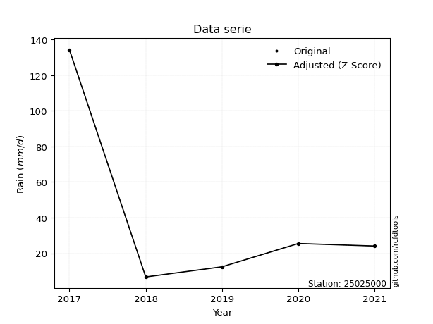</img>

</div>


> The initial value (value_initial) correspond to the initial obtained or null completed value, and value (value) is adjusted only when the initial value is outside the valid range (outlier) definite through the Z-Score value. If Z-Score is active, values out of range or outliers are replaced with the station mean value. A Z-Score (or standard score) measures how many standard deviations a data point is from the mean of a dataset, indicating its relative position; positive scores mean above the mean, negative mean below, and a score of zero is exactly at the mean, allowing for comparison of values from different distributions. It´s calculated using the formula $z=(x–μ)/σ$, where $x$ is the data point, $μ$ is the mean, and $σ$ is the standard deviation, helping identify outliers and understand probability.
>
> <sub>**Note**: In this study, "completing" (filling gaps in) and "extending" (forecasting or lengthening the historical record) rainfall data series are avoided for certain critical analyses because they introduce artificial bias and uncertainty, which can distort the statistics of rare events (extremes), alter day-to-day variability, and compromise the integrity and homogeneity of the original data. Some reasons against Completing/Extending rainfall data are: **Distortion of Extremes and Variability**: The primary issue is that most gap-filling or extension methods rely on averaging or regression with nearby stations, which inherently smooths the data. Rainfall is highly variable in space and time, with a large percentage of zero values and occasional large storms. Infilling methods often underestimate the highest values and overestimate the lowest (zero) values, which severely distorts analyses focused on flood frequency, drought severity, and intensity-duration-frequency (IDF) curves, **Loss of Data Homogeneity**: Infilled or extended data are synthetic estimates, not actual measurements. Combining these estimates with observed data can violate the assumption of data homogeneity, which requires that the data properties do not change over time. Inhomogeneity can lead to incorrect conclusions about long-term trends or changes in climate patterns, **Propagation of Errors**: Errors and biases from the original data (e.g., wind-induced undercatch, instrument errors, site changes) or the data used for imputation can propagate through the analysis, leading to unreliable hydrological models and inaccurate predictions, **Compromised Statistical Integrity**: For statistical analyses, especially those involving the frequency of events, using artificial data can introduce time bias or autocorrelation that doesn´t exist in reality, making it difficult to assess the true probability of events, **Difficulty in Validation**: It is difficult to accurately validate the quality of filled or extended data, especially for past periods where ground-truth measurements are unavailable. The reliability of imputation techniques heavily depends on the density of the surrounding station network and the complexity of the local topography.</sub>


### 4. Active continuous probability distributions from SciPy (80 of 104 available)

A Probability Density Function (PDF) describes the relative likelihood of a continuous random variable falling within a specific range, where the total area under its curve equals 1, and the area over any interval gives the actual probability for that range. Unlike discrete probabilities (like rolling a die), a PDF shows density, not direct probability for a single point (which is zero), with higher points indicating higher likelihood, often visualized as a bell curve for normal distributions.

A log of a probability density function (log-PDF) is simply the logarithm of the PDF´s value, denoted as $log(f(x))$, useful for converting multiplication of probabilities into addition, improving numerical stability with tiny numbers, and connecting to information theory concepts like entropy. Instead of dealing with very small probabilities (e.g., 0.000001), log-PDFs use negative numbers (e.g., $log(0.00001) ≈ -11.51$ that are easier for computers to handle, preventing underflow errors and simplifying complex calculations. In this study, each active probability distribution from SciPy is also evaluated in the $log$ form.

[scipy.stats](https://docs.scipy.org/doc/scipy/reference/stats.html) is a Python´s powerful submodule within the SciPy library for comprehensive statistical analysis, offering over 130 probability distributions (like Normal, Poisson, etc.), functions for descriptive stats (mean, variance), hypothesis testing (t-tests, chi-square), random variable generation, and statistical tests, making it essential for data science, modeling, and research. It provides tools to explore, model, and draw conclusions from data efficiently, working seamlessly with [NumPy](https://numpy.org/).

<div align="center">

|   id | p_dist           |   n_parameter | fit_method   | label                                                                       | active   | ref                                                                                                      |
|-----:|:-----------------|--------------:|:-------------|:----------------------------------------------------------------------------|:---------|:---------------------------------------------------------------------------------------------------------|
|    0 | alpha            |             3 | MLE          | Alpha                                                                       | True     | [:mortar_board:](https://docs.scipy.org/doc/scipy/reference/generated/scipy.stats.alpha.html)            |
|    1 | anglit           |             2 | MM           | Anglit                                                                      | True     | [:mortar_board:](https://docs.scipy.org/doc/scipy/reference/generated/scipy.stats.anglit.html)           |
|    2 | arcsine          |             2 | MM           | Arcsine                                                                     | True     | [:mortar_board:](https://docs.scipy.org/doc/scipy/reference/generated/scipy.stats.arcsine.html)          |
|    3 | argus            |             3 | MLE          | Argus                                                                       | True     | [:mortar_board:](https://docs.scipy.org/doc/scipy/reference/generated/scipy.stats.argus.html)            |
|    4 | beta             |             4 | MLE          | Beta                                                                        | True     | [:mortar_board:](https://docs.scipy.org/doc/scipy/reference/generated/scipy.stats.beta.html)             |
|    5 | betaprime        |             4 | MLE          | Beta prime                                                                  | True     | [:mortar_board:](https://docs.scipy.org/doc/scipy/reference/generated/scipy.stats.betaprime.html)        |
|    6 | bradford         |             3 | MLE          | Bradford                                                                    | True     | [:mortar_board:](https://docs.scipy.org/doc/scipy/reference/generated/scipy.stats.bradford.html)         |
|    7 | burr             |             4 | MLE          | Burr (Type III)                                                             | True     | [:mortar_board:](https://docs.scipy.org/doc/scipy/reference/generated/scipy.stats.burr.html)             |
|    8 | burr12           |             4 | MLE          | Burr (Type III) 12                                                          | True     | [:mortar_board:](https://docs.scipy.org/doc/scipy/reference/generated/scipy.stats.burr12.html)           |
|    9 | cosine           |             2 | MLE          | Cosine                                                                      | True     | [:mortar_board:](https://docs.scipy.org/doc/scipy/reference/generated/scipy.stats.cosine.html)           |
|   10 | crystalball      |             4 | MLE          | Crystalball                                                                 | True     | [:mortar_board:](https://docs.scipy.org/doc/scipy/reference/generated/scipy.stats.crystalball.html)      |
|   11 | dgamma           |             3 | MLE          | Double gamma                                                                | True     | [:mortar_board:](https://docs.scipy.org/doc/scipy/reference/generated/scipy.stats.dgamma.html)           |
|   12 | dweibull         |             3 | MLE          | Double Weibull                                                              | True     | [:mortar_board:](https://docs.scipy.org/doc/scipy/reference/generated/scipy.stats.dweibull.html)         |
|   13 | erlang           |             3 | MLE          | Erlang                                                                      | True     | [:mortar_board:](https://docs.scipy.org/doc/scipy/reference/generated/scipy.stats.erlang.html)           |
|   14 | exponnorm        |             3 | MLE          | Exponentially modified Normal                                               | True     | [:mortar_board:](https://docs.scipy.org/doc/scipy/reference/generated/scipy.stats.exponnorm.html)        |
|   15 | exponpow         |             3 | MLE          | Exponential power                                                           | True     | [:mortar_board:](https://docs.scipy.org/doc/scipy/reference/generated/scipy.stats.exponpow.html)         |
|   16 | exponweib        |             4 | MLE          | Exponentiated Weibull                                                       | True     | [:mortar_board:](https://docs.scipy.org/doc/scipy/reference/generated/scipy.stats.exponweib.html)        |
|   17 | f                |             4 | MLE          | F                                                                           | True     | [:mortar_board:](https://docs.scipy.org/doc/scipy/reference/generated/scipy.stats.f.html)                |
|   18 | fatiguelife      |             3 | MLE          | Fatigue-life (Birnbaum-Saunders)                                            | True     | [:mortar_board:](https://docs.scipy.org/doc/scipy/reference/generated/scipy.stats.fatiguelife.html)      |
|   19 | foldnorm         |             3 | MM           | Fold Normal                                                                 | True     | [:mortar_board:](https://docs.scipy.org/doc/scipy/reference/generated/scipy.stats.foldnorm.html)         |
|   20 | gamma            |             3 | MLE          | Gamma                                                                       | True     | [:mortar_board:](https://docs.scipy.org/doc/scipy/reference/generated/scipy.stats.gamma.html)            |
|   21 | gausshyper       |             6 | MLE          | Gauss hypergeometric                                                        | True     | [:mortar_board:](https://docs.scipy.org/doc/scipy/reference/generated/scipy.stats.gausshyper.html)       |
|   22 | genexpon         |             5 | MLE          | Generalized exponential                                                     | True     | [:mortar_board:](https://docs.scipy.org/doc/scipy/reference/generated/scipy.stats.genexpon.html)         |
|   23 | genextreme       |             3 | MLE          | Generalized exponential                                                     | True     | [:mortar_board:](https://docs.scipy.org/doc/scipy/reference/generated/scipy.stats.genextreme.html)       |
|   24 | gengamma         |             4 | MLE          | Generalized gamma                                                           | True     | [:mortar_board:](https://docs.scipy.org/doc/scipy/reference/generated/scipy.stats.gengamma.html)         |
|   25 | genhalflogistic  |             3 | MLE          | Generalized half-logistic                                                   | True     | [:mortar_board:](https://docs.scipy.org/doc/scipy/reference/generated/scipy.stats.genhalflogistic.html)  |
|   26 | genlogistic      |             3 | MLE          | Generalized logistic                                                        | True     | [:mortar_board:](https://docs.scipy.org/doc/scipy/reference/generated/scipy.stats.genlogistic.html)      |
|   27 | gennorm          |             3 | MLE          | Generalized Normal                                                          | True     | [:mortar_board:](https://docs.scipy.org/doc/scipy/reference/generated/scipy.stats.gennorm.html)          |
|   28 | genpareto        |             3 | MLE          | Generalized Pareto                                                          | True     | [:mortar_board:](https://docs.scipy.org/doc/scipy/reference/generated/scipy.stats.genpareto.html)        |
|   29 | gompertz         |             3 | MLE          | Gompertz (or truncated Gumbel)                                              | True     | [:mortar_board:](https://docs.scipy.org/doc/scipy/reference/generated/scipy.stats.gompertz.html)         |
|   30 | gumbel_l         |             2 | MM           | Gumbel Left Skew                                                            | True     | [:mortar_board:](https://docs.scipy.org/doc/scipy/reference/generated/scipy.stats.gumbel_l.html)         |
|   31 | gumbel_r         |             2 | MM           | Gumbel Right Skew                                                           | True     | [:mortar_board:](https://docs.scipy.org/doc/scipy/reference/generated/scipy.stats.gumbel_r.html)         |
|   32 | halfgennorm      |             3 | MLE          | Upper half of a generalized normal                                          | True     | [:mortar_board:](https://docs.scipy.org/doc/scipy/reference/generated/scipy.stats.halfgennorm.html)      |
|   33 | halflogistic     |             2 | MM           | Half-logistic                                                               | True     | [:mortar_board:](https://docs.scipy.org/doc/scipy/reference/generated/scipy.stats.halflogistic.html)     |
|   34 | halfnorm         |             2 | MM           | Half Normal                                                                 | True     | [:mortar_board:](https://docs.scipy.org/doc/scipy/reference/generated/scipy.stats.halfnorm.html)         |
|   35 | hypsecant        |             2 | MM           | hyperbolic secant                                                           | True     | [:mortar_board:](https://docs.scipy.org/doc/scipy/reference/generated/scipy.stats.hypsecant.html)        |
|   36 | invgamma         |             3 | MLE          | Inverted gamma                                                              | True     | [:mortar_board:](https://docs.scipy.org/doc/scipy/reference/generated/scipy.stats.invgamma.html)         |
|   37 | invgauss         |             3 | MLE          | Inverse Gaussian                                                            | True     | [:mortar_board:](https://docs.scipy.org/doc/scipy/reference/generated/scipy.stats.invgauss.html)         |
|   38 | invweibull       |             3 | MLE          | Inverted Weibull                                                            | True     | [:mortar_board:](https://docs.scipy.org/doc/scipy/reference/generated/scipy.stats.invweibull.html)       |
|   39 | johnsonsb        |             4 | MLE          | Johnson SB                                                                  | True     | [:mortar_board:](https://docs.scipy.org/doc/scipy/reference/generated/scipy.stats.johnsonsb.html)        |
|   40 | johnsonsu        |             4 | MLE          | Johnson Su                                                                  | True     | [:mortar_board:](https://docs.scipy.org/doc/scipy/reference/generated/scipy.stats.johnsonsu.html)        |
|   41 | kappa3           |             3 | MLE          | Kappa 3                                                                     | True     | [:mortar_board:](https://docs.scipy.org/doc/scipy/reference/generated/scipy.stats.kappa3.html)           |
|   42 | kappa4           |             4 | MLE          | Kappa 4                                                                     | True     | [:mortar_board:](https://docs.scipy.org/doc/scipy/reference/generated/scipy.stats.kappa4.html)           |
|   43 | ksone            |             3 | MLE          | Kolmogorov-Smirnov one-sided test statistic distribution                    | True     | [:mortar_board:](https://docs.scipy.org/doc/scipy/reference/generated/scipy.stats.ksone.html)            |
|   44 | kstwobign        |             2 | MLE          | Limiting distribution of scaled Kolmogorov-Smirnov two-sided test statistic | True     | [:mortar_board:](https://docs.scipy.org/doc/scipy/reference/generated/scipy.stats.kstwobign.html)        |
|   45 | laplace          |             2 | MM           | Laplace                                                                     | True     | [:mortar_board:](https://docs.scipy.org/doc/scipy/reference/generated/scipy.stats.laplace.html)          |
|   46 | levy_l           |             2 | MLE          | Left-skewed Levy                                                            | True     | [:mortar_board:](https://docs.scipy.org/doc/scipy/reference/generated/scipy.stats.levy_l.html)           |
|   47 | loggamma         |             3 | MLE          | Log gamma                                                                   | True     | [:mortar_board:](https://docs.scipy.org/doc/scipy/reference/generated/scipy.stats.loggamma.html)         |
|   48 | logistic         |             2 | MM           | Logistic (or Sech-squared)                                                  | True     | [:mortar_board:](https://docs.scipy.org/doc/scipy/reference/generated/scipy.stats.logistic.html)         |
|   49 | loglaplace       |             3 | MLE          | Log-Laplace                                                                 | True     | [:mortar_board:](https://docs.scipy.org/doc/scipy/reference/generated/scipy.stats.loglaplace.html)       |
|   50 | lomax            |             3 | MLE          | Lomax (Pareto of the second kind)                                           | True     | [:mortar_board:](https://docs.scipy.org/doc/scipy/reference/generated/scipy.stats.lomax.html)            |
|   51 | maxwell          |             2 | MM           | Maxwell                                                                     | True     | [:mortar_board:](https://docs.scipy.org/doc/scipy/reference/generated/scipy.stats.maxwell.html)          |
|   52 | mielke           |             4 | MLE          | Mielke Beta-Kappa / Dagum                                                   | True     | [:mortar_board:](https://docs.scipy.org/doc/scipy/reference/generated/scipy.stats.mielke.html)           |
|   53 | moyal            |             2 | MM           | Moyal                                                                       | True     | [:mortar_board:](https://docs.scipy.org/doc/scipy/reference/generated/scipy.stats.moyal.html)            |
|   54 | nakagami         |             3 | MLE          | Nakagami                                                                    | True     | [:mortar_board:](https://docs.scipy.org/doc/scipy/reference/generated/scipy.stats.nakagami.html)         |
|   55 | ncf              |             5 | MLE          | Non-central F distribution                                                  | True     | [:mortar_board:](https://docs.scipy.org/doc/scipy/reference/generated/scipy.stats.ncf.html)              |
|   56 | nct              |             4 | MLE          | Non-central Student’s t                                                     | True     | [:mortar_board:](https://docs.scipy.org/doc/scipy/reference/generated/scipy.stats.nct.html)              |
|   57 | norm             |             2 | MM           | Normal                                                                      | True     | [:mortar_board:](https://docs.scipy.org/doc/scipy/reference/generated/scipy.stats.norm.html)             |
|   58 | pearson3         |             3 | MM           | Pearson type III                                                            | True     | [:mortar_board:](https://docs.scipy.org/doc/scipy/reference/generated/scipy.stats.pearson3.html)         |
|   59 | powerlaw         |             3 | MLE          | Power-function                                                              | True     | [:mortar_board:](https://docs.scipy.org/doc/scipy/reference/generated/scipy.stats.powerlaw.html)         |
|   60 | rayleigh         |             2 | MM           | Rayleigh                                                                    | True     | [:mortar_board:](https://docs.scipy.org/doc/scipy/reference/generated/scipy.stats.rayleigh.html)         |
|   61 | rdist            |             3 | MLE          | R-distributed (symmetric beta)                                              | True     | [:mortar_board:](https://docs.scipy.org/doc/scipy/reference/generated/scipy.stats.rdist.html)            |
|   62 | rice             |             3 | MLE          | Rice                                                                        | True     | [:mortar_board:](https://docs.scipy.org/doc/scipy/reference/generated/scipy.stats.rice.html)             |
|   63 | semicircular     |             2 | MM           | Semicircular                                                                | True     | [:mortar_board:](https://docs.scipy.org/doc/scipy/reference/generated/scipy.stats.semicircular.html)     |
|   64 | skewnorm         |             3 | MLE          | Skew normal                                                                 | True     | [:mortar_board:](https://docs.scipy.org/doc/scipy/reference/generated/scipy.stats.skewnorm.html)         |
|   65 | t                |             3 | MLE          | Student’s t                                                                 | True     | [:mortar_board:](https://docs.scipy.org/doc/scipy/reference/generated/scipy.stats.t.html)                |
|   66 | trapezoid        |             4 | MLE          | Trapezoid                                                                   | True     | [:mortar_board:](https://docs.scipy.org/doc/scipy/reference/generated/scipy.stats.trapezoid.html)        |
|   67 | triang           |             3 | MLE          | Triangular                                                                  | True     | [:mortar_board:](https://docs.scipy.org/doc/scipy/reference/generated/scipy.stats.triang.html)           |
|   68 | truncexpon       |             3 | MLE          | Truncated exponential                                                       | True     | [:mortar_board:](https://docs.scipy.org/doc/scipy/reference/generated/scipy.stats.truncexpon.html)       |
|   69 | truncnorm        |             4 | MLE          | Truncated normal                                                            | True     | [:mortar_board:](https://docs.scipy.org/doc/scipy/reference/generated/scipy.stats.truncnorm.html)        |
|   70 | truncpareto      |             4 | MLE          | Upper truncated Pareto                                                      | True     | [:mortar_board:](https://docs.scipy.org/doc/scipy/reference/generated/scipy.stats.truncpareto.html)      |
|   71 | truncweibull_min |             5 | MLE          | Doubly truncated Weibull minimum                                            | True     | [:mortar_board:](https://docs.scipy.org/doc/scipy/reference/generated/scipy.stats.truncweibull_min.html) |
|   72 | tukeylambda      |             3 | MLE          | Tukey-Lamdba                                                                | True     | [:mortar_board:](https://docs.scipy.org/doc/scipy/reference/generated/scipy.stats.tukeylambda.html)      |
|   73 | uniform          |             2 | MLE          | Uniform                                                                     | True     | [:mortar_board:](https://docs.scipy.org/doc/scipy/reference/generated/scipy.stats.uniform.html)          |
|   74 | vonmises         |             3 | MLE          | Von Mises                                                                   | True     | [:mortar_board:](https://docs.scipy.org/doc/scipy/reference/generated/scipy.stats.vonmises.html)         |
|   75 | vonmises_line    |             3 | MLE          | Von Mises line                                                              | True     | [:mortar_board:](https://docs.scipy.org/doc/scipy/reference/generated/scipy.stats.vonmises_line.html)    |
|   76 | wald             |             2 | MM           | Wald                                                                        | True     | [:mortar_board:](https://docs.scipy.org/doc/scipy/reference/generated/scipy.stats.wald.html)             |
|   77 | weibull_max      |             3 | MLE          | Weibull maximum                                                             | True     | [:mortar_board:](https://docs.scipy.org/doc/scipy/reference/generated/scipy.stats.weibull_max.html)      |
|   78 | weibull_min      |             3 | MLE          | Weibull minimum                                                             | True     | [:mortar_board:](https://docs.scipy.org/doc/scipy/reference/generated/scipy.stats.weibull_min.html)      |
|   79 | wrapcauchy       |             3 | MLE          | Wrapped  Cauchy                                                             | True     | [:mortar_board:](https://docs.scipy.org/doc/scipy/reference/generated/scipy.stats.wrapcauchy.html)       |

</div>

> **n_parameter:** # arguments & localization & scale.
>
> **Fit methods:** (MLE) maximum likelihood, (MM) L-moments.
>
>**Inactive** (With the only purpose of prevent loops, zero divisions, infinite values, over high estimated values or horizontal trending for recurrence intervals estimations, the follow distributions were disabled.)**:** lognorm, norminvgauss, powernorm, powerlognorm, cauchy, halfcauchy, foldcauchy, skewcauchy, chi2, expon, fisk, genhyperbolic, geninvgauss, gibrat, kstwo, laplace_asymmetric, levy, levy_stable, ncx2, pareto, rel_breitwigner, recipinvgauss, studentized_range, loguniform, 


## B. Probability (PDF) vs. Empirical (EDF) distributions functions

A continuous probability distribution (CPD) describes probabilities for variables that can take any value within a range (like rain any time), unlike discrete variables with specific outcomes (like temperature). It uses a Probability Density Function (PDF), a curve where the total area under it equals 1, and the probability of the variable falling within an interval (a to b) is found by calculating the area under the curve between those points. A key feature is that the probability of hitting any single exact value is zero, so probabilities are always expressed for ranges, e.g., $P(a ≤ X ≤ b)$.

<div align="center">

Distributions parameters from station values
|     |   station | p_dist              |   n |             loc |          scale | shape                  | shape1                | shape2                 | shape3             |
|----:|----------:|:--------------------|----:|----------------:|---------------:|:-----------------------|:----------------------|:-----------------------|:-------------------|
|   0 |  25025000 | alpha               |   5 |     -0.0268752  |   12.5063      | 6.687525496205067e-09  |                       |                        |                    |
|   1 |  25025000 | anglit              |   5 |     40.602      |  138.689       |                        |                       |                        |                    |
|   2 |  25025000 | arcsine             |   5 |    -26.4439     |  134.092       |                        |                       |                        |                    |
|   3 |  25025000 | argus               |   5 |    -62.0969     |  206.752       | 2.2727589825345084e-06 |                       |                        |                    |
|   4 |  25025000 | beta                |   5 |     -6.21108    |  140.571       | 0.031854405844347476   | 0.11755171761563375   |                        |                    |
|   5 |  25025000 | betaprime           |   5 |      3.41673    |    0.0633917   | 146.83263172011746     | 0.9582657427231943    |                        |                    |
|   6 |  25025000 | bradford            |   5 |      6.6899     |  127.67        | 5.370825557049672      |                       |                        |                    |
|   7 |  25025000 | burr                |   5 |     -0.204804   |    0.396528    | 1.2782972581535206     | 103.28780211213567    |                        |                    |
|   8 |  25025000 | burr12              |   5 |     -0.791164   |    7.35803     | 243.86118940840495     | 0.0034167308473659944 |                        |                    |
|   9 |  25025000 | cosine              |   5 |     49.6449     |   40.7091      |                        |                       |                        |                    |
|  10 |  25025000 | crystalball         |   5 |     40.6017     |   47.4066      | 134945.86093903505     | 2624.222328663236     |                        |                    |
|  11 |  25025000 | dgamma              |   5 |     24.07       |   46.5691      | 0.8012266773558825     |                       |                        |                    |
|  12 |  25025000 | dweibull            |   5 |     24.07       |   51.0502      | 0.6846938850289414     |                       |                        |                    |
|  13 |  25025000 | erlang              |   5 |      6.69       |   45.4272      | 0.5520816711244667     |                       |                        |                    |
|  14 |  25025000 | exponnorm           |   5 |      6.65498    |    0.0108056   | 3118.4560166020347     |                       |                        |                    |
|  15 |  25025000 | exponpow            |   5 |      6.69       |  134.876       | 0.2735547011541499     |                       |                        |                    |
|  16 |  25025000 | exponweib           |   5 |      6.69       |    6.72239     | 2.1156658781451068     | 0.29510684026217593   |                        |                    |
|  17 |  25025000 | f                   |   5 |      6.69       |    6.12257     | 0.6978389130658742     | 1.5311470813465797    |                        |                    |
|  18 |  25025000 | fatiguelife         |   5 |      6.69       |    1.6457e-05  | 1268.063880062431      |                       |                        |                    |
|  19 |  25025000 | foldnorm            |   5 |    -24.9773     |   81.8014      | 0.0022302303899946474  |                       |                        |                    |
|  20 |  25025000 | gamma               |   5 |      6.69       |   30.5473      | 0.526718892355801      |                       |                        |                    |
|  21 |  25025000 | gausshyper          |   5 |     -5.76169    |  140.122       | 0.8929588974138101     | 0.9246972491971319    | 1.296090683963964      | 1.1638347262787736 |
|  22 |  25025000 | genexpon            |   5 |      6.68999    |   59.9736      | 1.7685211320377783     | 9.031754367363272e-11 | 1.7388145432888273     |                    |
|  23 |  25025000 | genextreme          |   5 |     12.6023     |    9.75728     | -1.1979512133183094    |                       |                        |                    |
|  24 |  25025000 | gengamma            |   5 |      6.69       |   54.9942      | 0.5188791750093384     | 0.9380705743837788    |                        |                    |
|  25 |  25025000 | genhalflogistic     |   5 |     -6.27513    |  146.962       | 1.0449869944052352     |                       |                        |                    |
|  26 |  25025000 | genlogistic         |   5 |   -177.678      |   25.5332      | 2447.8347850128857     |                       |                        |                    |
|  27 |  25025000 | gennorm             |   5 |     24.07       |    0.150264    | 0.30488983998097274    |                       |                        |                    |
|  28 |  25025000 | genpareto           |   5 |      6.69       |   10.7311      | 1.1554052986847436     |                       |                        |                    |
|  29 |  25025000 | gompertz            |   5 |      6.69       |  101.541       | 1.3529817002759628     |                       |                        |                    |
|  30 |  25025000 | gumbel_l            |   5 |     61.9384     |   36.9643      |                        |                       |                        |                    |
|  31 |  25025000 | gumbel_r            |   5 |     19.2656     |   36.9643      |                        |                       |                        |                    |
|  32 |  25025000 | halfgennorm         |   5 |      6.69       |    5.66121     | 0.550158307817614      |                       |                        |                    |
|  33 |  25025000 | halflogistic        |   5 |    -15.5882     |   40.5327      |                        |                       |                        |                    |
|  34 |  25025000 | halfnorm            |   5 |    -22.1484     |   78.646       |                        |                       |                        |                    |
|  35 |  25025000 | hypsecant           |   5 |     40.602      |   30.1813      |                        |                       |                        |                    |
|  36 |  25025000 | invgamma            |   5 |      3.38525    |    9.30612     | 0.9582443530030249     |                       |                        |                    |
|  37 |  25025000 | invgauss            |   5 |      4.5888     |    8.73939     | 4.120789634886255      |                       |                        |                    |
|  38 |  25025000 | invweibull          |   5 |      4.45729    |    8.14496     | 0.8347577636744694     |                       |                        |                    |
|  39 |  25025000 | johnsonsb           |   5 |      6.69       |  379.351       | 1.9700679849120646     | 0.09160867827960933   |                        |                    |
|  40 |  25025000 | johnsonsu           |   5 |      6.69       |    4.28642e-12 | -4.29621500386774      | 0.17098310373183395   |                        |                    |
|  41 |  25025000 | kappa3              |   5 |      6.69       |    2.86345     | 0.06839369445291316    |                       |                        |                    |
|  42 |  25025000 | kappa4              |   5 |     -5.97756    |  140.934       | 1.0987233204554165     | 0.9927351680390628    |                        |                    |
|  43 |  25025000 | ksone               |   5 |     -6.077      |  153.204       | 1.0                    |                       |                        |                    |
|  44 |  25025000 | kstwobign           |   5 |    -78.0827     |  138.55        |                        |                       |                        |                    |
|  45 |  25025000 | laplace             |   5 |     40.602      |   33.5229      |                        |                       |                        |                    |
|  46 |  25025000 | levy_l              |   5 |    144.031      |   37.022       |                        |                       |                        |                    |
|  47 |  25025000 | loggamma            |   5 | -14517.6        | 1966.08        | 1644.2800682779798     |                       |                        |                    |
|  48 |  25025000 | logistic            |   5 |     40.602      |   26.1377      |                        |                       |                        |                    |
|  49 |  25025000 | loglaplace          |   5 |     -0.120031   |   24.19        | 1.351301842422702      |                       |                        |                    |
|  50 |  25025000 | lomax               |   5 |      6.68994    |   15.2367      | 1.240367431762179      |                       |                        |                    |
|  51 |  25025000 | maxwell             |   5 |    -71.7365     |   70.3977      |                        |                       |                        |                    |
|  52 |  25025000 | mielke              |   5 |      3.38875    |    0.0651977   | 126.37120936716568     | 0.9744479511691324    |                        |                    |
|  53 |  25025000 | moyal               |   5 |     13.4907     |   21.3414      |                        |                       |                        |                    |
|  54 |  25025000 | nakagami            |   5 |      6.69       |   83.24        | 0.1808900416068538     |                       |                        |                    |
|  55 |  25025000 | ncf                 |   5 |      3.38646    |    6.01712     | 6617.159742939963      | 1.9164881798193987    | 4062.9928055083005     |                    |
|  56 |  25025000 | nct                 |   5 |      0.0985505  |    0.225037    | 1.0066022337118878     | 54.73599063709152     |                        |                    |
|  57 |  25025000 | norm                |   5 |     40.602      |   47.4086      |                        |                       |                        |                    |
|  58 |  25025000 | pearson3            |   5 |     40.6021     |   47.4086      | 1.4166793202899746     |                       |                        |                    |
|  59 |  25025000 | powerlaw            |   5 |      6.69       |  127.67        | 0.10746915038062846    |                       |                        |                    |
|  60 |  25025000 | rayleigh            |   5 |    -50.0934     |   72.3645      |                        |                       |                        |                    |
|  61 |  25025000 | rdist               |   5 |     -5.71791    |   31.2179      | 1.3436566513451496     |                       |                        |                    |
|  62 |  25025000 | rice                |   5 |    -27.4131     |   58.6244      | 0.0005465180561250193  |                       |                        |                    |
|  63 |  25025000 | semicircular        |   5 |     40.602      |   94.8172      |                        |                       |                        |                    |
|  64 |  25025000 | skewnorm            |   5 |      6.68998    |   58.2852      | 14286835.156805612     |                       |                        |                    |
|  65 |  25025000 | t                   |   5 |     19.2593     |    9.30844     | 0.968829831310418      |                       |                        |                    |
|  66 |  25025000 | trapezoid           |   5 |     -6.38085    |  153.204       | 1.0                    | 1.0                   |                        |                    |
|  67 |  25025000 | triang              |   5 |    -74.8812     |  209.616       | 0.9990491379271411     |                       |                        |                    |
|  68 |  25025000 | truncexpon          |   5 |      6.68999    |   80.2687      | 1.5906371435118511     |                       |                        |                    |
|  69 |  25025000 | truncnorm           |   5 |  -2097.74       |  285.575       | 7.3690912365900765     | 179.42368034625247    |                        |                    |
|  70 |  25025000 | truncpareto         |   5 |      6.47167    |    0.218333    | 0.2698344004386685     | 585.7493529384196     |                        |                    |
|  71 |  25025000 | truncweibull_min    |   5 |      6.69       |  164.256       | 0.000514620296432037   | 6.391899340673006e-15 | 0.8092732053840014     |                    |
|  72 |  25025000 | tukeylambda         |   5 |     -5.98375    |   39.5929      | 1.2575662402940293     |                       |                        |                    |
|  73 |  25025000 | uniform             |   5 |      6.69       |  127.67        |                        |                       |                        |                    |
|  74 |  25025000 | vonmises            |   5 |      0.143139   |    1           | 1.2255375297087965     |                       |                        |                    |
|  75 |  25025000 | vonmises_line       |   5 |     26.6421     |   34.2877      | 1.2910149765907546     |                       |                        |                    |
|  76 |  25025000 | wald                |   5 |     -6.80661    |   47.4086      |                        |                       |                        |                    |
|  77 |  25025000 | weibull_max         |   5 |    134.36       |    1.68839     | 0.1772111796346803     |                       |                        |                    |
|  78 |  25025000 | weibull_min         |   5 |      6.69       |   41.9167      | 0.5295361542529765     |                       |                        |                    |
|  79 |  25025000 | wrapcauchy          |   5 |      6.69       |   20.3373      | 0.7868688760470999     |                       |                        |                    |
|  80 |  25025000 | logalpha            |   5 |     -1.80748    |   25.0698      | 5.257824184073938      |                       |                        |                    |
|  81 |  25025000 | loganglit           |   5 |      3.14753    |    2.9356      |                        |                       |                        |                    |
|  82 |  25025000 | logarcsine          |   5 |      1.72842    |    2.83825     |                        |                       |                        |                    |
|  83 |  25025000 | logargus            |   5 |      0.925152   |    4.19208     | 7.802988952038521e-05  |                       |                        |                    |
|  84 |  25025000 | logbeta             |   5 |      1.90061    |    3.94921     | 0.7175462334744498     | 1.6351239878905324    |                        |                    |
|  85 |  25025000 | logbetaprime        |   5 |      0.795401   |    2.02965     | 11.433868254066304     | 10.916929856073558    |                        |                    |
|  86 |  25025000 | logbradford         |   5 |      1.9006     |    2.99993     | 0.9792794726896209     |                       |                        |                    |
|  87 |  25025000 | logburr             |   5 |   -146.867      |  145.418       | 190.3975505092473      | 206.3671447970496     |                        |                    |
|  88 |  25025000 | logburr12           |   5 |      1.90061    |    2.06933     | 0.8939270076213136     | 2.41778153424649      |                        |                    |
|  89 |  25025000 | logcosine           |   5 |      3.23937    |    0.841941    |                        |                       |                        |                    |
|  90 |  25025000 | logcrystalball      |   5 |      3.14753    |    1.00349     | 7.56964128549674       | 1341.586213897614     |                        |                    |
|  91 |  25025000 | logdgamma           |   5 |      3.18097    |    1.04025     | 0.6748426628171091     |                       |                        |                    |
|  92 |  25025000 | logdweibull         |   5 |      3.23868    |    0.833429    | 0.8198099680732474     |                       |                        |                    |
|  93 |  25025000 | logerlang           |   5 |      1.90061    |    0.992739    | 0.7690584180914637     |                       |                        |                    |
|  94 |  25025000 | logexponnorm        |   5 |      2.18131    |    0.479007    | 2.01713034532208       |                       |                        |                    |
|  95 |  25025000 | logexponpow         |   5 |      1.90061    |    2.29138     | 0.990864748434868      |                       |                        |                    |
|  96 |  25025000 | logexponweib        |   5 |      1.90061    |    1.02191     | 1.0238945696771788     | 0.8443470724472784    |                        |                    |
|  97 |  25025000 | logf                |   5 |      1.90061    |    1.09943     | 0.6809744061502302     | 24.03755981085402     |                        |                    |
|  98 |  25025000 | logfatiguelife      |   5 |      1.18834    |    1.69246     | 0.5601435543809704     |                       |                        |                    |
|  99 |  25025000 | logfoldnorm         |   5 |      1.63637    |    1.21388     | 1.1104874548670458     |                       |                        |                    |
| 100 |  25025000 | loggamma            |   5 |      1.90061    |    1.27128     | 0.6863116854761735     |                       |                        |                    |
| 101 |  25025000 | loggausshyper       |   5 |      1.90061    |    3.0016      | 0.9793538792281142     | 0.989202524526706     | 1.0397104473371757     | 0.9861476859129772 |
| 102 |  25025000 | loggenexpon         |   5 |      1.89991    |    0.0126245   | 0.007483339494675889   | 1.3016125571478616    | 2.4909640856627275e-05 |                    |
| 103 |  25025000 | loggenextreme       |   5 |      2.66757    |    0.780201    | -0.032090290123400755  |                       |                        |                    |
| 104 |  25025000 | loggengamma         |   5 |      1.90061    |    1.02017     | 1.0603165544582676     | 0.8712416856552343    |                        |                    |
| 105 |  25025000 | loggenhalflogistic  |   5 |      1.69347    |    3.40265     | 1.0609909749455784     |                       |                        |                    |
| 106 |  25025000 | loggenlogistic      |   5 |     -2.32421    |    0.789562    | 565.3225493287915      |                       |                        |                    |
| 107 |  25025000 | loggennorm          |   5 |      3.18097    |    0.0379615   | 0.40327512122032316    |                       |                        |                    |
| 108 |  25025000 | loggenpareto        |   5 |     -0.107405   |    7.37304     | -1.4722740317007603    |                       |                        |                    |
| 109 |  25025000 | loggompertz         |   5 |      1.90061    |    3.20596     | 1.8051372372592684     |                       |                        |                    |
| 110 |  25025000 | loggumbel_l         |   5 |      3.59916    |    0.782415    |                        |                       |                        |                    |
| 111 |  25025000 | loggumbel_r         |   5 |      2.69591    |    0.782415    |                        |                       |                        |                    |
| 112 |  25025000 | loghalfgennorm      |   5 |      1.90061    |    2.31874     | 2.0994679834505305     |                       |                        |                    |
| 113 |  25025000 | loghalflogistic     |   5 |      1.95815    |    0.85796     |                        |                       |                        |                    |
| 114 |  25025000 | loghalfnorm         |   5 |      1.81931    |    1.66468     |                        |                       |                        |                    |
| 115 |  25025000 | loghypsecant        |   5 |      3.14753    |    0.638839    |                        |                       |                        |                    |
| 116 |  25025000 | loginvgamma         |   5 |      0.126288   |   26.3781      | 9.707234962943723      |                       |                        |                    |
| 117 |  25025000 | loginvgauss         |   5 |      1.02064    |    7.99519     | 0.2660211223212724     |                       |                        |                    |
| 118 |  25025000 | loginvweibull       |   5 |    -21.6621     |   24.3297      | 31.184289703149204     |                       |                        |                    |
| 119 |  25025000 | logjohnsonsb        |   5 |      1.90061    |    5.24633     | 1.1281808451965352     | 0.09717747226487447   |                        |                    |
| 120 |  25025000 | logjohnsonsu        |   5 |      1.02397    |    0.104289    | -7.340155992912013     | 2.043429458008598     |                        |                    |
| 121 |  25025000 | logkappa3           |   5 |      1.90061    |    2.95342     | 82.67085694184696      |                       |                        |                    |
| 122 |  25025000 | logkappa4           |   5 |      1.51347    |    3.33087     | 1.131346052587673      | 0.9812040845328359    |                        |                    |
| 123 |  25025000 | logksone            |   5 |      1.60062    |    3.59989     | 1.0                    |                       |                        |                    |
| 124 |  25025000 | logkstwobign        |   5 |     -0.110445   |    3.74144     |                        |                       |                        |                    |
| 125 |  25025000 | loglaplace          |   5 |      3.14753    |    0.709571    |                        |                       |                        |                    |
| 126 |  25025000 | loglevy_l           |   5 |      5.07286    |    0.659402    |                        |                       |                        |                    |
| 127 |  25025000 | logloggamma         |   5 |   -316.17       |   42.7501      | 1754.068291279903      |                       |                        |                    |
| 128 |  25025000 | loglogistic         |   5 |      3.14753    |    0.553251    |                        |                       |                        |                    |
| 129 |  25025000 | logloglaplace       |   5 |     -0.00493267 |    3.1859      | 4.179939950352727      |                       |                        |                    |
| 130 |  25025000 | loglomax            |   5 |      1.90061    |   52.4317      | 42.518822308337874     |                       |                        |                    |
| 131 |  25025000 | logmaxwell          |   5 |      0.769695   |    1.49009     |                        |                       |                        |                    |
| 132 |  25025000 | logmielke           |   5 |     -8.32659    |    8.59361     | 492.14632683778245     | 14.340993472646357    |                        |                    |
| 133 |  25025000 | logmoyal            |   5 |      2.57368    |    0.451727    |                        |                       |                        |                    |
| 134 |  25025000 | lognakagami         |   5 |      2.51689    |    1.02348     | 0.24146905177190803    |                       |                        |                    |
| 135 |  25025000 | logncf              |   5 |     -0.374728   |    3.29657     | 166.64039244335066     | 31.385321917137546    | 0.16903544866917986    |                    |
| 136 |  25025000 | lognct              |   5 |     -0.486768   |    0.194733    | 8.028005429099473      | 16.878295383751407    |                        |                    |
| 137 |  25025000 | lognorm             |   5 |      3.14753    |    1.00349     |                        |                       |                        |                    |
| 138 |  25025000 | logpearson3         |   5 |      3.14753    |    1.00348     | 0.633021787700304      |                       |                        |                    |
| 139 |  25025000 | logpowerlaw         |   5 |      1.90061    |    2.99991     | 0.12381238493021092    |                       |                        |                    |
| 140 |  25025000 | lograyleigh         |   5 |      1.22781    |    1.53172     |                        |                       |                        |                    |
| 141 |  25025000 | logrdist            |   5 |      2.68664    |    0.78603     | 1.3831782394855523     |                       |                        |                    |
| 142 |  25025000 | logrice             |   5 |      1.40454    |    1.42215     | 0.0007280768239364343  |                       |                        |                    |
| 143 |  25025000 | logsemicircular     |   5 |      3.14753    |    2.00697     |                        |                       |                        |                    |
| 144 |  25025000 | logskewnorm         |   5 |      1.90061    |    1.6004      | 28340458.329205632     |                       |                        |                    |
| 145 |  25025000 | logt                |   5 |      3.14754    |    1.00348     | 734582754.47905        |                       |                        |                    |
| 146 |  25025000 | logtrapezoid        |   5 |      1.60062    |    3.59989     | 1.0                    | 1.0                   |                        |                    |
| 147 |  25025000 | logtriang           |   5 |      0.618092   |    4.28243     | 0.9999999998028899     |                       |                        |                    |
| 148 |  25025000 | logtruncexpon       |   5 |      1.90061    |    3.07652     | 0.9750993168158808     |                       |                        |                    |
| 149 |  25025000 | logtruncnorm        |   5 |     -0.323247   |    2.15199     | 1.3197637434608642     | 2.4274264671569816    |                        |                    |
| 150 |  25025000 | logtruncpareto      |   5 |      1.88909    |    0.0115215   | 0.26250947265982777    | 261.3749220522893     |                        |                    |
| 151 |  25025000 | logtruncweibull_min |   5 |      1.89885    |    3.1681      | 0.9497885998330932     | 0.0005576765575364372 | 0.9474684944414415     |                    |
| 152 |  25025000 | logtukeylambda      |   5 |      2.56965    |    0.959443    | 1.4340762263026807     |                       |                        |                    |
| 153 |  25025000 | loguniform          |   5 |      1.90061    |    2.99991     |                        |                       |                        |                    |
| 154 |  25025000 | logvonmises         |   5 |      3.00238    |    1           | 1.4923990638769433     |                       |                        |                    |
| 155 |  25025000 | logvonmises_line    |   5 |      3.40136    |    0.477706    | 8.227310386073954e-05  |                       |                        |                    |
| 156 |  25025000 | logwald             |   5 |      2.14407    |    1.00346     |                        |                       |                        |                    |
| 157 |  25025000 | logweibull_max      |   5 |      4.90052    |    1.48095     | 0.7825797715427674     |                       |                        |                    |
| 158 |  25025000 | logweibull_min      |   5 |      1.90061    |    0.818425    | 0.5735515568064209     |                       |                        |                    |
| 159 |  25025000 | logwrapcauchy       |   5 |      1.90061    |    0.477467    | 0.1801207601027256     |                       |                        |                    |

</div>

> **loc** (Location parameter): This shifts the distribution along the x-axis. For many common distributions, like the normal (Gaussian) distribution, loc represents the mean $μ$. For others, like the uniform distribution, it might represent the minimum value, or for the beta distribution, the left end of the support interval.
>
> **scale** (Scale parameter): This determines the width or spread of the distribution. For the normal distribution, scale represents the standard deviation $σ$. For a uniform distribution, it defines the length of the interval (from $loc$ to $loc + scale$).
>
> **shape** (Shape parameters): Refers to parameters that define the specific form of a probability distribution, distinct from its location (loc) and scale (scale). These parameters are required arguments for most distribution functions. For example, a normal (Gaussian) distribution is fully defined by its location (mean) and scale (standard deviation), so it has no specific shape parameters beyond loc and scale. However, other distributions have intrinsic properties that need specification, as Gamma distribution that takes a shape parameter, often named $a$ or $alpha$.


### 0. Cumulative distribution values - CDF (160 evaluated)

Cumulative Distribution Function (CDF), denoted as $F$<sub>$X$</sub>$(x)$, is a function that gives the probability that a random variable $X$ will take a value less than or equal to a specific value, $x$ (i.e., $(P(X≥x)$. It essentially "accumulates" probabilities from a given point up to the far right (positive infinity), providing a complete picture of the distribution´s probabilities for both discrete (like rain) and continuous (like temperature) variables, helping to find probabilities over ranges or above certain values. Each station is evaluated separately ordering the $x$ values ascending, calculating the CDF and PDF values for the activated distributions and their logarithmic forms.

<div align="center">

CDF ordered by x ascending and calculating $log(f(x))$ separately
|   id |   Station |   date |      x |   count |   mean |     std |    zscore |   Value_initial |   station |   m |     alpha |   alpha_pdf |   anglit |   anglit_pdf |   arcsine |   arcsine_pdf |    argus |   argus_pdf |     beta |    beta_pdf |   betaprime |   betaprime_pdf |    bradford |   bradford_pdf |      burr |    burr_pdf |   burr12 |   burr12_pdf |   cosine |   cosine_pdf |   crystalball |   crystalball_pdf |   dgamma |   dgamma_pdf |   dweibull |   dweibull_pdf |      erlang |       erlang_pdf |   exponnorm |   exponnorm_pdf |    exponpow |   exponpow_pdf |   exponweib |   exponweib_pdf |           f |            f_pdf |   fatiguelife |   fatiguelife_pdf |   foldnorm |   foldnorm_pdf |       gamma |   gamma_pdf |   gausshyper |   gausshyper_pdf |    genexpon |   genexpon_pdf |   genextreme |   genextreme_pdf |    gengamma |   gengamma_pdf |   genhalflogistic |   genhalflogistic_pdf |   genlogistic |   genlogistic_pdf |   gennorm |   gennorm_pdf |   genpareto |   genpareto_pdf |    gompertz |   gompertz_pdf |   gumbel_l |   gumbel_l_pdf |   gumbel_r |   gumbel_r_pdf |   halfgennorm |   halfgennorm_pdf |   halflogistic |   halflogistic_pdf |   halfnorm |   halfnorm_pdf |   hypsecant |   hypsecant_pdf |   invgamma |   invgamma_pdf |   invgauss |   invgauss_pdf |   invweibull |   invweibull_pdf |   johnsonsb |   johnsonsb_pdf |   johnsonsu |   johnsonsu_pdf |     kappa3 |   kappa3_pdf |      kappa4 |   kappa4_pdf |     ksone |   ksone_pdf |   kstwobign |   kstwobign_pdf |   laplace |   laplace_pdf |   levy_l |   levy_l_pdf |    loggamma |   loggamma_pdf |   logistic |   logistic_pdf |   loglaplace |   loglaplace_pdf |       lomax |   lomax_pdf |   maxwell |   maxwell_pdf |      mielke |   mielke_pdf |    moyal |   moyal_pdf |    nakagami |   nakagami_pdf |       ncf |     ncf_pdf |       nct |     nct_pdf |     norm |   norm_pdf |   pearson3 |   pearson3_pdf |   powerlaw |   powerlaw_pdf |   rayleigh |   rayleigh_pdf |    rdist |    rdist_pdf |     rice |   rice_pdf |   semicircular |   semicircular_pdf |   skewnorm |   skewnorm_pdf |        t |       t_pdf |   trapezoid |   trapezoid_pdf |   triang |   triang_pdf |   truncexpon |   truncexpon_pdf |   truncnorm |   truncnorm_pdf |   truncpareto |   truncpareto_pdf |   truncweibull_min |   truncweibull_min_pdf |   tukeylambda |   tukeylambda_pdf |   uniform |   uniform_pdf |   vonmises |   vonmises_pdf |   vonmises_line |   vonmises_line_pdf |     wald |    wald_pdf |   weibull_max |   weibull_max_pdf |   weibull_min |   weibull_min_pdf |   wrapcauchy |   wrapcauchy_pdf |   logalpha |   logalpha_pdf |   loganglit |   loganglit_pdf |   logarcsine |   logarcsine_pdf |   logargus |   logargus_pdf |     logbeta |   logbeta_pdf |   logbetaprime |   logbetaprime_pdf |   logbradford |   logbradford_pdf |   logburr |   logburr_pdf |   logburr12 |   logburr12_pdf |   logcosine |   logcosine_pdf |   logcrystalball |   logcrystalball_pdf |   logdgamma |   logdgamma_pdf |   logdweibull |   logdweibull_pdf |   logerlang |   logerlang_pdf |   logexponnorm |   logexponnorm_pdf |   logexponpow |   logexponpow_pdf |   logexponweib |   logexponweib_pdf |       logf |      logf_pdf |   logfatiguelife |   logfatiguelife_pdf |   logfoldnorm |   logfoldnorm_pdf |   loggausshyper |   loggausshyper_pdf |   loggenexpon |   loggenexpon_pdf |   loggenextreme |   loggenextreme_pdf |   loggengamma |   loggengamma_pdf |   loggenhalflogistic |   loggenhalflogistic_pdf |   loggenlogistic |   loggenlogistic_pdf |   loggennorm |   loggennorm_pdf |   loggenpareto |   loggenpareto_pdf |   loggompertz |   loggompertz_pdf |   loggumbel_l |   loggumbel_l_pdf |   loggumbel_r |   loggumbel_r_pdf |   loghalfgennorm |   loghalfgennorm_pdf |   loghalflogistic |   loghalflogistic_pdf |   loghalfnorm |   loghalfnorm_pdf |   loghypsecant |   loghypsecant_pdf |   loginvgamma |   loginvgamma_pdf |   loginvgauss |   loginvgauss_pdf |   loginvweibull |   loginvweibull_pdf |   logjohnsonsb |   logjohnsonsb_pdf |   logjohnsonsu |   logjohnsonsu_pdf |   logkappa3 |   logkappa3_pdf |   logkappa4 |   logkappa4_pdf |   logksone |   logksone_pdf |   logkstwobign |   logkstwobign_pdf |   loglevy_l |   loglevy_l_pdf |   logloggamma |   logloggamma_pdf |   loglogistic |   loglogistic_pdf |   logloglaplace |   logloglaplace_pdf |    loglomax |   loglomax_pdf |   logmaxwell |   logmaxwell_pdf |   logmielke |   logmielke_pdf |   logmoyal |   logmoyal_pdf |   lognakagami |   lognakagami_pdf |    logncf |   logncf_pdf |    lognct |   lognct_pdf |   lognorm |   lognorm_pdf |   logpearson3 |   logpearson3_pdf |   logpowerlaw |   logpowerlaw_pdf |   lograyleigh |   lograyleigh_pdf |    logrdist |   logrdist_pdf |   logrice |   logrice_pdf |   logsemicircular |   logsemicircular_pdf |   logskewnorm |   logskewnorm_pdf |     logt |   logt_pdf |   logtrapezoid |   logtrapezoid_pdf |   logtriang |   logtriang_pdf |   logtruncexpon |   logtruncexpon_pdf |   logtruncnorm |   logtruncnorm_pdf |   logtruncpareto |   logtruncpareto_pdf |   logtruncweibull_min |   logtruncweibull_min_pdf |   logtukeylambda |   logtukeylambda_pdf |   loguniform |   loguniform_pdf |   logvonmises |   logvonmises_pdf |   logvonmises_line |   logvonmises_line_pdf |   logwald |   logwald_pdf |   logweibull_max |   logweibull_max_pdf |   logweibull_min |   logweibull_min_pdf |   logwrapcauchy |   logwrapcauchy_pdf |
|-----:|----------:|-------:|-------:|--------:|-------:|--------:|----------:|----------------:|----------:|----:|----------:|------------:|---------:|-------------:|----------:|--------------:|---------:|------------:|---------:|------------:|------------:|----------------:|------------:|---------------:|----------:|------------:|---------:|-------------:|---------:|-------------:|--------------:|------------------:|---------:|-------------:|-----------:|---------------:|------------:|-----------------:|------------:|----------------:|------------:|---------------:|------------:|----------------:|------------:|-----------------:|--------------:|------------------:|-----------:|---------------:|------------:|------------:|-------------:|-----------------:|------------:|---------------:|-------------:|-----------------:|------------:|---------------:|------------------:|----------------------:|--------------:|------------------:|----------:|--------------:|------------:|----------------:|------------:|---------------:|-----------:|---------------:|-----------:|---------------:|--------------:|------------------:|---------------:|-------------------:|-----------:|---------------:|------------:|----------------:|-----------:|---------------:|-----------:|---------------:|-------------:|-----------------:|------------:|----------------:|------------:|----------------:|-----------:|-------------:|------------:|-------------:|----------:|------------:|------------:|----------------:|----------:|--------------:|---------:|-------------:|------------:|---------------:|-----------:|---------------:|-------------:|-----------------:|------------:|------------:|----------:|--------------:|------------:|-------------:|---------:|------------:|------------:|---------------:|----------:|------------:|----------:|------------:|---------:|-----------:|-----------:|---------------:|-----------:|---------------:|-----------:|---------------:|---------:|-------------:|---------:|-----------:|---------------:|-------------------:|-----------:|---------------:|---------:|------------:|------------:|----------------:|---------:|-------------:|-------------:|-----------------:|------------:|----------------:|--------------:|------------------:|-------------------:|-----------------------:|--------------:|------------------:|----------:|--------------:|-----------:|---------------:|----------------:|--------------------:|---------:|------------:|--------------:|------------------:|--------------:|------------------:|-------------:|-----------------:|-----------:|---------------:|------------:|----------------:|-------------:|-----------------:|-----------:|---------------:|------------:|--------------:|---------------:|-------------------:|--------------:|------------------:|----------:|--------------:|------------:|----------------:|------------:|----------------:|-----------------:|---------------------:|------------:|----------------:|--------------:|------------------:|------------:|----------------:|---------------:|-------------------:|--------------:|------------------:|---------------:|-------------------:|-----------:|--------------:|-----------------:|---------------------:|--------------:|------------------:|----------------:|--------------------:|--------------:|------------------:|----------------:|--------------------:|--------------:|------------------:|---------------------:|-------------------------:|-----------------:|---------------------:|-------------:|-----------------:|---------------:|-------------------:|--------------:|------------------:|--------------:|------------------:|--------------:|------------------:|-----------------:|---------------------:|------------------:|----------------------:|--------------:|------------------:|---------------:|-------------------:|--------------:|------------------:|--------------:|------------------:|----------------:|--------------------:|---------------:|-------------------:|---------------:|-------------------:|------------:|----------------:|------------:|----------------:|-----------:|---------------:|---------------:|-------------------:|------------:|----------------:|--------------:|------------------:|--------------:|------------------:|----------------:|--------------------:|------------:|---------------:|-------------:|-----------------:|------------:|----------------:|-----------:|---------------:|--------------:|------------------:|----------:|-------------:|----------:|-------------:|----------:|--------------:|--------------:|------------------:|--------------:|------------------:|--------------:|------------------:|------------:|---------------:|----------:|--------------:|------------------:|----------------------:|--------------:|------------------:|---------:|-----------:|---------------:|-------------------:|------------:|----------------:|----------------:|--------------------:|---------------:|-------------------:|-----------------:|---------------------:|----------------------:|--------------------------:|-----------------:|---------------------:|-------------:|-----------------:|--------------:|------------------:|-------------------:|-----------------------:|----------:|--------------:|-----------------:|---------------------:|-----------------:|---------------------:|----------------:|--------------------:|
|    0 |  25025000 |   2018 |   6.69 |       5 | 40.602 | 53.0044 | -0.639796 |            6.69 |  25025000 |   1 | 0.0626133 | 0.0390782   | 0.265112 |   0.00636522 |  0.331196 |    0.00550356 | 0.161353 |  0.00455253 | 0.735138 | 0.00197092  |   0.0552285 |     0.047604    | 2.26558e-06 |     0.0227181  | 0.0707304 | 0.0342943   | 0.013791 |  0.107952    | 0.193603 |   0.00583731 |      0.2372   |        0.00651562 | 0.292379 |   0.00773301 |   0.309953 |    0.00583903  | 6.70589e-10 | 416830           |  0.00103877 |     0.0296278   | 1.99498e-05 |    6.14443e+09 | 1.21888e-10 | 85680.9         | 9.49625e-05 | 577803           |     0.0352613 |       2.24671e+10 |   0.301335 |     0.00904973 | 2.19693e-09 | 1.30285e+06 |     0.168233 |       0.0113253  | 1.58893e-07 |    0.0294883   |     0.052568 |      0.0578934   | 7.56391e-09 |    4.14522e+06 |         0.0462451 |            0.00373973 |      0.167064 |       0.0117036   |  0.124984 |   0.00547053  | 2.38311e-12 |     0.0931873   | 1.58334e-13 |     0.0133245  |   0.200948 |    0.00484929  |   0.245308 |     0.00932566 |      0        |       0.103804    |       0.268102 |         0.011449   |   0.286147 |     0.00948563 |    0.200106 |     0.00620198  |  0.0552297 |    0.0476045   |  0.0525007 |    0.061249    |    0.0525678 |      0.0578935   |   0.0401575 |     8.91657e+12 | 2.89261e-05 |     1.88816e+06 | 0.00284983 |  1.14798e+09 | 3.01283e-15 |   0.192421   | 0.0833333 |  0.00652724 |    0.151795 |     0.010011    |  0.181817 |   0.00542367  | 0.396375 |   0.00131797 | 2.72053e-11 |  42044.1       |   0.214597 |     0.00644835 |    0.0862562 |        0.121561  | 4.67019e-06 | 0.0814057   |  0.256837 |    0.00756289 |   0.0607553 |    0.0496914 | 0.240905 |  0.0110216  | 5.75679e-07 |     2.3449e+08 | 0.0552294 | 0.0476044   | 0.0615399 | 0.0394781   | 0.237208 | 0.00651545 |   0.259968 |     0.0109867  |  0.0143248 |    1.73329e+12 |   0.264987 |     0.00797014 | 0.657265 |    0.013167  | 0.15566  | 0.00837828 |       0.277261 |         0.00627006 |  0         |      0.0136893 | 0.20552  | 0.0119883   |  0.00727893 |      0.00111377 | 0.151579 |   0.00371647 |  1.96465e-07 |       0.0156469  | 2.95408e-05 |     0.0262627   |    1.3525e-16 |       1.50559     |          0.0231991 |            1.38072e+10 |      0.692275 |         0.0153276 | 0         |    0.00783269 |    1.5998  |      0.367926  |        0.285159 |         0.00933455  | 0.149318 | 0.0225538   |      0.116211 |       0.000347186 |   1.48106e-09 |   883018          |  7.14933e-11 |       0.0656103  |  0.0664186 |      0.235081  |    0.124519 |        0.224944 |     0.158439 |         0.469788 |  0.0801086 |       0.161951 | 3.21774e-12 |  10398.3      |      0.0639535 |          0.259263  |   6.04012e-06 |          0.478127 |  0.068458 |     0.233422  | 1.28218e-14 |      51.6192    |   0.0878059 |        0.185389 |         0.10701  |             0.183704 |    0.086752 |       0.097938  |      0.114479 |         0.103401  | 9.96503e-13 |    3451.42      |      0.0677472 |          0.218573  |   2.69719e-16 |          0.601804 |    2.87746e-14 |        112.033     | 0.00174424 | 31588.9       |        0.0554933 |            0.307495  |     0.0939216 |         0.356664  |     4.51562e-16 |            0.995844 |   0.000418184 |         0.59266   |       0.0661927 |           0.237862  |    3.3096e-15 |         13.7692   |            0.0314557 |                 0.156935 |        0.0688629 |            0.232809  |    0.0697259 |        0.0650256 |       0.293944 |           0.159861 |   2.95493e-11 |         0.563056  |      0.107809 |          0.13008  |     0.0630761 |         0.222779  |      8.40139e-10 |            0.486927  |          0        |             0         |     0.0389524 |         0.478731  |      0.0898062 |          0.13872   |     0.0626831 |         0.250029  |     0.0573067 |         0.286753  |       0.0661956 |           0.237866  |     0.00561395 |        7.01489e+12 |      0.0586456 |           0.270836 | 1.14036e-15 |        0.320983 | 7.90119e-15 |       21.3166   |  0.0833333 |       0.277786 |      0.0651965 |          0.244446  |    0.351555 |       0.051677  |      0.111189 |         0.183827  |     0.0950215 |         0.155431  |       0.0583385 |           0.127969  | 1.30366e-13 |      0.810937  |    0.0981008 |        0.231251  |   0.0659887 |       0.241823  |  0.0351682 |      0.202348  |   0           |       0           | 0.0713184 |    0.235096  | 0.0638339 |    0.245293  |  0.10701  |      0.183704 |     0.0888433 |         0.224626  |     0.0100652 |       5.61238e+12 |     0.0919626 |          0.260396 | 4.27484e-12 |   33878.1      | 0.0590247 |     0.2308    |          0.131644 |              0.248554 |      0        |         0.498554  | 0.107007 |   0.183701 |     0.00694444 |          0.0462977 |    0.089691 |        0.139867 |     6.09238e-08 |            0.521868 |    0           |           0        |      1.44556e-16 |           29.6662    |           5.97925e-08 |                  0.712464 |      2.53562e-07 |             1.04084  |     0        |         0.333343 |      0.131346 |         0.190607  |        2.39976e-06 |               0.333138 |  0        |      0        |         0.175968 |            0.0797567 |      1.75567e-09 |          2.26749e+06 |     3.95303e-09 |            0.479793 |
|    1 |  25025000 |   2019 |  12.39 |       5 | 40.602 | 53.0044 | -0.532257 |           12.39 |  25025000 |   2 | 0.313836  | 0.0389725   | 0.302146 |   0.00662184 |  0.361754 |    0.00523352 | 0.188232 |  0.00487653 | 0.744675 | 0.00143987  |   0.338029  |     0.039746    | 0.116077    |     0.0183242  | 0.290929  | 0.0362399   | 0.384769 |  0.03889     | 0.228195 |   0.00629312 |      0.275888 |        0.00704968 | 0.341082 |   0.00945835 |   0.347354 |    0.00741723  | 0.342247    |      0.030553    |  0.156499   |     0.025032    | 0.407405    |    0.0182312   | 0.356582    |     0.0233662   | 0.588708    |      0.0269409   |     0.678715  |       0.0145833   |   0.352188 |     0.00878752 | 0.437088    | 0.0356882   |     0.229836 |       0.0103366  | 0.154717    |    0.024926    |     0.359771 |      0.0387024   | 0.359327    |    0.0283492   |         0.0680266 |            0.00390474 |      0.238957 |       0.0133928   |  0.164685 |   0.00889181  | 0.339114    |     0.0381643   | 0.075148    |     0.0130347  |   0.230282 |    0.00545009  |   0.299863 |     0.0097706  |      0.319498 |       0.0380439   |       0.332051 |         0.0109756  |   0.339457 |     0.00921263 |    0.238212 |     0.00717636  |  0.338033  |    0.0397462   |  0.364237  |    0.0383816   |    0.359772  |      0.0387024   |   0.94373   |     0.00184811  | 0.724236    |     0.0100228   | 0.396859   |  0.0042646   | 0.0587376   |   0.00937737 | 0.120539  |  0.00652724 |    0.212643 |     0.01125     |  0.215516 |   0.00642891  | 0.404107 |   0.00139632 | 0.556943    |      0.460478  |   0.253627 |     0.00724242 |    0.205581  |        0.289726  | 0.325772    | 0.0399436   |  0.301031 |    0.00792555 |   0.346102  |    0.0395921 | 0.304833 |  0.0113304  | 0.301243    |     0.0191062  | 0.338033  | 0.0397462   | 0.316894  | 0.0395235   | 0.275894 | 0.00704947 |   0.322361 |     0.0108601  |  0.715968  |    0.013499    |   0.311181 |     0.008219   | 0.735019 |    0.0142377 | 0.205854 | 0.00919732 |       0.313413 |         0.00641009 |  0.0779053 |      0.013624  | 0.299227 | 0.0219076   |  0.0150116  |      0.00159946 | 0.173503 |   0.00397617 |  0.0860947   |       0.0145744  | 0.139229    |     0.022666    |    0.718152   |       0.0227998   |          0.903009  |            0.00540299  |      0.780444 |         0.0156404 | 0.0446464 |    0.00783269 |    2.37986 |      0.360761  |        0.341336 |         0.0103426   | 0.275545 | 0.0210909   |      0.118245 |       0.000366791 |   0.293659    |        0.0228132  |  0.276574    |       0.0278974  |  0.294769  |      0.462393  |    0.291722 |        0.309685 |     0.353419 |         0.250382 |  0.208267  |       0.251378 | 0.371651    |      0.405634 |      0.309886  |          0.4783    |   0.268483    |          0.39805  |  0.293799 |     0.457304  | 0.505974    |       0.438303  |   0.24301   |        0.312637 |         0.264853 |             0.326314 |    0.178448 |       0.219253  |      0.205578 |         0.207527  | 0.582636    |       0.503369  |      0.293895  |          0.480552  |   0.26864     |          0.420216 |    0.470884    |          0.468339  | 0.60211    |     0.287298  |        0.332413  |            0.491638  |     0.316889  |         0.366095  |     0.277392    |            0.401222 |   0.332642    |         0.479298  |       0.297076  |           0.465047  |    0.446167   |          0.480906 |            0.13893   |                 0.19389  |        0.293038  |            0.455063  |    0.134991  |        0.170029  |       0.396043 |           0.172099 |   0.31791     |         0.465455  |      0.221795 |          0.249416 |     0.284478  |         0.457069  |      0.294196    |            0.457692  |          0.314581 |             0.525105  |     0.324818  |         0.439014  |      0.227076  |          0.32606   |     0.303641  |         0.47435   |     0.32225   |         0.487311  |       0.297082  |           0.465052  |     0.824386   |        0.04616     |      0.31453   |           0.484739 | 0.197814    |        0.320983 | 0.250013    |        0.357769 |  0.254526  |       0.277786 |      0.292473  |          0.445683  |    0.388492 |       0.0696836 |      0.26732  |         0.320692  |     0.242341  |         0.331878  |       0.188206  |           0.311952  | 0.391554    |      0.487679  |    0.288561  |        0.370202  |   0.300883  |       0.469663  |  0.286933  |      0.533453  |   2.97583e-08 |       3.23616e+07 | 0.291748  |    0.442823  | 0.302052  |    0.473898  |  0.264853 |      0.326314 |     0.284964  |         0.391686  |     0.822053  |       0.165154    |     0.298222  |          0.385586 | 0.414074    |       0.511196 | 0.263532  |     0.405047  |          0.303299 |              0.301137 |      0.299819 |         0.462927  | 0.264849 |   0.326312 |     0.0647836  |          0.141408  |    0.196597 |        0.207075 |     0.29145     |            0.427134 |    1.13587e-05 |           0.903825 |      0.846188    |            0.190613  |           0.31028     |                  0.42995  |      0.462847    |             0.704556 |     0.205432 |         0.333343 |      0.301897 |         0.363421  |        0.205311    |               0.333157 |  0.241548 |      1.03174  |         0.234265 |            0.111623  |      0.572516    |          0.338107    |     0.262783    |            0.345729 |
|    2 |  25025000 |   2021 |  24.07 |       5 | 40.602 | 53.0044 | -0.311898 |           24.07 |  25025000 |   3 | 0.603759  | 0.0150196   | 0.381924 |   0.00700643 |  0.420694 |    0.0048989  | 0.248874 |  0.00549708 | 0.758372 | 0.000981771 |   0.617074  |     0.0139786   | 0.296363    |     0.0131232  | 0.585379  | 0.0164643   | 0.637396 |  0.0121525   | 0.306475 |   0.00707266 |      0.363649 |        0.0079189  | 0.5      |  14.7599     |   0.5      |  833.696       | 0.581316    |      0.014339    |  0.403582   |     0.0176995   | 0.53693     |    0.00736464  | 0.519542    |     0.00896073  | 0.752815    |      0.00766543  |     0.791149  |       0.00669765  |   0.45122  |     0.00814915 | 0.69775     | 0.0143654   |     0.341589 |       0.00889231 | 0.401008    |    0.0176633   |     0.618664 |      0.0126443   | 0.575987    |    0.0128361   |         0.115774  |            0.00428018 |      0.404107 |       0.0143376   |  0.5      |   0.385833    | 0.598639    |     0.0130261   | 0.223205    |     0.0122826  |   0.301619 |    0.00678255  |   0.415564 |     0.00987207 |      0.608608 |       0.016264    |       0.453592 |         0.00979771 |   0.443251 |     0.00853628 |    0.33376  |     0.0091407   |  0.617077  |    0.0139784   |  0.624601  |    0.0130827   |    0.618664  |      0.0126443   |   0.95467   |     0.000526695 | 0.784094    |     0.00288157  | 0.423892   |  0.00139048  | 0.161975    |   0.00847763 | 0.196777  |  0.00652724 |    0.351424 |     0.0121746   |  0.305348 |   0.00910864  | 0.42147  |   0.00158331 | 0.768929    |      0.217137  |   0.346945 |     0.00866847 |    0.523012  |        0.67222   | 0.610957    | 0.0147947   |  0.396344 |    0.00831511 | nan         |  nan         | 0.435114 |  0.010759   | 0.450417    |     0.00931341 | 0.617077  | 0.0139785   | 0.608931  | 0.0150194   | 0.363652 | 0.00791859 |   0.444607 |     0.00996522 |  0.8071    |    0.0049907   |   0.408544 |     0.00837647 | 0.941785 |    0.0274751 | 0.319961 | 0.0101869  |       0.389566 |         0.00661134 |  0.234441  |      0.0130941 | 0.650737 | 0.026742    |  0.0395056  |      0.00259471 | 0.223052 |   0.00450833 |  0.244518    |       0.0126007  | 0.367649    |     0.0167403   |    0.845552   |       0.00571418  |          0.937344  |            0.00177198  |      0.972464 |         0.0181801 | 0.136132  |    0.00783269 |    4.13912 |      0.174524  |        0.470342 |         0.0115026   | 0.483358 | 0.0145831   |      0.122794 |       0.000413792 |   0.466017    |        0.0102073  |  0.418452    |       0.00508629 |  0.591829  |      0.391217  |    0.511388 |        0.340558 |     0.507498 |         0.224363 |  0.401195  |       0.324584 | 0.596933    |      0.286516 |      0.604877  |          0.376581  |   0.511497    |          0.337196 |  0.590203 |     0.39439   | 0.70249     |       0.198037  |   0.47793   |        0.377612 |         0.513289 |             0.397336 |    0.5      |   35675.7       |      0.447007 |         0.71139   | 0.806686    |       0.217789  |      0.602135  |          0.392683  |   0.529394    |          0.358795 |    0.695797    |          0.241592  | 0.735988   |     0.144292  |        0.614781  |            0.343669  |     0.555743  |         0.343585  |     0.519819    |            0.333481 |   0.603926    |         0.337869  |       0.593672  |           0.388561  |    0.681257   |          0.25613  |            0.285563  |                 0.251709 |        0.588803  |            0.394803  |    0.5       |        4.05146   |       0.516187 |           0.191105 |   0.587741    |         0.34607   |      0.443434 |          0.416826 |     0.58393   |         0.4015    |      0.57026     |            0.365295  |          0.612323 |             0.364271  |     0.586624  |         0.343022  |      0.51665   |          0.497582  |     0.598455  |         0.37844   |     0.609102  |         0.355098  |       0.593681  |           0.388566  |     0.845735   |        0.0238495   |      0.605497  |           0.36422  | 0.410971    |        0.320983 | 0.476005    |        0.326712 |  0.438998  |       0.277786 |      0.578665  |          0.384731  |    0.44506  |       0.104582  |      0.511193 |         0.39074   |     0.515103  |         0.451463  |       0.5       |           0.656006  | 0.641494    |      0.283795  |    0.54576   |        0.378596  |   0.596162  |       0.381405  |  0.609637  |      0.395818  |   0.621785    |       0.416482    | 0.581314  |    0.39109   | 0.598774  |    0.382284  |  0.513289 |      0.397336 |     0.555217  |         0.389924  |     0.899947  |       0.0870265   |     0.556471  |          0.369233 | 0.76116     |       0.588314 | 0.54166   |     0.402573  |          0.510604 |              0.31716  |      0.576301 |         0.362018  | 0.513285 |   0.397337 |     0.192719   |          0.243895  |    0.358157 |        0.279497 |     0.546575    |            0.344208 |    0.486085    |           0.573501 |      0.924857    |            0.0766447 |           0.562383    |                  0.33539  |      0.94904     |             0.832326 |     0.426797 |         0.333343 |      0.576512 |         0.421693  |        0.426565    |               0.33319  |  0.681067 |      0.378292 |         0.324974 |            0.166238  |      0.725449    |          0.158978    |     0.448666    |            0.237979 |
|    3 |  25025000 |   2020 |  25.5  |       5 | 40.602 | 53.0044 | -0.28492  |           25.5  |  25025000 |   4 | 0.624185  | 0.0135817   | 0.391968 |   0.00704006 |  0.427681 |    0.00487287 | 0.256786 |  0.00556862 | 0.759753 | 0.000949752 |   0.636072  |     0.0126255   | 0.31481     |     0.0126825  | 0.607864  | 0.0150119   | 0.653905 |  0.0109683   | 0.316646 |   0.00715141 |      0.375031 |        0.007999   | 0.532487 |   0.017894   |   0.541422 |    0.0189879   | 0.601145    |      0.0134112   |  0.428363   |     0.0169641   | 0.547111    |    0.00688609  | 0.531884    |     0.00831658  | 0.76323     |      0.00692185  |     0.800413  |       0.00626641  |   0.462811 |     0.00806295 | 0.717446    | 0.0132049   |     0.354201 |       0.00874847 | 0.425741    |    0.0169339   |     0.635848 |      0.0114213   | 0.593739    |    0.0120077   |         0.121931  |            0.00432998 |      0.424547 |       0.0142426   |  0.629655 |   0.0528904   | 0.61638     |     0.0118167   | 0.240693    |     0.0121764  |   0.311439 |    0.00695095  |   0.429645 |     0.00981926 |      0.630927 |       0.0149774   |       0.46749  |         0.0096398  |   0.455392 |     0.00844415 |    0.346984 |     0.0093513   |  0.636074  |    0.0126253   |  0.642434  |    0.0118884   |    0.635848  |      0.0114213   |   0.95539   |     0.000482323 | 0.788032    |     0.00263412  | 0.425802   |  0.00128399  | 0.174054    |   0.00841686 | 0.206111  |  0.00652724 |    0.368825 |     0.0121578   |  0.318656 |   0.00950559  | 0.423753 |   0.00160905 | 0.781096    |      0.20465   |   0.359442 |     0.00880886 |    0.560271  |        0.619711  | 0.631122    | 0.0134387   |  0.408246 |    0.00832993 | nan         |  nan         | 0.450396 |  0.0106119  | 0.463392    |     0.00884313 | 0.636074  | 0.0126253   | 0.629346  | 0.0135668   | 0.375034 | 0.00799868 |   0.458754 |     0.00981884 |  0.813988  |    0.00465064  |   0.420515 |     0.00836518 | 1        | 1359.09      | 0.334572 | 0.0102449  |       0.399033 |         0.00662847 |  0.253096  |      0.0129947 | 0.686549 | 0.0233531   |  0.0433032  |      0.00271656 | 0.229546 |   0.00457348 |  0.262377    |       0.0123782  | 0.391147    |     0.0161287   |    0.853326   |       0.00517451  |          0.939779  |            0.00163727  |      1        |         0.0252416 | 0.147333  |    0.00783269 |    4.58516 |      0.372259  |        0.486818 |         0.0115361   | 0.503709 | 0.0138857   |      0.12339  |       0.00042029  |   0.480151    |        0.00957428 |  0.425244    |       0.00443564 |  0.613989  |      0.376627  |    0.531028 |        0.33999  |     0.520456 |         0.224764 |  0.420066  |       0.329354 | 0.613252    |      0.279069 |      0.626176  |          0.361509  |   0.530829    |          0.332775 |  0.612561 |     0.380354  | 0.713591    |       0.186797  |   0.49974   |        0.378066 |         0.536185 |             0.39592  |    0.576839 |       0.869106  |      0.5      |       277.926     | 0.818835    |       0.203407  |      0.624281  |          0.374735  |   0.549898    |          0.351738 |    0.709381    |          0.229283  | 0.744122   |     0.137687  |        0.634191  |            0.329031  |     0.575433  |         0.338656  |     0.538927    |            0.328738 |   0.62308     |         0.325944  |       0.615677  |           0.373967  |    0.695667   |          0.243373 |            0.30027   |                 0.258007 |        0.611191  |            0.380954  |    0.604067  |        1.2403    |       0.527277 |           0.193209 |   0.60741     |         0.335546  |      0.467848 |          0.429051 |     0.6067    |         0.387493  |      0.591053    |            0.355253  |          0.632915 |             0.349328  |     0.606139  |         0.333231  |      0.545261  |          0.493235  |     0.619866  |         0.363499  |     0.629169  |         0.340357  |       0.615687  |           0.373972  |     0.847087   |        0.0230232   |      0.626082  |           0.349163 | 0.429495    |        0.320983 | 0.494806    |        0.324842 |  0.455029  |       0.277786 |      0.600528  |          0.372861  |    0.45122  |       0.108957  |      0.533719 |         0.389672  |     0.541093  |         0.448823  |       0.536147  |           0.597752  | 0.657496    |      0.270837  |    0.567439  |        0.372542  |   0.617742  |       0.366395  |  0.631942  |      0.377175  |   0.645093    |       0.39163     | 0.603519  |    0.378323  | 0.620401  |    0.367151  |  0.536185 |      0.39592  |     0.577487  |         0.381688  |     0.904873  |       0.0837287   |     0.577576  |          0.362054 | 0.796008    |       0.6212   | 0.564673  |     0.394782  |          0.528901 |              0.316877 |      0.596891 |         0.351495  | 0.536181 |   0.395922 |     0.207052   |          0.252802  |    0.374469 |        0.28579  |     0.566255    |            0.337811 |    0.518467    |           0.548798 |      0.92916     |            0.0725302 |           0.581544    |                  0.328651 |      1           |             1.04221  |     0.446035 |         0.333343 |      0.600644 |         0.41428   |        0.445794    |               0.333191 |  0.701999 |      0.347643 |         0.334747 |            0.172514  |      0.734389    |          0.150936    |     0.462311    |            0.235043 |
|    4 |  25025000 |   2017 | 134.36 |       5 | 40.602 | 53.0044 |  1.76887  |          134.36 |  25025000 |   5 | 0.925854  | 0.000550143 | 0.988086 |   0.00156462 |  1        |    0          | 0.969737 |  0.00429659 | 0.996902 | 1.16683e+10 |   0.922028  |     0.000550032 | 1           |     0.00356598 | 0.941655  | 0.000537595 | 0.911534 |  0.000545394 | 0.970086 |   0.00200036 |      0.976021 |        0.00119043 | 0.968109 |   0.00072841 |   0.90816  |    0.000966161 | 0.979111    |      0.000517854 |  0.9774     |     0.000670677 | 0.813264    |    0.00105555  | 0.814974    |     0.000964759 | 0.931827    |      0.000383905 |     0.985971  |       0.000307528 |   0.948567 |     0.00146317 | 0.995784    | 0.000151158 |     1        |       0.0547206  | 0.976827    |    0.000683329 |     0.905665 |      0.000576663 | 0.962117    |    0.000715075 |         1         |            0.0661721  |      0.988013 |       0.000466632 |  0.985635 |   0.000218493 | 0.90261     |     0.000615449 | 0.966763    |     0.00155711 |   0.99917  |    0.000159323 |   0.956535 |     0.00114993 |      0.98076  |       0.000402658 |       0.95172  |         0.00116239 |   0.953413 |     0.00140058 |    0.971526 |     0.000942191 |  0.922026  |    0.000550029 |  0.939014  |    0.000634988 |    0.905665  |      0.000576663 |   0.971797  |     6.99071e-05 | 0.87014     |     0.000283102 | 0.471605   |  0.000185091 | 0.988897    |   0.00687483 | 0.916667  |  0.00652724 |    0.981849 |     0.000803488 |  0.969498 |   0.000909871 | 0.949604 |   0.011903   | 0.950385    |      0.0429837 |   0.973066 |     0.0010027  |    0.957728  |        0.0595736 | 0.937747    | 0.000540332 |  0.964424 |    0.00133742 | nan         |  nan         | 0.953027 |  0.00109925 | 0.873664    |     0.00171793 | 0.922026  | 0.000550029 | 0.927982  | 0.000538422 | 0.976016 | 0.00119059 |   0.952123 |     0.00118093 |  1         |    0.000841773 |   0.96117  |     0.00136773 | 1        |    0         | 0.977794 | 0.00104526 |       0.999293 |         0.00100078 |  0.971508  |      0.0012431 | 0.972373 | 0.000231575 |  0.843918   |      0.0119925  | 0.997375 |   0.00953326 |  0.999973    |       0.00318911 | 0.968299    |     0.000881415 |    1          |       0.000460437 |          0.998757  |            0.000241224 |      1        |         0         | 1         |    0.00783269 |   21.9662  |      0.0512115 |        1        |         0.000872992 | 0.952298 | 0.000849219 |      0.996383 |       2.25109e+10 |   0.835293    |        0.00123213 |  0.992571    |       0.0655751  |  0.935811  |      0.0699565 |    0.964979 |        0.125244 |     1        |         0        |  0.968037  |       0.215373 | 0.934246    |      0.116838 |      0.935433  |          0.0696223 |   0.999998    |          0.241567 |  0.941482 |     0.0712109 | 0.878804    |       0.0508394 |   0.960468  |        0.115035 |         0.959673 |             0.086445 |    0.94674  |       0.0583364 |      0.914048 |         0.0746609 | 0.970378    |       0.0316507 |      0.932213  |          0.0701565 |   0.932211    |          0.107942 |    0.914562    |          0.0596354 | 0.881515   |     0.0489706 |        0.924858  |            0.0735003 |     0.942706  |         0.0947886 |     0.999574    |            0.249307 |   0.932301    |         0.0813331 |       0.937357  |           0.0711843 |    0.913932   |          0.062826 |            1         |                 4.85691  |        0.941739  |            0.0715928 |    0.952355  |        0.0385849 |       1        |       14245.6      |   0.938963    |         0.0876039 |      0.99489  |          0.034462 |     0.942006  |         0.0719291 |      0.940426    |            0.0874307 |          0.937228 |             0.0708683 |     0.935821  |         0.0864317 |      0.959115  |          0.0638237 |     0.932373  |         0.0711546 |     0.927945  |         0.0733036 |       0.937365  |           0.0711804 |     0.876218   |        0.015467    |      0.928498  |           0.071914 | 0.962417    |        0.307298 | 0.998001    |        0.26719  |  0.916667  |       0.277786 |      0.944668  |          0.0792231 |    0.949543 |       0.66844   |      0.957673 |         0.0895939 |     0.959632  |         0.0700188 |       0.91769   |           0.0701362 | 0.906115    |      0.0720143 |    0.947011  |        0.0882225 |   0.931782  |       0.0713075 |  0.939327  |      0.0670271 |   0.958368    |       0.064262    | 0.939033  |    0.0741807 | 0.933571  |    0.0700637 |  0.959673 |      0.086445 |     0.945436  |         0.0823576 |     1         |       0.041272    |     0.943564  |          0.088345 | 1           |       0        | 0.95127   |     0.0842308 |          0.973498 |              0.154451 |      0.939135 |         0.0860459 | 0.959672 |   0.086446 |     0.840278   |          0.509275  |    1        |        0.467024 |     1           |            0.196825 |    0.999996    |           0.113451 |      1           |            0.0263295 |           0.999999    |                  0.189814 |      1           |             0        |     1        |         0.333343 |      0.959284 |         0.0600849 |        0.999467    |               0.333138 |  0.941902 |      0.050106 |         1        |         1077.87      |      0.878334    |          0.0489992   |     0.99995     |            0.479793 |


</div>

An Empirical Distribution Function (EDF) is a step-function estimate of a true cumulative distribution function (CDF) based on observed sample data, representing the proportion of data points less than or equal to a given value. It is calculated by ordering your data and jumping up by $1/n$ (where $n$ is sample size) at each unique data point, allowing analysis without assuming an underlying population distribution, and it gets closer to the true CDF as the sample size grows. For the empirical probability calculations, the parameter $m$ correspond to the order number which means the position of the $x$ values in an ascending order list.

The Kolmogorov-Smirnov (K-S) test is a non-parametric statistical test used to determine if a sample data set comes from a specific theoretical distribution (one-sample) or if two different samples come from the same underlying distribution (two-sample), by comparing their cumulative distribution functions (CDFs). It calculates the maximum vertical difference (D statistic) between these functions, with a small p-value indicating a significant difference and rejection of the null hypothesis (that the data/samples match).


### 1. EDF California (1923)

California´s estimates the true probability distribution of water-related data (like rainfall, streamflow) using observed samples, crucial for risk assessment.

<div align="center">


$P=m/n$


</div>


**1.1. Empirical values**

<div align="center">

|                | 0              | 1                  | 2              | 3                 | 4              |
|:---------------|:---------------|:-------------------|:---------------|:------------------|:---------------|
| date           | 2018           | 2019               | 2021           | 2020              | 2017           |
| x              | 6.69           | 12.39              | 24.07          | 25.5              | 134.36         |
| m              | 1              | 2                  | 3              | 4                 | 5              |
| empirical_dist | edf_california | edf_california     | edf_california | edf_california    | edf_california |
| empirical      | 0.2            | 0.4                | 0.6            | 0.8               | 1.0            |
| empirical_tr   | 1.25           | 1.6666666666666667 | 2.5            | 5.000000000000001 | inf            |

</div>


**1.2. Kolmogorov-Smirnov fit test (sorted by Δ)**


<div align="center">

|                | 0                   | 1                   | 2                   | 3                   | 4                   | 5                  | 6                   | 7                   | 8                  | 9                   | 10                  | 11                  | 12                  | 13                 | 14                  | 15                  | 16                  | 17                  | 18                 | 19                  | 20                  | 21                 | 22                  | 23                  | 24                  | 25                  | 26                  | 27                  | 28                  | 29                  | 30                  | 31                  | 32                  | 33                  | 34                 | 35                  | 36                  | 37                  | 38                  | 39                  | 40                  | 41                  | 42                 | 43                  | 44                  | 45                 | 46                 | 47                 | 48                 | 49                 | 50                 | 51                  | 52                  | 53                 | 54                  | 55                  | 56                  | 57                  | 58                  | 59                  | 60                 | 61                  | 62                  | 63                  | 64                  | 65                  | 66                  | 67                  | 68                  | 69                  | 70                  | 71                 | 72                 | 73                  | 74                  | 75                  | 76                 | 77                 | 78                 | 79                 | 80                  | 81                 | 82                  | 83                 | 84                  | 85                  | 86                  | 87                 | 88                 | 89                 | 90                  | 91                 | 92                  | 93                 | 94                 | 95                  | 96                 | 97                 | 98                  | 99                  | 100                | 101                | 102                | 103                | 104                 | 105                 | 106                | 107                | 108                | 109                 | 110                 | 111                | 112                 | 113                 | 114                 | 115                | 116                 | 117                | 118                | 119                | 120                | 121                | 122                 | 123                | 124                 | 125                | 126                 | 127                 | 128                | 129                 | 130                | 131                 | 132                | 133                 | 134                 | 135                 | 136                 | 137                | 138                | 139                 | 140                 | 141                | 142                | 143                | 144                | 145                | 146                | 147                | 148                | 149                | 150                | 151                | 152                | 153                | 154                | 155                | 156                | 157                | 158                | 159                |
|:---------------|:--------------------|:--------------------|:--------------------|:--------------------|:--------------------|:-------------------|:--------------------|:--------------------|:-------------------|:--------------------|:--------------------|:--------------------|:--------------------|:-------------------|:--------------------|:--------------------|:--------------------|:--------------------|:-------------------|:--------------------|:--------------------|:-------------------|:--------------------|:--------------------|:--------------------|:--------------------|:--------------------|:--------------------|:--------------------|:--------------------|:--------------------|:--------------------|:--------------------|:--------------------|:-------------------|:--------------------|:--------------------|:--------------------|:--------------------|:--------------------|:--------------------|:--------------------|:-------------------|:--------------------|:--------------------|:-------------------|:-------------------|:-------------------|:-------------------|:-------------------|:-------------------|:--------------------|:--------------------|:-------------------|:--------------------|:--------------------|:--------------------|:--------------------|:--------------------|:--------------------|:-------------------|:--------------------|:--------------------|:--------------------|:--------------------|:--------------------|:--------------------|:--------------------|:--------------------|:--------------------|:--------------------|:-------------------|:-------------------|:--------------------|:--------------------|:--------------------|:-------------------|:-------------------|:-------------------|:-------------------|:--------------------|:-------------------|:--------------------|:-------------------|:--------------------|:--------------------|:--------------------|:-------------------|:-------------------|:-------------------|:--------------------|:-------------------|:--------------------|:-------------------|:-------------------|:--------------------|:-------------------|:-------------------|:--------------------|:--------------------|:-------------------|:-------------------|:-------------------|:-------------------|:--------------------|:--------------------|:-------------------|:-------------------|:-------------------|:--------------------|:--------------------|:-------------------|:--------------------|:--------------------|:--------------------|:-------------------|:--------------------|:-------------------|:-------------------|:-------------------|:-------------------|:-------------------|:--------------------|:-------------------|:--------------------|:-------------------|:--------------------|:--------------------|:-------------------|:--------------------|:-------------------|:--------------------|:-------------------|:--------------------|:--------------------|:--------------------|:--------------------|:-------------------|:-------------------|:--------------------|:--------------------|:-------------------|:-------------------|:-------------------|:-------------------|:-------------------|:-------------------|:-------------------|:-------------------|:-------------------|:-------------------|:-------------------|:-------------------|:-------------------|:-------------------|:-------------------|:-------------------|:-------------------|:-------------------|:-------------------|
| station        | 25025000            | 25025000            | 25025000            | 25025000            | 25025000            | 25025000           | 25025000            | 25025000            | 25025000           | 25025000            | 25025000            | 25025000            | 25025000            | 25025000           | 25025000            | 25025000            | 25025000            | 25025000            | 25025000           | 25025000            | 25025000            | 25025000           | 25025000            | 25025000            | 25025000            | 25025000            | 25025000            | 25025000            | 25025000            | 25025000            | 25025000            | 25025000            | 25025000            | 25025000            | 25025000           | 25025000            | 25025000            | 25025000            | 25025000            | 25025000            | 25025000            | 25025000            | 25025000           | 25025000            | 25025000            | 25025000           | 25025000           | 25025000           | 25025000           | 25025000           | 25025000           | 25025000            | 25025000            | 25025000           | 25025000            | 25025000            | 25025000            | 25025000            | 25025000            | 25025000            | 25025000           | 25025000            | 25025000            | 25025000            | 25025000            | 25025000            | 25025000            | 25025000            | 25025000            | 25025000            | 25025000            | 25025000           | 25025000           | 25025000            | 25025000            | 25025000            | 25025000           | 25025000           | 25025000           | 25025000           | 25025000            | 25025000           | 25025000            | 25025000           | 25025000            | 25025000            | 25025000            | 25025000           | 25025000           | 25025000           | 25025000            | 25025000           | 25025000            | 25025000           | 25025000           | 25025000            | 25025000           | 25025000           | 25025000            | 25025000            | 25025000           | 25025000           | 25025000           | 25025000           | 25025000            | 25025000            | 25025000           | 25025000           | 25025000           | 25025000            | 25025000            | 25025000           | 25025000            | 25025000            | 25025000            | 25025000           | 25025000            | 25025000           | 25025000           | 25025000           | 25025000           | 25025000           | 25025000            | 25025000           | 25025000            | 25025000           | 25025000            | 25025000            | 25025000           | 25025000            | 25025000           | 25025000            | 25025000           | 25025000            | 25025000            | 25025000            | 25025000            | 25025000           | 25025000           | 25025000            | 25025000            | 25025000           | 25025000           | 25025000           | 25025000           | 25025000           | 25025000           | 25025000           | 25025000           | 25025000           | 25025000           | 25025000           | 25025000           | 25025000           | 25025000           | 25025000           | 25025000           | 25025000           | 25025000           | 25025000           |
| empirical_dist | edf_california      | edf_california      | edf_california      | edf_california      | edf_california      | edf_california     | edf_california      | edf_california      | edf_california     | edf_california      | edf_california      | edf_california      | edf_california      | edf_california     | edf_california      | edf_california      | edf_california      | edf_california      | edf_california     | edf_california      | edf_california      | edf_california     | edf_california      | edf_california      | edf_california      | edf_california      | edf_california      | edf_california      | edf_california      | edf_california      | edf_california      | edf_california      | edf_california      | edf_california      | edf_california     | edf_california      | edf_california      | edf_california      | edf_california      | edf_california      | edf_california      | edf_california      | edf_california     | edf_california      | edf_california      | edf_california     | edf_california     | edf_california     | edf_california     | edf_california     | edf_california     | edf_california      | edf_california      | edf_california     | edf_california      | edf_california      | edf_california      | edf_california      | edf_california      | edf_california      | edf_california     | edf_california      | edf_california      | edf_california      | edf_california      | edf_california      | edf_california      | edf_california      | edf_california      | edf_california      | edf_california      | edf_california     | edf_california     | edf_california      | edf_california      | edf_california      | edf_california     | edf_california     | edf_california     | edf_california     | edf_california      | edf_california     | edf_california      | edf_california     | edf_california      | edf_california      | edf_california      | edf_california     | edf_california     | edf_california     | edf_california      | edf_california     | edf_california      | edf_california     | edf_california     | edf_california      | edf_california     | edf_california     | edf_california      | edf_california      | edf_california     | edf_california     | edf_california     | edf_california     | edf_california      | edf_california      | edf_california     | edf_california     | edf_california     | edf_california      | edf_california      | edf_california     | edf_california      | edf_california      | edf_california      | edf_california     | edf_california      | edf_california     | edf_california     | edf_california     | edf_california     | edf_california     | edf_california      | edf_california     | edf_california      | edf_california     | edf_california      | edf_california      | edf_california     | edf_california      | edf_california     | edf_california      | edf_california     | edf_california      | edf_california      | edf_california      | edf_california      | edf_california     | edf_california     | edf_california      | edf_california      | edf_california     | edf_california     | edf_california     | edf_california     | edf_california     | edf_california     | edf_california     | edf_california     | edf_california     | edf_california     | edf_california     | edf_california     | edf_california     | edf_california     | edf_california     | edf_california     | edf_california     | edf_california     | edf_california     |
| p_dist         | t                   | mielke              | invgauss            | invgamma            | ncf                 | betaprime          | invweibull          | genextreme          | logfatiguelife     | logmoyal            | nct                 | loginvgauss         | logbetaprime        | logjohnsonsu       | logexponnorm        | alpha               | lognct              | loginvgamma         | logmielke          | loginvweibull       | loggenextreme       | logalpha           | burr12              | logburr             | loggenlogistic      | burr                | loggumbel_r         | loghalfnorm         | logncf              | logvonmises         | logkstwobign        | loggenexpon         | f                   | lomax               | gamma              | logweibull_min      | erlang              | loggompertz         | loggamma            | loggamma            | logrdist            | logbeta             | genpareto          | loglomax            | logexponweib        | logburr12          | loggengamma        | halfgennorm        | loghalflogistic    | logwald            | logf               | logskewnorm         | gengamma            | logerlang          | loghalfgennorm      | logtruncweibull_min | lograyleigh         | logpearson3         | logdgamma           | logfoldnorm         | logmaxwell         | logtruncexpon       | gennorm             | logrice             | loglaplace          | loglaplace          | logexponpow         | exponpow            | loghypsecant        | dweibull            | loglogistic         | loggausshyper      | lognorm            | logcrystalball      | logt                | logloglaplace       | loggennorm         | logloggamma        | dgamma             | exponweib          | loganglit           | logbradford        | logsemicircular     | loggenpareto       | fatiguelife         | logarcsine          | wald                | logdweibull        | logcosine          | logkappa4          | vonmises_line       | powerlaw           | truncpareto         | weibull_min        | johnsonsu          | loggumbel_l         | halflogistic       | nakagami           | foldnorm            | logwrapcauchy       | pearson3           | halfnorm           | logksone           | loglevy_l          | logtukeylambda      | moyal               | loguniform         | logvonmises_line   | gumbel_r           | logkappa3           | exponnorm           | arcsine            | genexpon            | wrapcauchy          | genlogistic         | levy_l             | rayleigh            | logargus           | maxwell            | logtruncnorm       | lognakagami        | semicircular       | anglit              | truncnorm          | logpowerlaw         | logjohnsonsb       | norm                | crystalball         | logtriang          | kstwobign           | logistic           | gausshyper          | logtruncpareto     | hypsecant           | rdist               | logweibull_max      | rice                | laplace            | cosine             | bradford            | gumbel_l            | tukeylambda        | loggenhalflogistic | truncweibull_min   | kappa3             | beta               | truncexpon         | argus              | johnsonsb          | skewnorm           | gompertz           | triang             | logtrapezoid       | ksone              | kappa4             | uniform            | weibull_max        | genhalflogistic    | trapezoid          | vonmises           |
| delta          | 0.11345085411204336 | 0.13924466861719384 | 0.15756592047227902 | 0.16392564610813953 | 0.16392580868069984 | 0.1639283798093416 | 0.16415183433063485 | 0.16415201612137909 | 0.1658088371017561 | 0.16805765628375613 | 0.17065434796765322 | 0.17083072427280066 | 0.17382355624017842 | 0.1739177899213853 | 0.17571924892923485 | 0.17581529817272123 | 0.17959902908302294 | 0.18013426918726727 | 0.1822584065148084 | 0.18431284066323583 | 0.18432253199988713 | 0.1860113277748311 | 0.18620903847453246 | 0.18743866369748985 | 0.18880936430957962 | 0.19213625112272315 | 0.19329969330773789 | 0.19386096743931114 | 0.19648073218379403 | 0.19935600804250975 | 0.19947165543350054 | 0.19958181569797956 | 0.19990503749231717 | 0.19999532980690132 | 0.1999999978030743 | 0.19999999824432685 | 0.19999999932941123 | 0.19999999997045068 | 0.19999999997279472 | 0.19999999997279472 | 0.19999999999572518 | 0.19999999999678228 | 0.1999999999976169 | 0.19999999999986964 | 0.19999999999997123 | 0.1999999999999872 | 0.1999999999999967 | 0.2                | 0.2                | 0.2                | 0.2021104880242236 | 0.20310865686734325 | 0.20626092596808543 | 0.2066859662583278 | 0.20894657949901052 | 0.21845637150350428 | 0.22242372143604394 | 0.22251268853229678 | 0.22316058727082033 | 0.22456734674007683 | 0.2325608743469607 | 0.23374515156428877 | 0.23531473645681097 | 0.23532690868072492 | 0.23972889756698135 | 0.23972889756698135 | 0.25010190866600146 | 0.25288885098814906 | 0.25473946059885066 | 0.25857819177793706 | 0.25890711115775233 | 0.2610726299777113 | 0.2638147671846356 | 0.26381476796395575 | 0.26381869342006636 | 0.26385267260871703 | 0.2650094093762836 | 0.2662811371941761 | 0.2675129917976835 | 0.2681157516360174 | 0.26897199578355424 | 0.2691712539277359 | 0.27109860002346264 | 0.2727232504216195 | 0.27871498052644295 | 0.27954352788051395 | 0.29629075500406254 | 0.2999999999998495 | 0.3002600063213119 | 0.3051942552953119 | 0.31318216032483687 | 0.3159680597310507 | 0.31815198780361775 | 0.3198485876449051 | 0.3242359653749112 | 0.33215188140471497 | 0.3325103894204209 | 0.3366082549800578 | 0.33718865479751814 | 0.33768898335396846 | 0.3412464954455279 | 0.3446080536167675 | 0.3449707733304811 | 0.3487800034861168 | 0.34904010860347656 | 0.34960421302372846 | 0.3539649279965773 | 0.3542055664077677 | 0.3703551321796136 | 0.37050451248257116 | 0.37163688622400715 | 0.3723194005425855 | 0.37425878751969566 | 0.37475612633476985 | 0.37545309659149667 | 0.3762472351646826 | 0.37948464602577037 | 0.3799335131956634 | 0.3917538070308954 | 0.3999886412685026 | 0.399999970241669  | 0.40096716930611   | 0.40803230880970387 | 0.4088526954029026 | 0.42205271869382066 | 0.4243859712966639 | 0.42496601588469607 | 0.42496863698283105 | 0.4255307462341905 | 0.43117509946496224 | 0.4405576499875257 | 0.44579884647656387 | 0.4461884332359737 | 0.45301639239001623 | 0.45726452504669607 | 0.46525268803366426 | 0.46542837624004674 | 0.4813444525656583 | 0.4833540511413087 | 0.48518972710981234 | 0.48856111578110256 | 0.4922747171325696 | 0.4997300980149216 | 0.5030093870681734 | 0.5283951706066847 | 0.5351378583432291 | 0.5376230203804544 | 0.5432138421516968 | 0.5437303249371275 | 0.5469042289194774 | 0.5593066233849637 | 0.5704543775544495 | 0.5929484028765396 | 0.5938891934936426 | 0.6259461755538307 | 0.652667032192371  | 0.6766096927900199 | 0.6780693470107588 | 0.7566968414605669 | 20.96621533145754  |
| deltao         | 0.5865427407550001  | 0.5865427407550001  | 0.5865427407550001  | 0.5865427407550001  | 0.5865427407550001  | 0.5865427407550001 | 0.5865427407550001  | 0.5865427407550001  | 0.5865427407550001 | 0.5865427407550001  | 0.5865427407550001  | 0.5865427407550001  | 0.5865427407550001  | 0.5865427407550001 | 0.5865427407550001  | 0.5865427407550001  | 0.5865427407550001  | 0.5865427407550001  | 0.5865427407550001 | 0.5865427407550001  | 0.5865427407550001  | 0.5865427407550001 | 0.5865427407550001  | 0.5865427407550001  | 0.5865427407550001  | 0.5865427407550001  | 0.5865427407550001  | 0.5865427407550001  | 0.5865427407550001  | 0.5865427407550001  | 0.5865427407550001  | 0.5865427407550001  | 0.5865427407550001  | 0.5865427407550001  | 0.5865427407550001 | 0.5865427407550001  | 0.5865427407550001  | 0.5865427407550001  | 0.5865427407550001  | 0.5865427407550001  | 0.5865427407550001  | 0.5865427407550001  | 0.5865427407550001 | 0.5865427407550001  | 0.5865427407550001  | 0.5865427407550001 | 0.5865427407550001 | 0.5865427407550001 | 0.5865427407550001 | 0.5865427407550001 | 0.5865427407550001 | 0.5865427407550001  | 0.5865427407550001  | 0.5865427407550001 | 0.5865427407550001  | 0.5865427407550001  | 0.5865427407550001  | 0.5865427407550001  | 0.5865427407550001  | 0.5865427407550001  | 0.5865427407550001 | 0.5865427407550001  | 0.5865427407550001  | 0.5865427407550001  | 0.5865427407550001  | 0.5865427407550001  | 0.5865427407550001  | 0.5865427407550001  | 0.5865427407550001  | 0.5865427407550001  | 0.5865427407550001  | 0.5865427407550001 | 0.5865427407550001 | 0.5865427407550001  | 0.5865427407550001  | 0.5865427407550001  | 0.5865427407550001 | 0.5865427407550001 | 0.5865427407550001 | 0.5865427407550001 | 0.5865427407550001  | 0.5865427407550001 | 0.5865427407550001  | 0.5865427407550001 | 0.5865427407550001  | 0.5865427407550001  | 0.5865427407550001  | 0.5865427407550001 | 0.5865427407550001 | 0.5865427407550001 | 0.5865427407550001  | 0.5865427407550001 | 0.5865427407550001  | 0.5865427407550001 | 0.5865427407550001 | 0.5865427407550001  | 0.5865427407550001 | 0.5865427407550001 | 0.5865427407550001  | 0.5865427407550001  | 0.5865427407550001 | 0.5865427407550001 | 0.5865427407550001 | 0.5865427407550001 | 0.5865427407550001  | 0.5865427407550001  | 0.5865427407550001 | 0.5865427407550001 | 0.5865427407550001 | 0.5865427407550001  | 0.5865427407550001  | 0.5865427407550001 | 0.5865427407550001  | 0.5865427407550001  | 0.5865427407550001  | 0.5865427407550001 | 0.5865427407550001  | 0.5865427407550001 | 0.5865427407550001 | 0.5865427407550001 | 0.5865427407550001 | 0.5865427407550001 | 0.5865427407550001  | 0.5865427407550001 | 0.5865427407550001  | 0.5865427407550001 | 0.5865427407550001  | 0.5865427407550001  | 0.5865427407550001 | 0.5865427407550001  | 0.5865427407550001 | 0.5865427407550001  | 0.5865427407550001 | 0.5865427407550001  | 0.5865427407550001  | 0.5865427407550001  | 0.5865427407550001  | 0.5865427407550001 | 0.5865427407550001 | 0.5865427407550001  | 0.5865427407550001  | 0.5865427407550001 | 0.5865427407550001 | 0.5865427407550001 | 0.5865427407550001 | 0.5865427407550001 | 0.5865427407550001 | 0.5865427407550001 | 0.5865427407550001 | 0.5865427407550001 | 0.5865427407550001 | 0.5865427407550001 | 0.5865427407550001 | 0.5865427407550001 | 0.5865427407550001 | 0.5865427407550001 | 0.5865427407550001 | 0.5865427407550001 | 0.5865427407550001 | 0.5865427407550001 |
| eval           | Δo > Δ              | Δo > Δ              | Δo > Δ              | Δo > Δ              | Δo > Δ              | Δo > Δ             | Δo > Δ              | Δo > Δ              | Δo > Δ             | Δo > Δ              | Δo > Δ              | Δo > Δ              | Δo > Δ              | Δo > Δ             | Δo > Δ              | Δo > Δ              | Δo > Δ              | Δo > Δ              | Δo > Δ             | Δo > Δ              | Δo > Δ              | Δo > Δ             | Δo > Δ              | Δo > Δ              | Δo > Δ              | Δo > Δ              | Δo > Δ              | Δo > Δ              | Δo > Δ              | Δo > Δ              | Δo > Δ              | Δo > Δ              | Δo > Δ              | Δo > Δ              | Δo > Δ             | Δo > Δ              | Δo > Δ              | Δo > Δ              | Δo > Δ              | Δo > Δ              | Δo > Δ              | Δo > Δ              | Δo > Δ             | Δo > Δ              | Δo > Δ              | Δo > Δ             | Δo > Δ             | Δo > Δ             | Δo > Δ             | Δo > Δ             | Δo > Δ             | Δo > Δ              | Δo > Δ              | Δo > Δ             | Δo > Δ              | Δo > Δ              | Δo > Δ              | Δo > Δ              | Δo > Δ              | Δo > Δ              | Δo > Δ             | Δo > Δ              | Δo > Δ              | Δo > Δ              | Δo > Δ              | Δo > Δ              | Δo > Δ              | Δo > Δ              | Δo > Δ              | Δo > Δ              | Δo > Δ              | Δo > Δ             | Δo > Δ             | Δo > Δ              | Δo > Δ              | Δo > Δ              | Δo > Δ             | Δo > Δ             | Δo > Δ             | Δo > Δ             | Δo > Δ              | Δo > Δ             | Δo > Δ              | Δo > Δ             | Δo > Δ              | Δo > Δ              | Δo > Δ              | Δo > Δ             | Δo > Δ             | Δo > Δ             | Δo > Δ              | Δo > Δ             | Δo > Δ              | Δo > Δ             | Δo > Δ             | Δo > Δ              | Δo > Δ             | Δo > Δ             | Δo > Δ              | Δo > Δ              | Δo > Δ             | Δo > Δ             | Δo > Δ             | Δo > Δ             | Δo > Δ              | Δo > Δ              | Δo > Δ             | Δo > Δ             | Δo > Δ             | Δo > Δ              | Δo > Δ              | Δo > Δ             | Δo > Δ              | Δo > Δ              | Δo > Δ              | Δo > Δ             | Δo > Δ              | Δo > Δ             | Δo > Δ             | Δo > Δ             | Δo > Δ             | Δo > Δ             | Δo > Δ              | Δo > Δ             | Δo > Δ              | Δo > Δ             | Δo > Δ              | Δo > Δ              | Δo > Δ             | Δo > Δ              | Δo > Δ             | Δo > Δ              | Δo > Δ             | Δo > Δ              | Δo > Δ              | Δo > Δ              | Δo > Δ              | Δo > Δ             | Δo > Δ             | Δo > Δ              | Δo > Δ              | Δo > Δ             | Δo > Δ             | Δo > Δ             | Δo > Δ             | Δo > Δ             | Δo > Δ             | Δo > Δ             | Δo > Δ             | Δo > Δ             | Δo > Δ             | Δo > Δ             | Δo <= Δ            | Δo <= Δ            | Δo <= Δ            | Δo <= Δ            | Δo <= Δ            | Δo <= Δ            | Δo <= Δ            | Δo <= Δ            |
| fit            | 1                   | 1                   | 1                   | 1                   | 1                   | 1                  | 1                   | 1                   | 1                  | 1                   | 1                   | 1                   | 1                   | 1                  | 1                   | 1                   | 1                   | 1                   | 1                  | 1                   | 1                   | 1                  | 1                   | 1                   | 1                   | 1                   | 1                   | 1                   | 1                   | 1                   | 1                   | 1                   | 1                   | 1                   | 1                  | 1                   | 1                   | 1                   | 1                   | 1                   | 1                   | 1                   | 1                  | 1                   | 1                   | 1                  | 1                  | 1                  | 1                  | 1                  | 1                  | 1                   | 1                   | 1                  | 1                   | 1                   | 1                   | 1                   | 1                   | 1                   | 1                  | 1                   | 1                   | 1                   | 1                   | 1                   | 1                   | 1                   | 1                   | 1                   | 1                   | 1                  | 1                  | 1                   | 1                   | 1                   | 1                  | 1                  | 1                  | 1                  | 1                   | 1                  | 1                   | 1                  | 1                   | 1                   | 1                   | 1                  | 1                  | 1                  | 1                   | 1                  | 1                   | 1                  | 1                  | 1                   | 1                  | 1                  | 1                   | 1                   | 1                  | 1                  | 1                  | 1                  | 1                   | 1                   | 1                  | 1                  | 1                  | 1                   | 1                   | 1                  | 1                   | 1                   | 1                   | 1                  | 1                   | 1                  | 1                  | 1                  | 1                  | 1                  | 1                   | 1                  | 1                   | 1                  | 1                   | 1                   | 1                  | 1                   | 1                  | 1                   | 1                  | 1                   | 1                   | 1                   | 1                   | 1                  | 1                  | 1                   | 1                   | 1                  | 1                  | 1                  | 1                  | 1                  | 1                  | 1                  | 1                  | 1                  | 1                  | 1                  | 0                  | 0                  | 0                  | 0                  | 0                  | 0                  | 0                  | 0                  |
| n              | 5                   | 5                   | 5                   | 5                   | 5                   | 5                  | 5                   | 5                   | 5                  | 5                   | 5                   | 5                   | 5                   | 5                  | 5                   | 5                   | 5                   | 5                   | 5                  | 5                   | 5                   | 5                  | 5                   | 5                   | 5                   | 5                   | 5                   | 5                   | 5                   | 5                   | 5                   | 5                   | 5                   | 5                   | 5                  | 5                   | 5                   | 5                   | 5                   | 5                   | 5                   | 5                   | 5                  | 5                   | 5                   | 5                  | 5                  | 5                  | 5                  | 5                  | 5                  | 5                   | 5                   | 5                  | 5                   | 5                   | 5                   | 5                   | 5                   | 5                   | 5                  | 5                   | 5                   | 5                   | 5                   | 5                   | 5                   | 5                   | 5                   | 5                   | 5                   | 5                  | 5                  | 5                   | 5                   | 5                   | 5                  | 5                  | 5                  | 5                  | 5                   | 5                  | 5                   | 5                  | 5                   | 5                   | 5                   | 5                  | 5                  | 5                  | 5                   | 5                  | 5                   | 5                  | 5                  | 5                   | 5                  | 5                  | 5                   | 5                   | 5                  | 5                  | 5                  | 5                  | 5                   | 5                   | 5                  | 5                  | 5                  | 5                   | 5                   | 5                  | 5                   | 5                   | 5                   | 5                  | 5                   | 5                  | 5                  | 5                  | 5                  | 5                  | 5                   | 5                  | 5                   | 5                  | 5                   | 5                   | 5                  | 5                   | 5                  | 5                   | 5                  | 5                   | 5                   | 5                   | 5                   | 5                  | 5                  | 5                   | 5                   | 5                  | 5                  | 5                  | 5                  | 5                  | 5                  | 5                  | 5                  | 5                  | 5                  | 5                  | 5                  | 5                  | 5                  | 5                  | 5                  | 5                  | 5                  | 5                  |
| best_fit       | 1                   | 0                   | 0                   | 0                   | 0                   | 0                  | 0                   | 0                   | 0                  | 0                   | 0                   | 0                   | 0                   | 0                  | 0                   | 0                   | 0                   | 0                   | 0                  | 0                   | 0                   | 0                  | 0                   | 0                   | 0                   | 0                   | 0                   | 0                   | 0                   | 0                   | 0                   | 0                   | 0                   | 0                   | 0                  | 0                   | 0                   | 0                   | 0                   | 0                   | 0                   | 0                   | 0                  | 0                   | 0                   | 0                  | 0                  | 0                  | 0                  | 0                  | 0                  | 0                   | 0                   | 0                  | 0                   | 0                   | 0                   | 0                   | 0                   | 0                   | 0                  | 0                   | 0                   | 0                   | 0                   | 0                   | 0                   | 0                   | 0                   | 0                   | 0                   | 0                  | 0                  | 0                   | 0                   | 0                   | 0                  | 0                  | 0                  | 0                  | 0                   | 0                  | 0                   | 0                  | 0                   | 0                   | 0                   | 0                  | 0                  | 0                  | 0                   | 0                  | 0                   | 0                  | 0                  | 0                   | 0                  | 0                  | 0                   | 0                   | 0                  | 0                  | 0                  | 0                  | 0                   | 0                   | 0                  | 0                  | 0                  | 0                   | 0                   | 0                  | 0                   | 0                   | 0                   | 0                  | 0                   | 0                  | 0                  | 0                  | 0                  | 0                  | 0                   | 0                  | 0                   | 0                  | 0                   | 0                   | 0                  | 0                   | 0                  | 0                   | 0                  | 0                   | 0                   | 0                   | 0                   | 0                  | 0                  | 0                   | 0                   | 0                  | 0                  | 0                  | 0                  | 0                  | 0                  | 0                  | 0                  | 0                  | 0                  | 0                  | 0                  | 0                  | 0                  | 0                  | 0                  | 0                  | 0                  | 0                  |
| best_fit_sort  | 1                   | 2                   | 3                   | 4                   | 5                   | 6                  | 7                   | 8                   | 9                  | 10                  | 11                  | 12                  | 13                  | 14                 | 15                  | 16                  | 17                  | 18                  | 19                 | 20                  | 21                  | 22                 | 23                  | 24                  | 25                  | 26                  | 27                  | 28                  | 29                  | 30                  | 31                  | 32                  | 33                  | 34                  | 35                 | 36                  | 37                  | 38                  | 39                  | 40                  | 41                  | 42                  | 43                 | 44                  | 45                  | 46                 | 47                 | 48                 | 49                 | 50                 | 51                 | 52                  | 53                  | 54                 | 55                  | 56                  | 57                  | 58                  | 59                  | 60                  | 61                 | 62                  | 63                  | 64                  | 65                  | 66                  | 67                  | 68                  | 69                  | 70                  | 71                  | 72                 | 73                 | 74                  | 75                  | 76                  | 77                 | 78                 | 79                 | 80                 | 81                  | 82                 | 83                  | 84                 | 85                  | 86                  | 87                  | 88                 | 89                 | 90                 | 91                  | 92                 | 93                  | 94                 | 95                 | 96                  | 97                 | 98                 | 99                  | 100                 | 101                | 102                | 103                | 104                | 105                 | 106                 | 107                | 108                | 109                | 110                 | 111                 | 112                | 113                 | 114                 | 115                 | 116                | 117                 | 118                | 119                | 120                | 121                | 122                | 123                 | 124                | 125                 | 126                | 127                 | 128                 | 129                | 130                 | 131                | 132                 | 133                | 134                 | 135                 | 136                 | 137                 | 138                | 139                | 140                 | 141                 | 142                | 143                | 144                | 145                | 146                | 147                | 148                | 149                | 150                | 151                | 152                | 153                | 154                | 155                | 156                | 157                | 158                | 159                | 160                |

</div>


**1.3. Best fit**

<div align="center">

|   id |   station | empirical_dist   | p_dist   |    delta |   deltao | eval   |   fit |   n |   best_fit |   best_fit_sort |
|-----:|----------:|:-----------------|:---------|---------:|---------:|:-------|------:|----:|-----------:|----------------:|
|    0 |  25025000 | edf_california   | t        | 0.113451 | 0.586543 | Δo > Δ |     1 |   5 |          1 |               1 |

</div>


<div align="center">

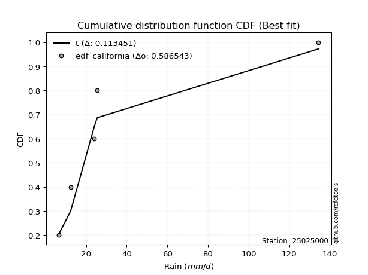</img>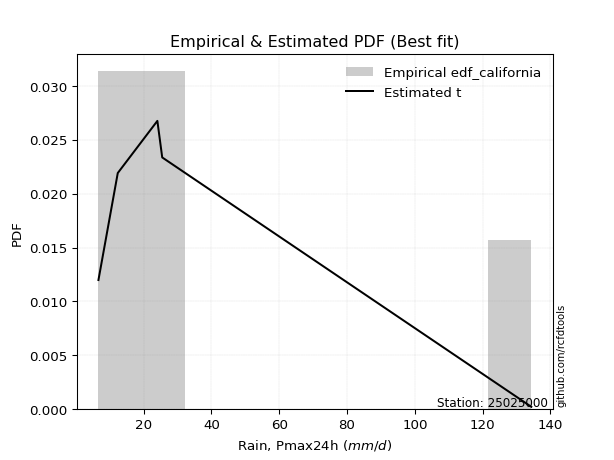</img>

</div>


### 2. EDF Hazen (1930)

Hazen method for plotting positions is a formula used to estimate the empirical cumulative probability distribution of flood events or other hydrological data. This formula often results in biased estimations, particularly when extrapolating to extreme events (high return periods).

<div align="center">


$P=(m-0.5)/n$


</div>


**2.1. Empirical values**

<div align="center">

|                | 0                  | 1                  | 2         | 3                 | 4                  |
|:---------------|:-------------------|:-------------------|:----------|:------------------|:-------------------|
| date           | 2018               | 2019               | 2021      | 2020              | 2017               |
| x              | 6.69               | 12.39              | 24.07     | 25.5              | 134.36             |
| m              | 1                  | 2                  | 3         | 4                 | 5                  |
| empirical_dist | edf_hazen          | edf_hazen          | edf_hazen | edf_hazen         | edf_hazen          |
| empirical      | 0.1                | 0.3                | 0.5       | 0.7               | 0.9                |
| empirical_tr   | 1.1111111111111112 | 1.4285714285714286 | 2.0       | 3.333333333333333 | 10.000000000000002 |

</div>


**2.2. Kolmogorov-Smirnov fit test (sorted by Δ)**


<div align="center">

|                | 0                   | 1                   | 2                  | 3                   | 4                   | 5                  | 6                   | 7                   | 8                   | 9                   | 10                  | 11                  | 12                 | 13                  | 14                  | 15                  | 16                  | 17                  | 18                 | 19                  | 20                  | 21                  | 22                  | 23                  | 24                  | 25                  | 26                  | 27                  | 28                  | 29                  | 30                  | 31                  | 32                  | 33                  | 34                  | 35                  | 36                  | 37                  | 38                 | 39                  | 40                  | 41                  | 42                  | 43                  | 44                  | 45                  | 46                  | 47                  | 48                  | 49                 | 50                  | 51                  | 52                 | 53                  | 54                 | 55                  | 56                  | 57                  | 58                 | 59                 | 60                  | 61                  | 62                  | 63                  | 64                  | 65                  | 66                  | 67                 | 68                  | 69                  | 70                  | 71                 | 72                 | 73                  | 74                 | 75                  | 76                  | 77                 | 78                 | 79                  | 80                  | 81                  | 82                  | 83                 | 84                  | 85                 | 86                  | 87                  | 88                  | 89                 | 90                 | 91                 | 92                  | 93                  | 94                 | 95                 | 96                  | 97                 | 98                 | 99                 | 100                 | 101                 | 102                | 103                | 104                 | 105                 | 106                | 107                | 108                | 109                | 110                | 111                 | 112                 | 113                 | 114                | 115                 | 116                | 117                | 118                | 119                | 120                 | 121                | 122                 | 123                 | 124                | 125                 | 126                | 127                 | 128                | 129                | 130                | 131                 | 132                | 133                | 134                | 135                | 136                | 137                | 138                | 139                | 140                 | 141                 | 142                 | 143                | 144                | 145                | 146                | 147                | 148                | 149                | 150                | 151                | 152                | 153                | 154                | 155                | 156                | 157                | 158                | 159                |
|:---------------|:--------------------|:--------------------|:-------------------|:--------------------|:--------------------|:-------------------|:--------------------|:--------------------|:--------------------|:--------------------|:--------------------|:--------------------|:-------------------|:--------------------|:--------------------|:--------------------|:--------------------|:--------------------|:-------------------|:--------------------|:--------------------|:--------------------|:--------------------|:--------------------|:--------------------|:--------------------|:--------------------|:--------------------|:--------------------|:--------------------|:--------------------|:--------------------|:--------------------|:--------------------|:--------------------|:--------------------|:--------------------|:--------------------|:-------------------|:--------------------|:--------------------|:--------------------|:--------------------|:--------------------|:--------------------|:--------------------|:--------------------|:--------------------|:--------------------|:-------------------|:--------------------|:--------------------|:-------------------|:--------------------|:-------------------|:--------------------|:--------------------|:--------------------|:-------------------|:-------------------|:--------------------|:--------------------|:--------------------|:--------------------|:--------------------|:--------------------|:--------------------|:-------------------|:--------------------|:--------------------|:--------------------|:-------------------|:-------------------|:--------------------|:-------------------|:--------------------|:--------------------|:-------------------|:-------------------|:--------------------|:--------------------|:--------------------|:--------------------|:-------------------|:--------------------|:-------------------|:--------------------|:--------------------|:--------------------|:-------------------|:-------------------|:-------------------|:--------------------|:--------------------|:-------------------|:-------------------|:--------------------|:-------------------|:-------------------|:-------------------|:--------------------|:--------------------|:-------------------|:-------------------|:--------------------|:--------------------|:-------------------|:-------------------|:-------------------|:-------------------|:-------------------|:--------------------|:--------------------|:--------------------|:-------------------|:--------------------|:-------------------|:-------------------|:-------------------|:-------------------|:--------------------|:-------------------|:--------------------|:--------------------|:-------------------|:--------------------|:-------------------|:--------------------|:-------------------|:-------------------|:-------------------|:--------------------|:-------------------|:-------------------|:-------------------|:-------------------|:-------------------|:-------------------|:-------------------|:-------------------|:--------------------|:--------------------|:--------------------|:-------------------|:-------------------|:-------------------|:-------------------|:-------------------|:-------------------|:-------------------|:-------------------|:-------------------|:-------------------|:-------------------|:-------------------|:-------------------|:-------------------|:-------------------|:-------------------|:-------------------|
| station        | 25025000            | 25025000            | 25025000           | 25025000            | 25025000            | 25025000           | 25025000            | 25025000            | 25025000            | 25025000            | 25025000            | 25025000            | 25025000           | 25025000            | 25025000            | 25025000            | 25025000            | 25025000            | 25025000           | 25025000            | 25025000            | 25025000            | 25025000            | 25025000            | 25025000            | 25025000            | 25025000            | 25025000            | 25025000            | 25025000            | 25025000            | 25025000            | 25025000            | 25025000            | 25025000            | 25025000            | 25025000            | 25025000            | 25025000           | 25025000            | 25025000            | 25025000            | 25025000            | 25025000            | 25025000            | 25025000            | 25025000            | 25025000            | 25025000            | 25025000           | 25025000            | 25025000            | 25025000           | 25025000            | 25025000           | 25025000            | 25025000            | 25025000            | 25025000           | 25025000           | 25025000            | 25025000            | 25025000            | 25025000            | 25025000            | 25025000            | 25025000            | 25025000           | 25025000            | 25025000            | 25025000            | 25025000           | 25025000           | 25025000            | 25025000           | 25025000            | 25025000            | 25025000           | 25025000           | 25025000            | 25025000            | 25025000            | 25025000            | 25025000           | 25025000            | 25025000           | 25025000            | 25025000            | 25025000            | 25025000           | 25025000           | 25025000           | 25025000            | 25025000            | 25025000           | 25025000           | 25025000            | 25025000           | 25025000           | 25025000           | 25025000            | 25025000            | 25025000           | 25025000           | 25025000            | 25025000            | 25025000           | 25025000           | 25025000           | 25025000           | 25025000           | 25025000            | 25025000            | 25025000            | 25025000           | 25025000            | 25025000           | 25025000           | 25025000           | 25025000           | 25025000            | 25025000           | 25025000            | 25025000            | 25025000           | 25025000            | 25025000           | 25025000            | 25025000           | 25025000           | 25025000           | 25025000            | 25025000           | 25025000           | 25025000           | 25025000           | 25025000           | 25025000           | 25025000           | 25025000           | 25025000            | 25025000            | 25025000            | 25025000           | 25025000           | 25025000           | 25025000           | 25025000           | 25025000           | 25025000           | 25025000           | 25025000           | 25025000           | 25025000           | 25025000           | 25025000           | 25025000           | 25025000           | 25025000           | 25025000           |
| empirical_dist | edf_hazen           | edf_hazen           | edf_hazen          | edf_hazen           | edf_hazen           | edf_hazen          | edf_hazen           | edf_hazen           | edf_hazen           | edf_hazen           | edf_hazen           | edf_hazen           | edf_hazen          | edf_hazen           | edf_hazen           | edf_hazen           | edf_hazen           | edf_hazen           | edf_hazen          | edf_hazen           | edf_hazen           | edf_hazen           | edf_hazen           | edf_hazen           | edf_hazen           | edf_hazen           | edf_hazen           | edf_hazen           | edf_hazen           | edf_hazen           | edf_hazen           | edf_hazen           | edf_hazen           | edf_hazen           | edf_hazen           | edf_hazen           | edf_hazen           | edf_hazen           | edf_hazen          | edf_hazen           | edf_hazen           | edf_hazen           | edf_hazen           | edf_hazen           | edf_hazen           | edf_hazen           | edf_hazen           | edf_hazen           | edf_hazen           | edf_hazen          | edf_hazen           | edf_hazen           | edf_hazen          | edf_hazen           | edf_hazen          | edf_hazen           | edf_hazen           | edf_hazen           | edf_hazen          | edf_hazen          | edf_hazen           | edf_hazen           | edf_hazen           | edf_hazen           | edf_hazen           | edf_hazen           | edf_hazen           | edf_hazen          | edf_hazen           | edf_hazen           | edf_hazen           | edf_hazen          | edf_hazen          | edf_hazen           | edf_hazen          | edf_hazen           | edf_hazen           | edf_hazen          | edf_hazen          | edf_hazen           | edf_hazen           | edf_hazen           | edf_hazen           | edf_hazen          | edf_hazen           | edf_hazen          | edf_hazen           | edf_hazen           | edf_hazen           | edf_hazen          | edf_hazen          | edf_hazen          | edf_hazen           | edf_hazen           | edf_hazen          | edf_hazen          | edf_hazen           | edf_hazen          | edf_hazen          | edf_hazen          | edf_hazen           | edf_hazen           | edf_hazen          | edf_hazen          | edf_hazen           | edf_hazen           | edf_hazen          | edf_hazen          | edf_hazen          | edf_hazen          | edf_hazen          | edf_hazen           | edf_hazen           | edf_hazen           | edf_hazen          | edf_hazen           | edf_hazen          | edf_hazen          | edf_hazen          | edf_hazen          | edf_hazen           | edf_hazen          | edf_hazen           | edf_hazen           | edf_hazen          | edf_hazen           | edf_hazen          | edf_hazen           | edf_hazen          | edf_hazen          | edf_hazen          | edf_hazen           | edf_hazen          | edf_hazen          | edf_hazen          | edf_hazen          | edf_hazen          | edf_hazen          | edf_hazen          | edf_hazen          | edf_hazen           | edf_hazen           | edf_hazen           | edf_hazen          | edf_hazen          | edf_hazen          | edf_hazen          | edf_hazen          | edf_hazen          | edf_hazen          | edf_hazen          | edf_hazen          | edf_hazen          | edf_hazen          | edf_hazen          | edf_hazen          | edf_hazen          | edf_hazen          | edf_hazen          | edf_hazen          |
| p_dist         | mielke              | loggenlogistic      | logburr            | logalpha            | burr                | loggumbel_r        | loggenextreme       | loginvweibull       | loghalfnorm         | logmielke           | logncf              | loginvgamma         | lognct             | logvonmises         | logkstwobign        | erlang              | loggompertz         | logbeta             | genpareto          | logexponnorm        | logskewnorm         | alpha               | loggenexpon         | logbetaprime        | logjohnsonsu        | gengamma            | halfgennorm         | nct                 | loghalfgennorm      | loginvgauss         | logmoyal            | lomax               | loghalflogistic     | logfatiguelife      | betaprime           | ncf                 | invgamma            | logtruncweibull_min | genextreme         | invweibull          | lograyleigh         | logpearson3         | logdgamma           | logfoldnorm         | invgauss            | logmaxwell          | logtruncexpon       | gennorm             | logrice             | burr12             | loglaplace          | loglaplace          | loglomax           | logexponpow         | t                  | exponpow            | loghypsecant        | loglogistic         | loggausshyper      | lognorm            | logcrystalball      | logt                | logloglaplace       | loggennorm          | logloggamma         | exponweib           | loganglit           | logbradford        | logsemicircular     | logarcsine          | logwald             | loggengamma        | dgamma             | loggenpareto        | logexponweib       | wald                | gamma               | logdweibull        | logcosine          | logkappa4           | logburr12           | dweibull            | vonmises_line       | weibull_min        | loggumbel_l         | halflogistic       | nakagami            | foldnorm            | logwrapcauchy       | pearson3           | halfnorm           | logksone           | moyal               | loglevy_l           | loguniform         | logvonmises_line   | logrdist            | loggamma           | loggamma           | gumbel_r           | logkappa3           | exponnorm           | arcsine            | logweibull_min     | genexpon            | wrapcauchy          | genlogistic        | rayleigh           | logargus           | f                  | maxwell            | levy_l              | logtruncnorm        | lognakagami         | semicircular       | logf                | logerlang          | anglit             | truncnorm          | norm               | crystalball         | logtriang          | kstwobign           | logistic            | gausshyper         | hypsecant           | logweibull_max     | rice                | fatiguelife        | laplace            | cosine             | bradford            | gumbel_l           | loggenhalflogistic | powerlaw           | truncpareto        | johnsonsu          | kappa3             | truncexpon         | argus              | skewnorm            | logtukeylambda      | gompertz            | triang             | logtrapezoid       | ksone              | logpowerlaw        | logjohnsonsb       | kappa4             | logtruncpareto     | uniform            | rdist              | weibull_max        | genhalflogistic    | tukeylambda        | truncweibull_min   | beta               | johnsonsb          | trapezoid          | vonmises           |
| delta          | 0.04610177270924981 | 0.08880936430957953 | 0.0902026495454391 | 0.09182939792670197 | 0.09213625112272306 | 0.0932996933077378 | 0.09367188066005039 | 0.09368129975524486 | 0.09386096743931105 | 0.09616161972229975 | 0.09648073218379394 | 0.09845515268480931 | 0.098773852142779  | 0.09935600804250966 | 0.09947165543350045 | 0.09999999932941124 | 0.09999999997045067 | 0.09999999999678226 | 0.0999999999976169 | 0.10213503182277561 | 0.10310865686734316 | 0.10375906321259099 | 0.10392563648034092 | 0.10487709593570249 | 0.10549674894705341 | 0.10626092596808534 | 0.10860757667038712 | 0.10893128790387818 | 0.10894657949901043 | 0.10910165737821431 | 0.10963737314764366 | 0.11095709969146927 | 0.11232346553617734 | 0.11478080432430182 | 0.11707380492698805 | 0.11707660488983795 | 0.11707677373021852 | 0.11845637150350419 | 0.1186638885783815 | 0.11866408246268911 | 0.12242372143604385 | 0.12251268853229669 | 0.12316058727082024 | 0.12456734674007675 | 0.12460129006360121 | 0.13256087434696062 | 0.13374515156428868 | 0.13531473645681094 | 0.13532690868072483 | 0.1373955629246537 | 0.13972889756698126 | 0.13972889756698126 | 0.1414941718824927 | 0.15010190866600137 | 0.1507367393733241 | 0.15288885098814897 | 0.15473946059885058 | 0.15890711115775225 | 0.1610726299777112 | 0.1638147671846355 | 0.16381476796395567 | 0.16381869342006627 | 0.16385267260871694 | 0.16500940937628356 | 0.16628113719417603 | 0.16811575163601733 | 0.16897199578355415 | 0.1691712539277358 | 0.17109860002346255 | 0.17954352788051386 | 0.18106672038107186 | 0.1812573740059773 | 0.1923789519041977 | 0.19394376944337757 | 0.1957974566105518 | 0.19629075500406246 | 0.19774953674579498 | 0.1999999999998494 | 0.2002600063213118 | 0.20519425529531182 | 0.20597419096261144 | 0.20995274540093142 | 0.21318216032483678 | 0.219848587644905  | 0.23215188140471488 | 0.2325103894204208 | 0.23660825498005772 | 0.23718865479751805 | 0.23768898335396837 | 0.2412464954455278 | 0.2446080536167674 | 0.244970773330481  | 0.24960421302372837 | 0.25155476044330916 | 0.2539649279965772 | 0.2542055664077676 | 0.26115959199237904 | 0.2689290842978507 | 0.2689290842978507 | 0.2703551321796135 | 0.27050451248257107 | 0.27163688622400706 | 0.2723194005425854 | 0.2725158892976011 | 0.27425878751969557 | 0.27475612633476976 | 0.2754530965914966 | 0.2794846460257703 | 0.2799335131956633 | 0.2887082448588319 | 0.2917538070308953 | 0.29637503329789594 | 0.29998864126850255 | 0.29999997024166897 | 0.3009671693061099 | 0.30211048802422363 | 0.3066859662583278 | 0.3080323088097038 | 0.3088526954029025 | 0.324966015884696  | 0.32496863698283096 | 0.3255307462341904 | 0.33117509946496215 | 0.34055764998752563 | 0.3457988464765638 | 0.35301639239001614 | 0.3652526880336642 | 0.36542837624004665 | 0.378714980526443  | 0.3813444525656582 | 0.3833540511413086 | 0.38518972710981225 | 0.3885611157811025 | 0.3997300980149215 | 0.4159680597310507 | 0.4181519878036178 | 0.4242359653749112 | 0.4283951706066848 | 0.4376230203804543 | 0.4432138421516967 | 0.44690422891947734 | 0.44904010860347654 | 0.45930662338496364 | 0.4704543775544494 | 0.4929484028765395 | 0.4938891934936424 | 0.5220527186938206 | 0.5243859712966639 | 0.5259461755538306 | 0.5461884332359737 | 0.5526670321923709 | 0.5572645250466961 | 0.5766096927900198 | 0.5780693470107587 | 0.5922747171325696 | 0.6030093870681734 | 0.6351378583432291 | 0.6437303249371276 | 0.6566968414605668 | 21.066215331457542 |
| deltao         | 0.5865427407550001  | 0.5865427407550001  | 0.5865427407550001 | 0.5865427407550001  | 0.5865427407550001  | 0.5865427407550001 | 0.5865427407550001  | 0.5865427407550001  | 0.5865427407550001  | 0.5865427407550001  | 0.5865427407550001  | 0.5865427407550001  | 0.5865427407550001 | 0.5865427407550001  | 0.5865427407550001  | 0.5865427407550001  | 0.5865427407550001  | 0.5865427407550001  | 0.5865427407550001 | 0.5865427407550001  | 0.5865427407550001  | 0.5865427407550001  | 0.5865427407550001  | 0.5865427407550001  | 0.5865427407550001  | 0.5865427407550001  | 0.5865427407550001  | 0.5865427407550001  | 0.5865427407550001  | 0.5865427407550001  | 0.5865427407550001  | 0.5865427407550001  | 0.5865427407550001  | 0.5865427407550001  | 0.5865427407550001  | 0.5865427407550001  | 0.5865427407550001  | 0.5865427407550001  | 0.5865427407550001 | 0.5865427407550001  | 0.5865427407550001  | 0.5865427407550001  | 0.5865427407550001  | 0.5865427407550001  | 0.5865427407550001  | 0.5865427407550001  | 0.5865427407550001  | 0.5865427407550001  | 0.5865427407550001  | 0.5865427407550001 | 0.5865427407550001  | 0.5865427407550001  | 0.5865427407550001 | 0.5865427407550001  | 0.5865427407550001 | 0.5865427407550001  | 0.5865427407550001  | 0.5865427407550001  | 0.5865427407550001 | 0.5865427407550001 | 0.5865427407550001  | 0.5865427407550001  | 0.5865427407550001  | 0.5865427407550001  | 0.5865427407550001  | 0.5865427407550001  | 0.5865427407550001  | 0.5865427407550001 | 0.5865427407550001  | 0.5865427407550001  | 0.5865427407550001  | 0.5865427407550001 | 0.5865427407550001 | 0.5865427407550001  | 0.5865427407550001 | 0.5865427407550001  | 0.5865427407550001  | 0.5865427407550001 | 0.5865427407550001 | 0.5865427407550001  | 0.5865427407550001  | 0.5865427407550001  | 0.5865427407550001  | 0.5865427407550001 | 0.5865427407550001  | 0.5865427407550001 | 0.5865427407550001  | 0.5865427407550001  | 0.5865427407550001  | 0.5865427407550001 | 0.5865427407550001 | 0.5865427407550001 | 0.5865427407550001  | 0.5865427407550001  | 0.5865427407550001 | 0.5865427407550001 | 0.5865427407550001  | 0.5865427407550001 | 0.5865427407550001 | 0.5865427407550001 | 0.5865427407550001  | 0.5865427407550001  | 0.5865427407550001 | 0.5865427407550001 | 0.5865427407550001  | 0.5865427407550001  | 0.5865427407550001 | 0.5865427407550001 | 0.5865427407550001 | 0.5865427407550001 | 0.5865427407550001 | 0.5865427407550001  | 0.5865427407550001  | 0.5865427407550001  | 0.5865427407550001 | 0.5865427407550001  | 0.5865427407550001 | 0.5865427407550001 | 0.5865427407550001 | 0.5865427407550001 | 0.5865427407550001  | 0.5865427407550001 | 0.5865427407550001  | 0.5865427407550001  | 0.5865427407550001 | 0.5865427407550001  | 0.5865427407550001 | 0.5865427407550001  | 0.5865427407550001 | 0.5865427407550001 | 0.5865427407550001 | 0.5865427407550001  | 0.5865427407550001 | 0.5865427407550001 | 0.5865427407550001 | 0.5865427407550001 | 0.5865427407550001 | 0.5865427407550001 | 0.5865427407550001 | 0.5865427407550001 | 0.5865427407550001  | 0.5865427407550001  | 0.5865427407550001  | 0.5865427407550001 | 0.5865427407550001 | 0.5865427407550001 | 0.5865427407550001 | 0.5865427407550001 | 0.5865427407550001 | 0.5865427407550001 | 0.5865427407550001 | 0.5865427407550001 | 0.5865427407550001 | 0.5865427407550001 | 0.5865427407550001 | 0.5865427407550001 | 0.5865427407550001 | 0.5865427407550001 | 0.5865427407550001 | 0.5865427407550001 |
| eval           | Δo > Δ              | Δo > Δ              | Δo > Δ             | Δo > Δ              | Δo > Δ              | Δo > Δ             | Δo > Δ              | Δo > Δ              | Δo > Δ              | Δo > Δ              | Δo > Δ              | Δo > Δ              | Δo > Δ             | Δo > Δ              | Δo > Δ              | Δo > Δ              | Δo > Δ              | Δo > Δ              | Δo > Δ             | Δo > Δ              | Δo > Δ              | Δo > Δ              | Δo > Δ              | Δo > Δ              | Δo > Δ              | Δo > Δ              | Δo > Δ              | Δo > Δ              | Δo > Δ              | Δo > Δ              | Δo > Δ              | Δo > Δ              | Δo > Δ              | Δo > Δ              | Δo > Δ              | Δo > Δ              | Δo > Δ              | Δo > Δ              | Δo > Δ             | Δo > Δ              | Δo > Δ              | Δo > Δ              | Δo > Δ              | Δo > Δ              | Δo > Δ              | Δo > Δ              | Δo > Δ              | Δo > Δ              | Δo > Δ              | Δo > Δ             | Δo > Δ              | Δo > Δ              | Δo > Δ             | Δo > Δ              | Δo > Δ             | Δo > Δ              | Δo > Δ              | Δo > Δ              | Δo > Δ             | Δo > Δ             | Δo > Δ              | Δo > Δ              | Δo > Δ              | Δo > Δ              | Δo > Δ              | Δo > Δ              | Δo > Δ              | Δo > Δ             | Δo > Δ              | Δo > Δ              | Δo > Δ              | Δo > Δ             | Δo > Δ             | Δo > Δ              | Δo > Δ             | Δo > Δ              | Δo > Δ              | Δo > Δ             | Δo > Δ             | Δo > Δ              | Δo > Δ              | Δo > Δ              | Δo > Δ              | Δo > Δ             | Δo > Δ              | Δo > Δ             | Δo > Δ              | Δo > Δ              | Δo > Δ              | Δo > Δ             | Δo > Δ             | Δo > Δ             | Δo > Δ              | Δo > Δ              | Δo > Δ             | Δo > Δ             | Δo > Δ              | Δo > Δ             | Δo > Δ             | Δo > Δ             | Δo > Δ              | Δo > Δ              | Δo > Δ             | Δo > Δ             | Δo > Δ              | Δo > Δ              | Δo > Δ             | Δo > Δ             | Δo > Δ             | Δo > Δ             | Δo > Δ             | Δo > Δ              | Δo > Δ              | Δo > Δ              | Δo > Δ             | Δo > Δ              | Δo > Δ             | Δo > Δ             | Δo > Δ             | Δo > Δ             | Δo > Δ              | Δo > Δ             | Δo > Δ              | Δo > Δ              | Δo > Δ             | Δo > Δ              | Δo > Δ             | Δo > Δ              | Δo > Δ             | Δo > Δ             | Δo > Δ             | Δo > Δ              | Δo > Δ             | Δo > Δ             | Δo > Δ             | Δo > Δ             | Δo > Δ             | Δo > Δ             | Δo > Δ             | Δo > Δ             | Δo > Δ              | Δo > Δ              | Δo > Δ              | Δo > Δ             | Δo > Δ             | Δo > Δ             | Δo > Δ             | Δo > Δ             | Δo > Δ             | Δo > Δ             | Δo > Δ             | Δo > Δ             | Δo > Δ             | Δo > Δ             | Δo <= Δ            | Δo <= Δ            | Δo <= Δ            | Δo <= Δ            | Δo <= Δ            | Δo <= Δ            |
| fit            | 1                   | 1                   | 1                  | 1                   | 1                   | 1                  | 1                   | 1                   | 1                   | 1                   | 1                   | 1                   | 1                  | 1                   | 1                   | 1                   | 1                   | 1                   | 1                  | 1                   | 1                   | 1                   | 1                   | 1                   | 1                   | 1                   | 1                   | 1                   | 1                   | 1                   | 1                   | 1                   | 1                   | 1                   | 1                   | 1                   | 1                   | 1                   | 1                  | 1                   | 1                   | 1                   | 1                   | 1                   | 1                   | 1                   | 1                   | 1                   | 1                   | 1                  | 1                   | 1                   | 1                  | 1                   | 1                  | 1                   | 1                   | 1                   | 1                  | 1                  | 1                   | 1                   | 1                   | 1                   | 1                   | 1                   | 1                   | 1                  | 1                   | 1                   | 1                   | 1                  | 1                  | 1                   | 1                  | 1                   | 1                   | 1                  | 1                  | 1                   | 1                   | 1                   | 1                   | 1                  | 1                   | 1                  | 1                   | 1                   | 1                   | 1                  | 1                  | 1                  | 1                   | 1                   | 1                  | 1                  | 1                   | 1                  | 1                  | 1                  | 1                   | 1                   | 1                  | 1                  | 1                   | 1                   | 1                  | 1                  | 1                  | 1                  | 1                  | 1                   | 1                   | 1                   | 1                  | 1                   | 1                  | 1                  | 1                  | 1                  | 1                   | 1                  | 1                   | 1                   | 1                  | 1                   | 1                  | 1                   | 1                  | 1                  | 1                  | 1                   | 1                  | 1                  | 1                  | 1                  | 1                  | 1                  | 1                  | 1                  | 1                   | 1                   | 1                   | 1                  | 1                  | 1                  | 1                  | 1                  | 1                  | 1                  | 1                  | 1                  | 1                  | 1                  | 0                  | 0                  | 0                  | 0                  | 0                  | 0                  |
| n              | 5                   | 5                   | 5                  | 5                   | 5                   | 5                  | 5                   | 5                   | 5                   | 5                   | 5                   | 5                   | 5                  | 5                   | 5                   | 5                   | 5                   | 5                   | 5                  | 5                   | 5                   | 5                   | 5                   | 5                   | 5                   | 5                   | 5                   | 5                   | 5                   | 5                   | 5                   | 5                   | 5                   | 5                   | 5                   | 5                   | 5                   | 5                   | 5                  | 5                   | 5                   | 5                   | 5                   | 5                   | 5                   | 5                   | 5                   | 5                   | 5                   | 5                  | 5                   | 5                   | 5                  | 5                   | 5                  | 5                   | 5                   | 5                   | 5                  | 5                  | 5                   | 5                   | 5                   | 5                   | 5                   | 5                   | 5                   | 5                  | 5                   | 5                   | 5                   | 5                  | 5                  | 5                   | 5                  | 5                   | 5                   | 5                  | 5                  | 5                   | 5                   | 5                   | 5                   | 5                  | 5                   | 5                  | 5                   | 5                   | 5                   | 5                  | 5                  | 5                  | 5                   | 5                   | 5                  | 5                  | 5                   | 5                  | 5                  | 5                  | 5                   | 5                   | 5                  | 5                  | 5                   | 5                   | 5                  | 5                  | 5                  | 5                  | 5                  | 5                   | 5                   | 5                   | 5                  | 5                   | 5                  | 5                  | 5                  | 5                  | 5                   | 5                  | 5                   | 5                   | 5                  | 5                   | 5                  | 5                   | 5                  | 5                  | 5                  | 5                   | 5                  | 5                  | 5                  | 5                  | 5                  | 5                  | 5                  | 5                  | 5                   | 5                   | 5                   | 5                  | 5                  | 5                  | 5                  | 5                  | 5                  | 5                  | 5                  | 5                  | 5                  | 5                  | 5                  | 5                  | 5                  | 5                  | 5                  | 5                  |
| best_fit       | 1                   | 0                   | 0                  | 0                   | 0                   | 0                  | 0                   | 0                   | 0                   | 0                   | 0                   | 0                   | 0                  | 0                   | 0                   | 0                   | 0                   | 0                   | 0                  | 0                   | 0                   | 0                   | 0                   | 0                   | 0                   | 0                   | 0                   | 0                   | 0                   | 0                   | 0                   | 0                   | 0                   | 0                   | 0                   | 0                   | 0                   | 0                   | 0                  | 0                   | 0                   | 0                   | 0                   | 0                   | 0                   | 0                   | 0                   | 0                   | 0                   | 0                  | 0                   | 0                   | 0                  | 0                   | 0                  | 0                   | 0                   | 0                   | 0                  | 0                  | 0                   | 0                   | 0                   | 0                   | 0                   | 0                   | 0                   | 0                  | 0                   | 0                   | 0                   | 0                  | 0                  | 0                   | 0                  | 0                   | 0                   | 0                  | 0                  | 0                   | 0                   | 0                   | 0                   | 0                  | 0                   | 0                  | 0                   | 0                   | 0                   | 0                  | 0                  | 0                  | 0                   | 0                   | 0                  | 0                  | 0                   | 0                  | 0                  | 0                  | 0                   | 0                   | 0                  | 0                  | 0                   | 0                   | 0                  | 0                  | 0                  | 0                  | 0                  | 0                   | 0                   | 0                   | 0                  | 0                   | 0                  | 0                  | 0                  | 0                  | 0                   | 0                  | 0                   | 0                   | 0                  | 0                   | 0                  | 0                   | 0                  | 0                  | 0                  | 0                   | 0                  | 0                  | 0                  | 0                  | 0                  | 0                  | 0                  | 0                  | 0                   | 0                   | 0                   | 0                  | 0                  | 0                  | 0                  | 0                  | 0                  | 0                  | 0                  | 0                  | 0                  | 0                  | 0                  | 0                  | 0                  | 0                  | 0                  | 0                  |
| best_fit_sort  | 1                   | 2                   | 3                  | 4                   | 5                   | 6                  | 7                   | 8                   | 9                   | 10                  | 11                  | 12                  | 13                 | 14                  | 15                  | 16                  | 17                  | 18                  | 19                 | 20                  | 21                  | 22                  | 23                  | 24                  | 25                  | 26                  | 27                  | 28                  | 29                  | 30                  | 31                  | 32                  | 33                  | 34                  | 35                  | 36                  | 37                  | 38                  | 39                 | 40                  | 41                  | 42                  | 43                  | 44                  | 45                  | 46                  | 47                  | 48                  | 49                  | 50                 | 51                  | 52                  | 53                 | 54                  | 55                 | 56                  | 57                  | 58                  | 59                 | 60                 | 61                  | 62                  | 63                  | 64                  | 65                  | 66                  | 67                  | 68                 | 69                  | 70                  | 71                  | 72                 | 73                 | 74                  | 75                 | 76                  | 77                  | 78                 | 79                 | 80                  | 81                  | 82                  | 83                  | 84                 | 85                  | 86                 | 87                  | 88                  | 89                  | 90                 | 91                 | 92                 | 93                  | 94                  | 95                 | 96                 | 97                  | 98                 | 99                 | 100                | 101                 | 102                 | 103                | 104                | 105                 | 106                 | 107                | 108                | 109                | 110                | 111                | 112                 | 113                 | 114                 | 115                | 116                 | 117                | 118                | 119                | 120                | 121                 | 122                | 123                 | 124                 | 125                | 126                 | 127                | 128                 | 129                | 130                | 131                | 132                 | 133                | 134                | 135                | 136                | 137                | 138                | 139                | 140                | 141                 | 142                 | 143                 | 144                | 145                | 146                | 147                | 148                | 149                | 150                | 151                | 152                | 153                | 154                | 155                | 156                | 157                | 158                | 159                | 160                |

</div>


**2.3. Best fit**

<div align="center">

|   id |   station | empirical_dist   | p_dist   |     delta |   deltao | eval   |   fit |   n |   best_fit |   best_fit_sort |
|-----:|----------:|:-----------------|:---------|----------:|---------:|:-------|------:|----:|-----------:|----------------:|
|    0 |  25025000 | edf_hazen        | mielke   | 0.0461018 | 0.586543 | Δo > Δ |     1 |   5 |          1 |               1 |

</div>


<div align="center">

</img></img>

</div>


### 3. EDF Weibull (1939)

Weibull plotting position formula is an empirical method used to estimate the non-exceedance probability or plotting position for a set of observed data, is often recommended or widely used in practice, particularly in flood frequency analysis.

<div align="center">


$P=m/(n+1)$


</div>


**3.1. Empirical values**

<div align="center">

|                | 0                   | 1                  | 2           | 3                  | 4                  |
|:---------------|:--------------------|:-------------------|:------------|:-------------------|:-------------------|
| date           | 2018                | 2019               | 2021        | 2020               | 2017               |
| x              | 6.69                | 12.39              | 24.07       | 25.5               | 134.36             |
| m              | 1                   | 2                  | 3           | 4                  | 5                  |
| empirical_dist | edf_weibull         | edf_weibull        | edf_weibull | edf_weibull        | edf_weibull        |
| empirical      | 0.16666666666666666 | 0.3333333333333333 | 0.5         | 0.6666666666666666 | 0.8333333333333334 |
| empirical_tr   | 1.2                 | 1.4999999999999998 | 2.0         | 2.9999999999999996 | 6.000000000000002  |

</div>


**3.2. Kolmogorov-Smirnov fit test (sorted by Δ)**


<div align="center">

|                | 0                   | 1                   | 2                   | 3                   | 4                   | 5                   | 6                  | 7                   | 8                   | 9                   | 10                  | 11                  | 12                  | 13                  | 14                  | 15                  | 16                  | 17                  | 18                  | 19                  | 20                  | 21                  | 22                  | 23                  | 24                  | 25                  | 26                  | 27                  | 28                 | 29                  | 30                  | 31                  | 32                  | 33                  | 34                 | 35                  | 36                  | 37                  | 38                  | 39                  | 40                  | 41                 | 42                  | 43                  | 44                  | 45                  | 46                  | 47                 | 48                 | 49                  | 50                  | 51                 | 52                 | 53                  | 54                  | 55                  | 56                  | 57                 | 58                 | 59                  | 60                  | 61                  | 62                 | 63                  | 64                  | 65                  | 66                 | 67                 | 68                  | 69                  | 70                  | 71                  | 72                  | 73                  | 74                  | 75                 | 76                  | 77                  | 78                 | 79                  | 80                 | 81                  | 82                  | 83                  | 84                  | 85                  | 86                 | 87                  | 88                  | 89                  | 90                  | 91                  | 92                 | 93                  | 94                 | 95                  | 96                  | 97                  | 98                  | 99                  | 100                | 101                 | 102                 | 103                 | 104                | 105                 | 106                 | 107                 | 108                | 109                 | 110                 | 111                | 112                | 113                | 114                 | 115                | 116                 | 117                 | 118                | 119                | 120                | 121                | 122                 | 123                | 124                 | 125                | 126                | 127                | 128                 | 129                 | 130                | 131                | 132                 | 133                 | 134                 | 135                | 136                 | 137                | 138                | 139                 | 140                | 141                | 142                | 143                 | 144                | 145                | 146                 | 147                 | 148                | 149                 | 150                | 151                | 152                | 153                | 154                | 155                | 156                | 157                | 158                | 159                |
|:---------------|:--------------------|:--------------------|:--------------------|:--------------------|:--------------------|:--------------------|:-------------------|:--------------------|:--------------------|:--------------------|:--------------------|:--------------------|:--------------------|:--------------------|:--------------------|:--------------------|:--------------------|:--------------------|:--------------------|:--------------------|:--------------------|:--------------------|:--------------------|:--------------------|:--------------------|:--------------------|:--------------------|:--------------------|:-------------------|:--------------------|:--------------------|:--------------------|:--------------------|:--------------------|:-------------------|:--------------------|:--------------------|:--------------------|:--------------------|:--------------------|:--------------------|:-------------------|:--------------------|:--------------------|:--------------------|:--------------------|:--------------------|:-------------------|:-------------------|:--------------------|:--------------------|:-------------------|:-------------------|:--------------------|:--------------------|:--------------------|:--------------------|:-------------------|:-------------------|:--------------------|:--------------------|:--------------------|:-------------------|:--------------------|:--------------------|:--------------------|:-------------------|:-------------------|:--------------------|:--------------------|:--------------------|:--------------------|:--------------------|:--------------------|:--------------------|:-------------------|:--------------------|:--------------------|:-------------------|:--------------------|:-------------------|:--------------------|:--------------------|:--------------------|:--------------------|:--------------------|:-------------------|:--------------------|:--------------------|:--------------------|:--------------------|:--------------------|:-------------------|:--------------------|:-------------------|:--------------------|:--------------------|:--------------------|:--------------------|:--------------------|:-------------------|:--------------------|:--------------------|:--------------------|:-------------------|:--------------------|:--------------------|:--------------------|:-------------------|:--------------------|:--------------------|:-------------------|:-------------------|:-------------------|:--------------------|:-------------------|:--------------------|:--------------------|:-------------------|:-------------------|:-------------------|:-------------------|:--------------------|:-------------------|:--------------------|:-------------------|:-------------------|:-------------------|:--------------------|:--------------------|:-------------------|:-------------------|:--------------------|:--------------------|:--------------------|:-------------------|:--------------------|:-------------------|:-------------------|:--------------------|:-------------------|:-------------------|:-------------------|:--------------------|:-------------------|:-------------------|:--------------------|:--------------------|:-------------------|:--------------------|:-------------------|:-------------------|:-------------------|:-------------------|:-------------------|:-------------------|:-------------------|:-------------------|:-------------------|:-------------------|
| station        | 25025000            | 25025000            | 25025000            | 25025000            | 25025000            | 25025000            | 25025000           | 25025000            | 25025000            | 25025000            | 25025000            | 25025000            | 25025000            | 25025000            | 25025000            | 25025000            | 25025000            | 25025000            | 25025000            | 25025000            | 25025000            | 25025000            | 25025000            | 25025000            | 25025000            | 25025000            | 25025000            | 25025000            | 25025000           | 25025000            | 25025000            | 25025000            | 25025000            | 25025000            | 25025000           | 25025000            | 25025000            | 25025000            | 25025000            | 25025000            | 25025000            | 25025000           | 25025000            | 25025000            | 25025000            | 25025000            | 25025000            | 25025000           | 25025000           | 25025000            | 25025000            | 25025000           | 25025000           | 25025000            | 25025000            | 25025000            | 25025000            | 25025000           | 25025000           | 25025000            | 25025000            | 25025000            | 25025000           | 25025000            | 25025000            | 25025000            | 25025000           | 25025000           | 25025000            | 25025000            | 25025000            | 25025000            | 25025000            | 25025000            | 25025000            | 25025000           | 25025000            | 25025000            | 25025000           | 25025000            | 25025000           | 25025000            | 25025000            | 25025000            | 25025000            | 25025000            | 25025000           | 25025000            | 25025000            | 25025000            | 25025000            | 25025000            | 25025000           | 25025000            | 25025000           | 25025000            | 25025000            | 25025000            | 25025000            | 25025000            | 25025000           | 25025000            | 25025000            | 25025000            | 25025000           | 25025000            | 25025000            | 25025000            | 25025000           | 25025000            | 25025000            | 25025000           | 25025000           | 25025000           | 25025000            | 25025000           | 25025000            | 25025000            | 25025000           | 25025000           | 25025000           | 25025000           | 25025000            | 25025000           | 25025000            | 25025000           | 25025000           | 25025000           | 25025000            | 25025000            | 25025000           | 25025000           | 25025000            | 25025000            | 25025000            | 25025000           | 25025000            | 25025000           | 25025000           | 25025000            | 25025000           | 25025000           | 25025000           | 25025000            | 25025000           | 25025000           | 25025000            | 25025000            | 25025000           | 25025000            | 25025000           | 25025000           | 25025000           | 25025000           | 25025000           | 25025000           | 25025000           | 25025000           | 25025000           | 25025000           |
| empirical_dist | edf_weibull         | edf_weibull         | edf_weibull         | edf_weibull         | edf_weibull         | edf_weibull         | edf_weibull        | edf_weibull         | edf_weibull         | edf_weibull         | edf_weibull         | edf_weibull         | edf_weibull         | edf_weibull         | edf_weibull         | edf_weibull         | edf_weibull         | edf_weibull         | edf_weibull         | edf_weibull         | edf_weibull         | edf_weibull         | edf_weibull         | edf_weibull         | edf_weibull         | edf_weibull         | edf_weibull         | edf_weibull         | edf_weibull        | edf_weibull         | edf_weibull         | edf_weibull         | edf_weibull         | edf_weibull         | edf_weibull        | edf_weibull         | edf_weibull         | edf_weibull         | edf_weibull         | edf_weibull         | edf_weibull         | edf_weibull        | edf_weibull         | edf_weibull         | edf_weibull         | edf_weibull         | edf_weibull         | edf_weibull        | edf_weibull        | edf_weibull         | edf_weibull         | edf_weibull        | edf_weibull        | edf_weibull         | edf_weibull         | edf_weibull         | edf_weibull         | edf_weibull        | edf_weibull        | edf_weibull         | edf_weibull         | edf_weibull         | edf_weibull        | edf_weibull         | edf_weibull         | edf_weibull         | edf_weibull        | edf_weibull        | edf_weibull         | edf_weibull         | edf_weibull         | edf_weibull         | edf_weibull         | edf_weibull         | edf_weibull         | edf_weibull        | edf_weibull         | edf_weibull         | edf_weibull        | edf_weibull         | edf_weibull        | edf_weibull         | edf_weibull         | edf_weibull         | edf_weibull         | edf_weibull         | edf_weibull        | edf_weibull         | edf_weibull         | edf_weibull         | edf_weibull         | edf_weibull         | edf_weibull        | edf_weibull         | edf_weibull        | edf_weibull         | edf_weibull         | edf_weibull         | edf_weibull         | edf_weibull         | edf_weibull        | edf_weibull         | edf_weibull         | edf_weibull         | edf_weibull        | edf_weibull         | edf_weibull         | edf_weibull         | edf_weibull        | edf_weibull         | edf_weibull         | edf_weibull        | edf_weibull        | edf_weibull        | edf_weibull         | edf_weibull        | edf_weibull         | edf_weibull         | edf_weibull        | edf_weibull        | edf_weibull        | edf_weibull        | edf_weibull         | edf_weibull        | edf_weibull         | edf_weibull        | edf_weibull        | edf_weibull        | edf_weibull         | edf_weibull         | edf_weibull        | edf_weibull        | edf_weibull         | edf_weibull         | edf_weibull         | edf_weibull        | edf_weibull         | edf_weibull        | edf_weibull        | edf_weibull         | edf_weibull        | edf_weibull        | edf_weibull        | edf_weibull         | edf_weibull        | edf_weibull        | edf_weibull         | edf_weibull         | edf_weibull        | edf_weibull         | edf_weibull        | edf_weibull        | edf_weibull        | edf_weibull        | edf_weibull        | edf_weibull        | edf_weibull        | edf_weibull        | edf_weibull        | edf_weibull        |
| p_dist         | logmielke           | logexponnorm        | logalpha            | lognct              | loginvgamma         | loggenextreme       | loginvweibull      | alpha               | logbetaprime        | logncf              | mielke              | logjohnsonsu        | logburr             | burr                | loggenlogistic      | loggumbel_r         | nct                 | loginvgauss         | logfoldnorm         | lograyleigh         | logkstwobign        | logpearson3         | logmaxwell          | logfatiguelife      | betaprime           | ncf                 | invgamma            | logrice             | genextreme         | invweibull          | invgauss            | loghypsecant        | logvonmises         | loglogistic         | loghalfnorm        | loglaplace          | loglaplace          | lognorm             | logcrystalball      | logt                | logmoyal            | logloggamma        | dgamma              | loganglit           | logsemicircular     | dweibull            | logloglaplace       | t                  | burr12             | logdgamma           | wald                | loggenexpon        | exponpow           | lomax               | logbradford         | logtruncweibull_min | gengamma            | loghalfgennorm     | logtruncexpon      | erlang              | exponweib           | loggompertz         | loggenpareto       | logbeta             | genpareto           | logdweibull         | loglomax           | loggausshyper      | logexponpow         | logarcsine          | loghalflogistic     | halfgennorm         | logskewnorm         | logcosine           | gennorm             | logkappa4          | vonmises_line       | logwald             | loggengamma        | weibull_min         | logexponweib       | gamma               | loggennorm          | loggumbel_l         | halflogistic        | logburr12           | nakagami           | foldnorm            | logwrapcauchy       | pearson3            | halfnorm            | logksone            | loglevy_l          | moyal               | loguniform         | logvonmises_line    | gumbel_r            | logkappa3           | exponnorm           | arcsine             | logweibull_min     | genexpon            | wrapcauchy          | genlogistic         | levy_l             | rayleigh            | logargus            | f                   | maxwell            | logrdist            | semicircular        | logf               | loggamma           | loggamma           | anglit              | truncnorm          | norm                | crystalball         | logtriang          | kstwobign          | logerlang          | logistic           | gausshyper          | hypsecant          | logweibull_max      | rice               | logtruncnorm       | lognakagami        | fatiguelife         | laplace             | cosine             | bradford           | gumbel_l            | kappa3              | loggenhalflogistic  | powerlaw           | truncpareto         | johnsonsu          | truncexpon         | argus               | skewnorm           | gompertz           | triang             | logtukeylambda      | logtrapezoid       | ksone              | logpowerlaw         | rdist               | logjohnsonsb       | kappa4              | logtruncpareto     | uniform            | tukeylambda        | weibull_max        | genhalflogistic    | beta               | truncweibull_min   | johnsonsb          | trapezoid          | vonmises           |
| delta          | 0.10067794026704285 | 0.10213503182277561 | 0.10247771774022185 | 0.10283275809637127 | 0.10398356052092406 | 0.10402349355861351 | 0.1040316206805284 | 0.10405339091365474 | 0.10487709593570249 | 0.10569989608240216 | 0.10591133528386049 | 0.10802110629033083 | 0.10814889013210205 | 0.10832202946322889 | 0.10840563207486342 | 0.10867316185882314 | 0.10893128790387818 | 0.10935999947237361 | 0.10937311793999005 | 0.11023102172535071 | 0.11133479138723845 | 0.11210254562621269 | 0.11367815513258928 | 0.11478080432430182 | 0.11707380492698805 | 0.11707660488983795 | 0.11707677373021852 | 0.11793712799815625 | 0.1186638885783815 | 0.11866408246268911 | 0.12460129006360121 | 0.12578126948265989 | 0.12595037494584493 | 0.12629916466214097 | 0.1277142370675178 | 0.12775236552633873 | 0.12775236552633873 | 0.13048143385130218 | 0.13048143463062234 | 0.13048536008673295 | 0.13149847273781262 | 0.1329478038608427 | 0.13477554790821522 | 0.13563866245022083 | 0.14016473448821876 | 0.14328607873426477 | 0.14512762906099416 | 0.1507367393733241 | 0.1528757051411991 | 0.15488554418556805 | 0.16295742167072913 | 0.1662484823646462 | 0.1666467169121054 | 0.16666199647356797 | 0.16666453715438811 | 0.16666660687420662 | 0.16666665910275616 | 0.1666666658265277 | 0.1666666658422128 | 0.16666666599607788 | 0.16666666654477824 | 0.16666666663711732 | 0.1666666666433445 | 0.16666666666344893 | 0.16666666666428354 | 0.16666666666651608 | 0.1666666666665363 | 0.1666666666666662 | 0.16666666666666638 | 0.16666666666666663 | 0.16666666666666666 | 0.16666666666666666 | 0.16666666666666666 | 0.16692667298797847 | 0.16864806979014427 | 0.1718609219619785 | 0.17984882699150345 | 0.18106672038107186 | 0.1812573740059773 | 0.18651525431157168 | 0.1957974566105518 | 0.19774953674579498 | 0.19834274270961688 | 0.19881854807138155 | 0.19917705608708747 | 0.20249039866485552 | 0.2032749216467244 | 0.20385532146418472 | 0.20435565002063505 | 0.20791316211219446 | 0.21127472028343408 | 0.21163743999714768 | 0.2154466701527834 | 0.21627087969039505 | 0.2206315946632439 | 0.22087223307443427 | 0.23702179884628016 | 0.23717117914923774 | 0.23830355289067373 | 0.23898606720925208 | 0.2391825559642678 | 0.24092545418636224 | 0.24142279300143643 | 0.24211976325816326 | 0.2429139018313492 | 0.24615131269243695 | 0.24660017986232996 | 0.25537491152549857 | 0.258420473697562  | 0.26115959199237904 | 0.26763383597277657 | 0.2687771546908903 | 0.2689290842978507 | 0.2689290842978507 | 0.27469897547637045 | 0.2755193620695692 | 0.29163268255136265 | 0.29163530364949763 | 0.2921974129008571 | 0.2978417661316288 | 0.3066859662583278 | 0.3072243166541923 | 0.31246551314323046 | 0.3196830590566828 | 0.33191935470033085 | 0.3320950429067133 | 0.3333219746018359 | 0.3333333035750023 | 0.34538164719310965 | 0.34801111923232486 | 0.3500207178079753 | 0.3518563937764789 | 0.35522778244776915 | 0.36172850394001815 | 0.36639676468158816 | 0.3826347263977174 | 0.38481865447028446 | 0.3909026320415779 | 0.404289687047121  | 0.40988050881836335 | 0.413570895586144  | 0.4259732900516303 | 0.4371210442211161 | 0.44904010860347654 | 0.4596150695432062 | 0.4605558601603091 | 0.48871938536048737 | 0.49059785838002945 | 0.4910526379633306 | 0.49261284222049734 | 0.5128550999026404 | 0.5193336988590376 | 0.525608050465903  | 0.5432763594566865 | 0.5447360136774254 | 0.5684711916765625 | 0.5696760537348402 | 0.6103969916037941 | 0.6233635081272335 | 21.13288199812421  |
| deltao         | 0.5865427407550001  | 0.5865427407550001  | 0.5865427407550001  | 0.5865427407550001  | 0.5865427407550001  | 0.5865427407550001  | 0.5865427407550001 | 0.5865427407550001  | 0.5865427407550001  | 0.5865427407550001  | 0.5865427407550001  | 0.5865427407550001  | 0.5865427407550001  | 0.5865427407550001  | 0.5865427407550001  | 0.5865427407550001  | 0.5865427407550001  | 0.5865427407550001  | 0.5865427407550001  | 0.5865427407550001  | 0.5865427407550001  | 0.5865427407550001  | 0.5865427407550001  | 0.5865427407550001  | 0.5865427407550001  | 0.5865427407550001  | 0.5865427407550001  | 0.5865427407550001  | 0.5865427407550001 | 0.5865427407550001  | 0.5865427407550001  | 0.5865427407550001  | 0.5865427407550001  | 0.5865427407550001  | 0.5865427407550001 | 0.5865427407550001  | 0.5865427407550001  | 0.5865427407550001  | 0.5865427407550001  | 0.5865427407550001  | 0.5865427407550001  | 0.5865427407550001 | 0.5865427407550001  | 0.5865427407550001  | 0.5865427407550001  | 0.5865427407550001  | 0.5865427407550001  | 0.5865427407550001 | 0.5865427407550001 | 0.5865427407550001  | 0.5865427407550001  | 0.5865427407550001 | 0.5865427407550001 | 0.5865427407550001  | 0.5865427407550001  | 0.5865427407550001  | 0.5865427407550001  | 0.5865427407550001 | 0.5865427407550001 | 0.5865427407550001  | 0.5865427407550001  | 0.5865427407550001  | 0.5865427407550001 | 0.5865427407550001  | 0.5865427407550001  | 0.5865427407550001  | 0.5865427407550001 | 0.5865427407550001 | 0.5865427407550001  | 0.5865427407550001  | 0.5865427407550001  | 0.5865427407550001  | 0.5865427407550001  | 0.5865427407550001  | 0.5865427407550001  | 0.5865427407550001 | 0.5865427407550001  | 0.5865427407550001  | 0.5865427407550001 | 0.5865427407550001  | 0.5865427407550001 | 0.5865427407550001  | 0.5865427407550001  | 0.5865427407550001  | 0.5865427407550001  | 0.5865427407550001  | 0.5865427407550001 | 0.5865427407550001  | 0.5865427407550001  | 0.5865427407550001  | 0.5865427407550001  | 0.5865427407550001  | 0.5865427407550001 | 0.5865427407550001  | 0.5865427407550001 | 0.5865427407550001  | 0.5865427407550001  | 0.5865427407550001  | 0.5865427407550001  | 0.5865427407550001  | 0.5865427407550001 | 0.5865427407550001  | 0.5865427407550001  | 0.5865427407550001  | 0.5865427407550001 | 0.5865427407550001  | 0.5865427407550001  | 0.5865427407550001  | 0.5865427407550001 | 0.5865427407550001  | 0.5865427407550001  | 0.5865427407550001 | 0.5865427407550001 | 0.5865427407550001 | 0.5865427407550001  | 0.5865427407550001 | 0.5865427407550001  | 0.5865427407550001  | 0.5865427407550001 | 0.5865427407550001 | 0.5865427407550001 | 0.5865427407550001 | 0.5865427407550001  | 0.5865427407550001 | 0.5865427407550001  | 0.5865427407550001 | 0.5865427407550001 | 0.5865427407550001 | 0.5865427407550001  | 0.5865427407550001  | 0.5865427407550001 | 0.5865427407550001 | 0.5865427407550001  | 0.5865427407550001  | 0.5865427407550001  | 0.5865427407550001 | 0.5865427407550001  | 0.5865427407550001 | 0.5865427407550001 | 0.5865427407550001  | 0.5865427407550001 | 0.5865427407550001 | 0.5865427407550001 | 0.5865427407550001  | 0.5865427407550001 | 0.5865427407550001 | 0.5865427407550001  | 0.5865427407550001  | 0.5865427407550001 | 0.5865427407550001  | 0.5865427407550001 | 0.5865427407550001 | 0.5865427407550001 | 0.5865427407550001 | 0.5865427407550001 | 0.5865427407550001 | 0.5865427407550001 | 0.5865427407550001 | 0.5865427407550001 | 0.5865427407550001 |
| eval           | Δo > Δ              | Δo > Δ              | Δo > Δ              | Δo > Δ              | Δo > Δ              | Δo > Δ              | Δo > Δ             | Δo > Δ              | Δo > Δ              | Δo > Δ              | Δo > Δ              | Δo > Δ              | Δo > Δ              | Δo > Δ              | Δo > Δ              | Δo > Δ              | Δo > Δ              | Δo > Δ              | Δo > Δ              | Δo > Δ              | Δo > Δ              | Δo > Δ              | Δo > Δ              | Δo > Δ              | Δo > Δ              | Δo > Δ              | Δo > Δ              | Δo > Δ              | Δo > Δ             | Δo > Δ              | Δo > Δ              | Δo > Δ              | Δo > Δ              | Δo > Δ              | Δo > Δ             | Δo > Δ              | Δo > Δ              | Δo > Δ              | Δo > Δ              | Δo > Δ              | Δo > Δ              | Δo > Δ             | Δo > Δ              | Δo > Δ              | Δo > Δ              | Δo > Δ              | Δo > Δ              | Δo > Δ             | Δo > Δ             | Δo > Δ              | Δo > Δ              | Δo > Δ             | Δo > Δ             | Δo > Δ              | Δo > Δ              | Δo > Δ              | Δo > Δ              | Δo > Δ             | Δo > Δ             | Δo > Δ              | Δo > Δ              | Δo > Δ              | Δo > Δ             | Δo > Δ              | Δo > Δ              | Δo > Δ              | Δo > Δ             | Δo > Δ             | Δo > Δ              | Δo > Δ              | Δo > Δ              | Δo > Δ              | Δo > Δ              | Δo > Δ              | Δo > Δ              | Δo > Δ             | Δo > Δ              | Δo > Δ              | Δo > Δ             | Δo > Δ              | Δo > Δ             | Δo > Δ              | Δo > Δ              | Δo > Δ              | Δo > Δ              | Δo > Δ              | Δo > Δ             | Δo > Δ              | Δo > Δ              | Δo > Δ              | Δo > Δ              | Δo > Δ              | Δo > Δ             | Δo > Δ              | Δo > Δ             | Δo > Δ              | Δo > Δ              | Δo > Δ              | Δo > Δ              | Δo > Δ              | Δo > Δ             | Δo > Δ              | Δo > Δ              | Δo > Δ              | Δo > Δ             | Δo > Δ              | Δo > Δ              | Δo > Δ              | Δo > Δ             | Δo > Δ              | Δo > Δ              | Δo > Δ             | Δo > Δ             | Δo > Δ             | Δo > Δ              | Δo > Δ             | Δo > Δ              | Δo > Δ              | Δo > Δ             | Δo > Δ             | Δo > Δ             | Δo > Δ             | Δo > Δ              | Δo > Δ             | Δo > Δ              | Δo > Δ             | Δo > Δ             | Δo > Δ             | Δo > Δ              | Δo > Δ              | Δo > Δ             | Δo > Δ             | Δo > Δ              | Δo > Δ              | Δo > Δ              | Δo > Δ             | Δo > Δ              | Δo > Δ             | Δo > Δ             | Δo > Δ              | Δo > Δ             | Δo > Δ             | Δo > Δ             | Δo > Δ              | Δo > Δ             | Δo > Δ             | Δo > Δ              | Δo > Δ              | Δo > Δ             | Δo > Δ              | Δo > Δ             | Δo > Δ             | Δo > Δ             | Δo > Δ             | Δo > Δ             | Δo > Δ             | Δo > Δ             | Δo <= Δ            | Δo <= Δ            | Δo <= Δ            |
| fit            | 1                   | 1                   | 1                   | 1                   | 1                   | 1                   | 1                  | 1                   | 1                   | 1                   | 1                   | 1                   | 1                   | 1                   | 1                   | 1                   | 1                   | 1                   | 1                   | 1                   | 1                   | 1                   | 1                   | 1                   | 1                   | 1                   | 1                   | 1                   | 1                  | 1                   | 1                   | 1                   | 1                   | 1                   | 1                  | 1                   | 1                   | 1                   | 1                   | 1                   | 1                   | 1                  | 1                   | 1                   | 1                   | 1                   | 1                   | 1                  | 1                  | 1                   | 1                   | 1                  | 1                  | 1                   | 1                   | 1                   | 1                   | 1                  | 1                  | 1                   | 1                   | 1                   | 1                  | 1                   | 1                   | 1                   | 1                  | 1                  | 1                   | 1                   | 1                   | 1                   | 1                   | 1                   | 1                   | 1                  | 1                   | 1                   | 1                  | 1                   | 1                  | 1                   | 1                   | 1                   | 1                   | 1                   | 1                  | 1                   | 1                   | 1                   | 1                   | 1                   | 1                  | 1                   | 1                  | 1                   | 1                   | 1                   | 1                   | 1                   | 1                  | 1                   | 1                   | 1                   | 1                  | 1                   | 1                   | 1                   | 1                  | 1                   | 1                   | 1                  | 1                  | 1                  | 1                   | 1                  | 1                   | 1                   | 1                  | 1                  | 1                  | 1                  | 1                   | 1                  | 1                   | 1                  | 1                  | 1                  | 1                   | 1                   | 1                  | 1                  | 1                   | 1                   | 1                   | 1                  | 1                   | 1                  | 1                  | 1                   | 1                  | 1                  | 1                  | 1                   | 1                  | 1                  | 1                   | 1                   | 1                  | 1                   | 1                  | 1                  | 1                  | 1                  | 1                  | 1                  | 1                  | 0                  | 0                  | 0                  |
| n              | 5                   | 5                   | 5                   | 5                   | 5                   | 5                   | 5                  | 5                   | 5                   | 5                   | 5                   | 5                   | 5                   | 5                   | 5                   | 5                   | 5                   | 5                   | 5                   | 5                   | 5                   | 5                   | 5                   | 5                   | 5                   | 5                   | 5                   | 5                   | 5                  | 5                   | 5                   | 5                   | 5                   | 5                   | 5                  | 5                   | 5                   | 5                   | 5                   | 5                   | 5                   | 5                  | 5                   | 5                   | 5                   | 5                   | 5                   | 5                  | 5                  | 5                   | 5                   | 5                  | 5                  | 5                   | 5                   | 5                   | 5                   | 5                  | 5                  | 5                   | 5                   | 5                   | 5                  | 5                   | 5                   | 5                   | 5                  | 5                  | 5                   | 5                   | 5                   | 5                   | 5                   | 5                   | 5                   | 5                  | 5                   | 5                   | 5                  | 5                   | 5                  | 5                   | 5                   | 5                   | 5                   | 5                   | 5                  | 5                   | 5                   | 5                   | 5                   | 5                   | 5                  | 5                   | 5                  | 5                   | 5                   | 5                   | 5                   | 5                   | 5                  | 5                   | 5                   | 5                   | 5                  | 5                   | 5                   | 5                   | 5                  | 5                   | 5                   | 5                  | 5                  | 5                  | 5                   | 5                  | 5                   | 5                   | 5                  | 5                  | 5                  | 5                  | 5                   | 5                  | 5                   | 5                  | 5                  | 5                  | 5                   | 5                   | 5                  | 5                  | 5                   | 5                   | 5                   | 5                  | 5                   | 5                  | 5                  | 5                   | 5                  | 5                  | 5                  | 5                   | 5                  | 5                  | 5                   | 5                   | 5                  | 5                   | 5                  | 5                  | 5                  | 5                  | 5                  | 5                  | 5                  | 5                  | 5                  | 5                  |
| best_fit       | 1                   | 0                   | 0                   | 0                   | 0                   | 0                   | 0                  | 0                   | 0                   | 0                   | 0                   | 0                   | 0                   | 0                   | 0                   | 0                   | 0                   | 0                   | 0                   | 0                   | 0                   | 0                   | 0                   | 0                   | 0                   | 0                   | 0                   | 0                   | 0                  | 0                   | 0                   | 0                   | 0                   | 0                   | 0                  | 0                   | 0                   | 0                   | 0                   | 0                   | 0                   | 0                  | 0                   | 0                   | 0                   | 0                   | 0                   | 0                  | 0                  | 0                   | 0                   | 0                  | 0                  | 0                   | 0                   | 0                   | 0                   | 0                  | 0                  | 0                   | 0                   | 0                   | 0                  | 0                   | 0                   | 0                   | 0                  | 0                  | 0                   | 0                   | 0                   | 0                   | 0                   | 0                   | 0                   | 0                  | 0                   | 0                   | 0                  | 0                   | 0                  | 0                   | 0                   | 0                   | 0                   | 0                   | 0                  | 0                   | 0                   | 0                   | 0                   | 0                   | 0                  | 0                   | 0                  | 0                   | 0                   | 0                   | 0                   | 0                   | 0                  | 0                   | 0                   | 0                   | 0                  | 0                   | 0                   | 0                   | 0                  | 0                   | 0                   | 0                  | 0                  | 0                  | 0                   | 0                  | 0                   | 0                   | 0                  | 0                  | 0                  | 0                  | 0                   | 0                  | 0                   | 0                  | 0                  | 0                  | 0                   | 0                   | 0                  | 0                  | 0                   | 0                   | 0                   | 0                  | 0                   | 0                  | 0                  | 0                   | 0                  | 0                  | 0                  | 0                   | 0                  | 0                  | 0                   | 0                   | 0                  | 0                   | 0                  | 0                  | 0                  | 0                  | 0                  | 0                  | 0                  | 0                  | 0                  | 0                  |
| best_fit_sort  | 1                   | 2                   | 3                   | 4                   | 5                   | 6                   | 7                  | 8                   | 9                   | 10                  | 11                  | 12                  | 13                  | 14                  | 15                  | 16                  | 17                  | 18                  | 19                  | 20                  | 21                  | 22                  | 23                  | 24                  | 25                  | 26                  | 27                  | 28                  | 29                 | 30                  | 31                  | 32                  | 33                  | 34                  | 35                 | 36                  | 37                  | 38                  | 39                  | 40                  | 41                  | 42                 | 43                  | 44                  | 45                  | 46                  | 47                  | 48                 | 49                 | 50                  | 51                  | 52                 | 53                 | 54                  | 55                  | 56                  | 57                  | 58                 | 59                 | 60                  | 61                  | 62                  | 63                 | 64                  | 65                  | 66                  | 67                 | 68                 | 69                  | 70                  | 71                  | 72                  | 73                  | 74                  | 75                  | 76                 | 77                  | 78                  | 79                 | 80                  | 81                 | 82                  | 83                  | 84                  | 85                  | 86                  | 87                 | 88                  | 89                  | 90                  | 91                  | 92                  | 93                 | 94                  | 95                 | 96                  | 97                  | 98                  | 99                  | 100                 | 101                | 102                 | 103                 | 104                 | 105                | 106                 | 107                 | 108                 | 109                | 110                 | 111                 | 112                | 113                | 114                | 115                 | 116                | 117                 | 118                 | 119                | 120                | 121                | 122                | 123                 | 124                | 125                 | 126                | 127                | 128                | 129                 | 130                 | 131                | 132                | 133                 | 134                 | 135                 | 136                | 137                 | 138                | 139                | 140                 | 141                | 142                | 143                | 144                 | 145                | 146                | 147                 | 148                 | 149                | 150                 | 151                | 152                | 153                | 154                | 155                | 156                | 157                | 158                | 159                | 160                |

</div>


**3.3. Best fit**

<div align="center">

|   id |   station | empirical_dist   | p_dist    |    delta |   deltao | eval   |   fit |   n |   best_fit |   best_fit_sort |
|-----:|----------:|:-----------------|:----------|---------:|---------:|:-------|------:|----:|-----------:|----------------:|
|    0 |  25025000 | edf_weibull      | logmielke | 0.100678 | 0.586543 | Δo > Δ |     1 |   5 |          1 |               1 |

</div>


<div align="center">

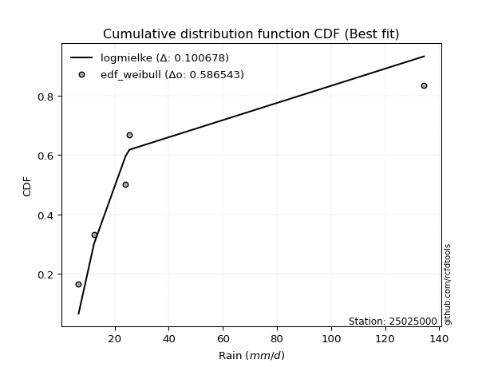</img>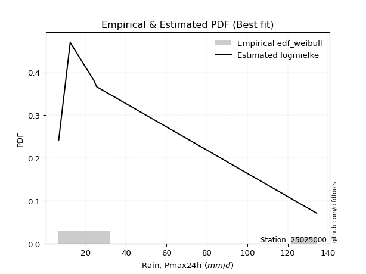</img>

</div>


### 4. EDF Beard (1943)

The Beard formula (or Beard´s plotting position formula) in hydrology is used to estimate the empirical non-exceedance probability _(P)_ of a flood event (or other extreme hydrological data point) within a given dataset.

<div align="center">


$P=(m-0.31)/(n+0.38)$


</div>


**4.1. Empirical values**

<div align="center">

|                | 0                   | 1                  | 2         | 3                  | 4                  |
|:---------------|:--------------------|:-------------------|:----------|:-------------------|:-------------------|
| date           | 2018                | 2019               | 2021      | 2020               | 2017               |
| x              | 6.69                | 12.39              | 24.07     | 25.5               | 134.36             |
| m              | 1                   | 2                  | 3         | 4                  | 5                  |
| empirical_dist | edf_beard           | edf_beard          | edf_beard | edf_beard          | edf_beard          |
| empirical      | 0.12825278810408922 | 0.3141263940520446 | 0.5       | 0.6858736059479554 | 0.8717472118959109 |
| empirical_tr   | 1.1471215351812367  | 1.4579945799457996 | 2.0       | 3.183431952662722  | 7.797101449275368  |

</div>


**4.2. Kolmogorov-Smirnov fit test (sorted by Δ)**


<div align="center">

|                | 0                   | 1                   | 2                  | 3                   | 4                   | 5                   | 6                  | 7                   | 8                  | 9                   | 10                  | 11                  | 12                  | 13                  | 14                 | 15                  | 16                  | 17                  | 18                  | 19                  | 20                  | 21                  | 22                  | 23                  | 24                  | 25                  | 26                  | 27                  | 28                  | 29                 | 30                 | 31                  | 32                  | 33                  | 34                  | 35                  | 36                  | 37                  | 38                  | 39                  | 40                  | 41                 | 42                  | 43                  | 44                  | 45                 | 46                  | 47                  | 48                  | 49                  | 50                  | 51                 | 52                  | 53                  | 54                 | 55                  | 56                 | 57                  | 58                  | 59                  | 60                  | 61                  | 62                 | 63                 | 64                 | 65                  | 66                  | 67                  | 68                 | 69                  | 70                  | 71                 | 72                  | 73                 | 74                 | 75                  | 76                 | 77                  | 78                 | 79                 | 80                  | 81                  | 82                  | 83                  | 84                  | 85                  | 86                 | 87                  | 88                  | 89                  | 90                  | 91                  | 92                 | 93                  | 94                 | 95                  | 96                  | 97                  | 98                  | 99                 | 100                | 101                 | 102                 | 103                 | 104                 | 105                 | 106                 | 107                | 108                | 109                | 110                 | 111                | 112                 | 113                | 114                 | 115                | 116                | 117                 | 118                 | 119                | 120                | 121                | 122                 | 123                | 124                 | 125                | 126                 | 127                | 128                 | 129                 | 130                | 131                 | 132                 | 133                 | 134                 | 135                | 136                 | 137                | 138                | 139                 | 140                | 141                | 142                 | 143                | 144                | 145                | 146                | 147                | 148                | 149                | 150                | 151                | 152                | 153                | 154                | 155                | 156                | 157                | 158                | 159                |
|:---------------|:--------------------|:--------------------|:-------------------|:--------------------|:--------------------|:--------------------|:-------------------|:--------------------|:-------------------|:--------------------|:--------------------|:--------------------|:--------------------|:--------------------|:-------------------|:--------------------|:--------------------|:--------------------|:--------------------|:--------------------|:--------------------|:--------------------|:--------------------|:--------------------|:--------------------|:--------------------|:--------------------|:--------------------|:--------------------|:-------------------|:-------------------|:--------------------|:--------------------|:--------------------|:--------------------|:--------------------|:--------------------|:--------------------|:--------------------|:--------------------|:--------------------|:-------------------|:--------------------|:--------------------|:--------------------|:-------------------|:--------------------|:--------------------|:--------------------|:--------------------|:--------------------|:-------------------|:--------------------|:--------------------|:-------------------|:--------------------|:-------------------|:--------------------|:--------------------|:--------------------|:--------------------|:--------------------|:-------------------|:-------------------|:-------------------|:--------------------|:--------------------|:--------------------|:-------------------|:--------------------|:--------------------|:-------------------|:--------------------|:-------------------|:-------------------|:--------------------|:-------------------|:--------------------|:-------------------|:-------------------|:--------------------|:--------------------|:--------------------|:--------------------|:--------------------|:--------------------|:-------------------|:--------------------|:--------------------|:--------------------|:--------------------|:--------------------|:-------------------|:--------------------|:-------------------|:--------------------|:--------------------|:--------------------|:--------------------|:-------------------|:-------------------|:--------------------|:--------------------|:--------------------|:--------------------|:--------------------|:--------------------|:-------------------|:-------------------|:-------------------|:--------------------|:-------------------|:--------------------|:-------------------|:--------------------|:-------------------|:-------------------|:--------------------|:--------------------|:-------------------|:-------------------|:-------------------|:--------------------|:-------------------|:--------------------|:-------------------|:--------------------|:-------------------|:--------------------|:--------------------|:-------------------|:--------------------|:--------------------|:--------------------|:--------------------|:-------------------|:--------------------|:-------------------|:-------------------|:--------------------|:-------------------|:-------------------|:--------------------|:-------------------|:-------------------|:-------------------|:-------------------|:-------------------|:-------------------|:-------------------|:-------------------|:-------------------|:-------------------|:-------------------|:-------------------|:-------------------|:-------------------|:-------------------|:-------------------|:-------------------|
| station        | 25025000            | 25025000            | 25025000           | 25025000            | 25025000            | 25025000            | 25025000           | 25025000            | 25025000           | 25025000            | 25025000            | 25025000            | 25025000            | 25025000            | 25025000           | 25025000            | 25025000            | 25025000            | 25025000            | 25025000            | 25025000            | 25025000            | 25025000            | 25025000            | 25025000            | 25025000            | 25025000            | 25025000            | 25025000            | 25025000           | 25025000           | 25025000            | 25025000            | 25025000            | 25025000            | 25025000            | 25025000            | 25025000            | 25025000            | 25025000            | 25025000            | 25025000           | 25025000            | 25025000            | 25025000            | 25025000           | 25025000            | 25025000            | 25025000            | 25025000            | 25025000            | 25025000           | 25025000            | 25025000            | 25025000           | 25025000            | 25025000           | 25025000            | 25025000            | 25025000            | 25025000            | 25025000            | 25025000           | 25025000           | 25025000           | 25025000            | 25025000            | 25025000            | 25025000           | 25025000            | 25025000            | 25025000           | 25025000            | 25025000           | 25025000           | 25025000            | 25025000           | 25025000            | 25025000           | 25025000           | 25025000            | 25025000            | 25025000            | 25025000            | 25025000            | 25025000            | 25025000           | 25025000            | 25025000            | 25025000            | 25025000            | 25025000            | 25025000           | 25025000            | 25025000           | 25025000            | 25025000            | 25025000            | 25025000            | 25025000           | 25025000           | 25025000            | 25025000            | 25025000            | 25025000            | 25025000            | 25025000            | 25025000           | 25025000           | 25025000           | 25025000            | 25025000           | 25025000            | 25025000           | 25025000            | 25025000           | 25025000           | 25025000            | 25025000            | 25025000           | 25025000           | 25025000           | 25025000            | 25025000           | 25025000            | 25025000           | 25025000            | 25025000           | 25025000            | 25025000            | 25025000           | 25025000            | 25025000            | 25025000            | 25025000            | 25025000           | 25025000            | 25025000           | 25025000           | 25025000            | 25025000           | 25025000           | 25025000            | 25025000           | 25025000           | 25025000           | 25025000           | 25025000           | 25025000           | 25025000           | 25025000           | 25025000           | 25025000           | 25025000           | 25025000           | 25025000           | 25025000           | 25025000           | 25025000           | 25025000           |
| empirical_dist | edf_beard           | edf_beard           | edf_beard          | edf_beard           | edf_beard           | edf_beard           | edf_beard          | edf_beard           | edf_beard          | edf_beard           | edf_beard           | edf_beard           | edf_beard           | edf_beard           | edf_beard          | edf_beard           | edf_beard           | edf_beard           | edf_beard           | edf_beard           | edf_beard           | edf_beard           | edf_beard           | edf_beard           | edf_beard           | edf_beard           | edf_beard           | edf_beard           | edf_beard           | edf_beard          | edf_beard          | edf_beard           | edf_beard           | edf_beard           | edf_beard           | edf_beard           | edf_beard           | edf_beard           | edf_beard           | edf_beard           | edf_beard           | edf_beard          | edf_beard           | edf_beard           | edf_beard           | edf_beard          | edf_beard           | edf_beard           | edf_beard           | edf_beard           | edf_beard           | edf_beard          | edf_beard           | edf_beard           | edf_beard          | edf_beard           | edf_beard          | edf_beard           | edf_beard           | edf_beard           | edf_beard           | edf_beard           | edf_beard          | edf_beard          | edf_beard          | edf_beard           | edf_beard           | edf_beard           | edf_beard          | edf_beard           | edf_beard           | edf_beard          | edf_beard           | edf_beard          | edf_beard          | edf_beard           | edf_beard          | edf_beard           | edf_beard          | edf_beard          | edf_beard           | edf_beard           | edf_beard           | edf_beard           | edf_beard           | edf_beard           | edf_beard          | edf_beard           | edf_beard           | edf_beard           | edf_beard           | edf_beard           | edf_beard          | edf_beard           | edf_beard          | edf_beard           | edf_beard           | edf_beard           | edf_beard           | edf_beard          | edf_beard          | edf_beard           | edf_beard           | edf_beard           | edf_beard           | edf_beard           | edf_beard           | edf_beard          | edf_beard          | edf_beard          | edf_beard           | edf_beard          | edf_beard           | edf_beard          | edf_beard           | edf_beard          | edf_beard          | edf_beard           | edf_beard           | edf_beard          | edf_beard          | edf_beard          | edf_beard           | edf_beard          | edf_beard           | edf_beard          | edf_beard           | edf_beard          | edf_beard           | edf_beard           | edf_beard          | edf_beard           | edf_beard           | edf_beard           | edf_beard           | edf_beard          | edf_beard           | edf_beard          | edf_beard          | edf_beard           | edf_beard          | edf_beard          | edf_beard           | edf_beard          | edf_beard          | edf_beard          | edf_beard          | edf_beard          | edf_beard          | edf_beard          | edf_beard          | edf_beard          | edf_beard          | edf_beard          | edf_beard          | edf_beard          | edf_beard          | edf_beard          | edf_beard          | edf_beard          |
| p_dist         | mielke              | logncf              | loggumbel_r        | logkstwobign        | burr                | logvonmises         | loggenlogistic     | loghalfnorm         | logburr            | logalpha            | loggenextreme       | loginvweibull       | logmielke           | loginvgamma         | lognct             | logexponnorm        | alpha               | logbetaprime        | logjohnsonsu        | lograyleigh         | logpearson3         | nct                 | loginvgauss         | logmoyal            | logfoldnorm         | logfatiguelife      | betaprime           | ncf                 | invgamma            | logmaxwell         | genextreme         | invweibull          | logrice             | invgauss            | loglaplace          | loglaplace          | loggenexpon         | lomax               | logtruncweibull_min | gengamma            | loghalfgennorm      | logtruncexpon      | erlang              | loggompertz         | logbeta             | genpareto          | halfgennorm         | loghalflogistic     | logskewnorm         | logdgamma           | logexponpow         | burr12             | exponpow            | loghypsecant        | loglomax           | loglogistic         | loggausshyper      | gennorm             | lognorm             | logcrystalball      | logt                | logloglaplace       | t                  | logloggamma        | exponweib          | loganglit           | logbradford         | logsemicircular     | dgamma             | logarcsine          | loggenpareto        | loggennorm         | logwald             | loggengamma        | dweibull           | wald                | logdweibull        | logcosine           | logkappa4          | logexponweib       | gamma               | vonmises_line       | logburr12           | weibull_min         | loggumbel_l         | halflogistic        | nakagami           | foldnorm            | logwrapcauchy       | pearson3            | halfnorm            | logksone            | loglevy_l          | moyal               | loguniform         | logvonmises_line    | gumbel_r            | logkappa3           | exponnorm           | arcsine            | logweibull_min     | genexpon            | wrapcauchy          | logrdist            | genlogistic         | rayleigh            | logargus            | levy_l             | loggamma           | loggamma           | f                   | maxwell            | semicircular        | logf               | anglit              | truncnorm          | logerlang          | norm                | crystalball         | logtriang          | logtruncnorm       | lognakagami        | kstwobign           | logistic           | gausshyper          | hypsecant          | logweibull_max      | rice               | fatiguelife         | laplace             | cosine             | bradford            | gumbel_l            | loggenhalflogistic  | kappa3              | powerlaw           | truncpareto         | johnsonsu          | truncexpon         | argus               | skewnorm           | gompertz           | logtukeylambda      | triang             | logtrapezoid       | ksone              | logpowerlaw        | logjohnsonsb       | kappa4             | rdist              | logtruncpareto     | uniform            | weibull_max        | genhalflogistic    | tukeylambda        | truncweibull_min   | beta               | johnsonsb          | trapezoid          | vonmises           |
| delta          | 0.06749745672128304 | 0.08235433813174942 | 0.0839300793029788 | 0.08534526138145593 | 0.08537891904499528 | 0.08753649638326744 | 0.088802597513715  | 0.08930035850494036 | 0.0902026495454391 | 0.09182939792670197 | 0.09367188066005039 | 0.09368129975524486 | 0.09616161972229975 | 0.09845515268480931 | 0.098773852142779  | 0.10213503182277561 | 0.10375906321259099 | 0.10487709593570249 | 0.10549674894705341 | 0.10829732738399933 | 0.10838629448025217 | 0.10893128790387818 | 0.10910165737821431 | 0.10963737314764366 | 0.11044095268803222 | 0.11478080432430182 | 0.11707380492698805 | 0.11707660488983795 | 0.11707677373021852 | 0.1184344802949161 | 0.1186638885783815 | 0.11866408246268911 | 0.12120051462868031 | 0.12460129006360121 | 0.12560250351493674 | 0.12560250351493674 | 0.12783460380206876 | 0.12824811791099053 | 0.12825272831162918 | 0.12825278054017872 | 0.12825278726395026 | 0.1282527872796353 | 0.12825278743350044 | 0.12825278807453988 | 0.12825278810087148 | 0.1282527881017061 | 0.12825278810408922 | 0.12825278810408922 | 0.12825278810408922 | 0.13567860490427935 | 0.13597551461395685 | 0.1373955629246537 | 0.13876245693610445 | 0.14061306654680605 | 0.1414941718824927 | 0.14478071710570772 | 0.1469462359256667 | 0.14944113050885557 | 0.14968837313259098 | 0.14968837391191114 | 0.14969229936802175 | 0.14972627855667242 | 0.1507367393733241 | 0.1521547431421315 | 0.1539893575839728 | 0.15484560173150963 | 0.15504485987569128 | 0.15697220597141803 | 0.1641261638001085 | 0.16541713382846934 | 0.16569098133928836 | 0.1791358034283282 | 0.18106672038107186 | 0.1812573740059773 | 0.1816999572968422 | 0.18216436095201793 | 0.1858736059478049 | 0.18613361226926728 | 0.1910678612432673 | 0.1957974566105518 | 0.19774953674579498 | 0.19905576627279226 | 0.20249039866485552 | 0.20572219359286048 | 0.21802548735267036 | 0.21838399536837627 | 0.2224818609280132 | 0.22306226074547353 | 0.22356258930192385 | 0.22712010139348326 | 0.23048165956472288 | 0.23084437927843648 | 0.2346536094340722 | 0.23547781897168385 | 0.2398385339445327 | 0.24007917235572307 | 0.25622873812756897 | 0.25637811843052655 | 0.25751049217196254 | 0.2581930064905409 | 0.2583894952455565 | 0.26013239346765105 | 0.26062973228272523 | 0.26115959199237904 | 0.26132670253945206 | 0.26535825197372576 | 0.26580711914361876 | 0.2681222451938067 | 0.2689290842978507 | 0.2689290842978507 | 0.27458185080678726 | 0.2776274129788508 | 0.28684077525406537 | 0.287984093972179  | 0.29390591475765926 | 0.294726301350858  | 0.3066859662583278 | 0.31083962183265146 | 0.31084224293078644 | 0.3114043521821459 | 0.3141150353205472 | 0.3141263642937136 | 0.31704870541291763 | 0.3264312559354811 | 0.33167245242451926 | 0.3388899983379716 | 0.35112629398161965 | 0.3513019821880021 | 0.36458858647439835 | 0.36721805851361367 | 0.3692276570892641 | 0.37106333305776773 | 0.37443472172905795 | 0.38560370396287696 | 0.40014238250259565 | 0.4018416656790061 | 0.40402559375157315 | 0.4101095713228666 | 0.4234966263284098 | 0.42908744809965216 | 0.4327778348674328 | 0.4451802293329191 | 0.44904010860347654 | 0.4563279835024049 | 0.478822008824495  | 0.4797627994415979 | 0.507926324641776  | 0.5102595772446192 | 0.5118197815017862 | 0.5290117369426068 | 0.532062039183929  | 0.5385406381403264 | 0.5624832987379753 | 0.5639429529587142 | 0.5640219290284804 | 0.5888829930161288 | 0.6068850702391398 | 0.6296039308850829 | 0.6425704474085223 | 21.09446811956163  |
| deltao         | 0.5865427407550001  | 0.5865427407550001  | 0.5865427407550001 | 0.5865427407550001  | 0.5865427407550001  | 0.5865427407550001  | 0.5865427407550001 | 0.5865427407550001  | 0.5865427407550001 | 0.5865427407550001  | 0.5865427407550001  | 0.5865427407550001  | 0.5865427407550001  | 0.5865427407550001  | 0.5865427407550001 | 0.5865427407550001  | 0.5865427407550001  | 0.5865427407550001  | 0.5865427407550001  | 0.5865427407550001  | 0.5865427407550001  | 0.5865427407550001  | 0.5865427407550001  | 0.5865427407550001  | 0.5865427407550001  | 0.5865427407550001  | 0.5865427407550001  | 0.5865427407550001  | 0.5865427407550001  | 0.5865427407550001 | 0.5865427407550001 | 0.5865427407550001  | 0.5865427407550001  | 0.5865427407550001  | 0.5865427407550001  | 0.5865427407550001  | 0.5865427407550001  | 0.5865427407550001  | 0.5865427407550001  | 0.5865427407550001  | 0.5865427407550001  | 0.5865427407550001 | 0.5865427407550001  | 0.5865427407550001  | 0.5865427407550001  | 0.5865427407550001 | 0.5865427407550001  | 0.5865427407550001  | 0.5865427407550001  | 0.5865427407550001  | 0.5865427407550001  | 0.5865427407550001 | 0.5865427407550001  | 0.5865427407550001  | 0.5865427407550001 | 0.5865427407550001  | 0.5865427407550001 | 0.5865427407550001  | 0.5865427407550001  | 0.5865427407550001  | 0.5865427407550001  | 0.5865427407550001  | 0.5865427407550001 | 0.5865427407550001 | 0.5865427407550001 | 0.5865427407550001  | 0.5865427407550001  | 0.5865427407550001  | 0.5865427407550001 | 0.5865427407550001  | 0.5865427407550001  | 0.5865427407550001 | 0.5865427407550001  | 0.5865427407550001 | 0.5865427407550001 | 0.5865427407550001  | 0.5865427407550001 | 0.5865427407550001  | 0.5865427407550001 | 0.5865427407550001 | 0.5865427407550001  | 0.5865427407550001  | 0.5865427407550001  | 0.5865427407550001  | 0.5865427407550001  | 0.5865427407550001  | 0.5865427407550001 | 0.5865427407550001  | 0.5865427407550001  | 0.5865427407550001  | 0.5865427407550001  | 0.5865427407550001  | 0.5865427407550001 | 0.5865427407550001  | 0.5865427407550001 | 0.5865427407550001  | 0.5865427407550001  | 0.5865427407550001  | 0.5865427407550001  | 0.5865427407550001 | 0.5865427407550001 | 0.5865427407550001  | 0.5865427407550001  | 0.5865427407550001  | 0.5865427407550001  | 0.5865427407550001  | 0.5865427407550001  | 0.5865427407550001 | 0.5865427407550001 | 0.5865427407550001 | 0.5865427407550001  | 0.5865427407550001 | 0.5865427407550001  | 0.5865427407550001 | 0.5865427407550001  | 0.5865427407550001 | 0.5865427407550001 | 0.5865427407550001  | 0.5865427407550001  | 0.5865427407550001 | 0.5865427407550001 | 0.5865427407550001 | 0.5865427407550001  | 0.5865427407550001 | 0.5865427407550001  | 0.5865427407550001 | 0.5865427407550001  | 0.5865427407550001 | 0.5865427407550001  | 0.5865427407550001  | 0.5865427407550001 | 0.5865427407550001  | 0.5865427407550001  | 0.5865427407550001  | 0.5865427407550001  | 0.5865427407550001 | 0.5865427407550001  | 0.5865427407550001 | 0.5865427407550001 | 0.5865427407550001  | 0.5865427407550001 | 0.5865427407550001 | 0.5865427407550001  | 0.5865427407550001 | 0.5865427407550001 | 0.5865427407550001 | 0.5865427407550001 | 0.5865427407550001 | 0.5865427407550001 | 0.5865427407550001 | 0.5865427407550001 | 0.5865427407550001 | 0.5865427407550001 | 0.5865427407550001 | 0.5865427407550001 | 0.5865427407550001 | 0.5865427407550001 | 0.5865427407550001 | 0.5865427407550001 | 0.5865427407550001 |
| eval           | Δo > Δ              | Δo > Δ              | Δo > Δ             | Δo > Δ              | Δo > Δ              | Δo > Δ              | Δo > Δ             | Δo > Δ              | Δo > Δ             | Δo > Δ              | Δo > Δ              | Δo > Δ              | Δo > Δ              | Δo > Δ              | Δo > Δ             | Δo > Δ              | Δo > Δ              | Δo > Δ              | Δo > Δ              | Δo > Δ              | Δo > Δ              | Δo > Δ              | Δo > Δ              | Δo > Δ              | Δo > Δ              | Δo > Δ              | Δo > Δ              | Δo > Δ              | Δo > Δ              | Δo > Δ             | Δo > Δ             | Δo > Δ              | Δo > Δ              | Δo > Δ              | Δo > Δ              | Δo > Δ              | Δo > Δ              | Δo > Δ              | Δo > Δ              | Δo > Δ              | Δo > Δ              | Δo > Δ             | Δo > Δ              | Δo > Δ              | Δo > Δ              | Δo > Δ             | Δo > Δ              | Δo > Δ              | Δo > Δ              | Δo > Δ              | Δo > Δ              | Δo > Δ             | Δo > Δ              | Δo > Δ              | Δo > Δ             | Δo > Δ              | Δo > Δ             | Δo > Δ              | Δo > Δ              | Δo > Δ              | Δo > Δ              | Δo > Δ              | Δo > Δ             | Δo > Δ             | Δo > Δ             | Δo > Δ              | Δo > Δ              | Δo > Δ              | Δo > Δ             | Δo > Δ              | Δo > Δ              | Δo > Δ             | Δo > Δ              | Δo > Δ             | Δo > Δ             | Δo > Δ              | Δo > Δ             | Δo > Δ              | Δo > Δ             | Δo > Δ             | Δo > Δ              | Δo > Δ              | Δo > Δ              | Δo > Δ              | Δo > Δ              | Δo > Δ              | Δo > Δ             | Δo > Δ              | Δo > Δ              | Δo > Δ              | Δo > Δ              | Δo > Δ              | Δo > Δ             | Δo > Δ              | Δo > Δ             | Δo > Δ              | Δo > Δ              | Δo > Δ              | Δo > Δ              | Δo > Δ             | Δo > Δ             | Δo > Δ              | Δo > Δ              | Δo > Δ              | Δo > Δ              | Δo > Δ              | Δo > Δ              | Δo > Δ             | Δo > Δ             | Δo > Δ             | Δo > Δ              | Δo > Δ             | Δo > Δ              | Δo > Δ             | Δo > Δ              | Δo > Δ             | Δo > Δ             | Δo > Δ              | Δo > Δ              | Δo > Δ             | Δo > Δ             | Δo > Δ             | Δo > Δ              | Δo > Δ             | Δo > Δ              | Δo > Δ             | Δo > Δ              | Δo > Δ             | Δo > Δ              | Δo > Δ              | Δo > Δ             | Δo > Δ              | Δo > Δ              | Δo > Δ              | Δo > Δ              | Δo > Δ             | Δo > Δ              | Δo > Δ             | Δo > Δ             | Δo > Δ              | Δo > Δ             | Δo > Δ             | Δo > Δ              | Δo > Δ             | Δo > Δ             | Δo > Δ             | Δo > Δ             | Δo > Δ             | Δo > Δ             | Δo > Δ             | Δo > Δ             | Δo > Δ             | Δo > Δ             | Δo > Δ             | Δo > Δ             | Δo <= Δ            | Δo <= Δ            | Δo <= Δ            | Δo <= Δ            | Δo <= Δ            |
| fit            | 1                   | 1                   | 1                  | 1                   | 1                   | 1                   | 1                  | 1                   | 1                  | 1                   | 1                   | 1                   | 1                   | 1                   | 1                  | 1                   | 1                   | 1                   | 1                   | 1                   | 1                   | 1                   | 1                   | 1                   | 1                   | 1                   | 1                   | 1                   | 1                   | 1                  | 1                  | 1                   | 1                   | 1                   | 1                   | 1                   | 1                   | 1                   | 1                   | 1                   | 1                   | 1                  | 1                   | 1                   | 1                   | 1                  | 1                   | 1                   | 1                   | 1                   | 1                   | 1                  | 1                   | 1                   | 1                  | 1                   | 1                  | 1                   | 1                   | 1                   | 1                   | 1                   | 1                  | 1                  | 1                  | 1                   | 1                   | 1                   | 1                  | 1                   | 1                   | 1                  | 1                   | 1                  | 1                  | 1                   | 1                  | 1                   | 1                  | 1                  | 1                   | 1                   | 1                   | 1                   | 1                   | 1                   | 1                  | 1                   | 1                   | 1                   | 1                   | 1                   | 1                  | 1                   | 1                  | 1                   | 1                   | 1                   | 1                   | 1                  | 1                  | 1                   | 1                   | 1                   | 1                   | 1                   | 1                   | 1                  | 1                  | 1                  | 1                   | 1                  | 1                   | 1                  | 1                   | 1                  | 1                  | 1                   | 1                   | 1                  | 1                  | 1                  | 1                   | 1                  | 1                   | 1                  | 1                   | 1                  | 1                   | 1                   | 1                  | 1                   | 1                   | 1                   | 1                   | 1                  | 1                   | 1                  | 1                  | 1                   | 1                  | 1                  | 1                   | 1                  | 1                  | 1                  | 1                  | 1                  | 1                  | 1                  | 1                  | 1                  | 1                  | 1                  | 1                  | 0                  | 0                  | 0                  | 0                  | 0                  |
| n              | 5                   | 5                   | 5                  | 5                   | 5                   | 5                   | 5                  | 5                   | 5                  | 5                   | 5                   | 5                   | 5                   | 5                   | 5                  | 5                   | 5                   | 5                   | 5                   | 5                   | 5                   | 5                   | 5                   | 5                   | 5                   | 5                   | 5                   | 5                   | 5                   | 5                  | 5                  | 5                   | 5                   | 5                   | 5                   | 5                   | 5                   | 5                   | 5                   | 5                   | 5                   | 5                  | 5                   | 5                   | 5                   | 5                  | 5                   | 5                   | 5                   | 5                   | 5                   | 5                  | 5                   | 5                   | 5                  | 5                   | 5                  | 5                   | 5                   | 5                   | 5                   | 5                   | 5                  | 5                  | 5                  | 5                   | 5                   | 5                   | 5                  | 5                   | 5                   | 5                  | 5                   | 5                  | 5                  | 5                   | 5                  | 5                   | 5                  | 5                  | 5                   | 5                   | 5                   | 5                   | 5                   | 5                   | 5                  | 5                   | 5                   | 5                   | 5                   | 5                   | 5                  | 5                   | 5                  | 5                   | 5                   | 5                   | 5                   | 5                  | 5                  | 5                   | 5                   | 5                   | 5                   | 5                   | 5                   | 5                  | 5                  | 5                  | 5                   | 5                  | 5                   | 5                  | 5                   | 5                  | 5                  | 5                   | 5                   | 5                  | 5                  | 5                  | 5                   | 5                  | 5                   | 5                  | 5                   | 5                  | 5                   | 5                   | 5                  | 5                   | 5                   | 5                   | 5                   | 5                  | 5                   | 5                  | 5                  | 5                   | 5                  | 5                  | 5                   | 5                  | 5                  | 5                  | 5                  | 5                  | 5                  | 5                  | 5                  | 5                  | 5                  | 5                  | 5                  | 5                  | 5                  | 5                  | 5                  | 5                  |
| best_fit       | 1                   | 0                   | 0                  | 0                   | 0                   | 0                   | 0                  | 0                   | 0                  | 0                   | 0                   | 0                   | 0                   | 0                   | 0                  | 0                   | 0                   | 0                   | 0                   | 0                   | 0                   | 0                   | 0                   | 0                   | 0                   | 0                   | 0                   | 0                   | 0                   | 0                  | 0                  | 0                   | 0                   | 0                   | 0                   | 0                   | 0                   | 0                   | 0                   | 0                   | 0                   | 0                  | 0                   | 0                   | 0                   | 0                  | 0                   | 0                   | 0                   | 0                   | 0                   | 0                  | 0                   | 0                   | 0                  | 0                   | 0                  | 0                   | 0                   | 0                   | 0                   | 0                   | 0                  | 0                  | 0                  | 0                   | 0                   | 0                   | 0                  | 0                   | 0                   | 0                  | 0                   | 0                  | 0                  | 0                   | 0                  | 0                   | 0                  | 0                  | 0                   | 0                   | 0                   | 0                   | 0                   | 0                   | 0                  | 0                   | 0                   | 0                   | 0                   | 0                   | 0                  | 0                   | 0                  | 0                   | 0                   | 0                   | 0                   | 0                  | 0                  | 0                   | 0                   | 0                   | 0                   | 0                   | 0                   | 0                  | 0                  | 0                  | 0                   | 0                  | 0                   | 0                  | 0                   | 0                  | 0                  | 0                   | 0                   | 0                  | 0                  | 0                  | 0                   | 0                  | 0                   | 0                  | 0                   | 0                  | 0                   | 0                   | 0                  | 0                   | 0                   | 0                   | 0                   | 0                  | 0                   | 0                  | 0                  | 0                   | 0                  | 0                  | 0                   | 0                  | 0                  | 0                  | 0                  | 0                  | 0                  | 0                  | 0                  | 0                  | 0                  | 0                  | 0                  | 0                  | 0                  | 0                  | 0                  | 0                  |
| best_fit_sort  | 1                   | 2                   | 3                  | 4                   | 5                   | 6                   | 7                  | 8                   | 9                  | 10                  | 11                  | 12                  | 13                  | 14                  | 15                 | 16                  | 17                  | 18                  | 19                  | 20                  | 21                  | 22                  | 23                  | 24                  | 25                  | 26                  | 27                  | 28                  | 29                  | 30                 | 31                 | 32                  | 33                  | 34                  | 35                  | 36                  | 37                  | 38                  | 39                  | 40                  | 41                  | 42                 | 43                  | 44                  | 45                  | 46                 | 47                  | 48                  | 49                  | 50                  | 51                  | 52                 | 53                  | 54                  | 55                 | 56                  | 57                 | 58                  | 59                  | 60                  | 61                  | 62                  | 63                 | 64                 | 65                 | 66                  | 67                  | 68                  | 69                 | 70                  | 71                  | 72                 | 73                  | 74                 | 75                 | 76                  | 77                 | 78                  | 79                 | 80                 | 81                  | 82                  | 83                  | 84                  | 85                  | 86                  | 87                 | 88                  | 89                  | 90                  | 91                  | 92                  | 93                 | 94                  | 95                 | 96                  | 97                  | 98                  | 99                  | 100                | 101                | 102                 | 103                 | 104                 | 105                 | 106                 | 107                 | 108                | 109                | 110                | 111                 | 112                | 113                 | 114                | 115                 | 116                | 117                | 118                 | 119                 | 120                | 121                | 122                | 123                 | 124                | 125                 | 126                | 127                 | 128                | 129                 | 130                 | 131                | 132                 | 133                 | 134                 | 135                 | 136                | 137                 | 138                | 139                | 140                 | 141                | 142                | 143                 | 144                | 145                | 146                | 147                | 148                | 149                | 150                | 151                | 152                | 153                | 154                | 155                | 156                | 157                | 158                | 159                | 160                |

</div>


**4.3. Best fit**

<div align="center">

|   id |   station | empirical_dist   | p_dist   |     delta |   deltao | eval   |   fit |   n |   best_fit |   best_fit_sort |
|-----:|----------:|:-----------------|:---------|----------:|---------:|:-------|------:|----:|-----------:|----------------:|
|    0 |  25025000 | edf_beard        | mielke   | 0.0674975 | 0.586543 | Δo > Δ |     1 |   5 |          1 |               1 |

</div>


<div align="center">

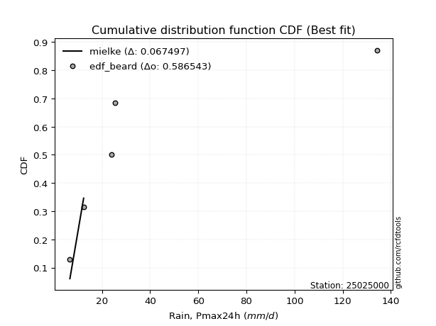</img></img>

</div>


### 5. EDF Chegodayev (1955)

The Chegodayev formula is an empirical plotting position formula used in hydrological frequency analysis to estimate the exceedance probability or return period of a specific event from a set of observed data. It is primarily used for plotting observed data points on probability paper to fit a theoretical distribution, particularly for analyzing extreme events like maximum flood flows or rainfall intensities. The constant _b_ value in the generalized plotting position formula is 0.3.

<div align="center">


$P=(m-b)/(n+1-2b)$


</div>


**5.1. Empirical values**

<div align="center">

|                | 0                   | 1                   | 2              | 3                  | 4                  |
|:---------------|:--------------------|:--------------------|:---------------|:-------------------|:-------------------|
| date           | 2018                | 2019                | 2021           | 2020               | 2017               |
| x              | 6.69                | 12.39               | 24.07          | 25.5               | 134.36             |
| m              | 1                   | 2                   | 3              | 4                  | 5                  |
| empirical_dist | edf_chegodayev      | edf_chegodayev      | edf_chegodayev | edf_chegodayev     | edf_chegodayev     |
| empirical      | 0.12962962962962962 | 0.31481481481481477 | 0.5            | 0.6851851851851851 | 0.8703703703703703 |
| empirical_tr   | 1.148936170212766   | 1.4594594594594594  | 2.0            | 3.1764705882352935 | 7.714285714285713  |

</div>


**5.2. Kolmogorov-Smirnov fit test (sorted by Δ)**


<div align="center">

|                | 0                   | 1                  | 2                  | 3                   | 4                   | 5                  | 6                   | 7                  | 8                   | 9                   | 10                  | 11                  | 12                  | 13                  | 14                 | 15                  | 16                  | 17                  | 18                  | 19                  | 20                  | 21                  | 22                  | 23                  | 24                  | 25                  | 26                  | 27                  | 28                  | 29                  | 30                 | 31                  | 32                 | 33                  | 34                  | 35                  | 36                  | 37                  | 38                  | 39                  | 40                  | 41                 | 42                  | 43                 | 44                 | 45                 | 46                  | 47                  | 48                  | 49                  | 50                 | 51                 | 52                  | 53                  | 54                 | 55                 | 56                  | 57                  | 58                  | 59                  | 60                 | 61                  | 62                 | 63                 | 64                 | 65                  | 66                  | 67                  | 68                 | 69                  | 70                  | 71                  | 72                 | 73                  | 74                 | 75                  | 76                  | 77                  | 78                 | 79                 | 80                  | 81                  | 82                  | 83                  | 84                  | 85                  | 86                  | 87                  | 88                  | 89                  | 90                  | 91                  | 92                 | 93                  | 94                  | 95                  | 96                  | 97                  | 98                 | 99                 | 100                 | 101                 | 102                | 103                 | 104                 | 105                 | 106                 | 107                 | 108                | 109                | 110                | 111                | 112                 | 113                 | 114                 | 115                 | 116                | 117                 | 118                | 119                | 120                 | 121                 | 122                | 123                | 124                 | 125                | 126                 | 127                | 128                | 129                 | 130                 | 131                | 132                 | 133                 | 134                 | 135                 | 136                | 137                | 138                 | 139                 | 140                | 141                | 142                 | 143                | 144                | 145                | 146                | 147                | 148                | 149                | 150                | 151                | 152                | 153                | 154                | 155                | 156                | 157                | 158                | 159                |
|:---------------|:--------------------|:-------------------|:-------------------|:--------------------|:--------------------|:-------------------|:--------------------|:-------------------|:--------------------|:--------------------|:--------------------|:--------------------|:--------------------|:--------------------|:-------------------|:--------------------|:--------------------|:--------------------|:--------------------|:--------------------|:--------------------|:--------------------|:--------------------|:--------------------|:--------------------|:--------------------|:--------------------|:--------------------|:--------------------|:--------------------|:-------------------|:--------------------|:-------------------|:--------------------|:--------------------|:--------------------|:--------------------|:--------------------|:--------------------|:--------------------|:--------------------|:-------------------|:--------------------|:-------------------|:-------------------|:-------------------|:--------------------|:--------------------|:--------------------|:--------------------|:-------------------|:-------------------|:--------------------|:--------------------|:-------------------|:-------------------|:--------------------|:--------------------|:--------------------|:--------------------|:-------------------|:--------------------|:-------------------|:-------------------|:-------------------|:--------------------|:--------------------|:--------------------|:-------------------|:--------------------|:--------------------|:--------------------|:-------------------|:--------------------|:-------------------|:--------------------|:--------------------|:--------------------|:-------------------|:-------------------|:--------------------|:--------------------|:--------------------|:--------------------|:--------------------|:--------------------|:--------------------|:--------------------|:--------------------|:--------------------|:--------------------|:--------------------|:-------------------|:--------------------|:--------------------|:--------------------|:--------------------|:--------------------|:-------------------|:-------------------|:--------------------|:--------------------|:-------------------|:--------------------|:--------------------|:--------------------|:--------------------|:--------------------|:-------------------|:-------------------|:-------------------|:-------------------|:--------------------|:--------------------|:--------------------|:--------------------|:-------------------|:--------------------|:-------------------|:-------------------|:--------------------|:--------------------|:-------------------|:-------------------|:--------------------|:-------------------|:--------------------|:-------------------|:-------------------|:--------------------|:--------------------|:-------------------|:--------------------|:--------------------|:--------------------|:--------------------|:-------------------|:-------------------|:--------------------|:--------------------|:-------------------|:-------------------|:--------------------|:-------------------|:-------------------|:-------------------|:-------------------|:-------------------|:-------------------|:-------------------|:-------------------|:-------------------|:-------------------|:-------------------|:-------------------|:-------------------|:-------------------|:-------------------|:-------------------|:-------------------|
| station        | 25025000            | 25025000           | 25025000           | 25025000            | 25025000            | 25025000           | 25025000            | 25025000           | 25025000            | 25025000            | 25025000            | 25025000            | 25025000            | 25025000            | 25025000           | 25025000            | 25025000            | 25025000            | 25025000            | 25025000            | 25025000            | 25025000            | 25025000            | 25025000            | 25025000            | 25025000            | 25025000            | 25025000            | 25025000            | 25025000            | 25025000           | 25025000            | 25025000           | 25025000            | 25025000            | 25025000            | 25025000            | 25025000            | 25025000            | 25025000            | 25025000            | 25025000           | 25025000            | 25025000           | 25025000           | 25025000           | 25025000            | 25025000            | 25025000            | 25025000            | 25025000           | 25025000           | 25025000            | 25025000            | 25025000           | 25025000           | 25025000            | 25025000            | 25025000            | 25025000            | 25025000           | 25025000            | 25025000           | 25025000           | 25025000           | 25025000            | 25025000            | 25025000            | 25025000           | 25025000            | 25025000            | 25025000            | 25025000           | 25025000            | 25025000           | 25025000            | 25025000            | 25025000            | 25025000           | 25025000           | 25025000            | 25025000            | 25025000            | 25025000            | 25025000            | 25025000            | 25025000            | 25025000            | 25025000            | 25025000            | 25025000            | 25025000            | 25025000           | 25025000            | 25025000            | 25025000            | 25025000            | 25025000            | 25025000           | 25025000           | 25025000            | 25025000            | 25025000           | 25025000            | 25025000            | 25025000            | 25025000            | 25025000            | 25025000           | 25025000           | 25025000           | 25025000           | 25025000            | 25025000            | 25025000            | 25025000            | 25025000           | 25025000            | 25025000           | 25025000           | 25025000            | 25025000            | 25025000           | 25025000           | 25025000            | 25025000           | 25025000            | 25025000           | 25025000           | 25025000            | 25025000            | 25025000           | 25025000            | 25025000            | 25025000            | 25025000            | 25025000           | 25025000           | 25025000            | 25025000            | 25025000           | 25025000           | 25025000            | 25025000           | 25025000           | 25025000           | 25025000           | 25025000           | 25025000           | 25025000           | 25025000           | 25025000           | 25025000           | 25025000           | 25025000           | 25025000           | 25025000           | 25025000           | 25025000           | 25025000           |
| empirical_dist | edf_chegodayev      | edf_chegodayev     | edf_chegodayev     | edf_chegodayev      | edf_chegodayev      | edf_chegodayev     | edf_chegodayev      | edf_chegodayev     | edf_chegodayev      | edf_chegodayev      | edf_chegodayev      | edf_chegodayev      | edf_chegodayev      | edf_chegodayev      | edf_chegodayev     | edf_chegodayev      | edf_chegodayev      | edf_chegodayev      | edf_chegodayev      | edf_chegodayev      | edf_chegodayev      | edf_chegodayev      | edf_chegodayev      | edf_chegodayev      | edf_chegodayev      | edf_chegodayev      | edf_chegodayev      | edf_chegodayev      | edf_chegodayev      | edf_chegodayev      | edf_chegodayev     | edf_chegodayev      | edf_chegodayev     | edf_chegodayev      | edf_chegodayev      | edf_chegodayev      | edf_chegodayev      | edf_chegodayev      | edf_chegodayev      | edf_chegodayev      | edf_chegodayev      | edf_chegodayev     | edf_chegodayev      | edf_chegodayev     | edf_chegodayev     | edf_chegodayev     | edf_chegodayev      | edf_chegodayev      | edf_chegodayev      | edf_chegodayev      | edf_chegodayev     | edf_chegodayev     | edf_chegodayev      | edf_chegodayev      | edf_chegodayev     | edf_chegodayev     | edf_chegodayev      | edf_chegodayev      | edf_chegodayev      | edf_chegodayev      | edf_chegodayev     | edf_chegodayev      | edf_chegodayev     | edf_chegodayev     | edf_chegodayev     | edf_chegodayev      | edf_chegodayev      | edf_chegodayev      | edf_chegodayev     | edf_chegodayev      | edf_chegodayev      | edf_chegodayev      | edf_chegodayev     | edf_chegodayev      | edf_chegodayev     | edf_chegodayev      | edf_chegodayev      | edf_chegodayev      | edf_chegodayev     | edf_chegodayev     | edf_chegodayev      | edf_chegodayev      | edf_chegodayev      | edf_chegodayev      | edf_chegodayev      | edf_chegodayev      | edf_chegodayev      | edf_chegodayev      | edf_chegodayev      | edf_chegodayev      | edf_chegodayev      | edf_chegodayev      | edf_chegodayev     | edf_chegodayev      | edf_chegodayev      | edf_chegodayev      | edf_chegodayev      | edf_chegodayev      | edf_chegodayev     | edf_chegodayev     | edf_chegodayev      | edf_chegodayev      | edf_chegodayev     | edf_chegodayev      | edf_chegodayev      | edf_chegodayev      | edf_chegodayev      | edf_chegodayev      | edf_chegodayev     | edf_chegodayev     | edf_chegodayev     | edf_chegodayev     | edf_chegodayev      | edf_chegodayev      | edf_chegodayev      | edf_chegodayev      | edf_chegodayev     | edf_chegodayev      | edf_chegodayev     | edf_chegodayev     | edf_chegodayev      | edf_chegodayev      | edf_chegodayev     | edf_chegodayev     | edf_chegodayev      | edf_chegodayev     | edf_chegodayev      | edf_chegodayev     | edf_chegodayev     | edf_chegodayev      | edf_chegodayev      | edf_chegodayev     | edf_chegodayev      | edf_chegodayev      | edf_chegodayev      | edf_chegodayev      | edf_chegodayev     | edf_chegodayev     | edf_chegodayev      | edf_chegodayev      | edf_chegodayev     | edf_chegodayev     | edf_chegodayev      | edf_chegodayev     | edf_chegodayev     | edf_chegodayev     | edf_chegodayev     | edf_chegodayev     | edf_chegodayev     | edf_chegodayev     | edf_chegodayev     | edf_chegodayev     | edf_chegodayev     | edf_chegodayev     | edf_chegodayev     | edf_chegodayev     | edf_chegodayev     | edf_chegodayev     | edf_chegodayev     | edf_chegodayev     |
| p_dist         | mielke              | logncf             | loggumbel_r        | logkstwobign        | burr                | loggenlogistic     | logvonmises         | logburr            | loghalfnorm         | logalpha            | loggenextreme       | loginvweibull       | logmielke           | loginvgamma         | lognct             | logexponnorm        | alpha               | logbetaprime        | logjohnsonsu        | lograyleigh         | logpearson3         | nct                 | loginvgauss         | logmoyal            | logfoldnorm         | logfatiguelife      | betaprime           | ncf                 | invgamma            | logmaxwell          | genextreme         | invweibull          | logrice            | invgauss            | loglaplace          | loglaplace          | loggenexpon         | lomax               | logtruncweibull_min | gengamma            | loghalfgennorm      | logtruncexpon      | erlang              | loggompertz        | logbeta            | genpareto          | halfgennorm         | loghalflogistic     | logskewnorm         | logexponpow         | logdgamma          | burr12             | exponpow            | loghypsecant        | loglomax           | loglogistic        | loggausshyper       | lognorm             | logcrystalball      | logt                | logloglaplace      | gennorm             | t                  | logloggamma        | exponweib          | loganglit           | logbradford         | logsemicircular     | dgamma             | loggenpareto        | logarcsine          | loggennorm          | dweibull           | logwald             | loggengamma        | wald                | logdweibull         | logcosine           | logkappa4          | logexponweib       | gamma               | vonmises_line       | logburr12           | weibull_min         | loggumbel_l         | halflogistic        | nakagami            | foldnorm            | logwrapcauchy       | pearson3            | halfnorm            | logksone            | loglevy_l          | moyal               | loguniform          | logvonmises_line    | gumbel_r            | logkappa3           | exponnorm          | arcsine            | logweibull_min      | genexpon            | wrapcauchy         | genlogistic         | logrdist            | rayleigh            | logargus            | levy_l              | loggamma           | loggamma           | f                  | maxwell            | semicircular        | logf                | anglit              | truncnorm           | logerlang          | norm                | crystalball        | logtriang          | logtruncnorm        | lognakagami         | kstwobign          | logistic           | gausshyper          | hypsecant          | logweibull_max      | rice               | fatiguelife        | laplace             | cosine              | bradford           | gumbel_l            | loggenhalflogistic  | kappa3              | powerlaw            | truncpareto        | johnsonsu          | truncexpon          | argus               | skewnorm           | gompertz           | logtukeylambda      | triang             | logtrapezoid       | ksone              | logpowerlaw        | logjohnsonsb       | kappa4             | rdist              | logtruncpareto     | uniform            | weibull_max        | tukeylambda        | genhalflogistic    | truncweibull_min   | beta               | johnsonsb          | trapezoid          | vonmises           |
| delta          | 0.06887429824682345 | 0.0816659173689791 | 0.0839300793029788 | 0.08465684061868561 | 0.08537891904499528 | 0.088802597513715  | 0.08891333790880795 | 0.0902026495454391 | 0.09067720003048077 | 0.09182939792670197 | 0.09367188066005039 | 0.09368129975524486 | 0.09616161972229975 | 0.09845515268480931 | 0.098773852142779  | 0.10213503182277561 | 0.10375906321259099 | 0.10487709593570249 | 0.10549674894705341 | 0.10760890662122902 | 0.10769787371748185 | 0.10893128790387818 | 0.10910165737821431 | 0.10963737314764366 | 0.10975253192526191 | 0.11478080432430182 | 0.11707380492698805 | 0.11707660488983795 | 0.11707677373021852 | 0.11774605953214579 | 0.1186638885783815 | 0.11866408246268911 | 0.12051209386591   | 0.12460129006360121 | 0.12491408275216642 | 0.12491408275216642 | 0.12921144532760917 | 0.12962495943653093 | 0.12962956983716958 | 0.12962962206571912 | 0.12962962878949066 | 0.1296296288051758 | 0.12962962895904084 | 0.1296296296000803 | 0.1296296296264119 | 0.1296296296272465 | 0.12962962962962962 | 0.12962962962962962 | 0.12962962962962962 | 0.13528709385118654 | 0.1363670256670495 | 0.1373955629246537 | 0.13807403617333414 | 0.13992464578403574 | 0.1414941718824927 | 0.1440922963429374 | 0.14625781516289638 | 0.14899995236982067 | 0.14899995314914083 | 0.14900387860525144 | 0.1490378577939021 | 0.15012955127162572 | 0.1507367393733241 | 0.1514663223793612 | 0.1533009368212025 | 0.15415718096873932 | 0.15435643911292096 | 0.15628378520864772 | 0.1627493222745681 | 0.16431413981374796 | 0.16472871306569903 | 0.17982422419109834 | 0.1803231157713018 | 0.18106672038107186 | 0.1812573740059773 | 0.18147594018924762 | 0.18518518518503457 | 0.18544519150649696 | 0.190379440480497  | 0.1957974566105518 | 0.19774953674579498 | 0.19836734551002194 | 0.20249039866485552 | 0.20503377283009017 | 0.21733706658990004 | 0.21769557460560596 | 0.22179344016524288 | 0.22237383998270321 | 0.22287416853915354 | 0.22643168063071295 | 0.22979323880195257 | 0.23015595851566617 | 0.2339651886713019 | 0.23478939820891354 | 0.23915011318176238 | 0.23939075159295276 | 0.25554031736479865 | 0.25568969766775623 | 0.2568220714091922 | 0.2575045857277706 | 0.25770107448278634 | 0.25944397270488073 | 0.2599413115199549 | 0.26063828177668175 | 0.26115959199237904 | 0.26466983121095544 | 0.26511869838084845 | 0.26674540366826627 | 0.2689290842978507 | 0.2689290842978507 | 0.2738934300440171 | 0.2769389922160805 | 0.28615235449129506 | 0.28729567320940885 | 0.29321749399488894 | 0.29403788058808766 | 0.3066859662583278 | 0.31015120106988114 | 0.3101538221680161 | 0.3107159314193756 | 0.31480345608331733 | 0.31481478505648375 | 0.3163602846501473 | 0.3257428351727108 | 0.33098403166174895 | 0.3382015775752013 | 0.35043787321884934 | 0.3506135614252318 | 0.3639001657116282 | 0.36652963775084335 | 0.36853923632649377 | 0.3703749122949974 | 0.37374630096628764 | 0.38491528320010665 | 0.39876554097705513 | 0.40115324491623594 | 0.403337172988803  | 0.4094211505600964 | 0.42280820556563947 | 0.42839902733688184 | 0.4320894141046625 | 0.4444918085701488 | 0.44904010860347654 | 0.4556395627396346 | 0.4781335880617247 | 0.4790743786788276 | 0.5072379038790059 | 0.5095711564818491 | 0.5111313607390158 | 0.5276348954170664 | 0.5313736184211589 | 0.5378522173775561 | 0.561794877975205  | 0.56264508750294   | 0.5632545321959439 | 0.5881945722533587 | 0.6055082287135994 | 0.6289155101223127 | 0.641882026645752  | 21.09584496108717  |
| deltao         | 0.5865427407550001  | 0.5865427407550001 | 0.5865427407550001 | 0.5865427407550001  | 0.5865427407550001  | 0.5865427407550001 | 0.5865427407550001  | 0.5865427407550001 | 0.5865427407550001  | 0.5865427407550001  | 0.5865427407550001  | 0.5865427407550001  | 0.5865427407550001  | 0.5865427407550001  | 0.5865427407550001 | 0.5865427407550001  | 0.5865427407550001  | 0.5865427407550001  | 0.5865427407550001  | 0.5865427407550001  | 0.5865427407550001  | 0.5865427407550001  | 0.5865427407550001  | 0.5865427407550001  | 0.5865427407550001  | 0.5865427407550001  | 0.5865427407550001  | 0.5865427407550001  | 0.5865427407550001  | 0.5865427407550001  | 0.5865427407550001 | 0.5865427407550001  | 0.5865427407550001 | 0.5865427407550001  | 0.5865427407550001  | 0.5865427407550001  | 0.5865427407550001  | 0.5865427407550001  | 0.5865427407550001  | 0.5865427407550001  | 0.5865427407550001  | 0.5865427407550001 | 0.5865427407550001  | 0.5865427407550001 | 0.5865427407550001 | 0.5865427407550001 | 0.5865427407550001  | 0.5865427407550001  | 0.5865427407550001  | 0.5865427407550001  | 0.5865427407550001 | 0.5865427407550001 | 0.5865427407550001  | 0.5865427407550001  | 0.5865427407550001 | 0.5865427407550001 | 0.5865427407550001  | 0.5865427407550001  | 0.5865427407550001  | 0.5865427407550001  | 0.5865427407550001 | 0.5865427407550001  | 0.5865427407550001 | 0.5865427407550001 | 0.5865427407550001 | 0.5865427407550001  | 0.5865427407550001  | 0.5865427407550001  | 0.5865427407550001 | 0.5865427407550001  | 0.5865427407550001  | 0.5865427407550001  | 0.5865427407550001 | 0.5865427407550001  | 0.5865427407550001 | 0.5865427407550001  | 0.5865427407550001  | 0.5865427407550001  | 0.5865427407550001 | 0.5865427407550001 | 0.5865427407550001  | 0.5865427407550001  | 0.5865427407550001  | 0.5865427407550001  | 0.5865427407550001  | 0.5865427407550001  | 0.5865427407550001  | 0.5865427407550001  | 0.5865427407550001  | 0.5865427407550001  | 0.5865427407550001  | 0.5865427407550001  | 0.5865427407550001 | 0.5865427407550001  | 0.5865427407550001  | 0.5865427407550001  | 0.5865427407550001  | 0.5865427407550001  | 0.5865427407550001 | 0.5865427407550001 | 0.5865427407550001  | 0.5865427407550001  | 0.5865427407550001 | 0.5865427407550001  | 0.5865427407550001  | 0.5865427407550001  | 0.5865427407550001  | 0.5865427407550001  | 0.5865427407550001 | 0.5865427407550001 | 0.5865427407550001 | 0.5865427407550001 | 0.5865427407550001  | 0.5865427407550001  | 0.5865427407550001  | 0.5865427407550001  | 0.5865427407550001 | 0.5865427407550001  | 0.5865427407550001 | 0.5865427407550001 | 0.5865427407550001  | 0.5865427407550001  | 0.5865427407550001 | 0.5865427407550001 | 0.5865427407550001  | 0.5865427407550001 | 0.5865427407550001  | 0.5865427407550001 | 0.5865427407550001 | 0.5865427407550001  | 0.5865427407550001  | 0.5865427407550001 | 0.5865427407550001  | 0.5865427407550001  | 0.5865427407550001  | 0.5865427407550001  | 0.5865427407550001 | 0.5865427407550001 | 0.5865427407550001  | 0.5865427407550001  | 0.5865427407550001 | 0.5865427407550001 | 0.5865427407550001  | 0.5865427407550001 | 0.5865427407550001 | 0.5865427407550001 | 0.5865427407550001 | 0.5865427407550001 | 0.5865427407550001 | 0.5865427407550001 | 0.5865427407550001 | 0.5865427407550001 | 0.5865427407550001 | 0.5865427407550001 | 0.5865427407550001 | 0.5865427407550001 | 0.5865427407550001 | 0.5865427407550001 | 0.5865427407550001 | 0.5865427407550001 |
| eval           | Δo > Δ              | Δo > Δ             | Δo > Δ             | Δo > Δ              | Δo > Δ              | Δo > Δ             | Δo > Δ              | Δo > Δ             | Δo > Δ              | Δo > Δ              | Δo > Δ              | Δo > Δ              | Δo > Δ              | Δo > Δ              | Δo > Δ             | Δo > Δ              | Δo > Δ              | Δo > Δ              | Δo > Δ              | Δo > Δ              | Δo > Δ              | Δo > Δ              | Δo > Δ              | Δo > Δ              | Δo > Δ              | Δo > Δ              | Δo > Δ              | Δo > Δ              | Δo > Δ              | Δo > Δ              | Δo > Δ             | Δo > Δ              | Δo > Δ             | Δo > Δ              | Δo > Δ              | Δo > Δ              | Δo > Δ              | Δo > Δ              | Δo > Δ              | Δo > Δ              | Δo > Δ              | Δo > Δ             | Δo > Δ              | Δo > Δ             | Δo > Δ             | Δo > Δ             | Δo > Δ              | Δo > Δ              | Δo > Δ              | Δo > Δ              | Δo > Δ             | Δo > Δ             | Δo > Δ              | Δo > Δ              | Δo > Δ             | Δo > Δ             | Δo > Δ              | Δo > Δ              | Δo > Δ              | Δo > Δ              | Δo > Δ             | Δo > Δ              | Δo > Δ             | Δo > Δ             | Δo > Δ             | Δo > Δ              | Δo > Δ              | Δo > Δ              | Δo > Δ             | Δo > Δ              | Δo > Δ              | Δo > Δ              | Δo > Δ             | Δo > Δ              | Δo > Δ             | Δo > Δ              | Δo > Δ              | Δo > Δ              | Δo > Δ             | Δo > Δ             | Δo > Δ              | Δo > Δ              | Δo > Δ              | Δo > Δ              | Δo > Δ              | Δo > Δ              | Δo > Δ              | Δo > Δ              | Δo > Δ              | Δo > Δ              | Δo > Δ              | Δo > Δ              | Δo > Δ             | Δo > Δ              | Δo > Δ              | Δo > Δ              | Δo > Δ              | Δo > Δ              | Δo > Δ             | Δo > Δ             | Δo > Δ              | Δo > Δ              | Δo > Δ             | Δo > Δ              | Δo > Δ              | Δo > Δ              | Δo > Δ              | Δo > Δ              | Δo > Δ             | Δo > Δ             | Δo > Δ             | Δo > Δ             | Δo > Δ              | Δo > Δ              | Δo > Δ              | Δo > Δ              | Δo > Δ             | Δo > Δ              | Δo > Δ             | Δo > Δ             | Δo > Δ              | Δo > Δ              | Δo > Δ             | Δo > Δ             | Δo > Δ              | Δo > Δ             | Δo > Δ              | Δo > Δ             | Δo > Δ             | Δo > Δ              | Δo > Δ              | Δo > Δ             | Δo > Δ              | Δo > Δ              | Δo > Δ              | Δo > Δ              | Δo > Δ             | Δo > Δ             | Δo > Δ              | Δo > Δ              | Δo > Δ             | Δo > Δ             | Δo > Δ              | Δo > Δ             | Δo > Δ             | Δo > Δ             | Δo > Δ             | Δo > Δ             | Δo > Δ             | Δo > Δ             | Δo > Δ             | Δo > Δ             | Δo > Δ             | Δo > Δ             | Δo > Δ             | Δo <= Δ            | Δo <= Δ            | Δo <= Δ            | Δo <= Δ            | Δo <= Δ            |
| fit            | 1                   | 1                  | 1                  | 1                   | 1                   | 1                  | 1                   | 1                  | 1                   | 1                   | 1                   | 1                   | 1                   | 1                   | 1                  | 1                   | 1                   | 1                   | 1                   | 1                   | 1                   | 1                   | 1                   | 1                   | 1                   | 1                   | 1                   | 1                   | 1                   | 1                   | 1                  | 1                   | 1                  | 1                   | 1                   | 1                   | 1                   | 1                   | 1                   | 1                   | 1                   | 1                  | 1                   | 1                  | 1                  | 1                  | 1                   | 1                   | 1                   | 1                   | 1                  | 1                  | 1                   | 1                   | 1                  | 1                  | 1                   | 1                   | 1                   | 1                   | 1                  | 1                   | 1                  | 1                  | 1                  | 1                   | 1                   | 1                   | 1                  | 1                   | 1                   | 1                   | 1                  | 1                   | 1                  | 1                   | 1                   | 1                   | 1                  | 1                  | 1                   | 1                   | 1                   | 1                   | 1                   | 1                   | 1                   | 1                   | 1                   | 1                   | 1                   | 1                   | 1                  | 1                   | 1                   | 1                   | 1                   | 1                   | 1                  | 1                  | 1                   | 1                   | 1                  | 1                   | 1                   | 1                   | 1                   | 1                   | 1                  | 1                  | 1                  | 1                  | 1                   | 1                   | 1                   | 1                   | 1                  | 1                   | 1                  | 1                  | 1                   | 1                   | 1                  | 1                  | 1                   | 1                  | 1                   | 1                  | 1                  | 1                   | 1                   | 1                  | 1                   | 1                   | 1                   | 1                   | 1                  | 1                  | 1                   | 1                   | 1                  | 1                  | 1                   | 1                  | 1                  | 1                  | 1                  | 1                  | 1                  | 1                  | 1                  | 1                  | 1                  | 1                  | 1                  | 0                  | 0                  | 0                  | 0                  | 0                  |
| n              | 5                   | 5                  | 5                  | 5                   | 5                   | 5                  | 5                   | 5                  | 5                   | 5                   | 5                   | 5                   | 5                   | 5                   | 5                  | 5                   | 5                   | 5                   | 5                   | 5                   | 5                   | 5                   | 5                   | 5                   | 5                   | 5                   | 5                   | 5                   | 5                   | 5                   | 5                  | 5                   | 5                  | 5                   | 5                   | 5                   | 5                   | 5                   | 5                   | 5                   | 5                   | 5                  | 5                   | 5                  | 5                  | 5                  | 5                   | 5                   | 5                   | 5                   | 5                  | 5                  | 5                   | 5                   | 5                  | 5                  | 5                   | 5                   | 5                   | 5                   | 5                  | 5                   | 5                  | 5                  | 5                  | 5                   | 5                   | 5                   | 5                  | 5                   | 5                   | 5                   | 5                  | 5                   | 5                  | 5                   | 5                   | 5                   | 5                  | 5                  | 5                   | 5                   | 5                   | 5                   | 5                   | 5                   | 5                   | 5                   | 5                   | 5                   | 5                   | 5                   | 5                  | 5                   | 5                   | 5                   | 5                   | 5                   | 5                  | 5                  | 5                   | 5                   | 5                  | 5                   | 5                   | 5                   | 5                   | 5                   | 5                  | 5                  | 5                  | 5                  | 5                   | 5                   | 5                   | 5                   | 5                  | 5                   | 5                  | 5                  | 5                   | 5                   | 5                  | 5                  | 5                   | 5                  | 5                   | 5                  | 5                  | 5                   | 5                   | 5                  | 5                   | 5                   | 5                   | 5                   | 5                  | 5                  | 5                   | 5                   | 5                  | 5                  | 5                   | 5                  | 5                  | 5                  | 5                  | 5                  | 5                  | 5                  | 5                  | 5                  | 5                  | 5                  | 5                  | 5                  | 5                  | 5                  | 5                  | 5                  |
| best_fit       | 1                   | 0                  | 0                  | 0                   | 0                   | 0                  | 0                   | 0                  | 0                   | 0                   | 0                   | 0                   | 0                   | 0                   | 0                  | 0                   | 0                   | 0                   | 0                   | 0                   | 0                   | 0                   | 0                   | 0                   | 0                   | 0                   | 0                   | 0                   | 0                   | 0                   | 0                  | 0                   | 0                  | 0                   | 0                   | 0                   | 0                   | 0                   | 0                   | 0                   | 0                   | 0                  | 0                   | 0                  | 0                  | 0                  | 0                   | 0                   | 0                   | 0                   | 0                  | 0                  | 0                   | 0                   | 0                  | 0                  | 0                   | 0                   | 0                   | 0                   | 0                  | 0                   | 0                  | 0                  | 0                  | 0                   | 0                   | 0                   | 0                  | 0                   | 0                   | 0                   | 0                  | 0                   | 0                  | 0                   | 0                   | 0                   | 0                  | 0                  | 0                   | 0                   | 0                   | 0                   | 0                   | 0                   | 0                   | 0                   | 0                   | 0                   | 0                   | 0                   | 0                  | 0                   | 0                   | 0                   | 0                   | 0                   | 0                  | 0                  | 0                   | 0                   | 0                  | 0                   | 0                   | 0                   | 0                   | 0                   | 0                  | 0                  | 0                  | 0                  | 0                   | 0                   | 0                   | 0                   | 0                  | 0                   | 0                  | 0                  | 0                   | 0                   | 0                  | 0                  | 0                   | 0                  | 0                   | 0                  | 0                  | 0                   | 0                   | 0                  | 0                   | 0                   | 0                   | 0                   | 0                  | 0                  | 0                   | 0                   | 0                  | 0                  | 0                   | 0                  | 0                  | 0                  | 0                  | 0                  | 0                  | 0                  | 0                  | 0                  | 0                  | 0                  | 0                  | 0                  | 0                  | 0                  | 0                  | 0                  |
| best_fit_sort  | 1                   | 2                  | 3                  | 4                   | 5                   | 6                  | 7                   | 8                  | 9                   | 10                  | 11                  | 12                  | 13                  | 14                  | 15                 | 16                  | 17                  | 18                  | 19                  | 20                  | 21                  | 22                  | 23                  | 24                  | 25                  | 26                  | 27                  | 28                  | 29                  | 30                  | 31                 | 32                  | 33                 | 34                  | 35                  | 36                  | 37                  | 38                  | 39                  | 40                  | 41                  | 42                 | 43                  | 44                 | 45                 | 46                 | 47                  | 48                  | 49                  | 50                  | 51                 | 52                 | 53                  | 54                  | 55                 | 56                 | 57                  | 58                  | 59                  | 60                  | 61                 | 62                  | 63                 | 64                 | 65                 | 66                  | 67                  | 68                  | 69                 | 70                  | 71                  | 72                  | 73                 | 74                  | 75                 | 76                  | 77                  | 78                  | 79                 | 80                 | 81                  | 82                  | 83                  | 84                  | 85                  | 86                  | 87                  | 88                  | 89                  | 90                  | 91                  | 92                  | 93                 | 94                  | 95                  | 96                  | 97                  | 98                  | 99                 | 100                | 101                 | 102                 | 103                | 104                 | 105                 | 106                 | 107                 | 108                 | 109                | 110                | 111                | 112                | 113                 | 114                 | 115                 | 116                 | 117                | 118                 | 119                | 120                | 121                 | 122                 | 123                | 124                | 125                 | 126                | 127                 | 128                | 129                | 130                 | 131                 | 132                | 133                 | 134                 | 135                 | 136                 | 137                | 138                | 139                 | 140                 | 141                | 142                | 143                 | 144                | 145                | 146                | 147                | 148                | 149                | 150                | 151                | 152                | 153                | 154                | 155                | 156                | 157                | 158                | 159                | 160                |

</div>


**5.3. Best fit**

<div align="center">

|   id |   station | empirical_dist   | p_dist   |     delta |   deltao | eval   |   fit |   n |   best_fit |   best_fit_sort |
|-----:|----------:|:-----------------|:---------|----------:|---------:|:-------|------:|----:|-----------:|----------------:|
|    0 |  25025000 | edf_chegodayev   | mielke   | 0.0688743 | 0.586543 | Δo > Δ |     1 |   5 |          1 |               1 |

</div>


<div align="center">

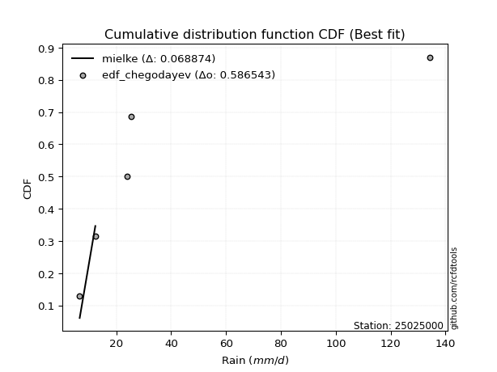</img></img>

</div>


### 6. EDF Blom (1958)

The Blom formula is a specific "plotting position" formula used in hydrology and statistical analysis to estimate the empirical cumulative probability (or non-exceedance probability) of a data series. It is particularly recommended for data that are approximately normally distributed. The constant _a_ is set to 0.375 (or 3/8).

<div align="center">


$P=(m-a)/(n+1-2a)$


</div>


**6.1. Empirical values**

<div align="center">

|                | 0                   | 1                   | 2        | 3                  | 4                  |
|:---------------|:--------------------|:--------------------|:---------|:-------------------|:-------------------|
| date           | 2018                | 2019                | 2021     | 2020               | 2017               |
| x              | 6.69                | 12.39               | 24.07    | 25.5               | 134.36             |
| m              | 1                   | 2                   | 3        | 4                  | 5                  |
| empirical_dist | edf_blom            | edf_blom            | edf_blom | edf_blom           | edf_blom           |
| empirical      | 0.11904761904761904 | 0.30952380952380953 | 0.5      | 0.6904761904761905 | 0.8809523809523809 |
| empirical_tr   | 1.135135135135135   | 1.4482758620689655  | 2.0      | 3.230769230769231  | 8.399999999999999  |

</div>


**6.2. Kolmogorov-Smirnov fit test (sorted by Δ)**


<div align="center">

|                | 0                   | 1                  | 2                   | 3                   | 4                   | 5                  | 6                   | 7                   | 8                  | 9                   | 10                  | 11                  | 12                  | 13                  | 14                 | 15                  | 16                  | 17                  | 18                  | 19                  | 20                  | 21                  | 22                  | 23                 | 24                  | 25                  | 26                  | 27                  | 28                  | 29                 | 30                 | 31                  | 32                  | 33                  | 34                  | 35                  | 36                  | 37                 | 38                 | 39                  | 40                  | 41                  | 42                  | 43                  | 44                  | 45                  | 46                  | 47                  | 48                  | 49                  | 50                 | 51                  | 52                 | 53                  | 54                 | 55                  | 56                  | 57                 | 58                  | 59                 | 60                  | 61                  | 62                  | 63                  | 64                  | 65                  | 66                 | 67                  | 68                  | 69                  | 70                 | 71                  | 72                  | 73                 | 74                  | 75                  | 76                 | 77                 | 78                  | 79                 | 80                  | 81                  | 82                 | 83                 | 84                 | 85                 | 86                  | 87                  | 88                  | 89                 | 90                  | 91                  | 92                  | 93                  | 94                  | 95                 | 96                 | 97                 | 98                  | 99                  | 100                | 101                | 102                | 103                 | 104                | 105                | 106                | 107                | 108                | 109                 | 110                 | 111                 | 112                | 113                | 114                | 115                | 116                | 117                | 118                | 119                | 120                 | 121                 | 122                 | 123                 | 124                | 125                 | 126                | 127                 | 128                 | 129                | 130                | 131                 | 132                | 133                | 134                | 135                 | 136                | 137                 | 138                | 139                | 140                 | 141                 | 142                 | 143                | 144                | 145                | 146                | 147                | 148                | 149                | 150                | 151                | 152                | 153                | 154                | 155                | 156                | 157                | 158                | 159                |
|:---------------|:--------------------|:-------------------|:--------------------|:--------------------|:--------------------|:-------------------|:--------------------|:--------------------|:-------------------|:--------------------|:--------------------|:--------------------|:--------------------|:--------------------|:-------------------|:--------------------|:--------------------|:--------------------|:--------------------|:--------------------|:--------------------|:--------------------|:--------------------|:-------------------|:--------------------|:--------------------|:--------------------|:--------------------|:--------------------|:-------------------|:-------------------|:--------------------|:--------------------|:--------------------|:--------------------|:--------------------|:--------------------|:-------------------|:-------------------|:--------------------|:--------------------|:--------------------|:--------------------|:--------------------|:--------------------|:--------------------|:--------------------|:--------------------|:--------------------|:--------------------|:-------------------|:--------------------|:-------------------|:--------------------|:-------------------|:--------------------|:--------------------|:-------------------|:--------------------|:-------------------|:--------------------|:--------------------|:--------------------|:--------------------|:--------------------|:--------------------|:-------------------|:--------------------|:--------------------|:--------------------|:-------------------|:--------------------|:--------------------|:-------------------|:--------------------|:--------------------|:-------------------|:-------------------|:--------------------|:-------------------|:--------------------|:--------------------|:-------------------|:-------------------|:-------------------|:-------------------|:--------------------|:--------------------|:--------------------|:-------------------|:--------------------|:--------------------|:--------------------|:--------------------|:--------------------|:-------------------|:-------------------|:-------------------|:--------------------|:--------------------|:-------------------|:-------------------|:-------------------|:--------------------|:-------------------|:-------------------|:-------------------|:-------------------|:-------------------|:--------------------|:--------------------|:--------------------|:-------------------|:-------------------|:-------------------|:-------------------|:-------------------|:-------------------|:-------------------|:-------------------|:--------------------|:--------------------|:--------------------|:--------------------|:-------------------|:--------------------|:-------------------|:--------------------|:--------------------|:-------------------|:-------------------|:--------------------|:-------------------|:-------------------|:-------------------|:--------------------|:-------------------|:--------------------|:-------------------|:-------------------|:--------------------|:--------------------|:--------------------|:-------------------|:-------------------|:-------------------|:-------------------|:-------------------|:-------------------|:-------------------|:-------------------|:-------------------|:-------------------|:-------------------|:-------------------|:-------------------|:-------------------|:-------------------|:-------------------|:-------------------|
| station        | 25025000            | 25025000           | 25025000            | 25025000            | 25025000            | 25025000           | 25025000            | 25025000            | 25025000           | 25025000            | 25025000            | 25025000            | 25025000            | 25025000            | 25025000           | 25025000            | 25025000            | 25025000            | 25025000            | 25025000            | 25025000            | 25025000            | 25025000            | 25025000           | 25025000            | 25025000            | 25025000            | 25025000            | 25025000            | 25025000           | 25025000           | 25025000            | 25025000            | 25025000            | 25025000            | 25025000            | 25025000            | 25025000           | 25025000           | 25025000            | 25025000            | 25025000            | 25025000            | 25025000            | 25025000            | 25025000            | 25025000            | 25025000            | 25025000            | 25025000            | 25025000           | 25025000            | 25025000           | 25025000            | 25025000           | 25025000            | 25025000            | 25025000           | 25025000            | 25025000           | 25025000            | 25025000            | 25025000            | 25025000            | 25025000            | 25025000            | 25025000           | 25025000            | 25025000            | 25025000            | 25025000           | 25025000            | 25025000            | 25025000           | 25025000            | 25025000            | 25025000           | 25025000           | 25025000            | 25025000           | 25025000            | 25025000            | 25025000           | 25025000           | 25025000           | 25025000           | 25025000            | 25025000            | 25025000            | 25025000           | 25025000            | 25025000            | 25025000            | 25025000            | 25025000            | 25025000           | 25025000           | 25025000           | 25025000            | 25025000            | 25025000           | 25025000           | 25025000           | 25025000            | 25025000           | 25025000           | 25025000           | 25025000           | 25025000           | 25025000            | 25025000            | 25025000            | 25025000           | 25025000           | 25025000           | 25025000           | 25025000           | 25025000           | 25025000           | 25025000           | 25025000            | 25025000            | 25025000            | 25025000            | 25025000           | 25025000            | 25025000           | 25025000            | 25025000            | 25025000           | 25025000           | 25025000            | 25025000           | 25025000           | 25025000           | 25025000            | 25025000           | 25025000            | 25025000           | 25025000           | 25025000            | 25025000            | 25025000            | 25025000           | 25025000           | 25025000           | 25025000           | 25025000           | 25025000           | 25025000           | 25025000           | 25025000           | 25025000           | 25025000           | 25025000           | 25025000           | 25025000           | 25025000           | 25025000           | 25025000           |
| empirical_dist | edf_blom            | edf_blom           | edf_blom            | edf_blom            | edf_blom            | edf_blom           | edf_blom            | edf_blom            | edf_blom           | edf_blom            | edf_blom            | edf_blom            | edf_blom            | edf_blom            | edf_blom           | edf_blom            | edf_blom            | edf_blom            | edf_blom            | edf_blom            | edf_blom            | edf_blom            | edf_blom            | edf_blom           | edf_blom            | edf_blom            | edf_blom            | edf_blom            | edf_blom            | edf_blom           | edf_blom           | edf_blom            | edf_blom            | edf_blom            | edf_blom            | edf_blom            | edf_blom            | edf_blom           | edf_blom           | edf_blom            | edf_blom            | edf_blom            | edf_blom            | edf_blom            | edf_blom            | edf_blom            | edf_blom            | edf_blom            | edf_blom            | edf_blom            | edf_blom           | edf_blom            | edf_blom           | edf_blom            | edf_blom           | edf_blom            | edf_blom            | edf_blom           | edf_blom            | edf_blom           | edf_blom            | edf_blom            | edf_blom            | edf_blom            | edf_blom            | edf_blom            | edf_blom           | edf_blom            | edf_blom            | edf_blom            | edf_blom           | edf_blom            | edf_blom            | edf_blom           | edf_blom            | edf_blom            | edf_blom           | edf_blom           | edf_blom            | edf_blom           | edf_blom            | edf_blom            | edf_blom           | edf_blom           | edf_blom           | edf_blom           | edf_blom            | edf_blom            | edf_blom            | edf_blom           | edf_blom            | edf_blom            | edf_blom            | edf_blom            | edf_blom            | edf_blom           | edf_blom           | edf_blom           | edf_blom            | edf_blom            | edf_blom           | edf_blom           | edf_blom           | edf_blom            | edf_blom           | edf_blom           | edf_blom           | edf_blom           | edf_blom           | edf_blom            | edf_blom            | edf_blom            | edf_blom           | edf_blom           | edf_blom           | edf_blom           | edf_blom           | edf_blom           | edf_blom           | edf_blom           | edf_blom            | edf_blom            | edf_blom            | edf_blom            | edf_blom           | edf_blom            | edf_blom           | edf_blom            | edf_blom            | edf_blom           | edf_blom           | edf_blom            | edf_blom           | edf_blom           | edf_blom           | edf_blom            | edf_blom           | edf_blom            | edf_blom           | edf_blom           | edf_blom            | edf_blom            | edf_blom            | edf_blom           | edf_blom           | edf_blom           | edf_blom           | edf_blom           | edf_blom           | edf_blom           | edf_blom           | edf_blom           | edf_blom           | edf_blom           | edf_blom           | edf_blom           | edf_blom           | edf_blom           | edf_blom           | edf_blom           |
| p_dist         | mielke              | loggumbel_r        | burr                | loghalfnorm         | logncf              | loggenlogistic     | logvonmises         | logkstwobign        | logburr            | logalpha            | loggenextreme       | loginvweibull       | logmielke           | loginvgamma         | lognct             | logexponnorm        | alpha               | logbetaprime        | logjohnsonsu        | nct                 | loginvgauss         | logmoyal            | lograyleigh         | logpearson3        | logfatiguelife      | logfoldnorm         | betaprime           | ncf                 | invgamma            | loggenexpon        | genextreme         | invweibull          | lomax               | logtruncweibull_min | gengamma            | loghalfgennorm      | erlang              | loggompertz        | logbeta            | genpareto           | loghalflogistic     | halfgennorm         | logskewnorm         | logmaxwell          | logtruncexpon       | invgauss            | logrice             | loglaplace          | loglaplace          | logdgamma           | burr12             | logexponpow         | loglomax           | exponpow            | gennorm            | loghypsecant        | loglogistic         | t                  | loggausshyper       | lognorm            | logcrystalball      | logt                | logloglaplace       | logloggamma         | exponweib           | loganglit           | logbradford        | logsemicircular     | logarcsine          | dgamma              | loggennorm         | loggenpareto        | logwald             | loggengamma        | wald                | logdweibull         | logcosine          | dweibull           | logkappa4           | logexponweib       | gamma               | logburr12           | vonmises_line      | weibull_min        | loggumbel_l        | halflogistic       | nakagami            | foldnorm            | logwrapcauchy       | pearson3           | halfnorm            | logksone            | loglevy_l           | moyal               | loguniform          | logvonmises_line   | gumbel_r           | logkappa3          | logrdist            | exponnorm           | arcsine            | logweibull_min     | genexpon           | wrapcauchy          | genlogistic        | loggamma           | loggamma           | rayleigh           | logargus           | levy_l              | f                   | maxwell             | semicircular       | logf               | anglit             | truncnorm          | logerlang          | logtruncnorm       | lognakagami        | norm               | crystalball         | logtriang           | kstwobign           | logistic            | gausshyper         | hypsecant           | logweibull_max     | rice                | fatiguelife         | laplace            | cosine             | bradford            | gumbel_l           | loggenhalflogistic | powerlaw           | truncpareto         | kappa3             | johnsonsu           | truncexpon         | argus              | skewnorm            | logtukeylambda      | gompertz            | triang             | logtrapezoid       | ksone              | logpowerlaw        | logjohnsonsb       | kappa4             | logtruncpareto     | rdist              | uniform            | weibull_max        | genhalflogistic    | tukeylambda        | truncweibull_min   | beta               | johnsonsb          | trapezoid          | vonmises           |
| delta          | 0.05829228766481286 | 0.0839300793029788 | 0.08537891904499528 | 0.08662439105590147 | 0.08695692265998445 | 0.088802597513715  | 0.08983219851870017 | 0.08994784590969096 | 0.0902026495454391 | 0.09182939792670197 | 0.09367188066005039 | 0.09368129975524486 | 0.09616161972229975 | 0.09845515268480931 | 0.098773852142779  | 0.10213503182277561 | 0.10375906321259099 | 0.10487709593570249 | 0.10549674894705341 | 0.10893128790387818 | 0.10910165737821431 | 0.10963737314764366 | 0.11289991191223436 | 0.1129888790084872 | 0.11478080432430182 | 0.11504353721626726 | 0.11707380492698805 | 0.11707660488983795 | 0.11707677373021852 | 0.1186294347455986 | 0.1186638885783815 | 0.11866408246268911 | 0.11904294885452035 | 0.119047559255159   | 0.11904761148370853 | 0.11904761820748008 | 0.11904761837703028 | 0.1190476190180697 | 0.1190476190444013 | 0.11904761904523593 | 0.11904761904761904 | 0.11904761904761904 | 0.11904761904761904 | 0.12303706482315113 | 0.12422134204047919 | 0.12460129006360121 | 0.12580309915691534 | 0.13020508804317177 | 0.13020508804317177 | 0.13107602037604427 | 0.1373955629246537 | 0.14057809914219188 | 0.1414941718824927 | 0.14336504146433948 | 0.1448385459806205 | 0.14521565107504109 | 0.14938330163394276 | 0.1507367393733241 | 0.15154882045390172 | 0.154290957660826  | 0.15429095844014618 | 0.15429488389625678 | 0.15432886308490745 | 0.15675732767036654 | 0.15859194211220784 | 0.15944818625974466 | 0.1596474444039263 | 0.16157479049965306 | 0.17001971835670437 | 0.17333133285657867 | 0.1745332189000931 | 0.17489615039575854 | 0.18106672038107186 | 0.1812573740059773 | 0.18676694548025297 | 0.19047619047603992 | 0.1907361967975023 | 0.1909051263533124 | 0.19567044577150233 | 0.1957974566105518 | 0.19774953674579498 | 0.20249039866485552 | 0.2036583508010273 | 0.2103247781210955 | 0.2226280718809054 | 0.2229865798966113 | 0.22708444545624823 | 0.22766484527370856 | 0.22816517383015888 | 0.2317226859217183 | 0.23508424409295792 | 0.23544696380667152 | 0.23925619396230724 | 0.24008040349991888 | 0.24444111847276773 | 0.2446817568839581 | 0.260831322655804  | 0.2609807029587616 | 0.26115959199237904 | 0.26211307670019757 | 0.2627955910187759 | 0.2629920797737916 | 0.2647349779958861 | 0.26523231681096027 | 0.2659292870676871 | 0.2689290842978507 | 0.2689290842978507 | 0.2699608365019608 | 0.2704097036718538 | 0.27732741425027685 | 0.27918443533502235 | 0.28222999750708583 | 0.2914433597823004 | 0.2925866785004141 | 0.2985084992858943 | 0.299328885879093  | 0.3066859662583278 | 0.3095124507923121 | 0.3095237797654785 | 0.3154422063608865 | 0.31544482745902147 | 0.31600693671038094 | 0.32165128994115266 | 0.33103384046371614 | 0.3362750369527543 | 0.34349258286620665 | 0.3557288785098547 | 0.35590456671623716 | 0.36919117100263343 | 0.3718206430418487 | 0.3738302416174991 | 0.37566591758600276 | 0.379037306257293  | 0.390206288491112  | 0.4064442502072412 | 0.40862817827980824 | 0.4093475515590657 | 0.41471215585110166 | 0.4280992108566448 | 0.4336900326278872 | 0.43738041939566785 | 0.44904010860347654 | 0.44978281386115415 | 0.4609305680306399 | 0.48342459335273   | 0.4843653839698329 | 0.5125289091700111 | 0.5148621617728544 | 0.5164223660300211 | 0.5366646237121642 | 0.538216905999077  | 0.5431432226685614 | 0.5670858832662103 | 0.5685455374869492 | 0.5732270980849505 | 0.5934855775443639 | 0.61609023929561   | 0.634206515413318  | 0.6471730319367573 | 21.08526295050516  |
| deltao         | 0.5865427407550001  | 0.5865427407550001 | 0.5865427407550001  | 0.5865427407550001  | 0.5865427407550001  | 0.5865427407550001 | 0.5865427407550001  | 0.5865427407550001  | 0.5865427407550001 | 0.5865427407550001  | 0.5865427407550001  | 0.5865427407550001  | 0.5865427407550001  | 0.5865427407550001  | 0.5865427407550001 | 0.5865427407550001  | 0.5865427407550001  | 0.5865427407550001  | 0.5865427407550001  | 0.5865427407550001  | 0.5865427407550001  | 0.5865427407550001  | 0.5865427407550001  | 0.5865427407550001 | 0.5865427407550001  | 0.5865427407550001  | 0.5865427407550001  | 0.5865427407550001  | 0.5865427407550001  | 0.5865427407550001 | 0.5865427407550001 | 0.5865427407550001  | 0.5865427407550001  | 0.5865427407550001  | 0.5865427407550001  | 0.5865427407550001  | 0.5865427407550001  | 0.5865427407550001 | 0.5865427407550001 | 0.5865427407550001  | 0.5865427407550001  | 0.5865427407550001  | 0.5865427407550001  | 0.5865427407550001  | 0.5865427407550001  | 0.5865427407550001  | 0.5865427407550001  | 0.5865427407550001  | 0.5865427407550001  | 0.5865427407550001  | 0.5865427407550001 | 0.5865427407550001  | 0.5865427407550001 | 0.5865427407550001  | 0.5865427407550001 | 0.5865427407550001  | 0.5865427407550001  | 0.5865427407550001 | 0.5865427407550001  | 0.5865427407550001 | 0.5865427407550001  | 0.5865427407550001  | 0.5865427407550001  | 0.5865427407550001  | 0.5865427407550001  | 0.5865427407550001  | 0.5865427407550001 | 0.5865427407550001  | 0.5865427407550001  | 0.5865427407550001  | 0.5865427407550001 | 0.5865427407550001  | 0.5865427407550001  | 0.5865427407550001 | 0.5865427407550001  | 0.5865427407550001  | 0.5865427407550001 | 0.5865427407550001 | 0.5865427407550001  | 0.5865427407550001 | 0.5865427407550001  | 0.5865427407550001  | 0.5865427407550001 | 0.5865427407550001 | 0.5865427407550001 | 0.5865427407550001 | 0.5865427407550001  | 0.5865427407550001  | 0.5865427407550001  | 0.5865427407550001 | 0.5865427407550001  | 0.5865427407550001  | 0.5865427407550001  | 0.5865427407550001  | 0.5865427407550001  | 0.5865427407550001 | 0.5865427407550001 | 0.5865427407550001 | 0.5865427407550001  | 0.5865427407550001  | 0.5865427407550001 | 0.5865427407550001 | 0.5865427407550001 | 0.5865427407550001  | 0.5865427407550001 | 0.5865427407550001 | 0.5865427407550001 | 0.5865427407550001 | 0.5865427407550001 | 0.5865427407550001  | 0.5865427407550001  | 0.5865427407550001  | 0.5865427407550001 | 0.5865427407550001 | 0.5865427407550001 | 0.5865427407550001 | 0.5865427407550001 | 0.5865427407550001 | 0.5865427407550001 | 0.5865427407550001 | 0.5865427407550001  | 0.5865427407550001  | 0.5865427407550001  | 0.5865427407550001  | 0.5865427407550001 | 0.5865427407550001  | 0.5865427407550001 | 0.5865427407550001  | 0.5865427407550001  | 0.5865427407550001 | 0.5865427407550001 | 0.5865427407550001  | 0.5865427407550001 | 0.5865427407550001 | 0.5865427407550001 | 0.5865427407550001  | 0.5865427407550001 | 0.5865427407550001  | 0.5865427407550001 | 0.5865427407550001 | 0.5865427407550001  | 0.5865427407550001  | 0.5865427407550001  | 0.5865427407550001 | 0.5865427407550001 | 0.5865427407550001 | 0.5865427407550001 | 0.5865427407550001 | 0.5865427407550001 | 0.5865427407550001 | 0.5865427407550001 | 0.5865427407550001 | 0.5865427407550001 | 0.5865427407550001 | 0.5865427407550001 | 0.5865427407550001 | 0.5865427407550001 | 0.5865427407550001 | 0.5865427407550001 | 0.5865427407550001 |
| eval           | Δo > Δ              | Δo > Δ             | Δo > Δ              | Δo > Δ              | Δo > Δ              | Δo > Δ             | Δo > Δ              | Δo > Δ              | Δo > Δ             | Δo > Δ              | Δo > Δ              | Δo > Δ              | Δo > Δ              | Δo > Δ              | Δo > Δ             | Δo > Δ              | Δo > Δ              | Δo > Δ              | Δo > Δ              | Δo > Δ              | Δo > Δ              | Δo > Δ              | Δo > Δ              | Δo > Δ             | Δo > Δ              | Δo > Δ              | Δo > Δ              | Δo > Δ              | Δo > Δ              | Δo > Δ             | Δo > Δ             | Δo > Δ              | Δo > Δ              | Δo > Δ              | Δo > Δ              | Δo > Δ              | Δo > Δ              | Δo > Δ             | Δo > Δ             | Δo > Δ              | Δo > Δ              | Δo > Δ              | Δo > Δ              | Δo > Δ              | Δo > Δ              | Δo > Δ              | Δo > Δ              | Δo > Δ              | Δo > Δ              | Δo > Δ              | Δo > Δ             | Δo > Δ              | Δo > Δ             | Δo > Δ              | Δo > Δ             | Δo > Δ              | Δo > Δ              | Δo > Δ             | Δo > Δ              | Δo > Δ             | Δo > Δ              | Δo > Δ              | Δo > Δ              | Δo > Δ              | Δo > Δ              | Δo > Δ              | Δo > Δ             | Δo > Δ              | Δo > Δ              | Δo > Δ              | Δo > Δ             | Δo > Δ              | Δo > Δ              | Δo > Δ             | Δo > Δ              | Δo > Δ              | Δo > Δ             | Δo > Δ             | Δo > Δ              | Δo > Δ             | Δo > Δ              | Δo > Δ              | Δo > Δ             | Δo > Δ             | Δo > Δ             | Δo > Δ             | Δo > Δ              | Δo > Δ              | Δo > Δ              | Δo > Δ             | Δo > Δ              | Δo > Δ              | Δo > Δ              | Δo > Δ              | Δo > Δ              | Δo > Δ             | Δo > Δ             | Δo > Δ             | Δo > Δ              | Δo > Δ              | Δo > Δ             | Δo > Δ             | Δo > Δ             | Δo > Δ              | Δo > Δ             | Δo > Δ             | Δo > Δ             | Δo > Δ             | Δo > Δ             | Δo > Δ              | Δo > Δ              | Δo > Δ              | Δo > Δ             | Δo > Δ             | Δo > Δ             | Δo > Δ             | Δo > Δ             | Δo > Δ             | Δo > Δ             | Δo > Δ             | Δo > Δ              | Δo > Δ              | Δo > Δ              | Δo > Δ              | Δo > Δ             | Δo > Δ              | Δo > Δ             | Δo > Δ              | Δo > Δ              | Δo > Δ             | Δo > Δ             | Δo > Δ              | Δo > Δ             | Δo > Δ             | Δo > Δ             | Δo > Δ              | Δo > Δ             | Δo > Δ              | Δo > Δ             | Δo > Δ             | Δo > Δ              | Δo > Δ              | Δo > Δ              | Δo > Δ             | Δo > Δ             | Δo > Δ             | Δo > Δ             | Δo > Δ             | Δo > Δ             | Δo > Δ             | Δo > Δ             | Δo > Δ             | Δo > Δ             | Δo > Δ             | Δo > Δ             | Δo <= Δ            | Δo <= Δ            | Δo <= Δ            | Δo <= Δ            | Δo <= Δ            |
| fit            | 1                   | 1                  | 1                   | 1                   | 1                   | 1                  | 1                   | 1                   | 1                  | 1                   | 1                   | 1                   | 1                   | 1                   | 1                  | 1                   | 1                   | 1                   | 1                   | 1                   | 1                   | 1                   | 1                   | 1                  | 1                   | 1                   | 1                   | 1                   | 1                   | 1                  | 1                  | 1                   | 1                   | 1                   | 1                   | 1                   | 1                   | 1                  | 1                  | 1                   | 1                   | 1                   | 1                   | 1                   | 1                   | 1                   | 1                   | 1                   | 1                   | 1                   | 1                  | 1                   | 1                  | 1                   | 1                  | 1                   | 1                   | 1                  | 1                   | 1                  | 1                   | 1                   | 1                   | 1                   | 1                   | 1                   | 1                  | 1                   | 1                   | 1                   | 1                  | 1                   | 1                   | 1                  | 1                   | 1                   | 1                  | 1                  | 1                   | 1                  | 1                   | 1                   | 1                  | 1                  | 1                  | 1                  | 1                   | 1                   | 1                   | 1                  | 1                   | 1                   | 1                   | 1                   | 1                   | 1                  | 1                  | 1                  | 1                   | 1                   | 1                  | 1                  | 1                  | 1                   | 1                  | 1                  | 1                  | 1                  | 1                  | 1                   | 1                   | 1                   | 1                  | 1                  | 1                  | 1                  | 1                  | 1                  | 1                  | 1                  | 1                   | 1                   | 1                   | 1                   | 1                  | 1                   | 1                  | 1                   | 1                   | 1                  | 1                  | 1                   | 1                  | 1                  | 1                  | 1                   | 1                  | 1                   | 1                  | 1                  | 1                   | 1                   | 1                   | 1                  | 1                  | 1                  | 1                  | 1                  | 1                  | 1                  | 1                  | 1                  | 1                  | 1                  | 1                  | 0                  | 0                  | 0                  | 0                  | 0                  |
| n              | 5                   | 5                  | 5                   | 5                   | 5                   | 5                  | 5                   | 5                   | 5                  | 5                   | 5                   | 5                   | 5                   | 5                   | 5                  | 5                   | 5                   | 5                   | 5                   | 5                   | 5                   | 5                   | 5                   | 5                  | 5                   | 5                   | 5                   | 5                   | 5                   | 5                  | 5                  | 5                   | 5                   | 5                   | 5                   | 5                   | 5                   | 5                  | 5                  | 5                   | 5                   | 5                   | 5                   | 5                   | 5                   | 5                   | 5                   | 5                   | 5                   | 5                   | 5                  | 5                   | 5                  | 5                   | 5                  | 5                   | 5                   | 5                  | 5                   | 5                  | 5                   | 5                   | 5                   | 5                   | 5                   | 5                   | 5                  | 5                   | 5                   | 5                   | 5                  | 5                   | 5                   | 5                  | 5                   | 5                   | 5                  | 5                  | 5                   | 5                  | 5                   | 5                   | 5                  | 5                  | 5                  | 5                  | 5                   | 5                   | 5                   | 5                  | 5                   | 5                   | 5                   | 5                   | 5                   | 5                  | 5                  | 5                  | 5                   | 5                   | 5                  | 5                  | 5                  | 5                   | 5                  | 5                  | 5                  | 5                  | 5                  | 5                   | 5                   | 5                   | 5                  | 5                  | 5                  | 5                  | 5                  | 5                  | 5                  | 5                  | 5                   | 5                   | 5                   | 5                   | 5                  | 5                   | 5                  | 5                   | 5                   | 5                  | 5                  | 5                   | 5                  | 5                  | 5                  | 5                   | 5                  | 5                   | 5                  | 5                  | 5                   | 5                   | 5                   | 5                  | 5                  | 5                  | 5                  | 5                  | 5                  | 5                  | 5                  | 5                  | 5                  | 5                  | 5                  | 5                  | 5                  | 5                  | 5                  | 5                  |
| best_fit       | 1                   | 0                  | 0                   | 0                   | 0                   | 0                  | 0                   | 0                   | 0                  | 0                   | 0                   | 0                   | 0                   | 0                   | 0                  | 0                   | 0                   | 0                   | 0                   | 0                   | 0                   | 0                   | 0                   | 0                  | 0                   | 0                   | 0                   | 0                   | 0                   | 0                  | 0                  | 0                   | 0                   | 0                   | 0                   | 0                   | 0                   | 0                  | 0                  | 0                   | 0                   | 0                   | 0                   | 0                   | 0                   | 0                   | 0                   | 0                   | 0                   | 0                   | 0                  | 0                   | 0                  | 0                   | 0                  | 0                   | 0                   | 0                  | 0                   | 0                  | 0                   | 0                   | 0                   | 0                   | 0                   | 0                   | 0                  | 0                   | 0                   | 0                   | 0                  | 0                   | 0                   | 0                  | 0                   | 0                   | 0                  | 0                  | 0                   | 0                  | 0                   | 0                   | 0                  | 0                  | 0                  | 0                  | 0                   | 0                   | 0                   | 0                  | 0                   | 0                   | 0                   | 0                   | 0                   | 0                  | 0                  | 0                  | 0                   | 0                   | 0                  | 0                  | 0                  | 0                   | 0                  | 0                  | 0                  | 0                  | 0                  | 0                   | 0                   | 0                   | 0                  | 0                  | 0                  | 0                  | 0                  | 0                  | 0                  | 0                  | 0                   | 0                   | 0                   | 0                   | 0                  | 0                   | 0                  | 0                   | 0                   | 0                  | 0                  | 0                   | 0                  | 0                  | 0                  | 0                   | 0                  | 0                   | 0                  | 0                  | 0                   | 0                   | 0                   | 0                  | 0                  | 0                  | 0                  | 0                  | 0                  | 0                  | 0                  | 0                  | 0                  | 0                  | 0                  | 0                  | 0                  | 0                  | 0                  | 0                  |
| best_fit_sort  | 1                   | 2                  | 3                   | 4                   | 5                   | 6                  | 7                   | 8                   | 9                  | 10                  | 11                  | 12                  | 13                  | 14                  | 15                 | 16                  | 17                  | 18                  | 19                  | 20                  | 21                  | 22                  | 23                  | 24                 | 25                  | 26                  | 27                  | 28                  | 29                  | 30                 | 31                 | 32                  | 33                  | 34                  | 35                  | 36                  | 37                  | 38                 | 39                 | 40                  | 41                  | 42                  | 43                  | 44                  | 45                  | 46                  | 47                  | 48                  | 49                  | 50                  | 51                 | 52                  | 53                 | 54                  | 55                 | 56                  | 57                  | 58                 | 59                  | 60                 | 61                  | 62                  | 63                  | 64                  | 65                  | 66                  | 67                 | 68                  | 69                  | 70                  | 71                 | 72                  | 73                  | 74                 | 75                  | 76                  | 77                 | 78                 | 79                  | 80                 | 81                  | 82                  | 83                 | 84                 | 85                 | 86                 | 87                  | 88                  | 89                  | 90                 | 91                  | 92                  | 93                  | 94                  | 95                  | 96                 | 97                 | 98                 | 99                  | 100                 | 101                | 102                | 103                | 104                 | 105                | 106                | 107                | 108                | 109                | 110                 | 111                 | 112                 | 113                | 114                | 115                | 116                | 117                | 118                | 119                | 120                | 121                 | 122                 | 123                 | 124                 | 125                | 126                 | 127                | 128                 | 129                 | 130                | 131                | 132                 | 133                | 134                | 135                | 136                 | 137                | 138                 | 139                | 140                | 141                 | 142                 | 143                 | 144                | 145                | 146                | 147                | 148                | 149                | 150                | 151                | 152                | 153                | 154                | 155                | 156                | 157                | 158                | 159                | 160                |

</div>


**6.3. Best fit**

<div align="center">

|   id |   station | empirical_dist   | p_dist   |     delta |   deltao | eval   |   fit |   n |   best_fit |   best_fit_sort |
|-----:|----------:|:-----------------|:---------|----------:|---------:|:-------|------:|----:|-----------:|----------------:|
|    0 |  25025000 | edf_blom         | mielke   | 0.0582923 | 0.586543 | Δo > Δ |     1 |   5 |          1 |               1 |

</div>


<div align="center">

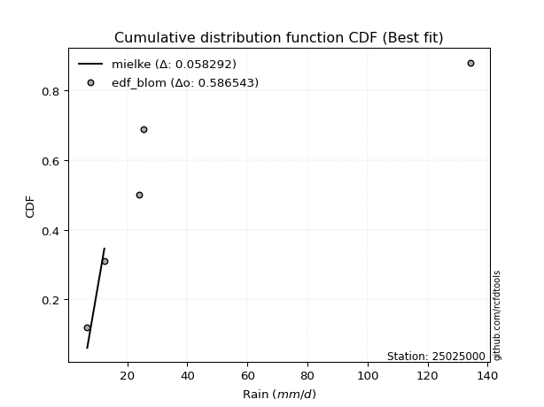</img>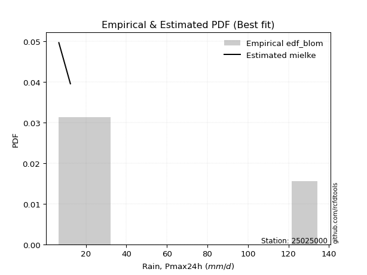</img>

</div>


### 7. EDF Tukey (1962)

In hydrology, the Tukey formula is used as a plotting position formula to estimate the empirical probability or frequency of a flood event (or other hydrological data). The formula parameter is given as _c=0.333_ (or 1/3).

<div align="center">


$P=(m-c)/(n+1-2c)$


</div>


**7.1. Empirical values**

<div align="center">

|                | 0                  | 1                  | 2         | 3         | 4         |
|:---------------|:-------------------|:-------------------|:----------|:----------|:----------|
| date           | 2018               | 2019               | 2021      | 2020      | 2017      |
| x              | 6.69               | 12.39              | 24.07     | 25.5      | 134.36    |
| m              | 1                  | 2                  | 3         | 4         | 5         |
| empirical_dist | edf_tukey          | edf_tukey          | edf_tukey | edf_tukey | edf_tukey |
| empirical      | 0.125              | 0.3125             | 0.5       | 0.6875    | 0.875     |
| empirical_tr   | 1.1428571428571428 | 1.4545454545454546 | 2.0       | 3.2       | 8.0       |

</div>


**7.2. Kolmogorov-Smirnov fit test (sorted by Δ)**


<div align="center">

|                | 0                   | 1                  | 2                   | 3                   | 4                   | 5                  | 6                  | 7                  | 8                  | 9                   | 10                  | 11                  | 12                  | 13                  | 14                 | 15                  | 16                  | 17                  | 18                  | 19                  | 20                  | 21                  | 22                 | 23                  | 24                  | 25                  | 26                  | 27                  | 28                  | 29                 | 30                  | 31                  | 32                  | 33                  | 34                  | 35                  | 36                  | 37                  | 38                  | 39                  | 40                  | 41                  | 42                  | 43                  | 44                 | 45                 | 46                 | 47                 | 48                 | 49                  | 50                 | 51                  | 52                  | 53                 | 54                  | 55                 | 56                  | 57                  | 58                 | 59                  | 60                 | 61                  | 62                 | 63                  | 64                  | 65                 | 66                  | 67                 | 68                 | 69                  | 70                  | 71                  | 72                  | 73                 | 74                 | 75                  | 76                  | 77                  | 78                  | 79                 | 80                  | 81                  | 82                  | 83                  | 84                  | 85                  | 86                  | 87                 | 88                  | 89                  | 90                  | 91                  | 92                  | 93                  | 94                  | 95                  | 96                  | 97                 | 98                 | 99                  | 100                | 101                 | 102                | 103                | 104                | 105                | 106                 | 107                | 108                | 109                | 110                | 111                 | 112                 | 113                | 114                | 115                 | 116                | 117                | 118                | 119                 | 120                | 121                 | 122                | 123                | 124                | 125                | 126                | 127                | 128                 | 129                 | 130                 | 131                | 132                | 133                 | 134                | 135                | 136                | 137                | 138                 | 139                | 140                | 141                | 142                 | 143                 | 144                 | 145                 | 146                | 147                | 148                | 149                | 150                | 151                | 152                | 153                | 154                | 155                | 156                | 157                | 158                | 159                |
|:---------------|:--------------------|:-------------------|:--------------------|:--------------------|:--------------------|:-------------------|:-------------------|:-------------------|:-------------------|:--------------------|:--------------------|:--------------------|:--------------------|:--------------------|:-------------------|:--------------------|:--------------------|:--------------------|:--------------------|:--------------------|:--------------------|:--------------------|:-------------------|:--------------------|:--------------------|:--------------------|:--------------------|:--------------------|:--------------------|:-------------------|:--------------------|:--------------------|:--------------------|:--------------------|:--------------------|:--------------------|:--------------------|:--------------------|:--------------------|:--------------------|:--------------------|:--------------------|:--------------------|:--------------------|:-------------------|:-------------------|:-------------------|:-------------------|:-------------------|:--------------------|:-------------------|:--------------------|:--------------------|:-------------------|:--------------------|:-------------------|:--------------------|:--------------------|:-------------------|:--------------------|:-------------------|:--------------------|:-------------------|:--------------------|:--------------------|:-------------------|:--------------------|:-------------------|:-------------------|:--------------------|:--------------------|:--------------------|:--------------------|:-------------------|:-------------------|:--------------------|:--------------------|:--------------------|:--------------------|:-------------------|:--------------------|:--------------------|:--------------------|:--------------------|:--------------------|:--------------------|:--------------------|:-------------------|:--------------------|:--------------------|:--------------------|:--------------------|:--------------------|:--------------------|:--------------------|:--------------------|:--------------------|:-------------------|:-------------------|:--------------------|:-------------------|:--------------------|:-------------------|:-------------------|:-------------------|:-------------------|:--------------------|:-------------------|:-------------------|:-------------------|:-------------------|:--------------------|:--------------------|:-------------------|:-------------------|:--------------------|:-------------------|:-------------------|:-------------------|:--------------------|:-------------------|:--------------------|:-------------------|:-------------------|:-------------------|:-------------------|:-------------------|:-------------------|:--------------------|:--------------------|:--------------------|:-------------------|:-------------------|:--------------------|:-------------------|:-------------------|:-------------------|:-------------------|:--------------------|:-------------------|:-------------------|:-------------------|:--------------------|:--------------------|:--------------------|:--------------------|:-------------------|:-------------------|:-------------------|:-------------------|:-------------------|:-------------------|:-------------------|:-------------------|:-------------------|:-------------------|:-------------------|:-------------------|:-------------------|:-------------------|
| station        | 25025000            | 25025000           | 25025000            | 25025000            | 25025000            | 25025000           | 25025000           | 25025000           | 25025000           | 25025000            | 25025000            | 25025000            | 25025000            | 25025000            | 25025000           | 25025000            | 25025000            | 25025000            | 25025000            | 25025000            | 25025000            | 25025000            | 25025000           | 25025000            | 25025000            | 25025000            | 25025000            | 25025000            | 25025000            | 25025000           | 25025000            | 25025000            | 25025000            | 25025000            | 25025000            | 25025000            | 25025000            | 25025000            | 25025000            | 25025000            | 25025000            | 25025000            | 25025000            | 25025000            | 25025000           | 25025000           | 25025000           | 25025000           | 25025000           | 25025000            | 25025000           | 25025000            | 25025000            | 25025000           | 25025000            | 25025000           | 25025000            | 25025000            | 25025000           | 25025000            | 25025000           | 25025000            | 25025000           | 25025000            | 25025000            | 25025000           | 25025000            | 25025000           | 25025000           | 25025000            | 25025000            | 25025000            | 25025000            | 25025000           | 25025000           | 25025000            | 25025000            | 25025000            | 25025000            | 25025000           | 25025000            | 25025000            | 25025000            | 25025000            | 25025000            | 25025000            | 25025000            | 25025000           | 25025000            | 25025000            | 25025000            | 25025000            | 25025000            | 25025000            | 25025000            | 25025000            | 25025000            | 25025000           | 25025000           | 25025000            | 25025000           | 25025000            | 25025000           | 25025000           | 25025000           | 25025000           | 25025000            | 25025000           | 25025000           | 25025000           | 25025000           | 25025000            | 25025000            | 25025000           | 25025000           | 25025000            | 25025000           | 25025000           | 25025000           | 25025000            | 25025000           | 25025000            | 25025000           | 25025000           | 25025000           | 25025000           | 25025000           | 25025000           | 25025000            | 25025000            | 25025000            | 25025000           | 25025000           | 25025000            | 25025000           | 25025000           | 25025000           | 25025000           | 25025000            | 25025000           | 25025000           | 25025000           | 25025000            | 25025000            | 25025000            | 25025000            | 25025000           | 25025000           | 25025000           | 25025000           | 25025000           | 25025000           | 25025000           | 25025000           | 25025000           | 25025000           | 25025000           | 25025000           | 25025000           | 25025000           |
| empirical_dist | edf_tukey           | edf_tukey          | edf_tukey           | edf_tukey           | edf_tukey           | edf_tukey          | edf_tukey          | edf_tukey          | edf_tukey          | edf_tukey           | edf_tukey           | edf_tukey           | edf_tukey           | edf_tukey           | edf_tukey          | edf_tukey           | edf_tukey           | edf_tukey           | edf_tukey           | edf_tukey           | edf_tukey           | edf_tukey           | edf_tukey          | edf_tukey           | edf_tukey           | edf_tukey           | edf_tukey           | edf_tukey           | edf_tukey           | edf_tukey          | edf_tukey           | edf_tukey           | edf_tukey           | edf_tukey           | edf_tukey           | edf_tukey           | edf_tukey           | edf_tukey           | edf_tukey           | edf_tukey           | edf_tukey           | edf_tukey           | edf_tukey           | edf_tukey           | edf_tukey          | edf_tukey          | edf_tukey          | edf_tukey          | edf_tukey          | edf_tukey           | edf_tukey          | edf_tukey           | edf_tukey           | edf_tukey          | edf_tukey           | edf_tukey          | edf_tukey           | edf_tukey           | edf_tukey          | edf_tukey           | edf_tukey          | edf_tukey           | edf_tukey          | edf_tukey           | edf_tukey           | edf_tukey          | edf_tukey           | edf_tukey          | edf_tukey          | edf_tukey           | edf_tukey           | edf_tukey           | edf_tukey           | edf_tukey          | edf_tukey          | edf_tukey           | edf_tukey           | edf_tukey           | edf_tukey           | edf_tukey          | edf_tukey           | edf_tukey           | edf_tukey           | edf_tukey           | edf_tukey           | edf_tukey           | edf_tukey           | edf_tukey          | edf_tukey           | edf_tukey           | edf_tukey           | edf_tukey           | edf_tukey           | edf_tukey           | edf_tukey           | edf_tukey           | edf_tukey           | edf_tukey          | edf_tukey          | edf_tukey           | edf_tukey          | edf_tukey           | edf_tukey          | edf_tukey          | edf_tukey          | edf_tukey          | edf_tukey           | edf_tukey          | edf_tukey          | edf_tukey          | edf_tukey          | edf_tukey           | edf_tukey           | edf_tukey          | edf_tukey          | edf_tukey           | edf_tukey          | edf_tukey          | edf_tukey          | edf_tukey           | edf_tukey          | edf_tukey           | edf_tukey          | edf_tukey          | edf_tukey          | edf_tukey          | edf_tukey          | edf_tukey          | edf_tukey           | edf_tukey           | edf_tukey           | edf_tukey          | edf_tukey          | edf_tukey           | edf_tukey          | edf_tukey          | edf_tukey          | edf_tukey          | edf_tukey           | edf_tukey          | edf_tukey          | edf_tukey          | edf_tukey           | edf_tukey           | edf_tukey           | edf_tukey           | edf_tukey          | edf_tukey          | edf_tukey          | edf_tukey          | edf_tukey          | edf_tukey          | edf_tukey          | edf_tukey          | edf_tukey          | edf_tukey          | edf_tukey          | edf_tukey          | edf_tukey          | edf_tukey          |
| p_dist         | mielke              | loggumbel_r        | logncf              | burr                | loghalfnorm         | logvonmises        | logkstwobign       | loggenlogistic     | logburr            | logalpha            | loggenextreme       | loginvweibull       | logmielke           | loginvgamma         | lognct             | logexponnorm        | alpha               | logbetaprime        | logjohnsonsu        | nct                 | loginvgauss         | logmoyal            | lograyleigh        | logpearson3         | logfoldnorm         | logfatiguelife      | betaprime           | ncf                 | invgamma            | genextreme         | invweibull          | logmaxwell          | logrice             | loggenexpon         | invgauss            | lomax               | logtruncweibull_min | gengamma            | loghalfgennorm      | logtruncexpon       | erlang              | loggompertz         | logbeta             | genpareto           | logskewnorm        | loghalflogistic    | halfgennorm        | loglaplace         | loglaplace         | logdgamma           | burr12             | logexponpow         | exponpow            | loglomax           | loghypsecant        | loglogistic        | gennorm             | loggausshyper       | t                  | lognorm             | logcrystalball     | logt                | logloglaplace      | logloggamma         | exponweib           | loganglit          | logbradford         | logsemicircular    | logarcsine         | dgamma              | loggenpareto        | loggennorm          | logwald             | loggengamma        | wald               | dweibull            | logdweibull         | logcosine           | logkappa4           | logexponweib       | gamma               | vonmises_line       | logburr12           | weibull_min         | loggumbel_l         | halflogistic        | nakagami            | foldnorm           | logwrapcauchy       | pearson3            | halfnorm            | logksone            | loglevy_l           | moyal               | loguniform          | logvonmises_line    | gumbel_r            | logkappa3          | exponnorm          | arcsine             | logweibull_min     | logrdist            | genexpon           | wrapcauchy         | genlogistic        | rayleigh           | logargus            | loggamma           | loggamma           | levy_l             | f                  | maxwell             | semicircular        | logf               | anglit             | truncnorm           | logerlang          | norm               | crystalball        | logtruncnorm        | lognakagami        | logtriang           | kstwobign          | logistic           | gausshyper         | hypsecant          | logweibull_max     | rice               | fatiguelife         | laplace             | cosine              | bradford           | gumbel_l           | loggenhalflogistic  | kappa3             | powerlaw           | truncpareto        | johnsonsu          | truncexpon          | argus              | skewnorm           | gompertz           | logtukeylambda      | triang              | logtrapezoid        | ksone               | logpowerlaw        | logjohnsonsb       | kappa4             | rdist              | logtruncpareto     | uniform            | weibull_max        | genhalflogistic    | tukeylambda        | truncweibull_min   | beta               | johnsonsb          | trapezoid          | vonmises           |
| delta          | 0.06424466861719383 | 0.0839300793029788 | 0.08398073218379398 | 0.08537891904499528 | 0.08662439105590147 | 0.0868560080425097 | 0.0869716554335005 | 0.088802597513715  | 0.0902026495454391 | 0.09182939792670197 | 0.09367188066005039 | 0.09368129975524486 | 0.09616161972229975 | 0.09845515268480931 | 0.098773852142779  | 0.10213503182277561 | 0.10375906321259099 | 0.10487709593570249 | 0.10549674894705341 | 0.10893128790387818 | 0.10910165737821431 | 0.10963737314764366 | 0.1099237214360439 | 0.11001268853229673 | 0.11206734674007679 | 0.11478080432430182 | 0.11707380492698805 | 0.11707660488983795 | 0.11707677373021852 | 0.1186638885783815 | 0.11866408246268911 | 0.12006087434696067 | 0.12282690868072488 | 0.12458181569797956 | 0.12460129006360121 | 0.12499532980690131 | 0.12499994020753996 | 0.12499999243608949 | 0.12499999915986104 | 0.12499999917554616 | 0.12499999932941123 | 0.12499999997045066 | 0.12499999999678225 | 0.12499999999761689 | 0.125              | 0.125              | 0.125              | 0.1272288975669813 | 0.1272288975669813 | 0.13405221085223473 | 0.1373955629246537 | 0.13760190866600142 | 0.14038885098814902 | 0.1414941718824927 | 0.14223946059885062 | 0.1464071111577523 | 0.14781473645681095 | 0.14857262997771126 | 0.1507367393733241 | 0.15131476718463555 | 0.1513147679639557 | 0.15131869342006632 | 0.151352672608717  | 0.15378113719417608 | 0.15561575163601737 | 0.1564719957835542 | 0.15667125392773584 | 0.1585986000234626 | 0.1670435278805139 | 0.16737895190419771 | 0.16894376944337758 | 0.17750940937628357 | 0.18106672038107186 | 0.1812573740059773 | 0.1837907550040625 | 0.18495274540093143 | 0.18749999999984945 | 0.18776000632131185 | 0.19269425529531187 | 0.1957974566105518 | 0.19774953674579498 | 0.20068216032483682 | 0.20249039866485552 | 0.20734858764490505 | 0.21965188140471492 | 0.22001038942042084 | 0.22410825498005776 | 0.2246886547975181 | 0.22518898335396842 | 0.22874649544552783 | 0.23210805361676745 | 0.23247077333048105 | 0.23628000348611677 | 0.23710421302372842 | 0.24146492799657726 | 0.24170556640776764 | 0.25785513217961353 | 0.2580045124825711 | 0.2591368862240071 | 0.25981940054258545 | 0.2600158892976011 | 0.26115959199237904 | 0.2617587875196956 | 0.2622561263347698 | 0.2629530965914966 | 0.2669846460257703 | 0.26743351319566333 | 0.2689290842978507 | 0.2689290842978507 | 0.2713750332978959 | 0.2762082448588319 | 0.27925380703089536 | 0.28846716930610994 | 0.2896104880242236 | 0.2955323088097038 | 0.29635269540290254 | 0.3066859662583278 | 0.312466015884696  | 0.312468636982831  | 0.31248864126850256 | 0.312499970241669  | 0.31303074623419047 | 0.3186750994649622 | 0.3280576499875257 | 0.3332988464765638 | 0.3405163923900162 | 0.3527526880336642 | 0.3529283762400467 | 0.36621498052644297 | 0.36884445256565823 | 0.37085405114130865 | 0.3726897271098123 | 0.3760611157811025 | 0.38723009801492153 | 0.4033951706066848 | 0.4034680597310507 | 0.4056519878036178 | 0.4117359653749112 | 0.42512302038045435 | 0.4307138421516967 | 0.4344042289194774 | 0.4468066233849637 | 0.44904010860347654 | 0.45795437755444945 | 0.48044840287653956 | 0.48138919349364245 | 0.5095527186938207 | 0.5118859712966639 | 0.5134461755538307 | 0.5322645250466961 | 0.5336884332359737 | 0.5401670321923709 | 0.5641096927900199 | 0.5655693470107588 | 0.5672747171325696 | 0.5905093870681735 | 0.6101378583432291 | 0.6312303249371275 | 0.6441968414605669 | 21.09121533145754  |
| deltao         | 0.5865427407550001  | 0.5865427407550001 | 0.5865427407550001  | 0.5865427407550001  | 0.5865427407550001  | 0.5865427407550001 | 0.5865427407550001 | 0.5865427407550001 | 0.5865427407550001 | 0.5865427407550001  | 0.5865427407550001  | 0.5865427407550001  | 0.5865427407550001  | 0.5865427407550001  | 0.5865427407550001 | 0.5865427407550001  | 0.5865427407550001  | 0.5865427407550001  | 0.5865427407550001  | 0.5865427407550001  | 0.5865427407550001  | 0.5865427407550001  | 0.5865427407550001 | 0.5865427407550001  | 0.5865427407550001  | 0.5865427407550001  | 0.5865427407550001  | 0.5865427407550001  | 0.5865427407550001  | 0.5865427407550001 | 0.5865427407550001  | 0.5865427407550001  | 0.5865427407550001  | 0.5865427407550001  | 0.5865427407550001  | 0.5865427407550001  | 0.5865427407550001  | 0.5865427407550001  | 0.5865427407550001  | 0.5865427407550001  | 0.5865427407550001  | 0.5865427407550001  | 0.5865427407550001  | 0.5865427407550001  | 0.5865427407550001 | 0.5865427407550001 | 0.5865427407550001 | 0.5865427407550001 | 0.5865427407550001 | 0.5865427407550001  | 0.5865427407550001 | 0.5865427407550001  | 0.5865427407550001  | 0.5865427407550001 | 0.5865427407550001  | 0.5865427407550001 | 0.5865427407550001  | 0.5865427407550001  | 0.5865427407550001 | 0.5865427407550001  | 0.5865427407550001 | 0.5865427407550001  | 0.5865427407550001 | 0.5865427407550001  | 0.5865427407550001  | 0.5865427407550001 | 0.5865427407550001  | 0.5865427407550001 | 0.5865427407550001 | 0.5865427407550001  | 0.5865427407550001  | 0.5865427407550001  | 0.5865427407550001  | 0.5865427407550001 | 0.5865427407550001 | 0.5865427407550001  | 0.5865427407550001  | 0.5865427407550001  | 0.5865427407550001  | 0.5865427407550001 | 0.5865427407550001  | 0.5865427407550001  | 0.5865427407550001  | 0.5865427407550001  | 0.5865427407550001  | 0.5865427407550001  | 0.5865427407550001  | 0.5865427407550001 | 0.5865427407550001  | 0.5865427407550001  | 0.5865427407550001  | 0.5865427407550001  | 0.5865427407550001  | 0.5865427407550001  | 0.5865427407550001  | 0.5865427407550001  | 0.5865427407550001  | 0.5865427407550001 | 0.5865427407550001 | 0.5865427407550001  | 0.5865427407550001 | 0.5865427407550001  | 0.5865427407550001 | 0.5865427407550001 | 0.5865427407550001 | 0.5865427407550001 | 0.5865427407550001  | 0.5865427407550001 | 0.5865427407550001 | 0.5865427407550001 | 0.5865427407550001 | 0.5865427407550001  | 0.5865427407550001  | 0.5865427407550001 | 0.5865427407550001 | 0.5865427407550001  | 0.5865427407550001 | 0.5865427407550001 | 0.5865427407550001 | 0.5865427407550001  | 0.5865427407550001 | 0.5865427407550001  | 0.5865427407550001 | 0.5865427407550001 | 0.5865427407550001 | 0.5865427407550001 | 0.5865427407550001 | 0.5865427407550001 | 0.5865427407550001  | 0.5865427407550001  | 0.5865427407550001  | 0.5865427407550001 | 0.5865427407550001 | 0.5865427407550001  | 0.5865427407550001 | 0.5865427407550001 | 0.5865427407550001 | 0.5865427407550001 | 0.5865427407550001  | 0.5865427407550001 | 0.5865427407550001 | 0.5865427407550001 | 0.5865427407550001  | 0.5865427407550001  | 0.5865427407550001  | 0.5865427407550001  | 0.5865427407550001 | 0.5865427407550001 | 0.5865427407550001 | 0.5865427407550001 | 0.5865427407550001 | 0.5865427407550001 | 0.5865427407550001 | 0.5865427407550001 | 0.5865427407550001 | 0.5865427407550001 | 0.5865427407550001 | 0.5865427407550001 | 0.5865427407550001 | 0.5865427407550001 |
| eval           | Δo > Δ              | Δo > Δ             | Δo > Δ              | Δo > Δ              | Δo > Δ              | Δo > Δ             | Δo > Δ             | Δo > Δ             | Δo > Δ             | Δo > Δ              | Δo > Δ              | Δo > Δ              | Δo > Δ              | Δo > Δ              | Δo > Δ             | Δo > Δ              | Δo > Δ              | Δo > Δ              | Δo > Δ              | Δo > Δ              | Δo > Δ              | Δo > Δ              | Δo > Δ             | Δo > Δ              | Δo > Δ              | Δo > Δ              | Δo > Δ              | Δo > Δ              | Δo > Δ              | Δo > Δ             | Δo > Δ              | Δo > Δ              | Δo > Δ              | Δo > Δ              | Δo > Δ              | Δo > Δ              | Δo > Δ              | Δo > Δ              | Δo > Δ              | Δo > Δ              | Δo > Δ              | Δo > Δ              | Δo > Δ              | Δo > Δ              | Δo > Δ             | Δo > Δ             | Δo > Δ             | Δo > Δ             | Δo > Δ             | Δo > Δ              | Δo > Δ             | Δo > Δ              | Δo > Δ              | Δo > Δ             | Δo > Δ              | Δo > Δ             | Δo > Δ              | Δo > Δ              | Δo > Δ             | Δo > Δ              | Δo > Δ             | Δo > Δ              | Δo > Δ             | Δo > Δ              | Δo > Δ              | Δo > Δ             | Δo > Δ              | Δo > Δ             | Δo > Δ             | Δo > Δ              | Δo > Δ              | Δo > Δ              | Δo > Δ              | Δo > Δ             | Δo > Δ             | Δo > Δ              | Δo > Δ              | Δo > Δ              | Δo > Δ              | Δo > Δ             | Δo > Δ              | Δo > Δ              | Δo > Δ              | Δo > Δ              | Δo > Δ              | Δo > Δ              | Δo > Δ              | Δo > Δ             | Δo > Δ              | Δo > Δ              | Δo > Δ              | Δo > Δ              | Δo > Δ              | Δo > Δ              | Δo > Δ              | Δo > Δ              | Δo > Δ              | Δo > Δ             | Δo > Δ             | Δo > Δ              | Δo > Δ             | Δo > Δ              | Δo > Δ             | Δo > Δ             | Δo > Δ             | Δo > Δ             | Δo > Δ              | Δo > Δ             | Δo > Δ             | Δo > Δ             | Δo > Δ             | Δo > Δ              | Δo > Δ              | Δo > Δ             | Δo > Δ             | Δo > Δ              | Δo > Δ             | Δo > Δ             | Δo > Δ             | Δo > Δ              | Δo > Δ             | Δo > Δ              | Δo > Δ             | Δo > Δ             | Δo > Δ             | Δo > Δ             | Δo > Δ             | Δo > Δ             | Δo > Δ              | Δo > Δ              | Δo > Δ              | Δo > Δ             | Δo > Δ             | Δo > Δ              | Δo > Δ             | Δo > Δ             | Δo > Δ             | Δo > Δ             | Δo > Δ              | Δo > Δ             | Δo > Δ             | Δo > Δ             | Δo > Δ              | Δo > Δ              | Δo > Δ              | Δo > Δ              | Δo > Δ             | Δo > Δ             | Δo > Δ             | Δo > Δ             | Δo > Δ             | Δo > Δ             | Δo > Δ             | Δo > Δ             | Δo > Δ             | Δo <= Δ            | Δo <= Δ            | Δo <= Δ            | Δo <= Δ            | Δo <= Δ            |
| fit            | 1                   | 1                  | 1                   | 1                   | 1                   | 1                  | 1                  | 1                  | 1                  | 1                   | 1                   | 1                   | 1                   | 1                   | 1                  | 1                   | 1                   | 1                   | 1                   | 1                   | 1                   | 1                   | 1                  | 1                   | 1                   | 1                   | 1                   | 1                   | 1                   | 1                  | 1                   | 1                   | 1                   | 1                   | 1                   | 1                   | 1                   | 1                   | 1                   | 1                   | 1                   | 1                   | 1                   | 1                   | 1                  | 1                  | 1                  | 1                  | 1                  | 1                   | 1                  | 1                   | 1                   | 1                  | 1                   | 1                  | 1                   | 1                   | 1                  | 1                   | 1                  | 1                   | 1                  | 1                   | 1                   | 1                  | 1                   | 1                  | 1                  | 1                   | 1                   | 1                   | 1                   | 1                  | 1                  | 1                   | 1                   | 1                   | 1                   | 1                  | 1                   | 1                   | 1                   | 1                   | 1                   | 1                   | 1                   | 1                  | 1                   | 1                   | 1                   | 1                   | 1                   | 1                   | 1                   | 1                   | 1                   | 1                  | 1                  | 1                   | 1                  | 1                   | 1                  | 1                  | 1                  | 1                  | 1                   | 1                  | 1                  | 1                  | 1                  | 1                   | 1                   | 1                  | 1                  | 1                   | 1                  | 1                  | 1                  | 1                   | 1                  | 1                   | 1                  | 1                  | 1                  | 1                  | 1                  | 1                  | 1                   | 1                   | 1                   | 1                  | 1                  | 1                   | 1                  | 1                  | 1                  | 1                  | 1                   | 1                  | 1                  | 1                  | 1                   | 1                   | 1                   | 1                   | 1                  | 1                  | 1                  | 1                  | 1                  | 1                  | 1                  | 1                  | 1                  | 0                  | 0                  | 0                  | 0                  | 0                  |
| n              | 5                   | 5                  | 5                   | 5                   | 5                   | 5                  | 5                  | 5                  | 5                  | 5                   | 5                   | 5                   | 5                   | 5                   | 5                  | 5                   | 5                   | 5                   | 5                   | 5                   | 5                   | 5                   | 5                  | 5                   | 5                   | 5                   | 5                   | 5                   | 5                   | 5                  | 5                   | 5                   | 5                   | 5                   | 5                   | 5                   | 5                   | 5                   | 5                   | 5                   | 5                   | 5                   | 5                   | 5                   | 5                  | 5                  | 5                  | 5                  | 5                  | 5                   | 5                  | 5                   | 5                   | 5                  | 5                   | 5                  | 5                   | 5                   | 5                  | 5                   | 5                  | 5                   | 5                  | 5                   | 5                   | 5                  | 5                   | 5                  | 5                  | 5                   | 5                   | 5                   | 5                   | 5                  | 5                  | 5                   | 5                   | 5                   | 5                   | 5                  | 5                   | 5                   | 5                   | 5                   | 5                   | 5                   | 5                   | 5                  | 5                   | 5                   | 5                   | 5                   | 5                   | 5                   | 5                   | 5                   | 5                   | 5                  | 5                  | 5                   | 5                  | 5                   | 5                  | 5                  | 5                  | 5                  | 5                   | 5                  | 5                  | 5                  | 5                  | 5                   | 5                   | 5                  | 5                  | 5                   | 5                  | 5                  | 5                  | 5                   | 5                  | 5                   | 5                  | 5                  | 5                  | 5                  | 5                  | 5                  | 5                   | 5                   | 5                   | 5                  | 5                  | 5                   | 5                  | 5                  | 5                  | 5                  | 5                   | 5                  | 5                  | 5                  | 5                   | 5                   | 5                   | 5                   | 5                  | 5                  | 5                  | 5                  | 5                  | 5                  | 5                  | 5                  | 5                  | 5                  | 5                  | 5                  | 5                  | 5                  |
| best_fit       | 1                   | 0                  | 0                   | 0                   | 0                   | 0                  | 0                  | 0                  | 0                  | 0                   | 0                   | 0                   | 0                   | 0                   | 0                  | 0                   | 0                   | 0                   | 0                   | 0                   | 0                   | 0                   | 0                  | 0                   | 0                   | 0                   | 0                   | 0                   | 0                   | 0                  | 0                   | 0                   | 0                   | 0                   | 0                   | 0                   | 0                   | 0                   | 0                   | 0                   | 0                   | 0                   | 0                   | 0                   | 0                  | 0                  | 0                  | 0                  | 0                  | 0                   | 0                  | 0                   | 0                   | 0                  | 0                   | 0                  | 0                   | 0                   | 0                  | 0                   | 0                  | 0                   | 0                  | 0                   | 0                   | 0                  | 0                   | 0                  | 0                  | 0                   | 0                   | 0                   | 0                   | 0                  | 0                  | 0                   | 0                   | 0                   | 0                   | 0                  | 0                   | 0                   | 0                   | 0                   | 0                   | 0                   | 0                   | 0                  | 0                   | 0                   | 0                   | 0                   | 0                   | 0                   | 0                   | 0                   | 0                   | 0                  | 0                  | 0                   | 0                  | 0                   | 0                  | 0                  | 0                  | 0                  | 0                   | 0                  | 0                  | 0                  | 0                  | 0                   | 0                   | 0                  | 0                  | 0                   | 0                  | 0                  | 0                  | 0                   | 0                  | 0                   | 0                  | 0                  | 0                  | 0                  | 0                  | 0                  | 0                   | 0                   | 0                   | 0                  | 0                  | 0                   | 0                  | 0                  | 0                  | 0                  | 0                   | 0                  | 0                  | 0                  | 0                   | 0                   | 0                   | 0                   | 0                  | 0                  | 0                  | 0                  | 0                  | 0                  | 0                  | 0                  | 0                  | 0                  | 0                  | 0                  | 0                  | 0                  |
| best_fit_sort  | 1                   | 2                  | 3                   | 4                   | 5                   | 6                  | 7                  | 8                  | 9                  | 10                  | 11                  | 12                  | 13                  | 14                  | 15                 | 16                  | 17                  | 18                  | 19                  | 20                  | 21                  | 22                  | 23                 | 24                  | 25                  | 26                  | 27                  | 28                  | 29                  | 30                 | 31                  | 32                  | 33                  | 34                  | 35                  | 36                  | 37                  | 38                  | 39                  | 40                  | 41                  | 42                  | 43                  | 44                  | 45                 | 46                 | 47                 | 48                 | 49                 | 50                  | 51                 | 52                  | 53                  | 54                 | 55                  | 56                 | 57                  | 58                  | 59                 | 60                  | 61                 | 62                  | 63                 | 64                  | 65                  | 66                 | 67                  | 68                 | 69                 | 70                  | 71                  | 72                  | 73                  | 74                 | 75                 | 76                  | 77                  | 78                  | 79                  | 80                 | 81                  | 82                  | 83                  | 84                  | 85                  | 86                  | 87                  | 88                 | 89                  | 90                  | 91                  | 92                  | 93                  | 94                  | 95                  | 96                  | 97                  | 98                 | 99                 | 100                 | 101                | 102                 | 103                | 104                | 105                | 106                | 107                 | 108                | 109                | 110                | 111                | 112                 | 113                 | 114                | 115                | 116                 | 117                | 118                | 119                | 120                 | 121                | 122                 | 123                | 124                | 125                | 126                | 127                | 128                | 129                 | 130                 | 131                 | 132                | 133                | 134                 | 135                | 136                | 137                | 138                | 139                 | 140                | 141                | 142                | 143                 | 144                 | 145                 | 146                 | 147                | 148                | 149                | 150                | 151                | 152                | 153                | 154                | 155                | 156                | 157                | 158                | 159                | 160                |

</div>


**7.3. Best fit**

<div align="center">

|   id |   station | empirical_dist   | p_dist   |     delta |   deltao | eval   |   fit |   n |   best_fit |   best_fit_sort |
|-----:|----------:|:-----------------|:---------|----------:|---------:|:-------|------:|----:|-----------:|----------------:|
|    0 |  25025000 | edf_tukey        | mielke   | 0.0642447 | 0.586543 | Δo > Δ |     1 |   5 |          1 |               1 |

</div>


<div align="center">

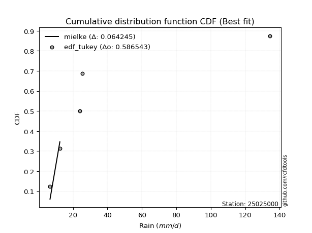</img>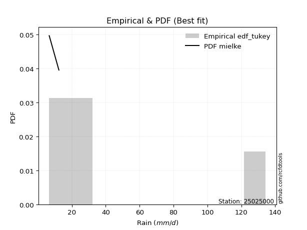</img>

</div>


### 8. EDF Gringorten (1963)

Gringorten plotting position formula is essential for estimating the probability and return periods of extreme events like floods and heavy rainfall. The constant _a=0.44_.

<div align="center">


$P=(m-a)/(n+1-2a)$


</div>


**8.1. Empirical values**

<div align="center">

|                | 0                   | 1                  | 2              | 3                 | 4                  |
|:---------------|:--------------------|:-------------------|:---------------|:------------------|:-------------------|
| date           | 2018                | 2019               | 2021           | 2020              | 2017               |
| x              | 6.69                | 12.39              | 24.07          | 25.5              | 134.36             |
| m              | 1                   | 2                  | 3              | 4                 | 5                  |
| empirical_dist | edf_gringorten      | edf_gringorten     | edf_gringorten | edf_gringorten    | edf_gringorten     |
| empirical      | 0.10937500000000001 | 0.3046875          | 0.5            | 0.6953125         | 0.8906249999999999 |
| empirical_tr   | 1.1228070175438596  | 1.4382022471910112 | 2.0            | 3.282051282051282 | 9.142857142857133  |

</div>


**8.2. Kolmogorov-Smirnov fit test (sorted by Δ)**


<div align="center">

|                | 0                    | 1                  | 2                   | 3                  | 4                  | 5                  | 6                   | 7                   | 8                   | 9                   | 10                 | 11                 | 12                  | 13                  | 14                 | 15                  | 16                  | 17                  | 18                  | 19                  | 20                  | 21                  | 22                 | 23                  | 24                  | 25                  | 26                  | 27                 | 28                  | 29                  | 30                  | 31                  | 32                  | 33                  | 34                  | 35                  | 36                  | 37                  | 38                 | 39                  | 40                 | 41                  | 42                  | 43                  | 44                  | 45                  | 46                  | 47                  | 48                 | 49                 | 50                 | 51                  | 52                 | 53                  | 54                  | 55                  | 56                 | 57                 | 58                  | 59                  | 60                 | 61                  | 62                 | 63                  | 64                  | 65                 | 66                  | 67                 | 68                  | 69                 | 70                  | 71                 | 72                  | 73                  | 74                 | 75                  | 76                  | 77                 | 78                  | 79                  | 80                  | 81                  | 82                  | 83                  | 84                  | 85                  | 86                  | 87                 | 88                  | 89                  | 90                  | 91                  | 92                  | 93                  | 94                  | 95                  | 96                  | 97                  | 98                 | 99                 | 100                 | 101                | 102                | 103                | 104                | 105                | 106                | 107                | 108                 | 109                | 110                | 111                 | 112                 | 113                | 114                | 115                 | 116                 | 117                | 118                | 119                | 120                | 121                 | 122                | 123                | 124                | 125                | 126                | 127                | 128                 | 129                 | 130                 | 131                | 132                | 133                 | 134                | 135                | 136                 | 137                | 138                 | 139                | 140                | 141                 | 142                | 143                 | 144                 | 145                 | 146                | 147                | 148                | 149                | 150                | 151                | 152                | 153                | 154                | 155                | 156                | 157                | 158                | 159                |
|:---------------|:---------------------|:-------------------|:--------------------|:-------------------|:-------------------|:-------------------|:--------------------|:--------------------|:--------------------|:--------------------|:-------------------|:-------------------|:--------------------|:--------------------|:-------------------|:--------------------|:--------------------|:--------------------|:--------------------|:--------------------|:--------------------|:--------------------|:-------------------|:--------------------|:--------------------|:--------------------|:--------------------|:-------------------|:--------------------|:--------------------|:--------------------|:--------------------|:--------------------|:--------------------|:--------------------|:--------------------|:--------------------|:--------------------|:-------------------|:--------------------|:-------------------|:--------------------|:--------------------|:--------------------|:--------------------|:--------------------|:--------------------|:--------------------|:-------------------|:-------------------|:-------------------|:--------------------|:-------------------|:--------------------|:--------------------|:--------------------|:-------------------|:-------------------|:--------------------|:--------------------|:-------------------|:--------------------|:-------------------|:--------------------|:--------------------|:-------------------|:--------------------|:-------------------|:--------------------|:-------------------|:--------------------|:-------------------|:--------------------|:--------------------|:-------------------|:--------------------|:--------------------|:-------------------|:--------------------|:--------------------|:--------------------|:--------------------|:--------------------|:--------------------|:--------------------|:--------------------|:--------------------|:-------------------|:--------------------|:--------------------|:--------------------|:--------------------|:--------------------|:--------------------|:--------------------|:--------------------|:--------------------|:--------------------|:-------------------|:-------------------|:--------------------|:-------------------|:-------------------|:-------------------|:-------------------|:-------------------|:-------------------|:-------------------|:--------------------|:-------------------|:-------------------|:--------------------|:--------------------|:-------------------|:-------------------|:--------------------|:--------------------|:-------------------|:-------------------|:-------------------|:-------------------|:--------------------|:-------------------|:-------------------|:-------------------|:-------------------|:-------------------|:-------------------|:--------------------|:--------------------|:--------------------|:-------------------|:-------------------|:--------------------|:-------------------|:-------------------|:--------------------|:-------------------|:--------------------|:-------------------|:-------------------|:--------------------|:-------------------|:--------------------|:--------------------|:--------------------|:-------------------|:-------------------|:-------------------|:-------------------|:-------------------|:-------------------|:-------------------|:-------------------|:-------------------|:-------------------|:-------------------|:-------------------|:-------------------|:-------------------|
| station        | 25025000             | 25025000           | 25025000            | 25025000           | 25025000           | 25025000           | 25025000            | 25025000            | 25025000            | 25025000            | 25025000           | 25025000           | 25025000            | 25025000            | 25025000           | 25025000            | 25025000            | 25025000            | 25025000            | 25025000            | 25025000            | 25025000            | 25025000           | 25025000            | 25025000            | 25025000            | 25025000            | 25025000           | 25025000            | 25025000            | 25025000            | 25025000            | 25025000            | 25025000            | 25025000            | 25025000            | 25025000            | 25025000            | 25025000           | 25025000            | 25025000           | 25025000            | 25025000            | 25025000            | 25025000            | 25025000            | 25025000            | 25025000            | 25025000           | 25025000           | 25025000           | 25025000            | 25025000           | 25025000            | 25025000            | 25025000            | 25025000           | 25025000           | 25025000            | 25025000            | 25025000           | 25025000            | 25025000           | 25025000            | 25025000            | 25025000           | 25025000            | 25025000           | 25025000            | 25025000           | 25025000            | 25025000           | 25025000            | 25025000            | 25025000           | 25025000            | 25025000            | 25025000           | 25025000            | 25025000            | 25025000            | 25025000            | 25025000            | 25025000            | 25025000            | 25025000            | 25025000            | 25025000           | 25025000            | 25025000            | 25025000            | 25025000            | 25025000            | 25025000            | 25025000            | 25025000            | 25025000            | 25025000            | 25025000           | 25025000           | 25025000            | 25025000           | 25025000           | 25025000           | 25025000           | 25025000           | 25025000           | 25025000           | 25025000            | 25025000           | 25025000           | 25025000            | 25025000            | 25025000           | 25025000           | 25025000            | 25025000            | 25025000           | 25025000           | 25025000           | 25025000           | 25025000            | 25025000           | 25025000           | 25025000           | 25025000           | 25025000           | 25025000           | 25025000            | 25025000            | 25025000            | 25025000           | 25025000           | 25025000            | 25025000           | 25025000           | 25025000            | 25025000           | 25025000            | 25025000           | 25025000           | 25025000            | 25025000           | 25025000            | 25025000            | 25025000            | 25025000           | 25025000           | 25025000           | 25025000           | 25025000           | 25025000           | 25025000           | 25025000           | 25025000           | 25025000           | 25025000           | 25025000           | 25025000           | 25025000           |
| empirical_dist | edf_gringorten       | edf_gringorten     | edf_gringorten      | edf_gringorten     | edf_gringorten     | edf_gringorten     | edf_gringorten      | edf_gringorten      | edf_gringorten      | edf_gringorten      | edf_gringorten     | edf_gringorten     | edf_gringorten      | edf_gringorten      | edf_gringorten     | edf_gringorten      | edf_gringorten      | edf_gringorten      | edf_gringorten      | edf_gringorten      | edf_gringorten      | edf_gringorten      | edf_gringorten     | edf_gringorten      | edf_gringorten      | edf_gringorten      | edf_gringorten      | edf_gringorten     | edf_gringorten      | edf_gringorten      | edf_gringorten      | edf_gringorten      | edf_gringorten      | edf_gringorten      | edf_gringorten      | edf_gringorten      | edf_gringorten      | edf_gringorten      | edf_gringorten     | edf_gringorten      | edf_gringorten     | edf_gringorten      | edf_gringorten      | edf_gringorten      | edf_gringorten      | edf_gringorten      | edf_gringorten      | edf_gringorten      | edf_gringorten     | edf_gringorten     | edf_gringorten     | edf_gringorten      | edf_gringorten     | edf_gringorten      | edf_gringorten      | edf_gringorten      | edf_gringorten     | edf_gringorten     | edf_gringorten      | edf_gringorten      | edf_gringorten     | edf_gringorten      | edf_gringorten     | edf_gringorten      | edf_gringorten      | edf_gringorten     | edf_gringorten      | edf_gringorten     | edf_gringorten      | edf_gringorten     | edf_gringorten      | edf_gringorten     | edf_gringorten      | edf_gringorten      | edf_gringorten     | edf_gringorten      | edf_gringorten      | edf_gringorten     | edf_gringorten      | edf_gringorten      | edf_gringorten      | edf_gringorten      | edf_gringorten      | edf_gringorten      | edf_gringorten      | edf_gringorten      | edf_gringorten      | edf_gringorten     | edf_gringorten      | edf_gringorten      | edf_gringorten      | edf_gringorten      | edf_gringorten      | edf_gringorten      | edf_gringorten      | edf_gringorten      | edf_gringorten      | edf_gringorten      | edf_gringorten     | edf_gringorten     | edf_gringorten      | edf_gringorten     | edf_gringorten     | edf_gringorten     | edf_gringorten     | edf_gringorten     | edf_gringorten     | edf_gringorten     | edf_gringorten      | edf_gringorten     | edf_gringorten     | edf_gringorten      | edf_gringorten      | edf_gringorten     | edf_gringorten     | edf_gringorten      | edf_gringorten      | edf_gringorten     | edf_gringorten     | edf_gringorten     | edf_gringorten     | edf_gringorten      | edf_gringorten     | edf_gringorten     | edf_gringorten     | edf_gringorten     | edf_gringorten     | edf_gringorten     | edf_gringorten      | edf_gringorten      | edf_gringorten      | edf_gringorten     | edf_gringorten     | edf_gringorten      | edf_gringorten     | edf_gringorten     | edf_gringorten      | edf_gringorten     | edf_gringorten      | edf_gringorten     | edf_gringorten     | edf_gringorten      | edf_gringorten     | edf_gringorten      | edf_gringorten      | edf_gringorten      | edf_gringorten     | edf_gringorten     | edf_gringorten     | edf_gringorten     | edf_gringorten     | edf_gringorten     | edf_gringorten     | edf_gringorten     | edf_gringorten     | edf_gringorten     | edf_gringorten     | edf_gringorten     | edf_gringorten     | edf_gringorten     |
| p_dist         | mielke               | burr               | loggumbel_r         | loggenlogistic     | loghalfnorm        | logburr            | logncf              | logalpha            | loggenextreme       | loginvweibull       | logvonmises        | logkstwobign       | logmielke           | loginvgamma         | lognct             | logexponnorm        | alpha               | logbetaprime        | logjohnsonsu        | nct                 | loggenexpon         | loginvgauss         | gengamma           | loghalfgennorm      | erlang              | loggompertz         | logbeta             | genpareto          | halfgennorm         | logskewnorm         | logmoyal            | lomax               | loghalflogistic     | logtruncweibull_min | logfatiguelife      | betaprime           | ncf                 | invgamma            | lograyleigh        | logpearson3         | genextreme         | invweibull          | logfoldnorm         | invgauss            | logdgamma           | logmaxwell          | logtruncexpon       | logrice             | loglaplace         | loglaplace         | burr12             | gennorm             | loglomax           | logexponpow         | exponpow            | loghypsecant        | t                  | loglogistic        | loggausshyper       | lognorm             | logcrystalball     | logt                | logloglaplace      | logloggamma         | exponweib           | loganglit          | logbradford         | logsemicircular    | loggennorm          | logarcsine         | logwald             | loggengamma        | dgamma              | loggenpareto        | wald               | logdweibull         | logcosine           | logexponweib       | gamma               | logkappa4           | dweibull            | logburr12           | vonmises_line       | weibull_min         | loggumbel_l         | halflogistic        | nakagami            | foldnorm           | logwrapcauchy       | pearson3            | halfnorm            | logksone            | loglevy_l           | moyal               | loguniform          | logvonmises_line    | logrdist            | gumbel_r            | logkappa3          | exponnorm          | arcsine             | logweibull_min     | loggamma           | loggamma           | genexpon           | wrapcauchy         | genlogistic        | rayleigh           | logargus            | f                  | levy_l             | maxwell             | semicircular        | logf               | anglit             | truncnorm           | logtruncnorm        | lognakagami        | logerlang          | norm               | crystalball        | logtriang           | kstwobign          | logistic           | gausshyper         | hypsecant          | logweibull_max     | rice               | fatiguelife         | laplace             | cosine              | bradford           | gumbel_l           | loggenhalflogistic  | powerlaw           | truncpareto        | kappa3              | johnsonsu          | truncexpon          | argus              | skewnorm           | logtukeylambda      | gompertz           | triang              | logtrapezoid        | ksone               | logpowerlaw        | logjohnsonsb       | kappa4             | logtruncpareto     | rdist              | uniform            | weibull_max        | genhalflogistic    | tukeylambda        | truncweibull_min   | beta               | johnsonsb          | trapezoid          | vonmises           |
| delta          | 0.048619668617193836 | 0.0874487511227231 | 0.08861219330773784 | 0.088802597513715  | 0.0891734674393111 | 0.0902026495454391 | 0.09179323218379398 | 0.09182939792670197 | 0.09367188066005039 | 0.09368129975524486 | 0.0946685080425097 | 0.0947841554335005 | 0.09616161972229975 | 0.09845515268480931 | 0.098773852142779  | 0.10213503182277561 | 0.10375906321259099 | 0.10487709593570249 | 0.10549674894705341 | 0.10893128790387818 | 0.10895681569797958 | 0.10910165737821431 | 0.1093749924360895 | 0.10937499915986106 | 0.10937499932941125 | 0.10937499997045068 | 0.10937499999678227 | 0.1093749999976169 | 0.10937500000000001 | 0.10937500000000001 | 0.10963737314764366 | 0.11095709969146927 | 0.11232346553617734 | 0.11376887150350423 | 0.11478080432430182 | 0.11707380492698805 | 0.11707660488983795 | 0.11707677373021852 | 0.1177362214360439 | 0.11782518853229673 | 0.1186638885783815 | 0.11866408246268911 | 0.11987984674007679 | 0.12460129006360121 | 0.12623971085223473 | 0.12787337434696067 | 0.12905765156428872 | 0.13063940868072488 | 0.1350413975669813 | 0.1350413975669813 | 0.1373955629246537 | 0.14000223645681095 | 0.1414941718824927 | 0.14541440866600142 | 0.14820135098814902 | 0.15005196059885062 | 0.1507367393733241 | 0.1542196111577523 | 0.15638512997771126 | 0.15912726718463555 | 0.1591272679639557 | 0.15913119342006632 | 0.159165172608717  | 0.16159363719417608 | 0.16342825163601737 | 0.1642844957835542 | 0.16448375392773584 | 0.1664111000234626 | 0.16969690937628357 | 0.1748560278805139 | 0.18106672038107186 | 0.1812573740059773 | 0.18300395190419771 | 0.18456876944337758 | 0.1916032550040625 | 0.19531249999984945 | 0.19557250632131185 | 0.1957974566105518 | 0.19774953674579498 | 0.20050675529531187 | 0.20057774540093143 | 0.20249039866485552 | 0.20849466032483682 | 0.21516108764490505 | 0.22746438140471492 | 0.22782288942042084 | 0.23192075498005776 | 0.2325011547975181 | 0.23300148335396842 | 0.23655899544552783 | 0.23992055361676745 | 0.24028327333048105 | 0.24409250348611677 | 0.24491671302372842 | 0.24927742799657726 | 0.24951806640776764 | 0.26115959199237904 | 0.26566763217961353 | 0.2658170124825711 | 0.2669493862240071 | 0.26763190054258545 | 0.2678283892976011 | 0.2689290842978507 | 0.2689290842978507 | 0.2695712875196956 | 0.2700686263347698 | 0.2707655965914966 | 0.2747971460257703 | 0.27524601319566333 | 0.2840207448588319 | 0.2870000332978959 | 0.28706630703089536 | 0.29627966930610994 | 0.2974229880242236 | 0.3033448088097038 | 0.30416519540290254 | 0.30467614126850256 | 0.304687470241669  | 0.3066859662583278 | 0.320278515884696  | 0.320281136982831  | 0.32084324623419047 | 0.3264875994649622 | 0.3358701499875257 | 0.3411113464765638 | 0.3483288923900162 | 0.3605651880336642 | 0.3607408762400467 | 0.37402748052644297 | 0.37665695256565823 | 0.37866655114130865 | 0.3805022271098123 | 0.3838736157811025 | 0.39504259801492153 | 0.4112805597310507 | 0.4134644878036178 | 0.41902017060668467 | 0.4195484653749112 | 0.43293552038045435 | 0.4385263421516967 | 0.4422167289194774 | 0.44904010860347654 | 0.4546191233849637 | 0.46576687755444945 | 0.48826090287653956 | 0.48920169349364245 | 0.5173652186938207 | 0.5196984712966639 | 0.5212586755538307 | 0.5415009332359737 | 0.5478895250466961 | 0.5479795321923709 | 0.5719221927900199 | 0.5733818470107588 | 0.5828997171325696 | 0.5983218870681735 | 0.6257628583432291 | 0.6390428249371275 | 0.6520093414605669 | 21.07559033145754  |
| deltao         | 0.5865427407550001   | 0.5865427407550001 | 0.5865427407550001  | 0.5865427407550001 | 0.5865427407550001 | 0.5865427407550001 | 0.5865427407550001  | 0.5865427407550001  | 0.5865427407550001  | 0.5865427407550001  | 0.5865427407550001 | 0.5865427407550001 | 0.5865427407550001  | 0.5865427407550001  | 0.5865427407550001 | 0.5865427407550001  | 0.5865427407550001  | 0.5865427407550001  | 0.5865427407550001  | 0.5865427407550001  | 0.5865427407550001  | 0.5865427407550001  | 0.5865427407550001 | 0.5865427407550001  | 0.5865427407550001  | 0.5865427407550001  | 0.5865427407550001  | 0.5865427407550001 | 0.5865427407550001  | 0.5865427407550001  | 0.5865427407550001  | 0.5865427407550001  | 0.5865427407550001  | 0.5865427407550001  | 0.5865427407550001  | 0.5865427407550001  | 0.5865427407550001  | 0.5865427407550001  | 0.5865427407550001 | 0.5865427407550001  | 0.5865427407550001 | 0.5865427407550001  | 0.5865427407550001  | 0.5865427407550001  | 0.5865427407550001  | 0.5865427407550001  | 0.5865427407550001  | 0.5865427407550001  | 0.5865427407550001 | 0.5865427407550001 | 0.5865427407550001 | 0.5865427407550001  | 0.5865427407550001 | 0.5865427407550001  | 0.5865427407550001  | 0.5865427407550001  | 0.5865427407550001 | 0.5865427407550001 | 0.5865427407550001  | 0.5865427407550001  | 0.5865427407550001 | 0.5865427407550001  | 0.5865427407550001 | 0.5865427407550001  | 0.5865427407550001  | 0.5865427407550001 | 0.5865427407550001  | 0.5865427407550001 | 0.5865427407550001  | 0.5865427407550001 | 0.5865427407550001  | 0.5865427407550001 | 0.5865427407550001  | 0.5865427407550001  | 0.5865427407550001 | 0.5865427407550001  | 0.5865427407550001  | 0.5865427407550001 | 0.5865427407550001  | 0.5865427407550001  | 0.5865427407550001  | 0.5865427407550001  | 0.5865427407550001  | 0.5865427407550001  | 0.5865427407550001  | 0.5865427407550001  | 0.5865427407550001  | 0.5865427407550001 | 0.5865427407550001  | 0.5865427407550001  | 0.5865427407550001  | 0.5865427407550001  | 0.5865427407550001  | 0.5865427407550001  | 0.5865427407550001  | 0.5865427407550001  | 0.5865427407550001  | 0.5865427407550001  | 0.5865427407550001 | 0.5865427407550001 | 0.5865427407550001  | 0.5865427407550001 | 0.5865427407550001 | 0.5865427407550001 | 0.5865427407550001 | 0.5865427407550001 | 0.5865427407550001 | 0.5865427407550001 | 0.5865427407550001  | 0.5865427407550001 | 0.5865427407550001 | 0.5865427407550001  | 0.5865427407550001  | 0.5865427407550001 | 0.5865427407550001 | 0.5865427407550001  | 0.5865427407550001  | 0.5865427407550001 | 0.5865427407550001 | 0.5865427407550001 | 0.5865427407550001 | 0.5865427407550001  | 0.5865427407550001 | 0.5865427407550001 | 0.5865427407550001 | 0.5865427407550001 | 0.5865427407550001 | 0.5865427407550001 | 0.5865427407550001  | 0.5865427407550001  | 0.5865427407550001  | 0.5865427407550001 | 0.5865427407550001 | 0.5865427407550001  | 0.5865427407550001 | 0.5865427407550001 | 0.5865427407550001  | 0.5865427407550001 | 0.5865427407550001  | 0.5865427407550001 | 0.5865427407550001 | 0.5865427407550001  | 0.5865427407550001 | 0.5865427407550001  | 0.5865427407550001  | 0.5865427407550001  | 0.5865427407550001 | 0.5865427407550001 | 0.5865427407550001 | 0.5865427407550001 | 0.5865427407550001 | 0.5865427407550001 | 0.5865427407550001 | 0.5865427407550001 | 0.5865427407550001 | 0.5865427407550001 | 0.5865427407550001 | 0.5865427407550001 | 0.5865427407550001 | 0.5865427407550001 |
| eval           | Δo > Δ               | Δo > Δ             | Δo > Δ              | Δo > Δ             | Δo > Δ             | Δo > Δ             | Δo > Δ              | Δo > Δ              | Δo > Δ              | Δo > Δ              | Δo > Δ             | Δo > Δ             | Δo > Δ              | Δo > Δ              | Δo > Δ             | Δo > Δ              | Δo > Δ              | Δo > Δ              | Δo > Δ              | Δo > Δ              | Δo > Δ              | Δo > Δ              | Δo > Δ             | Δo > Δ              | Δo > Δ              | Δo > Δ              | Δo > Δ              | Δo > Δ             | Δo > Δ              | Δo > Δ              | Δo > Δ              | Δo > Δ              | Δo > Δ              | Δo > Δ              | Δo > Δ              | Δo > Δ              | Δo > Δ              | Δo > Δ              | Δo > Δ             | Δo > Δ              | Δo > Δ             | Δo > Δ              | Δo > Δ              | Δo > Δ              | Δo > Δ              | Δo > Δ              | Δo > Δ              | Δo > Δ              | Δo > Δ             | Δo > Δ             | Δo > Δ             | Δo > Δ              | Δo > Δ             | Δo > Δ              | Δo > Δ              | Δo > Δ              | Δo > Δ             | Δo > Δ             | Δo > Δ              | Δo > Δ              | Δo > Δ             | Δo > Δ              | Δo > Δ             | Δo > Δ              | Δo > Δ              | Δo > Δ             | Δo > Δ              | Δo > Δ             | Δo > Δ              | Δo > Δ             | Δo > Δ              | Δo > Δ             | Δo > Δ              | Δo > Δ              | Δo > Δ             | Δo > Δ              | Δo > Δ              | Δo > Δ             | Δo > Δ              | Δo > Δ              | Δo > Δ              | Δo > Δ              | Δo > Δ              | Δo > Δ              | Δo > Δ              | Δo > Δ              | Δo > Δ              | Δo > Δ             | Δo > Δ              | Δo > Δ              | Δo > Δ              | Δo > Δ              | Δo > Δ              | Δo > Δ              | Δo > Δ              | Δo > Δ              | Δo > Δ              | Δo > Δ              | Δo > Δ             | Δo > Δ             | Δo > Δ              | Δo > Δ             | Δo > Δ             | Δo > Δ             | Δo > Δ             | Δo > Δ             | Δo > Δ             | Δo > Δ             | Δo > Δ              | Δo > Δ             | Δo > Δ             | Δo > Δ              | Δo > Δ              | Δo > Δ             | Δo > Δ             | Δo > Δ              | Δo > Δ              | Δo > Δ             | Δo > Δ             | Δo > Δ             | Δo > Δ             | Δo > Δ              | Δo > Δ             | Δo > Δ             | Δo > Δ             | Δo > Δ             | Δo > Δ             | Δo > Δ             | Δo > Δ              | Δo > Δ              | Δo > Δ              | Δo > Δ             | Δo > Δ             | Δo > Δ              | Δo > Δ             | Δo > Δ             | Δo > Δ              | Δo > Δ             | Δo > Δ              | Δo > Δ             | Δo > Δ             | Δo > Δ              | Δo > Δ             | Δo > Δ              | Δo > Δ              | Δo > Δ              | Δo > Δ             | Δo > Δ             | Δo > Δ             | Δo > Δ             | Δo > Δ             | Δo > Δ             | Δo > Δ             | Δo > Δ             | Δo > Δ             | Δo <= Δ            | Δo <= Δ            | Δo <= Δ            | Δo <= Δ            | Δo <= Δ            |
| fit            | 1                    | 1                  | 1                   | 1                  | 1                  | 1                  | 1                   | 1                   | 1                   | 1                   | 1                  | 1                  | 1                   | 1                   | 1                  | 1                   | 1                   | 1                   | 1                   | 1                   | 1                   | 1                   | 1                  | 1                   | 1                   | 1                   | 1                   | 1                  | 1                   | 1                   | 1                   | 1                   | 1                   | 1                   | 1                   | 1                   | 1                   | 1                   | 1                  | 1                   | 1                  | 1                   | 1                   | 1                   | 1                   | 1                   | 1                   | 1                   | 1                  | 1                  | 1                  | 1                   | 1                  | 1                   | 1                   | 1                   | 1                  | 1                  | 1                   | 1                   | 1                  | 1                   | 1                  | 1                   | 1                   | 1                  | 1                   | 1                  | 1                   | 1                  | 1                   | 1                  | 1                   | 1                   | 1                  | 1                   | 1                   | 1                  | 1                   | 1                   | 1                   | 1                   | 1                   | 1                   | 1                   | 1                   | 1                   | 1                  | 1                   | 1                   | 1                   | 1                   | 1                   | 1                   | 1                   | 1                   | 1                   | 1                   | 1                  | 1                  | 1                   | 1                  | 1                  | 1                  | 1                  | 1                  | 1                  | 1                  | 1                   | 1                  | 1                  | 1                   | 1                   | 1                  | 1                  | 1                   | 1                   | 1                  | 1                  | 1                  | 1                  | 1                   | 1                  | 1                  | 1                  | 1                  | 1                  | 1                  | 1                   | 1                   | 1                   | 1                  | 1                  | 1                   | 1                  | 1                  | 1                   | 1                  | 1                   | 1                  | 1                  | 1                   | 1                  | 1                   | 1                   | 1                   | 1                  | 1                  | 1                  | 1                  | 1                  | 1                  | 1                  | 1                  | 1                  | 0                  | 0                  | 0                  | 0                  | 0                  |
| n              | 5                    | 5                  | 5                   | 5                  | 5                  | 5                  | 5                   | 5                   | 5                   | 5                   | 5                  | 5                  | 5                   | 5                   | 5                  | 5                   | 5                   | 5                   | 5                   | 5                   | 5                   | 5                   | 5                  | 5                   | 5                   | 5                   | 5                   | 5                  | 5                   | 5                   | 5                   | 5                   | 5                   | 5                   | 5                   | 5                   | 5                   | 5                   | 5                  | 5                   | 5                  | 5                   | 5                   | 5                   | 5                   | 5                   | 5                   | 5                   | 5                  | 5                  | 5                  | 5                   | 5                  | 5                   | 5                   | 5                   | 5                  | 5                  | 5                   | 5                   | 5                  | 5                   | 5                  | 5                   | 5                   | 5                  | 5                   | 5                  | 5                   | 5                  | 5                   | 5                  | 5                   | 5                   | 5                  | 5                   | 5                   | 5                  | 5                   | 5                   | 5                   | 5                   | 5                   | 5                   | 5                   | 5                   | 5                   | 5                  | 5                   | 5                   | 5                   | 5                   | 5                   | 5                   | 5                   | 5                   | 5                   | 5                   | 5                  | 5                  | 5                   | 5                  | 5                  | 5                  | 5                  | 5                  | 5                  | 5                  | 5                   | 5                  | 5                  | 5                   | 5                   | 5                  | 5                  | 5                   | 5                   | 5                  | 5                  | 5                  | 5                  | 5                   | 5                  | 5                  | 5                  | 5                  | 5                  | 5                  | 5                   | 5                   | 5                   | 5                  | 5                  | 5                   | 5                  | 5                  | 5                   | 5                  | 5                   | 5                  | 5                  | 5                   | 5                  | 5                   | 5                   | 5                   | 5                  | 5                  | 5                  | 5                  | 5                  | 5                  | 5                  | 5                  | 5                  | 5                  | 5                  | 5                  | 5                  | 5                  |
| best_fit       | 1                    | 0                  | 0                   | 0                  | 0                  | 0                  | 0                   | 0                   | 0                   | 0                   | 0                  | 0                  | 0                   | 0                   | 0                  | 0                   | 0                   | 0                   | 0                   | 0                   | 0                   | 0                   | 0                  | 0                   | 0                   | 0                   | 0                   | 0                  | 0                   | 0                   | 0                   | 0                   | 0                   | 0                   | 0                   | 0                   | 0                   | 0                   | 0                  | 0                   | 0                  | 0                   | 0                   | 0                   | 0                   | 0                   | 0                   | 0                   | 0                  | 0                  | 0                  | 0                   | 0                  | 0                   | 0                   | 0                   | 0                  | 0                  | 0                   | 0                   | 0                  | 0                   | 0                  | 0                   | 0                   | 0                  | 0                   | 0                  | 0                   | 0                  | 0                   | 0                  | 0                   | 0                   | 0                  | 0                   | 0                   | 0                  | 0                   | 0                   | 0                   | 0                   | 0                   | 0                   | 0                   | 0                   | 0                   | 0                  | 0                   | 0                   | 0                   | 0                   | 0                   | 0                   | 0                   | 0                   | 0                   | 0                   | 0                  | 0                  | 0                   | 0                  | 0                  | 0                  | 0                  | 0                  | 0                  | 0                  | 0                   | 0                  | 0                  | 0                   | 0                   | 0                  | 0                  | 0                   | 0                   | 0                  | 0                  | 0                  | 0                  | 0                   | 0                  | 0                  | 0                  | 0                  | 0                  | 0                  | 0                   | 0                   | 0                   | 0                  | 0                  | 0                   | 0                  | 0                  | 0                   | 0                  | 0                   | 0                  | 0                  | 0                   | 0                  | 0                   | 0                   | 0                   | 0                  | 0                  | 0                  | 0                  | 0                  | 0                  | 0                  | 0                  | 0                  | 0                  | 0                  | 0                  | 0                  | 0                  |
| best_fit_sort  | 1                    | 2                  | 3                   | 4                  | 5                  | 6                  | 7                   | 8                   | 9                   | 10                  | 11                 | 12                 | 13                  | 14                  | 15                 | 16                  | 17                  | 18                  | 19                  | 20                  | 21                  | 22                  | 23                 | 24                  | 25                  | 26                  | 27                  | 28                 | 29                  | 30                  | 31                  | 32                  | 33                  | 34                  | 35                  | 36                  | 37                  | 38                  | 39                 | 40                  | 41                 | 42                  | 43                  | 44                  | 45                  | 46                  | 47                  | 48                  | 49                 | 50                 | 51                 | 52                  | 53                 | 54                  | 55                  | 56                  | 57                 | 58                 | 59                  | 60                  | 61                 | 62                  | 63                 | 64                  | 65                  | 66                 | 67                  | 68                 | 69                  | 70                 | 71                  | 72                 | 73                  | 74                  | 75                 | 76                  | 77                  | 78                 | 79                  | 80                  | 81                  | 82                  | 83                  | 84                  | 85                  | 86                  | 87                  | 88                 | 89                  | 90                  | 91                  | 92                  | 93                  | 94                  | 95                  | 96                  | 97                  | 98                  | 99                 | 100                | 101                 | 102                | 103                | 104                | 105                | 106                | 107                | 108                | 109                 | 110                | 111                | 112                 | 113                 | 114                | 115                | 116                 | 117                 | 118                | 119                | 120                | 121                | 122                 | 123                | 124                | 125                | 126                | 127                | 128                | 129                 | 130                 | 131                 | 132                | 133                | 134                 | 135                | 136                | 137                 | 138                | 139                 | 140                | 141                | 142                 | 143                | 144                 | 145                 | 146                 | 147                | 148                | 149                | 150                | 151                | 152                | 153                | 154                | 155                | 156                | 157                | 158                | 159                | 160                |

</div>


**8.3. Best fit**

<div align="center">

|   id |   station | empirical_dist   | p_dist   |     delta |   deltao | eval   |   fit |   n |   best_fit |   best_fit_sort |
|-----:|----------:|:-----------------|:---------|----------:|---------:|:-------|------:|----:|-----------:|----------------:|
|    0 |  25025000 | edf_gringorten   | mielke   | 0.0486197 | 0.586543 | Δo > Δ |     1 |   5 |          1 |               1 |

</div>


<div align="center">

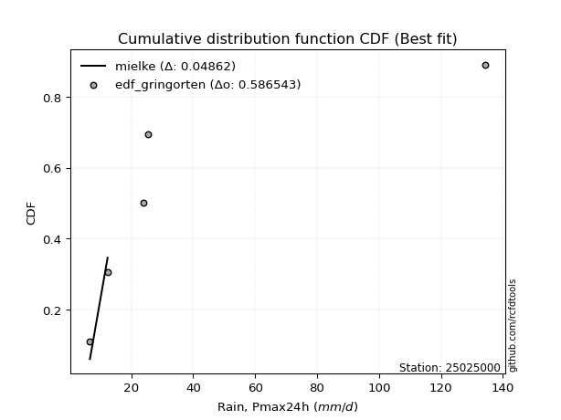</img></img>

</div>


### 9. EDF Filliben (1975)

The specific values of the constants (0.3175) (often denoted as $alpha$) and (0.365) are derived from a method proposed by James J. Filliben in a 1975 paper. This particular formula is the mean value of the $i$-th order statistic of the normal distribution and is considered a robust and effective plotting position formula for the normal probability plot correlation coefficient test for normality.

<div align="center">


$P=(m-0.3175)/(n+0.365)$


</div>


**9.1. Empirical values**

<div align="center">

|                | 0                   | 1                  | 2            | 3                  | 4                  |
|:---------------|:--------------------|:-------------------|:-------------|:-------------------|:-------------------|
| date           | 2018                | 2019               | 2021         | 2020               | 2017               |
| x              | 6.69                | 12.39              | 24.07        | 25.5               | 134.36             |
| m              | 1                   | 2                  | 3            | 4                  | 5                  |
| empirical_dist | edf_filliben        | edf_filliben       | edf_filliben | edf_filliben       | edf_filliben       |
| empirical      | 0.12721342031686858 | 0.3136067101584343 | 0.5          | 0.6863932898415657 | 0.8727865796831314 |
| empirical_tr   | 1.1457554725040042  | 1.456890699253225  | 2.0          | 3.188707280832095  | 7.860805860805863  |

</div>


**9.2. Kolmogorov-Smirnov fit test (sorted by Δ)**


<div align="center">

|                | 0                   | 1                   | 2                  | 3                   | 4                   | 5                   | 6                   | 7                  | 8                  | 9                   | 10                  | 11                  | 12                  | 13                  | 14                 | 15                  | 16                  | 17                  | 18                  | 19                  | 20                 | 21                  | 22                  | 23                  | 24                  | 25                  | 26                  | 27                  | 28                  | 29                 | 30                  | 31                  | 32                  | 33                  | 34                  | 35                  | 36                  | 37                 | 38                  | 39                  | 40                  | 41                  | 42                 | 43                  | 44                  | 45                  | 46                  | 47                  | 48                  | 49                 | 50                  | 51                 | 52                  | 53                 | 54                 | 55                  | 56                  | 57                  | 58                 | 59                  | 60                 | 61                  | 62                 | 63                  | 64                  | 65                  | 66                 | 67                  | 68                  | 69                  | 70                 | 71                  | 72                  | 73                 | 74                  | 75                  | 76                  | 77                 | 78                  | 79                 | 80                  | 81                 | 82                  | 83                  | 84                 | 85                 | 86                  | 87                  | 88                 | 89                 | 90                  | 91                  | 92                  | 93                  | 94                  | 95                 | 96                 | 97                 | 98                  | 99                 | 100                 | 101                | 102                 | 103                 | 104                | 105                | 106                | 107                | 108                | 109                 | 110                | 111                 | 112                | 113                 | 114                | 115                | 116                | 117                | 118                | 119                 | 120                 | 121                 | 122                 | 123                 | 124                | 125                 | 126                | 127                 | 128                | 129                | 130                | 131                 | 132                | 133                | 134                 | 135                 | 136                | 137                | 138                | 139                | 140                 | 141                 | 142                 | 143                | 144                 | 145                | 146                | 147                | 148                | 149                | 150                | 151                | 152                | 153                | 154                | 155                | 156                | 157                | 158                | 159                |
|:---------------|:--------------------|:--------------------|:-------------------|:--------------------|:--------------------|:--------------------|:--------------------|:-------------------|:-------------------|:--------------------|:--------------------|:--------------------|:--------------------|:--------------------|:-------------------|:--------------------|:--------------------|:--------------------|:--------------------|:--------------------|:-------------------|:--------------------|:--------------------|:--------------------|:--------------------|:--------------------|:--------------------|:--------------------|:--------------------|:-------------------|:--------------------|:--------------------|:--------------------|:--------------------|:--------------------|:--------------------|:--------------------|:-------------------|:--------------------|:--------------------|:--------------------|:--------------------|:-------------------|:--------------------|:--------------------|:--------------------|:--------------------|:--------------------|:--------------------|:-------------------|:--------------------|:-------------------|:--------------------|:-------------------|:-------------------|:--------------------|:--------------------|:--------------------|:-------------------|:--------------------|:-------------------|:--------------------|:-------------------|:--------------------|:--------------------|:--------------------|:-------------------|:--------------------|:--------------------|:--------------------|:-------------------|:--------------------|:--------------------|:-------------------|:--------------------|:--------------------|:--------------------|:-------------------|:--------------------|:-------------------|:--------------------|:-------------------|:--------------------|:--------------------|:-------------------|:-------------------|:--------------------|:--------------------|:-------------------|:-------------------|:--------------------|:--------------------|:--------------------|:--------------------|:--------------------|:-------------------|:-------------------|:-------------------|:--------------------|:-------------------|:--------------------|:-------------------|:--------------------|:--------------------|:-------------------|:-------------------|:-------------------|:-------------------|:-------------------|:--------------------|:-------------------|:--------------------|:-------------------|:--------------------|:-------------------|:-------------------|:-------------------|:-------------------|:-------------------|:--------------------|:--------------------|:--------------------|:--------------------|:--------------------|:-------------------|:--------------------|:-------------------|:--------------------|:-------------------|:-------------------|:-------------------|:--------------------|:-------------------|:-------------------|:--------------------|:--------------------|:-------------------|:-------------------|:-------------------|:-------------------|:--------------------|:--------------------|:--------------------|:-------------------|:--------------------|:-------------------|:-------------------|:-------------------|:-------------------|:-------------------|:-------------------|:-------------------|:-------------------|:-------------------|:-------------------|:-------------------|:-------------------|:-------------------|:-------------------|:-------------------|
| station        | 25025000            | 25025000            | 25025000           | 25025000            | 25025000            | 25025000            | 25025000            | 25025000           | 25025000           | 25025000            | 25025000            | 25025000            | 25025000            | 25025000            | 25025000           | 25025000            | 25025000            | 25025000            | 25025000            | 25025000            | 25025000           | 25025000            | 25025000            | 25025000            | 25025000            | 25025000            | 25025000            | 25025000            | 25025000            | 25025000           | 25025000            | 25025000            | 25025000            | 25025000            | 25025000            | 25025000            | 25025000            | 25025000           | 25025000            | 25025000            | 25025000            | 25025000            | 25025000           | 25025000            | 25025000            | 25025000            | 25025000            | 25025000            | 25025000            | 25025000           | 25025000            | 25025000           | 25025000            | 25025000           | 25025000           | 25025000            | 25025000            | 25025000            | 25025000           | 25025000            | 25025000           | 25025000            | 25025000           | 25025000            | 25025000            | 25025000            | 25025000           | 25025000            | 25025000            | 25025000            | 25025000           | 25025000            | 25025000            | 25025000           | 25025000            | 25025000            | 25025000            | 25025000           | 25025000            | 25025000           | 25025000            | 25025000           | 25025000            | 25025000            | 25025000           | 25025000           | 25025000            | 25025000            | 25025000           | 25025000           | 25025000            | 25025000            | 25025000            | 25025000            | 25025000            | 25025000           | 25025000           | 25025000           | 25025000            | 25025000           | 25025000            | 25025000           | 25025000            | 25025000            | 25025000           | 25025000           | 25025000           | 25025000           | 25025000           | 25025000            | 25025000           | 25025000            | 25025000           | 25025000            | 25025000           | 25025000           | 25025000           | 25025000           | 25025000           | 25025000            | 25025000            | 25025000            | 25025000            | 25025000            | 25025000           | 25025000            | 25025000           | 25025000            | 25025000           | 25025000           | 25025000           | 25025000            | 25025000           | 25025000           | 25025000            | 25025000            | 25025000           | 25025000           | 25025000           | 25025000           | 25025000            | 25025000            | 25025000            | 25025000           | 25025000            | 25025000           | 25025000           | 25025000           | 25025000           | 25025000           | 25025000           | 25025000           | 25025000           | 25025000           | 25025000           | 25025000           | 25025000           | 25025000           | 25025000           | 25025000           |
| empirical_dist | edf_filliben        | edf_filliben        | edf_filliben       | edf_filliben        | edf_filliben        | edf_filliben        | edf_filliben        | edf_filliben       | edf_filliben       | edf_filliben        | edf_filliben        | edf_filliben        | edf_filliben        | edf_filliben        | edf_filliben       | edf_filliben        | edf_filliben        | edf_filliben        | edf_filliben        | edf_filliben        | edf_filliben       | edf_filliben        | edf_filliben        | edf_filliben        | edf_filliben        | edf_filliben        | edf_filliben        | edf_filliben        | edf_filliben        | edf_filliben       | edf_filliben        | edf_filliben        | edf_filliben        | edf_filliben        | edf_filliben        | edf_filliben        | edf_filliben        | edf_filliben       | edf_filliben        | edf_filliben        | edf_filliben        | edf_filliben        | edf_filliben       | edf_filliben        | edf_filliben        | edf_filliben        | edf_filliben        | edf_filliben        | edf_filliben        | edf_filliben       | edf_filliben        | edf_filliben       | edf_filliben        | edf_filliben       | edf_filliben       | edf_filliben        | edf_filliben        | edf_filliben        | edf_filliben       | edf_filliben        | edf_filliben       | edf_filliben        | edf_filliben       | edf_filliben        | edf_filliben        | edf_filliben        | edf_filliben       | edf_filliben        | edf_filliben        | edf_filliben        | edf_filliben       | edf_filliben        | edf_filliben        | edf_filliben       | edf_filliben        | edf_filliben        | edf_filliben        | edf_filliben       | edf_filliben        | edf_filliben       | edf_filliben        | edf_filliben       | edf_filliben        | edf_filliben        | edf_filliben       | edf_filliben       | edf_filliben        | edf_filliben        | edf_filliben       | edf_filliben       | edf_filliben        | edf_filliben        | edf_filliben        | edf_filliben        | edf_filliben        | edf_filliben       | edf_filliben       | edf_filliben       | edf_filliben        | edf_filliben       | edf_filliben        | edf_filliben       | edf_filliben        | edf_filliben        | edf_filliben       | edf_filliben       | edf_filliben       | edf_filliben       | edf_filliben       | edf_filliben        | edf_filliben       | edf_filliben        | edf_filliben       | edf_filliben        | edf_filliben       | edf_filliben       | edf_filliben       | edf_filliben       | edf_filliben       | edf_filliben        | edf_filliben        | edf_filliben        | edf_filliben        | edf_filliben        | edf_filliben       | edf_filliben        | edf_filliben       | edf_filliben        | edf_filliben       | edf_filliben       | edf_filliben       | edf_filliben        | edf_filliben       | edf_filliben       | edf_filliben        | edf_filliben        | edf_filliben       | edf_filliben       | edf_filliben       | edf_filliben       | edf_filliben        | edf_filliben        | edf_filliben        | edf_filliben       | edf_filliben        | edf_filliben       | edf_filliben       | edf_filliben       | edf_filliben       | edf_filliben       | edf_filliben       | edf_filliben       | edf_filliben       | edf_filliben       | edf_filliben       | edf_filliben       | edf_filliben       | edf_filliben       | edf_filliben       | edf_filliben       |
| p_dist         | mielke              | logncf              | loggumbel_r        | burr                | logkstwobign        | logvonmises         | loghalfnorm         | loggenlogistic     | logburr            | logalpha            | loggenextreme       | loginvweibull       | logmielke           | loginvgamma         | lognct             | logexponnorm        | alpha               | logbetaprime        | logjohnsonsu        | lograyleigh         | logpearson3        | nct                 | loginvgauss         | logmoyal            | logfoldnorm         | logfatiguelife      | betaprime           | ncf                 | invgamma            | genextreme         | invweibull          | logmaxwell          | logrice             | invgauss            | loglaplace          | loglaplace          | loggenexpon         | lomax              | logtruncweibull_min | gengamma            | loghalfgennorm      | logtruncexpon       | erlang             | loggompertz         | logbeta             | genpareto           | halfgennorm         | loghalflogistic     | logskewnorm         | logdgamma          | logexponpow         | burr12             | exponpow            | loghypsecant       | loglomax           | loglogistic         | loggausshyper       | gennorm             | lognorm            | logcrystalball      | logt               | logloglaplace       | t                  | logloggamma         | exponweib           | loganglit           | logbradford        | logsemicircular     | dgamma              | logarcsine          | loggenpareto       | loggennorm          | logwald             | loggengamma        | wald                | dweibull            | logdweibull         | logcosine          | logkappa4           | logexponweib       | gamma               | vonmises_line      | logburr12           | weibull_min         | loggumbel_l        | halflogistic       | nakagami            | foldnorm            | logwrapcauchy      | pearson3           | halfnorm            | logksone            | loglevy_l           | moyal               | loguniform          | logvonmises_line   | gumbel_r           | logkappa3          | exponnorm           | arcsine            | logweibull_min      | genexpon           | wrapcauchy          | logrdist            | genlogistic        | rayleigh           | logargus           | loggamma           | loggamma           | levy_l              | f                  | maxwell             | semicircular       | logf                | anglit             | truncnorm          | logerlang          | norm               | crystalball        | logtriang           | logtruncnorm        | lognakagami         | kstwobign           | logistic            | gausshyper         | hypsecant           | logweibull_max     | rice                | fatiguelife        | laplace            | cosine             | bradford            | gumbel_l           | loggenhalflogistic | kappa3              | powerlaw            | truncpareto        | johnsonsu          | truncexpon         | argus              | skewnorm            | gompertz            | logtukeylambda      | triang             | logtrapezoid        | ksone              | logpowerlaw        | logjohnsonsb       | kappa4             | rdist              | logtruncpareto     | uniform            | weibull_max        | genhalflogistic    | tukeylambda        | truncweibull_min   | beta               | johnsonsb          | trapezoid          | vonmises           |
| delta          | 0.06645808893406241 | 0.08287402202535965 | 0.0839300793029788 | 0.08537891904499528 | 0.08586494527506616 | 0.08649712859604686 | 0.08826099071771973 | 0.088802597513715  | 0.0902026495454391 | 0.09182939792670197 | 0.09367188066005039 | 0.09368129975524486 | 0.09616161972229975 | 0.09845515268480931 | 0.098773852142779  | 0.10213503182277561 | 0.10375906321259099 | 0.10487709593570249 | 0.10549674894705341 | 0.10881701127760957 | 0.1089059783738624 | 0.10893128790387818 | 0.10910165737821431 | 0.10963737314764366 | 0.11096063658164246 | 0.11478080432430182 | 0.11707380492698805 | 0.11707660488983795 | 0.11707677373021852 | 0.1186638885783815 | 0.11866408246268911 | 0.11895416418852633 | 0.12172019852229055 | 0.12460129006360121 | 0.12612218740854697 | 0.12612218740854697 | 0.12679523601484813 | 0.1272087501237699 | 0.12721336052440854 | 0.12721341275295808 | 0.12721341947672962 | 0.12721341949241471 | 0.1272134196462798 | 0.12721342028731925 | 0.12721342031365085 | 0.12721342031448546 | 0.12721342031686858 | 0.12721342031686858 | 0.12721342031686858 | 0.135158921010669  | 0.13649519850756708 | 0.1373955629246537 | 0.13928214082971468 | 0.1411327504404163 | 0.1414941718824927 | 0.14530040099931796 | 0.14746591981927692 | 0.14892144661524523 | 0.1502080570262012 | 0.15020805780552138 | 0.150211983261632  | 0.15024596245028266 | 0.1507367393733241 | 0.15267442703574174 | 0.15450904147758304 | 0.15536528562511986 | 0.1555645437693015 | 0.15749188986502827 | 0.16516553158732913 | 0.16593681772207958 | 0.166730349126509  | 0.17861611953471784 | 0.18106672038107186 | 0.1812573740059773 | 0.18268404484562817 | 0.18273932508406285 | 0.18639328984141512 | 0.1866532961628775 | 0.19158754513687754 | 0.1957974566105518 | 0.19774953674579498 | 0.1995754501664025 | 0.20249039866485552 | 0.20624187748647071 | 0.2185451712462806 | 0.2189036792619865 | 0.22300154482162343 | 0.22358194463908376 | 0.2240822731955341 | 0.2276397852870935 | 0.23100134345833312 | 0.23136406317204672 | 0.23517329332768244 | 0.23599750286529408 | 0.24035821783814293 | 0.2405988562493333 | 0.2567484220211792 | 0.2568978023241368 | 0.25803017606557277 | 0.2587126903841511 | 0.25890917913916683 | 0.2606520773612613 | 0.26114941617633547 | 0.26115959199237904 | 0.2618463864330623 | 0.265877935867336  | 0.266326803037229  | 0.2689290842978507 | 0.2689290842978507 | 0.26916161298102736 | 0.2751015347003976 | 0.27814709687246103 | 0.2873604591476756 | 0.28850377786578935 | 0.2944255986512695 | 0.2952459852444682 | 0.3066859662583278 | 0.3113593057262617 | 0.3113619268243967 | 0.31192403607575614 | 0.31359535142693684 | 0.31360668040010325 | 0.31756838930652787 | 0.32695093982909135 | 0.3321921363181295 | 0.33940968223158186 | 0.3516459778752299 | 0.35182166608161236 | 0.3651082703680087 | 0.3677377424072239 | 0.3697473409828743 | 0.37158301695137796 | 0.3749544056226682 | 0.3861233878564872 | 0.40118175028981623 | 0.40236134957261643 | 0.4045452776451835 | 0.4106292552164769 | 0.42401631022202   | 0.4296071319932624 | 0.43329751876104305 | 0.44569991322652935 | 0.44904010860347654 | 0.4568476673960151 | 0.47934169271810523 | 0.4802824833352081 | 0.5084460085353864 | 0.5107792611382296 | 0.5123394653953963 | 0.5300511047298275 | 0.5325817230775394 | 0.5390603220339366 | 0.5630029826315855 | 0.5644626368523245 | 0.565061296815701  | 0.5894026769097391 | 0.6079244380263605 | 0.6301236147786933 | 0.6430901313021326 | 21.093428751774407 |
| deltao         | 0.5865427407550001  | 0.5865427407550001  | 0.5865427407550001 | 0.5865427407550001  | 0.5865427407550001  | 0.5865427407550001  | 0.5865427407550001  | 0.5865427407550001 | 0.5865427407550001 | 0.5865427407550001  | 0.5865427407550001  | 0.5865427407550001  | 0.5865427407550001  | 0.5865427407550001  | 0.5865427407550001 | 0.5865427407550001  | 0.5865427407550001  | 0.5865427407550001  | 0.5865427407550001  | 0.5865427407550001  | 0.5865427407550001 | 0.5865427407550001  | 0.5865427407550001  | 0.5865427407550001  | 0.5865427407550001  | 0.5865427407550001  | 0.5865427407550001  | 0.5865427407550001  | 0.5865427407550001  | 0.5865427407550001 | 0.5865427407550001  | 0.5865427407550001  | 0.5865427407550001  | 0.5865427407550001  | 0.5865427407550001  | 0.5865427407550001  | 0.5865427407550001  | 0.5865427407550001 | 0.5865427407550001  | 0.5865427407550001  | 0.5865427407550001  | 0.5865427407550001  | 0.5865427407550001 | 0.5865427407550001  | 0.5865427407550001  | 0.5865427407550001  | 0.5865427407550001  | 0.5865427407550001  | 0.5865427407550001  | 0.5865427407550001 | 0.5865427407550001  | 0.5865427407550001 | 0.5865427407550001  | 0.5865427407550001 | 0.5865427407550001 | 0.5865427407550001  | 0.5865427407550001  | 0.5865427407550001  | 0.5865427407550001 | 0.5865427407550001  | 0.5865427407550001 | 0.5865427407550001  | 0.5865427407550001 | 0.5865427407550001  | 0.5865427407550001  | 0.5865427407550001  | 0.5865427407550001 | 0.5865427407550001  | 0.5865427407550001  | 0.5865427407550001  | 0.5865427407550001 | 0.5865427407550001  | 0.5865427407550001  | 0.5865427407550001 | 0.5865427407550001  | 0.5865427407550001  | 0.5865427407550001  | 0.5865427407550001 | 0.5865427407550001  | 0.5865427407550001 | 0.5865427407550001  | 0.5865427407550001 | 0.5865427407550001  | 0.5865427407550001  | 0.5865427407550001 | 0.5865427407550001 | 0.5865427407550001  | 0.5865427407550001  | 0.5865427407550001 | 0.5865427407550001 | 0.5865427407550001  | 0.5865427407550001  | 0.5865427407550001  | 0.5865427407550001  | 0.5865427407550001  | 0.5865427407550001 | 0.5865427407550001 | 0.5865427407550001 | 0.5865427407550001  | 0.5865427407550001 | 0.5865427407550001  | 0.5865427407550001 | 0.5865427407550001  | 0.5865427407550001  | 0.5865427407550001 | 0.5865427407550001 | 0.5865427407550001 | 0.5865427407550001 | 0.5865427407550001 | 0.5865427407550001  | 0.5865427407550001 | 0.5865427407550001  | 0.5865427407550001 | 0.5865427407550001  | 0.5865427407550001 | 0.5865427407550001 | 0.5865427407550001 | 0.5865427407550001 | 0.5865427407550001 | 0.5865427407550001  | 0.5865427407550001  | 0.5865427407550001  | 0.5865427407550001  | 0.5865427407550001  | 0.5865427407550001 | 0.5865427407550001  | 0.5865427407550001 | 0.5865427407550001  | 0.5865427407550001 | 0.5865427407550001 | 0.5865427407550001 | 0.5865427407550001  | 0.5865427407550001 | 0.5865427407550001 | 0.5865427407550001  | 0.5865427407550001  | 0.5865427407550001 | 0.5865427407550001 | 0.5865427407550001 | 0.5865427407550001 | 0.5865427407550001  | 0.5865427407550001  | 0.5865427407550001  | 0.5865427407550001 | 0.5865427407550001  | 0.5865427407550001 | 0.5865427407550001 | 0.5865427407550001 | 0.5865427407550001 | 0.5865427407550001 | 0.5865427407550001 | 0.5865427407550001 | 0.5865427407550001 | 0.5865427407550001 | 0.5865427407550001 | 0.5865427407550001 | 0.5865427407550001 | 0.5865427407550001 | 0.5865427407550001 | 0.5865427407550001 |
| eval           | Δo > Δ              | Δo > Δ              | Δo > Δ             | Δo > Δ              | Δo > Δ              | Δo > Δ              | Δo > Δ              | Δo > Δ             | Δo > Δ             | Δo > Δ              | Δo > Δ              | Δo > Δ              | Δo > Δ              | Δo > Δ              | Δo > Δ             | Δo > Δ              | Δo > Δ              | Δo > Δ              | Δo > Δ              | Δo > Δ              | Δo > Δ             | Δo > Δ              | Δo > Δ              | Δo > Δ              | Δo > Δ              | Δo > Δ              | Δo > Δ              | Δo > Δ              | Δo > Δ              | Δo > Δ             | Δo > Δ              | Δo > Δ              | Δo > Δ              | Δo > Δ              | Δo > Δ              | Δo > Δ              | Δo > Δ              | Δo > Δ             | Δo > Δ              | Δo > Δ              | Δo > Δ              | Δo > Δ              | Δo > Δ             | Δo > Δ              | Δo > Δ              | Δo > Δ              | Δo > Δ              | Δo > Δ              | Δo > Δ              | Δo > Δ             | Δo > Δ              | Δo > Δ             | Δo > Δ              | Δo > Δ             | Δo > Δ             | Δo > Δ              | Δo > Δ              | Δo > Δ              | Δo > Δ             | Δo > Δ              | Δo > Δ             | Δo > Δ              | Δo > Δ             | Δo > Δ              | Δo > Δ              | Δo > Δ              | Δo > Δ             | Δo > Δ              | Δo > Δ              | Δo > Δ              | Δo > Δ             | Δo > Δ              | Δo > Δ              | Δo > Δ             | Δo > Δ              | Δo > Δ              | Δo > Δ              | Δo > Δ             | Δo > Δ              | Δo > Δ             | Δo > Δ              | Δo > Δ             | Δo > Δ              | Δo > Δ              | Δo > Δ             | Δo > Δ             | Δo > Δ              | Δo > Δ              | Δo > Δ             | Δo > Δ             | Δo > Δ              | Δo > Δ              | Δo > Δ              | Δo > Δ              | Δo > Δ              | Δo > Δ             | Δo > Δ             | Δo > Δ             | Δo > Δ              | Δo > Δ             | Δo > Δ              | Δo > Δ             | Δo > Δ              | Δo > Δ              | Δo > Δ             | Δo > Δ             | Δo > Δ             | Δo > Δ             | Δo > Δ             | Δo > Δ              | Δo > Δ             | Δo > Δ              | Δo > Δ             | Δo > Δ              | Δo > Δ             | Δo > Δ             | Δo > Δ             | Δo > Δ             | Δo > Δ             | Δo > Δ              | Δo > Δ              | Δo > Δ              | Δo > Δ              | Δo > Δ              | Δo > Δ             | Δo > Δ              | Δo > Δ             | Δo > Δ              | Δo > Δ             | Δo > Δ             | Δo > Δ             | Δo > Δ              | Δo > Δ             | Δo > Δ             | Δo > Δ              | Δo > Δ              | Δo > Δ             | Δo > Δ             | Δo > Δ             | Δo > Δ             | Δo > Δ              | Δo > Δ              | Δo > Δ              | Δo > Δ             | Δo > Δ              | Δo > Δ             | Δo > Δ             | Δo > Δ             | Δo > Δ             | Δo > Δ             | Δo > Δ             | Δo > Δ             | Δo > Δ             | Δo > Δ             | Δo > Δ             | Δo <= Δ            | Δo <= Δ            | Δo <= Δ            | Δo <= Δ            | Δo <= Δ            |
| fit            | 1                   | 1                   | 1                  | 1                   | 1                   | 1                   | 1                   | 1                  | 1                  | 1                   | 1                   | 1                   | 1                   | 1                   | 1                  | 1                   | 1                   | 1                   | 1                   | 1                   | 1                  | 1                   | 1                   | 1                   | 1                   | 1                   | 1                   | 1                   | 1                   | 1                  | 1                   | 1                   | 1                   | 1                   | 1                   | 1                   | 1                   | 1                  | 1                   | 1                   | 1                   | 1                   | 1                  | 1                   | 1                   | 1                   | 1                   | 1                   | 1                   | 1                  | 1                   | 1                  | 1                   | 1                  | 1                  | 1                   | 1                   | 1                   | 1                  | 1                   | 1                  | 1                   | 1                  | 1                   | 1                   | 1                   | 1                  | 1                   | 1                   | 1                   | 1                  | 1                   | 1                   | 1                  | 1                   | 1                   | 1                   | 1                  | 1                   | 1                  | 1                   | 1                  | 1                   | 1                   | 1                  | 1                  | 1                   | 1                   | 1                  | 1                  | 1                   | 1                   | 1                   | 1                   | 1                   | 1                  | 1                  | 1                  | 1                   | 1                  | 1                   | 1                  | 1                   | 1                   | 1                  | 1                  | 1                  | 1                  | 1                  | 1                   | 1                  | 1                   | 1                  | 1                   | 1                  | 1                  | 1                  | 1                  | 1                  | 1                   | 1                   | 1                   | 1                   | 1                   | 1                  | 1                   | 1                  | 1                   | 1                  | 1                  | 1                  | 1                   | 1                  | 1                  | 1                   | 1                   | 1                  | 1                  | 1                  | 1                  | 1                   | 1                   | 1                   | 1                  | 1                   | 1                  | 1                  | 1                  | 1                  | 1                  | 1                  | 1                  | 1                  | 1                  | 1                  | 0                  | 0                  | 0                  | 0                  | 0                  |
| n              | 5                   | 5                   | 5                  | 5                   | 5                   | 5                   | 5                   | 5                  | 5                  | 5                   | 5                   | 5                   | 5                   | 5                   | 5                  | 5                   | 5                   | 5                   | 5                   | 5                   | 5                  | 5                   | 5                   | 5                   | 5                   | 5                   | 5                   | 5                   | 5                   | 5                  | 5                   | 5                   | 5                   | 5                   | 5                   | 5                   | 5                   | 5                  | 5                   | 5                   | 5                   | 5                   | 5                  | 5                   | 5                   | 5                   | 5                   | 5                   | 5                   | 5                  | 5                   | 5                  | 5                   | 5                  | 5                  | 5                   | 5                   | 5                   | 5                  | 5                   | 5                  | 5                   | 5                  | 5                   | 5                   | 5                   | 5                  | 5                   | 5                   | 5                   | 5                  | 5                   | 5                   | 5                  | 5                   | 5                   | 5                   | 5                  | 5                   | 5                  | 5                   | 5                  | 5                   | 5                   | 5                  | 5                  | 5                   | 5                   | 5                  | 5                  | 5                   | 5                   | 5                   | 5                   | 5                   | 5                  | 5                  | 5                  | 5                   | 5                  | 5                   | 5                  | 5                   | 5                   | 5                  | 5                  | 5                  | 5                  | 5                  | 5                   | 5                  | 5                   | 5                  | 5                   | 5                  | 5                  | 5                  | 5                  | 5                  | 5                   | 5                   | 5                   | 5                   | 5                   | 5                  | 5                   | 5                  | 5                   | 5                  | 5                  | 5                  | 5                   | 5                  | 5                  | 5                   | 5                   | 5                  | 5                  | 5                  | 5                  | 5                   | 5                   | 5                   | 5                  | 5                   | 5                  | 5                  | 5                  | 5                  | 5                  | 5                  | 5                  | 5                  | 5                  | 5                  | 5                  | 5                  | 5                  | 5                  | 5                  |
| best_fit       | 1                   | 0                   | 0                  | 0                   | 0                   | 0                   | 0                   | 0                  | 0                  | 0                   | 0                   | 0                   | 0                   | 0                   | 0                  | 0                   | 0                   | 0                   | 0                   | 0                   | 0                  | 0                   | 0                   | 0                   | 0                   | 0                   | 0                   | 0                   | 0                   | 0                  | 0                   | 0                   | 0                   | 0                   | 0                   | 0                   | 0                   | 0                  | 0                   | 0                   | 0                   | 0                   | 0                  | 0                   | 0                   | 0                   | 0                   | 0                   | 0                   | 0                  | 0                   | 0                  | 0                   | 0                  | 0                  | 0                   | 0                   | 0                   | 0                  | 0                   | 0                  | 0                   | 0                  | 0                   | 0                   | 0                   | 0                  | 0                   | 0                   | 0                   | 0                  | 0                   | 0                   | 0                  | 0                   | 0                   | 0                   | 0                  | 0                   | 0                  | 0                   | 0                  | 0                   | 0                   | 0                  | 0                  | 0                   | 0                   | 0                  | 0                  | 0                   | 0                   | 0                   | 0                   | 0                   | 0                  | 0                  | 0                  | 0                   | 0                  | 0                   | 0                  | 0                   | 0                   | 0                  | 0                  | 0                  | 0                  | 0                  | 0                   | 0                  | 0                   | 0                  | 0                   | 0                  | 0                  | 0                  | 0                  | 0                  | 0                   | 0                   | 0                   | 0                   | 0                   | 0                  | 0                   | 0                  | 0                   | 0                  | 0                  | 0                  | 0                   | 0                  | 0                  | 0                   | 0                   | 0                  | 0                  | 0                  | 0                  | 0                   | 0                   | 0                   | 0                  | 0                   | 0                  | 0                  | 0                  | 0                  | 0                  | 0                  | 0                  | 0                  | 0                  | 0                  | 0                  | 0                  | 0                  | 0                  | 0                  |
| best_fit_sort  | 1                   | 2                   | 3                  | 4                   | 5                   | 6                   | 7                   | 8                  | 9                  | 10                  | 11                  | 12                  | 13                  | 14                  | 15                 | 16                  | 17                  | 18                  | 19                  | 20                  | 21                 | 22                  | 23                  | 24                  | 25                  | 26                  | 27                  | 28                  | 29                  | 30                 | 31                  | 32                  | 33                  | 34                  | 35                  | 36                  | 37                  | 38                 | 39                  | 40                  | 41                  | 42                  | 43                 | 44                  | 45                  | 46                  | 47                  | 48                  | 49                  | 50                 | 51                  | 52                 | 53                  | 54                 | 55                 | 56                  | 57                  | 58                  | 59                 | 60                  | 61                 | 62                  | 63                 | 64                  | 65                  | 66                  | 67                 | 68                  | 69                  | 70                  | 71                 | 72                  | 73                  | 74                 | 75                  | 76                  | 77                  | 78                 | 79                  | 80                 | 81                  | 82                 | 83                  | 84                  | 85                 | 86                 | 87                  | 88                  | 89                 | 90                 | 91                  | 92                  | 93                  | 94                  | 95                  | 96                 | 97                 | 98                 | 99                  | 100                | 101                 | 102                | 103                 | 104                 | 105                | 106                | 107                | 108                | 109                | 110                 | 111                | 112                 | 113                | 114                 | 115                | 116                | 117                | 118                | 119                | 120                 | 121                 | 122                 | 123                 | 124                 | 125                | 126                 | 127                | 128                 | 129                | 130                | 131                | 132                 | 133                | 134                | 135                 | 136                 | 137                | 138                | 139                | 140                | 141                 | 142                 | 143                 | 144                | 145                 | 146                | 147                | 148                | 149                | 150                | 151                | 152                | 153                | 154                | 155                | 156                | 157                | 158                | 159                | 160                |

</div>


**9.3. Best fit**

<div align="center">

|   id |   station | empirical_dist   | p_dist   |     delta |   deltao | eval   |   fit |   n |   best_fit |   best_fit_sort |
|-----:|----------:|:-----------------|:---------|----------:|---------:|:-------|------:|----:|-----------:|----------------:|
|    0 |  25025000 | edf_filliben     | mielke   | 0.0664581 | 0.586543 | Δo > Δ |     1 |   5 |          1 |               1 |

</div>


<div align="center">

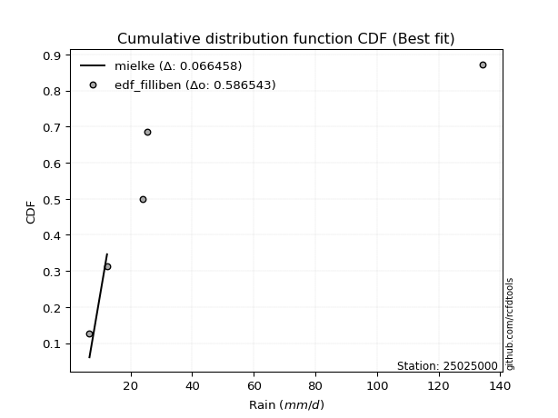</img></img>

</div>


### 10. EDF Jenkinson (1977)

The Jenkinson formula in hydrology is an empirical plotting position formula used to estimate the non-exceedance probability _(P)_ or return period _(T)_ of a given ordered observation within a sample. It is a widely used method in the frequency analysis of extreme events such as floods and rainfall, as it provides a distribution-free way to plot data. _a≈0.31_ and _b≈0.38_ are constants derived to approximate the median of the probability distribution for the given rank.

<div align="center">


$P=(m-a)/(n+b)$


</div>


**10.1. Empirical values**

<div align="center">

|                | 0                   | 1                  | 2             | 3                  | 4                  |
|:---------------|:--------------------|:-------------------|:--------------|:-------------------|:-------------------|
| date           | 2018                | 2019               | 2021          | 2020               | 2017               |
| x              | 6.69                | 12.39              | 24.07         | 25.5               | 134.36             |
| m              | 1                   | 2                  | 3             | 4                  | 5                  |
| empirical_dist | edf_jenkinson       | edf_jenkinson      | edf_jenkinson | edf_jenkinson      | edf_jenkinson      |
| empirical      | 0.12825278810408922 | 0.3141263940520446 | 0.5           | 0.6858736059479554 | 0.8717472118959109 |
| empirical_tr   | 1.1471215351812367  | 1.4579945799457996 | 2.0           | 3.183431952662722  | 7.797101449275368  |

</div>


**10.2. Kolmogorov-Smirnov fit test (sorted by Δ)**


<div align="center">

|                | 0                   | 1                   | 2                  | 3                   | 4                   | 5                   | 6                  | 7                   | 8                  | 9                   | 10                  | 11                  | 12                  | 13                  | 14                 | 15                  | 16                  | 17                  | 18                  | 19                  | 20                  | 21                  | 22                  | 23                  | 24                  | 25                  | 26                  | 27                  | 28                  | 29                 | 30                 | 31                  | 32                  | 33                  | 34                  | 35                  | 36                  | 37                  | 38                  | 39                  | 40                  | 41                 | 42                  | 43                  | 44                  | 45                 | 46                  | 47                  | 48                  | 49                  | 50                  | 51                 | 52                  | 53                  | 54                 | 55                  | 56                 | 57                  | 58                  | 59                  | 60                  | 61                  | 62                 | 63                 | 64                 | 65                  | 66                  | 67                  | 68                 | 69                  | 70                  | 71                 | 72                  | 73                 | 74                 | 75                  | 76                 | 77                  | 78                 | 79                 | 80                  | 81                  | 82                  | 83                  | 84                  | 85                  | 86                 | 87                  | 88                  | 89                  | 90                  | 91                  | 92                 | 93                  | 94                 | 95                  | 96                  | 97                  | 98                  | 99                 | 100                | 101                 | 102                 | 103                 | 104                 | 105                 | 106                 | 107                | 108                | 109                | 110                 | 111                | 112                 | 113                | 114                 | 115                | 116                | 117                 | 118                 | 119                | 120                | 121                | 122                 | 123                | 124                 | 125                | 126                 | 127                | 128                 | 129                 | 130                | 131                 | 132                 | 133                 | 134                 | 135                | 136                 | 137                | 138                | 139                 | 140                | 141                | 142                 | 143                | 144                | 145                | 146                | 147                | 148                | 149                | 150                | 151                | 152                | 153                | 154                | 155                | 156                | 157                | 158                | 159                |
|:---------------|:--------------------|:--------------------|:-------------------|:--------------------|:--------------------|:--------------------|:-------------------|:--------------------|:-------------------|:--------------------|:--------------------|:--------------------|:--------------------|:--------------------|:-------------------|:--------------------|:--------------------|:--------------------|:--------------------|:--------------------|:--------------------|:--------------------|:--------------------|:--------------------|:--------------------|:--------------------|:--------------------|:--------------------|:--------------------|:-------------------|:-------------------|:--------------------|:--------------------|:--------------------|:--------------------|:--------------------|:--------------------|:--------------------|:--------------------|:--------------------|:--------------------|:-------------------|:--------------------|:--------------------|:--------------------|:-------------------|:--------------------|:--------------------|:--------------------|:--------------------|:--------------------|:-------------------|:--------------------|:--------------------|:-------------------|:--------------------|:-------------------|:--------------------|:--------------------|:--------------------|:--------------------|:--------------------|:-------------------|:-------------------|:-------------------|:--------------------|:--------------------|:--------------------|:-------------------|:--------------------|:--------------------|:-------------------|:--------------------|:-------------------|:-------------------|:--------------------|:-------------------|:--------------------|:-------------------|:-------------------|:--------------------|:--------------------|:--------------------|:--------------------|:--------------------|:--------------------|:-------------------|:--------------------|:--------------------|:--------------------|:--------------------|:--------------------|:-------------------|:--------------------|:-------------------|:--------------------|:--------------------|:--------------------|:--------------------|:-------------------|:-------------------|:--------------------|:--------------------|:--------------------|:--------------------|:--------------------|:--------------------|:-------------------|:-------------------|:-------------------|:--------------------|:-------------------|:--------------------|:-------------------|:--------------------|:-------------------|:-------------------|:--------------------|:--------------------|:-------------------|:-------------------|:-------------------|:--------------------|:-------------------|:--------------------|:-------------------|:--------------------|:-------------------|:--------------------|:--------------------|:-------------------|:--------------------|:--------------------|:--------------------|:--------------------|:-------------------|:--------------------|:-------------------|:-------------------|:--------------------|:-------------------|:-------------------|:--------------------|:-------------------|:-------------------|:-------------------|:-------------------|:-------------------|:-------------------|:-------------------|:-------------------|:-------------------|:-------------------|:-------------------|:-------------------|:-------------------|:-------------------|:-------------------|:-------------------|:-------------------|
| station        | 25025000            | 25025000            | 25025000           | 25025000            | 25025000            | 25025000            | 25025000           | 25025000            | 25025000           | 25025000            | 25025000            | 25025000            | 25025000            | 25025000            | 25025000           | 25025000            | 25025000            | 25025000            | 25025000            | 25025000            | 25025000            | 25025000            | 25025000            | 25025000            | 25025000            | 25025000            | 25025000            | 25025000            | 25025000            | 25025000           | 25025000           | 25025000            | 25025000            | 25025000            | 25025000            | 25025000            | 25025000            | 25025000            | 25025000            | 25025000            | 25025000            | 25025000           | 25025000            | 25025000            | 25025000            | 25025000           | 25025000            | 25025000            | 25025000            | 25025000            | 25025000            | 25025000           | 25025000            | 25025000            | 25025000           | 25025000            | 25025000           | 25025000            | 25025000            | 25025000            | 25025000            | 25025000            | 25025000           | 25025000           | 25025000           | 25025000            | 25025000            | 25025000            | 25025000           | 25025000            | 25025000            | 25025000           | 25025000            | 25025000           | 25025000           | 25025000            | 25025000           | 25025000            | 25025000           | 25025000           | 25025000            | 25025000            | 25025000            | 25025000            | 25025000            | 25025000            | 25025000           | 25025000            | 25025000            | 25025000            | 25025000            | 25025000            | 25025000           | 25025000            | 25025000           | 25025000            | 25025000            | 25025000            | 25025000            | 25025000           | 25025000           | 25025000            | 25025000            | 25025000            | 25025000            | 25025000            | 25025000            | 25025000           | 25025000           | 25025000           | 25025000            | 25025000           | 25025000            | 25025000           | 25025000            | 25025000           | 25025000           | 25025000            | 25025000            | 25025000           | 25025000           | 25025000           | 25025000            | 25025000           | 25025000            | 25025000           | 25025000            | 25025000           | 25025000            | 25025000            | 25025000           | 25025000            | 25025000            | 25025000            | 25025000            | 25025000           | 25025000            | 25025000           | 25025000           | 25025000            | 25025000           | 25025000           | 25025000            | 25025000           | 25025000           | 25025000           | 25025000           | 25025000           | 25025000           | 25025000           | 25025000           | 25025000           | 25025000           | 25025000           | 25025000           | 25025000           | 25025000           | 25025000           | 25025000           | 25025000           |
| empirical_dist | edf_jenkinson       | edf_jenkinson       | edf_jenkinson      | edf_jenkinson       | edf_jenkinson       | edf_jenkinson       | edf_jenkinson      | edf_jenkinson       | edf_jenkinson      | edf_jenkinson       | edf_jenkinson       | edf_jenkinson       | edf_jenkinson       | edf_jenkinson       | edf_jenkinson      | edf_jenkinson       | edf_jenkinson       | edf_jenkinson       | edf_jenkinson       | edf_jenkinson       | edf_jenkinson       | edf_jenkinson       | edf_jenkinson       | edf_jenkinson       | edf_jenkinson       | edf_jenkinson       | edf_jenkinson       | edf_jenkinson       | edf_jenkinson       | edf_jenkinson      | edf_jenkinson      | edf_jenkinson       | edf_jenkinson       | edf_jenkinson       | edf_jenkinson       | edf_jenkinson       | edf_jenkinson       | edf_jenkinson       | edf_jenkinson       | edf_jenkinson       | edf_jenkinson       | edf_jenkinson      | edf_jenkinson       | edf_jenkinson       | edf_jenkinson       | edf_jenkinson      | edf_jenkinson       | edf_jenkinson       | edf_jenkinson       | edf_jenkinson       | edf_jenkinson       | edf_jenkinson      | edf_jenkinson       | edf_jenkinson       | edf_jenkinson      | edf_jenkinson       | edf_jenkinson      | edf_jenkinson       | edf_jenkinson       | edf_jenkinson       | edf_jenkinson       | edf_jenkinson       | edf_jenkinson      | edf_jenkinson      | edf_jenkinson      | edf_jenkinson       | edf_jenkinson       | edf_jenkinson       | edf_jenkinson      | edf_jenkinson       | edf_jenkinson       | edf_jenkinson      | edf_jenkinson       | edf_jenkinson      | edf_jenkinson      | edf_jenkinson       | edf_jenkinson      | edf_jenkinson       | edf_jenkinson      | edf_jenkinson      | edf_jenkinson       | edf_jenkinson       | edf_jenkinson       | edf_jenkinson       | edf_jenkinson       | edf_jenkinson       | edf_jenkinson      | edf_jenkinson       | edf_jenkinson       | edf_jenkinson       | edf_jenkinson       | edf_jenkinson       | edf_jenkinson      | edf_jenkinson       | edf_jenkinson      | edf_jenkinson       | edf_jenkinson       | edf_jenkinson       | edf_jenkinson       | edf_jenkinson      | edf_jenkinson      | edf_jenkinson       | edf_jenkinson       | edf_jenkinson       | edf_jenkinson       | edf_jenkinson       | edf_jenkinson       | edf_jenkinson      | edf_jenkinson      | edf_jenkinson      | edf_jenkinson       | edf_jenkinson      | edf_jenkinson       | edf_jenkinson      | edf_jenkinson       | edf_jenkinson      | edf_jenkinson      | edf_jenkinson       | edf_jenkinson       | edf_jenkinson      | edf_jenkinson      | edf_jenkinson      | edf_jenkinson       | edf_jenkinson      | edf_jenkinson       | edf_jenkinson      | edf_jenkinson       | edf_jenkinson      | edf_jenkinson       | edf_jenkinson       | edf_jenkinson      | edf_jenkinson       | edf_jenkinson       | edf_jenkinson       | edf_jenkinson       | edf_jenkinson      | edf_jenkinson       | edf_jenkinson      | edf_jenkinson      | edf_jenkinson       | edf_jenkinson      | edf_jenkinson      | edf_jenkinson       | edf_jenkinson      | edf_jenkinson      | edf_jenkinson      | edf_jenkinson      | edf_jenkinson      | edf_jenkinson      | edf_jenkinson      | edf_jenkinson      | edf_jenkinson      | edf_jenkinson      | edf_jenkinson      | edf_jenkinson      | edf_jenkinson      | edf_jenkinson      | edf_jenkinson      | edf_jenkinson      | edf_jenkinson      |
| p_dist         | mielke              | logncf              | loggumbel_r        | logkstwobign        | burr                | logvonmises         | loggenlogistic     | loghalfnorm         | logburr            | logalpha            | loggenextreme       | loginvweibull       | logmielke           | loginvgamma         | lognct             | logexponnorm        | alpha               | logbetaprime        | logjohnsonsu        | lograyleigh         | logpearson3         | nct                 | loginvgauss         | logmoyal            | logfoldnorm         | logfatiguelife      | betaprime           | ncf                 | invgamma            | logmaxwell         | genextreme         | invweibull          | logrice             | invgauss            | loglaplace          | loglaplace          | loggenexpon         | lomax               | logtruncweibull_min | gengamma            | loghalfgennorm      | logtruncexpon      | erlang              | loggompertz         | logbeta             | genpareto          | halfgennorm         | loghalflogistic     | logskewnorm         | logdgamma           | logexponpow         | burr12             | exponpow            | loghypsecant        | loglomax           | loglogistic         | loggausshyper      | gennorm             | lognorm             | logcrystalball      | logt                | logloglaplace       | t                  | logloggamma        | exponweib          | loganglit           | logbradford         | logsemicircular     | dgamma             | logarcsine          | loggenpareto        | loggennorm         | logwald             | loggengamma        | dweibull           | wald                | logdweibull        | logcosine           | logkappa4          | logexponweib       | gamma               | vonmises_line       | logburr12           | weibull_min         | loggumbel_l         | halflogistic        | nakagami           | foldnorm            | logwrapcauchy       | pearson3            | halfnorm            | logksone            | loglevy_l          | moyal               | loguniform         | logvonmises_line    | gumbel_r            | logkappa3           | exponnorm           | arcsine            | logweibull_min     | genexpon            | wrapcauchy          | logrdist            | genlogistic         | rayleigh            | logargus            | levy_l             | loggamma           | loggamma           | f                   | maxwell            | semicircular        | logf               | anglit              | truncnorm          | logerlang          | norm                | crystalball         | logtriang          | logtruncnorm       | lognakagami        | kstwobign           | logistic           | gausshyper          | hypsecant          | logweibull_max      | rice               | fatiguelife         | laplace             | cosine             | bradford            | gumbel_l            | loggenhalflogistic  | kappa3              | powerlaw           | truncpareto         | johnsonsu          | truncexpon         | argus               | skewnorm           | gompertz           | logtukeylambda      | triang             | logtrapezoid       | ksone              | logpowerlaw        | logjohnsonsb       | kappa4             | rdist              | logtruncpareto     | uniform            | weibull_max        | genhalflogistic    | tukeylambda        | truncweibull_min   | beta               | johnsonsb          | trapezoid          | vonmises           |
| delta          | 0.06749745672128304 | 0.08235433813174942 | 0.0839300793029788 | 0.08534526138145593 | 0.08537891904499528 | 0.08753649638326744 | 0.088802597513715  | 0.08930035850494036 | 0.0902026495454391 | 0.09182939792670197 | 0.09367188066005039 | 0.09368129975524486 | 0.09616161972229975 | 0.09845515268480931 | 0.098773852142779  | 0.10213503182277561 | 0.10375906321259099 | 0.10487709593570249 | 0.10549674894705341 | 0.10829732738399933 | 0.10838629448025217 | 0.10893128790387818 | 0.10910165737821431 | 0.10963737314764366 | 0.11044095268803222 | 0.11478080432430182 | 0.11707380492698805 | 0.11707660488983795 | 0.11707677373021852 | 0.1184344802949161 | 0.1186638885783815 | 0.11866408246268911 | 0.12120051462868031 | 0.12460129006360121 | 0.12560250351493674 | 0.12560250351493674 | 0.12783460380206876 | 0.12824811791099053 | 0.12825272831162918 | 0.12825278054017872 | 0.12825278726395026 | 0.1282527872796353 | 0.12825278743350044 | 0.12825278807453988 | 0.12825278810087148 | 0.1282527881017061 | 0.12825278810408922 | 0.12825278810408922 | 0.12825278810408922 | 0.13567860490427935 | 0.13597551461395685 | 0.1373955629246537 | 0.13876245693610445 | 0.14061306654680605 | 0.1414941718824927 | 0.14478071710570772 | 0.1469462359256667 | 0.14944113050885557 | 0.14968837313259098 | 0.14968837391191114 | 0.14969229936802175 | 0.14972627855667242 | 0.1507367393733241 | 0.1521547431421315 | 0.1539893575839728 | 0.15484560173150963 | 0.15504485987569128 | 0.15697220597141803 | 0.1641261638001085 | 0.16541713382846934 | 0.16569098133928836 | 0.1791358034283282 | 0.18106672038107186 | 0.1812573740059773 | 0.1816999572968422 | 0.18216436095201793 | 0.1858736059478049 | 0.18613361226926728 | 0.1910678612432673 | 0.1957974566105518 | 0.19774953674579498 | 0.19905576627279226 | 0.20249039866485552 | 0.20572219359286048 | 0.21802548735267036 | 0.21838399536837627 | 0.2224818609280132 | 0.22306226074547353 | 0.22356258930192385 | 0.22712010139348326 | 0.23048165956472288 | 0.23084437927843648 | 0.2346536094340722 | 0.23547781897168385 | 0.2398385339445327 | 0.24007917235572307 | 0.25622873812756897 | 0.25637811843052655 | 0.25751049217196254 | 0.2581930064905409 | 0.2583894952455565 | 0.26013239346765105 | 0.26062973228272523 | 0.26115959199237904 | 0.26132670253945206 | 0.26535825197372576 | 0.26580711914361876 | 0.2681222451938067 | 0.2689290842978507 | 0.2689290842978507 | 0.27458185080678726 | 0.2776274129788508 | 0.28684077525406537 | 0.287984093972179  | 0.29390591475765926 | 0.294726301350858  | 0.3066859662583278 | 0.31083962183265146 | 0.31084224293078644 | 0.3114043521821459 | 0.3141150353205472 | 0.3141263642937136 | 0.31704870541291763 | 0.3264312559354811 | 0.33167245242451926 | 0.3388899983379716 | 0.35112629398161965 | 0.3513019821880021 | 0.36458858647439835 | 0.36721805851361367 | 0.3692276570892641 | 0.37106333305776773 | 0.37443472172905795 | 0.38560370396287696 | 0.40014238250259565 | 0.4018416656790061 | 0.40402559375157315 | 0.4101095713228666 | 0.4234966263284098 | 0.42908744809965216 | 0.4327778348674328 | 0.4451802293329191 | 0.44904010860347654 | 0.4563279835024049 | 0.478822008824495  | 0.4797627994415979 | 0.507926324641776  | 0.5102595772446192 | 0.5118197815017862 | 0.5290117369426068 | 0.532062039183929  | 0.5385406381403264 | 0.5624832987379753 | 0.5639429529587142 | 0.5640219290284804 | 0.5888829930161288 | 0.6068850702391398 | 0.6296039308850829 | 0.6425704474085223 | 21.09446811956163  |
| deltao         | 0.5865427407550001  | 0.5865427407550001  | 0.5865427407550001 | 0.5865427407550001  | 0.5865427407550001  | 0.5865427407550001  | 0.5865427407550001 | 0.5865427407550001  | 0.5865427407550001 | 0.5865427407550001  | 0.5865427407550001  | 0.5865427407550001  | 0.5865427407550001  | 0.5865427407550001  | 0.5865427407550001 | 0.5865427407550001  | 0.5865427407550001  | 0.5865427407550001  | 0.5865427407550001  | 0.5865427407550001  | 0.5865427407550001  | 0.5865427407550001  | 0.5865427407550001  | 0.5865427407550001  | 0.5865427407550001  | 0.5865427407550001  | 0.5865427407550001  | 0.5865427407550001  | 0.5865427407550001  | 0.5865427407550001 | 0.5865427407550001 | 0.5865427407550001  | 0.5865427407550001  | 0.5865427407550001  | 0.5865427407550001  | 0.5865427407550001  | 0.5865427407550001  | 0.5865427407550001  | 0.5865427407550001  | 0.5865427407550001  | 0.5865427407550001  | 0.5865427407550001 | 0.5865427407550001  | 0.5865427407550001  | 0.5865427407550001  | 0.5865427407550001 | 0.5865427407550001  | 0.5865427407550001  | 0.5865427407550001  | 0.5865427407550001  | 0.5865427407550001  | 0.5865427407550001 | 0.5865427407550001  | 0.5865427407550001  | 0.5865427407550001 | 0.5865427407550001  | 0.5865427407550001 | 0.5865427407550001  | 0.5865427407550001  | 0.5865427407550001  | 0.5865427407550001  | 0.5865427407550001  | 0.5865427407550001 | 0.5865427407550001 | 0.5865427407550001 | 0.5865427407550001  | 0.5865427407550001  | 0.5865427407550001  | 0.5865427407550001 | 0.5865427407550001  | 0.5865427407550001  | 0.5865427407550001 | 0.5865427407550001  | 0.5865427407550001 | 0.5865427407550001 | 0.5865427407550001  | 0.5865427407550001 | 0.5865427407550001  | 0.5865427407550001 | 0.5865427407550001 | 0.5865427407550001  | 0.5865427407550001  | 0.5865427407550001  | 0.5865427407550001  | 0.5865427407550001  | 0.5865427407550001  | 0.5865427407550001 | 0.5865427407550001  | 0.5865427407550001  | 0.5865427407550001  | 0.5865427407550001  | 0.5865427407550001  | 0.5865427407550001 | 0.5865427407550001  | 0.5865427407550001 | 0.5865427407550001  | 0.5865427407550001  | 0.5865427407550001  | 0.5865427407550001  | 0.5865427407550001 | 0.5865427407550001 | 0.5865427407550001  | 0.5865427407550001  | 0.5865427407550001  | 0.5865427407550001  | 0.5865427407550001  | 0.5865427407550001  | 0.5865427407550001 | 0.5865427407550001 | 0.5865427407550001 | 0.5865427407550001  | 0.5865427407550001 | 0.5865427407550001  | 0.5865427407550001 | 0.5865427407550001  | 0.5865427407550001 | 0.5865427407550001 | 0.5865427407550001  | 0.5865427407550001  | 0.5865427407550001 | 0.5865427407550001 | 0.5865427407550001 | 0.5865427407550001  | 0.5865427407550001 | 0.5865427407550001  | 0.5865427407550001 | 0.5865427407550001  | 0.5865427407550001 | 0.5865427407550001  | 0.5865427407550001  | 0.5865427407550001 | 0.5865427407550001  | 0.5865427407550001  | 0.5865427407550001  | 0.5865427407550001  | 0.5865427407550001 | 0.5865427407550001  | 0.5865427407550001 | 0.5865427407550001 | 0.5865427407550001  | 0.5865427407550001 | 0.5865427407550001 | 0.5865427407550001  | 0.5865427407550001 | 0.5865427407550001 | 0.5865427407550001 | 0.5865427407550001 | 0.5865427407550001 | 0.5865427407550001 | 0.5865427407550001 | 0.5865427407550001 | 0.5865427407550001 | 0.5865427407550001 | 0.5865427407550001 | 0.5865427407550001 | 0.5865427407550001 | 0.5865427407550001 | 0.5865427407550001 | 0.5865427407550001 | 0.5865427407550001 |
| eval           | Δo > Δ              | Δo > Δ              | Δo > Δ             | Δo > Δ              | Δo > Δ              | Δo > Δ              | Δo > Δ             | Δo > Δ              | Δo > Δ             | Δo > Δ              | Δo > Δ              | Δo > Δ              | Δo > Δ              | Δo > Δ              | Δo > Δ             | Δo > Δ              | Δo > Δ              | Δo > Δ              | Δo > Δ              | Δo > Δ              | Δo > Δ              | Δo > Δ              | Δo > Δ              | Δo > Δ              | Δo > Δ              | Δo > Δ              | Δo > Δ              | Δo > Δ              | Δo > Δ              | Δo > Δ             | Δo > Δ             | Δo > Δ              | Δo > Δ              | Δo > Δ              | Δo > Δ              | Δo > Δ              | Δo > Δ              | Δo > Δ              | Δo > Δ              | Δo > Δ              | Δo > Δ              | Δo > Δ             | Δo > Δ              | Δo > Δ              | Δo > Δ              | Δo > Δ             | Δo > Δ              | Δo > Δ              | Δo > Δ              | Δo > Δ              | Δo > Δ              | Δo > Δ             | Δo > Δ              | Δo > Δ              | Δo > Δ             | Δo > Δ              | Δo > Δ             | Δo > Δ              | Δo > Δ              | Δo > Δ              | Δo > Δ              | Δo > Δ              | Δo > Δ             | Δo > Δ             | Δo > Δ             | Δo > Δ              | Δo > Δ              | Δo > Δ              | Δo > Δ             | Δo > Δ              | Δo > Δ              | Δo > Δ             | Δo > Δ              | Δo > Δ             | Δo > Δ             | Δo > Δ              | Δo > Δ             | Δo > Δ              | Δo > Δ             | Δo > Δ             | Δo > Δ              | Δo > Δ              | Δo > Δ              | Δo > Δ              | Δo > Δ              | Δo > Δ              | Δo > Δ             | Δo > Δ              | Δo > Δ              | Δo > Δ              | Δo > Δ              | Δo > Δ              | Δo > Δ             | Δo > Δ              | Δo > Δ             | Δo > Δ              | Δo > Δ              | Δo > Δ              | Δo > Δ              | Δo > Δ             | Δo > Δ             | Δo > Δ              | Δo > Δ              | Δo > Δ              | Δo > Δ              | Δo > Δ              | Δo > Δ              | Δo > Δ             | Δo > Δ             | Δo > Δ             | Δo > Δ              | Δo > Δ             | Δo > Δ              | Δo > Δ             | Δo > Δ              | Δo > Δ             | Δo > Δ             | Δo > Δ              | Δo > Δ              | Δo > Δ             | Δo > Δ             | Δo > Δ             | Δo > Δ              | Δo > Δ             | Δo > Δ              | Δo > Δ             | Δo > Δ              | Δo > Δ             | Δo > Δ              | Δo > Δ              | Δo > Δ             | Δo > Δ              | Δo > Δ              | Δo > Δ              | Δo > Δ              | Δo > Δ             | Δo > Δ              | Δo > Δ             | Δo > Δ             | Δo > Δ              | Δo > Δ             | Δo > Δ             | Δo > Δ              | Δo > Δ             | Δo > Δ             | Δo > Δ             | Δo > Δ             | Δo > Δ             | Δo > Δ             | Δo > Δ             | Δo > Δ             | Δo > Δ             | Δo > Δ             | Δo > Δ             | Δo > Δ             | Δo <= Δ            | Δo <= Δ            | Δo <= Δ            | Δo <= Δ            | Δo <= Δ            |
| fit            | 1                   | 1                   | 1                  | 1                   | 1                   | 1                   | 1                  | 1                   | 1                  | 1                   | 1                   | 1                   | 1                   | 1                   | 1                  | 1                   | 1                   | 1                   | 1                   | 1                   | 1                   | 1                   | 1                   | 1                   | 1                   | 1                   | 1                   | 1                   | 1                   | 1                  | 1                  | 1                   | 1                   | 1                   | 1                   | 1                   | 1                   | 1                   | 1                   | 1                   | 1                   | 1                  | 1                   | 1                   | 1                   | 1                  | 1                   | 1                   | 1                   | 1                   | 1                   | 1                  | 1                   | 1                   | 1                  | 1                   | 1                  | 1                   | 1                   | 1                   | 1                   | 1                   | 1                  | 1                  | 1                  | 1                   | 1                   | 1                   | 1                  | 1                   | 1                   | 1                  | 1                   | 1                  | 1                  | 1                   | 1                  | 1                   | 1                  | 1                  | 1                   | 1                   | 1                   | 1                   | 1                   | 1                   | 1                  | 1                   | 1                   | 1                   | 1                   | 1                   | 1                  | 1                   | 1                  | 1                   | 1                   | 1                   | 1                   | 1                  | 1                  | 1                   | 1                   | 1                   | 1                   | 1                   | 1                   | 1                  | 1                  | 1                  | 1                   | 1                  | 1                   | 1                  | 1                   | 1                  | 1                  | 1                   | 1                   | 1                  | 1                  | 1                  | 1                   | 1                  | 1                   | 1                  | 1                   | 1                  | 1                   | 1                   | 1                  | 1                   | 1                   | 1                   | 1                   | 1                  | 1                   | 1                  | 1                  | 1                   | 1                  | 1                  | 1                   | 1                  | 1                  | 1                  | 1                  | 1                  | 1                  | 1                  | 1                  | 1                  | 1                  | 1                  | 1                  | 0                  | 0                  | 0                  | 0                  | 0                  |
| n              | 5                   | 5                   | 5                  | 5                   | 5                   | 5                   | 5                  | 5                   | 5                  | 5                   | 5                   | 5                   | 5                   | 5                   | 5                  | 5                   | 5                   | 5                   | 5                   | 5                   | 5                   | 5                   | 5                   | 5                   | 5                   | 5                   | 5                   | 5                   | 5                   | 5                  | 5                  | 5                   | 5                   | 5                   | 5                   | 5                   | 5                   | 5                   | 5                   | 5                   | 5                   | 5                  | 5                   | 5                   | 5                   | 5                  | 5                   | 5                   | 5                   | 5                   | 5                   | 5                  | 5                   | 5                   | 5                  | 5                   | 5                  | 5                   | 5                   | 5                   | 5                   | 5                   | 5                  | 5                  | 5                  | 5                   | 5                   | 5                   | 5                  | 5                   | 5                   | 5                  | 5                   | 5                  | 5                  | 5                   | 5                  | 5                   | 5                  | 5                  | 5                   | 5                   | 5                   | 5                   | 5                   | 5                   | 5                  | 5                   | 5                   | 5                   | 5                   | 5                   | 5                  | 5                   | 5                  | 5                   | 5                   | 5                   | 5                   | 5                  | 5                  | 5                   | 5                   | 5                   | 5                   | 5                   | 5                   | 5                  | 5                  | 5                  | 5                   | 5                  | 5                   | 5                  | 5                   | 5                  | 5                  | 5                   | 5                   | 5                  | 5                  | 5                  | 5                   | 5                  | 5                   | 5                  | 5                   | 5                  | 5                   | 5                   | 5                  | 5                   | 5                   | 5                   | 5                   | 5                  | 5                   | 5                  | 5                  | 5                   | 5                  | 5                  | 5                   | 5                  | 5                  | 5                  | 5                  | 5                  | 5                  | 5                  | 5                  | 5                  | 5                  | 5                  | 5                  | 5                  | 5                  | 5                  | 5                  | 5                  |
| best_fit       | 1                   | 0                   | 0                  | 0                   | 0                   | 0                   | 0                  | 0                   | 0                  | 0                   | 0                   | 0                   | 0                   | 0                   | 0                  | 0                   | 0                   | 0                   | 0                   | 0                   | 0                   | 0                   | 0                   | 0                   | 0                   | 0                   | 0                   | 0                   | 0                   | 0                  | 0                  | 0                   | 0                   | 0                   | 0                   | 0                   | 0                   | 0                   | 0                   | 0                   | 0                   | 0                  | 0                   | 0                   | 0                   | 0                  | 0                   | 0                   | 0                   | 0                   | 0                   | 0                  | 0                   | 0                   | 0                  | 0                   | 0                  | 0                   | 0                   | 0                   | 0                   | 0                   | 0                  | 0                  | 0                  | 0                   | 0                   | 0                   | 0                  | 0                   | 0                   | 0                  | 0                   | 0                  | 0                  | 0                   | 0                  | 0                   | 0                  | 0                  | 0                   | 0                   | 0                   | 0                   | 0                   | 0                   | 0                  | 0                   | 0                   | 0                   | 0                   | 0                   | 0                  | 0                   | 0                  | 0                   | 0                   | 0                   | 0                   | 0                  | 0                  | 0                   | 0                   | 0                   | 0                   | 0                   | 0                   | 0                  | 0                  | 0                  | 0                   | 0                  | 0                   | 0                  | 0                   | 0                  | 0                  | 0                   | 0                   | 0                  | 0                  | 0                  | 0                   | 0                  | 0                   | 0                  | 0                   | 0                  | 0                   | 0                   | 0                  | 0                   | 0                   | 0                   | 0                   | 0                  | 0                   | 0                  | 0                  | 0                   | 0                  | 0                  | 0                   | 0                  | 0                  | 0                  | 0                  | 0                  | 0                  | 0                  | 0                  | 0                  | 0                  | 0                  | 0                  | 0                  | 0                  | 0                  | 0                  | 0                  |
| best_fit_sort  | 1                   | 2                   | 3                  | 4                   | 5                   | 6                   | 7                  | 8                   | 9                  | 10                  | 11                  | 12                  | 13                  | 14                  | 15                 | 16                  | 17                  | 18                  | 19                  | 20                  | 21                  | 22                  | 23                  | 24                  | 25                  | 26                  | 27                  | 28                  | 29                  | 30                 | 31                 | 32                  | 33                  | 34                  | 35                  | 36                  | 37                  | 38                  | 39                  | 40                  | 41                  | 42                 | 43                  | 44                  | 45                  | 46                 | 47                  | 48                  | 49                  | 50                  | 51                  | 52                 | 53                  | 54                  | 55                 | 56                  | 57                 | 58                  | 59                  | 60                  | 61                  | 62                  | 63                 | 64                 | 65                 | 66                  | 67                  | 68                  | 69                 | 70                  | 71                  | 72                 | 73                  | 74                 | 75                 | 76                  | 77                 | 78                  | 79                 | 80                 | 81                  | 82                  | 83                  | 84                  | 85                  | 86                  | 87                 | 88                  | 89                  | 90                  | 91                  | 92                  | 93                 | 94                  | 95                 | 96                  | 97                  | 98                  | 99                  | 100                | 101                | 102                 | 103                 | 104                 | 105                 | 106                 | 107                 | 108                | 109                | 110                | 111                 | 112                | 113                 | 114                | 115                 | 116                | 117                | 118                 | 119                 | 120                | 121                | 122                | 123                 | 124                | 125                 | 126                | 127                 | 128                | 129                 | 130                 | 131                | 132                 | 133                 | 134                 | 135                 | 136                | 137                 | 138                | 139                | 140                 | 141                | 142                | 143                 | 144                | 145                | 146                | 147                | 148                | 149                | 150                | 151                | 152                | 153                | 154                | 155                | 156                | 157                | 158                | 159                | 160                |

</div>


**10.3. Best fit**

<div align="center">

|   id |   station | empirical_dist   | p_dist   |     delta |   deltao | eval   |   fit |   n |   best_fit |   best_fit_sort |
|-----:|----------:|:-----------------|:---------|----------:|---------:|:-------|------:|----:|-----------:|----------------:|
|    0 |  25025000 | edf_jenkinson    | mielke   | 0.0674975 | 0.586543 | Δo > Δ |     1 |   5 |          1 |               1 |

</div>


<div align="center">

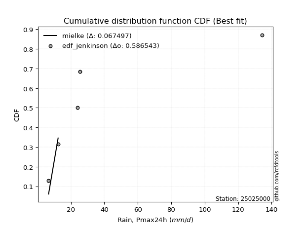</img>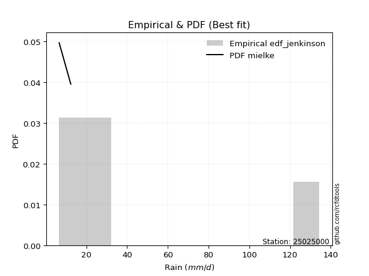</img>

</div>


### 11. EDF Cunnane (1978)

Cunnane´s work in statistical hydrology has focused on the performance and evaluation of different probability distributions (such as GEV, Gumbel, Lognormal) for flood frequency estimation. _b_ is a constant, typically set to 0.4.

<div align="center">


$P=(m-b)/(n+1-2b)$


</div>


**11.1. Empirical values**

<div align="center">

|                | 0                   | 1                  | 2           | 3                  | 4                  |
|:---------------|:--------------------|:-------------------|:------------|:-------------------|:-------------------|
| date           | 2018                | 2019               | 2021        | 2020               | 2017               |
| x              | 6.69                | 12.39              | 24.07       | 25.5               | 134.36             |
| m              | 1                   | 2                  | 3           | 4                  | 5                  |
| empirical_dist | edf_cunnane         | edf_cunnane        | edf_cunnane | edf_cunnane        | edf_cunnane        |
| empirical      | 0.11538461538461538 | 0.3076923076923077 | 0.5         | 0.6923076923076923 | 0.8846153846153845 |
| empirical_tr   | 1.1304347826086958  | 1.4444444444444444 | 2.0         | 3.25               | 8.666666666666655  |

</div>


**11.2. Kolmogorov-Smirnov fit test (sorted by Δ)**


<div align="center">

|                | 0                  | 1                   | 2                   | 3                   | 4                   | 5                  | 6                  | 7                  | 8                   | 9                   | 10                  | 11                  | 12                  | 13                  | 14                 | 15                  | 16                  | 17                  | 18                  | 19                  | 20                  | 21                  | 22                  | 23                  | 24                  | 25                  | 26                  | 27                  | 28                  | 29                  | 30                  | 31                  | 32                  | 33                  | 34                  | 35                  | 36                  | 37                  | 38                  | 39                  | 40                  | 41                 | 42                  | 43                  | 44                  | 45                 | 46                  | 47                  | 48                 | 49                 | 50                 | 51                 | 52                 | 53                  | 54                 | 55                 | 56                 | 57                  | 58                  | 59                  | 60                 | 61                 | 62                  | 63                  | 64                  | 65                 | 66                  | 67                 | 68                 | 69                  | 70                  | 71                  | 72                  | 73                 | 74                 | 75                  | 76                  | 77                  | 78                 | 79                  | 80                  | 81                  | 82                 | 83                  | 84                 | 85                  | 86                  | 87                  | 88                 | 89                  | 90                  | 91                  | 92                  | 93                 | 94                  | 95                  | 96                  | 97                 | 98                 | 99                 | 100                 | 101                | 102                | 103                | 104                | 105                | 106                | 107                | 108                | 109                 | 110                | 111                 | 112                 | 113                | 114                | 115                 | 116                | 117                | 118                | 119                | 120                | 121                 | 122                | 123                 | 124                | 125                | 126                | 127                | 128                 | 129                | 130                 | 131                | 132                | 133                | 134                | 135                 | 136                 | 137                | 138                 | 139                | 140                | 141                 | 142                | 143                 | 144                 | 145                 | 146                | 147                | 148                | 149                | 150                | 151                | 152                | 153                | 154                | 155                | 156                | 157                | 158                | 159                |
|:---------------|:-------------------|:--------------------|:--------------------|:--------------------|:--------------------|:-------------------|:-------------------|:-------------------|:--------------------|:--------------------|:--------------------|:--------------------|:--------------------|:--------------------|:-------------------|:--------------------|:--------------------|:--------------------|:--------------------|:--------------------|:--------------------|:--------------------|:--------------------|:--------------------|:--------------------|:--------------------|:--------------------|:--------------------|:--------------------|:--------------------|:--------------------|:--------------------|:--------------------|:--------------------|:--------------------|:--------------------|:--------------------|:--------------------|:--------------------|:--------------------|:--------------------|:-------------------|:--------------------|:--------------------|:--------------------|:-------------------|:--------------------|:--------------------|:-------------------|:-------------------|:-------------------|:-------------------|:-------------------|:--------------------|:-------------------|:-------------------|:-------------------|:--------------------|:--------------------|:--------------------|:-------------------|:-------------------|:--------------------|:--------------------|:--------------------|:-------------------|:--------------------|:-------------------|:-------------------|:--------------------|:--------------------|:--------------------|:--------------------|:-------------------|:-------------------|:--------------------|:--------------------|:--------------------|:-------------------|:--------------------|:--------------------|:--------------------|:-------------------|:--------------------|:-------------------|:--------------------|:--------------------|:--------------------|:-------------------|:--------------------|:--------------------|:--------------------|:--------------------|:-------------------|:--------------------|:--------------------|:--------------------|:-------------------|:-------------------|:-------------------|:--------------------|:-------------------|:-------------------|:-------------------|:-------------------|:-------------------|:-------------------|:-------------------|:-------------------|:--------------------|:-------------------|:--------------------|:--------------------|:-------------------|:-------------------|:--------------------|:-------------------|:-------------------|:-------------------|:-------------------|:-------------------|:--------------------|:-------------------|:--------------------|:-------------------|:-------------------|:-------------------|:-------------------|:--------------------|:-------------------|:--------------------|:-------------------|:-------------------|:-------------------|:-------------------|:--------------------|:--------------------|:-------------------|:--------------------|:-------------------|:-------------------|:--------------------|:-------------------|:--------------------|:--------------------|:--------------------|:-------------------|:-------------------|:-------------------|:-------------------|:-------------------|:-------------------|:-------------------|:-------------------|:-------------------|:-------------------|:-------------------|:-------------------|:-------------------|:-------------------|
| station        | 25025000           | 25025000            | 25025000            | 25025000            | 25025000            | 25025000           | 25025000           | 25025000           | 25025000            | 25025000            | 25025000            | 25025000            | 25025000            | 25025000            | 25025000           | 25025000            | 25025000            | 25025000            | 25025000            | 25025000            | 25025000            | 25025000            | 25025000            | 25025000            | 25025000            | 25025000            | 25025000            | 25025000            | 25025000            | 25025000            | 25025000            | 25025000            | 25025000            | 25025000            | 25025000            | 25025000            | 25025000            | 25025000            | 25025000            | 25025000            | 25025000            | 25025000           | 25025000            | 25025000            | 25025000            | 25025000           | 25025000            | 25025000            | 25025000           | 25025000           | 25025000           | 25025000           | 25025000           | 25025000            | 25025000           | 25025000           | 25025000           | 25025000            | 25025000            | 25025000            | 25025000           | 25025000           | 25025000            | 25025000            | 25025000            | 25025000           | 25025000            | 25025000           | 25025000           | 25025000            | 25025000            | 25025000            | 25025000            | 25025000           | 25025000           | 25025000            | 25025000            | 25025000            | 25025000           | 25025000            | 25025000            | 25025000            | 25025000           | 25025000            | 25025000           | 25025000            | 25025000            | 25025000            | 25025000           | 25025000            | 25025000            | 25025000            | 25025000            | 25025000           | 25025000            | 25025000            | 25025000            | 25025000           | 25025000           | 25025000           | 25025000            | 25025000           | 25025000           | 25025000           | 25025000           | 25025000           | 25025000           | 25025000           | 25025000           | 25025000            | 25025000           | 25025000            | 25025000            | 25025000           | 25025000           | 25025000            | 25025000           | 25025000           | 25025000           | 25025000           | 25025000           | 25025000            | 25025000           | 25025000            | 25025000           | 25025000           | 25025000           | 25025000           | 25025000            | 25025000           | 25025000            | 25025000           | 25025000           | 25025000           | 25025000           | 25025000            | 25025000            | 25025000           | 25025000            | 25025000           | 25025000           | 25025000            | 25025000           | 25025000            | 25025000            | 25025000            | 25025000           | 25025000           | 25025000           | 25025000           | 25025000           | 25025000           | 25025000           | 25025000           | 25025000           | 25025000           | 25025000           | 25025000           | 25025000           | 25025000           |
| empirical_dist | edf_cunnane        | edf_cunnane         | edf_cunnane         | edf_cunnane         | edf_cunnane         | edf_cunnane        | edf_cunnane        | edf_cunnane        | edf_cunnane         | edf_cunnane         | edf_cunnane         | edf_cunnane         | edf_cunnane         | edf_cunnane         | edf_cunnane        | edf_cunnane         | edf_cunnane         | edf_cunnane         | edf_cunnane         | edf_cunnane         | edf_cunnane         | edf_cunnane         | edf_cunnane         | edf_cunnane         | edf_cunnane         | edf_cunnane         | edf_cunnane         | edf_cunnane         | edf_cunnane         | edf_cunnane         | edf_cunnane         | edf_cunnane         | edf_cunnane         | edf_cunnane         | edf_cunnane         | edf_cunnane         | edf_cunnane         | edf_cunnane         | edf_cunnane         | edf_cunnane         | edf_cunnane         | edf_cunnane        | edf_cunnane         | edf_cunnane         | edf_cunnane         | edf_cunnane        | edf_cunnane         | edf_cunnane         | edf_cunnane        | edf_cunnane        | edf_cunnane        | edf_cunnane        | edf_cunnane        | edf_cunnane         | edf_cunnane        | edf_cunnane        | edf_cunnane        | edf_cunnane         | edf_cunnane         | edf_cunnane         | edf_cunnane        | edf_cunnane        | edf_cunnane         | edf_cunnane         | edf_cunnane         | edf_cunnane        | edf_cunnane         | edf_cunnane        | edf_cunnane        | edf_cunnane         | edf_cunnane         | edf_cunnane         | edf_cunnane         | edf_cunnane        | edf_cunnane        | edf_cunnane         | edf_cunnane         | edf_cunnane         | edf_cunnane        | edf_cunnane         | edf_cunnane         | edf_cunnane         | edf_cunnane        | edf_cunnane         | edf_cunnane        | edf_cunnane         | edf_cunnane         | edf_cunnane         | edf_cunnane        | edf_cunnane         | edf_cunnane         | edf_cunnane         | edf_cunnane         | edf_cunnane        | edf_cunnane         | edf_cunnane         | edf_cunnane         | edf_cunnane        | edf_cunnane        | edf_cunnane        | edf_cunnane         | edf_cunnane        | edf_cunnane        | edf_cunnane        | edf_cunnane        | edf_cunnane        | edf_cunnane        | edf_cunnane        | edf_cunnane        | edf_cunnane         | edf_cunnane        | edf_cunnane         | edf_cunnane         | edf_cunnane        | edf_cunnane        | edf_cunnane         | edf_cunnane        | edf_cunnane        | edf_cunnane        | edf_cunnane        | edf_cunnane        | edf_cunnane         | edf_cunnane        | edf_cunnane         | edf_cunnane        | edf_cunnane        | edf_cunnane        | edf_cunnane        | edf_cunnane         | edf_cunnane        | edf_cunnane         | edf_cunnane        | edf_cunnane        | edf_cunnane        | edf_cunnane        | edf_cunnane         | edf_cunnane         | edf_cunnane        | edf_cunnane         | edf_cunnane        | edf_cunnane        | edf_cunnane         | edf_cunnane        | edf_cunnane         | edf_cunnane         | edf_cunnane         | edf_cunnane        | edf_cunnane        | edf_cunnane        | edf_cunnane        | edf_cunnane        | edf_cunnane        | edf_cunnane        | edf_cunnane        | edf_cunnane        | edf_cunnane        | edf_cunnane        | edf_cunnane        | edf_cunnane        | edf_cunnane        |
| p_dist         | mielke             | burr                | loggumbel_r         | loghalfnorm         | logncf              | loggenlogistic     | logburr            | logvonmises        | logkstwobign        | logalpha            | loggenextreme       | loginvweibull       | logmielke           | loginvgamma         | lognct             | logexponnorm        | alpha               | logbetaprime        | logjohnsonsu        | nct                 | loginvgauss         | logmoyal            | lograyleigh         | logfatiguelife      | logpearson3         | loggenexpon         | lomax               | logtruncweibull_min | gengamma            | loghalfgennorm      | erlang              | loggompertz         | logbeta             | genpareto           | halfgennorm         | loghalflogistic     | logskewnorm         | logfoldnorm         | betaprime           | ncf                 | invgamma            | genextreme         | invweibull          | invgauss            | logmaxwell          | logtruncexpon      | logrice             | logdgamma           | loglaplace         | loglaplace         | burr12             | loglomax           | logexponpow        | gennorm             | exponpow           | loghypsecant       | t                  | loglogistic         | loggausshyper       | lognorm             | logcrystalball     | logt               | logloglaplace       | logloggamma         | exponweib           | loganglit          | logbradford         | logsemicircular    | logarcsine         | loggennorm          | dgamma              | loggenpareto        | logwald             | loggengamma        | wald               | logdweibull         | logcosine           | dweibull            | logexponweib       | logkappa4           | gamma               | logburr12           | vonmises_line      | weibull_min         | loggumbel_l        | halflogistic        | nakagami            | foldnorm            | logwrapcauchy      | pearson3            | halfnorm            | logksone            | loglevy_l           | moyal              | loguniform          | logvonmises_line    | logrdist            | gumbel_r           | logkappa3          | exponnorm          | arcsine             | logweibull_min     | genexpon           | wrapcauchy         | genlogistic        | loggamma           | loggamma           | rayleigh           | logargus           | levy_l              | f                  | maxwell             | semicircular        | logf               | anglit             | truncnorm           | logerlang          | logtruncnorm       | lognakagami        | norm               | crystalball        | logtriang           | kstwobign          | logistic            | gausshyper         | hypsecant          | logweibull_max     | rice               | fatiguelife         | laplace            | cosine              | bradford           | gumbel_l           | loggenhalflogistic | powerlaw           | truncpareto         | kappa3              | johnsonsu          | truncexpon          | argus              | skewnorm           | logtukeylambda      | gompertz           | triang              | logtrapezoid        | ksone               | logpowerlaw        | logjohnsonsb       | kappa4             | logtruncpareto     | rdist              | uniform            | weibull_max        | genhalflogistic    | tukeylambda        | truncweibull_min   | beta               | johnsonsb          | trapezoid          | vonmises           |
| delta          | 0.0546292840018092 | 0.08537891904499528 | 0.08560738561543013 | 0.08662439105590147 | 0.08878842449148627 | 0.088802597513715  | 0.0902026495454391 | 0.091663700350202  | 0.09177934774119278 | 0.09182939792670197 | 0.09367188066005039 | 0.09368129975524486 | 0.09616161972229975 | 0.09845515268480931 | 0.098773852142779  | 0.10213503182277561 | 0.10375906321259099 | 0.10487709593570249 | 0.10549674894705341 | 0.10893128790387818 | 0.10910165737821431 | 0.10963737314764366 | 0.11473141374373619 | 0.11478080432430182 | 0.11482038083998902 | 0.11496643108259494 | 0.11537994519151669 | 0.11538455559215534 | 0.11538460782070487 | 0.11538461454447642 | 0.11538461471402661 | 0.11538461535506604 | 0.11538461538139763 | 0.11538461538223227 | 0.11538461538461538 | 0.11538461538461538 | 0.11538461538461538 | 0.11687503904776908 | 0.11707380492698805 | 0.11707660488983795 | 0.11707677373021852 | 0.1186638885783815 | 0.11866408246268911 | 0.12460129006360121 | 0.12486856665465296 | 0.126052843871981  | 0.12763460098841717 | 0.12924451854454244 | 0.1320365898746736 | 0.1320365898746736 | 0.1373955629246537 | 0.1414941718824927 | 0.1424096009736937 | 0.14300704414911866 | 0.1451965432958413 | 0.1470471529065429 | 0.1507367393733241 | 0.15121480346544458 | 0.15338032228540355 | 0.15612245949232784 | 0.156122460271648  | 0.1561263857277586 | 0.15616036491640928 | 0.15858882950186837 | 0.16042344394370966 | 0.1612796880912465 | 0.16147894623542813 | 0.1634062923311549 | 0.1718512201882062 | 0.17270171706859128 | 0.17699433651958235 | 0.17855915405876222 | 0.18106672038107186 | 0.1812573740059773 | 0.1885984473117548 | 0.19230769230754174 | 0.19256769862900414 | 0.19456813001631607 | 0.1957974566105518 | 0.19750194760300416 | 0.19774953674579498 | 0.20249039866485552 | 0.2054898526325291 | 0.21215627995259734 | 0.2244595737124072 | 0.22481808172811313 | 0.22891594728775005 | 0.22949634710521039 | 0.2299966756616607 | 0.23355418775322012 | 0.23691574592445974 | 0.23727846563817334 | 0.24108769579380906 | 0.2419119053314207 | 0.24627262030426955 | 0.24651325871545993 | 0.26115959199237904 | 0.2626628244873058 | 0.2628122047902634 | 0.2639445785316994 | 0.26462709285027775 | 0.2648235816052934 | 0.2665664798273879 | 0.2670638186424621 | 0.2677607888991889 | 0.2689290842978507 | 0.2689290842978507 | 0.2717923383334626 | 0.2722412055033556 | 0.28099041791328055 | 0.2810159371665242 | 0.28406149933858765 | 0.29327486161380223 | 0.2944181803319159 | 0.3003400011173961 | 0.30116038771059483 | 0.3066859662583278 | 0.3076809489608103 | 0.3076922779339767 | 0.3172737081923883 | 0.3172763292905233 | 0.31783843854188276 | 0.3234827917726545 | 0.33286534229521797 | 0.3381065387842561 | 0.3453240846977085 | 0.3575603803413565 | 0.357736068547739  | 0.37102267283413526 | 0.3736521448733505 | 0.37566174344900094 | 0.3774974194175046 | 0.3808688080887948 | 0.3920377903226138 | 0.408275752038743  | 0.41045968011131007 | 0.41301055522206925 | 0.4165436576826035 | 0.42993071268814664 | 0.435521534459389  | 0.4392119212271697 | 0.44904010860347654 | 0.451614315692656  | 0.46276206986214174 | 0.48525609518423185 | 0.48619688580133474 | 0.514360411001513  | 0.5166936636043562 | 0.5182538678615229 | 0.538496125543666  | 0.5418799096620807 | 0.5449747245000632 | 0.5689173850977122 | 0.5703770393184511 | 0.5768901017479542 | 0.5953170793758658 | 0.6197532429586137 | 0.6360380172448198 | 0.6490045337682592 | 21.081599946842157 |
| deltao         | 0.5865427407550001 | 0.5865427407550001  | 0.5865427407550001  | 0.5865427407550001  | 0.5865427407550001  | 0.5865427407550001 | 0.5865427407550001 | 0.5865427407550001 | 0.5865427407550001  | 0.5865427407550001  | 0.5865427407550001  | 0.5865427407550001  | 0.5865427407550001  | 0.5865427407550001  | 0.5865427407550001 | 0.5865427407550001  | 0.5865427407550001  | 0.5865427407550001  | 0.5865427407550001  | 0.5865427407550001  | 0.5865427407550001  | 0.5865427407550001  | 0.5865427407550001  | 0.5865427407550001  | 0.5865427407550001  | 0.5865427407550001  | 0.5865427407550001  | 0.5865427407550001  | 0.5865427407550001  | 0.5865427407550001  | 0.5865427407550001  | 0.5865427407550001  | 0.5865427407550001  | 0.5865427407550001  | 0.5865427407550001  | 0.5865427407550001  | 0.5865427407550001  | 0.5865427407550001  | 0.5865427407550001  | 0.5865427407550001  | 0.5865427407550001  | 0.5865427407550001 | 0.5865427407550001  | 0.5865427407550001  | 0.5865427407550001  | 0.5865427407550001 | 0.5865427407550001  | 0.5865427407550001  | 0.5865427407550001 | 0.5865427407550001 | 0.5865427407550001 | 0.5865427407550001 | 0.5865427407550001 | 0.5865427407550001  | 0.5865427407550001 | 0.5865427407550001 | 0.5865427407550001 | 0.5865427407550001  | 0.5865427407550001  | 0.5865427407550001  | 0.5865427407550001 | 0.5865427407550001 | 0.5865427407550001  | 0.5865427407550001  | 0.5865427407550001  | 0.5865427407550001 | 0.5865427407550001  | 0.5865427407550001 | 0.5865427407550001 | 0.5865427407550001  | 0.5865427407550001  | 0.5865427407550001  | 0.5865427407550001  | 0.5865427407550001 | 0.5865427407550001 | 0.5865427407550001  | 0.5865427407550001  | 0.5865427407550001  | 0.5865427407550001 | 0.5865427407550001  | 0.5865427407550001  | 0.5865427407550001  | 0.5865427407550001 | 0.5865427407550001  | 0.5865427407550001 | 0.5865427407550001  | 0.5865427407550001  | 0.5865427407550001  | 0.5865427407550001 | 0.5865427407550001  | 0.5865427407550001  | 0.5865427407550001  | 0.5865427407550001  | 0.5865427407550001 | 0.5865427407550001  | 0.5865427407550001  | 0.5865427407550001  | 0.5865427407550001 | 0.5865427407550001 | 0.5865427407550001 | 0.5865427407550001  | 0.5865427407550001 | 0.5865427407550001 | 0.5865427407550001 | 0.5865427407550001 | 0.5865427407550001 | 0.5865427407550001 | 0.5865427407550001 | 0.5865427407550001 | 0.5865427407550001  | 0.5865427407550001 | 0.5865427407550001  | 0.5865427407550001  | 0.5865427407550001 | 0.5865427407550001 | 0.5865427407550001  | 0.5865427407550001 | 0.5865427407550001 | 0.5865427407550001 | 0.5865427407550001 | 0.5865427407550001 | 0.5865427407550001  | 0.5865427407550001 | 0.5865427407550001  | 0.5865427407550001 | 0.5865427407550001 | 0.5865427407550001 | 0.5865427407550001 | 0.5865427407550001  | 0.5865427407550001 | 0.5865427407550001  | 0.5865427407550001 | 0.5865427407550001 | 0.5865427407550001 | 0.5865427407550001 | 0.5865427407550001  | 0.5865427407550001  | 0.5865427407550001 | 0.5865427407550001  | 0.5865427407550001 | 0.5865427407550001 | 0.5865427407550001  | 0.5865427407550001 | 0.5865427407550001  | 0.5865427407550001  | 0.5865427407550001  | 0.5865427407550001 | 0.5865427407550001 | 0.5865427407550001 | 0.5865427407550001 | 0.5865427407550001 | 0.5865427407550001 | 0.5865427407550001 | 0.5865427407550001 | 0.5865427407550001 | 0.5865427407550001 | 0.5865427407550001 | 0.5865427407550001 | 0.5865427407550001 | 0.5865427407550001 |
| eval           | Δo > Δ             | Δo > Δ              | Δo > Δ              | Δo > Δ              | Δo > Δ              | Δo > Δ             | Δo > Δ             | Δo > Δ             | Δo > Δ              | Δo > Δ              | Δo > Δ              | Δo > Δ              | Δo > Δ              | Δo > Δ              | Δo > Δ             | Δo > Δ              | Δo > Δ              | Δo > Δ              | Δo > Δ              | Δo > Δ              | Δo > Δ              | Δo > Δ              | Δo > Δ              | Δo > Δ              | Δo > Δ              | Δo > Δ              | Δo > Δ              | Δo > Δ              | Δo > Δ              | Δo > Δ              | Δo > Δ              | Δo > Δ              | Δo > Δ              | Δo > Δ              | Δo > Δ              | Δo > Δ              | Δo > Δ              | Δo > Δ              | Δo > Δ              | Δo > Δ              | Δo > Δ              | Δo > Δ             | Δo > Δ              | Δo > Δ              | Δo > Δ              | Δo > Δ             | Δo > Δ              | Δo > Δ              | Δo > Δ             | Δo > Δ             | Δo > Δ             | Δo > Δ             | Δo > Δ             | Δo > Δ              | Δo > Δ             | Δo > Δ             | Δo > Δ             | Δo > Δ              | Δo > Δ              | Δo > Δ              | Δo > Δ             | Δo > Δ             | Δo > Δ              | Δo > Δ              | Δo > Δ              | Δo > Δ             | Δo > Δ              | Δo > Δ             | Δo > Δ             | Δo > Δ              | Δo > Δ              | Δo > Δ              | Δo > Δ              | Δo > Δ             | Δo > Δ             | Δo > Δ              | Δo > Δ              | Δo > Δ              | Δo > Δ             | Δo > Δ              | Δo > Δ              | Δo > Δ              | Δo > Δ             | Δo > Δ              | Δo > Δ             | Δo > Δ              | Δo > Δ              | Δo > Δ              | Δo > Δ             | Δo > Δ              | Δo > Δ              | Δo > Δ              | Δo > Δ              | Δo > Δ             | Δo > Δ              | Δo > Δ              | Δo > Δ              | Δo > Δ             | Δo > Δ             | Δo > Δ             | Δo > Δ              | Δo > Δ             | Δo > Δ             | Δo > Δ             | Δo > Δ             | Δo > Δ             | Δo > Δ             | Δo > Δ             | Δo > Δ             | Δo > Δ              | Δo > Δ             | Δo > Δ              | Δo > Δ              | Δo > Δ             | Δo > Δ             | Δo > Δ              | Δo > Δ             | Δo > Δ             | Δo > Δ             | Δo > Δ             | Δo > Δ             | Δo > Δ              | Δo > Δ             | Δo > Δ              | Δo > Δ             | Δo > Δ             | Δo > Δ             | Δo > Δ             | Δo > Δ              | Δo > Δ             | Δo > Δ              | Δo > Δ             | Δo > Δ             | Δo > Δ             | Δo > Δ             | Δo > Δ              | Δo > Δ              | Δo > Δ             | Δo > Δ              | Δo > Δ             | Δo > Δ             | Δo > Δ              | Δo > Δ             | Δo > Δ              | Δo > Δ              | Δo > Δ              | Δo > Δ             | Δo > Δ             | Δo > Δ             | Δo > Δ             | Δo > Δ             | Δo > Δ             | Δo > Δ             | Δo > Δ             | Δo > Δ             | Δo <= Δ            | Δo <= Δ            | Δo <= Δ            | Δo <= Δ            | Δo <= Δ            |
| fit            | 1                  | 1                   | 1                   | 1                   | 1                   | 1                  | 1                  | 1                  | 1                   | 1                   | 1                   | 1                   | 1                   | 1                   | 1                  | 1                   | 1                   | 1                   | 1                   | 1                   | 1                   | 1                   | 1                   | 1                   | 1                   | 1                   | 1                   | 1                   | 1                   | 1                   | 1                   | 1                   | 1                   | 1                   | 1                   | 1                   | 1                   | 1                   | 1                   | 1                   | 1                   | 1                  | 1                   | 1                   | 1                   | 1                  | 1                   | 1                   | 1                  | 1                  | 1                  | 1                  | 1                  | 1                   | 1                  | 1                  | 1                  | 1                   | 1                   | 1                   | 1                  | 1                  | 1                   | 1                   | 1                   | 1                  | 1                   | 1                  | 1                  | 1                   | 1                   | 1                   | 1                   | 1                  | 1                  | 1                   | 1                   | 1                   | 1                  | 1                   | 1                   | 1                   | 1                  | 1                   | 1                  | 1                   | 1                   | 1                   | 1                  | 1                   | 1                   | 1                   | 1                   | 1                  | 1                   | 1                   | 1                   | 1                  | 1                  | 1                  | 1                   | 1                  | 1                  | 1                  | 1                  | 1                  | 1                  | 1                  | 1                  | 1                   | 1                  | 1                   | 1                   | 1                  | 1                  | 1                   | 1                  | 1                  | 1                  | 1                  | 1                  | 1                   | 1                  | 1                   | 1                  | 1                  | 1                  | 1                  | 1                   | 1                  | 1                   | 1                  | 1                  | 1                  | 1                  | 1                   | 1                   | 1                  | 1                   | 1                  | 1                  | 1                   | 1                  | 1                   | 1                   | 1                   | 1                  | 1                  | 1                  | 1                  | 1                  | 1                  | 1                  | 1                  | 1                  | 0                  | 0                  | 0                  | 0                  | 0                  |
| n              | 5                  | 5                   | 5                   | 5                   | 5                   | 5                  | 5                  | 5                  | 5                   | 5                   | 5                   | 5                   | 5                   | 5                   | 5                  | 5                   | 5                   | 5                   | 5                   | 5                   | 5                   | 5                   | 5                   | 5                   | 5                   | 5                   | 5                   | 5                   | 5                   | 5                   | 5                   | 5                   | 5                   | 5                   | 5                   | 5                   | 5                   | 5                   | 5                   | 5                   | 5                   | 5                  | 5                   | 5                   | 5                   | 5                  | 5                   | 5                   | 5                  | 5                  | 5                  | 5                  | 5                  | 5                   | 5                  | 5                  | 5                  | 5                   | 5                   | 5                   | 5                  | 5                  | 5                   | 5                   | 5                   | 5                  | 5                   | 5                  | 5                  | 5                   | 5                   | 5                   | 5                   | 5                  | 5                  | 5                   | 5                   | 5                   | 5                  | 5                   | 5                   | 5                   | 5                  | 5                   | 5                  | 5                   | 5                   | 5                   | 5                  | 5                   | 5                   | 5                   | 5                   | 5                  | 5                   | 5                   | 5                   | 5                  | 5                  | 5                  | 5                   | 5                  | 5                  | 5                  | 5                  | 5                  | 5                  | 5                  | 5                  | 5                   | 5                  | 5                   | 5                   | 5                  | 5                  | 5                   | 5                  | 5                  | 5                  | 5                  | 5                  | 5                   | 5                  | 5                   | 5                  | 5                  | 5                  | 5                  | 5                   | 5                  | 5                   | 5                  | 5                  | 5                  | 5                  | 5                   | 5                   | 5                  | 5                   | 5                  | 5                  | 5                   | 5                  | 5                   | 5                   | 5                   | 5                  | 5                  | 5                  | 5                  | 5                  | 5                  | 5                  | 5                  | 5                  | 5                  | 5                  | 5                  | 5                  | 5                  |
| best_fit       | 1                  | 0                   | 0                   | 0                   | 0                   | 0                  | 0                  | 0                  | 0                   | 0                   | 0                   | 0                   | 0                   | 0                   | 0                  | 0                   | 0                   | 0                   | 0                   | 0                   | 0                   | 0                   | 0                   | 0                   | 0                   | 0                   | 0                   | 0                   | 0                   | 0                   | 0                   | 0                   | 0                   | 0                   | 0                   | 0                   | 0                   | 0                   | 0                   | 0                   | 0                   | 0                  | 0                   | 0                   | 0                   | 0                  | 0                   | 0                   | 0                  | 0                  | 0                  | 0                  | 0                  | 0                   | 0                  | 0                  | 0                  | 0                   | 0                   | 0                   | 0                  | 0                  | 0                   | 0                   | 0                   | 0                  | 0                   | 0                  | 0                  | 0                   | 0                   | 0                   | 0                   | 0                  | 0                  | 0                   | 0                   | 0                   | 0                  | 0                   | 0                   | 0                   | 0                  | 0                   | 0                  | 0                   | 0                   | 0                   | 0                  | 0                   | 0                   | 0                   | 0                   | 0                  | 0                   | 0                   | 0                   | 0                  | 0                  | 0                  | 0                   | 0                  | 0                  | 0                  | 0                  | 0                  | 0                  | 0                  | 0                  | 0                   | 0                  | 0                   | 0                   | 0                  | 0                  | 0                   | 0                  | 0                  | 0                  | 0                  | 0                  | 0                   | 0                  | 0                   | 0                  | 0                  | 0                  | 0                  | 0                   | 0                  | 0                   | 0                  | 0                  | 0                  | 0                  | 0                   | 0                   | 0                  | 0                   | 0                  | 0                  | 0                   | 0                  | 0                   | 0                   | 0                   | 0                  | 0                  | 0                  | 0                  | 0                  | 0                  | 0                  | 0                  | 0                  | 0                  | 0                  | 0                  | 0                  | 0                  |
| best_fit_sort  | 1                  | 2                   | 3                   | 4                   | 5                   | 6                  | 7                  | 8                  | 9                   | 10                  | 11                  | 12                  | 13                  | 14                  | 15                 | 16                  | 17                  | 18                  | 19                  | 20                  | 21                  | 22                  | 23                  | 24                  | 25                  | 26                  | 27                  | 28                  | 29                  | 30                  | 31                  | 32                  | 33                  | 34                  | 35                  | 36                  | 37                  | 38                  | 39                  | 40                  | 41                  | 42                 | 43                  | 44                  | 45                  | 46                 | 47                  | 48                  | 49                 | 50                 | 51                 | 52                 | 53                 | 54                  | 55                 | 56                 | 57                 | 58                  | 59                  | 60                  | 61                 | 62                 | 63                  | 64                  | 65                  | 66                 | 67                  | 68                 | 69                 | 70                  | 71                  | 72                  | 73                  | 74                 | 75                 | 76                  | 77                  | 78                  | 79                 | 80                  | 81                  | 82                  | 83                 | 84                  | 85                 | 86                  | 87                  | 88                  | 89                 | 90                  | 91                  | 92                  | 93                  | 94                 | 95                  | 96                  | 97                  | 98                 | 99                 | 100                | 101                 | 102                | 103                | 104                | 105                | 106                | 107                | 108                | 109                | 110                 | 111                | 112                 | 113                 | 114                | 115                | 116                 | 117                | 118                | 119                | 120                | 121                | 122                 | 123                | 124                 | 125                | 126                | 127                | 128                | 129                 | 130                | 131                 | 132                | 133                | 134                | 135                | 136                 | 137                 | 138                | 139                 | 140                | 141                | 142                 | 143                | 144                 | 145                 | 146                 | 147                | 148                | 149                | 150                | 151                | 152                | 153                | 154                | 155                | 156                | 157                | 158                | 159                | 160                |

</div>


**11.3. Best fit**

<div align="center">

|   id |   station | empirical_dist   | p_dist   |     delta |   deltao | eval   |   fit |   n |   best_fit |   best_fit_sort |
|-----:|----------:|:-----------------|:---------|----------:|---------:|:-------|------:|----:|-----------:|----------------:|
|    0 |  25025000 | edf_cunnane      | mielke   | 0.0546293 | 0.586543 | Δo > Δ |     1 |   5 |          1 |               1 |

</div>


<div align="center">

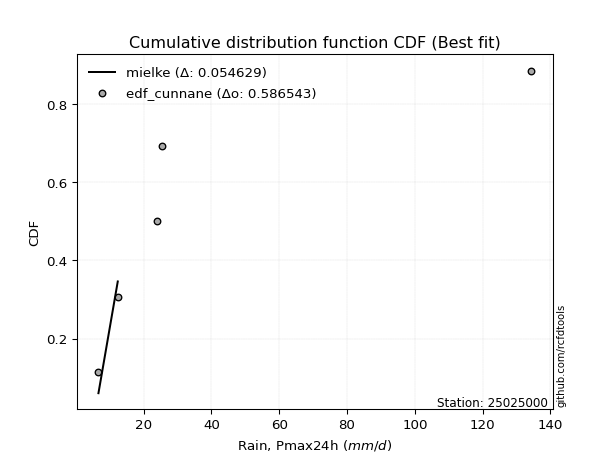</img>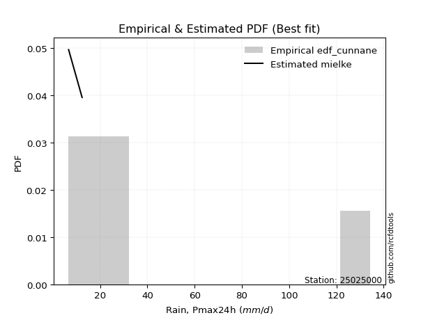</img>

</div>


### 12. EDF Adamowski (1981)

The Adamowski formula in hydrology refers to a specific plotting position formula used for estimating the non-parametric empirical distribution of hydrological events (like flood peaks) to calculate their return periods. This formula provides an alternative to traditional parametric methods (like the Gumbel or Log Pearson Type III distributions). 

<div align="center">


$P=(m-0.25)/(n+0.5)$


</div>


**12.1. Empirical values**

<div align="center">

|                | 0                   | 1                  | 2             | 3                  | 4                  |
|:---------------|:--------------------|:-------------------|:--------------|:-------------------|:-------------------|
| date           | 2018                | 2019               | 2021          | 2020               | 2017               |
| x              | 6.69                | 12.39              | 24.07         | 25.5               | 134.36             |
| m              | 1                   | 2                  | 3             | 4                  | 5                  |
| empirical_dist | edf_adamowski       | edf_adamowski      | edf_adamowski | edf_adamowski      | edf_adamowski      |
| empirical      | 0.13636363636363635 | 0.3181818181818182 | 0.5           | 0.6818181818181818 | 0.8636363636363636 |
| empirical_tr   | 1.1578947368421053  | 1.4666666666666666 | 2.0           | 3.1428571428571423 | 7.333333333333334  |

</div>


**12.2. Kolmogorov-Smirnov fit test (sorted by Δ)**


<div align="center">

|                | 0                   | 1                   | 2                   | 3                  | 4                   | 5                  | 6                  | 7                   | 8                   | 9                   | 10                  | 11                  | 12                 | 13                  | 14                 | 15                  | 16                  | 17                  | 18                 | 19                  | 20                  | 21                  | 22                  | 23                  | 24                  | 25                  | 26                  | 27                  | 28                  | 29                  | 30                  | 31                 | 32                  | 33                  | 34                  | 35                  | 36                 | 37                 | 38                  | 39                  | 40                  | 41                 | 42                  | 43                  | 44                  | 45                  | 46                  | 47                  | 48                  | 49                  | 50                  | 51                 | 52                 | 53                 | 54                  | 55                 | 56                  | 57                 | 58                  | 59                 | 60                  | 61                  | 62                  | 63                 | 64                  | 65                 | 66                  | 67                  | 68                  | 69                  | 70                  | 71                  | 72                  | 73                  | 74                 | 75                  | 76                 | 77                  | 78                  | 79                 | 80                 | 81                  | 82                  | 83                  | 84                 | 85                 | 86                  | 87                  | 88                 | 89                 | 90                  | 91                  | 92                  | 93                  | 94                  | 95                 | 96                 | 97                 | 98                  | 99                 | 100                 | 101                | 102                 | 103                | 104                 | 105                 | 106                | 107                | 108                | 109                | 110                | 111                 | 112                | 113                 | 114                | 115                | 116                | 117                | 118                | 119                 | 120                 | 121                 | 122                 | 123                 | 124                | 125                 | 126                | 127                 | 128                | 129                | 130                | 131                 | 132                | 133                | 134                 | 135                 | 136                | 137                | 138                | 139                | 140                 | 141                 | 142                 | 143                | 144                | 145                | 146                | 147                | 148                | 149                | 150                | 151                | 152                | 153                | 154                | 155                | 156                | 157                | 158                | 159                |
|:---------------|:--------------------|:--------------------|:--------------------|:-------------------|:--------------------|:-------------------|:-------------------|:--------------------|:--------------------|:--------------------|:--------------------|:--------------------|:-------------------|:--------------------|:-------------------|:--------------------|:--------------------|:--------------------|:-------------------|:--------------------|:--------------------|:--------------------|:--------------------|:--------------------|:--------------------|:--------------------|:--------------------|:--------------------|:--------------------|:--------------------|:--------------------|:-------------------|:--------------------|:--------------------|:--------------------|:--------------------|:-------------------|:-------------------|:--------------------|:--------------------|:--------------------|:-------------------|:--------------------|:--------------------|:--------------------|:--------------------|:--------------------|:--------------------|:--------------------|:--------------------|:--------------------|:-------------------|:-------------------|:-------------------|:--------------------|:-------------------|:--------------------|:-------------------|:--------------------|:-------------------|:--------------------|:--------------------|:--------------------|:-------------------|:--------------------|:-------------------|:--------------------|:--------------------|:--------------------|:--------------------|:--------------------|:--------------------|:--------------------|:--------------------|:-------------------|:--------------------|:-------------------|:--------------------|:--------------------|:-------------------|:-------------------|:--------------------|:--------------------|:--------------------|:-------------------|:-------------------|:--------------------|:--------------------|:-------------------|:-------------------|:--------------------|:--------------------|:--------------------|:--------------------|:--------------------|:-------------------|:-------------------|:-------------------|:--------------------|:-------------------|:--------------------|:-------------------|:--------------------|:-------------------|:--------------------|:--------------------|:-------------------|:-------------------|:-------------------|:-------------------|:-------------------|:--------------------|:-------------------|:--------------------|:-------------------|:-------------------|:-------------------|:-------------------|:-------------------|:--------------------|:--------------------|:--------------------|:--------------------|:--------------------|:-------------------|:--------------------|:-------------------|:--------------------|:-------------------|:-------------------|:-------------------|:--------------------|:-------------------|:-------------------|:--------------------|:--------------------|:-------------------|:-------------------|:-------------------|:-------------------|:--------------------|:--------------------|:--------------------|:-------------------|:-------------------|:-------------------|:-------------------|:-------------------|:-------------------|:-------------------|:-------------------|:-------------------|:-------------------|:-------------------|:-------------------|:-------------------|:-------------------|:-------------------|:-------------------|:-------------------|
| station        | 25025000            | 25025000            | 25025000            | 25025000           | 25025000            | 25025000           | 25025000           | 25025000            | 25025000            | 25025000            | 25025000            | 25025000            | 25025000           | 25025000            | 25025000           | 25025000            | 25025000            | 25025000            | 25025000           | 25025000            | 25025000            | 25025000            | 25025000            | 25025000            | 25025000            | 25025000            | 25025000            | 25025000            | 25025000            | 25025000            | 25025000            | 25025000           | 25025000            | 25025000            | 25025000            | 25025000            | 25025000           | 25025000           | 25025000            | 25025000            | 25025000            | 25025000           | 25025000            | 25025000            | 25025000            | 25025000            | 25025000            | 25025000            | 25025000            | 25025000            | 25025000            | 25025000           | 25025000           | 25025000           | 25025000            | 25025000           | 25025000            | 25025000           | 25025000            | 25025000           | 25025000            | 25025000            | 25025000            | 25025000           | 25025000            | 25025000           | 25025000            | 25025000            | 25025000            | 25025000            | 25025000            | 25025000            | 25025000            | 25025000            | 25025000           | 25025000            | 25025000           | 25025000            | 25025000            | 25025000           | 25025000           | 25025000            | 25025000            | 25025000            | 25025000           | 25025000           | 25025000            | 25025000            | 25025000           | 25025000           | 25025000            | 25025000            | 25025000            | 25025000            | 25025000            | 25025000           | 25025000           | 25025000           | 25025000            | 25025000           | 25025000            | 25025000           | 25025000            | 25025000           | 25025000            | 25025000            | 25025000           | 25025000           | 25025000           | 25025000           | 25025000           | 25025000            | 25025000           | 25025000            | 25025000           | 25025000           | 25025000           | 25025000           | 25025000           | 25025000            | 25025000            | 25025000            | 25025000            | 25025000            | 25025000           | 25025000            | 25025000           | 25025000            | 25025000           | 25025000           | 25025000           | 25025000            | 25025000           | 25025000           | 25025000            | 25025000            | 25025000           | 25025000           | 25025000           | 25025000           | 25025000            | 25025000            | 25025000            | 25025000           | 25025000           | 25025000           | 25025000           | 25025000           | 25025000           | 25025000           | 25025000           | 25025000           | 25025000           | 25025000           | 25025000           | 25025000           | 25025000           | 25025000           | 25025000           | 25025000           |
| empirical_dist | edf_adamowski       | edf_adamowski       | edf_adamowski       | edf_adamowski      | edf_adamowski       | edf_adamowski      | edf_adamowski      | edf_adamowski       | edf_adamowski       | edf_adamowski       | edf_adamowski       | edf_adamowski       | edf_adamowski      | edf_adamowski       | edf_adamowski      | edf_adamowski       | edf_adamowski       | edf_adamowski       | edf_adamowski      | edf_adamowski       | edf_adamowski       | edf_adamowski       | edf_adamowski       | edf_adamowski       | edf_adamowski       | edf_adamowski       | edf_adamowski       | edf_adamowski       | edf_adamowski       | edf_adamowski       | edf_adamowski       | edf_adamowski      | edf_adamowski       | edf_adamowski       | edf_adamowski       | edf_adamowski       | edf_adamowski      | edf_adamowski      | edf_adamowski       | edf_adamowski       | edf_adamowski       | edf_adamowski      | edf_adamowski       | edf_adamowski       | edf_adamowski       | edf_adamowski       | edf_adamowski       | edf_adamowski       | edf_adamowski       | edf_adamowski       | edf_adamowski       | edf_adamowski      | edf_adamowski      | edf_adamowski      | edf_adamowski       | edf_adamowski      | edf_adamowski       | edf_adamowski      | edf_adamowski       | edf_adamowski      | edf_adamowski       | edf_adamowski       | edf_adamowski       | edf_adamowski      | edf_adamowski       | edf_adamowski      | edf_adamowski       | edf_adamowski       | edf_adamowski       | edf_adamowski       | edf_adamowski       | edf_adamowski       | edf_adamowski       | edf_adamowski       | edf_adamowski      | edf_adamowski       | edf_adamowski      | edf_adamowski       | edf_adamowski       | edf_adamowski      | edf_adamowski      | edf_adamowski       | edf_adamowski       | edf_adamowski       | edf_adamowski      | edf_adamowski      | edf_adamowski       | edf_adamowski       | edf_adamowski      | edf_adamowski      | edf_adamowski       | edf_adamowski       | edf_adamowski       | edf_adamowski       | edf_adamowski       | edf_adamowski      | edf_adamowski      | edf_adamowski      | edf_adamowski       | edf_adamowski      | edf_adamowski       | edf_adamowski      | edf_adamowski       | edf_adamowski      | edf_adamowski       | edf_adamowski       | edf_adamowski      | edf_adamowski      | edf_adamowski      | edf_adamowski      | edf_adamowski      | edf_adamowski       | edf_adamowski      | edf_adamowski       | edf_adamowski      | edf_adamowski      | edf_adamowski      | edf_adamowski      | edf_adamowski      | edf_adamowski       | edf_adamowski       | edf_adamowski       | edf_adamowski       | edf_adamowski       | edf_adamowski      | edf_adamowski       | edf_adamowski      | edf_adamowski       | edf_adamowski      | edf_adamowski      | edf_adamowski      | edf_adamowski       | edf_adamowski      | edf_adamowski      | edf_adamowski       | edf_adamowski       | edf_adamowski      | edf_adamowski      | edf_adamowski      | edf_adamowski      | edf_adamowski       | edf_adamowski       | edf_adamowski       | edf_adamowski      | edf_adamowski      | edf_adamowski      | edf_adamowski      | edf_adamowski      | edf_adamowski      | edf_adamowski      | edf_adamowski      | edf_adamowski      | edf_adamowski      | edf_adamowski      | edf_adamowski      | edf_adamowski      | edf_adamowski      | edf_adamowski      | edf_adamowski      | edf_adamowski      |
| p_dist         | mielke              | logkstwobign        | logncf              | loggumbel_r        | burr                | loggenlogistic     | logburr            | logalpha            | loggenextreme       | loginvweibull       | logvonmises         | logmielke           | loghalfnorm        | loginvgamma         | lognct             | logexponnorm        | alpha               | lograyleigh         | logpearson3        | logbetaprime        | logjohnsonsu        | logfoldnorm         | nct                 | loginvgauss         | logmoyal            | logmaxwell          | logfatiguelife      | betaprime           | ncf                 | invgamma            | logrice             | genextreme         | invweibull          | loglaplace          | loglaplace          | invgauss            | loggenexpon        | exponpow           | lomax               | logtruncweibull_min | gengamma            | loghalfgennorm     | logtruncexpon       | erlang              | loggompertz         | logbeta             | genpareto           | logexponpow         | logskewnorm         | halfgennorm         | loghalflogistic     | loghypsecant       | burr12             | logdgamma          | loglogistic         | loglomax           | loggausshyper       | lognorm            | logcrystalball      | logt               | logloglaplace       | logloggamma         | exponweib           | t                  | loganglit           | logbradford        | logsemicircular     | gennorm             | dgamma              | loggenpareto        | logarcsine          | dweibull            | wald                | logwald             | loggengamma        | logdweibull         | logcosine          | loggennorm          | logkappa4           | vonmises_line      | logexponweib       | gamma               | weibull_min         | logburr12           | loggumbel_l        | halflogistic       | nakagami            | foldnorm            | logwrapcauchy      | pearson3           | halfnorm            | logksone            | loglevy_l           | moyal               | loguniform          | logvonmises_line   | gumbel_r           | logkappa3          | exponnorm           | arcsine            | logweibull_min      | genexpon           | wrapcauchy          | genlogistic        | levy_l              | logrdist            | rayleigh           | logargus           | loggamma           | loggamma           | f                  | maxwell             | semicircular       | logf                | anglit             | truncnorm          | logerlang          | norm               | crystalball        | logtriang           | kstwobign           | logtruncnorm        | lognakagami         | logistic            | gausshyper         | hypsecant           | logweibull_max     | rice                | fatiguelife        | laplace            | cosine             | bradford            | gumbel_l           | loggenhalflogistic | kappa3              | powerlaw            | truncpareto        | johnsonsu          | truncexpon         | argus              | skewnorm            | gompertz            | logtukeylambda      | triang             | logtrapezoid       | ksone              | logpowerlaw        | logjohnsonsb       | kappa4             | rdist              | logtruncpareto     | uniform            | tukeylambda        | weibull_max        | genhalflogistic    | truncweibull_min   | beta               | johnsonsb          | trapezoid          | vonmises           |
| delta          | 0.07560830498083018 | 0.08128983725168226 | 0.08131406177423628 | 0.0839300793029788 | 0.08537891904499528 | 0.088802597513715  | 0.0902026495454391 | 0.09182939792670197 | 0.09367188066005039 | 0.09368129975524486 | 0.09564734464281466 | 0.09616161972229975 | 0.0974112067644875 | 0.09845515268480931 | 0.098773852142779  | 0.10213503182277561 | 0.10375906321259099 | 0.10424190325422567 | 0.1043308703504785 | 0.10487709593570249 | 0.10549674894705341 | 0.10638552855825856 | 0.10893128790387818 | 0.10910165737821431 | 0.10963737314764366 | 0.11437905616514243 | 0.11478080432430182 | 0.11707380492698805 | 0.11707660488983795 | 0.11707677373021852 | 0.11714509049890665 | 0.1186638885783815 | 0.11866408246268911 | 0.12154707938516307 | 0.12154707938516307 | 0.12460129006360121 | 0.1359454520616159 | 0.1363436866090751 | 0.13635896617053767 | 0.13636357657117631 | 0.13636362879972586 | 0.1363636355234974 | 0.13636363553918252 | 0.13636363569304757 | 0.13636363633408702 | 0.13636363636041862 | 0.13636363636125323 | 0.13636363636363608 | 0.13636363636363635 | 0.13636363636363635 | 0.13636363636363635 | 0.1365576424170324 | 0.1373955629246537 | 0.1397340290340529 | 0.14072529297593406 | 0.1414941718824927 | 0.14289081179589302 | 0.1456329490028173 | 0.14563294978213748 | 0.1456368752382481 | 0.14567085442689875 | 0.14809931901235784 | 0.14993393345419914 | 0.1507367393733241 | 0.15079017760173596 | 0.1509894357459176 | 0.15291678184164437 | 0.15349655463862913 | 0.15601531554056136 | 0.15758013307974122 | 0.16136170969869568 | 0.17358910903729508 | 0.17810893682224427 | 0.18106672038107186 | 0.1812573740059773 | 0.18181818181803122 | 0.1820781881394936 | 0.18319122755810174 | 0.18701243711349363 | 0.1950003421430186 | 0.1957974566105518 | 0.19774953674579498 | 0.20166676946308681 | 0.20249039866485552 | 0.2139700632228967 | 0.2143285712386026 | 0.21842643679823953 | 0.21900683661569986 | 0.2195071651721502 | 0.2230646772637096 | 0.22642623543494922 | 0.22678895514866282 | 0.23059818530429854 | 0.23142239484191018 | 0.23578310981475903 | 0.2360237482259494 | 0.2521733139977953 | 0.2523226943007529 | 0.25345506804218887 | 0.2541375823607672 | 0.25433407111578293 | 0.2560769693378774 | 0.25657430815295157 | 0.2572712784096784 | 0.26001139693425956 | 0.26115959199237904 | 0.2613028278439521 | 0.2617516950138451 | 0.2689290842978507 | 0.2689290842978507 | 0.2705264266770137 | 0.27357198884907713 | 0.2827853511242917 | 0.28392866984240545 | 0.2898504906278856 | 0.2906708772210843 | 0.3066859662583278 | 0.3067841977028778 | 0.3067868188010128 | 0.30734892805237224 | 0.31299328128314396 | 0.31817045945032074 | 0.31818178842348716 | 0.32237583180570745 | 0.3276170282947456 | 0.33483457420819795 | 0.347070869851846  | 0.34724655805822846 | 0.3605331623446248 | 0.36316263438384   | 0.3651722329594904 | 0.36700790892799406 | 0.3703792975992843 | 0.3815482798331033 | 0.39203153424304843 | 0.39778624154923253 | 0.3999701696217996 | 0.406054147193093  | 0.4194412021986361 | 0.4250320239698785 | 0.42872241073765915 | 0.44112480520314545 | 0.44904010860347654 | 0.4522725593726312 | 0.4747665846947213 | 0.4757073753118242 | 0.5038709005120026 | 0.5062041531148458 | 0.5077643573720125 | 0.5209008886830597 | 0.5280066150541556 | 0.5344852140105527 | 0.5559110807689333 | 0.5584278746082016 | 0.5598875288289406 | 0.5848275688863553 | 0.5987742219795927 | 0.6255485067553093 | 0.6385150232787487 | 21.102578967821177 |
| deltao         | 0.5865427407550001  | 0.5865427407550001  | 0.5865427407550001  | 0.5865427407550001 | 0.5865427407550001  | 0.5865427407550001 | 0.5865427407550001 | 0.5865427407550001  | 0.5865427407550001  | 0.5865427407550001  | 0.5865427407550001  | 0.5865427407550001  | 0.5865427407550001 | 0.5865427407550001  | 0.5865427407550001 | 0.5865427407550001  | 0.5865427407550001  | 0.5865427407550001  | 0.5865427407550001 | 0.5865427407550001  | 0.5865427407550001  | 0.5865427407550001  | 0.5865427407550001  | 0.5865427407550001  | 0.5865427407550001  | 0.5865427407550001  | 0.5865427407550001  | 0.5865427407550001  | 0.5865427407550001  | 0.5865427407550001  | 0.5865427407550001  | 0.5865427407550001 | 0.5865427407550001  | 0.5865427407550001  | 0.5865427407550001  | 0.5865427407550001  | 0.5865427407550001 | 0.5865427407550001 | 0.5865427407550001  | 0.5865427407550001  | 0.5865427407550001  | 0.5865427407550001 | 0.5865427407550001  | 0.5865427407550001  | 0.5865427407550001  | 0.5865427407550001  | 0.5865427407550001  | 0.5865427407550001  | 0.5865427407550001  | 0.5865427407550001  | 0.5865427407550001  | 0.5865427407550001 | 0.5865427407550001 | 0.5865427407550001 | 0.5865427407550001  | 0.5865427407550001 | 0.5865427407550001  | 0.5865427407550001 | 0.5865427407550001  | 0.5865427407550001 | 0.5865427407550001  | 0.5865427407550001  | 0.5865427407550001  | 0.5865427407550001 | 0.5865427407550001  | 0.5865427407550001 | 0.5865427407550001  | 0.5865427407550001  | 0.5865427407550001  | 0.5865427407550001  | 0.5865427407550001  | 0.5865427407550001  | 0.5865427407550001  | 0.5865427407550001  | 0.5865427407550001 | 0.5865427407550001  | 0.5865427407550001 | 0.5865427407550001  | 0.5865427407550001  | 0.5865427407550001 | 0.5865427407550001 | 0.5865427407550001  | 0.5865427407550001  | 0.5865427407550001  | 0.5865427407550001 | 0.5865427407550001 | 0.5865427407550001  | 0.5865427407550001  | 0.5865427407550001 | 0.5865427407550001 | 0.5865427407550001  | 0.5865427407550001  | 0.5865427407550001  | 0.5865427407550001  | 0.5865427407550001  | 0.5865427407550001 | 0.5865427407550001 | 0.5865427407550001 | 0.5865427407550001  | 0.5865427407550001 | 0.5865427407550001  | 0.5865427407550001 | 0.5865427407550001  | 0.5865427407550001 | 0.5865427407550001  | 0.5865427407550001  | 0.5865427407550001 | 0.5865427407550001 | 0.5865427407550001 | 0.5865427407550001 | 0.5865427407550001 | 0.5865427407550001  | 0.5865427407550001 | 0.5865427407550001  | 0.5865427407550001 | 0.5865427407550001 | 0.5865427407550001 | 0.5865427407550001 | 0.5865427407550001 | 0.5865427407550001  | 0.5865427407550001  | 0.5865427407550001  | 0.5865427407550001  | 0.5865427407550001  | 0.5865427407550001 | 0.5865427407550001  | 0.5865427407550001 | 0.5865427407550001  | 0.5865427407550001 | 0.5865427407550001 | 0.5865427407550001 | 0.5865427407550001  | 0.5865427407550001 | 0.5865427407550001 | 0.5865427407550001  | 0.5865427407550001  | 0.5865427407550001 | 0.5865427407550001 | 0.5865427407550001 | 0.5865427407550001 | 0.5865427407550001  | 0.5865427407550001  | 0.5865427407550001  | 0.5865427407550001 | 0.5865427407550001 | 0.5865427407550001 | 0.5865427407550001 | 0.5865427407550001 | 0.5865427407550001 | 0.5865427407550001 | 0.5865427407550001 | 0.5865427407550001 | 0.5865427407550001 | 0.5865427407550001 | 0.5865427407550001 | 0.5865427407550001 | 0.5865427407550001 | 0.5865427407550001 | 0.5865427407550001 | 0.5865427407550001 |
| eval           | Δo > Δ              | Δo > Δ              | Δo > Δ              | Δo > Δ             | Δo > Δ              | Δo > Δ             | Δo > Δ             | Δo > Δ              | Δo > Δ              | Δo > Δ              | Δo > Δ              | Δo > Δ              | Δo > Δ             | Δo > Δ              | Δo > Δ             | Δo > Δ              | Δo > Δ              | Δo > Δ              | Δo > Δ             | Δo > Δ              | Δo > Δ              | Δo > Δ              | Δo > Δ              | Δo > Δ              | Δo > Δ              | Δo > Δ              | Δo > Δ              | Δo > Δ              | Δo > Δ              | Δo > Δ              | Δo > Δ              | Δo > Δ             | Δo > Δ              | Δo > Δ              | Δo > Δ              | Δo > Δ              | Δo > Δ             | Δo > Δ             | Δo > Δ              | Δo > Δ              | Δo > Δ              | Δo > Δ             | Δo > Δ              | Δo > Δ              | Δo > Δ              | Δo > Δ              | Δo > Δ              | Δo > Δ              | Δo > Δ              | Δo > Δ              | Δo > Δ              | Δo > Δ             | Δo > Δ             | Δo > Δ             | Δo > Δ              | Δo > Δ             | Δo > Δ              | Δo > Δ             | Δo > Δ              | Δo > Δ             | Δo > Δ              | Δo > Δ              | Δo > Δ              | Δo > Δ             | Δo > Δ              | Δo > Δ             | Δo > Δ              | Δo > Δ              | Δo > Δ              | Δo > Δ              | Δo > Δ              | Δo > Δ              | Δo > Δ              | Δo > Δ              | Δo > Δ             | Δo > Δ              | Δo > Δ             | Δo > Δ              | Δo > Δ              | Δo > Δ             | Δo > Δ             | Δo > Δ              | Δo > Δ              | Δo > Δ              | Δo > Δ             | Δo > Δ             | Δo > Δ              | Δo > Δ              | Δo > Δ             | Δo > Δ             | Δo > Δ              | Δo > Δ              | Δo > Δ              | Δo > Δ              | Δo > Δ              | Δo > Δ             | Δo > Δ             | Δo > Δ             | Δo > Δ              | Δo > Δ             | Δo > Δ              | Δo > Δ             | Δo > Δ              | Δo > Δ             | Δo > Δ              | Δo > Δ              | Δo > Δ             | Δo > Δ             | Δo > Δ             | Δo > Δ             | Δo > Δ             | Δo > Δ              | Δo > Δ             | Δo > Δ              | Δo > Δ             | Δo > Δ             | Δo > Δ             | Δo > Δ             | Δo > Δ             | Δo > Δ              | Δo > Δ              | Δo > Δ              | Δo > Δ              | Δo > Δ              | Δo > Δ             | Δo > Δ              | Δo > Δ             | Δo > Δ              | Δo > Δ             | Δo > Δ             | Δo > Δ             | Δo > Δ              | Δo > Δ             | Δo > Δ             | Δo > Δ              | Δo > Δ              | Δo > Δ             | Δo > Δ             | Δo > Δ             | Δo > Δ             | Δo > Δ              | Δo > Δ              | Δo > Δ              | Δo > Δ             | Δo > Δ             | Δo > Δ             | Δo > Δ             | Δo > Δ             | Δo > Δ             | Δo > Δ             | Δo > Δ             | Δo > Δ             | Δo > Δ             | Δo > Δ             | Δo > Δ             | Δo > Δ             | Δo <= Δ            | Δo <= Δ            | Δo <= Δ            | Δo <= Δ            |
| fit            | 1                   | 1                   | 1                   | 1                  | 1                   | 1                  | 1                  | 1                   | 1                   | 1                   | 1                   | 1                   | 1                  | 1                   | 1                  | 1                   | 1                   | 1                   | 1                  | 1                   | 1                   | 1                   | 1                   | 1                   | 1                   | 1                   | 1                   | 1                   | 1                   | 1                   | 1                   | 1                  | 1                   | 1                   | 1                   | 1                   | 1                  | 1                  | 1                   | 1                   | 1                   | 1                  | 1                   | 1                   | 1                   | 1                   | 1                   | 1                   | 1                   | 1                   | 1                   | 1                  | 1                  | 1                  | 1                   | 1                  | 1                   | 1                  | 1                   | 1                  | 1                   | 1                   | 1                   | 1                  | 1                   | 1                  | 1                   | 1                   | 1                   | 1                   | 1                   | 1                   | 1                   | 1                   | 1                  | 1                   | 1                  | 1                   | 1                   | 1                  | 1                  | 1                   | 1                   | 1                   | 1                  | 1                  | 1                   | 1                   | 1                  | 1                  | 1                   | 1                   | 1                   | 1                   | 1                   | 1                  | 1                  | 1                  | 1                   | 1                  | 1                   | 1                  | 1                   | 1                  | 1                   | 1                   | 1                  | 1                  | 1                  | 1                  | 1                  | 1                   | 1                  | 1                   | 1                  | 1                  | 1                  | 1                  | 1                  | 1                   | 1                   | 1                   | 1                   | 1                   | 1                  | 1                   | 1                  | 1                   | 1                  | 1                  | 1                  | 1                   | 1                  | 1                  | 1                   | 1                   | 1                  | 1                  | 1                  | 1                  | 1                   | 1                   | 1                   | 1                  | 1                  | 1                  | 1                  | 1                  | 1                  | 1                  | 1                  | 1                  | 1                  | 1                  | 1                  | 1                  | 0                  | 0                  | 0                  | 0                  |
| n              | 5                   | 5                   | 5                   | 5                  | 5                   | 5                  | 5                  | 5                   | 5                   | 5                   | 5                   | 5                   | 5                  | 5                   | 5                  | 5                   | 5                   | 5                   | 5                  | 5                   | 5                   | 5                   | 5                   | 5                   | 5                   | 5                   | 5                   | 5                   | 5                   | 5                   | 5                   | 5                  | 5                   | 5                   | 5                   | 5                   | 5                  | 5                  | 5                   | 5                   | 5                   | 5                  | 5                   | 5                   | 5                   | 5                   | 5                   | 5                   | 5                   | 5                   | 5                   | 5                  | 5                  | 5                  | 5                   | 5                  | 5                   | 5                  | 5                   | 5                  | 5                   | 5                   | 5                   | 5                  | 5                   | 5                  | 5                   | 5                   | 5                   | 5                   | 5                   | 5                   | 5                   | 5                   | 5                  | 5                   | 5                  | 5                   | 5                   | 5                  | 5                  | 5                   | 5                   | 5                   | 5                  | 5                  | 5                   | 5                   | 5                  | 5                  | 5                   | 5                   | 5                   | 5                   | 5                   | 5                  | 5                  | 5                  | 5                   | 5                  | 5                   | 5                  | 5                   | 5                  | 5                   | 5                   | 5                  | 5                  | 5                  | 5                  | 5                  | 5                   | 5                  | 5                   | 5                  | 5                  | 5                  | 5                  | 5                  | 5                   | 5                   | 5                   | 5                   | 5                   | 5                  | 5                   | 5                  | 5                   | 5                  | 5                  | 5                  | 5                   | 5                  | 5                  | 5                   | 5                   | 5                  | 5                  | 5                  | 5                  | 5                   | 5                   | 5                   | 5                  | 5                  | 5                  | 5                  | 5                  | 5                  | 5                  | 5                  | 5                  | 5                  | 5                  | 5                  | 5                  | 5                  | 5                  | 5                  | 5                  |
| best_fit       | 1                   | 0                   | 0                   | 0                  | 0                   | 0                  | 0                  | 0                   | 0                   | 0                   | 0                   | 0                   | 0                  | 0                   | 0                  | 0                   | 0                   | 0                   | 0                  | 0                   | 0                   | 0                   | 0                   | 0                   | 0                   | 0                   | 0                   | 0                   | 0                   | 0                   | 0                   | 0                  | 0                   | 0                   | 0                   | 0                   | 0                  | 0                  | 0                   | 0                   | 0                   | 0                  | 0                   | 0                   | 0                   | 0                   | 0                   | 0                   | 0                   | 0                   | 0                   | 0                  | 0                  | 0                  | 0                   | 0                  | 0                   | 0                  | 0                   | 0                  | 0                   | 0                   | 0                   | 0                  | 0                   | 0                  | 0                   | 0                   | 0                   | 0                   | 0                   | 0                   | 0                   | 0                   | 0                  | 0                   | 0                  | 0                   | 0                   | 0                  | 0                  | 0                   | 0                   | 0                   | 0                  | 0                  | 0                   | 0                   | 0                  | 0                  | 0                   | 0                   | 0                   | 0                   | 0                   | 0                  | 0                  | 0                  | 0                   | 0                  | 0                   | 0                  | 0                   | 0                  | 0                   | 0                   | 0                  | 0                  | 0                  | 0                  | 0                  | 0                   | 0                  | 0                   | 0                  | 0                  | 0                  | 0                  | 0                  | 0                   | 0                   | 0                   | 0                   | 0                   | 0                  | 0                   | 0                  | 0                   | 0                  | 0                  | 0                  | 0                   | 0                  | 0                  | 0                   | 0                   | 0                  | 0                  | 0                  | 0                  | 0                   | 0                   | 0                   | 0                  | 0                  | 0                  | 0                  | 0                  | 0                  | 0                  | 0                  | 0                  | 0                  | 0                  | 0                  | 0                  | 0                  | 0                  | 0                  | 0                  |
| best_fit_sort  | 1                   | 2                   | 3                   | 4                  | 5                   | 6                  | 7                  | 8                   | 9                   | 10                  | 11                  | 12                  | 13                 | 14                  | 15                 | 16                  | 17                  | 18                  | 19                 | 20                  | 21                  | 22                  | 23                  | 24                  | 25                  | 26                  | 27                  | 28                  | 29                  | 30                  | 31                  | 32                 | 33                  | 34                  | 35                  | 36                  | 37                 | 38                 | 39                  | 40                  | 41                  | 42                 | 43                  | 44                  | 45                  | 46                  | 47                  | 48                  | 49                  | 50                  | 51                  | 52                 | 53                 | 54                 | 55                  | 56                 | 57                  | 58                 | 59                  | 60                 | 61                  | 62                  | 63                  | 64                 | 65                  | 66                 | 67                  | 68                  | 69                  | 70                  | 71                  | 72                  | 73                  | 74                  | 75                 | 76                  | 77                 | 78                  | 79                  | 80                 | 81                 | 82                  | 83                  | 84                  | 85                 | 86                 | 87                  | 88                  | 89                 | 90                 | 91                  | 92                  | 93                  | 94                  | 95                  | 96                 | 97                 | 98                 | 99                  | 100                | 101                 | 102                | 103                 | 104                | 105                 | 106                 | 107                | 108                | 109                | 110                | 111                | 112                 | 113                | 114                 | 115                | 116                | 117                | 118                | 119                | 120                 | 121                 | 122                 | 123                 | 124                 | 125                | 126                 | 127                | 128                 | 129                | 130                | 131                | 132                 | 133                | 134                | 135                 | 136                 | 137                | 138                | 139                | 140                | 141                 | 142                 | 143                 | 144                | 145                | 146                | 147                | 148                | 149                | 150                | 151                | 152                | 153                | 154                | 155                | 156                | 157                | 158                | 159                | 160                |

</div>


**12.3. Best fit**

<div align="center">

|   id |   station | empirical_dist   | p_dist   |     delta |   deltao | eval   |   fit |   n |   best_fit |   best_fit_sort |
|-----:|----------:|:-----------------|:---------|----------:|---------:|:-------|------:|----:|-----------:|----------------:|
|    0 |  25025000 | edf_adamowski    | mielke   | 0.0756083 | 0.586543 | Δo > Δ |     1 |   5 |          1 |               1 |

</div>


<div align="center">

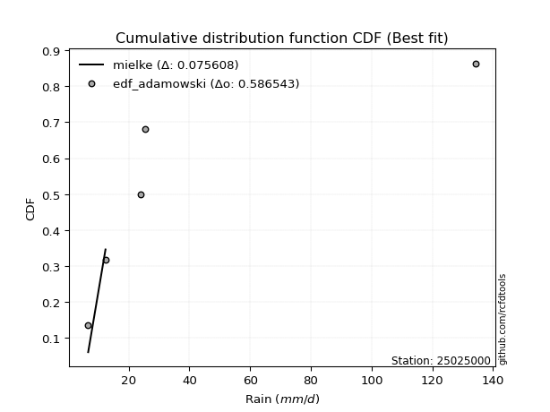</img></img>

</div>


## C. Best fit & Estimate extreme values for specific return periods - Tr

Best fit in probability distribution analysis means finding the theoretical distribution (like Normal, Poisson, Exponential, etc.) that most accurately mirrors your real-world data´s patterns (shape, center, spread) for better predictions, using methods like visual checks (Q-Q plots), goodness-of-fit tests (Kolmogorov-Smirnov, Chi-Squared), and information criteria (AIC) to score and select the simplest, most representative model.


### 1. Best fit (ordered by delta Δ)

:file_folder:Table: [bestfit_25025000.csv](table/bestfit_25025000.csv)

<div align="center">

|   id |   station | empirical_dist   | p_dist    |     delta |   deltao | eval   |   fit |   n |   best_fit |   best_fit_sort |
|-----:|----------:|:-----------------|:----------|----------:|---------:|:-------|------:|----:|-----------:|----------------:|
|    0 |  25025000 | edf_hazen        | mielke    | 0.0461018 | 0.586543 | Δo > Δ |     1 |   5 |          1 |               1 |
|    1 |  25025000 | edf_gringorten   | mielke    | 0.0486197 | 0.586543 | Δo > Δ |     1 |   5 |          1 |               2 |
|    2 |  25025000 | edf_cunnane      | mielke    | 0.0546293 | 0.586543 | Δo > Δ |     1 |   5 |          1 |               3 |
|    3 |  25025000 | edf_blom         | mielke    | 0.0582923 | 0.586543 | Δo > Δ |     1 |   5 |          1 |               4 |
|    4 |  25025000 | edf_tukey        | mielke    | 0.0642447 | 0.586543 | Δo > Δ |     1 |   5 |          1 |               5 |
|    5 |  25025000 | edf_filliben     | mielke    | 0.0664581 | 0.586543 | Δo > Δ |     1 |   5 |          1 |               6 |
|    6 |  25025000 | edf_beard        | mielke    | 0.0674975 | 0.586543 | Δo > Δ |     1 |   5 |          1 |               7 |
|    7 |  25025000 | edf_jenkinson    | mielke    | 0.0674975 | 0.586543 | Δo > Δ |     1 |   5 |          1 |               8 |
|    8 |  25025000 | edf_chegodayev   | mielke    | 0.0688743 | 0.586543 | Δo > Δ |     1 |   5 |          1 |               9 |
|    9 |  25025000 | edf_adamowski    | mielke    | 0.0756083 | 0.586543 | Δo > Δ |     1 |   5 |          1 |              10 |
|   10 |  25025000 | edf_weibull      | logmielke | 0.100678  | 0.586543 | Δo > Δ |     1 |   5 |          1 |              11 |
|   11 |  25025000 | edf_california   | t         | 0.113451  | 0.586543 | Δo > Δ |     1 |   5 |          1 |              12 |

</div>


### 2. Extreme values and % difference analysis

In hydrology, a return period (or recurrence interval $Tr$) is the statistical average time between extreme events like floods or droughts of a specific magnitude, indicating how rare an event is, with a 100-year flood, for example, having a 1% chance of occurring in any given year, not that it happens exactly every century. It is a key tool for infrastructure design (like bridges or dams) and risk assessment, calculated from historical data to determine the probability of future events, although it is important to remember it is statistical average, and events can cluster or be missed.

The extreme value porcentage difference is evaluated as $pdiff = 1 - (ETrBf / ETr) * 100$, where _ETrBf_ correspond to the bestfit extreme value for a specific recurrence interval and _ETr_ correspond to the extreme value for one of the most used PDFsused in hydrology.

> risk_rate: assuming the return period as the project useful life.

:file_folder:Table: [extreme_25025000.csv](table/extreme_25025000.csv), all PDFs.  
:file_folder:Table: [extremepdiff_25025000.csv](table/extremepdiff_25025000.csv), % difference between bestfit and most used PDFs in Hydrology.

<div align="center">

Extreme values table for only best fit PDFs
|   id |      tr |   prob_l |     prob_g |     alpha |   anglit |   arcsine |    argus |     beta |   betaprime |   bradford |      burr |   burr12 |   cosine |   crystalball |   dgamma |   dweibull |   erlang |   exponnorm |   exponpow |   exponweib |          f |   fatiguelife |   foldnorm |    gamma |   gausshyper |   genexpon |   genextreme |   gengamma |   genhalflogistic |   genlogistic |   gennorm |   genpareto |   gompertz |   gumbel_l |   gumbel_r |   halfgennorm |   halflogistic |   halfnorm |   hypsecant |   invgamma |   invgauss |   invweibull |   johnsonsb |        johnsonsu |          kappa3 |   kappa4 |    ksone |   kstwobign |   laplace |   levy_l |   loggamma |   logistic |   loglaplace |     lomax |   maxwell |     mielke |    moyal |   nakagami |        ncf |       nct |     norm |   pearson3 |   powerlaw |   rayleigh |      rdist |     rice |   semicircular |   skewnorm |         t |   trapezoid |   triang |   truncexpon |   truncnorm |   truncpareto |   truncweibull_min |   tukeylambda |   uniform |   vonmises |   vonmises_line |     wald |   weibull_max |   weibull_min |   wrapcauchy |   logalpha |   loganglit |   logarcsine |   logargus |   logbeta |   logbetaprime |   logbradford |   logburr |        logburr12 |   logcosine |   logcrystalball |   logdgamma |   logdweibull |   logerlang |   logexponnorm |   logexponpow |   logexponweib |             logf |   logfatiguelife |   logfoldnorm |   loggausshyper |   loggenexpon |   loggenextreme |   loggengamma |   loggenhalflogistic |   loggenlogistic |   loggennorm |   loggenpareto |   loggompertz |   loggumbel_l |   loggumbel_r |   loghalfgennorm |   loghalflogistic |   loghalfnorm |   loghypsecant |   loginvgamma |   loginvgauss |   loginvweibull |   logjohnsonsb |   logjohnsonsu |   logkappa3 |   logkappa4 |   logksone |   logkstwobign |   loglevy_l |   logloggamma |   loglogistic |   logloglaplace |   loglomax |   logmaxwell |   logmielke |   logmoyal |   lognakagami |    logncf |     lognct |   lognorm |   logpearson3 |   logpowerlaw |   lograyleigh |   logrdist |   logrice |   logsemicircular |   logskewnorm |     logt |   logtrapezoid |   logtriang |   logtruncexpon |   logtruncnorm |   logtruncpareto |   logtruncweibull_min |   logtukeylambda |   loguniform |   logvonmises |   logvonmises_line |    logwald |   logweibull_max |   logweibull_min |   logwrapcauchy |   station |   n |   risk_rate |
|-----:|--------:|---------:|-----------:|----------:|---------:|----------:|---------:|---------:|------------:|-----------:|----------:|---------:|---------:|--------------:|---------:|-----------:|---------:|------------:|-----------:|------------:|-----------:|--------------:|-----------:|---------:|-------------:|-----------:|-------------:|-----------:|------------------:|--------------:|----------:|------------:|-----------:|-----------:|-----------:|--------------:|---------------:|-----------:|------------:|-----------:|-----------:|-------------:|------------:|-----------------:|----------------:|---------:|---------:|------------:|----------:|---------:|-----------:|-----------:|-------------:|----------:|----------:|-----------:|---------:|-----------:|-----------:|----------:|---------:|-----------:|-----------:|-----------:|-----------:|---------:|---------------:|-----------:|----------:|------------:|---------:|-------------:|------------:|--------------:|-------------------:|--------------:|----------:|-----------:|----------------:|---------:|--------------:|--------------:|-------------:|-----------:|------------:|-------------:|-----------:|----------:|---------------:|--------------:|----------:|-----------------:|------------:|-----------------:|------------:|--------------:|------------:|---------------:|--------------:|---------------:|-----------------:|-----------------:|--------------:|----------------:|--------------:|----------------:|--------------:|---------------------:|-----------------:|-------------:|---------------:|--------------:|--------------:|--------------:|-----------------:|------------------:|--------------:|---------------:|--------------:|--------------:|----------------:|---------------:|---------------:|------------:|------------:|-----------:|---------------:|------------:|--------------:|--------------:|----------------:|-----------:|-------------:|------------:|-----------:|--------------:|----------:|-----------:|----------:|--------------:|--------------:|--------------:|-----------:|----------:|------------------:|--------------:|---------:|---------------:|------------:|----------------:|---------------:|-----------------:|----------------------:|-----------------:|-------------:|--------------:|-------------------:|-----------:|-----------------:|-----------------:|----------------:|----------:|----:|------------:|
|    0 |    2    | 0.5      | 0.5        |   18.515  |  40.602  |   40.602  |  63.6723 |  -6.211  |     17.6413 |    42.9181 |   19.6208 |  16.1153 |  49.6449 |       40.6017 |  24.07   |    24.07   |  19.086  |     30.0119 |    19.6247 |     22.0121 |     9.8565 |       6.69002 |    30.197  |  14.345  |      43.8023 |    30.1958 |      17.0922 |    18.9032 |           89.7422 |       30.9109 |   24.07   |     18.0904 |    48.6914 |    48.3905 |    32.8135 |       18.4822 |        28.9415 |    30.8975 |     40.602  |    17.6411 |    16.9258 |      17.0922 |     6.69    |      6.86514     |   436.333       |  66.7472 |  70.525  |     36.5776 |   40.602  |  62.6523 |    11.0498 |    40.602  |      23.2786 |   18.0964 |   36.5473 |    17.3422 |  30.2991 |    29.9473 |    17.6412 |   18.3063 |  40.602  |    29.8021 |    6.89184 |    35.1092 | -5.7179    |  41.6118 |        40.602  |    46.0027 |   19.2593 |     101.951 |  73.2692 |      47.4398 |     32.9229 |       8.01877 |            6.69001 |      -5.98375 |    70.525 |   0.143139 |         26.6421 |  25.2341 |       134.147 |       27.6695 |      70.5816 |    19.3098 |     23.2786 |      23.2787 |    32.3053 |   17.5846 |        18.6183 |       23.2663 |   19.4    |     12.2239      |     25.5175 |          23.2786 |     24.07   |       25.5    |     10.6898 |        18.9555 |       22.2006 |        13.2144 |      9.354       |          17.8286 |       20.5205 |         22.6912 |       18.1436 |         19.2057 |       13.9539 |              49.4414 |          19.4619 |      24.07   |        22.1004 |       18.9622 |       27.4507 |       19.7406 |          20.0141 |           18.1871 |       18.956  |        23.2786 |       18.9091 |       18.2035 |         19.2054 |        6.69032 |        18.465  |     31.7639 |     25.9113 |    29.9811 |        19.8038 |     37.4656 |       23.3904 |       23.2786 |     24.07       |    15.8373 |      21.3641 |     19.0379 |    18.7174 |       18.7183 |   19.7474 |    18.9369 |   23.2786 |       20.9537 |       6.76475 |       20.7235 |    14.6823 |   21.7365 |           23.2786 |       19.6891 |  23.2788 |        63.189  |     38.3298 |         21.0847 |        24.6667 |          7.11394 |               20.1028 |          13.0612 |      29.9811 |       20.1334 |            30.005  |    16.8147 |          53.1643 |     10.3045      |         29.9827 |  25025000 |   5 |    0.75     |
|    1 |    2.33 | 0.570815 | 0.429185   |   22.036  |  50.4565 |   55.3952 |  73.6405 |  -6.2061 |     21.1161 |    51.3251 |   23.2102 |  19.5163 |  58.7393 |       49.0614 |  27.9633 |    27.3515 |  23.3503 |     35.1581 |    29.2247 |     30.7874 |    11.7622 |       7.53273 |    39.6941 |  17.0836 |      53.9566 |    35.3749 |      20.7468 |    23.6709 |           98.1137 |       36.3266 |   24.6198 |     22.0828 |    56.0008 |    55.7509 |    40.6527 |       21.8943 |        37.0014 |    40.0281 |     47.3726 |    21.1159 |    20.4719 |      20.7468 |     6.69    |      7.18733     | 10209.9         |  76.1843 |  81.3742 |     43.0506 |   45.7217 |  84.7983 |    12.7766 |    48.0559 |      25.943  |   21.5874 |   45.3368 |    20.7439 |  37.72   |    40.4511 |    21.1159 |   21.7451 |  49.0621 |    37.7706 |    7.38228 |    44.0287 | -0.0481936 |  48.8377 |        51.1711 |    52.7695 |   21.3791 |     109.368 |  83.4133 |      55.3349 |     38.6612 |       8.74462 |            6.69012 |      -1.29603 |    79.566 |   0.328928 |         32.8191 |  30.7815 |       134.296 |       37.2464 |     114.737  |    22.8312 |     28.6777 |      31.838  |    39.5412 |   22.0139 |        22.0462 |       28.8035 |   22.9314 |     14.6192      |     30.7982 |          27.8437 |     25.3279 |       27.7405 |     12.107  |        22.2766 |       27.08   |        15.7924 |     11.1981      |          21.2986 |       25.1553 |         28.1303 |       21.8844 |         22.7189 |       16.7272 |              59.7965 |          23.0116 |      24.8957 |        31.7864 |       22.9352 |       32.0785 |       23.3036 |          24.1066 |           21.5704 |       22.9975 |        26.8656 |       22.4129 |       21.6942 |         22.7184 |        6.692   |        21.9502 |     39.6048 |     32.3065 |    38.6867 |        23.5864 |     55.5824 |       28.0604 |       27.257  |     27.0997     |    19.1851 |      25.7325 |     22.5542 |    21.901  |       21.4614 |   23.437  |    22.4108 |   27.8437 |       25.0596 |       6.91022 |       25.0298 |    16.8907 |   25.901  |           29.1148 |       23.7093 |  27.844  |        75.2205 |     47.1611 |         25.8474 |        28.1566 |          7.33644 |               24.6856 |          14.442  |      37.0774 |       23.7476 |            37.1105 |    18.9097 |          66.2523 |     12.3281      |         40.4967 |  25025000 |   5 |    0.729209 |
|    2 |    5    | 0.8      | 0.2        |   49.3376 |  85.2253 |   94.8433 | 105.615  |  82.0444 |     49.2793 |    87.4883 |   47.9983 |  49.9841 |  91.5123 |       80.5001 |  56.3263 |    69.0011 |  48.0034 |     60.888  |   122.486  |    120.005  |    31.9879 |      25.4342  |    79.8557 |  33.1656 |      93.2538 |    61.2689 |      53.5768 |    53.1339 |          120.205  |       59.8534 |   32.4356 |     57.0374 |    86.2674 |    79.5292 |    74.7099 |       42.3365 |        73.4712 |    78.6405 |     74.5311 |    49.2792 |    48.3366 |      53.5768 |     6.6917  |     30.7386      |     8.56786e+09 | 107.561  | 116.486  |     70.5467 |   71.3188 | 121.489  |    28.0973 |    76.8366 |      44.5988 |   47.2245 |   79.9314 |    48.123  |  72.0939 |    99.5487 |    49.2793 |   48.3105 |  80.5021 |    73.9173 |   22.6982  |    79.7373 | 16.7397    |  77.7662 |        87.239  |    81.3854 |   32.3002 |     130.649 | 112.516  |      88.0224 |     67.1305 |      17.9498  |            6.89103 |      13.6365  |   108.826 |   1.05348  |         56.8682 |  61.8357 |       134.36  |      109.653  |     130.957  |    47.9086 |     59.8633 |      73.3788 |    75.6155 |   56.5556 |        47.0653 |       61.9695 |   47.5023 |     46.752       |     60.6588 |          54.1679 |     42.6595 |       53.9365 |     23.3551 |        47.2265 |       60.1905 |        41.4313 |     41.374       |          48.8431 |       55.1854 |         61.239  |       50.2733 |         47.7722 |       43.5551 |              98.3837 |          47.6413 |      35.3554 |        84.1129 |       51.6323 |       53.0638 |       47.9178 |          52.5107 |           46.6784 |       52.075  |        47.7368 |       48.1859 |       48.6462 |         47.7698 |        8.6871  |        48.4859 |     80.8795 |     67.8946 |    88.2819 |        49.5598 |    106.844  |       55.0696 |       50.1241 |     52.5525     |    50.568  |      53.5175 |     48.3943 |    45.3366 |       42.2029 |   49.0667 |    47.7599 |   54.1679 |       51.7671 |      10.9723  |       53.2981 |    25.6638 |   52.2505 |           62.47   |       52.0189 |  54.1683 |       124.023  |     85.4913 |         55.8407 |        49.5479 |         10.2139  |               54.2143 |          19.8643 |      73.7397 |       45.0089 |            73.8312 |    36.4877 |         108.059  |     43.6844      |         85.9912 |  25025000 |   5 |    0.67232  |
|    3 |   10    | 0.9      | 0.1        |   99.4973 | 104.905  |  104.366  | 121.034  | 134.146  |    103.291  |   108.761  |   86.5357 | 115.874  | 111.313  |      101.356  |  85.0415 |   126.363  |  73.1298 |     84.2449 |   265.135  |    292.636  |    80.8588 |      50.1516  |   109.574  |  49.7482 |     113.551  |    84.7747 |     125.148  |    84.9918 |          127.876  |       79.0148 |   46.9525 |    130.238  |   107.616  |    92.7679 |   102.449  |       65.2486 |       103.758  |   107.213  |     96.2179 |   103.292  |    91.7259 |     125.148  |     6.8964  |    321.832       |     5.29237e+14 | 121.625  | 131.807  |     91.4814 |   94.5551 | 130.347  |    60.3946 |    98.0325 |      72.9333 |   88.9757 |  104.277  |   100.059  | 102.022  |   151.263  |   103.292  |   96.8734 | 101.359  |   103.947  |   54.5878  |   105.198  | 22.3186    |  98.3928 |       105.746  |   102.561  |   48.9178 |     138.961 | 123.883  |     107.896  |     92.6639 |      38.0712  |           11.8594  |      19.8531  |   121.593 |   1.60922  |         75.2712 |  94.7916 |       134.36  |      209.184  |     132.898  |    89.7803 |     90.7961 |      89.7661 |   103.368  |  102.952  |        89.6673 |       90.0516 |   86.164  |    217.322       |     91.3568 |          84.2301 |     76.4126 |      113.061  |     43.5863 |        92.2821 |      103.818  |       107.38   |    204.245       |         100.254  |       93.8412 |         89.7019 |       96.1994 |         88.966  |      109.488  |             116.685  |          86.1673 |      60.4703 |       113.49   |       93.3783 |       70.2258 |       86.1967 |          92.7103 |           88.6203 |       95.3416 |        75.546  |       92.8113 |       97.2763 |         88.9584 |      517.804   |        96.358  |    110.444  |     95.2037 |   126.536  |        87.2264 |    125.103  |       85.963  |       78.504  |    107.478      |   123.757  |      89.598  |     93.3761 |    85.4208 |       73.1189 |   89.1517 |    91.4249 |   84.2301 |       88.433  |      24.0847  |       91.3618 |    29.5959 |   86.1787 |           92.4272 |       93.0405 |  84.2307 |       150.774  |    107.852  |         83.9563 |        72.3435 |         18.2133  |               82.5644 |          22.6516 |      99.5372 |       72.9991 |            99.6782 |    73.2977 |         123.596  |    222.334       |        108.703  |  25025000 |   5 |    0.651322 |
|    4 |   15    | 0.933333 | 0.0666667  |  149.478  | 113.308  |  106.183  | 126.896  | 134.353  |    158.483  |   116.773  |  120.611  | inf      | 120.332  |      111.763  | 102.344  |   166.094  |  88.5269 |     97.9078 |   369.136  |    448.711  |   138.387  |      66.3172  |   125.04   |  59.9548 |     120.631  |    98.5247 |     204.879  |   105.068  |          130.192  |       89.8253 |   59.1323 |    209.615  |   118.297  |    98.7633 |   118.099  |       80.4063 |       120.897  |   122.082  |    108.594  |   158.486  |   125.962  |     204.88   |     8.94487 |   1144.63        |     2.63035e+17 | 126.367  | 136.913  |    102.595  |  108.147  | 133.023  |    95.6849 |   109.581  |      97.2468 |  126.683  |  116.769  |   152.686  | 119.391  |   179.211  |   158.486  |  145.093  | 111.766  |   120.836  |   73.8764  |   118.317  | 23.7521    | 109.021  |       112.963  |   113.58   |   65.1223 |     141.628 | 127.531  |     115.788  |    107.467  |      54.0895  |           21.948   |      21.8386  |   125.849 |   1.92241  |         85.6978 | 115.954  |       134.36  |      281.755  |     133.442  |   129.775  |    108.472  |      93.2844 |   116.413  |  133.318  |       130.432  |      102.59   |  120.686  |    704.716       |    110.091  |         104.989  |    109.593  |      180.821  |     63.2185 |       136.54   |      135.773  |       192.309  |    592.407       |         151.833  |      122.417  |        102.465  |      136.088  |        127.197  |      191.092  |             122.789  |         120.374  |      90.9087 |       122.437  |      126.274  |       79.7279 |      120.048  |         124.347  |          127.378  |      130.607  |        98.1711 |      136.2    |      145.022  |        127.183  |     1137.14    |       144.056  |    122.544  |    106.811  |   142.668  |       117.757  |    131.21   |      107.293  |      100.243  |    173.164      |   210.327  |     116.715  |    137.351  |   123.375  |       97.9336 |  124.833  |   133.906  |  104.989  |      117.461  |      37.2976  |      120.603  |    30.7272 |  111.524  |          107.682  |      125.915  | 104.989  |       160.525  |    116.2    |         97.4357 |        85.3505 |         27.0531  |               96.3128 |          23.6151 |     110.005  |       96.0989 |           110.168  |   114.717  |         127.985  |    698.721       |        116.819  |  25025000 |   5 |    0.644736 |
|    5 |   20    | 0.95     | 0.05       |  199.415  | 118.252  |  106.822  | 130.114  | 134.359  |    214.484  |   120.968  |  152.154  | inf      | 125.879  |      118.579  | 114.764  |   196.66   |  99.6773 |    107.602  |   450.581  |    589.429  |   202.249  |      78.2859  |   135.351  |  67.3602 |     124.189  |   108.281  |     290.331  |   119.808  |          131.302  |       97.3946 |   69.5803 |    293.289  |   125.246  |   102.495  |   129.057  |       91.9093 |       132.906  |   131.995  |    117.325  |   214.489  |   154.205  |     290.331  |    17.2821  |   2644.77        |     2.02419e+19 | 128.751  | 139.467  |    110.082  |  117.791  | 134.393  |   133.166  |   117.563  |     119.269  |  161.983  |  125.059  |   205.785  | 131.691  |   198.03   |   214.489  |  193.162  | 118.582  |   132.599  |   85.9049  |   127.037  | 24.3587    | 116.084  |       116.966  |   120.927  |   81.341  |     142.944 | 129.33   |     120.046  |    117.912  |      66.0097  |           32.9037  |      22.8056  |   127.977 |   2.13822  |         92.9663 | 131.725  |       134.36  |      339.531  |     133.705  |   169.245  |    120.437  |      94.556  |   124.261  |  154.962  |       170.443  |      109.622  |  152.863  |   1891.58        |    123.473  |         121.282  |    142.35   |      255.652  |     82.4878 |       180.293  |      161.459  |       293.648  |   1325.73        |         203.574  |      145.718  |        109.623  |      172.025  |        163.849  |      285.63   |             125.808  |         152.121  |     126.652  |       126.429  |      153.939  |       86.2813 |      151.386  |         151.117  |          164.242  |      161.1    |       118.099  |      179.309  |      192.301  |        163.828  |     1238.08    |       192.085  |    129.127  |    113.201  |   151.49   |       144.142  |    134.452  |      124.027  |      118.694  |    250.089      |   307.362  |     139.103  |    181.183  |   160.068  |      119.131  |  158.088  |   176.218  |  121.282  |      142.322  |      48.5695  |      145.049  |    31.2263 |  132.37   |          117.204  |      154.059  | 121.283  |       165.565  |    120.553  |        105.26   |        93.8112 |         35.4896  |              104.331  |          24.0978 |     115.645  |      116.857  |           115.82   |   160.175  |         129.962  |   1709.52        |        121.022  |  25025000 |   5 |    0.641514 |
|    6 |   25    | 0.96     | 0.04       |  249.334  | 121.602  |  107.119  | 132.189  | 134.36   |    271.098  |   123.548  |  181.959  | inf      | 129.768  |      123.596  | 124.464  |   221.624  | 108.433  |    115.121  |   517.626  |    717.837  |   271.255  |      87.7955  |   143.023  |  73.1819 |     126.317  |   115.848  |     380.269  |   131.485  |          131.951  |      103.225  |   78.7768 |    380.312  |   130.328  |   105.151  |   137.497  |      101.248  |       142.158  |   139.371  |    124.083  |   271.106  |   178.301  |     380.27   |    38.3932  |   4905.62        |     5.73403e+20 | 130.186  | 140.999  |    115.69   |  125.272  | 135.253  |   172.414  |   123.669  |     139.731  |  195.594  |  131.214  |   259.24   | 141.226  |   212.089  |   271.106  |  241.133  | 123.6    |   141.62   |   94.0118  |   133.515  | 24.6804    | 121.333  |       119.563  |   126.393  |   97.6279 |     143.728 | 130.402  |     122.713  |    125.981  |      75.012   |           42.9598  |      23.3749  |   129.253 |   2.29835  |         98.4354 | 144.357  |       134.36  |      387.895  |     133.86   |   208.666  |    129.288  |      95.1518 |   129.6    |  171.37   |       210.095  |      114.113  |  183.431  |   4497.64        |    133.817  |         134.871  |    174.807  |      336.683  |    101.501  |       223.674  |      183.152  |       409.875  |   2542.94        |         255.452  |      165.669  |        114.19   |      205.093  |        199.464  |      391.516  |             127.6    |         182.176  |     167.849  |       128.602  |      178.076  |       91.2702 |      180.999  |         174.643  |          199.772  |      188.32   |       136.258  |      222.462  |      239.274  |        199.435  |     1259.28    |       240.583  |    133.312  |    117.245  |   157.043  |       167.709  |    136.528  |      137.978  |      135.07   |    338.62       |   413.252  |     158.458  |    225.145  |   195.863  |      137.875  |  189.717  |   218.698  |  134.871  |      164.438  |      57.8555  |      166.367  |    31.4973 |  150.343  |          123.827  |      179.008  | 134.872  |       168.643  |    123.224  |        110.358  |        99.7674 |         43.1283  |              109.569  |          24.3862 |     119.167  |      135.985  |           119.349  |   209.272  |         131.061  |   3582.07        |        123.597  |  25025000 |   5 |    0.639603 |
|    7 |   50    | 0.98     | 0.02       |  498.851  | 129.849  |  107.516  | 136.893  | 134.36   |    560.309  |   128.854  |  315.64   | inf      | 139.954  |      137.963  | 154.871  |   305.586  | 136.116  |    138.478  |   744.323  |   1240.3    |   673.324  |     118.306   |   165.322  |  91.6159 |     130.51   |   139.354  |     877.281  |   168.905  |          133.205  |      121.185  |  113.873  |    850.321  |   144.661  |   112.36   |   163.498  |      132.513  |       170.664  |   160.81   |    145.033  |   560.334  |   264.571  |     877.282  |   277.436   |  28838.8         |     1.69629e+25 | 133.069  | 144.063  |    132.157  |  148.508  | 137.19   |   387.972  |   142.325  |     228.505  |  348.416  |  149.063  |   530.033  | 170.825  |   253.079  |   560.334  |  480.139  | 137.967  |   169.171  |  112.481   |   152.321  | 25.2074    | 136.568  |       125.496  |   142.282  |  180.082  |     145.283 | 132.529  |     128.329  |    150.867  |      98.8769  |           76.1255  |      24.4803  |   131.807 |   2.71889  |        113.264  | 185.6    |       134.36  |      557.631  |     134.168  |   410.288  |    153.945  |      95.9535 |   142.571  |  217.967  |       407.553  |      123.755  |  322.067  | 130040           |    165.194  |         182.809  |    334.512  |      818.4    |    194.249  |       436.994  |      260.718  |      1185.25   |  22084.6         |         516.367  |      239.275  |        123.97   |      344.145  |        368.952  |     1061.54   |             131.111  |         317.465  |     462.182  |       132.255  |      269.498  |      106.316  |      313.828  |         265.493  |          365.249  |      296.467  |       212.297  |      442.206  |      471.646  |        368.877  |     1269.73    |       490.85   |    142.801  |    125.86   |   168.766  |       261.626  |    141.319  |      187.135  |      200.474  |    969.126      |  1046.89   |     231.206  |    449.413  |   366.473  |      210.99   |  334.103  |   436.948  |  182.809  |      252.368  |      85.5304  |      247.71   |    31.9541 |  217.566  |          140.395  |      276.911  | 182.81   |       174.921  |    128.7    |        121.577  |       114.392  |         69.9615  |              121.132  |          24.9562 |     126.536  |      212.866  |           126.733  |   500.994  |         133.007  |  45626.5         |        128.884  |  25025000 |   5 |    0.63583  |
|    8 |   75    | 0.986667 | 0.0133333  |  748.334  | 133.478  |  107.589  | 138.759  | 134.36   |    856.169  |   130.667  |  434.694  | inf      | 144.818  |      145.672  | 172.811  |   358.847  | 152.582  |    152.141  |   887.828  |   1645.68   |  1144.73   |     136.682   |   177.46   | 102.597  |     131.867  |   153.104  |    1428.86   |   191.473  |          133.606  |      131.624  |  139.326  |   1359.99   |   152.195  |   116.005  |   178.611  |      152.338  |       187.235  |   172.48   |    157.275  |   856.215  |   322.342  |    1428.87   |   361.894   |  74636.6         |     6.71597e+27 | 134.036  | 145.084  |    141.217  |  162.101  | 137.986  |   626.581  |   153.101  |     304.68   |  486.436  |  158.768  |   804.595  | 188.134  |   275.404  |   856.216  |  718.29   | 145.677  |   185.018  |  119.37    |   162.552  | 25.3399    | 144.857  |       127.866  |   150.931  |  263.81   |     145.798 | 133.234  |     130.292  |    165.301  |     109.127   |           92.9072  |      24.8349  |   132.658 |   2.89418  |        119.681  | 210.979  |       134.36  |      670.412  |     134.27   |   623.402  |    166.237  |      96.1029 |   148.067  |  241.166  |       607.369  |      127.178  |  447.151  |      1.66168e+06 |    182.677  |         215.212  |    491.896  |     1404.54   |    284.725  |       646.574  |      313.465  |      2242.61   |  85760.6         |         779.096  |      291.467  |        127.426  |      457.856  |        530.903  |     1924.4    |             132.246  |         438.422  |     922.424  |       133.197  |      335.704  |      114.844  |      432.133  |         333.147  |          518.706  |      379.54   |       275.099  |      670.648  |      701.888  |        530.774  |     1270.13    |       753.432  |    146.851  |    128.908  |   172.866  |       334.146  |    143.336  |      220.312  |      251.832  |   1953.44       |  1815.99   |     283.928  |    682.306  |   528.634  |      265.993  |  466.039  |   666.87   |  215.212  |      320.482  |      98.7212  |      307.605  |    32.073  |  266.02   |          147.617  |      351.14   | 215.212  |       177.05   |    130.566  |        125.652  |       120.319  |         85.081   |              125.343  |          25.1424 |     129.092  |      265.134  |           129.295  |   857.287  |         133.556  | 239047           |        130.69   |  25025000 |   5 |    0.634587 |
|    9 |  100    | 0.99     | 0.01       |  997.808  | 135.636  |  107.615  | 139.8    | 134.36   |   1156.44   |   131.582  |  545.182  | inf      | 147.866  |      150.886  | 185.593  |   398.356  | 164.365  |    161.835  |   993.718  |   1984.33   |  1667.66   |     149.903   |   185.73   | 110.461  |     132.53   |   162.859  |    2019.02   |   207.744  |          133.803  |      139.013  |  159.75   |   1897.25   |   157.22   |   118.39   |   189.307  |      167.075  |       198.964  |   180.43   |    165.96   |  1156.5    |   366.258  |    2019.02   |   378.434   | 142002           |     4.62686e+29 | 134.52   | 145.595  |    147.424  |  171.745  | 138.451  |   881.979  |   160.708  |     373.678  |  615.644  |  165.378  |  1081.63   | 200.414  |   290.599  |  1156.51   |  955.903  | 150.891  |   196.163  |  122.962   |   169.522  | 25.3957    | 150.503  |       129.193  |   156.823  |  348.427  |     146.055 | 133.585  |     131.292  |    175.488  |     114.794   |          102.763   |      25.0084  |   133.083 |   2.98791  |        123.166  | 229.482  |       134.36  |      756.395  |     134.321  |   849.326  |    174.007  |      96.1552 |   151.227  |  255.634  |       810.944  |      128.931  |  564.287  |      1.3953e+07  |    194.566  |         240.325  |    648.03   |     2077.5    |    373.835  |       853.761  |      354.293  |      3549.62   | 233717           |        1043.13   |      333.085  |        129.19   |      556.919  |        688.864  |     2948.65   |             132.801  |         550.956  |    1575.38   |       133.598  |      388.944  |      120.789  |      541.929  |         388.712  |          664.873  |      449.098  |       330.615  |      908.033  |      931.061  |        688.676  |     1270.19    |      1027      |    149.353  |    130.472  |   174.953  |       395.128  |    144.529  |      245.997  |      295.831  |   3352.87       |  2692.93   |     326.568  |    923.574  |   685.551  |      311.436  |  591.118  |   908.524  |  240.325  |      378.065  |     106.339   |      356.507  |    32.1238 |  305.075  |          151.823  |      412.802  | 240.325  |       178.122  |    131.507  |        127.757  |       123.533  |         94.5496  |              127.521  |          25.2342 |     130.389  |      301.047  |           130.595  |  1268.29   |         133.804  | 832644           |        131.602  |  25025000 |   5 |    0.633968 |
|   10 |  200    | 0.995    | 0.005      | 1995.68   | 139.713  |  107.64   | 141.61   | 134.36   |   2385.22   |   132.964  |  939.649  | inf      | 154.065  |      162.713  | 216.536  |   499.047  | 193.037  |    185.192  |  1260.53   |   2996.88   |  4126.61   |     182.267   |   204.643  | 129.61   |     133.493  |   186.365  |    4640.08   |   247.713  |          134.091  |      156.775  |  217.578  |   4229.26   |   168.395  |   123.572  |   215.022  |      204.814  |       227.16   |   198.614  |    186.882  |  2385.4    |   480.919  |    4640.1    |   385.532   | 610882           |     1.21279e+34 | 135.25   | 146.361  |    161.722  |  194.981  | 139.332  |  2020.35   |   178.957  |     611.082  | 1082.92   |  180.501  |  2205.14   | 230      |   325.284  |  2385.4    | 1903.08   | 162.718  |   222.732  |  128.542   |   185.471  | 25.4628    | 163.424  |       131.507  |   170.298  |  692.572  |     146.44  | 134.111  |     132.815  |    199.853  |     124.062   |          119.698   |      25.2619  |   133.722 |   3.13432  |        128.666  | 275.573  |       134.36  |      983.662  |     134.397  |  1881.72   |    189.691  |      96.2057 |   156.881  |  283.979  |      1665.18   |      131.613  |  988.669  |      9.115e+09   |    221.18   |         308.691  |   1266.37   |     5473.44   |    722.479  |      1668.01   |      464.605  |     10962.1    |      2.99326e+06 |        2108.07   |      450.872  |        131.876  |      875.023  |       1301.42   |     8365.78   |             133.613  |         954.252  |    6687.44   |       134.085  |      540.559  |      134.794  |      933.959  |         552.551  |         1207.66   |      659.923  |       514.813  |     1939.42   |     1843.11   |       1300.96   |     1270.22    |      2212.8    |    154.666  |    132.874  |   178.13   |       581.323  |    146.815  |      315.796  |      435.31   |  14510.4        |  7035.45   |     449.773  |   1961.76   |  1282.37   |      446.51   | 1056.21   |  1982.76   |  308.691  |      556.042  |     119.283   |      499.664  |    32.1864 |  417.376  |          159.443  |      597.639  | 308.692  |       179.738  |    132.928  |        131.003  |       128.708  |        111.938   |              130.882  |          25.3696 |     132.36   |      371.599  |           132.57   |  3364.37   |         134.131  |      2.145e+07   |        132.981  |  25025000 |   5 |    0.633042 |
|   11 |  250    | 0.996    | 0.004      | 2494.62   | 140.751  |  107.643  | 142.034  | 134.36   |   3011      |   133.242  | 1119.35   | inf      | 155.765  |      166.327  | 226.536  |   533.032  | 202.34   |    192.711  |  1349.44   |   3388.07   |  5523.64   |     192.814   |   210.461  | 135.828  |     133.678  |   193.932  |    6064.32   |   260.785  |          134.147  |      162.486  |  238.931  |   5473.88   |   171.745  |   125.097  |   223.289  |      217.623  |       236.225  |   204.207  |    193.617  |  3011.24   |   520.221  |    6064.34   |   385.819   | 954125           |     3.19252e+35 | 135.397  | 146.514  |    166.147  |  202.461  | 139.562  |  2641.71   |   184.816  |     715.92   | 1298.05   |  185.156  |  2773.17   | 239.524  |   335.931  |  3011.25   | 2375.35   | 166.333  |   231.211  |  129.686   |   190.38   | 25.4733    | 167.401  |       132.049  |   174.444  |  866.984  |     146.516 | 134.216  |     133.124  |    207.644  |     126.035   |          123.428   |      25.3113  |   133.849 |   3.1642   |        129.796  | 290.821  |       134.36  |     1062.82   |     134.412  |  2473.59   |    193.903  |      96.2118 |   158.234  |  291.315  |      2115.08   |      132.158  | 1184.51   |      1.19945e+11 |    229.092  |         333.235  |   1573.5    |     7530.12   |    893.841  |      2069.35   |      503.79   |     15854      |      7.08243e+06 |        2644.38   |      494.585  |        132.419  |     1006.53   |       1601.61   |    11751.4    |             133.77   |        1138.55   |   11171.4    |       134.162  |      596.909  |      139.215  |     1112.56   |         615.51   |         1463.11   |      742.875  |       593.692  |     2499.41   |     2297.89   |       1601      |     1270.22    |      2852.38   |    156.25   |    133.365  |   178.773  |       655.104  |    147.416  |      340.812  |      492.783  |  24547.2        |  9616.36   |     496.349  |   2519.07   |  1568.8    |      498.765  | 1276.71   |  2578.77   |  333.235  |      627.529  |     122.115   |      554.38   |    32.1964 |  459.652  |          161.286  |      669.693  | 333.236  |       180.063  |    133.213  |        131.666  |       129.799  |        115.969   |              131.568  |          25.3962 |     132.757  |      388.474  |           132.969  |  4645.9    |         134.188  |      6.55566e+07 |        133.258  |  25025000 |   5 |    0.632858 |
|   12 |  500    | 0.998    | 0.002      | 4989.27   | 143.324  |  107.647  | 143.008  | 134.36   |   6208.02   |   133.8    | 1926.79   | inf      | 160.287  |      177.046  | 257.692  |   643.187  | 231.427  |    216.068  |  1633.34   |   4831.96   | 13662.1    |     225.902   |   227.809  | 155.279  |     134.037  |   217.438  |   13923.3    |   301.948  |          134.257  |      180.209  |  314.364  |  12196.1    |   181.5    |   129.469  |   248.947  |      259.417  |       264.361  |   220.886  |    214.537  |  6208.62   |   648.717  |   13923.4    |   386.022   |      3.57992e+06 |     8.17267e+39 | 135.691  | 146.821  |    179.407  |  225.698  | 140.154  |  6097.15   |   202.985  |    1170.76   | 2276.19   |  199.048  |  5650.41   | 269.11   |   367.6    |  6208.63   | 4729.06   | 177.052  |   257.356  |  132.004   |   205.028  | 25.4905    | 179.268  |       133.299  |   186.805  | 1752.99   |     146.67  | 134.426  |     133.744  |    231.682  |     130.108   |          131.26    |      25.4081  |   134.105 |   3.22433  |        132.071  | 339.305  |       134.36  |     1327.09   |     134.443  |  6170.19   |    204.756  |      96.2199 |   161.39   |  309.458  |      4561.81   |      133.254  | 2078.41   |      2.53319e+15 |    251.552  |         418.103  |   3100.42   |    20699.5    |   1734.65   |      4042.92   |      637.249  |     50739.5    |      1.16647e+08 |        5350.48   |      650.761  |        133.506  |     1531.99   |       3079.56   |    34170.6    |             134.077  |        1969.6    |   63982      |       134.289  |      797.569  |      152.712  |     1915.11   |         848.446  |         2654.13   |     1057.39   |       924.429  |     5674.19   |     4569.4    |       3078.09   |     1270.22    |      6418.93   |    160.991  |    134.359  |   180.064  |       937.179  |    148.98   |      427.149  |      723.907  | 152128          | 25654.5    |     666.018  |   5614.04   |  2934.52   |      693.397  | 2324.27   |  6071.02   |  418.103  |      905.905  |     128.048   |      755.894  |    32.2131 |  612.986  |          165.609  |      940.317  | 418.104  |       180.713  |    133.786  |        133.004  |       132.04   |        124.681   |              132.954  |          25.4488 |     133.556  |      425.191  |           133.769  | 12964.4    |         134.289  |      2.61517e+09 |        133.815  |  25025000 |   5 |    0.632489 |
|   13 |  750    | 0.998667 | 0.00133333 | 7483.93   | 144.463  |  107.647  | 143.399  | 134.36   |   9478.64   |   133.987  | 2646.77   | inf      | 162.478  |      183      | 275.974  |   710.696  | 248.558  |    229.731  |  1804.01   |   5852.51   | 23203.5    |     245.451   |   237.5    | 166.74   |     134.152  |   231.188  |   22636.6    |   326.378  |          134.292  |      190.571  |  365.226  |  19485.5    |   186.799  |   131.805  |   263.948  |      285.248  |       280.809  |   230.203  |    226.775  |  9479.65   |   727.878  |   22636.7    |   386.036   |      7.46255e+06 |     3.08531e+42 | 135.789  | 146.923  |    186.856  |  239.29   | 140.435  |  9966.01   |   213.601  |    1561.05   | 3159.58   |  206.817  |  8567.41   | 286.416  |   385.241  |  9479.67   | 7074.71   | 183.006  |   272.531  |  132.785   |   213.219  | 25.4948    | 185.903  |       133.802  |   193.71   | 2654.02   |     146.721 | 134.495  |     133.951  |    245.632  |     131.505   |          133.986   |      25.4396  |   134.19  |   3.24445  |        132.833  | 368.375  |       134.36  |     1494.48   |     134.453  | 11097.4    |    209.753  |      96.2214 |   162.676  |  317.353  |      7291.13   |      133.622  | 2890.01   |      4.6104e+18  |    263.215  |         474.263  |   4620.55   |    37899.6    |   2559.51   |      5981.88   |      723.729  |    101341      |      6.56996e+08 |        8084.53   |      757.932  |        133.869  |     1940.28   |       4543.88   |    64298.8    |             134.176  |        2713.49   |  197833      |       134.321  |      934.202  |      160.453  |     2630.77   |        1014.58   |         3759.46   |     1287.91   |      1197.75   |     9388.55   |     6842.47   |       4541.43   |     1270.22    |     10487.1    |    163.709  |    134.696  |   180.497  |      1146      |    149.727  |      484.15   |      906.287  | 513221          | 45886.6    |     785.071  |   9134.26   |  4232.8    |      833.231  | 3326.08   | 10324.3    |  474.263  |     1116.99   |     130.109   |      898.997  |    32.2174 |  720.048  |          167.382  |     1136.63   | 474.264  |       180.93   |    133.977  |        133.454  |       132.805  |        127.793   |              133.421  |          25.4661 |     133.824  |      438.318  |           134.037  | 23987      |         134.318  |      2.62096e+10 |        134.001  |  25025000 |   5 |    0.632366 |
|   14 | 1000    | 0.999    | 0.001      | 9978.58   | 145.142  |  107.648  | 143.619  | 134.36   |  12798      |   134.08   | 3315.27   | inf      | 163.861  |      187.099  | 288.968  |   759.911  | 260.757  |    239.425  |  1926.84   |   6662.81   | 33787.8    |     259.396   |   244.193  | 174.904  |     134.207  |   240.944  |   31955.4    |   343.854  |          134.31   |      197.921  |  404.492  |  27169.6    |   190.399  |   133.377  |   274.588  |      304.186  |       292.476  |   236.638  |    235.457  | 12799.5    |   785.625  |   31955.5    |   386.039   |      1.23745e+07 |     2.07582e+44 | 135.838  | 146.974  |    192.017  |  248.934  | 140.612  | 14134.6    |   221.129  |    1914.56   | 3986.58   |  212.187  | 11510.5    | 298.695  |   397.401  | 12799.5    | 9415.14   | 187.106  |   283.25   |  133.177   |   218.88   | 25.4966    | 190.489  |       134.085  |   198.479  | 3564.95   |     146.747 | 134.53   |     134.055  |    255.482  |     132.211   |          135.371   |      25.4551  |   134.232 |   3.25451  |        133.215  | 389.286  |       134.36  |     1618.93   |     134.458  | 17294.3    |    212.788  |      96.2219 |   163.403  |  321.975  |     10263.6    |      133.806  | 3652.91   |      2.4007e+21  |    270.849  |         517.256  |   6137.7    |    58537.4    |   3374.6    |      7898.7    |      788.934  |    166348      |      2.33323e+09 |       10838      |      841.813  |        134.05   |     2285.58   |       6006.24   |   101024      |             134.224  |        3405.9    |  462883      |       134.334  |     1040.37   |      165.883  |     3295.29   |        1147.72   |         4812.61   |     1475.84   |      1439.41   |    13575.1    |     9119.13   |       6002.71   |     1270.22    |     14970.6    |    165.635  |    134.866  |   180.714  |      1317.37   |    150.199  |      527.72   |     1062.84   |      1.3101e+06 | 69553.5    |     879.575  |  13010.5    |  5489.14   |      945.8    | 4305.82   | 15267.8    |  517.256  |     1293.25   |     131.155   |     1013.43   |    32.2192 |  804.773  |          168.386  |     1295.65   | 517.256  |       181.039  |    134.073  |        133.68   |       133.192  |        129.392   |              133.655  |          25.4747 |     133.958  |      445.048  |           134.172  | 37341.8    |         134.331  |      1.43546e+11 |        134.094  |  25025000 |   5 |    0.632305 |


</div>


<div align="center">

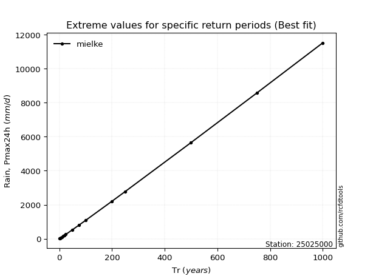</img>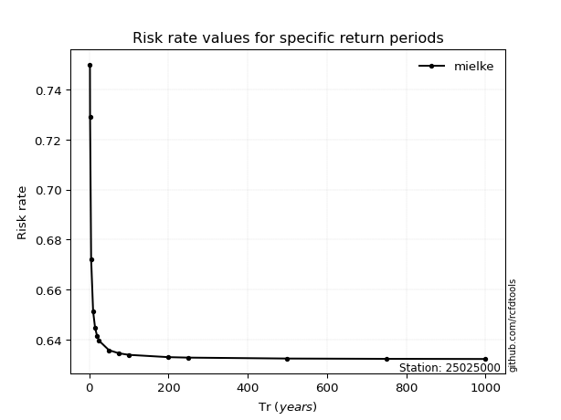</img>

</div>


<sub>**APP DISCLAIMER**: NO WARRANTY - This software is provided by [github.com/rcfdtools](https://github.com/rcfdtools) "as is", without any express or implied warranty, including warranties of merchantability, fitness for a particular purpose, or non-infringement. There is no guarantee that the software will be error-free or operate without interruption. LIMITATION OF LIABILITY - Neither the authors nor copyright holders will be liable for claims or damages arising from the software or its use. You are responsible for determining if the software is appropriate for your use and assume all associated risks, including errors, legal compliance, and data loss. NO PROFESSIONAL ADVICE - The software provides general information and does not offer professional advice. It should not replace consultation with professional advisors.</sub>