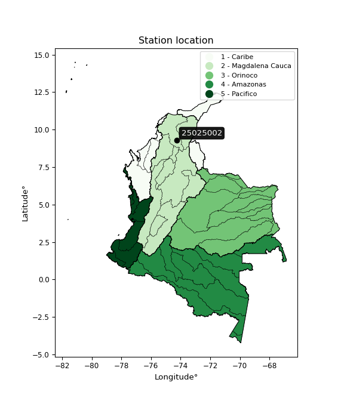

<div align="center">


</div>

# PMP Station (Rain, Pmax24h): 25025002

Probable Maximum Precipitation (PMP) is the greatest amount of rainfall for a specific duration that is meteorologically possible for a given location, acting as a "worst-case" scenario for extreme storms, crucial for designing safety-critical infrastructure like bridges, river deviations, dams, spillways, and nuclear plants to prevent catastrophic failure. PMP is calculated by hydrologists using meteorological data to determine the upper limit of extreme rainfall, often leading to the Probable Maximum Flood (PMF) for flood control design, and is increasingly being studied for climate change impacts. Probable Maximum Precipitation (PMP) is the theoretical upper limit of rainfall, a deterministic estimate for extreme events, while probability distributions (like GEV, Gumbel) describe the likelihood and frequency of various precipitation amounts, including rare ones, showing how often events occur, with PMP representing the extreme end of these distributions, used for critical infrastructure design to ensure safety against the worst conceivable weather, unlike standard statistical forecasts which cover typical probabilities.

The most common probability distributions in hydrology, used for analyzing floods, rainfall, and streamflow, include the Normal, Log-Normal, Gumbel, Gamma (including Log-Pearson Type III), and Generalized Extreme Value (GEV) distributions, often chosen based on the data´s skewness and whether modeling extremes or general conditions, with Gumbel and GEV popular for extreme events like floods, while the Normal distribution serves as a baseline, though often requiring transformations for skewed hydrological data. These distributions help in designing water infrastructure, managing water resources, and forecasting hydrologic events.

> Hydrological data often isn´t perfectly normal (it´s skewed), so different distributions are needed for different applications, such as: **Flood Frequency Analysis**: Using Gumbel, GEV, or Log-Pearson Type III for predicting extreme flood magnitudes and their return periods, **Rainfall Analysis**: Normal for annual totals, but Log-Normal, Weibull, or GEV for intensity or extreme daily rainfall, **Streamflow Modeling**: Gamma and Log-Normal for maximum flows, GEV for minimum flows, and Kappa for daily flows.

<div align="center">

</img>

</div>


## A. General information


### 1. General running parameters

• app_version: _v20260108_. • runtime: _2026-01-08 13:24:42.400241_. • Python version: _3.14.0_. • SciPy version: _1.16.3_. • Pandas version: _2.3.3_. • NumPy version: _2.3.5_. • Stations dataset (station_dataset_file): _dataset/pmax24h_in/automatic_colombia_2003_2024.csv_. • Stations catalog (station_catalog_file): _dataset/CNE.xls_. • Minimum year to eval til year_max (date_min): _1900_. • Maximum year to eval since year_min (date_max): _2024_. • Creates, save and include plots into reports (create_plot): _False_. • Plot only fit distributions with Δo > Δ (plot_only_fit): _True_. • Plot only simple graphs avoiding multiple CDFs and multiple Extreme values plots (plot_only_simple): _True_. • Eval low extreme values, if False, evaluates high extreme values (low_extreme): _False_. • Eval every SciPy distribution as logarithmic (pdist_logarithmic_on): _True_. • Standard deviation normalized (ddof): _1.0_. • Return periods to eval in years (Tr): _[2, 2.33, 5, 10, 15, 20, 25, 50, 75, 100, 200, 250, 500, 750, 1000]_. • Minimum data sample per station, 0 means any (minimum_sample): _5_. • Z-Score maximum threshold to adjust a value, 0 means disable (zscore_max): _3.5_. • Z-Score minimum threshold to adjust a value, 0 means disable (zscore_min): _-2.5_. • Avoid zeros, e.g. rain = 0 (avoid_zeros): _True_. • Avoid null values (avoid_nans): _True_. 

:file_folder:Table: [dataset.csv](../../dataset/pmax24h_in/automatic_colombia_2003_2024.csv)

> Delta Degrees of Freedom (DDOF): is a parameter used in the formulas for calculating variance and standard deviation. When ddof=0, the divisor is $N$ (the total number of observations) and this is used when your data set is the entire population. When ddof=1, the divisor is $N-1$ and this is used when your data set is a sample drawn from a larger population. Using $N-1$ provides an unbiased estimate of the population variance (known as Bessel´s correction).


### 2. Station info and location

|   id |   CODIGO | NOMBRE                      | CATEGORIA               | TECNOLOGIA                              | ESTADO   | FECHA_INSTALACION   |   FECHA_SUSPENSION |   ALTITUD |   LATITUD |   LONGITUD | DEPARTAMENTO   | MUNICIPIO                   | AREA_OPERATIVA                                         | ENTIDAD                                                     | AREA_HIDROGRAFICA   | ZONA_HIDROGRAFICA   | SUBZONA_HIDROGRAFICA                              |   CORRIENTE | Catalogo   |   Version |
|-----:|---------:|:----------------------------|:------------------------|:----------------------------------------|:---------|:--------------------|-------------------:|----------:|----------:|-----------:|:---------------|:----------------------------|:-------------------------------------------------------|:------------------------------------------------------------|:--------------------|:--------------------|:--------------------------------------------------|------------:|:-----------|----------:|
|    0 | 25025002 | LOS ALAMOS - AUT [25025002] | Climatológica Principal | Automática con Telemetría, Convencional | Activa   | 05/05/2013          |                nan |        25 |   9.30406 |   -74.2736 | Magdalena      | San Sebastián De Buenavista | Area Operativa 05 - Magdalena-Cesar-Guajira-San Andrés | INSTITUTO DE HIDROLOGIA METEOROLOGIA Y ESTUDIOS AMBIENTALES | Magdalena Cauca     | Bajo Magdalena      | Directos Bajo Magdalena entre El Banco y El Plato |         nan | CNE_IDEAM  |  20251226 |

<div align="center">

Dynamic map: [:earth_americas:Google](http://maps.google.com/maps?q=9.304055556,-74.27363889) [:earth_americas:OSM](https://www.openstreetmap.org/#map=18/9.304055556/-74.27363889&layers=P) [:earth_americas:Bing](https://www.bing.com/maps?cp=9.304055556~-74.27363889&lvl=18) [:earth_americas:Apple](https://maps.apple.com/frame?center=9.304055556%2C-74.27363889&span=0.003%2C0.006)

</div>


<div align="center">

```geojson
{
  "type": "Feature",
  "geometry": {
    "type": "Point", 
    "coordinates": [-74.27363889, 9.304055556]
  }, 
  "properties": {
    "Name": "25025002"
  }
}
```

</div>


### 3. Discrete values table and plot

<div align="center">

|               |          0 |          1 |           2 |           3 |           4 |            5 |          6 |
|:--------------|-----------:|-----------:|------------:|------------:|------------:|-------------:|-----------:|
| Date          | 2017       | 2018       | 2019        | 2020        | 2022        | 2023         | 2024       |
| Value         |   49.8     |    7.2     |   30.7      |   68.7      |  100.7      |   76.5       |  223.6     |
| Value_initial |   49.8     |    7.2     |   30.7      |   68.7      |  100.7      |   76.5       |  223.6     |
| count         |    7       |    7       |    7        |    7        |    7        |    7         |    7       |
| mean          |   79.6     |   79.6     |   79.6      |   79.6      |   79.6      |   79.6       |   79.6     |
| std           |   70.5108  |   70.5108  |   70.5108   |   70.5108   |   70.5108   |   70.5108    |   70.5108  |
| zscore        |   -0.42263 |   -1.02679 |   -0.693511 |   -0.154586 |    0.299245 |   -0.0439649 |    2.04224 |


</div>


> The initial value (value_initial) correspond to the initial obtained or null completed value, and value (value) is adjusted only when the initial value is outside the valid range (outlier) definite through the Z-Score value. If Z-Score is active, values out of range or outliers are replaced with the station mean value. A Z-Score (or standard score) measures how many standard deviations a data point is from the mean of a dataset, indicating its relative position; positive scores mean above the mean, negative mean below, and a score of zero is exactly at the mean, allowing for comparison of values from different distributions. It´s calculated using the formula $z=(x–μ)/σ$, where $x$ is the data point, $μ$ is the mean, and $σ$ is the standard deviation, helping identify outliers and understand probability.
>
> <sub>**Note**: In this study, "completing" (filling gaps in) and "extending" (forecasting or lengthening the historical record) rainfall data series are avoided for certain critical analyses because they introduce artificial bias and uncertainty, which can distort the statistics of rare events (extremes), alter day-to-day variability, and compromise the integrity and homogeneity of the original data. Some reasons against Completing/Extending rainfall data are: **Distortion of Extremes and Variability**: The primary issue is that most gap-filling or extension methods rely on averaging or regression with nearby stations, which inherently smooths the data. Rainfall is highly variable in space and time, with a large percentage of zero values and occasional large storms. Infilling methods often underestimate the highest values and overestimate the lowest (zero) values, which severely distorts analyses focused on flood frequency, drought severity, and intensity-duration-frequency (IDF) curves, **Loss of Data Homogeneity**: Infilled or extended data are synthetic estimates, not actual measurements. Combining these estimates with observed data can violate the assumption of data homogeneity, which requires that the data properties do not change over time. Inhomogeneity can lead to incorrect conclusions about long-term trends or changes in climate patterns, **Propagation of Errors**: Errors and biases from the original data (e.g., wind-induced undercatch, instrument errors, site changes) or the data used for imputation can propagate through the analysis, leading to unreliable hydrological models and inaccurate predictions, **Compromised Statistical Integrity**: For statistical analyses, especially those involving the frequency of events, using artificial data can introduce time bias or autocorrelation that doesn´t exist in reality, making it difficult to assess the true probability of events, **Difficulty in Validation**: It is difficult to accurately validate the quality of filled or extended data, especially for past periods where ground-truth measurements are unavailable. The reliability of imputation techniques heavily depends on the density of the surrounding station network and the complexity of the local topography.</sub>


### 4. Active continuous probability distributions from SciPy (43 of 104 available)

A Probability Density Function (PDF) describes the relative likelihood of a continuous random variable falling within a specific range, where the total area under its curve equals 1, and the area over any interval gives the actual probability for that range. Unlike discrete probabilities (like rolling a die), a PDF shows density, not direct probability for a single point (which is zero), with higher points indicating higher likelihood, often visualized as a bell curve for normal distributions.

A log of a probability density function (log-PDF) is simply the logarithm of the PDF´s value, denoted as $log(f(x))$, useful for converting multiplication of probabilities into addition, improving numerical stability with tiny numbers, and connecting to information theory concepts like entropy. Instead of dealing with very small probabilities (e.g., 0.000001), log-PDFs use negative numbers (e.g., $log(0.00001) ≈ -11.51$ that are easier for computers to handle, preventing underflow errors and simplifying complex calculations. In this study, each active probability distribution from SciPy is also evaluated in the $log$ form.

[scipy.stats](https://docs.scipy.org/doc/scipy/reference/stats.html) is a Python´s powerful submodule within the SciPy library for comprehensive statistical analysis, offering over 130 probability distributions (like Normal, Poisson), functions for descriptive stats (mean, variance), hypothesis testing (t-tests, chi-square), random variable generation, and statistical tests, making it essential for data science, modeling, and research. It provides tools to explore, model, and draw conclusions from data efficiently, working seamlessly with NumPy.

<div align="center">

|   id | p_dist             |   n_parameter | fit_method   | label                                                                       | active   | ref                                                                                                        |
|-----:|:-------------------|--------------:|:-------------|:----------------------------------------------------------------------------|:---------|:-----------------------------------------------------------------------------------------------------------|
|    0 | alpha              |             3 | MLE          | Alpha                                                                       | True     | [:mortar_board:](https://docs.scipy.org/doc/scipy/reference/generated/scipy.stats.alpha.html)              |
|    1 | betaprime          |             4 | MLE          | Beta prime                                                                  | True     | [:mortar_board:](https://docs.scipy.org/doc/scipy/reference/generated/scipy.stats.betaprime.html)          |
|    2 | chi2               |             3 | MLE          | Chi²                                                                        | True     | [:mortar_board:](https://docs.scipy.org/doc/scipy/reference/generated/scipy.stats.chi2.html)               |
|    3 | crystalball        |             4 | MLE          | Crystalball                                                                 | True     | [:mortar_board:](https://docs.scipy.org/doc/scipy/reference/generated/scipy.stats.crystalball.html)        |
|    4 | erlang             |             3 | MLE          | Erlang                                                                      | True     | [:mortar_board:](https://docs.scipy.org/doc/scipy/reference/generated/scipy.stats.erlang.html)             |
|    5 | expon              |             2 | MLE          | Exponential                                                                 | True     | [:mortar_board:](https://docs.scipy.org/doc/scipy/reference/generated/scipy.stats.expon.html)              |
|    6 | exponnorm          |             3 | MLE          | Exponentially modified Normal                                               | True     | [:mortar_board:](https://docs.scipy.org/doc/scipy/reference/generated/scipy.stats.exponnorm.html)          |
|    7 | f                  |             4 | MLE          | F                                                                           | True     | [:mortar_board:](https://docs.scipy.org/doc/scipy/reference/generated/scipy.stats.f.html)                  |
|    8 | fatiguelife        |             3 | MLE          | Fatigue-life (Birnbaum-Saunders)                                            | True     | [:mortar_board:](https://docs.scipy.org/doc/scipy/reference/generated/scipy.stats.fatiguelife.html)        |
|    9 | fisk               |             3 | MLE          | Fisk                                                                        | True     | [:mortar_board:](https://docs.scipy.org/doc/scipy/reference/generated/scipy.stats.fisk.html)               |
|   10 | gamma              |             3 | MLE          | Gamma                                                                       | True     | [:mortar_board:](https://docs.scipy.org/doc/scipy/reference/generated/scipy.stats.gamma.html)              |
|   11 | genexpon           |             5 | MLE          | Generalized exponential                                                     | True     | [:mortar_board:](https://docs.scipy.org/doc/scipy/reference/generated/scipy.stats.genexpon.html)           |
|   12 | genlogistic        |             3 | MLE          | Generalized logistic                                                        | True     | [:mortar_board:](https://docs.scipy.org/doc/scipy/reference/generated/scipy.stats.genlogistic.html)        |
|   13 | gibrat             |             2 | MM           | Gibrat                                                                      | True     | [:mortar_board:](https://docs.scipy.org/doc/scipy/reference/generated/scipy.stats.gibrat.html)             |
|   14 | gompertz           |             3 | MLE          | Gompertz (or truncated Gumbel)                                              | True     | [:mortar_board:](https://docs.scipy.org/doc/scipy/reference/generated/scipy.stats.gompertz.html)           |
|   15 | gumbel_l           |             2 | MM           | Gumbel Left Skew                                                            | True     | [:mortar_board:](https://docs.scipy.org/doc/scipy/reference/generated/scipy.stats.gumbel_l.html)           |
|   16 | gumbel_r           |             2 | MM           | Gumbel Right Skew                                                           | True     | [:mortar_board:](https://docs.scipy.org/doc/scipy/reference/generated/scipy.stats.gumbel_r.html)           |
|   17 | halflogistic       |             2 | MM           | Half-logistic                                                               | True     | [:mortar_board:](https://docs.scipy.org/doc/scipy/reference/generated/scipy.stats.halflogistic.html)       |
|   18 | halfnorm           |             2 | MM           | Half Normal                                                                 | True     | [:mortar_board:](https://docs.scipy.org/doc/scipy/reference/generated/scipy.stats.halfnorm.html)           |
|   19 | hypsecant          |             2 | MM           | hyperbolic secant                                                           | True     | [:mortar_board:](https://docs.scipy.org/doc/scipy/reference/generated/scipy.stats.hypsecant.html)          |
|   20 | invgamma           |             3 | MLE          | Inverted gamma                                                              | True     | [:mortar_board:](https://docs.scipy.org/doc/scipy/reference/generated/scipy.stats.invgamma.html)           |
|   21 | invgauss           |             3 | MLE          | Inverse Gaussian                                                            | True     | [:mortar_board:](https://docs.scipy.org/doc/scipy/reference/generated/scipy.stats.invgauss.html)           |
|   22 | invweibull         |             3 | MLE          | Inverted Weibull                                                            | True     | [:mortar_board:](https://docs.scipy.org/doc/scipy/reference/generated/scipy.stats.invweibull.html)         |
|   23 | kstwobign          |             2 | MLE          | Limiting distribution of scaled Kolmogorov-Smirnov two-sided test statistic | True     | [:mortar_board:](https://docs.scipy.org/doc/scipy/reference/generated/scipy.stats.kstwobign.html)          |
|   24 | laplace            |             2 | MM           | Laplace                                                                     | True     | [:mortar_board:](https://docs.scipy.org/doc/scipy/reference/generated/scipy.stats.laplace.html)            |
|   25 | laplace_asymmetric |             3 | MLE          | Asymmetric Laplace                                                          | True     | [:mortar_board:](https://docs.scipy.org/doc/scipy/reference/generated/scipy.stats.laplace_asymmetric.html) |
|   26 | loggamma           |             3 | MLE          | Log gamma                                                                   | True     | [:mortar_board:](https://docs.scipy.org/doc/scipy/reference/generated/scipy.stats.loggamma.html)           |
|   27 | logistic           |             2 | MM           | Logistic (or Sech-squared)                                                  | True     | [:mortar_board:](https://docs.scipy.org/doc/scipy/reference/generated/scipy.stats.logistic.html)           |
|   28 | lognorm            |             3 | MLE          | Log Normal                                                                  | True     | [:mortar_board:](https://docs.scipy.org/doc/scipy/reference/generated/scipy.stats.lognorm.html)            |
|   29 | maxwell            |             2 | MM           | Maxwell                                                                     | True     | [:mortar_board:](https://docs.scipy.org/doc/scipy/reference/generated/scipy.stats.maxwell.html)            |
|   30 | mielke             |             4 | MLE          | Mielke Beta-Kappa / Dagum                                                   | True     | [:mortar_board:](https://docs.scipy.org/doc/scipy/reference/generated/scipy.stats.mielke.html)             |
|   31 | moyal              |             2 | MM           | Moyal                                                                       | True     | [:mortar_board:](https://docs.scipy.org/doc/scipy/reference/generated/scipy.stats.moyal.html)              |
|   32 | nakagami           |             3 | MLE          | Nakagami                                                                    | True     | [:mortar_board:](https://docs.scipy.org/doc/scipy/reference/generated/scipy.stats.nakagami.html)           |
|   33 | ncf                |             5 | MLE          | Non-central F distribution                                                  | True     | [:mortar_board:](https://docs.scipy.org/doc/scipy/reference/generated/scipy.stats.ncf.html)                |
|   34 | nct                |             4 | MLE          | Non-central Student’s t                                                     | True     | [:mortar_board:](https://docs.scipy.org/doc/scipy/reference/generated/scipy.stats.nct.html)                |
|   35 | norm               |             2 | MM           | Normal                                                                      | True     | [:mortar_board:](https://docs.scipy.org/doc/scipy/reference/generated/scipy.stats.norm.html)               |
|   36 | pearson3           |             3 | MM           | Pearson type III                                                            | True     | [:mortar_board:](https://docs.scipy.org/doc/scipy/reference/generated/scipy.stats.pearson3.html)           |
|   37 | rayleigh           |             2 | MM           | Rayleigh                                                                    | True     | [:mortar_board:](https://docs.scipy.org/doc/scipy/reference/generated/scipy.stats.rayleigh.html)           |
|   38 | rice               |             3 | MLE          | Rice                                                                        | True     | [:mortar_board:](https://docs.scipy.org/doc/scipy/reference/generated/scipy.stats.rice.html)               |
|   39 | t                  |             3 | MLE          | Student’s t                                                                 | True     | [:mortar_board:](https://docs.scipy.org/doc/scipy/reference/generated/scipy.stats.t.html)                  |
|   40 | truncnorm          |             4 | MLE          | Truncated normal                                                            | True     | [:mortar_board:](https://docs.scipy.org/doc/scipy/reference/generated/scipy.stats.truncnorm.html)          |
|   41 | wald               |             2 | MM           | Wald                                                                        | True     | [:mortar_board:](https://docs.scipy.org/doc/scipy/reference/generated/scipy.stats.wald.html)               |
|   42 | weibull_min        |             3 | MLE          | Weibull minimum                                                             | True     | [:mortar_board:](https://docs.scipy.org/doc/scipy/reference/generated/scipy.stats.weibull_min.html)        |

</div>

> **n_parameter:** # arguments & localization & scale.
>
> **Fit methods:** (MLE) maximum likelihood, (MM) L-moments.
>
>**Inactive** (With the only purpose of prevent loops, zero divisions, infinite values, over high estimated values or horizontal trending for recurrence intervals estimations, the follow distributions were disabled.)**:** foldnorm, gennorm, norminvgauss, powernorm, powerlognorm, skewnorm, genextreme, anglit, arcsine, argus, beta, bradford, burr, burr12, cauchy, cosine, halfcauchy, foldcauchy, skewcauchy, wrapcauchy, dgamma, gengamma, exponweib, exponpow, truncexpon, gausshyper, genhalflogistic, genhyperbolic, geninvgauss, halfgennorm, johnsonsb, johnsonsu, kappa4, kappa3, ksone, kstwo, loglaplace, levy, levy_l, levy_stable, ncx2, pareto, genpareto, truncpareto, lomax, powerlaw, rdist, rel_breitwigner, recipinvgauss, semicircular, studentized_range, trapezoid, triang, truncweibull_min, tukeylambda, uniform, loguniform, vonmises, vonmises_line, weibull_max, dweibull, 


## B. Probability (PDF) vs. Empirical (EDF) distributions functions

A continuous probability distribution (CPD) describes probabilities for variables that can take any value within a range (like rain any time), unlike discrete variables with specific outcomes (like temperature). It uses a Probability Density Function (PDF), a curve where the total area under it equals 1, and the probability of the variable falling within an interval (a to b) is found by calculating the area under the curve between those points. A key feature is that the probability of hitting any single exact value is zero, so probabilities are always expressed for ranges, e.g., $P(a ≤ X ≤ b)$.

<div align="center">

Distributions parameters from station values
|    |   station | p_dist                |   n |              loc |           scale | shape                  | shape1             | shape2                 | shape3   |
|---:|----------:|:----------------------|----:|-----------------:|----------------:|:-----------------------|:-------------------|:-----------------------|:---------|
|  0 |  25025002 | alpha                 |   7 |     -0.0456448   |    18.2769      | 1.1561886096000798e-10 |                    |                        |          |
|  1 |  25025002 | betaprime             |   7 |      7.18913     |  1235.76        | 0.8724317615155768     | 16.482490813129814 |                        |          |
|  2 |  25025002 | chi2                  |   7 |      7.2         |     3.95664     | 2.094028979808747      |                    |                        |          |
|  3 |  25025002 | crystalball           |   7 |     79.6         |    65.2803      | 6779.043508207409      | 485.9754904089885  |                        |          |
|  4 |  25025002 | erlang                |   7 |      7.2         |    64.8238      | 0.8965267246339781     |                    |                        |          |
|  5 |  25025002 | expon                 |   7 |      7.2         |    72.4         |                        |                    |                        |          |
|  6 |  25025002 | exponnorm             |   7 |     16.0997      |    17.9398      | 3.5396339001779804     |                    |                        |          |
|  7 |  25025002 | f                     |   7 |      7.2         |   113.095       | 0.8089341968818484     | 454.14353564446674 |                        |          |
|  8 |  25025002 | fatiguelife           |   7 |      7.2         |     0.000112255 | 794.6600445814165      |                    |                        |          |
|  9 |  25025002 | fisk                  |   7 |    -12.4458      |    73.8516      | 2.4470287347499458     |                    |                        |          |
| 10 |  25025002 | gamma                 |   7 |      7.2         |    73.8488      | 0.18266836631928063    |                    |                        |          |
| 11 |  25025002 | genexpon              |   7 |      7.2         |     1.12866e+06 | 13733.569182945314     | 7757.7022296650575 | 5141.408871324025      |          |
| 12 |  25025002 | genlogistic           |   7 |   -260.914       |    44.0248      | 1211.410165321723      |                    |                        |          |
| 13 |  25025002 | gibrat                |   7 |     29.7994      |    30.2056      |                        |                    |                        |          |
| 14 |  25025002 | gompertz              |   7 |      7.2         |   520.013       | 6.290555086164378      |                    |                        |          |
| 15 |  25025002 | gumbel_l              |   7 |    108.98        |    50.8989      |                        |                    |                        |          |
| 16 |  25025002 | gumbel_r              |   7 |     50.2204      |    50.8989      |                        |                    |                        |          |
| 17 |  25025002 | halflogistic          |   7 |      2.22765     |    55.8124      |                        |                    |                        |          |
| 18 |  25025002 | halfnorm              |   7 |     -6.80556     |   108.293       |                        |                    |                        |          |
| 19 |  25025002 | hypsecant             |   7 |     79.6         |    41.5587      |                        |                    |                        |          |
| 20 |  25025002 | invgamma              |   7 |    -44.0344      |   459.991       | 4.689824079102956      |                    |                        |          |
| 21 |  25025002 | invgauss              |   7 |    -20.884       |   210.689       | 0.47693077512243515    |                    |                        |          |
| 22 |  25025002 | invweibull            |   7 |      7.2         |     6.11848     | 0.04523625488957128    |                    |                        |          |
| 23 |  25025002 | kstwobign             |   7 |   -110.215       |   219.927       |                        |                    |                        |          |
| 24 |  25025002 | laplace               |   7 |     79.6         |    46.1602      |                        |                    |                        |          |
| 25 |  25025002 | laplace_asymmetric    |   7 |     49.8         |    39.4425      | 0.6912093213999393     |                    |                        |          |
| 26 |  25025002 | loggamma              |   7 | -21478.7         |  2866.2         | 1848.2276475247836     |                    |                        |          |
| 27 |  25025002 | logistic              |   7 |     79.6         |    35.9909      |                        |                    |                        |          |
| 28 |  25025002 | lognorm               |   7 |      7.2         |     0.258282    | 13.610843741142483     |                    |                        |          |
| 29 |  25025002 | maxwell               |   7 |    -75.0869      |    96.9357      |                        |                    |                        |          |
| 30 |  25025002 | mielke                |   7 |      7.19999     |   115.712       | 0.6046086833672764     | 3.438824057719187  |                        |          |
| 31 |  25025002 | moyal                 |   7 |     42.2685      |    29.3865      |                        |                    |                        |          |
| 32 |  25025002 | nakagami              |   7 |      7.2         |   109.945       | 0.3087544804257496     |                    |                        |          |
| 33 |  25025002 | ncf                   |   7 |     -0.0130751   |     5.34575e-08 | 3.450039137510578e-09  | 2.985073821543586  | 2.861663616412462      |          |
| 34 |  25025002 | nct                   |   7 |    -62.3721      |    12.2513      | 3.911429491204503      | 9.280122428442148  |                        |          |
| 35 |  25025002 | norm                  |   7 |     79.6         |    65.2803      |                        |                    |                        |          |
| 36 |  25025002 | pearson3              |   7 |     79.6         |    65.2803      | 1.2689780244871476     |                    |                        |          |
| 37 |  25025002 | rayleigh              |   7 |    -45.2851      |    99.6439      |                        |                    |                        |          |
| 38 |  25025002 | rice                  |   7 |    -23.9651      |    86.5657      | 0.0003008045166353661  |                    |                        |          |
| 39 |  25025002 | t                     |   7 |     61.6622      |    33.4508      | 1.8979654697375379     |                    |                        |          |
| 40 |  25025002 | truncnorm             |   7 |     79.6015      |    65.2788      | -1338208.103225935     | 62.746693725879766 |                        |          |
| 41 |  25025002 | wald                  |   7 |     14.3197      |    65.2803      |                        |                    |                        |          |
| 42 |  25025002 | weibull_min           |   7 |      7.2         |    78.0981      | 0.943183353451611      |                    |                        |          |
| 43 |  25025002 | logalpha              |   7 |    -21.0909      |   602.57        | 24.089583762958384     |                    |                        |          |
| 44 |  25025002 | logbetaprime          |   7 |    -28.4354      |   641.877       | 1063.5696792430529     | 21057.599616504784 |                        |          |
| 45 |  25025002 | logchi2               |   7 |      1.97408     |     1.01123     | 1.1111989407359004     |                    |                        |          |
| 46 |  25025002 | logcrystalball        |   7 |      4.31242     |     0.651657    | 0.7191863933421565     | 514.9420969603239  |                        |          |
| 47 |  25025002 | logerlang             |   7 |    -13.7224      |     0.0587339   | 301.330009337937       |                    |                        |          |
| 48 |  25025002 | logexpon              |   7 |      1.97408     |     2.01098     |                        |                    |                        |          |
| 49 |  25025002 | logexponnorm          |   7 |      3.98439     |     0.997974    | 0.0006709202568947702  |                    |                        |          |
| 50 |  25025002 | logf                  |   7 |   -811.747       |   815.733       | 6241071.443468995      | 1699831.1533614933 |                        |          |
| 51 |  25025002 | logfatiguelife        |   7 |   -419.559       |   423.544       | 0.0023522276121579074  |                    |                        |          |
| 52 |  25025002 | logfisk               |   7 |     -6.71584e+07 |     6.71584e+07 | 122681693.43094566     |                    |                        |          |
| 53 |  25025002 | loggamma              |   7 |    -13.3287      |     0.0627552   | 275.80253175445546     |                    |                        |          |
| 54 |  25025002 | loggenexpon           |   7 |      1.91548     |     0.00362324  | 0.0004940429778100902  | 1.252888988660135  | 2.8518270756357148e-06 |          |
| 55 |  25025002 | loggenlogistic        |   7 |      4.64351     |     0.346391    | 0.4111709383328393     |                    |                        |          |
| 56 |  25025002 | loggibrat             |   7 |      3.22369     |     0.461784    |                        |                    |                        |          |
| 57 |  25025002 | loggompertz           |   7 |      1.97408     |     0.956967    | 0.08693617468735293    |                    |                        |          |
| 58 |  25025002 | loggumbel_l           |   7 |      4.4342      |     0.778119    |                        |                    |                        |          |
| 59 |  25025002 | loggumbel_r           |   7 |      3.53592     |     0.778119    |                        |                    |                        |          |
| 60 |  25025002 | loghalflogistic       |   7 |      2.80224     |     0.853225    |                        |                    |                        |          |
| 61 |  25025002 | loghalfnorm           |   7 |      2.66409     |     1.65557     |                        |                    |                        |          |
| 62 |  25025002 | loghypsecant          |   7 |      3.98506     |     0.635331    |                        |                    |                        |          |
| 63 |  25025002 | loginvgamma           |   7 |    -17.9376      | 10019.3         | 458.4741287681739      |                    |                        |          |
| 64 |  25025002 | loginvgauss           |   7 |     -5.75514     |   807.598       | 0.01206926704648215    |                    |                        |          |
| 65 |  25025002 | loginvweibull         |   7 |     -3.91266e+08 |     3.91266e+08 | 352217735.00173914     |                    |                        |          |
| 66 |  25025002 | logkstwobign          |   7 |     -0.464287    |     5.09086     |                        |                    |                        |          |
| 67 |  25025002 | loglaplace            |   7 |      3.98506     |     0.705676    |                        |                    |                        |          |
| 68 |  25025002 | loglaplace_asymmetric |   7 |      4.33729     |     0.669654    | 1.2970482080098156     |                    |                        |          |
| 69 |  25025002 | logloggamma           |   7 |      4.2224      |     0.91219     | 1.2230743646262086     |                    |                        |          |
| 70 |  25025002 | loglogistic           |   7 |      3.98506     |     0.550213    |                        |                    |                        |          |
| 71 |  25025002 | loglognorm            |   7 |      1.97408     |     0.0117042   | 12.901289259108353     |                    |                        |          |
| 72 |  25025002 | logmaxwell            |   7 |      1.62027     |     1.48191     |                        |                    |                        |          |
| 73 |  25025002 | logmielke             |   7 |     -1.41695     |     6.25184     | 5.40362401866497       | 19.68118802775437  |                        |          |
| 74 |  25025002 | logmoyal              |   7 |      3.41435     |     0.449247    |                        |                    |                        |          |
| 75 |  25025002 | lognakagami           |   7 |      3.42426     |     1.01977     | 0.41905962314063305    |                    |                        |          |
| 76 |  25025002 | logncf                |   7 |    -23.2407      |    12.9887      | 1680.7486057287115     | 3579.0235525236785 | 1840.3551146750924     |          |
| 77 |  25025002 | lognct                |   7 |    -52.8802      |     0.955521    | 17952.072975077353     | 59.509438215432056 |                        |          |
| 78 |  25025002 | lognorm               |   7 |      3.98506     |     0.997976    |                        |                    |                        |          |
| 79 |  25025002 | logpearson3           |   7 |      3.98506     |     0.997979    | -0.7347507187824853    |                    |                        |          |
| 80 |  25025002 | lograyleigh           |   7 |      2.07582     |     1.52335     |                        |                    |                        |          |
| 81 |  25025002 | logrice               |   7 |      1.24811     |     1.06648     | 2.3370441809092277     |                    |                        |          |
| 82 |  25025002 | logt                  |   7 |      3.98506     |     0.997976    | 338903596.5400447      |                    |                        |          |
| 83 |  25025002 | logtruncnorm          |   7 |     -0.538629    |     2.14172     | 1.8478659438282512     | 2.7774361273290937 |                        |          |
| 84 |  25025002 | logwald               |   7 |      2.98707     |     0.997991    |                        |                    |                        |          |
| 85 |  25025002 | logweibull_min        |   7 |    -13.8574      |    18.2844      | 22.312773397055086     |                    |                        |          |

</div>

> **loc** (Location parameter): This shifts the distribution along the x-axis. For many common distributions, like the normal (Gaussian) distribution, loc represents the mean $μ$. For others, like the uniform distribution, it might represent the minimum value, or for the beta distribution, the left end of the support interval.
>
> **scale** (Scale parameter): This determines the width or spread of the distribution. For the normal distribution, scale represents the standard deviation $σ$. For a uniform distribution, it defines the length of the interval (from $loc$ to $loc + scale$).
>
> **shape** (Shape parameters): Refers to parameters that define the specific form of a probability distribution, distinct from its location (loc) and scale (scale). These parameters are required arguments for most distribution functions. For example, a normal (Gaussian) distribution is fully defined by its location (mean) and scale (standard deviation), so it has no specific shape parameters beyond loc and scale. However, other distributions have intrinsic properties that need specification, as Gamma distribution that takes a shape parameter, often named $a$ or $alpha$.


### 0. Cumulative distribution values - CDF (86 evaluated)

Cumulative Distribution Function (CDF), denoted as $F$<sub>$X$</sub>$(x)$, is a function that gives the probability that a random variable $X$ will take a value less than or equal to a specific value, $x$ (i.e., $(P(X≥x)$. It essentially "accumulates" probabilities from a given point up to the far right (positive infinity), providing a complete picture of the distribution´s probabilities for both discrete (like rain) and continuous (like temperature) variables, helping to find probabilities over ranges or above certain values. Each station is evaluated separately ordering the $x$ values ascending, calculating the CDF and PDF values for the activated distributions and their logarithmic forms.

<div align="center">

CDF ordered by x ascending and calculating $log(f(x))$ separately
|   id |   Station |   date |     x |   count |   mean |     std |     zscore |   Value_initial |   station |   m |     alpha |   alpha_pdf |   betaprime |   betaprime_pdf |        chi2 |    chi2_pdf |   crystalball |   crystalball_pdf |      erlang |   erlang_pdf |    expon |   expon_pdf |   exponnorm |   exponnorm_pdf |           f |         f_pdf |   fatiguelife |   fatiguelife_pdf |      fisk |    fisk_pdf |       gamma |   gamma_pdf |    genexpon |   genexpon_pdf |   genlogistic |   genlogistic_pdf |      gibrat |   gibrat_pdf |   gompertz |   gompertz_pdf |   gumbel_l |   gumbel_l_pdf |   gumbel_r |   gumbel_r_pdf |   halflogistic |   halflogistic_pdf |   halfnorm |   halfnorm_pdf |   hypsecant |   hypsecant_pdf |   invgamma |   invgamma_pdf |   invgauss |   invgauss_pdf |   invweibull |   invweibull_pdf |   kstwobign |   kstwobign_pdf |   laplace |   laplace_pdf |   laplace_asymmetric |   laplace_asymmetric_pdf |   loggamma |   loggamma_pdf |   logistic |   logistic_pdf |   lognorm |   lognorm_pdf |   maxwell |   maxwell_pdf |      mielke |   mielke_pdf |     moyal |   moyal_pdf |    nakagami |   nakagami_pdf |      ncf |     ncf_pdf |       nct |     nct_pdf |     norm |    norm_pdf |   pearson3 |   pearson3_pdf |   rayleigh |   rayleigh_pdf |      rice |    rice_pdf |        t |       t_pdf |   truncnorm |   truncnorm_pdf |     wald |    wald_pdf |   weibull_min |   weibull_min_pdf |   logalpha |   logalpha_pdf |   logbetaprime |   logbetaprime_pdf |     logchi2 |   logchi2_pdf |   logcrystalball |   logcrystalball_pdf |   logerlang |   logerlang_pdf |   logexpon |   logexpon_pdf |   logexponnorm |   logexponnorm_pdf |     logf |   logf_pdf |   logfatiguelife |   logfatiguelife_pdf |   logfisk |   logfisk_pdf |   loggenexpon |   loggenexpon_pdf |   loggenlogistic |   loggenlogistic_pdf |   loggibrat |   loggibrat_pdf |   loggompertz |   loggompertz_pdf |   loggumbel_l |   loggumbel_l_pdf |   loggumbel_r |   loggumbel_r_pdf |   loghalflogistic |   loghalflogistic_pdf |   loghalfnorm |   loghalfnorm_pdf |   loghypsecant |   loghypsecant_pdf |   loginvgamma |   loginvgamma_pdf |   loginvgauss |   loginvgauss_pdf |   loginvweibull |   loginvweibull_pdf |   logkstwobign |   logkstwobign_pdf |   loglaplace |   loglaplace_pdf |   loglaplace_asymmetric |   loglaplace_asymmetric_pdf |   logloggamma |   logloggamma_pdf |   loglogistic |   loglogistic_pdf |   loglognorm |   loglognorm_pdf |   logmaxwell |   logmaxwell_pdf |   logmielke |   logmielke_pdf |    logmoyal |   logmoyal_pdf |   lognakagami |   lognakagami_pdf |    logncf |   logncf_pdf |    lognct |   lognct_pdf |   logpearson3 |   logpearson3_pdf |   lograyleigh |   lograyleigh_pdf |   logrice |   logrice_pdf |      logt |   logt_pdf |   logtruncnorm |   logtruncnorm_pdf |   logwald |   logwald_pdf |   logweibull_min |   logweibull_min_pdf |
|-----:|----------:|-------:|------:|--------:|-------:|--------:|-----------:|----------------:|----------:|----:|----------:|------------:|------------:|----------------:|------------:|------------:|--------------:|------------------:|------------:|-------------:|---------:|------------:|------------:|----------------:|------------:|--------------:|--------------:|------------------:|----------:|------------:|------------:|------------:|------------:|---------------:|--------------:|------------------:|------------:|-------------:|-----------:|---------------:|-----------:|---------------:|-----------:|---------------:|---------------:|-------------------:|-----------:|---------------:|------------:|----------------:|-----------:|---------------:|-----------:|---------------:|-------------:|-----------------:|------------:|----------------:|----------:|--------------:|---------------------:|-------------------------:|-----------:|---------------:|-----------:|---------------:|----------:|--------------:|----------:|--------------:|------------:|-------------:|----------:|------------:|------------:|---------------:|---------:|------------:|----------:|------------:|---------:|------------:|-----------:|---------------:|-----------:|---------------:|----------:|------------:|---------:|------------:|------------:|----------------:|---------:|------------:|--------------:|------------------:|-----------:|---------------:|---------------:|-------------------:|------------:|--------------:|-----------------:|---------------------:|------------:|----------------:|-----------:|---------------:|---------------:|-------------------:|---------:|-----------:|-----------------:|---------------------:|----------:|--------------:|--------------:|------------------:|-----------------:|---------------------:|------------:|----------------:|--------------:|------------------:|--------------:|------------------:|--------------:|------------------:|------------------:|----------------------:|--------------:|------------------:|---------------:|-------------------:|--------------:|------------------:|--------------:|------------------:|----------------:|--------------------:|---------------:|-------------------:|-------------:|-----------------:|------------------------:|----------------------------:|--------------:|------------------:|--------------:|------------------:|-------------:|-----------------:|-------------:|-----------------:|------------:|----------------:|------------:|---------------:|--------------:|------------------:|----------:|-------------:|----------:|-------------:|--------------:|------------------:|--------------:|------------------:|----------:|--------------:|----------:|-----------:|---------------:|-------------------:|----------:|--------------:|-----------------:|---------------------:|
|    0 |  25025002 |   2018 |   7.2 |       7 |   79.6 | 70.5108 | -1.02679   |             7.2 |  25025002 |   1 | 0.0116537 | 0.0115351   | 0.000468522 |     0.0375886   | 1.95582e-17 | 0.0230559   |      0.133701 |       0.00330394  | 7.92731e-16 |  0.800182    | 0        | 0.0138122   |   0.0487797 |     0.00411238  | 0.000448709 | 165.227       |     0.0396731 |       1.30035e+09 | 0.0376754 | 0.00451595  | 0.000879222 | 1.80826e+11 | 3.00229e-09 |    0.0121681   |     0.0645031 |       0.00401151  | 0           |  0           | 5.9104e-14 |    0.0120969   |   0.126619 |    0.00232306  |  0.0974443 |    0.00445779  |      0.0445158 |        0.00894084  |   0.102903 |     0.00730645 |    0.110384 |     0.00260319  |  0.0425323 |    0.00478075  |  0.0393739 |    0.00555053  |   0.00548658 |      1.45461e+12 |    0.061929 |     0.00403834  |  0.104184 |   0.00225701  |            0.0677647 |              0.00248559  |  0.0236526 |      0.0581282 |   0.117988 |    0.00289148  | 0.0219494 |     0.0524898 |  0.131652 |   0.0041369   | 6.50884e-05 |  2.85699     | 0.0693587 |  0.00473932 | 2.16341e-11 | 15041.2        | 0.314187 | 0.00976751  | 0.0440987 | 0.0045654   | 0.133701 | 0.00330394  |  0.0857263 |    0.00558263  |   0.129529 |     0.00460139 | 0.0627508 | 0.00389791  | 0.125792 | 0.00296049  |    0.133691 |     0.00330384  | 0        | 0           |   1.04368e-16 |       0.110832    |  0.0209107 |      0.0569503 |       0.022333 |          0.0545569 | 1.52722e-09 |    3.8214e+06 |       nan        |           nan        |   0.0215189 |       0.0547526 |   0        |      0.497271  |      0.0219489 |          0.0524889 | 0.02176  |   0.052255 |        0.0215455 |            0.0520082 | 0.0208503 |     0.0372941 |     0.0084228 |          0.151022 |        0.0420526 |            0.0498946 |    0        |       0         |   6.13939e-08 |         0.0908456 |     0.0414724 |         0.0521775 |    0.00058588 |        0.00560371 |          0        |              0        |      0        |          0        |      0.0268519 |          0.0422144 |     0.0206995 |         0.0553049 |     0.0194772 |         0.0562174 |       0.0220525 |           0.0757209 |      0.0241707 |          0.0967013 |    0.0289303 |        0.0409966 |               0.0412832 |                   0.0475299 |     0.0419726 |         0.0541504 |     0.0252119 |         0.0446668 |   0.00716177 |      6.94106e+12 |   0.00355829 |        0.0298286 |    0.036676 |       0.0584431 | 6.77084e-07 |    1.92999e-05 |   0           |          0        | 0.0222818 |     0.055305 | 0.0221021 |    0.0529322 |     0.0377088 |         0.0571502 |      0        |          0        | 0.0180211 |      0.057407 | 0.0219495 |  0.0524899 |     0          |           0        |  0        |      0        |        0.0393951 |            0.0544148 |
|    1 |  25025002 |   2019 |  30.7 |       7 |   79.6 | 70.5108 | -0.693511  |            30.7 |  25025002 |   2 | 0.552209  | 0.0129283   | 0.327969    |     0.0101776   | 0.943903    | 0.00700103  |      0.226905 |       0.00461618  | 0.355153    |  0.0111289   | 0.277173 | 0.0099838   |   0.211283  |     0.00914721  | 0.404046    |   0.00654767  |     0.717614  |       0.00414073  | 0.211616  | 0.00946209  | 0.839253    | 0.00497024  | 0.254943    |    0.00958579  |     0.20028   |       0.00731052  | 0.000221779 |  0.000926748 | 0.252334   |    0.00946256  |   0.193315 |    0.00340467  |  0.230517  |    0.00664588  |      0.249681  |        0.00840011  |   0.270908 |     0.00693893 |    0.19039  |     0.00431291  |  0.221321  |    0.00939029  |  0.236377  |    0.00963645  |   0.39026    |      0.000706864 |    0.193795 |     0.00689011  |  0.17334  |   0.00375518  |            0.160455  |              0.00588544  |  0.302136  |      0.342013  |   0.204456 |    0.00451929  | 0.287081  |     0.341367  |  0.244827 |   0.00540431  | 0.381159    |  0.00976583  | 0.223398  |  0.00787672 | 0.298387    |     0.0077566  | 0.49926  | 0.00622889  | 0.216987  | 0.00926637  | 0.226905 | 0.00461618  |  0.24337   |    0.00739149  |   0.2523   |     0.00572209 | 0.180768  | 0.0059762   | 0.228419 | 0.00612319  |    0.226893 |     0.00461615  | 0.113648 | 0.0158939   |   0.275412    |       0.00936873  |  0.312105  |      0.354759  |       0.293377 |          0.341904  | 0.739753    |    0.174835   |       nan        |           nan        |   0.298921  |       0.347709  |   0.513799 |      0.241774  |      0.287079  |          0.341367  | 0.286724 |   0.34141  |        0.286792  |            0.342241  | 0.23144   |     0.324935  |     0.402737  |          0.326559 |        0.232409  |            0.267941  |    0.202157 |       1.40485   |   0.265621    |         0.303635  |     0.238982  |         0.267097  |    0.315279   |        0.4677     |          0.349185 |              0.51456  |      0.353879 |          0.433722 |      0.249706  |          0.353943  |     0.306854  |         0.35471   |     0.311235  |         0.351136  |       0.355628  |           0.33098   |      0.396057  |          0.32889   |    0.22586   |        0.320062  |               0.219219  |                   0.252389  |     0.245991  |         0.271603  |     0.265177  |         0.35415   |   0.645637   |      0.0198862   |   0.313551   |        0.380319  |    0.250686 |       0.277996  | 0.322649    |    0.538549    |   1.04643e-13 |        197.49     | 0.296551  |     0.343015 | 0.28825   |    0.341392  |     0.258422  |         0.285112  |      0.324144 |          0.392725 | 0.296439  |      0.344676 | 0.287081  |  0.341367  |     0.00602023 |           1.13716  |  0.308042 |      0.961485 |        0.2473    |            0.276085  |
|    2 |  25025002 |   2017 |  49.8 |       7 |   79.6 | 70.5108 | -0.42263   |            49.8 |  25025002 |   3 | 0.713866  | 0.00548773  | 0.492315    |     0.00726504  | 0.994863    | 0.00064427  |      0.324018 |       0.00550652  | 0.533435    |  0.00779394  | 0.444784 | 0.00766873  |   0.391527  |     0.00910731  | 0.504268    |   0.00429075  |     0.780892  |       0.0026878   | 0.396909  | 0.00941029  | 0.904601    | 0.00235995  | 0.420169    |    0.00775841  |     0.352653  |       0.00834534  | 0.340073    |  0.0183215   | 0.415516   |    0.00767407  |   0.26849  |    0.00449327  |  0.364841  |    0.00722741  |      0.402125  |        0.00750995  |   0.398821 |     0.00642701 |    0.289122 |     0.00603905  |  0.401033  |    0.00900315  |  0.412718  |    0.00854718  |   0.400132   |      0.000389186 |    0.335042 |     0.00766528  |  0.26218  |   0.00567978  |            0.323305  |              0.0118587   |  0.480683  |      0.383357  |   0.304071 |    0.00587959  | 0.469233  |     0.398562  |  0.354102 |   0.0059579   | 0.543501    |  0.00747321  | 0.379008  |  0.00811065 | 0.4276      |     0.00598209 | 0.599454 | 0.00439533  | 0.396951  | 0.00911547  | 0.324018 | 0.00550652  |  0.385332  |    0.00730613  |   0.36574  |     0.00607406 | 0.304456  | 0.00684673  | 0.379189 | 0.00957268  |    0.324006 |     0.00550657  | 0.401968 | 0.0125911   |   0.431401    |       0.00710752  |  0.494313  |      0.384619  |       0.473893 |          0.39134   | 0.810326    |    0.121113   |         0.386016 |             0.423232 |   0.481083  |       0.391818  |   0.617753 |      0.19008   |      0.46923   |          0.398563  | 0.468884 |   0.398538 |        0.46937   |            0.399327  | 0.421529  |     0.445439  |     0.555896  |          0.301209 |        0.398716  |            0.422711  |    0.652962 |       0.53958   |   0.433913    |         0.388019  |     0.398622  |         0.393025  |    0.538001   |        0.428603   |          0.570322 |              0.395402 |      0.547561 |          0.363417 |      0.461495  |          0.497353  |     0.490634  |         0.390941  |     0.490396  |         0.376255  |       0.512287  |           0.308457  |      0.548029  |          0.293936  |    0.448286  |        0.635259  |               0.382611  |                   0.440505  |     0.405937  |         0.388141  |     0.465051  |         0.45215   |   0.653903   |      0.0147844   |   0.503241   |        0.389737  |    0.415384 |       0.404336  | 0.563753    |    0.433955    |   0.408045    |          0.661249 | 0.476698  |     0.388655 | 0.470096  |    0.397297  |     0.42112   |         0.383258  |      0.514849 |          0.383046 | 0.477456  |      0.390884 | 0.469233  |  0.398562  |     0.452237   |           0.729855 |  0.635434 |      0.449488 |        0.409031  |            0.390411  |
|    3 |  25025002 |   2020 |  68.7 |       7 |   79.6 | 70.5108 | -0.154586  |            68.7 |  25025002 |   4 | 0.790345  | 0.00297854  | 0.610649    |     0.00537382  | 0.999521    | 6.01591e-05 |      0.433696 |       0.00602662  | 0.658783    |  0.00560575  | 0.572349 | 0.00590678  |   0.545594  |     0.00712943  | 0.574316    |   0.00322242  |     0.824185  |       0.0019578   | 0.557368  | 0.00743975  | 0.938502    | 0.00135337  | 0.551742    |    0.00620724  |     0.507336  |       0.0078177   | 0.599859    |  0.00993245  | 0.546037   |    0.00618098  |   0.364425 |    0.00565943  |  0.498805  |    0.00681624  |      0.533839  |        0.00640554  |   0.514342 |     0.00577798 |    0.417455 |     0.00740318  |  0.555017  |    0.00720895  |  0.55724   |    0.0067356   |   0.406216   |      0.000269173 |    0.477694 |     0.00728419  |  0.394837 |   0.00855364  |            0.514097  |              0.00851519  |  0.602253  |      0.366584  |   0.42486  |    0.00678932  | 0.596845  |     0.387914  |  0.468101 |   0.00602768  | 0.669585    |  0.00591029  | 0.5236    |  0.00706507 | 0.53025     |     0.00494349 | 0.670574 | 0.00321209  | 0.553523  | 0.00734528  | 0.433696 | 0.00602662  |  0.516631  |    0.00651252  |   0.480185 |     0.00596755 | 0.436136  | 0.00697266  | 0.573115 | 0.0101601   |    0.433685 |     0.00602674  | 0.59222  | 0.00790444  |   0.549877    |       0.00551039  |  0.614863  |      0.359294  |       0.59859  |          0.377522  | 0.845147    |    0.0964723  |         0.538629 |             0.508992 |   0.605267  |       0.373988  |   0.674267 |      0.161977  |      0.596842  |          0.387916  | 0.596479 |   0.387825 |        0.597167  |            0.388274  | 0.567394  |     0.448391  |     0.647947  |          0.269553 |        0.548857  |            0.500055  |    0.78192  |       0.292832  |   0.564446    |         0.417852  |     0.536493  |         0.458036  |    0.663673   |        0.349668   |          0.683972 |              0.311865 |      0.655693 |          0.308171 |      0.619671  |          0.466021  |     0.613643  |         0.367835  |     0.608153  |         0.350786  |       0.606119  |           0.273185  |      0.636987  |          0.258162  |    0.646508  |        0.500927  |               0.55415   |                   0.638     |     0.540596  |         0.442808  |     0.609384  |         0.432624  |   0.658293   |      0.012615    |   0.623646   |        0.354216  |    0.557189 |       0.469849  | 0.686562    |    0.330321    |   0.59696     |          0.515143 | 0.600202  |     0.372998 | 0.597206  |    0.386143  |     0.551401  |         0.420733  |      0.631981 |          0.341589 | 0.601818  |      0.376066 | 0.596845  |  0.387914  |     0.653268   |           0.528303 |  0.750316 |      0.280834 |        0.543907  |            0.441711  |
|    4 |  25025002 |   2023 |  76.5 |       7 |   79.6 | 70.5108 | -0.0439649 |            76.5 |  25025002 |   5 | 0.811283  | 0.00241892  | 0.650153    |     0.00476965  | 0.99982     | 2.25768e-05 |      0.481062 |       0.00610433  | 0.699726    |  0.0049092   | 0.616027 | 0.0053035   |   0.598018  |     0.0063244   | 0.59823     |   0.00291861  |     0.838604  |       0.0017456   | 0.611845  | 0.00653372  | 0.948046    | 0.00110449  | 0.597921    |    0.00564067  |     0.566414  |       0.00731159  | 0.668483    |  0.00776891  | 0.592104   |    0.00563769  |   0.410384 |    0.00611968  |  0.550616  |    0.0064552   |      0.58193   |        0.00592483  |   0.55826  |     0.00548075 |    0.476278 |     0.00763802  |  0.608135  |    0.00641548  |  0.606954  |    0.00601939  |   0.408192   |      0.000238745 |    0.533144 |     0.00691932  |  0.467524 |   0.0101283   |            0.576176  |              0.00742728  |  0.641014  |      0.353729  |   0.47848  |    0.00693333  | 0.637936  |     0.375612  |  0.514767 |   0.00592643  | 0.713343    |  0.0053123   | 0.576478  |  0.00648742 | 0.567451    |     0.00460131 | 0.694168 | 0.00284746  | 0.607631  | 0.00653137  | 0.481062 | 0.00610433  |  0.565792  |    0.00608724  |   0.526162 |     0.00581196 | 0.490056  | 0.00683668  | 0.648618 | 0.00910611  |    0.481053 |     0.00610447  | 0.648462 | 0.0065661   |   0.590735    |       0.00497634  |  0.652715  |      0.344196  |       0.638544 |          0.364909  | 0.855147    |    0.0896026  |         0.593693 |             0.51273  |   0.644781  |       0.360313  |   0.691229 |      0.153543  |      0.637934  |          0.375614  | 0.63756  |   0.375513 |        0.638289  |            0.375817  | 0.614834  |     0.432599  |     0.676283  |          0.257315 |        0.603103  |            0.506605  |    0.810639 |       0.24318   |   0.6095      |         0.419185  |     0.586418  |         0.469275  |    0.69974    |        0.321082   |          0.716084 |              0.285519 |      0.687814 |          0.289199 |      0.668071  |          0.432781  |     0.652424  |         0.352875  |     0.645119  |         0.336284  |       0.634777  |           0.259703  |      0.664063  |          0.245347  |    0.696475  |        0.43012   |               0.62719   |                   0.722092  |     0.588708  |         0.450876  |     0.654793  |         0.410821  |   0.659617   |      0.0120232   |   0.660835   |        0.337058  |    0.608234 |       0.477782  | 0.720339    |    0.298183    |   0.649845    |          0.468569 | 0.639652  |     0.360094 | 0.638104  |    0.373798  |     0.596882  |         0.424207  |      0.667771 |          0.323766 | 0.641608  |      0.363339 | 0.637936  |  0.375612  |     0.706999   |           0.471828 |  0.778399 |      0.242589 |        0.591834  |            0.448531  |
|    5 |  25025002 |   2022 | 100.7 |       7 |   79.6 | 70.5108 |  0.299245  |           100.7 |  25025002 |   6 | 0.856041  | 0.00141333  | 0.74708     |     0.00333744  | 0.999991    | 1.07558e-06 |      0.626736 |       0.00580019  | 0.797371    |  0.00327658  | 0.725124 | 0.00379663  |   0.725382  |     0.00432465  | 0.660001    |   0.00223926  |     0.874613  |       0.001267    | 0.739612  | 0.00416511  | 0.968273    | 0.000623057 | 0.715508    |    0.00413992  |     0.720299  |       0.00536721  | 0.80324     |  0.00390993  | 0.710362   |    0.00419389  |   0.572531 |    0.00713758  |  0.690098  |    0.00502904  |      0.707506  |        0.00447423  |   0.679156 |     0.00450131 |    0.655084 |     0.00676806  |  0.736381  |    0.00428776  |  0.728927  |    0.00415743  |   0.413144   |      0.000176689 |    0.683469 |     0.00545443  |  0.683443 |   0.0068578   |            0.722665  |              0.00486014  |  0.73236   |      0.308372  |   0.642506 |    0.00638194  | 0.735116  |     0.328135  |  0.650762 |   0.0052283   | 0.820491    |  0.0035837   | 0.711365  |  0.00469094 | 0.6676      |     0.00371043 | 0.752264 | 0.00201844  | 0.737738  | 0.00432789  | 0.626736 | 0.00580019  |  0.696142  |    0.00468407  |   0.658092 |     0.00502709 | 0.645474  | 0.00589795  | 0.815516 | 0.00479749  |    0.62673  |     0.00580035  | 0.771058 | 0.00385953  |   0.694263    |       0.00365478  |  0.740881  |      0.295332  |       0.732867 |          0.318474  | 0.877623    |    0.0744842  |         0.72947  |             0.461601 |   0.737575  |       0.312209  |   0.730674 |      0.133928  |      0.735114  |          0.328137  | 0.734714 |   0.328054 |        0.735474  |            0.327985  | 0.725074  |     0.364148  |     0.742471  |          0.22393  |        0.737834  |            0.45772   |    0.864518 |       0.156757  |   0.722549    |         0.396925  |     0.715479  |         0.459606  |    0.778182   |        0.250815   |          0.785904 |              0.224064 |      0.76067  |          0.241181 |      0.772893  |          0.327897  |     0.742882  |         0.303033  |     0.731445  |         0.29009   |       0.701269  |           0.224019  |      0.726949  |          0.212284  |    0.794392  |        0.291364  |               0.781081  |                   0.424023  |     0.712003  |         0.437419  |     0.757628  |         0.333739  |   0.662738   |      0.0107324   |   0.746635   |        0.285924  |    0.736778 |       0.443283  | 0.792046    |    0.226134    |   0.762893    |          0.355807 | 0.732638  |     0.313759 | 0.734803  |    0.326516  |     0.711974  |         0.406587  |      0.749942 |          0.273306 | 0.735497  |      0.316946 | 0.735116  |  0.328135  |     0.819171   |           0.349397 |  0.834442 |      0.170416 |        0.714095  |            0.43247   |
|    6 |  25025002 |   2024 | 223.6 |       7 |   79.6 | 70.5108 |  2.04224   |           223.6 |  25025002 |   7 | 0.934867  | 0.000290583 | 0.944896    |     0.000646282 | 1           | 2.01289e-13 |      0.986304 |       0.000536436 | 0.971466    |  0.000451157 | 0.94966  | 0.000695307 |   0.960355  |     0.000624325 | 0.832364    |   0.000875595 |     0.959699  |       0.000350007 | 0.944975  | 0.000539043 | 0.996419    | 5.94151e-05 | 0.958195    |    0.000688806 |     0.980079  |       0.000447948 | 0.968472    |  0.00036583  | 0.961093   |    0.000713565 |   0.999926 |    1.38957e-05 |  0.967382  |    0.000630273 |      0.96282   |        0.000653776 |   0.96663  |     0.00076626 |    0.980097 |     0.000478601 |  0.95534   |    0.000558528 |  0.955923  |    0.000625244 |   0.426974   |      7.59586e-05 |    0.980051 |     0.000550716 |  0.977912 |   0.000478508 |            0.967816  |              0.000564007 |  0.912524  |      0.144694  |   0.982032 |    0.000490278 | 0.92331   |     0.144271  |  0.976608 |   0.000678031 | 0.980864    |  0.000285202 | 0.963536  |  0.00061999 | 0.933952    |     0.0010175  | 0.885411 | 0.000563855 | 0.955183  | 0.000545177 | 0.986304 | 0.000536436 |  0.964833  |    0.000669711 |   0.97377  |     0.00071034 | 0.98325   | 0.000553356 | 0.977776 | 0.000245865 |    0.986305 |     0.000536413 | 0.960569 | 0.000498451 |   0.926831    |       0.000833941 |  0.911772  |      0.137285  |       0.917365 |          0.14509   | 0.924008    |    0.0446453  |         0.961376 |             0.124265 |   0.917625  |       0.141536  |   0.818865 |      0.0900732 |      0.923309  |          0.144272  | 0.922948 |   0.144472 |        0.923385  |            0.143925  | 0.918863  |     0.136192  |     0.881951  |          0.128215 |        0.958197  |            0.112197  |    0.940004 |       0.0544867 |   0.953299    |         0.153768  |     0.969919  |         0.135453  |    0.91396    |        0.105674   |          0.910099 |              0.10063  |      0.902783 |          0.121815 |      0.932655  |          0.10521   |     0.91692   |         0.137233  |     0.90213   |         0.141369  |       0.841088  |           0.131031  |      0.86054   |          0.126307  |    0.93361   |        0.0940802 |               0.953306  |                   0.0904416 |     0.960967  |         0.149568  |     0.930186  |         0.118028  |   0.670185   |      0.00816829  |   0.91188    |        0.133856  |    0.95624  |       0.113828  | 0.913594    |    0.0957907   |   0.941549    |          0.118048 | 0.914945  |     0.144717 | 0.922387  |    0.144416  |     0.952717  |         0.164216  |      0.908831 |          0.130984 | 0.919029  |      0.144069 | 0.92331   |  0.144271  |     1          |           0.133097 |  0.923001 |      0.069452 |        0.959905  |            0.149352  |


</div>

An Empirical Distribution Function (EDF) is a step-function estimate of a true cumulative distribution function (CDF) based on observed sample data, representing the proportion of data points less than or equal to a given value. It is calculated by ordering your data and jumping up by $1/n$ (where $n$ is sample size) at each unique data point, allowing analysis without assuming an underlying population distribution, and it gets closer to the true CDF as the sample size grows. For the empirical probability calculations, the parameter $m$ correspond to the order number which means the position of the $x$ values in an ascending order list.

The Kolmogorov-Smirnov (K-S) test is a non-parametric statistical test used to determine if a sample data set comes from a specific theoretical distribution (one-sample) or if two different samples come from the same underlying distribution (two-sample), by comparing their cumulative distribution functions (CDFs). It calculates the maximum vertical difference (D statistic) between these functions, with a small p-value indicating a significant difference and rejection of the null hypothesis (that the data/samples match).


### 1. EDF California (1923)

California´s estimates the true probability distribution of water-related data (like rainfall, streamflow) using observed samples, crucial for risk assessment.

<div align="center">


$P=m/n$


</div>


**1.1. Empirical values**

<div align="center">

|                | 0                   | 1                  | 2                   | 3                  | 4                  | 5                  | 6              |
|:---------------|:--------------------|:-------------------|:--------------------|:-------------------|:-------------------|:-------------------|:---------------|
| date           | 2018                | 2019               | 2017                | 2020               | 2023               | 2022               | 2024           |
| x              | 7.2                 | 30.7               | 49.8                | 68.7               | 76.5               | 100.7              | 223.6          |
| m              | 1                   | 2                  | 3                   | 4                  | 5                  | 6                  | 7              |
| empirical_dist | edf_california      | edf_california     | edf_california      | edf_california     | edf_california     | edf_california     | edf_california |
| empirical      | 0.14285714285714285 | 0.2857142857142857 | 0.42857142857142855 | 0.5714285714285714 | 0.7142857142857143 | 0.8571428571428571 | 1.0            |
| empirical_tr   | 1.1666666666666665  | 1.4                | 1.75                | 2.333333333333333  | 3.5                | 6.999999999999997  | inf            |

</div>


**1.2. Kolmogorov-Smirnov fit test (sorted by Δ)**


<div align="center">

|                | 0                   | 1                     | 2                   | 3                   | 4                   | 5                   | 6                   | 7                   | 8                   | 9                   | 10                  | 11                  | 12                  | 13                  | 14                  | 15                  | 16                  | 17                  | 18                  | 19                  | 20                  | 21                  | 22                  | 23                  | 24                  | 25                  | 26                  | 27                  | 28                  | 29                  | 30                  | 31                  | 32                  | 33                  | 34                  | 35                  | 36                  | 37                  | 38                  | 39                  | 40                  | 41                  | 42                  | 43                  | 44                  | 45                  | 46                  | 47                  | 48                  | 49                  | 50                  | 51                  | 52                  | 53                  | 54                  | 55                  | 56                  | 57                  | 58                  | 59                  | 60                  | 61                  | 62                  | 63                  | 64                  | 65                  | 66                  | 67                  | 68                  | 69                  | 70                  | 71                  | 72                  | 73                  | 74                  | 75                  | 76                  | 77                  | 78                  | 79                  | 80                  | 81                  | 82                  | 83                  | 84                  | 85                  |
|:---------------|:--------------------|:----------------------|:--------------------|:--------------------|:--------------------|:--------------------|:--------------------|:--------------------|:--------------------|:--------------------|:--------------------|:--------------------|:--------------------|:--------------------|:--------------------|:--------------------|:--------------------|:--------------------|:--------------------|:--------------------|:--------------------|:--------------------|:--------------------|:--------------------|:--------------------|:--------------------|:--------------------|:--------------------|:--------------------|:--------------------|:--------------------|:--------------------|:--------------------|:--------------------|:--------------------|:--------------------|:--------------------|:--------------------|:--------------------|:--------------------|:--------------------|:--------------------|:--------------------|:--------------------|:--------------------|:--------------------|:--------------------|:--------------------|:--------------------|:--------------------|:--------------------|:--------------------|:--------------------|:--------------------|:--------------------|:--------------------|:--------------------|:--------------------|:--------------------|:--------------------|:--------------------|:--------------------|:--------------------|:--------------------|:--------------------|:--------------------|:--------------------|:--------------------|:--------------------|:--------------------|:--------------------|:--------------------|:--------------------|:--------------------|:--------------------|:--------------------|:--------------------|:--------------------|:--------------------|:--------------------|:--------------------|:--------------------|:--------------------|:--------------------|:--------------------|:--------------------|
| station        | 25025002            | 25025002              | 25025002            | 25025002            | 25025002            | 25025002            | 25025002            | 25025002            | 25025002            | 25025002            | 25025002            | 25025002            | 25025002            | 25025002            | 25025002            | 25025002            | 25025002            | 25025002            | 25025002            | 25025002            | 25025002            | 25025002            | 25025002            | 25025002            | 25025002            | 25025002            | 25025002            | 25025002            | 25025002            | 25025002            | 25025002            | 25025002            | 25025002            | 25025002            | 25025002            | 25025002            | 25025002            | 25025002            | 25025002            | 25025002            | 25025002            | 25025002            | 25025002            | 25025002            | 25025002            | 25025002            | 25025002            | 25025002            | 25025002            | 25025002            | 25025002            | 25025002            | 25025002            | 25025002            | 25025002            | 25025002            | 25025002            | 25025002            | 25025002            | 25025002            | 25025002            | 25025002            | 25025002            | 25025002            | 25025002            | 25025002            | 25025002            | 25025002            | 25025002            | 25025002            | 25025002            | 25025002            | 25025002            | 25025002            | 25025002            | 25025002            | 25025002            | 25025002            | 25025002            | 25025002            | 25025002            | 25025002            | 25025002            | 25025002            | 25025002            | 25025002            |
| empirical_dist | edf_california      | edf_california        | edf_california      | edf_california      | edf_california      | edf_california      | edf_california      | edf_california      | edf_california      | edf_california      | edf_california      | edf_california      | edf_california      | edf_california      | edf_california      | edf_california      | edf_california      | edf_california      | edf_california      | edf_california      | edf_california      | edf_california      | edf_california      | edf_california      | edf_california      | edf_california      | edf_california      | edf_california      | edf_california      | edf_california      | edf_california      | edf_california      | edf_california      | edf_california      | edf_california      | edf_california      | edf_california      | edf_california      | edf_california      | edf_california      | edf_california      | edf_california      | edf_california      | edf_california      | edf_california      | edf_california      | edf_california      | edf_california      | edf_california      | edf_california      | edf_california      | edf_california      | edf_california      | edf_california      | edf_california      | edf_california      | edf_california      | edf_california      | edf_california      | edf_california      | edf_california      | edf_california      | edf_california      | edf_california      | edf_california      | edf_california      | edf_california      | edf_california      | edf_california      | edf_california      | edf_california      | edf_california      | edf_california      | edf_california      | edf_california      | edf_california      | edf_california      | edf_california      | edf_california      | edf_california      | edf_california      | edf_california      | edf_california      | edf_california      | edf_california      | edf_california      |
| p_dist         | t                   | loglaplace_asymmetric | loglaplace          | loghypsecant        | fisk                | loglogistic         | loggenlogistic      | nct                 | logmielke           | invgamma            | logerlang           | logfatiguelife      | logalpha            | logt                | lognorm             | lognorm             | logexponnorm        | loginvgamma         | lognct              | logf                | logbetaprime        | logncf              | loggamma            | loggamma            | logrice             | loginvgauss         | logcrystalball      | invgauss            | exponnorm           | logfisk             | loggenexpon         | laplace_asymmetric  | logmaxwell          | logkstwobign        | loggumbel_l         | loggumbel_r         | betaprime           | mielke              | logmoyal            | loggompertz         | genexpon            | erlang              | lograyleigh         | loghalflogistic     | loghalfnorm         | expon               | logweibull_min      | logloggamma         | logpearson3         | moyal               | gompertz            | genlogistic         | halflogistic        | loginvweibull       | pearson3            | weibull_min         | gumbel_r            | wald                | halfnorm            | kstwobign           | nakagami            | f                   | rayleigh            | maxwell             | logwald             | ncf                 | rice                | loggibrat           | logexpon            | norm                | crystalball         | truncnorm           | logistic            | hypsecant           | laplace             | logtruncnorm        | alpha               | gibrat              | lognakagami         | gumbel_l            | loglognorm          | fatiguelife         | logchi2             | gamma               | invweibull          | chi2                |
| delta          | 0.06566783385905939 | 0.10157389758058437   | 0.11392682575832905 | 0.11600519362367986 | 0.11753126429848326 | 0.11764527608402411 | 0.11930924282186695 | 0.11940458511967267 | 0.12036485244997419 | 0.12076221784062013 | 0.12133820616068433 | 0.12166911636570998 | 0.12194644798338897 | 0.12202669374555886 | 0.12202693212244242 | 0.12202693212244242 | 0.12202847981294851 | 0.12215762813791103 | 0.12233996393015356 | 0.12242929753926379 | 0.1242760269584603  | 0.12450504000201679 | 0.12478303595985107 | 0.12478303595985107 | 0.12483605241037546 | 0.12569751897111103 | 0.12767272008383546 | 0.12821537618677725 | 0.13176120677308745 | 0.13206898541302914 | 0.13443434765280532 | 0.13810941531870646 | 0.13929885176952025 | 0.13945976342907018 | 0.14166364795615538 | 0.14227126250127603 | 0.14238862059400426 | 0.14279205447472018 | 0.1428564657727049  | 0.14285708146319795 | 0.1428571398548553  | 0.14285714285714204 | 0.14285714285714285 | 0.14285714285714285 | 0.14285714285714285 | 0.14285714285714285 | 0.14304787979143696 | 0.14514006077376995 | 0.1451689545691378  | 0.145777479394834   | 0.14678045742688828 | 0.14787135576651345 | 0.1496363748000834  | 0.15891173102587497 | 0.16100066968981475 | 0.16287958244108347 | 0.16704513753767514 | 0.17206655641444274 | 0.17798646567768095 | 0.1811417940676946  | 0.18954273625327733 | 0.19714145091745794 | 0.1990512192303434  | 0.20638064232975928 | 0.20686288792535273 | 0.21354529932768895 | 0.2242294314920693  | 0.22439026057522632 | 0.22808465191066551 | 0.23322337326564035 | 0.23322338128035192 | 0.23323296653972225 | 0.23580561686153656 | 0.23800748256352516 | 0.2467617476018848  | 0.27969406018530285 | 0.2852943668944479  | 0.28549250720549296 | 0.28571428571418106 | 0.30390144331719826 | 0.3599224804199691  | 0.43189954638423933 | 0.4540385490673462  | 0.5535390332991815  | 0.573026451003135   | 0.6581889934986009  |
| deltao         | 0.48442053926100004 | 0.48442053926100004   | 0.48442053926100004 | 0.48442053926100004 | 0.48442053926100004 | 0.48442053926100004 | 0.48442053926100004 | 0.48442053926100004 | 0.48442053926100004 | 0.48442053926100004 | 0.48442053926100004 | 0.48442053926100004 | 0.48442053926100004 | 0.48442053926100004 | 0.48442053926100004 | 0.48442053926100004 | 0.48442053926100004 | 0.48442053926100004 | 0.48442053926100004 | 0.48442053926100004 | 0.48442053926100004 | 0.48442053926100004 | 0.48442053926100004 | 0.48442053926100004 | 0.48442053926100004 | 0.48442053926100004 | 0.48442053926100004 | 0.48442053926100004 | 0.48442053926100004 | 0.48442053926100004 | 0.48442053926100004 | 0.48442053926100004 | 0.48442053926100004 | 0.48442053926100004 | 0.48442053926100004 | 0.48442053926100004 | 0.48442053926100004 | 0.48442053926100004 | 0.48442053926100004 | 0.48442053926100004 | 0.48442053926100004 | 0.48442053926100004 | 0.48442053926100004 | 0.48442053926100004 | 0.48442053926100004 | 0.48442053926100004 | 0.48442053926100004 | 0.48442053926100004 | 0.48442053926100004 | 0.48442053926100004 | 0.48442053926100004 | 0.48442053926100004 | 0.48442053926100004 | 0.48442053926100004 | 0.48442053926100004 | 0.48442053926100004 | 0.48442053926100004 | 0.48442053926100004 | 0.48442053926100004 | 0.48442053926100004 | 0.48442053926100004 | 0.48442053926100004 | 0.48442053926100004 | 0.48442053926100004 | 0.48442053926100004 | 0.48442053926100004 | 0.48442053926100004 | 0.48442053926100004 | 0.48442053926100004 | 0.48442053926100004 | 0.48442053926100004 | 0.48442053926100004 | 0.48442053926100004 | 0.48442053926100004 | 0.48442053926100004 | 0.48442053926100004 | 0.48442053926100004 | 0.48442053926100004 | 0.48442053926100004 | 0.48442053926100004 | 0.48442053926100004 | 0.48442053926100004 | 0.48442053926100004 | 0.48442053926100004 | 0.48442053926100004 | 0.48442053926100004 |
| eval           | Δo > Δ              | Δo > Δ                | Δo > Δ              | Δo > Δ              | Δo > Δ              | Δo > Δ              | Δo > Δ              | Δo > Δ              | Δo > Δ              | Δo > Δ              | Δo > Δ              | Δo > Δ              | Δo > Δ              | Δo > Δ              | Δo > Δ              | Δo > Δ              | Δo > Δ              | Δo > Δ              | Δo > Δ              | Δo > Δ              | Δo > Δ              | Δo > Δ              | Δo > Δ              | Δo > Δ              | Δo > Δ              | Δo > Δ              | Δo > Δ              | Δo > Δ              | Δo > Δ              | Δo > Δ              | Δo > Δ              | Δo > Δ              | Δo > Δ              | Δo > Δ              | Δo > Δ              | Δo > Δ              | Δo > Δ              | Δo > Δ              | Δo > Δ              | Δo > Δ              | Δo > Δ              | Δo > Δ              | Δo > Δ              | Δo > Δ              | Δo > Δ              | Δo > Δ              | Δo > Δ              | Δo > Δ              | Δo > Δ              | Δo > Δ              | Δo > Δ              | Δo > Δ              | Δo > Δ              | Δo > Δ              | Δo > Δ              | Δo > Δ              | Δo > Δ              | Δo > Δ              | Δo > Δ              | Δo > Δ              | Δo > Δ              | Δo > Δ              | Δo > Δ              | Δo > Δ              | Δo > Δ              | Δo > Δ              | Δo > Δ              | Δo > Δ              | Δo > Δ              | Δo > Δ              | Δo > Δ              | Δo > Δ              | Δo > Δ              | Δo > Δ              | Δo > Δ              | Δo > Δ              | Δo > Δ              | Δo > Δ              | Δo > Δ              | Δo > Δ              | Δo > Δ              | Δo > Δ              | Δo > Δ              | Δo <= Δ             | Δo <= Δ             | Δo <= Δ             |
| fit            | 1                   | 1                     | 1                   | 1                   | 1                   | 1                   | 1                   | 1                   | 1                   | 1                   | 1                   | 1                   | 1                   | 1                   | 1                   | 1                   | 1                   | 1                   | 1                   | 1                   | 1                   | 1                   | 1                   | 1                   | 1                   | 1                   | 1                   | 1                   | 1                   | 1                   | 1                   | 1                   | 1                   | 1                   | 1                   | 1                   | 1                   | 1                   | 1                   | 1                   | 1                   | 1                   | 1                   | 1                   | 1                   | 1                   | 1                   | 1                   | 1                   | 1                   | 1                   | 1                   | 1                   | 1                   | 1                   | 1                   | 1                   | 1                   | 1                   | 1                   | 1                   | 1                   | 1                   | 1                   | 1                   | 1                   | 1                   | 1                   | 1                   | 1                   | 1                   | 1                   | 1                   | 1                   | 1                   | 1                   | 1                   | 1                   | 1                   | 1                   | 1                   | 1                   | 1                   | 0                   | 0                   | 0                   |
| n              | 7                   | 7                     | 7                   | 7                   | 7                   | 7                   | 7                   | 7                   | 7                   | 7                   | 7                   | 7                   | 7                   | 7                   | 7                   | 7                   | 7                   | 7                   | 7                   | 7                   | 7                   | 7                   | 7                   | 7                   | 7                   | 7                   | 7                   | 7                   | 7                   | 7                   | 7                   | 7                   | 7                   | 7                   | 7                   | 7                   | 7                   | 7                   | 7                   | 7                   | 7                   | 7                   | 7                   | 7                   | 7                   | 7                   | 7                   | 7                   | 7                   | 7                   | 7                   | 7                   | 7                   | 7                   | 7                   | 7                   | 7                   | 7                   | 7                   | 7                   | 7                   | 7                   | 7                   | 7                   | 7                   | 7                   | 7                   | 7                   | 7                   | 7                   | 7                   | 7                   | 7                   | 7                   | 7                   | 7                   | 7                   | 7                   | 7                   | 7                   | 7                   | 7                   | 7                   | 7                   | 7                   | 7                   |
| best_fit       | 1                   | 0                     | 0                   | 0                   | 0                   | 0                   | 0                   | 0                   | 0                   | 0                   | 0                   | 0                   | 0                   | 0                   | 0                   | 0                   | 0                   | 0                   | 0                   | 0                   | 0                   | 0                   | 0                   | 0                   | 0                   | 0                   | 0                   | 0                   | 0                   | 0                   | 0                   | 0                   | 0                   | 0                   | 0                   | 0                   | 0                   | 0                   | 0                   | 0                   | 0                   | 0                   | 0                   | 0                   | 0                   | 0                   | 0                   | 0                   | 0                   | 0                   | 0                   | 0                   | 0                   | 0                   | 0                   | 0                   | 0                   | 0                   | 0                   | 0                   | 0                   | 0                   | 0                   | 0                   | 0                   | 0                   | 0                   | 0                   | 0                   | 0                   | 0                   | 0                   | 0                   | 0                   | 0                   | 0                   | 0                   | 0                   | 0                   | 0                   | 0                   | 0                   | 0                   | 0                   | 0                   | 0                   |
| best_fit_sort  | 1                   | 2                     | 3                   | 4                   | 5                   | 6                   | 7                   | 8                   | 9                   | 10                  | 11                  | 12                  | 13                  | 14                  | 15                  | 16                  | 17                  | 18                  | 19                  | 20                  | 21                  | 22                  | 23                  | 24                  | 25                  | 26                  | 27                  | 28                  | 29                  | 30                  | 31                  | 32                  | 33                  | 34                  | 35                  | 36                  | 37                  | 38                  | 39                  | 40                  | 41                  | 42                  | 43                  | 44                  | 45                  | 46                  | 47                  | 48                  | 49                  | 50                  | 51                  | 52                  | 53                  | 54                  | 55                  | 56                  | 57                  | 58                  | 59                  | 60                  | 61                  | 62                  | 63                  | 64                  | 65                  | 66                  | 67                  | 68                  | 69                  | 70                  | 71                  | 72                  | 73                  | 74                  | 75                  | 76                  | 77                  | 78                  | 79                  | 80                  | 81                  | 82                  | 83                  | 84                  | 85                  | 86                  |

</div>


<div align="center">

</img>

</div>


**1.3. Best fit**

<div align="center">

|   id |   station | empirical_dist   | p_dist   |     delta |   deltao | eval   |   fit |   n |   best_fit |   best_fit_sort |
|-----:|----------:|:-----------------|:---------|----------:|---------:|:-------|------:|----:|-----------:|----------------:|
|    0 |  25025002 | edf_california   | t        | 0.0656678 | 0.484421 | Δo > Δ |     1 |   7 |          1 |               1 |

</div>


### 2. EDF Hazen (1930)

Hazen method for plotting positions is a formula used to estimate the empirical cumulative probability distribution of flood events or other hydrological data. This formula often results in biased estimations, particularly when extrapolating to extreme events (high return periods).

<div align="center">


$P=(m-0.5)/n$


</div>


**2.1. Empirical values**

<div align="center">

|                | 0                   | 1                   | 2                   | 3         | 4                  | 5                  | 6                  |
|:---------------|:--------------------|:--------------------|:--------------------|:----------|:-------------------|:-------------------|:-------------------|
| date           | 2018                | 2019                | 2017                | 2020      | 2023               | 2022               | 2024               |
| x              | 7.2                 | 30.7                | 49.8                | 68.7      | 76.5               | 100.7              | 223.6              |
| m              | 1                   | 2                   | 3                   | 4         | 5                  | 6                  | 7                  |
| empirical_dist | edf_hazen           | edf_hazen           | edf_hazen           | edf_hazen | edf_hazen          | edf_hazen          | edf_hazen          |
| empirical      | 0.07142857142857142 | 0.21428571428571427 | 0.35714285714285715 | 0.5       | 0.6428571428571429 | 0.7857142857142857 | 0.9285714285714286 |
| empirical_tr   | 1.0769230769230769  | 1.2727272727272727  | 1.5555555555555558  | 2.0       | 2.8000000000000003 | 4.666666666666666  | 14.000000000000007 |

</div>


**2.2. Kolmogorov-Smirnov fit test (sorted by Δ)**


<div align="center">

|                | 0                   | 1                   | 2                     | 3                   | 4                   | 5                   | 6                    | 7                   | 8                   | 9                   | 10                  | 11                  | 12                  | 13                  | 14                  | 15                  | 16                  | 17                  | 18                  | 19                  | 20                  | 21                  | 22                  | 23                  | 24                  | 25                  | 26                  | 27                  | 28                  | 29                  | 30                  | 31                  | 32                  | 33                  | 34                  | 35                  | 36                  | 37                  | 38                  | 39                  | 40                  | 41                  | 42                  | 43                  | 44                  | 45                  | 46                  | 47                  | 48                  | 49                  | 50                  | 51                  | 52                  | 53                  | 54                  | 55                  | 56                  | 57                  | 58                  | 59                  | 60                  | 61                  | 62                  | 63                  | 64                  | 65                  | 66                  | 67                  | 68                  | 69                  | 70                  | 71                  | 72                  | 73                  | 74                  | 75                  | 76                  | 77                  | 78                  | 79                  | 80                  | 81                  | 82                  | 83                  | 84                  | 85                  |
|:---------------|:--------------------|:--------------------|:----------------------|:--------------------|:--------------------|:--------------------|:---------------------|:--------------------|:--------------------|:--------------------|:--------------------|:--------------------|:--------------------|:--------------------|:--------------------|:--------------------|:--------------------|:--------------------|:--------------------|:--------------------|:--------------------|:--------------------|:--------------------|:--------------------|:--------------------|:--------------------|:--------------------|:--------------------|:--------------------|:--------------------|:--------------------|:--------------------|:--------------------|:--------------------|:--------------------|:--------------------|:--------------------|:--------------------|:--------------------|:--------------------|:--------------------|:--------------------|:--------------------|:--------------------|:--------------------|:--------------------|:--------------------|:--------------------|:--------------------|:--------------------|:--------------------|:--------------------|:--------------------|:--------------------|:--------------------|:--------------------|:--------------------|:--------------------|:--------------------|:--------------------|:--------------------|:--------------------|:--------------------|:--------------------|:--------------------|:--------------------|:--------------------|:--------------------|:--------------------|:--------------------|:--------------------|:--------------------|:--------------------|:--------------------|:--------------------|:--------------------|:--------------------|:--------------------|:--------------------|:--------------------|:--------------------|:--------------------|:--------------------|:--------------------|:--------------------|:--------------------|
| station        | 25025002            | 25025002            | 25025002              | 25025002            | 25025002            | 25025002            | 25025002             | 25025002            | 25025002            | 25025002            | 25025002            | 25025002            | 25025002            | 25025002            | 25025002            | 25025002            | 25025002            | 25025002            | 25025002            | 25025002            | 25025002            | 25025002            | 25025002            | 25025002            | 25025002            | 25025002            | 25025002            | 25025002            | 25025002            | 25025002            | 25025002            | 25025002            | 25025002            | 25025002            | 25025002            | 25025002            | 25025002            | 25025002            | 25025002            | 25025002            | 25025002            | 25025002            | 25025002            | 25025002            | 25025002            | 25025002            | 25025002            | 25025002            | 25025002            | 25025002            | 25025002            | 25025002            | 25025002            | 25025002            | 25025002            | 25025002            | 25025002            | 25025002            | 25025002            | 25025002            | 25025002            | 25025002            | 25025002            | 25025002            | 25025002            | 25025002            | 25025002            | 25025002            | 25025002            | 25025002            | 25025002            | 25025002            | 25025002            | 25025002            | 25025002            | 25025002            | 25025002            | 25025002            | 25025002            | 25025002            | 25025002            | 25025002            | 25025002            | 25025002            | 25025002            | 25025002            |
| empirical_dist | edf_hazen           | edf_hazen           | edf_hazen             | edf_hazen           | edf_hazen           | edf_hazen           | edf_hazen            | edf_hazen           | edf_hazen           | edf_hazen           | edf_hazen           | edf_hazen           | edf_hazen           | edf_hazen           | edf_hazen           | edf_hazen           | edf_hazen           | edf_hazen           | edf_hazen           | edf_hazen           | edf_hazen           | edf_hazen           | edf_hazen           | edf_hazen           | edf_hazen           | edf_hazen           | edf_hazen           | edf_hazen           | edf_hazen           | edf_hazen           | edf_hazen           | edf_hazen           | edf_hazen           | edf_hazen           | edf_hazen           | edf_hazen           | edf_hazen           | edf_hazen           | edf_hazen           | edf_hazen           | edf_hazen           | edf_hazen           | edf_hazen           | edf_hazen           | edf_hazen           | edf_hazen           | edf_hazen           | edf_hazen           | edf_hazen           | edf_hazen           | edf_hazen           | edf_hazen           | edf_hazen           | edf_hazen           | edf_hazen           | edf_hazen           | edf_hazen           | edf_hazen           | edf_hazen           | edf_hazen           | edf_hazen           | edf_hazen           | edf_hazen           | edf_hazen           | edf_hazen           | edf_hazen           | edf_hazen           | edf_hazen           | edf_hazen           | edf_hazen           | edf_hazen           | edf_hazen           | edf_hazen           | edf_hazen           | edf_hazen           | edf_hazen           | edf_hazen           | edf_hazen           | edf_hazen           | edf_hazen           | edf_hazen           | edf_hazen           | edf_hazen           | edf_hazen           | edf_hazen           | edf_hazen           |
| p_dist         | loggenlogistic      | nct                 | loglaplace_asymmetric | invgamma            | logcrystalball      | invgauss            | fisk                 | logmielke           | exponnorm           | laplace_asymmetric  | logfisk             | loggumbel_l         | genexpon            | logweibull_min      | t                   | logloggamma         | logpearson3         | moyal               | gompertz            | genlogistic         | loggompertz         | halflogistic        | expon               | pearson3            | weibull_min         | gumbel_r            | wald                | halfnorm            | loglogistic         | kstwobign           | logf                | logexponnorm        | lognorm             | lognorm             | logt                | logfatiguelife      | lognct              | logbetaprime        | nakagami            | logncf              | loghypsecant        | logrice             | loggamma            | loggamma            | logerlang           | rayleigh            | loginvgauss         | loginvgamma         | maxwell             | betaprime           | logalpha            | logmaxwell          | loglaplace          | rice                | loginvweibull       | lograyleigh         | norm                | crystalball         | truncnorm           | logistic            | hypsecant           | laplace             | erlang              | loggumbel_r         | mielke              | f                   | loghalfnorm         | logkstwobign        | loggenexpon         | logmoyal            | logtruncnorm        | loghalflogistic     | gibrat              | lognakagami         | gumbel_l            | logwald             | ncf                 | loggibrat           | logexpon            | alpha               | loglognorm          | invweibull          | fatiguelife         | logchi2             | gamma               | chi2                |
| delta          | 0.04885668949828814 | 0.05352343824727779 | 0.05415041833519241   | 0.05501656039292102 | 0.05624414865526406 | 0.05723985042258517 | 0.057367599399254066 | 0.05824112720113578 | 0.06033263534451605 | 0.06668084389013507 | 0.06739425430756596 | 0.07023507652758398 | 0.07142856842628385 | 0.07161930836286556 | 0.07311515600904117 | 0.07371148934519856 | 0.07374038314056641 | 0.07434890796626259 | 0.07535188599831688 | 0.07644278433794205 | 0.07677025927147002 | 0.07820780337151201 | 0.08764099755391358 | 0.08957209826124335 | 0.09145101101251207 | 0.09561656610910374 | 0.10063798498587133 | 0.10655789424910955 | 0.10938351071629215 | 0.1097132226391232  | 0.11174075967712843 | 0.11208734285075861 | 0.11208981919517641 | 0.11208981919517641 | 0.11209009207690801 | 0.11222699733221336 | 0.11295355580654243 | 0.11674973816386858 | 0.11811416482470594 | 0.11955524780874477 | 0.11967090539323455 | 0.12031336431423667 | 0.12354051319984355 | 0.12354051319984355 | 0.12394002544483534 | 0.12762264780177202 | 0.1332532899808952  | 0.1334906600129045  | 0.13495207090118788 | 0.1351717521807284  | 0.13717013123278915 | 0.14609835289971723 | 0.14650826349249835 | 0.1528008600634979  | 0.15514377264553586 | 0.15770614080928663 | 0.16179480183706896 | 0.16179480985178052 | 0.16180439511115086 | 0.16437704543296516 | 0.16657891113495377 | 0.1753331761733134  | 0.17629250783873657 | 0.18085777299237854 | 0.18635826379149883 | 0.18976053322651873 | 0.19041782903435028 | 0.19088650305584093 | 0.19875363301270493 | 0.2066102693076956  | 0.2082654887567314  | 0.21317896202025494 | 0.21406393577692157 | 0.21428571428560964 | 0.23247287188862686 | 0.27829145935392413 | 0.28497387075626035 | 0.2958188320037977  | 0.2995132233392369  | 0.3567229383230193  | 0.4313510518485405  | 0.5015978795745636  | 0.5033281178128107  | 0.5254671204959176  | 0.6249676047277529  | 0.7296175649271723  |
| deltao         | 0.48442053926100004 | 0.48442053926100004 | 0.48442053926100004   | 0.48442053926100004 | 0.48442053926100004 | 0.48442053926100004 | 0.48442053926100004  | 0.48442053926100004 | 0.48442053926100004 | 0.48442053926100004 | 0.48442053926100004 | 0.48442053926100004 | 0.48442053926100004 | 0.48442053926100004 | 0.48442053926100004 | 0.48442053926100004 | 0.48442053926100004 | 0.48442053926100004 | 0.48442053926100004 | 0.48442053926100004 | 0.48442053926100004 | 0.48442053926100004 | 0.48442053926100004 | 0.48442053926100004 | 0.48442053926100004 | 0.48442053926100004 | 0.48442053926100004 | 0.48442053926100004 | 0.48442053926100004 | 0.48442053926100004 | 0.48442053926100004 | 0.48442053926100004 | 0.48442053926100004 | 0.48442053926100004 | 0.48442053926100004 | 0.48442053926100004 | 0.48442053926100004 | 0.48442053926100004 | 0.48442053926100004 | 0.48442053926100004 | 0.48442053926100004 | 0.48442053926100004 | 0.48442053926100004 | 0.48442053926100004 | 0.48442053926100004 | 0.48442053926100004 | 0.48442053926100004 | 0.48442053926100004 | 0.48442053926100004 | 0.48442053926100004 | 0.48442053926100004 | 0.48442053926100004 | 0.48442053926100004 | 0.48442053926100004 | 0.48442053926100004 | 0.48442053926100004 | 0.48442053926100004 | 0.48442053926100004 | 0.48442053926100004 | 0.48442053926100004 | 0.48442053926100004 | 0.48442053926100004 | 0.48442053926100004 | 0.48442053926100004 | 0.48442053926100004 | 0.48442053926100004 | 0.48442053926100004 | 0.48442053926100004 | 0.48442053926100004 | 0.48442053926100004 | 0.48442053926100004 | 0.48442053926100004 | 0.48442053926100004 | 0.48442053926100004 | 0.48442053926100004 | 0.48442053926100004 | 0.48442053926100004 | 0.48442053926100004 | 0.48442053926100004 | 0.48442053926100004 | 0.48442053926100004 | 0.48442053926100004 | 0.48442053926100004 | 0.48442053926100004 | 0.48442053926100004 | 0.48442053926100004 |
| eval           | Δo > Δ              | Δo > Δ              | Δo > Δ                | Δo > Δ              | Δo > Δ              | Δo > Δ              | Δo > Δ               | Δo > Δ              | Δo > Δ              | Δo > Δ              | Δo > Δ              | Δo > Δ              | Δo > Δ              | Δo > Δ              | Δo > Δ              | Δo > Δ              | Δo > Δ              | Δo > Δ              | Δo > Δ              | Δo > Δ              | Δo > Δ              | Δo > Δ              | Δo > Δ              | Δo > Δ              | Δo > Δ              | Δo > Δ              | Δo > Δ              | Δo > Δ              | Δo > Δ              | Δo > Δ              | Δo > Δ              | Δo > Δ              | Δo > Δ              | Δo > Δ              | Δo > Δ              | Δo > Δ              | Δo > Δ              | Δo > Δ              | Δo > Δ              | Δo > Δ              | Δo > Δ              | Δo > Δ              | Δo > Δ              | Δo > Δ              | Δo > Δ              | Δo > Δ              | Δo > Δ              | Δo > Δ              | Δo > Δ              | Δo > Δ              | Δo > Δ              | Δo > Δ              | Δo > Δ              | Δo > Δ              | Δo > Δ              | Δo > Δ              | Δo > Δ              | Δo > Δ              | Δo > Δ              | Δo > Δ              | Δo > Δ              | Δo > Δ              | Δo > Δ              | Δo > Δ              | Δo > Δ              | Δo > Δ              | Δo > Δ              | Δo > Δ              | Δo > Δ              | Δo > Δ              | Δo > Δ              | Δo > Δ              | Δo > Δ              | Δo > Δ              | Δo > Δ              | Δo > Δ              | Δo > Δ              | Δo > Δ              | Δo > Δ              | Δo > Δ              | Δo > Δ              | Δo <= Δ             | Δo <= Δ             | Δo <= Δ             | Δo <= Δ             | Δo <= Δ             |
| fit            | 1                   | 1                   | 1                     | 1                   | 1                   | 1                   | 1                    | 1                   | 1                   | 1                   | 1                   | 1                   | 1                   | 1                   | 1                   | 1                   | 1                   | 1                   | 1                   | 1                   | 1                   | 1                   | 1                   | 1                   | 1                   | 1                   | 1                   | 1                   | 1                   | 1                   | 1                   | 1                   | 1                   | 1                   | 1                   | 1                   | 1                   | 1                   | 1                   | 1                   | 1                   | 1                   | 1                   | 1                   | 1                   | 1                   | 1                   | 1                   | 1                   | 1                   | 1                   | 1                   | 1                   | 1                   | 1                   | 1                   | 1                   | 1                   | 1                   | 1                   | 1                   | 1                   | 1                   | 1                   | 1                   | 1                   | 1                   | 1                   | 1                   | 1                   | 1                   | 1                   | 1                   | 1                   | 1                   | 1                   | 1                   | 1                   | 1                   | 1                   | 1                   | 0                   | 0                   | 0                   | 0                   | 0                   |
| n              | 7                   | 7                   | 7                     | 7                   | 7                   | 7                   | 7                    | 7                   | 7                   | 7                   | 7                   | 7                   | 7                   | 7                   | 7                   | 7                   | 7                   | 7                   | 7                   | 7                   | 7                   | 7                   | 7                   | 7                   | 7                   | 7                   | 7                   | 7                   | 7                   | 7                   | 7                   | 7                   | 7                   | 7                   | 7                   | 7                   | 7                   | 7                   | 7                   | 7                   | 7                   | 7                   | 7                   | 7                   | 7                   | 7                   | 7                   | 7                   | 7                   | 7                   | 7                   | 7                   | 7                   | 7                   | 7                   | 7                   | 7                   | 7                   | 7                   | 7                   | 7                   | 7                   | 7                   | 7                   | 7                   | 7                   | 7                   | 7                   | 7                   | 7                   | 7                   | 7                   | 7                   | 7                   | 7                   | 7                   | 7                   | 7                   | 7                   | 7                   | 7                   | 7                   | 7                   | 7                   | 7                   | 7                   |
| best_fit       | 1                   | 0                   | 0                     | 0                   | 0                   | 0                   | 0                    | 0                   | 0                   | 0                   | 0                   | 0                   | 0                   | 0                   | 0                   | 0                   | 0                   | 0                   | 0                   | 0                   | 0                   | 0                   | 0                   | 0                   | 0                   | 0                   | 0                   | 0                   | 0                   | 0                   | 0                   | 0                   | 0                   | 0                   | 0                   | 0                   | 0                   | 0                   | 0                   | 0                   | 0                   | 0                   | 0                   | 0                   | 0                   | 0                   | 0                   | 0                   | 0                   | 0                   | 0                   | 0                   | 0                   | 0                   | 0                   | 0                   | 0                   | 0                   | 0                   | 0                   | 0                   | 0                   | 0                   | 0                   | 0                   | 0                   | 0                   | 0                   | 0                   | 0                   | 0                   | 0                   | 0                   | 0                   | 0                   | 0                   | 0                   | 0                   | 0                   | 0                   | 0                   | 0                   | 0                   | 0                   | 0                   | 0                   |
| best_fit_sort  | 1                   | 2                   | 3                     | 4                   | 5                   | 6                   | 7                    | 8                   | 9                   | 10                  | 11                  | 12                  | 13                  | 14                  | 15                  | 16                  | 17                  | 18                  | 19                  | 20                  | 21                  | 22                  | 23                  | 24                  | 25                  | 26                  | 27                  | 28                  | 29                  | 30                  | 31                  | 32                  | 33                  | 34                  | 35                  | 36                  | 37                  | 38                  | 39                  | 40                  | 41                  | 42                  | 43                  | 44                  | 45                  | 46                  | 47                  | 48                  | 49                  | 50                  | 51                  | 52                  | 53                  | 54                  | 55                  | 56                  | 57                  | 58                  | 59                  | 60                  | 61                  | 62                  | 63                  | 64                  | 65                  | 66                  | 67                  | 68                  | 69                  | 70                  | 71                  | 72                  | 73                  | 74                  | 75                  | 76                  | 77                  | 78                  | 79                  | 80                  | 81                  | 82                  | 83                  | 84                  | 85                  | 86                  |

</div>


<div align="center">

</img>

</div>


**2.3. Best fit**

<div align="center">

|   id |   station | empirical_dist   | p_dist         |     delta |   deltao | eval   |   fit |   n |   best_fit |   best_fit_sort |
|-----:|----------:|:-----------------|:---------------|----------:|---------:|:-------|------:|----:|-----------:|----------------:|
|    0 |  25025002 | edf_hazen        | loggenlogistic | 0.0488567 | 0.484421 | Δo > Δ |     1 |   7 |          1 |               1 |

</div>


### 3. EDF Weibull (1939)

Weibull plotting position formula is an empirical method used to estimate the non-exceedance probability or plotting position for a set of observed data, is often recommended or widely used in practice, particularly in flood frequency analysis.

<div align="center">


$P=m/(n+1)$


</div>


**3.1. Empirical values**

<div align="center">

|                | 0                  | 1                  | 2           | 3           | 4                  | 5           | 6           |
|:---------------|:-------------------|:-------------------|:------------|:------------|:-------------------|:------------|:------------|
| date           | 2018               | 2019               | 2017        | 2020        | 2023               | 2022        | 2024        |
| x              | 7.2                | 30.7               | 49.8        | 68.7        | 76.5               | 100.7       | 223.6       |
| m              | 1                  | 2                  | 3           | 4           | 5                  | 6           | 7           |
| empirical_dist | edf_weibull        | edf_weibull        | edf_weibull | edf_weibull | edf_weibull        | edf_weibull | edf_weibull |
| empirical      | 0.125              | 0.25               | 0.375       | 0.5         | 0.625              | 0.75        | 0.875       |
| empirical_tr   | 1.1428571428571428 | 1.3333333333333333 | 1.6         | 2.0         | 2.6666666666666665 | 4.0         | 8.0         |

</div>


**3.2. Kolmogorov-Smirnov fit test (sorted by Δ)**


<div align="center">

|                | 0                   | 1                   | 2                   | 3                     | 4                   | 5                   | 6                   | 7                   | 8                   | 9                   | 10                  | 11                  | 12                  | 13                  | 14                  | 15                  | 16                  | 17                  | 18                  | 19                  | 20                  | 21                  | 22                  | 23                  | 24                  | 25                  | 26                  | 27                  | 28                  | 29                  | 30                  | 31                  | 32                  | 33                  | 34                  | 35                  | 36                  | 37                  | 38                  | 39                  | 40                  | 41                  | 42                  | 43                  | 44                  | 45                  | 46                  | 47                  | 48                  | 49                  | 50                  | 51                  | 52                  | 53                  | 54                  | 55                  | 56                  | 57                  | 58                  | 59                  | 60                  | 61                  | 62                  | 63                  | 64                  | 65                  | 66                  | 67                  | 68                  | 69                  | 70                  | 71                  | 72                  | 73                  | 74                  | 75                  | 76                  | 77                  | 78                  | 79                  | 80                  | 81                  | 82                  | 83                  | 84                  | 85                  |
|:---------------|:--------------------|:--------------------|:--------------------|:----------------------|:--------------------|:--------------------|:--------------------|:--------------------|:--------------------|:--------------------|:--------------------|:--------------------|:--------------------|:--------------------|:--------------------|:--------------------|:--------------------|:--------------------|:--------------------|:--------------------|:--------------------|:--------------------|:--------------------|:--------------------|:--------------------|:--------------------|:--------------------|:--------------------|:--------------------|:--------------------|:--------------------|:--------------------|:--------------------|:--------------------|:--------------------|:--------------------|:--------------------|:--------------------|:--------------------|:--------------------|:--------------------|:--------------------|:--------------------|:--------------------|:--------------------|:--------------------|:--------------------|:--------------------|:--------------------|:--------------------|:--------------------|:--------------------|:--------------------|:--------------------|:--------------------|:--------------------|:--------------------|:--------------------|:--------------------|:--------------------|:--------------------|:--------------------|:--------------------|:--------------------|:--------------------|:--------------------|:--------------------|:--------------------|:--------------------|:--------------------|:--------------------|:--------------------|:--------------------|:--------------------|:--------------------|:--------------------|:--------------------|:--------------------|:--------------------|:--------------------|:--------------------|:--------------------|:--------------------|:--------------------|:--------------------|:--------------------|
| station        | 25025002            | 25025002            | 25025002            | 25025002              | 25025002            | 25025002            | 25025002            | 25025002            | 25025002            | 25025002            | 25025002            | 25025002            | 25025002            | 25025002            | 25025002            | 25025002            | 25025002            | 25025002            | 25025002            | 25025002            | 25025002            | 25025002            | 25025002            | 25025002            | 25025002            | 25025002            | 25025002            | 25025002            | 25025002            | 25025002            | 25025002            | 25025002            | 25025002            | 25025002            | 25025002            | 25025002            | 25025002            | 25025002            | 25025002            | 25025002            | 25025002            | 25025002            | 25025002            | 25025002            | 25025002            | 25025002            | 25025002            | 25025002            | 25025002            | 25025002            | 25025002            | 25025002            | 25025002            | 25025002            | 25025002            | 25025002            | 25025002            | 25025002            | 25025002            | 25025002            | 25025002            | 25025002            | 25025002            | 25025002            | 25025002            | 25025002            | 25025002            | 25025002            | 25025002            | 25025002            | 25025002            | 25025002            | 25025002            | 25025002            | 25025002            | 25025002            | 25025002            | 25025002            | 25025002            | 25025002            | 25025002            | 25025002            | 25025002            | 25025002            | 25025002            | 25025002            |
| empirical_dist | edf_weibull         | edf_weibull         | edf_weibull         | edf_weibull           | edf_weibull         | edf_weibull         | edf_weibull         | edf_weibull         | edf_weibull         | edf_weibull         | edf_weibull         | edf_weibull         | edf_weibull         | edf_weibull         | edf_weibull         | edf_weibull         | edf_weibull         | edf_weibull         | edf_weibull         | edf_weibull         | edf_weibull         | edf_weibull         | edf_weibull         | edf_weibull         | edf_weibull         | edf_weibull         | edf_weibull         | edf_weibull         | edf_weibull         | edf_weibull         | edf_weibull         | edf_weibull         | edf_weibull         | edf_weibull         | edf_weibull         | edf_weibull         | edf_weibull         | edf_weibull         | edf_weibull         | edf_weibull         | edf_weibull         | edf_weibull         | edf_weibull         | edf_weibull         | edf_weibull         | edf_weibull         | edf_weibull         | edf_weibull         | edf_weibull         | edf_weibull         | edf_weibull         | edf_weibull         | edf_weibull         | edf_weibull         | edf_weibull         | edf_weibull         | edf_weibull         | edf_weibull         | edf_weibull         | edf_weibull         | edf_weibull         | edf_weibull         | edf_weibull         | edf_weibull         | edf_weibull         | edf_weibull         | edf_weibull         | edf_weibull         | edf_weibull         | edf_weibull         | edf_weibull         | edf_weibull         | edf_weibull         | edf_weibull         | edf_weibull         | edf_weibull         | edf_weibull         | edf_weibull         | edf_weibull         | edf_weibull         | edf_weibull         | edf_weibull         | edf_weibull         | edf_weibull         | edf_weibull         | edf_weibull         |
| p_dist         | nct                 | invgamma            | loggenlogistic      | loglaplace_asymmetric | exponnorm           | logweibull_min      | invgauss            | logloggamma         | logcrystalball      | logpearson3         | fisk                | halflogistic        | logmielke           | moyal               | pearson3            | halfnorm            | gumbel_r            | laplace_asymmetric  | loggumbel_l         | rayleigh            | logbetaprime        | logncf              | t                   | lognct              | logt                | lognorm             | lognorm             | logexponnorm        | logf                | logfatiguelife      | logfisk             | kstwobign           | genlogistic         | loggamma            | loggamma            | logerlang           | logrice             | loglogistic         | maxwell             | loginvgauss         | loginvgamma         | logalpha            | loghypsecant        | betaprime           | loggompertz         | genexpon            | nakagami            | gompertz            | weibull_min         | expon               | logmaxwell          | rice                | wald                | loginvweibull       | lograyleigh         | norm                | crystalball         | truncnorm           | loglaplace          | logistic            | hypsecant           | f                   | laplace             | erlang              | loggumbel_r         | mielke              | loghalfnorm         | logkstwobign        | loggenexpon         | logmoyal            | loghalflogistic     | gumbel_l            | logtruncnorm        | ncf                 | gibrat              | lognakagami         | logwald             | logexpon            | loggibrat           | alpha               | loglognorm          | invweibull          | fatiguelife         | logchi2             | gamma               | chi2                |
| delta          | 0.08090133593260881 | 0.08246771078802143 | 0.08319691382777439 | 0.08371675472344152   | 0.08535510176597294 | 0.08560489781400801 | 0.0856260679862538  | 0.08596727213887823 | 0.08637621252761152 | 0.08729116692785807 | 0.08732461827790369 | 0.08782007058679897 | 0.08832398899278182 | 0.08853594774953244 | 0.08983343458530679 | 0.0916302869589547  | 0.09238199966119587 | 0.09281603544320283 | 0.09491933442091371 | 0.09883766161841878 | 0.10266702157422045 | 0.10271819309498861 | 0.10277610084679278 | 0.10289789313783398 | 0.10305052313411792 | 0.10305055333654309 | 0.10305055333654309 | 0.10305109524357306 | 0.10323995154834223 | 0.10345445364624396 | 0.10414972551512616 | 0.10505110458719535 | 0.10507928144173018 | 0.1056833703427007  | 0.1056833703427007  | 0.1060828825876925  | 0.10697890955323261 | 0.10938351071629215 | 0.11023267697601935 | 0.11539614712375235 | 0.11563351715576164 | 0.1193129883756463  | 0.11967090539323455 | 0.12453147773686139 | 0.12499993860605511 | 0.12499999699771243 | 0.12499999997836586 | 0.1249999999999409  | 0.12499999999999989 | 0.125               | 0.12824121004257438 | 0.134943717206355   | 0.13635227070015704 | 0.137286629788393   | 0.13984899795214378 | 0.14393765897992605 | 0.14393766699463761 | 0.14394725225400795 | 0.14650826349249835 | 0.14651990257582226 | 0.14872176827781086 | 0.154046247512233   | 0.1574760333161705  | 0.15878295210591542 | 0.16367288451854334 | 0.16958525790661938 | 0.17256068617720743 | 0.17302936019869808 | 0.18089649015556208 | 0.18875312645055276 | 0.1953218191631121  | 0.21461572903148396 | 0.24397977447101712 | 0.24925958504197465 | 0.2497782214912073  | 0.24999999999989536 | 0.2604343164967813  | 0.2637989376249512  | 0.28192005333856573 | 0.3388657954658765  | 0.3956367661342548  | 0.448026451003135   | 0.46761383209852503 | 0.4897528347816319  | 0.5892533190134672  | 0.6939032792128866  |
| deltao         | 0.48442053926100004 | 0.48442053926100004 | 0.48442053926100004 | 0.48442053926100004   | 0.48442053926100004 | 0.48442053926100004 | 0.48442053926100004 | 0.48442053926100004 | 0.48442053926100004 | 0.48442053926100004 | 0.48442053926100004 | 0.48442053926100004 | 0.48442053926100004 | 0.48442053926100004 | 0.48442053926100004 | 0.48442053926100004 | 0.48442053926100004 | 0.48442053926100004 | 0.48442053926100004 | 0.48442053926100004 | 0.48442053926100004 | 0.48442053926100004 | 0.48442053926100004 | 0.48442053926100004 | 0.48442053926100004 | 0.48442053926100004 | 0.48442053926100004 | 0.48442053926100004 | 0.48442053926100004 | 0.48442053926100004 | 0.48442053926100004 | 0.48442053926100004 | 0.48442053926100004 | 0.48442053926100004 | 0.48442053926100004 | 0.48442053926100004 | 0.48442053926100004 | 0.48442053926100004 | 0.48442053926100004 | 0.48442053926100004 | 0.48442053926100004 | 0.48442053926100004 | 0.48442053926100004 | 0.48442053926100004 | 0.48442053926100004 | 0.48442053926100004 | 0.48442053926100004 | 0.48442053926100004 | 0.48442053926100004 | 0.48442053926100004 | 0.48442053926100004 | 0.48442053926100004 | 0.48442053926100004 | 0.48442053926100004 | 0.48442053926100004 | 0.48442053926100004 | 0.48442053926100004 | 0.48442053926100004 | 0.48442053926100004 | 0.48442053926100004 | 0.48442053926100004 | 0.48442053926100004 | 0.48442053926100004 | 0.48442053926100004 | 0.48442053926100004 | 0.48442053926100004 | 0.48442053926100004 | 0.48442053926100004 | 0.48442053926100004 | 0.48442053926100004 | 0.48442053926100004 | 0.48442053926100004 | 0.48442053926100004 | 0.48442053926100004 | 0.48442053926100004 | 0.48442053926100004 | 0.48442053926100004 | 0.48442053926100004 | 0.48442053926100004 | 0.48442053926100004 | 0.48442053926100004 | 0.48442053926100004 | 0.48442053926100004 | 0.48442053926100004 | 0.48442053926100004 | 0.48442053926100004 |
| eval           | Δo > Δ              | Δo > Δ              | Δo > Δ              | Δo > Δ                | Δo > Δ              | Δo > Δ              | Δo > Δ              | Δo > Δ              | Δo > Δ              | Δo > Δ              | Δo > Δ              | Δo > Δ              | Δo > Δ              | Δo > Δ              | Δo > Δ              | Δo > Δ              | Δo > Δ              | Δo > Δ              | Δo > Δ              | Δo > Δ              | Δo > Δ              | Δo > Δ              | Δo > Δ              | Δo > Δ              | Δo > Δ              | Δo > Δ              | Δo > Δ              | Δo > Δ              | Δo > Δ              | Δo > Δ              | Δo > Δ              | Δo > Δ              | Δo > Δ              | Δo > Δ              | Δo > Δ              | Δo > Δ              | Δo > Δ              | Δo > Δ              | Δo > Δ              | Δo > Δ              | Δo > Δ              | Δo > Δ              | Δo > Δ              | Δo > Δ              | Δo > Δ              | Δo > Δ              | Δo > Δ              | Δo > Δ              | Δo > Δ              | Δo > Δ              | Δo > Δ              | Δo > Δ              | Δo > Δ              | Δo > Δ              | Δo > Δ              | Δo > Δ              | Δo > Δ              | Δo > Δ              | Δo > Δ              | Δo > Δ              | Δo > Δ              | Δo > Δ              | Δo > Δ              | Δo > Δ              | Δo > Δ              | Δo > Δ              | Δo > Δ              | Δo > Δ              | Δo > Δ              | Δo > Δ              | Δo > Δ              | Δo > Δ              | Δo > Δ              | Δo > Δ              | Δo > Δ              | Δo > Δ              | Δo > Δ              | Δo > Δ              | Δo > Δ              | Δo > Δ              | Δo > Δ              | Δo > Δ              | Δo > Δ              | Δo <= Δ             | Δo <= Δ             | Δo <= Δ             |
| fit            | 1                   | 1                   | 1                   | 1                     | 1                   | 1                   | 1                   | 1                   | 1                   | 1                   | 1                   | 1                   | 1                   | 1                   | 1                   | 1                   | 1                   | 1                   | 1                   | 1                   | 1                   | 1                   | 1                   | 1                   | 1                   | 1                   | 1                   | 1                   | 1                   | 1                   | 1                   | 1                   | 1                   | 1                   | 1                   | 1                   | 1                   | 1                   | 1                   | 1                   | 1                   | 1                   | 1                   | 1                   | 1                   | 1                   | 1                   | 1                   | 1                   | 1                   | 1                   | 1                   | 1                   | 1                   | 1                   | 1                   | 1                   | 1                   | 1                   | 1                   | 1                   | 1                   | 1                   | 1                   | 1                   | 1                   | 1                   | 1                   | 1                   | 1                   | 1                   | 1                   | 1                   | 1                   | 1                   | 1                   | 1                   | 1                   | 1                   | 1                   | 1                   | 1                   | 1                   | 0                   | 0                   | 0                   |
| n              | 7                   | 7                   | 7                   | 7                     | 7                   | 7                   | 7                   | 7                   | 7                   | 7                   | 7                   | 7                   | 7                   | 7                   | 7                   | 7                   | 7                   | 7                   | 7                   | 7                   | 7                   | 7                   | 7                   | 7                   | 7                   | 7                   | 7                   | 7                   | 7                   | 7                   | 7                   | 7                   | 7                   | 7                   | 7                   | 7                   | 7                   | 7                   | 7                   | 7                   | 7                   | 7                   | 7                   | 7                   | 7                   | 7                   | 7                   | 7                   | 7                   | 7                   | 7                   | 7                   | 7                   | 7                   | 7                   | 7                   | 7                   | 7                   | 7                   | 7                   | 7                   | 7                   | 7                   | 7                   | 7                   | 7                   | 7                   | 7                   | 7                   | 7                   | 7                   | 7                   | 7                   | 7                   | 7                   | 7                   | 7                   | 7                   | 7                   | 7                   | 7                   | 7                   | 7                   | 7                   | 7                   | 7                   |
| best_fit       | 1                   | 0                   | 0                   | 0                     | 0                   | 0                   | 0                   | 0                   | 0                   | 0                   | 0                   | 0                   | 0                   | 0                   | 0                   | 0                   | 0                   | 0                   | 0                   | 0                   | 0                   | 0                   | 0                   | 0                   | 0                   | 0                   | 0                   | 0                   | 0                   | 0                   | 0                   | 0                   | 0                   | 0                   | 0                   | 0                   | 0                   | 0                   | 0                   | 0                   | 0                   | 0                   | 0                   | 0                   | 0                   | 0                   | 0                   | 0                   | 0                   | 0                   | 0                   | 0                   | 0                   | 0                   | 0                   | 0                   | 0                   | 0                   | 0                   | 0                   | 0                   | 0                   | 0                   | 0                   | 0                   | 0                   | 0                   | 0                   | 0                   | 0                   | 0                   | 0                   | 0                   | 0                   | 0                   | 0                   | 0                   | 0                   | 0                   | 0                   | 0                   | 0                   | 0                   | 0                   | 0                   | 0                   |
| best_fit_sort  | 1                   | 2                   | 3                   | 4                     | 5                   | 6                   | 7                   | 8                   | 9                   | 10                  | 11                  | 12                  | 13                  | 14                  | 15                  | 16                  | 17                  | 18                  | 19                  | 20                  | 21                  | 22                  | 23                  | 24                  | 25                  | 26                  | 27                  | 28                  | 29                  | 30                  | 31                  | 32                  | 33                  | 34                  | 35                  | 36                  | 37                  | 38                  | 39                  | 40                  | 41                  | 42                  | 43                  | 44                  | 45                  | 46                  | 47                  | 48                  | 49                  | 50                  | 51                  | 52                  | 53                  | 54                  | 55                  | 56                  | 57                  | 58                  | 59                  | 60                  | 61                  | 62                  | 63                  | 64                  | 65                  | 66                  | 67                  | 68                  | 69                  | 70                  | 71                  | 72                  | 73                  | 74                  | 75                  | 76                  | 77                  | 78                  | 79                  | 80                  | 81                  | 82                  | 83                  | 84                  | 85                  | 86                  |

</div>


<div align="center">

</img>

</div>


**3.3. Best fit**

<div align="center">

|   id |   station | empirical_dist   | p_dist   |     delta |   deltao | eval   |   fit |   n |   best_fit |   best_fit_sort |
|-----:|----------:|:-----------------|:---------|----------:|---------:|:-------|------:|----:|-----------:|----------------:|
|    0 |  25025002 | edf_weibull      | nct      | 0.0809013 | 0.484421 | Δo > Δ |     1 |   7 |          1 |               1 |

</div>


### 4. EDF Beard (1943)

The Beard formula (or Beard´s plotting position formula) in hydrology is used to estimate the empirical non-exceedance probability _(P)_ of a flood event (or other extreme hydrological data point) within a given dataset.

<div align="center">


$P=(m-0.31)/(n+0.38)$


</div>


**4.1. Empirical values**

<div align="center">

|                | 0                   | 1                   | 2                   | 3         | 4                  | 5                  | 6                  |
|:---------------|:--------------------|:--------------------|:--------------------|:----------|:-------------------|:-------------------|:-------------------|
| date           | 2018                | 2019                | 2017                | 2020      | 2023               | 2022               | 2024               |
| x              | 7.2                 | 30.7                | 49.8                | 68.7      | 76.5               | 100.7              | 223.6              |
| m              | 1                   | 2                   | 3                   | 4         | 5                  | 6                  | 7                  |
| empirical_dist | edf_beard           | edf_beard           | edf_beard           | edf_beard | edf_beard          | edf_beard          | edf_beard          |
| empirical      | 0.09349593495934959 | 0.22899728997289973 | 0.36449864498644985 | 0.5       | 0.6355013550135502 | 0.7710027100271003 | 0.9065040650406505 |
| empirical_tr   | 1.1031390134529149  | 1.29701230228471    | 1.5735607675906182  | 2.0       | 2.743494423791822  | 4.366863905325444  | 10.695652173913055 |

</div>


**4.2. Kolmogorov-Smirnov fit test (sorted by Δ)**


<div align="center">

|                | 0                   | 1                   | 2                   | 3                     | 4                   | 5                   | 6                   | 7                   | 8                   | 9                    | 10                  | 11                   | 12                  | 13                  | 14                  | 15                  | 16                  | 17                  | 18                  | 19                  | 20                  | 21                  | 22                  | 23                  | 24                  | 25                  | 26                  | 27                  | 28                  | 29                  | 30                  | 31                  | 32                  | 33                  | 34                  | 35                  | 36                  | 37                  | 38                  | 39                  | 40                  | 41                  | 42                  | 43                  | 44                  | 45                  | 46                  | 47                  | 48                  | 49                  | 50                  | 51                  | 52                  | 53                  | 54                  | 55                  | 56                  | 57                  | 58                  | 59                  | 60                  | 61                  | 62                  | 63                  | 64                  | 65                  | 66                  | 67                  | 68                  | 69                  | 70                  | 71                  | 72                  | 73                  | 74                  | 75                  | 76                  | 77                  | 78                  | 79                  | 80                  | 81                  | 82                  | 83                  | 84                  | 85                  |
|:---------------|:--------------------|:--------------------|:--------------------|:----------------------|:--------------------|:--------------------|:--------------------|:--------------------|:--------------------|:---------------------|:--------------------|:---------------------|:--------------------|:--------------------|:--------------------|:--------------------|:--------------------|:--------------------|:--------------------|:--------------------|:--------------------|:--------------------|:--------------------|:--------------------|:--------------------|:--------------------|:--------------------|:--------------------|:--------------------|:--------------------|:--------------------|:--------------------|:--------------------|:--------------------|:--------------------|:--------------------|:--------------------|:--------------------|:--------------------|:--------------------|:--------------------|:--------------------|:--------------------|:--------------------|:--------------------|:--------------------|:--------------------|:--------------------|:--------------------|:--------------------|:--------------------|:--------------------|:--------------------|:--------------------|:--------------------|:--------------------|:--------------------|:--------------------|:--------------------|:--------------------|:--------------------|:--------------------|:--------------------|:--------------------|:--------------------|:--------------------|:--------------------|:--------------------|:--------------------|:--------------------|:--------------------|:--------------------|:--------------------|:--------------------|:--------------------|:--------------------|:--------------------|:--------------------|:--------------------|:--------------------|:--------------------|:--------------------|:--------------------|:--------------------|:--------------------|:--------------------|
| station        | 25025002            | 25025002            | 25025002            | 25025002              | 25025002            | 25025002            | 25025002            | 25025002            | 25025002            | 25025002             | 25025002            | 25025002             | 25025002            | 25025002            | 25025002            | 25025002            | 25025002            | 25025002            | 25025002            | 25025002            | 25025002            | 25025002            | 25025002            | 25025002            | 25025002            | 25025002            | 25025002            | 25025002            | 25025002            | 25025002            | 25025002            | 25025002            | 25025002            | 25025002            | 25025002            | 25025002            | 25025002            | 25025002            | 25025002            | 25025002            | 25025002            | 25025002            | 25025002            | 25025002            | 25025002            | 25025002            | 25025002            | 25025002            | 25025002            | 25025002            | 25025002            | 25025002            | 25025002            | 25025002            | 25025002            | 25025002            | 25025002            | 25025002            | 25025002            | 25025002            | 25025002            | 25025002            | 25025002            | 25025002            | 25025002            | 25025002            | 25025002            | 25025002            | 25025002            | 25025002            | 25025002            | 25025002            | 25025002            | 25025002            | 25025002            | 25025002            | 25025002            | 25025002            | 25025002            | 25025002            | 25025002            | 25025002            | 25025002            | 25025002            | 25025002            | 25025002            |
| empirical_dist | edf_beard           | edf_beard           | edf_beard           | edf_beard             | edf_beard           | edf_beard           | edf_beard           | edf_beard           | edf_beard           | edf_beard            | edf_beard           | edf_beard            | edf_beard           | edf_beard           | edf_beard           | edf_beard           | edf_beard           | edf_beard           | edf_beard           | edf_beard           | edf_beard           | edf_beard           | edf_beard           | edf_beard           | edf_beard           | edf_beard           | edf_beard           | edf_beard           | edf_beard           | edf_beard           | edf_beard           | edf_beard           | edf_beard           | edf_beard           | edf_beard           | edf_beard           | edf_beard           | edf_beard           | edf_beard           | edf_beard           | edf_beard           | edf_beard           | edf_beard           | edf_beard           | edf_beard           | edf_beard           | edf_beard           | edf_beard           | edf_beard           | edf_beard           | edf_beard           | edf_beard           | edf_beard           | edf_beard           | edf_beard           | edf_beard           | edf_beard           | edf_beard           | edf_beard           | edf_beard           | edf_beard           | edf_beard           | edf_beard           | edf_beard           | edf_beard           | edf_beard           | edf_beard           | edf_beard           | edf_beard           | edf_beard           | edf_beard           | edf_beard           | edf_beard           | edf_beard           | edf_beard           | edf_beard           | edf_beard           | edf_beard           | edf_beard           | edf_beard           | edf_beard           | edf_beard           | edf_beard           | edf_beard           | edf_beard           | edf_beard           |
| p_dist         | loggenlogistic      | nct                 | exponnorm           | loglaplace_asymmetric | logcrystalball      | invgamma            | logweibull_min      | logmielke           | invgauss            | fisk                 | logloggamma         | logpearson3          | moyal               | loggumbel_l         | halflogistic        | laplace_asymmetric  | logfisk             | t                   | genlogistic         | pearson3            | gumbel_r            | halfnorm            | loggompertz         | genexpon            | gompertz            | weibull_min         | expon               | kstwobign           | nakagami            | logf                | logexponnorm        | lognorm             | lognorm             | logt                | logfatiguelife      | lognct              | loglogistic         | logbetaprime        | logncf              | rayleigh            | logrice             | wald                | loggamma            | loggamma            | logerlang           | loghypsecant        | maxwell             | loginvgauss         | loginvgamma         | betaprime           | logalpha            | logmaxwell          | rice                | loglaplace          | loginvweibull       | lograyleigh         | norm                | crystalball         | truncnorm           | logistic            | hypsecant           | laplace             | erlang              | loggumbel_r         | f                   | mielke              | loghalfnorm         | logkstwobign        | loggenexpon         | logmoyal            | loghalflogistic     | logtruncnorm        | gumbel_l            | gibrat              | lognakagami         | ncf                 | logwald             | logexpon            | loggibrat           | alpha               | loglognorm          | invweibull          | fatiguelife         | logchi2             | gamma               | chi2                |
| delta          | 0.05169284878712388 | 0.05352343824727779 | 0.05385103672532243 | 0.05415041833519241   | 0.05487214748696101 | 0.05501656039292102 | 0.05690773267568017 | 0.05718941346099149 | 0.05723985042258517 | 0.057367599399254066 | 0.05899991365801316 | 0.059028807453381016 | 0.05963733227907719 | 0.0634152693802632  | 0.06349622768432661 | 0.06854227656915238 | 0.07264566047447577 | 0.07311515600904117 | 0.07357521640107967 | 0.07486052257405795 | 0.08488558517176037 | 0.09184631856192416 | 0.0934958735654047  | 0.09349593195706202 | 0.09349593495929048 | 0.09349593495934948 | 0.09349593495934959 | 0.1023574347955305  | 0.10340258913752054 | 0.10438497183353573 | 0.10473155500716591 | 0.10473403135158371 | 0.10473403135158371 | 0.10473430423331531 | 0.10487120948862066 | 0.10559776796294973 | 0.10938351071629215 | 0.10939395032027588 | 0.11219945996515207 | 0.11291107211458662 | 0.11295757647064397 | 0.11534956067305678 | 0.11618472535625085 | 0.11618472535625085 | 0.11658423760124265 | 0.11967090539323455 | 0.12073403198956956 | 0.1258975021373025  | 0.1261348721693118  | 0.1278159643371357  | 0.12981434338919645 | 0.13874256505612453 | 0.1454450722199052  | 0.14650826349249835 | 0.14778798480194316 | 0.15035035296569393 | 0.15443901399347626 | 0.15443902200818782 | 0.15444860726755816 | 0.15702125758937246 | 0.15922312329136107 | 0.1679773883297207  | 0.16893671999514387 | 0.17350198514878584 | 0.17504895753933328 | 0.17900247594790614 | 0.18306204119075759 | 0.18353071521224823 | 0.19139784516911224 | 0.1992544814641029  | 0.20582317417666224 | 0.22297706444391685 | 0.22511708404503417 | 0.22877551146410702 | 0.2289972899727951  | 0.27026229506907495 | 0.27093567151033143 | 0.2848016476520515  | 0.288463044160205   | 0.3493671504794266  | 0.4166394761613551  | 0.4795305160437855  | 0.48861654212562533 | 0.5107555448087322  | 0.6102560290405675  | 0.7149059892399869  |
| deltao         | 0.48442053926100004 | 0.48442053926100004 | 0.48442053926100004 | 0.48442053926100004   | 0.48442053926100004 | 0.48442053926100004 | 0.48442053926100004 | 0.48442053926100004 | 0.48442053926100004 | 0.48442053926100004  | 0.48442053926100004 | 0.48442053926100004  | 0.48442053926100004 | 0.48442053926100004 | 0.48442053926100004 | 0.48442053926100004 | 0.48442053926100004 | 0.48442053926100004 | 0.48442053926100004 | 0.48442053926100004 | 0.48442053926100004 | 0.48442053926100004 | 0.48442053926100004 | 0.48442053926100004 | 0.48442053926100004 | 0.48442053926100004 | 0.48442053926100004 | 0.48442053926100004 | 0.48442053926100004 | 0.48442053926100004 | 0.48442053926100004 | 0.48442053926100004 | 0.48442053926100004 | 0.48442053926100004 | 0.48442053926100004 | 0.48442053926100004 | 0.48442053926100004 | 0.48442053926100004 | 0.48442053926100004 | 0.48442053926100004 | 0.48442053926100004 | 0.48442053926100004 | 0.48442053926100004 | 0.48442053926100004 | 0.48442053926100004 | 0.48442053926100004 | 0.48442053926100004 | 0.48442053926100004 | 0.48442053926100004 | 0.48442053926100004 | 0.48442053926100004 | 0.48442053926100004 | 0.48442053926100004 | 0.48442053926100004 | 0.48442053926100004 | 0.48442053926100004 | 0.48442053926100004 | 0.48442053926100004 | 0.48442053926100004 | 0.48442053926100004 | 0.48442053926100004 | 0.48442053926100004 | 0.48442053926100004 | 0.48442053926100004 | 0.48442053926100004 | 0.48442053926100004 | 0.48442053926100004 | 0.48442053926100004 | 0.48442053926100004 | 0.48442053926100004 | 0.48442053926100004 | 0.48442053926100004 | 0.48442053926100004 | 0.48442053926100004 | 0.48442053926100004 | 0.48442053926100004 | 0.48442053926100004 | 0.48442053926100004 | 0.48442053926100004 | 0.48442053926100004 | 0.48442053926100004 | 0.48442053926100004 | 0.48442053926100004 | 0.48442053926100004 | 0.48442053926100004 | 0.48442053926100004 |
| eval           | Δo > Δ              | Δo > Δ              | Δo > Δ              | Δo > Δ                | Δo > Δ              | Δo > Δ              | Δo > Δ              | Δo > Δ              | Δo > Δ              | Δo > Δ               | Δo > Δ              | Δo > Δ               | Δo > Δ              | Δo > Δ              | Δo > Δ              | Δo > Δ              | Δo > Δ              | Δo > Δ              | Δo > Δ              | Δo > Δ              | Δo > Δ              | Δo > Δ              | Δo > Δ              | Δo > Δ              | Δo > Δ              | Δo > Δ              | Δo > Δ              | Δo > Δ              | Δo > Δ              | Δo > Δ              | Δo > Δ              | Δo > Δ              | Δo > Δ              | Δo > Δ              | Δo > Δ              | Δo > Δ              | Δo > Δ              | Δo > Δ              | Δo > Δ              | Δo > Δ              | Δo > Δ              | Δo > Δ              | Δo > Δ              | Δo > Δ              | Δo > Δ              | Δo > Δ              | Δo > Δ              | Δo > Δ              | Δo > Δ              | Δo > Δ              | Δo > Δ              | Δo > Δ              | Δo > Δ              | Δo > Δ              | Δo > Δ              | Δo > Δ              | Δo > Δ              | Δo > Δ              | Δo > Δ              | Δo > Δ              | Δo > Δ              | Δo > Δ              | Δo > Δ              | Δo > Δ              | Δo > Δ              | Δo > Δ              | Δo > Δ              | Δo > Δ              | Δo > Δ              | Δo > Δ              | Δo > Δ              | Δo > Δ              | Δo > Δ              | Δo > Δ              | Δo > Δ              | Δo > Δ              | Δo > Δ              | Δo > Δ              | Δo > Δ              | Δo > Δ              | Δo > Δ              | Δo > Δ              | Δo <= Δ             | Δo <= Δ             | Δo <= Δ             | Δo <= Δ             |
| fit            | 1                   | 1                   | 1                   | 1                     | 1                   | 1                   | 1                   | 1                   | 1                   | 1                    | 1                   | 1                    | 1                   | 1                   | 1                   | 1                   | 1                   | 1                   | 1                   | 1                   | 1                   | 1                   | 1                   | 1                   | 1                   | 1                   | 1                   | 1                   | 1                   | 1                   | 1                   | 1                   | 1                   | 1                   | 1                   | 1                   | 1                   | 1                   | 1                   | 1                   | 1                   | 1                   | 1                   | 1                   | 1                   | 1                   | 1                   | 1                   | 1                   | 1                   | 1                   | 1                   | 1                   | 1                   | 1                   | 1                   | 1                   | 1                   | 1                   | 1                   | 1                   | 1                   | 1                   | 1                   | 1                   | 1                   | 1                   | 1                   | 1                   | 1                   | 1                   | 1                   | 1                   | 1                   | 1                   | 1                   | 1                   | 1                   | 1                   | 1                   | 1                   | 1                   | 0                   | 0                   | 0                   | 0                   |
| n              | 7                   | 7                   | 7                   | 7                     | 7                   | 7                   | 7                   | 7                   | 7                   | 7                    | 7                   | 7                    | 7                   | 7                   | 7                   | 7                   | 7                   | 7                   | 7                   | 7                   | 7                   | 7                   | 7                   | 7                   | 7                   | 7                   | 7                   | 7                   | 7                   | 7                   | 7                   | 7                   | 7                   | 7                   | 7                   | 7                   | 7                   | 7                   | 7                   | 7                   | 7                   | 7                   | 7                   | 7                   | 7                   | 7                   | 7                   | 7                   | 7                   | 7                   | 7                   | 7                   | 7                   | 7                   | 7                   | 7                   | 7                   | 7                   | 7                   | 7                   | 7                   | 7                   | 7                   | 7                   | 7                   | 7                   | 7                   | 7                   | 7                   | 7                   | 7                   | 7                   | 7                   | 7                   | 7                   | 7                   | 7                   | 7                   | 7                   | 7                   | 7                   | 7                   | 7                   | 7                   | 7                   | 7                   |
| best_fit       | 1                   | 0                   | 0                   | 0                     | 0                   | 0                   | 0                   | 0                   | 0                   | 0                    | 0                   | 0                    | 0                   | 0                   | 0                   | 0                   | 0                   | 0                   | 0                   | 0                   | 0                   | 0                   | 0                   | 0                   | 0                   | 0                   | 0                   | 0                   | 0                   | 0                   | 0                   | 0                   | 0                   | 0                   | 0                   | 0                   | 0                   | 0                   | 0                   | 0                   | 0                   | 0                   | 0                   | 0                   | 0                   | 0                   | 0                   | 0                   | 0                   | 0                   | 0                   | 0                   | 0                   | 0                   | 0                   | 0                   | 0                   | 0                   | 0                   | 0                   | 0                   | 0                   | 0                   | 0                   | 0                   | 0                   | 0                   | 0                   | 0                   | 0                   | 0                   | 0                   | 0                   | 0                   | 0                   | 0                   | 0                   | 0                   | 0                   | 0                   | 0                   | 0                   | 0                   | 0                   | 0                   | 0                   |
| best_fit_sort  | 1                   | 2                   | 3                   | 4                     | 5                   | 6                   | 7                   | 8                   | 9                   | 10                   | 11                  | 12                   | 13                  | 14                  | 15                  | 16                  | 17                  | 18                  | 19                  | 20                  | 21                  | 22                  | 23                  | 24                  | 25                  | 26                  | 27                  | 28                  | 29                  | 30                  | 31                  | 32                  | 33                  | 34                  | 35                  | 36                  | 37                  | 38                  | 39                  | 40                  | 41                  | 42                  | 43                  | 44                  | 45                  | 46                  | 47                  | 48                  | 49                  | 50                  | 51                  | 52                  | 53                  | 54                  | 55                  | 56                  | 57                  | 58                  | 59                  | 60                  | 61                  | 62                  | 63                  | 64                  | 65                  | 66                  | 67                  | 68                  | 69                  | 70                  | 71                  | 72                  | 73                  | 74                  | 75                  | 76                  | 77                  | 78                  | 79                  | 80                  | 81                  | 82                  | 83                  | 84                  | 85                  | 86                  |

</div>


<div align="center">

</img>

</div>


**4.3. Best fit**

<div align="center">

|   id |   station | empirical_dist   | p_dist         |     delta |   deltao | eval   |   fit |   n |   best_fit |   best_fit_sort |
|-----:|----------:|:-----------------|:---------------|----------:|---------:|:-------|------:|----:|-----------:|----------------:|
|    0 |  25025002 | edf_beard        | loggenlogistic | 0.0516928 | 0.484421 | Δo > Δ |     1 |   7 |          1 |               1 |

</div>


### 5. EDF Chegodayev (1955)

The Chegodayev formula is an empirical plotting position formula used in hydrological frequency analysis to estimate the exceedance probability or return period of a specific event from a set of observed data. It is primarily used for plotting observed data points on probability paper to fit a theoretical distribution, particularly for analyzing extreme events like maximum flood flows or rainfall intensities. The constant _b_ value in the generalized plotting position formula is 0.3.

<div align="center">


$P=(m-b)/(n+1-2b)$


</div>


**5.1. Empirical values**

<div align="center">

|                | 0                   | 1                   | 2                   | 3              | 4                  | 5                  | 6                  |
|:---------------|:--------------------|:--------------------|:--------------------|:---------------|:-------------------|:-------------------|:-------------------|
| date           | 2018                | 2019                | 2017                | 2020           | 2023               | 2022               | 2024               |
| x              | 7.2                 | 30.7                | 49.8                | 68.7           | 76.5               | 100.7              | 223.6              |
| m              | 1                   | 2                   | 3                   | 4              | 5                  | 6                  | 7                  |
| empirical_dist | edf_chegodayev      | edf_chegodayev      | edf_chegodayev      | edf_chegodayev | edf_chegodayev     | edf_chegodayev     | edf_chegodayev     |
| empirical      | 0.09459459459459459 | 0.22972972972972971 | 0.36486486486486486 | 0.5            | 0.6351351351351351 | 0.7702702702702703 | 0.9054054054054054 |
| empirical_tr   | 1.1044776119402986  | 1.2982456140350878  | 1.574468085106383   | 2.0            | 2.7407407407407405 | 4.352941176470589  | 10.571428571428568 |

</div>


**5.2. Kolmogorov-Smirnov fit test (sorted by Δ)**


<div align="center">

|                | 0                    | 1                   | 2                     | 3                   | 4                   | 5                    | 6                   | 7                   | 8                    | 9                   | 10                  | 11                  | 12                   | 13                  | 14                  | 15                  | 16                  | 17                  | 18                  | 19                  | 20                  | 21                  | 22                  | 23                  | 24                  | 25                  | 26                  | 27                  | 28                  | 29                  | 30                  | 31                  | 32                  | 33                  | 34                  | 35                  | 36                  | 37                  | 38                  | 39                  | 40                  | 41                  | 42                  | 43                  | 44                  | 45                  | 46                  | 47                  | 48                  | 49                  | 50                  | 51                  | 52                  | 53                  | 54                  | 55                  | 56                  | 57                  | 58                  | 59                  | 60                  | 61                  | 62                  | 63                  | 64                  | 65                  | 66                  | 67                  | 68                  | 69                  | 70                  | 71                  | 72                  | 73                  | 74                  | 75                  | 76                  | 77                  | 78                  | 79                  | 80                  | 81                  | 82                  | 83                  | 84                  | 85                  |
|:---------------|:---------------------|:--------------------|:----------------------|:--------------------|:--------------------|:---------------------|:--------------------|:--------------------|:---------------------|:--------------------|:--------------------|:--------------------|:---------------------|:--------------------|:--------------------|:--------------------|:--------------------|:--------------------|:--------------------|:--------------------|:--------------------|:--------------------|:--------------------|:--------------------|:--------------------|:--------------------|:--------------------|:--------------------|:--------------------|:--------------------|:--------------------|:--------------------|:--------------------|:--------------------|:--------------------|:--------------------|:--------------------|:--------------------|:--------------------|:--------------------|:--------------------|:--------------------|:--------------------|:--------------------|:--------------------|:--------------------|:--------------------|:--------------------|:--------------------|:--------------------|:--------------------|:--------------------|:--------------------|:--------------------|:--------------------|:--------------------|:--------------------|:--------------------|:--------------------|:--------------------|:--------------------|:--------------------|:--------------------|:--------------------|:--------------------|:--------------------|:--------------------|:--------------------|:--------------------|:--------------------|:--------------------|:--------------------|:--------------------|:--------------------|:--------------------|:--------------------|:--------------------|:--------------------|:--------------------|:--------------------|:--------------------|:--------------------|:--------------------|:--------------------|:--------------------|:--------------------|
| station        | 25025002             | 25025002            | 25025002              | 25025002            | 25025002            | 25025002             | 25025002            | 25025002            | 25025002             | 25025002            | 25025002            | 25025002            | 25025002             | 25025002            | 25025002            | 25025002            | 25025002            | 25025002            | 25025002            | 25025002            | 25025002            | 25025002            | 25025002            | 25025002            | 25025002            | 25025002            | 25025002            | 25025002            | 25025002            | 25025002            | 25025002            | 25025002            | 25025002            | 25025002            | 25025002            | 25025002            | 25025002            | 25025002            | 25025002            | 25025002            | 25025002            | 25025002            | 25025002            | 25025002            | 25025002            | 25025002            | 25025002            | 25025002            | 25025002            | 25025002            | 25025002            | 25025002            | 25025002            | 25025002            | 25025002            | 25025002            | 25025002            | 25025002            | 25025002            | 25025002            | 25025002            | 25025002            | 25025002            | 25025002            | 25025002            | 25025002            | 25025002            | 25025002            | 25025002            | 25025002            | 25025002            | 25025002            | 25025002            | 25025002            | 25025002            | 25025002            | 25025002            | 25025002            | 25025002            | 25025002            | 25025002            | 25025002            | 25025002            | 25025002            | 25025002            | 25025002            |
| empirical_dist | edf_chegodayev       | edf_chegodayev      | edf_chegodayev        | edf_chegodayev      | edf_chegodayev      | edf_chegodayev       | edf_chegodayev      | edf_chegodayev      | edf_chegodayev       | edf_chegodayev      | edf_chegodayev      | edf_chegodayev      | edf_chegodayev       | edf_chegodayev      | edf_chegodayev      | edf_chegodayev      | edf_chegodayev      | edf_chegodayev      | edf_chegodayev      | edf_chegodayev      | edf_chegodayev      | edf_chegodayev      | edf_chegodayev      | edf_chegodayev      | edf_chegodayev      | edf_chegodayev      | edf_chegodayev      | edf_chegodayev      | edf_chegodayev      | edf_chegodayev      | edf_chegodayev      | edf_chegodayev      | edf_chegodayev      | edf_chegodayev      | edf_chegodayev      | edf_chegodayev      | edf_chegodayev      | edf_chegodayev      | edf_chegodayev      | edf_chegodayev      | edf_chegodayev      | edf_chegodayev      | edf_chegodayev      | edf_chegodayev      | edf_chegodayev      | edf_chegodayev      | edf_chegodayev      | edf_chegodayev      | edf_chegodayev      | edf_chegodayev      | edf_chegodayev      | edf_chegodayev      | edf_chegodayev      | edf_chegodayev      | edf_chegodayev      | edf_chegodayev      | edf_chegodayev      | edf_chegodayev      | edf_chegodayev      | edf_chegodayev      | edf_chegodayev      | edf_chegodayev      | edf_chegodayev      | edf_chegodayev      | edf_chegodayev      | edf_chegodayev      | edf_chegodayev      | edf_chegodayev      | edf_chegodayev      | edf_chegodayev      | edf_chegodayev      | edf_chegodayev      | edf_chegodayev      | edf_chegodayev      | edf_chegodayev      | edf_chegodayev      | edf_chegodayev      | edf_chegodayev      | edf_chegodayev      | edf_chegodayev      | edf_chegodayev      | edf_chegodayev      | edf_chegodayev      | edf_chegodayev      | edf_chegodayev      | edf_chegodayev      |
| p_dist         | loggenlogistic       | nct                 | loglaplace_asymmetric | exponnorm           | invgamma            | logcrystalball       | logweibull_min      | invgauss            | fisk                 | logmielke           | logloggamma         | logpearson3         | moyal                | halflogistic        | loggumbel_l         | laplace_asymmetric  | t                   | logfisk             | pearson3            | genlogistic         | gumbel_r            | halfnorm            | loggompertz         | genexpon            | gompertz            | weibull_min         | expon               | kstwobign           | nakagami            | logf                | logexponnorm        | lognorm             | lognorm             | logt                | logfatiguelife      | lognct              | logbetaprime        | loglogistic         | logncf              | rayleigh            | logrice             | loggamma            | loggamma            | wald                | logerlang           | loghypsecant        | maxwell             | loginvgauss         | loginvgamma         | betaprime           | logalpha            | logmaxwell          | rice                | loglaplace          | loginvweibull       | lograyleigh         | norm                | crystalball         | truncnorm           | logistic            | hypsecant           | laplace             | erlang              | loggumbel_r         | f                   | mielke              | loghalfnorm         | logkstwobign        | loggenexpon         | logmoyal            | loghalflogistic     | logtruncnorm        | gumbel_l            | gibrat              | lognakagami         | ncf                 | logwald             | logexpon            | loggibrat           | alpha               | loglognorm          | invweibull          | fatiguelife         | logchi2             | gamma               | chi2                |
| delta          | 0.052791508422369016 | 0.05352343824727779 | 0.05415041833519241   | 0.05494969636056757 | 0.05501656039292102 | 0.055970807122206145 | 0.05617529291885015 | 0.05723985042258517 | 0.057367599399254066 | 0.0579185835873764  | 0.05826747390118314 | 0.058296367696551   | 0.058904892522247176 | 0.0627637879274966  | 0.06451392901550834 | 0.06927471632598237 | 0.07311515600904117 | 0.07374432010972076 | 0.07412808281722794 | 0.0746738760363248  | 0.08451936529334525 | 0.09111387880509414 | 0.0945945332006497  | 0.09459459159230701 | 0.09459459459453548 | 0.09459459459459447 | 0.09459459459459459 | 0.10199121491711538 | 0.10267014938069052 | 0.10401875195512073 | 0.1043653351287509  | 0.1043678114731687  | 0.1043678114731687  | 0.1043680843549003  | 0.10450498961020566 | 0.10523154808453472 | 0.10902773044186087 | 0.10938351071629215 | 0.11183324008673706 | 0.1121786323577566  | 0.11259135659222896 | 0.11581850547783584 | 0.11581850547783584 | 0.11608200042988677 | 0.11621801772282764 | 0.11967090539323455 | 0.12036781211115444 | 0.1255312822588875  | 0.1257686522908968  | 0.1274497444587207  | 0.12944812351078144 | 0.13837634517770953 | 0.1450788523414901  | 0.14650826349249835 | 0.14742176492352815 | 0.14998413308727893 | 0.15407279411506114 | 0.1540728021297727  | 0.15408238738914304 | 0.15665503771095735 | 0.15885690341294595 | 0.16761116845130558 | 0.16857050011672886 | 0.17313576527037083 | 0.1743165177825033  | 0.17863625606949113 | 0.18269582131234258 | 0.18316449533383322 | 0.19103162529069723 | 0.1988882615856879  | 0.20545695429824723 | 0.22370950420074684 | 0.22475086416661905 | 0.229507951220937   | 0.22972972972962508 | 0.26952985531224494 | 0.2705694516319164  | 0.2840692078952215  | 0.28809682428179    | 0.3490009306010116  | 0.4159070364045251  | 0.47843185640854036 | 0.4878841023687953  | 0.5100231050519022  | 0.6095235892837375  | 0.7141735494831569  |
| deltao         | 0.48442053926100004  | 0.48442053926100004 | 0.48442053926100004   | 0.48442053926100004 | 0.48442053926100004 | 0.48442053926100004  | 0.48442053926100004 | 0.48442053926100004 | 0.48442053926100004  | 0.48442053926100004 | 0.48442053926100004 | 0.48442053926100004 | 0.48442053926100004  | 0.48442053926100004 | 0.48442053926100004 | 0.48442053926100004 | 0.48442053926100004 | 0.48442053926100004 | 0.48442053926100004 | 0.48442053926100004 | 0.48442053926100004 | 0.48442053926100004 | 0.48442053926100004 | 0.48442053926100004 | 0.48442053926100004 | 0.48442053926100004 | 0.48442053926100004 | 0.48442053926100004 | 0.48442053926100004 | 0.48442053926100004 | 0.48442053926100004 | 0.48442053926100004 | 0.48442053926100004 | 0.48442053926100004 | 0.48442053926100004 | 0.48442053926100004 | 0.48442053926100004 | 0.48442053926100004 | 0.48442053926100004 | 0.48442053926100004 | 0.48442053926100004 | 0.48442053926100004 | 0.48442053926100004 | 0.48442053926100004 | 0.48442053926100004 | 0.48442053926100004 | 0.48442053926100004 | 0.48442053926100004 | 0.48442053926100004 | 0.48442053926100004 | 0.48442053926100004 | 0.48442053926100004 | 0.48442053926100004 | 0.48442053926100004 | 0.48442053926100004 | 0.48442053926100004 | 0.48442053926100004 | 0.48442053926100004 | 0.48442053926100004 | 0.48442053926100004 | 0.48442053926100004 | 0.48442053926100004 | 0.48442053926100004 | 0.48442053926100004 | 0.48442053926100004 | 0.48442053926100004 | 0.48442053926100004 | 0.48442053926100004 | 0.48442053926100004 | 0.48442053926100004 | 0.48442053926100004 | 0.48442053926100004 | 0.48442053926100004 | 0.48442053926100004 | 0.48442053926100004 | 0.48442053926100004 | 0.48442053926100004 | 0.48442053926100004 | 0.48442053926100004 | 0.48442053926100004 | 0.48442053926100004 | 0.48442053926100004 | 0.48442053926100004 | 0.48442053926100004 | 0.48442053926100004 | 0.48442053926100004 |
| eval           | Δo > Δ               | Δo > Δ              | Δo > Δ                | Δo > Δ              | Δo > Δ              | Δo > Δ               | Δo > Δ              | Δo > Δ              | Δo > Δ               | Δo > Δ              | Δo > Δ              | Δo > Δ              | Δo > Δ               | Δo > Δ              | Δo > Δ              | Δo > Δ              | Δo > Δ              | Δo > Δ              | Δo > Δ              | Δo > Δ              | Δo > Δ              | Δo > Δ              | Δo > Δ              | Δo > Δ              | Δo > Δ              | Δo > Δ              | Δo > Δ              | Δo > Δ              | Δo > Δ              | Δo > Δ              | Δo > Δ              | Δo > Δ              | Δo > Δ              | Δo > Δ              | Δo > Δ              | Δo > Δ              | Δo > Δ              | Δo > Δ              | Δo > Δ              | Δo > Δ              | Δo > Δ              | Δo > Δ              | Δo > Δ              | Δo > Δ              | Δo > Δ              | Δo > Δ              | Δo > Δ              | Δo > Δ              | Δo > Δ              | Δo > Δ              | Δo > Δ              | Δo > Δ              | Δo > Δ              | Δo > Δ              | Δo > Δ              | Δo > Δ              | Δo > Δ              | Δo > Δ              | Δo > Δ              | Δo > Δ              | Δo > Δ              | Δo > Δ              | Δo > Δ              | Δo > Δ              | Δo > Δ              | Δo > Δ              | Δo > Δ              | Δo > Δ              | Δo > Δ              | Δo > Δ              | Δo > Δ              | Δo > Δ              | Δo > Δ              | Δo > Δ              | Δo > Δ              | Δo > Δ              | Δo > Δ              | Δo > Δ              | Δo > Δ              | Δo > Δ              | Δo > Δ              | Δo > Δ              | Δo <= Δ             | Δo <= Δ             | Δo <= Δ             | Δo <= Δ             |
| fit            | 1                    | 1                   | 1                     | 1                   | 1                   | 1                    | 1                   | 1                   | 1                    | 1                   | 1                   | 1                   | 1                    | 1                   | 1                   | 1                   | 1                   | 1                   | 1                   | 1                   | 1                   | 1                   | 1                   | 1                   | 1                   | 1                   | 1                   | 1                   | 1                   | 1                   | 1                   | 1                   | 1                   | 1                   | 1                   | 1                   | 1                   | 1                   | 1                   | 1                   | 1                   | 1                   | 1                   | 1                   | 1                   | 1                   | 1                   | 1                   | 1                   | 1                   | 1                   | 1                   | 1                   | 1                   | 1                   | 1                   | 1                   | 1                   | 1                   | 1                   | 1                   | 1                   | 1                   | 1                   | 1                   | 1                   | 1                   | 1                   | 1                   | 1                   | 1                   | 1                   | 1                   | 1                   | 1                   | 1                   | 1                   | 1                   | 1                   | 1                   | 1                   | 1                   | 0                   | 0                   | 0                   | 0                   |
| n              | 7                    | 7                   | 7                     | 7                   | 7                   | 7                    | 7                   | 7                   | 7                    | 7                   | 7                   | 7                   | 7                    | 7                   | 7                   | 7                   | 7                   | 7                   | 7                   | 7                   | 7                   | 7                   | 7                   | 7                   | 7                   | 7                   | 7                   | 7                   | 7                   | 7                   | 7                   | 7                   | 7                   | 7                   | 7                   | 7                   | 7                   | 7                   | 7                   | 7                   | 7                   | 7                   | 7                   | 7                   | 7                   | 7                   | 7                   | 7                   | 7                   | 7                   | 7                   | 7                   | 7                   | 7                   | 7                   | 7                   | 7                   | 7                   | 7                   | 7                   | 7                   | 7                   | 7                   | 7                   | 7                   | 7                   | 7                   | 7                   | 7                   | 7                   | 7                   | 7                   | 7                   | 7                   | 7                   | 7                   | 7                   | 7                   | 7                   | 7                   | 7                   | 7                   | 7                   | 7                   | 7                   | 7                   |
| best_fit       | 1                    | 0                   | 0                     | 0                   | 0                   | 0                    | 0                   | 0                   | 0                    | 0                   | 0                   | 0                   | 0                    | 0                   | 0                   | 0                   | 0                   | 0                   | 0                   | 0                   | 0                   | 0                   | 0                   | 0                   | 0                   | 0                   | 0                   | 0                   | 0                   | 0                   | 0                   | 0                   | 0                   | 0                   | 0                   | 0                   | 0                   | 0                   | 0                   | 0                   | 0                   | 0                   | 0                   | 0                   | 0                   | 0                   | 0                   | 0                   | 0                   | 0                   | 0                   | 0                   | 0                   | 0                   | 0                   | 0                   | 0                   | 0                   | 0                   | 0                   | 0                   | 0                   | 0                   | 0                   | 0                   | 0                   | 0                   | 0                   | 0                   | 0                   | 0                   | 0                   | 0                   | 0                   | 0                   | 0                   | 0                   | 0                   | 0                   | 0                   | 0                   | 0                   | 0                   | 0                   | 0                   | 0                   |
| best_fit_sort  | 1                    | 2                   | 3                     | 4                   | 5                   | 6                    | 7                   | 8                   | 9                    | 10                  | 11                  | 12                  | 13                   | 14                  | 15                  | 16                  | 17                  | 18                  | 19                  | 20                  | 21                  | 22                  | 23                  | 24                  | 25                  | 26                  | 27                  | 28                  | 29                  | 30                  | 31                  | 32                  | 33                  | 34                  | 35                  | 36                  | 37                  | 38                  | 39                  | 40                  | 41                  | 42                  | 43                  | 44                  | 45                  | 46                  | 47                  | 48                  | 49                  | 50                  | 51                  | 52                  | 53                  | 54                  | 55                  | 56                  | 57                  | 58                  | 59                  | 60                  | 61                  | 62                  | 63                  | 64                  | 65                  | 66                  | 67                  | 68                  | 69                  | 70                  | 71                  | 72                  | 73                  | 74                  | 75                  | 76                  | 77                  | 78                  | 79                  | 80                  | 81                  | 82                  | 83                  | 84                  | 85                  | 86                  |

</div>


<div align="center">

</img>

</div>


**5.3. Best fit**

<div align="center">

|   id |   station | empirical_dist   | p_dist         |     delta |   deltao | eval   |   fit |   n |   best_fit |   best_fit_sort |
|-----:|----------:|:-----------------|:---------------|----------:|---------:|:-------|------:|----:|-----------:|----------------:|
|    0 |  25025002 | edf_chegodayev   | loggenlogistic | 0.0527915 | 0.484421 | Δo > Δ |     1 |   7 |          1 |               1 |

</div>


### 6. EDF Blom (1958)

The Blom formula is a specific "plotting position" formula used in hydrology and statistical analysis to estimate the empirical cumulative probability (or non-exceedance probability) of a data series. It is particularly recommended for data that are approximately normally distributed. The constant _a_ is set to 0.375 (or 3/8).

<div align="center">


$P=(m-a)/(n+1-2a)$


</div>


**6.1. Empirical values**

<div align="center">

|                | 0                   | 1                   | 2                  | 3        | 4                  | 5                  | 6                  |
|:---------------|:--------------------|:--------------------|:-------------------|:---------|:-------------------|:-------------------|:-------------------|
| date           | 2018                | 2019                | 2017               | 2020     | 2023               | 2022               | 2024               |
| x              | 7.2                 | 30.7                | 49.8               | 68.7     | 76.5               | 100.7              | 223.6              |
| m              | 1                   | 2                   | 3                  | 4        | 5                  | 6                  | 7                  |
| empirical_dist | edf_blom            | edf_blom            | edf_blom           | edf_blom | edf_blom           | edf_blom           | edf_blom           |
| empirical      | 0.08620689655172414 | 0.22413793103448276 | 0.3620689655172414 | 0.5      | 0.6379310344827587 | 0.7758620689655172 | 0.9137931034482759 |
| empirical_tr   | 1.0943396226415094  | 1.288888888888889   | 1.5675675675675675 | 2.0      | 2.7619047619047623 | 4.461538461538462  | 11.600000000000007 |

</div>


**6.2. Kolmogorov-Smirnov fit test (sorted by Δ)**


<div align="center">

|                | 0                    | 1                   | 2                   | 3                   | 4                     | 5                   | 6                   | 7                   | 8                    | 9                   | 10                  | 11                  | 12                  | 13                  | 14                  | 15                  | 16                  | 17                  | 18                  | 19                  | 20                  | 21                  | 22                  | 23                  | 24                  | 25                  | 26                  | 27                  | 28                  | 29                  | 30                  | 31                  | 32                  | 33                  | 34                  | 35                  | 36                  | 37                  | 38                  | 39                  | 40                  | 41                  | 42                  | 43                  | 44                  | 45                  | 46                  | 47                  | 48                  | 49                  | 50                  | 51                  | 52                  | 53                  | 54                  | 55                  | 56                  | 57                  | 58                  | 59                  | 60                  | 61                  | 62                  | 63                  | 64                  | 65                  | 66                  | 67                  | 68                  | 69                  | 70                  | 71                  | 72                  | 73                  | 74                  | 75                  | 76                  | 77                  | 78                  | 79                  | 80                  | 81                  | 82                  | 83                  | 84                  | 85                  |
|:---------------|:---------------------|:--------------------|:--------------------|:--------------------|:----------------------|:--------------------|:--------------------|:--------------------|:---------------------|:--------------------|:--------------------|:--------------------|:--------------------|:--------------------|:--------------------|:--------------------|:--------------------|:--------------------|:--------------------|:--------------------|:--------------------|:--------------------|:--------------------|:--------------------|:--------------------|:--------------------|:--------------------|:--------------------|:--------------------|:--------------------|:--------------------|:--------------------|:--------------------|:--------------------|:--------------------|:--------------------|:--------------------|:--------------------|:--------------------|:--------------------|:--------------------|:--------------------|:--------------------|:--------------------|:--------------------|:--------------------|:--------------------|:--------------------|:--------------------|:--------------------|:--------------------|:--------------------|:--------------------|:--------------------|:--------------------|:--------------------|:--------------------|:--------------------|:--------------------|:--------------------|:--------------------|:--------------------|:--------------------|:--------------------|:--------------------|:--------------------|:--------------------|:--------------------|:--------------------|:--------------------|:--------------------|:--------------------|:--------------------|:--------------------|:--------------------|:--------------------|:--------------------|:--------------------|:--------------------|:--------------------|:--------------------|:--------------------|:--------------------|:--------------------|:--------------------|:--------------------|
| station        | 25025002             | 25025002            | 25025002            | 25025002            | 25025002              | 25025002            | 25025002            | 25025002            | 25025002             | 25025002            | 25025002            | 25025002            | 25025002            | 25025002            | 25025002            | 25025002            | 25025002            | 25025002            | 25025002            | 25025002            | 25025002            | 25025002            | 25025002            | 25025002            | 25025002            | 25025002            | 25025002            | 25025002            | 25025002            | 25025002            | 25025002            | 25025002            | 25025002            | 25025002            | 25025002            | 25025002            | 25025002            | 25025002            | 25025002            | 25025002            | 25025002            | 25025002            | 25025002            | 25025002            | 25025002            | 25025002            | 25025002            | 25025002            | 25025002            | 25025002            | 25025002            | 25025002            | 25025002            | 25025002            | 25025002            | 25025002            | 25025002            | 25025002            | 25025002            | 25025002            | 25025002            | 25025002            | 25025002            | 25025002            | 25025002            | 25025002            | 25025002            | 25025002            | 25025002            | 25025002            | 25025002            | 25025002            | 25025002            | 25025002            | 25025002            | 25025002            | 25025002            | 25025002            | 25025002            | 25025002            | 25025002            | 25025002            | 25025002            | 25025002            | 25025002            | 25025002            |
| empirical_dist | edf_blom             | edf_blom            | edf_blom            | edf_blom            | edf_blom              | edf_blom            | edf_blom            | edf_blom            | edf_blom             | edf_blom            | edf_blom            | edf_blom            | edf_blom            | edf_blom            | edf_blom            | edf_blom            | edf_blom            | edf_blom            | edf_blom            | edf_blom            | edf_blom            | edf_blom            | edf_blom            | edf_blom            | edf_blom            | edf_blom            | edf_blom            | edf_blom            | edf_blom            | edf_blom            | edf_blom            | edf_blom            | edf_blom            | edf_blom            | edf_blom            | edf_blom            | edf_blom            | edf_blom            | edf_blom            | edf_blom            | edf_blom            | edf_blom            | edf_blom            | edf_blom            | edf_blom            | edf_blom            | edf_blom            | edf_blom            | edf_blom            | edf_blom            | edf_blom            | edf_blom            | edf_blom            | edf_blom            | edf_blom            | edf_blom            | edf_blom            | edf_blom            | edf_blom            | edf_blom            | edf_blom            | edf_blom            | edf_blom            | edf_blom            | edf_blom            | edf_blom            | edf_blom            | edf_blom            | edf_blom            | edf_blom            | edf_blom            | edf_blom            | edf_blom            | edf_blom            | edf_blom            | edf_blom            | edf_blom            | edf_blom            | edf_blom            | edf_blom            | edf_blom            | edf_blom            | edf_blom            | edf_blom            | edf_blom            | edf_blom            |
| p_dist         | logcrystalball       | loggenlogistic      | exponnorm           | nct                 | loglaplace_asymmetric | invgamma            | logmielke           | invgauss            | fisk                 | loggumbel_l         | logweibull_min      | laplace_asymmetric  | logloggamma         | logpearson3         | moyal               | logfisk             | halflogistic        | genlogistic         | t                   | pearson3            | loggompertz         | genexpon            | gompertz            | weibull_min         | expon               | gumbel_r            | halfnorm            | kstwobign           | logf                | logexponnorm        | lognorm             | lognorm             | logt                | logfatiguelife      | lognct              | nakagami            | loglogistic         | wald                | logbetaprime        | logncf              | logrice             | rayleigh            | loggamma            | loggamma            | logerlang           | loghypsecant        | maxwell             | loginvgauss         | loginvgamma         | betaprime           | logalpha            | logmaxwell          | loglaplace          | rice                | loginvweibull       | lograyleigh         | norm                | crystalball         | truncnorm           | logistic            | hypsecant           | laplace             | erlang              | loggumbel_r         | f                   | mielke              | loghalfnorm         | logkstwobign        | loggenexpon         | logmoyal            | loghalflogistic     | logtruncnorm        | gibrat              | lognakagami         | gumbel_l            | logwald             | ncf                 | logexpon            | loggibrat           | alpha               | loglognorm          | invweibull          | fatiguelife         | logchi2             | gamma               | chi2                |
| delta          | 0.047583109079335606 | 0.04885668949828814 | 0.05048041859574759 | 0.05352343824727779 | 0.05415041833519241   | 0.05501656039292102 | 0.05718941346099149 | 0.05723985042258517 | 0.057367599399254066 | 0.06038285977881552 | 0.0617670916140971  | 0.06368291763073541 | 0.0638592725964301  | 0.06388816639179795 | 0.06449669121749413 | 0.06739425430756596 | 0.06835558662274355 | 0.07151667596355782 | 0.07311515600904117 | 0.07971988151247489 | 0.08620683515777926 | 0.08620689354943657 | 0.08620689655166504 | 0.08620689655172403 | 0.08620689655172414 | 0.08731526464096884 | 0.09670567750034109 | 0.10478711426473897 | 0.1068146513027442  | 0.10716123447637438 | 0.10716371082079218 | 0.10716371082079218 | 0.10716398370252378 | 0.10730088895782913 | 0.1080274474321582  | 0.10826194807593748 | 0.10938351071629215 | 0.11049020173463982 | 0.11182362978948435 | 0.11462913943436054 | 0.11538725593985244 | 0.11777043105300355 | 0.11861440482545932 | 0.11861440482545932 | 0.11901391707045111 | 0.11967090539323455 | 0.12509985415241942 | 0.12832718160651096 | 0.12856455163852026 | 0.13024564380634418 | 0.13224402285840492 | 0.141172244525333   | 0.14650826349249835 | 0.14787475168911368 | 0.15021766427115163 | 0.1527800324349024  | 0.15686869346268473 | 0.1568687014773963  | 0.15687828673676663 | 0.15945093705858093 | 0.16165280276056954 | 0.17040706779892917 | 0.17136639946435234 | 0.1759316646179943  | 0.17990831647775024 | 0.1814321554171146  | 0.18549172065996605 | 0.1859603946814567  | 0.1938275246383207  | 0.20168416093331137 | 0.2082528536458707  | 0.2181177055054999  | 0.22391615252569005 | 0.22413793103437812 | 0.22754676351424263 | 0.2733653509795399  | 0.2751216540074919  | 0.28966100659046845 | 0.2908927236294135  | 0.3517968299486351  | 0.42149883509977204 | 0.4868195544514109  | 0.49347590106404227 | 0.5156149037471491  | 0.6151153879789845  | 0.7197653481784039  |
| deltao         | 0.48442053926100004  | 0.48442053926100004 | 0.48442053926100004 | 0.48442053926100004 | 0.48442053926100004   | 0.48442053926100004 | 0.48442053926100004 | 0.48442053926100004 | 0.48442053926100004  | 0.48442053926100004 | 0.48442053926100004 | 0.48442053926100004 | 0.48442053926100004 | 0.48442053926100004 | 0.48442053926100004 | 0.48442053926100004 | 0.48442053926100004 | 0.48442053926100004 | 0.48442053926100004 | 0.48442053926100004 | 0.48442053926100004 | 0.48442053926100004 | 0.48442053926100004 | 0.48442053926100004 | 0.48442053926100004 | 0.48442053926100004 | 0.48442053926100004 | 0.48442053926100004 | 0.48442053926100004 | 0.48442053926100004 | 0.48442053926100004 | 0.48442053926100004 | 0.48442053926100004 | 0.48442053926100004 | 0.48442053926100004 | 0.48442053926100004 | 0.48442053926100004 | 0.48442053926100004 | 0.48442053926100004 | 0.48442053926100004 | 0.48442053926100004 | 0.48442053926100004 | 0.48442053926100004 | 0.48442053926100004 | 0.48442053926100004 | 0.48442053926100004 | 0.48442053926100004 | 0.48442053926100004 | 0.48442053926100004 | 0.48442053926100004 | 0.48442053926100004 | 0.48442053926100004 | 0.48442053926100004 | 0.48442053926100004 | 0.48442053926100004 | 0.48442053926100004 | 0.48442053926100004 | 0.48442053926100004 | 0.48442053926100004 | 0.48442053926100004 | 0.48442053926100004 | 0.48442053926100004 | 0.48442053926100004 | 0.48442053926100004 | 0.48442053926100004 | 0.48442053926100004 | 0.48442053926100004 | 0.48442053926100004 | 0.48442053926100004 | 0.48442053926100004 | 0.48442053926100004 | 0.48442053926100004 | 0.48442053926100004 | 0.48442053926100004 | 0.48442053926100004 | 0.48442053926100004 | 0.48442053926100004 | 0.48442053926100004 | 0.48442053926100004 | 0.48442053926100004 | 0.48442053926100004 | 0.48442053926100004 | 0.48442053926100004 | 0.48442053926100004 | 0.48442053926100004 | 0.48442053926100004 |
| eval           | Δo > Δ               | Δo > Δ              | Δo > Δ              | Δo > Δ              | Δo > Δ                | Δo > Δ              | Δo > Δ              | Δo > Δ              | Δo > Δ               | Δo > Δ              | Δo > Δ              | Δo > Δ              | Δo > Δ              | Δo > Δ              | Δo > Δ              | Δo > Δ              | Δo > Δ              | Δo > Δ              | Δo > Δ              | Δo > Δ              | Δo > Δ              | Δo > Δ              | Δo > Δ              | Δo > Δ              | Δo > Δ              | Δo > Δ              | Δo > Δ              | Δo > Δ              | Δo > Δ              | Δo > Δ              | Δo > Δ              | Δo > Δ              | Δo > Δ              | Δo > Δ              | Δo > Δ              | Δo > Δ              | Δo > Δ              | Δo > Δ              | Δo > Δ              | Δo > Δ              | Δo > Δ              | Δo > Δ              | Δo > Δ              | Δo > Δ              | Δo > Δ              | Δo > Δ              | Δo > Δ              | Δo > Δ              | Δo > Δ              | Δo > Δ              | Δo > Δ              | Δo > Δ              | Δo > Δ              | Δo > Δ              | Δo > Δ              | Δo > Δ              | Δo > Δ              | Δo > Δ              | Δo > Δ              | Δo > Δ              | Δo > Δ              | Δo > Δ              | Δo > Δ              | Δo > Δ              | Δo > Δ              | Δo > Δ              | Δo > Δ              | Δo > Δ              | Δo > Δ              | Δo > Δ              | Δo > Δ              | Δo > Δ              | Δo > Δ              | Δo > Δ              | Δo > Δ              | Δo > Δ              | Δo > Δ              | Δo > Δ              | Δo > Δ              | Δo > Δ              | Δo > Δ              | Δo <= Δ             | Δo <= Δ             | Δo <= Δ             | Δo <= Δ             | Δo <= Δ             |
| fit            | 1                    | 1                   | 1                   | 1                   | 1                     | 1                   | 1                   | 1                   | 1                    | 1                   | 1                   | 1                   | 1                   | 1                   | 1                   | 1                   | 1                   | 1                   | 1                   | 1                   | 1                   | 1                   | 1                   | 1                   | 1                   | 1                   | 1                   | 1                   | 1                   | 1                   | 1                   | 1                   | 1                   | 1                   | 1                   | 1                   | 1                   | 1                   | 1                   | 1                   | 1                   | 1                   | 1                   | 1                   | 1                   | 1                   | 1                   | 1                   | 1                   | 1                   | 1                   | 1                   | 1                   | 1                   | 1                   | 1                   | 1                   | 1                   | 1                   | 1                   | 1                   | 1                   | 1                   | 1                   | 1                   | 1                   | 1                   | 1                   | 1                   | 1                   | 1                   | 1                   | 1                   | 1                   | 1                   | 1                   | 1                   | 1                   | 1                   | 1                   | 1                   | 0                   | 0                   | 0                   | 0                   | 0                   |
| n              | 7                    | 7                   | 7                   | 7                   | 7                     | 7                   | 7                   | 7                   | 7                    | 7                   | 7                   | 7                   | 7                   | 7                   | 7                   | 7                   | 7                   | 7                   | 7                   | 7                   | 7                   | 7                   | 7                   | 7                   | 7                   | 7                   | 7                   | 7                   | 7                   | 7                   | 7                   | 7                   | 7                   | 7                   | 7                   | 7                   | 7                   | 7                   | 7                   | 7                   | 7                   | 7                   | 7                   | 7                   | 7                   | 7                   | 7                   | 7                   | 7                   | 7                   | 7                   | 7                   | 7                   | 7                   | 7                   | 7                   | 7                   | 7                   | 7                   | 7                   | 7                   | 7                   | 7                   | 7                   | 7                   | 7                   | 7                   | 7                   | 7                   | 7                   | 7                   | 7                   | 7                   | 7                   | 7                   | 7                   | 7                   | 7                   | 7                   | 7                   | 7                   | 7                   | 7                   | 7                   | 7                   | 7                   |
| best_fit       | 1                    | 0                   | 0                   | 0                   | 0                     | 0                   | 0                   | 0                   | 0                    | 0                   | 0                   | 0                   | 0                   | 0                   | 0                   | 0                   | 0                   | 0                   | 0                   | 0                   | 0                   | 0                   | 0                   | 0                   | 0                   | 0                   | 0                   | 0                   | 0                   | 0                   | 0                   | 0                   | 0                   | 0                   | 0                   | 0                   | 0                   | 0                   | 0                   | 0                   | 0                   | 0                   | 0                   | 0                   | 0                   | 0                   | 0                   | 0                   | 0                   | 0                   | 0                   | 0                   | 0                   | 0                   | 0                   | 0                   | 0                   | 0                   | 0                   | 0                   | 0                   | 0                   | 0                   | 0                   | 0                   | 0                   | 0                   | 0                   | 0                   | 0                   | 0                   | 0                   | 0                   | 0                   | 0                   | 0                   | 0                   | 0                   | 0                   | 0                   | 0                   | 0                   | 0                   | 0                   | 0                   | 0                   |
| best_fit_sort  | 1                    | 2                   | 3                   | 4                   | 5                     | 6                   | 7                   | 8                   | 9                    | 10                  | 11                  | 12                  | 13                  | 14                  | 15                  | 16                  | 17                  | 18                  | 19                  | 20                  | 21                  | 22                  | 23                  | 24                  | 25                  | 26                  | 27                  | 28                  | 29                  | 30                  | 31                  | 32                  | 33                  | 34                  | 35                  | 36                  | 37                  | 38                  | 39                  | 40                  | 41                  | 42                  | 43                  | 44                  | 45                  | 46                  | 47                  | 48                  | 49                  | 50                  | 51                  | 52                  | 53                  | 54                  | 55                  | 56                  | 57                  | 58                  | 59                  | 60                  | 61                  | 62                  | 63                  | 64                  | 65                  | 66                  | 67                  | 68                  | 69                  | 70                  | 71                  | 72                  | 73                  | 74                  | 75                  | 76                  | 77                  | 78                  | 79                  | 80                  | 81                  | 82                  | 83                  | 84                  | 85                  | 86                  |

</div>


<div align="center">

</img>

</div>


**6.3. Best fit**

<div align="center">

|   id |   station | empirical_dist   | p_dist         |     delta |   deltao | eval   |   fit |   n |   best_fit |   best_fit_sort |
|-----:|----------:|:-----------------|:---------------|----------:|---------:|:-------|------:|----:|-----------:|----------------:|
|    0 |  25025002 | edf_blom         | logcrystalball | 0.0475831 | 0.484421 | Δo > Δ |     1 |   7 |          1 |               1 |

</div>


### 7. EDF Tukey (1962)

In hydrology, the Tukey formula is used as a plotting position formula to estimate the empirical probability or frequency of a flood event (or other hydrological data). The formula parameter is given as _c=0.333_ (or 1/3).

<div align="center">


$P=(m-c)/(n+1-2c)$


</div>


**7.1. Empirical values**

<div align="center">

|                | 0                   | 1                   | 2                   | 3         | 4                  | 5                  | 6                  |
|:---------------|:--------------------|:--------------------|:--------------------|:----------|:-------------------|:-------------------|:-------------------|
| date           | 2018                | 2019                | 2017                | 2020      | 2023               | 2022               | 2024               |
| x              | 7.2                 | 30.7                | 49.8                | 68.7      | 76.5               | 100.7              | 223.6              |
| m              | 1                   | 2                   | 3                   | 4         | 5                  | 6                  | 7                  |
| empirical_dist | edf_tukey           | edf_tukey           | edf_tukey           | edf_tukey | edf_tukey          | edf_tukey          | edf_tukey          |
| empirical      | 0.09090909090909091 | 0.22727272727272727 | 0.36363636363636365 | 0.5       | 0.6363636363636364 | 0.7727272727272727 | 0.9090909090909091 |
| empirical_tr   | 1.1                 | 1.2941176470588236  | 1.5714285714285714  | 2.0       | 2.75               | 4.3999999999999995 | 10.999999999999996 |

</div>


**7.2. Kolmogorov-Smirnov fit test (sorted by Δ)**


<div align="center">

|                | 0                   | 1                   | 2                   | 3                   | 4                     | 5                   | 6                   | 7                   | 8                    | 9                   | 10                   | 11                  | 12                   | 13                  | 14                  | 15                  | 16                  | 17                  | 18                  | 19                  | 20                  | 21                  | 22                  | 23                  | 24                  | 25                  | 26                  | 27                  | 28                  | 29                  | 30                  | 31                  | 32                  | 33                  | 34                  | 35                  | 36                  | 37                  | 38                  | 39                  | 40                  | 41                  | 42                  | 43                  | 44                  | 45                  | 46                  | 47                  | 48                  | 49                  | 50                  | 51                  | 52                  | 53                  | 54                  | 55                  | 56                  | 57                  | 58                  | 59                  | 60                  | 61                  | 62                  | 63                  | 64                  | 65                  | 66                  | 67                  | 68                  | 69                  | 70                  | 71                  | 72                  | 73                  | 74                  | 75                  | 76                  | 77                  | 78                  | 79                  | 80                  | 81                  | 82                  | 83                  | 84                  | 85                  |
|:---------------|:--------------------|:--------------------|:--------------------|:--------------------|:----------------------|:--------------------|:--------------------|:--------------------|:---------------------|:--------------------|:---------------------|:--------------------|:---------------------|:--------------------|:--------------------|:--------------------|:--------------------|:--------------------|:--------------------|:--------------------|:--------------------|:--------------------|:--------------------|:--------------------|:--------------------|:--------------------|:--------------------|:--------------------|:--------------------|:--------------------|:--------------------|:--------------------|:--------------------|:--------------------|:--------------------|:--------------------|:--------------------|:--------------------|:--------------------|:--------------------|:--------------------|:--------------------|:--------------------|:--------------------|:--------------------|:--------------------|:--------------------|:--------------------|:--------------------|:--------------------|:--------------------|:--------------------|:--------------------|:--------------------|:--------------------|:--------------------|:--------------------|:--------------------|:--------------------|:--------------------|:--------------------|:--------------------|:--------------------|:--------------------|:--------------------|:--------------------|:--------------------|:--------------------|:--------------------|:--------------------|:--------------------|:--------------------|:--------------------|:--------------------|:--------------------|:--------------------|:--------------------|:--------------------|:--------------------|:--------------------|:--------------------|:--------------------|:--------------------|:--------------------|:--------------------|:--------------------|
| station        | 25025002            | 25025002            | 25025002            | 25025002            | 25025002              | 25025002            | 25025002            | 25025002            | 25025002             | 25025002            | 25025002             | 25025002            | 25025002             | 25025002            | 25025002            | 25025002            | 25025002            | 25025002            | 25025002            | 25025002            | 25025002            | 25025002            | 25025002            | 25025002            | 25025002            | 25025002            | 25025002            | 25025002            | 25025002            | 25025002            | 25025002            | 25025002            | 25025002            | 25025002            | 25025002            | 25025002            | 25025002            | 25025002            | 25025002            | 25025002            | 25025002            | 25025002            | 25025002            | 25025002            | 25025002            | 25025002            | 25025002            | 25025002            | 25025002            | 25025002            | 25025002            | 25025002            | 25025002            | 25025002            | 25025002            | 25025002            | 25025002            | 25025002            | 25025002            | 25025002            | 25025002            | 25025002            | 25025002            | 25025002            | 25025002            | 25025002            | 25025002            | 25025002            | 25025002            | 25025002            | 25025002            | 25025002            | 25025002            | 25025002            | 25025002            | 25025002            | 25025002            | 25025002            | 25025002            | 25025002            | 25025002            | 25025002            | 25025002            | 25025002            | 25025002            | 25025002            |
| empirical_dist | edf_tukey           | edf_tukey           | edf_tukey           | edf_tukey           | edf_tukey             | edf_tukey           | edf_tukey           | edf_tukey           | edf_tukey            | edf_tukey           | edf_tukey            | edf_tukey           | edf_tukey            | edf_tukey           | edf_tukey           | edf_tukey           | edf_tukey           | edf_tukey           | edf_tukey           | edf_tukey           | edf_tukey           | edf_tukey           | edf_tukey           | edf_tukey           | edf_tukey           | edf_tukey           | edf_tukey           | edf_tukey           | edf_tukey           | edf_tukey           | edf_tukey           | edf_tukey           | edf_tukey           | edf_tukey           | edf_tukey           | edf_tukey           | edf_tukey           | edf_tukey           | edf_tukey           | edf_tukey           | edf_tukey           | edf_tukey           | edf_tukey           | edf_tukey           | edf_tukey           | edf_tukey           | edf_tukey           | edf_tukey           | edf_tukey           | edf_tukey           | edf_tukey           | edf_tukey           | edf_tukey           | edf_tukey           | edf_tukey           | edf_tukey           | edf_tukey           | edf_tukey           | edf_tukey           | edf_tukey           | edf_tukey           | edf_tukey           | edf_tukey           | edf_tukey           | edf_tukey           | edf_tukey           | edf_tukey           | edf_tukey           | edf_tukey           | edf_tukey           | edf_tukey           | edf_tukey           | edf_tukey           | edf_tukey           | edf_tukey           | edf_tukey           | edf_tukey           | edf_tukey           | edf_tukey           | edf_tukey           | edf_tukey           | edf_tukey           | edf_tukey           | edf_tukey           | edf_tukey           | edf_tukey           |
| p_dist         | loggenlogistic      | exponnorm           | logcrystalball      | nct                 | loglaplace_asymmetric | invgamma            | logmielke           | invgauss            | fisk                 | logweibull_min      | logloggamma          | logpearson3         | loggumbel_l          | moyal               | halflogistic        | laplace_asymmetric  | logfisk             | genlogistic         | t                   | pearson3            | gumbel_r            | loggompertz         | genexpon            | gompertz            | weibull_min         | expon               | halfnorm            | kstwobign           | nakagami            | logf                | logexponnorm        | lognorm             | lognorm             | logt                | logfatiguelife      | lognct              | loglogistic         | logbetaprime        | logncf              | wald                | logrice             | rayleigh            | loggamma            | loggamma            | logerlang           | loghypsecant        | maxwell             | loginvgauss         | loginvgamma         | betaprime           | logalpha            | logmaxwell          | rice                | loglaplace          | loginvweibull       | lograyleigh         | norm                | crystalball         | truncnorm           | logistic            | hypsecant           | laplace             | erlang              | loggumbel_r         | f                   | mielke              | loghalfnorm         | logkstwobign        | loggenexpon         | logmoyal            | loghalflogistic     | logtruncnorm        | gumbel_l            | gibrat              | lognakagami         | logwald             | ncf                 | logexpon            | loggibrat           | alpha               | loglognorm          | invweibull          | fatiguelife         | logchi2             | gamma               | chi2                |
| delta          | 0.04910600473686533 | 0.05126419267506388 | 0.05228530343670246 | 0.05352343824727779 | 0.05415041833519241   | 0.05501656039292102 | 0.05718941346099149 | 0.05723985042258517 | 0.057367599399254066 | 0.05863229537585257 | 0.060724476358185564 | 0.06075337015355342 | 0.060828425330004654 | 0.0613618949792496  | 0.06522079038449902 | 0.06681771386897992 | 0.07005881642421707 | 0.07098837235082112 | 0.07311515600904117 | 0.07658508527423036 | 0.08574786652184652 | 0.09090902951514603 | 0.09090908790680334 | 0.0909090909090318  | 0.0909090909090908  | 0.09090909090909091 | 0.09357088126209656 | 0.10321971614561665 | 0.10512715183769294 | 0.10524725318362194 | 0.10559383635725211 | 0.10559631270166991 | 0.10559631270166991 | 0.10559658558340151 | 0.10573349083870687 | 0.10646004931303593 | 0.10938351071629215 | 0.11025623167036208 | 0.11306174131523827 | 0.11362499797288432 | 0.11381985782073017 | 0.11463563481475902 | 0.11704700670633705 | 0.11704700670633705 | 0.11744651895132885 | 0.11967090539323455 | 0.12196505791417489 | 0.1267597834873887  | 0.126997153519398   | 0.12867824568722191 | 0.13067662473928265 | 0.13960484640621074 | 0.14630735356999136 | 0.14650826349249835 | 0.14865026615202936 | 0.15121263431578014 | 0.1553012953435624  | 0.15530130335827397 | 0.1553108886176443  | 0.1578835389394586  | 0.16008540464144722 | 0.16883966967980685 | 0.16979900134523007 | 0.17436426649887204 | 0.17677352023950574 | 0.17986475729799234 | 0.1839243225408438  | 0.18439299656233443 | 0.19226012651919844 | 0.2001167628141891  | 0.20668545552674844 | 0.2212525017437444  | 0.2259793653951203  | 0.22705094876393456 | 0.22727272727262263 | 0.27179795286041764 | 0.27198685776924736 | 0.2865262103522239  | 0.2893253255102912  | 0.3502294318295128  | 0.4183640388615275  | 0.48211736009404405 | 0.49034110482579774 | 0.5124801075089046  | 0.6119805917407399  | 0.7166305519401593  |
| deltao         | 0.48442053926100004 | 0.48442053926100004 | 0.48442053926100004 | 0.48442053926100004 | 0.48442053926100004   | 0.48442053926100004 | 0.48442053926100004 | 0.48442053926100004 | 0.48442053926100004  | 0.48442053926100004 | 0.48442053926100004  | 0.48442053926100004 | 0.48442053926100004  | 0.48442053926100004 | 0.48442053926100004 | 0.48442053926100004 | 0.48442053926100004 | 0.48442053926100004 | 0.48442053926100004 | 0.48442053926100004 | 0.48442053926100004 | 0.48442053926100004 | 0.48442053926100004 | 0.48442053926100004 | 0.48442053926100004 | 0.48442053926100004 | 0.48442053926100004 | 0.48442053926100004 | 0.48442053926100004 | 0.48442053926100004 | 0.48442053926100004 | 0.48442053926100004 | 0.48442053926100004 | 0.48442053926100004 | 0.48442053926100004 | 0.48442053926100004 | 0.48442053926100004 | 0.48442053926100004 | 0.48442053926100004 | 0.48442053926100004 | 0.48442053926100004 | 0.48442053926100004 | 0.48442053926100004 | 0.48442053926100004 | 0.48442053926100004 | 0.48442053926100004 | 0.48442053926100004 | 0.48442053926100004 | 0.48442053926100004 | 0.48442053926100004 | 0.48442053926100004 | 0.48442053926100004 | 0.48442053926100004 | 0.48442053926100004 | 0.48442053926100004 | 0.48442053926100004 | 0.48442053926100004 | 0.48442053926100004 | 0.48442053926100004 | 0.48442053926100004 | 0.48442053926100004 | 0.48442053926100004 | 0.48442053926100004 | 0.48442053926100004 | 0.48442053926100004 | 0.48442053926100004 | 0.48442053926100004 | 0.48442053926100004 | 0.48442053926100004 | 0.48442053926100004 | 0.48442053926100004 | 0.48442053926100004 | 0.48442053926100004 | 0.48442053926100004 | 0.48442053926100004 | 0.48442053926100004 | 0.48442053926100004 | 0.48442053926100004 | 0.48442053926100004 | 0.48442053926100004 | 0.48442053926100004 | 0.48442053926100004 | 0.48442053926100004 | 0.48442053926100004 | 0.48442053926100004 | 0.48442053926100004 |
| eval           | Δo > Δ              | Δo > Δ              | Δo > Δ              | Δo > Δ              | Δo > Δ                | Δo > Δ              | Δo > Δ              | Δo > Δ              | Δo > Δ               | Δo > Δ              | Δo > Δ               | Δo > Δ              | Δo > Δ               | Δo > Δ              | Δo > Δ              | Δo > Δ              | Δo > Δ              | Δo > Δ              | Δo > Δ              | Δo > Δ              | Δo > Δ              | Δo > Δ              | Δo > Δ              | Δo > Δ              | Δo > Δ              | Δo > Δ              | Δo > Δ              | Δo > Δ              | Δo > Δ              | Δo > Δ              | Δo > Δ              | Δo > Δ              | Δo > Δ              | Δo > Δ              | Δo > Δ              | Δo > Δ              | Δo > Δ              | Δo > Δ              | Δo > Δ              | Δo > Δ              | Δo > Δ              | Δo > Δ              | Δo > Δ              | Δo > Δ              | Δo > Δ              | Δo > Δ              | Δo > Δ              | Δo > Δ              | Δo > Δ              | Δo > Δ              | Δo > Δ              | Δo > Δ              | Δo > Δ              | Δo > Δ              | Δo > Δ              | Δo > Δ              | Δo > Δ              | Δo > Δ              | Δo > Δ              | Δo > Δ              | Δo > Δ              | Δo > Δ              | Δo > Δ              | Δo > Δ              | Δo > Δ              | Δo > Δ              | Δo > Δ              | Δo > Δ              | Δo > Δ              | Δo > Δ              | Δo > Δ              | Δo > Δ              | Δo > Δ              | Δo > Δ              | Δo > Δ              | Δo > Δ              | Δo > Δ              | Δo > Δ              | Δo > Δ              | Δo > Δ              | Δo > Δ              | Δo > Δ              | Δo <= Δ             | Δo <= Δ             | Δo <= Δ             | Δo <= Δ             |
| fit            | 1                   | 1                   | 1                   | 1                   | 1                     | 1                   | 1                   | 1                   | 1                    | 1                   | 1                    | 1                   | 1                    | 1                   | 1                   | 1                   | 1                   | 1                   | 1                   | 1                   | 1                   | 1                   | 1                   | 1                   | 1                   | 1                   | 1                   | 1                   | 1                   | 1                   | 1                   | 1                   | 1                   | 1                   | 1                   | 1                   | 1                   | 1                   | 1                   | 1                   | 1                   | 1                   | 1                   | 1                   | 1                   | 1                   | 1                   | 1                   | 1                   | 1                   | 1                   | 1                   | 1                   | 1                   | 1                   | 1                   | 1                   | 1                   | 1                   | 1                   | 1                   | 1                   | 1                   | 1                   | 1                   | 1                   | 1                   | 1                   | 1                   | 1                   | 1                   | 1                   | 1                   | 1                   | 1                   | 1                   | 1                   | 1                   | 1                   | 1                   | 1                   | 1                   | 0                   | 0                   | 0                   | 0                   |
| n              | 7                   | 7                   | 7                   | 7                   | 7                     | 7                   | 7                   | 7                   | 7                    | 7                   | 7                    | 7                   | 7                    | 7                   | 7                   | 7                   | 7                   | 7                   | 7                   | 7                   | 7                   | 7                   | 7                   | 7                   | 7                   | 7                   | 7                   | 7                   | 7                   | 7                   | 7                   | 7                   | 7                   | 7                   | 7                   | 7                   | 7                   | 7                   | 7                   | 7                   | 7                   | 7                   | 7                   | 7                   | 7                   | 7                   | 7                   | 7                   | 7                   | 7                   | 7                   | 7                   | 7                   | 7                   | 7                   | 7                   | 7                   | 7                   | 7                   | 7                   | 7                   | 7                   | 7                   | 7                   | 7                   | 7                   | 7                   | 7                   | 7                   | 7                   | 7                   | 7                   | 7                   | 7                   | 7                   | 7                   | 7                   | 7                   | 7                   | 7                   | 7                   | 7                   | 7                   | 7                   | 7                   | 7                   |
| best_fit       | 1                   | 0                   | 0                   | 0                   | 0                     | 0                   | 0                   | 0                   | 0                    | 0                   | 0                    | 0                   | 0                    | 0                   | 0                   | 0                   | 0                   | 0                   | 0                   | 0                   | 0                   | 0                   | 0                   | 0                   | 0                   | 0                   | 0                   | 0                   | 0                   | 0                   | 0                   | 0                   | 0                   | 0                   | 0                   | 0                   | 0                   | 0                   | 0                   | 0                   | 0                   | 0                   | 0                   | 0                   | 0                   | 0                   | 0                   | 0                   | 0                   | 0                   | 0                   | 0                   | 0                   | 0                   | 0                   | 0                   | 0                   | 0                   | 0                   | 0                   | 0                   | 0                   | 0                   | 0                   | 0                   | 0                   | 0                   | 0                   | 0                   | 0                   | 0                   | 0                   | 0                   | 0                   | 0                   | 0                   | 0                   | 0                   | 0                   | 0                   | 0                   | 0                   | 0                   | 0                   | 0                   | 0                   |
| best_fit_sort  | 1                   | 2                   | 3                   | 4                   | 5                     | 6                   | 7                   | 8                   | 9                    | 10                  | 11                   | 12                  | 13                   | 14                  | 15                  | 16                  | 17                  | 18                  | 19                  | 20                  | 21                  | 22                  | 23                  | 24                  | 25                  | 26                  | 27                  | 28                  | 29                  | 30                  | 31                  | 32                  | 33                  | 34                  | 35                  | 36                  | 37                  | 38                  | 39                  | 40                  | 41                  | 42                  | 43                  | 44                  | 45                  | 46                  | 47                  | 48                  | 49                  | 50                  | 51                  | 52                  | 53                  | 54                  | 55                  | 56                  | 57                  | 58                  | 59                  | 60                  | 61                  | 62                  | 63                  | 64                  | 65                  | 66                  | 67                  | 68                  | 69                  | 70                  | 71                  | 72                  | 73                  | 74                  | 75                  | 76                  | 77                  | 78                  | 79                  | 80                  | 81                  | 82                  | 83                  | 84                  | 85                  | 86                  |

</div>


<div align="center">

</img>

</div>


**7.3. Best fit**

<div align="center">

|   id |   station | empirical_dist   | p_dist         |    delta |   deltao | eval   |   fit |   n |   best_fit |   best_fit_sort |
|-----:|----------:|:-----------------|:---------------|---------:|---------:|:-------|------:|----:|-----------:|----------------:|
|    0 |  25025002 | edf_tukey        | loggenlogistic | 0.049106 | 0.484421 | Δo > Δ |     1 |   7 |          1 |               1 |

</div>


### 8. EDF Gringorten (1963)

Gringorten plotting position formula is essential for estimating the probability and return periods of extreme events like floods and heavy rainfall. The constant _a=0.44_.

<div align="center">


$P=(m-a)/(n+1-2a)$


</div>


**8.1. Empirical values**

<div align="center">

|                | 0                   | 1                   | 2                  | 3              | 4                  | 5                  | 6                  |
|:---------------|:--------------------|:--------------------|:-------------------|:---------------|:-------------------|:-------------------|:-------------------|
| date           | 2018                | 2019                | 2017               | 2020           | 2023               | 2022               | 2024               |
| x              | 7.2                 | 30.7                | 49.8               | 68.7           | 76.5               | 100.7              | 223.6              |
| m              | 1                   | 2                   | 3                  | 4              | 5                  | 6                  | 7                  |
| empirical_dist | edf_gringorten      | edf_gringorten      | edf_gringorten     | edf_gringorten | edf_gringorten     | edf_gringorten     | edf_gringorten     |
| empirical      | 0.07865168539325844 | 0.21910112359550563 | 0.3595505617977528 | 0.5            | 0.6404494382022471 | 0.7808988764044943 | 0.9213483146067415 |
| empirical_tr   | 1.0853658536585364  | 1.2805755395683454  | 1.5614035087719298 | 2.0            | 2.781249999999999  | 4.564102564102562  | 12.714285714285701 |

</div>


**8.2. Kolmogorov-Smirnov fit test (sorted by Δ)**


<div align="center">

|                | 0                   | 1                   | 2                   | 3                     | 4                   | 5                   | 6                   | 7                   | 8                    | 9                   | 10                  | 11                  | 12                  | 13                  | 14                  | 15                  | 16                  | 17                  | 18                  | 19                  | 20                  | 21                  | 22                  | 23                  | 24                  | 25                  | 26                  | 27                  | 28                  | 29                  | 30                  | 31                  | 32                  | 33                  | 34                  | 35                  | 36                  | 37                  | 38                  | 39                  | 40                  | 41                  | 42                  | 43                  | 44                  | 45                  | 46                  | 47                  | 48                  | 49                  | 50                  | 51                  | 52                  | 53                  | 54                  | 55                  | 56                  | 57                  | 58                  | 59                  | 60                  | 61                  | 62                  | 63                  | 64                  | 65                  | 66                  | 67                  | 68                  | 69                  | 70                  | 71                  | 72                  | 73                  | 74                  | 75                  | 76                  | 77                  | 78                  | 79                  | 80                  | 81                  | 82                  | 83                  | 84                  | 85                  |
|:---------------|:--------------------|:--------------------|:--------------------|:----------------------|:--------------------|:--------------------|:--------------------|:--------------------|:---------------------|:--------------------|:--------------------|:--------------------|:--------------------|:--------------------|:--------------------|:--------------------|:--------------------|:--------------------|:--------------------|:--------------------|:--------------------|:--------------------|:--------------------|:--------------------|:--------------------|:--------------------|:--------------------|:--------------------|:--------------------|:--------------------|:--------------------|:--------------------|:--------------------|:--------------------|:--------------------|:--------------------|:--------------------|:--------------------|:--------------------|:--------------------|:--------------------|:--------------------|:--------------------|:--------------------|:--------------------|:--------------------|:--------------------|:--------------------|:--------------------|:--------------------|:--------------------|:--------------------|:--------------------|:--------------------|:--------------------|:--------------------|:--------------------|:--------------------|:--------------------|:--------------------|:--------------------|:--------------------|:--------------------|:--------------------|:--------------------|:--------------------|:--------------------|:--------------------|:--------------------|:--------------------|:--------------------|:--------------------|:--------------------|:--------------------|:--------------------|:--------------------|:--------------------|:--------------------|:--------------------|:--------------------|:--------------------|:--------------------|:--------------------|:--------------------|:--------------------|:--------------------|
| station        | 25025002            | 25025002            | 25025002            | 25025002              | 25025002            | 25025002            | 25025002            | 25025002            | 25025002             | 25025002            | 25025002            | 25025002            | 25025002            | 25025002            | 25025002            | 25025002            | 25025002            | 25025002            | 25025002            | 25025002            | 25025002            | 25025002            | 25025002            | 25025002            | 25025002            | 25025002            | 25025002            | 25025002            | 25025002            | 25025002            | 25025002            | 25025002            | 25025002            | 25025002            | 25025002            | 25025002            | 25025002            | 25025002            | 25025002            | 25025002            | 25025002            | 25025002            | 25025002            | 25025002            | 25025002            | 25025002            | 25025002            | 25025002            | 25025002            | 25025002            | 25025002            | 25025002            | 25025002            | 25025002            | 25025002            | 25025002            | 25025002            | 25025002            | 25025002            | 25025002            | 25025002            | 25025002            | 25025002            | 25025002            | 25025002            | 25025002            | 25025002            | 25025002            | 25025002            | 25025002            | 25025002            | 25025002            | 25025002            | 25025002            | 25025002            | 25025002            | 25025002            | 25025002            | 25025002            | 25025002            | 25025002            | 25025002            | 25025002            | 25025002            | 25025002            | 25025002            |
| empirical_dist | edf_gringorten      | edf_gringorten      | edf_gringorten      | edf_gringorten        | edf_gringorten      | edf_gringorten      | edf_gringorten      | edf_gringorten      | edf_gringorten       | edf_gringorten      | edf_gringorten      | edf_gringorten      | edf_gringorten      | edf_gringorten      | edf_gringorten      | edf_gringorten      | edf_gringorten      | edf_gringorten      | edf_gringorten      | edf_gringorten      | edf_gringorten      | edf_gringorten      | edf_gringorten      | edf_gringorten      | edf_gringorten      | edf_gringorten      | edf_gringorten      | edf_gringorten      | edf_gringorten      | edf_gringorten      | edf_gringorten      | edf_gringorten      | edf_gringorten      | edf_gringorten      | edf_gringorten      | edf_gringorten      | edf_gringorten      | edf_gringorten      | edf_gringorten      | edf_gringorten      | edf_gringorten      | edf_gringorten      | edf_gringorten      | edf_gringorten      | edf_gringorten      | edf_gringorten      | edf_gringorten      | edf_gringorten      | edf_gringorten      | edf_gringorten      | edf_gringorten      | edf_gringorten      | edf_gringorten      | edf_gringorten      | edf_gringorten      | edf_gringorten      | edf_gringorten      | edf_gringorten      | edf_gringorten      | edf_gringorten      | edf_gringorten      | edf_gringorten      | edf_gringorten      | edf_gringorten      | edf_gringorten      | edf_gringorten      | edf_gringorten      | edf_gringorten      | edf_gringorten      | edf_gringorten      | edf_gringorten      | edf_gringorten      | edf_gringorten      | edf_gringorten      | edf_gringorten      | edf_gringorten      | edf_gringorten      | edf_gringorten      | edf_gringorten      | edf_gringorten      | edf_gringorten      | edf_gringorten      | edf_gringorten      | edf_gringorten      | edf_gringorten      | edf_gringorten      |
| p_dist         | loggenlogistic      | logcrystalball      | nct                 | loglaplace_asymmetric | invgamma            | exponnorm           | logmielke           | invgauss            | fisk                 | laplace_asymmetric  | loggumbel_l         | logweibull_min      | logfisk             | logloggamma         | logpearson3         | moyal               | t                   | halflogistic        | genlogistic         | loggompertz         | genexpon            | gompertz            | pearson3            | expon               | weibull_min         | gumbel_r            | halfnorm            | wald                | kstwobign           | logf                | loglogistic         | logexponnorm        | lognorm             | lognorm             | logt                | logfatiguelife      | lognct              | nakagami            | logbetaprime        | logncf              | logrice             | loghypsecant        | loggamma            | loggamma            | logerlang           | rayleigh            | maxwell             | loginvgauss         | loginvgamma         | betaprime           | logalpha            | logmaxwell          | loglaplace          | rice                | loginvweibull       | lograyleigh         | norm                | crystalball         | truncnorm           | logistic            | hypsecant           | laplace             | erlang              | loggumbel_r         | mielke              | f                   | loghalfnorm         | logkstwobign        | loggenexpon         | logmoyal            | loghalflogistic     | logtruncnorm        | gibrat              | lognakagami         | gumbel_l            | logwald             | ncf                 | loggibrat           | logexpon            | alpha               | loglognorm          | invweibull          | fatiguelife         | logchi2             | gamma               | chi2                |
| delta          | 0.04885668949828814 | 0.05142873934547265 | 0.05352343824727779 | 0.05415041833519241   | 0.05501656039292102 | 0.05551722603472464 | 0.05718941346099149 | 0.05723985042258517 | 0.057367599399254066 | 0.06427313923523925 | 0.06541966721779258 | 0.06680389905307416 | 0.06739425430756596 | 0.06889608003540715 | 0.068924973830775   | 0.06953349865647118 | 0.07311515600904117 | 0.0733923940617206  | 0.07403507968304623 | 0.07865162399931355 | 0.07865168239097087 | 0.07865168539319933 | 0.08475668895145194 | 0.08523329289901793 | 0.08663560170272067 | 0.09080115679931233 | 0.10174248493931815 | 0.10545339429566268 | 0.10730551798422738 | 0.10933305502223278 | 0.10938351071629215 | 0.10967963819586296 | 0.10968211454028076 | 0.10968211454028076 | 0.10968238742201236 | 0.10981929267731771 | 0.11054585115164678 | 0.11329875551491453 | 0.11434203350897293 | 0.11714754315384912 | 0.11790565965934102 | 0.11967090539323455 | 0.1211328085449479  | 0.1211328085449479  | 0.1215323207899397  | 0.12280723849198061 | 0.13013666159139647 | 0.13084558532599955 | 0.13108295535800885 | 0.13276404752583276 | 0.1347624265778935  | 0.14369064824482158 | 0.14650826349249835 | 0.1503931554086021  | 0.1527360679906402  | 0.15529843615439098 | 0.15938709718217314 | 0.1593871051968847  | 0.15939669045625504 | 0.16196934077806935 | 0.16417120648005795 | 0.17292547151841758 | 0.17388480318384092 | 0.1784500683374829  | 0.1839505591366032  | 0.18494512391672738 | 0.18801012437945464 | 0.18847879840094528 | 0.19634592835780929 | 0.20420256465279996 | 0.2107712573653593  | 0.21308089806652275 | 0.21887934508671292 | 0.219101123595401   | 0.23006516723373105 | 0.2758837546990285  | 0.28015846144646905 | 0.29341112734890207 | 0.2946978140294456  | 0.3543152336681237  | 0.4265356425387492  | 0.4943747656098765  | 0.49851270850301943 | 0.5206517111861263  | 0.6201521954179616  | 0.724802155617381   |
| deltao         | 0.48442053926100004 | 0.48442053926100004 | 0.48442053926100004 | 0.48442053926100004   | 0.48442053926100004 | 0.48442053926100004 | 0.48442053926100004 | 0.48442053926100004 | 0.48442053926100004  | 0.48442053926100004 | 0.48442053926100004 | 0.48442053926100004 | 0.48442053926100004 | 0.48442053926100004 | 0.48442053926100004 | 0.48442053926100004 | 0.48442053926100004 | 0.48442053926100004 | 0.48442053926100004 | 0.48442053926100004 | 0.48442053926100004 | 0.48442053926100004 | 0.48442053926100004 | 0.48442053926100004 | 0.48442053926100004 | 0.48442053926100004 | 0.48442053926100004 | 0.48442053926100004 | 0.48442053926100004 | 0.48442053926100004 | 0.48442053926100004 | 0.48442053926100004 | 0.48442053926100004 | 0.48442053926100004 | 0.48442053926100004 | 0.48442053926100004 | 0.48442053926100004 | 0.48442053926100004 | 0.48442053926100004 | 0.48442053926100004 | 0.48442053926100004 | 0.48442053926100004 | 0.48442053926100004 | 0.48442053926100004 | 0.48442053926100004 | 0.48442053926100004 | 0.48442053926100004 | 0.48442053926100004 | 0.48442053926100004 | 0.48442053926100004 | 0.48442053926100004 | 0.48442053926100004 | 0.48442053926100004 | 0.48442053926100004 | 0.48442053926100004 | 0.48442053926100004 | 0.48442053926100004 | 0.48442053926100004 | 0.48442053926100004 | 0.48442053926100004 | 0.48442053926100004 | 0.48442053926100004 | 0.48442053926100004 | 0.48442053926100004 | 0.48442053926100004 | 0.48442053926100004 | 0.48442053926100004 | 0.48442053926100004 | 0.48442053926100004 | 0.48442053926100004 | 0.48442053926100004 | 0.48442053926100004 | 0.48442053926100004 | 0.48442053926100004 | 0.48442053926100004 | 0.48442053926100004 | 0.48442053926100004 | 0.48442053926100004 | 0.48442053926100004 | 0.48442053926100004 | 0.48442053926100004 | 0.48442053926100004 | 0.48442053926100004 | 0.48442053926100004 | 0.48442053926100004 | 0.48442053926100004 |
| eval           | Δo > Δ              | Δo > Δ              | Δo > Δ              | Δo > Δ                | Δo > Δ              | Δo > Δ              | Δo > Δ              | Δo > Δ              | Δo > Δ               | Δo > Δ              | Δo > Δ              | Δo > Δ              | Δo > Δ              | Δo > Δ              | Δo > Δ              | Δo > Δ              | Δo > Δ              | Δo > Δ              | Δo > Δ              | Δo > Δ              | Δo > Δ              | Δo > Δ              | Δo > Δ              | Δo > Δ              | Δo > Δ              | Δo > Δ              | Δo > Δ              | Δo > Δ              | Δo > Δ              | Δo > Δ              | Δo > Δ              | Δo > Δ              | Δo > Δ              | Δo > Δ              | Δo > Δ              | Δo > Δ              | Δo > Δ              | Δo > Δ              | Δo > Δ              | Δo > Δ              | Δo > Δ              | Δo > Δ              | Δo > Δ              | Δo > Δ              | Δo > Δ              | Δo > Δ              | Δo > Δ              | Δo > Δ              | Δo > Δ              | Δo > Δ              | Δo > Δ              | Δo > Δ              | Δo > Δ              | Δo > Δ              | Δo > Δ              | Δo > Δ              | Δo > Δ              | Δo > Δ              | Δo > Δ              | Δo > Δ              | Δo > Δ              | Δo > Δ              | Δo > Δ              | Δo > Δ              | Δo > Δ              | Δo > Δ              | Δo > Δ              | Δo > Δ              | Δo > Δ              | Δo > Δ              | Δo > Δ              | Δo > Δ              | Δo > Δ              | Δo > Δ              | Δo > Δ              | Δo > Δ              | Δo > Δ              | Δo > Δ              | Δo > Δ              | Δo > Δ              | Δo > Δ              | Δo <= Δ             | Δo <= Δ             | Δo <= Δ             | Δo <= Δ             | Δo <= Δ             |
| fit            | 1                   | 1                   | 1                   | 1                     | 1                   | 1                   | 1                   | 1                   | 1                    | 1                   | 1                   | 1                   | 1                   | 1                   | 1                   | 1                   | 1                   | 1                   | 1                   | 1                   | 1                   | 1                   | 1                   | 1                   | 1                   | 1                   | 1                   | 1                   | 1                   | 1                   | 1                   | 1                   | 1                   | 1                   | 1                   | 1                   | 1                   | 1                   | 1                   | 1                   | 1                   | 1                   | 1                   | 1                   | 1                   | 1                   | 1                   | 1                   | 1                   | 1                   | 1                   | 1                   | 1                   | 1                   | 1                   | 1                   | 1                   | 1                   | 1                   | 1                   | 1                   | 1                   | 1                   | 1                   | 1                   | 1                   | 1                   | 1                   | 1                   | 1                   | 1                   | 1                   | 1                   | 1                   | 1                   | 1                   | 1                   | 1                   | 1                   | 1                   | 1                   | 0                   | 0                   | 0                   | 0                   | 0                   |
| n              | 7                   | 7                   | 7                   | 7                     | 7                   | 7                   | 7                   | 7                   | 7                    | 7                   | 7                   | 7                   | 7                   | 7                   | 7                   | 7                   | 7                   | 7                   | 7                   | 7                   | 7                   | 7                   | 7                   | 7                   | 7                   | 7                   | 7                   | 7                   | 7                   | 7                   | 7                   | 7                   | 7                   | 7                   | 7                   | 7                   | 7                   | 7                   | 7                   | 7                   | 7                   | 7                   | 7                   | 7                   | 7                   | 7                   | 7                   | 7                   | 7                   | 7                   | 7                   | 7                   | 7                   | 7                   | 7                   | 7                   | 7                   | 7                   | 7                   | 7                   | 7                   | 7                   | 7                   | 7                   | 7                   | 7                   | 7                   | 7                   | 7                   | 7                   | 7                   | 7                   | 7                   | 7                   | 7                   | 7                   | 7                   | 7                   | 7                   | 7                   | 7                   | 7                   | 7                   | 7                   | 7                   | 7                   |
| best_fit       | 1                   | 0                   | 0                   | 0                     | 0                   | 0                   | 0                   | 0                   | 0                    | 0                   | 0                   | 0                   | 0                   | 0                   | 0                   | 0                   | 0                   | 0                   | 0                   | 0                   | 0                   | 0                   | 0                   | 0                   | 0                   | 0                   | 0                   | 0                   | 0                   | 0                   | 0                   | 0                   | 0                   | 0                   | 0                   | 0                   | 0                   | 0                   | 0                   | 0                   | 0                   | 0                   | 0                   | 0                   | 0                   | 0                   | 0                   | 0                   | 0                   | 0                   | 0                   | 0                   | 0                   | 0                   | 0                   | 0                   | 0                   | 0                   | 0                   | 0                   | 0                   | 0                   | 0                   | 0                   | 0                   | 0                   | 0                   | 0                   | 0                   | 0                   | 0                   | 0                   | 0                   | 0                   | 0                   | 0                   | 0                   | 0                   | 0                   | 0                   | 0                   | 0                   | 0                   | 0                   | 0                   | 0                   |
| best_fit_sort  | 1                   | 2                   | 3                   | 4                     | 5                   | 6                   | 7                   | 8                   | 9                    | 10                  | 11                  | 12                  | 13                  | 14                  | 15                  | 16                  | 17                  | 18                  | 19                  | 20                  | 21                  | 22                  | 23                  | 24                  | 25                  | 26                  | 27                  | 28                  | 29                  | 30                  | 31                  | 32                  | 33                  | 34                  | 35                  | 36                  | 37                  | 38                  | 39                  | 40                  | 41                  | 42                  | 43                  | 44                  | 45                  | 46                  | 47                  | 48                  | 49                  | 50                  | 51                  | 52                  | 53                  | 54                  | 55                  | 56                  | 57                  | 58                  | 59                  | 60                  | 61                  | 62                  | 63                  | 64                  | 65                  | 66                  | 67                  | 68                  | 69                  | 70                  | 71                  | 72                  | 73                  | 74                  | 75                  | 76                  | 77                  | 78                  | 79                  | 80                  | 81                  | 82                  | 83                  | 84                  | 85                  | 86                  |

</div>


<div align="center">

</img>

</div>


**8.3. Best fit**

<div align="center">

|   id |   station | empirical_dist   | p_dist         |     delta |   deltao | eval   |   fit |   n |   best_fit |   best_fit_sort |
|-----:|----------:|:-----------------|:---------------|----------:|---------:|:-------|------:|----:|-----------:|----------------:|
|    0 |  25025002 | edf_gringorten   | loggenlogistic | 0.0488567 | 0.484421 | Δo > Δ |     1 |   7 |          1 |               1 |

</div>


### 9. EDF Filliben (1975)

The specific values of the constants (0.3175) (often denoted as $alpha$) and (0.365) are derived from a method proposed by James J. Filliben in a 1975 paper. This particular formula is the mean value of the $i$-th order statistic of the normal distribution and is considered a robust and effective plotting position formula for the normal probability plot correlation coefficient test for normality.

<div align="center">


$P=(m-0.3175)/(n+0.365)$


</div>


**9.1. Empirical values**

<div align="center">

|                | 0                   | 1                   | 2                   | 3            | 4                  | 5                  | 6                  |
|:---------------|:--------------------|:--------------------|:--------------------|:-------------|:-------------------|:-------------------|:-------------------|
| date           | 2018                | 2019                | 2017                | 2020         | 2023               | 2022               | 2024               |
| x              | 7.2                 | 30.7                | 49.8                | 68.7         | 76.5               | 100.7              | 223.6              |
| m              | 1                   | 2                   | 3                   | 4            | 5                  | 6                  | 7                  |
| empirical_dist | edf_filliben        | edf_filliben        | edf_filliben        | edf_filliben | edf_filliben       | edf_filliben       | edf_filliben       |
| empirical      | 0.09266802443991853 | 0.22844534962661237 | 0.36422267481330617 | 0.5          | 0.6357773251866938 | 0.7715546503733877 | 0.9073319755600815 |
| empirical_tr   | 1.1021324354657687  | 1.2960844698636163  | 1.5728777362520021  | 2.0          | 2.7455731593662627 | 4.377414561664191  | 10.791208791208794 |

</div>


**9.2. Kolmogorov-Smirnov fit test (sorted by Δ)**


<div align="center">

|                | 0                    | 1                   | 2                   | 3                    | 4                     | 5                   | 6                   | 7                   | 8                    | 9                   | 10                  | 11                   | 12                   | 13                  | 14                  | 15                  | 16                  | 17                  | 18                  | 19                  | 20                  | 21                  | 22                  | 23                  | 24                  | 25                  | 26                  | 27                  | 28                  | 29                  | 30                  | 31                  | 32                  | 33                  | 34                  | 35                  | 36                  | 37                  | 38                  | 39                  | 40                  | 41                  | 42                  | 43                  | 44                  | 45                  | 46                  | 47                  | 48                  | 49                  | 50                  | 51                  | 52                  | 53                  | 54                  | 55                  | 56                  | 57                  | 58                  | 59                  | 60                  | 61                  | 62                  | 63                  | 64                  | 65                  | 66                  | 67                  | 68                  | 69                  | 70                  | 71                  | 72                  | 73                  | 74                  | 75                  | 76                  | 77                  | 78                  | 79                  | 80                  | 81                  | 82                  | 83                  | 84                  | 85                  |
|:---------------|:---------------------|:--------------------|:--------------------|:---------------------|:----------------------|:--------------------|:--------------------|:--------------------|:---------------------|:--------------------|:--------------------|:---------------------|:---------------------|:--------------------|:--------------------|:--------------------|:--------------------|:--------------------|:--------------------|:--------------------|:--------------------|:--------------------|:--------------------|:--------------------|:--------------------|:--------------------|:--------------------|:--------------------|:--------------------|:--------------------|:--------------------|:--------------------|:--------------------|:--------------------|:--------------------|:--------------------|:--------------------|:--------------------|:--------------------|:--------------------|:--------------------|:--------------------|:--------------------|:--------------------|:--------------------|:--------------------|:--------------------|:--------------------|:--------------------|:--------------------|:--------------------|:--------------------|:--------------------|:--------------------|:--------------------|:--------------------|:--------------------|:--------------------|:--------------------|:--------------------|:--------------------|:--------------------|:--------------------|:--------------------|:--------------------|:--------------------|:--------------------|:--------------------|:--------------------|:--------------------|:--------------------|:--------------------|:--------------------|:--------------------|:--------------------|:--------------------|:--------------------|:--------------------|:--------------------|:--------------------|:--------------------|:--------------------|:--------------------|:--------------------|:--------------------|:--------------------|
| station        | 25025002             | 25025002            | 25025002            | 25025002             | 25025002              | 25025002            | 25025002            | 25025002            | 25025002             | 25025002            | 25025002            | 25025002             | 25025002             | 25025002            | 25025002            | 25025002            | 25025002            | 25025002            | 25025002            | 25025002            | 25025002            | 25025002            | 25025002            | 25025002            | 25025002            | 25025002            | 25025002            | 25025002            | 25025002            | 25025002            | 25025002            | 25025002            | 25025002            | 25025002            | 25025002            | 25025002            | 25025002            | 25025002            | 25025002            | 25025002            | 25025002            | 25025002            | 25025002            | 25025002            | 25025002            | 25025002            | 25025002            | 25025002            | 25025002            | 25025002            | 25025002            | 25025002            | 25025002            | 25025002            | 25025002            | 25025002            | 25025002            | 25025002            | 25025002            | 25025002            | 25025002            | 25025002            | 25025002            | 25025002            | 25025002            | 25025002            | 25025002            | 25025002            | 25025002            | 25025002            | 25025002            | 25025002            | 25025002            | 25025002            | 25025002            | 25025002            | 25025002            | 25025002            | 25025002            | 25025002            | 25025002            | 25025002            | 25025002            | 25025002            | 25025002            | 25025002            |
| empirical_dist | edf_filliben         | edf_filliben        | edf_filliben        | edf_filliben         | edf_filliben          | edf_filliben        | edf_filliben        | edf_filliben        | edf_filliben         | edf_filliben        | edf_filliben        | edf_filliben         | edf_filliben         | edf_filliben        | edf_filliben        | edf_filliben        | edf_filliben        | edf_filliben        | edf_filliben        | edf_filliben        | edf_filliben        | edf_filliben        | edf_filliben        | edf_filliben        | edf_filliben        | edf_filliben        | edf_filliben        | edf_filliben        | edf_filliben        | edf_filliben        | edf_filliben        | edf_filliben        | edf_filliben        | edf_filliben        | edf_filliben        | edf_filliben        | edf_filliben        | edf_filliben        | edf_filliben        | edf_filliben        | edf_filliben        | edf_filliben        | edf_filliben        | edf_filliben        | edf_filliben        | edf_filliben        | edf_filliben        | edf_filliben        | edf_filliben        | edf_filliben        | edf_filliben        | edf_filliben        | edf_filliben        | edf_filliben        | edf_filliben        | edf_filliben        | edf_filliben        | edf_filliben        | edf_filliben        | edf_filliben        | edf_filliben        | edf_filliben        | edf_filliben        | edf_filliben        | edf_filliben        | edf_filliben        | edf_filliben        | edf_filliben        | edf_filliben        | edf_filliben        | edf_filliben        | edf_filliben        | edf_filliben        | edf_filliben        | edf_filliben        | edf_filliben        | edf_filliben        | edf_filliben        | edf_filliben        | edf_filliben        | edf_filliben        | edf_filliben        | edf_filliben        | edf_filliben        | edf_filliben        | edf_filliben        |
| p_dist         | loggenlogistic       | exponnorm           | nct                 | logcrystalball       | loglaplace_asymmetric | invgamma            | logmielke           | invgauss            | fisk                 | logweibull_min      | logloggamma         | logpearson3          | moyal                | loggumbel_l         | halflogistic        | laplace_asymmetric  | logfisk             | genlogistic         | t                   | pearson3            | gumbel_r            | halfnorm            | loggompertz         | genexpon            | gompertz            | weibull_min         | expon               | kstwobign           | nakagami            | logf                | logexponnorm        | lognorm             | lognorm             | logt                | logfatiguelife      | lognct              | loglogistic         | logbetaprime        | logncf              | logrice             | rayleigh            | wald                | loggamma            | loggamma            | logerlang           | loghypsecant        | maxwell             | loginvgauss         | loginvgamma         | betaprime           | logalpha            | logmaxwell          | rice                | loglaplace          | loginvweibull       | lograyleigh         | norm                | crystalball         | truncnorm           | logistic            | hypsecant           | laplace             | erlang              | loggumbel_r         | f                   | mielke              | loghalfnorm         | logkstwobign        | loggenexpon         | logmoyal            | loghalflogistic     | logtruncnorm        | gumbel_l            | gibrat              | lognakagami         | ncf                 | logwald             | logexpon            | loggibrat           | alpha               | loglognorm          | invweibull          | fatiguelife         | logchi2             | gamma               | chi2                |
| delta          | 0.050864938267692894 | 0.05302312620589145 | 0.05352343824727779 | 0.054044236967530024 | 0.05415041833519241   | 0.05501656039292102 | 0.05718941346099149 | 0.05723985042258517 | 0.057367599399254066 | 0.05745967302196753 | 0.05955185400430052 | 0.059580747799668377 | 0.060189272625364554 | 0.06258735886083222 | 0.06404816803061397 | 0.06799033622286502 | 0.0718177499550447  | 0.07274730588164868 | 0.07311515600904117 | 0.07541246292034531 | 0.085161555344904   | 0.09239825890821152 | 0.09266796304597365 | 0.09266802143763096 | 0.09266802443985943 | 0.09266802443991842 | 0.09266802443991853 | 0.10263340496867412 | 0.1039545294838079  | 0.10466094200667941 | 0.10500752518030959 | 0.10501000152472739 | 0.10501000152472739 | 0.10501027440645899 | 0.10514717966176435 | 0.10587373813609341 | 0.10938351071629215 | 0.10966992049341956 | 0.11247543013829575 | 0.11323354664378765 | 0.11346301246087398 | 0.11479762032676942 | 0.11646069552939453 | 0.11646069552939453 | 0.11686020777438633 | 0.11967090539323455 | 0.12101000216271318 | 0.12617347231044618 | 0.12641084234245548 | 0.1280919345102794  | 0.13009031356234013 | 0.13901853522926821 | 0.14572104239304884 | 0.14650826349249835 | 0.14806395497508684 | 0.15062632313883761 | 0.15471498416661988 | 0.15471499218133145 | 0.15472457744070178 | 0.1572972277625161  | 0.1594990934645047  | 0.16825335850286433 | 0.16921269016828755 | 0.17377795532192952 | 0.17560089788562064 | 0.17927844612104982 | 0.18333801136390127 | 0.1838066853853919  | 0.19167381534225592 | 0.1995304516372466  | 0.20609914434980592 | 0.2224251240976295  | 0.2253930542181778  | 0.22822357111781966 | 0.22844534962650773 | 0.2708142354153623  | 0.2712116416834751  | 0.2853535879983389  | 0.2887390143333487  | 0.3496431206525703  | 0.41719141650764247 | 0.4803584265632165  | 0.4891684824719127  | 0.5113074851550196  | 0.6108079693868549  | 0.7154579295862743  |
| deltao         | 0.48442053926100004  | 0.48442053926100004 | 0.48442053926100004 | 0.48442053926100004  | 0.48442053926100004   | 0.48442053926100004 | 0.48442053926100004 | 0.48442053926100004 | 0.48442053926100004  | 0.48442053926100004 | 0.48442053926100004 | 0.48442053926100004  | 0.48442053926100004  | 0.48442053926100004 | 0.48442053926100004 | 0.48442053926100004 | 0.48442053926100004 | 0.48442053926100004 | 0.48442053926100004 | 0.48442053926100004 | 0.48442053926100004 | 0.48442053926100004 | 0.48442053926100004 | 0.48442053926100004 | 0.48442053926100004 | 0.48442053926100004 | 0.48442053926100004 | 0.48442053926100004 | 0.48442053926100004 | 0.48442053926100004 | 0.48442053926100004 | 0.48442053926100004 | 0.48442053926100004 | 0.48442053926100004 | 0.48442053926100004 | 0.48442053926100004 | 0.48442053926100004 | 0.48442053926100004 | 0.48442053926100004 | 0.48442053926100004 | 0.48442053926100004 | 0.48442053926100004 | 0.48442053926100004 | 0.48442053926100004 | 0.48442053926100004 | 0.48442053926100004 | 0.48442053926100004 | 0.48442053926100004 | 0.48442053926100004 | 0.48442053926100004 | 0.48442053926100004 | 0.48442053926100004 | 0.48442053926100004 | 0.48442053926100004 | 0.48442053926100004 | 0.48442053926100004 | 0.48442053926100004 | 0.48442053926100004 | 0.48442053926100004 | 0.48442053926100004 | 0.48442053926100004 | 0.48442053926100004 | 0.48442053926100004 | 0.48442053926100004 | 0.48442053926100004 | 0.48442053926100004 | 0.48442053926100004 | 0.48442053926100004 | 0.48442053926100004 | 0.48442053926100004 | 0.48442053926100004 | 0.48442053926100004 | 0.48442053926100004 | 0.48442053926100004 | 0.48442053926100004 | 0.48442053926100004 | 0.48442053926100004 | 0.48442053926100004 | 0.48442053926100004 | 0.48442053926100004 | 0.48442053926100004 | 0.48442053926100004 | 0.48442053926100004 | 0.48442053926100004 | 0.48442053926100004 | 0.48442053926100004 |
| eval           | Δo > Δ               | Δo > Δ              | Δo > Δ              | Δo > Δ               | Δo > Δ                | Δo > Δ              | Δo > Δ              | Δo > Δ              | Δo > Δ               | Δo > Δ              | Δo > Δ              | Δo > Δ               | Δo > Δ               | Δo > Δ              | Δo > Δ              | Δo > Δ              | Δo > Δ              | Δo > Δ              | Δo > Δ              | Δo > Δ              | Δo > Δ              | Δo > Δ              | Δo > Δ              | Δo > Δ              | Δo > Δ              | Δo > Δ              | Δo > Δ              | Δo > Δ              | Δo > Δ              | Δo > Δ              | Δo > Δ              | Δo > Δ              | Δo > Δ              | Δo > Δ              | Δo > Δ              | Δo > Δ              | Δo > Δ              | Δo > Δ              | Δo > Δ              | Δo > Δ              | Δo > Δ              | Δo > Δ              | Δo > Δ              | Δo > Δ              | Δo > Δ              | Δo > Δ              | Δo > Δ              | Δo > Δ              | Δo > Δ              | Δo > Δ              | Δo > Δ              | Δo > Δ              | Δo > Δ              | Δo > Δ              | Δo > Δ              | Δo > Δ              | Δo > Δ              | Δo > Δ              | Δo > Δ              | Δo > Δ              | Δo > Δ              | Δo > Δ              | Δo > Δ              | Δo > Δ              | Δo > Δ              | Δo > Δ              | Δo > Δ              | Δo > Δ              | Δo > Δ              | Δo > Δ              | Δo > Δ              | Δo > Δ              | Δo > Δ              | Δo > Δ              | Δo > Δ              | Δo > Δ              | Δo > Δ              | Δo > Δ              | Δo > Δ              | Δo > Δ              | Δo > Δ              | Δo > Δ              | Δo <= Δ             | Δo <= Δ             | Δo <= Δ             | Δo <= Δ             |
| fit            | 1                    | 1                   | 1                   | 1                    | 1                     | 1                   | 1                   | 1                   | 1                    | 1                   | 1                   | 1                    | 1                    | 1                   | 1                   | 1                   | 1                   | 1                   | 1                   | 1                   | 1                   | 1                   | 1                   | 1                   | 1                   | 1                   | 1                   | 1                   | 1                   | 1                   | 1                   | 1                   | 1                   | 1                   | 1                   | 1                   | 1                   | 1                   | 1                   | 1                   | 1                   | 1                   | 1                   | 1                   | 1                   | 1                   | 1                   | 1                   | 1                   | 1                   | 1                   | 1                   | 1                   | 1                   | 1                   | 1                   | 1                   | 1                   | 1                   | 1                   | 1                   | 1                   | 1                   | 1                   | 1                   | 1                   | 1                   | 1                   | 1                   | 1                   | 1                   | 1                   | 1                   | 1                   | 1                   | 1                   | 1                   | 1                   | 1                   | 1                   | 1                   | 1                   | 0                   | 0                   | 0                   | 0                   |
| n              | 7                    | 7                   | 7                   | 7                    | 7                     | 7                   | 7                   | 7                   | 7                    | 7                   | 7                   | 7                    | 7                    | 7                   | 7                   | 7                   | 7                   | 7                   | 7                   | 7                   | 7                   | 7                   | 7                   | 7                   | 7                   | 7                   | 7                   | 7                   | 7                   | 7                   | 7                   | 7                   | 7                   | 7                   | 7                   | 7                   | 7                   | 7                   | 7                   | 7                   | 7                   | 7                   | 7                   | 7                   | 7                   | 7                   | 7                   | 7                   | 7                   | 7                   | 7                   | 7                   | 7                   | 7                   | 7                   | 7                   | 7                   | 7                   | 7                   | 7                   | 7                   | 7                   | 7                   | 7                   | 7                   | 7                   | 7                   | 7                   | 7                   | 7                   | 7                   | 7                   | 7                   | 7                   | 7                   | 7                   | 7                   | 7                   | 7                   | 7                   | 7                   | 7                   | 7                   | 7                   | 7                   | 7                   |
| best_fit       | 1                    | 0                   | 0                   | 0                    | 0                     | 0                   | 0                   | 0                   | 0                    | 0                   | 0                   | 0                    | 0                    | 0                   | 0                   | 0                   | 0                   | 0                   | 0                   | 0                   | 0                   | 0                   | 0                   | 0                   | 0                   | 0                   | 0                   | 0                   | 0                   | 0                   | 0                   | 0                   | 0                   | 0                   | 0                   | 0                   | 0                   | 0                   | 0                   | 0                   | 0                   | 0                   | 0                   | 0                   | 0                   | 0                   | 0                   | 0                   | 0                   | 0                   | 0                   | 0                   | 0                   | 0                   | 0                   | 0                   | 0                   | 0                   | 0                   | 0                   | 0                   | 0                   | 0                   | 0                   | 0                   | 0                   | 0                   | 0                   | 0                   | 0                   | 0                   | 0                   | 0                   | 0                   | 0                   | 0                   | 0                   | 0                   | 0                   | 0                   | 0                   | 0                   | 0                   | 0                   | 0                   | 0                   |
| best_fit_sort  | 1                    | 2                   | 3                   | 4                    | 5                     | 6                   | 7                   | 8                   | 9                    | 10                  | 11                  | 12                   | 13                   | 14                  | 15                  | 16                  | 17                  | 18                  | 19                  | 20                  | 21                  | 22                  | 23                  | 24                  | 25                  | 26                  | 27                  | 28                  | 29                  | 30                  | 31                  | 32                  | 33                  | 34                  | 35                  | 36                  | 37                  | 38                  | 39                  | 40                  | 41                  | 42                  | 43                  | 44                  | 45                  | 46                  | 47                  | 48                  | 49                  | 50                  | 51                  | 52                  | 53                  | 54                  | 55                  | 56                  | 57                  | 58                  | 59                  | 60                  | 61                  | 62                  | 63                  | 64                  | 65                  | 66                  | 67                  | 68                  | 69                  | 70                  | 71                  | 72                  | 73                  | 74                  | 75                  | 76                  | 77                  | 78                  | 79                  | 80                  | 81                  | 82                  | 83                  | 84                  | 85                  | 86                  |

</div>


<div align="center">

</img>

</div>


**9.3. Best fit**

<div align="center">

|   id |   station | empirical_dist   | p_dist         |     delta |   deltao | eval   |   fit |   n |   best_fit |   best_fit_sort |
|-----:|----------:|:-----------------|:---------------|----------:|---------:|:-------|------:|----:|-----------:|----------------:|
|    0 |  25025002 | edf_filliben     | loggenlogistic | 0.0508649 | 0.484421 | Δo > Δ |     1 |   7 |          1 |               1 |

</div>


### 10. EDF Jenkinson (1977)

The Jenkinson formula in hydrology is an empirical plotting position formula used to estimate the non-exceedance probability _(P)_ or return period _(T)_ of a given ordered observation within a sample. It is a widely used method in the frequency analysis of extreme events such as floods and rainfall, as it provides a distribution-free way to plot data. _a≈0.31_ and _b≈0.38_ are constants derived to approximate the median of the probability distribution for the given rank.

<div align="center">


$P=(m-a)/(n+b)$


</div>


**10.1. Empirical values**

<div align="center">

|                | 0                   | 1                   | 2                   | 3             | 4                  | 5                  | 6                  |
|:---------------|:--------------------|:--------------------|:--------------------|:--------------|:-------------------|:-------------------|:-------------------|
| date           | 2018                | 2019                | 2017                | 2020          | 2023               | 2022               | 2024               |
| x              | 7.2                 | 30.7                | 49.8                | 68.7          | 76.5               | 100.7              | 223.6              |
| m              | 1                   | 2                   | 3                   | 4             | 5                  | 6                  | 7                  |
| empirical_dist | edf_jenkinson       | edf_jenkinson       | edf_jenkinson       | edf_jenkinson | edf_jenkinson      | edf_jenkinson      | edf_jenkinson      |
| empirical      | 0.09349593495934959 | 0.22899728997289973 | 0.36449864498644985 | 0.5           | 0.6355013550135502 | 0.7710027100271003 | 0.9065040650406505 |
| empirical_tr   | 1.1031390134529149  | 1.29701230228471    | 1.5735607675906182  | 2.0           | 2.743494423791822  | 4.366863905325444  | 10.695652173913055 |

</div>


**10.2. Kolmogorov-Smirnov fit test (sorted by Δ)**


<div align="center">

|                | 0                   | 1                   | 2                   | 3                     | 4                   | 5                   | 6                   | 7                   | 8                   | 9                    | 10                  | 11                   | 12                  | 13                  | 14                  | 15                  | 16                  | 17                  | 18                  | 19                  | 20                  | 21                  | 22                  | 23                  | 24                  | 25                  | 26                  | 27                  | 28                  | 29                  | 30                  | 31                  | 32                  | 33                  | 34                  | 35                  | 36                  | 37                  | 38                  | 39                  | 40                  | 41                  | 42                  | 43                  | 44                  | 45                  | 46                  | 47                  | 48                  | 49                  | 50                  | 51                  | 52                  | 53                  | 54                  | 55                  | 56                  | 57                  | 58                  | 59                  | 60                  | 61                  | 62                  | 63                  | 64                  | 65                  | 66                  | 67                  | 68                  | 69                  | 70                  | 71                  | 72                  | 73                  | 74                  | 75                  | 76                  | 77                  | 78                  | 79                  | 80                  | 81                  | 82                  | 83                  | 84                  | 85                  |
|:---------------|:--------------------|:--------------------|:--------------------|:----------------------|:--------------------|:--------------------|:--------------------|:--------------------|:--------------------|:---------------------|:--------------------|:---------------------|:--------------------|:--------------------|:--------------------|:--------------------|:--------------------|:--------------------|:--------------------|:--------------------|:--------------------|:--------------------|:--------------------|:--------------------|:--------------------|:--------------------|:--------------------|:--------------------|:--------------------|:--------------------|:--------------------|:--------------------|:--------------------|:--------------------|:--------------------|:--------------------|:--------------------|:--------------------|:--------------------|:--------------------|:--------------------|:--------------------|:--------------------|:--------------------|:--------------------|:--------------------|:--------------------|:--------------------|:--------------------|:--------------------|:--------------------|:--------------------|:--------------------|:--------------------|:--------------------|:--------------------|:--------------------|:--------------------|:--------------------|:--------------------|:--------------------|:--------------------|:--------------------|:--------------------|:--------------------|:--------------------|:--------------------|:--------------------|:--------------------|:--------------------|:--------------------|:--------------------|:--------------------|:--------------------|:--------------------|:--------------------|:--------------------|:--------------------|:--------------------|:--------------------|:--------------------|:--------------------|:--------------------|:--------------------|:--------------------|:--------------------|
| station        | 25025002            | 25025002            | 25025002            | 25025002              | 25025002            | 25025002            | 25025002            | 25025002            | 25025002            | 25025002             | 25025002            | 25025002             | 25025002            | 25025002            | 25025002            | 25025002            | 25025002            | 25025002            | 25025002            | 25025002            | 25025002            | 25025002            | 25025002            | 25025002            | 25025002            | 25025002            | 25025002            | 25025002            | 25025002            | 25025002            | 25025002            | 25025002            | 25025002            | 25025002            | 25025002            | 25025002            | 25025002            | 25025002            | 25025002            | 25025002            | 25025002            | 25025002            | 25025002            | 25025002            | 25025002            | 25025002            | 25025002            | 25025002            | 25025002            | 25025002            | 25025002            | 25025002            | 25025002            | 25025002            | 25025002            | 25025002            | 25025002            | 25025002            | 25025002            | 25025002            | 25025002            | 25025002            | 25025002            | 25025002            | 25025002            | 25025002            | 25025002            | 25025002            | 25025002            | 25025002            | 25025002            | 25025002            | 25025002            | 25025002            | 25025002            | 25025002            | 25025002            | 25025002            | 25025002            | 25025002            | 25025002            | 25025002            | 25025002            | 25025002            | 25025002            | 25025002            |
| empirical_dist | edf_jenkinson       | edf_jenkinson       | edf_jenkinson       | edf_jenkinson         | edf_jenkinson       | edf_jenkinson       | edf_jenkinson       | edf_jenkinson       | edf_jenkinson       | edf_jenkinson        | edf_jenkinson       | edf_jenkinson        | edf_jenkinson       | edf_jenkinson       | edf_jenkinson       | edf_jenkinson       | edf_jenkinson       | edf_jenkinson       | edf_jenkinson       | edf_jenkinson       | edf_jenkinson       | edf_jenkinson       | edf_jenkinson       | edf_jenkinson       | edf_jenkinson       | edf_jenkinson       | edf_jenkinson       | edf_jenkinson       | edf_jenkinson       | edf_jenkinson       | edf_jenkinson       | edf_jenkinson       | edf_jenkinson       | edf_jenkinson       | edf_jenkinson       | edf_jenkinson       | edf_jenkinson       | edf_jenkinson       | edf_jenkinson       | edf_jenkinson       | edf_jenkinson       | edf_jenkinson       | edf_jenkinson       | edf_jenkinson       | edf_jenkinson       | edf_jenkinson       | edf_jenkinson       | edf_jenkinson       | edf_jenkinson       | edf_jenkinson       | edf_jenkinson       | edf_jenkinson       | edf_jenkinson       | edf_jenkinson       | edf_jenkinson       | edf_jenkinson       | edf_jenkinson       | edf_jenkinson       | edf_jenkinson       | edf_jenkinson       | edf_jenkinson       | edf_jenkinson       | edf_jenkinson       | edf_jenkinson       | edf_jenkinson       | edf_jenkinson       | edf_jenkinson       | edf_jenkinson       | edf_jenkinson       | edf_jenkinson       | edf_jenkinson       | edf_jenkinson       | edf_jenkinson       | edf_jenkinson       | edf_jenkinson       | edf_jenkinson       | edf_jenkinson       | edf_jenkinson       | edf_jenkinson       | edf_jenkinson       | edf_jenkinson       | edf_jenkinson       | edf_jenkinson       | edf_jenkinson       | edf_jenkinson       | edf_jenkinson       |
| p_dist         | loggenlogistic      | nct                 | exponnorm           | loglaplace_asymmetric | logcrystalball      | invgamma            | logweibull_min      | logmielke           | invgauss            | fisk                 | logloggamma         | logpearson3          | moyal               | loggumbel_l         | halflogistic        | laplace_asymmetric  | logfisk             | t                   | genlogistic         | pearson3            | gumbel_r            | halfnorm            | loggompertz         | genexpon            | gompertz            | weibull_min         | expon               | kstwobign           | nakagami            | logf                | logexponnorm        | lognorm             | lognorm             | logt                | logfatiguelife      | lognct              | loglogistic         | logbetaprime        | logncf              | rayleigh            | logrice             | wald                | loggamma            | loggamma            | logerlang           | loghypsecant        | maxwell             | loginvgauss         | loginvgamma         | betaprime           | logalpha            | logmaxwell          | rice                | loglaplace          | loginvweibull       | lograyleigh         | norm                | crystalball         | truncnorm           | logistic            | hypsecant           | laplace             | erlang              | loggumbel_r         | f                   | mielke              | loghalfnorm         | logkstwobign        | loggenexpon         | logmoyal            | loghalflogistic     | logtruncnorm        | gumbel_l            | gibrat              | lognakagami         | ncf                 | logwald             | logexpon            | loggibrat           | alpha               | loglognorm          | invweibull          | fatiguelife         | logchi2             | gamma               | chi2                |
| delta          | 0.05169284878712388 | 0.05352343824727779 | 0.05385103672532243 | 0.05415041833519241   | 0.05487214748696101 | 0.05501656039292102 | 0.05690773267568017 | 0.05718941346099149 | 0.05723985042258517 | 0.057367599399254066 | 0.05899991365801316 | 0.059028807453381016 | 0.05963733227907719 | 0.0634152693802632  | 0.06349622768432661 | 0.06854227656915238 | 0.07264566047447577 | 0.07311515600904117 | 0.07357521640107967 | 0.07486052257405795 | 0.08488558517176037 | 0.09184631856192416 | 0.0934958735654047  | 0.09349593195706202 | 0.09349593495929048 | 0.09349593495934948 | 0.09349593495934959 | 0.1023574347955305  | 0.10340258913752054 | 0.10438497183353573 | 0.10473155500716591 | 0.10473403135158371 | 0.10473403135158371 | 0.10473430423331531 | 0.10487120948862066 | 0.10559776796294973 | 0.10938351071629215 | 0.10939395032027588 | 0.11219945996515207 | 0.11291107211458662 | 0.11295757647064397 | 0.11534956067305678 | 0.11618472535625085 | 0.11618472535625085 | 0.11658423760124265 | 0.11967090539323455 | 0.12073403198956956 | 0.1258975021373025  | 0.1261348721693118  | 0.1278159643371357  | 0.12981434338919645 | 0.13874256505612453 | 0.1454450722199052  | 0.14650826349249835 | 0.14778798480194316 | 0.15035035296569393 | 0.15443901399347626 | 0.15443902200818782 | 0.15444860726755816 | 0.15702125758937246 | 0.15922312329136107 | 0.1679773883297207  | 0.16893671999514387 | 0.17350198514878584 | 0.17504895753933328 | 0.17900247594790614 | 0.18306204119075759 | 0.18353071521224823 | 0.19139784516911224 | 0.1992544814641029  | 0.20582317417666224 | 0.22297706444391685 | 0.22511708404503417 | 0.22877551146410702 | 0.2289972899727951  | 0.27026229506907495 | 0.27093567151033143 | 0.2848016476520515  | 0.288463044160205   | 0.3493671504794266  | 0.4166394761613551  | 0.4795305160437855  | 0.48861654212562533 | 0.5107555448087322  | 0.6102560290405675  | 0.7149059892399869  |
| deltao         | 0.48442053926100004 | 0.48442053926100004 | 0.48442053926100004 | 0.48442053926100004   | 0.48442053926100004 | 0.48442053926100004 | 0.48442053926100004 | 0.48442053926100004 | 0.48442053926100004 | 0.48442053926100004  | 0.48442053926100004 | 0.48442053926100004  | 0.48442053926100004 | 0.48442053926100004 | 0.48442053926100004 | 0.48442053926100004 | 0.48442053926100004 | 0.48442053926100004 | 0.48442053926100004 | 0.48442053926100004 | 0.48442053926100004 | 0.48442053926100004 | 0.48442053926100004 | 0.48442053926100004 | 0.48442053926100004 | 0.48442053926100004 | 0.48442053926100004 | 0.48442053926100004 | 0.48442053926100004 | 0.48442053926100004 | 0.48442053926100004 | 0.48442053926100004 | 0.48442053926100004 | 0.48442053926100004 | 0.48442053926100004 | 0.48442053926100004 | 0.48442053926100004 | 0.48442053926100004 | 0.48442053926100004 | 0.48442053926100004 | 0.48442053926100004 | 0.48442053926100004 | 0.48442053926100004 | 0.48442053926100004 | 0.48442053926100004 | 0.48442053926100004 | 0.48442053926100004 | 0.48442053926100004 | 0.48442053926100004 | 0.48442053926100004 | 0.48442053926100004 | 0.48442053926100004 | 0.48442053926100004 | 0.48442053926100004 | 0.48442053926100004 | 0.48442053926100004 | 0.48442053926100004 | 0.48442053926100004 | 0.48442053926100004 | 0.48442053926100004 | 0.48442053926100004 | 0.48442053926100004 | 0.48442053926100004 | 0.48442053926100004 | 0.48442053926100004 | 0.48442053926100004 | 0.48442053926100004 | 0.48442053926100004 | 0.48442053926100004 | 0.48442053926100004 | 0.48442053926100004 | 0.48442053926100004 | 0.48442053926100004 | 0.48442053926100004 | 0.48442053926100004 | 0.48442053926100004 | 0.48442053926100004 | 0.48442053926100004 | 0.48442053926100004 | 0.48442053926100004 | 0.48442053926100004 | 0.48442053926100004 | 0.48442053926100004 | 0.48442053926100004 | 0.48442053926100004 | 0.48442053926100004 |
| eval           | Δo > Δ              | Δo > Δ              | Δo > Δ              | Δo > Δ                | Δo > Δ              | Δo > Δ              | Δo > Δ              | Δo > Δ              | Δo > Δ              | Δo > Δ               | Δo > Δ              | Δo > Δ               | Δo > Δ              | Δo > Δ              | Δo > Δ              | Δo > Δ              | Δo > Δ              | Δo > Δ              | Δo > Δ              | Δo > Δ              | Δo > Δ              | Δo > Δ              | Δo > Δ              | Δo > Δ              | Δo > Δ              | Δo > Δ              | Δo > Δ              | Δo > Δ              | Δo > Δ              | Δo > Δ              | Δo > Δ              | Δo > Δ              | Δo > Δ              | Δo > Δ              | Δo > Δ              | Δo > Δ              | Δo > Δ              | Δo > Δ              | Δo > Δ              | Δo > Δ              | Δo > Δ              | Δo > Δ              | Δo > Δ              | Δo > Δ              | Δo > Δ              | Δo > Δ              | Δo > Δ              | Δo > Δ              | Δo > Δ              | Δo > Δ              | Δo > Δ              | Δo > Δ              | Δo > Δ              | Δo > Δ              | Δo > Δ              | Δo > Δ              | Δo > Δ              | Δo > Δ              | Δo > Δ              | Δo > Δ              | Δo > Δ              | Δo > Δ              | Δo > Δ              | Δo > Δ              | Δo > Δ              | Δo > Δ              | Δo > Δ              | Δo > Δ              | Δo > Δ              | Δo > Δ              | Δo > Δ              | Δo > Δ              | Δo > Δ              | Δo > Δ              | Δo > Δ              | Δo > Δ              | Δo > Δ              | Δo > Δ              | Δo > Δ              | Δo > Δ              | Δo > Δ              | Δo > Δ              | Δo <= Δ             | Δo <= Δ             | Δo <= Δ             | Δo <= Δ             |
| fit            | 1                   | 1                   | 1                   | 1                     | 1                   | 1                   | 1                   | 1                   | 1                   | 1                    | 1                   | 1                    | 1                   | 1                   | 1                   | 1                   | 1                   | 1                   | 1                   | 1                   | 1                   | 1                   | 1                   | 1                   | 1                   | 1                   | 1                   | 1                   | 1                   | 1                   | 1                   | 1                   | 1                   | 1                   | 1                   | 1                   | 1                   | 1                   | 1                   | 1                   | 1                   | 1                   | 1                   | 1                   | 1                   | 1                   | 1                   | 1                   | 1                   | 1                   | 1                   | 1                   | 1                   | 1                   | 1                   | 1                   | 1                   | 1                   | 1                   | 1                   | 1                   | 1                   | 1                   | 1                   | 1                   | 1                   | 1                   | 1                   | 1                   | 1                   | 1                   | 1                   | 1                   | 1                   | 1                   | 1                   | 1                   | 1                   | 1                   | 1                   | 1                   | 1                   | 0                   | 0                   | 0                   | 0                   |
| n              | 7                   | 7                   | 7                   | 7                     | 7                   | 7                   | 7                   | 7                   | 7                   | 7                    | 7                   | 7                    | 7                   | 7                   | 7                   | 7                   | 7                   | 7                   | 7                   | 7                   | 7                   | 7                   | 7                   | 7                   | 7                   | 7                   | 7                   | 7                   | 7                   | 7                   | 7                   | 7                   | 7                   | 7                   | 7                   | 7                   | 7                   | 7                   | 7                   | 7                   | 7                   | 7                   | 7                   | 7                   | 7                   | 7                   | 7                   | 7                   | 7                   | 7                   | 7                   | 7                   | 7                   | 7                   | 7                   | 7                   | 7                   | 7                   | 7                   | 7                   | 7                   | 7                   | 7                   | 7                   | 7                   | 7                   | 7                   | 7                   | 7                   | 7                   | 7                   | 7                   | 7                   | 7                   | 7                   | 7                   | 7                   | 7                   | 7                   | 7                   | 7                   | 7                   | 7                   | 7                   | 7                   | 7                   |
| best_fit       | 1                   | 0                   | 0                   | 0                     | 0                   | 0                   | 0                   | 0                   | 0                   | 0                    | 0                   | 0                    | 0                   | 0                   | 0                   | 0                   | 0                   | 0                   | 0                   | 0                   | 0                   | 0                   | 0                   | 0                   | 0                   | 0                   | 0                   | 0                   | 0                   | 0                   | 0                   | 0                   | 0                   | 0                   | 0                   | 0                   | 0                   | 0                   | 0                   | 0                   | 0                   | 0                   | 0                   | 0                   | 0                   | 0                   | 0                   | 0                   | 0                   | 0                   | 0                   | 0                   | 0                   | 0                   | 0                   | 0                   | 0                   | 0                   | 0                   | 0                   | 0                   | 0                   | 0                   | 0                   | 0                   | 0                   | 0                   | 0                   | 0                   | 0                   | 0                   | 0                   | 0                   | 0                   | 0                   | 0                   | 0                   | 0                   | 0                   | 0                   | 0                   | 0                   | 0                   | 0                   | 0                   | 0                   |
| best_fit_sort  | 1                   | 2                   | 3                   | 4                     | 5                   | 6                   | 7                   | 8                   | 9                   | 10                   | 11                  | 12                   | 13                  | 14                  | 15                  | 16                  | 17                  | 18                  | 19                  | 20                  | 21                  | 22                  | 23                  | 24                  | 25                  | 26                  | 27                  | 28                  | 29                  | 30                  | 31                  | 32                  | 33                  | 34                  | 35                  | 36                  | 37                  | 38                  | 39                  | 40                  | 41                  | 42                  | 43                  | 44                  | 45                  | 46                  | 47                  | 48                  | 49                  | 50                  | 51                  | 52                  | 53                  | 54                  | 55                  | 56                  | 57                  | 58                  | 59                  | 60                  | 61                  | 62                  | 63                  | 64                  | 65                  | 66                  | 67                  | 68                  | 69                  | 70                  | 71                  | 72                  | 73                  | 74                  | 75                  | 76                  | 77                  | 78                  | 79                  | 80                  | 81                  | 82                  | 83                  | 84                  | 85                  | 86                  |

</div>


<div align="center">

</img>

</div>


**10.3. Best fit**

<div align="center">

|   id |   station | empirical_dist   | p_dist         |     delta |   deltao | eval   |   fit |   n |   best_fit |   best_fit_sort |
|-----:|----------:|:-----------------|:---------------|----------:|---------:|:-------|------:|----:|-----------:|----------------:|
|    0 |  25025002 | edf_jenkinson    | loggenlogistic | 0.0516928 | 0.484421 | Δo > Δ |     1 |   7 |          1 |               1 |

</div>


### 11. EDF Cunnane (1978)

Cunnane´s work in statistical hydrology has focused on the performance and evaluation of different probability distributions (such as GEV, Gumbel, Lognormal) for flood frequency estimation. _b_ is a constant, typically set to 0.4.

<div align="center">


$P=(m-b)/(n+1-2b)$


</div>


**11.1. Empirical values**

<div align="center">

|                | 0                   | 1                   | 2                  | 3           | 4                  | 5                  | 6                  |
|:---------------|:--------------------|:--------------------|:-------------------|:------------|:-------------------|:-------------------|:-------------------|
| date           | 2018                | 2019                | 2017               | 2020        | 2023               | 2022               | 2024               |
| x              | 7.2                 | 30.7                | 49.8               | 68.7        | 76.5               | 100.7              | 223.6              |
| m              | 1                   | 2                   | 3                  | 4           | 5                  | 6                  | 7                  |
| empirical_dist | edf_cunnane         | edf_cunnane         | edf_cunnane        | edf_cunnane | edf_cunnane        | edf_cunnane        | edf_cunnane        |
| empirical      | 0.08333333333333333 | 0.22222222222222224 | 0.3611111111111111 | 0.5         | 0.6388888888888888 | 0.7777777777777777 | 0.9166666666666666 |
| empirical_tr   | 1.090909090909091   | 1.2857142857142856  | 1.565217391304348  | 2.0         | 2.7692307692307687 | 4.499999999999998  | 11.999999999999995 |

</div>


**11.2. Kolmogorov-Smirnov fit test (sorted by Δ)**


<div align="center">

|                | 0                   | 1                   | 2                   | 3                   | 4                     | 5                   | 6                   | 7                   | 8                    | 9                    | 10                  | 11                  | 12                  | 13                  | 14                  | 15                  | 16                  | 17                  | 18                  | 19                  | 20                  | 21                  | 22                  | 23                  | 24                  | 25                  | 26                  | 27                  | 28                  | 29                  | 30                  | 31                  | 32                  | 33                  | 34                  | 35                  | 36                  | 37                  | 38                  | 39                  | 40                  | 41                  | 42                  | 43                  | 44                  | 45                  | 46                  | 47                  | 48                  | 49                  | 50                  | 51                  | 52                  | 53                  | 54                  | 55                  | 56                  | 57                  | 58                  | 59                  | 60                  | 61                  | 62                  | 63                  | 64                  | 65                  | 66                  | 67                  | 68                  | 69                  | 70                  | 71                  | 72                  | 73                  | 74                  | 75                  | 76                  | 77                  | 78                  | 79                  | 80                  | 81                  | 82                  | 83                  | 84                  | 85                  |
|:---------------|:--------------------|:--------------------|:--------------------|:--------------------|:----------------------|:--------------------|:--------------------|:--------------------|:---------------------|:---------------------|:--------------------|:--------------------|:--------------------|:--------------------|:--------------------|:--------------------|:--------------------|:--------------------|:--------------------|:--------------------|:--------------------|:--------------------|:--------------------|:--------------------|:--------------------|:--------------------|:--------------------|:--------------------|:--------------------|:--------------------|:--------------------|:--------------------|:--------------------|:--------------------|:--------------------|:--------------------|:--------------------|:--------------------|:--------------------|:--------------------|:--------------------|:--------------------|:--------------------|:--------------------|:--------------------|:--------------------|:--------------------|:--------------------|:--------------------|:--------------------|:--------------------|:--------------------|:--------------------|:--------------------|:--------------------|:--------------------|:--------------------|:--------------------|:--------------------|:--------------------|:--------------------|:--------------------|:--------------------|:--------------------|:--------------------|:--------------------|:--------------------|:--------------------|:--------------------|:--------------------|:--------------------|:--------------------|:--------------------|:--------------------|:--------------------|:--------------------|:--------------------|:--------------------|:--------------------|:--------------------|:--------------------|:--------------------|:--------------------|:--------------------|:--------------------|:--------------------|
| station        | 25025002            | 25025002            | 25025002            | 25025002            | 25025002              | 25025002            | 25025002            | 25025002            | 25025002             | 25025002             | 25025002            | 25025002            | 25025002            | 25025002            | 25025002            | 25025002            | 25025002            | 25025002            | 25025002            | 25025002            | 25025002            | 25025002            | 25025002            | 25025002            | 25025002            | 25025002            | 25025002            | 25025002            | 25025002            | 25025002            | 25025002            | 25025002            | 25025002            | 25025002            | 25025002            | 25025002            | 25025002            | 25025002            | 25025002            | 25025002            | 25025002            | 25025002            | 25025002            | 25025002            | 25025002            | 25025002            | 25025002            | 25025002            | 25025002            | 25025002            | 25025002            | 25025002            | 25025002            | 25025002            | 25025002            | 25025002            | 25025002            | 25025002            | 25025002            | 25025002            | 25025002            | 25025002            | 25025002            | 25025002            | 25025002            | 25025002            | 25025002            | 25025002            | 25025002            | 25025002            | 25025002            | 25025002            | 25025002            | 25025002            | 25025002            | 25025002            | 25025002            | 25025002            | 25025002            | 25025002            | 25025002            | 25025002            | 25025002            | 25025002            | 25025002            | 25025002            |
| empirical_dist | edf_cunnane         | edf_cunnane         | edf_cunnane         | edf_cunnane         | edf_cunnane           | edf_cunnane         | edf_cunnane         | edf_cunnane         | edf_cunnane          | edf_cunnane          | edf_cunnane         | edf_cunnane         | edf_cunnane         | edf_cunnane         | edf_cunnane         | edf_cunnane         | edf_cunnane         | edf_cunnane         | edf_cunnane         | edf_cunnane         | edf_cunnane         | edf_cunnane         | edf_cunnane         | edf_cunnane         | edf_cunnane         | edf_cunnane         | edf_cunnane         | edf_cunnane         | edf_cunnane         | edf_cunnane         | edf_cunnane         | edf_cunnane         | edf_cunnane         | edf_cunnane         | edf_cunnane         | edf_cunnane         | edf_cunnane         | edf_cunnane         | edf_cunnane         | edf_cunnane         | edf_cunnane         | edf_cunnane         | edf_cunnane         | edf_cunnane         | edf_cunnane         | edf_cunnane         | edf_cunnane         | edf_cunnane         | edf_cunnane         | edf_cunnane         | edf_cunnane         | edf_cunnane         | edf_cunnane         | edf_cunnane         | edf_cunnane         | edf_cunnane         | edf_cunnane         | edf_cunnane         | edf_cunnane         | edf_cunnane         | edf_cunnane         | edf_cunnane         | edf_cunnane         | edf_cunnane         | edf_cunnane         | edf_cunnane         | edf_cunnane         | edf_cunnane         | edf_cunnane         | edf_cunnane         | edf_cunnane         | edf_cunnane         | edf_cunnane         | edf_cunnane         | edf_cunnane         | edf_cunnane         | edf_cunnane         | edf_cunnane         | edf_cunnane         | edf_cunnane         | edf_cunnane         | edf_cunnane         | edf_cunnane         | edf_cunnane         | edf_cunnane         | edf_cunnane         |
| p_dist         | logcrystalball      | loggenlogistic      | exponnorm           | nct                 | loglaplace_asymmetric | invgamma            | logmielke           | invgauss            | fisk                 | loggumbel_l          | laplace_asymmetric  | logweibull_min      | logloggamma         | logpearson3         | moyal               | logfisk             | halflogistic        | genlogistic         | t                   | pearson3            | loggompertz         | genexpon            | gompertz            | weibull_min         | expon               | gumbel_r            | halfnorm            | kstwobign           | logf                | logexponnorm        | lognorm             | lognorm             | logt                | logfatiguelife      | wald                | lognct              | loglogistic         | nakagami            | logbetaprime        | logncf              | logrice             | loggamma            | loggamma            | loghypsecant        | rayleigh            | logerlang           | maxwell             | loginvgauss         | loginvgamma         | betaprime           | logalpha            | logmaxwell          | loglaplace          | rice                | loginvweibull       | lograyleigh         | norm                | crystalball         | truncnorm           | logistic            | hypsecant           | laplace             | erlang              | loggumbel_r         | f                   | mielke              | loghalfnorm         | logkstwobign        | loggenexpon         | logmoyal            | loghalflogistic     | logtruncnorm        | gibrat              | lognakagami         | gumbel_l            | logwald             | ncf                 | logexpon            | loggibrat           | alpha               | loglognorm          | invweibull          | fatiguelife         | logchi2             | gamma               | chi2                |
| delta          | 0.04830764071875604 | 0.04885668949828814 | 0.05239612740800803 | 0.05352343824727779 | 0.05415041833519241   | 0.05501656039292102 | 0.05718941346099149 | 0.05723985042258517 | 0.057367599399254066 | 0.062298568591075965 | 0.062712589921881   | 0.06368280042635754 | 0.06577498140869054 | 0.06580387520405839 | 0.06641240002975457 | 0.06739425430756596 | 0.07027129543500399 | 0.07247453036968798 | 0.07311515600904117 | 0.08163559032473533 | 0.08333327193938844 | 0.08333333033104576 | 0.08333333333327422 | 0.08351450307600405 | 0.08367274358565963 | 0.088273119047099   | 0.09862138631260153 | 0.10574496867086913 | 0.10777250570887448 | 0.10811908888250465 | 0.10812156522692246 | 0.10812156522692246 | 0.10812183810865406 | 0.10825874336395941 | 0.10857449292237929 | 0.10898530183828847 | 0.10938351071629215 | 0.11017765688819792 | 0.11278148419561462 | 0.11558699384049081 | 0.11634511034598272 | 0.1195722592315896  | 0.1195722592315896  | 0.11967090539323455 | 0.119686139865264   | 0.11997177147658139 | 0.12701556296467986 | 0.12928503601264124 | 0.12952240604465054 | 0.13120349821247446 | 0.1332018772645352  | 0.14213009893146328 | 0.14650826349249835 | 0.14883260609524385 | 0.1511755186772819  | 0.15373788684103268 | 0.1578265478688149  | 0.15782655588352645 | 0.1578361411428968  | 0.1604087914647111  | 0.1626106571666997  | 0.17136492220505933 | 0.1723242538704826  | 0.1768895190241246  | 0.18182402529001077 | 0.18239000982324488 | 0.18644957506609633 | 0.18691824908758697 | 0.19478537904445098 | 0.20264201533944165 | 0.20921070805200098 | 0.21620199669323936 | 0.22200044371342953 | 0.2222222222221176  | 0.2285046179203728  | 0.2743232053856702  | 0.27703736281975244 | 0.291576715402729   | 0.29185057803554376 | 0.35275468435476537 | 0.4234145439120326  | 0.4896931176698016  | 0.4953916098763028  | 0.5175306125594097  | 0.617031096791245   | 0.7216810569906644  |
| deltao         | 0.48442053926100004 | 0.48442053926100004 | 0.48442053926100004 | 0.48442053926100004 | 0.48442053926100004   | 0.48442053926100004 | 0.48442053926100004 | 0.48442053926100004 | 0.48442053926100004  | 0.48442053926100004  | 0.48442053926100004 | 0.48442053926100004 | 0.48442053926100004 | 0.48442053926100004 | 0.48442053926100004 | 0.48442053926100004 | 0.48442053926100004 | 0.48442053926100004 | 0.48442053926100004 | 0.48442053926100004 | 0.48442053926100004 | 0.48442053926100004 | 0.48442053926100004 | 0.48442053926100004 | 0.48442053926100004 | 0.48442053926100004 | 0.48442053926100004 | 0.48442053926100004 | 0.48442053926100004 | 0.48442053926100004 | 0.48442053926100004 | 0.48442053926100004 | 0.48442053926100004 | 0.48442053926100004 | 0.48442053926100004 | 0.48442053926100004 | 0.48442053926100004 | 0.48442053926100004 | 0.48442053926100004 | 0.48442053926100004 | 0.48442053926100004 | 0.48442053926100004 | 0.48442053926100004 | 0.48442053926100004 | 0.48442053926100004 | 0.48442053926100004 | 0.48442053926100004 | 0.48442053926100004 | 0.48442053926100004 | 0.48442053926100004 | 0.48442053926100004 | 0.48442053926100004 | 0.48442053926100004 | 0.48442053926100004 | 0.48442053926100004 | 0.48442053926100004 | 0.48442053926100004 | 0.48442053926100004 | 0.48442053926100004 | 0.48442053926100004 | 0.48442053926100004 | 0.48442053926100004 | 0.48442053926100004 | 0.48442053926100004 | 0.48442053926100004 | 0.48442053926100004 | 0.48442053926100004 | 0.48442053926100004 | 0.48442053926100004 | 0.48442053926100004 | 0.48442053926100004 | 0.48442053926100004 | 0.48442053926100004 | 0.48442053926100004 | 0.48442053926100004 | 0.48442053926100004 | 0.48442053926100004 | 0.48442053926100004 | 0.48442053926100004 | 0.48442053926100004 | 0.48442053926100004 | 0.48442053926100004 | 0.48442053926100004 | 0.48442053926100004 | 0.48442053926100004 | 0.48442053926100004 |
| eval           | Δo > Δ              | Δo > Δ              | Δo > Δ              | Δo > Δ              | Δo > Δ                | Δo > Δ              | Δo > Δ              | Δo > Δ              | Δo > Δ               | Δo > Δ               | Δo > Δ              | Δo > Δ              | Δo > Δ              | Δo > Δ              | Δo > Δ              | Δo > Δ              | Δo > Δ              | Δo > Δ              | Δo > Δ              | Δo > Δ              | Δo > Δ              | Δo > Δ              | Δo > Δ              | Δo > Δ              | Δo > Δ              | Δo > Δ              | Δo > Δ              | Δo > Δ              | Δo > Δ              | Δo > Δ              | Δo > Δ              | Δo > Δ              | Δo > Δ              | Δo > Δ              | Δo > Δ              | Δo > Δ              | Δo > Δ              | Δo > Δ              | Δo > Δ              | Δo > Δ              | Δo > Δ              | Δo > Δ              | Δo > Δ              | Δo > Δ              | Δo > Δ              | Δo > Δ              | Δo > Δ              | Δo > Δ              | Δo > Δ              | Δo > Δ              | Δo > Δ              | Δo > Δ              | Δo > Δ              | Δo > Δ              | Δo > Δ              | Δo > Δ              | Δo > Δ              | Δo > Δ              | Δo > Δ              | Δo > Δ              | Δo > Δ              | Δo > Δ              | Δo > Δ              | Δo > Δ              | Δo > Δ              | Δo > Δ              | Δo > Δ              | Δo > Δ              | Δo > Δ              | Δo > Δ              | Δo > Δ              | Δo > Δ              | Δo > Δ              | Δo > Δ              | Δo > Δ              | Δo > Δ              | Δo > Δ              | Δo > Δ              | Δo > Δ              | Δo > Δ              | Δo > Δ              | Δo <= Δ             | Δo <= Δ             | Δo <= Δ             | Δo <= Δ             | Δo <= Δ             |
| fit            | 1                   | 1                   | 1                   | 1                   | 1                     | 1                   | 1                   | 1                   | 1                    | 1                    | 1                   | 1                   | 1                   | 1                   | 1                   | 1                   | 1                   | 1                   | 1                   | 1                   | 1                   | 1                   | 1                   | 1                   | 1                   | 1                   | 1                   | 1                   | 1                   | 1                   | 1                   | 1                   | 1                   | 1                   | 1                   | 1                   | 1                   | 1                   | 1                   | 1                   | 1                   | 1                   | 1                   | 1                   | 1                   | 1                   | 1                   | 1                   | 1                   | 1                   | 1                   | 1                   | 1                   | 1                   | 1                   | 1                   | 1                   | 1                   | 1                   | 1                   | 1                   | 1                   | 1                   | 1                   | 1                   | 1                   | 1                   | 1                   | 1                   | 1                   | 1                   | 1                   | 1                   | 1                   | 1                   | 1                   | 1                   | 1                   | 1                   | 1                   | 1                   | 0                   | 0                   | 0                   | 0                   | 0                   |
| n              | 7                   | 7                   | 7                   | 7                   | 7                     | 7                   | 7                   | 7                   | 7                    | 7                    | 7                   | 7                   | 7                   | 7                   | 7                   | 7                   | 7                   | 7                   | 7                   | 7                   | 7                   | 7                   | 7                   | 7                   | 7                   | 7                   | 7                   | 7                   | 7                   | 7                   | 7                   | 7                   | 7                   | 7                   | 7                   | 7                   | 7                   | 7                   | 7                   | 7                   | 7                   | 7                   | 7                   | 7                   | 7                   | 7                   | 7                   | 7                   | 7                   | 7                   | 7                   | 7                   | 7                   | 7                   | 7                   | 7                   | 7                   | 7                   | 7                   | 7                   | 7                   | 7                   | 7                   | 7                   | 7                   | 7                   | 7                   | 7                   | 7                   | 7                   | 7                   | 7                   | 7                   | 7                   | 7                   | 7                   | 7                   | 7                   | 7                   | 7                   | 7                   | 7                   | 7                   | 7                   | 7                   | 7                   |
| best_fit       | 1                   | 0                   | 0                   | 0                   | 0                     | 0                   | 0                   | 0                   | 0                    | 0                    | 0                   | 0                   | 0                   | 0                   | 0                   | 0                   | 0                   | 0                   | 0                   | 0                   | 0                   | 0                   | 0                   | 0                   | 0                   | 0                   | 0                   | 0                   | 0                   | 0                   | 0                   | 0                   | 0                   | 0                   | 0                   | 0                   | 0                   | 0                   | 0                   | 0                   | 0                   | 0                   | 0                   | 0                   | 0                   | 0                   | 0                   | 0                   | 0                   | 0                   | 0                   | 0                   | 0                   | 0                   | 0                   | 0                   | 0                   | 0                   | 0                   | 0                   | 0                   | 0                   | 0                   | 0                   | 0                   | 0                   | 0                   | 0                   | 0                   | 0                   | 0                   | 0                   | 0                   | 0                   | 0                   | 0                   | 0                   | 0                   | 0                   | 0                   | 0                   | 0                   | 0                   | 0                   | 0                   | 0                   |
| best_fit_sort  | 1                   | 2                   | 3                   | 4                   | 5                     | 6                   | 7                   | 8                   | 9                    | 10                   | 11                  | 12                  | 13                  | 14                  | 15                  | 16                  | 17                  | 18                  | 19                  | 20                  | 21                  | 22                  | 23                  | 24                  | 25                  | 26                  | 27                  | 28                  | 29                  | 30                  | 31                  | 32                  | 33                  | 34                  | 35                  | 36                  | 37                  | 38                  | 39                  | 40                  | 41                  | 42                  | 43                  | 44                  | 45                  | 46                  | 47                  | 48                  | 49                  | 50                  | 51                  | 52                  | 53                  | 54                  | 55                  | 56                  | 57                  | 58                  | 59                  | 60                  | 61                  | 62                  | 63                  | 64                  | 65                  | 66                  | 67                  | 68                  | 69                  | 70                  | 71                  | 72                  | 73                  | 74                  | 75                  | 76                  | 77                  | 78                  | 79                  | 80                  | 81                  | 82                  | 83                  | 84                  | 85                  | 86                  |

</div>


<div align="center">

</img>

</div>


**11.3. Best fit**

<div align="center">

|   id |   station | empirical_dist   | p_dist         |     delta |   deltao | eval   |   fit |   n |   best_fit |   best_fit_sort |
|-----:|----------:|:-----------------|:---------------|----------:|---------:|:-------|------:|----:|-----------:|----------------:|
|    0 |  25025002 | edf_cunnane      | logcrystalball | 0.0483076 | 0.484421 | Δo > Δ |     1 |   7 |          1 |               1 |

</div>


### 12. EDF Adamowski (1981)

The Adamowski formula in hydrology refers to a specific plotting position formula used for estimating the non-parametric empirical distribution of hydrological events (like flood peaks) to calculate their return periods. This formula provides an alternative to traditional parametric methods (like the Gumbel or Log Pearson Type III distributions). 

<div align="center">


$P=(m-0.25)/(n+0.5)$


</div>


**12.1. Empirical values**

<div align="center">

|                | 0                  | 1                   | 2                   | 3             | 4                  | 5                  | 6                  |
|:---------------|:-------------------|:--------------------|:--------------------|:--------------|:-------------------|:-------------------|:-------------------|
| date           | 2018               | 2019                | 2017                | 2020          | 2023               | 2022               | 2024               |
| x              | 7.2                | 30.7                | 49.8                | 68.7          | 76.5               | 100.7              | 223.6              |
| m              | 1                  | 2                   | 3                   | 4             | 5                  | 6                  | 7                  |
| empirical_dist | edf_adamowski      | edf_adamowski       | edf_adamowski       | edf_adamowski | edf_adamowski      | edf_adamowski      | edf_adamowski      |
| empirical      | 0.1                | 0.23333333333333334 | 0.36666666666666664 | 0.5           | 0.6333333333333333 | 0.7666666666666667 | 0.9                |
| empirical_tr   | 1.1111111111111112 | 1.3043478260869565  | 1.5789473684210527  | 2.0           | 2.727272727272727  | 4.2857142857142865 | 10.000000000000002 |

</div>


**12.2. Kolmogorov-Smirnov fit test (sorted by Δ)**


<div align="center">

|                | 0                   | 1                   | 2                    | 3                     | 4                   | 5                    | 6                   | 7                    | 8                    | 9                    | 10                  | 11                  | 12                  | 13                  | 14                  | 15                  | 16                  | 17                  | 18                  | 19                  | 20                  | 21                  | 22                  | 23                  | 24                  | 25                  | 26                  | 27                  | 28                  | 29                  | 30                  | 31                  | 32                  | 33                  | 34                  | 35                  | 36                  | 37                  | 38                  | 39                  | 40                  | 41                  | 42                  | 43                  | 44                  | 45                  | 46                  | 47                  | 48                  | 49                  | 50                  | 51                  | 52                  | 53                  | 54                  | 55                  | 56                  | 57                  | 58                  | 59                  | 60                  | 61                  | 62                  | 63                  | 64                  | 65                  | 66                  | 67                  | 68                  | 69                  | 70                  | 71                  | 72                  | 73                  | 74                  | 75                  | 76                  | 77                  | 78                  | 79                  | 80                  | 81                  | 82                  | 83                  | 84                  | 85                  |
|:---------------|:--------------------|:--------------------|:---------------------|:----------------------|:--------------------|:---------------------|:--------------------|:---------------------|:---------------------|:---------------------|:--------------------|:--------------------|:--------------------|:--------------------|:--------------------|:--------------------|:--------------------|:--------------------|:--------------------|:--------------------|:--------------------|:--------------------|:--------------------|:--------------------|:--------------------|:--------------------|:--------------------|:--------------------|:--------------------|:--------------------|:--------------------|:--------------------|:--------------------|:--------------------|:--------------------|:--------------------|:--------------------|:--------------------|:--------------------|:--------------------|:--------------------|:--------------------|:--------------------|:--------------------|:--------------------|:--------------------|:--------------------|:--------------------|:--------------------|:--------------------|:--------------------|:--------------------|:--------------------|:--------------------|:--------------------|:--------------------|:--------------------|:--------------------|:--------------------|:--------------------|:--------------------|:--------------------|:--------------------|:--------------------|:--------------------|:--------------------|:--------------------|:--------------------|:--------------------|:--------------------|:--------------------|:--------------------|:--------------------|:--------------------|:--------------------|:--------------------|:--------------------|:--------------------|:--------------------|:--------------------|:--------------------|:--------------------|:--------------------|:--------------------|:--------------------|:--------------------|
| station        | 25025002            | 25025002            | 25025002             | 25025002              | 25025002            | 25025002             | 25025002            | 25025002             | 25025002             | 25025002             | 25025002            | 25025002            | 25025002            | 25025002            | 25025002            | 25025002            | 25025002            | 25025002            | 25025002            | 25025002            | 25025002            | 25025002            | 25025002            | 25025002            | 25025002            | 25025002            | 25025002            | 25025002            | 25025002            | 25025002            | 25025002            | 25025002            | 25025002            | 25025002            | 25025002            | 25025002            | 25025002            | 25025002            | 25025002            | 25025002            | 25025002            | 25025002            | 25025002            | 25025002            | 25025002            | 25025002            | 25025002            | 25025002            | 25025002            | 25025002            | 25025002            | 25025002            | 25025002            | 25025002            | 25025002            | 25025002            | 25025002            | 25025002            | 25025002            | 25025002            | 25025002            | 25025002            | 25025002            | 25025002            | 25025002            | 25025002            | 25025002            | 25025002            | 25025002            | 25025002            | 25025002            | 25025002            | 25025002            | 25025002            | 25025002            | 25025002            | 25025002            | 25025002            | 25025002            | 25025002            | 25025002            | 25025002            | 25025002            | 25025002            | 25025002            | 25025002            |
| empirical_dist | edf_adamowski       | edf_adamowski       | edf_adamowski        | edf_adamowski         | edf_adamowski       | edf_adamowski        | edf_adamowski       | edf_adamowski        | edf_adamowski        | edf_adamowski        | edf_adamowski       | edf_adamowski       | edf_adamowski       | edf_adamowski       | edf_adamowski       | edf_adamowski       | edf_adamowski       | edf_adamowski       | edf_adamowski       | edf_adamowski       | edf_adamowski       | edf_adamowski       | edf_adamowski       | edf_adamowski       | edf_adamowski       | edf_adamowski       | edf_adamowski       | edf_adamowski       | edf_adamowski       | edf_adamowski       | edf_adamowski       | edf_adamowski       | edf_adamowski       | edf_adamowski       | edf_adamowski       | edf_adamowski       | edf_adamowski       | edf_adamowski       | edf_adamowski       | edf_adamowski       | edf_adamowski       | edf_adamowski       | edf_adamowski       | edf_adamowski       | edf_adamowski       | edf_adamowski       | edf_adamowski       | edf_adamowski       | edf_adamowski       | edf_adamowski       | edf_adamowski       | edf_adamowski       | edf_adamowski       | edf_adamowski       | edf_adamowski       | edf_adamowski       | edf_adamowski       | edf_adamowski       | edf_adamowski       | edf_adamowski       | edf_adamowski       | edf_adamowski       | edf_adamowski       | edf_adamowski       | edf_adamowski       | edf_adamowski       | edf_adamowski       | edf_adamowski       | edf_adamowski       | edf_adamowski       | edf_adamowski       | edf_adamowski       | edf_adamowski       | edf_adamowski       | edf_adamowski       | edf_adamowski       | edf_adamowski       | edf_adamowski       | edf_adamowski       | edf_adamowski       | edf_adamowski       | edf_adamowski       | edf_adamowski       | edf_adamowski       | edf_adamowski       | edf_adamowski       |
| p_dist         | nct                 | invgamma            | loggenlogistic       | loglaplace_asymmetric | exponnorm           | logweibull_min       | invgauss            | logloggamma          | logcrystalball       | logpearson3          | fisk                | halflogistic        | logmielke           | moyal               | loggumbel_l         | pearson3            | laplace_asymmetric  | t                   | logfisk             | genlogistic         | gumbel_r            | halfnorm            | loggompertz         | genexpon            | nakagami            | gompertz            | weibull_min         | expon               | kstwobign           | logf                | logexponnorm        | lognorm             | lognorm             | logt                | logfatiguelife      | lognct              | logbetaprime        | rayleigh            | loglogistic         | logncf              | logrice             | loggamma            | loggamma            | logerlang           | maxwell             | loghypsecant        | wald                | loginvgauss         | loginvgamma         | betaprime           | logalpha            | logmaxwell          | rice                | loginvweibull       | loglaplace          | lograyleigh         | norm                | crystalball         | truncnorm           | logistic            | hypsecant           | laplace             | erlang              | f                   | loggumbel_r         | mielke              | loghalfnorm         | logkstwobign        | loggenexpon         | logmoyal            | loghalflogistic     | gumbel_l            | logtruncnorm        | gibrat              | lognakagami         | ncf                 | logwald             | logexpon            | loggibrat           | alpha               | loglognorm          | invweibull          | fatiguelife         | logchi2             | gamma               | chi2                |
| delta          | 0.05590133593260883 | 0.05746771078802144 | 0.058196913827774366 | 0.058716754723441525  | 0.06035510176597292 | 0.060604897814008026 | 0.06062606798625381 | 0.060967272138878204 | 0.061376212527611496 | 0.062291166927858084 | 0.06232461827790369 | 0.06282007058679895 | 0.06332398899278183 | 0.06353594774953242 | 0.06991933442091369 | 0.07052447921362437 | 0.07287831992958599 | 0.07777610084679276 | 0.07914972551512617 | 0.08007928144173015 | 0.08271756349154347 | 0.08751027520149057 | 0.09999993860605512 | 0.09999999699771243 | 0.09999999997836587 | 0.0999999999999409  | 0.0999999999999999  | 0.1                 | 0.1001894131153136  | 0.10221695015331894 | 0.10256353332694912 | 0.10256600967136692 | 0.10256600967136692 | 0.10256628255309852 | 0.10270318780840387 | 0.10342974628273294 | 0.10722592864005909 | 0.10857502875415304 | 0.10938351071629215 | 0.11003143828493528 | 0.11078955479042718 | 0.11401670367603406 | 0.11401670367603406 | 0.11441621592102585 | 0.11856601030935265 | 0.11967090539323455 | 0.11968560403349039 | 0.1237294804570857  | 0.123966850489095   | 0.12564794265691892 | 0.12764632170897966 | 0.13657454337590774 | 0.1432770505396883  | 0.14561996312172637 | 0.14650826349249835 | 0.14818233128547714 | 0.15227099231325936 | 0.15227100032797092 | 0.15228058558734126 | 0.15485323590915556 | 0.15705510161114417 | 0.1658093666495038  | 0.16676869831492708 | 0.17071291417889967 | 0.17133396346856905 | 0.17683445426768934 | 0.1808940195105408  | 0.18136269353203144 | 0.18922982348889544 | 0.19708645978388611 | 0.20365515249644545 | 0.22294906236481726 | 0.22731310780435046 | 0.23311155482454063 | 0.2333333333332287  | 0.2659262517086413  | 0.26876764983011464 | 0.2804656042916179  | 0.2862950224799882  | 0.34719912879920983 | 0.41230343280092147 | 0.473026451003135   | 0.4842804987651917  | 0.5064195014482986  | 0.6059199856801338  | 0.7105699458795534  |
| deltao         | 0.48442053926100004 | 0.48442053926100004 | 0.48442053926100004  | 0.48442053926100004   | 0.48442053926100004 | 0.48442053926100004  | 0.48442053926100004 | 0.48442053926100004  | 0.48442053926100004  | 0.48442053926100004  | 0.48442053926100004 | 0.48442053926100004 | 0.48442053926100004 | 0.48442053926100004 | 0.48442053926100004 | 0.48442053926100004 | 0.48442053926100004 | 0.48442053926100004 | 0.48442053926100004 | 0.48442053926100004 | 0.48442053926100004 | 0.48442053926100004 | 0.48442053926100004 | 0.48442053926100004 | 0.48442053926100004 | 0.48442053926100004 | 0.48442053926100004 | 0.48442053926100004 | 0.48442053926100004 | 0.48442053926100004 | 0.48442053926100004 | 0.48442053926100004 | 0.48442053926100004 | 0.48442053926100004 | 0.48442053926100004 | 0.48442053926100004 | 0.48442053926100004 | 0.48442053926100004 | 0.48442053926100004 | 0.48442053926100004 | 0.48442053926100004 | 0.48442053926100004 | 0.48442053926100004 | 0.48442053926100004 | 0.48442053926100004 | 0.48442053926100004 | 0.48442053926100004 | 0.48442053926100004 | 0.48442053926100004 | 0.48442053926100004 | 0.48442053926100004 | 0.48442053926100004 | 0.48442053926100004 | 0.48442053926100004 | 0.48442053926100004 | 0.48442053926100004 | 0.48442053926100004 | 0.48442053926100004 | 0.48442053926100004 | 0.48442053926100004 | 0.48442053926100004 | 0.48442053926100004 | 0.48442053926100004 | 0.48442053926100004 | 0.48442053926100004 | 0.48442053926100004 | 0.48442053926100004 | 0.48442053926100004 | 0.48442053926100004 | 0.48442053926100004 | 0.48442053926100004 | 0.48442053926100004 | 0.48442053926100004 | 0.48442053926100004 | 0.48442053926100004 | 0.48442053926100004 | 0.48442053926100004 | 0.48442053926100004 | 0.48442053926100004 | 0.48442053926100004 | 0.48442053926100004 | 0.48442053926100004 | 0.48442053926100004 | 0.48442053926100004 | 0.48442053926100004 | 0.48442053926100004 |
| eval           | Δo > Δ              | Δo > Δ              | Δo > Δ               | Δo > Δ                | Δo > Δ              | Δo > Δ               | Δo > Δ              | Δo > Δ               | Δo > Δ               | Δo > Δ               | Δo > Δ              | Δo > Δ              | Δo > Δ              | Δo > Δ              | Δo > Δ              | Δo > Δ              | Δo > Δ              | Δo > Δ              | Δo > Δ              | Δo > Δ              | Δo > Δ              | Δo > Δ              | Δo > Δ              | Δo > Δ              | Δo > Δ              | Δo > Δ              | Δo > Δ              | Δo > Δ              | Δo > Δ              | Δo > Δ              | Δo > Δ              | Δo > Δ              | Δo > Δ              | Δo > Δ              | Δo > Δ              | Δo > Δ              | Δo > Δ              | Δo > Δ              | Δo > Δ              | Δo > Δ              | Δo > Δ              | Δo > Δ              | Δo > Δ              | Δo > Δ              | Δo > Δ              | Δo > Δ              | Δo > Δ              | Δo > Δ              | Δo > Δ              | Δo > Δ              | Δo > Δ              | Δo > Δ              | Δo > Δ              | Δo > Δ              | Δo > Δ              | Δo > Δ              | Δo > Δ              | Δo > Δ              | Δo > Δ              | Δo > Δ              | Δo > Δ              | Δo > Δ              | Δo > Δ              | Δo > Δ              | Δo > Δ              | Δo > Δ              | Δo > Δ              | Δo > Δ              | Δo > Δ              | Δo > Δ              | Δo > Δ              | Δo > Δ              | Δo > Δ              | Δo > Δ              | Δo > Δ              | Δo > Δ              | Δo > Δ              | Δo > Δ              | Δo > Δ              | Δo > Δ              | Δo > Δ              | Δo > Δ              | Δo > Δ              | Δo <= Δ             | Δo <= Δ             | Δo <= Δ             |
| fit            | 1                   | 1                   | 1                    | 1                     | 1                   | 1                    | 1                   | 1                    | 1                    | 1                    | 1                   | 1                   | 1                   | 1                   | 1                   | 1                   | 1                   | 1                   | 1                   | 1                   | 1                   | 1                   | 1                   | 1                   | 1                   | 1                   | 1                   | 1                   | 1                   | 1                   | 1                   | 1                   | 1                   | 1                   | 1                   | 1                   | 1                   | 1                   | 1                   | 1                   | 1                   | 1                   | 1                   | 1                   | 1                   | 1                   | 1                   | 1                   | 1                   | 1                   | 1                   | 1                   | 1                   | 1                   | 1                   | 1                   | 1                   | 1                   | 1                   | 1                   | 1                   | 1                   | 1                   | 1                   | 1                   | 1                   | 1                   | 1                   | 1                   | 1                   | 1                   | 1                   | 1                   | 1                   | 1                   | 1                   | 1                   | 1                   | 1                   | 1                   | 1                   | 1                   | 1                   | 0                   | 0                   | 0                   |
| n              | 7                   | 7                   | 7                    | 7                     | 7                   | 7                    | 7                   | 7                    | 7                    | 7                    | 7                   | 7                   | 7                   | 7                   | 7                   | 7                   | 7                   | 7                   | 7                   | 7                   | 7                   | 7                   | 7                   | 7                   | 7                   | 7                   | 7                   | 7                   | 7                   | 7                   | 7                   | 7                   | 7                   | 7                   | 7                   | 7                   | 7                   | 7                   | 7                   | 7                   | 7                   | 7                   | 7                   | 7                   | 7                   | 7                   | 7                   | 7                   | 7                   | 7                   | 7                   | 7                   | 7                   | 7                   | 7                   | 7                   | 7                   | 7                   | 7                   | 7                   | 7                   | 7                   | 7                   | 7                   | 7                   | 7                   | 7                   | 7                   | 7                   | 7                   | 7                   | 7                   | 7                   | 7                   | 7                   | 7                   | 7                   | 7                   | 7                   | 7                   | 7                   | 7                   | 7                   | 7                   | 7                   | 7                   |
| best_fit       | 1                   | 0                   | 0                    | 0                     | 0                   | 0                    | 0                   | 0                    | 0                    | 0                    | 0                   | 0                   | 0                   | 0                   | 0                   | 0                   | 0                   | 0                   | 0                   | 0                   | 0                   | 0                   | 0                   | 0                   | 0                   | 0                   | 0                   | 0                   | 0                   | 0                   | 0                   | 0                   | 0                   | 0                   | 0                   | 0                   | 0                   | 0                   | 0                   | 0                   | 0                   | 0                   | 0                   | 0                   | 0                   | 0                   | 0                   | 0                   | 0                   | 0                   | 0                   | 0                   | 0                   | 0                   | 0                   | 0                   | 0                   | 0                   | 0                   | 0                   | 0                   | 0                   | 0                   | 0                   | 0                   | 0                   | 0                   | 0                   | 0                   | 0                   | 0                   | 0                   | 0                   | 0                   | 0                   | 0                   | 0                   | 0                   | 0                   | 0                   | 0                   | 0                   | 0                   | 0                   | 0                   | 0                   |
| best_fit_sort  | 1                   | 2                   | 3                    | 4                     | 5                   | 6                    | 7                   | 8                    | 9                    | 10                   | 11                  | 12                  | 13                  | 14                  | 15                  | 16                  | 17                  | 18                  | 19                  | 20                  | 21                  | 22                  | 23                  | 24                  | 25                  | 26                  | 27                  | 28                  | 29                  | 30                  | 31                  | 32                  | 33                  | 34                  | 35                  | 36                  | 37                  | 38                  | 39                  | 40                  | 41                  | 42                  | 43                  | 44                  | 45                  | 46                  | 47                  | 48                  | 49                  | 50                  | 51                  | 52                  | 53                  | 54                  | 55                  | 56                  | 57                  | 58                  | 59                  | 60                  | 61                  | 62                  | 63                  | 64                  | 65                  | 66                  | 67                  | 68                  | 69                  | 70                  | 71                  | 72                  | 73                  | 74                  | 75                  | 76                  | 77                  | 78                  | 79                  | 80                  | 81                  | 82                  | 83                  | 84                  | 85                  | 86                  |

</div>


<div align="center">

</img>

</div>


**12.3. Best fit**

<div align="center">

|   id |   station | empirical_dist   | p_dist   |     delta |   deltao | eval   |   fit |   n |   best_fit |   best_fit_sort |
|-----:|----------:|:-----------------|:---------|----------:|---------:|:-------|------:|----:|-----------:|----------------:|
|    0 |  25025002 | edf_adamowski    | nct      | 0.0559013 | 0.484421 | Δo > Δ |     1 |   7 |          1 |               1 |

</div>


## C. Best fit & Estimate extreme values for specific return periods - Tr

Best fit in probability distribution analysis means finding the theoretical distribution (like Normal, Poisson, Exponential) that most accurately mirrors your real-world data´s patterns (shape, center, spread) for better predictions, using methods like visual checks (Q-Q plots), goodness-of-fit tests (Kolmogorov-Smirnov, Chi-Squared), and information criteria (AIC) to score and select the simplest, most representative model.


### 1. Best fit (ordered by delta Δ)

:file_folder:Table: [bestfit_25025002.csv](table/bestfit_25025002.csv)

<div align="center">

|   id |   station | empirical_dist   | p_dist         |     delta |   deltao | eval   |   fit |   n |   best_fit |   best_fit_sort |
|-----:|----------:|:-----------------|:---------------|----------:|---------:|:-------|------:|----:|-----------:|----------------:|
|    0 |  25025002 | edf_blom         | logcrystalball | 0.0475831 | 0.484421 | Δo > Δ |     1 |   7 |          1 |               1 |
|    1 |  25025002 | edf_cunnane      | logcrystalball | 0.0483076 | 0.484421 | Δo > Δ |     1 |   7 |          1 |               2 |
|    2 |  25025002 | edf_gringorten   | loggenlogistic | 0.0488567 | 0.484421 | Δo > Δ |     1 |   7 |          1 |               3 |
|    3 |  25025002 | edf_hazen        | loggenlogistic | 0.0488567 | 0.484421 | Δo > Δ |     1 |   7 |          1 |               4 |
|    4 |  25025002 | edf_tukey        | loggenlogistic | 0.049106  | 0.484421 | Δo > Δ |     1 |   7 |          1 |               5 |
|    5 |  25025002 | edf_filliben     | loggenlogistic | 0.0508649 | 0.484421 | Δo > Δ |     1 |   7 |          1 |               6 |
|    6 |  25025002 | edf_beard        | loggenlogistic | 0.0516928 | 0.484421 | Δo > Δ |     1 |   7 |          1 |               7 |
|    7 |  25025002 | edf_jenkinson    | loggenlogistic | 0.0516928 | 0.484421 | Δo > Δ |     1 |   7 |          1 |               8 |
|    8 |  25025002 | edf_chegodayev   | loggenlogistic | 0.0527915 | 0.484421 | Δo > Δ |     1 |   7 |          1 |               9 |
|    9 |  25025002 | edf_adamowski    | nct            | 0.0559013 | 0.484421 | Δo > Δ |     1 |   7 |          1 |              10 |
|   10 |  25025002 | edf_california   | t              | 0.0656678 | 0.484421 | Δo > Δ |     1 |   7 |          1 |              11 |
|   11 |  25025002 | edf_weibull      | nct            | 0.0809013 | 0.484421 | Δo > Δ |     1 |   7 |          1 |              12 |

</div>


### 2. Extreme values and % difference analysis

In hydrology, a return period (or recurrence interval $Tr$) is the statistical average time between extreme events like floods or droughts of a specific magnitude, indicating how rare an event is, with a 100-year flood, for example, having a 1% chance of occurring in any given year, not that it happens exactly every century. It is a key tool for infrastructure design (like bridges or dams) and risk assessment, calculated from historical data to determine the probability of future events, although it is important to remember it is statistical average, and events can cluster or be missed.

> risk_rate: assuming the return period as the project useful life.

:file_folder:Table: [extreme_25025002.csv](table/extreme_25025002.csv), all PDFs.  
:file_folder:Table: [extremepdiff_25025002.csv](table/extremepdiff_25025002.csv), % difference between bestfit and most used PDFs in Hydrology.

<div align="center">

Extreme values table for only best fit PDFs
|   id |      tr |   prob_l |     prob_g |      alpha |   betaprime |    chi2 |   crystalball |   erlang |    expon |   exponnorm |         f |   fatiguelife |      fisk |     gamma |   genexpon |   genlogistic |   gibrat |   gompertz |   gumbel_l |   gumbel_r |   halflogistic |   halfnorm |   hypsecant |   invgamma |   invgauss |      invweibull |   kstwobign |   laplace |   laplace_asymmetric |   loggamma |   logistic |   lognorm |   maxwell |   mielke |    moyal |   nakagami |      ncf |      nct |     norm |   pearson3 |   rayleigh |     rice |        t |   truncnorm |     wald |   weibull_min |   logalpha |   logbetaprime |     logchi2 |   logcrystalball |   logerlang |         logexpon |   logexponnorm |      logf |   logfatiguelife |   logfisk |   loggenexpon |   loggenlogistic |   loggibrat |   loggompertz |   loggumbel_l |   loggumbel_r |   loghalflogistic |   loghalfnorm |   loghypsecant |   loginvgamma |   loginvgauss |   loginvweibull |   logkstwobign |   loglaplace |   loglaplace_asymmetric |   logloggamma |   loglogistic |     loglognorm |   logmaxwell |   logmielke |   logmoyal |   lognakagami |    logncf |    lognct |   logpearson3 |   lograyleigh |   logrice |      logt |   logtruncnorm |    logwald |   logweibull_min |   station |   n |   risk_rate |
|-----:|--------:|---------:|-----------:|-----------:|------------:|--------:|--------------:|---------:|---------:|------------:|----------:|--------------:|----------:|----------:|-----------:|--------------:|---------:|-----------:|-----------:|-----------:|---------------:|-----------:|------------:|-----------:|-----------:|----------------:|------------:|----------:|---------------------:|-----------:|-----------:|----------:|----------:|---------:|---------:|-----------:|---------:|---------:|---------:|-----------:|-----------:|---------:|---------:|------------:|---------:|--------------:|-----------:|---------------:|------------:|-----------------:|------------:|-----------------:|---------------:|----------:|-----------------:|----------:|--------------:|-----------------:|------------:|--------------:|--------------:|--------------:|------------------:|--------------:|---------------:|--------------:|--------------:|----------------:|---------------:|-------------:|------------------------:|--------------:|--------------:|---------------:|-------------:|------------:|-----------:|--------------:|----------:|----------:|--------------:|--------------:|----------:|----------:|---------------:|-----------:|-----------------:|----------:|----:|------------:|
|    0 |    2    | 0.5      | 0.5        |    27.0517 |     50.8672 | 13.0458 |       79.6    |  45.6671 |  57.3839 |     62.5902 |   48.814  |       7.20011 |   61.4058 |   8.2843  |    60.7567 |       67.7647 |  60.005  |    61.5569 |    90.3245 |    68.8755 |        63.5438 |    66.2372 |     79.6    |    61.443  |    60.6622 | 20208.6         |     71.7901 |   79.6    |              67.068  |    52.3741 |    79.6    |   53.7884 |   74.0168 |  44.1794 |  65.4132 |    62.7516 |   30.819 |  61.7549 |  79.6    |    66.1716 |    72.0366 |  77.9582 |  61.6622 |     79.6015 |  58.4388 |       60.1514 |    50.5422 |        53.2331 |     12.5819 |          63.6317 |     52.2638 |     29.02        |        53.7887 |   53.8354 |          53.7625 |   59.2209 |       41.539  |          62.2124 |     39.8642 |       58.7847 |       63.3712 |       45.6547 |           42.0811 |       43.8493 |        53.7884 |       51.0082 |       51.089  |         47.8663 |        42.4691 |      53.7884 |                 62.8302 |       62.6089 |       53.7884 |   7.28477      |      49.3878 |     60.6806 |    43.301  |       57.668  |   52.8766 |   53.6859 |       60.7181 |       47.9148 |   52.7555 |   53.7884 |        53.284  |    38.9216 |          62.1217 |  25025002 |   7 |    0.75     |
|    1 |    2.33 | 0.570815 | 0.429185   |    32.1972 |     61.6848 | 14.2941 |       91.2493 |  54.8128 |  68.4409 |     72.3362 |   67.6215 |       9.45761 |   70.5341 |   9.46939 |    71.8318 |       77.1037 |  65.9061 |    72.8061 |   100.46   |    79.6699 |        74.6421 |    78.8098 |     88.9229 |    70.9269 |    70.7447 |     2.19498e+06 |     82.0651 |   86.6496 |              75.7827 |    63.1131 |    89.8639 |   64.2735 |   86.1196 |  53.5389 |  75.6315 |    77.2336 |   43.632 |  71.0952 |  91.2493 |    77.3285 |    84.3185 |  88.6281 |  68.4739 |     91.2505 |  66.0774 |       72.5979 |    60.9155 |        63.8685 |     15.2301 |          73.1634 |     62.7243 |     39.4527      |        64.2738 |   64.3324 |          64.2254 |   69.2267 |       52.3472 |          71.7697 |     43.6278 |       69.7545 |       73.9914 |       53.8459 |           49.8622 |       53.1421 |        62.0278 |       61.2721 |       61.8737 |         60.582  |        53.8726 |      59.9091 |                 70.491  |       73.5169 |       62.9265 |   8.09368      |      59.4257 |     70.7146 |    50.6221 |       65.3692 |   63.5446 |   64.1951 |       71.9354 |       57.8116 |   63.3156 |   64.2734 |        59.4427 |    43.7428 |          72.9904 |  25025002 |   7 |    0.729209 |
|    2 |    5    | 0.8      | 0.2        |    72.0959 |    118.68   | 20.4837 |      134.541  | 101.508  | 123.723  |    120.834  |  190.463  |      57.4117  |  117.69   |  24.0883  |   124.531  |      117.672  |  99.8802 |   125.665  |   133.202  |   126.566  |       124.86   |   131.978  |    126.319  |   117.876  |   120.608  |     1.53796e+15 |    125.711  |  121.896  |             119.354  |   127.715  |   129.494  |  124.583  |  133.755  |  95.2575 | 122.963  |   143.821  |  128.868 | 117.34   | 134.541  |   126.823  |   133.488  | 131.344  |  97.6173 |    134.541  | 108.838  |      136.549  |   125.005  |       126.469  |     45.8465 |         118.578  |    124.929  |    183.208       |       124.584  |  124.768  |         124.448  |  126.489  |      133.056  |         116.395  |     73.3389 |      123.631  |      122.058  |      110.283  |          107.443  |      119.797  |       109.868  |      123.332  |      130.37   |        168.594  |       147.959  |     102.685  |                105.511  |      124.415  |      115.332  |   8.18018e+264 |     123.096  |    117.143  |   104.374  |      112.51   |  127.048  |  124.86   |      126.484  |      122.596  |  125.392  |  124.583  |        95.478  |    84.1032 |         124.107  |  25025002 |   7 |    0.67232  |
|    3 |   10    | 0.9      | 0.1        |   145.4    |    173.84   | 26.0627 |      163.26   | 144.656  | 173.907  |    164.849  |  327.242  |     123.624   |  168.821  |  47.9107  |   169.541  |      150.712  | 138.607  |   169.4    |   151.431  |   164.762  |       166.564  |   171.321  |    156.182  |   163.599  |   166.911  |     2.46312e+22 |    158.941  |  153.892  |             158.907  |   205.957  |   158.68   |  193.256  |  167.279  | 129.752  | 164.173  |   195.682  |  252.564 | 162.897  | 163.26   |   167.049  |   168.547  | 161.802  | 126.259  |    163.26   | 154.218  |      196.293  |   206.086  |       200.071  |    140.719  |         160.83   |    199.222  |    738.43        |       193.257  |  193.682  |         193.113  |  197.172  |      259.777  |         159.148  |    132.574  |      171.598  |      161.286  |      197.743  |          203.264  |      218.605  |       173.435  |      199.402  |      220.285  |        388.043  |       319.308  |     167.469  |                150.909  |      167.591  |      180.188  | inf            |     205.502  |    160.929  |   195.973  |      169.179  |  202.931  |  194.277  |      174.18   |      209.531  |  197.96   |  193.256  |       131.733  |   168.308  |         167.901  |  25025002 |   7 |    0.651322 |
|    4 |   15    | 0.933333 | 0.0666667  |   218.442  |    207.466  | 29.3164 |      177.591  | 170.085  | 203.263  |    190.596  |  413.938  |     166.928   |  204.692  |  65.0657  |   194.972  |      169.352  | 165.319  |   193.375  |   159.687  |   186.311  |       190.164  |   191.795  |    173.224  |   192.715  |   194.699  |     2.85908e+26 |    176.583  |  172.608  |             182.045  |   262.228  |   174.582  |  240.593  |  184.48   | 150.395  | 188.09   |   222.995  |  356.08  | 192.31   | 177.591  |   189.437  |   186.611  | 177.495  | 146.451  |    177.591  | 183.358  |      231.774  |   266.416  |       251.942  |    279.661  |         186.803  |    252.189  |   1668.88        |       240.593  |  241.236  |         240.497  |  251.124  |      366.971  |         187.232  |    199.441  |      199.367  |      182.981  |      274.901  |          291.575  |      298.949  |       225.052  |      254.71   |      288.871  |        621.067  |       480.353  |     222.945  |                186.05   |      192.026  |      229.775  | inf            |     267.311  |    189.772  |   282.477  |      209.35   |  257.031  |  242.288  |      201.224  |      276.174  |  248.803  |  240.593  |       151.72   |   262.772  |         192.838  |  25025002 |   7 |    0.644736 |
|    5 |   20    | 0.95     | 0.05       |   291.42   |    231.915  | 31.6217 |      186.977  | 188.189  | 224.091  |    208.864  |  477.646  |     198.989   |  233.553  |  78.3101  |   212.693  |      182.403  | 186.272  |   209.74   |   164.825  |   201.4    |       206.7    |   205.445  |    185.246  |   214.664  |   214.736  |     2.00564e+29 |    188.467  |  185.888  |             198.461  |   307.511  |   185.573  |  277.711  |  195.895  | 165.72   | 205.028  |   241.263  |  448.47  | 214.711  | 186.977  |   204.955  |   198.618  | 187.926  | 163.015  |    186.975  | 205.074  |      257.147  |   316.06   |       293.173  |    459.819  |         205.918  |    294.599  |   2976.28        |       277.712  |  278.55   |         277.68   |  296.818  |      461.79   |         209.071  |    274.748  |      218.962  |      197.936  |      346.222  |          375.432  |      368.321  |       270.461  |      299.556  |      346.164  |        863.287  |       632.455  |     273.127  |                215.841  |      209.081  |      271.816  | inf            |     318.278  |    212.392  |   365.965  |      241.337  |  300.343  |  280.014  |      219.996  |      331.818  |  289.047  |  277.711  |       164.493  |   366.233  |         210.305  |  25025002 |   7 |    0.641514 |
|    6 |   25    | 0.96     | 0.04       |   364.372  |    251.215  | 33.4084 |      193.885  | 202.259  | 240.247  |    223.034  |  528.115  |     224.463   |  258.196  |  89.0934  |   226.276  |      192.456  | 203.74   |   222.087  |   168.482  |   213.022  |       219.439  |   215.602  |    194.55   |   232.504  |   230.456  |     3.12206e+31 |    197.368  |  196.188  |             211.194  |   345.967  |   193.981  |  308.648  |  204.37   | 178.141  | 218.156  |   254.874  |  533.409 | 233.066  | 193.885  |   216.816  |   207.539  | 195.676  | 177.429  |    193.884  | 222.467  |      276.929  |   358.927  |       327.876  |    679.434  |         221.172  |    330.487  |   4661.84        |       308.648  |  309.664  |         308.687  |  337.31   |      547.827  |         227.298  |    358.849  |      234.107  |      209.316  |      413.54   |          456.155  |      430.188  |       311.802  |      337.862  |      396.175  |       1112.54   |       777.171  |     319.706  |                242.196  |      222.171  |      309.1    | inf            |     362.304  |    231.442  |   447.306  |      268.28   |  336.989  |  311.503  |      234.306  |      380.302  |  322.809  |  308.647  |       173.386  |   477.794  |         223.743  |  25025002 |   7 |    0.639603 |
|    7 |   50    | 0.98     | 0.02       |   729.019  |    313.046  | 38.9514 |      213.669  | 246.099  | 290.43   |    267.049  |  689.686  |     306.195   |  349.858  | 124.873   |   267.701  |      223.423  | 265.315  |   258.674  |   178.408  |   248.825  |       258.692  |   245.122  |    223.398  |   293.029  |   280.234  |     1.76821e+38 |    223.507  |  228.184  |             250.747  |   486.106  |   219.67   |  417.653  |  228.948  | 220.652  | 258.913  |   294.475  |  894.722 | 296.327  | 213.669  |   252.868  |   233.434  | 218.172  | 233.385  |    213.668  | 279.258  |      338.886  |   520.14   |       452.328  |   2333.96   |         271.123  |    460.463  |  18789.8         |       417.653  |  419.393  |         418.056  |  498.565  |      899.901  |         292.57   |    919.897  |      280.883  |      243.617  |      714.86   |          831.23   |      675.552  |       484.625  |      479.032  |      587.922  |       2430.34   |      1423.29   |     521.412  |                346.407  |      262.171  |      457.78   | inf            |     527.541  |    301.212  |   834.067  |      364.952  |  469.671  |  422.753  |      277.303  |      565.013  |  443.124  |  417.652  |       194.899  |  1138.4    |         264.978  |  25025002 |   7 |    0.63583  |
|    8 |   75    | 0.986667 | 0.0133333  |  1093.62   |    350.542  | 42.19   |      224.285  | 271.818  | 319.786  |    292.796  |  786.959  |     355.418   |  416.337  | 147.081   |   291.478  |      241.423  | 306.903  |   278.94   |   183.428  |   269.634  |       281.51   |   261.192  |    240.256  |   332.456  |   309.971  |     1.4883e+42  |    237.889  |  246.9    |             273.884  |   584.37   |   234.507  |  491.241  |  242.311  | 248.973  | 282.747  |   316.034  | 1198.2   | 338.344  | 224.285  |   273.504  |   247.522  | 230.411  | 276.234  |    224.283  | 314.204  |      375.446  |   637.397  |       538.036  |   4862.26   |         302.273  |    550.99   |  42465.6         |       491.242  |  493.546  |         491.98   |  624.783  |     1179.1    |         338.052  |   1737.25   |      308.079  |      263.047  |      982.615  |         1178.18   |      863.681  |       627.093  |      579.353  |      730.37   |       3827.47   |      1985.51   |     694.135  |                427.072  |      285.174  |      574.334  | inf            |     647.108  |    351.419  |  1200.72   |      431.511  |  562.047  |  498.084  |      301.393  |      700.801  |  525.354  |  491.24   |       203.496  |  1942.3    |         288.803  |  25025002 |   7 |    0.634587 |
|    9 |  100    | 0.99     | 0.01       |  1458.2    |    377.748  | 44.4864 |      231.465  | 290.092  | 340.614  |    311.064  |  856.996  |     390.836   |  470.495  | 163.294   |   308.176  |      254.162  | 339.119  |   292.854  |   186.711  |   284.363  |       297.659  |   272.14   |    252.214  |   362.446  |   331.326  |     8.92821e+44 |    247.742  |  260.18   |             290.3    |   662.29   |   244.983  |  548.231  |  251.413  | 270.941  | 299.656  |   330.717  | 1469.36  | 370.718  | 231.465  |   287.978  |   257.12   | 238.749  | 312.462  |    231.463  | 339.683  |      401.512  |   732.61   |       605.243  |   8220.4    |         325.293  |    622.483  |  75733.1         |       548.232  |  551.011  |         549.275  |  732.698  |     1417.54   |         374.227  |   2842.91   |      327.309  |      276.587  |     1230.75   |         1508.11   |     1021.03   |       752.883  |      659.609  |      847.558  |       5278.53   |      2494.2    |     850.375  |                495.457  |      301.344  |      674.082  | inf            |     743.716  |    392.333  |  1554.91   |      483.672  |  634.98   |  556.534  |      317.999  |      811.557  |  589.51   |  548.231  |       208.128  |  2867.36   |         305.597  |  25025002 |   7 |    0.633968 |
|   10 |  200    | 0.995    | 0.005      |  2916.5    |    445.391  | 50.0153 |      247.751  | 334.202  | 390.798  |    355.079  | 1028.7    |     477.531   |  629.955  | 203.633   |   347.908  |      284.789  | 426.768  |   324.926  |   193.848  |   319.771  |       336.486  |   297.177  |    281.023  |   442.371  |   383.585  |     4.26123e+51 |    270.438  |  292.175  |             329.853  |   881.452  |   270.111  |  703.223  |  272.237  | 331.432  | 340.395  |   364.271  | 2383.51  | 458.655  | 247.751  |   322.376  |   279.08   | 257.828  | 425.35   |    247.748  | 403.149  |      464.709  |  1009.98   |       791.282  |  29496.6    |         384.058  |    822.433  | 305246           |       703.223  |  707.437  |         705.274  | 1073.77   |     2160.86   |         477.212  |  10856.9    |      373.441  |      308.471  |     2114.74   |         2730.3    |     1497.18   |      1169.49   |      888.338  |     1195.31   |      11432.2    |      4217.82   |    1386.88   |                708.639  |      339.849  |      989.8    | inf            |    1022.5    |    513.652  |  2898.59   |      627.874  |  838.87   |  715.92   |      356.326  |     1135.34   |  765.772  |  703.222  |       215.547  |  7565.8    |         345.741  |  25025002 |   7 |    0.633042 |
|   11 |  250    | 0.996    | 0.004      |  3645.65   |    467.807  | 51.7942 |      252.728  | 348.422  | 406.954  |    369.249  | 1084.75   |     505.785   |  691.579  | 216.944   |   360.568  |      294.635  | 458.217  |   334.844  |   195.948  |   331.154  |       348.968  |   304.88   |    290.297  |   470.627  |   400.633  |     5.97945e+53 |    277.461  |  302.476  |             342.586  |   962.436  |   278.178  |  758.816  |  278.647  | 353.509  | 353.51   |   374.585  | 2780.31  | 490.296  | 252.728  |   333.324  |   285.84   | 263.701  | 471.234  |    252.725  | 424.145  |      485.164  |  1115.77   |       859.067  |  44647.9    |         404.01   |    895.958  | 478116           |       758.817  |  763.591  |         761.287  | 1213.95   |     2460.41   |         515.87   |  17559.5    |      388.236  |      318.533  |     2516.71   |         3304.32   |     1684.29   |      1347.63   |      973.881  |     1330.05   |      14656.4    |      4962.46   |    1623.4    |                795.168  |      352.122  |     1119.72   | inf            |    1127.78   |    561.04   |  3542.1    |      680.338  |  913.814  |  773.226  |      368.157  |     1258.95   |  829.555  |  758.816  |       217.104  | 10429.3    |         358.58   |  25025002 |   7 |    0.632858 |
|   12 |  500    | 0.998    | 0.002      |  7291.36   |    539.478  | 57.317  |      267.487  | 392.647  | 457.138  |    413.264  | 1260.94   |     594.419   |  922.879  | 259.12    |   399.547  |      325.194  | 566.902  |   364.497  |   201.967  |   366.486  |       387.71   |   327.846  |    319.104  |   567.249  |   454.224  |     2.75997e+60 |    298.51   |  334.471  |             382.14   |  1250.9    |   303.197  |  950.886  |  297.776  | 431.674  | 394.249  |   405.307  | 4469.23  | 600.53   | 267.487  |   367.003  |   306.01   | 281.223  | 653.212  |    267.484  | 490.906  |      549.012  |  1505.53   |      1097.05   | 163170      |         469.37   |   1156.56   |      1.92707e+06 |       950.886  |  957.765  |         955.016  | 1776.1    |     3624.78   |         656.648  |  92497.4    |      434.036  |      349.236  |     4319.26   |         5974.47   |     2392.74   |      2093.28   |     1282.55   |     1834.63   |      31689.3    |      8077.89   |    2647.62   |               1137.31   |      389.909  |     1641.42   | inf            |    1510.85   |    742.026  |  6602.92   |      864.188  | 1179.34   |  971.69   |      403.339  |     1713.67   | 1051.84   |  950.885  |       220.297  | 28940.8    |         398.239  |  25025002 |   7 |    0.632489 |
|   13 |  750    | 0.998667 | 0.00133333 | 10937.1    |    582.865  | 60.546  |      275.686  | 418.549  | 486.493  |    439.011  | 1365.3    |     646.787   | 1091.74   | 284.289   |   422.138  |      343.06   | 638.78   |   381.09   |   205.184  |   387.141  |       410.358  |   340.676  |    335.955  |   630.613  |   485.985  |     2.17176e+64 |    310.334  |  353.188  |             405.277  |  1448.38   |   317.815  | 1077.86   |  308.474  | 485.103  | 418.079  |   422.451  | 5888.29  | 674.428  | 275.686  |   386.502  |   317.289  | 291.022  | 794.673  |    275.683  | 530.934  |      586.564  |  1783.11   |      1257.31   | 350018      |         510.073  |   1334      |      4.35525e+06 |      1077.86   | 1086.26   |        1083.25   | 2218.31   |     4502.06   |         755.964  | 277564      |      460.726  |      366.84   |     5923.01   |         8446.33   |     2911.26   |      2708.34   |     1497.13   |     2200.51   |      49737.9    |     10621.1    |    3524.68   |               1402.14   |      411.798  |     2052.42   | inf            |    1779.31   |    877.521  |  9505.02   |      987.691  | 1360.03   | 1103.26   |      422.832  |     2036.16   | 1200.24   | 1077.86   |       221.385  | 53367.3    |         421.299  |  25025002 |   7 |    0.632366 |
|   14 | 1000    | 0.999    | 0.001      | 14582.8    |    614.32   | 62.8364 |      281.331  | 436.939  | 507.321  |    457.279  | 1439.87   |     684.143   | 1229.66   | 302.337   |   438.085  |      355.732  | 693.785  |   392.55   |   207.349  |   401.792  |       426.424  |   349.536  |    347.91   |   678.957  |   508.689  |     1.25988e+67 |    318.526  |  366.467  |             421.693  |  1602.83   |   328.18   | 1175.01   |  315.868  | 526.972  | 434.987  |   434.281  | 7156.36  | 731.612  | 281.331  |   400.256  |   325.083  | 297.793  | 914.969  |    281.328  | 559.728  |      613.292  |  2005.79   |      1381.35   | 602724      |         540.104  |   1472.3    |      7.76716e+06 |      1175.01   | 1184.63   |        1181.45   | 2597.15   |     5229.63   |         835.343  | 643527      |      479.62   |      379.186  |     7409.96   |        10797.7    |     3333.57   |      3251.48   |     1666.61   |     2497.33   |      68479.1    |     12838.8    |    4318.03   |               1626.66   |      427.241  |     2404.85   | inf            |    1992.25   |    990.373  | 12308.6    |     1083.12   | 1500.83   | 1204.1    |      436.183  |     2293.84   | 1314.47   | 1175.01   |       221.934  | 82879.5    |         437.606  |  25025002 |   7 |    0.632305 |


</div>


<div align="center">

</img>

</div>


<sub>**APP DISCLAIMER**: NO WARRANTY - This software is provided by [github.com/rcfdtools](https://github.com/rcfdtools) "as is", without any express or implied warranty, including warranties of merchantability, fitness for a particular purpose, or non-infringement. There is no guarantee that the software will be error-free or operate without interruption. LIMITATION OF LIABILITY - Neither the authors nor copyright holders will be liable for claims or damages arising from the software or its use. You are responsible for determining if the software is appropriate for your use and assume all associated risks, including errors, legal compliance, and data loss. NO PROFESSIONAL ADVICE - The software provides general information and does not offer professional advice. It should not replace consultation with professional advisors.</sub>