<div align="center">


</div>

# PMax24h Station (Rain): 25025002

Maximum Precipitation in 24 hours (PMax24h) is the greatest amount of rainfall for a specific duration that is meteorologically possible for a given location, acting as a "worst-case" scenario for extreme storms, crucial for designing safety-critical infrastructure like bridges, river deviations, dams, spillways, and nuclear plants to prevent catastrophic failure. The PMax24h is related with the Probable Maximum Precipitation (PMP) and it is calculated by hydrologists using meteorological data to determine the upper limit of extreme rainfall, often leading to the Probable Maximum Flood (PMF) for flood control design, and is increasingly being studied for climate change impacts. Probable Maximum Precipitation (PMP) is the theoretical upper limit of rainfall, a deterministic estimate for extreme events, while probability distributions (like GEV, Gumbel) describe the likelihood and frequency of various precipitation amounts, including rare ones, showing how often events occur, with PMP representing the extreme end of these distributions, used for critical infrastructure design to ensure safety against the worst conceivable weather, unlike standard statistical forecasts which cover typical probabilities.

The most common probability distributions in hydrology, used for analyzing floods, rainfall, and streamflow, include the Normal, Log-Normal, Gumbel, Gamma (including Log-Pearson Type III), and Generalized Extreme Value (GEV) distributions, often chosen based on the data´s skewness and whether modeling extremes or general conditions, with Gumbel and GEV popular for extreme events like floods, while the Normal distribution serves as a baseline, though often requiring transformations for skewed hydrological data. These distributions help in designing water infrastructure, managing water resources, and forecasting hydrologic events.

> Hydrological data often isn´t perfectly normal (it´s skewed), so different distributions are needed for different applications, such as: **Flood Frequency Analysis**: Using Gumbel, GEV, or Log-Pearson Type III for predicting extreme flood magnitudes and their return periods, **Rainfall Analysis**: Normal for annual totals, but Log-Normal, Weibull, or GEV for intensity or extreme daily rainfall, **Streamflow Modeling**: Gamma and Log-Normal for maximum flows, GEV for minimum flows, and Kappa for daily flows.

<div align="center">

</img>

</div>


## A. General information


### 1. General running parameters

• app_version: _v20260312_. • runtime: _2026-03-12 07:15:23.203550_. • Python version: _3.14.0_. • SciPy version: _1.16.3_. • Pandas version: _2.3.3_. • NumPy version: _2.3.5_. • Stations dataset (station_dataset_file): _dataset/pmax24h_in/automatic_colombia_2003_2025.csv_. • Stations catalog (station_catalog_file): _dataset/CNE.xls_. • Minimum year to eval til year_max (date_min): _1900_. • Maximum year to eval since year_min (date_max): _2025_. • Creates, save and include plots into reports (create_plot): _True_. • Plot only fit distributions with Δo > Δ (plot_only_fit): _True_. • Plot only simple graphs avoiding multiple CDFs and multiple Extreme values plots (plot_only_simple): _True_. • Eval low extreme values, if False, evaluates high extreme values (low_extreme): _False_. • Eval every SciPy distribution as logarithmic (pdist_logarithmic_on): _True_. • Standard deviation normalized (ddof): _1.0_. • Return periods to eval in years (Tr): _[2, 2.33, 5, 10, 15, 20, 25, 50, 75, 100, 200, 250, 500, 750, 1000]_. • Minimum data sample per station, 0 means any (minimum_sample): _5_. • Z-Score maximum threshold to adjust a value, 0 means disable (zscore_max): _3.5_. • Z-Score minimum threshold to adjust a value, 0 means disable (zscore_min): _-2.5_. • Avoid zeros, e.g. rain = 0 (avoid_zeros): _True_. • Avoid null values (avoid_nans): _True_. 

:file_folder:Table: [dataset.csv](../../dataset/pmax24h_in/automatic_colombia_2003_2025.csv)

> Delta Degrees of Freedom (DDOF): is a parameter used in the formulas for calculating variance and standard deviation. When ddof=0, the divisor is $N$ (the total number of observations) and this is used when your data set is the entire population. When ddof=1, the divisor is $N-1$ and this is used when your data set is a sample drawn from a larger population. Using $N-1$ provides an unbiased estimate of the population variance (known as Bessel´s correction).


### 2. Station info and location

|   id |   CODIGO | NOMBRE                      | CATEGORIA               | TECNOLOGIA                              | ESTADO   | FECHA_INSTALACION   |   FECHA_SUSPENSION |   ALTITUD |   LATITUD |   LONGITUD | DEPARTAMENTO   | MUNICIPIO                   | AREA_OPERATIVA                                         | ENTIDAD                                                     | AREA_HIDROGRAFICA   | ZONA_HIDROGRAFICA   | SUBZONA_HIDROGRAFICA                              |   CORRIENTE | Catalogo   |   Version |
|-----:|---------:|:----------------------------|:------------------------|:----------------------------------------|:---------|:--------------------|-------------------:|----------:|----------:|-----------:|:---------------|:----------------------------|:-------------------------------------------------------|:------------------------------------------------------------|:--------------------|:--------------------|:--------------------------------------------------|------------:|:-----------|----------:|
|    0 | 25025002 | LOS ALAMOS - AUT [25025002] | Climatológica Principal | Automática con Telemetría, Convencional | Activa   | 05/05/2013          |                nan |        25 |   9.30406 |   -74.2736 | Magdalena      | San Sebastián De Buenavista | Area Operativa 05 - Magdalena-Cesar-Guajira-San Andrés | INSTITUTO DE HIDROLOGIA METEOROLOGIA Y ESTUDIOS AMBIENTALES | Magdalena Cauca     | Bajo Magdalena      | Directos Bajo Magdalena entre El Banco y El Plato |         nan | CNE_IDEAM  |  20251226 |

<div align="center">

Dynamic map: [:earth_americas:Google](http://maps.google.com/maps?q=9.304055556,-74.27363889) [:earth_americas:OSM](https://www.openstreetmap.org/#map=18/9.304055556/-74.27363889&layers=P) [:earth_americas:Bing](https://www.bing.com/maps?cp=9.304055556~-74.27363889&lvl=18) [:earth_americas:Apple](https://maps.apple.com/frame?center=9.304055556%2C-74.27363889&span=0.003%2C0.006)

</div>


<div align="center">

```geojson
{
  "type": "Feature",
  "geometry": {
    "type": "Point", 
    "coordinates": [-74.27363889, 9.304055556]
  }, 
  "properties": {
    "Name": "25025002"
  }
}
```

</div>


### 3. Discrete values table and plot

<div align="center">

|               |          0 |          1 |          2 |           3 |           4 |            5 |          6 |            7 |
|:--------------|-----------:|-----------:|-----------:|------------:|------------:|-------------:|-----------:|-------------:|
| Date          | 2017       | 2018       | 2019       | 2020        | 2022        | 2023         | 2024       | 2025         |
| Value         |   49.8     |    7.2     |   30.7     |   68.7      |  100.7      |   76.5       |  223.6     |   76.8       |
| Value_initial |   49.8     |    7.2     |   30.7     |   68.7      |  100.7      |   76.5       |  223.6     |   76.8       |
| count         |    8       |    8       |    8       |    8        |    8        |    8         |    8       |    8         |
| mean          |   79.25    |   79.25    |   79.25    |   79.25     |   79.25     |   79.25      |   79.25    |   79.25      |
| std           |   65.2878  |   65.2878  |   65.2878  |   65.2878   |   65.2878   |   65.2878    |   65.2878  |   65.2878    |
| zscore        |   -0.45108 |   -1.10357 |   -0.74363 |   -0.161592 |    0.328545 |   -0.0421212 |    2.21098 |   -0.0375261 |


</div>


<div align="center">

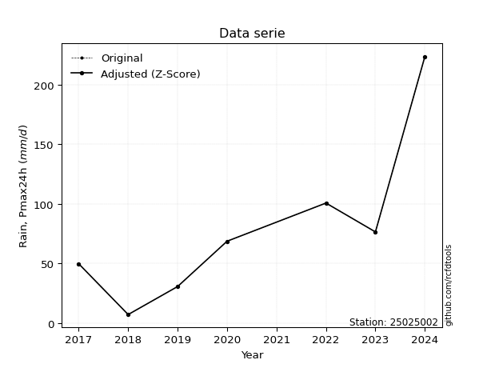</img>

</div>


> The initial value (value_initial) correspond to the initial obtained or null completed value, and value (value) is adjusted only when the initial value is outside the valid range (outlier) definite through the Z-Score value. If Z-Score is active, values out of range or outliers are replaced with the station mean value. A Z-Score (or standard score) measures how many standard deviations a data point is from the mean of a dataset, indicating its relative position; positive scores mean above the mean, negative mean below, and a score of zero is exactly at the mean, allowing for comparison of values from different distributions. It´s calculated using the formula $z=(x–μ)/σ$, where $x$ is the data point, $μ$ is the mean, and $σ$ is the standard deviation, helping identify outliers and understand probability.
>
> <sub>**Note**: In this study, "completing" (filling gaps in) and "extending" (forecasting or lengthening the historical record) rainfall data series are avoided for certain critical analyses because they introduce artificial bias and uncertainty, which can distort the statistics of rare events (extremes), alter day-to-day variability, and compromise the integrity and homogeneity of the original data. Some reasons against Completing/Extending rainfall data are: **Distortion of Extremes and Variability**: The primary issue is that most gap-filling or extension methods rely on averaging or regression with nearby stations, which inherently smooths the data. Rainfall is highly variable in space and time, with a large percentage of zero values and occasional large storms. Infilling methods often underestimate the highest values and overestimate the lowest (zero) values, which severely distorts analyses focused on flood frequency, drought severity, and intensity-duration-frequency (IDF) curves, **Loss of Data Homogeneity**: Infilled or extended data are synthetic estimates, not actual measurements. Combining these estimates with observed data can violate the assumption of data homogeneity, which requires that the data properties do not change over time. Inhomogeneity can lead to incorrect conclusions about long-term trends or changes in climate patterns, **Propagation of Errors**: Errors and biases from the original data (e.g., wind-induced undercatch, instrument errors, site changes) or the data used for imputation can propagate through the analysis, leading to unreliable hydrological models and inaccurate predictions, **Compromised Statistical Integrity**: For statistical analyses, especially those involving the frequency of events, using artificial data can introduce time bias or autocorrelation that doesn´t exist in reality, making it difficult to assess the true probability of events, **Difficulty in Validation**: It is difficult to accurately validate the quality of filled or extended data, especially for past periods where ground-truth measurements are unavailable. The reliability of imputation techniques heavily depends on the density of the surrounding station network and the complexity of the local topography.</sub>


### 4. Active continuous probability distributions from SciPy (80 of 104 available)

A Probability Density Function (PDF) describes the relative likelihood of a continuous random variable falling within a specific range, where the total area under its curve equals 1, and the area over any interval gives the actual probability for that range. Unlike discrete probabilities (like rolling a die), a PDF shows density, not direct probability for a single point (which is zero), with higher points indicating higher likelihood, often visualized as a bell curve for normal distributions.

A log of a probability density function (log-PDF) is simply the logarithm of the PDF´s value, denoted as $log(f(x))$, useful for converting multiplication of probabilities into addition, improving numerical stability with tiny numbers, and connecting to information theory concepts like entropy. Instead of dealing with very small probabilities (e.g., 0.000001), log-PDFs use negative numbers (e.g., $log(0.00001) ≈ -11.51$ that are easier for computers to handle, preventing underflow errors and simplifying complex calculations. In this study, each active probability distribution from SciPy is also evaluated in the $log$ form.

[scipy.stats](https://docs.scipy.org/doc/scipy/reference/stats.html) is a Python´s powerful submodule within the SciPy library for comprehensive statistical analysis, offering over 130 probability distributions (like Normal, Poisson, etc.), functions for descriptive stats (mean, variance), hypothesis testing (t-tests, chi-square), random variable generation, and statistical tests, making it essential for data science, modeling, and research. It provides tools to explore, model, and draw conclusions from data efficiently, working seamlessly with [NumPy](https://numpy.org/).

<div align="center">

|   id | p_dist           |   n_parameter | fit_method   | label                                                                       | active   | ref                                                                                                      |
|-----:|:-----------------|--------------:|:-------------|:----------------------------------------------------------------------------|:---------|:---------------------------------------------------------------------------------------------------------|
|    0 | alpha            |             3 | MLE          | Alpha                                                                       | True     | [:mortar_board:](https://docs.scipy.org/doc/scipy/reference/generated/scipy.stats.alpha.html)            |
|    1 | anglit           |             2 | MM           | Anglit                                                                      | True     | [:mortar_board:](https://docs.scipy.org/doc/scipy/reference/generated/scipy.stats.anglit.html)           |
|    2 | arcsine          |             2 | MM           | Arcsine                                                                     | True     | [:mortar_board:](https://docs.scipy.org/doc/scipy/reference/generated/scipy.stats.arcsine.html)          |
|    3 | argus            |             3 | MLE          | Argus                                                                       | True     | [:mortar_board:](https://docs.scipy.org/doc/scipy/reference/generated/scipy.stats.argus.html)            |
|    4 | beta             |             4 | MLE          | Beta                                                                        | True     | [:mortar_board:](https://docs.scipy.org/doc/scipy/reference/generated/scipy.stats.beta.html)             |
|    5 | betaprime        |             4 | MLE          | Beta prime                                                                  | True     | [:mortar_board:](https://docs.scipy.org/doc/scipy/reference/generated/scipy.stats.betaprime.html)        |
|    6 | bradford         |             3 | MLE          | Bradford                                                                    | True     | [:mortar_board:](https://docs.scipy.org/doc/scipy/reference/generated/scipy.stats.bradford.html)         |
|    7 | burr             |             4 | MLE          | Burr (Type III)                                                             | True     | [:mortar_board:](https://docs.scipy.org/doc/scipy/reference/generated/scipy.stats.burr.html)             |
|    8 | burr12           |             4 | MLE          | Burr (Type III) 12                                                          | True     | [:mortar_board:](https://docs.scipy.org/doc/scipy/reference/generated/scipy.stats.burr12.html)           |
|    9 | cosine           |             2 | MLE          | Cosine                                                                      | True     | [:mortar_board:](https://docs.scipy.org/doc/scipy/reference/generated/scipy.stats.cosine.html)           |
|   10 | crystalball      |             4 | MLE          | Crystalball                                                                 | True     | [:mortar_board:](https://docs.scipy.org/doc/scipy/reference/generated/scipy.stats.crystalball.html)      |
|   11 | dgamma           |             3 | MLE          | Double gamma                                                                | True     | [:mortar_board:](https://docs.scipy.org/doc/scipy/reference/generated/scipy.stats.dgamma.html)           |
|   12 | dweibull         |             3 | MLE          | Double Weibull                                                              | True     | [:mortar_board:](https://docs.scipy.org/doc/scipy/reference/generated/scipy.stats.dweibull.html)         |
|   13 | erlang           |             3 | MLE          | Erlang                                                                      | True     | [:mortar_board:](https://docs.scipy.org/doc/scipy/reference/generated/scipy.stats.erlang.html)           |
|   14 | exponnorm        |             3 | MLE          | Exponentially modified Normal                                               | True     | [:mortar_board:](https://docs.scipy.org/doc/scipy/reference/generated/scipy.stats.exponnorm.html)        |
|   15 | exponpow         |             3 | MLE          | Exponential power                                                           | True     | [:mortar_board:](https://docs.scipy.org/doc/scipy/reference/generated/scipy.stats.exponpow.html)         |
|   16 | exponweib        |             4 | MLE          | Exponentiated Weibull                                                       | True     | [:mortar_board:](https://docs.scipy.org/doc/scipy/reference/generated/scipy.stats.exponweib.html)        |
|   17 | f                |             4 | MLE          | F                                                                           | True     | [:mortar_board:](https://docs.scipy.org/doc/scipy/reference/generated/scipy.stats.f.html)                |
|   18 | fatiguelife      |             3 | MLE          | Fatigue-life (Birnbaum-Saunders)                                            | True     | [:mortar_board:](https://docs.scipy.org/doc/scipy/reference/generated/scipy.stats.fatiguelife.html)      |
|   19 | foldnorm         |             3 | MM           | Fold Normal                                                                 | True     | [:mortar_board:](https://docs.scipy.org/doc/scipy/reference/generated/scipy.stats.foldnorm.html)         |
|   20 | gamma            |             3 | MLE          | Gamma                                                                       | True     | [:mortar_board:](https://docs.scipy.org/doc/scipy/reference/generated/scipy.stats.gamma.html)            |
|   21 | gausshyper       |             6 | MLE          | Gauss hypergeometric                                                        | True     | [:mortar_board:](https://docs.scipy.org/doc/scipy/reference/generated/scipy.stats.gausshyper.html)       |
|   22 | genexpon         |             5 | MLE          | Generalized exponential                                                     | True     | [:mortar_board:](https://docs.scipy.org/doc/scipy/reference/generated/scipy.stats.genexpon.html)         |
|   23 | genextreme       |             3 | MLE          | Generalized exponential                                                     | True     | [:mortar_board:](https://docs.scipy.org/doc/scipy/reference/generated/scipy.stats.genextreme.html)       |
|   24 | gengamma         |             4 | MLE          | Generalized gamma                                                           | True     | [:mortar_board:](https://docs.scipy.org/doc/scipy/reference/generated/scipy.stats.gengamma.html)         |
|   25 | genhalflogistic  |             3 | MLE          | Generalized half-logistic                                                   | True     | [:mortar_board:](https://docs.scipy.org/doc/scipy/reference/generated/scipy.stats.genhalflogistic.html)  |
|   26 | genlogistic      |             3 | MLE          | Generalized logistic                                                        | True     | [:mortar_board:](https://docs.scipy.org/doc/scipy/reference/generated/scipy.stats.genlogistic.html)      |
|   27 | gennorm          |             3 | MLE          | Generalized Normal                                                          | True     | [:mortar_board:](https://docs.scipy.org/doc/scipy/reference/generated/scipy.stats.gennorm.html)          |
|   28 | genpareto        |             3 | MLE          | Generalized Pareto                                                          | True     | [:mortar_board:](https://docs.scipy.org/doc/scipy/reference/generated/scipy.stats.genpareto.html)        |
|   29 | gompertz         |             3 | MLE          | Gompertz (or truncated Gumbel)                                              | True     | [:mortar_board:](https://docs.scipy.org/doc/scipy/reference/generated/scipy.stats.gompertz.html)         |
|   30 | gumbel_l         |             2 | MM           | Gumbel Left Skew                                                            | True     | [:mortar_board:](https://docs.scipy.org/doc/scipy/reference/generated/scipy.stats.gumbel_l.html)         |
|   31 | gumbel_r         |             2 | MM           | Gumbel Right Skew                                                           | True     | [:mortar_board:](https://docs.scipy.org/doc/scipy/reference/generated/scipy.stats.gumbel_r.html)         |
|   32 | halfgennorm      |             3 | MLE          | Upper half of a generalized normal                                          | True     | [:mortar_board:](https://docs.scipy.org/doc/scipy/reference/generated/scipy.stats.halfgennorm.html)      |
|   33 | halflogistic     |             2 | MM           | Half-logistic                                                               | True     | [:mortar_board:](https://docs.scipy.org/doc/scipy/reference/generated/scipy.stats.halflogistic.html)     |
|   34 | halfnorm         |             2 | MM           | Half Normal                                                                 | True     | [:mortar_board:](https://docs.scipy.org/doc/scipy/reference/generated/scipy.stats.halfnorm.html)         |
|   35 | hypsecant        |             2 | MM           | hyperbolic secant                                                           | True     | [:mortar_board:](https://docs.scipy.org/doc/scipy/reference/generated/scipy.stats.hypsecant.html)        |
|   36 | invgamma         |             3 | MLE          | Inverted gamma                                                              | True     | [:mortar_board:](https://docs.scipy.org/doc/scipy/reference/generated/scipy.stats.invgamma.html)         |
|   37 | invgauss         |             3 | MLE          | Inverse Gaussian                                                            | True     | [:mortar_board:](https://docs.scipy.org/doc/scipy/reference/generated/scipy.stats.invgauss.html)         |
|   38 | invweibull       |             3 | MLE          | Inverted Weibull                                                            | True     | [:mortar_board:](https://docs.scipy.org/doc/scipy/reference/generated/scipy.stats.invweibull.html)       |
|   39 | johnsonsb        |             4 | MLE          | Johnson SB                                                                  | True     | [:mortar_board:](https://docs.scipy.org/doc/scipy/reference/generated/scipy.stats.johnsonsb.html)        |
|   40 | johnsonsu        |             4 | MLE          | Johnson Su                                                                  | True     | [:mortar_board:](https://docs.scipy.org/doc/scipy/reference/generated/scipy.stats.johnsonsu.html)        |
|   41 | kappa3           |             3 | MLE          | Kappa 3                                                                     | True     | [:mortar_board:](https://docs.scipy.org/doc/scipy/reference/generated/scipy.stats.kappa3.html)           |
|   42 | kappa4           |             4 | MLE          | Kappa 4                                                                     | True     | [:mortar_board:](https://docs.scipy.org/doc/scipy/reference/generated/scipy.stats.kappa4.html)           |
|   43 | ksone            |             3 | MLE          | Kolmogorov-Smirnov one-sided test statistic distribution                    | True     | [:mortar_board:](https://docs.scipy.org/doc/scipy/reference/generated/scipy.stats.ksone.html)            |
|   44 | kstwobign        |             2 | MLE          | Limiting distribution of scaled Kolmogorov-Smirnov two-sided test statistic | True     | [:mortar_board:](https://docs.scipy.org/doc/scipy/reference/generated/scipy.stats.kstwobign.html)        |
|   45 | laplace          |             2 | MM           | Laplace                                                                     | True     | [:mortar_board:](https://docs.scipy.org/doc/scipy/reference/generated/scipy.stats.laplace.html)          |
|   46 | levy_l           |             2 | MLE          | Left-skewed Levy                                                            | True     | [:mortar_board:](https://docs.scipy.org/doc/scipy/reference/generated/scipy.stats.levy_l.html)           |
|   47 | loggamma         |             3 | MLE          | Log gamma                                                                   | True     | [:mortar_board:](https://docs.scipy.org/doc/scipy/reference/generated/scipy.stats.loggamma.html)         |
|   48 | logistic         |             2 | MM           | Logistic (or Sech-squared)                                                  | True     | [:mortar_board:](https://docs.scipy.org/doc/scipy/reference/generated/scipy.stats.logistic.html)         |
|   49 | loglaplace       |             3 | MLE          | Log-Laplace                                                                 | True     | [:mortar_board:](https://docs.scipy.org/doc/scipy/reference/generated/scipy.stats.loglaplace.html)       |
|   50 | lomax            |             3 | MLE          | Lomax (Pareto of the second kind)                                           | True     | [:mortar_board:](https://docs.scipy.org/doc/scipy/reference/generated/scipy.stats.lomax.html)            |
|   51 | maxwell          |             2 | MM           | Maxwell                                                                     | True     | [:mortar_board:](https://docs.scipy.org/doc/scipy/reference/generated/scipy.stats.maxwell.html)          |
|   52 | mielke           |             4 | MLE          | Mielke Beta-Kappa / Dagum                                                   | True     | [:mortar_board:](https://docs.scipy.org/doc/scipy/reference/generated/scipy.stats.mielke.html)           |
|   53 | moyal            |             2 | MM           | Moyal                                                                       | True     | [:mortar_board:](https://docs.scipy.org/doc/scipy/reference/generated/scipy.stats.moyal.html)            |
|   54 | nakagami         |             3 | MLE          | Nakagami                                                                    | True     | [:mortar_board:](https://docs.scipy.org/doc/scipy/reference/generated/scipy.stats.nakagami.html)         |
|   55 | ncf              |             5 | MLE          | Non-central F distribution                                                  | True     | [:mortar_board:](https://docs.scipy.org/doc/scipy/reference/generated/scipy.stats.ncf.html)              |
|   56 | nct              |             4 | MLE          | Non-central Student’s t                                                     | True     | [:mortar_board:](https://docs.scipy.org/doc/scipy/reference/generated/scipy.stats.nct.html)              |
|   57 | norm             |             2 | MM           | Normal                                                                      | True     | [:mortar_board:](https://docs.scipy.org/doc/scipy/reference/generated/scipy.stats.norm.html)             |
|   58 | pearson3         |             3 | MM           | Pearson type III                                                            | True     | [:mortar_board:](https://docs.scipy.org/doc/scipy/reference/generated/scipy.stats.pearson3.html)         |
|   59 | powerlaw         |             3 | MLE          | Power-function                                                              | True     | [:mortar_board:](https://docs.scipy.org/doc/scipy/reference/generated/scipy.stats.powerlaw.html)         |
|   60 | rayleigh         |             2 | MM           | Rayleigh                                                                    | True     | [:mortar_board:](https://docs.scipy.org/doc/scipy/reference/generated/scipy.stats.rayleigh.html)         |
|   61 | rdist            |             3 | MLE          | R-distributed (symmetric beta)                                              | True     | [:mortar_board:](https://docs.scipy.org/doc/scipy/reference/generated/scipy.stats.rdist.html)            |
|   62 | rice             |             3 | MLE          | Rice                                                                        | True     | [:mortar_board:](https://docs.scipy.org/doc/scipy/reference/generated/scipy.stats.rice.html)             |
|   63 | semicircular     |             2 | MM           | Semicircular                                                                | True     | [:mortar_board:](https://docs.scipy.org/doc/scipy/reference/generated/scipy.stats.semicircular.html)     |
|   64 | skewnorm         |             3 | MLE          | Skew normal                                                                 | True     | [:mortar_board:](https://docs.scipy.org/doc/scipy/reference/generated/scipy.stats.skewnorm.html)         |
|   65 | t                |             3 | MLE          | Student’s t                                                                 | True     | [:mortar_board:](https://docs.scipy.org/doc/scipy/reference/generated/scipy.stats.t.html)                |
|   66 | trapezoid        |             4 | MLE          | Trapezoid                                                                   | True     | [:mortar_board:](https://docs.scipy.org/doc/scipy/reference/generated/scipy.stats.trapezoid.html)        |
|   67 | triang           |             3 | MLE          | Triangular                                                                  | True     | [:mortar_board:](https://docs.scipy.org/doc/scipy/reference/generated/scipy.stats.triang.html)           |
|   68 | truncexpon       |             3 | MLE          | Truncated exponential                                                       | True     | [:mortar_board:](https://docs.scipy.org/doc/scipy/reference/generated/scipy.stats.truncexpon.html)       |
|   69 | truncnorm        |             4 | MLE          | Truncated normal                                                            | True     | [:mortar_board:](https://docs.scipy.org/doc/scipy/reference/generated/scipy.stats.truncnorm.html)        |
|   70 | truncpareto      |             4 | MLE          | Upper truncated Pareto                                                      | True     | [:mortar_board:](https://docs.scipy.org/doc/scipy/reference/generated/scipy.stats.truncpareto.html)      |
|   71 | truncweibull_min |             5 | MLE          | Doubly truncated Weibull minimum                                            | True     | [:mortar_board:](https://docs.scipy.org/doc/scipy/reference/generated/scipy.stats.truncweibull_min.html) |
|   72 | tukeylambda      |             3 | MLE          | Tukey-Lamdba                                                                | True     | [:mortar_board:](https://docs.scipy.org/doc/scipy/reference/generated/scipy.stats.tukeylambda.html)      |
|   73 | uniform          |             2 | MLE          | Uniform                                                                     | True     | [:mortar_board:](https://docs.scipy.org/doc/scipy/reference/generated/scipy.stats.uniform.html)          |
|   74 | vonmises         |             3 | MLE          | Von Mises                                                                   | True     | [:mortar_board:](https://docs.scipy.org/doc/scipy/reference/generated/scipy.stats.vonmises.html)         |
|   75 | vonmises_line    |             3 | MLE          | Von Mises line                                                              | True     | [:mortar_board:](https://docs.scipy.org/doc/scipy/reference/generated/scipy.stats.vonmises_line.html)    |
|   76 | wald             |             2 | MM           | Wald                                                                        | True     | [:mortar_board:](https://docs.scipy.org/doc/scipy/reference/generated/scipy.stats.wald.html)             |
|   77 | weibull_max      |             3 | MLE          | Weibull maximum                                                             | True     | [:mortar_board:](https://docs.scipy.org/doc/scipy/reference/generated/scipy.stats.weibull_max.html)      |
|   78 | weibull_min      |             3 | MLE          | Weibull minimum                                                             | True     | [:mortar_board:](https://docs.scipy.org/doc/scipy/reference/generated/scipy.stats.weibull_min.html)      |
|   79 | wrapcauchy       |             3 | MLE          | Wrapped  Cauchy                                                             | True     | [:mortar_board:](https://docs.scipy.org/doc/scipy/reference/generated/scipy.stats.wrapcauchy.html)       |

</div>

> **n_parameter:** # arguments & localization & scale.
>
> **Fit methods:** (MLE) maximum likelihood, (MM) L-moments.
>
>**Inactive** (With the only purpose of prevent loops, zero divisions, infinite values, over high estimated values or horizontal trending for recurrence intervals estimations, the follow distributions were disabled.)**:** lognorm, norminvgauss, powernorm, powerlognorm, cauchy, halfcauchy, foldcauchy, skewcauchy, chi2, expon, fisk, genhyperbolic, geninvgauss, gibrat, kstwo, laplace_asymmetric, levy, levy_stable, ncx2, pareto, rel_breitwigner, recipinvgauss, studentized_range, loguniform, 


## B. Probability (PDF) vs. Empirical (EDF) distributions functions

A continuous probability distribution (CPD) describes probabilities for variables that can take any value within a range (like rain any time), unlike discrete variables with specific outcomes (like temperature). It uses a Probability Density Function (PDF), a curve where the total area under it equals 1, and the probability of the variable falling within an interval (a to b) is found by calculating the area under the curve between those points. A key feature is that the probability of hitting any single exact value is zero, so probabilities are always expressed for ranges, e.g., $P(a ≤ X ≤ b)$.

<div align="center">

Distributions parameters from station values
|     |   station | p_dist              |   n |              loc |          scale | shape                  | shape1                 | shape2                | shape3             |
|----:|----------:|:--------------------|----:|-----------------:|---------------:|:-----------------------|:-----------------------|:----------------------|:-------------------|
|   0 |  25025002 | alpha               |   8 |     -0.0499776   |   19.4832      | 1.784308316452531e-11  |                        |                       |                    |
|   1 |  25025002 | anglit              |   8 |     79.25        |  178.657       |                        |                        |                       |                    |
|   2 |  25025002 | arcsine             |   8 |     -7.11767     |  172.735       |                        |                        |                       |                    |
|   3 |  25025002 | argus               |   8 |    -70.778       |  304.513       | 5.598832701872968e-07  |                        |                       |                    |
|   4 |  25025002 | beta                |   8 |      7.2         | 3712.08        | 0.21028764774275702    | 47.15017243756483      |                       |                    |
|   5 |  25025002 | betaprime           |   8 |      6.45922     |  614.568       | 1.1112124618507084     | 10.074534072366944     |                       |                    |
|   6 |  25025002 | bradford            |   8 |      7.19999     |  216.4         | 1.313521027613938      |                        |                       |                    |
|   7 |  25025002 | burr                |   8 |     -0.275655    |  101.969       | 3.2445421607831237     | 0.40878187378990893    |                       |                    |
|   8 |  25025002 | burr12              |   8 |     -0.992818    |    8.04327     | 213.18298308948678     | 0.002376119419940785   |                       |                    |
|   9 |  25025002 | cosine              |   8 |     92.0237      |   56.3672      |                        |                        |                       |                    |
|  10 |  25025002 | crystalball         |   8 |     79.25        |   61.0712      | 6701.837496204316      | 45.10263789782384      |                       |                    |
|  11 |  25025002 | dgamma              |   8 |     76.8         |   55.4921      | 0.5119668493422425     |                        |                       |                    |
|  12 |  25025002 | dweibull            |   8 |     76.5         |   46.3012      | 0.8509402579950605     |                        |                       |                    |
|  13 |  25025002 | erlang              |   8 |      7.2         |  128.714       | 0.18394690657754162    |                        |                       |                    |
|  14 |  25025002 | exponnorm           |   8 |     25.9198      |   23.2218      | 2.2965577932207255     |                        |                       |                    |
|  15 |  25025002 | exponpow            |   8 |      7.2         |  148.131       | 0.5328465391160822     |                        |                       |                    |
|  16 |  25025002 | exponweib           |   8 |      7.2         |   66.5309      | 0.6887830409686486     | 1.0184745757311715     |                       |                    |
|  17 |  25025002 | f                   |   8 |      7.2         |   72.1421      | 1.6945202296516377     | 104.69649082890544     |                       |                    |
|  18 |  25025002 | fatiguelife         |   8 |      7.2         |    3.34658e-05 | 1405.3936952981485     |                        |                       |                    |
|  19 |  25025002 | foldnorm            |   8 |     -5.25195     |  105.033       | 0.012147134402008139   |                        |                       |                    |
|  20 |  25025002 | gamma               |   8 |      7.2         |   66.6082      | 0.9292897452968574     |                        |                       |                    |
|  21 |  25025002 | gausshyper          |   8 |    -12.7334      |  236.333       | 1.1605657577636994     | 0.89765611208532       | 1.343076705217591     | 1.0862019657186635 |
|  22 |  25025002 | genexpon            |   8 |      7.19996     |    2.62106     | 0.03639768814142377    | 1.2644049472295628e-08 | 2.572509827916845     |                    |
|  23 |  25025002 | genextreme          |   8 |      7.72262     |    3.53132     | -6.7569016444069305    |                        |                       |                    |
|  24 |  25025002 | gengamma            |   8 |     -2.37526     |   15.5539      | 3.1306669844791166     | 0.7240052636299417     |                       |                    |
|  25 |  25025002 | genhalflogistic     |   8 |    -14.907       |  249.012       | 1.0440465811858082     |                        |                       |                    |
|  26 |  25025002 | genlogistic         |   8 |   -227.322       |   41.7589      | 829.7419070510068      |                        |                       |                    |
|  27 |  25025002 | gennorm             |   8 |     76.5         |    3.59678     | 0.44488428635910726    |                        |                       |                    |
|  28 |  25025002 | genpareto           |   8 |      7.2         |   88.2959      | -0.22050178102489193   |                        |                       |                    |
|  29 |  25025002 | gompertz            |   8 |      7.19961     |  332.165       | 3.7684540890794125     |                        |                       |                    |
|  30 |  25025002 | gumbel_l            |   8 |    106.735       |   47.617       |                        |                        |                       |                    |
|  31 |  25025002 | gumbel_r            |   8 |     51.7647      |   47.617       |                        |                        |                       |                    |
|  32 |  25025002 | halfgennorm         |   8 |      7.2         |    5.21627     | 0.4003820544826141     |                        |                       |                    |
|  33 |  25025002 | halflogistic        |   8 |      6.86647     |   52.2137      |                        |                        |                       |                    |
|  34 |  25025002 | halfnorm            |   8 |     -1.58429     |  101.311       |                        |                        |                       |                    |
|  35 |  25025002 | hypsecant           |   8 |     79.25        |   38.8791      |                        |                        |                       |                    |
|  36 |  25025002 | invgamma            |   8 |    -55.3461      |  728.062       | 6.400318367317729      |                        |                       |                    |
|  37 |  25025002 | invgauss            |   8 |    -29.0301      |  333.745       | 0.32443976602835206    |                        |                       |                    |
|  38 |  25025002 | invweibull          |   8 |   -208.082       |  258.081       | 6.600011712021477      |                        |                       |                    |
|  39 |  25025002 | johnsonsb           |   8 |      7.2         |  216.4         | -0.14147472042257941   | 0.12015546448272366    |                       |                    |
|  40 |  25025002 | johnsonsu           |   8 |    -25.1645      |    3.01426     | -7.334401506387101     | 1.7956391101985854     |                       |                    |
|  41 |  25025002 | kappa3              |   8 |      7.2         |   65.7353      | 3.1603799152027436     |                        |                       |                    |
|  42 |  25025002 | kappa4              |   8 |    -13.6065      |  237.643       | 1.095956559332329      | 1.0003789910233163     |                       |                    |
|  43 |  25025002 | ksone               |   8 |    -14.44        |  259.68        | 1.0                    |                        |                       |                    |
|  44 |  25025002 | kstwobign           |   8 |   -101.297       |  209.422       |                        |                        |                       |                    |
|  45 |  25025002 | laplace             |   8 |     79.25        |   43.1838      |                        |                        |                       |                    |
|  46 |  25025002 | levy_l              |   8 |    241.108       |   82.9393      |                        |                        |                       |                    |
|  47 |  25025002 | loggamma            |   8 | -17234.7         | 2376.23        | 1461.2937952902098     |                        |                       |                    |
|  48 |  25025002 | logistic            |   8 |     79.25        |   33.6703      |                        |                        |                       |                    |
|  49 |  25025002 | loglaplace          |   8 |     -0.209472    |   76.7094      | 1.559615061331312      |                        |                       |                    |
|  50 |  25025002 | lomax               |   8 |      7.2         |    1.42805e+08 | 1983401.4622551645     |                        |                       |                    |
|  51 |  25025002 | maxwell             |   8 |    -65.463       |   90.6854      |                        |                        |                       |                    |
|  52 |  25025002 | mielke              |   8 |     -0.191366    |  102.091       | 1.320792693275762      | 3.2447796835195373     |                       |                    |
|  53 |  25025002 | moyal               |   8 |     44.3256      |   27.4917      |                        |                        |                       |                    |
|  54 |  25025002 | nakagami            |   8 |     30.7         |   86.0226      | 0.25447929380136947    |                        |                       |                    |
|  55 |  25025002 | ncf                 |   8 |      0.00422896  |    9.92522e-07 | 6.454632694397554e-08  | 3.1423088247016464     | 3.0927165920962247    |                    |
|  56 |  25025002 | nct                 |   8 |    -53.2617      |   22.0191      | 4.76057392633513       | 4.971939135395706      |                       |                    |
|  57 |  25025002 | norm                |   8 |     79.25        |   61.0712      |                        |                        |                       |                    |
|  58 |  25025002 | pearson3            |   8 |     79.25        |   61.0712      | 1.3733138862354246     |                        |                       |                    |
|  59 |  25025002 | powerlaw            |   8 |      7.2         |  216.4         | 0.16580243495374272    |                        |                       |                    |
|  60 |  25025002 | rayleigh            |   8 |    -37.5827      |   93.219       |                        |                        |                       |                    |
|  61 |  25025002 | rdist               |   8 |    -13.7256      |  114.426       | 1.0978539891374473     |                        |                       |                    |
|  62 |  25025002 | rice                |   8 |    -19.0746      |   81.8456      | 0.0003550364585772351  |                        |                       |                    |
|  63 |  25025002 | semicircular        |   8 |     79.25        |  122.142       |                        |                        |                       |                    |
|  64 |  25025002 | skewnorm            |   8 |      7.2         |   94.4472      | 103621908.56927249     |                        |                       |                    |
|  65 |  25025002 | t                   |   8 |     67.2033      |   28.1804      | 1.7104902206974093     |                        |                       |                    |
|  66 |  25025002 | trapezoid           |   8 |    -15.162       |  259.68        | 1.0                    | 1.0                    |                       |                    |
|  67 |  25025002 | triang              |   8 |    -90.8225      |  315.039       | 0.9999998154944478     |                        |                       |                    |
|  68 |  25025002 | truncexpon          |   8 |      7.2         |  208.412       | 1.0383269545615867     |                        |                       |                    |
|  69 |  25025002 | truncnorm           |   8 |     77.2526      |   62.2393      | -877078.0475740369     | 1283.2079181640693     |                       |                    |
|  70 |  25025002 | truncpareto         |   8 |      7.17694     |    0.023062    | 0.14333299602658828    | 9384.395950878377      |                       |                    |
|  71 |  25025002 | truncweibull_min    |   8 |     -8.4985      |  181.507       | 1.2194211481921529     | 0.0009628997102256435  | 1.2787311187882948    |                    |
|  72 |  25025002 | tukeylambda         |   8 |     53.95        |  114.91        | 2.4579706027467605     |                        |                       |                    |
|  73 |  25025002 | uniform             |   8 |      7.2         |  216.4         |                        |                        |                       |                    |
|  74 |  25025002 | vonmises            |   8 |      0.203888    |    1           | 1.1618222871993322     |                        |                       |                    |
|  75 |  25025002 | vonmises_line       |   8 |     67.754       |   49.6073      | 1.4990614998174099     |                        |                       |                    |
|  76 |  25025002 | wald                |   8 |     18.1789      |   61.0712      |                        |                        |                       |                    |
|  77 |  25025002 | weibull_max         |   8 |    223.6         |    1.70162     | 0.17481410010564746    |                        |                       |                    |
|  78 |  25025002 | weibull_min         |   8 |      7.2         |   42.7018      | 0.47107064949818656    |                        |                       |                    |
|  79 |  25025002 | wrapcauchy          |   8 |      7.2         |   34.463       | 0.14292680253473844    |                        |                       |                    |
|  80 |  25025002 | logalpha            |   8 |    -18.0602      |  482.501       | 21.891503945377266     |                        |                       |                    |
|  81 |  25025002 | loganglit           |   8 |      4.02958     |    2.75257     |                        |                        |                       |                    |
|  82 |  25025002 | logarcsine          |   8 |      2.69889     |    2.66136     |                        |                        |                       |                    |
|  83 |  25025002 | logargus            |   8 |      1.28624     |    4.23969     | 1.385971490459493      |                        |                       |                    |
|  84 |  25025002 | logbeta             |   8 |      1.46547     |    3.94439     | 1.1802333813848735     | 0.7509107784069811     |                       |                    |
|  85 |  25025002 | logbetaprime        |   8 |    -19.31        |  134.756       | 690.3964552097782      | 3987.109740586755      |                       |                    |
|  86 |  25025002 | logbradford         |   8 |      1.97408     |    3.43616     | 1.0447778382612363     |                        |                       |                    |
|  87 |  25025002 | logburr             |   8 |     -0.018455    |    4.84355     | 16.845026764858822     | 0.2520037130014029     |                       |                    |
|  88 |  25025002 | logburr12           |   8 |    -19.6011      |   31.861       | 31.754527209445314     | 7605.396997489048      |                       |                    |
|  89 |  25025002 | logcosine           |   8 |      3.89646     |    0.846741    |                        |                        |                       |                    |
|  90 |  25025002 | logcrystalball      |   8 |      4.02958     |    0.940922    | 660.527704478611       | 56.92665969495417      |                       |                    |
|  91 |  25025002 | logdgamma           |   8 |      4.33729     |    0.755266    | 0.7688186266058045     |                        |                       |                    |
|  92 |  25025002 | logdweibull         |   8 |      4.3412      |    0.741487    | 0.814105528476083      |                        |                       |                    |
|  93 |  25025002 | logerlang           |   8 |    -11.8927      |    0.0596764   | 266.51326548980825     |                        |                       |                    |
|  94 |  25025002 | logexponnorm        |   8 |      4.02903     |    0.940922    | 0.0005724177666638342  |                        |                       |                    |
|  95 |  25025002 | logexponpow         |   8 |      1.97408     |    1.45718     | 0.19324736812648707    |                        |                       |                    |
|  96 |  25025002 | logexponweib        |   8 |      1.97408     |    1.11702     | 1.1785885526201514     | 0.7043957122510582     |                       |                    |
|  97 |  25025002 | logf                |   8 |  -1145.78        | 1149.8         | 10641657.456470061     | 4141849.2111904416     |                       |                    |
|  98 |  25025002 | logfatiguelife      |   8 |   -480.575       |  484.602       | 0.0019361662907696978  |                        |                       |                    |
|  99 |  25025002 | logfoldnorm         |   8 |      2.71863     |    1.03567     | 1.1526743215323014     |                        |                       |                    |
| 100 |  25025002 | loggamma            |   8 |    -12.9834      |    0.0549537   | 309.70160945807515     |                        |                       |                    |
| 101 |  25025002 | loggausshyper       |   8 |      1.89396     |    3.5159      | 1.2852237696735198     | 0.9034957600030493     | 0.7476964064552185    | 1.1018894785766689 |
| 102 |  25025002 | loggenexpon         |   8 |      1.96248     |    0.00602974  | 0.0007955021418836147  | 1.2471448259473714     | 8.214349159446127e-06 |                    |
| 103 |  25025002 | loggenextreme       |   8 |      3.84795     |    1.03962     | 0.5947601870349504     |                        |                       |                    |
| 104 |  25025002 | loggengamma         |   8 |      1.97408     |    1.11702     | 1.1785885526201514     | 0.7043957122510582     |                       |                    |
| 105 |  25025002 | loggenhalflogistic  |   8 |      1.71855     |    3.87693     | 1.0502861715035163     |                        |                       |                    |
| 106 |  25025002 | loggenlogistic      |   8 |      4.62871     |    0.30806     | 0.40300621338236253    |                        |                       |                    |
| 107 |  25025002 | loggennorm          |   8 |      4.33729     |    0.0336236   | 0.4035074045846041     |                        |                       |                    |
| 108 |  25025002 | loggenpareto        |   8 |     -0.00951907  |   10.9297      | -2.0167813805524926    |                        |                       |                    |
| 109 |  25025002 | loggompertz         |   8 |      1.97408     |    0.852637    | 0.06026332660381853    |                        |                       |                    |
| 110 |  25025002 | loggumbel_l         |   8 |      4.45304     |    0.733634    |                        |                        |                       |                    |
| 111 |  25025002 | loggumbel_r         |   8 |      3.60611     |    0.733634    |                        |                        |                       |                    |
| 112 |  25025002 | loghalfgennorm      |   8 |      1.97405     |    3.436       | 154563.84184730897     |                        |                       |                    |
| 113 |  25025002 | loghalflogistic     |   8 |      2.91436     |    0.804461    |                        |                        |                       |                    |
| 114 |  25025002 | loghalfnorm         |   8 |      2.78414     |    1.56092     |                        |                        |                       |                    |
| 115 |  25025002 | loghypsecant        |   8 |      4.02958     |    0.59901     |                        |                        |                       |                    |
| 116 |  25025002 | loginvgamma         |   8 |    -15.308       | 7688.7         | 399.06850152586253     |                        |                       |                    |
| 117 |  25025002 | loginvgauss         |   8 |     -5.80496     |  923.052       | 0.010626525447972289   |                        |                       |                    |
| 118 |  25025002 | loginvweibull       |   8 |     -2.09842e+08 |    2.09842e+08 | 195842257.47523147     |                        |                       |                    |
| 119 |  25025002 | logjohnsonsb        |   8 |    -42.0219      |   48.8278      | -8.111701977846035     | 2.832284459507985      |                       |                    |
| 120 |  25025002 | logjohnsonsu        |   8 |      4.34115     |    0.179045    | 0.29569454535506506    | 0.569959629522375      |                       |                    |
| 121 |  25025002 | logkappa3           |   8 |      1.97408     |    2.75448     | 13.001099842454376     |                        |                       |                    |
| 122 |  25025002 | logkappa4           |   8 |      1.67349     |    3.85283     | 1.0847293842881804     | 1.0299801277604783     |                       |                    |
| 123 |  25025002 | logksone            |   8 |      1.6305      |    4.12293     | 1.0                    |                        |                       |                    |
| 124 |  25025002 | logkstwobign        |   8 |     -0.366302    |    5.03628     |                        |                        |                       |                    |
| 125 |  25025002 | loglaplace          |   8 |      4.02958     |    0.665333    |                        |                        |                       |                    |
| 126 |  25025002 | loglevy_l           |   8 |      5.55406     |    0.680575    |                        |                        |                       |                    |
| 127 |  25025002 | logloggamma         |   8 |      4.26813     |    0.837851    | 1.203413721967658      |                        |                       |                    |
| 128 |  25025002 | loglogistic         |   8 |      4.02958     |    0.518758    |                        |                        |                       |                    |
| 129 |  25025002 | logloglaplace       |   8 |    -15.7328      |   20.07        | 30.488279893994417     |                        |                       |                    |
| 130 |  25025002 | loglomax            |   8 |      1.97408     |    9.3315e+11  | 285756033239.72546     |                        |                       |                    |
| 131 |  25025002 | logmaxwell          |   8 |      1.79999     |    1.39719     |                        |                        |                       |                    |
| 132 |  25025002 | logmielke           |   8 |     -7.58956e+06 |    7.58956e+06 | 9869846.397103071      | 24587987.45112958      |                       |                    |
| 133 |  25025002 | logmoyal            |   8 |      3.4915      |    0.423564    |                        |                        |                       |                    |
| 134 |  25025002 | lognakagami         |   8 |      3.42426     |    0.578626    | 0.24480399846375395    |                        |                       |                    |
| 135 |  25025002 | logncf              |   8 |     -9.39856     |    7.28961e-05 | 0.0048154463326980645  | 1810.1963263460175     | 886.1290057644804     |                    |
| 136 |  25025002 | lognct              |   8 |     53.5718      |    0.912287    | 24504.961152884425     | -54.303601591565126    |                       |                    |
| 137 |  25025002 | lognorm             |   8 |      4.02958     |    0.940922    |                        |                        |                       |                    |
| 138 |  25025002 | logpearson3         |   8 |      4.02958     |    0.940923    | -0.9023613049085497    |                        |                       |                    |
| 139 |  25025002 | logpowerlaw         |   8 |      1.97408     |    3.43578     | 0.1992680716663707     |                        |                       |                    |
| 140 |  25025002 | lograyleigh         |   8 |      2.22956     |    1.43621     |                        |                        |                       |                    |
| 141 |  25025002 | logrdist            |   8 |      2.76727     |    1.84488     | 1.0743927565363378     |                        |                       |                    |
| 142 |  25025002 | logrice             |   8 |   -333.052       |    0.940543    | 358.3889373768516      |                        |                       |                    |
| 143 |  25025002 | logsemicircular     |   8 |      4.02958     |    1.88182     |                        |                        |                       |                    |
| 144 |  25025002 | logskewnorm         |   8 |      5.05096     |    1.38874     | -2.8396941661461756    |                        |                       |                    |
| 145 |  25025002 | logt                |   8 |      4.2566      |    0.405551    | 1.4157992271431017     |                        |                       |                    |
| 146 |  25025002 | logtrapezoid        |   8 |      1.6305      |    4.12293     | 1.0                    | 1.0                    |                       |                    |
| 147 |  25025002 | logtriang           |   8 |      1.30494     |    4.10492     | 0.9999999991542873     |                        |                       |                    |
| 148 |  25025002 | logtruncexpon       |   8 |      1.97405     |    4.34677     | 0.7904283250727264     |                        |                       |                    |
| 149 |  25025002 | logtruncnorm        |   8 |     -0.532288    |    2.15707     | 1.8342202152003368     | 2.754729026696328      |                       |                    |
| 150 |  25025002 | logtruncpareto      |   8 |      1.9733      |    0.00078277  | 0.1432617078137346     | 4390.257493770617      |                       |                    |
| 151 |  25025002 | logtruncweibull_min |   8 |      1.91656     |    5.22763     | 1.1960487442906356     | 1.1259843799588722e-08 | 0.6682381629571572    |                    |
| 152 |  25025002 | logtukeylambda      |   8 |      3.28914     |    1.56984     | 1.1865699171069684     |                        |                       |                    |
| 153 |  25025002 | loguniform          |   8 |      1.97408     |    3.43578     |                        |                        |                       |                    |
| 154 |  25025002 | logvonmises         |   8 |     -2.10908     |    1           | 1.8112672381603494     |                        |                       |                    |
| 155 |  25025002 | logvonmises_line    |   8 |      4.11898     |    0.682742    | 1.0820673485783763     |                        |                       |                    |
| 156 |  25025002 | logwald             |   8 |      3.08868     |    0.940897    |                        |                        |                       |                    |
| 157 |  25025002 | logweibull_max      |   8 |      5.40986     |    1.41218     | 0.9883359406501389     |                        |                       |                    |
| 158 |  25025002 | logweibull_min      |   8 |    -19.5818      |   24.0265      | 31.72626538410929      |                        |                       |                    |
| 159 |  25025002 | logwrapcauchy       |   8 |      1.97407     |    0.5487      | 0.00012702383421206784 |                        |                       |                    |

</div>

> **loc** (Location parameter): This shifts the distribution along the x-axis. For many common distributions, like the normal (Gaussian) distribution, loc represents the mean $μ$. For others, like the uniform distribution, it might represent the minimum value, or for the beta distribution, the left end of the support interval.
>
> **scale** (Scale parameter): This determines the width or spread of the distribution. For the normal distribution, scale represents the standard deviation $σ$. For a uniform distribution, it defines the length of the interval (from $loc$ to $loc + scale$).
>
> **shape** (Shape parameters): Refers to parameters that define the specific form of a probability distribution, distinct from its location (loc) and scale (scale). These parameters are required arguments for most distribution functions. For example, a normal (Gaussian) distribution is fully defined by its location (mean) and scale (standard deviation), so it has no specific shape parameters beyond loc and scale. However, other distributions have intrinsic properties that need specification, as Gamma distribution that takes a shape parameter, often named $a$ or $alpha$.


### 0. Cumulative distribution values - CDF (160 evaluated)

Cumulative Distribution Function (CDF), denoted as $F$<sub>$X$</sub>$(x)$, is a function that gives the probability that a random variable $X$ will take a value less than or equal to a specific value, $x$ (i.e., $(P(X≥x)$. It essentially "accumulates" probabilities from a given point up to the far right (positive infinity), providing a complete picture of the distribution´s probabilities for both discrete (like rain) and continuous (like temperature) variables, helping to find probabilities over ranges or above certain values. Each station is evaluated separately ordering the $x$ values ascending, calculating the CDF and PDF values for the activated distributions and their logarithmic forms.

<div align="center">

CDF ordered by x ascending and calculating $log(f(x))$ separately
|   id |   Station |   date |     x |   count |   mean |     std |     zscore |   Value_initial |   station |   m |      alpha |   alpha_pdf |   anglit |   anglit_pdf |   arcsine |   arcsine_pdf |     argus |   argus_pdf |        beta |    beta_pdf |   betaprime |   betaprime_pdf |    bradford |   bradford_pdf |      burr |    burr_pdf |     burr12 |   burr12_pdf |   cosine |   cosine_pdf |   crystalball |   crystalball_pdf |    dgamma |       dgamma_pdf |   dweibull |   dweibull_pdf |      erlang |   erlang_pdf |   exponnorm |   exponnorm_pdf |    exponpow |     exponpow_pdf |   exponweib |   exponweib_pdf |           f |       f_pdf |   fatiguelife |   fatiguelife_pdf |   foldnorm |   foldnorm_pdf |       gamma |   gamma_pdf |   gausshyper |   gausshyper_pdf |    genexpon |   genexpon_pdf |   genextreme |   genextreme_pdf |   gengamma |   gengamma_pdf |   genhalflogistic |   genhalflogistic_pdf |   genlogistic |   genlogistic_pdf |   gennorm |   gennorm_pdf |   genpareto |   genpareto_pdf |    gompertz |   gompertz_pdf |   gumbel_l |   gumbel_l_pdf |   gumbel_r |   gumbel_r_pdf |   halfgennorm |   halfgennorm_pdf |   halflogistic |   halflogistic_pdf |   halfnorm |   halfnorm_pdf |   hypsecant |   hypsecant_pdf |   invgamma |   invgamma_pdf |   invgauss |   invgauss_pdf |   invweibull |   invweibull_pdf |   johnsonsb |   johnsonsb_pdf |   johnsonsu |   johnsonsu_pdf |      kappa3 |   kappa3_pdf |      kappa4 |   kappa4_pdf |     ksone |   ksone_pdf |   kstwobign |   kstwobign_pdf |   laplace |   laplace_pdf |   levy_l |   levy_l_pdf |   loggamma |   loggamma_pdf |   logistic |   logistic_pdf |   loglaplace |   loglaplace_pdf |      lomax |   lomax_pdf |   maxwell |   maxwell_pdf |    mielke |   mielke_pdf |     moyal |   moyal_pdf |    nakagami |     nakagami_pdf |      ncf |     ncf_pdf |       nct |    nct_pdf |     norm |    norm_pdf |   pearson3 |   pearson3_pdf |   powerlaw |   powerlaw_pdf |   rayleigh |   rayleigh_pdf |    rdist |      rdist_pdf |      rice |    rice_pdf |   semicircular |   semicircular_pdf |   skewnorm |   skewnorm_pdf |         t |      t_pdf |   trapezoid |   trapezoid_pdf |    triang |   triang_pdf |   truncexpon |   truncexpon_pdf |   truncnorm |   truncnorm_pdf |   truncpareto |   truncpareto_pdf |   truncweibull_min |   truncweibull_min_pdf |   tukeylambda |   tukeylambda_pdf |   uniform |   uniform_pdf |   vonmises |   vonmises_pdf |   vonmises_line |   vonmises_line_pdf |      wald |    wald_pdf |   weibull_max |   weibull_max_pdf |   weibull_min |   weibull_min_pdf |   wrapcauchy |   wrapcauchy_pdf |   logalpha |   logalpha_pdf |   loganglit |   loganglit_pdf |   logarcsine |   logarcsine_pdf |   logargus |   logargus_pdf |   logbeta |   logbeta_pdf |   logbetaprime |   logbetaprime_pdf |   logbradford |   logbradford_pdf |   logburr |   logburr_pdf |   logburr12 |   logburr12_pdf |   logcosine |   logcosine_pdf |   logcrystalball |   logcrystalball_pdf |   logdgamma |   logdgamma_pdf |   logdweibull |   logdweibull_pdf |   logerlang |   logerlang_pdf |   logexponnorm |   logexponnorm_pdf |   logexponpow |   logexponpow_pdf |   logexponweib |   logexponweib_pdf |      logf |   logf_pdf |   logfatiguelife |   logfatiguelife_pdf |   logfoldnorm |   logfoldnorm_pdf |   loggausshyper |   loggausshyper_pdf |   loggenexpon |   loggenexpon_pdf |   loggenextreme |   loggenextreme_pdf |   loggengamma |   loggengamma_pdf |   loggenhalflogistic |   loggenhalflogistic_pdf |   loggenlogistic |   loggenlogistic_pdf |   loggennorm |   loggennorm_pdf |   loggenpareto |   loggenpareto_pdf |   loggompertz |   loggompertz_pdf |   loggumbel_l |   loggumbel_l_pdf |   loggumbel_r |   loggumbel_r_pdf |   loghalfgennorm |   loghalfgennorm_pdf |   loghalflogistic |   loghalflogistic_pdf |   loghalfnorm |   loghalfnorm_pdf |   loghypsecant |   loghypsecant_pdf |   loginvgamma |   loginvgamma_pdf |   loginvgauss |   loginvgauss_pdf |   loginvweibull |   loginvweibull_pdf |   logjohnsonsb |   logjohnsonsb_pdf |   logjohnsonsu |   logjohnsonsu_pdf |   logkappa3 |   logkappa3_pdf |   logkappa4 |   logkappa4_pdf |   logksone |   logksone_pdf |   logkstwobign |   logkstwobign_pdf |   loglevy_l |   loglevy_l_pdf |   logloggamma |   logloggamma_pdf |   loglogistic |   loglogistic_pdf |   logloglaplace |   logloglaplace_pdf |    loglomax |   loglomax_pdf |   logmaxwell |   logmaxwell_pdf |   logmielke |   logmielke_pdf |    logmoyal |   logmoyal_pdf |   lognakagami |   lognakagami_pdf |    logncf |   logncf_pdf |    lognct |   lognct_pdf |   lognorm |   lognorm_pdf |   logpearson3 |   logpearson3_pdf |   logpowerlaw |   logpowerlaw_pdf |   lograyleigh |   lograyleigh_pdf |   logrdist |   logrdist_pdf |   logrice |   logrice_pdf |   logsemicircular |   logsemicircular_pdf |   logskewnorm |   logskewnorm_pdf |      logt |   logt_pdf |   logtrapezoid |   logtrapezoid_pdf |   logtriang |   logtriang_pdf |   logtruncexpon |   logtruncexpon_pdf |   logtruncnorm |   logtruncnorm_pdf |   logtruncpareto |   logtruncpareto_pdf |   logtruncweibull_min |   logtruncweibull_min_pdf |   logtukeylambda |   logtukeylambda_pdf |   loguniform |   loguniform_pdf |   logvonmises |   logvonmises_pdf |   logvonmises_line |   logvonmises_line_pdf |   logwald |   logwald_pdf |   logweibull_max |   logweibull_max_pdf |   logweibull_min |   logweibull_min_pdf |   logwrapcauchy |   logwrapcauchy_pdf |
|-----:|----------:|-------:|------:|--------:|-------:|--------:|-----------:|----------------:|----------:|----:|-----------:|------------:|---------:|-------------:|----------:|--------------:|----------:|------------:|------------:|------------:|------------:|----------------:|------------:|---------------:|----------:|------------:|-----------:|-------------:|---------:|-------------:|--------------:|------------------:|----------:|-----------------:|-----------:|---------------:|------------:|-------------:|------------:|----------------:|------------:|-----------------:|------------:|----------------:|------------:|------------:|--------------:|------------------:|-----------:|---------------:|------------:|------------:|-------------:|-----------------:|------------:|---------------:|-------------:|-----------------:|-----------:|---------------:|------------------:|----------------------:|--------------:|------------------:|----------:|--------------:|------------:|----------------:|------------:|---------------:|-----------:|---------------:|-----------:|---------------:|--------------:|------------------:|---------------:|-------------------:|-----------:|---------------:|------------:|----------------:|-----------:|---------------:|-----------:|---------------:|-------------:|-----------------:|------------:|----------------:|------------:|----------------:|------------:|-------------:|------------:|-------------:|----------:|------------:|------------:|----------------:|----------:|--------------:|---------:|-------------:|-----------:|---------------:|-----------:|---------------:|-------------:|-----------------:|-----------:|------------:|----------:|--------------:|----------:|-------------:|----------:|------------:|------------:|-----------------:|---------:|------------:|----------:|-----------:|---------:|------------:|-----------:|---------------:|-----------:|---------------:|-----------:|---------------:|---------:|---------------:|----------:|------------:|---------------:|-------------------:|-----------:|---------------:|----------:|-----------:|------------:|----------------:|----------:|-------------:|-------------:|-----------------:|------------:|----------------:|--------------:|------------------:|-------------------:|-----------------------:|--------------:|------------------:|----------:|--------------:|-----------:|---------------:|----------------:|--------------------:|----------:|------------:|--------------:|------------------:|--------------:|------------------:|-------------:|-----------------:|-----------:|---------------:|------------:|----------------:|-------------:|-----------------:|-----------:|---------------:|----------:|--------------:|---------------:|-------------------:|--------------:|------------------:|----------:|--------------:|------------:|----------------:|------------:|----------------:|-----------------:|---------------------:|------------:|----------------:|--------------:|------------------:|------------:|----------------:|---------------:|-------------------:|--------------:|------------------:|---------------:|-------------------:|----------:|-----------:|-----------------:|---------------------:|--------------:|------------------:|----------------:|--------------------:|--------------:|------------------:|----------------:|--------------------:|--------------:|------------------:|---------------------:|-------------------------:|-----------------:|---------------------:|-------------:|-----------------:|---------------:|-------------------:|--------------:|------------------:|--------------:|------------------:|--------------:|------------------:|-----------------:|---------------------:|------------------:|----------------------:|--------------:|------------------:|---------------:|-------------------:|--------------:|------------------:|--------------:|------------------:|----------------:|--------------------:|---------------:|-------------------:|---------------:|-------------------:|------------:|----------------:|------------:|----------------:|-----------:|---------------:|---------------:|-------------------:|------------:|----------------:|--------------:|------------------:|--------------:|------------------:|----------------:|--------------------:|------------:|---------------:|-------------:|-----------------:|------------:|----------------:|------------:|---------------:|--------------:|------------------:|----------:|-------------:|----------:|-------------:|----------:|--------------:|--------------:|------------------:|--------------:|------------------:|--------------:|------------------:|-----------:|---------------:|----------:|--------------:|------------------:|----------------------:|--------------:|------------------:|----------:|-----------:|---------------:|-------------------:|------------:|----------------:|----------------:|--------------------:|---------------:|-------------------:|-----------------:|---------------------:|----------------------:|--------------------------:|-----------------:|---------------------:|-------------:|-----------------:|--------------:|------------------:|-------------------:|-----------------------:|----------:|--------------:|-----------------:|---------------------:|-----------------:|---------------------:|----------------:|--------------------:|
|    0 |  25025002 |   2018 |   7.2 |       8 |  79.25 | 65.2878 | -1.10357   |             7.2 |  25025002 |   1 | 0.00720232 | 0.00799339  | 0.139041 |   0.00387321 |  0.185916 |    0.00668362 | 0.0967306 |  0.00243867 | 0.000297643 | 7.04708e+10 |  0.00705859 |     0.0105209   | 4.42617e-08 |     0.00723663 | 0.0312492 | 0.00554299  | 0.00933402 |  0.060068    | 0.101688 |  0.00300963  |      0.119046 |       0.00325713  | 0.0584124 |      0.00132892  |   0.122145 |    0.00211386  | 0.000755536 |  1.56476e+11 |   0.0426643 |     0.00313929  | 6.65639e-10 | 399338           | 2.02657e-07 |     7.42994     | 2.18492e-11 | 0.887487    |      0.038991 |       1.36368e+10 |   0.094363 |    0.00754274  | 2.14034e-16 | 0.223941    |    0.0846358 |       0.00468812 | 5.13921e-07 |    0.0138866   |  0.000627826 |    955.535       |  0.0278171 |     0.00550227 |         0.0465496 |            0.00220826 |     0.0491027 |       0.00353743  | 0.0742201 |   0.00131258  | 6.95055e-13 |     0.0113256   | 4.43145e-06 |    0.0113451   |   0.116308 |    0.00229467  |  0.0781203 |    0.00418271  |   2.40796e-11 |       0.0578318   |     0.00319384 |        0.00957594  |  0.0690951 |    0.00784607  |   0.0989772 |     0.00250494  |  0.0355065 |    0.0038816   |  0.0338598 |    0.00434857  |     0.036542 |      0.00370735  | 3.67581e-07 |     2.55595e+08 |   0.0341096 |     0.0041792   | 1.64013e-10 |  0.01057     | 2.76895e-15 |   0.104953   | 0.0833333 |  0.00385089 |   0.0488089 |     0.00368565  | 0.0942697 |   0.00218299  | 0.448469 |  0.000850603 |  0.0137074 |      0.0395076 |   0.105282 |    0.00279765  |    0.0227641 |        0.0342146 | 4.0701e-08 | 0.0138889   |  0.113252 |   0.0040977   | 0.0311825 |  0.00557102  | 0.0494774 | 0.00413963  | 0           |      0           | 0.28647  | 0.0096764   | 0.0396774 | 0.00374547 | 0.119046 | 0.00325713  |  0.0495061 |    0.00544014  | 0.00130989 |    2.44525e+11 |   0.108985 |    0.00459184  | 0.562384 |     0.00301197 | 0.0502239 | 0.00372534  |       0.147554 |         0.00420871 |   0        |    0.00844794  | 0.0940649 | 0.00212876 |  0.00741557 |     0.000663229 | 0.0968104 |   0.00197527 |  2.91652e-08 |       0.00742806 |    0.130181 |     0.00340217  |      0        |       8.50849     |           0.066288 |             0.0050415  |   2.75756e-07 |        0.00870245 |  0        |    0.00462107 |    1.74184 |      0.28037   |        0.109822 |         0.00325998  | 0         | 0           |     0.0970235 |       0.000182841 |   1.38556e-08 |       7.3487e+06  |  1.40452e-09 |       0.00615839 |  0.0141807 |       0.043377 |  0.00149264 |       0.0280507 |     0        |         0        |  0.0261886 |      0.0766002 | 0.0661756 |      0.156057 |      0.0140154 |          0.0398346 |   1.45026e-06 |          0.425077 | 0.0230386 |     0.0490826 |   0.0314769 |       0.0455909 |   0.0168894 |       0.0669403 |        0.0144608 |            0.0390005 |   0.0132137 |       0.0185286 |      0.038161 |         0.0337664 |   0.0150923 |       0.0428358 |       0.014461 |           0.039001 |   0.000877794 |       7.63951e+11 |    9.21784e-14 |        344.642     | 0.0144936 |  0.0391234 |        0.0141839 |            0.0386285 |      0        |          0        |       0.0096661 |            0.153957 |    0.00154764 |          0.134988 |       0.0332447 |            0.052532 |    8.4631e-14 |       316.423     |            0.0341387 |                 0.138398 |        0.0310276 |            0.0405831 |    0.0238571 |        0.017605  |       0.20226  |        0.115127    |   2.25554e-08 |         0.0706788 |     0.0335068 |         0.0448985 |    9.6148e-05 |        0.00121223 |         0        |             0.291037 |          0        |              0        |      0        |          0        |      0.0205803 |          0.0343333 |     0.0129373 |         0.0399653 |     0.0136989 |         0.0440313 |       0.0145245 |           0.0573658 |      0.0317617 |          0.0464059 |      0.0580112 |          0.0278551 | 1.45673e-11 |        0.298042 | 1.95722e-15 |        4.5868   |  0.0833333 |       0.242546 |      0.0178171 |          0.0793703 |    0.337171 |       0.0441821 |      0.032421 |         0.0452118 |     0.0186636 |          0.035306 |       0.0109706 |           0.0188895 | 4.78237e-12 |       0.306227 |   0.00051215 |       0.00879793 |   0.0315729 |       0.0410515 | 2.01087e-09 |    8.76245e-08 |   0           |       0           | 0.0164415 |    0.0455391 | 0.0144671 |     0.038894 | 0.0144608 |     0.0390005 |     0.0316214 |         0.0481638 |     0.0005942 |       5.33249e+11 |      0        |          0        |   0.35174  |    0.199259    | 0.0144291 |     0.0389426 |          0        |              0        |      0.026719 |         0.0493595 | 0.0307765 |  0.0185097 |     0.00694444 |          0.0404243 |   0.0265721 |       0.0794215 |     1.23181e-05 |            0.421076 |    0           |           0        |         0        |          261.727     |            0.00984423 |                  0.204224 |       0.00389617 |             0.470297 |     0        |         0.291055 |       1.0162  |         0.0273448 |        5.99983e-11 |              0.0600831 |  0        |     0         |        0.0900076 |            0.0623434 |        0.0314789 |             0.045594 |     2.36272e-06 |            0.290132 |
|    1 |  25025002 |   2019 |  30.7 |       8 |  79.25 | 65.2878 | -0.74363   |            30.7 |  25025002 |   2 | 0.526342   | 0.0134504   | 0.241433 |   0.00479076 |  0.309981 |    0.00445624 | 0.161866  |  0.00309541 | 0.805817    | 0.00564439  |  0.2747     |     0.0101963   | 0.158975    |     0.00633324 | 0.204184  | 0.00856333  | 0.500729   |  0.00797988  | 0.185892 |  0.00413456  |      0.213314 |       0.00476256  | 0.101487  |      0.00248158  |   0.185643 |    0.00341736  | 0.771329    |  0.00516974  |   0.170218  |     0.00771284  | 0.365479    |      0.00784794  | 0.429161    |     0.0107195   | 0.313423    | 0.0096804   |      0.724499 |       0.00423689  |   0.267849 |    0.00716379  | 0.331359    | 0.0108559   |    0.196135  |       0.00473572 | 0.278438    |    0.0100201   |  0.565893    |      0.00202908  |  0.223483  |     0.00950985 |         0.101288  |            0.00245719 |     0.179399  |       0.00737362  | 0.116619  |   0.00245838  | 0.239881    |     0.00914549  | 0.241394    |    0.00923743  |   0.183348 |    0.00347368  |  0.210893  |    0.00689323  |   0.400417    |       0.00930595  |     0.224349   |        0.00909405  |  0.25002   |    0.00748572  |   0.177848  |     0.00434008  |  0.192228  |    0.00880041  |  0.202789  |    0.00900331  |     0.188204 |      0.00868855  | 0.346635    |     0.00211704  |   0.19879   |     0.00895291  | 0.247439    |  0.0104018   | 0.13166     |   0.00511215 | 0.173829  |  0.00385089 |   0.178182  |     0.00703418  | 0.162446  |   0.00376173  | 0.469891 |  0.000977466 |  0.267242  |      0.348519  |   0.191248 |    0.00459372  |    0.201304  |        0.302562  | 0.278476   | 0.0100212   |  0.228825 |   0.00563861  | 0.204498  |  0.00856642  | 0.200116  | 0.00818238  | 3.57325e-09 | 511900           | 0.473753 | 0.00642338  | 0.191843  | 0.0087471  | 0.213314 | 0.00476256  |  0.219552  |    0.00825392  | 0.692046   |    0.00488268  |   0.235304 |    0.00600884  | 0.634973 |     0.00319297 | 0.168833  | 0.00617597  |       0.253783 |         0.00478268 |   0.196497 |    0.00819044  | 0.171328  | 0.00487439 |  0.031191   |     0.00136021  | 0.148793  |   0.00244882 |  0.165078    |       0.00663599 |    0.227242 |     0.00484578  |      0.861808 |       0.00309047  |           0.192806 |             0.00555531 |   0.230865    |        0.0108781  |  0.108595 |    0.00462107 |    5.20479 |      0.235397  |        0.215599 |         0.00585604  | 0.0683291 | 0.0150665   |     0.101633  |       0.000210585 |   0.529881    |       0.0071128   |  0.140669    |       0.00566539 |  0.285487  |       0.355175 |  0.287113   |       0.328721  |     0.349679 |         0.268608 |  0.265129  |      0.259372  | 0.346948  |      0.228111 |      0.267604  |          0.349071  |   0.510691    |          0.295002 | 0.234573  |     0.28832   |   0.223045  |       0.270414  |   0.327018  |       0.347446  |        0.260008  |            0.344737  |   0.105783  |       0.157475  |      0.1523   |         0.160743  |   0.277525  |       0.352757  |       0.26001  |           0.344738 |   0.820172    |       0.0650181   |    0.656098    |          0.194051  | 0.260534  |  0.345008  |        0.260331  |            0.346363  |      0.285369 |          0.416367 |       0.374177  |            0.286152 |    0.389632   |          0.331676 |       0.236836  |            0.264117 |    0.629885   |         0.19625   |            0.286902  |                 0.220022 |        0.205221  |            0.263195  |    0.0887439 |        0.103617  |       0.392166 |        0.151787    |   0.236533    |         0.295621  |     0.218101  |         0.262215  |    0.277677   |        0.484965   |         0        |             0.291037 |          0.306722 |              0.563061 |      0.318262 |          0.469938 |      0.222255  |          0.341615  |     0.280578  |         0.362711  |     0.294492  |         0.363031  |       0.3351    |           0.341931  |      0.225752  |          0.270396  |      0.150177  |          0.142362  | 0.432214    |        0.298036 | 0.441807    |        0.283308 |  0.435069  |       0.242546 |      0.377295  |          0.334005  |    0.428121 |       0.0902507 |      0.221981 |         0.268733  |     0.237425  |          0.349015 |       0.120928  |           0.192456  | 0.358589    |       0.196416 |   0.283054   |       0.392667   |   0.206499  |       0.263265  | 0.278986    |    0.567489    |   3.10563e-08 |       3.42395e+07 | 0.278957  |    0.344515  | 0.259366  |     0.344398 | 0.260009  |     0.344737  |     0.230363  |         0.271499  |     0.842081  |       0.115709    |      0.292477 |          0.409796 |   0.621567 |    0.193018    | 0.25993   |     0.344823  |          0.29881  |              0.320321 |      0.241442 |         0.289193  | 0.113252  |  0.1573    |     0.189285   |          0.211048  |   0.266554  |       0.251546  |     0.51923     |            0.301627 |    3.51982e-06 |           1.13236  |         0.943457 |            0.0480445 |            0.439121   |                  0.310466 |       0.54899    |             0.362741 |     0.422082 |         0.291055 |       1.18796 |         0.298859  |        0.192045    |              0.313056  |  0.226055 |     1.11429   |        0.24648   |            0.171819  |        0.22305   |             0.27041  |     0.420659    |            0.289994 |
|    2 |  25025002 |   2017 |  49.8 |       8 |  79.25 | 65.2878 | -0.45108   |            49.8 |  25025002 |   3 | 0.695918   | 0.00579562  | 0.338129 |   0.00529586 |  0.38924  |    0.00392048 | 0.225713  |  0.00358216 | 0.881264    | 0.00277682  |  0.446185   |     0.00782329  | 0.274189    |     0.00574985 | 0.37457   | 0.00902289  | 0.606836   |  0.00392096  | 0.2724   |  0.00489125  |      0.314823 |       0.00581538  | 0.165868  |      0.00454567  |   0.26737  |    0.00533405  | 0.842728    |  0.00274286  |   0.339865  |     0.00953012  | 0.489944    |      0.00549504  | 0.594573    |     0.00700898  | 0.471146    | 0.00704964  |      0.788954 |       0.00272351  |   0.39979  |    0.00662117  | 0.507698    | 0.00781384  |    0.285537  |       0.00461575 | 0.446543    |    0.00768566  |  0.593707    |      0.00107538  |  0.399113  |     0.00862385 |         0.15042   |            0.00269315 |     0.336928  |       0.00877175  | 0.182111  |   0.00476572  | 0.399571    |     0.00760975  | 0.402898    |    0.00770116  |   0.261027 |    0.00469444  |  0.352705  |    0.00771914  |   0.538822    |       0.00569357  |     0.389434   |        0.00812374  |  0.387982  |    0.00692507  |   0.279105  |     0.00629362  |  0.369541  |    0.00928394  |  0.377544  |    0.00890375  |     0.36601  |      0.00941506  | 0.378121    |     0.00133514  |   0.375068  |     0.00907612  | 0.439407    |  0.00954774  | 0.226561    |   0.0048529  | 0.247381  |  0.00385089 |   0.324782  |     0.00803896  | 0.25281   |   0.00585428  | 0.489742 |  0.00110548  |  0.454776  |      0.411893  |   0.294286 |    0.0061681   |    0.416506  |        0.626012  | 0.446596   | 0.00768617  |  0.344118 |   0.00633735  | 0.374807  |  0.00901392  | 0.365343  | 0.00872024  | 0.361509    |      0.00953724  | 0.57796  | 0.0046076   | 0.371594  | 0.00954185 | 0.314823 | 0.00581538  |  0.377723  |    0.00807896  | 0.763781   |    0.00297269  |   0.355546 |    0.0064805   | 0.698595 |     0.00350245 | 0.298179  | 0.00721597  |       0.348004 |         0.00505834 |   0.348043 |    0.00763087  | 0.304455  | 0.00937103 |  0.0625809  |     0.00192669  | 0.199242  |   0.00283371 |  0.286191    |       0.00605487 |    0.329577 |     0.00581566  |      0.903231 |       0.00156629  |           0.298815 |             0.00550574 |   0.450446    |        0.0119147  |  0.196858 |    0.00462107 |    8.27057 |      0.28956   |        0.348242 |         0.00792055  | 0.380388  | 0.0140068   |     0.105918  |       0.000239183 |   0.631707    |       0.00406801  |  0.241522    |       0.0048825  |  0.47127   |       0.397824 |  0.455895   |       0.36188   |     0.470881 |         0.240213 |  0.407035  |      0.327348  | 0.463452  |      0.254465 |      0.455731  |          0.413742  |   0.646575    |          0.267678 | 0.407264  |     0.427839  |   0.38639   |       0.404781  |   0.504342  |       0.375906  |        0.448602  |            0.420467  |   0.222195  |       0.355753  |      0.262172 |         0.318095  |   0.465592  |       0.409713  |       0.448604 |           0.420467 |   0.84672     |       0.0465184   |    0.735491    |          0.138402  | 0.449134  |  0.420231  |        0.449723  |            0.421911  |      0.487608 |          0.412481 |       0.514948  |            0.295562 |    0.545911   |          0.308505 |       0.389496  |            0.365832 |    0.710916   |         0.142642  |            0.403746  |                 0.265312 |        0.375347  |            0.447866  |    0.1715    |        0.280193  |       0.470755 |        0.174732    |   0.40666     |         0.405182  |     0.378566  |         0.40297   |    0.515487   |        0.465605   |         0        |             0.291037 |          0.549449 |              0.433897 |      0.52848  |          0.394446 |      0.435842  |          0.520636  |     0.472416  |         0.414076  |     0.482466  |         0.398587  |       0.498523  |           0.323872  |      0.387565  |          0.397945  |      0.265721  |          0.398868  | 0.576359    |        0.297794 | 0.577763    |        0.279195 |  0.552401  |       0.242546 |      0.532711  |          0.302298  |    0.479782 |       0.126737  |      0.384845 |         0.404702  |     0.441684  |          0.475365 |       0.258662  |           0.401519  | 0.446904    |       0.169369 |   0.482938   |       0.416505   |   0.376357  |       0.446537  | 0.540805    |    0.477784    |   0.692283    |       0.610062    | 0.461672  |    0.396941  | 0.447991  |     0.420972 | 0.448602  |     0.420467  |     0.390843  |         0.390755  |     0.891797  |       0.0918887   |      0.49485  |          0.411052 |   0.721657 |    0.226558    | 0.448589  |     0.420635  |          0.458904 |              0.337594 |      0.409903 |         0.405504  | 0.255445  |  0.501657  |     0.305147   |          0.267965  |   0.402128  |       0.308964  |     0.657316    |            0.269859 |    0.445744    |           0.731842 |         0.963107 |            0.0345765 |            0.58698    |                  0.299876 |       0.725554   |             0.368734 |     0.562881 |         0.291055 |       1.37344 |         0.455783  |        0.391498    |              0.497013  |  0.611142 |     0.516807  |        0.345511  |            0.241638  |        0.386391  |             0.404766 |     0.560941    |            0.28999  |
|    3 |  25025002 |   2020 |  68.7 |       8 |  79.25 | 65.2878 | -0.161592  |            68.7 |  25025002 |   4 | 0.776877   | 0.00315948  | 0.441086 |   0.00555831 |  0.46102  |    0.00371333 | 0.297562  |  0.00401129 | 0.921678    | 0.00163725  |  0.575421   |     0.0059331   | 0.37819     |     0.00526953 | 0.538049  | 0.00807462  | 0.665049   |  0.00243453  | 0.370152 |  0.00540879  |      0.431424 |       0.00643567  | 0.299426  |      0.0115      |   0.401386 |    0.00961981  | 0.88416     |  0.00175509  |   0.513651  |     0.00850605  | 0.581096    |      0.00424897  | 0.705558    |     0.00489717  | 0.587201    | 0.00533311  |      0.832622 |       0.00196475  |   0.518585 |    0.00592857  | 0.634598    | 0.00573268  |    0.371358  |       0.00446364 | 0.574304    |    0.00591149  |  0.610307    |      0.000725222 |  0.546917  |     0.00698382 |         0.20381   |            0.00296328 |     0.500558  |       0.00829182  | 0.330701  |   0.0133287   | 0.530556    |     0.00628145  | 0.535363    |    0.00634355  |   0.362295 |    0.00602496  |  0.496231  |    0.00730235  |   0.628284    |       0.00394398  |     0.531419   |        0.00687171  |  0.512161  |    0.00619119  |   0.414666  |     0.00789473  |  0.533025  |    0.00784595  |  0.532775  |    0.00742225  |     0.532487 |      0.00800187  | 0.40034     |     0.00105474  |   0.533871  |     0.00760037  | 0.604768    |  0.00782707  | 0.316736    |   0.00469956 | 0.320163  |  0.00385089 |   0.474841  |     0.00766624  | 0.391625  |   0.00906878  | 0.512059 |  0.00126181  |  0.586529  |      0.39971   |   0.422302 |    0.00724564  |    0.62991   |        0.556248  | 0.574363   | 0.00591163  |  0.465827 |   0.00644641  | 0.538102  |  0.00806567  | 0.520931  | 0.00758068  | 0.509257    |      0.0065555   | 0.652876 | 0.00339862  | 0.540195  | 0.00808626 | 0.431424 | 0.00643567  |  0.521124  |    0.00701331  | 0.811724   |    0.00218839  |   0.477933 |    0.00638528  | 0.769916 |     0.00412591 | 0.437332  | 0.00737277  |       0.445081 |         0.00519263 |   0.485055 |    0.00683407  | 0.518411  | 0.0122825  |  0.104293   |     0.00248724  | 0.256398  |   0.00321457 |  0.395592    |       0.00552994 |    0.445352 |     0.00634958  |      0.9271   |       0.00102952  |           0.40099  |             0.00528661 |   0.673962    |        0.0114855  |  0.284196 |    0.00462107 |   11.2854  |      0.299931  |        0.508256 |         0.00872594  | 0.589226  | 0.00852678  |     0.110763  |       0.000275052 |   0.695015    |       0.00277409  |  0.326906    |       0.0041846  |  0.596751  |       0.375977 |  0.572466   |       0.359461  |     0.548066 |         0.241962 |  0.519394  |      0.37037   | 0.548704  |      0.276308 |      0.588146  |          0.40185   |   0.730148    |          0.252145 | 0.558227  |     0.502627  |   0.528578  |       0.47236   |   0.623685  |       0.36155   |        0.584236  |            0.414504  |   0.386177  |       0.750118  |      0.403759 |         0.630508  |   0.596026  |       0.393944  |       0.584238 |           0.414503 |   0.860354    |       0.0386452   |    0.775692    |          0.112641  | 0.584648  |  0.413972  |        0.585705  |            0.415165  |      0.615844 |          0.380258 |       0.611015  |            0.301741 |    0.640337   |          0.276864 |       0.516458  |            0.419987 |    0.752578   |         0.11741   |            0.495171  |                 0.304492 |        0.538223  |            0.552729  |    0.331962  |        0.926525  |       0.530386 |        0.197315    |   0.545652    |         0.452493  |     0.521736  |         0.480844  |    0.652212   |        0.379953   |         0        |             0.291037 |          0.67374  |              0.339404 |      0.64562  |          0.332897 |      0.604445  |          0.503043  |     0.603283  |         0.3923    |     0.607412  |         0.372112  |       0.597173  |           0.287332  |      0.526877  |          0.461993  |      0.484318  |          1.07744   | 0.671988    |        0.296214 | 0.667329    |        0.277742 |  0.630436  |       0.242546 |      0.624414  |          0.266675  |    0.526548 |       0.16702   |      0.527247 |         0.473746  |     0.595288  |          0.464418 |       0.424496  |           0.64832   | 0.498799    |       0.153485 |   0.612099   |       0.380711   |   0.538641  |       0.550507  | 0.675704    |    0.361004    |   0.842557    |       0.347248    | 0.58813   |    0.382646  | 0.583869  |     0.415471 | 0.584236  |     0.414504  |     0.526984  |         0.450109  |     0.919568  |       0.0812356   |      0.620839 |          0.367673 |   0.802632 |    0.286627    | 0.584277  |     0.414662  |          0.56759  |              0.336381 |      0.550139 |         0.459921  | 0.477663  |  0.829965  |     0.39745    |          0.305819  |   0.507675  |       0.347151  |     0.741004    |            0.250606 |    0.647796    |           0.532409 |         0.973285 |            0.0290002 |            0.681959   |                  0.290291 |       0.845788   |             0.380353 |     0.656523 |         0.291055 |       1.52701 |         0.484422  |        0.557677    |              0.515766  |  0.741016 |     0.311609  |        0.432827  |            0.303556  |        0.528574  |             0.472344 |     0.654244    |            0.290017 |
|    4 |  25025002 |   2023 |  76.5 |       8 |  79.25 | 65.2878 | -0.0421212 |            76.5 |  25025002 |   5 | 0.799097   | 0.00256828  | 0.48461  |   0.00559465 |  0.489863 |    0.00368739 | 0.329478  |  0.00417047 | 0.933281    | 0.00134987  |  0.619136   |     0.00528833  | 0.4186      |     0.00509391 | 0.598451  | 0.00739392  | 0.682573   |  0.00207493  | 0.412888 |  0.00554067  |      0.482042 |       0.0065258   | 0.46112   |      0.0661141   |   0.5      |    1.88641     | 0.89681     |  0.00149852  |   0.576767  |     0.00766049  | 0.612727    |      0.00387098  | 0.741202    |     0.00425983  | 0.626586    | 0.00477768  |      0.847064 |       0.00174483  |   0.563599 |    0.00561111  | 0.676617    | 0.00505631  |    0.405922  |       0.00439889 | 0.618004    |    0.00530464  |  0.615609    |      0.000637814 |  0.598701  |     0.00629799 |         0.227402  |            0.00308729 |     0.563175  |       0.0077407   | 0.5       |   0.054643    | 0.577596    |     0.00578515  | 0.582825    |    0.00583089  |   0.411367 |    0.00655118  |  0.551651  |    0.00689132  |   0.657087    |       0.00345798  |     0.58288    |        0.00632259  |  0.559139  |    0.00585181  |   0.477504  |     0.00816673  |  0.591219  |    0.00707054  |  0.587917  |    0.00671599  |     0.5918   |      0.00719994  | 0.408303    |     0.000990572 |   0.590284  |     0.00686205  | 0.662457    |  0.00695782  | 0.353198    |   0.00465077 | 0.3502    |  0.00385089 |   0.533143  |     0.0072664   | 0.469152  |   0.0108641   | 0.522191 |  0.00133722  |  0.628828  |      0.386238  |   0.479593 |    0.00741257  |    0.685146  |        0.473229  | 0.618064   | 0.00530468  |  0.515718 |   0.00633189  | 0.598441  |  0.00738688  | 0.577518  | 0.00692152  | 0.557527    |      0.0058483   | 0.677872 | 0.00302056  | 0.600042  | 0.00725217 | 0.482042 | 0.0065258   |  0.57375   |    0.00647619  | 0.827955   |    0.00198091  |   0.527095 |    0.00620848  | 0.803807 |     0.00459873 | 0.4943    | 0.00721514  |       0.485668 |         0.00521079 |   0.536895 |    0.00645421  | 0.611293  | 0.0113227  |  0.124595   |     0.00271858  | 0.282084  |   0.00337175 |  0.437929    |       0.0053268  |    0.495176 |     0.00640934  |      0.934596 |       0.000898178 |           0.441769 |             0.0051675  |   0.7615      |        0.0109344  |  0.32024  |    0.00462107 |   12.79    |      0.240175  |        0.57575  |         0.00852783  | 0.649514  | 0.00699243  |     0.112976  |       0.000292767 |   0.715267    |       0.00243137  |  0.358645    |       0.0039606  |  0.636411  |       0.361059 |  0.610863   |       0.354254  |     0.574281 |         0.245873 |  0.559931  |      0.383353  | 0.578874  |      0.284916 |      0.630671  |          0.388289  |   0.757004    |          0.247348 | 0.612875  |     0.511701  |   0.580033  |       0.483293  |   0.662025  |       0.351021  |        0.628179  |            0.401913  |   0.5       |    1327.76      |      0.493053 |         1.43497   |   0.63766   |       0.379669  |       0.628181 |           0.401912 |   0.864393    |       0.0365009   |    0.787412    |          0.105424  | 0.628531  |  0.401323  |        0.629703  |            0.402257  |      0.655875 |          0.363761 |       0.643587  |            0.304058 |    0.66945    |          0.264438 |       0.562326  |            0.432442 |    0.764816   |         0.110283  |            0.528727  |                 0.319772 |        0.598422  |            0.563901  |    0.5       |        4.58133   |       0.552117 |        0.207053    |   0.594665    |         0.457945  |     0.574309  |         0.495557  |    0.691348   |        0.347837   |         0        |             0.291037 |          0.708617 |              0.309438 |      0.680275 |          0.311579 |      0.656767  |          0.46824   |     0.644641  |         0.376235  |     0.646591  |         0.35603   |       0.627309  |           0.273008  |      0.577215  |          0.473037  |      0.611563  |          1.21969   | 0.70377     |        0.29471  | 0.697183    |        0.277482 |  0.65652   |       0.242546 |      0.652397  |          0.253695  |    0.545469 |       0.185386  |      0.578874 |         0.485079  |     0.644094  |          0.441896 |       0.500049  |           0.75947   | 0.515035    |       0.148513 |   0.652063   |       0.362071   |   0.598598  |       0.561665  | 0.712531    |    0.324265    |   0.876443    |       0.284561    | 0.628615  |    0.369671  | 0.627921  |     0.402958 | 0.628179  |     0.401913  |     0.576018  |         0.460824  |     0.928142  |       0.0782618   |      0.659344 |          0.348096 |   0.835545 |    0.329046    | 0.628237  |     0.402056  |          0.603634 |              0.333747 |      0.600052 |         0.467099  | 0.566481  |  0.805773  |     0.431018   |          0.318472  |   0.545695  |       0.359915  |     0.767624    |            0.244482 |    0.701992    |           0.476328 |         0.976322 |            0.0274969 |            0.71299    |                  0.286784 |       0.887054   |             0.387566 |     0.687824 |         0.291055 |       1.57864 |         0.474232  |        0.612149    |              0.495226  |  0.772017 |     0.266404  |        0.466754  |            0.327715  |        0.580027  |             0.483278 |     0.685434    |            0.290029 |
|    5 |  25025002 |   2025 |  76.8 |       8 |  79.25 | 65.2878 | -0.0375261 |            76.8 |  25025002 |   6 | 0.799865   | 0.00254892  | 0.486288 |   0.0055952  |  0.490969 |    0.003687   | 0.33073   |  0.00417636 | 0.933684    | 0.00134017  |  0.620719   |     0.00526498  | 0.420127    |     0.00508739 | 0.600665  | 0.00736568  | 0.683194   |  0.00206288  | 0.414551 |  0.00554472  |      0.484    |       0.00652716  | 0.5       | 211563           |   0.506819 |    0.0192099   | 0.897258    |  0.00148977  |   0.57906   |     0.00762638  | 0.613886    |      0.00385754  | 0.742476    |     0.00423735  | 0.628016    | 0.00475772  |      0.847587 |       0.00173712  |   0.56528  |    0.00559862  | 0.67813     | 0.00503205  |    0.407242  |       0.00439641 | 0.619592    |    0.00528259  |  0.6158      |      0.000634856 |  0.600586  |     0.00627217 |         0.228329  |            0.00309222 |     0.565494  |       0.00771697  | 0.513074  |   0.039246    | 0.579329    |     0.00576665  | 0.584572    |    0.00581172  |   0.413335 |    0.00657054  |  0.553716  |    0.00687367  |   0.658122    |       0.00344116  |     0.584773   |        0.00630142  |  0.560893  |    0.00583844  |   0.479955  |     0.00817094  |  0.593335  |    0.00704032  |  0.589928  |    0.00668887  |     0.593955 |      0.00716853  | 0.4086      |     0.000988493 |   0.592338  |     0.00683352  | 0.664539    |  0.0069237   | 0.354593    |   0.00464902 | 0.351356  |  0.00385089 |   0.535321  |     0.00724915  | 0.472423  |   0.0109398   | 0.522593 |  0.00134027  |  0.630339  |      0.385669  |   0.481817 |    0.00741512  |    0.686992  |        0.470453  | 0.619652   | 0.00528262  |  0.517617 |   0.0063258   | 0.600653  |  0.00735872  | 0.579591  | 0.00689545  | 0.559278    |      0.00582405  | 0.678776 | 0.00300715  | 0.602213  | 0.0072195  | 0.484    | 0.00652716  |  0.57569   |    0.00645512  | 0.828548   |    0.00197378  |   0.528956 |    0.0062003   | 0.80519  |     0.00462162 | 0.496463  | 0.00720682  |       0.487231 |         0.00521106 |   0.538829 |    0.00643916  | 0.614681  | 0.0112628  |  0.125412   |     0.00272748  | 0.283097  |   0.00337779 |  0.439525    |       0.00531914 |    0.497099 |     0.00640964  |      0.934865 |       0.000893755 |           0.443318 |             0.00516267 |   0.764777    |        0.0109104  |  0.321627 |    0.00462107 |   12.8525  |      0.177777  |        0.578307 |         0.00851406  | 0.651604  | 0.00694037  |     0.113064  |       0.000293489 |   0.715995    |       0.00241962  |  0.359832    |       0.00395283 |  0.637823  |       0.360457 |  0.612249   |       0.354023  |     0.575243 |         0.246051 |  0.561433  |      0.383805  | 0.57999   |      0.285246 |      0.63219   |          0.387716  |   0.757972    |          0.247177 | 0.614878  |     0.511794  |   0.581925  |       0.48354   |   0.663398  |       0.350587  |        0.629751  |            0.401363  |   0.50945   |       1.85089   |      0.5      |       265.887     |   0.639144  |       0.379076  |       0.629753 |           0.401362 |   0.864536    |       0.0364267   |    0.787824    |          0.105173  | 0.630101  |  0.400771  |        0.631276  |            0.401695  |      0.657297 |          0.363112 |       0.644777  |            0.304146 |    0.670484   |          0.263973 |       0.564019  |            0.432824 |    0.765247   |         0.110034  |            0.529979  |                 0.320352 |        0.600629  |            0.563964  |    0.513354  |        3.01149   |       0.552928 |        0.207435    |   0.596458    |         0.458018  |     0.576249  |         0.495937  |    0.692707   |        0.346666   |         0        |             0.291037 |          0.709827 |              0.308372 |      0.681493 |          0.310802 |      0.658596  |          0.466788  |     0.646113  |         0.375581  |     0.647983  |         0.35539   |       0.628376  |           0.272476  |      0.579067  |          0.473307  |      0.616329  |          1.21558   | 0.704924    |        0.294638 | 0.698269    |        0.277475 |  0.657469  |       0.242546 |      0.653389  |          0.253217  |    0.546196 |       0.186116  |      0.580773 |         0.485339  |     0.645821  |          0.440931 |       0.503012  |           0.754821  | 0.515616    |       0.148334 |   0.653478   |       0.361345   |   0.600796  |       0.561731  | 0.713798    |    0.322972    |   0.877552    |       0.282457    | 0.630061  |    0.369131  | 0.629497  |     0.40241  | 0.629751  |     0.401363  |     0.577823  |         0.461099  |     0.928448  |       0.0781582   |      0.660705 |          0.347349 |   0.836837 |    0.331062    | 0.629809  |     0.401505  |          0.60494  |              0.33363  |      0.60188  |         0.467216  | 0.56963   |  0.80315   |     0.432266   |          0.318933  |   0.547104  |       0.36038   |     0.76858     |            0.244262 |    0.703852    |           0.47438  |         0.976429 |            0.027445  |            0.714113   |                  0.286654 |       0.888572   |             0.387889 |     0.688963 |         0.291055 |       1.5805  |         0.47368   |        0.614085    |              0.494253  |  0.773057 |     0.264917  |        0.468038  |            0.328631  |        0.581919  |             0.483526 |     0.686569    |            0.29003  |
|    6 |  25025002 |   2022 | 100.7 |       8 |  79.25 | 65.2878 |  0.328545  |           100.7 |  25025002 |   7 | 0.84666    | 0.0015031   | 0.618912 |   0.00543671 |  0.579891 |    0.00380473 | 0.435674  |  0.00458452 | 0.958331    | 0.000783383 |  0.726802   |     0.00370593  | 0.535907    |     0.00461657 | 0.748344  | 0.00499281  | 0.723398   |  0.0013778   | 0.548899 |  0.0056137   |      0.637292 |       0.00614166  | 0.819204  |      0.00510163  |   0.718855 |    0.00569166  | 0.926073    |  0.000972432 |   0.729564  |     0.00505897  | 0.694885    |      0.00297601  | 0.825426    |     0.00281318  | 0.724969    | 0.00343691  |      0.882847 |       0.00125087  |   0.686867 |    0.00456721  | 0.778148    | 0.0034423   |    0.509998  |       0.00420516 | 0.727032    |    0.00379061  |  0.628696    |      0.000461849 |  0.727503  |     0.00442204 |         0.30727   |            0.0035288  |     0.724931  |       0.00558322  | 0.805337  |   0.00529016  | 0.700598    |     0.00442386  | 0.706278    |    0.00441564  |   0.585614 |    0.00766651  |  0.699189  |    0.0052543   |   0.727024    |       0.0024152   |     0.715593   |        0.00467241  |  0.687318  |    0.0047309   |   0.667329  |     0.00708176  |  0.73379   |    0.00478381  |  0.725121  |    0.00468958  |     0.736303 |      0.00481761  | 0.430804    |     0.000889095 |   0.729584  |     0.00471941  | 0.798304    |  0.00434842  | 0.464214    |   0.00453069 | 0.443392  |  0.00385089 |   0.690042  |     0.00564563  | 0.695736  |   0.00704578  | 0.557853 |  0.0016253   |  0.728459  |      0.335321  |   0.654089 |    0.00671977  |    0.791695  |        0.313083  | 0.72709    | 0.00379042  |  0.660257 |   0.00551267  | 0.748241  |  0.00499165  | 0.719828  | 0.00488078  | 0.67904     |      0.00431231  | 0.739664 | 0.00215177  | 0.744687  | 0.0047842  | 0.637292 | 0.00614166  |  0.709946  |    0.00479912  | 0.87011    |    0.00154296  |   0.667217 |    0.00529566  | 1        | 24963.1        | 0.657266  | 0.00612817  |       0.611222 |         0.00513111 |   0.677812 |    0.00517532  | 0.813177  | 0.00544321 |  0.19907    |     0.00343632  | 0.369581  |   0.00385941 |  0.559634    |       0.00474283 |    0.646813 |     0.00597072  |      0.952845 |       0.000637797 |           0.56177  |             0.00473837 |   0.999999    |        0.00870245 |  0.43207  |    0.00462107 |   16.487   |      0.371803  |        0.759334 |         0.00634678  | 0.777983  | 0.00397334  |     0.12086   |       0.000363271 |   0.764621    |       0.00171545  |  0.448511    |       0.00353302 |  0.729083  |       0.310888 |  0.705382   |       0.331233  |     0.644242 |         0.266061 |  0.669219  |      0.409888  | 0.660688  |      0.311817 |      0.730791  |          0.336742  |   0.823388    |          0.235877 | 0.749942  |     0.468035  |   0.712529  |       0.469948  |   0.753587  |       0.312687  |        0.73209   |            0.350037  |   0.713731  |       0.483847  |      0.678177 |         0.426062  |   0.735316  |       0.327784  |       0.732092 |           0.350036 |   0.87376     |       0.0318358   |    0.81412     |          0.0894708 | 0.732272  |  0.349415  |        0.733599  |            0.349605  |      0.748923 |          0.311127 |       0.728094  |            0.311245 |    0.737495   |          0.230262 |       0.683572  |            0.444444 |    0.792876   |         0.0944202 |            0.622649  |                 0.365415 |        0.748019  |            0.502436  |    0.774114  |        0.443904  |       0.613268 |        0.240384    |   0.719018    |         0.438205  |     0.711247  |         0.488914  |    0.775866   |        0.268385   |         0        |             0.291037 |          0.783833 |              0.239668 |      0.758445 |          0.25748  |      0.769862  |          0.351589  |     0.74086   |         0.321126  |     0.737591  |         0.304024  |       0.697113  |           0.234743  |      0.707415  |          0.464657  |      0.836686  |          0.432711  | 0.783661    |        0.284574 | 0.77342     |        0.277422 |  0.723185  |       0.242546 |      0.717487  |          0.219909  |    0.604689 |       0.25086   |      0.711948 |         0.472211  |     0.754547  |          0.357018 |       0.669762  |           0.494884  | 0.554183    |       0.136521 |   0.743998   |       0.305194   |   0.747679  |       0.501119  | 0.789957    |    0.242139    |   0.936799    |       0.163109    | 0.724118  |    0.322337  | 0.732124  |     0.351063 | 0.73209   |     0.350037  |     0.703232  |         0.456386  |     0.948716  |       0.0716619   |      0.747426 |          0.291746 |   1        |    2.30965e+06 | 0.732179  |     0.35012   |          0.693888 |              0.321681 |      0.726923 |         0.445568  | 0.748022  |  0.493392  |     0.522996   |          0.350811  |   0.649102  |       0.392538  |     0.83274     |            0.229502 |    0.815481    |           0.354369 |         0.983415 |            0.0242478 |            0.790528   |                  0.277315 |       1          |             0.635551 |     0.767822 |         0.291055 |       1.70119 |         0.409423  |        0.736162    |              0.399267  |  0.83287  |     0.182819  |        0.566286  |            0.398973  |        0.712521  |             0.469945 |     0.765155    |            0.290065 |
|    7 |  25025002 |   2024 | 223.6 |       8 |  79.25 | 65.2878 |  2.21098   |           223.6 |  25025002 |   8 | 0.93058    | 0.000309609 | 1        |   0          |  1        |    0          | 0.983252  |  0.00243668 | 0.995       | 8.19621e-05 |  0.942518   |     0.000679906 | 1           |     0.00312797 | 0.969779  | 0.000415507 | 0.814839   |  0.000417614 | 0.98649  |  0.000871242 |      0.990952 |       0.000399872 | 0.988866  |      0.000229685 |   0.965518 |    0.000533418 | 0.98211     |  0.000188702 |   0.973     |     0.000506278 | 0.909291    |      0.000929392 | 0.975064    |     0.000392386 | 0.937441    | 0.000732605 |      0.964804 |       0.000324522 |   0.970645 |    0.000707704 | 0.966443    | 0.000512572 |    1         |       0.124333   | 0.950465    |    0.000687878 |  0.663714    |      0.000186062 |  0.96401   |     0.00058951 |         1         |            0.0378361  |     0.983186  |       0.000399226 | 0.97639   |   0.000297854 | 0.97057     |     0.000725235 | 0.968598    |    0.000683437 |   0.999991 |    2.15698e-06 |  0.973276  |    0.000553653 |   0.886664    |       0.000679499 |     0.968988   |        0.000584737 |  0.973765  |    0.000666014 |   0.984464  |     0.000399448 |  0.966748  |    0.000507771 |  0.967613  |    0.000561133 |     0.967021 |      0.000495815 | 0.982927    |  3458.75        |   0.966728  |     0.000534978 | 0.977901    |  0.000308135 | 0.99854     |   0.00421902 | 0.916667  |  0.00385089 |   0.983764  |     0.000481104 | 0.982329  |   0.000409203 | 0.970484 |  0.00464254  |  0.919693  |      0.146405  |   0.986442 |    0.000397197 |    0.937195  |        0.0943962 | 0.950489   | 0.000687655 |  0.982749 |   0.000555922 | 0.969764  |  0.000415819 | 0.969394  | 0.000556369 | 0.953694    |      0.000862926 | 0.881795 | 0.000600068 | 0.968444  | 0.00046485 | 0.990952 | 0.000399872 |  0.970057  |    0.000592403 | 1          |    0.000766185 |   0.98026  |    0.000593321 | 1        |     0          | 0.98767   | 0.000446691 |       1        |         0          |   0.97805  |    0.000612052 | 0.978361  | 0.00022752 |  0.845383   |     0.00708138  | 0.996088  |   0.00633599 |  1           |       0.00262988 |    0.990648 |     0.000403882 |      1        |       0.000244382 |           1        |             0.00248351 |   1           |        0          |  1        |    0.00462107 |   36.0128  |      0.0389825 |        1        |         0.000435374 | 0.96535   | 0.000461523 |     0.996103  |       2.3921e+10  |   0.883272    |       0.000545783 |  0.999153    |       0.00615837 |  0.908794  |       0.143655 |  0.921518   |       0.195401  |     1        |         0        |  0.979041  |      0.261598  | 1         |   2054.95     |      0.921996  |          0.145062  |   0.999921    |          0.207896 | 0.966112  |     0.0966004 |   0.969467  |       0.13522   |   0.939899  |       0.147581  |        0.928805  |            0.144567  |   0.916451  |       0.12283   |      0.869933 |         0.133424  |   0.921506  |       0.142216  |       0.928805 |           0.144566 |   0.895158    |       0.0226569   |    0.871581    |          0.0574808 | 0.928668  |  0.144457  |        0.929517  |            0.14345   |      0.925804 |          0.135777 |       1         |            9.14907  |    0.880748   |          0.131298 |       0.977133  |            0.204266 |    0.854182   |         0.0620658 |            1         |                 2.99519  |        0.969747  |            0.0931099 |    0.925822  |        0.0803414 |       1        |        1.01173e+07 |   0.964164    |         0.14244   |     0.974898  |         0.12608   |    0.918007   |        0.107051   |         0.999946 |             0.290997 |          0.913957 |              0.102356 |      0.907462 |          0.124195 |      0.936655  |          0.105052  |     0.921708  |         0.137662  |     0.912055  |         0.138556  |       0.842506  |           0.134752  |      0.969537  |          0.143925  |      0.956643  |          0.0483844 | 0.958521    |        0.118149 | 0.998595    |        0.316073 |  0.916667  |       0.242546 |      0.856013  |          0.131013  |    0.970178 |       0.567609  |      0.969791 |         0.134859  |     0.93467   |          0.117708 |       0.89777   |           0.147419  | 0.650807    |       0.106932 |   0.917002   |       0.135402   |   0.969495  |       0.093645  | 0.917267    |    0.0973121   |   0.994393    |       0.0197117   | 0.911436  |    0.14886   | 0.929265  |     0.144534 | 0.928805  |     0.144567  |     0.969657  |         0.154762  |     1         |       0.057998    |      0.913856 |          0.132819 |   1        |    0           | 0.928888  |     0.144496  |          0.920801 |              0.229945 |      0.965758 |         0.128646  | 0.92377   |  0.083551  |     0.840278   |          0.444667  |   1         |       0.48722   |     1           |            0.191022 |    0.999999    |           0.137001 |         1        |            0.0179279 |            0.999999   |                  0.247489 |       1          |             0        |     1        |         0.291055 |       1.91713 |         0.144035  |        0.931613    |              0.126151  |  0.925671 |     0.0707446 |        1         |            1.05275   |        0.969468  |             0.13523  |     0.996577    |            0.290132 |


</div>

An Empirical Distribution Function (EDF) is a step-function estimate of a true cumulative distribution function (CDF) based on observed sample data, representing the proportion of data points less than or equal to a given value. It is calculated by ordering your data and jumping up by $1/n$ (where $n$ is sample size) at each unique data point, allowing analysis without assuming an underlying population distribution, and it gets closer to the true CDF as the sample size grows. For the empirical probability calculations, the parameter $m$ correspond to the order number which means the position of the $x$ values in an ascending order list.

The Kolmogorov-Smirnov (K-S) test is a non-parametric statistical test used to determine if a sample data set comes from a specific theoretical distribution (one-sample) or if two different samples come from the same underlying distribution (two-sample), by comparing their cumulative distribution functions (CDFs). It calculates the maximum vertical difference (D statistic) between these functions, with a small p-value indicating a significant difference and rejection of the null hypothesis (that the data/samples match).


### 1. EDF California (1923)

California´s estimates the true probability distribution of water-related data (like rainfall, streamflow) using observed samples, crucial for risk assessment.

<div align="center">


$P=m/n$


</div>


**1.1. Empirical values**

<div align="center">

|                | 0                  | 1                  | 2              | 3              | 4                  | 5              | 6              | 7              |
|:---------------|:-------------------|:-------------------|:---------------|:---------------|:-------------------|:---------------|:---------------|:---------------|
| date           | 2018               | 2019               | 2017           | 2020           | 2023               | 2025           | 2022           | 2024           |
| x              | 7.2                | 30.7               | 49.8           | 68.7           | 76.5               | 76.8           | 100.7          | 223.6          |
| m              | 1                  | 2                  | 3              | 4              | 5                  | 6              | 7              | 8              |
| empirical_dist | edf_california     | edf_california     | edf_california | edf_california | edf_california     | edf_california | edf_california | edf_california |
| empirical      | 0.125              | 0.25               | 0.375          | 0.5            | 0.625              | 0.75           | 0.875          | 1.0            |
| empirical_tr   | 1.1428571428571428 | 1.3333333333333333 | 1.6            | 2.0            | 2.6666666666666665 | 4.0            | 8.0            | inf            |

</div>


**1.2. Kolmogorov-Smirnov fit test (sorted by Δ)**


<div align="center">

|                | 0                   | 1                   | 2                   | 3                  | 4                  | 5                  | 6                   | 7                   | 8                   | 9                  | 10                  | 11                 | 12                  | 13                  | 14                  | 15                  | 16                  | 17                  | 18                  | 19                  | 20                  | 21                  | 22                  | 23                  | 24                 | 25                  | 26                  | 27                  | 28                 | 29                  | 30                  | 31                 | 32                  | 33                  | 34                  | 35                  | 36                  | 37                 | 38                  | 39                  | 40                  | 41                  | 42                 | 43                  | 44                 | 45                 | 46                 | 47                  | 48                 | 49                  | 50                 | 51                  | 52                  | 53                  | 54                  | 55                  | 56                 | 57                 | 58                  | 59                 | 60                 | 61                  | 62                  | 63                  | 64                  | 65                  | 66                  | 67                 | 68                  | 69                  | 70                  | 71                 | 72                 | 73                  | 74                  | 75                 | 76                  | 77                  | 78                  | 79                  | 80                  | 81                  | 82                 | 83                  | 84                  | 85                  | 86                 | 87                  | 88                  | 89                  | 90                  | 91                  | 92                  | 93                 | 94                  | 95                 | 96                  | 97                 | 98                  | 99                  | 100                | 101                 | 102                 | 103                 | 104                | 105                 | 106                | 107                | 108                 | 109                 | 110                | 111                 | 112                | 113                 | 114                | 115                | 116                 | 117                 | 118                | 119                | 120                 | 121                | 122                | 123                | 124                 | 125                | 126                | 127                 | 128                 | 129                 | 130                 | 131                 | 132                | 133                | 134                 | 135                 | 136                | 137                | 138                | 139                | 140                | 141                | 142                 | 143                 | 144                | 145                 | 146                | 147                | 148                | 149                | 150                | 151                | 152                | 153                | 154                | 155                | 156                | 157                | 158                | 159                |
|:---------------|:--------------------|:--------------------|:--------------------|:-------------------|:-------------------|:-------------------|:--------------------|:--------------------|:--------------------|:-------------------|:--------------------|:-------------------|:--------------------|:--------------------|:--------------------|:--------------------|:--------------------|:--------------------|:--------------------|:--------------------|:--------------------|:--------------------|:--------------------|:--------------------|:-------------------|:--------------------|:--------------------|:--------------------|:-------------------|:--------------------|:--------------------|:-------------------|:--------------------|:--------------------|:--------------------|:--------------------|:--------------------|:-------------------|:--------------------|:--------------------|:--------------------|:--------------------|:-------------------|:--------------------|:-------------------|:-------------------|:-------------------|:--------------------|:-------------------|:--------------------|:-------------------|:--------------------|:--------------------|:--------------------|:--------------------|:--------------------|:-------------------|:-------------------|:--------------------|:-------------------|:-------------------|:--------------------|:--------------------|:--------------------|:--------------------|:--------------------|:--------------------|:-------------------|:--------------------|:--------------------|:--------------------|:-------------------|:-------------------|:--------------------|:--------------------|:-------------------|:--------------------|:--------------------|:--------------------|:--------------------|:--------------------|:--------------------|:-------------------|:--------------------|:--------------------|:--------------------|:-------------------|:--------------------|:--------------------|:--------------------|:--------------------|:--------------------|:--------------------|:-------------------|:--------------------|:-------------------|:--------------------|:-------------------|:--------------------|:--------------------|:-------------------|:--------------------|:--------------------|:--------------------|:-------------------|:--------------------|:-------------------|:-------------------|:--------------------|:--------------------|:-------------------|:--------------------|:-------------------|:--------------------|:-------------------|:-------------------|:--------------------|:--------------------|:-------------------|:-------------------|:--------------------|:-------------------|:-------------------|:-------------------|:--------------------|:-------------------|:-------------------|:--------------------|:--------------------|:--------------------|:--------------------|:--------------------|:-------------------|:-------------------|:--------------------|:--------------------|:-------------------|:-------------------|:-------------------|:-------------------|:-------------------|:-------------------|:--------------------|:--------------------|:-------------------|:--------------------|:-------------------|:-------------------|:-------------------|:-------------------|:-------------------|:-------------------|:-------------------|:-------------------|:-------------------|:-------------------|:-------------------|:-------------------|:-------------------|:-------------------|
| station        | 25025002            | 25025002            | 25025002            | 25025002           | 25025002           | 25025002           | 25025002            | 25025002            | 25025002            | 25025002           | 25025002            | 25025002           | 25025002            | 25025002            | 25025002            | 25025002            | 25025002            | 25025002            | 25025002            | 25025002            | 25025002            | 25025002            | 25025002            | 25025002            | 25025002           | 25025002            | 25025002            | 25025002            | 25025002           | 25025002            | 25025002            | 25025002           | 25025002            | 25025002            | 25025002            | 25025002            | 25025002            | 25025002           | 25025002            | 25025002            | 25025002            | 25025002            | 25025002           | 25025002            | 25025002           | 25025002           | 25025002           | 25025002            | 25025002           | 25025002            | 25025002           | 25025002            | 25025002            | 25025002            | 25025002            | 25025002            | 25025002           | 25025002           | 25025002            | 25025002           | 25025002           | 25025002            | 25025002            | 25025002            | 25025002            | 25025002            | 25025002            | 25025002           | 25025002            | 25025002            | 25025002            | 25025002           | 25025002           | 25025002            | 25025002            | 25025002           | 25025002            | 25025002            | 25025002            | 25025002            | 25025002            | 25025002            | 25025002           | 25025002            | 25025002            | 25025002            | 25025002           | 25025002            | 25025002            | 25025002            | 25025002            | 25025002            | 25025002            | 25025002           | 25025002            | 25025002           | 25025002            | 25025002           | 25025002            | 25025002            | 25025002           | 25025002            | 25025002            | 25025002            | 25025002           | 25025002            | 25025002           | 25025002           | 25025002            | 25025002            | 25025002           | 25025002            | 25025002           | 25025002            | 25025002           | 25025002           | 25025002            | 25025002            | 25025002           | 25025002           | 25025002            | 25025002           | 25025002           | 25025002           | 25025002            | 25025002           | 25025002           | 25025002            | 25025002            | 25025002            | 25025002            | 25025002            | 25025002           | 25025002           | 25025002            | 25025002            | 25025002           | 25025002           | 25025002           | 25025002           | 25025002           | 25025002           | 25025002            | 25025002            | 25025002           | 25025002            | 25025002           | 25025002           | 25025002           | 25025002           | 25025002           | 25025002           | 25025002           | 25025002           | 25025002           | 25025002           | 25025002           | 25025002           | 25025002           | 25025002           |
| empirical_dist | edf_california      | edf_california      | edf_california      | edf_california     | edf_california     | edf_california     | edf_california      | edf_california      | edf_california      | edf_california     | edf_california      | edf_california     | edf_california      | edf_california      | edf_california      | edf_california      | edf_california      | edf_california      | edf_california      | edf_california      | edf_california      | edf_california      | edf_california      | edf_california      | edf_california     | edf_california      | edf_california      | edf_california      | edf_california     | edf_california      | edf_california      | edf_california     | edf_california      | edf_california      | edf_california      | edf_california      | edf_california      | edf_california     | edf_california      | edf_california      | edf_california      | edf_california      | edf_california     | edf_california      | edf_california     | edf_california     | edf_california     | edf_california      | edf_california     | edf_california      | edf_california     | edf_california      | edf_california      | edf_california      | edf_california      | edf_california      | edf_california     | edf_california     | edf_california      | edf_california     | edf_california     | edf_california      | edf_california      | edf_california      | edf_california      | edf_california      | edf_california      | edf_california     | edf_california      | edf_california      | edf_california      | edf_california     | edf_california     | edf_california      | edf_california      | edf_california     | edf_california      | edf_california      | edf_california      | edf_california      | edf_california      | edf_california      | edf_california     | edf_california      | edf_california      | edf_california      | edf_california     | edf_california      | edf_california      | edf_california      | edf_california      | edf_california      | edf_california      | edf_california     | edf_california      | edf_california     | edf_california      | edf_california     | edf_california      | edf_california      | edf_california     | edf_california      | edf_california      | edf_california      | edf_california     | edf_california      | edf_california     | edf_california     | edf_california      | edf_california      | edf_california     | edf_california      | edf_california     | edf_california      | edf_california     | edf_california     | edf_california      | edf_california      | edf_california     | edf_california     | edf_california      | edf_california     | edf_california     | edf_california     | edf_california      | edf_california     | edf_california     | edf_california      | edf_california      | edf_california      | edf_california      | edf_california      | edf_california     | edf_california     | edf_california      | edf_california      | edf_california     | edf_california     | edf_california     | edf_california     | edf_california     | edf_california     | edf_california      | edf_california      | edf_california     | edf_california      | edf_california     | edf_california     | edf_california     | edf_california     | edf_california     | edf_california     | edf_california     | edf_california     | edf_california     | edf_california     | edf_california     | edf_california     | edf_california     | edf_california     |
| p_dist         | loghypsecant        | loglogistic         | kappa3              | logfoldnorm        | lograyleigh        | logcosine          | loglaplace          | loglaplace          | logmaxwell          | logjohnsonsu       | loginvgamma         | gamma              | logburr             | t                   | loginvgauss         | logvonmises_line    | logerlang           | logfatiguelife      | logf                | logrice             | lognct              | logexponnorm        | lognorm             | logcrystalball      | logbetaprime       | logalpha            | loggamma            | loggamma            | loggausshyper      | nct                 | lomax               | genexpon           | logskewnorm         | betaprime           | logmielke           | burr                | mielke              | loggenlogistic     | gengamma            | f                   | logncf              | loggumbel_r         | loghalfnorm        | loggompertz         | invweibull         | invgamma           | johnsonsu          | logkstwobign        | invgauss           | halfgennorm         | halflogistic       | logburr12           | logweibull_min      | gompertz            | logloggamma         | loganglit           | moyal              | loggenexpon        | logjohnsonsb        | exponnorm          | vonmises_line      | logpearson3         | loggumbel_l         | tukeylambda         | pearson3            | genpareto           | loghalflogistic     | logmoyal           | loginvweibull       | exponpow            | logt                | logsemicircular    | wald               | genlogistic         | logksone            | logwrapcauchy      | loguniform          | foldnorm            | halfnorm            | loggenextreme       | gumbel_r            | logkappa3           | logkappa4          | logargus            | skewnorm            | logtruncweibull_min | logbeta            | kstwobign           | exponweib           | rayleigh            | ncf                 | logtriang           | logarcsine          | maxwell            | loggennorm          | gennorm            | logdgamma           | logwald            | dweibull            | logloglaplace       | logtruncnorm       | dgamma              | nakagami            | logdweibull         | burr12             | loggenhalflogistic  | truncnorm          | rice               | loggenpareto        | anglit              | semicircular       | crystalball         | norm               | logistic            | hypsecant          | loglevy_l          | logbradford         | laplace             | weibull_min        | logtruncexpon      | arcsine             | logweibull_max     | truncweibull_min   | truncexpon         | alpha               | levy_l             | cosine             | genextreme          | gumbel_l            | bradford            | lognakagami         | loglomax            | logtukeylambda     | logtrapezoid       | gausshyper          | logrdist            | loggengamma        | logexponweib       | kappa4             | wrapcauchy         | ksone              | rdist              | argus               | powerlaw            | uniform            | johnsonsb           | fatiguelife        | triang             | erlang             | beta               | genhalflogistic    | logexponpow        | logpowerlaw        | truncpareto        | trapezoid          | logtruncpareto     | weibull_max        | loghalfgennorm     | logvonmises        | vonmises           |
| delta          | 0.10513774538261589 | 0.12045347144171259 | 0.12499999983598718 | 0.1260770772695139 | 0.1275739165943437 | 0.1293422626158982 | 0.12991000921864893 | 0.12991000921864893 | 0.13100176302983224 | 0.1336707432351456 | 0.13413958258331626 | 0.1345983014443045 | 0.13512183858566162 | 0.13531865009227706 | 0.13740936454287656 | 0.13883825703306973 | 0.13968385342892187 | 0.14140134350781564 | 0.14272814943594114 | 0.14282053431723352 | 0.14287623473310074 | 0.14290786961433122 | 0.14290956081495576 | 0.14290964463377542 | 0.144208557988045  | 0.14591732064323915 | 0.14654101858678015 | 0.14654101858678015 | 0.1469058156478078 | 0.14778699354892622 | 0.14791026398162666 | 0.1479676638073737 | 0.14811976559342033 | 0.14819837977685235 | 0.14920370067915356 | 0.14933533452695902 | 0.14934709370604837 | 0.1493706114666239 | 0.14941390676380173 | 0.15003118674157134 | 0.15088172651421516 | 0.15221162089187212 | 0.1534798518374667 | 0.15598199385262346 | 0.1560446246273114 | 0.1566647750366379 | 0.1576618743650151 | 0.15771131231975222 | 0.1600723106666293 | 0.16382209407041481 | 0.1652267732697873 | 0.16807475274879713 | 0.16808075345548779 | 0.16872191081760968 | 0.16922719327483338 | 0.16961837855782613 | 0.1704090590416809 | 0.1709109291823916 | 0.17093271880460992 | 0.1709402121440593 | 0.1716934258467686 | 0.17217740247504532 | 0.17375114154392202 | 0.17396190993512306 | 0.17431047265762734 | 0.17440207989527967 | 0.17444908219063537 | 0.1757037560262975 | 0.17788745731223088 | 0.18011495162029234 | 0.18036998977948282 | 0.1811118111182779 | 0.181670938784028  | 0.18450617416247161 | 0.18506874540869656 | 0.1859409206061503 | 0.18788098890089233 | 0.18813267943641043 | 0.18910730775651685 | 0.19142759108308505 | 0.19628430849314615 | 0.20135909934445728 | 0.2027625223579137 | 0.20578131452520743 | 0.21117127400797409 | 0.21198014817879995 | 0.214312425782752  | 0.21467928310202944 | 0.21957274679835193 | 0.22104403446016885 | 0.22375307342097073 | 0.22589754980571652 | 0.23075799090693105 | 0.2323832656124153 | 0.23664623714054933 | 0.2369257622661164 | 0.24054985212271063 | 0.2410156382918962 | 0.24318080044548762 | 0.24698760210323356 | 0.2499964801801085 | 0.24999999412756013 | 0.24999999642675494 | 0.25000000000087025 | 0.2507290081661715 | 0.25235111934467136 | 0.2529007490078482 | 0.2535370395809392 | 0.26173236167066005 | 0.26371172704868595 | 0.2637775961580212 | 0.26600011629432857 | 0.266000127707618  | 0.26818308440986266 | 0.2700453030284584 | 0.2703111524659403 | 0.27157536239034696 | 0.27757740741157144 | 0.2798811713986562 | 0.2823162981837921 | 0.29510948181785734 | 0.3087143278751606 | 0.3132299024761359 | 0.3153655838651681 | 0.32091841580912595 | 0.3234686977528627 | 0.3354487862392538 | 0.33628607250119746 | 0.33666474928457846 | 0.33909292852951967 | 0.34255664654648177 | 0.34919349442274283 | 0.3505538365210086 | 0.352003786653855  | 0.36500207920655947 | 0.37156722951327215 | 0.3798845933335111 | 0.4060980933604449 | 0.4107856637458206 | 0.4264894923873064 | 0.4316081330868762 | 0.4373844385930351 | 0.43932571748943183 | 0.44204614008030707 | 0.4429297597042514 | 0.44419551460629797 | 0.4744986358441623 | 0.5054185923504201 | 0.5213291664573275 | 0.5558173911716808 | 0.5677301491488431 | 0.5701724427943926 | 0.5920805772956228 | 0.6118082698376814 | 0.6759303572808127 | 0.6934565539170284 | 0.7541403182108232 | 0.875              | 1.027006036185114  | 35.012786042644386 |
| deltao         | 0.4472608134160001  | 0.4472608134160001  | 0.4472608134160001  | 0.4472608134160001 | 0.4472608134160001 | 0.4472608134160001 | 0.4472608134160001  | 0.4472608134160001  | 0.4472608134160001  | 0.4472608134160001 | 0.4472608134160001  | 0.4472608134160001 | 0.4472608134160001  | 0.4472608134160001  | 0.4472608134160001  | 0.4472608134160001  | 0.4472608134160001  | 0.4472608134160001  | 0.4472608134160001  | 0.4472608134160001  | 0.4472608134160001  | 0.4472608134160001  | 0.4472608134160001  | 0.4472608134160001  | 0.4472608134160001 | 0.4472608134160001  | 0.4472608134160001  | 0.4472608134160001  | 0.4472608134160001 | 0.4472608134160001  | 0.4472608134160001  | 0.4472608134160001 | 0.4472608134160001  | 0.4472608134160001  | 0.4472608134160001  | 0.4472608134160001  | 0.4472608134160001  | 0.4472608134160001 | 0.4472608134160001  | 0.4472608134160001  | 0.4472608134160001  | 0.4472608134160001  | 0.4472608134160001 | 0.4472608134160001  | 0.4472608134160001 | 0.4472608134160001 | 0.4472608134160001 | 0.4472608134160001  | 0.4472608134160001 | 0.4472608134160001  | 0.4472608134160001 | 0.4472608134160001  | 0.4472608134160001  | 0.4472608134160001  | 0.4472608134160001  | 0.4472608134160001  | 0.4472608134160001 | 0.4472608134160001 | 0.4472608134160001  | 0.4472608134160001 | 0.4472608134160001 | 0.4472608134160001  | 0.4472608134160001  | 0.4472608134160001  | 0.4472608134160001  | 0.4472608134160001  | 0.4472608134160001  | 0.4472608134160001 | 0.4472608134160001  | 0.4472608134160001  | 0.4472608134160001  | 0.4472608134160001 | 0.4472608134160001 | 0.4472608134160001  | 0.4472608134160001  | 0.4472608134160001 | 0.4472608134160001  | 0.4472608134160001  | 0.4472608134160001  | 0.4472608134160001  | 0.4472608134160001  | 0.4472608134160001  | 0.4472608134160001 | 0.4472608134160001  | 0.4472608134160001  | 0.4472608134160001  | 0.4472608134160001 | 0.4472608134160001  | 0.4472608134160001  | 0.4472608134160001  | 0.4472608134160001  | 0.4472608134160001  | 0.4472608134160001  | 0.4472608134160001 | 0.4472608134160001  | 0.4472608134160001 | 0.4472608134160001  | 0.4472608134160001 | 0.4472608134160001  | 0.4472608134160001  | 0.4472608134160001 | 0.4472608134160001  | 0.4472608134160001  | 0.4472608134160001  | 0.4472608134160001 | 0.4472608134160001  | 0.4472608134160001 | 0.4472608134160001 | 0.4472608134160001  | 0.4472608134160001  | 0.4472608134160001 | 0.4472608134160001  | 0.4472608134160001 | 0.4472608134160001  | 0.4472608134160001 | 0.4472608134160001 | 0.4472608134160001  | 0.4472608134160001  | 0.4472608134160001 | 0.4472608134160001 | 0.4472608134160001  | 0.4472608134160001 | 0.4472608134160001 | 0.4472608134160001 | 0.4472608134160001  | 0.4472608134160001 | 0.4472608134160001 | 0.4472608134160001  | 0.4472608134160001  | 0.4472608134160001  | 0.4472608134160001  | 0.4472608134160001  | 0.4472608134160001 | 0.4472608134160001 | 0.4472608134160001  | 0.4472608134160001  | 0.4472608134160001 | 0.4472608134160001 | 0.4472608134160001 | 0.4472608134160001 | 0.4472608134160001 | 0.4472608134160001 | 0.4472608134160001  | 0.4472608134160001  | 0.4472608134160001 | 0.4472608134160001  | 0.4472608134160001 | 0.4472608134160001 | 0.4472608134160001 | 0.4472608134160001 | 0.4472608134160001 | 0.4472608134160001 | 0.4472608134160001 | 0.4472608134160001 | 0.4472608134160001 | 0.4472608134160001 | 0.4472608134160001 | 0.4472608134160001 | 0.4472608134160001 | 0.4472608134160001 |
| eval           | Δo > Δ              | Δo > Δ              | Δo > Δ              | Δo > Δ             | Δo > Δ             | Δo > Δ             | Δo > Δ              | Δo > Δ              | Δo > Δ              | Δo > Δ             | Δo > Δ              | Δo > Δ             | Δo > Δ              | Δo > Δ              | Δo > Δ              | Δo > Δ              | Δo > Δ              | Δo > Δ              | Δo > Δ              | Δo > Δ              | Δo > Δ              | Δo > Δ              | Δo > Δ              | Δo > Δ              | Δo > Δ             | Δo > Δ              | Δo > Δ              | Δo > Δ              | Δo > Δ             | Δo > Δ              | Δo > Δ              | Δo > Δ             | Δo > Δ              | Δo > Δ              | Δo > Δ              | Δo > Δ              | Δo > Δ              | Δo > Δ             | Δo > Δ              | Δo > Δ              | Δo > Δ              | Δo > Δ              | Δo > Δ             | Δo > Δ              | Δo > Δ             | Δo > Δ             | Δo > Δ             | Δo > Δ              | Δo > Δ             | Δo > Δ              | Δo > Δ             | Δo > Δ              | Δo > Δ              | Δo > Δ              | Δo > Δ              | Δo > Δ              | Δo > Δ             | Δo > Δ             | Δo > Δ              | Δo > Δ             | Δo > Δ             | Δo > Δ              | Δo > Δ              | Δo > Δ              | Δo > Δ              | Δo > Δ              | Δo > Δ              | Δo > Δ             | Δo > Δ              | Δo > Δ              | Δo > Δ              | Δo > Δ             | Δo > Δ             | Δo > Δ              | Δo > Δ              | Δo > Δ             | Δo > Δ              | Δo > Δ              | Δo > Δ              | Δo > Δ              | Δo > Δ              | Δo > Δ              | Δo > Δ             | Δo > Δ              | Δo > Δ              | Δo > Δ              | Δo > Δ             | Δo > Δ              | Δo > Δ              | Δo > Δ              | Δo > Δ              | Δo > Δ              | Δo > Δ              | Δo > Δ             | Δo > Δ              | Δo > Δ             | Δo > Δ              | Δo > Δ             | Δo > Δ              | Δo > Δ              | Δo > Δ             | Δo > Δ              | Δo > Δ              | Δo > Δ              | Δo > Δ             | Δo > Δ              | Δo > Δ             | Δo > Δ             | Δo > Δ              | Δo > Δ              | Δo > Δ             | Δo > Δ              | Δo > Δ             | Δo > Δ              | Δo > Δ             | Δo > Δ             | Δo > Δ              | Δo > Δ              | Δo > Δ             | Δo > Δ             | Δo > Δ              | Δo > Δ             | Δo > Δ             | Δo > Δ             | Δo > Δ              | Δo > Δ             | Δo > Δ             | Δo > Δ              | Δo > Δ              | Δo > Δ              | Δo > Δ              | Δo > Δ              | Δo > Δ             | Δo > Δ             | Δo > Δ              | Δo > Δ              | Δo > Δ             | Δo > Δ             | Δo > Δ             | Δo > Δ             | Δo > Δ             | Δo > Δ             | Δo > Δ              | Δo > Δ              | Δo > Δ             | Δo > Δ              | Δo <= Δ            | Δo <= Δ            | Δo <= Δ            | Δo <= Δ            | Δo <= Δ            | Δo <= Δ            | Δo <= Δ            | Δo <= Δ            | Δo <= Δ            | Δo <= Δ            | Δo <= Δ            | Δo <= Δ            | Δo <= Δ            | Δo <= Δ            |
| fit            | 1                   | 1                   | 1                   | 1                  | 1                  | 1                  | 1                   | 1                   | 1                   | 1                  | 1                   | 1                  | 1                   | 1                   | 1                   | 1                   | 1                   | 1                   | 1                   | 1                   | 1                   | 1                   | 1                   | 1                   | 1                  | 1                   | 1                   | 1                   | 1                  | 1                   | 1                   | 1                  | 1                   | 1                   | 1                   | 1                   | 1                   | 1                  | 1                   | 1                   | 1                   | 1                   | 1                  | 1                   | 1                  | 1                  | 1                  | 1                   | 1                  | 1                   | 1                  | 1                   | 1                   | 1                   | 1                   | 1                   | 1                  | 1                  | 1                   | 1                  | 1                  | 1                   | 1                   | 1                   | 1                   | 1                   | 1                   | 1                  | 1                   | 1                   | 1                   | 1                  | 1                  | 1                   | 1                   | 1                  | 1                   | 1                   | 1                   | 1                   | 1                   | 1                   | 1                  | 1                   | 1                   | 1                   | 1                  | 1                   | 1                   | 1                   | 1                   | 1                   | 1                   | 1                  | 1                   | 1                  | 1                   | 1                  | 1                   | 1                   | 1                  | 1                   | 1                   | 1                   | 1                  | 1                   | 1                  | 1                  | 1                   | 1                   | 1                  | 1                   | 1                  | 1                   | 1                  | 1                  | 1                   | 1                   | 1                  | 1                  | 1                   | 1                  | 1                  | 1                  | 1                   | 1                  | 1                  | 1                   | 1                   | 1                   | 1                   | 1                   | 1                  | 1                  | 1                   | 1                   | 1                  | 1                  | 1                  | 1                  | 1                  | 1                  | 1                   | 1                   | 1                  | 1                   | 0                  | 0                  | 0                  | 0                  | 0                  | 0                  | 0                  | 0                  | 0                  | 0                  | 0                  | 0                  | 0                  | 0                  |
| n              | 8                   | 8                   | 8                   | 8                  | 8                  | 8                  | 8                   | 8                   | 8                   | 8                  | 8                   | 8                  | 8                   | 8                   | 8                   | 8                   | 8                   | 8                   | 8                   | 8                   | 8                   | 8                   | 8                   | 8                   | 8                  | 8                   | 8                   | 8                   | 8                  | 8                   | 8                   | 8                  | 8                   | 8                   | 8                   | 8                   | 8                   | 8                  | 8                   | 8                   | 8                   | 8                   | 8                  | 8                   | 8                  | 8                  | 8                  | 8                   | 8                  | 8                   | 8                  | 8                   | 8                   | 8                   | 8                   | 8                   | 8                  | 8                  | 8                   | 8                  | 8                  | 8                   | 8                   | 8                   | 8                   | 8                   | 8                   | 8                  | 8                   | 8                   | 8                   | 8                  | 8                  | 8                   | 8                   | 8                  | 8                   | 8                   | 8                   | 8                   | 8                   | 8                   | 8                  | 8                   | 8                   | 8                   | 8                  | 8                   | 8                   | 8                   | 8                   | 8                   | 8                   | 8                  | 8                   | 8                  | 8                   | 8                  | 8                   | 8                   | 8                  | 8                   | 8                   | 8                   | 8                  | 8                   | 8                  | 8                  | 8                   | 8                   | 8                  | 8                   | 8                  | 8                   | 8                  | 8                  | 8                   | 8                   | 8                  | 8                  | 8                   | 8                  | 8                  | 8                  | 8                   | 8                  | 8                  | 8                   | 8                   | 8                   | 8                   | 8                   | 8                  | 8                  | 8                   | 8                   | 8                  | 8                  | 8                  | 8                  | 8                  | 8                  | 8                   | 8                   | 8                  | 8                   | 8                  | 8                  | 8                  | 8                  | 8                  | 8                  | 8                  | 8                  | 8                  | 8                  | 8                  | 8                  | 8                  | 8                  |
| best_fit       | 1                   | 0                   | 0                   | 0                  | 0                  | 0                  | 0                   | 0                   | 0                   | 0                  | 0                   | 0                  | 0                   | 0                   | 0                   | 0                   | 0                   | 0                   | 0                   | 0                   | 0                   | 0                   | 0                   | 0                   | 0                  | 0                   | 0                   | 0                   | 0                  | 0                   | 0                   | 0                  | 0                   | 0                   | 0                   | 0                   | 0                   | 0                  | 0                   | 0                   | 0                   | 0                   | 0                  | 0                   | 0                  | 0                  | 0                  | 0                   | 0                  | 0                   | 0                  | 0                   | 0                   | 0                   | 0                   | 0                   | 0                  | 0                  | 0                   | 0                  | 0                  | 0                   | 0                   | 0                   | 0                   | 0                   | 0                   | 0                  | 0                   | 0                   | 0                   | 0                  | 0                  | 0                   | 0                   | 0                  | 0                   | 0                   | 0                   | 0                   | 0                   | 0                   | 0                  | 0                   | 0                   | 0                   | 0                  | 0                   | 0                   | 0                   | 0                   | 0                   | 0                   | 0                  | 0                   | 0                  | 0                   | 0                  | 0                   | 0                   | 0                  | 0                   | 0                   | 0                   | 0                  | 0                   | 0                  | 0                  | 0                   | 0                   | 0                  | 0                   | 0                  | 0                   | 0                  | 0                  | 0                   | 0                   | 0                  | 0                  | 0                   | 0                  | 0                  | 0                  | 0                   | 0                  | 0                  | 0                   | 0                   | 0                   | 0                   | 0                   | 0                  | 0                  | 0                   | 0                   | 0                  | 0                  | 0                  | 0                  | 0                  | 0                  | 0                   | 0                   | 0                  | 0                   | 0                  | 0                  | 0                  | 0                  | 0                  | 0                  | 0                  | 0                  | 0                  | 0                  | 0                  | 0                  | 0                  | 0                  |
| best_fit_sort  | 1                   | 2                   | 3                   | 4                  | 5                  | 6                  | 7                   | 8                   | 9                   | 10                 | 11                  | 12                 | 13                  | 14                  | 15                  | 16                  | 17                  | 18                  | 19                  | 20                  | 21                  | 22                  | 23                  | 24                  | 25                 | 26                  | 27                  | 28                  | 29                 | 30                  | 31                  | 32                 | 33                  | 34                  | 35                  | 36                  | 37                  | 38                 | 39                  | 40                  | 41                  | 42                  | 43                 | 44                  | 45                 | 46                 | 47                 | 48                  | 49                 | 50                  | 51                 | 52                  | 53                  | 54                  | 55                  | 56                  | 57                 | 58                 | 59                  | 60                 | 61                 | 62                  | 63                  | 64                  | 65                  | 66                  | 67                  | 68                 | 69                  | 70                  | 71                  | 72                 | 73                 | 74                  | 75                  | 76                 | 77                  | 78                  | 79                  | 80                  | 81                  | 82                  | 83                 | 84                  | 85                  | 86                  | 87                 | 88                  | 89                  | 90                  | 91                  | 92                  | 93                  | 94                 | 95                  | 96                 | 97                  | 98                 | 99                  | 100                 | 101                | 102                 | 103                 | 104                 | 105                | 106                 | 107                | 108                | 109                 | 110                 | 111                | 112                 | 113                | 114                 | 115                | 116                | 117                 | 118                 | 119                | 120                | 121                 | 122                | 123                | 124                | 125                 | 126                | 127                | 128                 | 129                 | 130                 | 131                 | 132                 | 133                | 134                | 135                 | 136                 | 137                | 138                | 139                | 140                | 141                | 142                | 143                 | 144                 | 145                | 146                 | 147                | 148                | 149                | 150                | 151                | 152                | 153                | 154                | 155                | 156                | 157                | 158                | 159                | 160                |

</div>


**1.3. Best fit**

<div align="center">

|   id |   station | empirical_dist   | p_dist       |    delta |   deltao | eval   |   fit |   n |   best_fit |   best_fit_sort |
|-----:|----------:|:-----------------|:-------------|---------:|---------:|:-------|------:|----:|-----------:|----------------:|
|    0 |  25025002 | edf_california   | loghypsecant | 0.105138 | 0.447261 | Δo > Δ |     1 |   8 |          1 |               1 |

</div>


<div align="center">

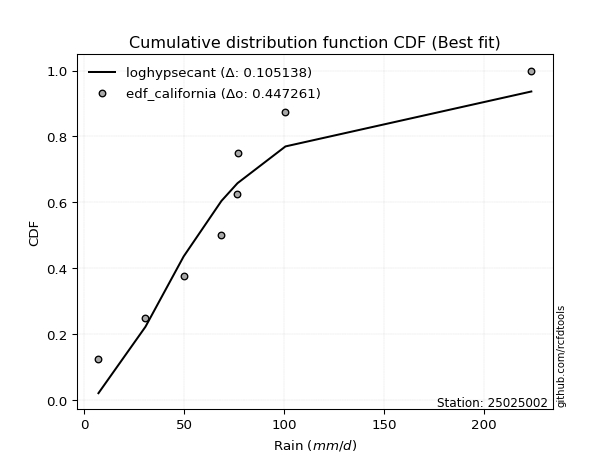</img>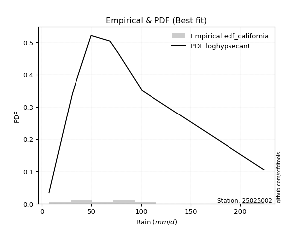</img>

</div>


### 2. EDF Hazen (1930)

Hazen method for plotting positions is a formula used to estimate the empirical cumulative probability distribution of flood events or other hydrological data. This formula often results in biased estimations, particularly when extrapolating to extreme events (high return periods).

<div align="center">


$P=(m-0.5)/n$


</div>


**2.1. Empirical values**

<div align="center">

|                | 0                  | 1                  | 2                  | 3                  | 4                  | 5         | 6                 | 7         |
|:---------------|:-------------------|:-------------------|:-------------------|:-------------------|:-------------------|:----------|:------------------|:----------|
| date           | 2018               | 2019               | 2017               | 2020               | 2023               | 2025      | 2022              | 2024      |
| x              | 7.2                | 30.7               | 49.8               | 68.7               | 76.5               | 76.8      | 100.7             | 223.6     |
| m              | 1                  | 2                  | 3                  | 4                  | 5                  | 6         | 7                 | 8         |
| empirical_dist | edf_hazen          | edf_hazen          | edf_hazen          | edf_hazen          | edf_hazen          | edf_hazen | edf_hazen         | edf_hazen |
| empirical      | 0.0625             | 0.1875             | 0.3125             | 0.4375             | 0.5625             | 0.6875    | 0.8125            | 0.9375    |
| empirical_tr   | 1.0666666666666667 | 1.2307692307692308 | 1.4545454545454546 | 1.7777777777777777 | 2.2857142857142856 | 3.2       | 5.333333333333333 | 16.0      |

</div>


**2.2. Kolmogorov-Smirnov fit test (sorted by Δ)**


<div align="center">

|                | 0                  | 1                   | 2                   | 3                   | 4                   | 5                  | 6                   | 7                   | 8                   | 9                   | 10                  | 11                 | 12                  | 13                  | 14                  | 15                  | 16                  | 17                  | 18                  | 19                 | 20                  | 21                  | 22                  | 23                  | 24                  | 25                  | 26                  | 27                  | 28                  | 29                  | 30                  | 31                  | 32                  | 33                  | 34                  | 35                  | 36                  | 37                  | 38                  | 39                 | 40                  | 41                  | 42                  | 43                 | 44                  | 45                 | 46                  | 47                  | 48                  | 49                  | 50                  | 51                  | 52                  | 53                  | 54                  | 55                 | 56                 | 57                  | 58                  | 59                  | 60                  | 61                  | 62                  | 63                 | 64                  | 65                  | 66                 | 67                  | 68                  | 69                 | 70                 | 71                  | 72                  | 73                  | 74                  | 75                  | 76                  | 77                  | 78                  | 79                  | 80                  | 81                  | 82                 | 83                 | 84                 | 85                  | 86                  | 87                 | 88                  | 89                 | 90                  | 91                  | 92                 | 93                 | 94                  | 95                  | 96                  | 97                  | 98                  | 99                 | 100                 | 101                 | 102                 | 103                | 104                 | 105                 | 106                | 107                 | 108                 | 109                | 110                 | 111                | 112                | 113                | 114                | 115                | 116                 | 117                 | 118                | 119                 | 120                | 121                | 122                 | 123                | 124                 | 125                | 126                | 127                 | 128                | 129                | 130                | 131                | 132                | 133                 | 134                 | 135                | 136                 | 137                 | 138                | 139                 | 140                | 141                 | 142                | 143                | 144                | 145                | 146                | 147                | 148                | 149                | 150                | 151                | 152                | 153                | 154                | 155                | 156                | 157                | 158                | 159                |
|:---------------|:-------------------|:--------------------|:--------------------|:--------------------|:--------------------|:-------------------|:--------------------|:--------------------|:--------------------|:--------------------|:--------------------|:-------------------|:--------------------|:--------------------|:--------------------|:--------------------|:--------------------|:--------------------|:--------------------|:-------------------|:--------------------|:--------------------|:--------------------|:--------------------|:--------------------|:--------------------|:--------------------|:--------------------|:--------------------|:--------------------|:--------------------|:--------------------|:--------------------|:--------------------|:--------------------|:--------------------|:--------------------|:--------------------|:--------------------|:-------------------|:--------------------|:--------------------|:--------------------|:-------------------|:--------------------|:-------------------|:--------------------|:--------------------|:--------------------|:--------------------|:--------------------|:--------------------|:--------------------|:--------------------|:--------------------|:-------------------|:-------------------|:--------------------|:--------------------|:--------------------|:--------------------|:--------------------|:--------------------|:-------------------|:--------------------|:--------------------|:-------------------|:--------------------|:--------------------|:-------------------|:-------------------|:--------------------|:--------------------|:--------------------|:--------------------|:--------------------|:--------------------|:--------------------|:--------------------|:--------------------|:--------------------|:--------------------|:-------------------|:-------------------|:-------------------|:--------------------|:--------------------|:-------------------|:--------------------|:-------------------|:--------------------|:--------------------|:-------------------|:-------------------|:--------------------|:--------------------|:--------------------|:--------------------|:--------------------|:-------------------|:--------------------|:--------------------|:--------------------|:-------------------|:--------------------|:--------------------|:-------------------|:--------------------|:--------------------|:-------------------|:--------------------|:-------------------|:-------------------|:-------------------|:-------------------|:-------------------|:--------------------|:--------------------|:-------------------|:--------------------|:-------------------|:-------------------|:--------------------|:-------------------|:--------------------|:-------------------|:-------------------|:--------------------|:-------------------|:-------------------|:-------------------|:-------------------|:-------------------|:--------------------|:--------------------|:-------------------|:--------------------|:--------------------|:-------------------|:--------------------|:-------------------|:--------------------|:-------------------|:-------------------|:-------------------|:-------------------|:-------------------|:-------------------|:-------------------|:-------------------|:-------------------|:-------------------|:-------------------|:-------------------|:-------------------|:-------------------|:-------------------|:-------------------|:-------------------|:-------------------|
| station        | 25025002           | 25025002            | 25025002            | 25025002            | 25025002            | 25025002           | 25025002            | 25025002            | 25025002            | 25025002            | 25025002            | 25025002           | 25025002            | 25025002            | 25025002            | 25025002            | 25025002            | 25025002            | 25025002            | 25025002           | 25025002            | 25025002            | 25025002            | 25025002            | 25025002            | 25025002            | 25025002            | 25025002            | 25025002            | 25025002            | 25025002            | 25025002            | 25025002            | 25025002            | 25025002            | 25025002            | 25025002            | 25025002            | 25025002            | 25025002           | 25025002            | 25025002            | 25025002            | 25025002           | 25025002            | 25025002           | 25025002            | 25025002            | 25025002            | 25025002            | 25025002            | 25025002            | 25025002            | 25025002            | 25025002            | 25025002           | 25025002           | 25025002            | 25025002            | 25025002            | 25025002            | 25025002            | 25025002            | 25025002           | 25025002            | 25025002            | 25025002           | 25025002            | 25025002            | 25025002           | 25025002           | 25025002            | 25025002            | 25025002            | 25025002            | 25025002            | 25025002            | 25025002            | 25025002            | 25025002            | 25025002            | 25025002            | 25025002           | 25025002           | 25025002           | 25025002            | 25025002            | 25025002           | 25025002            | 25025002           | 25025002            | 25025002            | 25025002           | 25025002           | 25025002            | 25025002            | 25025002            | 25025002            | 25025002            | 25025002           | 25025002            | 25025002            | 25025002            | 25025002           | 25025002            | 25025002            | 25025002           | 25025002            | 25025002            | 25025002           | 25025002            | 25025002           | 25025002           | 25025002           | 25025002           | 25025002           | 25025002            | 25025002            | 25025002           | 25025002            | 25025002           | 25025002           | 25025002            | 25025002           | 25025002            | 25025002           | 25025002           | 25025002            | 25025002           | 25025002           | 25025002           | 25025002           | 25025002           | 25025002            | 25025002            | 25025002           | 25025002            | 25025002            | 25025002           | 25025002            | 25025002           | 25025002            | 25025002           | 25025002           | 25025002           | 25025002           | 25025002           | 25025002           | 25025002           | 25025002           | 25025002           | 25025002           | 25025002           | 25025002           | 25025002           | 25025002           | 25025002           | 25025002           | 25025002           | 25025002           |
| empirical_dist | edf_hazen          | edf_hazen           | edf_hazen           | edf_hazen           | edf_hazen           | edf_hazen          | edf_hazen           | edf_hazen           | edf_hazen           | edf_hazen           | edf_hazen           | edf_hazen          | edf_hazen           | edf_hazen           | edf_hazen           | edf_hazen           | edf_hazen           | edf_hazen           | edf_hazen           | edf_hazen          | edf_hazen           | edf_hazen           | edf_hazen           | edf_hazen           | edf_hazen           | edf_hazen           | edf_hazen           | edf_hazen           | edf_hazen           | edf_hazen           | edf_hazen           | edf_hazen           | edf_hazen           | edf_hazen           | edf_hazen           | edf_hazen           | edf_hazen           | edf_hazen           | edf_hazen           | edf_hazen          | edf_hazen           | edf_hazen           | edf_hazen           | edf_hazen          | edf_hazen           | edf_hazen          | edf_hazen           | edf_hazen           | edf_hazen           | edf_hazen           | edf_hazen           | edf_hazen           | edf_hazen           | edf_hazen           | edf_hazen           | edf_hazen          | edf_hazen          | edf_hazen           | edf_hazen           | edf_hazen           | edf_hazen           | edf_hazen           | edf_hazen           | edf_hazen          | edf_hazen           | edf_hazen           | edf_hazen          | edf_hazen           | edf_hazen           | edf_hazen          | edf_hazen          | edf_hazen           | edf_hazen           | edf_hazen           | edf_hazen           | edf_hazen           | edf_hazen           | edf_hazen           | edf_hazen           | edf_hazen           | edf_hazen           | edf_hazen           | edf_hazen          | edf_hazen          | edf_hazen          | edf_hazen           | edf_hazen           | edf_hazen          | edf_hazen           | edf_hazen          | edf_hazen           | edf_hazen           | edf_hazen          | edf_hazen          | edf_hazen           | edf_hazen           | edf_hazen           | edf_hazen           | edf_hazen           | edf_hazen          | edf_hazen           | edf_hazen           | edf_hazen           | edf_hazen          | edf_hazen           | edf_hazen           | edf_hazen          | edf_hazen           | edf_hazen           | edf_hazen          | edf_hazen           | edf_hazen          | edf_hazen          | edf_hazen          | edf_hazen          | edf_hazen          | edf_hazen           | edf_hazen           | edf_hazen          | edf_hazen           | edf_hazen          | edf_hazen          | edf_hazen           | edf_hazen          | edf_hazen           | edf_hazen          | edf_hazen          | edf_hazen           | edf_hazen          | edf_hazen          | edf_hazen          | edf_hazen          | edf_hazen          | edf_hazen           | edf_hazen           | edf_hazen          | edf_hazen           | edf_hazen           | edf_hazen          | edf_hazen           | edf_hazen          | edf_hazen           | edf_hazen          | edf_hazen          | edf_hazen          | edf_hazen          | edf_hazen          | edf_hazen          | edf_hazen          | edf_hazen          | edf_hazen          | edf_hazen          | edf_hazen          | edf_hazen          | edf_hazen          | edf_hazen          | edf_hazen          | edf_hazen          | edf_hazen          | edf_hazen          |
| p_dist         | logjohnsonsu       | t                   | invweibull          | invgamma            | johnsonsu           | invgauss           | burr                | mielke              | loggenlogistic      | logmielke           | nct                 | halflogistic       | logburr12           | logweibull_min      | gompertz            | logloggamma         | moyal               | loggompertz         | logjohnsonsb        | exponnorm          | vonmises_line       | gengamma            | logpearson3         | loggumbel_l         | pearson3            | genpareto           | logskewnorm         | logt                | logvonmises_line    | logburr             | genlogistic         | foldnorm            | halfnorm            | loggenextreme       | gumbel_r            | genexpon            | lomax               | betaprime           | logargus            | loganglit          | lognct              | logsemicircular     | logcrystalball      | lognorm            | logexponnorm        | logrice            | logf                | logfatiguelife      | skewnorm            | loggamma            | loggamma            | logncf              | logbetaprime        | wald                | kstwobign           | loglogistic        | logerlang          | rayleigh            | f                   | logalpha            | logbeta             | logtriang           | loginvgamma         | loghypsecant       | kappa3              | logarcsine          | maxwell            | loginvgauss         | loggennorm          | gennorm            | logmaxwell         | exponpow            | logdgamma           | logfoldnorm         | dweibull            | lograyleigh         | logloglaplace       | loginvweibull       | dgamma              | nakagami            | logdweibull         | loggenhalflogistic  | truncnorm          | rice               | logcosine          | loglaplace          | loglaplace          | gamma              | anglit              | semicircular       | loggausshyper       | crystalball         | norm               | loggenpareto       | logistic            | hypsecant           | logtruncnorm        | loggumbel_r         | laplace             | loghalfnorm        | logkstwobign        | halfgennorm         | arcsine             | loggenexpon        | tukeylambda         | loghalflogistic     | logmoyal           | logweibull_max      | logksone            | logwrapcauchy      | loguniform          | truncweibull_min   | truncexpon         | logkappa3          | logkappa4          | cosine             | gumbel_l            | logtruncweibull_min | loglevy_l          | bradford            | exponweib          | ncf                | loglomax            | logtrapezoid       | gausshyper          | logwald            | burr12             | logbradford         | weibull_min        | logtruncexpon      | kappa4             | wrapcauchy         | ksone              | argus               | genextreme          | uniform            | johnsonsb           | alpha               | levy_l             | lognakagami         | logtukeylambda     | logrdist            | loggengamma        | triang             | logexponweib       | rdist              | powerlaw           | genhalflogistic    | fatiguelife        | erlang             | trapezoid          | beta               | logexponpow        | logpowerlaw        | truncpareto        | weibull_max        | logtruncpareto     | loghalfgennorm     | logvonmises        | vonmises           |
| delta          | 0.0711707432351456 | 0.08091061048481396 | 0.09498692737447001 | 0.09552485408080935 | 0.09637119553400142 | 0.0975723106666293 | 0.10054898113868516 | 0.10060201689836867 | 0.10072332408081974 | 0.10114057828631418 | 0.10269487890812079 | 0.1027267732697873 | 0.10557475274879713 | 0.10558075345548779 | 0.10622191081760968 | 0.10672719327483338 | 0.10790905904168091 | 0.10815236814096862 | 0.10843271880460992 | 0.1084402121440593 | 0.10919342584676861 | 0.10941746755914816 | 0.10967740247504532 | 0.11125114154392202 | 0.11181047265762734 | 0.11190207989527967 | 0.11263915143092706 | 0.11786998977948282 | 0.12017658041159063 | 0.12072705429372399 | 0.12200617416247161 | 0.12563267943641043 | 0.12660730775651685 | 0.12892759108308505 | 0.13378430849314615 | 0.13680376765710822 | 0.13686262159700457 | 0.13792071811403883 | 0.14328131452520743 | 0.1433947305172975 | 0.14636869431400623 | 0.14640387684821726 | 0.14673560424524024 | 0.146735699435791  | 0.14673770555510068 | 0.1467769406521341 | 0.14714816330586955 | 0.14820480749878207 | 0.14867127400797409 | 0.14902912547489144 | 0.14902912547489144 | 0.15062985920664396 | 0.15064609508429805 | 0.15172557326764458 | 0.15217928310202944 | 0.1577881842792721 | 0.15852578129452   | 0.15854403446016885 | 0.15864607804937003 | 0.15925066048155367 | 0.15944775271138584 | 0.16339754980571652 | 0.16578262845173086 | 0.1669445138057254 | 0.16726759136827585 | 0.16825799090693105 | 0.1698832656124153 | 0.16996615691639666 | 0.17414623714054933 | 0.1744257622661164 | 0.1745989143577027 | 0.17797938030263855 | 0.17804985212271063 | 0.17834425027121226 | 0.18068080044548762 | 0.18333914529515538 | 0.18448760210323356 | 0.18602309215340074 | 0.18749999412756013 | 0.18749999642675494 | 0.18750000000087025 | 0.18985111934467136 | 0.1904007490078482 | 0.1910370395809392 | 0.1918422626158982 | 0.19241000921864893 | 0.19241000921864893 | 0.1970983014443045 | 0.20121172704868595 | 0.2012775961580212 | 0.20244793098120628 | 0.20350011629432857 | 0.203500127707618  | 0.2046660779891471 | 0.20568308440986266 | 0.20754530302845842 | 0.21029572664221907 | 0.21471162089187212 | 0.21507740741157144 | 0.2159798518374667 | 0.22021131231975222 | 0.22632209407041481 | 0.23260948181785734 | 0.2334109291823916 | 0.23646190993512306 | 0.23694908219063537 | 0.2382037560262975 | 0.24621432787516062 | 0.24756874540869656 | 0.2484409206061503 | 0.25038098890089233 | 0.2507299024761359 | 0.2528655838651681 | 0.2638590993444573 | 0.2652625223579137 | 0.2729487862392538 | 0.27416474928457846 | 0.27448014817879995 | 0.2746714108885633 | 0.27659292852951967 | 0.2820727467983519 | 0.2862530734209707 | 0.28669349442274283 | 0.289503786653855  | 0.30250207920655947 | 0.3035156382918962 | 0.3132290081661715 | 0.33407536239034696 | 0.3423811713986562 | 0.3448162981837921 | 0.3482856637458206 | 0.3639894923873064 | 0.3691081330868762 | 0.37682571748943183 | 0.37839325529222945 | 0.3804297597042514 | 0.38169551460629797 | 0.38341841580912595 | 0.3859686977528627 | 0.40505664654648177 | 0.4130538365210086 | 0.43406722951327215 | 0.4423845933335111 | 0.4429185923504201 | 0.4685980933604449 | 0.4998844385930351 | 0.5045461400803071 | 0.5052301491488431 | 0.5369986358441623 | 0.5838291664573275 | 0.6134303572808127 | 0.6183173911716808 | 0.6326724427943926 | 0.6545805772956228 | 0.6743082698376814 | 0.6916403182108232 | 0.7559565539170284 | 0.8125             | 1.089506036185114  | 35.075286042644386 |
| deltao         | 0.4472608134160001 | 0.4472608134160001  | 0.4472608134160001  | 0.4472608134160001  | 0.4472608134160001  | 0.4472608134160001 | 0.4472608134160001  | 0.4472608134160001  | 0.4472608134160001  | 0.4472608134160001  | 0.4472608134160001  | 0.4472608134160001 | 0.4472608134160001  | 0.4472608134160001  | 0.4472608134160001  | 0.4472608134160001  | 0.4472608134160001  | 0.4472608134160001  | 0.4472608134160001  | 0.4472608134160001 | 0.4472608134160001  | 0.4472608134160001  | 0.4472608134160001  | 0.4472608134160001  | 0.4472608134160001  | 0.4472608134160001  | 0.4472608134160001  | 0.4472608134160001  | 0.4472608134160001  | 0.4472608134160001  | 0.4472608134160001  | 0.4472608134160001  | 0.4472608134160001  | 0.4472608134160001  | 0.4472608134160001  | 0.4472608134160001  | 0.4472608134160001  | 0.4472608134160001  | 0.4472608134160001  | 0.4472608134160001 | 0.4472608134160001  | 0.4472608134160001  | 0.4472608134160001  | 0.4472608134160001 | 0.4472608134160001  | 0.4472608134160001 | 0.4472608134160001  | 0.4472608134160001  | 0.4472608134160001  | 0.4472608134160001  | 0.4472608134160001  | 0.4472608134160001  | 0.4472608134160001  | 0.4472608134160001  | 0.4472608134160001  | 0.4472608134160001 | 0.4472608134160001 | 0.4472608134160001  | 0.4472608134160001  | 0.4472608134160001  | 0.4472608134160001  | 0.4472608134160001  | 0.4472608134160001  | 0.4472608134160001 | 0.4472608134160001  | 0.4472608134160001  | 0.4472608134160001 | 0.4472608134160001  | 0.4472608134160001  | 0.4472608134160001 | 0.4472608134160001 | 0.4472608134160001  | 0.4472608134160001  | 0.4472608134160001  | 0.4472608134160001  | 0.4472608134160001  | 0.4472608134160001  | 0.4472608134160001  | 0.4472608134160001  | 0.4472608134160001  | 0.4472608134160001  | 0.4472608134160001  | 0.4472608134160001 | 0.4472608134160001 | 0.4472608134160001 | 0.4472608134160001  | 0.4472608134160001  | 0.4472608134160001 | 0.4472608134160001  | 0.4472608134160001 | 0.4472608134160001  | 0.4472608134160001  | 0.4472608134160001 | 0.4472608134160001 | 0.4472608134160001  | 0.4472608134160001  | 0.4472608134160001  | 0.4472608134160001  | 0.4472608134160001  | 0.4472608134160001 | 0.4472608134160001  | 0.4472608134160001  | 0.4472608134160001  | 0.4472608134160001 | 0.4472608134160001  | 0.4472608134160001  | 0.4472608134160001 | 0.4472608134160001  | 0.4472608134160001  | 0.4472608134160001 | 0.4472608134160001  | 0.4472608134160001 | 0.4472608134160001 | 0.4472608134160001 | 0.4472608134160001 | 0.4472608134160001 | 0.4472608134160001  | 0.4472608134160001  | 0.4472608134160001 | 0.4472608134160001  | 0.4472608134160001 | 0.4472608134160001 | 0.4472608134160001  | 0.4472608134160001 | 0.4472608134160001  | 0.4472608134160001 | 0.4472608134160001 | 0.4472608134160001  | 0.4472608134160001 | 0.4472608134160001 | 0.4472608134160001 | 0.4472608134160001 | 0.4472608134160001 | 0.4472608134160001  | 0.4472608134160001  | 0.4472608134160001 | 0.4472608134160001  | 0.4472608134160001  | 0.4472608134160001 | 0.4472608134160001  | 0.4472608134160001 | 0.4472608134160001  | 0.4472608134160001 | 0.4472608134160001 | 0.4472608134160001 | 0.4472608134160001 | 0.4472608134160001 | 0.4472608134160001 | 0.4472608134160001 | 0.4472608134160001 | 0.4472608134160001 | 0.4472608134160001 | 0.4472608134160001 | 0.4472608134160001 | 0.4472608134160001 | 0.4472608134160001 | 0.4472608134160001 | 0.4472608134160001 | 0.4472608134160001 | 0.4472608134160001 |
| eval           | Δo > Δ             | Δo > Δ              | Δo > Δ              | Δo > Δ              | Δo > Δ              | Δo > Δ             | Δo > Δ              | Δo > Δ              | Δo > Δ              | Δo > Δ              | Δo > Δ              | Δo > Δ             | Δo > Δ              | Δo > Δ              | Δo > Δ              | Δo > Δ              | Δo > Δ              | Δo > Δ              | Δo > Δ              | Δo > Δ             | Δo > Δ              | Δo > Δ              | Δo > Δ              | Δo > Δ              | Δo > Δ              | Δo > Δ              | Δo > Δ              | Δo > Δ              | Δo > Δ              | Δo > Δ              | Δo > Δ              | Δo > Δ              | Δo > Δ              | Δo > Δ              | Δo > Δ              | Δo > Δ              | Δo > Δ              | Δo > Δ              | Δo > Δ              | Δo > Δ             | Δo > Δ              | Δo > Δ              | Δo > Δ              | Δo > Δ             | Δo > Δ              | Δo > Δ             | Δo > Δ              | Δo > Δ              | Δo > Δ              | Δo > Δ              | Δo > Δ              | Δo > Δ              | Δo > Δ              | Δo > Δ              | Δo > Δ              | Δo > Δ             | Δo > Δ             | Δo > Δ              | Δo > Δ              | Δo > Δ              | Δo > Δ              | Δo > Δ              | Δo > Δ              | Δo > Δ             | Δo > Δ              | Δo > Δ              | Δo > Δ             | Δo > Δ              | Δo > Δ              | Δo > Δ             | Δo > Δ             | Δo > Δ              | Δo > Δ              | Δo > Δ              | Δo > Δ              | Δo > Δ              | Δo > Δ              | Δo > Δ              | Δo > Δ              | Δo > Δ              | Δo > Δ              | Δo > Δ              | Δo > Δ             | Δo > Δ             | Δo > Δ             | Δo > Δ              | Δo > Δ              | Δo > Δ             | Δo > Δ              | Δo > Δ             | Δo > Δ              | Δo > Δ              | Δo > Δ             | Δo > Δ             | Δo > Δ              | Δo > Δ              | Δo > Δ              | Δo > Δ              | Δo > Δ              | Δo > Δ             | Δo > Δ              | Δo > Δ              | Δo > Δ              | Δo > Δ             | Δo > Δ              | Δo > Δ              | Δo > Δ             | Δo > Δ              | Δo > Δ              | Δo > Δ             | Δo > Δ              | Δo > Δ             | Δo > Δ             | Δo > Δ             | Δo > Δ             | Δo > Δ             | Δo > Δ              | Δo > Δ              | Δo > Δ             | Δo > Δ              | Δo > Δ             | Δo > Δ             | Δo > Δ              | Δo > Δ             | Δo > Δ              | Δo > Δ             | Δo > Δ             | Δo > Δ              | Δo > Δ             | Δo > Δ             | Δo > Δ             | Δo > Δ             | Δo > Δ             | Δo > Δ              | Δo > Δ              | Δo > Δ             | Δo > Δ              | Δo > Δ              | Δo > Δ             | Δo > Δ              | Δo > Δ             | Δo > Δ              | Δo > Δ             | Δo > Δ             | Δo <= Δ            | Δo <= Δ            | Δo <= Δ            | Δo <= Δ            | Δo <= Δ            | Δo <= Δ            | Δo <= Δ            | Δo <= Δ            | Δo <= Δ            | Δo <= Δ            | Δo <= Δ            | Δo <= Δ            | Δo <= Δ            | Δo <= Δ            | Δo <= Δ            | Δo <= Δ            |
| fit            | 1                  | 1                   | 1                   | 1                   | 1                   | 1                  | 1                   | 1                   | 1                   | 1                   | 1                   | 1                  | 1                   | 1                   | 1                   | 1                   | 1                   | 1                   | 1                   | 1                  | 1                   | 1                   | 1                   | 1                   | 1                   | 1                   | 1                   | 1                   | 1                   | 1                   | 1                   | 1                   | 1                   | 1                   | 1                   | 1                   | 1                   | 1                   | 1                   | 1                  | 1                   | 1                   | 1                   | 1                  | 1                   | 1                  | 1                   | 1                   | 1                   | 1                   | 1                   | 1                   | 1                   | 1                   | 1                   | 1                  | 1                  | 1                   | 1                   | 1                   | 1                   | 1                   | 1                   | 1                  | 1                   | 1                   | 1                  | 1                   | 1                   | 1                  | 1                  | 1                   | 1                   | 1                   | 1                   | 1                   | 1                   | 1                   | 1                   | 1                   | 1                   | 1                   | 1                  | 1                  | 1                  | 1                   | 1                   | 1                  | 1                   | 1                  | 1                   | 1                   | 1                  | 1                  | 1                   | 1                   | 1                   | 1                   | 1                   | 1                  | 1                   | 1                   | 1                   | 1                  | 1                   | 1                   | 1                  | 1                   | 1                   | 1                  | 1                   | 1                  | 1                  | 1                  | 1                  | 1                  | 1                   | 1                   | 1                  | 1                   | 1                  | 1                  | 1                   | 1                  | 1                   | 1                  | 1                  | 1                   | 1                  | 1                  | 1                  | 1                  | 1                  | 1                   | 1                   | 1                  | 1                   | 1                   | 1                  | 1                   | 1                  | 1                   | 1                  | 1                  | 0                  | 0                  | 0                  | 0                  | 0                  | 0                  | 0                  | 0                  | 0                  | 0                  | 0                  | 0                  | 0                  | 0                  | 0                  | 0                  |
| n              | 8                  | 8                   | 8                   | 8                   | 8                   | 8                  | 8                   | 8                   | 8                   | 8                   | 8                   | 8                  | 8                   | 8                   | 8                   | 8                   | 8                   | 8                   | 8                   | 8                  | 8                   | 8                   | 8                   | 8                   | 8                   | 8                   | 8                   | 8                   | 8                   | 8                   | 8                   | 8                   | 8                   | 8                   | 8                   | 8                   | 8                   | 8                   | 8                   | 8                  | 8                   | 8                   | 8                   | 8                  | 8                   | 8                  | 8                   | 8                   | 8                   | 8                   | 8                   | 8                   | 8                   | 8                   | 8                   | 8                  | 8                  | 8                   | 8                   | 8                   | 8                   | 8                   | 8                   | 8                  | 8                   | 8                   | 8                  | 8                   | 8                   | 8                  | 8                  | 8                   | 8                   | 8                   | 8                   | 8                   | 8                   | 8                   | 8                   | 8                   | 8                   | 8                   | 8                  | 8                  | 8                  | 8                   | 8                   | 8                  | 8                   | 8                  | 8                   | 8                   | 8                  | 8                  | 8                   | 8                   | 8                   | 8                   | 8                   | 8                  | 8                   | 8                   | 8                   | 8                  | 8                   | 8                   | 8                  | 8                   | 8                   | 8                  | 8                   | 8                  | 8                  | 8                  | 8                  | 8                  | 8                   | 8                   | 8                  | 8                   | 8                  | 8                  | 8                   | 8                  | 8                   | 8                  | 8                  | 8                   | 8                  | 8                  | 8                  | 8                  | 8                  | 8                   | 8                   | 8                  | 8                   | 8                   | 8                  | 8                   | 8                  | 8                   | 8                  | 8                  | 8                  | 8                  | 8                  | 8                  | 8                  | 8                  | 8                  | 8                  | 8                  | 8                  | 8                  | 8                  | 8                  | 8                  | 8                  | 8                  |
| best_fit       | 1                  | 0                   | 0                   | 0                   | 0                   | 0                  | 0                   | 0                   | 0                   | 0                   | 0                   | 0                  | 0                   | 0                   | 0                   | 0                   | 0                   | 0                   | 0                   | 0                  | 0                   | 0                   | 0                   | 0                   | 0                   | 0                   | 0                   | 0                   | 0                   | 0                   | 0                   | 0                   | 0                   | 0                   | 0                   | 0                   | 0                   | 0                   | 0                   | 0                  | 0                   | 0                   | 0                   | 0                  | 0                   | 0                  | 0                   | 0                   | 0                   | 0                   | 0                   | 0                   | 0                   | 0                   | 0                   | 0                  | 0                  | 0                   | 0                   | 0                   | 0                   | 0                   | 0                   | 0                  | 0                   | 0                   | 0                  | 0                   | 0                   | 0                  | 0                  | 0                   | 0                   | 0                   | 0                   | 0                   | 0                   | 0                   | 0                   | 0                   | 0                   | 0                   | 0                  | 0                  | 0                  | 0                   | 0                   | 0                  | 0                   | 0                  | 0                   | 0                   | 0                  | 0                  | 0                   | 0                   | 0                   | 0                   | 0                   | 0                  | 0                   | 0                   | 0                   | 0                  | 0                   | 0                   | 0                  | 0                   | 0                   | 0                  | 0                   | 0                  | 0                  | 0                  | 0                  | 0                  | 0                   | 0                   | 0                  | 0                   | 0                  | 0                  | 0                   | 0                  | 0                   | 0                  | 0                  | 0                   | 0                  | 0                  | 0                  | 0                  | 0                  | 0                   | 0                   | 0                  | 0                   | 0                   | 0                  | 0                   | 0                  | 0                   | 0                  | 0                  | 0                  | 0                  | 0                  | 0                  | 0                  | 0                  | 0                  | 0                  | 0                  | 0                  | 0                  | 0                  | 0                  | 0                  | 0                  | 0                  |
| best_fit_sort  | 1                  | 2                   | 3                   | 4                   | 5                   | 6                  | 7                   | 8                   | 9                   | 10                  | 11                  | 12                 | 13                  | 14                  | 15                  | 16                  | 17                  | 18                  | 19                  | 20                 | 21                  | 22                  | 23                  | 24                  | 25                  | 26                  | 27                  | 28                  | 29                  | 30                  | 31                  | 32                  | 33                  | 34                  | 35                  | 36                  | 37                  | 38                  | 39                  | 40                 | 41                  | 42                  | 43                  | 44                 | 45                  | 46                 | 47                  | 48                  | 49                  | 50                  | 51                  | 52                  | 53                  | 54                  | 55                  | 56                 | 57                 | 58                  | 59                  | 60                  | 61                  | 62                  | 63                  | 64                 | 65                  | 66                  | 67                 | 68                  | 69                  | 70                 | 71                 | 72                  | 73                  | 74                  | 75                  | 76                  | 77                  | 78                  | 79                  | 80                  | 81                  | 82                  | 83                 | 84                 | 85                 | 86                  | 87                  | 88                 | 89                  | 90                 | 91                  | 92                  | 93                 | 94                 | 95                  | 96                  | 97                  | 98                  | 99                  | 100                | 101                 | 102                 | 103                 | 104                | 105                 | 106                 | 107                | 108                 | 109                 | 110                | 111                 | 112                | 113                | 114                | 115                | 116                | 117                 | 118                 | 119                | 120                 | 121                | 122                | 123                 | 124                | 125                 | 126                | 127                | 128                 | 129                | 130                | 131                | 132                | 133                | 134                 | 135                 | 136                | 137                 | 138                 | 139                | 140                 | 141                | 142                 | 143                | 144                | 145                | 146                | 147                | 148                | 149                | 150                | 151                | 152                | 153                | 154                | 155                | 156                | 157                | 158                | 159                | 160                |

</div>


**2.3. Best fit**

<div align="center">

|   id |   station | empirical_dist   | p_dist       |     delta |   deltao | eval   |   fit |   n |   best_fit |   best_fit_sort |
|-----:|----------:|:-----------------|:-------------|----------:|---------:|:-------|------:|----:|-----------:|----------------:|
|    0 |  25025002 | edf_hazen        | logjohnsonsu | 0.0711707 | 0.447261 | Δo > Δ |     1 |   8 |          1 |               1 |

</div>


<div align="center">

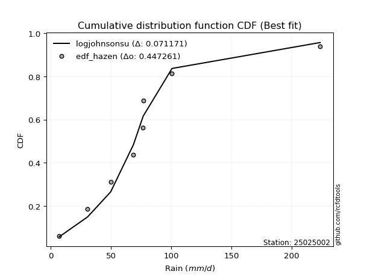</img></img>

</div>


### 3. EDF Weibull (1939)

Weibull plotting position formula is an empirical method used to estimate the non-exceedance probability or plotting position for a set of observed data, is often recommended or widely used in practice, particularly in flood frequency analysis.

<div align="center">


$P=m/(n+1)$


</div>


**3.1. Empirical values**

<div align="center">

|                | 0                  | 1                  | 2                  | 3                  | 4                  | 5                  | 6                  | 7                  |
|:---------------|:-------------------|:-------------------|:-------------------|:-------------------|:-------------------|:-------------------|:-------------------|:-------------------|
| date           | 2018               | 2019               | 2017               | 2020               | 2023               | 2025               | 2022               | 2024               |
| x              | 7.2                | 30.7               | 49.8               | 68.7               | 76.5               | 76.8               | 100.7              | 223.6              |
| m              | 1                  | 2                  | 3                  | 4                  | 5                  | 6                  | 7                  | 8                  |
| empirical_dist | edf_weibull        | edf_weibull        | edf_weibull        | edf_weibull        | edf_weibull        | edf_weibull        | edf_weibull        | edf_weibull        |
| empirical      | 0.1111111111111111 | 0.2222222222222222 | 0.3333333333333333 | 0.4444444444444444 | 0.5555555555555556 | 0.6666666666666666 | 0.7777777777777778 | 0.8888888888888888 |
| empirical_tr   | 1.125              | 1.2857142857142856 | 1.4999999999999998 | 1.7999999999999998 | 2.25               | 2.9999999999999996 | 4.5                | 8.999999999999996  |

</div>


**3.2. Kolmogorov-Smirnov fit test (sorted by Δ)**


<div align="center">

|                | 0                   | 1                   | 2                   | 3                  | 4                   | 5                   | 6                   | 7                   | 8                   | 9                   | 10                  | 11                 | 12                  | 13                  | 14                  | 15                  | 16                  | 17                  | 18                  | 19                  | 20                  | 21                  | 22                  | 23                  | 24                  | 25                  | 26                  | 27                  | 28                  | 29                  | 30                  | 31                  | 32                  | 33                  | 34                  | 35                  | 36                  | 37                  | 38                  | 39                  | 40                 | 41                  | 42                  | 43                 | 44                  | 45                  | 46                  | 47                 | 48                  | 49                 | 50                  | 51                  | 52                  | 53                  | 54                  | 55                  | 56                 | 57                  | 58                  | 59                  | 60                  | 61                  | 62                  | 63                  | 64                  | 65                  | 66                  | 67                  | 68                  | 69                  | 70                  | 71                  | 72                 | 73                  | 74                 | 75                  | 76                  | 77                 | 78                  | 79                  | 80                 | 81                  | 82                  | 83                  | 84                  | 85                  | 86                  | 87                  | 88                 | 89                  | 90                 | 91                 | 92                 | 93                  | 94                 | 95                  | 96                  | 97                 | 98                  | 99                 | 100                | 101                | 102                 | 103                 | 104                 | 105                 | 106                | 107                 | 108                 | 109                | 110                 | 111                 | 112                 | 113                | 114                 | 115                 | 116                 | 117                 | 118                | 119                | 120                | 121                 | 122                | 123                | 124                 | 125                | 126                | 127                | 128                 | 129                | 130                | 131                 | 132                 | 133                | 134                | 135                 | 136                | 137                 | 138                 | 139                 | 140                 | 141                 | 142                | 143                 | 144                | 145                | 146                 | 147                 | 148                | 149                | 150                | 151                | 152                | 153                | 154                | 155                | 156                | 157                | 158                | 159                |
|:---------------|:--------------------|:--------------------|:--------------------|:-------------------|:--------------------|:--------------------|:--------------------|:--------------------|:--------------------|:--------------------|:--------------------|:-------------------|:--------------------|:--------------------|:--------------------|:--------------------|:--------------------|:--------------------|:--------------------|:--------------------|:--------------------|:--------------------|:--------------------|:--------------------|:--------------------|:--------------------|:--------------------|:--------------------|:--------------------|:--------------------|:--------------------|:--------------------|:--------------------|:--------------------|:--------------------|:--------------------|:--------------------|:--------------------|:--------------------|:--------------------|:-------------------|:--------------------|:--------------------|:-------------------|:--------------------|:--------------------|:--------------------|:-------------------|:--------------------|:-------------------|:--------------------|:--------------------|:--------------------|:--------------------|:--------------------|:--------------------|:-------------------|:--------------------|:--------------------|:--------------------|:--------------------|:--------------------|:--------------------|:--------------------|:--------------------|:--------------------|:--------------------|:--------------------|:--------------------|:--------------------|:--------------------|:--------------------|:-------------------|:--------------------|:-------------------|:--------------------|:--------------------|:-------------------|:--------------------|:--------------------|:-------------------|:--------------------|:--------------------|:--------------------|:--------------------|:--------------------|:--------------------|:--------------------|:-------------------|:--------------------|:-------------------|:-------------------|:-------------------|:--------------------|:-------------------|:--------------------|:--------------------|:-------------------|:--------------------|:-------------------|:-------------------|:-------------------|:--------------------|:--------------------|:--------------------|:--------------------|:-------------------|:--------------------|:--------------------|:-------------------|:--------------------|:--------------------|:--------------------|:-------------------|:--------------------|:--------------------|:--------------------|:--------------------|:-------------------|:-------------------|:-------------------|:--------------------|:-------------------|:-------------------|:--------------------|:-------------------|:-------------------|:-------------------|:--------------------|:-------------------|:-------------------|:--------------------|:--------------------|:-------------------|:-------------------|:--------------------|:-------------------|:--------------------|:--------------------|:--------------------|:--------------------|:--------------------|:-------------------|:--------------------|:-------------------|:-------------------|:--------------------|:--------------------|:-------------------|:-------------------|:-------------------|:-------------------|:-------------------|:-------------------|:-------------------|:-------------------|:-------------------|:-------------------|:-------------------|:-------------------|
| station        | 25025002            | 25025002            | 25025002            | 25025002           | 25025002            | 25025002            | 25025002            | 25025002            | 25025002            | 25025002            | 25025002            | 25025002           | 25025002            | 25025002            | 25025002            | 25025002            | 25025002            | 25025002            | 25025002            | 25025002            | 25025002            | 25025002            | 25025002            | 25025002            | 25025002            | 25025002            | 25025002            | 25025002            | 25025002            | 25025002            | 25025002            | 25025002            | 25025002            | 25025002            | 25025002            | 25025002            | 25025002            | 25025002            | 25025002            | 25025002            | 25025002           | 25025002            | 25025002            | 25025002           | 25025002            | 25025002            | 25025002            | 25025002           | 25025002            | 25025002           | 25025002            | 25025002            | 25025002            | 25025002            | 25025002            | 25025002            | 25025002           | 25025002            | 25025002            | 25025002            | 25025002            | 25025002            | 25025002            | 25025002            | 25025002            | 25025002            | 25025002            | 25025002            | 25025002            | 25025002            | 25025002            | 25025002            | 25025002           | 25025002            | 25025002           | 25025002            | 25025002            | 25025002           | 25025002            | 25025002            | 25025002           | 25025002            | 25025002            | 25025002            | 25025002            | 25025002            | 25025002            | 25025002            | 25025002           | 25025002            | 25025002           | 25025002           | 25025002           | 25025002            | 25025002           | 25025002            | 25025002            | 25025002           | 25025002            | 25025002           | 25025002           | 25025002           | 25025002            | 25025002            | 25025002            | 25025002            | 25025002           | 25025002            | 25025002            | 25025002           | 25025002            | 25025002            | 25025002            | 25025002           | 25025002            | 25025002            | 25025002            | 25025002            | 25025002           | 25025002           | 25025002           | 25025002            | 25025002           | 25025002           | 25025002            | 25025002           | 25025002           | 25025002           | 25025002            | 25025002           | 25025002           | 25025002            | 25025002            | 25025002           | 25025002           | 25025002            | 25025002           | 25025002            | 25025002            | 25025002            | 25025002            | 25025002            | 25025002           | 25025002            | 25025002           | 25025002           | 25025002            | 25025002            | 25025002           | 25025002           | 25025002           | 25025002           | 25025002           | 25025002           | 25025002           | 25025002           | 25025002           | 25025002           | 25025002           | 25025002           |
| empirical_dist | edf_weibull         | edf_weibull         | edf_weibull         | edf_weibull        | edf_weibull         | edf_weibull         | edf_weibull         | edf_weibull         | edf_weibull         | edf_weibull         | edf_weibull         | edf_weibull        | edf_weibull         | edf_weibull         | edf_weibull         | edf_weibull         | edf_weibull         | edf_weibull         | edf_weibull         | edf_weibull         | edf_weibull         | edf_weibull         | edf_weibull         | edf_weibull         | edf_weibull         | edf_weibull         | edf_weibull         | edf_weibull         | edf_weibull         | edf_weibull         | edf_weibull         | edf_weibull         | edf_weibull         | edf_weibull         | edf_weibull         | edf_weibull         | edf_weibull         | edf_weibull         | edf_weibull         | edf_weibull         | edf_weibull        | edf_weibull         | edf_weibull         | edf_weibull        | edf_weibull         | edf_weibull         | edf_weibull         | edf_weibull        | edf_weibull         | edf_weibull        | edf_weibull         | edf_weibull         | edf_weibull         | edf_weibull         | edf_weibull         | edf_weibull         | edf_weibull        | edf_weibull         | edf_weibull         | edf_weibull         | edf_weibull         | edf_weibull         | edf_weibull         | edf_weibull         | edf_weibull         | edf_weibull         | edf_weibull         | edf_weibull         | edf_weibull         | edf_weibull         | edf_weibull         | edf_weibull         | edf_weibull        | edf_weibull         | edf_weibull        | edf_weibull         | edf_weibull         | edf_weibull        | edf_weibull         | edf_weibull         | edf_weibull        | edf_weibull         | edf_weibull         | edf_weibull         | edf_weibull         | edf_weibull         | edf_weibull         | edf_weibull         | edf_weibull        | edf_weibull         | edf_weibull        | edf_weibull        | edf_weibull        | edf_weibull         | edf_weibull        | edf_weibull         | edf_weibull         | edf_weibull        | edf_weibull         | edf_weibull        | edf_weibull        | edf_weibull        | edf_weibull         | edf_weibull         | edf_weibull         | edf_weibull         | edf_weibull        | edf_weibull         | edf_weibull         | edf_weibull        | edf_weibull         | edf_weibull         | edf_weibull         | edf_weibull        | edf_weibull         | edf_weibull         | edf_weibull         | edf_weibull         | edf_weibull        | edf_weibull        | edf_weibull        | edf_weibull         | edf_weibull        | edf_weibull        | edf_weibull         | edf_weibull        | edf_weibull        | edf_weibull        | edf_weibull         | edf_weibull        | edf_weibull        | edf_weibull         | edf_weibull         | edf_weibull        | edf_weibull        | edf_weibull         | edf_weibull        | edf_weibull         | edf_weibull         | edf_weibull         | edf_weibull         | edf_weibull         | edf_weibull        | edf_weibull         | edf_weibull        | edf_weibull        | edf_weibull         | edf_weibull         | edf_weibull        | edf_weibull        | edf_weibull        | edf_weibull        | edf_weibull        | edf_weibull        | edf_weibull        | edf_weibull        | edf_weibull        | edf_weibull        | edf_weibull        | edf_weibull        |
| p_dist         | logjohnsonsu        | logburr12           | logweibull_min      | logloggamma        | moyal               | logjohnsonsb        | exponnorm           | invweibull          | invgauss            | invgamma            | logpearson3         | johnsonsu          | t                   | loggumbel_l         | pearson3            | burr                | mielke              | loggenlogistic      | logmielke           | nct                 | genlogistic         | foldnorm            | gengamma            | loggenextreme       | logskewnorm         | halfnorm            | halflogistic        | logargus            | logt                | gompertz            | loggompertz         | genpareto           | vonmises_line       | gumbel_r            | logvonmises_line    | logburr             | logsemicircular     | skewnorm            | loganglit           | logtriang           | genexpon           | lomax               | logbeta             | betaprime          | kstwobign           | logarcsine          | rayleigh            | lognct             | logcrystalball      | lognorm            | logexponnorm        | logrice             | logf                | logfatiguelife      | loggamma            | loggamma            | f                  | logncf              | logbetaprime        | maxwell             | loglogistic         | logerlang           | logalpha            | gennorm             | wald                | loggenhalflogistic  | exponpow            | logdgamma           | loginvgamma         | dweibull            | loghypsecant        | kappa3              | loggennorm         | loginvgauss         | logloglaplace      | loginvweibull       | logdweibull         | dgamma             | logmaxwell          | truncnorm           | loggenpareto       | rice                | logfoldnorm         | lograyleigh         | logcosine           | semicircular        | anglit              | loggausshyper       | crystalball        | norm                | logistic           | loglaplace         | loglaplace         | hypsecant           | gamma              | laplace             | arcsine             | logkstwobign       | loghalfnorm         | halfgennorm        | loggumbel_r        | logweibull_max     | loggenexpon         | logksone            | logtruncnorm        | nakagami            | truncweibull_min   | loglevy_l           | truncexpon          | logwrapcauchy      | loghalflogistic     | tukeylambda         | loguniform          | logmoyal           | loglomax            | logkappa3           | logkappa4           | bradford            | ncf                | cosine             | gumbel_l           | logtruncweibull_min | logtrapezoid       | exponweib          | gausshyper          | burr12             | logwald            | weibull_min        | logbradford         | kappa4             | logtruncexpon      | wrapcauchy          | ksone               | levy_l             | argus              | genextreme          | uniform            | johnsonsb           | alpha               | lognakagami         | logrdist            | logtukeylambda      | loggengamma        | triang              | logexponweib       | rdist              | powerlaw            | genhalflogistic     | fatiguelife        | erlang             | trapezoid          | beta               | logexponpow        | logpowerlaw        | truncpareto        | weibull_max        | logtruncpareto     | loghalfgennorm     | logvonmises        | vonmises           |
| delta          | 0.07204479840389755 | 0.08474141941546376 | 0.08474742012215442 | 0.0858938599415    | 0.08707572570834754 | 0.08759938547127655 | 0.08760687881072593 | 0.08804248293002559 | 0.08833088997592875 | 0.08858040963636493 | 0.08884406914171195 | 0.089426751089557  | 0.08947220951175461 | 0.09041780821058865 | 0.09097713932429397 | 0.09360453669424074 | 0.09365757245392425 | 0.09377887963637532 | 0.09419613384186976 | 0.09575043446367637 | 0.10117284082913824 | 0.10138640656282483 | 0.10247302311470374 | 0.10264737732637863 | 0.10569470698648264 | 0.10577397442318348 | 0.10791727437442807 | 0.10855909230298522 | 0.10897046582042938 | 0.11110667965898773 | 0.11111108855566605 | 0.11111111111041605 | 0.11111111111105665 | 0.11295097515981278 | 0.11323213596714621 | 0.11378260984927957 | 0.12557054351488395 | 0.12783794067464072 | 0.12802164185529397 | 0.12867532758349431 | 0.1298593232126638 | 0.12991817715256015 | 0.13011837099152695 | 0.1309762736695944 | 0.13134594976869607 | 0.13754808165948967 | 0.13771070112683548 | 0.1394242498695618 | 0.13979115980079582 | 0.1397912549913466 | 0.13979326111065626 | 0.13983249620768967 | 0.14020371886142513 | 0.14126036305433765 | 0.14208468103044702 | 0.14208468103044702 | 0.142756893765405  | 0.14368541476219954 | 0.14370165063985363 | 0.14904993227908192 | 0.15084373983482768 | 0.15158133685007558 | 0.15230621603710925 | 0.15359242893278302 | 0.15389316100625022 | 0.15512889712244915 | 0.15661038959504708 | 0.15721651878937726 | 0.15883818400728644 | 0.15984746711215425 | 0.16000006936128097 | 0.16032314692383143 | 0.1618328471351491 | 0.16296705600645645 | 0.1636542687699002 | 0.16518975882006742 | 0.16666666666753688 | 0.1674651073548336 | 0.16765446991325827 | 0.16956741567451483 | 0.1699438557669249 | 0.17020370624760583 | 0.17139980582676784 | 0.17639470085071096 | 0.17924027865845316 | 0.17943556227917085 | 0.18037839371535258 | 0.18161459764787297 | 0.1826667829609952 | 0.18266679437428462 | 0.1848497510765293 | 0.1854655647742045 | 0.1854655647742045 | 0.18671196969512505 | 0.1901538569998601 | 0.19424407407823807 | 0.19788725959563513 | 0.1993779789864189 | 0.20117520439080838 | 0.2054887607370815 | 0.2077671764474277 | 0.2114921056529384 | 0.21257759584905828 | 0.21906749075074355 | 0.22221870240233071 | 0.22222221864897715 | 0.2233482349182539 | 0.22606029977745218 | 0.22714124702084326 | 0.227607587272817  | 0.22929557668504363 | 0.22951746549067864 | 0.22954765556755902 | 0.2312593115818531 | 0.23808238331163167 | 0.24302576601112397 | 0.24442918902458038 | 0.24653991031047634 | 0.2515308511987485 | 0.2521154529059204 | 0.2533314159512451 | 0.25364681484546664 | 0.2547815644316328 | 0.2612394134650186 | 0.26777985698433726 | 0.2785067859439493 | 0.2965711938474518 | 0.307658949176434  | 0.31324202905701365 | 0.3135634415235984 | 0.3239829648504588 | 0.32926727016508417 | 0.33438591086465397 | 0.3373575866417516 | 0.3421034952672096 | 0.34367103307000724 | 0.3457075374820292 | 0.34697329238407576 | 0.36258508247579263 | 0.39811220210203735 | 0.39934500729104994 | 0.40134366468662663 | 0.4076623711112889 | 0.40819637012819787 | 0.4338758711382227 | 0.451273327481924  | 0.46982391785808486 | 0.47050792692662086 | 0.5022764136219401 | 0.5491069442351053 | 0.5787081350585905 | 0.5835951689494586 | 0.5979502205721704 | 0.6198583550734006 | 0.6395860476154592 | 0.656918095988601  | 0.7212343316948062 | 0.7777777777777778 | 1.0825615917406697 | 35.1238971537555   |
| deltao         | 0.4472608134160001  | 0.4472608134160001  | 0.4472608134160001  | 0.4472608134160001 | 0.4472608134160001  | 0.4472608134160001  | 0.4472608134160001  | 0.4472608134160001  | 0.4472608134160001  | 0.4472608134160001  | 0.4472608134160001  | 0.4472608134160001 | 0.4472608134160001  | 0.4472608134160001  | 0.4472608134160001  | 0.4472608134160001  | 0.4472608134160001  | 0.4472608134160001  | 0.4472608134160001  | 0.4472608134160001  | 0.4472608134160001  | 0.4472608134160001  | 0.4472608134160001  | 0.4472608134160001  | 0.4472608134160001  | 0.4472608134160001  | 0.4472608134160001  | 0.4472608134160001  | 0.4472608134160001  | 0.4472608134160001  | 0.4472608134160001  | 0.4472608134160001  | 0.4472608134160001  | 0.4472608134160001  | 0.4472608134160001  | 0.4472608134160001  | 0.4472608134160001  | 0.4472608134160001  | 0.4472608134160001  | 0.4472608134160001  | 0.4472608134160001 | 0.4472608134160001  | 0.4472608134160001  | 0.4472608134160001 | 0.4472608134160001  | 0.4472608134160001  | 0.4472608134160001  | 0.4472608134160001 | 0.4472608134160001  | 0.4472608134160001 | 0.4472608134160001  | 0.4472608134160001  | 0.4472608134160001  | 0.4472608134160001  | 0.4472608134160001  | 0.4472608134160001  | 0.4472608134160001 | 0.4472608134160001  | 0.4472608134160001  | 0.4472608134160001  | 0.4472608134160001  | 0.4472608134160001  | 0.4472608134160001  | 0.4472608134160001  | 0.4472608134160001  | 0.4472608134160001  | 0.4472608134160001  | 0.4472608134160001  | 0.4472608134160001  | 0.4472608134160001  | 0.4472608134160001  | 0.4472608134160001  | 0.4472608134160001 | 0.4472608134160001  | 0.4472608134160001 | 0.4472608134160001  | 0.4472608134160001  | 0.4472608134160001 | 0.4472608134160001  | 0.4472608134160001  | 0.4472608134160001 | 0.4472608134160001  | 0.4472608134160001  | 0.4472608134160001  | 0.4472608134160001  | 0.4472608134160001  | 0.4472608134160001  | 0.4472608134160001  | 0.4472608134160001 | 0.4472608134160001  | 0.4472608134160001 | 0.4472608134160001 | 0.4472608134160001 | 0.4472608134160001  | 0.4472608134160001 | 0.4472608134160001  | 0.4472608134160001  | 0.4472608134160001 | 0.4472608134160001  | 0.4472608134160001 | 0.4472608134160001 | 0.4472608134160001 | 0.4472608134160001  | 0.4472608134160001  | 0.4472608134160001  | 0.4472608134160001  | 0.4472608134160001 | 0.4472608134160001  | 0.4472608134160001  | 0.4472608134160001 | 0.4472608134160001  | 0.4472608134160001  | 0.4472608134160001  | 0.4472608134160001 | 0.4472608134160001  | 0.4472608134160001  | 0.4472608134160001  | 0.4472608134160001  | 0.4472608134160001 | 0.4472608134160001 | 0.4472608134160001 | 0.4472608134160001  | 0.4472608134160001 | 0.4472608134160001 | 0.4472608134160001  | 0.4472608134160001 | 0.4472608134160001 | 0.4472608134160001 | 0.4472608134160001  | 0.4472608134160001 | 0.4472608134160001 | 0.4472608134160001  | 0.4472608134160001  | 0.4472608134160001 | 0.4472608134160001 | 0.4472608134160001  | 0.4472608134160001 | 0.4472608134160001  | 0.4472608134160001  | 0.4472608134160001  | 0.4472608134160001  | 0.4472608134160001  | 0.4472608134160001 | 0.4472608134160001  | 0.4472608134160001 | 0.4472608134160001 | 0.4472608134160001  | 0.4472608134160001  | 0.4472608134160001 | 0.4472608134160001 | 0.4472608134160001 | 0.4472608134160001 | 0.4472608134160001 | 0.4472608134160001 | 0.4472608134160001 | 0.4472608134160001 | 0.4472608134160001 | 0.4472608134160001 | 0.4472608134160001 | 0.4472608134160001 |
| eval           | Δo > Δ              | Δo > Δ              | Δo > Δ              | Δo > Δ             | Δo > Δ              | Δo > Δ              | Δo > Δ              | Δo > Δ              | Δo > Δ              | Δo > Δ              | Δo > Δ              | Δo > Δ             | Δo > Δ              | Δo > Δ              | Δo > Δ              | Δo > Δ              | Δo > Δ              | Δo > Δ              | Δo > Δ              | Δo > Δ              | Δo > Δ              | Δo > Δ              | Δo > Δ              | Δo > Δ              | Δo > Δ              | Δo > Δ              | Δo > Δ              | Δo > Δ              | Δo > Δ              | Δo > Δ              | Δo > Δ              | Δo > Δ              | Δo > Δ              | Δo > Δ              | Δo > Δ              | Δo > Δ              | Δo > Δ              | Δo > Δ              | Δo > Δ              | Δo > Δ              | Δo > Δ             | Δo > Δ              | Δo > Δ              | Δo > Δ             | Δo > Δ              | Δo > Δ              | Δo > Δ              | Δo > Δ             | Δo > Δ              | Δo > Δ             | Δo > Δ              | Δo > Δ              | Δo > Δ              | Δo > Δ              | Δo > Δ              | Δo > Δ              | Δo > Δ             | Δo > Δ              | Δo > Δ              | Δo > Δ              | Δo > Δ              | Δo > Δ              | Δo > Δ              | Δo > Δ              | Δo > Δ              | Δo > Δ              | Δo > Δ              | Δo > Δ              | Δo > Δ              | Δo > Δ              | Δo > Δ              | Δo > Δ              | Δo > Δ             | Δo > Δ              | Δo > Δ             | Δo > Δ              | Δo > Δ              | Δo > Δ             | Δo > Δ              | Δo > Δ              | Δo > Δ             | Δo > Δ              | Δo > Δ              | Δo > Δ              | Δo > Δ              | Δo > Δ              | Δo > Δ              | Δo > Δ              | Δo > Δ             | Δo > Δ              | Δo > Δ             | Δo > Δ             | Δo > Δ             | Δo > Δ              | Δo > Δ             | Δo > Δ              | Δo > Δ              | Δo > Δ             | Δo > Δ              | Δo > Δ             | Δo > Δ             | Δo > Δ             | Δo > Δ              | Δo > Δ              | Δo > Δ              | Δo > Δ              | Δo > Δ             | Δo > Δ              | Δo > Δ              | Δo > Δ             | Δo > Δ              | Δo > Δ              | Δo > Δ              | Δo > Δ             | Δo > Δ              | Δo > Δ              | Δo > Δ              | Δo > Δ              | Δo > Δ             | Δo > Δ             | Δo > Δ             | Δo > Δ              | Δo > Δ             | Δo > Δ             | Δo > Δ              | Δo > Δ             | Δo > Δ             | Δo > Δ             | Δo > Δ              | Δo > Δ             | Δo > Δ             | Δo > Δ              | Δo > Δ              | Δo > Δ             | Δo > Δ             | Δo > Δ              | Δo > Δ             | Δo > Δ              | Δo > Δ              | Δo > Δ              | Δo > Δ              | Δo > Δ              | Δo > Δ             | Δo > Δ              | Δo > Δ             | Δo <= Δ            | Δo <= Δ             | Δo <= Δ             | Δo <= Δ            | Δo <= Δ            | Δo <= Δ            | Δo <= Δ            | Δo <= Δ            | Δo <= Δ            | Δo <= Δ            | Δo <= Δ            | Δo <= Δ            | Δo <= Δ            | Δo <= Δ            | Δo <= Δ            |
| fit            | 1                   | 1                   | 1                   | 1                  | 1                   | 1                   | 1                   | 1                   | 1                   | 1                   | 1                   | 1                  | 1                   | 1                   | 1                   | 1                   | 1                   | 1                   | 1                   | 1                   | 1                   | 1                   | 1                   | 1                   | 1                   | 1                   | 1                   | 1                   | 1                   | 1                   | 1                   | 1                   | 1                   | 1                   | 1                   | 1                   | 1                   | 1                   | 1                   | 1                   | 1                  | 1                   | 1                   | 1                  | 1                   | 1                   | 1                   | 1                  | 1                   | 1                  | 1                   | 1                   | 1                   | 1                   | 1                   | 1                   | 1                  | 1                   | 1                   | 1                   | 1                   | 1                   | 1                   | 1                   | 1                   | 1                   | 1                   | 1                   | 1                   | 1                   | 1                   | 1                   | 1                  | 1                   | 1                  | 1                   | 1                   | 1                  | 1                   | 1                   | 1                  | 1                   | 1                   | 1                   | 1                   | 1                   | 1                   | 1                   | 1                  | 1                   | 1                  | 1                  | 1                  | 1                   | 1                  | 1                   | 1                   | 1                  | 1                   | 1                  | 1                  | 1                  | 1                   | 1                   | 1                   | 1                   | 1                  | 1                   | 1                   | 1                  | 1                   | 1                   | 1                   | 1                  | 1                   | 1                   | 1                   | 1                   | 1                  | 1                  | 1                  | 1                   | 1                  | 1                  | 1                   | 1                  | 1                  | 1                  | 1                   | 1                  | 1                  | 1                   | 1                   | 1                  | 1                  | 1                   | 1                  | 1                   | 1                   | 1                   | 1                   | 1                   | 1                  | 1                   | 1                  | 0                  | 0                   | 0                   | 0                  | 0                  | 0                  | 0                  | 0                  | 0                  | 0                  | 0                  | 0                  | 0                  | 0                  | 0                  |
| n              | 8                   | 8                   | 8                   | 8                  | 8                   | 8                   | 8                   | 8                   | 8                   | 8                   | 8                   | 8                  | 8                   | 8                   | 8                   | 8                   | 8                   | 8                   | 8                   | 8                   | 8                   | 8                   | 8                   | 8                   | 8                   | 8                   | 8                   | 8                   | 8                   | 8                   | 8                   | 8                   | 8                   | 8                   | 8                   | 8                   | 8                   | 8                   | 8                   | 8                   | 8                  | 8                   | 8                   | 8                  | 8                   | 8                   | 8                   | 8                  | 8                   | 8                  | 8                   | 8                   | 8                   | 8                   | 8                   | 8                   | 8                  | 8                   | 8                   | 8                   | 8                   | 8                   | 8                   | 8                   | 8                   | 8                   | 8                   | 8                   | 8                   | 8                   | 8                   | 8                   | 8                  | 8                   | 8                  | 8                   | 8                   | 8                  | 8                   | 8                   | 8                  | 8                   | 8                   | 8                   | 8                   | 8                   | 8                   | 8                   | 8                  | 8                   | 8                  | 8                  | 8                  | 8                   | 8                  | 8                   | 8                   | 8                  | 8                   | 8                  | 8                  | 8                  | 8                   | 8                   | 8                   | 8                   | 8                  | 8                   | 8                   | 8                  | 8                   | 8                   | 8                   | 8                  | 8                   | 8                   | 8                   | 8                   | 8                  | 8                  | 8                  | 8                   | 8                  | 8                  | 8                   | 8                  | 8                  | 8                  | 8                   | 8                  | 8                  | 8                   | 8                   | 8                  | 8                  | 8                   | 8                  | 8                   | 8                   | 8                   | 8                   | 8                   | 8                  | 8                   | 8                  | 8                  | 8                   | 8                   | 8                  | 8                  | 8                  | 8                  | 8                  | 8                  | 8                  | 8                  | 8                  | 8                  | 8                  | 8                  |
| best_fit       | 1                   | 0                   | 0                   | 0                  | 0                   | 0                   | 0                   | 0                   | 0                   | 0                   | 0                   | 0                  | 0                   | 0                   | 0                   | 0                   | 0                   | 0                   | 0                   | 0                   | 0                   | 0                   | 0                   | 0                   | 0                   | 0                   | 0                   | 0                   | 0                   | 0                   | 0                   | 0                   | 0                   | 0                   | 0                   | 0                   | 0                   | 0                   | 0                   | 0                   | 0                  | 0                   | 0                   | 0                  | 0                   | 0                   | 0                   | 0                  | 0                   | 0                  | 0                   | 0                   | 0                   | 0                   | 0                   | 0                   | 0                  | 0                   | 0                   | 0                   | 0                   | 0                   | 0                   | 0                   | 0                   | 0                   | 0                   | 0                   | 0                   | 0                   | 0                   | 0                   | 0                  | 0                   | 0                  | 0                   | 0                   | 0                  | 0                   | 0                   | 0                  | 0                   | 0                   | 0                   | 0                   | 0                   | 0                   | 0                   | 0                  | 0                   | 0                  | 0                  | 0                  | 0                   | 0                  | 0                   | 0                   | 0                  | 0                   | 0                  | 0                  | 0                  | 0                   | 0                   | 0                   | 0                   | 0                  | 0                   | 0                   | 0                  | 0                   | 0                   | 0                   | 0                  | 0                   | 0                   | 0                   | 0                   | 0                  | 0                  | 0                  | 0                   | 0                  | 0                  | 0                   | 0                  | 0                  | 0                  | 0                   | 0                  | 0                  | 0                   | 0                   | 0                  | 0                  | 0                   | 0                  | 0                   | 0                   | 0                   | 0                   | 0                   | 0                  | 0                   | 0                  | 0                  | 0                   | 0                   | 0                  | 0                  | 0                  | 0                  | 0                  | 0                  | 0                  | 0                  | 0                  | 0                  | 0                  | 0                  |
| best_fit_sort  | 1                   | 2                   | 3                   | 4                  | 5                   | 6                   | 7                   | 8                   | 9                   | 10                  | 11                  | 12                 | 13                  | 14                  | 15                  | 16                  | 17                  | 18                  | 19                  | 20                  | 21                  | 22                  | 23                  | 24                  | 25                  | 26                  | 27                  | 28                  | 29                  | 30                  | 31                  | 32                  | 33                  | 34                  | 35                  | 36                  | 37                  | 38                  | 39                  | 40                  | 41                 | 42                  | 43                  | 44                 | 45                  | 46                  | 47                  | 48                 | 49                  | 50                 | 51                  | 52                  | 53                  | 54                  | 55                  | 56                  | 57                 | 58                  | 59                  | 60                  | 61                  | 62                  | 63                  | 64                  | 65                  | 66                  | 67                  | 68                  | 69                  | 70                  | 71                  | 72                  | 73                 | 74                  | 75                 | 76                  | 77                  | 78                 | 79                  | 80                  | 81                 | 82                  | 83                  | 84                  | 85                  | 86                  | 87                  | 88                  | 89                 | 90                  | 91                 | 92                 | 93                 | 94                  | 95                 | 96                  | 97                  | 98                 | 99                  | 100                | 101                | 102                | 103                 | 104                 | 105                 | 106                 | 107                | 108                 | 109                 | 110                | 111                 | 112                 | 113                 | 114                | 115                 | 116                 | 117                 | 118                 | 119                | 120                | 121                | 122                 | 123                | 124                | 125                 | 126                | 127                | 128                | 129                 | 130                | 131                | 132                 | 133                 | 134                | 135                | 136                 | 137                | 138                 | 139                 | 140                 | 141                 | 142                 | 143                | 144                 | 145                | 146                | 147                 | 148                 | 149                | 150                | 151                | 152                | 153                | 154                | 155                | 156                | 157                | 158                | 159                | 160                |

</div>


**3.3. Best fit**

<div align="center">

|   id |   station | empirical_dist   | p_dist       |     delta |   deltao | eval   |   fit |   n |   best_fit |   best_fit_sort |
|-----:|----------:|:-----------------|:-------------|----------:|---------:|:-------|------:|----:|-----------:|----------------:|
|    0 |  25025002 | edf_weibull      | logjohnsonsu | 0.0720448 | 0.447261 | Δo > Δ |     1 |   8 |          1 |               1 |

</div>


<div align="center">

</img>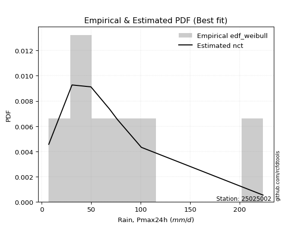</img>

</div>


### 4. EDF Beard (1943)

The Beard formula (or Beard´s plotting position formula) in hydrology is used to estimate the empirical non-exceedance probability _(P)_ of a flood event (or other extreme hydrological data point) within a given dataset.

<div align="center">


$P=(m-0.31)/(n+0.38)$


</div>


**4.1. Empirical values**

<div align="center">

|                | 0                   | 1                   | 2                  | 3                   | 4                  | 5                  | 6                  | 7                  |
|:---------------|:--------------------|:--------------------|:-------------------|:--------------------|:-------------------|:-------------------|:-------------------|:-------------------|
| date           | 2018                | 2019                | 2017               | 2020                | 2023               | 2025               | 2022               | 2024               |
| x              | 7.2                 | 30.7                | 49.8               | 68.7                | 76.5               | 76.8               | 100.7              | 223.6              |
| m              | 1                   | 2                   | 3                  | 4                   | 5                  | 6                  | 7                  | 8                  |
| empirical_dist | edf_beard           | edf_beard           | edf_beard          | edf_beard           | edf_beard          | edf_beard          | edf_beard          | edf_beard          |
| empirical      | 0.08233890214797135 | 0.20167064439140808 | 0.3210023866348448 | 0.44033412887828155 | 0.5596658711217184 | 0.6789976133651551 | 0.7983293556085919 | 0.9176610978520287 |
| empirical_tr   | 1.0897269180754225  | 1.2526158445440956  | 1.4727592267135323 | 1.7867803837953091  | 2.2710027100271004 | 3.115241635687732  | 4.958579881656804  | 12.144927536231886 |

</div>


**4.2. Kolmogorov-Smirnov fit test (sorted by Δ)**


<div align="center">

|                | 0                   | 1                   | 2                   | 3                   | 4                  | 5                   | 6                   | 7                   | 8                  | 9                   | 10                 | 11                  | 12                  | 13                  | 14                  | 15                  | 16                  | 17                  | 18                  | 19                  | 20                  | 21                  | 22                  | 23                  | 24                  | 25                  | 26                  | 27                  | 28                  | 29                  | 30                  | 31                  | 32                  | 33                  | 34                  | 35                 | 36                  | 37                  | 38                 | 39                  | 40                  | 41                  | 42                  | 43                 | 44                 | 45                  | 46                  | 47                  | 48                 | 49                  | 50                  | 51                 | 52                 | 53                 | 54                 | 55                  | 56                 | 57                  | 58                  | 59                  | 60                  | 61                  | 62                  | 63                  | 64                 | 65                  | 66                 | 67                 | 68                  | 69                  | 70                  | 71                 | 72                  | 73                 | 74                 | 75                  | 76                  | 77                  | 78                 | 79                  | 80                  | 81                  | 82                  | 83                  | 84                  | 85                  | 86                  | 87                 | 88                  | 89                  | 90                  | 91                  | 92                  | 93                  | 94                 | 95                  | 96                  | 97                  | 98                 | 99                 | 100                 | 101                | 102                | 103                 | 104                 | 105                 | 106                | 107                | 108                 | 109                 | 110                | 111                | 112                 | 113                 | 114                 | 115                | 116                 | 117                 | 118                 | 119                 | 120                | 121                 | 122                | 123                | 124                 | 125                | 126                 | 127                 | 128                | 129                 | 130                | 131                 | 132                 | 133                | 134                 | 135                 | 136                | 137                 | 138                 | 139                | 140                | 141                 | 142                | 143                 | 144                | 145                 | 146                | 147                 | 148                | 149                | 150                | 151                | 152                | 153                | 154                | 155                | 156                | 157                | 158                | 159                |
|:---------------|:--------------------|:--------------------|:--------------------|:--------------------|:-------------------|:--------------------|:--------------------|:--------------------|:-------------------|:--------------------|:-------------------|:--------------------|:--------------------|:--------------------|:--------------------|:--------------------|:--------------------|:--------------------|:--------------------|:--------------------|:--------------------|:--------------------|:--------------------|:--------------------|:--------------------|:--------------------|:--------------------|:--------------------|:--------------------|:--------------------|:--------------------|:--------------------|:--------------------|:--------------------|:--------------------|:-------------------|:--------------------|:--------------------|:-------------------|:--------------------|:--------------------|:--------------------|:--------------------|:-------------------|:-------------------|:--------------------|:--------------------|:--------------------|:-------------------|:--------------------|:--------------------|:-------------------|:-------------------|:-------------------|:-------------------|:--------------------|:-------------------|:--------------------|:--------------------|:--------------------|:--------------------|:--------------------|:--------------------|:--------------------|:-------------------|:--------------------|:-------------------|:-------------------|:--------------------|:--------------------|:--------------------|:-------------------|:--------------------|:-------------------|:-------------------|:--------------------|:--------------------|:--------------------|:-------------------|:--------------------|:--------------------|:--------------------|:--------------------|:--------------------|:--------------------|:--------------------|:--------------------|:-------------------|:--------------------|:--------------------|:--------------------|:--------------------|:--------------------|:--------------------|:-------------------|:--------------------|:--------------------|:--------------------|:-------------------|:-------------------|:--------------------|:-------------------|:-------------------|:--------------------|:--------------------|:--------------------|:-------------------|:-------------------|:--------------------|:--------------------|:-------------------|:-------------------|:--------------------|:--------------------|:--------------------|:-------------------|:--------------------|:--------------------|:--------------------|:--------------------|:-------------------|:--------------------|:-------------------|:-------------------|:--------------------|:-------------------|:--------------------|:--------------------|:-------------------|:--------------------|:-------------------|:--------------------|:--------------------|:-------------------|:--------------------|:--------------------|:-------------------|:--------------------|:--------------------|:-------------------|:-------------------|:--------------------|:-------------------|:--------------------|:-------------------|:--------------------|:-------------------|:--------------------|:-------------------|:-------------------|:-------------------|:-------------------|:-------------------|:-------------------|:-------------------|:-------------------|:-------------------|:-------------------|:-------------------|:-------------------|
| station        | 25025002            | 25025002            | 25025002            | 25025002            | 25025002           | 25025002            | 25025002            | 25025002            | 25025002           | 25025002            | 25025002           | 25025002            | 25025002            | 25025002            | 25025002            | 25025002            | 25025002            | 25025002            | 25025002            | 25025002            | 25025002            | 25025002            | 25025002            | 25025002            | 25025002            | 25025002            | 25025002            | 25025002            | 25025002            | 25025002            | 25025002            | 25025002            | 25025002            | 25025002            | 25025002            | 25025002           | 25025002            | 25025002            | 25025002           | 25025002            | 25025002            | 25025002            | 25025002            | 25025002           | 25025002           | 25025002            | 25025002            | 25025002            | 25025002           | 25025002            | 25025002            | 25025002           | 25025002           | 25025002           | 25025002           | 25025002            | 25025002           | 25025002            | 25025002            | 25025002            | 25025002            | 25025002            | 25025002            | 25025002            | 25025002           | 25025002            | 25025002           | 25025002           | 25025002            | 25025002            | 25025002            | 25025002           | 25025002            | 25025002           | 25025002           | 25025002            | 25025002            | 25025002            | 25025002           | 25025002            | 25025002            | 25025002            | 25025002            | 25025002            | 25025002            | 25025002            | 25025002            | 25025002           | 25025002            | 25025002            | 25025002            | 25025002            | 25025002            | 25025002            | 25025002           | 25025002            | 25025002            | 25025002            | 25025002           | 25025002           | 25025002            | 25025002           | 25025002           | 25025002            | 25025002            | 25025002            | 25025002           | 25025002           | 25025002            | 25025002            | 25025002           | 25025002           | 25025002            | 25025002            | 25025002            | 25025002           | 25025002            | 25025002            | 25025002            | 25025002            | 25025002           | 25025002            | 25025002           | 25025002           | 25025002            | 25025002           | 25025002            | 25025002            | 25025002           | 25025002            | 25025002           | 25025002            | 25025002            | 25025002           | 25025002            | 25025002            | 25025002           | 25025002            | 25025002            | 25025002           | 25025002           | 25025002            | 25025002           | 25025002            | 25025002           | 25025002            | 25025002           | 25025002            | 25025002           | 25025002           | 25025002           | 25025002           | 25025002           | 25025002           | 25025002           | 25025002           | 25025002           | 25025002           | 25025002           | 25025002           |
| empirical_dist | edf_beard           | edf_beard           | edf_beard           | edf_beard           | edf_beard          | edf_beard           | edf_beard           | edf_beard           | edf_beard          | edf_beard           | edf_beard          | edf_beard           | edf_beard           | edf_beard           | edf_beard           | edf_beard           | edf_beard           | edf_beard           | edf_beard           | edf_beard           | edf_beard           | edf_beard           | edf_beard           | edf_beard           | edf_beard           | edf_beard           | edf_beard           | edf_beard           | edf_beard           | edf_beard           | edf_beard           | edf_beard           | edf_beard           | edf_beard           | edf_beard           | edf_beard          | edf_beard           | edf_beard           | edf_beard          | edf_beard           | edf_beard           | edf_beard           | edf_beard           | edf_beard          | edf_beard          | edf_beard           | edf_beard           | edf_beard           | edf_beard          | edf_beard           | edf_beard           | edf_beard          | edf_beard          | edf_beard          | edf_beard          | edf_beard           | edf_beard          | edf_beard           | edf_beard           | edf_beard           | edf_beard           | edf_beard           | edf_beard           | edf_beard           | edf_beard          | edf_beard           | edf_beard          | edf_beard          | edf_beard           | edf_beard           | edf_beard           | edf_beard          | edf_beard           | edf_beard          | edf_beard          | edf_beard           | edf_beard           | edf_beard           | edf_beard          | edf_beard           | edf_beard           | edf_beard           | edf_beard           | edf_beard           | edf_beard           | edf_beard           | edf_beard           | edf_beard          | edf_beard           | edf_beard           | edf_beard           | edf_beard           | edf_beard           | edf_beard           | edf_beard          | edf_beard           | edf_beard           | edf_beard           | edf_beard          | edf_beard          | edf_beard           | edf_beard          | edf_beard          | edf_beard           | edf_beard           | edf_beard           | edf_beard          | edf_beard          | edf_beard           | edf_beard           | edf_beard          | edf_beard          | edf_beard           | edf_beard           | edf_beard           | edf_beard          | edf_beard           | edf_beard           | edf_beard           | edf_beard           | edf_beard          | edf_beard           | edf_beard          | edf_beard          | edf_beard           | edf_beard          | edf_beard           | edf_beard           | edf_beard          | edf_beard           | edf_beard          | edf_beard           | edf_beard           | edf_beard          | edf_beard           | edf_beard           | edf_beard          | edf_beard           | edf_beard           | edf_beard          | edf_beard          | edf_beard           | edf_beard          | edf_beard           | edf_beard          | edf_beard           | edf_beard          | edf_beard           | edf_beard          | edf_beard          | edf_beard          | edf_beard          | edf_beard          | edf_beard          | edf_beard          | edf_beard          | edf_beard          | edf_beard          | edf_beard          | edf_beard          |
| p_dist         | logjohnsonsu        | t                   | invweibull          | invgauss            | invgamma           | johnsonsu           | halflogistic        | gompertz            | logburr12          | logweibull_min      | burr               | mielke              | loggenlogistic      | logloggamma         | logmielke           | moyal               | genpareto           | nct                 | logjohnsonsb        | exponnorm           | vonmises_line       | logpearson3         | loggumbel_l         | pearson3            | loggompertz         | gengamma            | logt                | logskewnorm         | genlogistic         | foldnorm            | loggenextreme       | logvonmises_line    | logburr             | halfnorm            | gumbel_r            | logargus           | genexpon            | lomax               | loganglit          | betaprime           | logsemicircular     | skewnorm            | lognct              | kstwobign          | logcrystalball     | lognorm             | logexponnorm        | logrice             | logf               | logbeta             | logfatiguelife      | loggamma           | loggamma           | logncf             | logbetaprime       | wald                | logtriang          | rayleigh            | f                   | logarcsine          | loglogistic         | logerlang           | logalpha            | maxwell             | loginvgamma        | loghypsecant        | kappa3             | loggennorm         | gennorm             | loginvgauss         | exponpow            | logdgamma          | logmaxwell          | dweibull           | logfoldnorm        | loggenhalflogistic  | logloglaplace       | loginvweibull       | dgamma             | logdweibull         | lograyleigh         | truncnorm           | rice                | logcosine           | loglaplace          | loglaplace          | loggenpareto        | semicircular       | anglit              | loggausshyper       | gamma               | crystalball         | norm                | logistic            | hypsecant          | nakagami            | laplace             | logtruncnorm        | loghalfnorm        | logkstwobign       | loggumbel_r         | halfgennorm        | arcsine            | loggenexpon         | logweibull_max      | logksone            | loghalflogistic    | tukeylambda        | logmoyal            | truncweibull_min    | truncexpon         | logwrapcauchy      | loguniform          | loglevy_l           | logkappa3           | logkappa4          | bradford            | cosine              | gumbel_l            | logtruncweibull_min | loglomax           | ncf                 | exponweib          | logtrapezoid       | gausshyper          | burr12             | logwald             | logbradford         | weibull_min        | kappa4              | logtruncexpon      | wrapcauchy          | ksone               | argus              | genextreme          | levy_l              | uniform            | johnsonsb           | alpha               | lognakagami        | logtukeylambda     | logrdist            | loggengamma        | triang              | logexponweib       | rdist               | powerlaw           | genhalflogistic     | fatiguelife        | erlang             | trapezoid          | beta               | logexponpow        | logpowerlaw        | truncpareto        | weibull_max        | logtruncpareto     | loghalfgennorm     | logvonmises        | vonmises           |
| delta          | 0.06266835660030068 | 0.07807648160653241 | 0.09215279849618846 | 0.09244120554209162 | 0.0926907252025278 | 0.09353706665571987 | 0.09422438663494237 | 0.09502894905946696 | 0.0970723661139522 | 0.09707836682064286 | 0.0977148522604036 | 0.09776788802008712 | 0.09788919520253819 | 0.09822480663998845 | 0.09830644940803263 | 0.09940667240683598 | 0.09966848146831842 | 0.09986075002983924 | 0.09993033216976499 | 0.09993782550921437 | 0.10069103921192368 | 0.10117501584020039 | 0.10274875490907709 | 0.10330808602278241 | 0.10531823926268707 | 0.10658333868086661 | 0.10936760314463789 | 0.10980502255264551 | 0.11350378752762669 | 0.11371735326131327 | 0.11497832402486707 | 0.11734245153330908 | 0.11789292541544244 | 0.11810492112167192 | 0.12528192185830123 | 0.1291106701337993 | 0.13396963877882667 | 0.13402849271872302 | 0.1348923438824527 | 0.13508658923575728 | 0.13790149021337245 | 0.14016888737312916 | 0.14353456543572468 | 0.1436768964671845 | 0.1439014753669587 | 0.14390157055750946 | 0.14390357667681913 | 0.14394281177385254 | 0.144314034427588  | 0.14527710831997775 | 0.14537067862050052 | 0.1461949965966099 | 0.1461949965966099 | 0.1477957303283624 | 0.1478119662060165 | 0.14889144438936303 | 0.1492269054143084 | 0.15004164782532392 | 0.15014369141452522 | 0.15408734651552292 | 0.15495405540099055 | 0.15569165241623845 | 0.15641653160327212 | 0.16138087897757036 | 0.1629484995734493 | 0.16411038492744384 | 0.1644334624899943 | 0.1656438505057044 | 0.16592337563127146 | 0.16707737157261932 | 0.16894133629353558 | 0.1695474654878657 | 0.17176478547942114 | 0.1721784138106427 | 0.1755101213929307 | 0.17568047495326322 | 0.17598521546838863 | 0.17752070551855592 | 0.1789976074927152 | 0.17899761336602532 | 0.18050501641687383 | 0.18189836237300328 | 0.18253465294609428 | 0.18335059422461603 | 0.18957588034036738 | 0.18957588034036738 | 0.19049543359773902 | 0.1917665089776593 | 0.19270934041384102 | 0.19394554434636146 | 0.19426417256602296 | 0.19499772965948364 | 0.19499774107277307 | 0.19718069777501773 | 0.1990429163936135 | 0.20167064081816302 | 0.20657502077672651 | 0.20746159776393752 | 0.2074774652026219 | 0.2117089256849074 | 0.21187749201359057 | 0.21781970743557   | 0.2184388374264492 | 0.22490854254754677 | 0.23204368348375248 | 0.23339810101728847 | 0.2334058922512065 | 0.2336277810568415 | 0.23536962714801596 | 0.23655925808472777 | 0.2394721937193317 | 0.2399385339713055 | 0.24187860226604752 | 0.25483250874059193 | 0.25535671270961247 | 0.2567601357230689 | 0.26242228413811153 | 0.26444639960440885 | 0.26566236264973353 | 0.26597776154395514 | 0.2668545922747715 | 0.27208242902956264 | 0.2735703601635071 | 0.2753331422624469 | 0.28833143481515133 | 0.2990583637747634 | 0.30068150941361466 | 0.32557297575550215 | 0.3282105270072481 | 0.33411501935441246 | 0.3363139115489473 | 0.34981884799589824 | 0.35493748869546804 | 0.3626550730980237 | 0.36422261090082136 | 0.36612979560489134 | 0.3662591153128433 | 0.36752487021488983 | 0.37491602917428113 | 0.4022225176682002 | 0.4054539802527895 | 0.41989658512186406 | 0.428213948942103  | 0.42874794795901194 | 0.4544274489690368 | 0.48004553644506376 | 0.490375495688899  | 0.49105950475743493 | 0.5228279914527543 | 0.5696585220659194 | 0.5992597128894046 | 0.6041467467802728 | 0.6185017984029846 | 0.6404099329042148 | 0.6601376254462734 | 0.677469673819415  | 0.7417859095256203 | 0.7983293556085919 | 1.0866719073068325 | 35.09512494479236  |
| deltao         | 0.4472608134160001  | 0.4472608134160001  | 0.4472608134160001  | 0.4472608134160001  | 0.4472608134160001 | 0.4472608134160001  | 0.4472608134160001  | 0.4472608134160001  | 0.4472608134160001 | 0.4472608134160001  | 0.4472608134160001 | 0.4472608134160001  | 0.4472608134160001  | 0.4472608134160001  | 0.4472608134160001  | 0.4472608134160001  | 0.4472608134160001  | 0.4472608134160001  | 0.4472608134160001  | 0.4472608134160001  | 0.4472608134160001  | 0.4472608134160001  | 0.4472608134160001  | 0.4472608134160001  | 0.4472608134160001  | 0.4472608134160001  | 0.4472608134160001  | 0.4472608134160001  | 0.4472608134160001  | 0.4472608134160001  | 0.4472608134160001  | 0.4472608134160001  | 0.4472608134160001  | 0.4472608134160001  | 0.4472608134160001  | 0.4472608134160001 | 0.4472608134160001  | 0.4472608134160001  | 0.4472608134160001 | 0.4472608134160001  | 0.4472608134160001  | 0.4472608134160001  | 0.4472608134160001  | 0.4472608134160001 | 0.4472608134160001 | 0.4472608134160001  | 0.4472608134160001  | 0.4472608134160001  | 0.4472608134160001 | 0.4472608134160001  | 0.4472608134160001  | 0.4472608134160001 | 0.4472608134160001 | 0.4472608134160001 | 0.4472608134160001 | 0.4472608134160001  | 0.4472608134160001 | 0.4472608134160001  | 0.4472608134160001  | 0.4472608134160001  | 0.4472608134160001  | 0.4472608134160001  | 0.4472608134160001  | 0.4472608134160001  | 0.4472608134160001 | 0.4472608134160001  | 0.4472608134160001 | 0.4472608134160001 | 0.4472608134160001  | 0.4472608134160001  | 0.4472608134160001  | 0.4472608134160001 | 0.4472608134160001  | 0.4472608134160001 | 0.4472608134160001 | 0.4472608134160001  | 0.4472608134160001  | 0.4472608134160001  | 0.4472608134160001 | 0.4472608134160001  | 0.4472608134160001  | 0.4472608134160001  | 0.4472608134160001  | 0.4472608134160001  | 0.4472608134160001  | 0.4472608134160001  | 0.4472608134160001  | 0.4472608134160001 | 0.4472608134160001  | 0.4472608134160001  | 0.4472608134160001  | 0.4472608134160001  | 0.4472608134160001  | 0.4472608134160001  | 0.4472608134160001 | 0.4472608134160001  | 0.4472608134160001  | 0.4472608134160001  | 0.4472608134160001 | 0.4472608134160001 | 0.4472608134160001  | 0.4472608134160001 | 0.4472608134160001 | 0.4472608134160001  | 0.4472608134160001  | 0.4472608134160001  | 0.4472608134160001 | 0.4472608134160001 | 0.4472608134160001  | 0.4472608134160001  | 0.4472608134160001 | 0.4472608134160001 | 0.4472608134160001  | 0.4472608134160001  | 0.4472608134160001  | 0.4472608134160001 | 0.4472608134160001  | 0.4472608134160001  | 0.4472608134160001  | 0.4472608134160001  | 0.4472608134160001 | 0.4472608134160001  | 0.4472608134160001 | 0.4472608134160001 | 0.4472608134160001  | 0.4472608134160001 | 0.4472608134160001  | 0.4472608134160001  | 0.4472608134160001 | 0.4472608134160001  | 0.4472608134160001 | 0.4472608134160001  | 0.4472608134160001  | 0.4472608134160001 | 0.4472608134160001  | 0.4472608134160001  | 0.4472608134160001 | 0.4472608134160001  | 0.4472608134160001  | 0.4472608134160001 | 0.4472608134160001 | 0.4472608134160001  | 0.4472608134160001 | 0.4472608134160001  | 0.4472608134160001 | 0.4472608134160001  | 0.4472608134160001 | 0.4472608134160001  | 0.4472608134160001 | 0.4472608134160001 | 0.4472608134160001 | 0.4472608134160001 | 0.4472608134160001 | 0.4472608134160001 | 0.4472608134160001 | 0.4472608134160001 | 0.4472608134160001 | 0.4472608134160001 | 0.4472608134160001 | 0.4472608134160001 |
| eval           | Δo > Δ              | Δo > Δ              | Δo > Δ              | Δo > Δ              | Δo > Δ             | Δo > Δ              | Δo > Δ              | Δo > Δ              | Δo > Δ             | Δo > Δ              | Δo > Δ             | Δo > Δ              | Δo > Δ              | Δo > Δ              | Δo > Δ              | Δo > Δ              | Δo > Δ              | Δo > Δ              | Δo > Δ              | Δo > Δ              | Δo > Δ              | Δo > Δ              | Δo > Δ              | Δo > Δ              | Δo > Δ              | Δo > Δ              | Δo > Δ              | Δo > Δ              | Δo > Δ              | Δo > Δ              | Δo > Δ              | Δo > Δ              | Δo > Δ              | Δo > Δ              | Δo > Δ              | Δo > Δ             | Δo > Δ              | Δo > Δ              | Δo > Δ             | Δo > Δ              | Δo > Δ              | Δo > Δ              | Δo > Δ              | Δo > Δ             | Δo > Δ             | Δo > Δ              | Δo > Δ              | Δo > Δ              | Δo > Δ             | Δo > Δ              | Δo > Δ              | Δo > Δ             | Δo > Δ             | Δo > Δ             | Δo > Δ             | Δo > Δ              | Δo > Δ             | Δo > Δ              | Δo > Δ              | Δo > Δ              | Δo > Δ              | Δo > Δ              | Δo > Δ              | Δo > Δ              | Δo > Δ             | Δo > Δ              | Δo > Δ             | Δo > Δ             | Δo > Δ              | Δo > Δ              | Δo > Δ              | Δo > Δ             | Δo > Δ              | Δo > Δ             | Δo > Δ             | Δo > Δ              | Δo > Δ              | Δo > Δ              | Δo > Δ             | Δo > Δ              | Δo > Δ              | Δo > Δ              | Δo > Δ              | Δo > Δ              | Δo > Δ              | Δo > Δ              | Δo > Δ              | Δo > Δ             | Δo > Δ              | Δo > Δ              | Δo > Δ              | Δo > Δ              | Δo > Δ              | Δo > Δ              | Δo > Δ             | Δo > Δ              | Δo > Δ              | Δo > Δ              | Δo > Δ             | Δo > Δ             | Δo > Δ              | Δo > Δ             | Δo > Δ             | Δo > Δ              | Δo > Δ              | Δo > Δ              | Δo > Δ             | Δo > Δ             | Δo > Δ              | Δo > Δ              | Δo > Δ             | Δo > Δ             | Δo > Δ              | Δo > Δ              | Δo > Δ              | Δo > Δ             | Δo > Δ              | Δo > Δ              | Δo > Δ              | Δo > Δ              | Δo > Δ             | Δo > Δ              | Δo > Δ             | Δo > Δ             | Δo > Δ              | Δo > Δ             | Δo > Δ              | Δo > Δ              | Δo > Δ             | Δo > Δ              | Δo > Δ             | Δo > Δ              | Δo > Δ              | Δo > Δ             | Δo > Δ              | Δo > Δ              | Δo > Δ             | Δo > Δ              | Δo > Δ              | Δo > Δ             | Δo > Δ             | Δo > Δ              | Δo > Δ             | Δo > Δ              | Δo <= Δ            | Δo <= Δ             | Δo <= Δ            | Δo <= Δ             | Δo <= Δ            | Δo <= Δ            | Δo <= Δ            | Δo <= Δ            | Δo <= Δ            | Δo <= Δ            | Δo <= Δ            | Δo <= Δ            | Δo <= Δ            | Δo <= Δ            | Δo <= Δ            | Δo <= Δ            |
| fit            | 1                   | 1                   | 1                   | 1                   | 1                  | 1                   | 1                   | 1                   | 1                  | 1                   | 1                  | 1                   | 1                   | 1                   | 1                   | 1                   | 1                   | 1                   | 1                   | 1                   | 1                   | 1                   | 1                   | 1                   | 1                   | 1                   | 1                   | 1                   | 1                   | 1                   | 1                   | 1                   | 1                   | 1                   | 1                   | 1                  | 1                   | 1                   | 1                  | 1                   | 1                   | 1                   | 1                   | 1                  | 1                  | 1                   | 1                   | 1                   | 1                  | 1                   | 1                   | 1                  | 1                  | 1                  | 1                  | 1                   | 1                  | 1                   | 1                   | 1                   | 1                   | 1                   | 1                   | 1                   | 1                  | 1                   | 1                  | 1                  | 1                   | 1                   | 1                   | 1                  | 1                   | 1                  | 1                  | 1                   | 1                   | 1                   | 1                  | 1                   | 1                   | 1                   | 1                   | 1                   | 1                   | 1                   | 1                   | 1                  | 1                   | 1                   | 1                   | 1                   | 1                   | 1                   | 1                  | 1                   | 1                   | 1                   | 1                  | 1                  | 1                   | 1                  | 1                  | 1                   | 1                   | 1                   | 1                  | 1                  | 1                   | 1                   | 1                  | 1                  | 1                   | 1                   | 1                   | 1                  | 1                   | 1                   | 1                   | 1                   | 1                  | 1                   | 1                  | 1                  | 1                   | 1                  | 1                   | 1                   | 1                  | 1                   | 1                  | 1                   | 1                   | 1                  | 1                   | 1                   | 1                  | 1                   | 1                   | 1                  | 1                  | 1                   | 1                  | 1                   | 0                  | 0                   | 0                  | 0                   | 0                  | 0                  | 0                  | 0                  | 0                  | 0                  | 0                  | 0                  | 0                  | 0                  | 0                  | 0                  |
| n              | 8                   | 8                   | 8                   | 8                   | 8                  | 8                   | 8                   | 8                   | 8                  | 8                   | 8                  | 8                   | 8                   | 8                   | 8                   | 8                   | 8                   | 8                   | 8                   | 8                   | 8                   | 8                   | 8                   | 8                   | 8                   | 8                   | 8                   | 8                   | 8                   | 8                   | 8                   | 8                   | 8                   | 8                   | 8                   | 8                  | 8                   | 8                   | 8                  | 8                   | 8                   | 8                   | 8                   | 8                  | 8                  | 8                   | 8                   | 8                   | 8                  | 8                   | 8                   | 8                  | 8                  | 8                  | 8                  | 8                   | 8                  | 8                   | 8                   | 8                   | 8                   | 8                   | 8                   | 8                   | 8                  | 8                   | 8                  | 8                  | 8                   | 8                   | 8                   | 8                  | 8                   | 8                  | 8                  | 8                   | 8                   | 8                   | 8                  | 8                   | 8                   | 8                   | 8                   | 8                   | 8                   | 8                   | 8                   | 8                  | 8                   | 8                   | 8                   | 8                   | 8                   | 8                   | 8                  | 8                   | 8                   | 8                   | 8                  | 8                  | 8                   | 8                  | 8                  | 8                   | 8                   | 8                   | 8                  | 8                  | 8                   | 8                   | 8                  | 8                  | 8                   | 8                   | 8                   | 8                  | 8                   | 8                   | 8                   | 8                   | 8                  | 8                   | 8                  | 8                  | 8                   | 8                  | 8                   | 8                   | 8                  | 8                   | 8                  | 8                   | 8                   | 8                  | 8                   | 8                   | 8                  | 8                   | 8                   | 8                  | 8                  | 8                   | 8                  | 8                   | 8                  | 8                   | 8                  | 8                   | 8                  | 8                  | 8                  | 8                  | 8                  | 8                  | 8                  | 8                  | 8                  | 8                  | 8                  | 8                  |
| best_fit       | 1                   | 0                   | 0                   | 0                   | 0                  | 0                   | 0                   | 0                   | 0                  | 0                   | 0                  | 0                   | 0                   | 0                   | 0                   | 0                   | 0                   | 0                   | 0                   | 0                   | 0                   | 0                   | 0                   | 0                   | 0                   | 0                   | 0                   | 0                   | 0                   | 0                   | 0                   | 0                   | 0                   | 0                   | 0                   | 0                  | 0                   | 0                   | 0                  | 0                   | 0                   | 0                   | 0                   | 0                  | 0                  | 0                   | 0                   | 0                   | 0                  | 0                   | 0                   | 0                  | 0                  | 0                  | 0                  | 0                   | 0                  | 0                   | 0                   | 0                   | 0                   | 0                   | 0                   | 0                   | 0                  | 0                   | 0                  | 0                  | 0                   | 0                   | 0                   | 0                  | 0                   | 0                  | 0                  | 0                   | 0                   | 0                   | 0                  | 0                   | 0                   | 0                   | 0                   | 0                   | 0                   | 0                   | 0                   | 0                  | 0                   | 0                   | 0                   | 0                   | 0                   | 0                   | 0                  | 0                   | 0                   | 0                   | 0                  | 0                  | 0                   | 0                  | 0                  | 0                   | 0                   | 0                   | 0                  | 0                  | 0                   | 0                   | 0                  | 0                  | 0                   | 0                   | 0                   | 0                  | 0                   | 0                   | 0                   | 0                   | 0                  | 0                   | 0                  | 0                  | 0                   | 0                  | 0                   | 0                   | 0                  | 0                   | 0                  | 0                   | 0                   | 0                  | 0                   | 0                   | 0                  | 0                   | 0                   | 0                  | 0                  | 0                   | 0                  | 0                   | 0                  | 0                   | 0                  | 0                   | 0                  | 0                  | 0                  | 0                  | 0                  | 0                  | 0                  | 0                  | 0                  | 0                  | 0                  | 0                  |
| best_fit_sort  | 1                   | 2                   | 3                   | 4                   | 5                  | 6                   | 7                   | 8                   | 9                  | 10                  | 11                 | 12                  | 13                  | 14                  | 15                  | 16                  | 17                  | 18                  | 19                  | 20                  | 21                  | 22                  | 23                  | 24                  | 25                  | 26                  | 27                  | 28                  | 29                  | 30                  | 31                  | 32                  | 33                  | 34                  | 35                  | 36                 | 37                  | 38                  | 39                 | 40                  | 41                  | 42                  | 43                  | 44                 | 45                 | 46                  | 47                  | 48                  | 49                 | 50                  | 51                  | 52                 | 53                 | 54                 | 55                 | 56                  | 57                 | 58                  | 59                  | 60                  | 61                  | 62                  | 63                  | 64                  | 65                 | 66                  | 67                 | 68                 | 69                  | 70                  | 71                  | 72                 | 73                  | 74                 | 75                 | 76                  | 77                  | 78                  | 79                 | 80                  | 81                  | 82                  | 83                  | 84                  | 85                  | 86                  | 87                  | 88                 | 89                  | 90                  | 91                  | 92                  | 93                  | 94                  | 95                 | 96                  | 97                  | 98                  | 99                 | 100                | 101                 | 102                | 103                | 104                 | 105                 | 106                 | 107                | 108                | 109                 | 110                 | 111                | 112                | 113                 | 114                 | 115                 | 116                | 117                 | 118                 | 119                 | 120                 | 121                | 122                 | 123                | 124                | 125                 | 126                | 127                 | 128                 | 129                | 130                 | 131                | 132                 | 133                 | 134                | 135                 | 136                 | 137                | 138                 | 139                 | 140                | 141                | 142                 | 143                | 144                 | 145                | 146                 | 147                | 148                 | 149                | 150                | 151                | 152                | 153                | 154                | 155                | 156                | 157                | 158                | 159                | 160                |

</div>


**4.3. Best fit**

<div align="center">

|   id |   station | empirical_dist   | p_dist       |     delta |   deltao | eval   |   fit |   n |   best_fit |   best_fit_sort |
|-----:|----------:|:-----------------|:-------------|----------:|---------:|:-------|------:|----:|-----------:|----------------:|
|    0 |  25025002 | edf_beard        | logjohnsonsu | 0.0626684 | 0.447261 | Δo > Δ |     1 |   8 |          1 |               1 |

</div>


<div align="center">

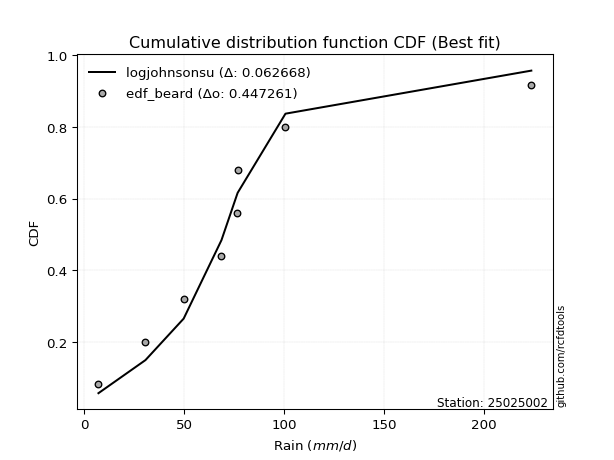</img></img>

</div>


### 5. EDF Chegodayev (1955)

The Chegodayev formula is an empirical plotting position formula used in hydrological frequency analysis to estimate the exceedance probability or return period of a specific event from a set of observed data. It is primarily used for plotting observed data points on probability paper to fit a theoretical distribution, particularly for analyzing extreme events like maximum flood flows or rainfall intensities. The constant _b_ value in the generalized plotting position formula is 0.3.

<div align="center">


$P=(m-b)/(n+1-2b)$


</div>


**5.1. Empirical values**

<div align="center">

|                | 0                   | 1                   | 2                   | 3                   | 4                  | 5                  | 6                  | 7                  |
|:---------------|:--------------------|:--------------------|:--------------------|:--------------------|:-------------------|:-------------------|:-------------------|:-------------------|
| date           | 2018                | 2019                | 2017                | 2020                | 2023               | 2025               | 2022               | 2024               |
| x              | 7.2                 | 30.7                | 49.8                | 68.7                | 76.5               | 76.8               | 100.7              | 223.6              |
| m              | 1                   | 2                   | 3                   | 4                   | 5                  | 6                  | 7                  | 8                  |
| empirical_dist | edf_chegodayev      | edf_chegodayev      | edf_chegodayev      | edf_chegodayev      | edf_chegodayev     | edf_chegodayev     | edf_chegodayev     | edf_chegodayev     |
| empirical      | 0.08333333333333333 | 0.20238095238095236 | 0.32142857142857145 | 0.44047619047619047 | 0.5595238095238095 | 0.6785714285714286 | 0.7976190476190476 | 0.9166666666666666 |
| empirical_tr   | 1.090909090909091   | 1.253731343283582   | 1.4736842105263157  | 1.7872340425531914  | 2.27027027027027   | 3.1111111111111116 | 4.941176470588234  | 11.999999999999995 |

</div>


**5.2. Kolmogorov-Smirnov fit test (sorted by Δ)**


<div align="center">

|                | 0                   | 1                  | 2                   | 3                  | 4                   | 5                   | 6                  | 7                   | 8                   | 9                   | 10                  | 11                  | 12                  | 13                  | 14                  | 15                  | 16                  | 17                  | 18                 | 19                  | 20                  | 21                  | 22                  | 23                  | 24                  | 25                 | 26                  | 27                 | 28                  | 29                 | 30                 | 31                  | 32                  | 33                  | 34                  | 35                 | 36                  | 37                 | 38                  | 39                  | 40                 | 41                 | 42                  | 43                  | 44                  | 45                  | 46                  | 47                  | 48                  | 49                  | 50                 | 51                  | 52                  | 53                 | 54                  | 55                  | 56                 | 57                  | 58                  | 59                  | 60                  | 61                  | 62                 | 63                 | 64                 | 65                  | 66                  | 67                  | 68                 | 69                 | 70                  | 71                  | 72                  | 73                  | 74                  | 75                 | 76                  | 77                  | 78                  | 79                  | 80                  | 81                 | 82                 | 83                 | 84                  | 85                  | 86                  | 87                  | 88                  | 89                  | 90                  | 91                  | 92                 | 93                  | 94                  | 95                 | 96                  | 97                  | 98                 | 99                  | 100                 | 101                 | 102                | 103                 | 104                 | 105                | 106                | 107                | 108                 | 109                 | 110                 | 111                 | 112                 | 113                 | 114                 | 115                 | 116                | 117                | 118                 | 119                 | 120                 | 121                | 122                | 123                 | 124                 | 125                 | 126                 | 127                | 128                | 129                 | 130                 | 131                 | 132                 | 133                | 134                | 135                | 136                | 137                 | 138                | 139                | 140                | 141                | 142                 | 143                 | 144                 | 145                | 146                 | 147                | 148                | 149                | 150                | 151                | 152                | 153                | 154                | 155                | 156                | 157                | 158                | 159                |
|:---------------|:--------------------|:-------------------|:--------------------|:-------------------|:--------------------|:--------------------|:-------------------|:--------------------|:--------------------|:--------------------|:--------------------|:--------------------|:--------------------|:--------------------|:--------------------|:--------------------|:--------------------|:--------------------|:-------------------|:--------------------|:--------------------|:--------------------|:--------------------|:--------------------|:--------------------|:-------------------|:--------------------|:-------------------|:--------------------|:-------------------|:-------------------|:--------------------|:--------------------|:--------------------|:--------------------|:-------------------|:--------------------|:-------------------|:--------------------|:--------------------|:-------------------|:-------------------|:--------------------|:--------------------|:--------------------|:--------------------|:--------------------|:--------------------|:--------------------|:--------------------|:-------------------|:--------------------|:--------------------|:-------------------|:--------------------|:--------------------|:-------------------|:--------------------|:--------------------|:--------------------|:--------------------|:--------------------|:-------------------|:-------------------|:-------------------|:--------------------|:--------------------|:--------------------|:-------------------|:-------------------|:--------------------|:--------------------|:--------------------|:--------------------|:--------------------|:-------------------|:--------------------|:--------------------|:--------------------|:--------------------|:--------------------|:-------------------|:-------------------|:-------------------|:--------------------|:--------------------|:--------------------|:--------------------|:--------------------|:--------------------|:--------------------|:--------------------|:-------------------|:--------------------|:--------------------|:-------------------|:--------------------|:--------------------|:-------------------|:--------------------|:--------------------|:--------------------|:-------------------|:--------------------|:--------------------|:-------------------|:-------------------|:-------------------|:--------------------|:--------------------|:--------------------|:--------------------|:--------------------|:--------------------|:--------------------|:--------------------|:-------------------|:-------------------|:--------------------|:--------------------|:--------------------|:-------------------|:-------------------|:--------------------|:--------------------|:--------------------|:--------------------|:-------------------|:-------------------|:--------------------|:--------------------|:--------------------|:--------------------|:-------------------|:-------------------|:-------------------|:-------------------|:--------------------|:-------------------|:-------------------|:-------------------|:-------------------|:--------------------|:--------------------|:--------------------|:-------------------|:--------------------|:-------------------|:-------------------|:-------------------|:-------------------|:-------------------|:-------------------|:-------------------|:-------------------|:-------------------|:-------------------|:-------------------|:-------------------|:-------------------|
| station        | 25025002            | 25025002           | 25025002            | 25025002           | 25025002            | 25025002            | 25025002           | 25025002            | 25025002            | 25025002            | 25025002            | 25025002            | 25025002            | 25025002            | 25025002            | 25025002            | 25025002            | 25025002            | 25025002           | 25025002            | 25025002            | 25025002            | 25025002            | 25025002            | 25025002            | 25025002           | 25025002            | 25025002           | 25025002            | 25025002           | 25025002           | 25025002            | 25025002            | 25025002            | 25025002            | 25025002           | 25025002            | 25025002           | 25025002            | 25025002            | 25025002           | 25025002           | 25025002            | 25025002            | 25025002            | 25025002            | 25025002            | 25025002            | 25025002            | 25025002            | 25025002           | 25025002            | 25025002            | 25025002           | 25025002            | 25025002            | 25025002           | 25025002            | 25025002            | 25025002            | 25025002            | 25025002            | 25025002           | 25025002           | 25025002           | 25025002            | 25025002            | 25025002            | 25025002           | 25025002           | 25025002            | 25025002            | 25025002            | 25025002            | 25025002            | 25025002           | 25025002            | 25025002            | 25025002            | 25025002            | 25025002            | 25025002           | 25025002           | 25025002           | 25025002            | 25025002            | 25025002            | 25025002            | 25025002            | 25025002            | 25025002            | 25025002            | 25025002           | 25025002            | 25025002            | 25025002           | 25025002            | 25025002            | 25025002           | 25025002            | 25025002            | 25025002            | 25025002           | 25025002            | 25025002            | 25025002           | 25025002           | 25025002           | 25025002            | 25025002            | 25025002            | 25025002            | 25025002            | 25025002            | 25025002            | 25025002            | 25025002           | 25025002           | 25025002            | 25025002            | 25025002            | 25025002           | 25025002           | 25025002            | 25025002            | 25025002            | 25025002            | 25025002           | 25025002           | 25025002            | 25025002            | 25025002            | 25025002            | 25025002           | 25025002           | 25025002           | 25025002           | 25025002            | 25025002           | 25025002           | 25025002           | 25025002           | 25025002            | 25025002            | 25025002            | 25025002           | 25025002            | 25025002           | 25025002           | 25025002           | 25025002           | 25025002           | 25025002           | 25025002           | 25025002           | 25025002           | 25025002           | 25025002           | 25025002           | 25025002           |
| empirical_dist | edf_chegodayev      | edf_chegodayev     | edf_chegodayev      | edf_chegodayev     | edf_chegodayev      | edf_chegodayev      | edf_chegodayev     | edf_chegodayev      | edf_chegodayev      | edf_chegodayev      | edf_chegodayev      | edf_chegodayev      | edf_chegodayev      | edf_chegodayev      | edf_chegodayev      | edf_chegodayev      | edf_chegodayev      | edf_chegodayev      | edf_chegodayev     | edf_chegodayev      | edf_chegodayev      | edf_chegodayev      | edf_chegodayev      | edf_chegodayev      | edf_chegodayev      | edf_chegodayev     | edf_chegodayev      | edf_chegodayev     | edf_chegodayev      | edf_chegodayev     | edf_chegodayev     | edf_chegodayev      | edf_chegodayev      | edf_chegodayev      | edf_chegodayev      | edf_chegodayev     | edf_chegodayev      | edf_chegodayev     | edf_chegodayev      | edf_chegodayev      | edf_chegodayev     | edf_chegodayev     | edf_chegodayev      | edf_chegodayev      | edf_chegodayev      | edf_chegodayev      | edf_chegodayev      | edf_chegodayev      | edf_chegodayev      | edf_chegodayev      | edf_chegodayev     | edf_chegodayev      | edf_chegodayev      | edf_chegodayev     | edf_chegodayev      | edf_chegodayev      | edf_chegodayev     | edf_chegodayev      | edf_chegodayev      | edf_chegodayev      | edf_chegodayev      | edf_chegodayev      | edf_chegodayev     | edf_chegodayev     | edf_chegodayev     | edf_chegodayev      | edf_chegodayev      | edf_chegodayev      | edf_chegodayev     | edf_chegodayev     | edf_chegodayev      | edf_chegodayev      | edf_chegodayev      | edf_chegodayev      | edf_chegodayev      | edf_chegodayev     | edf_chegodayev      | edf_chegodayev      | edf_chegodayev      | edf_chegodayev      | edf_chegodayev      | edf_chegodayev     | edf_chegodayev     | edf_chegodayev     | edf_chegodayev      | edf_chegodayev      | edf_chegodayev      | edf_chegodayev      | edf_chegodayev      | edf_chegodayev      | edf_chegodayev      | edf_chegodayev      | edf_chegodayev     | edf_chegodayev      | edf_chegodayev      | edf_chegodayev     | edf_chegodayev      | edf_chegodayev      | edf_chegodayev     | edf_chegodayev      | edf_chegodayev      | edf_chegodayev      | edf_chegodayev     | edf_chegodayev      | edf_chegodayev      | edf_chegodayev     | edf_chegodayev     | edf_chegodayev     | edf_chegodayev      | edf_chegodayev      | edf_chegodayev      | edf_chegodayev      | edf_chegodayev      | edf_chegodayev      | edf_chegodayev      | edf_chegodayev      | edf_chegodayev     | edf_chegodayev     | edf_chegodayev      | edf_chegodayev      | edf_chegodayev      | edf_chegodayev     | edf_chegodayev     | edf_chegodayev      | edf_chegodayev      | edf_chegodayev      | edf_chegodayev      | edf_chegodayev     | edf_chegodayev     | edf_chegodayev      | edf_chegodayev      | edf_chegodayev      | edf_chegodayev      | edf_chegodayev     | edf_chegodayev     | edf_chegodayev     | edf_chegodayev     | edf_chegodayev      | edf_chegodayev     | edf_chegodayev     | edf_chegodayev     | edf_chegodayev     | edf_chegodayev      | edf_chegodayev      | edf_chegodayev      | edf_chegodayev     | edf_chegodayev      | edf_chegodayev     | edf_chegodayev     | edf_chegodayev     | edf_chegodayev     | edf_chegodayev     | edf_chegodayev     | edf_chegodayev     | edf_chegodayev     | edf_chegodayev     | edf_chegodayev     | edf_chegodayev     | edf_chegodayev     | edf_chegodayev     |
| p_dist         | logjohnsonsu        | t                  | invweibull          | invgauss           | invgamma            | johnsonsu           | halflogistic       | gompertz            | logburr12           | logweibull_min      | burr                | mielke              | loggenlogistic      | logloggamma         | logmielke           | moyal               | genpareto           | logjohnsonsb        | exponnorm          | nct                 | vonmises_line       | logpearson3         | loggumbel_l         | pearson3            | loggompertz         | gengamma           | logt                | logskewnorm        | genlogistic         | foldnorm           | loggenextreme      | logvonmises_line    | halfnorm            | logburr             | gumbel_r            | logargus           | genexpon            | lomax              | loganglit           | betaprime           | logsemicircular    | skewnorm           | kstwobign           | lognct              | logcrystalball      | lognorm             | logexponnorm        | logrice             | logf                | logbeta             | logfatiguelife     | loggamma            | loggamma            | logncf             | logbetaprime        | logtriang           | wald               | rayleigh            | f                   | logarcsine          | loglogistic         | logerlang           | logalpha           | maxwell            | loginvgamma        | loghypsecant        | kappa3              | loggennorm          | gennorm            | loginvgauss        | exponpow            | logdgamma           | logmaxwell          | dweibull            | loggenhalflogistic  | logfoldnorm        | logloglaplace       | loginvweibull       | dgamma              | logdweibull         | lograyleigh         | truncnorm          | rice               | logcosine          | loglaplace          | loglaplace          | loggenpareto        | semicircular        | anglit              | loggausshyper       | gamma               | crystalball         | norm               | logistic            | hypsecant           | nakagami           | laplace             | loghalfnorm         | logtruncnorm       | logkstwobign        | loggumbel_r         | halfgennorm         | arcsine            | loggenexpon         | logweibull_max      | logksone           | loghalflogistic    | tukeylambda        | logmoyal            | truncweibull_min    | truncexpon          | logwrapcauchy       | loguniform          | loglevy_l           | logkappa3           | logkappa4           | bradford           | cosine             | gumbel_l            | logtruncweibull_min | loglomax            | ncf                | exponweib          | logtrapezoid        | gausshyper          | burr12              | logwald             | logbradford        | weibull_min        | kappa4              | logtruncexpon       | wrapcauchy          | ksone               | argus              | genextreme         | levy_l             | uniform            | johnsonsb           | alpha              | lognakagami        | logtukeylambda     | logrdist           | loggengamma         | triang              | logexponweib        | rdist              | powerlaw            | genhalflogistic    | fatiguelife        | erlang             | trapezoid          | beta               | logexponpow        | logpowerlaw        | truncpareto        | weibull_max        | logtruncpareto     | loghalfgennorm     | logvonmises        | vonmises           |
| delta          | 0.06224217180657421 | 0.0779344200086235 | 0.09201073689827954 | 0.0922991439441827 | 0.09254866360461889 | 0.09339500505781095 | 0.0937982018412159 | 0.09488688746155804 | 0.09664618132022573 | 0.09665218202691639 | 0.09757279066249469 | 0.09762582642217821 | 0.09774713360462928 | 0.09779862184626198 | 0.09816438781012371 | 0.09898048761310951 | 0.09924229667459195 | 0.09950414737603852 | 0.0995116407154879 | 0.09971868843193032 | 0.10026485441819721 | 0.10074883104647392 | 0.10232257011535062 | 0.10288190122905594 | 0.10517617766477816 | 0.1064412770829577 | 0.10894141835091142 | 0.1096629609547366 | 0.11307760273390022 | 0.1132911684675868 | 0.1145521392311406 | 0.11720038993540016 | 0.11767873632794545 | 0.11775086381753352 | 0.12485573706457476 | 0.128400362144255  | 0.13382757718091776 | 0.1338864311208141 | 0.13446615908872606 | 0.13494452763784837 | 0.1374753054196458 | 0.1397427025794027 | 0.14325071167345804 | 0.14339250383781577 | 0.14375941376904977 | 0.14375950895960055 | 0.14376151507891022 | 0.14380075017594363 | 0.14417197282967908 | 0.14456680033043348 | 0.1452286170225916 | 0.14605293499870098 | 0.14605293499870098 | 0.1476536687304535 | 0.14766990460810758 | 0.14851659742476409 | 0.1487493827914541 | 0.14961546303159745 | 0.14971750662079858 | 0.15337703852597862 | 0.15481199380308164 | 0.15554959081832953 | 0.1562744700053632 | 0.1609546941838439 | 0.1628064379755404 | 0.16396832332953493 | 0.16429140089208538 | 0.16521766571197793 | 0.165497190837545  | 0.1669353099747104 | 0.16851515149980895 | 0.16912128069413923 | 0.17162272388151223 | 0.17175222901691622 | 0.17497016696371892 | 0.1753680597950218 | 0.17555903067466216 | 0.17709452072482929 | 0.17857142269898874 | 0.17857142857229885 | 0.18036295481896492 | 0.1814721775792768 | 0.1821084681523678 | 0.1832085326267071 | 0.18943381874245846 | 0.18943381874245846 | 0.18978512560819474 | 0.19134032418393282 | 0.19228315562011455 | 0.19351935955263483 | 0.19412211096811405 | 0.19457154486575717 | 0.1945715562790466 | 0.19675451298129126 | 0.19861673159988702 | 0.2023809488077073 | 0.20614883598300004 | 0.20705128040889526 | 0.2073195361660286 | 0.21128274089118076 | 0.21173543041568166 | 0.21739352264184336 | 0.2177285294369049 | 0.22448235775382014 | 0.23133337549420818 | 0.2326877930277442 | 0.2332638306532976 | 0.2334857194589326 | 0.23522756555010704 | 0.23584895009518347 | 0.23904600892560524 | 0.23951234917757885 | 0.24145241747232088 | 0.25383807755522997 | 0.25493052791588583 | 0.25633395092934225 | 0.2617119761485672 | 0.2640202148106824 | 0.26523617785600706 | 0.2655515767502285  | 0.26586016108940946 | 0.2713721210400184 | 0.2731441753697805 | 0.27462283427290257 | 0.28762112682560703 | 0.29834805578521917 | 0.30053944781570574 | 0.3251467909617755 | 0.3275002190177039 | 0.33340471136486816 | 0.33588772675522066 | 0.34910854000635394 | 0.35422718070592374 | 0.3619447651084794 | 0.3635123029112771 | 0.3651353644195294 | 0.365548807323299  | 0.36681456222534553 | 0.3744898443805545 | 0.4020804560702913 | 0.4053119186548806 | 0.4191862771323198 | 0.42750364095255877 | 0.42803763996946764 | 0.45371714097949256 | 0.4790511052597018 | 0.48966518769935474 | 0.4903491967678906 | 0.52211768346321   | 0.5689482140763752 | 0.5985494048998603 | 0.6034364387907285 | 0.6177914904134403 | 0.6396996249146705 | 0.6594273174567291 | 0.6767593658298707 | 0.7410756015360761 | 0.7976190476190476 | 1.0865298457089236 | 35.09611937597772  |
| deltao         | 0.4472608134160001  | 0.4472608134160001 | 0.4472608134160001  | 0.4472608134160001 | 0.4472608134160001  | 0.4472608134160001  | 0.4472608134160001 | 0.4472608134160001  | 0.4472608134160001  | 0.4472608134160001  | 0.4472608134160001  | 0.4472608134160001  | 0.4472608134160001  | 0.4472608134160001  | 0.4472608134160001  | 0.4472608134160001  | 0.4472608134160001  | 0.4472608134160001  | 0.4472608134160001 | 0.4472608134160001  | 0.4472608134160001  | 0.4472608134160001  | 0.4472608134160001  | 0.4472608134160001  | 0.4472608134160001  | 0.4472608134160001 | 0.4472608134160001  | 0.4472608134160001 | 0.4472608134160001  | 0.4472608134160001 | 0.4472608134160001 | 0.4472608134160001  | 0.4472608134160001  | 0.4472608134160001  | 0.4472608134160001  | 0.4472608134160001 | 0.4472608134160001  | 0.4472608134160001 | 0.4472608134160001  | 0.4472608134160001  | 0.4472608134160001 | 0.4472608134160001 | 0.4472608134160001  | 0.4472608134160001  | 0.4472608134160001  | 0.4472608134160001  | 0.4472608134160001  | 0.4472608134160001  | 0.4472608134160001  | 0.4472608134160001  | 0.4472608134160001 | 0.4472608134160001  | 0.4472608134160001  | 0.4472608134160001 | 0.4472608134160001  | 0.4472608134160001  | 0.4472608134160001 | 0.4472608134160001  | 0.4472608134160001  | 0.4472608134160001  | 0.4472608134160001  | 0.4472608134160001  | 0.4472608134160001 | 0.4472608134160001 | 0.4472608134160001 | 0.4472608134160001  | 0.4472608134160001  | 0.4472608134160001  | 0.4472608134160001 | 0.4472608134160001 | 0.4472608134160001  | 0.4472608134160001  | 0.4472608134160001  | 0.4472608134160001  | 0.4472608134160001  | 0.4472608134160001 | 0.4472608134160001  | 0.4472608134160001  | 0.4472608134160001  | 0.4472608134160001  | 0.4472608134160001  | 0.4472608134160001 | 0.4472608134160001 | 0.4472608134160001 | 0.4472608134160001  | 0.4472608134160001  | 0.4472608134160001  | 0.4472608134160001  | 0.4472608134160001  | 0.4472608134160001  | 0.4472608134160001  | 0.4472608134160001  | 0.4472608134160001 | 0.4472608134160001  | 0.4472608134160001  | 0.4472608134160001 | 0.4472608134160001  | 0.4472608134160001  | 0.4472608134160001 | 0.4472608134160001  | 0.4472608134160001  | 0.4472608134160001  | 0.4472608134160001 | 0.4472608134160001  | 0.4472608134160001  | 0.4472608134160001 | 0.4472608134160001 | 0.4472608134160001 | 0.4472608134160001  | 0.4472608134160001  | 0.4472608134160001  | 0.4472608134160001  | 0.4472608134160001  | 0.4472608134160001  | 0.4472608134160001  | 0.4472608134160001  | 0.4472608134160001 | 0.4472608134160001 | 0.4472608134160001  | 0.4472608134160001  | 0.4472608134160001  | 0.4472608134160001 | 0.4472608134160001 | 0.4472608134160001  | 0.4472608134160001  | 0.4472608134160001  | 0.4472608134160001  | 0.4472608134160001 | 0.4472608134160001 | 0.4472608134160001  | 0.4472608134160001  | 0.4472608134160001  | 0.4472608134160001  | 0.4472608134160001 | 0.4472608134160001 | 0.4472608134160001 | 0.4472608134160001 | 0.4472608134160001  | 0.4472608134160001 | 0.4472608134160001 | 0.4472608134160001 | 0.4472608134160001 | 0.4472608134160001  | 0.4472608134160001  | 0.4472608134160001  | 0.4472608134160001 | 0.4472608134160001  | 0.4472608134160001 | 0.4472608134160001 | 0.4472608134160001 | 0.4472608134160001 | 0.4472608134160001 | 0.4472608134160001 | 0.4472608134160001 | 0.4472608134160001 | 0.4472608134160001 | 0.4472608134160001 | 0.4472608134160001 | 0.4472608134160001 | 0.4472608134160001 |
| eval           | Δo > Δ              | Δo > Δ             | Δo > Δ              | Δo > Δ             | Δo > Δ              | Δo > Δ              | Δo > Δ             | Δo > Δ              | Δo > Δ              | Δo > Δ              | Δo > Δ              | Δo > Δ              | Δo > Δ              | Δo > Δ              | Δo > Δ              | Δo > Δ              | Δo > Δ              | Δo > Δ              | Δo > Δ             | Δo > Δ              | Δo > Δ              | Δo > Δ              | Δo > Δ              | Δo > Δ              | Δo > Δ              | Δo > Δ             | Δo > Δ              | Δo > Δ             | Δo > Δ              | Δo > Δ             | Δo > Δ             | Δo > Δ              | Δo > Δ              | Δo > Δ              | Δo > Δ              | Δo > Δ             | Δo > Δ              | Δo > Δ             | Δo > Δ              | Δo > Δ              | Δo > Δ             | Δo > Δ             | Δo > Δ              | Δo > Δ              | Δo > Δ              | Δo > Δ              | Δo > Δ              | Δo > Δ              | Δo > Δ              | Δo > Δ              | Δo > Δ             | Δo > Δ              | Δo > Δ              | Δo > Δ             | Δo > Δ              | Δo > Δ              | Δo > Δ             | Δo > Δ              | Δo > Δ              | Δo > Δ              | Δo > Δ              | Δo > Δ              | Δo > Δ             | Δo > Δ             | Δo > Δ             | Δo > Δ              | Δo > Δ              | Δo > Δ              | Δo > Δ             | Δo > Δ             | Δo > Δ              | Δo > Δ              | Δo > Δ              | Δo > Δ              | Δo > Δ              | Δo > Δ             | Δo > Δ              | Δo > Δ              | Δo > Δ              | Δo > Δ              | Δo > Δ              | Δo > Δ             | Δo > Δ             | Δo > Δ             | Δo > Δ              | Δo > Δ              | Δo > Δ              | Δo > Δ              | Δo > Δ              | Δo > Δ              | Δo > Δ              | Δo > Δ              | Δo > Δ             | Δo > Δ              | Δo > Δ              | Δo > Δ             | Δo > Δ              | Δo > Δ              | Δo > Δ             | Δo > Δ              | Δo > Δ              | Δo > Δ              | Δo > Δ             | Δo > Δ              | Δo > Δ              | Δo > Δ             | Δo > Δ             | Δo > Δ             | Δo > Δ              | Δo > Δ              | Δo > Δ              | Δo > Δ              | Δo > Δ              | Δo > Δ              | Δo > Δ              | Δo > Δ              | Δo > Δ             | Δo > Δ             | Δo > Δ              | Δo > Δ              | Δo > Δ              | Δo > Δ             | Δo > Δ             | Δo > Δ              | Δo > Δ              | Δo > Δ              | Δo > Δ              | Δo > Δ             | Δo > Δ             | Δo > Δ              | Δo > Δ              | Δo > Δ              | Δo > Δ              | Δo > Δ             | Δo > Δ             | Δo > Δ             | Δo > Δ             | Δo > Δ              | Δo > Δ             | Δo > Δ             | Δo > Δ             | Δo > Δ             | Δo > Δ              | Δo > Δ              | Δo <= Δ             | Δo <= Δ            | Δo <= Δ             | Δo <= Δ            | Δo <= Δ            | Δo <= Δ            | Δo <= Δ            | Δo <= Δ            | Δo <= Δ            | Δo <= Δ            | Δo <= Δ            | Δo <= Δ            | Δo <= Δ            | Δo <= Δ            | Δo <= Δ            | Δo <= Δ            |
| fit            | 1                   | 1                  | 1                   | 1                  | 1                   | 1                   | 1                  | 1                   | 1                   | 1                   | 1                   | 1                   | 1                   | 1                   | 1                   | 1                   | 1                   | 1                   | 1                  | 1                   | 1                   | 1                   | 1                   | 1                   | 1                   | 1                  | 1                   | 1                  | 1                   | 1                  | 1                  | 1                   | 1                   | 1                   | 1                   | 1                  | 1                   | 1                  | 1                   | 1                   | 1                  | 1                  | 1                   | 1                   | 1                   | 1                   | 1                   | 1                   | 1                   | 1                   | 1                  | 1                   | 1                   | 1                  | 1                   | 1                   | 1                  | 1                   | 1                   | 1                   | 1                   | 1                   | 1                  | 1                  | 1                  | 1                   | 1                   | 1                   | 1                  | 1                  | 1                   | 1                   | 1                   | 1                   | 1                   | 1                  | 1                   | 1                   | 1                   | 1                   | 1                   | 1                  | 1                  | 1                  | 1                   | 1                   | 1                   | 1                   | 1                   | 1                   | 1                   | 1                   | 1                  | 1                   | 1                   | 1                  | 1                   | 1                   | 1                  | 1                   | 1                   | 1                   | 1                  | 1                   | 1                   | 1                  | 1                  | 1                  | 1                   | 1                   | 1                   | 1                   | 1                   | 1                   | 1                   | 1                   | 1                  | 1                  | 1                   | 1                   | 1                   | 1                  | 1                  | 1                   | 1                   | 1                   | 1                   | 1                  | 1                  | 1                   | 1                   | 1                   | 1                   | 1                  | 1                  | 1                  | 1                  | 1                   | 1                  | 1                  | 1                  | 1                  | 1                   | 1                   | 0                   | 0                  | 0                   | 0                  | 0                  | 0                  | 0                  | 0                  | 0                  | 0                  | 0                  | 0                  | 0                  | 0                  | 0                  | 0                  |
| n              | 8                   | 8                  | 8                   | 8                  | 8                   | 8                   | 8                  | 8                   | 8                   | 8                   | 8                   | 8                   | 8                   | 8                   | 8                   | 8                   | 8                   | 8                   | 8                  | 8                   | 8                   | 8                   | 8                   | 8                   | 8                   | 8                  | 8                   | 8                  | 8                   | 8                  | 8                  | 8                   | 8                   | 8                   | 8                   | 8                  | 8                   | 8                  | 8                   | 8                   | 8                  | 8                  | 8                   | 8                   | 8                   | 8                   | 8                   | 8                   | 8                   | 8                   | 8                  | 8                   | 8                   | 8                  | 8                   | 8                   | 8                  | 8                   | 8                   | 8                   | 8                   | 8                   | 8                  | 8                  | 8                  | 8                   | 8                   | 8                   | 8                  | 8                  | 8                   | 8                   | 8                   | 8                   | 8                   | 8                  | 8                   | 8                   | 8                   | 8                   | 8                   | 8                  | 8                  | 8                  | 8                   | 8                   | 8                   | 8                   | 8                   | 8                   | 8                   | 8                   | 8                  | 8                   | 8                   | 8                  | 8                   | 8                   | 8                  | 8                   | 8                   | 8                   | 8                  | 8                   | 8                   | 8                  | 8                  | 8                  | 8                   | 8                   | 8                   | 8                   | 8                   | 8                   | 8                   | 8                   | 8                  | 8                  | 8                   | 8                   | 8                   | 8                  | 8                  | 8                   | 8                   | 8                   | 8                   | 8                  | 8                  | 8                   | 8                   | 8                   | 8                   | 8                  | 8                  | 8                  | 8                  | 8                   | 8                  | 8                  | 8                  | 8                  | 8                   | 8                   | 8                   | 8                  | 8                   | 8                  | 8                  | 8                  | 8                  | 8                  | 8                  | 8                  | 8                  | 8                  | 8                  | 8                  | 8                  | 8                  |
| best_fit       | 1                   | 0                  | 0                   | 0                  | 0                   | 0                   | 0                  | 0                   | 0                   | 0                   | 0                   | 0                   | 0                   | 0                   | 0                   | 0                   | 0                   | 0                   | 0                  | 0                   | 0                   | 0                   | 0                   | 0                   | 0                   | 0                  | 0                   | 0                  | 0                   | 0                  | 0                  | 0                   | 0                   | 0                   | 0                   | 0                  | 0                   | 0                  | 0                   | 0                   | 0                  | 0                  | 0                   | 0                   | 0                   | 0                   | 0                   | 0                   | 0                   | 0                   | 0                  | 0                   | 0                   | 0                  | 0                   | 0                   | 0                  | 0                   | 0                   | 0                   | 0                   | 0                   | 0                  | 0                  | 0                  | 0                   | 0                   | 0                   | 0                  | 0                  | 0                   | 0                   | 0                   | 0                   | 0                   | 0                  | 0                   | 0                   | 0                   | 0                   | 0                   | 0                  | 0                  | 0                  | 0                   | 0                   | 0                   | 0                   | 0                   | 0                   | 0                   | 0                   | 0                  | 0                   | 0                   | 0                  | 0                   | 0                   | 0                  | 0                   | 0                   | 0                   | 0                  | 0                   | 0                   | 0                  | 0                  | 0                  | 0                   | 0                   | 0                   | 0                   | 0                   | 0                   | 0                   | 0                   | 0                  | 0                  | 0                   | 0                   | 0                   | 0                  | 0                  | 0                   | 0                   | 0                   | 0                   | 0                  | 0                  | 0                   | 0                   | 0                   | 0                   | 0                  | 0                  | 0                  | 0                  | 0                   | 0                  | 0                  | 0                  | 0                  | 0                   | 0                   | 0                   | 0                  | 0                   | 0                  | 0                  | 0                  | 0                  | 0                  | 0                  | 0                  | 0                  | 0                  | 0                  | 0                  | 0                  | 0                  |
| best_fit_sort  | 1                   | 2                  | 3                   | 4                  | 5                   | 6                   | 7                  | 8                   | 9                   | 10                  | 11                  | 12                  | 13                  | 14                  | 15                  | 16                  | 17                  | 18                  | 19                 | 20                  | 21                  | 22                  | 23                  | 24                  | 25                  | 26                 | 27                  | 28                 | 29                  | 30                 | 31                 | 32                  | 33                  | 34                  | 35                  | 36                 | 37                  | 38                 | 39                  | 40                  | 41                 | 42                 | 43                  | 44                  | 45                  | 46                  | 47                  | 48                  | 49                  | 50                  | 51                 | 52                  | 53                  | 54                 | 55                  | 56                  | 57                 | 58                  | 59                  | 60                  | 61                  | 62                  | 63                 | 64                 | 65                 | 66                  | 67                  | 68                  | 69                 | 70                 | 71                  | 72                  | 73                  | 74                  | 75                  | 76                 | 77                  | 78                  | 79                  | 80                  | 81                  | 82                 | 83                 | 84                 | 85                  | 86                  | 87                  | 88                  | 89                  | 90                  | 91                  | 92                  | 93                 | 94                  | 95                  | 96                 | 97                  | 98                  | 99                 | 100                 | 101                 | 102                 | 103                | 104                 | 105                 | 106                | 107                | 108                | 109                 | 110                 | 111                 | 112                 | 113                 | 114                 | 115                 | 116                 | 117                | 118                | 119                 | 120                 | 121                 | 122                | 123                | 124                 | 125                 | 126                 | 127                 | 128                | 129                | 130                 | 131                 | 132                 | 133                 | 134                | 135                | 136                | 137                | 138                 | 139                | 140                | 141                | 142                | 143                 | 144                 | 145                 | 146                | 147                 | 148                | 149                | 150                | 151                | 152                | 153                | 154                | 155                | 156                | 157                | 158                | 159                | 160                |

</div>


**5.3. Best fit**

<div align="center">

|   id |   station | empirical_dist   | p_dist       |     delta |   deltao | eval   |   fit |   n |   best_fit |   best_fit_sort |
|-----:|----------:|:-----------------|:-------------|----------:|---------:|:-------|------:|----:|-----------:|----------------:|
|    0 |  25025002 | edf_chegodayev   | logjohnsonsu | 0.0622422 | 0.447261 | Δo > Δ |     1 |   8 |          1 |               1 |

</div>


<div align="center">

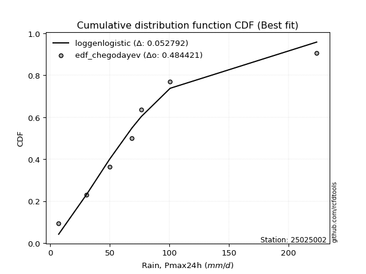</img></img>

</div>


### 6. EDF Blom (1958)

The Blom formula is a specific "plotting position" formula used in hydrology and statistical analysis to estimate the empirical cumulative probability (or non-exceedance probability) of a data series. It is particularly recommended for data that are approximately normally distributed. The constant _a_ is set to 0.375 (or 3/8).

<div align="center">


$P=(m-a)/(n+1-2a)$


</div>


**6.1. Empirical values**

<div align="center">

|                | 0                   | 1                   | 2                  | 3                  | 4                  | 5                  | 6                 | 7                  |
|:---------------|:--------------------|:--------------------|:-------------------|:-------------------|:-------------------|:-------------------|:------------------|:-------------------|
| date           | 2018                | 2019                | 2017               | 2020               | 2023               | 2025               | 2022              | 2024               |
| x              | 7.2                 | 30.7                | 49.8               | 68.7               | 76.5               | 76.8               | 100.7             | 223.6              |
| m              | 1                   | 2                   | 3                  | 4                  | 5                  | 6                  | 7                 | 8                  |
| empirical_dist | edf_blom            | edf_blom            | edf_blom           | edf_blom           | edf_blom           | edf_blom           | edf_blom          | edf_blom           |
| empirical      | 0.07575757575757576 | 0.19696969696969696 | 0.3181818181818182 | 0.4393939393939394 | 0.5606060606060606 | 0.6818181818181818 | 0.803030303030303 | 0.9242424242424242 |
| empirical_tr   | 1.0819672131147542  | 1.2452830188679247  | 1.4666666666666666 | 1.783783783783784  | 2.275862068965517  | 3.1428571428571423 | 5.076923076923076 | 13.199999999999992 |

</div>


**6.2. Kolmogorov-Smirnov fit test (sorted by Δ)**


<div align="center">

|                | 0                   | 1                   | 2                   | 3                   | 4                   | 5                   | 6                   | 7                   | 8                   | 9                   | 10                  | 11                  | 12                 | 13                  | 14                 | 15                  | 16                  | 17                  | 18                  | 19                  | 20                  | 21                  | 22                  | 23                 | 24                  | 25                  | 26                  | 27                  | 28                  | 29                  | 30                  | 31                 | 32                  | 33                  | 34                  | 35                 | 36                  | 37                  | 38                  | 39                  | 40                  | 41                  | 42                  | 43                  | 44                  | 45                 | 46                 | 47                  | 48                  | 49                 | 50                  | 51                  | 52                  | 53                  | 54                  | 55                  | 56                  | 57                  | 58                 | 59                 | 60                 | 61                  | 62                  | 63                  | 64                  | 65                 | 66                  | 67                  | 68                 | 69                  | 70                  | 71                 | 72                 | 73                 | 74                  | 75                  | 76                  | 77                  | 78                 | 79                 | 80                  | 81                  | 82                  | 83                  | 84                  | 85                  | 86                  | 87                  | 88                  | 89                  | 90                 | 91                 | 92                  | 93                  | 94                  | 95                  | 96                  | 97                 | 98                  | 99                  | 100                 | 101                 | 102                 | 103                 | 104                 | 105                 | 106                 | 107                | 108                | 109                | 110                 | 111                | 112                 | 113                | 114                | 115                 | 116                 | 117                 | 118                | 119                 | 120                 | 121                 | 122                 | 123                | 124                 | 125                | 126                 | 127                | 128                 | 129                | 130                 | 131                 | 132                 | 133                | 134                | 135                | 136                 | 137                 | 138                 | 139                | 140                | 141                | 142                 | 143                 | 144                 | 145                 | 146                | 147                 | 148                | 149                | 150                | 151                | 152                | 153                | 154                | 155                | 156                | 157                | 158                | 159                |
|:---------------|:--------------------|:--------------------|:--------------------|:--------------------|:--------------------|:--------------------|:--------------------|:--------------------|:--------------------|:--------------------|:--------------------|:--------------------|:-------------------|:--------------------|:-------------------|:--------------------|:--------------------|:--------------------|:--------------------|:--------------------|:--------------------|:--------------------|:--------------------|:-------------------|:--------------------|:--------------------|:--------------------|:--------------------|:--------------------|:--------------------|:--------------------|:-------------------|:--------------------|:--------------------|:--------------------|:-------------------|:--------------------|:--------------------|:--------------------|:--------------------|:--------------------|:--------------------|:--------------------|:--------------------|:--------------------|:-------------------|:-------------------|:--------------------|:--------------------|:-------------------|:--------------------|:--------------------|:--------------------|:--------------------|:--------------------|:--------------------|:--------------------|:--------------------|:-------------------|:-------------------|:-------------------|:--------------------|:--------------------|:--------------------|:--------------------|:-------------------|:--------------------|:--------------------|:-------------------|:--------------------|:--------------------|:-------------------|:-------------------|:-------------------|:--------------------|:--------------------|:--------------------|:--------------------|:-------------------|:-------------------|:--------------------|:--------------------|:--------------------|:--------------------|:--------------------|:--------------------|:--------------------|:--------------------|:--------------------|:--------------------|:-------------------|:-------------------|:--------------------|:--------------------|:--------------------|:--------------------|:--------------------|:-------------------|:--------------------|:--------------------|:--------------------|:--------------------|:--------------------|:--------------------|:--------------------|:--------------------|:--------------------|:-------------------|:-------------------|:-------------------|:--------------------|:-------------------|:--------------------|:-------------------|:-------------------|:--------------------|:--------------------|:--------------------|:-------------------|:--------------------|:--------------------|:--------------------|:--------------------|:-------------------|:--------------------|:-------------------|:--------------------|:-------------------|:--------------------|:-------------------|:--------------------|:--------------------|:--------------------|:-------------------|:-------------------|:-------------------|:--------------------|:--------------------|:--------------------|:-------------------|:-------------------|:-------------------|:--------------------|:--------------------|:--------------------|:--------------------|:-------------------|:--------------------|:-------------------|:-------------------|:-------------------|:-------------------|:-------------------|:-------------------|:-------------------|:-------------------|:-------------------|:-------------------|:-------------------|:-------------------|
| station        | 25025002            | 25025002            | 25025002            | 25025002            | 25025002            | 25025002            | 25025002            | 25025002            | 25025002            | 25025002            | 25025002            | 25025002            | 25025002           | 25025002            | 25025002           | 25025002            | 25025002            | 25025002            | 25025002            | 25025002            | 25025002            | 25025002            | 25025002            | 25025002           | 25025002            | 25025002            | 25025002            | 25025002            | 25025002            | 25025002            | 25025002            | 25025002           | 25025002            | 25025002            | 25025002            | 25025002           | 25025002            | 25025002            | 25025002            | 25025002            | 25025002            | 25025002            | 25025002            | 25025002            | 25025002            | 25025002           | 25025002           | 25025002            | 25025002            | 25025002           | 25025002            | 25025002            | 25025002            | 25025002            | 25025002            | 25025002            | 25025002            | 25025002            | 25025002           | 25025002           | 25025002           | 25025002            | 25025002            | 25025002            | 25025002            | 25025002           | 25025002            | 25025002            | 25025002           | 25025002            | 25025002            | 25025002           | 25025002           | 25025002           | 25025002            | 25025002            | 25025002            | 25025002            | 25025002           | 25025002           | 25025002            | 25025002            | 25025002            | 25025002            | 25025002            | 25025002            | 25025002            | 25025002            | 25025002            | 25025002            | 25025002           | 25025002           | 25025002            | 25025002            | 25025002            | 25025002            | 25025002            | 25025002           | 25025002            | 25025002            | 25025002            | 25025002            | 25025002            | 25025002            | 25025002            | 25025002            | 25025002            | 25025002           | 25025002           | 25025002           | 25025002            | 25025002           | 25025002            | 25025002           | 25025002           | 25025002            | 25025002            | 25025002            | 25025002           | 25025002            | 25025002            | 25025002            | 25025002            | 25025002           | 25025002            | 25025002           | 25025002            | 25025002           | 25025002            | 25025002           | 25025002            | 25025002            | 25025002            | 25025002           | 25025002           | 25025002           | 25025002            | 25025002            | 25025002            | 25025002           | 25025002           | 25025002           | 25025002            | 25025002            | 25025002            | 25025002            | 25025002           | 25025002            | 25025002           | 25025002           | 25025002           | 25025002           | 25025002           | 25025002           | 25025002           | 25025002           | 25025002           | 25025002           | 25025002           | 25025002           |
| empirical_dist | edf_blom            | edf_blom            | edf_blom            | edf_blom            | edf_blom            | edf_blom            | edf_blom            | edf_blom            | edf_blom            | edf_blom            | edf_blom            | edf_blom            | edf_blom           | edf_blom            | edf_blom           | edf_blom            | edf_blom            | edf_blom            | edf_blom            | edf_blom            | edf_blom            | edf_blom            | edf_blom            | edf_blom           | edf_blom            | edf_blom            | edf_blom            | edf_blom            | edf_blom            | edf_blom            | edf_blom            | edf_blom           | edf_blom            | edf_blom            | edf_blom            | edf_blom           | edf_blom            | edf_blom            | edf_blom            | edf_blom            | edf_blom            | edf_blom            | edf_blom            | edf_blom            | edf_blom            | edf_blom           | edf_blom           | edf_blom            | edf_blom            | edf_blom           | edf_blom            | edf_blom            | edf_blom            | edf_blom            | edf_blom            | edf_blom            | edf_blom            | edf_blom            | edf_blom           | edf_blom           | edf_blom           | edf_blom            | edf_blom            | edf_blom            | edf_blom            | edf_blom           | edf_blom            | edf_blom            | edf_blom           | edf_blom            | edf_blom            | edf_blom           | edf_blom           | edf_blom           | edf_blom            | edf_blom            | edf_blom            | edf_blom            | edf_blom           | edf_blom           | edf_blom            | edf_blom            | edf_blom            | edf_blom            | edf_blom            | edf_blom            | edf_blom            | edf_blom            | edf_blom            | edf_blom            | edf_blom           | edf_blom           | edf_blom            | edf_blom            | edf_blom            | edf_blom            | edf_blom            | edf_blom           | edf_blom            | edf_blom            | edf_blom            | edf_blom            | edf_blom            | edf_blom            | edf_blom            | edf_blom            | edf_blom            | edf_blom           | edf_blom           | edf_blom           | edf_blom            | edf_blom           | edf_blom            | edf_blom           | edf_blom           | edf_blom            | edf_blom            | edf_blom            | edf_blom           | edf_blom            | edf_blom            | edf_blom            | edf_blom            | edf_blom           | edf_blom            | edf_blom           | edf_blom            | edf_blom           | edf_blom            | edf_blom           | edf_blom            | edf_blom            | edf_blom            | edf_blom           | edf_blom           | edf_blom           | edf_blom            | edf_blom            | edf_blom            | edf_blom           | edf_blom           | edf_blom           | edf_blom            | edf_blom            | edf_blom            | edf_blom            | edf_blom           | edf_blom            | edf_blom           | edf_blom           | edf_blom           | edf_blom           | edf_blom           | edf_blom           | edf_blom           | edf_blom           | edf_blom           | edf_blom           | edf_blom           | edf_blom           |
| p_dist         | logjohnsonsu        | t                   | invweibull          | invgauss            | invgamma            | johnsonsu           | halflogistic        | gompertz            | burr                | mielke              | loggenlogistic      | logmielke           | logburr12          | logweibull_min      | nct                | logloggamma         | moyal               | genpareto           | logjohnsonsb        | exponnorm           | vonmises_line       | logpearson3         | loggumbel_l         | pearson3           | loggompertz         | gengamma            | logskewnorm         | logt                | genlogistic         | foldnorm            | logvonmises_line    | logburr            | loggenextreme       | halfnorm            | gumbel_r            | logargus           | genexpon            | lomax               | betaprime           | loganglit           | logsemicircular     | skewnorm            | lognct              | logcrystalball      | lognorm             | logexponnorm       | logrice            | logf                | logfatiguelife      | kstwobign          | loggamma            | loggamma            | logncf              | logbetaprime        | wald                | logbeta             | rayleigh            | f                   | logtriang          | loglogistic        | logerlang          | logalpha            | logarcsine          | loginvgamma         | maxwell             | loghypsecant       | kappa3              | loginvgauss         | loggennorm         | gennorm             | exponpow            | logdgamma          | logmaxwell         | dweibull           | logfoldnorm         | logloglaplace       | loginvweibull       | loggenhalflogistic  | lograyleigh        | dgamma             | logdweibull         | truncnorm           | rice                | logcosine           | loglaplace          | loglaplace          | semicircular        | loggenpareto        | gamma               | anglit              | loggausshyper      | nakagami           | crystalball         | norm                | logistic            | hypsecant           | logtruncnorm        | laplace            | loghalfnorm         | loggumbel_r         | logkstwobign        | halfgennorm         | arcsine             | loggenexpon         | loghalflogistic     | tukeylambda         | logmoyal            | logweibull_max     | logksone           | truncweibull_min   | logwrapcauchy       | truncexpon         | loguniform          | logkappa3          | logkappa4          | loglevy_l           | bradford            | cosine              | gumbel_l           | logtruncweibull_min | loglomax            | exponweib           | ncf                 | logtrapezoid       | gausshyper          | logwald            | burr12              | logbradford        | weibull_min         | kappa4             | logtruncexpon       | wrapcauchy          | ksone               | argus              | genextreme         | uniform            | johnsonsb           | levy_l              | alpha               | lognakagami        | logtukeylambda     | logrdist           | loggengamma         | triang              | logexponweib        | rdist               | powerlaw           | genhalflogistic     | fatiguelife        | erlang             | trapezoid          | beta               | logexponpow        | logpowerlaw        | truncpareto        | weibull_max        | logtruncpareto     | loghalfgennorm     | logvonmises        | vonmises           |
| delta          | 0.06548892505332737 | 0.07901667109087457 | 0.09309298798053062 | 0.09338139502643378 | 0.09363091468686996 | 0.09447725614006203 | 0.09704495508796906 | 0.09724650289040337 | 0.09865504174474576 | 0.09870807750442928 | 0.09882938468688035 | 0.09924663889237478 | 0.0998929345669789 | 0.09989893527366955 | 0.1008009395141814 | 0.10104537509301514 | 0.10222724085986268 | 0.10248904992134511 | 0.10275090062279169 | 0.10275839396224107 | 0.10351160766495038 | 0.10399558429322708 | 0.10556932336210378 | 0.1061286544758091 | 0.10625842874702923 | 0.10752352816520877 | 0.11074521203698767 | 0.11218817159766459 | 0.11632435598065338 | 0.11653792171433996 | 0.11828264101765124 | 0.1188331148997846 | 0.11945789411338803 | 0.12092548957469862 | 0.12810249031132792 | 0.1338116175555104 | 0.13490982826316883 | 0.13496868220306518 | 0.13602677872009944 | 0.13771291233547933 | 0.14072205866639909 | 0.14298945582615585 | 0.14447475492006684 | 0.14484166485130084 | 0.14484176004185162 | 0.1448437661611613 | 0.1448830012581947 | 0.14525422391193016 | 0.14631086810484267 | 0.1464974649202112 | 0.14713518608095205 | 0.14713518608095205 | 0.14873591981270456 | 0.14875215569035866 | 0.14983163387370518 | 0.14997805574168888 | 0.15286221627835062 | 0.15296425986755185 | 0.1539278528360195 | 0.1558942448853327 | 0.1566318419005806 | 0.15735672108761428 | 0.15878829393723404 | 0.16388868905779147 | 0.16420144743059706 | 0.165050574411786  | 0.16537365197433646 | 0.16801756105696147 | 0.1684644189587311 | 0.16874394408429816 | 0.17176190474656222 | 0.1723680339408924 | 0.1727049749637633 | 0.1749989822636694 | 0.17645031087727286 | 0.17880578392141533 | 0.18034127397158256 | 0.18038142237497434 | 0.181445205901216  | 0.1818181759457419 | 0.18181818181905202 | 0.18471893082602997 | 0.18535522139912097 | 0.18616044443408003 | 0.19051606982470953 | 0.19051606982470953 | 0.19458707743068598 | 0.19519638101945014 | 0.19520436205036512 | 0.19552990886686772 | 0.1967661127993881 | 0.1969696933964519 | 0.19781829811251034 | 0.19781830952579976 | 0.20000126622804443 | 0.20186348484664018 | 0.20840178724827968 | 0.2093955892297532 | 0.21029803365564853 | 0.21281768149793273 | 0.21452949413793404 | 0.22064027588859664 | 0.22313978484816033 | 0.22772911100057341 | 0.23434608173554866 | 0.23456797054118367 | 0.23630981663235812 | 0.2367446309054636 | 0.2380990484389996 | 0.2412602055064389 | 0.24275910242433213 | 0.2433958868954711 | 0.24469917071907415 | 0.2581772811626391 | 0.2595807041760955 | 0.26141383513098754 | 0.26712323155982265 | 0.26726696805743555 | 0.2684829311027602 | 0.2687983299969818  | 0.27343591866516703 | 0.27639092861653375 | 0.27678337645127377 | 0.280034089684158  | 0.29303238223686245 | 0.3016216988979568 | 0.30375931119647454 | 0.3283935442085288 | 0.33291147442895924 | 0.3388159667761236 | 0.33913448000197394 | 0.35451979541760936 | 0.35963843611717916 | 0.3673560205197348 | 0.3689235583225325 | 0.3709600627345544 | 0.37222581763660095 | 0.37271112199528694 | 0.37773659762730777 | 0.4031627071525424 | 0.4073720183391904 | 0.4245975325435752 | 0.43291489636381414 | 0.43344889538072306 | 0.45912839639074793 | 0.48662686283545936 | 0.4950764431106101 | 0.49576045217914605 | 0.5275289388744653 | 0.5743594694876306 | 0.6039606603111157 | 0.6088476942019838 | 0.6232027458246956 | 0.6451108803259258 | 0.6648385728679844 | 0.6821706212411262 | 0.7464868569473315 | 0.803030303030303  | 1.0876120967911747 | 35.088543618401964 |
| deltao         | 0.4472608134160001  | 0.4472608134160001  | 0.4472608134160001  | 0.4472608134160001  | 0.4472608134160001  | 0.4472608134160001  | 0.4472608134160001  | 0.4472608134160001  | 0.4472608134160001  | 0.4472608134160001  | 0.4472608134160001  | 0.4472608134160001  | 0.4472608134160001 | 0.4472608134160001  | 0.4472608134160001 | 0.4472608134160001  | 0.4472608134160001  | 0.4472608134160001  | 0.4472608134160001  | 0.4472608134160001  | 0.4472608134160001  | 0.4472608134160001  | 0.4472608134160001  | 0.4472608134160001 | 0.4472608134160001  | 0.4472608134160001  | 0.4472608134160001  | 0.4472608134160001  | 0.4472608134160001  | 0.4472608134160001  | 0.4472608134160001  | 0.4472608134160001 | 0.4472608134160001  | 0.4472608134160001  | 0.4472608134160001  | 0.4472608134160001 | 0.4472608134160001  | 0.4472608134160001  | 0.4472608134160001  | 0.4472608134160001  | 0.4472608134160001  | 0.4472608134160001  | 0.4472608134160001  | 0.4472608134160001  | 0.4472608134160001  | 0.4472608134160001 | 0.4472608134160001 | 0.4472608134160001  | 0.4472608134160001  | 0.4472608134160001 | 0.4472608134160001  | 0.4472608134160001  | 0.4472608134160001  | 0.4472608134160001  | 0.4472608134160001  | 0.4472608134160001  | 0.4472608134160001  | 0.4472608134160001  | 0.4472608134160001 | 0.4472608134160001 | 0.4472608134160001 | 0.4472608134160001  | 0.4472608134160001  | 0.4472608134160001  | 0.4472608134160001  | 0.4472608134160001 | 0.4472608134160001  | 0.4472608134160001  | 0.4472608134160001 | 0.4472608134160001  | 0.4472608134160001  | 0.4472608134160001 | 0.4472608134160001 | 0.4472608134160001 | 0.4472608134160001  | 0.4472608134160001  | 0.4472608134160001  | 0.4472608134160001  | 0.4472608134160001 | 0.4472608134160001 | 0.4472608134160001  | 0.4472608134160001  | 0.4472608134160001  | 0.4472608134160001  | 0.4472608134160001  | 0.4472608134160001  | 0.4472608134160001  | 0.4472608134160001  | 0.4472608134160001  | 0.4472608134160001  | 0.4472608134160001 | 0.4472608134160001 | 0.4472608134160001  | 0.4472608134160001  | 0.4472608134160001  | 0.4472608134160001  | 0.4472608134160001  | 0.4472608134160001 | 0.4472608134160001  | 0.4472608134160001  | 0.4472608134160001  | 0.4472608134160001  | 0.4472608134160001  | 0.4472608134160001  | 0.4472608134160001  | 0.4472608134160001  | 0.4472608134160001  | 0.4472608134160001 | 0.4472608134160001 | 0.4472608134160001 | 0.4472608134160001  | 0.4472608134160001 | 0.4472608134160001  | 0.4472608134160001 | 0.4472608134160001 | 0.4472608134160001  | 0.4472608134160001  | 0.4472608134160001  | 0.4472608134160001 | 0.4472608134160001  | 0.4472608134160001  | 0.4472608134160001  | 0.4472608134160001  | 0.4472608134160001 | 0.4472608134160001  | 0.4472608134160001 | 0.4472608134160001  | 0.4472608134160001 | 0.4472608134160001  | 0.4472608134160001 | 0.4472608134160001  | 0.4472608134160001  | 0.4472608134160001  | 0.4472608134160001 | 0.4472608134160001 | 0.4472608134160001 | 0.4472608134160001  | 0.4472608134160001  | 0.4472608134160001  | 0.4472608134160001 | 0.4472608134160001 | 0.4472608134160001 | 0.4472608134160001  | 0.4472608134160001  | 0.4472608134160001  | 0.4472608134160001  | 0.4472608134160001 | 0.4472608134160001  | 0.4472608134160001 | 0.4472608134160001 | 0.4472608134160001 | 0.4472608134160001 | 0.4472608134160001 | 0.4472608134160001 | 0.4472608134160001 | 0.4472608134160001 | 0.4472608134160001 | 0.4472608134160001 | 0.4472608134160001 | 0.4472608134160001 |
| eval           | Δo > Δ              | Δo > Δ              | Δo > Δ              | Δo > Δ              | Δo > Δ              | Δo > Δ              | Δo > Δ              | Δo > Δ              | Δo > Δ              | Δo > Δ              | Δo > Δ              | Δo > Δ              | Δo > Δ             | Δo > Δ              | Δo > Δ             | Δo > Δ              | Δo > Δ              | Δo > Δ              | Δo > Δ              | Δo > Δ              | Δo > Δ              | Δo > Δ              | Δo > Δ              | Δo > Δ             | Δo > Δ              | Δo > Δ              | Δo > Δ              | Δo > Δ              | Δo > Δ              | Δo > Δ              | Δo > Δ              | Δo > Δ             | Δo > Δ              | Δo > Δ              | Δo > Δ              | Δo > Δ             | Δo > Δ              | Δo > Δ              | Δo > Δ              | Δo > Δ              | Δo > Δ              | Δo > Δ              | Δo > Δ              | Δo > Δ              | Δo > Δ              | Δo > Δ             | Δo > Δ             | Δo > Δ              | Δo > Δ              | Δo > Δ             | Δo > Δ              | Δo > Δ              | Δo > Δ              | Δo > Δ              | Δo > Δ              | Δo > Δ              | Δo > Δ              | Δo > Δ              | Δo > Δ             | Δo > Δ             | Δo > Δ             | Δo > Δ              | Δo > Δ              | Δo > Δ              | Δo > Δ              | Δo > Δ             | Δo > Δ              | Δo > Δ              | Δo > Δ             | Δo > Δ              | Δo > Δ              | Δo > Δ             | Δo > Δ             | Δo > Δ             | Δo > Δ              | Δo > Δ              | Δo > Δ              | Δo > Δ              | Δo > Δ             | Δo > Δ             | Δo > Δ              | Δo > Δ              | Δo > Δ              | Δo > Δ              | Δo > Δ              | Δo > Δ              | Δo > Δ              | Δo > Δ              | Δo > Δ              | Δo > Δ              | Δo > Δ             | Δo > Δ             | Δo > Δ              | Δo > Δ              | Δo > Δ              | Δo > Δ              | Δo > Δ              | Δo > Δ             | Δo > Δ              | Δo > Δ              | Δo > Δ              | Δo > Δ              | Δo > Δ              | Δo > Δ              | Δo > Δ              | Δo > Δ              | Δo > Δ              | Δo > Δ             | Δo > Δ             | Δo > Δ             | Δo > Δ              | Δo > Δ             | Δo > Δ              | Δo > Δ             | Δo > Δ             | Δo > Δ              | Δo > Δ              | Δo > Δ              | Δo > Δ             | Δo > Δ              | Δo > Δ              | Δo > Δ              | Δo > Δ              | Δo > Δ             | Δo > Δ              | Δo > Δ             | Δo > Δ              | Δo > Δ             | Δo > Δ              | Δo > Δ             | Δo > Δ              | Δo > Δ              | Δo > Δ              | Δo > Δ             | Δo > Δ             | Δo > Δ             | Δo > Δ              | Δo > Δ              | Δo > Δ              | Δo > Δ             | Δo > Δ             | Δo > Δ             | Δo > Δ              | Δo > Δ              | Δo <= Δ             | Δo <= Δ             | Δo <= Δ            | Δo <= Δ             | Δo <= Δ            | Δo <= Δ            | Δo <= Δ            | Δo <= Δ            | Δo <= Δ            | Δo <= Δ            | Δo <= Δ            | Δo <= Δ            | Δo <= Δ            | Δo <= Δ            | Δo <= Δ            | Δo <= Δ            |
| fit            | 1                   | 1                   | 1                   | 1                   | 1                   | 1                   | 1                   | 1                   | 1                   | 1                   | 1                   | 1                   | 1                  | 1                   | 1                  | 1                   | 1                   | 1                   | 1                   | 1                   | 1                   | 1                   | 1                   | 1                  | 1                   | 1                   | 1                   | 1                   | 1                   | 1                   | 1                   | 1                  | 1                   | 1                   | 1                   | 1                  | 1                   | 1                   | 1                   | 1                   | 1                   | 1                   | 1                   | 1                   | 1                   | 1                  | 1                  | 1                   | 1                   | 1                  | 1                   | 1                   | 1                   | 1                   | 1                   | 1                   | 1                   | 1                   | 1                  | 1                  | 1                  | 1                   | 1                   | 1                   | 1                   | 1                  | 1                   | 1                   | 1                  | 1                   | 1                   | 1                  | 1                  | 1                  | 1                   | 1                   | 1                   | 1                   | 1                  | 1                  | 1                   | 1                   | 1                   | 1                   | 1                   | 1                   | 1                   | 1                   | 1                   | 1                   | 1                  | 1                  | 1                   | 1                   | 1                   | 1                   | 1                   | 1                  | 1                   | 1                   | 1                   | 1                   | 1                   | 1                   | 1                   | 1                   | 1                   | 1                  | 1                  | 1                  | 1                   | 1                  | 1                   | 1                  | 1                  | 1                   | 1                   | 1                   | 1                  | 1                   | 1                   | 1                   | 1                   | 1                  | 1                   | 1                  | 1                   | 1                  | 1                   | 1                  | 1                   | 1                   | 1                   | 1                  | 1                  | 1                  | 1                   | 1                   | 1                   | 1                  | 1                  | 1                  | 1                   | 1                   | 0                   | 0                   | 0                  | 0                   | 0                  | 0                  | 0                  | 0                  | 0                  | 0                  | 0                  | 0                  | 0                  | 0                  | 0                  | 0                  |
| n              | 8                   | 8                   | 8                   | 8                   | 8                   | 8                   | 8                   | 8                   | 8                   | 8                   | 8                   | 8                   | 8                  | 8                   | 8                  | 8                   | 8                   | 8                   | 8                   | 8                   | 8                   | 8                   | 8                   | 8                  | 8                   | 8                   | 8                   | 8                   | 8                   | 8                   | 8                   | 8                  | 8                   | 8                   | 8                   | 8                  | 8                   | 8                   | 8                   | 8                   | 8                   | 8                   | 8                   | 8                   | 8                   | 8                  | 8                  | 8                   | 8                   | 8                  | 8                   | 8                   | 8                   | 8                   | 8                   | 8                   | 8                   | 8                   | 8                  | 8                  | 8                  | 8                   | 8                   | 8                   | 8                   | 8                  | 8                   | 8                   | 8                  | 8                   | 8                   | 8                  | 8                  | 8                  | 8                   | 8                   | 8                   | 8                   | 8                  | 8                  | 8                   | 8                   | 8                   | 8                   | 8                   | 8                   | 8                   | 8                   | 8                   | 8                   | 8                  | 8                  | 8                   | 8                   | 8                   | 8                   | 8                   | 8                  | 8                   | 8                   | 8                   | 8                   | 8                   | 8                   | 8                   | 8                   | 8                   | 8                  | 8                  | 8                  | 8                   | 8                  | 8                   | 8                  | 8                  | 8                   | 8                   | 8                   | 8                  | 8                   | 8                   | 8                   | 8                   | 8                  | 8                   | 8                  | 8                   | 8                  | 8                   | 8                  | 8                   | 8                   | 8                   | 8                  | 8                  | 8                  | 8                   | 8                   | 8                   | 8                  | 8                  | 8                  | 8                   | 8                   | 8                   | 8                   | 8                  | 8                   | 8                  | 8                  | 8                  | 8                  | 8                  | 8                  | 8                  | 8                  | 8                  | 8                  | 8                  | 8                  |
| best_fit       | 1                   | 0                   | 0                   | 0                   | 0                   | 0                   | 0                   | 0                   | 0                   | 0                   | 0                   | 0                   | 0                  | 0                   | 0                  | 0                   | 0                   | 0                   | 0                   | 0                   | 0                   | 0                   | 0                   | 0                  | 0                   | 0                   | 0                   | 0                   | 0                   | 0                   | 0                   | 0                  | 0                   | 0                   | 0                   | 0                  | 0                   | 0                   | 0                   | 0                   | 0                   | 0                   | 0                   | 0                   | 0                   | 0                  | 0                  | 0                   | 0                   | 0                  | 0                   | 0                   | 0                   | 0                   | 0                   | 0                   | 0                   | 0                   | 0                  | 0                  | 0                  | 0                   | 0                   | 0                   | 0                   | 0                  | 0                   | 0                   | 0                  | 0                   | 0                   | 0                  | 0                  | 0                  | 0                   | 0                   | 0                   | 0                   | 0                  | 0                  | 0                   | 0                   | 0                   | 0                   | 0                   | 0                   | 0                   | 0                   | 0                   | 0                   | 0                  | 0                  | 0                   | 0                   | 0                   | 0                   | 0                   | 0                  | 0                   | 0                   | 0                   | 0                   | 0                   | 0                   | 0                   | 0                   | 0                   | 0                  | 0                  | 0                  | 0                   | 0                  | 0                   | 0                  | 0                  | 0                   | 0                   | 0                   | 0                  | 0                   | 0                   | 0                   | 0                   | 0                  | 0                   | 0                  | 0                   | 0                  | 0                   | 0                  | 0                   | 0                   | 0                   | 0                  | 0                  | 0                  | 0                   | 0                   | 0                   | 0                  | 0                  | 0                  | 0                   | 0                   | 0                   | 0                   | 0                  | 0                   | 0                  | 0                  | 0                  | 0                  | 0                  | 0                  | 0                  | 0                  | 0                  | 0                  | 0                  | 0                  |
| best_fit_sort  | 1                   | 2                   | 3                   | 4                   | 5                   | 6                   | 7                   | 8                   | 9                   | 10                  | 11                  | 12                  | 13                 | 14                  | 15                 | 16                  | 17                  | 18                  | 19                  | 20                  | 21                  | 22                  | 23                  | 24                 | 25                  | 26                  | 27                  | 28                  | 29                  | 30                  | 31                  | 32                 | 33                  | 34                  | 35                  | 36                 | 37                  | 38                  | 39                  | 40                  | 41                  | 42                  | 43                  | 44                  | 45                  | 46                 | 47                 | 48                  | 49                  | 50                 | 51                  | 52                  | 53                  | 54                  | 55                  | 56                  | 57                  | 58                  | 59                 | 60                 | 61                 | 62                  | 63                  | 64                  | 65                  | 66                 | 67                  | 68                  | 69                 | 70                  | 71                  | 72                 | 73                 | 74                 | 75                  | 76                  | 77                  | 78                  | 79                 | 80                 | 81                  | 82                  | 83                  | 84                  | 85                  | 86                  | 87                  | 88                  | 89                  | 90                  | 91                 | 92                 | 93                  | 94                  | 95                  | 96                  | 97                  | 98                 | 99                  | 100                 | 101                 | 102                 | 103                 | 104                 | 105                 | 106                 | 107                 | 108                | 109                | 110                | 111                 | 112                | 113                 | 114                | 115                | 116                 | 117                 | 118                 | 119                | 120                 | 121                 | 122                 | 123                 | 124                | 125                 | 126                | 127                 | 128                | 129                 | 130                | 131                 | 132                 | 133                 | 134                | 135                | 136                | 137                 | 138                 | 139                 | 140                | 141                | 142                | 143                 | 144                 | 145                 | 146                 | 147                | 148                 | 149                | 150                | 151                | 152                | 153                | 154                | 155                | 156                | 157                | 158                | 159                | 160                |

</div>


**6.3. Best fit**

<div align="center">

|   id |   station | empirical_dist   | p_dist       |     delta |   deltao | eval   |   fit |   n |   best_fit |   best_fit_sort |
|-----:|----------:|:-----------------|:-------------|----------:|---------:|:-------|------:|----:|-----------:|----------------:|
|    0 |  25025002 | edf_blom         | logjohnsonsu | 0.0654889 | 0.447261 | Δo > Δ |     1 |   8 |          1 |               1 |

</div>


<div align="center">

</img></img>

</div>


### 7. EDF Tukey (1962)

In hydrology, the Tukey formula is used as a plotting position formula to estimate the empirical probability or frequency of a flood event (or other hydrological data). The formula parameter is given as _c=0.333_ (or 1/3).

<div align="center">


$P=(m-c)/(n+1-2c)$


</div>


**7.1. Empirical values**

<div align="center">

|                | 0                  | 1         | 2                  | 3                  | 4                 | 5                  | 6                 | 7                  |
|:---------------|:-------------------|:----------|:-------------------|:-------------------|:------------------|:-------------------|:------------------|:-------------------|
| date           | 2018               | 2019      | 2017               | 2020               | 2023              | 2025               | 2022              | 2024               |
| x              | 7.2                | 30.7      | 49.8               | 68.7               | 76.5              | 76.8               | 100.7             | 223.6              |
| m              | 1                  | 2         | 3                  | 4                  | 5                 | 6                  | 7                 | 8                  |
| empirical_dist | edf_tukey          | edf_tukey | edf_tukey          | edf_tukey          | edf_tukey         | edf_tukey          | edf_tukey         | edf_tukey          |
| empirical      | 0.08               | 0.2       | 0.32               | 0.44               | 0.56              | 0.68               | 0.8               | 0.92               |
| empirical_tr   | 1.0869565217391304 | 1.25      | 1.4705882352941178 | 1.7857142857142856 | 2.272727272727273 | 3.1250000000000004 | 5.000000000000001 | 12.500000000000007 |

</div>


**7.2. Kolmogorov-Smirnov fit test (sorted by Δ)**


<div align="center">

|                | 0                   | 1                   | 2                   | 3                   | 4                   | 5                   | 6                   | 7                   | 8                   | 9                   | 10                  | 11                  | 12                  | 13                  | 14                  | 15                  | 16                  | 17                  | 18                  | 19                  | 20                  | 21                  | 22                  | 23                  | 24                  | 25                  | 26                  | 27                  | 28                  | 29                  | 30                  | 31                  | 32                  | 33                 | 34                 | 35                  | 36                  | 37                  | 38                  | 39                 | 40                  | 41                  | 42                  | 43                  | 44                 | 45                  | 46                 | 47                  | 48                 | 49                  | 50                  | 51                  | 52                  | 53                  | 54                  | 55                  | 56                  | 57                 | 58                  | 59                 | 60                 | 61                 | 62                  | 63                  | 64                  | 65                 | 66                  | 67                  | 68                  | 69                  | 70                 | 71                  | 72                 | 73                  | 74                  | 75                 | 76                 | 77                  | 78                  | 79                 | 80                  | 81                  | 82                  | 83                 | 84                  | 85                  | 86                 | 87                  | 88                 | 89                 | 90                  | 91                  | 92                  | 93                 | 94                  | 95                  | 96                 | 97                  | 98                 | 99                  | 100                | 101                | 102                | 103                 | 104                 | 105                 | 106                 | 107                 | 108                | 109                 | 110                 | 111                | 112                 | 113                | 114                 | 115                | 116                | 117                 | 118                | 119                 | 120                | 121                | 122                | 123                 | 124                | 125                | 126                | 127                 | 128                | 129                 | 130                | 131                | 132                | 133                | 134                 | 135                 | 136                | 137                | 138                 | 139                 | 140                 | 141                 | 142                | 143                | 144                | 145                | 146                 | 147                | 148                | 149                | 150                | 151                | 152                | 153                | 154                | 155                | 156                | 157                | 158                | 159                |
|:---------------|:--------------------|:--------------------|:--------------------|:--------------------|:--------------------|:--------------------|:--------------------|:--------------------|:--------------------|:--------------------|:--------------------|:--------------------|:--------------------|:--------------------|:--------------------|:--------------------|:--------------------|:--------------------|:--------------------|:--------------------|:--------------------|:--------------------|:--------------------|:--------------------|:--------------------|:--------------------|:--------------------|:--------------------|:--------------------|:--------------------|:--------------------|:--------------------|:--------------------|:-------------------|:-------------------|:--------------------|:--------------------|:--------------------|:--------------------|:-------------------|:--------------------|:--------------------|:--------------------|:--------------------|:-------------------|:--------------------|:-------------------|:--------------------|:-------------------|:--------------------|:--------------------|:--------------------|:--------------------|:--------------------|:--------------------|:--------------------|:--------------------|:-------------------|:--------------------|:-------------------|:-------------------|:-------------------|:--------------------|:--------------------|:--------------------|:-------------------|:--------------------|:--------------------|:--------------------|:--------------------|:-------------------|:--------------------|:-------------------|:--------------------|:--------------------|:-------------------|:-------------------|:--------------------|:--------------------|:-------------------|:--------------------|:--------------------|:--------------------|:-------------------|:--------------------|:--------------------|:-------------------|:--------------------|:-------------------|:-------------------|:--------------------|:--------------------|:--------------------|:-------------------|:--------------------|:--------------------|:-------------------|:--------------------|:-------------------|:--------------------|:-------------------|:-------------------|:-------------------|:--------------------|:--------------------|:--------------------|:--------------------|:--------------------|:-------------------|:--------------------|:--------------------|:-------------------|:--------------------|:-------------------|:--------------------|:-------------------|:-------------------|:--------------------|:-------------------|:--------------------|:-------------------|:-------------------|:-------------------|:--------------------|:-------------------|:-------------------|:-------------------|:--------------------|:-------------------|:--------------------|:-------------------|:-------------------|:-------------------|:-------------------|:--------------------|:--------------------|:-------------------|:-------------------|:--------------------|:--------------------|:--------------------|:--------------------|:-------------------|:-------------------|:-------------------|:-------------------|:--------------------|:-------------------|:-------------------|:-------------------|:-------------------|:-------------------|:-------------------|:-------------------|:-------------------|:-------------------|:-------------------|:-------------------|:-------------------|:-------------------|
| station        | 25025002            | 25025002            | 25025002            | 25025002            | 25025002            | 25025002            | 25025002            | 25025002            | 25025002            | 25025002            | 25025002            | 25025002            | 25025002            | 25025002            | 25025002            | 25025002            | 25025002            | 25025002            | 25025002            | 25025002            | 25025002            | 25025002            | 25025002            | 25025002            | 25025002            | 25025002            | 25025002            | 25025002            | 25025002            | 25025002            | 25025002            | 25025002            | 25025002            | 25025002           | 25025002           | 25025002            | 25025002            | 25025002            | 25025002            | 25025002           | 25025002            | 25025002            | 25025002            | 25025002            | 25025002           | 25025002            | 25025002           | 25025002            | 25025002           | 25025002            | 25025002            | 25025002            | 25025002            | 25025002            | 25025002            | 25025002            | 25025002            | 25025002           | 25025002            | 25025002           | 25025002           | 25025002           | 25025002            | 25025002            | 25025002            | 25025002           | 25025002            | 25025002            | 25025002            | 25025002            | 25025002           | 25025002            | 25025002           | 25025002            | 25025002            | 25025002           | 25025002           | 25025002            | 25025002            | 25025002           | 25025002            | 25025002            | 25025002            | 25025002           | 25025002            | 25025002            | 25025002           | 25025002            | 25025002           | 25025002           | 25025002            | 25025002            | 25025002            | 25025002           | 25025002            | 25025002            | 25025002           | 25025002            | 25025002           | 25025002            | 25025002           | 25025002           | 25025002           | 25025002            | 25025002            | 25025002            | 25025002            | 25025002            | 25025002           | 25025002            | 25025002            | 25025002           | 25025002            | 25025002           | 25025002            | 25025002           | 25025002           | 25025002            | 25025002           | 25025002            | 25025002           | 25025002           | 25025002           | 25025002            | 25025002           | 25025002           | 25025002           | 25025002            | 25025002           | 25025002            | 25025002           | 25025002           | 25025002           | 25025002           | 25025002            | 25025002            | 25025002           | 25025002           | 25025002            | 25025002            | 25025002            | 25025002            | 25025002           | 25025002           | 25025002           | 25025002           | 25025002            | 25025002           | 25025002           | 25025002           | 25025002           | 25025002           | 25025002           | 25025002           | 25025002           | 25025002           | 25025002           | 25025002           | 25025002           | 25025002           |
| empirical_dist | edf_tukey           | edf_tukey           | edf_tukey           | edf_tukey           | edf_tukey           | edf_tukey           | edf_tukey           | edf_tukey           | edf_tukey           | edf_tukey           | edf_tukey           | edf_tukey           | edf_tukey           | edf_tukey           | edf_tukey           | edf_tukey           | edf_tukey           | edf_tukey           | edf_tukey           | edf_tukey           | edf_tukey           | edf_tukey           | edf_tukey           | edf_tukey           | edf_tukey           | edf_tukey           | edf_tukey           | edf_tukey           | edf_tukey           | edf_tukey           | edf_tukey           | edf_tukey           | edf_tukey           | edf_tukey          | edf_tukey          | edf_tukey           | edf_tukey           | edf_tukey           | edf_tukey           | edf_tukey          | edf_tukey           | edf_tukey           | edf_tukey           | edf_tukey           | edf_tukey          | edf_tukey           | edf_tukey          | edf_tukey           | edf_tukey          | edf_tukey           | edf_tukey           | edf_tukey           | edf_tukey           | edf_tukey           | edf_tukey           | edf_tukey           | edf_tukey           | edf_tukey          | edf_tukey           | edf_tukey          | edf_tukey          | edf_tukey          | edf_tukey           | edf_tukey           | edf_tukey           | edf_tukey          | edf_tukey           | edf_tukey           | edf_tukey           | edf_tukey           | edf_tukey          | edf_tukey           | edf_tukey          | edf_tukey           | edf_tukey           | edf_tukey          | edf_tukey          | edf_tukey           | edf_tukey           | edf_tukey          | edf_tukey           | edf_tukey           | edf_tukey           | edf_tukey          | edf_tukey           | edf_tukey           | edf_tukey          | edf_tukey           | edf_tukey          | edf_tukey          | edf_tukey           | edf_tukey           | edf_tukey           | edf_tukey          | edf_tukey           | edf_tukey           | edf_tukey          | edf_tukey           | edf_tukey          | edf_tukey           | edf_tukey          | edf_tukey          | edf_tukey          | edf_tukey           | edf_tukey           | edf_tukey           | edf_tukey           | edf_tukey           | edf_tukey          | edf_tukey           | edf_tukey           | edf_tukey          | edf_tukey           | edf_tukey          | edf_tukey           | edf_tukey          | edf_tukey          | edf_tukey           | edf_tukey          | edf_tukey           | edf_tukey          | edf_tukey          | edf_tukey          | edf_tukey           | edf_tukey          | edf_tukey          | edf_tukey          | edf_tukey           | edf_tukey          | edf_tukey           | edf_tukey          | edf_tukey          | edf_tukey          | edf_tukey          | edf_tukey           | edf_tukey           | edf_tukey          | edf_tukey          | edf_tukey           | edf_tukey           | edf_tukey           | edf_tukey           | edf_tukey          | edf_tukey          | edf_tukey          | edf_tukey          | edf_tukey           | edf_tukey          | edf_tukey          | edf_tukey          | edf_tukey          | edf_tukey          | edf_tukey          | edf_tukey          | edf_tukey          | edf_tukey          | edf_tukey          | edf_tukey          | edf_tukey          | edf_tukey          |
| p_dist         | logjohnsonsu        | t                   | invweibull          | invgauss            | invgamma            | johnsonsu           | halflogistic        | gompertz            | burr                | logburr12           | logweibull_min      | mielke              | loggenlogistic      | logmielke           | logloggamma         | nct                 | moyal               | genpareto           | logjohnsonsb        | exponnorm           | vonmises_line       | logpearson3         | loggumbel_l         | pearson3            | loggompertz         | gengamma            | logskewnorm         | logt                | genlogistic         | foldnorm            | loggenextreme       | logvonmises_line    | logburr             | halfnorm           | gumbel_r           | logargus            | genexpon            | lomax               | betaprime           | loganglit          | logsemicircular     | skewnorm            | lognct              | logcrystalball      | lognorm            | logexponnorm        | logrice            | logf                | kstwobign          | logfatiguelife      | loggamma            | loggamma            | logbeta             | logncf              | logbetaprime        | wald                | logtriang           | rayleigh           | f                   | loglogistic        | logarcsine         | logerlang          | logalpha            | maxwell             | loginvgamma         | loghypsecant       | kappa3              | loggennorm          | gennorm             | loginvgauss         | exponpow           | logdgamma           | logmaxwell         | dweibull            | logfoldnorm         | logloglaplace      | loggenhalflogistic | loginvweibull       | dgamma              | logdweibull        | lograyleigh         | truncnorm           | rice                | logcosine          | loglaplace          | loglaplace          | loggenpareto       | semicircular        | anglit             | gamma              | loggausshyper       | crystalball         | norm                | logistic           | nakagami            | hypsecant           | laplace            | logtruncnorm        | loghalfnorm        | loggumbel_r         | logkstwobign       | halfgennorm        | arcsine            | loggenexpon         | logweibull_max      | loghalflogistic     | tukeylambda         | logksone            | logmoyal           | truncweibull_min    | truncexpon          | logwrapcauchy      | loguniform          | logkappa3          | loglevy_l           | logkappa4          | bradford           | cosine              | gumbel_l           | logtruncweibull_min | loglomax           | ncf                | exponweib          | logtrapezoid        | gausshyper         | burr12             | logwald            | logbradford         | weibull_min        | kappa4              | logtruncexpon      | wrapcauchy         | ksone              | argus              | genextreme          | uniform             | levy_l             | johnsonsb          | alpha               | lognakagami         | logtukeylambda      | logrdist            | loggengamma        | triang             | logexponweib       | rdist              | powerlaw            | genhalflogistic    | fatiguelife        | erlang             | trapezoid          | beta               | logexponpow        | logpowerlaw        | truncpareto        | weibull_max        | logtruncpareto     | loghalfgennorm     | logvonmises        | vonmises           |
| delta          | 0.06367074323514565 | 0.07841061048481396 | 0.09248692737447001 | 0.09277533442037317 | 0.09302485408080935 | 0.09387119553400142 | 0.09522677326978735 | 0.09542832107222166 | 0.09804898113868515 | 0.09807475274879718 | 0.09808075345548783 | 0.09810201689836867 | 0.09822332408081974 | 0.09864057828631417 | 0.09922719327483343 | 0.10019487890812079 | 0.10040905904168096 | 0.10067086810316339 | 0.10093271880460997 | 0.10094021214405935 | 0.10169342584676866 | 0.10217740247504536 | 0.10375114154392207 | 0.10431047265762738 | 0.10565236814096862 | 0.10691746755914816 | 0.11013915143092706 | 0.11036998977948287 | 0.11450617416247166 | 0.11471973989615825 | 0.11642759108308509 | 0.11767658041159063 | 0.11822705429372399 | 0.1191073077565169 | 0.1262843084931462 | 0.13078131452520747 | 0.13430376765710822 | 0.13436262159700457 | 0.13542071811403883 | 0.1358947305172975 | 0.13890387684821726 | 0.14117127400797413 | 0.14386869431400623 | 0.14423560424524023 | 0.144235699435791  | 0.14423770555510068 | 0.1442769406521341 | 0.14464816330586955 | 0.1446792831020295 | 0.14570480749878206 | 0.14652912547489144 | 0.14652912547489144 | 0.14694775271138583 | 0.14812985920664395 | 0.14814609508429805 | 0.14922557326764457 | 0.15089754980571657 | 0.1510440344601689 | 0.15114607804937003 | 0.1552881842792721 | 0.1557579909069311 | 0.15602578129452   | 0.15675066048155367 | 0.16238326561241534 | 0.16328262845173086 | 0.1644445138057254 | 0.16476759136827585 | 0.16664623714054938 | 0.16692576226611644 | 0.16741150045090086 | 0.1699437229283804 | 0.17054985212271068 | 0.1720989143577027 | 0.17318080044548767 | 0.17584425027121225 | 0.1769876021032336 | 0.1773511193446714 | 0.17852309215340073 | 0.17999999412756018 | 0.1800000000008703 | 0.18083914529515538 | 0.18290074900784825 | 0.18353703958093925 | 0.1843422626158982 | 0.18991000921864892 | 0.18991000921864892 | 0.1921660779891471 | 0.19276889561250427 | 0.193711727048686  | 0.1945983014443045 | 0.19494793098120627 | 0.19600011629432862 | 0.19600012770761804 | 0.1981830844098627 | 0.19999999642675495 | 0.20004530302845847 | 0.2075774074115715 | 0.20779572664221907 | 0.2084798518374667 | 0.21221162089187212 | 0.2127113123197522 | 0.2188220940704148 | 0.2201094818178574 | 0.22591092918239158 | 0.23371432787516067 | 0.23374002112948805 | 0.23396190993512306 | 0.23506874540869654 | 0.2357037560262975 | 0.23822990247613596 | 0.24047458035417668 | 0.2409409206061503 | 0.24288098890089233 | 0.2563590993444573 | 0.25717141088856327 | 0.2577625223579137 | 0.2640929285295197 | 0.26544878623925383 | 0.2666647492845785 | 0.26698014817879995 | 0.2691934944227429 | 0.2737530734209707 | 0.2745727467983519 | 0.27700378665385506 | 0.2900020792065595 | 0.3007290081661715 | 0.3010156382918962 | 0.32657536239034696 | 0.3298811713986562 | 0.33578566374582064 | 0.3373162981837921 | 0.3514894923873064 | 0.3566081330868762 | 0.3643257174894319 | 0.36589325529222944 | 0.36792975970425146 | 0.3684686977528627 | 0.369195514606298  | 0.37591841580912594 | 0.40255664654648177 | 0.40578810913107105 | 0.42156722951327213 | 0.4298845933335111 | 0.4304185923504201 | 0.4560980933604449 | 0.4823844385930351 | 0.49204614008030706 | 0.4927301491488431 | 0.5244986358441623 | 0.5713291664573275 | 0.6009303572808128 | 0.6058173911716809 | 0.6201724427943927 | 0.6420805772956228 | 0.6618082698376815 | 0.6791403182108232 | 0.7434565539170284 | 0.8                | 1.0870060361851142 | 35.092786042644384 |
| deltao         | 0.4472608134160001  | 0.4472608134160001  | 0.4472608134160001  | 0.4472608134160001  | 0.4472608134160001  | 0.4472608134160001  | 0.4472608134160001  | 0.4472608134160001  | 0.4472608134160001  | 0.4472608134160001  | 0.4472608134160001  | 0.4472608134160001  | 0.4472608134160001  | 0.4472608134160001  | 0.4472608134160001  | 0.4472608134160001  | 0.4472608134160001  | 0.4472608134160001  | 0.4472608134160001  | 0.4472608134160001  | 0.4472608134160001  | 0.4472608134160001  | 0.4472608134160001  | 0.4472608134160001  | 0.4472608134160001  | 0.4472608134160001  | 0.4472608134160001  | 0.4472608134160001  | 0.4472608134160001  | 0.4472608134160001  | 0.4472608134160001  | 0.4472608134160001  | 0.4472608134160001  | 0.4472608134160001 | 0.4472608134160001 | 0.4472608134160001  | 0.4472608134160001  | 0.4472608134160001  | 0.4472608134160001  | 0.4472608134160001 | 0.4472608134160001  | 0.4472608134160001  | 0.4472608134160001  | 0.4472608134160001  | 0.4472608134160001 | 0.4472608134160001  | 0.4472608134160001 | 0.4472608134160001  | 0.4472608134160001 | 0.4472608134160001  | 0.4472608134160001  | 0.4472608134160001  | 0.4472608134160001  | 0.4472608134160001  | 0.4472608134160001  | 0.4472608134160001  | 0.4472608134160001  | 0.4472608134160001 | 0.4472608134160001  | 0.4472608134160001 | 0.4472608134160001 | 0.4472608134160001 | 0.4472608134160001  | 0.4472608134160001  | 0.4472608134160001  | 0.4472608134160001 | 0.4472608134160001  | 0.4472608134160001  | 0.4472608134160001  | 0.4472608134160001  | 0.4472608134160001 | 0.4472608134160001  | 0.4472608134160001 | 0.4472608134160001  | 0.4472608134160001  | 0.4472608134160001 | 0.4472608134160001 | 0.4472608134160001  | 0.4472608134160001  | 0.4472608134160001 | 0.4472608134160001  | 0.4472608134160001  | 0.4472608134160001  | 0.4472608134160001 | 0.4472608134160001  | 0.4472608134160001  | 0.4472608134160001 | 0.4472608134160001  | 0.4472608134160001 | 0.4472608134160001 | 0.4472608134160001  | 0.4472608134160001  | 0.4472608134160001  | 0.4472608134160001 | 0.4472608134160001  | 0.4472608134160001  | 0.4472608134160001 | 0.4472608134160001  | 0.4472608134160001 | 0.4472608134160001  | 0.4472608134160001 | 0.4472608134160001 | 0.4472608134160001 | 0.4472608134160001  | 0.4472608134160001  | 0.4472608134160001  | 0.4472608134160001  | 0.4472608134160001  | 0.4472608134160001 | 0.4472608134160001  | 0.4472608134160001  | 0.4472608134160001 | 0.4472608134160001  | 0.4472608134160001 | 0.4472608134160001  | 0.4472608134160001 | 0.4472608134160001 | 0.4472608134160001  | 0.4472608134160001 | 0.4472608134160001  | 0.4472608134160001 | 0.4472608134160001 | 0.4472608134160001 | 0.4472608134160001  | 0.4472608134160001 | 0.4472608134160001 | 0.4472608134160001 | 0.4472608134160001  | 0.4472608134160001 | 0.4472608134160001  | 0.4472608134160001 | 0.4472608134160001 | 0.4472608134160001 | 0.4472608134160001 | 0.4472608134160001  | 0.4472608134160001  | 0.4472608134160001 | 0.4472608134160001 | 0.4472608134160001  | 0.4472608134160001  | 0.4472608134160001  | 0.4472608134160001  | 0.4472608134160001 | 0.4472608134160001 | 0.4472608134160001 | 0.4472608134160001 | 0.4472608134160001  | 0.4472608134160001 | 0.4472608134160001 | 0.4472608134160001 | 0.4472608134160001 | 0.4472608134160001 | 0.4472608134160001 | 0.4472608134160001 | 0.4472608134160001 | 0.4472608134160001 | 0.4472608134160001 | 0.4472608134160001 | 0.4472608134160001 | 0.4472608134160001 |
| eval           | Δo > Δ              | Δo > Δ              | Δo > Δ              | Δo > Δ              | Δo > Δ              | Δo > Δ              | Δo > Δ              | Δo > Δ              | Δo > Δ              | Δo > Δ              | Δo > Δ              | Δo > Δ              | Δo > Δ              | Δo > Δ              | Δo > Δ              | Δo > Δ              | Δo > Δ              | Δo > Δ              | Δo > Δ              | Δo > Δ              | Δo > Δ              | Δo > Δ              | Δo > Δ              | Δo > Δ              | Δo > Δ              | Δo > Δ              | Δo > Δ              | Δo > Δ              | Δo > Δ              | Δo > Δ              | Δo > Δ              | Δo > Δ              | Δo > Δ              | Δo > Δ             | Δo > Δ             | Δo > Δ              | Δo > Δ              | Δo > Δ              | Δo > Δ              | Δo > Δ             | Δo > Δ              | Δo > Δ              | Δo > Δ              | Δo > Δ              | Δo > Δ             | Δo > Δ              | Δo > Δ             | Δo > Δ              | Δo > Δ             | Δo > Δ              | Δo > Δ              | Δo > Δ              | Δo > Δ              | Δo > Δ              | Δo > Δ              | Δo > Δ              | Δo > Δ              | Δo > Δ             | Δo > Δ              | Δo > Δ             | Δo > Δ             | Δo > Δ             | Δo > Δ              | Δo > Δ              | Δo > Δ              | Δo > Δ             | Δo > Δ              | Δo > Δ              | Δo > Δ              | Δo > Δ              | Δo > Δ             | Δo > Δ              | Δo > Δ             | Δo > Δ              | Δo > Δ              | Δo > Δ             | Δo > Δ             | Δo > Δ              | Δo > Δ              | Δo > Δ             | Δo > Δ              | Δo > Δ              | Δo > Δ              | Δo > Δ             | Δo > Δ              | Δo > Δ              | Δo > Δ             | Δo > Δ              | Δo > Δ             | Δo > Δ             | Δo > Δ              | Δo > Δ              | Δo > Δ              | Δo > Δ             | Δo > Δ              | Δo > Δ              | Δo > Δ             | Δo > Δ              | Δo > Δ             | Δo > Δ              | Δo > Δ             | Δo > Δ             | Δo > Δ             | Δo > Δ              | Δo > Δ              | Δo > Δ              | Δo > Δ              | Δo > Δ              | Δo > Δ             | Δo > Δ              | Δo > Δ              | Δo > Δ             | Δo > Δ              | Δo > Δ             | Δo > Δ              | Δo > Δ             | Δo > Δ             | Δo > Δ              | Δo > Δ             | Δo > Δ              | Δo > Δ             | Δo > Δ             | Δo > Δ             | Δo > Δ              | Δo > Δ             | Δo > Δ             | Δo > Δ             | Δo > Δ              | Δo > Δ             | Δo > Δ              | Δo > Δ             | Δo > Δ             | Δo > Δ             | Δo > Δ             | Δo > Δ              | Δo > Δ              | Δo > Δ             | Δo > Δ             | Δo > Δ              | Δo > Δ              | Δo > Δ              | Δo > Δ              | Δo > Δ             | Δo > Δ             | Δo <= Δ            | Δo <= Δ            | Δo <= Δ             | Δo <= Δ            | Δo <= Δ            | Δo <= Δ            | Δo <= Δ            | Δo <= Δ            | Δo <= Δ            | Δo <= Δ            | Δo <= Δ            | Δo <= Δ            | Δo <= Δ            | Δo <= Δ            | Δo <= Δ            | Δo <= Δ            |
| fit            | 1                   | 1                   | 1                   | 1                   | 1                   | 1                   | 1                   | 1                   | 1                   | 1                   | 1                   | 1                   | 1                   | 1                   | 1                   | 1                   | 1                   | 1                   | 1                   | 1                   | 1                   | 1                   | 1                   | 1                   | 1                   | 1                   | 1                   | 1                   | 1                   | 1                   | 1                   | 1                   | 1                   | 1                  | 1                  | 1                   | 1                   | 1                   | 1                   | 1                  | 1                   | 1                   | 1                   | 1                   | 1                  | 1                   | 1                  | 1                   | 1                  | 1                   | 1                   | 1                   | 1                   | 1                   | 1                   | 1                   | 1                   | 1                  | 1                   | 1                  | 1                  | 1                  | 1                   | 1                   | 1                   | 1                  | 1                   | 1                   | 1                   | 1                   | 1                  | 1                   | 1                  | 1                   | 1                   | 1                  | 1                  | 1                   | 1                   | 1                  | 1                   | 1                   | 1                   | 1                  | 1                   | 1                   | 1                  | 1                   | 1                  | 1                  | 1                   | 1                   | 1                   | 1                  | 1                   | 1                   | 1                  | 1                   | 1                  | 1                   | 1                  | 1                  | 1                  | 1                   | 1                   | 1                   | 1                   | 1                   | 1                  | 1                   | 1                   | 1                  | 1                   | 1                  | 1                   | 1                  | 1                  | 1                   | 1                  | 1                   | 1                  | 1                  | 1                  | 1                   | 1                  | 1                  | 1                  | 1                   | 1                  | 1                   | 1                  | 1                  | 1                  | 1                  | 1                   | 1                   | 1                  | 1                  | 1                   | 1                   | 1                   | 1                   | 1                  | 1                  | 0                  | 0                  | 0                   | 0                  | 0                  | 0                  | 0                  | 0                  | 0                  | 0                  | 0                  | 0                  | 0                  | 0                  | 0                  | 0                  |
| n              | 8                   | 8                   | 8                   | 8                   | 8                   | 8                   | 8                   | 8                   | 8                   | 8                   | 8                   | 8                   | 8                   | 8                   | 8                   | 8                   | 8                   | 8                   | 8                   | 8                   | 8                   | 8                   | 8                   | 8                   | 8                   | 8                   | 8                   | 8                   | 8                   | 8                   | 8                   | 8                   | 8                   | 8                  | 8                  | 8                   | 8                   | 8                   | 8                   | 8                  | 8                   | 8                   | 8                   | 8                   | 8                  | 8                   | 8                  | 8                   | 8                  | 8                   | 8                   | 8                   | 8                   | 8                   | 8                   | 8                   | 8                   | 8                  | 8                   | 8                  | 8                  | 8                  | 8                   | 8                   | 8                   | 8                  | 8                   | 8                   | 8                   | 8                   | 8                  | 8                   | 8                  | 8                   | 8                   | 8                  | 8                  | 8                   | 8                   | 8                  | 8                   | 8                   | 8                   | 8                  | 8                   | 8                   | 8                  | 8                   | 8                  | 8                  | 8                   | 8                   | 8                   | 8                  | 8                   | 8                   | 8                  | 8                   | 8                  | 8                   | 8                  | 8                  | 8                  | 8                   | 8                   | 8                   | 8                   | 8                   | 8                  | 8                   | 8                   | 8                  | 8                   | 8                  | 8                   | 8                  | 8                  | 8                   | 8                  | 8                   | 8                  | 8                  | 8                  | 8                   | 8                  | 8                  | 8                  | 8                   | 8                  | 8                   | 8                  | 8                  | 8                  | 8                  | 8                   | 8                   | 8                  | 8                  | 8                   | 8                   | 8                   | 8                   | 8                  | 8                  | 8                  | 8                  | 8                   | 8                  | 8                  | 8                  | 8                  | 8                  | 8                  | 8                  | 8                  | 8                  | 8                  | 8                  | 8                  | 8                  |
| best_fit       | 1                   | 0                   | 0                   | 0                   | 0                   | 0                   | 0                   | 0                   | 0                   | 0                   | 0                   | 0                   | 0                   | 0                   | 0                   | 0                   | 0                   | 0                   | 0                   | 0                   | 0                   | 0                   | 0                   | 0                   | 0                   | 0                   | 0                   | 0                   | 0                   | 0                   | 0                   | 0                   | 0                   | 0                  | 0                  | 0                   | 0                   | 0                   | 0                   | 0                  | 0                   | 0                   | 0                   | 0                   | 0                  | 0                   | 0                  | 0                   | 0                  | 0                   | 0                   | 0                   | 0                   | 0                   | 0                   | 0                   | 0                   | 0                  | 0                   | 0                  | 0                  | 0                  | 0                   | 0                   | 0                   | 0                  | 0                   | 0                   | 0                   | 0                   | 0                  | 0                   | 0                  | 0                   | 0                   | 0                  | 0                  | 0                   | 0                   | 0                  | 0                   | 0                   | 0                   | 0                  | 0                   | 0                   | 0                  | 0                   | 0                  | 0                  | 0                   | 0                   | 0                   | 0                  | 0                   | 0                   | 0                  | 0                   | 0                  | 0                   | 0                  | 0                  | 0                  | 0                   | 0                   | 0                   | 0                   | 0                   | 0                  | 0                   | 0                   | 0                  | 0                   | 0                  | 0                   | 0                  | 0                  | 0                   | 0                  | 0                   | 0                  | 0                  | 0                  | 0                   | 0                  | 0                  | 0                  | 0                   | 0                  | 0                   | 0                  | 0                  | 0                  | 0                  | 0                   | 0                   | 0                  | 0                  | 0                   | 0                   | 0                   | 0                   | 0                  | 0                  | 0                  | 0                  | 0                   | 0                  | 0                  | 0                  | 0                  | 0                  | 0                  | 0                  | 0                  | 0                  | 0                  | 0                  | 0                  | 0                  |
| best_fit_sort  | 1                   | 2                   | 3                   | 4                   | 5                   | 6                   | 7                   | 8                   | 9                   | 10                  | 11                  | 12                  | 13                  | 14                  | 15                  | 16                  | 17                  | 18                  | 19                  | 20                  | 21                  | 22                  | 23                  | 24                  | 25                  | 26                  | 27                  | 28                  | 29                  | 30                  | 31                  | 32                  | 33                  | 34                 | 35                 | 36                  | 37                  | 38                  | 39                  | 40                 | 41                  | 42                  | 43                  | 44                  | 45                 | 46                  | 47                 | 48                  | 49                 | 50                  | 51                  | 52                  | 53                  | 54                  | 55                  | 56                  | 57                  | 58                 | 59                  | 60                 | 61                 | 62                 | 63                  | 64                  | 65                  | 66                 | 67                  | 68                  | 69                  | 70                  | 71                 | 72                  | 73                 | 74                  | 75                  | 76                 | 77                 | 78                  | 79                  | 80                 | 81                  | 82                  | 83                  | 84                 | 85                  | 86                  | 87                 | 88                  | 89                 | 90                 | 91                  | 92                  | 93                  | 94                 | 95                  | 96                  | 97                 | 98                  | 99                 | 100                 | 101                | 102                | 103                | 104                 | 105                 | 106                 | 107                 | 108                 | 109                | 110                 | 111                 | 112                | 113                 | 114                | 115                 | 116                | 117                | 118                 | 119                | 120                 | 121                | 122                | 123                | 124                 | 125                | 126                | 127                | 128                 | 129                | 130                 | 131                | 132                | 133                | 134                | 135                 | 136                 | 137                | 138                | 139                 | 140                 | 141                 | 142                 | 143                | 144                | 145                | 146                | 147                 | 148                | 149                | 150                | 151                | 152                | 153                | 154                | 155                | 156                | 157                | 158                | 159                | 160                |

</div>


**7.3. Best fit**

<div align="center">

|   id |   station | empirical_dist   | p_dist       |     delta |   deltao | eval   |   fit |   n |   best_fit |   best_fit_sort |
|-----:|----------:|:-----------------|:-------------|----------:|---------:|:-------|------:|----:|-----------:|----------------:|
|    0 |  25025002 | edf_tukey        | logjohnsonsu | 0.0636707 | 0.447261 | Δo > Δ |     1 |   8 |          1 |               1 |

</div>


<div align="center">

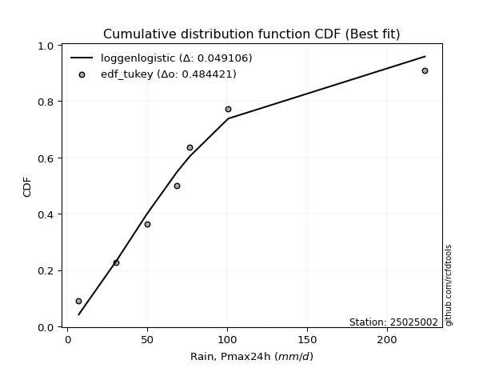</img>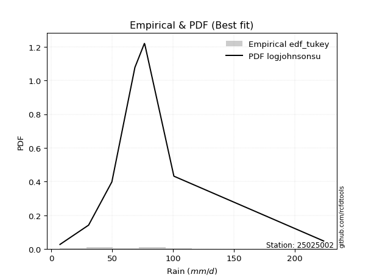</img>

</div>


### 8. EDF Gringorten (1963)

Gringorten plotting position formula is essential for estimating the probability and return periods of extreme events like floods and heavy rainfall. The constant _a=0.44_.

<div align="center">


$P=(m-a)/(n+1-2a)$


</div>


**8.1. Empirical values**

<div align="center">

|                | 0                   | 1                   | 2                  | 3                  | 4                  | 5                  | 6                  | 7                  |
|:---------------|:--------------------|:--------------------|:-------------------|:-------------------|:-------------------|:-------------------|:-------------------|:-------------------|
| date           | 2018                | 2019                | 2017               | 2020               | 2023               | 2025               | 2022               | 2024               |
| x              | 7.2                 | 30.7                | 49.8               | 68.7               | 76.5               | 76.8               | 100.7              | 223.6              |
| m              | 1                   | 2                   | 3                  | 4                  | 5                  | 6                  | 7                  | 8                  |
| empirical_dist | edf_gringorten      | edf_gringorten      | edf_gringorten     | edf_gringorten     | edf_gringorten     | edf_gringorten     | edf_gringorten     | edf_gringorten     |
| empirical      | 0.06896551724137932 | 0.19211822660098524 | 0.3152709359605912 | 0.4384236453201971 | 0.5615763546798029 | 0.6847290640394089 | 0.8078817733990148 | 0.9310344827586208 |
| empirical_tr   | 1.0740740740740742  | 1.2378048780487805  | 1.460431654676259  | 1.780701754385965  | 2.2808988764044944 | 3.1718750000000004 | 5.205128205128205  | 14.500000000000018 |

</div>


**8.2. Kolmogorov-Smirnov fit test (sorted by Δ)**


<div align="center">

|                | 0                   | 1                   | 2                   | 3                   | 4                   | 5                  | 6                   | 7                   | 8                   | 9                   | 10                  | 11                  | 12                  | 13                  | 14                 | 15                 | 16                  | 17                  | 18                  | 19                  | 20                  | 21                 | 22                  | 23                  | 24                  | 25                  | 26                  | 27                  | 28                  | 29                  | 30                  | 31                  | 32                  | 33                  | 34                  | 35                 | 36                  | 37                 | 38                  | 39                  | 40                  | 41                 | 42                  | 43                 | 44                  | 45                  | 46                 | 47                  | 48                  | 49                  | 50                  | 51                  | 52                  | 53                  | 54                  | 55                 | 56                  | 57                  | 58                  | 59                  | 60                  | 61                  | 62                  | 63                  | 64                  | 65                  | 66                 | 67                  | 68                  | 69                 | 70                  | 71                 | 72                  | 73                  | 74                  | 75                  | 76                  | 77                  | 78                  | 79                  | 80                  | 81                  | 82                  | 83                  | 84                 | 85                 | 86                  | 87                 | 88                  | 89                  | 90                 | 91                  | 92                 | 93                 | 94                  | 95                  | 96                  | 97                  | 98                  | 99                 | 100                 | 101                 | 102                 | 103                | 104                 | 105                 | 106                | 107                | 108                 | 109                 | 110                | 111                 | 112                | 113                | 114                | 115                 | 116                | 117                | 118                 | 119                 | 120                 | 121                | 122                | 123                | 124                 | 125                | 126                | 127                 | 128                | 129                | 130                | 131                 | 132                 | 133                | 134                 | 135                | 136                 | 137                 | 138                 | 139                 | 140                | 141                 | 142                | 143                | 144                | 145                 | 146                 | 147                | 148                | 149                | 150                | 151                | 152                | 153                | 154                | 155                | 156                | 157                | 158                | 159                |
|:---------------|:--------------------|:--------------------|:--------------------|:--------------------|:--------------------|:-------------------|:--------------------|:--------------------|:--------------------|:--------------------|:--------------------|:--------------------|:--------------------|:--------------------|:-------------------|:-------------------|:--------------------|:--------------------|:--------------------|:--------------------|:--------------------|:-------------------|:--------------------|:--------------------|:--------------------|:--------------------|:--------------------|:--------------------|:--------------------|:--------------------|:--------------------|:--------------------|:--------------------|:--------------------|:--------------------|:-------------------|:--------------------|:-------------------|:--------------------|:--------------------|:--------------------|:-------------------|:--------------------|:-------------------|:--------------------|:--------------------|:-------------------|:--------------------|:--------------------|:--------------------|:--------------------|:--------------------|:--------------------|:--------------------|:--------------------|:-------------------|:--------------------|:--------------------|:--------------------|:--------------------|:--------------------|:--------------------|:--------------------|:--------------------|:--------------------|:--------------------|:-------------------|:--------------------|:--------------------|:-------------------|:--------------------|:-------------------|:--------------------|:--------------------|:--------------------|:--------------------|:--------------------|:--------------------|:--------------------|:--------------------|:--------------------|:--------------------|:--------------------|:--------------------|:-------------------|:-------------------|:--------------------|:-------------------|:--------------------|:--------------------|:-------------------|:--------------------|:-------------------|:-------------------|:--------------------|:--------------------|:--------------------|:--------------------|:--------------------|:-------------------|:--------------------|:--------------------|:--------------------|:-------------------|:--------------------|:--------------------|:-------------------|:-------------------|:--------------------|:--------------------|:-------------------|:--------------------|:-------------------|:-------------------|:-------------------|:--------------------|:-------------------|:-------------------|:--------------------|:--------------------|:--------------------|:-------------------|:-------------------|:-------------------|:--------------------|:-------------------|:-------------------|:--------------------|:-------------------|:-------------------|:-------------------|:--------------------|:--------------------|:-------------------|:--------------------|:-------------------|:--------------------|:--------------------|:--------------------|:--------------------|:-------------------|:--------------------|:-------------------|:-------------------|:-------------------|:--------------------|:--------------------|:-------------------|:-------------------|:-------------------|:-------------------|:-------------------|:-------------------|:-------------------|:-------------------|:-------------------|:-------------------|:-------------------|:-------------------|:-------------------|
| station        | 25025002            | 25025002            | 25025002            | 25025002            | 25025002            | 25025002           | 25025002            | 25025002            | 25025002            | 25025002            | 25025002            | 25025002            | 25025002            | 25025002            | 25025002           | 25025002           | 25025002            | 25025002            | 25025002            | 25025002            | 25025002            | 25025002           | 25025002            | 25025002            | 25025002            | 25025002            | 25025002            | 25025002            | 25025002            | 25025002            | 25025002            | 25025002            | 25025002            | 25025002            | 25025002            | 25025002           | 25025002            | 25025002           | 25025002            | 25025002            | 25025002            | 25025002           | 25025002            | 25025002           | 25025002            | 25025002            | 25025002           | 25025002            | 25025002            | 25025002            | 25025002            | 25025002            | 25025002            | 25025002            | 25025002            | 25025002           | 25025002            | 25025002            | 25025002            | 25025002            | 25025002            | 25025002            | 25025002            | 25025002            | 25025002            | 25025002            | 25025002           | 25025002            | 25025002            | 25025002           | 25025002            | 25025002           | 25025002            | 25025002            | 25025002            | 25025002            | 25025002            | 25025002            | 25025002            | 25025002            | 25025002            | 25025002            | 25025002            | 25025002            | 25025002           | 25025002           | 25025002            | 25025002           | 25025002            | 25025002            | 25025002           | 25025002            | 25025002           | 25025002           | 25025002            | 25025002            | 25025002            | 25025002            | 25025002            | 25025002           | 25025002            | 25025002            | 25025002            | 25025002           | 25025002            | 25025002            | 25025002           | 25025002           | 25025002            | 25025002            | 25025002           | 25025002            | 25025002           | 25025002           | 25025002           | 25025002            | 25025002           | 25025002           | 25025002            | 25025002            | 25025002            | 25025002           | 25025002           | 25025002           | 25025002            | 25025002           | 25025002           | 25025002            | 25025002           | 25025002           | 25025002           | 25025002            | 25025002            | 25025002           | 25025002            | 25025002           | 25025002            | 25025002            | 25025002            | 25025002            | 25025002           | 25025002            | 25025002           | 25025002           | 25025002           | 25025002            | 25025002            | 25025002           | 25025002           | 25025002           | 25025002           | 25025002           | 25025002           | 25025002           | 25025002           | 25025002           | 25025002           | 25025002           | 25025002           | 25025002           |
| empirical_dist | edf_gringorten      | edf_gringorten      | edf_gringorten      | edf_gringorten      | edf_gringorten      | edf_gringorten     | edf_gringorten      | edf_gringorten      | edf_gringorten      | edf_gringorten      | edf_gringorten      | edf_gringorten      | edf_gringorten      | edf_gringorten      | edf_gringorten     | edf_gringorten     | edf_gringorten      | edf_gringorten      | edf_gringorten      | edf_gringorten      | edf_gringorten      | edf_gringorten     | edf_gringorten      | edf_gringorten      | edf_gringorten      | edf_gringorten      | edf_gringorten      | edf_gringorten      | edf_gringorten      | edf_gringorten      | edf_gringorten      | edf_gringorten      | edf_gringorten      | edf_gringorten      | edf_gringorten      | edf_gringorten     | edf_gringorten      | edf_gringorten     | edf_gringorten      | edf_gringorten      | edf_gringorten      | edf_gringorten     | edf_gringorten      | edf_gringorten     | edf_gringorten      | edf_gringorten      | edf_gringorten     | edf_gringorten      | edf_gringorten      | edf_gringorten      | edf_gringorten      | edf_gringorten      | edf_gringorten      | edf_gringorten      | edf_gringorten      | edf_gringorten     | edf_gringorten      | edf_gringorten      | edf_gringorten      | edf_gringorten      | edf_gringorten      | edf_gringorten      | edf_gringorten      | edf_gringorten      | edf_gringorten      | edf_gringorten      | edf_gringorten     | edf_gringorten      | edf_gringorten      | edf_gringorten     | edf_gringorten      | edf_gringorten     | edf_gringorten      | edf_gringorten      | edf_gringorten      | edf_gringorten      | edf_gringorten      | edf_gringorten      | edf_gringorten      | edf_gringorten      | edf_gringorten      | edf_gringorten      | edf_gringorten      | edf_gringorten      | edf_gringorten     | edf_gringorten     | edf_gringorten      | edf_gringorten     | edf_gringorten      | edf_gringorten      | edf_gringorten     | edf_gringorten      | edf_gringorten     | edf_gringorten     | edf_gringorten      | edf_gringorten      | edf_gringorten      | edf_gringorten      | edf_gringorten      | edf_gringorten     | edf_gringorten      | edf_gringorten      | edf_gringorten      | edf_gringorten     | edf_gringorten      | edf_gringorten      | edf_gringorten     | edf_gringorten     | edf_gringorten      | edf_gringorten      | edf_gringorten     | edf_gringorten      | edf_gringorten     | edf_gringorten     | edf_gringorten     | edf_gringorten      | edf_gringorten     | edf_gringorten     | edf_gringorten      | edf_gringorten      | edf_gringorten      | edf_gringorten     | edf_gringorten     | edf_gringorten     | edf_gringorten      | edf_gringorten     | edf_gringorten     | edf_gringorten      | edf_gringorten     | edf_gringorten     | edf_gringorten     | edf_gringorten      | edf_gringorten      | edf_gringorten     | edf_gringorten      | edf_gringorten     | edf_gringorten      | edf_gringorten      | edf_gringorten      | edf_gringorten      | edf_gringorten     | edf_gringorten      | edf_gringorten     | edf_gringorten     | edf_gringorten     | edf_gringorten      | edf_gringorten      | edf_gringorten     | edf_gringorten     | edf_gringorten     | edf_gringorten     | edf_gringorten     | edf_gringorten     | edf_gringorten     | edf_gringorten     | edf_gringorten     | edf_gringorten     | edf_gringorten     | edf_gringorten     | edf_gringorten     |
| p_dist         | logjohnsonsu        | t                   | invweibull          | invgamma            | invgauss            | johnsonsu          | burr                | mielke              | loggenlogistic      | halflogistic        | logmielke           | gompertz            | nct                 | logburr12           | logweibull_min     | logloggamma        | moyal               | logjohnsonsb        | exponnorm           | vonmises_line       | logpearson3         | loggompertz        | genpareto           | loggumbel_l         | gengamma            | pearson3            | logskewnorm         | logt                | genlogistic         | logvonmises_line    | logburr             | foldnorm            | halfnorm            | loggenextreme       | gumbel_r            | genexpon           | lomax               | betaprime          | logargus            | loganglit           | logsemicircular     | lognct             | logcrystalball      | lognorm            | logexponnorm        | logrice             | skewnorm           | logf                | logfatiguelife      | loggamma            | loggamma            | kstwobign           | logncf              | logbetaprime        | wald                | logbeta            | rayleigh            | f                   | loglogistic         | logerlang           | logalpha            | logtriang           | logarcsine          | loginvgamma         | loghypsecant        | kappa3              | maxwell            | loginvgauss         | loggennorm          | gennorm            | logmaxwell          | exponpow           | logdgamma           | logfoldnorm         | dweibull            | logloglaplace       | lograyleigh         | loginvweibull       | dgamma              | logdweibull         | loggenhalflogistic  | truncnorm           | rice                | logcosine           | loglaplace         | loglaplace         | nakagami            | gamma              | semicircular        | anglit              | loggausshyper      | loggenpareto        | crystalball        | norm               | logistic            | hypsecant           | logtruncnorm        | laplace             | loghalfnorm         | loggumbel_r        | logkstwobign        | halfgennorm         | arcsine             | loggenexpon        | loghalflogistic     | tukeylambda         | logmoyal           | logweibull_max     | logksone            | logwrapcauchy       | truncweibull_min   | loguniform          | truncexpon         | logkappa3          | logkappa4          | loglevy_l           | cosine             | gumbel_l           | logtruncweibull_min | bradford            | exponweib           | loglomax           | ncf                | logtrapezoid       | gausshyper          | logwald            | burr12             | logbradford         | weibull_min        | logtruncexpon      | kappa4             | wrapcauchy          | ksone               | argus              | genextreme          | uniform            | johnsonsb           | levy_l              | alpha               | lognakagami         | logtukeylambda     | logrdist            | loggengamma        | triang             | logexponweib       | rdist               | powerlaw            | genhalflogistic    | fatiguelife        | erlang             | trapezoid          | beta               | logexponpow        | logpowerlaw        | truncpareto        | weibull_max        | logtruncpareto     | loghalfgennorm     | logvonmises        | vonmises           |
| delta          | 0.06839980727455452 | 0.07998696516461684 | 0.09406328205427289 | 0.09460120876061223 | 0.09480137470603822 | 0.0954475502138043 | 0.09962533581848804 | 0.09967837157817155 | 0.09979967876062262 | 0.09995583730919622 | 0.10021693296611706 | 0.10160368421662447 | 0.10177123358792367 | 0.10280381678820605 | 0.1028098174948967 | 0.1039562573142423 | 0.10513812308108983 | 0.10566178284401884 | 0.10566927618346822 | 0.10642248988617753 | 0.10690646651445423 | 0.1072287228207715 | 0.10728385329429446 | 0.10848020558333094 | 0.10849382223895104 | 0.10903953669703625 | 0.11171550611072995 | 0.11509905381889174 | 0.11923523820188053 | 0.11925293509139351 | 0.11980340897352687 | 0.12101445283542522 | 0.12383637179592577 | 0.12430936448209984 | 0.13101337253255507 | 0.1358801223369111 | 0.13593897627680745 | 0.1369970727938417 | 0.13866308792422222 | 0.14062379455670632 | 0.14363294088762607 | 0.1454450489938091 | 0.14581195892504312 | 0.1458120541155939 | 0.14581406023490356 | 0.14585329533193697 | 0.145900338047383  | 0.14622451798567243 | 0.14728116217858495 | 0.14810548015469432 | 0.14810548015469432 | 0.14940834714143836 | 0.14970621388644684 | 0.14972244976410093 | 0.15080192794744746 | 0.1548295261104006 | 0.15577309849957777 | 0.15587514208877884 | 0.15686453895907498 | 0.15760213597432288 | 0.15832701516135655 | 0.15877932320473132 | 0.16363976430594585 | 0.16485898313153374 | 0.16602086848552827 | 0.16634394604807873 | 0.1671123296518242 | 0.16898785513070375 | 0.17137530117995825 | 0.1716548263055253 | 0.17367526903750558 | 0.1746727869677892 | 0.17527891616211955 | 0.17742060495101514 | 0.17790986448489654 | 0.18171666614264248 | 0.18241549997495826 | 0.18325215619280955 | 0.18472905816696905 | 0.18472906404027917 | 0.18523289274368615 | 0.18762981304725712 | 0.18826610362034812 | 0.18907132665530701 | 0.1914863638984518 | 0.1914863638984518 | 0.19211822302774018 | 0.1961746561241074 | 0.19749795965191314 | 0.19844079108809487 | 0.1996769950206151 | 0.20004785138816186 | 0.2007291803337375 | 0.2007291917470269 | 0.20291214844927158 | 0.20477436706786734 | 0.20937208132202195 | 0.21230647145098036 | 0.21320891587687552 | 0.213787975571675  | 0.21744037635916103 | 0.22355115810982362 | 0.22799125521687214 | 0.2306399932218004 | 0.23531637580929093 | 0.23553826461492594 | 0.2372801107061004 | 0.2415961012741754 | 0.24295051880771132 | 0.24566998464555911 | 0.2461116758751507 | 0.24761005294030114 | 0.2482473572641829 | 0.2610881633838661 | 0.2624915863973225 | 0.26820589364718395 | 0.2701778502786627 | 0.2713938133239874 | 0.27170921221820876 | 0.27197470192853446 | 0.27930181083776073 | 0.2802279771813636 | 0.2816348468199855 | 0.2848855600528698 | 0.29788385260557426 | 0.3025919929716991 | 0.3086107815651863 | 0.33130442642975577 | 0.337762944797671  | 0.3420453622232009 | 0.3436674371448354 | 0.35937126578632117 | 0.36448990648589097 | 0.3722074908884466 | 0.37377502869124424 | 0.3758115331032662 | 0.37707728800531276 | 0.37950318051148335 | 0.38064747984853475 | 0.40413300122628465 | 0.4102829005604174 | 0.42944900291228694 | 0.4377663667325259 | 0.4383003657494349 | 0.4639798667594597 | 0.49341892135165577 | 0.49992791347932186 | 0.5006119225478578 | 0.5323804092431771 | 0.5792109398563423 | 0.6088121306798275 | 0.6136991645706956 | 0.6280542161934074 | 0.6499623506946376 | 0.6696900432366962 | 0.687022091609838  | 0.7513383273160432 | 0.8078817733990148 | 1.088582390864917  | 35.08175155988577  |
| deltao         | 0.4472608134160001  | 0.4472608134160001  | 0.4472608134160001  | 0.4472608134160001  | 0.4472608134160001  | 0.4472608134160001 | 0.4472608134160001  | 0.4472608134160001  | 0.4472608134160001  | 0.4472608134160001  | 0.4472608134160001  | 0.4472608134160001  | 0.4472608134160001  | 0.4472608134160001  | 0.4472608134160001 | 0.4472608134160001 | 0.4472608134160001  | 0.4472608134160001  | 0.4472608134160001  | 0.4472608134160001  | 0.4472608134160001  | 0.4472608134160001 | 0.4472608134160001  | 0.4472608134160001  | 0.4472608134160001  | 0.4472608134160001  | 0.4472608134160001  | 0.4472608134160001  | 0.4472608134160001  | 0.4472608134160001  | 0.4472608134160001  | 0.4472608134160001  | 0.4472608134160001  | 0.4472608134160001  | 0.4472608134160001  | 0.4472608134160001 | 0.4472608134160001  | 0.4472608134160001 | 0.4472608134160001  | 0.4472608134160001  | 0.4472608134160001  | 0.4472608134160001 | 0.4472608134160001  | 0.4472608134160001 | 0.4472608134160001  | 0.4472608134160001  | 0.4472608134160001 | 0.4472608134160001  | 0.4472608134160001  | 0.4472608134160001  | 0.4472608134160001  | 0.4472608134160001  | 0.4472608134160001  | 0.4472608134160001  | 0.4472608134160001  | 0.4472608134160001 | 0.4472608134160001  | 0.4472608134160001  | 0.4472608134160001  | 0.4472608134160001  | 0.4472608134160001  | 0.4472608134160001  | 0.4472608134160001  | 0.4472608134160001  | 0.4472608134160001  | 0.4472608134160001  | 0.4472608134160001 | 0.4472608134160001  | 0.4472608134160001  | 0.4472608134160001 | 0.4472608134160001  | 0.4472608134160001 | 0.4472608134160001  | 0.4472608134160001  | 0.4472608134160001  | 0.4472608134160001  | 0.4472608134160001  | 0.4472608134160001  | 0.4472608134160001  | 0.4472608134160001  | 0.4472608134160001  | 0.4472608134160001  | 0.4472608134160001  | 0.4472608134160001  | 0.4472608134160001 | 0.4472608134160001 | 0.4472608134160001  | 0.4472608134160001 | 0.4472608134160001  | 0.4472608134160001  | 0.4472608134160001 | 0.4472608134160001  | 0.4472608134160001 | 0.4472608134160001 | 0.4472608134160001  | 0.4472608134160001  | 0.4472608134160001  | 0.4472608134160001  | 0.4472608134160001  | 0.4472608134160001 | 0.4472608134160001  | 0.4472608134160001  | 0.4472608134160001  | 0.4472608134160001 | 0.4472608134160001  | 0.4472608134160001  | 0.4472608134160001 | 0.4472608134160001 | 0.4472608134160001  | 0.4472608134160001  | 0.4472608134160001 | 0.4472608134160001  | 0.4472608134160001 | 0.4472608134160001 | 0.4472608134160001 | 0.4472608134160001  | 0.4472608134160001 | 0.4472608134160001 | 0.4472608134160001  | 0.4472608134160001  | 0.4472608134160001  | 0.4472608134160001 | 0.4472608134160001 | 0.4472608134160001 | 0.4472608134160001  | 0.4472608134160001 | 0.4472608134160001 | 0.4472608134160001  | 0.4472608134160001 | 0.4472608134160001 | 0.4472608134160001 | 0.4472608134160001  | 0.4472608134160001  | 0.4472608134160001 | 0.4472608134160001  | 0.4472608134160001 | 0.4472608134160001  | 0.4472608134160001  | 0.4472608134160001  | 0.4472608134160001  | 0.4472608134160001 | 0.4472608134160001  | 0.4472608134160001 | 0.4472608134160001 | 0.4472608134160001 | 0.4472608134160001  | 0.4472608134160001  | 0.4472608134160001 | 0.4472608134160001 | 0.4472608134160001 | 0.4472608134160001 | 0.4472608134160001 | 0.4472608134160001 | 0.4472608134160001 | 0.4472608134160001 | 0.4472608134160001 | 0.4472608134160001 | 0.4472608134160001 | 0.4472608134160001 | 0.4472608134160001 |
| eval           | Δo > Δ              | Δo > Δ              | Δo > Δ              | Δo > Δ              | Δo > Δ              | Δo > Δ             | Δo > Δ              | Δo > Δ              | Δo > Δ              | Δo > Δ              | Δo > Δ              | Δo > Δ              | Δo > Δ              | Δo > Δ              | Δo > Δ             | Δo > Δ             | Δo > Δ              | Δo > Δ              | Δo > Δ              | Δo > Δ              | Δo > Δ              | Δo > Δ             | Δo > Δ              | Δo > Δ              | Δo > Δ              | Δo > Δ              | Δo > Δ              | Δo > Δ              | Δo > Δ              | Δo > Δ              | Δo > Δ              | Δo > Δ              | Δo > Δ              | Δo > Δ              | Δo > Δ              | Δo > Δ             | Δo > Δ              | Δo > Δ             | Δo > Δ              | Δo > Δ              | Δo > Δ              | Δo > Δ             | Δo > Δ              | Δo > Δ             | Δo > Δ              | Δo > Δ              | Δo > Δ             | Δo > Δ              | Δo > Δ              | Δo > Δ              | Δo > Δ              | Δo > Δ              | Δo > Δ              | Δo > Δ              | Δo > Δ              | Δo > Δ             | Δo > Δ              | Δo > Δ              | Δo > Δ              | Δo > Δ              | Δo > Δ              | Δo > Δ              | Δo > Δ              | Δo > Δ              | Δo > Δ              | Δo > Δ              | Δo > Δ             | Δo > Δ              | Δo > Δ              | Δo > Δ             | Δo > Δ              | Δo > Δ             | Δo > Δ              | Δo > Δ              | Δo > Δ              | Δo > Δ              | Δo > Δ              | Δo > Δ              | Δo > Δ              | Δo > Δ              | Δo > Δ              | Δo > Δ              | Δo > Δ              | Δo > Δ              | Δo > Δ             | Δo > Δ             | Δo > Δ              | Δo > Δ             | Δo > Δ              | Δo > Δ              | Δo > Δ             | Δo > Δ              | Δo > Δ             | Δo > Δ             | Δo > Δ              | Δo > Δ              | Δo > Δ              | Δo > Δ              | Δo > Δ              | Δo > Δ             | Δo > Δ              | Δo > Δ              | Δo > Δ              | Δo > Δ             | Δo > Δ              | Δo > Δ              | Δo > Δ             | Δo > Δ             | Δo > Δ              | Δo > Δ              | Δo > Δ             | Δo > Δ              | Δo > Δ             | Δo > Δ             | Δo > Δ             | Δo > Δ              | Δo > Δ             | Δo > Δ             | Δo > Δ              | Δo > Δ              | Δo > Δ              | Δo > Δ             | Δo > Δ             | Δo > Δ             | Δo > Δ              | Δo > Δ             | Δo > Δ             | Δo > Δ              | Δo > Δ             | Δo > Δ             | Δo > Δ             | Δo > Δ              | Δo > Δ              | Δo > Δ             | Δo > Δ              | Δo > Δ             | Δo > Δ              | Δo > Δ              | Δo > Δ              | Δo > Δ              | Δo > Δ             | Δo > Δ              | Δo > Δ             | Δo > Δ             | Δo <= Δ            | Δo <= Δ             | Δo <= Δ             | Δo <= Δ            | Δo <= Δ            | Δo <= Δ            | Δo <= Δ            | Δo <= Δ            | Δo <= Δ            | Δo <= Δ            | Δo <= Δ            | Δo <= Δ            | Δo <= Δ            | Δo <= Δ            | Δo <= Δ            | Δo <= Δ            |
| fit            | 1                   | 1                   | 1                   | 1                   | 1                   | 1                  | 1                   | 1                   | 1                   | 1                   | 1                   | 1                   | 1                   | 1                   | 1                  | 1                  | 1                   | 1                   | 1                   | 1                   | 1                   | 1                  | 1                   | 1                   | 1                   | 1                   | 1                   | 1                   | 1                   | 1                   | 1                   | 1                   | 1                   | 1                   | 1                   | 1                  | 1                   | 1                  | 1                   | 1                   | 1                   | 1                  | 1                   | 1                  | 1                   | 1                   | 1                  | 1                   | 1                   | 1                   | 1                   | 1                   | 1                   | 1                   | 1                   | 1                  | 1                   | 1                   | 1                   | 1                   | 1                   | 1                   | 1                   | 1                   | 1                   | 1                   | 1                  | 1                   | 1                   | 1                  | 1                   | 1                  | 1                   | 1                   | 1                   | 1                   | 1                   | 1                   | 1                   | 1                   | 1                   | 1                   | 1                   | 1                   | 1                  | 1                  | 1                   | 1                  | 1                   | 1                   | 1                  | 1                   | 1                  | 1                  | 1                   | 1                   | 1                   | 1                   | 1                   | 1                  | 1                   | 1                   | 1                   | 1                  | 1                   | 1                   | 1                  | 1                  | 1                   | 1                   | 1                  | 1                   | 1                  | 1                  | 1                  | 1                   | 1                  | 1                  | 1                   | 1                   | 1                   | 1                  | 1                  | 1                  | 1                   | 1                  | 1                  | 1                   | 1                  | 1                  | 1                  | 1                   | 1                   | 1                  | 1                   | 1                  | 1                   | 1                   | 1                   | 1                   | 1                  | 1                   | 1                  | 1                  | 0                  | 0                   | 0                   | 0                  | 0                  | 0                  | 0                  | 0                  | 0                  | 0                  | 0                  | 0                  | 0                  | 0                  | 0                  | 0                  |
| n              | 8                   | 8                   | 8                   | 8                   | 8                   | 8                  | 8                   | 8                   | 8                   | 8                   | 8                   | 8                   | 8                   | 8                   | 8                  | 8                  | 8                   | 8                   | 8                   | 8                   | 8                   | 8                  | 8                   | 8                   | 8                   | 8                   | 8                   | 8                   | 8                   | 8                   | 8                   | 8                   | 8                   | 8                   | 8                   | 8                  | 8                   | 8                  | 8                   | 8                   | 8                   | 8                  | 8                   | 8                  | 8                   | 8                   | 8                  | 8                   | 8                   | 8                   | 8                   | 8                   | 8                   | 8                   | 8                   | 8                  | 8                   | 8                   | 8                   | 8                   | 8                   | 8                   | 8                   | 8                   | 8                   | 8                   | 8                  | 8                   | 8                   | 8                  | 8                   | 8                  | 8                   | 8                   | 8                   | 8                   | 8                   | 8                   | 8                   | 8                   | 8                   | 8                   | 8                   | 8                   | 8                  | 8                  | 8                   | 8                  | 8                   | 8                   | 8                  | 8                   | 8                  | 8                  | 8                   | 8                   | 8                   | 8                   | 8                   | 8                  | 8                   | 8                   | 8                   | 8                  | 8                   | 8                   | 8                  | 8                  | 8                   | 8                   | 8                  | 8                   | 8                  | 8                  | 8                  | 8                   | 8                  | 8                  | 8                   | 8                   | 8                   | 8                  | 8                  | 8                  | 8                   | 8                  | 8                  | 8                   | 8                  | 8                  | 8                  | 8                   | 8                   | 8                  | 8                   | 8                  | 8                   | 8                   | 8                   | 8                   | 8                  | 8                   | 8                  | 8                  | 8                  | 8                   | 8                   | 8                  | 8                  | 8                  | 8                  | 8                  | 8                  | 8                  | 8                  | 8                  | 8                  | 8                  | 8                  | 8                  |
| best_fit       | 1                   | 0                   | 0                   | 0                   | 0                   | 0                  | 0                   | 0                   | 0                   | 0                   | 0                   | 0                   | 0                   | 0                   | 0                  | 0                  | 0                   | 0                   | 0                   | 0                   | 0                   | 0                  | 0                   | 0                   | 0                   | 0                   | 0                   | 0                   | 0                   | 0                   | 0                   | 0                   | 0                   | 0                   | 0                   | 0                  | 0                   | 0                  | 0                   | 0                   | 0                   | 0                  | 0                   | 0                  | 0                   | 0                   | 0                  | 0                   | 0                   | 0                   | 0                   | 0                   | 0                   | 0                   | 0                   | 0                  | 0                   | 0                   | 0                   | 0                   | 0                   | 0                   | 0                   | 0                   | 0                   | 0                   | 0                  | 0                   | 0                   | 0                  | 0                   | 0                  | 0                   | 0                   | 0                   | 0                   | 0                   | 0                   | 0                   | 0                   | 0                   | 0                   | 0                   | 0                   | 0                  | 0                  | 0                   | 0                  | 0                   | 0                   | 0                  | 0                   | 0                  | 0                  | 0                   | 0                   | 0                   | 0                   | 0                   | 0                  | 0                   | 0                   | 0                   | 0                  | 0                   | 0                   | 0                  | 0                  | 0                   | 0                   | 0                  | 0                   | 0                  | 0                  | 0                  | 0                   | 0                  | 0                  | 0                   | 0                   | 0                   | 0                  | 0                  | 0                  | 0                   | 0                  | 0                  | 0                   | 0                  | 0                  | 0                  | 0                   | 0                   | 0                  | 0                   | 0                  | 0                   | 0                   | 0                   | 0                   | 0                  | 0                   | 0                  | 0                  | 0                  | 0                   | 0                   | 0                  | 0                  | 0                  | 0                  | 0                  | 0                  | 0                  | 0                  | 0                  | 0                  | 0                  | 0                  | 0                  |
| best_fit_sort  | 1                   | 2                   | 3                   | 4                   | 5                   | 6                  | 7                   | 8                   | 9                   | 10                  | 11                  | 12                  | 13                  | 14                  | 15                 | 16                 | 17                  | 18                  | 19                  | 20                  | 21                  | 22                 | 23                  | 24                  | 25                  | 26                  | 27                  | 28                  | 29                  | 30                  | 31                  | 32                  | 33                  | 34                  | 35                  | 36                 | 37                  | 38                 | 39                  | 40                  | 41                  | 42                 | 43                  | 44                 | 45                  | 46                  | 47                 | 48                  | 49                  | 50                  | 51                  | 52                  | 53                  | 54                  | 55                  | 56                 | 57                  | 58                  | 59                  | 60                  | 61                  | 62                  | 63                  | 64                  | 65                  | 66                  | 67                 | 68                  | 69                  | 70                 | 71                  | 72                 | 73                  | 74                  | 75                  | 76                  | 77                  | 78                  | 79                  | 80                  | 81                  | 82                  | 83                  | 84                  | 85                 | 86                 | 87                  | 88                 | 89                  | 90                  | 91                 | 92                  | 93                 | 94                 | 95                  | 96                  | 97                  | 98                  | 99                  | 100                | 101                 | 102                 | 103                 | 104                | 105                 | 106                 | 107                | 108                | 109                 | 110                 | 111                | 112                 | 113                | 114                | 115                | 116                 | 117                | 118                | 119                 | 120                 | 121                 | 122                | 123                | 124                | 125                 | 126                | 127                | 128                 | 129                | 130                | 131                | 132                 | 133                 | 134                | 135                 | 136                | 137                 | 138                 | 139                 | 140                 | 141                | 142                 | 143                | 144                | 145                | 146                 | 147                 | 148                | 149                | 150                | 151                | 152                | 153                | 154                | 155                | 156                | 157                | 158                | 159                | 160                |

</div>


**8.3. Best fit**

<div align="center">

|   id |   station | empirical_dist   | p_dist       |     delta |   deltao | eval   |   fit |   n |   best_fit |   best_fit_sort |
|-----:|----------:|:-----------------|:-------------|----------:|---------:|:-------|------:|----:|-----------:|----------------:|
|    0 |  25025002 | edf_gringorten   | logjohnsonsu | 0.0683998 | 0.447261 | Δo > Δ |     1 |   8 |          1 |               1 |

</div>


<div align="center">

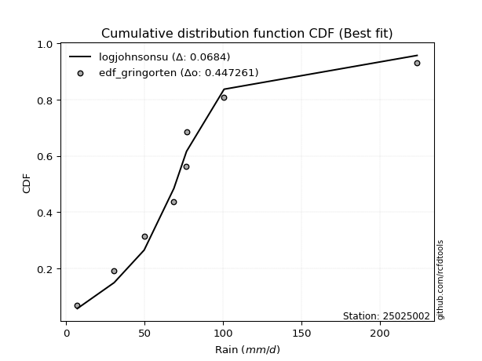</img>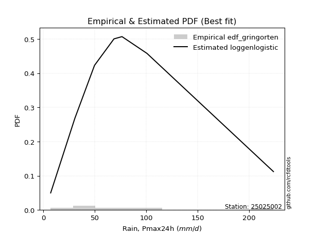</img>

</div>


### 9. EDF Filliben (1975)

The specific values of the constants (0.3175) (often denoted as $alpha$) and (0.365) are derived from a method proposed by James J. Filliben in a 1975 paper. This particular formula is the mean value of the $i$-th order statistic of the normal distribution and is considered a robust and effective plotting position formula for the normal probability plot correlation coefficient test for normality.

<div align="center">


$P=(m-0.3175)/(n+0.365)$


</div>


**9.1. Empirical values**

<div align="center">

|                | 0                  | 1                   | 2                  | 3                   | 4                  | 5                  | 6                  | 7                  |
|:---------------|:-------------------|:--------------------|:-------------------|:--------------------|:-------------------|:-------------------|:-------------------|:-------------------|
| date           | 2018               | 2019                | 2017               | 2020                | 2023               | 2025               | 2022               | 2024               |
| x              | 7.2                | 30.7                | 49.8               | 68.7                | 76.5               | 76.8               | 100.7              | 223.6              |
| m              | 1                  | 2                   | 3                  | 4                   | 5                  | 6                  | 7                  | 8                  |
| empirical_dist | edf_filliben       | edf_filliben        | edf_filliben       | edf_filliben        | edf_filliben       | edf_filliben       | edf_filliben       | edf_filliben       |
| empirical      | 0.0815899581589958 | 0.20113568439928273 | 0.3206814106395696 | 0.44022713687985654 | 0.5597728631201434 | 0.6793185893604303 | 0.7988643156007172 | 0.9184100418410042 |
| empirical_tr   | 1.0888382687927107 | 1.2517770295548074  | 1.4720633523977125 | 1.7864388681260008  | 2.271554650373387  | 3.118359739049394  | 4.971768202080237  | 12.256410256410254 |

</div>


**9.2. Kolmogorov-Smirnov fit test (sorted by Δ)**


<div align="center">

|                | 0                   | 1                   | 2                   | 3                   | 4                   | 5                   | 6                   | 7                   | 8                   | 9                   | 10                  | 11                  | 12                 | 13                  | 14                 | 15                  | 16                  | 17                  | 18                  | 19                  | 20                  | 21                  | 22                  | 23                  | 24                  | 25                  | 26                  | 27                  | 28                  | 29                  | 30                  | 31                  | 32                  | 33                  | 34                  | 35                  | 36                  | 37                  | 38                 | 39                 | 40                  | 41                 | 42                 | 43                  | 44                 | 45                  | 46                  | 47                  | 48                 | 49                  | 50                 | 51                 | 52                 | 53                  | 54                 | 55                  | 56                  | 57                  | 58                 | 59                 | 60                  | 61                  | 62                  | 63                  | 64                  | 65                  | 66                 | 67                  | 68                  | 69                  | 70                  | 71                  | 72                  | 73                  | 74                  | 75                 | 76                  | 77                  | 78                  | 79                  | 80                  | 81                  | 82                  | 83                 | 84                  | 85                  | 86                  | 87                  | 88                  | 89                  | 90                  | 91                 | 92                  | 93                  | 94                  | 95                  | 96                  | 97                  | 98                 | 99                  | 100                | 101                | 102                | 103                 | 104                 | 105                | 106                 | 107                 | 108                 | 109                 | 110                 | 111                | 112                | 113                 | 114                 | 115                | 116                | 117                | 118                | 119                 | 120                | 121                | 122                | 123                 | 124                | 125                 | 126                 | 127                 | 128                 | 129                 | 130                | 131                | 132                | 133                | 134                | 135                 | 136                 | 137                | 138                | 139                 | 140                | 141                | 142                 | 143                | 144                 | 145                | 146                | 147                | 148                | 149                | 150                | 151                | 152                | 153                | 154                | 155                | 156                | 157                | 158                | 159                |
|:---------------|:--------------------|:--------------------|:--------------------|:--------------------|:--------------------|:--------------------|:--------------------|:--------------------|:--------------------|:--------------------|:--------------------|:--------------------|:-------------------|:--------------------|:-------------------|:--------------------|:--------------------|:--------------------|:--------------------|:--------------------|:--------------------|:--------------------|:--------------------|:--------------------|:--------------------|:--------------------|:--------------------|:--------------------|:--------------------|:--------------------|:--------------------|:--------------------|:--------------------|:--------------------|:--------------------|:--------------------|:--------------------|:--------------------|:-------------------|:-------------------|:--------------------|:-------------------|:-------------------|:--------------------|:-------------------|:--------------------|:--------------------|:--------------------|:-------------------|:--------------------|:-------------------|:-------------------|:-------------------|:--------------------|:-------------------|:--------------------|:--------------------|:--------------------|:-------------------|:-------------------|:--------------------|:--------------------|:--------------------|:--------------------|:--------------------|:--------------------|:-------------------|:--------------------|:--------------------|:--------------------|:--------------------|:--------------------|:--------------------|:--------------------|:--------------------|:-------------------|:--------------------|:--------------------|:--------------------|:--------------------|:--------------------|:--------------------|:--------------------|:-------------------|:--------------------|:--------------------|:--------------------|:--------------------|:--------------------|:--------------------|:--------------------|:-------------------|:--------------------|:--------------------|:--------------------|:--------------------|:--------------------|:--------------------|:-------------------|:--------------------|:-------------------|:-------------------|:-------------------|:--------------------|:--------------------|:-------------------|:--------------------|:--------------------|:--------------------|:--------------------|:--------------------|:-------------------|:-------------------|:--------------------|:--------------------|:-------------------|:-------------------|:-------------------|:-------------------|:--------------------|:-------------------|:-------------------|:-------------------|:--------------------|:-------------------|:--------------------|:--------------------|:--------------------|:--------------------|:--------------------|:-------------------|:-------------------|:-------------------|:-------------------|:-------------------|:--------------------|:--------------------|:-------------------|:-------------------|:--------------------|:-------------------|:-------------------|:--------------------|:-------------------|:--------------------|:-------------------|:-------------------|:-------------------|:-------------------|:-------------------|:-------------------|:-------------------|:-------------------|:-------------------|:-------------------|:-------------------|:-------------------|:-------------------|:-------------------|:-------------------|
| station        | 25025002            | 25025002            | 25025002            | 25025002            | 25025002            | 25025002            | 25025002            | 25025002            | 25025002            | 25025002            | 25025002            | 25025002            | 25025002           | 25025002            | 25025002           | 25025002            | 25025002            | 25025002            | 25025002            | 25025002            | 25025002            | 25025002            | 25025002            | 25025002            | 25025002            | 25025002            | 25025002            | 25025002            | 25025002            | 25025002            | 25025002            | 25025002            | 25025002            | 25025002            | 25025002            | 25025002            | 25025002            | 25025002            | 25025002           | 25025002           | 25025002            | 25025002           | 25025002           | 25025002            | 25025002           | 25025002            | 25025002            | 25025002            | 25025002           | 25025002            | 25025002           | 25025002           | 25025002           | 25025002            | 25025002           | 25025002            | 25025002            | 25025002            | 25025002           | 25025002           | 25025002            | 25025002            | 25025002            | 25025002            | 25025002            | 25025002            | 25025002           | 25025002            | 25025002            | 25025002            | 25025002            | 25025002            | 25025002            | 25025002            | 25025002            | 25025002           | 25025002            | 25025002            | 25025002            | 25025002            | 25025002            | 25025002            | 25025002            | 25025002           | 25025002            | 25025002            | 25025002            | 25025002            | 25025002            | 25025002            | 25025002            | 25025002           | 25025002            | 25025002            | 25025002            | 25025002            | 25025002            | 25025002            | 25025002           | 25025002            | 25025002           | 25025002           | 25025002           | 25025002            | 25025002            | 25025002           | 25025002            | 25025002            | 25025002            | 25025002            | 25025002            | 25025002           | 25025002           | 25025002            | 25025002            | 25025002           | 25025002           | 25025002           | 25025002           | 25025002            | 25025002           | 25025002           | 25025002           | 25025002            | 25025002           | 25025002            | 25025002            | 25025002            | 25025002            | 25025002            | 25025002           | 25025002           | 25025002           | 25025002           | 25025002           | 25025002            | 25025002            | 25025002           | 25025002           | 25025002            | 25025002           | 25025002           | 25025002            | 25025002           | 25025002            | 25025002           | 25025002           | 25025002           | 25025002           | 25025002           | 25025002           | 25025002           | 25025002           | 25025002           | 25025002           | 25025002           | 25025002           | 25025002           | 25025002           | 25025002           |
| empirical_dist | edf_filliben        | edf_filliben        | edf_filliben        | edf_filliben        | edf_filliben        | edf_filliben        | edf_filliben        | edf_filliben        | edf_filliben        | edf_filliben        | edf_filliben        | edf_filliben        | edf_filliben       | edf_filliben        | edf_filliben       | edf_filliben        | edf_filliben        | edf_filliben        | edf_filliben        | edf_filliben        | edf_filliben        | edf_filliben        | edf_filliben        | edf_filliben        | edf_filliben        | edf_filliben        | edf_filliben        | edf_filliben        | edf_filliben        | edf_filliben        | edf_filliben        | edf_filliben        | edf_filliben        | edf_filliben        | edf_filliben        | edf_filliben        | edf_filliben        | edf_filliben        | edf_filliben       | edf_filliben       | edf_filliben        | edf_filliben       | edf_filliben       | edf_filliben        | edf_filliben       | edf_filliben        | edf_filliben        | edf_filliben        | edf_filliben       | edf_filliben        | edf_filliben       | edf_filliben       | edf_filliben       | edf_filliben        | edf_filliben       | edf_filliben        | edf_filliben        | edf_filliben        | edf_filliben       | edf_filliben       | edf_filliben        | edf_filliben        | edf_filliben        | edf_filliben        | edf_filliben        | edf_filliben        | edf_filliben       | edf_filliben        | edf_filliben        | edf_filliben        | edf_filliben        | edf_filliben        | edf_filliben        | edf_filliben        | edf_filliben        | edf_filliben       | edf_filliben        | edf_filliben        | edf_filliben        | edf_filliben        | edf_filliben        | edf_filliben        | edf_filliben        | edf_filliben       | edf_filliben        | edf_filliben        | edf_filliben        | edf_filliben        | edf_filliben        | edf_filliben        | edf_filliben        | edf_filliben       | edf_filliben        | edf_filliben        | edf_filliben        | edf_filliben        | edf_filliben        | edf_filliben        | edf_filliben       | edf_filliben        | edf_filliben       | edf_filliben       | edf_filliben       | edf_filliben        | edf_filliben        | edf_filliben       | edf_filliben        | edf_filliben        | edf_filliben        | edf_filliben        | edf_filliben        | edf_filliben       | edf_filliben       | edf_filliben        | edf_filliben        | edf_filliben       | edf_filliben       | edf_filliben       | edf_filliben       | edf_filliben        | edf_filliben       | edf_filliben       | edf_filliben       | edf_filliben        | edf_filliben       | edf_filliben        | edf_filliben        | edf_filliben        | edf_filliben        | edf_filliben        | edf_filliben       | edf_filliben       | edf_filliben       | edf_filliben       | edf_filliben       | edf_filliben        | edf_filliben        | edf_filliben       | edf_filliben       | edf_filliben        | edf_filliben       | edf_filliben       | edf_filliben        | edf_filliben       | edf_filliben        | edf_filliben       | edf_filliben       | edf_filliben       | edf_filliben       | edf_filliben       | edf_filliben       | edf_filliben       | edf_filliben       | edf_filliben       | edf_filliben       | edf_filliben       | edf_filliben       | edf_filliben       | edf_filliben       | edf_filliben       |
| p_dist         | logjohnsonsu        | t                   | invweibull          | invgauss            | invgamma            | johnsonsu           | halflogistic        | gompertz            | logburr12           | logweibull_min      | burr                | mielke              | loggenlogistic     | logmielke           | logloggamma        | moyal               | nct                 | genpareto           | logjohnsonsb        | exponnorm           | vonmises_line       | logpearson3         | loggumbel_l         | pearson3            | loggompertz         | gengamma            | logt                | logskewnorm         | genlogistic         | foldnorm            | loggenextreme       | logvonmises_line    | logburr             | halfnorm            | gumbel_r            | logargus            | genexpon            | lomax               | betaprime          | loganglit          | logsemicircular     | skewnorm           | lognct             | kstwobign           | logcrystalball     | lognorm             | logexponnorm        | logrice             | logf               | logfatiguelife      | logbeta            | loggamma           | loggamma           | logncf              | logbetaprime       | wald                | logtriang           | rayleigh            | f                  | logarcsine         | loglogistic         | logerlang           | logalpha            | maxwell             | loginvgamma         | loghypsecant        | kappa3             | loggennorm          | gennorm             | loginvgauss         | exponpow            | logdgamma           | logmaxwell          | dweibull            | logfoldnorm         | loggenhalflogistic | logloglaplace       | loginvweibull       | dgamma              | logdweibull         | lograyleigh         | truncnorm           | rice                | logcosine          | loglaplace          | loglaplace          | loggenpareto        | semicircular        | anglit              | loggausshyper       | gamma               | crystalball        | norm                | logistic            | hypsecant           | nakagami            | laplace             | logtruncnorm        | loghalfnorm        | loggumbel_r         | logkstwobign       | halfgennorm        | arcsine            | loggenexpon         | logweibull_max      | loghalflogistic    | tukeylambda         | logksone            | logmoyal            | truncweibull_min    | truncexpon          | logwrapcauchy      | loguniform         | loglevy_l           | logkappa3           | logkappa4          | bradford           | cosine             | gumbel_l           | logtruncweibull_min | loglomax           | ncf                | exponweib          | logtrapezoid        | gausshyper         | burr12              | logwald             | logbradford         | weibull_min         | kappa4              | logtruncexpon      | wrapcauchy         | ksone              | argus              | genextreme         | uniform             | levy_l              | johnsonsb          | alpha              | lognakagami         | logtukeylambda     | logrdist           | loggengamma         | triang             | logexponweib        | rdist              | powerlaw           | genhalflogistic    | fatiguelife        | erlang             | trapezoid          | beta               | logexponpow        | logpowerlaw        | truncpareto        | weibull_max        | logtruncpareto     | loghalfgennorm     | logvonmises        | vonmises           |
| delta          | 0.06298933259557593 | 0.07818347360495742 | 0.09225979049461347 | 0.09254819754051663 | 0.09279771720095281 | 0.09364405865414488 | 0.09454536263021762 | 0.09513594105789197 | 0.09739334210922745 | 0.09739934281591811 | 0.09782184425882862 | 0.09787488001851213 | 0.0979961872009632 | 0.09841344140645764 | 0.0985457826352637 | 0.09972764840211124 | 0.09996774202826425 | 0.09998945746359367 | 0.10025130816504024 | 0.10025880150448963 | 0.10101201520719894 | 0.10149599183547564 | 0.10306973090435234 | 0.10362906201805766 | 0.10542523126111208 | 0.10669033067929162 | 0.10968857913991314 | 0.10991201455107052 | 0.11382476352290194 | 0.11403832925658852 | 0.11529930002014233 | 0.11744944353173409 | 0.11799991741386745 | 0.11842589711694718 | 0.12560289785357648 | 0.12964563012592467 | 0.13407663077725168 | 0.13413548471714803 | 0.1351935812341823 | 0.1352133198777279 | 0.13822246620864764 | 0.1404898633684044 | 0.1436415574341497 | 0.14399787246245976 | 0.1440084673653837 | 0.14400856255593447 | 0.14401056867524414 | 0.14404980377227755 | 0.144421026426013  | 0.14547767061892553 | 0.1458120683121031 | 0.1463019885950349 | 0.1463019885950349 | 0.14790272232678742 | 0.1479189582044415 | 0.14899843638778804 | 0.14976186540643377 | 0.15036262382059917 | 0.1504646674098004 | 0.1546223065076483 | 0.15506104739941556 | 0.15579864441466346 | 0.15652352360169713 | 0.16170185497284562 | 0.16305549157187432 | 0.16421737692586885 | 0.1645404544884193 | 0.16596482650097966 | 0.16624435162654672 | 0.16718436357104433 | 0.16926231228881078 | 0.16986844148314095 | 0.17187177747784615 | 0.17249938980591795 | 0.17561711339135572 | 0.1762154349453886 | 0.17630619146366389 | 0.17784168151383112 | 0.17931858348799046 | 0.17931858936130057 | 0.18061200841529884 | 0.18221933836827853 | 0.18285562894136953 | 0.1836608519763286 | 0.18968287233879239 | 0.18968287233879239 | 0.19103039358986437 | 0.19208748497293454 | 0.19303031640911628 | 0.19426652034163666 | 0.19437116456444797 | 0.1953187056547589 | 0.19531871706804832 | 0.19750167377029298 | 0.19936389238888874 | 0.20113568082603767 | 0.20689599677200177 | 0.20756858976236253 | 0.2077984411978971 | 0.21198448401201558 | 0.2120299016801826 | 0.2181406834308452 | 0.2189737974185746 | 0.22522951854282197 | 0.23257864347587787 | 0.2335128842496315 | 0.23373477305526652 | 0.23393306100941383 | 0.23547661914644097 | 0.23709421807685316 | 0.23979316971460696 | 0.2402595099665807 | 0.2421995782613227 | 0.25558145272956745 | 0.25567768870488766 | 0.2570811117183441 | 0.2629572441302369 | 0.2647673755996841 | 0.2659833386450088 | 0.26629873753923033 | 0.267603536263747  | 0.272617389021688  | 0.2738913361587823 | 0.27586810225457226 | 0.2888663948072767 | 0.29959332376688874 | 0.30078850141203967 | 0.32589395175077734 | 0.32874548699937345 | 0.33464997934653784 | 0.3366348875442225 | 0.3503538079880236 | 0.3554724486875934 | 0.3631900330901491 | 0.3647575708929467 | 0.36679407530496866 | 0.36687873959386685 | 0.3680598302070152 | 0.3752370051695563 | 0.40232950966662523 | 0.4055609722512145 | 0.4204315451139894 | 0.42874890893422835 | 0.4292829079511373 | 0.45496240896116213 | 0.4807944804340393 | 0.4909104556810243 | 0.4915944647495603 | 0.5233629514448795 | 0.5701934820580448 | 0.59979467288153   | 0.6046817067723981 | 0.6190367583951099 | 0.64094489289634   | 0.6606725854383987 | 0.6780046338115404 | 0.7423208695177457 | 0.7988643156007172 | 1.0867788993052576 | 35.09437600080338  |
| deltao         | 0.4472608134160001  | 0.4472608134160001  | 0.4472608134160001  | 0.4472608134160001  | 0.4472608134160001  | 0.4472608134160001  | 0.4472608134160001  | 0.4472608134160001  | 0.4472608134160001  | 0.4472608134160001  | 0.4472608134160001  | 0.4472608134160001  | 0.4472608134160001 | 0.4472608134160001  | 0.4472608134160001 | 0.4472608134160001  | 0.4472608134160001  | 0.4472608134160001  | 0.4472608134160001  | 0.4472608134160001  | 0.4472608134160001  | 0.4472608134160001  | 0.4472608134160001  | 0.4472608134160001  | 0.4472608134160001  | 0.4472608134160001  | 0.4472608134160001  | 0.4472608134160001  | 0.4472608134160001  | 0.4472608134160001  | 0.4472608134160001  | 0.4472608134160001  | 0.4472608134160001  | 0.4472608134160001  | 0.4472608134160001  | 0.4472608134160001  | 0.4472608134160001  | 0.4472608134160001  | 0.4472608134160001 | 0.4472608134160001 | 0.4472608134160001  | 0.4472608134160001 | 0.4472608134160001 | 0.4472608134160001  | 0.4472608134160001 | 0.4472608134160001  | 0.4472608134160001  | 0.4472608134160001  | 0.4472608134160001 | 0.4472608134160001  | 0.4472608134160001 | 0.4472608134160001 | 0.4472608134160001 | 0.4472608134160001  | 0.4472608134160001 | 0.4472608134160001  | 0.4472608134160001  | 0.4472608134160001  | 0.4472608134160001 | 0.4472608134160001 | 0.4472608134160001  | 0.4472608134160001  | 0.4472608134160001  | 0.4472608134160001  | 0.4472608134160001  | 0.4472608134160001  | 0.4472608134160001 | 0.4472608134160001  | 0.4472608134160001  | 0.4472608134160001  | 0.4472608134160001  | 0.4472608134160001  | 0.4472608134160001  | 0.4472608134160001  | 0.4472608134160001  | 0.4472608134160001 | 0.4472608134160001  | 0.4472608134160001  | 0.4472608134160001  | 0.4472608134160001  | 0.4472608134160001  | 0.4472608134160001  | 0.4472608134160001  | 0.4472608134160001 | 0.4472608134160001  | 0.4472608134160001  | 0.4472608134160001  | 0.4472608134160001  | 0.4472608134160001  | 0.4472608134160001  | 0.4472608134160001  | 0.4472608134160001 | 0.4472608134160001  | 0.4472608134160001  | 0.4472608134160001  | 0.4472608134160001  | 0.4472608134160001  | 0.4472608134160001  | 0.4472608134160001 | 0.4472608134160001  | 0.4472608134160001 | 0.4472608134160001 | 0.4472608134160001 | 0.4472608134160001  | 0.4472608134160001  | 0.4472608134160001 | 0.4472608134160001  | 0.4472608134160001  | 0.4472608134160001  | 0.4472608134160001  | 0.4472608134160001  | 0.4472608134160001 | 0.4472608134160001 | 0.4472608134160001  | 0.4472608134160001  | 0.4472608134160001 | 0.4472608134160001 | 0.4472608134160001 | 0.4472608134160001 | 0.4472608134160001  | 0.4472608134160001 | 0.4472608134160001 | 0.4472608134160001 | 0.4472608134160001  | 0.4472608134160001 | 0.4472608134160001  | 0.4472608134160001  | 0.4472608134160001  | 0.4472608134160001  | 0.4472608134160001  | 0.4472608134160001 | 0.4472608134160001 | 0.4472608134160001 | 0.4472608134160001 | 0.4472608134160001 | 0.4472608134160001  | 0.4472608134160001  | 0.4472608134160001 | 0.4472608134160001 | 0.4472608134160001  | 0.4472608134160001 | 0.4472608134160001 | 0.4472608134160001  | 0.4472608134160001 | 0.4472608134160001  | 0.4472608134160001 | 0.4472608134160001 | 0.4472608134160001 | 0.4472608134160001 | 0.4472608134160001 | 0.4472608134160001 | 0.4472608134160001 | 0.4472608134160001 | 0.4472608134160001 | 0.4472608134160001 | 0.4472608134160001 | 0.4472608134160001 | 0.4472608134160001 | 0.4472608134160001 | 0.4472608134160001 |
| eval           | Δo > Δ              | Δo > Δ              | Δo > Δ              | Δo > Δ              | Δo > Δ              | Δo > Δ              | Δo > Δ              | Δo > Δ              | Δo > Δ              | Δo > Δ              | Δo > Δ              | Δo > Δ              | Δo > Δ             | Δo > Δ              | Δo > Δ             | Δo > Δ              | Δo > Δ              | Δo > Δ              | Δo > Δ              | Δo > Δ              | Δo > Δ              | Δo > Δ              | Δo > Δ              | Δo > Δ              | Δo > Δ              | Δo > Δ              | Δo > Δ              | Δo > Δ              | Δo > Δ              | Δo > Δ              | Δo > Δ              | Δo > Δ              | Δo > Δ              | Δo > Δ              | Δo > Δ              | Δo > Δ              | Δo > Δ              | Δo > Δ              | Δo > Δ             | Δo > Δ             | Δo > Δ              | Δo > Δ             | Δo > Δ             | Δo > Δ              | Δo > Δ             | Δo > Δ              | Δo > Δ              | Δo > Δ              | Δo > Δ             | Δo > Δ              | Δo > Δ             | Δo > Δ             | Δo > Δ             | Δo > Δ              | Δo > Δ             | Δo > Δ              | Δo > Δ              | Δo > Δ              | Δo > Δ             | Δo > Δ             | Δo > Δ              | Δo > Δ              | Δo > Δ              | Δo > Δ              | Δo > Δ              | Δo > Δ              | Δo > Δ             | Δo > Δ              | Δo > Δ              | Δo > Δ              | Δo > Δ              | Δo > Δ              | Δo > Δ              | Δo > Δ              | Δo > Δ              | Δo > Δ             | Δo > Δ              | Δo > Δ              | Δo > Δ              | Δo > Δ              | Δo > Δ              | Δo > Δ              | Δo > Δ              | Δo > Δ             | Δo > Δ              | Δo > Δ              | Δo > Δ              | Δo > Δ              | Δo > Δ              | Δo > Δ              | Δo > Δ              | Δo > Δ             | Δo > Δ              | Δo > Δ              | Δo > Δ              | Δo > Δ              | Δo > Δ              | Δo > Δ              | Δo > Δ             | Δo > Δ              | Δo > Δ             | Δo > Δ             | Δo > Δ             | Δo > Δ              | Δo > Δ              | Δo > Δ             | Δo > Δ              | Δo > Δ              | Δo > Δ              | Δo > Δ              | Δo > Δ              | Δo > Δ             | Δo > Δ             | Δo > Δ              | Δo > Δ              | Δo > Δ             | Δo > Δ             | Δo > Δ             | Δo > Δ             | Δo > Δ              | Δo > Δ             | Δo > Δ             | Δo > Δ             | Δo > Δ              | Δo > Δ             | Δo > Δ              | Δo > Δ              | Δo > Δ              | Δo > Δ              | Δo > Δ              | Δo > Δ             | Δo > Δ             | Δo > Δ             | Δo > Δ             | Δo > Δ             | Δo > Δ              | Δo > Δ              | Δo > Δ             | Δo > Δ             | Δo > Δ              | Δo > Δ             | Δo > Δ             | Δo > Δ              | Δo > Δ             | Δo <= Δ             | Δo <= Δ            | Δo <= Δ            | Δo <= Δ            | Δo <= Δ            | Δo <= Δ            | Δo <= Δ            | Δo <= Δ            | Δo <= Δ            | Δo <= Δ            | Δo <= Δ            | Δo <= Δ            | Δo <= Δ            | Δo <= Δ            | Δo <= Δ            | Δo <= Δ            |
| fit            | 1                   | 1                   | 1                   | 1                   | 1                   | 1                   | 1                   | 1                   | 1                   | 1                   | 1                   | 1                   | 1                  | 1                   | 1                  | 1                   | 1                   | 1                   | 1                   | 1                   | 1                   | 1                   | 1                   | 1                   | 1                   | 1                   | 1                   | 1                   | 1                   | 1                   | 1                   | 1                   | 1                   | 1                   | 1                   | 1                   | 1                   | 1                   | 1                  | 1                  | 1                   | 1                  | 1                  | 1                   | 1                  | 1                   | 1                   | 1                   | 1                  | 1                   | 1                  | 1                  | 1                  | 1                   | 1                  | 1                   | 1                   | 1                   | 1                  | 1                  | 1                   | 1                   | 1                   | 1                   | 1                   | 1                   | 1                  | 1                   | 1                   | 1                   | 1                   | 1                   | 1                   | 1                   | 1                   | 1                  | 1                   | 1                   | 1                   | 1                   | 1                   | 1                   | 1                   | 1                  | 1                   | 1                   | 1                   | 1                   | 1                   | 1                   | 1                   | 1                  | 1                   | 1                   | 1                   | 1                   | 1                   | 1                   | 1                  | 1                   | 1                  | 1                  | 1                  | 1                   | 1                   | 1                  | 1                   | 1                   | 1                   | 1                   | 1                   | 1                  | 1                  | 1                   | 1                   | 1                  | 1                  | 1                  | 1                  | 1                   | 1                  | 1                  | 1                  | 1                   | 1                  | 1                   | 1                   | 1                   | 1                   | 1                   | 1                  | 1                  | 1                  | 1                  | 1                  | 1                   | 1                   | 1                  | 1                  | 1                   | 1                  | 1                  | 1                   | 1                  | 0                   | 0                  | 0                  | 0                  | 0                  | 0                  | 0                  | 0                  | 0                  | 0                  | 0                  | 0                  | 0                  | 0                  | 0                  | 0                  |
| n              | 8                   | 8                   | 8                   | 8                   | 8                   | 8                   | 8                   | 8                   | 8                   | 8                   | 8                   | 8                   | 8                  | 8                   | 8                  | 8                   | 8                   | 8                   | 8                   | 8                   | 8                   | 8                   | 8                   | 8                   | 8                   | 8                   | 8                   | 8                   | 8                   | 8                   | 8                   | 8                   | 8                   | 8                   | 8                   | 8                   | 8                   | 8                   | 8                  | 8                  | 8                   | 8                  | 8                  | 8                   | 8                  | 8                   | 8                   | 8                   | 8                  | 8                   | 8                  | 8                  | 8                  | 8                   | 8                  | 8                   | 8                   | 8                   | 8                  | 8                  | 8                   | 8                   | 8                   | 8                   | 8                   | 8                   | 8                  | 8                   | 8                   | 8                   | 8                   | 8                   | 8                   | 8                   | 8                   | 8                  | 8                   | 8                   | 8                   | 8                   | 8                   | 8                   | 8                   | 8                  | 8                   | 8                   | 8                   | 8                   | 8                   | 8                   | 8                   | 8                  | 8                   | 8                   | 8                   | 8                   | 8                   | 8                   | 8                  | 8                   | 8                  | 8                  | 8                  | 8                   | 8                   | 8                  | 8                   | 8                   | 8                   | 8                   | 8                   | 8                  | 8                  | 8                   | 8                   | 8                  | 8                  | 8                  | 8                  | 8                   | 8                  | 8                  | 8                  | 8                   | 8                  | 8                   | 8                   | 8                   | 8                   | 8                   | 8                  | 8                  | 8                  | 8                  | 8                  | 8                   | 8                   | 8                  | 8                  | 8                   | 8                  | 8                  | 8                   | 8                  | 8                   | 8                  | 8                  | 8                  | 8                  | 8                  | 8                  | 8                  | 8                  | 8                  | 8                  | 8                  | 8                  | 8                  | 8                  | 8                  |
| best_fit       | 1                   | 0                   | 0                   | 0                   | 0                   | 0                   | 0                   | 0                   | 0                   | 0                   | 0                   | 0                   | 0                  | 0                   | 0                  | 0                   | 0                   | 0                   | 0                   | 0                   | 0                   | 0                   | 0                   | 0                   | 0                   | 0                   | 0                   | 0                   | 0                   | 0                   | 0                   | 0                   | 0                   | 0                   | 0                   | 0                   | 0                   | 0                   | 0                  | 0                  | 0                   | 0                  | 0                  | 0                   | 0                  | 0                   | 0                   | 0                   | 0                  | 0                   | 0                  | 0                  | 0                  | 0                   | 0                  | 0                   | 0                   | 0                   | 0                  | 0                  | 0                   | 0                   | 0                   | 0                   | 0                   | 0                   | 0                  | 0                   | 0                   | 0                   | 0                   | 0                   | 0                   | 0                   | 0                   | 0                  | 0                   | 0                   | 0                   | 0                   | 0                   | 0                   | 0                   | 0                  | 0                   | 0                   | 0                   | 0                   | 0                   | 0                   | 0                   | 0                  | 0                   | 0                   | 0                   | 0                   | 0                   | 0                   | 0                  | 0                   | 0                  | 0                  | 0                  | 0                   | 0                   | 0                  | 0                   | 0                   | 0                   | 0                   | 0                   | 0                  | 0                  | 0                   | 0                   | 0                  | 0                  | 0                  | 0                  | 0                   | 0                  | 0                  | 0                  | 0                   | 0                  | 0                   | 0                   | 0                   | 0                   | 0                   | 0                  | 0                  | 0                  | 0                  | 0                  | 0                   | 0                   | 0                  | 0                  | 0                   | 0                  | 0                  | 0                   | 0                  | 0                   | 0                  | 0                  | 0                  | 0                  | 0                  | 0                  | 0                  | 0                  | 0                  | 0                  | 0                  | 0                  | 0                  | 0                  | 0                  |
| best_fit_sort  | 1                   | 2                   | 3                   | 4                   | 5                   | 6                   | 7                   | 8                   | 9                   | 10                  | 11                  | 12                  | 13                 | 14                  | 15                 | 16                  | 17                  | 18                  | 19                  | 20                  | 21                  | 22                  | 23                  | 24                  | 25                  | 26                  | 27                  | 28                  | 29                  | 30                  | 31                  | 32                  | 33                  | 34                  | 35                  | 36                  | 37                  | 38                  | 39                 | 40                 | 41                  | 42                 | 43                 | 44                  | 45                 | 46                  | 47                  | 48                  | 49                 | 50                  | 51                 | 52                 | 53                 | 54                  | 55                 | 56                  | 57                  | 58                  | 59                 | 60                 | 61                  | 62                  | 63                  | 64                  | 65                  | 66                  | 67                 | 68                  | 69                  | 70                  | 71                  | 72                  | 73                  | 74                  | 75                  | 76                 | 77                  | 78                  | 79                  | 80                  | 81                  | 82                  | 83                  | 84                 | 85                  | 86                  | 87                  | 88                  | 89                  | 90                  | 91                  | 92                 | 93                  | 94                  | 95                  | 96                  | 97                  | 98                  | 99                 | 100                 | 101                | 102                | 103                | 104                 | 105                 | 106                | 107                 | 108                 | 109                 | 110                 | 111                 | 112                | 113                | 114                 | 115                 | 116                | 117                | 118                | 119                | 120                 | 121                | 122                | 123                | 124                 | 125                | 126                 | 127                 | 128                 | 129                 | 130                 | 131                | 132                | 133                | 134                | 135                | 136                 | 137                 | 138                | 139                | 140                 | 141                | 142                | 143                 | 144                | 145                 | 146                | 147                | 148                | 149                | 150                | 151                | 152                | 153                | 154                | 155                | 156                | 157                | 158                | 159                | 160                |

</div>


**9.3. Best fit**

<div align="center">

|   id |   station | empirical_dist   | p_dist       |     delta |   deltao | eval   |   fit |   n |   best_fit |   best_fit_sort |
|-----:|----------:|:-----------------|:-------------|----------:|---------:|:-------|------:|----:|-----------:|----------------:|
|    0 |  25025002 | edf_filliben     | logjohnsonsu | 0.0629893 | 0.447261 | Δo > Δ |     1 |   8 |          1 |               1 |

</div>


<div align="center">

</img>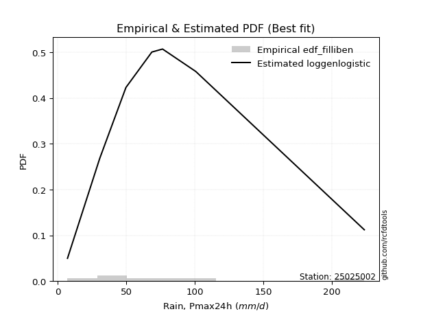</img>

</div>


### 10. EDF Jenkinson (1977)

The Jenkinson formula in hydrology is an empirical plotting position formula used to estimate the non-exceedance probability _(P)_ or return period _(T)_ of a given ordered observation within a sample. It is a widely used method in the frequency analysis of extreme events such as floods and rainfall, as it provides a distribution-free way to plot data. _a≈0.31_ and _b≈0.38_ are constants derived to approximate the median of the probability distribution for the given rank.

<div align="center">


$P=(m-a)/(n+b)$


</div>


**10.1. Empirical values**

<div align="center">

|                | 0                   | 1                   | 2                  | 3                   | 4                  | 5                  | 6                  | 7                  |
|:---------------|:--------------------|:--------------------|:-------------------|:--------------------|:-------------------|:-------------------|:-------------------|:-------------------|
| date           | 2018                | 2019                | 2017               | 2020                | 2023               | 2025               | 2022               | 2024               |
| x              | 7.2                 | 30.7                | 49.8               | 68.7                | 76.5               | 76.8               | 100.7              | 223.6              |
| m              | 1                   | 2                   | 3                  | 4                   | 5                  | 6                  | 7                  | 8                  |
| empirical_dist | edf_jenkinson       | edf_jenkinson       | edf_jenkinson      | edf_jenkinson       | edf_jenkinson      | edf_jenkinson      | edf_jenkinson      | edf_jenkinson      |
| empirical      | 0.08233890214797135 | 0.20167064439140808 | 0.3210023866348448 | 0.44033412887828155 | 0.5596658711217184 | 0.6789976133651551 | 0.7983293556085919 | 0.9176610978520287 |
| empirical_tr   | 1.0897269180754225  | 1.2526158445440956  | 1.4727592267135323 | 1.7867803837953091  | 2.2710027100271004 | 3.115241635687732  | 4.958579881656804  | 12.144927536231886 |

</div>


**10.2. Kolmogorov-Smirnov fit test (sorted by Δ)**


<div align="center">

|                | 0                   | 1                   | 2                   | 3                   | 4                  | 5                   | 6                   | 7                   | 8                  | 9                   | 10                 | 11                  | 12                  | 13                  | 14                  | 15                  | 16                  | 17                  | 18                  | 19                  | 20                  | 21                  | 22                  | 23                  | 24                  | 25                  | 26                  | 27                  | 28                  | 29                  | 30                  | 31                  | 32                  | 33                  | 34                  | 35                 | 36                  | 37                  | 38                 | 39                  | 40                  | 41                  | 42                  | 43                 | 44                 | 45                  | 46                  | 47                  | 48                 | 49                  | 50                  | 51                 | 52                 | 53                 | 54                 | 55                  | 56                 | 57                  | 58                  | 59                  | 60                  | 61                  | 62                  | 63                  | 64                 | 65                  | 66                 | 67                 | 68                  | 69                  | 70                  | 71                 | 72                  | 73                 | 74                 | 75                  | 76                  | 77                  | 78                 | 79                  | 80                  | 81                  | 82                  | 83                  | 84                  | 85                  | 86                  | 87                 | 88                  | 89                  | 90                  | 91                  | 92                  | 93                  | 94                 | 95                  | 96                  | 97                  | 98                 | 99                 | 100                 | 101                | 102                | 103                 | 104                 | 105                 | 106                | 107                | 108                 | 109                 | 110                | 111                | 112                 | 113                 | 114                 | 115                | 116                 | 117                 | 118                 | 119                 | 120                | 121                 | 122                | 123                | 124                 | 125                | 126                 | 127                 | 128                | 129                 | 130                | 131                 | 132                 | 133                | 134                 | 135                 | 136                | 137                 | 138                 | 139                | 140                | 141                 | 142                | 143                 | 144                | 145                 | 146                | 147                 | 148                | 149                | 150                | 151                | 152                | 153                | 154                | 155                | 156                | 157                | 158                | 159                |
|:---------------|:--------------------|:--------------------|:--------------------|:--------------------|:-------------------|:--------------------|:--------------------|:--------------------|:-------------------|:--------------------|:-------------------|:--------------------|:--------------------|:--------------------|:--------------------|:--------------------|:--------------------|:--------------------|:--------------------|:--------------------|:--------------------|:--------------------|:--------------------|:--------------------|:--------------------|:--------------------|:--------------------|:--------------------|:--------------------|:--------------------|:--------------------|:--------------------|:--------------------|:--------------------|:--------------------|:-------------------|:--------------------|:--------------------|:-------------------|:--------------------|:--------------------|:--------------------|:--------------------|:-------------------|:-------------------|:--------------------|:--------------------|:--------------------|:-------------------|:--------------------|:--------------------|:-------------------|:-------------------|:-------------------|:-------------------|:--------------------|:-------------------|:--------------------|:--------------------|:--------------------|:--------------------|:--------------------|:--------------------|:--------------------|:-------------------|:--------------------|:-------------------|:-------------------|:--------------------|:--------------------|:--------------------|:-------------------|:--------------------|:-------------------|:-------------------|:--------------------|:--------------------|:--------------------|:-------------------|:--------------------|:--------------------|:--------------------|:--------------------|:--------------------|:--------------------|:--------------------|:--------------------|:-------------------|:--------------------|:--------------------|:--------------------|:--------------------|:--------------------|:--------------------|:-------------------|:--------------------|:--------------------|:--------------------|:-------------------|:-------------------|:--------------------|:-------------------|:-------------------|:--------------------|:--------------------|:--------------------|:-------------------|:-------------------|:--------------------|:--------------------|:-------------------|:-------------------|:--------------------|:--------------------|:--------------------|:-------------------|:--------------------|:--------------------|:--------------------|:--------------------|:-------------------|:--------------------|:-------------------|:-------------------|:--------------------|:-------------------|:--------------------|:--------------------|:-------------------|:--------------------|:-------------------|:--------------------|:--------------------|:-------------------|:--------------------|:--------------------|:-------------------|:--------------------|:--------------------|:-------------------|:-------------------|:--------------------|:-------------------|:--------------------|:-------------------|:--------------------|:-------------------|:--------------------|:-------------------|:-------------------|:-------------------|:-------------------|:-------------------|:-------------------|:-------------------|:-------------------|:-------------------|:-------------------|:-------------------|:-------------------|
| station        | 25025002            | 25025002            | 25025002            | 25025002            | 25025002           | 25025002            | 25025002            | 25025002            | 25025002           | 25025002            | 25025002           | 25025002            | 25025002            | 25025002            | 25025002            | 25025002            | 25025002            | 25025002            | 25025002            | 25025002            | 25025002            | 25025002            | 25025002            | 25025002            | 25025002            | 25025002            | 25025002            | 25025002            | 25025002            | 25025002            | 25025002            | 25025002            | 25025002            | 25025002            | 25025002            | 25025002           | 25025002            | 25025002            | 25025002           | 25025002            | 25025002            | 25025002            | 25025002            | 25025002           | 25025002           | 25025002            | 25025002            | 25025002            | 25025002           | 25025002            | 25025002            | 25025002           | 25025002           | 25025002           | 25025002           | 25025002            | 25025002           | 25025002            | 25025002            | 25025002            | 25025002            | 25025002            | 25025002            | 25025002            | 25025002           | 25025002            | 25025002           | 25025002           | 25025002            | 25025002            | 25025002            | 25025002           | 25025002            | 25025002           | 25025002           | 25025002            | 25025002            | 25025002            | 25025002           | 25025002            | 25025002            | 25025002            | 25025002            | 25025002            | 25025002            | 25025002            | 25025002            | 25025002           | 25025002            | 25025002            | 25025002            | 25025002            | 25025002            | 25025002            | 25025002           | 25025002            | 25025002            | 25025002            | 25025002           | 25025002           | 25025002            | 25025002           | 25025002           | 25025002            | 25025002            | 25025002            | 25025002           | 25025002           | 25025002            | 25025002            | 25025002           | 25025002           | 25025002            | 25025002            | 25025002            | 25025002           | 25025002            | 25025002            | 25025002            | 25025002            | 25025002           | 25025002            | 25025002           | 25025002           | 25025002            | 25025002           | 25025002            | 25025002            | 25025002           | 25025002            | 25025002           | 25025002            | 25025002            | 25025002           | 25025002            | 25025002            | 25025002           | 25025002            | 25025002            | 25025002           | 25025002           | 25025002            | 25025002           | 25025002            | 25025002           | 25025002            | 25025002           | 25025002            | 25025002           | 25025002           | 25025002           | 25025002           | 25025002           | 25025002           | 25025002           | 25025002           | 25025002           | 25025002           | 25025002           | 25025002           |
| empirical_dist | edf_jenkinson       | edf_jenkinson       | edf_jenkinson       | edf_jenkinson       | edf_jenkinson      | edf_jenkinson       | edf_jenkinson       | edf_jenkinson       | edf_jenkinson      | edf_jenkinson       | edf_jenkinson      | edf_jenkinson       | edf_jenkinson       | edf_jenkinson       | edf_jenkinson       | edf_jenkinson       | edf_jenkinson       | edf_jenkinson       | edf_jenkinson       | edf_jenkinson       | edf_jenkinson       | edf_jenkinson       | edf_jenkinson       | edf_jenkinson       | edf_jenkinson       | edf_jenkinson       | edf_jenkinson       | edf_jenkinson       | edf_jenkinson       | edf_jenkinson       | edf_jenkinson       | edf_jenkinson       | edf_jenkinson       | edf_jenkinson       | edf_jenkinson       | edf_jenkinson      | edf_jenkinson       | edf_jenkinson       | edf_jenkinson      | edf_jenkinson       | edf_jenkinson       | edf_jenkinson       | edf_jenkinson       | edf_jenkinson      | edf_jenkinson      | edf_jenkinson       | edf_jenkinson       | edf_jenkinson       | edf_jenkinson      | edf_jenkinson       | edf_jenkinson       | edf_jenkinson      | edf_jenkinson      | edf_jenkinson      | edf_jenkinson      | edf_jenkinson       | edf_jenkinson      | edf_jenkinson       | edf_jenkinson       | edf_jenkinson       | edf_jenkinson       | edf_jenkinson       | edf_jenkinson       | edf_jenkinson       | edf_jenkinson      | edf_jenkinson       | edf_jenkinson      | edf_jenkinson      | edf_jenkinson       | edf_jenkinson       | edf_jenkinson       | edf_jenkinson      | edf_jenkinson       | edf_jenkinson      | edf_jenkinson      | edf_jenkinson       | edf_jenkinson       | edf_jenkinson       | edf_jenkinson      | edf_jenkinson       | edf_jenkinson       | edf_jenkinson       | edf_jenkinson       | edf_jenkinson       | edf_jenkinson       | edf_jenkinson       | edf_jenkinson       | edf_jenkinson      | edf_jenkinson       | edf_jenkinson       | edf_jenkinson       | edf_jenkinson       | edf_jenkinson       | edf_jenkinson       | edf_jenkinson      | edf_jenkinson       | edf_jenkinson       | edf_jenkinson       | edf_jenkinson      | edf_jenkinson      | edf_jenkinson       | edf_jenkinson      | edf_jenkinson      | edf_jenkinson       | edf_jenkinson       | edf_jenkinson       | edf_jenkinson      | edf_jenkinson      | edf_jenkinson       | edf_jenkinson       | edf_jenkinson      | edf_jenkinson      | edf_jenkinson       | edf_jenkinson       | edf_jenkinson       | edf_jenkinson      | edf_jenkinson       | edf_jenkinson       | edf_jenkinson       | edf_jenkinson       | edf_jenkinson      | edf_jenkinson       | edf_jenkinson      | edf_jenkinson      | edf_jenkinson       | edf_jenkinson      | edf_jenkinson       | edf_jenkinson       | edf_jenkinson      | edf_jenkinson       | edf_jenkinson      | edf_jenkinson       | edf_jenkinson       | edf_jenkinson      | edf_jenkinson       | edf_jenkinson       | edf_jenkinson      | edf_jenkinson       | edf_jenkinson       | edf_jenkinson      | edf_jenkinson      | edf_jenkinson       | edf_jenkinson      | edf_jenkinson       | edf_jenkinson      | edf_jenkinson       | edf_jenkinson      | edf_jenkinson       | edf_jenkinson      | edf_jenkinson      | edf_jenkinson      | edf_jenkinson      | edf_jenkinson      | edf_jenkinson      | edf_jenkinson      | edf_jenkinson      | edf_jenkinson      | edf_jenkinson      | edf_jenkinson      | edf_jenkinson      |
| p_dist         | logjohnsonsu        | t                   | invweibull          | invgauss            | invgamma           | johnsonsu           | halflogistic        | gompertz            | logburr12          | logweibull_min      | burr               | mielke              | loggenlogistic      | logloggamma         | logmielke           | moyal               | genpareto           | nct                 | logjohnsonsb        | exponnorm           | vonmises_line       | logpearson3         | loggumbel_l         | pearson3            | loggompertz         | gengamma            | logt                | logskewnorm         | genlogistic         | foldnorm            | loggenextreme       | logvonmises_line    | logburr             | halfnorm            | gumbel_r            | logargus           | genexpon            | lomax               | loganglit          | betaprime           | logsemicircular     | skewnorm            | lognct              | kstwobign          | logcrystalball     | lognorm             | logexponnorm        | logrice             | logf               | logbeta             | logfatiguelife      | loggamma           | loggamma           | logncf             | logbetaprime       | wald                | logtriang          | rayleigh            | f                   | logarcsine          | loglogistic         | logerlang           | logalpha            | maxwell             | loginvgamma        | loghypsecant        | kappa3             | loggennorm         | gennorm             | loginvgauss         | exponpow            | logdgamma          | logmaxwell          | dweibull           | logfoldnorm        | loggenhalflogistic  | logloglaplace       | loginvweibull       | dgamma             | logdweibull         | lograyleigh         | truncnorm           | rice                | logcosine           | loglaplace          | loglaplace          | loggenpareto        | semicircular       | anglit              | loggausshyper       | gamma               | crystalball         | norm                | logistic            | hypsecant          | nakagami            | laplace             | logtruncnorm        | loghalfnorm        | logkstwobign       | loggumbel_r         | halfgennorm        | arcsine            | loggenexpon         | logweibull_max      | logksone            | loghalflogistic    | tukeylambda        | logmoyal            | truncweibull_min    | truncexpon         | logwrapcauchy      | loguniform          | loglevy_l           | logkappa3           | logkappa4          | bradford            | cosine              | gumbel_l            | logtruncweibull_min | loglomax           | ncf                 | exponweib          | logtrapezoid       | gausshyper          | burr12             | logwald             | logbradford         | weibull_min        | kappa4              | logtruncexpon      | wrapcauchy          | ksone               | argus              | genextreme          | levy_l              | uniform            | johnsonsb           | alpha               | lognakagami        | logtukeylambda     | logrdist            | loggengamma        | triang              | logexponweib       | rdist               | powerlaw           | genhalflogistic     | fatiguelife        | erlang             | trapezoid          | beta               | logexponpow        | logpowerlaw        | truncpareto        | weibull_max        | logtruncpareto     | loghalfgennorm     | logvonmises        | vonmises           |
| delta          | 0.06266835660030068 | 0.07807648160653241 | 0.09215279849618846 | 0.09244120554209162 | 0.0926907252025278 | 0.09353706665571987 | 0.09422438663494237 | 0.09502894905946696 | 0.0970723661139522 | 0.09707836682064286 | 0.0977148522604036 | 0.09776788802008712 | 0.09788919520253819 | 0.09822480663998845 | 0.09830644940803263 | 0.09940667240683598 | 0.09966848146831842 | 0.09986075002983924 | 0.09993033216976499 | 0.09993782550921437 | 0.10069103921192368 | 0.10117501584020039 | 0.10274875490907709 | 0.10330808602278241 | 0.10531823926268707 | 0.10658333868086661 | 0.10936760314463789 | 0.10980502255264551 | 0.11350378752762669 | 0.11371735326131327 | 0.11497832402486707 | 0.11734245153330908 | 0.11789292541544244 | 0.11810492112167192 | 0.12528192185830123 | 0.1291106701337993 | 0.13396963877882667 | 0.13402849271872302 | 0.1348923438824527 | 0.13508658923575728 | 0.13790149021337245 | 0.14016888737312916 | 0.14353456543572468 | 0.1436768964671845 | 0.1439014753669587 | 0.14390157055750946 | 0.14390357667681913 | 0.14394281177385254 | 0.144314034427588  | 0.14527710831997775 | 0.14537067862050052 | 0.1461949965966099 | 0.1461949965966099 | 0.1477957303283624 | 0.1478119662060165 | 0.14889144438936303 | 0.1492269054143084 | 0.15004164782532392 | 0.15014369141452522 | 0.15408734651552292 | 0.15495405540099055 | 0.15569165241623845 | 0.15641653160327212 | 0.16138087897757036 | 0.1629484995734493 | 0.16411038492744384 | 0.1644334624899943 | 0.1656438505057044 | 0.16592337563127146 | 0.16707737157261932 | 0.16894133629353558 | 0.1695474654878657 | 0.17176478547942114 | 0.1721784138106427 | 0.1755101213929307 | 0.17568047495326322 | 0.17598521546838863 | 0.17752070551855592 | 0.1789976074927152 | 0.17899761336602532 | 0.18050501641687383 | 0.18189836237300328 | 0.18253465294609428 | 0.18335059422461603 | 0.18957588034036738 | 0.18957588034036738 | 0.19049543359773902 | 0.1917665089776593 | 0.19270934041384102 | 0.19394554434636146 | 0.19426417256602296 | 0.19499772965948364 | 0.19499774107277307 | 0.19718069777501773 | 0.1990429163936135 | 0.20167064081816302 | 0.20657502077672651 | 0.20746159776393752 | 0.2074774652026219 | 0.2117089256849074 | 0.21187749201359057 | 0.21781970743557   | 0.2184388374264492 | 0.22490854254754677 | 0.23204368348375248 | 0.23339810101728847 | 0.2334058922512065 | 0.2336277810568415 | 0.23536962714801596 | 0.23655925808472777 | 0.2394721937193317 | 0.2399385339713055 | 0.24187860226604752 | 0.25483250874059193 | 0.25535671270961247 | 0.2567601357230689 | 0.26242228413811153 | 0.26444639960440885 | 0.26566236264973353 | 0.26597776154395514 | 0.2668545922747715 | 0.27208242902956264 | 0.2735703601635071 | 0.2753331422624469 | 0.28833143481515133 | 0.2990583637747634 | 0.30068150941361466 | 0.32557297575550215 | 0.3282105270072481 | 0.33411501935441246 | 0.3363139115489473 | 0.34981884799589824 | 0.35493748869546804 | 0.3626550730980237 | 0.36422261090082136 | 0.36612979560489134 | 0.3662591153128433 | 0.36752487021488983 | 0.37491602917428113 | 0.4022225176682002 | 0.4054539802527895 | 0.41989658512186406 | 0.428213948942103  | 0.42874794795901194 | 0.4544274489690368 | 0.48004553644506376 | 0.490375495688899  | 0.49105950475743493 | 0.5228279914527543 | 0.5696585220659194 | 0.5992597128894046 | 0.6041467467802728 | 0.6185017984029846 | 0.6404099329042148 | 0.6601376254462734 | 0.677469673819415  | 0.7417859095256203 | 0.7983293556085919 | 1.0866719073068325 | 35.09512494479236  |
| deltao         | 0.4472608134160001  | 0.4472608134160001  | 0.4472608134160001  | 0.4472608134160001  | 0.4472608134160001 | 0.4472608134160001  | 0.4472608134160001  | 0.4472608134160001  | 0.4472608134160001 | 0.4472608134160001  | 0.4472608134160001 | 0.4472608134160001  | 0.4472608134160001  | 0.4472608134160001  | 0.4472608134160001  | 0.4472608134160001  | 0.4472608134160001  | 0.4472608134160001  | 0.4472608134160001  | 0.4472608134160001  | 0.4472608134160001  | 0.4472608134160001  | 0.4472608134160001  | 0.4472608134160001  | 0.4472608134160001  | 0.4472608134160001  | 0.4472608134160001  | 0.4472608134160001  | 0.4472608134160001  | 0.4472608134160001  | 0.4472608134160001  | 0.4472608134160001  | 0.4472608134160001  | 0.4472608134160001  | 0.4472608134160001  | 0.4472608134160001 | 0.4472608134160001  | 0.4472608134160001  | 0.4472608134160001 | 0.4472608134160001  | 0.4472608134160001  | 0.4472608134160001  | 0.4472608134160001  | 0.4472608134160001 | 0.4472608134160001 | 0.4472608134160001  | 0.4472608134160001  | 0.4472608134160001  | 0.4472608134160001 | 0.4472608134160001  | 0.4472608134160001  | 0.4472608134160001 | 0.4472608134160001 | 0.4472608134160001 | 0.4472608134160001 | 0.4472608134160001  | 0.4472608134160001 | 0.4472608134160001  | 0.4472608134160001  | 0.4472608134160001  | 0.4472608134160001  | 0.4472608134160001  | 0.4472608134160001  | 0.4472608134160001  | 0.4472608134160001 | 0.4472608134160001  | 0.4472608134160001 | 0.4472608134160001 | 0.4472608134160001  | 0.4472608134160001  | 0.4472608134160001  | 0.4472608134160001 | 0.4472608134160001  | 0.4472608134160001 | 0.4472608134160001 | 0.4472608134160001  | 0.4472608134160001  | 0.4472608134160001  | 0.4472608134160001 | 0.4472608134160001  | 0.4472608134160001  | 0.4472608134160001  | 0.4472608134160001  | 0.4472608134160001  | 0.4472608134160001  | 0.4472608134160001  | 0.4472608134160001  | 0.4472608134160001 | 0.4472608134160001  | 0.4472608134160001  | 0.4472608134160001  | 0.4472608134160001  | 0.4472608134160001  | 0.4472608134160001  | 0.4472608134160001 | 0.4472608134160001  | 0.4472608134160001  | 0.4472608134160001  | 0.4472608134160001 | 0.4472608134160001 | 0.4472608134160001  | 0.4472608134160001 | 0.4472608134160001 | 0.4472608134160001  | 0.4472608134160001  | 0.4472608134160001  | 0.4472608134160001 | 0.4472608134160001 | 0.4472608134160001  | 0.4472608134160001  | 0.4472608134160001 | 0.4472608134160001 | 0.4472608134160001  | 0.4472608134160001  | 0.4472608134160001  | 0.4472608134160001 | 0.4472608134160001  | 0.4472608134160001  | 0.4472608134160001  | 0.4472608134160001  | 0.4472608134160001 | 0.4472608134160001  | 0.4472608134160001 | 0.4472608134160001 | 0.4472608134160001  | 0.4472608134160001 | 0.4472608134160001  | 0.4472608134160001  | 0.4472608134160001 | 0.4472608134160001  | 0.4472608134160001 | 0.4472608134160001  | 0.4472608134160001  | 0.4472608134160001 | 0.4472608134160001  | 0.4472608134160001  | 0.4472608134160001 | 0.4472608134160001  | 0.4472608134160001  | 0.4472608134160001 | 0.4472608134160001 | 0.4472608134160001  | 0.4472608134160001 | 0.4472608134160001  | 0.4472608134160001 | 0.4472608134160001  | 0.4472608134160001 | 0.4472608134160001  | 0.4472608134160001 | 0.4472608134160001 | 0.4472608134160001 | 0.4472608134160001 | 0.4472608134160001 | 0.4472608134160001 | 0.4472608134160001 | 0.4472608134160001 | 0.4472608134160001 | 0.4472608134160001 | 0.4472608134160001 | 0.4472608134160001 |
| eval           | Δo > Δ              | Δo > Δ              | Δo > Δ              | Δo > Δ              | Δo > Δ             | Δo > Δ              | Δo > Δ              | Δo > Δ              | Δo > Δ             | Δo > Δ              | Δo > Δ             | Δo > Δ              | Δo > Δ              | Δo > Δ              | Δo > Δ              | Δo > Δ              | Δo > Δ              | Δo > Δ              | Δo > Δ              | Δo > Δ              | Δo > Δ              | Δo > Δ              | Δo > Δ              | Δo > Δ              | Δo > Δ              | Δo > Δ              | Δo > Δ              | Δo > Δ              | Δo > Δ              | Δo > Δ              | Δo > Δ              | Δo > Δ              | Δo > Δ              | Δo > Δ              | Δo > Δ              | Δo > Δ             | Δo > Δ              | Δo > Δ              | Δo > Δ             | Δo > Δ              | Δo > Δ              | Δo > Δ              | Δo > Δ              | Δo > Δ             | Δo > Δ             | Δo > Δ              | Δo > Δ              | Δo > Δ              | Δo > Δ             | Δo > Δ              | Δo > Δ              | Δo > Δ             | Δo > Δ             | Δo > Δ             | Δo > Δ             | Δo > Δ              | Δo > Δ             | Δo > Δ              | Δo > Δ              | Δo > Δ              | Δo > Δ              | Δo > Δ              | Δo > Δ              | Δo > Δ              | Δo > Δ             | Δo > Δ              | Δo > Δ             | Δo > Δ             | Δo > Δ              | Δo > Δ              | Δo > Δ              | Δo > Δ             | Δo > Δ              | Δo > Δ             | Δo > Δ             | Δo > Δ              | Δo > Δ              | Δo > Δ              | Δo > Δ             | Δo > Δ              | Δo > Δ              | Δo > Δ              | Δo > Δ              | Δo > Δ              | Δo > Δ              | Δo > Δ              | Δo > Δ              | Δo > Δ             | Δo > Δ              | Δo > Δ              | Δo > Δ              | Δo > Δ              | Δo > Δ              | Δo > Δ              | Δo > Δ             | Δo > Δ              | Δo > Δ              | Δo > Δ              | Δo > Δ             | Δo > Δ             | Δo > Δ              | Δo > Δ             | Δo > Δ             | Δo > Δ              | Δo > Δ              | Δo > Δ              | Δo > Δ             | Δo > Δ             | Δo > Δ              | Δo > Δ              | Δo > Δ             | Δo > Δ             | Δo > Δ              | Δo > Δ              | Δo > Δ              | Δo > Δ             | Δo > Δ              | Δo > Δ              | Δo > Δ              | Δo > Δ              | Δo > Δ             | Δo > Δ              | Δo > Δ             | Δo > Δ             | Δo > Δ              | Δo > Δ             | Δo > Δ              | Δo > Δ              | Δo > Δ             | Δo > Δ              | Δo > Δ             | Δo > Δ              | Δo > Δ              | Δo > Δ             | Δo > Δ              | Δo > Δ              | Δo > Δ             | Δo > Δ              | Δo > Δ              | Δo > Δ             | Δo > Δ             | Δo > Δ              | Δo > Δ             | Δo > Δ              | Δo <= Δ            | Δo <= Δ             | Δo <= Δ            | Δo <= Δ             | Δo <= Δ            | Δo <= Δ            | Δo <= Δ            | Δo <= Δ            | Δo <= Δ            | Δo <= Δ            | Δo <= Δ            | Δo <= Δ            | Δo <= Δ            | Δo <= Δ            | Δo <= Δ            | Δo <= Δ            |
| fit            | 1                   | 1                   | 1                   | 1                   | 1                  | 1                   | 1                   | 1                   | 1                  | 1                   | 1                  | 1                   | 1                   | 1                   | 1                   | 1                   | 1                   | 1                   | 1                   | 1                   | 1                   | 1                   | 1                   | 1                   | 1                   | 1                   | 1                   | 1                   | 1                   | 1                   | 1                   | 1                   | 1                   | 1                   | 1                   | 1                  | 1                   | 1                   | 1                  | 1                   | 1                   | 1                   | 1                   | 1                  | 1                  | 1                   | 1                   | 1                   | 1                  | 1                   | 1                   | 1                  | 1                  | 1                  | 1                  | 1                   | 1                  | 1                   | 1                   | 1                   | 1                   | 1                   | 1                   | 1                   | 1                  | 1                   | 1                  | 1                  | 1                   | 1                   | 1                   | 1                  | 1                   | 1                  | 1                  | 1                   | 1                   | 1                   | 1                  | 1                   | 1                   | 1                   | 1                   | 1                   | 1                   | 1                   | 1                   | 1                  | 1                   | 1                   | 1                   | 1                   | 1                   | 1                   | 1                  | 1                   | 1                   | 1                   | 1                  | 1                  | 1                   | 1                  | 1                  | 1                   | 1                   | 1                   | 1                  | 1                  | 1                   | 1                   | 1                  | 1                  | 1                   | 1                   | 1                   | 1                  | 1                   | 1                   | 1                   | 1                   | 1                  | 1                   | 1                  | 1                  | 1                   | 1                  | 1                   | 1                   | 1                  | 1                   | 1                  | 1                   | 1                   | 1                  | 1                   | 1                   | 1                  | 1                   | 1                   | 1                  | 1                  | 1                   | 1                  | 1                   | 0                  | 0                   | 0                  | 0                   | 0                  | 0                  | 0                  | 0                  | 0                  | 0                  | 0                  | 0                  | 0                  | 0                  | 0                  | 0                  |
| n              | 8                   | 8                   | 8                   | 8                   | 8                  | 8                   | 8                   | 8                   | 8                  | 8                   | 8                  | 8                   | 8                   | 8                   | 8                   | 8                   | 8                   | 8                   | 8                   | 8                   | 8                   | 8                   | 8                   | 8                   | 8                   | 8                   | 8                   | 8                   | 8                   | 8                   | 8                   | 8                   | 8                   | 8                   | 8                   | 8                  | 8                   | 8                   | 8                  | 8                   | 8                   | 8                   | 8                   | 8                  | 8                  | 8                   | 8                   | 8                   | 8                  | 8                   | 8                   | 8                  | 8                  | 8                  | 8                  | 8                   | 8                  | 8                   | 8                   | 8                   | 8                   | 8                   | 8                   | 8                   | 8                  | 8                   | 8                  | 8                  | 8                   | 8                   | 8                   | 8                  | 8                   | 8                  | 8                  | 8                   | 8                   | 8                   | 8                  | 8                   | 8                   | 8                   | 8                   | 8                   | 8                   | 8                   | 8                   | 8                  | 8                   | 8                   | 8                   | 8                   | 8                   | 8                   | 8                  | 8                   | 8                   | 8                   | 8                  | 8                  | 8                   | 8                  | 8                  | 8                   | 8                   | 8                   | 8                  | 8                  | 8                   | 8                   | 8                  | 8                  | 8                   | 8                   | 8                   | 8                  | 8                   | 8                   | 8                   | 8                   | 8                  | 8                   | 8                  | 8                  | 8                   | 8                  | 8                   | 8                   | 8                  | 8                   | 8                  | 8                   | 8                   | 8                  | 8                   | 8                   | 8                  | 8                   | 8                   | 8                  | 8                  | 8                   | 8                  | 8                   | 8                  | 8                   | 8                  | 8                   | 8                  | 8                  | 8                  | 8                  | 8                  | 8                  | 8                  | 8                  | 8                  | 8                  | 8                  | 8                  |
| best_fit       | 1                   | 0                   | 0                   | 0                   | 0                  | 0                   | 0                   | 0                   | 0                  | 0                   | 0                  | 0                   | 0                   | 0                   | 0                   | 0                   | 0                   | 0                   | 0                   | 0                   | 0                   | 0                   | 0                   | 0                   | 0                   | 0                   | 0                   | 0                   | 0                   | 0                   | 0                   | 0                   | 0                   | 0                   | 0                   | 0                  | 0                   | 0                   | 0                  | 0                   | 0                   | 0                   | 0                   | 0                  | 0                  | 0                   | 0                   | 0                   | 0                  | 0                   | 0                   | 0                  | 0                  | 0                  | 0                  | 0                   | 0                  | 0                   | 0                   | 0                   | 0                   | 0                   | 0                   | 0                   | 0                  | 0                   | 0                  | 0                  | 0                   | 0                   | 0                   | 0                  | 0                   | 0                  | 0                  | 0                   | 0                   | 0                   | 0                  | 0                   | 0                   | 0                   | 0                   | 0                   | 0                   | 0                   | 0                   | 0                  | 0                   | 0                   | 0                   | 0                   | 0                   | 0                   | 0                  | 0                   | 0                   | 0                   | 0                  | 0                  | 0                   | 0                  | 0                  | 0                   | 0                   | 0                   | 0                  | 0                  | 0                   | 0                   | 0                  | 0                  | 0                   | 0                   | 0                   | 0                  | 0                   | 0                   | 0                   | 0                   | 0                  | 0                   | 0                  | 0                  | 0                   | 0                  | 0                   | 0                   | 0                  | 0                   | 0                  | 0                   | 0                   | 0                  | 0                   | 0                   | 0                  | 0                   | 0                   | 0                  | 0                  | 0                   | 0                  | 0                   | 0                  | 0                   | 0                  | 0                   | 0                  | 0                  | 0                  | 0                  | 0                  | 0                  | 0                  | 0                  | 0                  | 0                  | 0                  | 0                  |
| best_fit_sort  | 1                   | 2                   | 3                   | 4                   | 5                  | 6                   | 7                   | 8                   | 9                  | 10                  | 11                 | 12                  | 13                  | 14                  | 15                  | 16                  | 17                  | 18                  | 19                  | 20                  | 21                  | 22                  | 23                  | 24                  | 25                  | 26                  | 27                  | 28                  | 29                  | 30                  | 31                  | 32                  | 33                  | 34                  | 35                  | 36                 | 37                  | 38                  | 39                 | 40                  | 41                  | 42                  | 43                  | 44                 | 45                 | 46                  | 47                  | 48                  | 49                 | 50                  | 51                  | 52                 | 53                 | 54                 | 55                 | 56                  | 57                 | 58                  | 59                  | 60                  | 61                  | 62                  | 63                  | 64                  | 65                 | 66                  | 67                 | 68                 | 69                  | 70                  | 71                  | 72                 | 73                  | 74                 | 75                 | 76                  | 77                  | 78                  | 79                 | 80                  | 81                  | 82                  | 83                  | 84                  | 85                  | 86                  | 87                  | 88                 | 89                  | 90                  | 91                  | 92                  | 93                  | 94                  | 95                 | 96                  | 97                  | 98                  | 99                 | 100                | 101                 | 102                | 103                | 104                 | 105                 | 106                 | 107                | 108                | 109                 | 110                 | 111                | 112                | 113                 | 114                 | 115                 | 116                | 117                 | 118                 | 119                 | 120                 | 121                | 122                 | 123                | 124                | 125                 | 126                | 127                 | 128                 | 129                | 130                 | 131                | 132                 | 133                 | 134                | 135                 | 136                 | 137                | 138                 | 139                 | 140                | 141                | 142                 | 143                | 144                 | 145                | 146                 | 147                | 148                 | 149                | 150                | 151                | 152                | 153                | 154                | 155                | 156                | 157                | 158                | 159                | 160                |

</div>


**10.3. Best fit**

<div align="center">

|   id |   station | empirical_dist   | p_dist       |     delta |   deltao | eval   |   fit |   n |   best_fit |   best_fit_sort |
|-----:|----------:|:-----------------|:-------------|----------:|---------:|:-------|------:|----:|-----------:|----------------:|
|    0 |  25025002 | edf_jenkinson    | logjohnsonsu | 0.0626684 | 0.447261 | Δo > Δ |     1 |   8 |          1 |               1 |

</div>


<div align="center">

</img></img>

</div>


### 11. EDF Cunnane (1978)

Cunnane´s work in statistical hydrology has focused on the performance and evaluation of different probability distributions (such as GEV, Gumbel, Lognormal) for flood frequency estimation. _b_ is a constant, typically set to 0.4.

<div align="center">


$P=(m-b)/(n+1-2b)$


</div>


**11.1. Empirical values**

<div align="center">

|                | 0                   | 1                   | 2                  | 3                  | 4                  | 5                  | 6                  | 7                  |
|:---------------|:--------------------|:--------------------|:-------------------|:-------------------|:-------------------|:-------------------|:-------------------|:-------------------|
| date           | 2018                | 2019                | 2017               | 2020               | 2023               | 2025               | 2022               | 2024               |
| x              | 7.2                 | 30.7                | 49.8               | 68.7               | 76.5               | 76.8               | 100.7              | 223.6              |
| m              | 1                   | 2                   | 3                  | 4                  | 5                  | 6                  | 7                  | 8                  |
| empirical_dist | edf_cunnane         | edf_cunnane         | edf_cunnane        | edf_cunnane        | edf_cunnane        | edf_cunnane        | edf_cunnane        | edf_cunnane        |
| empirical      | 0.07317073170731708 | 0.19512195121951223 | 0.3170731707317074 | 0.4390243902439025 | 0.5609756097560976 | 0.6829268292682927 | 0.8048780487804879 | 0.926829268292683  |
| empirical_tr   | 1.0789473684210527  | 1.2424242424242424  | 1.4642857142857144 | 1.782608695652174  | 2.277777777777778  | 3.153846153846154  | 5.125000000000001  | 13.666666666666675 |

</div>


**11.2. Kolmogorov-Smirnov fit test (sorted by Δ)**


<div align="center">

|                | 0                   | 1                   | 2                   | 3                   | 4                   | 5                   | 6                   | 7                   | 8                   | 9                   | 10                  | 11                  | 12                  | 13                  | 14                 | 15                  | 16                  | 17                  | 18                  | 19                  | 20                  | 21                  | 22                  | 23                  | 24                  | 25                  | 26                  | 27                  | 28                  | 29                  | 30                  | 31                 | 32                 | 33                  | 34                 | 35                  | 36                  | 37                  | 38                  | 39                  | 40                  | 41                  | 42                  | 43                  | 44                  | 45                 | 46                 | 47                  | 48                  | 49                  | 50                  | 51                  | 52                  | 53                  | 54                  | 55                 | 56                  | 57                  | 58                  | 59                 | 60                 | 61                  | 62                 | 63                  | 64                  | 65                 | 66                  | 67                  | 68                  | 69                  | 70                  | 71                 | 72                  | 73                  | 74                  | 75                 | 76                  | 77                  | 78                 | 79                  | 80                  | 81                  | 82                  | 83                  | 84                  | 85                  | 86                  | 87                  | 88                  | 89                  | 90                  | 91                 | 92                 | 93                  | 94                 | 95                  | 96                  | 97                  | 98                  | 99                  | 100                 | 101                 | 102                | 103                 | 104                 | 105                 | 106                | 107                 | 108                 | 109                 | 110                 | 111                 | 112                 | 113                | 114                | 115                | 116                | 117                | 118                | 119                 | 120                | 121                 | 122                 | 123                 | 124                | 125                | 126                 | 127                | 128                 | 129                 | 130                 | 131                 | 132                 | 133                | 134                | 135                 | 136                | 137                | 138                 | 139                | 140                | 141                | 142                 | 143                 | 144                 | 145                | 146                | 147                | 148                | 149                | 150                | 151                | 152                | 153                | 154                | 155                | 156                | 157                | 158                | 159                |
|:---------------|:--------------------|:--------------------|:--------------------|:--------------------|:--------------------|:--------------------|:--------------------|:--------------------|:--------------------|:--------------------|:--------------------|:--------------------|:--------------------|:--------------------|:-------------------|:--------------------|:--------------------|:--------------------|:--------------------|:--------------------|:--------------------|:--------------------|:--------------------|:--------------------|:--------------------|:--------------------|:--------------------|:--------------------|:--------------------|:--------------------|:--------------------|:-------------------|:-------------------|:--------------------|:-------------------|:--------------------|:--------------------|:--------------------|:--------------------|:--------------------|:--------------------|:--------------------|:--------------------|:--------------------|:--------------------|:-------------------|:-------------------|:--------------------|:--------------------|:--------------------|:--------------------|:--------------------|:--------------------|:--------------------|:--------------------|:-------------------|:--------------------|:--------------------|:--------------------|:-------------------|:-------------------|:--------------------|:-------------------|:--------------------|:--------------------|:-------------------|:--------------------|:--------------------|:--------------------|:--------------------|:--------------------|:-------------------|:--------------------|:--------------------|:--------------------|:-------------------|:--------------------|:--------------------|:-------------------|:--------------------|:--------------------|:--------------------|:--------------------|:--------------------|:--------------------|:--------------------|:--------------------|:--------------------|:--------------------|:--------------------|:--------------------|:-------------------|:-------------------|:--------------------|:-------------------|:--------------------|:--------------------|:--------------------|:--------------------|:--------------------|:--------------------|:--------------------|:-------------------|:--------------------|:--------------------|:--------------------|:-------------------|:--------------------|:--------------------|:--------------------|:--------------------|:--------------------|:--------------------|:-------------------|:-------------------|:-------------------|:-------------------|:-------------------|:-------------------|:--------------------|:-------------------|:--------------------|:--------------------|:--------------------|:-------------------|:-------------------|:--------------------|:-------------------|:--------------------|:--------------------|:--------------------|:--------------------|:--------------------|:-------------------|:-------------------|:--------------------|:-------------------|:-------------------|:--------------------|:-------------------|:-------------------|:-------------------|:--------------------|:--------------------|:--------------------|:-------------------|:-------------------|:-------------------|:-------------------|:-------------------|:-------------------|:-------------------|:-------------------|:-------------------|:-------------------|:-------------------|:-------------------|:-------------------|:-------------------|:-------------------|
| station        | 25025002            | 25025002            | 25025002            | 25025002            | 25025002            | 25025002            | 25025002            | 25025002            | 25025002            | 25025002            | 25025002            | 25025002            | 25025002            | 25025002            | 25025002           | 25025002            | 25025002            | 25025002            | 25025002            | 25025002            | 25025002            | 25025002            | 25025002            | 25025002            | 25025002            | 25025002            | 25025002            | 25025002            | 25025002            | 25025002            | 25025002            | 25025002           | 25025002           | 25025002            | 25025002           | 25025002            | 25025002            | 25025002            | 25025002            | 25025002            | 25025002            | 25025002            | 25025002            | 25025002            | 25025002            | 25025002           | 25025002           | 25025002            | 25025002            | 25025002            | 25025002            | 25025002            | 25025002            | 25025002            | 25025002            | 25025002           | 25025002            | 25025002            | 25025002            | 25025002           | 25025002           | 25025002            | 25025002           | 25025002            | 25025002            | 25025002           | 25025002            | 25025002            | 25025002            | 25025002            | 25025002            | 25025002           | 25025002            | 25025002            | 25025002            | 25025002           | 25025002            | 25025002            | 25025002           | 25025002            | 25025002            | 25025002            | 25025002            | 25025002            | 25025002            | 25025002            | 25025002            | 25025002            | 25025002            | 25025002            | 25025002            | 25025002           | 25025002           | 25025002            | 25025002           | 25025002            | 25025002            | 25025002            | 25025002            | 25025002            | 25025002            | 25025002            | 25025002           | 25025002            | 25025002            | 25025002            | 25025002           | 25025002            | 25025002            | 25025002            | 25025002            | 25025002            | 25025002            | 25025002           | 25025002           | 25025002           | 25025002           | 25025002           | 25025002           | 25025002            | 25025002           | 25025002            | 25025002            | 25025002            | 25025002           | 25025002           | 25025002            | 25025002           | 25025002            | 25025002            | 25025002            | 25025002            | 25025002            | 25025002           | 25025002           | 25025002            | 25025002           | 25025002           | 25025002            | 25025002           | 25025002           | 25025002           | 25025002            | 25025002            | 25025002            | 25025002           | 25025002           | 25025002           | 25025002           | 25025002           | 25025002           | 25025002           | 25025002           | 25025002           | 25025002           | 25025002           | 25025002           | 25025002           | 25025002           | 25025002           |
| empirical_dist | edf_cunnane         | edf_cunnane         | edf_cunnane         | edf_cunnane         | edf_cunnane         | edf_cunnane         | edf_cunnane         | edf_cunnane         | edf_cunnane         | edf_cunnane         | edf_cunnane         | edf_cunnane         | edf_cunnane         | edf_cunnane         | edf_cunnane        | edf_cunnane         | edf_cunnane         | edf_cunnane         | edf_cunnane         | edf_cunnane         | edf_cunnane         | edf_cunnane         | edf_cunnane         | edf_cunnane         | edf_cunnane         | edf_cunnane         | edf_cunnane         | edf_cunnane         | edf_cunnane         | edf_cunnane         | edf_cunnane         | edf_cunnane        | edf_cunnane        | edf_cunnane         | edf_cunnane        | edf_cunnane         | edf_cunnane         | edf_cunnane         | edf_cunnane         | edf_cunnane         | edf_cunnane         | edf_cunnane         | edf_cunnane         | edf_cunnane         | edf_cunnane         | edf_cunnane        | edf_cunnane        | edf_cunnane         | edf_cunnane         | edf_cunnane         | edf_cunnane         | edf_cunnane         | edf_cunnane         | edf_cunnane         | edf_cunnane         | edf_cunnane        | edf_cunnane         | edf_cunnane         | edf_cunnane         | edf_cunnane        | edf_cunnane        | edf_cunnane         | edf_cunnane        | edf_cunnane         | edf_cunnane         | edf_cunnane        | edf_cunnane         | edf_cunnane         | edf_cunnane         | edf_cunnane         | edf_cunnane         | edf_cunnane        | edf_cunnane         | edf_cunnane         | edf_cunnane         | edf_cunnane        | edf_cunnane         | edf_cunnane         | edf_cunnane        | edf_cunnane         | edf_cunnane         | edf_cunnane         | edf_cunnane         | edf_cunnane         | edf_cunnane         | edf_cunnane         | edf_cunnane         | edf_cunnane         | edf_cunnane         | edf_cunnane         | edf_cunnane         | edf_cunnane        | edf_cunnane        | edf_cunnane         | edf_cunnane        | edf_cunnane         | edf_cunnane         | edf_cunnane         | edf_cunnane         | edf_cunnane         | edf_cunnane         | edf_cunnane         | edf_cunnane        | edf_cunnane         | edf_cunnane         | edf_cunnane         | edf_cunnane        | edf_cunnane         | edf_cunnane         | edf_cunnane         | edf_cunnane         | edf_cunnane         | edf_cunnane         | edf_cunnane        | edf_cunnane        | edf_cunnane        | edf_cunnane        | edf_cunnane        | edf_cunnane        | edf_cunnane         | edf_cunnane        | edf_cunnane         | edf_cunnane         | edf_cunnane         | edf_cunnane        | edf_cunnane        | edf_cunnane         | edf_cunnane        | edf_cunnane         | edf_cunnane         | edf_cunnane         | edf_cunnane         | edf_cunnane         | edf_cunnane        | edf_cunnane        | edf_cunnane         | edf_cunnane        | edf_cunnane        | edf_cunnane         | edf_cunnane        | edf_cunnane        | edf_cunnane        | edf_cunnane         | edf_cunnane         | edf_cunnane         | edf_cunnane        | edf_cunnane        | edf_cunnane        | edf_cunnane        | edf_cunnane        | edf_cunnane        | edf_cunnane        | edf_cunnane        | edf_cunnane        | edf_cunnane        | edf_cunnane        | edf_cunnane        | edf_cunnane        | edf_cunnane        | edf_cunnane        |
| p_dist         | logjohnsonsu        | t                   | invweibull          | invgauss            | invgamma            | johnsonsu           | halflogistic        | gompertz            | burr                | mielke              | loggenlogistic      | logmielke           | logburr12           | logweibull_min      | nct                | logloggamma         | moyal               | logjohnsonsb        | exponnorm           | genpareto           | vonmises_line       | logpearson3         | loggompertz         | loggumbel_l         | pearson3            | gengamma            | logskewnorm         | logt                | genlogistic         | foldnorm            | logvonmises_line    | logburr            | loggenextreme      | halfnorm            | gumbel_r           | genexpon            | lomax               | logargus            | betaprime           | loganglit           | logsemicircular     | skewnorm            | lognct              | logcrystalball      | lognorm             | logexponnorm       | logrice            | logf                | logfatiguelife      | loggamma            | loggamma            | kstwobign           | logncf              | logbetaprime        | wald                | logbeta            | rayleigh            | f                   | logtriang           | loglogistic        | logerlang          | logalpha            | logarcsine         | loginvgamma         | maxwell             | loghypsecant       | kappa3              | loginvgauss         | loggennorm          | gennorm             | exponpow            | logmaxwell         | logdgamma           | dweibull            | logfoldnorm         | logloglaplace      | loginvweibull       | lograyleigh         | loggenhalflogistic | dgamma              | logdweibull         | truncnorm           | rice                | logcosine           | loglaplace          | loglaplace          | nakagami            | gamma               | semicircular        | anglit              | loggenpareto        | loggausshyper      | crystalball        | norm                | logistic           | hypsecant           | logtruncnorm        | laplace             | loghalfnorm         | loggumbel_r         | logkstwobign        | halfgennorm         | arcsine            | loggenexpon         | loghalflogistic     | tukeylambda         | logmoyal           | logweibull_max      | logksone            | truncweibull_min    | logwrapcauchy       | truncexpon          | loguniform          | logkappa3          | logkappa4          | loglevy_l          | cosine             | bradford           | gumbel_l           | logtruncweibull_min | loglomax           | exponweib           | ncf                 | logtrapezoid        | gausshyper         | logwald            | burr12              | logbradford        | weibull_min         | logtruncexpon       | kappa4              | wrapcauchy          | ksone               | argus              | genextreme         | uniform             | johnsonsb          | levy_l             | alpha               | lognakagami        | logtukeylambda     | logrdist           | loggengamma         | triang              | logexponweib        | rdist              | powerlaw           | genhalflogistic    | fatiguelife        | erlang             | trapezoid          | beta               | logexponpow        | logpowerlaw        | truncpareto        | weibull_max        | logtruncpareto     | loghalfgennorm     | logvonmises        | vonmises           |
| delta          | 0.06659757250343834 | 0.07938622024091146 | 0.09346253713056751 | 0.09375094417647067 | 0.09400046383690686 | 0.09484680529009892 | 0.09815360253808003 | 0.09859995959809753 | 0.09902459089478266 | 0.09907762665446618 | 0.09919893383691725 | 0.09961618804241168 | 0.10100158201708986 | 0.10100758272378052 | 0.1011704886642183 | 0.10215402254312611 | 0.10333588830997364 | 0.10385954807290265 | 0.10386704141235203 | 0.10428012867576752 | 0.10462025511506134 | 0.10510423174333805 | 0.10662797789706613 | 0.10667797081221475 | 0.10723730192592007 | 0.10789307731524567 | 0.11111476118702457 | 0.11329681904777555 | 0.11743300343076435 | 0.11801072821689829 | 0.11865219016768813 | 0.1192026640498215 | 0.1213056398635729 | 0.12203413702480959 | 0.1292111377614389 | 0.13527937741320573 | 0.13533823135310208 | 0.13565936330569528 | 0.13639632787013634 | 0.13882155978559013 | 0.14183070611650989 | 0.14409810327626682 | 0.14484430407010374 | 0.14521121400133774 | 0.14521130919188852 | 0.1452133153111982 | 0.1452525504082316 | 0.14562377306196705 | 0.14668041725487957 | 0.14750473523098895 | 0.14750473523098895 | 0.14760611237032217 | 0.14910546896274146 | 0.14912170484039555 | 0.15020118302374208 | 0.1518258014918736 | 0.15397086372846158 | 0.15407290731766266 | 0.15577559858620438 | 0.1562637940353696 | 0.1570013910506175 | 0.15772627023765118 | 0.1606360396874189 | 0.16425823820782837 | 0.16531009488070803 | 0.1654201235618229 | 0.16574320112437335 | 0.16838711020699837 | 0.16957306640884207 | 0.16985259153440913 | 0.17287055219667302 | 0.1730745241138002 | 0.17347668139100336 | 0.17610762971378036 | 0.17681986002730976 | 0.1799144313715263 | 0.18144992142169336 | 0.18181475505125289 | 0.1822291681251592 | 0.18292682339585287 | 0.18292682926916298 | 0.18582757827614094 | 0.18646386884923194 | 0.18726909188419083 | 0.19088561897474643 | 0.19088561897474643 | 0.19512194764626717 | 0.19557391120040202 | 0.19569572488079695 | 0.19663855631697869 | 0.19704412676963487 | 0.1978747602494989 | 0.1989269455626213 | 0.19892695697591073 | 0.2011099136781554 | 0.20297213229675115 | 0.20877133639831658 | 0.21050423667986418 | 0.21140668110575933 | 0.21318723064796963 | 0.21563814158804484 | 0.22174892333870744 | 0.2249875305983452 | 0.22883775845068421 | 0.23471563088558556 | 0.23493751969122056 | 0.236679365782395  | 0.23859237665564847 | 0.23994679418918433 | 0.24310795125662377 | 0.24386774987444293 | 0.24524363264565596 | 0.24580781816918496 | 0.2592859286127499 | 0.2606893516262063 | 0.2640006791812462 | 0.2683756155075465 | 0.2689709773100075 | 0.2695915785528712 | 0.2699069774470926  | 0.2760227627154258 | 0.27749957606664455 | 0.27863112220145847 | 0.28188183543434286 | 0.2948801279870473 | 0.3019912480479937 | 0.30560705694665924 | 0.3295021916586396 | 0.33475922017914395 | 0.34024312745208474 | 0.34066371252630845 | 0.35636754116779423 | 0.36148618186736403 | 0.3692037662699197 | 0.3707713040727172 | 0.37280780848473927 | 0.3740735633867858 | 0.3752979660455456 | 0.37884524507741857 | 0.4035322563025793 | 0.4084806657893012 | 0.4264452782937599 | 0.43476264211399884 | 0.43529664113090794 | 0.46097614214093263 | 0.489213706885718  | 0.4969241888607948 | 0.4976081979293309 | 0.52937668462465   | 0.5762072152378153 | 0.6058084060613006 | 0.6106954399521686 | 0.6250504915748804 | 0.6469586260761105 | 0.6666863186181692 | 0.684018366991311  | 0.7483346026975162 | 0.8048780487804879 | 1.0879816459412117 | 35.0859567743517   |
| deltao         | 0.4472608134160001  | 0.4472608134160001  | 0.4472608134160001  | 0.4472608134160001  | 0.4472608134160001  | 0.4472608134160001  | 0.4472608134160001  | 0.4472608134160001  | 0.4472608134160001  | 0.4472608134160001  | 0.4472608134160001  | 0.4472608134160001  | 0.4472608134160001  | 0.4472608134160001  | 0.4472608134160001 | 0.4472608134160001  | 0.4472608134160001  | 0.4472608134160001  | 0.4472608134160001  | 0.4472608134160001  | 0.4472608134160001  | 0.4472608134160001  | 0.4472608134160001  | 0.4472608134160001  | 0.4472608134160001  | 0.4472608134160001  | 0.4472608134160001  | 0.4472608134160001  | 0.4472608134160001  | 0.4472608134160001  | 0.4472608134160001  | 0.4472608134160001 | 0.4472608134160001 | 0.4472608134160001  | 0.4472608134160001 | 0.4472608134160001  | 0.4472608134160001  | 0.4472608134160001  | 0.4472608134160001  | 0.4472608134160001  | 0.4472608134160001  | 0.4472608134160001  | 0.4472608134160001  | 0.4472608134160001  | 0.4472608134160001  | 0.4472608134160001 | 0.4472608134160001 | 0.4472608134160001  | 0.4472608134160001  | 0.4472608134160001  | 0.4472608134160001  | 0.4472608134160001  | 0.4472608134160001  | 0.4472608134160001  | 0.4472608134160001  | 0.4472608134160001 | 0.4472608134160001  | 0.4472608134160001  | 0.4472608134160001  | 0.4472608134160001 | 0.4472608134160001 | 0.4472608134160001  | 0.4472608134160001 | 0.4472608134160001  | 0.4472608134160001  | 0.4472608134160001 | 0.4472608134160001  | 0.4472608134160001  | 0.4472608134160001  | 0.4472608134160001  | 0.4472608134160001  | 0.4472608134160001 | 0.4472608134160001  | 0.4472608134160001  | 0.4472608134160001  | 0.4472608134160001 | 0.4472608134160001  | 0.4472608134160001  | 0.4472608134160001 | 0.4472608134160001  | 0.4472608134160001  | 0.4472608134160001  | 0.4472608134160001  | 0.4472608134160001  | 0.4472608134160001  | 0.4472608134160001  | 0.4472608134160001  | 0.4472608134160001  | 0.4472608134160001  | 0.4472608134160001  | 0.4472608134160001  | 0.4472608134160001 | 0.4472608134160001 | 0.4472608134160001  | 0.4472608134160001 | 0.4472608134160001  | 0.4472608134160001  | 0.4472608134160001  | 0.4472608134160001  | 0.4472608134160001  | 0.4472608134160001  | 0.4472608134160001  | 0.4472608134160001 | 0.4472608134160001  | 0.4472608134160001  | 0.4472608134160001  | 0.4472608134160001 | 0.4472608134160001  | 0.4472608134160001  | 0.4472608134160001  | 0.4472608134160001  | 0.4472608134160001  | 0.4472608134160001  | 0.4472608134160001 | 0.4472608134160001 | 0.4472608134160001 | 0.4472608134160001 | 0.4472608134160001 | 0.4472608134160001 | 0.4472608134160001  | 0.4472608134160001 | 0.4472608134160001  | 0.4472608134160001  | 0.4472608134160001  | 0.4472608134160001 | 0.4472608134160001 | 0.4472608134160001  | 0.4472608134160001 | 0.4472608134160001  | 0.4472608134160001  | 0.4472608134160001  | 0.4472608134160001  | 0.4472608134160001  | 0.4472608134160001 | 0.4472608134160001 | 0.4472608134160001  | 0.4472608134160001 | 0.4472608134160001 | 0.4472608134160001  | 0.4472608134160001 | 0.4472608134160001 | 0.4472608134160001 | 0.4472608134160001  | 0.4472608134160001  | 0.4472608134160001  | 0.4472608134160001 | 0.4472608134160001 | 0.4472608134160001 | 0.4472608134160001 | 0.4472608134160001 | 0.4472608134160001 | 0.4472608134160001 | 0.4472608134160001 | 0.4472608134160001 | 0.4472608134160001 | 0.4472608134160001 | 0.4472608134160001 | 0.4472608134160001 | 0.4472608134160001 | 0.4472608134160001 |
| eval           | Δo > Δ              | Δo > Δ              | Δo > Δ              | Δo > Δ              | Δo > Δ              | Δo > Δ              | Δo > Δ              | Δo > Δ              | Δo > Δ              | Δo > Δ              | Δo > Δ              | Δo > Δ              | Δo > Δ              | Δo > Δ              | Δo > Δ             | Δo > Δ              | Δo > Δ              | Δo > Δ              | Δo > Δ              | Δo > Δ              | Δo > Δ              | Δo > Δ              | Δo > Δ              | Δo > Δ              | Δo > Δ              | Δo > Δ              | Δo > Δ              | Δo > Δ              | Δo > Δ              | Δo > Δ              | Δo > Δ              | Δo > Δ             | Δo > Δ             | Δo > Δ              | Δo > Δ             | Δo > Δ              | Δo > Δ              | Δo > Δ              | Δo > Δ              | Δo > Δ              | Δo > Δ              | Δo > Δ              | Δo > Δ              | Δo > Δ              | Δo > Δ              | Δo > Δ             | Δo > Δ             | Δo > Δ              | Δo > Δ              | Δo > Δ              | Δo > Δ              | Δo > Δ              | Δo > Δ              | Δo > Δ              | Δo > Δ              | Δo > Δ             | Δo > Δ              | Δo > Δ              | Δo > Δ              | Δo > Δ             | Δo > Δ             | Δo > Δ              | Δo > Δ             | Δo > Δ              | Δo > Δ              | Δo > Δ             | Δo > Δ              | Δo > Δ              | Δo > Δ              | Δo > Δ              | Δo > Δ              | Δo > Δ             | Δo > Δ              | Δo > Δ              | Δo > Δ              | Δo > Δ             | Δo > Δ              | Δo > Δ              | Δo > Δ             | Δo > Δ              | Δo > Δ              | Δo > Δ              | Δo > Δ              | Δo > Δ              | Δo > Δ              | Δo > Δ              | Δo > Δ              | Δo > Δ              | Δo > Δ              | Δo > Δ              | Δo > Δ              | Δo > Δ             | Δo > Δ             | Δo > Δ              | Δo > Δ             | Δo > Δ              | Δo > Δ              | Δo > Δ              | Δo > Δ              | Δo > Δ              | Δo > Δ              | Δo > Δ              | Δo > Δ             | Δo > Δ              | Δo > Δ              | Δo > Δ              | Δo > Δ             | Δo > Δ              | Δo > Δ              | Δo > Δ              | Δo > Δ              | Δo > Δ              | Δo > Δ              | Δo > Δ             | Δo > Δ             | Δo > Δ             | Δo > Δ             | Δo > Δ             | Δo > Δ             | Δo > Δ              | Δo > Δ             | Δo > Δ              | Δo > Δ              | Δo > Δ              | Δo > Δ             | Δo > Δ             | Δo > Δ              | Δo > Δ             | Δo > Δ              | Δo > Δ              | Δo > Δ              | Δo > Δ              | Δo > Δ              | Δo > Δ             | Δo > Δ             | Δo > Δ              | Δo > Δ             | Δo > Δ             | Δo > Δ              | Δo > Δ             | Δo > Δ             | Δo > Δ             | Δo > Δ              | Δo > Δ              | Δo <= Δ             | Δo <= Δ            | Δo <= Δ            | Δo <= Δ            | Δo <= Δ            | Δo <= Δ            | Δo <= Δ            | Δo <= Δ            | Δo <= Δ            | Δo <= Δ            | Δo <= Δ            | Δo <= Δ            | Δo <= Δ            | Δo <= Δ            | Δo <= Δ            | Δo <= Δ            |
| fit            | 1                   | 1                   | 1                   | 1                   | 1                   | 1                   | 1                   | 1                   | 1                   | 1                   | 1                   | 1                   | 1                   | 1                   | 1                  | 1                   | 1                   | 1                   | 1                   | 1                   | 1                   | 1                   | 1                   | 1                   | 1                   | 1                   | 1                   | 1                   | 1                   | 1                   | 1                   | 1                  | 1                  | 1                   | 1                  | 1                   | 1                   | 1                   | 1                   | 1                   | 1                   | 1                   | 1                   | 1                   | 1                   | 1                  | 1                  | 1                   | 1                   | 1                   | 1                   | 1                   | 1                   | 1                   | 1                   | 1                  | 1                   | 1                   | 1                   | 1                  | 1                  | 1                   | 1                  | 1                   | 1                   | 1                  | 1                   | 1                   | 1                   | 1                   | 1                   | 1                  | 1                   | 1                   | 1                   | 1                  | 1                   | 1                   | 1                  | 1                   | 1                   | 1                   | 1                   | 1                   | 1                   | 1                   | 1                   | 1                   | 1                   | 1                   | 1                   | 1                  | 1                  | 1                   | 1                  | 1                   | 1                   | 1                   | 1                   | 1                   | 1                   | 1                   | 1                  | 1                   | 1                   | 1                   | 1                  | 1                   | 1                   | 1                   | 1                   | 1                   | 1                   | 1                  | 1                  | 1                  | 1                  | 1                  | 1                  | 1                   | 1                  | 1                   | 1                   | 1                   | 1                  | 1                  | 1                   | 1                  | 1                   | 1                   | 1                   | 1                   | 1                   | 1                  | 1                  | 1                   | 1                  | 1                  | 1                   | 1                  | 1                  | 1                  | 1                   | 1                   | 0                   | 0                  | 0                  | 0                  | 0                  | 0                  | 0                  | 0                  | 0                  | 0                  | 0                  | 0                  | 0                  | 0                  | 0                  | 0                  |
| n              | 8                   | 8                   | 8                   | 8                   | 8                   | 8                   | 8                   | 8                   | 8                   | 8                   | 8                   | 8                   | 8                   | 8                   | 8                  | 8                   | 8                   | 8                   | 8                   | 8                   | 8                   | 8                   | 8                   | 8                   | 8                   | 8                   | 8                   | 8                   | 8                   | 8                   | 8                   | 8                  | 8                  | 8                   | 8                  | 8                   | 8                   | 8                   | 8                   | 8                   | 8                   | 8                   | 8                   | 8                   | 8                   | 8                  | 8                  | 8                   | 8                   | 8                   | 8                   | 8                   | 8                   | 8                   | 8                   | 8                  | 8                   | 8                   | 8                   | 8                  | 8                  | 8                   | 8                  | 8                   | 8                   | 8                  | 8                   | 8                   | 8                   | 8                   | 8                   | 8                  | 8                   | 8                   | 8                   | 8                  | 8                   | 8                   | 8                  | 8                   | 8                   | 8                   | 8                   | 8                   | 8                   | 8                   | 8                   | 8                   | 8                   | 8                   | 8                   | 8                  | 8                  | 8                   | 8                  | 8                   | 8                   | 8                   | 8                   | 8                   | 8                   | 8                   | 8                  | 8                   | 8                   | 8                   | 8                  | 8                   | 8                   | 8                   | 8                   | 8                   | 8                   | 8                  | 8                  | 8                  | 8                  | 8                  | 8                  | 8                   | 8                  | 8                   | 8                   | 8                   | 8                  | 8                  | 8                   | 8                  | 8                   | 8                   | 8                   | 8                   | 8                   | 8                  | 8                  | 8                   | 8                  | 8                  | 8                   | 8                  | 8                  | 8                  | 8                   | 8                   | 8                   | 8                  | 8                  | 8                  | 8                  | 8                  | 8                  | 8                  | 8                  | 8                  | 8                  | 8                  | 8                  | 8                  | 8                  | 8                  |
| best_fit       | 1                   | 0                   | 0                   | 0                   | 0                   | 0                   | 0                   | 0                   | 0                   | 0                   | 0                   | 0                   | 0                   | 0                   | 0                  | 0                   | 0                   | 0                   | 0                   | 0                   | 0                   | 0                   | 0                   | 0                   | 0                   | 0                   | 0                   | 0                   | 0                   | 0                   | 0                   | 0                  | 0                  | 0                   | 0                  | 0                   | 0                   | 0                   | 0                   | 0                   | 0                   | 0                   | 0                   | 0                   | 0                   | 0                  | 0                  | 0                   | 0                   | 0                   | 0                   | 0                   | 0                   | 0                   | 0                   | 0                  | 0                   | 0                   | 0                   | 0                  | 0                  | 0                   | 0                  | 0                   | 0                   | 0                  | 0                   | 0                   | 0                   | 0                   | 0                   | 0                  | 0                   | 0                   | 0                   | 0                  | 0                   | 0                   | 0                  | 0                   | 0                   | 0                   | 0                   | 0                   | 0                   | 0                   | 0                   | 0                   | 0                   | 0                   | 0                   | 0                  | 0                  | 0                   | 0                  | 0                   | 0                   | 0                   | 0                   | 0                   | 0                   | 0                   | 0                  | 0                   | 0                   | 0                   | 0                  | 0                   | 0                   | 0                   | 0                   | 0                   | 0                   | 0                  | 0                  | 0                  | 0                  | 0                  | 0                  | 0                   | 0                  | 0                   | 0                   | 0                   | 0                  | 0                  | 0                   | 0                  | 0                   | 0                   | 0                   | 0                   | 0                   | 0                  | 0                  | 0                   | 0                  | 0                  | 0                   | 0                  | 0                  | 0                  | 0                   | 0                   | 0                   | 0                  | 0                  | 0                  | 0                  | 0                  | 0                  | 0                  | 0                  | 0                  | 0                  | 0                  | 0                  | 0                  | 0                  | 0                  |
| best_fit_sort  | 1                   | 2                   | 3                   | 4                   | 5                   | 6                   | 7                   | 8                   | 9                   | 10                  | 11                  | 12                  | 13                  | 14                  | 15                 | 16                  | 17                  | 18                  | 19                  | 20                  | 21                  | 22                  | 23                  | 24                  | 25                  | 26                  | 27                  | 28                  | 29                  | 30                  | 31                  | 32                 | 33                 | 34                  | 35                 | 36                  | 37                  | 38                  | 39                  | 40                  | 41                  | 42                  | 43                  | 44                  | 45                  | 46                 | 47                 | 48                  | 49                  | 50                  | 51                  | 52                  | 53                  | 54                  | 55                  | 56                 | 57                  | 58                  | 59                  | 60                 | 61                 | 62                  | 63                 | 64                  | 65                  | 66                 | 67                  | 68                  | 69                  | 70                  | 71                  | 72                 | 73                  | 74                  | 75                  | 76                 | 77                  | 78                  | 79                 | 80                  | 81                  | 82                  | 83                  | 84                  | 85                  | 86                  | 87                  | 88                  | 89                  | 90                  | 91                  | 92                 | 93                 | 94                  | 95                 | 96                  | 97                  | 98                  | 99                  | 100                 | 101                 | 102                 | 103                | 104                 | 105                 | 106                 | 107                | 108                 | 109                 | 110                 | 111                 | 112                 | 113                 | 114                | 115                | 116                | 117                | 118                | 119                | 120                 | 121                | 122                 | 123                 | 124                 | 125                | 126                | 127                 | 128                | 129                 | 130                 | 131                 | 132                 | 133                 | 134                | 135                | 136                 | 137                | 138                | 139                 | 140                | 141                | 142                | 143                 | 144                 | 145                 | 146                | 147                | 148                | 149                | 150                | 151                | 152                | 153                | 154                | 155                | 156                | 157                | 158                | 159                | 160                |

</div>


**11.3. Best fit**

<div align="center">

|   id |   station | empirical_dist   | p_dist       |     delta |   deltao | eval   |   fit |   n |   best_fit |   best_fit_sort |
|-----:|----------:|:-----------------|:-------------|----------:|---------:|:-------|------:|----:|-----------:|----------------:|
|    0 |  25025002 | edf_cunnane      | logjohnsonsu | 0.0665976 | 0.447261 | Δo > Δ |     1 |   8 |          1 |               1 |

</div>


<div align="center">

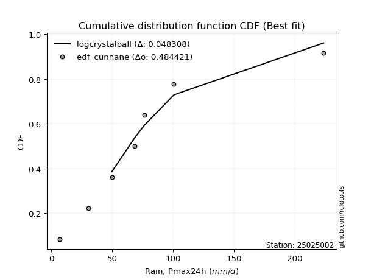</img>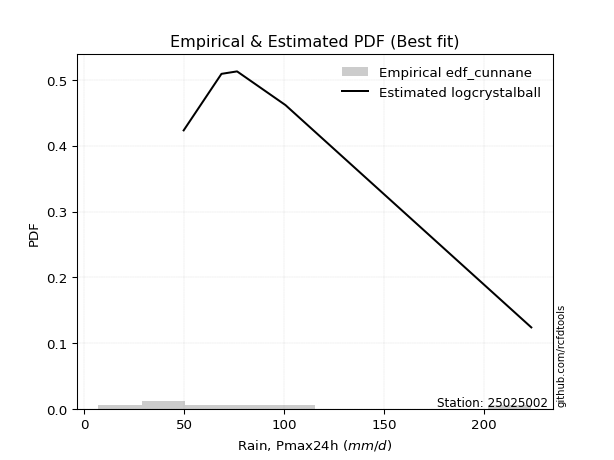</img>

</div>


### 12. EDF Adamowski (1981)

The Adamowski formula in hydrology refers to a specific plotting position formula used for estimating the non-parametric empirical distribution of hydrological events (like flood peaks) to calculate their return periods. This formula provides an alternative to traditional parametric methods (like the Gumbel or Log Pearson Type III distributions). 

<div align="center">


$P=(m-0.25)/(n+0.5)$


</div>


**12.1. Empirical values**

<div align="center">

|                | 0                   | 1                   | 2                  | 3                  | 4                  | 5                  | 6                  | 7                  |
|:---------------|:--------------------|:--------------------|:-------------------|:-------------------|:-------------------|:-------------------|:-------------------|:-------------------|
| date           | 2018                | 2019                | 2017               | 2020               | 2023               | 2025               | 2022               | 2024               |
| x              | 7.2                 | 30.7                | 49.8               | 68.7               | 76.5               | 76.8               | 100.7              | 223.6              |
| m              | 1                   | 2                   | 3                  | 4                  | 5                  | 6                  | 7                  | 8                  |
| empirical_dist | edf_adamowski       | edf_adamowski       | edf_adamowski      | edf_adamowski      | edf_adamowski      | edf_adamowski      | edf_adamowski      | edf_adamowski      |
| empirical      | 0.08823529411764706 | 0.20588235294117646 | 0.3235294117647059 | 0.4411764705882353 | 0.5588235294117647 | 0.6764705882352942 | 0.7941176470588235 | 0.9117647058823529 |
| empirical_tr   | 1.096774193548387   | 1.259259259259259   | 1.4782608695652173 | 1.7894736842105263 | 2.2666666666666666 | 3.0909090909090913 | 4.857142857142856  | 11.33333333333333  |

</div>


**12.2. Kolmogorov-Smirnov fit test (sorted by Δ)**


<div align="center">

|                | 0                   | 1                   | 2                   | 3                   | 4                   | 5                   | 6                   | 7                   | 8                   | 9                   | 10                  | 11                  | 12                  | 13                  | 14                  | 15                 | 16                  | 17                  | 18                 | 19                  | 20                  | 21                  | 22                  | 23                  | 24                  | 25                  | 26                  | 27                  | 28                  | 29                  | 30                  | 31                  | 32                  | 33                  | 34                  | 35                  | 36                 | 37                  | 38                 | 39                  | 40                  | 41                  | 42                  | 43                 | 44                  | 45                  | 46                  | 47                 | 48                 | 49                  | 50                  | 51                 | 52                  | 53                  | 54                  | 55                  | 56                 | 57                  | 58                 | 59                  | 60                  | 61                  | 62                 | 63                  | 64                  | 65                 | 66                 | 67                  | 68                  | 69                  | 70                 | 71                  | 72                  | 73                 | 74                  | 75                  | 76                  | 77                  | 78                 | 79                 | 80                  | 81                 | 82                  | 83                 | 84                  | 85                  | 86                  | 87                  | 88                 | 89                  | 90                  | 91                  | 92                  | 93                  | 94                  | 95                 | 96                 | 97                 | 98                 | 99                  | 100                 | 101                 | 102                 | 103                | 104                | 105                | 106                 | 107                 | 108                 | 109                 | 110                | 111                | 112                 | 113                | 114                | 115                | 116                 | 117                 | 118                 | 119                | 120                 | 121                 | 122                | 123                | 124                 | 125                 | 126                | 127                 | 128                 | 129                | 130                | 131                 | 132                 | 133                | 134                | 135                | 136                | 137                 | 138                 | 139                | 140                 | 141                | 142                 | 143                 | 144                 | 145                 | 146                | 147                 | 148                | 149                | 150                | 151                | 152                | 153                | 154                | 155                | 156                | 157                | 158                | 159                |
|:---------------|:--------------------|:--------------------|:--------------------|:--------------------|:--------------------|:--------------------|:--------------------|:--------------------|:--------------------|:--------------------|:--------------------|:--------------------|:--------------------|:--------------------|:--------------------|:-------------------|:--------------------|:--------------------|:-------------------|:--------------------|:--------------------|:--------------------|:--------------------|:--------------------|:--------------------|:--------------------|:--------------------|:--------------------|:--------------------|:--------------------|:--------------------|:--------------------|:--------------------|:--------------------|:--------------------|:--------------------|:-------------------|:--------------------|:-------------------|:--------------------|:--------------------|:--------------------|:--------------------|:-------------------|:--------------------|:--------------------|:--------------------|:-------------------|:-------------------|:--------------------|:--------------------|:-------------------|:--------------------|:--------------------|:--------------------|:--------------------|:-------------------|:--------------------|:-------------------|:--------------------|:--------------------|:--------------------|:-------------------|:--------------------|:--------------------|:-------------------|:-------------------|:--------------------|:--------------------|:--------------------|:-------------------|:--------------------|:--------------------|:-------------------|:--------------------|:--------------------|:--------------------|:--------------------|:-------------------|:-------------------|:--------------------|:-------------------|:--------------------|:-------------------|:--------------------|:--------------------|:--------------------|:--------------------|:-------------------|:--------------------|:--------------------|:--------------------|:--------------------|:--------------------|:--------------------|:-------------------|:-------------------|:-------------------|:-------------------|:--------------------|:--------------------|:--------------------|:--------------------|:-------------------|:-------------------|:-------------------|:--------------------|:--------------------|:--------------------|:--------------------|:-------------------|:-------------------|:--------------------|:-------------------|:-------------------|:-------------------|:--------------------|:--------------------|:--------------------|:-------------------|:--------------------|:--------------------|:-------------------|:-------------------|:--------------------|:--------------------|:-------------------|:--------------------|:--------------------|:-------------------|:-------------------|:--------------------|:--------------------|:-------------------|:-------------------|:-------------------|:-------------------|:--------------------|:--------------------|:-------------------|:--------------------|:-------------------|:--------------------|:--------------------|:--------------------|:--------------------|:-------------------|:--------------------|:-------------------|:-------------------|:-------------------|:-------------------|:-------------------|:-------------------|:-------------------|:-------------------|:-------------------|:-------------------|:-------------------|:-------------------|
| station        | 25025002            | 25025002            | 25025002            | 25025002            | 25025002            | 25025002            | 25025002            | 25025002            | 25025002            | 25025002            | 25025002            | 25025002            | 25025002            | 25025002            | 25025002            | 25025002           | 25025002            | 25025002            | 25025002           | 25025002            | 25025002            | 25025002            | 25025002            | 25025002            | 25025002            | 25025002            | 25025002            | 25025002            | 25025002            | 25025002            | 25025002            | 25025002            | 25025002            | 25025002            | 25025002            | 25025002            | 25025002           | 25025002            | 25025002           | 25025002            | 25025002            | 25025002            | 25025002            | 25025002           | 25025002            | 25025002            | 25025002            | 25025002           | 25025002           | 25025002            | 25025002            | 25025002           | 25025002            | 25025002            | 25025002            | 25025002            | 25025002           | 25025002            | 25025002           | 25025002            | 25025002            | 25025002            | 25025002           | 25025002            | 25025002            | 25025002           | 25025002           | 25025002            | 25025002            | 25025002            | 25025002           | 25025002            | 25025002            | 25025002           | 25025002            | 25025002            | 25025002            | 25025002            | 25025002           | 25025002           | 25025002            | 25025002           | 25025002            | 25025002           | 25025002            | 25025002            | 25025002            | 25025002            | 25025002           | 25025002            | 25025002            | 25025002            | 25025002            | 25025002            | 25025002            | 25025002           | 25025002           | 25025002           | 25025002           | 25025002            | 25025002            | 25025002            | 25025002            | 25025002           | 25025002           | 25025002           | 25025002            | 25025002            | 25025002            | 25025002            | 25025002           | 25025002           | 25025002            | 25025002           | 25025002           | 25025002           | 25025002            | 25025002            | 25025002            | 25025002           | 25025002            | 25025002            | 25025002           | 25025002           | 25025002            | 25025002            | 25025002           | 25025002            | 25025002            | 25025002           | 25025002           | 25025002            | 25025002            | 25025002           | 25025002           | 25025002           | 25025002           | 25025002            | 25025002            | 25025002           | 25025002            | 25025002           | 25025002            | 25025002            | 25025002            | 25025002            | 25025002           | 25025002            | 25025002           | 25025002           | 25025002           | 25025002           | 25025002           | 25025002           | 25025002           | 25025002           | 25025002           | 25025002           | 25025002           | 25025002           |
| empirical_dist | edf_adamowski       | edf_adamowski       | edf_adamowski       | edf_adamowski       | edf_adamowski       | edf_adamowski       | edf_adamowski       | edf_adamowski       | edf_adamowski       | edf_adamowski       | edf_adamowski       | edf_adamowski       | edf_adamowski       | edf_adamowski       | edf_adamowski       | edf_adamowski      | edf_adamowski       | edf_adamowski       | edf_adamowski      | edf_adamowski       | edf_adamowski       | edf_adamowski       | edf_adamowski       | edf_adamowski       | edf_adamowski       | edf_adamowski       | edf_adamowski       | edf_adamowski       | edf_adamowski       | edf_adamowski       | edf_adamowski       | edf_adamowski       | edf_adamowski       | edf_adamowski       | edf_adamowski       | edf_adamowski       | edf_adamowski      | edf_adamowski       | edf_adamowski      | edf_adamowski       | edf_adamowski       | edf_adamowski       | edf_adamowski       | edf_adamowski      | edf_adamowski       | edf_adamowski       | edf_adamowski       | edf_adamowski      | edf_adamowski      | edf_adamowski       | edf_adamowski       | edf_adamowski      | edf_adamowski       | edf_adamowski       | edf_adamowski       | edf_adamowski       | edf_adamowski      | edf_adamowski       | edf_adamowski      | edf_adamowski       | edf_adamowski       | edf_adamowski       | edf_adamowski      | edf_adamowski       | edf_adamowski       | edf_adamowski      | edf_adamowski      | edf_adamowski       | edf_adamowski       | edf_adamowski       | edf_adamowski      | edf_adamowski       | edf_adamowski       | edf_adamowski      | edf_adamowski       | edf_adamowski       | edf_adamowski       | edf_adamowski       | edf_adamowski      | edf_adamowski      | edf_adamowski       | edf_adamowski      | edf_adamowski       | edf_adamowski      | edf_adamowski       | edf_adamowski       | edf_adamowski       | edf_adamowski       | edf_adamowski      | edf_adamowski       | edf_adamowski       | edf_adamowski       | edf_adamowski       | edf_adamowski       | edf_adamowski       | edf_adamowski      | edf_adamowski      | edf_adamowski      | edf_adamowski      | edf_adamowski       | edf_adamowski       | edf_adamowski       | edf_adamowski       | edf_adamowski      | edf_adamowski      | edf_adamowski      | edf_adamowski       | edf_adamowski       | edf_adamowski       | edf_adamowski       | edf_adamowski      | edf_adamowski      | edf_adamowski       | edf_adamowski      | edf_adamowski      | edf_adamowski      | edf_adamowski       | edf_adamowski       | edf_adamowski       | edf_adamowski      | edf_adamowski       | edf_adamowski       | edf_adamowski      | edf_adamowski      | edf_adamowski       | edf_adamowski       | edf_adamowski      | edf_adamowski       | edf_adamowski       | edf_adamowski      | edf_adamowski      | edf_adamowski       | edf_adamowski       | edf_adamowski      | edf_adamowski      | edf_adamowski      | edf_adamowski      | edf_adamowski       | edf_adamowski       | edf_adamowski      | edf_adamowski       | edf_adamowski      | edf_adamowski       | edf_adamowski       | edf_adamowski       | edf_adamowski       | edf_adamowski      | edf_adamowski       | edf_adamowski      | edf_adamowski      | edf_adamowski      | edf_adamowski      | edf_adamowski      | edf_adamowski      | edf_adamowski      | edf_adamowski      | edf_adamowski      | edf_adamowski      | edf_adamowski      | edf_adamowski      |
| p_dist         | logjohnsonsu        | t                   | invweibull          | invgauss            | halflogistic        | invgamma            | johnsonsu           | gompertz            | logburr12           | logweibull_min      | logloggamma         | burr                | moyal               | mielke              | loggenlogistic      | genpareto          | logjohnsonsb        | exponnorm           | logmielke          | vonmises_line       | logpearson3         | nct                 | loggumbel_l         | pearson3            | loggompertz         | gengamma            | logt                | logskewnorm         | genlogistic         | foldnorm            | loggenextreme       | halfnorm            | logvonmises_line    | logburr             | gumbel_r            | logargus            | loganglit          | genexpon            | lomax              | betaprime           | logsemicircular     | skewnorm            | logbeta             | kstwobign          | lognct              | logcrystalball      | lognorm             | logexponnorm       | logrice            | logf                | logfatiguelife      | logtriang          | loggamma            | loggamma            | logncf              | logbetaprime        | rayleigh           | f                   | wald               | logarcsine          | loglogistic         | logerlang           | logalpha           | maxwell             | loginvgamma         | loggennorm         | loghypsecant       | gennorm             | kappa3              | loginvgauss         | exponpow           | logdgamma           | dweibull            | logmaxwell         | loggenhalflogistic  | logloglaplace       | logfoldnorm         | loginvweibull       | dgamma             | logdweibull        | truncnorm           | lograyleigh        | rice                | logcosine          | loggenpareto        | loglaplace          | loglaplace          | semicircular        | anglit             | loggausshyper       | crystalball         | norm                | gamma               | logistic            | hypsecant           | laplace            | loghalfnorm        | nakagami           | logtruncnorm       | logkstwobign        | loggumbel_r         | arcsine             | halfgennorm         | loggenexpon        | logweibull_max     | logksone           | loghalflogistic     | tukeylambda         | truncweibull_min    | logmoyal            | truncexpon         | logwrapcauchy      | loguniform          | loglevy_l          | logkappa3          | logkappa4          | bradford            | loglomax            | cosine              | gumbel_l           | logtruncweibull_min | ncf                 | exponweib          | logtrapezoid       | gausshyper          | burr12              | logwald            | logbradford         | weibull_min         | kappa4             | logtruncexpon      | wrapcauchy          | ksone               | argus              | genextreme         | levy_l             | uniform            | johnsonsb           | alpha               | lognakagami        | logtukeylambda      | logrdist           | loggengamma         | triang              | logexponweib        | rdist               | powerlaw           | genhalflogistic     | fatiguelife        | erlang             | trapezoid          | beta               | logexponpow        | logpowerlaw        | truncpareto        | weibull_max        | logtruncpareto     | loghalfgennorm     | logvonmises        | vonmises           |
| delta          | 0.06014133147043976 | 0.07723413989657868 | 0.09131045678623473 | 0.09159886383213789 | 0.09169736150508145 | 0.09184838349257407 | 0.09269472494576614 | 0.09418660734951323 | 0.09454534098409129 | 0.09455134169078194 | 0.09569778151012753 | 0.09687251055044988 | 0.09687964727697507 | 0.09692554631013339 | 0.09704685349258446 | 0.0971414563384575 | 0.09740330703990407 | 0.09741080037935346 | 0.0974641076980789 | 0.09816401408206277 | 0.09864799071033947 | 0.09901840831988551 | 0.10022172977921617 | 0.10078106089292149 | 0.10447589755273334 | 0.10574099697091288 | 0.10684057801477698 | 0.10896268084269178 | 0.11097676239776577 | 0.11119032813145235 | 0.11245129889500616 | 0.11557789599181101 | 0.11650010982335535 | 0.11705058370548871 | 0.12275489672844031 | 0.12489896158403091 | 0.1323653187525916 | 0.13312729706887294 | 0.1331861510087693 | 0.13424424752580355 | 0.13537446508351136 | 0.13764186224326824 | 0.14106539977020938 | 0.1411498713373236 | 0.14269222372577095 | 0.14305913365700496 | 0.14305922884755573 | 0.1430612349668654 | 0.1431004700638988 | 0.14347169271763427 | 0.14452833691054678 | 0.14501519686454   | 0.14535265488665616 | 0.14535265488665616 | 0.14695338861840868 | 0.14696962449606277 | 0.147514622695463  | 0.14761666628466413 | 0.1480491026794093 | 0.14987563796575454 | 0.15411171369103682 | 0.15484931070628472 | 0.1555741898933184 | 0.15885385384770945 | 0.16210615786349558 | 0.1631168253758435 | 0.1632680432174901 | 0.16339635050141055 | 0.16359112078004057 | 0.16623502986266558 | 0.1664143111636745 | 0.16702044035800478 | 0.16965138868078178 | 0.1709224437694674 | 0.17146876640349484 | 0.17345819033852772 | 0.17466777968297698 | 0.17499368038869484 | 0.1764705823628543 | 0.1764705882361644 | 0.17937133724314236 | 0.1796626747069201 | 0.18000762781623336 | 0.1825082525146623 | 0.18628372504797064 | 0.18873353863041364 | 0.18873353863041364 | 0.18923948384779837 | 0.1901823152839801 | 0.19141851921650038 | 0.19247070452962273 | 0.19247071594291215 | 0.19342183085606923 | 0.19465367264515682 | 0.19651589126375257 | 0.2040479956468656 | 0.2049504400727608 | 0.2058823493679314 | 0.2066192560539838 | 0.20918190055504632 | 0.21103515030363684 | 0.21422712887668083 | 0.21529268230570892 | 0.2223815174176857 | 0.2278319749339841 | 0.2291863924675201 | 0.23256355054125277 | 0.23278543934688778 | 0.23315215648688142 | 0.23452728543806223 | 0.2369451685894708 | 0.2374115088414444 | 0.23935157713618643 | 0.2489361167709162 | 0.2528296875797514 | 0.2542331105932078 | 0.25821057558834315 | 0.26095820030509576 | 0.26191937447454794 | 0.2631353375198726 | 0.26345073641409406 | 0.26787072047979427 | 0.271043335033646  | 0.2711214337126785 | 0.28411972626538295 | 0.29484665522499504 | 0.2998391677036609 | 0.32304595062564107 | 0.32399881845747974 | 0.3299033108046441 | 0.3337868864190862 | 0.34560713944612986 | 0.35072578014569966 | 0.3584433645482553 | 0.360010902351053  | 0.3602334036352156 | 0.3620474067630749 | 0.36331316166512145 | 0.37238900404442005 | 0.4013801759582465 | 0.40461163854283577 | 0.4156848765720957 | 0.42400224039233464 | 0.42453623940924357 | 0.45021574041926843 | 0.47414914447538803 | 0.4861637871391306 | 0.48684779620766655 | 0.5186162829029859 | 0.565446813516151  | 0.5950480043396362 | 0.5999350382305044 | 0.6142900898532162 | 0.6361982243544464 | 0.655925916896505  | 0.6732579652696467 | 0.7375742009758519 | 0.7941176470588235 | 1.0858295655968788 | 35.10102133676203  |
| deltao         | 0.4472608134160001  | 0.4472608134160001  | 0.4472608134160001  | 0.4472608134160001  | 0.4472608134160001  | 0.4472608134160001  | 0.4472608134160001  | 0.4472608134160001  | 0.4472608134160001  | 0.4472608134160001  | 0.4472608134160001  | 0.4472608134160001  | 0.4472608134160001  | 0.4472608134160001  | 0.4472608134160001  | 0.4472608134160001 | 0.4472608134160001  | 0.4472608134160001  | 0.4472608134160001 | 0.4472608134160001  | 0.4472608134160001  | 0.4472608134160001  | 0.4472608134160001  | 0.4472608134160001  | 0.4472608134160001  | 0.4472608134160001  | 0.4472608134160001  | 0.4472608134160001  | 0.4472608134160001  | 0.4472608134160001  | 0.4472608134160001  | 0.4472608134160001  | 0.4472608134160001  | 0.4472608134160001  | 0.4472608134160001  | 0.4472608134160001  | 0.4472608134160001 | 0.4472608134160001  | 0.4472608134160001 | 0.4472608134160001  | 0.4472608134160001  | 0.4472608134160001  | 0.4472608134160001  | 0.4472608134160001 | 0.4472608134160001  | 0.4472608134160001  | 0.4472608134160001  | 0.4472608134160001 | 0.4472608134160001 | 0.4472608134160001  | 0.4472608134160001  | 0.4472608134160001 | 0.4472608134160001  | 0.4472608134160001  | 0.4472608134160001  | 0.4472608134160001  | 0.4472608134160001 | 0.4472608134160001  | 0.4472608134160001 | 0.4472608134160001  | 0.4472608134160001  | 0.4472608134160001  | 0.4472608134160001 | 0.4472608134160001  | 0.4472608134160001  | 0.4472608134160001 | 0.4472608134160001 | 0.4472608134160001  | 0.4472608134160001  | 0.4472608134160001  | 0.4472608134160001 | 0.4472608134160001  | 0.4472608134160001  | 0.4472608134160001 | 0.4472608134160001  | 0.4472608134160001  | 0.4472608134160001  | 0.4472608134160001  | 0.4472608134160001 | 0.4472608134160001 | 0.4472608134160001  | 0.4472608134160001 | 0.4472608134160001  | 0.4472608134160001 | 0.4472608134160001  | 0.4472608134160001  | 0.4472608134160001  | 0.4472608134160001  | 0.4472608134160001 | 0.4472608134160001  | 0.4472608134160001  | 0.4472608134160001  | 0.4472608134160001  | 0.4472608134160001  | 0.4472608134160001  | 0.4472608134160001 | 0.4472608134160001 | 0.4472608134160001 | 0.4472608134160001 | 0.4472608134160001  | 0.4472608134160001  | 0.4472608134160001  | 0.4472608134160001  | 0.4472608134160001 | 0.4472608134160001 | 0.4472608134160001 | 0.4472608134160001  | 0.4472608134160001  | 0.4472608134160001  | 0.4472608134160001  | 0.4472608134160001 | 0.4472608134160001 | 0.4472608134160001  | 0.4472608134160001 | 0.4472608134160001 | 0.4472608134160001 | 0.4472608134160001  | 0.4472608134160001  | 0.4472608134160001  | 0.4472608134160001 | 0.4472608134160001  | 0.4472608134160001  | 0.4472608134160001 | 0.4472608134160001 | 0.4472608134160001  | 0.4472608134160001  | 0.4472608134160001 | 0.4472608134160001  | 0.4472608134160001  | 0.4472608134160001 | 0.4472608134160001 | 0.4472608134160001  | 0.4472608134160001  | 0.4472608134160001 | 0.4472608134160001 | 0.4472608134160001 | 0.4472608134160001 | 0.4472608134160001  | 0.4472608134160001  | 0.4472608134160001 | 0.4472608134160001  | 0.4472608134160001 | 0.4472608134160001  | 0.4472608134160001  | 0.4472608134160001  | 0.4472608134160001  | 0.4472608134160001 | 0.4472608134160001  | 0.4472608134160001 | 0.4472608134160001 | 0.4472608134160001 | 0.4472608134160001 | 0.4472608134160001 | 0.4472608134160001 | 0.4472608134160001 | 0.4472608134160001 | 0.4472608134160001 | 0.4472608134160001 | 0.4472608134160001 | 0.4472608134160001 |
| eval           | Δo > Δ              | Δo > Δ              | Δo > Δ              | Δo > Δ              | Δo > Δ              | Δo > Δ              | Δo > Δ              | Δo > Δ              | Δo > Δ              | Δo > Δ              | Δo > Δ              | Δo > Δ              | Δo > Δ              | Δo > Δ              | Δo > Δ              | Δo > Δ             | Δo > Δ              | Δo > Δ              | Δo > Δ             | Δo > Δ              | Δo > Δ              | Δo > Δ              | Δo > Δ              | Δo > Δ              | Δo > Δ              | Δo > Δ              | Δo > Δ              | Δo > Δ              | Δo > Δ              | Δo > Δ              | Δo > Δ              | Δo > Δ              | Δo > Δ              | Δo > Δ              | Δo > Δ              | Δo > Δ              | Δo > Δ             | Δo > Δ              | Δo > Δ             | Δo > Δ              | Δo > Δ              | Δo > Δ              | Δo > Δ              | Δo > Δ             | Δo > Δ              | Δo > Δ              | Δo > Δ              | Δo > Δ             | Δo > Δ             | Δo > Δ              | Δo > Δ              | Δo > Δ             | Δo > Δ              | Δo > Δ              | Δo > Δ              | Δo > Δ              | Δo > Δ             | Δo > Δ              | Δo > Δ             | Δo > Δ              | Δo > Δ              | Δo > Δ              | Δo > Δ             | Δo > Δ              | Δo > Δ              | Δo > Δ             | Δo > Δ             | Δo > Δ              | Δo > Δ              | Δo > Δ              | Δo > Δ             | Δo > Δ              | Δo > Δ              | Δo > Δ             | Δo > Δ              | Δo > Δ              | Δo > Δ              | Δo > Δ              | Δo > Δ             | Δo > Δ             | Δo > Δ              | Δo > Δ             | Δo > Δ              | Δo > Δ             | Δo > Δ              | Δo > Δ              | Δo > Δ              | Δo > Δ              | Δo > Δ             | Δo > Δ              | Δo > Δ              | Δo > Δ              | Δo > Δ              | Δo > Δ              | Δo > Δ              | Δo > Δ             | Δo > Δ             | Δo > Δ             | Δo > Δ             | Δo > Δ              | Δo > Δ              | Δo > Δ              | Δo > Δ              | Δo > Δ             | Δo > Δ             | Δo > Δ             | Δo > Δ              | Δo > Δ              | Δo > Δ              | Δo > Δ              | Δo > Δ             | Δo > Δ             | Δo > Δ              | Δo > Δ             | Δo > Δ             | Δo > Δ             | Δo > Δ              | Δo > Δ              | Δo > Δ              | Δo > Δ             | Δo > Δ              | Δo > Δ              | Δo > Δ             | Δo > Δ             | Δo > Δ              | Δo > Δ              | Δo > Δ             | Δo > Δ              | Δo > Δ              | Δo > Δ             | Δo > Δ             | Δo > Δ              | Δo > Δ              | Δo > Δ             | Δo > Δ             | Δo > Δ             | Δo > Δ             | Δo > Δ              | Δo > Δ              | Δo > Δ             | Δo > Δ              | Δo > Δ             | Δo > Δ              | Δo > Δ              | Δo <= Δ             | Δo <= Δ             | Δo <= Δ            | Δo <= Δ             | Δo <= Δ            | Δo <= Δ            | Δo <= Δ            | Δo <= Δ            | Δo <= Δ            | Δo <= Δ            | Δo <= Δ            | Δo <= Δ            | Δo <= Δ            | Δo <= Δ            | Δo <= Δ            | Δo <= Δ            |
| fit            | 1                   | 1                   | 1                   | 1                   | 1                   | 1                   | 1                   | 1                   | 1                   | 1                   | 1                   | 1                   | 1                   | 1                   | 1                   | 1                  | 1                   | 1                   | 1                  | 1                   | 1                   | 1                   | 1                   | 1                   | 1                   | 1                   | 1                   | 1                   | 1                   | 1                   | 1                   | 1                   | 1                   | 1                   | 1                   | 1                   | 1                  | 1                   | 1                  | 1                   | 1                   | 1                   | 1                   | 1                  | 1                   | 1                   | 1                   | 1                  | 1                  | 1                   | 1                   | 1                  | 1                   | 1                   | 1                   | 1                   | 1                  | 1                   | 1                  | 1                   | 1                   | 1                   | 1                  | 1                   | 1                   | 1                  | 1                  | 1                   | 1                   | 1                   | 1                  | 1                   | 1                   | 1                  | 1                   | 1                   | 1                   | 1                   | 1                  | 1                  | 1                   | 1                  | 1                   | 1                  | 1                   | 1                   | 1                   | 1                   | 1                  | 1                   | 1                   | 1                   | 1                   | 1                   | 1                   | 1                  | 1                  | 1                  | 1                  | 1                   | 1                   | 1                   | 1                   | 1                  | 1                  | 1                  | 1                   | 1                   | 1                   | 1                   | 1                  | 1                  | 1                   | 1                  | 1                  | 1                  | 1                   | 1                   | 1                   | 1                  | 1                   | 1                   | 1                  | 1                  | 1                   | 1                   | 1                  | 1                   | 1                   | 1                  | 1                  | 1                   | 1                   | 1                  | 1                  | 1                  | 1                  | 1                   | 1                   | 1                  | 1                   | 1                  | 1                   | 1                   | 0                   | 0                   | 0                  | 0                   | 0                  | 0                  | 0                  | 0                  | 0                  | 0                  | 0                  | 0                  | 0                  | 0                  | 0                  | 0                  |
| n              | 8                   | 8                   | 8                   | 8                   | 8                   | 8                   | 8                   | 8                   | 8                   | 8                   | 8                   | 8                   | 8                   | 8                   | 8                   | 8                  | 8                   | 8                   | 8                  | 8                   | 8                   | 8                   | 8                   | 8                   | 8                   | 8                   | 8                   | 8                   | 8                   | 8                   | 8                   | 8                   | 8                   | 8                   | 8                   | 8                   | 8                  | 8                   | 8                  | 8                   | 8                   | 8                   | 8                   | 8                  | 8                   | 8                   | 8                   | 8                  | 8                  | 8                   | 8                   | 8                  | 8                   | 8                   | 8                   | 8                   | 8                  | 8                   | 8                  | 8                   | 8                   | 8                   | 8                  | 8                   | 8                   | 8                  | 8                  | 8                   | 8                   | 8                   | 8                  | 8                   | 8                   | 8                  | 8                   | 8                   | 8                   | 8                   | 8                  | 8                  | 8                   | 8                  | 8                   | 8                  | 8                   | 8                   | 8                   | 8                   | 8                  | 8                   | 8                   | 8                   | 8                   | 8                   | 8                   | 8                  | 8                  | 8                  | 8                  | 8                   | 8                   | 8                   | 8                   | 8                  | 8                  | 8                  | 8                   | 8                   | 8                   | 8                   | 8                  | 8                  | 8                   | 8                  | 8                  | 8                  | 8                   | 8                   | 8                   | 8                  | 8                   | 8                   | 8                  | 8                  | 8                   | 8                   | 8                  | 8                   | 8                   | 8                  | 8                  | 8                   | 8                   | 8                  | 8                  | 8                  | 8                  | 8                   | 8                   | 8                  | 8                   | 8                  | 8                   | 8                   | 8                   | 8                   | 8                  | 8                   | 8                  | 8                  | 8                  | 8                  | 8                  | 8                  | 8                  | 8                  | 8                  | 8                  | 8                  | 8                  |
| best_fit       | 1                   | 0                   | 0                   | 0                   | 0                   | 0                   | 0                   | 0                   | 0                   | 0                   | 0                   | 0                   | 0                   | 0                   | 0                   | 0                  | 0                   | 0                   | 0                  | 0                   | 0                   | 0                   | 0                   | 0                   | 0                   | 0                   | 0                   | 0                   | 0                   | 0                   | 0                   | 0                   | 0                   | 0                   | 0                   | 0                   | 0                  | 0                   | 0                  | 0                   | 0                   | 0                   | 0                   | 0                  | 0                   | 0                   | 0                   | 0                  | 0                  | 0                   | 0                   | 0                  | 0                   | 0                   | 0                   | 0                   | 0                  | 0                   | 0                  | 0                   | 0                   | 0                   | 0                  | 0                   | 0                   | 0                  | 0                  | 0                   | 0                   | 0                   | 0                  | 0                   | 0                   | 0                  | 0                   | 0                   | 0                   | 0                   | 0                  | 0                  | 0                   | 0                  | 0                   | 0                  | 0                   | 0                   | 0                   | 0                   | 0                  | 0                   | 0                   | 0                   | 0                   | 0                   | 0                   | 0                  | 0                  | 0                  | 0                  | 0                   | 0                   | 0                   | 0                   | 0                  | 0                  | 0                  | 0                   | 0                   | 0                   | 0                   | 0                  | 0                  | 0                   | 0                  | 0                  | 0                  | 0                   | 0                   | 0                   | 0                  | 0                   | 0                   | 0                  | 0                  | 0                   | 0                   | 0                  | 0                   | 0                   | 0                  | 0                  | 0                   | 0                   | 0                  | 0                  | 0                  | 0                  | 0                   | 0                   | 0                  | 0                   | 0                  | 0                   | 0                   | 0                   | 0                   | 0                  | 0                   | 0                  | 0                  | 0                  | 0                  | 0                  | 0                  | 0                  | 0                  | 0                  | 0                  | 0                  | 0                  |
| best_fit_sort  | 1                   | 2                   | 3                   | 4                   | 5                   | 6                   | 7                   | 8                   | 9                   | 10                  | 11                  | 12                  | 13                  | 14                  | 15                  | 16                 | 17                  | 18                  | 19                 | 20                  | 21                  | 22                  | 23                  | 24                  | 25                  | 26                  | 27                  | 28                  | 29                  | 30                  | 31                  | 32                  | 33                  | 34                  | 35                  | 36                  | 37                 | 38                  | 39                 | 40                  | 41                  | 42                  | 43                  | 44                 | 45                  | 46                  | 47                  | 48                 | 49                 | 50                  | 51                  | 52                 | 53                  | 54                  | 55                  | 56                  | 57                 | 58                  | 59                 | 60                  | 61                  | 62                  | 63                 | 64                  | 65                  | 66                 | 67                 | 68                  | 69                  | 70                  | 71                 | 72                  | 73                  | 74                 | 75                  | 76                  | 77                  | 78                  | 79                 | 80                 | 81                  | 82                 | 83                  | 84                 | 85                  | 86                  | 87                  | 88                  | 89                 | 90                  | 91                  | 92                  | 93                  | 94                  | 95                  | 96                 | 97                 | 98                 | 99                 | 100                 | 101                 | 102                 | 103                 | 104                | 105                | 106                | 107                 | 108                 | 109                 | 110                 | 111                | 112                | 113                 | 114                | 115                | 116                | 117                 | 118                 | 119                 | 120                | 121                 | 122                 | 123                | 124                | 125                 | 126                 | 127                | 128                 | 129                 | 130                | 131                | 132                 | 133                 | 134                | 135                | 136                | 137                | 138                 | 139                 | 140                | 141                 | 142                | 143                 | 144                 | 145                 | 146                 | 147                | 148                 | 149                | 150                | 151                | 152                | 153                | 154                | 155                | 156                | 157                | 158                | 159                | 160                |

</div>


**12.3. Best fit**

<div align="center">

|   id |   station | empirical_dist   | p_dist       |     delta |   deltao | eval   |   fit |   n |   best_fit |   best_fit_sort |
|-----:|----------:|:-----------------|:-------------|----------:|---------:|:-------|------:|----:|-----------:|----------------:|
|    0 |  25025002 | edf_adamowski    | logjohnsonsu | 0.0601413 | 0.447261 | Δo > Δ |     1 |   8 |          1 |               1 |

</div>


<div align="center">

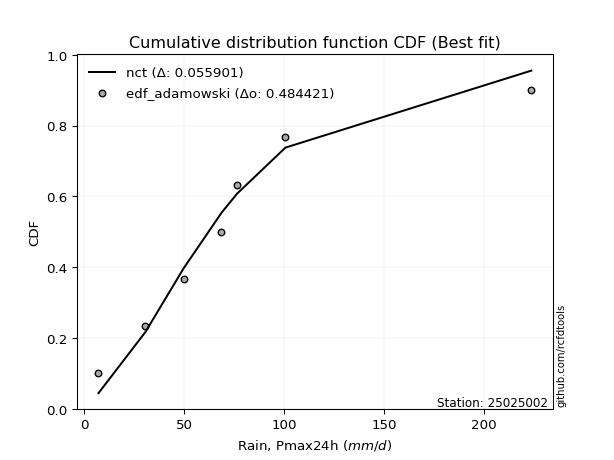</img>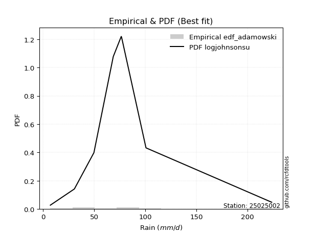</img>

</div>


## C. Best fit & Estimate extreme values for specific return periods - Tr

Best fit in probability distribution analysis means finding the theoretical distribution (like Normal, Poisson, Exponential, etc.) that most accurately mirrors your real-world data´s patterns (shape, center, spread) for better predictions, using methods like visual checks (Q-Q plots), goodness-of-fit tests (Kolmogorov-Smirnov, Chi-Squared), and information criteria (AIC) to score and select the simplest, most representative model.


### 1. Best fit (ordered by delta Δ)

:file_folder:Table: [bestfit_25025002.csv](table/bestfit_25025002.csv)

<div align="center">

|   id |   station | empirical_dist   | p_dist       |     delta |   deltao | eval   |   fit |   n |   best_fit |   best_fit_sort |
|-----:|----------:|:-----------------|:-------------|----------:|---------:|:-------|------:|----:|-----------:|----------------:|
|    0 |  25025002 | edf_adamowski    | logjohnsonsu | 0.0601413 | 0.447261 | Δo > Δ |     1 |   8 |          1 |               1 |
|    1 |  25025002 | edf_chegodayev   | logjohnsonsu | 0.0622422 | 0.447261 | Δo > Δ |     1 |   8 |          1 |               2 |
|    2 |  25025002 | edf_jenkinson    | logjohnsonsu | 0.0626684 | 0.447261 | Δo > Δ |     1 |   8 |          1 |               3 |
|    3 |  25025002 | edf_beard        | logjohnsonsu | 0.0626684 | 0.447261 | Δo > Δ |     1 |   8 |          1 |               4 |
|    4 |  25025002 | edf_filliben     | logjohnsonsu | 0.0629893 | 0.447261 | Δo > Δ |     1 |   8 |          1 |               5 |
|    5 |  25025002 | edf_tukey        | logjohnsonsu | 0.0636707 | 0.447261 | Δo > Δ |     1 |   8 |          1 |               6 |
|    6 |  25025002 | edf_blom         | logjohnsonsu | 0.0654889 | 0.447261 | Δo > Δ |     1 |   8 |          1 |               7 |
|    7 |  25025002 | edf_cunnane      | logjohnsonsu | 0.0665976 | 0.447261 | Δo > Δ |     1 |   8 |          1 |               8 |
|    8 |  25025002 | edf_gringorten   | logjohnsonsu | 0.0683998 | 0.447261 | Δo > Δ |     1 |   8 |          1 |               9 |
|    9 |  25025002 | edf_hazen        | logjohnsonsu | 0.0711707 | 0.447261 | Δo > Δ |     1 |   8 |          1 |              10 |
|   10 |  25025002 | edf_weibull      | logjohnsonsu | 0.0720448 | 0.447261 | Δo > Δ |     1 |   8 |          1 |              11 |
|   11 |  25025002 | edf_california   | loghypsecant | 0.105138  | 0.447261 | Δo > Δ |     1 |   8 |          1 |              12 |

</div>


### 2. Extreme values and % difference analysis

In hydrology, a return period (or recurrence interval $Tr$) is the statistical average time between extreme events like floods or droughts of a specific magnitude, indicating how rare an event is, with a 100-year flood, for example, having a 1% chance of occurring in any given year, not that it happens exactly every century. It is a key tool for infrastructure design (like bridges or dams) and risk assessment, calculated from historical data to determine the probability of future events, although it is important to remember it is statistical average, and events can cluster or be missed.

The extreme value porcentage difference is evaluated as $pdiff = 1 - (ETrBf / ETr) * 100$, where _ETrBf_ correspond to the bestfit extreme value for a specific recurrence interval and _ETr_ correspond to the extreme value for one of the most used PDFsused in hydrology.

> risk_rate: assuming the return period as the project useful life.

:file_folder:Table: [extreme_25025002.csv](table/extreme_25025002.csv), all PDFs.  
:file_folder:Table: [extremepdiff_25025002.csv](table/extremepdiff_25025002.csv), % difference between bestfit and most used PDFs in Hydrology.

<div align="center">

Extreme values table for only best fit PDFs
|   id |      tr |   prob_l |     prob_g |      alpha |   anglit |   arcsine |   argus |      beta |   betaprime |   bradford |     burr |   burr12 |   cosine |   crystalball |   dgamma |   dweibull |    erlang |   exponnorm |   exponpow |   exponweib |        f |   fatiguelife |   foldnorm |    gamma |   gausshyper |   genexpon |      genextreme |   gengamma |   genhalflogistic |   genlogistic |   gennorm |   genpareto |   gompertz |   gumbel_l |   gumbel_r |   halfgennorm |   halflogistic |   halfnorm |   hypsecant |   invgamma |   invgauss |   invweibull |   johnsonsb |   johnsonsu |   kappa3 |   kappa4 |   ksone |   kstwobign |   laplace |   levy_l |   loggamma |   logistic |   loglaplace |    lomax |   maxwell |   mielke |    moyal |   nakagami |       ncf |      nct |     norm |   pearson3 |   powerlaw |   rayleigh |     rdist |     rice |   semicircular |   skewnorm |         t |   trapezoid |   triang |   truncexpon |   truncnorm |   truncpareto |   truncweibull_min |   tukeylambda |   uniform |   vonmises |   vonmises_line |     wald |   weibull_max |   weibull_min |   wrapcauchy |   logalpha |   loganglit |   logarcsine |   logargus |   logbeta |   logbetaprime |   logbradford |   logburr |   logburr12 |   logcosine |   logcrystalball |   logdgamma |   logdweibull |   logerlang |   logexponnorm |      logexponpow |     logexponweib |      logf |   logfatiguelife |   logfoldnorm |   loggausshyper |   loggenexpon |   loggenextreme |      loggengamma |   loggenhalflogistic |   loggenlogistic |   loggennorm |   loggenpareto |   loggompertz |   loggumbel_l |   loggumbel_r |   loghalfgennorm |   loghalflogistic |   loghalfnorm |   loghypsecant |   loginvgamma |   loginvgauss |   loginvweibull |   logjohnsonsb |     logjohnsonsu |   logkappa3 |   logkappa4 |   logksone |   logkstwobign |   loglevy_l |   logloggamma |   loglogistic |   logloglaplace |         loglomax |   logmaxwell |   logmielke |   logmoyal |   lognakagami |    logncf |    lognct |   lognorm |   logpearson3 |   logpowerlaw |   lograyleigh |   logrdist |   logrice |   logsemicircular |   logskewnorm |             logt |   logtrapezoid |   logtriang |   logtruncexpon |   logtruncnorm |   logtruncpareto |   logtruncweibull_min |   logtukeylambda |   loguniform |   logvonmises |   logvonmises_line |    logwald |   logweibull_max |   logweibull_min |   logwrapcauchy |   station |   n |   risk_rate |
|-----:|--------:|---------:|-----------:|-----------:|---------:|----------:|--------:|----------:|------------:|-----------:|---------:|---------:|---------:|--------------:|---------:|-----------:|----------:|------------:|-----------:|------------:|---------:|--------------:|-----------:|---------:|-------------:|-----------:|----------------:|-----------:|------------------:|--------------:|----------:|------------:|-----------:|-----------:|-----------:|--------------:|---------------:|-----------:|------------:|-----------:|-----------:|-------------:|------------:|------------:|---------:|---------:|--------:|------------:|----------:|---------:|-----------:|-----------:|-------------:|---------:|----------:|---------:|---------:|-----------:|----------:|---------:|---------:|-----------:|-----------:|-----------:|----------:|---------:|---------------:|-----------:|----------:|------------:|---------:|-------------:|------------:|--------------:|-------------------:|--------------:|----------:|-----------:|----------------:|---------:|--------------:|--------------:|-------------:|-----------:|------------:|-------------:|-----------:|----------:|---------------:|--------------:|----------:|------------:|------------:|-----------------:|------------:|--------------:|------------:|---------------:|-----------------:|-----------------:|----------:|-----------------:|--------------:|----------------:|--------------:|----------------:|-----------------:|---------------------:|-----------------:|-------------:|---------------:|--------------:|--------------:|--------------:|-----------------:|------------------:|--------------:|---------------:|--------------:|--------------:|----------------:|---------------:|-----------------:|------------:|------------:|-----------:|---------------:|------------:|--------------:|--------------:|----------------:|-----------------:|-------------:|------------:|-----------:|--------------:|----------:|----------:|----------:|--------------:|--------------:|--------------:|-----------:|----------:|------------------:|--------------:|-----------------:|---------------:|------------:|----------------:|---------------:|-----------------:|----------------------:|-----------------:|-------------:|--------------:|-------------------:|-----------:|-----------------:|-----------------:|----------------:|----------:|----:|------------:|
|    0 |    2    | 0.5      | 0.5        |    28.8358 |  79.25   |   79.25   | 114.46  |   9.17104 |     57.0467 |    93.0381 |  64.0872 |  30.6088 |  92.0237 |       79.25   |  76.8    |    76.5    |   9.14276 |     67.1098 |    51.6559 |     37.9075 |  54.0267 |       7.20003 |    65.5973 |  48.8228 |      98.3276 |    57.1146 |    13.4189      |    62.2488 |           147.853 |       68.6327 |   76.5    |     63.9544 |    63.2834 |    89.283  |    69.217  |       43.4562 |        64.2291 |    66.7488 |     79.25   |    64.5932 |    64.3955 |      64.7359 |     172.635 |     64.3577 |  56.3128 |  108.627 | 115.4   |     72.0152 |   79.25   |  58.7982 |    55.5661 |    79.25   |      56.2371 |  57.1065 |   74.0268 |  64.0757 |  65.978  |    67.3033 |   34.9425 |  63.8744 |  79.25   |    65.7296 |    10.5087 |    72.1743 | -13.7256  |  77.2913 |         79.25  |    70.9037 |   67.2033 |     168.459 |  131.944 |      88.4911 |     77.2526 |       7.72647 |            87.9816 |       53.95   |   115.4   |   0.203888 |         67.754  |  59.4533 |       223.391 |       26.8131 |      115.469 |    53.5355 |     56.2371 |      56.237  |    65.1641 |   57.3508 |        55.4099 |       29.6115 |   61.0422 |     64.6291 |     49.2281 |          56.2371 |     76.5    |       76.8    |     54.1596 |        56.2368 |      7.58998     |     16.4948      |   56.164  |          56.0678 |       51.3222 |         47.3402 |       43.0271 |         66.0433 |     17.9254      |              69.7944 |          64.0496 |      76.5    |        58.5969 |       62.0379 |       65.638  |       48.1826 |          7.19981 |           44.6185 |       46.3845 |        56.2371 |       53.233  |       52.0433 |         50.0278 |        64.7827 |     69.689       |     38.5406 |     37.7297 |    40.1238 |        44.7724 |     57.8633 |       64.8253 |       56.2371 |         76.4951 |     69.2405      |      51.8888 |     63.9814 |    45.8371 |       38.8974 |   54.8453 |   56.3082 |   56.2371 |       64.6669 |       8.0052  |       50.4287 |    15.9151 |    56.236 |           56.2372 |       61.5067 |     70.5693      |        94.2412 |     67.1921 |         28.8172 |        53.781  |          7.30873 |               37.3913 |          26.8198 |      40.1238 |      0.121349 |            61.4963 |    41.4538 |           84.372 |          64.6295 |          40.361 |  25025002 |   8 |    0.75     |
|    1 |    2.33 | 0.570815 | 0.429185   |    34.3209 |  91.9444 |   98.3064 | 129.142 |  10.9685  |     67.9282 |   108.373  |  72.8456 |  41.7287 | 104.616  |       90.1482 |  77.7755 |    81.5879 |  11.2466  |     75.7275 |    66.316  |     46.5217 |  65.6931 |       9.30498 |    77.7923 |  58.472  |     115.351  |    68.1123 |    33.2644      |    72.1999 |           162.054 |       77.4921 |   78.7287 |     75.3351 |    74.4632 |    98.7646 |    79.3154 |       55.7834 |        74.6118 |    78.5108 |     87.9718 |    73.6713 |    73.9959 |      73.6446 |     209.487 |     73.7166 |  64.4829 |  124.471 | 133.789 |     81.7993 |   85.8451 | 108.411  |    66.0643 |    88.8521 |      62.2517 |  68.1025 |   85.3493 |  72.8433 |  75.5374 |    78.8084 |   48.2692 |  72.5846 |  90.1482 |    76.048  |    14.5556 |    83.6643 |   9.99306 |  87.3794 |         92.865 |    81.8688 |   73.0203 |     181.032 |  147.197 |     103.071  |     88.3592 |       8.17132 |           102.616  |       59.8874 |   130.724 |   0.395572 |         75.9222 |  66.5993 |       223.538 |       37.1311 |      135.663 |    64.1669 |     68.3853 |      75.4281 |    78.6937 |   74.3578 |        65.8152 |       37.808  |   70.4367 |     75.0528 |     59.4792 |          66.5188 |     80.8945 |       82.6765 |     64.4761 |        66.5184 |      8.0835      |     21.0301      |   66.4503 |          66.2891 |       61.1702 |         60.095  |       54.0366 |         78.0133 |     23.3795      |              86.9215 |          72.8378 |      78.8145 |        83.5698 |       72.6113 |       75.9623 |       56.2937 |          7.19981 |           52.3586 |       55.6001 |        64.3253 |       63.3086 |       62.3636 |         62.7911 |        75.4709 |     73.9999      |     48.8816 |     48.5765 |    53.7282 |        56.6496 |     86.9378 |       75.2381 |       65.2036 |         84.6066 |    114.012       |      61.778  |     72.8005 |    53.1106 |       42.0256 |   65.6777 |   66.5821 |   66.5188 |       75.6404 |       8.84771 |       60.1947 |    23.4582 |    66.513 |           69.3621 |       71.8447 |     76.9135      |       115.062  |     81.9658 |         36.5522 |        60.0287 |          7.3943  |               47.1928 |          32.6031 |      51.1763 |      0.140527 |            70.4789 |    46.2784 |          101.845 |          75.0537 |          51.525 |  25025002 |   8 |    0.729209 |
|    2 |    5    | 0.8      | 0.2        |    76.8531 | 136.733  |  149.123  | 176.235 |  29.6933  |    123.977  |   164.736  | 112.265  | 191.894  | 149.995  |      130.649  |  97.1908 |   118.281  |  36.9665  |    116.806  |   144.175  |     92.2864 | 126.441  |      54.02    |   129.364  | 107.388  |     173.587  |   123.098  | 13181.9         |   119.63   |           199.544 |      115.975  |   99.7126 |    126.827  |   125.328  |   129.395  |   123.187  |      138.797  |       121.592  |   128.251  |    122.957  |   116.6    |   119.178  |     115.851  |     223.539 |    117.91   | 101.092  |  176.951 | 193.304 |    123.36   |  118.819  | 190.608  |   126.978  |   125.927  |     103.463  | 123.079  |  129.914  | 112.292  | 119.817  |   134.69   |  135.289  | 113.758  | 130.649  |   122.545  |    63.5335 |   129.664  |  75.6665  | 127.766  |        139.327 |   128.239  |   98.3803 |     217.103 |  190.957 |     158.767  |    129.634  |      17.7226  |           157.663  |       80.0687 |   180.32  |   1.14425  |        107.549  | 106.603  |       223.6   |      124.468  |      189.353 |   129.228  |    136.349  |     165.028  |   137.86   |  151.394  |       125.829  |       91.2696 |  112.673  |    122.453  |    117.601  |         124.148  |    125.566  |      149.485  |    124.639  |       124.148  |     23.2961      |     86.5947      |  124.124  |         123.578  |      119.952  |        126.5    |      135.389  |        131.579  |    108.767       |             154.875  |         112.349  |     107.434  |       181.066  |      122.274  |      121.774  |      110.666  |          7.19981 |          107.979  |      119.646  |       110.274  |      122.819  |      125.832  |        168.516  |       124.068  |     93.7004      |    106.694  |    110.822  |   138.22   |       153.909  |    170.661  |      122.498  |      115.437  |        141.113  |   1379.92        |     122.75   |    112.464  |   105.067  |       61.4939 |  130.236  |  124.053  |  124.148  |      125.627  |      22.0941  |      122.277  |    68.069  |   124.106 |          141.907  |      119.626  |    113.747       |       204.01   |    144.965  |         87.5122 |        96.494  |          9.1368  |              104.207  |          60.8504 |     112.472  |      0.246947 |           120.145  |    85.7122 |          164.066 |         122.455  |         113.553 |  25025002 |   8 |    0.67232  |
|    3 |   10    | 0.9      | 0.1        |   154.995  | 162.084  |  161.391  | 198.945 |  57.3432  |    177.972  |   192.935  | 148.43   | inf      | 177.411  |      157.516  | 123.504  |   157.497  |  78.6739  |    153.773  |   214.044  |    135.57   | 183.86   |     115.76    |   167.525  | 152.32   |     199.715  |   173.013  |     2.09826e+06 |   161.6    |           212.574 |      147.315  |  129.833  |    166.626  |   165.598  |   146.449  |   158.92   |      244.966  |       160.606  |   165.057  |    150.894  |   155.883  |   158.916  |     154.858  |     223.598 |    157.638  | 134.119  |  200.329 | 219.272 |    155.004  |  148.752  | 210.452  |   197.639  |   153.231  |     164.085  | 172.986  |  161.276  | 148.468  | 158.37   |   179.637  |  258.338  | 151.997  | 157.516  |   160.926  |   121.826  |   162.462  |  93.4475  | 156.563  |        163.168 |   162.552  |  124.539  |     231.192 |  208.05  |     188.673  |    157.015  |      47.7931  |           187.538  |       89.8709 |   201.96  |   1.71915  |        131.458  | 149.056  |       223.6   |      258.022  |      207.264 |   210.788  |    201.502  |     199.363  |   176.551  |  191.697  |       194.87   |      140.612  |  151.012  |    161.518  |    177.53   |         187.807  |    197.977  |      290.489  |    194.889  |       187.806  |    279.41        |    395.855       |  187.915  |         186.886  |      188.797  |        171.431  |      261.555  |        170.289  |    558.326       |             189.108  |         148.54   |     172.551  |       212.24   |      164.403  |      158.367  |      191.916  |          7.19981 |          196.968  |      210.951  |       169.591  |      193.83   |      205.87   |        376.569  |       163.434  |    125.222       |    158.012  |    158.639  |   208.751  |       329.422  |    200.841  |      161.379  |      175.81   |        227.048  |  13270.3         |     199.008  |    148.804  |   190.296  |       83.7175 |  207.802  |  187.36   |  187.807  |      165.423  |      54.5409  |      202.676  |    90.174  |   187.712 |          204.891  |      160.559  |    178.002       |       255.152  |    181.129  |        136.396  |       132.933  |         15.9892  |              151.061  |          79.0887 |     158.583  |      0.374667 |           180.915  |   164.853  |          193.441 |         161.52   |         160.289 |  25025002 |   8 |    0.651322 |
|    4 |   15    | 0.933333 | 0.0666667  |   232.858  | 172.91   |  163.73   | 207.579 |  76.539   |    211.154  |   202.872  | 171.581  | inf      | 189.899  |      170.923  | 140.63   |   181.973  | 108.66    |    175.396  |   253.263  |    161.181  | 218.175  |     156.139   |   187.385  | 178.734  |     208.235  |   202.211  |     3.6667e+07  |   186.125  |           216.509 |      164.996  |  151.984  |    187.238  |   187.073  |   154.173  |   179.081  |      320.891  |       182.685  |   184.211  |    166.837  |   179.886  |   182.109  |     178.903  |     223.6   |    181.414  | 155.1    |  208.177 | 227.928 |    171.803  |  166.261  | 216.447  |   247.13   |   168.108  |     214.897  | 202.18   |  177.367  | 171.62   | 180.744  |   203.479  |  359.435  | 175.786  | 170.923  |   182.445  |   149.938  |   179.361  |  97.2181  | 171.401  |        172.465 |   180.408  |  143.71   |     235.713 |  213.534 |     199.677  |    170.679  |      75.1105  |           198.726  |       93.3478 |   209.173 |   2.04059  |        145.05   | 176.318  |       223.6   |      361.116  |      212.843 |   271.214  |    238.075  |     206.681  |   193.245  |  204.445  |       242.954  |      163.543  |  175.736  |    183.286  |    214.163  |         230.899  |    260.908  |      443.37   |    244.308  |       230.898  |   2641.65        |   1050.59        |  231.135  |         229.76   |      236.895  |        188.669  |      367.461  |        188.584  |   1586.16        |             200.818  |         171.688  |     247.289  |       218.512  |      188.172  |      178.379  |      261.822  |          7.19981 |          276.778  |      283.364  |       216.811  |      244.648  |      265.367  |        592.737  |       184.891  |    159.551       |    187.617  |    178.56   |   239.505  |       493.403  |    210.968  |      183.023  |      221.098  |        301.395  |  49878.6         |     255.001  |    172.053  |   268.62   |       98.6295 |  263.416  |  230.132  |  230.899  |      186.577  |      81.8079  |      262.952  |    95.5827 |   230.763 |          236.445  |      184.294  |    254.04        |       274.139  |    194.546  |        159.838  |       152.881  |         25.28    |              171.723  |          86.0507 |     177.826  |      0.473217 |           226.703  |   250.903  |          203.457 |         183.287  |         179.805 |  25025002 |   8 |    0.644736 |
|    5 |   20    | 0.95     | 0.05       |   310.653  | 179.278  |  164.554  | 212.318 |  91.123   |    235.467  |   207.946  | 189.314  | inf      | 197.579  |      179.703  | 153.287  |   199.884  | 131.797   |    190.738  |   280.249  |    179.414  | 242.803  |     186.035   |   200.625  | 197.517  |     212.391  |   222.928  |     2.71758e+08 |   203.577  |           218.396 |      177.376  |  169.691  |    200.785  |   201.509  |   158.98   |   193.196  |      381.058  |       198.154  |   196.981  |    178.084  |   197.539  |   198.603  |     196.681  |     223.6   |    198.635  | 171.134  |  212.111 | 232.256 |    183.119  |  178.684  | 219.517  |   286.358  |   178.39   |     260.229  | 222.893  |  188.047  | 189.353  | 196.59   |   219.457  |  448.617  | 193.513  | 179.703  |   197.413  |   166.019  |   190.594  |  98.6346  | 181.263  |        177.621 |   192.313  |  159.821  |     237.943 |  216.24  |     205.406  |    179.627  |      96.358   |           204.606  |       95.1327 |   212.78  |   2.25901  |        154.722  | 196.633  |       223.6   |      445.709  |      215.589 |   320.838  |    262.618  |     209.322  |   202.901  |  210.366  |       280.933  |      176.615  |  194.91   |    198.359  |    240.353  |         264.345  |    318.229  |      605.902  |    283.58   |       264.344  |  18801.2         |   2175.34        |  264.698  |         263.048  |      274.882  |        197.597  |      460.719  |        199.766  |   3445.96        |             206.672  |         189.414  |     331.362  |       220.738  |      204.722  |      192.092  |      325.43   |          7.19981 |          351.268  |      344.98   |       257.833  |      285.489  |      314.31   |        814.346  |       199.505  |    197.88        |    209.158  |    189.348  |   256.541  |       647.724  |    216.35   |      198      |      259.051  |        369.332  | 127617           |     300.607  |    189.859  |   342.899  |      110.087  |  308.122  |  263.29   |  264.345  |      200.706  |     102.526   |      312.632  |    97.6669 |   264.175 |          255.996  |      201.193  |    347.807       |       284.019  |    201.526  |        173.415  |       165.57   |         35.4481  |              183.259  |          89.6756 |     188.306  |      0.558883 |           263.414  |   343.111  |          208.496 |         198.359  |         190.437 |  25025002 |   8 |    0.641514 |
|    6 |   25    | 0.96     | 0.04       |   388.42   | 183.593  |  164.937  | 215.374 | 102.88    |    254.784  |   211.024  | 203.957  | inf      | 202.965  |      186.166  | 163.333  |   214.051  | 150.629   |    202.639  |   300.697  |    193.578  | 262.056  |     209.788   |   210.476  | 212.107  |     214.832  |   238.996  |     1.27128e+09 |   217.157  |           219.499 |      186.911  |  184.558  |    210.716  |   212.29   |   162.401  |   204.069  |      431.373  |       210.073  |   206.483  |    186.789  |   211.637  |   211.431  |     210.929  |     223.6   |    212.223  | 184.364  |  214.474 | 234.853 |    191.595  |  188.321  | 221.444  |   319.318  |   186.256  |     301.879  | 238.959  |  195.975  | 203.995  | 208.872  |   231.37   |  529.904  | 207.818  | 186.166  |   208.88   |   176.373  |   198.939  |  99.3233  | 188.59   |        180.967 |   201.171  |  174.088  |     239.271 |  217.852 |     208.92   |    186.214  |     112.728   |           208.235  |       96.2197 |   214.944 |   2.41861  |        162.223  | 212.906  |       223.6   |      517.955  |      217.227 |   363.638  |    280.673  |     210.558  |   209.317  |  213.695  |       312.765  |      185.037  |  210.938  |    209.866  |    260.607  |         292.024  |    371.694  |      776.852  |    316.639  |       292.022  | 106420           |   3899.48        |  292.485  |         290.605  |      306.696  |        203.007  |      545.072  |        207.491  |   6410.29        |             210.17   |         204.048  |     424.854  |       221.771  |      217.401  |      202.488  |      384.777  |          7.19981 |          422.072  |      399.366  |       294.837  |      320.161  |      356.568  |       1040.07   |       210.518  |    240.789       |    226.46   |    196.086  |   267.339  |       794.177  |    219.798  |      209.429  |      292.427  |        432.98   | 264467           |     339.663  |    204.561  |   414.331  |      119.489  |  346.069  |  290.707  |  292.024  |      211.184  |     118.323   |      355.528  |    98.6858 |   291.824 |          269.536  |      214.372  |    464.044       |       290.074  |    205.804  |        182.244  |       174.375  |         45.627   |              190.607  |          91.8872 |     194.889  |      0.636927 |           293.264  |   440.871  |          211.526 |         209.865  |         197.115 |  25025002 |   8 |    0.639603 |
|    7 |   50    | 0.98     | 0.02       |   777.135  | 194.216  |  165.447  | 222.302 | 141.311   |    317.476  |   217.26   | 255.404  | inf      | 217.068  |      204.675  | 195.523  |   259.407  | 213.087   |    239.604  |   361.585  |    237.619  | 322.645  |     286       |   239.11   | 257.516  |     219.526  |   288.911  |     1.47357e+11 |   259.646  |           221.632 |      216.285  |  237.024  |    238.625  |   243.707  |   171.687  |   237.563  |      608.338  |       246.795  |   234.1    |    213.776  |   257.995  |   251.513  |     258.053  |     223.6   |    255.872  | 230.859  |  219.207 | 240.046 |    216.486  |  218.253  | 225.782  |   437.245  |   210.289  |     478.76   | 288.866  |  218.969  | 255.434  | 247.001  |   266.049  |  870.103  | 255.808  | 204.675  |   243.854  |   198.775  |   223.165  | 100.31    | 209.86   |        188.609 |   226.917  |  231.259  |     241.908 |  221.05  |     216.131  |    205.076  |     156.929   |           215.739  |       98.4322 |   219.272 |   2.82477  |        184.451  | 266.034  |       223.6   |      779.898  |      220.488 |   524.341  |    330.584  |     212.221  |   224.426  |  219.614  |       426.146  |      203.307  |  268.927  |    244.739  |    322.102  |         388.384  |    605.366  |     1734.04   |    435.311  |       388.382  |      7.40406e+07 |  26408.8         |  389.291  |         386.591  |      419.713  |        213.783  |      888.329  |        226.843  |  48626           |             217.08   |         255.45   |    1038.5    |       223.147  |      256.017  |      233.635  |      644.649  |          7.19981 |          743.19   |      611.174  |       446.847  |      446.612  |      515.466  |       2209.97   |       243.077  |    541.185       |    285.576  |    210.124  |   290.318  |      1445.03   |    227.763  |      244.039  |      423.472  |        714.848  |      2.54331e+06 |     484.065  |    256.214  |   745.546  |      151.69   |  484.318  |  386.014  |  388.384  |      241.209  |     160.549   |      516.378  |   100.141  |   388.073 |          303.216  |      255.913  |   1593.12        |       302.475  |    214.563  |        201.623  |       195.57   |         87.8388  |              206.345  |          96.3565 |     208.751  |      0.965507 |           381.45   |   999.526  |          217.59  |         244.734  |         211.182 |  25025002 |   8 |    0.63583  |
|    8 |   75    | 0.986667 | 0.0133333  |  1165.79   | 198.892  |  165.542  | 225.05  | 164.798   |    356.134  |   219.361  | 290.488  | inf      | 223.803  |      214.606  | 214.888  |   286.772  | 251.84    |    261.228  |   395.449  |    263.382  | 358.608  |     331.898   |   254.698  | 284.131  |     221.002  |   318.109  |     2.33411e+12 |   284.749  |           222.316 |      233.358  |  272.121  |    253.08   |   260.795  |   176.383  |   257.031  |      726.63   |       268.141  |   249.133  |    229.547  |   287.135  |   275.143  |     287.841  |     223.6   |    282.512  | 262.62   |  220.786 | 241.778 |    230.18   |  235.763  | 227.565  |   518.305  |   224.169  |     627.013  | 318.059  |  231.47   | 290.511  | 269.298  |   284.932  | 1150.77   | 286.729  | 214.606  |   263.942  |   206.771  |   236.344  | 100.514   | 221.431  |        191.662 |   240.932  |  276.576  |     242.781 |  222.109 |     218.591  |    215.197  |     176.124   |           218.318  |       99.1816 |   220.715 |   2.98845  |        195.387  | 298.727  |       223.6   |      959.843  |      221.572 |   641.087  |    355.275  |     212.531  |   230.639  |  221.269  |       503.692  |      209.853  |  310.128  |    264.619  |    356.395  |         452.597  |    807.605  |     2827.71   |    517.186  |       452.594  |      7.51431e+09 |  86347.2         |  453.853  |         450.598  |      496.676  |        217.28   |     1158.95   |        235.405  | 169663           |             219.334  |         290.495  |    1910.75   |       223.4    |      278.137  |      251.165  |      870.136  |          7.19981 |         1032.6    |      770.477  |       569.753  |      535.487  |      631.028  |       3424.83   |       261.06   |   1033.62        |    325.529  |    214.944  |   298.409  |      2008.66   |    231.12   |      263.75   |      524.446  |        963.609  |      9.55948e+06 |     586.883  |    291.44   |  1051.16   |      172.736  |  581.292  |  449.417  |  452.597  |      257.117  |     178.76    |      632.636  |   100.437  |   452.206 |          317.819  |      280.755  |   4547.26        |       306.696  |    217.544  |        208.641  |       203.997  |        115.61    |              211.921  |          97.8424 |     213.588  |      1.22709  |           422.422  |  1654.03   |          219.608 |         264.61   |         216.091 |  25025002 |   8 |    0.634587 |
|    9 |  100    | 0.99     | 0.01       |  1554.44   | 201.672  |  165.575  | 226.584 | 181.796   |    384.497  |   220.417  | 318.017  | inf      | 228.025  |      221.323  | 228.814  |   306.52   | 280.127   |    276.57   |   418.741  |    281.652  | 384.347  |     364.923   |   265.316  | 303.033  |     221.713  |   338.826  |     1.64914e+13 |   302.682  |           222.651 |      245.442  |  298.999  |    262.579  |   272.408  |   179.455  |   270.81   |      817.306  |       283.249  |   259.375  |    240.735  |   308.816  |   291.995  |     310.068  |     223.6   |    301.948  | 287.586  |  221.576 | 242.643 |    239.563  |  248.186  | 228.607  |   581.819  |   233.969  |     759.281  | 338.772  |  239.985  | 318.034  | 285.117  |   297.788  | 1398.68   | 310.113  | 221.323  |   278.059  |   210.872  |   245.323  | 100.59    | 229.315  |        193.372 |   250.48   |  315.72   |     243.216 |  222.638 |     219.832  |    222.043  |     186.768   |           219.622  |       99.5588 |   221.436 |   3.07486  |        201.73   | 322.563  |       223.6   |     1099.65   |      222.114 |   735.847  |    370.823  |     212.64   |   234.162  |  222.008  |       564.262  |      213.217  |  343.453  |    278.525  |    379.727  |         501.944  |    991.883  |     4031.65   |    581.483  |       501.942  |      2.8024e+11  | 205738           |  503.494  |         499.809  |      556.588  |        218.985  |     1389.23   |        240.469  | 423048           |             220.444  |         317.991  |    3063.98   |       223.488  |      293.648  |      263.336  |     1075.93   |          7.19981 |         1303.25   |      902.17   |       676.929  |      606.124  |      724.861  |       4669.73   |       273.38   |   1799.66        |    357.086  |    217.371  |   302.538  |      2517.11   |    233.105  |      277.529  |      609.921  |       1193.9    |      2.44584e+07 |     669.156  |    319.085  |  1341.26   |      188.712  |  658.236  |  498.09   |  501.944  |      267.712  |     188.834   |      726.496  |   100.546  |   501.49  |          326.301  |      298.666  |  11718.4         |       308.824  |    219.046  |        212.262  |       208.526  |        134.346   |              214.773  |          98.5791 |     216.048  |      1.43672  |           445.491  |  2387.98   |          220.614 |         278.513  |         218.588 |  25025002 |   8 |    0.633968 |
|   10 |  200    | 0.995    | 0.005      |  3108.99   | 206.924  |  165.607  | 229.25  | 223.597   |    456.189  |   222.005  | 394.883  | inf      | 236.608  |      236.559  | 262.883  |   355.124  | 350.496   |    313.536  |   472.528  |    325.627  | 447.098  |     445.763   |   289.602  | 348.63   |     222.727  |   388.74   |     1.81414e+15 |   346.324  |           223.141 |      274.492  |  370.518  |    283.138  |   298.825  |   186.131  |   303.935  |     1059.23   |       319.572  |   282.798  |    267.686  |   364.822  |   332.891  |     367.664  |     223.6   |    350.706  | 357.509  |  222.761 | 243.942 |    261.175  |  278.119  | 230.582  |   757.529  |   257.477  |    1204.17   | 388.679  |  259.466  | 394.881  | 323.23   |   327.158  | 2220.19   | 371.99   | 236.559  |   311.684  |   217.156  |   265.868  | 100.669   | 247.353  |        196.352 |   272.317  |  441.547  |     243.868 |  223.428 |     221.707  |    237.57   |     204.203   |           221.599  |      100.128  |   222.518 |   3.20873  |        212.265  | 381.937  |       223.6   |     1478.37   |      222.926 |  1011.86   |    402.077  |     212.744  |   240.381  |  222.966  |       731.089  |      218.379  |  441.27   |    311.436  |    431.983  |         634.75   |   1632.14   |     9707.49   |    759.931  |       634.747  |      5.20734e+15 |      1.82239e+06 |  637.183  |         632.335  |      720.664  |        221.445  |     2103.58   |        249.882  |      4.17145e+06 |             222.075  |         394.753  |   10969.3    |       223.572  |      330.461  |      291.866  |     1792.38   |          7.19981 |         2280.71   |     1294.26   |      1025.37   |      805.663  |      998.174  |       9840.38   |       301.678  |  10196.8         |    447.248  |    221.013  |   308.84   |      4232.66   |    236.912  |      310.111  |      876.134  |       2017.63   |      2.3521e+08  |     903.4    |    396.283  |  2412.86   |      230.968  |  874.942  |  628.884  |  634.75   |      291.053  |     205.308   |      997.011  |   100.658  |   634.116 |          341.635  |      342.909  | 300858           |       312.035  |    221.314  |        217.84   |       215.765  |        171.308   |              219.136  |          99.6674 |     219.792  |      1.94049  |           483.416  |  5960.7    |          222.118 |         311.416  |         222.388 |  25025002 |   8 |    0.633042 |
|   11 |  250    | 0.996    | 0.004      |  3886.26   | 208.26   |  165.611  | 229.874 | 237.249   |    480.321  |   222.323  | 423.242  | inf      | 238.961  |      241.215  | 273.981  |   371.057  | 373.715   |    325.436  |   489.187  |    339.768  | 467.516  |     472.109   |   297.074  | 363.323  |     222.919  |   404.809  |     8.22158e+15 |   360.508  |           223.236 |      283.832  |  395.581  |    289.115  |   306.901  |   188.096  |   314.585  |     1144.27   |       331.249  |   290.004  |    276.362  |   384.076  |   346.143  |     387.508  |     223.6   |    367.01   | 383.386  |  222.998 | 244.201 |    267.863  |  287.755  | 231.096  |   821.54   |   265.024  |    1396.9    | 404.745  |  265.463  | 423.233  | 335.499  |   336.181  | 2571.62   | 393.743  | 241.215  |   322.407  |   218.432  |   272.192  | 100.679   | 252.906  |        197.051 |   279.034  |  494.057  |     243.998 |  223.586 |     222.085  |    242.316  |     207.917   |           221.997  |      100.242  |   222.734 |   3.23594  |        214.49   | 401.579  |       223.6   |     1613.02   |      223.088 |  1117.15   |    410.443  |     212.757  |   241.854  |  223.129  |       791.626  |      219.429  |  479.157  |    321.871  |    447.525  |         681.958  |   1917.35   |    12968.4    |    825.122  |       681.955  |      1.698e+17   |      3.77385e+06 |  684.734  |         679.472  |      779.869  |        221.915  |     2390.26   |        252.225  |      8.93567e+06 |             222.393  |         423.072  |   17248.6    |       223.582  |      342.158  |      300.834  |     2111.96   |        220.589   |         2730.27   |     1446.24   |      1172.01   |      879.732  |     1102.39   |      12505      |       310.394  |  20536.4         |    481.491  |    221.738  |   310.115  |      4971.25   |    237.913  |      320.433  |      984.168  |       2395.03   |      4.87439e+08 |     990.845  |    424.771  |  2914.93   |      245.76   |  955.141  |  675.315  |  681.958  |      297.95   |     208.814   |     1099.05   |   100.672  |   681.257 |          345.335  |      357.503  |      1.25703e+06 |       312.681  |    221.77   |        218.978  |       217.282  |        180.332   |              220.021  |          99.881  |     220.548  |      2.08048  |           491.476  |  8067.22   |          222.417 |         321.847  |         223.155 |  25025002 |   8 |    0.632858 |
|   12 |  500    | 0.998    | 0.002      |  7772.6    | 211.575  |  165.616  | 231.309 | 280.073   |    558.738  |   222.961  | 524.671  | inf      | 245.222  |      255.023  | 308.784  |   421.352  | 447.272   |    362.402  |   539.062  |    383.641  | 531.601  |     554.756   |   319.35   | 408.999  |     223.285  |   454.724  |     8.95214e+17 |   404.992  |           223.424 |      312.819  |  479.809  |    305.913  |   330.803  |   193.727  |   347.638  |     1431.19   |       367.494  |   311.489  |    303.311  |   448.069  |   387.565  |     453.562  |     223.6   |    419.634  | 476.26   |  223.472 | 244.721 |    287.906  |  317.688  | 232.423  |  1046.32   |   288.43   |    2215.39   | 454.652  |  283.358  | 524.632  | 373.611  |   363.047  | 4043.44   | 467.762  | 255.023  |   355.448  |   221.003  |   291.062  | 100.694   | 269.473  |        198.661 |   299.064  |  708.301  |     244.258 |  223.902 |     222.841  |    256.387  |     215.59    |           222.797  |      100.471  |   223.167 |   3.29061  |        219.016  | 464.036  |       223.6   |     2071.27   |      223.413 |  1505.31   |    431.947  |     212.774  |   245.266  |  223.413  |      1003.36   |      221.545  |  622.648  |    353.847  |    491.662  |         843.621  |   3167.84   |    32501.2    |   1054.71   |       843.616  |      2.17377e+22 |      3.9055e+07  |  847.679  |         840.998  |      985.619  |        222.816  |     3499.9    |        257.883  |      1.02516e+08 |             223.017  |         524.345  |   80406.8    |       223.596  |      378.07   |      328.1    |     3514.4    |        222.11    |         4772.24   |     2013.73   |      1775.23   |     1145.04   |     1486.25   |      26308.7    |       336.342  | 312450           |    609.024  |    223.177  |   312.683  |      8050.02   |    240.518  |      352.036  |     1411.51   |       4112.8    |      4.68757e+09 |    1305.4    |    526.675  |  5243.73   |      295.643  | 1241.36   |  834.101  |  843.62   |      317.623  |     216.051   |     1469.85   |   100.692  |   842.681 |          354.008  |      404.016  |      6.13701e+08 |       313.974  |    222.684  |        221.274  |       220.39   |        200.405   |              221.802  |         100.301  |     222.069  |      2.40966  |           508.06   | 21116.4    |          223.013 |         353.813  |         224.699 |  25025002 |   8 |    0.632489 |
|   13 |  750    | 0.998667 | 0.00133333 | 11658.9    | 213.042  |  165.617  | 231.885 | 305.331   |    607.145  |   223.174  | 594.759  | inf      | 248.256  |      262.693  | 329.34   |   451.299  | 491.164   |    384.025  |   567.015  |    409.268  | 569.547  |     603.587   |   331.794  | 435.741  |     223.4    |   483.922  |     1.38911e+19 |   431.314  |           223.485 |      329.764  |  533.571  |    314.612  |   344.028  |   196.736  |   366.961  |     1615.25   |       388.682  |   323.492  |    319.075  |   488.676  |   411.97   |     495.519  |     223.6   |    451.86   | 540.704  |  223.63  | 244.894 |    299.166  |  335.197  | 233.052  |  1197.78   |   302.105  |    2901.41   | 483.846  |  293.367  | 594.699  | 395.905  |   378.03   | 5258.22   | 516.056  | 262.693  |   374.611  |   221.866  |   301.613  | 100.697   | 278.737  |        199.309 |   310.253  |  880.164  |     244.345 |  224.007 |     223.094  |    264.204  |     218.222   |           223.064  |      100.547  |   223.311 |   3.30889  |        220.54   | 501.483  |       223.6   |     2367.64   |      223.521 |  1782.01   |    441.823  |     212.777  |   246.647  |  223.491  |      1145.39   |      222.256  |  729.114  |    372.275  |    514.591  |         949.447  |   4254.01   |    56334      |   1209.91   |       949.442  |      3.94151e+25 |      1.61239e+08 |  954.423  |         946.817  |     1122.53   |        223.099  |     4332.09   |        260.294  |      4.48926e+08 |             223.219  |         594.318  |  217605      |       223.598  |      398.803  |      343.672  |     4733.09   |        222.619   |         6614.5    |     2422.79   |      2263.26   |     1327.99   |     1759.48   |      40638.1    |       350.774  |      2.42544e+06 |    702.111  |    223.651  |   313.544  |     10553.4    |    241.764  |      370.23   |     1742.54   |       5675.42   |      1.7619e+10  |    1523.05   |    597.109  |  7392.86   |      327.733  | 1437.83   |  937.882  |  949.447  |      327.991  |     218.532   |     1729.32   |   100.696  |   948.344 |          357.56   |      432.094  |      1.23136e+11 |       314.407  |    222.989  |        222.046  |       221.449  |        207.763   |              222.4    |         100.438  |     222.578  |      2.53475  |           513.724  | 37599.3    |          223.211 |         372.233  |         225.216 |  25025002 |   8 |    0.632366 |
|   14 | 1000    | 0.999    | 0.001      | 15545.3    | 213.917  |  165.617  | 232.209 | 323.313   |    642.681  |   223.281  | 650.044  | inf      | 250.17   |      267.974  | 344      |   472.768  | 522.637   |    399.367  |   586.34   |    427.434  | 596.673  |     638.419   |   340.389  | 454.723  |     223.455  |   504.639  |     9.71463e+19 |   450.124  |           223.515 |      341.785  |  573.738  |    320.33   |   353.101  |   198.762  |   380.667  |     1753.22   |       403.711  |   331.781  |    330.26   |   519.022  |   429.36   |     526.885  |     223.6   |    475.395  | 591.675  |  223.709 | 244.98  |    306.966  |  347.621  | 233.448  |  1315.09   |   311.803  |    3513.46   | 504.559  |  300.284  | 649.967  | 411.722  |   388.366  | 6331.35   | 552.799  | 267.974  |   388.142  |   222.298  |   308.905  | 100.698   | 285.139  |        199.673 |   317.981  | 1029.27   |     244.388 |  224.059 |     223.22   |    269.586  |     219.552   |           223.198  |      100.585  |   223.384 |   3.31804  |        221.304  | 528.42   |       223.6   |     2590.71   |      223.575 |  2004.19   |    447.817  |     212.778  |   247.425  |  223.526  |      1255.07   |      222.612  |  817.313  |    385.237  |    529.602  |        1029.93   |   5245.95   |    83665.3    |   1330.36   |      1029.92   |      1.0529e+28  |      4.50701e+08 | 1035.64   |        1027.33   |     1227.7    |        223.236  |     5020.31   |        261.695  |      1.30766e+09 |             223.318  |         649.51   |  460524      |       223.599  |      413.401  |      354.566  |     5845.98   |        222.874   |         8338.04   |     2752.84   |      2688.9    |     1471.79   |     1978.58   |      55319.9    |       360.699  |      1.3245e+07  |    778.531  |    223.885  |   313.975  |     12731.1    |    242.55   |      383.019  |     2023.35   |       7150.97   |      4.50791e+10 |    1694.34   |    652.674  |  9433.03   |      351.877  | 1591.76   | 1016.73   | 1029.93   |      334.876  |     219.785   |     1934.92   |   100.698  |  1028.7   |          359.571  |      452.422  |      1.49053e+13 |       314.623  |    223.141  |        222.433  |       221.983  |        211.578   |              222.7    |         100.505  |     222.833  |      2.60021  |           516.581  | 56939.7    |          223.309 |         385.189  |         225.475 |  25025002 |   8 |    0.632305 |


</div>


<div align="center">

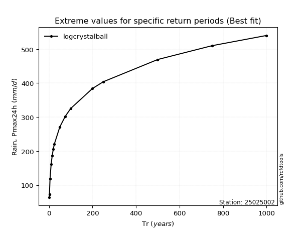</img>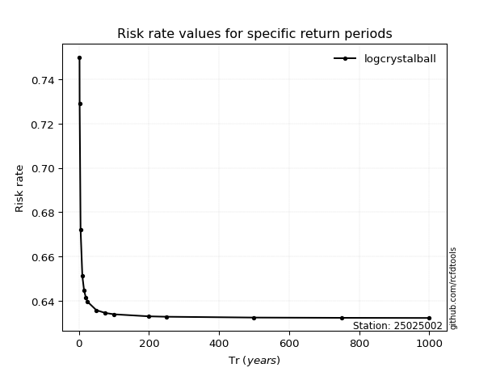</img>

</div>


<sub>**APP DISCLAIMER**: NO WARRANTY - This software is provided by [github.com/rcfdtools](https://github.com/rcfdtools) "as is", without any express or implied warranty, including warranties of merchantability, fitness for a particular purpose, or non-infringement. There is no guarantee that the software will be error-free or operate without interruption. LIMITATION OF LIABILITY - Neither the authors nor copyright holders will be liable for claims or damages arising from the software or its use. You are responsible for determining if the software is appropriate for your use and assume all associated risks, including errors, legal compliance, and data loss. NO PROFESSIONAL ADVICE - The software provides general information and does not offer professional advice. It should not replace consultation with professional advisors.</sub>