<div align="center">


</div>

# Station (rain, Pmax24h): 25025030

Probable Maximum Precipitation (PMP) is the greatest amount of rainfall for a specific duration that is meteorologically possible for a given location, acting as a "worst-case" scenario for extreme storms, crucial for designing safety-critical infrastructure like bridges, river deviations, dams, spillways, and nuclear plants to prevent catastrophic failure. PMP is calculated by hydrologists using meteorological data to determine the upper limit of extreme rainfall, often leading to the Probable Maximum Flood (PMF) for flood control design, and is increasingly being studied for climate change impacts.

<div align="center">

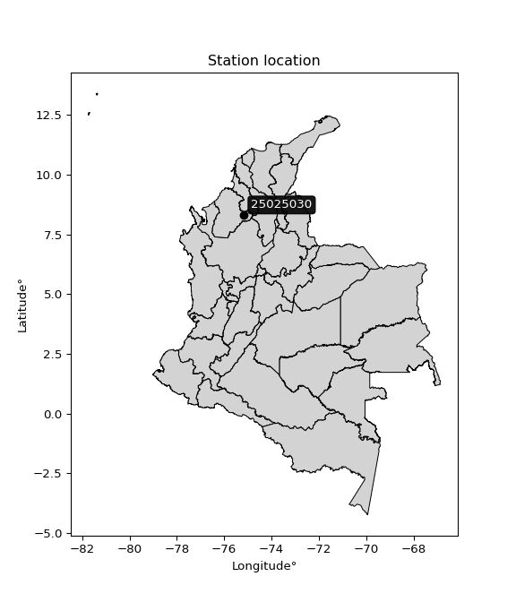</img>

</div>


## A. General information


### 1. General running parameters

• app_version: _v20251225_. • runtime: _2025-12-26 14:29:50.888910_. • Python version: _3.14.0_. • SciPy version: _1.16.3_. • Pandas version: _2.3.3_. • NumPy version: _2.3.5_. • Stations dataset (station_dataset_file): _dataset/pmax24h_in/automatic_colombia.csv_. • Stations catalog (station_catalog_file): _dataset/CNE_IDEAM.xls_. • Plot only fit distributions with Δo > Δ (plot_only_fit): _True_. • Eval low extreme values, if False, evaluates high extreme values (low_extreme): _False_. • Eval every SciPy distribution as logarithmic (pdist_logarithmic_on): _True_. • Standard deviation normalized (ddof): _1.0_. • Return periods to eval in years (Tr): _[2, 2.33, 5, 10, 15, 20, 25, 50, 75, 100, 200, 250, 500, 750, 1000]_. • Minimum data sample per station, 0 means any (minimum_sample): _5_. • Z-Score threshold to adjust a value, 0 means disable (zscore): _3.5_. • Avoid zeros, e.g. rain = 0 (avoid_zeros): _True_. • Avoid null values (avoid_nans): _True_. [:file_folder:Dataset file.](../../dataset/pmax24h_in/automatic_colombia.csv)


### 2. Station info and location

|   id |   CODIGO | NOMBRE                  | CATEGORIA               | TECNOLOGIA                              | ESTADO   | FECHA_INSTALACION   |   FECHA_SUSPENSION |   ALTITUD |   LATITUD |   LONGITUD | DEPARTAMENTO   | MUNICIPIO   | AREA_OPERATIVA                              | ENTIDAD                                                     | AREA_HIDROGRAFICA   | ZONA_HIDROGRAFICA                | SUBZONA_HIDROGRAFICA       |   CORRIENTE | OBSERVACION                                                                                                                                                                                                                                                                                                                                                                                                                                                                                                  | SUBRED                                                        | Catalogo   |
|-----:|---------:|:------------------------|:------------------------|:----------------------------------------|:---------|:--------------------|-------------------:|----------:|----------:|-----------:|:---------------|:------------|:--------------------------------------------|:------------------------------------------------------------|:--------------------|:---------------------------------|:---------------------------|------------:|:-------------------------------------------------------------------------------------------------------------------------------------------------------------------------------------------------------------------------------------------------------------------------------------------------------------------------------------------------------------------------------------------------------------------------------------------------------------------------------------------------------------|:--------------------------------------------------------------|:-----------|
|    0 | 25025030 | AYAPEL - AUT [25025030] | Climatológica Ordinaria | Automática con Telemetría, Convencional | Activa   | 11/12/2014          |                nan |        20 |   8.29506 |   -75.1646 | Cordoba        | Ayapel      | Area Operativa 02 - Atlántico-Bolivar-Sucre | INSTITUTO DE HIDROLOGIA METEOROLOGIA Y ESTUDIOS AMBIENTALES | Magdalena Cauca     | Bajo Magdalena- Cauca -San Jorge | Bajo San Jorge - La Mojana |         nan | Actualizada Categoria de ME a CO por solicitud del coordinador del AO. (10022023)|10/04/2025$mvelez$Se identifica que, en el catálogo, la estación aparece registrada con tecnología Automática con Telemetría; sin embargo, en el mismo sitio se encuentran instalados también instrumentos convencionales. Por lo anterior, se solicita corregir la información de la tecnología registrada, dejando como descripción: Automática con Telemetría – Convencional se realiza el cambio solicitado 10/04/2025 | Córdoba, Sucre, Sur de Bolívar, Urabá y Bajo Cauca Antioqueño | CNE_IDEAM  |

<div align="center">

Map location in: [:earth_americas:Google](http://maps.google.com/maps?q=8.295063889,-75.16455556) [:earth_americas:OSM](https://www.openstreetmap.org/#map=18/8.295063889/-75.16455556&layers=P) [:earth_americas:Bing](https://www.bing.com/maps?cp=8.295063889~-75.16455556&lvl=18) [:earth_americas:Apple](https://maps.apple.com/frame?center=8.295063889%2C-75.16455556&span=0.003%2C0.006)

</div>


<div align="center">

```geojson
{
  "type": "Feature",
  "geometry": {
    "type": "Point", 
    "coordinates": [-75.16455556, 8.295063889]
  }, 
  "properties": {
    "Name": "25025030"
  }
}
```

</div>


### 3. Discrete values table and plot

|               |           0 |           1 |          2 |           3 |           4 |           5 |          6 |           7 |           8 |
|:--------------|------------:|------------:|-----------:|------------:|------------:|------------:|-----------:|------------:|------------:|
| Date          | 2017        | 2018        | 2019       | 2020        | 2021        | 2022        | 2023       | 2024        | 2025        |
| Value         |   76.1      |   63.89     |  241.8     |   98        |  117.9      |   78.1      |   45.2     |  158        |   83.7      |
| Value_initial |   76.1      |   63.89     |  241.8     |   98        |  117.9      |   78.1      |   45.2     |  158        |   83.7      |
| count         |    9        |    9        |    9       |    9        |    9        |    9        |    9       |    9        |    9        |
| mean          |  106.966    |  106.966    |  106.966   |  106.966    |  106.966    |  106.966    |  106.966   |  106.966    |  106.966    |
| std           |   60.1898   |   60.1898   |   60.1898  |   60.1898   |   60.1898   |   60.1898   |   60.1898  |   60.1898   |   60.1898   |
| zscore        |   -0.512804 |   -0.715662 |    2.24016 |   -0.148955 |    0.181666 |   -0.479576 |   -1.02618 |    0.847892 |   -0.386537 |

<div align="center">

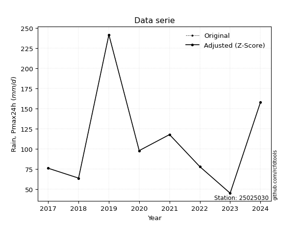</img>

</div>

> If Z-Score is active, values out of range or outliers are replaced with the station mean value.


### 4. Active continuous probability distributions from SciPy (45 of 104 available)

[scipy.stats](https://docs.scipy.org/doc/scipy/reference/stats.html) is a Python´s powerful submodule within the SciPy library for comprehensive statistical analysis, offering over 130 probability distributions (like Normal, Poisson), functions for descriptive stats (mean, variance), hypothesis testing (t-tests, chi-square), random variable generation, and statistical tests, making it essential for data science, modeling, and research. It provides tools to explore, model, and draw conclusions from data efficiently, working seamlessly with NumPy.

<div align="center">

|   id | p_dist             |   n_parameter | fit_method   | label                                                                       | active   | ref                                                                                                        |
|-----:|:-------------------|--------------:|:-------------|:----------------------------------------------------------------------------|:---------|:-----------------------------------------------------------------------------------------------------------|
|    0 | alpha              |             3 | MLE          | Alpha                                                                       | True     | [:mortar_board:](https://docs.scipy.org/doc/scipy/reference/generated/scipy.stats.alpha.html)              |
|    1 | betaprime          |             4 | MLE          | Beta prime                                                                  | True     | [:mortar_board:](https://docs.scipy.org/doc/scipy/reference/generated/scipy.stats.betaprime.html)          |
|    2 | chi2               |             3 | MLE          | Chi²                                                                        | True     | [:mortar_board:](https://docs.scipy.org/doc/scipy/reference/generated/scipy.stats.chi2.html)               |
|    3 | crystalball        |             4 | MLE          | Crystalball                                                                 | True     | [:mortar_board:](https://docs.scipy.org/doc/scipy/reference/generated/scipy.stats.crystalball.html)        |
|    4 | erlang             |             3 | MLE          | Erlang                                                                      | True     | [:mortar_board:](https://docs.scipy.org/doc/scipy/reference/generated/scipy.stats.erlang.html)             |
|    5 | expon              |             2 | MLE          | Exponential                                                                 | True     | [:mortar_board:](https://docs.scipy.org/doc/scipy/reference/generated/scipy.stats.expon.html)              |
|    6 | exponnorm          |             3 | MLE          | Exponentially modified Normal                                               | True     | [:mortar_board:](https://docs.scipy.org/doc/scipy/reference/generated/scipy.stats.exponnorm.html)          |
|    7 | f                  |             4 | MLE          | F                                                                           | True     | [:mortar_board:](https://docs.scipy.org/doc/scipy/reference/generated/scipy.stats.f.html)                  |
|    8 | fatiguelife        |             3 | MLE          | Fatigue-life (Birnbaum-Saunders)                                            | True     | [:mortar_board:](https://docs.scipy.org/doc/scipy/reference/generated/scipy.stats.fatiguelife.html)        |
|    9 | fisk               |             3 | MLE          | Fisk                                                                        | True     | [:mortar_board:](https://docs.scipy.org/doc/scipy/reference/generated/scipy.stats.fisk.html)               |
|   10 | gamma              |             3 | MLE          | Gamma                                                                       | True     | [:mortar_board:](https://docs.scipy.org/doc/scipy/reference/generated/scipy.stats.gamma.html)              |
|   11 | genexpon           |             5 | MLE          | Generalized exponential                                                     | True     | [:mortar_board:](https://docs.scipy.org/doc/scipy/reference/generated/scipy.stats.genexpon.html)           |
|   12 | genlogistic        |             3 | MLE          | Generalized logistic                                                        | True     | [:mortar_board:](https://docs.scipy.org/doc/scipy/reference/generated/scipy.stats.genlogistic.html)        |
|   13 | gibrat             |             2 | MM           | Gibrat                                                                      | True     | [:mortar_board:](https://docs.scipy.org/doc/scipy/reference/generated/scipy.stats.gibrat.html)             |
|   14 | gompertz           |             3 | MLE          | Gompertz (or truncated Gumbel)                                              | True     | [:mortar_board:](https://docs.scipy.org/doc/scipy/reference/generated/scipy.stats.gompertz.html)           |
|   15 | gumbel_l           |             2 | MM           | Gumbel Left Skew                                                            | True     | [:mortar_board:](https://docs.scipy.org/doc/scipy/reference/generated/scipy.stats.gumbel_l.html)           |
|   16 | gumbel_r           |             2 | MM           | Gumbel Right Skew                                                           | True     | [:mortar_board:](https://docs.scipy.org/doc/scipy/reference/generated/scipy.stats.gumbel_r.html)           |
|   17 | halflogistic       |             2 | MM           | Half-logistic                                                               | True     | [:mortar_board:](https://docs.scipy.org/doc/scipy/reference/generated/scipy.stats.halflogistic.html)       |
|   18 | halfnorm           |             2 | MM           | Half Normal                                                                 | True     | [:mortar_board:](https://docs.scipy.org/doc/scipy/reference/generated/scipy.stats.halfnorm.html)           |
|   19 | hypsecant          |             2 | MM           | hyperbolic secant                                                           | True     | [:mortar_board:](https://docs.scipy.org/doc/scipy/reference/generated/scipy.stats.hypsecant.html)          |
|   20 | invgamma           |             3 | MLE          | Inverted gamma                                                              | True     | [:mortar_board:](https://docs.scipy.org/doc/scipy/reference/generated/scipy.stats.invgamma.html)           |
|   21 | invgauss           |             3 | MLE          | Inverse Gaussian                                                            | True     | [:mortar_board:](https://docs.scipy.org/doc/scipy/reference/generated/scipy.stats.invgauss.html)           |
|   22 | invweibull         |             3 | MLE          | Inverted Weibull                                                            | True     | [:mortar_board:](https://docs.scipy.org/doc/scipy/reference/generated/scipy.stats.invweibull.html)         |
|   23 | johnsonsu          |             4 | MLE          | Johnson Su                                                                  | True     | [:mortar_board:](https://docs.scipy.org/doc/scipy/reference/generated/scipy.stats.johnsonsu.html)          |
|   24 | kstwobign          |             2 | MLE          | Limiting distribution of scaled Kolmogorov-Smirnov two-sided test statistic | True     | [:mortar_board:](https://docs.scipy.org/doc/scipy/reference/generated/scipy.stats.kstwobign.html)          |
|   25 | laplace            |             2 | MM           | Laplace                                                                     | True     | [:mortar_board:](https://docs.scipy.org/doc/scipy/reference/generated/scipy.stats.laplace.html)            |
|   26 | laplace_asymmetric |             3 | MLE          | Asymmetric Laplace                                                          | True     | [:mortar_board:](https://docs.scipy.org/doc/scipy/reference/generated/scipy.stats.laplace_asymmetric.html) |
|   27 | loggamma           |             3 | MLE          | Log gamma                                                                   | True     | [:mortar_board:](https://docs.scipy.org/doc/scipy/reference/generated/scipy.stats.loggamma.html)           |
|   28 | logistic           |             2 | MM           | Logistic (or Sech-squared)                                                  | True     | [:mortar_board:](https://docs.scipy.org/doc/scipy/reference/generated/scipy.stats.logistic.html)           |
|   29 | lognorm            |             3 | MLE          | Log Normal                                                                  | True     | [:mortar_board:](https://docs.scipy.org/doc/scipy/reference/generated/scipy.stats.lognorm.html)            |
|   30 | maxwell            |             2 | MM           | Maxwell                                                                     | True     | [:mortar_board:](https://docs.scipy.org/doc/scipy/reference/generated/scipy.stats.maxwell.html)            |
|   31 | mielke             |             4 | MLE          | Mielke Beta-Kappa / Dagum                                                   | True     | [:mortar_board:](https://docs.scipy.org/doc/scipy/reference/generated/scipy.stats.mielke.html)             |
|   32 | moyal              |             2 | MM           | Moyal                                                                       | True     | [:mortar_board:](https://docs.scipy.org/doc/scipy/reference/generated/scipy.stats.moyal.html)              |
|   33 | nakagami           |             3 | MLE          | Nakagami                                                                    | True     | [:mortar_board:](https://docs.scipy.org/doc/scipy/reference/generated/scipy.stats.nakagami.html)           |
|   34 | ncf                |             5 | MLE          | Non-central F distribution                                                  | True     | [:mortar_board:](https://docs.scipy.org/doc/scipy/reference/generated/scipy.stats.ncf.html)                |
|   35 | nct                |             4 | MLE          | Non-central Student’s t                                                     | True     | [:mortar_board:](https://docs.scipy.org/doc/scipy/reference/generated/scipy.stats.nct.html)                |
|   36 | norm               |             2 | MM           | Normal                                                                      | True     | [:mortar_board:](https://docs.scipy.org/doc/scipy/reference/generated/scipy.stats.norm.html)               |
|   37 | pareto             |             3 | MLE          | Pareto                                                                      | True     | [:mortar_board:](https://docs.scipy.org/doc/scipy/reference/generated/scipy.stats.pareto.html)             |
|   38 | pearson3           |             3 | MM           | Pearson type III                                                            | True     | [:mortar_board:](https://docs.scipy.org/doc/scipy/reference/generated/scipy.stats.pearson3.html)           |
|   39 | rayleigh           |             2 | MM           | Rayleigh                                                                    | True     | [:mortar_board:](https://docs.scipy.org/doc/scipy/reference/generated/scipy.stats.rayleigh.html)           |
|   40 | rice               |             3 | MLE          | Rice                                                                        | True     | [:mortar_board:](https://docs.scipy.org/doc/scipy/reference/generated/scipy.stats.rice.html)               |
|   41 | t                  |             3 | MLE          | Student’s t                                                                 | True     | [:mortar_board:](https://docs.scipy.org/doc/scipy/reference/generated/scipy.stats.t.html)                  |
|   42 | truncnorm          |             4 | MLE          | Truncated normal                                                            | True     | [:mortar_board:](https://docs.scipy.org/doc/scipy/reference/generated/scipy.stats.truncnorm.html)          |
|   43 | wald               |             2 | MM           | Wald                                                                        | True     | [:mortar_board:](https://docs.scipy.org/doc/scipy/reference/generated/scipy.stats.wald.html)               |
|   44 | weibull_min        |             3 | MLE          | Weibull minimum                                                             | True     | [:mortar_board:](https://docs.scipy.org/doc/scipy/reference/generated/scipy.stats.weibull_min.html)        |

</div>

> **n_parameter:** # arguments & localization & scale.
>
> **Fit methods:** (MLE) maximum likelihood, (MM) L-moments.
>
>**Inactive:** foldnorm, gennorm, norminvgauss, powernorm, powerlognorm, skewnorm, genextreme, anglit, arcsine, argus, beta, bradford, burr, burr12, cauchy, cosine, halfcauchy, foldcauchy, skewcauchy, wrapcauchy, dgamma, gengamma, exponweib, exponpow, truncexpon, gausshyper, genhalflogistic, genhyperbolic, geninvgauss, halfgennorm, johnsonsb, kappa4, kappa3, ksone, kstwo, loglaplace, levy, levy_l, levy_stable, ncx2, genpareto, truncpareto, lomax, powerlaw, rdist, rel_breitwigner, recipinvgauss, semicircular, studentized_range, trapezoid, triang, truncweibull_min, tukeylambda, uniform, loguniform, vonmises, vonmises_line, weibull_max, dweibull, 


## B. Probability distributions vs. Empirical distributions

A continuous probability distribution (CPD) describes probabilities for variables that can take any value within a range (like rain any time), unlike discrete variables with specific outcomes (like temperature). It uses a Probability Density Function (PDF), a curve where the total area under it equals 1, and the probability of the variable falling within an interval (a to b) is found by calculating the area under the curve between those points. A key feature is that the probability of hitting any single exact value is zero, so probabilities are always expressed for ranges, e.g., $P(a ≤ X ≤ b)$.

<div align="center">

Distributions parameters
|    |   station | p_dist                |   n |               loc |            scale | shape                 | shape1             | shape2             | shape3   |
|---:|----------:|:----------------------|----:|------------------:|-----------------:|:----------------------|:-------------------|:-------------------|:---------|
|  0 |  25025030 | alpha                 |   9 |     -29.6379      |    365.596       | 3.052705109025507     |                    |                    |          |
|  1 |  25025030 | betaprime             |   9 |      -0.598193    |      1.71463     | 262.02495934931926    | 5.179373663153672  |                    |          |
|  2 |  25025030 | chi2                  |   9 |      45.2         |     30.2561      | 1.6787210572185132    |                    |                    |          |
|  3 |  25025030 | crystalball           |   9 |     106.966       |     56.7475      | 8895.077277144625     | 3249.1656332709435 |                    |          |
|  4 |  25025030 | erlang                |   9 |      45.2         |     53.1668      | 0.8108296527232457    |                    |                    |          |
|  5 |  25025030 | expon                 |   9 |      45.2         |     61.7656      |                       |                    |                    |          |
|  6 |  25025030 | exponnorm             |   9 |      53.0923      |     12.6592      | 4.255671537777376     |                    |                    |          |
|  7 |  25025030 | f                     |   9 |      11.6939      |     71.6665      | 3210.136431478749     | 7.776644588296755  |                    |          |
|  8 |  25025030 | fatiguelife           |   9 |      45.2         |      0.000612403 | 304.4944611400366     |                    |                    |          |
|  9 |  25025030 | fisk                  |   9 |      34.3665      |     54.9828      | 2.2244798290282937    |                    |                    |          |
| 10 |  25025030 | gamma                 |   9 |      45.2         |     54.0387      | 0.8579718834005121    |                    |                    |          |
| 11 |  25025030 | genexpon              |   9 |      45.1996      |    431.598       | 6.300780310678398     | 6.026288091273155  | 1.0276332479916466 |          |
| 12 |  25025030 | genlogistic           |   9 |    -184.371       |     36.771       | 1438.571847632984     |                    |                    |          |
| 13 |  25025030 | gibrat                |   9 |      63.6744      |     26.2574      |                       |                    |                    |          |
| 14 |  25025030 | gompertz              |   9 |      45.2         |    559.423       | 8.14638886666776      |                    |                    |          |
| 15 |  25025030 | gumbel_l              |   9 |     132.505       |     44.2458      |                       |                    |                    |          |
| 16 |  25025030 | gumbel_r              |   9 |      81.4262      |     44.2458      |                       |                    |                    |          |
| 17 |  25025030 | halflogistic          |   9 |      39.7066      |     48.5171      |                       |                    |                    |          |
| 18 |  25025030 | halfnorm              |   9 |      31.8542      |     94.1382      |                       |                    |                    |          |
| 19 |  25025030 | hypsecant             |   9 |     106.966       |     36.1266      |                       |                    |                    |          |
| 20 |  25025030 | invgamma              |   9 |      11.6072      |    278.911       | 3.8883066582115022    |                    |                    |          |
| 21 |  25025030 | invgauss              |   9 |      25.7101      |    150.544       | 0.5397444726748963    |                    |                    |          |
| 22 |  25025030 | invweibull            |   9 |      45.2         |      1.50782     | 0.05598090156672343   |                    |                    |          |
| 23 |  25025030 | johnsonsu             |   9 |      30.0052      |      1.20877     | -6.387663137267911    | 1.3896537107907596 |                    |          |
| 24 |  25025030 | kstwobign             |   9 |     -53.1089      |    185.647       |                       |                    |                    |          |
| 25 |  25025030 | laplace               |   9 |     106.966       |     40.1265      |                       |                    |                    |          |
| 26 |  25025030 | laplace_asymmetric    |   9 |      76.1         |     29.4984      | 0.6054127291879725    |                    |                    |          |
| 27 |  25025030 | loggamma              |   9 |  -23237.9         |   2969.63        | 2595.251408825754     |                    |                    |          |
| 28 |  25025030 | logistic              |   9 |     106.966       |     31.2865      |                       |                    |                    |          |
| 29 |  25025030 | lognorm               |   9 |      45.2         |      0.913383    | 11.505794902138886    |                    |                    |          |
| 30 |  25025030 | maxwell               |   9 |     -27.5021      |     84.2651      |                       |                    |                    |          |
| 31 |  25025030 | mielke                |   9 |      -0.270722    |     43.9924      | 14.918188528758117    | 2.783215925967004  |                    |          |
| 32 |  25025030 | moyal                 |   9 |      74.5137      |     25.5453      |                       |                    |                    |          |
| 33 |  25025030 | nakagami              |   9 |      45.2         |     88.5287      | 0.22355884883411126   |                    |                    |          |
| 34 |  25025030 | ncf                   |   9 |      -0.0475833   |      3.63195e-07 | 3.354929287748244e-08 | 4.662095800907997  | 8.202344394243697  |          |
| 35 |  25025030 | nct                   |   9 |      -0.0721517   |      7.28784     | 3.100904835022152     | 10.973004882636177 |                    |          |
| 36 |  25025030 | norm                  |   9 |     106.966       |     56.7475      |                       |                    |                    |          |
| 37 |  25025030 | pareto                |   9 |      45.1934      |      0.00662518  | 0.12517596488674287   |                    |                    |          |
| 38 |  25025030 | pearson3              |   9 |     106.966       |     56.7475      | 1.339603870293998     |                    |                    |          |
| 39 |  25025030 | rayleigh              |   9 |      -1.59564     |     86.6193      |                       |                    |                    |          |
| 40 |  25025030 | rice                  |   9 |      18.8792      |     74.0928      | 0.0003131884735514509 |                    |                    |          |
| 41 |  25025030 | t                     |   9 |      84.0216      |     24.146       | 1.4542937662332822    |                    |                    |          |
| 42 |  25025030 | truncnorm             |   9 |     106.966       |     56.7475      | -1758.8144391203766   | 123.98532967812864 |                    |          |
| 43 |  25025030 | wald                  |   9 |      50.2181      |     56.7474      |                       |                    |                    |          |
| 44 |  25025030 | weibull_min           |   9 |      45.2         |     68.9968      | 0.8994722515154703    |                    |                    |          |
| 45 |  25025030 | logalpha              |   9 |       0.360714    |     37.9647      | 9.163646854337557     |                    |                    |          |
| 46 |  25025030 | logbetaprime          |   9 |      -0.802631    |      6.06895     | 247.92605674861989    | 281.9133007970588  |                    |          |
| 47 |  25025030 | logchi2               |   9 |       3.8111      |      0.952292    | 1.1143426923875361    |                    |                    |          |
| 48 |  25025030 | logcrystalball        |   9 |       4.55456     |      0.47045     | 7.091345961334689     | 188.7724540076821  |                    |          |
| 49 |  25025030 | logerlang             |   9 |       3.23071     |      0.171513    | 7.718649804489708     |                    |                    |          |
| 50 |  25025030 | logexpon              |   9 |       3.8111      |      0.743464    |                       |                    |                    |          |
| 51 |  25025030 | logexponnorm          |   9 |       4.15579     |      0.290049    | 1.374814773838632     |                    |                    |          |
| 52 |  25025030 | logf                  |   9 |       2.63432     |      1.88045     | 51.34003078938716     | 97.08574736963826  |                    |          |
| 53 |  25025030 | logfatiguelife        |   9 |       2.56322     |      1.93683     | 0.23724309832985907   |                    |                    |          |
| 54 |  25025030 | logfisk               |   9 |       2.83682     |      1.65688     | 6.3519926804520415    |                    |                    |          |
| 55 |  25025030 | loggamma              |   9 |       3.23071     |      0.171513    | 7.718639193249443     |                    |                    |          |
| 56 |  25025030 | loggenexpon           |   9 |       3.8111      |      0.888708    | 0.8593715707773502    | 1.5087685999400346 | 0.4962314919483954 |          |
| 57 |  25025030 | loggenlogistic        |   9 |       3.78688     |      0.359866    | 5.263098645592688     |                    |                    |          |
| 58 |  25025030 | loggibrat             |   9 |       4.19565     |      0.217686    |                       |                    |                    |          |
| 59 |  25025030 | loggompertz           |   9 |       3.8111      |      0.8494      | 0.5466540768508579    |                    |                    |          |
| 60 |  25025030 | loggumbel_l           |   9 |       4.76629     |      0.366808    |                       |                    |                    |          |
| 61 |  25025030 | loggumbel_r           |   9 |       4.34283     |      0.366808    |                       |                    |                    |          |
| 62 |  25025030 | loghalflogistic       |   9 |       3.99698     |      0.402209    |                       |                    |                    |          |
| 63 |  25025030 | loghalfnorm           |   9 |       3.93185     |      0.780448    |                       |                    |                    |          |
| 64 |  25025030 | loghypsecant          |   9 |       4.55456     |      0.299498    |                       |                    |                    |          |
| 65 |  25025030 | loginvgamma           |   9 |      -0.0286149   |    447.852       | 98.82792563523196     |                    |                    |          |
| 66 |  25025030 | loginvgauss           |   9 |       2.54108     |     36.1336      | 0.05572327003352097   |                    |                    |          |
| 67 |  25025030 | loginvweibull         |   9 |      -2.21859e+07 |      2.21859e+07 | 55274253.79207532     |                    |                    |          |
| 68 |  25025030 | logjohnsonsu          |   9 |       2.57653     |      0.298321    | -10.953019401723537   | 4.273277749902306  |                    |          |
| 69 |  25025030 | logkstwobign          |   9 |       2.89041     |      1.91195     |                       |                    |                    |          |
| 70 |  25025030 | loglaplace            |   9 |       4.55456     |      0.332658    |                       |                    |                    |          |
| 71 |  25025030 | loglaplace_asymmetric |   9 |       4.35799     |      0.325686    | 0.7438819835966903    |                    |                    |          |
| 72 |  25025030 | logloggamma           |   9 |    -132.307       |     18.6343      | 1547.8774153149734    |                    |                    |          |
| 73 |  25025030 | loglogistic           |   9 |       4.55456     |      0.259373    |                       |                    |                    |          |
| 74 |  25025030 | loglognorm            |   9 |       3.8111      |      0.0151486   | 11.02623060862219     |                    |                    |          |
| 75 |  25025030 | logmaxwell            |   9 |       3.43979     |      0.698578    |                       |                    |                    |          |
| 76 |  25025030 | logmielke             |   9 | -577070           | 577074           | 5534832.399139639     | 1698162.7744945786 |                    |          |
| 77 |  25025030 | logmoyal              |   9 |       4.28553     |      0.211777    |                       |                    |                    |          |
| 78 |  25025030 | lognakagami           |   9 |       3.8111      |      0.765102    | 0.14889079207898007   |                    |                    |          |
| 79 |  25025030 | logncf                |   9 |       1.03419     |      3.23454     | 260.58568218953576    | 201.5360983512188  | 19.33545866176528  |          |
| 80 |  25025030 | lognct                |   9 |       0.0589519   |      0.0882989   | 50.073821749836824    | 50.138573594908365 |                    |          |
| 81 |  25025030 | lognorm               |   9 |       4.55456     |      0.47045     |                       |                    |                    |          |
| 82 |  25025030 | logpareto             |   9 |       3.811       |      9.29586e-05 | 0.12515674919511038   |                    |                    |          |
| 83 |  25025030 | logpearson3           |   9 |       4.55456     |      0.47045     | 0.4912681468997189    |                    |                    |          |
| 84 |  25025030 | lograyleigh           |   9 |       3.65456     |      0.718095    |                       |                    |                    |          |
| 85 |  25025030 | logrice               |   9 |       3.64679     |      0.638888    | 0.7490333328941896    |                    |                    |          |
| 86 |  25025030 | logt                  |   9 |       4.55456     |      0.470454    | 500606644.960529      |                    |                    |          |
| 87 |  25025030 | logtruncnorm          |   9 |      -0.2788      |      2.19957     | 1.859406396864631     | 2.621850579905691  |                    |          |
| 88 |  25025030 | logwald               |   9 |       4.08402     |      0.470531    |                       |                    |                    |          |
| 89 |  25025030 | logweibull_min        |   9 |       3.66191     |      1.00503     | 1.9622818549476015    |                    |                    |          |

</div>

> **loc** (Location parameter): This shifts the distribution along the x-axis. For many common distributions, like the normal (Gaussian) distribution, loc represents the mean $μ$. For others, like the uniform distribution, it might represent the minimum value, or for the beta distribution, the left end of the support interval.
>
> **scale** (Scale parameter): This determines the width or spread of the distribution. For the normal distribution, scale represents the standard deviation $σ$. For a uniform distribution, it defines the length of the interval (from $loc$ to $loc + scale$).
>
> **shape** (Shape parameters): Refers to parameters that define the specific form of a probability distribution, distinct from its location (loc) and scale (scale). These parameters are required arguments for most distribution functions. For example, a normal (Gaussian) distribution is fully defined by its location (mean) and scale (standard deviation), so it has no specific shape parameters beyond loc and scale. However, other distributions have intrinsic properties that need specification, as Gamma distribution that takes a shape parameter, often named $a$ or $alpha$.


### 0. Cumulative distribution values - CDF (90 evaluated)

> Ordered by x ascending and calculating $log(f(x))$ separately. 

|   id |   Station |   date |      x |   count |    mean |     std |    zscore |   Value_initial |   station |   m |    alpha |   alpha_pdf |   betaprime |   betaprime_pdf |        chi2 |    chi2_pdf |   crystalball |   crystalball_pdf |   erlang |   erlang_pdf |    expon |   expon_pdf |   exponnorm |   exponnorm_pdf |        f |      f_pdf |   fatiguelife |   fatiguelife_pdf |      fisk |    fisk_pdf |       gamma |   gamma_pdf |    genexpon |   genexpon_pdf |   genlogistic |   genlogistic_pdf |      gibrat |   gibrat_pdf |   gompertz |   gompertz_pdf |   gumbel_l |   gumbel_l_pdf |   gumbel_r |   gumbel_r_pdf |   halflogistic |   halflogistic_pdf |   halfnorm |   halfnorm_pdf |   hypsecant |   hypsecant_pdf |   invgamma |   invgamma_pdf |   invgauss |   invgauss_pdf |   invweibull |   invweibull_pdf |   johnsonsu |   johnsonsu_pdf |   kstwobign |   kstwobign_pdf |   laplace |   laplace_pdf |   laplace_asymmetric |   laplace_asymmetric_pdf |   loggamma |   loggamma_pdf |   logistic |   logistic_pdf |   lognorm |   lognorm_pdf |   maxwell |   maxwell_pdf |    mielke |   mielke_pdf |     moyal |   moyal_pdf |    nakagami |   nakagami_pdf |      ncf |     ncf_pdf |      nct |     nct_pdf |     norm |    norm_pdf |   pareto |   pareto_pdf |   pearson3 |   pearson3_pdf |   rayleigh |   rayleigh_pdf |      rice |    rice_pdf |        t |       t_pdf |   truncnorm |   truncnorm_pdf |     wald |    wald_pdf |   weibull_min |   weibull_min_pdf |   logalpha |   logalpha_pdf |   logbetaprime |   logbetaprime_pdf |     logchi2 |   logchi2_pdf |   logcrystalball |   logcrystalball_pdf |   logerlang |   logerlang_pdf |   logexpon |   logexpon_pdf |   logexponnorm |   logexponnorm_pdf |      logf |   logf_pdf |   logfatiguelife |   logfatiguelife_pdf |   logfisk |   logfisk_pdf |   loggenexpon |   loggenexpon_pdf |   loggenlogistic |   loggenlogistic_pdf |   loggibrat |   loggibrat_pdf |   loggompertz |   loggompertz_pdf |   loggumbel_l |   loggumbel_l_pdf |   loggumbel_r |   loggumbel_r_pdf |   loghalflogistic |   loghalflogistic_pdf |   loghalfnorm |   loghalfnorm_pdf |   loghypsecant |   loghypsecant_pdf |   loginvgamma |   loginvgamma_pdf |   loginvgauss |   loginvgauss_pdf |   loginvweibull |   loginvweibull_pdf |   logjohnsonsu |   logjohnsonsu_pdf |   logkstwobign |   logkstwobign_pdf |   loglaplace |   loglaplace_pdf |   loglaplace_asymmetric |   loglaplace_asymmetric_pdf |   logloggamma |   logloggamma_pdf |   loglogistic |   loglogistic_pdf |   loglognorm |   loglognorm_pdf |   logmaxwell |   logmaxwell_pdf |   logmielke |   logmielke_pdf |   logmoyal |   logmoyal_pdf |   lognakagami |   lognakagami_pdf |    logncf |   logncf_pdf |    lognct |   lognct_pdf |   logpareto |   logpareto_pdf |   logpearson3 |   logpearson3_pdf |   lograyleigh |   lograyleigh_pdf |   logrice |   logrice_pdf |      logt |   logt_pdf |   logtruncnorm |   logtruncnorm_pdf |   logwald |   logwald_pdf |   logweibull_min |   logweibull_min_pdf |
|-----:|----------:|-------:|-------:|--------:|--------:|--------:|----------:|----------------:|----------:|----:|---------:|------------:|------------:|----------------:|------------:|------------:|--------------:|------------------:|---------:|-------------:|---------:|------------:|------------:|----------------:|---------:|-----------:|--------------:|------------------:|----------:|------------:|------------:|------------:|------------:|---------------:|--------------:|------------------:|------------:|-------------:|-----------:|---------------:|-----------:|---------------:|-----------:|---------------:|---------------:|-------------------:|-----------:|---------------:|------------:|----------------:|-----------:|---------------:|-----------:|---------------:|-------------:|-----------------:|------------:|----------------:|------------:|----------------:|----------:|--------------:|---------------------:|-------------------------:|-----------:|---------------:|-----------:|---------------:|----------:|--------------:|----------:|--------------:|----------:|-------------:|----------:|------------:|------------:|---------------:|---------:|------------:|---------:|------------:|---------:|------------:|---------:|-------------:|-----------:|---------------:|-----------:|---------------:|----------:|------------:|---------:|------------:|------------:|----------------:|---------:|------------:|--------------:|------------------:|-----------:|---------------:|---------------:|-------------------:|------------:|--------------:|-----------------:|---------------------:|------------:|----------------:|-----------:|---------------:|---------------:|-------------------:|----------:|-----------:|-----------------:|---------------------:|----------:|--------------:|--------------:|------------------:|-----------------:|---------------------:|------------:|----------------:|--------------:|------------------:|--------------:|------------------:|--------------:|------------------:|------------------:|----------------------:|--------------:|------------------:|---------------:|-------------------:|--------------:|------------------:|--------------:|------------------:|----------------:|--------------------:|---------------:|-------------------:|---------------:|-------------------:|-------------:|-----------------:|------------------------:|----------------------------:|--------------:|------------------:|--------------:|------------------:|-------------:|-----------------:|-------------:|-----------------:|------------:|----------------:|-----------:|---------------:|--------------:|------------------:|----------:|-------------:|----------:|-------------:|------------:|----------------:|--------------:|------------------:|--------------:|------------------:|----------:|--------------:|----------:|-----------:|---------------:|-------------------:|----------:|--------------:|-----------------:|---------------------:|
|    0 |  25025030 |   2023 |  45.2  |       9 | 106.966 | 60.1898 | -1.02618  |           45.2  |  25025030 |   1 | 0.033479 | 0.00486402  |   0.0413672 |     0.00535647  | 4.51366e-14 | 5.33196     |      0.138203 |       0.00388789  | 1.44e-13 | 16.4324      | 0        | 0.0161903   |   0.0340196 |     0.00431525  | 0.03077  | 0.00529837 |      0.120951 |       2.44044e+07 | 0.0262523 | 0.00524897  | 2.49813e-14 | 3.01646     | 5.18955e-06 |    0.0145987   |     0.0612264 |       0.00464633  | 0           |  0           |   0        |    0.0145621   |   0.129784 |    0.0027341   |   0.103554 |     0.0053073  |      0.0565523 |         0.0102727  |   0.112737 |    0.00839093  |    0.113945 |     0.00308711  |   0.03077  |    0.00529837  |  0.0288913 |     0.00610753 |   0.00176596 |      8.81974e+10 |   0.0284202 |     0.00593067  |   0.0581461 |     0.00461278  |  0.107269 |   0.00267326  |            0.0475388 |              0.00266194  |   0.029522 |       0.24809  |   0.121939 |     0.00342225 | 0.0570163 |      0.243269 |  0.137283 |   0.00485791  | 0.0309793 |  0.00484832  | 0.0759101 | 0.00573702  | 4.98717e-08 |    3.13824e+06 | 0.27315  | 0.00624271  | 0.030189 | 0.00506702  | 0.138203 | 0.00388789  | 0        | 18.894       |  0.0866546 |    0.00691234  |   0.135784 |    0.00539012  | 0.0611485 | 0.00450136  | 0.146212 | 0.00401042  |    0.138203 |     0.00388789  | 0        | 0           |   4.16795e-15 |       0.527619    |  0.0329283 |       0.234349 |      0.0477361 |           0.246205 | 2.19286e-09 |   2.75124e+06 |        0.0570163 |             0.243269 |   0.0295221 |        0.24809  |   0        |       1.34506  |      0.0316876 |           0.214788 | 0.0331236 |   0.241589 |        0.0308847 |             0.241144 | 0.0331533 |      0.208984 |   1.37107e-10 |          0.96699  |        0.0309941 |             0.219022 |    0        |       0         |   8.87669e-10 |          0.643577 |     0.0713029 |          0.187286 |     0.0141006 |          0.16382  |          0        |              0        |      0        |          0        |      0.0530633 |          0.176355  |     0.0420887 |          0.245831 |     0.0309561 |          0.240894 |       0.0259073 |            0.235801 |      0.0314003 |           0.237742 |      0.0254589 |           0.266589 |    0.0535005 |        0.160827  |               0.0372718 |                    0.153843 |     0.0603297 |          0.249256 |     0.0538402 |          0.196402 |   0.00235631 |       1.5023e+12 |    0.0367163 |         0.280164 |   0.0351078 |        0.216226 | 0.00217513 |      0.0526351 |   2.34262e-05 |       1.57083e+10 | 0.0444211 |     0.256277 | 0.0381575 |     0.240155 |    0        |    1346.37      |     0.0388669 |          0.24958  |     0.0234789 |          0.296434 | 0.0246842 |      0.296908 | 0.0570179 |   0.243273 |    8.30702e-07 |           1.18753  | 0         |     0         |        0.0233992 |             0.304152 |
|    1 |  25025030 |   2018 |  63.89 |       9 | 106.966 | 60.1898 | -0.715662 |           63.89 |  25025030 |   2 | 0.196153 | 0.0115696   |   0.200456  |     0.0107283   | 0.345201    | 0.0130523   |      0.223904 |       0.00527041  | 0.39387  |  0.0139965   | 0.261102 | 0.0119629   |   0.187583  |     0.0114263   | 0.205067 | 0.0118589  |      0.716918 |       0.0051942   | 0.200486  | 0.0120773   | 0.363448    | 0.0137789   | 0.24314     |    0.0115092   |     0.18622   |       0.00850728  | 7.84205e-07 |  1.81709e-05 |   0.241766 |    0.0114166   |   0.191104 |    0.00387731  |   0.226193 |     0.00759859 |      0.24419   |         0.00969114 |   0.266374 |    0.00799884  |    0.187593 |     0.00489726  |   0.205067 |    0.0118589   |  0.217711  |     0.0119224  |   0.419557   |      0.00109149  |   0.214249  |     0.0119511   |   0.178079  |     0.00793342  |  0.170906 |   0.00425918  |            0.135381  |              0.00758068  |   0.208276 |       0.763702 |   0.201522 |     0.00514314 | 0.199134  |      0.593542 |  0.241308 |   0.0061856   | 0.20031   |  0.0120705   | 0.218271  | 0.00901104  | 0.390507    |    0.00926622  | 0.383169 | 0.00547947  | 0.203199 | 0.0120463   | 0.223904 | 0.00527041  | 0.63011  |  0.00247645  |  0.238048  |    0.00878965  |   0.248573 |    0.00655849  | 0.168499  | 0.00681754  | 0.259498 | 0.00869772  |    0.223904 |     0.00527041  | 0.103357 | 0.017981    |   0.265737    |       0.0109152   |  0.201461  |       0.740664 |      0.200604  |           0.647945 | 0.407976    |   0.583647    |        0.199134  |             0.593542 |   0.208276  |        0.763701 |   0.372165 |       0.844473 |      0.196838  |           0.764981 | 0.204331  |   0.742365 |        0.205375  |             0.755742 | 0.191205  |      0.743982 |   0.321533    |          0.858461 |        0.200254  |             0.771099 |    0        |       0         |   0.240378    |          0.73475  |     0.17306   |          0.428392 |     0.190341  |          0.860841 |          0.196535 |              1.19512  |      0.227187 |          0.980613 |      0.165094  |          0.526852  |     0.202385  |          0.687537 |     0.205222  |          0.755164 |       0.213842  |            0.821807 |      0.203792  |           0.752166 |      0.227664  |           0.830497 |    0.151411  |        0.455153  |               0.155502  |                    0.641847 |     0.203617  |          0.593227 |     0.177679  |          0.563318 |   0.6117     |       0.100425   |    0.211939  |         0.710879 |   0.196235  |        0.740136 | 0.175735   |      1.01988   |   0.634553    |       0.531719    | 0.208529  |     0.695416 | 0.200478  |     0.703375 |    0.642672 |       0.129195  |     0.203855  |          0.702789 |     0.217245  |          0.762931 | 0.215226  |      0.749322 | 0.199136  |   0.593541 |    0.354951    |           0.875425 | 0.0285923 |     1.39499   |        0.220727  |             0.770039 |
|    2 |  25025030 |   2017 |  76.1  |       9 | 106.966 | 60.1898 | -0.512804 |           76.1  |  25025030 |   3 | 0.343178 | 0.0120323   |   0.335753  |     0.0110828   | 0.483566    | 0.00983964  |      0.293251 |       0.0060635   | 0.539212 |  0.0101153   | 0.393638 | 0.00981715  |   0.332821  |     0.0117425   | 0.351229 | 0.0116705  |      0.769648 |       0.0036278   | 0.351301  | 0.0121469   | 0.508546    | 0.0102347   | 0.372866    |    0.00977648  |     0.299361  |       0.00981507  | 0.227173    |  0.0242681   |   0.370374 |    0.00968938  |   0.243827 |    0.00477647  |   0.323705 |     0.00825195 |      0.358407  |         0.00898183 |   0.361652 |    0.00758935  |    0.256135 |     0.00634922  |   0.351229 |    0.0116705   |  0.359527  |     0.0110311  |   0.429793   |      0.00065753  |   0.357808  |     0.0112511   |   0.282104  |     0.00893778  |  0.23169  |   0.005774    |            0.268217  |              0.0150188   |   0.354216 |       0.880328 |   0.271595 |     0.00632321 | 0.318114  |      0.758261 |  0.320408 |   0.00672188  | 0.351452  |  0.0121678   | 0.332331  | 0.00946327  | 0.487411    |    0.00689732  | 0.446532 | 0.00489847  | 0.352585 | 0.0119581   | 0.293251 | 0.0060635   | 0.652666 |  0.00140675  |  0.345814  |    0.00874354  |   0.33121  |    0.0069256   | 0.257856  | 0.00773553  | 0.391928 | 0.0128696   |    0.293251 |     0.0060635   | 0.325118 | 0.0165021   |   0.384619    |       0.0086971   |  0.346037  |       0.887888 |      0.329171  |           0.808122 | 0.496753    |   0.444231    |        0.318114  |             0.758261 |   0.354215  |        0.880327 |   0.503766 |       0.667462 |      0.349497  |           0.949939 | 0.348266  |   0.879475 |        0.351013  |             0.884491 | 0.342519  |      0.95669  |   0.46247     |          0.750117 |        0.351408  |             0.926165 |    0.320069 |       2.62213   |   0.370461    |          0.74814  |     0.263689  |          0.614454 |     0.357064  |          1.00248  |          0.394005 |              1.05015  |      0.391895 |          0.896393 |      0.282675  |          0.824576  |     0.337892  |          0.843877 |     0.350815  |          0.884563 |       0.368724  |            0.916539 |      0.34947   |           0.888392 |      0.379582  |           0.879406 |    0.256138  |        0.769973  |               0.320061  |                    1.32108  |     0.322191  |          0.754157 |     0.297781  |          0.806205 |   0.625837   |       0.0659678  |    0.3477    |         0.824194 |   0.343982  |        0.921202 | 0.370262   |      1.12982   |   0.713244    |       0.383877    | 0.344728  |     0.843603 | 0.338778  |     0.857859 |    0.6605   |       0.0815491 |     0.340963  |          0.845566 |     0.359206  |          0.841889 | 0.355155  |      0.833298 | 0.318116  |   0.758257 |    0.496263    |           0.743375 | 0.388328  |     1.79199   |        0.363295  |             0.841678 |
|    3 |  25025030 |   2022 |  78.1  |       9 | 106.966 | 60.1898 | -0.479576 |           78.1  |  25025030 |   4 | 0.367089 | 0.0118704   |   0.357809  |     0.0109666   | 0.502826    | 0.00942432  |      0.305493 |       0.00617701  | 0.558949 |  0.00962694  | 0.412958 | 0.00950435  |   0.356077  |     0.0115051   | 0.374354 | 0.0114485  |      0.776727 |       0.00345442  | 0.375381  | 0.0119262   | 0.528552    | 0.00977538  | 0.392155    |    0.00951324  |     0.319091  |       0.00990853  | 0.274605    |  0.0231142   |   0.389491 |    0.00942883  |   0.253536 |    0.00493316  |   0.340251 |     0.00829039 |      0.376237  |         0.00884685 |   0.376754 |    0.00751225  |    0.269077 |     0.00659228  |   0.374354 |    0.0114485   |  0.381329  |     0.0107678  |   0.431067   |      0.000617218 |   0.380061  |     0.0109986   |   0.300055  |     0.0090092   |  0.243531 |   0.00606908  |            0.297646  |              0.0144148   |   0.377119 |       0.88489  |   0.284424 |     0.00650527 | 0.338034  |      0.777115 |  0.333912 |   0.00678114  | 0.375565  |  0.0119381   | 0.351227  | 0.00942775  | 0.500942    |    0.00663805  | 0.456234 | 0.00480393  | 0.376277 | 0.0117265   | 0.305493 | 0.00617701  | 0.655381 |  0.00131092  |  0.363236  |    0.00867554  |   0.345093 |    0.0069564   | 0.273432  | 0.00783788  | 0.418182 | 0.0133665   |    0.305493 |     0.00617701  | 0.35731  | 0.0156873   |   0.401715    |       0.00840233  |  0.369189  |       0.896474 |      0.350342  |           0.823608 | 0.508076    |   0.428891    |        0.338034  |             0.777116 |   0.377119  |        0.88489  |   0.520783 |       0.644574 |      0.374283  |           0.960097 | 0.371187  |   0.887043 |        0.374043  |             0.890482 | 0.36753   |      0.970657 |   0.481705    |          0.732735 |        0.375527  |             0.932585 |    0.384613 |       2.35399   |   0.389863    |          0.747569 |     0.280023  |          0.644855 |     0.383076  |          1.00208  |          0.420897 |              1.02291  |      0.414948 |          0.880757 |      0.304644  |          0.868856  |     0.359958  |          0.856844 |     0.373848  |          0.890646 |       0.392482  |            0.914536 |      0.372613  |           0.895288 |      0.402331  |           0.873942 |    0.276912  |        0.832421  |               0.356234  |                    1.47039  |     0.341998  |          0.7726   |     0.319109  |          0.837707 |   0.627506   |       0.0627492  |    0.369185  |         0.831811 |   0.368033  |        0.932305 | 0.399367   |      1.11303   |   0.722999    |       0.368393    | 0.36677   |     0.855301 | 0.361191  |     0.869552 |    0.662559 |       0.0772105 |     0.363042  |          0.856094 |     0.381083  |          0.844284 | 0.376823  |      0.836883 | 0.338035  |   0.777111 |    0.51531     |           0.725171 | 0.432863  |     1.64274   |        0.385152  |             0.84304  |
|    4 |  25025030 |   2025 |  83.7  |       9 | 106.966 | 60.1898 | -0.386537 |           83.7  |  25025030 |   5 | 0.431811 | 0.0111983   |   0.417942  |     0.0104734   | 0.552596    | 0.00837708  |      0.340909 |       0.00646345  | 0.609358 |  0.00841068  | 0.463841 | 0.00868055  |   0.418216  |     0.0106542   | 0.436397 | 0.0106805  |      0.794867 |       0.00303966  | 0.439997  | 0.0111103   | 0.579972    | 0.00861851  | 0.443429    |    0.00880595  |     0.374947  |       0.00999937  | 0.39322     |  0.0192037   |   0.440317 |    0.00873083  |   0.282413 |    0.00538218  |   0.386777 |     0.00830366 |      0.424674  |         0.00844705 |   0.418189 |    0.00728299  |    0.307865 |     0.007254    |   0.436397 |    0.0106805   |  0.439414  |     0.00996547 |   0.434256   |      0.000526689 |   0.439474  |     0.0102032   |   0.350803  |     0.00908608  |  0.280004 |   0.00697802  |            0.373903  |              0.0128497   |   0.438421 |       0.882058 |   0.322211 |     0.00698036 | 0.393335  |      0.817507 |  0.372259 |   0.00690327  | 0.440183  |  0.0111006   | 0.403473  | 0.0092035   | 0.536311    |    0.00601651  | 0.482404 | 0.00454348  | 0.439755 | 0.0109109   | 0.340909 | 0.00646345  | 0.662094 |  0.00109845  |  0.411144  |    0.00841989  |   0.384201 |    0.00700061  | 0.317975  | 0.00805309  | 0.495482 | 0.0140459   |    0.340909 |     0.00646345  | 0.438823 | 0.0134526   |   0.446615    |       0.00764992  |  0.431615  |       0.902401 |      0.408474  |           0.85217  | 0.536476    |   0.392309    |        0.393335  |             0.817507 |   0.43842   |        0.882058 |   0.563403 |       0.587247 |      0.441085  |           0.963587 | 0.432889  |   0.891198 |        0.435841  |             0.890597 | 0.435351  |      0.981787 |   0.530818    |          0.685564 |        0.440161  |             0.929379 |    0.524676 |       1.71937   |   0.441485    |          0.742448 |     0.327531  |          0.727452 |     0.451831  |          0.978592 |          0.489093 |              0.945763 |      0.474409 |          0.835806 |      0.368582  |          0.97351   |     0.420109  |          0.876829 |     0.435665  |          0.890972 |       0.455183  |            0.892562 |      0.434813  |           0.897251 |      0.462026  |           0.847484 |    0.340995  |        1.02506   |               0.450413  |                    1.25528  |     0.396956  |          0.812168 |     0.379685  |          0.908054 |   0.63159    |       0.055498   |    0.427181  |         0.840351 |   0.433057  |        0.940578 | 0.474214   |      1.04356   |   0.747211    |       0.331937    | 0.426702  |     0.872103 | 0.422081  |     0.885298 |    0.667556 |       0.0675191 |     0.422921  |          0.869845 |     0.439484  |          0.839889 | 0.43483   |      0.835934 | 0.393336  |   0.817502 |    0.56389     |           0.678269 | 0.534096  |     1.29435   |        0.443378  |             0.836135 |
|    5 |  25025030 |   2020 |  98    |       9 | 106.966 | 60.1898 | -0.148955 |           98    |  25025030 |   6 | 0.575364 | 0.00880519  |   0.555048  |     0.00862126  | 0.656589    | 0.00628676  |      0.437232 |       0.00694294  | 0.711701 |  0.00605441  | 0.574651 | 0.00688651  |   0.553359  |     0.00828698  | 0.572724 | 0.00836661 |      0.832553 |       0.00228849  | 0.580552  | 0.0085126   | 0.685844    | 0.00632448  | 0.557484    |    0.00719011  |     0.514283  |       0.00929836  | 0.605628    |  0.0112125   |   0.553508 |    0.00714543  |   0.367754 |    0.00655135  |   0.502794 |     0.00781336 |      0.537584  |         0.00732736 |   0.517724 |    0.00662165  |    0.421803 |     0.00854643  |   0.572724 |    0.00836661  |  0.566727  |     0.00786358 |   0.440651   |      0.000382869 |   0.569754  |     0.00802722  |   0.478391  |     0.00862457  |  0.399885 |   0.0099656   |            0.533145  |              0.00958153  |   0.572772 |       0.808022 |   0.428846 |     0.00782884 | 0.525767  |      0.846232 |  0.471633 |   0.00692814  | 0.58051   |  0.00850284  | 0.52773   | 0.00807913  | 0.613564    |    0.00486777  | 0.542838 | 0.00392024  | 0.578225 | 0.00843693  | 0.437232 | 0.00694294  | 0.675192 |  0.000769945 |  0.525163  |    0.0074743   |   0.483681 |    0.00685377  | 0.434567  | 0.0081493   | 0.680284 | 0.0108917   |    0.437232 |     0.00694294  | 0.596822 | 0.00896502  |   0.544388    |       0.00610147  |  0.569981  |       0.835678 |      0.543635  |           0.845148 | 0.592894    |   0.326458    |        0.525767  |             0.846232 |   0.572771  |        0.808022 |   0.646863 |       0.474989 |      0.586766  |           0.862046 | 0.569482  |   0.825435 |        0.57177   |             0.818437 | 0.584334  |      0.882548 |   0.630407    |          0.577544 |        0.580526  |             0.833475 |    0.719491 |       0.86542   |   0.55642     |          0.709985 |     0.456641  |          0.90358  |     0.59643   |          0.840306 |          0.623643 |              0.759642 |      0.597323 |          0.720317 |      0.532261  |          1.05736   |     0.557268  |          0.845461 |     0.571676  |          0.819039 |       0.587839  |            0.778121 |      0.571917  |           0.825925 |      0.588071  |           0.743073 |    0.543676  |        1.37175   |               0.616666  |                    0.875554 |     0.528494  |          0.840582 |     0.529274  |          0.96056  |   0.639357   |       0.0438712  |    0.557608  |         0.80076  |   0.576603  |        0.859598 | 0.621917   |      0.822605  |   0.794209    |       0.267501    | 0.562664  |     0.83561  | 0.559691  |     0.842776 |    0.676904 |       0.0522475 |     0.558111  |          0.828848 |     0.568015  |          0.77943  | 0.56337   |      0.783319 | 0.525767  |   0.846225 |    0.662988    |           0.580303 | 0.692688  |     0.770306  |        0.570974  |             0.77181  |
|    6 |  25025030 |   2021 | 117.9  |       9 | 106.966 | 60.1898 |  0.181666 |          117.9  |  25025030 |   7 | 0.718076 | 0.00568684  |   0.699446  |     0.00596729  | 0.760517    | 0.00429825  |      0.576398 |       0.00690083  | 0.809251 |  0.00391961  | 0.691808 | 0.00498971  |   0.691291  |     0.00573027  | 0.709846 | 0.00555865 |      0.871084 |       0.00163679  | 0.717144  | 0.00540182  | 0.788792    | 0.00418183  | 0.681564    |    0.00535548  |     0.679027  |       0.00714727  | 0.765837    |  0.00565592  |   0.67714  |    0.005354    |   0.512693 |    0.00791727  |   0.644989 |     0.00639251 |      0.667286  |         0.00571686 |   0.639303 |    0.00558156  |    0.594905 |     0.00842224  |   0.709846 |    0.00555865  |  0.697944  |     0.00544874 |   0.447106   |      0.000277134 |   0.70279   |     0.00547334  |   0.635803  |     0.00709422  |  0.619263 |   0.00948842  |            0.689681  |              0.00636884  |   0.708217 |       0.64966  |   0.586495 |     0.00775154 | 0.676379  |      0.763708 |  0.604886 |   0.00636196  | 0.717411  |  0.00544123  | 0.668829  | 0.00609624  | 0.69911     |    0.00379836  | 0.613213 | 0.00317779  | 0.715153 | 0.00549077  | 0.576398 | 0.00690083  | 0.687937 |  0.000537266 |  0.658336  |    0.00589771  |   0.613869 |    0.00614975  | 0.590591  | 0.00738469  | 0.831817 | 0.00491401  |    0.576398 |     0.00690083  | 0.735052 | 0.00531392  |   0.649414    |       0.00454644  |  0.709921  |       0.668564 |      0.690444  |           0.726931 | 0.647715    |   0.269448    |        0.676379  |             0.763708 |   0.708217  |        0.64966  |   0.724608 |       0.370418 |      0.726528  |           0.642845 | 0.708069  |   0.664573 |        0.708865  |             0.65646  | 0.726935  |      0.652284 |   0.725939    |          0.457884 |        0.717449  |             0.641551 |    0.83395  |       0.434101  |   0.681281    |          0.634174 |     0.635679  |          1.00287  |     0.731834  |          0.622886 |          0.744617 |              0.553874 |      0.717054 |          0.574447 |      0.711312  |          0.837094  |     0.701831  |          0.704633 |     0.708876  |          0.656943 |       0.715191  |            0.597283 |      0.710137  |           0.66069  |      0.711314  |           0.588264 |    0.738229  |        0.786906  |               0.748697  |                    0.573987 |     0.678193  |          0.75971  |     0.696352  |          0.81522  |   0.646604   |       0.0351605  |    0.695087  |         0.675894 |   0.718358  |        0.664945 | 0.749939   |      0.570666  |   0.838292    |       0.212136    | 0.705218  |     0.693581 | 0.702848  |     0.693459 |    0.68545  |       0.0410583 |     0.699426  |          0.68806  |     0.700626  |          0.647488 | 0.697329  |      0.657358 | 0.676378  |   0.763702 |    0.760779    |           0.480184 | 0.802049  |     0.44844   |        0.702037  |             0.638972 |
|    7 |  25025030 |   2024 | 158    |       9 | 106.966 | 60.1898 |  0.847892 |          158    |  25025030 |   8 | 0.866249 | 0.00225403  |   0.86211   |     0.00258705  | 0.882354    | 0.00206466  |      0.81576  |       0.00469178  | 0.915386 |  0.00169666  | 0.838985 | 0.00260687  |   0.853349  |     0.00272216  | 0.859769 | 0.00238546 |      0.920651 |       0.000923097 | 0.858453  | 0.0021863   | 0.903735    | 0.00187067  | 0.841265    |    0.00283936  |     0.878017  |       0.00310614  | 0.899517    |  0.00186711  |   0.837962 |    0.00288675  |   0.831242 |    0.00678639  |   0.837637 |     0.00335408 |      0.839386  |         0.00304462 |   0.819757 |    0.00345351  |    0.847945 |     0.00405069  |   0.859769 |    0.00238546  |  0.851354  |     0.00257023 |   0.455935   |      0.000177716 |   0.85422   |     0.00248341  |   0.849457  |     0.00368377  |  0.859842 |   0.0034929   |            0.863735  |              0.00279665  |   0.857897 |       0.379728 |   0.836333 |     0.00437504 | 0.859904  |      0.473334 |  0.816589 |   0.00406774  | 0.860868  |  0.00223656  | 0.84529   | 0.00298991  | 0.821322    |    0.00240974  | 0.717359 | 0.00210019  | 0.861318 | 0.00229695  | 0.81576  | 0.00469178  | 0.704632 |  0.000327755 |  0.836435  |    0.00315766  |   0.81684  |    0.00389603  | 0.828436  | 0.00434778  | 0.932753 | 0.00119405  |    0.81576  |     0.00469178  | 0.873761 | 0.00217069  |   0.789029    |       0.0026177   |  0.861984  |       0.378526 |      0.861172  |           0.433798 | 0.716608    |   0.205338    |        0.859904  |             0.473334 |   0.857897  |        0.379728 |   0.814246 |       0.249849 |      0.866161  |           0.333415 | 0.860289  |   0.382282 |        0.859419  |             0.379487 | 0.867025  |      0.329027 |   0.8357      |          0.299129 |        0.86089   |             0.353281 |    0.916501 |       0.177107  |   0.841016    |          0.44652  |     0.893856  |          0.649048 |     0.868885  |          0.332919 |          0.867948 |              0.306639 |      0.852618 |          0.35791  |      0.88455   |          0.377083  |     0.864681  |          0.408513 |     0.859508  |          0.37955  |       0.850749  |            0.342604 |      0.861008  |           0.377998 |      0.848741  |           0.359053 |    0.891428  |        0.326377  |               0.871236  |                    0.294104 |     0.860986  |          0.471944 |     0.876393  |          0.417656 |   0.655545   |       0.026684   |    0.85503   |         0.414973 |   0.86599   |        0.358687 | 0.87314    |      0.296977  |   0.890623    |       0.149235    | 0.865435  |     0.402263 | 0.862428  |     0.399972 |    0.695767 |       0.0304227 |     0.859313  |          0.40572  |     0.853737  |          0.399378 | 0.853499  |      0.408583 | 0.859903  |   0.473334 |    0.881583    |           0.350659 | 0.893854  |     0.213594  |        0.853124  |             0.394693 |
|    8 |  25025030 |   2019 | 241.8  |       9 | 106.966 | 60.1898 |  2.24016  |          241.8  |  25025030 |   9 | 0.957064 | 0.000462599 |   0.966684  |     0.000506119 | 0.972483    | 0.000472782 |      0.99125  |       0.000417869 | 0.983885 |  0.000315814 | 0.958539 | 0.000671263 |   0.969044  |     0.000574602 | 0.959514 | 0.00052226 |      0.968612 |       0.000334294 | 0.950435  | 0.000505178 | 0.980799    | 0.000366651 | 0.967388    |    0.000646312 |     0.986768  |       0.000357457 | 0.972224    |  0.000358293 |   0.967628 |    0.000669909 |   0.999993 |    1.95691e-06 |   0.973693 |     0.00058668 |      0.969428  |         0.0006205  |   0.974265 |    0.000704921 |    0.984763 |     0.000421595 |   0.959514 |    0.000522261 |  0.962839  |     0.00059051 |   0.467033   |      0.000101249 |   0.960332  |     0.000561582 |   0.987142  |     0.000440083 |  0.982636 |   0.000432721 |            0.975596  |              0.000500848 |   0.959218 |       0.129259 |   0.98674  |     0.0004182  | 0.976393  |      0.118393 |  0.983166 |   0.000585592 | 0.954699  |  0.000506678 | 0.969813  | 0.000590576 | 0.94887     |    0.00084601  | 0.838662 | 0.000971466 | 0.957317 | 0.000509605 | 0.99125  | 0.000417869 | 0.724474 |  0.000175423 |  0.970837  |    0.000628733 |   0.980705 |    0.000625939 | 0.989177  | 0.000439501 | 0.976323 | 0.000213116 |    0.99125  |     0.000417869 | 0.965698 | 0.000491165 |   0.923059    |       0.000902821 |  0.960742  |       0.12256  |      0.970688  |           0.122025 | 0.789994    |   0.144263    |        0.976393  |             0.118393 |   0.959218  |        0.129259 |   0.895197 |       0.140965 |      0.953884  |           0.115642 | 0.960766  |   0.125432 |        0.959924  |             0.127028 | 0.951944  |      0.109601 |   0.927216    |          0.145506 |        0.954689  |             0.122475 |    0.962564 |       0.0631715 |   0.966302    |          0.15619  |     0.999219  |          0.01523  |     0.9569    |          0.114932 |          0.952091 |              0.116262 |      0.953855 |          0.14001  |      0.971824  |          0.0939544 |     0.96851   |          0.11963  |     0.959979  |          0.126894 |       0.945546  |            0.131905 |      0.960446  |           0.124675 |      0.950153  |           0.141682 |    0.969787  |        0.0908232 |               0.95128   |                    0.111278 |     0.97697   |          0.117118 |     0.973384  |          0.099886 |   0.665266   |       0.0196959  |    0.964848  |         0.133412 |   0.959075  |        0.117179 | 0.953376   |      0.109954  |   0.940214    |       0.0885045   | 0.968113  |     0.119391 | 0.965331  |     0.122425 |    0.706709 |       0.0218873 |     0.964849  |          0.126831 |     0.961604  |          0.136526 | 0.963285  |      0.136643 | 0.976392  |   0.118395 |    0.999992    |           0.215147 | 0.952555  |     0.0850467 |        0.96037   |             0.137465 |

An Empirical Distribution Function (EDF) is a step-function estimate of a true cumulative distribution function (CDF) based on observed sample data, representing the proportion of data points less than or equal to a given value. It is calculated by ordering your data and jumping up by $1/n$ (where $n$ is sample size) at each unique data point, allowing analysis without assuming an underlying population distribution, and it gets closer to the true CDF as the sample size grows.


### 1. Empirical - EDF California (1923)

California´s estimates the true probability distribution of water-related data (like rainfall, streamflow) using observed samples, crucial for risk assessment.

<div align="center">


$P=m/n$


</div>


**1.1. Empirical values**

<div align="center">

|                | 0                  | 1                  | 2                  | 3                  | 4                  | 5                  | 6                  | 7                  | 8              |
|:---------------|:-------------------|:-------------------|:-------------------|:-------------------|:-------------------|:-------------------|:-------------------|:-------------------|:---------------|
| date           | 2023               | 2018               | 2017               | 2022               | 2025               | 2020               | 2021               | 2024               | 2019           |
| x              | 45.2               | 63.89              | 76.1               | 78.1               | 83.7               | 98.0               | 117.9              | 158.0              | 241.8          |
| m              | 1                  | 2                  | 3                  | 4                  | 5                  | 6                  | 7                  | 8                  | 9              |
| empirical_dist | edf_california     | edf_california     | edf_california     | edf_california     | edf_california     | edf_california     | edf_california     | edf_california     | edf_california |
| empirical      | 0.1111111111111111 | 0.2222222222222222 | 0.3333333333333333 | 0.4444444444444444 | 0.5555555555555556 | 0.6666666666666666 | 0.7777777777777778 | 0.8888888888888888 | 1.0            |
| empirical_tr   | 1.125              | 1.2857142857142856 | 1.4999999999999998 | 1.7999999999999998 | 2.25               | 2.9999999999999996 | 4.5                | 8.999999999999996  | inf            |

</div>


**1.2. Kolmogorov-Smirnov fit test (sorted by Δ)**


<div align="center">

|                | 0                   | 1                   | 2                   | 3                   | 4                     | 5                   | 6                   | 7                   | 8                   | 9                   | 10                  | 11                  | 12                  | 13                  | 14                  | 15                  | 16                  | 17                  | 18                  | 19                  | 20                  | 21                  | 22                  | 23                  | 24                  | 25                  | 26                  | 27                  | 28                  | 29                  | 30                  | 31                  | 32                  | 33                  | 34                  | 35                  | 36                  | 37                  | 38                  | 39                  | 40                  | 41                  | 42                  | 43                  | 44                  | 45                  | 46                  | 47                  | 48                  | 49                  | 50                  | 51                  | 52                  | 53                  | 54                  | 55                  | 56                  | 57                  | 58                  | 59                  | 60                  | 61                  | 62                  | 63                  | 64                  | 65                  | 66                  | 67                  | 68                  | 69                  | 70                  | 71                  | 72                  | 73                  | 74                  | 75                  | 76                  | 77                  | 78                  | 79                  | 80                  | 81                  | 82                  | 83                  | 84                  | 85                  | 86                  | 87                  | 88                  | 89                  |
|:---------------|:--------------------|:--------------------|:--------------------|:--------------------|:----------------------|:--------------------|:--------------------|:--------------------|:--------------------|:--------------------|:--------------------|:--------------------|:--------------------|:--------------------|:--------------------|:--------------------|:--------------------|:--------------------|:--------------------|:--------------------|:--------------------|:--------------------|:--------------------|:--------------------|:--------------------|:--------------------|:--------------------|:--------------------|:--------------------|:--------------------|:--------------------|:--------------------|:--------------------|:--------------------|:--------------------|:--------------------|:--------------------|:--------------------|:--------------------|:--------------------|:--------------------|:--------------------|:--------------------|:--------------------|:--------------------|:--------------------|:--------------------|:--------------------|:--------------------|:--------------------|:--------------------|:--------------------|:--------------------|:--------------------|:--------------------|:--------------------|:--------------------|:--------------------|:--------------------|:--------------------|:--------------------|:--------------------|:--------------------|:--------------------|:--------------------|:--------------------|:--------------------|:--------------------|:--------------------|:--------------------|:--------------------|:--------------------|:--------------------|:--------------------|:--------------------|:--------------------|:--------------------|:--------------------|:--------------------|:--------------------|:--------------------|:--------------------|:--------------------|:--------------------|:--------------------|:--------------------|:--------------------|:--------------------|:--------------------|:--------------------|
| station        | 25025030            | 25025030            | 25025030            | 25025030            | 25025030              | 25025030            | 25025030            | 25025030            | 25025030            | 25025030            | 25025030            | 25025030            | 25025030            | 25025030            | 25025030            | 25025030            | 25025030            | 25025030            | 25025030            | 25025030            | 25025030            | 25025030            | 25025030            | 25025030            | 25025030            | 25025030            | 25025030            | 25025030            | 25025030            | 25025030            | 25025030            | 25025030            | 25025030            | 25025030            | 25025030            | 25025030            | 25025030            | 25025030            | 25025030            | 25025030            | 25025030            | 25025030            | 25025030            | 25025030            | 25025030            | 25025030            | 25025030            | 25025030            | 25025030            | 25025030            | 25025030            | 25025030            | 25025030            | 25025030            | 25025030            | 25025030            | 25025030            | 25025030            | 25025030            | 25025030            | 25025030            | 25025030            | 25025030            | 25025030            | 25025030            | 25025030            | 25025030            | 25025030            | 25025030            | 25025030            | 25025030            | 25025030            | 25025030            | 25025030            | 25025030            | 25025030            | 25025030            | 25025030            | 25025030            | 25025030            | 25025030            | 25025030            | 25025030            | 25025030            | 25025030            | 25025030            | 25025030            | 25025030            | 25025030            | 25025030            |
| empirical_dist | edf_california      | edf_california      | edf_california      | edf_california      | edf_california        | edf_california      | edf_california      | edf_california      | edf_california      | edf_california      | edf_california      | edf_california      | edf_california      | edf_california      | edf_california      | edf_california      | edf_california      | edf_california      | edf_california      | edf_california      | edf_california      | edf_california      | edf_california      | edf_california      | edf_california      | edf_california      | edf_california      | edf_california      | edf_california      | edf_california      | edf_california      | edf_california      | edf_california      | edf_california      | edf_california      | edf_california      | edf_california      | edf_california      | edf_california      | edf_california      | edf_california      | edf_california      | edf_california      | edf_california      | edf_california      | edf_california      | edf_california      | edf_california      | edf_california      | edf_california      | edf_california      | edf_california      | edf_california      | edf_california      | edf_california      | edf_california      | edf_california      | edf_california      | edf_california      | edf_california      | edf_california      | edf_california      | edf_california      | edf_california      | edf_california      | edf_california      | edf_california      | edf_california      | edf_california      | edf_california      | edf_california      | edf_california      | edf_california      | edf_california      | edf_california      | edf_california      | edf_california      | edf_california      | edf_california      | edf_california      | edf_california      | edf_california      | edf_california      | edf_california      | edf_california      | edf_california      | edf_california      | edf_california      | edf_california      | edf_california      |
| p_dist         | t                   | logkstwobign        | loginvweibull       | loggumbel_r         | loglaplace_asymmetric | logmoyal            | expon               | loghalflogistic     | loghalfnorm         | genexpon            | logweibull_min      | loggompertz         | logexponnorm        | gompertz            | mielke              | loggenlogistic      | fisk                | nct                 | lograyleigh         | johnsonsu           | invgauss            | loggamma            | loggamma            | logerlang           | wald                | f                   | invgamma            | logfatiguelife      | loginvgauss         | logfisk             | logrice             | logjohnsonsu        | logmielke           | logf                | alpha               | logalpha            | weibull_min         | logmaxwell          | logncf              | loggenexpon         | halflogistic        | logpearson3         | lognct              | loginvgamma         | exponnorm           | betaprime           | pearson3            | logbetaprime        | halfnorm            | chi2                | moyal               | logloggamma         | logt                | lognorm             | lognorm             | logcrystalball      | logtruncnorm        | nakagami            | gumbel_r            | logexpon            | ncf                 | gamma               | loglogistic         | genlogistic         | laplace_asymmetric  | rayleigh            | loghypsecant        | logwald             | maxwell             | kstwobign           | erlang              | logchi2             | loglaplace          | gibrat              | loggibrat           | loggumbel_l         | truncnorm           | crystalball         | norm                | rice                | logistic            | hypsecant           | laplace             | gumbel_l            | loglognorm          | pareto              | lognakagami         | logpareto           | fatiguelife         | invweibull          |
| delta          | 0.0600734332255754  | 0.09353000026716046 | 0.10037293594469998 | 0.10372474341438015 | 0.10514247094468587   | 0.10893597813733984 | 0.1111111111111111  | 0.1111111111111111  | 0.1111111111111111  | 0.1121268827812284  | 0.11217761576078367 | 0.1140702660445354  | 0.11447093934587926 | 0.11523896774668774 | 0.11537293427991652 | 0.11539409519573268 | 0.11555840854491817 | 0.11580061883105341 | 0.11607141040620172 | 0.11608174104688429 | 0.11614119775143117 | 0.11713504054003271 | 0.11713504054003271 | 0.11713536829463234 | 0.11886530687500221 | 0.11915812134214632 | 0.11915813662789099 | 0.1197143841782432  | 0.11989026265535513 | 0.12020425858376038 | 0.12072556872093965 | 0.12074218754510196 | 0.12249835520738961 | 0.1226661075346136  | 0.12374483155032512 | 0.12394103300908255 | 0.12836384134223644 | 0.12837500076679653 | 0.12885343524038517 | 0.12913713454020798 | 0.13088182129255627 | 0.132634425597484   | 0.1334743382821002  | 0.13544626498397294 | 0.13734003195715716 | 0.13761347114892752 | 0.14441142684873548 | 0.1470813340812483  | 0.14894287005453977 | 0.1502323775237378  | 0.15208234255179398 | 0.15859983944160888 | 0.1622195111199644  | 0.16222098508712696 | 0.16222098508712696 | 0.16222102037467728 | 0.1629293849979343  | 0.16828431033190333 | 0.16877878721159145 | 0.17043294318505947 | 0.17153030415491433 | 0.17521288779589    | 0.17587016640827619 | 0.18060897335791204 | 0.18165263012016908 | 0.1829858183103159  | 0.18697384385501908 | 0.19362994216655968 | 0.19503337685681404 | 0.20475278422945664 | 0.20587904777885108 | 0.21000630734783432 | 0.21456063889226684 | 0.22222143801706884 | 0.2222222222222222  | 0.22802406807588466 | 0.22943448988833137 | 0.22943450223047923 | 0.2294345034391434  | 0.23758005592296277 | 0.23782115082536953 | 0.24769049581913566 | 0.2755518107165666  | 0.29891281827426786 | 0.3894778253193194  | 0.4078881573785257  | 0.41233104042362967 | 0.42044976753557295 | 0.49469565255594816 | 0.5329668858274614  |
| deltao         | 0.41761268023100007 | 0.41761268023100007 | 0.41761268023100007 | 0.41761268023100007 | 0.41761268023100007   | 0.41761268023100007 | 0.41761268023100007 | 0.41761268023100007 | 0.41761268023100007 | 0.41761268023100007 | 0.41761268023100007 | 0.41761268023100007 | 0.41761268023100007 | 0.41761268023100007 | 0.41761268023100007 | 0.41761268023100007 | 0.41761268023100007 | 0.41761268023100007 | 0.41761268023100007 | 0.41761268023100007 | 0.41761268023100007 | 0.41761268023100007 | 0.41761268023100007 | 0.41761268023100007 | 0.41761268023100007 | 0.41761268023100007 | 0.41761268023100007 | 0.41761268023100007 | 0.41761268023100007 | 0.41761268023100007 | 0.41761268023100007 | 0.41761268023100007 | 0.41761268023100007 | 0.41761268023100007 | 0.41761268023100007 | 0.41761268023100007 | 0.41761268023100007 | 0.41761268023100007 | 0.41761268023100007 | 0.41761268023100007 | 0.41761268023100007 | 0.41761268023100007 | 0.41761268023100007 | 0.41761268023100007 | 0.41761268023100007 | 0.41761268023100007 | 0.41761268023100007 | 0.41761268023100007 | 0.41761268023100007 | 0.41761268023100007 | 0.41761268023100007 | 0.41761268023100007 | 0.41761268023100007 | 0.41761268023100007 | 0.41761268023100007 | 0.41761268023100007 | 0.41761268023100007 | 0.41761268023100007 | 0.41761268023100007 | 0.41761268023100007 | 0.41761268023100007 | 0.41761268023100007 | 0.41761268023100007 | 0.41761268023100007 | 0.41761268023100007 | 0.41761268023100007 | 0.41761268023100007 | 0.41761268023100007 | 0.41761268023100007 | 0.41761268023100007 | 0.41761268023100007 | 0.41761268023100007 | 0.41761268023100007 | 0.41761268023100007 | 0.41761268023100007 | 0.41761268023100007 | 0.41761268023100007 | 0.41761268023100007 | 0.41761268023100007 | 0.41761268023100007 | 0.41761268023100007 | 0.41761268023100007 | 0.41761268023100007 | 0.41761268023100007 | 0.41761268023100007 | 0.41761268023100007 | 0.41761268023100007 | 0.41761268023100007 | 0.41761268023100007 | 0.41761268023100007 |
| eval           | Δo > Δ              | Δo > Δ              | Δo > Δ              | Δo > Δ              | Δo > Δ                | Δo > Δ              | Δo > Δ              | Δo > Δ              | Δo > Δ              | Δo > Δ              | Δo > Δ              | Δo > Δ              | Δo > Δ              | Δo > Δ              | Δo > Δ              | Δo > Δ              | Δo > Δ              | Δo > Δ              | Δo > Δ              | Δo > Δ              | Δo > Δ              | Δo > Δ              | Δo > Δ              | Δo > Δ              | Δo > Δ              | Δo > Δ              | Δo > Δ              | Δo > Δ              | Δo > Δ              | Δo > Δ              | Δo > Δ              | Δo > Δ              | Δo > Δ              | Δo > Δ              | Δo > Δ              | Δo > Δ              | Δo > Δ              | Δo > Δ              | Δo > Δ              | Δo > Δ              | Δo > Δ              | Δo > Δ              | Δo > Δ              | Δo > Δ              | Δo > Δ              | Δo > Δ              | Δo > Δ              | Δo > Δ              | Δo > Δ              | Δo > Δ              | Δo > Δ              | Δo > Δ              | Δo > Δ              | Δo > Δ              | Δo > Δ              | Δo > Δ              | Δo > Δ              | Δo > Δ              | Δo > Δ              | Δo > Δ              | Δo > Δ              | Δo > Δ              | Δo > Δ              | Δo > Δ              | Δo > Δ              | Δo > Δ              | Δo > Δ              | Δo > Δ              | Δo > Δ              | Δo > Δ              | Δo > Δ              | Δo > Δ              | Δo > Δ              | Δo > Δ              | Δo > Δ              | Δo > Δ              | Δo > Δ              | Δo > Δ              | Δo > Δ              | Δo > Δ              | Δo > Δ              | Δo > Δ              | Δo > Δ              | Δo > Δ              | Δo > Δ              | Δo > Δ              | Δo > Δ              | Δo <= Δ             | Δo <= Δ             | Δo <= Δ             |
| fit            | 1                   | 1                   | 1                   | 1                   | 1                     | 1                   | 1                   | 1                   | 1                   | 1                   | 1                   | 1                   | 1                   | 1                   | 1                   | 1                   | 1                   | 1                   | 1                   | 1                   | 1                   | 1                   | 1                   | 1                   | 1                   | 1                   | 1                   | 1                   | 1                   | 1                   | 1                   | 1                   | 1                   | 1                   | 1                   | 1                   | 1                   | 1                   | 1                   | 1                   | 1                   | 1                   | 1                   | 1                   | 1                   | 1                   | 1                   | 1                   | 1                   | 1                   | 1                   | 1                   | 1                   | 1                   | 1                   | 1                   | 1                   | 1                   | 1                   | 1                   | 1                   | 1                   | 1                   | 1                   | 1                   | 1                   | 1                   | 1                   | 1                   | 1                   | 1                   | 1                   | 1                   | 1                   | 1                   | 1                   | 1                   | 1                   | 1                   | 1                   | 1                   | 1                   | 1                   | 1                   | 1                   | 1                   | 1                   | 0                   | 0                   | 0                   |
| n              | 9                   | 9                   | 9                   | 9                   | 9                     | 9                   | 9                   | 9                   | 9                   | 9                   | 9                   | 9                   | 9                   | 9                   | 9                   | 9                   | 9                   | 9                   | 9                   | 9                   | 9                   | 9                   | 9                   | 9                   | 9                   | 9                   | 9                   | 9                   | 9                   | 9                   | 9                   | 9                   | 9                   | 9                   | 9                   | 9                   | 9                   | 9                   | 9                   | 9                   | 9                   | 9                   | 9                   | 9                   | 9                   | 9                   | 9                   | 9                   | 9                   | 9                   | 9                   | 9                   | 9                   | 9                   | 9                   | 9                   | 9                   | 9                   | 9                   | 9                   | 9                   | 9                   | 9                   | 9                   | 9                   | 9                   | 9                   | 9                   | 9                   | 9                   | 9                   | 9                   | 9                   | 9                   | 9                   | 9                   | 9                   | 9                   | 9                   | 9                   | 9                   | 9                   | 9                   | 9                   | 9                   | 9                   | 9                   | 9                   | 9                   | 9                   |
| best_fit       | 1                   | 0                   | 0                   | 0                   | 0                     | 0                   | 0                   | 0                   | 0                   | 0                   | 0                   | 0                   | 0                   | 0                   | 0                   | 0                   | 0                   | 0                   | 0                   | 0                   | 0                   | 0                   | 0                   | 0                   | 0                   | 0                   | 0                   | 0                   | 0                   | 0                   | 0                   | 0                   | 0                   | 0                   | 0                   | 0                   | 0                   | 0                   | 0                   | 0                   | 0                   | 0                   | 0                   | 0                   | 0                   | 0                   | 0                   | 0                   | 0                   | 0                   | 0                   | 0                   | 0                   | 0                   | 0                   | 0                   | 0                   | 0                   | 0                   | 0                   | 0                   | 0                   | 0                   | 0                   | 0                   | 0                   | 0                   | 0                   | 0                   | 0                   | 0                   | 0                   | 0                   | 0                   | 0                   | 0                   | 0                   | 0                   | 0                   | 0                   | 0                   | 0                   | 0                   | 0                   | 0                   | 0                   | 0                   | 0                   | 0                   | 0                   |
| best_fit_sort  | 1                   | 2                   | 3                   | 4                   | 5                     | 6                   | 7                   | 8                   | 9                   | 10                  | 11                  | 12                  | 13                  | 14                  | 15                  | 16                  | 17                  | 18                  | 19                  | 20                  | 21                  | 22                  | 23                  | 24                  | 25                  | 26                  | 27                  | 28                  | 29                  | 30                  | 31                  | 32                  | 33                  | 34                  | 35                  | 36                  | 37                  | 38                  | 39                  | 40                  | 41                  | 42                  | 43                  | 44                  | 45                  | 46                  | 47                  | 48                  | 49                  | 50                  | 51                  | 52                  | 53                  | 54                  | 55                  | 56                  | 57                  | 58                  | 59                  | 60                  | 61                  | 62                  | 63                  | 64                  | 65                  | 66                  | 67                  | 68                  | 69                  | 70                  | 71                  | 72                  | 73                  | 74                  | 75                  | 76                  | 77                  | 78                  | 79                  | 80                  | 81                  | 82                  | 83                  | 84                  | 85                  | 86                  | 87                  | 88                  | 89                  | 90                  |

</div>


<div align="center">

</img>

</div>


**1.3. Best fit**

<div align="center">

|   id |   station | empirical_dist   | p_dist   |     delta |   deltao | eval   |   fit |   n |   best_fit |   best_fit_sort |
|-----:|----------:|:-----------------|:---------|----------:|---------:|:-------|------:|----:|-----------:|----------------:|
|    0 |  25025030 | edf_california   | t        | 0.0600734 | 0.417613 | Δo > Δ |     1 |   9 |          1 |               1 |

</div>


<div align="center">

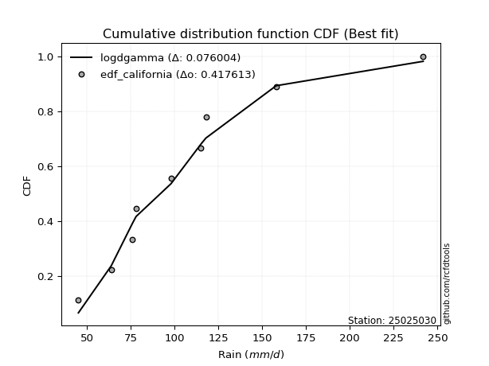</img>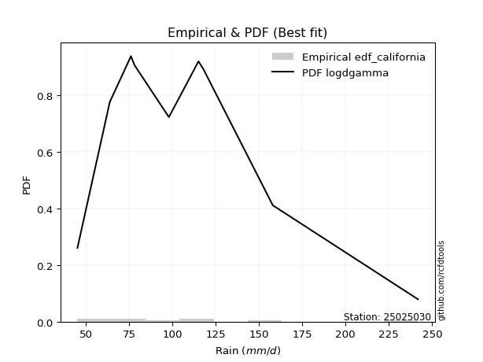</img>

</div>


### 2. Empirical - EDF Hazen (1930)

Hazen method for plotting positions is a formula used to estimate the empirical cumulative probability distribution of flood events or other hydrological data. This formula often results in biased estimations, particularly when extrapolating to extreme events (high return periods).

<div align="center">


$P=(m-0.5)/n$


</div>


**2.1. Empirical values**

<div align="center">

|                | 0                   | 1                   | 2                  | 3                  | 4         | 5                  | 6                  | 7                  | 8                  |
|:---------------|:--------------------|:--------------------|:-------------------|:-------------------|:----------|:-------------------|:-------------------|:-------------------|:-------------------|
| date           | 2023                | 2018                | 2017               | 2022               | 2025      | 2020               | 2021               | 2024               | 2019               |
| x              | 45.2                | 63.89               | 76.1               | 78.1               | 83.7      | 98.0               | 117.9              | 158.0              | 241.8              |
| m              | 1                   | 2                   | 3                  | 4                  | 5         | 6                  | 7                  | 8                  | 9                  |
| empirical_dist | edf_hazen           | edf_hazen           | edf_hazen          | edf_hazen          | edf_hazen | edf_hazen          | edf_hazen          | edf_hazen          | edf_hazen          |
| empirical      | 0.05555555555555555 | 0.16666666666666666 | 0.2777777777777778 | 0.3888888888888889 | 0.5       | 0.6111111111111112 | 0.7222222222222222 | 0.8333333333333334 | 0.9444444444444444 |
| empirical_tr   | 1.0588235294117647  | 1.2                 | 1.3846153846153846 | 1.6363636363636362 | 2.0       | 2.5714285714285716 | 3.5999999999999996 | 6.000000000000002  | 17.999999999999993 |

</div>


**2.2. Kolmogorov-Smirnov fit test (sorted by Δ)**


<div align="center">

|                | 0                     | 1                   | 2                   | 3                   | 4                   | 5                   | 6                   | 7                   | 8                   | 9                   | 10                  | 11                  | 12                  | 13                  | 14                  | 15                  | 16                  | 17                  | 18                  | 19                  | 20                  | 21                  | 22                  | 23                  | 24                  | 25                  | 26                  | 27                  | 28                  | 29                  | 30                  | 31                  | 32                  | 33                  | 34                  | 35                  | 36                  | 37                  | 38                  | 39                  | 40                  | 41                  | 42                  | 43                  | 44                  | 45                  | 46                  | 47                  | 48                  | 49                  | 50                  | 51                  | 52                  | 53                  | 54                  | 55                  | 56                  | 57                  | 58                  | 59                  | 60                  | 61                  | 62                  | 63                  | 64                  | 65                  | 66                  | 67                  | 68                  | 69                  | 70                  | 71                  | 72                  | 73                  | 74                  | 75                  | 76                  | 77                  | 78                  | 79                  | 80                  | 81                  | 82                  | 83                  | 84                  | 85                  | 86                  | 87                  | 88                  | 89                  |
|:---------------|:----------------------|:--------------------|:--------------------|:--------------------|:--------------------|:--------------------|:--------------------|:--------------------|:--------------------|:--------------------|:--------------------|:--------------------|:--------------------|:--------------------|:--------------------|:--------------------|:--------------------|:--------------------|:--------------------|:--------------------|:--------------------|:--------------------|:--------------------|:--------------------|:--------------------|:--------------------|:--------------------|:--------------------|:--------------------|:--------------------|:--------------------|:--------------------|:--------------------|:--------------------|:--------------------|:--------------------|:--------------------|:--------------------|:--------------------|:--------------------|:--------------------|:--------------------|:--------------------|:--------------------|:--------------------|:--------------------|:--------------------|:--------------------|:--------------------|:--------------------|:--------------------|:--------------------|:--------------------|:--------------------|:--------------------|:--------------------|:--------------------|:--------------------|:--------------------|:--------------------|:--------------------|:--------------------|:--------------------|:--------------------|:--------------------|:--------------------|:--------------------|:--------------------|:--------------------|:--------------------|:--------------------|:--------------------|:--------------------|:--------------------|:--------------------|:--------------------|:--------------------|:--------------------|:--------------------|:--------------------|:--------------------|:--------------------|:--------------------|:--------------------|:--------------------|:--------------------|:--------------------|:--------------------|:--------------------|:--------------------|
| station        | 25025030              | 25025030            | 25025030            | 25025030            | 25025030            | 25025030            | 25025030            | 25025030            | 25025030            | 25025030            | 25025030            | 25025030            | 25025030            | 25025030            | 25025030            | 25025030            | 25025030            | 25025030            | 25025030            | 25025030            | 25025030            | 25025030            | 25025030            | 25025030            | 25025030            | 25025030            | 25025030            | 25025030            | 25025030            | 25025030            | 25025030            | 25025030            | 25025030            | 25025030            | 25025030            | 25025030            | 25025030            | 25025030            | 25025030            | 25025030            | 25025030            | 25025030            | 25025030            | 25025030            | 25025030            | 25025030            | 25025030            | 25025030            | 25025030            | 25025030            | 25025030            | 25025030            | 25025030            | 25025030            | 25025030            | 25025030            | 25025030            | 25025030            | 25025030            | 25025030            | 25025030            | 25025030            | 25025030            | 25025030            | 25025030            | 25025030            | 25025030            | 25025030            | 25025030            | 25025030            | 25025030            | 25025030            | 25025030            | 25025030            | 25025030            | 25025030            | 25025030            | 25025030            | 25025030            | 25025030            | 25025030            | 25025030            | 25025030            | 25025030            | 25025030            | 25025030            | 25025030            | 25025030            | 25025030            | 25025030            |
| empirical_dist | edf_hazen             | edf_hazen           | edf_hazen           | edf_hazen           | edf_hazen           | edf_hazen           | edf_hazen           | edf_hazen           | edf_hazen           | edf_hazen           | edf_hazen           | edf_hazen           | edf_hazen           | edf_hazen           | edf_hazen           | edf_hazen           | edf_hazen           | edf_hazen           | edf_hazen           | edf_hazen           | edf_hazen           | edf_hazen           | edf_hazen           | edf_hazen           | edf_hazen           | edf_hazen           | edf_hazen           | edf_hazen           | edf_hazen           | edf_hazen           | edf_hazen           | edf_hazen           | edf_hazen           | edf_hazen           | edf_hazen           | edf_hazen           | edf_hazen           | edf_hazen           | edf_hazen           | edf_hazen           | edf_hazen           | edf_hazen           | edf_hazen           | edf_hazen           | edf_hazen           | edf_hazen           | edf_hazen           | edf_hazen           | edf_hazen           | edf_hazen           | edf_hazen           | edf_hazen           | edf_hazen           | edf_hazen           | edf_hazen           | edf_hazen           | edf_hazen           | edf_hazen           | edf_hazen           | edf_hazen           | edf_hazen           | edf_hazen           | edf_hazen           | edf_hazen           | edf_hazen           | edf_hazen           | edf_hazen           | edf_hazen           | edf_hazen           | edf_hazen           | edf_hazen           | edf_hazen           | edf_hazen           | edf_hazen           | edf_hazen           | edf_hazen           | edf_hazen           | edf_hazen           | edf_hazen           | edf_hazen           | edf_hazen           | edf_hazen           | edf_hazen           | edf_hazen           | edf_hazen           | edf_hazen           | edf_hazen           | edf_hazen           | edf_hazen           | edf_hazen           |
| p_dist         | loglaplace_asymmetric | wald                | logfisk             | logmielke           | alpha               | logalpha            | logf                | logjohnsonsu        | logexponnorm        | logmaxwell          | loginvgauss         | logfatiguelife      | logncf              | f                   | invgamma            | fisk                | loggenlogistic      | mielke              | nct                 | logerlang           | loggamma            | loggamma            | logpearson3         | logrice             | lognct              | loggumbel_r         | loginvgamma         | johnsonsu           | halflogistic        | lograyleigh         | invgauss            | exponnorm           | betaprime           | logweibull_min      | pearson3            | loginvweibull       | logbetaprime        | logmoyal            | gompertz            | loggompertz         | genexpon            | moyal               | halfnorm            | logkstwobign        | logloggamma         | logt                | lognorm             | lognorm             | logcrystalball      | weibull_min         | gumbel_r            | loghalfnorm         | t                   | expon               | loghalflogistic     | loglogistic         | genlogistic         | laplace_asymmetric  | rayleigh            | loghypsecant        | logwald             | maxwell             | kstwobign           | loglaplace          | gibrat              | loggibrat           | loggumbel_l         | truncnorm           | crystalball         | norm                | rice                | logistic            | loggenexpon         | hypsecant           | chi2                | ncf                 | logtruncnorm        | laplace             | nakagami            | logexpon            | gamma               | logchi2             | gumbel_l            | erlang              | loglognorm          | pareto              | lognakagami         | logpareto           | invweibull          | fatiguelife         |
| delta          | 0.04958691538913029   | 0.06330975131944666 | 0.06474152800763089 | 0.06694279965183403 | 0.06818927599476954 | 0.06838547745352697 | 0.07048868674181458 | 0.07169202275244202 | 0.07171956687993986 | 0.07281944521124095 | 0.07303685574543578 | 0.07323484334655528 | 0.07329787968482959 | 0.0734514919215572  | 0.07345149963769154 | 0.07352277053817757 | 0.07363032875636    | 0.07367388561110533 | 0.07480763662405937 | 0.07643764863126973 | 0.07643791697994406 | 0.07643791697994406 | 0.07707887004192843 | 0.07737704464624257 | 0.07791878272654462 | 0.0792867207387088  | 0.07989070942841736 | 0.08003019322263649 | 0.08062967530144927 | 0.08142869304477429 | 0.08174932771448751 | 0.08178447640160158 | 0.08205791559337194 | 0.08551683175305846 | 0.0888558712931799  | 0.09094602492006654 | 0.09152577852569271 | 0.09248453873721241 | 0.09259589965462262 | 0.09268344163117015 | 0.09508867731981208 | 0.0965267869962384  | 0.09970764103124932 | 0.10180440704810628 | 0.1030442838860533  | 0.10666395556440883 | 0.10666542953157138 | 0.10666542953157138 | 0.1066654648191217  | 0.1068407596399143  | 0.11322323165603587 | 0.11411752632395616 | 0.11415021143379112 | 0.1158606591773732  | 0.11622719075523391 | 0.1203146108527206  | 0.12505341780235646 | 0.1260970745646135  | 0.12743026275476044 | 0.1314182882994635  | 0.13807438661100413 | 0.13947782130125858 | 0.14919722867390106 | 0.15900508333671126 | 0.1666658824615133  | 0.16666666666666666 | 0.17246851252032908 | 0.1738789343327759  | 0.17387894667492376 | 0.17387894788358793 | 0.1820245003674072  | 0.18226559526981406 | 0.1846926900957635  | 0.19213494026358008 | 0.20578793307929333 | 0.21759432367408174 | 0.21848494055348983 | 0.219996255161011   | 0.22383986588745888 | 0.225988498740615   | 0.23076844335144553 | 0.24130930920354363 | 0.24335726271871239 | 0.2614346033344066  | 0.445033380874875   | 0.46344371293408126 | 0.46788659597918525 | 0.47600532309112853 | 0.4774113302719058  | 0.5502512081115037  |
| deltao         | 0.41761268023100007   | 0.41761268023100007 | 0.41761268023100007 | 0.41761268023100007 | 0.41761268023100007 | 0.41761268023100007 | 0.41761268023100007 | 0.41761268023100007 | 0.41761268023100007 | 0.41761268023100007 | 0.41761268023100007 | 0.41761268023100007 | 0.41761268023100007 | 0.41761268023100007 | 0.41761268023100007 | 0.41761268023100007 | 0.41761268023100007 | 0.41761268023100007 | 0.41761268023100007 | 0.41761268023100007 | 0.41761268023100007 | 0.41761268023100007 | 0.41761268023100007 | 0.41761268023100007 | 0.41761268023100007 | 0.41761268023100007 | 0.41761268023100007 | 0.41761268023100007 | 0.41761268023100007 | 0.41761268023100007 | 0.41761268023100007 | 0.41761268023100007 | 0.41761268023100007 | 0.41761268023100007 | 0.41761268023100007 | 0.41761268023100007 | 0.41761268023100007 | 0.41761268023100007 | 0.41761268023100007 | 0.41761268023100007 | 0.41761268023100007 | 0.41761268023100007 | 0.41761268023100007 | 0.41761268023100007 | 0.41761268023100007 | 0.41761268023100007 | 0.41761268023100007 | 0.41761268023100007 | 0.41761268023100007 | 0.41761268023100007 | 0.41761268023100007 | 0.41761268023100007 | 0.41761268023100007 | 0.41761268023100007 | 0.41761268023100007 | 0.41761268023100007 | 0.41761268023100007 | 0.41761268023100007 | 0.41761268023100007 | 0.41761268023100007 | 0.41761268023100007 | 0.41761268023100007 | 0.41761268023100007 | 0.41761268023100007 | 0.41761268023100007 | 0.41761268023100007 | 0.41761268023100007 | 0.41761268023100007 | 0.41761268023100007 | 0.41761268023100007 | 0.41761268023100007 | 0.41761268023100007 | 0.41761268023100007 | 0.41761268023100007 | 0.41761268023100007 | 0.41761268023100007 | 0.41761268023100007 | 0.41761268023100007 | 0.41761268023100007 | 0.41761268023100007 | 0.41761268023100007 | 0.41761268023100007 | 0.41761268023100007 | 0.41761268023100007 | 0.41761268023100007 | 0.41761268023100007 | 0.41761268023100007 | 0.41761268023100007 | 0.41761268023100007 | 0.41761268023100007 |
| eval           | Δo > Δ                | Δo > Δ              | Δo > Δ              | Δo > Δ              | Δo > Δ              | Δo > Δ              | Δo > Δ              | Δo > Δ              | Δo > Δ              | Δo > Δ              | Δo > Δ              | Δo > Δ              | Δo > Δ              | Δo > Δ              | Δo > Δ              | Δo > Δ              | Δo > Δ              | Δo > Δ              | Δo > Δ              | Δo > Δ              | Δo > Δ              | Δo > Δ              | Δo > Δ              | Δo > Δ              | Δo > Δ              | Δo > Δ              | Δo > Δ              | Δo > Δ              | Δo > Δ              | Δo > Δ              | Δo > Δ              | Δo > Δ              | Δo > Δ              | Δo > Δ              | Δo > Δ              | Δo > Δ              | Δo > Δ              | Δo > Δ              | Δo > Δ              | Δo > Δ              | Δo > Δ              | Δo > Δ              | Δo > Δ              | Δo > Δ              | Δo > Δ              | Δo > Δ              | Δo > Δ              | Δo > Δ              | Δo > Δ              | Δo > Δ              | Δo > Δ              | Δo > Δ              | Δo > Δ              | Δo > Δ              | Δo > Δ              | Δo > Δ              | Δo > Δ              | Δo > Δ              | Δo > Δ              | Δo > Δ              | Δo > Δ              | Δo > Δ              | Δo > Δ              | Δo > Δ              | Δo > Δ              | Δo > Δ              | Δo > Δ              | Δo > Δ              | Δo > Δ              | Δo > Δ              | Δo > Δ              | Δo > Δ              | Δo > Δ              | Δo > Δ              | Δo > Δ              | Δo > Δ              | Δo > Δ              | Δo > Δ              | Δo > Δ              | Δo > Δ              | Δo > Δ              | Δo > Δ              | Δo > Δ              | Δo > Δ              | Δo <= Δ             | Δo <= Δ             | Δo <= Δ             | Δo <= Δ             | Δo <= Δ             | Δo <= Δ             |
| fit            | 1                     | 1                   | 1                   | 1                   | 1                   | 1                   | 1                   | 1                   | 1                   | 1                   | 1                   | 1                   | 1                   | 1                   | 1                   | 1                   | 1                   | 1                   | 1                   | 1                   | 1                   | 1                   | 1                   | 1                   | 1                   | 1                   | 1                   | 1                   | 1                   | 1                   | 1                   | 1                   | 1                   | 1                   | 1                   | 1                   | 1                   | 1                   | 1                   | 1                   | 1                   | 1                   | 1                   | 1                   | 1                   | 1                   | 1                   | 1                   | 1                   | 1                   | 1                   | 1                   | 1                   | 1                   | 1                   | 1                   | 1                   | 1                   | 1                   | 1                   | 1                   | 1                   | 1                   | 1                   | 1                   | 1                   | 1                   | 1                   | 1                   | 1                   | 1                   | 1                   | 1                   | 1                   | 1                   | 1                   | 1                   | 1                   | 1                   | 1                   | 1                   | 1                   | 1                   | 1                   | 0                   | 0                   | 0                   | 0                   | 0                   | 0                   |
| n              | 9                     | 9                   | 9                   | 9                   | 9                   | 9                   | 9                   | 9                   | 9                   | 9                   | 9                   | 9                   | 9                   | 9                   | 9                   | 9                   | 9                   | 9                   | 9                   | 9                   | 9                   | 9                   | 9                   | 9                   | 9                   | 9                   | 9                   | 9                   | 9                   | 9                   | 9                   | 9                   | 9                   | 9                   | 9                   | 9                   | 9                   | 9                   | 9                   | 9                   | 9                   | 9                   | 9                   | 9                   | 9                   | 9                   | 9                   | 9                   | 9                   | 9                   | 9                   | 9                   | 9                   | 9                   | 9                   | 9                   | 9                   | 9                   | 9                   | 9                   | 9                   | 9                   | 9                   | 9                   | 9                   | 9                   | 9                   | 9                   | 9                   | 9                   | 9                   | 9                   | 9                   | 9                   | 9                   | 9                   | 9                   | 9                   | 9                   | 9                   | 9                   | 9                   | 9                   | 9                   | 9                   | 9                   | 9                   | 9                   | 9                   | 9                   |
| best_fit       | 1                     | 0                   | 0                   | 0                   | 0                   | 0                   | 0                   | 0                   | 0                   | 0                   | 0                   | 0                   | 0                   | 0                   | 0                   | 0                   | 0                   | 0                   | 0                   | 0                   | 0                   | 0                   | 0                   | 0                   | 0                   | 0                   | 0                   | 0                   | 0                   | 0                   | 0                   | 0                   | 0                   | 0                   | 0                   | 0                   | 0                   | 0                   | 0                   | 0                   | 0                   | 0                   | 0                   | 0                   | 0                   | 0                   | 0                   | 0                   | 0                   | 0                   | 0                   | 0                   | 0                   | 0                   | 0                   | 0                   | 0                   | 0                   | 0                   | 0                   | 0                   | 0                   | 0                   | 0                   | 0                   | 0                   | 0                   | 0                   | 0                   | 0                   | 0                   | 0                   | 0                   | 0                   | 0                   | 0                   | 0                   | 0                   | 0                   | 0                   | 0                   | 0                   | 0                   | 0                   | 0                   | 0                   | 0                   | 0                   | 0                   | 0                   |
| best_fit_sort  | 1                     | 2                   | 3                   | 4                   | 5                   | 6                   | 7                   | 8                   | 9                   | 10                  | 11                  | 12                  | 13                  | 14                  | 15                  | 16                  | 17                  | 18                  | 19                  | 20                  | 21                  | 22                  | 23                  | 24                  | 25                  | 26                  | 27                  | 28                  | 29                  | 30                  | 31                  | 32                  | 33                  | 34                  | 35                  | 36                  | 37                  | 38                  | 39                  | 40                  | 41                  | 42                  | 43                  | 44                  | 45                  | 46                  | 47                  | 48                  | 49                  | 50                  | 51                  | 52                  | 53                  | 54                  | 55                  | 56                  | 57                  | 58                  | 59                  | 60                  | 61                  | 62                  | 63                  | 64                  | 65                  | 66                  | 67                  | 68                  | 69                  | 70                  | 71                  | 72                  | 73                  | 74                  | 75                  | 76                  | 77                  | 78                  | 79                  | 80                  | 81                  | 82                  | 83                  | 84                  | 85                  | 86                  | 87                  | 88                  | 89                  | 90                  |

</div>


<div align="center">

</img>

</div>


**2.3. Best fit**

<div align="center">

|   id |   station | empirical_dist   | p_dist                |     delta |   deltao | eval   |   fit |   n |   best_fit |   best_fit_sort |
|-----:|----------:|:-----------------|:----------------------|----------:|---------:|:-------|------:|----:|-----------:|----------------:|
|    0 |  25025030 | edf_hazen        | loglaplace_asymmetric | 0.0495869 | 0.417613 | Δo > Δ |     1 |   9 |          1 |               1 |

</div>


<div align="center">

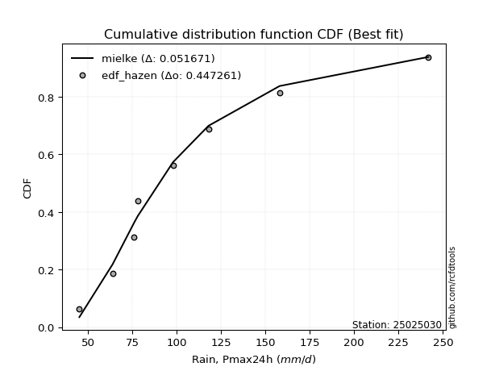</img>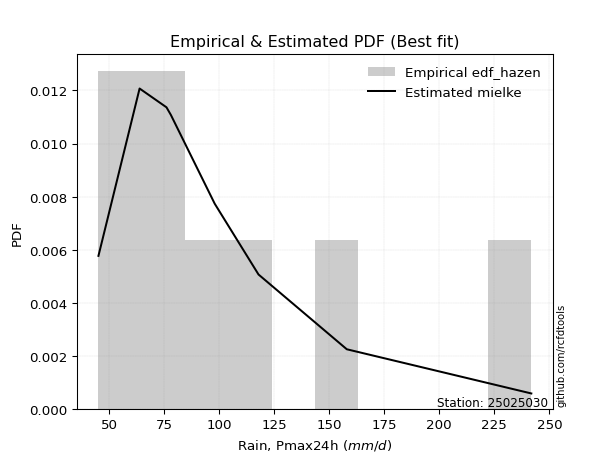</img>

</div>


### 3. Empirical - EDF Weibull (1939)

Weibull plotting position formula is an empirical method used to estimate the non-exceedance probability or plotting position for a set of observed data, is often recommended or widely used in practice, particularly in flood frequency analysis.

<div align="center">


$P=m/(n+1)$


</div>


**3.1. Empirical values**

<div align="center">

|                | 0                  | 1           | 2                  | 3                  | 4           | 5           | 6                 | 7                 | 8                  |
|:---------------|:-------------------|:------------|:-------------------|:-------------------|:------------|:------------|:------------------|:------------------|:-------------------|
| date           | 2023               | 2018        | 2017               | 2022               | 2025        | 2020        | 2021              | 2024              | 2019               |
| x              | 45.2               | 63.89       | 76.1               | 78.1               | 83.7        | 98.0        | 117.9             | 158.0             | 241.8              |
| m              | 1                  | 2           | 3                  | 4                  | 5           | 6           | 7                 | 8                 | 9                  |
| empirical_dist | edf_weibull        | edf_weibull | edf_weibull        | edf_weibull        | edf_weibull | edf_weibull | edf_weibull       | edf_weibull       | edf_weibull        |
| empirical      | 0.1                | 0.2         | 0.3                | 0.4                | 0.5         | 0.6         | 0.7               | 0.8               | 0.9                |
| empirical_tr   | 1.1111111111111112 | 1.25        | 1.4285714285714286 | 1.6666666666666667 | 2.0         | 2.5         | 3.333333333333333 | 5.000000000000001 | 10.000000000000002 |

</div>


**3.2. Kolmogorov-Smirnov fit test (sorted by Δ)**


<div align="center">

|                | 0                   | 1                   | 2                   | 3                   | 4                   | 5                   | 6                   | 7                   | 8                   | 9                   | 10                  | 11                  | 12                  | 13                  | 14                  | 15                  | 16                  | 17                  | 18                    | 19                  | 20                  | 21                  | 22                  | 23                  | 24                  | 25                  | 26                  | 27                  | 28                  | 29                  | 30                  | 31                  | 32                  | 33                  | 34                  | 35                  | 36                  | 37                  | 38                  | 39                  | 40                  | 41                  | 42                  | 43                  | 44                  | 45                  | 46                  | 47                  | 48                  | 49                  | 50                  | 51                  | 52                  | 53                  | 54                  | 55                  | 56                  | 57                  | 58                  | 59                  | 60                  | 61                  | 62                  | 63                  | 64                  | 65                  | 66                  | 67                  | 68                  | 69                  | 70                  | 71                  | 72                  | 73                  | 74                  | 75                  | 76                  | 77                  | 78                  | 79                  | 80                  | 81                  | 82                  | 83                  | 84                  | 85                  | 86                  | 87                  | 88                  | 89                  |
|:---------------|:--------------------|:--------------------|:--------------------|:--------------------|:--------------------|:--------------------|:--------------------|:--------------------|:--------------------|:--------------------|:--------------------|:--------------------|:--------------------|:--------------------|:--------------------|:--------------------|:--------------------|:--------------------|:----------------------|:--------------------|:--------------------|:--------------------|:--------------------|:--------------------|:--------------------|:--------------------|:--------------------|:--------------------|:--------------------|:--------------------|:--------------------|:--------------------|:--------------------|:--------------------|:--------------------|:--------------------|:--------------------|:--------------------|:--------------------|:--------------------|:--------------------|:--------------------|:--------------------|:--------------------|:--------------------|:--------------------|:--------------------|:--------------------|:--------------------|:--------------------|:--------------------|:--------------------|:--------------------|:--------------------|:--------------------|:--------------------|:--------------------|:--------------------|:--------------------|:--------------------|:--------------------|:--------------------|:--------------------|:--------------------|:--------------------|:--------------------|:--------------------|:--------------------|:--------------------|:--------------------|:--------------------|:--------------------|:--------------------|:--------------------|:--------------------|:--------------------|:--------------------|:--------------------|:--------------------|:--------------------|:--------------------|:--------------------|:--------------------|:--------------------|:--------------------|:--------------------|:--------------------|:--------------------|:--------------------|:--------------------|
| station        | 25025030            | 25025030            | 25025030            | 25025030            | 25025030            | 25025030            | 25025030            | 25025030            | 25025030            | 25025030            | 25025030            | 25025030            | 25025030            | 25025030            | 25025030            | 25025030            | 25025030            | 25025030            | 25025030              | 25025030            | 25025030            | 25025030            | 25025030            | 25025030            | 25025030            | 25025030            | 25025030            | 25025030            | 25025030            | 25025030            | 25025030            | 25025030            | 25025030            | 25025030            | 25025030            | 25025030            | 25025030            | 25025030            | 25025030            | 25025030            | 25025030            | 25025030            | 25025030            | 25025030            | 25025030            | 25025030            | 25025030            | 25025030            | 25025030            | 25025030            | 25025030            | 25025030            | 25025030            | 25025030            | 25025030            | 25025030            | 25025030            | 25025030            | 25025030            | 25025030            | 25025030            | 25025030            | 25025030            | 25025030            | 25025030            | 25025030            | 25025030            | 25025030            | 25025030            | 25025030            | 25025030            | 25025030            | 25025030            | 25025030            | 25025030            | 25025030            | 25025030            | 25025030            | 25025030            | 25025030            | 25025030            | 25025030            | 25025030            | 25025030            | 25025030            | 25025030            | 25025030            | 25025030            | 25025030            | 25025030            |
| empirical_dist | edf_weibull         | edf_weibull         | edf_weibull         | edf_weibull         | edf_weibull         | edf_weibull         | edf_weibull         | edf_weibull         | edf_weibull         | edf_weibull         | edf_weibull         | edf_weibull         | edf_weibull         | edf_weibull         | edf_weibull         | edf_weibull         | edf_weibull         | edf_weibull         | edf_weibull           | edf_weibull         | edf_weibull         | edf_weibull         | edf_weibull         | edf_weibull         | edf_weibull         | edf_weibull         | edf_weibull         | edf_weibull         | edf_weibull         | edf_weibull         | edf_weibull         | edf_weibull         | edf_weibull         | edf_weibull         | edf_weibull         | edf_weibull         | edf_weibull         | edf_weibull         | edf_weibull         | edf_weibull         | edf_weibull         | edf_weibull         | edf_weibull         | edf_weibull         | edf_weibull         | edf_weibull         | edf_weibull         | edf_weibull         | edf_weibull         | edf_weibull         | edf_weibull         | edf_weibull         | edf_weibull         | edf_weibull         | edf_weibull         | edf_weibull         | edf_weibull         | edf_weibull         | edf_weibull         | edf_weibull         | edf_weibull         | edf_weibull         | edf_weibull         | edf_weibull         | edf_weibull         | edf_weibull         | edf_weibull         | edf_weibull         | edf_weibull         | edf_weibull         | edf_weibull         | edf_weibull         | edf_weibull         | edf_weibull         | edf_weibull         | edf_weibull         | edf_weibull         | edf_weibull         | edf_weibull         | edf_weibull         | edf_weibull         | edf_weibull         | edf_weibull         | edf_weibull         | edf_weibull         | edf_weibull         | edf_weibull         | edf_weibull         | edf_weibull         | edf_weibull         |
| p_dist         | logmielke           | logfisk             | logf                | alpha               | logexponnorm        | logalpha            | logjohnsonsu        | loggenlogistic      | mielke              | loginvgauss         | logfatiguelife      | invgamma            | f                   | nct                 | logerlang           | loggamma            | loggamma            | invgauss            | loglaplace_asymmetric | johnsonsu           | logmaxwell          | logncf              | fisk                | loginvweibull       | logrice             | halflogistic        | lograyleigh         | logweibull_min      | logpearson3         | lognct              | logkstwobign        | loginvgamma         | exponnorm           | betaprime           | halfnorm            | loggumbel_r         | pearson3            | logbetaprime        | moyal               | logmoyal            | genexpon            | loggompertz         | weibull_min         | loghalflogistic     | wald                | expon               | gompertz            | loghalfnorm         | logloggamma         | logt                | lognorm             | lognorm             | logcrystalball      | gumbel_r            | rayleigh            | loglogistic         | genlogistic         | laplace_asymmetric  | maxwell             | loghypsecant        | t                   | kstwobign           | loglaplace          | loggenexpon         | truncnorm           | crystalball         | norm                | logwald             | loggumbel_l         | logistic            | rice                | ncf                 | chi2                | nakagami            | hypsecant           | logtruncnorm        | gibrat              | loggibrat           | logexpon            | logchi2             | gamma               | laplace             | gumbel_l            | erlang              | loglognorm          | pareto              | invweibull          | lognakagami         | logpareto           | fatiguelife         |
| delta          | 0.06694279965183403 | 0.06702497356982484 | 0.06711055197905802 | 0.06818927599476954 | 0.06831235962968982 | 0.06838547745352697 | 0.06859974983477211 | 0.06900590360779968 | 0.06902067339064298 | 0.06904387925467395 | 0.06911532185714628 | 0.06923003285487293 | 0.06923003522699749 | 0.06981103527194304 | 0.07047793579633531 | 0.07047797442979137 | 0.07047797442979137 | 0.07110873997344679 | 0.07123561098040809   | 0.07157978877787571 | 0.07281944521124095 | 0.07329787968482959 | 0.07374767670272711 | 0.07409274333194031 | 0.07531584790660231 | 0.07532626573700069 | 0.07652106779909858 | 0.07660083835169193 | 0.07707887004192843 | 0.07791878272654462 | 0.07958218482588408 | 0.07989070942841736 | 0.08178447640160158 | 0.08205791559337194 | 0.08227620338787311 | 0.08589935337329323 | 0.0888558712931799  | 0.09152577852569271 | 0.0965267869962384  | 0.09782486702622874 | 0.09999481044982969 | 0.09999999911233076 | 0.09999999999999584 | 0.1                 | 0.1                 | 0.1                 | 0.1                 | 0.1                 | 0.1030442838860533  | 0.10666395556440883 | 0.10666542953157138 | 0.10666542953157138 | 0.1066654648191217  | 0.11322323165603587 | 0.11631915164364925 | 0.1203146108527206  | 0.12505341780235646 | 0.1260970745646135  | 0.1283667101901474  | 0.1314182882994635  | 0.13275252177561536 | 0.14919722867390106 | 0.15900508333671126 | 0.1624704678735413  | 0.16276782322166472 | 0.16276783556381258 | 0.16276783677247675 | 0.17140771994433748 | 0.17246851252032908 | 0.17778889948333865 | 0.1820245003674072  | 0.1831694215773197  | 0.18356571085707113 | 0.19050653255412553 | 0.19213494026358008 | 0.19626271833126763 | 0.19999921579484664 | 0.2                 | 0.2037662765183928  | 0.20797597587021027 | 0.20854622112922333 | 0.219996255161011   | 0.2322461516076012  | 0.2392123811121844  | 0.4117000475415416  | 0.4301103796007479  | 0.4329668858274614  | 0.43455326264585187 | 0.44267198975779515 | 0.5169178747781704  |
| deltao         | 0.41761268023100007 | 0.41761268023100007 | 0.41761268023100007 | 0.41761268023100007 | 0.41761268023100007 | 0.41761268023100007 | 0.41761268023100007 | 0.41761268023100007 | 0.41761268023100007 | 0.41761268023100007 | 0.41761268023100007 | 0.41761268023100007 | 0.41761268023100007 | 0.41761268023100007 | 0.41761268023100007 | 0.41761268023100007 | 0.41761268023100007 | 0.41761268023100007 | 0.41761268023100007   | 0.41761268023100007 | 0.41761268023100007 | 0.41761268023100007 | 0.41761268023100007 | 0.41761268023100007 | 0.41761268023100007 | 0.41761268023100007 | 0.41761268023100007 | 0.41761268023100007 | 0.41761268023100007 | 0.41761268023100007 | 0.41761268023100007 | 0.41761268023100007 | 0.41761268023100007 | 0.41761268023100007 | 0.41761268023100007 | 0.41761268023100007 | 0.41761268023100007 | 0.41761268023100007 | 0.41761268023100007 | 0.41761268023100007 | 0.41761268023100007 | 0.41761268023100007 | 0.41761268023100007 | 0.41761268023100007 | 0.41761268023100007 | 0.41761268023100007 | 0.41761268023100007 | 0.41761268023100007 | 0.41761268023100007 | 0.41761268023100007 | 0.41761268023100007 | 0.41761268023100007 | 0.41761268023100007 | 0.41761268023100007 | 0.41761268023100007 | 0.41761268023100007 | 0.41761268023100007 | 0.41761268023100007 | 0.41761268023100007 | 0.41761268023100007 | 0.41761268023100007 | 0.41761268023100007 | 0.41761268023100007 | 0.41761268023100007 | 0.41761268023100007 | 0.41761268023100007 | 0.41761268023100007 | 0.41761268023100007 | 0.41761268023100007 | 0.41761268023100007 | 0.41761268023100007 | 0.41761268023100007 | 0.41761268023100007 | 0.41761268023100007 | 0.41761268023100007 | 0.41761268023100007 | 0.41761268023100007 | 0.41761268023100007 | 0.41761268023100007 | 0.41761268023100007 | 0.41761268023100007 | 0.41761268023100007 | 0.41761268023100007 | 0.41761268023100007 | 0.41761268023100007 | 0.41761268023100007 | 0.41761268023100007 | 0.41761268023100007 | 0.41761268023100007 | 0.41761268023100007 |
| eval           | Δo > Δ              | Δo > Δ              | Δo > Δ              | Δo > Δ              | Δo > Δ              | Δo > Δ              | Δo > Δ              | Δo > Δ              | Δo > Δ              | Δo > Δ              | Δo > Δ              | Δo > Δ              | Δo > Δ              | Δo > Δ              | Δo > Δ              | Δo > Δ              | Δo > Δ              | Δo > Δ              | Δo > Δ                | Δo > Δ              | Δo > Δ              | Δo > Δ              | Δo > Δ              | Δo > Δ              | Δo > Δ              | Δo > Δ              | Δo > Δ              | Δo > Δ              | Δo > Δ              | Δo > Δ              | Δo > Δ              | Δo > Δ              | Δo > Δ              | Δo > Δ              | Δo > Δ              | Δo > Δ              | Δo > Δ              | Δo > Δ              | Δo > Δ              | Δo > Δ              | Δo > Δ              | Δo > Δ              | Δo > Δ              | Δo > Δ              | Δo > Δ              | Δo > Δ              | Δo > Δ              | Δo > Δ              | Δo > Δ              | Δo > Δ              | Δo > Δ              | Δo > Δ              | Δo > Δ              | Δo > Δ              | Δo > Δ              | Δo > Δ              | Δo > Δ              | Δo > Δ              | Δo > Δ              | Δo > Δ              | Δo > Δ              | Δo > Δ              | Δo > Δ              | Δo > Δ              | Δo > Δ              | Δo > Δ              | Δo > Δ              | Δo > Δ              | Δo > Δ              | Δo > Δ              | Δo > Δ              | Δo > Δ              | Δo > Δ              | Δo > Δ              | Δo > Δ              | Δo > Δ              | Δo > Δ              | Δo > Δ              | Δo > Δ              | Δo > Δ              | Δo > Δ              | Δo > Δ              | Δo > Δ              | Δo > Δ              | Δo > Δ              | Δo <= Δ             | Δo <= Δ             | Δo <= Δ             | Δo <= Δ             | Δo <= Δ             |
| fit            | 1                   | 1                   | 1                   | 1                   | 1                   | 1                   | 1                   | 1                   | 1                   | 1                   | 1                   | 1                   | 1                   | 1                   | 1                   | 1                   | 1                   | 1                   | 1                     | 1                   | 1                   | 1                   | 1                   | 1                   | 1                   | 1                   | 1                   | 1                   | 1                   | 1                   | 1                   | 1                   | 1                   | 1                   | 1                   | 1                   | 1                   | 1                   | 1                   | 1                   | 1                   | 1                   | 1                   | 1                   | 1                   | 1                   | 1                   | 1                   | 1                   | 1                   | 1                   | 1                   | 1                   | 1                   | 1                   | 1                   | 1                   | 1                   | 1                   | 1                   | 1                   | 1                   | 1                   | 1                   | 1                   | 1                   | 1                   | 1                   | 1                   | 1                   | 1                   | 1                   | 1                   | 1                   | 1                   | 1                   | 1                   | 1                   | 1                   | 1                   | 1                   | 1                   | 1                   | 1                   | 1                   | 0                   | 0                   | 0                   | 0                   | 0                   |
| n              | 9                   | 9                   | 9                   | 9                   | 9                   | 9                   | 9                   | 9                   | 9                   | 9                   | 9                   | 9                   | 9                   | 9                   | 9                   | 9                   | 9                   | 9                   | 9                     | 9                   | 9                   | 9                   | 9                   | 9                   | 9                   | 9                   | 9                   | 9                   | 9                   | 9                   | 9                   | 9                   | 9                   | 9                   | 9                   | 9                   | 9                   | 9                   | 9                   | 9                   | 9                   | 9                   | 9                   | 9                   | 9                   | 9                   | 9                   | 9                   | 9                   | 9                   | 9                   | 9                   | 9                   | 9                   | 9                   | 9                   | 9                   | 9                   | 9                   | 9                   | 9                   | 9                   | 9                   | 9                   | 9                   | 9                   | 9                   | 9                   | 9                   | 9                   | 9                   | 9                   | 9                   | 9                   | 9                   | 9                   | 9                   | 9                   | 9                   | 9                   | 9                   | 9                   | 9                   | 9                   | 9                   | 9                   | 9                   | 9                   | 9                   | 9                   |
| best_fit       | 1                   | 0                   | 0                   | 0                   | 0                   | 0                   | 0                   | 0                   | 0                   | 0                   | 0                   | 0                   | 0                   | 0                   | 0                   | 0                   | 0                   | 0                   | 0                     | 0                   | 0                   | 0                   | 0                   | 0                   | 0                   | 0                   | 0                   | 0                   | 0                   | 0                   | 0                   | 0                   | 0                   | 0                   | 0                   | 0                   | 0                   | 0                   | 0                   | 0                   | 0                   | 0                   | 0                   | 0                   | 0                   | 0                   | 0                   | 0                   | 0                   | 0                   | 0                   | 0                   | 0                   | 0                   | 0                   | 0                   | 0                   | 0                   | 0                   | 0                   | 0                   | 0                   | 0                   | 0                   | 0                   | 0                   | 0                   | 0                   | 0                   | 0                   | 0                   | 0                   | 0                   | 0                   | 0                   | 0                   | 0                   | 0                   | 0                   | 0                   | 0                   | 0                   | 0                   | 0                   | 0                   | 0                   | 0                   | 0                   | 0                   | 0                   |
| best_fit_sort  | 1                   | 2                   | 3                   | 4                   | 5                   | 6                   | 7                   | 8                   | 9                   | 10                  | 11                  | 12                  | 13                  | 14                  | 15                  | 16                  | 17                  | 18                  | 19                    | 20                  | 21                  | 22                  | 23                  | 24                  | 25                  | 26                  | 27                  | 28                  | 29                  | 30                  | 31                  | 32                  | 33                  | 34                  | 35                  | 36                  | 37                  | 38                  | 39                  | 40                  | 41                  | 42                  | 43                  | 44                  | 45                  | 46                  | 47                  | 48                  | 49                  | 50                  | 51                  | 52                  | 53                  | 54                  | 55                  | 56                  | 57                  | 58                  | 59                  | 60                  | 61                  | 62                  | 63                  | 64                  | 65                  | 66                  | 67                  | 68                  | 69                  | 70                  | 71                  | 72                  | 73                  | 74                  | 75                  | 76                  | 77                  | 78                  | 79                  | 80                  | 81                  | 82                  | 83                  | 84                  | 85                  | 86                  | 87                  | 88                  | 89                  | 90                  |

</div>


<div align="center">

</img>

</div>


**3.3. Best fit**

<div align="center">

|   id |   station | empirical_dist   | p_dist    |     delta |   deltao | eval   |   fit |   n |   best_fit |   best_fit_sort |
|-----:|----------:|:-----------------|:----------|----------:|---------:|:-------|------:|----:|-----------:|----------------:|
|    0 |  25025030 | edf_weibull      | logmielke | 0.0669428 | 0.417613 | Δo > Δ |     1 |   9 |          1 |               1 |

</div>


<div align="center">

</img>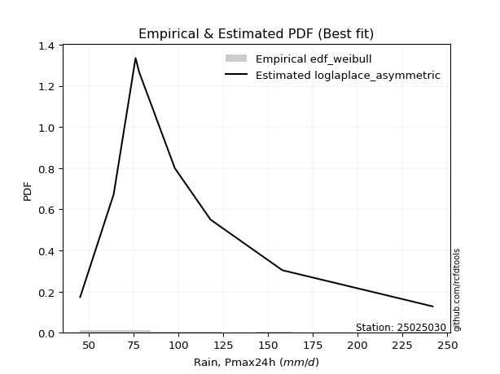</img>

</div>


### 4. Empirical - EDF Beard (1943)

The Beard formula (or Beard´s plotting position formula) in hydrology is used to estimate the empirical non-exceedance probability _(P)_ of a flood event (or other extreme hydrological data point) within a given dataset.

<div align="center">


$P=(m-0.31)/(n+0.38)$


</div>


**4.1. Empirical values**

<div align="center">

|                | 0                   | 1                   | 2                  | 3                   | 4         | 5                  | 6                  | 7                  | 8                  |
|:---------------|:--------------------|:--------------------|:-------------------|:--------------------|:----------|:-------------------|:-------------------|:-------------------|:-------------------|
| date           | 2023                | 2018                | 2017               | 2022                | 2025      | 2020               | 2021               | 2024               | 2019               |
| x              | 45.2                | 63.89               | 76.1               | 78.1                | 83.7      | 98.0               | 117.9              | 158.0              | 241.8              |
| m              | 1                   | 2                   | 3                  | 4                   | 5         | 6                  | 7                  | 8                  | 9                  |
| empirical_dist | edf_beard           | edf_beard           | edf_beard          | edf_beard           | edf_beard | edf_beard          | edf_beard          | edf_beard          | edf_beard          |
| empirical      | 0.07356076759061833 | 0.18017057569296374 | 0.2867803837953091 | 0.39339019189765456 | 0.5       | 0.6066098081023454 | 0.7132196162046908 | 0.8198294243070362 | 0.9264392324093815 |
| empirical_tr   | 1.0794016110471807  | 1.2197659297789336  | 1.4020926756352765 | 1.6485061511423549  | 2.0       | 2.542005420054201  | 3.486988847583642  | 5.550295857988164  | 13.5942028985507   |

</div>


**4.2. Kolmogorov-Smirnov fit test (sorted by Δ)**


<div align="center">

|                | 0                     | 1                   | 2                   | 3                   | 4                   | 5                   | 6                   | 7                   | 8                   | 9                   | 10                  | 11                  | 12                  | 13                  | 14                  | 15                  | 16                  | 17                  | 18                  | 19                  | 20                  | 21                  | 22                  | 23                  | 24                  | 25                  | 26                  | 27                  | 28                  | 29                  | 30                  | 31                  | 32                  | 33                  | 34                  | 35                  | 36                  | 37                  | 38                  | 39                  | 40                  | 41                  | 42                  | 43                  | 44                  | 45                  | 46                  | 47                  | 48                  | 49                  | 50                  | 51                  | 52                  | 53                  | 54                  | 55                  | 56                  | 57                  | 58                  | 59                  | 60                  | 61                  | 62                  | 63                  | 64                  | 65                  | 66                  | 67                  | 68                  | 69                  | 70                  | 71                  | 72                  | 73                  | 74                  | 75                  | 76                  | 77                  | 78                  | 79                  | 80                  | 81                  | 82                  | 83                  | 84                  | 85                  | 86                  | 87                  | 88                  | 89                  |
|:---------------|:----------------------|:--------------------|:--------------------|:--------------------|:--------------------|:--------------------|:--------------------|:--------------------|:--------------------|:--------------------|:--------------------|:--------------------|:--------------------|:--------------------|:--------------------|:--------------------|:--------------------|:--------------------|:--------------------|:--------------------|:--------------------|:--------------------|:--------------------|:--------------------|:--------------------|:--------------------|:--------------------|:--------------------|:--------------------|:--------------------|:--------------------|:--------------------|:--------------------|:--------------------|:--------------------|:--------------------|:--------------------|:--------------------|:--------------------|:--------------------|:--------------------|:--------------------|:--------------------|:--------------------|:--------------------|:--------------------|:--------------------|:--------------------|:--------------------|:--------------------|:--------------------|:--------------------|:--------------------|:--------------------|:--------------------|:--------------------|:--------------------|:--------------------|:--------------------|:--------------------|:--------------------|:--------------------|:--------------------|:--------------------|:--------------------|:--------------------|:--------------------|:--------------------|:--------------------|:--------------------|:--------------------|:--------------------|:--------------------|:--------------------|:--------------------|:--------------------|:--------------------|:--------------------|:--------------------|:--------------------|:--------------------|:--------------------|:--------------------|:--------------------|:--------------------|:--------------------|:--------------------|:--------------------|:--------------------|:--------------------|
| station        | 25025030              | 25025030            | 25025030            | 25025030            | 25025030            | 25025030            | 25025030            | 25025030            | 25025030            | 25025030            | 25025030            | 25025030            | 25025030            | 25025030            | 25025030            | 25025030            | 25025030            | 25025030            | 25025030            | 25025030            | 25025030            | 25025030            | 25025030            | 25025030            | 25025030            | 25025030            | 25025030            | 25025030            | 25025030            | 25025030            | 25025030            | 25025030            | 25025030            | 25025030            | 25025030            | 25025030            | 25025030            | 25025030            | 25025030            | 25025030            | 25025030            | 25025030            | 25025030            | 25025030            | 25025030            | 25025030            | 25025030            | 25025030            | 25025030            | 25025030            | 25025030            | 25025030            | 25025030            | 25025030            | 25025030            | 25025030            | 25025030            | 25025030            | 25025030            | 25025030            | 25025030            | 25025030            | 25025030            | 25025030            | 25025030            | 25025030            | 25025030            | 25025030            | 25025030            | 25025030            | 25025030            | 25025030            | 25025030            | 25025030            | 25025030            | 25025030            | 25025030            | 25025030            | 25025030            | 25025030            | 25025030            | 25025030            | 25025030            | 25025030            | 25025030            | 25025030            | 25025030            | 25025030            | 25025030            | 25025030            |
| empirical_dist | edf_beard             | edf_beard           | edf_beard           | edf_beard           | edf_beard           | edf_beard           | edf_beard           | edf_beard           | edf_beard           | edf_beard           | edf_beard           | edf_beard           | edf_beard           | edf_beard           | edf_beard           | edf_beard           | edf_beard           | edf_beard           | edf_beard           | edf_beard           | edf_beard           | edf_beard           | edf_beard           | edf_beard           | edf_beard           | edf_beard           | edf_beard           | edf_beard           | edf_beard           | edf_beard           | edf_beard           | edf_beard           | edf_beard           | edf_beard           | edf_beard           | edf_beard           | edf_beard           | edf_beard           | edf_beard           | edf_beard           | edf_beard           | edf_beard           | edf_beard           | edf_beard           | edf_beard           | edf_beard           | edf_beard           | edf_beard           | edf_beard           | edf_beard           | edf_beard           | edf_beard           | edf_beard           | edf_beard           | edf_beard           | edf_beard           | edf_beard           | edf_beard           | edf_beard           | edf_beard           | edf_beard           | edf_beard           | edf_beard           | edf_beard           | edf_beard           | edf_beard           | edf_beard           | edf_beard           | edf_beard           | edf_beard           | edf_beard           | edf_beard           | edf_beard           | edf_beard           | edf_beard           | edf_beard           | edf_beard           | edf_beard           | edf_beard           | edf_beard           | edf_beard           | edf_beard           | edf_beard           | edf_beard           | edf_beard           | edf_beard           | edf_beard           | edf_beard           | edf_beard           | edf_beard           |
| p_dist         | loglaplace_asymmetric | logexponnorm        | logfatiguelife      | loginvgauss         | f                   | invgamma            | fisk                | loggenlogistic      | logfisk             | mielke              | logjohnsonsu        | nct                 | logmielke           | logf                | logerlang           | loggamma            | loggamma            | alpha               | logrice             | logalpha            | loggumbel_r         | johnsonsu           | lograyleigh         | invgauss            | logmaxwell          | logncf              | halflogistic        | logweibull_min      | wald                | logpearson3         | lognct              | loginvgamma         | exponnorm           | loginvweibull       | betaprime           | logmoyal            | gompertz            | loggompertz         | genexpon            | pearson3            | halfnorm            | logbetaprime        | logkstwobign        | moyal               | weibull_min         | logloggamma         | loghalfnorm         | logt                | lognorm             | lognorm             | logcrystalball      | expon               | loghalflogistic     | gumbel_r            | t                   | loglogistic         | rayleigh            | genlogistic         | laplace_asymmetric  | loghypsecant        | maxwell             | kstwobign           | logwald             | loglaplace          | truncnorm           | crystalball         | norm                | loggumbel_l         | loggenexpon         | logistic            | gibrat              | loggibrat           | rice                | hypsecant           | chi2                | ncf                 | logtruncnorm        | nakagami            | logexpon            | laplace             | gamma               | logchi2             | gumbel_l            | erlang              | loglognorm          | pareto              | lognakagami         | invweibull          | logpareto           | fatiguelife         |
| delta          | 0.051406186673371934  | 0.06271696086240852 | 0.06423223732902394 | 0.06433470709979955 | 0.06444888590402587 | 0.06444889362016021 | 0.06452016452064624 | 0.06462772273882866 | 0.0646487030282048  | 0.064671279593574   | 0.06518663198954638 | 0.06580503060652804 | 0.06694279965183403 | 0.06711055197905802 | 0.0674350426137384  | 0.06743531096241273 | 0.06743531096241273 | 0.06818927599476954 | 0.06837443862871123 | 0.06838547745352697 | 0.07028411472117746 | 0.07102758720510516 | 0.07242608702724296 | 0.07274672169695617 | 0.07281944521124095 | 0.07329787968482959 | 0.07532626573700069 | 0.07651422573552713 | 0.07681366034574375 | 0.07707887004192843 | 0.07791878272654462 | 0.07989070942841736 | 0.08178447640160158 | 0.0819434189025352  | 0.08205791559337194 | 0.08348193271968107 | 0.08359329363709128 | 0.08368083561363882 | 0.08608607130228074 | 0.0888558712931799  | 0.08888601149021857 | 0.09152577852569271 | 0.09280180103057495 | 0.0965267869962384  | 0.09783815362238296 | 0.1030442838860533  | 0.10511492030642483 | 0.10666395556440883 | 0.10666542953157138 | 0.10666542953157138 | 0.1066654648191217  | 0.10685805315984187 | 0.10722458473770258 | 0.11322323165603587 | 0.11859721712704085 | 0.1203146108527206  | 0.12292895974599471 | 0.12505341780235646 | 0.1260970745646135  | 0.1314182882994635  | 0.13497651829249285 | 0.14919722867390106 | 0.1515782956373012  | 0.15900508333671126 | 0.16937763132401018 | 0.16937764366615804 | 0.1693776448748222  | 0.17246851252032908 | 0.17569008407823217 | 0.17778889948333865 | 0.18016979148781037 | 0.18017057569296374 | 0.1820245003674072  | 0.19213494026358008 | 0.196785327061762   | 0.20299884588435596 | 0.2094823345359585  | 0.2103359568611618  | 0.21698589272308366 | 0.219996255161011   | 0.2217658373339142  | 0.22780540017724654 | 0.23885595970994666 | 0.25243199731687527 | 0.4315294718485779  | 0.44993980390778415 | 0.45438268695288814 | 0.4594061182368429  | 0.4625014140648314  | 0.5367472990852067  |
| deltao         | 0.41761268023100007   | 0.41761268023100007 | 0.41761268023100007 | 0.41761268023100007 | 0.41761268023100007 | 0.41761268023100007 | 0.41761268023100007 | 0.41761268023100007 | 0.41761268023100007 | 0.41761268023100007 | 0.41761268023100007 | 0.41761268023100007 | 0.41761268023100007 | 0.41761268023100007 | 0.41761268023100007 | 0.41761268023100007 | 0.41761268023100007 | 0.41761268023100007 | 0.41761268023100007 | 0.41761268023100007 | 0.41761268023100007 | 0.41761268023100007 | 0.41761268023100007 | 0.41761268023100007 | 0.41761268023100007 | 0.41761268023100007 | 0.41761268023100007 | 0.41761268023100007 | 0.41761268023100007 | 0.41761268023100007 | 0.41761268023100007 | 0.41761268023100007 | 0.41761268023100007 | 0.41761268023100007 | 0.41761268023100007 | 0.41761268023100007 | 0.41761268023100007 | 0.41761268023100007 | 0.41761268023100007 | 0.41761268023100007 | 0.41761268023100007 | 0.41761268023100007 | 0.41761268023100007 | 0.41761268023100007 | 0.41761268023100007 | 0.41761268023100007 | 0.41761268023100007 | 0.41761268023100007 | 0.41761268023100007 | 0.41761268023100007 | 0.41761268023100007 | 0.41761268023100007 | 0.41761268023100007 | 0.41761268023100007 | 0.41761268023100007 | 0.41761268023100007 | 0.41761268023100007 | 0.41761268023100007 | 0.41761268023100007 | 0.41761268023100007 | 0.41761268023100007 | 0.41761268023100007 | 0.41761268023100007 | 0.41761268023100007 | 0.41761268023100007 | 0.41761268023100007 | 0.41761268023100007 | 0.41761268023100007 | 0.41761268023100007 | 0.41761268023100007 | 0.41761268023100007 | 0.41761268023100007 | 0.41761268023100007 | 0.41761268023100007 | 0.41761268023100007 | 0.41761268023100007 | 0.41761268023100007 | 0.41761268023100007 | 0.41761268023100007 | 0.41761268023100007 | 0.41761268023100007 | 0.41761268023100007 | 0.41761268023100007 | 0.41761268023100007 | 0.41761268023100007 | 0.41761268023100007 | 0.41761268023100007 | 0.41761268023100007 | 0.41761268023100007 | 0.41761268023100007 |
| eval           | Δo > Δ                | Δo > Δ              | Δo > Δ              | Δo > Δ              | Δo > Δ              | Δo > Δ              | Δo > Δ              | Δo > Δ              | Δo > Δ              | Δo > Δ              | Δo > Δ              | Δo > Δ              | Δo > Δ              | Δo > Δ              | Δo > Δ              | Δo > Δ              | Δo > Δ              | Δo > Δ              | Δo > Δ              | Δo > Δ              | Δo > Δ              | Δo > Δ              | Δo > Δ              | Δo > Δ              | Δo > Δ              | Δo > Δ              | Δo > Δ              | Δo > Δ              | Δo > Δ              | Δo > Δ              | Δo > Δ              | Δo > Δ              | Δo > Δ              | Δo > Δ              | Δo > Δ              | Δo > Δ              | Δo > Δ              | Δo > Δ              | Δo > Δ              | Δo > Δ              | Δo > Δ              | Δo > Δ              | Δo > Δ              | Δo > Δ              | Δo > Δ              | Δo > Δ              | Δo > Δ              | Δo > Δ              | Δo > Δ              | Δo > Δ              | Δo > Δ              | Δo > Δ              | Δo > Δ              | Δo > Δ              | Δo > Δ              | Δo > Δ              | Δo > Δ              | Δo > Δ              | Δo > Δ              | Δo > Δ              | Δo > Δ              | Δo > Δ              | Δo > Δ              | Δo > Δ              | Δo > Δ              | Δo > Δ              | Δo > Δ              | Δo > Δ              | Δo > Δ              | Δo > Δ              | Δo > Δ              | Δo > Δ              | Δo > Δ              | Δo > Δ              | Δo > Δ              | Δo > Δ              | Δo > Δ              | Δo > Δ              | Δo > Δ              | Δo > Δ              | Δo > Δ              | Δo > Δ              | Δo > Δ              | Δo > Δ              | Δo <= Δ             | Δo <= Δ             | Δo <= Δ             | Δo <= Δ             | Δo <= Δ             | Δo <= Δ             |
| fit            | 1                     | 1                   | 1                   | 1                   | 1                   | 1                   | 1                   | 1                   | 1                   | 1                   | 1                   | 1                   | 1                   | 1                   | 1                   | 1                   | 1                   | 1                   | 1                   | 1                   | 1                   | 1                   | 1                   | 1                   | 1                   | 1                   | 1                   | 1                   | 1                   | 1                   | 1                   | 1                   | 1                   | 1                   | 1                   | 1                   | 1                   | 1                   | 1                   | 1                   | 1                   | 1                   | 1                   | 1                   | 1                   | 1                   | 1                   | 1                   | 1                   | 1                   | 1                   | 1                   | 1                   | 1                   | 1                   | 1                   | 1                   | 1                   | 1                   | 1                   | 1                   | 1                   | 1                   | 1                   | 1                   | 1                   | 1                   | 1                   | 1                   | 1                   | 1                   | 1                   | 1                   | 1                   | 1                   | 1                   | 1                   | 1                   | 1                   | 1                   | 1                   | 1                   | 1                   | 1                   | 0                   | 0                   | 0                   | 0                   | 0                   | 0                   |
| n              | 9                     | 9                   | 9                   | 9                   | 9                   | 9                   | 9                   | 9                   | 9                   | 9                   | 9                   | 9                   | 9                   | 9                   | 9                   | 9                   | 9                   | 9                   | 9                   | 9                   | 9                   | 9                   | 9                   | 9                   | 9                   | 9                   | 9                   | 9                   | 9                   | 9                   | 9                   | 9                   | 9                   | 9                   | 9                   | 9                   | 9                   | 9                   | 9                   | 9                   | 9                   | 9                   | 9                   | 9                   | 9                   | 9                   | 9                   | 9                   | 9                   | 9                   | 9                   | 9                   | 9                   | 9                   | 9                   | 9                   | 9                   | 9                   | 9                   | 9                   | 9                   | 9                   | 9                   | 9                   | 9                   | 9                   | 9                   | 9                   | 9                   | 9                   | 9                   | 9                   | 9                   | 9                   | 9                   | 9                   | 9                   | 9                   | 9                   | 9                   | 9                   | 9                   | 9                   | 9                   | 9                   | 9                   | 9                   | 9                   | 9                   | 9                   |
| best_fit       | 1                     | 0                   | 0                   | 0                   | 0                   | 0                   | 0                   | 0                   | 0                   | 0                   | 0                   | 0                   | 0                   | 0                   | 0                   | 0                   | 0                   | 0                   | 0                   | 0                   | 0                   | 0                   | 0                   | 0                   | 0                   | 0                   | 0                   | 0                   | 0                   | 0                   | 0                   | 0                   | 0                   | 0                   | 0                   | 0                   | 0                   | 0                   | 0                   | 0                   | 0                   | 0                   | 0                   | 0                   | 0                   | 0                   | 0                   | 0                   | 0                   | 0                   | 0                   | 0                   | 0                   | 0                   | 0                   | 0                   | 0                   | 0                   | 0                   | 0                   | 0                   | 0                   | 0                   | 0                   | 0                   | 0                   | 0                   | 0                   | 0                   | 0                   | 0                   | 0                   | 0                   | 0                   | 0                   | 0                   | 0                   | 0                   | 0                   | 0                   | 0                   | 0                   | 0                   | 0                   | 0                   | 0                   | 0                   | 0                   | 0                   | 0                   |
| best_fit_sort  | 1                     | 2                   | 3                   | 4                   | 5                   | 6                   | 7                   | 8                   | 9                   | 10                  | 11                  | 12                  | 13                  | 14                  | 15                  | 16                  | 17                  | 18                  | 19                  | 20                  | 21                  | 22                  | 23                  | 24                  | 25                  | 26                  | 27                  | 28                  | 29                  | 30                  | 31                  | 32                  | 33                  | 34                  | 35                  | 36                  | 37                  | 38                  | 39                  | 40                  | 41                  | 42                  | 43                  | 44                  | 45                  | 46                  | 47                  | 48                  | 49                  | 50                  | 51                  | 52                  | 53                  | 54                  | 55                  | 56                  | 57                  | 58                  | 59                  | 60                  | 61                  | 62                  | 63                  | 64                  | 65                  | 66                  | 67                  | 68                  | 69                  | 70                  | 71                  | 72                  | 73                  | 74                  | 75                  | 76                  | 77                  | 78                  | 79                  | 80                  | 81                  | 82                  | 83                  | 84                  | 85                  | 86                  | 87                  | 88                  | 89                  | 90                  |

</div>


<div align="center">

</img>

</div>


**4.3. Best fit**

<div align="center">

|   id |   station | empirical_dist   | p_dist                |     delta |   deltao | eval   |   fit |   n |   best_fit |   best_fit_sort |
|-----:|----------:|:-----------------|:----------------------|----------:|---------:|:-------|------:|----:|-----------:|----------------:|
|    0 |  25025030 | edf_beard        | loglaplace_asymmetric | 0.0514062 | 0.417613 | Δo > Δ |     1 |   9 |          1 |               1 |

</div>


<div align="center">

</img>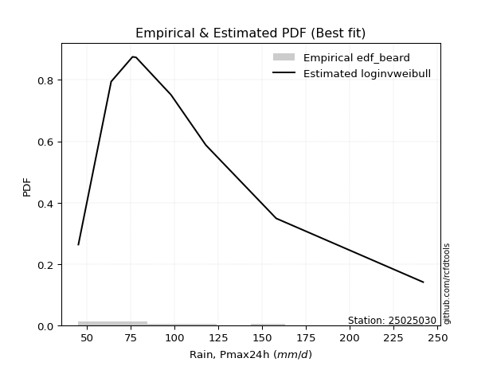</img>

</div>


### 5. Empirical - EDF Chegodayev (1955)

The Chegodayev formula is an empirical plotting position formula used in hydrological frequency analysis to estimate the exceedance probability or return period of a specific event from a set of observed data. It is primarily used for plotting observed data points on probability paper to fit a theoretical distribution, particularly for analyzing extreme events like maximum flood flows or rainfall intensities. The constant _b_ value in the generalized plotting position formula is 0.3.

<div align="center">


$P=(m-b)/(n+1-2b)$


</div>


**5.1. Empirical values**

<div align="center">

|                | 0                   | 1                   | 2                  | 3                   | 4              | 5                  | 6                  | 7                  | 8                  |
|:---------------|:--------------------|:--------------------|:-------------------|:--------------------|:---------------|:-------------------|:-------------------|:-------------------|:-------------------|
| date           | 2023                | 2018                | 2017               | 2022                | 2025           | 2020               | 2021               | 2024               | 2019               |
| x              | 45.2                | 63.89               | 76.1               | 78.1                | 83.7           | 98.0               | 117.9              | 158.0              | 241.8              |
| m              | 1                   | 2                   | 3                  | 4                   | 5              | 6                  | 7                  | 8                  | 9                  |
| empirical_dist | edf_chegodayev      | edf_chegodayev      | edf_chegodayev     | edf_chegodayev      | edf_chegodayev | edf_chegodayev     | edf_chegodayev     | edf_chegodayev     | edf_chegodayev     |
| empirical      | 0.07446808510638298 | 0.18085106382978722 | 0.2872340425531915 | 0.39361702127659576 | 0.5            | 0.6063829787234043 | 0.7127659574468085 | 0.8191489361702128 | 0.9255319148936169 |
| empirical_tr   | 1.0804597701149425  | 1.2207792207792207  | 1.4029850746268657 | 1.6491228070175437  | 2.0            | 2.540540540540541  | 3.481481481481481  | 5.529411764705883  | 13.428571428571399 |

</div>


**5.2. Kolmogorov-Smirnov fit test (sorted by Δ)**


<div align="center">

|                | 0                     | 1                   | 2                   | 3                   | 4                   | 5                   | 6                   | 7                   | 8                   | 9                   | 10                  | 11                  | 12                  | 13                  | 14                  | 15                  | 16                  | 17                  | 18                  | 19                  | 20                  | 21                  | 22                  | 23                  | 24                  | 25                  | 26                  | 27                  | 28                  | 29                  | 30                  | 31                  | 32                  | 33                  | 34                  | 35                  | 36                  | 37                  | 38                  | 39                  | 40                  | 41                  | 42                  | 43                  | 44                  | 45                  | 46                  | 47                  | 48                  | 49                  | 50                  | 51                  | 52                  | 53                  | 54                  | 55                  | 56                  | 57                  | 58                  | 59                  | 60                  | 61                  | 62                  | 63                  | 64                  | 65                  | 66                  | 67                  | 68                  | 69                  | 70                  | 71                  | 72                  | 73                  | 74                  | 75                  | 76                  | 77                  | 78                  | 79                  | 80                  | 81                  | 82                  | 83                  | 84                  | 85                  | 86                  | 87                  | 88                  | 89                  |
|:---------------|:----------------------|:--------------------|:--------------------|:--------------------|:--------------------|:--------------------|:--------------------|:--------------------|:--------------------|:--------------------|:--------------------|:--------------------|:--------------------|:--------------------|:--------------------|:--------------------|:--------------------|:--------------------|:--------------------|:--------------------|:--------------------|:--------------------|:--------------------|:--------------------|:--------------------|:--------------------|:--------------------|:--------------------|:--------------------|:--------------------|:--------------------|:--------------------|:--------------------|:--------------------|:--------------------|:--------------------|:--------------------|:--------------------|:--------------------|:--------------------|:--------------------|:--------------------|:--------------------|:--------------------|:--------------------|:--------------------|:--------------------|:--------------------|:--------------------|:--------------------|:--------------------|:--------------------|:--------------------|:--------------------|:--------------------|:--------------------|:--------------------|:--------------------|:--------------------|:--------------------|:--------------------|:--------------------|:--------------------|:--------------------|:--------------------|:--------------------|:--------------------|:--------------------|:--------------------|:--------------------|:--------------------|:--------------------|:--------------------|:--------------------|:--------------------|:--------------------|:--------------------|:--------------------|:--------------------|:--------------------|:--------------------|:--------------------|:--------------------|:--------------------|:--------------------|:--------------------|:--------------------|:--------------------|:--------------------|:--------------------|
| station        | 25025030              | 25025030            | 25025030            | 25025030            | 25025030            | 25025030            | 25025030            | 25025030            | 25025030            | 25025030            | 25025030            | 25025030            | 25025030            | 25025030            | 25025030            | 25025030            | 25025030            | 25025030            | 25025030            | 25025030            | 25025030            | 25025030            | 25025030            | 25025030            | 25025030            | 25025030            | 25025030            | 25025030            | 25025030            | 25025030            | 25025030            | 25025030            | 25025030            | 25025030            | 25025030            | 25025030            | 25025030            | 25025030            | 25025030            | 25025030            | 25025030            | 25025030            | 25025030            | 25025030            | 25025030            | 25025030            | 25025030            | 25025030            | 25025030            | 25025030            | 25025030            | 25025030            | 25025030            | 25025030            | 25025030            | 25025030            | 25025030            | 25025030            | 25025030            | 25025030            | 25025030            | 25025030            | 25025030            | 25025030            | 25025030            | 25025030            | 25025030            | 25025030            | 25025030            | 25025030            | 25025030            | 25025030            | 25025030            | 25025030            | 25025030            | 25025030            | 25025030            | 25025030            | 25025030            | 25025030            | 25025030            | 25025030            | 25025030            | 25025030            | 25025030            | 25025030            | 25025030            | 25025030            | 25025030            | 25025030            |
| empirical_dist | edf_chegodayev        | edf_chegodayev      | edf_chegodayev      | edf_chegodayev      | edf_chegodayev      | edf_chegodayev      | edf_chegodayev      | edf_chegodayev      | edf_chegodayev      | edf_chegodayev      | edf_chegodayev      | edf_chegodayev      | edf_chegodayev      | edf_chegodayev      | edf_chegodayev      | edf_chegodayev      | edf_chegodayev      | edf_chegodayev      | edf_chegodayev      | edf_chegodayev      | edf_chegodayev      | edf_chegodayev      | edf_chegodayev      | edf_chegodayev      | edf_chegodayev      | edf_chegodayev      | edf_chegodayev      | edf_chegodayev      | edf_chegodayev      | edf_chegodayev      | edf_chegodayev      | edf_chegodayev      | edf_chegodayev      | edf_chegodayev      | edf_chegodayev      | edf_chegodayev      | edf_chegodayev      | edf_chegodayev      | edf_chegodayev      | edf_chegodayev      | edf_chegodayev      | edf_chegodayev      | edf_chegodayev      | edf_chegodayev      | edf_chegodayev      | edf_chegodayev      | edf_chegodayev      | edf_chegodayev      | edf_chegodayev      | edf_chegodayev      | edf_chegodayev      | edf_chegodayev      | edf_chegodayev      | edf_chegodayev      | edf_chegodayev      | edf_chegodayev      | edf_chegodayev      | edf_chegodayev      | edf_chegodayev      | edf_chegodayev      | edf_chegodayev      | edf_chegodayev      | edf_chegodayev      | edf_chegodayev      | edf_chegodayev      | edf_chegodayev      | edf_chegodayev      | edf_chegodayev      | edf_chegodayev      | edf_chegodayev      | edf_chegodayev      | edf_chegodayev      | edf_chegodayev      | edf_chegodayev      | edf_chegodayev      | edf_chegodayev      | edf_chegodayev      | edf_chegodayev      | edf_chegodayev      | edf_chegodayev      | edf_chegodayev      | edf_chegodayev      | edf_chegodayev      | edf_chegodayev      | edf_chegodayev      | edf_chegodayev      | edf_chegodayev      | edf_chegodayev      | edf_chegodayev      | edf_chegodayev      |
| p_dist         | loglaplace_asymmetric | logexponnorm        | f                   | invgamma            | fisk                | logfatiguelife      | loggenlogistic      | mielke              | loginvgauss         | logfisk             | logjohnsonsu        | nct                 | logmielke           | logerlang           | loggamma            | loggamma            | logf                | logrice             | alpha               | logalpha            | loggumbel_r         | johnsonsu           | lograyleigh         | invgauss            | logmaxwell          | logncf              | halflogistic        | logweibull_min      | logpearson3         | wald                | lognct              | loginvgamma         | loginvweibull       | exponnorm           | betaprime           | logmoyal            | gompertz            | loggompertz         | genexpon            | halfnorm            | pearson3            | logbetaprime        | logkstwobign        | moyal               | weibull_min         | logloggamma         | loghalfnorm         | expon               | logt                | lognorm             | lognorm             | logcrystalball      | loghalflogistic     | gumbel_r            | t                   | loglogistic         | rayleigh            | genlogistic         | laplace_asymmetric  | loghypsecant        | maxwell             | kstwobign           | logwald             | loglaplace          | truncnorm           | crystalball         | norm                | loggumbel_l         | loggenexpon         | logistic            | gibrat              | loggibrat           | rice                | hypsecant           | chi2                | ncf                 | logtruncnorm        | nakagami            | logexpon            | laplace             | gamma               | logchi2             | gumbel_l            | erlang              | loglognorm          | pareto              | lognakagami         | invweibull          | logpareto           | fatiguelife         |
| delta          | 0.052086674810195355  | 0.06226330210452613 | 0.06399522714614347 | 0.06399523486227782 | 0.06406650576276385 | 0.06415882862268762 | 0.06417406398094627 | 0.0642176208356916  | 0.06433470709979955 | 0.0646487030282048  | 0.06518663198954638 | 0.06535137184864565 | 0.06694279965183403 | 0.066981383855856   | 0.06698165220453034 | 0.06698165220453034 | 0.06711055197905802 | 0.06792077987082884 | 0.06818927599476954 | 0.06838547745352697 | 0.06983045596329507 | 0.07057392844722277 | 0.07197242826936057 | 0.07229306293907378 | 0.07281944521124095 | 0.07329787968482959 | 0.07532626573700069 | 0.07606056697764474 | 0.07707887004192843 | 0.07749414848256722 | 0.07791878272654462 | 0.07989070942841736 | 0.08148976014465281 | 0.08178447640160158 | 0.08205791559337194 | 0.08302827396179868 | 0.08313963487920889 | 0.08322717685575642 | 0.08563241254439835 | 0.08865918211127743 | 0.0888558712931799  | 0.09152577852569271 | 0.09234814227269256 | 0.0965267869962384  | 0.09738449486450057 | 0.1030442838860533  | 0.10466126154854244 | 0.10640439440195948 | 0.10666395556440883 | 0.10666542953157138 | 0.10666542953157138 | 0.1066654648191217  | 0.10677092597982019 | 0.11322323165603587 | 0.11905087588492314 | 0.1203146108527206  | 0.12270213036705357 | 0.12505341780235646 | 0.1260970745646135  | 0.1314182882994635  | 0.1347496889135517  | 0.14919722867390106 | 0.1522587837741247  | 0.15900508333671126 | 0.16915080194506904 | 0.1691508142872169  | 0.16915081549588107 | 0.17246851252032908 | 0.17523642532034978 | 0.17778889948333865 | 0.18085027962463385 | 0.18085106382978722 | 0.1820245003674072  | 0.19213494026358008 | 0.1963316683038796  | 0.20231835774753248 | 0.2090286757780761  | 0.20965546872433832 | 0.21653223396520127 | 0.219996255161011   | 0.2213121785760318  | 0.22712491204042307 | 0.23862913033100552 | 0.2519783385589929  | 0.4308489837117544  | 0.4492593157709607  | 0.45370219881606466 | 0.45849880072107824 | 0.46182092592800794 | 0.5360668109483832  |
| deltao         | 0.41761268023100007   | 0.41761268023100007 | 0.41761268023100007 | 0.41761268023100007 | 0.41761268023100007 | 0.41761268023100007 | 0.41761268023100007 | 0.41761268023100007 | 0.41761268023100007 | 0.41761268023100007 | 0.41761268023100007 | 0.41761268023100007 | 0.41761268023100007 | 0.41761268023100007 | 0.41761268023100007 | 0.41761268023100007 | 0.41761268023100007 | 0.41761268023100007 | 0.41761268023100007 | 0.41761268023100007 | 0.41761268023100007 | 0.41761268023100007 | 0.41761268023100007 | 0.41761268023100007 | 0.41761268023100007 | 0.41761268023100007 | 0.41761268023100007 | 0.41761268023100007 | 0.41761268023100007 | 0.41761268023100007 | 0.41761268023100007 | 0.41761268023100007 | 0.41761268023100007 | 0.41761268023100007 | 0.41761268023100007 | 0.41761268023100007 | 0.41761268023100007 | 0.41761268023100007 | 0.41761268023100007 | 0.41761268023100007 | 0.41761268023100007 | 0.41761268023100007 | 0.41761268023100007 | 0.41761268023100007 | 0.41761268023100007 | 0.41761268023100007 | 0.41761268023100007 | 0.41761268023100007 | 0.41761268023100007 | 0.41761268023100007 | 0.41761268023100007 | 0.41761268023100007 | 0.41761268023100007 | 0.41761268023100007 | 0.41761268023100007 | 0.41761268023100007 | 0.41761268023100007 | 0.41761268023100007 | 0.41761268023100007 | 0.41761268023100007 | 0.41761268023100007 | 0.41761268023100007 | 0.41761268023100007 | 0.41761268023100007 | 0.41761268023100007 | 0.41761268023100007 | 0.41761268023100007 | 0.41761268023100007 | 0.41761268023100007 | 0.41761268023100007 | 0.41761268023100007 | 0.41761268023100007 | 0.41761268023100007 | 0.41761268023100007 | 0.41761268023100007 | 0.41761268023100007 | 0.41761268023100007 | 0.41761268023100007 | 0.41761268023100007 | 0.41761268023100007 | 0.41761268023100007 | 0.41761268023100007 | 0.41761268023100007 | 0.41761268023100007 | 0.41761268023100007 | 0.41761268023100007 | 0.41761268023100007 | 0.41761268023100007 | 0.41761268023100007 | 0.41761268023100007 |
| eval           | Δo > Δ                | Δo > Δ              | Δo > Δ              | Δo > Δ              | Δo > Δ              | Δo > Δ              | Δo > Δ              | Δo > Δ              | Δo > Δ              | Δo > Δ              | Δo > Δ              | Δo > Δ              | Δo > Δ              | Δo > Δ              | Δo > Δ              | Δo > Δ              | Δo > Δ              | Δo > Δ              | Δo > Δ              | Δo > Δ              | Δo > Δ              | Δo > Δ              | Δo > Δ              | Δo > Δ              | Δo > Δ              | Δo > Δ              | Δo > Δ              | Δo > Δ              | Δo > Δ              | Δo > Δ              | Δo > Δ              | Δo > Δ              | Δo > Δ              | Δo > Δ              | Δo > Δ              | Δo > Δ              | Δo > Δ              | Δo > Δ              | Δo > Δ              | Δo > Δ              | Δo > Δ              | Δo > Δ              | Δo > Δ              | Δo > Δ              | Δo > Δ              | Δo > Δ              | Δo > Δ              | Δo > Δ              | Δo > Δ              | Δo > Δ              | Δo > Δ              | Δo > Δ              | Δo > Δ              | Δo > Δ              | Δo > Δ              | Δo > Δ              | Δo > Δ              | Δo > Δ              | Δo > Δ              | Δo > Δ              | Δo > Δ              | Δo > Δ              | Δo > Δ              | Δo > Δ              | Δo > Δ              | Δo > Δ              | Δo > Δ              | Δo > Δ              | Δo > Δ              | Δo > Δ              | Δo > Δ              | Δo > Δ              | Δo > Δ              | Δo > Δ              | Δo > Δ              | Δo > Δ              | Δo > Δ              | Δo > Δ              | Δo > Δ              | Δo > Δ              | Δo > Δ              | Δo > Δ              | Δo > Δ              | Δo > Δ              | Δo <= Δ             | Δo <= Δ             | Δo <= Δ             | Δo <= Δ             | Δo <= Δ             | Δo <= Δ             |
| fit            | 1                     | 1                   | 1                   | 1                   | 1                   | 1                   | 1                   | 1                   | 1                   | 1                   | 1                   | 1                   | 1                   | 1                   | 1                   | 1                   | 1                   | 1                   | 1                   | 1                   | 1                   | 1                   | 1                   | 1                   | 1                   | 1                   | 1                   | 1                   | 1                   | 1                   | 1                   | 1                   | 1                   | 1                   | 1                   | 1                   | 1                   | 1                   | 1                   | 1                   | 1                   | 1                   | 1                   | 1                   | 1                   | 1                   | 1                   | 1                   | 1                   | 1                   | 1                   | 1                   | 1                   | 1                   | 1                   | 1                   | 1                   | 1                   | 1                   | 1                   | 1                   | 1                   | 1                   | 1                   | 1                   | 1                   | 1                   | 1                   | 1                   | 1                   | 1                   | 1                   | 1                   | 1                   | 1                   | 1                   | 1                   | 1                   | 1                   | 1                   | 1                   | 1                   | 1                   | 1                   | 0                   | 0                   | 0                   | 0                   | 0                   | 0                   |
| n              | 9                     | 9                   | 9                   | 9                   | 9                   | 9                   | 9                   | 9                   | 9                   | 9                   | 9                   | 9                   | 9                   | 9                   | 9                   | 9                   | 9                   | 9                   | 9                   | 9                   | 9                   | 9                   | 9                   | 9                   | 9                   | 9                   | 9                   | 9                   | 9                   | 9                   | 9                   | 9                   | 9                   | 9                   | 9                   | 9                   | 9                   | 9                   | 9                   | 9                   | 9                   | 9                   | 9                   | 9                   | 9                   | 9                   | 9                   | 9                   | 9                   | 9                   | 9                   | 9                   | 9                   | 9                   | 9                   | 9                   | 9                   | 9                   | 9                   | 9                   | 9                   | 9                   | 9                   | 9                   | 9                   | 9                   | 9                   | 9                   | 9                   | 9                   | 9                   | 9                   | 9                   | 9                   | 9                   | 9                   | 9                   | 9                   | 9                   | 9                   | 9                   | 9                   | 9                   | 9                   | 9                   | 9                   | 9                   | 9                   | 9                   | 9                   |
| best_fit       | 1                     | 0                   | 0                   | 0                   | 0                   | 0                   | 0                   | 0                   | 0                   | 0                   | 0                   | 0                   | 0                   | 0                   | 0                   | 0                   | 0                   | 0                   | 0                   | 0                   | 0                   | 0                   | 0                   | 0                   | 0                   | 0                   | 0                   | 0                   | 0                   | 0                   | 0                   | 0                   | 0                   | 0                   | 0                   | 0                   | 0                   | 0                   | 0                   | 0                   | 0                   | 0                   | 0                   | 0                   | 0                   | 0                   | 0                   | 0                   | 0                   | 0                   | 0                   | 0                   | 0                   | 0                   | 0                   | 0                   | 0                   | 0                   | 0                   | 0                   | 0                   | 0                   | 0                   | 0                   | 0                   | 0                   | 0                   | 0                   | 0                   | 0                   | 0                   | 0                   | 0                   | 0                   | 0                   | 0                   | 0                   | 0                   | 0                   | 0                   | 0                   | 0                   | 0                   | 0                   | 0                   | 0                   | 0                   | 0                   | 0                   | 0                   |
| best_fit_sort  | 1                     | 2                   | 3                   | 4                   | 5                   | 6                   | 7                   | 8                   | 9                   | 10                  | 11                  | 12                  | 13                  | 14                  | 15                  | 16                  | 17                  | 18                  | 19                  | 20                  | 21                  | 22                  | 23                  | 24                  | 25                  | 26                  | 27                  | 28                  | 29                  | 30                  | 31                  | 32                  | 33                  | 34                  | 35                  | 36                  | 37                  | 38                  | 39                  | 40                  | 41                  | 42                  | 43                  | 44                  | 45                  | 46                  | 47                  | 48                  | 49                  | 50                  | 51                  | 52                  | 53                  | 54                  | 55                  | 56                  | 57                  | 58                  | 59                  | 60                  | 61                  | 62                  | 63                  | 64                  | 65                  | 66                  | 67                  | 68                  | 69                  | 70                  | 71                  | 72                  | 73                  | 74                  | 75                  | 76                  | 77                  | 78                  | 79                  | 80                  | 81                  | 82                  | 83                  | 84                  | 85                  | 86                  | 87                  | 88                  | 89                  | 90                  |

</div>


<div align="center">

</img>

</div>


**5.3. Best fit**

<div align="center">

|   id |   station | empirical_dist   | p_dist                |     delta |   deltao | eval   |   fit |   n |   best_fit |   best_fit_sort |
|-----:|----------:|:-----------------|:----------------------|----------:|---------:|:-------|------:|----:|-----------:|----------------:|
|    0 |  25025030 | edf_chegodayev   | loglaplace_asymmetric | 0.0520867 | 0.417613 | Δo > Δ |     1 |   9 |          1 |               1 |

</div>


<div align="center">

</img>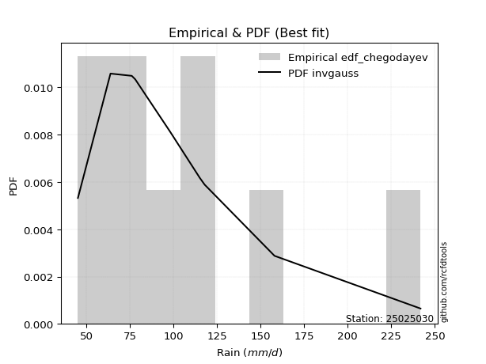</img>

</div>


### 6. Empirical - EDF Blom (1958)

The Blom formula is a specific "plotting position" formula used in hydrology and statistical analysis to estimate the empirical cumulative probability (or non-exceedance probability) of a data series. It is particularly recommended for data that are approximately normally distributed. The constant _a_ is set to 0.375 (or 3/8).

<div align="center">


$P=(m-a)/(n+1-2a)$


</div>


**6.1. Empirical values**

<div align="center">

|                | 0                   | 1                   | 2                   | 3                  | 4        | 5                  | 6                  | 7                  | 8                  |
|:---------------|:--------------------|:--------------------|:--------------------|:-------------------|:---------|:-------------------|:-------------------|:-------------------|:-------------------|
| date           | 2023                | 2018                | 2017                | 2022               | 2025     | 2020               | 2021               | 2024               | 2019               |
| x              | 45.2                | 63.89               | 76.1                | 78.1               | 83.7     | 98.0               | 117.9              | 158.0              | 241.8              |
| m              | 1                   | 2                   | 3                   | 4                  | 5        | 6                  | 7                  | 8                  | 9                  |
| empirical_dist | edf_blom            | edf_blom            | edf_blom            | edf_blom           | edf_blom | edf_blom           | edf_blom           | edf_blom           | edf_blom           |
| empirical      | 0.06756756756756757 | 0.17567567567567569 | 0.28378378378378377 | 0.3918918918918919 | 0.5      | 0.6081081081081081 | 0.7162162162162162 | 0.8243243243243243 | 0.9324324324324325 |
| empirical_tr   | 1.072463768115942   | 1.2131147540983607  | 1.3962264150943395  | 1.6444444444444444 | 2.0      | 2.5517241379310347 | 3.523809523809524  | 5.6923076923076925 | 14.800000000000006 |

</div>


**6.2. Kolmogorov-Smirnov fit test (sorted by Δ)**


<div align="center">

|                | 0                     | 1                   | 2                   | 3                   | 4                   | 5                   | 6                   | 7                   | 8                   | 9                   | 10                  | 11                  | 12                  | 13                  | 14                  | 15                  | 16                  | 17                  | 18                  | 19                  | 20                  | 21                  | 22                  | 23                  | 24                  | 25                  | 26                  | 27                  | 28                  | 29                  | 30                  | 31                  | 32                  | 33                  | 34                  | 35                  | 36                  | 37                  | 38                  | 39                  | 40                  | 41                  | 42                  | 43                  | 44                  | 45                  | 46                  | 47                  | 48                  | 49                  | 50                  | 51                  | 52                  | 53                  | 54                  | 55                  | 56                  | 57                  | 58                  | 59                  | 60                  | 61                  | 62                  | 63                  | 64                  | 65                  | 66                  | 67                  | 68                  | 69                  | 70                  | 71                  | 72                  | 73                  | 74                  | 75                  | 76                  | 77                  | 78                  | 79                  | 80                  | 81                  | 82                  | 83                  | 84                  | 85                  | 86                  | 87                  | 88                  | 89                  |
|:---------------|:----------------------|:--------------------|:--------------------|:--------------------|:--------------------|:--------------------|:--------------------|:--------------------|:--------------------|:--------------------|:--------------------|:--------------------|:--------------------|:--------------------|:--------------------|:--------------------|:--------------------|:--------------------|:--------------------|:--------------------|:--------------------|:--------------------|:--------------------|:--------------------|:--------------------|:--------------------|:--------------------|:--------------------|:--------------------|:--------------------|:--------------------|:--------------------|:--------------------|:--------------------|:--------------------|:--------------------|:--------------------|:--------------------|:--------------------|:--------------------|:--------------------|:--------------------|:--------------------|:--------------------|:--------------------|:--------------------|:--------------------|:--------------------|:--------------------|:--------------------|:--------------------|:--------------------|:--------------------|:--------------------|:--------------------|:--------------------|:--------------------|:--------------------|:--------------------|:--------------------|:--------------------|:--------------------|:--------------------|:--------------------|:--------------------|:--------------------|:--------------------|:--------------------|:--------------------|:--------------------|:--------------------|:--------------------|:--------------------|:--------------------|:--------------------|:--------------------|:--------------------|:--------------------|:--------------------|:--------------------|:--------------------|:--------------------|:--------------------|:--------------------|:--------------------|:--------------------|:--------------------|:--------------------|:--------------------|:--------------------|
| station        | 25025030              | 25025030            | 25025030            | 25025030            | 25025030            | 25025030            | 25025030            | 25025030            | 25025030            | 25025030            | 25025030            | 25025030            | 25025030            | 25025030            | 25025030            | 25025030            | 25025030            | 25025030            | 25025030            | 25025030            | 25025030            | 25025030            | 25025030            | 25025030            | 25025030            | 25025030            | 25025030            | 25025030            | 25025030            | 25025030            | 25025030            | 25025030            | 25025030            | 25025030            | 25025030            | 25025030            | 25025030            | 25025030            | 25025030            | 25025030            | 25025030            | 25025030            | 25025030            | 25025030            | 25025030            | 25025030            | 25025030            | 25025030            | 25025030            | 25025030            | 25025030            | 25025030            | 25025030            | 25025030            | 25025030            | 25025030            | 25025030            | 25025030            | 25025030            | 25025030            | 25025030            | 25025030            | 25025030            | 25025030            | 25025030            | 25025030            | 25025030            | 25025030            | 25025030            | 25025030            | 25025030            | 25025030            | 25025030            | 25025030            | 25025030            | 25025030            | 25025030            | 25025030            | 25025030            | 25025030            | 25025030            | 25025030            | 25025030            | 25025030            | 25025030            | 25025030            | 25025030            | 25025030            | 25025030            | 25025030            |
| empirical_dist | edf_blom              | edf_blom            | edf_blom            | edf_blom            | edf_blom            | edf_blom            | edf_blom            | edf_blom            | edf_blom            | edf_blom            | edf_blom            | edf_blom            | edf_blom            | edf_blom            | edf_blom            | edf_blom            | edf_blom            | edf_blom            | edf_blom            | edf_blom            | edf_blom            | edf_blom            | edf_blom            | edf_blom            | edf_blom            | edf_blom            | edf_blom            | edf_blom            | edf_blom            | edf_blom            | edf_blom            | edf_blom            | edf_blom            | edf_blom            | edf_blom            | edf_blom            | edf_blom            | edf_blom            | edf_blom            | edf_blom            | edf_blom            | edf_blom            | edf_blom            | edf_blom            | edf_blom            | edf_blom            | edf_blom            | edf_blom            | edf_blom            | edf_blom            | edf_blom            | edf_blom            | edf_blom            | edf_blom            | edf_blom            | edf_blom            | edf_blom            | edf_blom            | edf_blom            | edf_blom            | edf_blom            | edf_blom            | edf_blom            | edf_blom            | edf_blom            | edf_blom            | edf_blom            | edf_blom            | edf_blom            | edf_blom            | edf_blom            | edf_blom            | edf_blom            | edf_blom            | edf_blom            | edf_blom            | edf_blom            | edf_blom            | edf_blom            | edf_blom            | edf_blom            | edf_blom            | edf_blom            | edf_blom            | edf_blom            | edf_blom            | edf_blom            | edf_blom            | edf_blom            | edf_blom            |
| p_dist         | loglaplace_asymmetric | logfisk             | logjohnsonsu        | logexponnorm        | logmielke           | loginvgauss         | logf                | logfatiguelife      | f                   | invgamma            | fisk                | loggenlogistic      | mielke              | alpha               | logalpha            | nct                 | logerlang           | loggamma            | loggamma            | logrice             | wald                | logmaxwell          | loggumbel_r         | logncf              | johnsonsu           | halflogistic        | lograyleigh         | invgauss            | logpearson3         | lognct              | logweibull_min      | loginvgamma         | exponnorm           | betaprime           | loginvweibull       | logmoyal            | gompertz            | loggompertz         | pearson3            | genexpon            | halfnorm            | logbetaprime        | logkstwobign        | moyal               | weibull_min         | logloggamma         | logt                | lognorm             | lognorm             | logcrystalball      | loghalfnorm         | expon               | loghalflogistic     | gumbel_r            | t                   | loglogistic         | rayleigh            | genlogistic         | laplace_asymmetric  | loghypsecant        | maxwell             | logwald             | kstwobign           | loglaplace          | truncnorm           | crystalball         | norm                | loggumbel_l         | gibrat              | loggibrat           | loggenexpon         | logistic            | rice                | hypsecant           | chi2                | ncf                 | logtruncnorm        | nakagami            | logexpon            | laplace             | gamma               | logchi2             | gumbel_l            | erlang              | loglognorm          | pareto              | lognakagami         | invweibull          | logpareto           | fatiguelife         |
| delta          | 0.04958691538913029   | 0.0646487030282048  | 0.06568601674643604 | 0.06571356087393387 | 0.06694279965183403 | 0.0670308497394298  | 0.06711055197905802 | 0.0672288373405493  | 0.06744548591555122 | 0.06744549363168556 | 0.06751676453217159 | 0.06762432275035402 | 0.06766787960509935 | 0.06818927599476954 | 0.06838547745352697 | 0.06880163061805339 | 0.07043164262526375 | 0.07043191097393808 | 0.07043191097393808 | 0.07137103864023658 | 0.07231876032845569 | 0.07281944521124095 | 0.07328071473270281 | 0.07329787968482959 | 0.07402418721663051 | 0.07532626573700069 | 0.07542268703876831 | 0.07574332170848153 | 0.07707887004192843 | 0.07791878272654462 | 0.07951082574705248 | 0.07989070942841736 | 0.08178447640160158 | 0.08205791559337194 | 0.08494001891406056 | 0.08647853273120643 | 0.08658989364861663 | 0.08667743562516417 | 0.0888558712931799  | 0.0890826713138061  | 0.0906986320222403  | 0.09152577852569271 | 0.0957984010421003  | 0.0965267869962384  | 0.10083475363390831 | 0.1030442838860533  | 0.10666395556440883 | 0.10666542953157138 | 0.10666542953157138 | 0.1066654648191217  | 0.10811152031795018 | 0.10985465317136722 | 0.11022118474922793 | 0.11322323165603587 | 0.11560061711551539 | 0.1203146108527206  | 0.12442725975175739 | 0.12505341780235646 | 0.1260970745646135  | 0.1314182882994635  | 0.13647481829825553 | 0.14708339562001316 | 0.14919722867390106 | 0.15900508333671126 | 0.17087593132977286 | 0.17087594367192072 | 0.17087594488058488 | 0.17246851252032908 | 0.17567489147052232 | 0.17567567567567569 | 0.17868668408975752 | 0.17926259226681102 | 0.1820245003674072  | 0.19213494026358008 | 0.19978192707328735 | 0.20749374590164402 | 0.21247893454748384 | 0.21483085687844986 | 0.21998249273460901 | 0.219996255161011   | 0.22476243734543955 | 0.2323003001945346  | 0.24035425971570934 | 0.2554285973284006  | 0.43602437186586596 | 0.45443470392507224 | 0.4588775869701762  | 0.46539931825989383 | 0.4669963140821195  | 0.5412421991024947  |
| deltao         | 0.41761268023100007   | 0.41761268023100007 | 0.41761268023100007 | 0.41761268023100007 | 0.41761268023100007 | 0.41761268023100007 | 0.41761268023100007 | 0.41761268023100007 | 0.41761268023100007 | 0.41761268023100007 | 0.41761268023100007 | 0.41761268023100007 | 0.41761268023100007 | 0.41761268023100007 | 0.41761268023100007 | 0.41761268023100007 | 0.41761268023100007 | 0.41761268023100007 | 0.41761268023100007 | 0.41761268023100007 | 0.41761268023100007 | 0.41761268023100007 | 0.41761268023100007 | 0.41761268023100007 | 0.41761268023100007 | 0.41761268023100007 | 0.41761268023100007 | 0.41761268023100007 | 0.41761268023100007 | 0.41761268023100007 | 0.41761268023100007 | 0.41761268023100007 | 0.41761268023100007 | 0.41761268023100007 | 0.41761268023100007 | 0.41761268023100007 | 0.41761268023100007 | 0.41761268023100007 | 0.41761268023100007 | 0.41761268023100007 | 0.41761268023100007 | 0.41761268023100007 | 0.41761268023100007 | 0.41761268023100007 | 0.41761268023100007 | 0.41761268023100007 | 0.41761268023100007 | 0.41761268023100007 | 0.41761268023100007 | 0.41761268023100007 | 0.41761268023100007 | 0.41761268023100007 | 0.41761268023100007 | 0.41761268023100007 | 0.41761268023100007 | 0.41761268023100007 | 0.41761268023100007 | 0.41761268023100007 | 0.41761268023100007 | 0.41761268023100007 | 0.41761268023100007 | 0.41761268023100007 | 0.41761268023100007 | 0.41761268023100007 | 0.41761268023100007 | 0.41761268023100007 | 0.41761268023100007 | 0.41761268023100007 | 0.41761268023100007 | 0.41761268023100007 | 0.41761268023100007 | 0.41761268023100007 | 0.41761268023100007 | 0.41761268023100007 | 0.41761268023100007 | 0.41761268023100007 | 0.41761268023100007 | 0.41761268023100007 | 0.41761268023100007 | 0.41761268023100007 | 0.41761268023100007 | 0.41761268023100007 | 0.41761268023100007 | 0.41761268023100007 | 0.41761268023100007 | 0.41761268023100007 | 0.41761268023100007 | 0.41761268023100007 | 0.41761268023100007 | 0.41761268023100007 |
| eval           | Δo > Δ                | Δo > Δ              | Δo > Δ              | Δo > Δ              | Δo > Δ              | Δo > Δ              | Δo > Δ              | Δo > Δ              | Δo > Δ              | Δo > Δ              | Δo > Δ              | Δo > Δ              | Δo > Δ              | Δo > Δ              | Δo > Δ              | Δo > Δ              | Δo > Δ              | Δo > Δ              | Δo > Δ              | Δo > Δ              | Δo > Δ              | Δo > Δ              | Δo > Δ              | Δo > Δ              | Δo > Δ              | Δo > Δ              | Δo > Δ              | Δo > Δ              | Δo > Δ              | Δo > Δ              | Δo > Δ              | Δo > Δ              | Δo > Δ              | Δo > Δ              | Δo > Δ              | Δo > Δ              | Δo > Δ              | Δo > Δ              | Δo > Δ              | Δo > Δ              | Δo > Δ              | Δo > Δ              | Δo > Δ              | Δo > Δ              | Δo > Δ              | Δo > Δ              | Δo > Δ              | Δo > Δ              | Δo > Δ              | Δo > Δ              | Δo > Δ              | Δo > Δ              | Δo > Δ              | Δo > Δ              | Δo > Δ              | Δo > Δ              | Δo > Δ              | Δo > Δ              | Δo > Δ              | Δo > Δ              | Δo > Δ              | Δo > Δ              | Δo > Δ              | Δo > Δ              | Δo > Δ              | Δo > Δ              | Δo > Δ              | Δo > Δ              | Δo > Δ              | Δo > Δ              | Δo > Δ              | Δo > Δ              | Δo > Δ              | Δo > Δ              | Δo > Δ              | Δo > Δ              | Δo > Δ              | Δo > Δ              | Δo > Δ              | Δo > Δ              | Δo > Δ              | Δo > Δ              | Δo > Δ              | Δo > Δ              | Δo <= Δ             | Δo <= Δ             | Δo <= Δ             | Δo <= Δ             | Δo <= Δ             | Δo <= Δ             |
| fit            | 1                     | 1                   | 1                   | 1                   | 1                   | 1                   | 1                   | 1                   | 1                   | 1                   | 1                   | 1                   | 1                   | 1                   | 1                   | 1                   | 1                   | 1                   | 1                   | 1                   | 1                   | 1                   | 1                   | 1                   | 1                   | 1                   | 1                   | 1                   | 1                   | 1                   | 1                   | 1                   | 1                   | 1                   | 1                   | 1                   | 1                   | 1                   | 1                   | 1                   | 1                   | 1                   | 1                   | 1                   | 1                   | 1                   | 1                   | 1                   | 1                   | 1                   | 1                   | 1                   | 1                   | 1                   | 1                   | 1                   | 1                   | 1                   | 1                   | 1                   | 1                   | 1                   | 1                   | 1                   | 1                   | 1                   | 1                   | 1                   | 1                   | 1                   | 1                   | 1                   | 1                   | 1                   | 1                   | 1                   | 1                   | 1                   | 1                   | 1                   | 1                   | 1                   | 1                   | 1                   | 0                   | 0                   | 0                   | 0                   | 0                   | 0                   |
| n              | 9                     | 9                   | 9                   | 9                   | 9                   | 9                   | 9                   | 9                   | 9                   | 9                   | 9                   | 9                   | 9                   | 9                   | 9                   | 9                   | 9                   | 9                   | 9                   | 9                   | 9                   | 9                   | 9                   | 9                   | 9                   | 9                   | 9                   | 9                   | 9                   | 9                   | 9                   | 9                   | 9                   | 9                   | 9                   | 9                   | 9                   | 9                   | 9                   | 9                   | 9                   | 9                   | 9                   | 9                   | 9                   | 9                   | 9                   | 9                   | 9                   | 9                   | 9                   | 9                   | 9                   | 9                   | 9                   | 9                   | 9                   | 9                   | 9                   | 9                   | 9                   | 9                   | 9                   | 9                   | 9                   | 9                   | 9                   | 9                   | 9                   | 9                   | 9                   | 9                   | 9                   | 9                   | 9                   | 9                   | 9                   | 9                   | 9                   | 9                   | 9                   | 9                   | 9                   | 9                   | 9                   | 9                   | 9                   | 9                   | 9                   | 9                   |
| best_fit       | 1                     | 0                   | 0                   | 0                   | 0                   | 0                   | 0                   | 0                   | 0                   | 0                   | 0                   | 0                   | 0                   | 0                   | 0                   | 0                   | 0                   | 0                   | 0                   | 0                   | 0                   | 0                   | 0                   | 0                   | 0                   | 0                   | 0                   | 0                   | 0                   | 0                   | 0                   | 0                   | 0                   | 0                   | 0                   | 0                   | 0                   | 0                   | 0                   | 0                   | 0                   | 0                   | 0                   | 0                   | 0                   | 0                   | 0                   | 0                   | 0                   | 0                   | 0                   | 0                   | 0                   | 0                   | 0                   | 0                   | 0                   | 0                   | 0                   | 0                   | 0                   | 0                   | 0                   | 0                   | 0                   | 0                   | 0                   | 0                   | 0                   | 0                   | 0                   | 0                   | 0                   | 0                   | 0                   | 0                   | 0                   | 0                   | 0                   | 0                   | 0                   | 0                   | 0                   | 0                   | 0                   | 0                   | 0                   | 0                   | 0                   | 0                   |
| best_fit_sort  | 1                     | 2                   | 3                   | 4                   | 5                   | 6                   | 7                   | 8                   | 9                   | 10                  | 11                  | 12                  | 13                  | 14                  | 15                  | 16                  | 17                  | 18                  | 19                  | 20                  | 21                  | 22                  | 23                  | 24                  | 25                  | 26                  | 27                  | 28                  | 29                  | 30                  | 31                  | 32                  | 33                  | 34                  | 35                  | 36                  | 37                  | 38                  | 39                  | 40                  | 41                  | 42                  | 43                  | 44                  | 45                  | 46                  | 47                  | 48                  | 49                  | 50                  | 51                  | 52                  | 53                  | 54                  | 55                  | 56                  | 57                  | 58                  | 59                  | 60                  | 61                  | 62                  | 63                  | 64                  | 65                  | 66                  | 67                  | 68                  | 69                  | 70                  | 71                  | 72                  | 73                  | 74                  | 75                  | 76                  | 77                  | 78                  | 79                  | 80                  | 81                  | 82                  | 83                  | 84                  | 85                  | 86                  | 87                  | 88                  | 89                  | 90                  |

</div>


<div align="center">

</img>

</div>


**6.3. Best fit**

<div align="center">

|   id |   station | empirical_dist   | p_dist                |     delta |   deltao | eval   |   fit |   n |   best_fit |   best_fit_sort |
|-----:|----------:|:-----------------|:----------------------|----------:|---------:|:-------|------:|----:|-----------:|----------------:|
|    0 |  25025030 | edf_blom         | loglaplace_asymmetric | 0.0495869 | 0.417613 | Δo > Δ |     1 |   9 |          1 |               1 |

</div>


<div align="center">

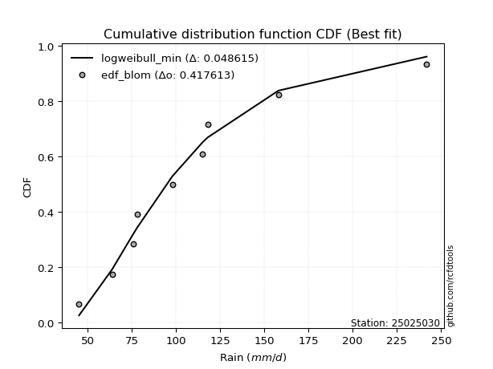</img></img>

</div>


### 7. Empirical - EDF Tukey (1962)

In hydrology, the Tukey formula is used as a plotting position formula to estimate the empirical probability or frequency of a flood event (or other hydrological data). The formula parameter is given as _c=0.333_ (or 1/3).

<div align="center">


$P=(m-c)/(n+1-2c)$


</div>


**7.1. Empirical values**

<div align="center">

|                | 0                   | 1                   | 2                  | 3                   | 4         | 5                  | 6                  | 7                  | 8                  |
|:---------------|:--------------------|:--------------------|:-------------------|:--------------------|:----------|:-------------------|:-------------------|:-------------------|:-------------------|
| date           | 2023                | 2018                | 2017               | 2022                | 2025      | 2020               | 2021               | 2024               | 2019               |
| x              | 45.2                | 63.89               | 76.1               | 78.1                | 83.7      | 98.0               | 117.9              | 158.0              | 241.8              |
| m              | 1                   | 2                   | 3                  | 4                   | 5         | 6                  | 7                  | 8                  | 9                  |
| empirical_dist | edf_tukey           | edf_tukey           | edf_tukey          | edf_tukey           | edf_tukey | edf_tukey          | edf_tukey          | edf_tukey          | edf_tukey          |
| empirical      | 0.07142857142857142 | 0.17857142857142858 | 0.2857142857142857 | 0.39285714285714285 | 0.5       | 0.6071428571428571 | 0.7142857142857143 | 0.8214285714285714 | 0.9285714285714286 |
| empirical_tr   | 1.0769230769230769  | 1.2173913043478262  | 1.4                | 1.6470588235294117  | 2.0       | 2.545454545454545  | 3.5                | 5.599999999999999  | 14.000000000000007 |

</div>


**7.2. Kolmogorov-Smirnov fit test (sorted by Δ)**


<div align="center">

|                | 0                     | 1                   | 2                   | 3                   | 4                   | 5                   | 6                   | 7                   | 8                   | 9                   | 10                  | 11                  | 12                  | 13                  | 14                  | 15                  | 16                  | 17                  | 18                  | 19                  | 20                  | 21                  | 22                  | 23                  | 24                  | 25                  | 26                  | 27                  | 28                  | 29                  | 30                  | 31                  | 32                  | 33                  | 34                  | 35                  | 36                  | 37                  | 38                  | 39                  | 40                  | 41                  | 42                  | 43                  | 44                  | 45                  | 46                  | 47                  | 48                  | 49                  | 50                  | 51                  | 52                  | 53                  | 54                  | 55                  | 56                  | 57                  | 58                  | 59                  | 60                  | 61                  | 62                  | 63                  | 64                  | 65                  | 66                  | 67                  | 68                  | 69                  | 70                  | 71                  | 72                  | 73                  | 74                  | 75                  | 76                  | 77                  | 78                  | 79                  | 80                  | 81                  | 82                  | 83                  | 84                  | 85                  | 86                  | 87                  | 88                  | 89                  |
|:---------------|:----------------------|:--------------------|:--------------------|:--------------------|:--------------------|:--------------------|:--------------------|:--------------------|:--------------------|:--------------------|:--------------------|:--------------------|:--------------------|:--------------------|:--------------------|:--------------------|:--------------------|:--------------------|:--------------------|:--------------------|:--------------------|:--------------------|:--------------------|:--------------------|:--------------------|:--------------------|:--------------------|:--------------------|:--------------------|:--------------------|:--------------------|:--------------------|:--------------------|:--------------------|:--------------------|:--------------------|:--------------------|:--------------------|:--------------------|:--------------------|:--------------------|:--------------------|:--------------------|:--------------------|:--------------------|:--------------------|:--------------------|:--------------------|:--------------------|:--------------------|:--------------------|:--------------------|:--------------------|:--------------------|:--------------------|:--------------------|:--------------------|:--------------------|:--------------------|:--------------------|:--------------------|:--------------------|:--------------------|:--------------------|:--------------------|:--------------------|:--------------------|:--------------------|:--------------------|:--------------------|:--------------------|:--------------------|:--------------------|:--------------------|:--------------------|:--------------------|:--------------------|:--------------------|:--------------------|:--------------------|:--------------------|:--------------------|:--------------------|:--------------------|:--------------------|:--------------------|:--------------------|:--------------------|:--------------------|:--------------------|
| station        | 25025030              | 25025030            | 25025030            | 25025030            | 25025030            | 25025030            | 25025030            | 25025030            | 25025030            | 25025030            | 25025030            | 25025030            | 25025030            | 25025030            | 25025030            | 25025030            | 25025030            | 25025030            | 25025030            | 25025030            | 25025030            | 25025030            | 25025030            | 25025030            | 25025030            | 25025030            | 25025030            | 25025030            | 25025030            | 25025030            | 25025030            | 25025030            | 25025030            | 25025030            | 25025030            | 25025030            | 25025030            | 25025030            | 25025030            | 25025030            | 25025030            | 25025030            | 25025030            | 25025030            | 25025030            | 25025030            | 25025030            | 25025030            | 25025030            | 25025030            | 25025030            | 25025030            | 25025030            | 25025030            | 25025030            | 25025030            | 25025030            | 25025030            | 25025030            | 25025030            | 25025030            | 25025030            | 25025030            | 25025030            | 25025030            | 25025030            | 25025030            | 25025030            | 25025030            | 25025030            | 25025030            | 25025030            | 25025030            | 25025030            | 25025030            | 25025030            | 25025030            | 25025030            | 25025030            | 25025030            | 25025030            | 25025030            | 25025030            | 25025030            | 25025030            | 25025030            | 25025030            | 25025030            | 25025030            | 25025030            |
| empirical_dist | edf_tukey             | edf_tukey           | edf_tukey           | edf_tukey           | edf_tukey           | edf_tukey           | edf_tukey           | edf_tukey           | edf_tukey           | edf_tukey           | edf_tukey           | edf_tukey           | edf_tukey           | edf_tukey           | edf_tukey           | edf_tukey           | edf_tukey           | edf_tukey           | edf_tukey           | edf_tukey           | edf_tukey           | edf_tukey           | edf_tukey           | edf_tukey           | edf_tukey           | edf_tukey           | edf_tukey           | edf_tukey           | edf_tukey           | edf_tukey           | edf_tukey           | edf_tukey           | edf_tukey           | edf_tukey           | edf_tukey           | edf_tukey           | edf_tukey           | edf_tukey           | edf_tukey           | edf_tukey           | edf_tukey           | edf_tukey           | edf_tukey           | edf_tukey           | edf_tukey           | edf_tukey           | edf_tukey           | edf_tukey           | edf_tukey           | edf_tukey           | edf_tukey           | edf_tukey           | edf_tukey           | edf_tukey           | edf_tukey           | edf_tukey           | edf_tukey           | edf_tukey           | edf_tukey           | edf_tukey           | edf_tukey           | edf_tukey           | edf_tukey           | edf_tukey           | edf_tukey           | edf_tukey           | edf_tukey           | edf_tukey           | edf_tukey           | edf_tukey           | edf_tukey           | edf_tukey           | edf_tukey           | edf_tukey           | edf_tukey           | edf_tukey           | edf_tukey           | edf_tukey           | edf_tukey           | edf_tukey           | edf_tukey           | edf_tukey           | edf_tukey           | edf_tukey           | edf_tukey           | edf_tukey           | edf_tukey           | edf_tukey           | edf_tukey           | edf_tukey           |
| p_dist         | loglaplace_asymmetric | logexponnorm        | logfisk             | loginvgauss         | logjohnsonsu        | logfatiguelife      | f                   | invgamma            | fisk                | loggenlogistic      | mielke              | nct                 | logmielke           | logf                | alpha               | logalpha            | logerlang           | loggamma            | loggamma            | logrice             | loggumbel_r         | johnsonsu           | logmaxwell          | logncf              | lograyleigh         | invgauss            | wald                | halflogistic        | logpearson3         | logweibull_min      | lognct              | loginvgamma         | exponnorm           | betaprime           | loginvweibull       | logmoyal            | gompertz            | loggompertz         | genexpon            | pearson3            | halfnorm            | logbetaprime        | logkstwobign        | moyal               | weibull_min         | logloggamma         | loghalfnorm         | logt                | lognorm             | lognorm             | logcrystalball      | expon               | loghalflogistic     | gumbel_r            | t                   | loglogistic         | rayleigh            | genlogistic         | laplace_asymmetric  | loghypsecant        | maxwell             | kstwobign           | logwald             | loglaplace          | truncnorm           | crystalball         | norm                | loggumbel_l         | loggenexpon         | logistic            | gibrat              | loggibrat           | rice                | hypsecant           | chi2                | ncf                 | logtruncnorm        | nakagami            | logexpon            | laplace             | gamma               | logchi2             | gumbel_l            | erlang              | loglognorm          | pareto              | lognakagami         | invweibull          | logpareto           | fatiguelife         |
| delta          | 0.04980703955183674   | 0.06378305894343195 | 0.0646487030282048  | 0.06510034780892787 | 0.06518663198954638 | 0.06529833541004737 | 0.06551498398504929 | 0.06551499170118363 | 0.06558626260166966 | 0.06569382081985209 | 0.06573737767459742 | 0.06687112868755146 | 0.06694279965183403 | 0.06711055197905802 | 0.06818927599476954 | 0.06838547745352697 | 0.06850114069476182 | 0.06850140904343616 | 0.06850140904343616 | 0.06944053670973466 | 0.07135021280220089 | 0.07209368528612858 | 0.07281944521124095 | 0.07329787968482959 | 0.07349218510826638 | 0.0738128197779796  | 0.07521451322420858 | 0.07532626573700069 | 0.07707887004192843 | 0.07758032381655056 | 0.07791878272654462 | 0.07989070942841736 | 0.08178447640160158 | 0.08205791559337194 | 0.08300951698355863 | 0.0845480308007045  | 0.08465939171811471 | 0.08474693369466224 | 0.08715216938330417 | 0.0888558712931799  | 0.08941906053073023 | 0.09152577852569271 | 0.09386789911159837 | 0.0965267869962384  | 0.09890425170340639 | 0.1030442838860533  | 0.10618101838744826 | 0.10666395556440883 | 0.10666542953157138 | 0.10666542953157138 | 0.1066654648191217  | 0.1079241512408653  | 0.108290682818726   | 0.11322323165603587 | 0.11753111904601732 | 0.1203146108527206  | 0.12346200878650637 | 0.12505341780235646 | 0.1260970745646135  | 0.1314182882994635  | 0.1355095673330045  | 0.14919722867390106 | 0.14997914851576605 | 0.15900508333671126 | 0.16991068036452184 | 0.1699106927066697  | 0.16991069391533387 | 0.17246851252032908 | 0.1767561821592556  | 0.17829734130156    | 0.1785706443662752  | 0.17857142857142858 | 0.1820245003674072  | 0.19213494026358008 | 0.19785142514278542 | 0.20459799300589113 | 0.21054843261698192 | 0.21193510398269697 | 0.2180519908041071  | 0.219996255161011   | 0.22283193541493762 | 0.2294045472987817  | 0.23938900875045832 | 0.2534980953978987  | 0.433128618970113   | 0.4515389510293193  | 0.4559818340744233  | 0.46153831439889    | 0.46410056118636656 | 0.5383464462067418  |
| deltao         | 0.41761268023100007   | 0.41761268023100007 | 0.41761268023100007 | 0.41761268023100007 | 0.41761268023100007 | 0.41761268023100007 | 0.41761268023100007 | 0.41761268023100007 | 0.41761268023100007 | 0.41761268023100007 | 0.41761268023100007 | 0.41761268023100007 | 0.41761268023100007 | 0.41761268023100007 | 0.41761268023100007 | 0.41761268023100007 | 0.41761268023100007 | 0.41761268023100007 | 0.41761268023100007 | 0.41761268023100007 | 0.41761268023100007 | 0.41761268023100007 | 0.41761268023100007 | 0.41761268023100007 | 0.41761268023100007 | 0.41761268023100007 | 0.41761268023100007 | 0.41761268023100007 | 0.41761268023100007 | 0.41761268023100007 | 0.41761268023100007 | 0.41761268023100007 | 0.41761268023100007 | 0.41761268023100007 | 0.41761268023100007 | 0.41761268023100007 | 0.41761268023100007 | 0.41761268023100007 | 0.41761268023100007 | 0.41761268023100007 | 0.41761268023100007 | 0.41761268023100007 | 0.41761268023100007 | 0.41761268023100007 | 0.41761268023100007 | 0.41761268023100007 | 0.41761268023100007 | 0.41761268023100007 | 0.41761268023100007 | 0.41761268023100007 | 0.41761268023100007 | 0.41761268023100007 | 0.41761268023100007 | 0.41761268023100007 | 0.41761268023100007 | 0.41761268023100007 | 0.41761268023100007 | 0.41761268023100007 | 0.41761268023100007 | 0.41761268023100007 | 0.41761268023100007 | 0.41761268023100007 | 0.41761268023100007 | 0.41761268023100007 | 0.41761268023100007 | 0.41761268023100007 | 0.41761268023100007 | 0.41761268023100007 | 0.41761268023100007 | 0.41761268023100007 | 0.41761268023100007 | 0.41761268023100007 | 0.41761268023100007 | 0.41761268023100007 | 0.41761268023100007 | 0.41761268023100007 | 0.41761268023100007 | 0.41761268023100007 | 0.41761268023100007 | 0.41761268023100007 | 0.41761268023100007 | 0.41761268023100007 | 0.41761268023100007 | 0.41761268023100007 | 0.41761268023100007 | 0.41761268023100007 | 0.41761268023100007 | 0.41761268023100007 | 0.41761268023100007 | 0.41761268023100007 |
| eval           | Δo > Δ                | Δo > Δ              | Δo > Δ              | Δo > Δ              | Δo > Δ              | Δo > Δ              | Δo > Δ              | Δo > Δ              | Δo > Δ              | Δo > Δ              | Δo > Δ              | Δo > Δ              | Δo > Δ              | Δo > Δ              | Δo > Δ              | Δo > Δ              | Δo > Δ              | Δo > Δ              | Δo > Δ              | Δo > Δ              | Δo > Δ              | Δo > Δ              | Δo > Δ              | Δo > Δ              | Δo > Δ              | Δo > Δ              | Δo > Δ              | Δo > Δ              | Δo > Δ              | Δo > Δ              | Δo > Δ              | Δo > Δ              | Δo > Δ              | Δo > Δ              | Δo > Δ              | Δo > Δ              | Δo > Δ              | Δo > Δ              | Δo > Δ              | Δo > Δ              | Δo > Δ              | Δo > Δ              | Δo > Δ              | Δo > Δ              | Δo > Δ              | Δo > Δ              | Δo > Δ              | Δo > Δ              | Δo > Δ              | Δo > Δ              | Δo > Δ              | Δo > Δ              | Δo > Δ              | Δo > Δ              | Δo > Δ              | Δo > Δ              | Δo > Δ              | Δo > Δ              | Δo > Δ              | Δo > Δ              | Δo > Δ              | Δo > Δ              | Δo > Δ              | Δo > Δ              | Δo > Δ              | Δo > Δ              | Δo > Δ              | Δo > Δ              | Δo > Δ              | Δo > Δ              | Δo > Δ              | Δo > Δ              | Δo > Δ              | Δo > Δ              | Δo > Δ              | Δo > Δ              | Δo > Δ              | Δo > Δ              | Δo > Δ              | Δo > Δ              | Δo > Δ              | Δo > Δ              | Δo > Δ              | Δo > Δ              | Δo <= Δ             | Δo <= Δ             | Δo <= Δ             | Δo <= Δ             | Δo <= Δ             | Δo <= Δ             |
| fit            | 1                     | 1                   | 1                   | 1                   | 1                   | 1                   | 1                   | 1                   | 1                   | 1                   | 1                   | 1                   | 1                   | 1                   | 1                   | 1                   | 1                   | 1                   | 1                   | 1                   | 1                   | 1                   | 1                   | 1                   | 1                   | 1                   | 1                   | 1                   | 1                   | 1                   | 1                   | 1                   | 1                   | 1                   | 1                   | 1                   | 1                   | 1                   | 1                   | 1                   | 1                   | 1                   | 1                   | 1                   | 1                   | 1                   | 1                   | 1                   | 1                   | 1                   | 1                   | 1                   | 1                   | 1                   | 1                   | 1                   | 1                   | 1                   | 1                   | 1                   | 1                   | 1                   | 1                   | 1                   | 1                   | 1                   | 1                   | 1                   | 1                   | 1                   | 1                   | 1                   | 1                   | 1                   | 1                   | 1                   | 1                   | 1                   | 1                   | 1                   | 1                   | 1                   | 1                   | 1                   | 0                   | 0                   | 0                   | 0                   | 0                   | 0                   |
| n              | 9                     | 9                   | 9                   | 9                   | 9                   | 9                   | 9                   | 9                   | 9                   | 9                   | 9                   | 9                   | 9                   | 9                   | 9                   | 9                   | 9                   | 9                   | 9                   | 9                   | 9                   | 9                   | 9                   | 9                   | 9                   | 9                   | 9                   | 9                   | 9                   | 9                   | 9                   | 9                   | 9                   | 9                   | 9                   | 9                   | 9                   | 9                   | 9                   | 9                   | 9                   | 9                   | 9                   | 9                   | 9                   | 9                   | 9                   | 9                   | 9                   | 9                   | 9                   | 9                   | 9                   | 9                   | 9                   | 9                   | 9                   | 9                   | 9                   | 9                   | 9                   | 9                   | 9                   | 9                   | 9                   | 9                   | 9                   | 9                   | 9                   | 9                   | 9                   | 9                   | 9                   | 9                   | 9                   | 9                   | 9                   | 9                   | 9                   | 9                   | 9                   | 9                   | 9                   | 9                   | 9                   | 9                   | 9                   | 9                   | 9                   | 9                   |
| best_fit       | 1                     | 0                   | 0                   | 0                   | 0                   | 0                   | 0                   | 0                   | 0                   | 0                   | 0                   | 0                   | 0                   | 0                   | 0                   | 0                   | 0                   | 0                   | 0                   | 0                   | 0                   | 0                   | 0                   | 0                   | 0                   | 0                   | 0                   | 0                   | 0                   | 0                   | 0                   | 0                   | 0                   | 0                   | 0                   | 0                   | 0                   | 0                   | 0                   | 0                   | 0                   | 0                   | 0                   | 0                   | 0                   | 0                   | 0                   | 0                   | 0                   | 0                   | 0                   | 0                   | 0                   | 0                   | 0                   | 0                   | 0                   | 0                   | 0                   | 0                   | 0                   | 0                   | 0                   | 0                   | 0                   | 0                   | 0                   | 0                   | 0                   | 0                   | 0                   | 0                   | 0                   | 0                   | 0                   | 0                   | 0                   | 0                   | 0                   | 0                   | 0                   | 0                   | 0                   | 0                   | 0                   | 0                   | 0                   | 0                   | 0                   | 0                   |
| best_fit_sort  | 1                     | 2                   | 3                   | 4                   | 5                   | 6                   | 7                   | 8                   | 9                   | 10                  | 11                  | 12                  | 13                  | 14                  | 15                  | 16                  | 17                  | 18                  | 19                  | 20                  | 21                  | 22                  | 23                  | 24                  | 25                  | 26                  | 27                  | 28                  | 29                  | 30                  | 31                  | 32                  | 33                  | 34                  | 35                  | 36                  | 37                  | 38                  | 39                  | 40                  | 41                  | 42                  | 43                  | 44                  | 45                  | 46                  | 47                  | 48                  | 49                  | 50                  | 51                  | 52                  | 53                  | 54                  | 55                  | 56                  | 57                  | 58                  | 59                  | 60                  | 61                  | 62                  | 63                  | 64                  | 65                  | 66                  | 67                  | 68                  | 69                  | 70                  | 71                  | 72                  | 73                  | 74                  | 75                  | 76                  | 77                  | 78                  | 79                  | 80                  | 81                  | 82                  | 83                  | 84                  | 85                  | 86                  | 87                  | 88                  | 89                  | 90                  |

</div>


<div align="center">

</img>

</div>


**7.3. Best fit**

<div align="center">

|   id |   station | empirical_dist   | p_dist                |    delta |   deltao | eval   |   fit |   n |   best_fit |   best_fit_sort |
|-----:|----------:|:-----------------|:----------------------|---------:|---------:|:-------|------:|----:|-----------:|----------------:|
|    0 |  25025030 | edf_tukey        | loglaplace_asymmetric | 0.049807 | 0.417613 | Δo > Δ |     1 |   9 |          1 |               1 |

</div>


<div align="center">

</img>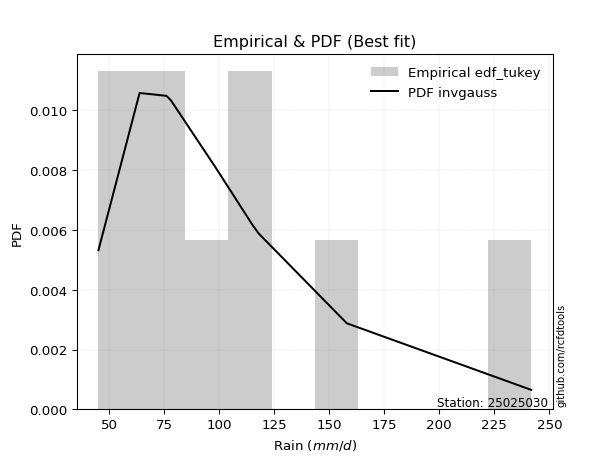</img>

</div>


### 8. Empirical - EDF Gringorten (1963)

Gringorten plotting position formula is essential for estimating the probability and return periods of extreme events like floods and heavy rainfall. The constant _a=0.44_.

<div align="center">


$P=(m-a)/(n+1-2a)$


</div>


**8.1. Empirical values**

<div align="center">

|                | 0                    | 1                  | 2                   | 3                  | 4              | 5                  | 6                  | 7                  | 8                  |
|:---------------|:---------------------|:-------------------|:--------------------|:-------------------|:---------------|:-------------------|:-------------------|:-------------------|:-------------------|
| date           | 2023                 | 2018               | 2017                | 2022               | 2025           | 2020               | 2021               | 2024               | 2019               |
| x              | 45.2                 | 63.89              | 76.1                | 78.1               | 83.7           | 98.0               | 117.9              | 158.0              | 241.8              |
| m              | 1                    | 2                  | 3                   | 4                  | 5              | 6                  | 7                  | 8                  | 9                  |
| empirical_dist | edf_gringorten       | edf_gringorten     | edf_gringorten      | edf_gringorten     | edf_gringorten | edf_gringorten     | edf_gringorten     | edf_gringorten     | edf_gringorten     |
| empirical      | 0.061403508771929835 | 0.1710526315789474 | 0.28070175438596495 | 0.3903508771929825 | 0.5            | 0.6096491228070176 | 0.7192982456140351 | 0.8289473684210527 | 0.9385964912280703 |
| empirical_tr   | 1.0654205607476634   | 1.2063492063492063 | 1.3902439024390243  | 1.6402877697841727 | 2.0            | 2.561797752808989  | 3.5625             | 5.846153846153847  | 16.285714285714324 |

</div>


**8.2. Kolmogorov-Smirnov fit test (sorted by Δ)**


<div align="center">

|                | 0                     | 1                   | 2                   | 3                   | 4                   | 5                   | 6                   | 7                   | 8                   | 9                   | 10                  | 11                  | 12                  | 13                  | 14                  | 15                  | 16                  | 17                  | 18                  | 19                  | 20                  | 21                  | 22                  | 23                  | 24                  | 25                  | 26                  | 27                  | 28                  | 29                  | 30                  | 31                  | 32                  | 33                  | 34                  | 35                  | 36                  | 37                  | 38                  | 39                  | 40                  | 41                  | 42                  | 43                  | 44                  | 45                  | 46                  | 47                  | 48                  | 49                  | 50                  | 51                  | 52                  | 53                  | 54                  | 55                  | 56                  | 57                  | 58                  | 59                  | 60                  | 61                  | 62                  | 63                  | 64                  | 65                  | 66                  | 67                  | 68                  | 69                  | 70                  | 71                  | 72                  | 73                  | 74                  | 75                  | 76                  | 77                  | 78                  | 79                  | 80                  | 81                  | 82                  | 83                  | 84                  | 85                  | 86                  | 87                  | 88                  | 89                  |
|:---------------|:----------------------|:--------------------|:--------------------|:--------------------|:--------------------|:--------------------|:--------------------|:--------------------|:--------------------|:--------------------|:--------------------|:--------------------|:--------------------|:--------------------|:--------------------|:--------------------|:--------------------|:--------------------|:--------------------|:--------------------|:--------------------|:--------------------|:--------------------|:--------------------|:--------------------|:--------------------|:--------------------|:--------------------|:--------------------|:--------------------|:--------------------|:--------------------|:--------------------|:--------------------|:--------------------|:--------------------|:--------------------|:--------------------|:--------------------|:--------------------|:--------------------|:--------------------|:--------------------|:--------------------|:--------------------|:--------------------|:--------------------|:--------------------|:--------------------|:--------------------|:--------------------|:--------------------|:--------------------|:--------------------|:--------------------|:--------------------|:--------------------|:--------------------|:--------------------|:--------------------|:--------------------|:--------------------|:--------------------|:--------------------|:--------------------|:--------------------|:--------------------|:--------------------|:--------------------|:--------------------|:--------------------|:--------------------|:--------------------|:--------------------|:--------------------|:--------------------|:--------------------|:--------------------|:--------------------|:--------------------|:--------------------|:--------------------|:--------------------|:--------------------|:--------------------|:--------------------|:--------------------|:--------------------|:--------------------|:--------------------|
| station        | 25025030              | 25025030            | 25025030            | 25025030            | 25025030            | 25025030            | 25025030            | 25025030            | 25025030            | 25025030            | 25025030            | 25025030            | 25025030            | 25025030            | 25025030            | 25025030            | 25025030            | 25025030            | 25025030            | 25025030            | 25025030            | 25025030            | 25025030            | 25025030            | 25025030            | 25025030            | 25025030            | 25025030            | 25025030            | 25025030            | 25025030            | 25025030            | 25025030            | 25025030            | 25025030            | 25025030            | 25025030            | 25025030            | 25025030            | 25025030            | 25025030            | 25025030            | 25025030            | 25025030            | 25025030            | 25025030            | 25025030            | 25025030            | 25025030            | 25025030            | 25025030            | 25025030            | 25025030            | 25025030            | 25025030            | 25025030            | 25025030            | 25025030            | 25025030            | 25025030            | 25025030            | 25025030            | 25025030            | 25025030            | 25025030            | 25025030            | 25025030            | 25025030            | 25025030            | 25025030            | 25025030            | 25025030            | 25025030            | 25025030            | 25025030            | 25025030            | 25025030            | 25025030            | 25025030            | 25025030            | 25025030            | 25025030            | 25025030            | 25025030            | 25025030            | 25025030            | 25025030            | 25025030            | 25025030            | 25025030            |
| empirical_dist | edf_gringorten        | edf_gringorten      | edf_gringorten      | edf_gringorten      | edf_gringorten      | edf_gringorten      | edf_gringorten      | edf_gringorten      | edf_gringorten      | edf_gringorten      | edf_gringorten      | edf_gringorten      | edf_gringorten      | edf_gringorten      | edf_gringorten      | edf_gringorten      | edf_gringorten      | edf_gringorten      | edf_gringorten      | edf_gringorten      | edf_gringorten      | edf_gringorten      | edf_gringorten      | edf_gringorten      | edf_gringorten      | edf_gringorten      | edf_gringorten      | edf_gringorten      | edf_gringorten      | edf_gringorten      | edf_gringorten      | edf_gringorten      | edf_gringorten      | edf_gringorten      | edf_gringorten      | edf_gringorten      | edf_gringorten      | edf_gringorten      | edf_gringorten      | edf_gringorten      | edf_gringorten      | edf_gringorten      | edf_gringorten      | edf_gringorten      | edf_gringorten      | edf_gringorten      | edf_gringorten      | edf_gringorten      | edf_gringorten      | edf_gringorten      | edf_gringorten      | edf_gringorten      | edf_gringorten      | edf_gringorten      | edf_gringorten      | edf_gringorten      | edf_gringorten      | edf_gringorten      | edf_gringorten      | edf_gringorten      | edf_gringorten      | edf_gringorten      | edf_gringorten      | edf_gringorten      | edf_gringorten      | edf_gringorten      | edf_gringorten      | edf_gringorten      | edf_gringorten      | edf_gringorten      | edf_gringorten      | edf_gringorten      | edf_gringorten      | edf_gringorten      | edf_gringorten      | edf_gringorten      | edf_gringorten      | edf_gringorten      | edf_gringorten      | edf_gringorten      | edf_gringorten      | edf_gringorten      | edf_gringorten      | edf_gringorten      | edf_gringorten      | edf_gringorten      | edf_gringorten      | edf_gringorten      | edf_gringorten      | edf_gringorten      |
| p_dist         | loglaplace_asymmetric | logfisk             | logmielke           | logf                | wald                | alpha               | logalpha            | logjohnsonsu        | logexponnorm        | loginvgauss         | logfatiguelife      | f                   | invgamma            | fisk                | loggenlogistic      | mielke              | nct                 | logmaxwell          | logncf              | logerlang           | loggamma            | loggamma            | logrice             | loggumbel_r         | logpearson3         | johnsonsu           | halflogistic        | lognct              | lograyleigh         | invgauss            | loginvgamma         | exponnorm           | betaprime           | logweibull_min      | loginvweibull       | pearson3            | logmoyal            | gompertz            | loggompertz         | logbetaprime        | genexpon            | halfnorm            | moyal               | logkstwobign        | logloggamma         | weibull_min         | logt                | lognorm             | lognorm             | logcrystalball      | loghalfnorm         | t                   | expon               | gumbel_r            | loghalflogistic     | loglogistic         | genlogistic         | rayleigh            | laplace_asymmetric  | loghypsecant        | maxwell             | logwald             | kstwobign           | loglaplace          | gibrat              | loggibrat           | truncnorm           | crystalball         | norm                | loggumbel_l         | logistic            | loggenexpon         | rice                | hypsecant           | chi2                | ncf                 | logtruncnorm        | nakagami            | laplace             | logexpon            | gamma               | logchi2             | gumbel_l            | erlang              | loglognorm          | pareto              | lognakagami         | invweibull          | logpareto           | fatiguelife         |
| delta          | 0.04958691538913029   | 0.0646487030282048  | 0.06694279965183403 | 0.06756471013362741 | 0.0676957162317274  | 0.06818927599476954 | 0.06838547745352697 | 0.06876804614425486 | 0.0687955902717527  | 0.07011287913724862 | 0.07031086673836812 | 0.07052751531337004 | 0.07052752302950438 | 0.07059879392999041 | 0.07070635214817284 | 0.07074990900291817 | 0.07188366001587221 | 0.07281944521124095 | 0.07329787968482959 | 0.07351367202308257 | 0.0735139403717569  | 0.0735139403717569  | 0.0744530680380554  | 0.07636274413052163 | 0.07707887004192843 | 0.07710621661444933 | 0.0777056986932621  | 0.07791878272654462 | 0.07850471643658713 | 0.07882535110630035 | 0.07989070942841736 | 0.08178447640160158 | 0.08205791559337194 | 0.0825928551448713  | 0.08802204831187938 | 0.0888558712931799  | 0.08956056212902525 | 0.08967192304643545 | 0.08975946502298299 | 0.09152577852569271 | 0.09216470071162491 | 0.09532167611896858 | 0.0965267869962384  | 0.09888043043991912 | 0.1030442838860533  | 0.10391678303172713 | 0.10666395556440883 | 0.10666542953157138 | 0.10666542953157138 | 0.1066654648191217  | 0.111193549715769   | 0.11251858771769652 | 0.11293668256918604 | 0.11322323165603587 | 0.11330321414704675 | 0.1203146108527206  | 0.12505341780235646 | 0.12596827445066683 | 0.1260970745646135  | 0.1314182882994635  | 0.13801583299716497 | 0.14246035152328487 | 0.14919722867390106 | 0.15900508333671126 | 0.17105184737379403 | 0.1710526315789474  | 0.1724169460286823  | 0.17241695837083015 | 0.17241695957949432 | 0.17246851252032908 | 0.18080360696572045 | 0.18176871348757634 | 0.1820245003674072  | 0.19213494026358008 | 0.20286395647110617 | 0.2121167899983723  | 0.21556096394530266 | 0.21945390097517814 | 0.219996255161011   | 0.22306452213242783 | 0.22784446674325837 | 0.23692334429126288 | 0.24189527441461878 | 0.25851062672621944 | 0.4406474159625942  | 0.4590577480218005  | 0.4635006310669045  | 0.4715633770555317  | 0.47161935817884776 | 0.545865243199223   |
| deltao         | 0.41761268023100007   | 0.41761268023100007 | 0.41761268023100007 | 0.41761268023100007 | 0.41761268023100007 | 0.41761268023100007 | 0.41761268023100007 | 0.41761268023100007 | 0.41761268023100007 | 0.41761268023100007 | 0.41761268023100007 | 0.41761268023100007 | 0.41761268023100007 | 0.41761268023100007 | 0.41761268023100007 | 0.41761268023100007 | 0.41761268023100007 | 0.41761268023100007 | 0.41761268023100007 | 0.41761268023100007 | 0.41761268023100007 | 0.41761268023100007 | 0.41761268023100007 | 0.41761268023100007 | 0.41761268023100007 | 0.41761268023100007 | 0.41761268023100007 | 0.41761268023100007 | 0.41761268023100007 | 0.41761268023100007 | 0.41761268023100007 | 0.41761268023100007 | 0.41761268023100007 | 0.41761268023100007 | 0.41761268023100007 | 0.41761268023100007 | 0.41761268023100007 | 0.41761268023100007 | 0.41761268023100007 | 0.41761268023100007 | 0.41761268023100007 | 0.41761268023100007 | 0.41761268023100007 | 0.41761268023100007 | 0.41761268023100007 | 0.41761268023100007 | 0.41761268023100007 | 0.41761268023100007 | 0.41761268023100007 | 0.41761268023100007 | 0.41761268023100007 | 0.41761268023100007 | 0.41761268023100007 | 0.41761268023100007 | 0.41761268023100007 | 0.41761268023100007 | 0.41761268023100007 | 0.41761268023100007 | 0.41761268023100007 | 0.41761268023100007 | 0.41761268023100007 | 0.41761268023100007 | 0.41761268023100007 | 0.41761268023100007 | 0.41761268023100007 | 0.41761268023100007 | 0.41761268023100007 | 0.41761268023100007 | 0.41761268023100007 | 0.41761268023100007 | 0.41761268023100007 | 0.41761268023100007 | 0.41761268023100007 | 0.41761268023100007 | 0.41761268023100007 | 0.41761268023100007 | 0.41761268023100007 | 0.41761268023100007 | 0.41761268023100007 | 0.41761268023100007 | 0.41761268023100007 | 0.41761268023100007 | 0.41761268023100007 | 0.41761268023100007 | 0.41761268023100007 | 0.41761268023100007 | 0.41761268023100007 | 0.41761268023100007 | 0.41761268023100007 | 0.41761268023100007 |
| eval           | Δo > Δ                | Δo > Δ              | Δo > Δ              | Δo > Δ              | Δo > Δ              | Δo > Δ              | Δo > Δ              | Δo > Δ              | Δo > Δ              | Δo > Δ              | Δo > Δ              | Δo > Δ              | Δo > Δ              | Δo > Δ              | Δo > Δ              | Δo > Δ              | Δo > Δ              | Δo > Δ              | Δo > Δ              | Δo > Δ              | Δo > Δ              | Δo > Δ              | Δo > Δ              | Δo > Δ              | Δo > Δ              | Δo > Δ              | Δo > Δ              | Δo > Δ              | Δo > Δ              | Δo > Δ              | Δo > Δ              | Δo > Δ              | Δo > Δ              | Δo > Δ              | Δo > Δ              | Δo > Δ              | Δo > Δ              | Δo > Δ              | Δo > Δ              | Δo > Δ              | Δo > Δ              | Δo > Δ              | Δo > Δ              | Δo > Δ              | Δo > Δ              | Δo > Δ              | Δo > Δ              | Δo > Δ              | Δo > Δ              | Δo > Δ              | Δo > Δ              | Δo > Δ              | Δo > Δ              | Δo > Δ              | Δo > Δ              | Δo > Δ              | Δo > Δ              | Δo > Δ              | Δo > Δ              | Δo > Δ              | Δo > Δ              | Δo > Δ              | Δo > Δ              | Δo > Δ              | Δo > Δ              | Δo > Δ              | Δo > Δ              | Δo > Δ              | Δo > Δ              | Δo > Δ              | Δo > Δ              | Δo > Δ              | Δo > Δ              | Δo > Δ              | Δo > Δ              | Δo > Δ              | Δo > Δ              | Δo > Δ              | Δo > Δ              | Δo > Δ              | Δo > Δ              | Δo > Δ              | Δo > Δ              | Δo > Δ              | Δo <= Δ             | Δo <= Δ             | Δo <= Δ             | Δo <= Δ             | Δo <= Δ             | Δo <= Δ             |
| fit            | 1                     | 1                   | 1                   | 1                   | 1                   | 1                   | 1                   | 1                   | 1                   | 1                   | 1                   | 1                   | 1                   | 1                   | 1                   | 1                   | 1                   | 1                   | 1                   | 1                   | 1                   | 1                   | 1                   | 1                   | 1                   | 1                   | 1                   | 1                   | 1                   | 1                   | 1                   | 1                   | 1                   | 1                   | 1                   | 1                   | 1                   | 1                   | 1                   | 1                   | 1                   | 1                   | 1                   | 1                   | 1                   | 1                   | 1                   | 1                   | 1                   | 1                   | 1                   | 1                   | 1                   | 1                   | 1                   | 1                   | 1                   | 1                   | 1                   | 1                   | 1                   | 1                   | 1                   | 1                   | 1                   | 1                   | 1                   | 1                   | 1                   | 1                   | 1                   | 1                   | 1                   | 1                   | 1                   | 1                   | 1                   | 1                   | 1                   | 1                   | 1                   | 1                   | 1                   | 1                   | 0                   | 0                   | 0                   | 0                   | 0                   | 0                   |
| n              | 9                     | 9                   | 9                   | 9                   | 9                   | 9                   | 9                   | 9                   | 9                   | 9                   | 9                   | 9                   | 9                   | 9                   | 9                   | 9                   | 9                   | 9                   | 9                   | 9                   | 9                   | 9                   | 9                   | 9                   | 9                   | 9                   | 9                   | 9                   | 9                   | 9                   | 9                   | 9                   | 9                   | 9                   | 9                   | 9                   | 9                   | 9                   | 9                   | 9                   | 9                   | 9                   | 9                   | 9                   | 9                   | 9                   | 9                   | 9                   | 9                   | 9                   | 9                   | 9                   | 9                   | 9                   | 9                   | 9                   | 9                   | 9                   | 9                   | 9                   | 9                   | 9                   | 9                   | 9                   | 9                   | 9                   | 9                   | 9                   | 9                   | 9                   | 9                   | 9                   | 9                   | 9                   | 9                   | 9                   | 9                   | 9                   | 9                   | 9                   | 9                   | 9                   | 9                   | 9                   | 9                   | 9                   | 9                   | 9                   | 9                   | 9                   |
| best_fit       | 1                     | 0                   | 0                   | 0                   | 0                   | 0                   | 0                   | 0                   | 0                   | 0                   | 0                   | 0                   | 0                   | 0                   | 0                   | 0                   | 0                   | 0                   | 0                   | 0                   | 0                   | 0                   | 0                   | 0                   | 0                   | 0                   | 0                   | 0                   | 0                   | 0                   | 0                   | 0                   | 0                   | 0                   | 0                   | 0                   | 0                   | 0                   | 0                   | 0                   | 0                   | 0                   | 0                   | 0                   | 0                   | 0                   | 0                   | 0                   | 0                   | 0                   | 0                   | 0                   | 0                   | 0                   | 0                   | 0                   | 0                   | 0                   | 0                   | 0                   | 0                   | 0                   | 0                   | 0                   | 0                   | 0                   | 0                   | 0                   | 0                   | 0                   | 0                   | 0                   | 0                   | 0                   | 0                   | 0                   | 0                   | 0                   | 0                   | 0                   | 0                   | 0                   | 0                   | 0                   | 0                   | 0                   | 0                   | 0                   | 0                   | 0                   |
| best_fit_sort  | 1                     | 2                   | 3                   | 4                   | 5                   | 6                   | 7                   | 8                   | 9                   | 10                  | 11                  | 12                  | 13                  | 14                  | 15                  | 16                  | 17                  | 18                  | 19                  | 20                  | 21                  | 22                  | 23                  | 24                  | 25                  | 26                  | 27                  | 28                  | 29                  | 30                  | 31                  | 32                  | 33                  | 34                  | 35                  | 36                  | 37                  | 38                  | 39                  | 40                  | 41                  | 42                  | 43                  | 44                  | 45                  | 46                  | 47                  | 48                  | 49                  | 50                  | 51                  | 52                  | 53                  | 54                  | 55                  | 56                  | 57                  | 58                  | 59                  | 60                  | 61                  | 62                  | 63                  | 64                  | 65                  | 66                  | 67                  | 68                  | 69                  | 70                  | 71                  | 72                  | 73                  | 74                  | 75                  | 76                  | 77                  | 78                  | 79                  | 80                  | 81                  | 82                  | 83                  | 84                  | 85                  | 86                  | 87                  | 88                  | 89                  | 90                  |

</div>


<div align="center">

</img>

</div>


**8.3. Best fit**

<div align="center">

|   id |   station | empirical_dist   | p_dist                |     delta |   deltao | eval   |   fit |   n |   best_fit |   best_fit_sort |
|-----:|----------:|:-----------------|:----------------------|----------:|---------:|:-------|------:|----:|-----------:|----------------:|
|    0 |  25025030 | edf_gringorten   | loglaplace_asymmetric | 0.0495869 | 0.417613 | Δo > Δ |     1 |   9 |          1 |               1 |

</div>


<div align="center">

</img>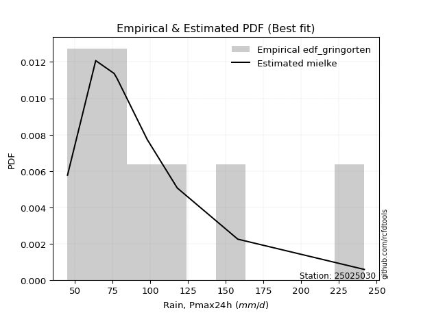</img>

</div>


### 9. Empirical - EDF Filliben (1975)

The specific values of the constants (0.3175) (often denoted as $alpha$) and (0.365) are derived from a method proposed by James J. Filliben in a 1975 paper. This particular formula is the mean value of the $i$-th order statistic of the normal distribution and is considered a robust and effective plotting position formula for the normal probability plot correlation coefficient test for normality.

<div align="center">


$P=(m-0.3175)/(n+0.365)$


</div>


**9.1. Empirical values**

<div align="center">

|                | 0                   | 1                  | 2                   | 3                   | 4            | 5                  | 6                  | 7                  | 8                  |
|:---------------|:--------------------|:-------------------|:--------------------|:--------------------|:-------------|:-------------------|:-------------------|:-------------------|:-------------------|
| date           | 2023                | 2018               | 2017                | 2022                | 2025         | 2020               | 2021               | 2024               | 2019               |
| x              | 45.2                | 63.89              | 76.1                | 78.1                | 83.7         | 98.0               | 117.9              | 158.0              | 241.8              |
| m              | 1                   | 2                  | 3                   | 4                   | 5            | 6                  | 7                  | 8                  | 9                  |
| empirical_dist | edf_filliben        | edf_filliben       | edf_filliben        | edf_filliben        | edf_filliben | edf_filliben       | edf_filliben       | edf_filliben       | edf_filliben       |
| empirical      | 0.07287773625200214 | 0.1796583021890016 | 0.28643886812600106 | 0.39321943406300053 | 0.5          | 0.6067805659369995 | 0.7135611318739989 | 0.8203416978109984 | 0.9271222637479978 |
| empirical_tr   | 1.0786063921681543  | 1.219004230393752  | 1.401421623643846   | 1.6480422349318082  | 2.0          | 2.5431093007467753 | 3.491146318732526  | 5.566121842496286  | 13.721611721611705 |

</div>


**9.2. Kolmogorov-Smirnov fit test (sorted by Δ)**


<div align="center">

|                | 0                     | 1                   | 2                   | 3                   | 4                   | 5                   | 6                   | 7                   | 8                   | 9                   | 10                  | 11                  | 12                  | 13                  | 14                  | 15                  | 16                  | 17                  | 18                  | 19                  | 20                  | 21                  | 22                  | 23                  | 24                  | 25                  | 26                  | 27                  | 28                  | 29                  | 30                  | 31                  | 32                  | 33                  | 34                  | 35                  | 36                  | 37                  | 38                  | 39                  | 40                  | 41                  | 42                  | 43                  | 44                  | 45                  | 46                  | 47                  | 48                  | 49                  | 50                  | 51                  | 52                  | 53                  | 54                  | 55                  | 56                  | 57                  | 58                  | 59                  | 60                  | 61                  | 62                  | 63                  | 64                  | 65                  | 66                  | 67                  | 68                  | 69                  | 70                  | 71                  | 72                  | 73                  | 74                  | 75                  | 76                  | 77                  | 78                  | 79                  | 80                  | 81                  | 82                  | 83                  | 84                  | 85                  | 86                  | 87                  | 88                  | 89                  |
|:---------------|:----------------------|:--------------------|:--------------------|:--------------------|:--------------------|:--------------------|:--------------------|:--------------------|:--------------------|:--------------------|:--------------------|:--------------------|:--------------------|:--------------------|:--------------------|:--------------------|:--------------------|:--------------------|:--------------------|:--------------------|:--------------------|:--------------------|:--------------------|:--------------------|:--------------------|:--------------------|:--------------------|:--------------------|:--------------------|:--------------------|:--------------------|:--------------------|:--------------------|:--------------------|:--------------------|:--------------------|:--------------------|:--------------------|:--------------------|:--------------------|:--------------------|:--------------------|:--------------------|:--------------------|:--------------------|:--------------------|:--------------------|:--------------------|:--------------------|:--------------------|:--------------------|:--------------------|:--------------------|:--------------------|:--------------------|:--------------------|:--------------------|:--------------------|:--------------------|:--------------------|:--------------------|:--------------------|:--------------------|:--------------------|:--------------------|:--------------------|:--------------------|:--------------------|:--------------------|:--------------------|:--------------------|:--------------------|:--------------------|:--------------------|:--------------------|:--------------------|:--------------------|:--------------------|:--------------------|:--------------------|:--------------------|:--------------------|:--------------------|:--------------------|:--------------------|:--------------------|:--------------------|:--------------------|:--------------------|:--------------------|
| station        | 25025030              | 25025030            | 25025030            | 25025030            | 25025030            | 25025030            | 25025030            | 25025030            | 25025030            | 25025030            | 25025030            | 25025030            | 25025030            | 25025030            | 25025030            | 25025030            | 25025030            | 25025030            | 25025030            | 25025030            | 25025030            | 25025030            | 25025030            | 25025030            | 25025030            | 25025030            | 25025030            | 25025030            | 25025030            | 25025030            | 25025030            | 25025030            | 25025030            | 25025030            | 25025030            | 25025030            | 25025030            | 25025030            | 25025030            | 25025030            | 25025030            | 25025030            | 25025030            | 25025030            | 25025030            | 25025030            | 25025030            | 25025030            | 25025030            | 25025030            | 25025030            | 25025030            | 25025030            | 25025030            | 25025030            | 25025030            | 25025030            | 25025030            | 25025030            | 25025030            | 25025030            | 25025030            | 25025030            | 25025030            | 25025030            | 25025030            | 25025030            | 25025030            | 25025030            | 25025030            | 25025030            | 25025030            | 25025030            | 25025030            | 25025030            | 25025030            | 25025030            | 25025030            | 25025030            | 25025030            | 25025030            | 25025030            | 25025030            | 25025030            | 25025030            | 25025030            | 25025030            | 25025030            | 25025030            | 25025030            |
| empirical_dist | edf_filliben          | edf_filliben        | edf_filliben        | edf_filliben        | edf_filliben        | edf_filliben        | edf_filliben        | edf_filliben        | edf_filliben        | edf_filliben        | edf_filliben        | edf_filliben        | edf_filliben        | edf_filliben        | edf_filliben        | edf_filliben        | edf_filliben        | edf_filliben        | edf_filliben        | edf_filliben        | edf_filliben        | edf_filliben        | edf_filliben        | edf_filliben        | edf_filliben        | edf_filliben        | edf_filliben        | edf_filliben        | edf_filliben        | edf_filliben        | edf_filliben        | edf_filliben        | edf_filliben        | edf_filliben        | edf_filliben        | edf_filliben        | edf_filliben        | edf_filliben        | edf_filliben        | edf_filliben        | edf_filliben        | edf_filliben        | edf_filliben        | edf_filliben        | edf_filliben        | edf_filliben        | edf_filliben        | edf_filliben        | edf_filliben        | edf_filliben        | edf_filliben        | edf_filliben        | edf_filliben        | edf_filliben        | edf_filliben        | edf_filliben        | edf_filliben        | edf_filliben        | edf_filliben        | edf_filliben        | edf_filliben        | edf_filliben        | edf_filliben        | edf_filliben        | edf_filliben        | edf_filliben        | edf_filliben        | edf_filliben        | edf_filliben        | edf_filliben        | edf_filliben        | edf_filliben        | edf_filliben        | edf_filliben        | edf_filliben        | edf_filliben        | edf_filliben        | edf_filliben        | edf_filliben        | edf_filliben        | edf_filliben        | edf_filliben        | edf_filliben        | edf_filliben        | edf_filliben        | edf_filliben        | edf_filliben        | edf_filliben        | edf_filliben        | edf_filliben        |
| p_dist         | loglaplace_asymmetric | logexponnorm        | loginvgauss         | logfatiguelife      | logfisk             | f                   | invgamma            | fisk                | loggenlogistic      | mielke              | logjohnsonsu        | nct                 | logmielke           | logf                | logerlang           | loggamma            | loggamma            | alpha               | logalpha            | logrice             | loggumbel_r         | johnsonsu           | lograyleigh         | logmaxwell          | invgauss            | logncf              | halflogistic        | wald                | logweibull_min      | logpearson3         | lognct              | loginvgamma         | exponnorm           | betaprime           | loginvweibull       | logmoyal            | gompertz            | loggompertz         | genexpon            | pearson3            | halfnorm            | logbetaprime        | logkstwobign        | moyal               | weibull_min         | logloggamma         | loghalfnorm         | logt                | lognorm             | lognorm             | logcrystalball      | expon               | loghalflogistic     | gumbel_r            | t                   | loglogistic         | rayleigh            | genlogistic         | laplace_asymmetric  | loghypsecant        | maxwell             | kstwobign           | logwald             | loglaplace          | truncnorm           | crystalball         | norm                | loggumbel_l         | loggenexpon         | logistic            | gibrat              | loggibrat           | rice                | hypsecant           | chi2                | ncf                 | logtruncnorm        | nakagami            | logexpon            | laplace             | gamma               | logchi2             | gumbel_l            | erlang              | loglognorm          | pareto              | lognakagami         | invweibull          | logpareto           | fatiguelife         |
| delta          | 0.05089391316940972   | 0.06305847653171659 | 0.06437576539721251 | 0.06457375299833201 | 0.0646487030282048  | 0.06479040157333393 | 0.06479040928946828 | 0.06486168018995431 | 0.06496923840813673 | 0.06501279526288206 | 0.06518663198954638 | 0.0661465462758361  | 0.06694279965183403 | 0.06711055197905802 | 0.06777655828304646 | 0.0677768266317208  | 0.0677768266317208  | 0.06818927599476954 | 0.06838547745352697 | 0.0687159542980193  | 0.07062563039048553 | 0.07136910287441323 | 0.07276760269655103 | 0.07281944521124095 | 0.07308823736626424 | 0.07329787968482959 | 0.07532626573700069 | 0.07630138684178162 | 0.0768557414048352  | 0.07707887004192843 | 0.07791878272654462 | 0.07989070942841736 | 0.08178447640160158 | 0.08205791559337194 | 0.08228493457184327 | 0.08382344838898914 | 0.08393480930639935 | 0.08402235128294688 | 0.08642758697158881 | 0.0888558712931799  | 0.08905676932487261 | 0.09152577852569271 | 0.09314331669988302 | 0.0965267869962384  | 0.09817966929169103 | 0.1030442838860533  | 0.1054564359757329  | 0.10666395556440883 | 0.10666542953157138 | 0.10666542953157138 | 0.1066654648191217  | 0.10719956882914994 | 0.10756610040701065 | 0.11322323165603587 | 0.11825570145773268 | 0.1203146108527206  | 0.12309971758064875 | 0.12505341780235646 | 0.1260970745646135  | 0.1314182882994635  | 0.1351472761271469  | 0.14919722867390106 | 0.15106602213333908 | 0.15900508333671126 | 0.16954838915866421 | 0.16954840150081207 | 0.16954840270947624 | 0.17246851252032908 | 0.17603159974754023 | 0.17793505009570237 | 0.17965751798384824 | 0.1796583021890016  | 0.1820245003674072  | 0.19213494026358008 | 0.19712684273107006 | 0.2035111193883181  | 0.20982385020526656 | 0.21084823036512393 | 0.21732740839239173 | 0.219996255161011   | 0.22210735300322226 | 0.22831767368120867 | 0.2390267175446007  | 0.25277351298618334 | 0.43204174535254003 | 0.4504520774117463  | 0.4548949604568503  | 0.46008914957545916 | 0.4630136875687936  | 0.5372595725891688  |
| deltao         | 0.41761268023100007   | 0.41761268023100007 | 0.41761268023100007 | 0.41761268023100007 | 0.41761268023100007 | 0.41761268023100007 | 0.41761268023100007 | 0.41761268023100007 | 0.41761268023100007 | 0.41761268023100007 | 0.41761268023100007 | 0.41761268023100007 | 0.41761268023100007 | 0.41761268023100007 | 0.41761268023100007 | 0.41761268023100007 | 0.41761268023100007 | 0.41761268023100007 | 0.41761268023100007 | 0.41761268023100007 | 0.41761268023100007 | 0.41761268023100007 | 0.41761268023100007 | 0.41761268023100007 | 0.41761268023100007 | 0.41761268023100007 | 0.41761268023100007 | 0.41761268023100007 | 0.41761268023100007 | 0.41761268023100007 | 0.41761268023100007 | 0.41761268023100007 | 0.41761268023100007 | 0.41761268023100007 | 0.41761268023100007 | 0.41761268023100007 | 0.41761268023100007 | 0.41761268023100007 | 0.41761268023100007 | 0.41761268023100007 | 0.41761268023100007 | 0.41761268023100007 | 0.41761268023100007 | 0.41761268023100007 | 0.41761268023100007 | 0.41761268023100007 | 0.41761268023100007 | 0.41761268023100007 | 0.41761268023100007 | 0.41761268023100007 | 0.41761268023100007 | 0.41761268023100007 | 0.41761268023100007 | 0.41761268023100007 | 0.41761268023100007 | 0.41761268023100007 | 0.41761268023100007 | 0.41761268023100007 | 0.41761268023100007 | 0.41761268023100007 | 0.41761268023100007 | 0.41761268023100007 | 0.41761268023100007 | 0.41761268023100007 | 0.41761268023100007 | 0.41761268023100007 | 0.41761268023100007 | 0.41761268023100007 | 0.41761268023100007 | 0.41761268023100007 | 0.41761268023100007 | 0.41761268023100007 | 0.41761268023100007 | 0.41761268023100007 | 0.41761268023100007 | 0.41761268023100007 | 0.41761268023100007 | 0.41761268023100007 | 0.41761268023100007 | 0.41761268023100007 | 0.41761268023100007 | 0.41761268023100007 | 0.41761268023100007 | 0.41761268023100007 | 0.41761268023100007 | 0.41761268023100007 | 0.41761268023100007 | 0.41761268023100007 | 0.41761268023100007 | 0.41761268023100007 |
| eval           | Δo > Δ                | Δo > Δ              | Δo > Δ              | Δo > Δ              | Δo > Δ              | Δo > Δ              | Δo > Δ              | Δo > Δ              | Δo > Δ              | Δo > Δ              | Δo > Δ              | Δo > Δ              | Δo > Δ              | Δo > Δ              | Δo > Δ              | Δo > Δ              | Δo > Δ              | Δo > Δ              | Δo > Δ              | Δo > Δ              | Δo > Δ              | Δo > Δ              | Δo > Δ              | Δo > Δ              | Δo > Δ              | Δo > Δ              | Δo > Δ              | Δo > Δ              | Δo > Δ              | Δo > Δ              | Δo > Δ              | Δo > Δ              | Δo > Δ              | Δo > Δ              | Δo > Δ              | Δo > Δ              | Δo > Δ              | Δo > Δ              | Δo > Δ              | Δo > Δ              | Δo > Δ              | Δo > Δ              | Δo > Δ              | Δo > Δ              | Δo > Δ              | Δo > Δ              | Δo > Δ              | Δo > Δ              | Δo > Δ              | Δo > Δ              | Δo > Δ              | Δo > Δ              | Δo > Δ              | Δo > Δ              | Δo > Δ              | Δo > Δ              | Δo > Δ              | Δo > Δ              | Δo > Δ              | Δo > Δ              | Δo > Δ              | Δo > Δ              | Δo > Δ              | Δo > Δ              | Δo > Δ              | Δo > Δ              | Δo > Δ              | Δo > Δ              | Δo > Δ              | Δo > Δ              | Δo > Δ              | Δo > Δ              | Δo > Δ              | Δo > Δ              | Δo > Δ              | Δo > Δ              | Δo > Δ              | Δo > Δ              | Δo > Δ              | Δo > Δ              | Δo > Δ              | Δo > Δ              | Δo > Δ              | Δo > Δ              | Δo <= Δ             | Δo <= Δ             | Δo <= Δ             | Δo <= Δ             | Δo <= Δ             | Δo <= Δ             |
| fit            | 1                     | 1                   | 1                   | 1                   | 1                   | 1                   | 1                   | 1                   | 1                   | 1                   | 1                   | 1                   | 1                   | 1                   | 1                   | 1                   | 1                   | 1                   | 1                   | 1                   | 1                   | 1                   | 1                   | 1                   | 1                   | 1                   | 1                   | 1                   | 1                   | 1                   | 1                   | 1                   | 1                   | 1                   | 1                   | 1                   | 1                   | 1                   | 1                   | 1                   | 1                   | 1                   | 1                   | 1                   | 1                   | 1                   | 1                   | 1                   | 1                   | 1                   | 1                   | 1                   | 1                   | 1                   | 1                   | 1                   | 1                   | 1                   | 1                   | 1                   | 1                   | 1                   | 1                   | 1                   | 1                   | 1                   | 1                   | 1                   | 1                   | 1                   | 1                   | 1                   | 1                   | 1                   | 1                   | 1                   | 1                   | 1                   | 1                   | 1                   | 1                   | 1                   | 1                   | 1                   | 0                   | 0                   | 0                   | 0                   | 0                   | 0                   |
| n              | 9                     | 9                   | 9                   | 9                   | 9                   | 9                   | 9                   | 9                   | 9                   | 9                   | 9                   | 9                   | 9                   | 9                   | 9                   | 9                   | 9                   | 9                   | 9                   | 9                   | 9                   | 9                   | 9                   | 9                   | 9                   | 9                   | 9                   | 9                   | 9                   | 9                   | 9                   | 9                   | 9                   | 9                   | 9                   | 9                   | 9                   | 9                   | 9                   | 9                   | 9                   | 9                   | 9                   | 9                   | 9                   | 9                   | 9                   | 9                   | 9                   | 9                   | 9                   | 9                   | 9                   | 9                   | 9                   | 9                   | 9                   | 9                   | 9                   | 9                   | 9                   | 9                   | 9                   | 9                   | 9                   | 9                   | 9                   | 9                   | 9                   | 9                   | 9                   | 9                   | 9                   | 9                   | 9                   | 9                   | 9                   | 9                   | 9                   | 9                   | 9                   | 9                   | 9                   | 9                   | 9                   | 9                   | 9                   | 9                   | 9                   | 9                   |
| best_fit       | 1                     | 0                   | 0                   | 0                   | 0                   | 0                   | 0                   | 0                   | 0                   | 0                   | 0                   | 0                   | 0                   | 0                   | 0                   | 0                   | 0                   | 0                   | 0                   | 0                   | 0                   | 0                   | 0                   | 0                   | 0                   | 0                   | 0                   | 0                   | 0                   | 0                   | 0                   | 0                   | 0                   | 0                   | 0                   | 0                   | 0                   | 0                   | 0                   | 0                   | 0                   | 0                   | 0                   | 0                   | 0                   | 0                   | 0                   | 0                   | 0                   | 0                   | 0                   | 0                   | 0                   | 0                   | 0                   | 0                   | 0                   | 0                   | 0                   | 0                   | 0                   | 0                   | 0                   | 0                   | 0                   | 0                   | 0                   | 0                   | 0                   | 0                   | 0                   | 0                   | 0                   | 0                   | 0                   | 0                   | 0                   | 0                   | 0                   | 0                   | 0                   | 0                   | 0                   | 0                   | 0                   | 0                   | 0                   | 0                   | 0                   | 0                   |
| best_fit_sort  | 1                     | 2                   | 3                   | 4                   | 5                   | 6                   | 7                   | 8                   | 9                   | 10                  | 11                  | 12                  | 13                  | 14                  | 15                  | 16                  | 17                  | 18                  | 19                  | 20                  | 21                  | 22                  | 23                  | 24                  | 25                  | 26                  | 27                  | 28                  | 29                  | 30                  | 31                  | 32                  | 33                  | 34                  | 35                  | 36                  | 37                  | 38                  | 39                  | 40                  | 41                  | 42                  | 43                  | 44                  | 45                  | 46                  | 47                  | 48                  | 49                  | 50                  | 51                  | 52                  | 53                  | 54                  | 55                  | 56                  | 57                  | 58                  | 59                  | 60                  | 61                  | 62                  | 63                  | 64                  | 65                  | 66                  | 67                  | 68                  | 69                  | 70                  | 71                  | 72                  | 73                  | 74                  | 75                  | 76                  | 77                  | 78                  | 79                  | 80                  | 81                  | 82                  | 83                  | 84                  | 85                  | 86                  | 87                  | 88                  | 89                  | 90                  |

</div>


<div align="center">

</img>

</div>


**9.3. Best fit**

<div align="center">

|   id |   station | empirical_dist   | p_dist                |     delta |   deltao | eval   |   fit |   n |   best_fit |   best_fit_sort |
|-----:|----------:|:-----------------|:----------------------|----------:|---------:|:-------|------:|----:|-----------:|----------------:|
|    0 |  25025030 | edf_filliben     | loglaplace_asymmetric | 0.0508939 | 0.417613 | Δo > Δ |     1 |   9 |          1 |               1 |

</div>


<div align="center">

</img></img>

</div>


### 10. Empirical - EDF Jenkinson (1977)

The Jenkinson formula in hydrology is an empirical plotting position formula used to estimate the non-exceedance probability _(P)_ or return period _(T)_ of a given ordered observation within a sample. It is a widely used method in the frequency analysis of extreme events such as floods and rainfall, as it provides a distribution-free way to plot data. _a≈0.31_ and _b≈0.38_ are constants derived to approximate the median of the probability distribution for the given rank.

<div align="center">


$P=(m-a)/(n+b)$


</div>


**10.1. Empirical values**

<div align="center">

|                | 0                   | 1                   | 2                  | 3                   | 4             | 5                  | 6                  | 7                  | 8                  |
|:---------------|:--------------------|:--------------------|:-------------------|:--------------------|:--------------|:-------------------|:-------------------|:-------------------|:-------------------|
| date           | 2023                | 2018                | 2017               | 2022                | 2025          | 2020               | 2021               | 2024               | 2019               |
| x              | 45.2                | 63.89               | 76.1               | 78.1                | 83.7          | 98.0               | 117.9              | 158.0              | 241.8              |
| m              | 1                   | 2                   | 3                  | 4                   | 5             | 6                  | 7                  | 8                  | 9                  |
| empirical_dist | edf_jenkinson       | edf_jenkinson       | edf_jenkinson      | edf_jenkinson       | edf_jenkinson | edf_jenkinson      | edf_jenkinson      | edf_jenkinson      | edf_jenkinson      |
| empirical      | 0.07356076759061833 | 0.18017057569296374 | 0.2867803837953091 | 0.39339019189765456 | 0.5           | 0.6066098081023454 | 0.7132196162046908 | 0.8198294243070362 | 0.9264392324093815 |
| empirical_tr   | 1.0794016110471807  | 1.2197659297789336  | 1.4020926756352765 | 1.6485061511423549  | 2.0           | 2.542005420054201  | 3.486988847583642  | 5.550295857988164  | 13.5942028985507   |

</div>


**10.2. Kolmogorov-Smirnov fit test (sorted by Δ)**


<div align="center">

|                | 0                     | 1                   | 2                   | 3                   | 4                   | 5                   | 6                   | 7                   | 8                   | 9                   | 10                  | 11                  | 12                  | 13                  | 14                  | 15                  | 16                  | 17                  | 18                  | 19                  | 20                  | 21                  | 22                  | 23                  | 24                  | 25                  | 26                  | 27                  | 28                  | 29                  | 30                  | 31                  | 32                  | 33                  | 34                  | 35                  | 36                  | 37                  | 38                  | 39                  | 40                  | 41                  | 42                  | 43                  | 44                  | 45                  | 46                  | 47                  | 48                  | 49                  | 50                  | 51                  | 52                  | 53                  | 54                  | 55                  | 56                  | 57                  | 58                  | 59                  | 60                  | 61                  | 62                  | 63                  | 64                  | 65                  | 66                  | 67                  | 68                  | 69                  | 70                  | 71                  | 72                  | 73                  | 74                  | 75                  | 76                  | 77                  | 78                  | 79                  | 80                  | 81                  | 82                  | 83                  | 84                  | 85                  | 86                  | 87                  | 88                  | 89                  |
|:---------------|:----------------------|:--------------------|:--------------------|:--------------------|:--------------------|:--------------------|:--------------------|:--------------------|:--------------------|:--------------------|:--------------------|:--------------------|:--------------------|:--------------------|:--------------------|:--------------------|:--------------------|:--------------------|:--------------------|:--------------------|:--------------------|:--------------------|:--------------------|:--------------------|:--------------------|:--------------------|:--------------------|:--------------------|:--------------------|:--------------------|:--------------------|:--------------------|:--------------------|:--------------------|:--------------------|:--------------------|:--------------------|:--------------------|:--------------------|:--------------------|:--------------------|:--------------------|:--------------------|:--------------------|:--------------------|:--------------------|:--------------------|:--------------------|:--------------------|:--------------------|:--------------------|:--------------------|:--------------------|:--------------------|:--------------------|:--------------------|:--------------------|:--------------------|:--------------------|:--------------------|:--------------------|:--------------------|:--------------------|:--------------------|:--------------------|:--------------------|:--------------------|:--------------------|:--------------------|:--------------------|:--------------------|:--------------------|:--------------------|:--------------------|:--------------------|:--------------------|:--------------------|:--------------------|:--------------------|:--------------------|:--------------------|:--------------------|:--------------------|:--------------------|:--------------------|:--------------------|:--------------------|:--------------------|:--------------------|:--------------------|
| station        | 25025030              | 25025030            | 25025030            | 25025030            | 25025030            | 25025030            | 25025030            | 25025030            | 25025030            | 25025030            | 25025030            | 25025030            | 25025030            | 25025030            | 25025030            | 25025030            | 25025030            | 25025030            | 25025030            | 25025030            | 25025030            | 25025030            | 25025030            | 25025030            | 25025030            | 25025030            | 25025030            | 25025030            | 25025030            | 25025030            | 25025030            | 25025030            | 25025030            | 25025030            | 25025030            | 25025030            | 25025030            | 25025030            | 25025030            | 25025030            | 25025030            | 25025030            | 25025030            | 25025030            | 25025030            | 25025030            | 25025030            | 25025030            | 25025030            | 25025030            | 25025030            | 25025030            | 25025030            | 25025030            | 25025030            | 25025030            | 25025030            | 25025030            | 25025030            | 25025030            | 25025030            | 25025030            | 25025030            | 25025030            | 25025030            | 25025030            | 25025030            | 25025030            | 25025030            | 25025030            | 25025030            | 25025030            | 25025030            | 25025030            | 25025030            | 25025030            | 25025030            | 25025030            | 25025030            | 25025030            | 25025030            | 25025030            | 25025030            | 25025030            | 25025030            | 25025030            | 25025030            | 25025030            | 25025030            | 25025030            |
| empirical_dist | edf_jenkinson         | edf_jenkinson       | edf_jenkinson       | edf_jenkinson       | edf_jenkinson       | edf_jenkinson       | edf_jenkinson       | edf_jenkinson       | edf_jenkinson       | edf_jenkinson       | edf_jenkinson       | edf_jenkinson       | edf_jenkinson       | edf_jenkinson       | edf_jenkinson       | edf_jenkinson       | edf_jenkinson       | edf_jenkinson       | edf_jenkinson       | edf_jenkinson       | edf_jenkinson       | edf_jenkinson       | edf_jenkinson       | edf_jenkinson       | edf_jenkinson       | edf_jenkinson       | edf_jenkinson       | edf_jenkinson       | edf_jenkinson       | edf_jenkinson       | edf_jenkinson       | edf_jenkinson       | edf_jenkinson       | edf_jenkinson       | edf_jenkinson       | edf_jenkinson       | edf_jenkinson       | edf_jenkinson       | edf_jenkinson       | edf_jenkinson       | edf_jenkinson       | edf_jenkinson       | edf_jenkinson       | edf_jenkinson       | edf_jenkinson       | edf_jenkinson       | edf_jenkinson       | edf_jenkinson       | edf_jenkinson       | edf_jenkinson       | edf_jenkinson       | edf_jenkinson       | edf_jenkinson       | edf_jenkinson       | edf_jenkinson       | edf_jenkinson       | edf_jenkinson       | edf_jenkinson       | edf_jenkinson       | edf_jenkinson       | edf_jenkinson       | edf_jenkinson       | edf_jenkinson       | edf_jenkinson       | edf_jenkinson       | edf_jenkinson       | edf_jenkinson       | edf_jenkinson       | edf_jenkinson       | edf_jenkinson       | edf_jenkinson       | edf_jenkinson       | edf_jenkinson       | edf_jenkinson       | edf_jenkinson       | edf_jenkinson       | edf_jenkinson       | edf_jenkinson       | edf_jenkinson       | edf_jenkinson       | edf_jenkinson       | edf_jenkinson       | edf_jenkinson       | edf_jenkinson       | edf_jenkinson       | edf_jenkinson       | edf_jenkinson       | edf_jenkinson       | edf_jenkinson       | edf_jenkinson       |
| p_dist         | loglaplace_asymmetric | logexponnorm        | logfatiguelife      | loginvgauss         | f                   | invgamma            | fisk                | loggenlogistic      | logfisk             | mielke              | logjohnsonsu        | nct                 | logmielke           | logf                | logerlang           | loggamma            | loggamma            | alpha               | logrice             | logalpha            | loggumbel_r         | johnsonsu           | lograyleigh         | invgauss            | logmaxwell          | logncf              | halflogistic        | logweibull_min      | wald                | logpearson3         | lognct              | loginvgamma         | exponnorm           | loginvweibull       | betaprime           | logmoyal            | gompertz            | loggompertz         | genexpon            | pearson3            | halfnorm            | logbetaprime        | logkstwobign        | moyal               | weibull_min         | logloggamma         | loghalfnorm         | logt                | lognorm             | lognorm             | logcrystalball      | expon               | loghalflogistic     | gumbel_r            | t                   | loglogistic         | rayleigh            | genlogistic         | laplace_asymmetric  | loghypsecant        | maxwell             | kstwobign           | logwald             | loglaplace          | truncnorm           | crystalball         | norm                | loggumbel_l         | loggenexpon         | logistic            | gibrat              | loggibrat           | rice                | hypsecant           | chi2                | ncf                 | logtruncnorm        | nakagami            | logexpon            | laplace             | gamma               | logchi2             | gumbel_l            | erlang              | loglognorm          | pareto              | lognakagami         | invweibull          | logpareto           | fatiguelife         |
| delta          | 0.051406186673371934  | 0.06271696086240852 | 0.06423223732902394 | 0.06433470709979955 | 0.06444888590402587 | 0.06444889362016021 | 0.06452016452064624 | 0.06462772273882866 | 0.0646487030282048  | 0.064671279593574   | 0.06518663198954638 | 0.06580503060652804 | 0.06694279965183403 | 0.06711055197905802 | 0.0674350426137384  | 0.06743531096241273 | 0.06743531096241273 | 0.06818927599476954 | 0.06837443862871123 | 0.06838547745352697 | 0.07028411472117746 | 0.07102758720510516 | 0.07242608702724296 | 0.07274672169695617 | 0.07281944521124095 | 0.07329787968482959 | 0.07532626573700069 | 0.07651422573552713 | 0.07681366034574375 | 0.07707887004192843 | 0.07791878272654462 | 0.07989070942841736 | 0.08178447640160158 | 0.0819434189025352  | 0.08205791559337194 | 0.08348193271968107 | 0.08359329363709128 | 0.08368083561363882 | 0.08608607130228074 | 0.0888558712931799  | 0.08888601149021857 | 0.09152577852569271 | 0.09280180103057495 | 0.0965267869962384  | 0.09783815362238296 | 0.1030442838860533  | 0.10511492030642483 | 0.10666395556440883 | 0.10666542953157138 | 0.10666542953157138 | 0.1066654648191217  | 0.10685805315984187 | 0.10722458473770258 | 0.11322323165603587 | 0.11859721712704085 | 0.1203146108527206  | 0.12292895974599471 | 0.12505341780235646 | 0.1260970745646135  | 0.1314182882994635  | 0.13497651829249285 | 0.14919722867390106 | 0.1515782956373012  | 0.15900508333671126 | 0.16937763132401018 | 0.16937764366615804 | 0.1693776448748222  | 0.17246851252032908 | 0.17569008407823217 | 0.17778889948333865 | 0.18016979148781037 | 0.18017057569296374 | 0.1820245003674072  | 0.19213494026358008 | 0.196785327061762   | 0.20299884588435596 | 0.2094823345359585  | 0.2103359568611618  | 0.21698589272308366 | 0.219996255161011   | 0.2217658373339142  | 0.22780540017724654 | 0.23885595970994666 | 0.25243199731687527 | 0.4315294718485779  | 0.44993980390778415 | 0.45438268695288814 | 0.4594061182368429  | 0.4625014140648314  | 0.5367472990852067  |
| deltao         | 0.41761268023100007   | 0.41761268023100007 | 0.41761268023100007 | 0.41761268023100007 | 0.41761268023100007 | 0.41761268023100007 | 0.41761268023100007 | 0.41761268023100007 | 0.41761268023100007 | 0.41761268023100007 | 0.41761268023100007 | 0.41761268023100007 | 0.41761268023100007 | 0.41761268023100007 | 0.41761268023100007 | 0.41761268023100007 | 0.41761268023100007 | 0.41761268023100007 | 0.41761268023100007 | 0.41761268023100007 | 0.41761268023100007 | 0.41761268023100007 | 0.41761268023100007 | 0.41761268023100007 | 0.41761268023100007 | 0.41761268023100007 | 0.41761268023100007 | 0.41761268023100007 | 0.41761268023100007 | 0.41761268023100007 | 0.41761268023100007 | 0.41761268023100007 | 0.41761268023100007 | 0.41761268023100007 | 0.41761268023100007 | 0.41761268023100007 | 0.41761268023100007 | 0.41761268023100007 | 0.41761268023100007 | 0.41761268023100007 | 0.41761268023100007 | 0.41761268023100007 | 0.41761268023100007 | 0.41761268023100007 | 0.41761268023100007 | 0.41761268023100007 | 0.41761268023100007 | 0.41761268023100007 | 0.41761268023100007 | 0.41761268023100007 | 0.41761268023100007 | 0.41761268023100007 | 0.41761268023100007 | 0.41761268023100007 | 0.41761268023100007 | 0.41761268023100007 | 0.41761268023100007 | 0.41761268023100007 | 0.41761268023100007 | 0.41761268023100007 | 0.41761268023100007 | 0.41761268023100007 | 0.41761268023100007 | 0.41761268023100007 | 0.41761268023100007 | 0.41761268023100007 | 0.41761268023100007 | 0.41761268023100007 | 0.41761268023100007 | 0.41761268023100007 | 0.41761268023100007 | 0.41761268023100007 | 0.41761268023100007 | 0.41761268023100007 | 0.41761268023100007 | 0.41761268023100007 | 0.41761268023100007 | 0.41761268023100007 | 0.41761268023100007 | 0.41761268023100007 | 0.41761268023100007 | 0.41761268023100007 | 0.41761268023100007 | 0.41761268023100007 | 0.41761268023100007 | 0.41761268023100007 | 0.41761268023100007 | 0.41761268023100007 | 0.41761268023100007 | 0.41761268023100007 |
| eval           | Δo > Δ                | Δo > Δ              | Δo > Δ              | Δo > Δ              | Δo > Δ              | Δo > Δ              | Δo > Δ              | Δo > Δ              | Δo > Δ              | Δo > Δ              | Δo > Δ              | Δo > Δ              | Δo > Δ              | Δo > Δ              | Δo > Δ              | Δo > Δ              | Δo > Δ              | Δo > Δ              | Δo > Δ              | Δo > Δ              | Δo > Δ              | Δo > Δ              | Δo > Δ              | Δo > Δ              | Δo > Δ              | Δo > Δ              | Δo > Δ              | Δo > Δ              | Δo > Δ              | Δo > Δ              | Δo > Δ              | Δo > Δ              | Δo > Δ              | Δo > Δ              | Δo > Δ              | Δo > Δ              | Δo > Δ              | Δo > Δ              | Δo > Δ              | Δo > Δ              | Δo > Δ              | Δo > Δ              | Δo > Δ              | Δo > Δ              | Δo > Δ              | Δo > Δ              | Δo > Δ              | Δo > Δ              | Δo > Δ              | Δo > Δ              | Δo > Δ              | Δo > Δ              | Δo > Δ              | Δo > Δ              | Δo > Δ              | Δo > Δ              | Δo > Δ              | Δo > Δ              | Δo > Δ              | Δo > Δ              | Δo > Δ              | Δo > Δ              | Δo > Δ              | Δo > Δ              | Δo > Δ              | Δo > Δ              | Δo > Δ              | Δo > Δ              | Δo > Δ              | Δo > Δ              | Δo > Δ              | Δo > Δ              | Δo > Δ              | Δo > Δ              | Δo > Δ              | Δo > Δ              | Δo > Δ              | Δo > Δ              | Δo > Δ              | Δo > Δ              | Δo > Δ              | Δo > Δ              | Δo > Δ              | Δo > Δ              | Δo <= Δ             | Δo <= Δ             | Δo <= Δ             | Δo <= Δ             | Δo <= Δ             | Δo <= Δ             |
| fit            | 1                     | 1                   | 1                   | 1                   | 1                   | 1                   | 1                   | 1                   | 1                   | 1                   | 1                   | 1                   | 1                   | 1                   | 1                   | 1                   | 1                   | 1                   | 1                   | 1                   | 1                   | 1                   | 1                   | 1                   | 1                   | 1                   | 1                   | 1                   | 1                   | 1                   | 1                   | 1                   | 1                   | 1                   | 1                   | 1                   | 1                   | 1                   | 1                   | 1                   | 1                   | 1                   | 1                   | 1                   | 1                   | 1                   | 1                   | 1                   | 1                   | 1                   | 1                   | 1                   | 1                   | 1                   | 1                   | 1                   | 1                   | 1                   | 1                   | 1                   | 1                   | 1                   | 1                   | 1                   | 1                   | 1                   | 1                   | 1                   | 1                   | 1                   | 1                   | 1                   | 1                   | 1                   | 1                   | 1                   | 1                   | 1                   | 1                   | 1                   | 1                   | 1                   | 1                   | 1                   | 0                   | 0                   | 0                   | 0                   | 0                   | 0                   |
| n              | 9                     | 9                   | 9                   | 9                   | 9                   | 9                   | 9                   | 9                   | 9                   | 9                   | 9                   | 9                   | 9                   | 9                   | 9                   | 9                   | 9                   | 9                   | 9                   | 9                   | 9                   | 9                   | 9                   | 9                   | 9                   | 9                   | 9                   | 9                   | 9                   | 9                   | 9                   | 9                   | 9                   | 9                   | 9                   | 9                   | 9                   | 9                   | 9                   | 9                   | 9                   | 9                   | 9                   | 9                   | 9                   | 9                   | 9                   | 9                   | 9                   | 9                   | 9                   | 9                   | 9                   | 9                   | 9                   | 9                   | 9                   | 9                   | 9                   | 9                   | 9                   | 9                   | 9                   | 9                   | 9                   | 9                   | 9                   | 9                   | 9                   | 9                   | 9                   | 9                   | 9                   | 9                   | 9                   | 9                   | 9                   | 9                   | 9                   | 9                   | 9                   | 9                   | 9                   | 9                   | 9                   | 9                   | 9                   | 9                   | 9                   | 9                   |
| best_fit       | 1                     | 0                   | 0                   | 0                   | 0                   | 0                   | 0                   | 0                   | 0                   | 0                   | 0                   | 0                   | 0                   | 0                   | 0                   | 0                   | 0                   | 0                   | 0                   | 0                   | 0                   | 0                   | 0                   | 0                   | 0                   | 0                   | 0                   | 0                   | 0                   | 0                   | 0                   | 0                   | 0                   | 0                   | 0                   | 0                   | 0                   | 0                   | 0                   | 0                   | 0                   | 0                   | 0                   | 0                   | 0                   | 0                   | 0                   | 0                   | 0                   | 0                   | 0                   | 0                   | 0                   | 0                   | 0                   | 0                   | 0                   | 0                   | 0                   | 0                   | 0                   | 0                   | 0                   | 0                   | 0                   | 0                   | 0                   | 0                   | 0                   | 0                   | 0                   | 0                   | 0                   | 0                   | 0                   | 0                   | 0                   | 0                   | 0                   | 0                   | 0                   | 0                   | 0                   | 0                   | 0                   | 0                   | 0                   | 0                   | 0                   | 0                   |
| best_fit_sort  | 1                     | 2                   | 3                   | 4                   | 5                   | 6                   | 7                   | 8                   | 9                   | 10                  | 11                  | 12                  | 13                  | 14                  | 15                  | 16                  | 17                  | 18                  | 19                  | 20                  | 21                  | 22                  | 23                  | 24                  | 25                  | 26                  | 27                  | 28                  | 29                  | 30                  | 31                  | 32                  | 33                  | 34                  | 35                  | 36                  | 37                  | 38                  | 39                  | 40                  | 41                  | 42                  | 43                  | 44                  | 45                  | 46                  | 47                  | 48                  | 49                  | 50                  | 51                  | 52                  | 53                  | 54                  | 55                  | 56                  | 57                  | 58                  | 59                  | 60                  | 61                  | 62                  | 63                  | 64                  | 65                  | 66                  | 67                  | 68                  | 69                  | 70                  | 71                  | 72                  | 73                  | 74                  | 75                  | 76                  | 77                  | 78                  | 79                  | 80                  | 81                  | 82                  | 83                  | 84                  | 85                  | 86                  | 87                  | 88                  | 89                  | 90                  |

</div>


<div align="center">

</img>

</div>


**10.3. Best fit**

<div align="center">

|   id |   station | empirical_dist   | p_dist                |     delta |   deltao | eval   |   fit |   n |   best_fit |   best_fit_sort |
|-----:|----------:|:-----------------|:----------------------|----------:|---------:|:-------|------:|----:|-----------:|----------------:|
|    0 |  25025030 | edf_jenkinson    | loglaplace_asymmetric | 0.0514062 | 0.417613 | Δo > Δ |     1 |   9 |          1 |               1 |

</div>


<div align="center">

</img>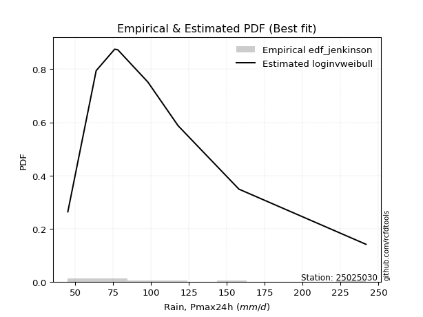</img>

</div>


### 11. Empirical - EDF Cunnane (1978)

Cunnane´s work in statistical hydrology has focused on the performance and evaluation of different probability distributions (such as GEV, Gumbel, Lognormal) for flood frequency estimation. _b_ is a constant, typically set to 0.4.

<div align="center">


$P=(m-b)/(n+1-2b)$


</div>


**11.1. Empirical values**

<div align="center">

|                | 0                   | 1                  | 2                   | 3                  | 4           | 5                  | 6                 | 7                  | 8                  |
|:---------------|:--------------------|:-------------------|:--------------------|:-------------------|:------------|:-------------------|:------------------|:-------------------|:-------------------|
| date           | 2023                | 2018               | 2017                | 2022               | 2025        | 2020               | 2021              | 2024               | 2019               |
| x              | 45.2                | 63.89              | 76.1                | 78.1               | 83.7        | 98.0               | 117.9             | 158.0              | 241.8              |
| m              | 1                   | 2                  | 3                   | 4                  | 5           | 6                  | 7                 | 8                  | 9                  |
| empirical_dist | edf_cunnane         | edf_cunnane        | edf_cunnane         | edf_cunnane        | edf_cunnane | edf_cunnane        | edf_cunnane       | edf_cunnane        | edf_cunnane        |
| empirical      | 0.06521739130434782 | 0.1739130434782609 | 0.28260869565217395 | 0.391304347826087  | 0.5         | 0.6086956521739131 | 0.717391304347826 | 0.8260869565217391 | 0.9347826086956522 |
| empirical_tr   | 1.069767441860465   | 1.2105263157894737 | 1.393939393939394   | 1.6428571428571428 | 2.0         | 2.555555555555556  | 3.538461538461538 | 5.75               | 15.333333333333343 |

</div>


**11.2. Kolmogorov-Smirnov fit test (sorted by Δ)**


<div align="center">

|                | 0                     | 1                   | 2                   | 3                   | 4                   | 5                   | 6                   | 7                   | 8                   | 9                   | 10                  | 11                  | 12                  | 13                  | 14                  | 15                  | 16                  | 17                  | 18                  | 19                  | 20                  | 21                  | 22                  | 23                  | 24                  | 25                  | 26                  | 27                  | 28                  | 29                  | 30                  | 31                  | 32                  | 33                  | 34                  | 35                  | 36                  | 37                  | 38                  | 39                  | 40                  | 41                  | 42                  | 43                  | 44                  | 45                  | 46                  | 47                  | 48                  | 49                  | 50                  | 51                  | 52                  | 53                  | 54                  | 55                  | 56                  | 57                  | 58                  | 59                  | 60                  | 61                  | 62                  | 63                  | 64                  | 65                  | 66                  | 67                  | 68                  | 69                  | 70                  | 71                  | 72                  | 73                  | 74                  | 75                  | 76                  | 77                  | 78                  | 79                  | 80                  | 81                  | 82                  | 83                  | 84                  | 85                  | 86                  | 87                  | 88                  | 89                  |
|:---------------|:----------------------|:--------------------|:--------------------|:--------------------|:--------------------|:--------------------|:--------------------|:--------------------|:--------------------|:--------------------|:--------------------|:--------------------|:--------------------|:--------------------|:--------------------|:--------------------|:--------------------|:--------------------|:--------------------|:--------------------|:--------------------|:--------------------|:--------------------|:--------------------|:--------------------|:--------------------|:--------------------|:--------------------|:--------------------|:--------------------|:--------------------|:--------------------|:--------------------|:--------------------|:--------------------|:--------------------|:--------------------|:--------------------|:--------------------|:--------------------|:--------------------|:--------------------|:--------------------|:--------------------|:--------------------|:--------------------|:--------------------|:--------------------|:--------------------|:--------------------|:--------------------|:--------------------|:--------------------|:--------------------|:--------------------|:--------------------|:--------------------|:--------------------|:--------------------|:--------------------|:--------------------|:--------------------|:--------------------|:--------------------|:--------------------|:--------------------|:--------------------|:--------------------|:--------------------|:--------------------|:--------------------|:--------------------|:--------------------|:--------------------|:--------------------|:--------------------|:--------------------|:--------------------|:--------------------|:--------------------|:--------------------|:--------------------|:--------------------|:--------------------|:--------------------|:--------------------|:--------------------|:--------------------|:--------------------|:--------------------|
| station        | 25025030              | 25025030            | 25025030            | 25025030            | 25025030            | 25025030            | 25025030            | 25025030            | 25025030            | 25025030            | 25025030            | 25025030            | 25025030            | 25025030            | 25025030            | 25025030            | 25025030            | 25025030            | 25025030            | 25025030            | 25025030            | 25025030            | 25025030            | 25025030            | 25025030            | 25025030            | 25025030            | 25025030            | 25025030            | 25025030            | 25025030            | 25025030            | 25025030            | 25025030            | 25025030            | 25025030            | 25025030            | 25025030            | 25025030            | 25025030            | 25025030            | 25025030            | 25025030            | 25025030            | 25025030            | 25025030            | 25025030            | 25025030            | 25025030            | 25025030            | 25025030            | 25025030            | 25025030            | 25025030            | 25025030            | 25025030            | 25025030            | 25025030            | 25025030            | 25025030            | 25025030            | 25025030            | 25025030            | 25025030            | 25025030            | 25025030            | 25025030            | 25025030            | 25025030            | 25025030            | 25025030            | 25025030            | 25025030            | 25025030            | 25025030            | 25025030            | 25025030            | 25025030            | 25025030            | 25025030            | 25025030            | 25025030            | 25025030            | 25025030            | 25025030            | 25025030            | 25025030            | 25025030            | 25025030            | 25025030            |
| empirical_dist | edf_cunnane           | edf_cunnane         | edf_cunnane         | edf_cunnane         | edf_cunnane         | edf_cunnane         | edf_cunnane         | edf_cunnane         | edf_cunnane         | edf_cunnane         | edf_cunnane         | edf_cunnane         | edf_cunnane         | edf_cunnane         | edf_cunnane         | edf_cunnane         | edf_cunnane         | edf_cunnane         | edf_cunnane         | edf_cunnane         | edf_cunnane         | edf_cunnane         | edf_cunnane         | edf_cunnane         | edf_cunnane         | edf_cunnane         | edf_cunnane         | edf_cunnane         | edf_cunnane         | edf_cunnane         | edf_cunnane         | edf_cunnane         | edf_cunnane         | edf_cunnane         | edf_cunnane         | edf_cunnane         | edf_cunnane         | edf_cunnane         | edf_cunnane         | edf_cunnane         | edf_cunnane         | edf_cunnane         | edf_cunnane         | edf_cunnane         | edf_cunnane         | edf_cunnane         | edf_cunnane         | edf_cunnane         | edf_cunnane         | edf_cunnane         | edf_cunnane         | edf_cunnane         | edf_cunnane         | edf_cunnane         | edf_cunnane         | edf_cunnane         | edf_cunnane         | edf_cunnane         | edf_cunnane         | edf_cunnane         | edf_cunnane         | edf_cunnane         | edf_cunnane         | edf_cunnane         | edf_cunnane         | edf_cunnane         | edf_cunnane         | edf_cunnane         | edf_cunnane         | edf_cunnane         | edf_cunnane         | edf_cunnane         | edf_cunnane         | edf_cunnane         | edf_cunnane         | edf_cunnane         | edf_cunnane         | edf_cunnane         | edf_cunnane         | edf_cunnane         | edf_cunnane         | edf_cunnane         | edf_cunnane         | edf_cunnane         | edf_cunnane         | edf_cunnane         | edf_cunnane         | edf_cunnane         | edf_cunnane         | edf_cunnane         |
| p_dist         | loglaplace_asymmetric | logfisk             | logjohnsonsu        | logexponnorm        | logmielke           | logf                | alpha               | loginvgauss         | logalpha            | logfatiguelife      | f                   | invgamma            | fisk                | loggenlogistic      | mielke              | nct                 | wald                | logerlang           | loggamma            | loggamma            | logrice             | logmaxwell          | logncf              | loggumbel_r         | johnsonsu           | halflogistic        | lograyleigh         | invgauss            | logpearson3         | lognct              | loginvgamma         | logweibull_min      | exponnorm           | betaprime           | loginvweibull       | logmoyal            | gompertz            | loggompertz         | pearson3            | genexpon            | logbetaprime        | halfnorm            | moyal               | logkstwobign        | weibull_min         | logloggamma         | logt                | lognorm             | lognorm             | logcrystalball      | loghalfnorm         | expon               | loghalflogistic     | gumbel_r            | t                   | loglogistic         | rayleigh            | genlogistic         | laplace_asymmetric  | loghypsecant        | maxwell             | logwald             | kstwobign           | loglaplace          | truncnorm           | crystalball         | norm                | loggumbel_l         | gibrat              | loggibrat           | logistic            | loggenexpon         | rice                | hypsecant           | chi2                | ncf                 | logtruncnorm        | nakagami            | laplace             | logexpon            | gamma               | logchi2             | gumbel_l            | erlang              | loglognorm          | pareto              | lognakagami         | invweibull          | logpareto           | fatiguelife         |
| delta          | 0.04958691538913029   | 0.0646487030282048  | 0.06686110487804586 | 0.0668886490055437  | 0.06694279965183403 | 0.06711055197905802 | 0.06818927599476954 | 0.06820593787103962 | 0.06838547745352697 | 0.06840392547215912 | 0.06862057404716104 | 0.06862058176329539 | 0.06869185266378142 | 0.06879941088196384 | 0.06884296773670917 | 0.06997671874966321 | 0.0705561281310409  | 0.07160673075687357 | 0.07160699910554791 | 0.07160699910554791 | 0.07254612677184641 | 0.07281944521124095 | 0.07329787968482959 | 0.07445580286431264 | 0.07519927534824034 | 0.07579875742705311 | 0.07659777517037814 | 0.07691840984009135 | 0.07707887004192843 | 0.07791878272654462 | 0.07989070942841736 | 0.08068591387866231 | 0.08178447640160158 | 0.08205791559337194 | 0.08611510704567038 | 0.08765362086281625 | 0.08776498178022646 | 0.08785252375677399 | 0.0888558712931799  | 0.09025775944541592 | 0.09152577852569271 | 0.09246126421965509 | 0.0965267869962384  | 0.09697348917371013 | 0.10200984176551814 | 0.1030442838860533  | 0.10666395556440883 | 0.10666542953157138 | 0.10666542953157138 | 0.1066654648191217  | 0.10928660844956001 | 0.11102974130297705 | 0.11139627288083775 | 0.11322323165603587 | 0.11442552898390557 | 0.1203146108527206  | 0.12501480381756236 | 0.12505341780235646 | 0.1260970745646135  | 0.1314182882994635  | 0.1370623623640605  | 0.14532076342259836 | 0.14919722867390106 | 0.15900508333671126 | 0.17146347539557782 | 0.17146348773772568 | 0.17146348894638985 | 0.17246851252032908 | 0.17391225927310752 | 0.1739130434782609  | 0.17985013633261598 | 0.17986177222136734 | 0.1820245003674072  | 0.19213494026358008 | 0.20095701520489717 | 0.2092563780990588  | 0.21365402267909367 | 0.21659348907586465 | 0.219996255161011   | 0.22115758086621884 | 0.22593752547704937 | 0.2340629323919494  | 0.2409418037815143  | 0.25660368546001044 | 0.43778700406328075 | 0.45619733612248703 | 0.460640219167591   | 0.4677494945231136  | 0.4687589462795343  | 0.5430048312999095  |
| deltao         | 0.41761268023100007   | 0.41761268023100007 | 0.41761268023100007 | 0.41761268023100007 | 0.41761268023100007 | 0.41761268023100007 | 0.41761268023100007 | 0.41761268023100007 | 0.41761268023100007 | 0.41761268023100007 | 0.41761268023100007 | 0.41761268023100007 | 0.41761268023100007 | 0.41761268023100007 | 0.41761268023100007 | 0.41761268023100007 | 0.41761268023100007 | 0.41761268023100007 | 0.41761268023100007 | 0.41761268023100007 | 0.41761268023100007 | 0.41761268023100007 | 0.41761268023100007 | 0.41761268023100007 | 0.41761268023100007 | 0.41761268023100007 | 0.41761268023100007 | 0.41761268023100007 | 0.41761268023100007 | 0.41761268023100007 | 0.41761268023100007 | 0.41761268023100007 | 0.41761268023100007 | 0.41761268023100007 | 0.41761268023100007 | 0.41761268023100007 | 0.41761268023100007 | 0.41761268023100007 | 0.41761268023100007 | 0.41761268023100007 | 0.41761268023100007 | 0.41761268023100007 | 0.41761268023100007 | 0.41761268023100007 | 0.41761268023100007 | 0.41761268023100007 | 0.41761268023100007 | 0.41761268023100007 | 0.41761268023100007 | 0.41761268023100007 | 0.41761268023100007 | 0.41761268023100007 | 0.41761268023100007 | 0.41761268023100007 | 0.41761268023100007 | 0.41761268023100007 | 0.41761268023100007 | 0.41761268023100007 | 0.41761268023100007 | 0.41761268023100007 | 0.41761268023100007 | 0.41761268023100007 | 0.41761268023100007 | 0.41761268023100007 | 0.41761268023100007 | 0.41761268023100007 | 0.41761268023100007 | 0.41761268023100007 | 0.41761268023100007 | 0.41761268023100007 | 0.41761268023100007 | 0.41761268023100007 | 0.41761268023100007 | 0.41761268023100007 | 0.41761268023100007 | 0.41761268023100007 | 0.41761268023100007 | 0.41761268023100007 | 0.41761268023100007 | 0.41761268023100007 | 0.41761268023100007 | 0.41761268023100007 | 0.41761268023100007 | 0.41761268023100007 | 0.41761268023100007 | 0.41761268023100007 | 0.41761268023100007 | 0.41761268023100007 | 0.41761268023100007 | 0.41761268023100007 |
| eval           | Δo > Δ                | Δo > Δ              | Δo > Δ              | Δo > Δ              | Δo > Δ              | Δo > Δ              | Δo > Δ              | Δo > Δ              | Δo > Δ              | Δo > Δ              | Δo > Δ              | Δo > Δ              | Δo > Δ              | Δo > Δ              | Δo > Δ              | Δo > Δ              | Δo > Δ              | Δo > Δ              | Δo > Δ              | Δo > Δ              | Δo > Δ              | Δo > Δ              | Δo > Δ              | Δo > Δ              | Δo > Δ              | Δo > Δ              | Δo > Δ              | Δo > Δ              | Δo > Δ              | Δo > Δ              | Δo > Δ              | Δo > Δ              | Δo > Δ              | Δo > Δ              | Δo > Δ              | Δo > Δ              | Δo > Δ              | Δo > Δ              | Δo > Δ              | Δo > Δ              | Δo > Δ              | Δo > Δ              | Δo > Δ              | Δo > Δ              | Δo > Δ              | Δo > Δ              | Δo > Δ              | Δo > Δ              | Δo > Δ              | Δo > Δ              | Δo > Δ              | Δo > Δ              | Δo > Δ              | Δo > Δ              | Δo > Δ              | Δo > Δ              | Δo > Δ              | Δo > Δ              | Δo > Δ              | Δo > Δ              | Δo > Δ              | Δo > Δ              | Δo > Δ              | Δo > Δ              | Δo > Δ              | Δo > Δ              | Δo > Δ              | Δo > Δ              | Δo > Δ              | Δo > Δ              | Δo > Δ              | Δo > Δ              | Δo > Δ              | Δo > Δ              | Δo > Δ              | Δo > Δ              | Δo > Δ              | Δo > Δ              | Δo > Δ              | Δo > Δ              | Δo > Δ              | Δo > Δ              | Δo > Δ              | Δo > Δ              | Δo <= Δ             | Δo <= Δ             | Δo <= Δ             | Δo <= Δ             | Δo <= Δ             | Δo <= Δ             |
| fit            | 1                     | 1                   | 1                   | 1                   | 1                   | 1                   | 1                   | 1                   | 1                   | 1                   | 1                   | 1                   | 1                   | 1                   | 1                   | 1                   | 1                   | 1                   | 1                   | 1                   | 1                   | 1                   | 1                   | 1                   | 1                   | 1                   | 1                   | 1                   | 1                   | 1                   | 1                   | 1                   | 1                   | 1                   | 1                   | 1                   | 1                   | 1                   | 1                   | 1                   | 1                   | 1                   | 1                   | 1                   | 1                   | 1                   | 1                   | 1                   | 1                   | 1                   | 1                   | 1                   | 1                   | 1                   | 1                   | 1                   | 1                   | 1                   | 1                   | 1                   | 1                   | 1                   | 1                   | 1                   | 1                   | 1                   | 1                   | 1                   | 1                   | 1                   | 1                   | 1                   | 1                   | 1                   | 1                   | 1                   | 1                   | 1                   | 1                   | 1                   | 1                   | 1                   | 1                   | 1                   | 0                   | 0                   | 0                   | 0                   | 0                   | 0                   |
| n              | 9                     | 9                   | 9                   | 9                   | 9                   | 9                   | 9                   | 9                   | 9                   | 9                   | 9                   | 9                   | 9                   | 9                   | 9                   | 9                   | 9                   | 9                   | 9                   | 9                   | 9                   | 9                   | 9                   | 9                   | 9                   | 9                   | 9                   | 9                   | 9                   | 9                   | 9                   | 9                   | 9                   | 9                   | 9                   | 9                   | 9                   | 9                   | 9                   | 9                   | 9                   | 9                   | 9                   | 9                   | 9                   | 9                   | 9                   | 9                   | 9                   | 9                   | 9                   | 9                   | 9                   | 9                   | 9                   | 9                   | 9                   | 9                   | 9                   | 9                   | 9                   | 9                   | 9                   | 9                   | 9                   | 9                   | 9                   | 9                   | 9                   | 9                   | 9                   | 9                   | 9                   | 9                   | 9                   | 9                   | 9                   | 9                   | 9                   | 9                   | 9                   | 9                   | 9                   | 9                   | 9                   | 9                   | 9                   | 9                   | 9                   | 9                   |
| best_fit       | 1                     | 0                   | 0                   | 0                   | 0                   | 0                   | 0                   | 0                   | 0                   | 0                   | 0                   | 0                   | 0                   | 0                   | 0                   | 0                   | 0                   | 0                   | 0                   | 0                   | 0                   | 0                   | 0                   | 0                   | 0                   | 0                   | 0                   | 0                   | 0                   | 0                   | 0                   | 0                   | 0                   | 0                   | 0                   | 0                   | 0                   | 0                   | 0                   | 0                   | 0                   | 0                   | 0                   | 0                   | 0                   | 0                   | 0                   | 0                   | 0                   | 0                   | 0                   | 0                   | 0                   | 0                   | 0                   | 0                   | 0                   | 0                   | 0                   | 0                   | 0                   | 0                   | 0                   | 0                   | 0                   | 0                   | 0                   | 0                   | 0                   | 0                   | 0                   | 0                   | 0                   | 0                   | 0                   | 0                   | 0                   | 0                   | 0                   | 0                   | 0                   | 0                   | 0                   | 0                   | 0                   | 0                   | 0                   | 0                   | 0                   | 0                   |
| best_fit_sort  | 1                     | 2                   | 3                   | 4                   | 5                   | 6                   | 7                   | 8                   | 9                   | 10                  | 11                  | 12                  | 13                  | 14                  | 15                  | 16                  | 17                  | 18                  | 19                  | 20                  | 21                  | 22                  | 23                  | 24                  | 25                  | 26                  | 27                  | 28                  | 29                  | 30                  | 31                  | 32                  | 33                  | 34                  | 35                  | 36                  | 37                  | 38                  | 39                  | 40                  | 41                  | 42                  | 43                  | 44                  | 45                  | 46                  | 47                  | 48                  | 49                  | 50                  | 51                  | 52                  | 53                  | 54                  | 55                  | 56                  | 57                  | 58                  | 59                  | 60                  | 61                  | 62                  | 63                  | 64                  | 65                  | 66                  | 67                  | 68                  | 69                  | 70                  | 71                  | 72                  | 73                  | 74                  | 75                  | 76                  | 77                  | 78                  | 79                  | 80                  | 81                  | 82                  | 83                  | 84                  | 85                  | 86                  | 87                  | 88                  | 89                  | 90                  |

</div>


<div align="center">

</img>

</div>


**11.3. Best fit**

<div align="center">

|   id |   station | empirical_dist   | p_dist                |     delta |   deltao | eval   |   fit |   n |   best_fit |   best_fit_sort |
|-----:|----------:|:-----------------|:----------------------|----------:|---------:|:-------|------:|----:|-----------:|----------------:|
|    0 |  25025030 | edf_cunnane      | loglaplace_asymmetric | 0.0495869 | 0.417613 | Δo > Δ |     1 |   9 |          1 |               1 |

</div>


<div align="center">

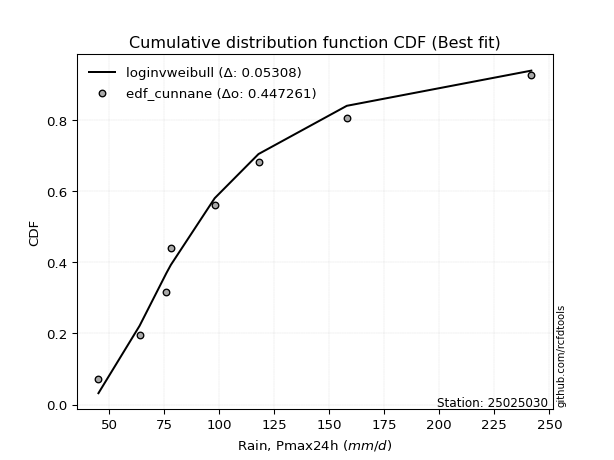</img>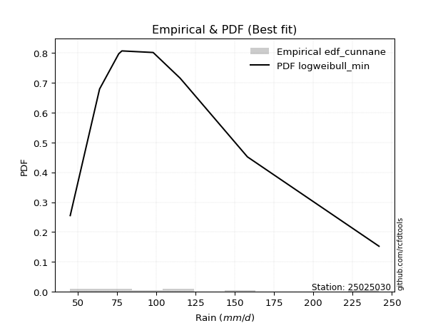</img>

</div>


### 12. Empirical - EDF Adamowski (1981)

The Adamowski formula in hydrology refers to a specific plotting position formula used for estimating the non-parametric empirical distribution of hydrological events (like flood peaks) to calculate their return periods. This formula provides an alternative to traditional parametric methods (like the Gumbel or Log Pearson Type III distributions). 

<div align="center">


$P=(m-0.25)/(n+0.5)$


</div>


**12.1. Empirical values**

<div align="center">

|                | 0                   | 1                   | 2                  | 3                   | 4             | 5                  | 6                  | 7                  | 8                  |
|:---------------|:--------------------|:--------------------|:-------------------|:--------------------|:--------------|:-------------------|:-------------------|:-------------------|:-------------------|
| date           | 2023                | 2018                | 2017               | 2022                | 2025          | 2020               | 2021               | 2024               | 2019               |
| x              | 45.2                | 63.89               | 76.1               | 78.1                | 83.7          | 98.0               | 117.9              | 158.0              | 241.8              |
| m              | 1                   | 2                   | 3                  | 4                   | 5             | 6                  | 7                  | 8                  | 9                  |
| empirical_dist | edf_adamowski       | edf_adamowski       | edf_adamowski      | edf_adamowski       | edf_adamowski | edf_adamowski      | edf_adamowski      | edf_adamowski      | edf_adamowski      |
| empirical      | 0.07894736842105263 | 0.18421052631578946 | 0.2894736842105263 | 0.39473684210526316 | 0.5           | 0.6052631578947368 | 0.7105263157894737 | 0.8157894736842105 | 0.9210526315789473 |
| empirical_tr   | 1.0857142857142856  | 1.2258064516129032  | 1.4074074074074074 | 1.6521739130434783  | 2.0           | 2.533333333333333  | 3.4545454545454546 | 5.428571428571428  | 12.666666666666663 |

</div>


**12.2. Kolmogorov-Smirnov fit test (sorted by Δ)**


<div align="center">

|                | 0                     | 1                   | 2                    | 3                   | 4                   | 5                   | 6                   | 7                   | 8                   | 9                   | 10                  | 11                  | 12                  | 13                  | 14                  | 15                  | 16                  | 17                  | 18                  | 19                  | 20                  | 21                  | 22                  | 23                  | 24                  | 25                  | 26                  | 27                  | 28                  | 29                  | 30                  | 31                  | 32                  | 33                  | 34                  | 35                  | 36                  | 37                  | 38                  | 39                  | 40                  | 41                  | 42                  | 43                  | 44                  | 45                  | 46                  | 47                  | 48                  | 49                  | 50                  | 51                  | 52                  | 53                  | 54                  | 55                  | 56                  | 57                  | 58                  | 59                  | 60                  | 61                  | 62                  | 63                  | 64                  | 65                  | 66                  | 67                  | 68                  | 69                  | 70                  | 71                  | 72                  | 73                  | 74                  | 75                  | 76                  | 77                  | 78                  | 79                  | 80                  | 81                  | 82                  | 83                  | 84                  | 85                  | 86                  | 87                  | 88                  | 89                  |
|:---------------|:----------------------|:--------------------|:---------------------|:--------------------|:--------------------|:--------------------|:--------------------|:--------------------|:--------------------|:--------------------|:--------------------|:--------------------|:--------------------|:--------------------|:--------------------|:--------------------|:--------------------|:--------------------|:--------------------|:--------------------|:--------------------|:--------------------|:--------------------|:--------------------|:--------------------|:--------------------|:--------------------|:--------------------|:--------------------|:--------------------|:--------------------|:--------------------|:--------------------|:--------------------|:--------------------|:--------------------|:--------------------|:--------------------|:--------------------|:--------------------|:--------------------|:--------------------|:--------------------|:--------------------|:--------------------|:--------------------|:--------------------|:--------------------|:--------------------|:--------------------|:--------------------|:--------------------|:--------------------|:--------------------|:--------------------|:--------------------|:--------------------|:--------------------|:--------------------|:--------------------|:--------------------|:--------------------|:--------------------|:--------------------|:--------------------|:--------------------|:--------------------|:--------------------|:--------------------|:--------------------|:--------------------|:--------------------|:--------------------|:--------------------|:--------------------|:--------------------|:--------------------|:--------------------|:--------------------|:--------------------|:--------------------|:--------------------|:--------------------|:--------------------|:--------------------|:--------------------|:--------------------|:--------------------|:--------------------|:--------------------|
| station        | 25025030              | 25025030            | 25025030             | 25025030            | 25025030            | 25025030            | 25025030            | 25025030            | 25025030            | 25025030            | 25025030            | 25025030            | 25025030            | 25025030            | 25025030            | 25025030            | 25025030            | 25025030            | 25025030            | 25025030            | 25025030            | 25025030            | 25025030            | 25025030            | 25025030            | 25025030            | 25025030            | 25025030            | 25025030            | 25025030            | 25025030            | 25025030            | 25025030            | 25025030            | 25025030            | 25025030            | 25025030            | 25025030            | 25025030            | 25025030            | 25025030            | 25025030            | 25025030            | 25025030            | 25025030            | 25025030            | 25025030            | 25025030            | 25025030            | 25025030            | 25025030            | 25025030            | 25025030            | 25025030            | 25025030            | 25025030            | 25025030            | 25025030            | 25025030            | 25025030            | 25025030            | 25025030            | 25025030            | 25025030            | 25025030            | 25025030            | 25025030            | 25025030            | 25025030            | 25025030            | 25025030            | 25025030            | 25025030            | 25025030            | 25025030            | 25025030            | 25025030            | 25025030            | 25025030            | 25025030            | 25025030            | 25025030            | 25025030            | 25025030            | 25025030            | 25025030            | 25025030            | 25025030            | 25025030            | 25025030            |
| empirical_dist | edf_adamowski         | edf_adamowski       | edf_adamowski        | edf_adamowski       | edf_adamowski       | edf_adamowski       | edf_adamowski       | edf_adamowski       | edf_adamowski       | edf_adamowski       | edf_adamowski       | edf_adamowski       | edf_adamowski       | edf_adamowski       | edf_adamowski       | edf_adamowski       | edf_adamowski       | edf_adamowski       | edf_adamowski       | edf_adamowski       | edf_adamowski       | edf_adamowski       | edf_adamowski       | edf_adamowski       | edf_adamowski       | edf_adamowski       | edf_adamowski       | edf_adamowski       | edf_adamowski       | edf_adamowski       | edf_adamowski       | edf_adamowski       | edf_adamowski       | edf_adamowski       | edf_adamowski       | edf_adamowski       | edf_adamowski       | edf_adamowski       | edf_adamowski       | edf_adamowski       | edf_adamowski       | edf_adamowski       | edf_adamowski       | edf_adamowski       | edf_adamowski       | edf_adamowski       | edf_adamowski       | edf_adamowski       | edf_adamowski       | edf_adamowski       | edf_adamowski       | edf_adamowski       | edf_adamowski       | edf_adamowski       | edf_adamowski       | edf_adamowski       | edf_adamowski       | edf_adamowski       | edf_adamowski       | edf_adamowski       | edf_adamowski       | edf_adamowski       | edf_adamowski       | edf_adamowski       | edf_adamowski       | edf_adamowski       | edf_adamowski       | edf_adamowski       | edf_adamowski       | edf_adamowski       | edf_adamowski       | edf_adamowski       | edf_adamowski       | edf_adamowski       | edf_adamowski       | edf_adamowski       | edf_adamowski       | edf_adamowski       | edf_adamowski       | edf_adamowski       | edf_adamowski       | edf_adamowski       | edf_adamowski       | edf_adamowski       | edf_adamowski       | edf_adamowski       | edf_adamowski       | edf_adamowski       | edf_adamowski       | edf_adamowski       |
| p_dist         | loglaplace_asymmetric | logexponnorm        | fisk                 | loggenlogistic      | mielke              | nct                 | f                   | invgamma            | logfatiguelife      | loginvgauss         | logfisk             | logerlang           | loggamma            | loggamma            | logjohnsonsu        | logrice             | logmielke           | logf                | loggumbel_r         | alpha               | johnsonsu           | logalpha            | lograyleigh         | invgauss            | logmaxwell          | logncf              | logweibull_min      | halflogistic        | logpearson3         | lognct              | loginvweibull       | loginvgamma         | logmoyal            | wald                | gompertz            | loggompertz         | exponnorm           | betaprime           | genexpon            | halfnorm            | pearson3            | logkstwobign        | logbetaprime        | weibull_min         | moyal               | loghalfnorm         | logloggamma         | expon               | loghalflogistic     | logt                | lognorm             | lognorm             | logcrystalball      | gumbel_r            | loglogistic         | t                   | rayleigh            | genlogistic         | laplace_asymmetric  | loghypsecant        | maxwell             | kstwobign           | logwald             | loglaplace          | truncnorm           | crystalball         | norm                | loggumbel_l         | loggenexpon         | logistic            | rice                | gibrat              | loggibrat           | hypsecant           | chi2                | ncf                 | nakagami            | logtruncnorm        | logexpon            | gamma               | laplace             | logchi2             | gumbel_l            | erlang              | loglognorm          | pareto              | lognakagami         | invweibull          | logpareto           | fatiguelife         |
| delta          | 0.05544613729619763   | 0.06002366044719132 | 0.061826864105429036 | 0.06193442232361146 | 0.06197797917835679 | 0.06311173019131083 | 0.06360256578659074 | 0.0636025810723354  | 0.06415882862268762 | 0.06433470709979955 | 0.0646487030282048  | 0.06474174219852119 | 0.06474201054719553 | 0.06474201054719553 | 0.06518663198954638 | 0.06568113821349403 | 0.06694279965183403 | 0.06711055197905802 | 0.06759081430596026 | 0.06818927599476954 | 0.06833428678988795 | 0.06838547745352697 | 0.06973278661202575 | 0.07005342128173897 | 0.07281944521124095 | 0.07329787968482959 | 0.07382092532030993 | 0.07532626573700069 | 0.07707887004192843 | 0.07791878272654462 | 0.079250118487318   | 0.07989070942841736 | 0.08078863230446387 | 0.08085361096856947 | 0.08089999322187408 | 0.08098753519842161 | 0.08178447640160158 | 0.08205791559337194 | 0.08339277088706354 | 0.08753936128260997 | 0.0888558712931799  | 0.09010850061535775 | 0.09152577852569271 | 0.09514485320716576 | 0.0965267869962384  | 0.10242161989120763 | 0.1030442838860533  | 0.10416475274462467 | 0.10453128432248537 | 0.10666395556440883 | 0.10666542953157138 | 0.10666542953157138 | 0.1066654648191217  | 0.11322323165603587 | 0.1203146108527206  | 0.12129051754225795 | 0.12158230953838611 | 0.12505341780235646 | 0.1260970745646135  | 0.1314182882994635  | 0.13362986808488425 | 0.14919722867390106 | 0.15561824626012694 | 0.15900508333671126 | 0.16803098111640158 | 0.16803099345854944 | 0.1680309946672136  | 0.17246851252032908 | 0.17299678366301496 | 0.17778889948333865 | 0.1820245003674072  | 0.1842097421106361  | 0.18421052631578946 | 0.19213494026358008 | 0.1940920266465448  | 0.19895889526153024 | 0.20629600623833608 | 0.2067890341207413  | 0.21429259230786646 | 0.219072536918697   | 0.219996255161011   | 0.22376544955442082 | 0.23750930950233806 | 0.24973869690165806 | 0.4274895212257521  | 0.4458998532849584  | 0.4503427363300624  | 0.4540195174064087  | 0.45846146344200567 | 0.5327073484623809  |
| deltao         | 0.41761268023100007   | 0.41761268023100007 | 0.41761268023100007  | 0.41761268023100007 | 0.41761268023100007 | 0.41761268023100007 | 0.41761268023100007 | 0.41761268023100007 | 0.41761268023100007 | 0.41761268023100007 | 0.41761268023100007 | 0.41761268023100007 | 0.41761268023100007 | 0.41761268023100007 | 0.41761268023100007 | 0.41761268023100007 | 0.41761268023100007 | 0.41761268023100007 | 0.41761268023100007 | 0.41761268023100007 | 0.41761268023100007 | 0.41761268023100007 | 0.41761268023100007 | 0.41761268023100007 | 0.41761268023100007 | 0.41761268023100007 | 0.41761268023100007 | 0.41761268023100007 | 0.41761268023100007 | 0.41761268023100007 | 0.41761268023100007 | 0.41761268023100007 | 0.41761268023100007 | 0.41761268023100007 | 0.41761268023100007 | 0.41761268023100007 | 0.41761268023100007 | 0.41761268023100007 | 0.41761268023100007 | 0.41761268023100007 | 0.41761268023100007 | 0.41761268023100007 | 0.41761268023100007 | 0.41761268023100007 | 0.41761268023100007 | 0.41761268023100007 | 0.41761268023100007 | 0.41761268023100007 | 0.41761268023100007 | 0.41761268023100007 | 0.41761268023100007 | 0.41761268023100007 | 0.41761268023100007 | 0.41761268023100007 | 0.41761268023100007 | 0.41761268023100007 | 0.41761268023100007 | 0.41761268023100007 | 0.41761268023100007 | 0.41761268023100007 | 0.41761268023100007 | 0.41761268023100007 | 0.41761268023100007 | 0.41761268023100007 | 0.41761268023100007 | 0.41761268023100007 | 0.41761268023100007 | 0.41761268023100007 | 0.41761268023100007 | 0.41761268023100007 | 0.41761268023100007 | 0.41761268023100007 | 0.41761268023100007 | 0.41761268023100007 | 0.41761268023100007 | 0.41761268023100007 | 0.41761268023100007 | 0.41761268023100007 | 0.41761268023100007 | 0.41761268023100007 | 0.41761268023100007 | 0.41761268023100007 | 0.41761268023100007 | 0.41761268023100007 | 0.41761268023100007 | 0.41761268023100007 | 0.41761268023100007 | 0.41761268023100007 | 0.41761268023100007 | 0.41761268023100007 |
| eval           | Δo > Δ                | Δo > Δ              | Δo > Δ               | Δo > Δ              | Δo > Δ              | Δo > Δ              | Δo > Δ              | Δo > Δ              | Δo > Δ              | Δo > Δ              | Δo > Δ              | Δo > Δ              | Δo > Δ              | Δo > Δ              | Δo > Δ              | Δo > Δ              | Δo > Δ              | Δo > Δ              | Δo > Δ              | Δo > Δ              | Δo > Δ              | Δo > Δ              | Δo > Δ              | Δo > Δ              | Δo > Δ              | Δo > Δ              | Δo > Δ              | Δo > Δ              | Δo > Δ              | Δo > Δ              | Δo > Δ              | Δo > Δ              | Δo > Δ              | Δo > Δ              | Δo > Δ              | Δo > Δ              | Δo > Δ              | Δo > Δ              | Δo > Δ              | Δo > Δ              | Δo > Δ              | Δo > Δ              | Δo > Δ              | Δo > Δ              | Δo > Δ              | Δo > Δ              | Δo > Δ              | Δo > Δ              | Δo > Δ              | Δo > Δ              | Δo > Δ              | Δo > Δ              | Δo > Δ              | Δo > Δ              | Δo > Δ              | Δo > Δ              | Δo > Δ              | Δo > Δ              | Δo > Δ              | Δo > Δ              | Δo > Δ              | Δo > Δ              | Δo > Δ              | Δo > Δ              | Δo > Δ              | Δo > Δ              | Δo > Δ              | Δo > Δ              | Δo > Δ              | Δo > Δ              | Δo > Δ              | Δo > Δ              | Δo > Δ              | Δo > Δ              | Δo > Δ              | Δo > Δ              | Δo > Δ              | Δo > Δ              | Δo > Δ              | Δo > Δ              | Δo > Δ              | Δo > Δ              | Δo > Δ              | Δo > Δ              | Δo <= Δ             | Δo <= Δ             | Δo <= Δ             | Δo <= Δ             | Δo <= Δ             | Δo <= Δ             |
| fit            | 1                     | 1                   | 1                    | 1                   | 1                   | 1                   | 1                   | 1                   | 1                   | 1                   | 1                   | 1                   | 1                   | 1                   | 1                   | 1                   | 1                   | 1                   | 1                   | 1                   | 1                   | 1                   | 1                   | 1                   | 1                   | 1                   | 1                   | 1                   | 1                   | 1                   | 1                   | 1                   | 1                   | 1                   | 1                   | 1                   | 1                   | 1                   | 1                   | 1                   | 1                   | 1                   | 1                   | 1                   | 1                   | 1                   | 1                   | 1                   | 1                   | 1                   | 1                   | 1                   | 1                   | 1                   | 1                   | 1                   | 1                   | 1                   | 1                   | 1                   | 1                   | 1                   | 1                   | 1                   | 1                   | 1                   | 1                   | 1                   | 1                   | 1                   | 1                   | 1                   | 1                   | 1                   | 1                   | 1                   | 1                   | 1                   | 1                   | 1                   | 1                   | 1                   | 1                   | 1                   | 0                   | 0                   | 0                   | 0                   | 0                   | 0                   |
| n              | 9                     | 9                   | 9                    | 9                   | 9                   | 9                   | 9                   | 9                   | 9                   | 9                   | 9                   | 9                   | 9                   | 9                   | 9                   | 9                   | 9                   | 9                   | 9                   | 9                   | 9                   | 9                   | 9                   | 9                   | 9                   | 9                   | 9                   | 9                   | 9                   | 9                   | 9                   | 9                   | 9                   | 9                   | 9                   | 9                   | 9                   | 9                   | 9                   | 9                   | 9                   | 9                   | 9                   | 9                   | 9                   | 9                   | 9                   | 9                   | 9                   | 9                   | 9                   | 9                   | 9                   | 9                   | 9                   | 9                   | 9                   | 9                   | 9                   | 9                   | 9                   | 9                   | 9                   | 9                   | 9                   | 9                   | 9                   | 9                   | 9                   | 9                   | 9                   | 9                   | 9                   | 9                   | 9                   | 9                   | 9                   | 9                   | 9                   | 9                   | 9                   | 9                   | 9                   | 9                   | 9                   | 9                   | 9                   | 9                   | 9                   | 9                   |
| best_fit       | 1                     | 0                   | 0                    | 0                   | 0                   | 0                   | 0                   | 0                   | 0                   | 0                   | 0                   | 0                   | 0                   | 0                   | 0                   | 0                   | 0                   | 0                   | 0                   | 0                   | 0                   | 0                   | 0                   | 0                   | 0                   | 0                   | 0                   | 0                   | 0                   | 0                   | 0                   | 0                   | 0                   | 0                   | 0                   | 0                   | 0                   | 0                   | 0                   | 0                   | 0                   | 0                   | 0                   | 0                   | 0                   | 0                   | 0                   | 0                   | 0                   | 0                   | 0                   | 0                   | 0                   | 0                   | 0                   | 0                   | 0                   | 0                   | 0                   | 0                   | 0                   | 0                   | 0                   | 0                   | 0                   | 0                   | 0                   | 0                   | 0                   | 0                   | 0                   | 0                   | 0                   | 0                   | 0                   | 0                   | 0                   | 0                   | 0                   | 0                   | 0                   | 0                   | 0                   | 0                   | 0                   | 0                   | 0                   | 0                   | 0                   | 0                   |
| best_fit_sort  | 1                     | 2                   | 3                    | 4                   | 5                   | 6                   | 7                   | 8                   | 9                   | 10                  | 11                  | 12                  | 13                  | 14                  | 15                  | 16                  | 17                  | 18                  | 19                  | 20                  | 21                  | 22                  | 23                  | 24                  | 25                  | 26                  | 27                  | 28                  | 29                  | 30                  | 31                  | 32                  | 33                  | 34                  | 35                  | 36                  | 37                  | 38                  | 39                  | 40                  | 41                  | 42                  | 43                  | 44                  | 45                  | 46                  | 47                  | 48                  | 49                  | 50                  | 51                  | 52                  | 53                  | 54                  | 55                  | 56                  | 57                  | 58                  | 59                  | 60                  | 61                  | 62                  | 63                  | 64                  | 65                  | 66                  | 67                  | 68                  | 69                  | 70                  | 71                  | 72                  | 73                  | 74                  | 75                  | 76                  | 77                  | 78                  | 79                  | 80                  | 81                  | 82                  | 83                  | 84                  | 85                  | 86                  | 87                  | 88                  | 89                  | 90                  |

</div>


<div align="center">

</img>

</div>


**12.3. Best fit**

<div align="center">

|   id |   station | empirical_dist   | p_dist                |     delta |   deltao | eval   |   fit |   n |   best_fit |   best_fit_sort |
|-----:|----------:|:-----------------|:----------------------|----------:|---------:|:-------|------:|----:|-----------:|----------------:|
|    0 |  25025030 | edf_adamowski    | loglaplace_asymmetric | 0.0554461 | 0.417613 | Δo > Δ |     1 |   9 |          1 |               1 |

</div>


<div align="center">

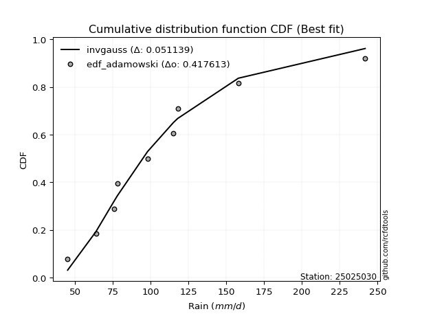</img></img>

</div>


## C. Best fit & Estimate extreme values for specific return periods - Tr


### 1. Best fit (ordered by delta Δ)

<div align="center">

|   id |   station | empirical_dist   | p_dist                |     delta |   deltao | eval   |   fit |   n |   best_fit |   best_fit_sort |
|-----:|----------:|:-----------------|:----------------------|----------:|---------:|:-------|------:|----:|-----------:|----------------:|
|    0 |  25025030 | edf_cunnane      | loglaplace_asymmetric | 0.0495869 | 0.417613 | Δo > Δ |     1 |   9 |          1 |               1 |
|    1 |  25025030 | edf_gringorten   | loglaplace_asymmetric | 0.0495869 | 0.417613 | Δo > Δ |     1 |   9 |          1 |               2 |
|    2 |  25025030 | edf_blom         | loglaplace_asymmetric | 0.0495869 | 0.417613 | Δo > Δ |     1 |   9 |          1 |               3 |
|    3 |  25025030 | edf_hazen        | loglaplace_asymmetric | 0.0495869 | 0.417613 | Δo > Δ |     1 |   9 |          1 |               4 |
|    4 |  25025030 | edf_tukey        | loglaplace_asymmetric | 0.049807  | 0.417613 | Δo > Δ |     1 |   9 |          1 |               5 |
|    5 |  25025030 | edf_filliben     | loglaplace_asymmetric | 0.0508939 | 0.417613 | Δo > Δ |     1 |   9 |          1 |               6 |
|    6 |  25025030 | edf_beard        | loglaplace_asymmetric | 0.0514062 | 0.417613 | Δo > Δ |     1 |   9 |          1 |               7 |
|    7 |  25025030 | edf_jenkinson    | loglaplace_asymmetric | 0.0514062 | 0.417613 | Δo > Δ |     1 |   9 |          1 |               8 |
|    8 |  25025030 | edf_chegodayev   | loglaplace_asymmetric | 0.0520867 | 0.417613 | Δo > Δ |     1 |   9 |          1 |               9 |
|    9 |  25025030 | edf_adamowski    | loglaplace_asymmetric | 0.0554461 | 0.417613 | Δo > Δ |     1 |   9 |          1 |              10 |
|   10 |  25025030 | edf_california   | t                     | 0.0600734 | 0.417613 | Δo > Δ |     1 |   9 |          1 |              11 |
|   11 |  25025030 | edf_weibull      | logmielke             | 0.0669428 | 0.417613 | Δo > Δ |     1 |   9 |          1 |              12 |

</div>

:file_folder:Tables: [bestfit_25025030.csv](table/bestfit_25025030.csv) | [extreme_25025030.csv](table/extreme_25025030.csv)


### 2. Extreme values

In hydrology, a return period (or recurrence interval $Tr$) is the statistical average time between extreme events like floods or droughts of a specific magnitude, indicating how rare an event is, with a 100-year flood, for example, having a 1% chance of occurring in any given year, not that it happens exactly every century. It is a key tool for infrastructure design (like bridges or dams) and risk assessment, calculated from historical data to determine the probability of future events, although it is important to remember it is statistical average, and events can cluster or be missed.

> risk_rate: assuming the return period as the project useful life.

|   id |      tr |   prob_l |     prob_g |     alpha |   betaprime |     chi2 |   crystalball |   erlang |    expon |   exponnorm |        f |   fatiguelife |      fisk |    gamma |   genexpon |   genlogistic |   gibrat |   gompertz |   gumbel_l |   gumbel_r |   halflogistic |   halfnorm |   hypsecant |   invgamma |   invgauss |      invweibull |   johnsonsu |   kstwobign |   laplace |   laplace_asymmetric |   loggamma |   logistic |   lognorm |   maxwell |   mielke |    moyal |   nakagami |       ncf |      nct |    norm |           pareto |   pearson3 |   rayleigh |    rice |         t |   truncnorm |     wald |   weibull_min |   logalpha |   logbetaprime |          logchi2 |   logcrystalball |   logerlang |   logexpon |   logexponnorm |     logf |   logfatiguelife |   logfisk |   loggenexpon |   loggenlogistic |   loggibrat |   loggompertz |   loggumbel_l |   loggumbel_r |   loghalflogistic |   loghalfnorm |   loghypsecant |   loginvgamma |   loginvgauss |   loginvweibull |   logjohnsonsu |   logkstwobign |   loglaplace |   loglaplace_asymmetric |   logloggamma |   loglogistic |    loglognorm |   logmaxwell |   logmielke |   logmoyal |   lognakagami |   logncf |   lognct |    logpareto |   logpearson3 |   lograyleigh |   logrice |     logt |   logtruncnorm |   logwald |   logweibull_min |   station |   n |   risk_rate |
|-----:|--------:|---------:|-----------:|----------:|------------:|---------:|--------------:|---------:|---------:|------------:|---------:|--------------:|----------:|---------:|-----------:|--------------:|---------:|-----------:|-----------:|-----------:|---------------:|-----------:|------------:|-----------:|-----------:|----------------:|------------:|------------:|----------:|---------------------:|-----------:|-----------:|----------:|----------:|---------:|---------:|-----------:|----------:|---------:|--------:|-----------------:|-----------:|-----------:|--------:|----------:|------------:|---------:|--------------:|-----------:|---------------:|-----------------:|-----------------:|------------:|-----------:|---------------:|---------:|-----------------:|----------:|--------------:|-----------------:|------------:|--------------:|--------------:|--------------:|------------------:|--------------:|---------------:|--------------:|--------------:|----------------:|---------------:|---------------:|-------------:|------------------------:|--------------:|--------------:|--------------:|-------------:|------------:|-----------:|--------------:|---------:|---------:|-------------:|--------------:|--------------:|----------:|---------:|---------------:|----------:|-----------------:|----------:|----:|------------:|
|    0 |    2    | 0.5      | 0.5        |   90.0677 |     91.9149 |  77.8011 |       106.966 |  72.4013 |  88.0126 |     91.9136 |  89.9413 |       45.2006 |   89.3494 |  75.2729 |    90.4315 |       96.4743 |  89.9318 |    90.8823 |    116.288 |    97.6428 |        93.0081 |    95.3494 |     106.966 |    89.9413 |    90.0853 |  1096.49        |     89.9209 |     100.528 |   106.966 |               94.658 |    89.8238 |    106.966 |    95.065 |   102.112 |  89.3396 |  94.6332 |    77.9583 |   87.6509 |  89.4781 | 106.966 |     46.8763      |    94.6879 |    100.391 | 106.117 |   84.0216 |     106.966 |  88.5704 |       91.1055 |    90.3494 |        93.1102 |     76.6611      |           95.065 |     89.8238 |    75.6734 |        89.0343 |  90.3084 |          90.0216 |   89.452  |       80.0982 |          89.3401 |     82.5447 |       90.6188 |       102.704 |       87.9944 |           84.6778 |       86.3366 |         95.065 |       91.6839 |       90.0364 |         88.0793 |        90.0733 |        87.5925 |       95.065 |                 87.2379 |       94.7382 |        95.065 |  45.8899      |      91.3159 |     89.9328 |    85.826  |       52.7158 |  91.0494 |  91.4271 |  46.2766     |       91.4856 |       90.022  |   90.552  |  95.0649 |        76.4845 |   81.6159 |          89.6319 |  25025030 |   9 |    0.75     |
|    1 |    2.33 | 0.570815 | 0.429185   |   97.486  |     99.8571 |  85.9252 |       117.092 |  79.3516 |  97.4455 |    100.149  |  97.7723 |       47.0094 |   96.8699 |  82.65   |    99.8795 |      104.274  |  95.0616 |   100.465  |    125.099 |   107.026  |       102.656  |   106.279  |     115.07  |    97.7723 |    98.5224 | 46494.8         |     98.1324 |     109.201 |   113.094 |              102.099 |    97.7633 |    115.888 |   103.39  |   112.633 |  96.8733 | 103.516  |    89.715  |  105.419  |  97.1295 | 117.092 |     50.8939      |   104.313  |    111.067 | 115.249 |   89.1254 |     117.092 |  95.2105 |      102.48   |    98.0979 |       101.228  |     91.8139      |          103.39  |     97.7633 |    84.7724 |        96.2219 |  98.1585 |          97.8858 |   96.5233 |       88.8897 |          96.8717 |     86.1309 |      100.016  |       110.486 |       95.1129 |           91.7285 |       94.5248 |        101.672 |       99.591  |       97.8971 |         95.9051 |        97.8694 |        95.7769 |      100.019 |                 93.2704 |      103.088  |       102.363 |  50.3736      |      99.6382 |     97.3446 |    92.3847 |       57.5122 |  98.9637 |  99.3082 |  48.9633     |       99.5216 |       98.3532 |   98.9389 | 103.39   |        84.5634 |   86.2355 |          97.9798 |  25025030 |   9 |    0.729209 |
|    2 |    5    | 0.8      | 0.2        |  135.467  |    138.565  | 127.976  |       154.725 | 115.598  | 144.608  |    141.285  | 137.816  |       85.4201 |  136.903  | 120.656  |   144.959  |      138.158  | 124.595  |   146.058  |    153.561 |   147.792  |       146.31   |   152.497  |     147.578 |   137.816  |   141.004  |     6.5274e+11  |    139.803  |     146.044 |   143.733 |              139.304 |   138.39   |    150.338 |   141.246 |   154.042 | 136.552  | 144.661  |   149.567  |  207.579  | 136.834  | 154.725 |   2586.74        |   147.464  |    153.81  | 151.811 |  112.172  |     154.725 | 132.382  |      162.312  |   137.369  |       139.69   |    259.676       |          141.246 |    138.39   |   149.554  |       134.301  | 137.924  |         138.007  |  133.995  |      141.601  |         136.542  |    110.026  |      144.991  |       139.889 |      133.356  |          131.726  |      138.661  |        133.12  |      137.918  |      137.988  |        138.819  |       137.555  |       139.974  |      128.943 |                130.296  |      140.943  |       136.2   |   1.52911e+72 |     140.448  |    135.545  |   129.939  |      100.176  | 137.459  | 138.139  |   1.4891e+17 |      139.096  |      140.178  |  140.577  | 141.246  |       128.41   |  117.366  |         140.158  |  25025030 |   9 |    0.67232  |
|    3 |   10    | 0.9      | 0.1        |  176.106  |    175.469  | 167.276  |       179.69  | 149.684  | 187.42   |    178.627  | 178.579  |      138.455  |  182.005  | 156.042  |   183.383  |      165.753  | 158.259  |   184.457  |    169.407 |   180.996  |       182.562  |   186.698  |     173.537 |   178.579  |   181.228  |     4.32996e+17 |    180.697  |     174.095 |   171.547 |              173.077 |   179.483  |    175.709 |   173.724 |   183.184 | 179.607  | 180.484  |   199.033  |  329.362  | 178.596  | 179.69  | 645628           |   182.906  |    184.286 | 177.88  |  138.126  |     179.69  | 171.83   |      219.592  |   177.202  |       174.759  |    747.489       |          173.724 |    179.483  |   250.381  |       177.556  | 177.942  |         178.61   |  177.408  |      205.761  |         179.6    |    145.447  |      183.727  |       159.528 |      175.614  |          177.907  |      184.117  |        165.084 |      174.095  |      178.555  |        187.612  |       177.775  |       186.859  |      162.382 |                176.493  |      173.275  |       168.084 | inf           |     178.829  |    176.004  |   174.871  |      168.667  | 173.963  | 175.737  | inf          |      177.109  |      180.471  |  179.998  | 173.725  |       166.785  |  162.778  |         181.135  |  25025030 |   9 |    0.651322 |
|    4 |   15    | 0.933333 | 0.0666667  |  204.755  |    198.638  | 190.547  |       192.148 | 169.918  | 212.464  |    200.471  | 205.319  |      173.142  |  214.445  | 176.961  |   204.988  |      181.322  | 181.48   |   205.754  |    176.584 |   199.729  |       203.078  |   204.496  |     188.352 |   205.319  |   205.609  |     8.33801e+20 |    206.487  |     188.987 |   187.817 |              192.833 |   206.211  |    189.532 |   192.625 |   198.136 | 209.417  | 201.274  |   225.431  |  418.259  | 206.79   | 192.148 |      1.64704e+07 |   202.73   |    199.989 | 191.312 |  158.49   |     192.148 | 197.161  |      254.053  |   203.423  |       196.057  |   1428.05        |          192.625 |    206.211  |   338.47   |       208.748  | 204.018  |         205.093  |  210.005  |      252.611  |         209.42   |    176.323  |      205.709  |       169.307 |      205.119  |          210.89   |      213.391  |        186.657 |      196.623  |      205.015  |        222.363  |       204.112  |       217.831  |      185.831 |                210.777  |      192.031  |       188.493 | inf           |     202.429  |    203.626  |   207.764  |      224.518  | 196.761  | 199.6    | inf          |      200.996  |      205.562  |  204.244  | 192.626  |       185.645  |  200.823  |         206.792  |  25025030 |   9 |    0.644736 |
|    5 |   20    | 0.95     | 0.05       |  228.149  |    215.955  | 207.149  |       200.307 | 184.37   | 230.233  |    215.97   | 225.84   |      198.822  |  240.944  | 191.874  |   219.983  |      192.222  | 199.694  |   220.388  |    181.051 |   212.845  |       217.452  |   216.362  |     198.803 |   225.84   |   223.274  |     1.6628e+23  |    225.723  |     199.018 |   199.36  |              206.85  |   226.589  |    199.087 |   206.104 |   208.06  | 233.123  | 215.998  |   243.149  |  491.09   | 228.853  | 200.307 |      1.63986e+08 |   216.503  |    210.426 | 200.24  |  176.341  |     200.307 | 216.038  |      278.862  |   223.637  |       211.643  |   2281.73        |          206.104 |    226.589  |   419.186  |       234.127  | 223.959  |         225.333  |  237.642  |      290.867  |         233.138  |    205.064  |      221.053  |       175.694 |      228.68   |          237.579  |      235.45   |        203.55  |      213.372  |      225.24   |        250.46   |       224.312  |       241.54   |      204.493 |                239.07   |      205.379  |       204.03  | inf           |     219.786  |    225.417  |   234.738  |      272.421  | 213.74   | 217.557  | inf          |      218.834  |      224.141  |  222.062  | 206.105  |       196.904  |  234.85   |         225.85   |  25025030 |   9 |    0.641514 |
|    6 |   25    | 0.96     | 0.04       |  248.485  |    229.946  | 220.069  |       206.313 | 195.624  | 244.016  |    227.991  | 242.737  |      219.227  |  263.819  | 203.476  |   231.44   |      200.619  | 214.879  |   231.481  |    184.23  |   222.948  |       228.526  |   225.19   |     206.891 |   242.737  |   237.176  |     9.82363e+24 |    241.211  |     206.532 |   208.314 |              217.723 |   243.279  |    206.396 |   216.626 |   215.427 | 253.167  | 227.411  |   256.367  |  553.969  | 247.29   | 206.313 |      9.74982e+08 |   227.048  |    218.181 | 206.873 |  192.636  |     206.313 | 231.159  |      298.29   |   240.354  |       224.041  |   3296.48        |          216.626 |    243.28   |   494.83   |       255.916  | 240.34   |         241.945  |  262.287  |      323.773  |         253.195  |    232.575  |      232.826  |       180.386 |      248.659  |          260.423  |      253.33   |        217.667 |      226.848  |      241.84   |        274.499  |       240.94   |       260.974  |      220.251 |                263.605  |      215.783  |       216.775 | inf           |     233.628  |    243.738  |   258.032  |      314.84   | 227.418  | 232.136  | inf          |      233.228  |      239.024  |  236.258  | 216.627  |       204.395  |  266.219  |         241.152  |  25025030 |   9 |    0.639603 |
|    7 |   50    | 0.98     | 0.02       |  328.304  |    276.9    | 260.399  |       223.511 | 230.79   | 286.828  |    265.333  | 301.394  |      284.693  |  350.626  | 239.666  |   266.166  |      226.484  | 268.405  |   264.599  |    192.859 |   254.071  |       262.648  |   250.852  |     231.967 |   301.395  |   281.401  |     2.8133e+30  |    292.681  |     228.597 |   236.128 |              251.496 |   300.604  |    228.727 |   249.822 |   236.792 | 326.266  | 262.84   |   294.867  |  791.854  | 313.119  | 223.511 |      2.47657e+11 |   259.172  |    240.692 | 226.128 |  261.658  |     223.511 | 280.526  |      359.568  |   298.991  |       264.479  |  10545.3         |          249.822 |    300.604  |   828.44   |       337.394  | 296.998  |         299.241  |  363.005  |      447.129  |         326.358  |    362.48   |      268.758  |       193.763 |      321.854  |          345.565  |      313.388  |        267.965 |      271.735  |      299.111  |        364.045  |       298.676  |       327.557  |      277.369 |                357.068  |      248.525  |       260.862 | inf           |     278.901  |    309.885  |   346.125  |      480.362  | 273.074  | 281.511  | inf          |      281.373  |      288.064  |  282.592  | 249.823  |       221.397  |  400.877  |         291.771  |  25025030 |   9 |    0.63583  |
|    8 |   75    | 0.986667 | 0.0133333  |  391.596  |    307.111  | 284.1    |       232.738 | 251.476  | 311.872  |    287.177  | 340.622  |      324.12   |  415.018  | 260.922  |   285.943  |      241.518  | 304.557  |   283.1    |    197.222 |   272.16   |       282.483  |   264.822  |     246.622 |   340.623  |   307.941  |     4.1783e+33  |    325.29   |     240.737 |   252.398 |              271.252 |   338.424  |    241.625 |   269.683 |   248.409 | 378.021  | 283.559  |   315.831  |  967.218  | 358.632  | 232.738 |      6.31831e+12 |   277.603  |    252.938 | 236.603 |  319.73   |     232.738 | 310.904  |      395.997  |   338.796  |       289.633  |  21056           |          269.683 |    338.424  |  1119.9    |       396.604  | 334.755  |         337.25   |  445.607  |      536.911  |         378.175  |    489.158  |      289.38   |       200.9   |      373.929  |          407.326  |      351.868  |        302.58  |      300.355  |      337.115  |        428.967  |       337.318  |       371.181  |      317.421 |                426.429  |      268.056  |       290.301 | inf           |     307.095  |    356.2    |   410.987  |      604.704  | 302.256  | 313.624  | inf          |      312.188  |      318.846  |  311.363  | 269.685  |       227.772  |  515.709  |         323.687  |  25025030 |   9 |    0.634587 |
|    9 |  100    | 0.99     | 0.01       |  447.299  |    329.915  | 300.958  |       238.98  | 266.196  | 329.641  |    302.675  | 370.952  |      352.489  |  468.229  | 276.036  |   299.761  |      252.158  | 332.563  |   295.866  |    200.076 |   284.964  |       296.522  |   274.338  |     257.017 |   370.953  |   327.045  |     7.34289e+35 |    349.61   |     249.055 |   263.941 |              285.269 |   367.397  |    250.731 |   284.005 |   256.321 | 419.516  | 298.258  |   330.102  | 1111.38   | 394.589  | 238.98  |      6.2908e+13  |   290.548  |    261.281 | 243.74  |  371.795  |     238.98  | 333.053  |      422.078  |   369.926  |       308.216  |  34533.3         |          284.005 |    367.397  |  1386.97   |       444.813  | 363.898  |         366.479  |  519.263  |      610.03   |         419.727  |    616.997  |      303.854  |       205.711 |      415.801  |          457.6    |      380.753  |        329.813 |      321.832  |      366.347  |        481.798  |       367.223  |       404.379  |      349.299 |                483.668  |      282.112  |       313.065 | inf           |     327.914  |    393.075  |   464.248  |      707.261  | 324.187  | 338.033  | inf          |      335.354  |      341.68   |  332.565  | 284.007  |       231.112  |  619.673  |         347.427  |  25025030 |   9 |    0.633968 |
|   10 |  200    | 0.995    | 0.005      |  637.466  |    390.032  | 341.689  |       253.137 | 301.782  | 372.454  |    340.017  | 453.688  |      421.932  |  628.195  | 312.54   |   332.405  |      277.738  | 408.755  |   325.477  |    206.28  |   315.744  |       330.273  |   296.103  |     282.061 |   453.689  |   373.925  |     1.83127e+41 |    412.461  |     268.212 |   291.755 |              319.042 |   445.311  |    272.575 |   319.373 |   274.423 | 538.81   | 333.672  |   362.696  | 1541.06   | 495.825  | 253.137 |      1.59794e+16 |   321.357  |    280.372 | 260.069 |  548.55   |     253.137 | 388.223  |      485.652  |   456.497  |       355.7    | 115078           |          319.373 |    445.311  |  2322.05   |       586.432  | 443.246  |         445.547  |  772.203  |      824.656  |         539.219  |   1160.41   |      338.244  |       216.567 |      536.669  |          605.343  |      456.046  |        405.914 |      377.968  |      445.451  |        636.986  |       448.95   |       492.58   |      439.883 |                655.155  |      316.734  |       375.215 | inf           |     381.009  |    498.033  |   622.667  |     1011.13   | 381.626  | 403.041  | inf          |      396.01   |      400.27   |  386.469  | 319.376  |       236.328  |  979.109  |         408.569  |  25025030 |   9 |    0.633042 |
|   11 |  250    | 0.996    | 0.004      |  723.045  |    411.079  | 354.831  |       257.464 | 313.27   | 386.236  |    352.039  | 483.553  |      444.563  |  691.15   | 324.315  |   342.735  |      285.962  | 436.093  |   334.686  |    208.105 |   325.639  |       341.124  |   302.799  |     290.122 |   483.555  |   389.253  |     9.94886e+42 |    434.03   |     274.141 |   300.709 |              329.915 |   473.06   |    279.587 |   331.036 |   279.995 | 583.936  | 345.073  |   372.707  | 1708.8    | 533.43   | 257.464 |      9.5006e+16  |   331.177  |    286.248 | 265.096 |  625.784  |     257.464 | 406.474  |      506.323  |   488.361  |       371.855  | 170057           |          331.036 |    473.061  |  2741.07   |       641.006  | 471.857  |         473.865  |  885.526  |      907.241  |         584.431  |   1455.6    |      349.181  |       219.869 |      582.551  |          662.319  |      482.078  |        433.969 |      397.468  |      473.793  |        696.811  |       478.515  |       523.595  |      473.779 |                722.392  |      328.123  |       397.676 | inf           |     399.023  |    537.387  |   684.389  |     1128.3    | 401.615  | 426.018  | inf          |      417.1    |      420.252  |  404.703  | 331.039  |       237.402  | 1139.09   |         429.492  |  25025030 |   9 |    0.632858 |
|   12 |  500    | 0.998    | 0.002      | 1116.29   |    482.34   | 395.733  |       270.294 | 349.036  | 429.049  |    389.381  | 587.884  |      515.557  |  932.085  | 360.954  |   374.331  |      311.486  | 530.572  |   362.36   |    213.338 |   356.352  |       374.802  |   322.763  |     315.164 |   587.886  |   437.525  |     2.41502e+48 |    505.414  |     291.909 |   328.523 |              363.688 |   568.576  |    301.336 |   368.187 |   296.623 | 749.47   | 380.486  |   402.502  | 2344.92   | 668.815  | 270.294 |      2.41327e+19 |   361.418  |    303.782 | 280.094 |  957.147  |     270.294 | 464.509  |      571.117  |   602.312  |       424.953  | 576516           |          368.187 |    568.577  |  4589.07   |       845.088  | 571.756  |         571.942  | 1398.19   |     1215.27   |         750.326  |   3185.78   |      382.781  |       229.617 |      751.474  |          875.627  |      568.849  |        534.095 |      462.948  |      571.992  |        920.697  |       582.089  |       628.731  |      596.644 |                978.521  |      364.315  |       476.249 | inf           |     457.999  |    680.421  |   917.923  |     1563.09   | 468.86   | 504.598  | inf          |      487.944  |      486.002  |  464.22   | 368.191  |       239.583  | 1843.07   |         498.565  |  25025030 |   9 |    0.632489 |
|   13 |  750    | 0.998667 | 0.00133333 | 1485.9    |    528.537  | 419.707  |       277.421 | 370.007  | 454.092  |    411.225  | 658.015  |      557.504  | 1111.9    | 382.423  |   392.496  |      326.408  | 593.055  |   377.936  |    216.134 |   374.307  |       394.49   |   333.916  |     329.812 |   658.017  |   466.188  |     3.39679e+51 |    550.383  |     301.89  |   344.792 |              383.444 |   631.642  |    314.043 |   390.598 |   305.923 | 867.174  | 401.202  |   419.111  | 2814.67   | 763.063  | 277.421 |      6.1568e+20  |   378.947  |    313.586 | 288.481 | 1238.1    |     277.421 | 499.305  |      609.401  |   681.25   |       458.187  |      1.18315e+06 |          390.598 |    631.643  |  6203.58   |       993.392  | 638.918  |         637.185  | 1870.29   |     1438.26   |         868.324  |   5347.92   |      402.193  |       235.002 |      872.085  |         1030.87   |      623.955  |        603.056 |      504.988  |      637.35   |       1083.56   |       651.982  |       696.802  |      682.8   |               1168.6    |      386.084  |       529.155 | inf           |     494.708  |    781.056  |  1089.91   |     1874.03   | 512.124  | 556.162  | inf          |      533.413  |      527.155  |  501.127  | 390.602  |       240.32   | 2459.48   |         541.963  |  25025030 |   9 |    0.632366 |
|   14 | 1000    | 0.999    | 0.001      | 1846.32   |    563.53   | 436.735  |       282.328 | 384.906  | 471.861  |    426.723  | 712.363  |      587.425  | 1260.85   | 397.671  |   405.256  |      336.993  | 640.87   |   388.73   |    218.016 |   387.043  |       408.456  |   341.618  |     340.205 |   712.366  |   486.699  |     5.80996e+53 |    583.793  |     308.805 |   356.336 |              397.461 |   679.942  |    323.054 |   406.816 |   312.351 | 961.702  | 415.9    |   430.566  | 3201.11   | 837.754  | 282.328 |      6.12999e+21 |   391.32   |    320.362 | 294.276 | 1490.64   |     282.328 | 524.335  |      636.724  |   743.733  |       482.802  |      1.97413e+06 |          406.816 |    679.943  |  7682.98   |      1114.15   | 690.996  |         687.399  | 2325.59   |     1619.28   |         963.105  |   7949.56   |      415.865  |       238.698 |      969.201  |         1157.4    |      665.098  |        657.319 |      536.635  |      687.672  |       1216.27   |       706.302  |       748.235  |      751.373 |               1325.46   |      401.81   |       570.198 | inf           |     521.785  |    861.334  |  1231.14   |     2123.58   | 544.735  | 595.531  | inf          |      567.619  |      557.613  |  528.287  | 406.82   |       240.69   | 3026.75   |         574.159  |  25025030 |   9 |    0.632305 |

<div align="center">

</img>

</div>


<div align="center">

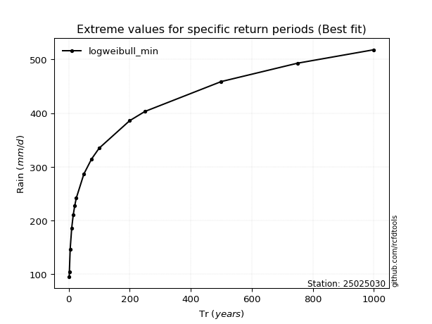</img>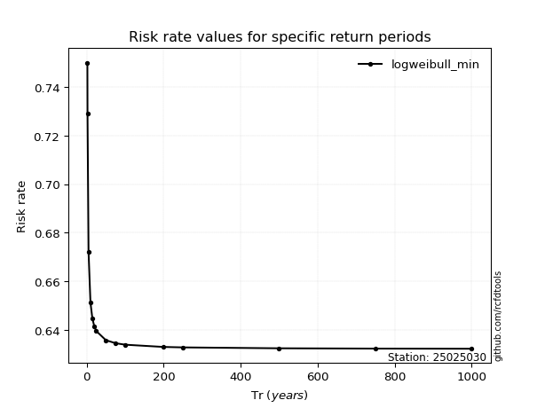</img>

</div>


<sub>**APP DISCLAIMER**: NO WARRANTY - This software is provided by [github.com/rcfdtools](https://github.com/rcfdtools) "as is", without any express or implied warranty, including warranties of merchantability, fitness for a particular purpose, or non-infringement. There is no guarantee that the software will be error-free or operate without interruption. LIMITATION OF LIABILITY - Neither the authors nor copyright holders will be liable for claims or damages arising from the software or its use. You are responsible for determining if the software is appropriate for your use and assume all associated risks, including errors, legal compliance, and data loss. NO PROFESSIONAL ADVICE - The software provides general information and does not offer professional advice. It should not replace consultation with professional advisors.</sub>