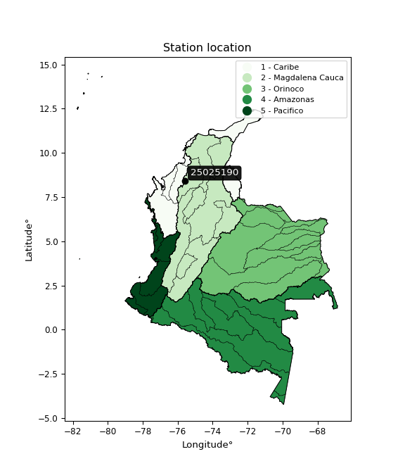

<div align="center">


</div>

# PMP Station (Rain, Pmax24h): 25025190

Probable Maximum Precipitation (PMP) is the greatest amount of rainfall for a specific duration that is meteorologically possible for a given location, acting as a "worst-case" scenario for extreme storms, crucial for designing safety-critical infrastructure like bridges, river deviations, dams, spillways, and nuclear plants to prevent catastrophic failure. PMP is calculated by hydrologists using meteorological data to determine the upper limit of extreme rainfall, often leading to the Probable Maximum Flood (PMF) for flood control design, and is increasingly being studied for climate change impacts. Probable Maximum Precipitation (PMP) is the theoretical upper limit of rainfall, a deterministic estimate for extreme events, while probability distributions (like GEV, Gumbel) describe the likelihood and frequency of various precipitation amounts, including rare ones, showing how often events occur, with PMP representing the extreme end of these distributions, used for critical infrastructure design to ensure safety against the worst conceivable weather, unlike standard statistical forecasts which cover typical probabilities.

The most common probability distributions in hydrology, used for analyzing floods, rainfall, and streamflow, include the Normal, Log-Normal, Gumbel, Gamma (including Log-Pearson Type III), and Generalized Extreme Value (GEV) distributions, often chosen based on the data´s skewness and whether modeling extremes or general conditions, with Gumbel and GEV popular for extreme events like floods, while the Normal distribution serves as a baseline, though often requiring transformations for skewed hydrological data. These distributions help in designing water infrastructure, managing water resources, and forecasting hydrologic events.

> Hydrological data often isn´t perfectly normal (it´s skewed), so different distributions are needed for different applications, such as: **Flood Frequency Analysis**: Using Gumbel, GEV, or Log-Pearson Type III for predicting extreme flood magnitudes and their return periods, **Rainfall Analysis**: Normal for annual totals, but Log-Normal, Weibull, or GEV for intensity or extreme daily rainfall, **Streamflow Modeling**: Gamma and Log-Normal for maximum flows, GEV for minimum flows, and Kappa for daily flows.

<div align="center">

</img>

</div>


## A. General information


### 1. General running parameters

• app_version: _v20260113_. • runtime: _2026-01-17 18:24:04.630693_. • Python version: _3.14.0_. • SciPy version: _1.16.3_. • Pandas version: _2.3.3_. • NumPy version: _2.3.5_. • Stations dataset (station_dataset_file): _dataset/pmax24h_in/automatic_colombia_2003_2025.csv_. • Stations catalog (station_catalog_file): _dataset/CNE.xls_. • Minimum year to eval til year_max (date_min): _1900_. • Maximum year to eval since year_min (date_max): _2025_. • Creates, save and include plots into reports (create_plot): _False_. • Plot only fit distributions with Δo > Δ (plot_only_fit): _True_. • Plot only simple graphs avoiding multiple CDFs and multiple Extreme values plots (plot_only_simple): _True_. • Eval low extreme values, if False, evaluates high extreme values (low_extreme): _False_. • Eval every SciPy distribution as logarithmic (pdist_logarithmic_on): _True_. • Standard deviation normalized (ddof): _1.0_. • Return periods to eval in years (Tr): _[2, 2.33, 5, 10, 15, 20, 25, 50, 75, 100, 200, 250, 500, 750, 1000]_. • Minimum data sample per station, 0 means any (minimum_sample): _5_. • Z-Score maximum threshold to adjust a value, 0 means disable (zscore_max): _3.5_. • Z-Score minimum threshold to adjust a value, 0 means disable (zscore_min): _-2.5_. • Avoid zeros, e.g. rain = 0 (avoid_zeros): _True_. • Avoid null values (avoid_nans): _True_. 

:file_folder:Table: [dataset.csv](../../dataset/pmax24h_in/automatic_colombia_2003_2025.csv)

> Delta Degrees of Freedom (DDOF): is a parameter used in the formulas for calculating variance and standard deviation. When ddof=0, the divisor is $N$ (the total number of observations) and this is used when your data set is the entire population. When ddof=1, the divisor is $N-1$ and this is used when your data set is a sample drawn from a larger population. Using $N-1$ provides an unbiased estimate of the population variance (known as Bessel´s correction).


### 2. Station info and location

|   id |   CODIGO | NOMBRE                         | CATEGORIA               | TECNOLOGIA                              | ESTADO   | FECHA_INSTALACION   |   FECHA_SUSPENSION |   ALTITUD |   LATITUD |   LONGITUD | DEPARTAMENTO   | MUNICIPIO    | AREA_OPERATIVA                              | ENTIDAD                                                     | AREA_HIDROGRAFICA   | ZONA_HIDROGRAFICA                | SUBZONA_HIDROGRAFICA       |   CORRIENTE | Catalogo   |   Version |
|-----:|---------:|:-------------------------------|:------------------------|:----------------------------------------|:---------|:--------------------|-------------------:|----------:|----------:|-----------:|:---------------|:-------------|:--------------------------------------------|:------------------------------------------------------------|:--------------------|:---------------------------------|:---------------------------|------------:|:-----------|----------:|
|    0 | 25025190 | PLANETA RICA  - AUT [25025190] | Climatológica Ordinaria | Automática con Telemetría, Convencional | Activa   | 15/11/1973          |                nan |        90 |   8.39933 |   -75.5837 | Cordoba        | Planeta Rica | Area Operativa 02 - Atlántico-Bolivar-Sucre | INSTITUTO DE HIDROLOGIA METEOROLOGIA Y ESTUDIOS AMBIENTALES | Magdalena Cauca     | Bajo Magdalena- Cauca -San Jorge | Bajo San Jorge - La Mojana |         nan | CNE_IDEAM  |  20251226 |

<div align="center">

Dynamic map: [:earth_americas:Google](http://maps.google.com/maps?q=8.399333333,-75.58372222) [:earth_americas:OSM](https://www.openstreetmap.org/#map=18/8.399333333/-75.58372222&layers=P) [:earth_americas:Bing](https://www.bing.com/maps?cp=8.399333333~-75.58372222&lvl=18) [:earth_americas:Apple](https://maps.apple.com/frame?center=8.399333333%2C-75.58372222&span=0.003%2C0.006)

</div>


<div align="center">

```geojson
{
  "type": "Feature",
  "geometry": {
    "type": "Point", 
    "coordinates": [-75.58372222, 8.399333333]
  }, 
  "properties": {
    "Name": "25025190"
  }
}
```

</div>


### 3. Discrete values table and plot

<div align="center">

|               |          0 |           1 |           2 |          3 |          4 |          5 |
|:--------------|-----------:|------------:|------------:|-----------:|-----------:|-----------:|
| Date          | 2017       | 2018        | 2019        | 2020       | 2024       | 2025       |
| Value         |    3.6     |   63.6      |   56.2      |    3.4     |  113       |   66       |
| Value_initial |    3.6     |   63.6      |   56.2      |    3.4     |  113       |   66       |
| count         |    6       |    6        |    6        |    6       |    6       |    6       |
| mean          |   50.9667  |   50.9667   |   50.9667   |   50.9667  |   50.9667  |   50.9667  |
| std           |   41.8744  |   41.8744   |   41.8744   |   41.8744  |   41.8744  |   41.8744  |
| zscore        |   -1.13116 |    0.301696 |    0.124977 |   -1.13594 |    1.48142 |    0.35901 |


</div>


> The initial value (value_initial) correspond to the initial obtained or null completed value, and value (value) is adjusted only when the initial value is outside the valid range (outlier) definite through the Z-Score value. If Z-Score is active, values out of range or outliers are replaced with the station mean value. A Z-Score (or standard score) measures how many standard deviations a data point is from the mean of a dataset, indicating its relative position; positive scores mean above the mean, negative mean below, and a score of zero is exactly at the mean, allowing for comparison of values from different distributions. It´s calculated using the formula $z=(x–μ)/σ$, where $x$ is the data point, $μ$ is the mean, and $σ$ is the standard deviation, helping identify outliers and understand probability.
>
> <sub>**Note**: In this study, "completing" (filling gaps in) and "extending" (forecasting or lengthening the historical record) rainfall data series are avoided for certain critical analyses because they introduce artificial bias and uncertainty, which can distort the statistics of rare events (extremes), alter day-to-day variability, and compromise the integrity and homogeneity of the original data. Some reasons against Completing/Extending rainfall data are: **Distortion of Extremes and Variability**: The primary issue is that most gap-filling or extension methods rely on averaging or regression with nearby stations, which inherently smooths the data. Rainfall is highly variable in space and time, with a large percentage of zero values and occasional large storms. Infilling methods often underestimate the highest values and overestimate the lowest (zero) values, which severely distorts analyses focused on flood frequency, drought severity, and intensity-duration-frequency (IDF) curves, **Loss of Data Homogeneity**: Infilled or extended data are synthetic estimates, not actual measurements. Combining these estimates with observed data can violate the assumption of data homogeneity, which requires that the data properties do not change over time. Inhomogeneity can lead to incorrect conclusions about long-term trends or changes in climate patterns, **Propagation of Errors**: Errors and biases from the original data (e.g., wind-induced undercatch, instrument errors, site changes) or the data used for imputation can propagate through the analysis, leading to unreliable hydrological models and inaccurate predictions, **Compromised Statistical Integrity**: For statistical analyses, especially those involving the frequency of events, using artificial data can introduce time bias or autocorrelation that doesn´t exist in reality, making it difficult to assess the true probability of events, **Difficulty in Validation**: It is difficult to accurately validate the quality of filled or extended data, especially for past periods where ground-truth measurements are unavailable. The reliability of imputation techniques heavily depends on the density of the surrounding station network and the complexity of the local topography.</sub>


### 4. Active continuous probability distributions from SciPy (80 of 104 available)

A Probability Density Function (PDF) describes the relative likelihood of a continuous random variable falling within a specific range, where the total area under its curve equals 1, and the area over any interval gives the actual probability for that range. Unlike discrete probabilities (like rolling a die), a PDF shows density, not direct probability for a single point (which is zero), with higher points indicating higher likelihood, often visualized as a bell curve for normal distributions.

A log of a probability density function (log-PDF) is simply the logarithm of the PDF´s value, denoted as $log(f(x))$, useful for converting multiplication of probabilities into addition, improving numerical stability with tiny numbers, and connecting to information theory concepts like entropy. Instead of dealing with very small probabilities (e.g., 0.000001), log-PDFs use negative numbers (e.g., $log(0.00001) ≈ -11.51$ that are easier for computers to handle, preventing underflow errors and simplifying complex calculations. In this study, each active probability distribution from SciPy is also evaluated in the $log$ form.

[scipy.stats](https://docs.scipy.org/doc/scipy/reference/stats.html) is a Python´s powerful submodule within the SciPy library for comprehensive statistical analysis, offering over 130 probability distributions (like Normal, Poisson), functions for descriptive stats (mean, variance), hypothesis testing (t-tests, chi-square), random variable generation, and statistical tests, making it essential for data science, modeling, and research. It provides tools to explore, model, and draw conclusions from data efficiently, working seamlessly with NumPy.

<div align="center">

|   id | p_dist           |   n_parameter | fit_method   | label                                                                       | active   | ref                                                                                                      |
|-----:|:-----------------|--------------:|:-------------|:----------------------------------------------------------------------------|:---------|:---------------------------------------------------------------------------------------------------------|
|    0 | alpha            |             3 | MLE          | Alpha                                                                       | True     | [:mortar_board:](https://docs.scipy.org/doc/scipy/reference/generated/scipy.stats.alpha.html)            |
|    1 | anglit           |             2 | MM           | Anglit                                                                      | True     | [:mortar_board:](https://docs.scipy.org/doc/scipy/reference/generated/scipy.stats.anglit.html)           |
|    2 | arcsine          |             2 | MM           | Arcsine                                                                     | True     | [:mortar_board:](https://docs.scipy.org/doc/scipy/reference/generated/scipy.stats.arcsine.html)          |
|    3 | argus            |             3 | MLE          | Argus                                                                       | True     | [:mortar_board:](https://docs.scipy.org/doc/scipy/reference/generated/scipy.stats.argus.html)            |
|    4 | beta             |             4 | MLE          | Beta                                                                        | True     | [:mortar_board:](https://docs.scipy.org/doc/scipy/reference/generated/scipy.stats.beta.html)             |
|    5 | betaprime        |             4 | MLE          | Beta prime                                                                  | True     | [:mortar_board:](https://docs.scipy.org/doc/scipy/reference/generated/scipy.stats.betaprime.html)        |
|    6 | bradford         |             3 | MLE          | Bradford                                                                    | True     | [:mortar_board:](https://docs.scipy.org/doc/scipy/reference/generated/scipy.stats.bradford.html)         |
|    7 | burr             |             4 | MLE          | Burr (Type III)                                                             | True     | [:mortar_board:](https://docs.scipy.org/doc/scipy/reference/generated/scipy.stats.burr.html)             |
|    8 | burr12           |             4 | MLE          | Burr (Type III) 12                                                          | True     | [:mortar_board:](https://docs.scipy.org/doc/scipy/reference/generated/scipy.stats.burr12.html)           |
|    9 | cosine           |             2 | MLE          | Cosine                                                                      | True     | [:mortar_board:](https://docs.scipy.org/doc/scipy/reference/generated/scipy.stats.cosine.html)           |
|   10 | crystalball      |             4 | MLE          | Crystalball                                                                 | True     | [:mortar_board:](https://docs.scipy.org/doc/scipy/reference/generated/scipy.stats.crystalball.html)      |
|   11 | dgamma           |             3 | MLE          | Double gamma                                                                | True     | [:mortar_board:](https://docs.scipy.org/doc/scipy/reference/generated/scipy.stats.dgamma.html)           |
|   12 | dweibull         |             3 | MLE          | Double Weibull                                                              | True     | [:mortar_board:](https://docs.scipy.org/doc/scipy/reference/generated/scipy.stats.dweibull.html)         |
|   13 | erlang           |             3 | MLE          | Erlang                                                                      | True     | [:mortar_board:](https://docs.scipy.org/doc/scipy/reference/generated/scipy.stats.erlang.html)           |
|   14 | exponnorm        |             3 | MLE          | Exponentially modified Normal                                               | True     | [:mortar_board:](https://docs.scipy.org/doc/scipy/reference/generated/scipy.stats.exponnorm.html)        |
|   15 | exponpow         |             3 | MLE          | Exponential power                                                           | True     | [:mortar_board:](https://docs.scipy.org/doc/scipy/reference/generated/scipy.stats.exponpow.html)         |
|   16 | exponweib        |             4 | MLE          | Exponentiated Weibull                                                       | True     | [:mortar_board:](https://docs.scipy.org/doc/scipy/reference/generated/scipy.stats.exponweib.html)        |
|   17 | f                |             4 | MLE          | F                                                                           | True     | [:mortar_board:](https://docs.scipy.org/doc/scipy/reference/generated/scipy.stats.f.html)                |
|   18 | fatiguelife      |             3 | MLE          | Fatigue-life (Birnbaum-Saunders)                                            | True     | [:mortar_board:](https://docs.scipy.org/doc/scipy/reference/generated/scipy.stats.fatiguelife.html)      |
|   19 | foldnorm         |             3 | MM           | Fold Normal                                                                 | True     | [:mortar_board:](https://docs.scipy.org/doc/scipy/reference/generated/scipy.stats.foldnorm.html)         |
|   20 | gamma            |             3 | MLE          | Gamma                                                                       | True     | [:mortar_board:](https://docs.scipy.org/doc/scipy/reference/generated/scipy.stats.gamma.html)            |
|   21 | gausshyper       |             6 | MLE          | Gauss hypergeometric                                                        | True     | [:mortar_board:](https://docs.scipy.org/doc/scipy/reference/generated/scipy.stats.gausshyper.html)       |
|   22 | genexpon         |             5 | MLE          | Generalized exponential                                                     | True     | [:mortar_board:](https://docs.scipy.org/doc/scipy/reference/generated/scipy.stats.genexpon.html)         |
|   23 | genextreme       |             3 | MLE          | Generalized exponential                                                     | True     | [:mortar_board:](https://docs.scipy.org/doc/scipy/reference/generated/scipy.stats.genextreme.html)       |
|   24 | gengamma         |             4 | MLE          | Generalized gamma                                                           | True     | [:mortar_board:](https://docs.scipy.org/doc/scipy/reference/generated/scipy.stats.gengamma.html)         |
|   25 | genhalflogistic  |             3 | MLE          | Generalized half-logistic                                                   | True     | [:mortar_board:](https://docs.scipy.org/doc/scipy/reference/generated/scipy.stats.genhalflogistic.html)  |
|   26 | genlogistic      |             3 | MLE          | Generalized logistic                                                        | True     | [:mortar_board:](https://docs.scipy.org/doc/scipy/reference/generated/scipy.stats.genlogistic.html)      |
|   27 | gennorm          |             3 | MLE          | Generalized Normal                                                          | True     | [:mortar_board:](https://docs.scipy.org/doc/scipy/reference/generated/scipy.stats.gennorm.html)          |
|   28 | genpareto        |             3 | MLE          | Generalized Pareto                                                          | True     | [:mortar_board:](https://docs.scipy.org/doc/scipy/reference/generated/scipy.stats.genpareto.html)        |
|   29 | gompertz         |             3 | MLE          | Gompertz (or truncated Gumbel)                                              | True     | [:mortar_board:](https://docs.scipy.org/doc/scipy/reference/generated/scipy.stats.gompertz.html)         |
|   30 | gumbel_l         |             2 | MM           | Gumbel Left Skew                                                            | True     | [:mortar_board:](https://docs.scipy.org/doc/scipy/reference/generated/scipy.stats.gumbel_l.html)         |
|   31 | gumbel_r         |             2 | MM           | Gumbel Right Skew                                                           | True     | [:mortar_board:](https://docs.scipy.org/doc/scipy/reference/generated/scipy.stats.gumbel_r.html)         |
|   32 | halfgennorm      |             3 | MLE          | Upper half of a generalized normal                                          | True     | [:mortar_board:](https://docs.scipy.org/doc/scipy/reference/generated/scipy.stats.halfgennorm.html)      |
|   33 | halflogistic     |             2 | MM           | Half-logistic                                                               | True     | [:mortar_board:](https://docs.scipy.org/doc/scipy/reference/generated/scipy.stats.halflogistic.html)     |
|   34 | halfnorm         |             2 | MM           | Half Normal                                                                 | True     | [:mortar_board:](https://docs.scipy.org/doc/scipy/reference/generated/scipy.stats.halfnorm.html)         |
|   35 | hypsecant        |             2 | MM           | hyperbolic secant                                                           | True     | [:mortar_board:](https://docs.scipy.org/doc/scipy/reference/generated/scipy.stats.hypsecant.html)        |
|   36 | invgamma         |             3 | MLE          | Inverted gamma                                                              | True     | [:mortar_board:](https://docs.scipy.org/doc/scipy/reference/generated/scipy.stats.invgamma.html)         |
|   37 | invgauss         |             3 | MLE          | Inverse Gaussian                                                            | True     | [:mortar_board:](https://docs.scipy.org/doc/scipy/reference/generated/scipy.stats.invgauss.html)         |
|   38 | invweibull       |             3 | MLE          | Inverted Weibull                                                            | True     | [:mortar_board:](https://docs.scipy.org/doc/scipy/reference/generated/scipy.stats.invweibull.html)       |
|   39 | johnsonsb        |             4 | MLE          | Johnson SB                                                                  | True     | [:mortar_board:](https://docs.scipy.org/doc/scipy/reference/generated/scipy.stats.johnsonsb.html)        |
|   40 | johnsonsu        |             4 | MLE          | Johnson Su                                                                  | True     | [:mortar_board:](https://docs.scipy.org/doc/scipy/reference/generated/scipy.stats.johnsonsu.html)        |
|   41 | kappa3           |             3 | MLE          | Kappa 3                                                                     | True     | [:mortar_board:](https://docs.scipy.org/doc/scipy/reference/generated/scipy.stats.kappa3.html)           |
|   42 | kappa4           |             4 | MLE          | Kappa 4                                                                     | True     | [:mortar_board:](https://docs.scipy.org/doc/scipy/reference/generated/scipy.stats.kappa4.html)           |
|   43 | ksone            |             3 | MLE          | Kolmogorov-Smirnov one-sided test statistic distribution                    | True     | [:mortar_board:](https://docs.scipy.org/doc/scipy/reference/generated/scipy.stats.ksone.html)            |
|   44 | kstwobign        |             2 | MLE          | Limiting distribution of scaled Kolmogorov-Smirnov two-sided test statistic | True     | [:mortar_board:](https://docs.scipy.org/doc/scipy/reference/generated/scipy.stats.kstwobign.html)        |
|   45 | laplace          |             2 | MM           | Laplace                                                                     | True     | [:mortar_board:](https://docs.scipy.org/doc/scipy/reference/generated/scipy.stats.laplace.html)          |
|   46 | levy_l           |             2 | MLE          | Left-skewed Levy                                                            | True     | [:mortar_board:](https://docs.scipy.org/doc/scipy/reference/generated/scipy.stats.levy_l.html)           |
|   47 | loggamma         |             3 | MLE          | Log gamma                                                                   | True     | [:mortar_board:](https://docs.scipy.org/doc/scipy/reference/generated/scipy.stats.loggamma.html)         |
|   48 | logistic         |             2 | MM           | Logistic (or Sech-squared)                                                  | True     | [:mortar_board:](https://docs.scipy.org/doc/scipy/reference/generated/scipy.stats.logistic.html)         |
|   49 | loglaplace       |             3 | MLE          | Log-Laplace                                                                 | True     | [:mortar_board:](https://docs.scipy.org/doc/scipy/reference/generated/scipy.stats.loglaplace.html)       |
|   50 | lomax            |             3 | MLE          | Lomax (Pareto of the second kind)                                           | True     | [:mortar_board:](https://docs.scipy.org/doc/scipy/reference/generated/scipy.stats.lomax.html)            |
|   51 | maxwell          |             2 | MM           | Maxwell                                                                     | True     | [:mortar_board:](https://docs.scipy.org/doc/scipy/reference/generated/scipy.stats.maxwell.html)          |
|   52 | mielke           |             4 | MLE          | Mielke Beta-Kappa / Dagum                                                   | True     | [:mortar_board:](https://docs.scipy.org/doc/scipy/reference/generated/scipy.stats.mielke.html)           |
|   53 | moyal            |             2 | MM           | Moyal                                                                       | True     | [:mortar_board:](https://docs.scipy.org/doc/scipy/reference/generated/scipy.stats.moyal.html)            |
|   54 | nakagami         |             3 | MLE          | Nakagami                                                                    | True     | [:mortar_board:](https://docs.scipy.org/doc/scipy/reference/generated/scipy.stats.nakagami.html)         |
|   55 | ncf              |             5 | MLE          | Non-central F distribution                                                  | True     | [:mortar_board:](https://docs.scipy.org/doc/scipy/reference/generated/scipy.stats.ncf.html)              |
|   56 | nct              |             4 | MLE          | Non-central Student’s t                                                     | True     | [:mortar_board:](https://docs.scipy.org/doc/scipy/reference/generated/scipy.stats.nct.html)              |
|   57 | norm             |             2 | MM           | Normal                                                                      | True     | [:mortar_board:](https://docs.scipy.org/doc/scipy/reference/generated/scipy.stats.norm.html)             |
|   58 | pearson3         |             3 | MM           | Pearson type III                                                            | True     | [:mortar_board:](https://docs.scipy.org/doc/scipy/reference/generated/scipy.stats.pearson3.html)         |
|   59 | powerlaw         |             3 | MLE          | Power-function                                                              | True     | [:mortar_board:](https://docs.scipy.org/doc/scipy/reference/generated/scipy.stats.powerlaw.html)         |
|   60 | rayleigh         |             2 | MM           | Rayleigh                                                                    | True     | [:mortar_board:](https://docs.scipy.org/doc/scipy/reference/generated/scipy.stats.rayleigh.html)         |
|   61 | rdist            |             3 | MLE          | R-distributed (symmetric beta)                                              | True     | [:mortar_board:](https://docs.scipy.org/doc/scipy/reference/generated/scipy.stats.rdist.html)            |
|   62 | rice             |             3 | MLE          | Rice                                                                        | True     | [:mortar_board:](https://docs.scipy.org/doc/scipy/reference/generated/scipy.stats.rice.html)             |
|   63 | semicircular     |             2 | MM           | Semicircular                                                                | True     | [:mortar_board:](https://docs.scipy.org/doc/scipy/reference/generated/scipy.stats.semicircular.html)     |
|   64 | skewnorm         |             3 | MLE          | Skew normal                                                                 | True     | [:mortar_board:](https://docs.scipy.org/doc/scipy/reference/generated/scipy.stats.skewnorm.html)         |
|   65 | t                |             3 | MLE          | Student’s t                                                                 | True     | [:mortar_board:](https://docs.scipy.org/doc/scipy/reference/generated/scipy.stats.t.html)                |
|   66 | trapezoid        |             4 | MLE          | Trapezoid                                                                   | True     | [:mortar_board:](https://docs.scipy.org/doc/scipy/reference/generated/scipy.stats.trapezoid.html)        |
|   67 | triang           |             3 | MLE          | Triangular                                                                  | True     | [:mortar_board:](https://docs.scipy.org/doc/scipy/reference/generated/scipy.stats.triang.html)           |
|   68 | truncexpon       |             3 | MLE          | Truncated exponential                                                       | True     | [:mortar_board:](https://docs.scipy.org/doc/scipy/reference/generated/scipy.stats.truncexpon.html)       |
|   69 | truncnorm        |             4 | MLE          | Truncated normal                                                            | True     | [:mortar_board:](https://docs.scipy.org/doc/scipy/reference/generated/scipy.stats.truncnorm.html)        |
|   70 | truncpareto      |             4 | MLE          | Upper truncated Pareto                                                      | True     | [:mortar_board:](https://docs.scipy.org/doc/scipy/reference/generated/scipy.stats.truncpareto.html)      |
|   71 | truncweibull_min |             5 | MLE          | Doubly truncated Weibull minimum                                            | True     | [:mortar_board:](https://docs.scipy.org/doc/scipy/reference/generated/scipy.stats.truncweibull_min.html) |
|   72 | tukeylambda      |             3 | MLE          | Tukey-Lamdba                                                                | True     | [:mortar_board:](https://docs.scipy.org/doc/scipy/reference/generated/scipy.stats.tukeylambda.html)      |
|   73 | uniform          |             2 | MLE          | Uniform                                                                     | True     | [:mortar_board:](https://docs.scipy.org/doc/scipy/reference/generated/scipy.stats.uniform.html)          |
|   74 | vonmises         |             3 | MLE          | Von Mises                                                                   | True     | [:mortar_board:](https://docs.scipy.org/doc/scipy/reference/generated/scipy.stats.vonmises.html)         |
|   75 | vonmises_line    |             3 | MLE          | Von Mises line                                                              | True     | [:mortar_board:](https://docs.scipy.org/doc/scipy/reference/generated/scipy.stats.vonmises_line.html)    |
|   76 | wald             |             2 | MM           | Wald                                                                        | True     | [:mortar_board:](https://docs.scipy.org/doc/scipy/reference/generated/scipy.stats.wald.html)             |
|   77 | weibull_max      |             3 | MLE          | Weibull maximum                                                             | True     | [:mortar_board:](https://docs.scipy.org/doc/scipy/reference/generated/scipy.stats.weibull_max.html)      |
|   78 | weibull_min      |             3 | MLE          | Weibull minimum                                                             | True     | [:mortar_board:](https://docs.scipy.org/doc/scipy/reference/generated/scipy.stats.weibull_min.html)      |
|   79 | wrapcauchy       |             3 | MLE          | Wrapped  Cauchy                                                             | True     | [:mortar_board:](https://docs.scipy.org/doc/scipy/reference/generated/scipy.stats.wrapcauchy.html)       |

</div>

> **n_parameter:** # arguments & localization & scale.
>
> **Fit methods:** (MLE) maximum likelihood, (MM) L-moments.
>
>**Inactive** (With the only purpose of prevent loops, zero divisions, infinite values, over high estimated values or horizontal trending for recurrence intervals estimations, the follow distributions were disabled.)**:** lognorm, norminvgauss, powernorm, powerlognorm, cauchy, halfcauchy, foldcauchy, skewcauchy, chi2, expon, fisk, genhyperbolic, geninvgauss, gibrat, kstwo, laplace_asymmetric, levy, levy_stable, ncx2, pareto, rel_breitwigner, recipinvgauss, studentized_range, loguniform, 


## B. Probability (PDF) vs. Empirical (EDF) distributions functions

A continuous probability distribution (CPD) describes probabilities for variables that can take any value within a range (like rain any time), unlike discrete variables with specific outcomes (like temperature). It uses a Probability Density Function (PDF), a curve where the total area under it equals 1, and the probability of the variable falling within an interval (a to b) is found by calculating the area under the curve between those points. A key feature is that the probability of hitting any single exact value is zero, so probabilities are always expressed for ranges, e.g., $P(a ≤ X ≤ b)$.

<div align="center">

Distributions parameters from station values
|     |   station | p_dist              |   n |               loc |            scale | shape                  | shape1                | shape2              | shape3             |
|----:|----------:|:--------------------|----:|------------------:|-----------------:|:-----------------------|:----------------------|:--------------------|:-------------------|
|   0 |  25025190 | alpha               |   6 |      -0.0117444   |      6.06295     | 3.777416778212336e-10  |                       |                     |                    |
|   1 |  25025190 | anglit              |   6 |      50.9667      |    111.826       |                        |                       |                     |                    |
|   2 |  25025190 | arcsine             |   6 |      -3.09293     |    108.119       |                        |                       |                     |                    |
|   3 |  25025190 | argus               |   6 |     -34.4053      |    154.636       | 7.469488913275776e-06  |                       |                     |                    |
|   4 |  25025190 | beta                |   6 |     -18.4686      |    131.469       | 1.0616835985365463     | 0.8349212957443235    |                     |                    |
|   5 |  25025190 | betaprime           |   6 |       3.4         |   9341.54        | 0.7311077448690639     | 245.98073861830562    |                     |                    |
|   6 |  25025190 | bradford            |   6 |       3.39998     |    109.6         | 2.0498821913135252     |                       |                     |                    |
|   7 |  25025190 | burr                |   6 |      -1.24248     |    117.759       | 102.63154945419257     | 0.007018349122959889  |                     |                    |
|   8 |  25025190 | burr12              |   6 |      -0.113971    |      3.44175     | 203.23550170625515     | 0.0024083458383529887 |                     |                    |
|   9 |  25025190 | cosine              |   6 |      51.9666      |     31.4598      |                        |                       |                     |                    |
|  10 |  25025190 | crystalball         |   6 |      50.9667      |     38.2259      | 66657.57333102816      | 3128.638431173756     |                     |                    |
|  11 |  25025190 | dgamma              |   6 |      63.6         |     28.972       | 0.8036888720905637     |                       |                     |                    |
|  12 |  25025190 | dweibull            |   6 |      66           |     30.8486      | 0.8241357741880615     |                       |                     |                    |
|  13 |  25025190 | erlang              |   6 |    -573.429       |      2.32701     | 268.3318795981461      |                       |                     |                    |
|  14 |  25025190 | exponnorm           |   6 |      47.5142      |     38.0697      | 0.09068754666528706    |                       |                     |                    |
|  15 |  25025190 | exponpow            |   6 |       3.4         |     56.6569      | 0.3620044718341923     |                       |                     |                    |
|  16 |  25025190 | exponweib           |   6 |       3.4         |      3.11455     | 2.265315431921806      | 0.3350134472477627    |                     |                    |
|  17 |  25025190 | f                   |   6 |       3.39975     |     87.4206      | 0.63713654321439       | 5288.19846395906      |                     |                    |
|  18 |  25025190 | fatiguelife         |   6 |       3.4         |      5.68908e-05 | 757.5895689073748      |                       |                     |                    |
|  19 |  25025190 | foldnorm            |   6 |     -41.043       |     38.7829      | 2.3664139019481985     |                       |                     |                    |
|  20 |  25025190 | gamma               |   6 |    -559.165       |      2.38521     | 255.76473702936232     |                       |                     |                    |
|  21 |  25025190 | gausshyper          |   6 |      -7.17191     |    120.172       | 1.1151786236995864     | 0.8290444582666301    | 1.0869078791268754  | 1.041536373353467  |
|  22 |  25025190 | genexpon            |   6 |       3.39992     |      2.32961     | 0.05102776863671943    | 1.711289060230344e-07 | 2.4811738766043456  |                    |
|  23 |  25025190 | genextreme          |   6 |       3.52096     |      0.626505    | -5.179064320682995     |                       |                     |                    |
|  24 |  25025190 | gengamma            |   6 |       3.4         |      1.16043     | 1.4487780929409722     | 0.27623456739191754   |                     |                    |
|  25 |  25025190 | genhalflogistic     |   6 |      -7.80607     |    125.928       | 1.0423982422455866     |                       |                     |                    |
|  26 |  25025190 | genlogistic         |   6 |    -171.342       |     33.7298      | 416.89611600904107     |                       |                     |                    |
|  27 |  25025190 | gennorm             |   6 |      63.5977      |      5.18136e-06 | 0.13797144681778495    |                       |                     |                    |
|  28 |  25025190 | genpareto           |   6 |      -0.464307    |    140.311       | -1.236613107315029     |                       |                     |                    |
|  29 |  25025190 | gompertz            |   6 |       3.4         |     93.6688      | 1.241192590508378      |                       |                     |                    |
|  30 |  25025190 | gumbel_l            |   6 |      68.1704      |     29.8046      |                        |                       |                     |                    |
|  31 |  25025190 | gumbel_r            |   6 |      33.763       |     29.8046      |                        |                       |                     |                    |
|  32 |  25025190 | halfgennorm         |   6 |       3.4         |      4.18305     | 0.4743907772407393     |                       |                     |                    |
|  33 |  25025190 | halflogistic        |   6 |       5.66008     |     32.6818      |                        |                       |                     |                    |
|  34 |  25025190 | halfnorm            |   6 |       0.370565    |     63.4128      |                        |                       |                     |                    |
|  35 |  25025190 | hypsecant           |   6 |      50.9667      |     24.3354      |                        |                       |                     |                    |
|  36 |  25025190 | invgamma            |   6 |       3.4         |      7.58625e-11 | 0.1317512026034135     |                       |                     |                    |
|  37 |  25025190 | invgauss            |   6 |     -63.2838      |    847.263       | 0.13416552453747665    |                       |                     |                    |
|  38 |  25025190 | invweibull          |   6 |       3.4         |      3.10948     | 0.050731235688600204   |                       |                     |                    |
|  39 |  25025190 | johnsonsb           |   6 |      -5.91351     |    118.914       | -0.7723137181260893    | 0.11194398190685062   |                     |                    |
|  40 |  25025190 | johnsonsu           |   6 |    -337.158       |    341.026       | -13.112810213351288    | 13.467304044027227    |                     |                    |
|  41 |  25025190 | kappa3              |   6 |       3.39985     |     72.8065      | 6.475631593883394      |                       |                     |                    |
|  42 |  25025190 | kappa4              |   6 |     -14.6092      |    125.431       | 1.1669929761619828     | 0.9553503371258771    |                     |                    |
|  43 |  25025190 | ksone               |   6 |     -15.2425      |    132.418       | 1.0                    |                       |                     |                    |
|  44 |  25025190 | kstwobign           |   6 |     -83.4165      |    153.279       |                        |                       |                     |                    |
|  45 |  25025190 | laplace             |   6 |      50.9667      |     27.0298      |                        |                       |                     |                    |
|  46 |  25025190 | levy_l              |   6 |     119.375       |     26.4772      |                        |                       |                     |                    |
|  47 |  25025190 | loggamma            |   6 |   -9010.26        |   1289.05        | 1129.6883310195922     |                       |                     |                    |
|  48 |  25025190 | logistic            |   6 |      50.9667      |     21.075       |                        |                       |                     |                    |
|  49 |  25025190 | loglaplace          |   6 |      -0.118559    |     56.3186      | 0.9270084342195892     |                       |                     |                    |
|  50 |  25025190 | lomax               |   6 |       3.4         |   5095.59        | 102.78000260303016     |                       |                     |                    |
|  51 |  25025190 | maxwell             |   6 |     -39.6126      |     56.7622      |                        |                       |                     |                    |
|  52 |  25025190 | mielke              |   6 |      -1.26936     |    118.325       | 0.7183651941687872     | 82.78827731195838     |                     |                    |
|  53 |  25025190 | moyal               |   6 |      29.1066      |     17.2077      |                        |                       |                     |                    |
|  54 |  25025190 | nakagami            |   6 |       3.4         |     99.8261      | 0.14022626726457202    |                       |                     |                    |
|  55 |  25025190 | ncf                 |   6 |      -0.014597    |      1.99724e-05 | 2.928826202328298e-06  | 8.31229359462818      | 6.394686674535327   |                    |
|  56 |  25025190 | nct                 |   6 |       2.39244     |      0.727512    | 0.2839050468585098     | 2.401671453794256     |                     |                    |
|  57 |  25025190 | norm                |   6 |      50.9667      |     38.2259      |                        |                       |                     |                    |
|  58 |  25025190 | pearson3            |   6 |      50.9666      |     38.2259      | 0.09062894331665258    |                       |                     |                    |
|  59 |  25025190 | powerlaw            |   6 |       3.4         |    109.6         | 0.12436990533823342    |                       |                     |                    |
|  60 |  25025190 | rayleigh            |   6 |     -22.1617      |     58.348       |                        |                       |                     |                    |
|  61 |  25025190 | rdist               |   6 |      -7.12635     |     63.3263      | 1.0283929569774513     |                       |                     |                    |
|  62 |  25025190 | rice                |   6 |     -20.838       |     47.1109      | 0.9906801083271396     |                       |                     |                    |
|  63 |  25025190 | semicircular        |   6 |      50.9667      |     76.4518      |                        |                       |                     |                    |
|  64 |  25025190 | skewnorm            |   6 |      34.5294      |     41.6101      | 0.569556524882763      |                       |                     |                    |
|  65 |  25025190 | t                   |   6 |      50.9658      |     38.227       | 27888537.731044658     |                       |                     |                    |
|  66 |  25025190 | trapezoid           |   6 |      -7.938       |    131.52        | 1.0                    | 1.0                   |                     |                    |
|  67 |  25025190 | triang              |   6 |      -8.66193     |    121.662       | 0.9999999015689809     |                       |                     |                    |
|  68 |  25025190 | truncexpon          |   6 |      -5.64785     |    139.338       | 0.8515128090649932     |                       |                     |                    |
|  69 |  25025190 | truncnorm           |   6 |      68.942       |     15.1459      | -4.329812882258018     | 13.855414072899919    |                     |                    |
|  70 |  25025190 | truncpareto         |   6 |      -6.71806     |      9.60412     | 5.826893780710007e-06  | 12.46527559029219     |                     |                    |
|  71 |  25025190 | truncweibull_min    |   6 |       2.97206     |    116.533       | 0.3260751216547362     | 0.003659397305337735  | 0.9441778979040265  |                    |
|  72 |  25025190 | tukeylambda         |   6 |      58.2858      |     55.9611      | 1.0195902226193185     |                       |                     |                    |
|  73 |  25025190 | uniform             |   6 |       3.4         |    109.6         |                        |                       |                     |                    |
|  74 |  25025190 | vonmises            |   6 |      -1.99014     |      1           | 0.1716599581921535     |                       |                     |                    |
|  75 |  25025190 | vonmises_line       |   6 |      58.2         |     17.4434      | 0.00023631427463226664 |                       |                     |                    |
|  76 |  25025190 | wald                |   6 |      12.7407      |     38.2259      |                        |                       |                     |                    |
|  77 |  25025190 | weibull_max         |   6 |     113           |      1.70289     | 0.2219675691803391     |                       |                     |                    |
|  78 |  25025190 | weibull_min         |   6 |       3.4         |     78.9377      | 0.3054258847137449     |                       |                     |                    |
|  79 |  25025190 | wrapcauchy          |   6 |       3.32208     |     17.4558      | 0.683786480177502      |                       |                     |                    |
|  80 |  25025190 | logalpha            |   6 |     -25.0541      |    538.546       | 19.07483354030218      |                       |                     |                    |
|  81 |  25025190 | loganglit           |   6 |       3.26721     |      4.21705     |                        |                       |                     |                    |
|  82 |  25025190 | logarcsine          |   6 |       1.22861     |      4.07722     |                        |                       |                     |                    |
|  83 |  25025190 | logargus            |   6 |      -0.572254    |      5.43639     | 2.1844082781416407     |                       |                     |                    |
|  84 |  25025190 | logbeta             |   6 |       0.901223    |      3.82616     | 0.10594902685092429    | 0.065305093890937     |                     |                    |
|  85 |  25025190 | logbetaprime        |   6 |     -24.3095      |    490.591       | 374.2540174698769      | 6661.966703056378     |                     |                    |
|  86 |  25025190 | logbradford         |   6 |       1.22377     |      3.50368     | 1.1233358872155894     |                       |                     |                    |
|  87 |  25025190 | logburr             |   6 |       0.554478    |      4.2137      | 385.7790333193595      | 0.003787797365157649  |                     |                    |
|  88 |  25025190 | logburr12           |   6 |   -1519.23        |   1538.13        | 1521.2643029082778     | 2901295.262466115     |                     |                    |
|  89 |  25025190 | logcosine           |   6 |       3.14908     |      1.13841     |                        |                       |                     |                    |
|  90 |  25025190 | logcrystalball      |   6 |       4.24936     |      0.388807    | 0.27621519098214664    | 731.0374640893904     |                     |                    |
|  91 |  25025190 | logdgamma           |   6 |       4.15261     |      1.00016     | 0.7245744567989416     |                       |                     |                    |
|  92 |  25025190 | logdweibull         |   6 |       4.18965     |      1.12546     | 0.7417049955539989     |                       |                     |                    |
|  93 |  25025190 | logerlang           |   6 |     -20.8077      |      0.0915178   | 263.09620279313674     |                       |                     |                    |
|  94 |  25025190 | logexponnorm        |   6 |       3.26606     |      1.44153     | 0.0008034274926609943  |                       |                     |                    |
|  95 |  25025190 | logexponpow         |   6 |       1.22378     |      2.97568     | 0.8198518353230091     |                       |                     |                    |
|  96 |  25025190 | logexponweib        |   6 |       1.22378     |      1.21678     | 0.9153907817541551     | 0.48040172983069884   |                     |                    |
|  97 |  25025190 | logf                |   6 |    -429.533       |    432.798       | 341359.6052655153      | 378725.3868687587     |                     |                    |
|  98 |  25025190 | logfatiguelife      |   6 |       1.22378     |      1.84224e-06 | 1039.4383237372972     |                       |                     |                    |
|  99 |  25025190 | logfoldnorm         |   6 |      -7.0797      |      1.35145     | 7.671489784500674      |                       |                     |                    |
| 100 |  25025190 | loggamma            |   6 |     -18.1566      |      0.101718    | 210.61886414580434     |                       |                     |                    |
| 101 |  25025190 | loggausshyper       |   6 |       1.214       |      3.51339     | 1.164116534777447      | 0.6937743518739912    | 1.1634250933705252  | 1.3490238756994244 |
| 102 |  25025190 | loggenexpon         |   6 |       1.22184     |     10.561       | 3.420504395730709      | 105.68875338397051    | 0.11357499827756086 |                    |
| 103 |  25025190 | loggenextreme       |   6 |       3.07142     |      2.03524     | 1.2290285091036726     |                       |                     |                    |
| 104 |  25025190 | loggengamma         |   6 |       1.22378     |      1.10006     | 1.1724511468908423     | 0.47022833939414965   |                     |                    |
| 105 |  25025190 | loggenhalflogistic  |   6 |       0.101517    |      4.90636     | 1.0606352607563063     |                       |                     |                    |
| 106 |  25025190 | loggenlogistic      |   6 |       4.72741     |      1.11819e-06 | 7.61752773212699e-07   |                       |                     |                    |
| 107 |  25025190 | loggennorm          |   6 |       4.18965     |      1.16506e-10 | 0.10748117953849795    |                       |                     |                    |
| 108 |  25025190 | loggenpareto        |   6 |      -0.00270704  |      8.62915     | -1.8243070960453758    |                       |                     |                    |
| 109 |  25025190 | loggompertz         |   6 |       1.22378     |      1.54622     | 0.23744455549715732    |                       |                     |                    |
| 110 |  25025190 | loggumbel_l         |   6 |       3.91598     |      1.12396     |                        |                       |                     |                    |
| 111 |  25025190 | loggumbel_r         |   6 |       2.61845     |      1.12396     |                        |                       |                     |                    |
| 112 |  25025190 | loghalfgennorm      |   6 |       1.22378     |      1.00631     | 0.6817731298544031     |                       |                     |                    |
| 113 |  25025190 | loghalflogistic     |   6 |       1.55867     |      1.23245     |                        |                       |                     |                    |
| 114 |  25025190 | loghalfnorm         |   6 |       1.35922     |      2.39132     |                        |                       |                     |                    |
| 115 |  25025190 | loghypsecant        |   6 |       3.26721     |      0.917707    |                        |                       |                     |                    |
| 116 |  25025190 | loginvgamma         |   6 |     -20.5424      |   6047.95        | 254.9789749759442      |                       |                     |                    |
| 117 |  25025190 | loginvgauss         |   6 |      -6.7471      |    414.486       | 0.024168037686961512   |                       |                     |                    |
| 118 |  25025190 | loginvweibull       |   6 | -115837           | 115840           | 81205.86186829799      |                       |                     |                    |
| 119 |  25025190 | logjohnsonsb        |   6 |       1.22378     |      6.05523     | 1.7304289291238928     | 0.10858660861465591   |                     |                    |
| 120 |  25025190 | logjohnsonsu        |   6 |       4.82458     |      0.00224653  | 5.437587632079527      | 0.8181804339087637    |                     |                    |
| 121 |  25025190 | logkappa3           |   6 |       1.22378     |      3.42779     | 91.62665096122839      |                       |                     |                    |
| 122 |  25025190 | logkappa4           |   6 |       0.796651    |      4.32874     | 1.107540766755111      | 1.1012539749136923    |                     |                    |
| 123 |  25025190 | logksone            |   6 |       0.770408    |      4.99361     | 1.0                    |                       |                     |                    |
| 124 |  25025190 | logkstwobign        |   6 |      -2.30487     |      6.32353     |                        |                       |                     |                    |
| 125 |  25025190 | loglaplace          |   6 |       3.26721     |      1.01932     |                        |                       |                     |                    |
| 126 |  25025190 | loglevy_l           |   6 |       4.81958     |      0.380774    |                        |                       |                     |                    |
| 127 |  25025190 | logloggamma         |   6 |       4.72742     |      1.52398e-06 | 1.038614136171177e-06  |                       |                     |                    |
| 128 |  25025190 | loglogistic         |   6 |       3.26721     |      0.794758    |                        |                       |                     |                    |
| 129 |  25025190 | logloglaplace       |   6 |   -5609.86        |   5613.89        | 5155.318664775272      |                       |                     |                    |
| 130 |  25025190 | loglomax            |   6 |       1.22378     |     80.903       | 41.551190215237035     |                       |                     |                    |
| 131 |  25025190 | logmaxwell          |   6 |      -0.148611    |      2.14055     |                        |                       |                     |                    |
| 132 |  25025190 | logmielke           |   6 |      -3.43943e+07 |      3.43944e+07 | 23253674.01855819      | 7493427476.394582     |                     |                    |
| 133 |  25025190 | logmoyal            |   6 |       2.44285     |      0.648917    |                        |                       |                     |                    |
| 134 |  25025190 | lognakagami         |   6 |       1.22378     |      2.66686     | 0.21202629323462344    |                       |                     |                    |
| 135 |  25025190 | logncf              |   6 |    -202.037       |    205.262       | 108477.17808202447     | 63591.06012088008     | 23.663559243049953  |                    |
| 136 |  25025190 | lognct              |   6 |      83.1374      |      1.41434     | 42756.75053558336      | -56.47011474176131    |                     |                    |
| 137 |  25025190 | lognorm             |   6 |       3.26721     |      1.44153     |                        |                       |                     |                    |
| 138 |  25025190 | logpearson3         |   6 |       3.26722     |      1.44152     | -0.6306390851544919    |                       |                     |                    |
| 139 |  25025190 | logpowerlaw         |   6 |       1.22378     |      3.50361     | 0.14292070324784806    |                       |                     |                    |
| 140 |  25025190 | lograyleigh         |   6 |       0.50948     |      2.20035     |                        |                       |                     |                    |
| 141 |  25025190 | logrdist            |   6 |       2.00083     |      2.18883     | 0.9628565003482694     |                       |                     |                    |
| 142 |  25025190 | logrice             |   6 |       0.22994     |      1.64571     | 1.4742602101187332     |                       |                     |                    |
| 143 |  25025190 | logsemicircular     |   6 |       3.26721     |      2.88306     |                        |                       |                     |                    |
| 144 |  25025190 | logskewnorm         |   6 |       4.72739     |      2.0518      | -45918741.530517384    |                       |                     |                    |
| 145 |  25025190 | logt                |   6 |       3.26723     |      1.44152     | 1299681445.2722235     |                       |                     |                    |
| 146 |  25025190 | logtrapezoid        |   6 |      -0.850556    |      6.1159      | 1.0                    | 1.0                   |                     |                    |
| 147 |  25025190 | logtriang           |   6 |      -0.890469    |      5.61789     | 0.9999975915081698     |                       |                     |                    |
| 148 |  25025190 | logtruncexpon       |   6 |       1.16879     |      3.78004     | 0.9414177256746952     |                       |                     |                    |
| 149 |  25025190 | logtruncnorm        |   6 |       0.358358    |      3.8332      | 0.22576705417114473    | 1.139787101141736     |                     |                    |
| 150 |  25025190 | logtruncpareto      |   6 |       1.21117     |      0.0085698   | 9.32637332397963e-09   | 410.30398374556944    |                     |                    |
| 151 |  25025190 | logtruncweibull_min |   6 |       1.20475     |      6.55268     | 0.7423091824449544     | 0.002902998344610475  | 0.5375871723349659  |                    |
| 152 |  25025190 | logtukeylambda      |   6 |       2.97559     |      2.1383      | 1.2206208250392852     |                       |                     |                    |
| 153 |  25025190 | loguniform          |   6 |       1.22378     |      3.50361     |                        |                       |                     |                    |
| 154 |  25025190 | logvonmises         |   6 |      -2.14142     |      1           | 0.6640533590098743     |                       |                     |                    |
| 155 |  25025190 | logvonmises_line    |   6 |       2.95569     |      0.563948    | 7.400091850832011e-06  |                       |                     |                    |
| 156 |  25025190 | logwald             |   6 |       1.82571     |      1.44151     |                        |                       |                     |                    |
| 157 |  25025190 | logweibull_max      |   6 |       4.72739     |      2.67486     | 0.22700552108922778    |                       |                     |                    |
| 158 |  25025190 | logweibull_min      |   6 |      -2.00202e+08 |      2.00202e+08 | 197647939.81542817     |                       |                     |                    |
| 159 |  25025190 | logwrapcauchy       |   6 |       1.22378     |      0.557618    | 0.7719205287755422     |                       |                     |                    |

</div>

> **loc** (Location parameter): This shifts the distribution along the x-axis. For many common distributions, like the normal (Gaussian) distribution, loc represents the mean $μ$. For others, like the uniform distribution, it might represent the minimum value, or for the beta distribution, the left end of the support interval.
>
> **scale** (Scale parameter): This determines the width or spread of the distribution. For the normal distribution, scale represents the standard deviation $σ$. For a uniform distribution, it defines the length of the interval (from $loc$ to $loc + scale$).
>
> **shape** (Shape parameters): Refers to parameters that define the specific form of a probability distribution, distinct from its location (loc) and scale (scale). These parameters are required arguments for most distribution functions. For example, a normal (Gaussian) distribution is fully defined by its location (mean) and scale (standard deviation), so it has no specific shape parameters beyond loc and scale. However, other distributions have intrinsic properties that need specification, as Gamma distribution that takes a shape parameter, often named $a$ or $alpha$.


### 0. Cumulative distribution values - CDF (160 evaluated)

Cumulative Distribution Function (CDF), denoted as $F$<sub>$X$</sub>$(x)$, is a function that gives the probability that a random variable $X$ will take a value less than or equal to a specific value, $x$ (i.e., $(P(X≥x)$. It essentially "accumulates" probabilities from a given point up to the far right (positive infinity), providing a complete picture of the distribution´s probabilities for both discrete (like rain) and continuous (like temperature) variables, helping to find probabilities over ranges or above certain values. Each station is evaluated separately ordering the $x$ values ascending, calculating the CDF and PDF values for the activated distributions and their logarithmic forms.

<div align="center">

CDF ordered by x ascending and calculating $log(f(x))$ separately
|   id |   Station |   date |     x |   count |    mean |     std |    zscore |   Value_initial |   station |   m |     alpha |   alpha_pdf |   anglit |   anglit_pdf |   arcsine |   arcsine_pdf |     argus |   argus_pdf |     beta |   beta_pdf |   betaprime |   betaprime_pdf |    bradford |   bradford_pdf |      burr |   burr_pdf |    burr12 |   burr12_pdf |    cosine |   cosine_pdf |   crystalball |   crystalball_pdf |    dgamma |   dgamma_pdf |   dweibull |   dweibull_pdf |   erlang |   erlang_pdf |   exponnorm |   exponnorm_pdf |    exponpow |   exponpow_pdf |   exponweib |   exponweib_pdf |         f |       f_pdf |   fatiguelife |   fatiguelife_pdf |   foldnorm |   foldnorm_pdf |    gamma |   gamma_pdf |   gausshyper |   gausshyper_pdf |    genexpon |   genexpon_pdf |   genextreme |   genextreme_pdf |    gengamma |   gengamma_pdf |   genhalflogistic |   genhalflogistic_pdf |   genlogistic |   genlogistic_pdf |   gennorm |   gennorm_pdf |   genpareto |   genpareto_pdf |    gompertz |   gompertz_pdf |   gumbel_l |   gumbel_l_pdf |   gumbel_r |   gumbel_r_pdf |   halfgennorm |   halfgennorm_pdf |   halflogistic |   halflogistic_pdf |   halfnorm |   halfnorm_pdf |   hypsecant |   hypsecant_pdf |   invgamma |   invgamma_pdf |   invgauss |   invgauss_pdf |   invweibull |   invweibull_pdf |   johnsonsb |   johnsonsb_pdf |   johnsonsu |   johnsonsu_pdf |      kappa3 |   kappa3_pdf |     kappa4 |   kappa4_pdf |    ksone |   ksone_pdf |   kstwobign |   kstwobign_pdf |   laplace |   laplace_pdf |   levy_l |   levy_l_pdf |   loggamma |   loggamma_pdf |   logistic |   logistic_pdf |   loglaplace |   loglaplace_pdf |       lomax |   lomax_pdf |   maxwell |   maxwell_pdf |    mielke |   mielke_pdf |     moyal |   moyal_pdf |    nakagami |   nakagami_pdf |       ncf |    ncf_pdf |      nct |     nct_pdf |     norm |   norm_pdf |   pearson3 |   pearson3_pdf |   powerlaw |   powerlaw_pdf |   rayleigh |   rayleigh_pdf |    rdist |       rdist_pdf |      rice |   rice_pdf |   semicircular |   semicircular_pdf |   skewnorm |   skewnorm_pdf |        t |      t_pdf |   trapezoid |   trapezoid_pdf |     triang |   triang_pdf |   truncexpon |   truncexpon_pdf |   truncnorm |   truncnorm_pdf |   truncpareto |   truncpareto_pdf |   truncweibull_min |   truncweibull_min_pdf |   tukeylambda |   tukeylambda_pdf |    uniform |   uniform_pdf |   vonmises |   vonmises_pdf |   vonmises_line |   vonmises_line_pdf |     wald |   wald_pdf |   weibull_max |   weibull_max_pdf |   weibull_min |   weibull_min_pdf |   wrapcauchy |   wrapcauchy_pdf |   logalpha |   logalpha_pdf |   loganglit |   loganglit_pdf |   logarcsine |   logarcsine_pdf |   logargus |   logargus_pdf |   logbeta |   logbeta_pdf |   logbetaprime |   logbetaprime_pdf |   logbradford |   logbradford_pdf |   logburr |   logburr_pdf |   logburr12 |   logburr12_pdf |   logcosine |   logcosine_pdf |   logcrystalball |   logcrystalball_pdf |   logdgamma |   logdgamma_pdf |   logdweibull |   logdweibull_pdf |   logerlang |   logerlang_pdf |   logexponnorm |   logexponnorm_pdf |   logexponpow |   logexponpow_pdf |   logexponweib |   logexponweib_pdf |      logf |   logf_pdf |   logfatiguelife |   logfatiguelife_pdf |   logfoldnorm |   logfoldnorm_pdf |   loggausshyper |   loggausshyper_pdf |   loggenexpon |   loggenexpon_pdf |   loggenextreme |   loggenextreme_pdf |   loggengamma |   loggengamma_pdf |   loggenhalflogistic |   loggenhalflogistic_pdf |   loggenlogistic |   loggenlogistic_pdf |   loggennorm |   loggennorm_pdf |   loggenpareto |   loggenpareto_pdf |   loggompertz |   loggompertz_pdf |   loggumbel_l |   loggumbel_l_pdf |   loggumbel_r |   loggumbel_r_pdf |   loghalfgennorm |   loghalfgennorm_pdf |   loghalflogistic |   loghalflogistic_pdf |   loghalfnorm |   loghalfnorm_pdf |   loghypsecant |   loghypsecant_pdf |   loginvgamma |   loginvgamma_pdf |   loginvgauss |   loginvgauss_pdf |   loginvweibull |   loginvweibull_pdf |   logjohnsonsb |   logjohnsonsb_pdf |   logjohnsonsu |   logjohnsonsu_pdf |   logkappa3 |   logkappa3_pdf |   logkappa4 |   logkappa4_pdf |   logksone |   logksone_pdf |   logkstwobign |   logkstwobign_pdf |   loglevy_l |   loglevy_l_pdf |   logloggamma |   logloggamma_pdf |   loglogistic |   loglogistic_pdf |   logloglaplace |   logloglaplace_pdf |    loglomax |   loglomax_pdf |   logmaxwell |   logmaxwell_pdf |   logmielke |   logmielke_pdf |   logmoyal |   logmoyal_pdf |   lognakagami |   lognakagami_pdf |    logncf |   logncf_pdf |    lognct |   lognct_pdf |   lognorm |   lognorm_pdf |   logpearson3 |   logpearson3_pdf |   logpowerlaw |   logpowerlaw_pdf |   lograyleigh |   lograyleigh_pdf |   logrdist |   logrdist_pdf |   logrice |   logrice_pdf |   logsemicircular |   logsemicircular_pdf |   logskewnorm |   logskewnorm_pdf |      logt |   logt_pdf |   logtrapezoid |   logtrapezoid_pdf |   logtriang |   logtriang_pdf |   logtruncexpon |   logtruncexpon_pdf |   logtruncnorm |   logtruncnorm_pdf |   logtruncpareto |   logtruncpareto_pdf |   logtruncweibull_min |   logtruncweibull_min_pdf |   logtukeylambda |   logtukeylambda_pdf |   loguniform |   loguniform_pdf |   logvonmises |   logvonmises_pdf |   logvonmises_line |   logvonmises_line_pdf |   logwald |   logwald_pdf |   logweibull_max |   logweibull_max_pdf |   logweibull_min |   logweibull_min_pdf |   logwrapcauchy |   logwrapcauchy_pdf |
|-----:|----------:|-------:|------:|--------:|--------:|--------:|----------:|----------------:|----------:|----:|----------:|------------:|---------:|-------------:|----------:|--------------:|----------:|------------:|---------:|-----------:|------------:|----------------:|------------:|---------------:|----------:|-----------:|----------:|-------------:|----------:|-------------:|--------------:|------------------:|----------:|-------------:|-----------:|---------------:|---------:|-------------:|------------:|----------------:|------------:|---------------:|------------:|----------------:|----------:|------------:|--------------:|------------------:|-----------:|---------------:|---------:|------------:|-------------:|-----------------:|------------:|---------------:|-------------:|-----------------:|------------:|---------------:|------------------:|----------------------:|--------------:|------------------:|----------:|--------------:|------------:|----------------:|------------:|---------------:|-----------:|---------------:|-----------:|---------------:|--------------:|------------------:|---------------:|-------------------:|-----------:|---------------:|------------:|----------------:|-----------:|---------------:|-----------:|---------------:|-------------:|-----------------:|------------:|----------------:|------------:|----------------:|------------:|-------------:|-----------:|-------------:|---------:|------------:|------------:|----------------:|----------:|--------------:|---------:|-------------:|-----------:|---------------:|-----------:|---------------:|-------------:|-----------------:|------------:|------------:|----------:|--------------:|----------:|-------------:|----------:|------------:|------------:|---------------:|----------:|-----------:|---------:|------------:|---------:|-----------:|-----------:|---------------:|-----------:|---------------:|-----------:|---------------:|---------:|----------------:|----------:|-----------:|---------------:|-------------------:|-----------:|---------------:|---------:|-----------:|------------:|----------------:|-----------:|-------------:|-------------:|-----------------:|------------:|----------------:|--------------:|------------------:|-------------------:|-----------------------:|--------------:|------------------:|-----------:|--------------:|-----------:|---------------:|----------------:|--------------------:|---------:|-----------:|--------------:|------------------:|--------------:|------------------:|-------------:|-----------------:|-----------:|---------------:|------------:|----------------:|-------------:|-----------------:|-----------:|---------------:|----------:|--------------:|---------------:|-------------------:|--------------:|------------------:|----------:|--------------:|------------:|----------------:|------------:|----------------:|-----------------:|---------------------:|------------:|----------------:|--------------:|------------------:|------------:|----------------:|---------------:|-------------------:|--------------:|------------------:|---------------:|-------------------:|----------:|-----------:|-----------------:|---------------------:|--------------:|------------------:|----------------:|--------------------:|--------------:|------------------:|----------------:|--------------------:|--------------:|------------------:|---------------------:|-------------------------:|-----------------:|---------------------:|-------------:|-----------------:|---------------:|-------------------:|--------------:|------------------:|--------------:|------------------:|--------------:|------------------:|-----------------:|---------------------:|------------------:|----------------------:|--------------:|------------------:|---------------:|-------------------:|--------------:|------------------:|--------------:|------------------:|----------------:|--------------------:|---------------:|-------------------:|---------------:|-------------------:|------------:|----------------:|------------:|----------------:|-----------:|---------------:|---------------:|-------------------:|------------:|----------------:|--------------:|------------------:|--------------:|------------------:|----------------:|--------------------:|------------:|---------------:|-------------:|-----------------:|------------:|----------------:|-----------:|---------------:|--------------:|------------------:|----------:|-------------:|----------:|-------------:|----------:|--------------:|--------------:|------------------:|--------------:|------------------:|--------------:|------------------:|-----------:|---------------:|----------:|--------------:|------------------:|----------------------:|--------------:|------------------:|----------:|-----------:|---------------:|-------------------:|------------:|----------------:|----------------:|--------------------:|---------------:|-------------------:|-----------------:|---------------------:|----------------------:|--------------------------:|-----------------:|---------------------:|-------------:|-----------------:|--------------:|------------------:|-------------------:|-----------------------:|----------:|--------------:|-----------------:|---------------------:|-----------------:|---------------------:|----------------:|--------------------:|
|    0 |  25025190 |   2020 |   3.4 |       6 | 50.9667 | 41.8744 | -1.13594  |             3.4 |  25025190 |   1 | 0.0755549 | 0.0856872   | 0.12412  |   0.00589699 |  0.157614 |    0.0123916  | 0.088302  |  0.00459907 | 0.125365 | 0.00617817 | 1.38547e-06 |     3.10246     | 3.30085e-07 |     0.0167727  | 0.0973907 | 0.0151106  | 0.0101474 |  0.13588     | 0.0952045 |   0.00519571 |      0.106684 |        0.0048119  | 0.0436945 |   0.00161337 |  0.0833303 |     0.00196569 | 0.103659 |   0.00498285 |    0.106655 |      0.00481372 | 6.42141e-07 |    5.23449e+08 | 9.42647e-13 |  1610.9         | 0.0133392 | 16.8522     |      0.104037 |       1.81773e+09 |   0.110921 |     0.00490604 | 0.104235 |  0.00500525 |    0.0829918 |       0.00843615 | 1.64485e-06 |     0.021904   |    0.0026793 |    253.699       | 5.26898e-07 |    4.74818e+08 |         0.0466609 |            0.00436696 |     0.0965006 |        0.00667086 | 0.0968568 |   0.000923332 |   0.0276319 |      0.00717441 | 2.27792e-14 |     0.0132509  |   0.107578 |     0.00340795 |  0.0626816 |     0.00582489 |   6.97911e-10 |       0.107943    |       0        |         0          |  0.038103  |     0.012568   |   0.0895604 |      0.00363189 |  0.0459003 |    6.43152e+08 |  0.0934496 |     0.00720169 |    0.0017195 |      1.25042e+12 |    0.147251 |     0.00300323  |    0.104532 |      0.00506465 | 1.50751e-06 |   0.0102931  | 2.1304e-14 |   1.51933    | 0.140785 |  0.00755182 |   0.0945858 |      0.00729011 | 0.0860408 |    0.00318318 | 0.367213 |   0.0014663  |  0.0796096 |       0.107286 |  0.0947461 |     0.00406971 |    0.0673494 |        0.0660731 | 1.42424e-15 |  0.0201704  | 0.0976909 |    0.00605712 | 0.0980722 |   0.0150881  | 0.0348104 |  0.00527609 | 1.10301e-05 |    6.96579e+09 | 0.076324  | 0.0110967  | 0.12941  | 0.15994     | 0.106684 | 0.0048119  |   0.105036 |     0.00494595 | 0.00686936 |    1.92381e+12 |  0.0915011 |     0.00682122 | 0.554189 |      0.00519497 | 0.0783253 | 0.00624336 |       0.131203 |         0.00651906 |   0.10602  |     0.00485597 | 0.106695 | 0.00481212 |  0.00743172 |      0.00131094 | 0.00982932 |   0.00162981 |     0.109679 |       0.0117328  | 8.30132e-08 |     2.26089e-06 |     0.0206621 |        0.039174   |        0.000328856 |             0.218607   |   3.55271e-14 |        0.0115649  | 0          |    0.00912409 |    1.33609 |       0.175943 |     7.22266e-07 |          0.00912192 | 0        | 0          |     0.0804339 |       0.000410557 |   5.38839e-06 |        3.7059e+09 |   0.00378284 |       0.0485432  |  0.0778864 |       0.113618 |   0.0878031 |        0.134221 |     0        |         0        |  0.0571335 |      0.0702458 |  0.298752 |   0.105717    |      0.0798783 |           0.107009 |   3.62286e-06 |          0.425791 | 0.0679819 |    nan        |   0.0643398 |       0.0622574 |   0.0728326 |        0.12301  |       nan        |           nan        |   0.0146842 |       0.0157751 |     0.0642545 |         0.0329691 |   0.0808947 |        0.107168 |      0.0781617 |           0.101331 |   5.99971e-14 |       221.526     |    1.19892e-07 |        2.37445e+08 | 0.0783505 |   0.101778 |        0.0301524 |           1.3283e+11 |     0.0633336 |         0.0919455 |      0.00135391 |            0.160932 |   0.000626879 |          0.323884 |        0.15882  |           0.0678643 |   2.04815e-09 |        5.0854e+06 |             0.130248 |                 0.132269 |         0        |            0.0626215 |    0.0554111 |        0.0117245 |       0.151707 |        0.132719    |   7.76031e-10 |          0.153564 |     0.0871158 |         0.0740295 |     0.0314744 |         0.0968512 |      1.52134e-10 |            0.765006  |          0        |              0        |      0        |          0        |      0.0684179 |          0.0739804 |     0.0788411 |          0.111012 |     0.0807021 |          0.121942 |       0.086709  |            0.148632 |     0.00868019 |        1.15156e+13 |       0.121542 |          0.0458638 | 2.64774e-13 |        0.277698 |  0.00416655 |        0.420923 |  0.0907895 |       0.200256 |      0.085462  |           0.167695 |    0.255132 |       0.0342416 |     0.0918327 |         0.0625854 |     0.0710187 |         0.0830128 |       0.0380139 |           0.0349262 | 2.07554e-14 |      0.513592  |    0.0620509 |         0.124755 |   0.0924515 |       0.0625055 |  0.0105205 |      0.0596386 |   1.19439e-07 |         2.281e+08 | 0.0779012 |     0.101576 | 0.0780197 |     0.101077 | 0.0781616 |      0.101331 |     0.0884251 |         0.0869954 |    0.00484127 |       3.11612e+12 |     0.0513274 |          0.139962 |   0.387387 |    0.151895    | 0.0618069 |      0.124623 |         0.0900957 |              0.15577  |     0.0877145 |         0.0904985 | 0.078159  |   0.101329 |       0.115036 |           0.110914 |    0.141633 |        0.13398  |       0.0236777 |            0.427473 |     2.3474e-06 |           0.357867 |        0.0641872 |           13.1804    |           1.34726e-08 |                  1.10768  |      7.10543e-15 |             0.467309 |    0         |          0.28542 |       1.01655 |         0.0748146 |          0.0112259 |               0.282213 |  0        |     0         |         0.345354 |          0.02379     |        0.0670132 |            0.0638904 |     6.23858e-10 |            2.21739  |
|    1 |  25025190 |   2017 |   3.6 |       6 | 50.9667 | 41.8744 | -1.13116  |             3.6 |  25025190 |   2 | 0.0932153 | 0.0906316   | 0.125302 |   0.005921   |  0.160075 |    0.0122171  | 0.0892241 |  0.00462185 | 0.126601 | 0.0061835  | 0.0235323   |     0.085761    | 0.00334861  |     0.0167102  | 0.100395  | 0.0149334  | 0.0365726 |  0.126969    | 0.0962468 |   0.00522785 |      0.10765  |        0.00484326 | 0.0440184 |   0.0016256  |  0.0837245 |     0.0019761  | 0.104659 |   0.00501649 |    0.107621 |      0.00484511 | 0.129131    |    0.232361    | 0.0804506   |     0.248464    | 0.11191   |  0.177932   |      0.531182 |       0.0778402   |   0.111906 |     0.00493643 | 0.105239 |  0.00503893 |    0.0846797 |       0.00844245 | 0.00437286  |     0.0218082  |    0.403543  |      0.353521    | 0.271572    |    0.417035    |         0.0475351 |            0.00437458 |     0.0978401 |        0.00672369 | 0.0970419 |   0.00092734  |   0.029067  |      0.00717692 | 0.00264949  |     0.013244   |   0.108262 |     0.00342826 |  0.0638535 |     0.0058941  |   0.0184196   |       0.0852256   |       0        |         0          |  0.0406164 |     0.0125661  |   0.0902896 |      0.00366067 |  0.938911  |    0.0402429   |  0.0948957 |     0.00725915 |    0.316841  |      0.0923722   |    0.147846 |     0.00295345  |    0.105548 |      0.00509875 | 0.00206013  |   0.0102931  | 0.0045479  |   0.0194847  | 0.142295 |  0.00755182 |   0.0960495 |      0.00734692 | 0.0866798 |    0.00320682 | 0.367507 |   0.00146981 |  0.0859158 |       0.113396 |  0.0955632 |     0.0041011  |    0.0712339 |        0.069884  | 0.00402588  |  0.0200884  | 0.0989064 |    0.00609724 | 0.101072  |   0.0149109  | 0.0358762 |  0.00538228 | 0.141974    |    0.199085    | 0.0785507 | 0.0111694  | 0.159951 | 0.145152    | 0.10765  | 0.00484326 |   0.106029 |     0.00497886 | 0.456434   |    0.283833    |  0.0928697 |     0.00686424 | 0.555228 |      0.00519773 | 0.0795784 | 0.00628763 |       0.132508 |         0.00653631 |   0.106995 |     0.00488793 | 0.107661 | 0.00484348 |  0.00769622 |      0.00133406 | 0.010158   |   0.00165683 |     0.112024 |       0.0117159  | 5.48346e-07 |     2.39364e-06 |     0.0284204 |        0.0384147  |        0.0381352   |             0.165249   |   0.00191365  |        0.00948203 | 0.00182482 |    0.00912409 |    1.37172 |       0.180293 |     0.00182511  |          0.00912192 | 0        | 0          |     0.0805161 |       0.000411561 |   0.148774    |        0.209391   |   0.0134852  |       0.0484658  |  0.0845732 |       0.120379 |   0.0956254 |        0.13947  |     0.072273 |         0.693631 |  0.0612389 |      0.0734196 |  0.304406 |   0.0927844   |      0.0861685 |           0.11311  |   0.0241208   |          0.418128 | 0.0766302 |      0.15414  |   0.0679948 |       0.0656616 |   0.0800632 |        0.129997 |       nan        |           nan        |   0.0156147 |       0.0167938 |     0.0661717 |         0.0341239 |   0.0871914 |        0.113176 |      0.0841179 |           0.107105 |   0.0391388   |         0.561097  |    0.235007    |        1.60799     | 0.0843329 |   0.107573 |        0.567281  |           0.582971   |     0.0687609 |         0.0979935 |      0.0125716  |            0.216275 |   0.0191416   |          0.323916 |        0.162753 |           0.0697583 |   0.158105    |        1.35659    |             0.137863 |                 0.134183 |         0        |            0.0651079 |    0.0560905 |        0.0120507 |       0.159321 |        0.133709    |   0.00890188  |          0.157929 |     0.0914463 |         0.0775221 |     0.0373622 |         0.109269  |      0.0402262   |            0.664069  |          0        |              0        |      0        |          0        |      0.0727777 |          0.0786147 |     0.0853699 |          0.117456 |     0.0878738 |          0.129011 |       0.0954496 |            0.157188 |     0.889738   |        0.36124     |       0.124204 |          0.0473172 | 0.0158728   |        0.277698 |  0.0253874  |        0.347102 |  0.102236  |       0.200256 |      0.0953263 |           0.177407 |    0.257112 |       0.0350446 |     0.0954806 |         0.0650715 |     0.0759124 |         0.0882656 |       0.0400636 |           0.036809  | 0.0289194   |      0.498388  |    0.0694178 |         0.133018 |   0.0960941 |       0.0649683 |  0.0143647 |      0.075201  |   0.154173    |         1.1437    | 0.0838719 |     0.107367 | 0.083961  |     0.10684  | 0.0841178 |      0.107105 |     0.093517  |         0.0911951 |    0.555314   |       1.38852     |     0.0596111 |          0.149842 |   0.396022 |    0.15031     | 0.069134  |      0.131752 |         0.0991227 |              0.160048 |     0.0930116 |         0.0948706 | 0.0841151 |   0.107103 |       0.121463 |           0.11397  |    0.149395 |        0.137602 |       0.0479276 |            0.421058 |     0.0204223  |           0.356624 |        0.348507  |            2.38216   |           0.0505226   |                  0.756668 |      0.0199033   |             0.33004  |    0.0163141 |          0.28542 |       1.02084 |         0.0755264 |          0.0273568 |               0.282213 |  0        |     0         |         0.346726 |          0.02419     |        0.0707625 |            0.0673277 |     0.120713    |            1.91852  |
|    2 |  25025190 |   2019 |  56.2 |       6 | 50.9667 | 41.8744 |  0.124977 |            56.2 |  25025190 |   3 | 0.914107  | 0.0015221   | 0.546731 |   0.00890332 |  0.530863 |    0.00591592 | 0.467842  |  0.00921159 | 0.484126 | 0.00742814 | 0.838122    |     0.00479218  | 0.615992    |     0.00843895 | 0.596262  | 0.00747687 | 0.745391  |  0.00221297  | 0.542768  |   0.0100723  |      0.554447 |        0.0103391  | 0.339744  |   0.0150636  |  0.338982  |     0.0110795  | 0.562319 |   0.0102797  |    0.554544 |      0.0103386  | 0.808073    |    0.00340003  | 0.836698    |     0.00254181  | 0.631903  |  0.00329015 |      0.898248 |       0.00214028  |   0.556047 |     0.0101849  | 0.56343  |  0.0102653  |    0.520215  |       0.00792984 | 0.685426    |     0.00689045 |    0.734022  |      0.000830016 | 0.883397    |    0.00154222  |         0.346955  |            0.00742821 |     0.612755  |        0.00889258 | 0.23878   |   0.00987826  |   0.428536  |      0.00813592 | 0.609278    |     0.00909744 |   0.487897 |     0.0114987  |  0.62435   |     0.00986748 |   0.826611    |       0.00386603  |       0.648793 |         0.00885917 |  0.621364  |     0.00853978 |   0.567931  |      0.0127834  |  0.970697  |    7.312e-05   |  0.624285  |     0.00880913 |    0.420559  |      0.000350003 |    0.22294  |     0.0011257   |    0.565012 |      0.0101827  | 0.541878    |   0.0100687  | 0.5346     |   0.00853653 | 0.539521 |  0.00755182 |   0.622097  |      0.00879606 | 0.588012  |    0.015242   | 0.482617 |   0.00331526 |  0.702953  |       0.229052 |  0.561763  |     0.0116814  |    0.763171  |        0.232341  | 0.653377    |  0.00691982 | 0.58454   |    0.00963621 | 0.595241  |   0.00744049 | 0.64904   |  0.00951299 | 0.674957    |    0.00346372  | 0.644944  | 0.00697743 | 0.701816 | 0.00157305  | 0.554447 | 0.0103391  |   0.560297 |     0.010274   | 0.913172   |    0.00215097  |  0.594175  |     0.00934095 | 1        | 147226          | 0.579187  | 0.00988834 |       0.543544 |         0.00830754 |   0.556777 |     0.0103244  | 0.554455 | 0.0103388  |  0.237819   |      0.00741586 | 0.28423    |   0.00876415 |     0.625317 |       0.00803214 | 0.200088    |     0.0184897   |     0.745019  |        0.00629963 |        0.819361    |             0.00458536 |   0.481109    |        0.00905706 | 0.481752   |    0.00912409 |    9.78831 |       0.156085 |     0.481748    |          0.00912622 | 0.717549 | 0.00853858 |     0.113248  |       0.000963974 |   0.587045    |        0.00211267 |   0.496639   |       0.0017175  |  0.711338  |       0.217476 |   0.676721  |        0.221827 |     0.621889 |         0.168332 |  0.650247  |      0.432328  |  0.434571 |   0.0626155   |      0.706104  |           0.230682 |   0.851973    |          0.224174 | 0.754358  |      0.317262 |   0.666483  |       0.365743  |   0.734126  |        0.239892 |       nan        |           nan        |   0.38564   |       0.623099  |     0.39485   |         0.430176  |   0.700648  |        0.229188 |      0.701389  |           0.240689 |   0.796659    |         0.146816  |    0.792325    |        0.0537228   | 0.701421  |   0.239764 |        0.882416  |           0.0417254  |     0.708247  |         0.254     |      0.729375   |            0.285996 |   0.735239    |          0.16454  |        0.609325 |           0.351639  |   0.733701    |        0.0641866  |             0.711998 |                 0.332778 |         0        |            0.423296  |    0.209219  |        0.401339  |       0.649541 |        0.275037    |   0.704633    |          0.278319 |     0.669022  |         0.325603  |     0.751939  |         0.190735  |      0.750154    |            0.102338  |          0.762503 |              0.169819 |      0.735753 |          0.178919 |      0.738228  |          0.254163  |     0.70513   |          0.221543 |     0.708312  |          0.20562  |       0.710199  |            0.170372 |     0.956776   |        0.00661765  |       0.527077 |          0.409288  | 0.778981    |        0.277698 |  0.789155   |        0.27777  |  0.652536  |       0.200256 |      0.731735  |           0.168726 |    0.512295 |       0.275219  |     0.621239  |         0.423384  |     0.722803  |         0.2521    |       0.499996  |           0.459154  | 0.757386    |      0.120429  |    0.717135  |         0.211414 |   0.615978  |       0.416457  |  0.768288  |      0.173432  |   0.772623    |         0.0960773 | 0.699073  |     0.239142 | 0.701151  |     0.241115 | 0.701389  |      0.24069  |     0.675124  |         0.281391  |    0.968723   |       0.049356    |     0.721735  |          0.202278 |   0.871318 |    0.39051     | 0.708864  |      0.224169 |         0.666217  |              0.212968 |     0.733541  |         0.366979  | 0.701386  |   0.240692 |       0.636539 |           0.260905 |    0.766791 |        0.311743 |       0.870203  |            0.203527 |     0.852022   |           0.232102 |        0.963196  |            0.0589827 |           0.882834    |                  0.181124 |      0.790071    |             0.282064 |    0.800643  |          0.28542 |       1.46871 |         0.276542  |          0.802881  |               0.282215 |  0.816341 |     0.133681  |         0.478423 |          0.114636    |        0.669203  |            0.361276  |     0.556047    |            0.10365  |
|    3 |  25025190 |   2018 |  63.6 |       6 | 50.9667 | 41.8744 |  0.301696 |            63.6 |  25025190 |   4 | 0.924067  | 0.00119008  | 0.612014 |   0.00871517 |  0.575081 |    0.00605581 | 0.537191  |  0.00951081 | 0.539883 | 0.00764573 | 0.869796    |     0.00380934  | 0.676362    |     0.00788955 | 0.650645  | 0.00722771 | 0.760321  |  0.00184125  | 0.616374  |   0.00977604 |      0.629486 |        0.00988177 | 0.5       |  17.2578     |  0.442617  |     0.018528   | 0.636508 |   0.00971568 |    0.629573 |      0.00987987 | 0.831245    |    0.00288302  | 0.853786    |     0.00209804  | 0.654865  |  0.00292879 |      0.91274  |       0.00178969  |   0.629966 |     0.00973578 | 0.637491 |  0.00969574 |    0.578658  |       0.00787054 | 0.732498    |     0.00585939 |    0.73972   |      0.000715292 | 0.8938      |    0.00128227  |         0.404428  |            0.00812163 |     0.674792  |        0.00786559 | 0.503633  |   1.13278     |   0.489534  |      0.00835614 | 0.673409    |     0.00822935 |   0.575921 |     0.0122058  |  0.692477  |     0.00853799 |   0.852338    |       0.00312203  |       0.709624 |         0.00759497 |  0.681288  |     0.00765367 |   0.658287  |      0.011496   |  0.971199  |    6.30331e-05 |  0.685633  |     0.00776654 |    0.422982  |      0.0003067   |    0.231451 |     0.00118122  |    0.638365 |      0.00958956 | 0.615443    |   0.00978227 | 0.596993   |   0.00832965 | 0.595405 |  0.00755182 |   0.683611  |      0.00782368 | 0.686681  |    0.0115916  | 0.509173 |   0.00388688 |  0.730597  |       0.217756 |  0.645529  |     0.0108575  |    0.790235  |        0.20579   | 0.700949    |  0.00596155 | 0.653239  |    0.00889745 | 0.649353  |   0.00719096 | 0.713584  |  0.00795526 | 0.699253    |    0.00311491  | 0.69274   | 0.00596368 | 0.712525 | 0.00133325  | 0.629486 | 0.00988177 |   0.634555 |     0.00973953 | 0.928191   |    0.00191759  |  0.660473  |     0.00855295 | 1        |      0          | 0.649754  | 0.00914912 |       0.604718 |         0.0082126  |   0.631583 |     0.00983474 | 0.629491 | 0.00988143 |  0.295863   |      0.00827148 | 0.352784   |   0.00976403 |     0.683204 |       0.00761669 | 0.36215     |     0.0247517   |     0.789093  |        0.00563668 |        0.851277    |             0.00406153 |   0.548131    |        0.00905775 | 0.54927    |    0.00912409 |   10.9488  |       0.134737 |     0.549281    |          0.00912613 | 0.772881 | 0.00652691 |     0.12103   |       0.00114839  |   0.601707    |        0.00186023 |   0.509386   |       0.00175299 |  0.737521  |       0.205783 |   0.703841  |        0.216531 |     0.643009 |         0.173343 |  0.705015  |      0.452514  |  0.442891 |   0.0725679   |      0.733934  |           0.219143 |   0.879417    |          0.219589 | 0.793923  |      0.322423 |   0.711321  |       0.358168  |   0.76312   |        0.228716 |         0.701018 |             0.497152 |   0.5       |    5544.33      |     0.461793  |         0.735034  |   0.728322  |        0.218119 |      0.730461  |           0.229175 |   0.814255    |         0.137718  |    0.798791    |        0.0508753   | 0.73038   |   0.228275 |        0.887443  |           0.0395854  |     0.738849  |         0.240559  |      0.765442   |            0.297813 |   0.755026    |          0.155405 |        0.655243 |           0.392126  |   0.74144     |        0.0609833  |             0.754409 |                 0.353386 |         0        |            0.460512  |    0.302532  |        1.62962   |       0.685054 |        0.300359    |   0.738386    |          0.267046 |     0.708973  |         0.319608  |     0.774615  |         0.17601   |      0.76244     |            0.0963726 |          0.782719 |              0.157146 |      0.757248 |          0.168653 |      0.768223  |          0.230827  |     0.73184   |          0.21021  |     0.733078  |          0.194747 |       0.730675  |            0.160725 |     0.957587   |        0.00648891  |       0.581671 |          0.475534  | 0.813332    |        0.277698 |  0.823734   |        0.281492 |  0.677307  |       0.200256 |      0.752019  |           0.159262 |    0.550099 |       0.339715  |     0.675882  |         0.460624  |     0.752883  |         0.234096  |       0.553685  |           0.409849  | 0.771825    |      0.113095  |    0.742577  |         0.199882 |   0.669708  |       0.452783  |  0.788829  |      0.158857  |   0.784238    |         0.091758  | 0.727965  |     0.227804 | 0.730277  |     0.229601 | 0.730461  |      0.229175 |     0.709497  |         0.273945  |    0.974715   |       0.0475639   |     0.746065  |          0.191079 |   0.936826 |    0.823522    | 0.735906  |      0.212952 |         0.69239   |              0.210143 |     0.779376  |         0.373908  | 0.730459  |   0.229177 |       0.669221 |           0.267519 |    0.805837 |        0.319581 |       0.894971  |            0.196975 |     0.880288   |           0.224922 |        0.970336  |            0.0565023 |           0.904923    |                  0.17606  |      0.825154    |             0.285313 |    0.835948  |          0.28542 |       1.50301 |         0.277702  |          0.83779   |               0.282214 |  0.832016 |     0.120061  |         0.493936 |          0.137599    |        0.713478  |            0.353567  |     0.571124    |            0.143812 |
|    4 |  25025190 |   2025 |  66   |       6 | 50.9667 | 41.8744 |  0.35901  |            66   |  25025190 |   5 | 0.92682   | 0.00110548  | 0.632821 |   0.00862118 |  0.589701 |    0.00612992 | 0.560103  |  0.00958019 | 0.558325 | 0.00772257 | 0.878611    |     0.00353946  | 0.695099    |     0.00772641 | 0.667903  | 0.00715461 | 0.76462   |  0.00174259  | 0.639658  |   0.00962297 |      0.652942 |        0.00965978 | 0.569836  |   0.0223295  |  0.5       |     5.88782    | 0.659531 |   0.00946548 |    0.653025 |      0.0096575  | 0.83799     |    0.00273923  | 0.858676    |     0.0019791   | 0.661771  |  0.00282697 |      0.916916 |       0.00169172  |   0.653079 |     0.00951969 | 0.660464 |  0.00944427 |    0.597532  |       0.0078582  | 0.746197    |     0.00555932 |    0.741399  |      0.000684246 | 0.896793    |    0.00121272  |         0.424215  |            0.00836902 |     0.693263  |        0.00752636 | 0.682323  |   0.0272751   |   0.509684  |      0.00843615 | 0.692814    |     0.00794127 |   0.605355 |     0.0123111  |  0.712448  |     0.0081046  |   0.859587    |       0.00292169  |       0.727381 |         0.00720458 |  0.69931   |     0.00736495 |   0.685206  |      0.0109278  |  0.971347  |    6.03051e-05 |  0.703864  |     0.0074262  |    0.423704  |      0.00029486  |    0.234317 |     0.00120834  |    0.661078 |      0.00933352 | 0.638759    |   0.00964378 | 0.616908   |   0.00826624 | 0.613529 |  0.00755182 |   0.702004  |      0.00750438 | 0.713301  |    0.0106068  | 0.518762 |   0.00410789 |  0.738597  |       0.214213 |  0.671135  |     0.0104727  |    0.797721  |        0.198446  | 0.714917    |  0.00568046 | 0.674262  |    0.00861894 | 0.666523  |   0.00711776 | 0.732108  |  0.00748474 | 0.706609    |    0.00301598  | 0.706691  | 0.00566484 | 0.715647 | 0.00126902  | 0.652942 | 0.00965978 |   0.657646 |     0.00949761 | 0.932715   |    0.00185306  |  0.680662  |     0.00826949 | 1        |      0          | 0.671379  | 0.00886845 |       0.624372 |         0.0081645  |   0.654916 |     0.00960387 | 0.652947 | 0.00965944 |  0.316047   |      0.00854898 | 0.376607   |   0.0100883  |     0.701328 |       0.00748662 | 0.422988    |     0.0258479   |     0.802395  |        0.00545064 |        0.860848    |             0.00391612 |   0.569871    |        0.00905865 | 0.571168   |    0.00912409 |   11.296   |       0.170129 |     0.571184    |          0.00912602 | 0.787906 | 0.00600331 |     0.123872  |       0.0012218   |   0.606086    |        0.00179049 |   0.513644   |       0.00179828 |  0.745077  |       0.202181 |   0.71183   |        0.2148   |     0.649461 |         0.17509  |  0.721873  |      0.45764   |  0.445649 |   0.0764518   |      0.741985  |           0.215522 |   0.887526    |          0.218253 | 0.805894  |      0.32395  |   0.724525  |       0.354657  |   0.771526  |        0.225159 |         0.719625 |             0.506774 |   0.549474  |       0.947147  |     0.5       |      2623.35      |   0.736337  |        0.21464  |      0.738882  |           0.225512 |   0.819306    |         0.135043  |    0.800661    |        0.0500687   | 0.738768  |   0.224624 |        0.888898  |           0.0389731  |     0.747681  |         0.236288  |      0.776554   |            0.302225 |   0.760732    |          0.152709 |        0.670022 |           0.405979  |   0.743682    |        0.0600734  |             0.767622 |                 0.360098 |         0        |            0.472281  |    0.5       |     5936.46      |       0.696347 |        0.309537    |   0.748208    |          0.263252 |     0.720764  |         0.316934  |     0.781055  |         0.17172   |      0.765978    |            0.0946698 |          0.788471 |              0.153479 |      0.763439 |          0.165609 |      0.776645  |          0.223897  |     0.739561  |          0.206693 |     0.74023   |          0.191427 |       0.736576  |            0.157869 |     0.957826   |        0.00645503  |       0.599697 |          0.49795   | 0.823618    |        0.277698 |  0.834185   |        0.282838 |  0.684724  |       0.200256 |      0.757866  |           0.156462 |    0.563123 |       0.363955  |     0.693161  |         0.4724    |     0.761452  |         0.228551  |       0.568611  |           0.39614   | 0.775975    |      0.110989  |    0.749916  |         0.196361 |   0.686691  |       0.464265  |  0.794635  |      0.154695  |   0.787613    |         0.0905052 | 0.736336  |     0.224201 | 0.738714  |     0.225936 | 0.738882  |      0.225512 |     0.719595  |         0.271223  |    0.976468   |       0.0470543   |     0.75308   |          0.187689 |   1        |    9.04663e+06 | 0.74373   |      0.209458 |         0.700157  |              0.209206 |     0.793261  |         0.375742  | 0.73888   |   0.225514 |       0.679167 |           0.269499 |    0.817719 |        0.321929 |       0.902232  |            0.195054 |     0.88858    |           0.222771 |        0.972416  |            0.0557996 |           0.911417    |                  0.174593 |      0.835743    |             0.286469 |    0.84652   |          0.28542 |       1.5133  |         0.277501  |          0.848244  |               0.282214 |  0.836394 |     0.116317  |         0.499192 |          0.146411    |        0.726511  |            0.350054  |     0.576762    |            0.161115 |
|    5 |  25025190 |   2024 | 113   |       6 | 50.9667 | 41.8744 |  1.48142  |           113   |  25025190 |   6 | 0.957215  | 0.000378226 | 0.94773  |   0.00398068 |  1        |    0          | 0.972399  |  0.00558886 | 1        | 2.57003    | 0.968142    |     0.000889969 | 0.999999    |     0.00549946 | 0.9781    | 0.00590403 | 0.819026  |  0.000783102 | 0.957195  |   0.00323313 |      0.947685 |        0.002797   | 0.934762  |   0.00243492 |  0.878516  |     0.00301386 | 0.944781 |   0.00274878 |    0.947644 |      0.00279631 | 0.922706    |    0.00115412  | 0.918122    |     0.000805416 | 0.762036  |  0.00162626 |      0.966532 |       0.000622505 |   0.94581  |     0.00283485 | 0.944839 |  0.00274043 |    1         |       2.97105    | 0.909344    |     0.00198573 |    0.764489  |      0.000361685 | 0.93413     |    0.000523856 |         1         |            0.0707686  |     0.913049  |        0.00246213 | 0.891837  |   0.00119013  |   1         |      8.04734    | 0.936597    |     0.00270716 |   0.988893 |     0.00167703 |  0.932347  |     0.0021913  |   0.940733    |       0.000974007 |       0.927779 |         0.00213002 |  0.924289  |     0.00259861 |   0.950348  |      0.00203206 |  0.973385  |    3.19942e-05 |  0.919785  |     0.00239323 |    0.43402   |      0.000167682 |    0.999581 |     1.27833e+10 |    0.94232  |      0.00275411 | 0.943426    |   0.00270433 | 0.97621    |   0.00677345 | 0.968465 |  0.00755182 |   0.925058  |      0.0025057  | 0.949619  |    0.0018639  | 0.958443 |   0.0159867  |  0.839005  |       0.158372 |  0.949953  |     0.00225586 |    0.880645  |        0.117093  | 0.887774    |  0.00221599 | 0.935047  |    0.00273679 | 0.9748    |   0.00580466 | 0.930382  |  0.00201773 | 0.8158      |    0.00179865  | 0.874868  | 0.00210816 | 0.756977 | 0.000623761 | 0.947685 | 0.002797   |   0.945164 |     0.00276934 | 1          |    0.00113476  |  0.931644  |     0.00271379 | 1        |      0          | 0.939075  | 0.00274449 |       0.952256 |         0.00486705 |   0.946728 |     0.00278141 | 0.947682 | 0.00279703 |  0.845555   |      0.0139833  | 0.999998   |   0.016439   |     1        |       0.00534311 | 0.998186    |     0.000382982 |     1         |        0.00331077 |        1           |             0.00228548 |   0.998355    |        0.0094952  | 1          |    0.00912409 |   18.8267  |       0.149635 |     0.999999    |          0.00912192 | 0.935263 | 0.0014872  |     0.99925   |       1.17046e+10 |   0.668931    |        0.00101987 |   1          |       0.0485498  |  0.839302  |       0.148159 |   0.819235  |        0.182508 |     0.754146 |         0.22375  |  0.964721  |      0.364176  |  0.943254 |   8.72391e+12 |      0.842753  |           0.158382 |   0.999989    |          0.200531 | 0.985799  |      0.337293 |   0.889802  |       0.24261   |   0.877112  |        0.165436 |         0.945302 |             0.240822 |   0.791988  |       0.259981  |     0.71955   |         0.22367   |   0.837168  |        0.159424 |      0.844454  |           0.165686 |   0.881996    |         0.0990347 |    0.824809    |        0.0402946   | 0.843945  |   0.165151 |        0.907703  |           0.031327   |     0.856585  |         0.167405  |      1          |        12071.7      |   0.832775    |          0.116076 |        1        |         461.861     |   0.772835    |        0.0489539  |             1        |                 3.32947  |         0.999987 |            0.681228  |    0.865141  |        0.106067  |       1        |        1.87526e+06 |   0.871459    |          0.190286 |     0.87234   |         0.233793  |     0.858003  |         0.116909  |      0.810941    |            0.0736281 |          0.857952 |              0.10707  |      0.841016 |          0.123741 |      0.872071  |          0.135678  |     0.836329  |          0.152781 |     0.830002  |          0.14259  |       0.810808  |            0.119203 |     0.961206   |        0.00618204  |       0.963117 |          0.678853  | 0.972118    |        0.256667 |  1          |        6.76973  |  0.792408  |       0.200256 |      0.831511  |           0.118311 |    0.957873 |       1.11518   |     0.99998   |         0.681502  |     0.862624  |         0.149107  |       0.736715  |           0.241749  | 0.828222    |      0.0845616 |    0.841525  |         0.144455 |   0.987704  |       0.655385  |  0.863438  |      0.104189  |   0.831735    |         0.0741234 | 0.841488  |     0.165486 | 0.844489  |     0.165996 | 0.844454  |      0.165686 |     0.850451  |         0.208939  |    1          |       0.0407924   |     0.840753  |          0.138734 |   1        |    0           | 0.84193   |      0.155083 |         0.808056  |              0.190399 |     1         |         0.38887   | 0.844453  |   0.165688 |       0.831816 |           0.298252 |    0.999992 |        0.356005 |       1         |            0.16919  |     0.999999   |           0.19173  |        1         |            0.0472662 |           1           |                  0.155522 |      0.999996    |             0.439518 |    1         |          0.28542 |       1.65676 |         0.248622  |          0.999999  |               0.282213 |  0.886887 |     0.0751034 |         0.999694 |          7.82762e+10 |        0.889703  |            0.240057  |     0.999995    |            2.21739  |


</div>

An Empirical Distribution Function (EDF) is a step-function estimate of a true cumulative distribution function (CDF) based on observed sample data, representing the proportion of data points less than or equal to a given value. It is calculated by ordering your data and jumping up by $1/n$ (where $n$ is sample size) at each unique data point, allowing analysis without assuming an underlying population distribution, and it gets closer to the true CDF as the sample size grows. For the empirical probability calculations, the parameter $m$ correspond to the order number which means the position of the $x$ values in an ascending order list.

The Kolmogorov-Smirnov (K-S) test is a non-parametric statistical test used to determine if a sample data set comes from a specific theoretical distribution (one-sample) or if two different samples come from the same underlying distribution (two-sample), by comparing their cumulative distribution functions (CDFs). It calculates the maximum vertical difference (D statistic) between these functions, with a small p-value indicating a significant difference and rejection of the null hypothesis (that the data/samples match).


### 1. EDF California (1923)

California´s estimates the true probability distribution of water-related data (like rainfall, streamflow) using observed samples, crucial for risk assessment.

<div align="center">


$P=m/n$


</div>


**1.1. Empirical values**

<div align="center">

|                | 0                   | 1                  | 2              | 3                  | 4                  | 5              |
|:---------------|:--------------------|:-------------------|:---------------|:-------------------|:-------------------|:---------------|
| date           | 2020                | 2017               | 2019           | 2018               | 2025               | 2024           |
| x              | 3.4                 | 3.6                | 56.2           | 63.6               | 66.0               | 113.0          |
| m              | 1                   | 2                  | 3              | 4                  | 5                  | 6              |
| empirical_dist | edf_california      | edf_california     | edf_california | edf_california     | edf_california     | edf_california |
| empirical      | 0.16666666666666666 | 0.3333333333333333 | 0.5            | 0.6666666666666666 | 0.8333333333333334 | 1.0            |
| empirical_tr   | 1.2                 | 1.4999999999999998 | 2.0            | 2.9999999999999996 | 6.000000000000002  | inf            |

</div>


**1.2. Kolmogorov-Smirnov fit test (sorted by Δ)**


<div align="center">

|                | 0                   | 1                   | 2                   | 3                   | 4                  | 5                   | 6                   | 7                   | 8                  | 9                  | 10                  | 11                  | 12                  | 13                  | 14                 | 15                  | 16                  | 17                  | 18                  | 19                  | 20                  | 21                  | 22                  | 23                  | 24                  | 25                 | 26                  | 27                  | 28                  | 29                  | 30                  | 31                 | 32                  | 33                  | 34                  | 35                  | 36                  | 37                  | 38                  | 39                  | 40                  | 41                  | 42                  | 43                  | 44                 | 45                 | 46                 | 47                  | 48                  | 49                  | 50                 | 51                  | 52                  | 53                  | 54                  | 55                  | 56                  | 57                  | 58                 | 59                  | 60                 | 61                 | 62                 | 63                  | 64                | 65                | 66                  | 67                 | 68                 | 69                  | 70                 | 71                 | 72                  | 73                  | 74                  | 75                 | 76                 | 77                  | 78                 | 79                 | 80                 | 81                  | 82               | 83                  | 84                | 85                  | 86                 | 87                 | 88                 | 89                 | 90                 | 91                  | 92                 | 93                  | 94                  | 95                 | 96                 | 97                  | 98                 | 99                  | 100                 | 101                | 102                 | 103                | 104                 | 105                 | 106                | 107                | 108                 | 109                | 110                | 111                 | 112                 | 113                | 114                | 115                | 116                | 117                 | 118                | 119                 | 120                | 121                | 122                | 123                | 124                | 125                | 126                | 127                | 128                 | 129                | 130                 | 131                 | 132                 | 133                 | 134                | 135                | 136                | 137                 | 138                | 139                 | 140                 | 141                | 142                 | 143                 | 144               | 145                | 146                | 147                | 148                | 149                | 150                 | 151                | 152                | 153                | 154                | 155                | 156                | 157                | 158                | 159                |
|:---------------|:--------------------|:--------------------|:--------------------|:--------------------|:-------------------|:--------------------|:--------------------|:--------------------|:-------------------|:-------------------|:--------------------|:--------------------|:--------------------|:--------------------|:-------------------|:--------------------|:--------------------|:--------------------|:--------------------|:--------------------|:--------------------|:--------------------|:--------------------|:--------------------|:--------------------|:-------------------|:--------------------|:--------------------|:--------------------|:--------------------|:--------------------|:-------------------|:--------------------|:--------------------|:--------------------|:--------------------|:--------------------|:--------------------|:--------------------|:--------------------|:--------------------|:--------------------|:--------------------|:--------------------|:-------------------|:-------------------|:-------------------|:--------------------|:--------------------|:--------------------|:-------------------|:--------------------|:--------------------|:--------------------|:--------------------|:--------------------|:--------------------|:--------------------|:-------------------|:--------------------|:-------------------|:-------------------|:-------------------|:--------------------|:------------------|:------------------|:--------------------|:-------------------|:-------------------|:--------------------|:-------------------|:-------------------|:--------------------|:--------------------|:--------------------|:-------------------|:-------------------|:--------------------|:-------------------|:-------------------|:-------------------|:--------------------|:-----------------|:--------------------|:------------------|:--------------------|:-------------------|:-------------------|:-------------------|:-------------------|:-------------------|:--------------------|:-------------------|:--------------------|:--------------------|:-------------------|:-------------------|:--------------------|:-------------------|:--------------------|:--------------------|:-------------------|:--------------------|:-------------------|:--------------------|:--------------------|:-------------------|:-------------------|:--------------------|:-------------------|:-------------------|:--------------------|:--------------------|:-------------------|:-------------------|:-------------------|:-------------------|:--------------------|:-------------------|:--------------------|:-------------------|:-------------------|:-------------------|:-------------------|:-------------------|:-------------------|:-------------------|:-------------------|:--------------------|:-------------------|:--------------------|:--------------------|:--------------------|:--------------------|:-------------------|:-------------------|:-------------------|:--------------------|:-------------------|:--------------------|:--------------------|:-------------------|:--------------------|:--------------------|:------------------|:-------------------|:-------------------|:-------------------|:-------------------|:-------------------|:--------------------|:-------------------|:-------------------|:-------------------|:-------------------|:-------------------|:-------------------|:-------------------|:-------------------|:-------------------|
| station        | 25025190            | 25025190            | 25025190            | 25025190            | 25025190           | 25025190            | 25025190            | 25025190            | 25025190           | 25025190           | 25025190            | 25025190            | 25025190            | 25025190            | 25025190           | 25025190            | 25025190            | 25025190            | 25025190            | 25025190            | 25025190            | 25025190            | 25025190            | 25025190            | 25025190            | 25025190           | 25025190            | 25025190            | 25025190            | 25025190            | 25025190            | 25025190           | 25025190            | 25025190            | 25025190            | 25025190            | 25025190            | 25025190            | 25025190            | 25025190            | 25025190            | 25025190            | 25025190            | 25025190            | 25025190           | 25025190           | 25025190           | 25025190            | 25025190            | 25025190            | 25025190           | 25025190            | 25025190            | 25025190            | 25025190            | 25025190            | 25025190            | 25025190            | 25025190           | 25025190            | 25025190           | 25025190           | 25025190           | 25025190            | 25025190          | 25025190          | 25025190            | 25025190           | 25025190           | 25025190            | 25025190           | 25025190           | 25025190            | 25025190            | 25025190            | 25025190           | 25025190           | 25025190            | 25025190           | 25025190           | 25025190           | 25025190            | 25025190         | 25025190            | 25025190          | 25025190            | 25025190           | 25025190           | 25025190           | 25025190           | 25025190           | 25025190            | 25025190           | 25025190            | 25025190            | 25025190           | 25025190           | 25025190            | 25025190           | 25025190            | 25025190            | 25025190           | 25025190            | 25025190           | 25025190            | 25025190            | 25025190           | 25025190           | 25025190            | 25025190           | 25025190           | 25025190            | 25025190            | 25025190           | 25025190           | 25025190           | 25025190           | 25025190            | 25025190           | 25025190            | 25025190           | 25025190           | 25025190           | 25025190           | 25025190           | 25025190           | 25025190           | 25025190           | 25025190            | 25025190           | 25025190            | 25025190            | 25025190            | 25025190            | 25025190           | 25025190           | 25025190           | 25025190            | 25025190           | 25025190            | 25025190            | 25025190           | 25025190            | 25025190            | 25025190          | 25025190           | 25025190           | 25025190           | 25025190           | 25025190           | 25025190            | 25025190           | 25025190           | 25025190           | 25025190           | 25025190           | 25025190           | 25025190           | 25025190           | 25025190           |
| empirical_dist | edf_california      | edf_california      | edf_california      | edf_california      | edf_california     | edf_california      | edf_california      | edf_california      | edf_california     | edf_california     | edf_california      | edf_california      | edf_california      | edf_california      | edf_california     | edf_california      | edf_california      | edf_california      | edf_california      | edf_california      | edf_california      | edf_california      | edf_california      | edf_california      | edf_california      | edf_california     | edf_california      | edf_california      | edf_california      | edf_california      | edf_california      | edf_california     | edf_california      | edf_california      | edf_california      | edf_california      | edf_california      | edf_california      | edf_california      | edf_california      | edf_california      | edf_california      | edf_california      | edf_california      | edf_california     | edf_california     | edf_california     | edf_california      | edf_california      | edf_california      | edf_california     | edf_california      | edf_california      | edf_california      | edf_california      | edf_california      | edf_california      | edf_california      | edf_california     | edf_california      | edf_california     | edf_california     | edf_california     | edf_california      | edf_california    | edf_california    | edf_california      | edf_california     | edf_california     | edf_california      | edf_california     | edf_california     | edf_california      | edf_california      | edf_california      | edf_california     | edf_california     | edf_california      | edf_california     | edf_california     | edf_california     | edf_california      | edf_california   | edf_california      | edf_california    | edf_california      | edf_california     | edf_california     | edf_california     | edf_california     | edf_california     | edf_california      | edf_california     | edf_california      | edf_california      | edf_california     | edf_california     | edf_california      | edf_california     | edf_california      | edf_california      | edf_california     | edf_california      | edf_california     | edf_california      | edf_california      | edf_california     | edf_california     | edf_california      | edf_california     | edf_california     | edf_california      | edf_california      | edf_california     | edf_california     | edf_california     | edf_california     | edf_california      | edf_california     | edf_california      | edf_california     | edf_california     | edf_california     | edf_california     | edf_california     | edf_california     | edf_california     | edf_california     | edf_california      | edf_california     | edf_california      | edf_california      | edf_california      | edf_california      | edf_california     | edf_california     | edf_california     | edf_california      | edf_california     | edf_california      | edf_california      | edf_california     | edf_california      | edf_california      | edf_california    | edf_california     | edf_california     | edf_california     | edf_california     | edf_california     | edf_california      | edf_california     | edf_california     | edf_california     | edf_california     | edf_california     | edf_california     | edf_california     | edf_california     | edf_california     |
| p_dist         | logcrystalball      | loggenextreme       | loggenpareto        | nakagami            | anglit             | semicircular        | logtrapezoid        | loggenhalflogistic  | ksone              | truncexpon         | foldnorm            | t                   | crystalball         | norm                | exponnorm          | skewnorm            | pearson3            | johnsonsu           | gumbel_l            | gamma               | erlang              | logksone            | mielke              | burr                | logjohnsonsu        | loggengamma        | logsemicircular     | maxwell             | genlogistic         | genextreme          | cosine              | logmielke          | kstwobign           | loganglit           | logistic            | logloggamma         | loginvweibull       | f                   | logkstwobign        | invgauss            | logpearson3         | logskewnorm         | rayleigh            | loggumbel_l         | nct                | hypsecant          | arcsine            | loginvgauss         | logerlang           | laplace             | logbetaprime       | loggamma            | loggamma            | loginvgamma         | gausshyper          | logalpha            | logf                | logexponnorm        | lognorm            | logt                | lognct             | logncf             | logcosine          | rice                | ncf               | logwrapcauchy     | logburr             | loglogistic        | loghypsecant       | logarcsine          | gennorm            | logweibull_min     | loglaplace          | loglaplace          | logmaxwell          | logrice            | logfoldnorm        | logburr12           | logtriang          | gumbel_r           | loglevy_l          | logargus            | lognakagami      | argus               | lograyleigh       | beta                | dgamma             | logexponweib       | halfnorm           | loghalfgennorm     | logloglaplace      | loggumbel_r         | logexponpow        | burr12              | moyal               | loglomax           | truncpareto        | logvonmises_line    | logkappa4          | exponpow            | logtukeylambda      | loggenexpon        | levy_l              | loguniform         | logkappa3           | logdgamma           | logmoyal           | truncweibull_min   | wrapcauchy          | loggausshyper      | genpareto          | loggompertz         | halfgennorm         | kappa4             | genexpon           | lomax              | bradford           | gompertz            | weibull_min        | kappa3              | tukeylambda        | vonmises_line      | uniform            | logwald            | halflogistic       | wald               | loghalfnorm        | loghalflogistic    | dweibull            | logdweibull        | logweibull_max      | exponweib           | betaprime           | logbradford         | logtruncnorm       | loggennorm         | logtruncexpon      | logrdist            | logfatiguelife     | logtruncweibull_min | gengamma            | logbeta            | fatiguelife         | genhalflogistic     | truncnorm         | powerlaw           | alpha              | triang             | logtruncpareto     | logpowerlaw        | rdist               | trapezoid          | logjohnsonsb       | invweibull         | johnsonsb          | invgamma           | weibull_max        | loggenlogistic     | logvonmises        | vonmises           |
| delta          | 0.11370881587796955 | 0.17058019145224934 | 0.17401264708254158 | 0.19135915444082283 | 0.2080313641209847 | 0.20896111728565936 | 0.21186987398107096 | 0.21199753316029457 | 0.2198042776891661 | 0.2213096427533669 | 0.22142769069668478 | 0.22567250277090917 | 0.22568376021026998 | 0.22568376278749147 | 0.2257126506465928 | 0.22633844933836322 | 0.22730468035931445 | 0.22778532159359766 | 0.22797828780216733 | 0.22809434182391547 | 0.22867475559862793 | 0.23109752394264438 | 0.23226144010076738 | 0.23293841859074876 | 0.23363651533208862 | 0.2337007702486943 | 0.23421065834586247 | 0.23442696953474257 | 0.23549324646958858 | 0.23551079295383737 | 0.23708651976471756 | 0.2372392155782047 | 0.23728386535039653 | 0.23770791329238095 | 0.23777012070323714 | 0.23785276920622783 | 0.23788372010017528 | 0.23796445130125687 | 0.23800702627110643 | 0.23843760733758518 | 0.23981631243543622 | 0.24032175594951383 | 0.24046366933144087 | 0.24188698954619042 | 0.2430229538228842 | 0.2430436952930524 | 0.2436325604921583 | 0.24545956640009706 | 0.24614197841588115 | 0.24665356926385879 | 0.2471648358765312 | 0.24741748721676723 | 0.24741748721676723 | 0.24796343076109967 | 0.24865362523315526 | 0.24876017000890632 | 0.24900042444081336 | 0.24921541902325245 | 0.2492155676740132 | 0.24921822917998654 | 0.2493723009876299 | 0.2494614396501365 | 0.2532701331054316 | 0.25375494875868637 | 0.254782673930985 | 0.256571694146167 | 0.25670317577140866 | 0.2574208835082651 | 0.2605556283311642 | 0.26106036908108554 | 0.2612199713377617 | 0.2625708366578511 | 0.26317066885183216 | 0.26317066885183216 | 0.26391555058388483 | 0.2641992842626369 | 0.2645724243810781 | 0.26533850979600265 | 0.2667910626349034 | 0.2694798473987762 | 0.2702100303801699 | 0.27209440419278824 | 0.27262275098876 | 0.27323035542070195 | 0.273722200930222 | 0.27500871756010536 | 0.2893149626240383 | 0.2923247564790683 | 0.2927168910748994 | 0.2931071535197307 | 0.2932697384422819 | 0.29597108880368067 | 0.2966592910045118 | 0.29676068429566455 | 0.29745711130616703 | 0.3044139740901182 | 0.3049128967902648 | 0.30597654819466236 | 0.3079459556714009 | 0.30807289330881316 | 0.31343007479969504 | 0.3141917326965097 | 0.31457083774836636 | 0.3170191959445741 | 0.31746057404404504 | 0.31771863584835297 | 0.3189685970120712 | 0.3193608064565635 | 0.31984815010596707 | 0.3207616901975206 | 0.3236492851049687 | 0.32443145360990544 | 0.32661149248783716 | 0.3287854362247443 | 0.3289604759663073 | 0.3293074577939136 | 0.3299847251788273 | 0.33068384540881496 | 0.3310685273203642 | 0.33127320021868434 | 0.3314196864706081 | 0.3315082273762056 | 0.3315085158150851 | 0.3333333333333333 | 0.3333333333333333 | 0.3333333333333333 | 0.3333333333333333 | 0.3333333333333333 | 0.33333333333353643 | 0.3333333333364748 | 0.33414118140122906 | 0.33669795876639275 | 0.33812225711127253 | 0.35197292970395777 | 0.3520221225525966 | 0.3641345256540828 | 0.3702031933515858 | 0.37131777329663584 | 0.3824156252585218 | 0.38283424689631484 | 0.38339652539654967 | 0.3876839687536731 | 0.39824797634654474 | 0.40911849169251463 | 0.410345674608921 | 0.4131723907112632 | 0.4141074892957396 | 0.4567265140807025 | 0.4631956288124779 | 0.4687225069909372 | 0.49999999597393885 | 0.5172862423022448 | 0.5564046066753556 | 0.5659804553321124 | 0.5990159291692823 | 0.6055774328182058 | 0.7094610629841066 | 0.8333333333333334 | 0.9687050586212402 | 17.826713482450526 |
| deltao         | 0.530385761606      | 0.530385761606      | 0.530385761606      | 0.530385761606      | 0.530385761606     | 0.530385761606      | 0.530385761606      | 0.530385761606      | 0.530385761606     | 0.530385761606     | 0.530385761606      | 0.530385761606      | 0.530385761606      | 0.530385761606      | 0.530385761606     | 0.530385761606      | 0.530385761606      | 0.530385761606      | 0.530385761606      | 0.530385761606      | 0.530385761606      | 0.530385761606      | 0.530385761606      | 0.530385761606      | 0.530385761606      | 0.530385761606     | 0.530385761606      | 0.530385761606      | 0.530385761606      | 0.530385761606      | 0.530385761606      | 0.530385761606     | 0.530385761606      | 0.530385761606      | 0.530385761606      | 0.530385761606      | 0.530385761606      | 0.530385761606      | 0.530385761606      | 0.530385761606      | 0.530385761606      | 0.530385761606      | 0.530385761606      | 0.530385761606      | 0.530385761606     | 0.530385761606     | 0.530385761606     | 0.530385761606      | 0.530385761606      | 0.530385761606      | 0.530385761606     | 0.530385761606      | 0.530385761606      | 0.530385761606      | 0.530385761606      | 0.530385761606      | 0.530385761606      | 0.530385761606      | 0.530385761606     | 0.530385761606      | 0.530385761606     | 0.530385761606     | 0.530385761606     | 0.530385761606      | 0.530385761606    | 0.530385761606    | 0.530385761606      | 0.530385761606     | 0.530385761606     | 0.530385761606      | 0.530385761606     | 0.530385761606     | 0.530385761606      | 0.530385761606      | 0.530385761606      | 0.530385761606     | 0.530385761606     | 0.530385761606      | 0.530385761606     | 0.530385761606     | 0.530385761606     | 0.530385761606      | 0.530385761606   | 0.530385761606      | 0.530385761606    | 0.530385761606      | 0.530385761606     | 0.530385761606     | 0.530385761606     | 0.530385761606     | 0.530385761606     | 0.530385761606      | 0.530385761606     | 0.530385761606      | 0.530385761606      | 0.530385761606     | 0.530385761606     | 0.530385761606      | 0.530385761606     | 0.530385761606      | 0.530385761606      | 0.530385761606     | 0.530385761606      | 0.530385761606     | 0.530385761606      | 0.530385761606      | 0.530385761606     | 0.530385761606     | 0.530385761606      | 0.530385761606     | 0.530385761606     | 0.530385761606      | 0.530385761606      | 0.530385761606     | 0.530385761606     | 0.530385761606     | 0.530385761606     | 0.530385761606      | 0.530385761606     | 0.530385761606      | 0.530385761606     | 0.530385761606     | 0.530385761606     | 0.530385761606     | 0.530385761606     | 0.530385761606     | 0.530385761606     | 0.530385761606     | 0.530385761606      | 0.530385761606     | 0.530385761606      | 0.530385761606      | 0.530385761606      | 0.530385761606      | 0.530385761606     | 0.530385761606     | 0.530385761606     | 0.530385761606      | 0.530385761606     | 0.530385761606      | 0.530385761606      | 0.530385761606     | 0.530385761606      | 0.530385761606      | 0.530385761606    | 0.530385761606     | 0.530385761606     | 0.530385761606     | 0.530385761606     | 0.530385761606     | 0.530385761606      | 0.530385761606     | 0.530385761606     | 0.530385761606     | 0.530385761606     | 0.530385761606     | 0.530385761606     | 0.530385761606     | 0.530385761606     | 0.530385761606     |
| eval           | Δo > Δ              | Δo > Δ              | Δo > Δ              | Δo > Δ              | Δo > Δ             | Δo > Δ              | Δo > Δ              | Δo > Δ              | Δo > Δ             | Δo > Δ             | Δo > Δ              | Δo > Δ              | Δo > Δ              | Δo > Δ              | Δo > Δ             | Δo > Δ              | Δo > Δ              | Δo > Δ              | Δo > Δ              | Δo > Δ              | Δo > Δ              | Δo > Δ              | Δo > Δ              | Δo > Δ              | Δo > Δ              | Δo > Δ             | Δo > Δ              | Δo > Δ              | Δo > Δ              | Δo > Δ              | Δo > Δ              | Δo > Δ             | Δo > Δ              | Δo > Δ              | Δo > Δ              | Δo > Δ              | Δo > Δ              | Δo > Δ              | Δo > Δ              | Δo > Δ              | Δo > Δ              | Δo > Δ              | Δo > Δ              | Δo > Δ              | Δo > Δ             | Δo > Δ             | Δo > Δ             | Δo > Δ              | Δo > Δ              | Δo > Δ              | Δo > Δ             | Δo > Δ              | Δo > Δ              | Δo > Δ              | Δo > Δ              | Δo > Δ              | Δo > Δ              | Δo > Δ              | Δo > Δ             | Δo > Δ              | Δo > Δ             | Δo > Δ             | Δo > Δ             | Δo > Δ              | Δo > Δ            | Δo > Δ            | Δo > Δ              | Δo > Δ             | Δo > Δ             | Δo > Δ              | Δo > Δ             | Δo > Δ             | Δo > Δ              | Δo > Δ              | Δo > Δ              | Δo > Δ             | Δo > Δ             | Δo > Δ              | Δo > Δ             | Δo > Δ             | Δo > Δ             | Δo > Δ              | Δo > Δ           | Δo > Δ              | Δo > Δ            | Δo > Δ              | Δo > Δ             | Δo > Δ             | Δo > Δ             | Δo > Δ             | Δo > Δ             | Δo > Δ              | Δo > Δ             | Δo > Δ              | Δo > Δ              | Δo > Δ             | Δo > Δ             | Δo > Δ              | Δo > Δ             | Δo > Δ              | Δo > Δ              | Δo > Δ             | Δo > Δ              | Δo > Δ             | Δo > Δ              | Δo > Δ              | Δo > Δ             | Δo > Δ             | Δo > Δ              | Δo > Δ             | Δo > Δ             | Δo > Δ              | Δo > Δ              | Δo > Δ             | Δo > Δ             | Δo > Δ             | Δo > Δ             | Δo > Δ              | Δo > Δ             | Δo > Δ              | Δo > Δ             | Δo > Δ             | Δo > Δ             | Δo > Δ             | Δo > Δ             | Δo > Δ             | Δo > Δ             | Δo > Δ             | Δo > Δ              | Δo > Δ             | Δo > Δ              | Δo > Δ              | Δo > Δ              | Δo > Δ              | Δo > Δ             | Δo > Δ             | Δo > Δ             | Δo > Δ              | Δo > Δ             | Δo > Δ              | Δo > Δ              | Δo > Δ             | Δo > Δ              | Δo > Δ              | Δo > Δ            | Δo > Δ             | Δo > Δ             | Δo > Δ             | Δo > Δ             | Δo > Δ             | Δo > Δ              | Δo > Δ             | Δo <= Δ            | Δo <= Δ            | Δo <= Δ            | Δo <= Δ            | Δo <= Δ            | Δo <= Δ            | Δo <= Δ            | Δo <= Δ            |
| fit            | 1                   | 1                   | 1                   | 1                   | 1                  | 1                   | 1                   | 1                   | 1                  | 1                  | 1                   | 1                   | 1                   | 1                   | 1                  | 1                   | 1                   | 1                   | 1                   | 1                   | 1                   | 1                   | 1                   | 1                   | 1                   | 1                  | 1                   | 1                   | 1                   | 1                   | 1                   | 1                  | 1                   | 1                   | 1                   | 1                   | 1                   | 1                   | 1                   | 1                   | 1                   | 1                   | 1                   | 1                   | 1                  | 1                  | 1                  | 1                   | 1                   | 1                   | 1                  | 1                   | 1                   | 1                   | 1                   | 1                   | 1                   | 1                   | 1                  | 1                   | 1                  | 1                  | 1                  | 1                   | 1                 | 1                 | 1                   | 1                  | 1                  | 1                   | 1                  | 1                  | 1                   | 1                   | 1                   | 1                  | 1                  | 1                   | 1                  | 1                  | 1                  | 1                   | 1                | 1                   | 1                 | 1                   | 1                  | 1                  | 1                  | 1                  | 1                  | 1                   | 1                  | 1                   | 1                   | 1                  | 1                  | 1                   | 1                  | 1                   | 1                   | 1                  | 1                   | 1                  | 1                   | 1                   | 1                  | 1                  | 1                   | 1                  | 1                  | 1                   | 1                   | 1                  | 1                  | 1                  | 1                  | 1                   | 1                  | 1                   | 1                  | 1                  | 1                  | 1                  | 1                  | 1                  | 1                  | 1                  | 1                   | 1                  | 1                   | 1                   | 1                   | 1                   | 1                  | 1                  | 1                  | 1                   | 1                  | 1                   | 1                   | 1                  | 1                   | 1                   | 1                 | 1                  | 1                  | 1                  | 1                  | 1                  | 1                   | 1                  | 0                  | 0                  | 0                  | 0                  | 0                  | 0                  | 0                  | 0                  |
| n              | 6                   | 6                   | 6                   | 6                   | 6                  | 6                   | 6                   | 6                   | 6                  | 6                  | 6                   | 6                   | 6                   | 6                   | 6                  | 6                   | 6                   | 6                   | 6                   | 6                   | 6                   | 6                   | 6                   | 6                   | 6                   | 6                  | 6                   | 6                   | 6                   | 6                   | 6                   | 6                  | 6                   | 6                   | 6                   | 6                   | 6                   | 6                   | 6                   | 6                   | 6                   | 6                   | 6                   | 6                   | 6                  | 6                  | 6                  | 6                   | 6                   | 6                   | 6                  | 6                   | 6                   | 6                   | 6                   | 6                   | 6                   | 6                   | 6                  | 6                   | 6                  | 6                  | 6                  | 6                   | 6                 | 6                 | 6                   | 6                  | 6                  | 6                   | 6                  | 6                  | 6                   | 6                   | 6                   | 6                  | 6                  | 6                   | 6                  | 6                  | 6                  | 6                   | 6                | 6                   | 6                 | 6                   | 6                  | 6                  | 6                  | 6                  | 6                  | 6                   | 6                  | 6                   | 6                   | 6                  | 6                  | 6                   | 6                  | 6                   | 6                   | 6                  | 6                   | 6                  | 6                   | 6                   | 6                  | 6                  | 6                   | 6                  | 6                  | 6                   | 6                   | 6                  | 6                  | 6                  | 6                  | 6                   | 6                  | 6                   | 6                  | 6                  | 6                  | 6                  | 6                  | 6                  | 6                  | 6                  | 6                   | 6                  | 6                   | 6                   | 6                   | 6                   | 6                  | 6                  | 6                  | 6                   | 6                  | 6                   | 6                   | 6                  | 6                   | 6                   | 6                 | 6                  | 6                  | 6                  | 6                  | 6                  | 6                   | 6                  | 6                  | 6                  | 6                  | 6                  | 6                  | 6                  | 6                  | 6                  |
| best_fit       | 1                   | 0                   | 0                   | 0                   | 0                  | 0                   | 0                   | 0                   | 0                  | 0                  | 0                   | 0                   | 0                   | 0                   | 0                  | 0                   | 0                   | 0                   | 0                   | 0                   | 0                   | 0                   | 0                   | 0                   | 0                   | 0                  | 0                   | 0                   | 0                   | 0                   | 0                   | 0                  | 0                   | 0                   | 0                   | 0                   | 0                   | 0                   | 0                   | 0                   | 0                   | 0                   | 0                   | 0                   | 0                  | 0                  | 0                  | 0                   | 0                   | 0                   | 0                  | 0                   | 0                   | 0                   | 0                   | 0                   | 0                   | 0                   | 0                  | 0                   | 0                  | 0                  | 0                  | 0                   | 0                 | 0                 | 0                   | 0                  | 0                  | 0                   | 0                  | 0                  | 0                   | 0                   | 0                   | 0                  | 0                  | 0                   | 0                  | 0                  | 0                  | 0                   | 0                | 0                   | 0                 | 0                   | 0                  | 0                  | 0                  | 0                  | 0                  | 0                   | 0                  | 0                   | 0                   | 0                  | 0                  | 0                   | 0                  | 0                   | 0                   | 0                  | 0                   | 0                  | 0                   | 0                   | 0                  | 0                  | 0                   | 0                  | 0                  | 0                   | 0                   | 0                  | 0                  | 0                  | 0                  | 0                   | 0                  | 0                   | 0                  | 0                  | 0                  | 0                  | 0                  | 0                  | 0                  | 0                  | 0                   | 0                  | 0                   | 0                   | 0                   | 0                   | 0                  | 0                  | 0                  | 0                   | 0                  | 0                   | 0                   | 0                  | 0                   | 0                   | 0                 | 0                  | 0                  | 0                  | 0                  | 0                  | 0                   | 0                  | 0                  | 0                  | 0                  | 0                  | 0                  | 0                  | 0                  | 0                  |
| best_fit_sort  | 1                   | 2                   | 3                   | 4                   | 5                  | 6                   | 7                   | 8                   | 9                  | 10                 | 11                  | 12                  | 13                  | 14                  | 15                 | 16                  | 17                  | 18                  | 19                  | 20                  | 21                  | 22                  | 23                  | 24                  | 25                  | 26                 | 27                  | 28                  | 29                  | 30                  | 31                  | 32                 | 33                  | 34                  | 35                  | 36                  | 37                  | 38                  | 39                  | 40                  | 41                  | 42                  | 43                  | 44                  | 45                 | 46                 | 47                 | 48                  | 49                  | 50                  | 51                 | 52                  | 53                  | 54                  | 55                  | 56                  | 57                  | 58                  | 59                 | 60                  | 61                 | 62                 | 63                 | 64                  | 65                | 66                | 67                  | 68                 | 69                 | 70                  | 71                 | 72                 | 73                  | 74                  | 75                  | 76                 | 77                 | 78                  | 79                 | 80                 | 81                 | 82                  | 83               | 84                  | 85                | 86                  | 87                 | 88                 | 89                 | 90                 | 91                 | 92                  | 93                 | 94                  | 95                  | 96                 | 97                 | 98                  | 99                 | 100                 | 101                 | 102                | 103                 | 104                | 105                 | 106                 | 107                | 108                | 109                 | 110                | 111                | 112                 | 113                 | 114                | 115                | 116                | 117                | 118                 | 119                | 120                 | 121                | 122                | 123                | 124                | 125                | 126                | 127                | 128                | 129                 | 130                | 131                 | 132                 | 133                 | 134                 | 135                | 136                | 137                | 138                 | 139                | 140                 | 141                 | 142                | 143                 | 144                 | 145               | 146                | 147                | 148                | 149                | 150                | 151                 | 152                | 153                | 154                | 155                | 156                | 157                | 158                | 159                | 160                |

</div>


**1.3. Best fit**

<div align="center">

|   id |   station | empirical_dist   | p_dist         |    delta |   deltao | eval   |   fit |   n |   best_fit |   best_fit_sort |
|-----:|----------:|:-----------------|:---------------|---------:|---------:|:-------|------:|----:|-----------:|----------------:|
|    0 |  25025190 | edf_california   | logcrystalball | 0.113709 | 0.530386 | Δo > Δ |     1 |   6 |          1 |               1 |

</div>


### 2. EDF Hazen (1930)

Hazen method for plotting positions is a formula used to estimate the empirical cumulative probability distribution of flood events or other hydrological data. This formula often results in biased estimations, particularly when extrapolating to extreme events (high return periods).

<div align="center">


$P=(m-0.5)/n$


</div>


**2.1. Empirical values**

<div align="center">

|                | 0                   | 1                  | 2                  | 3                  | 4         | 5                  |
|:---------------|:--------------------|:-------------------|:-------------------|:-------------------|:----------|:-------------------|
| date           | 2020                | 2017               | 2019               | 2018               | 2025      | 2024               |
| x              | 3.4                 | 3.6                | 56.2               | 63.6               | 66.0      | 113.0              |
| m              | 1                   | 2                  | 3                  | 4                  | 5         | 6                  |
| empirical_dist | edf_hazen           | edf_hazen          | edf_hazen          | edf_hazen          | edf_hazen | edf_hazen          |
| empirical      | 0.08333333333333333 | 0.25               | 0.4166666666666667 | 0.5833333333333334 | 0.75      | 0.9166666666666666 |
| empirical_tr   | 1.090909090909091   | 1.3333333333333333 | 1.7142857142857144 | 2.4000000000000004 | 4.0       | 11.999999999999995 |

</div>


**2.2. Kolmogorov-Smirnov fit test (sorted by Δ)**


<div align="center">

|                | 0                   | 1                  | 2                   | 3                   | 4                  | 5                   | 6                   | 7                   | 8                   | 9                  | 10                  | 11                  | 12                  | 13                  | 14                  | 15                  | 16                  | 17                  | 18                  | 19                  | 20                  | 21                  | 22                  | 23                 | 24                 | 25                  | 26                 | 27                  | 28                 | 29                  | 30                  | 31                | 32                 | 33                 | 34                | 35                 | 36                  | 37                 | 38                  | 39                  | 40                  | 41                  | 42                  | 43                  | 44                 | 45                  | 46                  | 47                  | 48                  | 49                  | 50                  | 51                  | 52                  | 53                  | 54                  | 55                  | 56                  | 57                  | 58                 | 59                  | 60                  | 61                  | 62                  | 63                | 64                 | 65             | 66                  | 67                  | 68                 | 69                 | 70                 | 71                 | 72                  | 73                  | 74                  | 75                 | 76                  | 77                  | 78                  | 79                 | 80                  | 81                  | 82                  | 83                 | 84                 | 85                 | 86                 | 87                 | 88                 | 89                  | 90                  | 91                 | 92                  | 93                  | 94                  | 95                 | 96                 | 97                 | 98                  | 99                | 100                 | 101               | 102                | 103                 | 104                | 105                | 106                 | 107                | 108                 | 109                 | 110                 | 111                 | 112                | 113                 | 114                | 115                | 116                 | 117                | 118                | 119                 | 120                 | 121                | 122               | 123                | 124               | 125                | 126                | 127                | 128                | 129                 | 130                 | 131                | 132                 | 133                 | 134                | 135                | 136                 | 137                 | 138                | 139                | 140                | 141                | 142                 | 143                | 144                 | 145               | 146                 | 147                 | 148                 | 149                | 150                | 151                | 152                | 153                | 154                | 155                | 156                | 157            | 158                | 159                |
|:---------------|:--------------------|:-------------------|:--------------------|:--------------------|:-------------------|:--------------------|:--------------------|:--------------------|:--------------------|:-------------------|:--------------------|:--------------------|:--------------------|:--------------------|:--------------------|:--------------------|:--------------------|:--------------------|:--------------------|:--------------------|:--------------------|:--------------------|:--------------------|:-------------------|:-------------------|:--------------------|:-------------------|:--------------------|:-------------------|:--------------------|:--------------------|:------------------|:-------------------|:-------------------|:------------------|:-------------------|:--------------------|:-------------------|:--------------------|:--------------------|:--------------------|:--------------------|:--------------------|:--------------------|:-------------------|:--------------------|:--------------------|:--------------------|:--------------------|:--------------------|:--------------------|:--------------------|:--------------------|:--------------------|:--------------------|:--------------------|:--------------------|:--------------------|:-------------------|:--------------------|:--------------------|:--------------------|:--------------------|:------------------|:-------------------|:---------------|:--------------------|:--------------------|:-------------------|:-------------------|:-------------------|:-------------------|:--------------------|:--------------------|:--------------------|:-------------------|:--------------------|:--------------------|:--------------------|:-------------------|:--------------------|:--------------------|:--------------------|:-------------------|:-------------------|:-------------------|:-------------------|:-------------------|:-------------------|:--------------------|:--------------------|:-------------------|:--------------------|:--------------------|:--------------------|:-------------------|:-------------------|:-------------------|:--------------------|:------------------|:--------------------|:------------------|:-------------------|:--------------------|:-------------------|:-------------------|:--------------------|:-------------------|:--------------------|:--------------------|:--------------------|:--------------------|:-------------------|:--------------------|:-------------------|:-------------------|:--------------------|:-------------------|:-------------------|:--------------------|:--------------------|:-------------------|:------------------|:-------------------|:------------------|:-------------------|:-------------------|:-------------------|:-------------------|:--------------------|:--------------------|:-------------------|:--------------------|:--------------------|:-------------------|:-------------------|:--------------------|:--------------------|:-------------------|:-------------------|:-------------------|:-------------------|:--------------------|:-------------------|:--------------------|:------------------|:--------------------|:--------------------|:--------------------|:-------------------|:-------------------|:-------------------|:-------------------|:-------------------|:-------------------|:-------------------|:-------------------|:---------------|:-------------------|:-------------------|
| station        | 25025190            | 25025190           | 25025190            | 25025190            | 25025190           | 25025190            | 25025190            | 25025190            | 25025190            | 25025190           | 25025190            | 25025190            | 25025190            | 25025190            | 25025190            | 25025190            | 25025190            | 25025190            | 25025190            | 25025190            | 25025190            | 25025190            | 25025190            | 25025190           | 25025190           | 25025190            | 25025190           | 25025190            | 25025190           | 25025190            | 25025190            | 25025190          | 25025190           | 25025190           | 25025190          | 25025190           | 25025190            | 25025190           | 25025190            | 25025190            | 25025190            | 25025190            | 25025190            | 25025190            | 25025190           | 25025190            | 25025190            | 25025190            | 25025190            | 25025190            | 25025190            | 25025190            | 25025190            | 25025190            | 25025190            | 25025190            | 25025190            | 25025190            | 25025190           | 25025190            | 25025190            | 25025190            | 25025190            | 25025190          | 25025190           | 25025190       | 25025190            | 25025190            | 25025190           | 25025190           | 25025190           | 25025190           | 25025190            | 25025190            | 25025190            | 25025190           | 25025190            | 25025190            | 25025190            | 25025190           | 25025190            | 25025190            | 25025190            | 25025190           | 25025190           | 25025190           | 25025190           | 25025190           | 25025190           | 25025190            | 25025190            | 25025190           | 25025190            | 25025190            | 25025190            | 25025190           | 25025190           | 25025190           | 25025190            | 25025190          | 25025190            | 25025190          | 25025190           | 25025190            | 25025190           | 25025190           | 25025190            | 25025190           | 25025190            | 25025190            | 25025190            | 25025190            | 25025190           | 25025190            | 25025190           | 25025190           | 25025190            | 25025190           | 25025190           | 25025190            | 25025190            | 25025190           | 25025190          | 25025190           | 25025190          | 25025190           | 25025190           | 25025190           | 25025190           | 25025190            | 25025190            | 25025190           | 25025190            | 25025190            | 25025190           | 25025190           | 25025190            | 25025190            | 25025190           | 25025190           | 25025190           | 25025190           | 25025190            | 25025190           | 25025190            | 25025190          | 25025190            | 25025190            | 25025190            | 25025190           | 25025190           | 25025190           | 25025190           | 25025190           | 25025190           | 25025190           | 25025190           | 25025190       | 25025190           | 25025190           |
| empirical_dist | edf_hazen           | edf_hazen          | edf_hazen           | edf_hazen           | edf_hazen          | edf_hazen           | edf_hazen           | edf_hazen           | edf_hazen           | edf_hazen          | edf_hazen           | edf_hazen           | edf_hazen           | edf_hazen           | edf_hazen           | edf_hazen           | edf_hazen           | edf_hazen           | edf_hazen           | edf_hazen           | edf_hazen           | edf_hazen           | edf_hazen           | edf_hazen          | edf_hazen          | edf_hazen           | edf_hazen          | edf_hazen           | edf_hazen          | edf_hazen           | edf_hazen           | edf_hazen         | edf_hazen          | edf_hazen          | edf_hazen         | edf_hazen          | edf_hazen           | edf_hazen          | edf_hazen           | edf_hazen           | edf_hazen           | edf_hazen           | edf_hazen           | edf_hazen           | edf_hazen          | edf_hazen           | edf_hazen           | edf_hazen           | edf_hazen           | edf_hazen           | edf_hazen           | edf_hazen           | edf_hazen           | edf_hazen           | edf_hazen           | edf_hazen           | edf_hazen           | edf_hazen           | edf_hazen          | edf_hazen           | edf_hazen           | edf_hazen           | edf_hazen           | edf_hazen         | edf_hazen          | edf_hazen      | edf_hazen           | edf_hazen           | edf_hazen          | edf_hazen          | edf_hazen          | edf_hazen          | edf_hazen           | edf_hazen           | edf_hazen           | edf_hazen          | edf_hazen           | edf_hazen           | edf_hazen           | edf_hazen          | edf_hazen           | edf_hazen           | edf_hazen           | edf_hazen          | edf_hazen          | edf_hazen          | edf_hazen          | edf_hazen          | edf_hazen          | edf_hazen           | edf_hazen           | edf_hazen          | edf_hazen           | edf_hazen           | edf_hazen           | edf_hazen          | edf_hazen          | edf_hazen          | edf_hazen           | edf_hazen         | edf_hazen           | edf_hazen         | edf_hazen          | edf_hazen           | edf_hazen          | edf_hazen          | edf_hazen           | edf_hazen          | edf_hazen           | edf_hazen           | edf_hazen           | edf_hazen           | edf_hazen          | edf_hazen           | edf_hazen          | edf_hazen          | edf_hazen           | edf_hazen          | edf_hazen          | edf_hazen           | edf_hazen           | edf_hazen          | edf_hazen         | edf_hazen          | edf_hazen         | edf_hazen          | edf_hazen          | edf_hazen          | edf_hazen          | edf_hazen           | edf_hazen           | edf_hazen          | edf_hazen           | edf_hazen           | edf_hazen          | edf_hazen          | edf_hazen           | edf_hazen           | edf_hazen          | edf_hazen          | edf_hazen          | edf_hazen          | edf_hazen           | edf_hazen          | edf_hazen           | edf_hazen         | edf_hazen           | edf_hazen           | edf_hazen           | edf_hazen          | edf_hazen          | edf_hazen          | edf_hazen          | edf_hazen          | edf_hazen          | edf_hazen          | edf_hazen          | edf_hazen      | edf_hazen          | edf_hazen          |
| p_dist         | logcrystalball      | semicircular       | anglit              | ksone               | foldnorm           | t                   | crystalball         | norm                | exponnorm           | skewnorm           | pearson3            | gumbel_l            | erlang              | gamma               | johnsonsu           | logjohnsonsu        | cosine              | logistic            | hypsecant           | arcsine             | gausshyper          | maxwell             | rice                | laplace            | logwrapcauchy      | rayleigh            | gennorm            | mielke              | burr               | loglevy_l           | argus               | beta              | loggenextreme      | genlogistic        | logmielke         | logloggamma        | logarcsine          | kstwobign          | dgamma              | invgauss            | gumbel_r            | truncexpon          | halfnorm            | logloglaplace       | f                  | logtrapezoid        | ncf                 | moyal               | loggenpareto        | logargus            | logdgamma           | logksone            | wrapcauchy          | genpareto           | kappa4              | lomax               | bradford            | gompertz            | weibull_min        | kappa3              | tukeylambda         | vonmises_line       | uniform             | logsemicircular   | logburr12          | halflogistic   | dweibull            | logdweibull         | loggumbel_l        | logweibull_min     | nakagami           | logpearson3        | loganglit           | logweibull_max      | genexpon            | loggennorm         | logncf              | levy_l              | logerlang           | lognct             | logt                | lognorm             | logexponnorm        | logf               | nct                | loggamma           | loggamma           | loggompertz        | loginvgamma        | logbetaprime        | logfoldnorm         | loginvgauss        | logrice             | loginvweibull       | logalpha            | loggenhalflogistic | logmaxwell         | wald               | logbeta             | lograyleigh       | loglogistic         | loggausshyper     | logkstwobign       | logskewnorm         | loggengamma        | genextreme         | logcosine           | loggenexpon        | loghalfnorm         | loghypsecant        | genhalflogistic     | truncnorm           | truncpareto        | burr12              | loghalfgennorm     | loggumbel_r        | logburr             | loglomax           | loghalflogistic    | loglaplace          | loglaplace          | logtriang          | logmoyal          | lognakagami        | logkappa3         | logkappa4          | triang             | logtukeylambda     | logexponweib       | logexponpow         | loguniform          | logvonmises_line   | exponpow            | logwald             | truncweibull_min   | halfgennorm        | exponweib           | betaprime           | trapezoid          | logbradford        | logtruncnorm       | logtruncexpon      | logrdist            | logfatiguelife     | logtruncweibull_min | gengamma          | fatiguelife         | invweibull          | powerlaw            | alpha              | johnsonsb          | logtruncpareto     | logpowerlaw        | rdist              | weibull_max        | logjohnsonsb       | invgamma           | loggenlogistic | logvonmises        | vonmises           |
| delta          | 0.11768433767450637 | 0.1268776366940369 | 0.13006393078987372 | 0.13647094435583274 | 0.1393807519763694 | 0.14233916943757585 | 0.14235042687693666 | 0.14235042945415816 | 0.14237931731325948 | 0.1430051160050299 | 0.14397134702598113 | 0.14464495446883396 | 0.14565255679322114 | 0.14676381084460216 | 0.14834504189734093 | 0.15030318199875525 | 0.15375318643138425 | 0.15443678736990382 | 0.15971036195971908 | 0.16029922715882494 | 0.16532029189982195 | 0.16787380829180526 | 0.17042161542535306 | 0.1713452007383855 | 0.1732383608128336 | 0.17750798971810539 | 0.1778866380044284 | 0.17857400303607368 | 0.1795955761231351 | 0.18687669704683652 | 0.18989702208736858 | 0.191675384226772 | 0.1926584436045085 | 0.1960887634127773 | 0.199311642519939 | 0.2045727419386792 | 0.20522225625040552 | 0.2054298479013656 | 0.20598162929070496 | 0.20761838449456899 | 0.20768342923312616 | 0.20865044499963065 | 0.20938355774156606 | 0.20993640510894854 | 0.2152366941361759 | 0.21987227590853003 | 0.22827721929374084 | 0.23237293896925199 | 0.23287427887936946 | 0.23358066847234987 | 0.23438530251501966 | 0.23586884417566228 | 0.23651481677263378 | 0.24031595177163534 | 0.24545210289141098 | 0.24597412446058028 | 0.24665139184549403 | 0.24735051207548164 | 0.2477351939870308 | 0.24793986688535102 | 0.24808635313727478 | 0.24817489404287232 | 0.24817518248175183 | 0.249550089721513 | 0.2498167773406677 | 0.25           | 0.25000000000020306 | 0.25000000000314143 | 0.2523553649196902 | 0.2525360130085173 | 0.2582899497611461 | 0.2584578069804527 | 0.26005470043774465 | 0.26202113741847777 | 0.26875955625247544 | 0.2808011923207495 | 0.28240666416451293 | 0.28387971183872346 | 0.28398096848527626 | 0.2844846915698997 | 0.28471933758118634 | 0.28472194742036777 | 0.28472195325895583 | 0.2847538394679155 | 0.2851488423023572 | 0.2862866747577337 | 0.2862866747577337 | 0.2879666067190965 | 0.2884631103003235 | 0.28943712305888064 | 0.29158070066133307 | 0.2916453158512338 | 0.29219698583879344 | 0.29353223121257804 | 0.29467091625575176 | 0.2953308664936279 | 0.3004686310615458 | 0.3008826927367752 | 0.30435063542033974 | 0.305067861924684 | 0.30613645676613693 | 0.312708682180262 | 0.3150679291031578 | 0.31687465778065765 | 0.3170341035820276 | 0.3173550094689523 | 0.31745890892953904 | 0.3185728130316901 | 0.31908643661521535 | 0.32156178518676076 | 0.32578515835918126 | 0.32701234127558765 | 0.3283526238352708 | 0.32872422428835396 | 0.3334875860352145 | 0.3352719184462564 | 0.33769162667164304 | 0.3407198142286226 | 0.3458364432911318 | 0.34650400218516547 | 0.34650400218516547 | 0.3501243959682367 | 0.351621052702145 | 0.3559560843220933 | 0.362314589749211 | 0.3724887341298841 | 0.3733931807473691 | 0.3734045142472813 | 0.3756580898124016 | 0.37999262433784514 | 0.38397593170227556 | 0.3862145597166317 | 0.39140622664214647 | 0.39967437170041414 | 0.4026941397898968 | 0.4099448258211705 | 0.42003129209972606 | 0.42145559044460584 | 0.4339529089689114 | 0.4353062630372911 | 0.4353554558859299 | 0.4535365266849191 | 0.45465110662996916 | 0.4657489585918551 | 0.46616758022964816 | 0.466729858729883 | 0.48158130967987806 | 0.48264712199877896 | 0.49650572404459653 | 0.4974408226290729 | 0.5156825958359489 | 0.5465289621458111 | 0.5520558403242706 | 0.5833333293072722 | 0.6261277296507732 | 0.6397379400086889 | 0.6889107661515391 | 0.75           | 1.0520383919545735 | 17.910046815783858 |
| deltao         | 0.530385761606      | 0.530385761606     | 0.530385761606      | 0.530385761606      | 0.530385761606     | 0.530385761606      | 0.530385761606      | 0.530385761606      | 0.530385761606      | 0.530385761606     | 0.530385761606      | 0.530385761606      | 0.530385761606      | 0.530385761606      | 0.530385761606      | 0.530385761606      | 0.530385761606      | 0.530385761606      | 0.530385761606      | 0.530385761606      | 0.530385761606      | 0.530385761606      | 0.530385761606      | 0.530385761606     | 0.530385761606     | 0.530385761606      | 0.530385761606     | 0.530385761606      | 0.530385761606     | 0.530385761606      | 0.530385761606      | 0.530385761606    | 0.530385761606     | 0.530385761606     | 0.530385761606    | 0.530385761606     | 0.530385761606      | 0.530385761606     | 0.530385761606      | 0.530385761606      | 0.530385761606      | 0.530385761606      | 0.530385761606      | 0.530385761606      | 0.530385761606     | 0.530385761606      | 0.530385761606      | 0.530385761606      | 0.530385761606      | 0.530385761606      | 0.530385761606      | 0.530385761606      | 0.530385761606      | 0.530385761606      | 0.530385761606      | 0.530385761606      | 0.530385761606      | 0.530385761606      | 0.530385761606     | 0.530385761606      | 0.530385761606      | 0.530385761606      | 0.530385761606      | 0.530385761606    | 0.530385761606     | 0.530385761606 | 0.530385761606      | 0.530385761606      | 0.530385761606     | 0.530385761606     | 0.530385761606     | 0.530385761606     | 0.530385761606      | 0.530385761606      | 0.530385761606      | 0.530385761606     | 0.530385761606      | 0.530385761606      | 0.530385761606      | 0.530385761606     | 0.530385761606      | 0.530385761606      | 0.530385761606      | 0.530385761606     | 0.530385761606     | 0.530385761606     | 0.530385761606     | 0.530385761606     | 0.530385761606     | 0.530385761606      | 0.530385761606      | 0.530385761606     | 0.530385761606      | 0.530385761606      | 0.530385761606      | 0.530385761606     | 0.530385761606     | 0.530385761606     | 0.530385761606      | 0.530385761606    | 0.530385761606      | 0.530385761606    | 0.530385761606     | 0.530385761606      | 0.530385761606     | 0.530385761606     | 0.530385761606      | 0.530385761606     | 0.530385761606      | 0.530385761606      | 0.530385761606      | 0.530385761606      | 0.530385761606     | 0.530385761606      | 0.530385761606     | 0.530385761606     | 0.530385761606      | 0.530385761606     | 0.530385761606     | 0.530385761606      | 0.530385761606      | 0.530385761606     | 0.530385761606    | 0.530385761606     | 0.530385761606    | 0.530385761606     | 0.530385761606     | 0.530385761606     | 0.530385761606     | 0.530385761606      | 0.530385761606      | 0.530385761606     | 0.530385761606      | 0.530385761606      | 0.530385761606     | 0.530385761606     | 0.530385761606      | 0.530385761606      | 0.530385761606     | 0.530385761606     | 0.530385761606     | 0.530385761606     | 0.530385761606      | 0.530385761606     | 0.530385761606      | 0.530385761606    | 0.530385761606      | 0.530385761606      | 0.530385761606      | 0.530385761606     | 0.530385761606     | 0.530385761606     | 0.530385761606     | 0.530385761606     | 0.530385761606     | 0.530385761606     | 0.530385761606     | 0.530385761606 | 0.530385761606     | 0.530385761606     |
| eval           | Δo > Δ              | Δo > Δ             | Δo > Δ              | Δo > Δ              | Δo > Δ             | Δo > Δ              | Δo > Δ              | Δo > Δ              | Δo > Δ              | Δo > Δ             | Δo > Δ              | Δo > Δ              | Δo > Δ              | Δo > Δ              | Δo > Δ              | Δo > Δ              | Δo > Δ              | Δo > Δ              | Δo > Δ              | Δo > Δ              | Δo > Δ              | Δo > Δ              | Δo > Δ              | Δo > Δ             | Δo > Δ             | Δo > Δ              | Δo > Δ             | Δo > Δ              | Δo > Δ             | Δo > Δ              | Δo > Δ              | Δo > Δ            | Δo > Δ             | Δo > Δ             | Δo > Δ            | Δo > Δ             | Δo > Δ              | Δo > Δ             | Δo > Δ              | Δo > Δ              | Δo > Δ              | Δo > Δ              | Δo > Δ              | Δo > Δ              | Δo > Δ             | Δo > Δ              | Δo > Δ              | Δo > Δ              | Δo > Δ              | Δo > Δ              | Δo > Δ              | Δo > Δ              | Δo > Δ              | Δo > Δ              | Δo > Δ              | Δo > Δ              | Δo > Δ              | Δo > Δ              | Δo > Δ             | Δo > Δ              | Δo > Δ              | Δo > Δ              | Δo > Δ              | Δo > Δ            | Δo > Δ             | Δo > Δ         | Δo > Δ              | Δo > Δ              | Δo > Δ             | Δo > Δ             | Δo > Δ             | Δo > Δ             | Δo > Δ              | Δo > Δ              | Δo > Δ              | Δo > Δ             | Δo > Δ              | Δo > Δ              | Δo > Δ              | Δo > Δ             | Δo > Δ              | Δo > Δ              | Δo > Δ              | Δo > Δ             | Δo > Δ             | Δo > Δ             | Δo > Δ             | Δo > Δ             | Δo > Δ             | Δo > Δ              | Δo > Δ              | Δo > Δ             | Δo > Δ              | Δo > Δ              | Δo > Δ              | Δo > Δ             | Δo > Δ             | Δo > Δ             | Δo > Δ              | Δo > Δ            | Δo > Δ              | Δo > Δ            | Δo > Δ             | Δo > Δ              | Δo > Δ             | Δo > Δ             | Δo > Δ              | Δo > Δ             | Δo > Δ              | Δo > Δ              | Δo > Δ              | Δo > Δ              | Δo > Δ             | Δo > Δ              | Δo > Δ             | Δo > Δ             | Δo > Δ              | Δo > Δ             | Δo > Δ             | Δo > Δ              | Δo > Δ              | Δo > Δ             | Δo > Δ            | Δo > Δ             | Δo > Δ            | Δo > Δ             | Δo > Δ             | Δo > Δ             | Δo > Δ             | Δo > Δ              | Δo > Δ              | Δo > Δ             | Δo > Δ              | Δo > Δ              | Δo > Δ             | Δo > Δ             | Δo > Δ              | Δo > Δ              | Δo > Δ             | Δo > Δ             | Δo > Δ             | Δo > Δ             | Δo > Δ              | Δo > Δ             | Δo > Δ              | Δo > Δ            | Δo > Δ              | Δo > Δ              | Δo > Δ              | Δo > Δ             | Δo > Δ             | Δo <= Δ            | Δo <= Δ            | Δo <= Δ            | Δo <= Δ            | Δo <= Δ            | Δo <= Δ            | Δo <= Δ        | Δo <= Δ            | Δo <= Δ            |
| fit            | 1                   | 1                  | 1                   | 1                   | 1                  | 1                   | 1                   | 1                   | 1                   | 1                  | 1                   | 1                   | 1                   | 1                   | 1                   | 1                   | 1                   | 1                   | 1                   | 1                   | 1                   | 1                   | 1                   | 1                  | 1                  | 1                   | 1                  | 1                   | 1                  | 1                   | 1                   | 1                 | 1                  | 1                  | 1                 | 1                  | 1                   | 1                  | 1                   | 1                   | 1                   | 1                   | 1                   | 1                   | 1                  | 1                   | 1                   | 1                   | 1                   | 1                   | 1                   | 1                   | 1                   | 1                   | 1                   | 1                   | 1                   | 1                   | 1                  | 1                   | 1                   | 1                   | 1                   | 1                 | 1                  | 1              | 1                   | 1                   | 1                  | 1                  | 1                  | 1                  | 1                   | 1                   | 1                   | 1                  | 1                   | 1                   | 1                   | 1                  | 1                   | 1                   | 1                   | 1                  | 1                  | 1                  | 1                  | 1                  | 1                  | 1                   | 1                   | 1                  | 1                   | 1                   | 1                   | 1                  | 1                  | 1                  | 1                   | 1                 | 1                   | 1                 | 1                  | 1                   | 1                  | 1                  | 1                   | 1                  | 1                   | 1                   | 1                   | 1                   | 1                  | 1                   | 1                  | 1                  | 1                   | 1                  | 1                  | 1                   | 1                   | 1                  | 1                 | 1                  | 1                 | 1                  | 1                  | 1                  | 1                  | 1                   | 1                   | 1                  | 1                   | 1                   | 1                  | 1                  | 1                   | 1                   | 1                  | 1                  | 1                  | 1                  | 1                   | 1                  | 1                   | 1                 | 1                   | 1                   | 1                   | 1                  | 1                  | 0                  | 0                  | 0                  | 0                  | 0                  | 0                  | 0              | 0                  | 0                  |
| n              | 6                   | 6                  | 6                   | 6                   | 6                  | 6                   | 6                   | 6                   | 6                   | 6                  | 6                   | 6                   | 6                   | 6                   | 6                   | 6                   | 6                   | 6                   | 6                   | 6                   | 6                   | 6                   | 6                   | 6                  | 6                  | 6                   | 6                  | 6                   | 6                  | 6                   | 6                   | 6                 | 6                  | 6                  | 6                 | 6                  | 6                   | 6                  | 6                   | 6                   | 6                   | 6                   | 6                   | 6                   | 6                  | 6                   | 6                   | 6                   | 6                   | 6                   | 6                   | 6                   | 6                   | 6                   | 6                   | 6                   | 6                   | 6                   | 6                  | 6                   | 6                   | 6                   | 6                   | 6                 | 6                  | 6              | 6                   | 6                   | 6                  | 6                  | 6                  | 6                  | 6                   | 6                   | 6                   | 6                  | 6                   | 6                   | 6                   | 6                  | 6                   | 6                   | 6                   | 6                  | 6                  | 6                  | 6                  | 6                  | 6                  | 6                   | 6                   | 6                  | 6                   | 6                   | 6                   | 6                  | 6                  | 6                  | 6                   | 6                 | 6                   | 6                 | 6                  | 6                   | 6                  | 6                  | 6                   | 6                  | 6                   | 6                   | 6                   | 6                   | 6                  | 6                   | 6                  | 6                  | 6                   | 6                  | 6                  | 6                   | 6                   | 6                  | 6                 | 6                  | 6                 | 6                  | 6                  | 6                  | 6                  | 6                   | 6                   | 6                  | 6                   | 6                   | 6                  | 6                  | 6                   | 6                   | 6                  | 6                  | 6                  | 6                  | 6                   | 6                  | 6                   | 6                 | 6                   | 6                   | 6                   | 6                  | 6                  | 6                  | 6                  | 6                  | 6                  | 6                  | 6                  | 6              | 6                  | 6                  |
| best_fit       | 1                   | 0                  | 0                   | 0                   | 0                  | 0                   | 0                   | 0                   | 0                   | 0                  | 0                   | 0                   | 0                   | 0                   | 0                   | 0                   | 0                   | 0                   | 0                   | 0                   | 0                   | 0                   | 0                   | 0                  | 0                  | 0                   | 0                  | 0                   | 0                  | 0                   | 0                   | 0                 | 0                  | 0                  | 0                 | 0                  | 0                   | 0                  | 0                   | 0                   | 0                   | 0                   | 0                   | 0                   | 0                  | 0                   | 0                   | 0                   | 0                   | 0                   | 0                   | 0                   | 0                   | 0                   | 0                   | 0                   | 0                   | 0                   | 0                  | 0                   | 0                   | 0                   | 0                   | 0                 | 0                  | 0              | 0                   | 0                   | 0                  | 0                  | 0                  | 0                  | 0                   | 0                   | 0                   | 0                  | 0                   | 0                   | 0                   | 0                  | 0                   | 0                   | 0                   | 0                  | 0                  | 0                  | 0                  | 0                  | 0                  | 0                   | 0                   | 0                  | 0                   | 0                   | 0                   | 0                  | 0                  | 0                  | 0                   | 0                 | 0                   | 0                 | 0                  | 0                   | 0                  | 0                  | 0                   | 0                  | 0                   | 0                   | 0                   | 0                   | 0                  | 0                   | 0                  | 0                  | 0                   | 0                  | 0                  | 0                   | 0                   | 0                  | 0                 | 0                  | 0                 | 0                  | 0                  | 0                  | 0                  | 0                   | 0                   | 0                  | 0                   | 0                   | 0                  | 0                  | 0                   | 0                   | 0                  | 0                  | 0                  | 0                  | 0                   | 0                  | 0                   | 0                 | 0                   | 0                   | 0                   | 0                  | 0                  | 0                  | 0                  | 0                  | 0                  | 0                  | 0                  | 0              | 0                  | 0                  |
| best_fit_sort  | 1                   | 2                  | 3                   | 4                   | 5                  | 6                   | 7                   | 8                   | 9                   | 10                 | 11                  | 12                  | 13                  | 14                  | 15                  | 16                  | 17                  | 18                  | 19                  | 20                  | 21                  | 22                  | 23                  | 24                 | 25                 | 26                  | 27                 | 28                  | 29                 | 30                  | 31                  | 32                | 33                 | 34                 | 35                | 36                 | 37                  | 38                 | 39                  | 40                  | 41                  | 42                  | 43                  | 44                  | 45                 | 46                  | 47                  | 48                  | 49                  | 50                  | 51                  | 52                  | 53                  | 54                  | 55                  | 56                  | 57                  | 58                  | 59                 | 60                  | 61                  | 62                  | 63                  | 64                | 65                 | 66             | 67                  | 68                  | 69                 | 70                 | 71                 | 72                 | 73                  | 74                  | 75                  | 76                 | 77                  | 78                  | 79                  | 80                 | 81                  | 82                  | 83                  | 84                 | 85                 | 86                 | 87                 | 88                 | 89                 | 90                  | 91                  | 92                 | 93                  | 94                  | 95                  | 96                 | 97                 | 98                 | 99                  | 100               | 101                 | 102               | 103                | 104                 | 105                | 106                | 107                 | 108                | 109                 | 110                 | 111                 | 112                 | 113                | 114                 | 115                | 116                | 117                 | 118                | 119                | 120                 | 121                 | 122                | 123               | 124                | 125               | 126                | 127                | 128                | 129                | 130                 | 131                 | 132                | 133                 | 134                 | 135                | 136                | 137                 | 138                 | 139                | 140                | 141                | 142                | 143                 | 144                | 145                 | 146               | 147                 | 148                 | 149                 | 150                | 151                | 152                | 153                | 154                | 155                | 156                | 157                | 158            | 159                | 160                |

</div>


**2.3. Best fit**

<div align="center">

|   id |   station | empirical_dist   | p_dist         |    delta |   deltao | eval   |   fit |   n |   best_fit |   best_fit_sort |
|-----:|----------:|:-----------------|:---------------|---------:|---------:|:-------|------:|----:|-----------:|----------------:|
|    0 |  25025190 | edf_hazen        | logcrystalball | 0.117684 | 0.530386 | Δo > Δ |     1 |   6 |          1 |               1 |

</div>


### 3. EDF Weibull (1939)

Weibull plotting position formula is an empirical method used to estimate the non-exceedance probability or plotting position for a set of observed data, is often recommended or widely used in practice, particularly in flood frequency analysis.

<div align="center">


$P=m/(n+1)$


</div>


**3.1. Empirical values**

<div align="center">

|                | 0                   | 1                  | 2                   | 3                  | 4                  | 5                  |
|:---------------|:--------------------|:-------------------|:--------------------|:-------------------|:-------------------|:-------------------|
| date           | 2020                | 2017               | 2019                | 2018               | 2025               | 2024               |
| x              | 3.4                 | 3.6                | 56.2                | 63.6               | 66.0               | 113.0              |
| m              | 1                   | 2                  | 3                   | 4                  | 5                  | 6                  |
| empirical_dist | edf_weibull         | edf_weibull        | edf_weibull         | edf_weibull        | edf_weibull        | edf_weibull        |
| empirical      | 0.14285714285714285 | 0.2857142857142857 | 0.42857142857142855 | 0.5714285714285714 | 0.7142857142857143 | 0.8571428571428571 |
| empirical_tr   | 1.1666666666666665  | 1.4                | 1.75                | 2.333333333333333  | 3.5                | 6.999999999999997  |

</div>


**3.2. Kolmogorov-Smirnov fit test (sorted by Δ)**


<div align="center">

|                | 0                   | 1                  | 2                   | 3                   | 4                   | 5                   | 6                   | 7                   | 8                   | 9                   | 10                 | 11                  | 12                  | 13                  | 14                  | 15                 | 16                  | 17                  | 18                  | 19                  | 20                  | 21                  | 22                  | 23                  | 24                  | 25                  | 26                  | 27                 | 28                  | 29                  | 30                  | 31                  | 32                  | 33                  | 34                  | 35                  | 36                  | 37                  | 38                  | 39                  | 40                  | 41                  | 42                  | 43                  | 44               | 45                  | 46                  | 47                 | 48                  | 49                  | 50                  | 51                  | 52                  | 53                  | 54                  | 55                  | 56                  | 57                  | 58                  | 59                  | 60                 | 61                  | 62                  | 63                  | 64                  | 65                  | 66                  | 67                  | 68                 | 69                  | 70                  | 71                 | 72                 | 73                  | 74                  | 75                  | 76                 | 77                 | 78                  | 79                 | 80                 | 81                 | 82                  | 83                 | 84                 | 85                  | 86                 | 87                | 88                 | 89                 | 90                  | 91                 | 92                 | 93                 | 94                | 95                 | 96                 | 97                  | 98                  | 99                  | 100                 | 101                 | 102                 | 103                | 104                | 105                | 106                 | 107                | 108                | 109                 | 110                | 111                | 112                 | 113                | 114                 | 115                 | 116                | 117                | 118                | 119                | 120                | 121                | 122                | 123                 | 124                 | 125                 | 126                 | 127                 | 128                 | 129                | 130                | 131                 | 132                | 133                | 134                 | 135                | 136                | 137                | 138               | 139                | 140                | 141               | 142                 | 143                | 144                 | 145                 | 146                | 147                | 148                | 149                 | 150                 | 151                | 152                | 153                | 154                | 155                | 156                | 157                | 158                | 159                |
|:---------------|:--------------------|:-------------------|:--------------------|:--------------------|:--------------------|:--------------------|:--------------------|:--------------------|:--------------------|:--------------------|:-------------------|:--------------------|:--------------------|:--------------------|:--------------------|:-------------------|:--------------------|:--------------------|:--------------------|:--------------------|:--------------------|:--------------------|:--------------------|:--------------------|:--------------------|:--------------------|:--------------------|:-------------------|:--------------------|:--------------------|:--------------------|:--------------------|:--------------------|:--------------------|:--------------------|:--------------------|:--------------------|:--------------------|:--------------------|:--------------------|:--------------------|:--------------------|:--------------------|:--------------------|:-----------------|:--------------------|:--------------------|:-------------------|:--------------------|:--------------------|:--------------------|:--------------------|:--------------------|:--------------------|:--------------------|:--------------------|:--------------------|:--------------------|:--------------------|:--------------------|:-------------------|:--------------------|:--------------------|:--------------------|:--------------------|:--------------------|:--------------------|:--------------------|:-------------------|:--------------------|:--------------------|:-------------------|:-------------------|:--------------------|:--------------------|:--------------------|:-------------------|:-------------------|:--------------------|:-------------------|:-------------------|:-------------------|:--------------------|:-------------------|:-------------------|:--------------------|:-------------------|:------------------|:-------------------|:-------------------|:--------------------|:-------------------|:-------------------|:-------------------|:------------------|:-------------------|:-------------------|:--------------------|:--------------------|:--------------------|:--------------------|:--------------------|:--------------------|:-------------------|:-------------------|:-------------------|:--------------------|:-------------------|:-------------------|:--------------------|:-------------------|:-------------------|:--------------------|:-------------------|:--------------------|:--------------------|:-------------------|:-------------------|:-------------------|:-------------------|:-------------------|:-------------------|:-------------------|:--------------------|:--------------------|:--------------------|:--------------------|:--------------------|:--------------------|:-------------------|:-------------------|:--------------------|:-------------------|:-------------------|:--------------------|:-------------------|:-------------------|:-------------------|:------------------|:-------------------|:-------------------|:------------------|:--------------------|:-------------------|:--------------------|:--------------------|:-------------------|:-------------------|:-------------------|:--------------------|:--------------------|:-------------------|:-------------------|:-------------------|:-------------------|:-------------------|:-------------------|:-------------------|:-------------------|:-------------------|
| station        | 25025190            | 25025190           | 25025190            | 25025190            | 25025190            | 25025190            | 25025190            | 25025190            | 25025190            | 25025190            | 25025190           | 25025190            | 25025190            | 25025190            | 25025190            | 25025190           | 25025190            | 25025190            | 25025190            | 25025190            | 25025190            | 25025190            | 25025190            | 25025190            | 25025190            | 25025190            | 25025190            | 25025190           | 25025190            | 25025190            | 25025190            | 25025190            | 25025190            | 25025190            | 25025190            | 25025190            | 25025190            | 25025190            | 25025190            | 25025190            | 25025190            | 25025190            | 25025190            | 25025190            | 25025190         | 25025190            | 25025190            | 25025190           | 25025190            | 25025190            | 25025190            | 25025190            | 25025190            | 25025190            | 25025190            | 25025190            | 25025190            | 25025190            | 25025190            | 25025190            | 25025190           | 25025190            | 25025190            | 25025190            | 25025190            | 25025190            | 25025190            | 25025190            | 25025190           | 25025190            | 25025190            | 25025190           | 25025190           | 25025190            | 25025190            | 25025190            | 25025190           | 25025190           | 25025190            | 25025190           | 25025190           | 25025190           | 25025190            | 25025190           | 25025190           | 25025190            | 25025190           | 25025190          | 25025190           | 25025190           | 25025190            | 25025190           | 25025190           | 25025190           | 25025190          | 25025190           | 25025190           | 25025190            | 25025190            | 25025190            | 25025190            | 25025190            | 25025190            | 25025190           | 25025190           | 25025190           | 25025190            | 25025190           | 25025190           | 25025190            | 25025190           | 25025190           | 25025190            | 25025190           | 25025190            | 25025190            | 25025190           | 25025190           | 25025190           | 25025190           | 25025190           | 25025190           | 25025190           | 25025190            | 25025190            | 25025190            | 25025190            | 25025190            | 25025190            | 25025190           | 25025190           | 25025190            | 25025190           | 25025190           | 25025190            | 25025190           | 25025190           | 25025190           | 25025190          | 25025190           | 25025190           | 25025190          | 25025190            | 25025190           | 25025190            | 25025190            | 25025190           | 25025190           | 25025190           | 25025190            | 25025190            | 25025190           | 25025190           | 25025190           | 25025190           | 25025190           | 25025190           | 25025190           | 25025190           | 25025190           |
| empirical_dist | edf_weibull         | edf_weibull        | edf_weibull         | edf_weibull         | edf_weibull         | edf_weibull         | edf_weibull         | edf_weibull         | edf_weibull         | edf_weibull         | edf_weibull        | edf_weibull         | edf_weibull         | edf_weibull         | edf_weibull         | edf_weibull        | edf_weibull         | edf_weibull         | edf_weibull         | edf_weibull         | edf_weibull         | edf_weibull         | edf_weibull         | edf_weibull         | edf_weibull         | edf_weibull         | edf_weibull         | edf_weibull        | edf_weibull         | edf_weibull         | edf_weibull         | edf_weibull         | edf_weibull         | edf_weibull         | edf_weibull         | edf_weibull         | edf_weibull         | edf_weibull         | edf_weibull         | edf_weibull         | edf_weibull         | edf_weibull         | edf_weibull         | edf_weibull         | edf_weibull      | edf_weibull         | edf_weibull         | edf_weibull        | edf_weibull         | edf_weibull         | edf_weibull         | edf_weibull         | edf_weibull         | edf_weibull         | edf_weibull         | edf_weibull         | edf_weibull         | edf_weibull         | edf_weibull         | edf_weibull         | edf_weibull        | edf_weibull         | edf_weibull         | edf_weibull         | edf_weibull         | edf_weibull         | edf_weibull         | edf_weibull         | edf_weibull        | edf_weibull         | edf_weibull         | edf_weibull        | edf_weibull        | edf_weibull         | edf_weibull         | edf_weibull         | edf_weibull        | edf_weibull        | edf_weibull         | edf_weibull        | edf_weibull        | edf_weibull        | edf_weibull         | edf_weibull        | edf_weibull        | edf_weibull         | edf_weibull        | edf_weibull       | edf_weibull        | edf_weibull        | edf_weibull         | edf_weibull        | edf_weibull        | edf_weibull        | edf_weibull       | edf_weibull        | edf_weibull        | edf_weibull         | edf_weibull         | edf_weibull         | edf_weibull         | edf_weibull         | edf_weibull         | edf_weibull        | edf_weibull        | edf_weibull        | edf_weibull         | edf_weibull        | edf_weibull        | edf_weibull         | edf_weibull        | edf_weibull        | edf_weibull         | edf_weibull        | edf_weibull         | edf_weibull         | edf_weibull        | edf_weibull        | edf_weibull        | edf_weibull        | edf_weibull        | edf_weibull        | edf_weibull        | edf_weibull         | edf_weibull         | edf_weibull         | edf_weibull         | edf_weibull         | edf_weibull         | edf_weibull        | edf_weibull        | edf_weibull         | edf_weibull        | edf_weibull        | edf_weibull         | edf_weibull        | edf_weibull        | edf_weibull        | edf_weibull       | edf_weibull        | edf_weibull        | edf_weibull       | edf_weibull         | edf_weibull        | edf_weibull         | edf_weibull         | edf_weibull        | edf_weibull        | edf_weibull        | edf_weibull         | edf_weibull         | edf_weibull        | edf_weibull        | edf_weibull        | edf_weibull        | edf_weibull        | edf_weibull        | edf_weibull        | edf_weibull        | edf_weibull        |
| p_dist         | logcrystalball      | arcsine            | ksone               | loglevy_l           | semicircular        | beta                | anglit              | logjohnsonsu        | logwrapcauchy       | foldnorm            | gumbel_l           | t                   | crystalball         | norm                | exponnorm           | skewnorm           | pearson3            | johnsonsu           | gamma               | loggenextreme       | erlang              | mielke              | burr                | maxwell             | genlogistic         | weibull_min         | cosine              | logmielke          | gennorm             | logistic            | logloggamma         | rayleigh            | kstwobign           | hypsecant           | invgauss            | argus               | truncexpon          | laplace             | gausshyper          | f                   | rice                | logtrapezoid        | logarcsine          | dweibull            | logweibull_max   | ncf                 | logdweibull         | loggenpareto       | gumbel_r            | logksone            | levy_l              | logargus            | logsemicircular     | logburr12           | loggumbel_l         | logweibull_min      | dgamma              | halfnorm            | logloglaplace       | nakagami            | logpearson3        | loganglit           | moyal               | genpareto           | logbeta             | loggennorm          | logdgamma           | logncf              | logerlang          | wrapcauchy          | lognct              | logt               | lognorm            | logexponnorm        | logf                | nct                 | loggamma           | loggamma           | loginvgamma         | loggompertz        | logbetaprime       | logfoldnorm        | loginvgauss         | logrice            | kappa4             | genexpon            | loginvweibull      | lomax             | bradford           | logalpha           | gompertz            | loggenhalflogistic | kappa3             | tukeylambda        | vonmises_line     | uniform            | halflogistic       | logmaxwell          | wald                | genhalflogistic     | truncnorm           | lograyleigh         | loglogistic         | loggausshyper      | logkstwobign       | logskewnorm        | loggengamma         | genextreme         | logcosine          | loggenexpon         | loghalfnorm        | loghypsecant       | truncpareto         | burr12             | loghalfgennorm      | loggumbel_r         | logburr            | loglomax           | loghalflogistic    | loglaplace         | loglaplace         | triang             | logtriang          | logmoyal            | lognakagami         | logkappa3           | logkappa4           | logtukeylambda      | logexponweib        | logexponpow        | loguniform         | logvonmises_line    | exponpow           | logwald            | truncweibull_min    | halfgennorm        | trapezoid          | exponweib          | betaprime         | invweibull         | logbradford        | logtruncnorm      | logtruncexpon       | logrdist           | logfatiguelife      | logtruncweibull_min | gengamma           | fatiguelife        | johnsonsb          | powerlaw            | alpha               | logtruncpareto     | logpowerlaw        | rdist              | weibull_max        | logjohnsonsb       | invgamma           | loggenlogistic     | logvonmises        | vonmises           |
| delta          | 0.12958909957926834 | 0.1428571428571429 | 0.14341891558205014 | 0.15116241133255082 | 0.15320600755107344 | 0.15911357967236142 | 0.16041231650193707 | 0.16150986033833542 | 0.16500113467343916 | 0.17380864307763716 | 0.1774521694239612 | 0.17805345515186155 | 0.17806471259122236 | 0.17806471516844385 | 0.17809360302754518 | 0.1787194017193156 | 0.17968563274026683 | 0.18016627397455004 | 0.18047529420486785 | 0.18075368169974665 | 0.18105570797958032 | 0.18464239248171976 | 0.18531937097170115 | 0.18680792191569495 | 0.18787419885054096 | 0.18821138446322128 | 0.18946747214566995 | 0.1896201679591571 | 0.18979139990919025 | 0.19015107308418952 | 0.19266798003391733 | 0.19284462171239325 | 0.19352508599660373 | 0.19542464767400478 | 0.19571362258980712 | 0.19649016294466715 | 0.19674568309486878 | 0.19903452164481117 | 0.20103457761410765 | 0.20333193223141405 | 0.20613590113963876 | 0.20796751400376817 | 0.21344132146203793 | 0.21428571428591736 | 0.21509356235361 | 0.21637245738897898 | 0.21954259056767395 | 0.2209695169746076 | 0.22186079977972856 | 0.22396408227090042 | 0.22435590231491392 | 0.22447535657374063 | 0.23764532781675113 | 0.23791201543590584 | 0.24045060301492832 | 0.24063125110375544 | 0.24169591500499066 | 0.24509784345585175 | 0.24565069082323424 | 0.24638518785638425 | 0.2465530450756908 | 0.24814993853298278 | 0.24983806368711944 | 0.25664725507466074 | 0.26863634970605405 | 0.26889643041598754 | 0.27009958822930535 | 0.27050190225975107 | 0.2720762065805144 | 0.27222910248691945 | 0.27257992966513783 | 0.2728145756764245 | 0.2728171855156059 | 0.27281719135419397 | 0.27284907756315363 | 0.27324408039759535 | 0.2743819128529718 | 0.2743819128529718 | 0.27655834839556165 | 0.2768124059908578 | 0.2775323611541188 | 0.2796759387565712 | 0.27974055394647196 | 0.2802922239340316 | 0.2811663886056967 | 0.28134142834725967 | 0.2816274693078162 | 0.281688410174866 | 0.2823656775597797 | 0.2827661543509899 | 0.28306479778976734 | 0.283426104588866  | 0.2836541525996367 | 0.2838006388515605 | 0.283889179757158 | 0.2838894681960375 | 0.2857142857142857 | 0.28856386915678395 | 0.28897793083201334 | 0.29007087264489556 | 0.29129805556130195 | 0.29316310001992213 | 0.29423169486137507 | 0.3008039202755001 | 0.3031631671983959 | 0.3049698958758958 | 0.30512934167726574 | 0.3054502475641904 | 0.3055541470247772 | 0.30666805112692824 | 0.3071816747104535 | 0.3096570232819989 | 0.31644786193050894 | 0.3168194623835921 | 0.32158282413045264 | 0.32336715654149456 | 0.3257868647668812 | 0.3288150523238607 | 0.3339316813863699 | 0.3345992402804036 | 0.3345992402804036 | 0.3376788950330834 | 0.3382196340634748 | 0.33971629079738314 | 0.34405132241733144 | 0.35040982784444913 | 0.36058397222512223 | 0.36149975234251946 | 0.36375332790763976 | 0.3680878624330833 | 0.3720711697975137 | 0.37430979781186985 | 0.3795014647373846 | 0.3877696097956523 | 0.39078937788513496 | 0.3980400639164086 | 0.3982386232546257 | 0.4081265301949642 | 0.409550828539844 | 0.4231233124749694 | 0.4234015011325292 | 0.423450693981168 | 0.44163176478015725 | 0.4427463447252073 | 0.45384419668709325 | 0.4542628183248863  | 0.4548250968251211 | 0.4696765477751162 | 0.4799683101216632 | 0.48460096213983467 | 0.48553606072431105 | 0.5346242002410493 | 0.5401510784195087 | 0.5714285674025104 | 0.5904134439364875 | 0.6040236542944032 | 0.6531964804372534 | 0.7142857142857143 | 1.0401336300498116 | 17.969570625307668 |
| deltao         | 0.530385761606      | 0.530385761606     | 0.530385761606      | 0.530385761606      | 0.530385761606      | 0.530385761606      | 0.530385761606      | 0.530385761606      | 0.530385761606      | 0.530385761606      | 0.530385761606     | 0.530385761606      | 0.530385761606      | 0.530385761606      | 0.530385761606      | 0.530385761606     | 0.530385761606      | 0.530385761606      | 0.530385761606      | 0.530385761606      | 0.530385761606      | 0.530385761606      | 0.530385761606      | 0.530385761606      | 0.530385761606      | 0.530385761606      | 0.530385761606      | 0.530385761606     | 0.530385761606      | 0.530385761606      | 0.530385761606      | 0.530385761606      | 0.530385761606      | 0.530385761606      | 0.530385761606      | 0.530385761606      | 0.530385761606      | 0.530385761606      | 0.530385761606      | 0.530385761606      | 0.530385761606      | 0.530385761606      | 0.530385761606      | 0.530385761606      | 0.530385761606   | 0.530385761606      | 0.530385761606      | 0.530385761606     | 0.530385761606      | 0.530385761606      | 0.530385761606      | 0.530385761606      | 0.530385761606      | 0.530385761606      | 0.530385761606      | 0.530385761606      | 0.530385761606      | 0.530385761606      | 0.530385761606      | 0.530385761606      | 0.530385761606     | 0.530385761606      | 0.530385761606      | 0.530385761606      | 0.530385761606      | 0.530385761606      | 0.530385761606      | 0.530385761606      | 0.530385761606     | 0.530385761606      | 0.530385761606      | 0.530385761606     | 0.530385761606     | 0.530385761606      | 0.530385761606      | 0.530385761606      | 0.530385761606     | 0.530385761606     | 0.530385761606      | 0.530385761606     | 0.530385761606     | 0.530385761606     | 0.530385761606      | 0.530385761606     | 0.530385761606     | 0.530385761606      | 0.530385761606     | 0.530385761606    | 0.530385761606     | 0.530385761606     | 0.530385761606      | 0.530385761606     | 0.530385761606     | 0.530385761606     | 0.530385761606    | 0.530385761606     | 0.530385761606     | 0.530385761606      | 0.530385761606      | 0.530385761606      | 0.530385761606      | 0.530385761606      | 0.530385761606      | 0.530385761606     | 0.530385761606     | 0.530385761606     | 0.530385761606      | 0.530385761606     | 0.530385761606     | 0.530385761606      | 0.530385761606     | 0.530385761606     | 0.530385761606      | 0.530385761606     | 0.530385761606      | 0.530385761606      | 0.530385761606     | 0.530385761606     | 0.530385761606     | 0.530385761606     | 0.530385761606     | 0.530385761606     | 0.530385761606     | 0.530385761606      | 0.530385761606      | 0.530385761606      | 0.530385761606      | 0.530385761606      | 0.530385761606      | 0.530385761606     | 0.530385761606     | 0.530385761606      | 0.530385761606     | 0.530385761606     | 0.530385761606      | 0.530385761606     | 0.530385761606     | 0.530385761606     | 0.530385761606    | 0.530385761606     | 0.530385761606     | 0.530385761606    | 0.530385761606      | 0.530385761606     | 0.530385761606      | 0.530385761606      | 0.530385761606     | 0.530385761606     | 0.530385761606     | 0.530385761606      | 0.530385761606      | 0.530385761606     | 0.530385761606     | 0.530385761606     | 0.530385761606     | 0.530385761606     | 0.530385761606     | 0.530385761606     | 0.530385761606     | 0.530385761606     |
| eval           | Δo > Δ              | Δo > Δ             | Δo > Δ              | Δo > Δ              | Δo > Δ              | Δo > Δ              | Δo > Δ              | Δo > Δ              | Δo > Δ              | Δo > Δ              | Δo > Δ             | Δo > Δ              | Δo > Δ              | Δo > Δ              | Δo > Δ              | Δo > Δ             | Δo > Δ              | Δo > Δ              | Δo > Δ              | Δo > Δ              | Δo > Δ              | Δo > Δ              | Δo > Δ              | Δo > Δ              | Δo > Δ              | Δo > Δ              | Δo > Δ              | Δo > Δ             | Δo > Δ              | Δo > Δ              | Δo > Δ              | Δo > Δ              | Δo > Δ              | Δo > Δ              | Δo > Δ              | Δo > Δ              | Δo > Δ              | Δo > Δ              | Δo > Δ              | Δo > Δ              | Δo > Δ              | Δo > Δ              | Δo > Δ              | Δo > Δ              | Δo > Δ           | Δo > Δ              | Δo > Δ              | Δo > Δ             | Δo > Δ              | Δo > Δ              | Δo > Δ              | Δo > Δ              | Δo > Δ              | Δo > Δ              | Δo > Δ              | Δo > Δ              | Δo > Δ              | Δo > Δ              | Δo > Δ              | Δo > Δ              | Δo > Δ             | Δo > Δ              | Δo > Δ              | Δo > Δ              | Δo > Δ              | Δo > Δ              | Δo > Δ              | Δo > Δ              | Δo > Δ             | Δo > Δ              | Δo > Δ              | Δo > Δ             | Δo > Δ             | Δo > Δ              | Δo > Δ              | Δo > Δ              | Δo > Δ             | Δo > Δ             | Δo > Δ              | Δo > Δ             | Δo > Δ             | Δo > Δ             | Δo > Δ              | Δo > Δ             | Δo > Δ             | Δo > Δ              | Δo > Δ             | Δo > Δ            | Δo > Δ             | Δo > Δ             | Δo > Δ              | Δo > Δ             | Δo > Δ             | Δo > Δ             | Δo > Δ            | Δo > Δ             | Δo > Δ             | Δo > Δ              | Δo > Δ              | Δo > Δ              | Δo > Δ              | Δo > Δ              | Δo > Δ              | Δo > Δ             | Δo > Δ             | Δo > Δ             | Δo > Δ              | Δo > Δ             | Δo > Δ             | Δo > Δ              | Δo > Δ             | Δo > Δ             | Δo > Δ              | Δo > Δ             | Δo > Δ              | Δo > Δ              | Δo > Δ             | Δo > Δ             | Δo > Δ             | Δo > Δ             | Δo > Δ             | Δo > Δ             | Δo > Δ             | Δo > Δ              | Δo > Δ              | Δo > Δ              | Δo > Δ              | Δo > Δ              | Δo > Δ              | Δo > Δ             | Δo > Δ             | Δo > Δ              | Δo > Δ             | Δo > Δ             | Δo > Δ              | Δo > Δ             | Δo > Δ             | Δo > Δ             | Δo > Δ            | Δo > Δ             | Δo > Δ             | Δo > Δ            | Δo > Δ              | Δo > Δ             | Δo > Δ              | Δo > Δ              | Δo > Δ             | Δo > Δ             | Δo > Δ             | Δo > Δ              | Δo > Δ              | Δo <= Δ            | Δo <= Δ            | Δo <= Δ            | Δo <= Δ            | Δo <= Δ            | Δo <= Δ            | Δo <= Δ            | Δo <= Δ            | Δo <= Δ            |
| fit            | 1                   | 1                  | 1                   | 1                   | 1                   | 1                   | 1                   | 1                   | 1                   | 1                   | 1                  | 1                   | 1                   | 1                   | 1                   | 1                  | 1                   | 1                   | 1                   | 1                   | 1                   | 1                   | 1                   | 1                   | 1                   | 1                   | 1                   | 1                  | 1                   | 1                   | 1                   | 1                   | 1                   | 1                   | 1                   | 1                   | 1                   | 1                   | 1                   | 1                   | 1                   | 1                   | 1                   | 1                   | 1                | 1                   | 1                   | 1                  | 1                   | 1                   | 1                   | 1                   | 1                   | 1                   | 1                   | 1                   | 1                   | 1                   | 1                   | 1                   | 1                  | 1                   | 1                   | 1                   | 1                   | 1                   | 1                   | 1                   | 1                  | 1                   | 1                   | 1                  | 1                  | 1                   | 1                   | 1                   | 1                  | 1                  | 1                   | 1                  | 1                  | 1                  | 1                   | 1                  | 1                  | 1                   | 1                  | 1                 | 1                  | 1                  | 1                   | 1                  | 1                  | 1                  | 1                 | 1                  | 1                  | 1                   | 1                   | 1                   | 1                   | 1                   | 1                   | 1                  | 1                  | 1                  | 1                   | 1                  | 1                  | 1                   | 1                  | 1                  | 1                   | 1                  | 1                   | 1                   | 1                  | 1                  | 1                  | 1                  | 1                  | 1                  | 1                  | 1                   | 1                   | 1                   | 1                   | 1                   | 1                   | 1                  | 1                  | 1                   | 1                  | 1                  | 1                   | 1                  | 1                  | 1                  | 1                 | 1                  | 1                  | 1                 | 1                   | 1                  | 1                   | 1                   | 1                  | 1                  | 1                  | 1                   | 1                   | 0                  | 0                  | 0                  | 0                  | 0                  | 0                  | 0                  | 0                  | 0                  |
| n              | 6                   | 6                  | 6                   | 6                   | 6                   | 6                   | 6                   | 6                   | 6                   | 6                   | 6                  | 6                   | 6                   | 6                   | 6                   | 6                  | 6                   | 6                   | 6                   | 6                   | 6                   | 6                   | 6                   | 6                   | 6                   | 6                   | 6                   | 6                  | 6                   | 6                   | 6                   | 6                   | 6                   | 6                   | 6                   | 6                   | 6                   | 6                   | 6                   | 6                   | 6                   | 6                   | 6                   | 6                   | 6                | 6                   | 6                   | 6                  | 6                   | 6                   | 6                   | 6                   | 6                   | 6                   | 6                   | 6                   | 6                   | 6                   | 6                   | 6                   | 6                  | 6                   | 6                   | 6                   | 6                   | 6                   | 6                   | 6                   | 6                  | 6                   | 6                   | 6                  | 6                  | 6                   | 6                   | 6                   | 6                  | 6                  | 6                   | 6                  | 6                  | 6                  | 6                   | 6                  | 6                  | 6                   | 6                  | 6                 | 6                  | 6                  | 6                   | 6                  | 6                  | 6                  | 6                 | 6                  | 6                  | 6                   | 6                   | 6                   | 6                   | 6                   | 6                   | 6                  | 6                  | 6                  | 6                   | 6                  | 6                  | 6                   | 6                  | 6                  | 6                   | 6                  | 6                   | 6                   | 6                  | 6                  | 6                  | 6                  | 6                  | 6                  | 6                  | 6                   | 6                   | 6                   | 6                   | 6                   | 6                   | 6                  | 6                  | 6                   | 6                  | 6                  | 6                   | 6                  | 6                  | 6                  | 6                 | 6                  | 6                  | 6                 | 6                   | 6                  | 6                   | 6                   | 6                  | 6                  | 6                  | 6                   | 6                   | 6                  | 6                  | 6                  | 6                  | 6                  | 6                  | 6                  | 6                  | 6                  |
| best_fit       | 1                   | 0                  | 0                   | 0                   | 0                   | 0                   | 0                   | 0                   | 0                   | 0                   | 0                  | 0                   | 0                   | 0                   | 0                   | 0                  | 0                   | 0                   | 0                   | 0                   | 0                   | 0                   | 0                   | 0                   | 0                   | 0                   | 0                   | 0                  | 0                   | 0                   | 0                   | 0                   | 0                   | 0                   | 0                   | 0                   | 0                   | 0                   | 0                   | 0                   | 0                   | 0                   | 0                   | 0                   | 0                | 0                   | 0                   | 0                  | 0                   | 0                   | 0                   | 0                   | 0                   | 0                   | 0                   | 0                   | 0                   | 0                   | 0                   | 0                   | 0                  | 0                   | 0                   | 0                   | 0                   | 0                   | 0                   | 0                   | 0                  | 0                   | 0                   | 0                  | 0                  | 0                   | 0                   | 0                   | 0                  | 0                  | 0                   | 0                  | 0                  | 0                  | 0                   | 0                  | 0                  | 0                   | 0                  | 0                 | 0                  | 0                  | 0                   | 0                  | 0                  | 0                  | 0                 | 0                  | 0                  | 0                   | 0                   | 0                   | 0                   | 0                   | 0                   | 0                  | 0                  | 0                  | 0                   | 0                  | 0                  | 0                   | 0                  | 0                  | 0                   | 0                  | 0                   | 0                   | 0                  | 0                  | 0                  | 0                  | 0                  | 0                  | 0                  | 0                   | 0                   | 0                   | 0                   | 0                   | 0                   | 0                  | 0                  | 0                   | 0                  | 0                  | 0                   | 0                  | 0                  | 0                  | 0                 | 0                  | 0                  | 0                 | 0                   | 0                  | 0                   | 0                   | 0                  | 0                  | 0                  | 0                   | 0                   | 0                  | 0                  | 0                  | 0                  | 0                  | 0                  | 0                  | 0                  | 0                  |
| best_fit_sort  | 1                   | 2                  | 3                   | 4                   | 5                   | 6                   | 7                   | 8                   | 9                   | 10                  | 11                 | 12                  | 13                  | 14                  | 15                  | 16                 | 17                  | 18                  | 19                  | 20                  | 21                  | 22                  | 23                  | 24                  | 25                  | 26                  | 27                  | 28                 | 29                  | 30                  | 31                  | 32                  | 33                  | 34                  | 35                  | 36                  | 37                  | 38                  | 39                  | 40                  | 41                  | 42                  | 43                  | 44                  | 45               | 46                  | 47                  | 48                 | 49                  | 50                  | 51                  | 52                  | 53                  | 54                  | 55                  | 56                  | 57                  | 58                  | 59                  | 60                  | 61                 | 62                  | 63                  | 64                  | 65                  | 66                  | 67                  | 68                  | 69                 | 70                  | 71                  | 72                 | 73                 | 74                  | 75                  | 76                  | 77                 | 78                 | 79                  | 80                 | 81                 | 82                 | 83                  | 84                 | 85                 | 86                  | 87                 | 88                | 89                 | 90                 | 91                  | 92                 | 93                 | 94                 | 95                | 96                 | 97                 | 98                  | 99                  | 100                 | 101                 | 102                 | 103                 | 104                | 105                | 106                | 107                 | 108                | 109                | 110                 | 111                | 112                | 113                 | 114                | 115                 | 116                 | 117                | 118                | 119                | 120                | 121                | 122                | 123                | 124                 | 125                 | 126                 | 127                 | 128                 | 129                 | 130                | 131                | 132                 | 133                | 134                | 135                 | 136                | 137                | 138                | 139               | 140                | 141                | 142               | 143                 | 144                | 145                 | 146                 | 147                | 148                | 149                | 150                 | 151                 | 152                | 153                | 154                | 155                | 156                | 157                | 158                | 159                | 160                |

</div>


**3.3. Best fit**

<div align="center">

|   id |   station | empirical_dist   | p_dist         |    delta |   deltao | eval   |   fit |   n |   best_fit |   best_fit_sort |
|-----:|----------:|:-----------------|:---------------|---------:|---------:|:-------|------:|----:|-----------:|----------------:|
|    0 |  25025190 | edf_weibull      | logcrystalball | 0.129589 | 0.530386 | Δo > Δ |     1 |   6 |          1 |               1 |

</div>


### 4. EDF Beard (1943)

The Beard formula (or Beard´s plotting position formula) in hydrology is used to estimate the empirical non-exceedance probability _(P)_ of a flood event (or other extreme hydrological data point) within a given dataset.

<div align="center">


$P=(m-0.31)/(n+0.38)$


</div>


**4.1. Empirical values**

<div align="center">

|                | 0                   | 1                   | 2                  | 3                  | 4                  | 5                  |
|:---------------|:--------------------|:--------------------|:-------------------|:-------------------|:-------------------|:-------------------|
| date           | 2020                | 2017                | 2019               | 2018               | 2025               | 2024               |
| x              | 3.4                 | 3.6                 | 56.2               | 63.6               | 66.0               | 113.0              |
| m              | 1                   | 2                   | 3                  | 4                  | 5                  | 6                  |
| empirical_dist | edf_beard           | edf_beard           | edf_beard          | edf_beard          | edf_beard          | edf_beard          |
| empirical      | 0.10815047021943573 | 0.26489028213166144 | 0.4216300940438871 | 0.5783699059561128 | 0.7351097178683387 | 0.8918495297805643 |
| empirical_tr   | 1.1212653778558874  | 1.3603411513859276  | 1.7289972899728996 | 2.3717472118959106 | 3.7751479289940844 | 9.246376811594207  |

</div>


**4.2. Kolmogorov-Smirnov fit test (sorted by Δ)**


<div align="center">

|                | 0                   | 1                   | 2                   | 3                  | 4                   | 5                   | 6                  | 7                   | 8                  | 9                  | 10                 | 11                  | 12                  | 13                 | 14                  | 15                  | 16                 | 17                  | 18                 | 19                  | 20                  | 21                 | 22                  | 23                  | 24                 | 25                  | 26                  | 27                  | 28                 | 29                  | 30                  | 31                 | 32                  | 33                  | 34                  | 35                  | 36                  | 37                  | 38                  | 39                  | 40                 | 41                  | 42                 | 43                 | 44                 | 45                 | 46                 | 47                  | 48                  | 49                  | 50                  | 51                  | 52                  | 53                 | 54                  | 55                  | 56                  | 57                  | 58                  | 59                  | 60                 | 61                 | 62                  | 63                  | 64                 | 65                | 66                  | 67                  | 68                  | 69                 | 70                  | 71                 | 72                  | 73                  | 74                | 75                  | 76                  | 77                 | 78                 | 79                  | 80                 | 81                  | 82                 | 83                  | 84                  | 85                  | 86                  | 87                 | 88                  | 89                 | 90                  | 91                 | 92                | 93                 | 94                 | 95                 | 96                  | 97                  | 98                  | 99                  | 100                | 101                 | 102                 | 103                 | 104                | 105                 | 106                | 107                 | 108                | 109                 | 110                | 111                | 112                 | 113                | 114                 | 115               | 116                | 117                 | 118                 | 119                 | 120                 | 121                 | 122                 | 123                 | 124                 | 125                | 126                 | 127                | 128                | 129                | 130                | 131                 | 132                 | 133                | 134                | 135                 | 136                | 137                | 138                | 139                 | 140                 | 141                | 142                | 143                 | 144                 | 145                 | 146                 | 147                | 148                | 149                 | 150                | 151                | 152              | 153                | 154                | 155                | 156                | 157                | 158                | 159               |
|:---------------|:--------------------|:--------------------|:--------------------|:-------------------|:--------------------|:--------------------|:-------------------|:--------------------|:-------------------|:-------------------|:-------------------|:--------------------|:--------------------|:-------------------|:--------------------|:--------------------|:-------------------|:--------------------|:-------------------|:--------------------|:--------------------|:-------------------|:--------------------|:--------------------|:-------------------|:--------------------|:--------------------|:--------------------|:-------------------|:--------------------|:--------------------|:-------------------|:--------------------|:--------------------|:--------------------|:--------------------|:--------------------|:--------------------|:--------------------|:--------------------|:-------------------|:--------------------|:-------------------|:-------------------|:-------------------|:-------------------|:-------------------|:--------------------|:--------------------|:--------------------|:--------------------|:--------------------|:--------------------|:-------------------|:--------------------|:--------------------|:--------------------|:--------------------|:--------------------|:--------------------|:-------------------|:-------------------|:--------------------|:--------------------|:-------------------|:------------------|:--------------------|:--------------------|:--------------------|:-------------------|:--------------------|:-------------------|:--------------------|:--------------------|:------------------|:--------------------|:--------------------|:-------------------|:-------------------|:--------------------|:-------------------|:--------------------|:-------------------|:--------------------|:--------------------|:--------------------|:--------------------|:-------------------|:--------------------|:-------------------|:--------------------|:-------------------|:------------------|:-------------------|:-------------------|:-------------------|:--------------------|:--------------------|:--------------------|:--------------------|:-------------------|:--------------------|:--------------------|:--------------------|:-------------------|:--------------------|:-------------------|:--------------------|:-------------------|:--------------------|:-------------------|:-------------------|:--------------------|:-------------------|:--------------------|:------------------|:-------------------|:--------------------|:--------------------|:--------------------|:--------------------|:--------------------|:--------------------|:--------------------|:--------------------|:-------------------|:--------------------|:-------------------|:-------------------|:-------------------|:-------------------|:--------------------|:--------------------|:-------------------|:-------------------|:--------------------|:-------------------|:-------------------|:-------------------|:--------------------|:--------------------|:-------------------|:-------------------|:--------------------|:--------------------|:--------------------|:--------------------|:-------------------|:-------------------|:--------------------|:-------------------|:-------------------|:-----------------|:-------------------|:-------------------|:-------------------|:-------------------|:-------------------|:-------------------|:------------------|
| station        | 25025190            | 25025190            | 25025190            | 25025190           | 25025190            | 25025190            | 25025190           | 25025190            | 25025190           | 25025190           | 25025190           | 25025190            | 25025190            | 25025190           | 25025190            | 25025190            | 25025190           | 25025190            | 25025190           | 25025190            | 25025190            | 25025190           | 25025190            | 25025190            | 25025190           | 25025190            | 25025190            | 25025190            | 25025190           | 25025190            | 25025190            | 25025190           | 25025190            | 25025190            | 25025190            | 25025190            | 25025190            | 25025190            | 25025190            | 25025190            | 25025190           | 25025190            | 25025190           | 25025190           | 25025190           | 25025190           | 25025190           | 25025190            | 25025190            | 25025190            | 25025190            | 25025190            | 25025190            | 25025190           | 25025190            | 25025190            | 25025190            | 25025190            | 25025190            | 25025190            | 25025190           | 25025190           | 25025190            | 25025190            | 25025190           | 25025190          | 25025190            | 25025190            | 25025190            | 25025190           | 25025190            | 25025190           | 25025190            | 25025190            | 25025190          | 25025190            | 25025190            | 25025190           | 25025190           | 25025190            | 25025190           | 25025190            | 25025190           | 25025190            | 25025190            | 25025190            | 25025190            | 25025190           | 25025190            | 25025190           | 25025190            | 25025190           | 25025190          | 25025190           | 25025190           | 25025190           | 25025190            | 25025190            | 25025190            | 25025190            | 25025190           | 25025190            | 25025190            | 25025190            | 25025190           | 25025190            | 25025190           | 25025190            | 25025190           | 25025190            | 25025190           | 25025190           | 25025190            | 25025190           | 25025190            | 25025190          | 25025190           | 25025190            | 25025190            | 25025190            | 25025190            | 25025190            | 25025190            | 25025190            | 25025190            | 25025190           | 25025190            | 25025190           | 25025190           | 25025190           | 25025190           | 25025190            | 25025190            | 25025190           | 25025190           | 25025190            | 25025190           | 25025190           | 25025190           | 25025190            | 25025190            | 25025190           | 25025190           | 25025190            | 25025190            | 25025190            | 25025190            | 25025190           | 25025190           | 25025190            | 25025190           | 25025190           | 25025190         | 25025190           | 25025190           | 25025190           | 25025190           | 25025190           | 25025190           | 25025190          |
| empirical_dist | edf_beard           | edf_beard           | edf_beard           | edf_beard          | edf_beard           | edf_beard           | edf_beard          | edf_beard           | edf_beard          | edf_beard          | edf_beard          | edf_beard           | edf_beard           | edf_beard          | edf_beard           | edf_beard           | edf_beard          | edf_beard           | edf_beard          | edf_beard           | edf_beard           | edf_beard          | edf_beard           | edf_beard           | edf_beard          | edf_beard           | edf_beard           | edf_beard           | edf_beard          | edf_beard           | edf_beard           | edf_beard          | edf_beard           | edf_beard           | edf_beard           | edf_beard           | edf_beard           | edf_beard           | edf_beard           | edf_beard           | edf_beard          | edf_beard           | edf_beard          | edf_beard          | edf_beard          | edf_beard          | edf_beard          | edf_beard           | edf_beard           | edf_beard           | edf_beard           | edf_beard           | edf_beard           | edf_beard          | edf_beard           | edf_beard           | edf_beard           | edf_beard           | edf_beard           | edf_beard           | edf_beard          | edf_beard          | edf_beard           | edf_beard           | edf_beard          | edf_beard         | edf_beard           | edf_beard           | edf_beard           | edf_beard          | edf_beard           | edf_beard          | edf_beard           | edf_beard           | edf_beard         | edf_beard           | edf_beard           | edf_beard          | edf_beard          | edf_beard           | edf_beard          | edf_beard           | edf_beard          | edf_beard           | edf_beard           | edf_beard           | edf_beard           | edf_beard          | edf_beard           | edf_beard          | edf_beard           | edf_beard          | edf_beard         | edf_beard          | edf_beard          | edf_beard          | edf_beard           | edf_beard           | edf_beard           | edf_beard           | edf_beard          | edf_beard           | edf_beard           | edf_beard           | edf_beard          | edf_beard           | edf_beard          | edf_beard           | edf_beard          | edf_beard           | edf_beard          | edf_beard          | edf_beard           | edf_beard          | edf_beard           | edf_beard         | edf_beard          | edf_beard           | edf_beard           | edf_beard           | edf_beard           | edf_beard           | edf_beard           | edf_beard           | edf_beard           | edf_beard          | edf_beard           | edf_beard          | edf_beard          | edf_beard          | edf_beard          | edf_beard           | edf_beard           | edf_beard          | edf_beard          | edf_beard           | edf_beard          | edf_beard          | edf_beard          | edf_beard           | edf_beard           | edf_beard          | edf_beard          | edf_beard           | edf_beard           | edf_beard           | edf_beard           | edf_beard          | edf_beard          | edf_beard           | edf_beard          | edf_beard          | edf_beard        | edf_beard          | edf_beard          | edf_beard          | edf_beard          | edf_beard          | edf_beard          | edf_beard         |
| p_dist         | ksone               | logcrystalball      | semicircular        | anglit             | logjohnsonsu        | arcsine             | foldnorm           | gumbel_l            | t                  | crystalball        | norm               | exponnorm           | skewnorm            | logwrapcauchy      | pearson3            | johnsonsu           | gamma              | erlang              | maxwell            | cosine              | logistic            | loglevy_l          | rayleigh            | mielke              | hypsecant          | burr                | argus               | beta                | laplace            | gausshyper          | gennorm             | rice               | loggenextreme       | genlogistic         | logmielke           | logloggamma         | logarcsine          | kstwobign           | invgauss            | gumbel_r            | truncexpon         | f                   | logtrapezoid       | dgamma             | weibull_min        | ncf                | halfnorm           | logloglaplace       | loggenpareto        | logargus            | moyal               | logksone            | dweibull            | logdweibull        | genpareto           | logweibull_max      | logsemicircular     | logburr12           | loggumbel_l         | logweibull_min      | logdgamma          | wrapcauchy         | nakagami            | logpearson3         | loganglit          | levy_l            | kappa4              | lomax               | bradford            | gompertz           | kappa3              | tukeylambda        | vonmises_line       | uniform             | genexpon          | halflogistic        | loggennorm          | logncf             | logerlang          | lognct              | logt               | lognorm             | logexponnorm       | logf                | nct                 | loggamma            | loggamma            | loggompertz        | loginvgamma         | logbetaprime       | logfoldnorm         | loginvgauss        | logrice           | loginvweibull      | logbeta            | logalpha           | loggenhalflogistic  | logmaxwell          | wald                | lograyleigh         | loglogistic        | loggausshyper       | logkstwobign        | genhalflogistic     | logskewnorm        | loggengamma         | truncnorm          | genextreme          | logcosine          | loggenexpon         | loghalfnorm        | loghypsecant       | truncpareto         | burr12             | loghalfgennorm      | loggumbel_r       | logburr            | loglomax            | loghalflogistic     | loglaplace          | loglaplace          | logtriang           | logmoyal            | lognakagami         | logkappa3           | triang             | logkappa4           | logtukeylambda     | logexponweib       | logexponpow        | loguniform         | logvonmises_line    | exponpow            | logwald            | truncweibull_min   | halfgennorm         | exponweib          | betaprime          | trapezoid          | logbradford         | logtruncnorm        | logtruncexpon      | logrdist           | invweibull          | logfatiguelife      | logtruncweibull_min | gengamma            | fatiguelife        | powerlaw           | alpha               | johnsonsb          | logtruncpareto     | logpowerlaw      | rdist              | weibull_max        | logjohnsonsb       | invgamma           | loggenlogistic     | logvonmises        | vonmises          |
| delta          | 0.12259491199942588 | 0.12264776505172692 | 0.13238200396844918 | 0.1395883129193128 | 0.14068585675571116 | 0.14540894502716362 | 0.1529846394950129 | 0.15662816584133693 | 0.1572294515692373 | 0.1572407090085981 | 0.1572407115858196 | 0.15726959944492092 | 0.15789539813669135 | 0.1583480786811723 | 0.15886162915764257 | 0.15934227039192578 | 0.1596512906222436 | 0.16023170439695605 | 0.1659839183330707 | 0.16864346856304568 | 0.16932706950156526 | 0.1719864149151752 | 0.17254456234088494 | 0.17361057565885324 | 0.1746006440913805 | 0.17463214874591465 | 0.17566615936204288 | 0.17678510209511067 | 0.1782105180621869 | 0.18021057403148338 | 0.18285006538164883 | 0.1853118975570145 | 0.18769501622728807 | 0.19112533603555687 | 0.19434821514271855 | 0.19960931456145875 | 0.20025882887318508 | 0.20046642052414515 | 0.20265495711734854 | 0.20272000185590572 | 0.2036870176224102 | 0.21027326675895547 | 0.2149088485313096 | 0.2208719114223664 | 0.2229180571009285 | 0.2233137919165204 | 0.2242738398732275 | 0.22482668724060997 | 0.22791085150214901 | 0.22861724109512943 | 0.22901406010449518 | 0.23090541679844184 | 0.23510971786854173 | 0.2351097178714801 | 0.23582325149203645 | 0.23720400053237534 | 0.24458666234429255 | 0.24485334996344726 | 0.24739193754246974 | 0.24757258563129686 | 0.2492755846466811 | 0.2514050989042952 | 0.25332652238392567 | 0.25349437960323223 | 0.2550912730605242 | 0.259062574952621 | 0.26034238502307244 | 0.26086440659224175 | 0.26154167397715544 | 0.2622407942071431 | 0.26283014901701246 | 0.2629766352689362 | 0.26306517617453373 | 0.26306546461341324 | 0.263796128875255 | 0.26489028213166144 | 0.27583776494352896 | 0.2774432367872925 | 0.2790175411080558 | 0.27952126419267925 | 0.2797559102039659 | 0.27975852004314733 | 0.2797585258817354 | 0.27979041209069505 | 0.28018541492513677 | 0.28132324738051323 | 0.28132324738051323 | 0.2830031793418761 | 0.28349968292310307 | 0.2844736956816602 | 0.28661727328411263 | 0.2866818884740134 | 0.287233558461573 | 0.2885688038353576 | 0.2894603532886784 | 0.2897074888785313 | 0.29036743911640744 | 0.29550520368432537 | 0.29591926535955476 | 0.30010443454746355 | 0.3011730293889165 | 0.30774525480304155 | 0.31010450172593734 | 0.31089487622751993 | 0.3119112304034372 | 0.31207067620480716 | 0.3121220591439263 | 0.31239158209173185 | 0.3124954815523186 | 0.31360938565446966 | 0.3141230092379949 | 0.3165983578095403 | 0.32338919645805037 | 0.3237607969111335 | 0.32852415865799406 | 0.330308491069036 | 0.3327281992944226 | 0.33575638685140213 | 0.34087301591391134 | 0.34154057480794503 | 0.34154057480794503 | 0.34516096859101625 | 0.34665762532492456 | 0.35099265694487286 | 0.35735116237199055 | 0.3585028986157078 | 0.36752530675266365 | 0.3684410868700609 | 0.3706946624351812 | 0.3750291969606247 | 0.3790125043250551 | 0.38125113233941127 | 0.38644279926492603 | 0.3947109443231937 | 0.3977307124126764 | 0.40498139844395004 | 0.4150678647225056 | 0.4164921630673854 | 0.4190626268372501 | 0.43034283566007064 | 0.43039202850870945 | 0.4485730993076987 | 0.4496876792527487 | 0.45782998511267664 | 0.46078553121463467 | 0.4612041528524277  | 0.46176643135266254 | 0.4766178823026576 | 0.4915422966673761 | 0.49247739525185247 | 0.5007923137042876 | 0.5415655347685908 | 0.54709241294705 | 0.5783699019300517 | 0.6112374475191119 | 0.6248476578770275 | 0.6740204840198777 | 0.7351097178683387 | 1.0470749645773532 | 17.93486395266996 |
| deltao         | 0.530385761606      | 0.530385761606      | 0.530385761606      | 0.530385761606     | 0.530385761606      | 0.530385761606      | 0.530385761606     | 0.530385761606      | 0.530385761606     | 0.530385761606     | 0.530385761606     | 0.530385761606      | 0.530385761606      | 0.530385761606     | 0.530385761606      | 0.530385761606      | 0.530385761606     | 0.530385761606      | 0.530385761606     | 0.530385761606      | 0.530385761606      | 0.530385761606     | 0.530385761606      | 0.530385761606      | 0.530385761606     | 0.530385761606      | 0.530385761606      | 0.530385761606      | 0.530385761606     | 0.530385761606      | 0.530385761606      | 0.530385761606     | 0.530385761606      | 0.530385761606      | 0.530385761606      | 0.530385761606      | 0.530385761606      | 0.530385761606      | 0.530385761606      | 0.530385761606      | 0.530385761606     | 0.530385761606      | 0.530385761606     | 0.530385761606     | 0.530385761606     | 0.530385761606     | 0.530385761606     | 0.530385761606      | 0.530385761606      | 0.530385761606      | 0.530385761606      | 0.530385761606      | 0.530385761606      | 0.530385761606     | 0.530385761606      | 0.530385761606      | 0.530385761606      | 0.530385761606      | 0.530385761606      | 0.530385761606      | 0.530385761606     | 0.530385761606     | 0.530385761606      | 0.530385761606      | 0.530385761606     | 0.530385761606    | 0.530385761606      | 0.530385761606      | 0.530385761606      | 0.530385761606     | 0.530385761606      | 0.530385761606     | 0.530385761606      | 0.530385761606      | 0.530385761606    | 0.530385761606      | 0.530385761606      | 0.530385761606     | 0.530385761606     | 0.530385761606      | 0.530385761606     | 0.530385761606      | 0.530385761606     | 0.530385761606      | 0.530385761606      | 0.530385761606      | 0.530385761606      | 0.530385761606     | 0.530385761606      | 0.530385761606     | 0.530385761606      | 0.530385761606     | 0.530385761606    | 0.530385761606     | 0.530385761606     | 0.530385761606     | 0.530385761606      | 0.530385761606      | 0.530385761606      | 0.530385761606      | 0.530385761606     | 0.530385761606      | 0.530385761606      | 0.530385761606      | 0.530385761606     | 0.530385761606      | 0.530385761606     | 0.530385761606      | 0.530385761606     | 0.530385761606      | 0.530385761606     | 0.530385761606     | 0.530385761606      | 0.530385761606     | 0.530385761606      | 0.530385761606    | 0.530385761606     | 0.530385761606      | 0.530385761606      | 0.530385761606      | 0.530385761606      | 0.530385761606      | 0.530385761606      | 0.530385761606      | 0.530385761606      | 0.530385761606     | 0.530385761606      | 0.530385761606     | 0.530385761606     | 0.530385761606     | 0.530385761606     | 0.530385761606      | 0.530385761606      | 0.530385761606     | 0.530385761606     | 0.530385761606      | 0.530385761606     | 0.530385761606     | 0.530385761606     | 0.530385761606      | 0.530385761606      | 0.530385761606     | 0.530385761606     | 0.530385761606      | 0.530385761606      | 0.530385761606      | 0.530385761606      | 0.530385761606     | 0.530385761606     | 0.530385761606      | 0.530385761606     | 0.530385761606     | 0.530385761606   | 0.530385761606     | 0.530385761606     | 0.530385761606     | 0.530385761606     | 0.530385761606     | 0.530385761606     | 0.530385761606    |
| eval           | Δo > Δ              | Δo > Δ              | Δo > Δ              | Δo > Δ             | Δo > Δ              | Δo > Δ              | Δo > Δ             | Δo > Δ              | Δo > Δ             | Δo > Δ             | Δo > Δ             | Δo > Δ              | Δo > Δ              | Δo > Δ             | Δo > Δ              | Δo > Δ              | Δo > Δ             | Δo > Δ              | Δo > Δ             | Δo > Δ              | Δo > Δ              | Δo > Δ             | Δo > Δ              | Δo > Δ              | Δo > Δ             | Δo > Δ              | Δo > Δ              | Δo > Δ              | Δo > Δ             | Δo > Δ              | Δo > Δ              | Δo > Δ             | Δo > Δ              | Δo > Δ              | Δo > Δ              | Δo > Δ              | Δo > Δ              | Δo > Δ              | Δo > Δ              | Δo > Δ              | Δo > Δ             | Δo > Δ              | Δo > Δ             | Δo > Δ             | Δo > Δ             | Δo > Δ             | Δo > Δ             | Δo > Δ              | Δo > Δ              | Δo > Δ              | Δo > Δ              | Δo > Δ              | Δo > Δ              | Δo > Δ             | Δo > Δ              | Δo > Δ              | Δo > Δ              | Δo > Δ              | Δo > Δ              | Δo > Δ              | Δo > Δ             | Δo > Δ             | Δo > Δ              | Δo > Δ              | Δo > Δ             | Δo > Δ            | Δo > Δ              | Δo > Δ              | Δo > Δ              | Δo > Δ             | Δo > Δ              | Δo > Δ             | Δo > Δ              | Δo > Δ              | Δo > Δ            | Δo > Δ              | Δo > Δ              | Δo > Δ             | Δo > Δ             | Δo > Δ              | Δo > Δ             | Δo > Δ              | Δo > Δ             | Δo > Δ              | Δo > Δ              | Δo > Δ              | Δo > Δ              | Δo > Δ             | Δo > Δ              | Δo > Δ             | Δo > Δ              | Δo > Δ             | Δo > Δ            | Δo > Δ             | Δo > Δ             | Δo > Δ             | Δo > Δ              | Δo > Δ              | Δo > Δ              | Δo > Δ              | Δo > Δ             | Δo > Δ              | Δo > Δ              | Δo > Δ              | Δo > Δ             | Δo > Δ              | Δo > Δ             | Δo > Δ              | Δo > Δ             | Δo > Δ              | Δo > Δ             | Δo > Δ             | Δo > Δ              | Δo > Δ             | Δo > Δ              | Δo > Δ            | Δo > Δ             | Δo > Δ              | Δo > Δ              | Δo > Δ              | Δo > Δ              | Δo > Δ              | Δo > Δ              | Δo > Δ              | Δo > Δ              | Δo > Δ             | Δo > Δ              | Δo > Δ             | Δo > Δ             | Δo > Δ             | Δo > Δ             | Δo > Δ              | Δo > Δ              | Δo > Δ             | Δo > Δ             | Δo > Δ              | Δo > Δ             | Δo > Δ             | Δo > Δ             | Δo > Δ              | Δo > Δ              | Δo > Δ             | Δo > Δ             | Δo > Δ              | Δo > Δ              | Δo > Δ              | Δo > Δ              | Δo > Δ             | Δo > Δ             | Δo > Δ              | Δo > Δ             | Δo <= Δ            | Δo <= Δ          | Δo <= Δ            | Δo <= Δ            | Δo <= Δ            | Δo <= Δ            | Δo <= Δ            | Δo <= Δ            | Δo <= Δ           |
| fit            | 1                   | 1                   | 1                   | 1                  | 1                   | 1                   | 1                  | 1                   | 1                  | 1                  | 1                  | 1                   | 1                   | 1                  | 1                   | 1                   | 1                  | 1                   | 1                  | 1                   | 1                   | 1                  | 1                   | 1                   | 1                  | 1                   | 1                   | 1                   | 1                  | 1                   | 1                   | 1                  | 1                   | 1                   | 1                   | 1                   | 1                   | 1                   | 1                   | 1                   | 1                  | 1                   | 1                  | 1                  | 1                  | 1                  | 1                  | 1                   | 1                   | 1                   | 1                   | 1                   | 1                   | 1                  | 1                   | 1                   | 1                   | 1                   | 1                   | 1                   | 1                  | 1                  | 1                   | 1                   | 1                  | 1                 | 1                   | 1                   | 1                   | 1                  | 1                   | 1                  | 1                   | 1                   | 1                 | 1                   | 1                   | 1                  | 1                  | 1                   | 1                  | 1                   | 1                  | 1                   | 1                   | 1                   | 1                   | 1                  | 1                   | 1                  | 1                   | 1                  | 1                 | 1                  | 1                  | 1                  | 1                   | 1                   | 1                   | 1                   | 1                  | 1                   | 1                   | 1                   | 1                  | 1                   | 1                  | 1                   | 1                  | 1                   | 1                  | 1                  | 1                   | 1                  | 1                   | 1                 | 1                  | 1                   | 1                   | 1                   | 1                   | 1                   | 1                   | 1                   | 1                   | 1                  | 1                   | 1                  | 1                  | 1                  | 1                  | 1                   | 1                   | 1                  | 1                  | 1                   | 1                  | 1                  | 1                  | 1                   | 1                   | 1                  | 1                  | 1                   | 1                   | 1                   | 1                   | 1                  | 1                  | 1                   | 1                  | 0                  | 0                | 0                  | 0                  | 0                  | 0                  | 0                  | 0                  | 0                 |
| n              | 6                   | 6                   | 6                   | 6                  | 6                   | 6                   | 6                  | 6                   | 6                  | 6                  | 6                  | 6                   | 6                   | 6                  | 6                   | 6                   | 6                  | 6                   | 6                  | 6                   | 6                   | 6                  | 6                   | 6                   | 6                  | 6                   | 6                   | 6                   | 6                  | 6                   | 6                   | 6                  | 6                   | 6                   | 6                   | 6                   | 6                   | 6                   | 6                   | 6                   | 6                  | 6                   | 6                  | 6                  | 6                  | 6                  | 6                  | 6                   | 6                   | 6                   | 6                   | 6                   | 6                   | 6                  | 6                   | 6                   | 6                   | 6                   | 6                   | 6                   | 6                  | 6                  | 6                   | 6                   | 6                  | 6                 | 6                   | 6                   | 6                   | 6                  | 6                   | 6                  | 6                   | 6                   | 6                 | 6                   | 6                   | 6                  | 6                  | 6                   | 6                  | 6                   | 6                  | 6                   | 6                   | 6                   | 6                   | 6                  | 6                   | 6                  | 6                   | 6                  | 6                 | 6                  | 6                  | 6                  | 6                   | 6                   | 6                   | 6                   | 6                  | 6                   | 6                   | 6                   | 6                  | 6                   | 6                  | 6                   | 6                  | 6                   | 6                  | 6                  | 6                   | 6                  | 6                   | 6                 | 6                  | 6                   | 6                   | 6                   | 6                   | 6                   | 6                   | 6                   | 6                   | 6                  | 6                   | 6                  | 6                  | 6                  | 6                  | 6                   | 6                   | 6                  | 6                  | 6                   | 6                  | 6                  | 6                  | 6                   | 6                   | 6                  | 6                  | 6                   | 6                   | 6                   | 6                   | 6                  | 6                  | 6                   | 6                  | 6                  | 6                | 6                  | 6                  | 6                  | 6                  | 6                  | 6                  | 6                 |
| best_fit       | 1                   | 0                   | 0                   | 0                  | 0                   | 0                   | 0                  | 0                   | 0                  | 0                  | 0                  | 0                   | 0                   | 0                  | 0                   | 0                   | 0                  | 0                   | 0                  | 0                   | 0                   | 0                  | 0                   | 0                   | 0                  | 0                   | 0                   | 0                   | 0                  | 0                   | 0                   | 0                  | 0                   | 0                   | 0                   | 0                   | 0                   | 0                   | 0                   | 0                   | 0                  | 0                   | 0                  | 0                  | 0                  | 0                  | 0                  | 0                   | 0                   | 0                   | 0                   | 0                   | 0                   | 0                  | 0                   | 0                   | 0                   | 0                   | 0                   | 0                   | 0                  | 0                  | 0                   | 0                   | 0                  | 0                 | 0                   | 0                   | 0                   | 0                  | 0                   | 0                  | 0                   | 0                   | 0                 | 0                   | 0                   | 0                  | 0                  | 0                   | 0                  | 0                   | 0                  | 0                   | 0                   | 0                   | 0                   | 0                  | 0                   | 0                  | 0                   | 0                  | 0                 | 0                  | 0                  | 0                  | 0                   | 0                   | 0                   | 0                   | 0                  | 0                   | 0                   | 0                   | 0                  | 0                   | 0                  | 0                   | 0                  | 0                   | 0                  | 0                  | 0                   | 0                  | 0                   | 0                 | 0                  | 0                   | 0                   | 0                   | 0                   | 0                   | 0                   | 0                   | 0                   | 0                  | 0                   | 0                  | 0                  | 0                  | 0                  | 0                   | 0                   | 0                  | 0                  | 0                   | 0                  | 0                  | 0                  | 0                   | 0                   | 0                  | 0                  | 0                   | 0                   | 0                   | 0                   | 0                  | 0                  | 0                   | 0                  | 0                  | 0                | 0                  | 0                  | 0                  | 0                  | 0                  | 0                  | 0                 |
| best_fit_sort  | 1                   | 2                   | 3                   | 4                  | 5                   | 6                   | 7                  | 8                   | 9                  | 10                 | 11                 | 12                  | 13                  | 14                 | 15                  | 16                  | 17                 | 18                  | 19                 | 20                  | 21                  | 22                 | 23                  | 24                  | 25                 | 26                  | 27                  | 28                  | 29                 | 30                  | 31                  | 32                 | 33                  | 34                  | 35                  | 36                  | 37                  | 38                  | 39                  | 40                  | 41                 | 42                  | 43                 | 44                 | 45                 | 46                 | 47                 | 48                  | 49                  | 50                  | 51                  | 52                  | 53                  | 54                 | 55                  | 56                  | 57                  | 58                  | 59                  | 60                  | 61                 | 62                 | 63                  | 64                  | 65                 | 66                | 67                  | 68                  | 69                  | 70                 | 71                  | 72                 | 73                  | 74                  | 75                | 76                  | 77                  | 78                 | 79                 | 80                  | 81                 | 82                  | 83                 | 84                  | 85                  | 86                  | 87                  | 88                 | 89                  | 90                 | 91                  | 92                 | 93                | 94                 | 95                 | 96                 | 97                  | 98                  | 99                  | 100                 | 101                | 102                 | 103                 | 104                 | 105                | 106                 | 107                | 108                 | 109                | 110                 | 111                | 112                | 113                 | 114                | 115                 | 116               | 117                | 118                 | 119                 | 120                 | 121                 | 122                 | 123                 | 124                 | 125                 | 126                | 127                 | 128                | 129                | 130                | 131                | 132                 | 133                 | 134                | 135                | 136                 | 137                | 138                | 139                | 140                 | 141                 | 142                | 143                | 144                 | 145                 | 146                 | 147                 | 148                | 149                | 150                 | 151                | 152                | 153              | 154                | 155                | 156                | 157                | 158                | 159                | 160               |

</div>


**4.3. Best fit**

<div align="center">

|   id |   station | empirical_dist   | p_dist   |    delta |   deltao | eval   |   fit |   n |   best_fit |   best_fit_sort |
|-----:|----------:|:-----------------|:---------|---------:|---------:|:-------|------:|----:|-----------:|----------------:|
|    0 |  25025190 | edf_beard        | ksone    | 0.122595 | 0.530386 | Δo > Δ |     1 |   6 |          1 |               1 |

</div>


### 5. EDF Chegodayev (1955)

The Chegodayev formula is an empirical plotting position formula used in hydrological frequency analysis to estimate the exceedance probability or return period of a specific event from a set of observed data. It is primarily used for plotting observed data points on probability paper to fit a theoretical distribution, particularly for analyzing extreme events like maximum flood flows or rainfall intensities. The constant _b_ value in the generalized plotting position formula is 0.3.

<div align="center">


$P=(m-b)/(n+1-2b)$


</div>


**5.1. Empirical values**

<div align="center">

|                | 0                   | 1                  | 2                  | 3                  | 4                 | 5                 |
|:---------------|:--------------------|:-------------------|:-------------------|:-------------------|:------------------|:------------------|
| date           | 2020                | 2017               | 2019               | 2018               | 2025              | 2024              |
| x              | 3.4                 | 3.6                | 56.2               | 63.6               | 66.0              | 113.0             |
| m              | 1                   | 2                  | 3                  | 4                  | 5                 | 6                 |
| empirical_dist | edf_chegodayev      | edf_chegodayev     | edf_chegodayev     | edf_chegodayev     | edf_chegodayev    | edf_chegodayev    |
| empirical      | 0.10937499999999999 | 0.265625           | 0.421875           | 0.578125           | 0.734375          | 0.890625          |
| empirical_tr   | 1.1228070175438596  | 1.3617021276595744 | 1.7297297297297298 | 2.3703703703703702 | 3.764705882352941 | 9.142857142857142 |

</div>


**5.2. Kolmogorov-Smirnov fit test (sorted by Δ)**


<div align="center">

|                | 0                   | 1                   | 2                   | 3                   | 4                   | 5                   | 6                   | 7                  | 8                  | 9                   | 10                  | 11                  | 12                  | 13                 | 14                  | 15                  | 16                  | 17                  | 18                  | 19                  | 20                  | 21                  | 22                  | 23                  | 24                  | 25                  | 26                | 27                  | 28                  | 29                  | 30                 | 31                  | 32                 | 33                | 34                  | 35                  | 36                 | 37                  | 38                  | 39                  | 40                  | 41                 | 42                  | 43                  | 44                  | 45                  | 46                  | 47                  | 48                  | 49                  | 50                  | 51                  | 52                  | 53                  | 54                  | 55                  | 56                  | 57                 | 58                  | 59                | 60                  | 61                  | 62                 | 63                  | 64                  | 65                 | 66                | 67                 | 68                | 69                  | 70                 | 71                | 72                 | 73                 | 74                 | 75             | 76                  | 77                 | 78                  | 79                 | 80                | 81                  | 82                 | 83                 | 84                 | 85                  | 86                  | 87                 | 88                 | 89                 | 90                  | 91                 | 92                  | 93                  | 94                  | 95                  | 96                  | 97                 | 98                 | 99                 | 100                | 101                | 102                 | 103                 | 104                 | 105                 | 106                | 107               | 108                | 109                | 110                 | 111                 | 112                | 113                 | 114                | 115                | 116                | 117                 | 118                 | 119                 | 120                 | 121                | 122                | 123              | 124                | 125                | 126                | 127               | 128                | 129                | 130                 | 131                | 132                 | 133                 | 134                | 135                 | 136                 | 137                 | 138                | 139                 | 140                | 141                | 142                 | 143                 | 144                | 145                 | 146                 | 147                 | 148                | 149                | 150                | 151                | 152                | 153                | 154                | 155                | 156                | 157            | 158                | 159                |
|:---------------|:--------------------|:--------------------|:--------------------|:--------------------|:--------------------|:--------------------|:--------------------|:-------------------|:-------------------|:--------------------|:--------------------|:--------------------|:--------------------|:-------------------|:--------------------|:--------------------|:--------------------|:--------------------|:--------------------|:--------------------|:--------------------|:--------------------|:--------------------|:--------------------|:--------------------|:--------------------|:------------------|:--------------------|:--------------------|:--------------------|:-------------------|:--------------------|:-------------------|:------------------|:--------------------|:--------------------|:-------------------|:--------------------|:--------------------|:--------------------|:--------------------|:-------------------|:--------------------|:--------------------|:--------------------|:--------------------|:--------------------|:--------------------|:--------------------|:--------------------|:--------------------|:--------------------|:--------------------|:--------------------|:--------------------|:--------------------|:--------------------|:-------------------|:--------------------|:------------------|:--------------------|:--------------------|:-------------------|:--------------------|:--------------------|:-------------------|:------------------|:-------------------|:------------------|:--------------------|:-------------------|:------------------|:-------------------|:-------------------|:-------------------|:---------------|:--------------------|:-------------------|:--------------------|:-------------------|:------------------|:--------------------|:-------------------|:-------------------|:-------------------|:--------------------|:--------------------|:-------------------|:-------------------|:-------------------|:--------------------|:-------------------|:--------------------|:--------------------|:--------------------|:--------------------|:--------------------|:-------------------|:-------------------|:-------------------|:-------------------|:-------------------|:--------------------|:--------------------|:--------------------|:--------------------|:-------------------|:------------------|:-------------------|:-------------------|:--------------------|:--------------------|:-------------------|:--------------------|:-------------------|:-------------------|:-------------------|:--------------------|:--------------------|:--------------------|:--------------------|:-------------------|:-------------------|:-----------------|:-------------------|:-------------------|:-------------------|:------------------|:-------------------|:-------------------|:--------------------|:-------------------|:--------------------|:--------------------|:-------------------|:--------------------|:--------------------|:--------------------|:-------------------|:--------------------|:-------------------|:-------------------|:--------------------|:--------------------|:-------------------|:--------------------|:--------------------|:--------------------|:-------------------|:-------------------|:-------------------|:-------------------|:-------------------|:-------------------|:-------------------|:-------------------|:-------------------|:---------------|:-------------------|:-------------------|
| station        | 25025190            | 25025190            | 25025190            | 25025190            | 25025190            | 25025190            | 25025190            | 25025190           | 25025190           | 25025190            | 25025190            | 25025190            | 25025190            | 25025190           | 25025190            | 25025190            | 25025190            | 25025190            | 25025190            | 25025190            | 25025190            | 25025190            | 25025190            | 25025190            | 25025190            | 25025190            | 25025190          | 25025190            | 25025190            | 25025190            | 25025190           | 25025190            | 25025190           | 25025190          | 25025190            | 25025190            | 25025190           | 25025190            | 25025190            | 25025190            | 25025190            | 25025190           | 25025190            | 25025190            | 25025190            | 25025190            | 25025190            | 25025190            | 25025190            | 25025190            | 25025190            | 25025190            | 25025190            | 25025190            | 25025190            | 25025190            | 25025190            | 25025190           | 25025190            | 25025190          | 25025190            | 25025190            | 25025190           | 25025190            | 25025190            | 25025190           | 25025190          | 25025190           | 25025190          | 25025190            | 25025190           | 25025190          | 25025190           | 25025190           | 25025190           | 25025190       | 25025190            | 25025190           | 25025190            | 25025190           | 25025190          | 25025190            | 25025190           | 25025190           | 25025190           | 25025190            | 25025190            | 25025190           | 25025190           | 25025190           | 25025190            | 25025190           | 25025190            | 25025190            | 25025190            | 25025190            | 25025190            | 25025190           | 25025190           | 25025190           | 25025190           | 25025190           | 25025190            | 25025190            | 25025190            | 25025190            | 25025190           | 25025190          | 25025190           | 25025190           | 25025190            | 25025190            | 25025190           | 25025190            | 25025190           | 25025190           | 25025190           | 25025190            | 25025190            | 25025190            | 25025190            | 25025190           | 25025190           | 25025190         | 25025190           | 25025190           | 25025190           | 25025190          | 25025190           | 25025190           | 25025190            | 25025190           | 25025190            | 25025190            | 25025190           | 25025190            | 25025190            | 25025190            | 25025190           | 25025190            | 25025190           | 25025190           | 25025190            | 25025190            | 25025190           | 25025190            | 25025190            | 25025190            | 25025190           | 25025190           | 25025190           | 25025190           | 25025190           | 25025190           | 25025190           | 25025190           | 25025190           | 25025190       | 25025190           | 25025190           |
| empirical_dist | edf_chegodayev      | edf_chegodayev      | edf_chegodayev      | edf_chegodayev      | edf_chegodayev      | edf_chegodayev      | edf_chegodayev      | edf_chegodayev     | edf_chegodayev     | edf_chegodayev      | edf_chegodayev      | edf_chegodayev      | edf_chegodayev      | edf_chegodayev     | edf_chegodayev      | edf_chegodayev      | edf_chegodayev      | edf_chegodayev      | edf_chegodayev      | edf_chegodayev      | edf_chegodayev      | edf_chegodayev      | edf_chegodayev      | edf_chegodayev      | edf_chegodayev      | edf_chegodayev      | edf_chegodayev    | edf_chegodayev      | edf_chegodayev      | edf_chegodayev      | edf_chegodayev     | edf_chegodayev      | edf_chegodayev     | edf_chegodayev    | edf_chegodayev      | edf_chegodayev      | edf_chegodayev     | edf_chegodayev      | edf_chegodayev      | edf_chegodayev      | edf_chegodayev      | edf_chegodayev     | edf_chegodayev      | edf_chegodayev      | edf_chegodayev      | edf_chegodayev      | edf_chegodayev      | edf_chegodayev      | edf_chegodayev      | edf_chegodayev      | edf_chegodayev      | edf_chegodayev      | edf_chegodayev      | edf_chegodayev      | edf_chegodayev      | edf_chegodayev      | edf_chegodayev      | edf_chegodayev     | edf_chegodayev      | edf_chegodayev    | edf_chegodayev      | edf_chegodayev      | edf_chegodayev     | edf_chegodayev      | edf_chegodayev      | edf_chegodayev     | edf_chegodayev    | edf_chegodayev     | edf_chegodayev    | edf_chegodayev      | edf_chegodayev     | edf_chegodayev    | edf_chegodayev     | edf_chegodayev     | edf_chegodayev     | edf_chegodayev | edf_chegodayev      | edf_chegodayev     | edf_chegodayev      | edf_chegodayev     | edf_chegodayev    | edf_chegodayev      | edf_chegodayev     | edf_chegodayev     | edf_chegodayev     | edf_chegodayev      | edf_chegodayev      | edf_chegodayev     | edf_chegodayev     | edf_chegodayev     | edf_chegodayev      | edf_chegodayev     | edf_chegodayev      | edf_chegodayev      | edf_chegodayev      | edf_chegodayev      | edf_chegodayev      | edf_chegodayev     | edf_chegodayev     | edf_chegodayev     | edf_chegodayev     | edf_chegodayev     | edf_chegodayev      | edf_chegodayev      | edf_chegodayev      | edf_chegodayev      | edf_chegodayev     | edf_chegodayev    | edf_chegodayev     | edf_chegodayev     | edf_chegodayev      | edf_chegodayev      | edf_chegodayev     | edf_chegodayev      | edf_chegodayev     | edf_chegodayev     | edf_chegodayev     | edf_chegodayev      | edf_chegodayev      | edf_chegodayev      | edf_chegodayev      | edf_chegodayev     | edf_chegodayev     | edf_chegodayev   | edf_chegodayev     | edf_chegodayev     | edf_chegodayev     | edf_chegodayev    | edf_chegodayev     | edf_chegodayev     | edf_chegodayev      | edf_chegodayev     | edf_chegodayev      | edf_chegodayev      | edf_chegodayev     | edf_chegodayev      | edf_chegodayev      | edf_chegodayev      | edf_chegodayev     | edf_chegodayev      | edf_chegodayev     | edf_chegodayev     | edf_chegodayev      | edf_chegodayev      | edf_chegodayev     | edf_chegodayev      | edf_chegodayev      | edf_chegodayev      | edf_chegodayev     | edf_chegodayev     | edf_chegodayev     | edf_chegodayev     | edf_chegodayev     | edf_chegodayev     | edf_chegodayev     | edf_chegodayev     | edf_chegodayev     | edf_chegodayev | edf_chegodayev     | edf_chegodayev     |
| p_dist         | logcrystalball      | ksone               | semicircular        | anglit              | logjohnsonsu        | arcsine             | foldnorm            | gumbel_l           | logwrapcauchy      | t                   | crystalball         | norm                | exponnorm           | skewnorm           | pearson3            | johnsonsu           | gamma               | erlang              | maxwell             | cosine              | logistic            | loglevy_l           | rayleigh            | mielke              | burr                | hypsecant           | beta              | argus               | laplace             | gausshyper          | gennorm            | rice                | loggenextreme      | genlogistic       | logmielke           | logloggamma         | logarcsine         | kstwobign           | invgauss            | gumbel_r            | truncexpon          | f                  | logtrapezoid        | dgamma              | weibull_min         | ncf                 | halfnorm            | logloglaplace       | loggenpareto        | logargus            | moyal               | logksone            | dweibull            | logdweibull         | logweibull_max      | genpareto           | logsemicircular     | logburr12          | loggumbel_l         | logweibull_min    | logdgamma           | wrapcauchy          | nakagami           | logpearson3         | loganglit           | levy_l             | kappa4            | lomax              | bradford          | gompertz            | genexpon           | kappa3            | tukeylambda        | vonmises_line      | uniform            | halflogistic   | loggennorm          | logncf             | logerlang           | lognct             | logt              | lognorm             | logexponnorm       | logf               | nct                | loggamma            | loggamma            | loggompertz        | loginvgamma        | logbetaprime       | logfoldnorm         | loginvgauss        | logrice             | loginvweibull       | logbeta             | logalpha            | loggenhalflogistic  | logmaxwell         | wald               | lograyleigh        | loglogistic        | loggausshyper      | logkstwobign        | genhalflogistic     | truncnorm           | logskewnorm         | loggengamma        | genextreme        | logcosine          | loggenexpon        | loghalfnorm         | loghypsecant        | truncpareto        | burr12              | loghalfgennorm     | loggumbel_r        | logburr            | loglomax            | loghalflogistic     | loglaplace          | loglaplace          | logtriang          | logmoyal           | lognakagami      | logkappa3          | triang             | logkappa4          | logtukeylambda    | logexponweib       | logexponpow        | loguniform          | logvonmises_line   | exponpow            | logwald             | truncweibull_min   | halfgennorm         | exponweib           | betaprime           | trapezoid          | logbradford         | logtruncnorm       | logtruncexpon      | logrdist            | invweibull          | logfatiguelife     | logtruncweibull_min | gengamma            | fatiguelife         | powerlaw           | alpha              | johnsonsb          | logtruncpareto     | logpowerlaw        | rdist              | weibull_max        | logjohnsonsb       | invgamma           | loggenlogistic | logvonmises        | vonmises           |
| delta          | 0.12289267100783974 | 0.12332962986776444 | 0.13311672183678774 | 0.14032303078765138 | 0.14142057462404972 | 0.14467422715882494 | 0.15371935736335146 | 0.1573628837096755 | 0.1576133608128336 | 0.15796416943757585 | 0.15797542687693666 | 0.15797542945415816 | 0.15800431731325948 | 0.1586301160050299 | 0.15959634702598113 | 0.16007698826026434 | 0.16038600849058215 | 0.16096642226529462 | 0.16671863620140925 | 0.16937818643138425 | 0.17006178736990382 | 0.17125169704683652 | 0.17275533599810755 | 0.17336566970274037 | 0.17438724278980178 | 0.17533536195971908 | 0.176050384226772 | 0.17640087723038145 | 0.17894523593052547 | 0.18094529189982195 | 0.1830949713377617 | 0.18604661542535306 | 0.1874501102711752 | 0.190880430079444 | 0.19410330918660568 | 0.19936440860534588 | 0.2000139229170722 | 0.20022151456803228 | 0.20241005116123567 | 0.20247509589979285 | 0.20344211166629733 | 0.2100283608028426 | 0.21466394257519672 | 0.22160662929070496 | 0.22169352732036418 | 0.22306888596040753 | 0.22500855774156606 | 0.22556140510894854 | 0.22766594554603614 | 0.22837233513901656 | 0.22974877797283375 | 0.23066051084232897 | 0.23437500000020306 | 0.23437500000314143 | 0.23597947075181108 | 0.23655796936037501 | 0.24434175638817968 | 0.2446084440073344 | 0.24714703158635687 | 0.247327679675184 | 0.25001030251501966 | 0.25213981677263375 | 0.2530816164278128 | 0.25324947364711936 | 0.25484636710441133 | 0.2578380451720568 | 0.261077102891411 | 0.2615991244605803 | 0.262276391845494 | 0.26297551207548164 | 0.2635512229191421 | 0.263564866885351 | 0.2637113531372748 | 0.2637998940428723 | 0.2638001824817518 | 0.265625       | 0.27559285898741614 | 0.2771983308311796 | 0.27877263515194295 | 0.2792763582365664 | 0.279511004247853 | 0.27951361408703446 | 0.2795136199256225 | 0.2795455061345822 | 0.2799405089690239 | 0.28107834142440036 | 0.28107834142440036 | 0.2827582733857632 | 0.2832547769669902 | 0.2842287897255473 | 0.28637236732799976 | 0.2864369825179005 | 0.28698865250546013 | 0.28832389787924473 | 0.28872563542033974 | 0.28946258292241844 | 0.29012253316029457 | 0.2952602977282125 | 0.2956743594034419 | 0.2998595285913507 | 0.3009281234328036 | 0.3075003488469287 | 0.30985959576982447 | 0.31016015835918126 | 0.31138734127558765 | 0.31166632444732434 | 0.3118257702486943 | 0.312146676135619 | 0.3122505755962057 | 0.3133644796983568 | 0.31387810328188204 | 0.31635345185342745 | 0.3231442905019375 | 0.32351589095502065 | 0.3282792527018812 | 0.3300635851129231 | 0.3324832933383097 | 0.33551148089528926 | 0.34062810995779846 | 0.34129566885183216 | 0.34129566885183216 | 0.3449160626349034 | 0.3464127193688117 | 0.35074775098876 | 0.3571062564158777 | 0.3577681807473691 | 0.3672804007965508 | 0.368196180913948 | 0.3704497564790683 | 0.3747842910045118 | 0.37876759836894225 | 0.3810062263832984 | 0.38619789330881316 | 0.39446603836708083 | 0.3974858064565635 | 0.40473649248783716 | 0.41482295876639275 | 0.41624725711127253 | 0.4183279089689114 | 0.43009792970395777 | 0.4301471225525966 | 0.4483281933515858 | 0.44944277329663584 | 0.45660545533211233 | 0.4605406252585218 | 0.46095924689631484 | 0.46152152539654967 | 0.47637297634654474 | 0.4912973907112632 | 0.4922324892957396 | 0.5000575958359489 | 0.5413206288124779 | 0.5468475069909372 | 0.5781249959739388 | 0.6105027296507732 | 0.6241129400086889 | 0.6732857661515391 | 0.734375       | 1.0468300586212402 | 17.936088482450526 |
| deltao         | 0.530385761606      | 0.530385761606      | 0.530385761606      | 0.530385761606      | 0.530385761606      | 0.530385761606      | 0.530385761606      | 0.530385761606     | 0.530385761606     | 0.530385761606      | 0.530385761606      | 0.530385761606      | 0.530385761606      | 0.530385761606     | 0.530385761606      | 0.530385761606      | 0.530385761606      | 0.530385761606      | 0.530385761606      | 0.530385761606      | 0.530385761606      | 0.530385761606      | 0.530385761606      | 0.530385761606      | 0.530385761606      | 0.530385761606      | 0.530385761606    | 0.530385761606      | 0.530385761606      | 0.530385761606      | 0.530385761606     | 0.530385761606      | 0.530385761606     | 0.530385761606    | 0.530385761606      | 0.530385761606      | 0.530385761606     | 0.530385761606      | 0.530385761606      | 0.530385761606      | 0.530385761606      | 0.530385761606     | 0.530385761606      | 0.530385761606      | 0.530385761606      | 0.530385761606      | 0.530385761606      | 0.530385761606      | 0.530385761606      | 0.530385761606      | 0.530385761606      | 0.530385761606      | 0.530385761606      | 0.530385761606      | 0.530385761606      | 0.530385761606      | 0.530385761606      | 0.530385761606     | 0.530385761606      | 0.530385761606    | 0.530385761606      | 0.530385761606      | 0.530385761606     | 0.530385761606      | 0.530385761606      | 0.530385761606     | 0.530385761606    | 0.530385761606     | 0.530385761606    | 0.530385761606      | 0.530385761606     | 0.530385761606    | 0.530385761606     | 0.530385761606     | 0.530385761606     | 0.530385761606 | 0.530385761606      | 0.530385761606     | 0.530385761606      | 0.530385761606     | 0.530385761606    | 0.530385761606      | 0.530385761606     | 0.530385761606     | 0.530385761606     | 0.530385761606      | 0.530385761606      | 0.530385761606     | 0.530385761606     | 0.530385761606     | 0.530385761606      | 0.530385761606     | 0.530385761606      | 0.530385761606      | 0.530385761606      | 0.530385761606      | 0.530385761606      | 0.530385761606     | 0.530385761606     | 0.530385761606     | 0.530385761606     | 0.530385761606     | 0.530385761606      | 0.530385761606      | 0.530385761606      | 0.530385761606      | 0.530385761606     | 0.530385761606    | 0.530385761606     | 0.530385761606     | 0.530385761606      | 0.530385761606      | 0.530385761606     | 0.530385761606      | 0.530385761606     | 0.530385761606     | 0.530385761606     | 0.530385761606      | 0.530385761606      | 0.530385761606      | 0.530385761606      | 0.530385761606     | 0.530385761606     | 0.530385761606   | 0.530385761606     | 0.530385761606     | 0.530385761606     | 0.530385761606    | 0.530385761606     | 0.530385761606     | 0.530385761606      | 0.530385761606     | 0.530385761606      | 0.530385761606      | 0.530385761606     | 0.530385761606      | 0.530385761606      | 0.530385761606      | 0.530385761606     | 0.530385761606      | 0.530385761606     | 0.530385761606     | 0.530385761606      | 0.530385761606      | 0.530385761606     | 0.530385761606      | 0.530385761606      | 0.530385761606      | 0.530385761606     | 0.530385761606     | 0.530385761606     | 0.530385761606     | 0.530385761606     | 0.530385761606     | 0.530385761606     | 0.530385761606     | 0.530385761606     | 0.530385761606 | 0.530385761606     | 0.530385761606     |
| eval           | Δo > Δ              | Δo > Δ              | Δo > Δ              | Δo > Δ              | Δo > Δ              | Δo > Δ              | Δo > Δ              | Δo > Δ             | Δo > Δ             | Δo > Δ              | Δo > Δ              | Δo > Δ              | Δo > Δ              | Δo > Δ             | Δo > Δ              | Δo > Δ              | Δo > Δ              | Δo > Δ              | Δo > Δ              | Δo > Δ              | Δo > Δ              | Δo > Δ              | Δo > Δ              | Δo > Δ              | Δo > Δ              | Δo > Δ              | Δo > Δ            | Δo > Δ              | Δo > Δ              | Δo > Δ              | Δo > Δ             | Δo > Δ              | Δo > Δ             | Δo > Δ            | Δo > Δ              | Δo > Δ              | Δo > Δ             | Δo > Δ              | Δo > Δ              | Δo > Δ              | Δo > Δ              | Δo > Δ             | Δo > Δ              | Δo > Δ              | Δo > Δ              | Δo > Δ              | Δo > Δ              | Δo > Δ              | Δo > Δ              | Δo > Δ              | Δo > Δ              | Δo > Δ              | Δo > Δ              | Δo > Δ              | Δo > Δ              | Δo > Δ              | Δo > Δ              | Δo > Δ             | Δo > Δ              | Δo > Δ            | Δo > Δ              | Δo > Δ              | Δo > Δ             | Δo > Δ              | Δo > Δ              | Δo > Δ             | Δo > Δ            | Δo > Δ             | Δo > Δ            | Δo > Δ              | Δo > Δ             | Δo > Δ            | Δo > Δ             | Δo > Δ             | Δo > Δ             | Δo > Δ         | Δo > Δ              | Δo > Δ             | Δo > Δ              | Δo > Δ             | Δo > Δ            | Δo > Δ              | Δo > Δ             | Δo > Δ             | Δo > Δ             | Δo > Δ              | Δo > Δ              | Δo > Δ             | Δo > Δ             | Δo > Δ             | Δo > Δ              | Δo > Δ             | Δo > Δ              | Δo > Δ              | Δo > Δ              | Δo > Δ              | Δo > Δ              | Δo > Δ             | Δo > Δ             | Δo > Δ             | Δo > Δ             | Δo > Δ             | Δo > Δ              | Δo > Δ              | Δo > Δ              | Δo > Δ              | Δo > Δ             | Δo > Δ            | Δo > Δ             | Δo > Δ             | Δo > Δ              | Δo > Δ              | Δo > Δ             | Δo > Δ              | Δo > Δ             | Δo > Δ             | Δo > Δ             | Δo > Δ              | Δo > Δ              | Δo > Δ              | Δo > Δ              | Δo > Δ             | Δo > Δ             | Δo > Δ           | Δo > Δ             | Δo > Δ             | Δo > Δ             | Δo > Δ            | Δo > Δ             | Δo > Δ             | Δo > Δ              | Δo > Δ             | Δo > Δ              | Δo > Δ              | Δo > Δ             | Δo > Δ              | Δo > Δ              | Δo > Δ              | Δo > Δ             | Δo > Δ              | Δo > Δ             | Δo > Δ             | Δo > Δ              | Δo > Δ              | Δo > Δ             | Δo > Δ              | Δo > Δ              | Δo > Δ              | Δo > Δ             | Δo > Δ             | Δo > Δ             | Δo <= Δ            | Δo <= Δ            | Δo <= Δ            | Δo <= Δ            | Δo <= Δ            | Δo <= Δ            | Δo <= Δ        | Δo <= Δ            | Δo <= Δ            |
| fit            | 1                   | 1                   | 1                   | 1                   | 1                   | 1                   | 1                   | 1                  | 1                  | 1                   | 1                   | 1                   | 1                   | 1                  | 1                   | 1                   | 1                   | 1                   | 1                   | 1                   | 1                   | 1                   | 1                   | 1                   | 1                   | 1                   | 1                 | 1                   | 1                   | 1                   | 1                  | 1                   | 1                  | 1                 | 1                   | 1                   | 1                  | 1                   | 1                   | 1                   | 1                   | 1                  | 1                   | 1                   | 1                   | 1                   | 1                   | 1                   | 1                   | 1                   | 1                   | 1                   | 1                   | 1                   | 1                   | 1                   | 1                   | 1                  | 1                   | 1                 | 1                   | 1                   | 1                  | 1                   | 1                   | 1                  | 1                 | 1                  | 1                 | 1                   | 1                  | 1                 | 1                  | 1                  | 1                  | 1              | 1                   | 1                  | 1                   | 1                  | 1                 | 1                   | 1                  | 1                  | 1                  | 1                   | 1                   | 1                  | 1                  | 1                  | 1                   | 1                  | 1                   | 1                   | 1                   | 1                   | 1                   | 1                  | 1                  | 1                  | 1                  | 1                  | 1                   | 1                   | 1                   | 1                   | 1                  | 1                 | 1                  | 1                  | 1                   | 1                   | 1                  | 1                   | 1                  | 1                  | 1                  | 1                   | 1                   | 1                   | 1                   | 1                  | 1                  | 1                | 1                  | 1                  | 1                  | 1                 | 1                  | 1                  | 1                   | 1                  | 1                   | 1                   | 1                  | 1                   | 1                   | 1                   | 1                  | 1                   | 1                  | 1                  | 1                   | 1                   | 1                  | 1                   | 1                   | 1                   | 1                  | 1                  | 1                  | 0                  | 0                  | 0                  | 0                  | 0                  | 0                  | 0              | 0                  | 0                  |
| n              | 6                   | 6                   | 6                   | 6                   | 6                   | 6                   | 6                   | 6                  | 6                  | 6                   | 6                   | 6                   | 6                   | 6                  | 6                   | 6                   | 6                   | 6                   | 6                   | 6                   | 6                   | 6                   | 6                   | 6                   | 6                   | 6                   | 6                 | 6                   | 6                   | 6                   | 6                  | 6                   | 6                  | 6                 | 6                   | 6                   | 6                  | 6                   | 6                   | 6                   | 6                   | 6                  | 6                   | 6                   | 6                   | 6                   | 6                   | 6                   | 6                   | 6                   | 6                   | 6                   | 6                   | 6                   | 6                   | 6                   | 6                   | 6                  | 6                   | 6                 | 6                   | 6                   | 6                  | 6                   | 6                   | 6                  | 6                 | 6                  | 6                 | 6                   | 6                  | 6                 | 6                  | 6                  | 6                  | 6              | 6                   | 6                  | 6                   | 6                  | 6                 | 6                   | 6                  | 6                  | 6                  | 6                   | 6                   | 6                  | 6                  | 6                  | 6                   | 6                  | 6                   | 6                   | 6                   | 6                   | 6                   | 6                  | 6                  | 6                  | 6                  | 6                  | 6                   | 6                   | 6                   | 6                   | 6                  | 6                 | 6                  | 6                  | 6                   | 6                   | 6                  | 6                   | 6                  | 6                  | 6                  | 6                   | 6                   | 6                   | 6                   | 6                  | 6                  | 6                | 6                  | 6                  | 6                  | 6                 | 6                  | 6                  | 6                   | 6                  | 6                   | 6                   | 6                  | 6                   | 6                   | 6                   | 6                  | 6                   | 6                  | 6                  | 6                   | 6                   | 6                  | 6                   | 6                   | 6                   | 6                  | 6                  | 6                  | 6                  | 6                  | 6                  | 6                  | 6                  | 6                  | 6              | 6                  | 6                  |
| best_fit       | 1                   | 0                   | 0                   | 0                   | 0                   | 0                   | 0                   | 0                  | 0                  | 0                   | 0                   | 0                   | 0                   | 0                  | 0                   | 0                   | 0                   | 0                   | 0                   | 0                   | 0                   | 0                   | 0                   | 0                   | 0                   | 0                   | 0                 | 0                   | 0                   | 0                   | 0                  | 0                   | 0                  | 0                 | 0                   | 0                   | 0                  | 0                   | 0                   | 0                   | 0                   | 0                  | 0                   | 0                   | 0                   | 0                   | 0                   | 0                   | 0                   | 0                   | 0                   | 0                   | 0                   | 0                   | 0                   | 0                   | 0                   | 0                  | 0                   | 0                 | 0                   | 0                   | 0                  | 0                   | 0                   | 0                  | 0                 | 0                  | 0                 | 0                   | 0                  | 0                 | 0                  | 0                  | 0                  | 0              | 0                   | 0                  | 0                   | 0                  | 0                 | 0                   | 0                  | 0                  | 0                  | 0                   | 0                   | 0                  | 0                  | 0                  | 0                   | 0                  | 0                   | 0                   | 0                   | 0                   | 0                   | 0                  | 0                  | 0                  | 0                  | 0                  | 0                   | 0                   | 0                   | 0                   | 0                  | 0                 | 0                  | 0                  | 0                   | 0                   | 0                  | 0                   | 0                  | 0                  | 0                  | 0                   | 0                   | 0                   | 0                   | 0                  | 0                  | 0                | 0                  | 0                  | 0                  | 0                 | 0                  | 0                  | 0                   | 0                  | 0                   | 0                   | 0                  | 0                   | 0                   | 0                   | 0                  | 0                   | 0                  | 0                  | 0                   | 0                   | 0                  | 0                   | 0                   | 0                   | 0                  | 0                  | 0                  | 0                  | 0                  | 0                  | 0                  | 0                  | 0                  | 0              | 0                  | 0                  |
| best_fit_sort  | 1                   | 2                   | 3                   | 4                   | 5                   | 6                   | 7                   | 8                  | 9                  | 10                  | 11                  | 12                  | 13                  | 14                 | 15                  | 16                  | 17                  | 18                  | 19                  | 20                  | 21                  | 22                  | 23                  | 24                  | 25                  | 26                  | 27                | 28                  | 29                  | 30                  | 31                 | 32                  | 33                 | 34                | 35                  | 36                  | 37                 | 38                  | 39                  | 40                  | 41                  | 42                 | 43                  | 44                  | 45                  | 46                  | 47                  | 48                  | 49                  | 50                  | 51                  | 52                  | 53                  | 54                  | 55                  | 56                  | 57                  | 58                 | 59                  | 60                | 61                  | 62                  | 63                 | 64                  | 65                  | 66                 | 67                | 68                 | 69                | 70                  | 71                 | 72                | 73                 | 74                 | 75                 | 76             | 77                  | 78                 | 79                  | 80                 | 81                | 82                  | 83                 | 84                 | 85                 | 86                  | 87                  | 88                 | 89                 | 90                 | 91                  | 92                 | 93                  | 94                  | 95                  | 96                  | 97                  | 98                 | 99                 | 100                | 101                | 102                | 103                 | 104                 | 105                 | 106                 | 107                | 108               | 109                | 110                | 111                 | 112                 | 113                | 114                 | 115                | 116                | 117                | 118                 | 119                 | 120                 | 121                 | 122                | 123                | 124              | 125                | 126                | 127                | 128               | 129                | 130                | 131                 | 132                | 133                 | 134                 | 135                | 136                 | 137                 | 138                 | 139                | 140                 | 141                | 142                | 143                 | 144                 | 145                | 146                 | 147                 | 148                 | 149                | 150                | 151                | 152                | 153                | 154                | 155                | 156                | 157                | 158            | 159                | 160                |

</div>


**5.3. Best fit**

<div align="center">

|   id |   station | empirical_dist   | p_dist         |    delta |   deltao | eval   |   fit |   n |   best_fit |   best_fit_sort |
|-----:|----------:|:-----------------|:---------------|---------:|---------:|:-------|------:|----:|-----------:|----------------:|
|    0 |  25025190 | edf_chegodayev   | logcrystalball | 0.122893 | 0.530386 | Δo > Δ |     1 |   6 |          1 |               1 |

</div>


### 6. EDF Blom (1958)

The Blom formula is a specific "plotting position" formula used in hydrology and statistical analysis to estimate the empirical cumulative probability (or non-exceedance probability) of a data series. It is particularly recommended for data that are approximately normally distributed. The constant _a_ is set to 0.375 (or 3/8).

<div align="center">


$P=(m-a)/(n+1-2a)$


</div>


**6.1. Empirical values**

<div align="center">

|                | 0                  | 1                  | 2                  | 3                 | 4                 | 5                  |
|:---------------|:-------------------|:-------------------|:-------------------|:------------------|:------------------|:-------------------|
| date           | 2020               | 2017               | 2019               | 2018              | 2025              | 2024               |
| x              | 3.4                | 3.6                | 56.2               | 63.6              | 66.0              | 113.0              |
| m              | 1                  | 2                  | 3                  | 4                 | 5                 | 6                  |
| empirical_dist | edf_blom           | edf_blom           | edf_blom           | edf_blom          | edf_blom          | edf_blom           |
| empirical      | 0.1                | 0.26               | 0.42               | 0.58              | 0.74              | 0.9                |
| empirical_tr   | 1.1111111111111112 | 1.3513513513513513 | 1.7241379310344827 | 2.380952380952381 | 3.846153846153846 | 10.000000000000002 |

</div>


**6.2. Kolmogorov-Smirnov fit test (sorted by Δ)**


<div align="center">

|                | 0                   | 1                   | 2                   | 3                   | 4                   | 5                   | 6                   | 7                  | 8                   | 9                   | 10                  | 11                 | 12                  | 13                  | 14                  | 15                  | 16                  | 17                 | 18                  | 19                  | 20                  | 21                  | 22                  | 23                 | 24                  | 25                  | 26                 | 27                 | 28                  | 29                  | 30                 | 31                  | 32                 | 33                | 34                 | 35                 | 36                  | 37                 | 38                 | 39                  | 40                  | 41                 | 42                  | 43                  | 44                  | 45                  | 46                  | 47                  | 48                  | 49                  | 50                  | 51                 | 52                  | 53                  | 54                  | 55                  | 56                  | 57                 | 58                 | 59                 | 60                  | 61                | 62                 | 63                 | 64                | 65                 | 66                | 67                  | 68                  | 69                  | 70                 | 71                 | 72                 | 73             | 74                  | 75                 | 76                 | 77                  | 78                  | 79                 | 80                  | 81                  | 82                  | 83                 | 84                 | 85                 | 86                 | 87                 | 88                 | 89                  | 90                  | 91                 | 92                  | 93                  | 94                  | 95                 | 96                  | 97                 | 98                 | 99                 | 100                 | 101                | 102                | 103                 | 104                | 105               | 106                 | 107                | 108                 | 109                 | 110                 | 111                 | 112                | 113                 | 114                | 115                | 116                 | 117                | 118                | 119                | 120                | 121                | 122                | 123              | 124                | 125                | 126                | 127                 | 128                | 129                 | 130                 | 131                | 132                 | 133                 | 134                | 135                | 136                 | 137                 | 138                | 139                | 140                | 141                | 142                 | 143                | 144                 | 145                | 146                 | 147                 | 148                 | 149                | 150                | 151               | 152                | 153                | 154                | 155                | 156                | 157            | 158                | 159                |
|:---------------|:--------------------|:--------------------|:--------------------|:--------------------|:--------------------|:--------------------|:--------------------|:-------------------|:--------------------|:--------------------|:--------------------|:-------------------|:--------------------|:--------------------|:--------------------|:--------------------|:--------------------|:-------------------|:--------------------|:--------------------|:--------------------|:--------------------|:--------------------|:-------------------|:--------------------|:--------------------|:-------------------|:-------------------|:--------------------|:--------------------|:-------------------|:--------------------|:-------------------|:------------------|:-------------------|:-------------------|:--------------------|:-------------------|:-------------------|:--------------------|:--------------------|:-------------------|:--------------------|:--------------------|:--------------------|:--------------------|:--------------------|:--------------------|:--------------------|:--------------------|:--------------------|:-------------------|:--------------------|:--------------------|:--------------------|:--------------------|:--------------------|:-------------------|:-------------------|:-------------------|:--------------------|:------------------|:-------------------|:-------------------|:------------------|:-------------------|:------------------|:--------------------|:--------------------|:--------------------|:-------------------|:-------------------|:-------------------|:---------------|:--------------------|:-------------------|:-------------------|:--------------------|:--------------------|:-------------------|:--------------------|:--------------------|:--------------------|:-------------------|:-------------------|:-------------------|:-------------------|:-------------------|:-------------------|:--------------------|:--------------------|:-------------------|:--------------------|:--------------------|:--------------------|:-------------------|:--------------------|:-------------------|:-------------------|:-------------------|:--------------------|:-------------------|:-------------------|:--------------------|:-------------------|:------------------|:--------------------|:-------------------|:--------------------|:--------------------|:--------------------|:--------------------|:-------------------|:--------------------|:-------------------|:-------------------|:--------------------|:-------------------|:-------------------|:-------------------|:-------------------|:-------------------|:-------------------|:-----------------|:-------------------|:-------------------|:-------------------|:--------------------|:-------------------|:--------------------|:--------------------|:-------------------|:--------------------|:--------------------|:-------------------|:-------------------|:--------------------|:--------------------|:-------------------|:-------------------|:-------------------|:-------------------|:--------------------|:-------------------|:--------------------|:-------------------|:--------------------|:--------------------|:--------------------|:-------------------|:-------------------|:------------------|:-------------------|:-------------------|:-------------------|:-------------------|:-------------------|:---------------|:-------------------|:-------------------|
| station        | 25025190            | 25025190            | 25025190            | 25025190            | 25025190            | 25025190            | 25025190            | 25025190           | 25025190            | 25025190            | 25025190            | 25025190           | 25025190            | 25025190            | 25025190            | 25025190            | 25025190            | 25025190           | 25025190            | 25025190            | 25025190            | 25025190            | 25025190            | 25025190           | 25025190            | 25025190            | 25025190           | 25025190           | 25025190            | 25025190            | 25025190           | 25025190            | 25025190           | 25025190          | 25025190           | 25025190           | 25025190            | 25025190           | 25025190           | 25025190            | 25025190            | 25025190           | 25025190            | 25025190            | 25025190            | 25025190            | 25025190            | 25025190            | 25025190            | 25025190            | 25025190            | 25025190           | 25025190            | 25025190            | 25025190            | 25025190            | 25025190            | 25025190           | 25025190           | 25025190           | 25025190            | 25025190          | 25025190           | 25025190           | 25025190          | 25025190           | 25025190          | 25025190            | 25025190            | 25025190            | 25025190           | 25025190           | 25025190           | 25025190       | 25025190            | 25025190           | 25025190           | 25025190            | 25025190            | 25025190           | 25025190            | 25025190            | 25025190            | 25025190           | 25025190           | 25025190           | 25025190           | 25025190           | 25025190           | 25025190            | 25025190            | 25025190           | 25025190            | 25025190            | 25025190            | 25025190           | 25025190            | 25025190           | 25025190           | 25025190           | 25025190            | 25025190           | 25025190           | 25025190            | 25025190           | 25025190          | 25025190            | 25025190           | 25025190            | 25025190            | 25025190            | 25025190            | 25025190           | 25025190            | 25025190           | 25025190           | 25025190            | 25025190           | 25025190           | 25025190           | 25025190           | 25025190           | 25025190           | 25025190         | 25025190           | 25025190           | 25025190           | 25025190            | 25025190           | 25025190            | 25025190            | 25025190           | 25025190            | 25025190            | 25025190           | 25025190           | 25025190            | 25025190            | 25025190           | 25025190           | 25025190           | 25025190           | 25025190            | 25025190           | 25025190            | 25025190           | 25025190            | 25025190            | 25025190            | 25025190           | 25025190           | 25025190          | 25025190           | 25025190           | 25025190           | 25025190           | 25025190           | 25025190       | 25025190           | 25025190           |
| empirical_dist | edf_blom            | edf_blom            | edf_blom            | edf_blom            | edf_blom            | edf_blom            | edf_blom            | edf_blom           | edf_blom            | edf_blom            | edf_blom            | edf_blom           | edf_blom            | edf_blom            | edf_blom            | edf_blom            | edf_blom            | edf_blom           | edf_blom            | edf_blom            | edf_blom            | edf_blom            | edf_blom            | edf_blom           | edf_blom            | edf_blom            | edf_blom           | edf_blom           | edf_blom            | edf_blom            | edf_blom           | edf_blom            | edf_blom           | edf_blom          | edf_blom           | edf_blom           | edf_blom            | edf_blom           | edf_blom           | edf_blom            | edf_blom            | edf_blom           | edf_blom            | edf_blom            | edf_blom            | edf_blom            | edf_blom            | edf_blom            | edf_blom            | edf_blom            | edf_blom            | edf_blom           | edf_blom            | edf_blom            | edf_blom            | edf_blom            | edf_blom            | edf_blom           | edf_blom           | edf_blom           | edf_blom            | edf_blom          | edf_blom           | edf_blom           | edf_blom          | edf_blom           | edf_blom          | edf_blom            | edf_blom            | edf_blom            | edf_blom           | edf_blom           | edf_blom           | edf_blom       | edf_blom            | edf_blom           | edf_blom           | edf_blom            | edf_blom            | edf_blom           | edf_blom            | edf_blom            | edf_blom            | edf_blom           | edf_blom           | edf_blom           | edf_blom           | edf_blom           | edf_blom           | edf_blom            | edf_blom            | edf_blom           | edf_blom            | edf_blom            | edf_blom            | edf_blom           | edf_blom            | edf_blom           | edf_blom           | edf_blom           | edf_blom            | edf_blom           | edf_blom           | edf_blom            | edf_blom           | edf_blom          | edf_blom            | edf_blom           | edf_blom            | edf_blom            | edf_blom            | edf_blom            | edf_blom           | edf_blom            | edf_blom           | edf_blom           | edf_blom            | edf_blom           | edf_blom           | edf_blom           | edf_blom           | edf_blom           | edf_blom           | edf_blom         | edf_blom           | edf_blom           | edf_blom           | edf_blom            | edf_blom           | edf_blom            | edf_blom            | edf_blom           | edf_blom            | edf_blom            | edf_blom           | edf_blom           | edf_blom            | edf_blom            | edf_blom           | edf_blom           | edf_blom           | edf_blom           | edf_blom            | edf_blom           | edf_blom            | edf_blom           | edf_blom            | edf_blom            | edf_blom            | edf_blom           | edf_blom           | edf_blom          | edf_blom           | edf_blom           | edf_blom           | edf_blom           | edf_blom           | edf_blom       | edf_blom           | edf_blom           |
| p_dist         | logcrystalball      | ksone               | semicircular        | anglit              | logjohnsonsu        | foldnorm            | arcsine             | gumbel_l           | t                   | crystalball         | norm                | exponnorm          | skewnorm            | pearson3            | johnsonsu           | gamma               | erlang              | logwrapcauchy      | cosine              | logistic            | maxwell             | hypsecant           | laplace             | rayleigh           | mielke              | gausshyper          | burr               | loglevy_l          | argus               | rice                | gennorm            | beta                | loggenextreme      | genlogistic       | logmielke          | logloggamma        | logarcsine          | kstwobign          | invgauss           | gumbel_r            | truncexpon          | f                  | dgamma              | logtrapezoid        | halfnorm            | logloglaplace       | ncf                 | moyal               | loggenpareto        | logargus            | genpareto           | weibull_min        | logksone            | dweibull            | logdweibull         | logdgamma           | logweibull_max      | logsemicircular    | logburr12          | wrapcauchy         | loggumbel_l         | logweibull_min    | nakagami           | logpearson3        | kappa4            | lomax              | bradford          | loganglit           | gompertz            | kappa3              | tukeylambda        | vonmises_line      | uniform            | halflogistic   | genexpon            | levy_l             | loggennorm         | logncf              | logerlang           | lognct             | logt                | lognorm             | logexponnorm        | logf               | nct                | loggamma           | loggamma           | loggompertz        | loginvgamma        | logbetaprime        | logfoldnorm         | loginvgauss        | logrice             | loginvweibull       | logalpha            | loggenhalflogistic | logbeta             | logmaxwell         | wald               | lograyleigh        | loglogistic         | loggausshyper      | logkstwobign       | logskewnorm         | loggengamma        | genextreme        | logcosine           | loggenexpon        | loghalfnorm         | genhalflogistic     | truncnorm           | loghypsecant        | truncpareto        | burr12              | loghalfgennorm     | loggumbel_r        | logburr             | loglomax           | loghalflogistic    | loglaplace         | loglaplace         | logtriang          | logmoyal           | lognakagami      | logkappa3          | triang             | logkappa4          | logtukeylambda      | logexponweib       | logexponpow         | loguniform          | logvonmises_line   | exponpow            | logwald             | truncweibull_min   | halfgennorm        | exponweib           | betaprime           | trapezoid          | logbradford        | logtruncnorm       | logtruncexpon      | logrdist            | logfatiguelife     | logtruncweibull_min | gengamma           | invweibull          | fatiguelife         | powerlaw            | alpha              | johnsonsb          | logtruncpareto    | logpowerlaw        | rdist              | weibull_max        | logjohnsonsb       | invgamma           | loggenlogistic | logvonmises        | vonmises           |
| delta          | 0.12101767100783978 | 0.12647094435583273 | 0.12749172183678775 | 0.13469803078765138 | 0.14030318199875524 | 0.14809435736335147 | 0.15029922715882493 | 0.1517378837096755 | 0.15233916943757586 | 0.15235042687693667 | 0.15235042945415816 | 0.1523793173132595 | 0.15300511600502992 | 0.15397134702598114 | 0.15445198826026435 | 0.15476100849058216 | 0.15534142226529463 | 0.1632383608128336 | 0.16375318643138426 | 0.16443678736990383 | 0.16454047495847196 | 0.16971036195971909 | 0.17332023593052548 | 0.1741746563847721 | 0.17524066970274038 | 0.17532029189982196 | 0.1762622427898018 | 0.1768766970468365 | 0.17989702208736857 | 0.18042161542535307 | 0.1812199713377617 | 0.18167538422677199 | 0.1893251102711752 | 0.192755430079444 | 0.1959783091866057 | 0.2012394086053459 | 0.20188892291707222 | 0.2020965145680323 | 0.2042850511612357 | 0.20435009589979286 | 0.20531711166629735 | 0.2119033608028426 | 0.21598162929070497 | 0.21653894257519674 | 0.21938355774156607 | 0.21993640510894855 | 0.22494388596040754 | 0.22903960563591869 | 0.22954094554603616 | 0.23024733513901657 | 0.23093296936037502 | 0.2310685273203642 | 0.23253551084232899 | 0.24000000000020305 | 0.24000000000314142 | 0.24438530251501966 | 0.24535447075181108 | 0.2462167563881797 | 0.2464834440073344 | 0.2465148167726338 | 0.24902203158635688 | 0.249202679675184 | 0.2549566164278128 | 0.2551244736471194 | 0.255452102891411 | 0.2559741244605803 | 0.256651391845494 | 0.25672136710441135 | 0.25735051207548165 | 0.25793986688535103 | 0.2580863531372748 | 0.2581748940428723 | 0.2581751824817518 | 0.26           | 0.26542622291914214 | 0.2672130451720568 | 0.2774678589874161 | 0.27907333083117963 | 0.28064763515194296 | 0.2811513582365664 | 0.28138600424785304 | 0.28138861408703447 | 0.28138861992562253 | 0.2814205061345822 | 0.2818155089690239 | 0.2829533414244004 | 0.2829533414244004 | 0.2846332733857632 | 0.2851297769669902 | 0.28610378972554734 | 0.28824736732799977 | 0.2883119825179005 | 0.28886365250546014 | 0.29019889787924474 | 0.29133758292241846 | 0.2919975331602946 | 0.29435063542033973 | 0.2971352977282125 | 0.2975493594034419 | 0.3017345285913507 | 0.30280312343280363 | 0.3093753488469287 | 0.3117345957698245 | 0.31354132444732435 | 0.3137007702486943 | 0.314021676135619 | 0.31412557559620574 | 0.3152394796983568 | 0.31575310328188205 | 0.31578515835918125 | 0.31701234127558764 | 0.31822845185342746 | 0.3250192905019375 | 0.32539089095502066 | 0.3301542527018812 | 0.3319385851129231 | 0.33435829333830974 | 0.3373864808952893 | 0.3425031099577985 | 0.3431706688518322 | 0.3431706688518322 | 0.3467910626349034 | 0.3482877193688117 | 0.35262275098876 | 0.3589812564158777 | 0.3633931807473691 | 0.3691554007965508 | 0.37007118091394803 | 0.3723247564790683 | 0.37665929100451184 | 0.38064259836894226 | 0.3828812263832984 | 0.38807289330881317 | 0.39634103836708084 | 0.3993608064565635 | 0.4066114924878372 | 0.41669795876639276 | 0.41812225711127254 | 0.4239529089689114 | 0.4319729297039578 | 0.4320221225525966 | 0.4502031933515858 | 0.45131777329663586 | 0.4624156252585218 | 0.46283424689631486 | 0.4633965253965497 | 0.46598045533211235 | 0.47824797634654476 | 0.49317239071126323 | 0.4941074892957396 | 0.5056825958359489 | 0.543195628812478 | 0.5487225069909372 | 0.5799999959739388 | 0.6161277296507732 | 0.6297379400086889 | 0.6789107661515391 | 0.74           | 1.0487050586212403 | 17.926713482450527 |
| deltao         | 0.530385761606      | 0.530385761606      | 0.530385761606      | 0.530385761606      | 0.530385761606      | 0.530385761606      | 0.530385761606      | 0.530385761606     | 0.530385761606      | 0.530385761606      | 0.530385761606      | 0.530385761606     | 0.530385761606      | 0.530385761606      | 0.530385761606      | 0.530385761606      | 0.530385761606      | 0.530385761606     | 0.530385761606      | 0.530385761606      | 0.530385761606      | 0.530385761606      | 0.530385761606      | 0.530385761606     | 0.530385761606      | 0.530385761606      | 0.530385761606     | 0.530385761606     | 0.530385761606      | 0.530385761606      | 0.530385761606     | 0.530385761606      | 0.530385761606     | 0.530385761606    | 0.530385761606     | 0.530385761606     | 0.530385761606      | 0.530385761606     | 0.530385761606     | 0.530385761606      | 0.530385761606      | 0.530385761606     | 0.530385761606      | 0.530385761606      | 0.530385761606      | 0.530385761606      | 0.530385761606      | 0.530385761606      | 0.530385761606      | 0.530385761606      | 0.530385761606      | 0.530385761606     | 0.530385761606      | 0.530385761606      | 0.530385761606      | 0.530385761606      | 0.530385761606      | 0.530385761606     | 0.530385761606     | 0.530385761606     | 0.530385761606      | 0.530385761606    | 0.530385761606     | 0.530385761606     | 0.530385761606    | 0.530385761606     | 0.530385761606    | 0.530385761606      | 0.530385761606      | 0.530385761606      | 0.530385761606     | 0.530385761606     | 0.530385761606     | 0.530385761606 | 0.530385761606      | 0.530385761606     | 0.530385761606     | 0.530385761606      | 0.530385761606      | 0.530385761606     | 0.530385761606      | 0.530385761606      | 0.530385761606      | 0.530385761606     | 0.530385761606     | 0.530385761606     | 0.530385761606     | 0.530385761606     | 0.530385761606     | 0.530385761606      | 0.530385761606      | 0.530385761606     | 0.530385761606      | 0.530385761606      | 0.530385761606      | 0.530385761606     | 0.530385761606      | 0.530385761606     | 0.530385761606     | 0.530385761606     | 0.530385761606      | 0.530385761606     | 0.530385761606     | 0.530385761606      | 0.530385761606     | 0.530385761606    | 0.530385761606      | 0.530385761606     | 0.530385761606      | 0.530385761606      | 0.530385761606      | 0.530385761606      | 0.530385761606     | 0.530385761606      | 0.530385761606     | 0.530385761606     | 0.530385761606      | 0.530385761606     | 0.530385761606     | 0.530385761606     | 0.530385761606     | 0.530385761606     | 0.530385761606     | 0.530385761606   | 0.530385761606     | 0.530385761606     | 0.530385761606     | 0.530385761606      | 0.530385761606     | 0.530385761606      | 0.530385761606      | 0.530385761606     | 0.530385761606      | 0.530385761606      | 0.530385761606     | 0.530385761606     | 0.530385761606      | 0.530385761606      | 0.530385761606     | 0.530385761606     | 0.530385761606     | 0.530385761606     | 0.530385761606      | 0.530385761606     | 0.530385761606      | 0.530385761606     | 0.530385761606      | 0.530385761606      | 0.530385761606      | 0.530385761606     | 0.530385761606     | 0.530385761606    | 0.530385761606     | 0.530385761606     | 0.530385761606     | 0.530385761606     | 0.530385761606     | 0.530385761606 | 0.530385761606     | 0.530385761606     |
| eval           | Δo > Δ              | Δo > Δ              | Δo > Δ              | Δo > Δ              | Δo > Δ              | Δo > Δ              | Δo > Δ              | Δo > Δ             | Δo > Δ              | Δo > Δ              | Δo > Δ              | Δo > Δ             | Δo > Δ              | Δo > Δ              | Δo > Δ              | Δo > Δ              | Δo > Δ              | Δo > Δ             | Δo > Δ              | Δo > Δ              | Δo > Δ              | Δo > Δ              | Δo > Δ              | Δo > Δ             | Δo > Δ              | Δo > Δ              | Δo > Δ             | Δo > Δ             | Δo > Δ              | Δo > Δ              | Δo > Δ             | Δo > Δ              | Δo > Δ             | Δo > Δ            | Δo > Δ             | Δo > Δ             | Δo > Δ              | Δo > Δ             | Δo > Δ             | Δo > Δ              | Δo > Δ              | Δo > Δ             | Δo > Δ              | Δo > Δ              | Δo > Δ              | Δo > Δ              | Δo > Δ              | Δo > Δ              | Δo > Δ              | Δo > Δ              | Δo > Δ              | Δo > Δ             | Δo > Δ              | Δo > Δ              | Δo > Δ              | Δo > Δ              | Δo > Δ              | Δo > Δ             | Δo > Δ             | Δo > Δ             | Δo > Δ              | Δo > Δ            | Δo > Δ             | Δo > Δ             | Δo > Δ            | Δo > Δ             | Δo > Δ            | Δo > Δ              | Δo > Δ              | Δo > Δ              | Δo > Δ             | Δo > Δ             | Δo > Δ             | Δo > Δ         | Δo > Δ              | Δo > Δ             | Δo > Δ             | Δo > Δ              | Δo > Δ              | Δo > Δ             | Δo > Δ              | Δo > Δ              | Δo > Δ              | Δo > Δ             | Δo > Δ             | Δo > Δ             | Δo > Δ             | Δo > Δ             | Δo > Δ             | Δo > Δ              | Δo > Δ              | Δo > Δ             | Δo > Δ              | Δo > Δ              | Δo > Δ              | Δo > Δ             | Δo > Δ              | Δo > Δ             | Δo > Δ             | Δo > Δ             | Δo > Δ              | Δo > Δ             | Δo > Δ             | Δo > Δ              | Δo > Δ             | Δo > Δ            | Δo > Δ              | Δo > Δ             | Δo > Δ              | Δo > Δ              | Δo > Δ              | Δo > Δ              | Δo > Δ             | Δo > Δ              | Δo > Δ             | Δo > Δ             | Δo > Δ              | Δo > Δ             | Δo > Δ             | Δo > Δ             | Δo > Δ             | Δo > Δ             | Δo > Δ             | Δo > Δ           | Δo > Δ             | Δo > Δ             | Δo > Δ             | Δo > Δ              | Δo > Δ             | Δo > Δ              | Δo > Δ              | Δo > Δ             | Δo > Δ              | Δo > Δ              | Δo > Δ             | Δo > Δ             | Δo > Δ              | Δo > Δ              | Δo > Δ             | Δo > Δ             | Δo > Δ             | Δo > Δ             | Δo > Δ              | Δo > Δ             | Δo > Δ              | Δo > Δ             | Δo > Δ              | Δo > Δ              | Δo > Δ              | Δo > Δ             | Δo > Δ             | Δo <= Δ           | Δo <= Δ            | Δo <= Δ            | Δo <= Δ            | Δo <= Δ            | Δo <= Δ            | Δo <= Δ        | Δo <= Δ            | Δo <= Δ            |
| fit            | 1                   | 1                   | 1                   | 1                   | 1                   | 1                   | 1                   | 1                  | 1                   | 1                   | 1                   | 1                  | 1                   | 1                   | 1                   | 1                   | 1                   | 1                  | 1                   | 1                   | 1                   | 1                   | 1                   | 1                  | 1                   | 1                   | 1                  | 1                  | 1                   | 1                   | 1                  | 1                   | 1                  | 1                 | 1                  | 1                  | 1                   | 1                  | 1                  | 1                   | 1                   | 1                  | 1                   | 1                   | 1                   | 1                   | 1                   | 1                   | 1                   | 1                   | 1                   | 1                  | 1                   | 1                   | 1                   | 1                   | 1                   | 1                  | 1                  | 1                  | 1                   | 1                 | 1                  | 1                  | 1                 | 1                  | 1                 | 1                   | 1                   | 1                   | 1                  | 1                  | 1                  | 1              | 1                   | 1                  | 1                  | 1                   | 1                   | 1                  | 1                   | 1                   | 1                   | 1                  | 1                  | 1                  | 1                  | 1                  | 1                  | 1                   | 1                   | 1                  | 1                   | 1                   | 1                   | 1                  | 1                   | 1                  | 1                  | 1                  | 1                   | 1                  | 1                  | 1                   | 1                  | 1                 | 1                   | 1                  | 1                   | 1                   | 1                   | 1                   | 1                  | 1                   | 1                  | 1                  | 1                   | 1                  | 1                  | 1                  | 1                  | 1                  | 1                  | 1                | 1                  | 1                  | 1                  | 1                   | 1                  | 1                   | 1                   | 1                  | 1                   | 1                   | 1                  | 1                  | 1                   | 1                   | 1                  | 1                  | 1                  | 1                  | 1                   | 1                  | 1                   | 1                  | 1                   | 1                   | 1                   | 1                  | 1                  | 0                 | 0                  | 0                  | 0                  | 0                  | 0                  | 0              | 0                  | 0                  |
| n              | 6                   | 6                   | 6                   | 6                   | 6                   | 6                   | 6                   | 6                  | 6                   | 6                   | 6                   | 6                  | 6                   | 6                   | 6                   | 6                   | 6                   | 6                  | 6                   | 6                   | 6                   | 6                   | 6                   | 6                  | 6                   | 6                   | 6                  | 6                  | 6                   | 6                   | 6                  | 6                   | 6                  | 6                 | 6                  | 6                  | 6                   | 6                  | 6                  | 6                   | 6                   | 6                  | 6                   | 6                   | 6                   | 6                   | 6                   | 6                   | 6                   | 6                   | 6                   | 6                  | 6                   | 6                   | 6                   | 6                   | 6                   | 6                  | 6                  | 6                  | 6                   | 6                 | 6                  | 6                  | 6                 | 6                  | 6                 | 6                   | 6                   | 6                   | 6                  | 6                  | 6                  | 6              | 6                   | 6                  | 6                  | 6                   | 6                   | 6                  | 6                   | 6                   | 6                   | 6                  | 6                  | 6                  | 6                  | 6                  | 6                  | 6                   | 6                   | 6                  | 6                   | 6                   | 6                   | 6                  | 6                   | 6                  | 6                  | 6                  | 6                   | 6                  | 6                  | 6                   | 6                  | 6                 | 6                   | 6                  | 6                   | 6                   | 6                   | 6                   | 6                  | 6                   | 6                  | 6                  | 6                   | 6                  | 6                  | 6                  | 6                  | 6                  | 6                  | 6                | 6                  | 6                  | 6                  | 6                   | 6                  | 6                   | 6                   | 6                  | 6                   | 6                   | 6                  | 6                  | 6                   | 6                   | 6                  | 6                  | 6                  | 6                  | 6                   | 6                  | 6                   | 6                  | 6                   | 6                   | 6                   | 6                  | 6                  | 6                 | 6                  | 6                  | 6                  | 6                  | 6                  | 6              | 6                  | 6                  |
| best_fit       | 1                   | 0                   | 0                   | 0                   | 0                   | 0                   | 0                   | 0                  | 0                   | 0                   | 0                   | 0                  | 0                   | 0                   | 0                   | 0                   | 0                   | 0                  | 0                   | 0                   | 0                   | 0                   | 0                   | 0                  | 0                   | 0                   | 0                  | 0                  | 0                   | 0                   | 0                  | 0                   | 0                  | 0                 | 0                  | 0                  | 0                   | 0                  | 0                  | 0                   | 0                   | 0                  | 0                   | 0                   | 0                   | 0                   | 0                   | 0                   | 0                   | 0                   | 0                   | 0                  | 0                   | 0                   | 0                   | 0                   | 0                   | 0                  | 0                  | 0                  | 0                   | 0                 | 0                  | 0                  | 0                 | 0                  | 0                 | 0                   | 0                   | 0                   | 0                  | 0                  | 0                  | 0              | 0                   | 0                  | 0                  | 0                   | 0                   | 0                  | 0                   | 0                   | 0                   | 0                  | 0                  | 0                  | 0                  | 0                  | 0                  | 0                   | 0                   | 0                  | 0                   | 0                   | 0                   | 0                  | 0                   | 0                  | 0                  | 0                  | 0                   | 0                  | 0                  | 0                   | 0                  | 0                 | 0                   | 0                  | 0                   | 0                   | 0                   | 0                   | 0                  | 0                   | 0                  | 0                  | 0                   | 0                  | 0                  | 0                  | 0                  | 0                  | 0                  | 0                | 0                  | 0                  | 0                  | 0                   | 0                  | 0                   | 0                   | 0                  | 0                   | 0                   | 0                  | 0                  | 0                   | 0                   | 0                  | 0                  | 0                  | 0                  | 0                   | 0                  | 0                   | 0                  | 0                   | 0                   | 0                   | 0                  | 0                  | 0                 | 0                  | 0                  | 0                  | 0                  | 0                  | 0              | 0                  | 0                  |
| best_fit_sort  | 1                   | 2                   | 3                   | 4                   | 5                   | 6                   | 7                   | 8                  | 9                   | 10                  | 11                  | 12                 | 13                  | 14                  | 15                  | 16                  | 17                  | 18                 | 19                  | 20                  | 21                  | 22                  | 23                  | 24                 | 25                  | 26                  | 27                 | 28                 | 29                  | 30                  | 31                 | 32                  | 33                 | 34                | 35                 | 36                 | 37                  | 38                 | 39                 | 40                  | 41                  | 42                 | 43                  | 44                  | 45                  | 46                  | 47                  | 48                  | 49                  | 50                  | 51                  | 52                 | 53                  | 54                  | 55                  | 56                  | 57                  | 58                 | 59                 | 60                 | 61                  | 62                | 63                 | 64                 | 65                | 66                 | 67                | 68                  | 69                  | 70                  | 71                 | 72                 | 73                 | 74             | 75                  | 76                 | 77                 | 78                  | 79                  | 80                 | 81                  | 82                  | 83                  | 84                 | 85                 | 86                 | 87                 | 88                 | 89                 | 90                  | 91                  | 92                 | 93                  | 94                  | 95                  | 96                 | 97                  | 98                 | 99                 | 100                | 101                 | 102                | 103                | 104                 | 105                | 106               | 107                 | 108                | 109                 | 110                 | 111                 | 112                 | 113                | 114                 | 115                | 116                | 117                 | 118                | 119                | 120                | 121                | 122                | 123                | 124              | 125                | 126                | 127                | 128                 | 129                | 130                 | 131                 | 132                | 133                 | 134                 | 135                | 136                | 137                 | 138                 | 139                | 140                | 141                | 142                | 143                 | 144                | 145                 | 146                | 147                 | 148                 | 149                 | 150                | 151                | 152               | 153                | 154                | 155                | 156                | 157                | 158            | 159                | 160                |

</div>


**6.3. Best fit**

<div align="center">

|   id |   station | empirical_dist   | p_dist         |    delta |   deltao | eval   |   fit |   n |   best_fit |   best_fit_sort |
|-----:|----------:|:-----------------|:---------------|---------:|---------:|:-------|------:|----:|-----------:|----------------:|
|    0 |  25025190 | edf_blom         | logcrystalball | 0.121018 | 0.530386 | Δo > Δ |     1 |   6 |          1 |               1 |

</div>


### 7. EDF Tukey (1962)

In hydrology, the Tukey formula is used as a plotting position formula to estimate the empirical probability or frequency of a flood event (or other hydrological data). The formula parameter is given as _c=0.333_ (or 1/3).

<div align="center">


$P=(m-c)/(n+1-2c)$


</div>


**7.1. Empirical values**

<div align="center">

|                | 0                   | 1                  | 2                   | 3                  | 4                  | 5                  |
|:---------------|:--------------------|:-------------------|:--------------------|:-------------------|:-------------------|:-------------------|
| date           | 2020                | 2017               | 2019                | 2018               | 2025               | 2024               |
| x              | 3.4                 | 3.6                | 56.2                | 63.6               | 66.0               | 113.0              |
| m              | 1                   | 2                  | 3                   | 4                  | 5                  | 6                  |
| empirical_dist | edf_tukey           | edf_tukey          | edf_tukey           | edf_tukey          | edf_tukey          | edf_tukey          |
| empirical      | 0.10526315789473684 | 0.2631578947368421 | 0.42105263157894735 | 0.5789473684210527 | 0.7368421052631579 | 0.8947368421052632 |
| empirical_tr   | 1.1176470588235294  | 1.357142857142857  | 1.7272727272727273  | 2.375              | 3.7999999999999994 | 9.5                |

</div>


**7.2. Kolmogorov-Smirnov fit test (sorted by Δ)**


<div align="center">

|                | 0                   | 1                   | 2                   | 3                   | 4                  | 5                  | 6                   | 7                   | 8                   | 9                   | 10                  | 11                  | 12                | 13                  | 14                  | 15                  | 16                 | 17                  | 18                  | 19                  | 20                 | 21                  | 22                  | 23                  | 24                  | 25                  | 26                  | 27                  | 28                  | 29                  | 30                  | 31                  | 32                  | 33                  | 34                  | 35                  | 36                  | 37                  | 38                  | 39                 | 40               | 41                  | 42                  | 43                  | 44                  | 45                  | 46                  | 47                  | 48                  | 49                 | 50                 | 51                  | 52                 | 53                 | 54                  | 55                  | 56                  | 57                  | 58                  | 59                  | 60                  | 61                  | 62                  | 63                | 64                | 65                 | 66                 | 67                 | 68                  | 69                 | 70                 | 71                 | 72                 | 73                  | 74                 | 75                 | 76                 | 77                 | 78                 | 79                  | 80                 | 81                 | 82                  | 83                  | 84                  | 85                | 86                | 87                  | 88                  | 89              | 90                 | 91                  | 92                 | 93                 | 94                 | 95                 | 96                 | 97                  | 98                  | 99                  | 100                | 101                | 102                | 103               | 104                | 105                 | 106                | 107                | 108                | 109                 | 110                | 111                | 112                 | 113                | 114                 | 115                 | 116                | 117                | 118                | 119                | 120                | 121                 | 122                 | 123                 | 124                 | 125                 | 126                 | 127                 | 128                 | 129                | 130                | 131                 | 132                | 133                | 134                 | 135                | 136                | 137                | 138                | 139                | 140                | 141                 | 142                | 143                | 144                 | 145                 | 146                | 147                | 148                 | 149                 | 150                | 151                | 152                | 153                | 154                | 155                | 156               | 157                | 158                | 159                |
|:---------------|:--------------------|:--------------------|:--------------------|:--------------------|:-------------------|:-------------------|:--------------------|:--------------------|:--------------------|:--------------------|:--------------------|:--------------------|:------------------|:--------------------|:--------------------|:--------------------|:-------------------|:--------------------|:--------------------|:--------------------|:-------------------|:--------------------|:--------------------|:--------------------|:--------------------|:--------------------|:--------------------|:--------------------|:--------------------|:--------------------|:--------------------|:--------------------|:--------------------|:--------------------|:--------------------|:--------------------|:--------------------|:--------------------|:--------------------|:-------------------|:-----------------|:--------------------|:--------------------|:--------------------|:--------------------|:--------------------|:--------------------|:--------------------|:--------------------|:-------------------|:-------------------|:--------------------|:-------------------|:-------------------|:--------------------|:--------------------|:--------------------|:--------------------|:--------------------|:--------------------|:--------------------|:--------------------|:--------------------|:------------------|:------------------|:-------------------|:-------------------|:-------------------|:--------------------|:-------------------|:-------------------|:-------------------|:-------------------|:--------------------|:-------------------|:-------------------|:-------------------|:-------------------|:-------------------|:--------------------|:-------------------|:-------------------|:--------------------|:--------------------|:--------------------|:------------------|:------------------|:--------------------|:--------------------|:----------------|:-------------------|:--------------------|:-------------------|:-------------------|:-------------------|:-------------------|:-------------------|:--------------------|:--------------------|:--------------------|:-------------------|:-------------------|:-------------------|:------------------|:-------------------|:--------------------|:-------------------|:-------------------|:-------------------|:--------------------|:-------------------|:-------------------|:--------------------|:-------------------|:--------------------|:--------------------|:-------------------|:-------------------|:-------------------|:-------------------|:-------------------|:--------------------|:--------------------|:--------------------|:--------------------|:--------------------|:--------------------|:--------------------|:--------------------|:-------------------|:-------------------|:--------------------|:-------------------|:-------------------|:--------------------|:-------------------|:-------------------|:-------------------|:-------------------|:-------------------|:-------------------|:--------------------|:-------------------|:-------------------|:--------------------|:--------------------|:-------------------|:-------------------|:--------------------|:--------------------|:-------------------|:-------------------|:-------------------|:-------------------|:-------------------|:-------------------|:------------------|:-------------------|:-------------------|:-------------------|
| station        | 25025190            | 25025190            | 25025190            | 25025190            | 25025190           | 25025190           | 25025190            | 25025190            | 25025190            | 25025190            | 25025190            | 25025190            | 25025190          | 25025190            | 25025190            | 25025190            | 25025190           | 25025190            | 25025190            | 25025190            | 25025190           | 25025190            | 25025190            | 25025190            | 25025190            | 25025190            | 25025190            | 25025190            | 25025190            | 25025190            | 25025190            | 25025190            | 25025190            | 25025190            | 25025190            | 25025190            | 25025190            | 25025190            | 25025190            | 25025190           | 25025190         | 25025190            | 25025190            | 25025190            | 25025190            | 25025190            | 25025190            | 25025190            | 25025190            | 25025190           | 25025190           | 25025190            | 25025190           | 25025190           | 25025190            | 25025190            | 25025190            | 25025190            | 25025190            | 25025190            | 25025190            | 25025190            | 25025190            | 25025190          | 25025190          | 25025190           | 25025190           | 25025190           | 25025190            | 25025190           | 25025190           | 25025190           | 25025190           | 25025190            | 25025190           | 25025190           | 25025190           | 25025190           | 25025190           | 25025190            | 25025190           | 25025190           | 25025190            | 25025190            | 25025190            | 25025190          | 25025190          | 25025190            | 25025190            | 25025190        | 25025190           | 25025190            | 25025190           | 25025190           | 25025190           | 25025190           | 25025190           | 25025190            | 25025190            | 25025190            | 25025190           | 25025190           | 25025190           | 25025190          | 25025190           | 25025190            | 25025190           | 25025190           | 25025190           | 25025190            | 25025190           | 25025190           | 25025190            | 25025190           | 25025190            | 25025190            | 25025190           | 25025190           | 25025190           | 25025190           | 25025190           | 25025190            | 25025190            | 25025190            | 25025190            | 25025190            | 25025190            | 25025190            | 25025190            | 25025190           | 25025190           | 25025190            | 25025190           | 25025190           | 25025190            | 25025190           | 25025190           | 25025190           | 25025190           | 25025190           | 25025190           | 25025190            | 25025190           | 25025190           | 25025190            | 25025190            | 25025190           | 25025190           | 25025190            | 25025190            | 25025190           | 25025190           | 25025190           | 25025190           | 25025190           | 25025190           | 25025190          | 25025190           | 25025190           | 25025190           |
| empirical_dist | edf_tukey           | edf_tukey           | edf_tukey           | edf_tukey           | edf_tukey          | edf_tukey          | edf_tukey           | edf_tukey           | edf_tukey           | edf_tukey           | edf_tukey           | edf_tukey           | edf_tukey         | edf_tukey           | edf_tukey           | edf_tukey           | edf_tukey          | edf_tukey           | edf_tukey           | edf_tukey           | edf_tukey          | edf_tukey           | edf_tukey           | edf_tukey           | edf_tukey           | edf_tukey           | edf_tukey           | edf_tukey           | edf_tukey           | edf_tukey           | edf_tukey           | edf_tukey           | edf_tukey           | edf_tukey           | edf_tukey           | edf_tukey           | edf_tukey           | edf_tukey           | edf_tukey           | edf_tukey          | edf_tukey        | edf_tukey           | edf_tukey           | edf_tukey           | edf_tukey           | edf_tukey           | edf_tukey           | edf_tukey           | edf_tukey           | edf_tukey          | edf_tukey          | edf_tukey           | edf_tukey          | edf_tukey          | edf_tukey           | edf_tukey           | edf_tukey           | edf_tukey           | edf_tukey           | edf_tukey           | edf_tukey           | edf_tukey           | edf_tukey           | edf_tukey         | edf_tukey         | edf_tukey          | edf_tukey          | edf_tukey          | edf_tukey           | edf_tukey          | edf_tukey          | edf_tukey          | edf_tukey          | edf_tukey           | edf_tukey          | edf_tukey          | edf_tukey          | edf_tukey          | edf_tukey          | edf_tukey           | edf_tukey          | edf_tukey          | edf_tukey           | edf_tukey           | edf_tukey           | edf_tukey         | edf_tukey         | edf_tukey           | edf_tukey           | edf_tukey       | edf_tukey          | edf_tukey           | edf_tukey          | edf_tukey          | edf_tukey          | edf_tukey          | edf_tukey          | edf_tukey           | edf_tukey           | edf_tukey           | edf_tukey          | edf_tukey          | edf_tukey          | edf_tukey         | edf_tukey          | edf_tukey           | edf_tukey          | edf_tukey          | edf_tukey          | edf_tukey           | edf_tukey          | edf_tukey          | edf_tukey           | edf_tukey          | edf_tukey           | edf_tukey           | edf_tukey          | edf_tukey          | edf_tukey          | edf_tukey          | edf_tukey          | edf_tukey           | edf_tukey           | edf_tukey           | edf_tukey           | edf_tukey           | edf_tukey           | edf_tukey           | edf_tukey           | edf_tukey          | edf_tukey          | edf_tukey           | edf_tukey          | edf_tukey          | edf_tukey           | edf_tukey          | edf_tukey          | edf_tukey          | edf_tukey          | edf_tukey          | edf_tukey          | edf_tukey           | edf_tukey          | edf_tukey          | edf_tukey           | edf_tukey           | edf_tukey          | edf_tukey          | edf_tukey           | edf_tukey           | edf_tukey          | edf_tukey          | edf_tukey          | edf_tukey          | edf_tukey          | edf_tukey          | edf_tukey         | edf_tukey          | edf_tukey          | edf_tukey          |
| p_dist         | logcrystalball      | ksone               | semicircular        | anglit              | logjohnsonsu       | arcsine            | foldnorm            | gumbel_l            | t                   | crystalball         | norm                | exponnorm           | skewnorm          | pearson3            | johnsonsu           | gamma               | erlang             | logwrapcauchy       | maxwell             | cosine              | logistic           | hypsecant           | rayleigh            | loglevy_l           | mielke              | burr                | laplace             | argus               | gausshyper          | beta                | gennorm             | rice                | loggenextreme       | genlogistic         | logmielke           | logloggamma         | logarcsine          | kstwobign           | invgauss            | gumbel_r           | truncexpon       | f                   | logtrapezoid        | dgamma              | halfnorm            | logloglaplace       | ncf                 | weibull_min         | moyal               | loggenpareto       | logargus           | logksone            | genpareto          | dweibull           | logdweibull         | logweibull_max      | logsemicircular     | logburr12           | logdgamma           | loggumbel_l         | logweibull_min      | wrapcauchy          | nakagami            | logpearson3       | loganglit         | kappa4             | lomax              | bradford           | gompertz            | kappa3             | tukeylambda        | vonmises_line      | uniform            | levy_l              | halflogistic       | genexpon           | loggennorm         | logncf             | logerlang          | lognct              | logt               | lognorm            | logexponnorm        | logf                | nct                 | loggamma          | loggamma          | loggompertz         | loginvgamma         | logbetaprime    | logfoldnorm        | loginvgauss         | logrice            | loginvweibull      | logalpha           | loggenhalflogistic | logbeta            | logmaxwell          | wald                | lograyleigh         | loglogistic        | loggausshyper      | logkstwobign       | logskewnorm       | genhalflogistic    | loggengamma         | genextreme         | logcosine          | truncnorm          | loggenexpon         | loghalfnorm        | loghypsecant       | truncpareto         | burr12             | loghalfgennorm      | loggumbel_r         | logburr            | loglomax           | loghalflogistic    | loglaplace         | loglaplace         | logtriang           | logmoyal            | lognakagami         | logkappa3           | triang              | logkappa4           | logtukeylambda      | logexponweib        | logexponpow        | loguniform         | logvonmises_line    | exponpow           | logwald            | truncweibull_min    | halfgennorm        | exponweib          | betaprime          | trapezoid          | logbradford        | logtruncnorm       | logtruncexpon       | logrdist           | invweibull         | logfatiguelife      | logtruncweibull_min | gengamma           | fatiguelife        | powerlaw            | alpha               | johnsonsb          | logtruncpareto     | logpowerlaw        | rdist              | weibull_max        | logjohnsonsb       | invgamma          | loggenlogistic     | logvonmises        | vonmises           |
| delta          | 0.12207030258678708 | 0.12331304961899059 | 0.13064961657362983 | 0.13785592552449347 | 0.1389534693608918 | 0.1471413324219828 | 0.15125225210019355 | 0.15489577844651758 | 0.15549706417441794 | 0.15550832161377875 | 0.15550832419100025 | 0.15553721205010157 | 0.156163010741872 | 0.15712924176282322 | 0.15760988299710643 | 0.15791890322742425 | 0.1584993170021367 | 0.16008046607599147 | 0.16425153093825134 | 0.16691108116822634 | 0.1675946821067459 | 0.17286825669656117 | 0.17312202480582473 | 0.17371880230999437 | 0.17418803812379302 | 0.17520961121085443 | 0.17647813066736756 | 0.17673912735052644 | 0.17847818663666404 | 0.17851748948992985 | 0.18227260291670905 | 0.18357951016219515 | 0.18827247869222785 | 0.19170279850049665 | 0.19492567760765833 | 0.20018677702639853 | 0.20083629133812486 | 0.20104388298908493 | 0.20323241958228833 | 0.2032974643208455 | 0.20426448008735 | 0.21085072922389525 | 0.21548631099624938 | 0.21913952402754705 | 0.22254145247840815 | 0.22309429984579063 | 0.22389125438146018 | 0.22580536942562734 | 0.22798697405697133 | 0.2284883139670888 | 0.2291947035600692 | 0.23148287926338162 | 0.2340908640972171 | 0.2368421052633609 | 0.23684210526629929 | 0.24009131285707425 | 0.24516412480923233 | 0.24543081242838705 | 0.24754319725186175 | 0.24796940000740952 | 0.24815004809623664 | 0.24967271150947587 | 0.25390398484886545 | 0.254071842068172 | 0.255668735525464 | 0.2586099976282531 | 0.2591320191974224 | 0.2598092865823361 | 0.26050840681232373 | 0.2610977616221931 | 0.2612442478741169 | 0.2613327887797144 | 0.2613330772185939 | 0.26194988727731994 | 0.2631578947368421 | 0.2643735913401948 | 0.2764152274084688 | 0.2780206992522323 | 0.2795950035729956 | 0.28009872665761903 | 0.2803333726689057 | 0.2803359825080871 | 0.28033598834667517 | 0.28036787455563483 | 0.28076287739007655 | 0.281900709845453 | 0.281900709845453 | 0.28358064180681586 | 0.28407714538804285 | 0.2850511581466 | 0.2871947357490524 | 0.28725935093895316 | 0.2878110209265128 | 0.2891462663002974 | 0.2902849513434711 | 0.2909449015813472 | 0.2911927406834976 | 0.29608266614926515 | 0.29649672782449454 | 0.30068189701240333 | 0.3017504918538563 | 0.3083227172679813 | 0.3106819641908771 | 0.312488692868377 | 0.3126272636223391 | 0.31264813866974694 | 0.3129690445566716 | 0.3130729440172584 | 0.3138544465387455 | 0.31418684811940945 | 0.3147004717029347 | 0.3171758202744801 | 0.32396665892299015 | 0.3243382593760733 | 0.32910162112293384 | 0.33088595353397576 | 0.3333056617593624 | 0.3363338493163419 | 0.3414504783788511 | 0.3421180372728848 | 0.3421180372728848 | 0.34573843105595603 | 0.34723508778986434 | 0.35157011940981264 | 0.35792862483693033 | 0.36023528601052696 | 0.36810276921760343 | 0.36901854933500067 | 0.37127212490012096 | 0.3756066594255645 | 0.3795899667899949 | 0.38182859480435105 | 0.3870202617298658 | 0.3952884067881335 | 0.39830817487761616 | 0.4055588609088898 | 0.4156453271874454 | 0.4170696255323252 | 0.4207950142320693 | 0.4309202981250104 | 0.4309694909736492 | 0.44915056177263846 | 0.4502651417176885 | 0.4607172974373755 | 0.46136299367957445 | 0.4617816153173675  | 0.4623438938176023 | 0.4771953447675974 | 0.49211975913231587 | 0.49305485771679225 | 0.5025247010991067 | 0.5421429972335305 | 0.5476698754119899 | 0.5789473643949915 | 0.6129698349139311 | 0.6265800452718469 | 0.675752871414697 | 0.7368421052631579 | 1.0476524270422929 | 17.931976640345262 |
| deltao         | 0.530385761606      | 0.530385761606      | 0.530385761606      | 0.530385761606      | 0.530385761606     | 0.530385761606     | 0.530385761606      | 0.530385761606      | 0.530385761606      | 0.530385761606      | 0.530385761606      | 0.530385761606      | 0.530385761606    | 0.530385761606      | 0.530385761606      | 0.530385761606      | 0.530385761606     | 0.530385761606      | 0.530385761606      | 0.530385761606      | 0.530385761606     | 0.530385761606      | 0.530385761606      | 0.530385761606      | 0.530385761606      | 0.530385761606      | 0.530385761606      | 0.530385761606      | 0.530385761606      | 0.530385761606      | 0.530385761606      | 0.530385761606      | 0.530385761606      | 0.530385761606      | 0.530385761606      | 0.530385761606      | 0.530385761606      | 0.530385761606      | 0.530385761606      | 0.530385761606     | 0.530385761606   | 0.530385761606      | 0.530385761606      | 0.530385761606      | 0.530385761606      | 0.530385761606      | 0.530385761606      | 0.530385761606      | 0.530385761606      | 0.530385761606     | 0.530385761606     | 0.530385761606      | 0.530385761606     | 0.530385761606     | 0.530385761606      | 0.530385761606      | 0.530385761606      | 0.530385761606      | 0.530385761606      | 0.530385761606      | 0.530385761606      | 0.530385761606      | 0.530385761606      | 0.530385761606    | 0.530385761606    | 0.530385761606     | 0.530385761606     | 0.530385761606     | 0.530385761606      | 0.530385761606     | 0.530385761606     | 0.530385761606     | 0.530385761606     | 0.530385761606      | 0.530385761606     | 0.530385761606     | 0.530385761606     | 0.530385761606     | 0.530385761606     | 0.530385761606      | 0.530385761606     | 0.530385761606     | 0.530385761606      | 0.530385761606      | 0.530385761606      | 0.530385761606    | 0.530385761606    | 0.530385761606      | 0.530385761606      | 0.530385761606  | 0.530385761606     | 0.530385761606      | 0.530385761606     | 0.530385761606     | 0.530385761606     | 0.530385761606     | 0.530385761606     | 0.530385761606      | 0.530385761606      | 0.530385761606      | 0.530385761606     | 0.530385761606     | 0.530385761606     | 0.530385761606    | 0.530385761606     | 0.530385761606      | 0.530385761606     | 0.530385761606     | 0.530385761606     | 0.530385761606      | 0.530385761606     | 0.530385761606     | 0.530385761606      | 0.530385761606     | 0.530385761606      | 0.530385761606      | 0.530385761606     | 0.530385761606     | 0.530385761606     | 0.530385761606     | 0.530385761606     | 0.530385761606      | 0.530385761606      | 0.530385761606      | 0.530385761606      | 0.530385761606      | 0.530385761606      | 0.530385761606      | 0.530385761606      | 0.530385761606     | 0.530385761606     | 0.530385761606      | 0.530385761606     | 0.530385761606     | 0.530385761606      | 0.530385761606     | 0.530385761606     | 0.530385761606     | 0.530385761606     | 0.530385761606     | 0.530385761606     | 0.530385761606      | 0.530385761606     | 0.530385761606     | 0.530385761606      | 0.530385761606      | 0.530385761606     | 0.530385761606     | 0.530385761606      | 0.530385761606      | 0.530385761606     | 0.530385761606     | 0.530385761606     | 0.530385761606     | 0.530385761606     | 0.530385761606     | 0.530385761606    | 0.530385761606     | 0.530385761606     | 0.530385761606     |
| eval           | Δo > Δ              | Δo > Δ              | Δo > Δ              | Δo > Δ              | Δo > Δ             | Δo > Δ             | Δo > Δ              | Δo > Δ              | Δo > Δ              | Δo > Δ              | Δo > Δ              | Δo > Δ              | Δo > Δ            | Δo > Δ              | Δo > Δ              | Δo > Δ              | Δo > Δ             | Δo > Δ              | Δo > Δ              | Δo > Δ              | Δo > Δ             | Δo > Δ              | Δo > Δ              | Δo > Δ              | Δo > Δ              | Δo > Δ              | Δo > Δ              | Δo > Δ              | Δo > Δ              | Δo > Δ              | Δo > Δ              | Δo > Δ              | Δo > Δ              | Δo > Δ              | Δo > Δ              | Δo > Δ              | Δo > Δ              | Δo > Δ              | Δo > Δ              | Δo > Δ             | Δo > Δ           | Δo > Δ              | Δo > Δ              | Δo > Δ              | Δo > Δ              | Δo > Δ              | Δo > Δ              | Δo > Δ              | Δo > Δ              | Δo > Δ             | Δo > Δ             | Δo > Δ              | Δo > Δ             | Δo > Δ             | Δo > Δ              | Δo > Δ              | Δo > Δ              | Δo > Δ              | Δo > Δ              | Δo > Δ              | Δo > Δ              | Δo > Δ              | Δo > Δ              | Δo > Δ            | Δo > Δ            | Δo > Δ             | Δo > Δ             | Δo > Δ             | Δo > Δ              | Δo > Δ             | Δo > Δ             | Δo > Δ             | Δo > Δ             | Δo > Δ              | Δo > Δ             | Δo > Δ             | Δo > Δ             | Δo > Δ             | Δo > Δ             | Δo > Δ              | Δo > Δ             | Δo > Δ             | Δo > Δ              | Δo > Δ              | Δo > Δ              | Δo > Δ            | Δo > Δ            | Δo > Δ              | Δo > Δ              | Δo > Δ          | Δo > Δ             | Δo > Δ              | Δo > Δ             | Δo > Δ             | Δo > Δ             | Δo > Δ             | Δo > Δ             | Δo > Δ              | Δo > Δ              | Δo > Δ              | Δo > Δ             | Δo > Δ             | Δo > Δ             | Δo > Δ            | Δo > Δ             | Δo > Δ              | Δo > Δ             | Δo > Δ             | Δo > Δ             | Δo > Δ              | Δo > Δ             | Δo > Δ             | Δo > Δ              | Δo > Δ             | Δo > Δ              | Δo > Δ              | Δo > Δ             | Δo > Δ             | Δo > Δ             | Δo > Δ             | Δo > Δ             | Δo > Δ              | Δo > Δ              | Δo > Δ              | Δo > Δ              | Δo > Δ              | Δo > Δ              | Δo > Δ              | Δo > Δ              | Δo > Δ             | Δo > Δ             | Δo > Δ              | Δo > Δ             | Δo > Δ             | Δo > Δ              | Δo > Δ             | Δo > Δ             | Δo > Δ             | Δo > Δ             | Δo > Δ             | Δo > Δ             | Δo > Δ              | Δo > Δ             | Δo > Δ             | Δo > Δ              | Δo > Δ              | Δo > Δ             | Δo > Δ             | Δo > Δ              | Δo > Δ              | Δo > Δ             | Δo <= Δ            | Δo <= Δ            | Δo <= Δ            | Δo <= Δ            | Δo <= Δ            | Δo <= Δ           | Δo <= Δ            | Δo <= Δ            | Δo <= Δ            |
| fit            | 1                   | 1                   | 1                   | 1                   | 1                  | 1                  | 1                   | 1                   | 1                   | 1                   | 1                   | 1                   | 1                 | 1                   | 1                   | 1                   | 1                  | 1                   | 1                   | 1                   | 1                  | 1                   | 1                   | 1                   | 1                   | 1                   | 1                   | 1                   | 1                   | 1                   | 1                   | 1                   | 1                   | 1                   | 1                   | 1                   | 1                   | 1                   | 1                   | 1                  | 1                | 1                   | 1                   | 1                   | 1                   | 1                   | 1                   | 1                   | 1                   | 1                  | 1                  | 1                   | 1                  | 1                  | 1                   | 1                   | 1                   | 1                   | 1                   | 1                   | 1                   | 1                   | 1                   | 1                 | 1                 | 1                  | 1                  | 1                  | 1                   | 1                  | 1                  | 1                  | 1                  | 1                   | 1                  | 1                  | 1                  | 1                  | 1                  | 1                   | 1                  | 1                  | 1                   | 1                   | 1                   | 1                 | 1                 | 1                   | 1                   | 1               | 1                  | 1                   | 1                  | 1                  | 1                  | 1                  | 1                  | 1                   | 1                   | 1                   | 1                  | 1                  | 1                  | 1                 | 1                  | 1                   | 1                  | 1                  | 1                  | 1                   | 1                  | 1                  | 1                   | 1                  | 1                   | 1                   | 1                  | 1                  | 1                  | 1                  | 1                  | 1                   | 1                   | 1                   | 1                   | 1                   | 1                   | 1                   | 1                   | 1                  | 1                  | 1                   | 1                  | 1                  | 1                   | 1                  | 1                  | 1                  | 1                  | 1                  | 1                  | 1                   | 1                  | 1                  | 1                   | 1                   | 1                  | 1                  | 1                   | 1                   | 1                  | 0                  | 0                  | 0                  | 0                  | 0                  | 0                 | 0                  | 0                  | 0                  |
| n              | 6                   | 6                   | 6                   | 6                   | 6                  | 6                  | 6                   | 6                   | 6                   | 6                   | 6                   | 6                   | 6                 | 6                   | 6                   | 6                   | 6                  | 6                   | 6                   | 6                   | 6                  | 6                   | 6                   | 6                   | 6                   | 6                   | 6                   | 6                   | 6                   | 6                   | 6                   | 6                   | 6                   | 6                   | 6                   | 6                   | 6                   | 6                   | 6                   | 6                  | 6                | 6                   | 6                   | 6                   | 6                   | 6                   | 6                   | 6                   | 6                   | 6                  | 6                  | 6                   | 6                  | 6                  | 6                   | 6                   | 6                   | 6                   | 6                   | 6                   | 6                   | 6                   | 6                   | 6                 | 6                 | 6                  | 6                  | 6                  | 6                   | 6                  | 6                  | 6                  | 6                  | 6                   | 6                  | 6                  | 6                  | 6                  | 6                  | 6                   | 6                  | 6                  | 6                   | 6                   | 6                   | 6                 | 6                 | 6                   | 6                   | 6               | 6                  | 6                   | 6                  | 6                  | 6                  | 6                  | 6                  | 6                   | 6                   | 6                   | 6                  | 6                  | 6                  | 6                 | 6                  | 6                   | 6                  | 6                  | 6                  | 6                   | 6                  | 6                  | 6                   | 6                  | 6                   | 6                   | 6                  | 6                  | 6                  | 6                  | 6                  | 6                   | 6                   | 6                   | 6                   | 6                   | 6                   | 6                   | 6                   | 6                  | 6                  | 6                   | 6                  | 6                  | 6                   | 6                  | 6                  | 6                  | 6                  | 6                  | 6                  | 6                   | 6                  | 6                  | 6                   | 6                   | 6                  | 6                  | 6                   | 6                   | 6                  | 6                  | 6                  | 6                  | 6                  | 6                  | 6                 | 6                  | 6                  | 6                  |
| best_fit       | 1                   | 0                   | 0                   | 0                   | 0                  | 0                  | 0                   | 0                   | 0                   | 0                   | 0                   | 0                   | 0                 | 0                   | 0                   | 0                   | 0                  | 0                   | 0                   | 0                   | 0                  | 0                   | 0                   | 0                   | 0                   | 0                   | 0                   | 0                   | 0                   | 0                   | 0                   | 0                   | 0                   | 0                   | 0                   | 0                   | 0                   | 0                   | 0                   | 0                  | 0                | 0                   | 0                   | 0                   | 0                   | 0                   | 0                   | 0                   | 0                   | 0                  | 0                  | 0                   | 0                  | 0                  | 0                   | 0                   | 0                   | 0                   | 0                   | 0                   | 0                   | 0                   | 0                   | 0                 | 0                 | 0                  | 0                  | 0                  | 0                   | 0                  | 0                  | 0                  | 0                  | 0                   | 0                  | 0                  | 0                  | 0                  | 0                  | 0                   | 0                  | 0                  | 0                   | 0                   | 0                   | 0                 | 0                 | 0                   | 0                   | 0               | 0                  | 0                   | 0                  | 0                  | 0                  | 0                  | 0                  | 0                   | 0                   | 0                   | 0                  | 0                  | 0                  | 0                 | 0                  | 0                   | 0                  | 0                  | 0                  | 0                   | 0                  | 0                  | 0                   | 0                  | 0                   | 0                   | 0                  | 0                  | 0                  | 0                  | 0                  | 0                   | 0                   | 0                   | 0                   | 0                   | 0                   | 0                   | 0                   | 0                  | 0                  | 0                   | 0                  | 0                  | 0                   | 0                  | 0                  | 0                  | 0                  | 0                  | 0                  | 0                   | 0                  | 0                  | 0                   | 0                   | 0                  | 0                  | 0                   | 0                   | 0                  | 0                  | 0                  | 0                  | 0                  | 0                  | 0                 | 0                  | 0                  | 0                  |
| best_fit_sort  | 1                   | 2                   | 3                   | 4                   | 5                  | 6                  | 7                   | 8                   | 9                   | 10                  | 11                  | 12                  | 13                | 14                  | 15                  | 16                  | 17                 | 18                  | 19                  | 20                  | 21                 | 22                  | 23                  | 24                  | 25                  | 26                  | 27                  | 28                  | 29                  | 30                  | 31                  | 32                  | 33                  | 34                  | 35                  | 36                  | 37                  | 38                  | 39                  | 40                 | 41               | 42                  | 43                  | 44                  | 45                  | 46                  | 47                  | 48                  | 49                  | 50                 | 51                 | 52                  | 53                 | 54                 | 55                  | 56                  | 57                  | 58                  | 59                  | 60                  | 61                  | 62                  | 63                  | 64                | 65                | 66                 | 67                 | 68                 | 69                  | 70                 | 71                 | 72                 | 73                 | 74                  | 75                 | 76                 | 77                 | 78                 | 79                 | 80                  | 81                 | 82                 | 83                  | 84                  | 85                  | 86                | 87                | 88                  | 89                  | 90              | 91                 | 92                  | 93                 | 94                 | 95                 | 96                 | 97                 | 98                  | 99                  | 100                 | 101                | 102                | 103                | 104               | 105                | 106                 | 107                | 108                | 109                | 110                 | 111                | 112                | 113                 | 114                | 115                 | 116                 | 117                | 118                | 119                | 120                | 121                | 122                 | 123                 | 124                 | 125                 | 126                 | 127                 | 128                 | 129                 | 130                | 131                | 132                 | 133                | 134                | 135                 | 136                | 137                | 138                | 139                | 140                | 141                | 142                 | 143                | 144                | 145                 | 146                 | 147                | 148                | 149                 | 150                 | 151                | 152                | 153                | 154                | 155                | 156                | 157               | 158                | 159                | 160                |

</div>


**7.3. Best fit**

<div align="center">

|   id |   station | empirical_dist   | p_dist         |   delta |   deltao | eval   |   fit |   n |   best_fit |   best_fit_sort |
|-----:|----------:|:-----------------|:---------------|--------:|---------:|:-------|------:|----:|-----------:|----------------:|
|    0 |  25025190 | edf_tukey        | logcrystalball | 0.12207 | 0.530386 | Δo > Δ |     1 |   6 |          1 |               1 |

</div>


### 8. EDF Gringorten (1963)

Gringorten plotting position formula is essential for estimating the probability and return periods of extreme events like floods and heavy rainfall. The constant _a=0.44_.

<div align="center">


$P=(m-a)/(n+1-2a)$


</div>


**8.1. Empirical values**

<div align="center">

|                | 0                   | 1                  | 2                   | 3                  | 4                  | 5                  |
|:---------------|:--------------------|:-------------------|:--------------------|:-------------------|:-------------------|:-------------------|
| date           | 2020                | 2017               | 2019                | 2018               | 2025               | 2024               |
| x              | 3.4                 | 3.6                | 56.2                | 63.6               | 66.0               | 113.0              |
| m              | 1                   | 2                  | 3                   | 4                  | 5                  | 6                  |
| empirical_dist | edf_gringorten      | edf_gringorten     | edf_gringorten      | edf_gringorten     | edf_gringorten     | edf_gringorten     |
| empirical      | 0.09150326797385622 | 0.2549019607843137 | 0.41830065359477125 | 0.5816993464052288 | 0.7450980392156862 | 0.9084967320261437 |
| empirical_tr   | 1.1007194244604317  | 1.3421052631578947 | 1.7191011235955058  | 2.3906250000000004 | 3.9230769230769216 | 10.928571428571415 |

</div>


**8.2. Kolmogorov-Smirnov fit test (sorted by Δ)**


<div align="center">

|                | 0                   | 1                   | 2                   | 3                   | 4                   | 5                   | 6                  | 7                   | 8                   | 9                   | 10                 | 11                  | 12                  | 13                  | 14                  | 15                  | 16                  | 17                  | 18                  | 19                  | 20                 | 21                 | 22                  | 23                  | 24                  | 25                  | 26                 | 27                  | 28                  | 29                 | 30                  | 31                  | 32                  | 33                  | 34                  | 35                  | 36                  | 37                  | 38                  | 39                 | 40                  | 41                  | 42                  | 43                  | 44                  | 45                  | 46                  | 47                  | 48                 | 49                 | 50                  | 51                  | 52                  | 53                  | 54                 | 55                  | 56                 | 57                  | 58                  | 59                 | 60                 | 61                | 62                  | 63                 | 64                  | 65                  | 66                 | 67                | 68                 | 69                  | 70                 | 71                  | 72                 | 73                 | 74                  | 75                  | 76                  | 77                  | 78                 | 79                 | 80                  | 81                 | 82                  | 83                 | 84                  | 85                 | 86                 | 87                  | 88                  | 89                  | 90                 | 91                  | 92                 | 93                 | 94                 | 95                 | 96                  | 97                  | 98                 | 99                 | 100                 | 101                | 102                | 103                | 104                 | 105                | 106                 | 107                 | 108                | 109                | 110                 | 111                 | 112                 | 113                | 114                 | 115                 | 116                 | 117               | 118                | 119                | 120                | 121                | 122                 | 123                 | 124                | 125                | 126                | 127                 | 128                 | 129                | 130               | 131                 | 132                | 133                | 134                 | 135                | 136                | 137                | 138                | 139                | 140                | 141                 | 142                | 143                 | 144                 | 145                | 146               | 147                | 148                 | 149                 | 150                | 151                | 152               | 153                | 154                | 155                | 156                | 157                | 158               | 159               |
|:---------------|:--------------------|:--------------------|:--------------------|:--------------------|:--------------------|:--------------------|:-------------------|:--------------------|:--------------------|:--------------------|:-------------------|:--------------------|:--------------------|:--------------------|:--------------------|:--------------------|:--------------------|:--------------------|:--------------------|:--------------------|:-------------------|:-------------------|:--------------------|:--------------------|:--------------------|:--------------------|:-------------------|:--------------------|:--------------------|:-------------------|:--------------------|:--------------------|:--------------------|:--------------------|:--------------------|:--------------------|:--------------------|:--------------------|:--------------------|:-------------------|:--------------------|:--------------------|:--------------------|:--------------------|:--------------------|:--------------------|:--------------------|:--------------------|:-------------------|:-------------------|:--------------------|:--------------------|:--------------------|:--------------------|:-------------------|:--------------------|:-------------------|:--------------------|:--------------------|:-------------------|:-------------------|:------------------|:--------------------|:-------------------|:--------------------|:--------------------|:-------------------|:------------------|:-------------------|:--------------------|:-------------------|:--------------------|:-------------------|:-------------------|:--------------------|:--------------------|:--------------------|:--------------------|:-------------------|:-------------------|:--------------------|:-------------------|:--------------------|:-------------------|:--------------------|:-------------------|:-------------------|:--------------------|:--------------------|:--------------------|:-------------------|:--------------------|:-------------------|:-------------------|:-------------------|:-------------------|:--------------------|:--------------------|:-------------------|:-------------------|:--------------------|:-------------------|:-------------------|:-------------------|:--------------------|:-------------------|:--------------------|:--------------------|:-------------------|:-------------------|:--------------------|:--------------------|:--------------------|:-------------------|:--------------------|:--------------------|:--------------------|:------------------|:-------------------|:-------------------|:-------------------|:-------------------|:--------------------|:--------------------|:-------------------|:-------------------|:-------------------|:--------------------|:--------------------|:-------------------|:------------------|:--------------------|:-------------------|:-------------------|:--------------------|:-------------------|:-------------------|:-------------------|:-------------------|:-------------------|:-------------------|:--------------------|:-------------------|:--------------------|:--------------------|:-------------------|:------------------|:-------------------|:--------------------|:--------------------|:-------------------|:-------------------|:------------------|:-------------------|:-------------------|:-------------------|:-------------------|:-------------------|:------------------|:------------------|
| station        | 25025190            | 25025190            | 25025190            | 25025190            | 25025190            | 25025190            | 25025190           | 25025190            | 25025190            | 25025190            | 25025190           | 25025190            | 25025190            | 25025190            | 25025190            | 25025190            | 25025190            | 25025190            | 25025190            | 25025190            | 25025190           | 25025190           | 25025190            | 25025190            | 25025190            | 25025190            | 25025190           | 25025190            | 25025190            | 25025190           | 25025190            | 25025190            | 25025190            | 25025190            | 25025190            | 25025190            | 25025190            | 25025190            | 25025190            | 25025190           | 25025190            | 25025190            | 25025190            | 25025190            | 25025190            | 25025190            | 25025190            | 25025190            | 25025190           | 25025190           | 25025190            | 25025190            | 25025190            | 25025190            | 25025190           | 25025190            | 25025190           | 25025190            | 25025190            | 25025190           | 25025190           | 25025190          | 25025190            | 25025190           | 25025190            | 25025190            | 25025190           | 25025190          | 25025190           | 25025190            | 25025190           | 25025190            | 25025190           | 25025190           | 25025190            | 25025190            | 25025190            | 25025190            | 25025190           | 25025190           | 25025190            | 25025190           | 25025190            | 25025190           | 25025190            | 25025190           | 25025190           | 25025190            | 25025190            | 25025190            | 25025190           | 25025190            | 25025190           | 25025190           | 25025190           | 25025190           | 25025190            | 25025190            | 25025190           | 25025190           | 25025190            | 25025190           | 25025190           | 25025190           | 25025190            | 25025190           | 25025190            | 25025190            | 25025190           | 25025190           | 25025190            | 25025190            | 25025190            | 25025190           | 25025190            | 25025190            | 25025190            | 25025190          | 25025190           | 25025190           | 25025190           | 25025190           | 25025190            | 25025190            | 25025190           | 25025190           | 25025190           | 25025190            | 25025190            | 25025190           | 25025190          | 25025190            | 25025190           | 25025190           | 25025190            | 25025190           | 25025190           | 25025190           | 25025190           | 25025190           | 25025190           | 25025190            | 25025190           | 25025190            | 25025190            | 25025190           | 25025190          | 25025190           | 25025190            | 25025190            | 25025190           | 25025190           | 25025190          | 25025190           | 25025190           | 25025190           | 25025190           | 25025190           | 25025190          | 25025190          |
| empirical_dist | edf_gringorten      | edf_gringorten      | edf_gringorten      | edf_gringorten      | edf_gringorten      | edf_gringorten      | edf_gringorten     | edf_gringorten      | edf_gringorten      | edf_gringorten      | edf_gringorten     | edf_gringorten      | edf_gringorten      | edf_gringorten      | edf_gringorten      | edf_gringorten      | edf_gringorten      | edf_gringorten      | edf_gringorten      | edf_gringorten      | edf_gringorten     | edf_gringorten     | edf_gringorten      | edf_gringorten      | edf_gringorten      | edf_gringorten      | edf_gringorten     | edf_gringorten      | edf_gringorten      | edf_gringorten     | edf_gringorten      | edf_gringorten      | edf_gringorten      | edf_gringorten      | edf_gringorten      | edf_gringorten      | edf_gringorten      | edf_gringorten      | edf_gringorten      | edf_gringorten     | edf_gringorten      | edf_gringorten      | edf_gringorten      | edf_gringorten      | edf_gringorten      | edf_gringorten      | edf_gringorten      | edf_gringorten      | edf_gringorten     | edf_gringorten     | edf_gringorten      | edf_gringorten      | edf_gringorten      | edf_gringorten      | edf_gringorten     | edf_gringorten      | edf_gringorten     | edf_gringorten      | edf_gringorten      | edf_gringorten     | edf_gringorten     | edf_gringorten    | edf_gringorten      | edf_gringorten     | edf_gringorten      | edf_gringorten      | edf_gringorten     | edf_gringorten    | edf_gringorten     | edf_gringorten      | edf_gringorten     | edf_gringorten      | edf_gringorten     | edf_gringorten     | edf_gringorten      | edf_gringorten      | edf_gringorten      | edf_gringorten      | edf_gringorten     | edf_gringorten     | edf_gringorten      | edf_gringorten     | edf_gringorten      | edf_gringorten     | edf_gringorten      | edf_gringorten     | edf_gringorten     | edf_gringorten      | edf_gringorten      | edf_gringorten      | edf_gringorten     | edf_gringorten      | edf_gringorten     | edf_gringorten     | edf_gringorten     | edf_gringorten     | edf_gringorten      | edf_gringorten      | edf_gringorten     | edf_gringorten     | edf_gringorten      | edf_gringorten     | edf_gringorten     | edf_gringorten     | edf_gringorten      | edf_gringorten     | edf_gringorten      | edf_gringorten      | edf_gringorten     | edf_gringorten     | edf_gringorten      | edf_gringorten      | edf_gringorten      | edf_gringorten     | edf_gringorten      | edf_gringorten      | edf_gringorten      | edf_gringorten    | edf_gringorten     | edf_gringorten     | edf_gringorten     | edf_gringorten     | edf_gringorten      | edf_gringorten      | edf_gringorten     | edf_gringorten     | edf_gringorten     | edf_gringorten      | edf_gringorten      | edf_gringorten     | edf_gringorten    | edf_gringorten      | edf_gringorten     | edf_gringorten     | edf_gringorten      | edf_gringorten     | edf_gringorten     | edf_gringorten     | edf_gringorten     | edf_gringorten     | edf_gringorten     | edf_gringorten      | edf_gringorten     | edf_gringorten      | edf_gringorten      | edf_gringorten     | edf_gringorten    | edf_gringorten     | edf_gringorten      | edf_gringorten      | edf_gringorten     | edf_gringorten     | edf_gringorten    | edf_gringorten     | edf_gringorten     | edf_gringorten     | edf_gringorten     | edf_gringorten     | edf_gringorten    | edf_gringorten    |
| p_dist         | logcrystalball      | semicircular        | anglit              | ksone               | foldnorm            | logjohnsonsu        | gumbel_l           | t                   | crystalball         | norm                | exponnorm          | skewnorm            | pearson3            | johnsonsu           | gamma               | erlang              | arcsine             | cosine              | logistic            | hypsecant           | maxwell            | logwrapcauchy      | laplace             | gausshyper          | rice                | rayleigh            | mielke             | burr                | gennorm             | loglevy_l          | argus               | beta                | loggenextreme       | genlogistic         | logmielke           | logloggamma         | logarcsine          | kstwobign           | invgauss            | gumbel_r           | truncexpon          | dgamma              | f                   | halfnorm            | logloglaplace       | logtrapezoid        | ncf                 | moyal               | loggenpareto       | logargus           | logksone            | genpareto           | logdgamma           | weibull_min         | wrapcauchy         | dweibull            | logdweibull        | logsemicircular     | logburr12           | kappa4             | loggumbel_l        | lomax             | logweibull_min      | bradford           | gompertz            | kappa3              | tukeylambda        | vonmises_line     | uniform            | logweibull_max      | halflogistic       | nakagami            | logpearson3        | loganglit          | genexpon            | levy_l              | loggennorm          | logncf              | logerlang          | lognct             | logt                | lognorm            | logexponnorm        | logf               | nct                 | loggamma           | loggamma           | loggompertz         | loginvgamma         | logbetaprime        | logfoldnorm        | loginvgauss         | logrice            | loginvweibull      | logalpha           | loggenhalflogistic | logmaxwell          | wald                | logbeta            | lograyleigh        | loglogistic         | loggausshyper      | logkstwobign       | logskewnorm        | loggengamma         | genextreme         | logcosine           | loggenexpon         | loghalfnorm        | loghypsecant       | genhalflogistic     | truncnorm           | truncpareto         | burr12             | loghalfgennorm      | loggumbel_r         | logburr             | loglomax          | loghalflogistic    | loglaplace         | loglaplace         | logtriang          | logmoyal            | lognakagami         | logkappa3          | triang             | logkappa4          | logtukeylambda      | logexponweib        | logexponpow        | loguniform        | logvonmises_line    | exponpow           | logwald            | truncweibull_min    | halfgennorm        | exponweib          | betaprime          | trapezoid          | logbradford        | logtruncnorm       | logtruncexpon       | logrdist           | logfatiguelife      | logtruncweibull_min | gengamma           | invweibull        | fatiguelife        | powerlaw            | alpha               | johnsonsb          | logtruncpareto     | logpowerlaw       | rdist              | weibull_max        | logjohnsonsb       | invgamma           | loggenlogistic     | logvonmises       | vonmises          |
| delta          | 0.11931832460261094 | 0.12524364976593233 | 0.12959999157196508 | 0.13156898357151892 | 0.14299631814766517 | 0.14540122121444143 | 0.1466398444939892 | 0.14724113022188956 | 0.14725238766125037 | 0.14725239023847186 | 0.1472812780975732 | 0.14790707678934362 | 0.14887330781029484 | 0.14935394904457805 | 0.14966296927489586 | 0.15024338304960833 | 0.15539726637451112 | 0.15865514721569796 | 0.15933874815421753 | 0.16461232274403279 | 0.1662398213637007 | 0.1683364000285198 | 0.16971121381028093 | 0.17022225268413566 | 0.17532357620966676 | 0.17587400279000082 | 0.1769400161079691 | 0.17796158919503052 | 0.17952062493253296 | 0.1819747362625227 | 0.18499506130305476 | 0.18677342344245818 | 0.19102445667640394 | 0.19445477648467274 | 0.19767765559183442 | 0.20293875501057462 | 0.20358826932230095 | 0.20379586097326102 | 0.20598439756646442 | 0.2060494423050216 | 0.20701645807152608 | 0.21088359007501867 | 0.21360270720807134 | 0.21428551852587976 | 0.21483836589326225 | 0.21823828898042547 | 0.22664323236563627 | 0.23073895204114742 | 0.2312402919512649 | 0.2319466815442453 | 0.23423485724755772 | 0.23541399098732152 | 0.23928726329933336 | 0.23956525934650785 | 0.2414167775569475 | 0.24509803921588924 | 0.2450980392188276 | 0.24791610279340842 | 0.24818279041256314 | 0.2503540636757247 | 0.2507213779915856 | 0.250876085244894 | 0.25090202608041273 | 0.2515533526298077 | 0.25225247285979535 | 0.25284182766966473 | 0.2529883139215885 | 0.253076854827186 | 0.2530771432660655 | 0.25385120277795487 | 0.2549019607843137 | 0.25665596283304154 | 0.2568238200523481 | 0.2584207135096401 | 0.26712556932437087 | 0.27570977719820056 | 0.27916720539264495 | 0.28077267723640836 | 0.2823469815571717 | 0.2828507046417951 | 0.28308535065308177 | 0.2830879604922632 | 0.28308796633085126 | 0.2831198525398109 | 0.28351485537425264 | 0.2846526878296291 | 0.2846526878296291 | 0.28633261979099195 | 0.28682912337221894 | 0.28780313613077607 | 0.2899467137332285 | 0.29001132892312925 | 0.2905629989106889 | 0.2918982442844735 | 0.2930369293276472 | 0.2936968795655233 | 0.29883464413344124 | 0.29924870580867063 | 0.2994486746360259 | 0.3034338749965794 | 0.30450246983803236 | 0.3110746952521574 | 0.3134339421750532 | 0.3152406708525531 | 0.31540011665392303 | 0.3157210225408477 | 0.31582492200143447 | 0.31693882610358554 | 0.3174524496871108 | 0.3199277982586562 | 0.32088319757486744 | 0.32211038049127383 | 0.32671863690716624 | 0.3270902373602494 | 0.33185359910710993 | 0.33363793151815185 | 0.33605763974353847 | 0.339085827300518 | 0.3442024563630272 | 0.3448700152570609 | 0.3448700152570609 | 0.3484904090401321 | 0.34998706577404043 | 0.35432209739398873 | 0.3606806028211064 | 0.3684912199630553 | 0.3708547472017795 | 0.37177052731917676 | 0.37402410288429705 | 0.3783586374097406 | 0.382341944774171 | 0.38458057278852714 | 0.3897722397140419 | 0.3980403847723096 | 0.40106015286179225 | 0.4083108388930659 | 0.4183973051716215 | 0.4198216035165013 | 0.4290509481845976 | 0.4336722761091865 | 0.4337214689578253 | 0.45190253975681455 | 0.4530171197018646 | 0.46411497166375054 | 0.4645335933015436  | 0.4650958718017784 | 0.474477187358256 | 0.4799473227517735 | 0.49487173711649196 | 0.49580683570096834 | 0.5107806350516351 | 0.5448949752177066 | 0.550421853396166 | 0.5816993423791676 | 0.6212257688664594 | 0.6348359792243752 | 0.6840088053672254 | 0.7450980392156862 | 1.050404405026469 | 17.91821675042438 |
| deltao         | 0.530385761606      | 0.530385761606      | 0.530385761606      | 0.530385761606      | 0.530385761606      | 0.530385761606      | 0.530385761606     | 0.530385761606      | 0.530385761606      | 0.530385761606      | 0.530385761606     | 0.530385761606      | 0.530385761606      | 0.530385761606      | 0.530385761606      | 0.530385761606      | 0.530385761606      | 0.530385761606      | 0.530385761606      | 0.530385761606      | 0.530385761606     | 0.530385761606     | 0.530385761606      | 0.530385761606      | 0.530385761606      | 0.530385761606      | 0.530385761606     | 0.530385761606      | 0.530385761606      | 0.530385761606     | 0.530385761606      | 0.530385761606      | 0.530385761606      | 0.530385761606      | 0.530385761606      | 0.530385761606      | 0.530385761606      | 0.530385761606      | 0.530385761606      | 0.530385761606     | 0.530385761606      | 0.530385761606      | 0.530385761606      | 0.530385761606      | 0.530385761606      | 0.530385761606      | 0.530385761606      | 0.530385761606      | 0.530385761606     | 0.530385761606     | 0.530385761606      | 0.530385761606      | 0.530385761606      | 0.530385761606      | 0.530385761606     | 0.530385761606      | 0.530385761606     | 0.530385761606      | 0.530385761606      | 0.530385761606     | 0.530385761606     | 0.530385761606    | 0.530385761606      | 0.530385761606     | 0.530385761606      | 0.530385761606      | 0.530385761606     | 0.530385761606    | 0.530385761606     | 0.530385761606      | 0.530385761606     | 0.530385761606      | 0.530385761606     | 0.530385761606     | 0.530385761606      | 0.530385761606      | 0.530385761606      | 0.530385761606      | 0.530385761606     | 0.530385761606     | 0.530385761606      | 0.530385761606     | 0.530385761606      | 0.530385761606     | 0.530385761606      | 0.530385761606     | 0.530385761606     | 0.530385761606      | 0.530385761606      | 0.530385761606      | 0.530385761606     | 0.530385761606      | 0.530385761606     | 0.530385761606     | 0.530385761606     | 0.530385761606     | 0.530385761606      | 0.530385761606      | 0.530385761606     | 0.530385761606     | 0.530385761606      | 0.530385761606     | 0.530385761606     | 0.530385761606     | 0.530385761606      | 0.530385761606     | 0.530385761606      | 0.530385761606      | 0.530385761606     | 0.530385761606     | 0.530385761606      | 0.530385761606      | 0.530385761606      | 0.530385761606     | 0.530385761606      | 0.530385761606      | 0.530385761606      | 0.530385761606    | 0.530385761606     | 0.530385761606     | 0.530385761606     | 0.530385761606     | 0.530385761606      | 0.530385761606      | 0.530385761606     | 0.530385761606     | 0.530385761606     | 0.530385761606      | 0.530385761606      | 0.530385761606     | 0.530385761606    | 0.530385761606      | 0.530385761606     | 0.530385761606     | 0.530385761606      | 0.530385761606     | 0.530385761606     | 0.530385761606     | 0.530385761606     | 0.530385761606     | 0.530385761606     | 0.530385761606      | 0.530385761606     | 0.530385761606      | 0.530385761606      | 0.530385761606     | 0.530385761606    | 0.530385761606     | 0.530385761606      | 0.530385761606      | 0.530385761606     | 0.530385761606     | 0.530385761606    | 0.530385761606     | 0.530385761606     | 0.530385761606     | 0.530385761606     | 0.530385761606     | 0.530385761606    | 0.530385761606    |
| eval           | Δo > Δ              | Δo > Δ              | Δo > Δ              | Δo > Δ              | Δo > Δ              | Δo > Δ              | Δo > Δ             | Δo > Δ              | Δo > Δ              | Δo > Δ              | Δo > Δ             | Δo > Δ              | Δo > Δ              | Δo > Δ              | Δo > Δ              | Δo > Δ              | Δo > Δ              | Δo > Δ              | Δo > Δ              | Δo > Δ              | Δo > Δ             | Δo > Δ             | Δo > Δ              | Δo > Δ              | Δo > Δ              | Δo > Δ              | Δo > Δ             | Δo > Δ              | Δo > Δ              | Δo > Δ             | Δo > Δ              | Δo > Δ              | Δo > Δ              | Δo > Δ              | Δo > Δ              | Δo > Δ              | Δo > Δ              | Δo > Δ              | Δo > Δ              | Δo > Δ             | Δo > Δ              | Δo > Δ              | Δo > Δ              | Δo > Δ              | Δo > Δ              | Δo > Δ              | Δo > Δ              | Δo > Δ              | Δo > Δ             | Δo > Δ             | Δo > Δ              | Δo > Δ              | Δo > Δ              | Δo > Δ              | Δo > Δ             | Δo > Δ              | Δo > Δ             | Δo > Δ              | Δo > Δ              | Δo > Δ             | Δo > Δ             | Δo > Δ            | Δo > Δ              | Δo > Δ             | Δo > Δ              | Δo > Δ              | Δo > Δ             | Δo > Δ            | Δo > Δ             | Δo > Δ              | Δo > Δ             | Δo > Δ              | Δo > Δ             | Δo > Δ             | Δo > Δ              | Δo > Δ              | Δo > Δ              | Δo > Δ              | Δo > Δ             | Δo > Δ             | Δo > Δ              | Δo > Δ             | Δo > Δ              | Δo > Δ             | Δo > Δ              | Δo > Δ             | Δo > Δ             | Δo > Δ              | Δo > Δ              | Δo > Δ              | Δo > Δ             | Δo > Δ              | Δo > Δ             | Δo > Δ             | Δo > Δ             | Δo > Δ             | Δo > Δ              | Δo > Δ              | Δo > Δ             | Δo > Δ             | Δo > Δ              | Δo > Δ             | Δo > Δ             | Δo > Δ             | Δo > Δ              | Δo > Δ             | Δo > Δ              | Δo > Δ              | Δo > Δ             | Δo > Δ             | Δo > Δ              | Δo > Δ              | Δo > Δ              | Δo > Δ             | Δo > Δ              | Δo > Δ              | Δo > Δ              | Δo > Δ            | Δo > Δ             | Δo > Δ             | Δo > Δ             | Δo > Δ             | Δo > Δ              | Δo > Δ              | Δo > Δ             | Δo > Δ             | Δo > Δ             | Δo > Δ              | Δo > Δ              | Δo > Δ             | Δo > Δ            | Δo > Δ              | Δo > Δ             | Δo > Δ             | Δo > Δ              | Δo > Δ             | Δo > Δ             | Δo > Δ             | Δo > Δ             | Δo > Δ             | Δo > Δ             | Δo > Δ              | Δo > Δ             | Δo > Δ              | Δo > Δ              | Δo > Δ             | Δo > Δ            | Δo > Δ             | Δo > Δ              | Δo > Δ              | Δo > Δ             | Δo <= Δ            | Δo <= Δ           | Δo <= Δ            | Δo <= Δ            | Δo <= Δ            | Δo <= Δ            | Δo <= Δ            | Δo <= Δ           | Δo <= Δ           |
| fit            | 1                   | 1                   | 1                   | 1                   | 1                   | 1                   | 1                  | 1                   | 1                   | 1                   | 1                  | 1                   | 1                   | 1                   | 1                   | 1                   | 1                   | 1                   | 1                   | 1                   | 1                  | 1                  | 1                   | 1                   | 1                   | 1                   | 1                  | 1                   | 1                   | 1                  | 1                   | 1                   | 1                   | 1                   | 1                   | 1                   | 1                   | 1                   | 1                   | 1                  | 1                   | 1                   | 1                   | 1                   | 1                   | 1                   | 1                   | 1                   | 1                  | 1                  | 1                   | 1                   | 1                   | 1                   | 1                  | 1                   | 1                  | 1                   | 1                   | 1                  | 1                  | 1                 | 1                   | 1                  | 1                   | 1                   | 1                  | 1                 | 1                  | 1                   | 1                  | 1                   | 1                  | 1                  | 1                   | 1                   | 1                   | 1                   | 1                  | 1                  | 1                   | 1                  | 1                   | 1                  | 1                   | 1                  | 1                  | 1                   | 1                   | 1                   | 1                  | 1                   | 1                  | 1                  | 1                  | 1                  | 1                   | 1                   | 1                  | 1                  | 1                   | 1                  | 1                  | 1                  | 1                   | 1                  | 1                   | 1                   | 1                  | 1                  | 1                   | 1                   | 1                   | 1                  | 1                   | 1                   | 1                   | 1                 | 1                  | 1                  | 1                  | 1                  | 1                   | 1                   | 1                  | 1                  | 1                  | 1                   | 1                   | 1                  | 1                 | 1                   | 1                  | 1                  | 1                   | 1                  | 1                  | 1                  | 1                  | 1                  | 1                  | 1                   | 1                  | 1                   | 1                   | 1                  | 1                 | 1                  | 1                   | 1                   | 1                  | 0                  | 0                 | 0                  | 0                  | 0                  | 0                  | 0                  | 0                 | 0                 |
| n              | 6                   | 6                   | 6                   | 6                   | 6                   | 6                   | 6                  | 6                   | 6                   | 6                   | 6                  | 6                   | 6                   | 6                   | 6                   | 6                   | 6                   | 6                   | 6                   | 6                   | 6                  | 6                  | 6                   | 6                   | 6                   | 6                   | 6                  | 6                   | 6                   | 6                  | 6                   | 6                   | 6                   | 6                   | 6                   | 6                   | 6                   | 6                   | 6                   | 6                  | 6                   | 6                   | 6                   | 6                   | 6                   | 6                   | 6                   | 6                   | 6                  | 6                  | 6                   | 6                   | 6                   | 6                   | 6                  | 6                   | 6                  | 6                   | 6                   | 6                  | 6                  | 6                 | 6                   | 6                  | 6                   | 6                   | 6                  | 6                 | 6                  | 6                   | 6                  | 6                   | 6                  | 6                  | 6                   | 6                   | 6                   | 6                   | 6                  | 6                  | 6                   | 6                  | 6                   | 6                  | 6                   | 6                  | 6                  | 6                   | 6                   | 6                   | 6                  | 6                   | 6                  | 6                  | 6                  | 6                  | 6                   | 6                   | 6                  | 6                  | 6                   | 6                  | 6                  | 6                  | 6                   | 6                  | 6                   | 6                   | 6                  | 6                  | 6                   | 6                   | 6                   | 6                  | 6                   | 6                   | 6                   | 6                 | 6                  | 6                  | 6                  | 6                  | 6                   | 6                   | 6                  | 6                  | 6                  | 6                   | 6                   | 6                  | 6                 | 6                   | 6                  | 6                  | 6                   | 6                  | 6                  | 6                  | 6                  | 6                  | 6                  | 6                   | 6                  | 6                   | 6                   | 6                  | 6                 | 6                  | 6                   | 6                   | 6                  | 6                  | 6                 | 6                  | 6                  | 6                  | 6                  | 6                  | 6                 | 6                 |
| best_fit       | 1                   | 0                   | 0                   | 0                   | 0                   | 0                   | 0                  | 0                   | 0                   | 0                   | 0                  | 0                   | 0                   | 0                   | 0                   | 0                   | 0                   | 0                   | 0                   | 0                   | 0                  | 0                  | 0                   | 0                   | 0                   | 0                   | 0                  | 0                   | 0                   | 0                  | 0                   | 0                   | 0                   | 0                   | 0                   | 0                   | 0                   | 0                   | 0                   | 0                  | 0                   | 0                   | 0                   | 0                   | 0                   | 0                   | 0                   | 0                   | 0                  | 0                  | 0                   | 0                   | 0                   | 0                   | 0                  | 0                   | 0                  | 0                   | 0                   | 0                  | 0                  | 0                 | 0                   | 0                  | 0                   | 0                   | 0                  | 0                 | 0                  | 0                   | 0                  | 0                   | 0                  | 0                  | 0                   | 0                   | 0                   | 0                   | 0                  | 0                  | 0                   | 0                  | 0                   | 0                  | 0                   | 0                  | 0                  | 0                   | 0                   | 0                   | 0                  | 0                   | 0                  | 0                  | 0                  | 0                  | 0                   | 0                   | 0                  | 0                  | 0                   | 0                  | 0                  | 0                  | 0                   | 0                  | 0                   | 0                   | 0                  | 0                  | 0                   | 0                   | 0                   | 0                  | 0                   | 0                   | 0                   | 0                 | 0                  | 0                  | 0                  | 0                  | 0                   | 0                   | 0                  | 0                  | 0                  | 0                   | 0                   | 0                  | 0                 | 0                   | 0                  | 0                  | 0                   | 0                  | 0                  | 0                  | 0                  | 0                  | 0                  | 0                   | 0                  | 0                   | 0                   | 0                  | 0                 | 0                  | 0                   | 0                   | 0                  | 0                  | 0                 | 0                  | 0                  | 0                  | 0                  | 0                  | 0                 | 0                 |
| best_fit_sort  | 1                   | 2                   | 3                   | 4                   | 5                   | 6                   | 7                  | 8                   | 9                   | 10                  | 11                 | 12                  | 13                  | 14                  | 15                  | 16                  | 17                  | 18                  | 19                  | 20                  | 21                 | 22                 | 23                  | 24                  | 25                  | 26                  | 27                 | 28                  | 29                  | 30                 | 31                  | 32                  | 33                  | 34                  | 35                  | 36                  | 37                  | 38                  | 39                  | 40                 | 41                  | 42                  | 43                  | 44                  | 45                  | 46                  | 47                  | 48                  | 49                 | 50                 | 51                  | 52                  | 53                  | 54                  | 55                 | 56                  | 57                 | 58                  | 59                  | 60                 | 61                 | 62                | 63                  | 64                 | 65                  | 66                  | 67                 | 68                | 69                 | 70                  | 71                 | 72                  | 73                 | 74                 | 75                  | 76                  | 77                  | 78                  | 79                 | 80                 | 81                  | 82                 | 83                  | 84                 | 85                  | 86                 | 87                 | 88                  | 89                  | 90                  | 91                 | 92                  | 93                 | 94                 | 95                 | 96                 | 97                  | 98                  | 99                 | 100                | 101                 | 102                | 103                | 104                | 105                 | 106                | 107                 | 108                 | 109                | 110                | 111                 | 112                 | 113                 | 114                | 115                 | 116                 | 117                 | 118               | 119                | 120                | 121                | 122                | 123                 | 124                 | 125                | 126                | 127                | 128                 | 129                 | 130                | 131               | 132                 | 133                | 134                | 135                 | 136                | 137                | 138                | 139                | 140                | 141                | 142                 | 143                | 144                 | 145                 | 146                | 147               | 148                | 149                 | 150                 | 151                | 152                | 153               | 154                | 155                | 156                | 157                | 158                | 159               | 160               |

</div>


**8.3. Best fit**

<div align="center">

|   id |   station | empirical_dist   | p_dist         |    delta |   deltao | eval   |   fit |   n |   best_fit |   best_fit_sort |
|-----:|----------:|:-----------------|:---------------|---------:|---------:|:-------|------:|----:|-----------:|----------------:|
|    0 |  25025190 | edf_gringorten   | logcrystalball | 0.119318 | 0.530386 | Δo > Δ |     1 |   6 |          1 |               1 |

</div>


### 9. EDF Filliben (1975)

The specific values of the constants (0.3175) (often denoted as $alpha$) and (0.365) are derived from a method proposed by James J. Filliben in a 1975 paper. This particular formula is the mean value of the $i$-th order statistic of the normal distribution and is considered a robust and effective plotting position formula for the normal probability plot correlation coefficient test for normality.

<div align="center">


$P=(m-0.3175)/(n+0.365)$


</div>


**9.1. Empirical values**

<div align="center">

|                | 0                   | 1                   | 2                  | 3                  | 4                  | 5                  |
|:---------------|:--------------------|:--------------------|:-------------------|:-------------------|:-------------------|:-------------------|
| date           | 2020                | 2017                | 2019               | 2018               | 2025               | 2024               |
| x              | 3.4                 | 3.6                 | 56.2               | 63.6               | 66.0               | 113.0              |
| m              | 1                   | 2                   | 3                  | 4                  | 5                  | 6                  |
| empirical_dist | edf_filliben        | edf_filliben        | edf_filliben       | edf_filliben       | edf_filliben       | edf_filliben       |
| empirical      | 0.10722702278083267 | 0.26433621366849963 | 0.4214454045561665 | 0.5785545954438335 | 0.7356637863315004 | 0.8927729772191673 |
| empirical_tr   | 1.1201055873295205  | 1.3593166043780034  | 1.7284453496266123 | 2.3727865796831313 | 3.783060921248143  | 9.326007326007321  |

</div>


**9.2. Kolmogorov-Smirnov fit test (sorted by Δ)**


<div align="center">

|                | 0                   | 1                   | 2                   | 3                 | 4                   | 5                   | 6                  | 7                   | 8                   | 9                  | 10                 | 11                 | 12                  | 13                  | 14                  | 15                  | 16                  | 17                  | 18                  | 19                  | 20                  | 21                  | 22                  | 23                  | 24                 | 25                  | 26                | 27                  | 28                 | 29                  | 30                  | 31                 | 32                  | 33                  | 34                  | 35                  | 36                  | 37                  | 38                  | 39                  | 40                 | 41                  | 42                 | 43                 | 44                | 45                 | 46                  | 47                  | 48                  | 49                  | 50                  | 51                  | 52                  | 53                  | 54                  | 55                 | 56                  | 57                  | 58                  | 59                  | 60                 | 61                 | 62                  | 63                  | 64                 | 65                  | 66                 | 67                  | 68                  | 69                 | 70                  | 71                 | 72                 | 73                  | 74                 | 75                  | 76                 | 77                 | 78                 | 79                  | 80                 | 81                  | 82                | 83                  | 84                  | 85                  | 86                  | 87                 | 88                  | 89                 | 90                  | 91                | 92                 | 93                 | 94                 | 95                  | 96                  | 97                  | 98                  | 99                  | 100                | 101                 | 102                 | 103                | 104                | 105                 | 106                 | 107                | 108                | 109                 | 110                | 111                | 112                 | 113                | 114                 | 115                | 116                | 117                 | 118                 | 119                 | 120                 | 121                 | 122                 | 123                 | 124                 | 125                | 126                 | 127                | 128                | 129                | 130                | 131                 | 132                 | 133                | 134               | 135                 | 136                | 137               | 138                 | 139                 | 140                 | 141                | 142                | 143                | 144                 | 145                 | 146                 | 147                | 148                | 149                 | 150                | 151                | 152                | 153                | 154                | 155                | 156                | 157                | 158                | 159               |
|:---------------|:--------------------|:--------------------|:--------------------|:------------------|:--------------------|:--------------------|:-------------------|:--------------------|:--------------------|:-------------------|:-------------------|:-------------------|:--------------------|:--------------------|:--------------------|:--------------------|:--------------------|:--------------------|:--------------------|:--------------------|:--------------------|:--------------------|:--------------------|:--------------------|:-------------------|:--------------------|:------------------|:--------------------|:-------------------|:--------------------|:--------------------|:-------------------|:--------------------|:--------------------|:--------------------|:--------------------|:--------------------|:--------------------|:--------------------|:--------------------|:-------------------|:--------------------|:-------------------|:-------------------|:------------------|:-------------------|:--------------------|:--------------------|:--------------------|:--------------------|:--------------------|:--------------------|:--------------------|:--------------------|:--------------------|:-------------------|:--------------------|:--------------------|:--------------------|:--------------------|:-------------------|:-------------------|:--------------------|:--------------------|:-------------------|:--------------------|:-------------------|:--------------------|:--------------------|:-------------------|:--------------------|:-------------------|:-------------------|:--------------------|:-------------------|:--------------------|:-------------------|:-------------------|:-------------------|:--------------------|:-------------------|:--------------------|:------------------|:--------------------|:--------------------|:--------------------|:--------------------|:-------------------|:--------------------|:-------------------|:--------------------|:------------------|:-------------------|:-------------------|:-------------------|:--------------------|:--------------------|:--------------------|:--------------------|:--------------------|:-------------------|:--------------------|:--------------------|:-------------------|:-------------------|:--------------------|:--------------------|:-------------------|:-------------------|:--------------------|:-------------------|:-------------------|:--------------------|:-------------------|:--------------------|:-------------------|:-------------------|:--------------------|:--------------------|:--------------------|:--------------------|:--------------------|:--------------------|:--------------------|:--------------------|:-------------------|:--------------------|:-------------------|:-------------------|:-------------------|:-------------------|:--------------------|:--------------------|:-------------------|:------------------|:--------------------|:-------------------|:------------------|:--------------------|:--------------------|:--------------------|:-------------------|:-------------------|:-------------------|:--------------------|:--------------------|:--------------------|:-------------------|:-------------------|:--------------------|:-------------------|:-------------------|:-------------------|:-------------------|:-------------------|:-------------------|:-------------------|:-------------------|:-------------------|:------------------|
| station        | 25025190            | 25025190            | 25025190            | 25025190          | 25025190            | 25025190            | 25025190           | 25025190            | 25025190            | 25025190           | 25025190           | 25025190           | 25025190            | 25025190            | 25025190            | 25025190            | 25025190            | 25025190            | 25025190            | 25025190            | 25025190            | 25025190            | 25025190            | 25025190            | 25025190           | 25025190            | 25025190          | 25025190            | 25025190           | 25025190            | 25025190            | 25025190           | 25025190            | 25025190            | 25025190            | 25025190            | 25025190            | 25025190            | 25025190            | 25025190            | 25025190           | 25025190            | 25025190           | 25025190           | 25025190          | 25025190           | 25025190            | 25025190            | 25025190            | 25025190            | 25025190            | 25025190            | 25025190            | 25025190            | 25025190            | 25025190           | 25025190            | 25025190            | 25025190            | 25025190            | 25025190           | 25025190           | 25025190            | 25025190            | 25025190           | 25025190            | 25025190           | 25025190            | 25025190            | 25025190           | 25025190            | 25025190           | 25025190           | 25025190            | 25025190           | 25025190            | 25025190           | 25025190           | 25025190           | 25025190            | 25025190           | 25025190            | 25025190          | 25025190            | 25025190            | 25025190            | 25025190            | 25025190           | 25025190            | 25025190           | 25025190            | 25025190          | 25025190           | 25025190           | 25025190           | 25025190            | 25025190            | 25025190            | 25025190            | 25025190            | 25025190           | 25025190            | 25025190            | 25025190           | 25025190           | 25025190            | 25025190            | 25025190           | 25025190           | 25025190            | 25025190           | 25025190           | 25025190            | 25025190           | 25025190            | 25025190           | 25025190           | 25025190            | 25025190            | 25025190            | 25025190            | 25025190            | 25025190            | 25025190            | 25025190            | 25025190           | 25025190            | 25025190           | 25025190           | 25025190           | 25025190           | 25025190            | 25025190            | 25025190           | 25025190          | 25025190            | 25025190           | 25025190          | 25025190            | 25025190            | 25025190            | 25025190           | 25025190           | 25025190           | 25025190            | 25025190            | 25025190            | 25025190           | 25025190           | 25025190            | 25025190           | 25025190           | 25025190           | 25025190           | 25025190           | 25025190           | 25025190           | 25025190           | 25025190           | 25025190          |
| empirical_dist | edf_filliben        | edf_filliben        | edf_filliben        | edf_filliben      | edf_filliben        | edf_filliben        | edf_filliben       | edf_filliben        | edf_filliben        | edf_filliben       | edf_filliben       | edf_filliben       | edf_filliben        | edf_filliben        | edf_filliben        | edf_filliben        | edf_filliben        | edf_filliben        | edf_filliben        | edf_filliben        | edf_filliben        | edf_filliben        | edf_filliben        | edf_filliben        | edf_filliben       | edf_filliben        | edf_filliben      | edf_filliben        | edf_filliben       | edf_filliben        | edf_filliben        | edf_filliben       | edf_filliben        | edf_filliben        | edf_filliben        | edf_filliben        | edf_filliben        | edf_filliben        | edf_filliben        | edf_filliben        | edf_filliben       | edf_filliben        | edf_filliben       | edf_filliben       | edf_filliben      | edf_filliben       | edf_filliben        | edf_filliben        | edf_filliben        | edf_filliben        | edf_filliben        | edf_filliben        | edf_filliben        | edf_filliben        | edf_filliben        | edf_filliben       | edf_filliben        | edf_filliben        | edf_filliben        | edf_filliben        | edf_filliben       | edf_filliben       | edf_filliben        | edf_filliben        | edf_filliben       | edf_filliben        | edf_filliben       | edf_filliben        | edf_filliben        | edf_filliben       | edf_filliben        | edf_filliben       | edf_filliben       | edf_filliben        | edf_filliben       | edf_filliben        | edf_filliben       | edf_filliben       | edf_filliben       | edf_filliben        | edf_filliben       | edf_filliben        | edf_filliben      | edf_filliben        | edf_filliben        | edf_filliben        | edf_filliben        | edf_filliben       | edf_filliben        | edf_filliben       | edf_filliben        | edf_filliben      | edf_filliben       | edf_filliben       | edf_filliben       | edf_filliben        | edf_filliben        | edf_filliben        | edf_filliben        | edf_filliben        | edf_filliben       | edf_filliben        | edf_filliben        | edf_filliben       | edf_filliben       | edf_filliben        | edf_filliben        | edf_filliben       | edf_filliben       | edf_filliben        | edf_filliben       | edf_filliben       | edf_filliben        | edf_filliben       | edf_filliben        | edf_filliben       | edf_filliben       | edf_filliben        | edf_filliben        | edf_filliben        | edf_filliben        | edf_filliben        | edf_filliben        | edf_filliben        | edf_filliben        | edf_filliben       | edf_filliben        | edf_filliben       | edf_filliben       | edf_filliben       | edf_filliben       | edf_filliben        | edf_filliben        | edf_filliben       | edf_filliben      | edf_filliben        | edf_filliben       | edf_filliben      | edf_filliben        | edf_filliben        | edf_filliben        | edf_filliben       | edf_filliben       | edf_filliben       | edf_filliben        | edf_filliben        | edf_filliben        | edf_filliben       | edf_filliben       | edf_filliben        | edf_filliben       | edf_filliben       | edf_filliben       | edf_filliben       | edf_filliben       | edf_filliben       | edf_filliben       | edf_filliben       | edf_filliben       | edf_filliben      |
| p_dist         | ksone               | logcrystalball      | semicircular        | anglit            | logjohnsonsu        | arcsine             | foldnorm           | gumbel_l            | t                   | crystalball        | norm               | exponnorm          | skewnorm            | pearson3            | johnsonsu           | logwrapcauchy       | gamma               | erlang              | maxwell             | cosine              | logistic            | loglevy_l           | rayleigh            | mielke              | hypsecant          | burr                | argus             | beta                | laplace            | gausshyper          | gennorm             | rice               | loggenextreme       | genlogistic         | logmielke           | logloggamma         | logarcsine          | kstwobign           | invgauss            | gumbel_r            | truncexpon         | f                   | logtrapezoid       | dgamma             | ncf               | halfnorm           | weibull_min         | logloglaplace       | loggenpareto        | moyal               | logargus            | logksone            | genpareto           | dweibull            | logdweibull         | logweibull_max     | logsemicircular     | logburr12           | loggumbel_l         | logweibull_min      | logdgamma          | wrapcauchy         | nakagami            | logpearson3         | loganglit          | kappa4              | levy_l             | lomax               | bradford            | gompertz           | kappa3              | tukeylambda        | vonmises_line      | uniform             | genexpon           | halflogistic        | loggennorm         | logncf             | logerlang          | lognct              | logt               | lognorm             | logexponnorm      | logf                | nct                 | loggamma            | loggamma            | loggompertz        | loginvgamma         | logbetaprime       | logfoldnorm         | loginvgauss       | logrice            | loginvweibull      | logalpha           | logbeta             | loggenhalflogistic  | logmaxwell          | wald                | lograyleigh         | loglogistic        | loggausshyper       | logkstwobign        | genhalflogistic    | logskewnorm        | loggengamma         | genextreme          | truncnorm          | logcosine          | loggenexpon         | loghalfnorm        | loghypsecant       | truncpareto         | burr12             | loghalfgennorm      | loggumbel_r        | logburr            | loglomax            | loghalflogistic     | loglaplace          | loglaplace          | logtriang           | logmoyal            | lognakagami         | logkappa3           | triang             | logkappa4           | logtukeylambda     | logexponweib       | logexponpow        | loguniform         | logvonmises_line    | exponpow            | logwald            | truncweibull_min  | halfgennorm         | exponweib          | betaprime         | trapezoid           | logbradford         | logtruncnorm        | logtruncexpon      | logrdist           | invweibull         | logfatiguelife      | logtruncweibull_min | gengamma            | fatiguelife        | powerlaw           | alpha               | johnsonsb          | logtruncpareto     | logpowerlaw        | rdist              | weibull_max        | logjohnsonsb       | invgamma           | loggenlogistic     | logvonmises        | vonmises          |
| delta          | 0.12213473068733316 | 0.12246307556400626 | 0.13182793550528737 | 0.139034244456151 | 0.14013178829254935 | 0.14596301349032537 | 0.1524305710318511 | 0.15607409737817513 | 0.15667538310607548 | 0.1566866405454363 | 0.1566866431226578 | 0.1567155309817591 | 0.15734132967352954 | 0.15830756069448076 | 0.15878820192876397 | 0.15890214714433404 | 0.15909722215908179 | 0.15967763593379425 | 0.16542984986990888 | 0.16808940009988388 | 0.16877300103840345 | 0.17254048337833694 | 0.17272925182860555 | 0.17379526514657384 | 0.1740465756282187 | 0.17481683823363525 | 0.175560808418869 | 0.17733917055827242 | 0.1776564495990251 | 0.17965650556832158 | 0.18266537589392823 | 0.1847578290938527 | 0.18787970571500867 | 0.19131002552327747 | 0.19453290463043915 | 0.19979400404917935 | 0.20044351836090568 | 0.20065111001186575 | 0.20283964660506915 | 0.20290469134362632 | 0.2038717071101308 | 0.21045795624667607 | 0.2150935380190302 | 0.2203178429592046 | 0.223498481404241 | 0.2237197714100657 | 0.22384150453953144 | 0.22427261877744817 | 0.22809554098986962 | 0.22845999164133338 | 0.22880193058285003 | 0.23109010628616244 | 0.23526918302887465 | 0.23566378633170348 | 0.23566378633464186 | 0.2381274479709784 | 0.24477135183201315 | 0.24503803945116787 | 0.24757662703019034 | 0.24775727511901746 | 0.2487215161835193 | 0.2508510304411334 | 0.25351121187164627 | 0.25367906909095284 | 0.2552759625482448 | 0.25978831655991064 | 0.2599860223912241 | 0.26031033812907994 | 0.26098760551399364 | 0.2616867257439813 | 0.26227608055385065 | 0.2624225668057744 | 0.2625111077113719 | 0.26251139615025143 | 0.2639808183629756 | 0.26433621366849963 | 0.2760224544312496 | 0.2776279262750131 | 0.2792022305957764 | 0.27970595368039985 | 0.2799405996916865 | 0.27994320953086793 | 0.279943215369456 | 0.27997510157841565 | 0.28037010441285737 | 0.28150793686823383 | 0.28150793686823383 | 0.2831878688295967 | 0.28368437241082367 | 0.2846583851693808 | 0.28680196277183323 | 0.286866577961734 | 0.2874182479492936 | 0.2887534933230782 | 0.2898921783662519 | 0.29001442175184017 | 0.29055212860412805 | 0.29568989317204597 | 0.29610395484727536 | 0.30028912403518415 | 0.3013577188766371 | 0.30792994429076215 | 0.31028919121365794 | 0.3114489446906817 | 0.3120959198911578 | 0.31225536569252776 | 0.31257627157945245 | 0.3126761276070881 | 0.3126801710400392 | 0.31379407514219027 | 0.3143076987257155 | 0.3167830472972609 | 0.32357388594577097 | 0.3239454863988541 | 0.32870884814571466 | 0.3304931805567566 | 0.3329128887821432 | 0.33594107633912274 | 0.34105770540163194 | 0.34172526429566563 | 0.34172526429566563 | 0.34534565807873685 | 0.34684231481264516 | 0.35117734643259346 | 0.35753585185971115 | 0.3590569670788695 | 0.36770999624038425 | 0.3686257763577815 | 0.3708793519229018 | 0.3752138864483453 | 0.3791971938127757 | 0.38143582182713187 | 0.38662748875264663 | 0.3948956338109143 | 0.397915401900397 | 0.40516608793167064 | 0.4152525542102262 | 0.416676852555106 | 0.41961669530041185 | 0.43052752514779125 | 0.43057671799643005 | 0.4487577887954193 | 0.4498723687404693 | 0.4587534325512796 | 0.46097022070235527 | 0.4613888423401483  | 0.46195112084038314 | 0.4768025717903782 | 0.4917269861550967 | 0.49266208473957307 | 0.5013463821674493 | 0.5417502242563114 | 0.5472771024347707 | 0.5785545914177723 | 0.6117915159822737 | 0.6254017263401892 | 0.6745745524830395 | 0.7356637863315004 | 1.0472596540650736 | 17.93394050523136 |
| deltao         | 0.530385761606      | 0.530385761606      | 0.530385761606      | 0.530385761606    | 0.530385761606      | 0.530385761606      | 0.530385761606     | 0.530385761606      | 0.530385761606      | 0.530385761606     | 0.530385761606     | 0.530385761606     | 0.530385761606      | 0.530385761606      | 0.530385761606      | 0.530385761606      | 0.530385761606      | 0.530385761606      | 0.530385761606      | 0.530385761606      | 0.530385761606      | 0.530385761606      | 0.530385761606      | 0.530385761606      | 0.530385761606     | 0.530385761606      | 0.530385761606    | 0.530385761606      | 0.530385761606     | 0.530385761606      | 0.530385761606      | 0.530385761606     | 0.530385761606      | 0.530385761606      | 0.530385761606      | 0.530385761606      | 0.530385761606      | 0.530385761606      | 0.530385761606      | 0.530385761606      | 0.530385761606     | 0.530385761606      | 0.530385761606     | 0.530385761606     | 0.530385761606    | 0.530385761606     | 0.530385761606      | 0.530385761606      | 0.530385761606      | 0.530385761606      | 0.530385761606      | 0.530385761606      | 0.530385761606      | 0.530385761606      | 0.530385761606      | 0.530385761606     | 0.530385761606      | 0.530385761606      | 0.530385761606      | 0.530385761606      | 0.530385761606     | 0.530385761606     | 0.530385761606      | 0.530385761606      | 0.530385761606     | 0.530385761606      | 0.530385761606     | 0.530385761606      | 0.530385761606      | 0.530385761606     | 0.530385761606      | 0.530385761606     | 0.530385761606     | 0.530385761606      | 0.530385761606     | 0.530385761606      | 0.530385761606     | 0.530385761606     | 0.530385761606     | 0.530385761606      | 0.530385761606     | 0.530385761606      | 0.530385761606    | 0.530385761606      | 0.530385761606      | 0.530385761606      | 0.530385761606      | 0.530385761606     | 0.530385761606      | 0.530385761606     | 0.530385761606      | 0.530385761606    | 0.530385761606     | 0.530385761606     | 0.530385761606     | 0.530385761606      | 0.530385761606      | 0.530385761606      | 0.530385761606      | 0.530385761606      | 0.530385761606     | 0.530385761606      | 0.530385761606      | 0.530385761606     | 0.530385761606     | 0.530385761606      | 0.530385761606      | 0.530385761606     | 0.530385761606     | 0.530385761606      | 0.530385761606     | 0.530385761606     | 0.530385761606      | 0.530385761606     | 0.530385761606      | 0.530385761606     | 0.530385761606     | 0.530385761606      | 0.530385761606      | 0.530385761606      | 0.530385761606      | 0.530385761606      | 0.530385761606      | 0.530385761606      | 0.530385761606      | 0.530385761606     | 0.530385761606      | 0.530385761606     | 0.530385761606     | 0.530385761606     | 0.530385761606     | 0.530385761606      | 0.530385761606      | 0.530385761606     | 0.530385761606    | 0.530385761606      | 0.530385761606     | 0.530385761606    | 0.530385761606      | 0.530385761606      | 0.530385761606      | 0.530385761606     | 0.530385761606     | 0.530385761606     | 0.530385761606      | 0.530385761606      | 0.530385761606      | 0.530385761606     | 0.530385761606     | 0.530385761606      | 0.530385761606     | 0.530385761606     | 0.530385761606     | 0.530385761606     | 0.530385761606     | 0.530385761606     | 0.530385761606     | 0.530385761606     | 0.530385761606     | 0.530385761606    |
| eval           | Δo > Δ              | Δo > Δ              | Δo > Δ              | Δo > Δ            | Δo > Δ              | Δo > Δ              | Δo > Δ             | Δo > Δ              | Δo > Δ              | Δo > Δ             | Δo > Δ             | Δo > Δ             | Δo > Δ              | Δo > Δ              | Δo > Δ              | Δo > Δ              | Δo > Δ              | Δo > Δ              | Δo > Δ              | Δo > Δ              | Δo > Δ              | Δo > Δ              | Δo > Δ              | Δo > Δ              | Δo > Δ             | Δo > Δ              | Δo > Δ            | Δo > Δ              | Δo > Δ             | Δo > Δ              | Δo > Δ              | Δo > Δ             | Δo > Δ              | Δo > Δ              | Δo > Δ              | Δo > Δ              | Δo > Δ              | Δo > Δ              | Δo > Δ              | Δo > Δ              | Δo > Δ             | Δo > Δ              | Δo > Δ             | Δo > Δ             | Δo > Δ            | Δo > Δ             | Δo > Δ              | Δo > Δ              | Δo > Δ              | Δo > Δ              | Δo > Δ              | Δo > Δ              | Δo > Δ              | Δo > Δ              | Δo > Δ              | Δo > Δ             | Δo > Δ              | Δo > Δ              | Δo > Δ              | Δo > Δ              | Δo > Δ             | Δo > Δ             | Δo > Δ              | Δo > Δ              | Δo > Δ             | Δo > Δ              | Δo > Δ             | Δo > Δ              | Δo > Δ              | Δo > Δ             | Δo > Δ              | Δo > Δ             | Δo > Δ             | Δo > Δ              | Δo > Δ             | Δo > Δ              | Δo > Δ             | Δo > Δ             | Δo > Δ             | Δo > Δ              | Δo > Δ             | Δo > Δ              | Δo > Δ            | Δo > Δ              | Δo > Δ              | Δo > Δ              | Δo > Δ              | Δo > Δ             | Δo > Δ              | Δo > Δ             | Δo > Δ              | Δo > Δ            | Δo > Δ             | Δo > Δ             | Δo > Δ             | Δo > Δ              | Δo > Δ              | Δo > Δ              | Δo > Δ              | Δo > Δ              | Δo > Δ             | Δo > Δ              | Δo > Δ              | Δo > Δ             | Δo > Δ             | Δo > Δ              | Δo > Δ              | Δo > Δ             | Δo > Δ             | Δo > Δ              | Δo > Δ             | Δo > Δ             | Δo > Δ              | Δo > Δ             | Δo > Δ              | Δo > Δ             | Δo > Δ             | Δo > Δ              | Δo > Δ              | Δo > Δ              | Δo > Δ              | Δo > Δ              | Δo > Δ              | Δo > Δ              | Δo > Δ              | Δo > Δ             | Δo > Δ              | Δo > Δ             | Δo > Δ             | Δo > Δ             | Δo > Δ             | Δo > Δ              | Δo > Δ              | Δo > Δ             | Δo > Δ            | Δo > Δ              | Δo > Δ             | Δo > Δ            | Δo > Δ              | Δo > Δ              | Δo > Δ              | Δo > Δ             | Δo > Δ             | Δo > Δ             | Δo > Δ              | Δo > Δ              | Δo > Δ              | Δo > Δ             | Δo > Δ             | Δo > Δ              | Δo > Δ             | Δo <= Δ            | Δo <= Δ            | Δo <= Δ            | Δo <= Δ            | Δo <= Δ            | Δo <= Δ            | Δo <= Δ            | Δo <= Δ            | Δo <= Δ           |
| fit            | 1                   | 1                   | 1                   | 1                 | 1                   | 1                   | 1                  | 1                   | 1                   | 1                  | 1                  | 1                  | 1                   | 1                   | 1                   | 1                   | 1                   | 1                   | 1                   | 1                   | 1                   | 1                   | 1                   | 1                   | 1                  | 1                   | 1                 | 1                   | 1                  | 1                   | 1                   | 1                  | 1                   | 1                   | 1                   | 1                   | 1                   | 1                   | 1                   | 1                   | 1                  | 1                   | 1                  | 1                  | 1                 | 1                  | 1                   | 1                   | 1                   | 1                   | 1                   | 1                   | 1                   | 1                   | 1                   | 1                  | 1                   | 1                   | 1                   | 1                   | 1                  | 1                  | 1                   | 1                   | 1                  | 1                   | 1                  | 1                   | 1                   | 1                  | 1                   | 1                  | 1                  | 1                   | 1                  | 1                   | 1                  | 1                  | 1                  | 1                   | 1                  | 1                   | 1                 | 1                   | 1                   | 1                   | 1                   | 1                  | 1                   | 1                  | 1                   | 1                 | 1                  | 1                  | 1                  | 1                   | 1                   | 1                   | 1                   | 1                   | 1                  | 1                   | 1                   | 1                  | 1                  | 1                   | 1                   | 1                  | 1                  | 1                   | 1                  | 1                  | 1                   | 1                  | 1                   | 1                  | 1                  | 1                   | 1                   | 1                   | 1                   | 1                   | 1                   | 1                   | 1                   | 1                  | 1                   | 1                  | 1                  | 1                  | 1                  | 1                   | 1                   | 1                  | 1                 | 1                   | 1                  | 1                 | 1                   | 1                   | 1                   | 1                  | 1                  | 1                  | 1                   | 1                   | 1                   | 1                  | 1                  | 1                   | 1                  | 0                  | 0                  | 0                  | 0                  | 0                  | 0                  | 0                  | 0                  | 0                 |
| n              | 6                   | 6                   | 6                   | 6                 | 6                   | 6                   | 6                  | 6                   | 6                   | 6                  | 6                  | 6                  | 6                   | 6                   | 6                   | 6                   | 6                   | 6                   | 6                   | 6                   | 6                   | 6                   | 6                   | 6                   | 6                  | 6                   | 6                 | 6                   | 6                  | 6                   | 6                   | 6                  | 6                   | 6                   | 6                   | 6                   | 6                   | 6                   | 6                   | 6                   | 6                  | 6                   | 6                  | 6                  | 6                 | 6                  | 6                   | 6                   | 6                   | 6                   | 6                   | 6                   | 6                   | 6                   | 6                   | 6                  | 6                   | 6                   | 6                   | 6                   | 6                  | 6                  | 6                   | 6                   | 6                  | 6                   | 6                  | 6                   | 6                   | 6                  | 6                   | 6                  | 6                  | 6                   | 6                  | 6                   | 6                  | 6                  | 6                  | 6                   | 6                  | 6                   | 6                 | 6                   | 6                   | 6                   | 6                   | 6                  | 6                   | 6                  | 6                   | 6                 | 6                  | 6                  | 6                  | 6                   | 6                   | 6                   | 6                   | 6                   | 6                  | 6                   | 6                   | 6                  | 6                  | 6                   | 6                   | 6                  | 6                  | 6                   | 6                  | 6                  | 6                   | 6                  | 6                   | 6                  | 6                  | 6                   | 6                   | 6                   | 6                   | 6                   | 6                   | 6                   | 6                   | 6                  | 6                   | 6                  | 6                  | 6                  | 6                  | 6                   | 6                   | 6                  | 6                 | 6                   | 6                  | 6                 | 6                   | 6                   | 6                   | 6                  | 6                  | 6                  | 6                   | 6                   | 6                   | 6                  | 6                  | 6                   | 6                  | 6                  | 6                  | 6                  | 6                  | 6                  | 6                  | 6                  | 6                  | 6                 |
| best_fit       | 1                   | 0                   | 0                   | 0                 | 0                   | 0                   | 0                  | 0                   | 0                   | 0                  | 0                  | 0                  | 0                   | 0                   | 0                   | 0                   | 0                   | 0                   | 0                   | 0                   | 0                   | 0                   | 0                   | 0                   | 0                  | 0                   | 0                 | 0                   | 0                  | 0                   | 0                   | 0                  | 0                   | 0                   | 0                   | 0                   | 0                   | 0                   | 0                   | 0                   | 0                  | 0                   | 0                  | 0                  | 0                 | 0                  | 0                   | 0                   | 0                   | 0                   | 0                   | 0                   | 0                   | 0                   | 0                   | 0                  | 0                   | 0                   | 0                   | 0                   | 0                  | 0                  | 0                   | 0                   | 0                  | 0                   | 0                  | 0                   | 0                   | 0                  | 0                   | 0                  | 0                  | 0                   | 0                  | 0                   | 0                  | 0                  | 0                  | 0                   | 0                  | 0                   | 0                 | 0                   | 0                   | 0                   | 0                   | 0                  | 0                   | 0                  | 0                   | 0                 | 0                  | 0                  | 0                  | 0                   | 0                   | 0                   | 0                   | 0                   | 0                  | 0                   | 0                   | 0                  | 0                  | 0                   | 0                   | 0                  | 0                  | 0                   | 0                  | 0                  | 0                   | 0                  | 0                   | 0                  | 0                  | 0                   | 0                   | 0                   | 0                   | 0                   | 0                   | 0                   | 0                   | 0                  | 0                   | 0                  | 0                  | 0                  | 0                  | 0                   | 0                   | 0                  | 0                 | 0                   | 0                  | 0                 | 0                   | 0                   | 0                   | 0                  | 0                  | 0                  | 0                   | 0                   | 0                   | 0                  | 0                  | 0                   | 0                  | 0                  | 0                  | 0                  | 0                  | 0                  | 0                  | 0                  | 0                  | 0                 |
| best_fit_sort  | 1                   | 2                   | 3                   | 4                 | 5                   | 6                   | 7                  | 8                   | 9                   | 10                 | 11                 | 12                 | 13                  | 14                  | 15                  | 16                  | 17                  | 18                  | 19                  | 20                  | 21                  | 22                  | 23                  | 24                  | 25                 | 26                  | 27                | 28                  | 29                 | 30                  | 31                  | 32                 | 33                  | 34                  | 35                  | 36                  | 37                  | 38                  | 39                  | 40                  | 41                 | 42                  | 43                 | 44                 | 45                | 46                 | 47                  | 48                  | 49                  | 50                  | 51                  | 52                  | 53                  | 54                  | 55                  | 56                 | 57                  | 58                  | 59                  | 60                  | 61                 | 62                 | 63                  | 64                  | 65                 | 66                  | 67                 | 68                  | 69                  | 70                 | 71                  | 72                 | 73                 | 74                  | 75                 | 76                  | 77                 | 78                 | 79                 | 80                  | 81                 | 82                  | 83                | 84                  | 85                  | 86                  | 87                  | 88                 | 89                  | 90                 | 91                  | 92                | 93                 | 94                 | 95                 | 96                  | 97                  | 98                  | 99                  | 100                 | 101                | 102                 | 103                 | 104                | 105                | 106                 | 107                 | 108                | 109                | 110                 | 111                | 112                | 113                 | 114                | 115                 | 116                | 117                | 118                 | 119                 | 120                 | 121                 | 122                 | 123                 | 124                 | 125                 | 126                | 127                 | 128                | 129                | 130                | 131                | 132                 | 133                 | 134                | 135               | 136                 | 137                | 138               | 139                 | 140                 | 141                 | 142                | 143                | 144                | 145                 | 146                 | 147                 | 148                | 149                | 150                 | 151                | 152                | 153                | 154                | 155                | 156                | 157                | 158                | 159                | 160               |

</div>


**9.3. Best fit**

<div align="center">

|   id |   station | empirical_dist   | p_dist   |    delta |   deltao | eval   |   fit |   n |   best_fit |   best_fit_sort |
|-----:|----------:|:-----------------|:---------|---------:|---------:|:-------|------:|----:|-----------:|----------------:|
|    0 |  25025190 | edf_filliben     | ksone    | 0.122135 | 0.530386 | Δo > Δ |     1 |   6 |          1 |               1 |

</div>


### 10. EDF Jenkinson (1977)

The Jenkinson formula in hydrology is an empirical plotting position formula used to estimate the non-exceedance probability _(P)_ or return period _(T)_ of a given ordered observation within a sample. It is a widely used method in the frequency analysis of extreme events such as floods and rainfall, as it provides a distribution-free way to plot data. _a≈0.31_ and _b≈0.38_ are constants derived to approximate the median of the probability distribution for the given rank.

<div align="center">


$P=(m-a)/(n+b)$


</div>


**10.1. Empirical values**

<div align="center">

|                | 0                   | 1                   | 2                  | 3                  | 4                  | 5                  |
|:---------------|:--------------------|:--------------------|:-------------------|:-------------------|:-------------------|:-------------------|
| date           | 2020                | 2017                | 2019               | 2018               | 2025               | 2024               |
| x              | 3.4                 | 3.6                 | 56.2               | 63.6               | 66.0               | 113.0              |
| m              | 1                   | 2                   | 3                  | 4                  | 5                  | 6                  |
| empirical_dist | edf_jenkinson       | edf_jenkinson       | edf_jenkinson      | edf_jenkinson      | edf_jenkinson      | edf_jenkinson      |
| empirical      | 0.10815047021943573 | 0.26489028213166144 | 0.4216300940438871 | 0.5783699059561128 | 0.7351097178683387 | 0.8918495297805643 |
| empirical_tr   | 1.1212653778558874  | 1.3603411513859276  | 1.7289972899728996 | 2.3717472118959106 | 3.7751479289940844 | 9.246376811594207  |

</div>


**10.2. Kolmogorov-Smirnov fit test (sorted by Δ)**


<div align="center">

|                | 0                   | 1                   | 2                   | 3                  | 4                   | 5                   | 6                  | 7                   | 8                  | 9                  | 10                 | 11                  | 12                  | 13                 | 14                  | 15                  | 16                 | 17                  | 18                 | 19                  | 20                  | 21                 | 22                  | 23                  | 24                 | 25                  | 26                  | 27                  | 28                 | 29                  | 30                  | 31                 | 32                  | 33                  | 34                  | 35                  | 36                  | 37                  | 38                  | 39                  | 40                 | 41                  | 42                 | 43                 | 44                 | 45                 | 46                 | 47                  | 48                  | 49                  | 50                  | 51                  | 52                  | 53                 | 54                  | 55                  | 56                  | 57                  | 58                  | 59                  | 60                 | 61                 | 62                  | 63                  | 64                 | 65                | 66                  | 67                  | 68                  | 69                 | 70                  | 71                 | 72                  | 73                  | 74                | 75                  | 76                  | 77                 | 78                 | 79                  | 80                 | 81                  | 82                 | 83                  | 84                  | 85                  | 86                  | 87                 | 88                  | 89                 | 90                  | 91                 | 92                | 93                 | 94                 | 95                 | 96                  | 97                  | 98                  | 99                  | 100                | 101                 | 102                 | 103                 | 104                | 105                 | 106                | 107                 | 108                | 109                 | 110                | 111                | 112                 | 113                | 114                 | 115               | 116                | 117                 | 118                 | 119                 | 120                 | 121                 | 122                 | 123                 | 124                 | 125                | 126                 | 127                | 128                | 129                | 130                | 131                 | 132                 | 133                | 134                | 135                 | 136                | 137                | 138                | 139                 | 140                 | 141                | 142                | 143                 | 144                 | 145                 | 146                 | 147                | 148                | 149                 | 150                | 151                | 152              | 153                | 154                | 155                | 156                | 157                | 158                | 159               |
|:---------------|:--------------------|:--------------------|:--------------------|:-------------------|:--------------------|:--------------------|:-------------------|:--------------------|:-------------------|:-------------------|:-------------------|:--------------------|:--------------------|:-------------------|:--------------------|:--------------------|:-------------------|:--------------------|:-------------------|:--------------------|:--------------------|:-------------------|:--------------------|:--------------------|:-------------------|:--------------------|:--------------------|:--------------------|:-------------------|:--------------------|:--------------------|:-------------------|:--------------------|:--------------------|:--------------------|:--------------------|:--------------------|:--------------------|:--------------------|:--------------------|:-------------------|:--------------------|:-------------------|:-------------------|:-------------------|:-------------------|:-------------------|:--------------------|:--------------------|:--------------------|:--------------------|:--------------------|:--------------------|:-------------------|:--------------------|:--------------------|:--------------------|:--------------------|:--------------------|:--------------------|:-------------------|:-------------------|:--------------------|:--------------------|:-------------------|:------------------|:--------------------|:--------------------|:--------------------|:-------------------|:--------------------|:-------------------|:--------------------|:--------------------|:------------------|:--------------------|:--------------------|:-------------------|:-------------------|:--------------------|:-------------------|:--------------------|:-------------------|:--------------------|:--------------------|:--------------------|:--------------------|:-------------------|:--------------------|:-------------------|:--------------------|:-------------------|:------------------|:-------------------|:-------------------|:-------------------|:--------------------|:--------------------|:--------------------|:--------------------|:-------------------|:--------------------|:--------------------|:--------------------|:-------------------|:--------------------|:-------------------|:--------------------|:-------------------|:--------------------|:-------------------|:-------------------|:--------------------|:-------------------|:--------------------|:------------------|:-------------------|:--------------------|:--------------------|:--------------------|:--------------------|:--------------------|:--------------------|:--------------------|:--------------------|:-------------------|:--------------------|:-------------------|:-------------------|:-------------------|:-------------------|:--------------------|:--------------------|:-------------------|:-------------------|:--------------------|:-------------------|:-------------------|:-------------------|:--------------------|:--------------------|:-------------------|:-------------------|:--------------------|:--------------------|:--------------------|:--------------------|:-------------------|:-------------------|:--------------------|:-------------------|:-------------------|:-----------------|:-------------------|:-------------------|:-------------------|:-------------------|:-------------------|:-------------------|:------------------|
| station        | 25025190            | 25025190            | 25025190            | 25025190           | 25025190            | 25025190            | 25025190           | 25025190            | 25025190           | 25025190           | 25025190           | 25025190            | 25025190            | 25025190           | 25025190            | 25025190            | 25025190           | 25025190            | 25025190           | 25025190            | 25025190            | 25025190           | 25025190            | 25025190            | 25025190           | 25025190            | 25025190            | 25025190            | 25025190           | 25025190            | 25025190            | 25025190           | 25025190            | 25025190            | 25025190            | 25025190            | 25025190            | 25025190            | 25025190            | 25025190            | 25025190           | 25025190            | 25025190           | 25025190           | 25025190           | 25025190           | 25025190           | 25025190            | 25025190            | 25025190            | 25025190            | 25025190            | 25025190            | 25025190           | 25025190            | 25025190            | 25025190            | 25025190            | 25025190            | 25025190            | 25025190           | 25025190           | 25025190            | 25025190            | 25025190           | 25025190          | 25025190            | 25025190            | 25025190            | 25025190           | 25025190            | 25025190           | 25025190            | 25025190            | 25025190          | 25025190            | 25025190            | 25025190           | 25025190           | 25025190            | 25025190           | 25025190            | 25025190           | 25025190            | 25025190            | 25025190            | 25025190            | 25025190           | 25025190            | 25025190           | 25025190            | 25025190           | 25025190          | 25025190           | 25025190           | 25025190           | 25025190            | 25025190            | 25025190            | 25025190            | 25025190           | 25025190            | 25025190            | 25025190            | 25025190           | 25025190            | 25025190           | 25025190            | 25025190           | 25025190            | 25025190           | 25025190           | 25025190            | 25025190           | 25025190            | 25025190          | 25025190           | 25025190            | 25025190            | 25025190            | 25025190            | 25025190            | 25025190            | 25025190            | 25025190            | 25025190           | 25025190            | 25025190           | 25025190           | 25025190           | 25025190           | 25025190            | 25025190            | 25025190           | 25025190           | 25025190            | 25025190           | 25025190           | 25025190           | 25025190            | 25025190            | 25025190           | 25025190           | 25025190            | 25025190            | 25025190            | 25025190            | 25025190           | 25025190           | 25025190            | 25025190           | 25025190           | 25025190         | 25025190           | 25025190           | 25025190           | 25025190           | 25025190           | 25025190           | 25025190          |
| empirical_dist | edf_jenkinson       | edf_jenkinson       | edf_jenkinson       | edf_jenkinson      | edf_jenkinson       | edf_jenkinson       | edf_jenkinson      | edf_jenkinson       | edf_jenkinson      | edf_jenkinson      | edf_jenkinson      | edf_jenkinson       | edf_jenkinson       | edf_jenkinson      | edf_jenkinson       | edf_jenkinson       | edf_jenkinson      | edf_jenkinson       | edf_jenkinson      | edf_jenkinson       | edf_jenkinson       | edf_jenkinson      | edf_jenkinson       | edf_jenkinson       | edf_jenkinson      | edf_jenkinson       | edf_jenkinson       | edf_jenkinson       | edf_jenkinson      | edf_jenkinson       | edf_jenkinson       | edf_jenkinson      | edf_jenkinson       | edf_jenkinson       | edf_jenkinson       | edf_jenkinson       | edf_jenkinson       | edf_jenkinson       | edf_jenkinson       | edf_jenkinson       | edf_jenkinson      | edf_jenkinson       | edf_jenkinson      | edf_jenkinson      | edf_jenkinson      | edf_jenkinson      | edf_jenkinson      | edf_jenkinson       | edf_jenkinson       | edf_jenkinson       | edf_jenkinson       | edf_jenkinson       | edf_jenkinson       | edf_jenkinson      | edf_jenkinson       | edf_jenkinson       | edf_jenkinson       | edf_jenkinson       | edf_jenkinson       | edf_jenkinson       | edf_jenkinson      | edf_jenkinson      | edf_jenkinson       | edf_jenkinson       | edf_jenkinson      | edf_jenkinson     | edf_jenkinson       | edf_jenkinson       | edf_jenkinson       | edf_jenkinson      | edf_jenkinson       | edf_jenkinson      | edf_jenkinson       | edf_jenkinson       | edf_jenkinson     | edf_jenkinson       | edf_jenkinson       | edf_jenkinson      | edf_jenkinson      | edf_jenkinson       | edf_jenkinson      | edf_jenkinson       | edf_jenkinson      | edf_jenkinson       | edf_jenkinson       | edf_jenkinson       | edf_jenkinson       | edf_jenkinson      | edf_jenkinson       | edf_jenkinson      | edf_jenkinson       | edf_jenkinson      | edf_jenkinson     | edf_jenkinson      | edf_jenkinson      | edf_jenkinson      | edf_jenkinson       | edf_jenkinson       | edf_jenkinson       | edf_jenkinson       | edf_jenkinson      | edf_jenkinson       | edf_jenkinson       | edf_jenkinson       | edf_jenkinson      | edf_jenkinson       | edf_jenkinson      | edf_jenkinson       | edf_jenkinson      | edf_jenkinson       | edf_jenkinson      | edf_jenkinson      | edf_jenkinson       | edf_jenkinson      | edf_jenkinson       | edf_jenkinson     | edf_jenkinson      | edf_jenkinson       | edf_jenkinson       | edf_jenkinson       | edf_jenkinson       | edf_jenkinson       | edf_jenkinson       | edf_jenkinson       | edf_jenkinson       | edf_jenkinson      | edf_jenkinson       | edf_jenkinson      | edf_jenkinson      | edf_jenkinson      | edf_jenkinson      | edf_jenkinson       | edf_jenkinson       | edf_jenkinson      | edf_jenkinson      | edf_jenkinson       | edf_jenkinson      | edf_jenkinson      | edf_jenkinson      | edf_jenkinson       | edf_jenkinson       | edf_jenkinson      | edf_jenkinson      | edf_jenkinson       | edf_jenkinson       | edf_jenkinson       | edf_jenkinson       | edf_jenkinson      | edf_jenkinson      | edf_jenkinson       | edf_jenkinson      | edf_jenkinson      | edf_jenkinson    | edf_jenkinson      | edf_jenkinson      | edf_jenkinson      | edf_jenkinson      | edf_jenkinson      | edf_jenkinson      | edf_jenkinson     |
| p_dist         | ksone               | logcrystalball      | semicircular        | anglit             | logjohnsonsu        | arcsine             | foldnorm           | gumbel_l            | t                  | crystalball        | norm               | exponnorm           | skewnorm            | logwrapcauchy      | pearson3            | johnsonsu           | gamma              | erlang              | maxwell            | cosine              | logistic            | loglevy_l          | rayleigh            | mielke              | hypsecant          | burr                | argus               | beta                | laplace            | gausshyper          | gennorm             | rice               | loggenextreme       | genlogistic         | logmielke           | logloggamma         | logarcsine          | kstwobign           | invgauss            | gumbel_r            | truncexpon         | f                   | logtrapezoid       | dgamma             | weibull_min        | ncf                | halfnorm           | logloglaplace       | loggenpareto        | logargus            | moyal               | logksone            | dweibull            | logdweibull        | genpareto           | logweibull_max      | logsemicircular     | logburr12           | loggumbel_l         | logweibull_min      | logdgamma          | wrapcauchy         | nakagami            | logpearson3         | loganglit          | levy_l            | kappa4              | lomax               | bradford            | gompertz           | kappa3              | tukeylambda        | vonmises_line       | uniform             | genexpon          | halflogistic        | loggennorm          | logncf             | logerlang          | lognct              | logt               | lognorm             | logexponnorm       | logf                | nct                 | loggamma            | loggamma            | loggompertz        | loginvgamma         | logbetaprime       | logfoldnorm         | loginvgauss        | logrice           | loginvweibull      | logbeta            | logalpha           | loggenhalflogistic  | logmaxwell          | wald                | lograyleigh         | loglogistic        | loggausshyper       | logkstwobign        | genhalflogistic     | logskewnorm        | loggengamma         | truncnorm          | genextreme          | logcosine          | loggenexpon         | loghalfnorm        | loghypsecant       | truncpareto         | burr12             | loghalfgennorm      | loggumbel_r       | logburr            | loglomax            | loghalflogistic     | loglaplace          | loglaplace          | logtriang           | logmoyal            | lognakagami         | logkappa3           | triang             | logkappa4           | logtukeylambda     | logexponweib       | logexponpow        | loguniform         | logvonmises_line    | exponpow            | logwald            | truncweibull_min   | halfgennorm         | exponweib          | betaprime          | trapezoid          | logbradford         | logtruncnorm        | logtruncexpon      | logrdist           | invweibull          | logfatiguelife      | logtruncweibull_min | gengamma            | fatiguelife        | powerlaw           | alpha               | johnsonsb          | logtruncpareto     | logpowerlaw      | rdist              | weibull_max        | logjohnsonsb       | invgamma           | loggenlogistic     | logvonmises        | vonmises          |
| delta          | 0.12259491199942588 | 0.12264776505172692 | 0.13238200396844918 | 0.1395883129193128 | 0.14068585675571116 | 0.14540894502716362 | 0.1529846394950129 | 0.15662816584133693 | 0.1572294515692373 | 0.1572407090085981 | 0.1572407115858196 | 0.15726959944492092 | 0.15789539813669135 | 0.1583480786811723 | 0.15886162915764257 | 0.15934227039192578 | 0.1596512906222436 | 0.16023170439695605 | 0.1659839183330707 | 0.16864346856304568 | 0.16932706950156526 | 0.1719864149151752 | 0.17254456234088494 | 0.17361057565885324 | 0.1746006440913805 | 0.17463214874591465 | 0.17566615936204288 | 0.17678510209511067 | 0.1782105180621869 | 0.18021057403148338 | 0.18285006538164883 | 0.1853118975570145 | 0.18769501622728807 | 0.19112533603555687 | 0.19434821514271855 | 0.19960931456145875 | 0.20025882887318508 | 0.20046642052414515 | 0.20265495711734854 | 0.20272000185590572 | 0.2036870176224102 | 0.21027326675895547 | 0.2149088485313096 | 0.2208719114223664 | 0.2229180571009285 | 0.2233137919165204 | 0.2242738398732275 | 0.22482668724060997 | 0.22791085150214901 | 0.22861724109512943 | 0.22901406010449518 | 0.23090541679844184 | 0.23510971786854173 | 0.2351097178714801 | 0.23582325149203645 | 0.23720400053237534 | 0.24458666234429255 | 0.24485334996344726 | 0.24739193754246974 | 0.24757258563129686 | 0.2492755846466811 | 0.2514050989042952 | 0.25332652238392567 | 0.25349437960323223 | 0.2550912730605242 | 0.259062574952621 | 0.26034238502307244 | 0.26086440659224175 | 0.26154167397715544 | 0.2622407942071431 | 0.26283014901701246 | 0.2629766352689362 | 0.26306517617453373 | 0.26306546461341324 | 0.263796128875255 | 0.26489028213166144 | 0.27583776494352896 | 0.2774432367872925 | 0.2790175411080558 | 0.27952126419267925 | 0.2797559102039659 | 0.27975852004314733 | 0.2797585258817354 | 0.27979041209069505 | 0.28018541492513677 | 0.28132324738051323 | 0.28132324738051323 | 0.2830031793418761 | 0.28349968292310307 | 0.2844736956816602 | 0.28661727328411263 | 0.2866818884740134 | 0.287233558461573 | 0.2885688038353576 | 0.2894603532886784 | 0.2897074888785313 | 0.29036743911640744 | 0.29550520368432537 | 0.29591926535955476 | 0.30010443454746355 | 0.3011730293889165 | 0.30774525480304155 | 0.31010450172593734 | 0.31089487622751993 | 0.3119112304034372 | 0.31207067620480716 | 0.3121220591439263 | 0.31239158209173185 | 0.3124954815523186 | 0.31360938565446966 | 0.3141230092379949 | 0.3165983578095403 | 0.32338919645805037 | 0.3237607969111335 | 0.32852415865799406 | 0.330308491069036 | 0.3327281992944226 | 0.33575638685140213 | 0.34087301591391134 | 0.34154057480794503 | 0.34154057480794503 | 0.34516096859101625 | 0.34665762532492456 | 0.35099265694487286 | 0.35735116237199055 | 0.3585028986157078 | 0.36752530675266365 | 0.3684410868700609 | 0.3706946624351812 | 0.3750291969606247 | 0.3790125043250551 | 0.38125113233941127 | 0.38644279926492603 | 0.3947109443231937 | 0.3977307124126764 | 0.40498139844395004 | 0.4150678647225056 | 0.4164921630673854 | 0.4190626268372501 | 0.43034283566007064 | 0.43039202850870945 | 0.4485730993076987 | 0.4496876792527487 | 0.45782998511267664 | 0.46078553121463467 | 0.4612041528524277  | 0.46176643135266254 | 0.4766178823026576 | 0.4915422966673761 | 0.49247739525185247 | 0.5007923137042876 | 0.5415655347685908 | 0.54709241294705 | 0.5783699019300517 | 0.6112374475191119 | 0.6248476578770275 | 0.6740204840198777 | 0.7351097178683387 | 1.0470749645773532 | 17.93486395266996 |
| deltao         | 0.530385761606      | 0.530385761606      | 0.530385761606      | 0.530385761606     | 0.530385761606      | 0.530385761606      | 0.530385761606     | 0.530385761606      | 0.530385761606     | 0.530385761606     | 0.530385761606     | 0.530385761606      | 0.530385761606      | 0.530385761606     | 0.530385761606      | 0.530385761606      | 0.530385761606     | 0.530385761606      | 0.530385761606     | 0.530385761606      | 0.530385761606      | 0.530385761606     | 0.530385761606      | 0.530385761606      | 0.530385761606     | 0.530385761606      | 0.530385761606      | 0.530385761606      | 0.530385761606     | 0.530385761606      | 0.530385761606      | 0.530385761606     | 0.530385761606      | 0.530385761606      | 0.530385761606      | 0.530385761606      | 0.530385761606      | 0.530385761606      | 0.530385761606      | 0.530385761606      | 0.530385761606     | 0.530385761606      | 0.530385761606     | 0.530385761606     | 0.530385761606     | 0.530385761606     | 0.530385761606     | 0.530385761606      | 0.530385761606      | 0.530385761606      | 0.530385761606      | 0.530385761606      | 0.530385761606      | 0.530385761606     | 0.530385761606      | 0.530385761606      | 0.530385761606      | 0.530385761606      | 0.530385761606      | 0.530385761606      | 0.530385761606     | 0.530385761606     | 0.530385761606      | 0.530385761606      | 0.530385761606     | 0.530385761606    | 0.530385761606      | 0.530385761606      | 0.530385761606      | 0.530385761606     | 0.530385761606      | 0.530385761606     | 0.530385761606      | 0.530385761606      | 0.530385761606    | 0.530385761606      | 0.530385761606      | 0.530385761606     | 0.530385761606     | 0.530385761606      | 0.530385761606     | 0.530385761606      | 0.530385761606     | 0.530385761606      | 0.530385761606      | 0.530385761606      | 0.530385761606      | 0.530385761606     | 0.530385761606      | 0.530385761606     | 0.530385761606      | 0.530385761606     | 0.530385761606    | 0.530385761606     | 0.530385761606     | 0.530385761606     | 0.530385761606      | 0.530385761606      | 0.530385761606      | 0.530385761606      | 0.530385761606     | 0.530385761606      | 0.530385761606      | 0.530385761606      | 0.530385761606     | 0.530385761606      | 0.530385761606     | 0.530385761606      | 0.530385761606     | 0.530385761606      | 0.530385761606     | 0.530385761606     | 0.530385761606      | 0.530385761606     | 0.530385761606      | 0.530385761606    | 0.530385761606     | 0.530385761606      | 0.530385761606      | 0.530385761606      | 0.530385761606      | 0.530385761606      | 0.530385761606      | 0.530385761606      | 0.530385761606      | 0.530385761606     | 0.530385761606      | 0.530385761606     | 0.530385761606     | 0.530385761606     | 0.530385761606     | 0.530385761606      | 0.530385761606      | 0.530385761606     | 0.530385761606     | 0.530385761606      | 0.530385761606     | 0.530385761606     | 0.530385761606     | 0.530385761606      | 0.530385761606      | 0.530385761606     | 0.530385761606     | 0.530385761606      | 0.530385761606      | 0.530385761606      | 0.530385761606      | 0.530385761606     | 0.530385761606     | 0.530385761606      | 0.530385761606     | 0.530385761606     | 0.530385761606   | 0.530385761606     | 0.530385761606     | 0.530385761606     | 0.530385761606     | 0.530385761606     | 0.530385761606     | 0.530385761606    |
| eval           | Δo > Δ              | Δo > Δ              | Δo > Δ              | Δo > Δ             | Δo > Δ              | Δo > Δ              | Δo > Δ             | Δo > Δ              | Δo > Δ             | Δo > Δ             | Δo > Δ             | Δo > Δ              | Δo > Δ              | Δo > Δ             | Δo > Δ              | Δo > Δ              | Δo > Δ             | Δo > Δ              | Δo > Δ             | Δo > Δ              | Δo > Δ              | Δo > Δ             | Δo > Δ              | Δo > Δ              | Δo > Δ             | Δo > Δ              | Δo > Δ              | Δo > Δ              | Δo > Δ             | Δo > Δ              | Δo > Δ              | Δo > Δ             | Δo > Δ              | Δo > Δ              | Δo > Δ              | Δo > Δ              | Δo > Δ              | Δo > Δ              | Δo > Δ              | Δo > Δ              | Δo > Δ             | Δo > Δ              | Δo > Δ             | Δo > Δ             | Δo > Δ             | Δo > Δ             | Δo > Δ             | Δo > Δ              | Δo > Δ              | Δo > Δ              | Δo > Δ              | Δo > Δ              | Δo > Δ              | Δo > Δ             | Δo > Δ              | Δo > Δ              | Δo > Δ              | Δo > Δ              | Δo > Δ              | Δo > Δ              | Δo > Δ             | Δo > Δ             | Δo > Δ              | Δo > Δ              | Δo > Δ             | Δo > Δ            | Δo > Δ              | Δo > Δ              | Δo > Δ              | Δo > Δ             | Δo > Δ              | Δo > Δ             | Δo > Δ              | Δo > Δ              | Δo > Δ            | Δo > Δ              | Δo > Δ              | Δo > Δ             | Δo > Δ             | Δo > Δ              | Δo > Δ             | Δo > Δ              | Δo > Δ             | Δo > Δ              | Δo > Δ              | Δo > Δ              | Δo > Δ              | Δo > Δ             | Δo > Δ              | Δo > Δ             | Δo > Δ              | Δo > Δ             | Δo > Δ            | Δo > Δ             | Δo > Δ             | Δo > Δ             | Δo > Δ              | Δo > Δ              | Δo > Δ              | Δo > Δ              | Δo > Δ             | Δo > Δ              | Δo > Δ              | Δo > Δ              | Δo > Δ             | Δo > Δ              | Δo > Δ             | Δo > Δ              | Δo > Δ             | Δo > Δ              | Δo > Δ             | Δo > Δ             | Δo > Δ              | Δo > Δ             | Δo > Δ              | Δo > Δ            | Δo > Δ             | Δo > Δ              | Δo > Δ              | Δo > Δ              | Δo > Δ              | Δo > Δ              | Δo > Δ              | Δo > Δ              | Δo > Δ              | Δo > Δ             | Δo > Δ              | Δo > Δ             | Δo > Δ             | Δo > Δ             | Δo > Δ             | Δo > Δ              | Δo > Δ              | Δo > Δ             | Δo > Δ             | Δo > Δ              | Δo > Δ             | Δo > Δ             | Δo > Δ             | Δo > Δ              | Δo > Δ              | Δo > Δ             | Δo > Δ             | Δo > Δ              | Δo > Δ              | Δo > Δ              | Δo > Δ              | Δo > Δ             | Δo > Δ             | Δo > Δ              | Δo > Δ             | Δo <= Δ            | Δo <= Δ          | Δo <= Δ            | Δo <= Δ            | Δo <= Δ            | Δo <= Δ            | Δo <= Δ            | Δo <= Δ            | Δo <= Δ           |
| fit            | 1                   | 1                   | 1                   | 1                  | 1                   | 1                   | 1                  | 1                   | 1                  | 1                  | 1                  | 1                   | 1                   | 1                  | 1                   | 1                   | 1                  | 1                   | 1                  | 1                   | 1                   | 1                  | 1                   | 1                   | 1                  | 1                   | 1                   | 1                   | 1                  | 1                   | 1                   | 1                  | 1                   | 1                   | 1                   | 1                   | 1                   | 1                   | 1                   | 1                   | 1                  | 1                   | 1                  | 1                  | 1                  | 1                  | 1                  | 1                   | 1                   | 1                   | 1                   | 1                   | 1                   | 1                  | 1                   | 1                   | 1                   | 1                   | 1                   | 1                   | 1                  | 1                  | 1                   | 1                   | 1                  | 1                 | 1                   | 1                   | 1                   | 1                  | 1                   | 1                  | 1                   | 1                   | 1                 | 1                   | 1                   | 1                  | 1                  | 1                   | 1                  | 1                   | 1                  | 1                   | 1                   | 1                   | 1                   | 1                  | 1                   | 1                  | 1                   | 1                  | 1                 | 1                  | 1                  | 1                  | 1                   | 1                   | 1                   | 1                   | 1                  | 1                   | 1                   | 1                   | 1                  | 1                   | 1                  | 1                   | 1                  | 1                   | 1                  | 1                  | 1                   | 1                  | 1                   | 1                 | 1                  | 1                   | 1                   | 1                   | 1                   | 1                   | 1                   | 1                   | 1                   | 1                  | 1                   | 1                  | 1                  | 1                  | 1                  | 1                   | 1                   | 1                  | 1                  | 1                   | 1                  | 1                  | 1                  | 1                   | 1                   | 1                  | 1                  | 1                   | 1                   | 1                   | 1                   | 1                  | 1                  | 1                   | 1                  | 0                  | 0                | 0                  | 0                  | 0                  | 0                  | 0                  | 0                  | 0                 |
| n              | 6                   | 6                   | 6                   | 6                  | 6                   | 6                   | 6                  | 6                   | 6                  | 6                  | 6                  | 6                   | 6                   | 6                  | 6                   | 6                   | 6                  | 6                   | 6                  | 6                   | 6                   | 6                  | 6                   | 6                   | 6                  | 6                   | 6                   | 6                   | 6                  | 6                   | 6                   | 6                  | 6                   | 6                   | 6                   | 6                   | 6                   | 6                   | 6                   | 6                   | 6                  | 6                   | 6                  | 6                  | 6                  | 6                  | 6                  | 6                   | 6                   | 6                   | 6                   | 6                   | 6                   | 6                  | 6                   | 6                   | 6                   | 6                   | 6                   | 6                   | 6                  | 6                  | 6                   | 6                   | 6                  | 6                 | 6                   | 6                   | 6                   | 6                  | 6                   | 6                  | 6                   | 6                   | 6                 | 6                   | 6                   | 6                  | 6                  | 6                   | 6                  | 6                   | 6                  | 6                   | 6                   | 6                   | 6                   | 6                  | 6                   | 6                  | 6                   | 6                  | 6                 | 6                  | 6                  | 6                  | 6                   | 6                   | 6                   | 6                   | 6                  | 6                   | 6                   | 6                   | 6                  | 6                   | 6                  | 6                   | 6                  | 6                   | 6                  | 6                  | 6                   | 6                  | 6                   | 6                 | 6                  | 6                   | 6                   | 6                   | 6                   | 6                   | 6                   | 6                   | 6                   | 6                  | 6                   | 6                  | 6                  | 6                  | 6                  | 6                   | 6                   | 6                  | 6                  | 6                   | 6                  | 6                  | 6                  | 6                   | 6                   | 6                  | 6                  | 6                   | 6                   | 6                   | 6                   | 6                  | 6                  | 6                   | 6                  | 6                  | 6                | 6                  | 6                  | 6                  | 6                  | 6                  | 6                  | 6                 |
| best_fit       | 1                   | 0                   | 0                   | 0                  | 0                   | 0                   | 0                  | 0                   | 0                  | 0                  | 0                  | 0                   | 0                   | 0                  | 0                   | 0                   | 0                  | 0                   | 0                  | 0                   | 0                   | 0                  | 0                   | 0                   | 0                  | 0                   | 0                   | 0                   | 0                  | 0                   | 0                   | 0                  | 0                   | 0                   | 0                   | 0                   | 0                   | 0                   | 0                   | 0                   | 0                  | 0                   | 0                  | 0                  | 0                  | 0                  | 0                  | 0                   | 0                   | 0                   | 0                   | 0                   | 0                   | 0                  | 0                   | 0                   | 0                   | 0                   | 0                   | 0                   | 0                  | 0                  | 0                   | 0                   | 0                  | 0                 | 0                   | 0                   | 0                   | 0                  | 0                   | 0                  | 0                   | 0                   | 0                 | 0                   | 0                   | 0                  | 0                  | 0                   | 0                  | 0                   | 0                  | 0                   | 0                   | 0                   | 0                   | 0                  | 0                   | 0                  | 0                   | 0                  | 0                 | 0                  | 0                  | 0                  | 0                   | 0                   | 0                   | 0                   | 0                  | 0                   | 0                   | 0                   | 0                  | 0                   | 0                  | 0                   | 0                  | 0                   | 0                  | 0                  | 0                   | 0                  | 0                   | 0                 | 0                  | 0                   | 0                   | 0                   | 0                   | 0                   | 0                   | 0                   | 0                   | 0                  | 0                   | 0                  | 0                  | 0                  | 0                  | 0                   | 0                   | 0                  | 0                  | 0                   | 0                  | 0                  | 0                  | 0                   | 0                   | 0                  | 0                  | 0                   | 0                   | 0                   | 0                   | 0                  | 0                  | 0                   | 0                  | 0                  | 0                | 0                  | 0                  | 0                  | 0                  | 0                  | 0                  | 0                 |
| best_fit_sort  | 1                   | 2                   | 3                   | 4                  | 5                   | 6                   | 7                  | 8                   | 9                  | 10                 | 11                 | 12                  | 13                  | 14                 | 15                  | 16                  | 17                 | 18                  | 19                 | 20                  | 21                  | 22                 | 23                  | 24                  | 25                 | 26                  | 27                  | 28                  | 29                 | 30                  | 31                  | 32                 | 33                  | 34                  | 35                  | 36                  | 37                  | 38                  | 39                  | 40                  | 41                 | 42                  | 43                 | 44                 | 45                 | 46                 | 47                 | 48                  | 49                  | 50                  | 51                  | 52                  | 53                  | 54                 | 55                  | 56                  | 57                  | 58                  | 59                  | 60                  | 61                 | 62                 | 63                  | 64                  | 65                 | 66                | 67                  | 68                  | 69                  | 70                 | 71                  | 72                 | 73                  | 74                  | 75                | 76                  | 77                  | 78                 | 79                 | 80                  | 81                 | 82                  | 83                 | 84                  | 85                  | 86                  | 87                  | 88                 | 89                  | 90                 | 91                  | 92                 | 93                | 94                 | 95                 | 96                 | 97                  | 98                  | 99                  | 100                 | 101                | 102                 | 103                 | 104                 | 105                | 106                 | 107                | 108                 | 109                | 110                 | 111                | 112                | 113                 | 114                | 115                 | 116               | 117                | 118                 | 119                 | 120                 | 121                 | 122                 | 123                 | 124                 | 125                 | 126                | 127                 | 128                | 129                | 130                | 131                | 132                 | 133                 | 134                | 135                | 136                 | 137                | 138                | 139                | 140                 | 141                 | 142                | 143                | 144                 | 145                 | 146                 | 147                 | 148                | 149                | 150                 | 151                | 152                | 153              | 154                | 155                | 156                | 157                | 158                | 159                | 160               |

</div>


**10.3. Best fit**

<div align="center">

|   id |   station | empirical_dist   | p_dist   |    delta |   deltao | eval   |   fit |   n |   best_fit |   best_fit_sort |
|-----:|----------:|:-----------------|:---------|---------:|---------:|:-------|------:|----:|-----------:|----------------:|
|    0 |  25025190 | edf_jenkinson    | ksone    | 0.122595 | 0.530386 | Δo > Δ |     1 |   6 |          1 |               1 |

</div>


### 11. EDF Cunnane (1978)

Cunnane´s work in statistical hydrology has focused on the performance and evaluation of different probability distributions (such as GEV, Gumbel, Lognormal) for flood frequency estimation. _b_ is a constant, typically set to 0.4.

<div align="center">


$P=(m-b)/(n+1-2b)$


</div>


**11.1. Empirical values**

<div align="center">

|                | 0                  | 1                   | 2                   | 3                  | 4                  | 5                  |
|:---------------|:-------------------|:--------------------|:--------------------|:-------------------|:-------------------|:-------------------|
| date           | 2020               | 2017                | 2019                | 2018               | 2025               | 2024               |
| x              | 3.4                | 3.6                 | 56.2                | 63.6               | 66.0               | 113.0              |
| m              | 1                  | 2                   | 3                   | 4                  | 5                  | 6                  |
| empirical_dist | edf_cunnane        | edf_cunnane         | edf_cunnane         | edf_cunnane        | edf_cunnane        | edf_cunnane        |
| empirical      | 0.0967741935483871 | 0.25806451612903225 | 0.41935483870967744 | 0.5806451612903226 | 0.7419354838709676 | 0.9032258064516128 |
| empirical_tr   | 1.1071428571428572 | 1.3478260869565217  | 1.7222222222222225  | 2.384615384615385  | 3.8749999999999982 | 10.333333333333318 |

</div>


**11.2. Kolmogorov-Smirnov fit test (sorted by Δ)**


<div align="center">

|                | 0                   | 1                | 2                   | 3                   | 4                  | 5                  | 6                   | 7                  | 8                   | 9                  | 10                  | 11                  | 12                  | 13                  | 14                 | 15                 | 16                  | 17                 | 18                  | 19                  | 20                 | 21                  | 22                  | 23                 | 24                  | 25                  | 26                  | 27                 | 28                  | 29                  | 30                  | 31                  | 32                  | 33                  | 34                  | 35                  | 36                  | 37                  | 38                  | 39                 | 40                 | 41                  | 42                 | 43                  | 44                 | 45                 | 46                 | 47                  | 48                 | 49                  | 50                  | 51                  | 52                  | 53                 | 54                  | 55                 | 56                  | 57                  | 58                  | 59                | 60                  | 61                  | 62                  | 63                  | 64                  | 65                 | 66                  | 67                 | 68                 | 69                  | 70                  | 71                  | 72                 | 73                  | 74                 | 75                  | 76                  | 77                 | 78                 | 79                  | 80                 | 81                | 82                 | 83                  | 84                  | 85                 | 86                 | 87                  | 88                  | 89                 | 90                 | 91                  | 92                 | 93                 | 94                | 95                  | 96                 | 97                  | 98                  | 99                  | 100                | 101                 | 102                 | 103                | 104                 | 105                 | 106                | 107                 | 108                | 109                | 110              | 111                | 112                 | 113                | 114                 | 115                | 116                | 117                | 118                 | 119                | 120                | 121                 | 122                 | 123                 | 124                 | 125                 | 126                 | 127                | 128                 | 129                | 130                | 131                 | 132                | 133                | 134                 | 135                | 136                | 137                | 138                 | 139                 | 140                 | 141                 | 142                | 143                 | 144                 | 145                 | 146                | 147                | 148                | 149                 | 150                | 151                | 152                | 153                | 154                | 155                | 156                | 157                | 158                | 159                |
|:---------------|:--------------------|:-----------------|:--------------------|:--------------------|:-------------------|:-------------------|:--------------------|:-------------------|:--------------------|:-------------------|:--------------------|:--------------------|:--------------------|:--------------------|:-------------------|:-------------------|:--------------------|:-------------------|:--------------------|:--------------------|:-------------------|:--------------------|:--------------------|:-------------------|:--------------------|:--------------------|:--------------------|:-------------------|:--------------------|:--------------------|:--------------------|:--------------------|:--------------------|:--------------------|:--------------------|:--------------------|:--------------------|:--------------------|:--------------------|:-------------------|:-------------------|:--------------------|:-------------------|:--------------------|:-------------------|:-------------------|:-------------------|:--------------------|:-------------------|:--------------------|:--------------------|:--------------------|:--------------------|:-------------------|:--------------------|:-------------------|:--------------------|:--------------------|:--------------------|:------------------|:--------------------|:--------------------|:--------------------|:--------------------|:--------------------|:-------------------|:--------------------|:-------------------|:-------------------|:--------------------|:--------------------|:--------------------|:-------------------|:--------------------|:-------------------|:--------------------|:--------------------|:-------------------|:-------------------|:--------------------|:-------------------|:------------------|:-------------------|:--------------------|:--------------------|:-------------------|:-------------------|:--------------------|:--------------------|:-------------------|:-------------------|:--------------------|:-------------------|:-------------------|:------------------|:--------------------|:-------------------|:--------------------|:--------------------|:--------------------|:-------------------|:--------------------|:--------------------|:-------------------|:--------------------|:--------------------|:-------------------|:--------------------|:-------------------|:-------------------|:-----------------|:-------------------|:--------------------|:-------------------|:--------------------|:-------------------|:-------------------|:-------------------|:--------------------|:-------------------|:-------------------|:--------------------|:--------------------|:--------------------|:--------------------|:--------------------|:--------------------|:-------------------|:--------------------|:-------------------|:-------------------|:--------------------|:-------------------|:-------------------|:--------------------|:-------------------|:-------------------|:-------------------|:--------------------|:--------------------|:--------------------|:--------------------|:-------------------|:--------------------|:--------------------|:--------------------|:-------------------|:-------------------|:-------------------|:--------------------|:-------------------|:-------------------|:-------------------|:-------------------|:-------------------|:-------------------|:-------------------|:-------------------|:-------------------|:-------------------|
| station        | 25025190            | 25025190         | 25025190            | 25025190            | 25025190           | 25025190           | 25025190            | 25025190           | 25025190            | 25025190           | 25025190            | 25025190            | 25025190            | 25025190            | 25025190           | 25025190           | 25025190            | 25025190           | 25025190            | 25025190            | 25025190           | 25025190            | 25025190            | 25025190           | 25025190            | 25025190            | 25025190            | 25025190           | 25025190            | 25025190            | 25025190            | 25025190            | 25025190            | 25025190            | 25025190            | 25025190            | 25025190            | 25025190            | 25025190            | 25025190           | 25025190           | 25025190            | 25025190           | 25025190            | 25025190           | 25025190           | 25025190           | 25025190            | 25025190           | 25025190            | 25025190            | 25025190            | 25025190            | 25025190           | 25025190            | 25025190           | 25025190            | 25025190            | 25025190            | 25025190          | 25025190            | 25025190            | 25025190            | 25025190            | 25025190            | 25025190           | 25025190            | 25025190           | 25025190           | 25025190            | 25025190            | 25025190            | 25025190           | 25025190            | 25025190           | 25025190            | 25025190            | 25025190           | 25025190           | 25025190            | 25025190           | 25025190          | 25025190           | 25025190            | 25025190            | 25025190           | 25025190           | 25025190            | 25025190            | 25025190           | 25025190           | 25025190            | 25025190           | 25025190           | 25025190          | 25025190            | 25025190           | 25025190            | 25025190            | 25025190            | 25025190           | 25025190            | 25025190            | 25025190           | 25025190            | 25025190            | 25025190           | 25025190            | 25025190           | 25025190           | 25025190         | 25025190           | 25025190            | 25025190           | 25025190            | 25025190           | 25025190           | 25025190           | 25025190            | 25025190           | 25025190           | 25025190            | 25025190            | 25025190            | 25025190            | 25025190            | 25025190            | 25025190           | 25025190            | 25025190           | 25025190           | 25025190            | 25025190           | 25025190           | 25025190            | 25025190           | 25025190           | 25025190           | 25025190            | 25025190            | 25025190            | 25025190            | 25025190           | 25025190            | 25025190            | 25025190            | 25025190           | 25025190           | 25025190           | 25025190            | 25025190           | 25025190           | 25025190           | 25025190           | 25025190           | 25025190           | 25025190           | 25025190           | 25025190           | 25025190           |
| empirical_dist | edf_cunnane         | edf_cunnane      | edf_cunnane         | edf_cunnane         | edf_cunnane        | edf_cunnane        | edf_cunnane         | edf_cunnane        | edf_cunnane         | edf_cunnane        | edf_cunnane         | edf_cunnane         | edf_cunnane         | edf_cunnane         | edf_cunnane        | edf_cunnane        | edf_cunnane         | edf_cunnane        | edf_cunnane         | edf_cunnane         | edf_cunnane        | edf_cunnane         | edf_cunnane         | edf_cunnane        | edf_cunnane         | edf_cunnane         | edf_cunnane         | edf_cunnane        | edf_cunnane         | edf_cunnane         | edf_cunnane         | edf_cunnane         | edf_cunnane         | edf_cunnane         | edf_cunnane         | edf_cunnane         | edf_cunnane         | edf_cunnane         | edf_cunnane         | edf_cunnane        | edf_cunnane        | edf_cunnane         | edf_cunnane        | edf_cunnane         | edf_cunnane        | edf_cunnane        | edf_cunnane        | edf_cunnane         | edf_cunnane        | edf_cunnane         | edf_cunnane         | edf_cunnane         | edf_cunnane         | edf_cunnane        | edf_cunnane         | edf_cunnane        | edf_cunnane         | edf_cunnane         | edf_cunnane         | edf_cunnane       | edf_cunnane         | edf_cunnane         | edf_cunnane         | edf_cunnane         | edf_cunnane         | edf_cunnane        | edf_cunnane         | edf_cunnane        | edf_cunnane        | edf_cunnane         | edf_cunnane         | edf_cunnane         | edf_cunnane        | edf_cunnane         | edf_cunnane        | edf_cunnane         | edf_cunnane         | edf_cunnane        | edf_cunnane        | edf_cunnane         | edf_cunnane        | edf_cunnane       | edf_cunnane        | edf_cunnane         | edf_cunnane         | edf_cunnane        | edf_cunnane        | edf_cunnane         | edf_cunnane         | edf_cunnane        | edf_cunnane        | edf_cunnane         | edf_cunnane        | edf_cunnane        | edf_cunnane       | edf_cunnane         | edf_cunnane        | edf_cunnane         | edf_cunnane         | edf_cunnane         | edf_cunnane        | edf_cunnane         | edf_cunnane         | edf_cunnane        | edf_cunnane         | edf_cunnane         | edf_cunnane        | edf_cunnane         | edf_cunnane        | edf_cunnane        | edf_cunnane      | edf_cunnane        | edf_cunnane         | edf_cunnane        | edf_cunnane         | edf_cunnane        | edf_cunnane        | edf_cunnane        | edf_cunnane         | edf_cunnane        | edf_cunnane        | edf_cunnane         | edf_cunnane         | edf_cunnane         | edf_cunnane         | edf_cunnane         | edf_cunnane         | edf_cunnane        | edf_cunnane         | edf_cunnane        | edf_cunnane        | edf_cunnane         | edf_cunnane        | edf_cunnane        | edf_cunnane         | edf_cunnane        | edf_cunnane        | edf_cunnane        | edf_cunnane         | edf_cunnane         | edf_cunnane         | edf_cunnane         | edf_cunnane        | edf_cunnane         | edf_cunnane         | edf_cunnane         | edf_cunnane        | edf_cunnane        | edf_cunnane        | edf_cunnane         | edf_cunnane        | edf_cunnane        | edf_cunnane        | edf_cunnane        | edf_cunnane        | edf_cunnane        | edf_cunnane        | edf_cunnane        | edf_cunnane        | edf_cunnane        |
| p_dist         | logcrystalball      | semicircular     | ksone               | anglit              | logjohnsonsu       | foldnorm           | gumbel_l            | t                  | crystalball         | norm               | exponnorm           | skewnorm            | pearson3            | arcsine             | johnsonsu          | gamma              | erlang              | cosine             | logistic            | logwrapcauchy       | maxwell            | hypsecant           | laplace             | gausshyper         | rayleigh            | mielke              | burr                | rice               | loglevy_l           | gennorm             | argus               | beta                | loggenextreme       | genlogistic         | logmielke           | logloggamma         | logarcsine          | kstwobign           | invgauss            | gumbel_r           | truncexpon         | f                   | dgamma             | logtrapezoid        | halfnorm           | logloglaplace      | ncf                | moyal               | loggenpareto       | logargus            | genpareto           | logksone            | weibull_min         | dweibull           | logdweibull         | logdgamma          | wrapcauchy          | logsemicircular     | logburr12           | logweibull_max    | loggumbel_l         | logweibull_min      | kappa4              | lomax               | bradford            | gompertz           | nakagami            | logpearson3        | kappa3             | tukeylambda         | vonmises_line       | uniform             | loganglit          | halflogistic        | genexpon           | levy_l              | loggennorm          | logncf             | logerlang          | lognct              | logt               | lognorm           | logexponnorm       | logf                | nct                 | loggamma           | loggamma           | loggompertz         | loginvgamma         | logbetaprime       | logfoldnorm        | loginvgauss         | logrice            | loginvweibull      | logalpha          | loggenhalflogistic  | logbeta            | logmaxwell          | wald                | lograyleigh         | loglogistic        | loggausshyper       | logkstwobign        | logskewnorm        | loggengamma         | genextreme          | logcosine          | loggenexpon         | loghalfnorm        | genhalflogistic    | loghypsecant     | truncnorm          | truncpareto         | burr12             | loghalfgennorm      | loggumbel_r        | logburr            | loglomax           | loghalflogistic     | loglaplace         | loglaplace         | logtriang           | logmoyal            | lognakagami         | logkappa3           | triang              | logkappa4           | logtukeylambda     | logexponweib        | logexponpow        | loguniform         | logvonmises_line    | exponpow           | logwald            | truncweibull_min    | halfgennorm        | exponweib          | betaprime          | trapezoid           | logbradford         | logtruncnorm        | logtruncexpon       | logrdist           | logfatiguelife      | logtruncweibull_min | gengamma            | invweibull         | fatiguelife        | powerlaw           | alpha               | johnsonsb          | logtruncpareto     | logpowerlaw        | rdist              | weibull_max        | logjohnsonsb       | invgamma           | loggenlogistic     | logvonmises        | vonmises           |
| delta          | 0.12037250971751712 | 0.12555623796582 | 0.12840642822680037 | 0.13276254691668363 | 0.1422386658697229 | 0.1461588734923837 | 0.14980239983870774 | 0.1504036855666081 | 0.15041494300596892 | 0.1504149455831904 | 0.15044383344229173 | 0.15106963213406216 | 0.15203586315501338 | 0.15223471102979258 | 0.1525165043892966 | 0.1528255246196144 | 0.15340593839432687 | 0.1618177025604165 | 0.16250130349893607 | 0.16517384468380125 | 0.1651856362487945 | 0.16777487808875133 | 0.17138475205955772 | 0.1733848080288542 | 0.17481981767509464 | 0.17588583099306293 | 0.17690740408012434 | 0.1784861315543853 | 0.17881218091780415 | 0.18057481004743914 | 0.18183250595833622 | 0.18361086809773963 | 0.18997027156149776 | 0.19340059136976656 | 0.19662347047692824 | 0.20188456989566844 | 0.20253408420739477 | 0.20274167585835484 | 0.20493021245155824 | 0.2049952571901154 | 0.2059622729566199 | 0.21254852209316516 | 0.2140461454197372 | 0.21718410386551928 | 0.2174480738705983 | 0.2180009212379808 | 0.2255890472507301 | 0.22968476692624124 | 0.2301861068363587 | 0.23089249642933912 | 0.23225143564260298 | 0.23318067213265153 | 0.23429433377197695 | 0.2419354838711707 | 0.24193548387410907 | 0.2424498186440519 | 0.24457933290166603 | 0.24686191767850224 | 0.24712860529765696 | 0.248580277203424 | 0.24966719287667943 | 0.24984784096550655 | 0.25351661902044326 | 0.25403864058961256 | 0.25471590797452626 | 0.2554150282045139 | 0.25560177771813536 | 0.2557696349374419 | 0.2560043830143833 | 0.25615086926630704 | 0.25623941017190455 | 0.25623969861078405 | 0.2573665283947339 | 0.25806451612903225 | 0.2660713842094647 | 0.27043885162366965 | 0.27811302027773876 | 0.2797184921215022 | 0.2812927964422655 | 0.28179651952688894 | 0.2820311655381756 | 0.282033775377357 | 0.2820337812159451 | 0.28206566742490474 | 0.28246067025934646 | 0.2835985027147229 | 0.2835985027147229 | 0.28527843467608577 | 0.28577493825731276 | 0.2867489510158699 | 0.2888925286183223 | 0.28895714380822307 | 0.2895088137957827 | 0.2908440591695673 | 0.291982744212741 | 0.29264269445061714 | 0.2962861192913074 | 0.29778045901853506 | 0.29819452069376445 | 0.30237968988167324 | 0.3034482847231262 | 0.31002051013725124 | 0.31237975706014703 | 0.3141864857376469 | 0.31434593153901685 | 0.31466683742594154 | 0.3147707368865283 | 0.31588464098867935 | 0.3163982645722046 | 0.3177206422301489 | 0.31887361314375 | 0.3189478251465553 | 0.32566445179226006 | 0.3260360522453432 | 0.33079941399220375 | 0.3325837464032457 | 0.3350034546286323 | 0.3380316421856118 | 0.34314827124812103 | 0.3438158301421547 | 0.3438158301421547 | 0.34743622392522594 | 0.34893288065913425 | 0.35326791227908255 | 0.35962641770620024 | 0.36532866461833674 | 0.36980056208687334 | 0.3707163422042706 | 0.37296991776939087 | 0.3773044522948344 | 0.3812877596592648 | 0.38352638767362096 | 0.3887180545991357 | 0.3969861996574034 | 0.40000596774688607 | 0.4072566537781597 | 0.4173431200567153 | 0.4187674184015951 | 0.42588839283987906 | 0.43261809099428034 | 0.43266728384291914 | 0.45084835464190837 | 0.4519629345869584 | 0.46306078654884436 | 0.4634794081866374  | 0.46404168668687223 | 0.4692062617837251 | 0.4788931376368673 | 0.4938175520015858 | 0.49475265058606216 | 0.5076180797069165 | 0.5438407901028004 | 0.5493676682812598 | 0.5806451572642615 | 0.6180632135217409 | 0.6316734238796566 | 0.6808462500225069 | 0.7419354838709676 | 1.0493502199115627 | 17.923487675998913 |
| deltao         | 0.530385761606      | 0.530385761606   | 0.530385761606      | 0.530385761606      | 0.530385761606     | 0.530385761606     | 0.530385761606      | 0.530385761606     | 0.530385761606      | 0.530385761606     | 0.530385761606      | 0.530385761606      | 0.530385761606      | 0.530385761606      | 0.530385761606     | 0.530385761606     | 0.530385761606      | 0.530385761606     | 0.530385761606      | 0.530385761606      | 0.530385761606     | 0.530385761606      | 0.530385761606      | 0.530385761606     | 0.530385761606      | 0.530385761606      | 0.530385761606      | 0.530385761606     | 0.530385761606      | 0.530385761606      | 0.530385761606      | 0.530385761606      | 0.530385761606      | 0.530385761606      | 0.530385761606      | 0.530385761606      | 0.530385761606      | 0.530385761606      | 0.530385761606      | 0.530385761606     | 0.530385761606     | 0.530385761606      | 0.530385761606     | 0.530385761606      | 0.530385761606     | 0.530385761606     | 0.530385761606     | 0.530385761606      | 0.530385761606     | 0.530385761606      | 0.530385761606      | 0.530385761606      | 0.530385761606      | 0.530385761606     | 0.530385761606      | 0.530385761606     | 0.530385761606      | 0.530385761606      | 0.530385761606      | 0.530385761606    | 0.530385761606      | 0.530385761606      | 0.530385761606      | 0.530385761606      | 0.530385761606      | 0.530385761606     | 0.530385761606      | 0.530385761606     | 0.530385761606     | 0.530385761606      | 0.530385761606      | 0.530385761606      | 0.530385761606     | 0.530385761606      | 0.530385761606     | 0.530385761606      | 0.530385761606      | 0.530385761606     | 0.530385761606     | 0.530385761606      | 0.530385761606     | 0.530385761606    | 0.530385761606     | 0.530385761606      | 0.530385761606      | 0.530385761606     | 0.530385761606     | 0.530385761606      | 0.530385761606      | 0.530385761606     | 0.530385761606     | 0.530385761606      | 0.530385761606     | 0.530385761606     | 0.530385761606    | 0.530385761606      | 0.530385761606     | 0.530385761606      | 0.530385761606      | 0.530385761606      | 0.530385761606     | 0.530385761606      | 0.530385761606      | 0.530385761606     | 0.530385761606      | 0.530385761606      | 0.530385761606     | 0.530385761606      | 0.530385761606     | 0.530385761606     | 0.530385761606   | 0.530385761606     | 0.530385761606      | 0.530385761606     | 0.530385761606      | 0.530385761606     | 0.530385761606     | 0.530385761606     | 0.530385761606      | 0.530385761606     | 0.530385761606     | 0.530385761606      | 0.530385761606      | 0.530385761606      | 0.530385761606      | 0.530385761606      | 0.530385761606      | 0.530385761606     | 0.530385761606      | 0.530385761606     | 0.530385761606     | 0.530385761606      | 0.530385761606     | 0.530385761606     | 0.530385761606      | 0.530385761606     | 0.530385761606     | 0.530385761606     | 0.530385761606      | 0.530385761606      | 0.530385761606      | 0.530385761606      | 0.530385761606     | 0.530385761606      | 0.530385761606      | 0.530385761606      | 0.530385761606     | 0.530385761606     | 0.530385761606     | 0.530385761606      | 0.530385761606     | 0.530385761606     | 0.530385761606     | 0.530385761606     | 0.530385761606     | 0.530385761606     | 0.530385761606     | 0.530385761606     | 0.530385761606     | 0.530385761606     |
| eval           | Δo > Δ              | Δo > Δ           | Δo > Δ              | Δo > Δ              | Δo > Δ             | Δo > Δ             | Δo > Δ              | Δo > Δ             | Δo > Δ              | Δo > Δ             | Δo > Δ              | Δo > Δ              | Δo > Δ              | Δo > Δ              | Δo > Δ             | Δo > Δ             | Δo > Δ              | Δo > Δ             | Δo > Δ              | Δo > Δ              | Δo > Δ             | Δo > Δ              | Δo > Δ              | Δo > Δ             | Δo > Δ              | Δo > Δ              | Δo > Δ              | Δo > Δ             | Δo > Δ              | Δo > Δ              | Δo > Δ              | Δo > Δ              | Δo > Δ              | Δo > Δ              | Δo > Δ              | Δo > Δ              | Δo > Δ              | Δo > Δ              | Δo > Δ              | Δo > Δ             | Δo > Δ             | Δo > Δ              | Δo > Δ             | Δo > Δ              | Δo > Δ             | Δo > Δ             | Δo > Δ             | Δo > Δ              | Δo > Δ             | Δo > Δ              | Δo > Δ              | Δo > Δ              | Δo > Δ              | Δo > Δ             | Δo > Δ              | Δo > Δ             | Δo > Δ              | Δo > Δ              | Δo > Δ              | Δo > Δ            | Δo > Δ              | Δo > Δ              | Δo > Δ              | Δo > Δ              | Δo > Δ              | Δo > Δ             | Δo > Δ              | Δo > Δ             | Δo > Δ             | Δo > Δ              | Δo > Δ              | Δo > Δ              | Δo > Δ             | Δo > Δ              | Δo > Δ             | Δo > Δ              | Δo > Δ              | Δo > Δ             | Δo > Δ             | Δo > Δ              | Δo > Δ             | Δo > Δ            | Δo > Δ             | Δo > Δ              | Δo > Δ              | Δo > Δ             | Δo > Δ             | Δo > Δ              | Δo > Δ              | Δo > Δ             | Δo > Δ             | Δo > Δ              | Δo > Δ             | Δo > Δ             | Δo > Δ            | Δo > Δ              | Δo > Δ             | Δo > Δ              | Δo > Δ              | Δo > Δ              | Δo > Δ             | Δo > Δ              | Δo > Δ              | Δo > Δ             | Δo > Δ              | Δo > Δ              | Δo > Δ             | Δo > Δ              | Δo > Δ             | Δo > Δ             | Δo > Δ           | Δo > Δ             | Δo > Δ              | Δo > Δ             | Δo > Δ              | Δo > Δ             | Δo > Δ             | Δo > Δ             | Δo > Δ              | Δo > Δ             | Δo > Δ             | Δo > Δ              | Δo > Δ              | Δo > Δ              | Δo > Δ              | Δo > Δ              | Δo > Δ              | Δo > Δ             | Δo > Δ              | Δo > Δ             | Δo > Δ             | Δo > Δ              | Δo > Δ             | Δo > Δ             | Δo > Δ              | Δo > Δ             | Δo > Δ             | Δo > Δ             | Δo > Δ              | Δo > Δ              | Δo > Δ              | Δo > Δ              | Δo > Δ             | Δo > Δ              | Δo > Δ              | Δo > Δ              | Δo > Δ             | Δo > Δ             | Δo > Δ             | Δo > Δ              | Δo > Δ             | Δo <= Δ            | Δo <= Δ            | Δo <= Δ            | Δo <= Δ            | Δo <= Δ            | Δo <= Δ            | Δo <= Δ            | Δo <= Δ            | Δo <= Δ            |
| fit            | 1                   | 1                | 1                   | 1                   | 1                  | 1                  | 1                   | 1                  | 1                   | 1                  | 1                   | 1                   | 1                   | 1                   | 1                  | 1                  | 1                   | 1                  | 1                   | 1                   | 1                  | 1                   | 1                   | 1                  | 1                   | 1                   | 1                   | 1                  | 1                   | 1                   | 1                   | 1                   | 1                   | 1                   | 1                   | 1                   | 1                   | 1                   | 1                   | 1                  | 1                  | 1                   | 1                  | 1                   | 1                  | 1                  | 1                  | 1                   | 1                  | 1                   | 1                   | 1                   | 1                   | 1                  | 1                   | 1                  | 1                   | 1                   | 1                   | 1                 | 1                   | 1                   | 1                   | 1                   | 1                   | 1                  | 1                   | 1                  | 1                  | 1                   | 1                   | 1                   | 1                  | 1                   | 1                  | 1                   | 1                   | 1                  | 1                  | 1                   | 1                  | 1                 | 1                  | 1                   | 1                   | 1                  | 1                  | 1                   | 1                   | 1                  | 1                  | 1                   | 1                  | 1                  | 1                 | 1                   | 1                  | 1                   | 1                   | 1                   | 1                  | 1                   | 1                   | 1                  | 1                   | 1                   | 1                  | 1                   | 1                  | 1                  | 1                | 1                  | 1                   | 1                  | 1                   | 1                  | 1                  | 1                  | 1                   | 1                  | 1                  | 1                   | 1                   | 1                   | 1                   | 1                   | 1                   | 1                  | 1                   | 1                  | 1                  | 1                   | 1                  | 1                  | 1                   | 1                  | 1                  | 1                  | 1                   | 1                   | 1                   | 1                   | 1                  | 1                   | 1                   | 1                   | 1                  | 1                  | 1                  | 1                   | 1                  | 0                  | 0                  | 0                  | 0                  | 0                  | 0                  | 0                  | 0                  | 0                  |
| n              | 6                   | 6                | 6                   | 6                   | 6                  | 6                  | 6                   | 6                  | 6                   | 6                  | 6                   | 6                   | 6                   | 6                   | 6                  | 6                  | 6                   | 6                  | 6                   | 6                   | 6                  | 6                   | 6                   | 6                  | 6                   | 6                   | 6                   | 6                  | 6                   | 6                   | 6                   | 6                   | 6                   | 6                   | 6                   | 6                   | 6                   | 6                   | 6                   | 6                  | 6                  | 6                   | 6                  | 6                   | 6                  | 6                  | 6                  | 6                   | 6                  | 6                   | 6                   | 6                   | 6                   | 6                  | 6                   | 6                  | 6                   | 6                   | 6                   | 6                 | 6                   | 6                   | 6                   | 6                   | 6                   | 6                  | 6                   | 6                  | 6                  | 6                   | 6                   | 6                   | 6                  | 6                   | 6                  | 6                   | 6                   | 6                  | 6                  | 6                   | 6                  | 6                 | 6                  | 6                   | 6                   | 6                  | 6                  | 6                   | 6                   | 6                  | 6                  | 6                   | 6                  | 6                  | 6                 | 6                   | 6                  | 6                   | 6                   | 6                   | 6                  | 6                   | 6                   | 6                  | 6                   | 6                   | 6                  | 6                   | 6                  | 6                  | 6                | 6                  | 6                   | 6                  | 6                   | 6                  | 6                  | 6                  | 6                   | 6                  | 6                  | 6                   | 6                   | 6                   | 6                   | 6                   | 6                   | 6                  | 6                   | 6                  | 6                  | 6                   | 6                  | 6                  | 6                   | 6                  | 6                  | 6                  | 6                   | 6                   | 6                   | 6                   | 6                  | 6                   | 6                   | 6                   | 6                  | 6                  | 6                  | 6                   | 6                  | 6                  | 6                  | 6                  | 6                  | 6                  | 6                  | 6                  | 6                  | 6                  |
| best_fit       | 1                   | 0                | 0                   | 0                   | 0                  | 0                  | 0                   | 0                  | 0                   | 0                  | 0                   | 0                   | 0                   | 0                   | 0                  | 0                  | 0                   | 0                  | 0                   | 0                   | 0                  | 0                   | 0                   | 0                  | 0                   | 0                   | 0                   | 0                  | 0                   | 0                   | 0                   | 0                   | 0                   | 0                   | 0                   | 0                   | 0                   | 0                   | 0                   | 0                  | 0                  | 0                   | 0                  | 0                   | 0                  | 0                  | 0                  | 0                   | 0                  | 0                   | 0                   | 0                   | 0                   | 0                  | 0                   | 0                  | 0                   | 0                   | 0                   | 0                 | 0                   | 0                   | 0                   | 0                   | 0                   | 0                  | 0                   | 0                  | 0                  | 0                   | 0                   | 0                   | 0                  | 0                   | 0                  | 0                   | 0                   | 0                  | 0                  | 0                   | 0                  | 0                 | 0                  | 0                   | 0                   | 0                  | 0                  | 0                   | 0                   | 0                  | 0                  | 0                   | 0                  | 0                  | 0                 | 0                   | 0                  | 0                   | 0                   | 0                   | 0                  | 0                   | 0                   | 0                  | 0                   | 0                   | 0                  | 0                   | 0                  | 0                  | 0                | 0                  | 0                   | 0                  | 0                   | 0                  | 0                  | 0                  | 0                   | 0                  | 0                  | 0                   | 0                   | 0                   | 0                   | 0                   | 0                   | 0                  | 0                   | 0                  | 0                  | 0                   | 0                  | 0                  | 0                   | 0                  | 0                  | 0                  | 0                   | 0                   | 0                   | 0                   | 0                  | 0                   | 0                   | 0                   | 0                  | 0                  | 0                  | 0                   | 0                  | 0                  | 0                  | 0                  | 0                  | 0                  | 0                  | 0                  | 0                  | 0                  |
| best_fit_sort  | 1                   | 2                | 3                   | 4                   | 5                  | 6                  | 7                   | 8                  | 9                   | 10                 | 11                  | 12                  | 13                  | 14                  | 15                 | 16                 | 17                  | 18                 | 19                  | 20                  | 21                 | 22                  | 23                  | 24                 | 25                  | 26                  | 27                  | 28                 | 29                  | 30                  | 31                  | 32                  | 33                  | 34                  | 35                  | 36                  | 37                  | 38                  | 39                  | 40                 | 41                 | 42                  | 43                 | 44                  | 45                 | 46                 | 47                 | 48                  | 49                 | 50                  | 51                  | 52                  | 53                  | 54                 | 55                  | 56                 | 57                  | 58                  | 59                  | 60                | 61                  | 62                  | 63                  | 64                  | 65                  | 66                 | 67                  | 68                 | 69                 | 70                  | 71                  | 72                  | 73                 | 74                  | 75                 | 76                  | 77                  | 78                 | 79                 | 80                  | 81                 | 82                | 83                 | 84                  | 85                  | 86                 | 87                 | 88                  | 89                  | 90                 | 91                 | 92                  | 93                 | 94                 | 95                | 96                  | 97                 | 98                  | 99                  | 100                 | 101                | 102                 | 103                 | 104                | 105                 | 106                 | 107                | 108                 | 109                | 110                | 111              | 112                | 113                 | 114                | 115                 | 116                | 117                | 118                | 119                 | 120                | 121                | 122                 | 123                 | 124                 | 125                 | 126                 | 127                 | 128                | 129                 | 130                | 131                | 132                 | 133                | 134                | 135                 | 136                | 137                | 138                | 139                 | 140                 | 141                 | 142                 | 143                | 144                 | 145                 | 146                 | 147                | 148                | 149                | 150                 | 151                | 152                | 153                | 154                | 155                | 156                | 157                | 158                | 159                | 160                |

</div>


**11.3. Best fit**

<div align="center">

|   id |   station | empirical_dist   | p_dist         |    delta |   deltao | eval   |   fit |   n |   best_fit |   best_fit_sort |
|-----:|----------:|:-----------------|:---------------|---------:|---------:|:-------|------:|----:|-----------:|----------------:|
|    0 |  25025190 | edf_cunnane      | logcrystalball | 0.120373 | 0.530386 | Δo > Δ |     1 |   6 |          1 |               1 |

</div>


### 12. EDF Adamowski (1981)

The Adamowski formula in hydrology refers to a specific plotting position formula used for estimating the non-parametric empirical distribution of hydrological events (like flood peaks) to calculate their return periods. This formula provides an alternative to traditional parametric methods (like the Gumbel or Log Pearson Type III distributions). 

<div align="center">


$P=(m-0.25)/(n+0.5)$


</div>


**12.1. Empirical values**

<div align="center">

|                | 0                   | 1                  | 2                  | 3                  | 4                  | 5                  |
|:---------------|:--------------------|:-------------------|:-------------------|:-------------------|:-------------------|:-------------------|
| date           | 2020                | 2017               | 2019               | 2018               | 2025               | 2024               |
| x              | 3.4                 | 3.6                | 56.2               | 63.6               | 66.0               | 113.0              |
| m              | 1                   | 2                  | 3                  | 4                  | 5                  | 6                  |
| empirical_dist | edf_adamowski       | edf_adamowski      | edf_adamowski      | edf_adamowski      | edf_adamowski      | edf_adamowski      |
| empirical      | 0.11538461538461539 | 0.2692307692307692 | 0.4230769230769231 | 0.5769230769230769 | 0.7307692307692307 | 0.8846153846153846 |
| empirical_tr   | 1.1304347826086958  | 1.3684210526315788 | 1.7333333333333334 | 2.3636363636363633 | 3.7142857142857135 | 8.666666666666664  |

</div>


**12.2. Kolmogorov-Smirnov fit test (sorted by Δ)**


<div align="center">

|                | 0                   | 1                   | 2                   | 3                   | 4                  | 5                   | 6                   | 7                   | 8                  | 9                   | 10                  | 11                  | 12                 | 13                  | 14                  | 15                  | 16                  | 17                  | 18                  | 19                  | 20                 | 21                  | 22                  | 23                 | 24                  | 25                  | 26                 | 27                  | 28                 | 29                  | 30                  | 31                  | 32                  | 33                  | 34                 | 35                 | 36                  | 37                 | 38                 | 39                  | 40                  | 41                  | 42                  | 43                  | 44                  | 45                  | 46                  | 47                  | 48                  | 49                  | 50                 | 51                 | 52                  | 53                  | 54                  | 55                  | 56                 | 57                  | 58                 | 59                  | 60                  | 61                 | 62                 | 63                 | 64                  | 65                  | 66                 | 67                 | 68                  | 69                 | 70                  | 71                  | 72                | 73                 | 74                | 75                 | 76                | 77                  | 78                 | 79                 | 80                  | 81                 | 82                  | 83                 | 84                 | 85                 | 86                 | 87                  | 88                 | 89                  | 90                  | 91                 | 92                  | 93                  | 94                  | 95                  | 96                 | 97                 | 98                 | 99                 | 100                 | 101                | 102               | 103                | 104                | 105                 | 106                | 107                | 108                 | 109                | 110                 | 111                | 112                | 113                | 114                | 115                 | 116                 | 117                | 118                | 119                | 120                | 121                | 122                | 123                | 124                 | 125                | 126                | 127                 | 128                 | 129                 | 130                | 131                | 132                | 133                 | 134                 | 135                | 136                | 137                 | 138                 | 139                | 140                | 141                 | 142                 | 143                | 144                | 145                 | 146                | 147                 | 148                 | 149                | 150                | 151                | 152                | 153                | 154               | 155                | 156                | 157                | 158               | 159                |
|:---------------|:--------------------|:--------------------|:--------------------|:--------------------|:-------------------|:--------------------|:--------------------|:--------------------|:-------------------|:--------------------|:--------------------|:--------------------|:-------------------|:--------------------|:--------------------|:--------------------|:--------------------|:--------------------|:--------------------|:--------------------|:-------------------|:--------------------|:--------------------|:-------------------|:--------------------|:--------------------|:-------------------|:--------------------|:-------------------|:--------------------|:--------------------|:--------------------|:--------------------|:--------------------|:-------------------|:-------------------|:--------------------|:-------------------|:-------------------|:--------------------|:--------------------|:--------------------|:--------------------|:--------------------|:--------------------|:--------------------|:--------------------|:--------------------|:--------------------|:--------------------|:-------------------|:-------------------|:--------------------|:--------------------|:--------------------|:--------------------|:-------------------|:--------------------|:-------------------|:--------------------|:--------------------|:-------------------|:-------------------|:-------------------|:--------------------|:--------------------|:-------------------|:-------------------|:--------------------|:-------------------|:--------------------|:--------------------|:------------------|:-------------------|:------------------|:-------------------|:------------------|:--------------------|:-------------------|:-------------------|:--------------------|:-------------------|:--------------------|:-------------------|:-------------------|:-------------------|:-------------------|:--------------------|:-------------------|:--------------------|:--------------------|:-------------------|:--------------------|:--------------------|:--------------------|:--------------------|:-------------------|:-------------------|:-------------------|:-------------------|:--------------------|:-------------------|:------------------|:-------------------|:-------------------|:--------------------|:-------------------|:-------------------|:--------------------|:-------------------|:--------------------|:-------------------|:-------------------|:-------------------|:-------------------|:--------------------|:--------------------|:-------------------|:-------------------|:-------------------|:-------------------|:-------------------|:-------------------|:-------------------|:--------------------|:-------------------|:-------------------|:--------------------|:--------------------|:--------------------|:-------------------|:-------------------|:-------------------|:--------------------|:--------------------|:-------------------|:-------------------|:--------------------|:--------------------|:-------------------|:-------------------|:--------------------|:--------------------|:-------------------|:-------------------|:--------------------|:-------------------|:--------------------|:--------------------|:-------------------|:-------------------|:-------------------|:-------------------|:-------------------|:------------------|:-------------------|:-------------------|:-------------------|:------------------|:-------------------|
| station        | 25025190            | 25025190            | 25025190            | 25025190            | 25025190           | 25025190            | 25025190            | 25025190            | 25025190           | 25025190            | 25025190            | 25025190            | 25025190           | 25025190            | 25025190            | 25025190            | 25025190            | 25025190            | 25025190            | 25025190            | 25025190           | 25025190            | 25025190            | 25025190           | 25025190            | 25025190            | 25025190           | 25025190            | 25025190           | 25025190            | 25025190            | 25025190            | 25025190            | 25025190            | 25025190           | 25025190           | 25025190            | 25025190           | 25025190           | 25025190            | 25025190            | 25025190            | 25025190            | 25025190            | 25025190            | 25025190            | 25025190            | 25025190            | 25025190            | 25025190            | 25025190           | 25025190           | 25025190            | 25025190            | 25025190            | 25025190            | 25025190           | 25025190            | 25025190           | 25025190            | 25025190            | 25025190           | 25025190           | 25025190           | 25025190            | 25025190            | 25025190           | 25025190           | 25025190            | 25025190           | 25025190            | 25025190            | 25025190          | 25025190           | 25025190          | 25025190           | 25025190          | 25025190            | 25025190           | 25025190           | 25025190            | 25025190           | 25025190            | 25025190           | 25025190           | 25025190           | 25025190           | 25025190            | 25025190           | 25025190            | 25025190            | 25025190           | 25025190            | 25025190            | 25025190            | 25025190            | 25025190           | 25025190           | 25025190           | 25025190           | 25025190            | 25025190           | 25025190          | 25025190           | 25025190           | 25025190            | 25025190           | 25025190           | 25025190            | 25025190           | 25025190            | 25025190           | 25025190           | 25025190           | 25025190           | 25025190            | 25025190            | 25025190           | 25025190           | 25025190           | 25025190           | 25025190           | 25025190           | 25025190           | 25025190            | 25025190           | 25025190           | 25025190            | 25025190            | 25025190            | 25025190           | 25025190           | 25025190           | 25025190            | 25025190            | 25025190           | 25025190           | 25025190            | 25025190            | 25025190           | 25025190           | 25025190            | 25025190            | 25025190           | 25025190           | 25025190            | 25025190           | 25025190            | 25025190            | 25025190           | 25025190           | 25025190           | 25025190           | 25025190           | 25025190          | 25025190           | 25025190           | 25025190           | 25025190          | 25025190           |
| empirical_dist | edf_adamowski       | edf_adamowski       | edf_adamowski       | edf_adamowski       | edf_adamowski      | edf_adamowski       | edf_adamowski       | edf_adamowski       | edf_adamowski      | edf_adamowski       | edf_adamowski       | edf_adamowski       | edf_adamowski      | edf_adamowski       | edf_adamowski       | edf_adamowski       | edf_adamowski       | edf_adamowski       | edf_adamowski       | edf_adamowski       | edf_adamowski      | edf_adamowski       | edf_adamowski       | edf_adamowski      | edf_adamowski       | edf_adamowski       | edf_adamowski      | edf_adamowski       | edf_adamowski      | edf_adamowski       | edf_adamowski       | edf_adamowski       | edf_adamowski       | edf_adamowski       | edf_adamowski      | edf_adamowski      | edf_adamowski       | edf_adamowski      | edf_adamowski      | edf_adamowski       | edf_adamowski       | edf_adamowski       | edf_adamowski       | edf_adamowski       | edf_adamowski       | edf_adamowski       | edf_adamowski       | edf_adamowski       | edf_adamowski       | edf_adamowski       | edf_adamowski      | edf_adamowski      | edf_adamowski       | edf_adamowski       | edf_adamowski       | edf_adamowski       | edf_adamowski      | edf_adamowski       | edf_adamowski      | edf_adamowski       | edf_adamowski       | edf_adamowski      | edf_adamowski      | edf_adamowski      | edf_adamowski       | edf_adamowski       | edf_adamowski      | edf_adamowski      | edf_adamowski       | edf_adamowski      | edf_adamowski       | edf_adamowski       | edf_adamowski     | edf_adamowski      | edf_adamowski     | edf_adamowski      | edf_adamowski     | edf_adamowski       | edf_adamowski      | edf_adamowski      | edf_adamowski       | edf_adamowski      | edf_adamowski       | edf_adamowski      | edf_adamowski      | edf_adamowski      | edf_adamowski      | edf_adamowski       | edf_adamowski      | edf_adamowski       | edf_adamowski       | edf_adamowski      | edf_adamowski       | edf_adamowski       | edf_adamowski       | edf_adamowski       | edf_adamowski      | edf_adamowski      | edf_adamowski      | edf_adamowski      | edf_adamowski       | edf_adamowski      | edf_adamowski     | edf_adamowski      | edf_adamowski      | edf_adamowski       | edf_adamowski      | edf_adamowski      | edf_adamowski       | edf_adamowski      | edf_adamowski       | edf_adamowski      | edf_adamowski      | edf_adamowski      | edf_adamowski      | edf_adamowski       | edf_adamowski       | edf_adamowski      | edf_adamowski      | edf_adamowski      | edf_adamowski      | edf_adamowski      | edf_adamowski      | edf_adamowski      | edf_adamowski       | edf_adamowski      | edf_adamowski      | edf_adamowski       | edf_adamowski       | edf_adamowski       | edf_adamowski      | edf_adamowski      | edf_adamowski      | edf_adamowski       | edf_adamowski       | edf_adamowski      | edf_adamowski      | edf_adamowski       | edf_adamowski       | edf_adamowski      | edf_adamowski      | edf_adamowski       | edf_adamowski       | edf_adamowski      | edf_adamowski      | edf_adamowski       | edf_adamowski      | edf_adamowski       | edf_adamowski       | edf_adamowski      | edf_adamowski      | edf_adamowski      | edf_adamowski      | edf_adamowski      | edf_adamowski     | edf_adamowski      | edf_adamowski      | edf_adamowski      | edf_adamowski     | edf_adamowski      |
| p_dist         | logcrystalball      | ksone               | semicircular        | arcsine             | anglit             | logjohnsonsu        | logwrapcauchy       | foldnorm            | gumbel_l           | t                   | crystalball         | norm                | exponnorm          | skewnorm            | pearson3            | johnsonsu           | gamma               | erlang              | loglevy_l           | maxwell             | mielke             | beta                | cosine              | burr               | logistic            | rayleigh            | hypsecant          | argus               | laplace            | gennorm             | gausshyper          | loggenextreme       | rice                | genlogistic         | logmielke          | logloggamma        | logarcsine          | kstwobign          | invgauss           | truncexpon          | gumbel_r            | f                   | logtrapezoid        | weibull_min         | ncf                 | dgamma              | loggenpareto        | logargus            | halfnorm            | logloglaplace       | logksone           | dweibull           | logdweibull         | logweibull_max      | moyal               | genpareto           | logsemicircular    | logburr12           | loggumbel_l        | logweibull_min      | levy_l              | nakagami           | logpearson3        | logdgamma          | loganglit           | wrapcauchy          | kappa4             | genexpon           | lomax               | bradford           | gompertz            | kappa3              | tukeylambda       | vonmises_line      | uniform           | halflogistic       | loggennorm        | logncf              | logerlang          | lognct             | logt                | lognorm            | logexponnorm        | logf               | nct                | loggamma           | loggamma           | loggompertz         | loginvgamma        | logbetaprime        | logbeta             | logfoldnorm        | loginvgauss         | logrice             | loginvweibull       | logalpha            | loggenhalflogistic | logmaxwell         | wald               | lograyleigh        | loglogistic         | loggausshyper      | genhalflogistic   | truncnorm          | logkstwobign       | logskewnorm         | loggengamma        | genextreme         | logcosine           | loggenexpon        | loghalfnorm         | loghypsecant       | truncpareto        | burr12             | loghalfgennorm     | loggumbel_r         | logburr             | loglomax           | loghalflogistic    | loglaplace         | loglaplace         | logtriang          | logmoyal           | lognakagami        | triang              | logkappa3          | logkappa4          | logtukeylambda      | logexponweib        | logexponpow         | loguniform         | logvonmises_line   | exponpow           | logwald             | truncweibull_min    | halfgennorm        | exponweib          | trapezoid           | betaprime           | logbradford        | logtruncnorm       | logtruncexpon       | logrdist            | invweibull         | logfatiguelife     | logtruncweibull_min | gengamma           | fatiguelife         | powerlaw            | alpha              | johnsonsb          | logtruncpareto     | logpowerlaw        | rdist              | weibull_max       | logjohnsonsb       | invgamma           | loggenlogistic     | logvonmises       | vonmises           |
| delta          | 0.12409459408476287 | 0.12693539909853366 | 0.13672249106755696 | 0.14106845792805567 | 0.1439288000184206 | 0.14502634385481894 | 0.15400759158206434 | 0.15732512659412068 | 0.1609686529404447 | 0.16156993866834507 | 0.16158119610770588 | 0.16158119868492737 | 0.1616100865440287 | 0.16223588523579913 | 0.16320211625675035 | 0.16368275749103356 | 0.16399177772135137 | 0.16457219149606384 | 0.16764592781606724 | 0.17032440543217847 | 0.1721637466258173 | 0.17244461499600272 | 0.17298395566215347 | 0.1731853197128787 | 0.17366755660067304 | 0.17636110522887677 | 0.1789411311904883 | 0.18000664646115067 | 0.1825510051612947 | 0.18429689441468478 | 0.18455106113059117 | 0.18624818719425212 | 0.18965238465612227 | 0.18967850700252092 | 0.1929013861096826 | 0.1981624855284228 | 0.19881199984014913 | 0.1990195914911092 | 0.2012081280843126 | 0.20224018858937426 | 0.20537728329621208 | 0.20882643772591952 | 0.21346201949827365 | 0.21568391193574876 | 0.22186696288348445 | 0.22521239852147418 | 0.22646402246911307 | 0.22717041206209349 | 0.22861432697233527 | 0.22916717433971776 | 0.2294585877654059 | 0.2307692307694338 | 0.23076923077237216 | 0.23157707883712642 | 0.23335454720360296 | 0.24016373859114423 | 0.2431398333112566 | 0.24340652093041132 | 0.2459451085094338 | 0.24612575659826091 | 0.25182842978744135 | 0.2518796933508897 | 0.2520475505701963 | 0.2536160717457889 | 0.25364444402748826 | 0.25574558600340297 | 0.2646828721221802 | 0.2648579118637432 | 0.26520489369134953 | 0.2658821610762632 | 0.26658128130625086 | 0.26717063611612024 | 0.267317122368044 | 0.2674056632736415 | 0.267405951712521 | 0.2692307692307692 | 0.274390935910493 | 0.27599640775425655 | 0.2775707120750199 | 0.2780744351596433 | 0.27830908117092995 | 0.2783116910101114 | 0.27831169684869944 | 0.2783435830576591 | 0.2787385858921008 | 0.2798764183474773 | 0.2798764183474773 | 0.28155635030884013 | 0.2820528538900671 | 0.28302686664862425 | 0.28511986618957047 | 0.2851704442510767 | 0.28523505944097743 | 0.28578672942853706 | 0.28712197480232166 | 0.28826065984549537 | 0.2889206100833715 | 0.2940583746512894 | 0.2944724363265188 | 0.2986576055144276 | 0.29972620035588055 | 0.3062984257700056 | 0.306554389128412 | 0.3077815720448184 | 0.3086576726929014 | 0.31046440137040127 | 0.3106238471717712 | 0.3109447530586959 | 0.31104865251928265 | 0.3121625566214337 | 0.31267618020495896 | 0.3151515287765044 | 0.3219423674250144 | 0.3223139678780976 | 0.3270773296249581 | 0.32886166203600004 | 0.33128137026138665 | 0.3343095578183662 | 0.3394261868808754 | 0.3400937457749091 | 0.3400937457749091 | 0.3437141395579803 | 0.3452107962918886 | 0.3495458279118369 | 0.35416241151659983 | 0.3559043333389546 | 0.3660784777196277 | 0.36699425783702494 | 0.36924783340214523 | 0.37358236792758875 | 0.3775656752920192 | 0.3798043033063753 | 0.3849959702318901 | 0.39326411529015776 | 0.39628388337964043 | 0.4035345694109141 | 0.4136210356894697 | 0.41472213973814215 | 0.41504533403434946 | 0.4288960066270347 | 0.4289451994756735 | 0.44712627027466273 | 0.44824085021971277 | 0.4505958399474969 | 0.4593387021815987 | 0.45975732381939177 | 0.4603196023196266 | 0.47517105326962167 | 0.49009546763434014 | 0.4910305662188165 | 0.4964518266051796 | 0.5401187057355548 | 0.5456455839140142 | 0.5769230728970158 | 0.606896960420004 | 0.6205071707779197 | 0.6696799969207698 | 0.7307692307692307 | 1.045628135544317 | 17.942098097835142 |
| deltao         | 0.530385761606      | 0.530385761606      | 0.530385761606      | 0.530385761606      | 0.530385761606     | 0.530385761606      | 0.530385761606      | 0.530385761606      | 0.530385761606     | 0.530385761606      | 0.530385761606      | 0.530385761606      | 0.530385761606     | 0.530385761606      | 0.530385761606      | 0.530385761606      | 0.530385761606      | 0.530385761606      | 0.530385761606      | 0.530385761606      | 0.530385761606     | 0.530385761606      | 0.530385761606      | 0.530385761606     | 0.530385761606      | 0.530385761606      | 0.530385761606     | 0.530385761606      | 0.530385761606     | 0.530385761606      | 0.530385761606      | 0.530385761606      | 0.530385761606      | 0.530385761606      | 0.530385761606     | 0.530385761606     | 0.530385761606      | 0.530385761606     | 0.530385761606     | 0.530385761606      | 0.530385761606      | 0.530385761606      | 0.530385761606      | 0.530385761606      | 0.530385761606      | 0.530385761606      | 0.530385761606      | 0.530385761606      | 0.530385761606      | 0.530385761606      | 0.530385761606     | 0.530385761606     | 0.530385761606      | 0.530385761606      | 0.530385761606      | 0.530385761606      | 0.530385761606     | 0.530385761606      | 0.530385761606     | 0.530385761606      | 0.530385761606      | 0.530385761606     | 0.530385761606     | 0.530385761606     | 0.530385761606      | 0.530385761606      | 0.530385761606     | 0.530385761606     | 0.530385761606      | 0.530385761606     | 0.530385761606      | 0.530385761606      | 0.530385761606    | 0.530385761606     | 0.530385761606    | 0.530385761606     | 0.530385761606    | 0.530385761606      | 0.530385761606     | 0.530385761606     | 0.530385761606      | 0.530385761606     | 0.530385761606      | 0.530385761606     | 0.530385761606     | 0.530385761606     | 0.530385761606     | 0.530385761606      | 0.530385761606     | 0.530385761606      | 0.530385761606      | 0.530385761606     | 0.530385761606      | 0.530385761606      | 0.530385761606      | 0.530385761606      | 0.530385761606     | 0.530385761606     | 0.530385761606     | 0.530385761606     | 0.530385761606      | 0.530385761606     | 0.530385761606    | 0.530385761606     | 0.530385761606     | 0.530385761606      | 0.530385761606     | 0.530385761606     | 0.530385761606      | 0.530385761606     | 0.530385761606      | 0.530385761606     | 0.530385761606     | 0.530385761606     | 0.530385761606     | 0.530385761606      | 0.530385761606      | 0.530385761606     | 0.530385761606     | 0.530385761606     | 0.530385761606     | 0.530385761606     | 0.530385761606     | 0.530385761606     | 0.530385761606      | 0.530385761606     | 0.530385761606     | 0.530385761606      | 0.530385761606      | 0.530385761606      | 0.530385761606     | 0.530385761606     | 0.530385761606     | 0.530385761606      | 0.530385761606      | 0.530385761606     | 0.530385761606     | 0.530385761606      | 0.530385761606      | 0.530385761606     | 0.530385761606     | 0.530385761606      | 0.530385761606      | 0.530385761606     | 0.530385761606     | 0.530385761606      | 0.530385761606     | 0.530385761606      | 0.530385761606      | 0.530385761606     | 0.530385761606     | 0.530385761606     | 0.530385761606     | 0.530385761606     | 0.530385761606    | 0.530385761606     | 0.530385761606     | 0.530385761606     | 0.530385761606    | 0.530385761606     |
| eval           | Δo > Δ              | Δo > Δ              | Δo > Δ              | Δo > Δ              | Δo > Δ             | Δo > Δ              | Δo > Δ              | Δo > Δ              | Δo > Δ             | Δo > Δ              | Δo > Δ              | Δo > Δ              | Δo > Δ             | Δo > Δ              | Δo > Δ              | Δo > Δ              | Δo > Δ              | Δo > Δ              | Δo > Δ              | Δo > Δ              | Δo > Δ             | Δo > Δ              | Δo > Δ              | Δo > Δ             | Δo > Δ              | Δo > Δ              | Δo > Δ             | Δo > Δ              | Δo > Δ             | Δo > Δ              | Δo > Δ              | Δo > Δ              | Δo > Δ              | Δo > Δ              | Δo > Δ             | Δo > Δ             | Δo > Δ              | Δo > Δ             | Δo > Δ             | Δo > Δ              | Δo > Δ              | Δo > Δ              | Δo > Δ              | Δo > Δ              | Δo > Δ              | Δo > Δ              | Δo > Δ              | Δo > Δ              | Δo > Δ              | Δo > Δ              | Δo > Δ             | Δo > Δ             | Δo > Δ              | Δo > Δ              | Δo > Δ              | Δo > Δ              | Δo > Δ             | Δo > Δ              | Δo > Δ             | Δo > Δ              | Δo > Δ              | Δo > Δ             | Δo > Δ             | Δo > Δ             | Δo > Δ              | Δo > Δ              | Δo > Δ             | Δo > Δ             | Δo > Δ              | Δo > Δ             | Δo > Δ              | Δo > Δ              | Δo > Δ            | Δo > Δ             | Δo > Δ            | Δo > Δ             | Δo > Δ            | Δo > Δ              | Δo > Δ             | Δo > Δ             | Δo > Δ              | Δo > Δ             | Δo > Δ              | Δo > Δ             | Δo > Δ             | Δo > Δ             | Δo > Δ             | Δo > Δ              | Δo > Δ             | Δo > Δ              | Δo > Δ              | Δo > Δ             | Δo > Δ              | Δo > Δ              | Δo > Δ              | Δo > Δ              | Δo > Δ             | Δo > Δ             | Δo > Δ             | Δo > Δ             | Δo > Δ              | Δo > Δ             | Δo > Δ            | Δo > Δ             | Δo > Δ             | Δo > Δ              | Δo > Δ             | Δo > Δ             | Δo > Δ              | Δo > Δ             | Δo > Δ              | Δo > Δ             | Δo > Δ             | Δo > Δ             | Δo > Δ             | Δo > Δ              | Δo > Δ              | Δo > Δ             | Δo > Δ             | Δo > Δ             | Δo > Δ             | Δo > Δ             | Δo > Δ             | Δo > Δ             | Δo > Δ              | Δo > Δ             | Δo > Δ             | Δo > Δ              | Δo > Δ              | Δo > Δ              | Δo > Δ             | Δo > Δ             | Δo > Δ             | Δo > Δ              | Δo > Δ              | Δo > Δ             | Δo > Δ             | Δo > Δ              | Δo > Δ              | Δo > Δ             | Δo > Δ             | Δo > Δ              | Δo > Δ              | Δo > Δ             | Δo > Δ             | Δo > Δ              | Δo > Δ             | Δo > Δ              | Δo > Δ              | Δo > Δ             | Δo > Δ             | Δo <= Δ            | Δo <= Δ            | Δo <= Δ            | Δo <= Δ           | Δo <= Δ            | Δo <= Δ            | Δo <= Δ            | Δo <= Δ           | Δo <= Δ            |
| fit            | 1                   | 1                   | 1                   | 1                   | 1                  | 1                   | 1                   | 1                   | 1                  | 1                   | 1                   | 1                   | 1                  | 1                   | 1                   | 1                   | 1                   | 1                   | 1                   | 1                   | 1                  | 1                   | 1                   | 1                  | 1                   | 1                   | 1                  | 1                   | 1                  | 1                   | 1                   | 1                   | 1                   | 1                   | 1                  | 1                  | 1                   | 1                  | 1                  | 1                   | 1                   | 1                   | 1                   | 1                   | 1                   | 1                   | 1                   | 1                   | 1                   | 1                   | 1                  | 1                  | 1                   | 1                   | 1                   | 1                   | 1                  | 1                   | 1                  | 1                   | 1                   | 1                  | 1                  | 1                  | 1                   | 1                   | 1                  | 1                  | 1                   | 1                  | 1                   | 1                   | 1                 | 1                  | 1                 | 1                  | 1                 | 1                   | 1                  | 1                  | 1                   | 1                  | 1                   | 1                  | 1                  | 1                  | 1                  | 1                   | 1                  | 1                   | 1                   | 1                  | 1                   | 1                   | 1                   | 1                   | 1                  | 1                  | 1                  | 1                  | 1                   | 1                  | 1                 | 1                  | 1                  | 1                   | 1                  | 1                  | 1                   | 1                  | 1                   | 1                  | 1                  | 1                  | 1                  | 1                   | 1                   | 1                  | 1                  | 1                  | 1                  | 1                  | 1                  | 1                  | 1                   | 1                  | 1                  | 1                   | 1                   | 1                   | 1                  | 1                  | 1                  | 1                   | 1                   | 1                  | 1                  | 1                   | 1                   | 1                  | 1                  | 1                   | 1                   | 1                  | 1                  | 1                   | 1                  | 1                   | 1                   | 1                  | 1                  | 0                  | 0                  | 0                  | 0                 | 0                  | 0                  | 0                  | 0                 | 0                  |
| n              | 6                   | 6                   | 6                   | 6                   | 6                  | 6                   | 6                   | 6                   | 6                  | 6                   | 6                   | 6                   | 6                  | 6                   | 6                   | 6                   | 6                   | 6                   | 6                   | 6                   | 6                  | 6                   | 6                   | 6                  | 6                   | 6                   | 6                  | 6                   | 6                  | 6                   | 6                   | 6                   | 6                   | 6                   | 6                  | 6                  | 6                   | 6                  | 6                  | 6                   | 6                   | 6                   | 6                   | 6                   | 6                   | 6                   | 6                   | 6                   | 6                   | 6                   | 6                  | 6                  | 6                   | 6                   | 6                   | 6                   | 6                  | 6                   | 6                  | 6                   | 6                   | 6                  | 6                  | 6                  | 6                   | 6                   | 6                  | 6                  | 6                   | 6                  | 6                   | 6                   | 6                 | 6                  | 6                 | 6                  | 6                 | 6                   | 6                  | 6                  | 6                   | 6                  | 6                   | 6                  | 6                  | 6                  | 6                  | 6                   | 6                  | 6                   | 6                   | 6                  | 6                   | 6                   | 6                   | 6                   | 6                  | 6                  | 6                  | 6                  | 6                   | 6                  | 6                 | 6                  | 6                  | 6                   | 6                  | 6                  | 6                   | 6                  | 6                   | 6                  | 6                  | 6                  | 6                  | 6                   | 6                   | 6                  | 6                  | 6                  | 6                  | 6                  | 6                  | 6                  | 6                   | 6                  | 6                  | 6                   | 6                   | 6                   | 6                  | 6                  | 6                  | 6                   | 6                   | 6                  | 6                  | 6                   | 6                   | 6                  | 6                  | 6                   | 6                   | 6                  | 6                  | 6                   | 6                  | 6                   | 6                   | 6                  | 6                  | 6                  | 6                  | 6                  | 6                 | 6                  | 6                  | 6                  | 6                 | 6                  |
| best_fit       | 1                   | 0                   | 0                   | 0                   | 0                  | 0                   | 0                   | 0                   | 0                  | 0                   | 0                   | 0                   | 0                  | 0                   | 0                   | 0                   | 0                   | 0                   | 0                   | 0                   | 0                  | 0                   | 0                   | 0                  | 0                   | 0                   | 0                  | 0                   | 0                  | 0                   | 0                   | 0                   | 0                   | 0                   | 0                  | 0                  | 0                   | 0                  | 0                  | 0                   | 0                   | 0                   | 0                   | 0                   | 0                   | 0                   | 0                   | 0                   | 0                   | 0                   | 0                  | 0                  | 0                   | 0                   | 0                   | 0                   | 0                  | 0                   | 0                  | 0                   | 0                   | 0                  | 0                  | 0                  | 0                   | 0                   | 0                  | 0                  | 0                   | 0                  | 0                   | 0                   | 0                 | 0                  | 0                 | 0                  | 0                 | 0                   | 0                  | 0                  | 0                   | 0                  | 0                   | 0                  | 0                  | 0                  | 0                  | 0                   | 0                  | 0                   | 0                   | 0                  | 0                   | 0                   | 0                   | 0                   | 0                  | 0                  | 0                  | 0                  | 0                   | 0                  | 0                 | 0                  | 0                  | 0                   | 0                  | 0                  | 0                   | 0                  | 0                   | 0                  | 0                  | 0                  | 0                  | 0                   | 0                   | 0                  | 0                  | 0                  | 0                  | 0                  | 0                  | 0                  | 0                   | 0                  | 0                  | 0                   | 0                   | 0                   | 0                  | 0                  | 0                  | 0                   | 0                   | 0                  | 0                  | 0                   | 0                   | 0                  | 0                  | 0                   | 0                   | 0                  | 0                  | 0                   | 0                  | 0                   | 0                   | 0                  | 0                  | 0                  | 0                  | 0                  | 0                 | 0                  | 0                  | 0                  | 0                 | 0                  |
| best_fit_sort  | 1                   | 2                   | 3                   | 4                   | 5                  | 6                   | 7                   | 8                   | 9                  | 10                  | 11                  | 12                  | 13                 | 14                  | 15                  | 16                  | 17                  | 18                  | 19                  | 20                  | 21                 | 22                  | 23                  | 24                 | 25                  | 26                  | 27                 | 28                  | 29                 | 30                  | 31                  | 32                  | 33                  | 34                  | 35                 | 36                 | 37                  | 38                 | 39                 | 40                  | 41                  | 42                  | 43                  | 44                  | 45                  | 46                  | 47                  | 48                  | 49                  | 50                  | 51                 | 52                 | 53                  | 54                  | 55                  | 56                  | 57                 | 58                  | 59                 | 60                  | 61                  | 62                 | 63                 | 64                 | 65                  | 66                  | 67                 | 68                 | 69                  | 70                 | 71                  | 72                  | 73                | 74                 | 75                | 76                 | 77                | 78                  | 79                 | 80                 | 81                  | 82                 | 83                  | 84                 | 85                 | 86                 | 87                 | 88                  | 89                 | 90                  | 91                  | 92                 | 93                  | 94                  | 95                  | 96                  | 97                 | 98                 | 99                 | 100                | 101                 | 102                | 103               | 104                | 105                | 106                 | 107                | 108                | 109                 | 110                | 111                 | 112                | 113                | 114                | 115                | 116                 | 117                 | 118                | 119                | 120                | 121                | 122                | 123                | 124                | 125                 | 126                | 127                | 128                 | 129                 | 130                 | 131                | 132                | 133                | 134                 | 135                 | 136                | 137                | 138                 | 139                 | 140                | 141                | 142                 | 143                 | 144                | 145                | 146                 | 147                | 148                 | 149                 | 150                | 151                | 152                | 153                | 154                | 155               | 156                | 157                | 158                | 159               | 160                |

</div>


**12.3. Best fit**

<div align="center">

|   id |   station | empirical_dist   | p_dist         |    delta |   deltao | eval   |   fit |   n |   best_fit |   best_fit_sort |
|-----:|----------:|:-----------------|:---------------|---------:|---------:|:-------|------:|----:|-----------:|----------------:|
|    0 |  25025190 | edf_adamowski    | logcrystalball | 0.124095 | 0.530386 | Δo > Δ |     1 |   6 |          1 |               1 |

</div>


## C. Best fit & Estimate extreme values for specific return periods - Tr

Best fit in probability distribution analysis means finding the theoretical distribution (like Normal, Poisson, Exponential) that most accurately mirrors your real-world data´s patterns (shape, center, spread) for better predictions, using methods like visual checks (Q-Q plots), goodness-of-fit tests (Kolmogorov-Smirnov, Chi-Squared), and information criteria (AIC) to score and select the simplest, most representative model.


### 1. Best fit (ordered by delta Δ)

:file_folder:Table: [bestfit_25025190.csv](table/bestfit_25025190.csv)

<div align="center">

|   id |   station | empirical_dist   | p_dist         |    delta |   deltao | eval   |   fit |   n |   best_fit |   best_fit_sort |
|-----:|----------:|:-----------------|:---------------|---------:|---------:|:-------|------:|----:|-----------:|----------------:|
|    0 |  25025190 | edf_california   | logcrystalball | 0.113709 | 0.530386 | Δo > Δ |     1 |   6 |          1 |               1 |
|    1 |  25025190 | edf_hazen        | logcrystalball | 0.117684 | 0.530386 | Δo > Δ |     1 |   6 |          1 |               2 |
|    2 |  25025190 | edf_gringorten   | logcrystalball | 0.119318 | 0.530386 | Δo > Δ |     1 |   6 |          1 |               3 |
|    3 |  25025190 | edf_cunnane      | logcrystalball | 0.120373 | 0.530386 | Δo > Δ |     1 |   6 |          1 |               4 |
|    4 |  25025190 | edf_blom         | logcrystalball | 0.121018 | 0.530386 | Δo > Δ |     1 |   6 |          1 |               5 |
|    5 |  25025190 | edf_tukey        | logcrystalball | 0.12207  | 0.530386 | Δo > Δ |     1 |   6 |          1 |               6 |
|    6 |  25025190 | edf_filliben     | ksone          | 0.122135 | 0.530386 | Δo > Δ |     1 |   6 |          1 |               7 |
|    7 |  25025190 | edf_jenkinson    | ksone          | 0.122595 | 0.530386 | Δo > Δ |     1 |   6 |          1 |               8 |
|    8 |  25025190 | edf_beard        | ksone          | 0.122595 | 0.530386 | Δo > Δ |     1 |   6 |          1 |               9 |
|    9 |  25025190 | edf_chegodayev   | logcrystalball | 0.122893 | 0.530386 | Δo > Δ |     1 |   6 |          1 |              10 |
|   10 |  25025190 | edf_adamowski    | logcrystalball | 0.124095 | 0.530386 | Δo > Δ |     1 |   6 |          1 |              11 |
|   11 |  25025190 | edf_weibull      | logcrystalball | 0.129589 | 0.530386 | Δo > Δ |     1 |   6 |          1 |              12 |

</div>


### 2. Extreme values and % difference analysis

In hydrology, a return period (or recurrence interval $Tr$) is the statistical average time between extreme events like floods or droughts of a specific magnitude, indicating how rare an event is, with a 100-year flood, for example, having a 1% chance of occurring in any given year, not that it happens exactly every century. It is a key tool for infrastructure design (like bridges or dams) and risk assessment, calculated from historical data to determine the probability of future events, although it is important to remember it is statistical average, and events can cluster or be missed.

The extreme value porcentage difference is evaluated as $pdiff = 1 - (ETrBf / ETr) * 100$, where _ETrBf_ correspond to the bestfit extreme value for a specific recurrence interval and _ETr_ correspond to the extreme value for one of the most used PDFsused in hydrology.

> risk_rate: assuming the return period as the project useful life.

:file_folder:Table: [extreme_25025190.csv](table/extreme_25025190.csv), all PDFs.  
:file_folder:Table: [extremepdiff_25025190.csv](table/extremepdiff_25025190.csv), % difference between bestfit and most used PDFs in Hydrology.

<div align="center">

Extreme values table for only best fit PDFs
|   id |      tr |   prob_l |     prob_g |      alpha |   anglit |   arcsine |    argus |     beta |   betaprime |   bradford |     burr |   burr12 |   cosine |   crystalball |   dgamma |   dweibull |   erlang |   exponnorm |   exponpow |   exponweib |         f |   fatiguelife |   foldnorm |    gamma |   gausshyper |   genexpon |       genextreme |   gengamma |   genhalflogistic |   genlogistic |   gennorm |   genpareto |   gompertz |   gumbel_l |   gumbel_r |   halfgennorm |   halflogistic |   halfnorm |   hypsecant |         invgamma |   invgauss |       invweibull |   johnsonsb |   johnsonsu |   kappa3 |   kappa4 |    ksone |   kstwobign |   laplace |   levy_l |   loggamma |   logistic |   loglaplace |    lomax |   maxwell |   mielke |    moyal |   nakagami |      ncf |              nct |     norm |   pearson3 |   powerlaw |   rayleigh |    rdist |     rice |   semicircular |   skewnorm |        t |   trapezoid |   triang |   truncexpon |   truncnorm |   truncpareto |   truncweibull_min |   tukeylambda |   uniform |   vonmises |   vonmises_line |     wald |   weibull_max |   weibull_min |   wrapcauchy |   logalpha |   loganglit |   logarcsine |   logargus |   logbeta |   logbetaprime |   logbradford |   logburr |   logburr12 |   logcosine |   logcrystalball |   logdgamma |      logdweibull |   logerlang |   logexponnorm |   logexponpow |     logexponweib |      logf |   logfatiguelife |   logfoldnorm |   loggausshyper |   loggenexpon |   loggenextreme |      loggengamma |   loggenhalflogistic |   loggenlogistic |     loggennorm |   loggenpareto |   loggompertz |   loggumbel_l |   loggumbel_r |   loghalfgennorm |   loghalflogistic |   loghalfnorm |   loghypsecant |   loginvgamma |   loginvgauss |   loginvweibull |   logjohnsonsb |   logjohnsonsu |   logkappa3 |   logkappa4 |   logksone |   logkstwobign |   loglevy_l |   logloggamma |   loglogistic |   logloglaplace |         loglomax |   logmaxwell |   logmielke |   logmoyal |   lognakagami |    logncf |    lognct |   lognorm |   logpearson3 |   logpowerlaw |   lograyleigh |   logrdist |   logrice |   logsemicircular |   logskewnorm |      logt |   logtrapezoid |   logtriang |   logtruncexpon |   logtruncnorm |   logtruncpareto |   logtruncweibull_min |   logtukeylambda |   loguniform |   logvonmises |   logvonmises_line |          logwald |   logweibull_max |   logweibull_min |   logwrapcauchy |   station |   n |   risk_rate |
|-----:|--------:|---------:|-----------:|-----------:|---------:|----------:|---------:|---------:|------------:|-----------:|---------:|---------:|---------:|--------------:|---------:|-----------:|---------:|------------:|-----------:|------------:|----------:|--------------:|-----------:|---------:|-------------:|-----------:|-----------------:|-----------:|------------------:|--------------:|----------:|------------:|-----------:|-----------:|-----------:|--------------:|---------------:|-----------:|------------:|-----------------:|-----------:|-----------------:|------------:|------------:|---------:|---------:|---------:|------------:|----------:|---------:|-----------:|-----------:|-------------:|---------:|----------:|---------:|---------:|-----------:|---------:|-----------------:|---------:|-----------:|-----------:|-----------:|---------:|---------:|---------------:|-----------:|---------:|------------:|---------:|-------------:|------------:|--------------:|-------------------:|--------------:|----------:|-----------:|----------------:|---------:|--------------:|--------------:|-------------:|-----------:|------------:|-------------:|-----------:|----------:|---------------:|--------------:|----------:|------------:|------------:|-----------------:|------------:|-----------------:|------------:|---------------:|--------------:|-----------------:|----------:|-----------------:|--------------:|----------------:|--------------:|----------------:|-----------------:|---------------------:|-----------------:|---------------:|---------------:|--------------:|--------------:|--------------:|-----------------:|------------------:|--------------:|---------------:|--------------:|--------------:|----------------:|---------------:|---------------:|------------:|------------:|-----------:|---------------:|------------:|--------------:|--------------:|----------------:|-----------------:|-------------:|------------:|-----------:|--------------:|----------:|----------:|----------:|--------------:|--------------:|--------------:|-----------:|----------:|------------------:|--------------:|----------:|---------------:|------------:|----------------:|---------------:|-----------------:|----------------------:|-----------------:|-------------:|--------------:|-------------------:|-----------------:|-----------------:|-----------------:|----------------:|----------:|----:|------------:|
|    0 |    2    | 0.5      | 0.5        |    8.97719 |  50.9667 |   50.9667 |  59.661  |  58.3284 |     19.9987 |    43.307  |  43.7431 |  14.0702 |  51.9666 |       50.9667 |   63.6   |    66      |  50.2063 |     50.9574 |    13.0349 |     10.7505 |   26.8294 |       3.40006 |    50.7334 |  50.0935 |      53.655  |    35.0446 |      4.20731     |    5.22042 |           74.564  |       44.4785 |   63.5977 |     64.8494 |    44.9602 |    57.2466 |    44.6868 |       17.5991 |        41.5647 |    43.1419 |     50.9667 |      3.4         |    43.3085 |   4272.07        |     112.88  |     49.9012 |  52.0608 |  52.1753 |  50.9667 |     43.433  |   50.9667 |  61.1755 |    25.363  |    50.9667 |      26.2381 |  37.8807 |   47.6973 |  43.8151 |  42.6594 |    21.2422 |  38.8674 |     11.0776      |  50.9667 |    50.3893 |    3.81626 |    46.5378 | -7.12635 |  48.4151 |        50.9667 |    50.7425 |  50.9658 |     85.0607 |  77.3661 |      41.4114 |     68.9422 |       27.1903 |            15.9623 |       58.2858 |   58.2    |  -1.99014  |         58.2    |  38.5754 |       112.673 |       27.1754 |      58.161  |    24.0279 |     26.2381 |      26.2383 |    38.4504 |    99.993 |        25.2206 |       14.1493 |   23.9655 |     35.4571 |     23.3145 |           0      |     63.6    |     66           |     25.529  |        26.2381 |       13.2602 |      5.4378      |   26.1759 |      3.40001     |       26.788  |         23.7947 |       18.1377 |         39.3295 |      7.56809     |              26.7037 |              inf |   66           |        29.717  |       28.0992 |       33.2493 |       20.7054 |     11.697       |           18.4056 |       19.5338 |        26.2381 |       24.7311 |       23.3558 |         20.5336 |        3.4     |        52.4596 |     20.5795 |     19.3013 |    26.2381 |        18.6961 |     53.6563 |       40.8681 |       26.2381 |         56.2005 |     13.2593      |      23.1947 |     41.2798 |    19.1814 |       8.58221 |   26.3328 |   26.2854 |   26.2381 |       30.5024 |       3.49456 |       22.2023 |    7.39518 |   24.554  |           26.2381 |       28.3172 |   26.2385 |        32.2668 |     21.8013 |         12.7296 |        15.1758 |          3.99385 |               10.5468 |          19.6011 |      19.601  |      0.117488 |            19.215  |     16.4437      |          66.3634 |          35.0014 |         19.601  |  25025190 |   6 |    0.75     |
|    1 |    2.33 | 0.570815 | 0.429185   |   10.6841  |  58.9124 |   62.8945 |  67.1166 |  67.6119 |     24.5822 |    50.9793 |  52.825  |  19.2641 |  58.9948 |       57.7881 |   66.044 |    69.1549 |  57.0283 |     57.7788 |    18.0567 |     14.2159 |   40.1976 |       4.43991 |    57.6542 |  56.9208 |      62.6039 |    42.0169 |      5.82133     |    6.64032 |           81.7596 |       51.6372 |   63.8677 |     73.1359 |    52.0782 |    63.1813 |    51.0076 |       22.0231 |        48.0635 |    50.504  |     56.4259 |      3.4         |    50.3887 | 279132           |     112.976 |     56.7709 |  59.0863 |  60.4732 |  60.3439 |     50.5942 |   55.0947 |  77.0137 |    33.0348 |    56.9768 |      30.6577 |  45.5092 |   54.7843 |  52.9439 |  48.6429 |    32.1022 |  46.5959 |     17.297       |  57.7881 |    57.2264 |    4.60756 |    53.7297 |  6.58566 |  55.3564 |        59.4886 |    57.5638 |  57.7874 |     91.4284 |  83.2566 |      49.5746 |     71.6449 |       33.8234 |            21.153  |       66.1043 |   65.9614 |  -1.61107  |         65.9596 |  43.0483 |       112.874 |       49.0315 |      88.8109 |    31.3697 |     35.405  |      41.1418 |    46.3968 |   111.642 |        32.7752 |       18.1486 |   30.7352 |     43.2786 |     30.0661 |           0      |     67.6428 |     72.1676      |     33.2978 |        33.9353 |       17.4917 |      7.03479     |   33.8755 |      3.6225      |       34.094  |         31.2772 |       24.3541 |         50.1058 |     11.0081      |              35.132  |              inf |   66.1656      |        41.1205 |       35.5416 |       41.5891 |       26.2786 |     16.1494      |           23.5171 |       25.7845 |        32.236  |       32.3178 |       30.8283 |         27.7876 |        3.40001 |        62.1442 |     26.5573 |     25.1421 |    37.3689 |        25.1222 |     67.3816 |       49.6356 |       32.9128 |         66.3692 |     17.9505      |      30.301  |     50.2138 |    24.0367 |      12.1961  |   34.1161 |   33.989  |   33.9353 |       39.0662 |       3.64398 |       29.1195 |   12.1373  |   32.0133 |           36.1828 |       35.3155 |   33.9358 |        43.3865 |     28.6161 |         16.2233 |        19.2507 |          4.37968 |               13.5533 |          25.415  |      25.1207 |      0.151894 |            24.6954 |     19.465       |          91.6774 |          42.8233 |         63.4632 |  25025190 |   6 |    0.729209 |
|    2 |    5    | 0.8      | 0.2        |   23.9196  |  86.9467 |   94.7018 |  91.0315 |  94.9636 |     49.1038 |    80.4028 |  85.1456 |  92.1047 |  84.3216 |       83.1384 |   83.748 |    93.7439 |  82.816  |     83.1344 |    53.889  |     44.1462 |  139.365  |      26.5284  |    83.3738 |  82.739  |      91.6097 |    76.8766 |    289.42        |   25.2569  |          100.771  |       82.7278 |   76.1728 |     97.4939 |    81.2826 |    82.3539 |    78.4681 |       49.953  |        77.4693 |    81.6374 |     78.3239 |      3.40002     |    81.0302 |      2.15384e+13 |     113     |     82.9164 |  84.4164 |  88.9467 |  90.6922 |     81.0132 |   75.7338 | 103.254  |    89.8988 |    80.1829 |      66.7667 |  83.8201 |   82.6782 |  85.4611 |  76.3588 |   104.571  |  86.3289 |    222.097       |  83.1384 |    82.9585 |   21.6223  |    82.5218 | 43.5834  |  82.5377 |        88.5704 |    83.044  |  83.1384 |    109.697  | 100.156  |      79.8455 |     81.6892 |       65.5619 |            52.1291 |       91.3665 |   91.08   |  -0.273272 |         91.0761 |  68.0876 |       112.998 |      378.338  |     108.266  |    88.4495 |    101.906  |     136.522  |    78.0392 |   113     |        88.1215 |       44.7707 |   64.8087 |     82.4179 |     75.1798 |          77.2981 |    116.62   |    179.466       |     90.9152 |        88.2733 |       57.5011 |     65.1369      |   88.4341 |     13.9244      |       83.5433 |         71.2306 |       86.8669 |         86.9472 |    209.254       |              72.0611 |              inf |   79.4522      |        87.9135 |       81.0913 |       85.7001 |       74.0186 |     97.8687      |           71.282  |       83.4147 |        73.6173 |       90.5469 |       92.6954 |        103.431  |        3.40574 |        91.4249 |     60.6189 |     58.4332 |   117.366  |        88.1195 |     98.272  |       81.4504 |       78.9632 |        152.446  |     83.0085      |      86.7547 |     82.7275 |    68.359  |      75.9527  |   89.5882 |   88.2962 |   88.2733 |       90.2808 |       7.09256 |       86.2442 |   44.5105  |   88.0363 |          108.341  |       67.1931 |   88.274  |       101.461  |     62.4468 |         40.3998 |        45.1828 |          9.64711 |               36.4119 |          58.2105 |      56.0736 |      0.413343 |            55.6292 |     50.0416      |         112.593  |          82.1601 |        101.839  |  25025190 |   6 |    0.67232  |
|    3 |   10    | 0.9      | 0.1        |   48.2366  | 102.815  |  102.38   | 102.564  | 105.159  |     72.6767 |    95.7937 | 100.492  | inf      |  99.6231 |       99.9551 |  101.642 |   120.956  | 100.304  |     99.9599 |    96.0142 |     93.8527 |  259.357  |      57.027   |   100.436  | 100.257  |     103.496  |   108.521  |  13944.2         |   68.7271  |          107.388  |      108.044  |  120.512  |    106.42   |   101.67   |    93.0284 |   100.834  |       83.1778 |       101.89   |   104.675  |     95.8102 |      3.40475     |   105.548  |      5.71992e+19 |     113     |    100.819  | 100.881  | 102.252  | 103.934  |    104.173  |   94.4694 | 109.589  |   177.589  |    97.2733 |     135.333  | 118.845  |  102.309  | 100.914  | 100.49   |   174.393  | 126.603  |   2526.81        |  99.9551 |   100.311  |   50.3782  |   103.051  | 52.8412  | 101.402  |       103.493  |   100.069  |  99.9557 |    116.833  | 106.757  |      95.4389 |     88.3523 |       86.3046 |            76.7838 |      102.335  |  102.04   |   0.411402 |        102.038  |  94.6602 |       113     |     1214.61   |     110.872  |   183.591  |    185.386  |     182.373  |    96.6926 |   113     |       172.134  |       69.9008 |   87.7993 |    117.984  |    130.79   |          97.1693 |    209.01   |    559.762       |    179.688  |       166.436  |      137.078  |   2033.45        |  167.329  |     89.37        |      151.398  |         94.9295 |      228.433  |        101.817  |  14573.1         |              92.1787 |              inf |  185.354       |       105.267  |      132.731  |      128.175  |      172.047  |    630.587       |          179.03   |      198.859  |       142.352  |      185.295  |      204.951  |        301.694  |        3.74065 |       103.966  |     86.896  |     82.9269 |   193.38   |       229.103  |    107.646  |       96.8167 |      150.427  |        324.342  |    341.592       |     181.882  |     98.4712 |   169.826  |     351.087   |  170.443  |  166.26   |  166.436  |      146.961  |      18.1758  |      187.048  |   59.9762  |  174.786  |          190.189  |       87.3179 |  166.437  |       141.386  |     84.7003 |         65.2502 |        69.4957 |         23.0497  |               61.8518 |          82.3175 |      79.601  |      0.843415 |            79.2849 |    136.308       |         112.985  |         118.09   |        107.854  |  25025190 |   6 |    0.651322 |
|    4 |   15    | 0.933333 | 0.0666667  |   72.4667  | 109.59   |  103.845  | 106.948  | 108.179  |     86.8092 |   101.317  | 105.761  | inf      | 106.593  |      108.347  |  112.42  |   138.18   | 109.145  |    108.358  |   122.982  |    135.188  |  337.607  |      76.9736  |   108.95   | 109.115  |     107.129  |   127.032  | 124909           |  111.495   |          109.388  |      122.326  |  173.295  |    109.014  |   111.817  |    97.8626 |   113.453  |      105.942  |       115.709  |   116.664  |    105.789  |      3.50305     |   119.161  |      2.40911e+23 |     113     |    109.926  | 109.557  | 106.86   | 108.348  |    116.469  |  105.429  | 111.503  |   250.687  |   106.585  |     204.596  | 139.443  |  112.381  | 106.22   | 114.494  |   212.952  | 152.838  |  10531.9         | 108.347  |   109.055  |   66.3347  |   113.629  | 54.6662  | 110.982  |       109.312  |   108.603  | 108.348  |    119.122  | 108.875  |     101.05   |     91.6774 |       94.4661 |            87.3319 |      105.973  |  105.693  |   0.653963 |        105.692  | 111.724  |       113     |     2063.33   |     111.607  |   267.952  |    239.359  |     192.728  |   104.365  |   113     |       241.398  |       81.7118 |   96.9168 |    138.802  |    168.311  |         107.891  |    298.653  |   1192.65        |    253.584  |       228.395  |      213.183  |  29119.9         |  230.105  |    301.478       |      203.69   |        102.475  |      380.893  |        106.214  | 353084           |              99.2195 |              inf |  588.087       |       109.241  |      166.887  |      153.807  |      276.893  |   2043.1         |          301.48   |      312.531  |       207.395  |      267.597  |      310.584  |        551.912  |        6.53589 |       108.478  |     97.9846 |     92.6645 |   228.403  |       380.473  |    110.649  |      102.123  |      213.711  |        504.458  |    790.095       |     265.917  |    103.913  |   287.983  |     796.554   |  235.139  |  227.974  |  228.395  |      183.792  |      29.5425  |      278.733  |   63.3229  |  246.836  |          236.859  |       95.1782 |  228.396  |       157.27   |     93.4024 |         77.6775 |        81.1341 |         35.3573  |               74.9616 |          91.9875 |      89.462  |      1.17545  |            89.2251 |    259.405       |         112.998  |         139.176  |        109.605  |  25025190 |   6 |    0.644736 |
|    5 |   20    | 0.95     | 0.05       |   96.6755  | 113.576  |  104.361  | 109.354  | 109.585  |     96.9511 |   104.157  | 108.423  | inf      | 110.88   |      113.843  |  120.155 |   150.868  | 114.976  |    113.858  |   142.776  |    170.799  |  395.752  |      91.7416  |   114.525  | 114.959  |     108.836  |   140.166  | 579902           |  151.654   |          110.348  |      132.326  |  228.193  |    110.208  |   118.403  |   100.872  |   122.288  |      123.557  |       125.392  |   124.657  |    112.829  |      4.3148      |   128.6    |      8.31026e+25 |     113     |    115.954  | 115.582  | 109.21   | 110.555  |    124.751  |  113.205  | 112.483  |   314.75   |   113.021  |     274.315  | 154.107  |  119.065  | 108.905  | 124.413  |   239.062  | 172.869  |  29007.9         | 113.843  |   114.812  |   75.9599  |   120.659  | 55.322   | 117.304  |       112.54   |   114.207  | 113.844  |    120.252  | 109.92   |     103.943  |     93.8549 |       98.8115 |            93.1375 |      107.787  |  107.52   |   0.777205 |        107.519  | 124.44   |       113     |     2870.29   |     111.962  |   345.011  |    278.183  |     196.513  |   108.713  |   113     |       301.683  |       88.4768 |  101.782  |    153.577  |    196.551  |         115.299  |    386.44   |   2110.17        |    318.274  |       280.991  |      284.784  | 258659           |  283.521  |    741.69        |      247.372  |        105.913  |      537.164  |        108.242  |      4.66594e+06 |             102.761  |              inf | 2150.33        |       110.761  |      192.753  |      172.289  |      386.38   |   4872.82        |          434.344  |      422.474  |       270.456  |      341.706  |      410.75   |        842.419  |       22.5677  |       110.918  |    104.074  |     97.779  |   248.226  |       535.452  |    112.22   |      104.81   |      272.416  |        690.135  |   1439.55        |     342.155  |    106.669  |   418.605  |    1381.01    |  290.381  |  280.315  |  280.991  |      211.333  |      39.286   |      363.358  |   64.5113  |  309.701  |          267.518  |       99.3577 |  280.992  |       165.751  |     98.019  |         85.0165 |        87.8867 |         45.3245  |               82.7852 |          97.1105 |      94.8415 |      1.42124  |            94.6531 |    419.016       |         112.999  |         154.162  |        110.46   |  25025190 |   6 |    0.641514 |
|    6 |   25    | 0.96     | 0.04       |  120.876   | 116.278  |  104.6    | 110.906  | 110.387  |    104.874  |   105.887  | 110.032  | inf      | 113.886  |      117.888  |  126.195 |   160.949  | 119.289  |    117.907  |   158.408  |    202.317  |  442.098  |     103.475   |   118.63   | 119.283  |     109.812  |   150.353  |      1.89209e+06 |  189.237   |          110.91   |      140.028  |  283.245  |    110.881  |   123.211  |   103.013  |   129.094  |      138.049  |       132.852  |   130.605  |    118.278  |      8.37598     |   135.822  |      7.48781e+27 |     113     |    120.425  | 120.248  | 110.64   | 111.879  |    130.955  |  119.237  | 113.098  |   372.495  |   117.944  |     344.375  | 165.509  |  124.028  | 110.531  | 132.1    |   258.612  | 189.297  |  63656.5         | 117.888  |   119.065  |   82.3336  |   125.883  | 55.6306  | 121.978  |       114.634  |   118.339  | 117.889  |    120.925  | 110.542  |     105.708  |     95.4578 |      101.508  |            96.8055 |      108.873  |  108.616  |   0.851629 |        108.615  | 134.625  |       113     |     3630.56   |     112.172  |   416.684  |    308.013  |     198.295  |   111.567  |   113     |       355.75   |       92.8464 |  104.804  |    165.04   |    219.137  |         120.972  |    472.897  |   3343.33        |    376.532  |       327.302  |      352.31   |      1.66932e+06 |  330.636  |   1516.57        |      285.409  |        107.809  |      694.746  |        109.387  |      4.15439e+07 |             104.881  |              inf | 8460.88        |       111.504  |      213.706  |      186.778  |      499.428  |   9747.13        |          575.451  |      528.687  |       332.145  |      409.877  |      506.494  |       1166.79   |       93.0353  |       112.488  |    107.951  |    100.903  |   260.936  |       691.633  |    113.217  |      106.433  |      327.995  |        880.062  |   2299.16        |     412.569  |    108.334  |   559.385  |    2082.31    |  339.23   |  326.372  |  327.302  |      233.418  |      47.318   |      442.471  |   65.0589  |  366.137  |          289.498  |      101.95   |  327.302  |       171.02   |    100.877  |         89.8432 |        92.2855 |         53.2637  |               87.9577 |         100.263  |      98.2233 |      1.60486  |            98.0672 |    615.228       |         113      |         165.799  |        110.97   |  25025190 |   6 |    0.639603 |
|    7 |   50    | 0.98     | 0.02       |  241.839   | 122.927  |  104.92   | 114.425  | 111.861  |    129.746  |   109.404  | 113.324  | inf      | 121.757  |      129.473  |  145.128 |   193.433  | 131.74   |    129.505  |   207.98   |    324.181  |  591.661  |     141.123   |   130.384  | 131.764  |     111.613  |   181.998  |      7.2288e+07  |  348.19    |          111.996  |      163.755  |  545.68   |    112.101  |   136.742  |   108.825  |   150.059  |      187.646  |       155.837  |   147.891  |    135.17   |    962.171       |   157.822  |      7.87015e+33 |     113     |    133.384  | 135.05   | 113.562  | 114.527  |    149.173  |  137.972  | 114.483  |   606.019  |   132.987  |     698.034  | 201.087  |  138.42   | 113.917  | 155.966  |   315.715  | 245.907  | 731387           | 129.473  |   131.318  |   96.5673  |   141.046  | 56.0519  | 135.45   |       119.417  |   130.206  | 129.474  |    122.26   | 111.777  |     109.306  |    100.048  |      107.109  |           104.585  |      111.036  |  110.808  |   1.00126  |        110.808  | 167.879  |       113     |     6872.12   |     112.588  |   724.75   |    395.794  |     200.699  |   118.187  |   113     |       572.381  |      102.356  |  111.094  |    200.661  |    291.35   |         138.373  |    893.111  |  15255.4         |    611.689  |       506.619  |      645.101  |      1.42921e+09 |  513.648  |  15049.8         |      429.876  |        111.055  |     1477.32   |        111.464  |      1.04284e+11 |             109.074  |              inf |    1.08581e+07 |       112.576  |      283.501  |      232.553  |     1101.1    |  92849.1         |         1369.14   |     1014.62   |       628.027  |      696.491  |      939.585  |       3182.62   |     1080.98    |       116.087  |    116.674  |    107.184  |   288.342  |      1466.49   |    115.495  |      109.703  |      578.402  |       1872.85   |  10005           |     709.918  |    111.69   |  1375.86   |    6888.17    |  529.869  |  504.491  |  506.618  |      305.495  |      71.2035  |      783.834  |   65.7756  |  592.264  |          346.727  |      107.335  |  506.618  |       181.976  |    106.799  |        100.583  |       101.967  |         75.8472  |               99.5315 |         106.692  |     105.353  |      2.07625  |           105.269  |   2156.04        |         113      |         202.01   |        111.984  |  25025190 |   6 |    0.63583  |
|    8 |   75    | 0.986667 | 0.0133333  |  362.786   | 125.853  |  104.979  | 115.82   | 112.299  |    144.45   |   110.594  | 114.523  | inf      | 125.516  |      135.689  |  156.297 |   213.164  | 138.481  |    135.728  |   237.393  |    414.012  |  682.305  |     163.796   |   136.69   | 138.524  |     112.149  |   200.509  |      6.00699e+08 |  475.922   |          112.344  |      177.545  |  783.371  |    112.455  |   143.837  |   111.765  |   162.244  |      219.847  |       169.198  |   157.301  |    145.041  |  20812.8         |   170.46   |      2.48876e+37 |     113     |    140.436  | 144.115  | 114.563  | 115.41   |    159.196  |  148.932  | 115.052  |   788.952  |   141.675  |    1055.28   | 222.01   |  146.245  | 115.201  | 169.922  |   346.835  | 283.431  |      3.05066e+06 | 135.689  |   137.938  |  101.787   |   149.296  | 56.1327  | 142.725  |       121.328  |   136.595  | 135.691  |    122.702  | 112.186  |     110.527  |    102.511  |      109.04   |           107.317  |      111.753  |  111.539  |   1.05129  |        111.538  | 188.343  |       113     |     9489.88   |     112.725  |   983.404  |    441.973  |     201.148  |   120.87   |   113     |       740.36   |      105.772  |  113.292  |    221.507  |    333.802  |         148.493  |   1301.62   |  39215.7         |    795.489  |       640.45   |      888.879  |      1.46544e+11 |  650.726  |  59947.3         |      535.533  |        111.911  |     2236.5    |        112.068  |      2.11701e+13 |             110.439  |              inf |    1.29217e+10 |       112.797  |      327.461  |      259.813  |     1743.39   | 370932           |         2266.06   |     1446.82   |       911.279  |      931.072  |     1323.64   |       5702.76   |     1354       |       117.567  |    120.329  |    109.242  |   298.103  |      2217.51   |    116.444  |      110.799  |      802.638  |       2913.3    |  23920.7         |     953.587  |    112.822  |  2328.87   |   13213.7     |  673.403  |  637.252  |  640.45   |      349.698  |      82.5423  |     1069.87   |   65.9032  |  767.288  |          372.635  |      109.191  |  640.449  |       185.756  |    108.835  |        104.521  |       105.483  |         86.1695  |              103.794  |         108.844  |     107.843  |      2.26967  |           107.786  |   4664.34        |         113      |         223.231  |        112.322  |  25025190 |   6 |    0.634587 |
|    9 |  100    | 0.99     | 0.01       |  483.729   | 127.593  |  105      | 116.599  | 112.504  |    154.943  |   111.192  | 115.194  | inf      | 127.872  |      139.893  |  164.253 |   227.455  | 143.065  |    139.938  |   258.345  |    486.869  |  747.757  |     180.11    |   140.956  | 143.12   |     112.398  |   213.643  |      2.68849e+09 |  584.635   |          112.515  |      187.306  | 1000.74   |    112.618  |   148.563  |   113.687  |   170.869  |      244.115  |       178.655  |   163.711  |    152.044  | 184740           |   179.346  |      7.46705e+39 |     113     |    145.244  | 150.797  | 115.072  | 115.852  |    166.064  |  156.708  | 115.385  |   944.049  |   147.809  |    1414.89   | 236.905  |  151.574  | 115.944  | 179.824  |   368.013  | 312.28   |      8.4036e+06  | 139.893  |   142.432  |  104.492   |   154.916  | 56.1615  | 147.66   |       122.398  |   140.925  | 139.895  |    122.923  | 112.39   |     111.141  |    104.177  |      110.017  |           108.71   |      112.111  |  111.904  |   1.07632  |        111.904  | 203.262  |       113     |    11720.7    |     112.794  |  1212.94   |    471.948  |     201.305  |   122.381  |   113     |       881.864  |      107.529  |  114.444  |    236.3    |    363.509  |         155.679  |   1703.18   |  78406.2         |    951.085  |       750.484  |     1101.88   |      5.32346e+12 |  763.683  | 162055           |      621.355  |        112.279  |     2971.14   |        112.346  |      1.27946e+15 |             111.11   |              inf |    1.19209e+13 |       112.88   |      359.987  |      279.35   |     2413.47   |      1.01936e+06 |         3237.06   |     1842.46   |      1186.68   |     1135.71   |     1676.43   |       8617.12   |     1413.84    |       118.422  |    122.562  |    110.249  |   303.106  |      2943.82   |    117.002  |      111.349  |     1011.53   |       3985.99   |  44628.4         |    1165.87   |    113.4    |  3383.03   |   20588.5     |  792.067  |  746.314  |  750.483  |      381.803  |      89.0745  |     1322.44   |   65.9467  |  914.405  |          387.98   |      110.131  |  750.481  |       187.671  |    109.865  |        106.563  |       107.3    |         92.0249  |              106.008  |         109.914  |     109.109  |      2.37395  |           109.066  |   8187.2         |         113      |         238.304  |        112.492  |  25025190 |   6 |    0.633968 |
|   10 |  200    | 0.995    | 0.005      |  967.488   | 130.881  |  105.02   | 117.953  | 112.784  |    180.401  |   112.094  | 116.469  | inf      | 132.662  |      149.43   |  183.515 |   262.795  | 153.534  |    149.489  |   308.87   |    696.307  |  908.675  |     220.043   |   150.631  | 153.62   |     112.739  |   245.287  |      9.86781e+10 |  917.332   |          112.765  |      210.771  | 1736.23   |    112.838  |   159.058  |   117.866  |   191.603  |      307.407  |       201.39   |   178.372  |    168.913  |      3.5595e+07  |   200.541  |      6.73759e+45 |     113     |    156.272  | 167.931  | 115.852  | 116.514  |    181.881  |  175.443  | 116.015  |  1422.88   |   162.523  |    2867.91   | 272.966  |  163.768  | 117.408  | 203.679  |   416.323  | 390.326  |      9.65571e+07 | 149.43   |   152.681  |  108.671   |   167.775  | 56.19    | 158.897  |       124.264  |   150.771  | 149.432  |    123.253  | 112.696  |     112.067  |    107.955  |      111.499  |           110.834  |      112.645  |  112.452  |   1.11388  |        112.452  | 240.426  |       113     |    18547.1    |     112.897  |  1972.42   |    534.238  |     201.457  |   125.032  |   113     |      1314.67   |      110.229  |  116.41   |    271.954  |    432.314  |         173.087  |   3270.48   | 447435           |   1430.33   |      1075.3    |     1781.5    |      8.79666e+16 | 1098.22   |      1.84866e+06 |      870.497  |        112.734  |     5714.65   |        112.721  |      7.84625e+19 |             112.093  |              inf |    7.50684e+23 |       112.966  |      442.709  |      327.031  |     5274.9    |      1.27635e+07 |         7629.55   |     3202.68   |      2241.9    |     1795.08   |     2904.51   |      23246.9    |     1445.9     |       120.001  |    127.241  |    111.709  |   310.769  |      5653.43   |    118.068  |      112.175  |     1761.83   |       8484.27   | 204140           |    1846.53   |    114.343  |  8317.72   |   56679.2     | 1145.17   | 1067.87   | 1075.3    |      461.155  |     100.147   |     2147.75   |   65.9874  | 1362.35   |          416.259  |      111.556  | 1075.29   |       190.573  |    111.425  |        109.722  |       110.103  |        101.817   |              109.436  |         111.496  |     111.038  |      2.54024  |           111.016  |  33248.4         |         113      |         274.67   |        112.746  |  25025190 |   6 |    0.633042 |
|   11 |  250    | 0.996    | 0.004      | 1209.37    | 131.717  |  105.022  | 118.27   | 112.834  |    188.644  |   112.274  | 116.817  | inf      | 133.975  |      152.344  |  189.739 |   274.424  | 156.753  |    152.408  |   325.102  |    774.654  |  961.308  |     233.057   |   153.588  | 156.849  |     112.801  |   255.475  |      3.14234e+11 | 1048.19    |          112.814  |      218.314  | 2050.4    |    112.877  |   162.201  |   119.096  |   198.268  |      329.228  |       208.699  |   182.883  |    174.344  |      1.93616e+08 |   207.312  |      5.53432e+47 |     113     |    159.675  | 173.798  | 116.012  | 116.646  |    186.776  |  181.475  | 116.179  |  1614.35   |   167.247  |    3600.38   | 284.627  |  167.522  | 117.819  | 211.359  |   431.141  | 418.289  |      2.119e+08   | 152.344  |   155.828  |  109.524   |   171.734  | 56.1935  | 162.341  |       124.701  |   153.787  | 152.347  |    123.319  | 112.757  |     112.253  |    109.11   |      111.798  |           111.264  |      112.751  |  112.562  |   1.1214   |        112.562  | 252.72   |       113     |    21228.8    |     112.918  |  2295.13   |    551.363  |     201.476  |   125.656  |   113     |      1486.34   |      110.778  |  116.896  |    283.436  |    453.353  |         178.734  |   4039.57   | 800033           |   1621.57   |      1200.22   |     2059.05   |      2.76162e+18 | 1227.24   |      4.08694e+06 |      964.973  |        112.807  |     6996.86   |        112.788  |      3.85587e+21 |             112.284  |              inf |    5.82658e+28 |       112.977  |      470.604  |      342.551  |     6782.38   |      2.95703e+07 |        10050.9    |     3796.49   |      2751.4    |     2068.77   |     3448.86   |      31983.5    |     1447.74    |       120.398  |    128.623  |    111.989  |   312.325  |      6918.59   |    118.346  |      112.341  |     2105.38   |      10820.3    | 334855           |    2127.31   |    114.566  | 11111.7    |   77354.1     | 1281.92   | 1191.4    | 1200.21   |      487.174  |     102.565   |     2493.52   |   65.9921  | 1539.18   |          423.186  |      111.844  | 1200.21   |       191.158  |    111.739  |        110.368  |       110.674  |        103.936   |              110.138  |         111.807  |     111.427  |      2.57495  |           111.41   |  52859.7         |         113      |         286.39   |        112.797  |  25025190 |   6 |    0.632858 |
|   12 |  500    | 0.998    | 0.002      | 2418.75    | 133.792  |  105.025  | 118.998  | 112.928  |    214.386  |   112.637  | 117.795  | inf      | 137.47   |      160.987  |  209.132 |   311.267  | 166.354  |    161.066  |   375.277  |   1054.98   | 1126.93   |     273.884   |   162.357  | 166.482  |     112.914  |   287.119  |      1.14436e+13 | 1539.15    |          112.91   |      241.728  | 3333.37   |    112.948  |   171.341  |   122.62   |   218.957  |      401.494  |       231.385  |   196.331  |    191.212  |      3.7306e+10  |   228.214  |      4.84692e+53 |     113     |    169.863  | 193.27   | 116.337  | 116.911  |    201.446  |  200.211  | 116.603  |  2353.14   |   181.898  |    7297.82   | 321.011  |  178.723  | 118.999  | 235.214  |   475.181  | 515.215  |      2.43473e+09 | 160.987  |   165.2    |  111.25    |   183.545  | 56.1983  | 172.58   |       125.709  |   162.749  | 160.989  |    123.45   | 112.878  |     112.626  |    112.534  |      112.397  |           112.128  |      112.963  |  112.781  |   1.13643  |        112.781  | 291.813  |       113     |    31265.2    |     112.959  |  3627.52   |    596.229  |     201.5    |   127.099  |   113     |      2143.12   |      111.886  |  118.171  |    319.108  |    514.467  |         196.457  |   7807.85   |      5.16021e+06 |   2357.72   |      1662.66   |     3144.41   |      3.35557e+23 | 1706.32   |      4.92295e+07 |     1309.83   |        112.929  |    12835.5    |        112.91   |      2.04697e+27 |             112.656  |              inf |    9.44526e+49 |       112.994  |      561.014  |      391.248  |    14798.5    |      4.34949e+08 |        23645.4    |     6304.14   |      5197.75   |     3168.96   |     5801.6    |      86098.6    |     1449.32    |       121.386  |    132.736  |    112.528  |   315.46   |     12672.3    |    119.07   |      112.672  |     3658.22   |      23034.4    |      1.58451e+06 |    3245.43   |    115.129  | 27319.2    |  195164       | 1791.88   | 1648.22   | 1662.66   |      568.986  |     107.625   |     3892.65   |   65.9981  | 2211.5    |          439.577  |      112.42   | 1662.65   |       192.332  |    112.369  |        111.674  |       111.83   |        108.346   |              111.558  |         112.419  |     112.211  |      2.64586  |           112.202  | 230869           |         113      |         322.836  |        112.898  |  25025190 |   6 |    0.632489 |
|   13 |  750    | 0.998667 | 0.00133333 | 3628.13    | 134.71   |  105.026  | 119.291  | 112.956  |    229.53   |   112.758  | 118.324  | inf      | 139.164  |      165.788  |  220.511 |   333.289  | 171.724  |    165.876  |   404.399  |   1246.63   | 1225.11   |     298.005   |   167.228  | 171.87   |     112.947  |   305.63   |      9.36052e+13 | 1892.04    |          112.941  |      255.415  | 4344.11   |    112.968  |   176.301  |   124.504  |   231.052  |      446.905  |       244.647  |   203.844  |    201.079  |      8.09697e+11 |   240.367  |      1.4434e+57  |     113     |    175.583  | 205.617  | 116.449  | 116.999  |    209.687  |  211.17   | 116.804  |  2905.62   |   190.457  |   11032.8    | 342.408  |  184.987  | 119.648  | 249.168  |   499.688  | 579.781  |      1.01554e+10 | 165.788  |   170.432  |  111.831   |   190.149  | 56.1992  | 178.283  |       126.115  |   167.74   | 165.791  |    123.494  | 112.919  |     112.751  |    114.437  |      112.598  |           112.418  |      113.033  |  112.854  |   1.14144  |        112.854  | 315.253  |       113     |    38452.4    |     112.973  |  4703.96   |    617.242  |     201.504  |   127.681  |   113     |      2629.59   |      112.258  |  118.82   |    339.981  |    546.981  |         206.973  |  11500.5    |      1.59669e+07 |   2906.73   |      1992.67   |     3962.27   |      6.41196e+26 | 2049.36   |      2.14201e+08 |     1552.14   |        112.96   |    18050.9    |        112.945  |      9.83068e+30 |             112.776  |              inf |    5.96361e+67 |       112.997  |      616.454  |      420.052  |    23350.6    |      2.21077e+09 |        38989.6    |     8368.86   |      7540.79   |     4030.92   |     7799.32   |     153609      |     1449.47    |       121.831  |    135.082  |    112.697  |   316.512  |     17803.6    |    119.414  |      112.782  |     5051.85   |      35838.1    |      3.98126e+06 |    4110.3    |    115.406  | 46238.6    |  326895       | 2158.83   | 1973.79   | 1992.66   |      617.289  |     109.38    |     4993.58   |   65.9992  | 2705.55   |          446.352  |      112.613  | 1992.65   |       192.725  |    112.58   |        112.114  |       112.218  |        109.869   |              112.036  |         112.618  |     112.473  |      2.66993  |           112.468  | 558777           |         113      |         344.18   |        112.932  |  25025190 |   6 |    0.632366 |
|   14 | 1000    | 0.999    | 0.001      | 4837.52    | 135.258  |  105.026  | 119.455  | 112.969  |    240.31   |   112.818  | 118.689  | inf      | 140.232  |      169.094  |  228.598 |   349.112  | 175.436  |    169.188  |   424.939  |   1395.8    | 1295.28   |     315.212   |   170.581  | 175.595  |     112.963  |   318.764  |      4.15663e+14 | 2174.93    |          112.956  |      265.124  | 5201.51   |    112.978  |   179.667  |   125.772  |   239.631  |      480.529  |       254.055  |   209.032  |    208.08   |      7.18812e+12 |   248.962  |      4.20311e+59 |     113     |    179.548  | 214.844  | 116.505  | 117.043  |    215.397  |  218.946  | 116.93   |  3361.88   |   196.527  |   14792.4    | 357.641  |  189.317  | 120.098  | 259.069  |   516.572  | 629.53   |      2.7975e+10  | 169.094  |   174.046  |  112.122   |   194.713  | 56.1996  | 182.215  |       126.342  |   171.181  | 169.096  |    123.516  | 112.939  |     112.813  |    115.746  |      112.698  |           112.563  |      113.068  |  112.89   |   1.14394  |        112.89   | 332.113  |       113     |    44198.2    |     112.979  |  5638.9    |    630.116  |     201.506  |   128.009  |   113     |      3028.9    |      112.444  |  119.255  |    354.793  |    568.54   |         214.509  |  15147.5    |      3.61813e+07 |   3359.31   |      2257.21   |     4638.03   |      1.87616e+29 | 2324.94   |      6.11431e+08 |     1744.56   |        112.974  |    22862.4    |        112.962  |      5.68275e+33 |             112.835  |              inf |    2.95163e+83 |       112.998  |      656.896  |      440.623  |    32270.5    |      7.17009e+09 |        55592.9    |    10177.5    |      9819.16   |     4764.54   |     9589.79   |     231611      |     1449.51    |       122.101  |    136.742  |    112.78   |   317.039  |     22532.1    |    119.631  |      112.837  |     6351.28   |      49040.8    |      7.69645e+06 |    4839.34   |    115.589  | 67166.8    |  466537       | 2454.53   | 2234.57   | 2257.2    |      651.652  |     110.272   |     5931.44   |   65.9996  | 3108.82   |          450.204  |      112.71   | 2257.18   |       192.922  |    112.685  |        112.335  |       112.413  |        110.641   |              112.276  |         112.717  |     112.605  |      2.68205  |           112.601  |      1.05528e+06 |         113      |         359.334  |        112.949  |  25025190 |   6 |    0.632305 |


</div>


<sub>**APP DISCLAIMER**: NO WARRANTY - This software is provided by [github.com/rcfdtools](https://github.com/rcfdtools) "as is", without any express or implied warranty, including warranties of merchantability, fitness for a particular purpose, or non-infringement. There is no guarantee that the software will be error-free or operate without interruption. LIMITATION OF LIABILITY - Neither the authors nor copyright holders will be liable for claims or damages arising from the software or its use. You are responsible for determining if the software is appropriate for your use and assume all associated risks, including errors, legal compliance, and data loss. NO PROFESSIONAL ADVICE - The software provides general information and does not offer professional advice. It should not replace consultation with professional advisors.</sub>