<div align="center">


</div>

# Station (rain, Pmax24h): 25025190

Probable Maximum Precipitation (PMP) is the greatest amount of rainfall for a specific duration that is meteorologically possible for a given location, acting as a "worst-case" scenario for extreme storms, crucial for designing safety-critical infrastructure like bridges, river deviations, dams, spillways, and nuclear plants to prevent catastrophic failure. PMP is calculated by hydrologists using meteorological data to determine the upper limit of extreme rainfall, often leading to the Probable Maximum Flood (PMF) for flood control design, and is increasingly being studied for climate change impacts.

<div align="center">

</img>

</div>


## A. General information


### 1. General running parameters

• app_version: _v20251225_. • runtime: _2025-12-26 14:29:50.888910_. • Python version: _3.14.0_. • SciPy version: _1.16.3_. • Pandas version: _2.3.3_. • NumPy version: _2.3.5_. • Stations dataset (station_dataset_file): _dataset/pmax24h_in/automatic_colombia.csv_. • Stations catalog (station_catalog_file): _dataset/CNE_IDEAM.xls_. • Plot only fit distributions with Δo > Δ (plot_only_fit): _True_. • Eval low extreme values, if False, evaluates high extreme values (low_extreme): _False_. • Eval every SciPy distribution as logarithmic (pdist_logarithmic_on): _True_. • Standard deviation normalized (ddof): _1.0_. • Return periods to eval in years (Tr): _[2, 2.33, 5, 10, 15, 20, 25, 50, 75, 100, 200, 250, 500, 750, 1000]_. • Minimum data sample per station, 0 means any (minimum_sample): _5_. • Z-Score threshold to adjust a value, 0 means disable (zscore): _3.5_. • Avoid zeros, e.g. rain = 0 (avoid_zeros): _True_. • Avoid null values (avoid_nans): _True_. [:file_folder:Dataset file.](../../dataset/pmax24h_in/automatic_colombia.csv)


### 2. Station info and location

|   id |   CODIGO | NOMBRE                         | CATEGORIA               | TECNOLOGIA                              | ESTADO   | FECHA_INSTALACION   |   FECHA_SUSPENSION |   ALTITUD |   LATITUD |   LONGITUD | DEPARTAMENTO   | MUNICIPIO    | AREA_OPERATIVA                              | ENTIDAD                                                     | AREA_HIDROGRAFICA   | ZONA_HIDROGRAFICA                | SUBZONA_HIDROGRAFICA       |   CORRIENTE | OBSERVACION                                                                                                                                                                                                                                                                       | SUBRED                                                                                         | Catalogo   |
|-----:|---------:|:-------------------------------|:------------------------|:----------------------------------------|:---------|:--------------------|-------------------:|----------:|----------:|-----------:|:---------------|:-------------|:--------------------------------------------|:------------------------------------------------------------|:--------------------|:---------------------------------|:---------------------------|------------:|:----------------------------------------------------------------------------------------------------------------------------------------------------------------------------------------------------------------------------------------------------------------------------------|:-----------------------------------------------------------------------------------------------|:-----------|
|    0 | 25025190 | PLANETA RICA  - AUT [25025190] | Climatológica Ordinaria | Automática con Telemetría, Convencional | Activa   | 15/11/1973          |                nan |        90 |   8.39933 |   -75.5837 | Cordoba        | Planeta Rica | Area Operativa 02 - Atlántico-Bolivar-Sucre | INSTITUTO DE HIDROLOGIA METEOROLOGIA Y ESTUDIOS AMBIENTALES | Magdalena Cauca     | Bajo Magdalena- Cauca -San Jorge | Bajo San Jorge - La Mojana |         nan | ESTACIÓN AUTOMÁTICA EN MANTENIMIENTO. ACTIVADA EN SU COMPONENTE CONVENCIONAL INFORMACION DEL AO. (17012023).|22/01/2025$mvelez$Se activa la estación porque actualmente está reportando datos en Polaris solicitud coordinadora Mayra Soto mediante correo electrónico 21/01/2025 | Córdoba, Sucre, Sur de Bolívar, Urabá y Bajo Cauca Antioqueño ,RED ALERTAS - AREA OPERATIVA 02 | CNE_IDEAM  |

<div align="center">

Map location in: [:earth_americas:Google](http://maps.google.com/maps?q=8.399333333,-75.58372222) [:earth_americas:OSM](https://www.openstreetmap.org/#map=18/8.399333333/-75.58372222&layers=P) [:earth_americas:Bing](https://www.bing.com/maps?cp=8.399333333~-75.58372222&lvl=18) [:earth_americas:Apple](https://maps.apple.com/frame?center=8.399333333%2C-75.58372222&span=0.003%2C0.006)

</div>


<div align="center">

```geojson
{
  "type": "Feature",
  "geometry": {
    "type": "Point", 
    "coordinates": [-75.58372222, 8.399333333]
  }, 
  "properties": {
    "Name": "25025190"
  }
}
```

</div>


### 3. Discrete values table and plot

|               |           0 |           1 |           2 |           3 |          4 |           5 |
|:--------------|------------:|------------:|------------:|------------:|-----------:|------------:|
| Date          | 2017        | 2018        | 2019        | 2020        | 2024       | 2025        |
| Value         |    3.6      |   63.6      |   56.2      |    3.4      |  113       |   14.6      |
| Value_initial |    3.6      |   63.6      |   56.2      |    3.4      |  113       |   14.6      |
| count         |    6        |    6        |    6        |    6        |    6       |    6        |
| mean          |   42.4      |   42.4      |   42.4      |   42.4      |   42.4     |   42.4      |
| std           |   43.4132   |   43.4132   |   43.4132   |   43.4132   |   43.4132  |   43.4132   |
| zscore        |   -0.893738 |    0.488331 |    0.317876 |   -0.898345 |    1.62623 |   -0.640359 |

<div align="center">

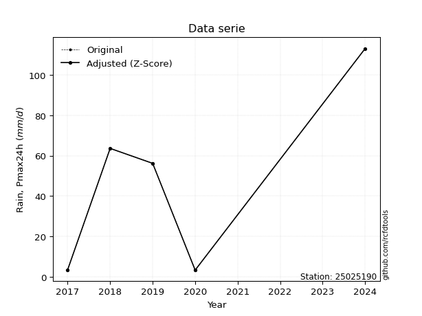</img>

</div>

> If Z-Score is active, values out of range or outliers are replaced with the station mean value.


### 4. Active continuous probability distributions from SciPy (45 of 104 available)

[scipy.stats](https://docs.scipy.org/doc/scipy/reference/stats.html) is a Python´s powerful submodule within the SciPy library for comprehensive statistical analysis, offering over 130 probability distributions (like Normal, Poisson), functions for descriptive stats (mean, variance), hypothesis testing (t-tests, chi-square), random variable generation, and statistical tests, making it essential for data science, modeling, and research. It provides tools to explore, model, and draw conclusions from data efficiently, working seamlessly with NumPy.

<div align="center">

|   id | p_dist             |   n_parameter | fit_method   | label                                                                       | active   | ref                                                                                                        |
|-----:|:-------------------|--------------:|:-------------|:----------------------------------------------------------------------------|:---------|:-----------------------------------------------------------------------------------------------------------|
|    0 | alpha              |             3 | MLE          | Alpha                                                                       | True     | [:mortar_board:](https://docs.scipy.org/doc/scipy/reference/generated/scipy.stats.alpha.html)              |
|    1 | betaprime          |             4 | MLE          | Beta prime                                                                  | True     | [:mortar_board:](https://docs.scipy.org/doc/scipy/reference/generated/scipy.stats.betaprime.html)          |
|    2 | chi2               |             3 | MLE          | Chi²                                                                        | True     | [:mortar_board:](https://docs.scipy.org/doc/scipy/reference/generated/scipy.stats.chi2.html)               |
|    3 | crystalball        |             4 | MLE          | Crystalball                                                                 | True     | [:mortar_board:](https://docs.scipy.org/doc/scipy/reference/generated/scipy.stats.crystalball.html)        |
|    4 | erlang             |             3 | MLE          | Erlang                                                                      | True     | [:mortar_board:](https://docs.scipy.org/doc/scipy/reference/generated/scipy.stats.erlang.html)             |
|    5 | expon              |             2 | MLE          | Exponential                                                                 | True     | [:mortar_board:](https://docs.scipy.org/doc/scipy/reference/generated/scipy.stats.expon.html)              |
|    6 | exponnorm          |             3 | MLE          | Exponentially modified Normal                                               | True     | [:mortar_board:](https://docs.scipy.org/doc/scipy/reference/generated/scipy.stats.exponnorm.html)          |
|    7 | f                  |             4 | MLE          | F                                                                           | True     | [:mortar_board:](https://docs.scipy.org/doc/scipy/reference/generated/scipy.stats.f.html)                  |
|    8 | fatiguelife        |             3 | MLE          | Fatigue-life (Birnbaum-Saunders)                                            | True     | [:mortar_board:](https://docs.scipy.org/doc/scipy/reference/generated/scipy.stats.fatiguelife.html)        |
|    9 | fisk               |             3 | MLE          | Fisk                                                                        | True     | [:mortar_board:](https://docs.scipy.org/doc/scipy/reference/generated/scipy.stats.fisk.html)               |
|   10 | gamma              |             3 | MLE          | Gamma                                                                       | True     | [:mortar_board:](https://docs.scipy.org/doc/scipy/reference/generated/scipy.stats.gamma.html)              |
|   11 | genexpon           |             5 | MLE          | Generalized exponential                                                     | True     | [:mortar_board:](https://docs.scipy.org/doc/scipy/reference/generated/scipy.stats.genexpon.html)           |
|   12 | genlogistic        |             3 | MLE          | Generalized logistic                                                        | True     | [:mortar_board:](https://docs.scipy.org/doc/scipy/reference/generated/scipy.stats.genlogistic.html)        |
|   13 | gibrat             |             2 | MM           | Gibrat                                                                      | True     | [:mortar_board:](https://docs.scipy.org/doc/scipy/reference/generated/scipy.stats.gibrat.html)             |
|   14 | gompertz           |             3 | MLE          | Gompertz (or truncated Gumbel)                                              | True     | [:mortar_board:](https://docs.scipy.org/doc/scipy/reference/generated/scipy.stats.gompertz.html)           |
|   15 | gumbel_l           |             2 | MM           | Gumbel Left Skew                                                            | True     | [:mortar_board:](https://docs.scipy.org/doc/scipy/reference/generated/scipy.stats.gumbel_l.html)           |
|   16 | gumbel_r           |             2 | MM           | Gumbel Right Skew                                                           | True     | [:mortar_board:](https://docs.scipy.org/doc/scipy/reference/generated/scipy.stats.gumbel_r.html)           |
|   17 | halflogistic       |             2 | MM           | Half-logistic                                                               | True     | [:mortar_board:](https://docs.scipy.org/doc/scipy/reference/generated/scipy.stats.halflogistic.html)       |
|   18 | halfnorm           |             2 | MM           | Half Normal                                                                 | True     | [:mortar_board:](https://docs.scipy.org/doc/scipy/reference/generated/scipy.stats.halfnorm.html)           |
|   19 | hypsecant          |             2 | MM           | hyperbolic secant                                                           | True     | [:mortar_board:](https://docs.scipy.org/doc/scipy/reference/generated/scipy.stats.hypsecant.html)          |
|   20 | invgamma           |             3 | MLE          | Inverted gamma                                                              | True     | [:mortar_board:](https://docs.scipy.org/doc/scipy/reference/generated/scipy.stats.invgamma.html)           |
|   21 | invgauss           |             3 | MLE          | Inverse Gaussian                                                            | True     | [:mortar_board:](https://docs.scipy.org/doc/scipy/reference/generated/scipy.stats.invgauss.html)           |
|   22 | invweibull         |             3 | MLE          | Inverted Weibull                                                            | True     | [:mortar_board:](https://docs.scipy.org/doc/scipy/reference/generated/scipy.stats.invweibull.html)         |
|   23 | johnsonsu          |             4 | MLE          | Johnson Su                                                                  | True     | [:mortar_board:](https://docs.scipy.org/doc/scipy/reference/generated/scipy.stats.johnsonsu.html)          |
|   24 | kstwobign          |             2 | MLE          | Limiting distribution of scaled Kolmogorov-Smirnov two-sided test statistic | True     | [:mortar_board:](https://docs.scipy.org/doc/scipy/reference/generated/scipy.stats.kstwobign.html)          |
|   25 | laplace            |             2 | MM           | Laplace                                                                     | True     | [:mortar_board:](https://docs.scipy.org/doc/scipy/reference/generated/scipy.stats.laplace.html)            |
|   26 | laplace_asymmetric |             3 | MLE          | Asymmetric Laplace                                                          | True     | [:mortar_board:](https://docs.scipy.org/doc/scipy/reference/generated/scipy.stats.laplace_asymmetric.html) |
|   27 | loggamma           |             3 | MLE          | Log gamma                                                                   | True     | [:mortar_board:](https://docs.scipy.org/doc/scipy/reference/generated/scipy.stats.loggamma.html)           |
|   28 | logistic           |             2 | MM           | Logistic (or Sech-squared)                                                  | True     | [:mortar_board:](https://docs.scipy.org/doc/scipy/reference/generated/scipy.stats.logistic.html)           |
|   29 | lognorm            |             3 | MLE          | Log Normal                                                                  | True     | [:mortar_board:](https://docs.scipy.org/doc/scipy/reference/generated/scipy.stats.lognorm.html)            |
|   30 | maxwell            |             2 | MM           | Maxwell                                                                     | True     | [:mortar_board:](https://docs.scipy.org/doc/scipy/reference/generated/scipy.stats.maxwell.html)            |
|   31 | mielke             |             4 | MLE          | Mielke Beta-Kappa / Dagum                                                   | True     | [:mortar_board:](https://docs.scipy.org/doc/scipy/reference/generated/scipy.stats.mielke.html)             |
|   32 | moyal              |             2 | MM           | Moyal                                                                       | True     | [:mortar_board:](https://docs.scipy.org/doc/scipy/reference/generated/scipy.stats.moyal.html)              |
|   33 | nakagami           |             3 | MLE          | Nakagami                                                                    | True     | [:mortar_board:](https://docs.scipy.org/doc/scipy/reference/generated/scipy.stats.nakagami.html)           |
|   34 | ncf                |             5 | MLE          | Non-central F distribution                                                  | True     | [:mortar_board:](https://docs.scipy.org/doc/scipy/reference/generated/scipy.stats.ncf.html)                |
|   35 | nct                |             4 | MLE          | Non-central Student’s t                                                     | True     | [:mortar_board:](https://docs.scipy.org/doc/scipy/reference/generated/scipy.stats.nct.html)                |
|   36 | norm               |             2 | MM           | Normal                                                                      | True     | [:mortar_board:](https://docs.scipy.org/doc/scipy/reference/generated/scipy.stats.norm.html)               |
|   37 | pareto             |             3 | MLE          | Pareto                                                                      | True     | [:mortar_board:](https://docs.scipy.org/doc/scipy/reference/generated/scipy.stats.pareto.html)             |
|   38 | pearson3           |             3 | MM           | Pearson type III                                                            | True     | [:mortar_board:](https://docs.scipy.org/doc/scipy/reference/generated/scipy.stats.pearson3.html)           |
|   39 | rayleigh           |             2 | MM           | Rayleigh                                                                    | True     | [:mortar_board:](https://docs.scipy.org/doc/scipy/reference/generated/scipy.stats.rayleigh.html)           |
|   40 | rice               |             3 | MLE          | Rice                                                                        | True     | [:mortar_board:](https://docs.scipy.org/doc/scipy/reference/generated/scipy.stats.rice.html)               |
|   41 | t                  |             3 | MLE          | Student’s t                                                                 | True     | [:mortar_board:](https://docs.scipy.org/doc/scipy/reference/generated/scipy.stats.t.html)                  |
|   42 | truncnorm          |             4 | MLE          | Truncated normal                                                            | True     | [:mortar_board:](https://docs.scipy.org/doc/scipy/reference/generated/scipy.stats.truncnorm.html)          |
|   43 | wald               |             2 | MM           | Wald                                                                        | True     | [:mortar_board:](https://docs.scipy.org/doc/scipy/reference/generated/scipy.stats.wald.html)               |
|   44 | weibull_min        |             3 | MLE          | Weibull minimum                                                             | True     | [:mortar_board:](https://docs.scipy.org/doc/scipy/reference/generated/scipy.stats.weibull_min.html)        |

</div>

> **n_parameter:** # arguments & localization & scale.
>
> **Fit methods:** (MLE) maximum likelihood, (MM) L-moments.
>
>**Inactive:** foldnorm, gennorm, norminvgauss, powernorm, powerlognorm, skewnorm, genextreme, anglit, arcsine, argus, beta, bradford, burr, burr12, cauchy, cosine, halfcauchy, foldcauchy, skewcauchy, wrapcauchy, dgamma, gengamma, exponweib, exponpow, truncexpon, gausshyper, genhalflogistic, genhyperbolic, geninvgauss, halfgennorm, johnsonsb, kappa4, kappa3, ksone, kstwo, loglaplace, levy, levy_l, levy_stable, ncx2, genpareto, truncpareto, lomax, powerlaw, rdist, rel_breitwigner, recipinvgauss, semicircular, studentized_range, trapezoid, triang, truncweibull_min, tukeylambda, uniform, loguniform, vonmises, vonmises_line, weibull_max, dweibull, 


## B. Probability distributions vs. Empirical distributions

A continuous probability distribution (CPD) describes probabilities for variables that can take any value within a range (like rain any time), unlike discrete variables with specific outcomes (like temperature). It uses a Probability Density Function (PDF), a curve where the total area under it equals 1, and the probability of the variable falling within an interval (a to b) is found by calculating the area under the curve between those points. A key feature is that the probability of hitting any single exact value is zero, so probabilities are always expressed for ranges, e.g., $P(a ≤ X ≤ b)$.

<div align="center">

Distributions parameters
|    |   station | p_dist                |   n |               loc |            scale | shape                  | shape1                | shape2               | shape3   |
|---:|----------:|:----------------------|----:|------------------:|-----------------:|:-----------------------|:----------------------|:---------------------|:---------|
|  0 |  25025190 | alpha                 |   6 |      -0.0109489   |      5.97834     | 1.0885512424424717e-09 |                       |                      |          |
|  1 |  25025190 | betaprime             |   6 |       3.39951     |      2.16892e-06 | 262.02151079975783     | 0.19050477877699037   |                      |          |
|  2 |  25025190 | chi2                  |   6 |       3.4         |      3.26792     | 1.2141936110448595     |                       |                      |          |
|  3 |  25025190 | crystalball           |   6 |      42.4         |     39.6306      | 8400.012153431617      | 23910.85915643333     |                      |          |
|  4 |  25025190 | erlang                |   6 |       3.4         |     36.0048      | 0.608137887908025      |                       |                      |          |
|  5 |  25025190 | expon                 |   6 |       3.4         |     39           |                        |                       |                      |          |
|  6 |  25025190 | exponnorm             |   6 |       3.36186     |      0.0116972   | 3321.629512452373      |                       |                      |          |
|  7 |  25025190 | f                     |   6 |       3.4         |      2.96731     | 0.32842836803940123    | 1.0315302824043182    |                      |          |
|  8 |  25025190 | fatiguelife           |   6 |       3.4         |      8.20521e-07 | 5477.189363946025      |                       |                      |          |
|  9 |  25025190 | fisk                  |   6 |       3.4         |     18.7965      | 0.4771936913119481     |                       |                      |          |
| 10 |  25025190 | gamma                 |   6 |       3.4         |     40.0425      | 0.4636351496559443     |                       |                      |          |
| 11 |  25025190 | genexpon              |   6 |       3.4         |    108.911       | 2.792594127497831      | 6.206068566479975e-12 | 3.2126795945838884   |          |
| 12 |  25025190 | genlogistic           |   6 |    -182.39        |     29.8443      | 1004.2782854252857     |                       |                      |          |
| 13 |  25025190 | gibrat                |   6 |      12.1669      |     18.3373      |                        |                       |                      |          |
| 14 |  25025190 | gompertz              |   6 |       3.39997     | 504011           | 13176.834005379531     |                       |                      |          |
| 15 |  25025190 | gumbel_l              |   6 |      60.2359      |     30.8999      |                        |                       |                      |          |
| 16 |  25025190 | gumbel_r              |   6 |      24.5641      |     30.8999      |                        |                       |                      |          |
| 17 |  25025190 | halflogistic          |   6 |      -4.5715      |     33.8828      |                        |                       |                      |          |
| 18 |  25025190 | halfnorm              |   6 |     -10.0554      |     65.7431      |                        |                       |                      |          |
| 19 |  25025190 | hypsecant             |   6 |      42.4         |     25.2296      |                        |                       |                      |          |
| 20 |  25025190 | invgamma              |   6 |       3.4         |      1.63197e-12 | 0.13246203331704953    |                       |                      |          |
| 21 |  25025190 | invgauss              |   6 |       2.91835     |      1.70396     | 23.170565201561914     |                       |                      |          |
| 22 |  25025190 | invweibull            |   6 |       3.4         |      2.73124     | 0.05241524386667404    |                       |                      |          |
| 23 |  25025190 | johnsonsu             |   6 |       3.4         |      3.21834e-15 | -1.1645742662165444    | 0.06237021479421721   |                      |          |
| 24 |  25025190 | kstwobign             |   6 |     -78.9087      |    138.959       |                        |                       |                      |          |
| 25 |  25025190 | laplace               |   6 |      42.4         |     28.0231      |                        |                       |                      |          |
| 26 |  25025190 | laplace_asymmetric    |   6 |       3.39956     |      0.0279286   | 0.0007162220249950636  |                       |                      |          |
| 27 |  25025190 | loggamma              |   6 |  -10414           |   1456.96        | 1309.3001152287402     |                       |                      |          |
| 28 |  25025190 | logistic              |   6 |      42.4         |     21.8495      |                        |                       |                      |          |
| 29 |  25025190 | lognorm               |   6 |       3.4         |      0.0265029   | 14.338679507419688     |                       |                      |          |
| 30 |  25025190 | maxwell               |   6 |     -51.5079      |     58.8481      |                        |                       |                      |          |
| 31 |  25025190 | mielke                |   6 |      -0.0446463   |      0.192439    | 20.112593740784263     | 0.8038907022310648    |                      |          |
| 32 |  25025190 | moyal                 |   6 |      19.7367      |     17.8401      |                        |                       |                      |          |
| 33 |  25025190 | nakagami              |   6 |       3.4         |     68.2244      | 0.24964971044405046    |                       |                      |          |
| 34 |  25025190 | ncf                   |   6 |       3.4         |     14.3655      | 0.41569640387673645    | 4256.735873147746     | 0.6046367455727134   |          |
| 35 |  25025190 | nct                   |   6 |       3.38813     |      0.0102963   | 0.1503379438982203     | 3.587072592083561     |                      |          |
| 36 |  25025190 | norm                  |   6 |      42.4         |     39.6306      |                        |                       |                      |          |
| 37 |  25025190 | pareto                |   6 |      -5.36871e+08 |      5.36871e+08 | 13765921.8227876       |                       |                      |          |
| 38 |  25025190 | pearson3              |   6 |      42.4         |     39.6306      | 0.6020385428438859     |                       |                      |          |
| 39 |  25025190 | rayleigh              |   6 |     -33.4157      |     60.4922      |                        |                       |                      |          |
| 40 |  25025190 | rice                  |   6 |     -22.7951      |     53.949       | 0.0004404584662160285  |                       |                      |          |
| 41 |  25025190 | t                     |   6 |      42.4016      |     39.6301      | 15885080.442244388     |                       |                      |          |
| 42 |  25025190 | truncnorm             |   6 |    -541.487       |    155.846       | 3.4963074751497363     | 115.98846287034618    |                      |          |
| 43 |  25025190 | wald                  |   6 |       2.76937     |     39.6306      |                        |                       |                      |          |
| 44 |  25025190 | weibull_min           |   6 |       3.4         |     65.9776      | 0.5138405476039158     |                       |                      |          |
| 45 |  25025190 | logalpha              |   6 |     -23.2459      |    485.463       | 18.55623663380551      |                       |                      |          |
| 46 |  25025190 | logbetaprime          |   6 |      -0.4538      | 953813           | 5.411116410083764      | 1489871.6850103454    |                      |          |
| 47 |  25025190 | logchi2               |   6 |       1.22378     |      1.24898     | 1.3460346851232297     |                       |                      |          |
| 48 |  25025190 | logcrystalball        |   6 |       3.01577     |      1.38933     | 41.45537672892753      | 2203.5613539025862    |                      |          |
| 49 |  25025190 | logerlang             |   6 |     -22.3546      |      0.077035    | 329.3262983974265      |                       |                      |          |
| 50 |  25025190 | logexpon              |   6 |       1.22378     |      1.792       |                        |                       |                      |          |
| 51 |  25025190 | logexponnorm          |   6 |       3.01449     |      1.38933     | 0.0009304187244530521  |                       |                      |          |
| 52 |  25025190 | logf                  |   6 |       1.22378     |      1.93521     | 1.436602625428334      | 193.19897471528174    |                      |          |
| 53 |  25025190 | logfatiguelife        |   6 |       1.22378     |      3.49253e-07 | 1732.3334573132897     |                       |                      |          |
| 54 |  25025190 | logfisk               |   6 | -176321           | 176324           | 202631.9630001421      |                       |                      |          |
| 55 |  25025190 | loggamma              |   6 |     -23.6125      |      0.0736272   | 361.71997263681885     |                       |                      |          |
| 56 |  25025190 | loggenexpon           |   6 |       1.21852     |      1.48967     | 0.6107920728641136     | 29.13472208475544     | 0.007796873198167596 |          |
| 57 |  25025190 | loggenlogistic        |   6 |       4.72843     |      6.90805e-06 | 4.0397624870410165e-06 |                       |                      |          |
| 58 |  25025190 | loggibrat             |   6 |       1.95592     |      0.64284     |                        |                       |                      |          |
| 59 |  25025190 | loggompertz           |   6 |       1.22378     |      3.01859     | 1.0185828517741373     |                       |                      |          |
| 60 |  25025190 | loggumbel_l           |   6 |       3.64105     |      1.08326     |                        |                       |                      |          |
| 61 |  25025190 | loggumbel_r           |   6 |       2.3905      |      1.08326     |                        |                       |                      |          |
| 62 |  25025190 | loghalflogistic       |   6 |       1.36912     |      1.18782     |                        |                       |                      |          |
| 63 |  25025190 | loghalfnorm           |   6 |       1.17684     |      2.30476     |                        |                       |                      |          |
| 64 |  25025190 | loghypsecant          |   6 |       3.01577     |      0.884477    |                        |                       |                      |          |
| 65 |  25025190 | loginvgamma           |   6 |     -15.027       |   2927.99        | 163.42137014254502     |                       |                      |          |
| 66 |  25025190 | loginvgauss           |   6 |      -3.3105      |    112.354       | 0.056175415574565554   |                       |                      |          |
| 67 |  25025190 | loginvweibull         |   6 |      -1.90351e+08 |      1.90351e+08 | 153098771.27255398     |                       |                      |          |
| 68 |  25025190 | logjohnsonsu          |   6 |       5.14213     |      0.0156159   | 6.562478246863774      | 1.2326133980746654    |                      |          |
| 69 |  25025190 | logkstwobign          |   6 |      -1.96846     |      5.66743     |                        |                       |                      |          |
| 70 |  25025190 | loglaplace            |   6 |       3.01577     |      0.982407    |                        |                       |                      |          |
| 71 |  25025190 | loglaplace_asymmetric |   6 |       2.68102     |      1.25121     | 0.8755006819508857     |                       |                      |          |
| 72 |  25025190 | logloggamma           |   6 |       4.72749     |      9.42301e-06 | 5.493130471470138e-06  |                       |                      |          |
| 73 |  25025190 | loglogistic           |   6 |       3.01577     |      0.765979    |                        |                       |                      |          |
| 74 |  25025190 | loglognorm            |   6 |       1.22378     |      0.00284688  | 13.571556364447922     |                       |                      |          |
| 75 |  25025190 | logmaxwell            |   6 |      -0.27636     |      2.06304     |                        |                       |                      |          |
| 76 |  25025190 | logmielke             |   6 |       1.22378     |      3.73015     | 0.4798574830937895     | 10.951879944610138    |                      |          |
| 77 |  25025190 | logmoyal              |   6 |       2.22127     |      0.625419    |                        |                       |                      |          |
| 78 |  25025190 | lognakagami           |   6 |       1.22378     |      2.04046     | 0.26701371746858127    |                       |                      |          |
| 79 |  25025190 | logncf                |   6 |     -72.6544      |     72.9438      | 11359.902238401446     | 12224.891013538898    | 422.01706226758995   |          |
| 80 |  25025190 | lognct                |   6 |     -52.9162      |      1.29006     | 5644.5095836287455     | 43.34977271524779     |                      |          |
| 81 |  25025190 | lognorm               |   6 |       3.01577     |      1.38933     |                        |                       |                      |          |
| 82 |  25025190 | logpareto             |   6 |       1.21782     |      0.005956    | 0.22556131518123734    |                       |                      |          |
| 83 |  25025190 | logpearson3           |   6 |       3.01578     |      1.38932     | -0.21685513946691576   |                       |                      |          |
| 84 |  25025190 | lograyleigh           |   6 |       0.3579      |      2.12068     |                        |                       |                      |          |
| 85 |  25025190 | logrice               |   6 |       0.331497    |      1.65622     | 1.1534309030282146     |                       |                      |          |
| 86 |  25025190 | logt                  |   6 |       3.01577     |      1.38933     | 43445235825.87137      |                       |                      |          |
| 87 |  25025190 | logtruncnorm          |   6 |       0.498791    |      2.54241     | 0.2851567763700672     | 9.881051170140662     |                      |          |
| 88 |  25025190 | logwald               |   6 |       1.62649     |      1.38929     |                        |                       |                      |          |
| 89 |  25025190 | logweibull_min        |   6 |      -1.55365e+07 |      1.55365e+07 | 13694690.114102405     |                       |                      |          |

</div>

> **loc** (Location parameter): This shifts the distribution along the x-axis. For many common distributions, like the normal (Gaussian) distribution, loc represents the mean $μ$. For others, like the uniform distribution, it might represent the minimum value, or for the beta distribution, the left end of the support interval.
>
> **scale** (Scale parameter): This determines the width or spread of the distribution. For the normal distribution, scale represents the standard deviation $σ$. For a uniform distribution, it defines the length of the interval (from $loc$ to $loc + scale$).
>
> **shape** (Shape parameters): Refers to parameters that define the specific form of a probability distribution, distinct from its location (loc) and scale (scale). These parameters are required arguments for most distribution functions. For example, a normal (Gaussian) distribution is fully defined by its location (mean) and scale (standard deviation), so it has no specific shape parameters beyond loc and scale. However, other distributions have intrinsic properties that need specification, as Gamma distribution that takes a shape parameter, often named $a$ or $alpha$.


### 0. Cumulative distribution values - CDF (90 evaluated)

> Ordered by x ascending and calculating $log(f(x))$ separately. 

|   id |   Station |   date |     x |   count |   mean |     std |    zscore |   Value_initial |   station |   m |     alpha |   alpha_pdf |   betaprime |   betaprime_pdf |        chi2 |         chi2_pdf |   crystalball |   crystalball_pdf |      erlang |      erlang_pdf |      expon |   expon_pdf |   exponnorm |   exponnorm_pdf |          f |       f_pdf |   fatiguelife |   fatiguelife_pdf |        fisk |    fisk_pdf |       gamma |   gamma_pdf |   genexpon |   genexpon_pdf |   genlogistic |   genlogistic_pdf |    gibrat |   gibrat_pdf |    gompertz |   gompertz_pdf |   gumbel_l |   gumbel_l_pdf |   gumbel_r |   gumbel_r_pdf |   halflogistic |   halflogistic_pdf |   halfnorm |   halfnorm_pdf |   hypsecant |   hypsecant_pdf |   invgamma |   invgamma_pdf |   invgauss |   invgauss_pdf |   invweibull |   invweibull_pdf |   johnsonsu |   johnsonsu_pdf |   kstwobign |   kstwobign_pdf |   laplace |   laplace_pdf |   laplace_asymmetric |   laplace_asymmetric_pdf |   loggamma |   loggamma_pdf |   logistic |   logistic_pdf |   lognorm |   lognorm_pdf |   maxwell |   maxwell_pdf |    mielke |   mielke_pdf |    moyal |   moyal_pdf |    nakagami |   nakagami_pdf |        ncf |         ncf_pdf |       nct |     nct_pdf |     norm |   norm_pdf |     pareto |   pareto_pdf |   pearson3 |   pearson3_pdf |   rayleigh |   rayleigh_pdf |     rice |   rice_pdf |        t |      t_pdf |   truncnorm |   truncnorm_pdf |        wald |    wald_pdf |   weibull_min |   weibull_min_pdf |   logalpha |   logalpha_pdf |   logbetaprime |   logbetaprime_pdf |     logchi2 |   logchi2_pdf |   logcrystalball |   logcrystalball_pdf |   logerlang |   logerlang_pdf |   logexpon |   logexpon_pdf |   logexponnorm |   logexponnorm_pdf |        logf |     logf_pdf |   logfatiguelife |   logfatiguelife_pdf |   logfisk |   logfisk_pdf |   loggenexpon |   loggenexpon_pdf |   loggenlogistic |   loggenlogistic_pdf |   loggibrat |   loggibrat_pdf |   loggompertz |   loggompertz_pdf |   loggumbel_l |   loggumbel_l_pdf |   loggumbel_r |   loggumbel_r_pdf |   loghalflogistic |   loghalflogistic_pdf |   loghalfnorm |   loghalfnorm_pdf |   loghypsecant |   loghypsecant_pdf |   loginvgamma |   loginvgamma_pdf |   loginvgauss |   loginvgauss_pdf |   loginvweibull |   loginvweibull_pdf |   logjohnsonsu |   logjohnsonsu_pdf |   logkstwobign |   logkstwobign_pdf |   loglaplace |   loglaplace_pdf |   loglaplace_asymmetric |   loglaplace_asymmetric_pdf |   logloggamma |   logloggamma_pdf |   loglogistic |   loglogistic_pdf |   loglognorm |   loglognorm_pdf |   logmaxwell |   logmaxwell_pdf |   logmielke |   logmielke_pdf |   logmoyal |   logmoyal_pdf |   lognakagami |   lognakagami_pdf |    logncf |   logncf_pdf |    lognct |   lognct_pdf |   logpareto |   logpareto_pdf |   logpearson3 |   logpearson3_pdf |   lograyleigh |   lograyleigh_pdf |   logrice |   logrice_pdf |      logt |   logt_pdf |   logtruncnorm |   logtruncnorm_pdf |   logwald |   logwald_pdf |   logweibull_min |   logweibull_min_pdf |
|-----:|----------:|-------:|------:|--------:|-------:|--------:|----------:|----------------:|----------:|----:|----------:|------------:|------------:|----------------:|------------:|-----------------:|--------------:|------------------:|------------:|----------------:|-----------:|------------:|------------:|----------------:|-----------:|------------:|--------------:|------------------:|------------:|------------:|------------:|------------:|-----------:|---------------:|--------------:|------------------:|----------:|-------------:|------------:|---------------:|-----------:|---------------:|-----------:|---------------:|---------------:|-------------------:|-----------:|---------------:|------------:|----------------:|-----------:|---------------:|-----------:|---------------:|-------------:|-----------------:|------------:|----------------:|------------:|----------------:|----------:|--------------:|---------------------:|-------------------------:|-----------:|---------------:|-----------:|---------------:|----------:|--------------:|----------:|--------------:|----------:|-------------:|---------:|------------:|------------:|---------------:|-----------:|----------------:|----------:|------------:|---------:|-----------:|-----------:|-------------:|-----------:|---------------:|-----------:|---------------:|---------:|-----------:|---------:|-----------:|------------:|----------------:|------------:|------------:|--------------:|------------------:|-----------:|---------------:|---------------:|-------------------:|------------:|--------------:|-----------------:|---------------------:|------------:|----------------:|-----------:|---------------:|---------------:|-------------------:|------------:|-------------:|-----------------:|---------------------:|----------:|--------------:|--------------:|------------------:|-----------------:|---------------------:|------------:|----------------:|--------------:|------------------:|--------------:|------------------:|--------------:|------------------:|------------------:|----------------------:|--------------:|------------------:|---------------:|-------------------:|--------------:|------------------:|--------------:|------------------:|----------------:|--------------------:|---------------:|-------------------:|---------------:|-------------------:|-------------:|-----------------:|------------------------:|----------------------------:|--------------:|------------------:|--------------:|------------------:|-------------:|-----------------:|-------------:|-----------------:|------------:|----------------:|-----------:|---------------:|--------------:|------------------:|----------:|-------------:|----------:|-------------:|------------:|----------------:|--------------:|------------------:|--------------:|------------------:|----------:|--------------:|----------:|-----------:|---------------:|-------------------:|----------:|--------------:|-----------------:|---------------------:|
|    0 |  25025190 |   2020 |   3.4 |       6 |   42.4 | 43.4132 | -0.898345 |             3.4 |  25025190 |   1 | 0.0796553 | 0.0882492   |   0.0395106 |   136.357       | 1.71026e-10 | 233803           |      0.162536 |        0.0062028  | 5.82779e-11 | 79806           | 0          |  0.025641   | 0.000981071 |      0.0256981  | 0.00411643 | 8.05377e+09 |     0.0654804 |       8.03131e+12 | 1.16383e-08 | 1.25058e+07 | 1.55526e-08 | 1.62371e+07 | 7.6216e-13 |     0.025641   |      0.137355 |        0.00912757 | 0         |  0           | 6.84204e-07 |     0.0261439  |   0.146935 |    0.00438736  |   0.13757  |     0.00883132 |       0.117094 |         0.0145544  |   0.162167 |     0.0118849  |    0.133689 |      0.00514448 |  0.0646365 |    2.66409e+10 |  0.0626194 |    0.277305    |   0.00120264 |      9.54334e+11 |    0.139952 |     2.09981e+12 |    0.125717 |      0.00921431 |  0.124325 |    0.00443652 |          1.17178e-05 |               0.0256445  |  0.0976495 |       0.129042 |   0.143695 |     0.00563154 | 0.0985553 |      0.124982 |  0.167478 |    0.00763784 | 0.0956196 |  0.0499998   | 0.113948 |  0.0101344  | 2.04642e-09 |    2.30083e+06 | 0.00485274 | 705710          | 0.0356582 | 6.19503     | 0.162536 | 0.0062028  | 0          |   0.025641   |   0.15883  |     0.00773053 |   0.169061 |     0.00835995 | 0.111198 | 0.00799942 | 0.162524 | 0.00620256 |  6.6306e-09 |      0.0240487  | 6.0379e-15  | 3.05417e-13 |   1.50096e-09 |        1.7367e+06 |  0.0997218 |       0.142    |      0.0878319 |           0.175436 | 1.74272e-11 | 52821.8       |        0.0985553 |             0.124982 |   0.0977831 |        0.129681 |  0         |      0.558036  |      0.0985539 |           0.12498  | 1.36454e-11 | 5517.74      |        0.0605028 |          1.92042e+12 |  0.10617  |      0.109058 |    0.00215309 |         0.409671  |         0        |            0.0753212 |    0        |       0         |   3.76326e-11 |          0.337436 |      0.101806 |         0.0890261 |     0.053077  |         0.143857  |          0        |             0         |     0.0162465 |          0.346118 |      0.0834597 |          0.0932831 |      0.097801 |          0.140333 |     0.0977373 |          0.163986 |       0.0928203 |           0.177462  |       0.135173 |          0.0683596 |      0.0911153 |           0.193439 |    0.0806821 |        0.082127  |                0.114726 |                   0.104731  |      0.129706 |         0.0756121 |     0.087905  |          0.104673 |    0.0130767 |      1.11651e+13 |    0.0874675 |         0.156987 | 1.63748e-08 |     3.53873e+07 |  0.0264264 |      0.120501  |   2.32449e-09 |       5.59051e+06 | 0.0987849 |     0.127746 | 0.0989226 |     0.126058 |    0        |      37.8713    |      0.102054 |          0.117509 |     0.0799755 |          0.177136 | 0.0727796 |      0.158964 | 0.0985555 |   0.124982 |    5.04086e-12 |           0.388546 |  0        |      0        |         0.107658 |            0.0895934 |
|    1 |  25025190 |   2017 |   3.6 |       6 |   42.4 | 43.4132 | -0.893738 |             3.6 |  25025190 |   2 | 0.0978001 | 0.0929105   |   0.645005  |     0.336508    | 0.133103    |      0.396396    |      0.16378  |        0.0062336  | 0.0474217   |     0.143697    | 0.00511508 |  0.0255099  | 0.00611029  |      0.0255804  | 0.44272    | 0.359026    |     0.535911  |       0.0895365   | 0.102666    | 0.21981     | 0.0966098   | 0.223195    | 0.00511508 |     0.0255099  |      0.139186 |        0.00918763 | 0         |  0           | 0.00521582  |     0.0260076  |   0.147815 |    0.00441129  |   0.139342 |     0.00888736 |       0.120004 |         0.0145442  |   0.164544 |     0.0118774  |    0.134722 |      0.00518183 |  0.963815  |    0.0239657   |  0.118855  |    0.276736    |   0.317634   |      0.0954692   |    0.804986 |     0.085984    |    0.127566 |      0.00927451 |  0.125215 |    0.00446829 |          0.00512748  |               0.0255133  |  0.105225  |       0.13605  |   0.144825 |     0.00566834 | 0.10589   |      0.131681 |  0.169008 |    0.00766918 | 0.105632  |  0.0500876   | 0.115983 |  0.0102191  | 0.0424138   |    0.105886    | 0.239442   |      0.249107   | 0.345732  | 0.463163    | 0.16378  | 0.0062336  | 0.00511508 |   0.0255099  |   0.16038  |     0.00776831 |   0.170736 |     0.00838843 | 0.112803 | 0.00804594 | 0.163767 | 0.00623336 |  0.00479898 |      0.023941   | 1.32869e-11 | 3.8914e-10  |   0.0495421   |        0.124077   |  0.108061  |       0.149818 |      0.098163  |           0.186007 | 0.0862681   |     1.00195   |        0.10589   |             0.131681 |   0.105397  |        0.136737 |  0.0313931 |      0.540517  |      0.105888  |           0.13168  | 0.0681718   |    0.846098  |        0.592324  |          0.793047    |  0.112567 |      0.114801 |    0.0254596  |         0.405804  |         0        |            0.0778814 |    0        |       0         |   0.0192828   |          0.337256 |      0.107016 |         0.0933053 |     0.0617224 |         0.158691  |          0        |             0         |     0.036023  |          0.345837 |      0.0889613 |          0.0992765 |      0.106045 |          0.14815  |     0.107375  |          0.17323  |       0.103283  |           0.188593  |       0.139149 |          0.0707588 |      0.102512  |           0.20525  |    0.0855156 |        0.0870471 |                0.120871 |                   0.110341  |      0.134101 |         0.0781739 |     0.0940748 |          0.111262 |    0.587462  |      0.501871    |    0.0966913 |         0.16574  | 0.134657    |     1.13047     |  0.0339445 |      0.14276   |   0.115342    |       1.07745     | 0.106283  |     0.134622 | 0.10632   |     0.132806 |    0.412835 |       2.09844   |      0.108942 |          0.123512 |     0.0903752 |          0.186694 | 0.0821239 |      0.167961 | 0.10589   |   0.131681 |    0.0221358   |           0.385966 |  0        |      0        |         0.112895 |            0.09367   |
|    2 |  25025190 |   2025 |  14.6 |       6 |   42.4 | 43.4132 | -0.640359 |            14.6 |  25025190 |   3 | 0.682416  | 0.0205499   |   0.834965  |     0.0028069   | 0.914995    |      0.0151471   |      0.241502 |        0.00787095 | 0.490689    |     0.0218633   | 0.249623   |  0.0192404  | 0.25117     |      0.0192731  | 0.792077   | 0.00736564  |     0.750015  |       0.00956899  | 0.438545    | 0.0104907   | 0.574398    | 0.0195756   | 0.249623   |     0.0192404  |      0.255525 |        0.0116743  | 0.0217045 |  0.021326    | 0.25384     |     0.019508   |   0.204151 |    0.00588121  |   0.251446 |     0.011234   |       0.275596 |         0.0136359  |   0.292359 |     0.0113123  |    0.20421  |      0.00755013 |  0.978769  |    0.000251092 |  0.732297  |    0.01258     |   0.395066   |      0.00171706  |    0.866636 |     0.001199    |    0.24429  |      0.0116228  |  0.18541  |    0.00661633 |          0.249663    |               0.0192422  |  0.410798  |       0.280105 |   0.218857 |     0.00782437 | 0.404799  |      0.278931 |  0.261813 |    0.00910377 | 0.468942  |  0.0192015   | 0.248155 |  0.0132567  | 0.316078    |    0.0140152   | 0.558668   |      0.0108196  | 0.639663  | 0.00483169  | 0.241502 | 0.00787095 | 0.249623   |   0.0192404  |   0.256047 |     0.00950268 |   0.270226 |     0.00957576 | 0.213556 | 0.0101045  | 0.241487 | 0.00787079 |  0.23798    |      0.0186573  | 0.164141    | 0.0270694   |   0.331035    |        0.0123386  |  0.433272  |       0.284074 |      0.466698  |           0.283996 | 0.617984    |     0.1984    |        0.404799  |             0.278931 |   0.412321  |        0.280899 |  0.556561  |      0.247455  |      0.404796  |           0.278931 | 0.568348    |    0.20161   |        0.880828  |          0.0805374   |  0.387984 |      0.272882 |    0.507788   |         0.275222  |         0        |            0.17661   |    0.547924 |       0.546213  |   0.468508    |          0.290635 |      0.33781  |         0.251977  |     0.465445  |         0.328596  |          0.502191 |             0.31478   |     0.486012  |          0.279784 |      0.382305  |          0.335563  |      0.430064 |          0.284628 |     0.458626  |          0.281469 |       0.478906  |           0.283592  |       0.298392 |          0.17371   |      0.488643  |           0.280196 |    0.355619  |        0.361988  |                0.433909 |                   0.396105  |      0.303315 |         0.176817  |     0.39245   |          0.311279 |    0.677114  |      0.0181497   |    0.438918  |         0.284451 | 0.636978    |     0.209744    |  0.488672  |      0.347535  |   0.632289    |       0.207957    | 0.409622  |     0.280003 | 0.406558  |     0.278879 |    0.711045 |       0.0445441 |      0.391674 |          0.2717   |     0.451199  |          0.28349  | 0.427121  |      0.288214 | 0.404799  |   0.278931 |    0.4962      |           0.279975 |  0.551706 |      0.417934 |         0.337359 |            0.240364  |
|    3 |  25025190 |   2019 |  56.2 |       6 |   42.4 | 43.4132 |  0.317876 |            56.2 |  25025190 |   4 | 0.9153    | 0.00150114  |   0.877173  |     0.000443157 | 0.999911    |      1.41742e-05 |      0.636161 |        0.00947434 | 0.886084    |     0.00375012  | 0.741755   |  0.00662167 | 0.743321    |      0.00660631 | 0.895569   | 0.000949008 |     0.928483  |       0.00189312  | 0.620781    | 0.0021276   | 0.905591    | 0.0030153   | 0.741755   |     0.00662167 |      0.712699 |        0.00808691 | 0.809486  |  0.00617299  | 0.74854     |     0.00657483 |   0.584203 |    0.0118087   |   0.698221 |     0.00811702 |       0.714731 |         0.0072184  |   0.686446 |     0.00730374 |    0.666024 |      0.0109389  |  0.982711  |    4.33726e-05 |  0.8925    |    0.00133636  |   0.424769   |      0.000361041 |    0.886349 |     0.000227366 |    0.699105 |      0.00833417 |  0.694437 |    0.010904   |          0.741809    |               0.00662125 |  0.767039  |       0.213039 |   0.652851 |     0.0103726  | 0.767069  |      0.220105 |  0.659241 |    0.00850783 | 0.771595  |  0.0028448   | 0.718928 |  0.00754329 | 0.666774    |    0.00558987  | 0.783225   |      0.00310682 | 0.714554  | 0.00081257  | 0.636161 | 0.00947434 | 0.741755   |   0.00662167 |   0.668745 |     0.00854449 |   0.666241 |     0.0081737  | 0.657684 | 0.00929095 | 0.636148 | 0.00947458 |  0.733941   |      0.00694596 | 0.77725     | 0.00614767  |   0.590093    |        0.00355762 |  0.775561  |       0.195439 |      0.778515  |           0.167535 | 0.803632    |     0.0933676 |        0.767069  |             0.220105 |   0.768565  |        0.212332 |  0.790989  |      0.116636  |      0.767067  |           0.220106 | 0.763123    |    0.101689  |        0.949077  |          0.030516    |  0.748986 |      0.216056 |    0.788724   |         0.146963  |         0        |            0.388457  |    0.879171 |       0.0969669 |   0.790113    |          0.179375 |      0.760822 |         0.315858  |     0.802229  |         0.163193  |          0.807435 |             0.146508  |     0.784088  |          0.160986 |      0.80395   |          0.207906  |      0.774491 |          0.197345 |     0.775971  |          0.173597 |       0.779578  |           0.156128  |       0.673223 |          0.399368  |      0.787267  |           0.158309 |    0.821726  |        0.181467  |                0.779565 |                   0.154243  |      0.665491 |         0.387947  |     0.789626  |          0.216868 |    0.694238  |      0.00921107  |    0.774405  |         0.190874 | 0.870535    |     0.142626    |  0.813657  |      0.146236  |   0.836779    |       0.106028    | 0.768546  |     0.215715 | 0.767085  |     0.218337 |    0.750617 |       0.0200104 |      0.762075 |          0.235238 |     0.776486  |          0.182449 | 0.77302   |      0.199877 | 0.767069  |   0.220105 |    0.78726     |           0.154332 |  0.850585 |      0.108281 |         0.740797 |            0.308473  |
|    4 |  25025190 |   2018 |  63.6 |       6 |   42.4 | 43.4132 |  0.488331 |            63.6 |  25025190 |   5 | 0.925123  | 0.00117365  |   0.880204  |     0.000379092 | 0.999973    |      4.33911e-06 |      0.703654 |        0.00872449 | 0.910543    |     0.00290044  | 0.786387   |  0.00547725 | 0.787834    |      0.00546065 | 0.901964   | 0.000787816 |     0.941074  |       0.00152552  | 0.6354      | 0.00183638  | 0.92527     | 0.00233624  | 0.786387   |     0.00547725 |      0.767722 |        0.00679873 | 0.84881   |  0.00455716  | 0.792777    |     0.00541827 |   0.672091 |    0.0118326   |   0.753732 |     0.00689628 |       0.764099 |         0.00614108 |   0.737436 |     0.00647932 |    0.740617 |      0.00918029 |  0.983009  |    3.73859e-05 |  0.901456  |    0.00109722  |   0.427269   |      0.000316341 |    0.887916 |     0.000197451 |    0.75638  |      0.00715254 |  0.765351 |    0.0083734  |          0.786438    |               0.00547676 |  0.792513  |       0.198755 |   0.725174 |     0.00912133 | 0.793396  |      0.205453 |  0.719125 |    0.00765855 | 0.790662  |  0.00233476  | 0.769918 |  0.00626669 | 0.705926    |    0.00500498  | 0.804777   |      0.00273045 | 0.720127  | 0.000698792 | 0.703654 | 0.00872449 | 0.786387   |   0.00547725 |   0.728384 |     0.00756095 |   0.723638 |     0.00732693 | 0.722595 | 0.00823449 | 0.703643 | 0.00872476 |  0.780916   |      0.00578305 | 0.817596    | 0.00482235  |   0.614803    |        0.00313663 |  0.798885  |       0.181657 |      0.798504  |           0.155718 | 0.814821    |     0.0876118 |        0.793396  |             0.205453 |   0.793947  |        0.197978 |  0.80493   |      0.108856  |      0.793394  |           0.205454 | 0.775344    |    0.0959679 |        0.952703  |          0.0281534   |  0.774756 |      0.200545 |    0.806292   |         0.137159  |         0        |            0.417598  |    0.890429 |       0.0853595 |   0.811583    |          0.167762 |      0.798828 |         0.297804  |     0.821534  |         0.149086  |          0.824811 |             0.134569  |     0.803345  |          0.150425 |      0.828229  |          0.184917  |      0.798046 |          0.183473 |     0.796689  |          0.161432 |       0.79818   |           0.144715  |       0.723745 |          0.416527  |      0.806167  |           0.14735  |    0.842817  |        0.159998  |                0.797842 |                   0.141454  |      0.715251 |         0.416955  |     0.815201  |          0.196674 |    0.695352  |      0.00880777  |    0.797214  |         0.177921 | 0.887768    |     0.13584     |  0.830924  |      0.133128  |   0.849475    |       0.0992965   | 0.794337  |     0.201201 | 0.7932    |     0.203797 |    0.753028 |       0.0189817 |      0.790274 |          0.220507 |     0.798296  |          0.170194 | 0.796914  |      0.186427 | 0.793396  |   0.205453 |    0.805712    |           0.14408  |  0.863293 |      0.097423 |         0.778133 |            0.294457  |
|    5 |  25025190 |   2024 | 113   |       6 |   42.4 | 43.4132 |  1.62623  |           113   |  25025190 |   6 | 0.957811  | 0.000372968 |   0.893126  |     0.000185764 | 1           |      1.78905e-09 |      0.962581 |        0.00205943 | 0.981016    |     0.000581602 | 0.93981    |  0.00154332 | 0.940503    |      0.00153132 | 0.926955   | 0.000331442 |     0.982575  |       0.000414496 | 0.698754    | 0.000916494 | 0.982896    | 0.00049336  | 0.93981    |     0.00154332 |      0.950751 |        0.00160884 | 0.955859  |  0.000925559 | 0.943056    |     0.00148906 |   0.995977 |    0.000718184 |   0.944449 |     0.00174689 |       0.939641 |         0.00172764 |   0.93876  |     0.00210531 |    0.961269 |      0.00153136 |  0.984306  |    1.89682e-05 |  0.935472  |    0.000439865 |   0.438651   |      0.00017287  |    0.894877 |     0.000103565 |    0.955905 |      0.00175287 |  0.959744 |    0.00143653 |          0.939836    |               0.0015429  |  0.88718   |       0.131191 |   0.961991 |     0.00167344 | 0.891019  |      0.13444  |  0.949998 |    0.00212906 | 0.862201  |  0.000906389 | 0.941607 |  0.00163364 | 0.881034    |    0.00236442  | 0.899129   |      0.0013098  | 0.744231  | 0.000350799 | 0.962581 | 0.00205943 | 0.93981    |   0.00154332 |   0.948746 |     0.00199872 |   0.946559 |     0.00213826 | 0.957908 | 0.00196388 | 0.962579 | 0.00205952 |  0.943311   |      0.0016064  | 0.943609    | 0.00122663  |   0.726909    |        0.00166182 |  0.885263  |       0.120225 |      0.873376  |           0.106583 | 0.858522    |     0.0656427 |        0.891019  |             0.13444  |   0.888129  |        0.130344 |  0.858456  |      0.0789869 |      0.891018  |           0.134442 | 0.823813    |    0.0737906 |        0.96625   |          0.0195676   |  0.869426 |      0.130462 |    0.873184   |         0.0971312 |         0.999388 |            0.584433  |    0.928025 |       0.0494931 |   0.892775    |          0.115495 |      0.934521 |         0.164778  |     0.890796  |         0.0950941 |          0.888262 |             0.0888142 |     0.876568  |          0.105676 |      0.908703  |          0.101812  |      0.885291 |          0.12138  |     0.874214  |          0.110001 |       0.867639  |           0.0990791 |       0.952091 |          0.296024  |      0.877395  |           0.102165 |    0.912438  |        0.0891297 |                0.864785 |                   0.0946131 |      0.999943 |         0.582906  |     0.903309  |          0.114027 |    0.699959  |      0.00731268  |    0.882541  |         0.120116 | 0.953198    |     0.0868313   |  0.892726  |      0.0852427 |   0.898415    |       0.0720602   | 0.889958  |     0.131959 | 0.89011   |     0.133687 |    0.762793 |       0.0152454 |      0.895256 |          0.143791 |     0.880288  |          0.11631  | 0.886125  |      0.124838 | 0.891019  |   0.13444  |    0.875868    |           0.101485 |  0.907951 |      0.061293 |         0.91783  |            0.180996  |

An Empirical Distribution Function (EDF) is a step-function estimate of a true cumulative distribution function (CDF) based on observed sample data, representing the proportion of data points less than or equal to a given value. It is calculated by ordering your data and jumping up by $1/n$ (where $n$ is sample size) at each unique data point, allowing analysis without assuming an underlying population distribution, and it gets closer to the true CDF as the sample size grows.


### 1. Empirical - EDF California (1923)

California´s estimates the true probability distribution of water-related data (like rainfall, streamflow) using observed samples, crucial for risk assessment.

<div align="center">


$P=m/n$


</div>


**1.1. Empirical values**

<div align="center">

|                | 0                   | 1                  | 2              | 3                  | 4                  | 5              |
|:---------------|:--------------------|:-------------------|:---------------|:-------------------|:-------------------|:---------------|
| date           | 2020                | 2017               | 2025           | 2019               | 2018               | 2024           |
| x              | 3.4                 | 3.6                | 14.6           | 56.2               | 63.6               | 113.0          |
| m              | 1                   | 2                  | 3              | 4                  | 5                  | 6              |
| empirical_dist | edf_california      | edf_california     | edf_california | edf_california     | edf_california     | edf_california |
| empirical      | 0.16666666666666666 | 0.3333333333333333 | 0.5            | 0.6666666666666666 | 0.8333333333333334 | 1.0            |
| empirical_tr   | 1.2                 | 1.4999999999999998 | 2.0            | 2.9999999999999996 | 6.000000000000002  | inf            |

</div>


**1.2. Kolmogorov-Smirnov fit test (sorted by Δ)**


<div align="center">

|                | 0                   | 1                   | 2                   | 3                   | 4                   | 5                     | 6                  | 7                   | 8                   | 9                   | 10                  | 11                  | 12                  | 13                  | 14                  | 15                 | 16                  | 17                  | 18                  | 19                  | 20                  | 21                  | 22                  | 23                  | 24                  | 25                  | 26                  | 27                  | 28                  | 29                  | 30                  | 31                  | 32                  | 33                  | 34                  | 35                  | 36                  | 37                  | 38                  | 39                  | 40                  | 41                  | 42                 | 43                  | 44                  | 45                  | 46                 | 47                 | 48                 | 49                  | 50                 | 51                 | 52                 | 53                  | 54                 | 55                | 56                 | 57                 | 58                  | 59                  | 60                 | 61                  | 62                 | 63                 | 64                  | 65                  | 66                  | 67                  | 68                 | 69                  | 70                 | 71                 | 72                  | 73                  | 74                 | 75                 | 76                 | 77                  | 78                 | 79                 | 80                 | 81                 | 82                  | 83                  | 84                 | 85                 | 86                 | 87                 | 88                 | 89                 |
|:---------------|:--------------------|:--------------------|:--------------------|:--------------------|:--------------------|:----------------------|:-------------------|:--------------------|:--------------------|:--------------------|:--------------------|:--------------------|:--------------------|:--------------------|:--------------------|:-------------------|:--------------------|:--------------------|:--------------------|:--------------------|:--------------------|:--------------------|:--------------------|:--------------------|:--------------------|:--------------------|:--------------------|:--------------------|:--------------------|:--------------------|:--------------------|:--------------------|:--------------------|:--------------------|:--------------------|:--------------------|:--------------------|:--------------------|:--------------------|:--------------------|:--------------------|:--------------------|:-------------------|:--------------------|:--------------------|:--------------------|:-------------------|:-------------------|:-------------------|:--------------------|:-------------------|:-------------------|:-------------------|:--------------------|:-------------------|:------------------|:-------------------|:-------------------|:--------------------|:--------------------|:-------------------|:--------------------|:-------------------|:-------------------|:--------------------|:--------------------|:--------------------|:--------------------|:-------------------|:--------------------|:-------------------|:-------------------|:--------------------|:--------------------|:-------------------|:-------------------|:-------------------|:--------------------|:-------------------|:-------------------|:-------------------|:-------------------|:--------------------|:--------------------|:-------------------|:-------------------|:-------------------|:-------------------|:-------------------|:-------------------|
| station        | 25025190            | 25025190            | 25025190            | 25025190            | 25025190            | 25025190              | 25025190           | 25025190            | 25025190            | 25025190            | 25025190            | 25025190            | 25025190            | 25025190            | 25025190            | 25025190           | 25025190            | 25025190            | 25025190            | 25025190            | 25025190            | 25025190            | 25025190            | 25025190            | 25025190            | 25025190            | 25025190            | 25025190            | 25025190            | 25025190            | 25025190            | 25025190            | 25025190            | 25025190            | 25025190            | 25025190            | 25025190            | 25025190            | 25025190            | 25025190            | 25025190            | 25025190            | 25025190           | 25025190            | 25025190            | 25025190            | 25025190           | 25025190           | 25025190           | 25025190            | 25025190           | 25025190           | 25025190           | 25025190            | 25025190           | 25025190          | 25025190           | 25025190           | 25025190            | 25025190            | 25025190           | 25025190            | 25025190           | 25025190           | 25025190            | 25025190            | 25025190            | 25025190            | 25025190           | 25025190            | 25025190           | 25025190           | 25025190            | 25025190            | 25025190           | 25025190           | 25025190           | 25025190            | 25025190           | 25025190           | 25025190           | 25025190           | 25025190            | 25025190            | 25025190           | 25025190           | 25025190           | 25025190           | 25025190           | 25025190           |
| empirical_dist | edf_california      | edf_california      | edf_california      | edf_california      | edf_california      | edf_california        | edf_california     | edf_california      | edf_california      | edf_california      | edf_california      | edf_california      | edf_california      | edf_california      | edf_california      | edf_california     | edf_california      | edf_california      | edf_california      | edf_california      | edf_california      | edf_california      | edf_california      | edf_california      | edf_california      | edf_california      | edf_california      | edf_california      | edf_california      | edf_california      | edf_california      | edf_california      | edf_california      | edf_california      | edf_california      | edf_california      | edf_california      | edf_california      | edf_california      | edf_california      | edf_california      | edf_california      | edf_california     | edf_california      | edf_california      | edf_california      | edf_california     | edf_california     | edf_california     | edf_california      | edf_california     | edf_california     | edf_california     | edf_california      | edf_california     | edf_california    | edf_california     | edf_california     | edf_california      | edf_california      | edf_california     | edf_california      | edf_california     | edf_california     | edf_california      | edf_california      | edf_california      | edf_california      | edf_california     | edf_california      | edf_california     | edf_california     | edf_california      | edf_california      | edf_california     | edf_california     | edf_california     | edf_california      | edf_california     | edf_california     | edf_california     | edf_california     | edf_california      | edf_california      | edf_california     | edf_california     | edf_california     | edf_california     | edf_california     | edf_california     |
| p_dist         | ncf                 | logloggamma         | logjohnsonsu        | logmielke           | halfnorm            | loglaplace_asymmetric | lognakagami        | logweibull_min      | logfisk             | logpearson3         | halflogistic        | logalpha            | loginvgauss         | loggumbel_l         | lognct              | logncf             | loginvgamma         | logt                | logcrystalball      | lognorm             | lognorm             | logexponnorm        | mielke              | logerlang           | loggamma            | loggamma            | rayleigh            | loginvweibull       | logkstwobign        | invgauss            | logbetaprime        | logmaxwell          | logpareto           | maxwell             | gamma               | loglogistic         | lograyleigh         | pearson3            | loghypsecant        | genlogistic         | logchi2             | loglaplace          | gumbel_r           | alpha               | logrice             | moyal               | kstwobign          | nct                | crystalball        | norm                | t                  | fatiguelife        | logf               | loggumbel_r         | logistic           | weibull_min       | erlang             | rice               | nakagami            | f                   | hypsecant          | gumbel_l            | loghalfnorm        | logmoyal           | loglognorm          | fisk                | logexpon            | loggenexpon         | logtruncnorm       | loggompertz         | laplace            | exponnorm          | gompertz            | laplace_asymmetric  | pareto             | expon              | genexpon           | truncnorm           | loghalflogistic    | loggibrat          | logwald            | betaprime          | wald                | logfatiguelife      | chi2               | johnsonsu          | gibrat             | invweibull         | invgamma           | loggenlogistic     |
| delta          | 0.16181393136065741 | 0.19923245378717305 | 0.20160824855061615 | 0.20386807005550656 | 0.20764066813631332 | 0.21246186844495363   | 0.2179917287327742 | 0.22043831765007602 | 0.22076678957147144 | 0.22439160106597977 | 0.22440447220938864 | 0.22527199028917932 | 0.22595815541329656 | 0.22631742564239526 | 0.22701321734246044 | 0.2270507786685937 | 0.22728806087497244 | 0.22744327605604864 | 0.22744344003702005 | 0.22744344577231213 | 0.22744344577231213 | 0.22744493322423917 | 0.22770136212406128 | 0.22793676039966554 | 0.22810826649960186 | 0.22810826649960186 | 0.22977426963768827 | 0.23005045996733858 | 0.23082142149053103 | 0.23229717761185853 | 0.23517036164382554 | 0.23664203900256536 | 0.23720712749216588 | 0.23818720377426145 | 0.23892426656179977 | 0.23925854831008697 | 0.24295809432055065 | 0.24395265326256088 | 0.24437202395625401 | 0.24447538492301113 | 0.24706523932752805 | 0.24781773707898602 | 0.2485536727369222 | 0.24863374364923185 | 0.25120944315389565 | 0.25184525249634737 | 0.2557098457438919 | 0.2557687719254008 | 0.2584975096088704 | 0.25849751331091914 | 0.2585126029027114 | 0.2618161687849846 | 0.2651615789121562 | 0.27161096060550655 | 0.2811430077521957 | 0.283791255307851 | 0.2859116549143537 | 0.2864444450315494 | 0.29091948648221394 | 0.29207681568887367 | 0.2957902262101483 | 0.29584929525814496 | 0.2973102947421586 | 0.2993888297601749 | 0.30004116284464066 | 0.30124600085083264 | 0.30194021199605847 | 0.30787375396011274 | 0.3111975397503464 | 0.31405058114563666 | 0.3145901311017774 | 0.3272230425507859 | 0.32811751416805945 | 0.32820585203305935 | 0.3282182534135724 | 0.3282182550004942 | 0.3282182550317882 | 0.32853435651933766 | 0.3333333333333333 | 0.3333333333333333 | 0.3333333333333333 | 0.3349647390973085 | 0.33585866377401474 | 0.38082831064444533 | 0.4149950208201725 | 0.4716522321574465 | 0.4782955461648291 | 0.5613494969486408 | 0.6304816490591099 | 0.8333333333333334 |
| deltao         | 0.530385761606      | 0.530385761606      | 0.530385761606      | 0.530385761606      | 0.530385761606      | 0.530385761606        | 0.530385761606     | 0.530385761606      | 0.530385761606      | 0.530385761606      | 0.530385761606      | 0.530385761606      | 0.530385761606      | 0.530385761606      | 0.530385761606      | 0.530385761606     | 0.530385761606      | 0.530385761606      | 0.530385761606      | 0.530385761606      | 0.530385761606      | 0.530385761606      | 0.530385761606      | 0.530385761606      | 0.530385761606      | 0.530385761606      | 0.530385761606      | 0.530385761606      | 0.530385761606      | 0.530385761606      | 0.530385761606      | 0.530385761606      | 0.530385761606      | 0.530385761606      | 0.530385761606      | 0.530385761606      | 0.530385761606      | 0.530385761606      | 0.530385761606      | 0.530385761606      | 0.530385761606      | 0.530385761606      | 0.530385761606     | 0.530385761606      | 0.530385761606      | 0.530385761606      | 0.530385761606     | 0.530385761606     | 0.530385761606     | 0.530385761606      | 0.530385761606     | 0.530385761606     | 0.530385761606     | 0.530385761606      | 0.530385761606     | 0.530385761606    | 0.530385761606     | 0.530385761606     | 0.530385761606      | 0.530385761606      | 0.530385761606     | 0.530385761606      | 0.530385761606     | 0.530385761606     | 0.530385761606      | 0.530385761606      | 0.530385761606      | 0.530385761606      | 0.530385761606     | 0.530385761606      | 0.530385761606     | 0.530385761606     | 0.530385761606      | 0.530385761606      | 0.530385761606     | 0.530385761606     | 0.530385761606     | 0.530385761606      | 0.530385761606     | 0.530385761606     | 0.530385761606     | 0.530385761606     | 0.530385761606      | 0.530385761606      | 0.530385761606     | 0.530385761606     | 0.530385761606     | 0.530385761606     | 0.530385761606     | 0.530385761606     |
| eval           | Δo > Δ              | Δo > Δ              | Δo > Δ              | Δo > Δ              | Δo > Δ              | Δo > Δ                | Δo > Δ             | Δo > Δ              | Δo > Δ              | Δo > Δ              | Δo > Δ              | Δo > Δ              | Δo > Δ              | Δo > Δ              | Δo > Δ              | Δo > Δ             | Δo > Δ              | Δo > Δ              | Δo > Δ              | Δo > Δ              | Δo > Δ              | Δo > Δ              | Δo > Δ              | Δo > Δ              | Δo > Δ              | Δo > Δ              | Δo > Δ              | Δo > Δ              | Δo > Δ              | Δo > Δ              | Δo > Δ              | Δo > Δ              | Δo > Δ              | Δo > Δ              | Δo > Δ              | Δo > Δ              | Δo > Δ              | Δo > Δ              | Δo > Δ              | Δo > Δ              | Δo > Δ              | Δo > Δ              | Δo > Δ             | Δo > Δ              | Δo > Δ              | Δo > Δ              | Δo > Δ             | Δo > Δ             | Δo > Δ             | Δo > Δ              | Δo > Δ             | Δo > Δ             | Δo > Δ             | Δo > Δ              | Δo > Δ             | Δo > Δ            | Δo > Δ             | Δo > Δ             | Δo > Δ              | Δo > Δ              | Δo > Δ             | Δo > Δ              | Δo > Δ             | Δo > Δ             | Δo > Δ              | Δo > Δ              | Δo > Δ              | Δo > Δ              | Δo > Δ             | Δo > Δ              | Δo > Δ             | Δo > Δ             | Δo > Δ              | Δo > Δ              | Δo > Δ             | Δo > Δ             | Δo > Δ             | Δo > Δ              | Δo > Δ             | Δo > Δ             | Δo > Δ             | Δo > Δ             | Δo > Δ              | Δo > Δ              | Δo > Δ             | Δo > Δ             | Δo > Δ             | Δo <= Δ            | Δo <= Δ            | Δo <= Δ            |
| fit            | 1                   | 1                   | 1                   | 1                   | 1                   | 1                     | 1                  | 1                   | 1                   | 1                   | 1                   | 1                   | 1                   | 1                   | 1                   | 1                  | 1                   | 1                   | 1                   | 1                   | 1                   | 1                   | 1                   | 1                   | 1                   | 1                   | 1                   | 1                   | 1                   | 1                   | 1                   | 1                   | 1                   | 1                   | 1                   | 1                   | 1                   | 1                   | 1                   | 1                   | 1                   | 1                   | 1                  | 1                   | 1                   | 1                   | 1                  | 1                  | 1                  | 1                   | 1                  | 1                  | 1                  | 1                   | 1                  | 1                 | 1                  | 1                  | 1                   | 1                   | 1                  | 1                   | 1                  | 1                  | 1                   | 1                   | 1                   | 1                   | 1                  | 1                   | 1                  | 1                  | 1                   | 1                   | 1                  | 1                  | 1                  | 1                   | 1                  | 1                  | 1                  | 1                  | 1                   | 1                   | 1                  | 1                  | 1                  | 0                  | 0                  | 0                  |
| n              | 6                   | 6                   | 6                   | 6                   | 6                   | 6                     | 6                  | 6                   | 6                   | 6                   | 6                   | 6                   | 6                   | 6                   | 6                   | 6                  | 6                   | 6                   | 6                   | 6                   | 6                   | 6                   | 6                   | 6                   | 6                   | 6                   | 6                   | 6                   | 6                   | 6                   | 6                   | 6                   | 6                   | 6                   | 6                   | 6                   | 6                   | 6                   | 6                   | 6                   | 6                   | 6                   | 6                  | 6                   | 6                   | 6                   | 6                  | 6                  | 6                  | 6                   | 6                  | 6                  | 6                  | 6                   | 6                  | 6                 | 6                  | 6                  | 6                   | 6                   | 6                  | 6                   | 6                  | 6                  | 6                   | 6                   | 6                   | 6                   | 6                  | 6                   | 6                  | 6                  | 6                   | 6                   | 6                  | 6                  | 6                  | 6                   | 6                  | 6                  | 6                  | 6                  | 6                   | 6                   | 6                  | 6                  | 6                  | 6                  | 6                  | 6                  |
| best_fit       | 1                   | 0                   | 0                   | 0                   | 0                   | 0                     | 0                  | 0                   | 0                   | 0                   | 0                   | 0                   | 0                   | 0                   | 0                   | 0                  | 0                   | 0                   | 0                   | 0                   | 0                   | 0                   | 0                   | 0                   | 0                   | 0                   | 0                   | 0                   | 0                   | 0                   | 0                   | 0                   | 0                   | 0                   | 0                   | 0                   | 0                   | 0                   | 0                   | 0                   | 0                   | 0                   | 0                  | 0                   | 0                   | 0                   | 0                  | 0                  | 0                  | 0                   | 0                  | 0                  | 0                  | 0                   | 0                  | 0                 | 0                  | 0                  | 0                   | 0                   | 0                  | 0                   | 0                  | 0                  | 0                   | 0                   | 0                   | 0                   | 0                  | 0                   | 0                  | 0                  | 0                   | 0                   | 0                  | 0                  | 0                  | 0                   | 0                  | 0                  | 0                  | 0                  | 0                   | 0                   | 0                  | 0                  | 0                  | 0                  | 0                  | 0                  |
| best_fit_sort  | 1                   | 2                   | 3                   | 4                   | 5                   | 6                     | 7                  | 8                   | 9                   | 10                  | 11                  | 12                  | 13                  | 14                  | 15                  | 16                 | 17                  | 18                  | 19                  | 20                  | 21                  | 22                  | 23                  | 24                  | 25                  | 26                  | 27                  | 28                  | 29                  | 30                  | 31                  | 32                  | 33                  | 34                  | 35                  | 36                  | 37                  | 38                  | 39                  | 40                  | 41                  | 42                  | 43                 | 44                  | 45                  | 46                  | 47                 | 48                 | 49                 | 50                  | 51                 | 52                 | 53                 | 54                  | 55                 | 56                | 57                 | 58                 | 59                  | 60                  | 61                 | 62                  | 63                 | 64                 | 65                  | 66                  | 67                  | 68                  | 69                 | 70                  | 71                 | 72                 | 73                  | 74                  | 75                 | 76                 | 77                 | 78                  | 79                 | 80                 | 81                 | 82                 | 83                  | 84                  | 85                 | 86                 | 87                 | 88                 | 89                 | 90                 |

</div>


<div align="center">

</img>

</div>


**1.3. Best fit**

<div align="center">

|   id |   station | empirical_dist   | p_dist   |    delta |   deltao | eval   |   fit |   n |   best_fit |   best_fit_sort |
|-----:|----------:|:-----------------|:---------|---------:|---------:|:-------|------:|----:|-----------:|----------------:|
|    0 |  25025190 | edf_california   | ncf      | 0.161814 | 0.530386 | Δo > Δ |     1 |   6 |          1 |               1 |

</div>


<div align="center">

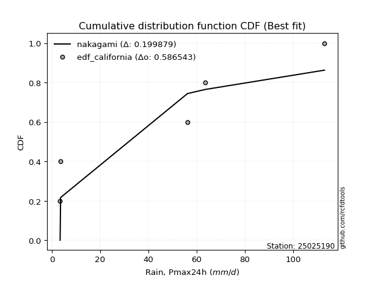</img>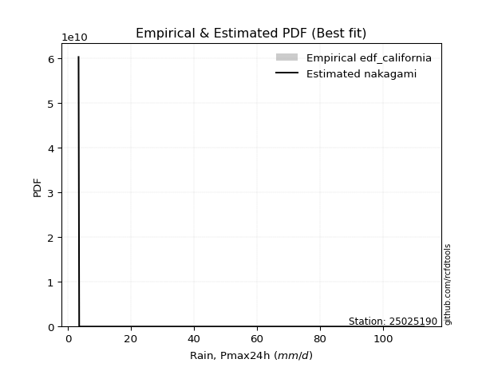</img>

</div>


### 2. Empirical - EDF Hazen (1930)

Hazen method for plotting positions is a formula used to estimate the empirical cumulative probability distribution of flood events or other hydrological data. This formula often results in biased estimations, particularly when extrapolating to extreme events (high return periods).

<div align="center">


$P=(m-0.5)/n$


</div>


**2.1. Empirical values**

<div align="center">

|                | 0                   | 1                  | 2                  | 3                  | 4         | 5                  |
|:---------------|:--------------------|:-------------------|:-------------------|:-------------------|:----------|:-------------------|
| date           | 2020                | 2017               | 2025               | 2019               | 2018      | 2024               |
| x              | 3.4                 | 3.6                | 14.6               | 56.2               | 63.6      | 113.0              |
| m              | 1                   | 2                  | 3                  | 4                  | 5         | 6                  |
| empirical_dist | edf_hazen           | edf_hazen          | edf_hazen          | edf_hazen          | edf_hazen | edf_hazen          |
| empirical      | 0.08333333333333333 | 0.25               | 0.4166666666666667 | 0.5833333333333334 | 0.75      | 0.9166666666666666 |
| empirical_tr   | 1.090909090909091   | 1.3333333333333333 | 1.7142857142857144 | 2.4000000000000004 | 4.0       | 11.999999999999995 |

</div>


**2.2. Kolmogorov-Smirnov fit test (sorted by Δ)**


<div align="center">

|                | 0                   | 1                   | 2                   | 3                   | 4                   | 5                   | 6                   | 7                   | 8                   | 9                   | 10                 | 11                  | 12                  | 13                  | 14                  | 15                  | 16                  | 17                  | 18                  | 19                 | 20                 | 21                  | 22                  | 23                  | 24                  | 25                  | 26                 | 27                  | 28                  | 29                  | 30                  | 31                  | 32                 | 33                  | 34                | 35                  | 36                  | 37                    | 38                  | 39                  | 40                  | 41                  | 42                  | 43                  | 44                | 45                  | 46                  | 47                  | 48                  | 49                  | 50                  | 51                  | 52                | 53                  | 54                 | 55                  | 56                 | 57                  | 58                  | 59                 | 60                 | 61                  | 62                  | 63                  | 64                 | 65                 | 66                 | 67                  | 68              | 69                 | 70               | 71                  | 72                 | 73                 | 74                  | 75                 | 76                  | 77                  | 78                 | 79                 | 80                  | 81                | 82                 | 83                 | 84                  | 85                 | 86                 | 87                 | 88                 | 89             |
|:---------------|:--------------------|:--------------------|:--------------------|:--------------------|:--------------------|:--------------------|:--------------------|:--------------------|:--------------------|:--------------------|:-------------------|:--------------------|:--------------------|:--------------------|:--------------------|:--------------------|:--------------------|:--------------------|:--------------------|:-------------------|:-------------------|:--------------------|:--------------------|:--------------------|:--------------------|:--------------------|:-------------------|:--------------------|:--------------------|:--------------------|:--------------------|:--------------------|:-------------------|:--------------------|:------------------|:--------------------|:--------------------|:----------------------|:--------------------|:--------------------|:--------------------|:--------------------|:--------------------|:--------------------|:------------------|:--------------------|:--------------------|:--------------------|:--------------------|:--------------------|:--------------------|:--------------------|:------------------|:--------------------|:-------------------|:--------------------|:-------------------|:--------------------|:--------------------|:-------------------|:-------------------|:--------------------|:--------------------|:--------------------|:-------------------|:-------------------|:-------------------|:--------------------|:----------------|:-------------------|:-----------------|:--------------------|:-------------------|:-------------------|:--------------------|:-------------------|:--------------------|:--------------------|:-------------------|:-------------------|:--------------------|:------------------|:-------------------|:-------------------|:--------------------|:-------------------|:-------------------|:-------------------|:-------------------|:---------------|
| station        | 25025190            | 25025190            | 25025190            | 25025190            | 25025190            | 25025190            | 25025190            | 25025190            | 25025190            | 25025190            | 25025190           | 25025190            | 25025190            | 25025190            | 25025190            | 25025190            | 25025190            | 25025190            | 25025190            | 25025190           | 25025190           | 25025190            | 25025190            | 25025190            | 25025190            | 25025190            | 25025190           | 25025190            | 25025190            | 25025190            | 25025190            | 25025190            | 25025190           | 25025190            | 25025190          | 25025190            | 25025190            | 25025190              | 25025190            | 25025190            | 25025190            | 25025190            | 25025190            | 25025190            | 25025190          | 25025190            | 25025190            | 25025190            | 25025190            | 25025190            | 25025190            | 25025190            | 25025190          | 25025190            | 25025190           | 25025190            | 25025190           | 25025190            | 25025190            | 25025190           | 25025190           | 25025190            | 25025190            | 25025190            | 25025190           | 25025190           | 25025190           | 25025190            | 25025190        | 25025190           | 25025190         | 25025190            | 25025190           | 25025190           | 25025190            | 25025190           | 25025190            | 25025190            | 25025190           | 25025190           | 25025190            | 25025190          | 25025190           | 25025190           | 25025190            | 25025190           | 25025190           | 25025190           | 25025190           | 25025190       |
| empirical_dist | edf_hazen           | edf_hazen           | edf_hazen           | edf_hazen           | edf_hazen           | edf_hazen           | edf_hazen           | edf_hazen           | edf_hazen           | edf_hazen           | edf_hazen          | edf_hazen           | edf_hazen           | edf_hazen           | edf_hazen           | edf_hazen           | edf_hazen           | edf_hazen           | edf_hazen           | edf_hazen          | edf_hazen          | edf_hazen           | edf_hazen           | edf_hazen           | edf_hazen           | edf_hazen           | edf_hazen          | edf_hazen           | edf_hazen           | edf_hazen           | edf_hazen           | edf_hazen           | edf_hazen          | edf_hazen           | edf_hazen         | edf_hazen           | edf_hazen           | edf_hazen             | edf_hazen           | edf_hazen           | edf_hazen           | edf_hazen           | edf_hazen           | edf_hazen           | edf_hazen         | edf_hazen           | edf_hazen           | edf_hazen           | edf_hazen           | edf_hazen           | edf_hazen           | edf_hazen           | edf_hazen         | edf_hazen           | edf_hazen          | edf_hazen           | edf_hazen          | edf_hazen           | edf_hazen           | edf_hazen          | edf_hazen          | edf_hazen           | edf_hazen           | edf_hazen           | edf_hazen          | edf_hazen          | edf_hazen          | edf_hazen           | edf_hazen       | edf_hazen          | edf_hazen        | edf_hazen           | edf_hazen          | edf_hazen          | edf_hazen           | edf_hazen          | edf_hazen           | edf_hazen           | edf_hazen          | edf_hazen          | edf_hazen           | edf_hazen         | edf_hazen          | edf_hazen          | edf_hazen           | edf_hazen          | edf_hazen          | edf_hazen          | edf_hazen          | edf_hazen      |
| p_dist         | logloggamma         | logjohnsonsu        | halfnorm            | halflogistic        | rayleigh            | maxwell             | logweibull_min      | pearson3            | genlogistic         | gumbel_r            | logfisk            | moyal               | kstwobign           | crystalball         | norm                | t                   | loggumbel_l         | logpearson3         | logf                | loggamma           | loggamma           | logexponnorm        | logt                | lognorm             | lognorm             | logcrystalball      | lognct             | logncf              | logerlang           | mielke              | logrice             | logmaxwell          | loginvgamma        | logalpha            | loginvgauss       | lograyleigh         | logbetaprime        | loglaplace_asymmetric | loginvweibull       | logistic            | ncf                 | weibull_min         | rice                | logkstwobign        | loglogistic       | nakagami            | hypsecant           | gumbel_l            | loghalfnorm         | fisk                | logexpon            | loggumbel_r         | logchi2           | loghypsecant        | nct                | loggenexpon         | logtruncnorm       | logmoyal            | loggompertz         | laplace            | loglaplace         | exponnorm           | gompertz            | laplace_asymmetric  | pareto             | expon              | genexpon           | truncnorm           | loghalflogistic | wald               | lognakagami      | logwald             | logmielke          | logpareto          | loggibrat           | erlang             | invgauss            | gamma               | alpha              | loglognorm         | fatiguelife         | f                 | gibrat             | betaprime          | logfatiguelife      | invweibull         | chi2               | johnsonsu          | invgamma           | loggenlogistic |
| delta          | 0.11589912045383974 | 0.11827491521728284 | 0.12430733480298001 | 0.14107113887605532 | 0.14644093630435495 | 0.15485387044092813 | 0.15746361355440597 | 0.16061931992922757 | 0.16114205158967781 | 0.16522033940358888 | 0.1656525085261209 | 0.16851191916301406 | 0.17237651241055857 | 0.17516417627553713 | 0.17516417997758582 | 0.17517926956937807 | 0.17748867647560707 | 0.17874122980187512 | 0.18182824557882288 | 0.1837059728816498 | 0.1837059728816498 | 0.18373364257085645 | 0.18373569908873744 | 0.18373592081392276 | 0.18373592081392276 | 0.18373592368777236 | 0.1837519309482204 | 0.18521222017950534 | 0.18523141762416084 | 0.18826167770357916 | 0.18968675687386694 | 0.19107120612182105 | 0.1911581060049813 | 0.19222782301386587 | 0.192637652676935 | 0.19315286165597145 | 0.19518189149661946 | 0.19623144396090786   | 0.19624490217057766 | 0.19780967441886235 | 0.19989216065818138 | 0.20045792197451767 | 0.20311111169821608 | 0.20393352588803404 | 0.206293145976848 | 0.20758615314888065 | 0.21245689287681493 | 0.21251596192481167 | 0.21397696140882527 | 0.21791266751749927 | 0.21860687866272518 | 0.21889585050981775 | 0.220298267493637 | 0.22061637392505928 | 0.2229961873897935 | 0.22454042062677945 | 0.2278642064170131 | 0.23032407213621298 | 0.23071724781230332 | 0.2312567977684441 | 0.2383925550902365 | 0.24388970921745257 | 0.24478418083472617 | 0.24487251869972604 | 0.2448849200802391 | 0.2448849216671609 | 0.2448849216984549 | 0.24520102318600434 | 0.25            | 0.2525253304406814 | 0.25344615870953 | 0.26725199881732997 | 0.2872014033888398 | 0.2943787287702833 | 0.29583815198627117 | 0.3027506504288192 | 0.31563051094519184 | 0.32225759989513303 | 0.3319670769825651 | 0.3374620241743288 | 0.34514950211831785 | 0.375410149022207 | 0.3949622128314958 | 0.4182980724306418 | 0.46416164397777865 | 0.4780161636153074 | 0.4983283541535058 | 0.5549855654907798 | 0.7138149823924431 | 0.75           |
| deltao         | 0.530385761606      | 0.530385761606      | 0.530385761606      | 0.530385761606      | 0.530385761606      | 0.530385761606      | 0.530385761606      | 0.530385761606      | 0.530385761606      | 0.530385761606      | 0.530385761606     | 0.530385761606      | 0.530385761606      | 0.530385761606      | 0.530385761606      | 0.530385761606      | 0.530385761606      | 0.530385761606      | 0.530385761606      | 0.530385761606     | 0.530385761606     | 0.530385761606      | 0.530385761606      | 0.530385761606      | 0.530385761606      | 0.530385761606      | 0.530385761606     | 0.530385761606      | 0.530385761606      | 0.530385761606      | 0.530385761606      | 0.530385761606      | 0.530385761606     | 0.530385761606      | 0.530385761606    | 0.530385761606      | 0.530385761606      | 0.530385761606        | 0.530385761606      | 0.530385761606      | 0.530385761606      | 0.530385761606      | 0.530385761606      | 0.530385761606      | 0.530385761606    | 0.530385761606      | 0.530385761606      | 0.530385761606      | 0.530385761606      | 0.530385761606      | 0.530385761606      | 0.530385761606      | 0.530385761606    | 0.530385761606      | 0.530385761606     | 0.530385761606      | 0.530385761606     | 0.530385761606      | 0.530385761606      | 0.530385761606     | 0.530385761606     | 0.530385761606      | 0.530385761606      | 0.530385761606      | 0.530385761606     | 0.530385761606     | 0.530385761606     | 0.530385761606      | 0.530385761606  | 0.530385761606     | 0.530385761606   | 0.530385761606      | 0.530385761606     | 0.530385761606     | 0.530385761606      | 0.530385761606     | 0.530385761606      | 0.530385761606      | 0.530385761606     | 0.530385761606     | 0.530385761606      | 0.530385761606    | 0.530385761606     | 0.530385761606     | 0.530385761606      | 0.530385761606     | 0.530385761606     | 0.530385761606     | 0.530385761606     | 0.530385761606 |
| eval           | Δo > Δ              | Δo > Δ              | Δo > Δ              | Δo > Δ              | Δo > Δ              | Δo > Δ              | Δo > Δ              | Δo > Δ              | Δo > Δ              | Δo > Δ              | Δo > Δ             | Δo > Δ              | Δo > Δ              | Δo > Δ              | Δo > Δ              | Δo > Δ              | Δo > Δ              | Δo > Δ              | Δo > Δ              | Δo > Δ             | Δo > Δ             | Δo > Δ              | Δo > Δ              | Δo > Δ              | Δo > Δ              | Δo > Δ              | Δo > Δ             | Δo > Δ              | Δo > Δ              | Δo > Δ              | Δo > Δ              | Δo > Δ              | Δo > Δ             | Δo > Δ              | Δo > Δ            | Δo > Δ              | Δo > Δ              | Δo > Δ                | Δo > Δ              | Δo > Δ              | Δo > Δ              | Δo > Δ              | Δo > Δ              | Δo > Δ              | Δo > Δ            | Δo > Δ              | Δo > Δ              | Δo > Δ              | Δo > Δ              | Δo > Δ              | Δo > Δ              | Δo > Δ              | Δo > Δ            | Δo > Δ              | Δo > Δ             | Δo > Δ              | Δo > Δ             | Δo > Δ              | Δo > Δ              | Δo > Δ             | Δo > Δ             | Δo > Δ              | Δo > Δ              | Δo > Δ              | Δo > Δ             | Δo > Δ             | Δo > Δ             | Δo > Δ              | Δo > Δ          | Δo > Δ             | Δo > Δ           | Δo > Δ              | Δo > Δ             | Δo > Δ             | Δo > Δ              | Δo > Δ             | Δo > Δ              | Δo > Δ              | Δo > Δ             | Δo > Δ             | Δo > Δ              | Δo > Δ            | Δo > Δ             | Δo > Δ             | Δo > Δ              | Δo > Δ             | Δo > Δ             | Δo <= Δ            | Δo <= Δ            | Δo <= Δ        |
| fit            | 1                   | 1                   | 1                   | 1                   | 1                   | 1                   | 1                   | 1                   | 1                   | 1                   | 1                  | 1                   | 1                   | 1                   | 1                   | 1                   | 1                   | 1                   | 1                   | 1                  | 1                  | 1                   | 1                   | 1                   | 1                   | 1                   | 1                  | 1                   | 1                   | 1                   | 1                   | 1                   | 1                  | 1                   | 1                 | 1                   | 1                   | 1                     | 1                   | 1                   | 1                   | 1                   | 1                   | 1                   | 1                 | 1                   | 1                   | 1                   | 1                   | 1                   | 1                   | 1                   | 1                 | 1                   | 1                  | 1                   | 1                  | 1                   | 1                   | 1                  | 1                  | 1                   | 1                   | 1                   | 1                  | 1                  | 1                  | 1                   | 1               | 1                  | 1                | 1                   | 1                  | 1                  | 1                   | 1                  | 1                   | 1                   | 1                  | 1                  | 1                   | 1                 | 1                  | 1                  | 1                   | 1                  | 1                  | 0                  | 0                  | 0              |
| n              | 6                   | 6                   | 6                   | 6                   | 6                   | 6                   | 6                   | 6                   | 6                   | 6                   | 6                  | 6                   | 6                   | 6                   | 6                   | 6                   | 6                   | 6                   | 6                   | 6                  | 6                  | 6                   | 6                   | 6                   | 6                   | 6                   | 6                  | 6                   | 6                   | 6                   | 6                   | 6                   | 6                  | 6                   | 6                 | 6                   | 6                   | 6                     | 6                   | 6                   | 6                   | 6                   | 6                   | 6                   | 6                 | 6                   | 6                   | 6                   | 6                   | 6                   | 6                   | 6                   | 6                 | 6                   | 6                  | 6                   | 6                  | 6                   | 6                   | 6                  | 6                  | 6                   | 6                   | 6                   | 6                  | 6                  | 6                  | 6                   | 6               | 6                  | 6                | 6                   | 6                  | 6                  | 6                   | 6                  | 6                   | 6                   | 6                  | 6                  | 6                   | 6                 | 6                  | 6                  | 6                   | 6                  | 6                  | 6                  | 6                  | 6              |
| best_fit       | 1                   | 0                   | 0                   | 0                   | 0                   | 0                   | 0                   | 0                   | 0                   | 0                   | 0                  | 0                   | 0                   | 0                   | 0                   | 0                   | 0                   | 0                   | 0                   | 0                  | 0                  | 0                   | 0                   | 0                   | 0                   | 0                   | 0                  | 0                   | 0                   | 0                   | 0                   | 0                   | 0                  | 0                   | 0                 | 0                   | 0                   | 0                     | 0                   | 0                   | 0                   | 0                   | 0                   | 0                   | 0                 | 0                   | 0                   | 0                   | 0                   | 0                   | 0                   | 0                   | 0                 | 0                   | 0                  | 0                   | 0                  | 0                   | 0                   | 0                  | 0                  | 0                   | 0                   | 0                   | 0                  | 0                  | 0                  | 0                   | 0               | 0                  | 0                | 0                   | 0                  | 0                  | 0                   | 0                  | 0                   | 0                   | 0                  | 0                  | 0                   | 0                 | 0                  | 0                  | 0                   | 0                  | 0                  | 0                  | 0                  | 0              |
| best_fit_sort  | 1                   | 2                   | 3                   | 4                   | 5                   | 6                   | 7                   | 8                   | 9                   | 10                  | 11                 | 12                  | 13                  | 14                  | 15                  | 16                  | 17                  | 18                  | 19                  | 20                 | 21                 | 22                  | 23                  | 24                  | 25                  | 26                  | 27                 | 28                  | 29                  | 30                  | 31                  | 32                  | 33                 | 34                  | 35                | 36                  | 37                  | 38                    | 39                  | 40                  | 41                  | 42                  | 43                  | 44                  | 45                | 46                  | 47                  | 48                  | 49                  | 50                  | 51                  | 52                  | 53                | 54                  | 55                 | 56                  | 57                 | 58                  | 59                  | 60                 | 61                 | 62                  | 63                  | 64                  | 65                 | 66                 | 67                 | 68                  | 69              | 70                 | 71               | 72                  | 73                 | 74                 | 75                  | 76                 | 77                  | 78                  | 79                 | 80                 | 81                  | 82                | 83                 | 84                 | 85                  | 86                 | 87                 | 88                 | 89                 | 90             |

</div>


<div align="center">

</img>

</div>


**2.3. Best fit**

<div align="center">

|   id |   station | empirical_dist   | p_dist      |    delta |   deltao | eval   |   fit |   n |   best_fit |   best_fit_sort |
|-----:|----------:|:-----------------|:------------|---------:|---------:|:-------|------:|----:|-----------:|----------------:|
|    0 |  25025190 | edf_hazen        | logloggamma | 0.115899 | 0.530386 | Δo > Δ |     1 |   6 |          1 |               1 |

</div>


<div align="center">

</img>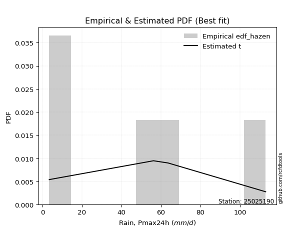</img>

</div>


### 3. Empirical - EDF Weibull (1939)

Weibull plotting position formula is an empirical method used to estimate the non-exceedance probability or plotting position for a set of observed data, is often recommended or widely used in practice, particularly in flood frequency analysis.

<div align="center">


$P=m/(n+1)$


</div>


**3.1. Empirical values**

<div align="center">

|                | 0                   | 1                  | 2                   | 3                  | 4                  | 5                  |
|:---------------|:--------------------|:-------------------|:--------------------|:-------------------|:-------------------|:-------------------|
| date           | 2020                | 2017               | 2025                | 2019               | 2018               | 2024               |
| x              | 3.4                 | 3.6                | 14.6                | 56.2               | 63.6               | 113.0              |
| m              | 1                   | 2                  | 3                   | 4                  | 5                  | 6                  |
| empirical_dist | edf_weibull         | edf_weibull        | edf_weibull         | edf_weibull        | edf_weibull        | edf_weibull        |
| empirical      | 0.14285714285714285 | 0.2857142857142857 | 0.42857142857142855 | 0.5714285714285714 | 0.7142857142857143 | 0.8571428571428571 |
| empirical_tr   | 1.1666666666666665  | 1.4                | 1.75                | 2.333333333333333  | 3.5                | 6.999999999999997  |

</div>


**3.2. Kolmogorov-Smirnov fit test (sorted by Δ)**


<div align="center">

|                | 0                   | 1                  | 2                   | 3                   | 4                   | 5                | 6                   | 7                  | 8                   | 9                   | 10                  | 11                  | 12                  | 13                  | 14                | 15                  | 16                  | 17                  | 18                 | 19                  | 20                  | 21                  | 22                 | 23                  | 24                  | 25                  | 26                  | 27                 | 28                  | 29                  | 30                  | 31                  | 32                  | 33                  | 34                  | 35                  | 36                  | 37                    | 38                  | 39                  | 40                  | 41                  | 42                  | 43                | 44                  | 45                  | 46                 | 47                  | 48                  | 49                  | 50                  | 51                  | 52                  | 53                  | 54                  | 55                  | 56                 | 57                  | 58                 | 59                 | 60                | 61                  | 62                  | 63                  | 64                  | 65                 | 66                  | 67                 | 68                  | 69                  | 70                 | 71                 | 72                 | 73                 | 74                 | 75                  | 76                 | 77                 | 78                | 79                 | 80                 | 81                 | 82                  | 83                  | 84                 | 85                 | 86                  | 87                 | 88                 | 89                 |
|:---------------|:--------------------|:-------------------|:--------------------|:--------------------|:--------------------|:-----------------|:--------------------|:-------------------|:--------------------|:--------------------|:--------------------|:--------------------|:--------------------|:--------------------|:------------------|:--------------------|:--------------------|:--------------------|:-------------------|:--------------------|:--------------------|:--------------------|:-------------------|:--------------------|:--------------------|:--------------------|:--------------------|:-------------------|:--------------------|:--------------------|:--------------------|:--------------------|:--------------------|:--------------------|:--------------------|:--------------------|:--------------------|:----------------------|:--------------------|:--------------------|:--------------------|:--------------------|:--------------------|:------------------|:--------------------|:--------------------|:-------------------|:--------------------|:--------------------|:--------------------|:--------------------|:--------------------|:--------------------|:--------------------|:--------------------|:--------------------|:-------------------|:--------------------|:-------------------|:-------------------|:------------------|:--------------------|:--------------------|:--------------------|:--------------------|:-------------------|:--------------------|:-------------------|:--------------------|:--------------------|:-------------------|:-------------------|:-------------------|:-------------------|:-------------------|:--------------------|:-------------------|:-------------------|:------------------|:-------------------|:-------------------|:-------------------|:--------------------|:--------------------|:-------------------|:-------------------|:--------------------|:-------------------|:-------------------|:-------------------|
| station        | 25025190            | 25025190           | 25025190            | 25025190            | 25025190            | 25025190         | 25025190            | 25025190           | 25025190            | 25025190            | 25025190            | 25025190            | 25025190            | 25025190            | 25025190          | 25025190            | 25025190            | 25025190            | 25025190           | 25025190            | 25025190            | 25025190            | 25025190           | 25025190            | 25025190            | 25025190            | 25025190            | 25025190           | 25025190            | 25025190            | 25025190            | 25025190            | 25025190            | 25025190            | 25025190            | 25025190            | 25025190            | 25025190              | 25025190            | 25025190            | 25025190            | 25025190            | 25025190            | 25025190          | 25025190            | 25025190            | 25025190           | 25025190            | 25025190            | 25025190            | 25025190            | 25025190            | 25025190            | 25025190            | 25025190            | 25025190            | 25025190           | 25025190            | 25025190           | 25025190           | 25025190          | 25025190            | 25025190            | 25025190            | 25025190            | 25025190           | 25025190            | 25025190           | 25025190            | 25025190            | 25025190           | 25025190           | 25025190           | 25025190           | 25025190           | 25025190            | 25025190           | 25025190           | 25025190          | 25025190           | 25025190           | 25025190           | 25025190            | 25025190            | 25025190           | 25025190           | 25025190            | 25025190           | 25025190           | 25025190           |
| empirical_dist | edf_weibull         | edf_weibull        | edf_weibull         | edf_weibull         | edf_weibull         | edf_weibull      | edf_weibull         | edf_weibull        | edf_weibull         | edf_weibull         | edf_weibull         | edf_weibull         | edf_weibull         | edf_weibull         | edf_weibull       | edf_weibull         | edf_weibull         | edf_weibull         | edf_weibull        | edf_weibull         | edf_weibull         | edf_weibull         | edf_weibull        | edf_weibull         | edf_weibull         | edf_weibull         | edf_weibull         | edf_weibull        | edf_weibull         | edf_weibull         | edf_weibull         | edf_weibull         | edf_weibull         | edf_weibull         | edf_weibull         | edf_weibull         | edf_weibull         | edf_weibull           | edf_weibull         | edf_weibull         | edf_weibull         | edf_weibull         | edf_weibull         | edf_weibull       | edf_weibull         | edf_weibull         | edf_weibull        | edf_weibull         | edf_weibull         | edf_weibull         | edf_weibull         | edf_weibull         | edf_weibull         | edf_weibull         | edf_weibull         | edf_weibull         | edf_weibull        | edf_weibull         | edf_weibull        | edf_weibull        | edf_weibull       | edf_weibull         | edf_weibull         | edf_weibull         | edf_weibull         | edf_weibull        | edf_weibull         | edf_weibull        | edf_weibull         | edf_weibull         | edf_weibull        | edf_weibull        | edf_weibull        | edf_weibull        | edf_weibull        | edf_weibull         | edf_weibull        | edf_weibull        | edf_weibull       | edf_weibull        | edf_weibull        | edf_weibull        | edf_weibull         | edf_weibull         | edf_weibull        | edf_weibull        | edf_weibull         | edf_weibull        | edf_weibull        | edf_weibull        |
| p_dist         | halfnorm            | logjohnsonsu       | logloggamma         | rayleigh            | halflogistic        | maxwell          | pearson3            | logweibull_min     | genlogistic         | gumbel_r            | logfisk             | moyal               | fisk                | kstwobign           | crystalball       | norm                | t                   | loggumbel_l         | logpearson3        | loggamma            | loggamma            | logexponnorm        | logt               | lognorm             | lognorm             | logcrystalball      | lognct              | logncf             | logerlang           | mielke              | logmaxwell          | loginvgamma         | logrice             | logalpha            | loginvgauss         | lograyleigh         | logbetaprime        | loglaplace_asymmetric | loginvweibull       | logistic            | nct                 | ncf                 | rice                | logkstwobign      | logf                | loglogistic         | hypsecant          | gumbel_l            | loggumbel_r         | logchi2             | loghypsecant        | weibull_min         | laplace             | nakagami            | loghalfnorm         | loglaplace          | logmoyal           | logexpon            | loggenexpon        | logtruncnorm       | lognakagami       | loggompertz         | exponnorm           | gompertz            | laplace_asymmetric  | pareto             | expon               | genexpon           | truncnorm           | logpareto           | wald               | logwald            | loghalflogistic    | logmielke          | loglognorm         | loggibrat           | erlang             | invgauss           | gamma             | alpha              | fatiguelife        | f                  | betaprime           | gibrat              | invweibull         | logfatiguelife     | chi2                | johnsonsu          | invgamma           | loggenlogistic     |
| delta          | 0.13621209670774187 | 0.1465653684726504 | 0.15161340616812544 | 0.15834569820911681 | 0.16571046043968218 | 0.16675863234569 | 0.17252408183398943 | 0.1728192700310284 | 0.17304681349443968 | 0.17712510130835074 | 0.17755727043088287 | 0.18041668106777592 | 0.18304792643615897 | 0.18428127431532043 | 0.187068938180299 | 0.18706894188234768 | 0.18708403147413993 | 0.18939343838036904 | 0.1906459917066371 | 0.19561073478641178 | 0.19561073478641178 | 0.19563840447561842 | 0.1956404609934994 | 0.19564068271868473 | 0.19564068271868473 | 0.19564068559253434 | 0.19565669285298237 | 0.1971169820842673 | 0.19713617952892282 | 0.20016643960834113 | 0.20297596802658302 | 0.20306286790974326 | 0.20359039553484803 | 0.20413258491862785 | 0.20454241458169697 | 0.20505762356073343 | 0.20708665340138144 | 0.20813620586566983   | 0.20814966407533964 | 0.20971443632362421 | 0.21109142548503163 | 0.21179692256294336 | 0.21501587360297794 | 0.215838287792796 | 0.21754253129310858 | 0.21819790788160998 | 0.2243616547815768 | 0.22442072382957354 | 0.23080061241457972 | 0.23220302939839899 | 0.23252113582982126 | 0.23617220768880337 | 0.24316155967320596 | 0.24330043886316635 | 0.24969124712311097 | 0.25029731699499846 | 0.2517697821411273 | 0.25432116437701086 | 0.2602547063410651 | 0.2635784921312988 | 0.265350920614292 | 0.26643153352658905 | 0.27960399493173826 | 0.28049846654901184 | 0.28058680441401174 | 0.2805992057945248 | 0.28059920738144656 | 0.2805992074127406 | 0.28091530890029004 | 0.28247396686552145 | 0.2857142857009988 | 0.2857142857142857 | 0.2857142857142857 | 0.2991061652936018 | 0.3017477384600431 | 0.30774291389103314 | 0.3146554123335812 | 0.3210709629842472 | 0.334162361799895 | 0.3438718388873271 | 0.3570542640230798 | 0.3635053871174451 | 0.40639331052587996 | 0.40686697473625766 | 0.4184923540914979 | 0.4522568820730168 | 0.48642359224874393 | 0.5192712797764941 | 0.6781006966781574 | 0.7142857142857143 |
| deltao         | 0.530385761606      | 0.530385761606     | 0.530385761606      | 0.530385761606      | 0.530385761606      | 0.530385761606   | 0.530385761606      | 0.530385761606     | 0.530385761606      | 0.530385761606      | 0.530385761606      | 0.530385761606      | 0.530385761606      | 0.530385761606      | 0.530385761606    | 0.530385761606      | 0.530385761606      | 0.530385761606      | 0.530385761606     | 0.530385761606      | 0.530385761606      | 0.530385761606      | 0.530385761606     | 0.530385761606      | 0.530385761606      | 0.530385761606      | 0.530385761606      | 0.530385761606     | 0.530385761606      | 0.530385761606      | 0.530385761606      | 0.530385761606      | 0.530385761606      | 0.530385761606      | 0.530385761606      | 0.530385761606      | 0.530385761606      | 0.530385761606        | 0.530385761606      | 0.530385761606      | 0.530385761606      | 0.530385761606      | 0.530385761606      | 0.530385761606    | 0.530385761606      | 0.530385761606      | 0.530385761606     | 0.530385761606      | 0.530385761606      | 0.530385761606      | 0.530385761606      | 0.530385761606      | 0.530385761606      | 0.530385761606      | 0.530385761606      | 0.530385761606      | 0.530385761606     | 0.530385761606      | 0.530385761606     | 0.530385761606     | 0.530385761606    | 0.530385761606      | 0.530385761606      | 0.530385761606      | 0.530385761606      | 0.530385761606     | 0.530385761606      | 0.530385761606     | 0.530385761606      | 0.530385761606      | 0.530385761606     | 0.530385761606     | 0.530385761606     | 0.530385761606     | 0.530385761606     | 0.530385761606      | 0.530385761606     | 0.530385761606     | 0.530385761606    | 0.530385761606     | 0.530385761606     | 0.530385761606     | 0.530385761606      | 0.530385761606      | 0.530385761606     | 0.530385761606     | 0.530385761606      | 0.530385761606     | 0.530385761606     | 0.530385761606     |
| eval           | Δo > Δ              | Δo > Δ             | Δo > Δ              | Δo > Δ              | Δo > Δ              | Δo > Δ           | Δo > Δ              | Δo > Δ             | Δo > Δ              | Δo > Δ              | Δo > Δ              | Δo > Δ              | Δo > Δ              | Δo > Δ              | Δo > Δ            | Δo > Δ              | Δo > Δ              | Δo > Δ              | Δo > Δ             | Δo > Δ              | Δo > Δ              | Δo > Δ              | Δo > Δ             | Δo > Δ              | Δo > Δ              | Δo > Δ              | Δo > Δ              | Δo > Δ             | Δo > Δ              | Δo > Δ              | Δo > Δ              | Δo > Δ              | Δo > Δ              | Δo > Δ              | Δo > Δ              | Δo > Δ              | Δo > Δ              | Δo > Δ                | Δo > Δ              | Δo > Δ              | Δo > Δ              | Δo > Δ              | Δo > Δ              | Δo > Δ            | Δo > Δ              | Δo > Δ              | Δo > Δ             | Δo > Δ              | Δo > Δ              | Δo > Δ              | Δo > Δ              | Δo > Δ              | Δo > Δ              | Δo > Δ              | Δo > Δ              | Δo > Δ              | Δo > Δ             | Δo > Δ              | Δo > Δ             | Δo > Δ             | Δo > Δ            | Δo > Δ              | Δo > Δ              | Δo > Δ              | Δo > Δ              | Δo > Δ             | Δo > Δ              | Δo > Δ             | Δo > Δ              | Δo > Δ              | Δo > Δ             | Δo > Δ             | Δo > Δ             | Δo > Δ             | Δo > Δ             | Δo > Δ              | Δo > Δ             | Δo > Δ             | Δo > Δ            | Δo > Δ             | Δo > Δ             | Δo > Δ             | Δo > Δ              | Δo > Δ              | Δo > Δ             | Δo > Δ             | Δo > Δ              | Δo > Δ             | Δo <= Δ            | Δo <= Δ            |
| fit            | 1                   | 1                  | 1                   | 1                   | 1                   | 1                | 1                   | 1                  | 1                   | 1                   | 1                   | 1                   | 1                   | 1                   | 1                 | 1                   | 1                   | 1                   | 1                  | 1                   | 1                   | 1                   | 1                  | 1                   | 1                   | 1                   | 1                   | 1                  | 1                   | 1                   | 1                   | 1                   | 1                   | 1                   | 1                   | 1                   | 1                   | 1                     | 1                   | 1                   | 1                   | 1                   | 1                   | 1                 | 1                   | 1                   | 1                  | 1                   | 1                   | 1                   | 1                   | 1                   | 1                   | 1                   | 1                   | 1                   | 1                  | 1                   | 1                  | 1                  | 1                 | 1                   | 1                   | 1                   | 1                   | 1                  | 1                   | 1                  | 1                   | 1                   | 1                  | 1                  | 1                  | 1                  | 1                  | 1                   | 1                  | 1                  | 1                 | 1                  | 1                  | 1                  | 1                   | 1                   | 1                  | 1                  | 1                   | 1                  | 0                  | 0                  |
| n              | 6                   | 6                  | 6                   | 6                   | 6                   | 6                | 6                   | 6                  | 6                   | 6                   | 6                   | 6                   | 6                   | 6                   | 6                 | 6                   | 6                   | 6                   | 6                  | 6                   | 6                   | 6                   | 6                  | 6                   | 6                   | 6                   | 6                   | 6                  | 6                   | 6                   | 6                   | 6                   | 6                   | 6                   | 6                   | 6                   | 6                   | 6                     | 6                   | 6                   | 6                   | 6                   | 6                   | 6                 | 6                   | 6                   | 6                  | 6                   | 6                   | 6                   | 6                   | 6                   | 6                   | 6                   | 6                   | 6                   | 6                  | 6                   | 6                  | 6                  | 6                 | 6                   | 6                   | 6                   | 6                   | 6                  | 6                   | 6                  | 6                   | 6                   | 6                  | 6                  | 6                  | 6                  | 6                  | 6                   | 6                  | 6                  | 6                 | 6                  | 6                  | 6                  | 6                   | 6                   | 6                  | 6                  | 6                   | 6                  | 6                  | 6                  |
| best_fit       | 1                   | 0                  | 0                   | 0                   | 0                   | 0                | 0                   | 0                  | 0                   | 0                   | 0                   | 0                   | 0                   | 0                   | 0                 | 0                   | 0                   | 0                   | 0                  | 0                   | 0                   | 0                   | 0                  | 0                   | 0                   | 0                   | 0                   | 0                  | 0                   | 0                   | 0                   | 0                   | 0                   | 0                   | 0                   | 0                   | 0                   | 0                     | 0                   | 0                   | 0                   | 0                   | 0                   | 0                 | 0                   | 0                   | 0                  | 0                   | 0                   | 0                   | 0                   | 0                   | 0                   | 0                   | 0                   | 0                   | 0                  | 0                   | 0                  | 0                  | 0                 | 0                   | 0                   | 0                   | 0                   | 0                  | 0                   | 0                  | 0                   | 0                   | 0                  | 0                  | 0                  | 0                  | 0                  | 0                   | 0                  | 0                  | 0                 | 0                  | 0                  | 0                  | 0                   | 0                   | 0                  | 0                  | 0                   | 0                  | 0                  | 0                  |
| best_fit_sort  | 1                   | 2                  | 3                   | 4                   | 5                   | 6                | 7                   | 8                  | 9                   | 10                  | 11                  | 12                  | 13                  | 14                  | 15                | 16                  | 17                  | 18                  | 19                 | 20                  | 21                  | 22                  | 23                 | 24                  | 25                  | 26                  | 27                  | 28                 | 29                  | 30                  | 31                  | 32                  | 33                  | 34                  | 35                  | 36                  | 37                  | 38                    | 39                  | 40                  | 41                  | 42                  | 43                  | 44                | 45                  | 46                  | 47                 | 48                  | 49                  | 50                  | 51                  | 52                  | 53                  | 54                  | 55                  | 56                  | 57                 | 58                  | 59                 | 60                 | 61                | 62                  | 63                  | 64                  | 65                  | 66                 | 67                  | 68                 | 69                  | 70                  | 71                 | 72                 | 73                 | 74                 | 75                 | 76                  | 77                 | 78                 | 79                | 80                 | 81                 | 82                 | 83                  | 84                  | 85                 | 86                 | 87                  | 88                 | 89                 | 90                 |

</div>


<div align="center">

</img>

</div>


**3.3. Best fit**

<div align="center">

|   id |   station | empirical_dist   | p_dist   |    delta |   deltao | eval   |   fit |   n |   best_fit |   best_fit_sort |
|-----:|----------:|:-----------------|:---------|---------:|---------:|:-------|------:|----:|-----------:|----------------:|
|    0 |  25025190 | edf_weibull      | halfnorm | 0.136212 | 0.530386 | Δo > Δ |     1 |   6 |          1 |               1 |

</div>


<div align="center">

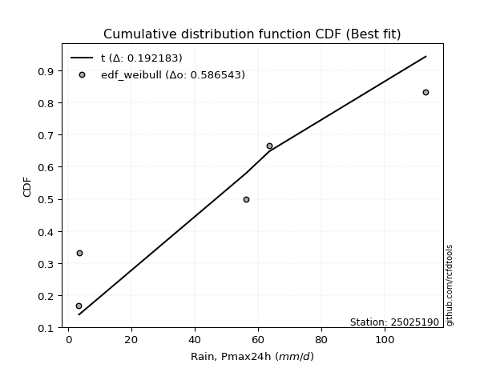</img>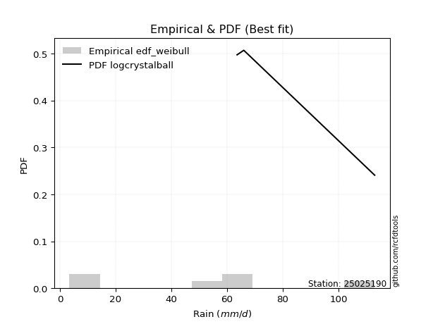</img>

</div>


### 4. Empirical - EDF Beard (1943)

The Beard formula (or Beard´s plotting position formula) in hydrology is used to estimate the empirical non-exceedance probability _(P)_ of a flood event (or other extreme hydrological data point) within a given dataset.

<div align="center">


$P=(m-0.31)/(n+0.38)$


</div>


**4.1. Empirical values**

<div align="center">

|                | 0                   | 1                   | 2                  | 3                  | 4                  | 5                  |
|:---------------|:--------------------|:--------------------|:-------------------|:-------------------|:-------------------|:-------------------|
| date           | 2020                | 2017                | 2025               | 2019               | 2018               | 2024               |
| x              | 3.4                 | 3.6                 | 14.6               | 56.2               | 63.6               | 113.0              |
| m              | 1                   | 2                   | 3                  | 4                  | 5                  | 6                  |
| empirical_dist | edf_beard           | edf_beard           | edf_beard          | edf_beard          | edf_beard          | edf_beard          |
| empirical      | 0.10815047021943573 | 0.26489028213166144 | 0.4216300940438871 | 0.5783699059561128 | 0.7351097178683387 | 0.8918495297805643 |
| empirical_tr   | 1.1212653778558874  | 1.3603411513859276  | 1.7289972899728996 | 2.3717472118959106 | 3.7751479289940844 | 9.246376811594207  |

</div>


**4.2. Kolmogorov-Smirnov fit test (sorted by Δ)**


<div align="center">

|                | 0                   | 1                   | 2                   | 3                   | 4                  | 5                   | 6                   | 7                 | 8                   | 9                   | 10                  | 11                 | 12                | 13                  | 14                  | 15                 | 16                  | 17                  | 18                  | 19                  | 20                | 21                | 22                 | 23                 | 24                  | 25                  | 26                 | 27                 | 28                  | 29                 | 30                 | 31                 | 32                  | 33                  | 34                  | 35                  | 36                | 37                  | 38                    | 39                  | 40                 | 41                  | 42                  | 43                 | 44                  | 45                 | 46                  | 47                  | 48                  | 49                 | 50                 | 51                  | 52                  | 53                 | 54                  | 55                  | 56                  | 57                 | 58                  | 59                  | 60                  | 61                 | 62                | 63                 | 64                 | 65                  | 66                 | 67                 | 68                 | 69                  | 70                  | 71                 | 72                 | 73                  | 74                 | 75                  | 76                 | 77                  | 78                 | 79                  | 80                 | 81                  | 82                  | 83                 | 84                 | 85                 | 86                  | 87                 | 88                 | 89                 |
|:---------------|:--------------------|:--------------------|:--------------------|:--------------------|:-------------------|:--------------------|:--------------------|:------------------|:--------------------|:--------------------|:--------------------|:-------------------|:------------------|:--------------------|:--------------------|:-------------------|:--------------------|:--------------------|:--------------------|:--------------------|:------------------|:------------------|:-------------------|:-------------------|:--------------------|:--------------------|:-------------------|:-------------------|:--------------------|:-------------------|:-------------------|:-------------------|:--------------------|:--------------------|:--------------------|:--------------------|:------------------|:--------------------|:----------------------|:--------------------|:-------------------|:--------------------|:--------------------|:-------------------|:--------------------|:-------------------|:--------------------|:--------------------|:--------------------|:-------------------|:-------------------|:--------------------|:--------------------|:-------------------|:--------------------|:--------------------|:--------------------|:-------------------|:--------------------|:--------------------|:--------------------|:-------------------|:------------------|:-------------------|:-------------------|:--------------------|:-------------------|:-------------------|:-------------------|:--------------------|:--------------------|:-------------------|:-------------------|:--------------------|:-------------------|:--------------------|:-------------------|:--------------------|:-------------------|:--------------------|:-------------------|:--------------------|:--------------------|:-------------------|:-------------------|:-------------------|:--------------------|:-------------------|:-------------------|:-------------------|
| station        | 25025190            | 25025190            | 25025190            | 25025190            | 25025190           | 25025190            | 25025190            | 25025190          | 25025190            | 25025190            | 25025190            | 25025190           | 25025190          | 25025190            | 25025190            | 25025190           | 25025190            | 25025190            | 25025190            | 25025190            | 25025190          | 25025190          | 25025190           | 25025190           | 25025190            | 25025190            | 25025190           | 25025190           | 25025190            | 25025190           | 25025190           | 25025190           | 25025190            | 25025190            | 25025190            | 25025190            | 25025190          | 25025190            | 25025190              | 25025190            | 25025190           | 25025190            | 25025190            | 25025190           | 25025190            | 25025190           | 25025190            | 25025190            | 25025190            | 25025190           | 25025190           | 25025190            | 25025190            | 25025190           | 25025190            | 25025190            | 25025190            | 25025190           | 25025190            | 25025190            | 25025190            | 25025190           | 25025190          | 25025190           | 25025190           | 25025190            | 25025190           | 25025190           | 25025190           | 25025190            | 25025190            | 25025190           | 25025190           | 25025190            | 25025190           | 25025190            | 25025190           | 25025190            | 25025190           | 25025190            | 25025190           | 25025190            | 25025190            | 25025190           | 25025190           | 25025190           | 25025190            | 25025190           | 25025190           | 25025190           |
| empirical_dist | edf_beard           | edf_beard           | edf_beard           | edf_beard           | edf_beard          | edf_beard           | edf_beard           | edf_beard         | edf_beard           | edf_beard           | edf_beard           | edf_beard          | edf_beard         | edf_beard           | edf_beard           | edf_beard          | edf_beard           | edf_beard           | edf_beard           | edf_beard           | edf_beard         | edf_beard         | edf_beard          | edf_beard          | edf_beard           | edf_beard           | edf_beard          | edf_beard          | edf_beard           | edf_beard          | edf_beard          | edf_beard          | edf_beard           | edf_beard           | edf_beard           | edf_beard           | edf_beard         | edf_beard           | edf_beard             | edf_beard           | edf_beard          | edf_beard           | edf_beard           | edf_beard          | edf_beard           | edf_beard          | edf_beard           | edf_beard           | edf_beard           | edf_beard          | edf_beard          | edf_beard           | edf_beard           | edf_beard          | edf_beard           | edf_beard           | edf_beard           | edf_beard          | edf_beard           | edf_beard           | edf_beard           | edf_beard          | edf_beard         | edf_beard          | edf_beard          | edf_beard           | edf_beard          | edf_beard          | edf_beard          | edf_beard           | edf_beard           | edf_beard          | edf_beard          | edf_beard           | edf_beard          | edf_beard           | edf_beard          | edf_beard           | edf_beard          | edf_beard           | edf_beard          | edf_beard           | edf_beard           | edf_beard          | edf_beard          | edf_beard          | edf_beard           | edf_beard          | edf_beard          | edf_beard          |
| p_dist         | logjohnsonsu        | halfnorm            | logloggamma         | halflogistic        | rayleigh           | maxwell             | logweibull_min      | pearson3          | genlogistic         | gumbel_r            | logfisk             | moyal              | kstwobign         | crystalball         | norm                | t                  | loggumbel_l         | logpearson3         | loggamma            | loggamma            | logexponnorm      | logt              | lognorm            | lognorm            | logcrystalball      | lognct              | logncf             | logerlang          | fisk                | mielke             | logrice            | logmaxwell         | loginvgamma         | logf                | logalpha            | loginvgauss         | lograyleigh       | logbetaprime        | loglaplace_asymmetric | loginvweibull       | logistic           | ncf                 | rice                | logkstwobign       | loglogistic         | weibull_min        | hypsecant           | gumbel_l            | nct                 | nakagami           | loggumbel_r        | logchi2             | loghypsecant        | loghalfnorm        | logexpon            | logmoyal            | laplace             | loggenexpon        | logtruncnorm        | loglaplace          | loggompertz         | lognakagami        | exponnorm         | gompertz           | laplace_asymmetric | pareto              | expon              | genexpon           | truncnorm          | wald                | loghalflogistic     | logwald            | logpareto          | logmielke           | loggibrat          | erlang              | invgauss           | loglognorm          | gamma              | alpha               | fatiguelife        | f                   | gibrat              | betaprime          | invweibull         | logfatiguelife     | chi2                | johnsonsu          | invgamma           | loggenlogistic     |
| delta          | 0.12574136489002613 | 0.12927076218020045 | 0.13078940258550117 | 0.14603456625327577 | 0.1514043636815754 | 0.15981729781814857 | 0.16242704093162652 | 0.165582747306448 | 0.16610547896689826 | 0.17018376678080932 | 0.17061593590334145 | 0.1734753465402345 | 0.177339939787779 | 0.18012760365275757 | 0.18012760735480626 | 0.1801426969465985 | 0.18245210385282762 | 0.18370465717909568 | 0.18866940025887036 | 0.18866940025887036 | 0.188697069948077 | 0.188699126465958 | 0.1886993481911433 | 0.1886993481911433 | 0.18869935106499292 | 0.18871535832544095 | 0.1901756475567259 | 0.1901948450013814 | 0.19309553063139695 | 0.1932251050807997 | 0.1946501842510875 | 0.1960346334990416 | 0.19612153338220184 | 0.19671852771048431 | 0.19719125039108643 | 0.19760108005415555 | 0.198116289033192 | 0.20014531887384002 | 0.2011948713381284    | 0.20120832954779821 | 0.2027731017960828 | 0.20485558803540194 | 0.20807453907543652 | 0.2088969532652546 | 0.21125657335406856 | 0.2153482041061791 | 0.21742032025403538 | 0.21747938930203212 | 0.21803276001257305 | 0.2224764352805421 | 0.2238592778870383 | 0.22526169487085757 | 0.22557980130227984 | 0.2288672435404867 | 0.23349716079438662 | 0.23528749951343353 | 0.23622022514566454 | 0.2394307027584409 | 0.24275448854867454 | 0.24335598246745704 | 0.24560752994396476 | 0.2584095860867506 | 0.258779991349114 | 0.2596744629663876 | 0.2597628008313875 | 0.25977520221190054 | 0.2597752037988223 | 0.2597752038301163 | 0.2600913053176658 | 0.26489028211837456 | 0.26489028213166144 | 0.2722154261945505 | 0.2894153013930629 | 0.29216483076606037 | 0.3008015793634917 | 0.30771407780603977 | 0.3141296284567058 | 0.32257174204266736 | 0.3272210272723536 | 0.33693050435978567 | 0.3501129294955384 | 0.37044672164498654 | 0.39992564020871624 | 0.4133346450534214 | 0.4531990267292051 | 0.4591982166005582 | 0.49336492677628535 | 0.5400952833591184 | 0.6989247002607817 | 0.7351097178683387 |
| deltao         | 0.530385761606      | 0.530385761606      | 0.530385761606      | 0.530385761606      | 0.530385761606     | 0.530385761606      | 0.530385761606      | 0.530385761606    | 0.530385761606      | 0.530385761606      | 0.530385761606      | 0.530385761606     | 0.530385761606    | 0.530385761606      | 0.530385761606      | 0.530385761606     | 0.530385761606      | 0.530385761606      | 0.530385761606      | 0.530385761606      | 0.530385761606    | 0.530385761606    | 0.530385761606     | 0.530385761606     | 0.530385761606      | 0.530385761606      | 0.530385761606     | 0.530385761606     | 0.530385761606      | 0.530385761606     | 0.530385761606     | 0.530385761606     | 0.530385761606      | 0.530385761606      | 0.530385761606      | 0.530385761606      | 0.530385761606    | 0.530385761606      | 0.530385761606        | 0.530385761606      | 0.530385761606     | 0.530385761606      | 0.530385761606      | 0.530385761606     | 0.530385761606      | 0.530385761606     | 0.530385761606      | 0.530385761606      | 0.530385761606      | 0.530385761606     | 0.530385761606     | 0.530385761606      | 0.530385761606      | 0.530385761606     | 0.530385761606      | 0.530385761606      | 0.530385761606      | 0.530385761606     | 0.530385761606      | 0.530385761606      | 0.530385761606      | 0.530385761606     | 0.530385761606    | 0.530385761606     | 0.530385761606     | 0.530385761606      | 0.530385761606     | 0.530385761606     | 0.530385761606     | 0.530385761606      | 0.530385761606      | 0.530385761606     | 0.530385761606     | 0.530385761606      | 0.530385761606     | 0.530385761606      | 0.530385761606     | 0.530385761606      | 0.530385761606     | 0.530385761606      | 0.530385761606     | 0.530385761606      | 0.530385761606      | 0.530385761606     | 0.530385761606     | 0.530385761606     | 0.530385761606      | 0.530385761606     | 0.530385761606     | 0.530385761606     |
| eval           | Δo > Δ              | Δo > Δ              | Δo > Δ              | Δo > Δ              | Δo > Δ             | Δo > Δ              | Δo > Δ              | Δo > Δ            | Δo > Δ              | Δo > Δ              | Δo > Δ              | Δo > Δ             | Δo > Δ            | Δo > Δ              | Δo > Δ              | Δo > Δ             | Δo > Δ              | Δo > Δ              | Δo > Δ              | Δo > Δ              | Δo > Δ            | Δo > Δ            | Δo > Δ             | Δo > Δ             | Δo > Δ              | Δo > Δ              | Δo > Δ             | Δo > Δ             | Δo > Δ              | Δo > Δ             | Δo > Δ             | Δo > Δ             | Δo > Δ              | Δo > Δ              | Δo > Δ              | Δo > Δ              | Δo > Δ            | Δo > Δ              | Δo > Δ                | Δo > Δ              | Δo > Δ             | Δo > Δ              | Δo > Δ              | Δo > Δ             | Δo > Δ              | Δo > Δ             | Δo > Δ              | Δo > Δ              | Δo > Δ              | Δo > Δ             | Δo > Δ             | Δo > Δ              | Δo > Δ              | Δo > Δ             | Δo > Δ              | Δo > Δ              | Δo > Δ              | Δo > Δ             | Δo > Δ              | Δo > Δ              | Δo > Δ              | Δo > Δ             | Δo > Δ            | Δo > Δ             | Δo > Δ             | Δo > Δ              | Δo > Δ             | Δo > Δ             | Δo > Δ             | Δo > Δ              | Δo > Δ              | Δo > Δ             | Δo > Δ             | Δo > Δ              | Δo > Δ             | Δo > Δ              | Δo > Δ             | Δo > Δ              | Δo > Δ             | Δo > Δ              | Δo > Δ             | Δo > Δ              | Δo > Δ              | Δo > Δ             | Δo > Δ             | Δo > Δ             | Δo > Δ              | Δo <= Δ            | Δo <= Δ            | Δo <= Δ            |
| fit            | 1                   | 1                   | 1                   | 1                   | 1                  | 1                   | 1                   | 1                 | 1                   | 1                   | 1                   | 1                  | 1                 | 1                   | 1                   | 1                  | 1                   | 1                   | 1                   | 1                   | 1                 | 1                 | 1                  | 1                  | 1                   | 1                   | 1                  | 1                  | 1                   | 1                  | 1                  | 1                  | 1                   | 1                   | 1                   | 1                   | 1                 | 1                   | 1                     | 1                   | 1                  | 1                   | 1                   | 1                  | 1                   | 1                  | 1                   | 1                   | 1                   | 1                  | 1                  | 1                   | 1                   | 1                  | 1                   | 1                   | 1                   | 1                  | 1                   | 1                   | 1                   | 1                  | 1                 | 1                  | 1                  | 1                   | 1                  | 1                  | 1                  | 1                   | 1                   | 1                  | 1                  | 1                   | 1                  | 1                   | 1                  | 1                   | 1                  | 1                   | 1                  | 1                   | 1                   | 1                  | 1                  | 1                  | 1                   | 0                  | 0                  | 0                  |
| n              | 6                   | 6                   | 6                   | 6                   | 6                  | 6                   | 6                   | 6                 | 6                   | 6                   | 6                   | 6                  | 6                 | 6                   | 6                   | 6                  | 6                   | 6                   | 6                   | 6                   | 6                 | 6                 | 6                  | 6                  | 6                   | 6                   | 6                  | 6                  | 6                   | 6                  | 6                  | 6                  | 6                   | 6                   | 6                   | 6                   | 6                 | 6                   | 6                     | 6                   | 6                  | 6                   | 6                   | 6                  | 6                   | 6                  | 6                   | 6                   | 6                   | 6                  | 6                  | 6                   | 6                   | 6                  | 6                   | 6                   | 6                   | 6                  | 6                   | 6                   | 6                   | 6                  | 6                 | 6                  | 6                  | 6                   | 6                  | 6                  | 6                  | 6                   | 6                   | 6                  | 6                  | 6                   | 6                  | 6                   | 6                  | 6                   | 6                  | 6                   | 6                  | 6                   | 6                   | 6                  | 6                  | 6                  | 6                   | 6                  | 6                  | 6                  |
| best_fit       | 1                   | 0                   | 0                   | 0                   | 0                  | 0                   | 0                   | 0                 | 0                   | 0                   | 0                   | 0                  | 0                 | 0                   | 0                   | 0                  | 0                   | 0                   | 0                   | 0                   | 0                 | 0                 | 0                  | 0                  | 0                   | 0                   | 0                  | 0                  | 0                   | 0                  | 0                  | 0                  | 0                   | 0                   | 0                   | 0                   | 0                 | 0                   | 0                     | 0                   | 0                  | 0                   | 0                   | 0                  | 0                   | 0                  | 0                   | 0                   | 0                   | 0                  | 0                  | 0                   | 0                   | 0                  | 0                   | 0                   | 0                   | 0                  | 0                   | 0                   | 0                   | 0                  | 0                 | 0                  | 0                  | 0                   | 0                  | 0                  | 0                  | 0                   | 0                   | 0                  | 0                  | 0                   | 0                  | 0                   | 0                  | 0                   | 0                  | 0                   | 0                  | 0                   | 0                   | 0                  | 0                  | 0                  | 0                   | 0                  | 0                  | 0                  |
| best_fit_sort  | 1                   | 2                   | 3                   | 4                   | 5                  | 6                   | 7                   | 8                 | 9                   | 10                  | 11                  | 12                 | 13                | 14                  | 15                  | 16                 | 17                  | 18                  | 19                  | 20                  | 21                | 22                | 23                 | 24                 | 25                  | 26                  | 27                 | 28                 | 29                  | 30                 | 31                 | 32                 | 33                  | 34                  | 35                  | 36                  | 37                | 38                  | 39                    | 40                  | 41                 | 42                  | 43                  | 44                 | 45                  | 46                 | 47                  | 48                  | 49                  | 50                 | 51                 | 52                  | 53                  | 54                 | 55                  | 56                  | 57                  | 58                 | 59                  | 60                  | 61                  | 62                 | 63                | 64                 | 65                 | 66                  | 67                 | 68                 | 69                 | 70                  | 71                  | 72                 | 73                 | 74                  | 75                 | 76                  | 77                 | 78                  | 79                 | 80                  | 81                 | 82                  | 83                  | 84                 | 85                 | 86                 | 87                  | 88                 | 89                 | 90                 |

</div>


<div align="center">

</img>

</div>


**4.3. Best fit**

<div align="center">

|   id |   station | empirical_dist   | p_dist       |    delta |   deltao | eval   |   fit |   n |   best_fit |   best_fit_sort |
|-----:|----------:|:-----------------|:-------------|---------:|---------:|:-------|------:|----:|-----------:|----------------:|
|    0 |  25025190 | edf_beard        | logjohnsonsu | 0.125741 | 0.530386 | Δo > Δ |     1 |   6 |          1 |               1 |

</div>


<div align="center">

</img></img>

</div>


### 5. Empirical - EDF Chegodayev (1955)

The Chegodayev formula is an empirical plotting position formula used in hydrological frequency analysis to estimate the exceedance probability or return period of a specific event from a set of observed data. It is primarily used for plotting observed data points on probability paper to fit a theoretical distribution, particularly for analyzing extreme events like maximum flood flows or rainfall intensities. The constant _b_ value in the generalized plotting position formula is 0.3.

<div align="center">


$P=(m-b)/(n+1-2b)$


</div>


**5.1. Empirical values**

<div align="center">

|                | 0                   | 1                  | 2                  | 3                  | 4                 | 5                 |
|:---------------|:--------------------|:-------------------|:-------------------|:-------------------|:------------------|:------------------|
| date           | 2020                | 2017               | 2025               | 2019               | 2018              | 2024              |
| x              | 3.4                 | 3.6                | 14.6               | 56.2               | 63.6              | 113.0             |
| m              | 1                   | 2                  | 3                  | 4                  | 5                 | 6                 |
| empirical_dist | edf_chegodayev      | edf_chegodayev     | edf_chegodayev     | edf_chegodayev     | edf_chegodayev    | edf_chegodayev    |
| empirical      | 0.10937499999999999 | 0.265625           | 0.421875           | 0.578125           | 0.734375          | 0.890625          |
| empirical_tr   | 1.1228070175438596  | 1.3617021276595744 | 1.7297297297297298 | 2.3703703703703702 | 3.764705882352941 | 9.142857142857142 |

</div>


**5.2. Kolmogorov-Smirnov fit test (sorted by Δ)**


<div align="center">

|                | 0                  | 1                   | 2                   | 3                   | 4                   | 5                   | 6                   | 7                   | 8                   | 9                  | 10                  | 11                  | 12                  | 13                  | 14                  | 15                  | 16                  | 17                 | 18                  | 19                  | 20                  | 21                 | 22                  | 23                  | 24                  | 25                  | 26                 | 27                 | 28                  | 29                  | 30                 | 31                  | 32                  | 33                  | 34                  | 35                  | 36                  | 37                  | 38                    | 39                  | 40                  | 41                  | 42                 | 43                 | 44                  | 45                  | 46                  | 47                | 48                  | 49                  | 50                  | 51                  | 52                  | 53                  | 54                  | 55                  | 56                  | 57                  | 58                 | 59                  | 60                  | 61                 | 62                  | 63                  | 64                  | 65                 | 66                  | 67                 | 68                  | 69                  | 70              | 71                  | 72               | 73                 | 74                  | 75                 | 76                 | 77                 | 78                 | 79                 | 80                 | 81                  | 82                 | 83                 | 84                 | 85                  | 86                 | 87                 | 88                 | 89             |
|:---------------|:-------------------|:--------------------|:--------------------|:--------------------|:--------------------|:--------------------|:--------------------|:--------------------|:--------------------|:-------------------|:--------------------|:--------------------|:--------------------|:--------------------|:--------------------|:--------------------|:--------------------|:-------------------|:--------------------|:--------------------|:--------------------|:-------------------|:--------------------|:--------------------|:--------------------|:--------------------|:-------------------|:-------------------|:--------------------|:--------------------|:-------------------|:--------------------|:--------------------|:--------------------|:--------------------|:--------------------|:--------------------|:--------------------|:----------------------|:--------------------|:--------------------|:--------------------|:-------------------|:-------------------|:--------------------|:--------------------|:--------------------|:------------------|:--------------------|:--------------------|:--------------------|:--------------------|:--------------------|:--------------------|:--------------------|:--------------------|:--------------------|:--------------------|:-------------------|:--------------------|:--------------------|:-------------------|:--------------------|:--------------------|:--------------------|:-------------------|:--------------------|:-------------------|:--------------------|:--------------------|:----------------|:--------------------|:-----------------|:-------------------|:--------------------|:-------------------|:-------------------|:-------------------|:-------------------|:-------------------|:-------------------|:--------------------|:-------------------|:-------------------|:-------------------|:--------------------|:-------------------|:-------------------|:-------------------|:---------------|
| station        | 25025190           | 25025190            | 25025190            | 25025190            | 25025190            | 25025190            | 25025190            | 25025190            | 25025190            | 25025190           | 25025190            | 25025190            | 25025190            | 25025190            | 25025190            | 25025190            | 25025190            | 25025190           | 25025190            | 25025190            | 25025190            | 25025190           | 25025190            | 25025190            | 25025190            | 25025190            | 25025190           | 25025190           | 25025190            | 25025190            | 25025190           | 25025190            | 25025190            | 25025190            | 25025190            | 25025190            | 25025190            | 25025190            | 25025190              | 25025190            | 25025190            | 25025190            | 25025190           | 25025190           | 25025190            | 25025190            | 25025190            | 25025190          | 25025190            | 25025190            | 25025190            | 25025190            | 25025190            | 25025190            | 25025190            | 25025190            | 25025190            | 25025190            | 25025190           | 25025190            | 25025190            | 25025190           | 25025190            | 25025190            | 25025190            | 25025190           | 25025190            | 25025190           | 25025190            | 25025190            | 25025190        | 25025190            | 25025190         | 25025190           | 25025190            | 25025190           | 25025190           | 25025190           | 25025190           | 25025190           | 25025190           | 25025190            | 25025190           | 25025190           | 25025190           | 25025190            | 25025190           | 25025190           | 25025190           | 25025190       |
| empirical_dist | edf_chegodayev     | edf_chegodayev      | edf_chegodayev      | edf_chegodayev      | edf_chegodayev      | edf_chegodayev      | edf_chegodayev      | edf_chegodayev      | edf_chegodayev      | edf_chegodayev     | edf_chegodayev      | edf_chegodayev      | edf_chegodayev      | edf_chegodayev      | edf_chegodayev      | edf_chegodayev      | edf_chegodayev      | edf_chegodayev     | edf_chegodayev      | edf_chegodayev      | edf_chegodayev      | edf_chegodayev     | edf_chegodayev      | edf_chegodayev      | edf_chegodayev      | edf_chegodayev      | edf_chegodayev     | edf_chegodayev     | edf_chegodayev      | edf_chegodayev      | edf_chegodayev     | edf_chegodayev      | edf_chegodayev      | edf_chegodayev      | edf_chegodayev      | edf_chegodayev      | edf_chegodayev      | edf_chegodayev      | edf_chegodayev        | edf_chegodayev      | edf_chegodayev      | edf_chegodayev      | edf_chegodayev     | edf_chegodayev     | edf_chegodayev      | edf_chegodayev      | edf_chegodayev      | edf_chegodayev    | edf_chegodayev      | edf_chegodayev      | edf_chegodayev      | edf_chegodayev      | edf_chegodayev      | edf_chegodayev      | edf_chegodayev      | edf_chegodayev      | edf_chegodayev      | edf_chegodayev      | edf_chegodayev     | edf_chegodayev      | edf_chegodayev      | edf_chegodayev     | edf_chegodayev      | edf_chegodayev      | edf_chegodayev      | edf_chegodayev     | edf_chegodayev      | edf_chegodayev     | edf_chegodayev      | edf_chegodayev      | edf_chegodayev  | edf_chegodayev      | edf_chegodayev   | edf_chegodayev     | edf_chegodayev      | edf_chegodayev     | edf_chegodayev     | edf_chegodayev     | edf_chegodayev     | edf_chegodayev     | edf_chegodayev     | edf_chegodayev      | edf_chegodayev     | edf_chegodayev     | edf_chegodayev     | edf_chegodayev      | edf_chegodayev     | edf_chegodayev     | edf_chegodayev     | edf_chegodayev |
| p_dist         | logjohnsonsu       | halfnorm            | logloggamma         | halflogistic        | rayleigh            | maxwell             | logweibull_min      | pearson3            | genlogistic         | gumbel_r           | logfisk             | moyal               | kstwobign           | crystalball         | norm                | t                   | loggumbel_l         | logpearson3        | loggamma            | loggamma            | logexponnorm        | logt               | lognorm             | lognorm             | logcrystalball      | lognct              | logncf             | logerlang          | fisk                | mielke              | logrice            | logmaxwell          | loginvgamma         | logalpha            | logf                | loginvgauss         | lograyleigh         | logbetaprime        | loglaplace_asymmetric | loginvweibull       | logistic            | ncf                 | rice               | logkstwobign       | loglogistic         | weibull_min         | hypsecant           | gumbel_l          | nct                 | nakagami            | loggumbel_r         | logchi2             | loghypsecant        | loghalfnorm         | logexpon            | logmoyal            | laplace             | loggenexpon         | logtruncnorm       | loglaplace          | loggompertz         | lognakagami        | exponnorm           | gompertz            | laplace_asymmetric  | pareto             | expon               | genexpon           | truncnorm           | wald                | loghalflogistic | logwald             | logpareto        | logmielke          | loggibrat           | erlang             | invgauss           | loglognorm         | gamma              | alpha              | fatiguelife        | f                   | gibrat             | betaprime          | invweibull         | logfatiguelife      | chi2               | johnsonsu          | invgamma           | loggenlogistic |
| delta          | 0.1264760827583647 | 0.12951566813631332 | 0.13152412045383974 | 0.14627947220938864 | 0.15164926963768827 | 0.16006220377426145 | 0.16267194688773934 | 0.16582765326256088 | 0.16635038492301113 | 0.1704286727369222 | 0.17086084185945427 | 0.17372025249634737 | 0.17758484574389188 | 0.18037250960887044 | 0.18037251331091914 | 0.18038760290271139 | 0.18269700980894044 | 0.1839495631352085 | 0.18891430621498317 | 0.18891430621498317 | 0.18894197590418982 | 0.1889440324220708 | 0.18894425414725613 | 0.18894425414725613 | 0.18894425702110573 | 0.18896026428155377 | 0.1904205535128387 | 0.1904397509574942 | 0.19187100085083264 | 0.19347001103691253 | 0.1948950902072003 | 0.19627953945515442 | 0.19636643933831466 | 0.19743615634719924 | 0.19745324557882288 | 0.19784598601026837 | 0.19836119498930482 | 0.20039022482995283 | 0.20143977729424123   | 0.20145323550391103 | 0.20301800775219567 | 0.20510049399151475 | 0.2083194450315494 | 0.2091418592213674 | 0.21150147931018137 | 0.21608292197451767 | 0.21766522621014825 | 0.217724295258145 | 0.21778785405646017 | 0.22321115314888065 | 0.22410418384315112 | 0.22550660082697038 | 0.22582470725839265 | 0.22960196140882527 | 0.23423187866272518 | 0.23553240546954635 | 0.23646513110177741 | 0.24016542062677945 | 0.2434892064170131 | 0.24360088842356986 | 0.24634224781230332 | 0.2586544920428634 | 0.25951470921745257 | 0.26040918083472614 | 0.26049751869972604 | 0.2605099200802391 | 0.26050992166716086 | 0.2605099216984549 | 0.26082602318600434 | 0.26562499998671313 | 0.265625        | 0.27246033215066334 | 0.28917039543695 | 0.2924097367221732 | 0.30104648531960454 | 0.3079589837621526 | 0.3143745344128186 | 0.3218370241743288 | 0.3274659332284664 | 0.3371754103158985 | 0.3503578354516512 | 0.37020181568887367 | 0.4001705461648291 | 0.4130897390973085 | 0.4519744969486408 | 0.45895331064444533 | 0.4931200208201725 | 0.5393605654907798 | 0.6981899823924431 | 0.734375       |
| deltao         | 0.530385761606     | 0.530385761606      | 0.530385761606      | 0.530385761606      | 0.530385761606      | 0.530385761606      | 0.530385761606      | 0.530385761606      | 0.530385761606      | 0.530385761606     | 0.530385761606      | 0.530385761606      | 0.530385761606      | 0.530385761606      | 0.530385761606      | 0.530385761606      | 0.530385761606      | 0.530385761606     | 0.530385761606      | 0.530385761606      | 0.530385761606      | 0.530385761606     | 0.530385761606      | 0.530385761606      | 0.530385761606      | 0.530385761606      | 0.530385761606     | 0.530385761606     | 0.530385761606      | 0.530385761606      | 0.530385761606     | 0.530385761606      | 0.530385761606      | 0.530385761606      | 0.530385761606      | 0.530385761606      | 0.530385761606      | 0.530385761606      | 0.530385761606        | 0.530385761606      | 0.530385761606      | 0.530385761606      | 0.530385761606     | 0.530385761606     | 0.530385761606      | 0.530385761606      | 0.530385761606      | 0.530385761606    | 0.530385761606      | 0.530385761606      | 0.530385761606      | 0.530385761606      | 0.530385761606      | 0.530385761606      | 0.530385761606      | 0.530385761606      | 0.530385761606      | 0.530385761606      | 0.530385761606     | 0.530385761606      | 0.530385761606      | 0.530385761606     | 0.530385761606      | 0.530385761606      | 0.530385761606      | 0.530385761606     | 0.530385761606      | 0.530385761606     | 0.530385761606      | 0.530385761606      | 0.530385761606  | 0.530385761606      | 0.530385761606   | 0.530385761606     | 0.530385761606      | 0.530385761606     | 0.530385761606     | 0.530385761606     | 0.530385761606     | 0.530385761606     | 0.530385761606     | 0.530385761606      | 0.530385761606     | 0.530385761606     | 0.530385761606     | 0.530385761606      | 0.530385761606     | 0.530385761606     | 0.530385761606     | 0.530385761606 |
| eval           | Δo > Δ             | Δo > Δ              | Δo > Δ              | Δo > Δ              | Δo > Δ              | Δo > Δ              | Δo > Δ              | Δo > Δ              | Δo > Δ              | Δo > Δ             | Δo > Δ              | Δo > Δ              | Δo > Δ              | Δo > Δ              | Δo > Δ              | Δo > Δ              | Δo > Δ              | Δo > Δ             | Δo > Δ              | Δo > Δ              | Δo > Δ              | Δo > Δ             | Δo > Δ              | Δo > Δ              | Δo > Δ              | Δo > Δ              | Δo > Δ             | Δo > Δ             | Δo > Δ              | Δo > Δ              | Δo > Δ             | Δo > Δ              | Δo > Δ              | Δo > Δ              | Δo > Δ              | Δo > Δ              | Δo > Δ              | Δo > Δ              | Δo > Δ                | Δo > Δ              | Δo > Δ              | Δo > Δ              | Δo > Δ             | Δo > Δ             | Δo > Δ              | Δo > Δ              | Δo > Δ              | Δo > Δ            | Δo > Δ              | Δo > Δ              | Δo > Δ              | Δo > Δ              | Δo > Δ              | Δo > Δ              | Δo > Δ              | Δo > Δ              | Δo > Δ              | Δo > Δ              | Δo > Δ             | Δo > Δ              | Δo > Δ              | Δo > Δ             | Δo > Δ              | Δo > Δ              | Δo > Δ              | Δo > Δ             | Δo > Δ              | Δo > Δ             | Δo > Δ              | Δo > Δ              | Δo > Δ          | Δo > Δ              | Δo > Δ           | Δo > Δ             | Δo > Δ              | Δo > Δ             | Δo > Δ             | Δo > Δ             | Δo > Δ             | Δo > Δ             | Δo > Δ             | Δo > Δ              | Δo > Δ             | Δo > Δ             | Δo > Δ             | Δo > Δ              | Δo > Δ             | Δo <= Δ            | Δo <= Δ            | Δo <= Δ        |
| fit            | 1                  | 1                   | 1                   | 1                   | 1                   | 1                   | 1                   | 1                   | 1                   | 1                  | 1                   | 1                   | 1                   | 1                   | 1                   | 1                   | 1                   | 1                  | 1                   | 1                   | 1                   | 1                  | 1                   | 1                   | 1                   | 1                   | 1                  | 1                  | 1                   | 1                   | 1                  | 1                   | 1                   | 1                   | 1                   | 1                   | 1                   | 1                   | 1                     | 1                   | 1                   | 1                   | 1                  | 1                  | 1                   | 1                   | 1                   | 1                 | 1                   | 1                   | 1                   | 1                   | 1                   | 1                   | 1                   | 1                   | 1                   | 1                   | 1                  | 1                   | 1                   | 1                  | 1                   | 1                   | 1                   | 1                  | 1                   | 1                  | 1                   | 1                   | 1               | 1                   | 1                | 1                  | 1                   | 1                  | 1                  | 1                  | 1                  | 1                  | 1                  | 1                   | 1                  | 1                  | 1                  | 1                   | 1                  | 0                  | 0                  | 0              |
| n              | 6                  | 6                   | 6                   | 6                   | 6                   | 6                   | 6                   | 6                   | 6                   | 6                  | 6                   | 6                   | 6                   | 6                   | 6                   | 6                   | 6                   | 6                  | 6                   | 6                   | 6                   | 6                  | 6                   | 6                   | 6                   | 6                   | 6                  | 6                  | 6                   | 6                   | 6                  | 6                   | 6                   | 6                   | 6                   | 6                   | 6                   | 6                   | 6                     | 6                   | 6                   | 6                   | 6                  | 6                  | 6                   | 6                   | 6                   | 6                 | 6                   | 6                   | 6                   | 6                   | 6                   | 6                   | 6                   | 6                   | 6                   | 6                   | 6                  | 6                   | 6                   | 6                  | 6                   | 6                   | 6                   | 6                  | 6                   | 6                  | 6                   | 6                   | 6               | 6                   | 6                | 6                  | 6                   | 6                  | 6                  | 6                  | 6                  | 6                  | 6                  | 6                   | 6                  | 6                  | 6                  | 6                   | 6                  | 6                  | 6                  | 6              |
| best_fit       | 1                  | 0                   | 0                   | 0                   | 0                   | 0                   | 0                   | 0                   | 0                   | 0                  | 0                   | 0                   | 0                   | 0                   | 0                   | 0                   | 0                   | 0                  | 0                   | 0                   | 0                   | 0                  | 0                   | 0                   | 0                   | 0                   | 0                  | 0                  | 0                   | 0                   | 0                  | 0                   | 0                   | 0                   | 0                   | 0                   | 0                   | 0                   | 0                     | 0                   | 0                   | 0                   | 0                  | 0                  | 0                   | 0                   | 0                   | 0                 | 0                   | 0                   | 0                   | 0                   | 0                   | 0                   | 0                   | 0                   | 0                   | 0                   | 0                  | 0                   | 0                   | 0                  | 0                   | 0                   | 0                   | 0                  | 0                   | 0                  | 0                   | 0                   | 0               | 0                   | 0                | 0                  | 0                   | 0                  | 0                  | 0                  | 0                  | 0                  | 0                  | 0                   | 0                  | 0                  | 0                  | 0                   | 0                  | 0                  | 0                  | 0              |
| best_fit_sort  | 1                  | 2                   | 3                   | 4                   | 5                   | 6                   | 7                   | 8                   | 9                   | 10                 | 11                  | 12                  | 13                  | 14                  | 15                  | 16                  | 17                  | 18                 | 19                  | 20                  | 21                  | 22                 | 23                  | 24                  | 25                  | 26                  | 27                 | 28                 | 29                  | 30                  | 31                 | 32                  | 33                  | 34                  | 35                  | 36                  | 37                  | 38                  | 39                    | 40                  | 41                  | 42                  | 43                 | 44                 | 45                  | 46                  | 47                  | 48                | 49                  | 50                  | 51                  | 52                  | 53                  | 54                  | 55                  | 56                  | 57                  | 58                  | 59                 | 60                  | 61                  | 62                 | 63                  | 64                  | 65                  | 66                 | 67                  | 68                 | 69                  | 70                  | 71              | 72                  | 73               | 74                 | 75                  | 76                 | 77                 | 78                 | 79                 | 80                 | 81                 | 82                  | 83                 | 84                 | 85                 | 86                  | 87                 | 88                 | 89                 | 90             |

</div>


<div align="center">

</img>

</div>


**5.3. Best fit**

<div align="center">

|   id |   station | empirical_dist   | p_dist       |    delta |   deltao | eval   |   fit |   n |   best_fit |   best_fit_sort |
|-----:|----------:|:-----------------|:-------------|---------:|---------:|:-------|------:|----:|-----------:|----------------:|
|    0 |  25025190 | edf_chegodayev   | logjohnsonsu | 0.126476 | 0.530386 | Δo > Δ |     1 |   6 |          1 |               1 |

</div>


<div align="center">

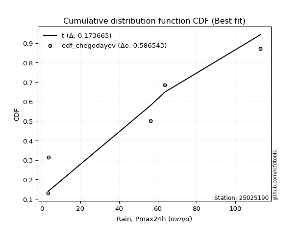</img>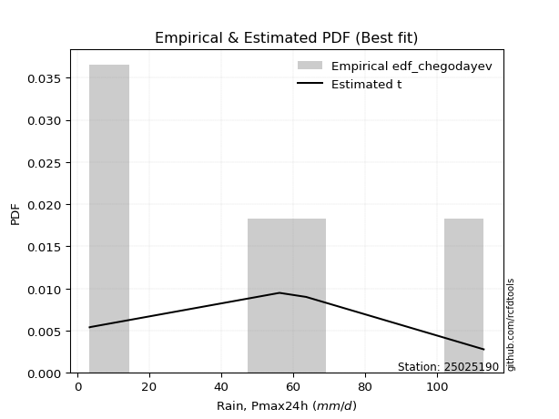</img>

</div>


### 6. Empirical - EDF Blom (1958)

The Blom formula is a specific "plotting position" formula used in hydrology and statistical analysis to estimate the empirical cumulative probability (or non-exceedance probability) of a data series. It is particularly recommended for data that are approximately normally distributed. The constant _a_ is set to 0.375 (or 3/8).

<div align="center">


$P=(m-a)/(n+1-2a)$


</div>


**6.1. Empirical values**

<div align="center">

|                | 0                  | 1                  | 2                  | 3                 | 4                 | 5                  |
|:---------------|:-------------------|:-------------------|:-------------------|:------------------|:------------------|:-------------------|
| date           | 2020               | 2017               | 2025               | 2019              | 2018              | 2024               |
| x              | 3.4                | 3.6                | 14.6               | 56.2              | 63.6              | 113.0              |
| m              | 1                  | 2                  | 3                  | 4                 | 5                 | 6                  |
| empirical_dist | edf_blom           | edf_blom           | edf_blom           | edf_blom          | edf_blom          | edf_blom           |
| empirical      | 0.1                | 0.26               | 0.42               | 0.58              | 0.74              | 0.9                |
| empirical_tr   | 1.1111111111111112 | 1.3513513513513513 | 1.7241379310344827 | 2.380952380952381 | 3.846153846153846 | 10.000000000000002 |

</div>


**6.2. Kolmogorov-Smirnov fit test (sorted by Δ)**


<div align="center">

|                | 0                   | 1                   | 2                  | 3                   | 4                   | 5                   | 6                   | 7                   | 8                   | 9                   | 10                 | 11                  | 12                  | 13                  | 14                  | 15                  | 16                  | 17                  | 18                  | 19                  | 20                  | 21                  | 22                  | 23                  | 24                  | 25                 | 26                  | 27                  | 28                  | 29                 | 30                  | 31                  | 32                 | 33                  | 34                 | 35                  | 36                  | 37                    | 38                  | 39                  | 40                  | 41                 | 42                  | 43                  | 44                 | 45                  | 46                  | 47                  | 48                  | 49                 | 50                  | 51                  | 52                 | 53                  | 54                 | 55                 | 56                  | 57                 | 58                 | 59                  | 60                 | 61                 | 62                  | 63                  | 64                 | 65                  | 66                 | 67                  | 68                  | 69                  | 70              | 71                 | 72                 | 73               | 74                 | 75                 | 76                  | 77                  | 78                 | 79                 | 80                  | 81                 | 82                 | 83                 | 84                  | 85                 | 86                 | 87                 | 88                 | 89             |
|:---------------|:--------------------|:--------------------|:-------------------|:--------------------|:--------------------|:--------------------|:--------------------|:--------------------|:--------------------|:--------------------|:-------------------|:--------------------|:--------------------|:--------------------|:--------------------|:--------------------|:--------------------|:--------------------|:--------------------|:--------------------|:--------------------|:--------------------|:--------------------|:--------------------|:--------------------|:-------------------|:--------------------|:--------------------|:--------------------|:-------------------|:--------------------|:--------------------|:-------------------|:--------------------|:-------------------|:--------------------|:--------------------|:----------------------|:--------------------|:--------------------|:--------------------|:-------------------|:--------------------|:--------------------|:-------------------|:--------------------|:--------------------|:--------------------|:--------------------|:-------------------|:--------------------|:--------------------|:-------------------|:--------------------|:-------------------|:-------------------|:--------------------|:-------------------|:-------------------|:--------------------|:-------------------|:-------------------|:--------------------|:--------------------|:-------------------|:--------------------|:-------------------|:--------------------|:--------------------|:--------------------|:----------------|:-------------------|:-------------------|:-----------------|:-------------------|:-------------------|:--------------------|:--------------------|:-------------------|:-------------------|:--------------------|:-------------------|:-------------------|:-------------------|:--------------------|:-------------------|:-------------------|:-------------------|:-------------------|:---------------|
| station        | 25025190            | 25025190            | 25025190           | 25025190            | 25025190            | 25025190            | 25025190            | 25025190            | 25025190            | 25025190            | 25025190           | 25025190            | 25025190            | 25025190            | 25025190            | 25025190            | 25025190            | 25025190            | 25025190            | 25025190            | 25025190            | 25025190            | 25025190            | 25025190            | 25025190            | 25025190           | 25025190            | 25025190            | 25025190            | 25025190           | 25025190            | 25025190            | 25025190           | 25025190            | 25025190           | 25025190            | 25025190            | 25025190              | 25025190            | 25025190            | 25025190            | 25025190           | 25025190            | 25025190            | 25025190           | 25025190            | 25025190            | 25025190            | 25025190            | 25025190           | 25025190            | 25025190            | 25025190           | 25025190            | 25025190           | 25025190           | 25025190            | 25025190           | 25025190           | 25025190            | 25025190           | 25025190           | 25025190            | 25025190            | 25025190           | 25025190            | 25025190           | 25025190            | 25025190            | 25025190            | 25025190        | 25025190           | 25025190           | 25025190         | 25025190           | 25025190           | 25025190            | 25025190            | 25025190           | 25025190           | 25025190            | 25025190           | 25025190           | 25025190           | 25025190            | 25025190           | 25025190           | 25025190           | 25025190           | 25025190       |
| empirical_dist | edf_blom            | edf_blom            | edf_blom           | edf_blom            | edf_blom            | edf_blom            | edf_blom            | edf_blom            | edf_blom            | edf_blom            | edf_blom           | edf_blom            | edf_blom            | edf_blom            | edf_blom            | edf_blom            | edf_blom            | edf_blom            | edf_blom            | edf_blom            | edf_blom            | edf_blom            | edf_blom            | edf_blom            | edf_blom            | edf_blom           | edf_blom            | edf_blom            | edf_blom            | edf_blom           | edf_blom            | edf_blom            | edf_blom           | edf_blom            | edf_blom           | edf_blom            | edf_blom            | edf_blom              | edf_blom            | edf_blom            | edf_blom            | edf_blom           | edf_blom            | edf_blom            | edf_blom           | edf_blom            | edf_blom            | edf_blom            | edf_blom            | edf_blom           | edf_blom            | edf_blom            | edf_blom           | edf_blom            | edf_blom           | edf_blom           | edf_blom            | edf_blom           | edf_blom           | edf_blom            | edf_blom           | edf_blom           | edf_blom            | edf_blom            | edf_blom           | edf_blom            | edf_blom           | edf_blom            | edf_blom            | edf_blom            | edf_blom        | edf_blom           | edf_blom           | edf_blom         | edf_blom           | edf_blom           | edf_blom            | edf_blom            | edf_blom           | edf_blom           | edf_blom            | edf_blom           | edf_blom           | edf_blom           | edf_blom            | edf_blom           | edf_blom           | edf_blom           | edf_blom           | edf_blom       |
| p_dist         | logjohnsonsu        | logloggamma         | halfnorm           | halflogistic        | rayleigh            | maxwell             | logweibull_min      | pearson3            | genlogistic         | gumbel_r            | logfisk            | moyal               | kstwobign           | crystalball         | norm                | t                   | loggumbel_l         | logpearson3         | loggamma            | loggamma            | logexponnorm        | logt                | lognorm             | lognorm             | logcrystalball      | lognct             | logncf              | logerlang           | mielke              | logf               | logrice             | logmaxwell          | loginvgamma        | logalpha            | loginvgauss        | lograyleigh         | logbetaprime        | loglaplace_asymmetric | loginvweibull       | logistic            | fisk                | ncf                | rice                | logkstwobign        | loglogistic        | weibull_min         | hypsecant           | gumbel_l            | nakagami            | nct                | loggumbel_r         | logchi2             | loghypsecant       | loghalfnorm         | logexpon           | logmoyal           | loggenexpon         | laplace            | logtruncnorm       | loggompertz         | loglaplace         | exponnorm          | gompertz            | laplace_asymmetric  | pareto             | expon               | genexpon           | truncnorm           | lognakagami         | wald                | loghalflogistic | logwald            | logmielke          | logpareto        | loggibrat          | erlang             | invgauss            | gamma               | loglognorm         | alpha              | fatiguelife         | f                  | gibrat             | betaprime          | logfatiguelife      | invweibull         | chi2               | johnsonsu          | invgamma           | loggenlogistic |
| delta          | 0.12160824855061614 | 0.12589912045383975 | 0.1276406681363133 | 0.14440447220938862 | 0.14977426963768825 | 0.15818720377426143 | 0.16079694688773938 | 0.16395265326256087 | 0.16447538492301111 | 0.16855367273692218 | 0.1689858418594543 | 0.17184525249634736 | 0.17570984574389187 | 0.17849750960887042 | 0.17849751331091912 | 0.17851260290271137 | 0.18082200980894048 | 0.18207456313520853 | 0.18703930621498321 | 0.18703930621498321 | 0.18706697590418986 | 0.18706903242207085 | 0.18706925414725617 | 0.18706925414725617 | 0.18706925702110577 | 0.1870852642815538 | 0.18854555351283875 | 0.18856475095749425 | 0.19159501103691257 | 0.1918282455788229 | 0.19302009020720035 | 0.19440453945515446 | 0.1944914393383147 | 0.19556115634719928 | 0.1959709860102684 | 0.19648619498930486 | 0.19851522482995287 | 0.19956477729424127   | 0.19957823550391107 | 0.20114300775219565 | 0.20124600085083266 | 0.2032254939915148 | 0.20644444503154938 | 0.20726685922136745 | 0.2096264793101814 | 0.21045792197451768 | 0.21579022621014823 | 0.21584929525814497 | 0.21758615314888066 | 0.2196628540564602 | 0.22222918384315116 | 0.22363160082697042 | 0.2239497072583927 | 0.22397696140882528 | 0.2286068786627252 | 0.2336574054695464 | 0.23454042062677946 | 0.2345901311017774 | 0.2378642064170131 | 0.24071724781230333 | 0.2417258884235699 | 0.2538897092174526 | 0.25478418083472615 | 0.25487251869972605 | 0.2548849200802391 | 0.25488492166716087 | 0.2548849216984549 | 0.25520102318600435 | 0.25677949204286343 | 0.25999999998671314 | 0.26            | 0.2705853321506634 | 0.2905347367221732 | 0.29104539543695 | 0.2991714853196046 | 0.3060839837621526 | 0.31249953441281864 | 0.32559093322846644 | 0.3274620241743288 | 0.3353004103158985 | 0.34848283545165126 | 0.3720768156888737 | 0.3982955461648291 | 0.4149647390973085 | 0.46082831064444535 | 0.4613494969486408 | 0.4949950208201725 | 0.5449855654907798 | 0.7038149823924431 | 0.74           |
| deltao         | 0.530385761606      | 0.530385761606      | 0.530385761606     | 0.530385761606      | 0.530385761606      | 0.530385761606      | 0.530385761606      | 0.530385761606      | 0.530385761606      | 0.530385761606      | 0.530385761606     | 0.530385761606      | 0.530385761606      | 0.530385761606      | 0.530385761606      | 0.530385761606      | 0.530385761606      | 0.530385761606      | 0.530385761606      | 0.530385761606      | 0.530385761606      | 0.530385761606      | 0.530385761606      | 0.530385761606      | 0.530385761606      | 0.530385761606     | 0.530385761606      | 0.530385761606      | 0.530385761606      | 0.530385761606     | 0.530385761606      | 0.530385761606      | 0.530385761606     | 0.530385761606      | 0.530385761606     | 0.530385761606      | 0.530385761606      | 0.530385761606        | 0.530385761606      | 0.530385761606      | 0.530385761606      | 0.530385761606     | 0.530385761606      | 0.530385761606      | 0.530385761606     | 0.530385761606      | 0.530385761606      | 0.530385761606      | 0.530385761606      | 0.530385761606     | 0.530385761606      | 0.530385761606      | 0.530385761606     | 0.530385761606      | 0.530385761606     | 0.530385761606     | 0.530385761606      | 0.530385761606     | 0.530385761606     | 0.530385761606      | 0.530385761606     | 0.530385761606     | 0.530385761606      | 0.530385761606      | 0.530385761606     | 0.530385761606      | 0.530385761606     | 0.530385761606      | 0.530385761606      | 0.530385761606      | 0.530385761606  | 0.530385761606     | 0.530385761606     | 0.530385761606   | 0.530385761606     | 0.530385761606     | 0.530385761606      | 0.530385761606      | 0.530385761606     | 0.530385761606     | 0.530385761606      | 0.530385761606     | 0.530385761606     | 0.530385761606     | 0.530385761606      | 0.530385761606     | 0.530385761606     | 0.530385761606     | 0.530385761606     | 0.530385761606 |
| eval           | Δo > Δ              | Δo > Δ              | Δo > Δ             | Δo > Δ              | Δo > Δ              | Δo > Δ              | Δo > Δ              | Δo > Δ              | Δo > Δ              | Δo > Δ              | Δo > Δ             | Δo > Δ              | Δo > Δ              | Δo > Δ              | Δo > Δ              | Δo > Δ              | Δo > Δ              | Δo > Δ              | Δo > Δ              | Δo > Δ              | Δo > Δ              | Δo > Δ              | Δo > Δ              | Δo > Δ              | Δo > Δ              | Δo > Δ             | Δo > Δ              | Δo > Δ              | Δo > Δ              | Δo > Δ             | Δo > Δ              | Δo > Δ              | Δo > Δ             | Δo > Δ              | Δo > Δ             | Δo > Δ              | Δo > Δ              | Δo > Δ                | Δo > Δ              | Δo > Δ              | Δo > Δ              | Δo > Δ             | Δo > Δ              | Δo > Δ              | Δo > Δ             | Δo > Δ              | Δo > Δ              | Δo > Δ              | Δo > Δ              | Δo > Δ             | Δo > Δ              | Δo > Δ              | Δo > Δ             | Δo > Δ              | Δo > Δ             | Δo > Δ             | Δo > Δ              | Δo > Δ             | Δo > Δ             | Δo > Δ              | Δo > Δ             | Δo > Δ             | Δo > Δ              | Δo > Δ              | Δo > Δ             | Δo > Δ              | Δo > Δ             | Δo > Δ              | Δo > Δ              | Δo > Δ              | Δo > Δ          | Δo > Δ             | Δo > Δ             | Δo > Δ           | Δo > Δ             | Δo > Δ             | Δo > Δ              | Δo > Δ              | Δo > Δ             | Δo > Δ             | Δo > Δ              | Δo > Δ             | Δo > Δ             | Δo > Δ             | Δo > Δ              | Δo > Δ             | Δo > Δ             | Δo <= Δ            | Δo <= Δ            | Δo <= Δ        |
| fit            | 1                   | 1                   | 1                  | 1                   | 1                   | 1                   | 1                   | 1                   | 1                   | 1                   | 1                  | 1                   | 1                   | 1                   | 1                   | 1                   | 1                   | 1                   | 1                   | 1                   | 1                   | 1                   | 1                   | 1                   | 1                   | 1                  | 1                   | 1                   | 1                   | 1                  | 1                   | 1                   | 1                  | 1                   | 1                  | 1                   | 1                   | 1                     | 1                   | 1                   | 1                   | 1                  | 1                   | 1                   | 1                  | 1                   | 1                   | 1                   | 1                   | 1                  | 1                   | 1                   | 1                  | 1                   | 1                  | 1                  | 1                   | 1                  | 1                  | 1                   | 1                  | 1                  | 1                   | 1                   | 1                  | 1                   | 1                  | 1                   | 1                   | 1                   | 1               | 1                  | 1                  | 1                | 1                  | 1                  | 1                   | 1                   | 1                  | 1                  | 1                   | 1                  | 1                  | 1                  | 1                   | 1                  | 1                  | 0                  | 0                  | 0              |
| n              | 6                   | 6                   | 6                  | 6                   | 6                   | 6                   | 6                   | 6                   | 6                   | 6                   | 6                  | 6                   | 6                   | 6                   | 6                   | 6                   | 6                   | 6                   | 6                   | 6                   | 6                   | 6                   | 6                   | 6                   | 6                   | 6                  | 6                   | 6                   | 6                   | 6                  | 6                   | 6                   | 6                  | 6                   | 6                  | 6                   | 6                   | 6                     | 6                   | 6                   | 6                   | 6                  | 6                   | 6                   | 6                  | 6                   | 6                   | 6                   | 6                   | 6                  | 6                   | 6                   | 6                  | 6                   | 6                  | 6                  | 6                   | 6                  | 6                  | 6                   | 6                  | 6                  | 6                   | 6                   | 6                  | 6                   | 6                  | 6                   | 6                   | 6                   | 6               | 6                  | 6                  | 6                | 6                  | 6                  | 6                   | 6                   | 6                  | 6                  | 6                   | 6                  | 6                  | 6                  | 6                   | 6                  | 6                  | 6                  | 6                  | 6              |
| best_fit       | 1                   | 0                   | 0                  | 0                   | 0                   | 0                   | 0                   | 0                   | 0                   | 0                   | 0                  | 0                   | 0                   | 0                   | 0                   | 0                   | 0                   | 0                   | 0                   | 0                   | 0                   | 0                   | 0                   | 0                   | 0                   | 0                  | 0                   | 0                   | 0                   | 0                  | 0                   | 0                   | 0                  | 0                   | 0                  | 0                   | 0                   | 0                     | 0                   | 0                   | 0                   | 0                  | 0                   | 0                   | 0                  | 0                   | 0                   | 0                   | 0                   | 0                  | 0                   | 0                   | 0                  | 0                   | 0                  | 0                  | 0                   | 0                  | 0                  | 0                   | 0                  | 0                  | 0                   | 0                   | 0                  | 0                   | 0                  | 0                   | 0                   | 0                   | 0               | 0                  | 0                  | 0                | 0                  | 0                  | 0                   | 0                   | 0                  | 0                  | 0                   | 0                  | 0                  | 0                  | 0                   | 0                  | 0                  | 0                  | 0                  | 0              |
| best_fit_sort  | 1                   | 2                   | 3                  | 4                   | 5                   | 6                   | 7                   | 8                   | 9                   | 10                  | 11                 | 12                  | 13                  | 14                  | 15                  | 16                  | 17                  | 18                  | 19                  | 20                  | 21                  | 22                  | 23                  | 24                  | 25                  | 26                 | 27                  | 28                  | 29                  | 30                 | 31                  | 32                  | 33                 | 34                  | 35                 | 36                  | 37                  | 38                    | 39                  | 40                  | 41                  | 42                 | 43                  | 44                  | 45                 | 46                  | 47                  | 48                  | 49                  | 50                 | 51                  | 52                  | 53                 | 54                  | 55                 | 56                 | 57                  | 58                 | 59                 | 60                  | 61                 | 62                 | 63                  | 64                  | 65                 | 66                  | 67                 | 68                  | 69                  | 70                  | 71              | 72                 | 73                 | 74               | 75                 | 76                 | 77                  | 78                  | 79                 | 80                 | 81                  | 82                 | 83                 | 84                 | 85                  | 86                 | 87                 | 88                 | 89                 | 90             |

</div>


<div align="center">

</img>

</div>


**6.3. Best fit**

<div align="center">

|   id |   station | empirical_dist   | p_dist       |    delta |   deltao | eval   |   fit |   n |   best_fit |   best_fit_sort |
|-----:|----------:|:-----------------|:-------------|---------:|---------:|:-------|------:|----:|-----------:|----------------:|
|    0 |  25025190 | edf_blom         | logjohnsonsu | 0.121608 | 0.530386 | Δo > Δ |     1 |   6 |          1 |               1 |

</div>


<div align="center">

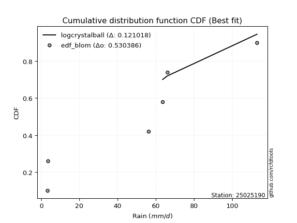</img>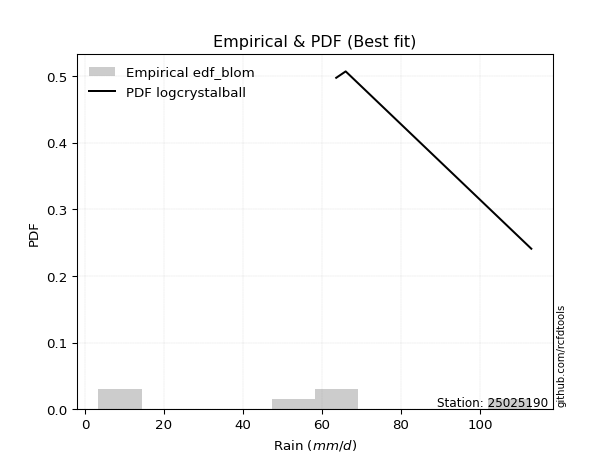</img>

</div>


### 7. Empirical - EDF Tukey (1962)

In hydrology, the Tukey formula is used as a plotting position formula to estimate the empirical probability or frequency of a flood event (or other hydrological data). The formula parameter is given as _c=0.333_ (or 1/3).

<div align="center">


$P=(m-c)/(n+1-2c)$


</div>


**7.1. Empirical values**

<div align="center">

|                | 0                   | 1                  | 2                   | 3                  | 4                  | 5                  |
|:---------------|:--------------------|:-------------------|:--------------------|:-------------------|:-------------------|:-------------------|
| date           | 2020                | 2017               | 2025                | 2019               | 2018               | 2024               |
| x              | 3.4                 | 3.6                | 14.6                | 56.2               | 63.6               | 113.0              |
| m              | 1                   | 2                  | 3                   | 4                  | 5                  | 6                  |
| empirical_dist | edf_tukey           | edf_tukey          | edf_tukey           | edf_tukey          | edf_tukey          | edf_tukey          |
| empirical      | 0.10526315789473684 | 0.2631578947368421 | 0.42105263157894735 | 0.5789473684210527 | 0.7368421052631579 | 0.8947368421052632 |
| empirical_tr   | 1.1176470588235294  | 1.357142857142857  | 1.7272727272727273  | 2.375              | 3.7999999999999994 | 9.5                |

</div>


**7.2. Kolmogorov-Smirnov fit test (sorted by Δ)**


<div align="center">

|                | 0                   | 1                   | 2                   | 3                   | 4                  | 5                  | 6                   | 7                   | 8                   | 9                   | 10                  | 11                  | 12                  | 13                  | 14                  | 15                  | 16                  | 17                  | 18                  | 19                  | 20                  | 21                  | 22                  | 23                  | 24                  | 25                  | 26                  | 27                  | 28                  | 29                  | 30                  | 31                  | 32                | 33                 | 34                 | 35                  | 36                  | 37                  | 38                    | 39                  | 40                | 41                 | 42                  | 43                  | 44                  | 45                  | 46                 | 47                  | 48                  | 49                  | 50                  | 51                  | 52               | 53                  | 54                  | 55                 | 56                  | 57                  | 58                 | 59                 | 60                 | 61                  | 62                  | 63                  | 64                  | 65                 | 66                  | 67                | 68                  | 69                 | 70                 | 71                 | 72                  | 73                  | 74                 | 75                  | 76                  | 77                 | 78                  | 79                  | 80                  | 81                 | 82                  | 83                  | 84                  | 85                | 86                  | 87                 | 88                 | 89                 |
|:---------------|:--------------------|:--------------------|:--------------------|:--------------------|:-------------------|:-------------------|:--------------------|:--------------------|:--------------------|:--------------------|:--------------------|:--------------------|:--------------------|:--------------------|:--------------------|:--------------------|:--------------------|:--------------------|:--------------------|:--------------------|:--------------------|:--------------------|:--------------------|:--------------------|:--------------------|:--------------------|:--------------------|:--------------------|:--------------------|:--------------------|:--------------------|:--------------------|:------------------|:-------------------|:-------------------|:--------------------|:--------------------|:--------------------|:----------------------|:--------------------|:------------------|:-------------------|:--------------------|:--------------------|:--------------------|:--------------------|:-------------------|:--------------------|:--------------------|:--------------------|:--------------------|:--------------------|:-----------------|:--------------------|:--------------------|:-------------------|:--------------------|:--------------------|:-------------------|:-------------------|:-------------------|:--------------------|:--------------------|:--------------------|:--------------------|:-------------------|:--------------------|:------------------|:--------------------|:-------------------|:-------------------|:-------------------|:--------------------|:--------------------|:-------------------|:--------------------|:--------------------|:-------------------|:--------------------|:--------------------|:--------------------|:-------------------|:--------------------|:--------------------|:--------------------|:------------------|:--------------------|:-------------------|:-------------------|:-------------------|
| station        | 25025190            | 25025190            | 25025190            | 25025190            | 25025190           | 25025190           | 25025190            | 25025190            | 25025190            | 25025190            | 25025190            | 25025190            | 25025190            | 25025190            | 25025190            | 25025190            | 25025190            | 25025190            | 25025190            | 25025190            | 25025190            | 25025190            | 25025190            | 25025190            | 25025190            | 25025190            | 25025190            | 25025190            | 25025190            | 25025190            | 25025190            | 25025190            | 25025190          | 25025190           | 25025190           | 25025190            | 25025190            | 25025190            | 25025190              | 25025190            | 25025190          | 25025190           | 25025190            | 25025190            | 25025190            | 25025190            | 25025190           | 25025190            | 25025190            | 25025190            | 25025190            | 25025190            | 25025190         | 25025190            | 25025190            | 25025190           | 25025190            | 25025190            | 25025190           | 25025190           | 25025190           | 25025190            | 25025190            | 25025190            | 25025190            | 25025190           | 25025190            | 25025190          | 25025190            | 25025190           | 25025190           | 25025190           | 25025190            | 25025190            | 25025190           | 25025190            | 25025190            | 25025190           | 25025190            | 25025190            | 25025190            | 25025190           | 25025190            | 25025190            | 25025190            | 25025190          | 25025190            | 25025190           | 25025190           | 25025190           |
| empirical_dist | edf_tukey           | edf_tukey           | edf_tukey           | edf_tukey           | edf_tukey          | edf_tukey          | edf_tukey           | edf_tukey           | edf_tukey           | edf_tukey           | edf_tukey           | edf_tukey           | edf_tukey           | edf_tukey           | edf_tukey           | edf_tukey           | edf_tukey           | edf_tukey           | edf_tukey           | edf_tukey           | edf_tukey           | edf_tukey           | edf_tukey           | edf_tukey           | edf_tukey           | edf_tukey           | edf_tukey           | edf_tukey           | edf_tukey           | edf_tukey           | edf_tukey           | edf_tukey           | edf_tukey         | edf_tukey          | edf_tukey          | edf_tukey           | edf_tukey           | edf_tukey           | edf_tukey             | edf_tukey           | edf_tukey         | edf_tukey          | edf_tukey           | edf_tukey           | edf_tukey           | edf_tukey           | edf_tukey          | edf_tukey           | edf_tukey           | edf_tukey           | edf_tukey           | edf_tukey           | edf_tukey        | edf_tukey           | edf_tukey           | edf_tukey          | edf_tukey           | edf_tukey           | edf_tukey          | edf_tukey          | edf_tukey          | edf_tukey           | edf_tukey           | edf_tukey           | edf_tukey           | edf_tukey          | edf_tukey           | edf_tukey         | edf_tukey           | edf_tukey          | edf_tukey          | edf_tukey          | edf_tukey           | edf_tukey           | edf_tukey          | edf_tukey           | edf_tukey           | edf_tukey          | edf_tukey           | edf_tukey           | edf_tukey           | edf_tukey          | edf_tukey           | edf_tukey           | edf_tukey           | edf_tukey         | edf_tukey           | edf_tukey          | edf_tukey          | edf_tukey          |
| p_dist         | logjohnsonsu        | halfnorm            | logloggamma         | halflogistic        | rayleigh           | maxwell            | logweibull_min      | pearson3            | genlogistic         | gumbel_r            | logfisk             | moyal               | kstwobign           | crystalball         | norm                | t                   | loggumbel_l         | logpearson3         | loggamma            | loggamma            | logexponnorm        | logt                | lognorm             | lognorm             | logcrystalball      | lognct              | logncf              | logerlang           | mielke              | logrice             | logf                | logmaxwell          | loginvgamma       | fisk               | logalpha           | loginvgauss         | lograyleigh         | logbetaprime        | loglaplace_asymmetric | loginvweibull       | logistic          | ncf                | rice                | logkstwobign        | loglogistic         | weibull_min         | hypsecant          | gumbel_l            | nct                 | nakagami            | loggumbel_r         | logchi2             | loghypsecant     | loghalfnorm         | logexpon            | logmoyal           | laplace             | loggenexpon         | logtruncnorm       | loglaplace         | loggompertz        | exponnorm           | lognakagami         | gompertz            | laplace_asymmetric  | pareto             | expon               | genexpon          | truncnorm           | wald               | loghalflogistic    | logwald            | logpareto           | logmielke           | loggibrat          | erlang              | invgauss            | loglognorm         | gamma               | alpha               | fatiguelife         | f                  | gibrat              | betaprime           | invweibull          | logfatiguelife    | chi2                | johnsonsu          | invgamma           | loggenlogistic     |
| delta          | 0.12400897749520678 | 0.12869329971526067 | 0.12905701519068183 | 0.14545710378833598 | 0.1508269012166356 | 0.1592398353532088 | 0.16184957846668668 | 0.16500528484150823 | 0.16552801650195847 | 0.16960630431586954 | 0.17003847343840162 | 0.17289788407529472 | 0.17676247732283923 | 0.17955014118781779 | 0.17955014488986648 | 0.17956523448165873 | 0.18187464138788778 | 0.18312719471415584 | 0.18809193779393052 | 0.18809193779393052 | 0.18811960748313716 | 0.18812166400101815 | 0.18812188572620347 | 0.18812188572620347 | 0.18812188860005308 | 0.18813789586050111 | 0.18959818509178605 | 0.18961738253644156 | 0.19264764261585987 | 0.19407272178614765 | 0.19498614031566497 | 0.19545717103410176 | 0.195544070917262 | 0.1959828429560958 | 0.1966137879261466 | 0.19702361758921572 | 0.19753882656825217 | 0.19956785640890018 | 0.20061740887318857   | 0.20063086708285838 | 0.202195639331143 | 0.2042781255704621 | 0.20749707661049674 | 0.20831949080031475 | 0.21067911088912872 | 0.21361581671135976 | 0.2168428577890956 | 0.21690192683709233 | 0.21861022247751283 | 0.22074404788572274 | 0.22328181542209846 | 0.22468423240591773 | 0.22500233883734 | 0.22713485614566736 | 0.23176477339956728 | 0.2347100370484937 | 0.23564276268072476 | 0.23769831536362154 | 0.2410221011538552 | 0.2427785200025172 | 0.2438751425491454 | 0.25704760395429466 | 0.25783212362181074 | 0.25794207557156823 | 0.25803041343656813 | 0.2580428148170812 | 0.25804281640400295 | 0.258042816435297 | 0.25835891792284643 | 0.2631578947235552 | 0.2631578947368421 | 0.2716379637296107 | 0.28999276385800266 | 0.29158736830112053 | 0.3002241168985519 | 0.30713661534109993 | 0.31355216599176594 | 0.3243041294374867 | 0.32664356480741374 | 0.33635304189484583 | 0.34953546703059857 | 0.3710241841099263 | 0.39934817774377646 | 0.41391210751836116 | 0.45608633905390394 | 0.459775679065498 | 0.49394238924122513 | 0.5418276707539378 | 0.7006570876556011 | 0.7368421052631579 |
| deltao         | 0.530385761606      | 0.530385761606      | 0.530385761606      | 0.530385761606      | 0.530385761606     | 0.530385761606     | 0.530385761606      | 0.530385761606      | 0.530385761606      | 0.530385761606      | 0.530385761606      | 0.530385761606      | 0.530385761606      | 0.530385761606      | 0.530385761606      | 0.530385761606      | 0.530385761606      | 0.530385761606      | 0.530385761606      | 0.530385761606      | 0.530385761606      | 0.530385761606      | 0.530385761606      | 0.530385761606      | 0.530385761606      | 0.530385761606      | 0.530385761606      | 0.530385761606      | 0.530385761606      | 0.530385761606      | 0.530385761606      | 0.530385761606      | 0.530385761606    | 0.530385761606     | 0.530385761606     | 0.530385761606      | 0.530385761606      | 0.530385761606      | 0.530385761606        | 0.530385761606      | 0.530385761606    | 0.530385761606     | 0.530385761606      | 0.530385761606      | 0.530385761606      | 0.530385761606      | 0.530385761606     | 0.530385761606      | 0.530385761606      | 0.530385761606      | 0.530385761606      | 0.530385761606      | 0.530385761606   | 0.530385761606      | 0.530385761606      | 0.530385761606     | 0.530385761606      | 0.530385761606      | 0.530385761606     | 0.530385761606     | 0.530385761606     | 0.530385761606      | 0.530385761606      | 0.530385761606      | 0.530385761606      | 0.530385761606     | 0.530385761606      | 0.530385761606    | 0.530385761606      | 0.530385761606     | 0.530385761606     | 0.530385761606     | 0.530385761606      | 0.530385761606      | 0.530385761606     | 0.530385761606      | 0.530385761606      | 0.530385761606     | 0.530385761606      | 0.530385761606      | 0.530385761606      | 0.530385761606     | 0.530385761606      | 0.530385761606      | 0.530385761606      | 0.530385761606    | 0.530385761606      | 0.530385761606     | 0.530385761606     | 0.530385761606     |
| eval           | Δo > Δ              | Δo > Δ              | Δo > Δ              | Δo > Δ              | Δo > Δ             | Δo > Δ             | Δo > Δ              | Δo > Δ              | Δo > Δ              | Δo > Δ              | Δo > Δ              | Δo > Δ              | Δo > Δ              | Δo > Δ              | Δo > Δ              | Δo > Δ              | Δo > Δ              | Δo > Δ              | Δo > Δ              | Δo > Δ              | Δo > Δ              | Δo > Δ              | Δo > Δ              | Δo > Δ              | Δo > Δ              | Δo > Δ              | Δo > Δ              | Δo > Δ              | Δo > Δ              | Δo > Δ              | Δo > Δ              | Δo > Δ              | Δo > Δ            | Δo > Δ             | Δo > Δ             | Δo > Δ              | Δo > Δ              | Δo > Δ              | Δo > Δ                | Δo > Δ              | Δo > Δ            | Δo > Δ             | Δo > Δ              | Δo > Δ              | Δo > Δ              | Δo > Δ              | Δo > Δ             | Δo > Δ              | Δo > Δ              | Δo > Δ              | Δo > Δ              | Δo > Δ              | Δo > Δ           | Δo > Δ              | Δo > Δ              | Δo > Δ             | Δo > Δ              | Δo > Δ              | Δo > Δ             | Δo > Δ             | Δo > Δ             | Δo > Δ              | Δo > Δ              | Δo > Δ              | Δo > Δ              | Δo > Δ             | Δo > Δ              | Δo > Δ            | Δo > Δ              | Δo > Δ             | Δo > Δ             | Δo > Δ             | Δo > Δ              | Δo > Δ              | Δo > Δ             | Δo > Δ              | Δo > Δ              | Δo > Δ             | Δo > Δ              | Δo > Δ              | Δo > Δ              | Δo > Δ             | Δo > Δ              | Δo > Δ              | Δo > Δ              | Δo > Δ            | Δo > Δ              | Δo <= Δ            | Δo <= Δ            | Δo <= Δ            |
| fit            | 1                   | 1                   | 1                   | 1                   | 1                  | 1                  | 1                   | 1                   | 1                   | 1                   | 1                   | 1                   | 1                   | 1                   | 1                   | 1                   | 1                   | 1                   | 1                   | 1                   | 1                   | 1                   | 1                   | 1                   | 1                   | 1                   | 1                   | 1                   | 1                   | 1                   | 1                   | 1                   | 1                 | 1                  | 1                  | 1                   | 1                   | 1                   | 1                     | 1                   | 1                 | 1                  | 1                   | 1                   | 1                   | 1                   | 1                  | 1                   | 1                   | 1                   | 1                   | 1                   | 1                | 1                   | 1                   | 1                  | 1                   | 1                   | 1                  | 1                  | 1                  | 1                   | 1                   | 1                   | 1                   | 1                  | 1                   | 1                 | 1                   | 1                  | 1                  | 1                  | 1                   | 1                   | 1                  | 1                   | 1                   | 1                  | 1                   | 1                   | 1                   | 1                  | 1                   | 1                   | 1                   | 1                 | 1                   | 0                  | 0                  | 0                  |
| n              | 6                   | 6                   | 6                   | 6                   | 6                  | 6                  | 6                   | 6                   | 6                   | 6                   | 6                   | 6                   | 6                   | 6                   | 6                   | 6                   | 6                   | 6                   | 6                   | 6                   | 6                   | 6                   | 6                   | 6                   | 6                   | 6                   | 6                   | 6                   | 6                   | 6                   | 6                   | 6                   | 6                 | 6                  | 6                  | 6                   | 6                   | 6                   | 6                     | 6                   | 6                 | 6                  | 6                   | 6                   | 6                   | 6                   | 6                  | 6                   | 6                   | 6                   | 6                   | 6                   | 6                | 6                   | 6                   | 6                  | 6                   | 6                   | 6                  | 6                  | 6                  | 6                   | 6                   | 6                   | 6                   | 6                  | 6                   | 6                 | 6                   | 6                  | 6                  | 6                  | 6                   | 6                   | 6                  | 6                   | 6                   | 6                  | 6                   | 6                   | 6                   | 6                  | 6                   | 6                   | 6                   | 6                 | 6                   | 6                  | 6                  | 6                  |
| best_fit       | 1                   | 0                   | 0                   | 0                   | 0                  | 0                  | 0                   | 0                   | 0                   | 0                   | 0                   | 0                   | 0                   | 0                   | 0                   | 0                   | 0                   | 0                   | 0                   | 0                   | 0                   | 0                   | 0                   | 0                   | 0                   | 0                   | 0                   | 0                   | 0                   | 0                   | 0                   | 0                   | 0                 | 0                  | 0                  | 0                   | 0                   | 0                   | 0                     | 0                   | 0                 | 0                  | 0                   | 0                   | 0                   | 0                   | 0                  | 0                   | 0                   | 0                   | 0                   | 0                   | 0                | 0                   | 0                   | 0                  | 0                   | 0                   | 0                  | 0                  | 0                  | 0                   | 0                   | 0                   | 0                   | 0                  | 0                   | 0                 | 0                   | 0                  | 0                  | 0                  | 0                   | 0                   | 0                  | 0                   | 0                   | 0                  | 0                   | 0                   | 0                   | 0                  | 0                   | 0                   | 0                   | 0                 | 0                   | 0                  | 0                  | 0                  |
| best_fit_sort  | 1                   | 2                   | 3                   | 4                   | 5                  | 6                  | 7                   | 8                   | 9                   | 10                  | 11                  | 12                  | 13                  | 14                  | 15                  | 16                  | 17                  | 18                  | 19                  | 20                  | 21                  | 22                  | 23                  | 24                  | 25                  | 26                  | 27                  | 28                  | 29                  | 30                  | 31                  | 32                  | 33                | 34                 | 35                 | 36                  | 37                  | 38                  | 39                    | 40                  | 41                | 42                 | 43                  | 44                  | 45                  | 46                  | 47                 | 48                  | 49                  | 50                  | 51                  | 52                  | 53               | 54                  | 55                  | 56                 | 57                  | 58                  | 59                 | 60                 | 61                 | 62                  | 63                  | 64                  | 65                  | 66                 | 67                  | 68                | 69                  | 70                 | 71                 | 72                 | 73                  | 74                  | 75                 | 76                  | 77                  | 78                 | 79                  | 80                  | 81                  | 82                 | 83                  | 84                  | 85                  | 86                | 87                  | 88                 | 89                 | 90                 |

</div>


<div align="center">

</img>

</div>


**7.3. Best fit**

<div align="center">

|   id |   station | empirical_dist   | p_dist       |    delta |   deltao | eval   |   fit |   n |   best_fit |   best_fit_sort |
|-----:|----------:|:-----------------|:-------------|---------:|---------:|:-------|------:|----:|-----------:|----------------:|
|    0 |  25025190 | edf_tukey        | logjohnsonsu | 0.124009 | 0.530386 | Δo > Δ |     1 |   6 |          1 |               1 |

</div>


<div align="center">

</img>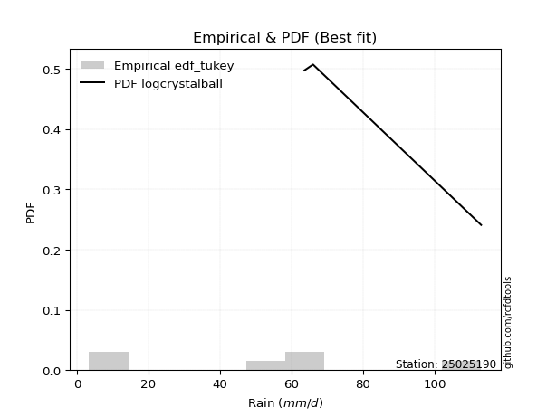</img>

</div>


### 8. Empirical - EDF Gringorten (1963)

Gringorten plotting position formula is essential for estimating the probability and return periods of extreme events like floods and heavy rainfall. The constant _a=0.44_.

<div align="center">


$P=(m-a)/(n+1-2a)$


</div>


**8.1. Empirical values**

<div align="center">

|                | 0                   | 1                  | 2                   | 3                  | 4                  | 5                  |
|:---------------|:--------------------|:-------------------|:--------------------|:-------------------|:-------------------|:-------------------|
| date           | 2020                | 2017               | 2025                | 2019               | 2018               | 2024               |
| x              | 3.4                 | 3.6                | 14.6                | 56.2               | 63.6               | 113.0              |
| m              | 1                   | 2                  | 3                   | 4                  | 5                  | 6                  |
| empirical_dist | edf_gringorten      | edf_gringorten     | edf_gringorten      | edf_gringorten     | edf_gringorten     | edf_gringorten     |
| empirical      | 0.09150326797385622 | 0.2549019607843137 | 0.41830065359477125 | 0.5816993464052288 | 0.7450980392156862 | 0.9084967320261437 |
| empirical_tr   | 1.1007194244604317  | 1.3421052631578947 | 1.7191011235955058  | 2.3906250000000004 | 3.9230769230769216 | 10.928571428571415 |

</div>


**8.2. Kolmogorov-Smirnov fit test (sorted by Δ)**


<div align="center">

|                | 0                   | 1                   | 2                   | 3                  | 4                   | 5                  | 6                   | 7                   | 8                   | 9                   | 10                  | 11                  | 12                  | 13                 | 14                 | 15                  | 16                  | 17                 | 18                  | 19                  | 20                  | 21                | 22                  | 23                  | 24                  | 25                  | 26                  | 27                 | 28                 | 29                  | 30                 | 31                  | 32                  | 33                  | 34                  | 35                  | 36                  | 37                    | 38                  | 39                  | 40                  | 41                  | 42                  | 43                 | 44                  | 45                 | 46                  | 47                 | 48                  | 49                  | 50                  | 51                  | 52                  | 53                  | 54                 | 55                  | 56                  | 57                 | 58                  | 59                  | 60                  | 61                  | 62                  | 63                  | 64                 | 65                 | 66                  | 67                  | 68                  | 69                 | 70                 | 71                  | 72                 | 73                  | 74                  | 75                 | 76                 | 77                 | 78                 | 79                 | 80                 | 81                 | 82                  | 83                  | 84                 | 85                  | 86                 | 87                 | 88                 | 89                 |
|:---------------|:--------------------|:--------------------|:--------------------|:-------------------|:--------------------|:-------------------|:--------------------|:--------------------|:--------------------|:--------------------|:--------------------|:--------------------|:--------------------|:-------------------|:-------------------|:--------------------|:--------------------|:-------------------|:--------------------|:--------------------|:--------------------|:------------------|:--------------------|:--------------------|:--------------------|:--------------------|:--------------------|:-------------------|:-------------------|:--------------------|:-------------------|:--------------------|:--------------------|:--------------------|:--------------------|:--------------------|:--------------------|:----------------------|:--------------------|:--------------------|:--------------------|:--------------------|:--------------------|:-------------------|:--------------------|:-------------------|:--------------------|:-------------------|:--------------------|:--------------------|:--------------------|:--------------------|:--------------------|:--------------------|:-------------------|:--------------------|:--------------------|:-------------------|:--------------------|:--------------------|:--------------------|:--------------------|:--------------------|:--------------------|:-------------------|:-------------------|:--------------------|:--------------------|:--------------------|:-------------------|:-------------------|:--------------------|:-------------------|:--------------------|:--------------------|:-------------------|:-------------------|:-------------------|:-------------------|:-------------------|:-------------------|:-------------------|:--------------------|:--------------------|:-------------------|:--------------------|:-------------------|:-------------------|:-------------------|:-------------------|
| station        | 25025190            | 25025190            | 25025190            | 25025190           | 25025190            | 25025190           | 25025190            | 25025190            | 25025190            | 25025190            | 25025190            | 25025190            | 25025190            | 25025190           | 25025190           | 25025190            | 25025190            | 25025190           | 25025190            | 25025190            | 25025190            | 25025190          | 25025190            | 25025190            | 25025190            | 25025190            | 25025190            | 25025190           | 25025190           | 25025190            | 25025190           | 25025190            | 25025190            | 25025190            | 25025190            | 25025190            | 25025190            | 25025190              | 25025190            | 25025190            | 25025190            | 25025190            | 25025190            | 25025190           | 25025190            | 25025190           | 25025190            | 25025190           | 25025190            | 25025190            | 25025190            | 25025190            | 25025190            | 25025190            | 25025190           | 25025190            | 25025190            | 25025190           | 25025190            | 25025190            | 25025190            | 25025190            | 25025190            | 25025190            | 25025190           | 25025190           | 25025190            | 25025190            | 25025190            | 25025190           | 25025190           | 25025190            | 25025190           | 25025190            | 25025190            | 25025190           | 25025190           | 25025190           | 25025190           | 25025190           | 25025190           | 25025190           | 25025190            | 25025190            | 25025190           | 25025190            | 25025190           | 25025190           | 25025190           | 25025190           |
| empirical_dist | edf_gringorten      | edf_gringorten      | edf_gringorten      | edf_gringorten     | edf_gringorten      | edf_gringorten     | edf_gringorten      | edf_gringorten      | edf_gringorten      | edf_gringorten      | edf_gringorten      | edf_gringorten      | edf_gringorten      | edf_gringorten     | edf_gringorten     | edf_gringorten      | edf_gringorten      | edf_gringorten     | edf_gringorten      | edf_gringorten      | edf_gringorten      | edf_gringorten    | edf_gringorten      | edf_gringorten      | edf_gringorten      | edf_gringorten      | edf_gringorten      | edf_gringorten     | edf_gringorten     | edf_gringorten      | edf_gringorten     | edf_gringorten      | edf_gringorten      | edf_gringorten      | edf_gringorten      | edf_gringorten      | edf_gringorten      | edf_gringorten        | edf_gringorten      | edf_gringorten      | edf_gringorten      | edf_gringorten      | edf_gringorten      | edf_gringorten     | edf_gringorten      | edf_gringorten     | edf_gringorten      | edf_gringorten     | edf_gringorten      | edf_gringorten      | edf_gringorten      | edf_gringorten      | edf_gringorten      | edf_gringorten      | edf_gringorten     | edf_gringorten      | edf_gringorten      | edf_gringorten     | edf_gringorten      | edf_gringorten      | edf_gringorten      | edf_gringorten      | edf_gringorten      | edf_gringorten      | edf_gringorten     | edf_gringorten     | edf_gringorten      | edf_gringorten      | edf_gringorten      | edf_gringorten     | edf_gringorten     | edf_gringorten      | edf_gringorten     | edf_gringorten      | edf_gringorten      | edf_gringorten     | edf_gringorten     | edf_gringorten     | edf_gringorten     | edf_gringorten     | edf_gringorten     | edf_gringorten     | edf_gringorten      | edf_gringorten      | edf_gringorten     | edf_gringorten      | edf_gringorten     | edf_gringorten     | edf_gringorten     | edf_gringorten     |
| p_dist         | logjohnsonsu        | logloggamma         | halfnorm            | halflogistic       | rayleigh            | maxwell            | logweibull_min      | pearson3            | genlogistic         | gumbel_r            | logfisk             | moyal               | kstwobign           | crystalball        | norm               | t                   | loggumbel_l         | logpearson3        | loggamma            | loggamma            | logexponnorm        | logt              | lognorm             | lognorm             | logcrystalball      | lognct              | logf                | logncf             | logerlang          | mielke              | logrice            | logmaxwell          | loginvgamma         | logalpha            | loginvgauss         | lograyleigh         | logbetaprime        | loglaplace_asymmetric | loginvweibull       | logistic            | ncf                 | rice                | weibull_min         | logkstwobign       | loglogistic         | fisk               | nakagami            | hypsecant          | gumbel_l            | loghalfnorm         | loggumbel_r         | nct                 | logchi2             | loghypsecant        | logexpon           | loggenexpon         | logmoyal            | logtruncnorm       | laplace             | loggompertz         | loglaplace          | exponnorm           | gompertz            | laplace_asymmetric  | pareto             | expon              | genexpon            | truncnorm           | wald                | loghalflogistic    | lognakagami        | logwald             | logmielke          | logpareto           | loggibrat           | erlang             | invgauss           | gamma              | loglognorm         | alpha              | fatiguelife        | f                  | gibrat              | betaprime           | logfatiguelife     | invweibull          | chi2               | johnsonsu          | invgamma           | loggenlogistic     |
| delta          | 0.11990890214538741 | 0.12080108123815345 | 0.12594132173108458 | 0.1427051258041599 | 0.14807492323245952 | 0.1564878573690327 | 0.15909760048251054 | 0.16225330685733214 | 0.16277603851778238 | 0.16685432633169345 | 0.16728649545422547 | 0.17014590609111863 | 0.17401049933866314 | 0.1767981632036417 | 0.1767981669056904 | 0.17681325649748264 | 0.17912266340371163 | 0.1803752167299797 | 0.18533995980975437 | 0.18533995980975437 | 0.18536762949896102 | 0.185369686016842 | 0.18536990774202733 | 0.18536990774202733 | 0.18536991061587693 | 0.18538591787632497 | 0.18673020636313659 | 0.1868462071076099 | 0.1868654045522654 | 0.18989566463168372 | 0.1913207438019715 | 0.19270519304992562 | 0.19279209293308586 | 0.19386180994197044 | 0.19427163960503957 | 0.19478684858407602 | 0.19681587842472403 | 0.19786543088901243   | 0.19787888909868223 | 0.19944366134696692 | 0.20152614758628595 | 0.20474509862632065 | 0.20535988275883138 | 0.2055675128161386 | 0.20792713290495257 | 0.2097427328769763 | 0.21248811393319436 | 0.2140908798049195 | 0.21414994885291624 | 0.21887892219313898 | 0.22052983743792232 | 0.22136220046168892 | 0.22193225442174158 | 0.22225036085316385 | 0.2235088394470389 | 0.22944238141109316 | 0.23195805906431755 | 0.2327661672013268 | 0.23289078469654867 | 0.23561920859661703 | 0.24002654201834106 | 0.24879167000176627 | 0.24968614161903988 | 0.24977447948403975 | 0.2497868808645528 | 0.2497868824514746 | 0.24978688248276862 | 0.25010298397031805 | 0.25490196077102684 | 0.2549019607843137 | 0.2550801456376346 | 0.26888598574543454 | 0.2888353903169444 | 0.29274474184217875 | 0.29747213891437574 | 0.3043846373569238 | 0.3139965240170873 | 0.3238915868232376 | 0.3325600633900151 | 0.3336010639106697 | 0.3467834890464224 | 0.3737761620941024 | 0.39659619975960037 | 0.41666408550253725 | 0.4625276570496741 | 0.46984622897478445 | 0.4966943672254012 | 0.5500836047064661 | 0.7089130216081294 | 0.7450980392156862 |
| deltao         | 0.530385761606      | 0.530385761606      | 0.530385761606      | 0.530385761606     | 0.530385761606      | 0.530385761606     | 0.530385761606      | 0.530385761606      | 0.530385761606      | 0.530385761606      | 0.530385761606      | 0.530385761606      | 0.530385761606      | 0.530385761606     | 0.530385761606     | 0.530385761606      | 0.530385761606      | 0.530385761606     | 0.530385761606      | 0.530385761606      | 0.530385761606      | 0.530385761606    | 0.530385761606      | 0.530385761606      | 0.530385761606      | 0.530385761606      | 0.530385761606      | 0.530385761606     | 0.530385761606     | 0.530385761606      | 0.530385761606     | 0.530385761606      | 0.530385761606      | 0.530385761606      | 0.530385761606      | 0.530385761606      | 0.530385761606      | 0.530385761606        | 0.530385761606      | 0.530385761606      | 0.530385761606      | 0.530385761606      | 0.530385761606      | 0.530385761606     | 0.530385761606      | 0.530385761606     | 0.530385761606      | 0.530385761606     | 0.530385761606      | 0.530385761606      | 0.530385761606      | 0.530385761606      | 0.530385761606      | 0.530385761606      | 0.530385761606     | 0.530385761606      | 0.530385761606      | 0.530385761606     | 0.530385761606      | 0.530385761606      | 0.530385761606      | 0.530385761606      | 0.530385761606      | 0.530385761606      | 0.530385761606     | 0.530385761606     | 0.530385761606      | 0.530385761606      | 0.530385761606      | 0.530385761606     | 0.530385761606     | 0.530385761606      | 0.530385761606     | 0.530385761606      | 0.530385761606      | 0.530385761606     | 0.530385761606     | 0.530385761606     | 0.530385761606     | 0.530385761606     | 0.530385761606     | 0.530385761606     | 0.530385761606      | 0.530385761606      | 0.530385761606     | 0.530385761606      | 0.530385761606     | 0.530385761606     | 0.530385761606     | 0.530385761606     |
| eval           | Δo > Δ              | Δo > Δ              | Δo > Δ              | Δo > Δ             | Δo > Δ              | Δo > Δ             | Δo > Δ              | Δo > Δ              | Δo > Δ              | Δo > Δ              | Δo > Δ              | Δo > Δ              | Δo > Δ              | Δo > Δ             | Δo > Δ             | Δo > Δ              | Δo > Δ              | Δo > Δ             | Δo > Δ              | Δo > Δ              | Δo > Δ              | Δo > Δ            | Δo > Δ              | Δo > Δ              | Δo > Δ              | Δo > Δ              | Δo > Δ              | Δo > Δ             | Δo > Δ             | Δo > Δ              | Δo > Δ             | Δo > Δ              | Δo > Δ              | Δo > Δ              | Δo > Δ              | Δo > Δ              | Δo > Δ              | Δo > Δ                | Δo > Δ              | Δo > Δ              | Δo > Δ              | Δo > Δ              | Δo > Δ              | Δo > Δ             | Δo > Δ              | Δo > Δ             | Δo > Δ              | Δo > Δ             | Δo > Δ              | Δo > Δ              | Δo > Δ              | Δo > Δ              | Δo > Δ              | Δo > Δ              | Δo > Δ             | Δo > Δ              | Δo > Δ              | Δo > Δ             | Δo > Δ              | Δo > Δ              | Δo > Δ              | Δo > Δ              | Δo > Δ              | Δo > Δ              | Δo > Δ             | Δo > Δ             | Δo > Δ              | Δo > Δ              | Δo > Δ              | Δo > Δ             | Δo > Δ             | Δo > Δ              | Δo > Δ             | Δo > Δ              | Δo > Δ              | Δo > Δ             | Δo > Δ             | Δo > Δ             | Δo > Δ             | Δo > Δ             | Δo > Δ             | Δo > Δ             | Δo > Δ              | Δo > Δ              | Δo > Δ             | Δo > Δ              | Δo > Δ             | Δo <= Δ            | Δo <= Δ            | Δo <= Δ            |
| fit            | 1                   | 1                   | 1                   | 1                  | 1                   | 1                  | 1                   | 1                   | 1                   | 1                   | 1                   | 1                   | 1                   | 1                  | 1                  | 1                   | 1                   | 1                  | 1                   | 1                   | 1                   | 1                 | 1                   | 1                   | 1                   | 1                   | 1                   | 1                  | 1                  | 1                   | 1                  | 1                   | 1                   | 1                   | 1                   | 1                   | 1                   | 1                     | 1                   | 1                   | 1                   | 1                   | 1                   | 1                  | 1                   | 1                  | 1                   | 1                  | 1                   | 1                   | 1                   | 1                   | 1                   | 1                   | 1                  | 1                   | 1                   | 1                  | 1                   | 1                   | 1                   | 1                   | 1                   | 1                   | 1                  | 1                  | 1                   | 1                   | 1                   | 1                  | 1                  | 1                   | 1                  | 1                   | 1                   | 1                  | 1                  | 1                  | 1                  | 1                  | 1                  | 1                  | 1                   | 1                   | 1                  | 1                   | 1                  | 0                  | 0                  | 0                  |
| n              | 6                   | 6                   | 6                   | 6                  | 6                   | 6                  | 6                   | 6                   | 6                   | 6                   | 6                   | 6                   | 6                   | 6                  | 6                  | 6                   | 6                   | 6                  | 6                   | 6                   | 6                   | 6                 | 6                   | 6                   | 6                   | 6                   | 6                   | 6                  | 6                  | 6                   | 6                  | 6                   | 6                   | 6                   | 6                   | 6                   | 6                   | 6                     | 6                   | 6                   | 6                   | 6                   | 6                   | 6                  | 6                   | 6                  | 6                   | 6                  | 6                   | 6                   | 6                   | 6                   | 6                   | 6                   | 6                  | 6                   | 6                   | 6                  | 6                   | 6                   | 6                   | 6                   | 6                   | 6                   | 6                  | 6                  | 6                   | 6                   | 6                   | 6                  | 6                  | 6                   | 6                  | 6                   | 6                   | 6                  | 6                  | 6                  | 6                  | 6                  | 6                  | 6                  | 6                   | 6                   | 6                  | 6                   | 6                  | 6                  | 6                  | 6                  |
| best_fit       | 1                   | 0                   | 0                   | 0                  | 0                   | 0                  | 0                   | 0                   | 0                   | 0                   | 0                   | 0                   | 0                   | 0                  | 0                  | 0                   | 0                   | 0                  | 0                   | 0                   | 0                   | 0                 | 0                   | 0                   | 0                   | 0                   | 0                   | 0                  | 0                  | 0                   | 0                  | 0                   | 0                   | 0                   | 0                   | 0                   | 0                   | 0                     | 0                   | 0                   | 0                   | 0                   | 0                   | 0                  | 0                   | 0                  | 0                   | 0                  | 0                   | 0                   | 0                   | 0                   | 0                   | 0                   | 0                  | 0                   | 0                   | 0                  | 0                   | 0                   | 0                   | 0                   | 0                   | 0                   | 0                  | 0                  | 0                   | 0                   | 0                   | 0                  | 0                  | 0                   | 0                  | 0                   | 0                   | 0                  | 0                  | 0                  | 0                  | 0                  | 0                  | 0                  | 0                   | 0                   | 0                  | 0                   | 0                  | 0                  | 0                  | 0                  |
| best_fit_sort  | 1                   | 2                   | 3                   | 4                  | 5                   | 6                  | 7                   | 8                   | 9                   | 10                  | 11                  | 12                  | 13                  | 14                 | 15                 | 16                  | 17                  | 18                 | 19                  | 20                  | 21                  | 22                | 23                  | 24                  | 25                  | 26                  | 27                  | 28                 | 29                 | 30                  | 31                 | 32                  | 33                  | 34                  | 35                  | 36                  | 37                  | 38                    | 39                  | 40                  | 41                  | 42                  | 43                  | 44                 | 45                  | 46                 | 47                  | 48                 | 49                  | 50                  | 51                  | 52                  | 53                  | 54                  | 55                 | 56                  | 57                  | 58                 | 59                  | 60                  | 61                  | 62                  | 63                  | 64                  | 65                 | 66                 | 67                  | 68                  | 69                  | 70                 | 71                 | 72                  | 73                 | 74                  | 75                  | 76                 | 77                 | 78                 | 79                 | 80                 | 81                 | 82                 | 83                  | 84                  | 85                 | 86                  | 87                 | 88                 | 89                 | 90                 |

</div>


<div align="center">

</img>

</div>


**8.3. Best fit**

<div align="center">

|   id |   station | empirical_dist   | p_dist       |    delta |   deltao | eval   |   fit |   n |   best_fit |   best_fit_sort |
|-----:|----------:|:-----------------|:-------------|---------:|---------:|:-------|------:|----:|-----------:|----------------:|
|    0 |  25025190 | edf_gringorten   | logjohnsonsu | 0.119909 | 0.530386 | Δo > Δ |     1 |   6 |          1 |               1 |

</div>


<div align="center">

</img>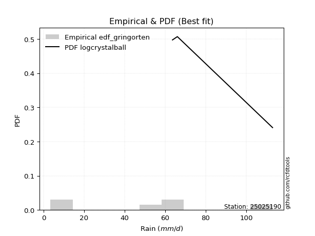</img>

</div>


### 9. Empirical - EDF Filliben (1975)

The specific values of the constants (0.3175) (often denoted as $alpha$) and (0.365) are derived from a method proposed by James J. Filliben in a 1975 paper. This particular formula is the mean value of the $i$-th order statistic of the normal distribution and is considered a robust and effective plotting position formula for the normal probability plot correlation coefficient test for normality.

<div align="center">


$P=(m-0.3175)/(n+0.365)$


</div>


**9.1. Empirical values**

<div align="center">

|                | 0                   | 1                   | 2                  | 3                  | 4                  | 5                  |
|:---------------|:--------------------|:--------------------|:-------------------|:-------------------|:-------------------|:-------------------|
| date           | 2020                | 2017                | 2025               | 2019               | 2018               | 2024               |
| x              | 3.4                 | 3.6                 | 14.6               | 56.2               | 63.6               | 113.0              |
| m              | 1                   | 2                   | 3                  | 4                  | 5                  | 6                  |
| empirical_dist | edf_filliben        | edf_filliben        | edf_filliben       | edf_filliben       | edf_filliben       | edf_filliben       |
| empirical      | 0.10722702278083267 | 0.26433621366849963 | 0.4214454045561665 | 0.5785545954438335 | 0.7356637863315004 | 0.8927729772191673 |
| empirical_tr   | 1.1201055873295205  | 1.3593166043780034  | 1.7284453496266123 | 2.3727865796831313 | 3.783060921248143  | 9.326007326007321  |

</div>


**9.2. Kolmogorov-Smirnov fit test (sorted by Δ)**


<div align="center">

|                | 0                   | 1                   | 2                   | 3                   | 4                  | 5                   | 6                   | 7                  | 8                   | 9                   | 10                 | 11                 | 12                 | 13                  | 14                  | 15                 | 16                  | 17                  | 18                 | 19                 | 20                  | 21                  | 22                  | 23                  | 24                  | 25                 | 26                  | 27                  | 28                  | 29                 | 30                  | 31                  | 32                  | 33                 | 34                  | 35                 | 36                  | 37                  | 38                    | 39                  | 40                 | 41                  | 42                  | 43                  | 44                 | 45                 | 46                  | 47                  | 48                  | 49                  | 50                  | 51                 | 52                  | 53                 | 54                  | 55                  | 56                  | 57                  | 58                  | 59                 | 60                  | 61                 | 62                 | 63                  | 64                  | 65                  | 66                 | 67                 | 68                  | 69                  | 70                  | 71                  | 72                 | 73                 | 74                  | 75                 | 76                 | 77                  | 78                 | 79                | 80                  | 81                  | 82                  | 83                | 84                  | 85                 | 86                  | 87                 | 88                 | 89                 |
|:---------------|:--------------------|:--------------------|:--------------------|:--------------------|:-------------------|:--------------------|:--------------------|:-------------------|:--------------------|:--------------------|:-------------------|:-------------------|:-------------------|:--------------------|:--------------------|:-------------------|:--------------------|:--------------------|:-------------------|:-------------------|:--------------------|:--------------------|:--------------------|:--------------------|:--------------------|:-------------------|:--------------------|:--------------------|:--------------------|:-------------------|:--------------------|:--------------------|:--------------------|:-------------------|:--------------------|:-------------------|:--------------------|:--------------------|:----------------------|:--------------------|:-------------------|:--------------------|:--------------------|:--------------------|:-------------------|:-------------------|:--------------------|:--------------------|:--------------------|:--------------------|:--------------------|:-------------------|:--------------------|:-------------------|:--------------------|:--------------------|:--------------------|:--------------------|:--------------------|:-------------------|:--------------------|:-------------------|:-------------------|:--------------------|:--------------------|:--------------------|:-------------------|:-------------------|:--------------------|:--------------------|:--------------------|:--------------------|:-------------------|:-------------------|:--------------------|:-------------------|:-------------------|:--------------------|:-------------------|:------------------|:--------------------|:--------------------|:--------------------|:------------------|:--------------------|:-------------------|:--------------------|:-------------------|:-------------------|:-------------------|
| station        | 25025190            | 25025190            | 25025190            | 25025190            | 25025190           | 25025190            | 25025190            | 25025190           | 25025190            | 25025190            | 25025190           | 25025190           | 25025190           | 25025190            | 25025190            | 25025190           | 25025190            | 25025190            | 25025190           | 25025190           | 25025190            | 25025190            | 25025190            | 25025190            | 25025190            | 25025190           | 25025190            | 25025190            | 25025190            | 25025190           | 25025190            | 25025190            | 25025190            | 25025190           | 25025190            | 25025190           | 25025190            | 25025190            | 25025190              | 25025190            | 25025190           | 25025190            | 25025190            | 25025190            | 25025190           | 25025190           | 25025190            | 25025190            | 25025190            | 25025190            | 25025190            | 25025190           | 25025190            | 25025190           | 25025190            | 25025190            | 25025190            | 25025190            | 25025190            | 25025190           | 25025190            | 25025190           | 25025190           | 25025190            | 25025190            | 25025190            | 25025190           | 25025190           | 25025190            | 25025190            | 25025190            | 25025190            | 25025190           | 25025190           | 25025190            | 25025190           | 25025190           | 25025190            | 25025190           | 25025190          | 25025190            | 25025190            | 25025190            | 25025190          | 25025190            | 25025190           | 25025190            | 25025190           | 25025190           | 25025190           |
| empirical_dist | edf_filliben        | edf_filliben        | edf_filliben        | edf_filliben        | edf_filliben       | edf_filliben        | edf_filliben        | edf_filliben       | edf_filliben        | edf_filliben        | edf_filliben       | edf_filliben       | edf_filliben       | edf_filliben        | edf_filliben        | edf_filliben       | edf_filliben        | edf_filliben        | edf_filliben       | edf_filliben       | edf_filliben        | edf_filliben        | edf_filliben        | edf_filliben        | edf_filliben        | edf_filliben       | edf_filliben        | edf_filliben        | edf_filliben        | edf_filliben       | edf_filliben        | edf_filliben        | edf_filliben        | edf_filliben       | edf_filliben        | edf_filliben       | edf_filliben        | edf_filliben        | edf_filliben          | edf_filliben        | edf_filliben       | edf_filliben        | edf_filliben        | edf_filliben        | edf_filliben       | edf_filliben       | edf_filliben        | edf_filliben        | edf_filliben        | edf_filliben        | edf_filliben        | edf_filliben       | edf_filliben        | edf_filliben       | edf_filliben        | edf_filliben        | edf_filliben        | edf_filliben        | edf_filliben        | edf_filliben       | edf_filliben        | edf_filliben       | edf_filliben       | edf_filliben        | edf_filliben        | edf_filliben        | edf_filliben       | edf_filliben       | edf_filliben        | edf_filliben        | edf_filliben        | edf_filliben        | edf_filliben       | edf_filliben       | edf_filliben        | edf_filliben       | edf_filliben       | edf_filliben        | edf_filliben       | edf_filliben      | edf_filliben        | edf_filliben        | edf_filliben        | edf_filliben      | edf_filliben        | edf_filliben       | edf_filliben        | edf_filliben       | edf_filliben       | edf_filliben       |
| p_dist         | logjohnsonsu        | halfnorm            | logloggamma         | halflogistic        | rayleigh           | maxwell             | logweibull_min      | pearson3           | genlogistic         | gumbel_r            | logfisk            | moyal              | kstwobign          | crystalball         | norm                | t                  | loggumbel_l         | logpearson3         | loggamma           | loggamma           | logexponnorm        | logt                | lognorm             | lognorm             | logcrystalball      | lognct             | logncf              | logerlang           | mielke              | fisk               | logrice             | logmaxwell          | loginvgamma         | logf               | logalpha            | loginvgauss        | lograyleigh         | logbetaprime        | loglaplace_asymmetric | loginvweibull       | logistic           | ncf                 | rice                | logkstwobign        | loglogistic        | weibull_min        | hypsecant           | gumbel_l            | nct                 | nakagami            | loggumbel_r         | logchi2            | loghypsecant        | loghalfnorm        | logexpon            | logmoyal            | laplace             | loggenexpon         | logtruncnorm        | loglaplace         | loggompertz         | lognakagami        | exponnorm          | gompertz            | laplace_asymmetric  | pareto              | expon              | genexpon           | truncnorm           | wald                | loghalflogistic     | logwald             | logpareto          | logmielke          | loggibrat           | erlang             | invgauss           | loglognorm          | gamma              | alpha             | fatiguelife         | f                   | gibrat              | betaprime         | invweibull          | logfatiguelife     | chi2                | johnsonsu          | invgamma           | loggenlogistic     |
| delta          | 0.12518729642686433 | 0.12908607269247985 | 0.13023533412233937 | 0.14584987676555516 | 0.1512196741938548 | 0.15963260833042797 | 0.16224235144390586 | 0.1653980578187274 | 0.16592078947917765 | 0.16999907729308872 | 0.1704312464156208 | 0.1732906570525139 | 0.1771552503000584 | 0.17994291416503697 | 0.17994291786708566 | 0.1799580074588779 | 0.18226741436510696 | 0.18351996769137502 | 0.1884847107711497 | 0.1884847107711497 | 0.18851238046035634 | 0.18851443697823733 | 0.18851465870342266 | 0.18851465870342266 | 0.18851466157727226 | 0.1885306688377203 | 0.18999095806900523 | 0.19001015551366074 | 0.19304041559307905 | 0.1940189780699999 | 0.19446549476336683 | 0.19584994401132094 | 0.19593684389448118 | 0.1961644592473225 | 0.19700656090336577 | 0.1974163905664349 | 0.19793159954547135 | 0.19996062938611936 | 0.20101018185040775   | 0.20102364006007756 | 0.2025884123083622 | 0.20467089854768128 | 0.20788984958771592 | 0.20871226377753394 | 0.2110718838663479 | 0.2147941356430173 | 0.21723563076631477 | 0.21729469981431151 | 0.21821744950029365 | 0.22192236681738028 | 0.22367458839931764 | 0.2250770053831369 | 0.22539511181455918 | 0.2283131750773249 | 0.23294309233122482 | 0.23510281002571287 | 0.23603553565794394 | 0.23887663429527908 | 0.24220042008551274 | 0.2431712929797364 | 0.24505346148080295 | 0.2582248965990299 | 0.2582259228859522 | 0.25912039450322577 | 0.25920873236822567 | 0.25922113374873873 | 0.2592211353356605 | 0.2592211353669545 | 0.25953723685450397 | 0.26433621365521276 | 0.26433621366849963 | 0.27203073670682987 | 0.2895999908807835 | 0.2919801412783397 | 0.30061688987577107 | 0.3075293883183191 | 0.3139449389689851 | 0.32312581050582917 | 0.3270363377846329 | 0.336745814872065 | 0.34992824000781775 | 0.37063141113270714 | 0.39974095072099564 | 0.413519334541142 | 0.45412247416780804 | 0.4593829060882788 | 0.49354961626400595 | 0.5406493518222801 | 0.6994787687239434 | 0.7356637863315004 |
| deltao         | 0.530385761606      | 0.530385761606      | 0.530385761606      | 0.530385761606      | 0.530385761606     | 0.530385761606      | 0.530385761606      | 0.530385761606     | 0.530385761606      | 0.530385761606      | 0.530385761606     | 0.530385761606     | 0.530385761606     | 0.530385761606      | 0.530385761606      | 0.530385761606     | 0.530385761606      | 0.530385761606      | 0.530385761606     | 0.530385761606     | 0.530385761606      | 0.530385761606      | 0.530385761606      | 0.530385761606      | 0.530385761606      | 0.530385761606     | 0.530385761606      | 0.530385761606      | 0.530385761606      | 0.530385761606     | 0.530385761606      | 0.530385761606      | 0.530385761606      | 0.530385761606     | 0.530385761606      | 0.530385761606     | 0.530385761606      | 0.530385761606      | 0.530385761606        | 0.530385761606      | 0.530385761606     | 0.530385761606      | 0.530385761606      | 0.530385761606      | 0.530385761606     | 0.530385761606     | 0.530385761606      | 0.530385761606      | 0.530385761606      | 0.530385761606      | 0.530385761606      | 0.530385761606     | 0.530385761606      | 0.530385761606     | 0.530385761606      | 0.530385761606      | 0.530385761606      | 0.530385761606      | 0.530385761606      | 0.530385761606     | 0.530385761606      | 0.530385761606     | 0.530385761606     | 0.530385761606      | 0.530385761606      | 0.530385761606      | 0.530385761606     | 0.530385761606     | 0.530385761606      | 0.530385761606      | 0.530385761606      | 0.530385761606      | 0.530385761606     | 0.530385761606     | 0.530385761606      | 0.530385761606     | 0.530385761606     | 0.530385761606      | 0.530385761606     | 0.530385761606    | 0.530385761606      | 0.530385761606      | 0.530385761606      | 0.530385761606    | 0.530385761606      | 0.530385761606     | 0.530385761606      | 0.530385761606     | 0.530385761606     | 0.530385761606     |
| eval           | Δo > Δ              | Δo > Δ              | Δo > Δ              | Δo > Δ              | Δo > Δ             | Δo > Δ              | Δo > Δ              | Δo > Δ             | Δo > Δ              | Δo > Δ              | Δo > Δ             | Δo > Δ             | Δo > Δ             | Δo > Δ              | Δo > Δ              | Δo > Δ             | Δo > Δ              | Δo > Δ              | Δo > Δ             | Δo > Δ             | Δo > Δ              | Δo > Δ              | Δo > Δ              | Δo > Δ              | Δo > Δ              | Δo > Δ             | Δo > Δ              | Δo > Δ              | Δo > Δ              | Δo > Δ             | Δo > Δ              | Δo > Δ              | Δo > Δ              | Δo > Δ             | Δo > Δ              | Δo > Δ             | Δo > Δ              | Δo > Δ              | Δo > Δ                | Δo > Δ              | Δo > Δ             | Δo > Δ              | Δo > Δ              | Δo > Δ              | Δo > Δ             | Δo > Δ             | Δo > Δ              | Δo > Δ              | Δo > Δ              | Δo > Δ              | Δo > Δ              | Δo > Δ             | Δo > Δ              | Δo > Δ             | Δo > Δ              | Δo > Δ              | Δo > Δ              | Δo > Δ              | Δo > Δ              | Δo > Δ             | Δo > Δ              | Δo > Δ             | Δo > Δ             | Δo > Δ              | Δo > Δ              | Δo > Δ              | Δo > Δ             | Δo > Δ             | Δo > Δ              | Δo > Δ              | Δo > Δ              | Δo > Δ              | Δo > Δ             | Δo > Δ             | Δo > Δ              | Δo > Δ             | Δo > Δ             | Δo > Δ              | Δo > Δ             | Δo > Δ            | Δo > Δ              | Δo > Δ              | Δo > Δ              | Δo > Δ            | Δo > Δ              | Δo > Δ             | Δo > Δ              | Δo <= Δ            | Δo <= Δ            | Δo <= Δ            |
| fit            | 1                   | 1                   | 1                   | 1                   | 1                  | 1                   | 1                   | 1                  | 1                   | 1                   | 1                  | 1                  | 1                  | 1                   | 1                   | 1                  | 1                   | 1                   | 1                  | 1                  | 1                   | 1                   | 1                   | 1                   | 1                   | 1                  | 1                   | 1                   | 1                   | 1                  | 1                   | 1                   | 1                   | 1                  | 1                   | 1                  | 1                   | 1                   | 1                     | 1                   | 1                  | 1                   | 1                   | 1                   | 1                  | 1                  | 1                   | 1                   | 1                   | 1                   | 1                   | 1                  | 1                   | 1                  | 1                   | 1                   | 1                   | 1                   | 1                   | 1                  | 1                   | 1                  | 1                  | 1                   | 1                   | 1                   | 1                  | 1                  | 1                   | 1                   | 1                   | 1                   | 1                  | 1                  | 1                   | 1                  | 1                  | 1                   | 1                  | 1                 | 1                   | 1                   | 1                   | 1                 | 1                   | 1                  | 1                   | 0                  | 0                  | 0                  |
| n              | 6                   | 6                   | 6                   | 6                   | 6                  | 6                   | 6                   | 6                  | 6                   | 6                   | 6                  | 6                  | 6                  | 6                   | 6                   | 6                  | 6                   | 6                   | 6                  | 6                  | 6                   | 6                   | 6                   | 6                   | 6                   | 6                  | 6                   | 6                   | 6                   | 6                  | 6                   | 6                   | 6                   | 6                  | 6                   | 6                  | 6                   | 6                   | 6                     | 6                   | 6                  | 6                   | 6                   | 6                   | 6                  | 6                  | 6                   | 6                   | 6                   | 6                   | 6                   | 6                  | 6                   | 6                  | 6                   | 6                   | 6                   | 6                   | 6                   | 6                  | 6                   | 6                  | 6                  | 6                   | 6                   | 6                   | 6                  | 6                  | 6                   | 6                   | 6                   | 6                   | 6                  | 6                  | 6                   | 6                  | 6                  | 6                   | 6                  | 6                 | 6                   | 6                   | 6                   | 6                 | 6                   | 6                  | 6                   | 6                  | 6                  | 6                  |
| best_fit       | 1                   | 0                   | 0                   | 0                   | 0                  | 0                   | 0                   | 0                  | 0                   | 0                   | 0                  | 0                  | 0                  | 0                   | 0                   | 0                  | 0                   | 0                   | 0                  | 0                  | 0                   | 0                   | 0                   | 0                   | 0                   | 0                  | 0                   | 0                   | 0                   | 0                  | 0                   | 0                   | 0                   | 0                  | 0                   | 0                  | 0                   | 0                   | 0                     | 0                   | 0                  | 0                   | 0                   | 0                   | 0                  | 0                  | 0                   | 0                   | 0                   | 0                   | 0                   | 0                  | 0                   | 0                  | 0                   | 0                   | 0                   | 0                   | 0                   | 0                  | 0                   | 0                  | 0                  | 0                   | 0                   | 0                   | 0                  | 0                  | 0                   | 0                   | 0                   | 0                   | 0                  | 0                  | 0                   | 0                  | 0                  | 0                   | 0                  | 0                 | 0                   | 0                   | 0                   | 0                 | 0                   | 0                  | 0                   | 0                  | 0                  | 0                  |
| best_fit_sort  | 1                   | 2                   | 3                   | 4                   | 5                  | 6                   | 7                   | 8                  | 9                   | 10                  | 11                 | 12                 | 13                 | 14                  | 15                  | 16                 | 17                  | 18                  | 19                 | 20                 | 21                  | 22                  | 23                  | 24                  | 25                  | 26                 | 27                  | 28                  | 29                  | 30                 | 31                  | 32                  | 33                  | 34                 | 35                  | 36                 | 37                  | 38                  | 39                    | 40                  | 41                 | 42                  | 43                  | 44                  | 45                 | 46                 | 47                  | 48                  | 49                  | 50                  | 51                  | 52                 | 53                  | 54                 | 55                  | 56                  | 57                  | 58                  | 59                  | 60                 | 61                  | 62                 | 63                 | 64                  | 65                  | 66                  | 67                 | 68                 | 69                  | 70                  | 71                  | 72                  | 73                 | 74                 | 75                  | 76                 | 77                 | 78                  | 79                 | 80                | 81                  | 82                  | 83                  | 84                | 85                  | 86                 | 87                  | 88                 | 89                 | 90                 |

</div>


<div align="center">

</img>

</div>


**9.3. Best fit**

<div align="center">

|   id |   station | empirical_dist   | p_dist       |    delta |   deltao | eval   |   fit |   n |   best_fit |   best_fit_sort |
|-----:|----------:|:-----------------|:-------------|---------:|---------:|:-------|------:|----:|-----------:|----------------:|
|    0 |  25025190 | edf_filliben     | logjohnsonsu | 0.125187 | 0.530386 | Δo > Δ |     1 |   6 |          1 |               1 |

</div>


<div align="center">

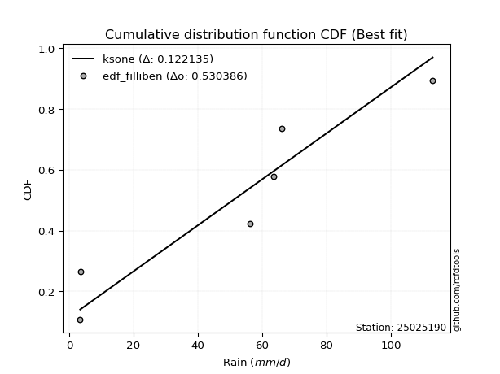</img>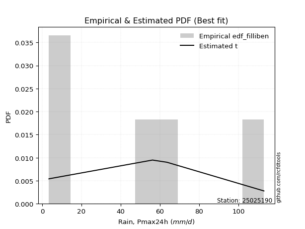</img>

</div>


### 10. Empirical - EDF Jenkinson (1977)

The Jenkinson formula in hydrology is an empirical plotting position formula used to estimate the non-exceedance probability _(P)_ or return period _(T)_ of a given ordered observation within a sample. It is a widely used method in the frequency analysis of extreme events such as floods and rainfall, as it provides a distribution-free way to plot data. _a≈0.31_ and _b≈0.38_ are constants derived to approximate the median of the probability distribution for the given rank.

<div align="center">


$P=(m-a)/(n+b)$


</div>


**10.1. Empirical values**

<div align="center">

|                | 0                   | 1                   | 2                  | 3                  | 4                  | 5                  |
|:---------------|:--------------------|:--------------------|:-------------------|:-------------------|:-------------------|:-------------------|
| date           | 2020                | 2017                | 2025               | 2019               | 2018               | 2024               |
| x              | 3.4                 | 3.6                 | 14.6               | 56.2               | 63.6               | 113.0              |
| m              | 1                   | 2                   | 3                  | 4                  | 5                  | 6                  |
| empirical_dist | edf_jenkinson       | edf_jenkinson       | edf_jenkinson      | edf_jenkinson      | edf_jenkinson      | edf_jenkinson      |
| empirical      | 0.10815047021943573 | 0.26489028213166144 | 0.4216300940438871 | 0.5783699059561128 | 0.7351097178683387 | 0.8918495297805643 |
| empirical_tr   | 1.1212653778558874  | 1.3603411513859276  | 1.7289972899728996 | 2.3717472118959106 | 3.7751479289940844 | 9.246376811594207  |

</div>


**10.2. Kolmogorov-Smirnov fit test (sorted by Δ)**


<div align="center">

|                | 0                   | 1                   | 2                   | 3                   | 4                  | 5                   | 6                   | 7                 | 8                   | 9                   | 10                  | 11                 | 12                | 13                  | 14                  | 15                 | 16                  | 17                  | 18                  | 19                  | 20                | 21                | 22                 | 23                 | 24                  | 25                  | 26                 | 27                 | 28                  | 29                 | 30                 | 31                 | 32                  | 33                  | 34                  | 35                  | 36                | 37                  | 38                    | 39                  | 40                 | 41                  | 42                  | 43                 | 44                  | 45                 | 46                  | 47                  | 48                  | 49                 | 50                 | 51                  | 52                  | 53                 | 54                  | 55                  | 56                  | 57                 | 58                  | 59                  | 60                  | 61                 | 62                | 63                 | 64                 | 65                  | 66                 | 67                 | 68                 | 69                  | 70                  | 71                 | 72                 | 73                  | 74                 | 75                  | 76                 | 77                  | 78                 | 79                  | 80                 | 81                  | 82                  | 83                 | 84                 | 85                 | 86                  | 87                 | 88                 | 89                 |
|:---------------|:--------------------|:--------------------|:--------------------|:--------------------|:-------------------|:--------------------|:--------------------|:------------------|:--------------------|:--------------------|:--------------------|:-------------------|:------------------|:--------------------|:--------------------|:-------------------|:--------------------|:--------------------|:--------------------|:--------------------|:------------------|:------------------|:-------------------|:-------------------|:--------------------|:--------------------|:-------------------|:-------------------|:--------------------|:-------------------|:-------------------|:-------------------|:--------------------|:--------------------|:--------------------|:--------------------|:------------------|:--------------------|:----------------------|:--------------------|:-------------------|:--------------------|:--------------------|:-------------------|:--------------------|:-------------------|:--------------------|:--------------------|:--------------------|:-------------------|:-------------------|:--------------------|:--------------------|:-------------------|:--------------------|:--------------------|:--------------------|:-------------------|:--------------------|:--------------------|:--------------------|:-------------------|:------------------|:-------------------|:-------------------|:--------------------|:-------------------|:-------------------|:-------------------|:--------------------|:--------------------|:-------------------|:-------------------|:--------------------|:-------------------|:--------------------|:-------------------|:--------------------|:-------------------|:--------------------|:-------------------|:--------------------|:--------------------|:-------------------|:-------------------|:-------------------|:--------------------|:-------------------|:-------------------|:-------------------|
| station        | 25025190            | 25025190            | 25025190            | 25025190            | 25025190           | 25025190            | 25025190            | 25025190          | 25025190            | 25025190            | 25025190            | 25025190           | 25025190          | 25025190            | 25025190            | 25025190           | 25025190            | 25025190            | 25025190            | 25025190            | 25025190          | 25025190          | 25025190           | 25025190           | 25025190            | 25025190            | 25025190           | 25025190           | 25025190            | 25025190           | 25025190           | 25025190           | 25025190            | 25025190            | 25025190            | 25025190            | 25025190          | 25025190            | 25025190              | 25025190            | 25025190           | 25025190            | 25025190            | 25025190           | 25025190            | 25025190           | 25025190            | 25025190            | 25025190            | 25025190           | 25025190           | 25025190            | 25025190            | 25025190           | 25025190            | 25025190            | 25025190            | 25025190           | 25025190            | 25025190            | 25025190            | 25025190           | 25025190          | 25025190           | 25025190           | 25025190            | 25025190           | 25025190           | 25025190           | 25025190            | 25025190            | 25025190           | 25025190           | 25025190            | 25025190           | 25025190            | 25025190           | 25025190            | 25025190           | 25025190            | 25025190           | 25025190            | 25025190            | 25025190           | 25025190           | 25025190           | 25025190            | 25025190           | 25025190           | 25025190           |
| empirical_dist | edf_jenkinson       | edf_jenkinson       | edf_jenkinson       | edf_jenkinson       | edf_jenkinson      | edf_jenkinson       | edf_jenkinson       | edf_jenkinson     | edf_jenkinson       | edf_jenkinson       | edf_jenkinson       | edf_jenkinson      | edf_jenkinson     | edf_jenkinson       | edf_jenkinson       | edf_jenkinson      | edf_jenkinson       | edf_jenkinson       | edf_jenkinson       | edf_jenkinson       | edf_jenkinson     | edf_jenkinson     | edf_jenkinson      | edf_jenkinson      | edf_jenkinson       | edf_jenkinson       | edf_jenkinson      | edf_jenkinson      | edf_jenkinson       | edf_jenkinson      | edf_jenkinson      | edf_jenkinson      | edf_jenkinson       | edf_jenkinson       | edf_jenkinson       | edf_jenkinson       | edf_jenkinson     | edf_jenkinson       | edf_jenkinson         | edf_jenkinson       | edf_jenkinson      | edf_jenkinson       | edf_jenkinson       | edf_jenkinson      | edf_jenkinson       | edf_jenkinson      | edf_jenkinson       | edf_jenkinson       | edf_jenkinson       | edf_jenkinson      | edf_jenkinson      | edf_jenkinson       | edf_jenkinson       | edf_jenkinson      | edf_jenkinson       | edf_jenkinson       | edf_jenkinson       | edf_jenkinson      | edf_jenkinson       | edf_jenkinson       | edf_jenkinson       | edf_jenkinson      | edf_jenkinson     | edf_jenkinson      | edf_jenkinson      | edf_jenkinson       | edf_jenkinson      | edf_jenkinson      | edf_jenkinson      | edf_jenkinson       | edf_jenkinson       | edf_jenkinson      | edf_jenkinson      | edf_jenkinson       | edf_jenkinson      | edf_jenkinson       | edf_jenkinson      | edf_jenkinson       | edf_jenkinson      | edf_jenkinson       | edf_jenkinson      | edf_jenkinson       | edf_jenkinson       | edf_jenkinson      | edf_jenkinson      | edf_jenkinson      | edf_jenkinson       | edf_jenkinson      | edf_jenkinson      | edf_jenkinson      |
| p_dist         | logjohnsonsu        | halfnorm            | logloggamma         | halflogistic        | rayleigh           | maxwell             | logweibull_min      | pearson3          | genlogistic         | gumbel_r            | logfisk             | moyal              | kstwobign         | crystalball         | norm                | t                  | loggumbel_l         | logpearson3         | loggamma            | loggamma            | logexponnorm      | logt              | lognorm            | lognorm            | logcrystalball      | lognct              | logncf             | logerlang          | fisk                | mielke             | logrice            | logmaxwell         | loginvgamma         | logf                | logalpha            | loginvgauss         | lograyleigh       | logbetaprime        | loglaplace_asymmetric | loginvweibull       | logistic           | ncf                 | rice                | logkstwobign       | loglogistic         | weibull_min        | hypsecant           | gumbel_l            | nct                 | nakagami           | loggumbel_r        | logchi2             | loghypsecant        | loghalfnorm        | logexpon            | logmoyal            | laplace             | loggenexpon        | logtruncnorm        | loglaplace          | loggompertz         | lognakagami        | exponnorm         | gompertz           | laplace_asymmetric | pareto              | expon              | genexpon           | truncnorm          | wald                | loghalflogistic     | logwald            | logpareto          | logmielke           | loggibrat          | erlang              | invgauss           | loglognorm          | gamma              | alpha               | fatiguelife        | f                   | gibrat              | betaprime          | invweibull         | logfatiguelife     | chi2                | johnsonsu          | invgamma           | loggenlogistic     |
| delta          | 0.12574136489002613 | 0.12927076218020045 | 0.13078940258550117 | 0.14603456625327577 | 0.1514043636815754 | 0.15981729781814857 | 0.16242704093162652 | 0.165582747306448 | 0.16610547896689826 | 0.17018376678080932 | 0.17061593590334145 | 0.1734753465402345 | 0.177339939787779 | 0.18012760365275757 | 0.18012760735480626 | 0.1801426969465985 | 0.18245210385282762 | 0.18370465717909568 | 0.18866940025887036 | 0.18866940025887036 | 0.188697069948077 | 0.188699126465958 | 0.1886993481911433 | 0.1886993481911433 | 0.18869935106499292 | 0.18871535832544095 | 0.1901756475567259 | 0.1901948450013814 | 0.19309553063139695 | 0.1932251050807997 | 0.1946501842510875 | 0.1960346334990416 | 0.19612153338220184 | 0.19671852771048431 | 0.19719125039108643 | 0.19760108005415555 | 0.198116289033192 | 0.20014531887384002 | 0.2011948713381284    | 0.20120832954779821 | 0.2027731017960828 | 0.20485558803540194 | 0.20807453907543652 | 0.2088969532652546 | 0.21125657335406856 | 0.2153482041061791 | 0.21742032025403538 | 0.21747938930203212 | 0.21803276001257305 | 0.2224764352805421 | 0.2238592778870383 | 0.22526169487085757 | 0.22557980130227984 | 0.2288672435404867 | 0.23349716079438662 | 0.23528749951343353 | 0.23622022514566454 | 0.2394307027584409 | 0.24275448854867454 | 0.24335598246745704 | 0.24560752994396476 | 0.2584095860867506 | 0.258779991349114 | 0.2596744629663876 | 0.2597628008313875 | 0.25977520221190054 | 0.2597752037988223 | 0.2597752038301163 | 0.2600913053176658 | 0.26489028211837456 | 0.26489028213166144 | 0.2722154261945505 | 0.2894153013930629 | 0.29216483076606037 | 0.3008015793634917 | 0.30771407780603977 | 0.3141296284567058 | 0.32257174204266736 | 0.3272210272723536 | 0.33693050435978567 | 0.3501129294955384 | 0.37044672164498654 | 0.39992564020871624 | 0.4133346450534214 | 0.4531990267292051 | 0.4591982166005582 | 0.49336492677628535 | 0.5400952833591184 | 0.6989247002607817 | 0.7351097178683387 |
| deltao         | 0.530385761606      | 0.530385761606      | 0.530385761606      | 0.530385761606      | 0.530385761606     | 0.530385761606      | 0.530385761606      | 0.530385761606    | 0.530385761606      | 0.530385761606      | 0.530385761606      | 0.530385761606     | 0.530385761606    | 0.530385761606      | 0.530385761606      | 0.530385761606     | 0.530385761606      | 0.530385761606      | 0.530385761606      | 0.530385761606      | 0.530385761606    | 0.530385761606    | 0.530385761606     | 0.530385761606     | 0.530385761606      | 0.530385761606      | 0.530385761606     | 0.530385761606     | 0.530385761606      | 0.530385761606     | 0.530385761606     | 0.530385761606     | 0.530385761606      | 0.530385761606      | 0.530385761606      | 0.530385761606      | 0.530385761606    | 0.530385761606      | 0.530385761606        | 0.530385761606      | 0.530385761606     | 0.530385761606      | 0.530385761606      | 0.530385761606     | 0.530385761606      | 0.530385761606     | 0.530385761606      | 0.530385761606      | 0.530385761606      | 0.530385761606     | 0.530385761606     | 0.530385761606      | 0.530385761606      | 0.530385761606     | 0.530385761606      | 0.530385761606      | 0.530385761606      | 0.530385761606     | 0.530385761606      | 0.530385761606      | 0.530385761606      | 0.530385761606     | 0.530385761606    | 0.530385761606     | 0.530385761606     | 0.530385761606      | 0.530385761606     | 0.530385761606     | 0.530385761606     | 0.530385761606      | 0.530385761606      | 0.530385761606     | 0.530385761606     | 0.530385761606      | 0.530385761606     | 0.530385761606      | 0.530385761606     | 0.530385761606      | 0.530385761606     | 0.530385761606      | 0.530385761606     | 0.530385761606      | 0.530385761606      | 0.530385761606     | 0.530385761606     | 0.530385761606     | 0.530385761606      | 0.530385761606     | 0.530385761606     | 0.530385761606     |
| eval           | Δo > Δ              | Δo > Δ              | Δo > Δ              | Δo > Δ              | Δo > Δ             | Δo > Δ              | Δo > Δ              | Δo > Δ            | Δo > Δ              | Δo > Δ              | Δo > Δ              | Δo > Δ             | Δo > Δ            | Δo > Δ              | Δo > Δ              | Δo > Δ             | Δo > Δ              | Δo > Δ              | Δo > Δ              | Δo > Δ              | Δo > Δ            | Δo > Δ            | Δo > Δ             | Δo > Δ             | Δo > Δ              | Δo > Δ              | Δo > Δ             | Δo > Δ             | Δo > Δ              | Δo > Δ             | Δo > Δ             | Δo > Δ             | Δo > Δ              | Δo > Δ              | Δo > Δ              | Δo > Δ              | Δo > Δ            | Δo > Δ              | Δo > Δ                | Δo > Δ              | Δo > Δ             | Δo > Δ              | Δo > Δ              | Δo > Δ             | Δo > Δ              | Δo > Δ             | Δo > Δ              | Δo > Δ              | Δo > Δ              | Δo > Δ             | Δo > Δ             | Δo > Δ              | Δo > Δ              | Δo > Δ             | Δo > Δ              | Δo > Δ              | Δo > Δ              | Δo > Δ             | Δo > Δ              | Δo > Δ              | Δo > Δ              | Δo > Δ             | Δo > Δ            | Δo > Δ             | Δo > Δ             | Δo > Δ              | Δo > Δ             | Δo > Δ             | Δo > Δ             | Δo > Δ              | Δo > Δ              | Δo > Δ             | Δo > Δ             | Δo > Δ              | Δo > Δ             | Δo > Δ              | Δo > Δ             | Δo > Δ              | Δo > Δ             | Δo > Δ              | Δo > Δ             | Δo > Δ              | Δo > Δ              | Δo > Δ             | Δo > Δ             | Δo > Δ             | Δo > Δ              | Δo <= Δ            | Δo <= Δ            | Δo <= Δ            |
| fit            | 1                   | 1                   | 1                   | 1                   | 1                  | 1                   | 1                   | 1                 | 1                   | 1                   | 1                   | 1                  | 1                 | 1                   | 1                   | 1                  | 1                   | 1                   | 1                   | 1                   | 1                 | 1                 | 1                  | 1                  | 1                   | 1                   | 1                  | 1                  | 1                   | 1                  | 1                  | 1                  | 1                   | 1                   | 1                   | 1                   | 1                 | 1                   | 1                     | 1                   | 1                  | 1                   | 1                   | 1                  | 1                   | 1                  | 1                   | 1                   | 1                   | 1                  | 1                  | 1                   | 1                   | 1                  | 1                   | 1                   | 1                   | 1                  | 1                   | 1                   | 1                   | 1                  | 1                 | 1                  | 1                  | 1                   | 1                  | 1                  | 1                  | 1                   | 1                   | 1                  | 1                  | 1                   | 1                  | 1                   | 1                  | 1                   | 1                  | 1                   | 1                  | 1                   | 1                   | 1                  | 1                  | 1                  | 1                   | 0                  | 0                  | 0                  |
| n              | 6                   | 6                   | 6                   | 6                   | 6                  | 6                   | 6                   | 6                 | 6                   | 6                   | 6                   | 6                  | 6                 | 6                   | 6                   | 6                  | 6                   | 6                   | 6                   | 6                   | 6                 | 6                 | 6                  | 6                  | 6                   | 6                   | 6                  | 6                  | 6                   | 6                  | 6                  | 6                  | 6                   | 6                   | 6                   | 6                   | 6                 | 6                   | 6                     | 6                   | 6                  | 6                   | 6                   | 6                  | 6                   | 6                  | 6                   | 6                   | 6                   | 6                  | 6                  | 6                   | 6                   | 6                  | 6                   | 6                   | 6                   | 6                  | 6                   | 6                   | 6                   | 6                  | 6                 | 6                  | 6                  | 6                   | 6                  | 6                  | 6                  | 6                   | 6                   | 6                  | 6                  | 6                   | 6                  | 6                   | 6                  | 6                   | 6                  | 6                   | 6                  | 6                   | 6                   | 6                  | 6                  | 6                  | 6                   | 6                  | 6                  | 6                  |
| best_fit       | 1                   | 0                   | 0                   | 0                   | 0                  | 0                   | 0                   | 0                 | 0                   | 0                   | 0                   | 0                  | 0                 | 0                   | 0                   | 0                  | 0                   | 0                   | 0                   | 0                   | 0                 | 0                 | 0                  | 0                  | 0                   | 0                   | 0                  | 0                  | 0                   | 0                  | 0                  | 0                  | 0                   | 0                   | 0                   | 0                   | 0                 | 0                   | 0                     | 0                   | 0                  | 0                   | 0                   | 0                  | 0                   | 0                  | 0                   | 0                   | 0                   | 0                  | 0                  | 0                   | 0                   | 0                  | 0                   | 0                   | 0                   | 0                  | 0                   | 0                   | 0                   | 0                  | 0                 | 0                  | 0                  | 0                   | 0                  | 0                  | 0                  | 0                   | 0                   | 0                  | 0                  | 0                   | 0                  | 0                   | 0                  | 0                   | 0                  | 0                   | 0                  | 0                   | 0                   | 0                  | 0                  | 0                  | 0                   | 0                  | 0                  | 0                  |
| best_fit_sort  | 1                   | 2                   | 3                   | 4                   | 5                  | 6                   | 7                   | 8                 | 9                   | 10                  | 11                  | 12                 | 13                | 14                  | 15                  | 16                 | 17                  | 18                  | 19                  | 20                  | 21                | 22                | 23                 | 24                 | 25                  | 26                  | 27                 | 28                 | 29                  | 30                 | 31                 | 32                 | 33                  | 34                  | 35                  | 36                  | 37                | 38                  | 39                    | 40                  | 41                 | 42                  | 43                  | 44                 | 45                  | 46                 | 47                  | 48                  | 49                  | 50                 | 51                 | 52                  | 53                  | 54                 | 55                  | 56                  | 57                  | 58                 | 59                  | 60                  | 61                  | 62                 | 63                | 64                 | 65                 | 66                  | 67                 | 68                 | 69                 | 70                  | 71                  | 72                 | 73                 | 74                  | 75                 | 76                  | 77                 | 78                  | 79                 | 80                  | 81                 | 82                  | 83                  | 84                 | 85                 | 86                 | 87                  | 88                 | 89                 | 90                 |

</div>


<div align="center">

</img>

</div>


**10.3. Best fit**

<div align="center">

|   id |   station | empirical_dist   | p_dist       |    delta |   deltao | eval   |   fit |   n |   best_fit |   best_fit_sort |
|-----:|----------:|:-----------------|:-------------|---------:|---------:|:-------|------:|----:|-----------:|----------------:|
|    0 |  25025190 | edf_jenkinson    | logjohnsonsu | 0.125741 | 0.530386 | Δo > Δ |     1 |   6 |          1 |               1 |

</div>


<div align="center">

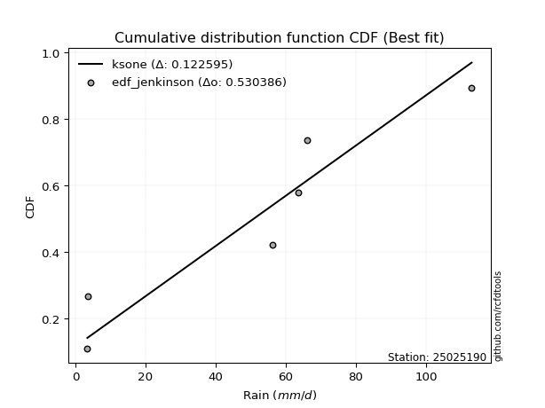</img>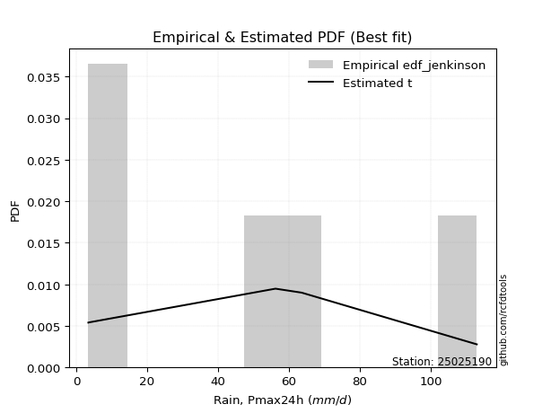</img>

</div>


### 11. Empirical - EDF Cunnane (1978)

Cunnane´s work in statistical hydrology has focused on the performance and evaluation of different probability distributions (such as GEV, Gumbel, Lognormal) for flood frequency estimation. _b_ is a constant, typically set to 0.4.

<div align="center">


$P=(m-b)/(n+1-2b)$


</div>


**11.1. Empirical values**

<div align="center">

|                | 0                  | 1                   | 2                   | 3                  | 4                  | 5                  |
|:---------------|:-------------------|:--------------------|:--------------------|:-------------------|:-------------------|:-------------------|
| date           | 2020               | 2017                | 2025                | 2019               | 2018               | 2024               |
| x              | 3.4                | 3.6                 | 14.6                | 56.2               | 63.6               | 113.0              |
| m              | 1                  | 2                   | 3                   | 4                  | 5                  | 6                  |
| empirical_dist | edf_cunnane        | edf_cunnane         | edf_cunnane         | edf_cunnane        | edf_cunnane        | edf_cunnane        |
| empirical      | 0.0967741935483871 | 0.25806451612903225 | 0.41935483870967744 | 0.5806451612903226 | 0.7419354838709676 | 0.9032258064516128 |
| empirical_tr   | 1.1071428571428572 | 1.3478260869565217  | 1.7222222222222225  | 2.384615384615385  | 3.8749999999999982 | 10.333333333333318 |

</div>


**11.2. Kolmogorov-Smirnov fit test (sorted by Δ)**


<div align="center">

|                | 0                   | 1                   | 2                   | 3                   | 4                  | 5                   | 6                   | 7                   | 8                   | 9                   | 10                  | 11                 | 12                  | 13                  | 14                  | 15                  | 16                  | 17                  | 18                  | 19                  | 20                 | 21                 | 22                 | 23                 | 24                 | 25                  | 26                 | 27                 | 28                  | 29                 | 30                  | 31                 | 32                  | 33                  | 34                  | 35                 | 36                  | 37                    | 38                 | 39                 | 40                  | 41                 | 42                  | 43                 | 44                  | 45                  | 46                  | 47                  | 48                 | 49                  | 50                 | 51                  | 52                  | 53                  | 54                  | 55                 | 56                  | 57                  | 58                  | 59                  | 60                  | 61                 | 62                 | 63                 | 64                  | 65                 | 66                  | 67                 | 68                 | 69                 | 70                  | 71                 | 72                  | 73                  | 74                 | 75                  | 76                 | 77                 | 78                  | 79                  | 80                 | 81                  | 82                  | 83                  | 84                 | 85                  | 86                  | 87                 | 88                 | 89                 |
|:---------------|:--------------------|:--------------------|:--------------------|:--------------------|:-------------------|:--------------------|:--------------------|:--------------------|:--------------------|:--------------------|:--------------------|:-------------------|:--------------------|:--------------------|:--------------------|:--------------------|:--------------------|:--------------------|:--------------------|:--------------------|:-------------------|:-------------------|:-------------------|:-------------------|:-------------------|:--------------------|:-------------------|:-------------------|:--------------------|:-------------------|:--------------------|:-------------------|:--------------------|:--------------------|:--------------------|:-------------------|:--------------------|:----------------------|:-------------------|:-------------------|:--------------------|:-------------------|:--------------------|:-------------------|:--------------------|:--------------------|:--------------------|:--------------------|:-------------------|:--------------------|:-------------------|:--------------------|:--------------------|:--------------------|:--------------------|:-------------------|:--------------------|:--------------------|:--------------------|:--------------------|:--------------------|:-------------------|:-------------------|:-------------------|:--------------------|:-------------------|:--------------------|:-------------------|:-------------------|:-------------------|:--------------------|:-------------------|:--------------------|:--------------------|:-------------------|:--------------------|:-------------------|:-------------------|:--------------------|:--------------------|:-------------------|:--------------------|:--------------------|:--------------------|:-------------------|:--------------------|:--------------------|:-------------------|:-------------------|:-------------------|
| station        | 25025190            | 25025190            | 25025190            | 25025190            | 25025190           | 25025190            | 25025190            | 25025190            | 25025190            | 25025190            | 25025190            | 25025190           | 25025190            | 25025190            | 25025190            | 25025190            | 25025190            | 25025190            | 25025190            | 25025190            | 25025190           | 25025190           | 25025190           | 25025190           | 25025190           | 25025190            | 25025190           | 25025190           | 25025190            | 25025190           | 25025190            | 25025190           | 25025190            | 25025190            | 25025190            | 25025190           | 25025190            | 25025190              | 25025190           | 25025190           | 25025190            | 25025190           | 25025190            | 25025190           | 25025190            | 25025190            | 25025190            | 25025190            | 25025190           | 25025190            | 25025190           | 25025190            | 25025190            | 25025190            | 25025190            | 25025190           | 25025190            | 25025190            | 25025190            | 25025190            | 25025190            | 25025190           | 25025190           | 25025190           | 25025190            | 25025190           | 25025190            | 25025190           | 25025190           | 25025190           | 25025190            | 25025190           | 25025190            | 25025190            | 25025190           | 25025190            | 25025190           | 25025190           | 25025190            | 25025190            | 25025190           | 25025190            | 25025190            | 25025190            | 25025190           | 25025190            | 25025190            | 25025190           | 25025190           | 25025190           |
| empirical_dist | edf_cunnane         | edf_cunnane         | edf_cunnane         | edf_cunnane         | edf_cunnane        | edf_cunnane         | edf_cunnane         | edf_cunnane         | edf_cunnane         | edf_cunnane         | edf_cunnane         | edf_cunnane        | edf_cunnane         | edf_cunnane         | edf_cunnane         | edf_cunnane         | edf_cunnane         | edf_cunnane         | edf_cunnane         | edf_cunnane         | edf_cunnane        | edf_cunnane        | edf_cunnane        | edf_cunnane        | edf_cunnane        | edf_cunnane         | edf_cunnane        | edf_cunnane        | edf_cunnane         | edf_cunnane        | edf_cunnane         | edf_cunnane        | edf_cunnane         | edf_cunnane         | edf_cunnane         | edf_cunnane        | edf_cunnane         | edf_cunnane           | edf_cunnane        | edf_cunnane        | edf_cunnane         | edf_cunnane        | edf_cunnane         | edf_cunnane        | edf_cunnane         | edf_cunnane         | edf_cunnane         | edf_cunnane         | edf_cunnane        | edf_cunnane         | edf_cunnane        | edf_cunnane         | edf_cunnane         | edf_cunnane         | edf_cunnane         | edf_cunnane        | edf_cunnane         | edf_cunnane         | edf_cunnane         | edf_cunnane         | edf_cunnane         | edf_cunnane        | edf_cunnane        | edf_cunnane        | edf_cunnane         | edf_cunnane        | edf_cunnane         | edf_cunnane        | edf_cunnane        | edf_cunnane        | edf_cunnane         | edf_cunnane        | edf_cunnane         | edf_cunnane         | edf_cunnane        | edf_cunnane         | edf_cunnane        | edf_cunnane        | edf_cunnane         | edf_cunnane         | edf_cunnane        | edf_cunnane         | edf_cunnane         | edf_cunnane         | edf_cunnane        | edf_cunnane         | edf_cunnane         | edf_cunnane        | edf_cunnane        | edf_cunnane        |
| p_dist         | logjohnsonsu        | logloggamma         | halfnorm            | halflogistic        | rayleigh           | maxwell             | logweibull_min      | pearson3            | genlogistic         | gumbel_r            | logfisk             | moyal              | kstwobign           | crystalball         | norm                | t                   | loggumbel_l         | logpearson3         | loggamma            | loggamma            | logexponnorm       | logt               | lognorm            | lognorm            | logcrystalball     | lognct              | logncf             | logerlang          | logf                | mielke             | logrice             | logmaxwell         | loginvgamma         | logalpha            | loginvgauss         | lograyleigh        | logbetaprime        | loglaplace_asymmetric | loginvweibull      | logistic           | ncf                 | fisk               | rice                | logkstwobign       | weibull_min         | loglogistic         | hypsecant           | gumbel_l            | nakagami           | nct                 | loggumbel_r        | loghalfnorm         | logchi2             | loghypsecant        | logexpon            | loggenexpon        | logmoyal            | laplace             | logtruncnorm        | loggompertz         | loglaplace          | exponnorm          | gompertz           | laplace_asymmetric | pareto              | expon              | genexpon            | truncnorm          | lognakagami        | wald               | loghalflogistic     | logwald            | logmielke           | logpareto           | loggibrat          | erlang              | invgauss           | gamma              | loglognorm          | alpha               | fatiguelife        | f                   | gibrat              | betaprime           | logfatiguelife     | invweibull          | chi2                | johnsonsu          | invgamma           | loggenlogistic     |
| delta          | 0.12096308726029359 | 0.12396363658287199 | 0.12699550684599076 | 0.14375931091906607 | 0.1491291083473657 | 0.15754204248393888 | 0.16015178559741672 | 0.16330749197223832 | 0.16383022363268857 | 0.16790851144659963 | 0.16834068056913165 | 0.1712000912060248 | 0.17506468445356932 | 0.17785234831854788 | 0.17785235202059657 | 0.17786744161238882 | 0.18017684851861782 | 0.18142940184488587 | 0.18639414492466055 | 0.18639414492466055 | 0.1864218146138672 | 0.1864238711317482 | 0.1864240928569335 | 0.1864240928569335 | 0.1864240957307831 | 0.18644010299123115 | 0.1879003922225161 | 0.1879195896671716 | 0.18989276170785513 | 0.1909498497465899 | 0.19237492891687769 | 0.1937593781648318 | 0.19384627804799204 | 0.19491599505687662 | 0.19532582471994575 | 0.1958410336989822 | 0.19787006353963021 | 0.1989196160039186    | 0.1989330742135884 | 0.2004978464618731 | 0.20258033270119213 | 0.2044718073024454 | 0.20579928374122683 | 0.2066216979310448 | 0.20852243810354992 | 0.20898131801985875 | 0.21514506491982568 | 0.21520413396782243 | 0.2156506692779129 | 0.22030801534678274 | 0.2215840225528285 | 0.22204147753785752 | 0.22298643953664776 | 0.22330454596807003 | 0.22667139479175744 | 0.2326049367558117 | 0.23301224417922373 | 0.23394496981145485 | 0.23592872254604536 | 0.23878176394133557 | 0.24108072713324724 | 0.2519542253464848 | 0.2528486969637584 | 0.2529370348287583 | 0.25294943620927135 | 0.2529494377961931 | 0.25294943782748713 | 0.2532655393150366 | 0.2561343307525408 | 0.2580645161157454 | 0.25806451612903225 | 0.2699401708603407 | 0.28988957543185057 | 0.29169055672727257 | 0.2985263240292819 | 0.30543882247182996 | 0.3129423389021811 | 0.3249457719381438 | 0.32939750804529655 | 0.33465524902557586 | 0.3478376741613286 | 0.37272197697919623 | 0.39765038487450655 | 0.41560990038763107 | 0.4614734719347679 | 0.46457530340025355 | 0.49564018211049504 | 0.5469210493617476 | 0.7057504662634109 | 0.7419354838709676 |
| deltao         | 0.530385761606      | 0.530385761606      | 0.530385761606      | 0.530385761606      | 0.530385761606     | 0.530385761606      | 0.530385761606      | 0.530385761606      | 0.530385761606      | 0.530385761606      | 0.530385761606      | 0.530385761606     | 0.530385761606      | 0.530385761606      | 0.530385761606      | 0.530385761606      | 0.530385761606      | 0.530385761606      | 0.530385761606      | 0.530385761606      | 0.530385761606     | 0.530385761606     | 0.530385761606     | 0.530385761606     | 0.530385761606     | 0.530385761606      | 0.530385761606     | 0.530385761606     | 0.530385761606      | 0.530385761606     | 0.530385761606      | 0.530385761606     | 0.530385761606      | 0.530385761606      | 0.530385761606      | 0.530385761606     | 0.530385761606      | 0.530385761606        | 0.530385761606     | 0.530385761606     | 0.530385761606      | 0.530385761606     | 0.530385761606      | 0.530385761606     | 0.530385761606      | 0.530385761606      | 0.530385761606      | 0.530385761606      | 0.530385761606     | 0.530385761606      | 0.530385761606     | 0.530385761606      | 0.530385761606      | 0.530385761606      | 0.530385761606      | 0.530385761606     | 0.530385761606      | 0.530385761606      | 0.530385761606      | 0.530385761606      | 0.530385761606      | 0.530385761606     | 0.530385761606     | 0.530385761606     | 0.530385761606      | 0.530385761606     | 0.530385761606      | 0.530385761606     | 0.530385761606     | 0.530385761606     | 0.530385761606      | 0.530385761606     | 0.530385761606      | 0.530385761606      | 0.530385761606     | 0.530385761606      | 0.530385761606     | 0.530385761606     | 0.530385761606      | 0.530385761606      | 0.530385761606     | 0.530385761606      | 0.530385761606      | 0.530385761606      | 0.530385761606     | 0.530385761606      | 0.530385761606      | 0.530385761606     | 0.530385761606     | 0.530385761606     |
| eval           | Δo > Δ              | Δo > Δ              | Δo > Δ              | Δo > Δ              | Δo > Δ             | Δo > Δ              | Δo > Δ              | Δo > Δ              | Δo > Δ              | Δo > Δ              | Δo > Δ              | Δo > Δ             | Δo > Δ              | Δo > Δ              | Δo > Δ              | Δo > Δ              | Δo > Δ              | Δo > Δ              | Δo > Δ              | Δo > Δ              | Δo > Δ             | Δo > Δ             | Δo > Δ             | Δo > Δ             | Δo > Δ             | Δo > Δ              | Δo > Δ             | Δo > Δ             | Δo > Δ              | Δo > Δ             | Δo > Δ              | Δo > Δ             | Δo > Δ              | Δo > Δ              | Δo > Δ              | Δo > Δ             | Δo > Δ              | Δo > Δ                | Δo > Δ             | Δo > Δ             | Δo > Δ              | Δo > Δ             | Δo > Δ              | Δo > Δ             | Δo > Δ              | Δo > Δ              | Δo > Δ              | Δo > Δ              | Δo > Δ             | Δo > Δ              | Δo > Δ             | Δo > Δ              | Δo > Δ              | Δo > Δ              | Δo > Δ              | Δo > Δ             | Δo > Δ              | Δo > Δ              | Δo > Δ              | Δo > Δ              | Δo > Δ              | Δo > Δ             | Δo > Δ             | Δo > Δ             | Δo > Δ              | Δo > Δ             | Δo > Δ              | Δo > Δ             | Δo > Δ             | Δo > Δ             | Δo > Δ              | Δo > Δ             | Δo > Δ              | Δo > Δ              | Δo > Δ             | Δo > Δ              | Δo > Δ             | Δo > Δ             | Δo > Δ              | Δo > Δ              | Δo > Δ             | Δo > Δ              | Δo > Δ              | Δo > Δ              | Δo > Δ             | Δo > Δ              | Δo > Δ              | Δo <= Δ            | Δo <= Δ            | Δo <= Δ            |
| fit            | 1                   | 1                   | 1                   | 1                   | 1                  | 1                   | 1                   | 1                   | 1                   | 1                   | 1                   | 1                  | 1                   | 1                   | 1                   | 1                   | 1                   | 1                   | 1                   | 1                   | 1                  | 1                  | 1                  | 1                  | 1                  | 1                   | 1                  | 1                  | 1                   | 1                  | 1                   | 1                  | 1                   | 1                   | 1                   | 1                  | 1                   | 1                     | 1                  | 1                  | 1                   | 1                  | 1                   | 1                  | 1                   | 1                   | 1                   | 1                   | 1                  | 1                   | 1                  | 1                   | 1                   | 1                   | 1                   | 1                  | 1                   | 1                   | 1                   | 1                   | 1                   | 1                  | 1                  | 1                  | 1                   | 1                  | 1                   | 1                  | 1                  | 1                  | 1                   | 1                  | 1                   | 1                   | 1                  | 1                   | 1                  | 1                  | 1                   | 1                   | 1                  | 1                   | 1                   | 1                   | 1                  | 1                   | 1                   | 0                  | 0                  | 0                  |
| n              | 6                   | 6                   | 6                   | 6                   | 6                  | 6                   | 6                   | 6                   | 6                   | 6                   | 6                   | 6                  | 6                   | 6                   | 6                   | 6                   | 6                   | 6                   | 6                   | 6                   | 6                  | 6                  | 6                  | 6                  | 6                  | 6                   | 6                  | 6                  | 6                   | 6                  | 6                   | 6                  | 6                   | 6                   | 6                   | 6                  | 6                   | 6                     | 6                  | 6                  | 6                   | 6                  | 6                   | 6                  | 6                   | 6                   | 6                   | 6                   | 6                  | 6                   | 6                  | 6                   | 6                   | 6                   | 6                   | 6                  | 6                   | 6                   | 6                   | 6                   | 6                   | 6                  | 6                  | 6                  | 6                   | 6                  | 6                   | 6                  | 6                  | 6                  | 6                   | 6                  | 6                   | 6                   | 6                  | 6                   | 6                  | 6                  | 6                   | 6                   | 6                  | 6                   | 6                   | 6                   | 6                  | 6                   | 6                   | 6                  | 6                  | 6                  |
| best_fit       | 1                   | 0                   | 0                   | 0                   | 0                  | 0                   | 0                   | 0                   | 0                   | 0                   | 0                   | 0                  | 0                   | 0                   | 0                   | 0                   | 0                   | 0                   | 0                   | 0                   | 0                  | 0                  | 0                  | 0                  | 0                  | 0                   | 0                  | 0                  | 0                   | 0                  | 0                   | 0                  | 0                   | 0                   | 0                   | 0                  | 0                   | 0                     | 0                  | 0                  | 0                   | 0                  | 0                   | 0                  | 0                   | 0                   | 0                   | 0                   | 0                  | 0                   | 0                  | 0                   | 0                   | 0                   | 0                   | 0                  | 0                   | 0                   | 0                   | 0                   | 0                   | 0                  | 0                  | 0                  | 0                   | 0                  | 0                   | 0                  | 0                  | 0                  | 0                   | 0                  | 0                   | 0                   | 0                  | 0                   | 0                  | 0                  | 0                   | 0                   | 0                  | 0                   | 0                   | 0                   | 0                  | 0                   | 0                   | 0                  | 0                  | 0                  |
| best_fit_sort  | 1                   | 2                   | 3                   | 4                   | 5                  | 6                   | 7                   | 8                   | 9                   | 10                  | 11                  | 12                 | 13                  | 14                  | 15                  | 16                  | 17                  | 18                  | 19                  | 20                  | 21                 | 22                 | 23                 | 24                 | 25                 | 26                  | 27                 | 28                 | 29                  | 30                 | 31                  | 32                 | 33                  | 34                  | 35                  | 36                 | 37                  | 38                    | 39                 | 40                 | 41                  | 42                 | 43                  | 44                 | 45                  | 46                  | 47                  | 48                  | 49                 | 50                  | 51                 | 52                  | 53                  | 54                  | 55                  | 56                 | 57                  | 58                  | 59                  | 60                  | 61                  | 62                 | 63                 | 64                 | 65                  | 66                 | 67                  | 68                 | 69                 | 70                 | 71                  | 72                 | 73                  | 74                  | 75                 | 76                  | 77                 | 78                 | 79                  | 80                  | 81                 | 82                  | 83                  | 84                  | 85                 | 86                  | 87                  | 88                 | 89                 | 90                 |

</div>


<div align="center">

</img>

</div>


**11.3. Best fit**

<div align="center">

|   id |   station | empirical_dist   | p_dist       |    delta |   deltao | eval   |   fit |   n |   best_fit |   best_fit_sort |
|-----:|----------:|:-----------------|:-------------|---------:|---------:|:-------|------:|----:|-----------:|----------------:|
|    0 |  25025190 | edf_cunnane      | logjohnsonsu | 0.120963 | 0.530386 | Δo > Δ |     1 |   6 |          1 |               1 |

</div>


<div align="center">

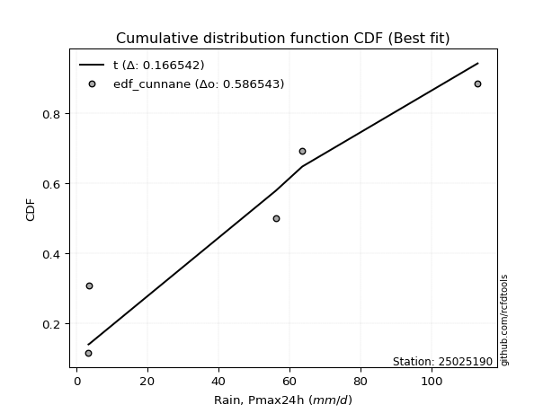</img></img>

</div>


### 12. Empirical - EDF Adamowski (1981)

The Adamowski formula in hydrology refers to a specific plotting position formula used for estimating the non-parametric empirical distribution of hydrological events (like flood peaks) to calculate their return periods. This formula provides an alternative to traditional parametric methods (like the Gumbel or Log Pearson Type III distributions). 

<div align="center">


$P=(m-0.25)/(n+0.5)$


</div>


**12.1. Empirical values**

<div align="center">

|                | 0                   | 1                  | 2                  | 3                  | 4                  | 5                  |
|:---------------|:--------------------|:-------------------|:-------------------|:-------------------|:-------------------|:-------------------|
| date           | 2020                | 2017               | 2025               | 2019               | 2018               | 2024               |
| x              | 3.4                 | 3.6                | 14.6               | 56.2               | 63.6               | 113.0              |
| m              | 1                   | 2                  | 3                  | 4                  | 5                  | 6                  |
| empirical_dist | edf_adamowski       | edf_adamowski      | edf_adamowski      | edf_adamowski      | edf_adamowski      | edf_adamowski      |
| empirical      | 0.11538461538461539 | 0.2692307692307692 | 0.4230769230769231 | 0.5769230769230769 | 0.7307692307692307 | 0.8846153846153846 |
| empirical_tr   | 1.1304347826086958  | 1.3684210526315788 | 1.7333333333333334 | 2.3636363636363633 | 3.7142857142857135 | 8.666666666666664  |

</div>


**12.2. Kolmogorov-Smirnov fit test (sorted by Δ)**


<div align="center">

|                | 0                  | 1                  | 2                   | 3                  | 4                   | 5                   | 6                   | 7                   | 8                  | 9                   | 10                 | 11                  | 12                  | 13                 | 14                 | 15                  | 16                  | 17                  | 18                  | 19                 | 20                 | 21                  | 22                  | 23                  | 24                  | 25                  | 26                 | 27                  | 28                  | 29                  | 30                  | 31                  | 32                  | 33                  | 34                 | 35                  | 36                 | 37                  | 38                    | 39                  | 40                  | 41                  | 42                  | 43                  | 44                 | 45                 | 46                  | 47                  | 48                 | 49                  | 50                 | 51                  | 52                  | 53                 | 54                  | 55                 | 56                 | 57                  | 58                | 59                  | 60                  | 61                 | 62                 | 63                  | 64                  | 65                 | 66                 | 67                 | 68                  | 69                  | 70                 | 71                  | 72                  | 73                 | 74                  | 75                 | 76                 | 77                 | 78                 | 79                 | 80                  | 81                 | 82                 | 83                  | 84                  | 85                  | 86                 | 87                 | 88                | 89                 |
|:---------------|:-------------------|:-------------------|:--------------------|:-------------------|:--------------------|:--------------------|:--------------------|:--------------------|:-------------------|:--------------------|:-------------------|:--------------------|:--------------------|:-------------------|:-------------------|:--------------------|:--------------------|:--------------------|:--------------------|:-------------------|:-------------------|:--------------------|:--------------------|:--------------------|:--------------------|:--------------------|:-------------------|:--------------------|:--------------------|:--------------------|:--------------------|:--------------------|:--------------------|:--------------------|:-------------------|:--------------------|:-------------------|:--------------------|:----------------------|:--------------------|:--------------------|:--------------------|:--------------------|:--------------------|:-------------------|:-------------------|:--------------------|:--------------------|:-------------------|:--------------------|:-------------------|:--------------------|:--------------------|:-------------------|:--------------------|:-------------------|:-------------------|:--------------------|:------------------|:--------------------|:--------------------|:-------------------|:-------------------|:--------------------|:--------------------|:-------------------|:-------------------|:-------------------|:--------------------|:--------------------|:-------------------|:--------------------|:--------------------|:-------------------|:--------------------|:-------------------|:-------------------|:-------------------|:-------------------|:-------------------|:--------------------|:-------------------|:-------------------|:--------------------|:--------------------|:--------------------|:-------------------|:-------------------|:------------------|:-------------------|
| station        | 25025190           | 25025190           | 25025190            | 25025190           | 25025190            | 25025190            | 25025190            | 25025190            | 25025190           | 25025190            | 25025190           | 25025190            | 25025190            | 25025190           | 25025190           | 25025190            | 25025190            | 25025190            | 25025190            | 25025190           | 25025190           | 25025190            | 25025190            | 25025190            | 25025190            | 25025190            | 25025190           | 25025190            | 25025190            | 25025190            | 25025190            | 25025190            | 25025190            | 25025190            | 25025190           | 25025190            | 25025190           | 25025190            | 25025190              | 25025190            | 25025190            | 25025190            | 25025190            | 25025190            | 25025190           | 25025190           | 25025190            | 25025190            | 25025190           | 25025190            | 25025190           | 25025190            | 25025190            | 25025190           | 25025190            | 25025190           | 25025190           | 25025190            | 25025190          | 25025190            | 25025190            | 25025190           | 25025190           | 25025190            | 25025190            | 25025190           | 25025190           | 25025190           | 25025190            | 25025190            | 25025190           | 25025190            | 25025190            | 25025190           | 25025190            | 25025190           | 25025190           | 25025190           | 25025190           | 25025190           | 25025190            | 25025190           | 25025190           | 25025190            | 25025190            | 25025190            | 25025190           | 25025190           | 25025190          | 25025190           |
| empirical_dist | edf_adamowski      | edf_adamowski      | edf_adamowski       | edf_adamowski      | edf_adamowski       | edf_adamowski       | edf_adamowski       | edf_adamowski       | edf_adamowski      | edf_adamowski       | edf_adamowski      | edf_adamowski       | edf_adamowski       | edf_adamowski      | edf_adamowski      | edf_adamowski       | edf_adamowski       | edf_adamowski       | edf_adamowski       | edf_adamowski      | edf_adamowski      | edf_adamowski       | edf_adamowski       | edf_adamowski       | edf_adamowski       | edf_adamowski       | edf_adamowski      | edf_adamowski       | edf_adamowski       | edf_adamowski       | edf_adamowski       | edf_adamowski       | edf_adamowski       | edf_adamowski       | edf_adamowski      | edf_adamowski       | edf_adamowski      | edf_adamowski       | edf_adamowski         | edf_adamowski       | edf_adamowski       | edf_adamowski       | edf_adamowski       | edf_adamowski       | edf_adamowski      | edf_adamowski      | edf_adamowski       | edf_adamowski       | edf_adamowski      | edf_adamowski       | edf_adamowski      | edf_adamowski       | edf_adamowski       | edf_adamowski      | edf_adamowski       | edf_adamowski      | edf_adamowski      | edf_adamowski       | edf_adamowski     | edf_adamowski       | edf_adamowski       | edf_adamowski      | edf_adamowski      | edf_adamowski       | edf_adamowski       | edf_adamowski      | edf_adamowski      | edf_adamowski      | edf_adamowski       | edf_adamowski       | edf_adamowski      | edf_adamowski       | edf_adamowski       | edf_adamowski      | edf_adamowski       | edf_adamowski      | edf_adamowski      | edf_adamowski      | edf_adamowski      | edf_adamowski      | edf_adamowski       | edf_adamowski      | edf_adamowski      | edf_adamowski       | edf_adamowski       | edf_adamowski       | edf_adamowski      | edf_adamowski      | edf_adamowski     | edf_adamowski      |
| p_dist         | logjohnsonsu       | halfnorm           | logloggamma         | halflogistic       | rayleigh            | maxwell             | logweibull_min      | pearson3            | genlogistic        | gumbel_r            | logfisk            | moyal               | kstwobign           | crystalball        | norm               | t                   | loggumbel_l         | logpearson3         | fisk                | loggamma           | loggamma           | logexponnorm        | logt                | lognorm             | lognorm             | logcrystalball      | lognct             | logncf              | logerlang           | mielke              | logrice             | logmaxwell          | loginvgamma         | logalpha            | loginvgauss        | lograyleigh         | logf               | logbetaprime        | loglaplace_asymmetric | loginvweibull       | logistic            | ncf                 | rice                | logkstwobign        | loglogistic        | nct                | hypsecant           | gumbel_l            | weibull_min        | loggumbel_r         | logchi2            | nakagami            | loghypsecant        | loghalfnorm        | logmoyal            | laplace            | logexpon           | loggenexpon         | loglaplace        | logtruncnorm        | loggompertz         | lognakagami        | exponnorm          | gompertz            | laplace_asymmetric  | pareto             | expon              | genexpon           | truncnorm           | wald                | loghalflogistic    | logwald             | logpareto           | logmielke          | loggibrat           | erlang             | invgauss           | loglognorm         | gamma              | alpha              | fatiguelife         | f                  | gibrat             | betaprime           | invweibull          | logfatiguelife      | chi2               | johnsonsu          | invgamma          | loggenlogistic     |
| delta          | 0.1300818519891339 | 0.1307175912132364 | 0.13512988968460896 | 0.1492269439561657 | 0.15285119271461134 | 0.16126412685118452 | 0.16387386996466247 | 0.16702957633948395 | 0.1675523079999342 | 0.17163059581384527 | 0.1720627649363774 | 0.17492217557327044 | 0.17878676882081496 | 0.1815744326857935 | 0.1815744363878422 | 0.18158952597963446 | 0.18389893288586356 | 0.18515148621213162 | 0.18586138546621722 | 0.1901162292919063 | 0.1901162292919063 | 0.19014389898111295 | 0.19014595549899393 | 0.19014617722417926 | 0.19014617722417926 | 0.19014618009802886 | 0.1901621873584769 | 0.19162247658976184 | 0.19164167403441734 | 0.19467193411383565 | 0.19609701328412343 | 0.19748146253207755 | 0.19756836241523779 | 0.19863807942412237 | 0.1990479090871915 | 0.19956311806622795 | 0.2010590148095921 | 0.20159214790687596 | 0.20264170037116436   | 0.20265515858083416 | 0.20421993082911874 | 0.20630241706843788 | 0.20952136810847247 | 0.21034378229829054 | 0.2127034023871045 | 0.2165859309795371 | 0.21886714928707132 | 0.21892621833506806 | 0.2196886912052869 | 0.22530610692007425 | 0.2267085239038935 | 0.22681692237964987 | 0.22702663033531578 | 0.2332077306395945 | 0.23673432854646947 | 0.2376670541787005 | 0.2378376478934944 | 0.24377118985754867 | 0.244802811500493 | 0.24709497564778232 | 0.24994801704307254 | 0.2598564151197865 | 0.2631204784482218 | 0.26401495006549536 | 0.26410328793049526 | 0.2641156893110083 | 0.2641156908979301 | 0.2641156909292241 | 0.26443179241677356 | 0.26923076921748235 | 0.2692307692307692 | 0.27366225522758647 | 0.28796847236002693 | 0.2936116597990963 | 0.30224840839652767 | 0.3091609068390757 | 0.3155764574897417 | 0.3182312549435596 | 0.3286678563053895 | 0.3383773333928216 | 0.35155975852857435 | 0.3689998926119506 | 0.4013724692417522 | 0.41188781602038543 | 0.44596488156402536 | 0.45775138756752226 | 0.4919180977432494 | 0.5357547962600107 | 0.694584213161674 | 0.7307692307692307 |
| deltao         | 0.530385761606     | 0.530385761606     | 0.530385761606      | 0.530385761606     | 0.530385761606      | 0.530385761606      | 0.530385761606      | 0.530385761606      | 0.530385761606     | 0.530385761606      | 0.530385761606     | 0.530385761606      | 0.530385761606      | 0.530385761606     | 0.530385761606     | 0.530385761606      | 0.530385761606      | 0.530385761606      | 0.530385761606      | 0.530385761606     | 0.530385761606     | 0.530385761606      | 0.530385761606      | 0.530385761606      | 0.530385761606      | 0.530385761606      | 0.530385761606     | 0.530385761606      | 0.530385761606      | 0.530385761606      | 0.530385761606      | 0.530385761606      | 0.530385761606      | 0.530385761606      | 0.530385761606     | 0.530385761606      | 0.530385761606     | 0.530385761606      | 0.530385761606        | 0.530385761606      | 0.530385761606      | 0.530385761606      | 0.530385761606      | 0.530385761606      | 0.530385761606     | 0.530385761606     | 0.530385761606      | 0.530385761606      | 0.530385761606     | 0.530385761606      | 0.530385761606     | 0.530385761606      | 0.530385761606      | 0.530385761606     | 0.530385761606      | 0.530385761606     | 0.530385761606     | 0.530385761606      | 0.530385761606    | 0.530385761606      | 0.530385761606      | 0.530385761606     | 0.530385761606     | 0.530385761606      | 0.530385761606      | 0.530385761606     | 0.530385761606     | 0.530385761606     | 0.530385761606      | 0.530385761606      | 0.530385761606     | 0.530385761606      | 0.530385761606      | 0.530385761606     | 0.530385761606      | 0.530385761606     | 0.530385761606     | 0.530385761606     | 0.530385761606     | 0.530385761606     | 0.530385761606      | 0.530385761606     | 0.530385761606     | 0.530385761606      | 0.530385761606      | 0.530385761606      | 0.530385761606     | 0.530385761606     | 0.530385761606    | 0.530385761606     |
| eval           | Δo > Δ             | Δo > Δ             | Δo > Δ              | Δo > Δ             | Δo > Δ              | Δo > Δ              | Δo > Δ              | Δo > Δ              | Δo > Δ             | Δo > Δ              | Δo > Δ             | Δo > Δ              | Δo > Δ              | Δo > Δ             | Δo > Δ             | Δo > Δ              | Δo > Δ              | Δo > Δ              | Δo > Δ              | Δo > Δ             | Δo > Δ             | Δo > Δ              | Δo > Δ              | Δo > Δ              | Δo > Δ              | Δo > Δ              | Δo > Δ             | Δo > Δ              | Δo > Δ              | Δo > Δ              | Δo > Δ              | Δo > Δ              | Δo > Δ              | Δo > Δ              | Δo > Δ             | Δo > Δ              | Δo > Δ             | Δo > Δ              | Δo > Δ                | Δo > Δ              | Δo > Δ              | Δo > Δ              | Δo > Δ              | Δo > Δ              | Δo > Δ             | Δo > Δ             | Δo > Δ              | Δo > Δ              | Δo > Δ             | Δo > Δ              | Δo > Δ             | Δo > Δ              | Δo > Δ              | Δo > Δ             | Δo > Δ              | Δo > Δ             | Δo > Δ             | Δo > Δ              | Δo > Δ            | Δo > Δ              | Δo > Δ              | Δo > Δ             | Δo > Δ             | Δo > Δ              | Δo > Δ              | Δo > Δ             | Δo > Δ             | Δo > Δ             | Δo > Δ              | Δo > Δ              | Δo > Δ             | Δo > Δ              | Δo > Δ              | Δo > Δ             | Δo > Δ              | Δo > Δ             | Δo > Δ             | Δo > Δ             | Δo > Δ             | Δo > Δ             | Δo > Δ              | Δo > Δ             | Δo > Δ             | Δo > Δ              | Δo > Δ              | Δo > Δ              | Δo > Δ             | Δo <= Δ            | Δo <= Δ           | Δo <= Δ            |
| fit            | 1                  | 1                  | 1                   | 1                  | 1                   | 1                   | 1                   | 1                   | 1                  | 1                   | 1                  | 1                   | 1                   | 1                  | 1                  | 1                   | 1                   | 1                   | 1                   | 1                  | 1                  | 1                   | 1                   | 1                   | 1                   | 1                   | 1                  | 1                   | 1                   | 1                   | 1                   | 1                   | 1                   | 1                   | 1                  | 1                   | 1                  | 1                   | 1                     | 1                   | 1                   | 1                   | 1                   | 1                   | 1                  | 1                  | 1                   | 1                   | 1                  | 1                   | 1                  | 1                   | 1                   | 1                  | 1                   | 1                  | 1                  | 1                   | 1                 | 1                   | 1                   | 1                  | 1                  | 1                   | 1                   | 1                  | 1                  | 1                  | 1                   | 1                   | 1                  | 1                   | 1                   | 1                  | 1                   | 1                  | 1                  | 1                  | 1                  | 1                  | 1                   | 1                  | 1                  | 1                   | 1                   | 1                   | 1                  | 0                  | 0                 | 0                  |
| n              | 6                  | 6                  | 6                   | 6                  | 6                   | 6                   | 6                   | 6                   | 6                  | 6                   | 6                  | 6                   | 6                   | 6                  | 6                  | 6                   | 6                   | 6                   | 6                   | 6                  | 6                  | 6                   | 6                   | 6                   | 6                   | 6                   | 6                  | 6                   | 6                   | 6                   | 6                   | 6                   | 6                   | 6                   | 6                  | 6                   | 6                  | 6                   | 6                     | 6                   | 6                   | 6                   | 6                   | 6                   | 6                  | 6                  | 6                   | 6                   | 6                  | 6                   | 6                  | 6                   | 6                   | 6                  | 6                   | 6                  | 6                  | 6                   | 6                 | 6                   | 6                   | 6                  | 6                  | 6                   | 6                   | 6                  | 6                  | 6                  | 6                   | 6                   | 6                  | 6                   | 6                   | 6                  | 6                   | 6                  | 6                  | 6                  | 6                  | 6                  | 6                   | 6                  | 6                  | 6                   | 6                   | 6                   | 6                  | 6                  | 6                 | 6                  |
| best_fit       | 1                  | 0                  | 0                   | 0                  | 0                   | 0                   | 0                   | 0                   | 0                  | 0                   | 0                  | 0                   | 0                   | 0                  | 0                  | 0                   | 0                   | 0                   | 0                   | 0                  | 0                  | 0                   | 0                   | 0                   | 0                   | 0                   | 0                  | 0                   | 0                   | 0                   | 0                   | 0                   | 0                   | 0                   | 0                  | 0                   | 0                  | 0                   | 0                     | 0                   | 0                   | 0                   | 0                   | 0                   | 0                  | 0                  | 0                   | 0                   | 0                  | 0                   | 0                  | 0                   | 0                   | 0                  | 0                   | 0                  | 0                  | 0                   | 0                 | 0                   | 0                   | 0                  | 0                  | 0                   | 0                   | 0                  | 0                  | 0                  | 0                   | 0                   | 0                  | 0                   | 0                   | 0                  | 0                   | 0                  | 0                  | 0                  | 0                  | 0                  | 0                   | 0                  | 0                  | 0                   | 0                   | 0                   | 0                  | 0                  | 0                 | 0                  |
| best_fit_sort  | 1                  | 2                  | 3                   | 4                  | 5                   | 6                   | 7                   | 8                   | 9                  | 10                  | 11                 | 12                  | 13                  | 14                 | 15                 | 16                  | 17                  | 18                  | 19                  | 20                 | 21                 | 22                  | 23                  | 24                  | 25                  | 26                  | 27                 | 28                  | 29                  | 30                  | 31                  | 32                  | 33                  | 34                  | 35                 | 36                  | 37                 | 38                  | 39                    | 40                  | 41                  | 42                  | 43                  | 44                  | 45                 | 46                 | 47                  | 48                  | 49                 | 50                  | 51                 | 52                  | 53                  | 54                 | 55                  | 56                 | 57                 | 58                  | 59                | 60                  | 61                  | 62                 | 63                 | 64                  | 65                  | 66                 | 67                 | 68                 | 69                  | 70                  | 71                 | 72                  | 73                  | 74                 | 75                  | 76                 | 77                 | 78                 | 79                 | 80                 | 81                  | 82                 | 83                 | 84                  | 85                  | 86                  | 87                 | 88                 | 89                | 90                 |

</div>


<div align="center">

</img>

</div>


**12.3. Best fit**

<div align="center">

|   id |   station | empirical_dist   | p_dist       |    delta |   deltao | eval   |   fit |   n |   best_fit |   best_fit_sort |
|-----:|----------:|:-----------------|:-------------|---------:|---------:|:-------|------:|----:|-----------:|----------------:|
|    0 |  25025190 | edf_adamowski    | logjohnsonsu | 0.130082 | 0.530386 | Δo > Δ |     1 |   6 |          1 |               1 |

</div>


<div align="center">

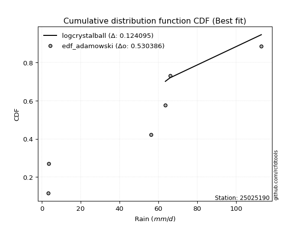</img></img>

</div>


## C. Best fit & Estimate extreme values for specific return periods - Tr


### 1. Best fit (ordered by delta Δ)

<div align="center">

|   id |   station | empirical_dist   | p_dist       |    delta |   deltao | eval   |   fit |   n |   best_fit |   best_fit_sort |
|-----:|----------:|:-----------------|:-------------|---------:|---------:|:-------|------:|----:|-----------:|----------------:|
|    0 |  25025190 | edf_hazen        | logloggamma  | 0.115899 | 0.530386 | Δo > Δ |     1 |   6 |          1 |               1 |
|    1 |  25025190 | edf_gringorten   | logjohnsonsu | 0.119909 | 0.530386 | Δo > Δ |     1 |   6 |          1 |               2 |
|    2 |  25025190 | edf_cunnane      | logjohnsonsu | 0.120963 | 0.530386 | Δo > Δ |     1 |   6 |          1 |               3 |
|    3 |  25025190 | edf_blom         | logjohnsonsu | 0.121608 | 0.530386 | Δo > Δ |     1 |   6 |          1 |               4 |
|    4 |  25025190 | edf_tukey        | logjohnsonsu | 0.124009 | 0.530386 | Δo > Δ |     1 |   6 |          1 |               5 |
|    5 |  25025190 | edf_filliben     | logjohnsonsu | 0.125187 | 0.530386 | Δo > Δ |     1 |   6 |          1 |               6 |
|    6 |  25025190 | edf_beard        | logjohnsonsu | 0.125741 | 0.530386 | Δo > Δ |     1 |   6 |          1 |               7 |
|    7 |  25025190 | edf_jenkinson    | logjohnsonsu | 0.125741 | 0.530386 | Δo > Δ |     1 |   6 |          1 |               8 |
|    8 |  25025190 | edf_chegodayev   | logjohnsonsu | 0.126476 | 0.530386 | Δo > Δ |     1 |   6 |          1 |               9 |
|    9 |  25025190 | edf_adamowski    | logjohnsonsu | 0.130082 | 0.530386 | Δo > Δ |     1 |   6 |          1 |              10 |
|   10 |  25025190 | edf_weibull      | halfnorm     | 0.136212 | 0.530386 | Δo > Δ |     1 |   6 |          1 |              11 |
|   11 |  25025190 | edf_california   | ncf          | 0.161814 | 0.530386 | Δo > Δ |     1 |   6 |          1 |              12 |

</div>

:file_folder:Tables: [bestfit_25025190.csv](table/bestfit_25025190.csv) | [extreme_25025190.csv](table/extreme_25025190.csv)


### 2. Extreme values

In hydrology, a return period (or recurrence interval $Tr$) is the statistical average time between extreme events like floods or droughts of a specific magnitude, indicating how rare an event is, with a 100-year flood, for example, having a 1% chance of occurring in any given year, not that it happens exactly every century. It is a key tool for infrastructure design (like bridges or dams) and risk assessment, calculated from historical data to determine the probability of future events, although it is important to remember it is statistical average, and events can cluster or be missed.

> risk_rate: assuming the return period as the project useful life.

|   id |      tr |   prob_l |     prob_g |      alpha |        betaprime |     chi2 |   crystalball |   erlang |    expon |   exponnorm |            f |   fatiguelife |             fisk |    gamma |   genexpon |   genlogistic |   gibrat |   gompertz |   gumbel_l |   gumbel_r |   halflogistic |   halfnorm |   hypsecant |         invgamma |   invgauss |       invweibull |        johnsonsu |   kstwobign |   laplace |   laplace_asymmetric |   loggamma |   logistic |   lognorm |   maxwell |     mielke |    moyal |   nakagami |      ncf |              nct |     norm |   pareto |   pearson3 |   rayleigh |     rice |        t |   truncnorm |     wald |   weibull_min |   logalpha |   logbetaprime |          logchi2 |   logcrystalball |   logerlang |    logexpon |   logexponnorm |             logf |   logfatiguelife |   logfisk |   loggenexpon |   loggenlogistic |        loggibrat |   loggompertz |   loggumbel_l |   loggumbel_r |   loghalflogistic |   loghalfnorm |   loghypsecant |   loginvgamma |   loginvgauss |   loginvweibull |   logjohnsonsu |   logkstwobign |   loglaplace |   loglaplace_asymmetric |   logloggamma |   loglogistic |     loglognorm |   logmaxwell |   logmielke |   logmoyal |   lognakagami |    logncf |    lognct |      logpareto |   logpearson3 |   lograyleigh |   logrice |      logt |   logtruncnorm |     logwald |   logweibull_min |   station |   n |   risk_rate |
|-----:|--------:|---------:|-----------:|-----------:|-----------------:|---------:|--------------:|---------:|---------:|------------:|-------------:|--------------:|-----------------:|---------:|-----------:|--------------:|---------:|-----------:|-----------:|-----------:|---------------:|-----------:|------------:|-----------------:|-----------:|-----------------:|-----------------:|------------:|----------:|---------------------:|-----------:|-----------:|----------:|----------:|-----------:|---------:|-----------:|---------:|-----------------:|---------:|---------:|-----------:|-----------:|---------:|---------:|------------:|---------:|--------------:|-----------:|---------------:|-----------------:|-----------------:|------------:|------------:|---------------:|-----------------:|-----------------:|----------:|--------------:|-----------------:|-----------------:|--------------:|--------------:|--------------:|------------------:|--------------:|---------------:|--------------:|--------------:|----------------:|---------------:|---------------:|-------------:|------------------------:|--------------:|--------------:|---------------:|-------------:|------------:|-----------:|--------------:|----------:|----------:|---------------:|--------------:|--------------:|----------:|----------:|---------------:|------------:|-----------------:|----------:|----:|------------:|
|    0 |    2    | 0.5      | 0.5        |    8.85254 |      3.43232     |  5.5053  |       42.4    |  15.0316 |  30.4327 |     30.2931 |      3.82538 |       3.4     |     22.1965      |  11.2745 |    30.4327 |       34.8221 |  30.5042 |    29.912  |    48.9107 |    35.8893 |        32.6525 |    34.2876 |     42.4    |      3.4         |    6.32241 |   2976.16        |      3.4         |     36.0904 |   42.4    |              30.4283 |    19.9927 |    42.4    |   20.4049 |   39.0105 |    16.3302 |  33.7874 |    31.8747 |  10.0924 |      4.65692     |  42.4    |  30.4327 |    38.4456 |    37.8084 |  40.725  |  42.4016 |     31.5806 |  29.5534 |       35.7313 |    18.464  |        16.4362 |      8.8378      |          20.4049 |     19.8726 |     11.774  |        20.4051 |     10.7142      |           3.4    |   21.7071 |       14.1948 |          inf     |     13.447       |       16.2925 |       25.6366 |       16.2408 |           14.4989 |       15.3541 |        20.4049 |       18.6612 |       16.9339 |         15.7372 |        34.4631 |        15.2069 |      20.4049 |                 17.4344 |       34.4135 |       20.4049 |   3.40969      |      18.1188 |     8.19559 |    15.0872 |       8.44326 |   20.063  |   20.2906 |    3.84397     |       21.455  |       17.3711 |   18.8188 |   20.4049 |        14.7999 |     13.0063 |          26.3778 |  25025190 |   6 |    0.75     |
|    1 |    2.33 | 0.570815 | 0.429185   |   10.5356  |      3.47324     |  6.17581 |       49.4721 |  18.7311 |  36.3889 |     36.2269 |      4.38503 |       4.18387 |     37.568       |  14.4182 |    36.3889 |       41.1533 |  34.0867 |    35.7532 |    55.0635 |    42.4424 |        39.3902 |    41.9203 |     48.0598 |      3.4         |    7.62134 | 169962           |      3.4         |     42.5825 |   46.6797 |              36.3836 |    25.6848 |    48.631  |   26.1462 |   46.358  |    21.3441 |  39.9908 |    40.9987 |  15.766  |      6.89226     |  49.4721 |  36.3889 |    45.5193 |    45.2645 |  47.3746 |  49.4736 |     37.6258 |  34.1906 |       51.0342 |    23.804  |        21.3787 |     11.7007      |          26.1462 |     25.5205 |     15.4803 |        26.1464 |     14.7804      |           3.5154 |   27.821  |       18.5571 |          inf     |     15.2464      |       21.0875 |       31.8081 |       20.4353 |           18.3618 |       20.0646 |        24.8831 |       24.0378 |       22.0366 |         20.4853 |        42.7707 |        19.8168 |      23.7079 |                 21.6868 |       43.1926 |       25.3865 |   3.51082      |      23.442  |    10.8405  |    18.7523 |      11.0889  |   25.7391 |   26.0225 |    4.35398     |       27.4323 |       22.5604 |   24.2381 |   26.1462 |        19.3147 |     15.3022 |          33.0633 |  25025190 |   6 |    0.729209 |
|    2 |    5    | 0.8      | 0.2        |   23.5865  |      7.48403     |  9.94009 |       75.754  |  39.4897 |  66.1681 |     65.8943 |     15.7413  |      20.8357  |    346.757       |  33.7654 |    66.1681 |       68.6554 |  54.7118 |    64.9569 |    74.9407 |    70.9121 |        69.8766 |    74.1978 |     70.7626 |      3.4         |   22.482   |      7.31714e+12 |      3.55        |     70.1598 |   68.0773 |              66.1585 |    66.0698 |    72.6899 |   65.6979 |   75.2769 |    67.8118 |  68.7253 |    85.5988 |  61.8758 |    566.213       |  75.754  |  66.1681 |    74.0773 |    75.1147 |  73.996  |  75.7551 |     67.0439 |  60.1501 |      169.976  |    63.9924 |        64.2156 |     54.0769      |          65.6979 |     65.5933 |     60.8181 |        65.6986 |     83.6083      |           7.1433 |   72.5264 |       60.7838 |          inf     |     31.4182      |       59.4333 |       63.8512 |       55.4412 |           53.4648 |       62.2097 |        55.1515 |       64.2834 |       64.926  |         64.4083 |        76.1516 |        61.0238 |      50.1965 |                 64.5831 |       77.0691 |       59.0065 |   2.73263e+113 |      64.6083 |    35.4486  |    51.3498 |      40.8516  |   65.4312 |   65.7799 | 5974.99        |       66.5056 |       64.2419 |   64.6666 |   65.698  |        61.1545 |     38.017  |          68.5949 |  25025190 |   6 |    0.67232  |
|    3 |   10    | 0.9      | 0.1        |   47.564   |    158.767       | 13.6925  |       93.1887 |  60.1751 |  93.2008 |     92.8256 |     61.1783  |      43.8275  |   1881.74        |  54.4039 |    93.2008 |       91.0531 |  78.2221 |    91.4657 |    86.0074 |    94.1002 |        95.1943 |    98.0824 |     88.8914 |      3.40009     |   62.2946  |      1.20815e+19 |    176.938       |     91.1563 |   87.5014 |              93.1872 |   125.149  |    90.4083 |  121.059  |   95.6286 |   173.047  |  93.7431 |   121.605  | 113.668  |  56592           |  93.1887 |  93.2008 |    95.0534 |    96.3985 |  92.9776 |  93.1896 |     92.6835 |  87.6992 |      337.838  |   128.596  |       148.855  |    240.52        |         121.059  |    124.248  |    210.61   |       121.06   |    447.77        |          19.0136 |  146.878  |      153.162  |          inf     |     71.6342      |      120.478  |       94.1153 |      124.99   |          129.876  |      143.715  |       104.129  |      128.399  |      146.197  |        163.737  |        97.0993 |       143.682  |      99.1761 |                173.913  |       94.3252 |      109.816  | inf            |     131.869  |    69.7264  |   123.435  |     115.53    |  122.263  |  121.987  |    4.94723e+70 |      116.852  |      135.477  |  126.969  |  121.059  |       146.395  |     99.8626 |         102.98   |  25025190 |   6 |    0.651322 |
|    4 |   15    | 0.933333 | 0.0666667  |   71.456   |   1308.68        | 15.9725  |      101.889  |  72.7412 | 109.014  |    108.579  |    135.034   |      58.8646  |   4744.58        |  67.2694 |   109.014  |      103.689  |  94.4384 |   106.972  |    91.0192 |   107.183  |       109.522  |   110.512  |     99.2374 |      3.40198     |  108.3     |      3.89171e+22 |   5865.46        |    102.303  |   98.8638 |             108.998  |   172.756  |   100.062  |  164.232  |  106.071  |   293.313  | 108.262  |   140.72   | 145.185  | 839525           | 101.889  | 109.014  |   106.144  |   107.365  | 102.758  | 101.89   |    107.256  | 105.39   |      461.967  |   184.64   |       234.366  |    590.916       |         164.232  |    171.544  |    435.546  |       164.234  |   1230.1         |          36.0686 |  215.74   |      250.945  |          inf     |    126.477       |      170.574  |      112.193  |      197.723  |          214.618  |      222.199  |       149.654  |      183.607  |      225.944  |        277.18   |       106.503  |       226.381  |     147.707  |                310.45   |      100.397  |      154.044  | inf            |     190.163  |    92.1631  |   205.349  |     200.314   |  167.34   |  166.142  |  inf           |      153.722  |      198.989  |  178.621  |  164.233  |       231.672  |    185.669  |         123.785  |  25025190 |   6 |    0.644736 |
|    5 |   20    | 0.95     | 0.05       |   95.327   |   5912.65        | 17.6175  |      107.587  |  81.8075 | 120.234  |    119.757  |    236.403   |      69.9978  |   8994.53        |  76.6541 |   120.234  |      112.537  | 107.159  |   117.973  |    94.1389 |   116.343  |       119.56   |   118.799  |    106.536  |      3.41741     |  155.808   |      1.11267e+25 |  58769.8         |    109.812  |  106.926  |             120.216  |   213.643  |   106.735  |  200.542  |  113.001  |   424.32   | 118.545  |   153.532  | 167.775  |      5.68964e+06 | 107.587  | 120.234  |   113.634  |   114.654  | 109.258  | 107.587  |    117.418  | 118.573  |      561.527  |   235.189  |       319.508  |   1127.53        |         200.542  |    212.182  |    729.33   |       200.544  |   2545.18        |          57.9432 |  281.41   |      350.28   |          inf     |    197.55        |      213.5    |      125.159  |      272.596  |          305.139  |      297.106  |       193.291  |      233.143  |      303.907  |        400.711  |       112.211  |       307.496  |     195.948  |                468.325  |      103.492  |      194.64   | inf            |     242.459  |   109.001   |   294.475  |     289.603   |  205.664  |  203.45   |  inf           |      183.502  |      256.924  |  223.657  |  200.542  |       315.075  |    294.746  |         138.807  |  25025190 |   6 |    0.641514 |
|    6 |   25    | 0.96     | 0.04       |  119.19    |  19068.3         | 18.9065  |      111.781  |  88.9113 | 128.936  |    128.427  |    364.773   |      78.8435  |  14673.3         |  84.0552 |   128.936  |      119.351  | 117.763  |   126.506  |    96.3588 |   123.398  |       127.294  |   124.964  |    112.185  |      3.49384     |  202.94    |      8.67567e+26 | 320674           |    115.436  |  113.179  |             128.917  |   249.97   |   111.839  |  232.307  |  118.146  |   563.867  | 126.515  |   163.086  | 185.373  |      2.51015e+07 | 111.781  | 128.936  |   119.265  |   120.069  | 114.088  | 111.781  |    125.202  | 129.132  |      645.281  |   281.792  |       403.981  |   1868.55        |         232.307  |    248.301  |   1087.89   |       232.309  |   4496.27        |          84.4455 |  344.846  |      449.868  |          inf     |    286.502       |      251.372  |      135.289  |      349.094  |          400.174  |      368.795  |       235.619  |      278.627  |      380.237  |        532.263  |       116.176  |       386.777  |     243.975  |                644.237  |      105.368  |      232.781  | inf            |     290.382  |   122.729   |   389.4    |     381.192   |  239.462  |  236.2    |  inf           |      208.787  |      310.64   |  264.071  |  232.308  |       396.335  |    426.787  |         150.594  |  25025190 |   6 |    0.639603 |
|    7 |   50    | 0.98     | 0.02       |  238.465   | 725114           | 22.9691  |      123.791  | 111.3    | 155.969  |    155.358  |   1400.7     |     107.224   |  65471.1         | 107.593  |   155.969  |      140.344  | 155.145  |   153.012  |   102.385  |   145.134  |       151.124  |   142.886  |    129.697  |     20.9782      |  417.274   |      5.84073e+32 |      4.13368e+07 |    131.952  |  132.603  |             155.946  |   393.129  |   127.434  |  353.936  |  133.067  |  1353.4    | 151.258  |   190.9    | 240.242  |      2.5238e+09  | 123.791  | 155.969  |   135.94   |   135.79   | 128.108  | 123.792  |    148.871  | 163.609  |      941.58   |   478.985  |       815.503  |   9135.22        |         353.936  |    390.744  |   3767.32   |       353.939  |  26988.1         |         282.747  |  641.755  |      939.721  |          inf     |   1062.3         |      397.123  |      167.113  |      747.929  |          922.688  |      691.259  |       435.355  |      469.535  |      742.939  |       1276.27   |       126.412  |       758.576  |     482.036  |               1734.84   |      109.162  |      402.151  | inf            |     489.944  |   170.816   |   927.058  |     848.219   |  370.825  |  362.398  |  inf           |      300.39   |      539.019  |  425.93   |  353.937  |       774.339  |   1429.24   |         187.887  |  25025190 |   6 |    0.63583  |
|    8 |   75    | 0.986667 | 0.0133333  |  357.724   |      6.09179e+06 | 25.3789  |      130.236  | 124.579  | 171.782  |    171.112  |   3075.35    |     124.317   | 155318           | 121.671  |   171.782  |      152.546  | 180.392  |   168.516  |   105.432  |   157.767  |       164.976  |   152.642  |    139.932  |    378.672       |  595.551   |      1.42567e+36 |      5.6059e+08  |    141.039  |  143.965  |             171.757  |   502.201  |   136.442  |  443.652  |  141.179  |  2251.03   | 165.727  |   206.044  | 272.389  |      3.74418e+10 | 130.236  | 171.782  |   145.227  |   144.343  | 135.736  | 130.236  |    162.378  | 184.824  |     1140.08   |   641.9    |      1211.56   |  23350.4         |         443.652  |    499.364  |   7790.9    |       443.656  |  78168.1         |         585.421  |  918.678  |     1410.84   |          inf     |   2574.14        |      504.112  |      185.954  |     1164.67   |         1499.52   |      973.135  |       623.251  |      625.761  |     1083.16   |       2121.8    |       131.236  |      1098.88   |     717.915  |               3096.84   |      110.439  |      551.477  | inf            |     651.115  |   204.432   |  1539.57   |    1311.09    |  469.369  |  456.151  |  inf           |      363.83   |      727.475  |  551.177  |  443.653  |      1116.68   |   3006.76   |         210.13   |  25025190 |   6 |    0.634587 |
|    9 |  100    | 0.99     | 0.01       |  476.979   |      2.75787e+07 | 27.1008  |      134.595  | 134.067  | 183.002  |    182.289  |   5372.56    |     136.615   | 285829           | 131.772  |   183.002  |      161.182  | 199.95   |   179.516  |   107.426  |   166.708  |       174.78   |   159.288  |    147.191  |   3296.08        |  746.697   |      3.56121e+38 |      3.26957e+09 |    147.265  |  152.027  |             182.975  |   593.105  |   142.801  |  516.898  |  146.705  |  3226.61   | 175.992  |   216.355  | 295.195  |      2.53752e+11 | 134.595  | 183.002  |   151.644  |   150.169  | 140.932  | 134.595  |    171.818  | 200.292  |     1292.12   |   785.068  |      1595.59   |  45611.9         |         516.898  |    589.944  |  13046      |       516.903  | 167242           |         988.309  | 1183.47   |     1864.51   |          inf     |   5109.75        |      590.697  |      199.413  |     1593.44   |         2114.57   |     1228.45   |       803.883  |      762.166  |     1407.78   |       3040.55   |       134.246  |      1416.54   |     952.388  |               4671.69   |      111.079  |      689.207  | inf            |     790.29   |   231.686   |  2206.43   |    1763.64    |  550.692  |  533.04   |  inf           |      413.588  |      892.339  |  656.45   |  516.9    |      1433.76   |   5171.22   |         226.084  |  25025190 |   6 |    0.633968 |
|   10 |  200    | 0.995    | 0.005      |  953.987   |      1.04893e+09 | 31.2838  |      144.482  | 157.116  | 210.034  |    209.221  |  20600.8     |     166.72    |      1.23458e+06 | 156.427  |   210.034  |      181.944  | 253.16   |   206.019  |   111.758  |   188.204  |       198.351  |   174.488  |    164.681  | 616777           | 1192.81    |      2.06832e+44 |      1.78514e+11 |    161.605  |  171.451  |             210.004  |   866.985  |   158.056  |  731.033  |  159.347  |  7667.08   | 200.725  |   239.909  | 350.096  |      2.55132e+13 | 144.482  | 210.034  |   166.609  |   163.501  | 152.822  | 144.482  |    194.104  | 238.821  |     1696.42   |  1252.31   |      3048.64   | 231349           |         731.033  |    863.084  |  45177.6    |       731.04   |      1.06509e+06 |        3561.11   | 2172.78   |     3547.82   |          inf     |  32999.9         |      838.952  |      232.122  |     3385.42   |         4831.55   |     2093.06   |      1484.12   |     1202.83   |     2607.5    |       7220.83   |       140.358  |      2542.3    |    1881.69   |              12580.2    |      112.044  |     1176.54   | inf            |    1231.01   |   313.123   |  5250.98   |    3472.37    |  792.205  |  759.315  |  inf           |      550.839  |     1424      |  977.009  |  731.035  |      2543.08   |  19961      |         265.064  |  25025190 |   6 |    0.633042 |
|   11 |  250    | 0.996    | 0.004      | 1192.49    |      3.38412e+09 | 32.6393  |      147.503  | 164.585  | 218.737  |    217.891  |  31753.1     |     176.531   |      1.97478e+06 | 164.447  |   218.737  |      188.618  | 272.252  |   214.551  |   113.033  |   195.115  |       205.929  |   179.164  |    170.311  |      3.32454e+06 | 1359.78    |      1.47457e+46 |      6.06105e+11 |    166.042  |  177.704  |             218.705  |   974.252  |   162.954  |  812.716  |  163.238  | 10126.6    | 208.687  |   247.146  | 367.748  |      1.12559e+14 | 147.503  | 218.737  |   171.296  |   167.605  | 156.482  | 147.503  |    201.147  | 251.568  |     1837.95   |  1448.62   |      3739.47   | 391266           |         812.716  |    970.145  |  67388.5    |       812.724  |      1.94324e+06 |        5407.69   | 2640.73   |     4330.74   |          inf     |  64444.2         |      931.638  |      242.73   |     4313.48   |         6301.69   |     2465.9    |      1807.96   |     1386.3    |     3167.3    |       9535.6    |       142.04   |      3046.72   |    2342.89   |              17305.6    |      112.237  |     1396.93   | inf            |    1410.94   |   345.441   |  6941.61   |    4275.93    |  885.613  |  846.131  |  inf           |      600.56   |     1644.35   | 1103.57   |  812.719  |      3034.47   |  31206.4    |         277.765  |  25025190 |   6 |    0.632858 |
|   12 |  500    | 0.998    | 0.002      | 2385       |      1.28711e+11 | 36.873   |      156.463  | 187.913  | 245.77   |    244.822  | 121745       |     207.309   |      8.47573e+06 | 189.569  |   245.77   |      209.335  | 338.233  |   241.052  |   116.687  |   216.564  |       229.449  |   193.106  |    187.799  |      6.22741e+08 | 1943.75    |      8.3205e+51  |      2.27439e+13 |    179.342  |  197.128  |             245.734  |  1379.29   |   178.142  | 1112.65   |  174.851  | 24015.7    | 233.418  |   268.69   | 422.502  |      1.13171e+16 | 156.463  | 245.77   |   185.514  |   179.85   | 167.403  | 156.463  |    222.639  | 292.097  |     2312.71   |  2249.71   |      6975.42   |      2.01565e+06 |        1112.65   |   1374.76   | 233363      |      1112.66   |      1.27743e+07 |       20051.6    | 4835.45   |     7878.41   |          112.732 | 651229           |     1262.72   |      275.905  |     9149.39   |        14372.9    |     4020.19   |      3337.69   |     2127.14   |     5736.35   |      22603      |       146.555  |      5240.79   |    4628.99   |              46601.5    |      112.624  |     2379.16   | inf            |    2119.87   |   472.299   | 16519.7    |    7947.46    | 1233.65   | 1166.87   |  inf           |      773.545  |     2525.94   | 1584.89   | 1112.65   |      5143.04   | 129209      |         317.647  |  25025190 |   6 |    0.632489 |
|   13 |  750    | 0.998667 | 0.00133333 | 3577.5     |      1.08133e+12 | 39.3637  |      161.441  | 201.637  | 261.583  |    260.576  | 267221       |     225.493   |      1.98518e+07 | 204.394  |   261.583  |      221.445  | 381.869  |   256.553  |   118.64   |   229.103  |       243.198  |   200.895  |    198.029  |      1.32947e+10 | 2326.63    |      1.91628e+55 |      1.7038e+14  |    186.813  |  208.491  |             261.545  |  1675.02   |   187.016  | 1324.77   |  181.346  | 39786.1    | 247.885  |   280.704  | 454.471  |      1.67895e+17 | 161.441  | 261.583  |   193.617  |   186.697  | 173.509  | 161.441  |    234.955  | 316.398  |     2614.97   |  2888.86   |      9976.9    |      5.28147e+06 |        1324.77   |   1670.46   | 482600      |      1324.78   |      3.88283e+07 |       43492.8    | 6885.3    |    11032      |          112.861 |      3.00663e+06 |     1488.71   |      295.457  |    14200.4    |        23274.5    |     5282.43   |      4777.44   |     2711.01   |     8069.02   |      37435.5    |       148.781  |      7107.74   |    6894.13   |              83187.7    |      112.753  |     3247.34   | inf            |    2661.92   |   571.029   | 27432.4    |   11230       | 1483.93   | 1395.29   |  inf           |      888.526  |     3211.23   | 1938.71   | 1324.78   |      6909.67   | 302874      |         341.26   |  25025190 |   6 |    0.632366 |
|   14 | 1000    | 0.999    | 0.001      | 4770.01    |      4.89538e+12 | 41.1364  |      164.868  | 211.404  | 272.802  |    271.753  | 466778       |     238.465   |      3.63013e+07 | 214.963  |   272.802  |      230.036  | 415.262  |   267.551  |   119.954  |   237.997  |       252.951  |   206.274  |    205.287  |      1.16649e+11 | 2614.7     |      4.65022e+57 |      6.81629e+14 |    191.989  |  216.552  |             272.763  |  1915.6    |   193.309  | 1493.89   |  185.835  | 56917.1    | 258.15   |   288.992  | 477.127  |      1.13786e+18 | 164.868  | 272.803  |   199.282  |   191.429  | 177.729  | 164.868  |    243.583  | 333.878  |     2840.37   |  3439.71   |     12826.3    |      1.04787e+07 |        1493.89   |   1911.18   | 808122      |      1493.9    |      8.58227e+07 |       75558.8    | 8846.48   |    13932.8    |          112.925 |      9.69333e+06 |     1664.47   |      309.39   |    19396.4    |        32762      |     6378.67   |      6161.7    |     3210.1    |    10254.3    |      53544.3    |       150.204  |      8778.32   |    9145.77   |             125492      |      112.817  |     4048.92   | inf            |    3115.59   |   655.716   | 39313.6    |   14255.1     | 1685.6    | 1578.22   |  inf           |      976.66   |     3790.65   | 2227.59   | 1493.89   |      8474.33   | 558972      |         358.133  |  25025190 |   6 |    0.632305 |

<div align="center">

</img>

</div>


<div align="center">

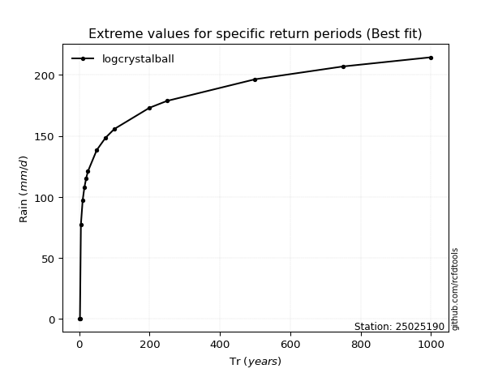</img>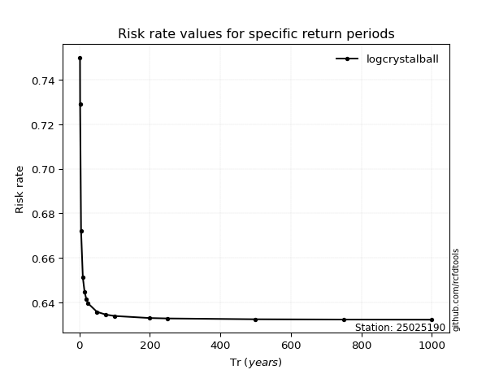</img>

</div>


<sub>**APP DISCLAIMER**: NO WARRANTY - This software is provided by [github.com/rcfdtools](https://github.com/rcfdtools) "as is", without any express or implied warranty, including warranties of merchantability, fitness for a particular purpose, or non-infringement. There is no guarantee that the software will be error-free or operate without interruption. LIMITATION OF LIABILITY - Neither the authors nor copyright holders will be liable for claims or damages arising from the software or its use. You are responsible for determining if the software is appropriate for your use and assume all associated risks, including errors, legal compliance, and data loss. NO PROFESSIONAL ADVICE - The software provides general information and does not offer professional advice. It should not replace consultation with professional advisors.</sub>